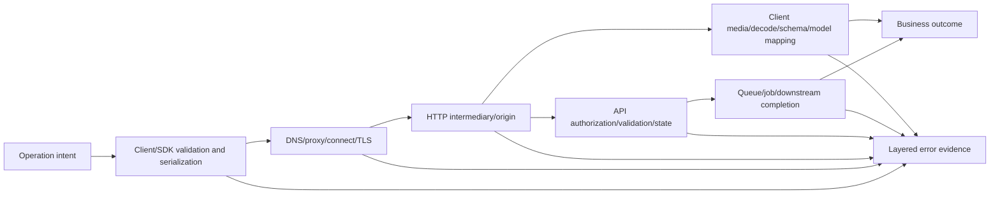
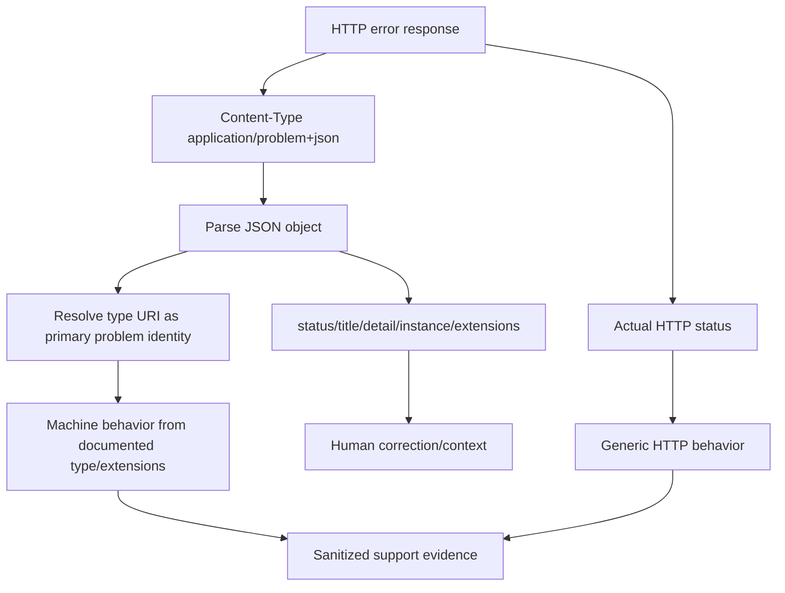
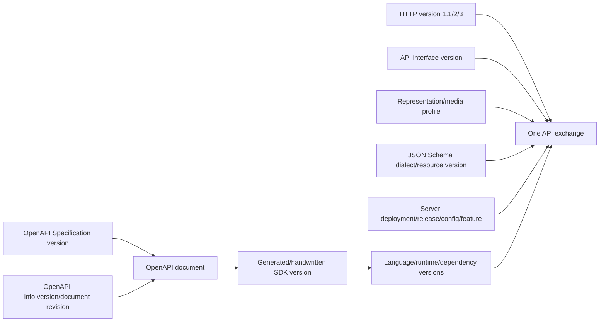
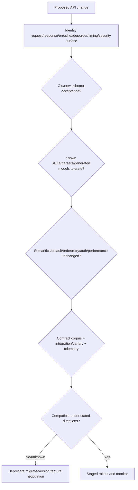
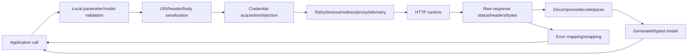
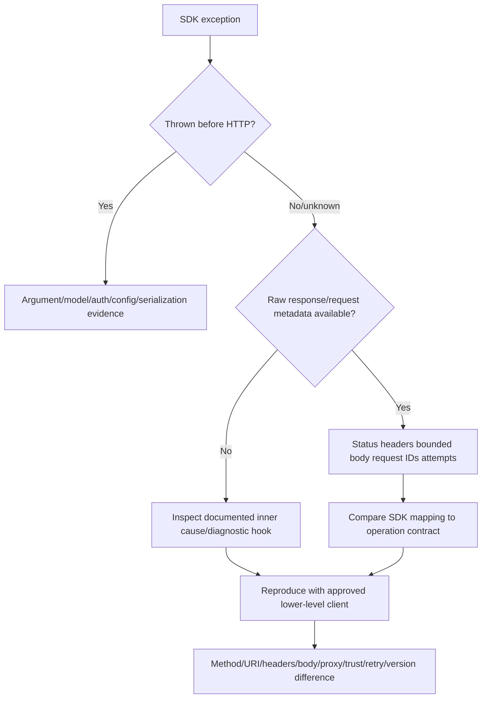
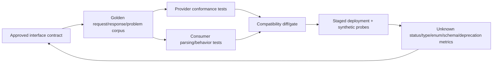
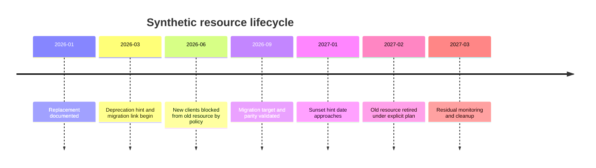
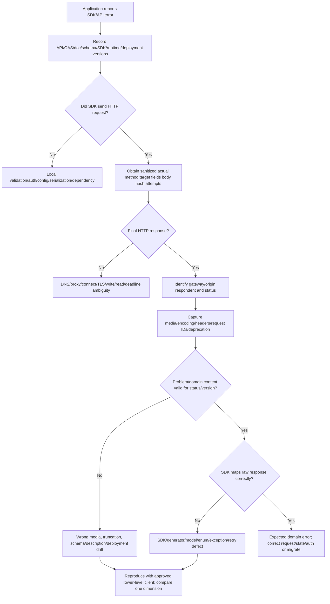

# Part 089 - API Errors Versioning SDKs and Contracts

> **Purpose:** Interpret API failures at the correct layer, preserve machine-readable error evidence, distinguish six independent version dimensions, understand SDK translation and hidden policy, and manage compatible change, deprecation, migration, and contract validation deliberately.
>
> **Artifact label:** **Offline synthetic response and SDK translation lab** using paper HTTP cards, local JSON parsing, and two fictional SDK behavior profiles. No dependency installation, network call, credential, vendor endpoint, generated production client, or destructive request is used.
>
> **Currency and source access date:** August 24, 2026.

## Section goal

By the end of this Part, you should interpret an API error as a layered observation rather than a string. You should preserve transport outcome, respondent, HTTP status and required fields, media/content encoding, raw bounded body, parsed error schema, operation semantics, correlation identifiers, and client/SDK exception chain. You should distinguish client-side failures that never produced HTTP, intermediary responses, origin responses, asynchronous failures after 202, and success responses whose content could not be parsed.

You should understand RFC 9457 Problem Details: `application/problem+json`, stable `type` URI as primary problem-type identifier, advisory `status`, stable/localizable `title`, occurrence-specific human `detail` that clients should not parse for logic, `instance` URI for occurrence identity, and extensible members ignored when unknown. You should validate status/media/schema consistency, locate field errors with documented structured extensions such as JSON Pointer, and avoid leaking stacks, queries, credentials, topology, or private identifiers.

You should separate HTTP protocol version, API interface version, OpenAPI Specification version, OpenAPI document `info.version`, JSON Schema dialect/version, representation/media profile, SDK package version, runtime/language version, and deployment/release version. Changing one does not imply changing the others. You should compare path, query, header, media-type/profile, date/revision, and capability-based API versioning, understanding that none replaces an explicit compatibility and migration policy.

You should treat an SDK as an abstraction layer that constructs requests, selects auth, serializes values, manages retries/timeouts/pagination, parses responses, maps errors to exceptions, and may hide raw evidence. You should inventory defaults and versions, obtain raw response access where supported, unwrap exceptions without exposing secrets, reproduce with a lower-level approved client, and test both SDK behavior and wire contract. Generated code is a build artifact based on a specific description/tool/template/runtime; it is not automatically the live API's truth.

Finally, you should build a lifecycle plan: discover deprecation via documentation, OpenAPI `deprecated`, RFC 9745 `Deprecation`, `deprecation` links, RFC 8594 `Sunset`, changelogs, and provider notices; inventory consumers; run compatibility and contract tests; migrate; observe; canary; reconcile; and remove only under explicit policy. Abnormal-specific errors, versions, SDKs, schedules, and contracts remain unknown until approved current sources and runtime evidence are available.

## JD Mapping

| Supplied role signal | Capability developed | Vendor-neutral support situation | Evidence artifact |
|---|---|---|---|
| API support | Decodes status, headers, body, and problem type | SDK says “bad request” | Layered error card |
| Complex troubleshooting | Separates wire failure from wrapper failure | curl works; SDK fails | Raw-versus-SDK matrix |
| Customer communication | Explains correction and evidence ceiling | Validation error | Sanitized problem summary |
| Engineering collaboration | Supplies contract and version matrix | New field breaks generated client | Compatibility report |
| Tooling | Audits SDK retries/auth/serialization/pagination | Hidden default changed | SDK policy inventory |
| Reliability | Handles deprecation and migration before sunset | Old route retirement | Lifecycle plan |
| Security/privacy | Prevents exception/raw body/instance leakage | Stack or PII in errors | Redaction rubric |
| Change management | Tests producer/consumer compatibility | Minor deployment causes regression | Contract corpus |
| Honest positioning | Separates standards/lab/platform ownership | Interview response | Evidence-tier statement |
| Continuous learning | Checks RFC/OAS/schema/SDK versions | Docs and runtime differ | Source/version ledger |

## Candidate honesty note

You can present error modeling, version analysis, SDK troubleshooting, OpenAPI/JSON Schema contract validation, and deprecation planning as working knowledge demonstrated offline. Your production-transfer strengths remain enterprise support, correlation, escalation, customer communication, and validation. You should not claim to own public API governance, generated-client pipelines, semantic-version policy, or Abnormal SDK/API behavior.

| Evidence tier | Safe claim | Boundary |
|---|---|---|
| Production transfer | “I preserve the original layer/error and compare client contexts before escalation.” | Keep examples truthful |
| Working familiarity | “I understand Problem Details, API versioning, SDK abstraction, and contract testing.” | Not API governance ownership |
| Offline lab | “I mapped synthetic raw responses through two fictional SDK profiles and migration cases.” | No live API or package |
| Learned architecture | “Compatibility needs consumer evidence, not only producer intent.” | Not universal release policy |
| No direct experience | “I have not administered Abnormal API versions or SDKs.” | Say directly |
| Unknown | Error types/extensions, API versions, package names, support windows, deprecation channels | Verify approved current docs |

## 1. An error has layers

An **error** is an observed failure to meet an expectation. It can occur before HTTP, in HTTP routing/authentication/semantics, in API-domain validation, in asynchronous processing, or in the client after a successful response. A single exception message often collapses those layers.



| Layer | Example | Does HTTP status exist? | High-signal evidence |
|---|---|---:|---|
| Client input | Required argument rejected locally | No | SDK/runtime/version, validation rule |
| Serialization | Boolean/date/enum encoded wrong | Maybe request sent | Actual target/fields/body bytes/schema |
| Resolution/connect/TLS | Name failure, reset, certificate mismatch | No final HTTP | Stage, endpoint alias, trust/proxy context |
| Gateway/intermediary | 502/504/HTML block page | Yes, not necessarily origin | Respondent/media/request IDs/Via-like evidence |
| Authentication | 401/407/challenge | Yes | Correct challenge layer/safe token metadata |
| Authorization/policy | 403 or hidden 404 | Yes | Principal/scope/resource/policy IDs |
| Request contract | 400/405/406/415/422 | Yes | Method/media/schema/problem type/field pointers |
| State/concurrency | 409/412/428 | Yes | Current version/ETag/conflict details |
| Rate/availability | 429/500/502/503/504 | Yes or transport drop | Retry guidance/respondent/attempt policy |
| Async job | Initial 202, later failed state | Initial success, later resource/event | Operation ID/state/timeline |
| Response parse/model | HTTP 200 but wrong media/schema/enum | Yes, success may be real | Raw status/headers/body hash + parser exception |

### Response triad

Interpret status, fields, and content together:

1. **Status** gives generic response semantics for HTTP software.
2. **Fields** add challenges, location, retry/deprecation/sunset, media, correlation, caching, and product metadata.
3. **Content** describes representation or problem details under its media type/schema.

Never replace the actual HTTP status with a JSON body's `status` member. Never parse a human message for machine policy when a stable code/type/extension exists.

## 2. Status codes guide; operation contracts decide

| Status/result | General interpretation | Common next question |
|---|---|---|
| 200 | Request succeeded; content meaning depends on method | Does content match documented media/schema? |
| 201 | Resource(s) created | Location? validators? ambiguous parse after commit? |
| 202 | Accepted, not completed | Status monitor/callback and terminal failures? |
| 204 | Successful, no content | Did SDK incorrectly expect JSON? |
| 301/302/303/307/308 | Different target/action semantics | Method/auth forwarding and migration policy? |
| 304 | Conditional retrieval uses stored representation | Did client expect body incorrectly? |
| 400 | Perceived client error | Syntax/framing/routing or product validation? |
| 401 | Lacks valid target credentials; challenge required | Origin or proxy? refresh loop? |
| 403 | Understood but refuses | Scope/tenant/resource/policy? |
| 404 | Not found or existence hidden | Wrong version/path/scope/eventual state? |
| 405 | Method known but not allowed; Allow required | Wrong route/version/SDK operation? |
| 406 | No acceptable response representation | Accept headers/SDK defaults? |
| 409 | Conflict with current resource state | Re-read/merge/domain conflict? |
| 410 | Likely permanently unavailable | Migration/deprecation/sunset? |
| 412/428 | Preconditions failed/required | ETag/current-state workflow? |
| 415 | Unsupported request media/content encoding | SDK content type/body mode? |
| 422 | Media/syntax understood, instructions unprocessable | Structured validation errors? |
| 429 | Too many requests | Rate scope/Retry-After/retry safety? |
| 500 | Unexpected server condition | Correlation and deterministic/transient behavior? |
| 502/504 | Gateway upstream failure/timeout | Which respondent; did origin act? |
| 503 | Temporarily unavailable possible | Retry-After/backpressure/deadline? |

An SDK might throw `ApiException` for every non-2xx, `AuthenticationException` for 401/403, or a parser exception for a 204 it wrongly tried to deserialize. The exception class is client-library behavior, not the HTTP response itself.

## 3. RFC 9457 Problem Details

Problem Details provides a common error-object model to avoid inventing a new generic fault format. JSON uses `application/problem+json`. It complements, not replaces, HTTP status semantics.



Synthetic example:

```http
HTTP/1.1 422 Unprocessable Content
Content-Type: application/problem+json
Content-Language: en
X-Lab-Request-ID: REQ-089-422

{
  "type": "https://problems.example.test/validation",
  "title": "The request does not satisfy the case contract.",
  "status": 422,
  "detail": "Correct the listed fields and submit a new logical request.",
  "instance": "/problems/PRB-089-001",
  "errors": [
    {"pointer": "/score", "code": "out_of_range"},
    {"pointer": "/status", "code": "unknown_value"}
  ]
}
```

All authorities/IDs are synthetic. The `errors` shape is invented, not defined universally by RFC 9457.

| Member | Standard meaning | Client use | Caution |
|---|---|---|---|
| `type` | URI reference identifying problem type; default `about:blank` | Primary machine identity after resolution | Changing URI changes identity; avoid auto-dereference |
| `status` | Advisory JSON number for generated HTTP status | Persisted/offline context | Actual HTTP status governs generic software; disagreement is evidence |
| `title` | Short human summary of type | Display/log safely | Stable except localization; not machine code |
| `detail` | Human explanation for occurrence | Help correction | Do not parse for logic; can leak data |
| `instance` | URI reference identifying occurrence | Correlation when authorized | Opaque/sensitive; dereference only under policy |
| Extension | Problem-specific structured member | Machine behavior if documented | Ignore unknown extensions; validate types |

### 🔍 Plain-English deep-dive: `type` is the error class; `detail` is the sentence

If software checks whether `detail` contains “quota,” localization or wording changes break it. A stable `type` URI and typed extension can remain machine-readable while title/detail become clearer for people. Think of a medical diagnosis code plus a doctor's note: the code supports consistent classification; the note explains this occurrence.

The analogy stops because a problem type URI is a protocol identifier that can be resolvable or not, and extensions must be specified. Clients should not automatically fetch arbitrary type/instance URIs during normal processing.

## 4. Problem consistency and security

| Check | Expected | Why it matters |
|---|---|---|
| HTTP status | Valid final status | Generic behavior |
| Body `status` | Same as generator status if present | Disagreement can reveal intermediary/stale body |
| Content-Type | Correct problem media type | Avoid HTML/generic JSON misparse |
| `type` | String URI reference or default | Stable classification |
| `title`/`detail` | Strings if present | RFC says wrong-typed standard members ignored |
| `instance` | URI reference string if present | Correlation/identity |
| Extensions | Match problem-type contract | No free-form guessing |
| Request ID | Correlates approved server logs | Header names/scopes are product-specific |

Error responses are an attack surface. Avoid stack traces, SQL/query fragments, library versions, internal hosts/paths, account existence, policy rules that aid bypass, credentials/tokens/cookies, customer content, and raw downstream failures. Provide enough correction information without exposing internals. Log sensitive details only in access-controlled server telemetry with retention.

For validation lists, structured field locations such as JSON Pointer can identify input paths. A pointer locates data; it should not echo secret values. Multiple disparate problem types should not be flattened carelessly; RFC 9457 recommends representing the most relevant/urgent problem, while a problem-specific extension can describe multiple occurrences of the same type.

## 5. Error taxonomies and stable machine decisions

An API can combine HTTP status, problem type, product error code, field errors, retry guidance, and request ID. Each has a different scope.

| Signal | Scope | Stable use | Anti-pattern |
|---|---|---|---|
| HTTP status | Generic protocol result | Broad handling/cache/auth/retry class | Treat every 4xx/5xx identically |
| Problem type URI | Semantic problem class | Machine branch/docs | Parse title/detail instead |
| Product code | Provider-specific subcategory | Fine branch under versioned contract | Assume code across products |
| Field pointer/code | Validation occurrence | Highlight/correct input | Echo secret value |
| Retry-After/rate fields | Timing/quota guidance | Bounded retry policy | Parse message “try later” |
| Request/trace ID | Occurrence correlation | Support/server logs | Use as authorization secret |
| Exception type | SDK/client abstraction | Local handling with version | Treat as wire truth |

Clients should have an unknown-error path. Unknown status codes are interpreted by class under HTTP; unknown problem types/extensions should be preserved safely and handled generically. Exhaustive enums that crash on a new error code are brittle.

## 6. Version dimensions that must be separated



| Version dimension | Example | Governs | Does not imply |
|---|---|---|---|
| HTTP protocol | HTTP/2 | Wire framing/connection expression with common semantics | API v2 |
| API interface | `/v2/cases` | Resource/operation contract | OpenAPI 2.0 or HTTP/2 |
| Media/profile | `application/vnd.example.case+json;version=2` | Representation semantics | Route version automatically |
| Schema dialect | Draft 2020-12 URI | Schema keyword behavior | API release number |
| Schema resource | `$id`/revision | Instance constraints | Server deployed it |
| OAS version | `openapi: 3.2.0` | Description-language feature set | API version |
| Description version | `info.version: 2026-08` | Provider-defined document/API-description revision | Package version |
| SDK package | `case-sdk 4.1.0` | Client code/defaults/models | Live API compatibility by itself |
| Runtime | PowerShell/.NET/Python version | TLS, JSON, HTTP, exceptions | Server behavior |
| Deployment | build/region/feature flag | Actual runtime behavior | Public API version changed |

### 🔍 Plain-English deep-dive: “v2” is meaningless until its owner is named

HTTP/2 changes how HTTP messages are framed/multiplexed, while `/v2` commonly names an application interface generation. OpenAPI 3.2 describes the API document format, and SDK 2.4 names a package release. These numbers can coexist without matching.

Think of a book: edition, file format version, printing date, reader-app version, and delivery truck model are separate. The analogy stops because API behavior can also vary by deployment, tenant capability, feature flag, and negotiated media type.

When reporting “version mismatch,” list every relevant version and the source that observed it.

## 7. API versioning strategies

| Strategy | Synthetic form | Benefit | Tradeoff |
|---|---|---|---|
| Path | `/v2/cases` | Visible/routable/cache distinct | URI identity/migration/duplication |
| Query | `/cases?api-version=2` | Explicit and easy to vary | Easy to omit; cache/log/query handling |
| Custom header | `Example-API-Version: 2` | URI stable | Visibility/caching/tool support/CORS |
| Media type parameter/vendor type | Accept/Content-Type version/profile | Representation negotiation | Complexity/tooling/cache Vary correctness |
| Date/revision | `2026-08-24` | Precise contract snapshot | Many versions/consumer understanding |
| Host | `v2.api.example.test` | Routing/isolation | DNS/TLS/origin migration |
| Capability/evolution | Same interface with additive negotiation | Fewer major forks | Strong compatibility/feature discovery needed |

No strategy prevents breaking changes. Version selection must define default when absent, supported values, response indication, errors, auth/scope, caching, links/redirects, pagination tokens, webhook/event versions, and migration. A server-provided next link must remain in the same intended API contract unless documented.

Major-version proliferation increases documentation, security patching, testing, operations, and support cost. Unversioned “evergreen” APIs require disciplined compatibility and deprecation. Choose according to consumer control, domain, risk, and provider policy.

## 8. Compatible versus breaking changes

Compatibility is directional: can old consumers use new producers, can new consumers use old producers, and can requests/responses round-trip? Behavior matters beyond schema shape.



| Change | Producer intent | Consumer risk |
|---|---|---|
| Add optional response property | Additive | Strict/generated models reject |
| Add enum/problem type | Additive category | Exhaustive switches/deserializers fail |
| Make request field optional | Relaxing for server | SDK still requires locally |
| Make response field optional | Flexibility | Old client dereferences/missing invalid |
| Widen numeric range | More values | Overflow/precision |
| Change default sort/page size | Operational | Ordering/completion/business behavior changes |
| Change error status/type | Clarification | Retry/auth/UI branch changes |
| Add auth requirement/scope | Security | Existing clients get 401/403 |
| Tighten rate limit/timeout | Capacity | Jobs miss SLA or amplify retries |
| Change null/missing | Data cleanup | Semantic/type mismatch |
| Add required response header for control | Improvement | SDK may hide it |
| Remove deprecated field/route | Cleanup | Unmigrated consumers fail |

Semantic Versioning can be useful for SDK packages or provider policies but is not an IETF API compatibility law. Define what major/minor/patch means for each artifact. An SDK patch can still encounter a newly changed live server; an API date version can remain stable while server bug fixes change implementation.

## 9. SDK architecture and hidden translation

An SDK can be handwritten or generated. It commonly wraps transport, authentication, serialization, models, pagination, retries, errors, telemetry, and convenience. Each feature can improve usability and create an evidence boundary.



| SDK feature | Helpful behavior | Diagnostic risk |
|---|---|---|
| Base URL/version | Central configuration | Wrong environment/default version hidden |
| Auth provider | Refresh/injection | Token loops/scopes/redaction |
| Typed request model | Validation/autocomplete | Rejects server-supported field locally |
| Serializer | Correct JSON/query | Null/default/enum/date/precision differences |
| Response model | Convenient objects | Unknown fields discarded; raw bytes lost |
| Exception mapping | Domain-specific handling | Status/body/headers/inner cause hidden |
| Pagination helper | Simple iteration | Query drift, unbounded loop, token hidden |
| Retry policy | Transient recovery | Duplicate/amplified hidden attempts |
| Timeout/cancellation | Bounds work | Per-attempt versus overall confusion |
| Telemetry | Correlation | Sensitive headers/body/high cardinality |
| User-Agent/client header | Version evidence | Server special cases/fingerprinting |
| Async abstraction | Nonblocking | Exception/cancellation context changes |

### SDK troubleshooting inventory

Record package name/version/source, generation tool/template/description revision if generated, language/runtime, transitive HTTP/JSON/auth dependencies, base URL/version selection, auth flow/scopes, proxy/trust source, headers/user agent, serialization settings, timeouts, retries, redirects, pagination mode, model strictness, raw response hooks, logging/redaction, and thread/async behavior.

## 10. SDK exceptions and raw evidence



| Exception symptom | Possible underlying fact | Discriminating check |
|---|---|---|
| `ValidationException` immediately | SDK rejected input locally | No request ID/network attempt; compare spec/live support |
| `ApiException 400` | Origin/gateway returned 400 | Raw status/media/problem/request ID |
| `UnauthorizedException` | Could map 401 or 403 | Actual status/challenge and principal scope |
| `JsonException` after call | Success/error body unexpected/truncated | Raw status/media/bytes/body hash |
| Unknown enum exception | Server added value or wrong API version | Raw field value + SDK/spec versions |
| Null reference in SDK | Missing/null response versus SDK bug | Raw response/schema and stack |
| Timeout | Several hidden attempts or one attempt | Attempt diagnostics/deadline/stage |
| Pagination hang | Repeated token/empty page/SDK loop | Raw continuations/page ledger |

Preserve the exception chain/inner cause, but sanitize messages because libraries often include URLs, bodies, headers, tenant IDs, file paths, or tokens. Do not catch and replace every exception with “API failed”; wrap with operation/attempt context while retaining the original cause.

### 🔍 Plain-English deep-dive: The SDK exception is a translation, not the event itself

An SDK can turn HTTP 422 Problem Details into `InvalidRequestException`, or turn a successful 204 into a parser exception because it expected JSON. Think of an interpreter: the translated sentence is useful, but when wording is disputed, inspect the original statement and interpreter version.

The analogy stops because SDKs also create the request, retry it, refresh credentials, follow pagination, and choose models. Compare both directions: application input to wire request and wire response to application result.

## 11. Generated SDKs and description drift

A generated client depends on at least:

$$
SDK = f(OpenAPI\ description,\ generator,\ templates,\ options,\ runtime,\ patches)
$$

Two SDKs generated from the same description can differ by tool/version/language. Regenerating can produce large diffs and behavioral changes. A live API can drift from the description; an SDK can lag the current description; documentation can describe a newer server; a region can lag deployment.

| Drift pair | Symptom | Evidence |
|---|---|---|
| Live server vs OpenAPI | Undocumented status/field | Raw response + deployed/schema revision |
| Docs vs server | Example rejected | Doc access date + request/response |
| SDK vs OpenAPI | Missing method/field | Package/generator/description commit |
| SDK model vs server enum | Deserialization error | Raw enum + SDK model source/version |
| SDK defaults vs docs | Wrong version/header | Actual request |
| Region/tenant rollout | One environment differs | Deployment/capability aliases and UTC |
| Transitive dependency | TLS/JSON behavior differs | Lock file/runtime versions |

Do not edit generated code casually if regeneration will overwrite it. Prefer supported configuration, templates, overlays/patch pipeline, or upstream description correction. If a tactical patch is needed, document and test regeneration/migration.

## 12. Contract sources and precedence

The “contract” can be scattered. Establish ownership and precedence explicitly.

| Source | Strength | Risk |
|---|---|---|
| Standards/RFCs | Generic protocol semantics | Do not invent application behavior |
| Provider API reference | Product operation contract | Version/access-date matters |
| OpenAPI/JSON Schema | Machine-readable structure | Can be incomplete/stale; annotations/undefined behavior |
| SDK docs/source | Client behavior | Package/runtime-specific |
| Changelog/deprecation notice | Lifecycle changes | Delivery channel may be missed |
| Runtime response | What happened for one request | Does not alone define all guarantees |
| Server/gateway telemetry | Internal decision evidence | Access/privacy/retention |
| Tests/fixtures | Expected behavior in environment | Can encode stale assumptions |
| Support runbook | Operational procedure | Must be current/approved |

When documentation, OpenAPI, SDK, and runtime disagree, preserve all revisions and ask the owning team which is authoritative. Do not “fix” the client by accepting insecure or undefined behavior without resolution.

## 13. Contract testing

Contract testing checks observable interactions. It complements unit, integration, end-to-end, and production monitoring.



| Test type | Establishes | Does not establish alone |
|---|---|---|
| Schema validation | Shape/type constraints | Semantic correctness/performance/security |
| Golden examples | Known cases remain stable | Unmodeled inputs |
| Negative corpus | Error/status/problem behavior | Every dependency failure |
| Consumer contract | Actual consumer assumptions | All consumers |
| Provider contract | Server honors declared cases | Deployment parity |
| SDK wire snapshot | Serialization/defaults | Live server acceptance |
| SDK mapping | Raw response maps as expected | Origin behavior |
| Compatibility diff | Surface changes | Behavioral effects automatically |
| Canary/synthetic | Deployed path works for probe | Customer scopes/data |
| Shadow/replay | New parser handles recorded synthetic/sanitized corpus | Side effects unless isolated |

Include success, empty/204, redirect, auth, validation, conflict, throttling, transient, unknown status class, problem extensions, unknown enum, extra/missing/null fields, precision, pagination, deprecation/sunset, and malformed/truncated/wrong-media responses.

## 14. Deprecation, Sunset, and migration

**Deprecation** discourages new dependence and signals migration risk without changing resource behavior by itself. RFC 9745 defines `Deprecation` as a Structured Field Date and the `deprecation` link relation. **Sunset** indicates a resource is likely to become unresponsive at a specified future time; RFC 8594 uses HTTP-date and defines a `sunset` link relation. Sunset is not cache expiry.



| Signal | Meaning | Important boundary |
|---|---|---|
| OpenAPI `deprecated: true` | Consumer should refrain from operation/feature | Design-time description; no date by itself |
| `Deprecation` | Resource will be/was deprecated at date | Hint; resource behavior does not change solely due field |
| `Link rel=deprecation` | Documentation about deprecation | Link alone can exist before deprecation |
| `Sunset` | Resource expected likely unresponsive at time | Hint, not guarantee or cache control |
| `Link rel=sunset` | Retirement policy/information | Verify authenticity/scope |
| 301/308 | Resource moved with redirect semantics | Not a substitute for migration compatibility |
| 410 | Access likely permanently gone | Post-retirement behavior can differ |
| Provider notice/changelog | Product lifecycle communication | Not machine response; inventory recipients |

RFC 9745 requires Sunset not earlier than Deprecation when both are used; inconsistent dates require clarification. The field scopes to the resource unless expanded scope is explicitly documented, and clients unaware of expanded scope will not infer it.

### 🔍 Plain-English deep-dive: Deprecation is a lifecycle warning, not permission to break today

RFC 9745 says deprecation itself does not change resource behavior. It tells consumers that continued dependence is risky and migration work should begin. A provider that changes semantics immediately still made a behavioral/contract change; the `Deprecation` field does not excuse it. Sunset is the separate hint that unresponsiveness is expected later.

Think of a building notice that an entrance will retire next year. The notice starts planning; it does not make today's doorway narrower. The analogy stops because API scope can cover one resource or a documented larger set, and hints can be missing, stale, or inserted by intermediaries.

Consumers should inventory and test replacements early, while still treating current runtime behavior, official migration documentation, and explicit support policy as separate evidence.

### Migration checklist

1. Inventory applications, owners, environments, credentials/scopes, routes, SDKs, jobs, webhooks, dashboards, and data retention.
2. Capture old contract behavior and current production evidence safely.
3. Read replacement contract, errors, limits, auth, pagination, schemas, and lifecycle dates.
4. Build mapping for operations, fields, enums, nulls, time/precision, ordering, and side effects.
5. Upgrade SDK/runtime separately from API migration where possible to isolate variables.
6. Run offline/contract tests; then authorized nonproduction tests.
7. Dual-read/compare or shadow only where privacy, cost, and side-effect safety permit.
8. Canary a small cohort, monitor unknown errors/schema drift/performance/rate usage.
9. Migrate remaining consumers, reconcile data/events, and remove old credentials/config.
10. Confirm no residual traffic before sunset; maintain rollback only within approved window.

## 15. Error and SDK troubleshooting decision tree



## 16. Failure modes and safer alternatives

| Failure/shortcut | Why it fails | Better practice |
|---|---|---|
| Log only exception message | Loses status/body/inner cause/attempts | Layered structured evidence |
| Parse human detail | Localization/wording changes | Stable type/code/extensions |
| Trust body `status` over HTTP | Intermediaries/generic software use HTTP | Record disagreement, preserve both |
| Assume JSON because body starts `{` | Media/processing semantics matter | Check Content-Type and contract |
| Treat 202 as completed | Work can fail later | Poll/callback/status resource |
| Treat parser failure as server rollback | 2xx effect may have committed | Preserve status and reconcile |
| Call every version “v2” | Dimensions conflated | Full version matrix |
| Assume SDK version matches API | Independent artifacts | Compatibility/support matrix |
| Catch and rethrow generic | Destroys causal chain | Wrap while retaining inner cause |
| Enable SDK debug raw logs in production | Secret/PII exposure | Synthetic repro/allowlisted diagnostics |
| Retry hidden SDK exception blindly | Duplicate/amplification | Inspect attempts/policy/idempotency |
| Regenerate and hand-edit output | Changes lost/large drift | Reproducible generator/template/patch process |
| Trust OpenAPI as runtime truth | Description can be stale/incomplete | Contract plus runtime/server evidence |
| Mark optional field additive always | Strict/generated consumers break | Consumer compatibility tests |
| Ignore unknown enum/status/type | Crash or unsafe default | Explicit unknown branch/preserve evidence |
| Confuse Deprecation and Sunset | Migration timing wrong | Separate dates, scope, links, policy |
| Wait until sunset | No test/rollback time | Inventory and migrate during deprecation |
| Claim Abnormal SDK/version details | Unsupported | Verify approved current guidance |

## 17. Escalation package

| Section | Minimum evidence |
|---|---|
| Intent | Operation, expected result, scope/impact, first/last UTC |
| Version matrix | HTTP, API, media, schema, OAS, description, SDK, generator, runtime, deployment aliases |
| Actual request | Sanitized method/target/fields/body schema/hash, auth category, attempts |
| Raw response | Respondent, status, safe headers, media/encoding, bounded body/problem, request IDs |
| SDK mapping | Exception class/message summary/inner chain, model/enum/parser stage, raw hook availability |
| Contract | Current docs/OpenAPI/schema/SDK support sources and access dates |
| Reproduction | Lower-level approved client versus SDK delta |
| Lifecycle | Deprecated/sunset dates/link/changelog/migration target if relevant |
| Privacy | Redacted/retained/exposure assessment |
| Ask | Exact server decision, deployed contract, SDK mapping, or migration clarification needed |

## Safe local lab: The Raw Response and Fictional SDK Translation Matrix 089

### Prerequisites

- Paper/Markdown and optional built-in PowerShell/Python JSON parsing only; no packages or code generators installed.
- Synthetic response cards R089-01 through R089-16 and fictional SDK profiles `SDK-A 1.0` and `SDK-A 1.1` defined during the lab.
- Files if used: `responses-089.json`, `sdk-profiles-089.md`, `contracts-089.md`, `migration-089.md`, and `cleanup-089.md`.
- No network, credential, real package, customer data, vendor endpoint, external schema service, destructive request, or production migration.
- Artifact label: **offline synthetic response/SDK/version contract lab; fictional SDKs; no Abnormal behavior claim**.

### Lab procedure

1. Record start UTC, tool/runtime, scope, artifact label, and no-network/no-package/no-secret statement.
2. Create sixteen response cards: no HTTP DNS failure; TLS validation failure; 200 valid; 200 unknown enum; 201 valid but body malformed; 202 accepted; 204 empty; 301; 401; 403; 404; 409; 422 Problem Details; 429 with Retry-After; 503 Problem Details; 504 gateway.
3. For every card record respondent, actual status/no-status, safe headers, Content-Type/Encoding, bounded body shape/hash, problem type/extensions, request ID, operation outcome certainty, and likely next action.
4. Build the RFC 9457 synthetic 422 object from Section 3. Validate member types manually and identify `type` as primary machine identity, `detail` as human text, `status` as advisory, and `instance` as occurrence identity.
5. Make variants: body status 400 while HTTP 422; wrong `text/html` media; `detail` object instead of string; unknown extension; relative type/instance; missing type. Predict RFC-aware handling/evidence.
6. Build validation extensions with JSON Pointers `/score` and `/status`. Resolve them against a synthetic request and then repeat with values removed/redacted.
7. Create fictional `SDK-A 1.0`: rejects unknown fields, exhaustive enum, maps all non-2xx to `ApiException`, retries 429/503 twice, expects JSON on all 2xx, hides headers unless debug.
8. Create fictional `SDK-A 1.1`: ignores unknown fields, has unknown-enum branch, maps problem type, no write retry without key, accepts 204, exposes safe raw response callback, overall deadline.
9. Pass all sixteen cards through both profiles. Record application result, exception, hidden retries, evidence preserved/lost, and whether business outcome differs from application result.
10. Demonstrate R089-04 unknown enum: raw 200 valid API response, SDK 1.0 deserialization failure, SDK 1.1 unknown branch. Explain why server success and client usability differ.
11. Demonstrate R089-05 201 malformed body: creation can have succeeded despite parser failure. Choose reconciliation rather than blind duplicate create.
12. Demonstrate R089-07 204: SDK 1.0 parser defect versus SDK 1.1 correct no-content handling.
13. Demonstrate R089-14/15 hidden retries. Calculate logical operation attempts and compare idempotent GET versus unkeyed POST policies.
14. Build a wire equivalence matrix between fictional SDK and a paper curl request: method, target, headers, media, body bytes, proxy/trust, timeout, redirect, retries, API version.
15. Create a version card containing HTTP/2, API v3, media profile 2, JSON Schema 2020-12, OAS 3.2.0, info.version 2026-08, SDK 1.1, generator G7, runtime R9, deployment D42. Explain each without matching numbers.
16. Compare path/query/header/media version strategies using the same synthetic operation. List cache/tool/link/migration implications.
17. Classify twelve changes from Section 8 in both directions: old consumer/new server and new consumer/old server. Mark evidence required rather than guessing.
18. Create a tiny golden contract corpus: 200 valid, 204, 422 problem, 429, unknown enum, extra property, missing optional, missing required, null, malformed JSON, wrong media, Deprecation/Sunset headers.
19. Run paper provider tests (response follows contract) and consumer tests (SDK profiles handle it). Record gaps independently.
20. Create OpenAPI fragment cards with OAS version versus info.version and one deprecated operation. Explain design-time signal versus runtime evidence.
21. Parse synthetic lifecycle headers: a valid `Deprecation` Structured Date, a deprecation link, a later valid `Sunset` HTTP-date, and sunset link. Verify Sunset is not earlier.
22. Make an inconsistent lifecycle card with Sunset earlier than Deprecation. Escalate for clarification rather than automatically migrating to an unverified link.
23. Build a migration inventory for three synthetic consumers: owner, SDK/runtime, auth, route/version, volume, criticality, last traffic, test status, migration/rollback/cleanup.
24. Plan a staged migration with contract test, nonproduction test, canary, telemetry, reconciliation, remaining cohort, old credential/config removal, and residual-traffic gate.
25. Write a sanitized escalation package for “SDK 1.0 fails unknown enum but raw response is 200” with exact version/contract evidence and no body content.
26. Deliver a four-minute explanation: Problem Details fields, version dimensions, SDK translation, compatibility direction, and Deprecation versus Sunset.
27. Delete all temporary response/profile/contract/migration/output files or retain only minimized synthetic worksheet. Record end UTC and cleanup statement.

### Expected evidence

- Sixteen layered response cards with outcome certainty and next action.
- RFC 9457 consistency/type/member/extension variants.
- Field-pointer validation summary with no sensitive values.
- Complete SDK-A 1.0 versus 1.1 mapping for every card.
- Unknown-enum, 201 parse, 204, and hidden-retry case explanations.
- Wire equivalence matrix and full independent version card.
- Bidirectional compatibility classification for twelve changes.
- Golden provider/consumer contract corpus results.
- OpenAPI/OAS/info/deprecated distinction.
- Valid and inconsistent Deprecation/Sunset lifecycle cards.
- Three-consumer staged migration inventory/plan.
- Sanitized escalation package and spoken explanation.

### Cleanup and privacy

- Delete temporary response bodies, problem instances, SDK profiles, contract corpora, migration inventories, outputs, screenshots, and command history excerpts unless minimized synthetic notes are intentionally retained.
- Confirm no network call, listener, package/generator installation, external validator, credential, SDK debug session, or production migration occurred.
- Confirm all hosts, request IDs, problem URIs, package/generator/runtime/deployment versions, tenants, objects, and consumers are fictional.
- Confirm no Authorization, token, cookie, API key, password, certificate, customer content, stack trace, internal topology, vendor endpoint, or real lifecycle date was used.
- Confirm no proxy, DNS, firewall, route, certificate store, execution policy, environment, dependency lock, SDK, API version, or production configuration changed.
- Record: `Raw Response and Fictional SDK Translation Matrix 089 completed offline with synthetic errors/versions; no network, package, credential, customer data, destructive request, migration, or Abnormal behavior claim.`

### Validation rubric

| Dimension | Fail | Developing | Pass |
|---|---|---|---|
| Error layers | Exception string only | Status/body | Client/transport/respondent/status/fields/media/problem/async/parser/outcome |
| Problem Details | Parses message text | Uses object | Uses type identity, advisory status, human detail, instance, typed extensions/security |
| Versioning | Calls everything v2 | Lists API/SDK | Separates HTTP/API/media/schema/OAS/doc/SDK/generator/runtime/deployment |
| SDK analysis | Blames server | Records package | Audits request construction, auth, policy, raw mapping, exceptions, retries, pagination |
| Raw evidence | Debug dump | Status/body | Bounded redacted request/response plus IDs/hashes/inner cause and no secrets |
| Compatibility | Producer says additive | Schema diff | Directional consumer/provider behavior, errors, defaults, security, contract tests |
| Generated clients | Regenerates blindly | Records generator | Pins description/tool/templates/options/runtime/patches and tests diff |
| Contract testing | Happy path | Success/error examples | Golden/negative/unknown/lifecycle corpus at provider and consumer boundaries |
| Deprecation | Waits for failure | Reads notice | Distinguishes deprecated behavior, links, dates, Sunset hint/scope and migration |
| Migration | Big-bang switch | Test then switch | Inventory, mapping, canary, telemetry, reconciliation, residual gate, cleanup |
| Privacy | Logs body/stack/token | Masks secrets | Structural minimization, controlled raw hooks, exposure assessment, cleanup |
| Honesty | Claims Abnormal SDK | Says lab | Fictional profiles, working familiarity, production transfer, explicit unknowns |

## Official Source Anchors - August 24, 2026

| Official or primary source | Topic anchored | Boundary |
|---|---|---|
| [RFC 9110 - HTTP Semantics](https://www.rfc-editor.org/rfc/rfc9110.html) | Status, fields, methods, representations, auth, redirects, conditional semantics | Product error meanings still need API contract |
| [RFC 9457 - Problem Details for HTTP APIs](https://www.rfc-editor.org/rfc/rfc9457.html) | Current Problem Details model; obsoletes RFC 7807 | Extensions/problem types are specified separately |
| [IANA HTTP Problem Types Registry](https://www.iana.org/assignments/http-problem-types/http-problem-types.xhtml) | Registered common problem types | Vendor-specific types cannot be inferred |
| [RFC 6901 - JSON Pointer](https://www.rfc-editor.org/rfc/rfc6901.html) | JSON location syntax usable in validation extensions | Extension shape remains problem-specific |
| [RFC 8259 - JSON](https://www.rfc-editor.org/rfc/rfc8259.html) | JSON syntax/types/interoperability | Domain/error schema is separate |
| [OpenAPI Specification 3.2.0](https://spec.openapis.org/oas/latest.html) | Current description version, responses, schemas, deprecated flag, tooling security | OAS version is not API version; description may drift |
| [JSON Schema Draft 2020-12](https://json-schema.org/draft/2020-12) | Schema dialect/current published draft family | Validator support/configuration varies |
| [RFC 9745 - Deprecation HTTP Response Header Field](https://www.rfc-editor.org/rfc/rfc9745.html) | Deprecation Structured Date, link relation, behavior/scope, Sunset relation | Hint; resource behavior not changed solely by field |
| [RFC 8594 - Sunset HTTP Header Field](https://www.rfc-editor.org/rfc/rfc8594.html) | Expected resource unresponsiveness and sunset link relation | Informational hint, not cache expiry/guarantee |
| [RFC 8288 - Web Linking](https://www.rfc-editor.org/rfc/rfc8288.html) | Link field and relation model | Links require authenticity/scope judgment |
| [RFC 9651 - Structured Field Values for HTTP](https://www.rfc-editor.org/rfc/rfc9651.html) | Current Structured Fields syntax used by Deprecation | Field-specific semantics still required |
| [IANA HTTP Status Code Registry](https://www.iana.org/assignments/http-status-codes/http-status-codes.xhtml) | Current status registrations/spec references | SDK mapping/retry behavior remains separate |

### Source-use discipline

- Use RFC 9457, not obsolete RFC 7807, as the current Problem Details source.
- Treat actual HTTP status as the generic response status; record a disagreeing body `status` as evidence.
- Do not parse `title` or `detail` for machine control; use stable documented type/code/extensions.
- Record OAS `openapi` separately from `info.version`, API version, SDK package, and server deployment.
- Treat an OpenAPI document as a description, not proof of deployed runtime behavior.
- Parse RFC 9745 `Deprecation` as a Structured Field Date and RFC 8594 `Sunset` as HTTP-date; they are distinct hints.
- Do not auto-follow migration/problem/instance links without authorization, origin/scope validation, and current documentation.
- Verify SDK defaults and support matrix for the exact package/runtime; do not infer from another language SDK.
- Verify Abnormal error formats, API versions, SDKs, support windows, deprecation/sunset channels, and escalation evidence only through approved current sources.

## Likely Interview Questions

### Q1. How do you investigate an API exception without losing the root cause?

**Model answer:** I identify whether the SDK sent a request, then preserve the exception/inner chain, actual attempts, sanitized method/target/headers/body shape, respondent, HTTP status/headers/media/bounded content, problem type/extensions, request IDs, and business outcome certainty. I record all client/API/runtime versions and reproduce with an approved lower-level client to isolate wrapper differences.

### Q2. What are the key RFC 9457 Problem Details members?

**Model answer:** `type` is the primary problem-type URI identity and defaults to `about:blank`; `status` is advisory and should match generated HTTP status; `title` is a stable human summary; `detail` explains this occurrence and must not be parsed for logic; `instance` identifies the occurrence; documented extensions carry typed problem-specific data and unknown extensions are ignored.

### Q3. Why can an SDK report failure after an HTTP 2xx?

**Model answer:** The server operation can succeed while the client fails to decode media, parse malformed/truncated content, map an unknown enum, handle null/missing, or process a 204. For 201/unsafe operations I do not assume rollback or blind retry. I preserve raw status/headers/body evidence and reconcile authoritative state, then determine whether the defect is server contract drift or SDK mapping.

### Q4. Which versions should you record for an API issue?

**Model answer:** HTTP protocol, API interface/version selection, media/profile, schema dialect/resource revision, OpenAPI Specification and document `info.version`, SDK package and generator/template/description revision, language/runtime/transitive dependencies, and server deployment/region/capability. Matching numbers are not expected; each controls a different layer.

### Q5. Is adding an optional response field always compatible?

**Model answer:** No. Tolerant consumers may ignore it, but strict schemas, generated models, signatures, exhaustive mapping, storage, or field collisions can fail. Compatibility is directional and behavioral. I test known consumer profiles against a golden corpus, inspect errors/defaults/order/security/performance, canary, and use migration/versioning when evidence is incomplete.

### Q6. How do you troubleshoot “curl works but SDK fails”?

**Model answer:** I compare exact method, normalized target/query, headers/auth, body bytes/types, proxy/trust, redirects, cookies, timeouts, retries, API version, and response handling. I inventory SDK/version/runtime and raw hooks. If wire requests match, I focus on response decompression/media/schema/model/enum/exception mapping; if not, I change one differing dimension at a time.

### Q7. What is the difference between Deprecation and Sunset?

**Model answer:** Deprecation signals that dependence is discouraged and migration should begin; under RFC 9745 it does not itself change resource behavior and can include a deprecation date/link. Sunset under RFC 8594 signals likely future unresponsiveness. Both are hints with scope/documentation considerations; Sunset must not precede Deprecation when both are used. I migrate before retirement.

### Q8. How would you position your experience honestly?

**Model answer:** I have working familiarity with layered API errors, RFC 9457, version matrices, SDK request/response translation, generated-client drift, contract tests, and deprecation migration, demonstrated through an offline fictional-SDK lab. My production strength is enterprise support and evidence-led escalation. I would verify Abnormal-specific formats, packages, versions, and lifecycle policy before acting.

## Memory Hooks

- **An exception is a wrapper; find the original layer.**
- **Status, fields, and content form the response triad.**
- **202 accepted is not terminal success.**
- **2xx plus parser failure can still mean committed effect.**
- **Problem `type` is machine identity; `detail` is human help.**
- **Body status is advisory; HTTP status drives generic behavior.**
- **Unknown extensions should not break tolerant clients.**
- **Never expose stacks, queries, secrets, or topology in public errors.**
- **Name the owner of every version number.**
- **HTTP/2, API v2, OAS 3.2, and SDK 2 are independent.**
- **Version location is a mechanism; compatibility is a policy.**
- **SDKs construct, retry, parse, and translate.**
- **Compare app-to-wire and wire-to-app.**
- **Generated code equals description plus tool/template/options/runtime.**
- **Contract descriptions can drift from deployment.**
- **Compatibility is directional and behavioral.**
- **Deprecation says migrate; Sunset says likely unresponsive.**
- **Sunset is not cache expiry.**
- **Migrate with inventory, corpus, canary, telemetry, reconciliation, cleanup.**
- **Abnormal formats and support windows remain unknown until approved verification.**

## Completion Checklist

- [ ] I can classify client, transport, gateway, origin, domain, async, and parse/model errors.
- [ ] I preserve respondent, status, fields, media, body shape, problem, IDs, attempts, and outcome certainty.
- [ ] I interpret status/fields/content together and do not parse human text for policy.
- [ ] I can explain RFC 9457 type, status, title, detail, instance, extensions, and `about:blank`.
- [ ] I validate Problem Details consistency and protect sensitive error information.
- [ ] I maintain an unknown status/problem/enum path.
- [ ] I separate HTTP, API, media, schema, OAS, document, SDK, generator, runtime, and deployment versions.
- [ ] I can compare path/query/header/media/host/date/capability version approaches.
- [ ] I evaluate compatibility directionally for request, response, error, behavior, security, and operations.
- [ ] I can inventory SDK base URL, auth, serialization, retries, deadlines, pagination, models, exceptions, raw hooks, and logging.
- [ ] I preserve SDK inner causes and sanitize exception evidence.
- [ ] I can reproduce SDK behavior with an approved lower-level client and compare one dimension.
- [ ] I understand generated-client inputs and description/runtime drift.
- [ ] I can build provider and consumer contract corpora including negative/unknown/lifecycle cases.
- [ ] I distinguish OpenAPI `deprecated`, RFC 9745 Deprecation, and RFC 8594 Sunset.
- [ ] I can parse/check lifecycle dates/scope and avoid unsafe automatic migration links.
- [ ] I can plan consumer inventory, mapping, tests, canary, telemetry, reconciliation, residual gate, and cleanup.
- [ ] I completed or can reproduce the offline fictional-SDK matrix without package/network access.
- [ ] I verified cleanup and used no credential, customer data, real package/endpoint, or production change.
- [ ] I can answer exactly Q1-Q8 aloud with honest evidence-tier wording.
- [ ] I checked Official Source Anchors dated August 24, 2026.

[Next: Part 090 - API Troubleshooting and Evidence Correlation](Part-090-api-troubleshooting-and-evidence-correlation.md)