# Part 090 - API Troubleshooting and Evidence Correlation

> **Purpose:** Turn scattered client errors, HTTP exchanges, gateway records, application logs, webhook attempts, queue states, and authoritative data into one falsifiable incident timeline that isolates the failing boundary without exposing secrets or overstating what the evidence proves.
>
> **Artifact label:** **Offline synthetic incident-correlation lab** using paper transcripts and optional built-in PowerShell/Python parsing of invented JSON/CSV. It makes no network request, opens no listener, installs no dependency, uses no credential or customer data, and does not model proprietary Abnormal logs or runbooks.
>
> **Currency and source access date:** August 24, 2026.

## Section goal

By the end of this Part, you should troubleshoot an API workflow from the user's intended business outcome to the last authoritative state transition. You should build a canonical operation description, identify every boundary, collect the minimum discriminating evidence at each boundary, normalize clocks and identifiers, distinguish observations from facts/inferences/hypotheses, and design the cheapest safe test that can falsify the leading explanation.

You should correlate a logical operation with multiple client attempts, DNS/proxy/TLS connections, HTTP requests, redirects, gateway and origin request IDs, asynchronous operation IDs, webhook event/delivery/attempt IDs, queue message IDs, retries, idempotency keys, resource versions, and final business state. You should know that these identifiers have different scopes and lifetimes. Matching timestamps alone is weak; matching a causally propagated identifier plus method/route/status and a tight time window is stronger.

You should preserve the difference between “no evidence was collected,” “the source has no matching event,” “the source was unavailable,” and “the event could not have occurred.” You should understand sampling, buffering, clock skew, time zones, retention, aggregation, redaction, cardinality, log loss, retries, caches, and intermediaries. You should use negative evidence only after proving that the source would have recorded the event, that the query covered the correct scope/window, and that retention/ingestion were complete.

You should perform differential diagnosis with controlled comparisons: failing versus working user, tenant, environment, client, runtime, network, API version, method, endpoint, payload, auth scope, data object, and time. You should change one meaningful dimension at a time, avoid destructive production probes, and stop when evidence already isolates the owner. A successful alternate client is a context difference, not automatic proof that the original client is defective.

You should produce an escalation package and root-cause statement that show trigger, mechanism, impact, evidence chain, disconfirmed alternatives, confidence, evidence ceiling, mitigation, validation, and prevention. You should avoid “the network,” “API issue,” “timeout,” or “bad token” as root causes unless the specific failing component and mechanism are established.

This Part remains vendor-neutral. Abnormal endpoint names, log schemas, correlation fields, internal services, dashboards, retention, sampling, severity rules, and escalation paths are unknown until current approved access and documentation are available.

## JD Mapping

| Supplied role signal | Capability developed | Vendor-neutral support situation | Evidence artifact |
|---|---|---|---|
| Complex technical support | Reconstructs cross-layer API failures | User sees generic timeout | Unified timeline |
| Root-cause analysis | Separates trigger, mechanism, and symptom | 504 masks committed origin action | Causal graph |
| Customer communication | States facts, unknowns, and next ask clearly | Conflicting screenshots/logs | Evidence summary |
| Engineering escalation | Delivers reproducible, queryable evidence | Intermittent tenant-specific 422 | Escalation packet |
| Networking knowledge | Places DNS, proxy, TLS, HTTP, gateway evidence correctly | CLI and service differ | Boundary matrix |
| API/tooling knowledge | Compares SDK, Postman, curl, PowerShell, browser | Wrapper hides raw response | Canonical exchange |
| Security/privacy | Minimizes credentials, content, IDs, and topology | Debug logs contain Authorization | Redaction manifest |
| Reliability | Correlates retries, rate limits, idempotency, async state | Duplicate side effect | Attempt/outcome ledger |
| Collaboration | Identifies exact owning team and question | Gateway versus origin ambiguity | Ownership handoff |
| Honest positioning | Labels production transfer, local lab, and unknown platform details | Interview answer | Evidence-tier statement |

## Candidate honesty note

You can present evidence correlation, timeline reconstruction, API differential diagnosis, and escalation design as production-transfer strengths from enterprise support, with API-specific working familiarity reinforced by Parts 083-089 and this offline lab. You should not claim access to Abnormal telemetry, proprietary request IDs, internal service maps, customer event data, or production runbooks.

| Evidence tier | Safe claim | Boundary |
|---|---|---|
| Production transfer | “I build cross-component timelines, test competing hypotheses, and escalate with reproducible evidence.” | Keep historic examples accurate |
| Working familiarity | “I can correlate API/SDK/gateway/webhook/queue evidence and reason about retries and contracts.” | Not ownership of a specific platform |
| Offline lab | “I reconstructed six synthetic incidents from invented records and deliberate gaps.” | No production telemetry |
| Learned architecture | “Trace context and structured logs commonly improve correlation.” | Field names/propagation are not universal |
| No direct experience | “I have not used Abnormal internal observability or escalation systems.” | State directly |
| Unknown | Provider IDs, schemas, sampling, retention, dashboards, service boundaries, approved exports | Verify after authorization |

## 1. Begin with the intended outcome

A technical symptom has meaning only relative to an expectation. “The request failed” is incomplete. Define the user's intended operation and success condition before collecting broad logs.

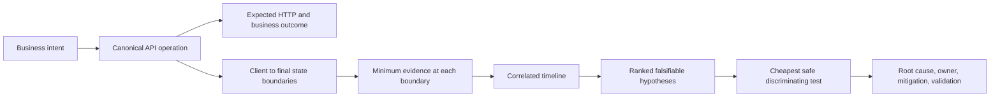

### Canonical operation card

| Field | Synthetic example | Why it matters |
|---|---|---|
| Business intent | Create one case note | Separates operation from transport attempt |
| Actor/scope | Service principal P-A in tenant T-A | Authorization and rate-limit context |
| API contract | Version V3, operation `createNote` | Prevents version/route ambiguity |
| Method/target template | `POST /cases/{caseId}/notes` | HTTP/resource semantics |
| Parameters | Case alias, no query filter | Encoding and identity |
| Headers | Accept, Content-Type, request/trace/idempotency aliases | Negotiation/correlation/repeat safety |
| Body schema | `{text:string, visibility:enum}` | Type/validation without content |
| Client | SDK-A 1.1 on runtime R9 | Wrapper/default evidence |
| Network context | Service host, proxy policy PX-A, trust store TS-A | DNS/proxy/TLS path |
| Timeout/retry | 10 s overall, two safe retries only with key | Attempt timeline |
| Expected HTTP | 201 + Location + problem-free JSON | Interface result |
| Expected business state | Exactly one note with operation alias OP-090-A | Authoritative outcome |
| First failure UTC | `2026-08-25T10:04:12.340Z` synthetic | Time anchor |
| Impact | One integration, 14/20 operations | Scope/severity |

The canonical card must distinguish literal values from aliases. A route template is safer than a full customer URI. Body schema and hashes can be more useful than raw content when the defect concerns type, serialization, or truncation.

## 2. Observation, fact, inference, hypothesis, conclusion

These words should not be used interchangeably.

| Category | Definition | Synthetic example | Testability |
|---|---|---|---|
| Observation | What a source displayed/recorded | SDK displayed `TimeoutException` | Directly reproducible/source-bound |
| Fact | Well-supported proposition with provenance | Gateway log has request ID G7 and 504 at 10:04:22Z | Verify in source |
| Inference | Reasoned implication from facts | Gateway waited about 10 seconds for upstream | Depends on timestamp/field semantics |
| Hypothesis | Proposed mechanism that predicts evidence | Origin committed but response missed gateway deadline | Falsifiable with origin/state evidence |
| Assumption | Unverified premise used temporarily | Gateway and origin clocks differ <100 ms | Must be labeled/tested |
| Unknown | Information not established | Whether cancellation reached worker | Drives next ask |
| Conclusion | Best-supported explanation after alternatives/tests | Worker completed at 10.8 s, beyond gateway 10 s | Includes confidence/ceiling |

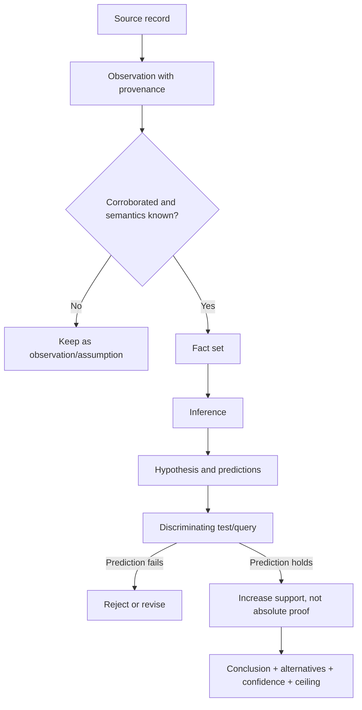

### 🔍 Plain-English deep-dive: A log line is an observation made by software

A log message saying “authentication failed” proves that the emitting component selected that message at that point in its code. It does not automatically prove the credential was invalid at the identity provider. The component could have mapped a timeout, wrong audience, missing header, or parser error to the same text.

Think of a witness saying “the door was locked.” That is valuable, but the mechanism could be the wrong key, a jammed latch, an access policy, or the wrong door. The analogy stops because software records can include exact structured codes and causal identifiers, but those fields still need documented semantics and version context.

Preserve the original code/status/source, then test the mechanism rather than repeating the message as root cause.

## 3. Map the full boundary chain

A typical synchronous-looking API operation can cross many asynchronous boundaries. Draw only boundaries relevant to the operation; do not assume every deployment has every component.

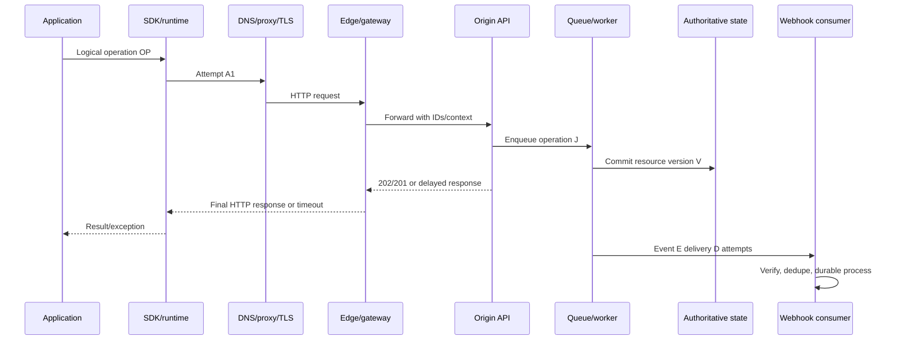

| Boundary | Control question | Evidence that can discriminate |
|---|---|---|
| App to SDK | Did app call expected operation with intended values? | App operation alias, SDK method, argument types |
| SDK to HTTP | What request was actually generated? | Sanitized method/URI/headers/body hash, attempts |
| Client to resolver | Which name/config/context resolved? | Query/result/TTL/source/UTC or documented API |
| Client to proxy | Direct, explicit, auto, bypass, authenticated? | Effective proxy category/CONNECT result |
| TLS | Which endpoint identity/protocol/trust chain? | SNI/host, cert metadata, TLS result; no bypass |
| Edge | Did request arrive and how was it routed? | Edge request ID, route, upstream, status, duration |
| Origin | Did handler authorize/validate/execute? | Origin trace/request ID, operation, problem/decision |
| Queue/worker | Was work accepted, retried, delayed, dead-lettered? | Job/message ID, delivery count, state transitions |
| State store | What durable state/version exists? | Authorized resource/version/idempotency record |
| Webhook | Which event/delivery/attempt reached consumer? | Event/delivery/request aliases and ack |
| Downstream side effect | Did intended external effect occur? | Idempotency/business ID and authoritative receipt |

An absent component in the diagram is an explicit finding only if architecture evidence shows it is absent. For example, “no proxy” should mean the effective client path bypassed all configured/intercepting proxies under tested context, not merely that no `HTTPS_PROXY` variable was set.

## 4. Identifier taxonomy and propagation

An identifier correlates only within its defined scope. A W3C trace ID, product request ID, gateway ID, idempotency key, event ID, and database resource ID are not interchangeable.

| Identifier | Typical creator | Scope/lifetime | Correlation use | Security/privacy concern |
|---|---|---|---|---|
| Logical operation ID | Client/application | One user/business intent | Groups attempts and async outcome | Linkable to user/work |
| Attempt ID | Client/SDK | One HTTP attempt | Retry sequence | High cardinality |
| W3C trace ID | Trace initiator | Distributed trace | Cross-service spans if propagated | Sampling/linkability |
| Span ID | Each trace component | One operation segment | Parent-child timing | Not globally unique alone |
| Gateway request ID | Edge | One edge request | Edge logs/support | Header name/product-specific |
| Origin request ID | Origin | One handler invocation | App logs | May differ after gateway retry |
| Idempotency key | Client under API contract | Logical write within retention/scope | Duplicate attempt outcome | Treat as sensitive/linkable |
| Async operation/job ID | Origin/queue | One accepted job | Terminal state | Authorization required |
| Event ID | Event producer | One event | Event dedupe/version | Customer/domain linkage |
| Delivery ID | Webhook provider | Logical delivery/attempt contract | Provider attempt history | Provider-specific stability |
| Queue message ID | Broker | Message instance | Redelivery/dead-letter | Internal topology |
| Resource ID/version | Domain/state store | Durable object/revision | Authoritative outcome | Customer data |
| Problem instance | Error generator | One problem occurrence | Support correlation | Opaque/sensitive URI |

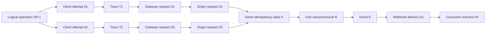

Do not generate a new logical-operation ID for each retry. Do generate a distinct attempt/span/request identity per attempt while preserving the parent operation and same documented idempotency key for the same logical write.

### W3C Trace Context

W3C Trace Context standardizes `traceparent` and `tracestate` formats to allow distributed tracing interoperability. It does not guarantee every component accepts, trusts, records, or forwards them. Treat incoming trace data as untrusted input, enforce limits, avoid sensitive baggage, and do not use trace IDs for authorization.

## 5. Time correlation and clock discipline

Time is evidence only when its clock, zone, precision, and semantics are known.

| Time field | Possible semantic | Common mistake |
|---|---|---|
| Client start | Before SDK call using wall clock | Treat as monotonic elapsed anchor |
| Client elapsed | Monotonic duration | Convert to UTC without wall anchor |
| Gateway receive | Edge clock at request acceptance | Compare directly to unsynchronized origin |
| Origin start/end | Handler/span timestamps | Ignore queueing before handler |
| Queue enqueue/dequeue | Broker/worker clocks | Treat delivery time as event occurrence |
| Database commit | Transaction/CDC time | Assume equal to API response time |
| Event occurrence | Domain producer time | Assume ingestion/creation time |
| Log ingestion | Collector arrival time | Treat as event time |
| Retry schedule | Client monotonic delay | Ignore hidden SDK attempts |

Normalize presentation to UTC while preserving raw timestamp, source, precision, and offset. Use monotonic clocks for durations inside one process. Across hosts, estimate clock offset from NTP/telemetry or causal request relationships. Do not force events into an impossible order solely by wall time if IDs/spans establish causality.

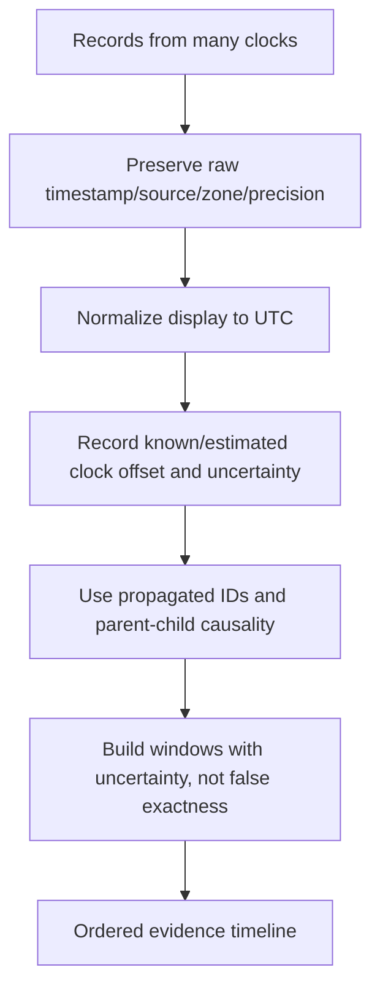

### Time-window construction

If client operation begins at `10:04:12.340Z`, lasts 10.2 seconds, and host offset uncertainty is ±200 ms, search gateway/origin sources with a wider window such as one minute before/after initially, then narrow around matching IDs. Account for log buffering/ingestion and retries. Searching exactly ten seconds risks missing the record without disproving it.

### 🔍 Plain-English deep-dive: Correlation is stronger than timestamp coincidence

Two requests can occur in the same millisecond on a busy system. A matching method, route template, tenant alias, body hash, and propagated request/trace ID forms a stronger chain than “these lines are close in time.” Time narrows candidates; causal identifiers connect them.

Think of matching luggage: arrival time helps find the carousel, but the bag tag is stronger. The analogy stops because identifiers can be regenerated, dropped, duplicated by bad code, or sampled. Corroborate scope and propagation behavior.

## 6. Evidence provenance and quality

For every artifact, record who/what created it, where, when, how it was collected, any transformation, and what it can prove.

| Provenance field | Example |
|---|---|
| Artifact alias | `EDGE-090-A` |
| Source system/component | Synthetic gateway G-A |
| Source version/config | Build D42, route config RC7 |
| Clock/time basis | UTC, millisecond, offset uncertainty 50 ms |
| Collection method | Approved query by request alias |
| Query/filter/window | Route template + request ID + UTC range |
| Completeness | Unsampled error logs, 24 h retention (synthetic claim) |
| Transformations | Exported CSV, IDs pseudonymized, body omitted |
| Custodian/access | Support role under case authorization |
| Integrity | File hash where approved/useful |
| Evidence ceiling | Shows edge receipt/routing, not origin commit |
| Retention/deletion | Delete after case policy date |

### Evidence strength ladder

| Strength | Example | Caveat |
|---|---|---|
| Weak | User recollection “around noon” | Useful starting point |
| Moderate | Screenshot with status/time/client | Can omit redirects/raw details |
| Strong | Structured client attempt with request ID/status | Client may transform response |
| Stronger | Matching gateway and origin records by propagated IDs | Source semantics/clock still matter |
| Very strong | Authoritative state/idempotency record linked to request | Proves durable domain outcome within system |
| Conclusive under boundary | Controlled reproduction plus code/config path and validation | Still scoped to tested build/environment |

Do not dismiss weak evidence; use it to route collection. Do not elevate a single authoritative-looking log above its actual boundary.

## 7. A disciplined troubleshooting workflow

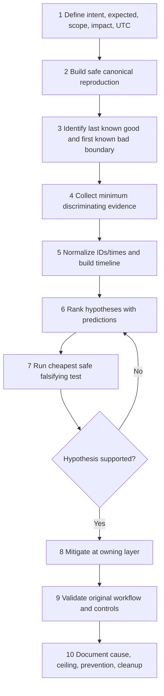

### Phase 1: Define

- Exact expected and actual behavior.
- First known good/bad UTC and frequency.
- User/tenant/client/environment/version scope using aliases.
- Business impact and urgency.
- Recent changes without assuming causality.
- Safety constraints and authorization.

### Phase 2: Reproduce

- Use non-destructive read or synthetic/local operation first.
- Preserve canonical method, target structure, headers, media, body schema, auth scope, timeout/retry.
- Capture actual generated request from failing context where approved.
- Reproduce once; avoid repeated writes or load.
- Stop if evidence already shows security incident or irreversible effect.

### Phase 3: Boundary

Find the **last known good boundary** and **first known bad boundary**. If gateway never saw a request but client TLS failed, origin logs are not the next cheapest source. If origin returned a typed 422, packet capture is unlikely to be the best first action.

### Phase 4-7: Collect, timeline, hypothesize, test

Collect only what distinguishes nearby explanations. A hypothesis table should be explicit:

| Hypothesis | Supporting observation | Prediction if true | Cheap falsifying check | Status |
|---|---|---|---|---|
| SDK uses wrong API version | SDK fails, curl v3 works | SDK actual target/header selects v2 | Inspect sanitized actual request | Open |
| Proxy rewrites body | Signature fails only service path | Ingress raw hash differs before verifier | Compare provider/edge/ingress hashes | Open |
| Origin slow after commit | Gateway 504, object exists | Origin span/commit ends after gateway deadline | Query by request/idempotency alias | Open |
| Token expired | 401 problem type says invalid token | New approved token succeeds, same scope | One coordinated refresh test | Weak until challenge verified |
| Rate limit | 429 near burst | Same bucket shows quota/guidance | Inspect documented fields/scope | Open |

### Phase 8-10: Mitigate, validate, document

Mitigation may reduce impact without fixing cause. Record whether it is containment, workaround, rollback, configuration repair, code fix, data repair, or customer action. Validate the original symptom, adjacent clients/scopes, retries/duplicates, monitoring, and cleanup. Avoid declaring success after one synthetic probe if the issue was intermittent.

## 8. Differential diagnosis

Create a comparison matrix where one controlled dimension differs.

| Dimension | Failing | Working control | Inference limit |
|---|---|---|---|
| User/principal | P-A | P-B | Scope/role/tenant may differ |
| Tenant/account | T-A | T-B | Data/config/rollout differences |
| Client | SDK | curl | Request and runtime contexts differ |
| Runtime/version | R8 | R9 | Dependencies/config may also differ |
| Host | service account host | interactive workstation | Proxy/trust/DNS/identity differ |
| Network | corporate | alternate approved | Routing/security context differs |
| Environment | production | test | Data/config/build/scale differ |
| API version | v2 | v3 | Contract differs intentionally |
| Operation | POST | GET | Method/idempotency/auth/rate differ |
| Payload | one enum/value | known-good synthetic | Data-specific validation |
| Time | failure window | later | Deployment/load/token/cache may change |

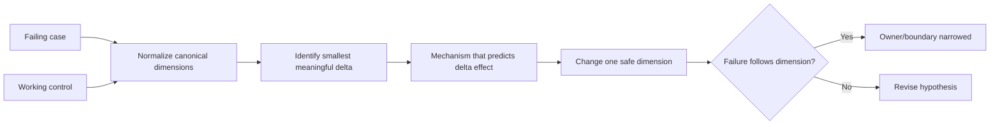

### Control selection

A good control is as similar as possible while differing in one relevant factor. Comparing a customer production service to a developer laptop using Postman changes user, host, network, proxy, trust, credential, client, runtime, request, retry, and data simultaneously. It may show the service is reachable somewhere, but not which difference controls failure.

## 9. Client and SDK evidence

Collect actual behavior, not only configuration intention.

| Client evidence | Questions |
|---|---|
| Logical operation | One operation or several hidden calls? |
| Actual attempts | Count, UTC, durations, cancellation, backoff |
| Method/target | Final resolved target after variables/version/redirect? |
| Headers | Accept, Content-Type, correlation, version; auth redacted structurally |
| Body | Byte length/hash/schema/types; no customer content unless approved |
| Proxy/trust | Effective source for this process/account/runtime |
| DNS | Resolver/context/cache relevant to attempt |
| TLS | Validation outcome/host/protocol/certificate metadata |
| Response | Respondent/status/headers/media/body shape/request IDs |
| SDK mapping | Exception/inner cause/model/parser/raw hook |
| Versions | SDK/runtime/HTTP/JSON/auth dependencies/config |

For PowerShell, record edition/version and cmdlet parameters; for curl, record `curl --version`, exit code separately from HTTP status, and avoid raw verbose credentials; for Postman, record active environment/resolved non-secret variables and sanitize Console/exports; for browser, record DevTools/HAR with strict content/cookie/token minimization.

### Browser versus non-browser

Browsers add CORS, origin, preflight, cookies, service workers, cache, extensions, and UI security. A successful server response can still be blocked from script by CORS. Conversely, curl does not enforce browser CORS. “Works in curl” can isolate a browser-policy/client-context dimension but does not show that the browser should accept it.

## 10. DNS, proxy, TCP/TLS, and HTTP evidence

Use the earlier networking Parts to identify the failing layer. Do not skip from “timeout” to “firewall.”

| Stage | Failure examples | Evidence | Safe discriminating action |
|---|---|---|---|
| URI parse | Wrong host/scheme/port/path | Canonical parsed URI | Structured URI inspection |
| DNS | NXDOMAIN, timeout, wrong split-horizon answer | Resolver/result/TTL/query UTC | Approved resolution from same context |
| Proxy selection | Wrong PAC/bypass/auth | Effective proxy category/CONNECT | Compare same process account |
| Route/connect | Refused/unreachable/timeout | Socket error/address family/duration | Bounded connection test to approved target |
| TLS | Name/trust/expiry/protocol/client-cert | Validation error/cert metadata/SNI | Fix identity/trust; never bypass |
| HTTP routing | 404/405/421/redirect | Status/Location/Host/authority/route ID | Inspect response without auto-follow |
| Auth | 401/407/403 | Challenge layer/scope/problem | Correct principal/scope; no credential dumps |
| Content | 406/415/422/parse | Accept/Content-Type/encoding/schema | Known synthetic payload/type |
| Availability | 429/502/503/504 | Retry guidance/respondent/upstream ID | One bounded safe retry if allowed |

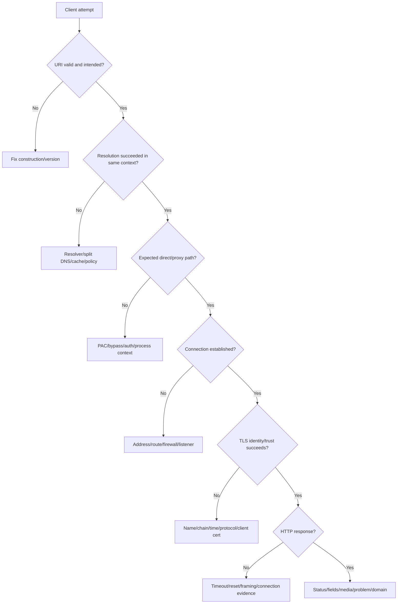

## 11. Gateway and origin correlation

An intermediary can generate a response without the origin seeing the request, or return a gateway status after the origin acted. Identify the respondent.

| Evidence pattern | Plausible boundary | Next ask |
|---|---|---|
| Client 403, edge ID, no origin ID | Edge policy/WAF/auth | Edge rule/decision by ID |
| Client 404 HTML, proxy headers | Proxy/captive/security page | Effective proxy/respondent |
| Edge 502 with upstream connect failure | Edge-to-origin connection | Selected upstream/address/listener |
| Edge 504, origin request starts | Origin/dependency slower than edge deadline | Origin span/commit/cancellation timeline |
| Edge 429, origin absent | Edge rate limiter | Subject/bucket/guidance |
| Origin 422 problem, edge passes 422 | Domain validation | Field/type/contract |
| Origin 201, client parse failure | Client mapping/media | Raw response/SDK parser |
| Origin 201 after edge 504 | Timeout ambiguity/late completion | Idempotency and authoritative state |

### Gateway timing decomposition

If available, distinguish edge queue time, upstream connect, TLS, time-to-first-byte, response read, and total. A single `duration=10s` does not identify which phase. Header names and metrics are product-specific; ask the gateway owner for documented semantics.

### 🔍 Plain-English deep-dive: A 504 names the gateway's observation, not the origin's final state

504 means a server acting as gateway/proxy did not receive a timely upstream response needed to complete its request. The upstream might never have received it, might still be running, might have committed, or might have returned after the gateway deadline. For a write, “504 equals failed” is unsafe.

Think of a receptionist who stops waiting for a back-office answer after ten minutes. The receptionist's timeout is real, but the back office might finish at minute eleven. The analogy stops because cancellation may propagate and idempotency records can reveal one outcome.

Correlate gateway request, origin invocation, commit/idempotency state, and client retry before deciding.

## 12. Asynchronous operation correlation

For 202 or queued work, the initial HTTP exchange and terminal business outcome are separate.

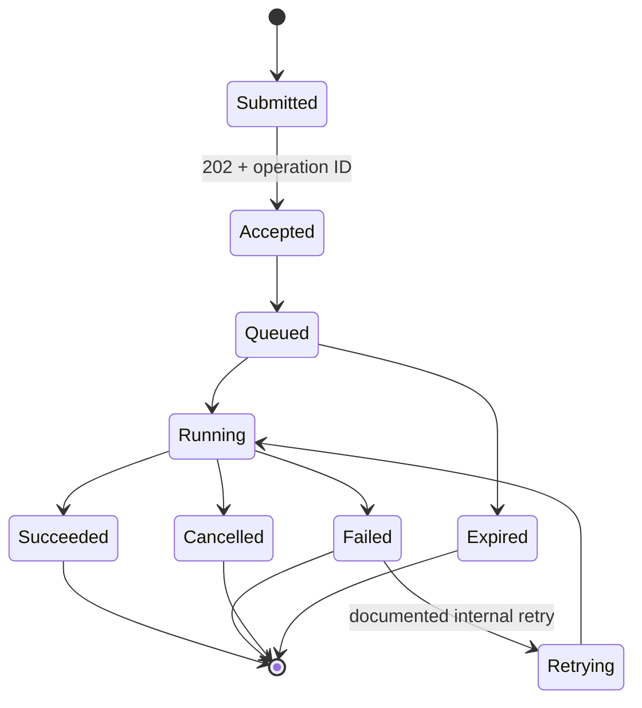

| Correlation field | Source | Question |
|---|---|---|
| Client operation/idempotency alias | Client | Is this one logical intent? |
| 202 request ID | API | Which acceptance exchange? |
| Operation/job ID | API | Which status resource/job? |
| Queue message ID/delivery count | Broker | Retries/redelivery/dead-letter? |
| Worker execution/span | Worker | Which attempt processed? |
| Resource ID/version | State store | What committed? |
| Event ID | Event producer | What notification represents outcome? |
| Webhook delivery/attempt | Provider | Did consumer acknowledge? |
| Consumer processing ID | Consumer | Was side effect applied once? |

Do not declare success from 202. Do not declare failure because a webhook was missed if the source operation succeeded; webhook delivery is a separate integration outcome. Reconcile source state.

## 13. Webhook and replay evidence

For webhook incidents, correlate subscription configuration, provider event, logical delivery and attempts, endpoint edge request, signature/freshness/dedupe decision, durable queue, worker processing, and source state. Use Part 088's raw-body/signature safety rules and never request real secrets in ordinary tickets.

| Symptom | Competing hypotheses | Discriminating evidence |
|---|---|---|
| No webhook | Event not generated, filter excluded, subscription disabled, delivery failed | Source event and subscription history |
| Signature invalid | Wrong secret/env, raw body changed, metadata/base mismatch, clock/key rotation | Safe hashes/lengths/key aliases/stage |
| Duplicates | Provider retry, client redelivery, dedupe race, new delivery ID same event | Event/delivery/attempt and dedupe records |
| Out of order | Parallel delivery/retry/partition | Source per-scope sequence/version |
| 2xx but no processing | Acknowledged before durable enqueue, queue/worker failure | Ingress durability and queue IDs |
| Provider retries 2xx | Wrong accepted status, response lost, wrong endpoint | Provider attempt status/latency and edge response |

## 14. Negative evidence and absence

“No log found” is one of the most abused conclusions in troubleshooting.

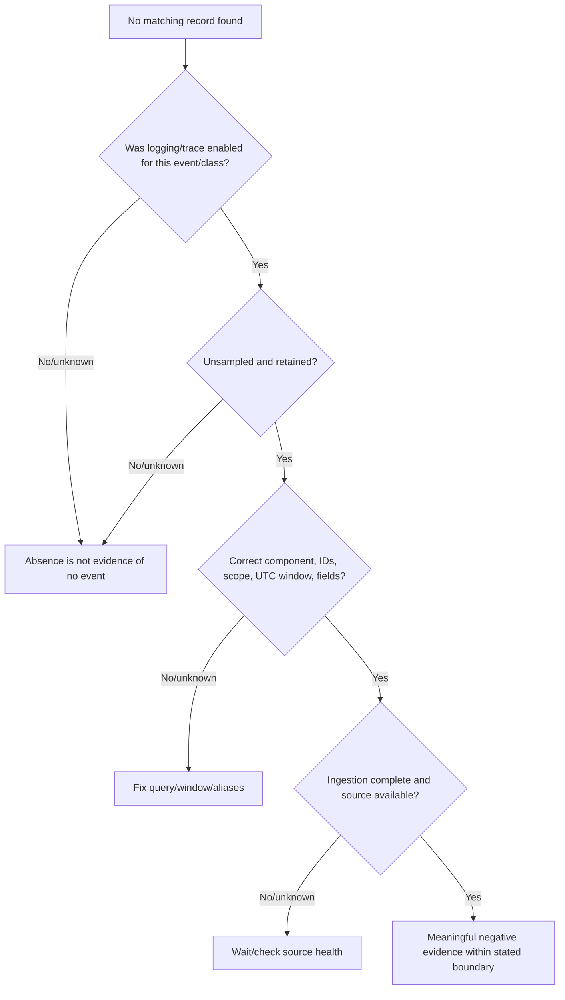

| Absence claim | Required validation |
|---|---|
| “Gateway never saw request” | Correct gateway/route/region, unsampled access logs, ingestion complete, IDs/time/query correct |
| “Origin did not execute” | Correct service/build/instance, trace/log coverage, no async path, retention intact |
| “No webhook generated” | Event source/catalog/filter and provider history checked, not merely consumer logs |
| “No retry occurred” | SDK/gateway/mesh/queue retry layers inventoried |
| “No state changed” | Authoritative resource/version/audit/idempotency record checked under correct tenant |

Meaningful negative evidence should be phrased with boundary: “No matching edge access record was found in the unsampled retained logs for route R, request ID G7, and UTC window W after ingestion completed.” That is stronger and more honest than “the request never left the client,” which may still require client evidence.

### 🔍 Plain-English deep-dive: An empty search result can describe the search, not the system

An empty telemetry query might mean the event did not occur, but it might also mean the wrong region, stale alias, narrow time window, sampled event class, expired retention, delayed ingestion, unavailable source, or a field renamed in a new build. Before using absence to eliminate a hypothesis, prove that the source was capable and obligated to record the event and that the query covered it.

Think of finding no parcel in one warehouse aisle. That becomes evidence only after confirming the parcel would be stored in that aisle, the inventory scan is complete, and the label used in the search is correct. The analogy stops because telemetry systems can sample, aggregate, redact, buffer, and drop records intentionally.

Phrase the result with source and boundary. “No matching record in complete unsampled edge logs” is evidence; “nothing happened” is an unsupported leap.

## 15. Redaction, minimization, and evidence safety

Redaction should preserve discriminating structure while removing unnecessary sensitive values.

| Data type | Prefer | Avoid |
|---|---|---|
| Authorization/cookies/keys | Presence, scheme/type, issuer/audience/scope categories, hashes only if approved | Raw credential/token/cookie |
| URI | Scheme/host alias/route template/query names | Sensitive query values/full internal URL |
| Body | Media, byte length/hash, schema, field names/types, synthetic reproduction | Customer/security/message content |
| IDs | Per-case stable aliases/fingerprints | Raw tenant/user/message/resource IDs |
| Certificate | Subject/SAN/issuer/serial/thumbprint/validity as needed | Private key/exported client cert |
| Logs | Allowlisted fields and tight window | Whole log bundle |
| HAR/trace | Sanitized request/response metadata | Cookies/content/Authorization/source maps unnecessarily |
| Stack | Relevant sanitized frames/version | Paths/usernames/secrets/heap data |
| IP/host | Role/region/address family or pseudonym | Internal topology outside approved channel |

```mermaid
flowchart LR
    Raw[Authorized raw evidence] --> Purpose[Define discriminating purpose]
    Purpose --> Parse[Parse structured format]
    Parse --> Allow[Allowlist necessary fields]
    Allow --> Alias[Alias IDs/hosts consistently]
    Alias --> Remove[Remove secrets/content/topology]
    Remove --> Validate[Reparse and search leak patterns]
    Validate --> Peer[Second-person/policy review for high risk]
    Peer --> Share[Approved channel + retention]
    Share --> Delete[Cleanup at policy end]
```

If a secret appears in an artifact, treat it as exposed according to policy: restrict access, revoke/rotate where required, identify copies/sync/history, and document incident handling. Redacting the visible copy does not undo exposure.

## 16. Query strategy and evidence joins

Use structured query fields where available. Start from the strongest anchor: request/trace/operation/event ID. Then pivot to adjacent IDs and time windows.

| Step | Query aim | Example synthetic output |
|---:|---|---|
| 1 | Find edge by gateway request ID | G7 status 504, upstream O9 |
| 2 | Find origin by propagated ID/trace | O9 started, job J4 |
| 3 | Find queue by job ID | J4 delayed 9.8 s, worker W2 |
| 4 | Find state by idempotency/resource alias | K1 completed resource R5 v1 |
| 5 | Find event by resource/operation | E8 represents R5 v1 |
| 6 | Find delivery by event | D3 attempts 1-2, final 204 |
| 7 | Find consumer by delivery/request ID | dedupe accepted, outcome C6 |

Avoid joining solely on common text such as error message or user email. Normalize only fields whose equivalence is documented. A trace ID from untrusted external input may be duplicated intentionally; pair it with tenant/route/time/respondent.

### Correlation confidence

| Confidence | Example basis |
|---|---|
| Low | Same minute and similar error text |
| Medium | Same route, tenant alias, body hash, and narrow time |
| High | Propagated request/trace ID plus matching operation details |
| Very high | Parent-child trace plus gateway/origin/job/state IDs and causal timestamps |

## 17. Six synthetic case patterns

### Case A: SDK 422 hidden as generic exception

| Evidence | Observation |
|---|---|
| SDK | `ApiException: invalid request` |
| Raw response | 422 `application/problem+json`, type validation, pointer `/status` |
| curl control | Same request shape returns same 422 |
| Root boundary | Request domain validation, not SDK transport |
| Fix | Correct enum/API version; improve SDK problem mapping |

Disconfirmed: DNS, TLS, gateway availability, and SDK-only defect. The SDK's generic message reduced diagnosability but did not cause the invalid request.

### Case B: 504 after committed write

| Timeline | Event |
|---|---|
| 0.000 s | Client sends POST with idempotency alias K1 |
| 0.050 s | Gateway G1 forwards origin O1 |
| 9.800 s | State R1 committed; origin building response |
| 10.000 s | Gateway deadline returns 504 |
| 10.120 s | Origin finishes response too late |
| 10.300 s | Client retries with same K1; server replays result |

Root mechanism: origin completion exceeded gateway upstream deadline after commit. Mitigation might tune work/async design or deadline alignment; safe recovery used same documented key and reconciliation.

### Case C: CLI works, service fails TLS

Working interactive curl uses user trust store and direct proxy bypass; service account runtime uses machine trust and explicit proxy. Same URL is not same context. Evidence isolates service/proxy trust chain, not API availability. Never use `--insecure` or certificate skip.

### Case D: Missing export records

Client uses offset pagination while inserts occur before boundaries. Page ledger shows duplicates; reconciliation count/version identifies omissions. Root mechanism is live moving prefix plus offset semantics, not random server loss. Correct design depends on documented snapshot/cursor/change-feed support.

### Case E: Webhook signature fails only behind middleware

Provider body hash equals edge raw hash, but consumer verifier sees reserialized JSON hash. Middleware parsed and pretty-printed before verification. Root mechanism is raw-byte transformation before HMAC base construction. Fix preserves bounded raw bytes and verifies first.

### Case F: “No origin logs” due sampling

Origin success traces are 1% sampled, errors unsampled. The request returned 201; query expected a success span but found none. Absence cannot prove no execution. Authoritative resource and edge/origin request IDs establish success. Fix evidence practice/trace sampling expectations, not API operation.

## 18. Root-cause statement anatomy

A strong root-cause statement has this structure:

> **Trigger:** Under condition/change X, **mechanism:** component A performed/failed B because C, causing **observable effect:** D at boundary E and **impact:** F. **Evidence:** records G/H/I correlate by IDs/time and test J reproduces/disconfirms alternatives. **Confidence:** level with evidence ceiling. **Mitigation/fix:** K. **Validation:** L. **Prevention:** M.

| Element | Weak | Strong synthetic example |
|---|---|---|
| Trigger | “High load” | Burst exceeded consumer queue concurrency at UTC window W |
| Mechanism | “Timeout” | Gateway 10 s upstream deadline expired while origin worker completed at 10.12 s after state commit |
| Impact | “API down” | 14 of 20 note creates returned 504; all 14 committed once under idempotency keys |
| Evidence | “Logs show it” | G/O/K IDs and commit/version timeline |
| Alternatives | Omitted | DNS/TLS/auth/duplicate commit disconfirmed |
| Confidence | “Confirmed” | High for tested build; cancellation path remains unknown |
| Fix | “Retry” | Move long work async; align deadline; same-key reconciliation |
| Validation | “Works now” | Original cohort and synthetic controls pass; no duplicate resources |

### Contrarian check

Before closing, ask: what evidence would we expect if our conclusion were false? Could the same observations arise from another mechanism? Are we confusing mitigation with cause? Did we test the affected principal/environment/version? Did a working control differ in multiple dimensions? Is the authoritative business state known?

## 19. Escalation package

| Section | Minimum high-signal content |
|---|---|
| Executive summary | Expected/actual, scope, impact, first/last UTC, current status |
| Canonical operation | Method/route/version/schema/auth category/client/network/timeout/retry |
| Version matrix | API/media/schema/OAS/doc/SDK/runtime/deployment |
| Timeline | Normalized UTC plus raw source times/uncertainty, one row per causal event |
| Identifier map | Operation, attempts, trace/spans, edge/origin, job, idempotency, resource, event/delivery aliases |
| Evidence | Source/provenance/query/completeness/ceiling per artifact |
| Hypotheses | Ranked, predictions, tests, status, disconfirmed alternatives |
| Reproduction | Safe minimal steps and expected/actual evidence |
| Outcome certainty | Known success/failure/unknown and authoritative state |
| Security/privacy | Redaction, exposure, approved channel, retention/cleanup |
| Exact ask | One owner-specific question or data needed |
| Validation | What proves fix/mitigation and prevents duplicates/regression |

An escalation should be usable without a live meeting but should not become a dump. Attach raw sensitive evidence only through the approved restricted mechanism and reference it by alias.

## Safe local lab: The Synthetic API Incident Correlation Board 090

### Prerequisites

- Paper, Markdown, spreadsheet, or optional built-in PowerShell/Python for parsing invented JSON/CSV. No package installation.
- Six synthetic case patterns from Section 17 and invented records only.
- Files if used: `events-090.jsonl`, `timeline-090.csv`, `hypotheses-090.md`, `evidence-090.md`, `escalation-090.md`, and `cleanup-090.md` in a temporary local folder.
- Synthetic aliases only: OP/A/T/G/O/J/K/R/E/D/C with 090 suffixes. No UUID from a real product, customer, tenant, user, message, or host.
- No network, listener, external service, credential, public/vendor endpoint, destructive request, packet capture, production log query, or system configuration change.
- Artifact label: **offline synthetic API evidence-correlation lab; invented schemas/IDs/services; no Abnormal telemetry or production claim**.

### Lab procedure

1. Record start UTC, tools/versions, scope, artifact label, and no-network/no-secret statement.
2. Create a canonical operation card for Case B using route templates, aliases, body schema, client/runtime, proxy/trust categories, retry/deadline, expected HTTP, and expected business state.
3. Build a component boundary diagram from application through webhook consumer. Mark each boundary's owner and evidence source.
4. Create `events-090.jsonl` with at least 35 invented records across client, edge, origin, queue, state, event provider, webhook edge, verifier, and worker. Include source timestamp, source clock, operation/attempt/trace/request/job/resource/event/delivery aliases, status/state, and safe duration.
5. Deliberately assign origin clock +120 ms, gateway -40 ms, and webhook provider +500 ms relative to teaching UTC. Preserve raw times and define offsets/uncertainty.
6. Normalize records into `timeline-090.csv`, retaining source/raw time and adjusted UTC. Use causal IDs to order events when times overlap.
7. Build an identifier map showing one operation, two attempts, separate traces, edge/origin IDs, one idempotency alias, one resource, one event, two webhook attempts, and one consumer outcome.
8. Label every timeline row as observation. Promote only corroborated propositions with known field semantics to facts.
9. Write at least four hypotheses for Case B: upstream never reached origin; origin failed before commit; origin committed after gateway deadline; client generated duplicate effect. Add prediction and cheapest falsifying check.
10. Use invented origin/state records to reject the first two and support the late-commit mechanism. Use idempotency/resource evidence to reject duplicate effect.
11. Write a root-cause statement with trigger, mechanism, effect, impact, evidence, alternatives, confidence, evidence ceiling, fix, validation, and prevention.
12. For Case A, map fictional SDK exception to raw 422 problem. Separate SDK diagnosability defect from request validation cause.
13. For Case C, create failing/working comparison matrix for account, host, runtime, proxy, trust, DNS, and request. Identify the smallest untested delta; do not use insecure TLS.
14. For Case D, reconstruct offset pages before/after insertion using Part 086. Record duplicate and missing IDs with a safe reconciliation result.
15. For Case E, create provider/edge/ingress/post-parser byte lengths and SHA-256 aliases. Locate first differing boundary without storing a payload or secret.
16. For Case F, create a sampling/retention/query-completeness card. Explain why no sampled success trace is not meaningful negative evidence.
17. Create three deliberate evidence gaps: one missing due sampling, one unavailable source, one complete negative query. Phrase each distinctly.
18. Build a provenance card for five artifacts: source/version/clock/query/window/completeness/transformation/ceiling/retention.
19. Create a differential matrix with one good control and one bad control that changes five dimensions. Explain why the bad control cannot isolate cause.
20. Model nested retries: client A1/A2 and gateway upstream attempts. Ensure every attempt has a distinct ID and the logical operation/idempotency alias remains stable.
21. Add asynchronous 202 case with operation/job states. Demonstrate that initial 202 and terminal failed are both correct observations at different times.
22. Add webhook delivery with first timeout and second 204. Correlate event/delivery/attempt and dedupe result without equating delivery with source operation.
23. Build a redaction table for a hypothetical raw HTTP transcript. Retain method/route/media/length/hash/status/request ID; remove credentials/query values/body/content IDs.
24. Reparse the synthetic structured artifacts after redaction and search manually for forbidden terms `Authorization`, `Cookie`, `token`, `password`, real host patterns, and raw bodies.
25. Create one concise customer update: impact, current finding, safe next step, no unsupported root cause.
26. Create one Engineering escalation using Section 19's package with an exact ask for gateway/origin deadline and cancellation evidence.
27. Run a contrarian review: propose the strongest alternative explanation and list the evidence that disconfirms it plus remaining unknowns.
28. Define validation for a hypothetical fix: original workflow, working control, affected cohort, no duplicate state, latency/deadline, retry rate, webhook processing, and monitoring.
29. Deliver a five-minute verbal walkthrough using the board without reading raw records.
30. Delete temporary JSONL/CSV/evidence/hypothesis/escalation/output files or retain only minimized synthetic notes. Record end UTC and cleanup statement.

### Expected evidence

- Canonical operation card and boundary/ownership diagram.
- At least 35 synthetic source records and normalized timeline with clock offsets.
- Complete identifier map across operation, attempts, traces, edge/origin, queue, state, event, delivery, consumer.
- Observation/fact/inference/hypothesis labels and four-hypothesis test table.
- Root-cause statement with alternatives, confidence, and evidence ceiling.
- Case A-F correlation summaries, including sampling and raw-byte transformation distinctions.
- Five artifact provenance cards and three kinds of evidence absence.
- Good versus bad differential-control analysis.
- Nested retry and asynchronous operation timelines.
- Redaction manifest and leak-search result.
- Customer update, Engineering escalation with exact ask, contrarian check, and fix-validation plan.
- Spoken walkthrough with honest Abnormal boundary.

### Cleanup and privacy

- Delete temporary event, timeline, hypothesis, evidence, escalation, response, hash, screenshot, and command-history files unless minimized synthetic notes are intentionally retained.
- Confirm no network request, listener, packet capture, production log query, external upload, package installation, or destructive operation occurred.
- Confirm all IDs, times, routes, hosts, versions, states, hashes, tenants, users, resources, events, and services are invented.
- Confirm no Authorization, API key, token, cookie, password, certificate/private key, customer content, internal topology, source IP, vendor endpoint, or real problem instance appears.
- Confirm no proxy, DNS, firewall, route, trust store, certificate validation, execution policy, environment, clock, SDK, queue, or production configuration changed.
- Record: `Synthetic API Incident Correlation Board 090 completed offline with invented records; no network, credential, customer data, production telemetry, dependency installation, destructive request, or Abnormal behavior claim.`

### Validation rubric

| Dimension | Fail | Developing | Pass |
|---|---|---|---|
| Problem definition | “API failed” | Expected/actual | Business intent, canonical operation, scope, impact, first/last UTC, outcome certainty |
| Evidence reasoning | Log message equals cause | Facts listed | Observation/fact/inference/hypothesis/unknown/conclusion and falsifying tests |
| Boundary map | Client/server only | Several layers | Last-good/first-bad across client, network, edge, origin, async/state/webhook |
| Identifiers | One request ID | IDs collected | Scope/lifetime map and causal propagation across attempts/outcomes |
| Time | Local screenshots | UTC conversion | Raw/source/zone/precision/offset/uncertainty plus monotonic durations |
| Provenance | Attachment dump | Source labels | Version/query/window/completeness/transformation/ceiling/retention |
| Differential tests | Random retries | Working control | Near-identical control, one changed dimension, prediction and result |
| Negative evidence | “No logs = no request” | Checks window | Enables/sampling/retention/query/ingestion/source health validated |
| Async/retries | One HTTP equals outcome | Attempts listed | Logical operation, attempts, idempotency, job/state/event/delivery separated |
| Privacy | Raw HAR/log bundle | Values masked | Structured allowlist/aliases/reparse/leak search/channel/cleanup/exposure plan |
| Root cause | Symptom restated | Mechanism described | Trigger/mechanism/impact/evidence/alternatives/confidence/ceiling/fix/validation/prevention |
| Honesty | Claims proprietary access | Says synthetic | Production transfer, API familiarity, offline lab, explicit Abnormal unknowns |

## Official Source Anchors - August 24, 2026

| Official or primary source | Topic anchored | Boundary |
|---|---|---|
| [RFC 9110 - HTTP Semantics](https://www.rfc-editor.org/rfc/rfc9110.html) | Methods, statuses, fields, intermediaries, response semantics, privacy | Product logs/IDs/operations remain specific |
| [RFC 9457 - Problem Details for HTTP APIs](https://www.rfc-editor.org/rfc/rfc9457.html) | Structured machine-readable HTTP problem evidence | Not a server debug dump or universal extension schema |
| [W3C Trace Context Recommendation](https://www.w3.org/TR/trace-context/) | `traceparent`/`tracestate` interoperability and processing | Propagation/recording/sampling not guaranteed |
| [W3C Baggage Recommendation](https://www.w3.org/TR/baggage/) | Correlation baggage model | Baggage can leak sensitive/high-cardinality data; avoid by default |
| [OpenTelemetry Specification](https://opentelemetry.io/docs/specs/otel/) | Vendor-neutral telemetry concepts/signals/context | Implementations/backends/configuration vary |
| [OpenTelemetry Semantic Conventions](https://opentelemetry.io/docs/specs/semconv/) | Common semantic attribute guidance | Stability/version and product extensions matter |
| [RFC 3339](https://www.rfc-editor.org/rfc/rfc3339.html) | Internet date/time timestamp profile | Source clock/precision/semantics still needed |
| [RFC 5905 - NTPv4](https://www.rfc-editor.org/rfc/rfc5905.html) | Network time synchronization concepts | Does not make distributed timestamps perfectly ordered |
| [RFC 9333 - RateLimit Fields for HTTP](https://www.rfc-editor.org/rfc/rfc9333.html) | Rate-limit evidence fields | Legacy/vendor fields and buckets differ |
| [RFC 8288 - Web Linking](https://www.rfc-editor.org/rfc/rfc8288.html) | Links in response evidence | Link trust/scope/action must be validated |
| [OpenAPI Specification 3.2.0](https://spec.openapis.org/oas/latest.html) | Operation/response/schema description and version context | Runtime evidence can differ |
| [JSON Schema Draft 2020-12](https://json-schema.org/draft/2020-12) | Response/request validation evidence | Semantic/business outcome needs more evidence |
| [Microsoft Learn - Azure Monitor log queries](https://learn.microsoft.com/en-us/azure/azure-monitor/logs/log-query-overview) | Official example of structured telemetry query workflow | Product-specific query language/schema; not universal |

### Source-use discipline

- Use standards to interpret generic protocol/trace/schema semantics; use current provider documentation for field names and platform behavior.
- Never assume a request ID or trace header is globally unique, trusted, propagated, sampled, or retained without evidence.
- Preserve raw/source timestamps and uncertainty; normalized UTC is a view, not a rewrite of provenance.
- Treat absence as meaningful only after validating logging enablement, sampling, retention, query scope, ingestion, and source health.
- Avoid high-cardinality or sensitive data in trace baggage, labels, URLs, logs, and screenshots.
- Correlation proves association more strongly as independent IDs, causality, route, tenant, body fingerprint, and time agree; it does not automatically prove mechanism.
- Validate a fix against authoritative business state and duplicates, not only HTTP success.
- Verify Abnormal log schemas, IDs, retention, sampling, internal services, dashboards, export/redaction policy, and escalation paths only through approved current guidance.

## Likely Interview Questions

### Q1. How do you start troubleshooting a vague “API failed” report?

**Model answer:** I define the business intent, canonical method/route/version/auth/body schema, expected HTTP and authoritative business outcome, first/last UTC, frequency, scope, and impact. Then I identify the last known good and first known bad boundary and collect the smallest evidence that distinguishes nearby hypotheses, rather than requesting every log.

### Q2. How do you distinguish an observation from a root cause?

**Model answer:** An observation is what a source recorded, such as an SDK timeout. I preserve provenance and source semantics, correlate facts, propose a mechanism with predicted evidence, and run a cheap falsifying test. The root-cause statement names trigger and component mechanism, shows impact/evidence/disconfirmed alternatives, and states confidence and evidence ceiling; it does not repeat “timeout.”

### Q3. How do you correlate retries across services?

**Model answer:** I keep one logical operation ID and same documented idempotency key for one write intent, but distinct attempt, trace/span, gateway, and origin IDs per attempt. I map any job/resource/event/delivery IDs to the operation, normalize time with clock uncertainty, and join on propagated identifiers plus route/scope rather than timestamps alone.

### Q4. When is “no matching log” meaningful evidence?

**Model answer:** Only after I confirm the correct component/region/route, logging was enabled for that event class, the source is unsampled or sampling is understood, retention covers the window, ingestion completed, the query used correct IDs/scope/UTC/fields, and the source was healthy. Then I phrase the negative result within that exact boundary.

### Q5. What does a 504 prove for a state-changing request?

**Model answer:** It proves the gateway did not receive a timely upstream response needed to complete the request. It does not prove the origin did not commit. I correlate gateway and origin IDs, cancellation, commit/resource/idempotency state, and client retries; I label outcome unknown until authoritative evidence resolves it and avoid blind unkeyed retries.

### Q6. How do you use a working control effectively?

**Model answer:** I choose a control as similar as possible to the failing case and document every differing dimension: principal, tenant, client/runtime, host/network/proxy/trust, API version, operation, payload, and time. I form a hypothesis about one meaningful delta, change it safely, and see whether the failure follows. “Works in Postman” alone changes too many variables.

### Q7. What belongs in an Engineering escalation?

**Model answer:** A concise impact summary, canonical operation and versions, normalized timeline with raw-time uncertainty, identifier map, evidence provenance/completeness/ceiling, safe reproduction, ranked hypotheses and disconfirmed alternatives, outcome certainty, privacy handling, and one exact owner-specific ask. Raw sensitive artifacts go only through the approved restricted channel.

### Q8. How do you position this skill honestly for Abnormal?

**Model answer:** Evidence correlation, timeline reconstruction, hypothesis testing, customer updates, and Engineering escalations are production-transfer strengths from enterprise support. I have working API/webhook/retry/schema familiarity and an offline synthetic caseboard. I have not used Abnormal internal telemetry, IDs, services, retention, or runbooks and would verify them after authorization.

## Memory Hooks

- **Start with business intent and authoritative outcome.**
- **Canonical operation before broad collection.**
- **Observation is not mechanism.**
- **Facts have provenance; hypotheses make predictions.**
- **Last known good, first known bad.**
- **One logical operation can have many attempts.**
- **IDs have scope and lifetime.**
- **Time narrows; causal IDs connect.**
- **Preserve raw time, normalize the view.**
- **A request ID is correlation, never authorization.**
- **Working controls isolate only documented deltas.**
- **504 is gateway timing, not final business state.**
- **202 is acceptance, not completion.**
- **Webhook delivery is not source-operation success.**
- **No log is meaningful only after coverage checks.**
- **Redact structurally, then reparse and leak-check.**
- **Escalate a question, not a dump.**
- **Mitigation is not automatically root cause.**
- **Validate state and duplicates, not only status.**
- **Name confidence, evidence ceiling, and unknowns.**

## Completion Checklist

- [ ] I can define business intent, canonical operation, expected HTTP, and authoritative outcome.
- [ ] I distinguish observation, fact, inference, hypothesis, assumption, unknown, and conclusion.
- [ ] I can map client, DNS/proxy/TLS, gateway, origin, queue/worker, state, webhook, and downstream boundaries.
- [ ] I can identify last known good and first known bad boundary.
- [ ] I can map logical operation, attempts, traces/spans, request IDs, idempotency, job, resource, event, delivery, and consumer IDs.
- [ ] I know every identifier has documented scope/lifetime and may be dropped or untrusted.
- [ ] I preserve raw/source time, normalize to UTC, record precision/offset/uncertainty, and use monotonic duration.
- [ ] I can create an artifact provenance/completeness/transformation/evidence-ceiling card.
- [ ] I can rank hypotheses with predictions and cheap safe falsifying checks.
- [ ] I can design a near-identical working control and change one dimension.
- [ ] I can collect actual SDK/client requests and separate exit/status/exception/attempt behavior.
- [ ] I can locate DNS, proxy, TCP/TLS, HTTP, gateway, origin, and domain failures without skipping layers.
- [ ] I treat 504/write and 201/parse outcomes as potentially ambiguous until state evidence.
- [ ] I correlate 202/job/event/webhook/queue terminal outcomes separately from initial HTTP.
- [ ] I validate logging, sampling, retention, query, ingestion, and source health before using negative evidence.
- [ ] I redact credentials/content/IDs/topology structurally and reparse/leak-check artifacts.
- [ ] I can write a root-cause statement with trigger, mechanism, impact, evidence, alternatives, confidence, ceiling, fix, validation, prevention.
- [ ] I can build an escalation package with one exact ask instead of a raw dump.
- [ ] I completed or can reproduce the offline 35-record synthetic correlation board.
- [ ] I verified cleanup and made no network, log query, credential use, customer-data access, or production change.
- [ ] I can answer exactly Q1-Q8 aloud using honest evidence-tier wording.
- [ ] I checked Official Source Anchors dated August 24, 2026.

[Next: Part 091 - Resilient Security Integration Design](Part-091-resilient-security-integration-design.md)