# Part 091 - Resilient Security Integration Design

> **Purpose:** Combine API, authentication, tooling, pagination, retry, webhook, contract, and evidence-correlation skills into one secure and resilient integration design that fails predictably, preserves data boundaries, recovers without duplicate effects, and remains supportable through change.
>
> **Artifact label:** **Offline architecture tabletop** using a fictional case-synchronization system, paper threat/failure scenarios, and optional local Markdown/JSON parsing. No code deployment, dependency installation, credential, network call, public/vendor endpoint, customer data, destructive request, or production configuration is used.
>
> **Currency and source access date:** August 24, 2026.

## Section goal

By the end of this Part, Arti should review an integration as a system of trust boundaries, identities, data flows, state machines, and operational ownership rather than “call API A and send the result to API B.” She should define assets, actors, authorized purposes, data classifications, tenancy, retention, and threat assumptions before selecting technologies. She should use least privilege, workload identity, narrow OAuth scopes/roles, secure secret/key lifecycle, verified TLS, controlled egress/ingress, strict parsing and schema validation, and defense in depth.

She should design reliable synchronous and asynchronous boundaries. Synchronous calls need deadlines, cancellation, concurrency bounds, rate pacing, retry ownership, idempotency, and error contracts. Asynchronous processing needs durable acceptance, operation/event identity, deduplication, idempotent side effects, queue leases/visibility, poison handling, dead-letter/quarantine, ordering/version policy, backpressure, and reconciliation against authoritative state. She should understand that durability, acknowledgment, and business completion are different milestones.

She should design full-state and incremental synchronization with stable pagination order, opaque continuation handling, checkpoints, overlap windows, late-arriving changes, deletions/tombstones, schema evolution, and a periodic repair path. She should know that webhooks reduce detection latency but do not eliminate pull-based reconciliation. She should use transactional outbox/inbox concepts where state and messaging must remain consistent, while being honest about transaction boundaries and downstream effects.

She should embed observability and supportability from the start: logical-operation IDs, attempts, trace context, resource/event/delivery identities, sanitized structured logs, metrics, traces, audit events, runbooks, dashboards, alert ownership, evidence ceilings, and retention. She should avoid putting secrets or customer content into labels, URLs, traces, queue metadata, exception messages, or dead-letter payloads beyond approved need.

She should plan compatibility, rollout, and lifecycle: explicit contracts and versions, provider/consumer contract tests, synthetic and nonproduction validation, feature flags/canaries, backward-compatible storage transitions, secret rotation, deprecation/sunset migration, rollback constraints, data reconciliation, residual-traffic checks, and dependency/supply-chain governance. She should convert SLOs into budgets for latency, retries, queues, freshness, recovery, and error rates.

Finally, she should operate the design: threat-model review, failure-mode and effects analysis, tabletop/fault injection, incident containment, key compromise response, replay/duplicate recovery, backlog management, data correction, disaster recovery, and blameless root-cause prevention. Product-specific Abnormal choices remain unknown until approved architecture, APIs, event schemas, security requirements, operational limits, and runbooks are available.

## JD Mapping

| Supplied role signal | Capability developed | Vendor-neutral support situation | Proof artifact |
|---|---|---|---|
| Enterprise integrations | Designs complete source-to-consumer workflow | Case data sync plus webhook | Architecture dossier |
| Security troubleshooting | Reviews identity, scopes, secrets, TLS, signatures, tenancy | Wrong-scope/replay concern | Threat model |
| Reliability | Bounds retries/queues and reconciles state | Duplicate/missing/outage | State and failure model |
| API support | Aligns contracts, pagination, rate limits, errors, versions | SDK/server drift | Contract matrix |
| Customer trust | Defines data purpose, minimization, retention, deletion | Sensitive message content | Data handling map |
| Engineering collaboration | Provides requirements and tradeoffs | Synchronous versus queued path | ADR set |
| Incident response | Plans containment, recovery, evidence, validation | Secret compromise/backlog | Runbook/tabletop |
| Operational excellence | Defines SLOs, alerts, dashboards, ownership | Silent freshness drift | SLO/alert matrix |
| Change management | Staged rollout, migration, rollback, residual checks | API deprecation | Release plan |
| Honest positioning | Separates design reasoning from platform ownership | Interview response | Candidate boundary statement |

## Candidate honesty note

Arti can present this Part as a vendor-neutral design review and offline tabletop that combines production support strengths with working knowledge of APIs, OAuth, schemas, retries, webhooks, and observability. She should not claim that she built this architecture at scale, owned a security program, administered Abnormal, or knows its proprietary endpoints, event types, schemas, limits, data residency, SLOs, internal services, controls, or runbooks.

| Evidence tier | Safe wording | Boundary |
|---|---|---|
| Production transfer | “I have handled enterprise incidents, evidence, customer communication, and Engineering escalation across client/cloud boundaries.” | Use only truthful examples |
| Working familiarity | “I can review API security/reliability design and identify failure and support requirements.” | Not architecture ownership |
| Offline tabletop | “I produced a threat/failure/operations dossier for a fictional integration.” | No deployment or live test |
| Learned architecture | “Patterns such as outbox, dedupe, reconciliation, and zero-trust principles can address defined risks.” | Patterns are not guarantees |
| No direct experience | “I have not designed or administered Abnormal's production integrations.” | State directly |
| Unknown | Approved identity flows, scopes, data model, limits, webhook profile, residency, retention, SLOs, runbooks | Verify with owners |

## 1. Fictional capstone scenario

The tabletop system, **CaseBridge 091**, is a fictional service that:

1. Reads synthetic case metadata from a source API.
2. Writes a minimized case summary to a destination API.
3. Receives source webhook notifications to reduce detection delay.
4. Periodically reconciles source and destination state.
5. Exposes only operational health/status to administrators.

It does not represent Abnormal or any vendor. The source and destination use reserved synthetic authorities and aliases only.

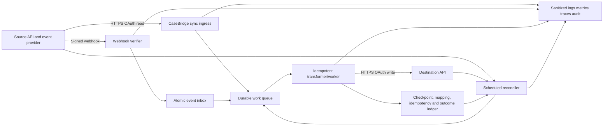

### Fictional functional contract

| Area | Teaching requirement | Open product decision |
|---|---|---|
| Source read | Cases updated after checkpoint, paginated | Actual API/query/snapshot/change feed |
| Destination write | Upsert minimized summary by stable mapping | Actual idempotency/version/precondition |
| Webhook | Notification only; contains case ID/version, no content | Actual event schema/signature/retries |
| Freshness | 95% updates within 5 minutes; reconcile every hour | Approved SLO/business requirement |
| Deletion | Tombstone/retention workflow, no blind hard delete | Product/legal policy |
| Tenancy | Hard tenant partition in identity/data/queue/ledger | Actual isolation architecture |
| Admin | Health, lag, failures, reprocess with approval | RBAC/audit/workflow |
| Recovery | Replay/reconcile without duplicate effect | Source retention and destination capabilities |

## 2. Design from assets, actors, and purposes

Security begins by identifying what matters and why it is processed.

| Asset | Sensitivity/value | Authorized purpose | Minimize/retain/delete |
|---|---|---|---|
| Source case ID | Customer-linked identifier | Correlate state | Alias/hash in telemetry; mapping retention policy |
| Case status/severity | Business/security metadata | Destination summary | Only required fields; versioned retention |
| Message/content | Potentially highly sensitive | Not needed in fictional design | Do not collect |
| OAuth credentials/tokens | Security secret | Authenticate workload | Secret store/memory only; short life; no logs |
| Webhook signing key | Shared authentication secret | Verify provider | Separate environment/tenant scope; rotate/delete |
| Idempotency key | Operation identity | Deduplicate write | Treat linkable/sensitive; bounded retention |
| Checkpoint/cursor | Operational state | Resume source traversal | Encrypt/protect; do not log raw |
| Mapping ledger | Cross-system linkage | Upsert/reconcile/delete | Access-controlled; retention/deletion policy |
| Audit log | Security/accountability | Investigations/compliance | Immutable/access-controlled/retention |
| Operational telemetry | Reliability evidence | Monitor/support | No payload/secrets/high-cardinality raw IDs |
| Dead-letter item | Failed work, possibly sensitive | Repair/replay | Encrypt/restrict/minimize/expire |

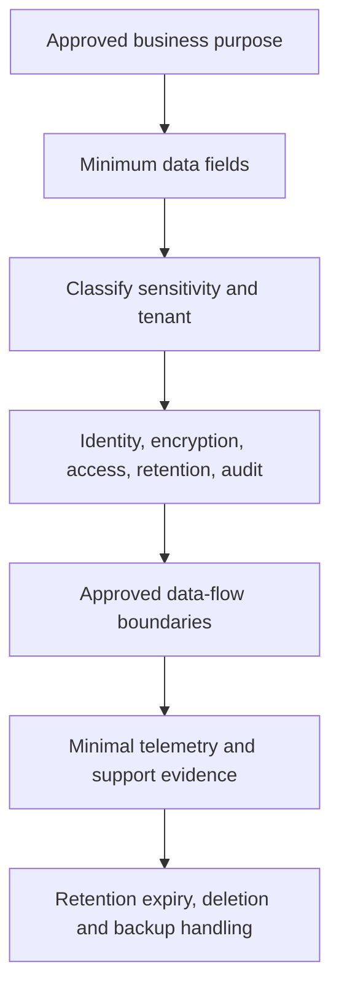

### Actors

| Actor | Allowed action | Explicitly denied/controlled |
|---|---|---|
| Source workload identity | Read approved fields/changes for assigned tenant | Admin, unrelated tenants, broad content |
| Destination workload identity | Upsert approved summary | Read/export unrelated data; admin |
| Webhook provider | POST signed event to one ingress route | Admin APIs, internal network, arbitrary redirects |
| Sync worker | Read queue, source detail if needed, destination upsert | Secret export, cross-tenant queue |
| Reconciler | Read authorized source/destination state | Unbounded full scans without pacing |
| Support operator | View sanitized telemetry and safe reprocess controls | Raw secret/customer content by default |
| Security administrator | Rotate/revoke identities/keys with audit | Business data modification |
| Deployment system | Deploy signed/approved artifact and config | Runtime data access unless required |

## 3. Trust boundaries and threat modeling

A **trust boundary** is where data or control moves between components with different trust, identity, ownership, or policy. Treat all external input as untrusted even when authenticated; authentication does not make content valid or authorized for every action.

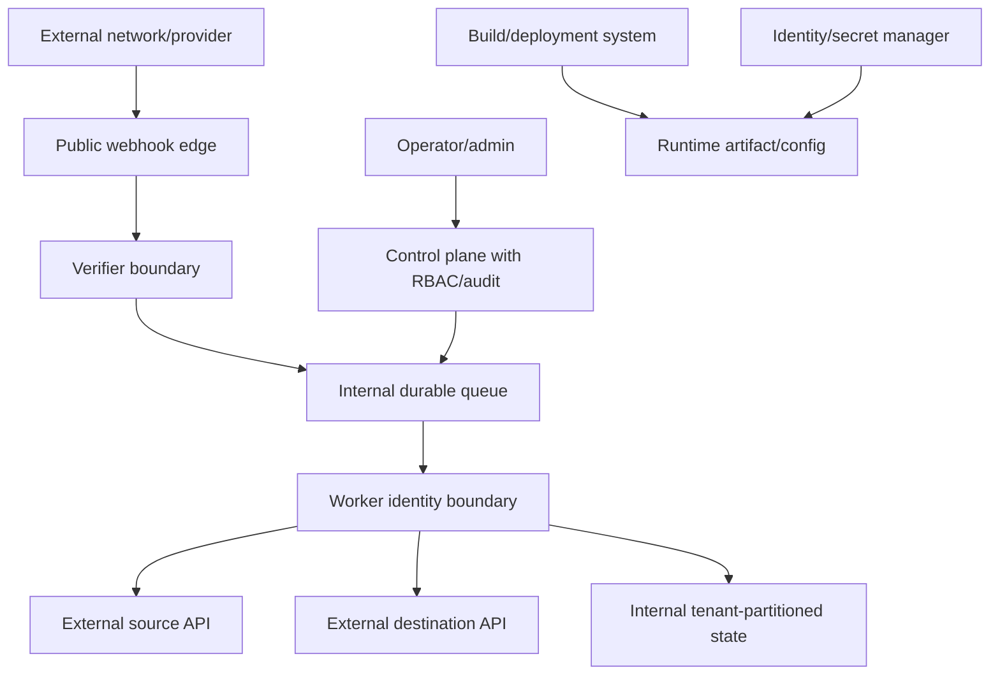

### STRIDE-style questions

STRIDE is a threat-modeling mnemonic: spoofing, tampering, repudiation, information disclosure, denial of service, and elevation of privilege. It is a prompt, not proof of completeness.

| Threat | Fictional scenario | Prevent/detect/recover controls |
|---|---|---|
| Spoofing | Attacker sends fake webhook | TLS, exact signature profile, freshness, dedupe, tenant/subscription binding |
| Tampering | Proxy/middleware changes signed body | Verify raw bytes before parsing; safe hash-stage evidence |
| Repudiation | Operator reprocesses event without record | Authenticated audited control action and operation ID |
| Information disclosure | Token/body appears in logs/DLQ | Structural allowlists, encryption, access, retention, scanning |
| Denial of service | Flooded webhook or poison retry loop | Size/rate/concurrency limits, quick rejection, quarantine, budgets |
| Elevation | Read identity gets destination admin scope | Separate least-privilege identities and policy tests |
| Replay | Captured signed request resent | Timestamp/nonce and atomic delivery/event dedupe |
| SSRF | Registered callback or link points internal | Allowlists/validation, controlled egress, no arbitrary follow |
| Cross-tenant | Queue message references another tenant | Tenant bound in identity/partition/lookup; authorize every access |
| Supply chain | Compromised dependency/build artifact | Pin/verify/scan/SBOM/sign/review/reproducible pipeline |

### 🔍 Plain-English deep-dive: Authentication answers “who,” not “may this action happen?”

A valid workload token can identify a service but still have the wrong tenant, audience, scope, role, resource, or operation. A valid webhook signature can prove covered bytes came from a key holder but not that the event type may trigger every downstream action. Authorization and domain validation happen after authentication.

Think of an employee badge: it identifies a person and may open certain doors, but it does not authorize changing payroll or entering every tenant's records. The analogy stops because tokens can represent clients, users, delegated scopes, resources, and policies rather than one human.

At each boundary record identity, credential type, audience/resource, scopes/roles, tenant, object policy, and action decision separately.

## 4. Zero-trust and least-privilege principles

NIST SP 800-207 describes zero trust as removing implicit trust based only on network location and focusing protection on resources, identities, and policy. It is an architecture principle, not a product checkbox.

| Principle | CaseBridge application | Validation |
|---|---|---|
| Verify explicitly | Authenticate/authorize each API and admin action | Policy decision logs/tests |
| Least privilege | Separate read/write/admin identities and narrow scopes | Negative permission tests |
| Assume breach | Limit blast radius/retention/egress and rotate | Tabletop compromise scenario |
| Resource-centric | Protect tenant case state and keys, not just subnet | Data-flow/access review |
| Continuous evaluation | Token expiry, subscription/key status, device/workload health | Monitoring/revocation drills |
| Micro-segmentation | Worker accesses only required APIs/ledger/queue | Network policy/egress tests |

Avoid broad “integration admin” credentials. If the source read and destination write are compromised differently, separate identities reduce blast radius. Use short-lived workload credentials where supported; avoid long-lived static keys in code/config. Do not let a public webhook process hold destination admin credentials if a queue boundary can separate ingress from business workers.

## 5. Identity and authorization design

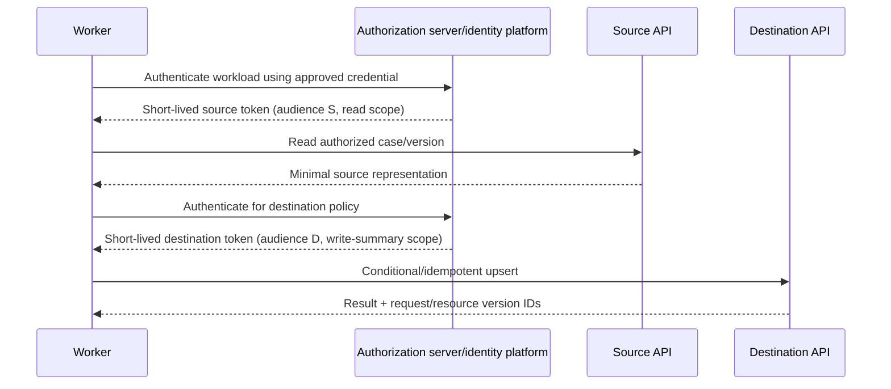

| Design decision | Secure default question |
|---|---|
| Identity type | Can managed/federated workload identity replace a stored secret? |
| Token flow | Is client credentials appropriate for non-user workload; delegated flow for user action? |
| Audience/resource | Is token bound to exactly the target API? |
| Scopes/roles | Minimum read fields/write operation; separate admin? |
| Tenant | Is tenant explicit and bound to principal/policy rather than trusted input? |
| Token lifetime | Short enough for risk, long enough for operation; refresh coordination? |
| Caching | In-memory bounded; no disk/log/queue; synchronized refresh? |
| Revocation/disable | How quickly can compromised workload be stopped? |
| Error handling | 401 challenge versus 403 policy; no infinite refresh loop? |
| Audit | Principal, scope category, decision, resource alias, UTC; no token |

### Authorization invariants

- Never trust tenant/resource IDs from queue/webhook/body without binding to authenticated subscription/identity.
- Apply object- and field-level authorization before returning/filtering/sorting/projection if the contract requires.
- A destination upsert must verify that the mapping belongs to the same tenant.
- Reprocess/admin endpoints require stronger role, reason, approval where appropriate, and audit.
- Deny by default when scope/version/policy is unknown.
- Security failures are not fixed by retries with the same context.

## 6. Secret, key, and certificate lifecycle

Inventory every credential and its owner, purpose, scope, storage, injection, rotation, revocation, telemetry, backup, and deletion.

| Secret/material | Prefer | Avoid |
|---|---|---|
| OAuth workload credential | Federation/managed identity/short-lived assertion | Static client secret in source/config |
| API key if unavoidable | Secret manager, narrow scope, rotation, no query | Hardcoded/exported/shared key |
| Webhook HMAC key | Per environment/subscription/tenant as policy permits | One global key, URL secret |
| mTLS private key | Managed key/cert store, non-exportable where possible | File copied among hosts |
| Encryption key | Managed KMS/HSM and envelope encryption | App-owned raw master key |
| Signing trust/public keys | Authenticated discovery/cache/rotation policy | Trust first arbitrary key URI |

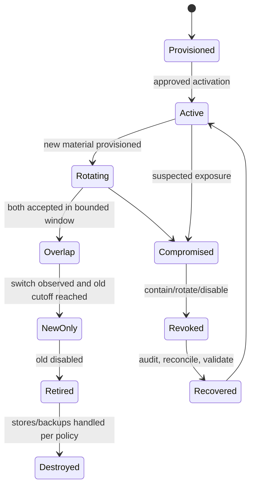

### Rotation requirements

| Requirement | Evidence |
|---|---|
| Owner and schedule | Inventory/runbook/alert |
| New credential tested safely | Nonproduction/canary, no broad permissions |
| Bounded overlap | Start/end UTC and accepted key IDs/aliases |
| Switch observation | Metrics show new credential/key verification |
| Revocation | Old material no longer accepted |
| Rollback | Explicit time-bounded criteria, not indefinite old trust |
| Cleanup | Config, replicas, caches, backups, exports, operator copies |
| Compromise drill | Time to contain and reconcile |

Never log a token, private key, API key, webhook secret, signature base, or full signature. Token metadata can also be sensitive. Use issuer/audience/scope categories, expiry duration, key alias, and match booleans.

## 7. Transport and network controls

Use HTTPS with server identity verification. Never use certificate-skip or `--insecure` as a fix. If mTLS is required, manage client certificate identity/rotation and understand where TLS terminates.

| Control | Purpose | Design question |
|---|---|---|
| DNS | Map approved names | Split DNS, resolver context, DNS security/ownership |
| Egress allowlist/policy | Restrict destinations | Names/IP ranges/CDNs change; controlled updates |
| Proxy | Inspection/policy/routing | Workload auth, bypass, TLS interception/trust |
| TLS | Confidentiality/integrity/server identity | Protocol/cipher policy, name/SAN, trust, time |
| mTLS | Client identity at transport | Termination, certificate-to-tenant mapping, renewal |
| Private connectivity | Reduce public exposure | Still authenticate/authorize; failover and DNS |
| Ingress WAF/rate limit | Bound public webhook abuse | Do not mutate signed body; trusted proxy headers |
| Network segmentation | Limit lateral movement | Worker/ingress/control/DB paths |

Controlled egress also mitigates SSRF: the integration should not follow arbitrary URLs from API content, problem types, webhook payloads, redirects, or migration links automatically. Validate scheme/authority, disable redirects by default for sensitive operations, and allowlist only approved destinations.

## 8. Input handling and contract enforcement

Every input crosses syntax, schema, semantic, authorization, and resource-budget gates.

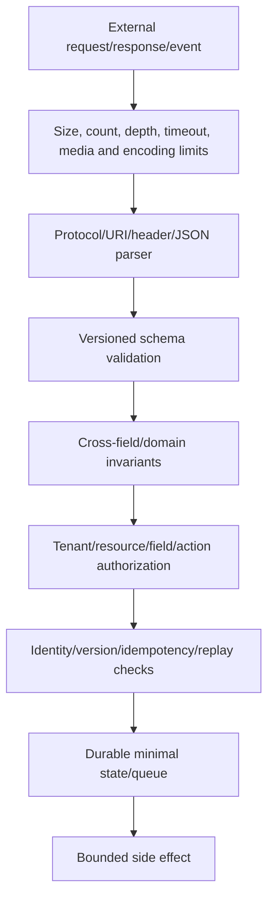

| Input | Validation examples | Failure handling |
|---|---|---|
| API response | Status/media/JSON/schema/pagination/order | Stop/retry/reconcile per operation |
| Webhook | Method/path/length/raw signature/freshness/dedupe/schema | Generic reject, no oracle; provider retry policy |
| Queue message | Envelope version/tenant/operation/schema/age/delivery count | Quarantine poison, do not spin |
| Admin command | Authn/RBAC/CSRF as applicable/reason/idempotency/limits | Audit and deny default |
| Config | Schema/allowlists/secret references/version | Fail deployment/start safely |
| OpenAPI/schema | Trusted source/version/reference cycle/external fetch | Pin/review; do not auto-fetch untrusted refs |

Use real parsers/serializers, parameterized queries, safe path handling, and allowlists. Bound JSON depth, strings, arrays, pages, payload bytes, decompression expansion, redirects, and external references. A valid schema does not guarantee business authorization or safe resource use.

## 9. Synchronous call resilience

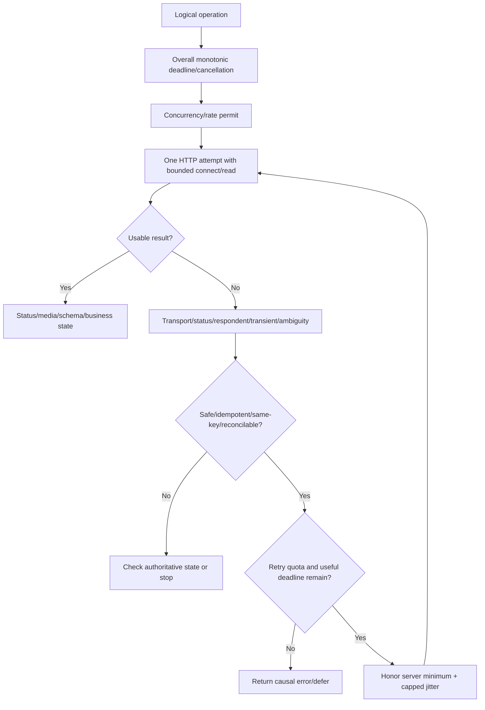

| Control | CaseBridge teaching policy | Product decision |
|---|---|---|
| Overall deadline | Per operation class, includes retries | Business SLA/dependency budget |
| Attempt timeout | min(configured, remaining useful time) | Connect/read/write stages |
| Retry owner | Worker HTTP policy only | SDK/gateway/mesh coordination |
| Retry conditions | Documented transient + repeat-safe | Exact statuses/exceptions |
| Backoff/jitter | Capped, server guidance aware | Values/algorithm |
| Retry quota | Recovery is bounded fraction | Token/refill policy |
| Concurrency | Separate source/destination pools | Adaptive/static values |
| Circuit behavior | Fail/defer under sustained failure | Threshold/probe/ownership |
| Rate pacing | Shared per known server bucket if appropriate | API-specific quotas |
| Fallback | Queue/defer/reconcile, not stale unsafe write | Domain-specific |

### Timeout budget equation

For end-to-end deadline $D$, queue time $Q$, waits $W_i$, and attempt durations $A_i$:

$$
Q + \sum_i(W_i + A_i) \leq D
$$

Set nested dependency deadlines lower than caller deadline so errors can propagate and cleanup can occur. Avoid a retry scheduled after remaining time cannot fit a useful attempt. Propagate cancellation but do not assume every downstream honors it; preserve idempotency/outcome reconciliation.

## 10. Idempotency and consistency

The integration needs one logical operation identity from source change to destination effect. The same logical operation keeps the same idempotency identity; a changed desired state/version is a new operation.

| Mechanism | Use in CaseBridge | Limitation |
|---|---|---|
| Destination idempotency key | Deduplicate repeated upsert request | Retention/scope/response contract needed |
| Client-selected resource URI + PUT | Set desired summary at stable mapping | Destination must support semantics/auth |
| `If-Match`/ETag | Prevent overwrite of newer destination state | Requires fetch/version/merge policy |
| Source object version | Ignore stale/out-of-order changes | Version scope/monotonicity documented |
| Inbox unique event ID | Deduplicate webhook/queue input | Stable identity/retention needed |
| Operation ledger | Track received/in-progress/complete/failure | Must coordinate commit/side effect |
| Reconciliation | Detect/repair unknown/missed outcomes | Cost/lag/source retention |

### Transactional outbox and inbox concepts

An **outbox** stores the business state change and a message-to-publish record in the same local transaction; a dispatcher publishes later, and consumers dedupe. An **inbox** atomically records an incoming message identity before/with local work. These patterns reduce the “database committed but message lost” gap within a service's transaction boundary. They do not create one transaction across arbitrary external APIs.

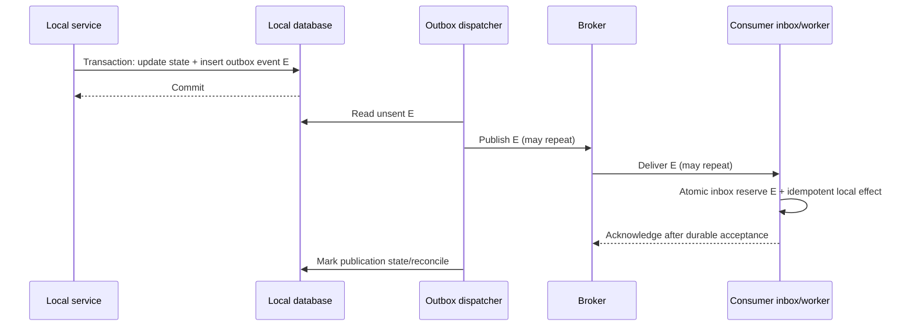

### 🔍 Plain-English deep-dive: Durable messaging moves uncertainty; it does not erase it

A queue can keep work through process restarts, but producers can publish twice, acknowledgments can be lost, leases can expire, and consumers can crash after an external effect. Durability prevents one class of loss while introducing delivery and state-transition questions.

Think of moving a task from a sticky note to a tracked work tray. The tray survives a desk cleanup and records ownership, but two workers can still see copies or a worker can complete the task before marking the card done. The analogy stops because queues use leases, visibility timeouts, partitions, and at-least-once or other defined semantics.

Pair durable delivery with identity, atomic state, idempotent effects, bounded retries, quarantine, and reconciliation.

## 11. Queue, worker, and poison-message design

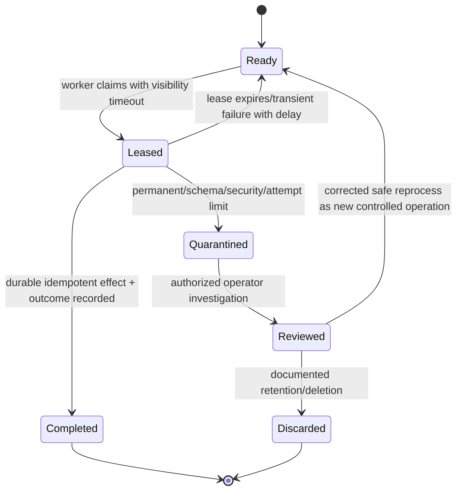

| Queue concern | Design requirement |
|---|---|
| Message identity | Stable event/operation ID and tenant partition |
| Envelope version | Backward-compatible parser/unknown version quarantine |
| Lease/visibility | Longer than bounded work or renewable safely; duplicates still expected |
| Delivery count | Drives quarantine threshold, not machine logic alone |
| Retry delay | Capped jitter/server guidance; no hot loop |
| Ordering | Per object/partition if needed; sequence/version reconciliation |
| Concurrency | Bound by downstream quotas/latency and tenant fairness |
| Poison message | Permanent failure classified and quarantined |
| Dead-letter access | Least privilege, encrypted, audited, minimized |
| Reprocess | Authorized reason, immutable audit, same/new operation identity rules |
| Backlog | Age and freshness SLO, autoscale/pacing/shed policies |
| Retention | Long enough for recovery, bounded for privacy/cost |

Do not use dead-letter queues as permanent unowned storage. Alert on age/count/rate and assign an owner/runbook. A poisoned customer payload can remain sensitive even when processing failed; do not dump it into tickets.

## 12. Pagination, checkpoints, and synchronization

CaseBridge can combine webhooks for low latency with periodic incremental and full reconciliation.

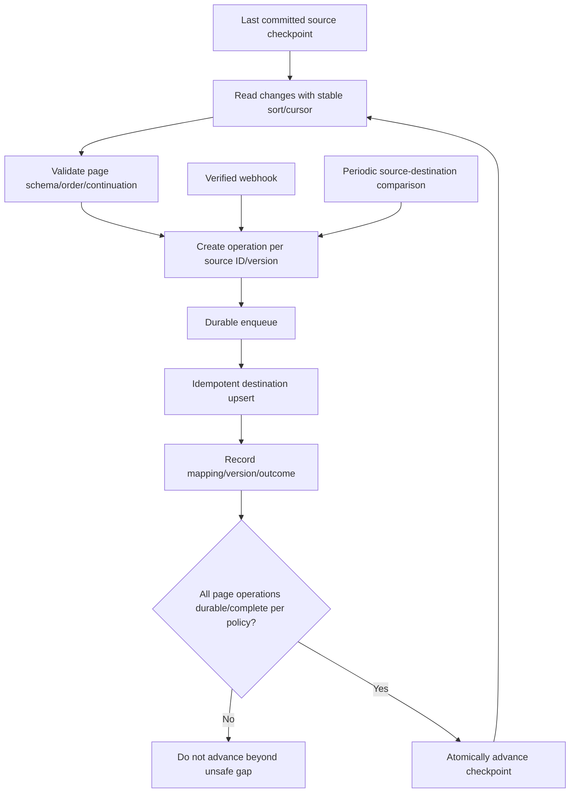

### Checkpoint design questions

| Dimension | Question |
|---|---|
| Source | Cursor, timestamp, sequence, version, change feed token? |
| Scope | Per tenant/partition/filter/API version? |
| Atomicity | What must be durable before advancing? |
| Overlap | How far to reread for late arrivals/clock precision? |
| Dedupe | Which `(source_id,version)` identity prevents overlap duplicates? |
| Deletions | Tombstones, soft delete, missing-state reconciliation? |
| Expiry | What if cursor/checkpoint expires or source retention lapses? |
| Schema | Which version generated checkpoint and payload parser? |
| Recovery | Restart page, checkpoint, partition, or full snapshot? |
| Privacy | Is checkpoint opaque/sensitive; storage encryption/retention? |

### Full versus incremental

| Mode | Benefit | Risk/control |
|---|---|---|
| Webhook | Low latency | Missed/duplicate/out-of-order; verify/dedupe/reconcile |
| Incremental pull | Efficient repair/regular sync | Watermark gaps/late arrival; overlap and versions |
| Full reconciliation | Detect broad drift | Cost/rate/load; pace, partition, snapshot, limits |
| Current-state fetch per event | Simple state convergence | API load/event burst; cache/pacing |

Never advance a checkpoint merely because requests were enqueued if queue loss/retention can violate recovery, unless the queue handoff is the explicitly durable responsibility boundary and all downstream work is trackable/reconcilable. Define that boundary.

### 🔍 Plain-English deep-dive: Delivery evidence is not convergence evidence

A webhook can be delivered and acknowledged while a later worker fails; a destination can return 200 while writing stale or wrong-tenant state; a queue can contain every message while backlog age violates freshness. Reconciliation asks the business-level question: does authorized destination state match the authoritative source version under the mapping contract?

Think of receiving every change form in an office. A stamped inbox proves receipt, not that the master register was updated correctly. The analogy stops because integrations can compare versions, hashes, counts, tombstones, and object state automatically, but only if those invariants and permissions are designed.

Use transport/delivery metrics for diagnosis and source-to-destination comparison for correctness. Both are needed; neither substitutes for the other.

## 13. Webhook ingress design

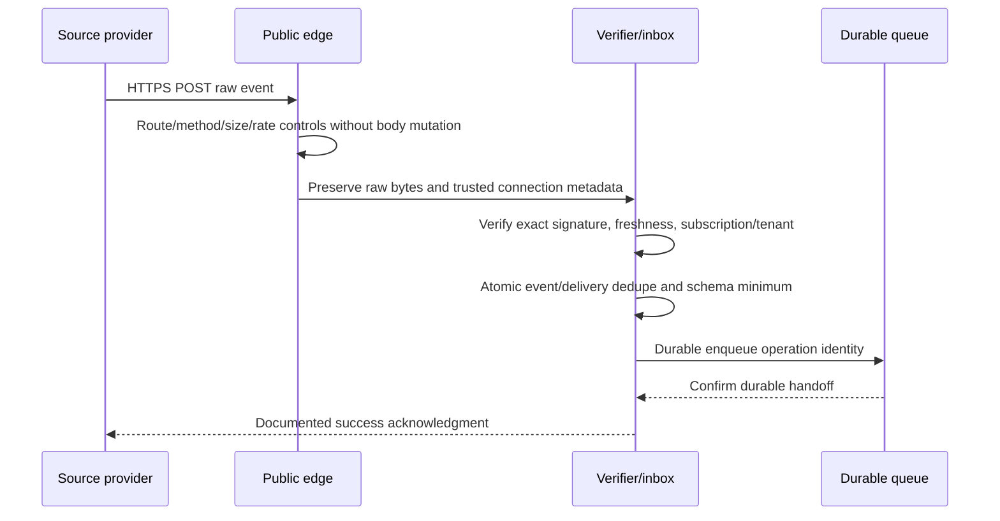

| Ingress threat/failure | Control |
|---|---|
| Fake sender | Exact provider signature/mTLS/auth profile plus TLS |
| Captured replay | Timestamp/nonce and atomic scoped event/delivery dedupe |
| Large/decompression payload | Pre/post-decompression limits and timeouts |
| Slow request | Header/body read deadlines and connection limits |
| Body mutation | Verify raw bytes before parser/middleware transformation |
| Cross-tenant event | Subscription/key/tenant binding and object authorization |
| Duplicate legitimate retry | Return documented success/no-op after dedupe |
| Queue unavailable | Do not acknowledge before durable acceptance; return documented retryable result |
| Invalid schema | Reject/quarantine per provider retry policy; no detailed oracle |
| Flood | Edge/client/subscription rate and concurrency limits, load shedding |

Webhooks should not directly perform destination writes while holding public ingress capacity. The queue boundary isolates secrets and workload, allows backpressure, and makes acknowledgment explicit.

## 14. Data model, tenancy, and deletion

### Minimal ledger schema

| Entity | Key | Fields (synthetic) | Invariant |
|---|---|---|---|
| TenantConfig | tenant alias | source/dest identity refs, enabled, schema/version | No raw secret; references only |
| Mapping | `(tenant,source_id)` | destination ID, source/dest versions, state | Same-tenant ownership |
| Operation | `(tenant,operation_id)` | source version, request fingerprint, state/outcome | One logical desired effect |
| Inbox | `(tenant,event_id)` | first seen, delivery alias, state | Atomic uniqueness/retention |
| Checkpoint | `(tenant,partition,contract)` | opaque token/watermark, committed UTC | Advances after defined durable boundary |
| Audit | immutable event ID | actor/action/reason/result/UTC | No sensitive payload |

Tenant should be part of every storage/queue/cache key or enforced through a stronger partition/policy mechanism. Do not infer tenant solely from an untrusted payload. Avoid global caches keyed only by resource ID.

### Deletion and retention lifecycle

```mermaid
flowchart LR
    Active[Active data] --> Retained[Operational retention]
    Retained --> Expire[Policy expiration or verified deletion request]
    Expire --> Tombstone[Tombstone/erasure workflow]
    Tombstone --> Destination[Delete/anonymize destination per contract]
    Destination --> Ledger[Minimize/remove mapping and dedupe state per policy]
    Ledger --> Backups[Backup expiration/crypto erasure policy]
    Backups --> Audit[Retain only approved deletion audit]
```

Deleting mapping/dedupe state too soon can allow stale webhook/replay to recreate data. Retaining it forever can violate privacy. Coordinate source retention, provider retry horizon, legal requirements, destination deletion, backups, caches, dead letters, logs, and derived metrics. Use tombstones or non-sensitive deletion markers if policy permits.

## 15. Error contracts and failure taxonomy

| Failure class | Example | Automatic action | Operator/customer action |
|---|---|---|---|
| Permanent input | 422 unknown enum after correct version | Quarantine, no same-request retry | Correct mapping/contract |
| Authentication | 401 invalid/expired workload credential | One coordinated refresh if policy; then stop | Identity/config/rotation |
| Authorization | 403 wrong scope/tenant | Stop | Policy/scope owner |
| Concurrency/state | 409/412 | Re-read/reconcile/merge | Domain decision |
| Throttle | 429 | Pace, server guidance, budget | Capacity/schedule if sustained |
| Temporary service | 503/connection reset | Bounded repeat-safe retry | Dependency incident |
| Gateway timeout | 504 on write | Reconcile/same key | Deadline/async design |
| Schema drift | 200 unknown enum/missing field | Unknown branch/quarantine | Contract/SDK rollout |
| Poison work | Repeated deterministic failure | Quarantine | Investigate/correct/reprocess |
| Security | Invalid webhook signature/replay/cross-tenant | Reject/contain/alert | Incident response |
| Retention gap | Checkpoint expired | Full/current-state reconciliation | Data-owner acknowledgment |

Use RFC 9457 Problem Details where appropriate for administrative/synchronous surfaces, with stable problem types and no secret/internal leakage. Internal queue failures also need stable machine codes and safe operator summaries; do not force HTTP status semantics onto non-HTTP components without a defined mapping.

## 16. Observability and supportability by design

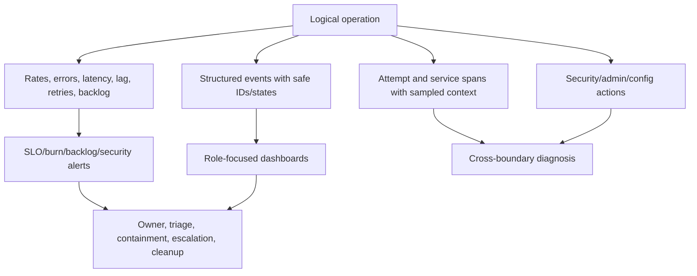

### Structured event fields

| Category | Safe fields |
|---|---|
| Identity | tenant/principal aliases, scope category, no token |
| Operation | logical operation and attempt IDs, route template, contract version |
| Source | source ID/version aliases, checkpoint fingerprint not raw token |
| HTTP | stage/respondent/status/problem type, request/trace aliases, duration |
| Retry | attempt, policy, delay, remaining deadline/quota, final disposition |
| Queue | message alias, delivery count, age, state, partition alias |
| Webhook | event/delivery aliases, signature stage/match/freshness/dedupe booleans |
| Destination | resource/version/idempotency aliases, outcome certainty |
| Lifecycle | deployment/config/schema/SDK versions, deprecation signals |
| Error | stable safe code, source component, sanitized exception class/inner category |

### Metrics

| Metric | Why |
|---|---|
| Initial and final operation success | Retries can hide degradation |
| Attempts per operation/retry rate | Amplification |
| Source/destination status by class/problem type | Contract/dependency health |
| End-to-end latency and dependency latency | Budget allocation |
| Sync freshness/lag per safe tenant cohort | User outcome |
| Queue depth/oldest age/processing rate | Backlog and capacity |
| Throttle rate and Retry-After | Pacing/quota |
| Dedupe hits/key conflicts | Duplicate/replay/client defects |
| Invalid signature/freshness/replay | Security health |
| Schema/unknown enum/version failures | Contract drift |
| Reconciliation drift/repaired count | Silent correctness |
| DLQ/quarantine count/age | Unowned failures |
| Credential/key expiry/rotation use | Lifecycle risk |

Avoid tenant/user/resource IDs as unbounded metric labels. Use approved aggregated cohorts and drill into access-controlled logs by case alias.

### SLO concepts

An **SLI** is a measured service-level indicator; an **SLO** is a target; an **SLA** is a contractual commitment, which support should not invent. Example fictional SLIs:

$$
Availability = \frac{successful\ eligible\ operations}{total\ eligible\ operations}
$$

$$
Freshness = now - source\ version\ applied\ time
$$

Define eligible operations, success, measurement window, tenant fairness, exclusions, and data source. Pair latency with correctness and freshness; a fast duplicate or stale sync is not successful.

### 🔍 Plain-English deep-dive: Availability without correctness can reward the wrong system

If every API call returns 200 quickly while updates are duplicated, stale, or written to the wrong tenant, a narrow HTTP availability metric looks excellent. The integration's user outcome includes correct authorized state within a freshness window.

Think of a courier measured only on answering the phone, not delivering the right parcel. The analogy stops because integrations have multiple measurable milestones: accepted, durable, processed, reconciled, and visible.

Choose SLIs at the business boundary and retain component metrics for diagnosis.

## 17. Alerting and runbooks

| Alert | Trigger principle | Owner/first action |
|---|---|---|
| End-to-end error-budget burn | Multi-window sustained impact | Integration on-call; check dependency/status/problem classes |
| Freshness lag | Percentile/tenant cohort above SLO | Sync owner; queue/source/checkpoint path |
| Backlog age | Oldest age and growth, not depth alone | Worker/capacity owner; pace/source/destination |
| Invalid signature spike | Baseline/security threshold | Security + integration; contain/rotation investigation |
| Dedupe/replay spike | Unexpected rate | Integration/security; provider retry/attack/dedupe state |
| Schema/enum unknown | Any critical or sustained | Contract owner; deployment/version matrix |
| Credential/key expiry | Lead-time threshold | Identity/secret owner; rotate |
| DLQ age | Any beyond review SLA | Operation owner; inspect safely |
| Reconciliation drift | Count/rate above threshold | Data owner; stop unsafe writes if cross-tenant/corrupt |

A runbook should include purpose, owner, severity, dashboard/query links, privacy boundaries, safe first checks, stop conditions, mitigation, escalation, exact evidence package, recovery/reconciliation, validation, and cleanup. It should never say “disable TLS validation,” “retry until success,” “dump all logs,” or “clear queue” without scope and approval.

## 18. Failure-mode and effects analysis

FMEA asks how components fail, effects, detection, controls, and recovery. Scores can prioritize but are not objective truth.

| Failure mode | Local effect | End effect | Detection | Prevention/containment | Recovery |
|---|---|---|---|---|---|
| Source API down | Reads fail | Freshness lag | Status/transport/backlog | Retry budget, pacing, circuit/defer | Resume checkpoint/reconcile |
| Destination 429 | Writes throttle | Backlog grows | 429/Retry-After/age | Rate/concurrency controller | Drain fairly |
| Gateway 504 after write | Unknown outcome | Duplicate risk | IDs/state/idempotency | Same-key write, deadline/async | Reconcile/replay result |
| Token refresh storm | Auth calls spike | 401/outage | Refresh/401 metrics | Singleflight/cache/jitter | Restore identity, bounded retry |
| Webhook key mismatch | Events rejected | Low-latency gap | Invalid-key alias metric | Staged rotation | Correct key, redeliver/reconcile |
| Dedupe store unavailable | Cannot reserve | Duplicate/loss risk | Store health | Fail closed/defer per design | Restore and reconcile |
| Queue outage | Cannot durable-ack | Provider retries/backpressure | Enqueue failure | No premature 2xx | Restore/redelivery |
| Poison schema | Hot retries | Backlog/cost | Same code/delivery count | Validate/quarantine | Contract fix/reprocess |
| Checkpoint corruption | Wrong resume | Missing/duplicate data | Invariant/reconciliation | Transaction/version/backups | Restore prior/full reconcile |
| Cross-tenant mapping defect | Wrong destination | Security incident | Invariant/audit/customer signal | Tenant-bound key/policy tests | Stop, contain, notify/repair per policy |
| Telemetry outage | Blind operation | Delayed diagnosis | Heartbeat/source health | Multiple minimal signals | Restore; acknowledge evidence gap |

### Fault-tree example

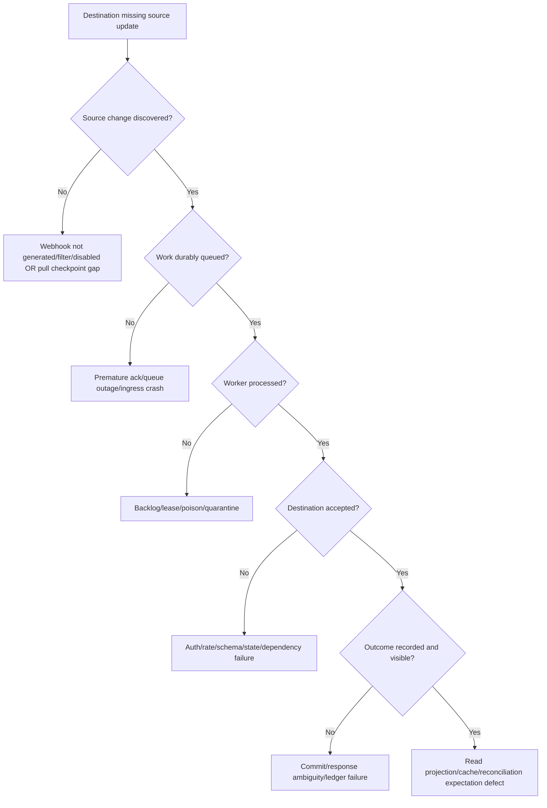

## 19. Capacity, backpressure, and fairness

Use Little's Law as a conceptual relationship in a stable system:

$$
L = \lambda W
$$

where $L$ is average work in system, $\lambda$ arrival rate, and $W$ average time. It does not replace measurement or apply blindly to unstable/bursty systems. If downstream latency doubles and arrivals stay constant, in-flight/backlog tends to grow unless concurrency/rate/backpressure changes.

| Capacity control | Design goal |
|---|---|
| Per-destination concurrency | Avoid connection/thread/dependency saturation |
| Tenant fairness | One tenant cannot starve all others |
| Rate pacing | Respect provider buckets/cost weights |
| Queue partitions | Isolate ordering/failure domains without hot partition |
| Bounded buffers | Avoid memory explosion and stale work |
| Backpressure | Slow/stop source discovery when destination cannot drain |
| Load shedding | Drop/defer noncritical/redundant work under policy |
| Batch sizing | Improve efficiency without payload/timeout/partial-failure risk |
| Autoscaling | Respond to sustainable work signal, bounded by dependency quota |

Scaling workers during destination 429 can worsen the incident. Autoscale on backlog with dependency health/rate/concurrency constraints. Prefer coalescing multiple state notifications for the same object when only current state matters; do not coalesce commands or intermediate events without semantic permission.

## 20. High availability and disaster recovery

| Concern | Design question |
|---|---|
| Instance failure | Stateless workers and durable queue/leases? |
| Zone failure | Queue/ledger/secret manager deployment and failover? |
| Region failure | Active/passive or active/active; webhook endpoint/DNS/routing? |
| Duplicate active regions | Shared/partitioned dedupe/checkpoint and idempotency? |
| Data consistency | RPO for checkpoints/mappings/inbox/audit? |
| Recovery time | RTO for ingestion, processing, reconciliation? |
| Secret availability | Secure replicated access and rotation during disaster? |
| Replay source | Provider/source retention sufficient for RPO? |
| Failback | Prevent split-brain/duplicate processing/checkpoint regression? |
| Testing | Restore/tabletop/failover evidence without customer impact? |

**RPO** is the tolerated amount of data/state loss measured in time or transactions; **RTO** is the target time to restore service. Define separately for accepting webhooks, processing backlog, updating destination, and restoring observability. If the source retains changes for 24 hours and recovery takes 30 hours, reconciliation cannot guarantee no gaps without another source.

### Active-active caution

Multiple regions can both process one event unless partition ownership/dedupe state is globally coordinated or destination writes are safely idempotent. Cross-region latency and partition can break naive locks. Simpler active/passive may be preferable if the business RTO allows. Architecture follows requirements, not fashion.

## 21. Deployment, configuration, and change safety

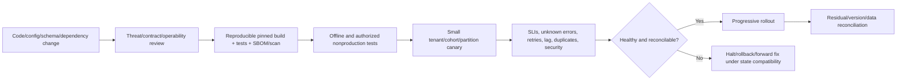

| Change type | Special control |
|---|---|
| API/schema | Bidirectional provider/consumer contract tests and unknown handling |
| Queue envelope | Expand/contract versioned readers/writers |
| Database schema | Backward-compatible migration before code switch |
| OAuth scopes | Negative permission tests and audit |
| Secret/key | Bounded overlap and switch metrics |
| Retry policy | Attempt amplification/idempotency/deadline tests |
| Concurrency/rate | Load/fairness/dependency limit tests |
| SDK/dependency | Wire snapshots, exception/retry/default diff, supply-chain review |
| Webhook verifier | Official vectors/raw byte/canonicalization/freshness/replay tests |
| Telemetry | Privacy/cardinality/retention and alert continuity |

Rollback is not always safe after data/schema/side-effect changes. Define backward/forward compatibility and whether rollback would replay, lose, or reinterpret queue messages/checkpoints. A forward fix may be safer.

## 22. Contract and security testing strategy

| Test layer | Cases |
|---|---|
| Unit | Parsers, schema, transforms, checkpoint math, retry budgets, redaction |
| Cryptographic vectors | Correct/wrong key, byte changes, malformed metadata, freshness, replay, rotation |
| Consumer contract | Extra/missing/null/enum/errors/pagination/deprecation |
| Provider contract | Requests/status/problem/idempotency/precondition/rate behavior |
| Integration | Source/queue/destination/ledger with synthetic tenant data |
| Failure injection | DNS/proxy/TLS/reset/429/503/504/queue/store/clock/schema/duplicate |
| Concurrency | Duplicate webhook, lease expiry, same key, out-of-order versions |
| Load | Quotas, backpressure, fairness, backlog drain, memory/cardinality |
| Security | Authn/authz negative tests, cross-tenant, SSRF, secret scans, input bounds |
| Recovery | Restart, checkpoint restore, DLQ reprocess, key compromise, reconciliation |
| Deployment | Canary/rollback/forward compatibility/residual traffic |

Use synthetic data and isolated environments. Do not fault-inject production without explicit authorization and blast-radius controls. Record expected evidence before a test so passing/failing is falsifiable.

## 23. Incident response and recovery

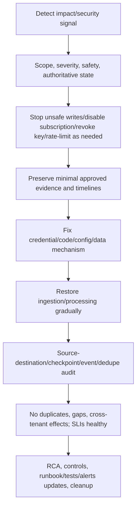

### Secret/key compromise playbook

1. Confirm authorization/severity and avoid exposing more material.
2. Identify credential/key alias, scope, systems, environments, issuance/use, logs/exports/copies.
3. Contain by revoke/disable/rotate and restrict ingress/egress where appropriate.
4. Stage replacement securely; avoid outage or indefinite old overlap.
5. Inspect authentication/signature failures, anomalous resources, replays, configuration changes, and audit evidence.
6. Reconcile authoritative source/destination state and event/dedupe ledgers.
7. Notify/engage security/privacy/legal/customer owners according to policy; do not invent disclosure obligations.
8. Remove old material from config, caches, backups/exports where policy requires.
9. Validate new identity/key, negative old-key tests, permissions, and monitoring.
10. Document root cause and prevention.

### Data-correctness incident

If cross-tenant or duplicate/missing writes are possible, stop/contain unsafe processing before optimizing availability. Preserve mapping/version/idempotency/audit evidence. Create a deterministic repair plan with dry run, owner approval, before/after counts/hashes/versions, rollback/compensation constraints, and customer communication. Never run ad hoc destructive cleanup from a support ticket.

## 24. Architecture decisions and ownership

An **Architecture Decision Record (ADR)** captures context, decision, alternatives, consequences, status, and validation. It prevents recurring debates and makes support assumptions visible.

| ADR | Decision question | Example alternatives |
|---|---|---|
| 091-1 | Webhook plus reconciliation? | Webhook-only, polling-only, hybrid |
| 091-2 | Destination write idempotency? | Same-key POST, stable PUT, conditional upsert |
| 091-3 | Tenant isolation? | Separate resources, partition keys, policy enforcement |
| 091-4 | Queue acknowledgment boundary? | Before/after durable inbox/enqueue |
| 091-5 | Checkpoint advancement? | Enqueue, per-page completion, per-item completion |
| 091-6 | Secret/identity approach? | Federation, client cert, static secret |
| 091-7 | Failure quarantine/reprocess? | DLQ, status table, operator workflow |
| 091-8 | DR topology? | Active/passive, active/active, regional partition |

### RACI-style ownership

RACI identifies Responsible, Accountable, Consulted, and Informed roles. Use the organization's actual model.

| Surface | Responsible owner needed |
|---|---|
| Source API contract/limits/events | Source provider/API owner |
| Destination contract/idempotency | Destination owner |
| Integration code/queue/ledger | Integration Engineering |
| Workload identity/scopes | Identity/security owner plus integration |
| Webhook ingress/edge | Platform/security/integration |
| Data classification/retention/deletion | Data/privacy/business owners |
| SLO/on-call/runbooks | Service owner |
| Customer communication | Support/customer owner |
| Incident command/security response | Defined incident/security roles |

Support should know the owner and exact evidence/ask for each boundary. “Engineering” is not one owner.

## 25. Design review checklist and tradeoff summary

| Domain | Review question | Evidence/artifact |
|---|---|---|
| Purpose/data | Are fields necessary, classified, retained/deleted? | Data-flow/retention map |
| Identity | Workload/user flow, audience, scopes, tenant binding? | Auth diagram/negative tests |
| Secrets | Inventory, storage, rotation, revocation, compromise? | Lifecycle/runbook |
| Network/TLS | Approved endpoints, egress/ingress, verification, proxies? | Boundary/network policy |
| Input | Size/media/schema/semantic/auth/resource bounds? | Contract/negative tests |
| Sync | Pagination/order/checkpoint/late/deletion/reconciliation? | State machine/invariants |
| Webhook | Raw verify/freshness/dedupe/durable ack/retries? | Vectors/ingress design |
| Reliability | Deadline/retry/idempotency/rate/concurrency/backpressure? | Policy/budget tests |
| Async | Queue lease/retry/quarantine/ordering/fairness? | Worker state/runbook |
| Consistency | Commit/message/idempotency/outbox/inbox boundaries? | ADR/failure tests |
| Contracts | Versions/errors/SDK/compatibility/deprecation? | Golden corpus/migration plan |
| Observability | IDs/logs/metrics/traces/audit/privacy/cardinality? | Telemetry schema/dashboard |
| Operations | SLOs/alerts/runbooks/owners/capacity/DR? | Ops dossier/tabletop |
| Change | Build/supply chain/canary/rollback/reconcile? | Release plan/SBOM/tests |
| Incident | Containment/evidence/recovery/data repair/cleanup? | Response runbook |

### Tradeoffs

| Choice | Gains | Costs/risks |
|---|---|---|
| Synchronous write | Simple immediate result | Latency coupling/timeouts/unknown outcomes |
| Queue async write | Durability/backpressure/isolation | Eventual consistency/duplicates/operations |
| Webhook | Low detection latency | Public ingress/signature/retry/duplicate complexity |
| Polling | Controlled pull/recovery | Latency/rate/cost/pagination |
| Hybrid | Low latency plus repair | More components/state |
| Strict schema | Fast drift detection | Additive change compatibility |
| Tolerant reader | Evolution resilience | Can mask unexpected/security-relevant data unless focused validation |
| Active-active | Regional availability | Split-brain/dedupe/checkpoint complexity |
| Active-passive | Simpler correctness | Failover/RTO capacity |
| Shared identity | Fewer credentials | Larger blast radius/audit ambiguity |
| Separate identities | Least privilege/isolation | Lifecycle/management overhead |

## Safe local lab: The CaseBridge 091 Architecture and Failure Tabletop

### Prerequisites

- Learner-owned local workspace, paper/Markdown/spreadsheet, and optional built-in PowerShell/Python JSON parsing. No packages or cloud accounts.
- Fictional CaseBridge 091 scenario and reserved/synthetic identifiers only.
- Files if used: `architecture-091.md`, `threats-091.md`, `fmea-091.md`, `slo-091.md`, `runbooks-091.md`, `adrs-091.md`, `tabletop-091.md`, and `cleanup-091.md`.
- No network, listener, API/webhook registration, OAuth client, key/certificate, queue/database, customer data, source code deployment, production log query, fault injection, or destructive operation.
- Artifact label: **offline fictional secure-integration architecture tabletop; no Abnormal architecture/access/behavior claim**.

### Lab procedure

1. Record start UTC, tool versions, scope, artifact label, and no-network/no-secret/no-deployment statement.
2. Write the business purpose, non-goals, user outcome, authorized data fields, excluded content, tenant model, freshness target, and recovery target for fictional CaseBridge.
3. Create the context/data-flow diagram with source API/event provider, edge/verifier, inbox/queue, worker, destination, ledger, reconciler, control plane, secret manager, telemetry, and deployment system.
4. Mark every trust boundary, identity, protocol, data classification, encryption expectation, owner, and evidence source.
5. Build an asset inventory from Section 2 and assign collection purpose, minimization, access, retention, deletion, backup, and telemetry rules.
6. Build an actor/action matrix and test at least ten denied actions, including read identity performing admin, webhook triggering cross-tenant write, and support exporting raw payload.
7. Run STRIDE prompts against each boundary. Record at least 18 threat scenarios with prevention, detection, recovery, owner, and residual risk.
8. Create an OAuth/workload identity plan with separate source-read, destination-write, and admin identities; audiences, scopes/roles, token lifetime, refresh, revocation, and audit categories. Use no real provider names or scopes.
9. Build a credential inventory and rotation state machine for workload credential, webhook HMAC key, optional mTLS certificate, and encryption key. Set fictional bounded overlap/cutoff and compromise response.
10. Draw the network/TLS path and specify approved schemes/authorities, DNS/proxy contexts, egress/ingress controls, TLS verification, redirect policy, and SSRF/link-following prohibition.
11. Define request/response/event/queue/admin/config validation gates with size/count/depth/time/media/schema/semantic/auth/tenant/idempotency limits.
12. Define synchronous source-read and destination-write policies: overall deadlines, attempts, retry owner, statuses, backoff/jitter, Retry-After, retry quota, concurrency, rate, circuit/defer behavior, and outcome reconciliation.
13. Choose a destination idempotency approach among same-key POST, stable PUT, or conditional upsert. Write its exact scope, fingerprint, retention, concurrency, mismatch, and recovery requirements.
14. Design webhook ingress with raw-byte verification, freshness, scoped event/delivery dedupe, tenant binding, durable queue boundary, acknowledged statuses, rate/size/time limits, and rotation.
15. Define inbox/operation/queue state machines and atomic uniqueness. Walk two concurrent duplicate webhooks and one lost acknowledgment; prove no duplicate intended effect under the invented assumptions.
16. Design queue leases, visibility renewal, retry delay, max attempts, poison classification, quarantine/DLQ access, reprocess authorization, retention, and backlog fairness.
17. Design source synchronization: stable sort/cursor, page validation, per-tenant checkpoint, overlap, late arrivals, deletions/tombstones, cursor expiry, and full reconciliation.
18. State the exact durable boundary required before checkpoint advancement. Simulate crash before and after that boundary and show recovery.
19. Add webhook, incremental pull, and full reconciliation into one convergence model. Demonstrate one missed webhook repaired by pull and one expired checkpoint repaired by full current-state comparison.
20. Define the minimal tenant-partitioned ledger and invariants. Test collisions of identical source IDs in two tenants and deny cross-tenant lookup/write.
21. Create a deletion/retention workflow covering source, destination, mapping, inbox/dedupe, queue/DLQ, logs/traces/metrics, audit, caches, and backups. Address stale-event recreation risk.
22. Create an error taxonomy and machine actions for auth, policy, validation, conflict, throttle, temporary outage, gateway ambiguity, schema drift, poison, security, and retention gap.
23. Design structured telemetry fields, metric list, trace boundaries, audit actions, redaction, cardinality, sampling, retention, and evidence ceilings. Include no payload or raw identifier labels.
24. Define fictional SLIs/SLOs for final correctness, freshness, end-to-end latency, availability, backlog age, reconciliation drift, and security verification. State numerator/denominator/window/exclusions and alert owner.
25. Create alerts/runbooks for error-budget burn, lag, backlog, invalid signature, dedupe spike, schema unknown, credential expiry, DLQ age, and drift. Include safe first checks and stop conditions.
26. Run FMEA for at least 15 failure modes; score severity/occurrence/detectability only as a teaching prioritization and explain subjectivity.
27. Capacity tabletop: baseline, 10x webhook burst, destination latency 5x, destination 429, source outage, queue outage. Adjust pacing/concurrency/backpressure without exceeding fictional quotas.
28. Disaster tabletop: one worker crash, zone loss, region loss, active duplicate processor, ledger restore, source retention shorter than outage. Record RPO/RTO feasibility and evidence gaps.
29. Security tabletop: leaked source credential, leaked webhook key, forged cross-tenant event, SSRF URL, malicious oversized payload, dependency compromise. For each, detect/contain/eradicate/recover/reconcile/notify owners.
30. Data incident tabletop: duplicate destination writes, missing update, wrong-tenant write. Define immediate stop conditions, evidence preservation, dry-run repair, approvals, validation, and communication.
31. Create at least eight ADRs from Section 24 with context, decision, alternatives, consequences, status, and validation.
32. Create a RACI/ownership map for every external/internal boundary and escalation ask.
33. Build contract tests: success/errors/extra/null/enum/pagination/rate/retry/idempotency/webhook/schema/deprecation; provider and consumer sides.
34. Build release plan for a fictional queue-envelope v2 and SDK upgrade using expand/contract, nonproduction test, canary, telemetry, rollback/forward-fix criteria, reconciliation, and residual traffic check.
35. Run a dependency lifecycle case: source API sends Deprecation and later Sunset. Inventory consumers, migrate contract, rotate scopes/keys, canary, reconcile, remove old route/credential, and verify no residual traffic.
36. Create one end-to-end incident timeline using Part 090 identifiers from client operation through destination state and webhook acknowledgment. State facts, hypotheses, confidence, and evidence ceiling.
37. Produce a one-page architecture review summary: top five risks, decisions needed, blockers/unknowns, owner asks, and what must be verified in approved Abnormal documentation.
38. Deliver a six-minute interview walkthrough: requirements, architecture, top threat, top failure mode, idempotency, reconciliation, SLO, and honest experience boundary.
39. Delete temporary architecture/threat/FMEA/SLO/runbook/ADR/tabletop/output files or retain only minimized fictional notes. Record end UTC and cleanup statement.

### Expected evidence

- Business purpose/non-goals/data-minimization/tenancy/freshness/recovery statement.
- Complete context/data-flow/trust-boundary and ownership diagrams.
- Asset lifecycle and actor/action/negative-permission matrices.
- At least 18 threat scenarios and 15 FMEA failure modes with controls/recovery/owners.
- Separate identity/scope and secret/key/certificate lifecycle plans.
- Network/TLS/egress/ingress/SSRF/redirect policy.
- Input validation, synchronous retry/deadline/rate/concurrency, and idempotency contracts.
- Webhook raw verification/freshness/dedupe/durable acknowledgment design.
- Inbox/operation/queue/checkpoint state machines and crash/duplicate cases.
- Hybrid webhook/incremental/full reconciliation model and deletion workflow.
- Tenant-partitioned ledger/invariants and cross-tenant negative tests.
- Error taxonomy, telemetry schema, metrics/traces/audit/privacy/cardinality plan.
- Defined SLIs/SLOs, alerts, runbooks, capacity and DR table-tops.
- Security and data-correctness incident playbooks.
- At least eight ADRs, RACI map, contract corpus, release/migration plan.
- End-to-end incident timeline, one-page review, and spoken walkthrough.

### Cleanup and privacy

- Delete temporary architecture, threat, FMEA, SLO, runbook, ADR, identity, key, ledger, test, timeline, screenshot, and command-history files unless minimized fictional notes are retained intentionally.
- Confirm no network request, listener, cloud/account/API/webhook/identity/queue/database creation, dependency installation, production log query, deployment, fault injection, or destructive operation occurred.
- Confirm all names, scopes, credentials, keys, certificates, routes, tenants, users, resources, events, limits, SLOs, versions, dates, services, and architectures are fictional.
- Confirm no Authorization, API key, token, cookie, password, certificate/private key, webhook secret/signature, customer content, internal topology, source IP, vendor endpoint, or real incident data appears.
- Confirm no proxy, DNS, firewall, route, certificate store, execution policy, environment, clock, SDK, dependency lock, queue, database, webhook, identity, or production configuration changed.
- Record: `CaseBridge 091 Architecture and Failure Tabletop completed offline with fictional design records; no network, credential, customer data, account/resource creation, dependency installation, destructive request, production change, or Abnormal architecture claim.`

### Validation rubric

| Dimension | Fail | Developing | Pass |
|---|---|---|---|
| Requirements/data | “Sync cases” | Lists fields | Purpose/non-goals/minimization/classification/tenancy/retention/deletion/SLO |
| Threat model | Security checklist | STRIDE list | Assets/actors/boundaries/18 scenarios/prevent-detect-recover/owner/residual risk |
| Identity | One admin key | OAuth scope | Separate workload/admin identities, audience/scope/tenant, negative tests, lifecycle |
| Secrets/TLS | Env secret/skip TLS | Secret manager | Federation where possible, rotation/revocation, verified TLS, controlled ingress/egress |
| Input/security | Schema only | Parses/validates | Bounds, syntax, schema, semantics, authz, tenancy, idempotency/replay, SSRF |
| Reliability | Retry 3 times | Backoff/queue | Deadlines, quotas, concurrency, backpressure, same-key outcome reconciliation |
| Async correctness | Queue = reliable | Dedupe | Durable boundary, inbox/outbox concepts, leases, idempotent effects, quarantine, reconcile |
| Sync correctness | Timestamp checkpoint | Cursor/pagination | Stable order, atomic advance, overlap, late/deletes/expiry/full repair |
| Webhook | Secret header | HMAC | Raw verification, freshness, atomic scoped dedupe, durable ack, rotation, reconciliation |
| Observability | Logs/errors | Metrics/traces | Operation IDs, safe schema, SLIs/SLOs, audit, privacy/cardinality/retention/ceilings |
| Operations/change | Deploy and monitor | Canary | Owners/runbooks/FMEA/capacity/DR/contract tests/ADR/migration/rollback/reconcile |
| Incident/honesty | Availability first/claims scale | Tabletop | Security/data stop conditions, evidence/repair/validation, fictional/unknown boundaries |

## Official Source Anchors - August 24, 2026

| Official or primary source | Topic anchored | Boundary |
|---|---|---|
| [NIST SP 800-207 - Zero Trust Architecture](https://csrc.nist.gov/pubs/sp/800/207/final) | Zero-trust architecture concepts | Implementation must fit organizational risk/policy |
| [NIST Cybersecurity Framework 2.0](https://www.nist.gov/cyberframework) | Govern, identify, protect, detect, respond, recover framing | Framework, not product architecture |
| [NIST SP 800-63B](https://pages.nist.gov/800-63-4/sp800-63b.html) | Authentication/authenticator guidance current family | Workload/API specifics require appropriate standards/platform policy |
| [RFC 9110 - HTTP Semantics](https://www.rfc-editor.org/rfc/rfc9110.html) | Methods, idempotency, statuses, fields, TLS authority, intermediaries | Application contracts remain specific |
| [RFC 9700 - OAuth 2.0 Security Best Current Practice](https://www.rfc-editor.org/rfc/rfc9700.html) | Current OAuth security guidance | Flow/profile/provider deployment still specific |
| [RFC 6749 - OAuth 2.0](https://www.rfc-editor.org/rfc/rfc6749.html) | OAuth roles and grants foundation | Read with current BCP updates |
| [RFC 8705 - OAuth mTLS](https://www.rfc-editor.org/rfc/rfc8705.html) | Mutual-TLS client authentication/certificate-bound tokens | PKI/termination/profile still specific |
| [RFC 9421 - HTTP Message Signatures](https://www.rfc-editor.org/rfc/rfc9421.html) | Standard selected-component signatures | Provider may define different webhook scheme |
| [RFC 2104 - HMAC](https://www.rfc-editor.org/rfc/rfc2104.html) | Keyed-hash message authentication | Exact algorithm/base/rotation/replay contract required |
| [RFC 9333 - RateLimit Fields for HTTP](https://www.rfc-editor.org/rfc/rfc9333.html) | Standard rate-limit evidence fields | Limits/buckets/vendor fields differ |
| [RFC 9457 - Problem Details](https://www.rfc-editor.org/rfc/rfc9457.html) | Machine-readable HTTP error model | Product types/extensions/security policy needed |
| [RFC 9745 - Deprecation](https://www.rfc-editor.org/rfc/rfc9745.html) | Deprecation date/link/behavior relationship | Hint and scope require documentation |
| [RFC 8594 - Sunset](https://www.rfc-editor.org/rfc/rfc8594.html) | Expected retirement hint and policy link | Not cache expiry or guarantee |
| [OpenAPI Specification 3.2.0](https://spec.openapis.org/oas/latest.html) | API descriptions, schemas, webhooks, callbacks, security, deprecated flags | Runtime evidence and compatibility policy separate |
| [JSON Schema Draft 2020-12](https://json-schema.org/draft/2020-12) | Structured data validation dialect | Domain/auth/resource bounds still needed |
| [W3C Trace Context](https://www.w3.org/TR/trace-context/) | Distributed trace context | IDs untrusted; propagation/sampling not guaranteed |
| [OpenTelemetry Specification](https://opentelemetry.io/docs/specs/otel/) | Vendor-neutral telemetry signals/context | Backend/config/semantic stability varies |
| [SLSA Specification](https://slsa.dev/spec/) | Software supply-chain integrity maturity framework | Adoption level/process is organization-specific |
| [OWASP API Security Top 10](https://owasp.org/API-Security/) | API threat categories and guidance | Guidance, not exhaustive design proof |
| [OWASP ASVS](https://owasp.org/www-project-application-security-verification-standard/) | Application security verification requirements catalog | Tailor to scope/risk/version |

### Source-use discipline

- Use standards/frameworks to define semantics and review questions; use approved product architecture and policy to choose exact controls.
- Read RFC 6749 with RFC 9700 and provider documentation; historical support does not equal current recommendation.
- Do not claim an HMAC header, idempotency key, retry list, rate-limit bucket, webhook response policy, or pagination guarantee is universal.
- Do not treat private networking as authentication or TLS bypass as diagnosis/remediation.
- Treat OpenAPI/JSON Schema as contracts/descriptions that require deployed runtime and consumer validation.
- Zero trust, STRIDE, FMEA, SLO, RPO/RTO, ADR, and RACI are reasoning/operations tools, not compliance claims.
- Follow organizational security, privacy, legal, data-residency, incident, evidence, and change policies; do not invent obligations.
- Verify Abnormal-specific identity, scopes, APIs, webhook security, data boundaries, quotas, schemas, SDKs, SLOs, telemetry, runbooks, and owner paths only through approved current sources.

## Likely Interview Questions

### Q1. How would you design a secure SaaS-to-SaaS integration from scratch?

**Model answer:** I start with business purpose, non-goals, assets/data classification, tenants, actors, retention/deletion, SLO/RPO/RTO, and trust boundaries. Then I choose separate least-privilege workload identities, verified TLS and controlled ingress/egress, strict bounded validation, versioned contracts, durable async processing, idempotency/dedupe/checkpoints/reconciliation, privacy-safe telemetry/audit, and owned runbooks. I threat-model and test failure/recovery before rollout.

### Q2. Why use both webhooks and reconciliation?

**Model answer:** Webhooks reduce detection latency but can be delayed, duplicated, out of order, disabled, or expire after a retry horizon. A periodic authorized pull/current-state reconciliation detects and repairs missed or ambiguous changes. Both paths create the same stable source-ID/version operation and use idempotent destination effects, so convergence does not depend on one delivery channel.

### Q3. Where should a webhook endpoint acknowledge success?

**Model answer:** Under the provider contract, after bounded route/body checks, exact cryptographic/freshness verification, tenant/subscription authorization, atomic dedupe/inbox reservation, minimum schema validation, and confirmed durable queue/storage handoff. Not before durability, which risks loss, and usually not after expensive destination work, which risks timeout and duplicate retries.

### Q4. How do you prevent duplicate writes after timeouts and retries?

**Model answer:** I maintain one logical operation ID and the same documented idempotency key or stable resource/version identity across retries, atomically reserve operation/event identities, make destination effects idempotent/conditional, and record outcome. If a write times out after send, I reconcile authoritative state or retrieve the same-key result rather than retrying blindly. Dedupe retention must cover retry/redelivery horizons.

### Q5. How do you design checkpoint advancement safely?

**Model answer:** I bind checkpoint to tenant/partition/filter/API/schema context and treat opaque tokens as sensitive. I advance only after the explicitly durable responsibility boundary, such as every page item's operation being durably accepted and trackable, or fully applied per policy. Stable ordering, overlap/dedupe, late arrivals, deletions, expiry, crash tests, and full reconciliation are part of the contract.

### Q6. What observability would you require?

**Model answer:** One logical operation across distinct attempts/traces/request/job/resource/event/delivery IDs; safe structured state transitions; initial/final success, latency, freshness, backlog age, throttle/retry amplification, dedupe/replay, schema drift, DLQ, credential rotation and reconciliation metrics; traces and immutable admin/security audit. No secrets, payloads, raw IDs, or high-cardinality tenant labels in ordinary telemetry.

### Q7. How do you handle a cross-tenant data-correctness incident?

**Model answer:** Correctness/security outranks availability: stop or contain unsafe processing, revoke/disable implicated access as needed, preserve approved minimal identity/version/mapping/idempotency/audit evidence, engage incident/security/privacy/data/customer owners, scope authoritative state, and design an approved dry-run repair with before/after validation. Then reconcile, monitor, communicate under policy, and add tenant-bound controls/tests.

### Q8. How would you describe your readiness honestly?

**Model answer:** I can reason through a secure/resilient integration design and support it with threat/failure models, API/OAuth/schema/retry/webhook fundamentals, observability, runbooks, and an offline CaseBridge tabletop. My production depth is enterprise support and incident evidence, not owning this exact architecture at scale. I would verify Abnormal's approved controls, interfaces, and operations with domain owners before making changes.

## Memory Hooks

- **Purpose and minimum data before technology.**
- **Every trust boundary gets identity, validation, authorization, and evidence.**
- **Authenticated input is still untrusted data.**
- **Least privilege separates read, write, admin, tenant, and environment.**
- **Short-lived workload identity beats embedded long-lived secrets where supported.**
- **Verified TLS always; private network is not identity.**
- **Bound size, depth, time, count, redirects, references, and concurrency.**
- **Deadline includes queue, waits, attempts, and cleanup.**
- **Retry only transient plus repeat-safe plus budget.**
- **One logical operation, same idempotency identity.**
- **Durable queue moves uncertainty; identity and reconciliation close it.**
- **Atomic inbox/outbox boundaries reduce local commit-message gaps.**
- **Webhook for speed; pull for repair.**
- **Checkpoint advances after a named durable boundary.**
- **Tenant belongs in identity, policy, partition, key, and audit.**
- **DLQ is a workflow, not a landfill.**
- **SLO measures correct fresh outcome, not just HTTP 200.**
- **Scale with downstream limits, backpressure, and fairness.**
- **Rollback can be unsafe after state/schema change.**
- **Architecture patterns are hypotheses until tested under requirements.**

## Completion Checklist

- [ ] I can state purpose, non-goals, assets, actors, data classification, tenancy, retention/deletion, SLO, RPO, and RTO.
- [ ] I can draw context/data-flow/trust boundaries with identities, protocols, owners, and evidence.
- [ ] I can run STRIDE-style threat prompts and define prevention/detection/recovery/residual risk.
- [ ] I separate authentication from authorization and bind audience/scope/tenant/resource/action.
- [ ] I design separate least-privilege workload/admin identities and negative permission tests.
- [ ] I can inventory/provision/rotate/revoke/delete credentials, webhook keys, certificates, and encryption keys.
- [ ] I require verified TLS, controlled egress/ingress, safe proxy/DNS behavior, and SSRF/redirect controls.
- [ ] I validate syntax/schema/semantics/authorization/idempotency and bound resource use.
- [ ] I design overall deadlines, retry ownership, backoff/jitter, quotas, rate/concurrency, backpressure, and ambiguity reconciliation.
- [ ] I can specify same-key/stable-PUT/conditional idempotency and atomic operation state.
- [ ] I understand outbox/inbox transaction boundaries and their limitations.
- [ ] I design queue identities, leases, retries, poison quarantine, DLQ ownership, reprocess audit, retention, and fairness.
- [ ] I design stable pagination/checkpoints/overlap/late arrivals/deletions/expiry/full reconciliation.
- [ ] I combine webhooks, incremental pull, and full repair using one idempotent convergence model.
- [ ] I design raw-byte webhook verification, freshness, atomic dedupe, durable acknowledgment, rotation, and rate/size limits.
- [ ] I tenant-partition mappings/operations/inbox/checkpoints and prevent stale-event recreation after deletion.
- [ ] I define errors/problem types and machine actions without leaking internals.
- [ ] I specify privacy-safe operation/attempt/log/metric/trace/audit schemas and evidence ceilings.
- [ ] I can define business-boundary SLIs/SLOs, alerts, runbooks, owners, capacity, backpressure, and fairness.
- [ ] I can perform FMEA, fault tree, capacity, DR, security-compromise, and data-correctness table-tops.
- [ ] I can plan supply-chain controls, contract tests, canary, schema expansion/contraction, rollback/forward fix, and migration.
- [ ] I can write ADRs and an ownership/escalation map.
- [ ] I completed or can reproduce the offline CaseBridge architecture/failure tabletop.
- [ ] I verified cleanup and created no account, secret, network traffic, dependency, resource, deployment, or production change.
- [ ] I can answer exactly Q1-Q8 aloud using honest evidence-tier wording.
- [ ] I checked Official Source Anchors dated August 24, 2026.

[Next: Part 092 - Logging Fundamentals Structured Events and Stack Traces](Part-092-logging-fundamentals-structured-events-and-stack-traces.md)