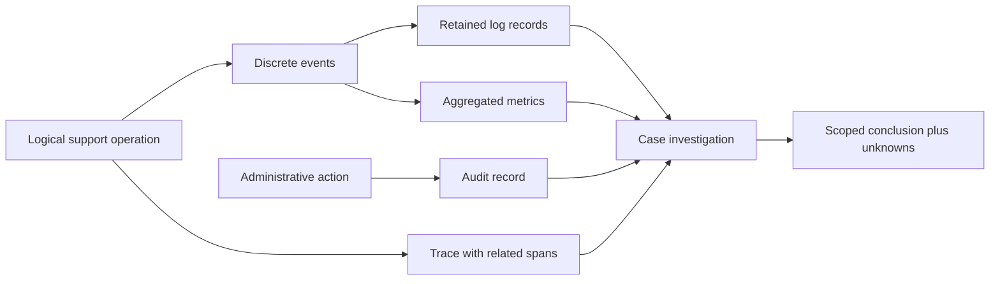
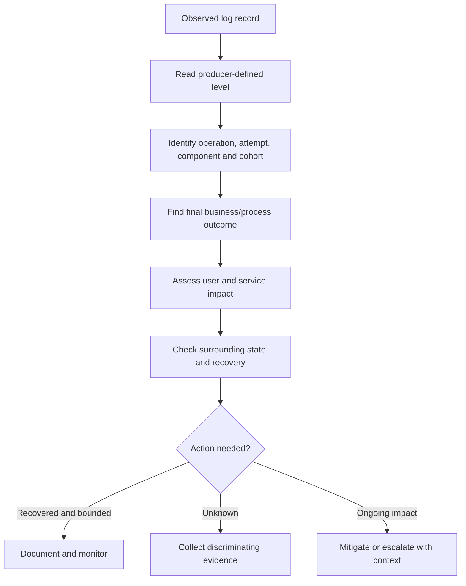
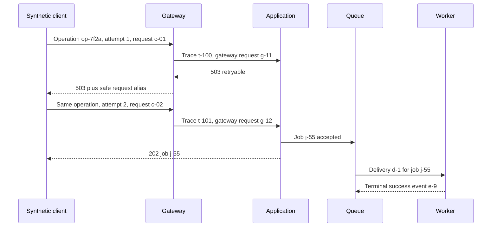
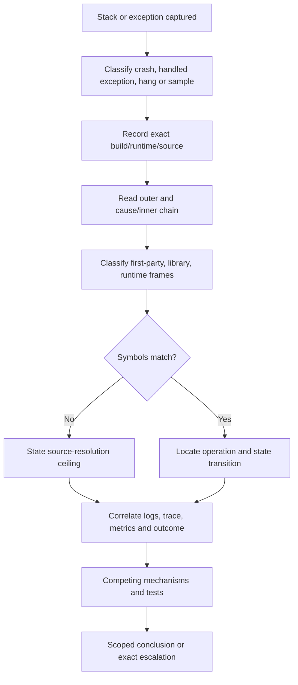
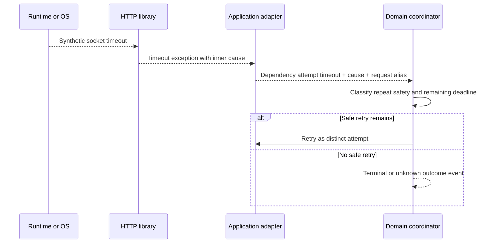
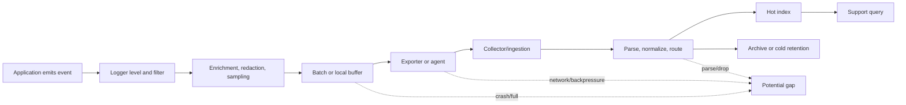
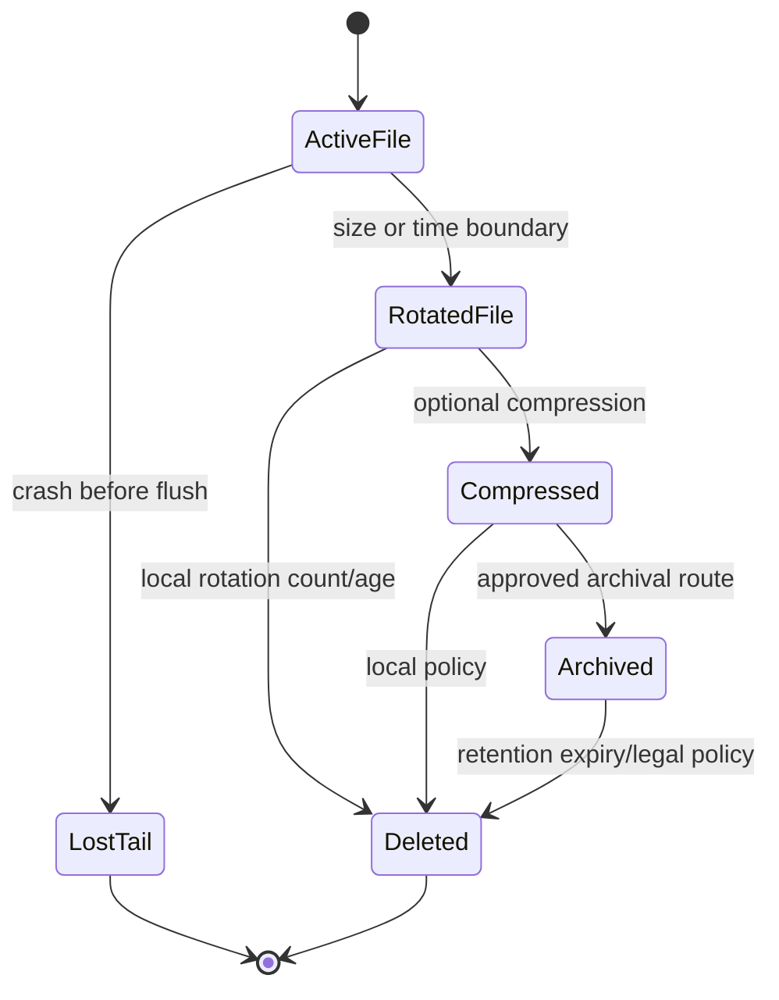
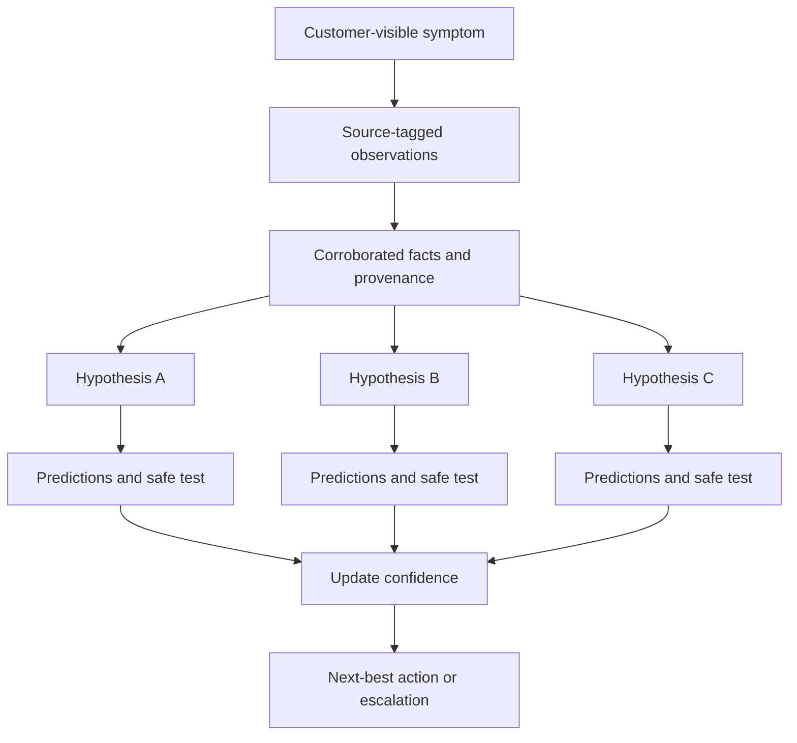
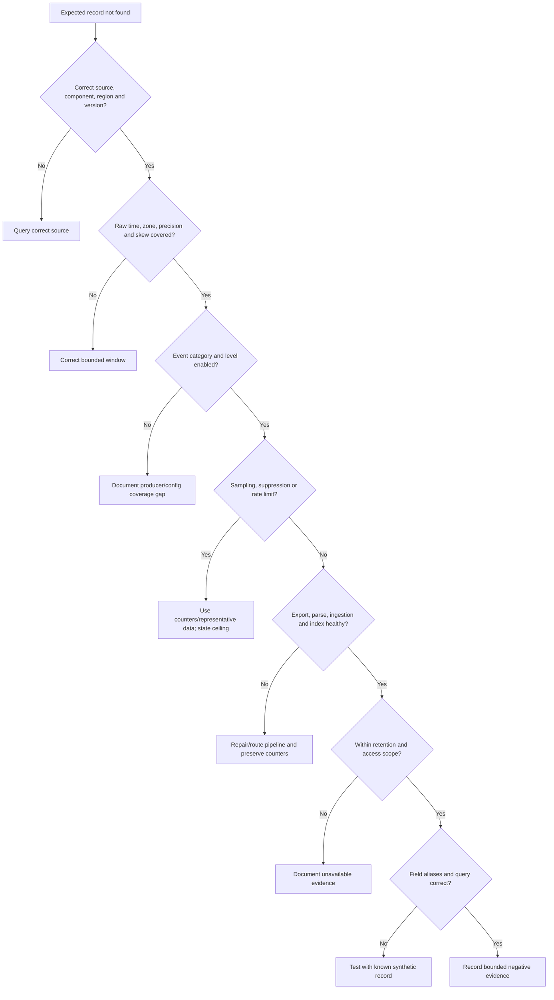

# Part 092 - Logging Fundamentals Structured Events and Stack Traces

> **Purpose:** Build a beginner-first method for reading, designing, and requesting logs without confusing an observation with a cause. This Part distinguishes events, logs, traces, and metrics; explains levels, structured fields, context, exceptions, stack frames, sampling, rotation, retention, and privacy; and turns incomplete telemetry into safe support evidence.
>
> **Artifact label:** **Offline synthetic log-reading lab** using invented JSON Lines, text records, stack traces, and a paper evidence worksheet. It uses no customer data, production telemetry, credential, live endpoint, third-party upload, broad collection, destructive command, or Abnormal-specific internal claim.
>
> **Currency and source access date:** August 24, 2026.

## Section goal

By the end of this Part, you should be able to look at a page of diagnostic output and explain what kind of evidence it is, what each field means, what can safely be concluded, and what remains unknown. You should distinguish an **event**, meaning one recorded occurrence, from a **log**, meaning a retained record or stream of records; a **trace**, meaning the path of one operation across work units; and a **metric**, meaning a numerical measurement aggregated over labels and time. You should understand that the four signals overlap but answer different questions.

You should read severity levels as routing and attention hints rather than universal truth. A record labeled `ERROR` may describe a recovered attempt, while an `INFO` record may reveal the state transition that explains the incident. You should use stable event names, source/component, timestamp semantics, operation and attempt identifiers, tenant-safe aliases, outcome, duration, error type, and version fields. You should compare structured JSON records with free text, knowing that structured data improves reliable filtering but does not guarantee correct semantics.

You should reconstruct context. One logical operation may create many HTTP attempts, queue deliveries, trace spans, and log events. A correlation identifier joins records only within its documented scope; it is not authorization, proof of causation, or permission to disclose content. You should read a stack trace from the exception outward, identify frames, modules, functions, source locations, asynchronous boundaries, wrappers, and causal chains, and separate first-party application frames from library/runtime/framework frames. The first frame shown is not automatically the defective frame.

You should reason about telemetry pipelines. A program emits a record; processors may enrich, filter, sample, batch, buffer, serialize, forward, index, retain, rotate, archive, or delete it. Any stage can lose, delay, duplicate, transform, or redact evidence. Sampling can preserve population trends or representative traces while omitting the one record support wants. Rotation limits local file size but is not the same as centralized retention. Retention is a policy and capability boundary, not an invitation to collect more.

You should protect privacy and security. Logs can accidentally become a durable copy of authorization headers, cookies, tokens, private keys, message bodies, email addresses, tenant identifiers, URLs with query values, or stack-local data. Redaction after collection is weaker than not emitting the value. Ordinary support evidence should use allowlisted fields, aliases, categories, sizes, booleans, and approved identifiers. Raw sensitive evidence, when truly necessary and authorized, belongs in a restricted channel with purpose, access, retention, deletion, and exposure review.

Finally, you should treat logging as evidence engineering. “No matching log” is weak until enablement, source, level, sampling, filter, time range, clock, ingestion delay, retention, permissions, and query correctness are checked. A useful support response states the observation, its provenance, the evidence ceiling, competing explanations, and the smallest next collection or test. It never upgrades a message string into root cause without a mechanism and discriminating evidence.

## JD Mapping

| Supplied role signal | Capability developed | Support application | Proof artifact |
|---|---|---|---|
| Complex investigations | Reads records as scoped evidence and reconstructs state | Configuration, API, connector, and threat cases | Synthetic event ledger |
| API questions | Correlates operation, request, attempt, and error records | Retry, timeout, validation, and async outcomes | Identifier map |
| Behavioral false-positive cases | Separates observed verdict metadata from causal claim | Detection review without inventing internals | Evidence-ceiling statement |
| Threat investigations | Uses minimal event context while protecting content | Timeline, actor/action/result, and escalation | Redacted timeline |
| Engineering collaboration | Supplies reproducible, structured, provenance-rich records | Product defect escalation | Evidence packet |
| Customer trust | Avoids secrets, PII, and unsupported conclusions | Safe collection and clear updates | Redaction manifest |
| Recurring-pattern detection | Uses fields and metrics without losing case context | Trend review and support analytics | Event taxonomy |
| Knowledge creation | Documents field semantics and known gaps | Runbooks and KCS articles | Logging checklist |
| enterprise support transfer | Applies evidence-led troubleshooting and escalation habits | Windows/cloud/client boundaries | Honest transfer narrative |
| Honest positioning | Labels synthetic practice and proprietary unknowns | Interview and onboarding | Candidate boundary statement |

## Candidate honesty note

You can truthfully connect this Part to production experience interpreting diagnostics, collecting evidence, coordinating escalations, and communicating uncertainty in enterprise support. You can demonstrate structured-log and stack-trace reasoning through the offline lab. You must not claim access to Abnormal's internal telemetry, production logging architecture, event taxonomy, stack traces, source code, sampling rules, retention, dashboards, or proprietary detection logic.

| Evidence tier | Safe wording | Boundary to preserve |
|---|---|---|
| Production transfer | “I have used diagnostic evidence to narrow client/cloud issues and create Engineering-ready escalations.” | Use only real examples from your own work you can defend |
| Working familiarity | “I can distinguish logs, traces, metrics, structured fields, and exception chains.” | Familiarity is not platform ownership |
| Offline lab | “I built and analyzed a fictional JSON/text/stack-trace evidence set.” | No live collector or production source |
| Learned architecture | “Telemetry commonly passes through filtering, sampling, export, indexing, and retention stages.” | Exact implementation varies |
| No direct experience | “I have not used Abnormal's internal logging or observability systems.” | State directly |
| Unknown until authorized | Event schemas, internal component names, source maps, trace backend, sampling, retention, access, and escalation paths | Verify in current approved documentation |

## 1. Four observability signals from zero

**Observability** is the ability to infer a system's internal state from outputs it exposes. The word does not mean “there are lots of logs.” Useful observability requires meaningful signals, documented semantics, bounded collection, and a way to connect technical state to user outcome.

An **event** is one occurrence represented as data: a sign-in decision, a webhook acceptance, a queue retry, a configuration change, or an exception. An event usually answers “what was recorded at this moment?” A **log** is a retained record of an event or a stream/file/index containing many records. A **trace** follows one operation through related units called **spans**. A **metric** is a number measured or aggregated over time, such as request count, error ratio, latency distribution, or queue age.

| Signal | Plain meaning | Best question | Typical shape | Main limitation |
|---|---|---|---|---|
| Event | One recorded occurrence | What happened at this source? | Named record with time and fields | One source's observation |
| Log | Stored event narrative/record stream | What details were recorded? | Text, JSON, journal, table | Volume, gaps, privacy, inconsistent semantics |
| Trace | Related operation path | Where did this operation spend time or fail? | Trace with parent/child spans | Sampling and propagation gaps |
| Metric | Numerical measurement | Is behavior changing at population level? | Counter, gauge, histogram, summary | Loses individual context |
| Audit record | Security/accountability event | Who changed what, when, and with what result? | Actor/action/target/result | Availability and semantics vary |
| Profile | Sampled runtime activity | Where is CPU/memory/time concentrated? | Stack samples/allocation data | Not a business-event history |

Think of an airport. One passenger's boarding scan is an event. The scanner's retained file is a log. The itinerary across check-in, security, gate, and aircraft resembles a trace. The hourly number of delayed flights is a metric. The analogy stops because software signals can be sampled, transformed, duplicated, clock-skewed, and governed by different privacy policies.



The signals support one another. A metric spike can identify a time window. A trace can identify a slow dependency. Logs can explain a state transition. An audit record can show that configuration changed. None alone guarantees root cause. If a metric shows errors rising after a change, both may be caused by a third factor such as traffic mix, dependency outage, or a deployment elsewhere.

### Signal selection by support question

| Support question | Start with | Add next | Do not assume |
|---|---|---|---|
| “Is this widespread?” | Metrics by safe dimensions | Case samples and service health | Aggregate error equals one defect |
| “What happened to this request?” | Request/operation logs | Trace, gateway/origin records, state | Same timestamp means same request |
| “Who changed configuration?” | Audit record | Change ticket and effective config | Recorded actor intended the result |
| “Where was time spent?” | Trace/span durations | Dependency metrics and logs | Longest span caused user symptom |
| “Why was this verdict produced?” | Approved verdict evidence | Config, inputs, timeline, documented signals | Support can infer proprietary model internals |
| “Why is there no record?” | Pipeline/coverage checks | Source health and controlled reproduction | Absence proves nonoccurrence |

## 2. Event and log anatomy

A useful event is a statement with explicit semantics. It names the occurrence, source, time, context, and result. Free-form prose alone forces humans and regular expressions to rediscover fields. Structured events make fields separately queryable, but only if producers maintain stable meanings and types.

Consider this entirely fictional record:

```json
{"schema_version":"1.0","timestamp":"2026-08-24T14:03:12.482Z","event_name":"connector.delivery.attempt.completed","severity":"WARN","service":"relay-lab","environment":"synthetic","operation_id":"op-7f2a","attempt_number":2,"request_id":"req-b91c","target_alias":"sink-A","outcome":"retryable_failure","duration_ms":1500,"error_type":"upstream_timeout","http_status":504,"payload_bytes":412,"contains_customer_content":false}
```

Every value is invented. There is no hostname, tenant, user, email address, token, cookie, message body, URL query, private address, or vendor endpoint. The record communicates that one component observed one attempt ending as a retryable timeout. It does **not** prove that the upstream service was defective, that no state was committed, that the user's operation failed finally, or that retrying is safe.

| Field category | Example | Why it matters | Privacy/safety rule |
|---|---|---|---|
| Schema | `schema_version=1.0` | Interprets names and types | Record producer and schema revision |
| Event identity | `event_name=...completed` | Stable machine meaning | Prefer stable names over parsing prose |
| Time | RFC 3339-style UTC string | Places source observation | Preserve raw value and precision |
| Source | service/component/version/environment | Establishes provenance | Avoid internal topology beyond need |
| Logical context | operation ID | Connects one business intent | Alias and document scope/lifetime |
| Attempt context | attempt number/request ID | Separates retries | Never use ID as authorization |
| Outcome | explicit state/category | Supports deterministic filtering | Distinguish attempted, accepted, completed |
| Duration | milliseconds | Supports timing analysis | Document measurement boundary/clock |
| Error | stable type/code plus safe message | Groups mechanism candidates | No stack/local values in customer channels |
| Resource | safe alias/category | Scopes affected object | Avoid raw tenant/user/message identifiers |
| Data handling | content-present boolean/size | Shows evidence boundary | Do not emit content by default |

An event name should describe what occurred, not merely where the code is. `connector.delivery.attempt.completed` is clearer than `handleRequest`. Outcome should be a field rather than encoded only in severity. A completion event can be success, retryable failure, permanent failure, cancelled, or unknown. Version fields matter because field semantics and code behavior change.

### 🔍 Plain-English deep-dive: A log line is testimony, not a camera recording

A log record is written by code at a chosen point. The code chooses what to name, include, omit, transform, and classify. If the code is wrong, stale, or reached before a later failure, the record can be misleading without being fabricated. A “saved successfully” message might mean an in-memory object was accepted, not that a durable database commit completed. A “request failed” message might describe one retry while the operation later succeeds.

Think of a warehouse checkpoint clerk recording “parcel entered sorting.” That note proves the clerk's system recorded entry; it does not prove the parcel reached the recipient or that its contents were correct. The analogy stops because software can emit multiple records automatically, buffer them, lose them during crashes, or attach identifiers across systems.

For every important record ask: who emitted it, at which code/state boundary, before or after which durable action, with what schema/version, under what filters, and what later events can supersede it? Phrase conclusions as “component X recorded Y at time Z” before moving to causal interpretation.

## 3. Severity levels and why names are not universal

Log levels control attention, routing, storage, and cost. Common names include `TRACE`, `DEBUG`, `INFO`, `WARN` or `WARNING`, `ERROR`, `CRITICAL`, and `FATAL`. Their exact order and meaning depend on framework and team policy. Some ecosystems include `OFF`, `ALL`, `NOTICE`, `ALERT`, or numeric priorities. Never translate level names across systems without checking documentation.

| Level concept | Suitable use | Poor use | Support interpretation |
|---|---|---|---|
| Trace | Fine-grained execution in tightly controlled diagnosis | Always-on payload dumping | High volume; often disabled/sampled |
| Debug | Developer-oriented state useful for diagnosis | Secrets or personal data | May be absent in production |
| Information | Normal lifecycle/state transitions | One line for every low-value loop | Often best context for sequence |
| Warning | Unexpected/recovered/degraded condition | Every customer mistake | May not mean user-visible failure |
| Error | Operation/component could not meet expected result | Recovered attempt with no context | Determine scope and final outcome |
| Critical/Fatal | Process/service integrity or continuation threatened | Ordinary failed request | Check process/service state and recovery |
| Audit/security | Accountability or policy decision | General debug narrative | Governed separately from app severity |

Severity is not business impact. One `ERROR` for a background retry may have no customer impact; millions of `INFO` records showing growing queue age may reveal a major incident. Support should combine severity with operation outcome, cohort, frequency, duration, service objective, and customer impact.



Changing a global level to `DEBUG` can create performance, cost, privacy, and retention risk. Prefer a time-bounded, component-scoped, request-scoped, or feature-controlled diagnostic mode approved by the owner. Record who enabled it, why, start/end UTC, expected fields, storage destination, access, and cleanup. Never ask a customer to “turn on everything.”

## 4. Structured JSON versus unstructured text

**Structured logging** writes fields with names and types, often as JSON, a binary protocol, or a platform event object. **Unstructured logging** writes a human-oriented string. In practice, records may be semi-structured: a timestamp and level prefix plus a message containing key-value pairs.

| Dimension | Structured event | Free text | Practical boundary |
|---|---|---|---|
| Query | Filter typed fields | Parse words/patterns | Field semantics still need documentation |
| Type | Number/boolean/object retained | Often string | Exporters may coerce types |
| Evolution | Version/add fields | Message wording changes | Consumers must tolerate known evolution |
| Localization | Stable names possible | Human language can vary | Do not parse localized message for control |
| Privacy | Allowlists possible | Easy accidental interpolation | Structured does not automatically redact |
| Cardinality | Fields enable dimensions | Hidden in strings | IDs/user values can still explode indexes |
| Human reading | Consistent but verbose | Often concise | Render structured fields for humans |
| Exceptions | Typed error fields + stack | Stack embedded in message | Preserve multiline boundaries safely |

JSON is a serialization format, not a quality certificate. A structured field named `success=true` can still be set before durable completion. The producer can put a token in `debug_context`. A numeric field can change units. An exporter can flatten nested data or convert an integer to a string. The schema and event contract matter more than braces.

Use **parameterized logging**, where a stable template and separate values are supplied to the framework, instead of concatenating arbitrary text. This can preserve field identity and reduce formatting mistakes, but sensitive values remain sensitive. An allowlist should decide which values can ever be emitted. Do not rely only on a regular-expression scrubber after the fact.

### Event-schema design rules

1. Use stable event names representing domain state transitions.
2. Record source component, code/deployment version, environment, and schema version.
3. Use an unambiguous timestamp and define whether it is event, process, or export time.
4. Separate logical operation, attempt, trace/span, request, job, event, and delivery identifiers.
5. Record explicit outcome and state; do not infer solely from level or prose.
6. Use stable error type/code and safe human summary; retain causal chain only in restricted telemetry.
7. Use consistent units in names, such as `duration_ms` or standard semantic conventions.
8. Avoid unbounded values in metric labels and indexed dimensions.
9. Exclude credentials, session material, private keys, raw message/customer content, and unnecessary PII.
10. Document optionality, null, unknown enum behavior, evolution, retention, and access.

```mermaid
flowchart LR
    State[Domain state transition] --> Name[Stable event name]
    Name --> Context[Approved typed context]
    Context --> Safety[Allowlist and sensitivity check]
    Safety --> Serialize[Structured serializer]
    Serialize --> Export[Exporter pipeline]
    Export --> Store[Controlled index/storage]
    Store --> Query[Documented query and rendering]
    Query --> Decision[Scoped support decision]
```



## 5. Context and correlation

**Context** is information that explains where an event belongs: operation, user-safe resource alias, tenant-safe partition, request attempt, trace span, code version, region, configuration revision, and parent state. **Correlation** links records believed to relate to the same activity. Correlation is strongest when stable identifiers are intentionally propagated and field scope is known.

| Identifier | Represents | Can change when | Common misuse |
|---|---|---|---|
| Operation ID | One logical business/support intent | New intent or changed desired state | Reusing forever across unrelated work |
| Request ID | One HTTP/RPC request at one boundary | Every retry or hop, depending on contract | Assuming globally unique |
| Trace ID | One distributed trace | New trace/root or propagation loss | Assuming every service recorded it |
| Span ID | One timed work unit | Each child operation | Treating it as request identity everywhere |
| Parent span ID | Causal trace relationship | Root or broken propagation | Equating parentage with business authorization |
| Job/operation URL ID | Async server work | New accepted job | Treating initial 202 as completion |
| Event ID | Domain occurrence | Each source event | Confusing with webhook delivery |
| Delivery ID | One delivery/redelivery identity | Provider contract varies | Assuming duplicate delivery means duplicate event |
| Message ID | Message instance in mail/queue | Forward/copy/provider behavior | Disclosing raw customer ID |
| Error instance | One problem occurrence | Each response/occurrence | Auto-following an untrusted URI |

One operation may have three retries, each with a request ID and trace. A gateway may create another request ID. An async server can return a job ID. Completion can produce an event delivered twice, each with a delivery identity. Good logs preserve these distinctions.



Correlation fields are often untrusted input. W3C Trace Context defines interoperable `traceparent` and `tracestate` processing, but receiving a trace identifier does not make a caller trustworthy. Systems must validate format, prevent abuse, avoid putting sensitive data in trace state/baggage, and apply authorization independently. A malicious caller can choose identifiers or create cardinality pressure.

### 🔍 Plain-English deep-dive: Correlation is a join, not a verdict

When two records share an identifier, the safest initial statement is “these records claim or were designed to belong to the same context.” The link becomes stronger when the identifier's creator, propagation path, scope, route, tenant-safe partition, timestamps, parent relationship, and state sequence agree. It still does not prove which component caused a failure.

Think of a claim number printed on letters from an insurer, repair shop, and customer. The number helps collect documents into one folder. It does not prove every statement is correct or decide who caused the accident. The analogy stops because software identifiers can be user-supplied, regenerated, truncated, sampled, or reused incorrectly.

For support, create an identifier map rather than one “correlation ID” column. Record identifier type, value alias, issuer, scope, lifetime, source, parent relationship, sensitivity, and expected propagation. If one boundary drops context, use adjacent identifiers plus a narrow time/route/state match and label confidence.

## 6. Stack traces from first principles

A **call stack** is the nested chain of active function calls on a thread or execution context. A **stack frame** represents one function invocation, often showing module, function or method, source file/line if symbols exist, and an offset or address. A **stack trace** is a textual or structured representation of frames captured at an exception, error, sample, or explicit diagnostic point.

An **exception** is a language/runtime mechanism for reporting an abnormal condition. An exception has a type, message, optional code/data, stack, and sometimes an inner/cause exception. Catching and rethrowing can preserve, wrap, reset, or lose stack information depending on language and code. Asynchronous runtimes may synthesize frames or split logical call chains across tasks.

Fictional synthetic trace:

```text
SyntheticDeliveryError: terminal delivery result unavailable
  at SupportLab.DeliveryCoordinator.CompleteAsync(DeliveryCoordinator.cs:188)
  at SupportLab.DeliveryCoordinator.RunAsync(DeliveryCoordinator.cs:121)
  at Framework.AsyncTaskRunner.Resume(TaskRunner.cs:74)
Caused by: SyntheticTimeoutError: dependency exceeded 1500 ms attempt budget
  at SupportLab.DependencyClient.SendAsync(DependencyClient.cs:96)
  at Library.HttpPipeline.InvokeAsync(HttpPipeline.cs:402)
Caused by: SyntheticSocketTimeout: read deadline reached
  at Runtime.Socket.ReadAsync(Socket.cs:811)
```

Nothing in this trace came from a real system. Read it as a causal chain, not just top to bottom. The outer `SyntheticDeliveryError` tells the calling layer's domain interpretation. The middle `SyntheticTimeoutError` identifies an attempt-budget observation. The innermost socket timeout is the lowest exposed mechanism. None proves why bytes did not arrive: dependency overload, network loss, proxy delay, an incorrect timeout, server commit after disconnect, thread starvation, or synthetic injection could fit.

| Trace element | Meaning | Useful question | Caution |
|---|---|---|---|
| Exception type | Programmatic failure category | Stable and documented? | Wrappers can hide original type |
| Message | Human description | Does it add bounded context? | Wording is unstable and may leak data |
| Error/status code | Framework/OS/domain code | Which layer owns semantics? | Same number can differ by facility |
| Top frame | Current throw/capture location | Throw, catch, wrapper, or failure site? | Not automatically root cause |
| First-party frame | Application/team-owned code | What input/state/action occurred? | Ownership does not prove defect |
| Library frame | Dependency/framework code | Called correctly? known version behavior? | Do not blame library by location alone |
| Runtime/OS frame | Execution primitive | What lower-level mechanism surfaced? | Often symptom boundary |
| Source line | Symbol-resolved location | Exact build/source match? | Mismatched symbols mislead |
| Offset/address | Binary location | Correct module/build/architecture? | Requires symbols and privacy controls |
| Cause/inner chain | Wrapped lower-level exception | What original mechanism remains? | Chain can be truncated |
| Async boundary | Suspended/resumed work | Is logical caller represented? | Thread stack differs from logical stack |

### A disciplined reading order

1. Record process/service, component, build, runtime, operating system, architecture, and capture source.
2. Record exception type/code and the complete causal/inner chain, not message alone.
3. Identify whether the trace is exception, crash, hang, sampled profile, or manually captured stack.
4. Confirm symbols/source match the exact build. Treat missing or mismatched symbols as a ceiling.
5. Find the first meaningful first-party frame nearest the inner mechanism.
6. Inspect arguments/state only under authorization; never copy secrets, content, or raw memory casually.
7. Ask what operation and attempt the stack belongs to and whether execution recovered.
8. Correlate prior/later state events, final outcome, metrics, and traces.
9. Form competing mechanisms and predictions.
10. Escalate with version, exception chain, safe frames, reproduction, and exact question.



## 7. First-party, library, framework, and runtime frames

**First-party** code is owned by the application/product team under investigation. **Library** code is a dependency called by the application. A **framework** supplies broader execution patterns such as web request dispatch or asynchronous task scheduling. A **runtime** executes language/managed/native primitives. Operating-system frames expose lower-level services. Ownership can overlap; exact classification requires module/package provenance.

| Frame class | What it can reveal | Questions before blame | Escalation evidence |
|---|---|---|---|
| First-party domain | State transition and inputs expected by product | Was contract/state valid? error handled? | Method, build, safe state, repro |
| First-party adapter | Translation to API/library | Correct timeout, auth, serialization, cancellation? | Sanitized request shape/config |
| Third-party library | Parsing, transport, retry, crypto behavior | Exact version? documented contract? called correctly? | Package/runtime/version/raw evidence |
| Framework | Dispatch, middleware, async lifecycle | Expected plumbing frame or abnormal path? | Pipeline config and preceding frames |
| Runtime | Task, memory, socket, exception machinery | Original exception and app context? | Runtime/build/OS and inner cause |
| OS | File/network/process primitive | Error code/facility, resource state, permissions? | Scoped OS evidence and timing |
| Unknown/no symbols | Address/module only | Correct binary and symbol availability? | Hash/build/module/offset, restricted channel |

The “first application frame” heuristic is useful because it identifies where application code invoked or handled a lower layer. It is not a verdict. If application code correctly calls a library and the library has a verified defect, ownership lies elsewhere. If a library rejects invalid input, the first-party caller may own the mistake. If the stack is captured after an error was wrapped, neither visible frame may show the initiating condition.

Optimizations can inline functions, remove frames, reorder code, or make source lines approximate. Identical machine code can share addresses. Tail calls can omit callers. Native corruption can make unwinding wrong. Async stacks can represent logical continuations rather than one thread. State these limits instead of forcing certainty.

### 🔍 Plain-English deep-dive: The top frame is where the alarm rang, not necessarily where the fire began

A stack trace usually shows where an exception was thrown, observed, or captured. The condition may have originated earlier: a malformed configuration loaded minutes before, a token expired, a queue item became stale, memory was corrupted, or a cancellation deadline elapsed. The visible location can be a guard that correctly detects prior damage.

Think of a smoke alarm in a hallway. Its location tells you where smoke reached the sensor, not necessarily which room started the fire. The analogy stops because software guards can inspect state deliberately and causal exception chains may point to lower layers.

Use the top frame to locate the observation boundary. Then move backward through the causal chain, preceding state changes, input provenance, configuration/version changes, and operation timeline. A root-cause claim needs a trigger and mechanism that predict the observed frames and that survives comparison with alternatives.

## 8. Exception handling, causal chains, and failure semantics

Applications often translate low-level errors into domain language. A socket timeout can become an HTTP timeout, then a connector delivery error, then a case status. Translation is valuable when it preserves the original cause and adds safe context. It is harmful when code catches every exception and emits only “something went wrong.”



| Handling pattern | Benefit | Risk | Better practice |
|---|---|---|---|
| Catch and rethrow unchanged | Allows cleanup/context boundary | Some languages reset stack if done incorrectly | Use language-preserving rethrow |
| Wrap with cause | Adds domain meaning | Cause omitted or message leaks values | Preserve typed cause and safe fields |
| Catch all and continue | Can isolate noncritical work | Hides corruption/unknown state | Catch only expected classes; define invariant |
| Log then rethrow | Leaves evidence | Duplicate logs at every layer | Log once at owning boundary or add distinct state event |
| Convert to status | Stable external contract | Internal detail lost | Keep restricted cause and public safe problem |
| Suppress expected exception | Reduces noise | Removes useful counts/context | Emit metric or bounded event if operationally relevant |
| Retry inside catch | Recovers transient failure | Duplicate side effects/retry storm | Verify transient, repeat-safe, budget, idempotency |

An exception record should distinguish `error.type`, stable `error.code` where applicable, safe `error.message`, and a causal chain. Stack traces are usually high-cardinality and potentially sensitive; storing every stack for every repeated exception can be expensive and risky. A fingerprint based on approved stable frame identities can group cases, but fingerprints may collide or split after builds. Preserve representative restricted samples under policy and use counts for populations.

Never show raw internal stack traces to customers by default. They can reveal source paths, usernames, internal hosts, library versions, SQL text, query values, or tokens embedded in messages. Customer-facing communication should translate the verified mechanism and action without exposing internals. Engineering can receive a minimized stack in the approved restricted channel.

## 9. Telemetry pipeline, buffering, sampling, and loss

Emitting code does not write directly into every query result. A record may pass through an in-process logger, filter, processor, exporter, local buffer, agent, network, collector, transformation, ingestion queue, index, archive, and query layer. Each stage has health, limits, permissions, and time semantics.



| Pipeline stage | Failure or transformation | Evidence to check | Safe response |
|---|---|---|---|
| Producer | Event path never executed or bug | Code/version/reproduction/state | Do not assume logging gap alone |
| Level/filter | Record below threshold or category excluded | Effective config and event category | Scoped temporary adjustment if approved |
| Processor | Redacted, sampled, renamed, dropped | Processor rules/version/counters | Preserve transformation provenance |
| Buffer/batch | Crash, full queue, flush delay | Drop/queue/flush health | Bound buffers and shutdown flushing |
| Exporter/agent | Auth, network, quota, format failure | Export error/drop counters | Repair pipeline without exposing payload |
| Collector | Rejection/backpressure | Receiver health/status | Check ingestion latency and limits |
| Parser/router | Schema mismatch/wrong destination | Parse/dead-letter/routing metrics | Correct schema or query target |
| Index | Delay, retention, access, partition | Ingestion timestamp/retention/permissions | State availability ceiling |
| Query | Wrong time/field/syntax/filter | Query text, zone, scope, sample record | Test broad-to-narrow safely |

**Sampling** selects a subset of records. Head-based trace sampling decides near trace start; tail-based sampling can decide after observing more of a trace, subject to implementation. Log sampling may keep one of repeated events. Metrics are already aggregated and may use sampled measurements for distributions. Sampling design affects what absence means.

| Sampling approach | Useful for | Distortion risk | Support requirement |
|---|---|---|---|
| Fixed probability | Representative traffic estimate | Rare failures may be missed | Record probability and weighting semantics |
| Rate limit | Bound repeated volume | Bursts/tenants may be uneven | Count dropped/suppressed events |
| First N per interval | Preserve examples | Later variants disappear | Keep aggregate counts/fingerprints |
| Error-biased | Retain failures | Success baseline underrepresented | Know policy before calculating rates |
| Trace head sampling | Low overhead | Decision lacks downstream outcome | Propagate sampling decision correctly |
| Trace tail sampling | Keep slow/error traces | Collector cost/delay/partial traces | Document decision window and capacity |
| Dynamic/adaptive | Respond to volume | Population changes over time | Version policy and preserve metadata |

### 🔍 Plain-English deep-dive: Missing telemetry has many causes

If support cannot find a record, at least three broad explanations exist: the event did not occur, the event occurred but no record was emitted, or a record was emitted but did not survive or match the query. Sampling, level filters, clock errors, routing, ingestion delay, parser failure, retention, permissions, and aliases all fit the last two categories.

Think of looking for a parcel in a warehouse database. The parcel may never have arrived, may have arrived without a scan, or may have been scanned into another depot under a mistyped label. The analogy stops because telemetry pipelines can intentionally sample records and maintain separate event and ingestion times.

Before using absence, verify source/component/region, event class and level, effective logging config, sampling/suppression, pipeline health and delay, retention, access, raw and normalized time range, identifiers, schema/field aliases, and query logic. Then write a bounded negative: “Within source S, UTC window W, retained unsampled event class E, and query Q, no matching operation alias was returned.”

## 10. Rotation, retention, and retrieval boundaries

**Rotation** closes or renames an active local log file and starts another based on size, time, or policy. It may compress and eventually remove old files. **Retention** determines how long records remain available in a store or archive. They solve related but different problems. A process may rotate files every hour while a central platform retains indexed events for 30 days. Or local files may retain longer than the central index.



| Concept | Controls | Does not guarantee | Support question |
|---|---|---|---|
| Rotation interval | Active file size/time | Central ingestion or retention | Which file covers the event window? |
| Local file count | Local disk usage | Archived availability | Was file overwritten before collection? |
| Compression | Storage efficiency | Searchability or integrity | Tool/version and safe extraction? |
| Hot retention | Fast query window | Cold archive absence | Is data merely outside hot index? |
| Archive retention | Longer availability | Immediate retrieval or all fields | Retrieval approval and latency? |
| Backup | Recovery objective | Log-evidence completeness | Is restoration appropriate/authorized? |
| Legal hold | Suspends deletion under authority | Broad support access | Who authorizes and scopes access? |
| Deletion | Privacy/cost lifecycle | Erasure from every backup instantly | Policy, verification, and residual copies? |

Longer retention increases investigation reach but also privacy, breach, access, and cost exposure. Choose retention from business, security, legal, and operational requirements. Do not increase retention casually to make support easier. High-volume debug records may have shorter retention than audit events; audit integrity and access may be more restrictive.

When asking for a rotated file, request only the named component and narrow time window. Include timezone, first/last occurrence, file pattern, and maximum size. Avoid recursive collection across a drive or every service. Hashing an approved evidence copy can demonstrate that analysis used the same bytes, but a hash does not prove the original record was truthful or complete.

## 11. PII, secrets, customer content, and safe event design

**Personally identifiable information (PII)** is information that identifies or can reasonably link to a person, depending on law and context. Security and privacy classification is organization-specific. In support evidence, assume email addresses, account names, IP addresses, device identifiers, message IDs, tenant IDs, content, and precise behavioral records may be sensitive. Credentials and cryptographic secrets require stricter handling.

| Data class | Examples | Ordinary telemetry rule | Diagnostic exception boundary |
|---|---|---|---|
| Authentication secret | Password, bearer token, cookie, API key | Never emit | Do not collect; revoke if exposed |
| Private key/seed | TLS private key, signing key, recovery seed | Never emit | Never place in support package |
| Customer content | Email body, attachment, chat/document text | Exclude | Explicit authorization, minimum excerpt, restricted channel |
| Identity/PII | Email, name, account/device/IP | Alias or omit | Approved need, access, retention, redaction |
| Tenant/resource ID | Directory/message/object ID | Safe alias where possible | Keep only needed join key; restrict mapping |
| URL/query/header | May contain tokens/content | Log route template and safe header names | Strip query/fragment/credential values |
| Stack/local variables | Paths, SQL, arguments, memory | Safe frames/type only | Restricted approved capture; review exposure |
| Operational aggregate | Count, latency, category | Prefer bounded low-cardinality dimensions | Re-identification and small-cohort review |

Use **data minimization**: collect only what is needed for the stated question. Use **purpose limitation**: do not reuse diagnostic content for another purpose without authority. Use access control, encryption, retention, deletion, and auditing. Redaction should be structural: parse the record, allowlist fields, replace approved identifiers consistently with aliases, then serialize and reparse. Search for forbidden field names and patterns, but do not claim pattern searching proves no sensitive data remains.

Bad record:

```text
ERROR login failed user=real.person@example.invalid Authorization=Bearer abc... cookie=session... body={full message}
```

Safe synthetic pattern:

```json
{"event_name":"authentication.decision","principal_alias":"actor-17","result":"denied","reason_category":"expired_session","auth_scheme":"bearer","credential_present":true,"credential_value_logged":false,"customer_content_logged":false}
```

Even the safe pattern requires policy review. `principal_alias` can remain linkable; `reason_category` can be sensitive; small cohorts can re-identify people. “Hashed” is not necessarily anonymous, especially for guessable email addresses. A keyed alias controlled by the evidence owner can reduce casual disclosure, but key management and authorized reversal remain concerns.

## 12. Logs as observations, hypotheses, and causal evidence

Support reasoning should label evidence:

| Label | Meaning | Example |
|---|---|---|
| Observation | What a source displayed/recorded | Client logged timeout at 14:03:12Z |
| Fact | Corroborated statement with provenance | Attempt 2 used request alias req-b91c in client and gateway records |
| Inference | Reasonable interpretation from facts | Gateway likely handled the same attempt |
| Hypothesis | Testable possible mechanism | Upstream processing exceeded gateway deadline |
| Prediction | Evidence expected if hypothesis is true | Origin start exists before gateway timeout and completion occurs later |
| Unknown | Relevant unresolved question | Whether origin committed state |
| Conclusion | Best-supported scoped explanation | Gateway timed out before observed origin completion; commit status verified later |
| Evidence ceiling | Limit on certainty | Origin logs were sampled after acceptance |



A message saying “database unavailable” may be a hard-coded category for many failures. A stack ending in a database library can arise from bad credentials, DNS, TLS, network policy, pool exhaustion, timeout, invalid query, cancellation, or server outage. Root cause requires mechanism, trigger, impact path, and evidence that discriminates alternatives.

When a product offers proprietary detections, support must not infer hidden features from a generic record. Use approved customer-visible evidence and documentation. State “the platform recorded outcome category X” and verify configuration, scope, timestamps, and known signals. Escalate questions about undocumented internal decisions rather than inventing an explanation.

## 13. Logging gaps and support evidence requests

The best evidence request starts with a question. “Please send all logs” is broad, costly, privacy-risky, and often analytically weak. A scoped request names the hypothesis boundary, component, event types, time window, timezone, identifiers, expected volume, collection method, redaction, secure channel, retention, and stop condition.

| Request element | Good specification | Why it matters |
|---|---|---|
| Question | Distinguish client retry from server duplicate processing | Prevents data fishing |
| Source | Connector service attempt-completion events | Avoids every component |
| Window | 14:02:30Z–14:04:30Z plus stated skew margin | Bounds volume |
| Identifiers | Operation alias and request aliases only | Supports joins without raw IDs |
| Fields | Event/source/version/time/outcome/duration/error category | Allowlists data |
| Level | Existing information/warning records first | Avoids global debug |
| Completeness | Note sampling/filter/ingestion/retention | Interprets absence |
| Redaction | Remove auth/cookies/query/content/raw tenant/user IDs | Protects data |
| Transfer | Approved restricted support channel | Controls access |
| Expiry | Delete case copy after approved need | Completes lifecycle |
| Stop condition | Stop if collection exposes credential/content | Prevents compounding harm |

### Logging-gap decision tree



If new logging is required, ask the owning team for a narrow instrumentation change. Define event semantics, trigger point, fields, types, sensitivity, cardinality, level, sampling, retention, and how success will be validated. A temporary diagnostic build or feature flag needs change approval, rollback, performance monitoring, and deletion. Support should not ask a customer to deploy unreviewed code.

## 14. Worked synthetic investigation

Fictional symptom: “A connector displayed a failure, but the destination later showed the synthetic object twice.” The dataset contains only safe aliases.

| UTC time | Source | Event | Operation | Attempt/delivery | Outcome | Interpretation boundary |
|---|---|---|---|---|---|---|
| 14:03:10.900 | client | operation.started | op-7f2a | attempt 1 | in_progress | Logical intent began |
| 14:03:12.482 | client | attempt.completed | op-7f2a | req-a1 | timeout | Client observed deadline |
| 14:03:12.490 | client | retry.scheduled | op-7f2a | attempt 2 | scheduled | Retry policy chose another attempt |
| 14:03:12.630 | gateway | request.accepted | op-7f2a | gw-a2 | accepted | Gateway accepted attempt 2 |
| 14:03:12.710 | app | job.created | op-7f2a | job-55 | accepted | Async work durably accepted in fiction |
| 14:03:12.760 | client | operation.response | op-7f2a | req-a2 | 202 | Not terminal completion |
| 14:03:13.100 | worker | write.started | op-7f2a | del-1 | in_progress | First delivery began |
| 14:03:13.800 | worker | write.completed | op-7f2a | del-1 | success | One synthetic effect recorded |
| 14:03:14.000 | queue | delivery.reissued | op-7f2a | del-2 | duplicate | Lost acknowledgment simulated |
| 14:03:14.600 | worker | write.completed | op-7f2a | del-2 | success | Second effect suggests missing idempotency |

Initial observation: the client displayed a timeout from attempt 1. It later received 202 for attempt 2. The final duplicate is not explained by the first timeout alone. The timeline predicts a queue acknowledgment/deduplication problem combined with a non-idempotent destination write. But because all records are fictional and no authoritative destination state/version table is shown yet, label that as a high-confidence hypothesis, not completed root cause.

Competing hypotheses:

1. The client retried an unsafe write twice and both completed.
2. One accepted async job was delivered twice after acknowledgment loss, and the worker lacked effective idempotency.
3. The destination UI duplicated display while underlying state remained one object.
4. The record set itself contains duplicated export rows rather than duplicated processing.

Cheap discriminating checks use synthetic data only: compare stable job/source version and idempotency identity; inspect queue delivery/event IDs; compare authoritative destination object IDs and creation audit; deduplicate raw evidence by source event ID/hash; verify exporter duplicate counters. A stack trace in the worker would be secondary unless it shows the acknowledgment path for the relevant delivery.

The customer-safe update would be: “The available synthetic timeline separates an initial client timeout from a later accepted asynchronous job. Two worker completion records share the same logical operation but have distinct delivery aliases. We are validating whether this represents repeated processing, duplicate telemetry, or duplicate display before naming cause. The next check is the authoritative destination object/audit state and the queue's documented delivery/deduplication record.”

## 15. Failure modes, misleading signals, and escalation triggers

| Failure/misleading signal | Why it misleads | Safer action | Escalate when |
|---|---|---|---|
| `ERROR` count spike | Retries may recover; logging policy may change | Compare final outcome and deployment | User impact or unexplained policy change |
| No matching log | Coverage/pipeline/query gaps | Validate full evidence path | Required event was enabled but repeatedly absent |
| Top stack frame in library | Observation point may be wrapper | Inspect first-party call and cause chain | Repro with exact version/contract suggests library defect |
| Same timestamp | Clocks/precision collisions | Use IDs and ordering evidence | Cross-system ordering remains material/unknown |
| Same correlation ID | ID can be reused/untrusted | Verify issuer/scope/route/parent | Cross-tenant collision or propagation defect |
| JSON record | Structure may encode wrong semantics | Check schema/version/state boundary | Schema drift or type change breaks consumers |
| 100% sampled errors | Policy may retain only errors | Find sampling denominator | Metrics/rates cannot be interpreted |
| Rotated file missing | Local policy may overwrite | Check central/archive and exact window | Retention insufficient for contractual need |
| Redacted value mismatch | Different redaction keys/rules | Compare provenance and alias process | Evidence cannot be correlated safely |
| Stack contains source path | Can leak user/internal details | Restrict and minimize | Exposure requires security/privacy review |
| Log says success | May precede commit/downstream work | Verify authoritative state | Contradictory state or repeated customer impact |
| Message text changed | Localization/version change | Query stable field/code | Tool relies on unsupported string parsing |

Immediate stop/escalation triggers include discovered credentials or private keys in telemetry; cross-tenant data; broad customer content collection; unexplained logging disabled during a security event; evidence tampering concern; retention/legal-hold conflict; repeated crash/corruption; unauthorized access request; and any need for product-internal facts support cannot verify. Preserve minimum approved evidence and involve security/privacy/legal/Engineering according to policy.

## 16. Full explicit quality contract for this Part

| Contract requirement | How this Part satisfies it | Validation evidence |
|---|---|---|
| Explain from zero | Defines observability, event, log, trace, metric, stack, frame, exception, sampling, rotation, retention | Sections 1-10 |
| Define terms before use | New terms receive plain meaning and boundary | Glosses in prose and tables |
| Analogies with limits | Airport, testimony, claim folder, smoke alarm, warehouse | Each states where analogy stops |
| Mermaid diagrams | Signal map, severity flow, schema flow, correlation sequence, stack method, exception sequence, pipeline, rotation, reasoning, logging-gap tree | At least eight fenced diagrams |
| Plain-English deep dives | Testimony, correlation, top frame, missing telemetry | At least four exact headings |
| Decision tables | Signal, fields, levels, structure, IDs, frames, pipeline, sampling, retention, privacy, evidence, requests, timeline, failure modes, rubric | At least ten tables |
| Worked examples | JSON event, stack chain, missing-log analysis, duplicate workflow | Inputs, reasoning, limits, next evidence |
| Troubleshooting tree | Logging-gap decision tree | Symptom through next action |
| Failure modes | Coverage gaps, symbols, sampling, privacy, duplicates, misleading levels | Section 15 |
| Safe lab | Offline fictional LogGarden 092 | Prerequisites through cleanup |
| JD mapping | Role responsibilities and proof | JD Mapping table |
| Candidate honesty | Production transfer, lab, learned, no direct experience | Candidate honesty note |
| Official anchors | Primary official sources with access date and boundaries | Source section |
| Interview Q&A | Exactly Q1-Q8 with model answers | Interview section |
| Memory hooks | Fast recall cues | Memory Hooks |
| Completion checklist | Knowledge, lab, spoken, honesty, source checks | Completion Checklist |
| Next link | One relative link only | Final line to Part 093 |
| Encoding/path | UTF-8 Markdown at approved ASCII filename | Current file |

## Safe synthetic lab: LogGarden 092 Event and Stack Evidence Workbook

### Prerequisites

- Learner-owned local workspace and a text editor. Optional spreadsheet or built-in local JSON parser may be used, but no package installation or external service is required.
- Reserved fictional identities only: `op-7f2a`, `req-a1`, `req-a2`, `trace-t1`, `job-55`, `actor-17`, `sink-A`, and `example.invalid` where a domain-shaped placeholder is needed.
- Suggested temporary artifacts: `loggarden-092.jsonl`, `loggarden-092.txt`, `stackgarden-092.txt`, `schema-092.md`, `identifier-map-092.md`, `timeline-092.md`, `hypotheses-092.md`, `redaction-manifest-092.md`, and `validation-092.md`.
- No customer data, real email/message, tenant/user/object ID, token, cookie, password, API key, private key, authorization header, production hostname, private IP, source path, database query, or proprietary event name.
- No live endpoint, listener, packet capture, production log query, cloud account, browser export, registry/service change, global debug enablement, broad filesystem search, dependency installation, external upload, or destructive command.
- Artifact label: **offline synthetic logs and stack traces; no Abnormal telemetry, source-code, product-behavior, or operational-experience claim**.

### Lab data design

Create at least 64 invented records covering eight logical operations. Use a schema with `schema_version`, `event_time`, `ingest_time`, `event_name`, `severity`, `service`, `build`, `operation_id`, optional `attempt_number`, optional `request_id`, optional `trace_id`, optional `span_id`, `outcome`, `duration_ms`, `error_type`, `content_logged`, and `source_sequence`. Keep every identifier fictional and short.

The corpus must include:

1. One operation that succeeds on its first attempt.
2. One operation that times out once and succeeds on retry.
3. One operation accepted asynchronously and completed later.
4. One operation delivered twice but deduplicated.
5. One operation delivered twice and applied twice in the fictional state ledger.
6. One operation with a warning but final success.
7. One operation with a malformed structured field that a parser quarantines.
8. One operation whose expected debug record is absent because a documented filter is active.
9. At least three stack traces: handled validation chain, retryable timeout chain, and fatal synthetic invariant failure.
10. One duplicated exporter row and one delayed ingestion row so that record time and ingest time differ.

### Lab procedure

1. Record start UTC, editor/parser version, workspace path alias, artifact label, and the no-network/no-customer/no-secret statement.
2. Write the question: “Can an analyst distinguish final operation outcomes, retries, duplicate telemetry, duplicate processing, and logging gaps using a minimum safe synthetic corpus?”
3. Define each field's type, unit, optionality, sensitivity, cardinality, producer, and semantic state boundary in `schema-092.md`.
4. Define a severity policy. Explain why one recovered attempt is warning, terminal operation failure is error, and ordinary state transitions are information. Do not make level equal impact.
5. Create the 64 or more JSON Lines records manually or with a local harmless generator. Do not connect the generator to a network or use real logs as templates.
6. Create a text rendering of 12 selected events. Compare reliable field extraction from JSON with ambiguous parsing from prose.
7. Add two schema versions: version 1 uses integer `duration_ms`; version 2 adds optional `retry_reason_category`. Do not change the meaning/type of existing fields silently.
8. Add one intentionally invalid record where `duration_ms` is text. Quarantine it in analysis instead of coercing it silently.
9. Build an event-name taxonomy and map each event to lifecycle stage: started, accepted, attempt completed, job queued, worker started, side effect completed, operation terminal, or telemetry pipeline state.
10. Build an identifier map for operation, request, trace, span, job, event, and delivery. Record issuer, scope, lifetime, parent, sensitivity, and expected propagation.
11. Reconstruct each operation's timeline. Preserve `event_time` and `ingest_time`; never overwrite raw values with a normalized display.
12. Identify final outcomes. Show why one attempt timeout and one warning do not equal final failure.
13. Compare the duplicate-export row with the duplicate-processing scenario. Use source event identity, source sequence, delivery identity, and fictional authoritative state to separate them.
14. For the async case, distinguish HTTP acceptance, queue durability, worker execution, and terminal business outcome.
15. For the filtered debug case, complete the logging-gap decision tree. State that absence is explained by effective filter configuration in the fictional dataset, not by event nonoccurrence.
16. Add a fictional sampling policy that retains all terminal errors and 25 percent of successes. Explain why sampled logs cannot directly supply an unadjusted success/error denominator.
17. Create suppression counters for one repeated warning. Retain one representative record plus `suppressed_count`, policy version, and interval.
18. Simulate a five-minute ingestion delay for one record. Show how a query run too early creates a false negative.
19. Simulate local file rotation after 20 records. Map each operation to the rotated file and a fictional central index; do not create large files.
20. Write the three synthetic stack traces with outer and inner causes. Mark first-party, library, framework/runtime, and unknown frames.
21. For each trace, state observation boundary, likely relevant first-party frame, exact build/symbol assumption, competing mechanisms, and what the trace cannot prove.
22. Create one source-symbol mismatch card. Explain why a source line from another build is not trustworthy evidence.
23. Create a privacy allowlist. Exclude authorization/cookies/tokens/passwords/keys/content/raw users/tenants/hosts/query strings and stack-local values.
24. Insert obvious forbidden placeholders into a separate disposable unsafe sample, then structurally remove the fields. Do not use realistic credential shapes.
25. Reparse the redacted output and search manually for forbidden field names and values. Record that this is a check, not proof of anonymity.
26. Create a redaction manifest listing removed fields, aliased fields, unchanged operational fields, tool/version, operator, time, and retained evidence purpose.
27. Hash the final minimized synthetic evidence copy only if a built-in approved local hashing tool is already available. Record algorithm and purpose; do not imply the hash proves truth.
28. Build an observation/fact/inference/hypothesis/unknown/conclusion ledger for the duplicate-processing scenario.
29. Write at least four competing hypotheses and a predicted record/state for each. Select the cheapest safe discriminating check.
30. Draft a customer-safe update with impact, verified observations, uncertainty, next action, and time. Include no stack or internal detail.
31. Draft an Engineering escalation with schema/build, exact synthetic exception chain, relevant safe frames, identifier map, timeline, evidence coverage, reproduction, alternatives, and one exact ask.
32. Design one narrow instrumentation improvement for the ambiguous queue acknowledgment boundary. Define event name, emission point, fields, privacy, level, sampling, retention, owner, and test.
33. Run a negative test: prove the new event does not include content or raw identifiers and does not emit on unrelated operations.
34. Run a volume thought experiment: 1,000 retries per minute. Choose suppression/metrics/representative logging without losing total count or error types.
35. Produce a one-page field and stack-reading cheat sheet using only synthetic examples.
36. Give a five-minute spoken walkthrough: four signals, one event, one stack chain, one gap, privacy rules, and honest platform boundary.
37. Score the artifact with the validation rubric. Anything below Pass becomes an explicit gap, not a fabricated result.
38. Delete temporary unsafe sample, raw generation scratch files, and any unnecessary copies. Retain only the minimized fictional workbook if desired.
39. Record end UTC and the exact cleanup statement below.

### Expected evidence

- At least 64 safe synthetic JSON Lines records across eight logical operations.
- A typed, versioned event schema with producer, state boundary, sensitivity, and cardinality.
- Event taxonomy and severity policy that separates level from final impact.
- JSON-versus-text comparison and one quarantined type-invalid record.
- Complete identifier map for operation/request/trace/span/job/event/delivery.
- Per-operation timelines preserving event and ingestion time.
- Correct separation of retry, final outcome, duplicate export, duplicate delivery, and duplicate effect.
- Sampling, suppression, ingestion-delay, and rotation interpretation cards.
- Three causal-chain stack traces classified by frame ownership and evidence ceiling.
- Symbol/build mismatch warning and narrowed Engineering ask.
- Structural redaction allowlist, manifest, reparse, and forbidden-field check.
- Hypothesis ledger with at least four alternatives and discriminating tests.
- Customer update, Engineering escalation, and narrow instrumentation proposal.
- Spoken walkthrough and honest no-Abnormal-access statement.

### Cleanup and privacy

- Delete the disposable unsafe sample and any file containing forbidden placeholder fields, even though they were fictional.
- Delete raw scratch copies, duplicate exports, screenshots, clipboard history where practical, temporary hashes, parser output, and command-history excerpts unless needed for the minimized lab record.
- Confirm no customer data, PII, email/message content, tenant/user/resource ID, token, cookie, password, API key, private key, certificate, authorization header, production hostname/IP, source path, SQL text, or proprietary event appeared.
- Confirm no network request, endpoint/listener, production log query, broad collection, cloud account, package installation, debug/configuration change, registry/service action, external upload, or destructive command occurred.
- Confirm all events, stacks, modules, functions, files, line numbers, timestamps, identifiers, services, builds, outcomes, sampling rules, retention rules, and architectures are fictional.
- If the minimized workbook is retained, keep only approved safe fields and record purpose, owner, location, access, review date, and deletion date.
- Record: `LogGarden 092 completed offline with synthetic events and stack traces; no customer data, credential, production telemetry, network access, broad collection, destructive command, external upload, or Abnormal internal claim.`

### Validation rubric

| Dimension | Fail | Developing | Pass |
|---|---|---|---|
| Signal distinction | Calls everything a log | Names four signals | Selects event/log/trace/metric/audit by question and states limits |
| Event semantics | Parses message text | Has JSON fields | Stable event/state/outcome/schema/source/type/unit/privacy contract |
| Severity | Error equals incident | Knows levels vary | Combines producer policy, final outcome, cohort, impact, and recovery |
| Context | One correlation ID | Several IDs listed | Issuer/scope/lifetime/parent map across operation and attempts |
| Stack reading | Blames top frame | Reads inner cause | Classifies capture type/build/symbols/causes/frame ownership/state/alternatives |
| Pipeline | Assumes emitted equals searchable | Mentions sampling | Validates filters, processor, buffer, export, ingestion, parsing, retention, query |
| Absence | “No log, no event” | Expands time | Writes a bounded negative only after complete coverage checks |
| Sampling | Ignores it | Notes percentage | Interprets policy, denominator, suppression, representative records, ceilings |
| Rotation/retention | Treats as same | Knows difference | Maps local/central/archive windows, access, retrieval, deletion, privacy |
| Privacy | Masks token text | Removes obvious fields | Structural allowlist, aliases, reparse, manifest, access/retention/cleanup |
| Reasoning | Message is cause | Lists hypotheses | Separates observation/fact/inference/hypothesis/prediction/conclusion/ceiling |
| Honesty | Claims Abnormal telemetry | Says synthetic | Production transfer, offline proof, proprietary unknowns, verification path |

## Official Source Anchors - August 24, 2026

| Official or primary source | Topic anchored | Boundary |
|---|---|---|
| [OpenTelemetry Logs](https://opentelemetry.io/docs/specs/otel/logs/) | Vendor-neutral log data model and signal concepts | Implementations, schemas, storage, sampling, and product fields vary |
| [OpenTelemetry Traces](https://opentelemetry.io/docs/concepts/signals/traces/) | Traces, spans, context, and distributed operation concepts | Recording and sampling do not guarantee complete path |
| [OpenTelemetry Metrics](https://opentelemetry.io/docs/concepts/signals/metrics/) | Metric signal and aggregation concepts | Backend temporality/aggregation and labels vary |
| [OpenTelemetry Semantic Conventions](https://opentelemetry.io/docs/specs/semconv/) | Common attribute naming guidance | Stability level/version and product extensions must be checked |
| [W3C Trace Context](https://www.w3.org/TR/trace-context/) | `traceparent` and `tracestate` propagation model | Context is untrusted and does not provide authorization or guaranteed recording |
| [W3C Baggage](https://www.w3.org/TR/baggage/) | Correlation baggage model | Sensitive/high-cardinality data can propagate widely; avoid by default |
| [Microsoft Learn - Logging in C# and .NET](https://learn.microsoft.com/en-us/dotnet/core/extensions/logging) | Microsoft logging abstractions, categories, providers, and levels | Application policy and provider behavior remain specific |
| [Microsoft Learn - .NET exceptions](https://learn.microsoft.com/en-us/dotnet/standard/exceptions/) | Exception fundamentals and handling guidance | Language/runtime/version and application contracts matter |
| [Microsoft Learn - Best practices for exceptions](https://learn.microsoft.com/en-us/dotnet/standard/exceptions/best-practices-for-exceptions) | Preserve useful exception semantics and handling practices | Not a substitute for product-specific error policy |
| [Microsoft Learn - Azure Monitor data collection](https://learn.microsoft.com/en-us/azure/azure-monitor/data-collection/) | Official example of collection, transformation, and routing concepts | Azure-specific capabilities/pricing/configuration are not universal |
| [RFC 5424 - The Syslog Protocol](https://www.rfc-editor.org/rfc/rfc5424.html) | Structured syslog message format, severity/facility, transport-independent model | Deployment, retention, and application semantics vary |
| [RFC 3339 - Date and Time on the Internet](https://www.rfc-editor.org/rfc/rfc3339.html) | Internet timestamp profile used in examples | Timestamp does not establish clock accuracy or event semantics |
| [OWASP Logging Cheat Sheet](https://cheatsheetseries.owasp.org/cheatsheets/Logging_Cheat_Sheet.html) | Security-focused logging events, protection, and data-exclusion guidance | Guidance must be tailored to organization policy and risk |

### Source-use discipline

- Use official signal specifications to define generic concepts; use the exact product/framework version to interpret real fields, levels, stack behavior, sampling, and retention.
- Treat W3C trace context as interoperability metadata, not identity, authorization, trusted provenance, or guaranteed end-to-end recording.
- Do not assume OpenTelemetry is deployed, complete, unsampled, or configured identically because its terminology is used.
- Use RFC 5424 to understand syslog concepts, not to infer every Linux application's message semantics or storage path.
- Use Microsoft documentation as an example of .NET/Azure behavior, not proof of Abnormal implementation.
- Preserve event/source/build/schema/time provenance and state the evidence ceiling created by missing symbols, sampling, filtering, retention, or access.
- Follow current organizational privacy, security, legal, retention, evidence, and incident policies before collecting or transferring records.
- Verify Abnormal-specific event taxonomy, internal component names, levels, log/trace schemas, source maps, sampling, retention, access, redaction, and escalation only through approved current sources.

## Likely Interview Questions

### Q1. What is the difference between an event, log, trace, and metric?

**Model answer:** An event is one recorded occurrence; a log is the retained record or stream containing events; a trace follows one logical operation through parent/child spans; and a metric is a numerical measurement aggregated over time and dimensions. I choose by question: metrics for scope/trend, traces for path/timing, logs for state detail, and audit records for accountable changes. Each is an observation with coverage limits.

### Q2. Does an `ERROR` log prove the customer operation failed?

**Model answer:** No. Severity follows the producer's logging policy and can describe one recovered attempt. I identify component, operation and attempt, surrounding state transitions, final authoritative outcome, frequency/cohort, and customer impact. Conversely, informational queue-age records can reveal serious impact. Level is an attention hint, not root cause or severity by itself.

### Q3. Why is structured logging better than text, and what does it not solve?

**Model answer:** Typed named fields support reliable filtering, aggregation, versioning, and machine processing without parsing prose. It does not guarantee correct semantics, privacy, low cardinality, or completeness; a structured success field can still be emitted before commit, and a JSON field can contain a token. I require stable event contracts, allowlisted fields, explicit units/outcomes, schema versions, and lifecycle controls.

### Q4. How do you read a stack trace without blaming the wrong component?

**Model answer:** I classify the capture as handled exception, crash, hang, or sample; record exact build/runtime and symbol quality; read the complete outer and cause/inner chain; classify first-party, library, framework, runtime, and OS frames; locate the relevant state transition; and correlate outcome evidence. The top frame is the observation point, not automatically the origin. I test competing mechanisms.

### Q5. When is “no matching log” useful negative evidence?

**Model answer:** Only after validating correct source/component/region/version, raw time/zone/skew, event category and effective level, sampling/suppression, exporter and ingestion health/delay, parser/routing, retention/access, field aliases, identifiers, and query logic. Then I phrase the result within that exact source, window, event class, and coverage boundary rather than saying the event never happened.

### Q6. How would you request logs safely from a customer?

**Model answer:** I start with the hypothesis question and request the minimum component, event classes, fields, identifiers, and bounded UTC window needed. I specify expected volume, existing level first, structural redaction, approved secure channel, access and deletion, and stop conditions for secrets/content. I avoid global debug and broad recursive collection, and I record sampling, retention, and provenance.

### Q7. How do sampling and rotation affect an investigation?

**Model answer:** Sampling means a missing record may reflect selection policy, and biased sampling can invalidate naive rates; I need policy version, decision metadata, suppression/drop counts, and a metric denominator. Rotation bounds local files and can overwrite evidence, while retention defines availability in local, hot, or archive stores. I map the event window across both and state any evidence ceiling.

### Q8. How would you position your logging experience for this role?

**Model answer:** My production-transfer strength is evidence-led enterprise support: narrowing client/cloud boundaries, interpreting diagnostics, protecting customer data, and escalating with clear provenance and uncertainty. I have reinforced structured events, trace/metric distinctions, stack-chain reading, pipeline gaps, and privacy through the offline LogGarden lab. I have not used Abnormal's internal telemetry and would verify its approved schemas and runbooks.

## Memory Hooks

- **Event is occurrence; log is record; trace is path; metric is number.**
- **Severity routes attention; final outcome and impact decide urgency.**
- **JSON is structure, not truth or privacy.**
- **Name the event state boundary.**
- **One operation can have many attempts and traces.**
- **Correlation joins records; it does not assign cause.**
- **Identifiers have issuer, scope, lifetime, and sensitivity.**
- **Read the complete exception cause chain.**
- **Top frame is the alarm location, not necessarily ignition.**
- **First-party frame is a question point, not an automatic defect.**
- **Exact build and symbols set the stack ceiling.**
- **Sampling changes what absence and rates mean.**
- **Rotation controls files; retention controls availability.**
- **No record needs a pipeline and query check.**
- **Redact structurally and prefer not emitting.**
- **Never log passwords, tokens, cookies, or private keys.**
- **Observation first, hypothesis second, mechanism after evidence.**
- **Request the smallest evidence that changes a decision.**
- **A hash preserves comparison, not truth.**
- **Abnormal internals remain unknown until approved verification.**

## Completion Checklist

- [ ] I can define and distinguish event, log, trace, span, metric, audit record, and profile.
- [ ] I can choose a signal based on the support question and state its limitation.
- [ ] I can explain severity levels without equating them to customer impact or final outcome.
- [ ] I can annotate a structured event's schema, name, source, time, context, outcome, error, version, and sensitivity.
- [ ] I can compare structured JSON and free text without treating JSON as automatically correct or safe.
- [ ] I can design stable event names, typed units, explicit outcomes, unknown handling, and schema evolution.
- [ ] I can map operation, attempt, request, trace, span, job, event, delivery, and message identifiers by issuer/scope/lifetime.
- [ ] I know correlation metadata is untrusted and is never authorization.
- [ ] I can classify exception capture type, outer/inner cause chain, frames, modules, symbols, and async boundaries.
- [ ] I can distinguish first-party, library, framework, runtime, OS, and unresolved frames without premature blame.
- [ ] I can explain filtering, buffering, export, ingestion, parsing, indexing, and querying stages.
- [ ] I can evaluate sampling/suppression policy and avoid invalid denominators or absence claims.
- [ ] I distinguish rotation, local retention, hot retention, archive, backup, hold, and deletion.
- [ ] I can structurally exclude credentials, private keys, cookies, content, query values, and unnecessary PII.
- [ ] I can label observation, fact, inference, hypothesis, prediction, unknown, conclusion, and evidence ceiling.
- [ ] I can run the logging-gap decision tree before using negative evidence.
- [ ] I can make a narrow evidence request with source, window, fields, redaction, transfer, expiry, and stop condition.
- [ ] I can explain the worked duplicate-processing scenario and its competing hypotheses.
- [ ] I completed or can reproduce LogGarden 092 with at least 64 safe synthetic records and three synthetic stack chains.
- [ ] I validated the lab artifact against the privacy and validation rubric and recorded cleanup.
- [ ] I can deliver a five-minute spoken explanation without reading the file.
- [ ] I can describe production transfer, lab evidence, learned architecture, and no-direct-Abnormal boundaries honestly.
- [ ] I can answer exactly Q1-Q8 aloud with concise model-answer structure.
- [ ] I checked Official Source Anchors dated August 24, 2026 and would revalidate changing product behavior.

[Next: Part 093 - Timestamps Time Zones IDs and Correlation](Part-093-timestamps-time-zones-ids-and-correlation.md)