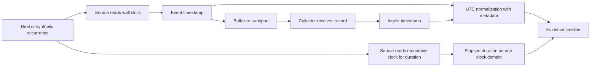
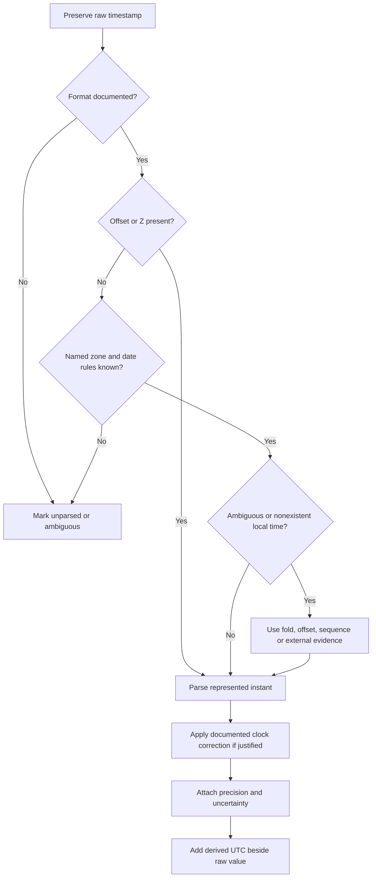
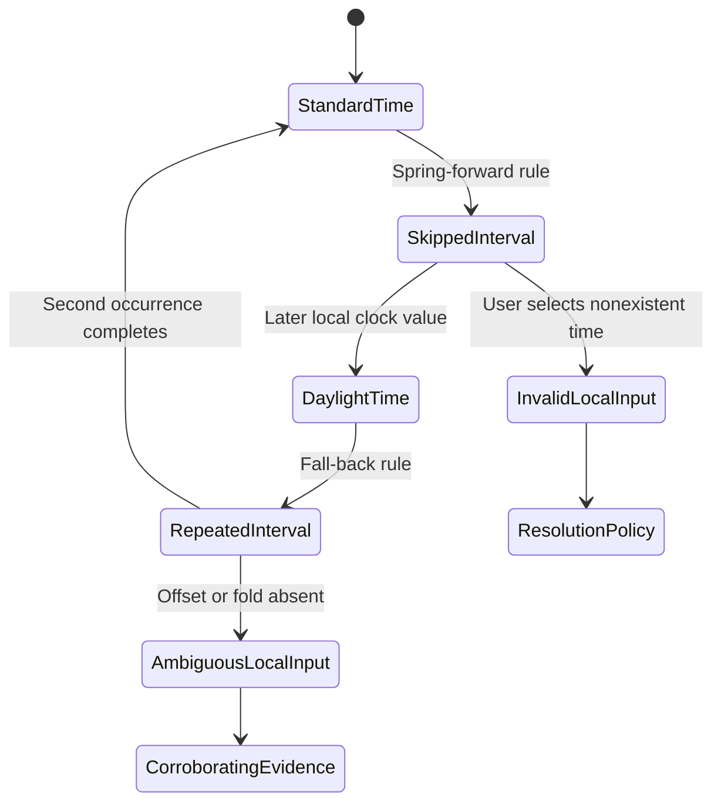
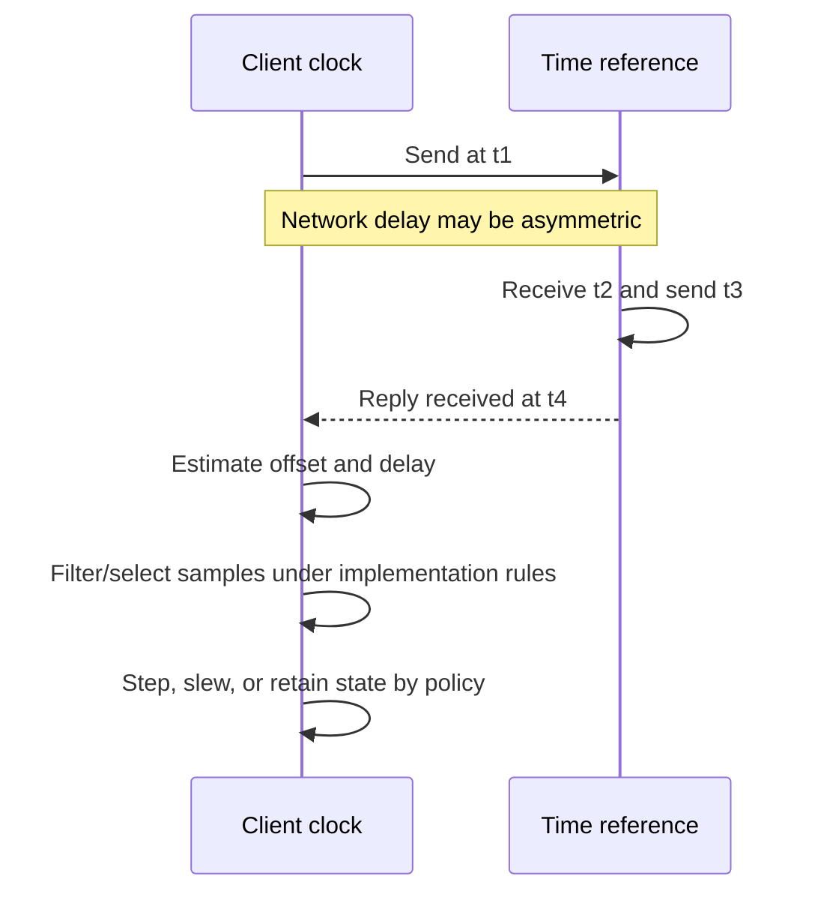
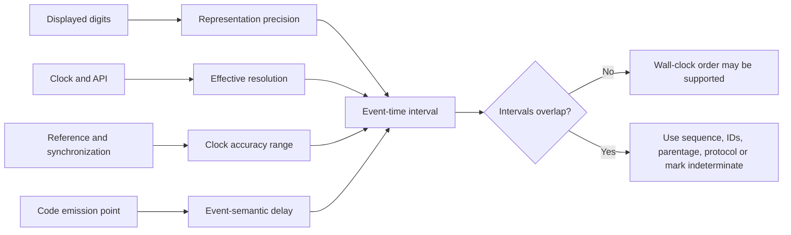
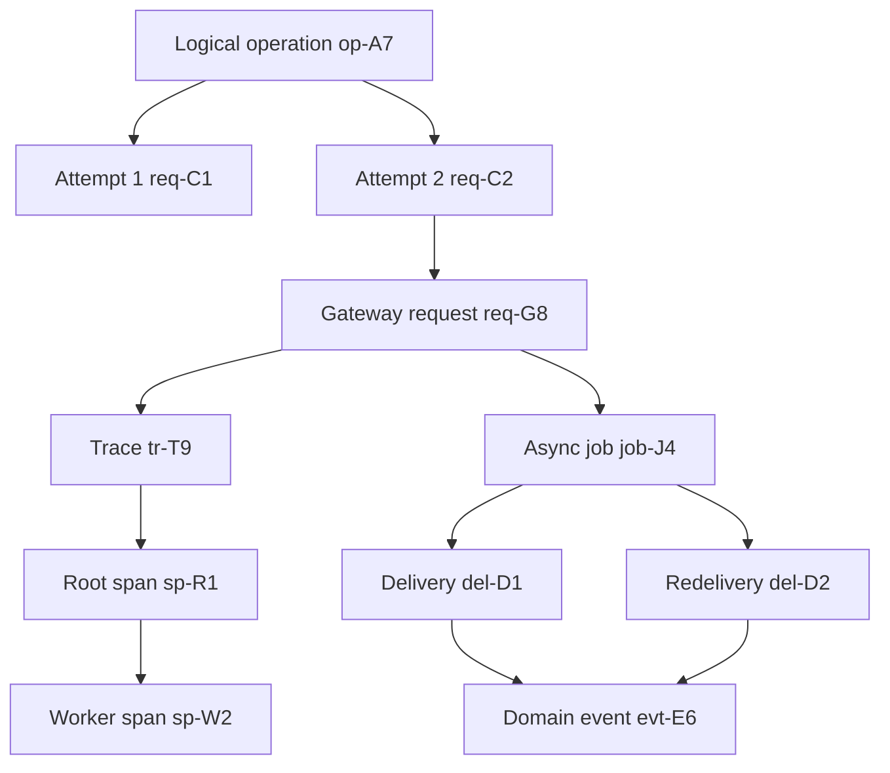
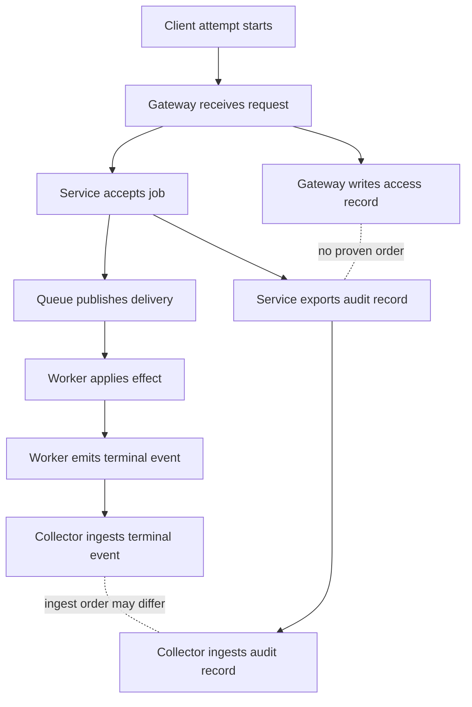
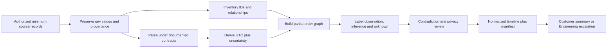
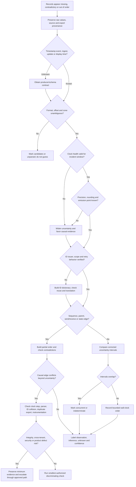
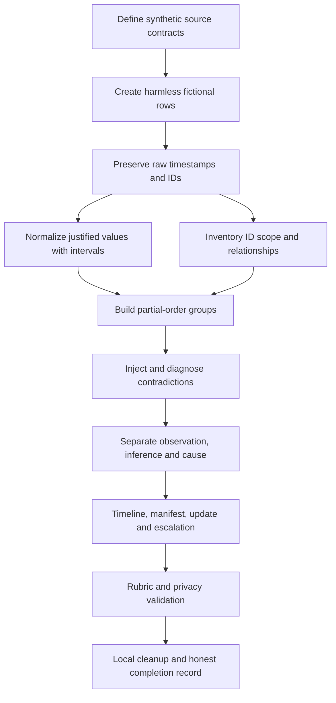

# Part 093 - Timestamps Time Zones IDs and Correlation

> **Purpose:** Build a beginner-first, evidence-safe method for aligning records from multiple systems. This Part explains UTC and local time, offsets and named time zones, daylight-saving transitions, clock skew and drift, timestamp precision, identifier scope, trace parentage, and cross-system ordering. It turns those concepts into a normalized timeline whose observations, inferences, unknowns, and causal limits remain visible.
>
> **Artifact honesty label:** **Local synthetic timeline lab and template only.** Every record, clock offset, host, identifier, event, result, and conclusion in the lab is invented. The lab does not use customer data, production telemetry, live services, third-party uploads, or Abnormal AI internals, and it must not be presented as having been performed unless Arti actually performs and saves it.
>
> **Currency and source access date:** August 24, 2026.

## Section goal

By the end of this Part, Arti should be able to receive a small, authorized evidence set from several sources and construct a defensible timeline without forcing the records into a certainty they do not support. She should know that a **timestamp** is a recorded representation of time, not proof that the source clock was correct. She should preserve the raw timestamp, identify its format, offset, named zone when known, precision, source clock, event meaning, and collection path before calculating a normalized UTC value.

She should distinguish **UTC**, or Coordinated Universal Time, from a local civil time such as “9:30 AM Pacific.” She should understand that an **offset** such as `-07:00` is one numeric relationship to UTC at one instant, while a **time-zone identifier** such as `America/Los_Angeles` represents a rule set whose offset can change with date and legislation. She should recognize ambiguous and nonexistent local times around daylight-saving changes, treat abbreviations such as `CST` as insufficient without context, and avoid silently converting an unknown local timestamp.

She should distinguish clock **offset**, **skew**, and **drift**. In operational use, people often say clock skew for any disagreement between clocks; more precisely, offset is the measured difference at an instant, while drift is the change in that difference over time. She should know the limits of wall clocks and why elapsed-duration measurements should normally use a monotonic clock inside one process or host. She should account for source accuracy, synchronization status, network uncertainty, leap-second handling, virtualization, sleep/resume, and collection delay rather than subtracting one timestamp from another without qualification.

She should treat timestamp digits carefully. **Precision** describes how finely a value is represented; **resolution** describes the smallest distinguishable tick a system can produce; **accuracy** describes closeness to the intended reference; and **uncertainty** describes a defensible range around the value. A timestamp containing nine fractional digits is not automatically accurate to a nanosecond. Two events displayed in the same millisecond are tied at that displayed precision unless a stronger ordering signal exists.

She should classify identifiers before joining records. An **event ID** identifies a recorded or domain occurrence according to a producer contract. A **request ID** commonly identifies one request at one boundary. A **message ID** may identify a message object, transport message, or queue item depending on the system. A **trace ID** groups spans in a distributed trace; a **span ID** identifies one operation within that trace; and a parent span ID represents a declared parent-child relationship. None of those values is inherently global, trusted, secret, unique forever, or evidence of authorization.

She should reconstruct ordering from several kinds of evidence. Same-source sequence numbers, parent-child relationships, send/receive pairs, retry and attempt numbers, durable state transitions, and documented protocol semantics can be stronger than wall-clock order. She should distinguish a **total order**, where every pair of events is placed before or after the other, from a **partial order**, where only some relationships are known. When two independent events cannot be ordered, the correct result is “concurrent or indeterminate within uncertainty,” not an invented sequence.

Finally, she should produce the required artifact: a **multi-source normalized timeline** containing raw and normalized time, time basis, correction method, uncertainty, source, event semantics, all relevant identifiers, relationship evidence, observation/inference labels, confidence, and unresolved gaps. The artifact should help Engineering or another support owner reproduce the reasoning without exposing customer content or implying access to proprietary telemetry.

## JD Mapping

| Supplied role signal | Capability developed here | Technical-support application | Proof artifact |
|---|---|---|---|
| Complex technical investigations | Aligns evidence without flattening uncertainty | Reconstructs API, connector, email, identity, and security-event sequences | Normalized timeline |
| API troubleshooting | Separates logical operation, request attempt, trace, and server work | Explains retries, 202 acceptance, asynchronous completion, and timeouts | Identifier relationship map |
| Email and message investigations | Distinguishes message identity from delivery/event identity | Follows one safe message alias through handoffs without exposing content | Message handoff chain |
| Behavioral false-positive cases | Orders configuration, observation, verdict, and remediation evidence | Prevents a later record from being treated as an earlier cause | Evidence-labeled chronology |
| Threat investigations | Preserves event provenance and uncertainty | Builds a minimum authorized security timeline | Observation/inference ledger |
| Engineering collaboration | Provides source, version, raw time, correction, IDs, and exact gaps | Makes escalation evidence reproducible and reviewable | Timeline plus normalization manifest |
| Customer communication | Converts several clocks into a clear but bounded narrative | Explains what is known, unknown, and being checked | Customer-safe summary |
| Privacy and trust | Uses aliases and minimum necessary fields | Avoids broad collection and raw customer identifiers | Redaction manifest |
| Microsoft enterprise support transfer | Reuses disciplined evidence correlation and escalation habits | Applies familiar client/cloud boundary reasoning to a new product domain | Honest transfer statement |
| No direct Abnormal telemetry experience | Separates learned method from proprietary implementation | Prevents invented schemas, clock guarantees, or trace architecture | Candidate boundary statement |

## Candidate honesty note

Arti can honestly say that Microsoft enterprise support gave her transferable experience in correlating customer-reported time, client evidence, cloud-side observations, configuration changes, and escalation updates. She can describe how she protected customer data, clarified time zones, documented uncertainty, and made Engineering-ready handoffs when those are true examples she can personally defend. She can also say she has studied distributed timestamp and identifier concepts and can demonstrate the method using the synthetic artifact in this Part.

She must not claim that she has queried Abnormal AI's internal logs, knows its internal clock synchronization targets, understands its proprietary event or message identifier schema, has access to its distributed traces, or knows how its detection pipeline orders events. Even if generic names such as `trace_id`, `message_id`, or `request_id` appear in documentation or a UI, their exact issuer, scope, lifetime, uniqueness, propagation, sensitivity, and retention must be verified from current approved product sources.

| Evidence tier | Honest wording Arti can adapt | Boundary to preserve |
|---|---|---|
| Production transfer | “In Microsoft enterprise support, I correlated customer and service evidence, normalized reported times, and documented uncertainty for escalations.” | Use only a real case and only details she is allowed to share |
| Demonstrated local practice | “I built a synthetic multi-source timeline that preserves raw time, UTC normalization, clock uncertainty, and ID relationships.” | Say synthetic/local; do not imply production access |
| Learned architecture | “Distributed systems commonly use request IDs, traces, parent-child spans, and clock synchronization, with implementation-specific guarantees.” | Generic architecture is not Abnormal architecture |
| Interview reasoning | “I would first verify the timestamp and identifier contracts, then normalize and correlate minimum evidence.” | A proposed method is not a completed investigation |
| No direct experience | “I have not used Abnormal's internal telemetry or trace tooling.” | State directly, without trying to disguise the gap |
| Onboarding verification | “I would learn the approved schemas, clock sources, retention, query tools, and escalation paths.” | Current internal documentation and owners decide the facts |

## 1. Time vocabulary from zero

**Time** sounds like one thing, but an investigation usually deals with several different representations and clocks. Defining them first prevents accidental comparisons.

- An **instant** is one point on a timeline. `2026-08-24T14:03:12Z` attempts to identify an instant.
- A **duration** is an amount of elapsed time, such as 1.5 seconds. It is not a date or wall-clock reading.
- A **wall clock** is the clock used to show civil date and time. It can be corrected forward or backward.
- A **monotonic clock** is designed not to move backward during one running system context. It is useful for measuring elapsed duration, but its values usually cannot be compared directly across hosts or reboots.
- **UTC**, Coordinated Universal Time, is the common civil-time reference used to exchange timestamps internationally.
- **Local time** is a civil date and clock reading interpreted under local rules.
- An **offset** is the numeric difference from UTC at a particular instant, such as `+05:30` or `-07:00`.
- A **time zone** is a ruleset that maps local civil time to UTC and can include historical and future offset changes.
- A **timestamp** is data that represents a time according to a format and clock source.
- **Event time** is when the producer says the event occurred. **Ingest time** is when a collection system received or stored the record. **Query time** is when an analyst retrieved it.

| Term | Plain meaning | Example | Investigation warning |
|---|---|---|---|
| Instant | One point in time | `2026-08-24T14:03:12Z` | Representation can be malformed or based on a wrong clock |
| Duration | Elapsed interval | `1500 ms` | Subtracting wall clocks can produce a false duration |
| Wall clock | Human calendar clock | Laptop clock | Can jump after synchronization or manual change |
| Monotonic clock | One-direction elapsed-time counter | Process uptime ticks | Not normally comparable across machines or restarts |
| UTC | Shared civil-time reference | `14:03:12Z` | `Z` says zero offset, not that the source clock was accurate |
| Offset | Difference from UTC at an instant | `-07:00` | Does not encode all time-zone rules |
| Named time zone | Date-sensitive civil-time rules | `America/Los_Angeles` | Rules can change by database version and legislation |
| Event time | Producer's occurrence time | Client says send began | Depends on producer clock and emission point |
| Ingest time | Collector receipt time | Index accepted record | Includes buffering and transport delay |
| Sequence | Relative order assigned by a source | `source_seq=105` | Scope and reset behavior must be documented |

Think of a rail journey. The printed departure time is local civil time, the UTC conversion is a shared timetable reference, the stopwatch measures elapsed travel, and a station scan is an observed event. The analogy helps separate calendar readings from durations. It stops being accurate because software clocks can jump, records can be buffered, multiple components can emit for one action, and a timestamp can be generated before or after the state it describes.



A normalized timeline should never replace raw evidence. It should add a derived UTC value beside the original timestamp. That allows a reviewer to correct an assumption later. The source clock, format, time-zone basis, precision, and correction method are part of the evidence, not administrative decoration.

### 🔍 Plain-English deep-dive: A timestamp is a label attached by a clock

When a log says `14:03:12`, the computer did not capture time as an unquestionable physical fact. A program asked some clock for a value, formatted it, and attached it at a chosen point in execution. The clock may have been five seconds fast. The program may have emitted the record before the operation committed. A buffer may have written it later. A display may have converted it again.

Think of an employee using a wall clock to time-stamp a warehouse form. The form tells you what that employee's clock showed when the stamp was applied. It does not prove the wall clock was correct or that the package action happened at exactly the stamping moment. The analogy stops because software may use several clocks, record fractional units, synchronize automatically, and generate millions of events concurrently.

The disciplined first sentence is: “Source A recorded event X with raw timestamp Y under time basis Z.” Only after checking the source and conversion may Arti say: “This corresponds to normalized UTC interval U, subject to uncertainty range R.” That language is precise without being evasive.

## 2. UTC, offsets, named zones, and timestamp formats

An Internet timestamp commonly follows the profile in **RFC 3339**, which uses a calendar date, `T`, clock time, optional fractional seconds, and either `Z` or a numeric offset. For example, `2026-08-24T14:03:12.482Z` says the represented civil time has a zero UTC offset. `2026-08-24T09:03:12.482-05:00` represents the same instant if both values are correct.

**ISO 8601** is a broader date-and-time standard. RFC 3339 deliberately defines a narrower Internet profile. Software libraries differ in which variants they accept, how many fractional digits they preserve, whether they accept a space instead of `T`, and how they handle leap seconds or absent offsets. “ISO timestamp” is therefore not enough as a parsing contract; record the exact accepted format and library/version behavior.

| Raw value | What is explicit | What remains unknown | Safe treatment |
|---|---|---|---|
| `2026-08-24T14:03:12Z` | Date, time, zero offset, second display precision | Clock accuracy, source meaning, subsecond order | Preserve raw; normalize to same UTC value |
| `2026-08-24T09:03:12-05:00` | Date, time, fixed offset at represented instant | Named zone and whether offset is expected | Convert to `14:03:12Z`; preserve offset |
| `2026-08-24 09:03:12` | Date and local-looking time | Offset, zone, format contract | Do not silently convert; obtain source zone/rule |
| `08/24/26 09:03:12` | Some numeric fields | Month/day order, century policy, zone | Treat as ambiguous until contract is known |
| `2026-236T14:03:12Z` | Ordinal date if parser supports it | Producer/parser contract | Parse only under documented format |
| `1756044192482` | Numeric epoch-like value | Epoch, unit, signedness, clock | Verify whether milliseconds since Unix epoch or something else |
| `14:03:12 PST` | Time and abbreviation | Date, unique zone, DST correctness | Insufficient for reliable normalization |
| `2026-08-24T14:03:12.123456789Z` | Nanosecond-shaped representation | Actual resolution and accuracy | Preserve digits; do not claim nanosecond accuracy |

The letter `Z` is often read as “Zulu” in operational speech and means a zero offset from UTC in the timestamp representation. It does not certify that the machine was synchronized. Likewise, a numeric offset tells how to calculate an instant but not the named civil-time rules. `-05:00` could apply in several regions, or it could be a fixed-offset configuration with no daylight-saving transitions.

### A safe normalization record

| Field | Example synthetic value | Why retain it |
|---|---|---|
| `raw_timestamp` | `2026-08-24 09:03:12.482` | Keeps original evidence unchanged |
| `source_time_basis` | `America/New_York` | Records the rule set used for interpretation |
| `source_zone_version` | `lab-rule-set-2026a` | Makes rule-version assumptions reviewable |
| `parsed_offset` | `-04:00` | Shows offset selected for this date |
| `normalized_utc` | `2026-08-24T13:03:12.482Z` | Enables common display and sorting |
| `display_precision` | `1 ms` | Prevents false submillisecond order |
| `clock_correction_ms` | `-750` | Shows correction applied to source clock |
| `uncertainty_ms` | `±125` | Represents a bounded range, not false exactness |
| `normalization_method` | `explicit-zone-plus-synthetic-clock-card` | Allows another analyst to reproduce the derivation |
| `assumption` | `zone supplied by lab manifest` | Keeps inferred input visible |



Do not rewrite an exported log file so every timestamp “looks UTC.” Transformation destroys provenance and can hide parser mistakes. Create a separate normalized table or add clearly derived columns. If a value cannot be normalized, leave `normalized_utc` empty, label why, and preserve its relationships through IDs or source sequence where possible.

## 3. Local time, daylight saving, and rule versions

A named time zone is a historical and future rule set, not a permanent offset. The **IANA Time Zone Database**, often called `tzdb`, publishes identifiers such as `America/New_York` and rule updates. Microsoft Windows also has its own time-zone identifiers and mapping behavior. Libraries and operating systems ship particular data versions, so two systems can disagree after a government changes rules and only one system has updated data.

**Daylight saving time**, abbreviated DST, is a seasonal civil-time adjustment used in some jurisdictions. During a spring-forward transition, a range of local wall times may not exist. During a fall-back transition, a range may occur twice with different offsets. Some regions do not use DST, and political changes can alter dates or offsets. Never infer DST solely from an abbreviation.

| Local-time case | Example concept | Mapping to UTC | Required evidence |
|---|---|---|---|
| Ordinary local time | Midday far from transition | Usually one instant under one zone version | Date, named zone, rules version if material |
| Nonexistent time | Clock jumps from 01:59 to 03:00 | No valid instant for skipped local range | Producer behavior: reject, shift, or choose policy |
| Ambiguous time | 01:30 occurs twice on fall-back | Two possible instants | Offset, fold indicator, sequence, or corroborating event |
| Fixed offset | Always `+02:00` by configuration | One arithmetic conversion | Confirm it is truly fixed, not a named zone label |
| Abbreviation only | `CST` | Multiple possible interpretations | Region/source contract; do not guess |
| Outdated rules | Host missed time-zone update | Conversion differs across systems | OS/library and zone-data version |
| User-entered local time | Case note says “around 9” | Approximate interval | Reporter location, date, uncertainty, and confirmation |

Suppose a fictional scheduler records `2026-11-01 01:20:00` in a zone that repeats the hour. Without an offset or fold marker, two UTC candidates may exist. An event ID can identify the record but cannot choose the instant. A source sequence before and after records with explicit offsets may disambiguate it. If not, the correct timeline has a two-candidate interval or an ambiguity label.



### 🔍 Plain-English deep-dive: A time zone is a rulebook, not a number

Saying “Eastern time is UTC minus five” is sometimes right and sometimes wrong. A named zone contains rules that depend on date and jurisdiction. The offset can be `-05:00` during one season and `-04:00` during another. Historical rules can differ, and future rules can change.

Think of a transit fare policy. “The fare is $2” is one observed price, while the policy explains weekday, age, route, and future changes. An offset is the price at one moment; a named zone is the policy. The analogy stops because time-zone rules map civil labels to instants and can create repeated or missing labels, which prices do not.

In a case, ask: What was the raw local value? Which named zone did the producer intend? What offset did it record? Which operating system or library converted it? Was the date near a transition? Did the source store UTC internally and localize only for display? A screenshot showing local time may differ from an exported API value without either source being wrong.

## 4. Clock offset, skew, drift, and synchronization

No two independent physical clocks are perfectly identical. Systems synchronize clocks against references using protocols and services, but synchronization has delay and uncertainty.

**Clock offset** is the difference between a source clock and a chosen reference at an instant. If host B reads `14:03:12.900` when the reference instant is `14:03:12.000`, host B is 900 milliseconds fast and its correction to reference time is approximately `-900 ms`. **Clock drift** is how offset changes over time because an oscillator runs slightly fast or slow. **Clock skew** is used inconsistently: some sources use it for instantaneous offset, others for the difference in clock rates. In support communication, define the quantity instead of relying on the word alone.

**NTP**, the Network Time Protocol, is a protocol for clock synchronization over packet networks. NTP estimates offset and delay from timestamp exchanges and chooses among sources; it does not make every event perfectly simultaneous. **PTP**, the Precision Time Protocol, is another synchronization family used where tighter timing is required, often with specialized network or hardware support. Seeing NTP or PTP configured does not prove current synchronization health.

| Clock condition | Observable clue | Timeline risk | Safe response |
|---|---|---|---|
| Stable small offset | Health record shows bounded offset | Raw sort shifted by known amount | Apply documented correction and uncertainty |
| Changing offset | Offset cards differ over time | One fixed correction becomes wrong | Estimate only within bounded interval or model drift |
| Sudden wall-clock step | Time jumps after sync/manual change | Same-source timestamps can move backward | Use monotonic duration and sequence if available |
| Slewing | Clock gradually adjusts rate | Durations from wall time slightly distorted | Preserve sync state and correction window |
| Unsynchronized source | No valid reference or stale sync | Cross-host order unreliable | Widen uncertainty; rely on causal IDs/sequence |
| VM pause/resume | Gap or abrupt correction | Burst of delayed records | Separate occurrence, emission, and ingest times |
| Device sleep | Local event and upload separated | Ingest order differs from event order | Use source sequence and explicit offline interval |
| Manual clock change | Audit/config event near anomaly | Apparent future/past events | Escalate if integrity or security relevance exists |

### Four-timestamp intuition

NTP's detailed algorithms and selection rules are beyond a support-first timeline, but a simplified exchange helps explain why a network time check has uncertainty. Let a client send at client time $t_1$, a server receive at server time $t_2$, the server send at $t_3$, and the client receive at $t_4$. A common simplified estimate is:

$$
\text{offset} \approx \frac{(t_2-t_1)+(t_3-t_4)}{2}
$$

$$
\text{round-trip delay} \approx (t_4-t_1)-(t_3-t_2)
$$

Those equations depend on assumptions, including reasonably symmetric path delay. Queueing can be asymmetric, clocks can change during measurement, and a single sample can be noisy. Support should prefer the synchronization service's documented health and multiple measurements rather than inventing a correction from one ordinary request/response pair.



### Worked correction example

Assume a synthetic clock-health card, created solely for the lab, says source B was between 800 and 900 milliseconds fast during a two-minute incident window. A record from B has raw UTC-shaped time `14:03:12.850Z`. A reasonable normalized representation is not one magical exact time. It can be recorded as a central estimate of `14:03:12.000Z` using correction `-850 ms`, with an uncertainty interval of at least `±50 ms` from the stated offset range, plus any timestamp resolution and event-emission uncertainty.

If source B displays milliseconds but its event emission can occur up to 20 ms after the state transition, a practical interval might be widened further. The manifest must explain the chosen bound. If the only evidence is “the host clock looked about a second fast,” preserve that as a low-confidence estimate and do not use it to decide whether two events 100 ms apart caused each other.

| Quantity | Synthetic value | Interpretation |
|---|---:|---|
| Raw source-B time | `14:03:12.850Z` | What B's wall clock recorded |
| Estimated B offset | `+850 ms` | B reads ahead of reference |
| Correction applied | `-850 ms` | Derived value moved earlier |
| Offset uncertainty | `±50 ms` | Based on fictional 800-900 ms range |
| Display precision | `1 ms` | Digits shown, not accuracy guarantee |
| Emission uncertainty | `0 to 20 ms late` | Producer-specific synthetic assumption |
| Normalized interval | approximately `14:03:11.930Z` to `14:03:12.050Z` | Defensible range under stated assumptions |

### 🔍 Plain-English deep-dive: Synchronization narrows uncertainty; it does not erase it

A synchronized-clock indicator means a service believes the clock is being managed under its rules. It does not mean every timestamp is exact. Network delay varies, the reference has uncertainty, and the local clock changes between checks. A status captured after an incident may not prove health during the incident.

Think of regularly resetting a wristwatch against a trusted clock. The watch is likely closer after each check, but it can gain time between checks, and a hurried visual comparison has error. The analogy stops because NTP uses multiple timestamps, statistical filtering, source selection, and automated adjustment rather than a human glance.

For escalation, include the time-service name/version, configured source class, last successful synchronization, reported offset and uncertainty or health state, relevant system events, virtualization/sleep state, and the exact incident window. Do not recommend disabling authentication, bypassing enterprise time policy, or pointing production systems at an arbitrary server. Such changes can harm security, evidence integrity, and domain behavior.

## 5. Precision, resolution, accuracy, and uncertainty

These four terms are related but not interchangeable.

- **Precision** is the granularity expressed by the representation. Three fractional digits express milliseconds.
- **Resolution** is the smallest difference the clock or API can distinguish under its implementation.
- **Accuracy** is closeness to the intended time reference.
- **Uncertainty** is a stated range within which the represented event time is reasonably believed to fall.
- **Rounding** maps a value to a nearby representable value. **Truncation** discards lower-order units.
- **Jitter** is variation in timing or measurement, often across samples.

| Display or mechanism | What it supports | What it does not prove |
|---|---|---|
| Seconds only | Event belongs to a displayed second bucket | Order of events inside that second |
| Milliseconds shown | Three fractional digits are available | Millisecond source resolution or accuracy |
| Nanoseconds shown | Nine fractional digits survived formatting | Nanosecond hardware clock accuracy |
| Database timestamp column | Stored value under database type rules | Original source precision was preserved |
| Monotonic duration | Reliable local elapsed ordering under contract | Cross-host UTC instant |
| Sequence number | Producer-defined order within scope | Physical elapsed time or global order |
| Ingest timestamp | Collector receipt order under its clock | Producer occurrence order |
| Rounded UI display | Human-readable approximation | Equality of underlying timestamps |

If source A emits `14:03:12` and source B emits `14:03:12.482731Z`, sorting the strings creates apparent order, but A's event could have occurred anywhere in the represented second, and its clock could be offset. A fair comparison uses intervals. At second precision, a conventional display bucket could cover approximately `[14:03:12.000, 14:03:13.000)`, before adding clock and emission uncertainty.

If two source-A records share `14:03:12`, do not assign order from file row unless the file contract says append order equals event order and buffering/concurrency cannot reorder it. A source sequence, monotonic tick, same-thread program order, or parent relation may provide stronger evidence.

### Combining uncertainty conservatively

There is no universal formula for all logs because uncertainties may not be independent or normally distributed. A support artifact can use transparent interval bounds instead of impressive but unjustified statistics. For example:

1. Expand for displayed precision or truncation.
2. Apply a documented clock-offset range.
3. Add a documented producer emission-delay range.
4. Keep collection delay separate unless using ingest time.
5. Record whether bounds are measured, specified, inferred, or merely conservative.

| Uncertainty source | Synthetic bound | Basis label | Combined-use caution |
|---|---:|---|---|
| Display truncation | `0 to +999 ms` | Format contract | Do not treat as symmetric if truncation is known |
| Clock offset | `-50 to +50 ms` | Fictional health card | Valid only in the card's time window |
| Emission delay | `0 to +20 ms` | Fictional producer contract | Event-specific, not network delay |
| Queue buffering | `0 to +2 s` | Observed synthetic ingest gap | Does not change occurrence time if event time is preserved |
| Human report | `±2 min` | Reporter estimate | Useful for search window, not fine ordering |



### 🔍 Plain-English deep-dive: More digits do not create more truth

A camera can print a file name containing microseconds even if its internal clock is several seconds wrong. The extra digits help distinguish values generated by that mechanism, but they do not guarantee closeness to UTC. Similarly, a database may pad milliseconds with zeros to fit a nanosecond-capable column.

Think of measuring a table with a ruler whose zero mark was cut off. Writing `152.000 mm` looks precise, but the missing zero reference makes the measurement inaccurate. The analogy stops because clock uncertainty can change over time and distributed systems also have propagation and event-emission semantics.

In interviews, say: “I preserve precision, verify effective resolution, attach clock accuracy or uncertainty, and use stronger causal signals when intervals overlap.” That answer demonstrates rigor without requiring a deep timekeeping specialty.

## 6. Identifier taxonomy and scope

An **identifier**, or ID, is a value used to distinguish an entity or context within a stated namespace and lifetime. The value's shape does not define its meaning. A UUID-looking string may be globally unique by design, randomly generated, deterministically generated, reused incorrectly, truncated, or copied from untrusted input. A short integer may be perfectly unique within one process instance.

Before joining evidence on an ID, record five properties: **issuer**, who created it; **subject**, what it identifies; **scope**, where uniqueness is promised; **lifetime**, how long that promise lasts; and **propagation**, which boundaries should copy or translate it. Also record sensitivity, because IDs can be personal data, tenant data, or access-bearing references even when they are not credentials.

| Identifier type | Usually represents | Typical scope questions | Frequent mistake |
|---|---|---|---|
| Event ID | One domain occurrence or one recorded event | Producer, stream, tenant, schema version? | Treating a log-row ID as business-event identity |
| Request ID | One request at a boundary | Client-generated or server-generated? new per retry? | Assuming one request ID spans every hop |
| Operation ID | One logical user/business intent | Does it span retries and async work? | Reusing it for unrelated operations |
| Attempt ID or number | One try within an operation | Counter reset and concurrency rules? | Sorting attempts globally |
| Message ID | One message under a mail/queue/product contract | Which layer created it? can forwarding change it? | Equating transport, queue, and content identities |
| Delivery ID | One delivery or redelivery | New on retry or stable across retry? | Treating new delivery as a new domain event |
| Trace ID | One distributed trace | W3C-compatible? trusted? sampled? | Assuming every service recorded the trace |
| Span ID | One operation within a trace | Unique within trace? generated by which tracer? | Using span ID as a global request ID |
| Parent span ID | Declared parent operation | Remote/local parent? propagation valid? | Treating parentage as proof of fault |
| Session ID | A bounded interaction/session | Rotation, expiry, authentication relation? | Logging or sharing an access-bearing session token |
| Tenant/resource ID | Product object or partition | Is it customer-sensitive? stable after migration? | Sending raw value in an unrestricted channel |
| UUID | A format/family of identifiers | Which version, generator, namespace, collision assumptions? | Believing format alone defines subject or trust |

**UUID**, universally unique identifier, now has current IETF guidance in RFC 9562. Different UUID versions encode or derive information differently. Some can reveal time-related or node-related information; random-looking IDs can still be sensitive. Do not convert every identifier to a UUID or infer chronological order from a UUID without verifying the exact version and generator contract.

### Identifier inventory worksheet

| Field | Synthetic example | Required statement |
|---|---|---|
| Alias | `op-A7` | Safe workbook alias, not original value |
| Type | Logical operation ID | What it identifies |
| Issuer | Synthetic client | Who created it |
| Namespace/scope | One lab run | Where uniqueness is expected |
| Lifetime | Until lab cleanup | When reuse may occur |
| Retry behavior | Stable across attempts | Whether attempts share it |
| Parent/translation | Maps to `job-J4` after acceptance | How another system refers to related work |
| Trust | Untrusted correlation input | Never authorization |
| Sensitivity | Synthetic/non-sensitive | Real equivalents may be restricted |
| Evidence sources | Client, gateway mapping event | Where relationship is observed |



Correlation IDs must never be treated as authentication or authorization. A caller can often supply a request or trace header. An attacker could reuse another value, create very high cardinality, or put sensitive material in a baggage field. Validate format and length, generate internal identifiers where appropriate, authorize independently, and avoid reflecting raw untrusted values into unrestricted logs.

## 7. Trace context and parent-child relationships

A **distributed trace** represents a logical operation as a set of **spans**. A span is a named unit of work with a start, end, attributes, events, status, and relationship to a parent under a telemetry model. A trace ID groups spans; a span ID identifies one span; and a parent span ID points to the immediate parent known to the child. A root span has no recorded parent in that trace.

The W3C Trace Context Recommendation standardizes HTTP header formats named `traceparent` and `tracestate` so different systems can propagate trace context. It does not guarantee that a service records a span, trusts the caller, samples the trace, preserves every attribute, or uses the same business operation ID. Context can be invalid, regenerated, intentionally suppressed, or broken at a queue or third-party boundary.

| Relationship evidence | What it supports | What it cannot prove alone |
|---|---|---|
| Child names parent span | Declared trace parentage | Parent caused a defect or authorized the child |
| Client span and server span share context | Intended cross-process request path | Both clocks are aligned or both spans were exported |
| Producer links consumer span | Async relationship under instrumentation model | Exactly-once queue processing |
| Span start/end | Duration under tracer clock behavior | Correct business completion semantics |
| Span event | Observation inside span | Independent event identity unless contract says so |
| Trace sampling flag | Propagated sampling intent | Backend retained every span |
| Span link | Relationship without strict parentage | Wall-clock ordering or causal mechanism by itself |
| Baggage value | Propagated application metadata | Trust, privacy safety, or authorization |

```mermaid
sequenceDiagram
    participant U as Synthetic client
    participant G as Gateway
    participant S as Service
    participant Q as Queue
    participant W as Worker
    U->>G: Request req-C2 with trace context tr-T9/sp-C0
    G->>S: Child span sp-G1, translated request req-G8
    S->>Q: Enqueue job-J4 with approved correlation context
    S-->>U: 202 accepted for job-J4
    Q->>W: Delivery del-D1 linked to job-J4
    W->>W: Consumer span sp-W2 with parent or link by contract
    W-->>Q: Completion for domain event evt-E6
    Note over U,W: Parentage and IDs support relationships; clocks still need validation
```

Parent-child relationships create a **causal candidate** because a child normally follows creation or invocation by its parent under the instrumentation model. They do not prove the parent contains the defect. A gateway span can parent a downstream span that fails because of invalid data, downstream capacity, network policy, expiration, cancellation, or an independent service problem.

### 🔍 Plain-English deep-dive: A trace is a family tree, not a courtroom verdict

A family tree shows declared relationships. It can tell you that one span led to or encompassed another under the trace model. It does not tell you which family member caused an argument. Similarly, parentage helps reconstruct the path but does not assign fault.

The analogy stops because distributed traces can have missing relatives due to sampling, broken propagation, non-recording components, batching, and asynchronous links. A queue consumer may be linked rather than a strict child, and one business operation can create more than one trace.

Use trace relationships to ask better questions: Did the context cross the boundary? Which attempt created this child? Did an async job retain a safe correlation key? Are sibling spans concurrent? Is the longest span actually on the critical path? Which terminal business event confirms outcome? Keep trace structure, event semantics, and clock evidence separate until they agree.

## 8. Cross-system ordering and partial order

A **total order** places every event into one sequence. A **partial order** records only relationships that are supported, leaving some event pairs unordered. Distributed systems often provide partial order because independent hosts lack one perfectly shared clock and can operate concurrently.

A useful conceptual rule is **happens-before**: if event A occurs earlier than B in the same sequential execution, or A sends information that B receives, then A can be treated as causally before B under the system model. Transitive relationships can extend this: if A precedes B and B precedes C, then A precedes C. Two events without such a path may be concurrent or simply indeterminate from available evidence.

| Ordering signal | Relative strength when contract is verified | Key limitation |
|---|---|---|
| Same-thread/program sequence | Strong local order | Compiler/runtime/async semantics and logging point matter |
| Source sequence number | Strong within documented stream and epoch | Gaps, reset, partition, and concurrency rules |
| Parent creates child | Strong relationship under model | Does not quantify delay or assign fault |
| Send event paired with receive | Strong causal handoff | Pairing and identifier mapping must be valid |
| State-machine transition version | Strong order for one entity | Store consistency and retry behavior matter |
| Queue offset/sequence | Strong within documented partition | Not a global order across partitions |
| Monotonic timestamp | Strong within one clock domain | Cannot normally compare across hosts/reboots |
| Corrected wall-clock intervals | Useful when non-overlapping | Depends on clock and semantic uncertainty |
| Ingest order | Order of collector arrival | Buffers/retries can invert occurrence order |
| File row order | Sometimes append order | Concurrent writers/export sorting can reorder |
| Lexical ID order | Usually weak or invalid | Only meaningful under a documented ordered-ID contract |



Suppose gateway record G and audit record A have corrected uncertainty intervals that overlap. If neither references the other and they came from independent exporter pipelines, the timeline should not force G before A. They can share an order group such as `P3`, meaning both occur after accepted work but their mutual order is unknown. The narrative can still be useful: “Both records are consistent with acceptance before worker execution; available evidence does not determine which record was emitted first.”

### Cross-system ordering procedure

1. Partition records by source, boot/process epoch, stream, tenant-safe scope, and entity.
2. Preserve raw source order and record whether row order has semantics.
3. Add verified source sequences, state versions, attempt numbers, and monotonic durations.
4. Build explicit edges for parent-child, send-receive, enqueue-dequeue, request-response, and state transitions.
5. Normalize wall times with clock and precision uncertainty.
6. Use non-overlapping intervals as supporting order, not the only causal proof.
7. Detect contradictions, such as a child apparently preceding its parent outside all uncertainty.
8. Investigate clock, parsing, ID reuse, export delay, duplicated records, or incorrect instrumentation.
9. Keep unresolved pairs unordered.
10. State the strongest supported sequence and the evidence ceiling.

## 9. Building a multi-source normalized timeline

A **normalized timeline** is a derived evidence table that makes different sources comparable while retaining enough metadata to audit every conversion and join. It is not merely a spreadsheet sorted by a UTC column.

### Minimum timeline schema

| Column | Meaning | Example synthetic value |
|---|---|---|
| `timeline_row` | Stable workbook row alias | `TL-07` |
| `source` | Producer and safe component alias | `worker-C` |
| `source_epoch` | Boot/process/export epoch if relevant | `boot-2` |
| `event_name` | Documented state or observation | `effect.applied` |
| `raw_timestamp` | Original unmodified value | `2026-08-24 09:03:13.120` |
| `raw_time_basis` | `Z`, offset, named zone, local/unknown | `America/New_York` |
| `event_or_ingest_time` | Timestamp semantic role | `event_time` |
| `normalized_utc` | Derived central value if justified | `2026-08-24T13:03:12.970Z` |
| `earliest_utc` / `latest_utc` | Defensible interval | `12.920Z` / `13.020Z` |
| `precision` | Display/storage granularity | `1 ms` |
| `clock_basis` | Health/correction source | `clock-card-C1` |
| `operation_id` | Safe logical-operation alias | `op-A7` |
| `request_id` / `attempt` | Request attempt context | `req-C2` / `2` |
| `trace_id` / `span_id` | Trace context aliases | `tr-T9` / `sp-W2` |
| `message_or_job_id` | Async object alias | `job-J4` |
| `event_or_delivery_id` | Domain/delivery identity | `evt-E6` / `del-D1` |
| `parent_or_link` | Explicit relationship | `job-J4 -> del-D1` |
| `source_sequence` | Documented local ordering | `205` |
| `order_group` | Partial-order layer | `P5` |
| `evidence_label` | Observation, inference, unknown | `observation` |
| `confidence` | High/medium/low with basis | `high: direct source record` |
| `notes` | Caveat or next check | `clock interval overlaps TL-08` |

Do not put secrets, raw customer message IDs, email addresses, tenant identifiers, bearer tokens, cookies, URLs with query values, or message content into a training timeline. Real evidence must follow approved minimum-necessary collection, secure transfer, access, and retention. Aliasing preserves analytical relationships only when the mapping is controlled and consistent; it does not automatically anonymize the data.

### Normalization manifest

| Manifest item | Question it answers |
|---|---|
| Source inventory | Which components and exports are included or absent? |
| Format contract | How was each timestamp parsed? |
| Zone mapping | Which named zone or offset was applied, and why? |
| Rule version | Which OS/library/time-zone database rules were used? |
| Clock card | What correction and uncertainty apply in which window? |
| Precision rule | Were values rounded, truncated, or padded? |
| ID dictionary | What does each identifier mean and where is it unique? |
| Relationship rule | Which fields establish parentage or handoff? |
| Deduplication rule | How were duplicate exports distinguished from duplicate events? |
| Evidence label | Which cells are direct observations versus analyst derivations? |
| Privacy rule | Which fields were excluded, aliased, or retained? |
| Coverage statement | What sources, time ranges, sampling, and retention gaps remain? |



### Observation, inference, and cause discipline

| Reasoning label | Definition | Timeline example | Allowed wording |
|---|---|---|---|
| Observation | What one source directly recorded | Worker emitted `effect.applied` | “Worker-C recorded...” |
| Corroborated fact | Compatible direct observations with valid join | Gateway mapping and service event share verified job alias | “The records map request G8 to job J4...” |
| Inference | Best interpretation that goes beyond direct fields | Ingest delay likely explains late row position | “The ordering is consistent with...” |
| Hypothesis | Testable possible mechanism | Retry followed a client deadline before server result | “One candidate mechanism is...” |
| Prediction | Evidence expected if hypothesis is true | First attempt server completion exists after client timeout | “If true, we expect...” |
| Cause | Mechanism and trigger sufficiently established | Not established by timestamp adjacency alone | “Cause is supported because trigger, mechanism, and alternatives...” |
| Unknown | Material fact not resolved | Whether first attempt committed state | “Available evidence does not establish...” |
| Evidence ceiling | Why stronger claim is unavailable | First-attempt server trace absent by sampling | “Confidence is limited by...” |

Temporal order is necessary for many causal claims: a cause should precede its effect under the relevant model. But “before” is not enough. A configuration change at 13:00 and an error at 13:01 may be related, may share a third cause, or may be coincidence. Establishing cause needs a plausible mechanism, scope match, reproduction or counterfactual evidence where feasible, and consideration of alternatives.

## 10. Worked synthetic example: one operation across five sources

### Scenario and raw records

The fictional scenario is an asynchronous operation named `op-A7`. A synthetic client sends attempt 1, times out, and sends attempt 2. A gateway accepts attempt 2, a service creates job `job-J4`, a queue delivers it, and a worker records one effect. The goal is to determine what can be ordered and whether the client's timeout proves operation failure.

Every value below is invented. No product behavior is implied.

| Row | Source | Raw time | Time basis | Event | IDs | Local order clue |
|---|---|---|---|---|---|---|
| R1 | client-A | `2026-08-24T13:03:10.000Z` | UTC-shaped wall time | `operation.started` | `op-A7`, attempt 1, `req-C1` | seq 100 |
| R2 | client-A | `2026-08-24T13:03:11.500Z` | UTC-shaped wall time | `attempt.deadline` | `op-A7`, attempt 1, `req-C1` | seq 101, monotonic +1500 ms |
| R3 | client-A | `2026-08-24T13:03:11.520Z` | UTC-shaped wall time | `attempt.started` | `op-A7`, attempt 2, `req-C2` | seq 102 |
| R4 | gateway-B | `2026-08-24T13:03:12.430Z` | UTC-shaped wall time | `request.received` | `req-C2` maps `req-G8`, `tr-T9` | seq 880 |
| R5 | service-D | `2026-08-24 09:03:11.690` | `America/New_York` | `job.accepted` | `req-G8`, `job-J4`, `tr-T9` | state version 7 |
| R6 | gateway-B | `2026-08-24T13:03:12.600Z` | UTC-shaped wall time | `response.sent` 202 | `req-G8`, `job-J4` | seq 881 |
| R7 | queue-E | `2026-08-24T13:03:11Z` | UTC, seconds truncated | `delivery.created` | `job-J4`, `del-D1` | partition 2 offset 500 |
| R8 | worker-C | `2026-08-24 09:03:13.120` | `America/New_York` | `effect.applied` | `job-J4`, `del-D1`, `evt-E6`, `sp-W2` | source seq 205 |
| R9 | collector-F | `2026-08-24T13:03:15.900Z` | collector UTC | ingests R8 | export row `exp-X3` | ingest order only |

At first glance, gateway-B appears almost a second later than service-D, and queue-E appears before the service accepted the job. The raw sort is contradictory because the clocks and precision differ.

### Synthetic clock and format cards

| Source | Clock/format evidence | Correction or interval rule | Confidence |
|---|---|---|---|
| client-A | Offset within `±20 ms`; millisecond display | No central correction; add `±20 ms` plus emission bound | High in lab contract |
| gateway-B | Clock is `+850 ms`, range `+800` to `+900 ms` | Subtract 850 ms; add `±50 ms` | Medium-high synthetic card |
| service-D | Named zone current lab rules; clock `-100 ms ±25 ms` | Convert `-04:00`, then add 100 ms; `±25 ms` | High synthetic card |
| queue-E | UTC value truncated to seconds; clock `±40 ms` | Interval covers entire displayed second plus clock range | Medium |
| worker-C | Named zone; clock `+150 ms ±30 ms` | Convert `-04:00`, subtract 150 ms; `±30 ms` | High synthetic card |
| collector-F | Ingest clock `±10 ms` | Do not substitute ingest for event time | High for receipt only |

### Step-by-step reasoning

1. Preserve every raw timestamp and its time basis.
2. Use the client sequence to establish R1 before R2 before R3. The monotonic `+1500 ms` supports the attempt-1 elapsed deadline even if the wall clock were corrected.
3. Correct gateway-B. R4 central time becomes about `13:03:11.580Z`; R6 becomes about `13:03:11.750Z`.
4. Convert service-D local time using the stated synthetic zone rule: raw local `09:03:11.690` maps to `13:03:11.690Z`, then correct a clock 100 ms slow to about `13:03:11.790Z`.
5. Treat queue-E R7 as an interval because seconds were truncated. Its represented occurrence interval is broadly around `13:03:11.000Z` through just after `13:03:12.000Z`, widened by clock uncertainty. Timestamp alone cannot place it after R5.
6. Use the state and handoff evidence instead: service state version 7 created `job-J4`; queue partition offset 500 is a delivery for `job-J4`. Under the fictional contract, R5 causally precedes R7 even though R7's wall-time interval overlaps.
7. Convert and correct worker-C R8. Local `09:03:13.120` maps to `13:03:13.120Z`, then subtract 150 ms for about `13:03:12.970Z`, with the stated uncertainty.
8. Use job and delivery IDs to establish R7 before R8. Source sequence 205 is useful only among worker-C records in the same epoch.
9. Keep R9 as ingest evidence. It shows R8 arrived at the collector roughly three seconds later; it does not move R8's occurrence time.
10. Do not connect attempt 1 to a server outcome because no gateway mapping for `req-C1` exists in the supplied dataset. That result remains unknown.

### Normalized timeline artifact excerpt

| Order group | Row | Derived UTC or interval | Source event | Relationship evidence | Reasoning label | Confidence and caveat |
|---|---|---|---|---|---|---|
| P1 | R1 | around `13:03:10.000Z ±20 ms` | Client operation starts | client seq 100 | Observation | High under synthetic clock card |
| P2 | R2 | wall around `13:03:11.500Z`; monotonic +1500 ms | Attempt 1 deadline | same request and seq 101 | Observation | High for local elapsed duration; server outcome unknown |
| P3 | R3 | around `13:03:11.520Z ±20 ms` | Attempt 2 starts | op-A7, attempt 2, seq 102 | Observation | High |
| P4 | R4 | around `13:03:11.580Z ±50 ms` | Gateway receives attempt 2 | request mapping C2 to G8, trace T9 | Corroborated relationship | Medium-high; correction is synthetic estimate |
| P5 | R6 | around `13:03:11.750Z ±50 ms` | Gateway sends 202 | same G8 and job J4 | Observation | R5/R6 intervals may overlap; protocol/state relation decides meaning |
| P5 | R5 | around `13:03:11.790Z ±25 ms` | Service records job accepted | job J4, state version 7 | Observation | Display order versus R6 not forced; emission boundaries may overlap |
| P6 | R7 | broad interval near second `13:03:11Z` | Queue creates delivery | J4 to D1; partition offset 500 | Observation plus causal relation | Timestamp weak; job relationship places after acceptance under lab contract |
| P7 | R8 | around `13:03:12.970Z ±30 ms` | Worker applies one synthetic effect | D1, E6, child/link W2 | Observation | One effect observed; global exactly-once not proven |
| P8 | R9 | ingest at `13:03:15.900Z ±10 ms` | Collector receives R8 | export row X3 references R8 | Observation | Ingest delay, not event delay |

R5 and R6 illustrate an important point. A service can record acceptance around the time a gateway emits a response, and the exact logging points may overlap after uncertainty. The protocol relationship supports that the response represents an accepted job in this fiction, but the two log-emission records need not be forced into a microsecond total order.

### Conclusions and evidence ceiling

**Observed:** Attempt 1 reached a client-side deadline. Attempt 2 maps through the gateway to accepted job `job-J4`, queue delivery `del-D1`, and one worker effect event `evt-E6`. The collector received the worker record later than its event time.

**Supported inference:** The raw timestamp contradiction is explained by the synthetic gateway offset, mixed precision, and local-zone clocks. Attempt 2 reached accepted asynchronous processing and one effect was observed.

**Not established:** Whether attempt 1 reached any server; whether it committed a hidden effect; whether the system guarantees exactly-once behavior; whether every span was sampled; or whether an Abnormal product would use any comparable pipeline.

**Cause statement:** No production cause is claimed. Within the synthetic scenario, the apparent “queue before acceptance” anomaly is a normalization and precision issue, not evidence of reverse processing. The client timeout alone does not prove final operation failure.

**Next discriminating evidence:** For a real authorized case, the next request would be a narrow lookup of the attempt-1 safe request alias in the owning boundary's documented retention window, plus the authoritative object state/version if duplicate effect is suspected. It would not be “collect all logs.”

## 11. Troubleshooting decision tree

Use this tree when records appear out of order, fail to join, or suggest an impossible parent-child sequence.



### Symptom-to-test quick reference

| Symptom | Competing hypotheses | Cheapest safe test | Possible next action |
|---|---|---|---|
| Child appears before parent | Clock offset; truncation; wrong parent; export reorder | Verify raw zone, clock card, parent field, source sequence | Correct timeline or escalate instrumentation defect |
| Same request ID in unrelated records | Intended scope; reuse; attacker input; truncation | Check issuer/tenant-safe partition/lifetime/schema | Stop joining; request internal generated mapping |
| Message has two IDs | Layer translation; duplicate message; forward/copy | Identify each issuer and object contract | Build explicit translation edge |
| Record arrives minutes late | Buffering; offline source; exporter retry | Compare event and ingest time plus exporter health | Keep occurrence and arrival separate |
| Two events share timestamp | Coarse precision; concurrency; copied time | Check sequence/monotonic/state version | Mark tied or order by stronger evidence |
| Local time cannot convert | Missing zone; DST ambiguity; stale rules | Obtain offset/fold/zone and source version | Keep candidates or leave unnormalized |
| Trace is missing a span | Sampling; propagation break; export loss; no instrumentation | Check sampling and boundary context contract | State gap; narrow owner escalation |
| UTC record is in the future | Fast clock; wrong date parser; delayed analyst clock; test data | Compare trusted reference and parsing contract | Correct assumption or investigate integrity issue |

## 12. Failure modes, unsafe shortcuts, and escalation triggers

| Failure mode or shortcut | Why it fails | Safer practice | Escalate when |
|---|---|---|---|
| Sorting raw timestamp strings | Formats, zones, and precision differ | Parse under contracts and preserve raw values | Parser/schema inconsistency affects cases |
| Assuming `Z` means synchronized | It only expresses zero offset | Check clock health for the incident window | Clock integrity is materially wrong or unexplained |
| Treating local abbreviation as zone | Abbreviations are ambiguous | Obtain named zone, offset, date, and rule version | Product exports ambiguous regulated/audit time |
| Applying today's offset to old date | Zone rules are date-dependent | Use date-aware rules and version | Historical conversion changes an incident conclusion |
| Ignoring DST fold/gap | Local instant can be double or nonexistent | Preserve ambiguity and seek offset/sequence | Scheduler/audit behavior mishandles transitions |
| Trusting fractional digits as accuracy | Formatting can pad or exceed resolution | Record precision, resolution, accuracy, uncertainty | Ordering claim depends on unsupported granularity |
| Subtracting different wall clocks for latency | Offset and drift contaminate duration | Use same-domain monotonic duration or bounded correction | SLA or causal conclusion changes materially |
| Using ingest time as event time | Buffers and retries reorder arrival | Keep both fields and pipeline health | Delayed/lost ingestion is itself an incident |
| Joining every `request_id` | Scope and issuer may differ | Build ID inventory and tenant-safe boundaries | Collision, reuse, or cross-tenant relation appears |
| Treating trace parent as blame | Relationship is not defect ownership | Combine path with mechanism and state evidence | Repro indicates instrumentation or dependency defect |
| Ordering by UUID text | Most formats do not promise that order | Verify exact UUID version/generator contract | ID generation collision or privacy issue exists |
| Removing “duplicate” rows by timestamp | Distinct events can share time | Deduplicate using source event/export identity and semantics | Evidence loss or duplicate processing remains possible |
| Collecting every available log | Raises privacy, cost, and analytical noise | Request minimum source/window/fields tied to a hypothesis | Authorized sources cannot answer a material incident |
| Disabling security or bypassing controls to collect evidence | Creates new risk and damages trust/integrity | Use approved scoped diagnostics and escalation | Required access conflicts with policy or authorization |
| Publishing raw IDs in a case note | IDs can expose tenant/user/object relationships | Use controlled aliases and restricted mappings | A secret, content item, or cross-tenant ID was exposed |

Immediate stop and escalation triggers include credentials, private keys, bearer tokens, cookies, customer message content, or cross-tenant data discovered in the evidence set; suspected tampering or deliberate clock manipulation; an unauthorized request to alter clocks or retention; a material audit trail with ambiguous or impossible time; repeated identifier collision; trace context containing sensitive data; time-service policy conflict; and any causal question that requires proprietary Abnormal facts not available through approved documentation.

When escalating, preserve only the minimum authorized evidence. Include exact source and build, raw timestamp, parser contract, zone/version, clock-health interval, precision, event semantics, identifier dictionary, relationship edges, normalization method, uncertainty, observed contradiction, attempted safe checks, customer impact, and one precise question. Do not send broad archives merely because the issue involves time.

## 13. Full explicit quality contract for this Part

| Contract requirement | How this Part satisfies it | Review evidence |
|---|---|---|
| Explain from zero | Defines instant, duration, clocks, UTC, zones, timestamps, IDs, traces, and ordering | Sections 1-9 |
| Define terms before use | Expands acronyms and explains scope before application | Definitions and first-use prose |
| Analogies with limits | Rail journey, warehouse stamp, fare policy, wristwatch, ruler, family tree | Each states where it stops |
| Mermaid diagrams | Clock pipeline, normalization, DST state, NTP sequence, uncertainty, ID graph, trace flow, partial order, artifact flow, decision tree | Ten valid fenced diagrams |
| Plain-English deep dives | Timestamp, zone, synchronization, digits, and trace parentage | Five headed deep dives |
| Decision tables | Time terms, formats, DST, clocks, precision, IDs, relationships, ordering, schema, manifest, reasoning, failure modes | More than ten tables |
| Worked examples | Clock correction and five-source operation | Inputs, calculations, caveats, conclusions |
| Troubleshooting tree | Contradictory/missing/out-of-order evidence flow | Section 11 |
| Failure modes | Parsing, DST, clocks, IDs, traces, duplicates, safety, privacy | Section 12 |
| Safe lab | Local fictional TimeGarden 093 | Prerequisites through cleanup |
| JD mapping | Role signals mapped to capability and proof | JD Mapping table |
| Candidate honesty | Production transfer, local demonstration, learned architecture, no direct access | Candidate honesty note |
| Official anchors | Standards and official docs with access date and version boundaries | Source section |
| Interview Q&A | Exactly Q1-Q8 with model answers | Interview section |
| Memory hooks | Fast recall statements | Memory Hooks |
| Completion checklist | Knowledge, lab, artifact, spoken, honesty, and source checks | Completion Checklist |
| Navigation | Exactly one relative Part-file link | Final line |
| Encoding/path | UTF-8 Markdown at the approved ASCII filename | File validation |

## Lab - TimeGarden 093 Multi-Source Normalized Timeline

This lab is a design and analysis exercise. It is safe to perform locally because it uses only invented text records and an optional spreadsheet or text editor. The instructions do **not** claim that the lab has been run. If Arti performs it, she should replace planned-result language with her actual local evidence and retain the honesty label.

### Prerequisites

- A learner-owned local folder, a UTF-8 text editor, and optionally a local spreadsheet application. No administrator access is needed.
- No network connection, API key, cloud tenant, product account, email system, telemetry backend, package installation, packet capture, process dump, registry change, service change, or external upload.
- Reserved fictional aliases only: `client-A`, `gateway-B`, `worker-C`, `service-D`, `queue-E`, `collector-F`, `op-A7`, `req-C1`, `req-C2`, `req-G8`, `tr-T9`, `sp-R1`, `sp-W2`, `job-J4`, `del-D1`, `evt-E6`, and `example.invalid` if a domain-shaped placeholder is needed.
- Suggested artifacts: `raw-events-093.csv`, `clock-cards-093.md`, `time-contracts-093.md`, `id-dictionary-093.md`, `normalization-manifest-093.md`, `timeline-093.csv`, `partial-order-093.md`, `reasoning-ledger-093.md`, `customer-update-093.md`, `engineering-escalation-093.md`, `privacy-manifest-093.md`, and `validation-093.md`.
- **Artifact honesty label:** `Local synthetic timestamp and identifier correlation lab; no customer data, production telemetry, live query, external service, Abnormal internal evidence, or claim that the exercise was performed unless actual local artifacts exist.`
- Safety rule: do not collect broadly, search unrelated user folders, use real log exports, disable or bypass security, weaken time policy, change system time, run a listener, contact a third-party endpoint, or paste the artifact into a public service.

### Lab design

Create a fictional corpus of at least 80 rows across five logical operations and six sources. Keep it small enough to inspect manually. Every row should have a source, raw timestamp, time basis, time semantic, event name, source sequence where applicable, safe IDs, and an explicit synthetic marker.

| Required operation | Purpose | Required complication |
|---|---|---|
| Operation A | First-attempt success | Clean UTC and trace parentage |
| Operation B | Timeout then accepted retry | Client monotonic duration and two request IDs |
| Operation C | Async queue delivery | Event time differs from ingest time |
| Operation D | DST/local-time ambiguity | Two candidate instants until sequence evidence is applied |
| Operation E | Duplicate-looking evidence | One duplicated export row and one true redelivery |

Add these source characteristics:

| Source | Synthetic time behavior | Identifier behavior |
|---|---|---|
| client-A | UTC milliseconds, `±20 ms` clock range, monotonic duration | Stable operation ID, new request per retry |
| gateway-B | UTC milliseconds, 800-900 ms fast | Maps client request to gateway request and trace |
| service-D | Local named zone, 100 ms slow | Creates job and state version |
| queue-E | UTC seconds truncated | Partition offset and delivery ID |
| worker-C | Local named zone, 150 ms fast | Job, delivery, event, trace/span relationship |
| collector-F | UTC ingest time only | Export row ID that can duplicate independently |

### Lab steps

1. Create `time-contracts-093.md` and define instant, duration, wall clock, monotonic clock, event time, ingest time, UTC, offset, named zone, precision, resolution, accuracy, and uncertainty in your own words.
2. Record the lab start time only if actually performed. State which local application and version were used and that no network or production source was accessed.
3. Create the source inventory. For each source, define timestamp format, event versus ingest meaning, zone/offset behavior, precision, rounding/truncation, emission point, clock-card interval, and source-sequence scope.
4. Create 80 or more fictional rows manually. Mark every row `synthetic=true`. Do not copy the structure of proprietary logs or include realistic secrets, customer identifiers, message content, internal hostnames, or private addresses.
5. Include at least ten records with RFC 3339-style `Z`, ten with explicit numeric offsets, ten with named-zone local values in the manifest, five with second truncation, and five ingest-only records.
6. Include one intentionally ambiguous numeric date such as `08/24/26`. Keep it unparsed until the format contract identifies month/day/year. Record why guessing would be unsafe.
7. Include one ambiguous local time during a fictional or publicly documented DST fall-back rule. Give it two UTC candidates. Add an explicit offset or source-sequence neighbor later to disambiguate one case; leave another case unresolved.
8. Include one nonexistent spring-forward local time and define producer behavior as “rejected” in the synthetic contract. Do not silently shift it.
9. Include one timestamp with nine fractional digits produced from a millisecond-resolution source. Record that the final six digits are padded and cannot order events.
10. Include one source clock step that makes wall time move backward while source sequence and monotonic time move forward. Preserve both observations.
11. Include one source that sleeps/offlines and uploads records later. Keep event time separate from collector ingest time.
12. Create `clock-cards-093.md`. For every source, record correction sign, offset range, validity window, measurement basis label, and confidence. All cards remain fictional.
13. Normalize only records whose parser and time basis are known. Add `normalized_utc`, `earliest_utc`, `latest_utc`, `correction_ms`, `precision`, `clock_card`, `method`, and `assumptions` columns without changing raw values.
14. For values with an offset, perform arithmetic conversion and retain the original offset. For named local zones, record the rule/version used. For unknown zones, leave normalized time blank.
15. Check correction signs with a simple sentence: “A fast clock must be moved earlier; a slow clock must be moved later.” Verify two examples manually.
16. Create one precision interval for seconds-truncated data and one for a human-reported “around 9:05” symptom. Keep the human report out of fine-grained causal ordering.
17. Build `id-dictionary-093.md`. For each ID type, record issuer, subject, scope, lifetime, retry behavior, translation, trust, sensitivity, and sources.
18. Use at least these ID categories: operation, client request, gateway request, trace, span, parent span, job, queue delivery, event, source sequence, state version, and export row.
19. Create one deliberate request-ID collision in different synthetic source namespaces. Show that joining on value alone is wrong and that issuer/scope disambiguates it.
20. Create one malicious-looking but harmless synthetic trace value that violates the declared format or length. Quarantine it rather than reflecting it widely. Do not use realistic attack payloads.
21. Map parent-child trace relationships for Operation A. Mark which links are direct parentage, async links, or merely shared operation context.
22. Map Operation B's retry: stable operation ID, attempt 1 request, attempt 2 request, and accepted async job. State why attempt-1 timeout does not define final operation outcome.
23. Map Operation C from accepted job to queue delivery to worker event. Include a later ingest time and show why collector order is not occurrence order.
24. For Operation D, preserve both UTC candidates until offset/fold/sequence evidence resolves one. Keep the second case as an explicit unknown.
25. For Operation E, distinguish a duplicate export row from a true redelivery. Use export row ID, source event ID, delivery ID, source sequence, and synthetic authoritative state.
26. Construct a partial-order graph. Add edges only for verified same-source sequence, parent-child, send-receive, job-delivery, state version, or non-overlapping corrected intervals.
27. Assign order groups `P1`, `P2`, and so on. Permit multiple rows in one group when mutual order is unknown or immaterial.
28. Search for contradictions: child before parent beyond uncertainty, response before request, state version decreasing in one entity, reused IDs outside contract, and event time after ingest time beyond clock bounds.
29. For each contradiction, list at least three hypotheses: clock/zone error, parser error, ID collision/reuse, exporter duplication/delay, wrong event semantics, or instrumentation defect.
30. Use the troubleshooting decision tree to choose the smallest discriminating check. Because the corpus is fictional, the check must inspect only the synthetic contract or rows.
31. Create `reasoning-ledger-093.md` with separate observation, corroborated fact, inference, hypothesis, prediction, unknown, conclusion, and evidence-ceiling entries.
32. Write one false causal claim such as “deployment caused the error because it happened first,” then repair it by adding mechanism, scope, alternative explanations, and the evidence still needed.
33. Create a normalized timeline with at least 25 selected rows. Include all minimum schema columns from Section 9 and a source/coverage footer.
34. Create a normalization manifest that records parser rules, zone mappings, rule versions, correction cards, uncertainty method, ID joins, deduplication rules, and unresolved gaps.
35. Perform a privacy review. Confirm all identities are fictional, then structurally exclude fields named or shaped like authorization, cookie, token, password, secret, private key, message body, recipient, tenant, or raw resource ID.
36. Create `privacy-manifest-093.md` listing excluded fields, alias policy, allowed operational fields, artifact owner, retention choice, and deletion plan.
37. Draft a customer-safe update that gives the incident window in UTC and the customer's stated zone, explains the supported sequence, distinguishes observed fact from hypothesis, and requests only one narrow next item if needed.
38. Draft an Engineering escalation with raw/normalized excerpts, clock and precision cards, ID dictionary, partial-order graph, contradiction, competing hypotheses, exact safe tests, product/build placeholders, and one precise ask.
39. Give a five-minute spoken explanation covering UTC versus local, zone versus offset, skew, precision, ID scopes, trace parentage, partial order, and why temporal adjacency is not causality.
40. Score the artifact against the validation rubric. Do not mark a criterion Pass without local evidence. A planned but unperformed lab remains “not run.”
41. If performed, clean temporary scratch copies and retain only the minimized synthetic artifact needed for learning. Record the actual end time and cleanup result.



### Expected evidence

If the lab is actually performed, the expected evidence is:

- At least 80 explicitly synthetic rows across five logical operations and six source types.
- A source inventory and timestamp contract covering event/ingest semantics, format, zone, precision, emission point, and sequence scope.
- Clock cards with correction sign, range, validity window, basis label, and confidence.
- Examples of `Z`, numeric offset, named local zone, ambiguous and nonexistent local time, seconds truncation, padded fractional digits, a clock step, and delayed ingestion.
- A raw-preserving normalized table with central UTC values only where justified, plus earliest/latest intervals and assumptions.
- An identifier dictionary covering operation, requests, trace/span/parent, job, delivery, event, sequence, state version, and export row.
- One correctly rejected cross-namespace ID collision and one quarantined invalid trace value.
- Parent-child and asynchronous-link maps, plus a partial-order graph that leaves unsupported pairs unordered.
- Correct separation of duplicate export, redelivery, duplicate effect, and coarse-time collision.
- A reasoning ledger that visibly separates observation, corroboration, inference, hypothesis, prediction, cause, unknown, and evidence ceiling.
- A minimum 25-row multi-source normalized timeline with coverage statement.
- A normalization manifest, privacy manifest, customer-safe update, and Engineering escalation.
- A rubric score, spoken walkthrough notes, and an honest record of whether the lab was actually run.

### Cleanup and privacy

- Keep the exercise local. Do not upload it to public paste sites, public AI tools, code-sharing sites, or unapproved storage.
- Delete temporary sort exports, screenshots, clipboard copies, parser scratch files, and deliberately malformed test rows when they are no longer required.
- Confirm the artifact contains no customer data, PII, message or attachment content, real email address, tenant/user/resource ID, authorization header, token, cookie, password, API key, private key, certificate material, production hostname, private address, proprietary event name, or internal topology.
- Confirm no real logs, telemetry queries, customer systems, live endpoints, network listeners, packet captures, process dumps, cloud accounts, third-party services, broad filesystem searches, system-time changes, time-policy changes, security disabling, security bypass, destructive commands, or external uploads were used.
- Treat real identifiers as potentially sensitive even when they are not credentials. In real work, use approved aliases, controlled mappings, least access, secure transfer, retention, and deletion.
- If retained, keep only the minimized synthetic timeline and manifests, record purpose and owner, and choose a review/deletion date.
- Use this completion wording only after actual performance: `TimeGarden 093 was performed locally using fictional records only; no customer data, production telemetry, live service, external upload, system/security change, broad collection, or Abnormal internal evidence was used.`
- If not performed, record instead: `TimeGarden 093 is a reviewed lab design and has not yet been executed.`

### Validation rubric

| Dimension | Fail | Developing | Pass |
|---|---|---|---|
| Raw preservation | Rewrites source timestamps | Keeps a raw column | Preserves raw value, source/export provenance, and transformation manifest |
| UTC/local normalization | Guesses offsets | Converts obvious values | Handles formats, zones, rule versions, DST ambiguity, and unknowns explicitly |
| Clock reasoning | Assumes synchronized | Notes possible skew | Uses incident-window clock cards, correction sign, range, drift/step limits, and confidence |
| Precision | Sorts by displayed digits | Notes coarse timestamps | Distinguishes precision/resolution/accuracy and constructs transparent intervals |
| Event semantics | Calls every time “event time” | Separates event and ingest | Documents occurrence/emission/ingest/update/display boundaries by source |
| Identifier scope | Joins matching strings | Lists ID types | Records issuer, subject, scope, lifetime, retry, translation, trust, and sensitivity |
| Trace relationships | Treats trace as one request | Maps parent spans | Separates trace, span, parent, link, business operation, attempt, and outcome |
| Ordering | Forces total UTC sort | Uses sequence sometimes | Builds verified partial-order edges and leaves unsupported pairs unordered |
| Duplicate handling | Deletes matching rows | Checks event ID | Separates duplicate export, redelivery, repeated event, repeated effect, and time collision |
| Reasoning | Adjacency equals cause | Labels hypotheses | Separates observation/fact/inference/hypothesis/prediction/cause/unknown/ceiling |
| Safety/privacy | Uses realistic logs or IDs | Says data is synthetic | Uses structural exclusion, aliases, local-only handling, retention, and cleanup |
| Communication | Gives a confident chronology only | Mentions uncertainty | Provides customer-safe UTC/local summary and Engineering-ready evidence package |
| Honesty | Implies Abnormal access or completed lab | Calls examples fictional | States production transfer, local evidence, proprietary unknowns, and actual run status |

## Official Source Anchors - August 24, 2026

These anchors support generic standards and platform concepts. They do not establish Abnormal AI's internal implementation. For every real investigation, verify the producer's current schema, operating-system and runtime version, time-zone database, synchronization service, trace library, exporter, and product documentation.

| Official or primary source | Concept anchored | Product/version boundary and support caution |
|---|---|---|
| [RFC 3339 - Date and Time on the Internet: Timestamps](https://www.rfc-editor.org/rfc/rfc3339.html) | Narrow Internet timestamp profile, offsets, fractional seconds, and leap-second syntax | Parser acceptance and leap-second behavior vary; RFC 3339 text does not prove source-clock accuracy |
| [IANA Time Zone Database](https://www.iana.org/time-zones) | Authoritative publication home for `tzdb` rule releases and identifiers | Hosts/libraries ship particular releases; Windows identifiers and mappings differ; rules can change |
| [RFC 5905 - Network Time Protocol Version 4](https://www.rfc-editor.org/rfc/rfc5905.html) | NTPv4 protocol, timestamps, delay/offset concepts, and synchronization model | Actual OS service may implement a profile, extension, or newer behavior; configuration is not proof of current health |
| [NIST Internet Time Service](https://www.nist.gov/pml/time-and-frequency-division/time-distribution/internet-time-service-its) | Public explanation of NIST Internet time distribution services | Do not point enterprise or production systems at arbitrary sources; follow organizational and platform policy |
| [Microsoft Learn - Windows Time Service tools and settings](https://learn.microsoft.com/en-us/windows-server/networking/windows-time-service/windows-time-service-tools-and-settings) | Windows Time Service configuration, status, and tooling concepts | Applies to documented Windows/Windows Server versions; domain, VM, and policy behavior must be checked for the actual build |
| [Microsoft Learn - DateTimeOffset structure](https://learn.microsoft.com/en-us/dotnet/api/system.datetimeoffset) | .NET representation combining date/time with an offset | Exact APIs and behavior depend on target .NET version; an offset is not a named time-zone rule set |
| [Microsoft Learn - TimeZoneInfo class](https://learn.microsoft.com/en-us/dotnet/api/system.timezoneinfo) | .NET time-zone conversion and ambiguous/invalid time concepts | Zone IDs and underlying data depend on OS/runtime; cross-platform mappings and installed rules vary |
| [W3C Trace Context Recommendation](https://www.w3.org/TR/trace-context/) | `traceparent`, `tracestate`, trace ID, parent ID, flags, parsing, and privacy/security considerations | Context is untrusted correlation metadata, not authentication, authorization, or guaranteed recording |
| [OpenTelemetry Trace API specification](https://opentelemetry.io/docs/specs/otel/trace/api/) | Trace/span concepts, parent context, links, span events, and timestamps | Specification version and SDK/exporter configuration matter; use of OpenTelemetry terminology does not prove deployment |
| [OpenTelemetry Common specification](https://opentelemetry.io/docs/specs/otel/common/) | Common time and attribute concepts used across OpenTelemetry signals | Language SDKs and backends can represent precision and limits differently; verify current stability/version |
| [Microsoft Learn - .NET distributed tracing concepts](https://learn.microsoft.com/en-us/dotnet/core/diagnostics/distributed-tracing-concepts) | .NET `Activity`, trace/span relationships, and distributed tracing overview | Applies to .NET implementation concepts and versions, not to Abnormal's internal stack |
| [RFC 5322 - Internet Message Format](https://www.rfc-editor.org/rfc/rfc5322.html) | Internet Message Format `Message-ID` and date field syntax | A message identifier's operational scope across gateways, forwarding, products, and queues still requires system-specific evidence |
| [RFC 9562 - Universally Unique IDentifiers](https://www.rfc-editor.org/rfc/rfc9562.html) | Current UUID formats and versions | Generator implementation and version determine ordering/privacy properties; UUID shape alone proves neither trust nor subject |
| [CloudEvents specification v1.0.2](https://github.com/cloudevents/spec/blob/v1.0.2/cloudevents/spec.md) | Primary specification example for event `id`, `source`, `time`, and event context | Only applies when a system explicitly implements that spec/version; event IDs and delivery IDs remain distinct by contract |
| [NIST SP 800-92 - Guide to Computer Security Log Management](https://csrc.nist.gov/pubs/sp/800/92/final) | Log-management planning, infrastructure, and operational considerations | Published guidance is foundational but older; apply current organizational, privacy, cloud, and incident policies |

### Source and version discipline

- Use RFC 3339 to validate timestamp syntax concepts, not to infer whether a specific parser accepts every legal form or whether a clock was synchronized.
- Record the time-zone data source and version used for historical conversion. A rule update can change results for affected jurisdictions.
- Use Windows and .NET documentation only for matching versions and environments. Windows time-zone IDs, IANA IDs, .NET runtime behavior, and cross-platform mappings are not universally interchangeable.
- Treat NTP state as measured operational evidence. “Configured for NTP” is weaker than incident-window synchronization status and offset bounds.
- Treat W3C trace context as a propagation standard, not a security control. Validate incoming values and authorize independently.
- Verify OpenTelemetry specification and SDK/exporter versions. Instrumentation, sampling, timestamp source, precision, queue propagation, and backend storage are implementation choices.
- Use RFC 5322 `Message-ID` semantics only within the Internet Message Format boundary. Product object IDs, transport IDs, queue IDs, and security-event IDs can differ.
- Verify the exact UUID version and generator before inferring temporal ordering or privacy properties.
- CloudEvents fields apply only to explicit implementations of the named specification/version. Do not project that schema onto unrelated product events.
- Revalidate current Abnormal customer-visible documentation and approved internal runbooks during onboarding. Do not infer private architecture from these generic sources.

## Likely Interview Questions

### Q1. Why is converting every timestamp to UTC not enough to build a reliable timeline?

**Model answer:** UTC gives a common representation, but conversion does not fix a wrong or drifting source clock, ambiguous local time, coarse precision, delayed emission, or delayed ingestion. I preserve the raw value, document event versus ingest semantics, format, zone and rules version, clock correction, precision, and uncertainty. Then I combine corrected time intervals with stronger evidence such as source sequence, parent-child links, request mappings, state versions, and send/receive relationships.

### Q2. What is the difference between a time-zone offset and a named time zone?

**Model answer:** An offset such as `-04:00` is the numeric relationship to UTC at one represented instant. A named zone such as `America/New_York` is a date-sensitive rule set with historical and future transitions. The same zone can use different offsets by date, and a local hour can be skipped or repeated. I retain both when available and record the rule/version used for conversion.

### Q3. How do clock skew and timestamp precision affect event ordering?

**Model answer:** Clock disagreement moves source readings relative to one another, while precision limits how finely times are represented. More fractional digits do not guarantee accuracy. I use incident-window clock-health evidence to construct a correction range, account for rounding or truncation, and compare uncertainty intervals. If intervals overlap, I do not force wall-clock order; I use sequence, monotonic duration, state transitions, IDs, and causal relationships or mark the pair indeterminate.

### Q4. How would you distinguish request, operation, message, event, trace, and span IDs?

**Model answer:** I build an ID dictionary. For each value I record issuer, what it identifies, namespace and uniqueness scope, lifetime, retry behavior, translation across boundaries, trust, and sensitivity. One logical operation can have several request attempts; a message can have transport and queue identities; an event can be delivered more than once; and a trace contains spans with parent or link relationships. Matching strings alone are not a safe join.

### Q5. Does a parent-child span relationship prove causation or product fault?

**Model answer:** It supports an execution relationship under the instrumentation model: the child follows or is linked to parent context. It does not prove that the parent component caused the failure, that clocks align, that every span was retained, or that the context is trusted. I correlate the trace with attempt, state, outcome, version, and mechanism evidence, then test alternatives before assigning cause or ownership.

### Q6. What would you do when records appear to show a child event before its parent?

**Model answer:** I preserve raw records and first verify timestamp semantics, parser, offset or named zone, DST ambiguity, clock status during the window, precision, and emission versus ingest time. Then I verify ID scope and parent mapping, source sequence, state version, and export duplication. I build a partial order and correct only justified assumptions. If the contradiction remains beyond uncertainty, I escalate a possible instrumentation, clock, or integrity defect with minimum evidence.

### Q7. How do you separate observation, inference, and cause in a timeline?

**Model answer:** An observation is what a named source recorded. A corroborated fact combines compatible observations through a valid join. An inference explains evidence but remains defeasible. A causal conclusion needs temporal compatibility plus a trigger, plausible mechanism, scope match, discriminating evidence, and consideration of alternatives. I label unknowns and the evidence ceiling, so a nearby timestamp never becomes root cause merely because it came first.

### Q8. How would you position your experience honestly for this role?

**Model answer:** My transferable strength is Microsoft enterprise support: clarifying customer time zones, correlating client and service evidence, protecting data, communicating uncertainty, and creating Engineering-ready escalations. I have deepened the underlying clock, precision, identifier, trace, and partial-order concepts through this synthetic local timeline exercise. I have not used Abnormal's internal telemetry, and I would learn its approved schemas, clock guarantees, tools, retention, and escalation paths during onboarding.

## Memory Hooks

- **UTC is a common representation, not a clock-accuracy certificate.**
- **Offset is one number; zone is a date-sensitive rulebook.**
- **Preserve raw time; add normalized time beside it.**
- **Event time is occurrence evidence; ingest time is arrival evidence.**
- **Fast clock: correct earlier. Slow clock: correct later.**
- **Synchronization narrows uncertainty; it does not erase it.**
- **Precision is digits; resolution is ticks; accuracy is closeness.**
- **More digits do not create more truth.**
- **Overlapping intervals mean use stronger ordering evidence.**
- **Monotonic clocks measure local duration, not global UTC.**
- **ID meaning comes from issuer, subject, scope, lifetime, and propagation.**
- **One operation can have many requests, messages, deliveries, traces, and events.**
- **Trace parentage shows a path, not fault.**
- **Ingest order can invert event order.**
- **Build a partial order; do not invent a total order.**
- **Before is necessary for many causes, but before is not sufficient.**
- **Observation names the source; inference names the reasoning.**
- **Correlation is never authorization.**
- **Minimum evidence beats broad collection.**
- **Abnormal internals stay unknown until approved verification.**

## Completion Checklist

- [ ] I can define instant, duration, wall clock, monotonic clock, UTC, local time, offset, named time zone, event time, and ingest time.
- [ ] I can explain why `Z` or a numeric offset does not prove clock accuracy.
- [ ] I can parse RFC 3339-style examples while stating parser and leap-second boundaries.
- [ ] I can distinguish an offset from a named zone and explain DST ambiguous and nonexistent local times.
- [ ] I can preserve raw timestamps and add derived UTC, precision, correction, uncertainty, method, and assumptions.
- [ ] I can explain clock offset, drift, skew terminology, synchronization, stepping, slewing, sleep/resume, and virtualization limits.
- [ ] I can explain the simplified four-timestamp offset/delay intuition without overclaiming one measurement.
- [ ] I can distinguish precision, resolution, accuracy, rounding, truncation, jitter, and uncertainty.
- [ ] I can create transparent event-time intervals instead of trusting extra fractional digits.
- [ ] I can inventory event, request, operation, attempt, message, delivery, trace, span, parent, session, tenant/resource, and UUID values.
- [ ] I can state each ID's issuer, subject, scope, lifetime, retry behavior, propagation, trust, and sensitivity.
- [ ] I know that correlation and trace context do not provide authentication or authorization.
- [ ] I can distinguish parent-child relationships, span links, business-operation identity, and final outcome.
- [ ] I can use source sequence, state version, send/receive, queue offset, monotonic duration, and corrected intervals according to their scopes.
- [ ] I can explain total order versus partial order and leave unsupported pairs unordered.
- [ ] I can build the minimum normalized-timeline schema and normalization manifest.
- [ ] I can label observation, corroborated fact, inference, hypothesis, prediction, cause, unknown, and evidence ceiling.
- [ ] I can explain the five-source worked example, including why raw time looked contradictory.
- [ ] I can run the troubleshooting decision tree for a child that appears before its parent.
- [ ] I can identify unsafe shortcuts, privacy risks, and immediate escalation triggers.
- [ ] I can perform TimeGarden 093 locally with fictional data, or honestly state that it remains an unperformed lab design.
- [ ] I can produce the required multi-source normalized timeline, ID dictionary, partial-order graph, and manifests if I run the lab.
- [ ] I can complete the privacy and cleanup checks without broad collection, security changes, or external upload.
- [ ] I can give a five-minute spoken explanation and answer Q1 through Q8 without reading.
- [ ] I can distinguish real Microsoft production-transfer examples from synthetic proof and learned architecture.
- [ ] I can say clearly that I have no direct access to Abnormal internal telemetry or trace systems.
- [ ] I reviewed the Official Source Anchors dated August 24, 2026 and would revalidate changing standards, products, and versions.

[Next: Part 094 - Windows Linux Process and Network Logs](Part-094-windows-linux-process-and-network-logs.md)