# Part 094 - Windows Linux Process and Network Logs

> **Purpose:** Build a beginner-first, evidence-safe method for investigating operating-system events across Windows and Linux. This Part explains Windows Event Log records, Linux journal and text records, process and service state, socket and network evidence, access boundaries, rotation, retention, and narrow collection. It turns those concepts into a synthetic cross-OS incident evidence pack that keeps observation, inference, cause, uncertainty, and missing coverage visibly separate.
>
> **Artifact honesty label:** **Local synthetic cross-OS evidence-pack design only.** Every host, service, process, address, event, command result, permission state, timestamp, and conclusion in the lab is invented. The lab does not use customer data, production telemetry, live endpoints, third-party uploads, Abnormal AI systems, or proprietary schemas, and it must not be presented as performed unless you actually create and reviews the local synthetic artifacts.
>
> **Currency and source access date:** August 24, 2026.

## Section goal

By the end of this Part, you should be able to explain what an operating-system log can and cannot prove, choose a narrow Windows or Linux evidence source, and build a reproducible cross-OS evidence pack without collecting an entire machine. You should start with the symptom, affected host, time window, process or service, and network endpoint, then ask the smallest question that distinguishes competing explanations.

You should understand that a **log record** is a producer's statement that something was observed or decided at a particular instrumentation point. On Windows, records may appear in channels such as System, Application, Security, or a provider-specific operational channel. On Linux, records may be stored by the systemd journal, written to text files under a distribution-specific logging design, emitted by the kernel, or forwarded by a logging daemon. The location and fields are platform and version dependent; neither operating system has one magical file containing the full truth.

You should be able to inspect **process state** and **service state** as related but different evidence. A process is a running instance of a program with a process identifier, memory, threads, handles or file descriptors, and a security context. A service is an operating-system-managed workload with configuration and lifecycle state. A service can be configured but stopped, reported active while a child is unhealthy, repeatedly restarting, or running without owning the expected listener. A process snapshot says what the observer could see at that instant; it does not prove what existed five minutes earlier.

You should understand basic **network event** evidence. A socket is one software endpoint of communication. A listening socket indicates that a process has asked the operating system to accept traffic on a local address and port; it does not prove a firewall permits the traffic, an application responds correctly, or a remote path works. A connection state such as `SYN_SENT`, `ESTABLISHED`, or `LISTEN` is evidence from one host's network stack at one moment, not a complete packet history. Firewall or filtering events exist only when the relevant control and audit policy are configured, and absence of such an event can mean disabled auditing, overwritten data, wrong scope, or insufficient permission.

You should treat **permissions**, **retention**, and **rotation** as part of the evidence model. An access-denied result does not mean no records exist. It means the current identity cannot read them through that path. A rotated file, overwritten Windows channel, volatile journal, reboot boundary, or retention cap can create a real coverage gap. You should record those gaps rather than replacing them with confidence.

Finally, you should produce the primary artifact: a **synthetic cross-OS incident evidence pack**. It should contain a scope card, source inventory, raw-preserving excerpts, query or inspection transcript, process and service state, network observations, time and identifier normalization, permission and retention notes, a reasoning ledger, a troubleshooting path, a privacy manifest, and customer-safe and Engineering-ready summaries. It should demonstrate method while clearly stating that no direct Abnormal AI or Linux production experience is being claimed.

## JD Mapping

| Supplied role signal | Capability developed here | Technical-support application | Proof artifact |
|---|---|---|---|
| Complex technical troubleshooting | Correlates OS, process, service, and network evidence | Separates host failure, process failure, service-management failure, and path failure | Cross-OS evidence timeline |
| Log analysis | Reads Windows channels and Linux journal/text concepts without assuming one source is complete | Chooses the provider, unit, boot, file, and time window that can answer the case question | Source and coverage inventory |
| API and integration support | Relates client process, local service, listener, and outbound connection state | Distinguishes “process exists” from “service is ready” and “socket exists” from “request succeeded” | Boundary evidence matrix |
| Security product support | Preserves audit-policy, access, and retention limitations | Avoids interpreting missing security events as proof that activity did not occur | Absence-evidence worksheet |
| Engineering escalation | Supplies exact host role, OS/build, time basis, source, event identity, PID epoch, service/unit, endpoint, and gaps | Makes a handoff reproducible without a broad archive | Minimal escalation manifest |
| Customer communication | Converts low-level records into a bounded narrative | States observed behavior, current hypothesis, next test, owner, and limitation | Customer-safe update |
| Privacy and trust | Applies authorization, minimum necessary collection, redaction, retention, and deletion | Prevents credentials, command-line secrets, customer content, and unrelated records from entering a case | Privacy and cleanup manifest |
| enterprise support transfer | Reuses Windows troubleshooting, customer scoping, evidence handling, and escalation discipline | Makes your Windows background an explicit strength while learning Linux terminology | Honest transfer statement |
| Linux learning target | Builds a source-grounded model of systemd journal, text logs, processes, services, sockets, and permissions | Supports credible onboarding questions without pretending prior production ownership | Synthetic Linux evidence worksheet |
| No direct Abnormal production experience | Separates generic OS behavior from product implementation | Prevents unsupported claims about agents, services, log locations, event IDs, architecture, or retention | Candidate boundary statement |

## Candidate honesty note

You can honestly say that enterprise support gave your transferable habits: define impact and scope, establish an incident window, gather the minimum relevant Windows evidence, protect customer data, separate observed state from interpretation, and create an Engineering-ready handoff. If you have personally used Windows Event Viewer, PowerShell, process tools, service controls, or network-state tools in support, you can describe only the real examples you can defend and only at an allowed level of detail.

For Linux, you can say that you have studied the journal, text-log, process, service, socket, permission, and rotation models and can demonstrate the method with the synthetic pack in this Part. You must not convert study into a production-experience claim. You should not say you administered Linux fleets, queried customer Linux hosts, diagnosed an Abnormal agent, or used a proprietary Abnormal logging pipeline unless that later becomes true and is permitted to discuss.

Generic names such as `agent`, `connector`, `worker`, `service`, `journal`, or `event` do not establish any fact about Abnormal AI. Product process names, Windows providers, Linux unit names, log paths, event schemas, support bundles, retention, required privileges, and escalation tooling must be learned from current approved product documentation and owners during onboarding.

| Evidence tier | Honest wording you can adapt | Boundary to preserve |
|---|---|---|
| Production transfer | “In enterprise support, I used scoped Windows evidence and customer context to isolate the failing boundary and prepare escalations.” | Use a real, permitted example; do not imply it involved Abnormal |
| Demonstrated local practice | “I designed and, if actually completed, built a synthetic Windows/Linux evidence pack with service, process, socket, permission, and retention analysis.” | Say synthetic and local; state whether it was actually performed |
| Learned architecture | “Windows and Linux expose different event and service models, but both require source, time, identity, lifecycle, and coverage checks.” | Generic platform understanding is not product architecture knowledge |
| Interview reasoning | “I would begin with a narrow time window and the owning process or service, then request the smallest evidence that distinguishes my hypotheses.” | A proposed workflow is not a completed customer investigation |
| No direct experience | “I have not used Abnormal's internal host logs or administered its Linux production environment.” | State the gap plainly |
| Onboarding verification | “I would verify supported process names, channels, units, fields, collection tools, retention, and privacy procedures.” | Current approved documentation decides product facts |

## 1. The operating-system evidence model from zero

An **operating system**, abbreviated **OS**, is the software layer that manages hardware, processes, memory, files, identities, and networking for applications. Windows and Linux expose evidence through different interfaces, but the support questions are similar: What component produced this record? What state did it observe? When and where was it observed? Under which identity and configuration? What evidence is missing?

A **record** is one stored item. An **event** is an occurrence or state change that a producer chooses to represent. One event can create several records, and one record can summarize several occurrences. A **provider** or **source** is the component that emits a record. A **channel**, **journal**, or **file** is a storage or routing surface. A **query** selects records. A **collector** moves or centralizes them. A **viewer** renders them. Confusing those roles leads to statements such as “the event log generated the error” when the application generated a record and the logging service stored it.

| Term | Plain meaning | Windows-shaped example | Linux-shaped example | Main caution |
|---|---|---|---|---|
| Producer | Component that creates a record | Service Control Manager provider | A unit writing to standard error | Producer naming and fields vary by version |
| Record | Stored evidence item | One Event Log record | One journal entry or one text line | A record is not automatically one business event |
| Channel or stream | Named route/storage view | System or provider Operational channel | Journal filtered by unit or facility | It may not contain every relevant source |
| Viewer or query tool | Interface that selects and renders records | Event Viewer or `Get-WinEvent` | `journalctl` or a text reader | Rendering can hide fields or localize messages |
| Process | Running program instance | Image with PID 4312 | Executable with PID 882 | PID values are reused |
| Service or unit | OS-managed workload definition | Windows service | systemd service unit | “Running” does not prove readiness |
| Socket | Software communication endpoint | TCP local/remote tuple | TCP or Unix-domain socket | Snapshot state is not packet history |
| Audit policy | Rule deciding which security-relevant events are recorded | Windows advanced audit policy | Linux Audit rules or other configured audit source | No policy can mean no record |
| Rotation | Moving/renaming old logs and starting new storage | Channel overwrite/archive policy | `logrotate` or journal retention | Rotation changes filenames and coverage |
| Retention | How long or how much evidence remains | Channel maximum size and overwrite behavior | Journal size/time limits or file policy | A configured limit is not proof of actual oldest record |

Think of a hospital. Clinicians create notes, monitoring devices emit readings, the records system stores them, and a reviewer searches a chart. The chart is valuable, but it contains only what each participant recorded under policy. The analogy stops because software records can be sampled, buffered, overwritten, permission-filtered, duplicated, localized, or generated concurrently at machine speed.

```mermaid
flowchart LR
    Occurrence[Occurrence or state] --> Producer[Application kernel service or control]
    Producer --> Record[Record with fields and timestamp]
    Record --> Store[Channel journal or text file]
    Store --> Query[Scoped query or viewer]
    Query --> Excerpt[Minimum authorized excerpt]
    Excerpt --> Normalize[Normalize time IDs and source]
    Normalize --> Reason[Observation inference hypothesis]
    Reason --> Action[Next discriminating action]
```

### Plain-English deep-dive: A log is a witness statement, not a camera of reality

A witness statement is useful because it records what one observer says happened from one position. It becomes stronger when the witness is identified, the time and location are known, the wording is preserved, and another independent source corroborates it. A log record works similarly. The producer and instrumentation point determine what the record means.

The analogy stops because a software producer follows code rather than human memory. It can emit exact fields consistently, but it can also contain a bug, reuse an identifier, write before a transaction commits, or fail before logging. A collector can receive the record later or not at all. A viewer can format a numeric field into friendly text that differs by language or version.

The disciplined wording is “Provider P recorded field set F at timestamp T in source S.” That is an observation. “The service was unavailable” is an inference that may require service state, process state, listener state, and a request outcome. “A permission change caused the outage” is a causal conclusion requiring a trigger, mechanism, scope match, and alternative testing.

## 2. Observation, inference, hypothesis, and cause

OS evidence becomes dangerous when a readable message is promoted directly to root cause. A warning can be expected retry behavior. An error can be a downstream symptom. A process exit can be intentional. A missing record can be a retention gap. The reasoning labels below keep the confidence visible.

| Label | Definition | Synthetic example | Safe wording |
|---|---|---|---|
| Observation | What a named source directly recorded or showed | `relay-worker-094.service` entered `failed` at `10:02:12Z` | “The synthetic service-state record shows...” |
| Corroborated fact | Compatible observations joined through validated time and identity | Unit failure and process exit share PID epoch `882@boot-B7` | “The two records refer to the same process instance...” |
| Inference | Interpretation beyond a field's literal contents | No listener likely explains a connection refusal | “The evidence is consistent with...” |
| Hypothesis | Testable possible mechanism | Configuration-file access caused process exit | “One candidate mechanism is...” |
| Prediction | Evidence expected if a hypothesis is true | The targeted process record should show access denied before exit | “If true, we expect...” |
| Test | Smallest safe check that separates hypotheses | Inspect five unit records and synthetic metadata for the named file | “The discriminating check is...” |
| Cause | Trigger and mechanism supported against alternatives | Intended read permission was removed, open failed, process exited, listener disappeared | “Within the synthetic contract, cause is supported because...” |
| Unknown | Material fact not established | Who initiated the permission change | “The pack does not establish...” |
| Evidence ceiling | Limitation preventing stronger language | No authorized configuration-audit source in the pack | “Confidence is limited by...” |

The **symptom** is the observed unwanted behavior, such as “requests timed out.” A **mechanism** explains how one state creates another, such as “the worker exited, so no process owned the listener.” A **trigger** is the initiating change or condition, such as “the intended read permission was removed.” A **contributor** increases likelihood or impact without being the root mechanism, such as a short retry budget. Those terms should not be merged into one “cause” field.

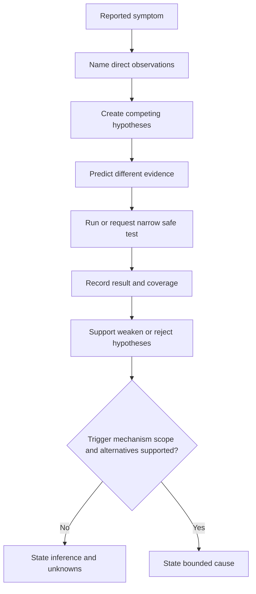

Do not say “the log proves” unless the exact proposition is inside the source's documented contract. Prefer “records,” “shows,” “is consistent with,” and “does not establish.” This is not timid language. It is how an escalation remains correct when Engineering adds a source that changes the interpretation.

## 3. Windows Event Log evidence

**Windows Event Log** is the modern Windows infrastructure through which event providers publish structured records into named channels. A record can contain system metadata such as provider, event identifier, level, time created, computer, process or thread identifiers, activity identifiers, and event-specific data. The friendly message shown by Event Viewer is a rendered view; the underlying structured fields are often better for reproducible analysis.

A **channel** is a named destination or view. Common administrative channels include **System**, **Application**, and **Security**, but many components expose operational channels under Applications and Services Logs. Security is protected and its contents depend on audit policy. A provider's event identifier is meaningful only with provider, version, channel, and documentation; event ID `1000` from one provider is not the same contract as `1000` from another.

| Windows element | What it contributes | Useful scope field | Frequent mistake |
|---|---|---|---|
| Provider name | Identifies the emitter | Exact provider string or GUID | Searching an event ID without provider |
| Event ID | Identifies a provider-defined event type | Provider plus event ID plus version | Treating the number as universal |
| Level | Producer-classified severity | Critical, error, warning, information, verbose | Assuming every warning is customer impact |
| Channel | Storage/subscription surface | System, Application, Security, Operational | Exporting every channel “just in case” |
| TimeCreated | Event-record timestamp under platform semantics | Raw value, UTC rendering, clock context | Ignoring clock skew or collection delay |
| Record ID | Channel-local record sequence concept | Channel and export provenance | Treating it as a global event identity |
| Activity or correlation ID | Provider-declared relationship field | Provider contract and scope | Assuming it exists or is unique everywhere |
| Event data | Structured provider payload | Named fields, not only message text | Losing fields by copying a screenshot |
| Rendered message | Human-readable formatting | OS language, provider resources, version | Parsing prose as a stable schema |
| Bookmark/query | Reproducible selection point | Query text and source metadata | Assuming a bookmark survives retention forever |

Event Viewer is useful for exploration, but a screenshot usually loses hidden fields, query criteria, export coverage, and machine-readable structure. PowerShell's `Get-WinEvent` can make a narrow query reproducible. The command is a query interface, not a guarantee that the provider logged the desired event.

The following examples are **templates for an authorized matching Windows environment**, not instructions to collect production data. They are deliberately narrow. Replace the fictional provider, channel, time, and process values only under an approved case scope. Do not run them against a customer system merely because they appear in a study guide.

```powershell
$start = [datetime]'2026-08-24T10:01:30Z'
$end = [datetime]'2026-08-24T10:05:00Z'

Get-WinEvent -FilterHashtable @{
    LogName = 'System'
    StartTime = $start
    EndTime = $end
} -MaxEvents 200 |
    Select-Object TimeCreated, ProviderName, Id, LevelDisplayName, RecordId
```

This example asks one channel for a bounded interval and selects a small metadata set. It does not expose event message content by default. Even so, the actual output can contain host-identifying data and must stay inside approved handling. `-MaxEvents 200` is a safety bound, not proof the first 200 records include all relevant evidence. Query order, clock basis, and truncation must be recorded.

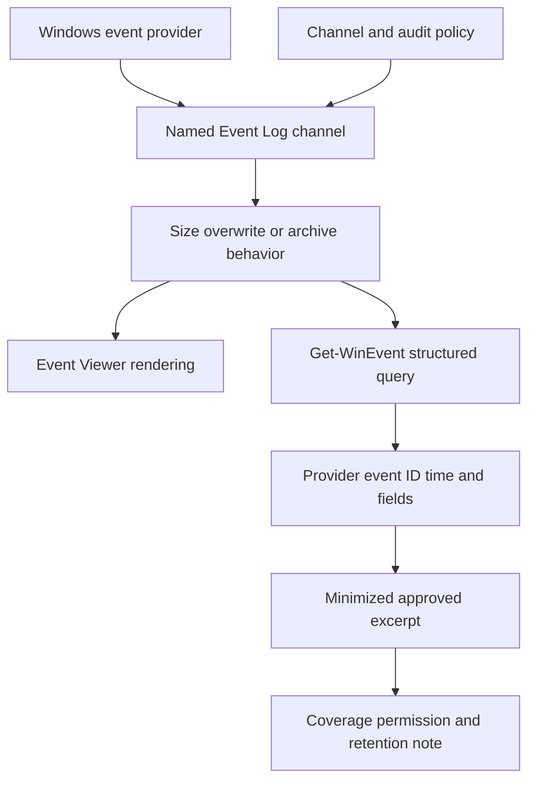

### Plain-English deep-dive: Event ID needs a surname

An event ID is like a house number. “42” is useful only when the street and city are known. The provider is the street, the channel and product version add more address context, and the event-specific schema explains the rooms. The analogy stops because event providers can revise versions, reuse IDs under documented versions, and render messages differently by language.

For every cited Windows event, record at least provider, event ID, event version if exposed, channel, computer alias, record ID, raw timestamp, event data fields used, query window, OS/build, and whether the message was rendered. If an investigation depends on a Security event, also record that the current identity had permission and that the relevant audit policy was enabled during the incident window. Otherwise, absence is weak evidence.

## 4. Windows process and service state

A **process** is one running instance of executable code. A **process identifier**, abbreviated **PID**, is a number assigned for that process lifetime. Windows can reuse a PID after a process exits, so `PID 4312` is incomplete identity. Add process start time, boot/session context, executable identity, and when available a stronger process sequence identity. A **parent process identifier**, or PPID, records a parent relationship at creation, but parent exit and PID reuse can make a later snapshot misleading.

A **Windows service** is a workload managed by the Service Control Manager. Its configuration can include service name, display name, executable path, account, dependencies, start type, and recovery behavior. Service state includes stopped, start pending, running, stop pending, and paused under service contracts. “Running” means the service reported that lifecycle state; it does not prove its application health check passes or that it owns an expected port.

| Evidence question | Process evidence | Service evidence | Caveat |
|---|---|---|---|
| Does an instance exist now? | PID, name, start time | Current service state and service PID | Snapshot can miss a short-lived crash |
| Which executable is involved? | Path, signature/version where authorized | Configured binary path | Path access may require permission; command line can expose secrets |
| Under which identity? | Token/user context under approved access | Service account configuration | Identity alone does not prove authorization succeeded |
| Did it restart? | Different start times or process epochs | Recovery events and state transitions | PID reuse can look like continuity |
| Is it ready? | Application-specific health evidence | Running plus readiness evidence | Process/service state alone is insufficient |
| Does it own a listener? | PID-to-socket mapping | Service PID mapping | Listener may bind after state becomes running |
| Why did it exit? | Exit/exception/application record | Service-control termination event | Generic exit code may be symptom, not cause |
| Was configuration changed? | Usually not established by snapshot | Service configuration or audit record if enabled | Current config does not prove incident-time config |

Narrow process inspection can use `Get-Process` on an authorized host. Process fields differ by access and architecture, and some properties can fail independently. A support transcript should record those access errors rather than suppressing them.

```powershell
Get-Process -Name 'RelayClient094' -ErrorAction SilentlyContinue |
    Select-Object Id, ProcessName, StartTime, Path

Get-Service -Name 'RelayClient094' |
    Select-Object Name, Status, StartType
```

These commands are read-only snapshots. The fictional name prevents accidental targeting. Do not add commands that stop, start, kill, reconfigure, dump, or change a service as an evidence-collection shortcut. Such actions can alter customer impact, erase transient state, trigger recovery, and compromise the timeline. A restart is a remediation change and needs authorization, a rollback/impact plan, and before/after evidence.

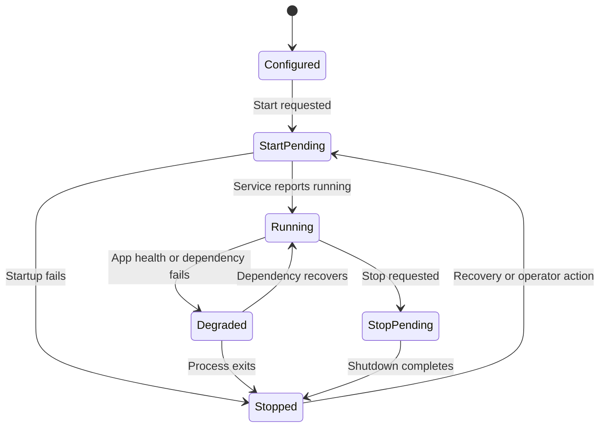

The `Degraded` state in the diagram is an analytical application-health state, not a universal Windows Service Control Manager state. That distinction matters. Operating-system lifecycle state and product health are separate contracts.

### Process creation and command-line caution

Windows Security event 4688 can record process creation when the corresponding audit policy is enabled. Command-line inclusion has separate policy and privacy implications. Command lines can contain access tokens, passwords, file paths, email addresses, query text, or customer content. Never request command-line logging broadly or paste raw command lines into a case. First establish authorization and necessity; then minimize or redact approved fields while preserving analytical structure.

Sysinternals Sysmon can provide richer process and network telemetry when installed and configured, but it is optional software with configurable rules. Its absence is normal unless deployment is part of the environment design. Never say “Sysmon shows nothing, so it did not happen” without proving installation, configuration, health, event channel coverage, filtering, retention, and permission for the interval.

## 5. Windows network evidence

A network investigation should separate **configuration**, **socket state**, **packet path**, **name resolution**, **filtering**, **application protocol**, and **remote service outcome**. OS socket tables are strong for the local endpoint state at observation time but weak for historical traffic unless a dedicated event source was already recording it.

For Transmission Control Protocol, abbreviated **TCP**, a **listener** waits for inbound connection attempts. A client can appear in `SYN_SENT` after sending a synchronization request while waiting for a response. `ESTABLISHED` means the TCP handshake completed and the connection currently exists; it does not prove Transport Layer Security, HTTP, authentication, or application work succeeded. `TIME_WAIT` is a normal lifecycle state after closure and is not automatically a leak.

| Local observation | What it supports | What it does not prove | Next bounded question |
|---|---|---|---|
| No matching process | No visible instance under current query/access | Process never ran or is not hidden by scope/access | Check service state and incident-time lifecycle records |
| Process exists, no listener | Instance exists but no matching socket was visible | App failed, port changed, bind is delayed, or permission denied | Verify expected endpoint contract and startup records |
| Listener on loopback only | Local-only bind is visible | Remote clients can reach it | Verify intended bind address and approved policy |
| `SYN_SENT` | Local TCP connect attempt is awaiting completion | Remote host received it or firewall dropped it | Correlate narrow firewall/packet/path evidence |
| `ESTABLISHED` | TCP session exists at snapshot time | TLS or request succeeded | Inspect application-level result and correlation ID |
| Repeated short connections | Connection churn occurred | Retry cause or harmful behavior | Correlate attempt IDs, errors, and retry policy |
| Security event 5156 | Windows Filtering Platform permitted a connection under audited conditions | Application transaction succeeded | Join by time, process/app fields, addresses, and scope |
| Security event 5157 | Windows Filtering Platform blocked a connection under audited conditions | Which policy owner intended the block or final root cause | Identify filter/policy context through approved owners |
| No firewall event | No matching readable record in queried evidence | Traffic was allowed, blocked, or absent | Verify audit policy, permissions, source, retention, and filter |

PowerShell's `Get-NetTCPConnection` can show current TCP endpoints on supported Windows versions with the NetTCPIP module. The query below is deliberately constrained to a fictional local port and selected fields.

```powershell
Get-NetTCPConnection -LocalPort 9443 -ErrorAction SilentlyContinue |
    Select-Object State, LocalAddress, LocalPort, RemoteAddress, RemotePort, OwningProcess
```

Do not query all connections and export every process, user, remote address, and command line when the case asks only whether one approved service owns one expected port. A broad socket inventory can expose unrelated destinations and user activity. If the problem is historical, a current table may be the wrong test; use pre-existing authorized event sources or reproduce safely under an approved plan.

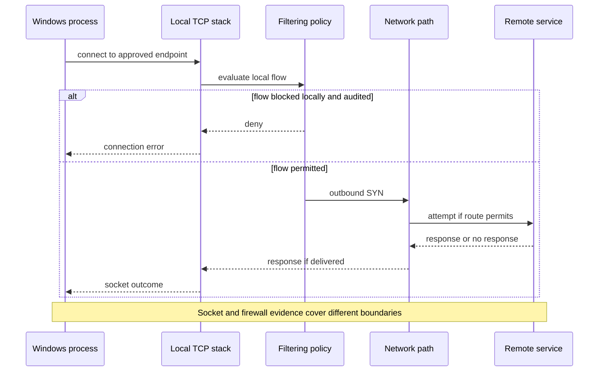

The diagram is a mental model, not a guarantee of a specific Windows implementation path. Drivers, proxies, virtual networks, endpoint controls, and off-host devices can add boundaries. A local allow record cannot prove every downstream device permitted the flow.

## 6. Linux journal and text-log evidence

Linux is a kernel and ecosystem rather than one complete distribution. A **distribution**, often shortened to **distro**, combines the Linux kernel with user-space software, package management, configuration, and support policy. Commands, paths, service managers, default collectors, permissions, and retention can differ across Ubuntu, Debian, Red Hat Enterprise Linux, Fedora, SUSE, containers, appliances, and custom systems. Always record distribution, release, kernel, init/service manager, and logging stack when those facts matter.

Many modern distributions use **systemd** as the service manager. **systemd-journald** collects structured journal records from several sources, including service standard output/error, syslog APIs, kernel messages, and native journal APIs, according to system configuration. `journalctl` queries the journal. A **unit** is a systemd-managed resource definition; a `.service` unit represents a service workload.

Linux can also use text logs, commonly beneath `/var/log`, written directly by applications or by a logging daemon such as rsyslog. A text line may follow a syslog-shaped format, JSON, key-value fields, or application-specific prose. Do not assume `/var/log/messages`, `/var/log/syslog`, or any one path exists on every distribution. The journal may forward to syslog, syslog may ingest from the journal, both may retain copies, or an application may bypass both.

| Linux evidence surface | What it is | Useful selector | Boundary |
|---|---|---|---|
| systemd journal | Structured indexed records managed by journald | Unit, boot, priority, identifier, time, cursor | Persistence and access depend on configuration |
| `journalctl` | Query/rendering tool for journal files | `--unit`, `--boot`, `--since`, `--until`, output mode | Output format and version capabilities vary |
| Service standard output/error | Process streams captured under unit configuration | `_SYSTEMD_UNIT`, `_PID`, boot | Application may redirect elsewhere or structure poorly |
| Kernel journal records | Kernel-origin messages available through journal path | `_TRANSPORT=kernel`, boot, time | Not a complete packet or audit trail |
| Syslog-shaped records | Priority/facility plus message under syslog conventions | Facility, severity, program tag | Transport, daemon, and format differ |
| Application text file | Producer-managed or logger-managed file | Exact file, inode/rotation set, interval | Path and schema are application specific |
| Linux Audit records | Security audit framework output when configured | Event serial/type and time | Rules, backlog, daemon health, access, and distro policy matter |
| Container logs | Runtime/orchestrator-specific streams | Container identity and restart instance | Host journal and application view can differ |

An authorized targeted query might conceptually look like this:

```bash
journalctl --unit=relay-worker-094.service \
  --since='2026-08-24 10:01:30 UTC' \
  --until='2026-08-24 10:05:00 UTC' \
  --output=json --no-pager
```

This is a read-only template with a fictional unit and bounded interval. JSON output preserves fields better than rendered prose, but it may contain hostnames, executable paths, user IDs, command lines, environment-derived text, and application content. Use it only on an authorized matching system, select or redact fields under policy, and do not upload raw output to an unapproved service.

Journal selectors can include boot identity, unit, executable, PID, user unit, priority, or field matches depending on version and permissions. A boot selector matters because PIDs, monotonic time, and service instances reset or change across reboot. A **cursor** is a journal position token useful for resuming traversal under its contract; it is not a universal business-event ID.

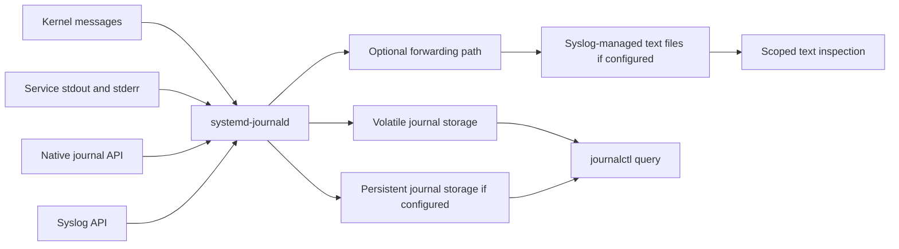

### Plain-English deep-dive: The journal is an indexed filing cabinet, not “the Linux log”

An indexed filing cabinet lets records be selected by several labels instead of reading every page. The journal can preserve fields such as unit, executable, PID, boot ID, and transport, which makes targeted selection powerful. The analogy stops because journal records have binary storage structures, permissions, rate limits, forwarding, volatility/persistence settings, and corruption or vacuum boundaries.

Linux does not promise that every application writes to the journal. A program can write its own file, send to another collector, run in a container, or suppress output. Conversely, one occurrence can appear in the journal and a forwarded text log. Before counting events, identify whether two stores are independent witnesses or copies of the same producer record.

## 7. Linux service and process state

`systemctl` controls and inspects systemd units. A service can be **active**, **inactive**, **failed**, **activating**, or **deactivating**, with more detailed substate and result fields. `systemctl status` is convenient for a human, but its included journal excerpt can be truncated and its output is a current summary. Machine-readable property queries or a separately bounded journal query are better for a reproducible pack.

`ps` reports process snapshots. The `/proc` pseudo-filesystem exposes kernel views of processes and system state through files such as `/proc/<pid>/status`, subject to permissions and mount policy. A **file descriptor**, abbreviated **FD**, is a process-local handle to an open file, socket, pipe, or other object. Inspecting descriptors can reveal sensitive paths or endpoints and may require elevated access, so it is not a default collection step.

| Linux question | Narrow evidence | Strong identity fields | Limitation |
|---|---|---|---|
| What is the unit state? | Selected systemd properties | Unit name, invocation identity if available, result, timestamps | Current state can differ from incident state |
| Is a process alive? | Targeted `ps` or `/proc/<pid>/status` | PID plus process start/boot context | PID can be reused and process can exit before query |
| Who launched it? | Unit/cgroup relationship and parent fields | Unit, cgroup, PPID, process epoch | Reparenting and namespaces complicate ancestry |
| Which binary ran? | Executable link/path and package metadata if authorized | Path, inode/package/version | Deleted/replaced executable and permissions complicate interpretation |
| Why did it exit? | Unit result, exit status, application and kernel records | Invocation/process identity and timestamp | Exit code may be wrapper output or downstream symptom |
| Is it restarting? | Unit restart counter and repeated invocation transitions | Distinct invocation/start times | A current active state can hide a restart storm |
| What did it open? | Narrow approved FD or application evidence | PID epoch plus selected descriptor | Can expose secrets/content and is only a snapshot |
| Is it healthy? | Product-specific readiness or successful transaction | Correlation ID and expected state | `active` and PID presence are not health proof |

Safe conceptual inspection templates use the exact fictional unit and selected fields:

```bash
systemctl show relay-worker-094.service \
  --property=Id,ActiveState,SubState,Result,MainPID,ExecMainStatus

ps -p 882 -o pid=,ppid=,lstart=,stat=,comm=
```

These are read-only templates, not instructions to access a real host. Avoid collecting full environment variables, every process command line, all open descriptors, process memory, or unrestricted `/proc` trees. Environment and command-line data commonly contain credentials and customer-specific values. A permission error should be recorded as a coverage limitation rather than “fixed” with broad elevation.

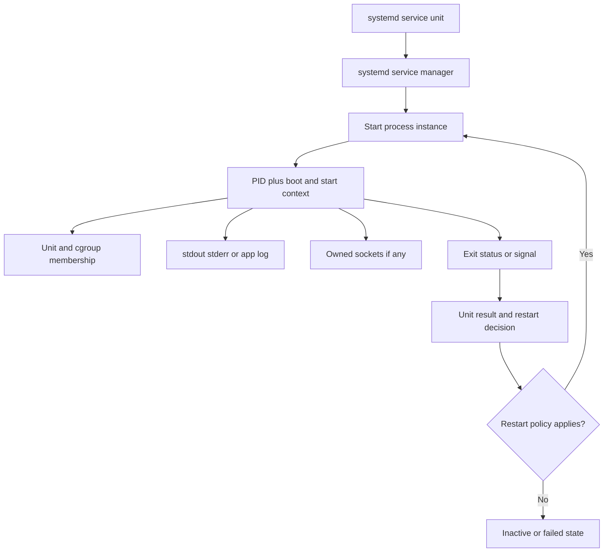

### Plain-English deep-dive: A PID is a hotel room number, not a permanent identity

A hotel can assign room 882 to one guest this week and another guest next week. Saying “room 882 did it” is incomplete without the date and guest. A PID works similarly: the OS can reuse it after a process exits. The analogy stops because process namespaces can present different PID numbers for the same process, and kernels track process identity with richer internal objects.

For an evidence pack, pair PID with boot ID, process start time, unit invocation or service transition, executable identity, and the observation time. On Windows, use equivalent start/session or sequence context. Never join a socket observed at noon to an error from 9 AM merely because both say PID 882.

## 8. Linux network evidence

The `ss` utility displays socket information through Linux networking interfaces and is commonly used instead of older `netstat` workflows. A targeted socket query can identify protocol, local and peer endpoints, state, and sometimes process ownership when permission allows. Its output is a point-in-time view.

Linux network evidence can also come from application logs, kernel messages, firewall/nftables logs if explicitly configured, conntrack state where appropriate, DNS resolver sources, routing state, proxy records, or packet capture under separate authorization. The presence of a tool does not authorize broad use. Packet capture is more intrusive and can expose content or credentials, so it is not part of this lab.

| Linux socket or network clue | Observation | Competing explanations | Safe next test |
|---|---|---|---|
| No `LISTEN` row for expected port | No matching visible listener at query time | Service down, wrong port/address/namespace, delayed startup, permission-limited process detail | Verify unit contract, unit state, exact namespace, and startup records |
| Listener bound to `127.0.0.1` | Loopback-only local bind | Intended local proxy or accidental bind setting | Compare approved configuration and caller location |
| Listener bound to `0.0.0.0` | IPv4 wildcard bind | Reachability still blocked by host/off-host policy | Check narrow filtering and path evidence |
| `SYN-SENT` | Local connect in progress | Drop, delay, wrong route, absent peer, asymmetric response | Correlate scoped route/filter/peer evidence |
| `ESTAB` | TCP connection exists | TLS, authentication, request, and response may still fail | Check application transaction evidence |
| `CLOSE-WAIT` accumulation | Peer closure observed but local close incomplete | App leak, slow cleanup, snapshot timing | Compare trend, FD counts, and app lifecycle safely |
| Kernel drop message | Kernel recorded a configured message | May be rate-limited or unrelated flow | Match tuple/interface/time and logging policy |
| No firewall log | No record in queried source | Rule logging disabled, rate-limited, rotated, permission denied, or no matching flow | Verify policy, health, retention, and query scope |

A fictional targeted query template is:

```bash
ss --tcp --listening --numeric --process 'sport = :9443'
```

Process details can require privilege and can expose unrelated identity. The filter should be tested against the installed `iproute2` version because syntax and available fields vary. Do not broaden to every socket as the automatic response to an empty result. First verify address family, network namespace, port, protocol, observation time, and access.

Windows and Linux socket tools answer a similar question: “What does this host currently know about selected sockets?” They do not by themselves answer “What packets crossed every boundary during the incident?” or “Why did the application reject the request?” That requires evidence from the relevant layer.

## 9. Permissions, identities, and absence of evidence

**Least privilege** means granting only the access needed for an approved task. Evidence collection does not suspend that principle. Windows Security logs, protected process properties, Linux journal fields, `/proc` entries, audit logs, sockets owned by other users, and application files can all have restricted access. Distribution and organizational policy determine which users or groups can read which sources.

An **access-denied observation** has positive meaning: a named identity attempted a named read through a named interface and was not permitted. It does not mean the source is empty or corrupted. Changing permissions, adding an account to a privileged group, running as administrator/root, disabling protection, or copying protected stores without approval changes the security state and may create a policy incident.

| Situation | Direct observation | Unsafe conclusion | Correct next action |
|---|---|---|---|
| Event Viewer cannot open Security | Current identity cannot read through that path | No security events exist | Record identity/path/error and use approved escalation |
| `journalctl` shows only current user's records | Query returned permission-filtered view | System services emitted nothing | Verify documented access policy and obtain authorized minimum excerpt |
| Process path property is blank | Property unavailable or access failed | Process has no executable | Record per-property error and use another approved source |
| `ss --process` omits owner | Process ownership was not exposed | No process owns the socket | Correlate targeted service/PID evidence under allowed privilege |
| Text file read is denied | File mode/ACL blocks identity | File is absent | Record metadata allowed by policy and request owner assistance |
| Security/audit event absent | No matching readable retained record | Activity did not happen | Verify policy, source health, query, retention, time, and identity |
| Journal begins after reboot | Available store starts at that boot/time | Earlier service was healthy | State coverage gap and seek approved alternate source |
| Rotated file missing | Named rotation member is unavailable | No old errors occurred | Record rotation policy and evidence ceiling |

### Plain-English deep-dive: “No result” has a dependency chain

Imagine asking a library catalog for a book and receiving no result. The library may not own it, the catalog may be offline, the title may be misspelled, your account may hide restricted collections, or the book may have been removed. “No result” becomes useful only after those dependencies are checked. The analogy stops because logs also depend on instrumentation, runtime policy, buffers, forwarding, clocks, and retention.

Before using absence as evidence, verify at least: correct host or namespace, correct source, provider/unit enabled, audit or logging policy active, source healthy, query syntax, time basis and window, identifier spelling/scope, reader permission, retention coverage, rate limiting/sampling, forwarding state, and whether the event should exist under the documented contract. Even then, phrase the conclusion at the source boundary: “No matching retained record was found in source S for interval T under query Q.”

## 10. Rotation, retention, and evidence coverage

Logs consume storage, so systems limit them. **Rotation** closes, renames, compresses, copies, or replaces a file or storage segment so new records can continue. **Retention** decides what remains and for how long or how much space. **Archival** moves evidence to another store. **Forwarding** sends records elsewhere. Those mechanisms affect completeness and duplication.

Windows Event Log channels can have maximum sizes and retention/overwrite behavior. A busy channel can overwrite old records sooner than a calendar estimate suggests. A saved `.evtx` export has its own creation time and scope; it is not proof that the live channel was complete. Clearing a log can itself generate evidence under applicable controls, but do not assume that event is available or that all prior data can be recovered.

The systemd journal can use volatile storage, persistent storage, size limits, free-space controls, and time-based retention according to version and configuration. A volatile journal can be lost at reboot. Journal vacuum operations remove archived data and are destructive; they are not troubleshooting collection steps. This Part intentionally provides no vacuum command.

Text logs can be managed by `logrotate` or another mechanism. Common strategies rename a file and signal the producer to reopen, or use `copytruncate` to copy the current file and truncate it in place. Copy-and-truncate can lose or duplicate lines in a race window. Compression can make older members less convenient to search but does not make them irrelevant. Filename order is not always event order.

| Coverage factor | Windows example | Linux example | Evidence-pack entry |
|---|---|---|---|
| Live-store limit | Channel maximum size | Journal size/free-space limit | Configured limit and observed oldest/newest record |
| Overwrite/eviction | Overwrite oldest records | Journal removes archived segments | Earliest retained time and gap statement |
| Reboot | Boot/session changes context | Volatile journal may disappear; boot ID changes | Boot identifiers and persistence mode |
| Rotation | Archived Event Log or exported EVTX | Renamed/compressed text files | Rotation members, inode/file metadata, policy |
| Forwarding | Windows Event Forwarding or agent | Journal remote/syslog/agent | Source versus forwarded copy identity |
| Rate limit/sampling | Provider or collector policy | journald/app/logger rate limiting | Dropped/suppressed indicators if available |
| Manual clearing | Channel clear under permissions | Truncate/delete/vacuum under permissions | Approved audit evidence and explicit unknowns |
| Clock change | TimeCreated ordering affected | Journal realtime versus monotonic/boot context | Raw time, boot, clock-health note |
| Export timing | Query after overwrite | Copy after rotation | Collection time and source state |

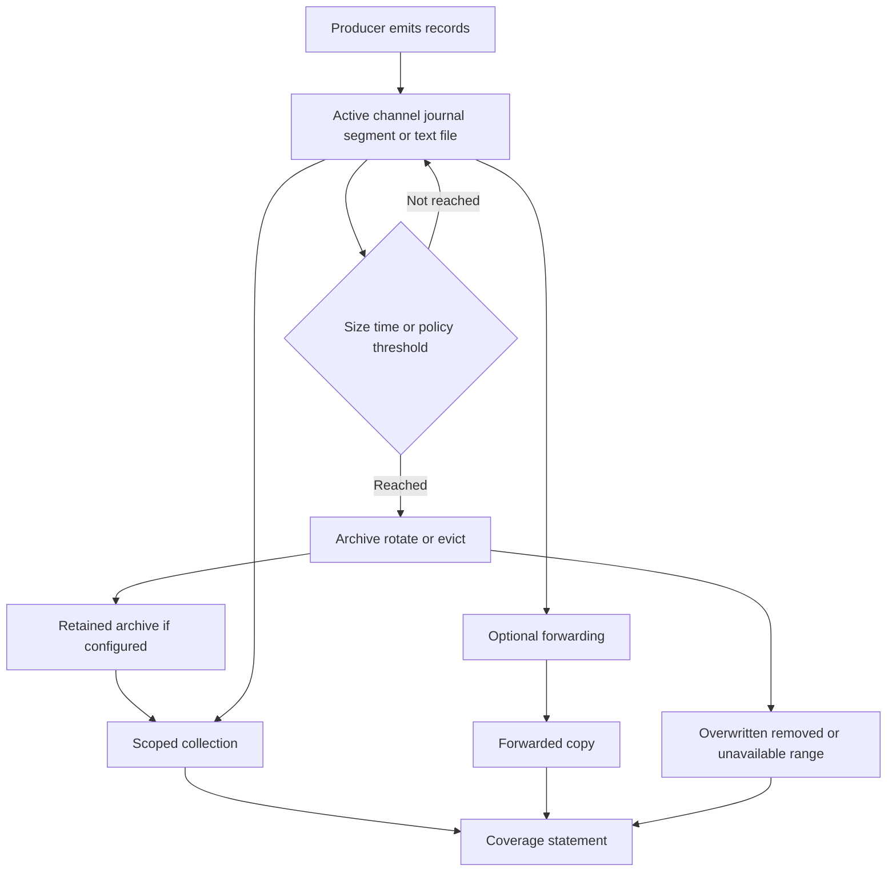

### Plain-English deep-dive: Retention is a bucket, not a promise of days

A bucket holds a fixed volume. A slow drip may remain for days; a fire hose can replace it quickly. A size-limited event channel or journal behaves similarly: event volume influences how far back it reaches. The analogy stops because records have variable sizes, reserved free-space policies, archives, compression, per-source routing, and explicit time limits.

Never write “30 days of logs” merely because a policy says 30 days. Measure the actual oldest and newest retained records for the relevant source, note gaps and boot boundaries, and record the collection time. A policy target, current configuration, and observed coverage are three different facts.

## 11. Collection scope, minimization, and packaging

The best first evidence request is not “send all logs.” It is a **scope card**: a written definition of the question and the minimum evidence likely to answer it. Broad collection increases privacy risk, customer burden, review time, false correlations, storage cost, and accidental exposure. It can also hide the decisive five records inside millions of unrelated lines.

### Minimum scope card

| Scope field | Synthetic example | Why it matters |
|---|---|---|
| Case question | Why did client attempts to `relay-L094` fail between 10:02 and 10:04 UTC? | Keeps collection tied to a decision |
| Host role | `win-client-094` and `linux-relay-094` | Avoids unrelated machines |
| Platform/version | Fictional Windows build W094; fictional Linux distro L094 with systemd | Establishes command/schema boundaries |
| Incident window | `10:01:30Z` to `10:05:00Z` plus justified 30-second margin | Prevents unbounded collection |
| Component | Windows `RelayClient094`; Linux `relay-worker-094.service` | Narrows process/service evidence |
| Endpoint | Documentation address `192.0.2.44:9443` | Narrows socket/filter records |
| Correlation | `op-X94`, attempt IDs `a1` and `a2` | Connects only relevant records |
| Required fields | Source, raw time, event type, PID epoch, unit/service, endpoint, result | Supports analysis without content |
| Excluded fields | Credentials, message bodies, full command lines, unrelated users/endpoints | Makes privacy structural |
| Collection owner | `learner-local` for lab; approved owner in real work | Clarifies accountability |
| Retention/deletion | Keep minimized synthetic pack until review, then delete scratch copies | Prevents indefinite accumulation |

A reliable pack preserves **raw evidence** and separately stores **derived analysis**. Do not edit a raw record to correct time, rename fields, remove inconvenient lines, or insert a conclusion. Instead, create a minimized raw excerpt, a normalization table, and a reasoning ledger. Record hashes only when the organization's evidence process calls for them; a hash can help detect later byte changes but does not prove the record was truthful or collected completely.

### Synthetic evidence-pack contents

| Artifact | Required contents | Explicit exclusion |
|---|---|---|
| `scope-card-094.md` | Question, systems, interval, identifiers, fields, owner, authorization label | No broad “all logs” request |
| `source-inventory-094.csv` | Source, producer, platform, version, location, permission, retention, coverage | No guessed product source |
| `windows-events-094.jsonl` | Selected fictional structured records | No real EVTX or customer host data |
| `linux-journal-094.jsonl` | Selected fictional unit and kernel records | No real journal export |
| `text-log-excerpts-094.log` | Selected fictional rotated lines with file identity | No unrelated application content |
| `state-snapshots-094.csv` | Process, service/unit, socket observations with collection time | No full process or socket inventory |
| `timeline-094.csv` | Raw time, normalized time, source, identity, observation label | No overwritten raw fields |
| `hypothesis-ledger-094.md` | Symptom, hypotheses, predictions, tests, observations, updates | No unsupported root-cause claim |
| `coverage-and-permissions-094.md` | Query bounds, access limits, oldest/newest records, rotation gaps | No concealment of missing data |
| `privacy-manifest-094.md` | Excluded/redacted field classes, owner, handling, deletion plan | No secrets, content, or raw customer IDs |
| `customer-update-094.md` | Impact, observed facts, bounded interpretation, next step, owner | No sensitive internals or speculation |
| `engineering-escalation-094.md` | Repro, exact evidence, alternatives, attempted safe checks, one ask | No uncontrolled archive |

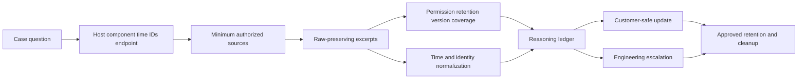

## 12. Worked synthetic cross-OS incident

### Scenario

This scenario is fictional and intentionally product-neutral. A Windows client process named `RelayClient094` tries to open a TCP connection to a Linux relay at the documentation address `192.0.2.44` on port `9443`. The reported symptom is “two connection attempts timed out.” The Linux service is named `relay-worker-094.service`. No name represents an Abnormal component.

The synthetic contract says the Linux worker must read `/srv/relay094/config.json`, then bind `192.0.2.44:9443`, then emit `ready=true`. The intended file mode allows the service identity to read the file. A fictional, already-provided metadata record says the group-readable bit was absent during the incident and restored through approved change control at 10:03:40Z. The lab does not change any real permission.

### Raw synthetic evidence

| Row | Source | Raw timestamp | Record | Identity or endpoint | Direct observation |
|---|---|---|---|---|---|
| W1 | Windows Application-shaped record | `2026-08-24T10:01:58.900Z` | client operation started | `op-X94`, PID epoch `4312@09:55:02` | Client process began operation |
| W2 | Windows socket snapshot | `2026-08-24T10:02:02.050Z` | TCP `SYN_SENT` | local ephemeral to `192.0.2.44:9443`, PID 4312 | One connect was awaiting completion |
| W3 | Windows Application-shaped record | `2026-08-24T10:02:12.100Z` | attempt `a1` timed out | `op-X94`, attempt `a1` | Client-side deadline occurred |
| L1 | Linux journal-shaped unit record | `2026-08-24T10:02:00.120Z` | service start requested | invocation `inv-L1` | Manager started one invocation |
| L2 | Linux app-shaped journal record | `2026-08-24T10:02:00.180Z` | open config returned permission denied | PID epoch `882@boot-B7`, safe path alias `cfg-1` | Process reported access failure |
| L3 | Linux journal-shaped unit record | `2026-08-24T10:02:00.190Z` | main process exited status 78 | invocation `inv-L1`, PID 882 | Process exited |
| L4 | Linux journal-shaped unit record | `2026-08-24T10:02:00.195Z` | unit entered failed | invocation `inv-L1` | Unit failure recorded |
| L5 | Linux socket snapshot | `2026-08-24T10:02:02.000Z` | no selected `LISTEN` row | `192.0.2.44:9443` | No matching listener visible at that instant |
| M1 | Synthetic file metadata audit excerpt | `2026-08-24T10:01:40.000Z` | intended service-read bit absent | alias `cfg-1` | Metadata state differed from synthetic baseline |
| M2 | Synthetic approved change record | `2026-08-24T10:03:40.000Z` | intended service-read access restored | alias `cfg-1`, change `chg-94` | Scoped correction recorded |
| L6 | Linux journal-shaped unit record | `2026-08-24T10:03:45.000Z` | service start requested | invocation `inv-L2`, PID 910 | New invocation began |
| L7 | Linux app-shaped journal record | `2026-08-24T10:03:45.090Z` | configuration loaded | invocation `inv-L2`, alias `cfg-1` | Read succeeded under app contract |
| L8 | Linux socket snapshot | `2026-08-24T10:03:45.180Z` | TCP `LISTEN` | `192.0.2.44:9443`, PID epoch `910@boot-B7` | Expected listener visible |
| L9 | Linux app-shaped journal record | `2026-08-24T10:03:45.220Z` | `ready=true` | invocation `inv-L2` | Application declared readiness |
| W4 | Windows socket snapshot | `2026-08-24T10:03:48.300Z` | TCP `ESTABLISHED` | to `192.0.2.44:9443`, PID epoch 4312 | TCP connection existed |
| W5 | Windows Application-shaped record | `2026-08-24T10:03:48.420Z` | attempt `a2` completed | `op-X94`, attempt `a2` | Synthetic operation completed |

### Step-by-step analysis

1. **Define the symptom precisely.** W3 records a client-side deadline for attempt `a1`. It does not say whether a packet reached the Linux host or whether an application rejected it. The report of two timeouts conflicts with W5, which records completion for attempt `a2`; the customer wording may have combined a transient timeout with overall delay.
2. **Validate the time and identity joins.** All records are UTC-shaped under the lab contract. PID 882 is joined to invocation `inv-L1` and boot `boot-B7`; PID 910 belongs to a separate invocation. Windows PID 4312 is paired with its start epoch. No join relies on PID alone.
3. **Read Linux lifecycle evidence.** L1 through L4 show start, application-reported file-open denial, process exit, and failed unit state within 75 milliseconds. Those are separate observations that share the same invocation and process epoch.
4. **Read network state at the correct boundary.** L5 reports no expected listener after the process exited. W2 reports a Windows connect waiting in `SYN_SENT` near the same interval. Together they support unavailability at the application-listener boundary, but they do not show every packet or filtering decision.
5. **Test the permission hypothesis against an alternative.** One hypothesis is that read access to `cfg-1` was absent, causing startup exit. An alternative is that the port was already occupied. The permission hypothesis predicts a direct read-denied record followed by exit and successful startup after a scoped correction. The port-conflict hypothesis predicts a bind failure or existing owner. L2, M1, M2, L7, and L8 support the first sequence; no synthetic bind-conflict evidence exists.
6. **Avoid using sequence as causation by itself.** M1 predates L2, but that alone is not enough. The synthetic application contract says configuration read is required before bind, L2 names access denial for the same alias, the process exits, and a new invocation reads successfully after M2. That supplies mechanism and a controlled before/after contrast inside the fictional scenario.
7. **Bound the conclusion.** The supported synthetic cause of the service startup failure is missing intended read access for `cfg-1`. That startup failure removed the expected listener and is consistent with the first Windows timeout. The pack does not establish who or what changed the permission, whether any off-host device also dropped traffic, or whether the same mechanism exists in a real product.
8. **Choose the next action.** In a real authorized case, verify the intended access through the owning configuration/change system and obtain the smallest relevant audit record if attribution matters. Do not use broad permission such as world-readable access, disable security controls, or collect all audit logs.

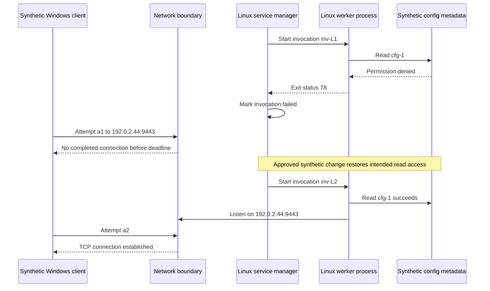

### Observation, inference, and cause ledger

| Ledger entry | Statement | Confidence | Why |
|---|---|---|---|
| Observation | Invocation `inv-L1` recorded access denied for `cfg-1` | High within synthetic corpus | Direct app-shaped record |
| Observation | The same invocation exited and unit entered failed | High | Joined unit/process identity |
| Observation | No selected listener was visible at 10:02:02Z | High for that synthetic snapshot | Exact endpoint and collection time |
| Observation | Windows attempt `a1` reached its client deadline | High | Direct client-shaped record |
| Inference | Missing listener is consistent with the connection not completing | Medium-high | Cross-host state aligns; no packets are present |
| Hypothesis | Missing intended read access prevented startup before bind | High candidate | Required-read contract plus direct denial and exit |
| Alternative | Port collision prevented bind | Low after test | No bind attempt/failure; process exited at required read |
| Cause within lab | Missing intended read access caused synthetic invocation `inv-L1` startup failure | High within declared fictional contract | Trigger state, mechanism, scope, before/after, alternative comparison |
| Unknown | Actor or system that changed access | Unknown | No attribution source included |
| Evidence ceiling | No packet capture, off-host filter record, or real product source | Explicit | Pack supports method, not production diagnosis |

### Customer-safe synthetic update

“Between 10:02:00 and 10:02:12 UTC, the relay service's first synthetic invocation exited before its expected listener appeared. The application record identifies a configuration read denial for the same process instance, and the Windows client then reached its connection deadline. After intended read access was restored through the fictional approved change, a new invocation loaded configuration, opened the listener, and the next client attempt completed. This supports a scoped startup-permission mechanism in the exercise. It does not identify who changed access, and it does not represent an Abnormal production incident.”

### Engineering-ready synthetic ask

“Please review whether the declared startup contract for `cfg-1` and exit status 78 is represented correctly in the synthetic schema, and whether an actual supported implementation would expose a stable invocation/process identity and readiness event. No product behavior is assumed. The attached fictional pack includes 16 selected rows, source/coverage notes, and no customer content or secrets.”

## 13. Symptom-to-hypothesis-to-test-to-observation-to-next-action troubleshooting tree

The troubleshooting path must begin with the symptom, not with a favorite tool. Each branch asks a question that changes the next action. The word **test** includes a narrow evidence check; it does not require changing a live system.

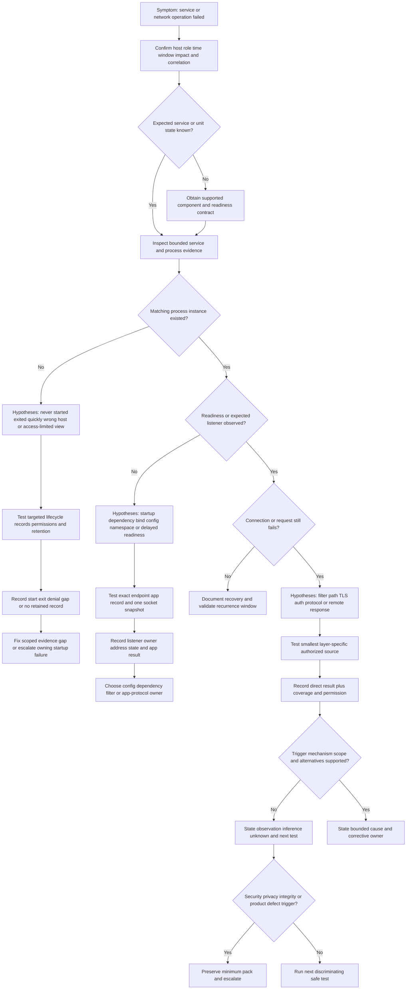

### Troubleshooting matrix

| Symptom | Candidate hypothesis | Cheapest safe test | Possible observation | Next action |
|---|---|---|---|---|
| Windows service says running but requests fail | Process reported running before readiness | Check exact readiness event and expected listener for the same PID epoch | Running state exists; no listener/readiness | Inspect startup dependency records, then owner escalation |
| Linux unit repeatedly restarts | Required file access fails | Query only the unit invocation window and approved metadata alias | Access denied precedes each exit | Validate intended least privilege through configuration owner |
| Process appears in one source but not another | PID was reused or snapshots differ in time | Add boot/start/invocation identity and collection timestamps | Two distinct process epochs share PID | Split the timeline; never merge on PID alone |
| Connection is `ESTABLISHED` but API fails | Failure is above TCP | Inspect one sanitized application result and request correlation | TLS/auth/HTTP error after connection | Move to protocol/identity owner with minimized evidence |
| No Windows Security network event | Audit policy or permission is absent | Verify policy state and readable coverage for interval | Relevant subcategory disabled | Treat absence as non-evidence; request approved alternate source |
| `journalctl` shows no old boot | Journal was volatile or retention removed it | Record boot list/oldest retained entry under allowed access | Evidence starts after reboot | State evidence ceiling; seek approved forwarded source |
| Text log has a gap at rotation | Producer failed to reopen or copy-truncate race occurred | Compare rotation timestamps, file identities, and producer reopen records | New file empty while old descriptor remains | Escalate logging configuration; avoid forcing rotation live |
| Listener exists only on loopback | Bind configuration differs from expected client path | Compare exact bind address to approved contract | `127.0.0.1:9443` only | Correct through change process or use intended local proxy path |
| Firewall allow event exists but timeout persists | Failure is downstream or return path | Correlate local tuple/time with peer or path evidence | Local flow permitted; no peer response | Escalate to next boundary; do not blame local firewall |
| Access denied while collecting | Reader lacks privilege | Record identity, source, error, and case necessity | Protected source exists but unreadable | Use authorized owner or escalation, not blanket elevation |
| Duplicate event appears in journal and text file | One record was forwarded | Compare producer timestamp, message identity, and forwarding design | Fields show one source copied twice | Deduplicate as copies while preserving provenance |
| Error appears after service recovery | Buffered exporter delivered old event | Compare event time, ingest time, boot/invocation, and cursor/record identity | Old event arrived late | Keep occurrence and arrival separate |

## 14. Common failure modes and misleading signals

| Failure mode or misleading signal | Why it misleads | Safer practice |
|---|---|---|
| Searching every log on the host | Creates noise, privacy exposure, and accidental false joins | Start with one case question, component, interval, and identifier |
| Copying only friendly message text | Loses provider, event version, raw fields, record identity, and rendering context | Preserve structured selected fields and query provenance |
| Treating event ID as universal | IDs are provider-specific and can be versioned | Cite provider, channel, event ID, version, and documentation |
| Treating warning/error level as impact | Severity is producer classification, often for local behavior | Correlate with failed state, request outcome, and scope |
| Assuming service “running” means healthy | Lifecycle and readiness are separate | Require readiness, listener, or successful transaction evidence |
| Assuming process absence means it never ran | A short-lived process can exit before snapshot | Use incident-time lifecycle/process creation evidence if configured |
| Joining by PID alone | PIDs are reused and namespaces differ | Add boot, start time, invocation, executable, and observation time |
| Assuming a listener means remote reachability | Bind is only one local boundary | Check intended address, filtering, path, and application outcome |
| Assuming `ESTABLISHED` means request success | TCP can succeed while TLS/auth/HTTP fails | Move upward to the application protocol evidence |
| Treating `TIME_WAIT` as a fault | It is normal TCP lifecycle behavior | Evaluate volume, duration, resource impact, and connection pattern |
| Treating no firewall event as allow | Auditing/logging may be disabled or unavailable | Verify policy, permission, retention, and matching tuple |
| Assuming `/var/log/syslog` exists everywhere | Distro and logger choices differ | Inventory actual supported logging stack and paths |
| Reading `systemctl status` as complete history | It is a current summary with limited recent output | Query bounded journal fields and unit properties separately |
| Parsing localized prose | Messages can vary by language/resources/version | Prefer stable structured fields under documented schema |
| Ignoring reboot or namespace | Boot resets process context; containers can have different views | Record boot ID, host/container namespace, and process epoch |
| Sorting rotated filenames as event order | Copy, compression, rename, and buffering can reorder | Use raw timestamps, inode/file identity, and rotation metadata |
| Assuming configured retention equals available coverage | Volume, outages, and eviction change actual range | Measure oldest/newest records and state gaps |
| “Fixing” access with administrator/root | Changes security state and may exceed authorization | Escalate to approved owner for minimum excerpt |
| Requesting full command lines or environments | Can expose tokens, passwords, content, and unrelated users | Exclude by default; use selected redacted fields only if necessary |
| Restarting before collecting evidence | Destroys transient state and changes process identity | Capture approved minimum state first unless safety requires immediate action |
| Disabling firewall, endpoint protection, or audit | Creates security risk and invalidates evidence | Use controlled policy owners and safe tests |
| Using destructive cleanup or log-clear commands | Erases evidence and can violate policy | This guide provides no such commands; follow approved retention procedures |
| Claiming an OS event is the product root cause | Host evidence may be symptom or dependency state | Establish trigger, mechanism, product contract, scope, and alternatives |

### Escalation triggers

Stop local exploration and use the approved escalation path when any of the following occurs:

- Credentials, tokens, cookies, private keys, certificate private material, secrets, message bodies, attachment content, personal data, or cross-tenant records appear in a collection.
- Evidence suggests unauthorized access, tampering, audit-policy change, log clearing, deliberate clock manipulation, privilege escalation, malware, or an active security incident.
- A requested collection requires administrator/root access, memory capture, packet capture, broad process/environment data, disabling a control, changing audit policy, modifying permissions, or accessing another tenant/user.
- The issue crosses an ownership boundary and the next test requires internal product telemetry, proprietary schemas, unsupported commands, or a change to production.
- A service repeatedly crashes, consumes critical resources, or threatens data integrity and the support role lacks an approved recovery runbook.
- Windows or Linux records show impossible ordering, malformed structured data, event-source corruption, persistent dropped-event indicators, or a product defect after clock, identity, permission, and retention alternatives are checked.
- Evidence retention may expire before normal handling completes. Escalate preservation needs without broadening scope or bypassing policy.
- Customer impact, legal hold, regulatory handling, incident response, or contractual obligations require a specialized owner.

An escalation should include one exact question. “Please investigate” is weak. Better: “For supported build X, can the owning team confirm whether unit invocation `inv-L1` should emit a stable configuration-read result before binding, and whether exit status 78 maps to that documented failure class?” The question remains hypothetical until product documentation confirms it.

## 15. Full explicit quality contract for this Part

| Contract requirement | How this Part satisfies it | Review evidence |
|---|---|---|
| Explain from zero | Defines OS records, providers, channels, journal, processes, services, sockets, permissions, rotation, and retention | Sections 1-11 |
| Define terms before use | Expands OS, PID, PPID, FD, TCP, and distro concepts before relying on them | First-use prose and term tables |
| Analogies with limitations | Hospital chart, witness, address, hotel room, library catalog, retention bucket | Every analogy states where it stops |
| Mermaid diagrams | Evidence model, reasoning, Windows event path, service lifecycle, Windows network path, Linux journal path, Linux service process, retention, packaging, worked incident, troubleshooting, and lab flow | Twelve fenced diagrams |
| Plain-English deep dives | Logs, event IDs, journal, PIDs, absence, and retention | Six headed deep dives |
| Tables | Definitions, role mapping, platform evidence, state, permissions, retention, scope, artifact, examples, troubleshooting, failures, sources, and rubric | More than ten decision-oriented tables |
| Worked examples | Windows query, Linux query, process/service snapshots, network evidence, and full incident | Inputs, observations, alternatives, result, caveats |
| Troubleshooting tree | Symptom to hypothesis to test to observation to next action | Section 13 diagram and matrix |
| Failure modes | Misleading severity, PID reuse, false absence, rotation, access, broad collection, control changes | Section 14 |
| Safe lab | Local fictional CrossLog 094 exercise | Prerequisites, steps, expected evidence, cleanup, rubric |
| JD mapping | Role signals mapped to support capability and proof | JD Mapping table |
| Candidate honesty | experience transfer, Linux learning, local proof, and no Abnormal access | Candidate honesty note |
| Official anchors | Microsoft, systemd, Linux man-pages, logrotate, rsyslog, NIST, and RFC sources | Dated source section |
| Interview Q&A | Exactly Q1 through Q8, each with a model answer | Interview section |
| Memory hooks | Fast recall statements | Memory Hooks |
| Completion checklist | Knowledge, lab, artifact, spoken practice, honesty, and source validation | Completion Checklist |
| Navigation | Exactly one relative Part link at file end | Final line |
| Encoding/path | UTF-8 Markdown and approved ASCII filename | File-level validation |

## Lab - CrossLog 094 Synthetic Cross-OS Incident Evidence Pack

This lab is a local design-and-analysis exercise using invented records. It is safe because it does not query the learner's actual Windows Event Log, Linux journal, processes, services, sockets, registry, `/proc`, network, cloud tenant, customer system, or Abnormal AI environment. The instructions do **not** claim that the lab has been run. If you perform it, you must record actual local artifact creation and keep every source synthetic.

### Prerequisites

- A learner-owned local folder, a UTF-8 text editor, and optionally a spreadsheet application. Administrator/root access is neither required nor permitted for this lab.
- No product account, cloud tenant, API key, customer export, live endpoint, network listener, packet capture, process dump, system service, event-channel change, audit-policy change, firewall change, permission change, package installation, or external upload.
- Fictional host aliases only: `win-client-094`, `win-admin-094`, `linux-relay-094`, and `collector-094`.
- Fictional component aliases only: `RelayClient094`, `RelayAdmin094`, `relay-worker-094.service`, `relay-helper-094`, and `relay-log-094`.
- Documentation-only addresses from RFC 5737: `192.0.2.44`, `198.51.100.27`, and `203.0.113.90`. They are strings in records, not connection targets.
- Fictional identifiers only: `op-X94`, `req-W94-1`, `req-W94-2`, `inv-L1`, `inv-L2`, `boot-B7`, `cfg-1`, `chg-94`, and generated aliases with the `SYN094-` prefix.
- Suggested artifacts are the twelve files listed in the synthetic evidence-pack table. These are names to create manually only if the lab is performed; the study guide does not create them.
- **Artifact honesty label:** `Local synthetic cross-OS log lab; no customer data, production telemetry, live process/service/socket query, external service, security-control change, broad collection, or Abnormal internal evidence.`
- Safety rule: do not search real user folders, copy actual logs, inspect real process command lines or environments, read protected sources, elevate privilege, change file permissions, start or stop services, clear logs, alter retention, disable controls, run destructive commands, or paste artifacts into public services.

### Lab design

Build a fictional corpus of at least 120 records across two Windows-shaped hosts, one Linux-shaped host, and one collector. At least 40 records should be Windows event-shaped JSON, 40 Linux journal-shaped JSON, 20 text-log lines distributed across three rotation members, and 20 process/service/socket/coverage observations. Some records can be intentional forwarded copies, but each copy must retain provenance.

| Scenario | Required records | Diagnostic lesson |
|---|---|---|
| A: Normal startup | Service/unit lifecycle, process identity, listener, readiness | A healthy baseline supplies expected sequence |
| B: Fast startup failure | Start, direct app error, process exit, failed service/unit | Snapshot alone can miss a short-lived process |
| C: PID reuse | Two process epochs share numeric PID across time or boot | PID requires start/boot/invocation context |
| D: Network timeout | Client attempt, socket state, optional audited filter record, outcome | Socket and filter records cover different boundaries |
| E: TCP success, app failure | `ESTABLISHED` plus synthetic TLS/auth/HTTP-shaped error | TCP success is not transaction success |
| F: Permission-limited query | Access-denied collection record and narrower owner-provided excerpt | Collection permission is evidence and a boundary |
| G: Rotation gap | Active and rotated file identities with one known missing interval | Retention limits confidence |
| H: Duplicate forwarding | Same producer record appears in journal and text destination | Count occurrences only after provenance analysis |
| I: Delayed ingestion | Event time precedes collector receipt by several minutes | Ingest order is not event order |
| J: Reboot boundary | Same PID and unit name occur under different boot IDs | Boot context prevents false joins |

### Synthetic record schemas

| Corpus | Minimum fields | Fields deliberately excluded |
|---|---|---|
| Windows event-shaped | `synthetic`, host alias, raw time, provider alias, channel alias, event ID, version, record ID, level, process epoch, activity alias, event-data allowlist | Friendly message content, user names, real SID, command line, token, file content |
| Linux journal-shaped | `synthetic`, host alias, realtime, boot alias, unit, PID epoch, invocation, priority, transport, message code, allowlisted data | Real hostname, UID, full command line, environment, customer content |
| Text-log shaped | `synthetic`, file alias, inode alias, rotation member, raw time, producer alias, event alias, short code | Real path, message body, secrets, unrelated events |
| State snapshot | collection time, host, process/service/unit, PID epoch, state, selected endpoint, query label, permission result | All processes, all sockets, open files, memory, unrestricted metadata |
| Collector record | source event alias, event time, ingest time, collector row alias | Tenant identity, source credential, payload content |

### Lab steps

1. Create an isolated folder named `CrossLog-094-Synthetic` if and only if performing the lab. Add the artifact honesty label at the top of every Markdown artifact and as a header record in every structured file.
2. Write `scope-card-094.md` before generating data. State the case question, four host roles, fictional platform versions, UTC window, components, endpoint aliases, allowed fields, excluded fields, owner, retention choice, and “not a production case.”
3. Create `source-inventory-094.csv`. Include producer, channel/journal/file, platform/version boundary, record format, time semantics, identity fields, required permission, configured retention fiction, observed coverage, and whether the source is original or forwarded.
4. Define a healthy baseline sequence for Windows service and Linux unit startup. Include configured/start-requested, process-created, dependency-loaded, listener-opened, readiness-recorded, and first-successful-transaction events. Mark which states are OS lifecycle versus application health.
5. Generate at least 40 Windows event-shaped records manually. Use fictional provider names such as `SYN094-Service`, `SYN094-Client`, and `SYN094-Filter`; never copy proprietary provider schemas.
6. Put Windows records into fictional channels named `SYN094-System`, `SYN094-Application`, and `SYN094-Operational`. Include provider, event ID, version, record ID, and selected data so the learner must avoid joining on event ID alone.
7. Reuse event ID `4101` under two different fictional providers. Record in the reasoning ledger why the two IDs do not mean the same event type.
8. Include one warning during a healthy retry and one informational record during a customer-visible failure. Demonstrate that level is not impact.
9. Create one short-lived Windows process that starts and exits between two state snapshots. Include process-creation-shaped and service-lifecycle-shaped records so the historical existence can still be supported.
10. Reuse one Windows PID under two different start epochs. Give each process a distinct service relationship and activity alias. Reject any timeline join based on PID alone.
11. Include one Windows service with state `Running` before its application readiness record. Add a socket snapshot showing no listener for 300 milliseconds, then a later listener. Describe why lifecycle state did not equal readiness.
12. Include one narrow synthetic Windows Filtering Platform-shaped allow record and one blocked record. State that these are invented learning records and only conceptually resemble documented event families.
13. For the allow record, make the application later fail a synthetic authentication step. Record why “network allowed” did not mean “operation succeeded.”
14. For the blocked record, omit policy-owner attribution. State that a block observation alone does not establish whether the policy is correct, stale, malicious, or owned by another control.
15. Generate at least 40 Linux journal-shaped records manually. Use boot aliases, unit, invocation, PID epoch, priority, transport, and a short synthetic message code.
16. Include service output, manager lifecycle, and kernel-shaped records. Keep their producer/transport identities separate even when timestamps are close.
17. Create one Linux unit that enters `active` while a child dependency remains unavailable. Add an application readiness failure so the learner must separate systemd state from product health.
18. Create one restart storm with three invocations and three process epochs. Give all three the same unit name and different PIDs/start times. Include a backoff interval in the synthetic unit contract.
19. Reuse one Linux PID after a fictional reboot. Require `boot-B7` or `boot-B8` plus start/invocation to disambiguate it.
20. Include one journal query-result record marked `permission_limited=true`. Then include a minimum owner-provided excerpt for the exact unit and interval. Do not simulate privilege elevation.
21. Include one record with a field that looks like `Authorization`. Replace its value at generation time with `[STRUCTURALLY_EXCLUDED]`; do not invent a token-shaped string.
22. Generate 20 text-log lines across `relay.log`, `relay.log.1`, and `relay.log.2.gz` aliases. These are ordinary text files, not actual compressed data.
23. Give each text-log member an inode alias, collection time, first/last event time, and rotation-generation number. Put one late-buffered line into the newer member even though its event time is older.
24. Simulate a copy-truncate boundary with one duplicated line and one declared missing two-second interval. Do not claim the exact loss pattern is guaranteed by real `logrotate`; it is a fictional teaching case.
25. Forward five journal-shaped records into the text-log corpus. Preserve a source event alias so they can be identified as copies, not five additional occurrences.
26. Create 20 process, service/unit, socket, permission, and coverage snapshots. Every snapshot needs a collection timestamp and query label.
27. Restrict socket records to port `9443` and the three documentation addresses. Do not create or contact a listener.
28. Include `LISTEN`, `SYN_SENT`, `ESTABLISHED`, `TIME_WAIT`, and `CLOSE_WAIT` as fictional states. For each, write one sentence describing what it supports and one sentence describing what it cannot prove.
29. Include one Linux listener bound only to loopback and a remote-shaped client failure. The correct hypothesis should be bind-scope mismatch, not automatic firewall failure.
30. Include one Windows `ESTABLISHED` row followed by a synthetic HTTP `403` result. Explain that transport succeeded while application authorization denied the action.
31. Include one no-listener snapshot after a fast crash. Add the historical unit/process records needed to avoid the false statement “the process never existed.”
32. Create `timeline-094.csv` with raw timestamp, normalized UTC, event versus ingest semantics, host, source, provider/unit, PID epoch, service invocation, endpoint, correlation alias, record identity, observation/inference label, confidence, and coverage note.
33. Keep original record order and raw fields in source files. Put every transformation in the timeline or a manifest; do not edit source excerpts to make them agree.
34. Add collector receipt times for at least ten records. Delay three records so ingest order differs from occurrence order. Mark the distinction explicitly.
35. Create one apparent Windows-before-Linux contradiction caused by a fictional 700-millisecond clock offset. Use a clock card and causal service/request identities to repair the interpretation without rewriting raw time.
36. Create `coverage-and-permissions-094.md`. For each source, list query, reader identity class, access result, oldest/newest retained record, missing rotation members, boot coverage, rate-limit/sampling fiction, and confidence.
37. For one absent security record, make audit policy disabled in the synthetic source card. The correct conclusion is “not recorded under this policy,” not “activity did not occur.”
38. For another absent record, make the query use the wrong provider. Repair the query in the reasoning ledger and show why event ID alone was insufficient.
39. Create `hypothesis-ledger-094.md` with at least five symptoms. For each, list three hypotheses, distinct predictions, the cheapest safe synthetic inspection, the observed result, confidence update, rejected alternatives, and next action.
40. Use the exact worked incident from Section 12 as one scenario, but rewrite the reasoning in your own words. Keep all values labeled fictional.
41. Add a second scenario in which the network is healthy and the application rejects an expired synthetic credential. Do not include any token or secret value. This prevents “network logs” from becoming the default answer to every timeout-shaped complaint.
42. Add a third scenario in which a service is healthy but the collector is delayed. Separate event occurrence, local storage, forwarding, ingest, and analyst query times.
43. Create `privacy-manifest-094.md`. List excluded classes: authorization headers, cookies, tokens, passwords, secrets, keys, certificates with private material, command lines, environment variables, message content, personal data, tenant IDs, internal hostnames, unrelated endpoints, and raw customer identifiers.
44. Run a text review for suspicious field names, but do not create realistic secret patterns for testing. A safe test can search for the literal field labels `password`, `authorization`, `cookie`, `token`, and `private_key`, then verify values are absent or `[STRUCTURALLY_EXCLUDED]`.
45. Create `customer-update-094.md` using only impact, interval, selected observations, bounded interpretation, next safe action, owner, and update time. Exclude raw internal paths, PIDs unless necessary, and unsupported cause.
46. Create `engineering-escalation-094.md` with platform/version placeholders, exact source/query scope, selected raw records, timeline, service/process/socket identity, permission/retention limits, three hypotheses, tests, result, one precise ask, and evidence ceiling.
47. Read the customer update aloud in under 90 seconds. Then explain the Engineering pack in five minutes, defining channel, provider, journal, unit, PID epoch, socket, rotation, and retention without notes.
48. Score the pack with the validation rubric. A planned artifact is not a Pass. Record `not run` for operational checks if the files were not actually created.
49. Review the pack for accidental direct Abnormal or Linux-production claims. Replace them with production-transfer, synthetic demonstration, learned architecture, or onboarding-verification language.
50. Perform cleanup only through the learner's normal approved file interface after confirming the isolated folder and retention decision. Do not run a recursive deletion or any destructive command from this guide.

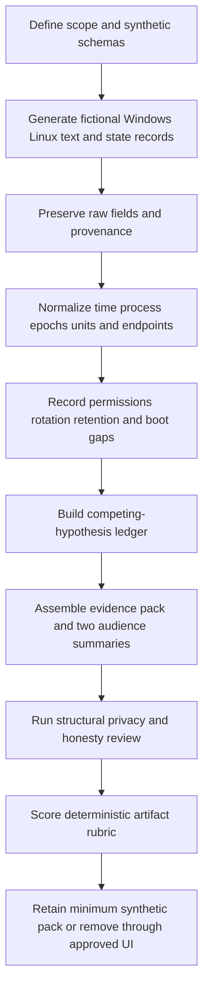

### Expected evidence

If the lab is actually performed, expected evidence includes:

- One scope card that limits the exercise to four fictional host roles, a justified UTC window, named components, documentation-only endpoint strings, selected fields, and explicit exclusions.
- A source inventory that distinguishes original producer records, OS storage, forwarded copies, text files, snapshots, and collector receipt records.
- At least 120 explicitly synthetic records meeting the Windows, Linux journal, text rotation, and state-snapshot minimums.
- Windows records with provider, channel, event ID, version, record ID, process epoch, and activity alias, including deliberate event-ID reuse across providers.
- Linux records with boot, unit, invocation, PID epoch, transport, priority, and message code, including a restart storm and PID reuse across boots.
- Text-log rotation members with file/inode aliases, one duplicate, one explicit gap, and forwarded copies that are not counted as independent occurrences.
- Narrow socket evidence for the selected port showing state limitations, loopback binding, transport success with application failure, and a fast-crash no-listener snapshot.
- A time-normalized timeline that preserves raw values, separates event from ingest time, and repairs one clock-offset contradiction transparently.
- A permissions and coverage record for every source, including one audit-policy absence and one wrong-provider query.
- At least five symptom-to-hypothesis-to-test-to-observation-to-next-action entries with alternatives and confidence updates.
- A privacy manifest showing structural exclusion of credentials, content, command lines, environments, identifiers, and unrelated endpoints.
- A customer-safe update, an Engineering escalation with one precise ask, spoken-practice notes, and an honest lab-run status.
- No evidence of live collection, actual service/process/socket inspection, external connection, privilege elevation, control change, permission change, log clearing, destructive command, or Abnormal internal access.

### Cleanup and privacy

- Keep the exercise in the isolated learner-owned folder. Do not upload it to a public paste site, public AI service, code-sharing service, personal cloud, or unapproved collaboration location.
- Do not place real Windows `.evtx` files, Linux journal files, `/var/log` content, process listings, socket listings, command lines, environment variables, service configuration, hostnames, addresses, user identifiers, or customer artifacts beside the synthetic files.
- Confirm every record contains `synthetic=true` or the equivalent header label and uses only the reserved aliases and documentation address strings.
- Confirm values for fields named like authorization, cookie, token, password, secret, key, private key, message, attachment, recipient, tenant, user, and command line are absent or structurally excluded.
- Remove scratch copies only after verifying the isolated path and retention decision, and only through the learner's normal approved file interface. This guide intentionally gives no destructive shell or PowerShell cleanup command.
- Never clear an Event Log, vacuum a journal, truncate a file, force rotation, kill a process, restart a service, change a file access-control list, use broad administrator/root access, disable a firewall, disable endpoint protection, or alter audit settings as part of this lab.
- If a real secret or customer record is accidentally introduced, stop, do not duplicate it, follow the approved security/privacy reporting path, and remove it only under that process.
- If retaining the completed synthetic pack, keep only the minimized final artifacts, record the owner/purpose/review date, and remove obsolete drafts through approved handling.
- Use this wording only after actual performance: `CrossLog 094 was performed locally with fictional records only; no customer data, production telemetry, live endpoint, process/service/socket query, privilege change, security-control change, external upload, destructive command, or Abnormal internal evidence was used.`
- If not performed, record: `CrossLog 094 is a reviewed synthetic lab design and has not yet been executed.`

### Validation rubric

| Dimension | Fail | Developing | Pass |
|---|---|---|---|
| Scope | Collects broad host data | Names a component and interval | Defines question, host role, component, interval, IDs, endpoint, fields, exclusions, owner, and authorization label |
| Windows Event Log | Uses screenshots/message text only | Records channel and event ID | Preserves provider, channel, ID, version, record ID, selected structured data, query, build, rendering, and coverage |
| Linux journal/text | Assumes one universal log path | Separates journal and text | Records distro/systemd/logger version, unit/boot/transport, file identity, forwarding, rotation, and actual coverage |
| Process identity | Joins on PID | Adds process name | Uses PID plus boot/start/invocation/service context and rejects reuse collisions |
| Service health | Treats running/active as healthy | Checks one app message | Separates lifecycle, process, dependency, listener, readiness, and transaction outcome |
| Network evidence | Treats socket state as root cause | Records endpoint and state | Maps socket/filter/path/protocol boundaries and states what each observation cannot prove |
| Permissions | Elevates or hides access errors | Notes access denied | Records reader/source/error and obtains only an approved minimum excerpt through owner |
| Absence reasoning | “No log means no event” | Mentions retention | Verifies source, policy, health, query, time, permission, retention, rate limits, and expected contract |
| Rotation/retention | Assumes configured days | Lists filenames | Measures observed coverage, file identities, boot gaps, copies, duplicates, and missing intervals |
| Correlation | Sorts friendly timestamps and PIDs | Uses UTC and one ID | Preserves raw time, event/ingest semantics, clock note, PID epoch, unit/service, endpoint, and correlation scope |
| Reasoning | Error text becomes root cause | Lists one hypothesis | Uses symptom, three hypotheses, predictions, smallest test, observation, confidence update, alternative rejection, and next action |
| Privacy/safety | Includes secrets/content or changes controls | Manually redacts after collection | Structurally excludes sensitive fields, stays synthetic/local, uses no broad collection, elevation, control change, or destructive command |
| Artifact quality | Loose notes without provenance | Partial timeline and summary | Complete source inventory, excerpts, state snapshots, timeline, coverage, ledger, manifests, customer update, and escalation |
| Honesty | Implies Abnormal/Linux production experience | Calls the lab fictional | Separates experience transfer, synthetic demonstration, learned architecture, product unknowns, and actual run status |
| Spoken readiness | Reads definitions only | Explains one platform | Gives a five-minute cross-OS explanation and answers Q1-Q8 with evidence limits |

## Official Source Anchors - August 24, 2026

These anchors support generic platform and evidence concepts. They do not establish Abnormal AI's architecture, process names, service/unit names, event IDs, log locations, retention, permissions, or support procedures. Product documentation and approved owners must define those facts. URLs and behavior should be revalidated against the actual platform version after the stated access date.

| Official or primary source | Concept anchored | Product/version boundary and support caution |
|---|---|---|
| [Microsoft Learn - Windows Event Log](https://learn.microsoft.com/en-us/windows/win32/wes/windows-event-log) | Windows Event Log provider, channel, consumer, and subscription architecture | Win32 platform documentation; provider manifests, channel availability, and schemas are component/build specific |
| [Microsoft Learn - Get-WinEvent](https://learn.microsoft.com/en-us/powershell/module/microsoft.powershell.diagnostics/get-winevent?view=powershell-7.5) | PowerShell structured event-query cmdlet and filtering parameters | Link targets PowerShell 7.5 view; Windows PowerShell and provider behavior can differ, and access/retention still bound results |
| [Microsoft Learn - wevtutil](https://learn.microsoft.com/en-us/windows-server/administration/windows-commands/wevtutil) | Windows command reference for event-log information, queries, exports, and configuration concepts | Windows/Windows Server command availability and permissions vary; configuration/clear operations are outside this lab |
| [Microsoft Learn - Event 4688](https://learn.microsoft.com/en-us/windows/security/threat-protection/auditing/event-4688) | Windows Security process-creation audit event fields and audit-policy relationship | Applies only when matching process-creation auditing is enabled; command-line fields have separate policy/privacy boundaries |
| [Microsoft Learn - Event 5156](https://learn.microsoft.com/en-us/windows/security/threat-protection/auditing/event-5156) | Windows Filtering Platform permitted-connection audit event concepts | Availability depends on matching audit policy, build, permissions, retention, and field/version interpretation |
| [Microsoft Learn - Get-Process](https://learn.microsoft.com/en-us/powershell/module/microsoft.powershell.management/get-process?view=powershell-7.5) | PowerShell process snapshot and property-access concepts | Link targets PowerShell 7.5 view; property availability and privilege differ by OS, architecture, and process |
| [Microsoft Learn - Get-NetTCPConnection](https://learn.microsoft.com/en-us/powershell/module/nettcpip/get-nettcpconnection?view=windowsserver2025-ps) | Current TCP connection and listener query concepts in the NetTCPIP module | Link targets Windows Server 2025 PowerShell documentation; module availability and fields differ on older/client systems |
| [Microsoft Sysinternals - Sysmon](https://learn.microsoft.com/en-us/sysinternals/downloads/sysmon) | Optional configurable process, network, and system activity telemetry | Sysmon must be installed, configured, healthy, readable, and retained; it is not built-in proof that an event did or did not occur |
| [systemd - journalctl](https://www.freedesktop.org/software/systemd/man/latest/journalctl.html) | Official upstream query options, selectors, boots, cursors, output, and journal behavior | `latest` can change after August 24, 2026; use the installed systemd version and distro documentation for actual syntax/fields |
| [systemd - systemd-journald.service](https://www.freedesktop.org/software/systemd/man/latest/systemd-journald.service.html) | Official upstream journal collection, storage, forwarding, namespaces, and service behavior | Distribution builds and configuration determine persistence, forwarding, rate limits, and access |
| [systemd - systemctl](https://www.freedesktop.org/software/systemd/man/latest/systemctl.html) | Official upstream unit inspection and state/property concepts | `latest` is not the installed version; unit types, properties, and manager behavior require version matching |
| [Linux man-pages - proc(5)](https://man7.org/linux/man-pages/man5/proc.5.html) | Linux `/proc` process and system-information interface concepts | Kernel version, mount options such as `hidepid`, namespaces, and permissions alter visible data |
| [Linux man-pages - ps(1)](https://man7.org/linux/man-pages/man1/ps.1.html) | Process-selection and snapshot display concepts | `procps-ng`/implementation and formatting options vary; a snapshot is not historical evidence |
| [iproute2 - ss(8)](https://man7.org/linux/man-pages/man8/ss.8.html) | Linux socket-state inspection and filtering concepts | Installed iproute2 version, kernel support, namespace, and privilege determine fields and process ownership visibility |
| [logrotate project](https://github.com/logrotate/logrotate) | Primary project source and documentation home for text-log rotation behavior and configuration | Distribution package version and local configuration control actual behavior; `copytruncate` and signaling have workload-specific risks |
| [rsyslog official documentation](https://www.rsyslog.com/doc/index.html) | Syslog processing, modules, queues, formats, and forwarding concepts | Only applies where rsyslog is installed/configured; version and distro integration determine behavior |
| [NIST SP 800-92 - Guide to Computer Security Log Management](https://csrc.nist.gov/pubs/sp/800/92/final) | Foundational log-management planning, infrastructure, handling, and operational concerns | Published in 2006 and broader than current product specifics; combine with current organizational, privacy, cloud, and incident policy |
| [RFC 5424 - The Syslog Protocol](https://www.rfc-editor.org/rfc/rfc5424.html) | Standard syslog message format, facility, severity, structured data, and transport-independent semantics | A file that looks syslog-like may not implement RFC 5424; transport, framing, collector, and application fields require verification |
| [RFC 5737 - IPv4 Address Blocks Reserved for Documentation](https://www.rfc-editor.org/rfc/rfc5737.html) | Documentation-only IPv4 ranges used as harmless strings in the synthetic lab | Reserved examples are not test targets; this lab performs no network connection or scan |

### Source and version discipline

- Match Microsoft Learn pages to the actual Windows edition, build, PowerShell version, module version, provider version, channel, and audit policy. A current documentation page does not retroactively define an older build.
- Treat Event 4688 and 5156 as documented Windows audit-event families, not universal always-on telemetry. Verify audit configuration, event version, permission, and retained interval before interpreting presence or absence.
- Treat Sysmon as optional configurable software. Confirm deployment, rules, version, service health, channel access, filtering, and retention before relying on it.
- Match upstream systemd documentation to the installed systemd version and distribution packaging. The upstream `latest` page can describe features unavailable on an older supported system.
- Verify whether the journal is persistent or volatile, whether forwarding is enabled, whether namespaces or rate limits apply, and which identity performed the query.
- Match `/proc`, `ps`, and `ss` behavior to kernel, namespaces, mount options, procps/iproute2 versions, and privilege. Output examples are not stable cross-platform schemas.
- Treat logrotate and rsyslog as installed components only after inventory confirms them. Other rotation and logging systems exist.
- Use RFC 5424 only for systems that actually implement that protocol/profile. Similar-looking text is not proof of standards compliance.
- Use NIST SP 800-92 as foundational guidance, then apply current legal, privacy, security, evidence, cloud, and organizational requirements.
- Revalidate current Abnormal customer-visible documentation and approved internal runbooks during onboarding. Never infer proprietary product behavior from generic Windows or Linux sources.

## Likely Interview Questions

### Q1. How would you start an OS-log investigation without collecting too much?

**Model answer:** I begin with one decision question, then define the affected host role, platform/build, component, time window with clock context, process or service identity, endpoint, and correlation ID. I choose the smallest source that can distinguish my leading hypotheses and select only necessary fields. I record permission and retention coverage, structurally exclude credentials and content, and broaden only when a specific evidence gap justifies it.

### Q2. What is the difference between a Windows event ID and an event identity?

**Model answer:** A Windows event ID identifies a provider-defined event type, so it needs provider, channel, version, build, and schema context. It is not a globally unique occurrence identifier. A particular record may also have a channel record ID and activity or correlation fields with their own scopes. I never search or join on the number alone, and I preserve structured fields rather than relying only on rendered message text.

### Q3. How do the Linux journal and text logs differ?

**Model answer:** The systemd journal is a structured store queried with `journalctl`, with selectors such as unit, boot, priority, and fields under the installed version and configuration. Text logs are files written by applications or logging daemons and can have application-specific formats and rotation. A system can use either or both, and one may forward copies into the other, so I inventory source, provenance, persistence, forwarding, permissions, and rotation before counting records.

### Q4. Why are process ID and service state insufficient to prove application health?

**Model answer:** A PID is reused and represents only one process lifetime, so I pair it with boot, start time, invocation, executable, and observation time. A service state such as running or active is a lifecycle report, not necessarily application readiness. I correlate the exact process epoch with dependency loading, listener ownership, readiness, and a successful transaction. I also use historical lifecycle records because a snapshot can miss a fast crash.

### Q5. What can a listening or established socket prove?

**Model answer:** A listening socket shows that a process asked the local OS to accept traffic on a particular address and port at the observation time. An established TCP socket shows the transport handshake completed and the connection existed then. Neither proves every firewall or path allowed future traffic, TLS succeeded, authentication passed, the request completed, or the remote application was healthy. I move layer by layer and correlate exact endpoint, process epoch, time, and application outcome.

### Q6. How do you handle a missing log record?

**Model answer:** I phrase it as “no matching retained readable record in source S under query Q and interval T,” then verify host/namespace, source, provider or unit, policy, source health, query syntax, time basis, permission, retention, rotation, boot coverage, rate limiting, forwarding, and whether the event should exist under the producer contract. Until those dependencies are supported, absence is not proof the activity did not happen.

### Q7. What belongs in an Engineering-ready cross-OS evidence pack?

**Model answer:** I include a scope card; platform/build and component versions; source and query inventory; selected raw-preserving records; normalized time and process/service identities; targeted socket observations; permission, rotation, retention, and boot gaps; competing hypotheses and discriminating tests; what changed in confidence; customer impact; privacy handling; one precise ask; and the evidence ceiling. I exclude broad archives, credentials, content, and unrelated system data.

### Q8. How would you position your Windows background and Linux gap honestly?

**Model answer:** I would explain that enterprise support gave me strong habits in Windows evidence collection, customer scoping, privacy, layered troubleshooting, and Engineering handoffs, using only real examples I can defend. I have built my Linux foundation through official systemd, Linux, and logging sources and this synthetic cross-OS exercise. I would state directly that I have not administered Abnormal's Linux production environment and would learn its approved units, schemas, tools, retention, and escalation paths during onboarding.

## Memory Hooks

- **A log is a producer's statement, not a camera of reality.**
- **Provider plus ID plus version gives a Windows event meaning.**
- **Friendly messages help humans; structured fields help reproducibility.**
- **The journal is one Linux evidence store, not every Linux log.**
- **Distribution and version decide paths, defaults, and permissions.**
- **PID is a reusable room number; add boot, start, and invocation.**
- **Service running is lifecycle; readiness is application evidence.**
- **A listener proves a local bind, not end-to-end reachability.**
- **TCP established is below TLS, authentication, and application success.**
- **No result means check source, policy, query, access, and retention.**
- **Rotation changes coverage and provenance, not just filenames.**
- **Configured retention is not observed retention.**
- **Event time and ingest time answer different questions.**
- **Collect for a decision, not for fear of missing everything.**
- **Raw evidence stays raw; analysis lives beside it.**
- **Observation names the source; inference names the reasoning.**
- **Cause needs trigger, mechanism, scope, and alternative testing.**
- **Access denied is evidence, not permission to elevate.**
- **Never expose credentials, content, or unrelated host activity.**
- **Never disable controls or erase evidence to troubleshoot.**
- **Synthetic Linux practice is learning, not production experience.**
- **Abnormal-specific facts require approved Abnormal sources.**

## Completion Checklist

- [ ] I can define producer, record, event, channel, journal, query, collector, process, service/unit, socket, rotation, retention, and coverage.
- [ ] I can explain why one event can create several records and one record can summarize several occurrences.
- [ ] I can separate observation, corroborated fact, inference, hypothesis, prediction, test, cause, unknown, and evidence ceiling.
- [ ] I can explain Windows provider, channel, event ID, version, record ID, structured event data, and friendly rendering.
- [ ] I know why a Windows event ID needs provider and version context.
- [ ] I can describe a narrow `Get-WinEvent` approach without claiming every event was recorded.
- [ ] I can distinguish a Windows process instance from a PID and a service lifecycle state from application readiness.
- [ ] I can explain process-creation auditing and command-line privacy boundaries.
- [ ] I know Sysmon is optional, configurable, versioned evidence rather than an always-present source.
- [ ] I can interpret `LISTEN`, `SYN_SENT`, `ESTABLISHED`, `TIME_WAIT`, and `CLOSE_WAIT` without promoting them beyond the TCP boundary.
- [ ] I can explain why Windows Filtering Platform allow/block records depend on audit policy and do not establish application outcome or policy ownership alone.
- [ ] I can define Linux distribution, systemd, journald, journalctl, unit, boot ID, cursor, priority, transport, and file descriptor.
- [ ] I can explain why the systemd journal and `/var/log` text files can coexist, differ, forward, duplicate, or be absent by design.
- [ ] I can use unit, boot, invocation, process epoch, and query interval as a Linux evidence model.
- [ ] I can explain why `systemctl status`, `ps`, `/proc`, and `ss` are snapshots or views with permission and version boundaries.
- [ ] I can distinguish current service/unit state, historical lifecycle, dependency state, listener state, readiness, and transaction success.
- [ ] I can explain PID reuse across time, reboot, and namespace and avoid joining on PID alone.
- [ ] I can treat access denied as a collection-boundary observation and use an approved owner rather than broad elevation.
- [ ] I can test whether missing evidence reflects policy, source health, query, time, permission, retention, rotation, boot, rate limit, or forwarding.
- [ ] I can explain Windows channel overwrite, journal volatility/persistence, text rotation, forwarding copies, and copy-truncate gaps.
- [ ] I can measure actual oldest/newest coverage instead of repeating configured retention as fact.
- [ ] I can create a minimum scope card with question, host, component, interval, IDs, endpoint, fields, exclusions, owner, and deletion plan.
- [ ] I can preserve raw excerpts and keep normalization, joins, hypotheses, and conclusions in separate derived artifacts.
- [ ] I can walk through the synthetic permission-to-startup-to-listener-to-client-timeout mechanism and state its evidence ceiling.
- [ ] I can use the symptom-to-hypothesis-to-test-to-observation-to-next-action tree without jumping to a favorite tool.
- [ ] I can name misleading signals, unsafe shortcuts, and escalation triggers.
- [ ] I understand that broad collection, control disabling, blanket permissions, credential/content exposure, and destructive commands are prohibited.
- [ ] I can perform CrossLog 094 only with invented local records, or honestly state that it remains an unperformed lab design.
- [ ] If performed, I can produce the complete synthetic cross-OS incident evidence pack and score it with the rubric.
- [ ] I can deliver a 90-second customer update and five-minute Engineering explanation without reading.
- [ ] I can answer Q1 through Q8 aloud with bounded, source-aware language.
- [ ] I can distinguish production-transfer experience, synthetic practice, learned Linux architecture, and unknown Abnormal implementation.
- [ ] I can state directly that I have no direct Abnormal host-log or Linux production experience unless that later becomes true.
- [ ] I reviewed the Official Source Anchors dated August 24, 2026 and would revalidate the actual OS, command, module, distribution, systemd, kernel, and product versions.

[Next: Part 095 - Browser Cloud Audit and Security Logs](Part-095-browser-cloud-audit-and-security-logs.md)