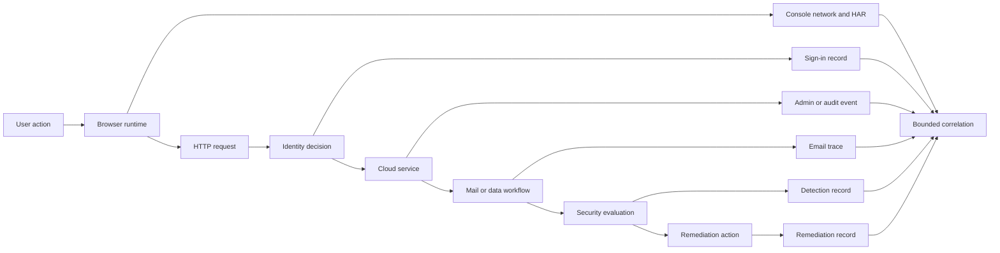
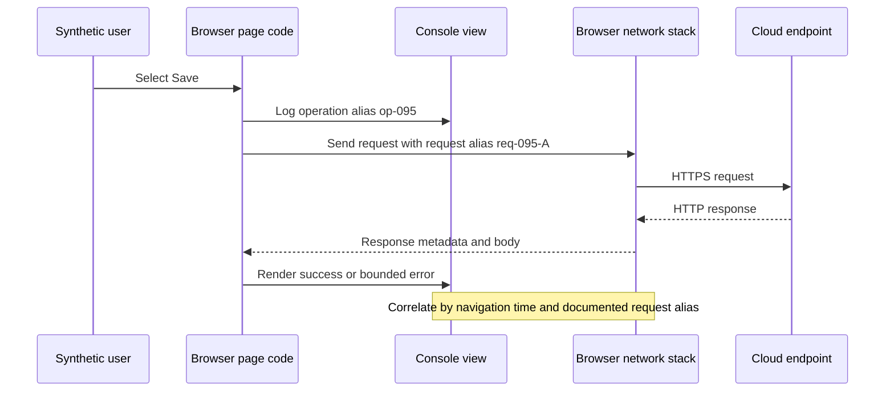
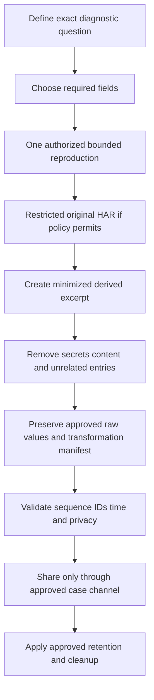
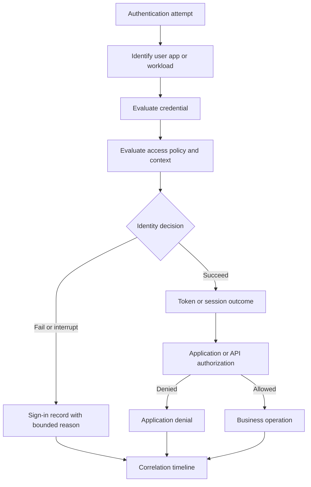
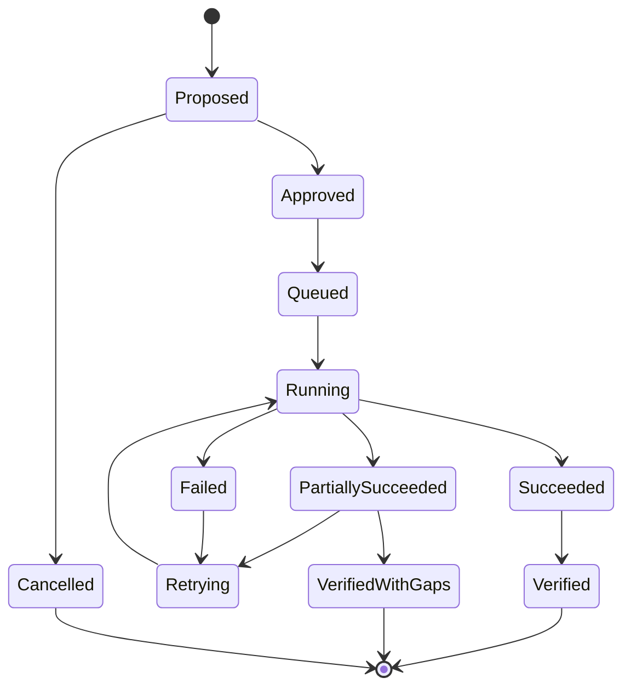
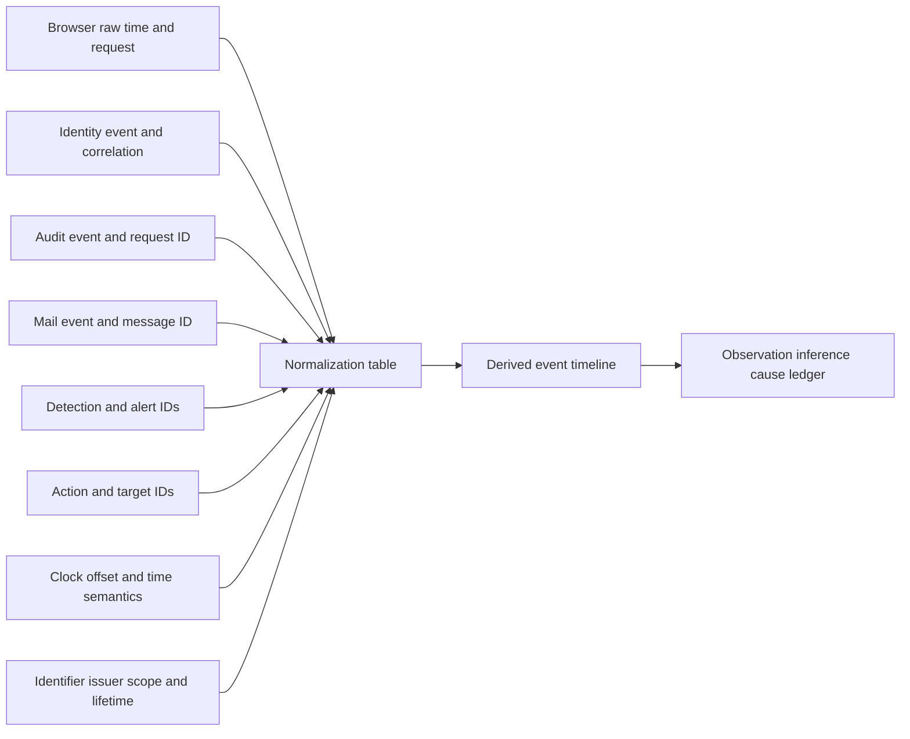
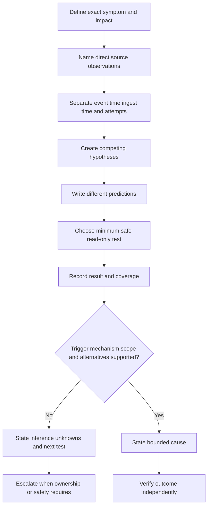
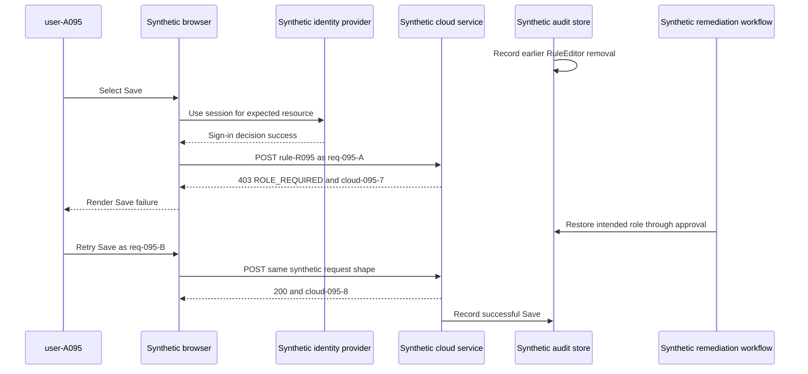
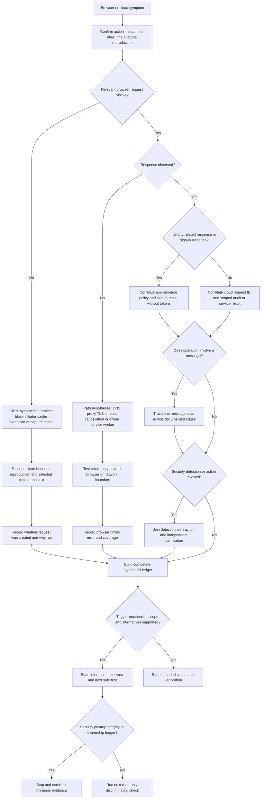
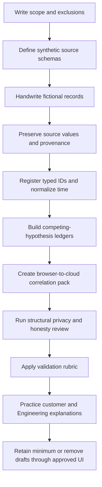

# Part 095 - Browser Cloud Audit and Security Logs

> **Purpose:** Build a beginner-first, evidence-safe method for correlating a browser symptom with cloud control-plane, identity, email, detection, and remediation records. This Part explains browser console and network evidence, HTTP Archive files, cloud admin and audit events, sign-in records, email traces, security detections, remediation histories, source coverage, privacy limits, and defensible causal reasoning.
>
> **Artifact honesty label:** **Local synthetic browser-to-cloud correlation design only.** Every user, tenant, browser request, account, message, alert, action, timestamp, identifier, and conclusion in the lab is invented. The lab does not use customer data, production telemetry, live cloud tenants, real email, external uploads, Abnormal AI systems, or proprietary schemas. It must not be described as completed unless you actually create and reviews the local synthetic artifacts.
>
> **Currency and source access date:** August 24, 2026.

## Section goal

By the end of this Part, you should be able to start with a browser-visible symptom, identify the smallest relevant evidence at each boundary, normalize time and identifiers, and produce a browser-to-cloud event correlation that another engineer can reproduce. You should be able to explain what a browser console line, network request, HTTP Archive entry, cloud audit record, sign-in result, email trace, security detection, or remediation record directly establishes and what it does not establish.

The primary artifact is a **browser-to-cloud event correlation pack**. It connects one synthetic user action to one synthetic browser request, one identity decision, one cloud administrative or data-plane outcome, one email-flow state when applicable, one security detection, and one remediation record. The pack keeps original evidence separate from normalized timeline rows and keeps observation, inference, hypothesis, and cause in separate fields.

This Part treats privacy and authorization as properties of the investigation, not paperwork added afterward. Browser captures and cloud exports can contain session cookies, authorization headers, tokens, personal identifiers, tenant names, URLs, query strings, email addresses, message subjects, file names, message content, and administrative details. The safe default is structural exclusion: do not collect a field that is not needed. Redaction is a fallback for an already authorized necessary field, not permission to gather broadly.

You should also be able to state evidence limits clearly. A failed browser request can be caused by client code, an extension, proxy behavior, name resolution, transport, Transport Layer Security, authentication, authorization, an application service, policy, or a downstream dependency. A cloud sign-in success does not prove an application request was authorized. A message trace status does not prove what a person saw in an inbox. A detection is a security system's evaluated finding, not automatically a confirmed attack. A remediation record proves that a named system or operator recorded an action state; it does not automatically prove complete reversal of impact.

## JD Mapping

| Supplied role signal | Capability developed here | Technical-support application | Proof artifact |
|---|---|---|---|
| Complex SaaS troubleshooting | Correlates evidence across browser, identity, service, mail, security, and action boundaries | Locates the first supported divergence instead of blaming the last visible error | Browser-to-cloud normalized timeline |
| Browser and web diagnostics | Reads console and Network panel evidence with capture-state and privacy limits | Distinguishes user-interface symptom, client runtime error, request construction, and server response | Minimized browser evidence worksheet |
| HAR familiarity | Explains HAR structure, export choices, sanitization, and limits | Produces a reproducible request sequence without treating a capture as the whole incident | Synthetic sanitized HAR-shaped excerpt |
| Cloud administration support | Interprets admin and audit events as actor-action-target-result records | Tests whether configuration or permission changed near impact | Cloud change ledger |
| Identity troubleshooting | Separates authentication, conditional policy, token issuance, and application authorization | Avoids treating successful sign-in as proof of successful application access | Sign-in decision matrix |
| Email security support | Separates submission, transport, delivery, quarantine, detection, and post-delivery action | Reconstructs message state without claiming mailbox content or product internals | Synthetic email event chain |
| Detection and response | Distinguishes signal, alert, incident grouping, disposition, and action | Prevents alert presence from becoming an unsupported root-cause statement | Detection-to-remediation ledger |
| Engineering escalation | Preserves source, query, time, IDs, coverage, alternatives, and one precise ask | Gives Engineering a small reproducible evidence pack | Escalation manifest |
| Customer communication | Converts technical records into bounded findings and next steps | Explains current state without exposing internals or overstating causality | Customer-safe update |
| Privacy and security | Excludes secrets, content, unrelated identities, and broad exports | Reduces collection risk while preserving diagnostic value | Collection allowlist and cleanup record |
| enterprise support transfer | Reuses your enterprise scoping, browser DevTools, HAR, Microsoft cloud, escalation, and customer-update habits | Makes authentic experience a bridge into a security SaaS context | Honest transfer statement |
| No direct Abnormal production experience | Separates generic evidence models from unknown proprietary implementation | Prevents invented log names, schemas, retention, detections, actions, or support access | Candidate boundary statement |

## Candidate honesty note

You can honestly connect this Part to your prior enterprise support background. Your work with SharePoint Online, OneDrive, Sync Client, Copilot support, browser DevTools, HAR, customer scoping, escalations, and cloud/client boundaries gives your useful habits: begin with impact, identify the failing boundary, preserve timestamps and request identifiers, minimize customer data, compare a healthy and failing path, and hand Engineering a reproducible narrative. You should use only examples you personally performed and is allowed to discuss.

You should not stretch that experience into unsupported claims. Microsoft cloud support does not by itself establish production experience with Exchange Online message tracing, Microsoft Entra sign-in investigation, Microsoft Defender detection operations, Google Workspace investigation, security operations center ownership, or Abnormal AI. Reading official documentation and completing a synthetic lab establish learned architecture and demonstrated reasoning, not customer-tenant access or production ownership.

Nothing in this Part describes Abnormal AI's internal browser calls, APIs, cloud providers, audit schemas, message pipeline, detection logic, remediation actions, retention, access model, or escalation tooling. Terms such as `request`, `sign-in`, `message trace`, `detection`, and `remediation` are generic. During onboarding, current approved product documentation and owners must define what evidence is available, which fields are stable, how identifiers are scoped, and what a support engineer is authorized to collect.

| Evidence tier | Honest wording you can adapt | Boundary to preserve |
|---|---|---|
| Production transfer | “In enterprise support, I correlated browser and cloud-side evidence, protected customer data, and prepared reproducible escalations.” | Use a real permitted example and name its actual scope |
| Tool familiarity | “I have working familiarity with browser DevTools and HAR-based troubleshooting.” | Describe the depth actually used; do not imply security-product administration |
| Demonstrated local practice | “I designed and, if completed, built a local synthetic browser-to-cloud event correlation pack.” | State synthetic, local, and whether it was actually performed |
| Learned architecture | “I can explain how browser, sign-in, audit, mail, detection, and remediation records answer different questions.” | Conceptual knowledge is not tenant operations experience |
| Interview reasoning | “I would begin with the smallest authorized evidence that separates client, identity, service, and policy hypotheses.” | A proposed method is not a completed investigation |
| No direct experience | “I have not used Abnormal's internal production logs or proprietary detection and remediation records.” | State the gap directly |
| Onboarding verification | “I would verify approved schemas, identifier scope, retention, permissions, and collection procedures.” | Product facts come from current approved sources |

## 1. The browser-to-cloud evidence model from zero

A **browser** is an application that interprets web content and sends network requests on a user's behalf. A **cloud service** is an application or platform delivered through remotely operated infrastructure. Between a click and a cloud result are several boundaries: page code, browser policy, name resolution, proxy or network controls, encrypted transport, identity, authorization, application services, and downstream systems. Each boundary can produce different records.

An **event** is something that occurred or was evaluated, such as a button click, request, sign-in decision, configuration change, message handoff, alert creation, or remediation action. A **record** is a stored representation of an event. An event can create several records, while one record can summarize several events. A **source** is the producer or system of record. A **view** is the interface through which an analyst sees selected fields. Browser DevTools, an admin portal, and an exported report are views; they are not necessarily the original producer.

A useful analogy is a package journey. The sender keeps an order receipt, the courier scans the parcel, a building desk logs entry, a security team may flag it, and a recipient records acceptance. These records cover different checkpoints. The analogy stops because browser and cloud events can be asynchronous, retried, duplicated, sampled, delayed, redacted, or generated by automated policy rather than one physical parcel.

| Evidence family | Plain meaning | Strongest common question | Important limit |
|---|---|---|---|
| Browser console | Runtime messages exposed by page, browser, or extension context | Did client-side code report an exception, policy warning, or explicit failure? | A line may be secondary, stale, filtered, duplicated, or extension-generated |
| Browser network record | Request and response metadata visible to the browser | What request did this browser attempt and what response did it observe? | It does not show every proxy, server, or downstream action |
| HAR | Structured export of browser-observed request timing and metadata | What sequence of browser HTTP exchanges occurred during a bounded capture? | It can contain secrets/content and usually lacks server internals |
| Cloud audit event | Record of a cloud action or configuration change | Who or what attempted which action against which target, with what recorded result? | Coverage, actor semantics, latency, retention, and schema vary |
| Sign-in record | Identity provider's record of an authentication or access decision | How did the identity system evaluate this sign-in attempt? | Success does not prove later application authorization or transaction success |
| Email trace | Mail-system record of message processing states | Where did a message reach within the traced mail path? | It may not prove inbox presentation, user reading, or downstream security action |
| Detection | Security analytics output indicating suspicious or policy-matching activity | What evidence and rule caused a signal or alert? | It is not automatically confirmed malicious activity or root cause |
| Remediation record | Record of a corrective or containment action and its status | What action was requested, by whom or what, against which object, and with what status? | “Completed” may describe workflow completion, not full business recovery |



The diagram is a reasoning map, not an Abnormal or Microsoft architecture. A real product can combine, omit, reorder, or add layers. The support task is to identify documented evidence boundaries, not force every incident into the diagram.

### Plain-English deep-dive: Evidence sources are cameras at different doors

Imagine a large office with cameras at the lobby, elevator, mailroom, and server room. A lobby camera can show entry but not what happened in the mailroom. A mailroom record can show a parcel scan but not who clicked a web button. Browser and cloud evidence works the same way: each source has an observation point and a contract.

The analogy stops because digital evidence is often metadata rather than video. A record can be generated before an operation commits, after buffering, or by a policy engine evaluating other data. The same request can be retried and receive a new identifier. A record can also be hidden by permission or removed by retention.

For each source, record five things: producer, observation point, timestamp semantics, identifier scope, and coverage limit. Then phrase findings at that boundary. “The browser received HTTP 403” is stronger than “the cloud was down.” “The identity provider recorded successful primary authentication” is narrower and safer than “the user had access.”

## 2. Browser console evidence

The **console** is a browser developer-tool surface that displays messages from page scripts, browser subsystems, and sometimes extensions. A **runtime exception** is an error raised while code executes. A **stack trace** is a sequence of function locations associated with an error. A **source map** can map transformed JavaScript back to source files, but availability and accuracy depend on build and deployment choices.

Console evidence is useful when a symptom appears before or after a network request, when client code rejects data, when browser policy blocks an operation, or when a page logs a correlation identifier. It is weak when copied without page URL scope, capture time, console level, execution context, or reproduction steps.

| Console clue | Direct observation | Possible interpretation | What it cannot prove alone |
|---|---|---|---|
| Uncaught exception | Code in the selected context raised an unhandled exception | Client rendering or request preparation may have stopped | Which server-side condition triggered it or whether all users are affected |
| Failed resource message | Browser reported a load failure | Network, policy, cache, URL, server, or extension may be involved | Root cause without the matching Network entry |
| Cross-Origin Resource Sharing message | Browser reported a cross-origin policy failure | Response policy and request origin may not align | Whether the server received or processed the request |
| Content Security Policy message | Browser blocked or reported content under configured policy | Page attempted a disallowed resource or action | Whether policy is incorrect or the attempted content is trustworthy |
| Deprecation warning | Browser reports future or current compatibility concern | Code may require maintenance | Current customer impact |
| Application log with request ID | Page emitted an application-defined identifier | It may bridge browser and service records | Uniqueness, trustworthiness, or scope without documentation |
| Extension-prefixed message | Extension context emitted a line | Extension may affect the page or merely report its own state | That the website generated the error |
| Repeated warning after navigation | Console preserved older entries | History may include multiple page loads | Which navigation produced the line without timestamps and context |

The console has filters, log levels, contexts, and a preserve-log option. Those controls change what is visible. A screenshot of one red line can omit the preceding request, timestamp, frame, source location, and hidden levels. When safe and necessary, record the exact reproduction step, browser name and version, page origin alias, selected frame or worker, whether Preserve log was enabled, active filters, and the minimal message code. Do not collect full console output by default.

Console output can contain secrets and customer content. Applications sometimes log tokens, authorization results, object names, email addresses, API payloads, query text, or stack variables. Do not use commands that dump page storage, cookies, browser profiles, memory, or all JavaScript objects. Do not ask a customer to paste the whole console into a ticket. Request a narrow screenshot or selected sanitized fields only after defining necessity and handling.

A misleading pattern is “first red line equals root cause.” Console order reflects execution and display, not necessarily the causal chain. An application can log a generic error after an earlier failed request. An extension can inject a failure unrelated to the page. A source-map error can appear after the main transaction. The cheapest next check is usually the matching Network request and its timing, not more console volume.



## 3. Browser Network panel evidence

The **Network panel** records browser-observed network activity while developer tools are capturing. A **request** is a message sent by a client. A **response** is the server-facing or intermediary result returned to the browser. **HTTP**, the Hypertext Transfer Protocol, defines request methods, status codes, headers, and representation semantics. **HTTPS** is HTTP carried over Transport Layer Security, abbreviated TLS.

The Network panel can expose request URL, method, status, initiator, timing phases, request and response headers, cookies, payload, response preview, size, cache behavior, redirect chain, and connection metadata. Many of those fields are sensitive. Evidence selection should start from metadata needed to answer a question, not from every visible tab.

| Network field | Plain meaning | Diagnostic value | Privacy or interpretation boundary |
|---|---|---|---|
| Method | Requested HTTP operation such as GET or POST | Tests whether the client used the expected contract | Method alone does not describe business intent or success |
| URL origin and path alias | Destination service and resource route | Locates the failing endpoint family | Query strings and paths can contain identifiers or secrets |
| Status | HTTP result code observed by the browser | Separates response classes such as 2xx, 4xx, and 5xx | A 200 can contain application failure; a 0-like display is tool-specific |
| Initiator | Script, parser, redirect, or other source that began the request | Connects page behavior to a request | Bundling and source maps can obscure original code |
| Timing | Browser-estimated phases such as queueing, connection, waiting, and download | Helps localize delay at the browser observation point | Timing labels and precision are implementation-specific |
| Request ID | Browser-internal or application-provided identifier | Can relate Network rows and console messages | It may not be exported or accepted by the server |
| Correlation header | Documented application or service trace value | Strong bridge when propagated end to end | Scope, regeneration, trust, and exposure require documentation |
| Remote address | Endpoint observed for a connection | Helps identify direct versus intermediary path | Proxies, content delivery, connection reuse, and privacy alter meaning |
| Cache marker | Indicates browser cache participation | Tests whether a response came from cache | Cache labels do not prove freshness under application rules |
| Response headers | Metadata returned to the browser | Can show request IDs, retry hints, content type, and policy | Can include cookies, internal routing hints, or sensitive metadata |
| Payload/body | Request or response content | Sometimes necessary to validate schema | Highest exposure risk; exclude by default |

An HTTP status is an observation at the protocol boundary, not a full diagnosis. `401 Unauthorized` commonly indicates missing or unacceptable authentication credentials under the endpoint contract, despite the historical reason phrase. `403 Forbidden` commonly means the request was understood but refused under authorization or policy. `429 Too Many Requests` indicates a rate-related response under that service's contract. `500` signals a server-side failure class but not which component caused it. Every interpretation must use current endpoint documentation and selected response metadata.

Browser timing also needs restraint. “Waiting for server response” is often rendered as time to first byte from the browser's perspective. It can include network path, intermediary processing, queueing, application work, and downstream dependencies. It is not a direct server CPU measurement. Connection timing can disappear under connection reuse. A cached response can complete without a new network exchange. Service workers can intercept requests. Browser extensions or endpoint software can modify behavior.

### Plain-English deep-dive: The Network panel is a receipt, not the kitchen camera

A restaurant receipt can show what was ordered, when the order was entered, and the final charge. It does not show which cook waited on which ingredient or why a dish was delayed. The browser Network panel similarly shows the exchange as observed by the browser. It does not reveal every server hop or internal decision.

The analogy stops because a browser can retry, cache, redirect, multiplex requests, use a service worker, or reuse a connection. One visible row may represent a redirect stage, and one user action may create many requests. Use the initiator, navigation context, exact time, documented correlation values, and request sequence to identify the relevant row.

For a minimal capture, start recording immediately before one reproduction, clear unrelated rows when safe, reproduce once, stop capture, and select only the relevant request chain. Record whether cache was disabled, whether log preservation was enabled, whether an extension-free or private profile comparison was approved, and whether the symptom reproduced. Do not disable security features, certificate checks, browser protections, endpoint controls, or corporate policy to “simplify” the test.

## 4. HAR files: structure, value, and danger

**HAR** means **HTTP Archive**. It is a JSON-shaped format used by browser tools to export details about observed HTTP requests and responses. A HAR commonly contains a `log`, one or more `pages`, and many `entries`. An entry can contain request and response objects, headers, cookies, query parameters, timing data, size information, connection information, and sometimes request or response content.

HAR is useful because it preserves a sequence better than screenshots. It can support request-chain analysis, redirect review, timing comparison, status grouping, cache analysis, and correlation-header extraction. It is dangerous because the same completeness can expose credentials and content. A HAR should be treated as sensitive evidence, not as an ordinary text attachment.

| HAR element | Typical purpose | Safe analytical use | Collection boundary |
|---|---|---|---|
| `log.version` and `creator` | Format/tool metadata | Record producing browser/tool context | Not proof of standards completeness |
| `pages` | Page or navigation grouping | Separate reproductions and navigation timing | Tool support and page mapping vary |
| `entries` | Request/response exchanges | Build bounded sequence and status timeline | One action may create many entries |
| `startedDateTime` | Entry start time | Initial ordering and time normalization | Clock accuracy and format must be checked |
| `request.method` | HTTP method | Validate expected endpoint contract | Does not prove server handling |
| `request.url` | Full request URL | Extract approved origin and route alias | Query strings and paths may expose secrets or personal data |
| Request headers/cookies | Client metadata and state | Extract allowlisted correlation and content-type fields | Authorization, cookie, and token fields must not be exposed |
| Request post data | Submitted content | Usually excluded; validate only synthetic schema in this lab | Can contain credentials, email content, identifiers, or files |
| `response.status` | Browser-observed HTTP status | Identify response class and retries | May describe intermediary response rather than final service logic |
| Response headers/cookies | Returned metadata and state | Extract allowlisted request ID or retry hints | Set-Cookie and internal headers can be highly sensitive |
| Response content | Returned body metadata or content | Use synthetic code only in this lab | Can contain customer data and secrets |
| `timings` | Phase estimates | Compare queue/connect/wait/download patterns | Browser-specific, connection reuse and negative sentinel values require care |

“Sanitize the HAR” is not one universal operation. A safe process begins before capture by deciding which fields are necessary. After an authorized capture, create a derived minimized copy while preserving the original only within an approved restricted location and retention process. Record every removed or transformed field class. Never use an unapproved online HAR viewer or public parser. Never paste a HAR into a public issue, chat, code repository, or general-purpose AI service.

A HAR is not a packet capture. It generally represents browser-layer HTTP activity, often after decryption inside the browser, but it does not expose every TCP packet or every server-side call. Conversely, it can be more sensitive than an encrypted packet capture because it may include clear HTTP headers and content. Treat format and exposure separately.



### Plain-English deep-dive: Sanitization is a field allowlist, not a black marker

Imagine a form that asks only for order number and time. That form is safer than collecting a complete diary and blacking out some sentences later. HAR minimization should work the same way: identify the necessary entries and fields, exclude payloads and secrets structurally, and preserve a manifest of what remains.

The analogy stops because removing one header may not remove the same value from a URL, cookie, payload, response, or another entry. Identifiers can also be sensitive even when they are not credentials. A reliable review checks field classes across the whole authorized subset, uses organization-approved tooling, and records the transformation. This local lab uses hand-written synthetic HAR-shaped data, so no real sanitization tool or live capture is required.

## 5. Cloud admin and audit events

A **control plane** is the surface that manages configuration, identity, policy, and resources. A **data plane** is the surface that performs ordinary workload operations, such as accessing a file or processing a message. These are conceptual categories; services define their exact boundaries. A **cloud audit event** is a provider-generated record of a supported action, decision, or change. An **admin event** is an audit event associated with administrative activity, but actor type can be a person, application, managed identity, service, or automated system.

A useful generic audit tuple is: actor, action, target, result, time, source, and correlation. Additional fields can include tenant, workload, client, source address, user agent, operation category, changed properties, request ID, and ingestion time. Every field requires schema documentation. A portal label is not enough.

| Audit dimension | Question it answers | Common trap | Safe practice |
|---|---|---|---|
| Actor | Which recorded identity or service initiated the operation? | Equating display name with a human person | Preserve actor type and stable alias; verify delegation or automation |
| Action | What operation name did the producer record? | Inferring business meaning from a friendly label | Use documented operation and version context |
| Target | Which resource or policy was addressed? | Treating name as globally unique | Preserve resource type, scope, and synthetic stable ID |
| Result | What result did the audit producer record? | Treating accepted as fully committed | Check asynchronous completion and downstream records |
| Event time | When did producer say the action occurred? | Sorting only by portal display time | Preserve raw time, zone, clock, and semantics |
| Ingestion time | When did the searchable system receive the record? | Calling late arrival a late action | Keep occurrence and availability separate |
| Correlation | Which documented ID relates records? | Joining on a value with unknown scope | Record issuer, scope, regeneration, and propagation |
| Changed properties | What before/after values were exposed? | Collecting full configuration with secrets | Select only approved property names and safe values |
| Source context | What client or network context was recorded? | Treating IP as a person or exact location | Use as one contextual field with proxy and privacy limits |
| Retention | What interval is searchable? | Assuming license target equals actual coverage | Measure oldest/newest available records and note gaps |

Cloud audit logs are often eventually searchable. **Eventual consistency** means a record can become visible after the action occurred, rather than instantly. It is like a bank transaction that appears as pending before the final ledger updates. The analogy stops because audit delay, batching, regional processing, export pipelines, and schema-specific availability differ by service.

Audit presence does not automatically prove causation. A policy change five minutes before an error may be unrelated, targeted to a different scope, overridden, not yet effective, or already rolled back. Build a mechanism: the change affected the same target and principal, the policy evaluation used the changed value, the failure began afterward within a plausible propagation interval, a controlled reversal or comparison changed the outcome, and alternatives were tested.

```mermaid
sequenceDiagram
    participant Actor as Person app or service
    participant Control as Cloud control plane
    participant Audit as Audit producer
    participant Search as Search or portal index
    participant Analyst as Support analyst
    Actor->>Control: Submit scoped change
    Control-->>Actor: Accepted or rejected result
    Control->>Audit: Emit documented audit event
    Audit->>Search: Ingest after possible delay
    Analyst->>Search: Query actor action target and time
    Search-->>Analyst: Matching retained readable records
    Note over Analyst,Search: No result is bounded by schema permission delay and retention
```

## 6. Sign-in records and identity decisions

**Authentication** answers, “How did the system establish the identity?” **Authorization** answers, “Is that identity allowed to perform this action?” A **sign-in record** usually belongs to an identity provider and describes an authentication or access-policy evaluation. An **access token** is a credential issued for a resource and scope under an identity protocol. Tokens are secrets and must never be copied into a support artifact.

Identity decisions can involve user identity, application identity, device state, location or network context, multifactor authentication, risk signals, Conditional Access or equivalent policy, token issuance, consent, resource audience, scopes or roles, and session state. The exact fields and terminology are provider-specific.

| Identity state | What it supports | What remains unproven | Useful next correlation |
|---|---|---|---|
| No matching sign-in record | No matching retained readable record under current query | No attempt occurred | Verify identity type, time, tenant, app, log category, delay, retention, and permission |
| Interrupted or challenge required | Identity flow required another step | Whether the user completed it in another event | Join documented session or request identifiers and later result |
| Failed authentication | Identity provider rejected the authentication attempt | Why the application displayed a generic error | Match error code, policy detail, app, user alias, and browser time |
| Successful authentication | Identity provider accepted the authentication step | Token audience/scope, app authorization, API success, or business transaction | Compare resource, client app, token issuance metadata, and API response |
| Policy failure | Documented policy blocked the attempt | Whether policy is misconfigured | Verify scope, assignments, exclusions, report-only state, and intended control owner |
| Risk event or risky sign-in | Provider recorded a risk evaluation | Confirmed compromise | Review documented evidence, disposition, and security-owner process |
| Service principal sign-in | Non-human application identity attempted access | A user initiated the action | Correlate workload identity, credential type, resource, and audit actor |
| Token accepted by identity layer | Token issuance or validation succeeded at one boundary | Application-specific role or object permission | Correlate API status and authorization logs |

An IP address is not a person. Network address translation, corporate egress, virtual private networks, proxies, mobile networks, and cloud services can cause many identities to share an address or one identity to appear from several. Geolocation is an estimate with database and routing limits. A user agent string is client-provided and can be modified. Use these fields as context, not identity proof.

### Plain-English deep-dive: A sign-in is the building badge desk, not every room key

Passing a building badge desk can prove that the lobby system accepted a credential. It does not prove the visitor has a key to the finance room or permission to open a filing cabinet. Successful cloud authentication similarly does not prove that an API token has the right audience and scope, that an application role is assigned, or that the target object permits the operation.

The analogy stops because cloud identity can involve several token exchanges, delegated or application permissions, step-up challenges, continuous policy, session refresh, and application-specific authorization. In a browser-to-cloud timeline, record the identity event as its own decision. Then use the browser response and service or audit evidence to test the next boundary.



## 7. Email traces and message-state evidence

An **email trace** is a mail-system view of processing events for a message or group of messages. It can show stages such as submission, acceptance, routing, filtering, deferral, delivery, rejection, quarantine, forwarding, or other provider-defined states. A **message identifier** is a value used to identify or correlate a message, but several identifiers can exist: an Internet Message-ID header, provider-internal IDs, trace IDs, network message IDs, and delivery event IDs. Their scopes differ.

Email investigation should separate message content from message metadata. Metadata can still be personal or sensitive: sender and recipient addresses, subject, domains, routing hosts, IP addresses, message size, attachment names, timestamps, and policy names. The default lab uses aliases and no message body, subject, attachment, or real address.

| Mail record or state | Direct meaning under documented schema | Frequent overstatement | Additional evidence needed |
|---|---|---|---|
| Submitted | A client or service handed a message to a mail boundary | The final recipient received it | Continue through transport and delivery events |
| Accepted | A mail system accepted responsibility at one hop | The message reached the inbox | Follow routing, filtering, and final disposition |
| Deferred | Delivery was temporarily delayed | Permanent failure | Retry history and final state |
| Delivered | Provider recorded delivery to a documented destination | User saw or read it | Mailbox rule, folder, client sync, and user-view evidence as authorized |
| Rejected | A boundary refused the message | Sender identity is malicious | Reason, policy, authentication, content-independent metadata, and context |
| Quarantined | A policy placed the message in quarantine | Detection is confirmed malicious | Detection details, disposition, analyst review, and policy contract |
| Forwarded or redirected | Provider routed toward another destination | Original mailbox retained a copy | Rule/policy and downstream trace |
| Removed after delivery | A remediation workflow recorded message removal | Every copy and derivative is gone | Target scope, per-item result, retries, and residual verification |
| Trace not found | Query returned no matching record | Message never existed | Identifier, time, tenant, direction, delay, retention, and permissions |

Email timestamps can represent submission, server receipt, processing, delivery, detection, alert creation, or remediation. A detection may occur before delivery, during transport, or after delivery. A post-delivery remediation action can occur minutes or hours later. Sort by event semantics and identifiers, not by whichever portal page was opened first.

A safe support question is narrow: “For synthetic message alias `msg-095-A`, what recorded state did each documented mail boundary produce between 10:00 and 10:10 UTC?” An unsafe request is “export all mail activity for the tenant.” Broad email collection can expose unrelated correspondents and sensitive business relationships even without bodies.

## 8. Security detections, alerts, incidents, and dispositions

A **signal** is a low-level observation used by security analytics. A **detection** is a rule, model, or analytic result that identifies activity matching specified criteria. An **alert** is a reviewable security record created from one or more signals or detections. An **incident** is a provider-defined grouping of related alerts or activity. A **disposition** is a conclusion or classification such as confirmed, benign, false positive, or unresolved, under a documented workflow.

These terms are not interchangeable across vendors. A detection can be probabilistic. A severity is a prioritization field, not proof of impact. An incident grouping can change as new evidence arrives. An automated action can be requested before a human disposition. Always use the producer's current schema and state model.

| Security concept | Plain meaning | Useful evidence | Limitation |
|---|---|---|---|
| Signal | One observed feature or event | Source, time, entity, feature code | May be expected behavior and not independently actionable |
| Detection | Analytic matched specified conditions | Analytic/rule ID, version, evidence references, score | Match does not equal confirmed attack |
| Alert | Review object raised for security attention | Alert ID, status, severity, entities, source | Severity and title can change; grouping may be delayed |
| Incident | Group of related security records | Incident ID, alert membership, timeline | Grouping is provider logic, not guaranteed causal unity |
| Verdict | System or analyst classification | Verdict source, time, confidence, rationale | Can be revised and may apply only to an object |
| Disposition | Workflow outcome | Actor type, state transition, reason | Closing an alert does not necessarily remediate entities |
| Evidence entity | User, message, URL, file, app, device, or IP alias | Stable typed ID and role in finding | Similar names do not prove same entity |
| Detection time | When analytics produced the finding | Raw event and processing times | Can lag the underlying activity |

Detection records should be joined to original activity through documented typed identifiers and time windows. A matching email address string can be insufficient because aliases, case handling, guests, or reused display values can differ. A URL can be rewritten. A message can have several IDs. A request can be retried. A user and an application can share a tenant but not an action.

Do not attempt to disable, suppress, bypass, or weaken a security rule to see whether the symptom disappears. Do not mark a real alert benign as a troubleshooting experiment. Do not release a quarantined object, restore a removed item, revoke sessions, isolate devices, or modify policy without authorization and an approved runbook. In this Part, every detection and action is a handwritten synthetic record.

## 9. Remediation and action records

**Remediation** is an action intended to correct, contain, reverse, or reduce a harmful or unwanted state. Examples can include moving or removing a message, disabling an account, revoking a session, resetting a credential, changing a policy, blocking an indicator, restoring configuration, or dismissing an alert. This Part does not instruct the learner to perform any of those actions. It studies records describing fictional actions.

A remediation workflow often has more states than requested and completed. It may be queued, approved, running, partially successful, failed, cancelled, rolled back, or awaiting verification. One parent action can create many per-object actions. A portal can say completed because orchestration ended even if some items failed. A rollback can restore configuration without undoing data exposure that occurred before the rollback.

| Action field | Why it matters | Misleading shortcut | Better verification |
|---|---|---|---|
| Action ID | Identifies the workflow record | Joining by title or timestamp only | Use documented stable action and child IDs |
| Requester/initiator | Shows person, app, automation, or service that requested action | Assuming every action was manual | Preserve actor type and automation source |
| Target type and ID | Defines object scope | Saying “tenant fixed” from one object | Count intended, eligible, attempted, and successful targets |
| Requested time | Marks intent | Treating it as execution | Compare queue, start, and completion times |
| Status | Describes workflow state | Treating completed as effective recovery | Read documented state semantics and per-target results |
| Result code | Indicates action outcome | Ignoring partial failures | Preserve failure categories and retry state |
| Before/after state | Supports change effect | Inferring causality from chronology | Compare same object and documented property |
| Verification event | Tests resulting system state | Assuming action log is enough | Use independent safe read-only evidence |
| Rollback reference | Connects reversal to original change | Assuming rollback removes all impact | State residual risk and affected interval |
| Approval/case reference | Shows governance context | Exposing internal or personal details | Keep only approved aliases in shared evidence |

The difference between **action success** and **outcome success** is central. Action success means the system recorded completion under its contract. Outcome success means the original customer or security objective was restored and verified. For example, a message-removal action can succeed for one mailbox while another copy remains outside scope. A policy rollback can complete while cached sessions continue. A session revocation can be recorded while a different credential remains valid.



The state diagram is generic. No vendor is claimed to implement these names or transitions. Use it to ask what a real product's statuses mean and where per-object results live.

## 10. Correlation keys, time, retries, and provenance

**Correlation** means relating records believed to describe the same operation, object, session, or causal chain. A **correlation key** is a field used for that relationship. Strong correlation uses documented identifiers with known issuer, scope, lifetime, propagation, and uniqueness. Weak correlation uses only close timestamps or similar text.

**Provenance** means where evidence came from and how it was transformed. A normalized timeline should preserve the source record ID, raw timestamp, source query, export time, selected fields, and transformation note. Never overwrite a raw timestamp to make sources line up.

| Key | Typical scope | Strength when documented | Failure mode |
|---|---|---|---|
| Browser request ID | One DevTools session or browser process | Good within the capture | May not reach the server or survive export |
| Trace or correlation header | One distributed request tree under a documented standard or service | Strong across participating components | Can be regenerated, omitted, sampled, or exposed unsafely |
| Sign-in correlation ID | Identity-provider request or policy evaluation | Strong within identity logs | May not equal application request ID |
| Session ID | Browser or identity session | Useful for related sign-in events | Long-lived, regenerated, or sensitive |
| Audit event ID | One audit record | Strong for record identity | Does not identify all records for one operation |
| Cloud request ID | Service request at one boundary | Strong when echoed and searchable | Intermediaries or retries can create several IDs |
| Internet Message-ID | Message header identity | Useful across mail hops when preserved | Can be absent, duplicated, rewritten, or attacker-controlled |
| Provider message/network ID | Provider-scoped message identity | Strong inside that provider | Changes across systems or resubmission |
| Alert ID | One alert object | Strong for alert history | Several alerts can describe one activity |
| Remediation action ID | One action workflow | Strong for status transitions | Parent and child actions can differ |
| Timestamp | Time relation | Supporting context | Clock skew, granularity, buffering, and concurrency create false joins |
| Email address or display name | Human-readable entity hint | Weak supporting field | Alias, reuse, casing, guests, and privacy concerns |

Time has several meanings: client wall-clock time, event occurrence time, server processing time, audit event time, detection time, action request time, action completion time, ingest time, export time, and analyst observation time. Keep those columns distinct. Convert a derived timeline to Coordinated Universal Time, abbreviated UTC, while preserving raw values and timezone offsets.

Retries deserve explicit identities. A browser can retry after a network error, an application can repeat after token refresh, a mail system can retry temporary delivery, a detector can re-evaluate an object, and a remediation service can retry failed targets. One user action can therefore create a parent operation with several attempts. Do not collapse them into one row or call duplicates without evidence.



### Plain-English deep-dive: Correlation IDs are claim tickets, not universal passports

A coat-check ticket reliably connects one coat to one transaction inside one venue. It may be meaningless at another venue, and two venues can both issue ticket 42. Correlation IDs behave similarly. A browser request ID, identity correlation ID, mail message ID, and alert ID may each be strong inside their own source but unrelated to one another.

The analogy stops because distributed systems can propagate, replace, branch, or omit identifiers. A parent trace can have child operations. Retries can create new IDs. Some IDs are user-visible, some are internal, and some are sensitive. Record the field issuer and scope, and use a documented bridge such as an echoed request header, stable typed object ID, or explicit parent-child field.

## 11. Observation, inference, hypothesis, and cause

An **observation** is a statement that stays within a named source's fields. An **inference** is a reasoned interpretation that combines or extends observations. A **hypothesis** is a testable possible explanation. A **cause** is a bounded conclusion supported by a trigger, mechanism, scope match, temporal relationship, and testing against credible alternatives.

| Reasoning label | Synthetic example | Safe language |
|---|---|---|
| Observation | Browser entry `req-095-A` received HTTP 403 at `10:02:04Z` | “The synthetic browser record shows...” |
| Observation | Sign-in `sid-095-A` recorded success for the expected resource at `10:02:03Z` | “The synthetic identity record reports...” |
| Corroborated fact | The browser response echoed cloud request alias `cloud-095-7`, found in the audit excerpt | “The documented request alias connects these records...” |
| Inference | Authentication completed, while application authorization likely rejected the operation | “The evidence is consistent with...” |
| Hypothesis | An admin change removed the synthetic role needed for Save | “One testable explanation is...” |
| Prediction | The same target and actor should appear in a preceding role-change audit event | “If true, we expect...” |
| Test | Query only role-change events for the actor and target in the bounded interval | “The smallest discriminating check is...” |
| Cause | Role removal changed authorization for the same user and target, producing the denial; reversal restored it | “Within the synthetic contract, cause is supported because...” |
| Unknown | Why the role was removed | “The available pack does not establish...” |
| Evidence ceiling | No server execution trace or real product schema | “Confidence is limited to the declared synthetic sources...” |

Chronology alone is not causality. A change before a failure is only a candidate trigger. To support cause, show that the change reached the same scope, affected the relevant mechanism, predicted the observed result, and survived an alternative comparison. A healthy retry after rollback helps, but even before/after evidence can be confounded by cache expiry, propagation, a second change, or transient recovery.



## 12. Worked example A: browser Save failure to cloud authorization

### Scenario

This scenario is fictional and product-neutral. A user alias `user-A095` opens a browser page at fictional origin `https://portal.invalid`. The reserved `.invalid` top-level domain is used as a string only; the lab makes no connection. The user selects Save for resource alias `rule-R095`. The page shows “Unable to save.” The support question is: “At which documented boundary did operation `op-095-A` first diverge from the healthy baseline?”

The synthetic contract says the browser sends `POST /rules/R095` with operation alias `op-095-A`. The identity provider evaluates sign-in `sid-095-A`. The cloud service echoes request alias `cloud-095-7`. Saving requires fictional role `RuleEditor`. A cloud audit record can represent role changes, but no actual vendor schema is implied.

### Selected synthetic evidence

| Row | Source | Raw timestamp | Identifier | Direct observation |
|---|---|---|---|---|
| B1 | Console-shaped record | `2026-08-24T10:02:02.900Z` | `op-095-A` | Page recorded Save selection |
| B2 | Network-shaped record | `2026-08-24T10:02:03.010Z` | `req-095-A` | Browser began POST to route alias `/rules/R095` |
| I1 | Sign-in-shaped record | `2026-08-24T10:02:03.120Z` | `sid-095-A` | Identity decision recorded success for expected app/resource alias |
| B3 | Network-shaped response | `2026-08-24T10:02:04.200Z` | `req-095-A`, `cloud-095-7` | Browser received HTTP 403 with synthetic code `ROLE_REQUIRED` |
| B4 | Console-shaped record | `2026-08-24T10:02:04.230Z` | `op-095-A` | Page rendered generic Save failure |
| A1 | Audit-shaped role event | `2026-08-24T09:58:00.000Z` | `audit-095-41` | Automation alias removed `RuleEditor` from `user-A095` on `rule-R095` scope |
| A2 | Audit-shaped action result | `2026-08-24T09:58:00.400Z` | `audit-095-41` | Synthetic role removal recorded success |
| R1 | Approved reversal record | `2026-08-24T10:06:00.000Z` | `action-095-9` | Intended role assignment restored through fictional approval |
| R2 | Action result | `2026-08-24T10:06:02.000Z` | `action-095-9` | Restoration recorded successful for one target |
| B5 | Network-shaped response | `2026-08-24T10:07:10.000Z` | `req-095-B`, `cloud-095-8` | New Save attempt received HTTP 200 |
| A3 | Audit-shaped operation event | `2026-08-24T10:07:10.030Z` | `cloud-095-8` | Save recorded success for same user and resource aliases |

### Analysis

First, define the observed symptom. B4 records that the page rendered a failure. That does not establish whether the browser, identity system, cloud service, or policy caused it. B2 and B3 show that the browser did send the expected method to the expected synthetic route and received a response. The first visible divergence from the healthy baseline is the HTTP 403 response, not the later console message.

Second, separate authentication from authorization. I1 records a successful identity decision for the expected app/resource alias. This weakens a primary-authentication-failure hypothesis but does not prove the Save operation was authorized. B3's synthetic response code points to a role decision under the declared lab contract.

Third, connect cloud evidence using the echoed request alias. `cloud-095-7` appears in B3 and represents a documented bridge to the fictional service record. A1 and A2 do not share that request ID because they describe an earlier role change. They instead match typed user and resource aliases and precede the first failure within the synthetic propagation contract.

Fourth, test alternatives. A malformed request hypothesis predicts a validation error and no successful result from the same request shape after role restoration. A service outage predicts broader failures or server-error behavior. An expired-session hypothesis predicts failed or interrupted identity evidence. The synthetic corpus provides none of those predictions. It provides successful identity, a role-specific 403, a same-scope role removal, a controlled approved restoration, and a later success with the same request shape.

Fifth, bound the cause. Within the fictional contract, removal of `RuleEditor` for the same user and resource caused the Save authorization denial. The evidence does not establish why automation removed the role, whether another user was affected, or how any real product implements permissions. A1's proximity alone is not enough; the declared role mechanism, same-scope evidence, role-specific response, reversal, and healthy retry provide the support.

### Observation, inference, and cause ledger

| Type | Statement | Confidence and boundary |
|---|---|---|
| Observation | Browser sent the expected synthetic POST and received HTTP 403 | High within B2-B3; browser boundary only |
| Observation | Identity source recorded successful sign-in for expected resource alias | High within I1; identity boundary only |
| Observation | Audit source recorded same-scope role removal before impact | High within A1-A2; synthetic control-plane contract |
| Inference | The failure occurred after authentication and at application authorization | High under declared response-code contract |
| Alternative | Browser request was malformed | Weakened by same-shaped successful retry |
| Alternative | Broad cloud outage | Weakened by narrow role code and same-resource recovery; no fleet evidence claimed |
| Cause within lab | Same-scope role removal caused the synthetic Save denial | High within declared fictional mechanism and before/after comparison |
| Unknown | Intent and owner behind automation decision | Not represented in the corpus |
| Evidence ceiling | No real tenant, token, server trace, or product schema | Explicit; method only |



### Customer-safe synthetic update

“The synthetic browser evidence shows that the Save request reached the service and received an authorization denial; the identity record shows that the preceding sign-in completed successfully. A same-scope audit event records removal of the required fictional role before impact. After the intended role was restored through the exercise's approved change record, a new request completed. Within this lab, those records support a scoped authorization-change mechanism. They do not represent an Abnormal production incident, and the pack does not establish why the automation removed the role.”

### Engineering-ready synthetic ask

“Please confirm whether the declared lab contract is internally consistent: `RuleEditor` is required for `POST /rules/R095`, synthetic code `ROLE_REQUIRED` represents the authorization boundary, and cloud request aliases are valid browser-to-audit bridges. The pack contains selected fictional metadata only, no tokens, payloads, customer content, or proprietary schema.”

## 13. Worked example B: message trace, detection, and remediation

### Scenario

A fictional inbound message alias `msg-095-B` is submitted to a synthetic mail service for recipient alias `recipient-B095`. The support report says, “The message was delivered even though security detected it.” The investigation must establish event order and state without reading a message body or claiming that one portal status describes the complete lifecycle.

The lab contract allows a message to be delivered, evaluated by post-delivery analytics, detected, and then targeted by remediation. The word “delivered” means the synthetic mail system recorded placement at its documented mailbox boundary. It does not mean the user opened or read the message.

| Row | Source | Event time | Identifier | Direct observation |
|---|---|---|---|---|
| M1 | Email trace-shaped record | `2026-08-24T11:00:01Z` | `msg-095-B`, `netmsg-095-B` | Message accepted at synthetic inbound boundary |
| M2 | Email trace-shaped record | `2026-08-24T11:00:04Z` | `netmsg-095-B` | Message delivered to mailbox destination alias |
| D1 | Signal-shaped record | `2026-08-24T11:01:20Z` | `signal-095-2`, `netmsg-095-B` | Post-delivery feature evaluation matched analytic input |
| D2 | Detection-shaped record | `2026-08-24T11:01:24Z` | `detect-095-2` | Synthetic analytic `AN-095-v3` created a detection |
| L1 | Alert-shaped record | `2026-08-24T11:01:30Z` | `alert-095-2` | Alert created and linked to detection/message aliases |
| R1 | Remediation request | `2026-08-24T11:02:00Z` | `action-095-22` | Automated workflow requested removal for one target |
| R2 | Per-target action result | `2026-08-24T11:02:07Z` | `action-095-22-child-1` | Removal recorded successful for mailbox target alias |
| V1 | Independent verification-shaped record | `2026-08-24T11:02:12Z` | `verify-095-22` | Target item not present at documented mailbox query boundary |
| C1 | Coverage record | `2026-08-24T11:03:00Z` | `coverage-095-B` | No endpoint/client-read evidence exists in the lab |

The first observation is that delivery preceded detection. That is compatible with a post-delivery analytic and does not prove the security system failed its documented contract. The second observation is that the action targeted one mailbox object and recorded success. V1 independently supports absence at the same mailbox query boundary after action. It does not prove the user never read the item, no copy exists elsewhere, or no forwarding occurred. C1 makes those unknowns explicit.

The bounded conclusion is: the synthetic mail system delivered the message; a later analytic generated a detection; the remediation workflow recorded successful removal for the selected target; and a separate read-only verification did not find the target at that boundary. The lab cannot conclude user exposure, all-copy eradication, maliciousness, or real-vendor behavior.

```mermaid
sequenceDiagram
    participant Mail as Synthetic mail path
    participant Box as Mailbox boundary
    participant Detect as Detection service
    participant Alert as Alert workflow
    participant Action as Remediation workflow
    participant Verify as Independent verifier
    Mail->>Box: Deliver msg-095-B
    Mail->>Detect: Provide documented metadata and signal
    Detect->>Alert: Create detection and alert
    Alert->>Action: Request one-target remediation
    Action->>Box: Remove selected target
    Box-->>Action: Record target action success
    Verify->>Box: Read-only target-state check
    Box-->>Verify: Target not found at this boundary
    Note over Mail,Verify: No claim about reading forwarding other copies or real products
```

## 14. Browser-to-cloud artifact design

The artifact should let a reviewer answer four questions without opening a broad export: What was the symptom? Which records refer to the same operation or object? Where did behavior first differ from the expected path? What evidence would change the conclusion?

| Artifact file | Required contents | Explicit exclusion |
|---|---|---|
| `scope-card-095.md` | Question, user/resource aliases, one reproduction, UTC window, source allowlist, owner, authorization label | No “collect everything” request |
| `source-inventory-095.csv` | Source, producer, view/export, schema/version placeholder, event/ingest time, ID scopes, permission, retention | No guessed product source |
| `browser-console-095.jsonl` | Selected synthetic console codes, context, timestamps, operation aliases | No real stack variables, page content, or storage |
| `browser-network-095.jsonl` | Selected synthetic method, route alias, status, timing, initiator, safe IDs | No authorization, cookies, full URLs, payloads, or bodies |
| `sanitized-har-shaped-095.json` | Handwritten synthetic entries with allowlisted fields only | No live HAR or realistic secrets |
| `identity-events-095.jsonl` | Synthetic sign-in decisions with app/resource aliases and policy result | No token, credential, real user, device, or address |
| `cloud-audit-095.jsonl` | Synthetic actor/action/target/result records and change fields | No tenant configuration dump or proprietary schema |
| `email-trace-095.csv` | Synthetic message aliases and transport states | No subject, body, attachment, or real address |
| `detections-095.jsonl` | Synthetic signal, analytic, alert, evidence alias, and state | No copied vendor detection content |
| `remediation-095.csv` | Parent/child action aliases, target, status, result, verification reference | No live action or destructive instruction |
| `normalized-timeline-095.csv` | Raw and UTC time, semantics, source, typed IDs, attempt, observation, coverage | No silent timestamp correction |
| `reasoning-ledger-095.md` | Observations, hypotheses, predictions, tests, alternatives, confidence, unknowns | No unsupported root-cause declaration |
| `privacy-manifest-095.md` | Excluded fields, transformations, storage, sharing, retention, deletion | No secret-shaped test strings |
| `customer-update-095.md` | Impact, observed boundary, bounded interpretation, next step, owner | No raw internals or sensitive identifiers |
| `engineering-escalation-095.md` | Repro, source scope, selected records, timeline, hypotheses, one precise ask | No unrestricted archive |

The normalized timeline is derived evidence. It should never replace the selected raw synthetic records. Each row should retain a source pointer, raw timestamp, normalized time, event-time versus ingest-time label, producer, typed ID fields, attempt number, and a note explaining any transformation.

### Recommended timeline columns

| Column | Purpose | Example value |
|---|---|---|
| `row_alias` | Stable local reference | `TL095-017` |
| `source_family` | Browser, identity, audit, mail, detection, or action | `browser_network` |
| `producer_alias` | Synthetic source identity | `SYN095-Cloud` |
| `raw_time` | Unchanged source value | `2026-08-24T10:02:04.200Z` |
| `time_semantics` | Occurrence, ingest, action request, completion, or export | `occurrence` |
| `normalized_utc` | Derived comparable time | `2026-08-24T10:02:04.200Z` |
| `clock_note` | Offset, precision, or unknown | `browser clock +350 ms in scenario C` |
| `operation_alias` | Parent user/business operation | `op-095-A` |
| `attempt_alias` | Retry-specific identity | `attempt-1` |
| `request_alias` | Browser/cloud request bridge | `cloud-095-7` |
| `identity_alias` | Sign-in or session event | `sid-095-A` |
| `object_type` | Resource, message, alert, or action type | `rule` |
| `object_alias` | Typed synthetic target | `rule-R095` |
| `record_alias` | Source record identity | `audit-095-41` |
| `statement_type` | Observation, inference, hypothesis, or cause | `observation` |
| `coverage_note` | Permission, delay, retention, sampling, or missing source | `selected fields only` |

## 15. Troubleshooting decision tree

Begin with the user-visible symptom and the exact action. Do not begin by asking for every log. Each branch below chooses a test that can change the next action.



### Troubleshooting matrix

| Symptom | Candidate hypotheses | Cheapest safe discriminating check | Possible observation | Next action |
|---|---|---|---|---|
| Page button does nothing | Client exception, disabled state, wrong frame, extension interference | One bounded reproduction with selected console and initiator evidence | Exception occurs before request creation | Escalate client defect with sanitized stack location and steps |
| Browser request is cancelled | Navigation, page code, service worker, extension, user action, timeout | Inspect initiator, timing, and one controlled reproduction | New navigation cancels request | Fix workflow or client code through owning team |
| HTTP 401 after sign-in | Missing/expired token, wrong audience, session mismatch, intermediary challenge | Correlate resource/app identity result and safe response code, never token value | Sign-in success is for different resource alias | Correct documented app/resource configuration through owner |
| HTTP 403 with successful sign-in | Application role, object permission, policy, licensing, or service authorization | Query same-target audit changes and documented authorization result | Role removed before failure | Validate scope and approved restoration; verify outcome |
| HTTP 429 | Client burst, shared quota, service limit, retry policy | Compare attempt count, retry headers, documented limit scope | Several retries share one operation | Correct backoff or request pattern; do not bypass controls |
| HTTP 5xx | Service or dependency failure, malformed edge case, deployment change | Use echoed request ID and scoped service/audit evidence | Server records dependency timeout | Escalate one request with exact version/time and alternatives |
| Successful browser status but page errors | Body/schema mismatch, stale script, client parser failure | Compare content type, safe schema code, console exception, build alias | Parser fails on missing expected field | Escalate client/service contract mismatch without payload content |
| Sign-in log has no record | Wrong identity type, tenant, app, time, category, delay, retention, permission | Verify query dimensions and actual source coverage | Workload identity used, not interactive user | Query correct authorized category narrowly |
| Audit event appears after browser failure | Ingestion delay or true later change | Compare event time and ingest time | Event occurred earlier but indexed later | Sort occurrence separately from availability |
| Message trace says delivered but user cannot find message | Folder/rule, client sync, quarantine after delivery, remediation, alias mismatch | Trace one message ID and check approved mailbox-state metadata | Post-delivery removal action exists | Correlate action target/status and independent state check |
| Security alert follows delivery | Post-delivery analytic, delayed ingestion, re-evaluation | Compare mail event, signal event, detection, and alert creation times | Detection contract is post-delivery | Explain sequence and verify remediation, not prevention claim |
| Remediation says completed but item remains | Partial target set, retry, stale view, wrong object, action semantics | Inspect parent/child result and independent same-target state | One child failed | Escalate exact child and preserve residual-impact statement |
| Two portals disagree on status | Different observation boundaries, refresh delay, cached view, schema meaning | Compare source producer, raw event, ingest, query, and refresh times | Same action has queued and completed views at different times | Use authoritative documented source and note lag |
| HAR differs from screenshot | Capture filters, preserve-log state, navigation, sanitization, or separate attempt | Match page/entry time and attempt alias | Screenshot is attempt 1; HAR is attempt 2 | Split attempts and reproduce once if safe |
| No detection for suspicious-looking activity | Rule not applicable, coverage gap, suppression, delay, or benign behavior | Verify documented coverage, source health, policy, time, and entity scope | Source not onboarded in synthetic contract | State non-evidence and escalate coverage question |

## 16. Failure modes, misleading signals, and escalation

### Common failure modes and misleading signals

| Failure mode or signal | Why it misleads | Safer practice |
|---|---|---|
| Asking for “all browser logs” | Browser data can expose secrets, content, unrelated sites, and user activity | Define one action, one interval, one request chain, and an allowlist |
| Sharing a raw HAR casually | HAR can contain cookies, authorization, tokens, payloads, and personal data | Use approved restricted handling and a minimized derived excerpt |
| Treating the first console error as cause | It may be downstream, stale, duplicated, or extension-generated | Match navigation, context, initiator, request, and earlier evidence |
| Treating HTTP 200 as business success | Applications can return error objects or partial results with 200 | Correlate documented response contract and final operation event |
| Treating HTTP 403 as failed authentication | Authentication and authorization are separate | Correlate sign-in result, resource, role/policy, and service denial |
| Treating status 0 as a standard HTTP response | Browser tools may use local display values for requests without HTTP response | Record browser error and capture context; do not invent a server status |
| Reading timing as server CPU | Browser wait includes path, intermediaries, queueing, and dependencies | State browser perspective and use server evidence if authorized |
| Ignoring cache or service worker | The browser may not contact the expected network endpoint | Record cache/service-worker indicators and navigation context |
| Blaming an extension without comparison | Extension messages can be unrelated | Use an approved controlled profile comparison without disabling required controls |
| Treating sign-in success as application access | Token audience, roles, object ACLs, and policy can still deny | Follow the request to the application authorization boundary |
| Treating IP or geolocation as identity | Shared egress, proxying, mobile routing, and database error break equivalence | Use identity records and IP only as contextual evidence |
| Treating no sign-in/audit event as no action | Wrong source, permission, delay, retention, category, or identity type can hide it | Verify the complete source dependency chain |
| Sorting by portal display order | Portals can sort ingest, update, or refreshed time | Preserve event, ingest, action, and export times separately |
| Joining on display name or email alone | Names and aliases can be reused or normalized | Use typed stable IDs under documented scope |
| Joining message records on subject | Subjects are non-unique and expose content | Use approved message IDs and aliases; exclude subject |
| Treating delivered as read | Delivery boundary does not prove user presentation or access | State exact provider-defined destination and missing client evidence |
| Treating quarantine as malicious verdict | Quarantine can result from policy or uncertainty | Review detection, policy, disposition, and evidence separately |
| Treating alert severity as impact | Severity is prioritization under provider logic | Validate affected entities, activity, scope, and disposition |
| Treating alert closure as remediation | Workflow closure and entity correction are different | Correlate action and independent verification records |
| Treating action completed as universal success | Parent status can hide failed children or excluded targets | Review per-target results and residual scope |
| Assuming rollback erases exposure | Restoring state does not undo earlier access or delivery | Record affected interval and residual-risk owner |
| Changing policy to reproduce | It alters evidence and can create security or customer impact | Use read-only synthetic testing or approved change control |
| Disabling browser/TLS/security controls | It bypasses protection and invalidates the comparison | Never bypass; escalate to the control owner |
| Releasing or restoring real suspicious content for testing | It can create exposure | Use harmless synthetic metadata only and approved incident procedures |
| Deleting logs or clearing history | It destroys evidence and can violate policy | Preserve minimum evidence and follow approved retention |
| Claiming generic schemas are Abnormal internals | It invents proprietary behavior | Label all examples synthetic and verify product facts on onboarding |

### Explicitly prohibited investigation actions

This Part explicitly prohibits broad collection; collection or exposure of passwords, cookies, authorization headers, tokens, keys, message bodies, subjects, attachments, customer files, private identifiers, or unrelated activity; disabling or bypassing browser, TLS, identity, endpoint, mail, detection, audit, or other security controls; using unapproved public viewers or upload services; changing real roles or policies to reproduce; releasing suspicious content; impersonating users; accessing another tenant; clearing audit history; deleting evidence; force-remediating objects; or running any destructive action.

Do not use private browsing, extension disabling, certificate bypass, proxy bypass, policy exclusion, or security-tool suppression as an automatic test. A controlled alternate profile can be useful only when it is authorized, does not weaken required controls, uses synthetic data, and has a stated comparison question. “Troubleshooting” is not an exception to access control or privacy policy.

### Escalation triggers

Stop local exploration and use the approved escalation path when:

- A capture or export contains a password, cookie, authorization header, token, key, session value, message content, attachment, personal data, customer identifier, private URL, or cross-tenant record.
- Evidence suggests account compromise, malicious access, privilege escalation, suspicious consent, data exposure, policy tampering, detection suppression, audit manipulation, log clearing, or an active security incident.
- The next step would require privileged tenant access, user impersonation, mailbox access, content inspection, broad search, policy change, role change, session revocation, message release/removal, endpoint isolation, or any other production action.
- A requested browser test would disable or bypass TLS validation, proxy controls, endpoint protection, browser policy, content security, authentication, authorization, or another security control.
- Evidence integrity is uncertain because raw fields were edited, timestamps conflict without clock context, identifiers were copied incorrectly, or the only artifact is an untrusted screenshot.
- Retention may expire before review, but preservation requires a specialized legal, privacy, security, or product owner.
- The issue depends on proprietary product telemetry, unknown internal schemas, undocumented action states, or a product defect beyond approved support access.
- A real remediation reports partial or failed status, residual exposure may exist, or verification would require viewing protected content.

An escalation should ask one answerable question. Example: “For documented build and schema X, does request alias `cloud-095-7` represent the authorization decision for this route, and can the owner confirm the required role at resource scope R during the stated UTC interval?” Avoid “please check the logs.”

## 17. Full explicit quality contract for this Part

| Contract requirement | How this Part satisfies it | Review evidence |
|---|---|---|
| Explain from zero | Defines browser, cloud, event, record, console, network, HAR, audit, sign-in, email trace, detection, and remediation | Sections 1-10 |
| Define terms and analogies | Uses package, cameras, receipt, form allowlist, badge desk, and claim-ticket analogies with stated limits | Deep-dive sections |
| Browser evidence | Separates console context, request metadata, timing, cache, service worker, extension, and response limits | Sections 2-4 |
| Cloud evidence | Separates control plane, audit, identity, mail, security, and actions | Sections 5-9 |
| Observation versus cause | Provides definitions, gate, worked ledgers, alternatives, and evidence ceilings | Sections 11-13 |
| Mermaid diagrams | Source map, browser request, HAR flow, audit flow, sign-in decision, action lifecycle, correlation, reasoning, worked examples, decision tree, and lab flow | Closed recognized Mermaid fences |
| Tables | Role map, source limits, fields, evidence states, examples, failures, artifact design, rubric, and sources | More than ten Markdown tables |
| Worked examples | Authorization failure and post-delivery detection/remediation | Sections 12-13 |
| Troubleshooting | Symptom-first decision tree and matrix | Section 15 |
| Failure modes and escalation | Misleading signals, prohibited actions, and explicit stop conditions | Section 16 |
| Safe lab | Local handwritten fictional records only | Prerequisites, steps, evidence, cleanup, rubric |
| Candidate honesty | experience transfer, learned security/cloud concepts, and no Abnormal claim | Candidate honesty note |
| Official anchors | Browser, Microsoft, Google, standards, and NIST primary sources with boundaries | Dated source section |
| Interview Q&A | Exactly eight numbered question headings with model answers | Interview section |
| Completion controls | Knowledge, artifact, privacy, spoken practice, source, and honesty checks | Completion Checklist |
| Navigation | Exactly one relative Part link at the end | Final line |

## Safe Lab - BrowserCloud 095 Synthetic Browser-to-Cloud Event Correlation

This is a design-and-analysis lab using handwritten fictional records. It does not query the learner's actual browser profile, browser history, cookies, cache, storage, extensions, console, network activity, cloud account, Microsoft 365 tenant, Google Workspace tenant, mailbox, identity provider, security portal, or Abnormal AI environment. It makes no external request and sends no email. The instructions do **not** claim that the lab was executed.

### Prerequisites

- A learner-owned local folder and a UTF-8 text editor. A spreadsheet application is optional.
- No administrator role, cloud trial, developer tenant, email account, API key, browser extension, packet capture, proxy, public HAR viewer, external parser, public paste site, or production access is required or permitted.
- Use only the reserved origin string `https://portal.invalid` and documentation address strings such as `192.0.2.95`; do not connect to them.
- Use fictional identities such as `user-A095`, `admin-B095`, `app-C095`, and `automation-D095`.
- Use fictional typed objects such as `rule-R095`, `msg-095-A`, `alert-095-A`, and `action-095-A`.
- Use identifiers prefixed with `SYN095-`, `op-095-`, `req-095-`, `sid-095-`, `audit-095-`, `msg-095-`, `detect-095-`, `alert-095-`, or `action-095-`.
- Handwrite HAR-shaped JSON. Do not capture or transform a live HAR for this exercise.
- Exclude authorization, cookie, token, password, secret, key, session value, message body, subject, attachment, file content, real URL, real address, tenant ID, device ID, user ID, or customer data fields.
- **Artifact honesty label:** `Local synthetic browser-to-cloud log lab; no customer data, production telemetry, live browser capture, cloud tenant, real email, secret, content, external upload, control bypass, security change, remediation, destructive action, or Abnormal internal evidence.`
- Safety rule: do not broaden collection, inspect another user's activity, access protected content, disable or bypass security, change a real policy or role, clear history, delete logs, or perform any destructive operation.

### Lab design

Create, only if actually performing the lab, a fictional corpus with at least 180 records distributed across the source families below. The volume is large enough to practice filtering and duplicate handling but remains handwritten and harmless. Every record must contain `synthetic=true` or an equivalent explicit label.

| Source family | Minimum records | Required teaching cases |
|---|---:|---|
| Browser console-shaped | 20 | Client exception, generic downstream error, extension-like noise, preserved stale entry, correlation alias |
| Browser network-shaped | 35 | Healthy request, 401, 403, 429, 5xx, redirect, cache, cancellation, retry, service-worker-shaped entry |
| HAR-shaped entries | 25 | Two navigations, one redirect chain, one retry family, safe timing values, no content or secrets |
| Sign-in-shaped | 20 | Success, failure, interruption, policy denial, workload identity, delayed ingestion |
| Cloud audit-shaped | 25 | Human/admin/app/automation actors, accepted versus completed, before/after safe property, late arrival |
| Email trace-shaped | 20 | Accepted, deferred, delivered, rejected, quarantined, post-delivery action, identifier boundary |
| Detection/alert-shaped | 20 | Signal, detection, alert, incident grouping, severity change, verdict update, false correlation trap |
| Remediation/verification-shaped | 15 | Parent/child action, partial result, retry, failure, successful action, independent verification |

### Lab steps

1. Create an isolated folder named `BrowserCloud-095-Synthetic` only if performing the lab. Put the artifact honesty label at the top of every Markdown file and in a metadata record for each structured file.
2. Write `scope-card-095.md` before creating any event. State one primary question, one fictional user action, a UTC interval, source families, allowed fields, excluded fields, owner, purpose, retention decision, and `not a production case`.
3. Create `source-inventory-095.csv`. For every source, record producer alias, observation point, view/export type, fictional schema version, event-time semantics, ingest-time availability, identifier scopes, permission class, retention fiction, and coverage.
4. Define a healthy baseline in plain language: user action, browser request, identity decision, cloud authorization, business outcome, optional mail event, detection state, action state, and customer-visible result.
5. Draw the healthy sequence before creating failures. Label where retries can branch and where asynchronous records can arrive later.
6. Handwrite at least 20 console-shaped JSON lines. Include timestamp, navigation alias, execution context, level, source alias, line/column placeholder, message code, operation alias, and `synthetic=true`.
7. Create one client exception before request creation. Its correct diagnosis should remain at the client boundary because no Network entry exists.
8. Create one generic console failure after an HTTP 403. The correct analysis should identify the network response as earlier and more specific, while treating the console line as presentation evidence.
9. Add three extension-like messages with a clearly fictional extension alias. Only one should share the affected navigation; none should be called causal without a comparison.
10. Add a preserved console line from an earlier navigation. Include navigation identity so timestamp proximity does not create a false join.
11. Handwrite at least 35 browser network-shaped records. Include navigation, operation, attempt, initiator, method, route alias, start time, status or browser error, safe timing categories, cache/service-worker flags, and request alias.
12. Do not include full URLs with query strings. Use origin and route aliases that cannot contain real identifiers.
13. Include one `401`, one `403`, one `429`, and one `503` response. Define the fictional endpoint contract for each before interpreting it.
14. Include one request cancelled by a navigation and one request cancelled by page code. Give them distinct initiators so the learner must not call both network outages.
15. Include one request served from synthetic cache and one intercepted by a synthetic service worker. State that neither is proof of a server exchange for that attempt.
16. Create three retries under one parent operation. Give every attempt a different browser request alias and cloud request alias.
17. Create a healthy `200` response whose synthetic body-code field says `operation_state=partial`. Do not add a response body. The lesson is that HTTP success and business completion can differ.
18. Create a `503` with a short browser waiting phase and a separate `200` with a long browser waiting phase. This prevents status class from being confused with timing cause.
19. Handwrite `sanitized-har-shaped-095.json` with at least 25 entries. Include only allowlisted metadata fields from the HAR table.
20. Divide HAR entries across two page/navigation aliases. Add one redirect chain and one retry family. Preserve explicit parent-child fields in the local synthetic schema.
21. For every HAR request, omit cookies, headers by default, query strings, and post data. Add only two safe headers, such as fictional `Content-Type` and `X-SYN095-Request-Alias`, after documenting their purpose.
22. For every HAR response, omit cookies and content. Include status, safe content-type metadata, and a fictional request alias only.
23. Use synthetic timing values including one connection reuse case with a documented not-applicable sentinel. Do not claim all browsers encode timing absence identically.
24. Write a transformation manifest stating that the file was handwritten synthetic data, not a sanitized live capture. Do not claim a sanitization tool was tested.
25. Handwrite at least 20 sign-in-shaped records. Include identity type, actor alias, app alias, resource alias, event time, ingest time, result class, policy alias, authentication-step category, and correlation alias.
26. Include successful authentication followed by application 403, failed authentication followed by no app request, an interrupted challenge followed by success, and a workload identity event with no user.
27. Include two records sharing an IP alias but belonging to different actors. Explain why IP is context rather than identity.
28. Add one geolocation mismatch caused by fictional corporate egress. Keep it clearly synthetic and do not use a real place or address.
29. Delay ingestion of three sign-in records so portal availability order differs from occurrence order.
30. Handwrite at least 25 cloud audit-shaped records. Include actor type, action, target type/alias, event time, ingest time, result, request alias, safe changed-property names, and fictional schema version.
31. Include one accepted action with a later failed completion record. The analysis must not call accepted equal to completed.
32. Include one automation role removal and an approved role restoration for the worked authorization scenario. The role and schema must remain fictional.
33. Create one audit event from a service actor and one from a person actor with similar display labels. Use typed IDs to prevent misattribution.
34. Include one configuration event close in time but outside the affected target scope. It is a deliberate false-causality candidate.
35. Handwrite at least 20 email trace-shaped records using message aliases only. Include accepted, deferred, delivered, rejected, quarantined, and post-delivery transitions.
36. Do not include sender, recipient, subject, body, attachment, domain, or real Message-ID. Use typed aliases such as `sender-A095` and `recipient-B095` only where needed.
37. Give one synthetic message an Internet-Message-ID-shaped alias and a provider-network-message alias. Show where each identifier changes or remains stable under the fictional contract.
38. Include one delivered message followed by post-delivery detection and removal. State that delivery does not prove reading and removal does not prove no copies.
39. Include one temporary deferral followed by successful delivery. The correct conclusion must not call the first deferral a permanent failure.
40. Handwrite at least 20 signal, detection, alert, and incident-shaped records. Include analytic alias/version, evidence aliases, event and detection times, severity, status, and disposition source.
41. Create one detection that groups into an incident after a delay. Preserve alert identity even after grouping.
42. Create one high-severity alert later marked benign under the fictional review contract. Explain that initial severity did not prove maliciousness.
43. Create two alerts with similar titles but different typed entities. Reject title-based correlation.
44. Handwrite at least 15 remediation and verification records. Include parent/child action IDs, requester type, target alias, requested/start/completion times, status, result, retry, and independent verification alias.
45. Create a parent action marked completed with one successful child and one failed child. The correct overall language is partial target success unless the fictional schema explicitly defines otherwise.
46. Add one successful remediation with no independent verification. Keep outcome confidence lower than workflow-status confidence.
47. Add one successful remediation followed by a read-only verification at the same target boundary. State the boundaries it still cannot prove.
48. Do not write commands or steps for deleting messages, revoking sessions, disabling accounts, changing policy, or performing any live remediation.
49. Build `normalized-timeline-095.csv` from selected records. Preserve raw time, event versus ingest semantics, normalized UTC, clock note, source pointer, typed IDs, operation, attempt, observation, and coverage.
50. Add a fictional browser clock offset of 350 milliseconds to one scenario. Correct only the derived normalized column and record the method; never rewrite source values.
51. Add one late audit event whose ingest time is after remediation but event time is before impact. Explain the difference between action order and search availability.
52. Build a correlation-key register. For every identifier, state issuer, type, scope, lifetime, whether it propagates, and which sources can legitimately use it.
53. Attempt three deliberately weak joins: timestamp-only, email-alias-only, and alert-title-only. Reject each and record the stronger evidence required.
54. Build `reasoning-ledger-095.md` for at least six symptoms. For each, list three hypotheses, different predictions, the smallest read-only synthetic test, result, confidence update, rejected alternatives, next action, and evidence ceiling.
55. Include the complete worked authorization scenario from Section 12, rewritten in your own words. Keep every value fictional and do not call it production experience.
56. Include the complete message detection/remediation scenario from Section 13. Separate delivery, detection, alerting, action, and verification.
57. Add a third scenario in which the browser error is caused by client parsing after an HTTP 200. This prevents cloud audit logs from becoming the answer to every browser symptom.
58. Add a fourth scenario in which a sign-in event appears missing because the query selected interactive users while the actor was a workload identity. Do not broaden beyond the exact app and interval.
59. Add a fifth scenario in which a remediation parent is completed but one child failed. Make residual scope explicit in both customer and Engineering summaries.
60. Create `privacy-manifest-095.md`. List structurally excluded secrets, content, identities, URL components, message fields, customer data, unrelated events, and proprietary names.
61. Search the synthetic text for risky field labels such as `authorization`, `cookie`, `token`, `password`, `secret`, `private_key`, `subject`, `body`, and `attachment`. Values must be absent or exactly `[STRUCTURALLY_EXCLUDED]`; do not invent secret-shaped values.
62. Confirm that every URL is the reserved `.invalid` string or an official documentation URL in this guide. The artifact itself should need no outbound connection.
63. Create `customer-update-095.md` with impact, interval, direct observations, bounded interpretation, current state, next safe action, owner, and update time. Remove internal schema guesses and sensitive identifiers.
64. Create `engineering-escalation-095.md` with one reproduction, environment placeholders, source/query scope, selected raw records, normalized timeline, correlation register, three hypotheses, tests, result, privacy manifest, one precise ask, and evidence ceiling.
65. Practice explaining the artifact in five minutes. Define console, Network panel, HAR, audit event, sign-in, email trace, detection, remediation, correlation, and provenance without reading.
66. Practice a 90-second customer update that never says “the logs prove” and never exposes a token, message, user, tenant, or proprietary detail.
67. Score the artifact using the rubric. A planned file is not a completed artifact. Record `not run` for every operational check if the lab has not actually been performed.
68. Review every sentence for unsupported Abnormal claims. Replace them with prior production transfer, synthetic demonstration, learned architecture, generic reasoning, or onboarding verification.
69. Retain only the minimum synthetic final pack if it has learning value. Remove obsolete local drafts only through the normal approved file interface after verifying the isolated folder.
70. Do not use a recursive deletion command, clear browser data, clear a real audit log, alter retention, delete cloud evidence, or perform any destructive cleanup action.



### Expected evidence

If the lab is actually performed, expected evidence includes:

- One scope card defining the question, one fictional action, bounded UTC interval, allowed sources and fields, excluded data, owner, retention, and synthetic status.
- A source inventory that distinguishes producer, view, export, event time, ingest time, identifier scope, permission, retention, and observed coverage.
- At least 180 explicitly synthetic records meeting every source-family minimum in the lab design table.
- Console records that distinguish client exception, downstream generic message, extension-like noise, stale navigation, and useful operation alias.
- Network records that distinguish request creation, cancellation, cache, service worker, retries, HTTP classes, browser timing, and business result.
- A handwritten HAR-shaped file containing only safe metadata, with two navigations, redirect and retry relationships, and no live capture.
- Sign-in records that separate authentication, policy interruption, workload identity, application authorization, IP context, and delayed ingestion.
- Audit records with actor type, action, target, event and ingest time, result, request alias, safe changes, automation, and accepted-versus-completed behavior.
- Email records that distinguish acceptance, deferral, delivery, rejection, quarantine, detection, action, identifier scope, and absence of content.
- Detection records that distinguish signal, analytic, alert, incident grouping, severity, verdict, and disposition.
- Remediation records that expose parent/child state, partial outcomes, retries, action success, independent verification, and residual unknowns.
- A correlation-key register documenting issuer, type, scope, lifetime, propagation, and legitimate joins.
- A normalized timeline preserving raw time and separating occurrence, ingestion, request, completion, export, and analyst observation.
- At least six competing-hypothesis ledgers, including the two worked examples and deliberate false-correlation traps.
- A privacy manifest with structural exclusion of secrets, content, unrelated identities, tenant details, and proprietary names.
- Customer-safe and Engineering-ready summaries that use observation, inference, cause, unknown, and evidence-ceiling language correctly.
- No live browser capture, cloud query, real email, account access, external connection, public upload, broad collection, secret/content exposure, security bypass, policy change, production remediation, or destructive action.

### Cleanup and privacy

- Keep the lab in the isolated learner-owned folder. Do not upload it to a public HAR viewer, parser, paste service, code repository, personal cloud, public AI service, or unapproved collaboration tool.
- Do not place a real HAR, browser profile, history, cookie database, cache, local storage, IndexedDB data, console dump, screenshot with personal data, cloud export, sign-in report, audit file, email trace, alert, or action report beside the synthetic artifacts.
- Confirm every artifact carries the honesty label and every record is explicitly synthetic.
- Confirm all identity, tenant, app, resource, message, alert, and action values are fictional typed aliases. Similar-looking plain strings are not acceptable if they came from a real environment.
- Confirm authorization headers, cookies, tokens, passwords, secrets, keys, session values, request/response bodies, message subjects, message bodies, attachments, customer files, and private URLs are absent, not merely visually hidden.
- Confirm source fields outside the allowlist were never created. Structural exclusion is stronger than retrospective redaction.
- Confirm no instruction or artifact disables or bypasses browser, TLS, proxy, identity, endpoint, mail, audit, detection, or other security controls.
- Confirm no real role, policy, session, account, mailbox object, alert, or remediation action was changed.
- Remove obsolete scratch copies only after verifying the isolated path and retention decision, and only through the learner's normal approved file interface. This guide intentionally provides no destructive shell or PowerShell command.
- If a real secret, content item, or customer record is accidentally introduced, stop, do not duplicate it, follow the approved privacy/security reporting process, and remove it only under that process.
- If retaining the final synthetic pack, keep the minimum artifacts, record owner/purpose/review date, and set an appropriate local review date.
- Use this wording only after actual performance: `BrowserCloud 095 was performed locally with handwritten fictional records only; no customer data, production telemetry, live browser capture, cloud tenant, real email, external upload, security bypass, production action, destructive command, or Abnormal internal evidence was used.`
- If not performed, record: `BrowserCloud 095 is a reviewed synthetic lab design and has not yet been executed.`

### Validation rubric

| Dimension | Fail | Developing | Pass |
|---|---|---|---|
| Scope | Requests broad browser or cloud data | Names a symptom and interval | Defines one question, action, aliases, interval, source/field allowlist, exclusions, owner, and synthetic status |
| Console | Copies all messages or first red line | Preserves selected timestamp and message | Records navigation, context, level, source, operation, capture state, and downstream relationship |
| Network panel | Uses screenshot or status only | Captures method, route, and status | Preserves initiator, attempt, timing semantics, cache/worker state, safe request alias, and response boundary |
| HAR | Uses a live unsanitized file | Removes obvious cookie fields | Uses handwritten synthetic data here; in principle defines allowlist, restricted original, transformation manifest, and approved sharing |
| Sign-ins | Treats success as access | Records result and user alias | Separates identity type, app/resource, authentication, policy, token boundary, application authorization, delay, and coverage |
| Audit events | Joins by friendly text/time | Records actor, action, and target | Preserves actor type, typed target, result semantics, event/ingest time, request alias, schema/version, and scope |
| Email trace | Uses subject or content | Uses one message identifier | Maps provider-scoped IDs and states without claiming delivery equals reading or removal equals all-copy eradication |
| Detection | Treats alert as confirmed attack | Records severity and status | Separates signal, detection, alert, incident, analytic version, evidence, verdict, disposition, and uncertainty |
| Remediation | Treats completed as fixed | Records action status | Correlates parent/child targets, partial results, retries, independent verification, and residual impact |
| Correlation | Joins on timestamp/name | Uses one request ID | Documents key issuer/scope/lifetime, attempts, typed objects, propagation, clock offsets, and source pointers |
| Time | Sorts displayed timestamps | Converts to UTC | Preserves raw values and separates event, ingest, request, completion, export, and observation times |
| Reasoning | Promotes error to root cause | Lists one hypothesis | Separates observations, three hypotheses, predictions, minimum test, result, alternatives, cause gate, unknowns, and ceiling |
| Privacy | Includes secrets/content or broad export | Redacts selected values afterward | Structurally excludes sensitive classes and uses only local fictional records with a manifest |
| Security | Bypasses a control or performs real action | States caution | Explicitly prohibits disabling/bypassing controls, policy changes, content release, broad access, remediation, and destructive actions |
| Artifact quality | Loose notes | Partial timeline | Complete scope, inventory, selected sources, correlation register, timeline, ledger, privacy manifest, updates, and rubric |
| Candidate honesty | Implies Abnormal or security-operations experience | Calls examples fictional | Separates experience transfer, tool familiarity, synthetic practice, learned architecture, product unknowns, and run status |
| Spoken readiness | Reads definitions | Explains one source | Gives a five-minute cross-boundary explanation and answers all eight interview questions with evidence limits |

## Official Source Anchors - August 24, 2026

These official or primary anchors support generic browser, identity, audit, email, security, and evidence concepts. They do not establish Abnormal AI architecture, request headers, tenant access, schemas, message states, detections, action semantics, retention, or support procedures. Revalidate documentation against the actual product, license, role, browser, service version, tenant configuration, and current approved runbook after the stated access date.

| Official or primary source | Concept anchored | Boundary and support caution |
|---|---|---|
| [Chrome DevTools - Console overview](https://developer.chrome.com/docs/devtools/console/) | Browser console messages, contexts, filtering, and JavaScript interaction | Chrome behavior changes by version; console data can expose page content and runtime state |
| [Chrome DevTools - Network overview](https://developer.chrome.com/docs/devtools/network/) | Recording and inspecting browser network activity | Browser-observed data is not server internals; fields and UI vary by release |
| [Chrome DevTools - Network reference](https://developer.chrome.com/docs/devtools/network/reference/) | Network panel controls, timing, request details, and HAR export behavior | Export can include sensitive request/response data; follow current warning and organizational policy |
| [Microsoft Learn - Inspect network activity in Microsoft Edge](https://learn.microsoft.com/en-us/microsoft-edge/devtools/network/) | Edge DevTools Network capture, request, response, initiator, and timing concepts | Edge behavior changes by version and policy; browser-observed fields do not expose service internals |
| [Microsoft Learn - What are Microsoft Entra sign-in logs?](https://learn.microsoft.com/en-us/entra/identity/monitoring-health/concept-sign-ins) | Sign-in log categories, activity, and identity monitoring concepts | Availability, fields, permissions, retention, and categories depend on tenant, licensing, identity type, and current service behavior |
| [Microsoft Learn - Audit logs in Microsoft Entra ID](https://learn.microsoft.com/en-us/entra/identity/monitoring-health/concept-audit-logs) | Entra audit activity and directory-change evidence | Audit presence and searchability depend on supported operations, role, retention, delay, and schema |
| [Microsoft Learn - Search the audit log in Microsoft Purview](https://learn.microsoft.com/en-us/purview/audit-search) | Microsoft 365 unified audit search workflow and audit concepts | Workload coverage, permissions, licensing, retention, search delay, and result fields vary |
| [Microsoft Learn - Message trace in the modern Exchange admin center](https://learn.microsoft.com/en-us/exchange/monitoring/trace-an-email-message/message-trace-modern-eac) | Exchange Online message-trace search and delivery-status concepts | Trace limits, latency, roles, query range, status details, and interface can change; trace does not prove user reading |
| [Microsoft Learn - Investigate alerts in Microsoft Defender XDR](https://learn.microsoft.com/en-us/defender-xdr/investigate-alerts) | Alert investigation, evidence, entities, status, and classification concepts | Defender-specific UX and licensing do not define other vendors; an alert still requires investigation |
| [Microsoft Learn - Action center](https://learn.microsoft.com/en-us/defender-xdr/m365d-action-center) | Remediation action history, pending/completed action views, and action details | Action types, approval, rollback, retention, and per-target semantics are product- and permission-specific |
| [Google Workspace Help - Audit and investigation tool](https://knowledge.workspace.google.com/admin/reports/about-the-audit-and-investigation-tool) | Google Admin audit/investigation search concepts | Edition, privilege, data source, retention, and available actions vary; Google schemas are not Microsoft or Abnormal schemas |
| [Google Workspace Help - Find messages with Email Log Search](https://knowledge.workspace.google.com/admin/support/troubleshooting/find-messages-with-email-log-search) | Gmail message search and delivery-trace concepts | Search windows, fields, privileges, and message-state terminology are Google-specific and can change |
| [W3C Trace Context](https://www.w3.org/TR/trace-context/) | Standard `traceparent` and `tracestate` concepts for distributed tracing | A service must actually implement and propagate the standard; trace data can be sampled, regenerated, or privacy-sensitive |
| [IETF RFC 9110 - HTTP Semantics](https://www.rfc-editor.org/rfc/rfc9110.html) | HTTP methods, status semantics, fields, and protocol concepts | Application contracts add meaning; a status code alone is not a complete business diagnosis |
| [IETF RFC 2606 - Reserved Top Level DNS Names](https://www.rfc-editor.org/rfc/rfc2606.html) | `.invalid` and other reserved names used safely as documentation strings | Reserved names are examples, not connectivity test targets |
| [NIST SP 800-92 - Guide to Computer Security Log Management](https://csrc.nist.gov/pubs/sp/800/92/final) | Foundational collection, handling, analysis, retention, and operational log-management principles | Published in 2006; combine with current organizational, cloud, privacy, legal, and incident-response requirements |

### Source and version discipline

- Match Chrome or Firefox guidance to the actual browser build, profile policy, developer-tools behavior, and approved collection method. UI labels and exported fields change.
- Treat a HAR as sensitive. Current browser documentation and organizational policy decide whether an original can be stored, how it is minimized, and where it can be shared.
- Match Microsoft Entra sign-in categories and fields to the actual identity type, tenant configuration, role, license, retention, and current schema. Interactive, non-interactive, service principal, and managed identity evidence can differ.
- Match Entra and Microsoft Purview audit searches to the supported operation, workload, role, search window, retention, and ingestion delay. Absence is bounded by those dependencies.
- Match Exchange Online message-trace behavior to current service documentation, role, time window, and status semantics. Delivery is not proof of user reading.
- Match Microsoft Defender alert and Action center concepts to the licensed product and current workflow. Do not transfer status names to another security platform.
- Match Google Workspace investigation and Email Log Search concepts to the actual edition, privilege, data source, and documented retention. Google data models do not establish Microsoft or Abnormal behavior.
- Use W3C Trace Context only when participating services document support. Do not assume a similarly named header is standards-compliant or safe to expose.
- Use RFC 9110 for HTTP semantics while respecting application-specific contracts, intermediaries, retries, browser behavior, and security controls.
- Use NIST SP 800-92 as foundational guidance, then apply current privacy, legal, evidence, cloud, and organizational requirements.
- Revalidate all Abnormal-specific facts through current approved customer-visible documentation, internal runbooks, access policy, and product owners during onboarding.

## Likely Interview Questions

### Q1. How would you investigate a browser error without asking for a full HAR immediately?

**Model answer:** I start with the exact user action, impact, browser/version, one UTC window, and whether the symptom is reproducible. I inspect the smallest evidence that separates client and request behavior: a selected console line and the matching Network entry with method, route alias, status or browser error, initiator, timing context, and safe request ID. I exclude cookies, authorization, tokens, URLs with sensitive queries, payloads, and bodies. I request a HAR only when the request sequence or timing cannot be answered more narrowly, and then use approved restricted handling and field minimization.

### Q2. What can a HAR prove, and why is it sensitive?

**Model answer:** A HAR can preserve browser-observed HTTP request order, methods, status codes, redirects, timing estimates, headers, cache information, and sometimes content. It can show what the browser attempted and received during the captured interval, but it is not a packet capture or server execution trace and may omit uncaptured or non-browser activity. It is sensitive because it can contain cookies, authorization headers, tokens, query values, payloads, response bodies, personal identifiers, and customer content. I treat it as restricted evidence, minimize by allowlist, document transformations, and never use an unapproved online viewer.

### Q3. Why does a successful sign-in not prove that a cloud operation should succeed?

**Model answer:** Authentication and authorization are separate. A successful sign-in means the identity provider accepted a documented authentication or policy step for a particular app or resource context. The token can still have the wrong audience or scope, the application role can be missing, the target object can deny access, or a service policy can reject the operation. I correlate the identity result with the browser response and the service or audit record using documented IDs and typed resource scope, without collecting the token itself.

### Q4. How do you use cloud audit events without confusing chronology with causality?

**Model answer:** I preserve actor type, action, target type and ID, result semantics, event time, ingest time, request ID, schema/version, and coverage. A nearby change is only a hypothesis. I test whether it affected the same principal and target, whether the mechanism predicts the observed error, whether propagation timing is plausible, and whether a safe approved reversal or unaffected comparison changes the outcome. I also test alternatives such as client error, identity failure, service outage, or unrelated scope before stating a bounded cause.

### Q5. How would you correlate an email trace with a security detection and remediation?

**Model answer:** I use provider-documented typed message identifiers and keep submission, acceptance, delivery, detection, alert creation, action request, per-target action result, and independent verification as separate events. I preserve event and ingest times because post-delivery analytics can create later detections. I do not use subject or message content as a join. I state exact boundaries: delivered does not mean read, detected does not automatically mean confirmed malicious, and action completed does not prove every copy was removed.

### Q6. What is your approach when a cloud or sign-in query returns no results?

**Model answer:** I state the bounded observation: no matching retained readable record was returned from source S under query Q for interval T. Then I verify tenant and resource scope, identity type, event category, actor and target fields, event versus ingest time, query syntax, role and permission, source health, licensing, retention, delay, sampling or suppression, and whether the documented producer should create that event. Until those dependencies are supported, absence is not proof the action or sign-in did not occur.

### Q7. What belongs in an Engineering-ready browser-to-cloud escalation?

**Model answer:** I include one precise symptom and reproduction, impact and time window, browser/build and capture state, selected console and Network evidence, sanitized request sequence, identity and audit results, typed correlation-key register, raw and normalized times, retries, mail/detection/action states when relevant, source permissions and coverage, competing hypotheses, tests and confidence changes, privacy manifest, current customer-safe status, one precise Engineering question, and the evidence ceiling. I exclude broad archives, secrets, content, unrelated users, and unsupported product assumptions.

### Q8. How would you connect your prior support background to this work honestly?

**Model answer:** My prior enterprise support experience gives me transferable strengths in browser and cloud boundary troubleshooting, DevTools and HAR familiarity, customer scoping, privacy-aware evidence handling, high-severity ownership, and Engineering handoffs. I would use only real examples I can defend from SharePoint Online, OneDrive, Sync Client, or Copilot support. I have studied sign-in, audit, mail, detection, and remediation evidence through official sources and this synthetic exercise, but I would not claim direct Abnormal production access or security-operations ownership. I would learn the approved product schemas, permissions, retention, and runbooks during onboarding.

## Memory Hooks

- **The browser sees its doorway, not the whole cloud building.**
- **Console is runtime testimony; Network is request testimony.**
- **The first red line is not automatically the first failure.**
- **A Network row is a browser receipt, not a server execution trace.**
- **HAR means HTTP Archive and should be treated as sensitive evidence.**
- **Minimize by allowlist before relying on redaction.**
- **Never expose cookies, authorization, tokens, payloads, or message content.**
- **Authentication proves identity work; authorization decides the operation.**
- **Sign-in success is the lobby badge, not every room key.**
- **Audit means actor, action, target, result, time, source, and scope.**
- **Event time is not ingest time.**
- **A nearby change is a hypothesis until mechanism and scope match.**
- **Delivered is a mail boundary, not proof of reading.**
- **Detection is an analytic finding, not automatically a confirmed attack.**
- **Severity prioritizes; evidence substantiates.**
- **Action completed is not the same as outcome verified.**
- **Parent action success can hide child failure.**
- **Correlation IDs are scoped claim tickets, not universal passports.**
- **Retries need attempt identities.**
- **Timestamp-only joins are clues, not proof.**
- **Observation names the source; inference names the reasoning.**
- **Cause needs trigger, mechanism, scope, timing, and alternatives.**
- **No result means check category, access, delay, retention, and contract.**
- **Never disable or bypass security to make troubleshooting easier.**
- **Synthetic practice demonstrates method, not production access.**
- **Abnormal-specific facts require approved Abnormal sources.**

## Completion Checklist

- [ ] I can define browser, cloud service, event, record, source, view, control plane, and data plane.
- [ ] I can explain why one user action can create many requests and why one cloud record can summarize many events.
- [ ] I can describe the observation point and evidence limit of console, Network panel, HAR, audit, sign-in, email trace, detection, and remediation sources.
- [ ] I can capture or request one selected console message without asking for a full console dump.
- [ ] I can distinguish page, frame, worker, extension, navigation, and preserved-log context.
- [ ] I can explain why the first console error may be secondary or unrelated.
- [ ] I can interpret method, status, initiator, timing, cache, service worker, redirect, and retry fields at the browser boundary.
- [ ] I know that HTTP status and business outcome can differ.
- [ ] I can explain why browser waiting time is not direct server CPU time.
- [ ] I can define HAR, its main structural elements, its diagnostic value, and its privacy danger.
- [ ] I know why a HAR is not a packet capture and can still be more content-sensitive.
- [ ] I can design a field allowlist and transformation manifest for an authorized minimized excerpt.
- [ ] I will never send a HAR to an unapproved public viewer, paste site, repository, or AI service.
- [ ] I can define cloud audit actor, action, target, result, event time, ingest time, correlation, and changed-property scope.
- [ ] I can distinguish accepted, completed, and independently verified outcomes.
- [ ] I can define authentication, authorization, access token, user identity, and workload identity without exposing a credential.
- [ ] I can explain why successful sign-in does not prove token scope, role, object permission, or API success.
- [ ] I treat IP, geolocation, and user agent as context rather than identity proof.
- [ ] I can explain email submission, acceptance, deferral, delivery, rejection, quarantine, detection, and post-delivery remediation.
- [ ] I can distinguish Internet Message-ID, provider message ID, trace ID, alert ID, and action ID by scope.
- [ ] I can state that delivered does not mean read and removed does not prove every copy is gone.
- [ ] I can define signal, detection, alert, incident, severity, verdict, and disposition.
- [ ] I can explain why a detection is not automatically a confirmed attack or root cause.
- [ ] I can define remediation request, parent/child action, status, result, retry, rollback, and verification.
- [ ] I can explain why workflow completion and outcome success are different.
- [ ] I can document correlation-key issuer, type, scope, lifetime, propagation, and legitimate source joins.
- [ ] I can preserve raw timestamps and separate occurrence, ingestion, request, completion, export, and observation time.
- [ ] I can model one user operation with several retry attempts without collapsing identities.
- [ ] I can separate observation, corroborated fact, inference, hypothesis, prediction, test, cause, unknown, and evidence ceiling.
- [ ] I can walk through the synthetic authorization example and state why chronology alone was insufficient.
- [ ] I can walk through the synthetic delivery-detection-remediation example without claiming message reading or universal removal.
- [ ] I can use the troubleshooting tree from symptom to smallest safe discriminating test.
- [ ] I can recognize misleading signals including stale console lines, HTTP 200 with business failure, sign-in success with API denial, late audit ingestion, and completed parent actions with failed children.
- [ ] I know when to stop and escalate for privacy, security, evidence-integrity, retention, product-ownership, or residual-impact reasons.
- [ ] I explicitly prohibit broad collection, secret/content exposure, disabling or bypassing security, production policy/action experiments, and destructive actions.
- [ ] I can build the source inventory, selected synthetic records, correlation register, normalized timeline, reasoning ledger, privacy manifest, customer update, and Engineering escalation.
- [ ] I understand that the safe lab is local, handwritten, fictional, and not claimed as executed by this guide.
- [ ] If I perform the lab, I can meet the 180-record distribution and show every expected evidence item.
- [ ] I can score the artifact honestly and mark unperformed checks `not run`.
- [ ] I can answer all eight interview questions aloud with bounded evidence language.
- [ ] I can give a 90-second customer update and a five-minute Engineering explanation without reading.
- [ ] I can tie browser, HAR, cloud/client troubleshooting, privacy, and escalation habits to real enterprise support experience only where true.
- [ ] I can state that official-source study and a synthetic lab do not equal direct Exchange, Entra, Defender, Google, security-operations, or Abnormal production ownership.
- [ ] I can state directly that I have no direct Abnormal internal log, detection, remediation, or production tenant experience unless that later becomes true.
- [ ] I reviewed the Official Source Anchors dated August 24, 2026 and would revalidate actual browser, identity, audit, mail, security, license, role, retention, and product versions.

[Next: Part 096 - Querying Filtering Timelines SQL and Splunk Concepts](Part-096-querying-filtering-timelines-sql-and-splunk-concepts.md)