# Part 096 - Querying Filtering Timelines SQL and Splunk Concepts

> **Purpose:** Build a beginner-first, evidence-safe method for searching structured support records, extracting useful fields, applying Boolean logic, aggregating events, joining related records, using window calculations, comparing baselines, and building a recurring-pattern timeline. The examples use only fictional local data and teach read-only SQL and Splunk-style concepts without representing any vendor's production schema.
>
> **Artifact honesty label:** **Local synthetic query-workbook design only.** Every event, identity, tenant, message, request, timestamp, identifier, query result, trend, and conclusion in this Part is invented. No query in this guide was executed. The lab does not connect to a database, Splunk deployment, cloud tenant, Abnormal AI system, customer environment, or external service. You must describe the artifact as completed only if you actually create and reviews it locally.
>
> **Currency and source access date:** August 24, 2026.

## Section goal

By the end of this Part, you should be able to turn a support question into a narrow, reproducible query; explain what each clause does; inspect whether expected fields and time ranges are actually present; and produce a query workbook plus a recurring-pattern timeline from harmless synthetic records. You should be able to move from individual events to grouped patterns without losing source provenance, retry identity, missing-data boundaries, or the distinction between what a query returned and what actually happened.

The primary artifact is a **query workbook and recurring-pattern timeline**. A query workbook is a structured record of the question, source, schema, time interval, query text, assumptions, result summary, validation checks, privacy limits, and next action. A recurring-pattern timeline is an ordered summary that shows when a symptom repeats, which dimensions recur, how its frequency compares with an explicit baseline, and where coverage or confidence changes. Neither artifact is a pile of copied search results.

This Part covers search, field extraction, Boolean logic, aggregation, joins, windows, baselines, SQL, and Splunk-style concepts. Every concept is defined before it is used. Examples deliberately use two different query families so you can recognize transferable reasoning while respecting dialect differences. **SQL**, or Structured Query Language, is a family of languages for working with relational data. The SQL examples target read-only **SQLite 3-style** syntax for a possible local exercise. **SPL**, or Search Processing Language, is Splunk's search language. The Splunk-style examples are pedagogical text only and were not validated against Splunk Cloud Platform or Splunk Enterprise. Actual syntax, commands, fields, permissions, limits, and behavior must be checked against the deployed product and version.

Safety is part of query correctness. This Part prohibits credentials or customer content, broad production searches or exports, control bypass, SQL injection testing, destructive SQL, unsafe uploads, and claims that a local synthetic pattern reflects Abnormal production behavior. A technically valid query can still be operationally wrong if it exceeds authorization, collects unnecessary data, changes state, silently drops records, joins unrelated entities, or overstates causality.

## JD Mapping

| Supplied role signal | Capability developed here | Technical-support application | Proof artifact |
|---|---|---|---|
| Complex SaaS troubleshooting | Converts a symptom into bounded searches and discriminating comparisons | Finds the first useful evidence without requesting an unrestricted export | Query scope card and workbook |
| Log and evidence analysis | Extracts typed fields, checks coverage, and preserves source meaning | Separates a real absence from a field, permission, retention, or query problem | Field and coverage register |
| SQL familiarity | Uses read-only selection, filtering, grouping, joins, common table expressions, and windows | Investigates synthetic support events with reproducible logic | SQLite 3-style query worksheet |
| Splunk familiarity as a learning target | Maps search pipelines, field extraction, `stats`, `eventstats`, `streamstats`, `timechart`, and safe joins conceptually | Can discuss how you would approach indexed event data without claiming production access | Splunk-style concept worksheet |
| Incident timelines | Preserves raw time, normalized time, event versus ingest time, and retry identity | Reconstructs sequence while avoiding portal-order and clock-skew mistakes | Recurring-pattern timeline |
| Trend identification | Compares counts, rates, dimensions, and explicit baselines | Distinguishes a repeated symptom from a widespread regression | Baseline comparison sheet |
| Engineering escalation | Records exact query, schema assumptions, source coverage, samples, and alternatives | Makes the investigation reproducible and reviewable | Engineering query manifest |
| Customer communication | Translates query findings into bounded observations and next steps | Avoids phrases such as “the logs prove” when evidence is incomplete | Customer-safe pattern summary |
| Privacy and security | Uses narrow time, selected fields, aliases, aggregate-first review, and export limits | Reduces exposure while preserving diagnostic value | Privacy and query-safety checklist |
| enterprise support transfer | Reuses your enterprise support, scoping, analytics, evidence, and escalation habits | Makes an honest bridge from support analytics to security SaaS troubleshooting | Candidate transfer statement |
| No direct Abnormal or Splunk production claim | Labels generic concepts, fictional schemas, and unexecuted queries | Prevents invented access, retention, field names, commands, or product behavior | Candidate boundary statement |

## Candidate honesty note

You can honestly say that your prior enterprise support background gives your transferable query reasoning: start with the customer's impact, reduce the time and entity scope, preserve identifiers, compare healthy and failing behavior, test assumptions, summarize evidence, and escalate with a reproducible question. Your support and analytics experience is useful because querying is not merely syntax. It is the discipline of translating an ambiguous report into fields, conditions, comparisons, and evidence limits.

You should describe only tools and production activities you actually used. This Part does not establish that you operated Splunk, administered a security information and event management platform, queried Abnormal AI telemetry, accessed customer mail or security content, maintained production SQL databases, or ran incident hunts. Reading official documentation and designing a synthetic workbook establish learned concepts. Completing the local lab would establish local demonstrated practice. Neither is equivalent to production ownership.

Nothing here describes Abnormal AI's indexes, source types, fields, data model, retention, search interface, internal queries, customer permissions, detection logic, or operational limits. Generic fields such as `event_time`, `request_alias`, `status_class`, and `tenant_alias` are fictional teaching fields. During onboarding, approved product documentation and owners must define available sources, searchable fields, identifier scope, access controls, query cost, export policy, and escalation procedures.

| Evidence tier | Honest wording you can adapt | Boundary to preserve |
|---|---|---|
| Production transfer | “In enterprise support, I used scoped evidence and analytics to investigate customer-impacting patterns and prepare escalations.” | Use a real, permitted example and name the actual tool and depth |
| SQL knowledge | “I can explain and write read-only SQL for filtering, grouping, joining, and windowed analysis.” | Do not imply database administration or production execution unless true |
| Splunk concept familiarity | “I have studied Splunk search-pipeline concepts and mapped them to a synthetic support corpus.” | Do not claim Splunk production operation, certification, or tenant access unless established |
| Demonstrated local practice | “I designed and, if completed, reviewed a local synthetic query workbook and recurring-pattern timeline.” | State whether the lab was actually performed |
| Learned architecture | “I understand how search, extraction, aggregation, joins, windows, and baselines answer different support questions.” | Conceptual understanding is not vendor-specific operational experience |
| Interview reasoning | “I would begin with the smallest authorized query that can separate the leading hypotheses.” | A proposed method is not evidence of a completed investigation |
| No direct experience | “I have not used Abnormal's internal production query environment or proprietary schemas.” | State the gap directly and without apology |
| Onboarding verification | “I would verify approved fields, time semantics, retention, permissions, query limits, and export rules.” | Current product facts must come from current approved sources |

## 1. Querying from zero: question, source, schema, and result

A **query** is a precise request for data or a calculation over data. A **search** is a query whose main goal is to find matching records. A **record** is one stored representation of an event or state. A **field** is a named value inside a record, such as `status_class=denied`. A **schema** describes expected fields, types, relationships, and meanings. A **result set** is the collection returned by a query. These definitions matter because “search the logs” hides several decisions: which source, which interval, which fields, which event types, and which result shape.

An everyday analogy is a library request. “Find books” is too broad. “Find English-language networking books published after 2020 and return title, year, and shelf” names the collection, filters, and output fields. The analogy has limits: operational event stores may arrive late, change schema, sample events, restrict fields, duplicate records, or keep different retention windows. A result set is therefore evidence under a declared query and coverage boundary, not a perfect mirror of reality.

| Concept | Plain meaning | Analogy | Important limit |
|---|---|---|---|
| Query | A formal request for matching data or a calculation | A specific question to a librarian | Syntax and available operations depend on the system |
| Search | A query focused on finding records | Looking through a catalog | “No match” can reflect scope or indexing, not nonexistence |
| Field | A named piece of a record | A labeled box on a form | The same name can mean different things across sources |
| Value | The content stored in a field | What someone wrote in the box | Type, casing, nulls, and normalization affect comparison |
| Schema | The declared shape and meaning of records | The blank form and its instructions | Real data can drift from the declared form |
| Predicate | A condition evaluated as true, false, or sometimes unknown | A checklist rule | Null and missing values complicate truth |
| Projection | Choosing which fields appear in the result | Selecting columns for a report | Hiding a field does not remove it from the source |
| Result set | Rows or events returned by a query | The librarian's selected stack | It is bounded by source, time, access, and query logic |
| Provenance | Where a value came from and how it was transformed | A chain-of-custody label | Derived rows must retain pointers to source evidence |
| Cardinality | The number of records or distinct values | Counting books or authors | Joins and duplicates can inflate it unexpectedly |

Before syntax, write a **query contract**. The contract names the support question, source producer, fictional schema version, event-time and ingest-time meanings, bounded UTC interval, allowed fields, expected result shape, privacy exclusions, and a condition that would change the next action. For example: “Within fictional source `SYN096-support-v1`, count denied API attempts by five-minute bucket and route family for tenant alias `tenant-A096` from `10:00Z` through `10:30Z`; return no content fields; compare with the prior four equivalent intervals.”

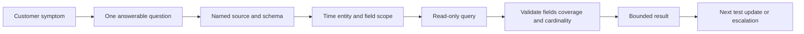

The diagram represents a reasoning pipeline, not a product architecture. A query can be syntactically correct and still fail validation. If expected healthy records are missing, a join multiplies rows, or a timestamp uses the wrong semantics, stop before interpreting the result.

### Plain-English deep-dive: A query is a measurement instrument

Imagine using a thermometer. The number matters only if the instrument is suitable, placed correctly, calibrated, and read in the right unit. A query is similar. The source is the instrument, filters choose where it is placed, field types and time semantics are its calibration, and aggregation decides the unit of the answer.

The analogy stops because a query can transform data rather than merely observe one value. It can combine sources, derive fields, and collapse thousands of events into one row. Each transformation can lose detail or create misleading duplication. Preserve the original source pointer, record every transformation, and run small sanity checks before making a support claim.

## 2. Search, filtering, and Boolean logic

A **filter** keeps records that satisfy a condition and excludes records that do not. A **Boolean** value is true or false. **Boolean logic** combines conditions using operations such as AND, OR, and NOT. A **predicate** is the condition itself. A **null** is a database marker for an unknown or unavailable value; it is not automatically zero or empty text. A **missing field** is not present in an event, while an **empty value** is present but contains no characters under the local format. Search products do not always treat these states identically.

A **wildcard** is a symbol that stands for an unspecified set of characters or fields under a product's rules. It is like writing “any title beginning with Net” in a catalog request. The limit is that wildcard syntax, tokenization, casing, performance, and whether it can match across punctuation are product-specific. A **regular expression** is a formal text pattern; Section 3 explains it with extraction. Search systems may support text terms, wildcards, regular expressions, ranges, and field-existence checks, but their exact behavior is dialect-specific.

AND narrows: all connected conditions must match. OR broadens: at least one connected condition must match. NOT excludes matches and requires special care because missing fields can behave differently from explicit values. **Operator precedence** is the order in which operations are evaluated. Parentheses make intended grouping explicit. The safe habit is to parenthesize mixed AND/OR logic even when the precedence rule is known.

| Logic form | Plain meaning | Synthetic support example | Common mistake |
|---|---|---|---|
| `A AND B` | Both conditions match | Tenant A and denied status | Assuming it includes either condition |
| `A OR B` | At least one condition matches | Timeout or server-error class | Forgetting that it broadens the result |
| `NOT A` | Exclude records matching A | Exclude health-check route | Treating missing field as definitely not A |
| `(A OR B) AND C` | Either A or B, plus C | Timeout or 503, within one route family | Omitting parentheses and changing scope |
| Exact equality | Field equals one typed value | `status_class = 'denied'` | Ignoring casing, whitespace, or numeric type |
| Range | Value falls within bounds | UTC time from start inclusive to end exclusive | Double-counting a shared end boundary |
| Existence | Field is present and usable | Correlation alias exists | Treating empty, null, and absent as identical |
| Text contains | Text includes a term under product rules | Synthetic error code contains `TIMEOUT` | Assuming tokenization and casing are universal |

Use half-open time intervals when possible: include the start and exclude the end. `[10:00, 10:30)` means events at exactly `10:00` are included and events at exactly `10:30` belong to the next interval. This prevents double-counting when adjacent windows are combined. Actual timestamp functions and precision vary, so document whether the source stores seconds, milliseconds, microseconds, local time, or UTC.

The first worked SQL example targets SQLite 3-style read-only syntax. It assumes a local fictional table named `support_events` and ISO 8601 UTC text whose lexical order is valid because every value uses the same normalized format. That storage choice is a lab contract, not a general SQL recommendation.

```sql
SELECT
    event_time_utc,
    event_alias,
    route_family,
    status_class,
    request_alias
FROM support_events
WHERE tenant_alias = 'tenant-A096'
  AND event_time_utc >= '2026-08-24T10:00:00Z'
  AND event_time_utc <  '2026-08-24T10:30:00Z'
  AND (status_class = 'denied' OR status_class = 'server_error')
ORDER BY event_time_utc, event_alias;
```

This query selects five fields, restricts one fictional tenant, uses a half-open UTC interval, groups the OR conditions, and sorts deterministically. It does not prove why an event was denied or whether the source contains every attempt. A reviewer should first count all scoped events, inspect distinct status values, and verify earliest/latest available times.

The conceptually similar Splunk-style text below assumes fictional indexed events and field names. In Splunk product vocabulary, an **index** is a named searchable data store managed under the product's indexing model. It is like a catalog collection, but the analogy stops because ingestion, retention, role access, and physical distribution are deployment-specific. The example is not claimed to be valid for any Abnormal environment and was not executed. In a real Splunk deployment, the index, source type, time fields, extraction rules, command availability, roles, and limits must be verified.

```spl
index="synthetic_support_096" tenant_alias="tenant-A096"
    (status_class="denied" OR status_class="server_error")
| fields _time event_alias route_family status_class request_alias
| sort 0 _time event_alias
```

In Splunk-style pipelines, the initial search identifies candidate events and pipe characters pass results through later commands. Early selective terms can reduce work, but performance depends on indexed fields, data model, product version, search mode, role, and deployment. Never translate the illustrative index name into a broad production search.

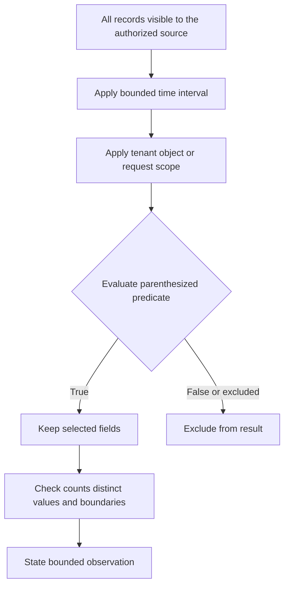

### Plain-English deep-dive: AND is a narrowing gate and OR is a wider gate

Picture event records moving through turnstiles. An AND expression puts several turnstiles in sequence: a record must pass every one. An OR expression offers parallel turnstiles: passing any one is enough. Parentheses build a fence around the intended group so the system does not connect the gates differently from the analyst's mental picture.

The analogy stops at missing values. A paper ticket either has a visible stamp or not, but databases can distinguish null, absent, empty, and an explicit value. SQL uses three-valued logic in many comparisons: true, false, and unknown. Search products can handle missing fields differently. Test missing-field behavior using synthetic examples before relying on exclusion logic.

## 3. Field extraction, typing, normalization, and validation

**Field extraction** turns part of a raw record into a named value. A structured JSON event may already expose `status_class`. An unstructured text line may require a parser or regular expression to identify a code. A **parser** applies format rules. A **regular expression**, often shortened to regex, describes text patterns. **Typing** assigns a data kind such as text, integer, decimal, Boolean, or timestamp. **Normalization** converts equivalent values into a consistent representation while preserving the original.

Extraction is like taking labeled facts from a shipping label: tracking number, date, and destination. The limit is that text can resemble a label without following the same contract. A loose pattern can capture the wrong substring, while a strict pattern can miss a new format. Never hide extraction failures. Keep a success flag, extraction version, and unmatched count.

| Field operation | Meaning | Synthetic example | Validation question |
|---|---|---|---|
| Parse structured field | Read a value using a declared format | Read `status_class` from fictional JSON | Did every schema version use the same path and type? |
| Regex extraction | Capture text matching a pattern | Capture `req-096-...` from a synthetic message | How many records matched, failed, or matched twice? |
| Cast | Convert a value to a type | Convert `duration_ms` text to integer | What happens to invalid or blank values? |
| Normalize case | Make comparison casing consistent | Map `Denied` and `denied` to lowercase | Is the field contract case-sensitive? |
| Bucket values | Group numeric or time values into ranges | Five-minute UTC intervals | Are boundary and timezone rules explicit? |
| Map categories | Convert raw codes into teaching categories | `403` to fictional `denied` class | Does the mapping preserve the original code? |
| Coalesce | Choose the first non-null candidate | Prefer cloud alias, then browser alias | Are the candidate identifiers truly equivalent? |
| Validate | Test type, allowed values, and completeness | Status must be in a declared set | Are unknown values retained rather than discarded? |

The fictional corpus uses `message_code` values such as `SYN096_TIMEOUT`. A conceptual SQLite expression can derive a broad category while preserving the original code:

```sql
SELECT
    event_alias,
    message_code,
    CASE
        WHEN message_code = 'SYN096_TIMEOUT' THEN 'timeout'
        WHEN message_code = 'SYN096_ROLE_REQUIRED' THEN 'denied'
        WHEN message_code = 'SYN096_DEPENDENCY_BUSY' THEN 'dependency'
        WHEN message_code IS NULL THEN 'missing'
        ELSE 'other'
    END AS derived_category
FROM support_events;
```

The CASE expression is a conditional mapping. It is derived evidence, not a source fact. The workbook must record mapping version `map-096-v1`, retain `message_code`, and count `missing` and `other`. If the analyst filters those categories away, a schema change could look like an improvement.

A Splunk-style extraction can use a product command such as `rex` to apply a regular expression. This is an illustrative pattern over synthetic text, not a recommendation to parse unknown production content:

```spl
index="synthetic_support_096" source_family="synthetic_text"
| rex field=synthetic_message "request=(?<request_alias>req-096-[A-Z0-9-]+)"
| eval extraction_state=if(isnull(request_alias), "unmatched", "matched")
| stats count AS events by extraction_state
```

In actual Splunk usage, regular-expression engine behavior, escaping, command syntax, field limits, search-time versus index-time extraction, and permissions are version- and configuration-specific. Search-time extraction is often safer for exploration because it does not rewrite ingested data, but it can still be expensive or inaccurate. Follow the platform owner's approved field-extraction process.

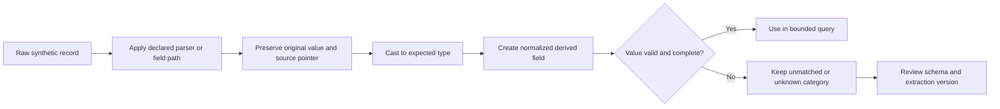

### Plain-English deep-dive: Extraction is transcription, not invention

Imagine copying the order number from a receipt into a worksheet. The worksheet cell is useful, but it is not the original receipt. If the print is smudged, the honest result is “unreadable,” not a guessed digit. Field extraction follows the same rule: preserve the source, document the pattern, and keep unmatched records visible.

The analogy stops because software extraction can process many formats at once and silently produce plausible errors. Validate with known positive, negative, missing, malformed, and version-changed synthetic cases. Count how many records entered and exited the extraction step. A field that exists on 40 percent of events should not be used as if it describes the entire corpus.

## 4. Aggregation, grouping, distinct counts, and rates

An **aggregation** combines many records into a summary such as count, minimum, maximum, sum, or average. **Grouping** creates one summary per distinct combination of selected dimensions. A **dimension** is a categorical field used to divide results, such as route family or status class. A **measure** is the calculated quantity, such as event count or duration. A **median** is the middle ordered value, while a **percentile** is a boundary below which a declared percentage of values falls. Both describe a distribution but require enough valid observations and product-specific function semantics. A **distinct count** counts unique values rather than rows. A **rate** divides a numerator by an appropriate denominator.

Aggregation is like summarizing receipts by store and day. It helps reveal patterns, but it removes individual detail. A count of 40 denial events may represent 40 users, one user retrying 40 times, or four requests duplicated ten times. Always choose a unit of analysis before grouping: event, attempt, parent operation, user alias, request alias, or affected tenant alias.

| Aggregate | Question answered | Useful denominator or companion | Limit |
|---|---|---|---|
| Row count | How many records matched? | Input count and duplicate count | Rows may not equal attempts or incidents |
| Distinct request count | How many request aliases appeared? | Missing-ID count | Identifier scope and retry behavior must be known |
| Minimum time | What is the earliest matching event time? | Earliest ingest time | Late arrival can change observed availability |
| Maximum time | What is the latest matching event time? | Query end and source watermark | Latest event may be incomplete near real time |
| Average duration | What is the arithmetic mean? | Count, median, percentiles | Outliers can dominate the mean |
| Percentage | What share of scoped attempts matched? | Valid numerator and denominator | A changing denominator can create a false trend |
| Group by dimension | Which categories recur? | Null/other category | High-cardinality fields can fragment results |
| Time bucket | How does a measure change over intervals? | Empty buckets and timezone | Bucket boundaries can split one incident |

The following SQLite 3-style query counts distinct request attempts by five-minute text bucket. SQLite's date/time support and formatting differ from PostgreSQL, MySQL, SQL Server, and cloud warehouses. This expression assumes normalized UTC timestamps in the exact lab format and uses `substr`; it is not portable SQL.

```sql
SELECT
    strftime('%Y-%m-%dT%H:', event_time_utc)
        || printf('%02d',
            CAST(strftime('%M', event_time_utc) AS INTEGER)
            - (CAST(strftime('%M', event_time_utc) AS INTEGER) % 5)
        )
        || ':00Z' AS five_minute_bucket,
    route_family,
    COUNT(*) AS event_rows,
    COUNT(DISTINCT request_alias) AS distinct_requests,
    SUM(CASE WHEN status_class = 'denied' THEN 1 ELSE 0 END) AS denied_rows
FROM support_events
WHERE event_time_utc >= '2026-08-24T10:00:00Z'
  AND event_time_utc <  '2026-08-24T11:00:00Z'
GROUP BY five_minute_bucket, route_family
ORDER BY five_minute_bucket, route_family;
```

The text bucket works only because synthetic timestamps are fixed-format UTC strings. A real system should use its documented timestamp and binning functions. The query deliberately returns both row count and distinct request count so duplicate or multi-event attempts remain visible.

A Splunk-style time summary often uses `timechart` or `bin` plus `stats`. This unexecuted teaching example counts distinct fictional request aliases:

```spl
index="synthetic_support_096" earliest="08/24/2026:10:00:00" latest="08/24/2026:11:00:00"
| timechart span=5m dc(request_alias) AS distinct_requests count AS event_rows by status_class
```

Time literal interpretation, timezone, earliest/latest inclusivity, limits on split-by fields, null handling, command availability, and result truncation must be verified for the actual Splunk product and version. In a support workflow, set time through the approved interface and record its resolved UTC bounds rather than trusting an ambiguous display.

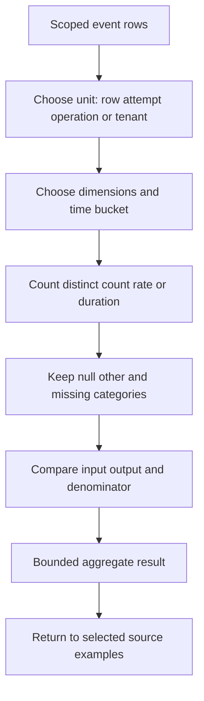

### Plain-English deep-dive: Counts need nouns and denominators

“There were 80” is incomplete. Eighty what: rows, retries, requests, users, tenants, or incidents? “Ten percent failed” is also incomplete without the denominator: ten percent of all attempts, attempts with non-null status, or only one route? Attach a noun and denominator to every metric.

The analogy is a classroom. Ten absences can mean ten students missed one day or one student missed ten days. Aggregation compresses those stories into the same number. The query workbook should record the unit of analysis, duplicate policy, null policy, and denominator so a reviewer can reconstruct the intended meaning.

## 5. Joins, lookups, and relationship safety

A **join** combines rows from two inputs using a relationship condition. A **join key** is the field or field combination used to match. An **inner join** keeps only matching rows from both sides. A **left join** keeps every row from the left input and adds matching right-side values when present. **Join cardinality** describes how many rows on one side can match rows on the other: one-to-one, one-to-many, or many-to-many.

A join is like matching a claim ticket to a checked item. The ticket number can be strong inside one venue but meaningless elsewhere. Timestamp proximity, display name, subject text, or error title are weak keys because unrelated events can share them. Prefer documented, typed identifiers plus scope: request alias with issuer, message alias with provider, object alias with tenant, or parent-child relationship under a declared schema.

| Join pattern | Meaning | Support use | Main danger |
|---|---|---|---|
| One-to-one | One left row matches one right row | Request summary to one declared response | Duplicate source rows break the assumption |
| One-to-many | One parent matches several children | Operation to retry attempts | Parent measures repeat after the join |
| Many-to-one | Several events map to one reference row | Status code to description | Reference duplicates multiply events |
| Many-to-many | Several rows match several rows | Weak timestamp/name correlation | Explosive row multiplication and false relationships |
| Inner join | Keep only matching pairs | Analyze only records with a documented bridge | Hides unmatched records and coverage gaps |
| Left join | Keep all primary rows | Preserve attempts even without audit match | Null right fields need careful interpretation |
| Anti-join | Keep rows without a match | Find requests lacking an expected response | Missing source coverage can mimic missing response |
| Lookup/enrichment | Add small reference information | Map synthetic route to owner | Reference version and validity period can matter |

Before a join, count rows and distinct keys on each side. After a join, count again. If 20 request rows become 140 joined rows, investigate cardinality before interpreting aggregates. Keep unmatched counts. A left join with null audit fields means “no matching readable audit row under this condition,” not “no audit event occurred.”

The fictional SQLite 3-style example keeps all request attempts and links a documented cloud alias to zero or one audit summary. A common table expression, introduced with `WITH`, names intermediate read-only result sets for clarity.

```sql
WITH scoped_requests AS (
    SELECT event_alias, event_time_utc, request_alias, cloud_alias, status_class
    FROM support_events
    WHERE source_family = 'browser_network'
      AND tenant_alias = 'tenant-A096'
      AND event_time_utc >= '2026-08-24T10:00:00Z'
      AND event_time_utc <  '2026-08-24T10:30:00Z'
),
audit_by_cloud_alias AS (
    SELECT cloud_alias, MIN(event_time_utc) AS first_audit_time,
           COUNT(*) AS audit_rows
    FROM support_events
    WHERE source_family = 'cloud_audit'
      AND tenant_alias = 'tenant-A096'
    GROUP BY cloud_alias
)
SELECT
    r.event_alias,
    r.event_time_utc,
    r.request_alias,
    r.cloud_alias,
    r.status_class,
    a.first_audit_time,
    COALESCE(a.audit_rows, 0) AS audit_rows
FROM scoped_requests AS r
LEFT JOIN audit_by_cloud_alias AS a
    ON a.cloud_alias = r.cloud_alias
ORDER BY r.event_time_utc, r.event_alias;
```

The right side is grouped before the join so each `cloud_alias` produces at most one row. That reduces multiplication but does not prove the alias is globally unique. The fictional contract says it is unique within `tenant_alias`; a production query would include every documented scope field.

Splunk-style searches support several ways to combine data, including lookup, `stats`-based correlation, subsearches, transactions, and `join`, but their semantics and performance differ. The following concept uses `stats` to group fields by a documented alias rather than presenting `join` as the default:

```spl
index="synthetic_support_096" tenant_alias="tenant-A096"
    (source_family="browser_network" OR source_family="cloud_audit")
| stats values(source_family) AS sources
        values(status_class) AS status_classes
        min(_time) AS first_time
        max(_time) AS last_time
        count AS event_rows
  by tenant_alias cloud_alias
| where mvcount(sources) >= 1
```

`values` can create multivalue output and may have limits or ordering behavior depending on the product. `mvcount` counts values in a multivalue field under Splunk semantics. This example is a concept sketch only. It must not be copied into production without checking product version, field extractions, command limits, and whether grouping can merge unrelated retries.

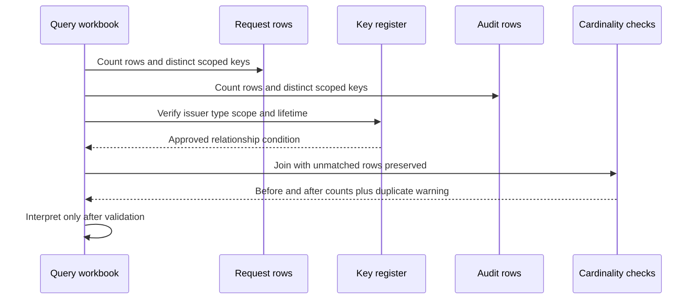

### Plain-English deep-dive: A join can manufacture apparent evidence

Imagine two guest lists containing three people named Alex. Joining only on first name creates nine apparent pairs even though no relationship was established. The database followed the condition exactly; the condition was weak. A many-to-many join can similarly multiply event rows and make a rare issue look common.

The analogy stops because valid one-to-many relationships are normal in distributed systems: one user operation can create retries, and one alert can reference several entities. The goal is not always one-to-one. The goal is declared cardinality, typed keys, preserved unmatched rows, and metrics calculated at the correct level.

## 6. Window functions, running context, and sequence analysis

A **window function** calculates across related rows while usually retaining each input row. A **partition** divides rows into independent groups for the calculation. An **order** defines sequence within each partition. A **frame** defines which nearby rows contribute to the current result. Common window functions include `ROW_NUMBER`, `LAG`, `LEAD`, running sums, and rolling averages.

Window functions are like adding notes beside every runner in a race: position, previous split, next split, and rolling pace. A regular GROUP BY would collapse runners into summaries; a window retains individual rows and adds context. The limit is that sequence depends on deterministic ordering. Equal timestamps, clock skew, and late arrival require a tie-breaker such as a stable event alias and a clear choice between event time and ingest time.

| Window concept | Plain meaning | Synthetic use | Boundary |
|---|---|---|---|
| `PARTITION BY` | Restart calculation for each group | Separate each parent operation | Wrong partition merges unrelated customers or retries |
| `ORDER BY` | Define row sequence | Sort attempts by event time and alias | Event time can differ from ingest time |
| `ROW_NUMBER` | Number rows in sequence | Label attempt order | It reflects chosen ordering, not causal order |
| `LAG` | Read a prior row's value | Calculate gap since prior failure | First row has no prior value |
| `LEAD` | Read a following row's value | Locate next recovery event | Future row in data is not a prediction |
| Running count | Accumulate through current row | Count failures seen so far | Frame defaults vary by SQL dialect |
| Rolling window | Calculate over recent rows or time | Compare recent failure rate | Row-based and time-based frames are different |
| Rank | Assign ordered position with tie behavior | Rank recurring route families | `RANK` and `DENSE_RANK` handle ties differently |

The following SQLite 3-style query numbers attempts within each parent operation and calculates the gap from the prior attempt. SQLite window-function availability depends on the SQLite library version. Actual environments may embed older versions, so the runtime version must be checked before use.

```sql
SELECT
    operation_alias,
    request_alias,
    event_time_utc,
    status_class,
    ROW_NUMBER() OVER (
        PARTITION BY operation_alias
        ORDER BY event_time_utc, event_alias
    ) AS attempt_sequence,
    LAG(event_time_utc) OVER (
        PARTITION BY operation_alias
        ORDER BY event_time_utc, event_alias
    ) AS prior_attempt_time
FROM support_events
WHERE source_family = 'browser_network'
ORDER BY operation_alias, attempt_sequence;
```

The query does not calculate elapsed milliseconds because robust timestamp arithmetic is dialect-specific. A workbook could retain adjacent timestamp strings and perform a separately documented conversion using an approved function. Never infer retry backoff quality merely from ordered strings when precision or clock source is unknown.

Splunk-style sequence context may use commands such as `streamstats`, which calculates values as results flow through an ordered pipeline. Correct sorting and partition-like reset conditions are essential:

```spl
index="synthetic_support_096" source_family="browser_network"
| sort 0 operation_alias _time event_alias
| streamstats count AS attempt_sequence current=true by operation_alias
| table _time event_alias operation_alias request_alias status_class attempt_sequence
```

The command's ordering, memory limits, reset options, and distributed-search behavior must be checked against current Splunk documentation and deployment limits. This text was not executed. A local workbook should label it “Splunk-style concept” rather than “validated SPL.”

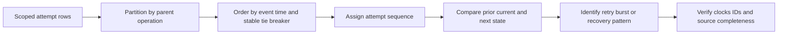

## 7. Timelines: raw time, normalized time, and recurring patterns

A **timeline** orders selected events to explain sequence. **Event time** is when the producer says the event occurred. **Ingest time** is when the searchable system received it. **Observation time** is when an analyst or monitoring system saw it. **Normalization** creates a comparable representation, commonly UTC, without overwriting the source value. A **watermark** is a statement about how complete the source is believed to be through a point in time.

A **recurring pattern** is a repeated, meaningfully similar sequence under declared matching rules. Three denials close together are not automatically one recurring incident. They may be retries for one operation. Conversely, one summary event may represent many affected objects. The timeline should preserve operation, attempt, entity, source, and coverage fields.

| Timeline field | Purpose | Synthetic example | Interpretation limit |
|---|---|---|---|
| `raw_time` | Preserve source representation | `2026-08-24T10:07:04.125Z` | May use producer clock with unknown accuracy |
| `time_semantics` | Name what the timestamp means | `event_occurrence` | Different records can use different semantics |
| `normalized_utc` | Support comparison | Same UTC value after declared conversion | Derived value must not replace raw evidence |
| `ingest_time_utc` | Show search availability | `2026-08-24T10:08:10Z` | Late arrival is not late occurrence |
| `operation_alias` | Group one business action | `op-096-A` | Scope must be documented |
| `attempt_alias` | Distinguish retries | `attempt-3` | A retry may create several records |
| `pattern_alias` | Label a reviewed recurring sequence | `pattern-096-denial-burst` | Analyst label is not source fact |
| `coverage_note` | Record delay, permission, retention, or gap | `complete through 10:25Z under lab contract` | Real completeness needs producer evidence |

The recurring-pattern timeline should contain selected observations, not every event. It should show the first occurrence, repeated occurrence, healthy comparison, change or recovery, and source-coverage notes. The artifact should also link each summarized row to the synthetic event aliases used to build it.

| Timeline row | Normalized UTC | Pattern phase | Direct observation | Source aliases | Bounded interpretation |
|---|---|---|---|---|---|
| TL096-01 | 10:02:01 | Baseline healthy | Request `req-096-H1` recorded success for route family `policy-save` | E096-001, E096-002 | The synthetic route was capable of success in this interval |
| TL096-02 | 10:07:04 | First denial | Attempt `req-096-A1` recorded fictional role denial | E096-010, E096-011 | One scoped operation was denied at the declared boundary |
| TL096-03 | 10:07:09 | Retry | Same parent operation created a second denied request | E096-012 | Two rows are one operation with two attempts, not two incidents |
| TL096-04 | 10:12:03 | Independent recurrence | Different operation under same tenant and route recorded denial | E096-020, E096-021 | Recurrence exists under lab matching rules |
| TL096-05 | 10:17:00 | Configuration observation | Synthetic audit source recorded role mapping version change | E096-030 | Temporal and scope match creates a hypothesis, not cause alone |
| TL096-06 | 10:22:02 | Continued recurrence | Third operation recorded denial after mapping change | E096-040 | Pattern remains visible; mechanism still needs a test |
| TL096-07 | 10:27:05 | Healthy comparison | Unaffected route family remained successful | E096-050 | Broad outage hypothesis is weakened, not eliminated globally |
| TL096-08 | 10:32:00 | Approved synthetic restoration | Lab record changes fictional mapping to intended value | E096-060 | Change record proves only declared state transition |
| TL096-09 | 10:37:06 | Recovery observation | Same route and tenant recorded two successful operations | E096-070, E096-071 | Before/after evidence supports the lab mechanism with stated alternatives |
| TL096-10 | 10:42:00 | Coverage watermark | Source manifest declares all lab events through `10:40Z` loaded | E096-080 | Completeness exists only because the fictional lab contract declares it |

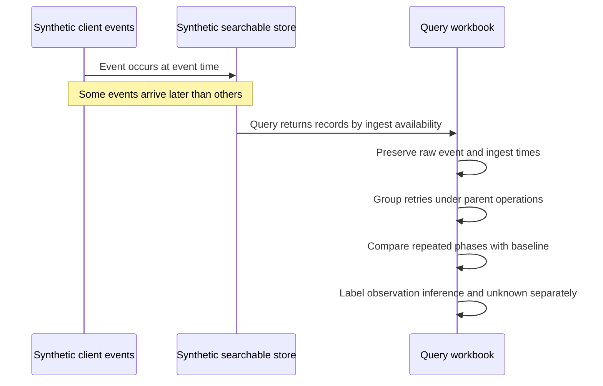

## 8. Baselines, comparison cohorts, and anomaly restraint

A **baseline** is an explicit reference used for comparison. A **cohort** is a group selected by shared criteria. A **comparison window** is the reference time interval. An **anomaly** is a value or pattern that differs from expected behavior under a defined method. A baseline is not automatically “normal,” and an anomaly is not automatically a defect or attack.

Baselines are like comparing today's queue length with the same hour on similar weekdays rather than with midnight. The comparison must account for traffic volume, release schedule, tenant mix, route family, policy version, seasonality, and source coverage. The analogy stops because operational systems can change their instrumentation and population; a lower count may mean fewer events were ingested.

| Baseline choice | Question | Strength | Risk |
|---|---|---|---|
| Previous equal interval | Did this just change? | Simple and local | Previous interval may be unusual |
| Same weekday/time | Is this unusual for the weekly cycle? | Controls some seasonality | Releases or holidays can invalidate it |
| Healthy tenant cohort | Is the affected scope different from peers? | Supports scope comparison | Cohorts may differ in configuration or volume |
| Same tenant, unaffected route | Is the issue route-specific? | Controls tenant context | Route traffic and semantics can differ |
| Pre-change interval | Did behavior shift after a change? | Useful for change hypothesis | Other changes and delayed effects confound it |
| Success-rate baseline | Did outcome proportion change? | Adjusts for volume | Denominator and missing status must be stable |
| Duration percentile | Did tail latency change? | Captures user-impacting tails | Percentile support and sample size matter |
| Static threshold | Did a known operational limit trigger? | Easy to explain | Can ignore context and seasonality |

The simplest safe comparison returns numerator, denominator, and missing category for both current and baseline intervals. The following SQLite 3-style query uses conditional aggregation. It assumes each row in the selected source represents one request attempt and that duplicates were already assessed.

```sql
WITH labeled AS (
    SELECT
        CASE
            WHEN event_time_utc >= '2026-08-24T10:00:00Z'
             AND event_time_utc <  '2026-08-24T10:30:00Z' THEN 'current'
            WHEN event_time_utc >= '2026-08-24T09:30:00Z'
             AND event_time_utc <  '2026-08-24T10:00:00Z' THEN 'baseline'
            ELSE NULL
        END AS period,
        status_class,
        request_alias
    FROM support_events
    WHERE tenant_alias = 'tenant-A096'
      AND route_family = 'policy-save'
      AND source_family = 'browser_network'
)
SELECT
    period,
    COUNT(DISTINCT request_alias) AS attempts,
    COUNT(DISTINCT CASE WHEN status_class = 'denied' THEN request_alias END) AS denied_attempts,
    COUNT(DISTINCT CASE WHEN status_class IS NULL THEN request_alias END) AS missing_status_attempts
FROM labeled
WHERE period IS NOT NULL
GROUP BY period
ORDER BY period;
```

The analyst calculates a rate only after inspecting these counts. A tiny baseline of two attempts cannot support the same confidence as two thousand attempts. This Part does not introduce a statistical significance claim. It treats the comparison as descriptive evidence that guides the next test.

A Splunk-style baseline can use `eventstats` to attach a group-level aggregate to individual events or compare time buckets. Exact command behavior and limits require current documentation:

```spl
index="synthetic_support_096" tenant_alias="tenant-A096" route_family="policy-save"
| bin _time span=5m
| stats dc(request_alias) AS attempts
        dc(eval(if(status_class="denied", request_alias, null()))) AS denied_attempts
  by _time
| eventstats avg(denied_attempts) AS mean_denied_attempts
| eval difference_from_mean=denied_attempts-mean_denied_attempts
| sort 0 _time
```

This unexecuted example is intentionally descriptive. A mean is sensitive to outliers and does not define a trustworthy anomaly threshold by itself. Splunk eval syntax, distinct-count estimation, null behavior, `eventstats` limits, and product version must be verified. A real baseline should use the correct seasonality, cohort, and source-health controls.

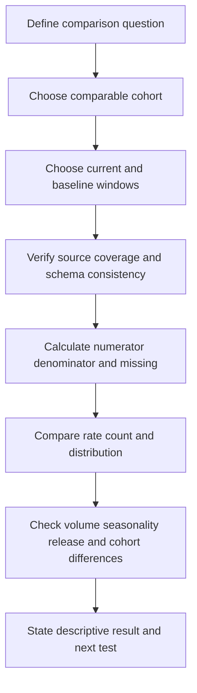

### Plain-English deep-dive: A baseline is a ruler, not a verdict

A ruler tells you that one object is longer than another. It does not tell you whether either object is defective. A baseline similarly quantifies difference; it does not explain cause or decide severity. The comparison can be invalid if the ruler changed, meaning the schema, source, traffic, or cohort differs.

Record why the baseline is comparable, what changed between periods, and which confounders remain. A spike after a release is a correlation. To support causation, connect the same scope to a plausible mechanism, derive predictions, test alternatives, and seek independent verification.

## 9. SQL concepts, dialect boundaries, and read-only safety

SQL is a family rather than one perfectly uniform language. A **dialect** is a product-specific version of syntax and behavior. SQLite, PostgreSQL, MySQL, and Transact-SQL for SQL Server share concepts but differ in timestamp functions, string functions, null handling details, regular expressions, limits, common table expressions, window support, query plans, identifiers, and administrative commands. A query that works in one product may fail or behave differently in another.

This Part uses SQLite 3-style SELECT queries because SQLite can support a future local file-based exercise without a server. It does not claim that any query was run or that SQLite represents Abnormal systems. Even SQLite behavior depends on the embedded library version, compile options, collation, and stored data types. The examples use consistent synthetic UTC text to avoid implying universal timestamp behavior.

| SQL concept | Purpose | SQLite 3-style teaching use | Portability boundary |
|---|---|---|---|
| `SELECT` | Choose expressions and fields | Return selected evidence columns | Expression syntax and functions differ |
| `FROM` | Name input relation | Read fictional local table | Table, view, and catalog semantics differ |
| `WHERE` | Filter rows before grouping | Bound tenant and time | Null and collation behavior require care |
| `GROUP BY` | Form aggregate groups | Count by route and bucket | Grouping rules differ across products |
| `HAVING` | Filter groups after aggregation | Keep groups above a count | Alias availability can differ |
| `ORDER BY` | Define result order | Stable time and alias ordering | Default null ordering differs |
| `WITH` | Name intermediate query | Make stages reviewable | Materialization and recursion behavior differ |
| `JOIN` | Combine related rows | Link typed aliases | Optimizer and null semantics require validation |
| `CASE` | Conditional derived value | Map fictional status categories | Type coercion differs |
| Window function | Add context without collapsing rows | Number retries | Version and frame defaults differ |

Read-only does not mean risk-free. A large SELECT can consume resources, expose restricted data, hold locks under some systems, produce a broad export, or violate least privilege. Query cost, timeout, row limits, and result handling are product-specific. Use the narrowest approved source, interval, fields, and aggregation. Prefer aggregate-first exploration when it answers the question, then retrieve a tiny selected sample through approved channels.

**SQL injection** occurs when untrusted input changes the structure of a query rather than remaining data. This Part does not teach exploitation or testing. Do not concatenate customer text, identifiers, or ticket content into SQL. In application code, use the platform's parameterized-query API and approved data-access layer. In an analyst console, validate and safely bind permitted values according to the tool. Never “test” injection against a real system without an explicitly authorized security process.

**Destructive SQL** changes or removes data or schema. This lab prohibits every state-changing database operation, including destructive SQL, data-definition changes, permission changes, stored-procedure execution, extension loading, attachment to unknown databases, and transaction tricks. The examples contain SELECT and read-only common table expressions only. Do not add write statements to the workbook.

| Unsafe pattern | Why prohibited | Safe learning alternative |
|---|---|---|
| Concatenate untrusted text into a query | Can change query structure or expose data | Use fixed fictional values here; learn parameter binding from the approved API |
| Run against production to “see what happens” | Exceeds the local synthetic scope | Keep the exercise offline and handwritten or use an approved isolated lab later |
| Select every field from a broad interval | Can expose content, identifiers, and unnecessary records | Name required fields and use a narrow half-open interval |
| Export all matching rows | Multiplies privacy and handling risk | Aggregate first and retain only selected synthetic samples |
| Add write or schema statements | Can alter or destroy evidence and systems | Use SELECT-only examples |
| Bypass row, role, or tenant controls | Violates authorization and invalidates evidence | Stop and escalate access questions to the owner |
| Upload a database or query result to a public tool | Can disclose secrets or customer data | Use learner-owned synthetic local text only |
| Treat syntax success as analytical correctness | Query can return the wrong population | Validate fields, times, counts, cardinality, and known cases |

## 10. Splunk-style concepts and product boundaries

Splunk products index and search machine data through product-specific architectures and interfaces. An **index** is a named searchable data store under Splunk's model. A **source type** classifies event structure and parsing behavior. **Search time** is when a user runs a search and fields can be extracted or transformed. A **pipeline** is a sequence in which results flow from an initial search through commands separated by pipes.

SPL is not SQL. SPL often begins with event search terms and then transforms an event stream. SQL commonly begins with SELECT over relations. Both can filter, derive fields, group, sort, and correlate, but command semantics, optimization, time handling, null behavior, and limits differ. Do not perform word-for-word translation and assume equivalence.

| Splunk-style concept | Plain meaning | Rough SQL-relative idea | Important boundary |
|---|---|---|---|
| Initial search | Find candidate indexed events | `FROM` plus early `WHERE` | Indexed terms, time picker, and role strongly affect behavior |
| Pipe | Pass current results to next command | Staged subquery or common table expression | Commands can be streaming, transforming, centralized, or distributable |
| `fields` or `table` | Select visible fields or table shape | Projection in SELECT | Command placement and internal fields affect results |
| `eval` | Create or modify a field | SQL expression or CASE | Functions and null semantics are SPL-specific |
| `where` | Filter using evaluated expressions | SQL WHERE or HAVING depending on stage | It acts on fields available at that pipeline point |
| `stats` | Aggregate into grouped results | GROUP BY aggregates | It transforms and usually discards ungrouped event detail |
| `eventstats` | Add aggregate context to events | Window-like group aggregate | Resource limits and exact semantics are product-specific |
| `streamstats` | Calculate running context | Ordered window function | Requires correct ordering and can have limits |
| `timechart` | Aggregate into time buckets | Time-bucket GROUP BY | Span, timezone, empty buckets, and split limits matter |
| `rex` | Extract using a regular expression | Regex function or parser | Engine, escaping, and extraction placement matter |
| `lookup` | Add reference data | Join to a reference table | Match rules, version, permissions, and file governance matter |
| `join` | Combine results by fields | SQL JOIN | Often limited and not automatically the best correlation method |

Splunk Cloud Platform and Splunk Enterprise are distinct product contexts with release, service, management, and feature boundaries. Documentation pages can cover one or both, and deployed versions may lag or differ. Splunk Search Processing Language version 2 also exists in specific product contexts and should not be conflated with every classic SPL search. This Part's examples use familiar SPL-style concepts only and make no statement about which interface an employer uses.

A search can be valid yet expensive. Broad wildcard terms, unrestricted intervals, high-cardinality grouping, large regular expressions, subsearch expansion, transaction building, and joins can consume resources or hit limits. Performance guidance depends on data model, index-time configuration, command type, search head, role, workload management, and product version. A support engineer should use approved search practices and ask the platform owner before running a costly query.

```mermaid
flowchart LR
    Indexed[Authorized indexed synthetic events] --> Base[Bounded base search]
    Base --> Extract[Use existing fields or tested extraction]
    Extract --> Filter[Apply explicit Boolean conditions]
    Filter --> Transform[Derive typed teaching fields]
    Transform --> Aggregate[Stats timechart or running context]
    Aggregate --> Validate[Check limits nulls cardinality and samples]
    Validate --> Present[Workbook result with product boundary]
```

The diagram is conceptual. It does not claim Splunk's physical execution order, indexing architecture, or optimizer behavior. Current official documentation and the actual search job inspector or equivalent approved diagnostics should guide production performance analysis.

## 11. Correlation, causation, and evidence language

**Correlation** means two measurements vary together or two records are related under a declared key or pattern. **Causation** means one condition produced an outcome through a supported mechanism. A **confounder** is another factor that can explain the relationship. A **prediction** is an observation expected if a hypothesis is true. A **falsifying test** is a check capable of showing that the hypothesis is wrong.

Queries are excellent at finding co-occurrence, sequence, scope, and differences. They do not automatically establish cause. A rise in denials after a configuration event is correlation. Causal support improves if the event changed the exact relevant property for the same scope, the known mechanism predicts denial, unaffected cohorts behave differently, alternative causes are tested, and an approved reversal or independent verification changes the outcome as predicted.

| Reasoning label | Synthetic statement | Safe wording |
|---|---|---|
| Query observation | Five distinct denied requests matched the declared interval | “The synthetic query returned...” |
| Coverage observation | Source manifest declares complete ingestion through `10:40Z` | “Under the lab's declared coverage...” |
| Correlation | Denials and a same-scope role mapping change occur in the same period | “The events are temporally and scope-correlated...” |
| Inference | The denial pattern is consistent with the changed mapping | “The evidence is consistent with...” |
| Hypothesis | The mapping removed required authorization | “One testable explanation is...” |
| Prediction | Same route and principal should fail while unaffected route succeeds | “If true, we expect...” |
| Alternative | A client release changed request shape | “A competing explanation is...” |
| Cause within lab | Declared mapping mechanism plus before/after tests supports cause | “Within the fictional contract, cause is supported because...” |
| Unknown | Why the synthetic change was made | “The corpus does not establish...” |
| Evidence ceiling | No real product data or execution | “This demonstrates query reasoning only...” |

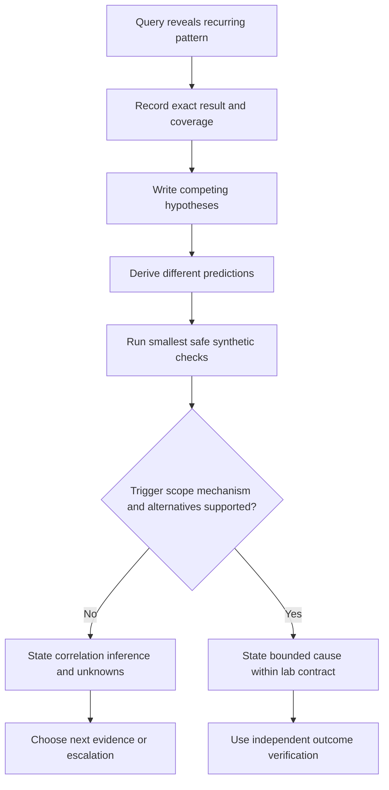

## 12. Worked query workbook: synthetic recurring denial pattern

### Scenario and fictional schema

A fictional customer report says, “Saving a policy fails sometimes.” The support question is narrowed to: “Did distinct `policy-save` operations for `tenant-A096` show a recurring denial pattern from `10:00Z` through `10:40Z`, and what evidence distinguishes retries, a broad outage, client-shape failure, and a scoped authorization hypothesis?”

The fictional table `support_events` has one row per declared event, not necessarily one row per operation. Fields are synthetic and intentionally content-free.

| Field | Type under lab contract | Meaning | Privacy boundary |
|---|---|---|---|
| `event_alias` | Text, unique in corpus | Local source-row pointer | Fictional only |
| `source_family` | Text category | Browser, service, audit, or coverage source | No proprietary source names |
| `event_time_utc` | Fixed-format UTC text | Producer-declared occurrence time | Raw value preserved |
| `ingest_time_utc` | Fixed-format UTC text | Search availability time | Does not replace event time |
| `tenant_alias` | Text | Fictional tenant scope | No tenant ID or customer name |
| `route_family` | Text | Fictional endpoint category | No URL or query string |
| `operation_alias` | Text | Parent business action | Scope declared locally |
| `request_alias` | Text | Attempt-specific request | No real request ID |
| `cloud_alias` | Text | Fictional cross-source bridge | Not an Abnormal field |
| `status_class` | Text category | Success, denied, server error, or missing | Derived mapping retains source code |
| `message_code` | Text category | Fictional machine-readable result | No response body |
| `mapping_version` | Text | Fictional authorization mapping version | No real policy content |
| `synthetic` | Boolean-like integer | Must equal 1 | Prevents accidental mixing with real data |

### Selected synthetic records

| Event | Time UTC | Source | Operation/request | Route | Observation |
|---|---|---|---|---|---|
| E096-001 | 10:02:01 | browser network | op-H1 / req-H1 | policy-save | Success under mapping v1 |
| E096-002 | 10:02:02 | cloud audit | op-H1 / cloud-H1 | policy-save | Save result recorded success |
| E096-010 | 10:07:04 | browser network | op-A / req-A1 | policy-save | Denied with `SYN096_ROLE_REQUIRED` |
| E096-011 | 10:07:05 | service result | op-A / cloud-A1 | policy-save | Same alias recorded mapping v2 denial |
| E096-012 | 10:07:09 | browser network | op-A / req-A2 | policy-save | Retry denied; same parent operation |
| E096-013 | 10:07:10 | service result | op-A / cloud-A2 | policy-save | Retry recorded mapping v2 denial |
| E096-020 | 10:12:03 | browser network | op-B / req-B1 | policy-save | Independent operation denied |
| E096-021 | 10:12:04 | service result | op-B / cloud-B1 | policy-save | Mapping v2 denial |
| E096-030 | 10:17:00 | cloud audit | change-C / audit-C1 | policy-map | Mapping v2 activation recorded at 10:05 event time, late ingested |
| E096-040 | 10:22:02 | browser network | op-D / req-D1 | policy-save | Independent operation denied |
| E096-041 | 10:22:03 | service result | op-D / cloud-D1 | policy-save | Mapping v2 denial |
| E096-050 | 10:27:05 | browser network | op-E / req-E1 | policy-read | Success on unaffected route |
| E096-051 | 10:27:06 | browser network | op-F / req-F1 | policy-save | Different fictional tenant succeeds |
| E096-060 | 10:32:00 | cloud audit | restore-G / audit-G1 | policy-map | Approved lab restoration to v1 recorded |
| E096-070 | 10:37:06 | browser network | op-H / req-H2 | policy-save | Same tenant and route succeeds after restoration |
| E096-071 | 10:38:11 | browser network | op-I / req-I1 | policy-save | Second independent success after restoration |
| E096-080 | 10:42:00 | coverage | coverage-J | all | Lab watermark complete through 10:40Z |

The table is a teaching excerpt, not a database dump. It omits duplicate, malformed, healthy-volume, and negative-control rows that a completed local corpus would include. No email address, message, payload, URL, credential, token, or customer content appears.

### Workbook query A: establish source coverage

The first query should not hunt for the suspected error. It should test whether the expected source families and interval are represented.

```sql
SELECT
    source_family,
    COUNT(*) AS event_rows,
    MIN(event_time_utc) AS earliest_event_time,
    MAX(event_time_utc) AS latest_event_time,
    MIN(ingest_time_utc) AS earliest_ingest_time,
    MAX(ingest_time_utc) AS latest_ingest_time
FROM support_events
WHERE synthetic = 1
  AND event_time_utc >= '2026-08-24T10:00:00Z'
  AND event_time_utc <  '2026-08-24T10:40:00Z'
GROUP BY source_family
ORDER BY source_family;
```

Expected interpretation if performed against the declared corpus: each required source should appear, and the separate coverage row should support the fictional watermark. The query still cannot show whether fields are complete within each row. The workbook should add per-field null counts and compare expected source-family minimums.

### Workbook query B: separate event rows, attempts, and operations

```sql
SELECT
    route_family,
    status_class,
    COUNT(*) AS event_rows,
    COUNT(DISTINCT request_alias) AS request_attempts,
    COUNT(DISTINCT operation_alias) AS parent_operations
FROM support_events
WHERE synthetic = 1
  AND tenant_alias = 'tenant-A096'
  AND source_family = 'browser_network'
  AND event_time_utc >= '2026-08-24T10:00:00Z'
  AND event_time_utc <  '2026-08-24T10:40:00Z'
GROUP BY route_family, status_class
ORDER BY route_family, status_class;
```

This query prevents the two attempts under `op-A` from being called two customer incidents. Event rows, request attempts, and parent operations answer different questions. A missing operation alias would require an explicit unknown category; it should not be silently replaced by request alias.

### Workbook query C: create a five-minute recurring-pattern series

```sql
SELECT
    strftime('%Y-%m-%dT%H:', event_time_utc)
        || printf('%02d',
            CAST(strftime('%M', event_time_utc) AS INTEGER)
            - (CAST(strftime('%M', event_time_utc) AS INTEGER) % 5)
        )
        || ':00Z' AS five_minute_bucket,
    COUNT(DISTINCT operation_alias) AS operations,
    COUNT(DISTINCT CASE WHEN status_class = 'denied' THEN operation_alias END) AS denied_operations,
    COUNT(DISTINCT CASE WHEN status_class = 'success' THEN operation_alias END) AS successful_operations
FROM support_events
WHERE synthetic = 1
  AND tenant_alias = 'tenant-A096'
  AND route_family = 'policy-save'
  AND source_family = 'browser_network'
  AND event_time_utc >= '2026-08-24T10:00:00Z'
  AND event_time_utc <  '2026-08-24T10:40:00Z'
GROUP BY five_minute_bucket
ORDER BY five_minute_bucket;
```

Empty time buckets may not appear in this result. A chart that connects present buckets could visually hide gaps. A complete workbook should use an approved time spine or explicitly list expected buckets, depending on dialect. Do not invent zeroes unless source coverage supports them.

### Workbook query D: validate the cross-source bridge

```sql
WITH browser_denials AS (
    SELECT tenant_alias, operation_alias, request_alias, cloud_alias, event_time_utc
    FROM support_events
    WHERE synthetic = 1
      AND source_family = 'browser_network'
      AND status_class = 'denied'
      AND tenant_alias = 'tenant-A096'
),
service_results AS (
    SELECT tenant_alias, cloud_alias, status_class, message_code, mapping_version,
           event_time_utc, event_alias
    FROM support_events
    WHERE synthetic = 1
      AND source_family = 'service_result'
)
SELECT
    b.operation_alias,
    b.request_alias,
    b.cloud_alias,
    b.event_time_utc AS browser_time,
    s.event_time_utc AS service_time,
    s.status_class AS service_status,
    s.message_code,
    s.mapping_version,
    s.event_alias AS service_event_alias
FROM browser_denials AS b
LEFT JOIN service_results AS s
  ON s.tenant_alias = b.tenant_alias
 AND s.cloud_alias = b.cloud_alias
ORDER BY b.event_time_utc, b.request_alias;
```

Before interpreting it, the workbook records distinct-key counts on both sides. If a browser denial has no matching service row, the result is “no match under this join and coverage,” not “the service did not process it.” If several service rows match one cloud alias, inspect whether the relationship is a legitimate lifecycle or a duplicate problem.

### Workbook query E: Splunk-style recurring pattern

```spl
index="synthetic_support_096" synthetic=1 tenant_alias="tenant-A096"
    source_family="browser_network" route_family="policy-save"
| bin _time span=5m
| stats dc(operation_alias) AS operations
        dc(eval(if(status_class="denied", operation_alias, null()))) AS denied_operations
        dc(eval(if(status_class="success", operation_alias, null()))) AS successful_operations
  by _time
| sort 0 _time
```

This is a concept translation, not validated output. The actual Splunk search must verify timestamp assignment, `dc` behavior and accuracy, `eval` syntax, null handling, time picker bounds, empty-bucket behavior, and command limits. It should be run only in an authorized synthetic or approved environment.

### Workbook query F: test alternatives rather than confirm one story

| Hypothesis | Prediction | Smallest synthetic query check | Result in declared scenario | Confidence effect |
|---|---|---|---|---|
| Retry inflation | Many denial rows belong to one operation | Count rows, requests, and distinct operations | Two early denials belong to `op-A`; later denials use new operations | Explains part, not all, of recurrence |
| Broad service outage | Other routes and tenants should also fail | Compare unaffected route and fictional peer tenant | Policy-read and peer tenant succeed | Weakens broad-outage hypothesis |
| Client request-shape defect | Service code or schema error should recur independent of mapping | Compare service result codes and pre/post request family | Role-specific denial appears under v2; same route succeeds under v1 | Weakens request-shape hypothesis under lab contract |
| Scoped authorization mapping | Same tenant and route should deny under v2 and recover under v1 | Join typed scope, mapping version, and outcomes | Denials under v2; independent successes after approved v1 restoration | Supports lab mechanism |
| Search delay | Audit order by display time may differ from event order | Compare event and ingest time | Mapping event occurred at 10:05 but was ingested later | Explains late visibility, not the denials themselves |
| Missing evidence | Source or field gaps could mimic the pattern | Verify coverage watermark and null counts | Lab declares coverage through 10:40Z | Reduces this concern only within fiction |

### Query workbook register

| Workbook entry | Required contents | Example label |
|---|---|---|
| Question | One answerable support question | `QW096-Q1` |
| Source contract | Producer, schema, event unit, time semantics | `SYN096-support-v1` |
| Scope | UTC interval, fictional tenant, route, source families | `scope-096-A` |
| Query text | Exact read-only SQL or clearly labeled Splunk-style concept | `query-096-C` |
| Dialect/product | SQLite 3-style or unvalidated Splunk-style | `dialect-boundary-096` |
| Input checks | Counts, distinct keys, nulls, earliest/latest, watermark | `checks-096-input` |
| Result summary | Rows plus named units and denominator | `result-096-C` |
| Join checks | Before/after cardinality and unmatched counts | `checks-096-join` |
| Interpretation | Observation, inference, alternative, unknown | `reason-096-C` |
| Privacy | Selected fields, no content/secrets, no broad export | `privacy-096` |
| Run state | `not run`, `run locally`, or approved environment details | `not run` in this guide |
| Next action | One discriminating test, customer update, or escalation | `next-096-1` |

The bounded conclusion for the declared scenario is: the synthetic data contains three distinct denied parent operations for one fictional tenant and route while an unaffected route and peer tenant remain successful. Denials align with fictional mapping version v2, and two independent operations succeed after an approved return to v1. Under the lab's explicit mechanism and complete-coverage fiction, this supports the mapping as the cause of the scoped denial pattern. It does not establish why the mapping changed, whether any real customer was affected, or how Abnormal AI or Splunk works.

## 13. Troubleshooting decision tree

Start with a query result only after defining what should be present. The decision tree below focuses on defects in query reasoning as well as possible support findings.

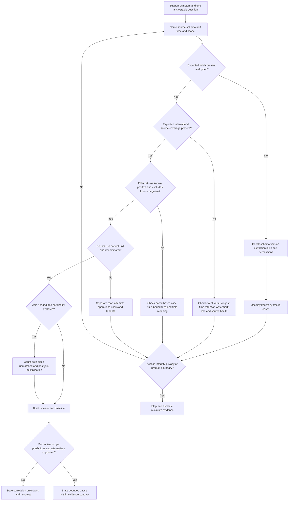

### Troubleshooting matrix

| Symptom | Likely query failure modes | Cheapest safe check | Possible observation | Next action |
|---|---|---|---|---|
| No results | Wrong field, value, source, time, timezone, role, retention, or delayed ingestion | Count all synthetic rows in a tiny known interval and inspect available fields | Known positive event absent | Fix coverage or schema understanding before interpreting absence |
| Too many results | OR grouping, wildcard, broad interval, duplicate source, or missing entity filter | Add parentheses and count distinct operation/request aliases | Rows far exceed distinct operations | Correct scope and record both units |
| Count doubles after join | One-to-many or many-to-many key | Count rows and distinct join keys before and after | Reference key is duplicated | Deduplicate under a documented rule or preserve child level |
| Healthy events disappear | Inner join or status filter removes unmatched/null records | Compare left join and unmatched count | Healthy rows lack optional audit record | Preserve unmatched and state source boundary |
| Timeline appears out of order | Ingest time used as event time, timezone mismatch, equal timestamps | Display raw event, ingest, normalized time, and stable tie-breaker | Audit event arrived after symptom but occurred before it | Separate occurrence from availability |
| Error spike appears after parser update | Extraction changed rather than behavior | Compare raw code distribution and extraction version | “Other” category moved into “denied” | Restate as instrumentation change until behavior evidence exists |
| Average latency rises | Outlier, traffic-mix change, small sample, or units mismatch | Return count, min, max, median/percentiles if supported, and unit | One extreme row drives mean | Use distribution and inspect source sample |
| Failure rate rises while failure count is flat | Denominator fell | Return numerator, denominator, missing status, and traffic coverage | Total attempts dropped sharply | Explain ratio mechanics and investigate traffic/source health |
| Distinct count seems low | Missing identifier, reused key, approximate function, or scope mismatch | Count null IDs and compare alternate typed unit | Many rows have null request alias | Do not treat distinct count as total attempts |
| Splunk-style query truncates groups | Product command limit, high cardinality, role, or visualization limit | Inspect documented command/job limits and raw grouped count | Only top categories appear | Narrow safely or use approved alternative aggregation |
| SQL query fails across tools | Dialect-specific date, string, regex, or alias behavior | Run only in approved test context and consult exact product docs | SQLite expression unsupported elsewhere | Rewrite for actual dialect and record version |
| Pattern follows a release | True regression, traffic change, schema change, or delayed data | Compare same scope, healthy control, extraction version, and source health | Both event shape and volume changed | Keep competing hypotheses until mechanism test |
| No audit match for request | Wrong key scope, delayed source, retention, permission, or legitimate no-event path | Verify key issuer/scope and left-join unmatched rows | Cloud alias exists only in browser source | State no matching readable record, then escalate source contract |
| “Recurring incidents” equal retries | Operation identity ignored | Partition attempts by parent operation | Five rows collapse to two operations | Report attempts and operations separately |
| Baseline says anomaly | Non-comparable day, tenant mix, release, or source coverage | Rebuild cohort and compare numerator/denominator | Baseline had different route mix | Choose defensible comparison or state no baseline |

## 14. Failure modes, prohibited actions, and escalation

### Common failure modes

| Failure mode | Why it misleads or creates risk | Safer practice |
|---|---|---|
| Beginning with `all time` | Expands cost, noise, and data exposure | Start with one half-open interval around the symptom |
| Selecting every field | Pulls unnecessary content and identifiers | Project an allowlist of fields needed for the question |
| Searching production to practice | Turns learning into unauthorized activity | Use only the local fictional corpus |
| Treating no result as no event | Access, retention, delay, source, schema, or filter can hide it | State query, source, interval, and coverage dependencies |
| Treating row count as incident count | Retries and multi-event lifecycles inflate rows | Count rows, attempts, operations, and affected scope separately |
| Dropping null and unknown values | Makes data quality problems disappear | Keep explicit missing, unmatched, and other categories |
| Using timestamp-only joins | Unrelated events can occur together | Use documented typed keys and scope, with time as support |
| Joining on message subject or free text | Non-unique and content-sensitive | Use approved synthetic typed aliases only |
| Inner-joining by default | Removes unmatched rows and hides gaps | Begin with a left-preserving view when primary coverage matters |
| Ignoring post-join counts | Many-to-many multiplication inflates metrics | Record pre/post rows, distinct keys, and unmatched counts |
| Averaging without distribution | Outliers and mixed populations distort the mean | Include count, units, percentiles where supported, and samples |
| Comparing unmatched cohorts | Tenant, route, volume, release, or seasonality differs | State cohort criteria and confounders |
| Calling a spike causal | Sequence and co-occurrence do not establish mechanism | Use predictions, alternatives, and independent verification |
| Copying SQL across products | Dialect functions and semantics differ | Name the engine/version and verify official documentation |
| Calling illustrative text validated SPL | No Splunk environment executed it | Label every example unexecuted and product-bounded |
| Using expensive search commands casually | Can consume shared resources and hit limits | Narrow early and follow platform-owner guidance |
| Exporting broad results | Multiplies privacy, security, and handling risk | Aggregate first; retain minimal fictional samples |
| Editing raw evidence to “clean it” | Breaks provenance and hides transformations | Preserve source and create a derived normalized field |
| Injecting ticket text into query strings | Can change logic or expose data | Use parameterized approved interfaces; fixed fiction here |
| Adding write statements to a lab | Can alter state or normalize unsafe habits | Keep every example SELECT-only and read-only |
| Uploading results to public tools | Can leak customer or security data | Keep the lab local and synthetic |
| Guessing Abnormal fields or indexes | Invents proprietary behavior | Verify approved product documentation during onboarding |

### Explicitly prohibited actions

This Part explicitly prohibits collecting, querying, copying, or exposing credentials, passwords, cookies, authorization headers, tokens, API keys, private keys, connection strings, session values, email or message content, subjects, attachments, customer files, personal data, tenant identifiers, private URLs, or unrelated user activity. It prohibits broad production searches, unrestricted index or database scans, full-table or all-time exports, cross-tenant searches, and content search for practice.

It prohibits disabling or bypassing query controls, row-level security, tenant boundaries, audit controls, data-loss prevention, export limits, rate limits, authentication, authorization, proxy policy, endpoint protection, or any other control. A query that requires bypassing a control is not a troubleshooting step; it is an escalation boundary.

It prohibits SQL injection attempts, exploit payloads, string concatenation of untrusted values, destructive SQL, state-changing SQL, schema changes, permission changes, stored-procedure execution, extension loading, production remediation, deletion, updates, insertion, audit clearing, retention changes, and any action that can alter evidence or service state. This guide intentionally provides no destructive command.

It prohibits uploading a database, log, workbook, search result, screenshot, or export to a public parser, paste site, repository, personal cloud, unapproved collaboration space, or general-purpose AI service. Use only fictional local text in a learner-owned folder. If a real secret or customer record appears, stop, do not duplicate it, and follow the approved privacy and security reporting process.

### Escalation triggers

Stop local query work and use the approved path when:

- The next query would require production access, a broader index, another tenant, privileged fields, customer content, mailbox content, security evidence, or a role you do not hold.
- A result contains or may contain a credential, token, cookie, key, connection string, private URL, personal identifier, message content, attachment, customer file, or proprietary sensitive field.
- The query would be expensive, all-time, high-cardinality, regex-heavy, join-heavy, or export-heavy and the platform owner has not approved its scope.
- Row counts change unexpectedly after extraction or join, raw and normalized times conflict, identifiers appear reused outside their declared scope, or evidence integrity is uncertain.
- The source may be incomplete because of retention, ingestion delay, sampling, suppression, permission, parser failure, index health, schema migration, or licensing.
- Evidence suggests compromise, data exposure, malicious activity, control bypass, audit tampering, cross-tenant access, or another security incident.
- The investigation requires an Abnormal-specific index, field, retention fact, internal tool, product behavior, customer access path, or proprietary detection mechanism not covered by approved documentation.
- A safe next test would require a change, replay, remediation, policy edit, role edit, data mutation, or destructive operation.

An escalation should include one precise question. Example: “For approved schema and product version X, is `cloud_alias` unique within tenant and request attempt, and should service-result source Y produce one or several lifecycle rows for this status during the stated UTC interval?” It should not ask an owner to “search everything.”

## 15. Full explicit quality contract for this Part

| Contract requirement | How this Part satisfies it | Review evidence |
|---|---|---|
| Explain from zero | Defines query, search, field, schema, Boolean logic, extraction, aggregation, join, window, baseline, SQL, SPL, and timeline | Sections 1-10 |
| Analogies and limits | Uses library, instrument, turnstile, receipt, classroom, claim ticket, race, and ruler analogies with limits | Deep-dive sections |
| Search and Boolean logic | Shows narrow filters, parentheses, half-open intervals, null cautions, and worked examples | Section 2 |
| Field extraction | Preserves raw values, extraction state, mapping version, unknowns, and schema checks | Section 3 |
| Aggregation | Separates rows, requests, operations, measures, dimensions, and denominators | Section 4 |
| Joins | Defines cardinality, pre/post checks, unmatched rows, and typed keys | Section 5 |
| Windows | Defines partition, order, frame, sequence, and version boundaries | Section 6 |
| Timelines and baselines | Separates event/ingest time and builds recurring-pattern comparisons | Sections 7-8 |
| SQL boundaries | Targets SQLite 3-style read-only examples and names portability/safety limits | Section 9 |
| Splunk boundaries | Uses unexecuted concept examples and distinguishes product/version contexts | Section 10 |
| Correlation versus cause | Provides language, alternatives, predictions, mechanism gate, and evidence ceiling | Section 11 |
| Worked query examples | Includes six workbook queries/checks and a recurring-pattern scenario | Section 12 |
| Troubleshooting | Includes a query-integrity decision tree and matrix | Section 13 |
| Failure and escalation | Lists misleading practices, prohibitions, and stop conditions | Section 14 |
| Safe lab | Uses only handwritten/local synthetic metadata and does not claim execution | Lab section |
| Candidate honesty | Separates enterprise support/analytics transfer from Splunk and Abnormal production claims | Candidate honesty note |
| Official anchors | Uses official SQLite, PostgreSQL, Microsoft, MySQL, Splunk, OWASP, IETF, and NIST sources with boundaries | Dated source section |
| Interview Q&A | Contains exactly eight numbered question headings with model answers | Interview section |
| Completion controls | Includes knowledge, artifact, privacy, source, spoken, and honesty checks | Completion Checklist |
| Navigation | Contains exactly one final relative Part link | Final line |

## Lab - QueryLab 096 Synthetic Query Workbook and Recurring-Pattern Timeline

This is a design-and-analysis lab using handwritten fictional support records. It does not connect to SQLite, Splunk Cloud Platform, Splunk Enterprise, Abnormal AI, Microsoft 365, a customer tenant, a database server, a log platform, or the internet. The query text is educational and unexecuted. The instructions do **not** claim that the lab was performed.

### Prerequisites

- A learner-owned local folder and a UTF-8 text editor. A spreadsheet application is optional.
- No database server, Splunk trial, cloud tenant, production index, customer account, administrator role, API key, credential, browser extension, package installation, public parser, or external upload is required or permitted.
- Use only fictional identities such as `user-A096`, fictional tenants such as `tenant-A096`, and typed aliases prefixed with `SYN096-`, `event-096-`, `op-096-`, `req-096-`, `cloud-096-`, `audit-096-`, or `pattern-096-`.
- Use fixed harmless route families such as `policy-save`, not real URLs, domains, paths, query strings, or customer object names.
- Exclude credentials, passwords, cookies, authorization, tokens, keys, connection strings, session values, email addresses, message content, subjects, bodies, attachments, files, private URLs, tenant IDs, device IDs, customer IDs, and proprietary fields.
- Every synthetic record must include `synthetic=1` or an equivalent explicit label.
- Every workbook entry must include `run_state=not_run` until you actually perform an approved local step.
- SQL pages may contain SELECT-only SQLite 3-style examples. They must contain no state-changing, destructive, administrative, extension, attachment, or permission statement.
- Splunk pages must be labeled `unexecuted Splunk-style concept`; they must not claim compatibility with a product or version.
- **Artifact honesty label:** `Local synthetic query lab; no customer data, credentials, content, production telemetry, database connection, Splunk deployment, Abnormal system, external upload, control bypass, injection test, state change, destructive SQL, or executed query.`

### Lab design

Create, only if actually performing the lab, a local fictional corpus and workbook with the following minimum design. “Create” means type harmless invented rows or generate them through an approved local method; it never means collect real logs.

| Artifact | Minimum content | Teaching purpose | Explicit exclusion |
|---|---:|---|---|
| `scope-card-096.md` | One question and one UTC interval | Prevent broad search | No production source or customer identifier |
| `schema-register-096.md` | At least 16 fields with type and meaning | Make field contracts explicit | No guessed Abnormal field |
| `support-events-096.csv` | At least 240 fictional rows | Practice filtering and patterns | No content or realistic secret-shaped value |
| `known-cases-096.md` | 12 positive/negative cases | Validate query behavior | No production examples |
| `sql-workbook-096.md` | At least 15 SELECT-only query entries | Practice SQL concepts | No executed-output claim |
| `splunk-concepts-096.md` | At least 10 unexecuted pipeline examples | Practice concept transfer | No production index or validated-SPL claim |
| `field-quality-096.csv` | Null, invalid, unknown, and extraction counts | Expose data quality | No silent row deletion |
| `key-register-096.md` | Issuer, type, scope, lifetime, cardinality | Make joins defensible | No timestamp-only key |
| `baseline-sheet-096.md` | Current/baseline cohort and denominator | Prevent vague anomaly claims | No unsupported significance claim |
| `recurring-pattern-timeline-096.md` | At least 20 selected timeline rows | Preserve sequence and recurrence | No claim that every row is an incident |
| `query-manifest-096.md` | Scope, text, run state, checks, result, interpretation | Make analysis reproducible | No broad export |
| `privacy-manifest-096.md` | Allowed and prohibited field classes | Enforce minimum collection | No credentials or content |

### Lab steps

1. Create an isolated folder named `QueryLab-096-Synthetic` only if performing the lab. Place the artifact honesty label at the top of every Markdown file and in the metadata header of every structured file.
2. Write `scope-card-096.md` before creating data. Define one fictional symptom, one answerable query question, one tenant alias, one route family, one half-open UTC interval, allowed source families, allowed fields, excluded fields, owner, purpose, and retention decision.
3. Set `run_state=not_run` in the scope card. Change it only after an actual local review, and record exactly what was or was not executed.
4. Write `schema-register-096.md`. For each field, record plain meaning, type, allowed values, null behavior, producer alias, event unit, whether it is source or derived, and schema version.
5. Define `event_time_utc` and `ingest_time_utc` separately. Add `raw_time`, `normalized_utc`, and `normalization_note` if practicing conversion. Never overwrite the fictional raw value.
6. Define `operation_alias`, `request_alias`, `cloud_alias`, and `event_alias` with issuer, scope, lifetime, and expected cardinality. Do not call them universal correlation IDs.
7. Create at least 240 fictional CSV rows across browser-network, service-result, cloud-audit, source-health, and coverage families. Every row must state `synthetic=1`.
8. Include at least 80 healthy request events, 30 denied events, 20 timeout-shaped events, 20 server-error-shaped events, 20 audit events, 20 source-health or watermark events, and enough neutral records to prevent every row from matching the main hypothesis.
9. Create at least 18 parent operations with two or more retries. Give every attempt a distinct request alias and preserve one parent operation alias.
10. Create five duplicated source rows with a declared duplicate marker. The learner must detect them and state whether deduplication is justified under the fictional contract.
11. Create ten rows with a missing optional cloud alias, five with a missing required status class, and five with an unknown future status. Keep them visible in quality results.
12. Add mixed-case status values to a raw field and a separate normalized field. Preserve the raw value and record normalization version.
13. Add five malformed synthetic text lines for extraction tests. They must contain no secrets, content, URLs, addresses, or realistic identifiers.
14. Create `known-cases-096.md` with at least six records that every correct scope query should include and six it should exclude. Explain why each is positive or negative.
15. Write a first query contract in natural language before writing syntax. Include expected columns, expected known cases, and a condition that would falsify the leading hypothesis.
16. Add a SQLite 3-style SELECT that returns all fields only from a tiny three-row fictional fixture for schema inspection. Do not use broad `SELECT *` against the 240-row corpus as a normal investigation pattern.
17. Add a projection query naming only event alias, event time, source family, operation alias, request alias, route family, status class, and message code.
18. Add a bounded filter with tenant, route, source, and half-open UTC interval. Parenthesize mixed AND/OR logic.
19. Test the filter against all known positive and negative cases. Record pass, fail, or not run. Do not claim success from visual plausibility.
20. Add explicit checks for null, empty, unknown, invalid, and absent values under the fictional schema. Keep each category separate where the format permits.
21. Add a CASE mapping from fictional message codes to broad categories. Preserve source code and mapping version.
22. Add an extraction example over synthetic text and record matched, unmatched, and multiply matched counts. Do not parse real log text.
23. Add an aggregation that returns event rows, distinct request attempts, distinct parent operations, and distinct tenant aliases. Label every metric with its unit.
24. Add conditional counts for success, denial, timeout, server error, missing, and unknown. Reconcile the category total with input rows.
25. Add a five-minute time series. List expected buckets and do not silently turn absent buckets into zero without coverage evidence.
26. Add a rate worksheet containing numerator, denominator, excluded count, missing count, and the exact formula. Avoid division if the denominator is zero.
27. Add a pre-join profile for each input: rows, distinct keys, null keys, duplicate keys, earliest/latest time, and scope fields.
28. Add a left join from request attempts to service results using tenant plus cloud alias under the fictional contract. Preserve unmatched requests.
29. Record post-join row count, distinct request count, unmatched count, and maximum right-side matches per request. Stop interpretation if cardinality is unexpected.
30. Intentionally attempt a timestamp-only join on a copied scratch query, label it `rejected`, and explain the false pairs it creates. Do not include the rejected output in the evidence timeline.
31. Add a reference lookup from route family to fictional owner category. Give the reference a version and duplicate-key test.
32. Add `ROW_NUMBER` over attempts partitioned by parent operation and ordered by event time plus event alias. State why the tie-breaker is required.
33. Add `LAG` to expose the prior attempt's time or status. Keep the first-row null as expected rather than replacing it silently.
34. Add a running denial count per parent operation or route family. Explicitly specify the intended window frame if the chosen dialect requires it.
35. Build a recurring-pattern timeline with at least 20 selected rows: healthy baseline, first symptom, retries, independent recurrences, control cohort, change observation, recovery, and watermark.
36. Link every timeline row to one or more event aliases. Do not paste all source rows into the timeline.
37. Create at least three baseline candidates: prior equal interval, same tenant unaffected route, and fictional peer tenant. Record why each is or is not comparable.
38. Calculate current and baseline numerator, denominator, missing count, and descriptive difference. Do not claim statistical significance unless a later Part provides an approved method and adequate data.
39. Write three competing hypotheses for the recurring pattern: retry inflation, broad outage, and scoped mapping behavior. Add at least one client-shape or instrumentation alternative.
40. For each hypothesis, state a different prediction and the smallest synthetic query that could contradict it.
41. Create ten Splunk-style concept entries labeled unexecuted. Cover base search, `fields`, `table`, `eval`, `where`, `stats`, `eventstats`, `streamstats`, `timechart`, and `rex` or lookup concepts.
42. For every Splunk-style entry, write the equivalent analytical intent in plain English, not a claim of exact SQL equivalence.
43. Add a product-boundary note to every Splunk-style page: actual Splunk Cloud Platform or Enterprise version, role, fields, source types, time semantics, limits, and command behavior require verification.
44. Do not include real index names, source types, customer terms, private fields, or copied production SPL.
45. Create `query-manifest-096.md`. For each query, record ID, question, source, schema version, dialect/product label, exact scope, exact text, run state, input checks, result or expected result, interpretation, unknowns, and next action.
46. Create `privacy-manifest-096.md`. List allowed synthetic metadata and structurally excluded credentials, content, identities, customer data, URLs, payloads, attachments, and proprietary fields.
47. Search the local synthetic text for risky field labels such as password, authorization, cookie, token, key, connection string, subject, body, attachment, and customer. Values must be absent or exactly `[STRUCTURALLY_EXCLUDED]`; never invent secret-shaped values.
48. Review every SQL block. It must be SELECT-only, including read-only common table expressions. Remove any state-changing, destructive, administrative, attachment, extension, permission, or execution statement.
49. Review every query for broad scope. No all-time interval, all-tenant search, unrestricted wildcard, broad export, or content search is allowed.
50. Review every join for issuer, type, tenant scope, cardinality, unmatched rows, and pre/post counts. Timestamp is supporting context, not the sole key.
51. Review every aggregate for a named unit, denominator, null policy, duplicate policy, and source-coverage statement.
52. Review the recurring-pattern claim. Retries must not become separate incidents, and chronology must not become causality without mechanism and alternative tests.
53. Write a customer-safe summary with symptom, interval, direct query observations, bounded pattern, current state, next safe action, owner, and update time. Do not expose query internals or fictional identifiers unnecessarily.
54. Write an Engineering-ready summary with query contract, schema, source coverage, exact query IDs, key register, cardinality checks, recurring timeline, competing hypotheses, results, privacy manifest, and one precise question.
55. Practice a five-minute explanation of search, filter, Boolean logic, extraction, aggregation, join, window, timeline, baseline, SQL, and Splunk-style concepts without reading.
56. Practice a 90-second answer that explains why correlation is not causation and uses the synthetic scenario as a method demonstration, not production experience.
57. Score the artifact with the rubric. Mark operational checks `not run` unless they were actually performed locally.
58. Review every sentence for unsupported Abnormal or Splunk claims. Replace claims with enterprise support transfer, local synthetic demonstration, learned concept, or onboarding verification.
59. Retain only the minimum synthetic learning artifact if it remains useful. Remove obsolete drafts only through the learner's normal approved file interface after verifying the isolated path.
60. Do not use recursive deletion, database deletion, log clearing, index changes, retention changes, permission changes, control bypass, unsafe upload, or any destructive cleanup action.

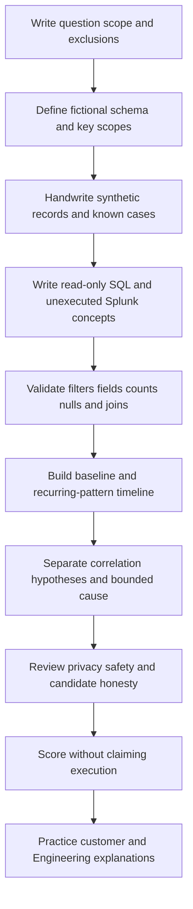

### Expected evidence

If the lab is actually performed, expected evidence includes:

- One scope card with one fictional symptom, one answerable question, a half-open UTC interval, approved synthetic fields, explicit exclusions, owner, purpose, retention, and run state.
- A schema register defining at least 16 fields, types, producers, event units, null behavior, source-versus-derived status, allowed values, and version.
- At least 240 harmless fictional metadata records, all explicitly marked synthetic and containing no credential, content, customer, private URL, real tenant, or proprietary field.
- A known-case sheet with at least six positive and six negative cases used to validate filter behavior.
- A field-quality sheet showing input rows, missing, null, empty, invalid, unknown, extraction success, extraction failure, and schema-version distribution.
- At least 15 SQLite 3-style SELECT-only workbook entries with exact scope, expected behavior, checks, result or not-run status, interpretation, and next action.
- At least 10 unexecuted Splunk-style concept entries, each paired with plain-English intent and explicit product/version boundaries.
- Aggregates that separately count event rows, request attempts, parent operations, and fictional affected tenants.
- A rate worksheet with numerator, denominator, excluded records, missing records, and formula.
- A key register that documents issuer, type, scope, lifetime, cardinality, propagation, and legitimate relationships.
- Pre-join and post-join counts, null keys, duplicate keys, unmatched rows, and a rejected timestamp-only join demonstration.
- Window examples that number retry attempts and expose prior state using deterministic ordering.
- At least three baseline candidates with cohort criteria, numerator, denominator, missing count, comparability notes, and confounders.
- A recurring-pattern timeline with at least 20 selected rows linked to source event aliases and separated into baseline, symptom, retry, recurrence, control, change, recovery, and coverage phases.
- A competing-hypothesis table with predictions, falsifying checks, result or not-run state, confidence update, alternatives, and evidence ceiling.
- A query manifest that lets another learner reproduce the reasoning without receiving a broad export.
- A privacy manifest proving structural exclusion of credentials, content, customer data, URLs, payloads, attachments, and proprietary fields.
- Customer-safe and Engineering-ready summaries that distinguish observation, correlation, inference, hypothesis, cause within the fictional contract, unknown, and next action.
- No database connection, Splunk deployment, cloud tenant, production telemetry, customer content, external request, public upload, SQL injection test, control bypass, state change, destructive SQL, or Abnormal internal evidence.

### Cleanup and privacy

- Keep the lab in the isolated learner-owned folder. Do not upload it to a public query formatter, SQL playground, SPL parser, paste service, repository, personal cloud, public AI service, or unapproved collaboration tool.
- Do not place a production database, database copy, log export, Splunk result, customer screenshot, query history, browser capture, cloud audit file, message trace, incident export, or credential beside the synthetic artifacts.
- Confirm every file carries the honesty label and every structured row is explicitly synthetic.
- Confirm every identity, tenant, route, operation, request, cloud, event, change, and pattern value is a fictional typed alias.
- Confirm credentials, passwords, cookies, authorization values, tokens, keys, connection strings, session values, personal data, message content, subjects, bodies, attachments, customer files, private URLs, and proprietary fields are absent, not merely hidden.
- Confirm SQL examples are SELECT-only and use no state-changing, destructive, administrative, attachment, extension, permission, or control operation.
- Confirm Splunk examples are labeled unexecuted concepts and contain no real index, source type, customer value, production field, or copied proprietary search.
- Confirm no query is broad, all-time, all-tenant, content-seeking, unrestricted, control-bypassing, or export-heavy.
- Confirm raw synthetic values remain unchanged and every normalization or category mapping is stored as a derived field with a version.
- Confirm every join has pre/post counts, scoped typed keys, expected cardinality, and unmatched-row treatment.
- Confirm every trend has numerator, denominator, missing count, source coverage, comparable cohort, and an explicit statement that correlation alone is not cause.
- Remove obsolete drafts only after verifying the isolated path and retention decision, and only through the learner's normal approved file interface. This guide provides no destructive command.
- If a real credential, customer value, or production record is accidentally introduced, stop, do not duplicate or upload it, follow the approved privacy/security process, and remove it only under that process.
- Use this wording only after actual performance: `QueryLab 096 was performed locally with fictional metadata only; no customer data, credential, content, production telemetry, database connection, Splunk deployment, Abnormal system, external upload, control bypass, injection test, state change, destructive SQL, or unsafe export was used.`
- If not performed, record: `QueryLab 096 is a reviewed synthetic lab design and has not been executed.`

### Validation rubric

| Dimension | Fail | Developing | Pass |
|---|---|---|---|
| Scope | Uses broad or production search | Names a symptom and time | Defines one question, source, schema, half-open interval, entity, fields, exclusions, owner, and run state |
| Schema | Guesses fields or types | Lists selected fields | Defines meaning, type, producer, unit, null behavior, version, and source/derived status |
| Filtering | Relies on vague text or precedence | Uses several conditions | Tests parenthesized Boolean logic against known positives, negatives, nulls, and boundaries |
| Extraction | Hides failures or overwrites raw | Extracts one field | Preserves raw value, extraction version, matched/unmatched/multiple counts, and malformed cases |
| Aggregation | Calls rows incidents | Counts grouped rows | Names unit, dimensions, duplicate policy, null policy, numerator, denominator, and source coverage |
| Joins | Uses timestamp/name alone | Uses one identifier | Documents issuer/scope/cardinality, pre/post counts, unmatched rows, duplicates, and legitimate relationship |
| Windows | Assumes display order | Numbers rows | Defines partition, event versus ingest order, tie-breaker, frame, and first-row behavior |
| Timeline | Sorts one timestamp | Normalizes to UTC | Preserves raw/event/ingest time, retries, source aliases, coverage, recurrence phases, and controls |
| Baseline | Calls any difference anomalous | Uses prior interval | Defines comparable cohort, current/reference windows, numerator, denominator, missing count, and confounders |
| SQL | Mixes dialects or changes state | Writes a filter query | Uses labeled SQLite 3-style SELECT-only examples with portability and safety boundaries |
| Splunk concepts | Claims production SPL | Writes pipeline-like text | Labels unexecuted concepts and records product/version, field, role, time, and command-limit boundaries |
| Query validation | Trusts plausible output | Checks row count | Uses known cases, field quality, range checks, distinct keys, cardinality, and source watermark |
| Correlation and cause | Calls sequence cause | States uncertainty | Separates observation, correlation, hypothesis, predictions, alternatives, mechanism, and bounded cause |
| Privacy | Includes credentials/content or broad export | Redacts after collection | Structurally excludes sensitive classes and uses only minimal local fictional metadata |
| Security | Tests injection, bypasses control, or uses destructive SQL | States caution | Explicitly prohibits injection testing, control bypass, state changes, destructive SQL, and unsafe uploads |
| Artifact | Keeps loose query notes | Has several queries | Delivers scope, schema, known cases, query manifest, key register, baseline, timeline, privacy, and summaries |
| Candidate honesty | Implies Abnormal/Splunk production work | Calls data synthetic | Separates experience transfer, local practice, learned concepts, unexecuted examples, and product unknowns |
| Spoken readiness | Recites syntax | Explains one query | Explains the complete method and answers all eight questions with evidence limits |

## Official Source Anchors - August 24, 2026

These official or primary sources anchor generic query-language, SQLite, SQL-dialect, Splunk, security, timestamp, and log-management concepts. They do not establish Abnormal AI architecture, schemas, fields, indexes, source types, permissions, retention, search commands, query limits, or support procedures. Revalidate each page against the actual engine, product, deployed version, license, role, data model, and approved runbook after the stated access date.

| Official or primary source | Concept anchored | Explicit dialect, version, or product boundary |
|---|---|---|
| [SQLite SELECT](https://www.sqlite.org/lang_select.html) | SQLite SELECT processing, clauses, compound queries, and syntax | Applies to current SQLite documentation; embedded library versions, compile options, typing, and collations vary |
| [SQLite Window Functions](https://www.sqlite.org/windowfunctions.html) | Window-function syntax, partitions, ordering, frames, and built-ins | Window support depends on SQLite version; this does not define PostgreSQL, MySQL, SQL Server, or Splunk behavior |
| [SQLite Date and Time Functions](https://www.sqlite.org/lang_datefunc.html) | SQLite timestamp functions and supported formats | SQLite date/time semantics are not portable SQL; this Part mainly uses fixed-format fictional UTC text |
| [PostgreSQL Current Documentation - Queries](https://www.postgresql.org/docs/current/queries.html) | PostgreSQL query concepts, table expressions, select lists, combining queries, sorting, and limits | `current` follows the maintained PostgreSQL documentation line and is not SQLite or another SQL dialect; pin deployed major version in real work |
| [Microsoft Learn - SELECT in Transact-SQL](https://learn.microsoft.com/en-us/sql/t-sql/queries/select-transact-sql) | Transact-SQL SELECT clauses for SQL Server-family products | Applies to documented SQL Server, Azure SQL, Synapse, and related contexts only as marked on the page; behavior differs from SQLite |
| [MySQL 8.4 Reference Manual - SELECT Statement](https://dev.mysql.com/doc/refman/8.4/en/select.html) | MySQL 8.4 SELECT syntax and clauses | Version-specific MySQL documentation; functions, aliases, optimizer, and window behavior differ from SQLite and other engines |
| [Splunk Search Manual - About the search language](https://help.splunk.com/en/splunk-enterprise/search/search-manual/9.4/search-overview/about-the-search-language) | SPL pipeline and search-language overview | This URL is for Splunk Enterprise 9.4 documentation; Splunk Cloud Platform and other releases can differ, and deployment owners define supported use |
| [Splunk SPL Search Reference - stats](https://help.splunk.com/en/splunk-enterprise/search/spl-search-reference/9.4/search-commands/stats) | `stats` transforming-command concepts and syntax | Splunk Enterprise 9.4 page; command limits, functions, configuration, and Cloud behavior require current verification |
| [Splunk SPL Search Reference - eventstats](https://help.splunk.com/en/splunk-enterprise/search/spl-search-reference/9.4/search-commands/eventstats) | Adding aggregate statistics to events | Splunk Enterprise 9.4 page; memory limits and field behavior are configuration- and version-dependent |
| [Splunk SPL Search Reference - streamstats](https://help.splunk.com/en/splunk-enterprise/search/spl-search-reference/9.4/search-commands/streamstats) | Running and sequence-oriented statistics | Splunk Enterprise 9.4 page; ordering, windows, reset behavior, and limits must match the deployed version |
| [Splunk SPL Search Reference - timechart](https://help.splunk.com/en/splunk-enterprise/search/spl-search-reference/9.4/search-commands/timechart) | Time-bucketed aggregation concepts | Splunk Enterprise 9.4 page; timezone, span, split limits, and empty-bucket behavior require current product validation |
| [Splunk SPL Search Reference - rex](https://help.splunk.com/en/splunk-enterprise/search/spl-search-reference/9.4/search-commands/rex) | Search-time regular-expression extraction | Splunk Enterprise 9.4 page; regex behavior, field limits, sed mode, permissions, and performance require approved review |
| [OWASP SQL Injection Prevention Cheat Sheet](https://cheatsheetseries.owasp.org/cheatsheets/SQL_Injection_Prevention_Cheat_Sheet.html) | Defensive parameterized-query and allowlist guidance | Defensive application guidance, not authorization to test injection; use the actual language, driver, and approved security process |
| [IETF RFC 3339 - Date and Time on the Internet](https://www.rfc-editor.org/rfc/rfc3339.html) | Internet timestamp profile and offset notation | A timestamp string does not establish clock accuracy, event semantics, ingestion order, or database parsing behavior |
| [NIST SP 800-92 - Guide to Computer Security Log Management](https://csrc.nist.gov/pubs/sp/800/92/final) | Foundational log collection, analysis, handling, retention, and operational principles | Published in 2006; combine with current legal, privacy, cloud, security, and organizational requirements |

### Source and version discipline

- Label every SQL example with its intended dialect. The examples in this Part target SQLite 3-style SELECT syntax, but no local SQLite runtime or version was inspected and no query was executed.
- Pin the actual SQLite library version before relying on window functions, date functions, JSON functions, strict typing, collation, or query-planner behavior. Applications can embed versions different from a separately installed command-line tool.
- Do not transfer SQLite string or date expressions to PostgreSQL, MySQL, SQL Server, a cloud warehouse, or a vendor query console without rewriting and testing against that exact engine and version.
- Treat PostgreSQL `current` documentation as a moving maintained line. In production work, record the deployed major/minor context and use matching documentation.
- Treat Microsoft Transact-SQL documentation according to the product applicability labels on the page. SQL Server, Azure SQL Database, Azure Synapse Analytics, and other Microsoft data products are not behaviorally identical.
- Treat the MySQL source above as MySQL 8.4 documentation. MariaDB and earlier or later MySQL versions can differ.
- Treat the Splunk links above as Splunk Enterprise 9.4 documentation anchors. Verify current Splunk Cloud Platform or Enterprise release, search interface, role, limits, source types, field extractions, time settings, and workload policy.
- Do not conflate classic SPL examples with SPL2 contexts. Use the language and interface approved for the actual product.
- Verify whether distinct count is exact or estimated in the chosen tool and whether limits or approximation matter to the support question.
- Verify null, missing, empty, multivalue, case, collation, timezone, interval-boundary, and sorting semantics with tiny known cases before interpreting results.
- Use OWASP guidance defensively. It does not authorize vulnerability probing. Parameterization and safe identifier handling depend on the application language and driver.
- Use RFC 3339 for timestamp representation concepts, while separately documenting producer clock, event semantics, precision, offset, normalization, late arrival, and watermark.
- Use NIST SP 800-92 as foundational log-management guidance and apply current organization-specific retention, evidence, privacy, legal, security, and cloud requirements.
- Revalidate all Abnormal-specific facts using current approved customer-visible documentation, internal runbooks, access policy, and product owners during onboarding.

## Likely Interview Questions

### Q1. How do you turn a vague support symptom into a useful query?

**Model answer:** I begin with one answerable question and define the unit of analysis, source, schema, tenant or entity scope, half-open UTC interval, allowed fields, and expected result shape. I identify a known positive and negative case, then write the narrowest read-only query that can separate the leading hypotheses. Before interpretation, I check earliest/latest time, source coverage, nulls, distinct keys, and whether the query returned rows, attempts, or parent operations. I record the exact query and evidence ceiling so another engineer can reproduce the reasoning.

### Q2. What mistakes do you watch for with Boolean filters and missing fields?

**Model answer:** AND narrows, OR broadens, and NOT can behave unexpectedly when a field is null or absent. I parenthesize mixed AND/OR expressions, use explicit half-open time bounds, test casing and type, and include synthetic null, empty, absent, malformed, and unknown cases. I validate that known positives are included and known negatives excluded. A no-result outcome is bounded by field extraction, permission, retention, ingestion delay, and source selection; it is not automatically proof that no event occurred.

### Q3. How do you prevent aggregates from overstating customer impact?

**Model answer:** I attach a noun to every count and an explicit denominator to every rate. I separate event rows, duplicate rows, request attempts, parent operations, affected users, and affected tenants. I retain missing and unknown categories, verify source coverage, and compare distinct identifiers under documented scope. For latency I include count and distribution rather than relying only on an average. I return to selected source rows to confirm that the aggregate still represents the underlying events.

### Q4. How do you join support records safely?

**Model answer:** I use documented typed keys with issuer and scope, not timestamp, display name, subject, or error title alone. Before joining, I count rows, distinct keys, null keys, and duplicate keys on both sides and declare expected cardinality. I usually preserve the primary side with a left join so unmatched records remain visible. After joining, I repeat row and distinct-key counts and inspect maximum matches per key. A null match means no matching readable record under that query and coverage, not proof that the event never existed.

### Q5. When would you use a window function in support analysis?

**Model answer:** I use a window when I need context without collapsing individual records, such as numbering retry attempts within a parent operation, comparing a row with the prior status, calculating a running count, or ranking recurring route families. I define the partition, choose event or ingest time intentionally, add a stable tie-breaker, and verify the frame because defaults differ by dialect. The resulting sequence reflects the chosen evidence ordering; it does not by itself prove causal order.

### Q6. How do SQL and Splunk-style searches differ in your approach?

**Model answer:** The reasoning transfers: define scope, filter, derive fields, aggregate, correlate, validate, and preserve limits. SQL commonly expresses operations over relations with SELECT, WHERE, GROUP BY, joins, and windows. Splunk-style SPL commonly starts with an event search and passes results through pipeline commands such as fields, eval, stats, eventstats, streamstats, or timechart. I do not assume word-for-word equivalence. I name the exact SQL dialect or Splunk product/version and verify time, null, field, command, role, and limit behavior. My examples here are SQLite 3-style and unexecuted Splunk concepts, not production claims.

### Q7. How do you distinguish a recurring correlation from a root cause?

**Model answer:** A recurring pattern means similar events repeat under declared matching rules; a baseline shows that a measure differs from a comparable reference. Neither establishes cause. I preserve retries and source coverage, identify a same-scope trigger, state a plausible mechanism, derive predictions, and test alternatives such as traffic change, parser change, broad outage, or missing data. Cause becomes supportable only when trigger, mechanism, scope, timing, predicted outcomes, and independent verification align. Otherwise I report correlation, confidence, unknowns, and the next discriminating test.

### Q8. How would you present your experience with SQL, Splunk concepts, and Abnormal AI honestly?

**Model answer:** I would connect my prior enterprise support and analytics background to the core habits: scoping customer impact, querying bounded evidence, comparing healthy and failing behavior, protecting data, and producing reproducible escalations. I can explain and write read-only SQL concepts and I have mapped Splunk-style search concepts to a fictional corpus. I would not claim Splunk production operation, Abnormal internal access, proprietary schemas, or executed lab results unless I had actually done them. During onboarding I would verify the approved product, fields, permissions, retention, query limits, and runbooks.

## Memory Hooks

- **A query is a measurement instrument: source, scope, calibration, and unit all matter.**
- **Search finds; filter keeps; projection chooses what appears.**
- **AND narrows, OR broadens, parentheses protect intent.**
- **Use half-open time: include start, exclude end.**
- **No result means no matching readable row under this query, not no event.**
- **Extraction transcribes; it must not invent.**
- **Preserve raw fields and version every derived mapping.**
- **Count what: rows, attempts, operations, users, tenants, or incidents?**
- **A rate always needs a numerator, denominator, and missing count.**
- **A join key needs issuer, type, scope, lifetime, and cardinality.**
- **Timestamp supports a join; it rarely deserves to be the join.**
- **Count before and after every join.**
- **Left joins preserve missing evidence; null does not prove nonexistence.**
- **GROUP BY collapses rows; windows add context while retaining rows.**
- **Partition chooses the race; order chooses the lane sequence.**
- **Event time is occurrence; ingest time is availability.**
- **Retries are attempts, not automatically separate incidents.**
- **A baseline is a ruler, not a verdict.**
- **An anomaly is difference under a method, not automatically a defect or attack.**
- **SQLite, PostgreSQL, MySQL, and Transact-SQL are related dialects, not synonyms.**
- **SPL is a pipeline language; conceptual transfer is not syntax equivalence.**
- **Unexecuted Splunk-style text is learning evidence, not production experience.**
- **Read-only can still be expensive, broad, or privacy-unsafe.**
- **Never concatenate untrusted text into a query.**
- **Never practice with production, broad exports, content, or control bypass.**
- **Correlation finds companionship; causation needs mechanism and tests.**
- **Synthetic practice proves method only after it is actually performed.**
- **Abnormal-specific facts require approved Abnormal sources.**

## Completion Checklist

- [ ] I can define query, search, record, field, value, schema, predicate, projection, result set, provenance, and cardinality.
- [ ] I can turn a vague symptom into one answerable query contract with source, schema, unit, time, entity, fields, exclusions, and expected result.
- [ ] I can explain AND, OR, NOT, parentheses, operator precedence, and half-open intervals.
- [ ] I can test a filter with known positive, negative, boundary, null, empty, absent, malformed, and unknown cases.
- [ ] I can explain why no query result is not proof that no event occurred.
- [ ] I can define parsing, regex, typing, normalization, mapping, extraction version, and unmatched records.
- [ ] I preserve fictional raw fields and store normalized or categorized values separately.
- [ ] I can explain aggregation, grouping, dimension, measure, distinct count, numerator, denominator, and rate.
- [ ] I can separate event rows, duplicates, requests, retry attempts, parent operations, users, tenants, and incidents.
- [ ] I can explain why averages need counts and distributions.
- [ ] I can define inner join, left join, anti-join, lookup, join key, and one-to-one, one-to-many, and many-to-many cardinality.
- [ ] I count rows, distinct keys, null keys, duplicates, unmatched rows, and post-join multiplication before interpreting a join.
- [ ] I reject timestamp, display name, subject, or free text as a sole relationship key.
- [ ] I can define window function, partition, order, frame, row number, lag, lead, running value, and rank.
- [ ] I use a deterministic tie-breaker and distinguish event-time sequence from ingest-time sequence.
- [ ] I can build a selected recurring-pattern timeline that preserves source aliases, retries, controls, recovery, and coverage.
- [ ] I can define baseline, cohort, comparison window, anomaly, seasonality, and confounder.
- [ ] Every comparison I state includes a comparable cohort, numerator, denominator, missing count, and coverage note.
- [ ] I can explain why a baseline difference is not automatically a defect, incident, attack, or cause.
- [ ] I can explain SELECT, FROM, WHERE, GROUP BY, HAVING, ORDER BY, WITH, JOIN, CASE, and SQL window concepts.
- [ ] I label this Part's SQL as SQLite 3-style and do not assume portability to PostgreSQL, MySQL, SQL Server, or cloud warehouses.
- [ ] I can explain index, source type, search-time extraction, pipeline, fields, table, eval, where, stats, eventstats, streamstats, timechart, rex, and lookup concepts at a high level.
- [ ] I label all Splunk examples unexecuted and verify Splunk Cloud Platform versus Enterprise, deployed version, role, fields, time, and limits before real use.
- [ ] I can translate analytical intent between SQL and Splunk-style concepts without claiming exact syntax equivalence.
- [ ] I can distinguish observation, correlation, inference, hypothesis, prediction, falsifying test, confounder, bounded cause, unknown, and evidence ceiling.
- [ ] I never promote chronology or a spike to cause without mechanism, scope, alternatives, and verification.
- [ ] I can explain all six worked workbook checks and the recurring-pattern timeline in my own words.
- [ ] I can use the troubleshooting decision tree to diagnose empty, excessive, duplicated, truncated, misordered, or misleading query results.
- [ ] I will never place credentials, cookies, authorization, tokens, keys, connection strings, content, customer data, private URLs, or proprietary fields in this lab.
- [ ] I will never run broad production searches, all-time scans, unrestricted exports, cross-tenant searches, content queries, or high-cost searches without approval.
- [ ] I will never bypass row, tenant, role, security, audit, rate, or export controls.
- [ ] I will never test SQL injection, concatenate untrusted input, add destructive or state-changing SQL, change schema or permissions, or alter evidence.
- [ ] I will never upload a database, log, query result, workbook, screenshot, or export to an unapproved public tool or service.
- [ ] I can state the difference between a designed artifact, a locally completed synthetic artifact, and production experience.
- [ ] I can connect your prior support and analytics background to query reasoning without inventing Splunk or Abnormal production experience.
- [ ] I can answer Q1-Q8 aloud with a specific method, safety boundary, and evidence limit.
- [ ] I have revalidated official documentation for the actual SQL dialect, Splunk product/version, role, schema, and date before any real use.
- [ ] I can state the final honesty label accurately: not run unless the local synthetic lab was actually performed.

[Next: Part 097 - Hypothesis Testing and Evidence Correlation](Part-097-hypothesis-testing-and-evidence-correlation.md)