# Part 097 - Hypothesis Testing and Evidence Correlation

> **Purpose:** Build a beginner-first, evidence-safe method for turning a support symptom into competing falsifiable hypotheses, choosing tests that separate those explanations, predicting expected observations before testing, updating confidence without false precision, and selecting the next-best action. The lesson uses only fictional local evidence and generic support concepts. It does not describe Abnormal AI's internal architecture, telemetry, detection logic, case tools, or production procedures.
>
> **Artifact honesty label:** **Local synthetic competing-hypothesis-ledger design only.** Every tenant, user, message, request, event, time, configuration, detection, investigation, test, result, and conclusion in this Part is invented. No lab step or test was run. No Abnormal AI, Microsoft 365, Splunk, customer tenant, production service, mailbox, security platform, or external system was accessed. You may call the artifact completed only after you actually build and reviews it locally.
>
> **Currency and source access date:** August 24, 2026.

## Section goal

By the end of this Part, you should be able to explain why troubleshooting is a sequence of controlled decisions rather than a hunt for facts that support the first idea. You should be able to write several plausible explanations, make each explanation falsifiable, state what you expect to observe if it is true or false, choose a safe discriminating test, update confidence after the result, and record the next-best action. You should also be able to stop at the evidence ceiling instead of converting sequence or correlation into an unsupported root-cause claim.

The primary artifact is a **competing-hypothesis ledger**. A ledger is a structured investigation record, similar to an accountant's book in which every movement has a visible reason. Here, each row records a hypothesis, mechanism, scope, prediction, test, expected observation, actual or declared synthetic observation, confidence update, alternatives, safety boundary, and next action. The analogy has a limit: evidence is not money, and confidence cannot be balanced to an exact total unless a valid probabilistic model exists. The ledger makes reasoning reviewable; it does not make uncertainty disappear.

This lesson deliberately extends the query and timeline discipline from Part 096 without assuming that a well-ordered timeline identifies a cause. It explicitly distinguishes **correlation**, **sequence**, **contribution**, **trigger**, and **root cause**. It also distinguishes a **mitigation**, which reduces impact, from a **corrective action**, which changes a supported causal condition, and from a **preventive action**, which reduces recurrence or impact in the future.

Safety is part of reasoning quality. This Part prohibits broad collection, testing on production without explicit authorization, security-control bypass, sensitive uploads, and destructive tests. It also prohibits sending test phishing, modifying customer policy, changing roles or permissions, replaying customer events, weakening authentication, disabling protection, clearing logs, or treating a real incident as a practice environment. A test that is technically informative but unauthorized, privacy-invasive, destructive, or likely to worsen impact is not an acceptable test.

## JD Mapping

| Supplied role signal | Capability developed here | Technical-support application | Proof artifact |
|---|---|---|---|
| Complex investigations | Converts ambiguous symptoms into competing, testable explanations | Prevents premature escalation or an unsupported single-cause story | Competing-hypothesis ledger |
| Evidence correlation | Connects records only through declared identities, time semantics, scope, and provenance | Separates a coherent cross-source chain from coincidental proximity | Evidence-correlation map |
| Threat and behavioral verdict cases | Tests configuration, visibility, expected-behavior, scope, and product-defect alternatives | Produces a bounded investigation without speculating about proprietary detection internals | Synthetic verdict-case ledger |
| Configuration and API support | Predicts different observations for identity, authorization, request, service, and telemetry explanations | Chooses the smallest check that changes the decision | Discriminating-test matrix |
| Timely customer updates | States observation, current confidence, unknowns, next action, owner, and timing | Communicates progress without calling a hypothesis a finding | Confidence-aware update template |
| Engineering collaboration | Records expected versus actual behavior, tests, controls, alternatives, and one precise ask | Gives Engineering a reproducible reasoning chain instead of a log dump | Escalation-ready ledger excerpt |
| RCA insight | Separates trigger, contributor, mechanism, root cause, and control gap | Avoids simplistic chronology and prepares for later RCA work | Causal-language worksheet |
| Safe evidence handling | Uses minimum necessary synthetic metadata and passive checks first | Protects customer data and keeps testing within authorization | Test-safety gate |
| enterprise support transfer | Reuses your critical situation, investigation, customer communication, Engineering escalation, and fix-validation discipline | Provides credible evidence of method and judgment | Candidate transfer narrative |
| Honest Abnormal boundary | Labels generic reasoning, synthetic practice, and unknown product specifics | Avoids invented telemetry, field names, detection behavior, access, or production experience | Product-boundary statement |

## Candidate honesty note

Your prior enterprise support background is a genuine strength here. Complex SharePoint Online, OneDrive, Sync Client, and Copilot cases required scoping impact, separating client and service boundaries, correlating evidence, testing changes carefully, keeping customers informed, and escalating to Engineering or Product with a coherent record. Critical-situation experience also supports calm prioritization: restore or reduce impact first when necessary, preserve evidence, assign owners, and continue causal investigation without letting the customer wait for certainty.

The transferable capability is the **method**, not tool or product equivalence. You should use a real Microsoft example only if you can accurately describe what you observed, what alternatives you considered, what tests were authorized, what you personally did, what another team did, and how the outcome was verified. You should not retrofit a past case into the terminology in this lesson if the original evidence did not support it.

This Part does not establish production experience with Abnormal AI, email-security operations, proprietary behavioral detections, customer threat cases, Abnormal case tooling, or Abnormal telemetry. It does not reveal or assume how Abnormal computes verdicts, exposes evidence, represents confidence, stores logs, assigns permissions, performs remediation, or routes escalation. During onboarding, current approved documentation, role-based access, customer consent, runbooks, and product owners must define what evidence exists and what actions an L1 engineer may perform.

| Evidence tier | Honest wording you can adapt | Boundary to preserve |
|---|---|---|
| Production transfer | “In enterprise support, I used competing explanations, scoped evidence, controlled validation, and Engineering escalation on complex customer cases.” | Use a real case and do not add tests, tools, or results that did not occur |
| Local synthetic practice | “I built a local synthetic hypothesis ledger and practiced updating it from declared fictional observations.” | Say whether the artifact was actually completed; this guide itself was not run |
| Learned architecture | “I understand how hypotheses, predictions, controls, and evidence correlation support SaaS and security investigations.” | Conceptual knowledge is not product operations experience |
| Abnormal-specific knowledge | “I would verify the approved Abnormal evidence surfaces and runbook before applying the generic method.” | Do not guess product fields, scores, internals, permissions, or procedures |
| Proposed customer-case action | “My next step would be the least risky authorized check that best separates the leading explanations.” | A proposal is not an action already performed |
| Escalation judgment | “I would escalate when the next discriminating test crosses access, product, privacy, or security boundaries.” | Do not bypass the boundary to obtain a faster answer |
| Causal statement | “The evidence supports this bounded mechanism within the tested scope.” | Do not claim universal root cause from one sequence or one successful workaround |
| No direct experience | “I have not operated Abnormal AI in production; my closest evidence is enterprise support plus this local synthetic practice.” | State the gap directly and make the ramp plan concrete |

## 1. The investigation loop from zero

A **symptom** is an observed difference between expected and actual behavior. “Three synthetic requests returned `403`” is a symptom. “The role mapping is broken” is not a symptom; it is already an explanation. An **observation** is a recorded fact under a declared source and scope. A **hypothesis** is a proposed explanation that makes predictions. A **test** is a planned comparison or measurement used to examine those predictions. An **observation after a test** is the result the investigator actually records. A **next action** is the safest, highest-value step justified by the current evidence.

A **falsifiable hypothesis** could be shown wrong by at least one possible observation. “The failure is caused by something in the cloud” is not useful because almost any result can be made to fit it. “Within fictional tenant `tenant-A097`, principals lacking synthetic role `writer` receive `403` for route `policy-save`, while otherwise comparable principals with that role succeed” is falsifiable. A permitted comparison could contradict it.

Think of a hypothesis as a key cut for a particular lock. It must have enough shape to fit or fail. A vague piece of metal can be waved near every lock but teaches nothing. The analogy stops because several mechanisms can jointly produce one failure, and a test can be noisy or incomplete. A hypothesis can survive a test without being proven.

| Term | Plain meaning | Why it matters | Memory hook |
|---|---|---|---|
| Symptom | The observed gap between expected and actual behavior | Keeps the report separate from an explanation | Symptom says **what**, not **why** |
| Observation | A fact read from a named source under a named scope | Lets reviewers check provenance and limits | Observation has a receipt |
| Hypothesis | A possible explanation with predictions | Turns uncertainty into testable work | Explanation plus forecast |
| Falsifiable | Capable of being contradicted by a possible result | Prevents explanations that absorb every outcome | What would make me wrong? |
| Mechanism | The step-by-step way a condition could produce the symptom | Connects evidence to causal reasoning | The gears between condition and effect |
| Prediction | What should be observed if the hypothesis is true | Must be written before seeing the test result | Forecast before result |
| Test | A bounded measurement or comparison | Produces information, not merely activity | Ask reality one question |
| Control | A comparison expected not to show the tested effect | Detects broad or unrelated changes | The unaffected comparison |
| Confounder | Another factor that can explain the same result | Prevents false causal promotion | The hidden third factor |
| Confidence | Current justified belief, stated with reasons and limits | Guides priority without pretending certainty | Belief with a ledger entry |
| Next-best action | The safe step with the best expected decision value | Keeps investigation moving efficiently | Learn most, risk least |

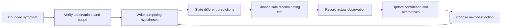

The loop can end in resolution, mitigation, escalation, a documented product limitation, an unable-to-determine conclusion, or a new evidence request. “Unable to determine from available authorized evidence” can be the correct outcome. It is stronger than a confident guess because it tells the next owner exactly where the evidence ceiling lies.

### Plain-English deep-dive: Troubleshooting is controlled learning

Imagine a hallway with several doors and only enough time to open one first. Randomly opening doors is activity. Choosing the door whose contents would tell you which hallway branch to take is information-seeking. Troubleshooting works the same way: the next test should change what you believe or what you do.

The analogy stops when tests have cost and risk. Opening a door is usually harmless; enabling verbose logging, changing a customer role, replaying an event, or sending a message may affect service, privacy, or security. Passive evidence review should come before active change when it can answer the question. Production testing requires explicit authorization, a change plan, monitoring, rollback, and product-specific procedure. In this Part, no production testing is permitted.

## 2. Building falsifiable and competing hypotheses

**Competing hypotheses** are two or more explanations that could account for the same symptom. They are not a brainstorming contest. Each must be plausible enough to test, narrow enough to predict something, and different enough that at least one observation can separate it from another. Keeping competition visible reduces **confirmation bias**, the tendency to seek and value evidence that supports an existing belief.

A strong hypothesis names six elements: condition, mechanism, scope, timing, predicted positive observation, and predicted negative observation. It also states assumptions. For example: “If the fictional principal lacks role `writer` at authorization evaluation time, then `policy-save` should return `403` for that principal and route, while the same request shape under a principal with `writer` should pass authorization. This assumes the request reaches the same service version and the synthetic audit source correctly represents role state.”

| Hypothesis quality | Weak wording | Stronger wording | Why stronger |
|---|---|---|---|
| Specific condition | “Permissions issue” | “Synthetic role `writer` is absent at evaluation time” | Names the property to inspect |
| Mechanism | “The API is broken” | “Authorization rejects the route before business processing” | Predicts where evidence should stop |
| Scope | “Everyone is affected” | “Three principals in tenant A on route X are affected” | Makes comparison possible |
| Timing | “It started recently” | “First verified failure follows mapping version v2 within the declared UTC interval” | Gives a bounded sequence to test |
| Positive prediction | “Logs will show it” | “A same-scope service result should show role-required before any save result” | Names source and event |
| Negative prediction | “Maybe not” | “A principal with the role failing identically would weaken the hypothesis” | Defines disconfirming evidence |
| Assumption | Hidden | “Role audit reflects evaluation-time state” | Exposes a dependency |
| Evidence ceiling | Missing | “Cannot establish why mapping v2 was activated” | Prevents overclaiming |

The initial set should cover meaningfully different layers rather than many synonyms. For an API denial, reasonable families might include authentication, authorization, request contract, tenant or object scope, intermediary behavior, service defect, client display, and evidence-coverage failure. “Role missing,” “permission absent,” and “user not allowed” may all be one authorization hypothesis rather than three competitors.

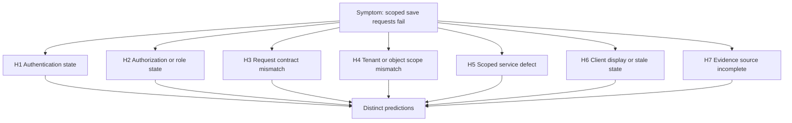

Ranking is allowed, but ranking must be transparent. A **prior** is the belief held before the current test. In support work, priors may come from base rates, system design, exact error semantics, recent authorized changes, or known limitations. A recent similar case can inform a prior, but it must not dictate the conclusion. A common failure should usually rank above an exotic failure when both fit equally well, but a high-quality contradictory observation should change that ordering.

### Plain-English deep-dive: Falsifiable does not mean easily disproved

A courtroom analogy is useful with care. A claim should face evidence that could count against it, and the reviewer should hear alternatives. But a technical investigation is not a criminal trial: there is no universal burden of proof, no jury, and often no single responsible actor. The purpose is to make a reliable operational decision while preserving uncertainty.

“I could not disprove it” is not “I proved it.” A test may be too weak, the source may be incomplete, or two hypotheses may predict the same observation. Record a hypothesis as **survived**, **weakened**, **strongly weakened**, **supported**, or **not testable with current access**. Reserve **ruled out** for cases where the test was valid, the prediction was necessary, source coverage was adequate, and the contradictory result is clear within the declared scope.

## 3. Discriminating tests and expected observations

A **discriminating test** produces different expected observations under competing hypotheses. If every hypothesis predicts the same result, the test may verify the symptom but will not choose among explanations. A **necessary prediction** must occur if a hypothesis is true. A **supporting prediction** is likely but not guaranteed. A **sufficient observation** would establish the conclusion under the declared model, but sufficient observations are rare in distributed support cases because telemetry, concurrency, and hidden state create alternatives.

The best test is not automatically the most technically sophisticated. It is the test that produces the largest useful change in the decision while respecting authorization, safety, privacy, time, reversibility, and customer impact. This lesson calls that property **decision value**. No numeric formula is required. A five-field read-only comparison can have greater decision value than a broad packet capture.

| Test property | Good question | Unsafe or weak version | Better practice |
|---|---|---|---|
| Discrimination | Will outcomes differ across leading hypotheses? | “Collect more logs” | Name the exact field or comparison and how each hypothesis predicts it |
| Safety | Can this harm service, data, or controls? | Change production policy to see whether it helps | Use existing passive evidence or an isolated synthetic fixture |
| Authorization | Is the action explicitly permitted? | Assume support access implies test permission | Verify role, consent, runbook, and owner |
| Scope | Is the smallest entity and interval sufficient? | Search all tenants for all time | Use one synthetic tenant, route, and half-open UTC interval |
| Privacy | Is every collected field necessary? | Export complete request or message content | Use aliases, status classes, and source pointers |
| Reversibility | Can state be restored and verified? | Make an undocumented change | Prefer no-change tests; otherwise require approved rollback |
| Independence | Does the test use a distinct source or control? | Ask the same dashboard twice | Compare source producer, healthy cohort, or known fixture |
| Repeatability | Can another reviewer follow it? | “I clicked around until it worked” | Record fixture, steps, version, expected, actual, and run state |
| Observability | Will the relevant mechanism be visible? | Infer authorization from a generic UI error | Use an approved service result or audit event if available |
| Cost and time | Is the learning worth the delay? | Wait hours for a low-value broad export | Run the cheapest high-discrimination check first |

Expected observations must be written **before** looking at the result. This protects against **HARKing**, or hypothesizing after results are known. In support language, HARKing occurs when an investigator sees a field and rewrites the hypothesis so the field appears predicted. Updating a hypothesis is valid; pretending the update was the original prediction is not.

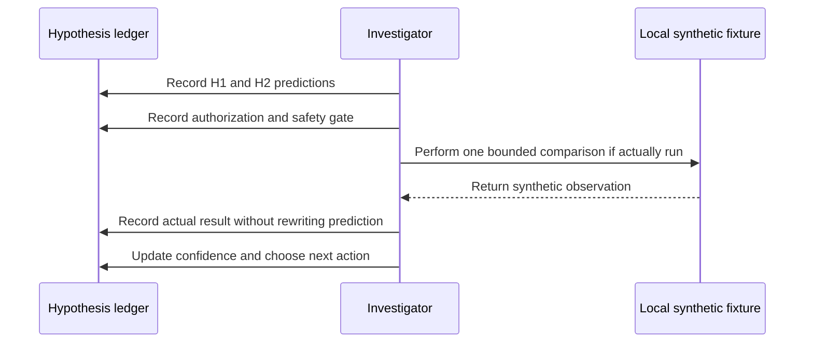

Use a prediction matrix before the test. In the following fictional example, a save request returns `403`.

| Candidate hypothesis | Expected observation if true | Observation that would weaken it | Candidate test | Run state in this guide |
|---|---|---|---|---|
| H1 token invalid | Authentication failure or challenge before authorization | Same token succeeds on the same protected service operation | Inspect fictional auth result metadata | Not run |
| H2 role absent | Authenticated identity but role-required authorization result | Same principal and role snapshot succeeds while comparable role-bearing principal fails | Compare synthetic role snapshot and route result | Not run |
| H3 request schema invalid | Validation result tied to a field or schema version | Byte-equivalent valid fixture still returns role-required | Compare declared request-shape hash and validation stage | Not run |
| H4 broad service outage | Healthy controls across tenants and routes also fail | Peer tenant and unaffected route succeed in the same interval | Compare tiny synthetic control cohort | Not run |
| H5 client display defect | Server records success while UI shows failure | Server and UI both show same denial | Correlate client and service aliases | Not run |
| H6 incomplete evidence | Expected source heartbeat or known event is absent | Coverage manifest confirms required source and interval | Check synthetic source manifest | Not run |

### Plain-English deep-dive: A useful test divides the map

Imagine searching for a destination with two possible roads. Asking “Is the sky cloudy?” may be easy but does not distinguish the roads. Asking “Does the next sign say North or East?” changes the route. A discriminating test is that sign.

The analogy stops because operational evidence can be ambiguous. One sign may be stale, rotated, or visible from both roads. Before calling a test discriminating, verify that the predicted observation really differs, that the source is trustworthy for that claim, and that the test does not itself alter the condition being measured. Enabling detailed logging can change latency; retrying can warm a cache; changing a role can invalidate the original state.

## 4. Evidence correlation: identity, time, provenance, and meaning

**Evidence correlation** is the disciplined act of relating observations from different records or sources. Four foundations are required: identity, time, provenance, and semantics. **Identity** answers which request, message, user, object, tenant, attempt, or operation a record represents. **Time** answers what the timestamp means and how accurately events can be ordered. **Provenance** answers who produced the record and what transformations occurred. **Semantics** answers what the field or event actually means.

Correlation is like assembling travel receipts. A train ticket, hotel receipt, and calendar entry may describe one trip when names, dates, booking identifiers, and locations align. Similar dates alone do not prove they belong together. The limit is that technical systems may duplicate, delay, sample, transform, or omit records, and identifiers can have different scope or lifetime.

| Correlation foundation | Questions to ask | Stronger evidence | Common trap |
|---|---|---|---|
| Identity | Is the identifier unique, typed, scoped, and stable? | Documented request-to-service alias under one tenant | Joining on timestamp, title, subject, or display name |
| Time | Is this event, ingest, observation, or display time? | Raw timestamp, normalized UTC, precision, clock note | Treating portal order as causal order |
| Provenance | Which producer emitted this, and was it transformed? | Source family, event alias, schema and extraction version | Treating a derived category as raw fact |
| Semantics | What does success, denial, detection, or completion mean here? | Current approved field definition | Assuming similarly named fields are equivalent |
| Coverage | Was the source complete for the interval and scope? | Heartbeat, watermark, retention and permission evidence | Treating absence as proof of nonoccurrence |
| Cardinality | Can one operation create many attempts or records? | Parent-child relationship and before/after counts | Calling retries separate incidents |
| Independence | Does another producer support the observation? | Client, service, and audit sources with distinct generation | Counting copies of one source as corroboration |
| Integrity | Could evidence have changed, truncated, or been overwritten? | Immutable source pointer or approved integrity control | Editing raw evidence to make it consistent |

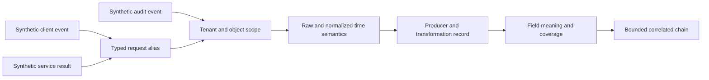

**Triangulation** means using meaningfully independent perspectives. A browser event and a server event generated from the same request can corroborate the path, but they are not independent evidence of every claim. Two dashboards backed by the same index are one underlying source. Three copied screenshots do not create three votes. Independence must be stated, not assumed.

Absence requires special care. “No matching audit event was returned” means only that no readable record matched the declared query, source, interval, identifier, permission, retention, and extraction. To use absence as evidence, establish an **expectation of presence**: if the event had occurred, the source contract says an event should exist; known events appear; the interval is covered; delay has passed; retention includes it; permissions allow it; and parsing is healthy.

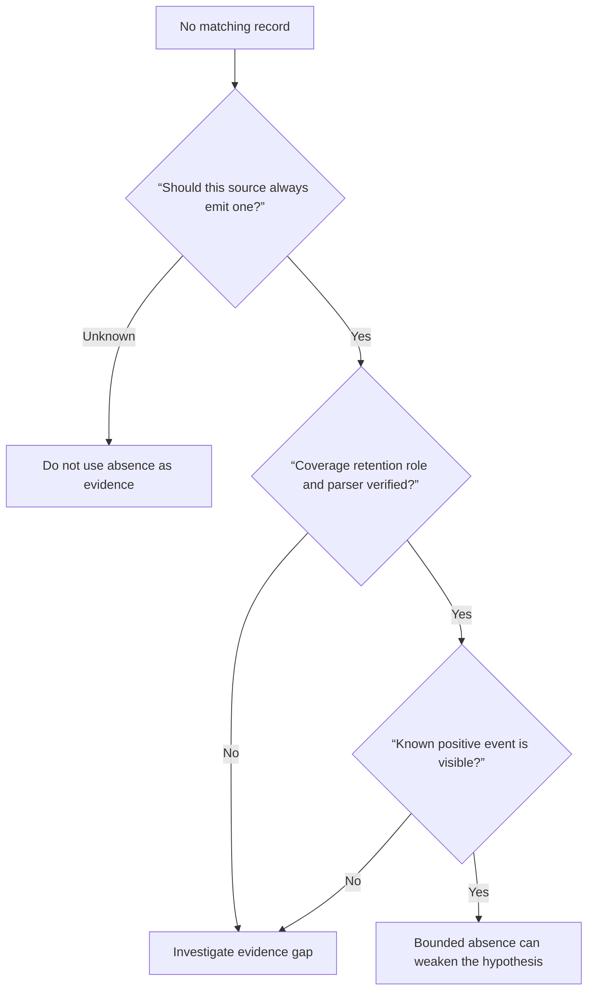

## 5. Confidence updates without false precision

A **confidence update** is a documented change in how strongly the evidence supports a hypothesis. It is not a mood and not a vote count. A supporting observation should increase confidence only to the degree that the observation was predicted, discriminating, reliable, and difficult for alternatives to explain. A contradictory observation should reduce confidence to the degree that it was necessary under the hypothesis and the test was valid.

This lesson uses qualitative levels: very low, low, medium, high, and very high. These labels do not represent fixed percentages. They are useful only when accompanied by a rationale. If an organization has an approved probabilistic model, use that model. Do not invent numbers such as “87 percent sure” because three logs looked consistent.

| Update label | Meaning in this lesson | Required explanation | Forbidden shortcut |
|---|---|---|---|
| Very low | Possible but poorly supported or strongly contradicted | Why it remains on the ledger | “Anything is possible” |
| Low | Plausible but weaker than alternatives | Which prediction lacks support | Treating low as ruled out |
| Medium | Several observations fit, but alternatives remain material | Supporting and disconfirming evidence | Counting matching rows as probability |
| High | Multiple discriminating observations and mechanism align | Controls, source quality, alternatives tested | Calling high certainty |
| Very high | Reproducible mechanism and independent verification within bounded scope | Exact evidence ceiling and residual alternatives | Calling it universally proven |
| Not assessable | Required source, access, semantics, or coverage is unavailable | What would make assessment possible | Converting missing access into low confidence |

Start each update with four sentences:

1. **Before:** “H2 was medium because the exact error class fit authorization, but no role-state evidence was available.”
2. **Result:** “The synthetic comparison shows authenticated requests under mapping v2 denied only for principals without `writer`, while matched role-bearing controls succeed.”
3. **After:** “H2 moves to high within this fixture because the result was predicted and separates H2 from token, schema, and broad-outage alternatives.”
4. **Limit:** “It does not establish why mapping v2 was created or describe any Abnormal mechanism.”

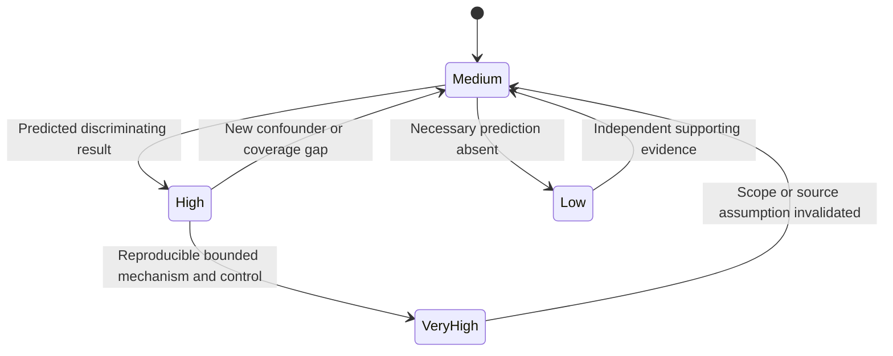

A test can update several hypotheses at once. If a peer tenant and unaffected route succeed while one tenant-route pair fails, confidence in a broad outage decreases while confidence in a scoped configuration or data condition increases. That does not decide between every scoped explanation. The ledger should preserve unresolved competition rather than forcing one winner too early.

### Plain-English deep-dive: Confidence is a dimmer, not a light switch

A light switch suggests only false or true. A dimmer better represents investigation belief: evidence can move confidence up or down. The dimmer analogy still has a limit because the levels are not measurements unless a calibrated model exists. “High” from one investigator can differ from “high” from another.

The remedy is not fake arithmetic. Record the reason: prediction quality, source reliability, independence, scope, alternatives, and evidence ceiling. A reviewer should be able to disagree with the level while agreeing on the underlying observations. That makes the dispute productive: the team can ask which assumption or test needs attention.

## 6. Correlation, sequence, contribution, trigger, and root cause

These terms must not be used as synonyms.

**Correlation** means two observations vary together or are related under a declared matching method. Correlation can suggest a hypothesis but does not establish production. **Sequence** means one observed event occurred before another under stated clock and timestamp limits. Sequence establishes order, not necessity. **Contribution** means a condition increased the likelihood, severity, duration, or impact of an outcome. A contributor may not start the event. A **trigger** is the event or condition that initiates a failure path at a particular time. A trigger may expose an older weakness. A **root cause** is a supported underlying condition whose correction materially prevents recurrence of the defined problem within the stated system boundary. Complex systems may have several causal factors, and some teams prefer “causal factors” over one root.

A line of falling dominoes is a useful first analogy. The finger push can be the trigger, close spacing can contribute, and an unstable layout can be an underlying design condition. Seeing one domino fall before another establishes sequence. The analogy stops because software systems branch, retry, recover, run concurrently, and involve controls and human decisions. There may be no single line and no single first domino.

| Term | What it establishes | What it does not establish | Synthetic example |
|---|---|---|---|
| Correlation | Variables or events appear together under a method | Direction, mechanism, or causation | Denials and mapping v2 appear in the same scope and interval |
| Sequence | A precedes B within timestamp limits | That A produced B | Mapping event time precedes the first denial |
| Contribution | A condition worsened likelihood, severity, duration, or impact | That it was sufficient or initiating | Retry policy amplified request volume during denial |
| Trigger | An event initiated the observed failure path | Why the system was vulnerable | Mapping v2 activation began denials in the fixture |
| Proximate cause | Immediate mechanism closest to the symptom | Deeper organizational or design condition | Authorization rejected a missing required role |
| Root cause | Underlying supported condition whose correction prevents recurrence in scope | One universal cause for all related failures | Invalid mapping generation rule allowed required role removal |
| Control gap | Missing or ineffective prevention/detection/recovery control | That the gap alone produced the incident | No validation blocked an invalid mapping before activation |
| Mitigation | Action reduced current impact | That causal conditions were removed | Temporarily use approved healthy mapping in a lab narrative |
| Corrective action | Action changes a supported causal condition | That future unrelated failures are impossible | Fix mapping validation logic |
| Preventive action | Action reduces recurrence or future impact | Proof that the original cause was correct | Add predeployment invariant test and alert |

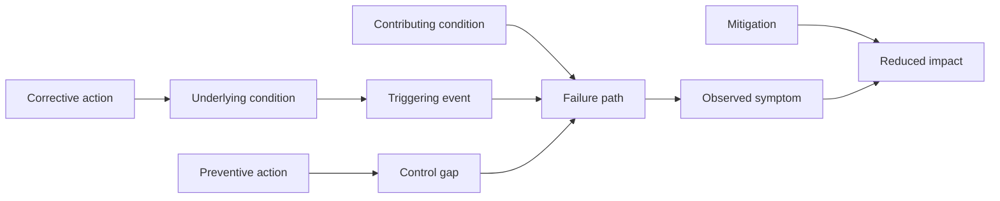

Use a **causal claim ladder**. Move upward only when the required evidence exists.

| Ladder level | Safe statement | Evidence needed before moving higher |
|---:|---|---|
| 1 | “The query returned these observations.” | Source, scope, semantics, and coverage validated |
| 2 | “The observations are correlated under this key and interval.” | Typed identity, time, provenance, and cardinality established |
| 3 | “Event A precedes event B within stated clock limits.” | Event-time semantics, precision, and skew considered |
| 4 | “The pattern is consistent with mechanism M.” | Mechanism predicts more than the observed sequence |
| 5 | “Evidence supports condition C as a contributor.” | Comparison shows C changes likelihood, severity, duration, or impact |
| 6 | “Event T acted as the trigger in this bounded case.” | T initiates the predicted path; alternatives and timing tested |
| 7 | “Condition R is a causal factor within scope S.” | Reproduction or strong counterfactual evidence, controls, and independent verification |
| 8 | “R is the root cause of the defined recurrence.” | Boundary, recurrence mechanism, correction, regression checks, and residual factors documented |

### Plain-English deep-dive: The counterfactual question

A **counterfactual** asks what would likely have happened if one condition had been different while relevant others stayed comparable. “If mapping v2 had retained the required role, would the same request have succeeded?” is a counterfactual question. A matched local fixture can approximate it by changing only the fictional mapping and keeping request, principal class, service version, and route constant.

The limit is that perfect “all else equal” comparisons rarely exist in production. Time moves, caches warm, traffic changes, deployments continue, and hidden state differs. That is why an approved nonproduction reproduction, natural control cohort, or carefully documented before/after comparison strengthens but does not automatically prove causality. Never create a harmful production counterfactual merely to gain certainty.

## 7. The competing-hypothesis ledger artifact

The ledger is the center of this Part. It should be updated after every meaningful observation, test, scope change, or decision. It is not a private scratchpad that disappears at escalation. A reviewer should be able to see what was believed before a test, what result was expected, what happened, and why the next action changed.

### Ledger schema

| Field | Required content | Why it exists | Example |
|---|---|---|---|
| Case alias | Fictional, noncustomer identifier | Connects files without exposing identity | `CASE-097-A` |
| Symptom statement | Expected versus actual, scope, first/last verified time | Prevents explanation from replacing symptom | “3 of 4 policy-save operations denied” |
| Hypothesis ID | Stable short identifier | Keeps updates traceable | `H097-A2` |
| Hypothesis | Specific condition and mechanism | Makes the explanation testable | “Mapping v2 omits writer role” |
| Scope | Tenant, route, principal class, version, interval | Defines where claim applies | `tenant-A097`, `policy-save` |
| Assumptions | Source, semantics, coverage, architecture dependencies | Exposes hidden premises | “Audit reflects evaluation-time role state” |
| Prior rationale | Why it initially ranks where it does | Prevents hindsight rewriting | Exact role-required result raises prior |
| Prediction if true | Expected positive observation | Defines support in advance | Missing role and denial co-occur |
| Prediction if false | Expected contradiction or alternate pattern | Defines falsification in advance | Role present with same denial mechanism |
| Test ID | Stable test reference | Links plan and result | `T097-A2` |
| Test method | Passive query, comparison, fixture review, or approved action | Makes safety and repeatability visible | Local synthetic matched comparison |
| Safety gate | Authorization, privacy, side effect, rollback, run state | Prevents unsafe testing | Local only; no stateful external action |
| Expected observation | Result under each leading hypothesis | Shows discrimination | H2 differs from H1/H3/H4 |
| Actual observation | Exact result or `not run` | Separates plan from fact | `not run` in this guide |
| Evidence references | Event aliases, source, raw/derived label | Preserves provenance | `E097-010`, `E097-011` |
| Confidence before/after | Qualitative level plus rationale | Records learning | Medium to high within fixture |
| Alternatives remaining | Explanations not addressed by test | Prevents false closure | Audit semantic error remains |
| Next-best action | One action, owner, reason, stop condition | Converts evidence into progress | Validate source contract before causal claim |
| Claim ceiling | Strongest safe conclusion | Controls communication | Supports authorization mechanism in fiction only |

### Blank ledger template

| Hypothesis ID | Condition and mechanism | Prior and rationale | Predictions | Discriminating test | Expected observations by hypothesis | Actual observation | Confidence update | Alternatives and ceiling | Next-best action |
|---|---|---|---|---|---|---|---|---|---|
| H097-__ |  |  | If true: / If false: | T097-__ | H1: / H2: / H3: | Not run | Before: / After: / Why: |  |  |

### Example ledger excerpt

| ID | Hypothesis | Distinguishing prediction | Synthetic declared observation | Update | Next action |
|---|---|---|---|---|---|
| H097-A1 | Token is invalid before authorization | Authentication result should fail for affected attempts | Fixture declares authentication success | Medium to low | Keep only if auth semantics are later disputed |
| H097-A2 | Mapping v2 omits required role | Same-scope v2 principals without role deny; role-bearing controls succeed | Fixture declares that exact split | Medium to high | Validate mapping event provenance and matched controls |
| H097-A3 | Request shape violates contract | Validation should reject regardless of role state | Fixture declares identical shape hash succeeds with role | Medium to low | Inspect whether shape hash omits a meaningful field |
| H097-A4 | Broad service outage | Peer scope should fail in same interval | Peer tenant and route controls succeed | Low to very low | Remove from active queue but retain evidence note |
| H097-A5 | Evidence source is incomplete | Known source heartbeat or fixture event should be absent | Coverage manifest declares source complete through interval | Medium to low within fiction | Verify manifest rules before using absence |

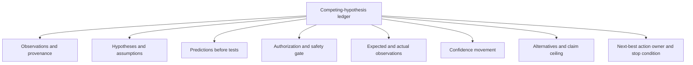

The ledger should not become a massive case diary. Keep direct evidence references separate from reasoning summaries. Preserve raw synthetic records unchanged, and point to them by alias. When a hypothesis changes materially, create a new version or row rather than rewriting history. A corrected typo is different from changing “token invalid” to “token lacked scope” after seeing an authorization event.

## 8. Choosing the next-best action

The **next-best action** is the action that most improves the current decision while minimizing harm, delay, cost, and unnecessary data. It may be a test, evidence request, mitigation, customer update, escalation, or deliberate stop. The best action depends on impact and uncertainty. During an active high-impact incident, restoring service safely can outrank root-cause precision. During a low-impact intermittent case, preserving the next occurrence may outrank a speculative change.

Use this order of preference when it fits the case:

1. Verify the symptom, scope, severity, and current state.
2. Preserve already available minimum evidence.
3. Use passive, read-only, already authorized observations.
4. Compare healthy and failing examples under matched scope.
5. Use a local or approved nonproduction synthetic reproduction.
6. Request one narrowly defined customer or owner artifact through approved channels.
7. Escalate when the discriminating evidence or action belongs to another owner.
8. Consider an active production test only under explicit authorization, approved procedure, risk review, monitoring, and rollback. This Part does not authorize or design such a test.

| Decision factor | Question | Favors earlier action | Favors escalation or stop |
|---|---|---|---|
| Customer impact | Is service or security harm ongoing? | Safe mitigation and communication | Unapproved diagnostic experimentation |
| Discrimination | Will the result separate leading hypotheses? | Matched control or exact stage result | More copies of nondiscriminating evidence |
| Safety | Could it change state or worsen impact? | Passive review or local fixture | Production mutation, replay, load, or control change |
| Authorization | Is action and scope explicitly allowed? | Approved read-only source | Cross-tenant, privileged, mailbox, or proprietary source |
| Privacy | Can the question be answered with less data? | Aliases, counts, selected metadata | Content, secrets, attachments, broad exports |
| Reversibility | Can state be restored and verified? | No-state-change check | Irreversible or destructive test |
| Timeliness | Does delay increase risk or breach cadence? | High-value short check or mitigation | Long uncertain collection while customer waits |
| Ownership | Does another team control source or change? | Precise handoff with explicit ask | Attempting to bypass owner boundary |
| Evidence ceiling | Can available evidence support the intended claim? | Bounded conclusion | Unsupported root cause or closure |
| Repeatability | Can another reviewer reproduce reasoning? | Ledger-linked fixture | Ad hoc clicks and undocumented changes |

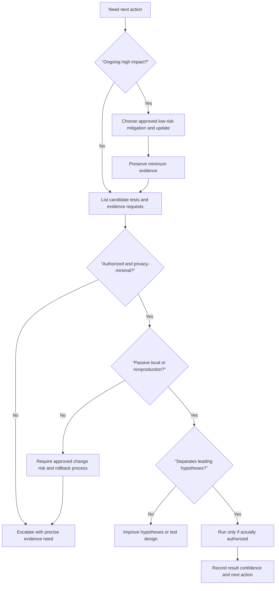

## 9. Worked investigation 1: synthetic API denial

### Scenario

In fictional case `CASE-097-A`, three independent `policy-save` operations for `tenant-A097` return `403` between `10:07Z` and `10:23Z`. A `policy-read` operation succeeds. The same save fixture succeeds for peer tenant `tenant-B097`. The visible error text says `SYN097_ROLE_REQUIRED`. Every identifier and result is fictional metadata. No request body, token, personal identity, customer data, or real endpoint exists.

The symptom is not “a permissions bug.” The symptom is: “Under the declared fixture, three of three independent save operations in one tenant fail with a role-required result, while a read operation and peer-tenant save succeed.”

### Competing hypotheses

| ID | Hypothesis | Mechanism | Initial confidence and reason |
|---|---|---|---|
| H097-A1 | Authentication material is invalid | Request never establishes a valid principal | Low-medium because `403` can follow authentication, but exact fictional stage is not yet verified |
| H097-A2 | Mapping v2 omits synthetic role `writer` | Authenticated principal reaches authorization and is denied | Medium because the declared code is role-shaped and scope is narrow |
| H097-A3 | Request schema changed | Validator rejects save before processing | Medium because only save fails, but result wording is not schema-shaped |
| H097-A4 | Broad service outage | Save processing fails across scopes | Low because peer tenant succeeds |
| H097-A5 | Client shows stale failure | Server succeeds but client displays prior result | Low-medium until service event is correlated |
| H097-A6 | Evidence source or join is wrong | Records from unrelated attempts were combined | Medium because a correlation error can manufacture a pattern |

### Discriminating test plan

Test `T097-A1` is a local synthetic table comparison, not a live request. It checks a fixed fixture in which request-shape hash, route, service version, and time bucket are held constant while role state and tenant alias vary. It also verifies typed request-to-service aliases before using service results.

| Hypothesis | Expected if true | Expected if false | Declared fixture observation | Update |
|---|---|---|---|---|
| H097-A1 invalid authentication | Auth stage fails or no principal alias is issued | Auth stage succeeds and authorization records a principal | Auth success is declared for all attempts | Strongly weakened within fixture |
| H097-A2 role omitted | Failing principals lack `writer`; matched role-bearing controls succeed | Role state does not track outcome | All v2 failing principals lack role; matched v1 controls have role and succeed | Supported; moves to high |
| H097-A3 schema changed | Validation-stage result or shape-dependent split | Identical shape reaches authorization and outcome varies by role | Same fictional shape hash succeeds under role-bearing control | Weakened, not eliminated if hash is incomplete |
| H097-A4 broad outage | Peer and route controls fail | Controls remain healthy | Peer save and same-tenant read succeed | Strongly weakened for declared scope |
| H097-A5 stale client | Service records success for failed client operations | Service records same denial | Typed service events record denial | Weakened |
| H097-A6 bad correlation | Alias cardinality fails or cross-tenant match appears | One typed match per attempt under tenant scope | Fixture declares one scoped match per attempt | Weakened only if the alias contract is trusted |

### Confidence-aware conclusion

Within the fictional fixture, the strongest supported statement is: “The declared evidence supports a scoped authorization mechanism in which mapping v2 lacks the required synthetic role for affected principals. Authentication succeeds, matched request shape reaches authorization, peer controls remain healthy, and service outcomes align with role state.” This does not prove why mapping v2 was activated, whether a generator, operator, deployment, or test data created it, or whether any real product behaves this way.

The next-best action is not to change a production role. It is to validate the fictional mapping event's provenance and then, in a real job, ask the approved product owner whether the source represents evaluation-time authorization state. If that semantic is confirmed and a real case exists, any corrective action must follow the current authorized runbook.

## 10. Worked investigation 2: synthetic behavioral verdict disagreement

### Scenario

In fictional case `CASE-097-B`, an analyst expected a harmless internal test message to remain available, but a generic security workflow labeled it suspicious. The exercise contains only aliases and declared categories: `message-B097`, sender class `internal-test`, recipient class `lab-user`, verdict `suspicious`, and policy outcome `held`. There is no message body, subject, attachment, URL, domain, person, customer, or Abnormal event. The lesson does not assume how any vendor generates a verdict.

The word **verdict** here means a system's recorded classification output. A verdict is an observation about system output, not ground truth. **Ground truth** means the best available externally justified label for what actually happened. In security, ground truth can remain uncertain. “The user expected it” is relevant context but not sufficient proof that a message is benign.

### Hypotheses and evidence needs

| ID | Hypothesis | Prediction | Safe evidence need | Boundary |
|---|---|---|---|---|
| H097-B1 | The declared policy intentionally holds this test category | Policy outcome should match current documented rule for the exact scope | Synthetic policy matrix and version | No real policy export or change |
| H097-B2 | A configuration scope is broader than intended | Comparable lab messages in the same scope should share outcome; out-of-scope controls should differ | Fictional scope map and matched controls | No customer tenant access |
| H097-B3 | The expected-benign label is incomplete | Independent harmlessness criteria are missing or contradictory | Synthetic test-plan provenance and declared content-free indicators | Do not inspect or upload real message content |
| H097-B4 | The workflow display is stale | Underlying decision record differs from displayed state | Typed local decision and display aliases | No assumption about vendor UI internals |
| H097-B5 | A product defect exists | Outcome violates verified expected behavior with same configuration and supported fixture | Approved nonproduction reproduction and current docs | L1 does not declare defect from disagreement alone |
| H097-B6 | Evidence correlation linked the wrong message | Message alias or tenant scope fails cardinality checks | Fictional key register and source aliases | Timestamp or subject is not a valid sole key |

### Worked reasoning

The first test is not “allow the sender” or “turn off the policy.” Those actions could weaken a security control and alter evidence. The first test is a passive local comparison of the synthetic policy matrix, message alias relationship, and expected-behavior contract. The learner writes expected observations before opening the fixture.

The fixture declares that `message-B097` is linked one-to-one across decision and display records, the display matches the decision, the policy version applies to the exact lab scope, and the policy matrix says the category should be held. This supports H097-B1 and weakens H097-B4 and H097-B6. It does not determine whether the policy itself is desirable or whether the test label represents a real-world harmless message.

The next-best action is a customer-safe expectation discussion in a real analogous case: clarify the desired outcome, verify the approved current configuration semantics, and identify whether the request is troubleshooting, tuning, or a feature/product question. Do not promise a detection change, reveal unsupported model internals, or weaken a control. If the verified product behavior contradicts approved documentation or a supported reproduction, escalate with the minimal evidence and explicit expected-versus-actual statement.

### Causal restraint

The sequence “test message sent, suspicious verdict recorded, policy hold applied” supports a workflow sequence if identifiers and timestamps are valid. It does not establish why the classification was produced. A policy can contribute to the final hold even if it did not create the classification. A user action can trigger evaluation without causing the classification logic. A product defect should not be called the root cause merely because the analyst disagrees with the outcome.

## 11. Worked investigation 3: synthetic webhook delay and duplicate delivery

### Scenario

Fictional integration `integration-C097` receives two copies of event alias `evt-C097-7`, and the downstream case appears eight minutes after the event time. A webhook is an HTTP callback in which one system sends an event to another. A **duplicate delivery** is more than one delivery attempt for the same logical event. **At-least-once delivery** is a delivery model in which retries may produce duplicates so the consumer must handle them safely. These are generic concepts; the fixture makes no statement about Abnormal webhooks.

### Competing explanations

| ID | Explanation | Distinguishing prediction | Declared synthetic observation | Update |
|---|---|---|---|---|
| H097-C1 | Producer emitted two distinct logical events | Event IDs or payload hashes should differ | Both attempts share one logical event alias | Weakened |
| H097-C2 | Producer retried after missing timely acknowledgment | First attempt lacks accepted acknowledgment; later attempt follows retry schedule | Fixture declares first local receiver response timed out and second returned accepted | Supported |
| H097-C3 | Consumer processed one delivery twice | One delivery attempt should map to two downstream processing records | Each delivery maps to one processing record | Weakened |
| H097-C4 | Queue delay caused eight-minute appearance | Receive time is prompt but process time is late | First receive is prompt; queue wait is declared seven minutes | Supported as contributor to delay |
| H097-C5 | Clocks are skewed | Cross-source order changes after normalization | Fixture declares synchronized clocks and raw/normalized equality | Weakened within fixture |
| H097-C6 | Query joined unrelated records | Typed event and attempt aliases should fail cardinality | Key register declares one event to two attempts and each attempt to one processing record | Weakened |

The initial symptom combines two questions: why there are duplicates and why the downstream case appears late. One cause need not explain both. H097-C2 can explain duplicate delivery; H097-C4 can contribute to latency. A retry may be expected protocol behavior rather than a defect. The consumer's lack of idempotent handling, if it created duplicate side effects, could be a separate causal factor.

The discriminating checks are passive fixture comparisons: event versus attempt identity, response status and timing, queue enqueue/dequeue time, processing records, and clock manifest. No event is replayed. Replaying a real security event could duplicate remediation or downstream actions and is prohibited without an approved isolated process.

The bounded conclusion is: “The fictional sequence supports one logical event with two delivery attempts after the first acknowledgment timeout. A separate queue wait contributes most of the observed downstream delay. No duplicate downstream side effect is declared.” The trigger for the retry is the missing timely acknowledgment. The queue delay is a contributor to appearance time. Neither is automatically a root cause until the expected delivery contract, timeout mechanism, queue behavior, and corrective validation are established.

## 12. Worked investigation 4: synthetic recurring support trend

### Scenario

Fictional weekly case counts tagged `connector-timeout` rise from 12 to 36 after `2026-08-10`. A dashboard annotation shows a parser update on the same date and a client release one day earlier. The symptom is a rise in tagged cases, not necessarily a rise in actual connector failures.

This scenario illustrates **measurement change**. A measurement change occurs when instrumentation, parsing, taxonomy, sampling, retention, or query logic changes what is counted. A trend can therefore reflect behavior change, measurement change, or both.

| ID | Hypothesis | If true | Discriminating comparison | Declared observation | Update |
|---|---|---|---|---|---|
| H097-D1 | Actual timeout incidence rose | Raw timeout evidence and affected operation rate rise under stable measurement | Recalculate from version-stable raw fictional codes and denominator | Raw timeout rate remains stable | Strongly weakened |
| H097-D2 | Parser maps more old codes into timeout tag | Tag count rises at parser boundary while raw code mix stays stable | Compare raw code, parser version, and derived tag | New parser maps `SYN097_DELAYED` into timeout | Supported |
| H097-D3 | Client release caused timeouts | New client cohort has higher raw timeout rate than matched old cohort | Compare version cohorts and denominator | Raw rates are comparable | Weakened |
| H097-D4 | Case volume grew generally | Total eligible cases and timeout numerator both rise proportionally | Compare numerator, denominator, and source coverage | Eligible case count is stable | Weakened |
| H097-D5 | Retention or ingestion changed | Historical or recent source coverage differs | Compare watermark, source version, and known events | Fixture declares stable coverage | Weakened within fiction |

Chronology initially makes both the parser update and client release plausible. The discriminating observation is that raw timeout rate remains stable while a derived mapping changes. That supports a measurement-change explanation. The parser update is a trigger for the tagged-count jump. The prior taxonomy's inability to distinguish delayed from timeout may be a measurement-design weakness. It would be premature to call the client release a contributor merely because it occurred earlier.

The next-best action is to correct the trend definition and backfill the synthetic analysis under a versioned mapping, not to change a client or connector. A customer-facing update should say that the initial tagged trend reflected a classification change in the fictional dataset and that the underlying raw rate did not increase under the declared coverage. In a real environment, that claim would require approved source semantics and query validation.

## 13. Symptom-to-hypothesis-to-test-to-observation-to-next-action decision tree

The following tree is the required operational backbone. Each arrow represents a decision that must be documented. It is intentionally generic because actual Abnormal evidence surfaces and L1 actions must come from approved current runbooks.

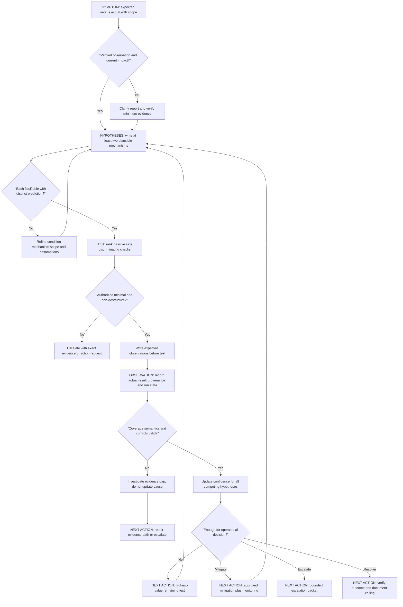

### Decision table

| Symptom state | Hypothesis state | Best available test state | Observation state | Next-best action |
|---|---|---|---|---|
| Not independently verified | Premature | Customer report only | Expected/actual unclear | Clarify scope and obtain minimum approved evidence |
| Verified and narrow | Several plausible | Passive discriminating check exists | Not yet tested | Write predictions and run only if authorized |
| Verified and high impact | Cause uncertain | Safe mitigation available | Impact ongoing | Mitigate under runbook, preserve evidence, continue ledger |
| Verified | Leading idea vague | Tests predict same result | Nondiscriminating | Refine mechanisms and comparisons |
| Verified | One idea dominates | Test contradicts necessary prediction | Reliable disconfirmation | Lower confidence; promote best competitor |
| Verified | Several remain | Required source inaccessible | Evidence ceiling reached | Escalate with one precise evidence request |
| Verified | Mechanism supported | Independent control agrees | Scope bounded | Recommend approved corrective validation |
| Resolved after workaround | Cause uncertain | Reversal unsafe or unauthorized | Outcome improved | Call it mitigation, not root-cause proof |
| Cannot reproduce | Several remain | Occurrence evidence insufficient | Coverage gap | Instrument the next safe occurrence through approved means |
| Security concern emerges | Investigation scope changes | L1 test could disturb evidence | Potential incident | Stop, preserve minimum evidence, invoke incident process |

## 14. Failure modes, cognitive biases, and escalation

### Reasoning failure modes

| Failure mode | Why it fails | Safer correction |
|---|---|---|
| Single-hypothesis tunnel | Every observation is interpreted to fit one story | Keep at least one credible competitor and one evidence-gap hypothesis |
| Vague hypothesis | No possible observation can contradict it | Name condition, mechanism, scope, timing, assumptions, and negative prediction |
| Nondiscriminating collection | More data arrives but ranking does not change | State what each leading hypothesis predicts before collecting |
| Hindsight prediction | Hypothesis is rewritten after the result | Version the ledger and preserve pre-test prediction |
| Chronology equals cause | Earlier event is promoted without mechanism | Separate sequence from contribution, trigger, and causal factor |
| Workaround equals proof | Improvement after action is treated as root-cause confirmation | Consider side effects, broad changes, regression, and independent controls |
| One successful retry equals resolution | Intermittent failure or warm-state effect remains | Define repeat count, control, observation period, and success criterion |
| Absence equals nonoccurrence | Source may be incomplete, delayed, restricted, or misqueried | Establish expectation of presence and coverage first |
| Duplicate sources equal corroboration | Several views may share one producer | Record source lineage and independence |
| Confidence as percentage theater | Number implies calibration that does not exist | Use qualitative level with explicit rationale |
| Root cause too early | Immediate mechanism hides contributors and control gaps | Use causal ladder and defined system boundary |
| Root cause too broad | One fixture becomes a universal product claim | State tenant, route, version, interval, and evidence ceiling |
| Testing changes the system | Retry, logging, cache, or configuration alters later results | Record side effects and prefer passive or isolated tests |
| Mitigation destroys evidence | Cleanup happens before preservation | Preserve minimum authorized evidence before change when safe |

### Cognitive bias register

A **cognitive bias** is a predictable tendency in human judgment. Naming a bias is not an accusation; it is a prompt for a corrective check.

| Bias | What it looks like in support | Countermeasure |
|---|---|---|
| Confirmation bias | Searching only for fields that support the favorite idea | Write disconfirming prediction and competitor first |
| Anchoring | First error message controls the whole case | Restate symptom from raw observations and revisit after new evidence |
| Availability bias | Recent memorable incident seems most likely | Compare current mechanism and base rate, not story similarity |
| Recency bias | Latest change is assumed responsible | Check exact scope, timing, controls, and other changes |
| Base-rate neglect | Rare exotic defect ranks above common configuration issue without evidence | Record prior rationale and update on discriminating evidence |
| Search satisficing | Investigation stops at the first plausible explanation | Ask what remains unexplained and what result could refute it |
| Outcome bias | A successful workaround makes the reasoning seem correct | Evaluate test design and alternative pathways independently of outcome |
| Survivorship bias | Only visible successful or failed cases are analyzed | Define eligible population, missing records, and coverage |
| Selection bias | Controls differ in tenant, version, route, or volume | Build matched comparison criteria before querying |
| Automation bias | Tool-generated correlation or summary is accepted uncritically | Inspect source lineage, semantics, query, and counterexamples |
| Authority bias | Senior person's theory is not tested | Put every hypothesis under the same ledger fields |
| Sunk-cost effect | Weak theory remains because much time was spent on it | Use evidence and next decision value, not effort already spent |

### Prohibited actions

This Part prohibits broad collection. Do not request or export all logs, all messages, all users, all tenants, all time, entire mailboxes, unrestricted packet captures, complete audit histories, or full database/index contents merely because the cause is unknown. Start from the smallest approved interval, entities, fields, and sources that can discriminate the hypotheses.

This Part prohibits testing on production without explicit authorization. Customer permission to troubleshoot is not automatically permission to change configuration, send test messages, replay events, generate load, impersonate users, alter roles, enable verbose telemetry, modify retention, reproduce a threat, or change a security outcome. Product-specific runbooks, owners, change controls, monitoring, and rollback must govern any real action.

This Part prohibits security-control bypass. Do not disable authentication, authorization, multifactor authentication, email protection, quarantine, detection, endpoint protection, proxy or firewall policy, audit, tenant isolation, data-loss prevention, rate limits, or export controls. Do not use alternate credentials or hidden interfaces to get around an access boundary.

This Part prohibits sensitive uploads. Do not upload customer evidence, email content, headers containing identity or routing details, attachments, URLs, tokens, cookies, authorization headers, API keys, private keys, tenant identifiers, logs, screenshots, HAR files, packet captures, databases, or case exports to public parsers, paste sites, personal repositories, unapproved AI tools, personal cloud storage, or consumer file-sharing services.

This Part prohibits destructive tests. Do not delete or mutate customer data, clear queues or logs, purge caches to “see if it helps,” revoke access, rotate secrets, uninstall components, reset connectors, remove messages, change retention, alter schemas, run stress tests, trigger malicious payloads, or execute any action that can damage state, integrity, availability, or evidence. No destructive command is provided.

### Escalation triggers

Escalate through the approved path when:

- The next discriminating evidence requires a proprietary Abnormal source, internal field meaning, detection explanation, elevated role, cross-tenant view, customer mailbox, security content, or product action outside L1 authority.
- The case may involve active compromise, malicious activity, credential or token exposure, data loss, cross-tenant access, control bypass, audit tampering, or continuing security impact.
- Evidence contains or may contain secrets, personal data, customer content, attachment data, private URLs, internal hostnames, tenant identifiers, or regulated information.
- The only proposed test changes production state, weakens a control, replays an event, creates load, changes a verdict, modifies policy, or risks duplicate remediation.
- Source coverage, clock behavior, identifier scope, field semantics, schema version, retention, sampling, parser health, or evidence integrity cannot be established.
- A suspected product defect has a minimal reproduction and verified expected behavior but requires Engineering-owned telemetry or code.
- The leading causal claim would affect broad remediation, customer security posture, executive communication, disclosure, or product commitments.
- Customer impact requires incident command, critical-situation-style coordination, a security incident process, or a communication cadence beyond a normal L1 case.

An escalation should include the symptom and impact, exact scope and UTC interval, current state, verified observations, source and coverage boundaries, competing hypotheses, tests and results, confidence changes, actions deliberately not taken, customer communication status, and one precise ask. “Please investigate” is weaker than “Please verify whether approved service result `SYN097_ROLE_REQUIRED` is emitted only after successful authentication and whether mapping audit state represents evaluation-time authorization for this route and version.”

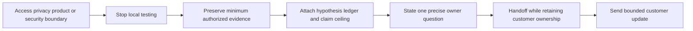

## 15. Full explicit quality contract for this Part

| Contract requirement | How this Part satisfies it | Review evidence |
|---|---|---|
| Explain from zero | Defines symptom, observation, hypothesis, falsifiability, mechanism, prediction, test, control, confounder, confidence, and action | Sections 1-3 |
| Required causal distinctions | Separates correlation, sequence, contribution, trigger, proximate cause, root cause, and control gap | Section 6 |
| Analogies and limits | Uses key-and-lock, hallway doors, road signs, travel receipts, dimmer, and domino analogies with boundaries | Sections 1-6 |
| Falsifiable hypotheses | Provides quality criteria, negative predictions, and version discipline | Section 2 |
| Discriminating tests | Defines decision value and expected observations by competitor | Section 3 |
| Evidence correlation | Requires typed identity, time semantics, provenance, meaning, coverage, cardinality, and independence | Section 4 |
| Confidence updates | Uses transparent qualitative movement without invented probability | Section 5 |
| Artifact | Provides schema, blank template, excerpt, lab design, and rubric for a competing-hypothesis ledger | Section 7 and Lab |
| Next-best actions | Ranks passive, local, authorized, and escalation actions by value and risk | Section 8 |
| Worked investigations | Walks API denial, verdict disagreement, webhook delay/duplicate, and trend measurement change | Sections 9-12 |
| Decision tree | Includes symptom to hypothesis to test to observation to next action | Section 13 |
| Failure modes and biases | Covers reasoning traps, cognitive biases, and countermeasures | Section 14 |
| Safety prohibitions | Explicitly prohibits broad collection, unauthorized production testing, bypass, uploads, and destructive tests | Section 14 and Lab |
| Candidate honesty | Ties enterprise support strengths to method while preserving Abnormal boundaries | Candidate honesty note |
| Official anchors | Uses dated primary or official sources and states each scope boundary | Official Source Anchors section |
| Interview Q&A | Contains exactly eight Q headings and model answers | Likely Interview Questions |
| Completion controls | Includes knowledge, artifact, spoken, honesty, privacy, safety, and source checks | Completion Checklist |
| Navigation | Contains exactly one final relative Part link | Final line |

## Lab - HypothesisLab 097 Competing-Hypothesis Ledger

This is a **local, handwritten, synthetic design lab**. It is not claimed to have been run. It requires no account, server, tenant, database, SIEM, mail system, Abnormal AI access, Microsoft 365 access, external request, or public upload. The lab teaches reasoning by reading and comparing invented metadata files. If you perform it later, you must record the actual run state and retain only harmless synthetic artifacts.

The lab has four fictional cases corresponding to the worked investigations: an API denial, a verdict disagreement, a duplicate/delayed webhook, and a recurring support trend. The objective is not to force one root cause. It is to maintain alternatives, write predictions before revealing declared outcomes, and choose safe next actions.

### Prerequisites

- A learner-owned local folder and a UTF-8 text editor. A local spreadsheet is optional.
- No production environment, customer tenant, customer case, Abnormal account, mailbox, security platform, Splunk deployment, cloud subscription, administrator role, API key, token, credential, or external service is required or permitted.
- Use only aliases beginning with `SYN097-`, `CASE-097-`, `H097-`, `T097-`, `E097-`, `tenant-A097`, `user-A097`, `message-A097`, `request-A097`, or similarly obvious fictional labels.
- Use reserved, content-free categories. Do not invent realistic email addresses, domains, URLs, IP addresses, customer names, internal hostnames, message subjects, bodies, attachment names, tokens, keys, secrets, or personal details.
- Every source row must include `synthetic=true`, a source alias, schema version, event-time semantics, and a run-state field.
- Every active-test entry must remain `not_authorized_not_run`. The lab uses passive comparison only.
- Every expected result must be written before the corresponding declared-result card is opened or read during actual practice.
- Every file must carry this label: `Local synthetic hypothesis lab; no production access, customer data, sensitive content, external upload, security-control bypass, active production test, state change, or destructive action.`
- The artifact should be described as a **design** until you actually create and reviews it locally.

### Lab design

| Artifact | Minimum content | Purpose | Explicit exclusion |
|---|---:|---|---|
| `scope-card-097.md` | Four fictional symptoms with scope and impact | Keep each case bounded | No real customer or product field |
| `term-register-097.md` | At least 24 terms with definitions and limits | Prevent vocabulary drift | No proprietary terminology claims |
| `source-register-097.md` | At least 8 fictional source families | Record provenance and independence | No production source names |
| `key-register-097.md` | At least 12 typed identifiers | Validate scope, lifetime, and cardinality | No timestamp-only relationship |
| `coverage-register-097.md` | Interval, retention, delay, permission, parser, watermark | Bound absence claims | No assumed completeness |
| `hypothesis-ledger-097.md` | At least 20 hypotheses across four cases | Core artifact | No single-story case notes |
| `prediction-matrix-097.md` | At least 40 if-true/if-false observations | Make tests falsifiable | No predictions added after results |
| `test-register-097.md` | At least 16 passive local tests | Rank discrimination and risk | No production or state-changing test |
| `result-cards-097.md` | At least 16 concealed fictional outcomes | Practice unbiased updating | No claim that tests executed |
| `confidence-history-097.md` | Before/after/reason/ceiling for every result | Preserve learning over time | No invented percentages |
| `causal-language-097.md` | Five-term distinctions for every case | Prevent chronology-to-cause errors | No universal root-cause claim |
| `next-action-register-097.md` | Action, owner, value, safety, stop condition | Turn reasoning into progress | No unauthorized action |
| `bias-review-097.md` | At least 12 bias checks | Challenge investigator reasoning | No personal blame |
| `customer-update-097.md` | One update per case | Practice bounded communication | No fabricated completed work |
| `engineering-handoff-097.md` | One packet per escalated case | Practice precise collaboration | No broad evidence dump |
| `privacy-manifest-097.md` | Allowed and structurally excluded classes | Prove data minimization | No secrets or content |

### Lab steps

1. Create an isolated folder named `HypothesisLab-097-Synthetic` only if actually performing the lab. Place the honesty label at the top of every Markdown artifact.
2. Set the overall state to `designed_not_run`. Do not change it merely because this lesson was read.
3. Write four symptom statements using expected behavior, actual behavior, fictional scope, first and last verified UTC time, current state, and impact.
4. Review each symptom and remove causal words such as “because,” “broken mapping,” “bad model,” or “service bug.” Put explanations in the ledger instead.
5. Write `term-register-097.md` and define symptom, observation, hypothesis, falsifiable, mechanism, prediction, test, control, confounder, provenance, correlation, sequence, contributor, trigger, proximate cause, root cause, control gap, mitigation, corrective action, preventive action, confidence, evidence ceiling, decision value, and next-best action.
6. Add one analogy and one limit for each dense term family. Do not use analogy as technical proof.
7. Create fictional source families for client event, service result, audit event, configuration snapshot, source heartbeat, queue event, downstream result, and parser manifest.
8. For each source, record producer, event unit, schema version, event-time meaning, ingest-time meaning, expected delay, retention under the fiction, field allowlist, and independence from other sources.
9. Mark every source as fictional. Do not copy field names from a real product or customer export.
10. Build a key register for case, tenant, principal, message, operation, request attempt, service result, configuration, logical event, delivery attempt, queue item, and parser version aliases.
11. For each key, document issuer, type, scope, lifetime, expected cardinality, and which sources carry it.
12. Add a rejected relationship example that joins records by close timestamp alone. Explain why it can create false pairs.
13. Create a coverage register for each source and case. Include interval, expected events, known positive, known negative, source heartbeat, parser version, permission state under fiction, and watermark.
14. Add at least one case where the coverage register is intentionally incomplete. The correct action must be to repair or escalate the evidence gap, not infer absence.
15. For `CASE-097-A`, write at least six hypotheses covering authentication, authorization, request contract, broad service state, client display, and correlation error.
16. For `CASE-097-B`, write at least six hypotheses covering policy intent, scope, expected-label quality, display state, product defect, and wrong-message correlation.
17. For `CASE-097-C`, write at least six hypotheses covering distinct events, producer retry, consumer duplication, queue delay, clock skew, and join error.
18. For `CASE-097-D`, write at least five hypotheses covering actual incidence, parser change, client version, volume denominator, and source coverage.
19. Merge synonyms. “Permission missing” and “role absent” should be one hypothesis if they predict the same mechanism and observations.
20. For every hypothesis, write condition, mechanism, scope, timing, assumptions, and claim ceiling.
21. Assign an initial qualitative confidence and explain the prior. Do not use percentages or scores unless a separate validated model exists; none exists in this lab.
22. For every hypothesis, write at least one positive prediction and one observation that would materially weaken it.
23. Label each prediction as necessary, supporting, or uncertain. Explain why.
24. Create at least four matched control definitions: same tenant different route, same route different fictional tenant, same request shape different role state, and same raw code different parser version.
25. Check whether the control changes more than one important dimension. If so, state the confounder rather than calling it matched.
26. Create at least four candidate tests per case. Keep every test passive, local, content-free, and synthetic.
27. For each test, record which hypotheses predict different outcomes. Reject tests for which all active hypotheses predict the same result.
28. Rank test candidates by discrimination, authorization, safety, privacy, reversibility, independence, repeatability, cost, time, and observability.
29. Set every test run state to `not_run` before practice. No result can be entered in the actual-observation field yet.
30. Write expected observation columns for every leading hypothesis before reading a result card.
31. Add one deliberately nondiscriminating test and mark it rejected. Explain what it verifies and why it does not choose among explanations.
32. Add one deliberately unsafe production test proposal such as changing a live role. Mark it prohibited and replace it with a passive local comparison.
33. Add one broad collection proposal. Mark it prohibited and reduce it to exact fictional fields, aliases, and interval.
34. Add one sensitive-upload proposal. Mark it prohibited and replace it with local content-free aliases.
35. Add one destructive proposal. Mark it prohibited and replace it with source-preserving review.
36. Create result cards containing only fictional observations and evidence aliases. Keep them in a separate section so predictions can be completed first.
37. During actual local practice, reveal one result card at a time. Record the literal observation before writing interpretation.
38. Validate identity, time, provenance, semantics, coverage, and cardinality for the result. If any fail, update the evidence-gap hypothesis rather than the causal hypothesis.
39. Update every affected hypothesis, not only the favorite one. Use before level, after level, reason, and evidence ceiling.
40. If a hypothesis survives a weak test, write “survived this test,” not “confirmed.”
41. If a necessary prediction is absent under a valid complete test, record whether the hypothesis is strongly weakened or ruled out within the fixture.
42. Preserve the original prediction. Add a new hypothesis version if the mechanism changes after the result.
43. Record at least two negative results that reduce confidence. Treat them as useful evidence and use them to select a new action.
44. For every test, identify possible side effects even though the local comparison has none beyond learner error. Use this to practice production caution.
45. Build a correlated evidence chain for each case using typed aliases. Do not use timestamp as the sole key.
46. Preserve raw fictional time, normalized UTC, event versus ingest semantics, precision, and clock note.
47. For each chain, state whether records are independent, copied, derived, or backed by the same source.
48. Create one absence claim and run the expectation-of-presence checklist. Do not use the absence if source coverage is incomplete.
49. For each case, write five separate statements: correlation, sequence, contribution, trigger, and root cause or “not established.”
50. Check that the contribution statement says how likelihood, severity, duration, or impact changed.
51. Check that the trigger statement identifies initiation of a bounded path rather than an old weakness.
52. Check that any root-cause statement names the system boundary, recurrence mechanism, corrective action, and residual factors. Otherwise write “causal factor supported” or “root cause not established.”
53. Choose a next-best action after every result. Record the action, owner, expected decision value, safety gate, due time, and stop condition.
54. Include mitigation as a candidate when fictional impact is ongoing, but do not let mitigation erase the causal ledger.
55. Create one case that ends in escalation because the required field semantics are product-owned. Write one precise question rather than requesting broad investigation.
56. Create one case that ends “unable to determine from authorized evidence.” List exactly what evidence is missing and why collecting more is not currently justified.
57. Write a customer update for each case containing impact, verified observations, current bounded interpretation, uncertainty, next action, owner, and next update time.
58. Do not include internal hypothesis debates, sensitive details, invented product internals, or promises that a theory is the cause.
59. Write an Engineering handoff for each escalated case with minimal reproduction, expected versus actual, environment assumptions, ledger excerpt, tests, controls, coverage, exact evidence aliases, safety limits, and one explicit ask.
60. Run the bias review against every case. Require a written countermeasure for confirmation, anchoring, availability, recency, base-rate neglect, satisficing, outcome, survivorship, selection, automation, authority, and sunk-cost bias.
61. Ask a second reviewer, if available, to choose the next test from the ledger without seeing the favored hypothesis. Record disagreements as review evidence, not as failure.
62. Practice a five-minute spoken walkthrough of one case from symptom through next action. Use the words observation, prediction, disconfirming evidence, and evidence ceiling accurately.
63. Practice a 90-second explanation of correlation, sequence, contribution, trigger, and root cause using the domino analogy and its limit.
64. Practice an honest transition statement connecting enterprise support to the method while saying directly that Abnormal production experience has not been established.
65. Check every artifact for broad collection language. Replace “all logs” and “everything around the time” with exact fictional sources, fields, aliases, and intervals.
66. Check every action for production implications. No role change, policy edit, test message, replay, load, bypass, control weakening, or destructive operation may remain as an executable instruction.
67. Check every artifact for sensitive fields. Credentials, cookies, authorization, tokens, keys, secrets, addresses, content, subject, body, attachment, URL, IP, customer, and tenant identifiers must be structurally absent.
68. Check every external-tool reference. The lab must remain local and must not require upload, trial signup, cloud account, or public parser.
69. Score the lab with the validation rubric. Keep unperformed items marked `not run`; do not award operational evidence for a design.
70. Retain only the minimum harmless synthetic artifact if useful. Remove obsolete drafts only through the learner's normal approved file interface after verifying the isolated path. Do not use recursive, destructive, or evidence-clearing commands.

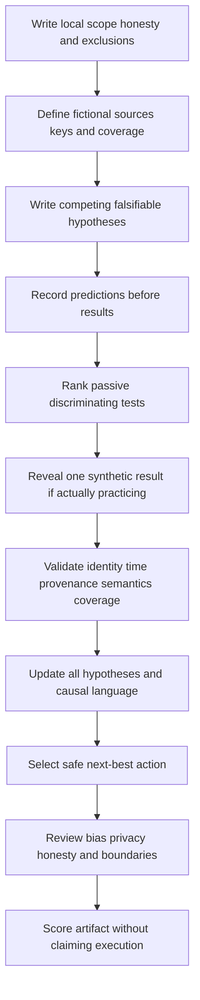

### Expected evidence

If the lab is actually performed, expected evidence includes:

- Four symptom statements that contain expected versus actual behavior, fictional scope, UTC interval, current state, and impact without embedding a cause.
- A term register with at least 24 beginner-first definitions, analogies, limits, and memory hooks.
- At least eight fictional source contracts that document producer, schema, event unit, time semantics, delay, retention under the fiction, allowed fields, transformations, and independence.
- A key register with at least 12 typed aliases, issuer, scope, lifetime, cardinality, and propagation rules.
- A coverage register with known positive and negative fixtures, source heartbeat, permission state under fiction, parser version, delay, and watermark.
- At least 20 competing hypotheses across four cases, each with condition, mechanism, scope, assumptions, prior rationale, predictions, and claim ceiling.
- At least 40 prediction entries split into if-true, if-false, necessary, supporting, and uncertain expectations.
- At least 16 passive local test designs with discrimination, safety, privacy, independence, repeatability, cost, time, and run-state review.
- Explicit rejection of one nondiscriminating, one broad-collection, one unauthorized production, one security-bypassing, one sensitive-upload, and one destructive proposal.
- At least 16 fictional result cards whose observations are recorded separately from interpretation.
- Confidence history for every revealed result with before, after, reason, alternatives, and evidence ceiling; no invented probabilities.
- Four correlated evidence maps using typed identifiers, raw and normalized time, provenance, semantics, coverage, cardinality, and source-independence notes.
- At least one correctly rejected absence claim because expectation of presence was not established.
- Separate correlation, sequence, contribution, trigger, and root-cause-or-not-established statements for every case.
- A next-action register with action, owner, decision value, authorization state, safety, privacy, due time, and stop condition.
- At least two useful negative results and one “unable to determine” conclusion.
- One customer-safe update and one Engineering-ready handoff per applicable case.
- A bias review containing at least 12 named biases and case-specific countermeasures.
- Spoken-practice notes for a five-minute case walkthrough, a 90-second causal distinction, and an honest candidate-boundary statement.
- No external execution, production access, customer data, real tenant, real message, sensitive content, secrets, broad collection, public upload, control bypass, active test, state change, or destructive action.

### Cleanup and privacy

- Keep the lab in one learner-owned local folder. Do not upload it to a public repository, paste site, online diagrammer, spreadsheet service, query tool, parser, personal cloud, public AI system, or unapproved collaboration service.
- Do not place real logs, screenshots, HAR files, packet captures, email headers, message files, attachments, case exports, audit records, database files, query results, or customer notes beside the synthetic artifacts.
- Confirm every record contains an explicit synthetic marker and every identifier is an obvious alias.
- Confirm credentials, passwords, cookies, authorization headers, tokens, keys, secrets, session values, connection strings, personal identifiers, email addresses, message content, subjects, bodies, attachments, URLs, IP addresses, customer names, tenant IDs, internal hostnames, and proprietary fields are absent rather than merely masked.
- Confirm no hypothesis asks for “all logs,” “all messages,” “all users,” “all tenants,” “everything around the incident,” or another broad collection. Every evidence need must name exact fictional source, field allowlist, entity, and interval.
- Confirm no test instructs the learner to use production, send traffic, replay an event, alter a role, change a policy, enable logging, create load, disable a control, bypass authorization, or access another tenant.
- Confirm no action deletes, modifies, clears, purges, rotates, resets, revokes, removes, or otherwise changes system or evidence state.
- Preserve original synthetic source rows. Corrections belong in a versioned derived file with a change note.
- Keep pre-test predictions immutable after result reveal. Add an amendment or new hypothesis version rather than rewriting history.
- Retain the minimum useful synthetic portfolio artifact according to the learner's own local retention decision. Remove obsolete drafts only after verifying the isolated path and only through the normal approved file interface.
- If real or sensitive material is accidentally introduced, stop, do not duplicate or upload it, and follow the appropriate organizational privacy/security process. Do not use this lab as the cleanup authority.
- Use this completion wording only after actual local performance: `HypothesisLab 097 was completed locally with fictional metadata only; no production system, customer data, sensitive content, external upload, broad collection, security-control bypass, active production test, state change, or destructive action was used.`
- If it was not performed, record: `HypothesisLab 097 is a reviewed synthetic lab design and has not been executed.`

### Validation rubric

| Dimension | Fail | Developing | Pass |
|---|---|---|---|
| Symptom definition | Embeds an assumed cause | States expected and actual | Adds exact scope, interval, current state, impact, and source boundary |
| Hypothesis quality | Vague or unfalsifiable | Names a possible condition | Defines condition, mechanism, scope, timing, assumptions, and disconfirming observation |
| Competition | Keeps one favored theory | Lists alternatives | Maintains distinct plausible mechanisms plus an evidence-gap hypothesis |
| Predictions | Written after results | Includes if-true expectation | Written before result with if-false, necessity, and source semantics |
| Test discrimination | Collects more data | Checks one idea | Produces different expected outcomes across leading competitors |
| Test safety | Uses production or changes state | States caution | Uses only passive local synthetic comparison and records explicit prohibitions |
| Authorization | Assumes access equals permission | Notes an owner | Records role, consent, runbook need, and escalation boundary |
| Evidence correlation | Joins by time or text | Uses one identifier | Validates typed identity, scope, time, provenance, semantics, coverage, and cardinality |
| Absence reasoning | Calls no result no event | Mentions retention | Establishes expectation of presence, known event, delay, parser, permission, and watermark |
| Confidence update | Uses certainty or invented percent | Uses a label | Records before, result, after, rationale, alternatives, and ceiling |
| Negative result | Ignores contradiction | Lowers favorite idea | Updates every affected hypothesis and chooses a new action |
| Causal language | Treats chronology as root cause | Says correlation is not causation | Separates correlation, sequence, contribution, trigger, proximate cause, root cause, and gap |
| Controls | Uses unmatched comparison | Names a healthy example | Defines matched dimensions, differences, and confounders |
| Next-best action | Chooses most invasive action | Chooses a plausible test | Maximizes decision value while minimizing risk, data, time, and ownership conflict |
| Bias review | Blames individuals or omits bias | Names several biases | Applies at least 12 concrete countermeasures to the cases |
| Escalation | Sends broad dump | Sends a summary | Includes ledger, bounded evidence, actions not taken, ceiling, and one precise ask |
| Privacy | Uses realistic or sensitive data | Redacts afterward | Structurally excludes sensitive classes and stays local |
| Artifact | Loose notes | Partial ledger | Complete versioned ledger, prediction, test, result, confidence, causal, and action registers |
| Candidate honesty | Implies security-vendor operations | Calls examples synthetic | Separates prior production transfer, completed local work, learned method, and Abnormal unknowns |
| Spoken readiness | Recites definitions | Explains one case | Walks symptom to action and answers all eight questions with safety and evidence limits |

## Official Source Anchors - August 24, 2026

These sources anchor general incident response, risk, logs, troubleshooting, observability, protocol, timestamp, and statistical-test concepts. They do not establish Abnormal AI's architecture, product telemetry, detection logic, confidence model, schemas, permissions, support workflow, evidence availability, remediation behavior, or L1 authority. Product-specific practice must use current approved Abnormal documentation and internal runbooks available to the role.

| Official or primary source | Concept anchored | Scope boundary |
|---|---|---|
| [NIST SP 800-61 Rev. 3 - Incident Response Recommendations and Considerations for Cybersecurity Risk Management](https://csrc.nist.gov/pubs/sp/800/61/r3/final) | Current incident-response integration with Cybersecurity Framework 2.0 risk management | Organizational guidance, not a vendor runbook or permission to collect/test |
| [NIST SP 800-30 Rev. 1 - Guide for Conducting Risk Assessments](https://csrc.nist.gov/pubs/sp/800/30/r1/final) | Threat, vulnerability, likelihood, impact, uncertainty, and risk-assessment discipline | Published in 2012; apply current organizational, legal, cloud, and product requirements |
| [NIST SP 800-92 - Guide to Computer Security Log Management](https://csrc.nist.gov/pubs/sp/800/92/final) | Foundational collection, analysis, handling, and log-management considerations | Published in 2006; not a current product architecture or retention mandate |
| [Google SRE Book - Effective Troubleshooting](https://sre.google/sre-book/effective-troubleshooting/) | Hypothetico-deductive troubleshooting, competing causes, safe tests, confounders, notes, and negative results | Google's published SRE experience; useful method, not an Abnormal or Microsoft procedure |
| [Microsoft Azure Well-Architected Framework - Architecture Strategies for Designing a Monitoring System](https://learn.microsoft.com/en-us/azure/well-architected/operational-excellence/observability) | Structured telemetry, correlation IDs, health models, privacy, retention, actionable observability, and monitoring tradeoffs | Azure workload guidance; does not define evidence in another SaaS product |
| [IETF RFC 3339 - Date and Time on the Internet: Timestamps](https://www.rfc-editor.org/rfc/rfc3339.html) | Unambiguous Internet timestamp representation and UTC offsets | Format does not establish clock accuracy, event semantics, source coverage, or causal order |
| [IETF RFC 9110 - HTTP Semantics](https://www.rfc-editor.org/rfc/rfc9110.html) | Request/response semantics, status classes, safe methods, intermediaries, correlation, and privacy cautions | Protocol semantics do not reveal application internals or make any request operationally safe/authorized |
| [NIST/SEMATECH e-Handbook - Critical Values and p Values](https://www.itl.nist.gov/div898/handbook/prc/section1/prc131.htm) | Formal statistical hypothesis-test terms, significance level, critical values, and p-values | This Part does not calculate p-values or perform inferential statistics; operational hypotheses are broader |

### Source discipline and scope notes

- NIST SP 800-61 Rev. 3 was finalized in April 2025 and supersedes Rev. 2. Use the current revision for incident-response context, but follow employer-specific incident roles, legal obligations, and escalation paths.
- NIST SP 800-30 Rev. 1 supports explicit assumptions, uncertainty, likelihood, and impact. It does not turn qualitative support confidence into a calibrated probability.
- NIST SP 800-92 remains a foundational log-management source, but its 2006 publication date requires supplementation with current privacy, cloud, retention, security, and organizational requirements.
- The Google SRE troubleshooting chapter directly describes iterative hypotheses, confirming and disconfirming evidence, safe treatment, confounders, side effects, notes, and the danger of spurious correlation. Its examples and operational context are Google's, not a product-support contract for Abnormal.
- Microsoft Azure Well-Architected observability guidance supports consistent telemetry, correlation IDs, health models, source protection, data minimization, and actionable decisions. You may connect these concepts to your prior background without claiming that Azure's model describes Abnormal internals.
- RFC 3339 standardizes timestamp representation. A correctly formatted timestamp can still come from an inaccurate clock, have ambiguous event meaning, arrive late, or be transformed.
- RFC 9110 defines protocol semantics such as safe methods, but “safe” in HTTP semantics does not equal authorized, zero-cost, privacy-safe, side-effect-free, or appropriate for production troubleshooting.
- The NIST/SEMATECH statistical handbook explains formal null-hypothesis testing. This Part uses “hypothesis testing” in the broader operational troubleshooting sense and intentionally avoids p-values, significance claims, and invented numerical confidence.
- Revalidate all dated links and product applicability after August 24, 2026. For any real Abnormal case, current approved product sources and internal owners override generic examples in this lesson.

## Likely Interview Questions

### Q1. What makes a support hypothesis falsifiable?

**Model answer:** A falsifiable hypothesis names a condition, mechanism, scope, timing, assumptions, and an observation that would materially contradict it. I write predictions before testing, including what I expect if the hypothesis is true and false. “It is a cloud issue” is not falsifiable; “authorization rejects this route for principals missing a required role while matched role-bearing controls succeed” is. If no permitted observation could change my belief, I need to rewrite the hypothesis rather than collect more data.

### Q2. How do you choose a discriminating test?

**Model answer:** I compare the leading hypotheses and choose the smallest test for which they predict different outcomes. I then gate it for authorization, safety, privacy, reversibility, source quality, time, and customer impact. I prefer passive read-only evidence and matched controls, then an isolated synthetic or approved nonproduction fixture. I do not test on production without explicit authorization, and I never bypass a control or use a destructive test. The best test changes the decision while creating the least risk and unnecessary data.

### Q3. How do you update confidence after a test?

**Model answer:** I record confidence before the test, the literal observation, confidence after, and why it changed. A predicted discriminating result from a reliable independent source can raise confidence; absence of a necessary prediction under valid coverage can lower it sharply. I update every affected hypothesis, not just the favorite one, and preserve alternatives and the evidence ceiling. Unless there is a calibrated model, I use qualitative levels with rationale rather than invented percentages. Surviving one weak test is not confirmation.

### Q4. How do you distinguish correlation, sequence, contribution, trigger, and root cause?

**Model answer:** Correlation means observations relate under a declared method. Sequence means one precedes another within clock and timestamp limits. A contributor increases likelihood, severity, duration, or impact. A trigger initiates the bounded failure path at a particular time. A root cause is a supported underlying condition whose correction materially prevents recurrence inside a defined system boundary. I move up that ladder only with mechanism, controls, alternative testing, and outcome verification; chronology alone supports none of the higher claims.

### Q5. What is a competing-hypothesis ledger and why use one?

**Model answer:** It is a versioned record of each plausible explanation, mechanism, assumptions, predictions, test, expected and actual observations, evidence references, confidence movement, alternatives, safety boundary, claim ceiling, and next action. It prevents hindsight rewriting and confirmation bias, makes negative results useful, and gives Engineering a reproducible chain instead of a data dump. It also helps customer communication because I can state what is observed, what is currently supported, what remains unknown, and what happens next.

### Q6. How do you handle a successful workaround when the cause is still uncertain?

**Model answer:** I call it a mitigation, not proof of root cause. A broad change can improve the symptom through several mechanisms, and retries, caches, time, or unrelated recovery can confound the result. I verify customer outcome, record exactly what changed, preserve the pre-change evidence, consider side effects, and keep competing hypotheses open. I pursue further causal work only when its decision value justifies the risk and time, and I escalate if the required validation is product-owned.

### Q7. When do you stop testing and escalate?

**Model answer:** I stop when the next discriminating step requires access, product semantics, security content, customer data, a production change, or authority I do not have; when evidence integrity or coverage is uncertain; or when compromise, data exposure, or control bypass may be involved. I preserve the minimum authorized evidence and escalate with impact, scope, observations, ledger, tests, confidence, actions not taken, evidence ceiling, and one precise ask. I retain customer ownership and communication during the handoff.

### Q8. How does your prior support experience transfer, and where are your Abnormal boundaries?

**Model answer:** My prior enterprise support experience transfers in the investigation habits: scope impact, separate client and service boundaries, maintain alternatives, correlate evidence, validate changes carefully, communicate uncertainty, manage critical cases, and escalate to Engineering with reproducible evidence. I have not operated Abnormal AI in production, and this Part does not establish that experience. I would use current approved Abnormal documentation and runbooks to learn available evidence, field semantics, permissions, and L1 actions, while applying the same disciplined and customer-focused reasoning.

## Memory Hooks

- **Symptom is what differed; hypothesis is why it might have differed.**
- **Falsifiable means I can name a result that would make me wrong.**
- **A hypothesis is condition plus mechanism plus prediction.**
- **Keep competitors alive until evidence separates them.**
- **Write the forecast before opening the result.**
- **A discriminating test divides the map.**
- **Learn most, risk least.**
- **Passive and authorized before active and state-changing.**
- **Identity, time, provenance, meaning, coverage, cardinality.**
- **Two dashboards can still be one source.**
- **No record means no matching readable record under this scope.**
- **Confidence is a dimmer with reasons, not a percentage costume.**
- **Survived is not confirmed; weakened is not impossible.**
- **Correlation is companionship.**
- **Sequence is order.**
- **Contribution changes likelihood, severity, duration, or impact.**
- **Trigger starts the bounded path.**
- **Root cause needs mechanism, boundary, correction, and recurrence logic.**
- **A workaround mitigates; it does not automatically explain.**
- **Negative results buy direction.**
- **The ledger preserves what you believed before the test.**
- **The next-best action can be a test, mitigation, update, escalation, or stop.**
- **Broad collection is not rigor.**
- **Authorization is part of test validity.**
- **Never weaken a security control to satisfy curiosity.**
- **Synthetic practice proves method only if actually performed.**
- **Microsoft method transfers; Abnormal internals do not.**

## Completion Checklist

- [ ] I can define symptom, observation, hypothesis, falsifiable, mechanism, prediction, test, control, confounder, confidence, evidence ceiling, and next-best action.
- [ ] I can restate a report as expected versus actual behavior without embedding a cause.
- [ ] I can write at least two genuinely competing mechanisms rather than synonyms.
- [ ] Every hypothesis I write names condition, mechanism, scope, timing, assumptions, and a disconfirming observation.
- [ ] I can explain why “not disproved” is not “proved.”
- [ ] I write expected observations before reading or running a test.
- [ ] I can distinguish a necessary prediction from a merely supporting prediction.
- [ ] I can reject a test that every leading hypothesis predicts identically.
- [ ] I rank tests by discrimination, authorization, safety, privacy, reversibility, independence, repeatability, cost, time, and observability.
- [ ] I prefer passive read-only evidence and local or approved nonproduction fixtures over active changes.
- [ ] I never test on production without explicit authorization, product procedure, risk review, monitoring, and rollback.
- [ ] I never bypass authentication, authorization, tenant, audit, export, rate, DLP, detection, or other security controls.
- [ ] I never use sensitive uploads, public parsers, personal repositories, unapproved AI tools, or personal cloud storage for evidence.
- [ ] I never use destructive tests, clear evidence, mutate customer state, replay security events, or create diagnostic load without an approved process.
- [ ] I can validate evidence identity, time semantics, provenance, field meaning, coverage, cardinality, and independence.
- [ ] I do not join evidence by timestamp, subject, display name, or error text alone.
- [ ] I establish expectation of presence before treating absence as evidence.
- [ ] I preserve raw values and label derived categories and transformations.
- [ ] I update every affected hypothesis after a result, not only the favorite one.
- [ ] Every confidence update contains before, literal result, after, rationale, alternatives, and evidence ceiling.
- [ ] I do not invent percentages or statistical significance.
- [ ] I can define and separately apply correlation, sequence, contribution, trigger, proximate cause, root cause, and control gap.
- [ ] I can explain where the domino analogy helps and where distributed systems exceed it.
- [ ] I do not call chronology, co-occurrence, one retry, one workaround, or one reversal a root cause by itself.
- [ ] I call an impact-reducing action a mitigation unless causal correction is supported.
- [ ] Any causal statement includes its tenant/entity, route/workflow, version, interval, and evidence boundary.
- [ ] I can use the causal claim ladder and stop at the supported level.
- [ ] I can create and explain every field in the competing-hypothesis ledger.
- [ ] I version changed hypotheses rather than rewriting pre-test history.
- [ ] I can walk through the API denial investigation and explain why authorization becomes the leader.
- [ ] I can walk through the verdict disagreement and avoid speculating about proprietary detection internals.
- [ ] I can walk through the webhook case and separate retry trigger from queue-delay contribution.
- [ ] I can walk through the trend case and separate measurement change from behavior change.
- [ ] I can follow the symptom-to-hypothesis-to-test-to-observation-to-next-action decision tree.
- [ ] I can identify confirmation, anchoring, availability, recency, base-rate, satisficing, outcome, survivorship, selection, automation, authority, and sunk-cost biases.
- [ ] I apply a concrete countermeasure rather than merely naming a bias.
- [ ] I can select mitigation before root-cause precision when ongoing impact requires it, while preserving evidence and the ledger.
- [ ] I can state when “unable to determine from authorized evidence” is the correct conclusion.
- [ ] I can recognize product, access, privacy, evidence-integrity, security-incident, and production-change escalation boundaries.
- [ ] My escalation contains impact, scope, UTC interval, current state, observations, coverage, hypotheses, tests, confidence, actions not taken, ceiling, and one precise ask.
- [ ] My customer update distinguishes observation, bounded interpretation, uncertainty, next action, owner, and next update time.
- [ ] I can connect your prior enterprise support, critical situation, Engineering escalation, and fix-validation experience to this method using a real truthful example.
- [ ] I can say directly that this synthetic lesson does not establish Abnormal AI production experience.
- [ ] I do not claim Abnormal fields, schemas, telemetry, detection logic, confidence behavior, permissions, remediation, or L1 procedure.
- [ ] I can explain the scope boundary for all eight official sources.
- [ ] I have revalidated source currency and current approved product documentation before applying the method to real work.
- [ ] I can answer Q1 through Q8 aloud without reading and include at least one safety boundary in each scenario answer.
- [ ] I describe the lab as `designed_not_run` unless I actually created and reviewed the local synthetic artifacts.
- [ ] If completed later, the artifact contains no production access, customer data, sensitive content, external upload, broad collection, control bypass, active production test, state change, or destructive action.

[Next: Part 098 - Safe Evidence Collection Redaction and Packaging](Part-098-safe-evidence-collection-redaction-and-packaging.md)