# Part 098 - Safe Evidence Collection Redaction and Packaging

> **Purpose:** Learn a product-neutral, beginner-first method for requesting only the evidence needed for a support decision, confirming permission before collection, excluding secrets, reducing personal and customer data, creating a reviewed redacted derivative, preserving integrity and handling history, packaging artifacts with a manifest, transferring them only through approved channels, and applying retention and deletion rules.
>
> **Artifact honesty label:** **Local synthetic redacted-evidence-bundle design only.** Every person, tenant, case, request, message, event, file, timestamp, digest, transfer, receipt, retention period, and deletion record in this Part is fictional. No lab step was performed. No customer data, prior production evidence, Abnormal AI data, mailbox, tenant, case system, cloud service, support portal, external recipient, or public service was accessed. You may call the artifact completed only after you actually create and reviews it locally with harmless synthetic text.
>
> **Currency and source access date:** August 24, 2026.

## Section goal

The goal is to make evidence handling part of technical correctness rather than an afterthought. By the end of this Part, you should be able to turn “send all logs and screenshots” into a narrow request tied to one decision; identify prohibited and sensitive data; create a purpose-bound share copy; describe what an integrity check can and cannot establish; build a reviewable manifest; choose a controlled transfer path; and explain how the evidence lifecycle ends.

Before using the method, learn the terms below. The definitions are deliberately product-neutral. None grants authority, changes policy, or describes an Abnormal AI internal procedure.

| Term | Beginner-first definition | Why it matters | Memory hook | Important limitation |
|---|---|---|---|---|
| Authorization | Explicit permission from the proper owner for a named person or role to perform a named action on a defined source, data scope, purpose, and time window | Technical access may exist while collection, review, transformation, or sharing remains prohibited | Permission has an owner, action, scope, purpose, and time | A customer asking for help, a support ticket, or possession of an administrator role is not blanket authorization |
| Minimization | Limiting fields, entities, time, sources, copies, recipients, and storage duration to the smallest amount reasonably necessary for the current decision | Smaller scope lowers security, privacy, legal, and review risk | Smallest evidence that answers the next question | Minimum does not mean arbitrary or useless; the evidence must still discriminate between plausible explanations |
| Personally identifiable information (PII) | Information that distinguishes or traces a person's identity, alone or when combined with other information | A name is not the only identifier; ordinary metadata can identify someone in combination | A puzzle can identify a person from several pieces | Definitions and obligations vary by jurisdiction, contract, context, and organizational policy |
| Secret | A value that grants access, proves identity, decrypts data, signs data, or controls a protected capability | Exposure can enable account takeover, impersonation, data access, or persistent compromise | A secret is a key, not a troubleshooting detail to copy | Passwords, cookies, tokens, API keys, recovery codes, client secrets, and private keys must not enter a routine support bundle |
| Content | The substantive material created, sent, stored, or processed, such as a message body, subject, attachment, document, chat, prompt, form value, or request/response body | Content can contain personal, confidential, legal, regulated, or security-sensitive information | Metadata describes a parcel; content is inside it | Metadata can also be sensitive, and content can remain in previews, archives, thumbnails, caches, or encoded fields |
| Redaction | Creating a derived copy in which selected information is removed or irreversibly obscured for a stated audience and purpose | It can lower exposure while preserving useful evidence | Remove what the recipient does not need | **Redaction is not anonymization**; remaining context and external information may still identify a person or customer |
| Pseudonymization | Replacing identifiers with consistent substitutes while retaining some way, directly or indirectly, to reconnect or correlate them | It allows cross-record correlation with less repeated exposure | Same actor, safer label, still linkable | Pseudonymized information often remains personal or sensitive; any mapping needs separate protection and must not ride in the share bundle |
| Anonymization | Processing and assessing information so a person is no longer reasonably identifiable under the applicable standard and context | It is a much stronger outcome than masking a name | No reasonable road back to the person | True anonymization is difficult and context-dependent; deleting names or using aliases alone does not achieve it |
| Hashing | Applying a deterministic one-way function to bytes to produce a fixed-length digest such as a SHA-256 value | A later recomputation can help detect whether the compared bytes differ | Same bytes, same digest; changed bytes, almost certainly changed digest | **Hashes do not prove truth**: a match does not prove authenticity, completeness, authorization, source accuracy, or safe disclosure |
| Integrity | Confidence that evidence remains complete and unaltered in the ways material to the investigation, supported by technical and procedural controls | Decisions are unreliable when files are silently edited, truncated, substituted, or mixed | Integrity asks whether this is still the intended evidence | Integrity is broader than hashing; provenance, versions, access, completeness, transformations, and review also matter |
| Chain of custody | A chronological record of who possessed, accessed, transformed, transferred, or disposed of evidence, when, why, and under which authority | It makes handling reviewable and exposes unexplained gaps | Who had it, when, why, and what changed | A support custody record is not automatically legal-forensic evidence or court-ready |
| Manifest | A structured inventory of every package item, including purpose, source relationship, sensitivity, transformation, integrity value, owner, and lifecycle state | A recipient can understand and validate the bundle without guessing from filenames | The manifest is the packing list and map | A manifest records claims; it does not independently prove those claims are true |
| Transfer | Moving evidence or granting access across a person, team, system, organization, or custody boundary | Recipient, channel, classification, protection, expiry, and receipt all matter | A transfer is a controlled handoff, not merely an upload | Encryption cannot fix an unauthorized recipient, an excessive package, or an unapproved channel |
| Retention | Keeping evidence under a defined approved reason and lifecycle rule | Indefinite storage increases exposure and may conflict with policy or contract | Give every copy a reason and review point | A support engineer does not invent the period; records, legal, security, privacy, customer, and product rules control it |
| Deletion | Using an approved disposition process after retention and hold obligations permit, then recording the result and limitations | It reduces unnecessary exposure when the valid purpose ends | Dispose by policy, not impulse | Deletion may be delayed by holds, backups, replicas, or platform behavior; never improvise destructive commands |

Think of an evidence bundle as a controlled package in a secure mailroom. Authorization permits a particular shipment. Minimization chooses only the necessary pages. Redaction makes a purpose-bound share copy. A manifest is the packing list. A hash is a tamper indicator for exact bytes. Chain of custody is the handling register. Transfer uses the approved courier and destination. Retention is the storage instruction, and deletion is the governed disposal record.

The analogy has limits. Digital files can be copied perfectly, metadata can expose facts absent from the visible page, and recipients can create downstream copies. A digital rectangle can cover text visually while leaving the underlying characters recoverable. A hash can identify unchanged false or incomplete bytes. Safe evidence handling therefore needs several controls working together.

The primary artifact is a **redacted evidence bundle with a manifest**. The bundle is designed around one fictional API-support question and contains only learner-authored metadata. Its quality test is concrete: an authorized reviewer should be able to tell what decision the bundle addresses, who approved its fictional scope, what was deliberately excluded, how each shareable item differs from its fictional source, which integrity record applies, who handled it, how a real transfer would be gated, when retention would be reviewed, and why no deletion was performed here.

This Part explicitly prohibits collecting credentials or private keys; copying passwords, session cookies, bearer tokens, refresh tokens, API keys, recovery codes, signing material, or authenticated connection strings; uploading evidence publicly; overcollecting “everything”; bypassing technical or organizational controls; using unapproved tools, AI systems, repositories, channels, or personal storage; and running destructive commands. Those actions remain prohibited even when they appear faster.

## JD Mapping

| Supplied role signal | Capability developed here | Technical-support application | Proof artifact |
|---|---|---|---|
| Complex investigations | Converts a broad request into a hypothesis-linked minimum evidence set | Reduces noise and exposure while preserving decision value | Evidence-request worksheet |
| Customer trust | Explains what is needed, why, how it will be handled, and what must never be sent | Makes protection and transparency part of case ownership | Customer-safe request wording |
| Cloud Email Security | Separates routing/security metadata from message content, identities, URLs, and attachments | Supports first-stage investigation without defaulting to mailbox or content collection | Synthetic message-evidence matrix |
| AI Security Agents and SaaS Security | Classifies identity, prompt/content, audit, policy, API, and action evidence by purpose | Enables bounded reasoning without guessing proprietary evidence | Product-neutral classification register |
| API and integration support | Keeps route class, time, status, stage, version, and correlation aliases while excluding authentication material and payloads | Produces a reviewable sanitized request/result excerpt | Synthetic API derivative |
| Evidence correlation | Uses stable aliases, timestamps, lineage, and a manifest | Preserves relationships without exposing unnecessary original values | Alias and provenance register |
| Engineering and Product collaboration | Supplies scope, expected versus actual, versions, transformations, limitations, and one precise question | Prevents opaque archives and unstructured data dumps | Manifested evidence bundle |
| Security and privacy judgment | Applies authority, minimization, disclosure, transfer, retention, and disposition gates | Stops L1 curiosity from crossing ownership boundaries | Stop/escalate record |
| Knowledge and case quality | Defines names, versions, manifests, review evidence, and lifecycle states | Makes case artifacts understandable to the next owner | Packaging checklist |
| enterprise support transfer | Reuses your customer-diagnostic, escalation, communication, and evidence-discipline experience | Provides a truthful bridge from enterprise support operations | Candidate transfer narrative |
| Honest Abnormal boundary | Requires current approved product sources and owners for every real action | Avoids inventing an Abnormal field, tool, channel, role, retention period, or deletion process | Boundary statement |

## Candidate honesty note

Your prior enterprise support experience is a genuine strength. SharePoint Online, OneDrive, Sync Client, Copilot, escalation, and critical-situation work can require scoping the affected object and interval, requesting targeted diagnostics, coordinating customer actions, protecting trust, organizing evidence, and giving Engineering or Product a coherent handoff. You may use a real example only if it actually occurred, you are permitted to discuss it, and you accurately separates what you did, what the customer did, what another team did, and what outcome was verified.

The transferable claim is about judgment. “In enterprise support, I learned to tie a diagnostic request to a decision, use the approved support path, and send the next owner a bounded record” is credible when supported by a true story. It does not mean Microsoft's current upload mechanism, privacy terms, diagnostic packages, retention, or access model apply to another company. Historical Microsoft details must not be presented as current unless revalidated.

This Part makes **no direct Abnormal internal process claim**. It does not claim that Abnormal uses a particular portal, attachment mechanism, archive format, hash algorithm, redaction tool, data region, evidence schema, recipient group, storage boundary, retention period, hold process, deletion method, or L1 workflow. During onboarding, current approved Abnormal documentation, customer agreements, role-based access, privacy/security/records guidance, and product owners must define real evidence handling.

| Evidence tier | Honest wording you can adapt | Boundary to preserve |
|---|---|---|
| prior production transfer | “In enterprise support, I used approved customer-support paths and scoped diagnostics to move real investigations forward.” | Use a truthful permitted example; do not reveal the customer or retrofit this exact framework onto a case that used another process |
| Local synthetic practice | “I built a local bundle from fictional text, removed unnecessary fields, documented transformations, and reviewed a manifest.” | Say this only after actually completing the lab; this lesson was not run |
| Learned architecture | “I understand minimization, redaction, pseudonymization, integrity, custody, secure transfer, retention, and deletion as general controls.” | General knowledge is not legal advice or ownership of an employer's process |
| Proposed Abnormal action | “I would first verify the current approved Abnormal evidence request, review, transfer, and lifecycle procedure.” | Do not name an internal tool, role, field, or policy without approved evidence |
| No direct experience | “I have not operated Abnormal AI's evidence workflow in production; my closest evidence is enterprise support discipline and local synthetic practice.” | State the gap directly and explain the ramp plan |
| Security/privacy escalation | “I would stop collection and further copying when sensitive material or an authority gap appears, then use the approved path.” | Do not inspect more simply to satisfy curiosity |
| Integrity statement | “A recorded digest matched the exact local synthetic bytes at two points.” | Do not call the content truthful, complete, authentic, authorized, or legally admissible solely because a hash matched |
| Redaction statement | “The reviewed derivative removes the listed fields for this recipient and purpose.” | Do not promise anonymity or universal non-identifiability |

## 1. Evidence handling is a decision system

Safe collection starts before anyone clicks Export. The first question is not “Which tool gathers the most?” It is “Which support decision are we trying to make, and what smallest authorized observation could change it?” A decision may be to distinguish authentication from authorization, verify whether a configuration version applied, determine whether a webhook was accepted, or decide whether product-owned evidence is required.

An **evidence need** connects the question to a specific observation. “Send logs” is not an evidence need. “For fictional operation `op-A098`, compare the UTC time, route alias, processing-stage category, result class, version alias, and correlation alias with one matched healthy control” is. It specifies the evidence that separates explanations and says nothing about collecting payloads or credentials.

An owner is accountable for the data or system. A requester asks for evidence. A collector performs the approved extraction. A reviewer checks disclosure and technical usefulness. A recipient uses the package for the stated purpose. Roles may overlap in low-risk work, but their decisions should remain visible.

| Gate | Required question | Pass evidence | Stop condition |
|---|---|---|---|
| Purpose | What exact decision will this evidence inform? | One written distinction, hypothesis, or verification question | “Maybe useful,” “for context,” or no decision owner |
| Authority | Who approves this collector, source, action, scope, recipient, and purpose? | Current approval or approved standing procedure | Assumed consent, stale approval, cross-tenant scope, or unknown owner |
| Necessity | Is each field, entity, interval, source, copy, and recipient needed? | Allowlist and rationale | Entire mailbox, whole database, all users, all logs, or all time |
| Sensitivity | Could secrets, PII, content, regulated data, or security detail appear? | Classification and handling plan before collection | Unknown sensitivity or prohibited material |
| Method | Is collection approved, bounded, reproducible, and read-only where possible? | Named approved method and collector | Hidden interface, control bypass, unapproved script, or destructive action |
| Transformation | Can a derived copy preserve diagnostic value while removing unnecessary data? | Redaction plan and source/derivative separation | Redaction cannot be validated or erases the fact under investigation |
| Integrity | Can origin, exact version, transformation, and handling be recorded? | Source reference, versions, manifest, digest if required, and custody record | Mixed files, silent edits, unknown origin, or ambiguous digest |
| Transfer | Are channel, recipients, access, protection, expiry, and receipt approved? | Named approved route and verified recipient set | Public upload, personal storage, unapproved tool, or wrong-recipient risk |
| Lifecycle | What retention class, hold, review, and disposition process apply? | Policy owner and recorded state | Indefinite storage or premature deletion |

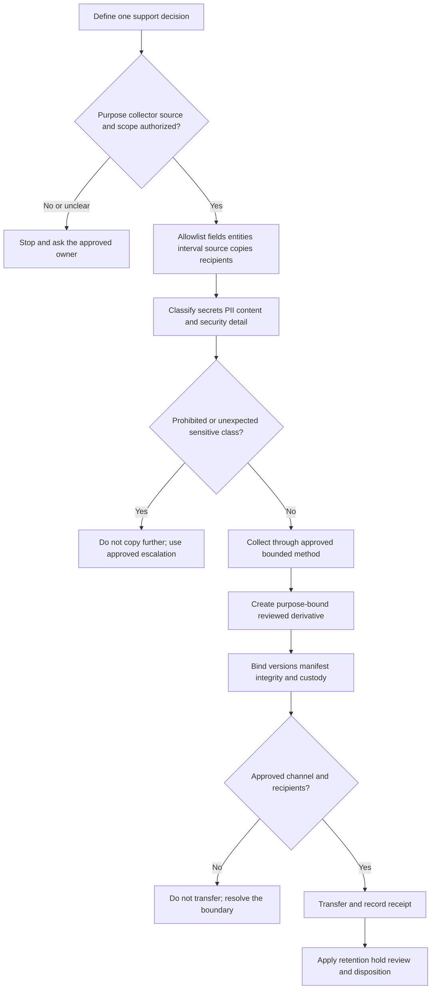

### Plain-English deep-dive: Evidence is borrowed risk

Imagine borrowing a master key to inspect one room. Permission to enter that room does not permit copying the key, opening every room, photographing every document, or keeping the key forever. Evidence creates similar temporary responsibility. Every additional field, day, recipient, and copy creates another exposure path.

The analogy stops because digital information can be duplicated invisibly, and a collector may not recognize every embedded field. Screenshots, HAR files, packet captures, spreadsheets, documents, and archives can carry information outside the visible troubleshooting area. That is why purpose, classification, transformation, review, packaging, access, and lifecycle all matter.

## 2. Authorization before collection

Authorization is specific. “Support may investigate this ticket” rarely establishes permission to export message content, inspect another tenant, gather browser credentials, run an unrestricted packet capture, enable verbose telemetry, or transmit data through a new system. The record should say who may perform which action on which source and entities, during which period, for what purpose, through which approved method, for which recipients, and until what condition or date.

Authorization may come from policy, documented role entitlement, customer consent captured through an approved process, a case-specific approval, or an incident procedure. The model depends on employer, jurisdiction, contract, and case. This lesson grants no real authority. The lab permits only learner-owned synthetic text.

| Authorization element | Beginner question | Strong record | Weak substitute |
|---|---|---|---|
| Owner | Who may approve this source and purpose? | Named role or approved owner process | The person asking most urgently |
| Collector | Which identity or service may extract the data? | Verified person/service and role | Anyone with an administrator button |
| Action | View, query, export, transform, transfer, retain, or delete? | Exact permitted operation | Generic “access” |
| Source | Which tenant, mailbox, endpoint, log, case, or local file? | Exact bounded source class | “The environment” |
| Subjects | Which users, requests, messages, devices, or objects? | Minimal named or aliased population | Everyone or every tenant |
| Time | Which event interval and authorization window? | Half-open UTC interval plus approval expiry | “Around the incident” |
| Fields | Which attributes may be returned? | Purpose-linked allowlist | Full export with a promise to clean later |
| Purpose | Which decision or obligation permits use? | Named support question | Curiosity, future analytics, or portfolio reuse |
| Recipients | Which roles need the derivative? | Verified least-privilege group | Everyone copied on a thread |
| Channel | Which route is approved for the classification and relationship? | Current approved system and control set | Personal email, public paste, chat, or consumer drive |
| Lifecycle | Which retention, hold, review, and deletion rule applies? | Policy class and accountable owner | “Keep it in case” |

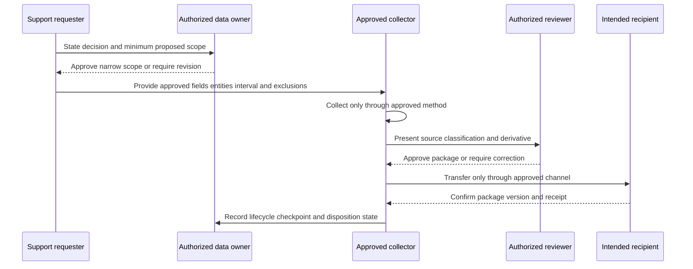

Recheck authority when purpose changes. Evidence gathered for one support case is not automatically available for model training, employee review, a conference talk, a portfolio, a public knowledge article, or a different customer's case. A new recipient, region, tool, broader interval, original-content request, or long-term storage purpose can require a new decision.

Urgency does not create permission to bypass controls. A real emergency may activate an approved incident path with different owners and preservation requirements. Invoke that path; do not improvise it. If authority is unclear, stop expanding collection and escalate.

## 3. Minimum necessary collection

Minimization starts with competing explanations from Part 097's method, but this file does not link backward because the user requires one sole final Part link. Identify the observation that separates the explanations, then choose the narrowest source capable of producing it. If a result class and stage answer the question, a full body is unnecessary. If two failed attempts and one healthy control show a bounded split, thirty days of every user's records are excessive.

Review eight dimensions together. Narrowing only the interval while exporting every field is still overcollection.

| Dimension | Broad request | Minimum-necessary rewrite | Validation question |
|---|---|---|---|
| Purpose | “Send logs so we can investigate” | “Determine whether `op-A098` reaches fictional authorization before denial” | Will the result change the next action? |
| Entities | All users, tenants, messages, or devices | One affected alias plus one matched control when justified | Why is each entity required? |
| Fields | Full event, HAR, packet, screenshot, or row | Time, route alias, stage, result class, version, correlation alias | Can any field be removed without losing discrimination? |
| Time | Entire day, week, or retention history | Half-open UTC interval plus justified delay/skew margin | Why is each minute needed? |
| Source | Every available diagnostic source | Source closest to the disputed boundary, then one independent control | Which hypothesis does this source test? |
| Precision | Exact identity, network value, or location | Coarser category or stable alias when exactness is unnecessary | Does precision create risk without decision value? |
| Copies/recipients | Download, unzip, email, re-upload, and forward | One controlled derivative and one authorized recipient group | Can analysis occur without another copy? |
| Duration | Keep until someone remembers | Policy-bound trigger, owner, review, and disposition | Who knows when the purpose ends? |

An **allowlist** names fields permitted to remain. A **denylist** names fields to remove. Prefer an allowlist when structured evidence permits it because new or unexpected fields stay excluded by default. A denylist can miss nested `authorization`, `set-cookie`, `refresh_token`, debug blobs, URLs, encoded content, or new application fields. In real work, use an approved structured parser or exporter and validate its result; do not improvise string replacements over complex evidence.

```mermaid
flowchart LR
    Question["One troubleshooting decision"] --> Hypotheses["Leading explanations"]
    Hypotheses --> Difference["Observation that separates them"]
    Difference --> Fields["Exact field allowlist"]
    Fields --> Entities["Affected aliases and smallest control set"]
    Entities --> Time["Bounded UTC interval"]
    Time --> Source["Most direct approved source"]
    Source --> Review["Value versus sensitivity review"]
    Review --> Request["Issue minimum evidence request"]
```

### Plain-English deep-dive: Minimum necessary is a scalpel, not a teaspoon

“Collect less” does not mean take a tiny random sample. A teaspoon of the wrong evidence is still useless. Minimization is like selecting the smallest incision that reaches the actual problem: the scope must be narrow **and** sufficient for the decision.

The analogy has limits. Distributed evidence can be delayed or incomplete, and the first result may reveal a need for one more field. Expansion is valid when it answers a newly documented question and the owner approves the revised scope. The safe pattern is staged collection, not broad collection in advance merely to avoid a second request.

### Worked reduction: synthetic API request

Suppose a fictional report says three save attempts return `403`. An initial request asks for a complete HAR, all application logs, the access token, request bodies, and every request for the day. Reject it. It includes a prohibited credential, broad browser activity, content, unrelated operations, and no precise decision.

The revised question is: “Did the fictional attempts establish identity and then fail at authorization, or fail before identity was established?”

| Candidate item | Decision | Rationale |
|---|---|---|
| UTC event time | Keep at source precision | Locates the attempt inside the approved interval |
| Case-scoped correlation alias | Keep | Preserves joins without exposing an original identifier to the recipient |
| Method and route template | Keep | Distinguishes operation class without query values |
| Result and stage category | Keep | Separates fictional authentication and authorization explanations |
| Two failed attempts and one matched healthy control | Keep | Supports a bounded comparison |
| User identity | Replace with `principal-A098` or omit | Exact identity is unnecessary; consistency may be useful |
| Tenant identifier | Replace with `tenant-A098` or omit | Preserves scope only when needed |
| Authorization header | Structurally exclude | It may contain a bearer credential and is never needed here |
| Cookies/session storage | Structurally exclude | They may grant access and reveal unrelated state |
| Request/response bodies | Exclude at this stage | The leading distinction does not depend on content |
| Unrelated browser and service events | Exclude | They do not answer the question |
| Actual secret inspection | Reject and escalate | Credentials and private keys must not enter the package |

The resulting evidence cannot prove a real product mechanism. If a stage category is proprietary, unavailable to L1, or semantically unclear, the correct next step is a precise product-owner question, not a larger customer export.

## 4. Classifying secrets, PII, content, and operational metadata

Classify before redacting. A person cannot reliably remove risks they have not considered. At minimum, distinguish authentication material, direct identifiers, indirect or linkable identifiers, customer content, security-sensitive operational detail, and ordinary diagnostic metadata.

The strongest secret control is **non-collection**. Never ask for a password, one-time code, session cookie, bearer token, refresh token, API key, client secret, webhook secret, recovery code, private key, signing key, seed phrase, database password, or credential-bearing connection string. Do not collect a secret now because it can be redacted later. Collection itself creates exposure.

| Data class | Examples | Default handling here | Escalate when |
|---|---|---|---|
| Credentials/private keys | Password, token, cookie, API key, recovery code, signing/decryption private key | Never request, copy, package, or transfer; structurally exclude | Any working or suspected secret appears or may have been exposed |
| Access-bearing configuration | Connection string with credential, webhook signing secret, client secret | Exclude; request nonsecret state or validation output | The proposed diagnostic requires protected material |
| Direct PII | Name, personal email, phone, employee or government identifier | Remove or replace when exact identity is unnecessary | Identity itself is material and explicit authority exists |
| Indirect/linkable PII | Exact time, IP, device, location, rare role, manager, unique event combination | Generalize, pseudonymize, or remove according to purpose | Combination risk or classification is unclear |
| Customer content | Subject, body, attachment, document, chat, prompt, form value, payload | Exclude by default; prefer synthetic reproduction or metadata | Content-dependent investigation has explicit restricted handling |
| Network/system detail | Internal host, IP, path, topology, tenant/object ID, exact version | Alias, generalize, or selectively keep | Disclosure could expose protected architecture or another tenant |
| Security finding | Detection detail, malicious URL, incident note, remediation action | Use the approved security workflow and smallest audience | Active compromise, malicious content, or disclosure concern exists |
| Diagnostic metadata | Result class, duration, stage, count, approved alias | Keep only when linked to the decision | A field unexpectedly embeds free text, content, or identity |

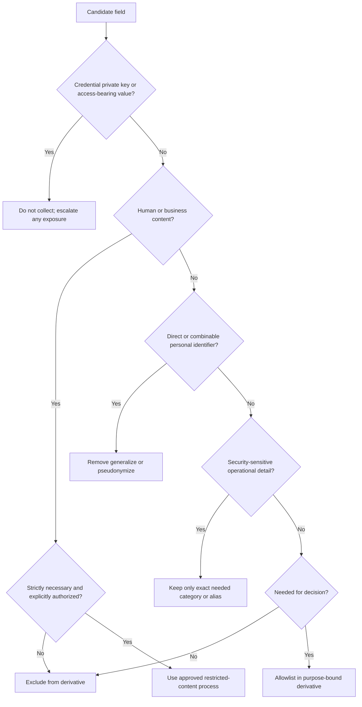

### Plain-English deep-dive: Metadata is not automatically harmless

A parcel's shipping label is metadata, but it can reveal a recipient, address, sender, tracking number, route, and timing. Technical metadata behaves similarly. A timestamp, tenant identifier, source IP, message ID, internal host, rare error, device, and role can identify someone or expose architecture when combined.

The analogy stops because digital metadata can be searched and joined at scale. A value that looks anonymous in one file may become identifying when compared with a directory, calendar, public event, or audit source. Classification considers combinations and recipient context, not just obvious field names.

If a secret appears unexpectedly, stop ordinary handling. Do not test it, paste it into another system, copy it into a “clean” ticket, or delete history to hide the mistake. Restrict further exposure, record only the minimum safe incident facts, notify the approved security/privacy owner, and follow their containment, rotation, disclosure, and disposition direction. This lesson does not prescribe a real incident response.

## 5. Redaction, pseudonymization, and anonymization

Perform redaction on a derived share copy, not by silently overwriting source evidence. When policy permits retaining the source, keep it in a more restricted boundary and identify it through a source reference. If retaining it is not permitted, follow the applicable approved process. The transformation log should describe categories and rules without repeating the removed sensitive values.

| Method | What it does | Useful when | Limitation |
|---|---|---|---|
| Removal | Deletes an entire field, row, page, object, member, or image region from the derivative | The item has no decision value | Can remove context; record what was omitted |
| Fixed replacement | Substitutes a label such as `[SECRET-EXCLUDED]` | Reviewer must know a prohibited class existed | Do not preserve prefix, suffix, length, or secret shape |
| Consistent pseudonym | Replaces repeated values with aliases such as `principal-A098` | Correlation is needed | Mapping and context can re-identify; this is not anonymity |
| Generalization | Reduces precision, such as replacing an exact role with a broad category | Exact detail is unnecessary | Too much destroys value; too little preserves linkability |
| Bucketing | Converts a numeric value into a range | Trend matters more than exact value | Boundaries can distort interpretation |
| Cropping | Keeps only a relevant visual region | A screenshot is necessary and structured evidence is unavailable | Original pixels, browser chrome, notifications, and metadata may remain elsewhere |
| Flattening/rendering | Produces a new representation without editable hidden layers | Approved tooling and review support it | Rendering can alter or omit evidence and must be validated |
| Metadata cleaning | Removes author, path, GPS, comment, revision, thumbnail, or custom properties | The format carries hidden context | Tool coverage varies; inspect final properties and members |
| Structural allowlisting | Builds a new output containing only named safe fields | JSON, CSV, logs, or tables support controlled projection | Parser mistakes and free text can still leak data |
| Aggregation | Replaces individual records with counts or rates | Individual detail is unnecessary | Small groups and rare combinations may still identify people |

Black rectangles can fail. Underlying PDF text may remain selectable, layers may remain editable, cropped pixels may be preserved, thumbnails may show the original, revision history may retain old values, and spreadsheets may contain hidden sheets, rows, comments, formulas, links, or cached values. Renaming a file changes none of that. “I cannot see it” is not a verification standard.

| Artifact type | Hidden exposure surfaces | Safer derivative principle | Verification focus |
|---|---|---|---|
| JSON/structured log | Nested objects, arrays, encoded values, debug blobs, stack/environment fields | Parse with an approved structured tool and construct from an allowlist | Key inventory, schema, nested values, search, independent review |
| HAR/browser export | Authorization, cookies, URLs, query values, form data, request/response bodies | Prefer selected metadata or an approved sanitizer; exclude bodies by default | Every entry, header, body, URL, and archive member |
| Screenshot/image | Names, avatars, tabs, notifications, URL bar, hidden crop, OCR-readable text | Capture only needed region or make an approved permanent derivative | Reopen final, zoom, metadata, OCR/search where approved |
| PDF/document | Comments, revision history, layers, attachments, author metadata | Use an approved irreversible derivative process | Search/copy text, properties, layers, embedded objects, second review |
| Spreadsheet | Hidden sheets/rows/columns, comments, formulas, links, cached values | Export only selected rows/columns to a clean derivative | Workbook structure and plain-text result |
| Packet capture | Payload, DNS names, IPs, cookies, certificates, unrelated traffic | Avoid unless necessary; bound endpoint/interface/time through procedure | Protocol inventory, conversations, payload presence, size |
| Email/message | Addresses, subject/body, signatures, threading, routes, URLs, attachments | Prefer message alias and necessary result/routing metadata | Header/content inventory and explicit content exclusion |
| Archive | Unexpected files, paths, nested archives, editor backups, metadata | Build a new package from a reviewed inclusion list | Recursive member list and manifest comparison through approved tooling |

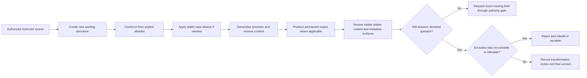

### Plain-English deep-dive: Redaction is not anonymization

Imagine a yearbook with every name covered. A distinctive photograph, jersey number, club list, and event date may still identify a student. Covering names is redaction. Replacing names with consistent student numbers is pseudonymization. Anonymization would require a defensible assessment that people are no longer reasonably identifiable from the released information and likely outside information.

The limit matters: there is no universal anonymize button. Recipient knowledge, population size, rare combinations, future datasets, attacker capability, and legal standards change the result. Support engineers should normally say “redacted and pseudonymized for this recipient and purpose,” not “anonymous,” unless a qualified process supports the stronger claim.

### Two independent review questions

The **disclosure review** asks, “Can the recipient see, infer, or recover data outside scope?” The **utility review** asks, “Can the recipient still answer the declared support question?” Passing only one is not enough. A blank page has low disclosure risk but no diagnostic value. A full export has high utility but unacceptable exposure.

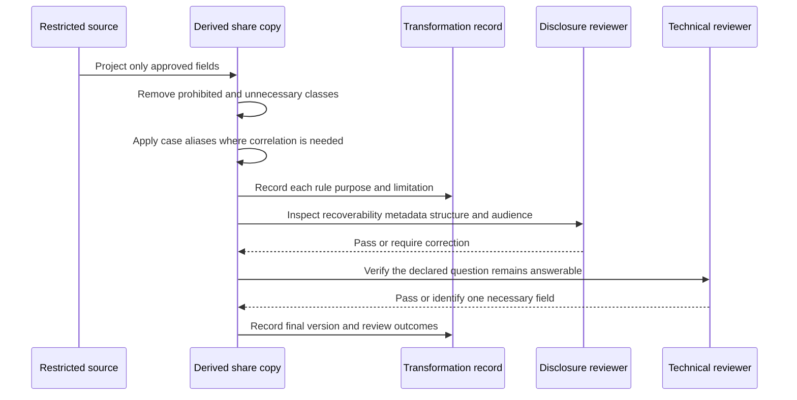

## 6. Integrity, hashing, provenance, and chain of custody

**Provenance** is origin and history: which source produced an item, under what scope, by which approved method, at what time, through which transformations, and with which version. Integrity asks whether it remained complete and unaltered in relevant ways. Both are needed.

A hash such as SHA-256 maps bytes to a digest. If a byte changes, the digest will almost certainly change. This supports later byte comparison. A source and its redacted derivative should have different digests because their bytes differ. The transformation record explains the relationship.

Hashes do not prove truth. A collector can hash the wrong file, incomplete output, fabricated data, unauthorized evidence, or a file with an inaccurate timestamp. If both a file and an unprotected manifest are replaced, an attacker can calculate a new self-consistent digest. Authenticity may require protected signatures, trusted acquisition, repositories, or attestations under the organization's process.

| Integrity control | What it supports | What it does not prove | Useful record |
|---|---|---|---|
| SHA-256 digest | Later comparison of exact bytes | Truth, authority, completeness, identity, safe disclosure, or source authenticity | Algorithm, digest, item/version, relative path, byte length, time, tool/version if required |
| Byte length | Detects many truncation/substitution errors | Content correctness | Exact integer after final change |
| Source reference | Connects derivative to an authorized origin record | That the origin was accurate or complete | Source item ID, collector, method, scope, time |
| Access controls | Reduce unauthorized modification opportunity | That authorized people made no mistake | Approved storage class and roles |
| Version ID | Distinguishes source, draft, reviewed derivative, and package | That latest means best or approved | Stable item ID plus monotonic revision and state |
| Transformation log | Explains intentional differences | That tooling had no defect | Fields/rules, actor, time, reason, reviewer |
| Review record | Shows a named decision about disclosure and utility | That hidden data is impossible or facts are true | Review type, role, outcome, time, limitations |
| Transfer receipt | Shows a package reached an approved destination/account | That every person read it or no downstream copy exists | Channel record, sender, recipient, time, package version/digest |
| Custody event | Records possession and handling | Automatic legal admissibility | Item, actor role, action, authority, boundary, time, version, exception |

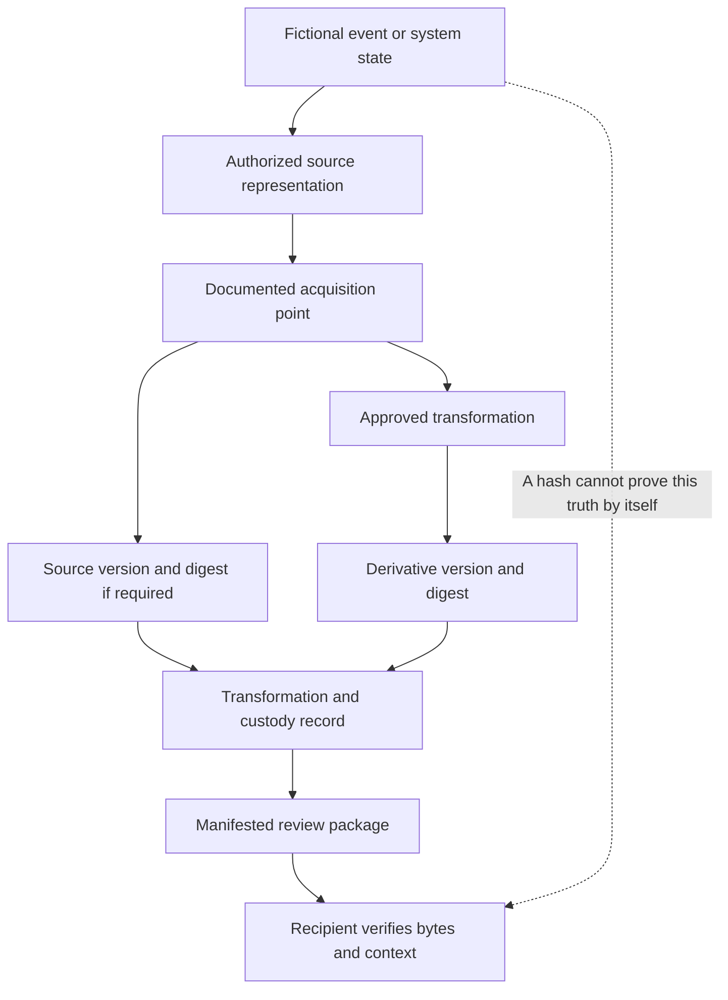

### Plain-English deep-dive: A hash is a seal number, not a witness

Imagine sealing a photocopy in a tamper-evident envelope. An intact seal supports that the photocopy inside has not changed since sealing. It does not prove every page was copied, the original was genuine, the copier had permission, or the words were true.

Hashing has the same boundary. It is valuable for change detection when the baseline digest, algorithm, acquisition, and storage are trustworthy. It cannot establish truth, completeness, provenance, authorization, interpretation, or safe disclosure by itself.

Chain of custody begins when evidence enters the controlled boundary and continues through review, derivation, packaging, transfer, return, archive, or deletion. Keep entries append-only under the approved system. Correct an error with a new referencing entry rather than rewriting history.

| Custody field | Required question |
|---|---|
| Event ID | Which stable record identifies this handling event? |
| Item/package ID and version | Exactly which logical item and bytes were handled? |
| UTC time | When did access or custody change, and what does the timestamp mean? |
| Actor and role | Who acted, under which authority? |
| Action | Requested, acquired, viewed, derived, reviewed, packaged, transferred, received, held, archived, or disposed? |
| Purpose/authority | Why was the action permitted and needed? |
| From/to boundary | Which system, person, team, or organization changed custody? |
| Integrity reference | Which digest, signature, repository record, or placeholder applies? |
| Location/classification | Where did the item reside and under which handling class? |
| Exception | Was anything denied, incomplete, corrected, delayed, or exposed? |

## 7. Naming and manifest design

Names should help reviewers sort artifacts without exposing customers, people, tenant IDs, email addresses, message subjects, internal hosts, IPs, secrets, or incident allegations. Use a stable case alias, evidence type, scope alias, UTC time when useful, handling state, and immutable version.

Synthetic pattern:

`CASE-098-A__api-stage-events__op-A098__20260824T101500Z__DERIVED-REDACTED__v01.csv`

| Component | Rule | Good synthetic value | Avoid |
|---|---|---|---|
| Case | Noncustomer alias | `CASE-098-A` | Customer name or sensitive ticket title |
| Evidence type | Controlled generic vocabulary | `api-stage-events`, `timeline`, `review` | Message subject or unsupported product claim |
| Scope | Stable fictional entity alias | `op-A098` | User address, real tenant ID, hostname, or IP |
| Time | UTC basic format if needed | `20260824T101500Z` | Locale-dependent `8-24 morning` |
| Handling state | Exact artifact state | `SOURCE-SYNTHETIC`, `DERIVED-REDACTED`, `PACKAGE` | `safe`, `anonymous`, `final` without assessment |
| Version | Monotonic immutable revision | `v01`, `v02` | `final2`, `latest`, or reusing a name after changes |
| Extension | Actual validated representation | `.csv`, `.json`, `.md` | Misleading or double extensions |

The manifest is the package control plane. It must not become a secret index by repeating removed values or carrying the alias map. Every package member appears exactly once; every manifest row resolves to one member. A source may be referenced without being placed in the transfer package.

| Manifest field | Required content | Synthetic example |
|---|---|---|
| Bundle ID/version | Stable package identity | `BUNDLE-098-A`, version `1` |
| Artifact ID/path | Stable item and exact relative path | `E098-DER-001`, `evidence/...v01.csv` |
| Purpose | Why the recipient needs it | “Compare fictional stages for affected/control aliases” |
| Evidence label | Production transfer description, local synthetic, learned, or template | `local_synthetic` |
| Authorization reference | Approved record pointer or lab owner statement | `AUTH-098-LOCAL-SYNTHETIC` |
| Source relationship | Restricted source item/reference | `E098-SRC-001` |
| Classification | Highest applicable approved label | `SYNTHETIC_NONPRODUCTION` |
| Included fields | Exact allowlist | Time, route alias, status, stage, correlation alias |
| Excluded classes | Secret, PII, content, unrelated metadata | Credentials, private keys, identity, body, URL, host |
| Transformation | Rule set and version | `TX-098-001` structural projection |
| Format/schema | Actual representation and schema | `CSV`, `schema-syn-1` |
| Byte length | Size after final creation | `NOT_MEASURED_DESIGN_ONLY` |
| Digest | Algorithm and actual value or honest placeholder | `SHA-256 / NOT_COMPUTED` |
| Review | Reviewer role, outcome, time, limits | `NOT_REVIEWED_DESIGN_ONLY` |
| Audience/transfer | Authorized purpose and recipient state | `learner_local_only / NOT_TRANSFERRED` |
| Retention/hold | Rule, trigger, owner, review, hold state | Local learner decision if performed |
| Disposition | Retain, hold, archived, disposed, exception, or design | `DESIGN_ONLY_NOT_PERFORMED` |

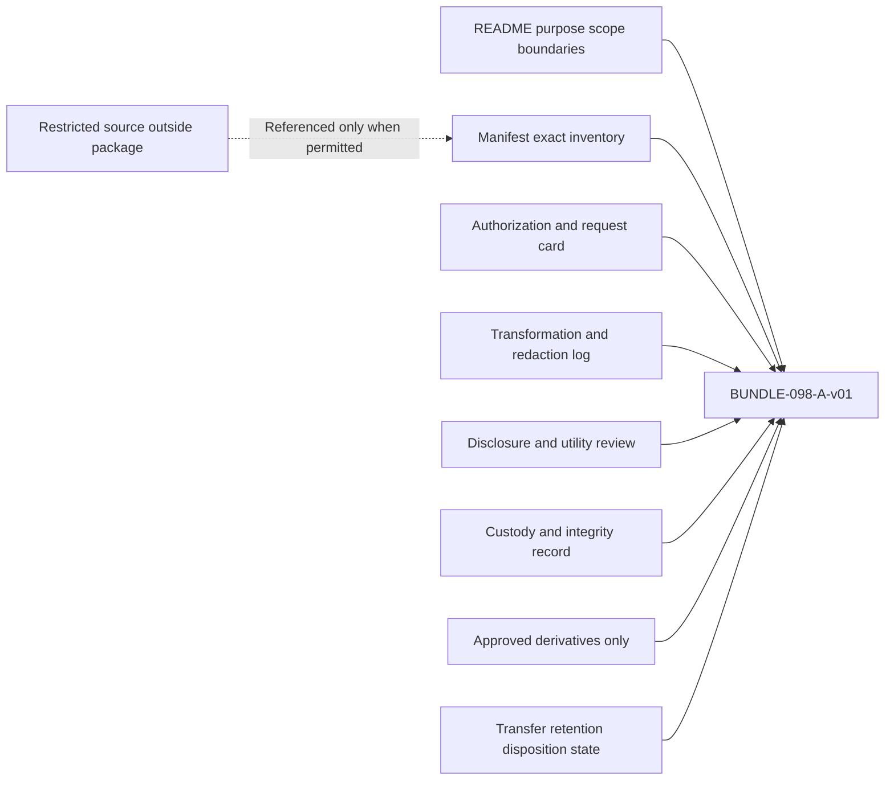

### Plain-English deep-dive: The manifest is a map, not the territory

A restaurant menu can list ingredients and preparation, but it is not the meal and may contain mistakes. A manifest similarly tells a recipient what the package claims to contain and how it was handled. The recipient still compares it with actual members, validates versions/digests where required, and evaluates whether lineage and transformations support the decision.

If one byte, name, item, transformation, or lifecycle state changes, update the appropriate item/package version and affected integrity values. Do not call an edited archive the same package merely because its folder name stayed constant.

## 8. Packaging and secure transfer

Packaging is an inclusion decision. Start from an empty approved staging location and add only reviewed, manifested derivatives. Do not copy a working directory and try to remove risky files afterward. That approach can carry source exports, editor backups, temporary files, screenshots, old versions, thumbnails, or nested archives.

Conceptual local structure:

```text
EvidenceBundle-098-SYN-v01/
  00-README.md
  01-authorization-scope.md
  02-evidence-request.md
  03-transformation-log.md
  04-review-record.md
  05-manifest.md
  06-chain-of-custody.md
  07-transfer-plan.md
  08-retention-deletion.md
  evidence/
    CASE-098-A__api-stage-events__op-A098__DERIVED-REDACTED__v01.csv
```

There is deliberately no source folder in the package. The structure is a design until created. Compression reduces size, not sensitivity. Base64 changes representation, not confidentiality. Password-protected archives may or may not meet policy and can create key-sharing problems. Use only the approved organizational packaging controls; this lesson prescribes none for Abnormal.

| Packaging layer | Minimum control | Review question | Unsafe shortcut |
|---|---|---|---|
| README | Purpose, scope, audience, class, version, limits, owner role | Can recipient orient without opening evidence? | Put sensitive detail in filename or message body |
| Manifest | Exact inventory, lineage, transformations, integrity, lifecycle | Does it match every member and no extra member? | Rely on memory |
| Evidence folder | Reviewed derivatives only unless special authority applies | Are source, scratch, backup, and rejected files absent? | Zip the whole working directory |
| Review record | Disclosure and utility decisions on final bytes | Did review occur after the last edit? | Reuse review from an older version |
| Custody record | Collection through package events | Is every material handoff visible? | Rely on chat history alone |
| Transfer instruction | Approved recipient, channel class, access, expiry, receipt | Does it match classification and contract? | Public link, personal email, or unapproved drive |
| Lifecycle record | Retention class, hold, review, disposition owner/state | Is continued storage justified? | Keep forever “just in case” |

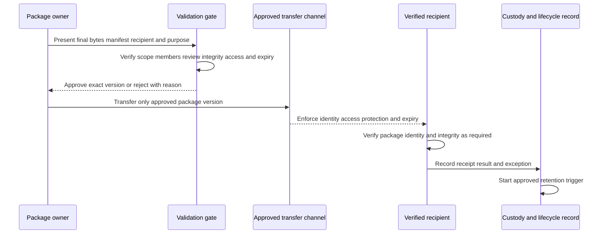

| Transfer control | Required question | Unsafe assumption |
|---|---|---|
| Recipient identity | Is the named person/team authorized for this purpose and classification? | A familiar email domain is enough |
| Channel approval | Is the exact system approved for this data class and customer relationship? | Encryption makes any service acceptable |
| Access | Is it least-privilege, authenticated, logged, and revocable? | A long random link is sufficient control |
| Confidentiality | Is required protection present in transit and at rest? | HTTPS solves recipient/device/storage risk |
| Integrity | Can recipient verify intended package/version? | Filename proves correct bytes |
| Region/contract | Are residency, tenant, customer, and contractual boundaries met? | Cloud storage location is irrelevant |
| Expiry | Does access end through an owned process? | Case closure removes every copy |
| Notification | Does invite metadata reveal sensitive case detail? | Notifications are harmless |
| Receipt | Did intended recipient confirm access and verification? | Upload success equals handoff |
| Downstream use | May recipient extract, forward, or store elsewhere? | Initial approval covers all future copies |
| Failure response | What happens after wrong recipient, exposed link, or mismatch? | Quietly replace and continue |

Never use a public paste, public repository, public issue, public object URL, public scanner, public parser, online converter, personal email, personal cloud, consumer file sharing, or unapproved AI assistant. Never bypass an export or security control to feed a preferred tool. An organization may approve a managed case attachment or exchange system, but this Part does not claim which route Abnormal uses.

### Plain-English deep-dive: Secure transfer is a verified handoff

A courier can carry a locked box, but safe delivery still needs the right box, address, recipient, custody record, and return/disposal instruction. Encryption is the lock. Identity, authorization, manifest, channel, expiry, receipt, and lifecycle complete the handoff.

Digital recipients can create perfect copies, and automated systems can replicate data into previews, indexes, notifications, and backups. Transfer planning must include downstream behavior and retention, not only transport encryption.

## 9. Retention, holds, and deletion

Retention should be determined before transfer. Record the controlling rule or customer term, trigger, duration or review condition, owner, storage boundary, known copies, hold state, and disposition evidence. “Keep while useful” is not testable.

A legal or other preservation hold suspends ordinary deletion for covered material. The support engineer does not independently decide that a hold is unnecessary or finished. If one may apply, follow the authorized legal, security, privacy, or records process.

Deletion is not simply dragging a file to a recycle bin. Approved disposition may involve logical deletion, sanitization, cryptographic erasure, backup expiry, or archival depending on media, system, contract, hold, risk, and policy. This lesson gives no deletion commands because generic destructive instructions can remove the wrong evidence or violate a hold.

| Lifecycle state | Meaning | Allowed action | Prohibited shortcut |
|---|---|---|---|
| Active purpose | Evidence remains needed for approved decision | Restrict, minimize, review access, maintain versions | Reuse for another purpose without approval |
| Pending transfer | Approved package waits for valid route/recipient | Keep controlled; resolve channel | Send by personal/public route |
| Transferred | Approved recipient has package | Record receipt, copies, access, and next review | Forget sender and recipient copies |
| Retention review | Purpose and rule are reassessed | Confirm case, class, owner, copies, and holds | Default to forever |
| Hold | Authorized preservation requirement applies | Protect covered material and record authority | Delete or alter on personal judgment |
| Eligible for disposition | Purpose ended and no hold/requirement remains | Use approved scoped process | Recursive delete, wipe, key destruction, or evidence clearing |
| Disposed | Approved action completed for named location/copy | Record result and known residual limitation | Claim universal erasure |
| Exception | Backup, immutable store, platform, or owner blocks immediate disposition | Record limitation, owner, and next review | Hide the exception or bypass system control |

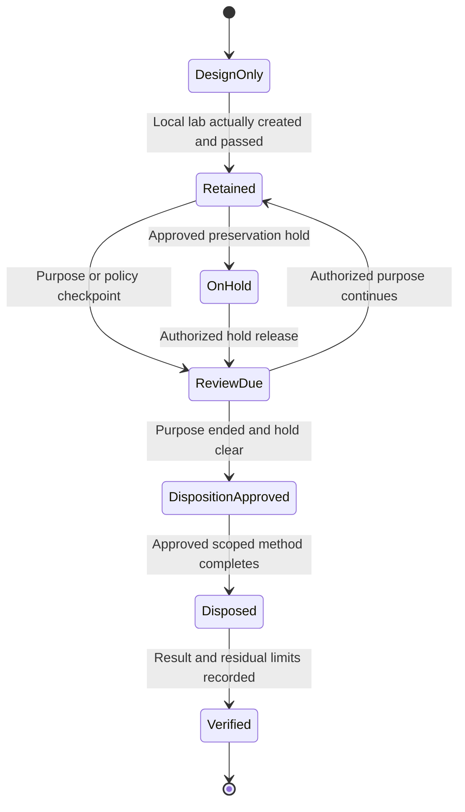

Do not delete source evidence because a derivative exists. Do not clear logs, queues, histories, caches, audit records, mail, or customer content to reduce exposure. Do not issue recursive deletion, wipe, storage reset, key destruction, retention change, or purge commands from a generic lesson. If sensitive material arrived accidentally, avoid further duplication and let the authorized owner direct containment and disposition.

### Plain-English deep-dive: Deletion is a lifecycle event, not a panic button

Think of a library withdrawing a book. Staff check the catalog, loans, preservation orders, branch copies, and disposition rule before recording the withdrawal. Quietly throwing away the nearest copy neither satisfies policy nor proves all copies were handled.

Digital systems add snapshots, backups, replicas, caches, downloads, and immutable logs. Honest deletion language names the controlled location and known limitation. A support engineer may control only one copy.

## 10. Evidence-request, redaction, and package decision tree

The safe outcome may be no collection, a smaller request, a sanitized derivative, an approved escalation, or “unable to proceed under current authority.” Completing a checklist is not permission; it reveals where permission is needed.

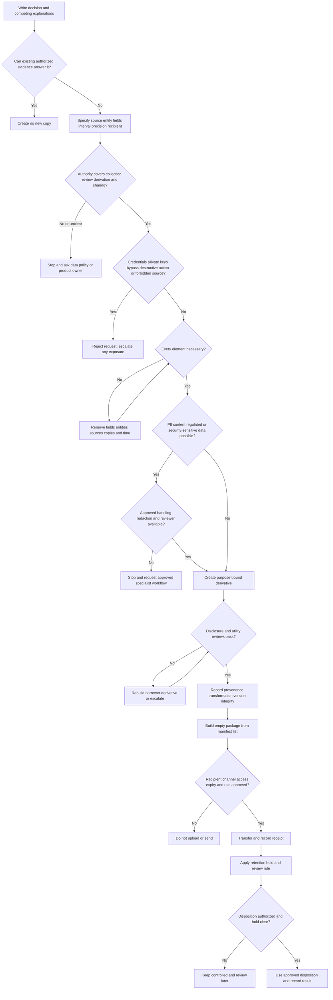

| Tree outcome | Meaning | Support wording |
|---|---|---|
| No collection | Current approved observation answers the question | “We do not need another export for the next step.” |
| Smaller request | Initial request exceeds decision need | “Please provide only these fields, aliases, and UTC interval.” |
| Sanitized derivative | Restricted source exists, but approved minimum can be derived | “Use the approved process to create a derivative containing only the allowlisted fields.” |
| Product/policy escalation | Required evidence, semantics, or authority belongs elsewhere | “The next step crosses my handling authority; here is the exact question and evidence ceiling.” |
| Security/privacy escalation | Secret exposure, wrong recipient, prohibited content, or incident concern exists | “I am stopping further copying and using the approved response path.” |
| Unable to proceed | No authorized evidence can answer now | “The cause cannot be determined from currently authorized evidence; broader collection is not justified.” |

## 11. Worked example 1: synthetic API denial bundle

### Scenario

A local fictional fixture says operation alias `op-A098` returned `denied`, while control `op-C098` returned `accepted`. The decision is whether the declared difference first appears at stage `authorize` or `validate`. The example says nothing about a real product or Abnormal field.

A poor request is: “Send the HAR, token, full request/response, and all service logs.” It can contain credentials, cookies, URLs, identities, tenant details, payloads, and unrelated activity. It has no authority, field, time, or decision boundary.

The minimum synthetic request asks for event time, operation alias, route alias, stage, result class, version category, and local correlation alias for two operations in ten minutes. It excludes authorization headers, cookies, tokens, keys, URLs, query strings, bodies, user/tenant identity, hosts, IPs, and free text.

| Item | Affected row | Healthy control | Why included |
|---|---|---|---|
| Event time | `2026-08-24T10:17:12Z` | `2026-08-24T10:18:03Z` | Establishes interval membership, not causality |
| Operation alias | `op-A098` | `op-C098` | Maintains local correlation |
| Route alias | `route-save-A` | `route-save-A` | Matches operation family |
| Stage | `authorize` | `complete` | Separates fixture explanations |
| Result | `role-required` | `accepted` | States declared synthetic outcome |
| Version | `v2-fixture` | `v2-fixture` | Controls one dimension |
| Correlation alias | `corr-A098` | `corr-C098` | Links rows only inside fiction |
| Sensitive fields | Structurally absent | Structurally absent | Minimization by construction |

The transformation log says `authorization material: structurally excluded`; it never repeats a secret fragment. There is no real alias map. Names are fictional from creation.

### Worked manifest excerpt

| Artifact ID | Relative path | Purpose | Transformation | Digest state | Lifecycle state |
|---|---|---|---|---|---|
| `E098-001` | `00-README.md` | Purpose, scope, boundaries | Authored synthetic | `NOT_COMPUTED` | `DESIGN_ONLY` |
| `E098-002` | `05-manifest.md` | Package inventory | Authored synthetic | `NOT_COMPUTED` | `DESIGN_ONLY` |
| `E098-003` | `03-transformation-log.md` | Allowlist/exclusion rules | Authored synthetic | `NOT_COMPUTED` | `DESIGN_ONLY` |
| `E098-004` | `evidence/...DERIVED-REDACTED__v01.csv` | Stage/result comparison | `TX-098-001` | `NOT_COMPUTED` | `DESIGN_ONLY` |
| `E098-005` | `06-chain-of-custody.md` | Handling history | Authored synthetic | `NOT_COMPUTED` | `DESIGN_ONLY` |
| `E098-006` | `07-transfer-plan.md` | Transfer gates | No transfer | `NOT_COMPUTED` | `NOT_TRANSFERRED` |
| `E098-007` | `08-retention-deletion.md` | Lifecycle controls | No disposition | `NOT_COMPUTED` | `NOT_PERFORMED` |

Within the fiction, the rows are consistent with a difference at authorization. They do not prove a real mechanism, defect, customer state, or Abnormal behavior. Placeholder digests prove nothing because no file was created and no algorithm was run.

## 12. Worked example 2: synthetic email-security request

A fictional statement says, “A benign message was handled unexpectedly.” That does not authorize collection of its subject, body, recipients, sender, links, attachments, mailbox, or broad trace. First ask: What outcome was expected? What happened? Which approved behavior or policy is relevant? Which alias and time are in scope? Can metadata locate the decision boundary?

| Candidate evidence | Decision | Reason | Safer alternative or escalation |
|---|---|---|---|
| Password, token, API key, private key | Prohibited | Authentication material must never be collected here | Owner uses approved access and returns nonsecret result metadata |
| Full subject/body | Exclude initially | Content is not shown necessary | Message alias, direction category, time, outcome, policy-version alias |
| Attachment | Exclude | May be sensitive or malicious | Approved category/hash/reference only if policy permits and decision needs it |
| Clickable URL | Exclude | Can expose identity/query data or create risk | Approved nonclickable indicator reference through security workflow |
| All sender messages | Reject overcollection | One report does not justify broad content | One affected alias and matched control if necessary |
| Exact recipients | Exclude | Direct PII without current need | Recipient-count bucket or scope alias |
| Outcome category | Include if authorized | Defines expected-versus-actual | Use controlled category and source semantics |
| Policy version alias | Include if authorized | Tests documented expected behavior | Avoid full unrelated policy export |
| Original message ID | Pseudonymize | Useful for correlation but may identify | Package-local message alias; mapping outside bundle if allowed |
| Detection explanation | Product-owner boundary | Proprietary semantics may require approved documentation | Escalate one precise question; do not infer internals |

The package is not anonymous. A rare time, direction, outcome, policy version, and recipient-count combination might still single out an event. Label it redacted/pseudonymized for a purpose, not anonymous.

If real content becomes essential to an authorized security investigation, use the approved restricted workflow and audience. This lesson gives no method to open, detonate, forward, upload, or inspect a suspicious URL or attachment and explicitly prohibits public scanning uploads.

## 13. Worked example 3: Your prior support transfer

You can build a truthful interview story without claiming this exact artifact existed in a past case.

| Story element | Truth-safe prompt | Evidence-handling signal |
|---|---|---|
| Situation | Which real enterprise support case involved ambiguity, impact, and several diagnostic surfaces? | Establishes real scope without identifying the customer |
| Task | Which decision or escalation did you own? | Shows purpose instead of indiscriminate collection |
| Authority | How did the customer or approved Microsoft process govern evidence access? | Shows access was bounded |
| Minimization | Which object, interval, version, or result was actually needed? | Demonstrates restraint |
| Protection | How were sensitive details handled under the real process? | Must remain accurate and permitted |
| Packaging | How were reproduction, timestamps, observations, and asks made clear? | Shows escalation quality |
| Result | What verified outcome followed? | Avoids saying package quality alone caused resolution |
| Reflection | What would you verify during Abnormal onboarding? | Makes the product/process gap explicit |

A safe bridge is: “enterprise support taught me that an escalation is stronger when the evidence request is tied to a decision, scoped to the affected object and interval, and packaged with clear context. I would bring that discipline to Abnormal, but I have not used Abnormal's internal evidence workflow. I would learn the approved sources, roles, channels, retention rules, and security/privacy escalation path before handling customer artifacts.”

The local synthetic bundle is separate from production experience. It demonstrates preparation only after it is actually built.

## 14. Failure modes and escalation

Evidence handling can create a second incident while investigating the first. Wrong-recipient transfer, exposed credentials, cross-tenant data, public upload, unexpected regulated content, altered evidence, or premature deletion may require security, privacy, legal, records, or incident ownership. Quietly redact a copy and continue is not an adequate response because it erases the exposure history.

| Failure mode | Why it fails | Immediate safe response | Prevention |
|---|---|---|---|
| “Send everything” | Purpose and scope are undefined | Stop and rewrite around a decision | Request card and allowlist |
| Credential/private key collected | Collection itself creates compromise risk | Stop copying/testing; restrict and use approved response | Structural exclusion and warning |
| Public upload/personal tool | Recipient, storage, training, region, retention, and deletion are uncontrolled | Stop further sharing and escalate | Approved-tool/channel register |
| Access mistaken for authority | Capability bypasses policy or consent | Stop and verify owner/action/scope/purpose | Written authorization record |
| Overlay-only redaction | Hidden text/pixels may remain recoverable | Reject; regenerate approved permanent derivative | Final-format and second review |
| Search-and-replace sanitizer | Misses nested, encoded, split, or new fields | Rebuild from allowlist | Structured parsing and schema review |
| Alias map included | Recipient can restore identity | Remove if allowed and reassess exposure | Separate boundary/access/lifecycle |
| “Anonymous” after masking | Context can still identify | Relabel/restrict and seek privacy assessment | Accurate redacted/pseudonymized language |
| Hash treated as proof | Integrity is confused with truth/authenticity | Correct claim and examine provenance | Hash-limit statement |
| Source overwritten | Original and transformation history are lost | Preserve available state and escalate integrity issue | New immutable derivative/version |
| Filename leaks identity | Links, notifications, logs expose it | Correct under approved process; assess exposure | Alias-only naming |
| Manifest omits member | Completeness cannot be verified | Reject and rebuild from empty staging | Bidirectional inventory check |
| Stale version sent | Recipient acts on superseded evidence | Revoke/notify through approved process | Immutable versions and pre-send check |
| Wrong recipient | Confidentiality boundary is breached | Invoke approved response immediately | Recipient verification and least privilege |
| No receipt | Intended handoff and bytes are uncertain | Verify through approved channel | Receipt and integrity record |
| Indefinite retention | Exposure persists beyond purpose | Assign owner and policy review | Lifecycle required before transfer |
| Premature deletion | Hold, incident, source evidence, or customer obligation is harmed | Stop and involve authorized owner | Hold gate and approval |
| Destructive cleanup | Wrong path/evidence may be irreversibly removed | Never use generic destructive instructions | Approved scoped interface/process |
| Diagnostic value removed | Low-risk package is useless and causes another request | Revisit exact decision | Utility review with recipient/owner |

Escalate when:

- Authorization for collection, review, derivation, storage, sharing, or deletion is absent, ambiguous, expired, or disputed.
- Credentials, private keys, tokens, cookies, secrets, encryption material, customer content, regulated data, or cross-tenant data may be present.
- A secret or protected item has already been viewed, logged, copied, indexed, publicly uploaded, or sent to the wrong recipient.
- Active compromise, malicious content, unauthorized access, data loss, control bypass, or evidence tampering may be involved.
- The only route requires bypassing authentication, authorization, tenant isolation, DLP, export restrictions, privacy controls, audit, or retention.
- A tool, script, parser, converter, AI system, repository, storage location, or transfer channel is not explicitly approved for the data and relationship.
- Redaction cannot be validated as permanent, or remaining context may identify a person/customer beyond the audience.
- The question requires proprietary Abnormal telemetry, field semantics, detection reasoning, customer-data access, a privileged role, or an internal action outside L1 authority.
- Provenance, acquisition method, source completeness, clock meaning, transformation history, or custody has a material gap.
- A wrong recipient, public link, unintended index, downstream copy, or digest mismatch may indicate exposure.
- Retention conflicts with a hold, customer term, records rule, incident process, or deletion request.
- Deletion could affect source evidence, backups, shared systems, customer data, or another team's custody.

The escalation itself stays minimal: case alias, impact, handling concern, known classification, current location, possible recipients, actions taken to stop spread, actions deliberately not taken, authority gap, custody timeline, and one precise ask. Do not attach the questionable artifact unless the authorized incident owner directs transfer through an approved route.

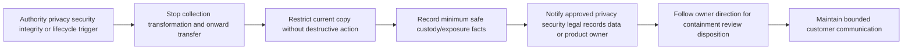

## 15. Quality contract for this Part

| Requirement | Where satisfied | Review evidence |
|---|---|---|
| Definitions before operational use | Section goal glossary | All required terms, meaning, importance, hook, limitation |
| Authorization/minimization | Sections 1-3 | Gates, dimensions, allowlist, staged collection |
| Secret/PII/content boundaries | Section 4 | Classification table and non-collection rule |
| Redaction/anonymization limits | Section 5 | Methods, hidden surfaces, two reviews, explicit warning |
| Integrity/hash/custody | Section 6 | Hash limits, provenance, controls, custody schema |
| Naming/manifest | Section 7 | Safe pattern and lifecycle-aware fields |
| Packaging/secure transfer | Section 8 | Manifest-first staging and transfer controls |
| Retention/deletion | Section 9 | Holds, approved disposition, no destructive commands |
| Decision tree | Section 10 | Request through disposition routing |
| Worked examples | Sections 11-13 | API, email-security, Microsoft-transfer cases |
| Failure/escalation | Section 14 | Failure table and stop triggers |
| Artifact | Sections 7-8 and Lab | Redacted evidence bundle with manifest |
| Safe lab/no performed claim | Lab and evidence labels | Learner-owned synthetic design only |
| No Abnormal internal claim | Candidate note and source boundaries | Product specifics left to approved onboarding |
| Official anchors | Dated source section | Primary/official URLs and boundaries |
| Exactly eight questions | Interview section | Q1 through Q8, each with model answer |
| Sole final navigation | Final line | Exact Part 099 relative link |

## Lab

**EvidenceLab 098 - Local Synthetic Redacted Bundle** is a safe design for a learner-owned offline exercise. It is not claimed to have been performed. It needs no customer, employer, Abnormal AI, Microsoft 365, email system, SaaS tenant, support portal, cloud account, browser capture, packet capture, public website, external recipient, token, credential, key, upload, or network request.

The objective is to create one harmless fictional source fixture, derive a seven-field share copy, document transformations, verify that planted synthetic canaries do not appear in the package, build a manifest, and leave transfer/deletion marked not performed. The lab tests a method, not a product, legal process, or forensic capability.

### Prerequisites

- A learner-owned local folder and UTF-8 text editor.
- Optionally, an approved local hash capability if you already know how to use it safely. No command is provided or required.
- No administrator role, production access, customer tenant, mailbox, support system, cloud drive, Abnormal account, prior production account, public repository, public parser, online redactor, external AI tool, or collaboration channel.
- No credentials, passwords, codes, cookies, bearer/refresh tokens, API keys, client/signing secrets, recovery material, certificates with private material, authenticated connection strings, or private keys.
- No real name, email, tenant/customer ID, hostname, IP, URL, message ID, subject, body, attachment, case export, screenshot, HAR, packet capture, audit record, production log, or customer note.
- Use only obvious aliases beginning `CASE-098-`, `BUNDLE-098-`, `AUTH-098-`, `E098-`, `principal-A098`, `tenant-A098`, `route-A098`, or `corr-A098`.
- Every artifact must say: `LOCAL SYNTHETIC LAB - NO PRODUCTION OR CUSTOMER DATA - NOT TRANSFERRED`.
- Initial state: `DESIGN_NOT_BUILT_NOT_TRANSFERRED`.
- No external upload, network call, test message, transfer, public tool, personal storage, or account sign-in.
- No control bypass, security weakening, role/policy change, or production state change.
- No destructive command. Cleanup later uses only the normal approved local file interface after verifying the exact learner-owned folder and lifecycle decision.

### Lab safety charter

| Rule | Allowed | Prohibited |
|---|---|---|
| Origin | Text invented for this lab | Production, customer, employer, family, or personal-account evidence |
| Identities | Obvious aliases | Real names, addresses, accounts, employee numbers, tenant IDs |
| Secrets | Literal labels such as `[SECRET-COLUMN-EXCLUDED]` | Realistic or working credentials, tokens, cookies, keys |
| Content | Harmless canaries such as `SYN098_CONTENT_REMOVE` | Real messages, documents, attachments, URLs, business text |
| Tools | Approved local editor and optional approved local hash capability | Public parser, paste, online redactor, unapproved AI, cloud drive, public repo |
| Network | None | Upload, API call, connection, scan, capture, email, test message |
| Changes | Learner-owned synthetic files only | Service, role, policy, permission, security-control, or system change |
| Cleanup | Normal approved local interface after review | Recursive deletion, wipe, purge, clear, reset, or destructive script |
| Claims | Design, or completed local synthetic lab after actual pass | Abnormal, prior production, customer, forensic, legal, or transfer claim |

### Proposed bundle

| Artifact | Minimum content | Purpose | Explicit exclusion |
|---|---:|---|---|
| `00-README.md` | Purpose, scope, audience, limits, run state | Orient reviewer | No product/customer process claim |
| `01-authorization-scope.md` | Owner, action, source, fields, purpose, recipient, expiry | Model authority | No production permission claim |
| `02-evidence-request.md` | Decision, hypotheses, allowlist, interval, exclusions | Prove necessity | No “all logs” wording |
| `03-transformation-log.md` | Source/derivative IDs and every rule | Explain derivation | No secret fragments or real map |
| `04-review-record.md` | Disclosure and utility outcomes | Demonstrate validation | No false completed state |
| `05-manifest.md` | One record for every package member | Inventory/lifecycle | No removed values |
| `06-chain-of-custody.md` | Design/create/review/package/no-transfer/no-delete events | Practice accountability | No forensic/legal claim |
| `07-transfer-plan.md` | Approval criteria and `NOT_TRANSFERRED` | Model secure handoff | No actual channel use |
| `08-retention-deletion.md` | Trigger, owner, hold, review, disposition state | Plan lifecycle | No command or universal period |
| Synthetic CSV derivative | Seven allowlisted fields for affected/control rows | Core evidence | No PII, content, secret, URL, host, IP |

### Lab steps

1. Read the whole charter. Do not start if any planned tool sends data outside the learner-owned local environment.
2. Keep state `DESIGN_NOT_BUILT_NOT_TRANSFERRED` until files actually exist.
3. If performing, create one isolated learner-owned folder through the normal file interface and use `LOCAL_SYNTHETIC_IN_PROGRESS`.
4. Place the honesty label at the top of every text/Markdown artifact.
5. Write the decision: distinguish fictional authorization-stage denial from validation-stage rejection for `op-A098` in `[2026-08-24T10:15:00Z, 2026-08-24T10:25:00Z)`.
6. Write two competing explanations and the field that separates them.
7. Write the ceiling: the exercise demonstrates local packaging only, not product behavior or a customer event.
8. Set authority to `AUTH-098-LOCAL-SYNTHETIC`, owned by the learner for invented text only.
9. State that no external recipient or transfer is authorized.
10. Draft “collect all logs for the day,” mark it `REJECTED_OVERCOLLECTION`, and explain why.
11. Replace it with exactly two operation aliases, one fictional source class, seven fields, and ten minutes.
12. Allow only event time, operation alias, route alias, stage, result class, version category, and correlation alias.
13. Explicitly exclude credentials, private keys, cookies, secrets, identity, email, tenant, host, IP, URL, query, body, subject, attachment, free text, and unrelated rows.
14. Add a no-copy outcome: if an existing authorized observation answers the question, create no derivative.
15. Create a classification register with at least 20 candidate categories and handling decisions.
16. Mark passwords, tokens, cookies, API keys, private keys, client secrets, and recovery material `PROHIBITED_NEVER_COLLECT`.
17. Mark customer content and realistic PII `EXCLUDED_NOT_NEEDED`.
18. Mark only the seven safe fields `ALLOWLISTED_SYNTHETIC`.
19. Explain how time, rare role, and location can identify someone in combination.
20. State that aliases preserve linkability and do not make the bundle anonymous.
21. State that no qualified anonymization assessment occurred.
22. Design the package structure from Section 8. Do not claim it exists until created.
23. Keep the imagined source outside package staging and refer to it as `E098-SRC-001`.
24. Write four fictional source rows by hand: three denied operations and one healthy control.
25. Add harmless canary columns with values `SYN098_SECRET_REMOVE`, `SYN098_CONTENT_REMOVE`, and `SYN098_FREE_TEXT_REMOVE`.
26. Do not create a realistic token, key, person, domain, address, host, URL, or message.
27. Create a new derivative from only the seven allowlisted fields; do not edit source into the share copy.
28. Assign `E098-DER-001`, handling state `DERIVED-REDACTED`, and version `v01`.
29. Record `TX-098-001` as structural projection from allowlisted fictional fields.
30. Record every removed column by category without copying its value.
31. Preserve timestamps exactly as fiction and note that formatting does not prove clock accuracy.
32. If corrected, create `v02`; do not silently overwrite history during review.
33. Check filenames for customer/person/tenant/host/IP/email/secret/incident leakage.
34. Build the manifest with every field from Section 7.
35. In design state, mark paths `PROPOSED_NOT_CREATED`, sizes `NOT_MEASURED`, and digests `NOT_COMPUTED`.
36. If actually built, compare every package member to the manifest in both directions.
37. Write the transformation log by category/rule and never repeat a removed value.
38. Include: `Redaction reduces selected exposure; it is not an anonymization claim.`
39. Include: `Pseudonyms remain linkable and may remain identifying in context.`
40. Design a visual-redaction failure with fictional text hidden by an overlay; reject it because underlying data may remain.
41. Replace it with a newly authored content-free derivative, not a destructive source edit.
42. Design a structured check that rejects unknown keys by default.
43. Design an archive check that rejects nested or unexplained members.
44. Write custody events for design, actual creation if performed, review, packaging, transfer not performed, and deletion not performed.
45. Keep custody entries append-only; correct mistakes by adding a referencing event.
46. Put `SHA-256` only in the proposed algorithm field and `NOT_COMPUTED_DESIGN_ONLY` in digest fields.
47. Include: `A matching hash supports byte continuity from a documented point; it does not prove truth, completeness, authenticity, authorization, or safe disclosure.`
48. If later computing digests, use only an approved local capability and record its version/context.
49. Never invent a hexadecimal digest or copy one from a sample.
50. Run disclosure review over visible text, raw structured data, names, members, properties, and metadata through approved local capabilities.
51. Search the package for the three harmless canaries; expected count is zero.
52. Search for realistic identity/contact/host/URL/secret shapes; manually investigate any result without external upload.
53. Run utility review: explain how every remaining field supports the decision.
54. Remove any field that is merely interesting.
55. Mark second-person review honestly `not_reviewed_by_second_person` if no appropriate reviewer participates.
56. Keep transfer plan learner-local with state `NOT_TRANSFERRED`, no link, no password, and no recipient.
57. Add a rejected public-paste plan labeled `PROHIBITED_PUBLIC_UPLOAD`.
58. Add a rejected personal-cloud plan labeled `PROHIBITED_UNAPPROVED_CHANNEL`.
59. Add a rejected export-control bypass labeled `PROHIBITED_CONTROL_BYPASS`.
60. Add a rejected log-clearing plan labeled `PROHIBITED_DESTRUCTIVE_ACTION`.
61. Replace each with “stop and use the approved owner/channel/process,” without naming an Abnormal process.
62. Write a receipt template but keep it `NOT_SENT_NOT_RECEIVED`.
63. Write retention before any imagined transfer: rule, trigger, owner, review, location, copies, hold, method, verification, residuals.
64. Mark hold assessment `NOT_APPLICABLE_TO_FICTION`, not as a legal conclusion.
65. Add a disposition template with state `NOT_PERFORMED`.
66. Include no delete, wipe, purge, clear, reset, revoke, rotate, retention-change, or recursive-removal command.
67. Review for unsupported Abnormal field/tool/channel/retention/deletion claims and remove or qualify each.
68. Write a Microsoft-transfer note that describes general truthful support discipline only.
69. Practice a two-minute customer explanation of why seven fields, two aliases, and ten minutes replace a broad export.
70. Practice a 90-second comparison of redaction, pseudonymization, and anonymization.
71. Practice a 90-second explanation of what a hash can and cannot prove.
72. Practice an accidental-private-key escalation: stop copying, restrict exposure, notify approved owner, preserve minimum incident facts, and do not improvise rotation/deletion.
73. Score every rubric row. A secret, realistic identifier, public upload, bypass, destructive instruction, unapproved channel, fabricated digest, performed claim, or Abnormal-process claim is an automatic fail.
74. Repair failed content for no more than three review cycles and record each result if performed.
75. Set `LOCAL_SYNTHETIC_COMPLETED_NOT_TRANSFERRED` only after actual creation and a true pass.
76. Keep the document's historical statement that this authoring session did not perform the lab.
77. When the learning purpose ends, use the normal approved local interface on the verified isolated folder; do not use a destructive command.

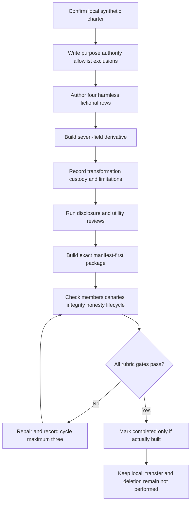

### Expected evidence

If actually performed, expected evidence includes:

- A scope/honesty card labeling the work local, synthetic, content-free, not transferred, and unrelated to any Abnormal internal process.
- A request card with decision, alternatives, authority, source, two operation aliases, seven fields, ten-minute UTC interval, exclusions, recipient state, and lifecycle.
- A rejected broad request and written minimization across purpose, entities, fields, time, source, precision, copies, recipients, and duration.
- A classification register with at least 20 categories and explicit prohibited, excluded, or allowed decisions.
- Structural absence of credentials, tokens, cookies, API keys, client secrets, recovery codes, private keys, realistic PII, customer content, hosts, IPs, URLs, and tenant IDs.
- One indirect-identification note and one statement that the package is not anonymous.
- Four learner-authored source rows and a seven-field derivative containing only fictional metadata.
- Alias-only immutable names with handling state and version.
- A manifest row for every package item and no unmanifested member.
- A transformation log with rules, item IDs, reviewer state, purpose, and residual risk but no removed values.
- One rejected overlay-only redaction and a safe derivative alternative.
- A custody log with design, creation if performed, review, package, no-transfer, retention, and no-disposition events.
- A digest record using `NOT_COMPUTED` until an approved local computation actually occurs.
- An explicit hash limitation covering truth, completeness, authenticity, authorization, provenance, semantics, and disclosure safety.
- A transfer plan marked `NOT_TRANSFERRED` plus rejected public-upload, personal-cloud, bypass, and destructive examples.
- A receipt template marked `NOT_SENT_NOT_RECEIVED`.
- A retention/disposition plan with trigger, owner, review, hold gate, copy inventory, method placeholder, verification, residuals, and `NOT_PERFORMED` disposition.
- A validation report with every rubric result and no more than three repair cycles.
- Spoken notes for minimization, identity treatment, hash limits, secret exposure, and support-to-Abnormal honesty.
- No real collection, production access, customer data, sensitive content, secret, external upload, external transfer, public service, control bypass, unapproved tool/channel, destructive command, or fabricated action.

### Cleanup and privacy

- Keep the lab in one learner-owned local folder containing only manually authored fictional text.
- Never place real logs, screenshots, HAR files, packet captures, emails, attachments, exports, support notes, customer names, tenant IDs, credentials, keys, or product internals in it.
- Never upload, publish, email, sync, paste, commit, or send it to a public repository, parser/scanner, converter, personal storage, consumer sharing service, AI system, or unapproved collaboration tool.
- Confirm every identifier is an obvious alias and every evidence row is marked synthetic.
- Confirm prohibited secrets are absent rather than represented by realistic examples.
- Confirm no filename/manifest description leaks a person, customer, tenant, host, IP, address, case title, or sensitive event.
- Confirm structured keys match the seven-field allowlist; reject unknown/nested fields.
- Confirm package staging began empty and contains only manifested derivatives/control records.
- Confirm every member appears exactly once in the manifest and every manifest item resolves to one member.
- Confirm each digest is `NOT_COMPUTED` until a real approved local computation occurs.
- Confirm no statement says a hash proves truth, completeness, authenticity, lawful authority, or anonymization.
- Confirm no redaction statement claims anonymization.
- Confirm transfer/receipt/deletion remain not performed in this lesson.
- Confirm retention trigger, owner, review, hold gate, and disposition state exist before calling the local artifact complete.
- Confirm no destructive command or instruction is present.
- If real or sensitive material is introduced, stop, do not duplicate/upload it, restrict further exposure, and follow the appropriate approved security/privacy process. This lesson is not the response authority.
- If unperformed, record: `EvidenceLab 098 is a reviewed synthetic design and has not been executed.`
- If later completed and passed, record: `EvidenceLab 098 was completed locally with learner-authored fictional metadata only; no production system, customer data, credential, private key, customer content, external upload, external transfer, control bypass, unapproved tool/channel, destructive command, or Abnormal internal process was used.`

### Validation rubric

| Dimension | Fail | Developing | Pass |
|---|---|---|---|
| Purpose | “Collect logs” without decision | General objective | Exact decision and competing explanations identify needed observation |
| Authorization | Assumes access/ticket equals permission | Names owner but omits action/scope | Records owner, actor, action, source, fields, entities, time, purpose, channel, recipient, expiry |
| Minimization | Full export/everything | Narrows one dimension | Narrows purpose, entities, fields, time, source, precision, copies, recipients, duration |
| Secrets | Includes masked/fictional credential or key | Warns to remove later | Structurally excludes credentials/private keys and defines exposure escalation |
| PII/content | Treats names as only risk | Removes direct identifiers | Reviews direct, indirect, combined, content, operational, and recipient-context risks |
| Redaction | Overlay or ad hoc replacement | Removes visible values | Creates allowlisted derivative and checks hidden/nested/metadata surfaces |
| Pseudonymization | Calls aliases anonymous | Uses aliases without map boundary | Preserves needed correlation, separates map, states linkability |
| Anonymization | Claims anonymity after masking | Adds vague disclaimer | Makes no claim without qualified contextual assessment |
| Utility | Clean but cannot answer question | Retains broad data | Retains only fields necessary for declared decision |
| Provenance | Unknown source/method | Names source | Links source, derivative, actor, method, scope, time, transformation, version |
| Hashing | Invents digest or calls proof | Lists algorithm | Computes only if performed, binds final bytes, states hash limits |
| Integrity | Hash only | Adds version | Combines provenance, separation, versions, size, digest, review, custody |
| Custody | No history | Lists major events | Append-only events cover item, actor, authority, time, action, boundary, version, exception |
| Naming | Identity leak or `final2` | Partial aliasing | Controlled alias/type/scope/UTC/state/version without sensitive metadata |
| Manifest | Missing/incomplete | Lists filenames | Every member has purpose, lineage, class, fields, transform, integrity, audience, lifecycle |
| Packaging | Copies working directory | Removes obvious extras | Starts empty, adds manifested derivatives, validates members |
| Transfer | Public/personal/unapproved route | Mentions encryption | Verifies recipient, channel, access, protection, location, expiry, receipt, onward use |
| Retention | Indefinite | Informal date | Governing rule, trigger, owner, review, location, copies, hold |
| Deletion | Destructive command/deletes source | Says delete at closure | Approved disposition, hold/scope check, verification, residual note, record |
| Failure response | Quiet correction | Tells a manager | Stops spread, preserves minimum facts, uses approved security/privacy path |
| Artifact | Loose files | Partial bundle | README, request, manifest, logs, derivative, lifecycle, validation all agree |
| Candidate honesty | Implies Abnormal operations | Calls lab synthetic | Separates experience transfer, local practice, learned controls, Abnormal unknowns |
| Spoken readiness | Recites definitions | Explains one control | Answers all eight questions with purpose, boundary, example, limitation, escalation |

## Official Source Anchors - August 24, 2026

These sources anchor general privacy, PII, incident response, logging, forensic handling, hashing, sanitization, security controls, browser-evidence risk, information sharing, and data-protection principles. They do not define Abnormal AI's product evidence, internal tools, customer permissions, support roles, data regions, approved channels, retention schedule, deletion mechanism, legal obligations, or incident process. Current employer policy, customer contract, applicable law, approved product documentation, and authorized owners govern real work.

| Official or primary source | Concept anchored | Policy/product boundary |
|---|---|---|
| [NIST Privacy Framework](https://www.nist.gov/privacy-framework) | Privacy risk management, data processing awareness, governance, control, communication, and protection | Voluntary framework; not legal advice, customer authorization, or vendor workflow |
| [NIST SP 800-122 - Guide to Protecting the Confidentiality of PII](https://csrc.nist.gov/pubs/sp/800/122/final) | PII identification, impact, and safeguards | U.S. federal guidance from 2010; local definitions/requirements can differ |
| [NIST SP 800-61 Rev. 3 - Incident Response Recommendations](https://csrc.nist.gov/pubs/sp/800/61/r3/final) | Current incident-response integration with risk management | Not permission to collect or an Abnormal incident runbook |
| [NIST SP 800-92 - Guide to Computer Security Log Management](https://csrc.nist.gov/pubs/sp/800/92/final) | Log collection, handling, storage, analysis, and planning | Foundational 2006 guidance; current cloud/privacy/retention policy is required |
| [NIST SP 800-86 - Integrating Forensic Techniques into Incident Response](https://csrc.nist.gov/pubs/sp/800/86/final) | Collection, examination, analysis, reporting, and evidence concepts | Foundational 2006 guidance; this lab is not forensic acquisition or admissibility proof |
| [FIPS 180-4 - Secure Hash Standard](https://csrc.nist.gov/pubs/fips/180-4/upd1/final) | Standard hash algorithms including SHA-256 | Algorithm definition does not prove truth, authenticity, authorization, completeness, or safe disclosure |
| [NIST SP 800-88 Rev. 2 - Guidelines for Media Sanitization](https://csrc.nist.gov/pubs/sp/800/88/r2/final) | Current media sanitization/disposition concepts | Not a generic instruction to wipe support evidence or bypass holds |
| [NIST SP 800-53 Rev. 5 - Security and Privacy Controls](https://csrc.nist.gov/pubs/sp/800/53/r5/upd1/final) | Access, audit, media, transmission, retention, incident, and privacy control catalog | Requires tailoring; does not show which controls any product implements |
| [EU General Data Protection Regulation - Official Journal](https://eur-lex.europa.eu/eli/reg/2016/679/oj) | Primary legal text for personal data, pseudonymization, minimization, storage limitation, and security | Applicability/interpretation require qualified legal/privacy guidance; this is not legal advice |
| [Microsoft Purview - Search the audit log](https://learn.microsoft.com/en-us/purview/audit-search) | Official Microsoft example of scoped audit search, roles, ranges, and exports | Microsoft-specific availability, fields, licensing, retention, and permissions do not describe Abnormal |
| [Microsoft Edge DevTools - Inspect network activity](https://learn.microsoft.com/en-us/microsoft-edge/devtools/network/) | Browser request evidence and inspection | Browser exports can expose URLs, headers, cookies, and bodies; follow approved procedure |
| [Chrome DevTools - Network features reference](https://developer.chrome.com/docs/devtools/network/reference/) | Primary browser-vendor documentation for recording and HAR behavior | Version/UI changes; HAR can contain sensitive data and is not automatically shareable |
| [FIRST - Traffic Light Protocol](https://www.first.org/tlp/) | Primary TLP standard source for information-sharing audience markings and expectations | TLP is not classification, encryption, transfer authorization, retention, or a contract substitute |
| [OWASP Logging Cheat Sheet](https://cheatsheetseries.owasp.org/cheatsheets/Logging_Cheat_Sheet.html) | Security logging, data exclusion, sanitization, protection, transmission, and disposal | Community guidance; application fields, law, contracts, and controls remain specific |

### Source discipline and scope notes

- The NIST Privacy Framework supports privacy-risk reasoning; it grants no authority to collect or disclose.
- NIST SP 800-122 highlights linked information and impact but requires current jurisdictional and organizational interpretation.
- NIST SP 800-61 Rev. 3 was finalized in April 2025; approved incident ownership still controls real actions.
- NIST SP 800-92 and SP 800-86 are foundational and older; supplement them with current cloud, privacy, legal, records, security, and product procedures.
- FIPS 180-4 defines hash algorithms. A digest can support byte continuity from a trusted point, never truth by itself.
- NIST SP 800-88 Rev. 2 supports governed sanitization, not ad hoc wiping or deletion under hold.
- NIST SP 800-53 is a control catalog, not proof of implementation in Abnormal or any company.
- GDPR is primary legal text, but applicability and anonymization assessment require qualified advice.
- Microsoft Purview is relevant to your prior bridge; its roles, exports, and retention are Microsoft-specific.
- Edge and Chrome show why browser evidence can expose more than visible error text; documentation does not authorize capture.
- FIRST TLP assists sharing expectations but does not replace authorization, channel, access, contract, or retention controls.
- OWASP reinforces secret exclusion and log protection but is not a product support policy.
- Revalidate every source and local policy after August 24, 2026. Approved current organizational/product sources override this generic lesson.

## Likely Interview Questions

### Q1. How do you decide what evidence to request from a customer?

**Model answer:** I begin with one decision and the competing explanations, not “send logs.” I specify the smallest approved source, entities, fields, precision, and half-open UTC interval that can distinguish them. I verify who may collect, review, transform, receive, retain, and dispose of the data, plus the approved method and channel. I explicitly exclude credentials, private keys, unrelated users, broad content, and unnecessary copies. If current authorized evidence answers the question, I collect nothing new. If authority or purpose is unclear, I stop and escalate.

### Q2. What is the difference between redaction, pseudonymization, and anonymization?

**Model answer:** Redaction creates a derivative with selected values permanently removed or obscured for a purpose and audience. Pseudonymization replaces identifiers with stable aliases so records remain linkable; a map or context may reconnect them. Anonymization is the stronger, context-dependent state in which a person is no longer reasonably identifiable under the applicable standard. Covering names or using aliases does not establish anonymity. I normally describe support artifacts as redacted or pseudonymized and seek qualified review before making an anonymization claim.

### Q3. What should never be collected in a routine support evidence bundle?

**Model answer:** I never request or package passwords, bearer or refresh tokens, session cookies, API keys, client or signing secrets, recovery codes, decryption material, credential-bearing connection strings, or private keys. I also reject unnecessary customer content, broad mailbox/tenant exports, unrelated PII, and evidence gathered by bypassing controls. If a secret arrives accidentally, I stop copying and onward sharing, restrict exposure, preserve only minimum safe incident facts, and use the approved security/privacy path. Masking later does not undo the exposure.

### Q4. What does a hash prove, and what does it not prove?

**Model answer:** With a trusted baseline and approved algorithm, matching hashes support that the measured bytes have not changed between two points. A source and its redacted derivative should have different hashes connected by a transformation record. A hash does not prove that an event happened, the source was truthful or complete, the timestamp was accurate, collection was authorized, the file is authentic, or disclosure is safe. Integrity also needs provenance, versions, access controls, review, and custody.

### Q5. What belongs in an evidence manifest?

**Model answer:** I include bundle/artifact IDs, relative paths, purpose, evidence label, authority reference, source relationship, classification, exact included fields, excluded classes, transformation/version, format/schema, byte length, approved digest, review state, audience/transfer state, retention trigger, hold/disposition state, and limitations. Every package member appears once and every manifest item resolves to a member. The manifest must not repeat removed sensitive values or contain a pseudonym map. It is an inventory and lifecycle map, not proof that its claims are true.

### Q6. How do you transfer evidence safely?

**Model answer:** I verify the recipient and purpose, use a channel approved for the data class and customer relationship, enforce least-privilege authenticated access, protect confidentiality and integrity, check region/contract boundaries, set expiry where supported, record custody, and obtain receipt/verification. I never use public uploads, personal storage, public repositories, unapproved parsers or AI tools, or an improvised side channel. Encryption helps transport confidentiality but does not authorize excessive data, the recipient, or the channel.

### Q7. How do retention and deletion fit into support case ownership?

**Model answer:** I define retention before transfer: controlling rule, trigger, duration or review condition, owner, location, known copies, and hold state. When the purpose ends, disposition follows the approved records, security, privacy, legal, customer, and platform process. I do not delete source evidence, clear logs, change retention, wipe storage, or run generic destructive commands. I verify exact scope and record the result plus residual backups, immutable records, or downstream copies. A hold or active incident blocks routine deletion until an authorized release.

### Q8. How does your prior support experience transfer, and what must you learn at Abnormal?

**Model answer:** enterprise support taught me to tie diagnostics to a decision, scope the affected object and interval, protect customer trust, preserve useful identifiers/timestamps, and give Engineering a coherent handoff instead of a dump. That method transfers. I have not operated Abnormal AI's evidence process in production. During onboarding I would verify approved product evidence, field meanings, roles, customer authorization, redaction tools, storage/transfer channels, security/privacy escalation, retention, holds, and deletion rather than assuming Microsoft procedures or this synthetic lab describe Abnormal's workflow.

## Memory Hooks

- **Purpose before bytes.**
- **Access is capability; authorization is permission.**
- **Minimum means purpose, entities, fields, time, source, precision, copies, recipients, and duration.**
- **If existing evidence answers it, create no new copy.**
- **Allowlist what may remain.**
- **Credentials and private keys never enter the bundle.**
- **Non-collection beats secret redaction.**
- **Content can be sensitive without being PII.**
- **Metadata can identify through combination.**
- **Redaction removes selected exposure for an audience.**
- **Pseudonyms preserve a joining thread.**
- **Redaction is not anonymization.**
- **A black box is not proof of permanent redaction.**
- **Derive a new file; do not overwrite source history.**
- **Hash the bytes, question the story.**
- **Hashes do not prove truth.**
- **Provenance is origin; integrity is continuity; custody is handling.**
- **The manifest is the packing list and lifecycle map.**
- **Names identify versions, not customers.**
- **Build a package from empty staging.**
- **Compression and Base64 are not encryption.**
- **Encryption is a lock, not permission.**
- **Upload success is not receipt.**
- **Retention needs a reason, trigger, owner, and review.**
- **Deletion is governed disposition, never an improvised command.**
- **Stop, restrict, record minimally, and escalate.**
- **prior evidence discipline transfers; Abnormal process knowledge does not.**
- **Designed is not performed.**

## Completion Checklist

- [ ] I can define authorization, minimization, PII, secrets, content, redaction, pseudonymization, anonymization, hashing, integrity, chain of custody, manifest, transfer, retention, and deletion in plain English.
- [ ] I can explain an analogy and limitation for each dense concept family.
- [ ] I start evidence work with one decision and competing explanations.
- [ ] I can write authority covering owner, actor, action, source, fields, entities, time, purpose, method/channel, recipient, expiry, and restrictions.
- [ ] I do not treat a ticket, cooperation, export capability, or administrator role as blanket authorization.
- [ ] I minimize purpose, entities, fields, time, source, precision, copies, recipients, and duration.
- [ ] I choose no new collection when existing authorized evidence answers the question.
- [ ] I can build a field allowlist and explain its advantage over a denylist.
- [ ] I never request, collect, copy, package, or transfer passwords, tokens, cookies, API keys, client/signing secrets, recovery material, credential-bearing strings, or private keys.
- [ ] I stop copying and use the approved security/privacy process if a secret arrives.
- [ ] I distinguish direct PII, indirect PII, customer content, security detail, and routine metadata.
- [ ] I evaluate combinations and recipient context, not only obvious names.
- [ ] I create a derivative rather than destructively editing source evidence.
- [ ] I understand why overlays, cropping, renaming, and search-and-replace can fail.
- [ ] I inspect visible data, structured keys, nesting, metadata, layers, comments, hidden sheets, and archive members as applicable through approved methods.
- [ ] I perform both disclosure and technical-utility reviews.
- [ ] I can state that redaction is not anonymization.
- [ ] I explain why aliases preserve linkability and may remain identifying.
- [ ] I do not claim anonymization without qualified contextual assessment.
- [ ] Any real alias map, if necessary and authorized, remains outside the share package under separate controls.
- [ ] I understand why source and derivative digests differ.
- [ ] I explain that hashes support byte continuity but not truth, completeness, authenticity, authorization, semantics, or safe disclosure.
- [ ] I record origin, acquisition, transformation, version, method/tool context, reviewer, and integrity reference.
- [ ] I keep custody history append-only and correct mistakes with new entries.
- [ ] My filenames use aliases, controlled types, UTC where useful, handling state, and immutable versions.
- [ ] My filenames contain no customer, person, tenant, host, IP, email, secret, or sensitive incident detail.
- [ ] My manifest inventories every package member exactly once.
- [ ] Every manifest item states purpose, evidence label, authority, source relation, class, fields, exclusions, transformation, integrity, audience, lifecycle, and limits.
- [ ] I do not repeat removed values in the manifest or transformation log.
- [ ] I build package staging from empty and add manifested derivatives only.
- [ ] I do not include raw evidence unless separately necessary, authorized, and approved.
- [ ] I validate recipient, purpose, channel, access, protection, region/contract, expiry, notification metadata, receipt, and downstream use.
- [ ] I never use public upload, public repository, public parser/scanner, converter, personal email/storage, consumer sharing, unapproved AI, or unapproved channel.
- [ ] I never bypass authentication, authorization, tenant, export, DLP, privacy, audit, retention, or another security control.
- [ ] I know encryption does not make overcollection or a wrong recipient acceptable.
- [ ] I define retention rule, trigger, owner, review, location, copies, and hold before transfer.
- [ ] I never clear logs, delete source evidence, change retention, wipe media, destroy keys, purge systems, or run a destructive command from a generic lesson.
- [ ] I use only approved disposition after hold and scope validation.
- [ ] I record exact disposition results and residual backups, audit records, immutable copies, or downstream copies.
- [ ] I can follow the complete request/redaction/package/transfer/retention/deletion decision tree.
- [ ] I can repair overcollection, overlay redaction, alias-map inclusion, false anonymity, hash overclaim, source overwrite, filename leakage, stale version, wrong recipient, and premature deletion failures.
- [ ] I know when to stop and escalate to privacy, security, legal, records, data, product, or incident owners.
- [ ] I can produce a minimal escalation without attaching questionable evidence through an unapproved route.
- [ ] I can walk through the synthetic API example and justify every included/excluded field.
- [ ] I can walk through the email-security example without requesting content by default.
- [ ] I can connect your prior support discipline using only truthful permitted details.
- [ ] I say directly that I have not operated Abnormal AI's internal evidence workflow in production.
- [ ] I claim no Abnormal fields, tools, storage, channels, access, retention, deletion, or escalation procedure.
- [ ] I can explain the policy/product boundary for every official source.
- [ ] I revalidate current law, policy, contract, product documentation, and source currency before real work.
- [ ] I can answer Q1 through Q8 aloud with purpose, boundary, example, limitation, and escalation judgment.
- [ ] I describe the lab as `DESIGN_NOT_BUILT_NOT_TRANSFERRED` unless I actually create and review it.
- [ ] If later completed, it contains no real data, credential, private key, content, external upload/transfer, bypass, unapproved tool/channel, destructive command, fabricated digest, or Abnormal process claim.


[Next: Part 099 - End-to-End Support Troubleshooting Trees](Part-099-end-to-end-support-troubleshooting-trees.md)