# Part 099 - End-to-End Support Troubleshooting Trees

> **Purpose:** Integrate configuration, connectivity, identity, API, behavioral false-positive, email-delivery, and threat-investigation reasoning into one product-neutral L1 support runbook. Each path moves explicitly from symptom to hypothesis to test to observation to next action, while preserving customer safety, evidence quality, and escalation boundaries.
>
> **Artifact honesty label:** **Local synthetic multi-scenario troubleshooting runbook design only.** Every tenant, user, message, request, policy, event, timestamp, identifier, result, and support case in this Part is fictional. No lab step was executed. No Abnormal AI, Microsoft, customer, mailbox, identity provider, API, network, security console, or production environment was accessed or changed. You may describe the runbook as completed only after you actually perform the local tabletop lab with learner-authored synthetic text and records a passing review.
>
> **Currency and source access date:** August 24, 2026.

## Section goal

The goal is to make L1 troubleshooting consistent without making it mechanical. By the end of this Part, you should be able to accept an ambiguous customer symptom, classify it without prematurely assigning a cause, protect the customer from unsafe testing, and choose the smallest observation that separates the leading explanations. You should then either resolve within documented L1 authority or escalate with a concise evidence-backed question.

The primary artifact is a **multi-scenario troubleshooting runbook**. It contains a universal intake-and-routing tree plus seven specialist trees: configuration, connectivity, identity, API, behavioral false positive, email delivery, and threat investigation. Each specialist path includes a worked fictional case, misleading signals, failure modes, an evidence ceiling, escalation triggers, and a stop condition.

This Part uses five words in a strict sequence:

| Term | Beginner-first meaning | Why it matters | Memory hook | Limitation |
|---|---|---|---|---|
| Symptom | The customer-visible or operator-visible behavior that differs from expectation | It is the starting observation, not an explanation | What happened? | A symptom can be incomplete, delayed, translated, or reported secondhand |
| Hypothesis | A specific possible explanation that predicts observable evidence | It turns guessing into a testable comparison | What could explain it? | A plausible hypothesis is not a fact and may share predictions with alternatives |
| Test | A bounded, authorized, low-risk action or comparison chosen to distinguish hypotheses | It creates information for the next decision | What smallest check separates them? | A test may be inconclusive because evidence is absent, stale, ambiguous, or outside L1 visibility |
| Observation | What the approved source actually showed, including absence, uncertainty, source, time, and scope | It anchors the case in evidence | What did the source show? | An observation does not automatically explain why it happened |
| Next action | The safest evidence-based step after updating confidence | It converts analysis into ownership | What changes now? | The next action may be another test, customer guidance, monitoring, or escalation rather than a fix |
| Inference | A reasoned interpretation drawn from one or more observations | It helps connect evidence while preserving uncertainty | Evidence suggests | It is weaker than a verified cause and must be labeled as interpretation |
| Cause | The condition or mechanism demonstrated to be necessary and sufficient enough for the claimed scope | It supports durable correction and defensible communication | Proven why, within scope | L1 often identifies a likely boundary or contributor rather than proving the final root cause |
| Control | A deliberately chosen comparable case, user, request, message, route, or time period | It shows whether the observed difference is specific or general | Compare like with like | A poorly matched control can create false confidence |
| Evidence ceiling | The maximum conclusion supported by current source quality, coverage, authority, and semantics | It prevents overclaiming | Say only what the evidence can carry | Product-owned data can raise the ceiling only when an authorized owner validates it |
| Stop condition | A predeclared reason to stop testing, collection, or change and use an approved owner or process | It prevents curiosity from becoming harm | Know when not to continue | Stopping investigation does not mean abandoning the customer; ownership and communication continue |

Think of troubleshooting as a railway switchyard. The symptom tells you which train arrived, hypotheses are possible tracks, a discriminating test checks one switch, the observation shows which track the train actually used, and the next action routes it safely. The analogy stops at control and repeatability: software systems can be distributed, eventually consistent, partially observed, and changed by several teams at once. A single apparent track does not prove every hidden dependency or the ultimate cause.

The governing rule is **observation first, interpretation second, cause last**. “The request returned HTTP 403 at 10:05 UTC” is an observation. “The token lacked the required permission” is an inference until scope, audience, role assignment, resource policy, and endpoint semantics support it. “A product authorization defect caused the denial” is a much stronger causal claim that L1 must not make without sufficient evidence and the appropriate owner.

This runbook explicitly prohibits broad collection; collection of passwords, tokens, cookies, API keys, private keys, or unrelated customer content; bypassing or disabling security; real phishing or malicious-message tests; unapproved account, permission, policy, routing, connector, or configuration changes; destructive tests; deletion or clearing of evidence; and uploading sensitive material to public or unapproved services, repositories, scanners, converters, or AI systems.

## JD Mapping

| Supplied role signal | Capability developed | Runbook application | Honest proof artifact |
|---|---|---|---|
| Enterprise L1 ownership | Converts vague reports into scoped, time-bounded, testable cases | Universal intake, routing, updates, stop conditions, and handoff | Local synthetic runbook |
| Inbound configuration tickets | Separates intended, configured, effective, and observed state | Configuration tree and drift comparison | Synthetic configuration case card |
| Connectivity questions | Isolates DNS, TCP, TLS, proxy, firewall, and application boundaries | Connectivity tree with matched-client control | Synthetic endpoint-to-service timeline |
| Identity and SaaS support | Distinguishes authentication, authorization, assignment, consent, lifecycle, and session state | Identity tree and evidence matrix | Synthetic identity decision record |
| API questions | Correlates contract, auth, request, response, rate, version, and service evidence | API tree and redacted request ledger | Synthetic API case packet |
| Behavioral false positives | Compares expected business context with observed verdict and policy layers | False-positive tree with cohort and change checks | Synthetic verdict-review worksheet |
| Email delivery | Separates submission, acceptance, routing, quarantine, inbox placement, and post-delivery action | Delivery-state tree and message timeline | Synthetic mail-flow case |
| Threat investigations | Preserves evidence, assesses scope, and routes containment to authorized responders | Threat tree and incident-boundary handoff | Synthetic threat timeline |
| Complex investigations | Uses competing hypotheses and discriminating tests across systems | Symptom-hypothesis-test-observation-next-action ledger | Seven worked case records |
| Customer trust | Avoids speculative blame, unsafe changes, overcollection, and silent handoffs | Evidence ceiling, communication points, and stop rules | Customer-safe status templates |
| Engineering and Product collaboration | Escalates a reproducible boundary, observations, attempted tests, and one explicit ask | Escalation packet schema | Product-neutral handoff template |
| enterprise support transfer | Reuses ownership, scoping, customer communication, escalation, and validation habits | Candidate transfer examples throughout | Truthful support-to-Abnormal bridge |
| Abnormal product support | Uses current public product context without inventing fields, tools, thresholds, internals, or entitlements | Product-boundary notes in every path | Learned architecture only |

## Candidate honesty note

You have a credible enterprise-support foundation from prior work involving SharePoint Online, OneDrive, Sync Client, Copilot, customer and partner communication, complex escalation, critical-situation handling, Engineering or Product collaboration, and fix validation. Those experiences can demonstrate ownership, evidence discipline, expectation management, and calm investigation under pressure. They do not establish direct operation of Abnormal AI, email-security verdict systems, proprietary behavioral models, or Abnormal internal case processes.

The safest interview bridge is method-based: “In enterprise support, I learned to separate the reported symptom from the cause, compare affected and healthy scope, preserve timestamps and identifiers, choose a low-risk test, and escalate with a clear question. I have not operated Abnormal AI in production. I would apply the same disciplined method while learning the approved Abnormal evidence, product semantics, permissions, and escalation boundaries.”

| Evidence tier | Safe wording you can adapt | Boundary to preserve |
|---|---|---|
| prior production transfer | “I used structured scoping, targeted diagnostics, customer updates, escalation, and validation in enterprise support.” | Use a real permitted example and exact personal contribution; do not imply email-security or Abnormal operations |
| Local synthetic practice | “I completed a seven-scenario tabletop runbook using fictional records and no external systems.” | Say this only after actual completion; this authored lesson itself was not executed |
| Learned architecture | “I understand how configuration, connectivity, identity, APIs, mail flow, behavioral review, and threat evidence intersect.” | Architecture understanding is not production access, product certification, or internal workflow knowledge |
| Proposed L1 action | “I would verify the documented expected behavior, collect the minimum approved evidence, and use the current escalation route.” | Do not invent an Abnormal console control, log name, field, model feature, threshold, permission, or queue |
| No direct experience | “I have not supported Abnormal AI directly. My closest evidence is enterprise support plus synthetic practice.” | State the gap directly, then explain a concrete learning and validation approach |
| Security action | “I would keep ownership while routing containment to the authorized customer or incident-response owner.” | Do not claim authority to quarantine, revoke, disable, delete, or change customer state |

No example below claims a real Abnormal field, internal telemetry source, workflow, service architecture, response time, entitlement, threshold, or remediation action. Public Abnormal pages establish high-level current positioning only. Current customer documentation, contractual scope, role permissions, internal runbooks, and authorized product owners must control real work.

## 1. The universal L1 reasoning contract

An L1 runbook is a set of decision aids, not a script that overrides judgment. Its job is to produce a high-quality next decision quickly and safely. A good L1 outcome may be a documented resolution, but it may also be a narrowed boundary, a protected customer, an evidence gap made explicit, or a clean handoff to the correct owner.

### Observation, inference, and cause must stay separate

| Statement | Classification | Why | Safer case-note wording |
|---|---|---|---|
| “The synthetic client recorded DNS answer `192.0.2.20` at 10:02 UTC.” | Observation | It reports a value from a named fictional source and time | Record source, scope, timestamp, and resolver context |
| “DNS probably caused the timeout.” | Inference | The claim interprets a symptom without yet excluding TCP, TLS, proxy, or application delay | “DNS remains a hypothesis; next compare resolution and connection timing” |
| “The role assignment is missing.” | Observation only if an authoritative approved source shows absence with known coverage | A UI view or token claim alone may not represent effective access | “The approved assignment source showed no matching role in the queried scope” |
| “The product rejected the message because the model learned the wrong baseline.” | Unsupported cause | It invents proprietary mechanism from a verdict disagreement | “The customer disputes the outcome; current evidence does not establish model internals” |
| “SMTP accepted the message with `250`.” | Observation | It identifies one transfer boundary | “The receiving server accepted responsibility at this hop; inbox placement remains separate” |
| “The message reached the inbox.” | Cause-free outcome observation only with mailbox evidence | Acceptance or trace completion alone is insufficient | State exactly which location and source showed the item |
| “The policy change caused the regression.” | Causal hypothesis | Timing can support but not prove causation | Compare effective version, affected/control scope, rollback evidence only if approved, and competing changes |

### The five-column case ledger

Every active branch should fit one row. If the row cannot be completed, the case likely lacks a precise decision.

| Field | Required content | Weak example | Strong synthetic example |
|---|---|---|---|
| Symptom | Expected, actual, affected scope, first/last known time, impact | “Integration broken” | “Three synthetic create operations for `principal-A099` return 403; matched read operations succeed from 10:00-10:10 UTC” |
| Hypothesis | One mechanism or boundary with a predicted observation | “Permissions?” | “The identity is valid, but the effective role does not permit create on resource scope `R-A099`” |
| Test | One authorized, low-risk comparison and expected discriminating outcomes | “Check logs” | “Compare sanitized create/read response class and approved role-state record for the same principal/resource/version” |
| Observation | Source, time, scope, actual result, missing evidence, caveat | “403 means no access” | “Both calls authenticate; create is denied, read succeeds; approved role record shows reader only; no product server trace is available” |
| Next action | Owner, action, time, success check, stop/escalate condition | “Fix permissions” | “Customer identity owner reviews intended access through approved process; no role change by Support; escalate if role is correct and denial reproduces” |

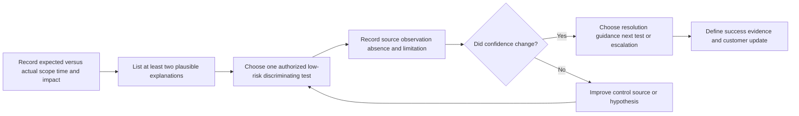

### Plain-English deep-dive: A decision tree is a map, not autopilot

A road map helps a driver choose a route, but it does not see a temporary closure, judge weather, or grant permission to enter private property. A troubleshooting tree similarly makes common choices visible. It cannot know an undocumented product change, customer contract, active incident, or access restriction.

The analogy stops where authority and dynamic systems begin. L1 must verify current documentation, evidence coverage, and change permission at every consequential branch. When the tree and current approved product guidance conflict, the approved guidance wins and the runbook should be corrected.

## 2. Universal intake and scenario router

Begin with the customer outcome, not a favored tool. Record who is affected, what should happen, what happens instead, when it began, whether it ever worked, whether a change preceded it, and the business/security impact. Normalize times to UTC while preserving the original offset and source. Use aliases in learning artifacts and minimum necessary identifiers in real approved systems.

| Intake dimension | Minimum question | Why it routes the case | Misleading shortcut |
|---|---|---|---|
| Expected versus actual | What exact action or state was expected, and what exact result occurred? | Distinguishes defect, configuration, policy disagreement, and misunderstanding | “It is broken” |
| Scope | Which users, messages, endpoints, operations, tenants, or locations are affected and unaffected? | Supports matched controls and blast-radius assessment | Assuming one report means global impact |
| Time | First known, last known good, frequency, duration, time zone, and ingestion delay? | Correlates changes and evidence | Treating ticket-open time as event time |
| Change | What approved deployment, policy, role, connector, network, or client change occurred? | Creates hypotheses without proving causation | “After” therefore “because of” |
| Reproduction | Is the behavior repeatable with a harmless authorized action? | Separates persistent from transient behavior | Repeating a harmful production action |
| Impact | Availability, security, user count, business process, workaround, and urgency? | Guides priority and escalation | Equating executive visibility with technical severity |
| Evidence | Which current approved source can show the disputed boundary? | Prevents broad collection | Requesting every log and screenshot |
| Authority | Who may view, test, change, contain, or disclose? | Prevents unsafe L1 action | Treating technical ability as permission |

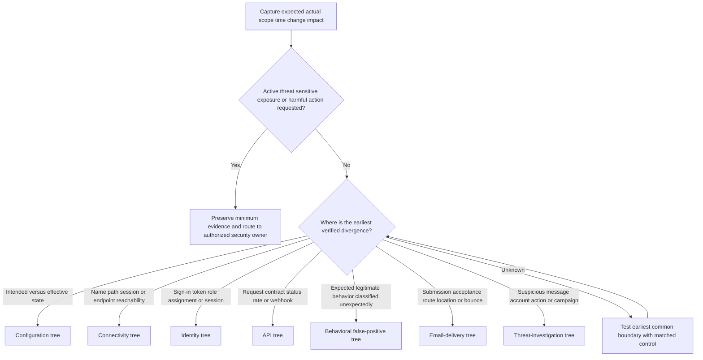

Route by the **earliest verified divergence**, not by the customer's guessed cause. A sign-in page timing out before credentials are submitted begins as connectivity, even if the customer calls it “SSO.” A successful API call that returns empty data may begin as contract, filter, permission, or eventual-consistency analysis, not network failure. A delivered message that later disappears is not an SMTP non-delivery case until post-delivery actions and mailbox state are checked.

### Shared safety gate

Stop ordinary L1 testing and use the approved owner/process when any of these conditions appears:

- Active compromise, suspected credential theft, malicious content, payment fraud, data loss, or continuing harmful activity.
- A password, token, cookie, API key, private key, recovery code, customer message content, regulated data, or cross-tenant data appears unexpectedly.
- The requested step would bypass or disable security, weaken authentication, suppress detection, broadly allowlist traffic or senders, change retention, or remove auditability.
- The requested step would send real phishing, execute suspicious content, visit a dangerous link, detonate a file outside an approved sandbox, or test against an uninvolved third party.
- The next test needs an unapproved account, role, consent grant, policy, connector, route, DNS, mailbox, tenant, or configuration change.
- The proposed collection is broad, unrelated to a falsifiable question, or destined for a public/unapproved upload, scanner, converter, repository, or AI system.
- The test is destructive, changes customer data, deletes evidence, clears logs, purges messages, revokes access, or alters production state without the correct owner and change process.
- Required semantics or telemetry are proprietary, unavailable to L1, or contradictory across sources.

Ownership continues after a stop. Record what was observed, what was deliberately not done, who now owns the decision, what the customer should expect next, and when the next update will occur.

## 3. Configuration path

**Configuration** is the intended set of settings. **Effective configuration** is the state actually applied after inheritance, priority, scope, defaults, validation, propagation, and versioning. **Configuration drift** is an unplanned difference between an approved baseline and current effective state. A policy page can show configured intent while runtime behavior uses another version or a higher-priority rule.

Think of configuration as a building's thermostat plan. The requested temperature, displayed setting, active schedule, zone override, sensor reading, and room temperature can differ. The analogy stops because cloud services may have distributed control planes, delayed propagation, hidden defaults, licensing gates, and product-managed behavior that a thermostat does not model.

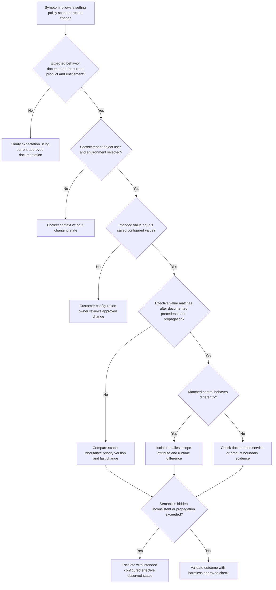

### Worked configuration example

**Fictional scenario:** A customer reports that a permitted synthetic notification category is still handled as restricted for `group-A099` after an administrator says a setting was changed. The business impact is bounded to one test group. No real tenant or product behavior is represented.

| Stage | Case record |
|---|---|
| Symptom | Expected: synthetic category `notice-A` is permitted for `group-A099`. Actual: two fictional events at 09:04 and 09:07 UTC show outcome `restricted`. A matched event for `group-C099` is permitted. |
| Hypothesis 1 | The intended change was saved in a different scope or environment. Prediction: the approved configuration record for `group-A099` will not contain the expected version. |
| Hypothesis 2 | A higher-priority inherited rule overrides the visible group setting. Prediction: effective-state evidence will name a different precedence source than the edited setting. |
| Hypothesis 3 | The change is correct but documented propagation has not completed. Prediction: version and change time are correct, and later harmless events converge within the documented window. |
| Test | Read current approved documentation; verify tenant/environment alias; compare intended, saved, and effective state for only `group-A099` and matched `group-C099`; record version aliases and UTC times. Do not change any policy. |
| Observation | Fictional effective-state record shows `policy-parent-v4` for `group-A099`, while the edited child record is `policy-child-v7`; the documented precedence rule says parent enforcement wins in this synthetic fixture. |
| Next action | Customer configuration owner reviews intended precedence through the approved change process. L1 explains the observed mismatch and success check. No broad allowlisting, security disablement, or unapproved change is performed. |
| Evidence ceiling | The fixture supports a precedence mismatch in this fictional case. It does not prove how Abnormal or another real product computes policy. |

### Misleading signals, failure modes, and escalation triggers

| Signal or failure | Why it misleads or fails | L1 response | Escalate or stop when |
|---|---|---|---|
| Screenshot shows the desired toggle | It may show draft, wrong scope, stale UI, or configured rather than effective state | Record scope, version, save result, and effective-state source | Current approved sources disagree or effective state is unavailable |
| Behavior began after a change | Temporal order does not prove causation | Compare affected/control scope and competing changes | Reversal or controlled validation is not authorized |
| “Wait for propagation” repeated indefinitely | It delays a real defect or precedence issue | Use documented timing and a deadline | Documented window is exceeded with reliable timestamps |
| Broad allowlist as a test | It weakens protection and obscures the original condition | Reject; use read-only comparison or harmless scoped fixture | Any bypass/disable request appears |
| Support edits customer policy | It crosses ownership and change-control boundaries | Keep L1 read-only unless current role procedure explicitly authorizes action | Permission, impact, rollback, or owner is unclear |
| Export every setting | It overcollects and creates review noise | Request exact policy, scope, version, precedence, and change metadata | Required fields cannot be isolated safely |

**Configuration stop condition:** Stop when the next step changes customer policy, weakens a control, affects a broad population, requires undocumented precedence semantics, or cannot be reversed and validated under an approved change owner. Continue case ownership through handoff and follow-up.

### Plain-English deep-dive: Configured does not mean effective

A restaurant menu may list a dish, the kitchen may have a different daily availability list, and a server may apply an allergy restriction. The printed choice is configured intent; the meal that can actually be served is effective state.

The analogy stops because software state can be cached, regionally replicated, licensed, inherited, versioned, or evaluated per request. Never explain a real discrepancy with “the system ignored the setting” until approved evidence identifies where intended, stored, effective, and observed states diverge.

## 4. Connectivity path

Connectivity is the ability of one endpoint and process to reach another through name resolution, routing, transport, encryption, intermediaries, and application protocol. “The site is down” can mean local process failure, DNS failure, no TCP connection, TLS trust failure, proxy denial, HTTP error, slow service, or an application response that the user interprets as unavailable.

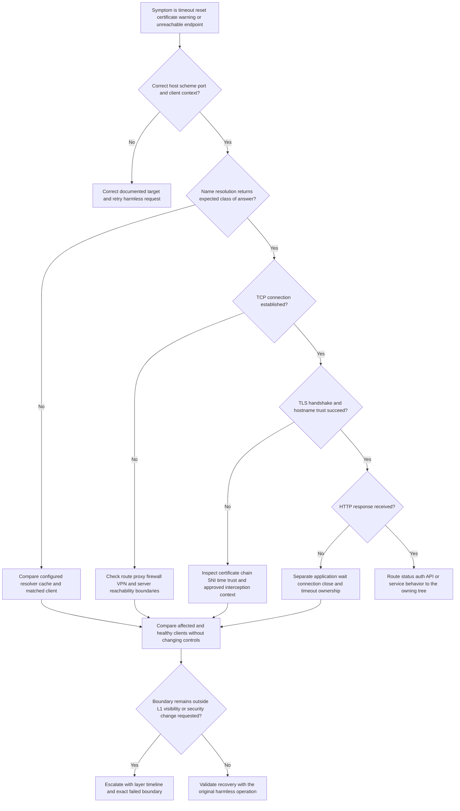

### Worked connectivity example

**Fictional scenario:** A local synthetic client reports “connection timed out” when reaching `api.example.invalid:443`. The reserved `.invalid` name guarantees that this written scenario is not a real service target. The exercise uses authored observations rather than network execution.

| Stage | Case record |
|---|---|
| Symptom | Expected: a fictional health request returns a response in under two seconds. Actual: `client-A099` records a 30-second timeout; `client-C099` records a fictional 200 response. |
| Hypothesis 1 | The affected client uses a different proxy path. Prediction: client configuration metadata will show a proxy alias absent from the control. |
| Hypothesis 2 | DNS differs across clients. Prediction: resolver class or answer alias will diverge before TCP. |
| Hypothesis 3 | Service-side availability is degraded. Prediction: similarly placed clients will fail after DNS/TCP/TLS at the same interval. |
| Test | Compare learner-authored client timelines for process, target, resolver alias, DNS result class, TCP outcome, TLS outcome, proxy alias, HTTP outcome, and duration. No packet capture, firewall change, proxy bypass, or live request occurs. |
| Observation | Both clients show the same fictional DNS answer class. `client-A099` records proxy `proxy-A` and `tcp_connect=timeout`; control records direct path and `tcp_connect=success`. No server-side observation exists. |
| Next action | Route the bounded finding to the authorized customer network/proxy owner with exact time, destination class, affected/control path, and request for policy/path confirmation. Do not recommend bypassing the proxy or disabling inspection. |
| Evidence ceiling | The fixture localizes divergence before TCP completion on the proxy path. It does not prove the proxy is defective; policy, upstream reachability, routing, or destination handling may still explain it. |

| Misleading signal or failure | Why it misleads | Better check | Escalation trigger |
|---|---|---|---|
| Ping fails | ICMP may be blocked while HTTPS works | Test the required application path through approved tools | Only invasive capture or control change remains |
| DNS resolves | Resolution does not prove route, TCP, TLS, or HTTP | Continue layer by layer | Resolver answers conflict with authoritative/current approved data |
| TCP 443 succeeds | A port connection does not prove hostname, TLS trust, proxy policy, auth, or API health | Record TLS and HTTP outcomes separately | TLS or service semantics require another owner |
| Certificate looks valid in one browser | Trust stores, interception, SNI, client runtime, and clock can differ | Compare exact client context and chain evidence | Private key, interception bypass, or trust-store change requested |
| Traceroute has missing hops | Routers may suppress or deprioritize replies | Use it only as partial path metadata | Third-party scanning or broad capture proposed |
| Packet capture requested first | It can overcollect unrelated traffic and content | Start with bounded client timing and structured errors | Capture is necessary but scope/approval/redaction is unclear |

**Connectivity stop condition:** Stop when the next test requires disabling proxy, firewall, VPN, certificate validation, endpoint protection, or TLS inspection; installing unapproved roots or tools; capturing broad traffic; scanning third parties; or changing production routes without authorization.

### Plain-English deep-dive: A successful port check is only one open door

Imagine reaching a building's front door. An unlocked door does not prove the receptionist recognizes you, the elevator works, the correct office exists, or the meeting is running. A successful TCP connection similarly proves only that a transport connection was established to some endpoint under that test context.

The analogy stops because proxies and load balancers can terminate one connection and create another, TLS can depend on hostname and trust, and an application can return a valid HTTP error. Record each boundary rather than compressing the whole path into “network works” or “network is down.”

## 5. Identity path

**Authentication** establishes or verifies an identity. **Authorization** decides whether that identity may perform a specific action on a resource. **Assignment** links a user, group, or workload to an application or role. **Consent** grants an application approved permissions. **Provisioning** creates or updates identity records. A **session** carries authenticated state over time. These are related but distinct boundaries.

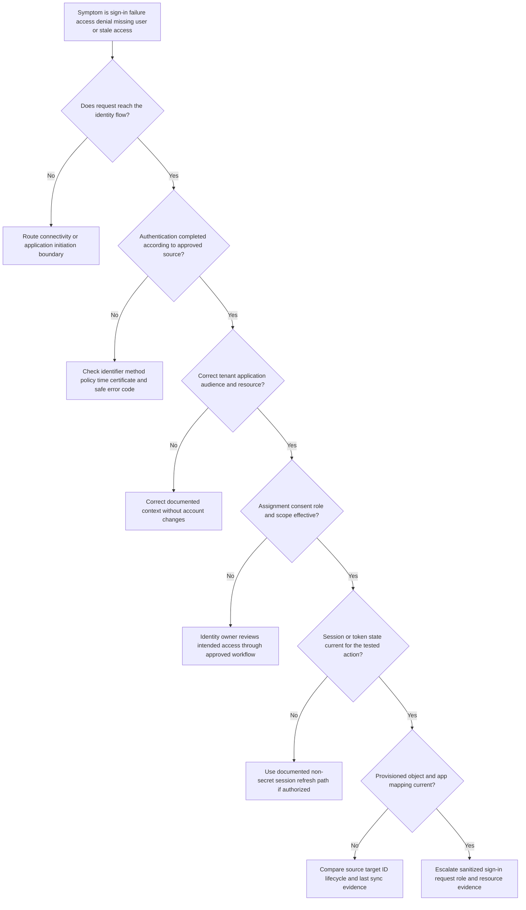

### Worked identity example

**Fictional scenario:** `principal-A099` can complete a synthetic sign-in but receives `access_denied` when opening resource `R-A099`; `principal-C099` succeeds. No real identity provider or account is involved.

| Stage | Case record |
|---|---|
| Symptom | Authentication appears successful in the fictional sign-in ledger, but access to one resource is denied for one principal after a group change. |
| Hypothesis 1 | The principal authenticated in the wrong tenant or application context. Prediction: tenant/audience aliases differ from the control. |
| Hypothesis 2 | Group membership changed at the source but effective role assignment has not converged. Prediction: source membership is present while application/effective assignment is absent or stale. |
| Hypothesis 3 | A stale session carries older authorization state. Prediction: current authoritative assignment is correct but the tested session predates it. |
| Test | Compare fictional sign-in result, tenant alias, application alias, resource alias, source group state, effective assignment state, session-issued time, and matched control. Never request or decode a real token, cookie, password, MFA code, or secret. |
| Observation | The source group ledger shows membership at 08:55 UTC; the synthetic target assignment ledger remains `not_present` at 09:05 UTC; authentication succeeds in the correct tenant. |
| Next action | Identity/provisioning owner validates lifecycle state and documented convergence. L1 does not manually grant a role, bypass policy, create an account, or ask for credentials. Escalate if the approved convergence window is exceeded. |
| Evidence ceiling | The fictional records support a source-to-target assignment gap, not the root cause of a real provisioning system. |

| Misleading signal or failure | Why it misleads or harms | L1 correction | Escalate or stop when |
|---|---|---|---|
| “Login succeeded, so identity is fine” | Authorization, assignment, consent, resource scope, and session can still fail | Trace authentication and authorization separately | Product-owned authorization semantics are unavailable |
| “403 always means missing permission” | Resource policy, tenant mismatch, concealment, app logic, and licensing may also return denial | Use endpoint contract and matched action | Status semantics conflict or vary by endpoint |
| Request full token | Tokens are bearer secrets and may expose identities/scopes | Request approved non-secret claim/result summaries from authorized owner | Any token/cookie/secret is shared |
| Add administrator role to test | It is excessive, changes risk, and can hide scope defects | Use read-only state comparison or approved test identity | Privilege escalation or policy bypass proposed |
| Disable MFA or conditional access | It weakens security and creates an unsafe precedent | Use approved identity-policy diagnostics | Any security disablement requested |
| Create another production account | It changes identity state and may violate license/governance rules | Use approved existing test process or synthetic record | No authorized test identity exists |

**Identity stop condition:** Stop when the next step requires a password, token, cookie, MFA code, private key, broad consent, privileged role, policy bypass, account creation, account disablement, session revocation, or directory change outside an approved identity owner and change process.

### Plain-English deep-dive: A badge and a room key answer different questions

Authentication is like proving your identity at a hotel desk. Authorization is whether your key opens room 412, the gym, or the staff office. A valid badge can still lack access to a particular door.

The analogy stops because digital access can involve tenant, audience, scope, consent, group expansion, conditional policy, token age, application roles, and resource-specific checks. “The user is authenticated” is therefore not the same as “the requested action is authorized.”

## 6. API path

An **Application Programming Interface (API)** is a documented way for software to request operations or data. The **contract** defines method, route, authentication, headers, parameters, body schema, response schema, errors, pagination, rate limits, and version behavior. A response status is one observation within that contract, not a complete diagnosis.

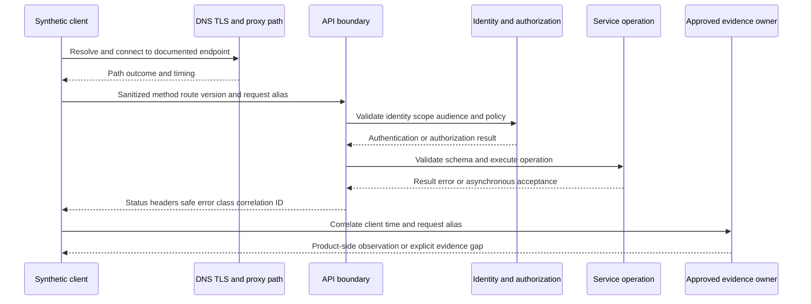

### API decision sequence

1. Confirm the documented environment, base URL, version, method, route template, content type, and operation expectation.
2. If DNS, TCP, TLS, proxy, or no-response behavior fails, route to connectivity before interpreting application status.
3. Separate `401` authentication challenge/failure from `403` authorization or policy denial, while checking the endpoint's documented semantics.
4. For `400`-class validation, compare schema, required fields, data types, encoding, and stable machine-readable error code without exposing content.
5. For `404`, verify route/resource/environment and remember some systems conceal unauthorized resources; do not assume deletion.
6. For `409`, examine documented state conflict and idempotency behavior; do not blindly retry a mutating operation.
7. For `429`, record rate policy, `Retry-After` if provided, concurrency, retry behavior, and request volume; never create load to prove a limit.
8. For `5xx`, distinguish a reproducible service-side class from intermediary-generated errors and client timeout; preserve correlation ID and exact time.
9. For `2xx` with wrong or missing result, check asynchronous processing, pagination, filters, eventual consistency, permission-filtered views, and response schema.
10. Escalate only the sanitized minimum: expected/actual, contract reference, environment/version, method/route template, times, status/error class, request/correlation alias, retry pattern, control result, and explicit ask.

### Worked API example

**Fictional scenario:** A synthetic integration creates event `evt-A099`. The client receives `202 Accepted`, but the event is not present in a later list response.

| Stage | Case record |
|---|---|
| Symptom | Expected: accepted event appears in the synthetic list within the documented fixture window of two minutes. Actual: absent after five minutes for one event; control event is visible. |
| Hypothesis 1 | The client treats `202` as completed rather than accepted for asynchronous processing. Prediction: status evidence will show accepted/queued with a separate operation alias. |
| Hypothesis 2 | The list query filter or pagination excludes the event. Prediction: direct operation/status lookup succeeds while filtered listing omits it. |
| Hypothesis 3 | Processing failed after acceptance. Prediction: approved service-side operation evidence shows terminal failure for the correlation alias. |
| Test | Compare sanitized request metadata, `202` response class, operation alias, documented async behavior, list filter, page traversal, and fictional operation-status record. Do not include authorization headers, cookies, tokens, payload content, or real endpoints. |
| Observation | Fixture shows operation `op-A099` accepted at 11:00:05 UTC and completed at 11:00:40 UTC. The list query used `created_after=11:01:00Z`, excluding the event by its creation time. |
| Next action | Correct the synthetic query boundary in the local fixture and validate the event plus control. In real work, customer/integration owner makes approved client changes. L1 documents half-open time semantics and does not alter production. |
| Evidence ceiling | The synthetic evidence proves only a filter mismatch in the fixture. A real `202` contract and timestamp semantics must come from current endpoint documentation. |

| Misleading signal or failure | Why it fails | Better action | Escalation trigger |
|---|---|---|---|
| `2xx` means business success | `202` may mean accepted; response can be partial or async | Read operation contract and verify terminal state | Operation state is unavailable or contradicts contract |
| Repeated retries | Mutating calls can duplicate work and worsen rate pressure | Check idempotency and retry rules first | Duplicate or side-effect risk exists |
| Full HAR or raw request attached | May contain bearer tokens, cookies, URLs, query data, and content | Build an allowlisted sanitized derivative | Sensitive material already exposed |
| One `5xx` proves product outage | Proxy/gateway/client context and transient errors can mimic service failure | Compare time, correlation, control, and authoritative status evidence | Multi-customer/security impact or service owner evidence needed |
| `404` proves resource absent | Wrong environment, route, permission concealment, or eventual state can look identical | Verify context and contract | Resource existence is security-sensitive or semantics hidden |
| Load test to reproduce `429` | It can harm service and violate authorization | Analyze existing bounded request records | Any deliberate load or quota exhaustion proposed |

**API stop condition:** Stop when testing would expose a secret, replay a sensitive request, mutate or delete customer data, create load, bypass rate/security controls, target an unapproved endpoint, or require proprietary server telemetry unavailable to L1.

### Plain-English deep-dive: An HTTP status is a chapter heading, not the whole story

A library shelf label points to a subject but does not summarize every book on the shelf. An HTTP status class similarly narrows the kind of result, while the endpoint contract, safe error code, headers, operation state, identity context, and timing provide the actual story.

The analogy stops because intermediaries can generate responses, applications can use statuses imperfectly, and security controls can conceal details. Interpret status codes with the current API contract and source boundary, never from memory alone.

## 7. Behavioral false-positive path

A **false positive** is an event classified as threatening or policy-relevant when the reviewed ground truth says it was legitimate for the evaluated purpose. A customer disagreement is not automatically a confirmed false positive. The message may be unwanted rather than malicious, a policy may intentionally be strict, an override may have acted, or the available reviewer may lack enough context to establish ground truth.

Behavioral systems can use context such as identity, relationship, communication pattern, content characteristics, authentication, infrastructure, and policy. This Part does not claim which signals Abnormal uses, their weights, model design, threshold, explanation fields, learning period, or tuning mechanism.

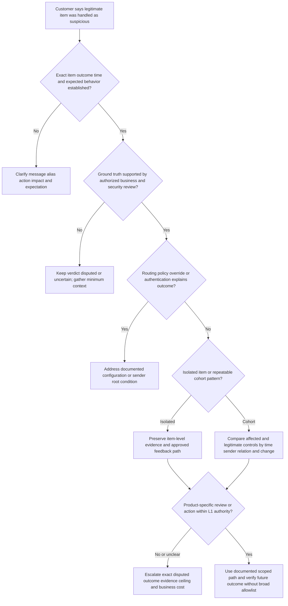

### Worked behavioral false-positive example

**Fictional scenario:** Three synthetic invoice notifications from an established vendor alias are marked `review_required`, while two earlier controls were `permitted`. The customer says the new messages are legitimate. No real messages, senders, or product verdicts are involved.

| Stage | Case record |
|---|---|
| Symptom | Expected: legitimate recurring vendor notifications follow normal handling. Actual: three aliases in a 20-minute window receive a fictional review outcome. No user clicked a link or opened an attachment in the exercise. |
| Hypothesis 1 | A mail-routing or policy change produced the outcome. Prediction: policy/effective-state version changed at or before the first affected item. |
| Hypothesis 2 | Sender authentication or infrastructure changed. Prediction: affected items differ from controls in approved authentication or route metadata. |
| Hypothesis 3 | Business pattern changed enough to merit review even though the transaction is legitimate. Prediction: relationship, recipient, amount category, reply path, or timing category differs in the synthetic fixture. |
| Hypothesis 4 | Product-specific classification is erroneous for a repeatable cohort. Prediction: routing, policy, authentication, and business-context differences are excluded while similarly scoped legitimate items share the disputed outcome. |
| Test | Use aliases and synthetic metadata only: compare outcome, direction, authentication result class, route alias, policy version, relationship-age bucket, recipient-count bucket, change time, and documented action. Do not upload message content or broadly allowlist the sender. |
| Observation | The fixture shows the same policy and route. Affected items use `reply-path=new-A` and authentication result `aligned-pass`; controls use `reply-path=known-C`. Business owner confirms the new path is authorized in the fiction. |
| Next action | Preserve the bounded cohort and ground-truth rationale, explain that the new reply path is a relevant difference but not proof of model cause, and use the approved product feedback/escalation route. Do not promise tuning, expose internals, or create a broad bypass. |
| Evidence ceiling | The fixture supports a repeatable legitimate cohort with a changed reply-path category. It does not reveal proprietary detection logic or prove that one feature caused a verdict. |

| Misleading signal or failure | Why it fails | Better response | Escalation trigger |
|---|---|---|---|
| “Customer says it is safe” | Business legitimacy and technical safety need evidence and authorized ownership | Record who established ground truth and on what basis | Ground truth is disputed or active threat remains possible |
| “Authentication passed, so benign” | SPF/DKIM/DMARC can pass for compromised or attacker-controlled domains | Treat authentication as one signal | Threat indicators or account compromise appear |
| “Allow the sender/domain” | Broad exceptions can create durable bypass and mask future attacks | Prefer root correction and narrowly documented product path | Any broad allowlist/security weakening requested |
| “Model learned incorrectly” | It invents internals and causality | Describe observed outcome and product-visible contributing context only | Explanation requires proprietary telemetry |
| One item proves systemic bias | A single sample cannot establish a stable cohort or population effect | Bound the item, then look for approved pattern evidence | Repeated material impact or governance concern appears |
| Full message corpus requested | It overcollects content and identities | Start with alias, outcome, time, route, auth, policy, and matched controls | Content is essential and requires restricted workflow |

**Behavioral false-positive stop condition:** Stop when review requires proprietary model internals, broad message collection, a sender/domain bypass, threshold change, security disablement, or customer-content transfer outside an approved restricted process. If maliciousness remains plausible, route to threat investigation rather than treating the case as tuning.

### Plain-English deep-dive: A smoke alarm dispute is not automatically a bad alarm

If a smoke alarm sounds while someone cooks, the event may be harmless, but the alarm may still have reacted to real smoke under its designed sensitivity. The right question is whether the observed condition, policy, and desired outcome align, not simply whether the homeowner dislikes the noise.

The analogy stops because behavioral security decisions combine many possible signals and costs, and proprietary systems may not expose their internal weighting. A support engineer should explain observed differences and next steps without claiming access to a model's hidden reasoning.

## 8. Email-delivery path

Email delivery is a chain of custody across submission, Domain Name System routing, Simple Mail Transfer Protocol transfer, gateway handling, mailbox acceptance, filtering, quarantine, inbox placement, and possible post-delivery action. A `250` SMTP response means the receiving server accepted responsibility at that hop; it does not prove inbox placement, user visibility, or absence of later remediation.

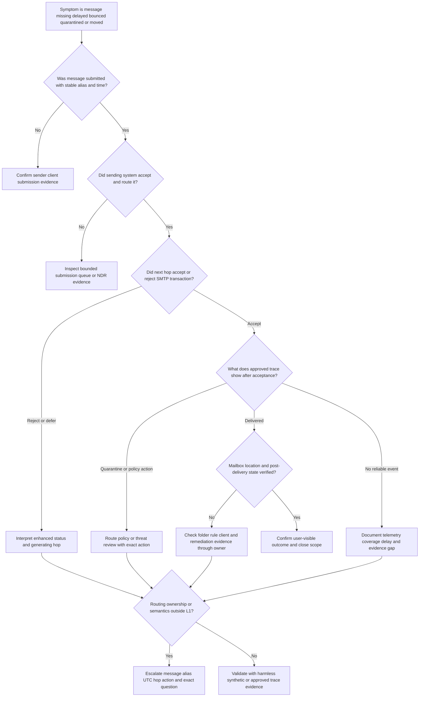

### Worked email-delivery example

**Fictional scenario:** A user reports that a legitimate notification never arrived. The sender says it was sent. The local fixture uses message alias `msg-A099`, reserved domains, no real body, no attachment, and authored trace rows.

| Stage | Case record |
|---|---|
| Symptom | Expected: `msg-A099` is visible to recipient alias `recipient-A099`. Actual: user reports it missing at 13:15 UTC. Sender fixture shows submission at 13:00 UTC. |
| Hypothesis 1 | Sender submission failed. Prediction: no sender acceptance/queue record or an immediate local error exists. |
| Hypothesis 2 | An SMTP hop rejected or deferred it. Prediction: trace contains a 4xx/5xx reply and generating-hop alias. |
| Hypothesis 3 | Receiving environment accepted it but applied quarantine or policy action. Prediction: accepted transfer precedes a named outcome in approved trace. |
| Hypothesis 4 | It reached the mailbox and was moved or removed later. Prediction: delivery record exists, followed by mailbox-rule, client, or remediation evidence. |
| Test | Correlate only alias, envelope-direction category, UTC times, generating hop, SMTP reply class, message-trace outcome, location category, and post-delivery action. Do not request the message body, attachment, password, mailbox export, or all mail. |
| Observation | Fictional trace shows receiving hop accepted at 13:00:12 UTC, outcome `delivered` at 13:00:18, and mailbox fixture shows rule `rule-A` moved the item to folder category `archive` at 13:00:20. |
| Next action | Customer mailbox owner reviews the intended rule through the approved process; L1 explains that transport delivery succeeded and user-visible location diverged afterward. No rule is disabled or mailbox changed by this exercise. |
| Evidence ceiling | The fixture supports a post-delivery move, not a real provider behavior or proof of who created the rule. |

| Misleading signal or failure | Why it fails | Better response | Escalation trigger |
|---|---|---|---|
| “Sent” in sender client | It may mean queued locally, not accepted downstream | Find the earliest authoritative submission/transfer observation | Sender source unavailable or disputed |
| SMTP `250` means inbox | It proves acceptance at one hop only | Continue through trace, policy, location, and post-delivery state | Accepted message disappears without authorized visibility |
| NDR recipient equals cause owner | A later system can generate a report about an earlier boundary | Read generating hop and enhanced code | Routing topology or connector ownership is unclear |
| Missing from inbox means blocked | Rules, junk, quarantine, forwarding, deletion, remediation, and client views can differ | Establish exact last known location | Active threat/remediation or data-loss concern appears |
| Send repeated real messages | It can create spam, disclosure, or operational impact | Use approved trace or harmless authorized test process | No safe test identity/path exists |
| Export mailbox | It overcollects unrelated content | Request one aliased trace and exact location metadata | Content becomes essential and restricted review is required |

**Email-delivery stop condition:** Stop when the next test sends real phishing, suspicious content, bulk mail, or unapproved external messages; changes MX, connectors, transport rules, mailbox rules, quarantine, allowlists, or security policy; accesses mailbox content without authority; or deletes/releases/remediates messages outside the approved owner.

### Plain-English deep-dive: Accepted mail is a parcel at one checkpoint

A courier depot can accept a parcel and still route it to another depot, a secure holding area, a recipient's mailroom, or a return process. An SMTP acceptance is similar: it transfers responsibility at one hop but does not promise the user's final folder or visibility.

The analogy stops because email can be copied, forwarded, quarantined, journaled, remediated after delivery, or represented differently across logs. Follow the message alias and times through each authorized boundary instead of using the word “delivered” without naming the source and location.

## 9. Threat-investigation path

A threat investigation asks whether an event may be malicious, what is affected, what evidence supports the assessment, and which authorized owner should contain and recover. L1 can structure intake, preserve minimum evidence, identify urgency, and maintain communication. L1 must not improvise incident command, attribution, malware analysis, credential testing, payment recovery, or customer remediation.

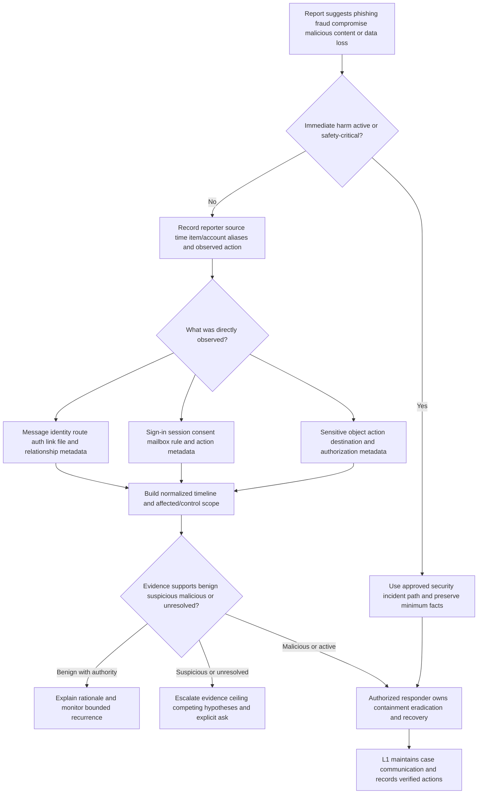

### Worked threat-investigation example

**Fictional scenario:** An employee alias reports an invoice-change message that appears to come from a vendor. The scenario contains no message body, live URL, attachment, real domain, or real person.

| Stage | Case record |
|---|---|
| Symptom | A synthetic message requests payment-detail change with urgency. Reporter has not acted. Expected vendor process requires out-of-band approval. |
| Hypothesis 1 | Benign but unusual vendor process change. Prediction: authorized vendor contact confirms the request through a known independent channel and approved metadata is consistent. |
| Hypothesis 2 | Lookalike-domain impersonation. Prediction: visible/from/reply domain aliases or authentication alignment differ from established controls. |
| Hypothesis 3 | Compromised vendor account or thread. Prediction: domain authentication may pass while relationship, reply path, request type, or account evidence changes. |
| Hypothesis 4 | Compromised internal account or mailbox manipulation. Prediction: identity/session/rule/action evidence shows unauthorized internal activity. |
| Test | Preserve the original in the approved system without forwarding it; record alias, UTC time, sender/reply-domain categories, authentication result class, relationship history category, requested action, and reporter action. Customer follows approved out-of-band business verification. L1 does not click, reply, open, upload, or detonate. |
| Observation | Fictional evidence shows a new lookalike-domain alias, reply-path mismatch, no prior relationship, and no reporter interaction. Ground truth remains “suspicious” until authorized security/business owners complete verification. |
| Next action | Trigger the approved security/threat route, provide bounded evidence and non-interaction status, and keep the customer updated. Authorized responders decide containment, search, block, removal, account actions, and notifications. |
| Evidence ceiling | The fixture supports suspicion consistent with impersonation; it does not prove actor identity, compromise, campaign scope, or product detection failure. |

| Misleading signal or failure | Why it fails or harms | L1 correction | Immediate escalation or stop trigger |
|---|---|---|---|
| Display name matches vendor | Display names are not authenticated identity | Compare approved domain, reply path, authentication, relationship, and business process evidence | Payment, credential, or sensitive-data request involved |
| SPF/DKIM/DMARC pass | Compromised or attacker-owned domains can authenticate | Treat as identity/path evidence, not benign verdict | Other threat signals remain |
| Upload link/file to public scanner | It can disclose customer data, tokens, victim identifiers, or confidential files | Use only approved security tooling and owner | Any sensitive upload is proposed or occurred |
| Click to see where it goes | It risks credential theft, tracking, exploit, or contamination | Preserve/defang through approved workflow; do not visit | Live malicious content requires specialist handling |
| Reply to test sender | It confirms account activity and can advance fraud | Use approved out-of-band verification | Fraud or impersonation suspected |
| Delete the message immediately | It can destroy evidence and exceed authority | Preserve and let authorized responder decide | Active incident or evidence-handling concern |
| Reset/revoke everything | Broad action can disrupt users and erase useful state | Authorized incident owner chooses proportionate containment | Active compromise or credential exposure |

**Threat-investigation stop condition:** Stop ordinary troubleshooting when active compromise, fraud, malicious content, credential exposure, data loss, user interaction, payment action, or cross-user campaign may exist. Do not click, open, execute, forward, reply, upload publicly, test credentials, disable controls, delete evidence, or perform containment without authorized incident ownership.

### Plain-English deep-dive: L1 is the air-traffic controller, not every emergency crew

An air-traffic controller identifies the aircraft, location, risk, and safe routing, then coordinates the right responders. The controller remains accountable for communication but does not personally perform every rescue task. L1 threat handling is similar: establish facts, protect the customer, preserve evidence, route quickly, and maintain ownership.

The analogy stops because organizational incident roles and legal duties vary. Current policy determines who can declare an incident, contain accounts, remove messages, notify stakeholders, and preserve forensic evidence. The runbook cannot grant that authority.

## 10. Cross-scenario handoffs and mixed cases

Real cases cross boundaries. A webhook may fail because a certificate expires, then retry into a rate limit. A sign-in may succeed while an API action fails authorization. A message may be accepted, classified, delivered, and later remediated. The case should move between trees without losing the shared ledger.

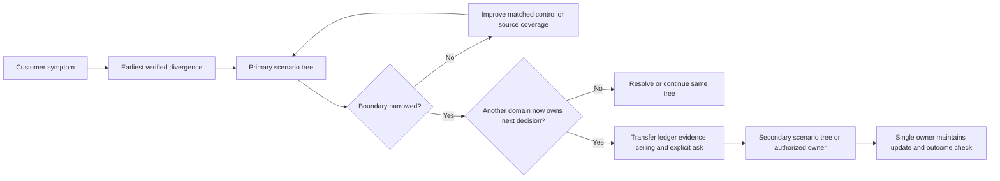

### Handoff packet

| Packet field | Required content | Why it prevents rework |
|---|---|---|
| Customer outcome | Expected, actual, impact, affected/unaffected scope | Keeps investigation tied to customer value |
| Time | Original zone, normalized UTC interval, first/last known, delay caveat | Enables correlation without inventing order |
| Scenario route | Primary tree and earliest verified divergence | Shows why the case moved |
| Hypothesis ledger | Active, weakened, rejected, and untested explanations | Prevents restarting from the first guess |
| Tests | Exact bounded tests, authority, controls, expected observations | Shows what was and was not attempted |
| Observations | Source, scope, time, result, missing data, semantics | Separates facts from interpretation |
| Evidence ceiling | Strongest supported conclusion and explicit unknowns | Prevents escalation from turning inference into cause |
| Safety record | Sensitive data, prohibited actions, stop conditions, incident route | Protects the customer during handoff |
| Explicit ask | One decision or evidence request for the next owner | Makes escalation actionable |
| Ownership/update | Current case owner, next owner, customer cadence, success check | Avoids silent transfer |

### Global escalation triggers

Escalate with a narrow packet when:

- The documented expected behavior and observed result conflict after scope, version, entitlement, and effective state are verified.
- A reproducible issue remains after a matched healthy control and the earliest divergence is at a product-owned boundary.
- Current product documentation is missing, contradictory, stale, or does not define the observed status, field, action, or timing.
- A documented propagation, processing, or recovery window is exceeded with reliable timestamps.
- Required telemetry, explanation, permission semantics, detection context, or service state is unavailable to L1.
- Multiple customers, tenants, regions, or integrations show correlated impact, subject to authorized visibility.
- A security, privacy, legal, compliance, data-residency, cross-tenant, evidence-integrity, or contractual concern appears.
- A workaround would weaken security, broaden access, disable a control, create data loss, or change production state without approved ownership.
- The case needs Engineering to evaluate a defect or Product to clarify intended behavior, limitation, or feature expectation.

### Global stop conditions

Stop the specific test or collection activity when authorization, reversibility, scope, evidence protection, or customer safety is unclear. Do not stop case ownership. The next case note should state:

1. What was directly observed.
2. What remains inference.
3. What cause has not been proven.
4. Which proposed action was not taken and why.
5. Which approved owner or process is needed.
6. What minimum evidence is safely available.
7. What the customer should do or avoid now.
8. When the next update will occur.

## 11. Multi-scenario troubleshooting runbook artifact

The artifact is a reusable but product-neutral set of local Markdown tables. It is not an Abnormal internal runbook. Each scenario card uses the same schema so a future reviewer can compare decision quality across domains.

| Artifact section | Required fields | Acceptance rule |
|---|---|---|
| Cover and honesty | Artifact label, author, design/execution state, date, product boundary | Must say local synthetic and no Abnormal production use |
| Universal intake | Expected, actual, scope, time, change, impact, reproduction, authority | No blank field hidden by vague “unknown”; unknowns are explicit |
| Scenario router | Earliest divergence and selected tree | Route is evidence-based, not customer-cause language |
| Case cards | One for each of seven named families | Every card has symptom, at least two hypotheses, test, observation, next action |
| Evidence ledger | Source aliases, time, scope, control, result, limitation | No secret, real identity, content, endpoint, or customer detail |
| Observation/inference/cause | Separate columns and confidence | No unsupported cause statement |
| Safety gate | Prohibited actions, stop condition, escalation owner class | No bypass, disablement, destructive action, or sensitive upload |
| Handoff | Evidence ceiling, explicit ask, owner, customer update, success check | Next owner can act without broad recollection |
| Validation report | Deterministic checks and no more than three repair cycles | Status becomes complete only after all gates pass |

### Customer-safe update pattern

Use concise language that separates facts from next steps:

> We confirmed the issue affects **[bounded aliases/scope]** during **[UTC interval]**. The approved evidence shows **[observation]** at **[boundary]**. This weakens **[hypothesis]** and keeps **[hypothesis]** open; it does not yet establish **[unproven cause]**. We will next **[authorized action]** with **[owner]**. We have not **[unsafe or unnecessary action deliberately avoided]**. Our next update is **[time/condition]**.

### Escalation-ready question pattern

> For synthetic case alias **[case]**, current documentation predicts **[expected]**, while **[source]** recorded **[actual]** for **[scope/time/version]**. We reproduced with **[safe test]** and matched control **[control]**. Configuration/connectivity/identity/API/routing factors **[status]**. The evidence ceiling is **[bounded conclusion]**. Please determine **[one explicit product-owned question]** or identify **[one exact missing telemetry/semantic]**. No production change, security bypass, broad collection, sensitive upload, or destructive action was performed.

## 12. Common anti-patterns across every tree

| Anti-pattern | Hidden risk | Better runbook behavior |
|---|---|---|
| Start with a favorite tool | Tool output replaces the actual decision | Start with expected/actual and the earliest disputed boundary |
| Accept the customer's proposed cause | The report may mix observation and interpretation | Preserve their wording, then create competing hypotheses |
| Collect first and scope later | Secrets, content, unrelated users, and long intervals enter the case | Write the discriminating question and allowlist first |
| Change several variables | A successful result cannot identify which change mattered | Use one approved reversible variable and a matched control |
| Repeat a failing action indefinitely | Creates load, duplicates, alerts, lockout, or customer harm | Set a retry/test budget and stop condition |
| Use administrator access as a diagnostic shortcut | Excess privilege can mask the real scope and creates risk | Compare documented effective access without broad privilege |
| Call absence proof | Telemetry may be delayed, sampled, filtered, unauthorized, or retained briefly | State source coverage and distinguish not observed from did not occur |
| Call correlation cause | Time adjacency can result from a third factor | Seek a discriminating comparison and causal mechanism |
| Promise a product fix | L1 may not own design, release, or timeline | State evidence, owner, next checkpoint, and uncertainty |
| Silent escalation | Customer and next owner lose context and confidence | Keep one case owner, explicit ask, and update cadence |
| Close on workaround alone | Underlying risk, recurrence, or security weakness may remain | Verify outcome, document limitation, and route durable follow-up |
| Treat lab as experience | Reading or synthetic practice is not production ownership | Label production transfer, lab, learned architecture, and unknowns |

## Lab

**TroubleshootingLab 099 - Local Synthetic Seven-Scenario Tabletop** is a safe offline design. It has not been executed. The lab creates only learner-authored Markdown or plain-text case cards. It uses no network request, email, account, tenant, product, script, packet capture, browser capture, API client, cloud service, public website, external recipient, secret, or customer evidence.

The lab objective is to route seven fictional symptoms, write a five-column reasoning ledger for each, identify misleading signals, declare stop conditions, and build one handoff packet. It evaluates support reasoning and communication, not product operation.

### Prerequisites

- A learner-owned local folder and UTF-8 text editor.
- A printed or local copy of the seven scenario templates from this Part.
- No Abnormal AI account, prior production account, customer tenant, mailbox, identity provider, API credential, support portal, corporate case export, or external system.
- No password, token, cookie, API key, client secret, webhook secret, private key, MFA code, recovery code, authenticated connection string, or realistic credential-shaped value.
- No real person, customer, tenant, domain, IP address, hostname, email address, message ID, message body, attachment, URL, support ticket, or production log.
- Use only reserved names such as `example.invalid` and obvious aliases beginning `CASE-099-`, `principal-A099`, `msg-A099`, `req-A099`, `policy-A099`, and `corr-A099`.
- Every artifact begins with `LOCAL SYNTHETIC TABLETOP - NOT EXECUTED AGAINST ANY SYSTEM - NOT ABNORMAL EXPERIENCE`.
- Initial state is `DESIGN_NOT_EXECUTED_NOT_TRANSFERRED`.

### Lab safety charter

| Area | Allowed | Prohibited |
|---|---|---|
| Data | Learner-authored fictional metadata and aliases | Customer, employer, personal, production, or realistic sensitive data |
| Collection | No collection; manually write fixture observations | Broad logs, mailbox export, HAR, packet capture, screenshots, tokens, content |
| Network | None | Live DNS, API, email, scanning, browsing, link visits, uploads, or third-party tests |
| Security | Discuss controls and safe escalation | Bypass, disable, weaken, evade, broad allowlist, or suppress detection |
| Identity/configuration | Read fictional records only | Real account creation, role/consent change, policy edit, session revocation, connector change |
| Threat content | Text label such as `SYNTHETIC_SUSPICIOUS_REQUEST` | Real phishing, live malicious links, malware, attachments, credential collection |
| Storage/sharing | One learner-owned local folder | Public repository, paste, scanner, converter, personal cloud, unapproved AI, external recipient |
| Testing | Tabletop comparison of written records | Destructive, load, denial, deletion, purge, wipe, quarantine, release, or remediation test |
| Claims | Designed; completed locally only after actual pass | Abnormal use, Microsoft case recreation, customer outcome, production validation |

### Synthetic fixture set

| Case alias | Scenario family | Fictional symptom | Designed discriminating observation |
|---|---|---|---|
| `CASE-099-CFG` | Configuration | Group outcome differs after stated policy change | Intended/saved/effective version and precedence source |
| `CASE-099-NET` | Connectivity | One client times out while a control succeeds | DNS/TCP/TLS/proxy phase comparison |
| `CASE-099-ID` | Identity | Authentication succeeds but resource access fails | Source membership versus effective assignment and session time |
| `CASE-099-API` | API | `202` received but item missing from list | Async operation state versus filter boundary |
| `CASE-099-FP` | Behavioral false positive | Legitimate cohort receives review outcome | Policy/route/auth/control comparison and changed context category |
| `CASE-099-MAIL` | Email delivery | Sender says sent; user says missing | SMTP acceptance, delivery state, folder/post-action timeline |
| `CASE-099-THREAT` | Threat investigation | Urgent payment-change request from vendor-like identity | Domain/reply/relationship categories and non-interaction status |

### Lab steps

1. Read the safety charter and keep the state `DESIGN_NOT_EXECUTED_NOT_TRANSFERRED` unless the local files are actually created.
2. Create no live account, request, message, connection, configuration, policy, permission, role, or product state.
3. If performing later, create one learner-owned local folder using the normal file interface and place the honesty label in every artifact.
4. Create one universal intake sheet with expected, actual, scope, time, change, impact, reproduction status, and authority.
5. Copy the seven fixture rows into separate local case cards without adding realistic identifiers.
6. For each card, write the customer's statement exactly as a symptom and remove any guessed cause from the observation field.
7. Add at least two plausible hypotheses that predict different observations.
8. Add one matched control and explain why it is comparable and where the comparison is imperfect.
9. Choose one read-only, fictional, minimum test that distinguishes the leading hypotheses.
10. Record the expected observation under each hypothesis before revealing the fixture result.
11. Reveal or author the fixture result and write it as source, time, scope, value, and limitation.
12. Label every conclusion as observation, inference, or cause; the fixture should contain no unqualified root-cause statement.
13. Write one authorized next action, owner class, customer update time, success criterion, escalation trigger, and stop condition.
14. For `CASE-099-CFG`, compare intended, saved, effective, and observed state; do not propose a real setting change.
15. For `CASE-099-NET`, mark DNS, TCP, TLS, proxy, and HTTP as separate phases; do not run a connection or capture.
16. For `CASE-099-ID`, separate authentication, authorization, assignment, consent, provisioning, and session; include no token or credential.
17. For `CASE-099-API`, distinguish accepted from completed, include filter/pagination/version hypotheses, and include no payload or secret.
18. For `CASE-099-FP`, record ground-truth owner, business context, matched controls, and uncertainty; do not propose a broad allowlist or threshold change.
19. For `CASE-099-MAIL`, distinguish submitted, accepted, delivered, located, and post-delivery action; include no body, attachment, or real message.
20. For `CASE-099-THREAT`, set reporter interaction to `none`, preserve fictional metadata, and route containment to an authorized owner; do not click, open, reply, forward, upload, or delete.
21. Add one misleading signal to each card and state why it cannot prove the proposed cause.
22. Add an evidence ceiling to each card using the phrase “supports,” “does not establish,” and the exact remaining unknown.
23. Reject a fictional request to collect “all logs” and replace it with an exact field/time/entity allowlist.
24. Reject a fictional request for a password, token, cookie, key, message body, mailbox export, or full HAR.
25. Reject a fictional request to bypass a proxy, disable MFA, weaken a security policy, broadly allowlist a sender, or suppress a detection.
26. Reject a fictional request to create or change an account, role, consent grant, connector, mail rule, DNS record, API configuration, or production policy without the authorized owner.
27. Reject a fictional request to send phishing, visit a suspicious link, execute an attachment, test credentials, scan a third party, or create deliberate rate-limit load.
28. Reject a fictional request to delete a message, clear logs, purge a queue, wipe a folder, revoke sessions, or run another destructive test.
29. Reject public or unapproved upload to a repository, paste, scanner, converter, personal storage service, collaboration tool, or AI system.
30. Build one cross-scenario handoff in which `CASE-099-ID` moves to the API path after authentication succeeds and operation authorization fails.
31. Include customer outcome, timeline, active hypotheses, tests, observations, evidence ceiling, safety record, explicit ask, owner, and update cadence in the handoff.
32. Draft one customer update using the observation/inference/unproven-cause pattern.
33. Draft one Engineering or Product question that asks for a specific semantic or product-owned observation rather than “please investigate.”
34. Draft one security escalation that includes minimum safe facts and explicitly excludes the suspicious artifact from unapproved transfer.
35. Review every identifier and replace anything resembling a real person, company, domain, tenant, host, IP, URL, or credential.
36. Review every action and remove any implied execution, product access, customer access, production change, or direct Abnormal experience.
37. Count the seven cards and verify that each has symptom, hypotheses, test, observation, next action, misleading signal, escalation trigger, stop condition, and evidence ceiling.
38. Practice a two-minute walkthrough of one ordinary case and one threat case aloud.
39. Practice a 60-second explanation of observation versus inference versus cause.
40. Score the validation rubric. A prohibited data item, unsafe action, broad collection, sensitive upload, performed claim, or unsupported Abnormal internal claim is an automatic fail.
41. Repair failures for no more than three review cycles and record each cycle separately.
42. Mark `LOCAL_SYNTHETIC_TABLETOP_COMPLETED_NOT_TRANSFERRED` only after files exist and every rubric gate passes.
43. Keep this Part's statement unchanged: the lab was not executed during authoring.
44. When the learning purpose ends, use the normal approved local file interface for the exact learner-owned folder; do not use destructive commands or claim universal deletion.

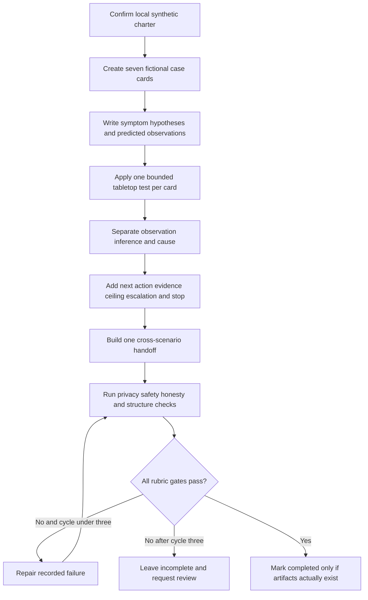

### Expected evidence

If the lab is actually performed later, expected evidence is:

- One honesty card labeled local, synthetic, not transferred, not production, and not direct Abnormal experience.
- One universal intake sheet with expected/actual, scope, UTC time, change, impact, reproduction, authority, and safety gate.
- Exactly seven scenario cards covering configuration, connectivity, identity, API, behavioral false positive, email delivery, and threat investigation.
- At least two competing hypotheses and predicted observations for every scenario.
- One matched control per scenario with a stated comparability limitation.
- One explicit symptom-hypothesis-test-observation-next-action ledger per scenario.
- One observation/inference/cause separation record per scenario.
- One evidence ceiling, misleading signal, escalation trigger, and stop condition per scenario.
- One rejected broad-collection request and a replacement field/entity/time allowlist.
- Rejected examples for security bypass/disablement, real phishing, unapproved account/configuration change, destructive test, and sensitive/public upload.
- One cross-scenario identity-to-API handoff with an explicit product-owned question.
- One customer update, one Engineering/Product escalation, and one security escalation using only aliases.
- A validation report with pass/fail evidence and no more than three repair cycles.
- Spoken-practice notes for one ordinary and one security-sensitive scenario.
- No live command, request, connection, message, upload, external transfer, account, configuration, production change, customer data, sensitive content, secret, or Abnormal internal claim.

### Cleanup and privacy

- Keep the exercise in one learner-owned local folder containing only manually authored fictional text.
- Do not add real tickets, screenshots, logs, HAR files, packet captures, emails, headers, attachments, mailbox exports, tokens, browser state, audit records, or customer notes.
- Do not include a realistic password, token, cookie, API key, secret, private key, MFA code, recovery value, authenticated connection string, URL, domain, IP, hostname, identity, tenant, or message ID.
- Do not upload, publish, email, sync, paste, commit, or send the lab to a public repository, scanner, parser, converter, personal storage location, consumer-sharing service, unapproved collaboration tool, or external AI system.
- Do not bypass or disable a security control, create a real phishing message, visit a suspicious link, execute a file, test credentials, scan infrastructure, create load, or contact a third party.
- Do not make an unapproved account, role, consent, session, policy, connector, DNS, routing, mailbox, allowlist, threshold, or configuration change.
- Do not run destructive tests or delete, purge, clear, wipe, reset, quarantine, release, remediate, revoke, or alter any real data or system.
- Verify that every scenario is explicitly fictional and every field needed for correlation is an obvious case-local alias.
- Verify that no statement implies the lab was executed during authoring or that you have direct Abnormal production experience.
- Verify that each proposed real-world action is conditioned on current approved documentation, authority, and product semantics.
- If real or sensitive data enters the folder, stop copying and sharing it, restrict further exposure, and use the approved security/privacy process. This lesson grants no response authority.
- If unperformed, record `TroubleshootingLab 099 remains a reviewed design and was not executed.`
- If later performed and passed, record `TroubleshootingLab 099 was completed locally using learner-authored fictional text only; no product, customer, production system, external service, secret, sensitive content, security bypass, unapproved change, phishing action, upload, or destructive test was used.`

### Validation rubric

| Dimension | Fail | Developing | Pass |
|---|---|---|---|
| Scenario coverage | One or more named families missing | Seven names present but shallow | Seven complete cards with worked reasoning and domain-specific boundaries |
| Symptom | Cause language or vague complaint | Expected/actual but weak scope | Expected, actual, scope, time, impact, affected/unaffected control |
| Hypotheses | One guess | Multiple labels without predictions | At least two mechanisms with different predicted observations |
| Test | Broad, unsafe, or nondiscriminating | Safe but weakly linked | Authorized, low-risk, bounded comparison that can change confidence |
| Observation | Interpretation presented as fact | Source or caveat incomplete | Source, time, scope, result, absence, semantics, and limitation recorded |
| Next action | “Investigate more” | Owner or success check missing | Owner, action, timing, success evidence, escalation and stop condition |
| Evidence ceiling | Root cause overclaim | Generic uncertainty | Strongest supported conclusion plus explicit unknowns and source limits |
| Controls | None or incomparable | Control exists without limitation | Matched control and known difference are documented |
| Configuration | Visible setting treated as effective | Checks scope/version | Separates intended, saved, effective, observed, precedence, propagation |
| Connectivity | “Network issue” | Checks one layer | Separates client, DNS, TCP, TLS, proxy, HTTP, and service boundary |
| Identity | Authentication equals authorization | Mentions role | Separates tenant, authentication, authorization, assignment, consent, provisioning, session |
| API | Status alone determines cause | Contract partly checked | Contract, path, auth, schema, async, pagination/filter, rate, version, correlation considered |
| False positive | Customer disagreement equals confirmed error | Item reviewed | Ground truth, policy, auth, route, cohort/control, business cost, proprietary boundary handled |
| Email delivery | “Sent” or `250` equals inbox | Trace checked | Submission, acceptance, route, policy, location, post-delivery action separated |
| Threat investigation | L1 performs containment or unsafe analysis | Escalation named | Minimum preservation, non-interaction, scope, urgency, authorized response ownership |
| Safety | Bypass, disablement, real phishing, unapproved change, destructive test, sensitive upload, or broad collection | General warning | Explicit prohibitions and scenario-specific stop conditions enforced |
| Privacy | Realistic or sensitive data | Aliases mixed with excess fields | Obvious aliases, minimum fields, no secrets/content/external transfer |
| Handoff | Data dump or “please investigate” | Summary without ask | Outcome, timeline, ledger, ceiling, safety, exact ask, owner, update, success check |
| Candidate honesty | Implies Abnormal experience or internals | Lab labeled synthetic | experience transfer, local practice, learned architecture, and direct gap separated |
| Execution honesty | Design described as performed | State unclear | Not-executed state explicit; completion conditional on actual local pass |
| Deterministic review | No recorded checks | Informal review | Every gate scored, failures repaired within maximum three cycles, final status explicit |
| Spoken readiness | Reads the tree only | Explains steps | Defends test choice, limitations, stop point, and customer communication aloud |

## Official Source Anchors - August 24, 2026

These official or primary sources anchor public product context, email and HTTP semantics, identity/security concepts, incident response, and Microsoft examples. They do not define Abnormal AI's internal support runbook, private telemetry, model features, thresholds, log names, role permissions, customer contracts, entitlement, escalation queue, response target, or remediation authority. Revalidate current documentation and approved organizational process before real work.

| Official or primary source | Concept anchored | Current-product boundary |
|---|---|---|
| [Abnormal Behavioral Security Platform](https://abnormal.ai/platform/overview) | Current public high-level platform, behavioral, identity, email, AI, and integration positioning | Marketing/public architecture context only; no private design, telemetry, model, L1 workflow, or customer behavior inferred |
| [Abnormal Email Security](https://abnormal.ai/platform/email-security) | Current public email-security problem, capability, investigation, and response positioning | Does not define exact verdict fields, thresholds, explanations, permissions, actions, or support procedure |
| [Abnormal Inbound Email Security](https://abnormal.ai/platform/inbound-email-security) | Current public inbound threat, investigation, remediation, and API/no-MX-change positioning | Product names and public claims are not deployment, troubleshooting, or remediation instructions |
| [Abnormal AI Security Mailbox](https://abnormal.ai/platform/ai-security-mailbox) | Current public user-report triage, guidance, response, and related-message context | Exact automation, confidence, feedback, approval, entitlement, and case semantics remain unknown |
| [Abnormal Security Posture Management](https://abnormal.ai/platform/security-posture-management) | Current public Microsoft 365 posture, configuration, benchmark, drift, prioritization, and guidance framing | Exact checks, effective-state calculation, cadence, fields, permissions, and remediation ownership are not inferred |
| [Abnormal Technology Integrations](https://abnormal.ai/platform/technology-integrations) | Current public integration categories and named ecosystem context | A listing does not establish setup, data direction, scopes, schema, version, entitlement, or support ownership |
| [Abnormal Trust Center](https://abnormal.ai/trust-center) | Current public security, privacy, compliance, and trust source family | Restricted assurance material, contractual controls, data handling, and internal processes require authorized access |
| [RFC 9110 - HTTP Semantics](https://www.rfc-editor.org/rfc/rfc9110.html) | Methods, status semantics, fields, intermediaries, safety, idempotency, authentication framework, and privacy considerations | Application endpoints define additional contract semantics; a status code does not prove a product cause |
| [RFC 9293 - Transmission Control Protocol](https://www.rfc-editor.org/rfc/rfc9293.html) | Current TCP connection and state-machine foundation | A transport connection does not prove TLS, HTTP, identity, API, or application success |
| [RFC 8446 - TLS 1.3](https://www.rfc-editor.org/rfc/rfc8446.html) | TLS 1.3 handshake and security protocol foundation | Product/client versions, trust stores, proxies, and supported protocols vary; no security bypass is authorized |
| [RFC 5321 - Simple Mail Transfer Protocol](https://www.rfc-editor.org/rfc/rfc5321) | SMTP transactions, replies, transfer responsibility, relays, queues, and trace concepts | Provider policy, filtering, quarantine, mailbox delivery, and remediation remain separate product behavior |
| [RFC 3463 - Enhanced Mail System Status Codes](https://www.rfc-editor.org/rfc/rfc3463) | Structured email delivery status class, subject, and detail concepts | A code must be interpreted with generating system, context, and current provider documentation |
| [RFC 6749 - OAuth 2.0 Authorization Framework](https://www.rfc-editor.org/rfc/rfc6749.html) | OAuth roles, grants, scopes, access and refresh token concepts | Use current security updates and provider profiles; never collect bearer credentials for routine support |
| [NIST SP 800-61 Rev. 3 - Incident Response Recommendations](https://csrc.nist.gov/pubs/sp/800/61/r3/final) | Current integration of incident response with cybersecurity risk management | Does not grant L1 incident command, evidence access, containment authority, or an Abnormal workflow |
| [NIST SP 800-207 - Zero Trust Architecture](https://csrc.nist.gov/pubs/sp/800/207/final) | Explicit verification, resource-focused access, and policy decision/enforcement concepts | Architecture guidance, not proof of any vendor implementation or permission to alter controls |
| [Microsoft Graph authentication and authorization basics](https://learn.microsoft.com/en-us/graph/auth/auth-concepts) | Official Microsoft example separating app registration, permissions, tokens, delegated and application access | Microsoft Graph-specific; does not define Abnormal integration design or candidate production experience |
| [Microsoft Graph error responses](https://learn.microsoft.com/en-us/graph/errors) | Official example of status, machine-readable error, request ID, time, and nested detail | Endpoint-specific codes and contracts control; Microsoft semantics do not transfer automatically |
| [Microsoft Defender for Office 365 - Resolve email false positives](https://learn.microsoft.com/en-us/defender-office-365/step-by-step-guides/how-to-handle-false-positives-in-microsoft-defender-for-office-365) | Current Microsoft example of evidence review, policy/override checks, source correction, submission, and validation | Microsoft workflow, licensing, permissions, and fields are not Abnormal workflow or proof of your use |
| [Microsoft Exchange Online NDR guidance](https://learn.microsoft.com/en-us/exchange/mail-flow-best-practices/non-delivery-reports-in-exchange-online/non-delivery-reports-in-exchange-online) | Current Microsoft example of NDR structure, generating server, codes, and diagnostic context | Exchange Online-specific presentation and tooling; general SMTP standards and current provider docs still apply |
| [Microsoft incident response overview](https://learn.microsoft.com/en-us/security/operations/incident-response-overview) | Official Microsoft incident-response preparation, coordination, containment, recovery, and lessons concepts | Microsoft guidance does not make Support the incident commander or authorize customer actions |

Source discipline:

- Public Abnormal pages support only attributable, high-level product context. They do not reveal internal algorithms, model features, customer data, console fields, case routes, or L1 authority.
- RFCs define protocol semantics, not every provider's operational behavior or application contract.
- NIST publications provide risk and incident-response guidance, not authorization to collect evidence or change systems.
- Microsoft sources are useful for your conceptual bridge and truthful Microsoft examples; their fields, roles, tools, licensing, and procedures do not describe Abnormal.
- Product pages, documentation, and interfaces can change after August 24, 2026. Current approved sources and organizational procedures override this study artifact.

## Likely Interview Questions

### Q1. How do you approach an ambiguous L1 support symptom?

**Model answer:** I first write expected versus actual behavior, affected and unaffected scope, event time, recent changes, impact, and authority. I separate the customer's observation from their proposed cause, then list at least two hypotheses with different predicted evidence. I choose the smallest authorized low-risk test that distinguishes them, record the observation with source and limitations, and select the next action. I stop unsafe testing but retain case ownership. My prior support experience gives me this investigation discipline; I would learn Abnormal's current product evidence and escalation rules rather than assume them.

### Q2. How do you keep observation, inference, and cause separate?

**Model answer:** An observation states what a named source showed for a defined scope and time. An inference explains what that evidence suggests, with alternatives and confidence. A cause is a stronger claim supported by mechanism and evidence sufficient for the stated scope. For example, “the request returned 403” is observation; “effective authorization may be missing” is inference; “a product defect caused denial” requires much more evidence. I keep separate case-note fields and state an evidence ceiling so an escalation does not accidentally promote inference into fact.

### Q3. How would you troubleshoot a configuration issue without making an unsafe change?

**Model answer:** I verify documented expected behavior and the correct tenant, object, environment, version, and entitlement. Then I compare intended, saved, effective, and observed state, including precedence, inheritance, propagation, and a matched control. I use read-only evidence first. I do not broadly allowlist, disable security, or edit customer policy as an experiment. If effective state contradicts current documentation or propagation exceeds the documented window, I escalate the exact mismatch and let the authorized configuration owner control any change and rollback.

### Q4. How do you distinguish connectivity, identity, and API failures?

**Model answer:** I find the earliest verified divergence. If the client cannot resolve, connect, complete TLS, or receive HTTP, I stay on the connectivity path. If a request reaches identity handling, I separate authentication from tenant, audience, assignment, consent, authorization, provisioning, and session. Once transport and identity are established, I interpret the API method, route, version, schema, status, async state, filters, pagination, rate limits, and correlation ID using the endpoint contract. I hand off the same ledger across paths so evidence and ownership are not lost.

### Q5. How would you handle a reported behavioral false positive?

**Model answer:** I do not assume that customer disagreement confirms a false positive. I establish the exact item, expected and actual action, business impact, and authorized ground-truth owner. I compare policy, routing, authentication, changes, business context, and a matched legitimate cohort while preserving content privacy. I describe observed differences without claiming proprietary model features or causality. I avoid broad sender allowlists or threshold changes. If product-specific review is needed, I escalate a bounded cohort, evidence ceiling, and explicit question through the approved path.

### Q6. How do you troubleshoot “the email was not delivered”?

**Model answer:** I split “delivered” into submission, sender acceptance, SMTP hop response, receiving trace, policy or quarantine action, mailbox location, and post-delivery action. I correlate one message alias and UTC timeline, interpret the generating hop and enhanced status, and use a matched control where useful. A sender's Sent folder or an SMTP 250 does not prove inbox visibility. I request metadata before content, and I do not send risky test mail or change connectors, rules, quarantine, or allowlists without the authorized owner.

### Q7. What changes when a normal support case may be a threat investigation?

**Model answer:** Customer safety and authorized incident ownership become the priority. I preserve minimum facts, establish whether the user clicked, replied, opened, paid, entered credentials, or disclosed data, and route active compromise, fraud, malicious content, or data loss through the approved security process. I do not click, execute, forward, reply, upload to public scanners, test credentials, delete evidence, or improvise containment. I remain the communication owner, document verified actions and uncertainty, and let authorized responders decide containment, eradication, recovery, and notification.

### Q8. What makes an escalation useful to Engineering or Product?

**Model answer:** A useful escalation contains the customer outcome, expected versus actual behavior, bounded scope and UTC timeline, environment/version, active and rejected hypotheses, exact safe tests, source observations, matched control, evidence limitations, and one explicit product-owned question. It also says what was deliberately not done for safety. I preserve an evidence ceiling and continue customer updates during handoff. That approach transfers from my prior enterprise support work, while Abnormal's actual telemetry, workflow, permissions, and ownership would be learned from current approved sources.

## Memory Hooks

- **Symptom is what happened; cause is why, proven later.**
- **Observe first, infer second, claim cause last.**
- **One row: symptom, hypothesis, test, observation, next action.**
- **Route by the earliest verified divergence.**
- **A matched control narrows; it does not guarantee equivalence.**
- **Configured, effective, and observed state are different.**
- **DNS, TCP, TLS, HTTP, identity, and API are separate doors.**
- **Authentication proves identity; authorization permits an action.**
- **An HTTP status is a clue inside an endpoint contract.**
- **Accepted is not always completed.**
- **A disputed verdict is not automatically a false positive.**
- **Authentication pass does not prove a message is benign.**
- **SMTP acceptance is one hop, not inbox proof.**
- **Threat suspected: preserve, protect, route, and keep communicating.**
- **Stop the unsafe test, not case ownership.**
- **Evidence ceiling before escalation.**
- **No broad collection, bypass, disablement, real phishing, unapproved change, destructive test, or sensitive upload.**
- **enterprise support method transfers; Abnormal internals do not.**
- **Designed is not executed.**

## Completion Checklist

- [ ] I can define symptom, hypothesis, test, observation, next action, inference, cause, control, evidence ceiling, and stop condition before using them.
- [ ] I can explain the railway, map, thermostat, open-door, badge/key, chapter-heading, smoke-alarm, parcel, and air-traffic analogies plus where each stops being accurate.
- [ ] I can separate customer wording, direct observation, inference, and unproven cause in case notes.
- [ ] I can capture expected/actual, scope, time, change, impact, reproduction, evidence, and authority at intake.
- [ ] I route a mixed case by the earliest verified divergence rather than the customer's guessed cause.
- [ ] I can complete a symptom-hypothesis-test-observation-next-action row for every active branch.
- [ ] Every hypothesis predicts an observation that can differ from alternatives.
- [ ] Every test is authorized, bounded, low risk, and tied to the next decision.
- [ ] I use a matched control and document its differences and limitations.
- [ ] I record source coverage, time meaning, missing evidence, delay, and semantic uncertainty.
- [ ] I state the strongest supported conclusion and explicit evidence ceiling.
- [ ] I can walk the universal router without treating it as authority or autopilot.
- [ ] I can troubleshoot configuration by separating intended, saved, effective, and observed state.
- [ ] I check scope, environment, version, entitlement, inheritance, precedence, change time, and documented propagation.
- [ ] I do not change or broadly allowlist production configuration as an L1 experiment.
- [ ] I can troubleshoot connectivity across client, target, DNS, route, TCP, TLS, proxy/firewall/VPN, HTTP, and service boundaries.
- [ ] I do not equate ping, DNS resolution, or TCP port success with application health.
- [ ] I do not disable proxy, firewall, VPN, certificate validation, endpoint protection, or TLS inspection to test.
- [ ] I can separate authentication, authorization, assignment, consent, provisioning, tenant, audience, resource, and session.
- [ ] I never request a password, token, cookie, API key, private key, MFA code, recovery code, or other secret.
- [ ] I do not create accounts, add broad roles, grant consent, disable MFA, revoke sessions, or change identity policy without the approved owner.
- [ ] I can troubleshoot an API from endpoint/environment/version through path, auth, schema, status, async state, filtering, pagination, rate, retry, and correlation.
- [ ] I understand that `202` is not necessarily completion, `403` is not a universal permission diagnosis, and `404` is not universal proof of absence.
- [ ] I do not replay sensitive requests, mutate/delete customer data, expose credentials, or create load to reproduce API failures.
- [ ] I can investigate a behavioral false-positive report without claiming proprietary model internals.
- [ ] I establish authorized ground truth and compare policy, route, authentication, context, change, cohort, and controls.
- [ ] I do not recommend a broad sender/domain allowlist, threshold change, bypass, or security disablement.
- [ ] I can trace email through submission, acceptance, route, policy, quarantine, delivery, location, and post-delivery action.
- [ ] I explain why Sent and SMTP `250` do not prove inbox visibility.
- [ ] I do not send real phishing, bulk, suspicious, or unapproved external test messages.
- [ ] I do not change MX, connectors, transport/mailbox rules, quarantine, or remediation state without authorized ownership.
- [ ] I can recognize when a support case becomes a threat investigation.
- [ ] I ask whether a user clicked, opened, replied, paid, entered credentials, or disclosed data without soliciting the sensitive data itself.
- [ ] I do not click, execute, forward, reply, detonate, publicly upload, delete, or test credentials in a threat case.
- [ ] I route containment, eradication, recovery, and notification decisions to authorized responders while maintaining customer communication.
- [ ] I prohibit broad collection and request only fields, entities, sources, and time needed for a discriminating question.
- [ ] I prohibit bypassing or disabling security controls.
- [ ] I prohibit real phishing and malicious-content tests.
- [ ] I prohibit unapproved account, permission, policy, connector, routing, mailbox, and configuration changes.
- [ ] I prohibit destructive tests, evidence clearing, deletion, purging, wiping, and unapproved remediation.
- [ ] I prohibit sensitive uploads to public or unapproved services, repositories, scanners, converters, storage, collaboration tools, and AI systems.
- [ ] I know all global security, privacy, integrity, product-semantic, and change-control escalation triggers.
- [ ] When a stop condition occurs, I record what was not done, who owns the next decision, and when the customer will hear from me.
- [ ] My handoff includes customer outcome, timeline, route, hypotheses, tests, observations, evidence ceiling, safety record, explicit ask, owner, update, and success check.
- [ ] I can write a customer update that distinguishes observed fact, inference, and unproven cause.
- [ ] I can ask Engineering or Product one precise question instead of sending a data dump.
- [ ] I can explain how enterprise support skills transfer without claiming direct Abnormal experience.
- [ ] I make no unsupported claim about Abnormal fields, logs, algorithms, model features, thresholds, tools, entitlements, permissions, workflows, actions, or response times.
- [ ] I can explain the current-product boundary for every official source.
- [ ] I revalidate product documentation and organizational procedure after August 24, 2026.
- [ ] I can answer Q1 through Q8 aloud with a method, example, boundary, stop condition, and customer-ownership statement.
- [ ] I describe the lab as `DESIGN_NOT_EXECUTED_NOT_TRANSFERRED` unless I actually create and validate the local artifacts.
- [ ] If later performed, I complete exactly seven case cards, one cross-scenario handoff, the validation rubric, and no more than three repair cycles.
- [ ] I do not mark the artifact complete if any real data, secret, external interaction, sensitive upload, bypass, unapproved change, destructive test, performed claim, or unsupported Abnormal claim appears.

[Next: Part 100 - L1 Ticket Lifecycle and Case Ownership](Part-100-l1-ticket-lifecycle-and-case-ownership.md)