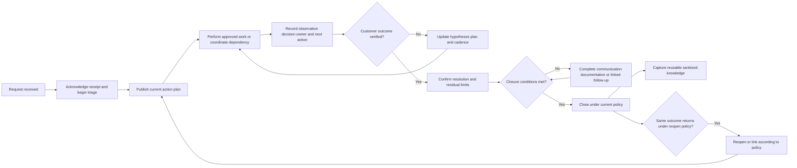
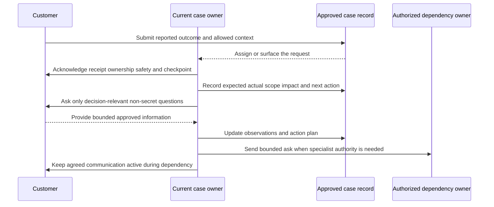
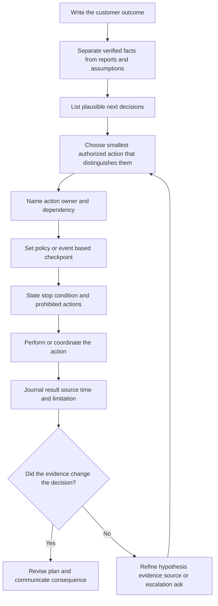
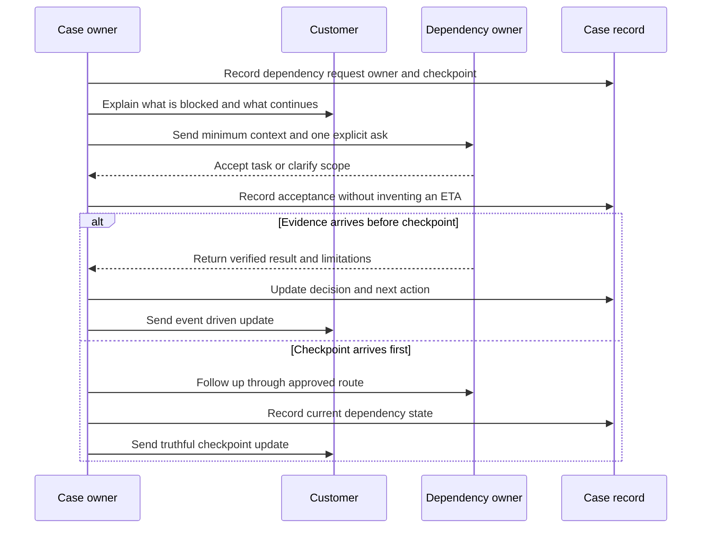
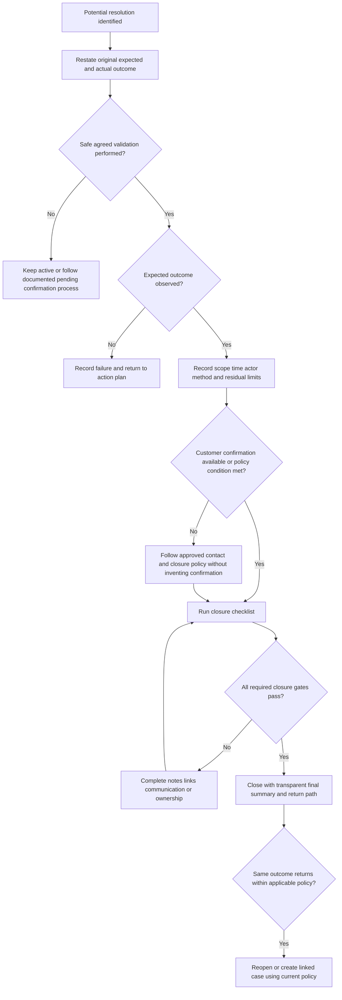
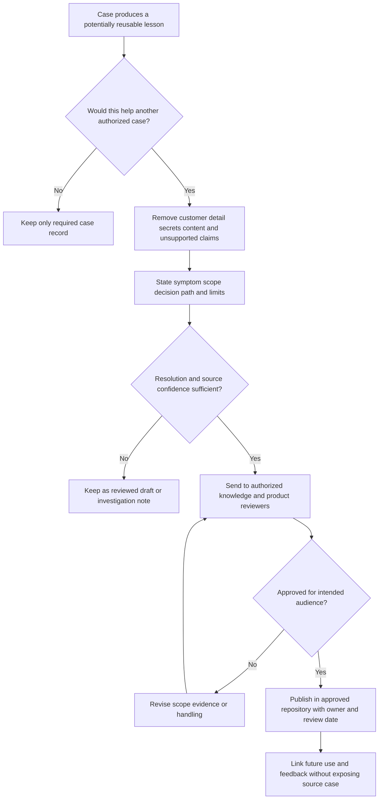
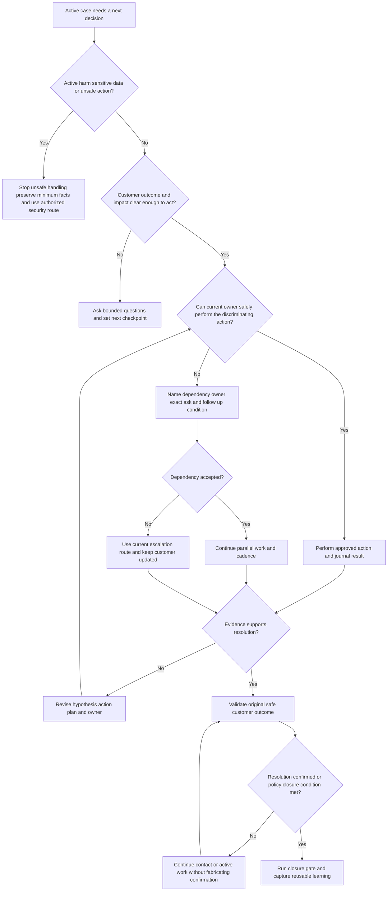
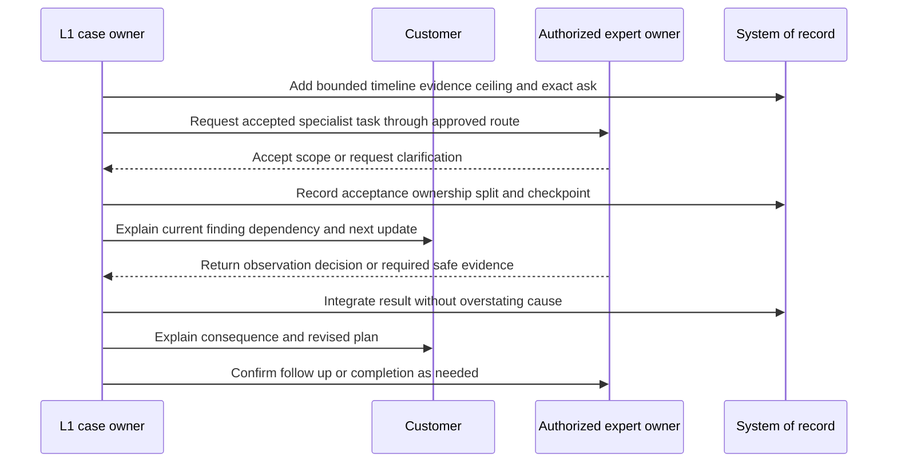
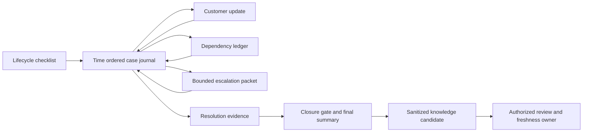
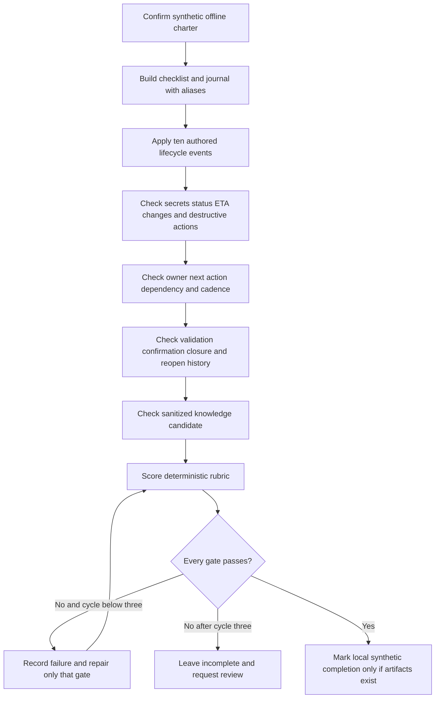

# Part 100 - L1 Ticket Lifecycle and Case Ownership

> **Purpose:** Build a product-neutral method for carrying a support request from first receipt through verified resolution, careful closure, possible return, and reusable learning. The method emphasizes truthful communication, visible commitments, safe dependency management, and continuity even when another team performs the technical work.
>
> **Artifact honesty label:** **Local synthetic case-lifecycle checklist and sample case journal design only.** Every organization, person, account, tenant, event, timestamp, identifier, observation, commitment, and outcome in this Part is fictional. No lab step was run while this Part was authored. No Abnormal AI, Microsoft, customer, ticketing, email, identity, network, API, security, or production system was accessed or changed. You may describe the lab as completed only after you actually create the local fictional artifacts and records a passing validation.
>
> **Currency and source access date:** August 24, 2026.

## Section goal

Before using the workflow, define its core vocabulary. These terms sound ordinary, but support teams can attach different contractual, operational, and product-specific meanings to them. The definitions below are deliberately product-neutral; current employer policy, customer contract, documented service targets, role permissions, and the system of record control real work.

| Term | Beginner-first definition | Everyday analogy | Why it matters | Where the analogy or definition stops |
|---|---|---|---|---|
| L1 | **Level 1 support**, the first accountable support layer that receives, scopes, communicates, performs approved initial diagnosis, resolves documented issues, or routes a bounded problem onward | A hospital reception and triage desk that starts care and finds the right specialist | L1 creates momentum, safety, and continuity before deep specialization is available | L1 authority, tooling, severity scope, and technical depth vary by organization; the label never grants permission to change a system |
| Ticket | A trackable record representing a request, question, fault, or concern in an approved support system | A numbered claim check that lets everyone refer to the same item | It gives the work identity, history, routing, and accountability | A ticket is not the customer outcome, and creating one does not mean the problem is understood |
| Case | The complete support matter: customer outcome, context, evidence, decisions, communication, work, dependencies, and history, usually represented by one primary ticket | A patient chart rather than one appointment slip | Thinking in cases prevents the record from becoming a list of disconnected messages | One case can involve linked records, but duplicate systems must not become competing sources of truth |
| Owner | The named person or role accountable for moving the case forward, maintaining the record, coordinating participants, and ensuring the next customer-facing commitment is met | A trip coordinator who may not drive every vehicle but makes sure the journey continues | Ownership prevents silence and lost handoffs | The owner does not automatically have authority, expertise, or responsibility to perform every technical action |
| Acknowledgment | A prompt confirmation that the request was received, is being assessed, and has a stated next communication point | A receptionist saying, “I have your form and will update you after triage” | It removes uncertainty and begins trust | It is not a diagnosis, solution, contractual promise, or proof that priority is correct |
| Response | A meaningful communication that adds a question, observation, decision, action, result, or expectation | A mechanic explaining the first inspection result rather than merely saying the car arrived | Customers need progress, not repeated receipt notices | A response target, format, and channel are organization-specific; activity without decision value is not progress |
| Action plan | A short, ordered set of current steps, owners, expected evidence, checkpoints, and decision conditions | An itinerary showing the next stops, who handles each one, and what confirms arrival | It converts uncertainty into visible work | A plan is provisional and must change when evidence changes; it is not a guaranteed outcome or ETA |
| Dependency | A fact, decision, permission, artifact, action, or system outside the current step that must be supplied before progress can continue | A connecting train that must arrive before the next leg | Naming dependencies exposes waiting work and its owner | A dependency is not permission to abandon the case or blame another team |
| Cadence | The planned rhythm or event trigger for updates, reviews, and follow-through | A departure board that refreshes on a known schedule and when a gate changes | A visible rhythm prevents avoidable silence during investigation or waiting | Cadence must follow current policy, severity, impact, and agreement; this Part invents no Abnormal response interval |
| Next action | The single clearest upcoming step, with an owner, due condition or time, expected result, and fallback | The next instruction on a navigation route | It makes status operational rather than descriptive | “Continue investigating” is too vague; the action may still change after new evidence |
| Resolution | The point at which the reported outcome is restored, answered, safely worked around, or otherwise addressed to an agreed and verified extent | A repaired appliance operating under the original test | It connects technical work to the customer’s actual need | A workaround can resolve immediate impact without proving root cause or eliminating recurrence |
| Closure | The governed administrative end of active case handling after resolution evidence, communication, documentation, and remaining work are handled or linked | Closing a project file after deliverables and sign-off are checked | It keeps records trustworthy and queues meaningful | Closure does not erase history, guarantee permanence, or prevent a valid return under current process |
| Reopen | Returning a closed matter to active handling when the same outcome was not sustained or the closure decision was incomplete, according to current policy | Reopening a repair order when the same tested fault immediately returns | It preserves continuity when prior resolution did not hold | A new symptom, environment, or unrelated cause may require a linked new case instead; policy decides |
| Knowledge capture | Converting a reusable, validated part of case learning into findable guidance, a known issue, a runbook improvement, or a product signal | Turning one traveler’s route notes into a checked map for future travelers | It reduces repeated effort and improves consistency | A case note is not automatically publishable knowledge; privacy, review, scope, ownership, and freshness still apply |

The central analogy for this Part is a **relay race with one visible team captain**. The baton is the customer outcome, each runner may perform a different task, and the captain watches the exchanges, records progress, and tells the customer what happens next. The analogy is useful because work can move while accountability remains visible. It stops being accurate because support is rarely linear: evidence can invalidate the route, several dependencies can run in parallel, severity can change, a security concern can impose special handling, and customer confirmation may be asynchronous.

The goal is not to keep every task in L1. The goal is to keep every case **controlled**: acknowledged, understood enough to choose a safe next step, assigned to a visible owner, updated at an appropriate documented rhythm, recorded so another authorized person can continue, validated against the customer outcome, and closed only when the governing conditions are met.

The primary artifacts are a **case-lifecycle checklist** and a **sample case journal**. They are designed for local practice, not copied from an Abnormal, Microsoft, Zendesk, Salesforce, Jira, or other production workflow. Product-specific fields, routing rules, response targets, statuses, permissions, and closure rules must be learned from current authorized documentation.

This Part prohibits sensitive content or secrets; invented progress, status, evidence, owner, commitment, or estimated completion time; premature closure; abandonment of ownership during handoff or customer dependency; unapproved account, policy, configuration, permission, routing, remediation, or security-control changes; and destructive actions such as deleting evidence, purging data, wiping state, or running harmful tests.

## JD Mapping

| Supplied role signal | Capability developed here | Observable support behavior | Honest practice artifact |
|---|---|---|---|
| Enterprise L1 Technical Support Engineer | Controls an inbound matter from receipt to governed completion | Acknowledges, scopes enough to act, names ownership, and preserves continuity | Synthetic lifecycle checklist |
| Own inbound support tickets | Treats ownership as coordination plus follow-through rather than solitary execution | Every active record has one accountable owner and one specific next action | Owner and next-action fields in a fictional journal |
| Timely customer updates | Builds event-driven and policy-driven communication without inventing targets | Updates explain verified progress, open uncertainty, dependency, and next checkpoint | Synthetic update set with no fabricated ETA |
| Configuration and API questions | Maintains a stable lifecycle while the technical path changes | Uses bounded plans and preserves observations from specialist troubleshooting | Fictional configuration and API lifecycle examples |
| Behavioral false-positive and threat questions | Recognizes when ordinary case handling needs a security boundary | Stops unsafe actions, preserves minimum facts, and routes response decisions to authorized owners | Security-sensitive ownership example without real content |
| Complex investigations | Tracks hypotheses, evidence, decisions, owners, and dependencies over time | Journal entries show why the plan changed rather than presenting hindsight as certainty | Time-ordered sample case journal |
| Engineering or Product collaboration | Sends a bounded question and keeps customer communication active | Handoff includes impact, evidence ceiling, exact ask, owner, and return condition | Product-neutral escalation packet row |
| Recommendations and follow-through | Separates immediate recovery from corrective or preventive follow-up | Confirms the customer outcome and links remaining work without holding closure deceptively | Resolution and residual-work checklist |
| Knowledge contribution | Converts verified reusable learning into a governed candidate | Captures symptom, environment, cause confidence, safe steps, limits, and review owner | Synthetic knowledge-candidate card |
| enterprise support background | Transfers case discipline, customer communication, escalation, critical-situation composure, and validation habits | Uses a real Microsoft example only when permitted and labels exact personal contribution | Candidate truth-boundary table |
| Abnormal AI learning goal | Learns a safe operational method without claiming access or internal knowledge | Uses public product context only and asks for current internal procedure on the job | Product-boundary notes and source table |

## Candidate honesty note

You can truthfully lean on enterprise support experience involving SharePoint Online, OneDrive, Sync Client, Copilot, customer and partner communication, complex escalations, critical situations, Engineering or Product collaboration, and fix validation. Those experiences can support statements about disciplined ownership, expectation management, evidence-based updates, calm follow-through, and verification. They do not establish that you have used Abnormal AI, worked an Abnormal support queue, operated Zendesk in production, followed Abnormal severity or closure policy, accessed proprietary telemetry, or performed email-security remediation.

A strong interview bridge is: “In enterprise support, I learned that ownership is not the same as personally performing every task. I kept the customer outcome, next action, dependency, communication checkpoint, and escalation question visible until validation. I have not worked in Abnormal’s production support environment, so I would learn its current case system, service commitments, permissions, and security escalation paths rather than importing prior-employer terminology or assuming the workflow is identical.”

| Evidence category | Safe candidate wording | Claim that would exceed the evidence |
|---|---|---|
| prior production experience | “I managed enterprise support communication, investigation checkpoints, cross-team escalation, and fix validation in prior-employer contexts.” | “I know Abnormal’s ticket lifecycle because all enterprise support systems work the same way.” |
| Critical-case transfer | “I learned to keep a clear timeline, decision owner, customer cadence, and next checkpoint during high-impact Microsoft cases.” | “I would use enterprise critical-situation rules or timing as Abnormal policy.” |
| Local synthetic practice | “I completed a fictional offline case-journal exercise and scored it against explicit gates,” but only after actual completion | “I operated a live Abnormal or Zendesk case.” |
| Public product learning | “I reviewed public Abnormal platform and trust material to understand the company’s high-level context.” | “I know Abnormal’s private queues, automation, case fields, telemetry, model logic, or response authority.” |
| Proposed behavior | “I would use the current approved case procedure, document the dependency, and maintain the agreed customer checkpoint.” | “I would promise an update every two hours” without a supplied policy, severity rule, or agreement |
| Outcome evidence | “The customer’s original safe validation passed twice in the synthetic journal.” | “The root cause was permanently fixed” when only a workaround or short observation exists |
| Knowledge work | “I would propose a reviewed knowledge candidate from reusable, sanitized learning.” | “I would publish customer case notes directly into a knowledge base.” |

## 1. The lifecycle control loop

A high-quality case is a sequence of explicit decisions, not a pile of messages. Each transition should answer five control questions: What customer outcome are we protecting? What was newly verified? What is the next action? Who owns it? When or under what event will the customer and case record be updated?

| Lifecycle stage | Controlling question | Minimum record | Customer-facing outcome | Unsafe shortcut to avoid |
|---|---|---|---|---|
| Receipt | Did the request enter the approved channel and correct customer context? | Received time, source, case alias, initial report, handling restrictions | The request is traceable | Copying it into personal notes or an unapproved channel |
| Acknowledgment | Does the customer know it was received and what happens next? | Acknowledged time, current owner, next checkpoint, urgent safety instruction if applicable | Uncertainty is reduced | Claiming a diagnosis or resolution before assessment |
| Initial control | Is there enough scope and impact information to choose a safe next action? | Expected/actual, affected scope, time, impact, evidence boundary | The customer knows the first bounded plan | Asking for every log or requesting secrets |
| Active work | Which approved observation will change the decision? | Hypothesis, action, result, source, time, interpretation, limitation | Progress is explainable | Performing unrelated tests to appear busy |
| Dependency | What is blocked, by whom, since when, and what can proceed meanwhile? | Dependency owner, request, due condition, follow-up time, fallback | Waiting remains managed | Reassigning and disappearing |
| Escalation | What specific question requires another authority or expertise? | Evidence ceiling, exact ask, transfer owner, acceptance, customer update | Expertise changes without context loss | Sending a data dump or promising an answer date |
| Resolution validation | Did the original customer outcome pass a safe agreed check? | Validation method, actor, result, time, residual risk | The customer sees what “working” means | Treating an internal change or silence as success |
| Closure | Are communication, record, linkage, and policy conditions satisfied? | Closure reason, confirmation status, final summary, linked follow-up | Active handling ends transparently | Closing to improve queue metrics |
| Knowledge capture | Is any learning reusable, safe, reviewed, and findable? | Candidate topic, scope, evidence confidence, owner, review date | Future cases may become faster and safer | Publishing customer details or uncertain causality |

### Plain-English deep-dive: Ownership is a control function, not a promise to do everything

Imagine coordinating a home repair after a pipe leak. A plumber may stop the leak, an electrician may inspect wiring, and an insurer may approve damage work. The coordinator does not perform all three jobs. The coordinator makes sure each request is accepted, the homeowner knows what is happening, dependencies are visible, and nobody assumes somebody else called back.

Support ownership works the same way. The case owner can ask a customer administrator for a bounded record, route a security decision to an incident responder, or ask Engineering to explain a product-owned observation. The owner still maintains the narrative, follows up, updates the customer, and checks the return result. “Waiting on another team” describes a state; it does not remove accountability.

The analogy stops because organizations define assignment, legal communication, incident command, workload transfer, and after-hours responsibilities differently. One visible owner should not become a bottleneck, conceal a required formal transfer, or act outside permission. When ownership formally changes, acceptance, scope, customer expectation, and the next checkpoint must be explicit.

### Ownership versus task assignment

| Question | Case owner | Task owner or dependency owner | Shared rule |
|---|---|---|---|
| Who protects the overall customer outcome? | Normally the visible case owner until an accepted formal transfer | Supports the outcome through a bounded task | Follow the organization’s actual assignment policy |
| Who performs a specialist action? | May perform it if trained and authorized | Often the specialist, customer administrator, Engineering, Product, security, or another team | Technical capability never replaces authorization |
| Who updates the primary journal? | Ensures the system of record stays current | Supplies verified result and limitations through approved channels | Do not create conflicting private histories |
| Who communicates with the customer? | Normally coordinates the agreed channel and cadence | May join or respond when the communication model allows | Avoid contradictory parallel promises |
| Who owns the next checkpoint? | Records and follows it unless transfer is accepted | Commits only to what that owner controls | Never invent another team’s ETA |
| Who confirms final outcome? | Ensures an approved validation occurs | Customer or technical owner may perform the check | Internal completion is not automatically customer resolution |

## 2. Acknowledgment, first response, and visible ownership

An acknowledgment should be quick enough to meet the current service commitment, but speed does not justify false certainty. Its minimum value is to say: the request is in the approved record, the current owner or owning queue is visible, immediate safety concerns have been recognized, and a meaningful next communication point exists.

A first substantive response goes further. It restates the outcome in neutral language, asks only the missing questions needed for the first decision, identifies the current plan, and distinguishes a time for the next update from an estimate for final resolution.

| Acknowledgment element | Weak wording | Better product-neutral wording | Reason |
|---|---|---|---|
| Receipt | “Got it.” | “I have received case `CASE-100-A` and am reviewing the reported access denial.” | Names the record and reported symptom without claiming cause |
| Ownership | “The team is looking.” | “I am the current communication owner while we complete initial triage.” | Makes accountability visible without claiming all technical work |
| Understanding | “Permissions are broken.” | “You expected the approved operation to succeed, but it returned a denial for two affected aliases; one control alias succeeds.” | Separates expected and actual from an unproved explanation |
| Safety | “Send credentials so I can test.” | “Please do not send passwords, tokens, cookies, keys, message content, or other secrets. We will start with approved non-secret metadata.” | Establishes a safe evidence boundary early |
| Next step | “Investigating.” | “Next I will compare the sanitized operation, time, affected scope, and approved access-state summary.” | States a bounded action that can produce a decision |
| Checkpoint | “I should have this fixed today.” | “I will update the case at the documented checkpoint or earlier if the decision state changes.” | Avoids fabricated status and ETA |
| Uncertainty | “We know the cause.” | “Current evidence confirms the denial but does not yet distinguish assignment, resource policy, or endpoint behavior.” | Preserves competing explanations |

### Acknowledgment decision rules

1. Preserve the customer’s words as a report, but rewrite the working symptom as expected versus actual behavior.
2. Do not accept the customer’s proposed cause as verified merely because it sounds plausible.
3. Check for active compromise, data exposure, harmful content, destructive impact, or a request to weaken security before ordinary troubleshooting.
4. Use current policy for priority, severity, response targets, supported channel, language, assignment, and after-hours handling.
5. State the current owner honestly. If assignment is still pending, state the owning queue or process only when the approved system confirms it.
6. Give a next communication checkpoint that is controlled by policy or agreement, not an invented resolution estimate.
7. Ask for the smallest safe information set that changes the next decision.
8. Keep secrets and unnecessary customer content out of ordinary requests and local practice.

### Worked acknowledgment examples

| Scenario | Unsafe or low-value acknowledgment | Safer synthetic acknowledgment |
|---|---|---|
| Configuration question | “The policy is wrong; send an admin export.” | “I have the report that expected handling differs for alias `group-A100`. I am the current case owner. I will first compare the approved intended and effective-state summaries for the bounded scope. Please do not send broad exports, credentials, or message content. I will update at the current documented checkpoint or sooner when the comparison changes our next step.” |
| API denial | “Engineering is fixing the 403.” | “I have received the report that one synthetic operation returns a denial while a matched read succeeds. We have not established a product defect. I will compare method, route alias, time, response class, and approved role-state summary, then document whether the next owner is Support, the customer identity owner, or a product specialist.” |
| Suspicious email report | “Forward the email and click nothing.” | “I have received the security-sensitive report. Do not click, reply, forward externally, execute an attachment, or send credentials or full content through an unapproved channel. I will preserve the minimum approved identifiers and route any containment decision through the authorized security process while keeping the case communication checkpoint visible.” |
| Customer asks for ETA | “This should be solved in two hours.” | “The case is active and the next decision depends on the approved effective-state comparison. I cannot responsibly promise a resolution time before that evidence is available. I will update you at the documented checkpoint, and sooner if we confirm a resolution path or a material blocker.” |

## 3. Action plans that remain truthful as evidence changes

An action plan is useful only if another authorized person can read it and know what happens next. It should be short enough to scan but precise enough to test. Every step needs an actor, action, purpose, expected observation, and decision condition. The plan should also state what will not be done because it is unsafe, unnecessary, destructive, or outside authority.

| Plan field | Question it answers | Strong synthetic example | Weak substitute |
|---|---|---|---|
| Outcome | What does the customer need restored or answered? | “Determine why approved create operations are denied for alias `principal-A100` and restore the documented outcome through an authorized owner.” | “Fix API.” |
| Verified facts | What do approved sources currently show? | “Three authored fixture rows show create denied, read allowed, same principal/resource alias, 10:00-10:06 UTC.” | “Permissions issue.” |
| Open hypotheses | What competing explanations remain? | “Effective role lacks create; wrong resource scope; endpoint has another documented rule.” | “Probably product bug.” |
| Next action | What one step changes confidence? | “Compare the approved role-state summary and endpoint contract for the same aliases.” | “Investigate logs.” |
| Action owner | Who performs that step? | “Customer identity owner provides a non-secret effective-role summary; case owner follows up.” | “Customer.” |
| Expected evidence | What result would support each branch? | “Reader-only weakens product-defect hypothesis; correct create role keeps endpoint behavior open.” | “More information.” |
| Checkpoint | When or on what event is the next update? | “At the current documented communication checkpoint or upon role-state receipt, whichever comes first.” | “Soon.” |
| Stop condition | What must not proceed without another owner or authority? | “Stop if validation requires privilege elevation, token sharing, policy bypass, or write/delete action.” | “Be careful.” |
| Success criterion | What proves the customer outcome? | “Original harmless create fixture succeeds under approved role and resulting object is safely verified, or documented behavior is correctly explained and accepted.” | “No more errors.” |
| Evidence ceiling | What can the current record support? | “The journal localizes denial after authentication; it does not establish a product defect or permanent cause.” | Omitted |

### Plain-English deep-dive: A plan is a compass, not a prophecy

A compass gives direction from current information. It does not promise when a traveler will arrive, guarantee the bridge is open, or prevent weather from changing. A case action plan likewise identifies the next useful direction without pretending that unknown dependencies are already solved.

This distinction matters when customers ask for certainty. A truthful owner can confidently state what is known, what is being tested, who controls the next step, and when communication will resume. The owner should not convert an internal hope, average duration, or another team’s informal comment into a customer commitment.

The analogy stops because support plans have contractual targets, privacy constraints, severity rules, and security escalation paths that a compass does not. Current approved procedure can require immediate escalation, incident command, a different communication owner, or a formal change plan. The plan must yield to those controls.

### Action-plan change record

| Time | Previous plan | New observation | Decision effect | Revised next action | Communication consequence |
|---|---|---|---|---|---|
| 10:15 UTC | Compare effective access before product escalation | Synthetic role summary shows read-only access | Product defect becomes less likely; customer-side access intent becomes central | Authorized identity owner verifies intended role and change process | Explain the bounded finding; do not say Support will grant access |
| 10:45 UTC | Wait for intended-role confirmation | Identity owner confirms create access was intended but not yet approved | Blocker is governance approval, not technical failure | Track approval dependency and safe workaround discussion if documented | State dependency, owner, and checkpoint; do not invent approval ETA |
| 12:00 UTC | Validate after approved assignment | Fictional assignment record changes to create-enabled | Validation becomes appropriate | Customer performs original harmless operation and reports result | Explain that assignment is observed, but customer outcome still needs verification |
| 12:20 UTC | Close after successful operation | First validation succeeds once | Sustainability is not yet established under exercise rule | Repeat one bounded validation after a short fictional interval | Do not declare permanent resolution from one result |

## 4. Cadence, dependencies, and follow-through

Cadence can be **time-driven** or **event-driven**. A time-driven checkpoint follows a documented interval or explicit agreement. An event-driven update occurs when severity changes, a hypothesis is rejected, a workaround is found, an escalation is accepted, an expected dependency misses its checkpoint, the customer supplies evidence, a security concern appears, or the resolution state changes.

This Part provides no Abnormal SLA, SLO, severity matrix, response time, update interval, or escalation clock. Those belong to current contracts and approved operating procedures and are studied more directly in Part 102. In an interview, you should say you follow the applicable service commitment and adjusts communication to impact and change, not quote an invented number.

| Case condition | What the update should contain | What it must not imply | Follow-through record |
|---|---|---|---|
| Active L1 test | Verified result, interpretation, next bounded test, owner, checkpoint | That activity equals progress or that the cause is known | Test ID, source, result, decision change |
| Waiting for customer | Exact bounded item requested, why it matters, safe collection guidance, fallback, checkpoint | That ownership moved to the customer | Request time, item owner, reminder rule, available parallel work |
| Waiting for specialist | Escalation acceptance state, exact question, what Support continues to own, next communication point | That the specialist promised a fix or date | Handoff time, receiving role, accepted scope, follow-up condition |
| Monitoring validation | Original outcome, validation method, observation window rationale, residual limitation | That silence or one success proves permanence | Check times, actor, outcomes, known risks |
| No technical change | What was reviewed, why no safe new action exists, current blocker, escalation or decision path | Fabricated progress | Last meaningful evidence, blocked decision, responsible owner |
| Severity or risk change | New verified impact, safety action, route, communication change, uncertainties | That visibility alone changed technical severity | Source, time, approval, incident owner if applicable |

### Dependency ledger

| Dependency ID | Needed decision or artifact | Why needed | Owner class | Requested at | Checkpoint | Parallel work | Fallback or escalation condition |
|---|---|---|---|---|---|---|---|
| `DEP-100-01` | Non-secret effective-role summary for one alias | Distinguishes intended access from endpoint behavior | Authorized customer identity owner | 10:18 UTC fictional | Current documented checkpoint or receipt | Review endpoint contract and sanitize timeline | Escalate governance blocker only through approved account path; never request a token |
| `DEP-100-02` | Product-owned interpretation of one sanitized response pattern | Current evidence cannot determine documented semantic | Authorized Product or Engineering role | 11:05 UTC fictional | On acceptance and approved communication rhythm | Maintain customer summary and compare controls | Raise through current escalation policy if impact or risk changes; do not promise a defect fix |
| `DEP-100-03` | Customer validation of original harmless outcome | Internal state does not prove user-visible recovery | Authorized customer contact | 12:06 UTC fictional | Agreed check or policy condition | Prepare final summary and residual-risk note | Use current closure policy if customer is unavailable; never fabricate confirmation |

### Plain-English deep-dive: A dependency is a managed queue, not a waiting room

When a restaurant is waiting for a supplier, the manager still knows what ingredient is missing, who placed the order, when to check, what dishes remain available, and what customers should be told. Merely writing “waiting on supplier” would not manage the evening.

Likewise, “pending customer” or “with Engineering” is incomplete. A managed dependency states the exact ask, why it changes the decision, who can answer it, when follow-up occurs, what can continue in parallel, and what condition requires a different route. The case owner keeps the customer informed even when the technical answer lives elsewhere.

The analogy stops because support dependencies can contain privileged evidence, contractual obligations, formal severity routes, incident-command structures, and restrictions on who may communicate. Do not chase an owner through unapproved channels, reveal customer context to an unauthorized person, or publish internal speculation merely to show movement.

### Follow-through rules

1. Record every commitment as owner plus action plus checkpoint or event condition.
2. Follow the system of record and current assignment policy; do not hide commitments in personal chat or memory.
3. Update before a commitment is missed when possible. If it is missed, state that fact and the revised controlled step without rewriting history.
4. Do not convert “we hope,” “normally,” “likely,” or “Engineering is looking” into a promised outcome or time.
5. If another team declines or redirects the request, record the reason, reassess the evidence and route, and tell the customer what changes.
6. When customer input is required, explain the purpose and safe scope. Offer an approved alternative where available.
7. Continue any independent safe work while a dependency is open; otherwise state why no parallel work would change the decision.
8. Escalate changed impact, active security risk, blocked restoration, contradictory authoritative evidence, or repeated missed operational checkpoints under current procedure.

## 5. Case notes and the sample case journal

Case notes should let an authorized colleague reconstruct decisions without a private oral history. Good notes distinguish a report from an observation, record time meaning and source, preserve uncertainty, explain why the plan changed, and make the next commitment visible. They avoid emotional labels, blame, copied secrets, unnecessary content, speculative causes, and retroactive certainty.

| Journal field | Required content | Example | Common defect |
|---|---|---|---|
| Entry time | UTC time plus original offset when relevant | `2026-08-24 10:15 UTC` | Local time with no zone |
| Actor | Role or obvious synthetic alias | `Owner-L1-A100` | Real personal details in a practice artifact |
| Entry type | Customer report, observation, decision, action, communication, dependency, escalation, validation, closure, or knowledge | `Decision` | A generic “update” that hides meaning |
| Source | Approved source class and scope | `Synthetic effective-role fixture for principal-A100` | “Logs” without coverage |
| Fact | What the source showed | `create=false; read=true` | “Permissions broken” |
| Interpretation | What the fact supports and does not establish | `Supports action-level access mismatch; does not establish product defect` | Interpretation presented as observation |
| Decision | Why the plan changed or stayed | `Route intended-role confirmation to identity owner` | Action with no rationale |
| Owner | Who controls the next action | `Customer identity owner; L1 retains case communication` | “Team” |
| Checkpoint | Policy-based time or event | `On role-state response or documented checkpoint` | Fabricated completion ETA |
| Safety note | What was excluded or stopped | `No token, credential, role elevation, write test, or policy bypass` | No boundary recorded |
| Evidence ceiling | Strongest justified conclusion | `Denial occurs after authentication in fixture; cause remains unproved` | “Root cause confirmed” without sufficient evidence |

### Sample case journal: `CASE-100-API-A`

**Fictional customer outcome:** An approved create operation should succeed for synthetic alias `principal-A100`, but three authored records show a denial while a matched read operation succeeds. The exercise must determine the responsible boundary, coordinate the authorized action, validate the original outcome, and close without inventing product behavior.

| UTC time | Entry type | Verified record or explicit report | Interpretation and decision | Owner, next action, and checkpoint | Safety and evidence ceiling |
|---|---|---|---|---|---|
| 09:00 | Receipt | Fictional request entered the local worksheet as `CASE-100-API-A`; customer report says “API permissions stopped working” | Preserve this as reported wording; do not treat permissions or regression as facts | `Owner-L1-A100` begins acknowledgment and safety screen | No external system or real customer exists |
| 09:04 | Acknowledgment | Receipt, current ownership, non-secret boundary, and next checkpoint are written | Customer uncertainty is addressed without diagnosis | Owner asks for expected operation, affected scope, UTC interval, response class, and matched control | No token, key, body, real URL, or broad export requested |
| 09:12 | Intake | Authored fixture states create denied three times; read succeeds for the same principal and resource aliases | Connectivity and basic authentication become less likely, but authorization, scope, and endpoint semantics remain open | Owner writes initial action plan and expected observations | The fixture is not evidence about Abnormal or another real API |
| 09:18 | Plan | Compare sanitized method/route/version aliases, response class, current documented contract, and approved effective-role summary | This is the smallest read-only comparison that can separate leading branches | Owner reviews fixture contract; customer identity owner is a possible dependency | No live request, replay, write, delete, or role change |
| 09:30 | Observation | Synthetic contract says create requires `writer`; read requires `reader`; response class is denial | Requirement is documented within the fictional exercise, but actual effective assignment is unknown | Request one non-secret effective-role summary for `principal-A100` | A status class alone does not prove missing permission |
| 09:35 | Dependency | `DEP-100-01` asks the fictional authorized identity owner for effective role only | The exact dependency is visible and bounded | L1 retains communication and sets the documented checkpoint or response event | Never ask for bearer token, cookie, credential, or administrator access |
| 09:40 | Customer update | Update states confirmed symptom, open explanations, exact dependency, prohibited data, and checkpoint | Communication adds decision value; no ETA is promised | L1 monitors dependency and reviews matched-control differences | “Identity review in progress” is not a resolution claim |
| 10:10 | Dependency result | Authored role fixture shows `reader`; requested intent fixture says `writer` was intended but not approved | Current denial is consistent with effective role; cause of governance state is outside this case | Authorized identity owner controls any approval or assignment process | L1 does not grant a role or describe Abnormal permissions |
| 10:15 | Decision | Product-defect hypothesis is weakened; intended-versus-effective access mismatch is primary | Revise plan from product escalation to authorized identity governance | Identity owner confirms whether approved change can proceed; L1 follows case | “Consistent with” is not universal causal proof |
| 10:20 | Customer update | Bounded summary explains read succeeds and effective fixture is reader-only | Customer receives finding, ownership, and next condition | Update on approved assignment decision or current checkpoint | No claim that Support will change access or that approval has an ETA |
| 10:45 | Dependency result | Fictional approval is recorded by the exercise’s identity owner | The authorized owner may now perform the fictional state transition | Identity owner authors `writer` effective-state record; L1 waits for verified result | A decision record alone does not prove effective state |
| 11:00 | Observation | Synthetic effective-state fixture now says `writer`, version `role-v2`, time 10:58 UTC | Validation of original harmless operation is now appropriate | Customer performs authored validation step; L1 specifies expected result | No production operation or system write occurs in this lesson |
| 11:10 | Validation 1 | Authored fixture says original create operation succeeds and result alias is visible | Immediate customer outcome appears restored | Repeat one exercise validation after a fictional interval to test stability | One success does not prove permanence or root cause |
| 11:25 | Validation 2 | Second authored validation succeeds with same approved context; matched read still succeeds | Resolution criterion for this exercise is met | Owner drafts resolution summary and asks for synthetic confirmation | Still no claim about a real service, product, or customer |
| 11:32 | Resolution confirmation | Fictional customer contact confirms expected create outcome for the bounded alias | Customer-visible resolution is confirmed for stated scope | Owner records residual limits and prepares closure gate | Confirmation is limited to the synthetic interval and scope |
| 11:40 | Residual work review | No active technical work remains; governance cause beyond effective mismatch is not required for immediate outcome | Do not overstate root cause; capture a knowledge candidate about authorization-versus-authentication | Owner links `KC-100-01` as a draft, not published guidance | Knowledge candidate contains aliases only and needs review |
| 11:48 | Closure communication | Final summary includes symptom, observations, authorized action owner, validation, limits, and return path | Closure is transparent and does not erase uncertainty | Owner closes only under fictional rubric after final checks | No premature closure for silence, queue age, or one successful test |
| 12:00 | Closure | All local rubric gates pass in the worked narrative | Active handling ends for the fictional scenario | Owner records closed state and preserves local practice artifact | This authored example was not executed as a lab |

### Journal quality comparison

| Poor note | Why it fails | Decision-grade replacement |
|---|---|---|
| “Customer says API is broken.” | No expected/actual, scope, time, or report boundary | “Customer report: approved create expected; three fictional create attempts denied from 09:05-09:10 UTC for one alias; matched read succeeds.” |
| “Checked logs; permissions issue.” | Source, fields, coverage, semantics, and uncertainty are absent | “Synthetic contract requires writer for create; approved role fixture shows reader. This supports an action-level access mismatch; it does not establish why the intended assignment was absent.” |
| “Waiting on customer.” | Ask, purpose, owner, checkpoint, and parallel work are invisible | “Requested non-secret effective-role summary from authorized identity owner to distinguish role state from endpoint behavior; follow up at documented checkpoint; contract comparison continues.” |
| “Escalated to Engineering.” | No acceptance, evidence ceiling, or exact question | “Sent sanitized timeline and matched control; asked whether documented response semantics include another product-owned policy layer; L1 retains customer updates pending acceptance.” |
| “Fixed.” | Actor, action, validation, scope, and residual risk are missing | “Authorized identity owner updated fictional effective role; original harmless operation succeeded twice for bounded alias; customer confirmed expected outcome; permanence beyond observed interval is unknown.” |
| “No response, closing.” | Silence is treated as resolution | “Followed current contact and closure policy; resolution remains unconfirmed. Final notice states known status, how to return, and any linked work.” |

### Worked lifecycle example: configuration expectation

**Report:** A fictional administrator says a policy “did not save.” The visible screen shows the intended value, but the synthetic outcome remains unchanged.

| Lifecycle moment | Owner behavior | Evidence-based wording | Boundary |
|---|---|---|---|
| Acknowledge | Restate intended versus observed behavior | “The saved view displays `policy-child-v3`, while two authored outcomes still use `restricted` handling.” | A screenshot does not prove effective configuration |
| Plan | Compare intended, stored, effective, and observed state | “We will review scope, inheritance, version, precedence, and documented propagation before considering a change.” | No broad export or policy edit |
| Dependency | Ask authorized configuration owner for effective-state summary | “The next decision depends on which version and precedence source were active.” | L1 keeps customer cadence |
| Observation | Fictional fixture shows parent policy has higher precedence | “This supports a precedence mismatch in the exercise.” | It does not describe Abnormal internals |
| Action | Configuration owner uses the approved fictional change process | “The authorized owner controls impact review, approval, rollback, and validation.” | L1 does not make an unapproved change |
| Resolution | Original safe test follows expected handling twice | “The bounded customer outcome is restored for the observed interval.” | It does not prove all groups or permanent behavior |
| Closure | Record confirmation, limits, and knowledge candidate | “Close after current policy gates; link a draft on configured versus effective state.” | Do not publish customer-specific configuration |

### Worked lifecycle example: security-sensitive report

**Report:** A fictional user reports an urgent payment-change message from a vendor-like alias. This remains a tabletop record with no message body, attachment, link, address, domain, or real indicator.

| Lifecycle moment | Safe ownership behavior | Prohibited behavior | Escalation condition |
|---|---|---|---|
| Acknowledge | Confirm receipt, tell the reporter not to interact, preserve minimum approved aliases, and state the security route | Clicking, replying, forwarding externally, opening attachments, collecting credentials, or uploading content | Any click, credential entry, payment, data disclosure, active compromise, or ongoing harmful activity |
| Scope | Ask whether interaction occurred using yes/no categories without requesting the sensitive value | Asking for passwords, MFA codes, bank details, or full message content | Impact or exposure is possible and needs authorized incident response |
| Ownership | L1 remains communication owner unless the formal security process transfers it | Claiming to be incident commander or performing containment | Current procedure assigns a security incident owner |
| Dependency | Route the minimum facts and exact decision to authorized security responders | Sending evidence through personal chat, public scanner, or unapproved AI service | Specialist access or containment authority is required |
| Cadence | Follow the active security communication plan and material-event triggers | Inventing a universal update interval or promising eradication time | Severity, scope, or customer harm changes |
| Resolution | Authorized responders define containment and recovery evidence; customer outcome is verified under that process | L1 deleting evidence, revoking accounts, purging mail, or announcing permanent safety | Incident plan controls recovery and notification |
| Knowledge | Capture a sanitized process improvement only after review | Publishing indicators, customer details, or unverified attacker narrative | Security/privacy reviewer determines reuse scope |

## 6. Resolution confirmation, closure, and reopen decisions

Resolution and closure are separate decisions. Resolution asks whether the customer’s original outcome is now addressed within an explicit scope. Closure asks whether active case handling can end under policy after communication, documentation, dependencies, and residual work are handled correctly.

| Resolution type | What may be verified | What remains uncertain | Closure treatment |
|---|---|---|---|
| Documented explanation | Observed behavior matches current approved design and the customer understands the correct path | Product design may still create friction or merit feedback | Close only after the question is answered and feedback is linked appropriately |
| Configuration correction by authorized owner | Effective state and original outcome now match approved intent | Why drift occurred, recurrence risk, or other scopes may remain | Link corrective analysis if required; do not claim universal permanence |
| Workaround | Immediate business function is restored through an approved temporary path | Root cause and long-term durability remain open | State temporary nature and link a clearly owned durable follow-up |
| Product fix | Approved release or change is present and original outcome passes | Long-term regression risk and unrelated scopes remain | Record version/scope and validation; never promise rollout not controlled by Support |
| Transient recovery | Outcome currently succeeds without an identified change | Cause and recurrence risk are unknown | Use current monitoring and closure policy; be explicit that cause is unproved |
| Security recovery | Authorized incident owner validates defined containment/recovery outcome | Wider campaign, persistence, notification, and lessons may continue | Incident process controls closure; a support ticket may link rather than replace it |
| Customer no longer pursues | Contact or business need changed | Technical resolution may be unconfirmed | Use the approved administrative closure reason, not “resolved” if it was not verified |

### Plain-English deep-dive: A quiet phone is not proof of a repaired line

If a caller stops reporting static, the line may be repaired, the caller may be busy, or the phone may be completely disconnected. Silence cannot distinguish those outcomes. In support, no customer reply is not automatically confirmation that a technical issue disappeared.

A defensible closure records the last verified state, the attempts required by current policy, the unresolved uncertainty, any linked work, and the return path. When policy permits administrative closure without confirmation, the closure reason should say that plainly instead of labeling the case technically resolved.

The analogy stops because service contracts and support procedures may define closure after specified contacts, customer inactivity, duplicate detection, unsupported scope, or another formal state. Follow those rules, but preserve semantic honesty in the notes.

### Resolution confirmation checklist

| Check | Passing evidence | Failing or ambiguous evidence |
|---|---|---|
| Original outcome | Validation repeats the exact safe action or observation originally disputed | A different test passes |
| Correct scope | Affected alias, environment, operation, and time are recorded | “Works now” with no context |
| Authorized actor | Customer or authorized technical owner performs or confirms the check | L1 performs an unapproved change or impersonation |
| Repeatability | Validation count or observation window matches documented risk and procedure | One accidental success is treated as permanent |
| Side effects | Expected related behavior remains acceptable within approved checks | Fix weakens security or breaks another path |
| Residual risk | Workaround, unknown cause, limited scope, monitoring, or linked action is explicit | Final message says “fully fixed” despite known limits |
| Customer meaning | The customer agrees the tested outcome addresses the need, when confirmation is available | Internal metric alone defines success |
| Record quality | Action, owner, source, time, result, limitation, and closure reason are present | A one-word “resolved” entry |

### Closure gate

- The case has one authoritative record and a correct customer/account context under current policy.
- The original report is restated as expected versus actual behavior without promoting speculation into fact.
- The final status reflects verified evidence; no progress, owner, customer response, or ETA was fabricated.
- Resolution validation is recorded, or the approved administrative closure reason explicitly says confirmation was unavailable.
- The customer received a final summary through the approved channel, including scope, result, limitations, linked work, and return path.
- Open dependencies are completed, cancelled with reason, or moved into linked records with accepted ownership.
- Required escalation, incident, problem, change, defect, or follow-up records are linked without duplicating secrets or content.
- Notes contain no unnecessary sensitive data and follow approved retention and access rules.
- No unapproved change, security bypass, destructive action, or evidence deletion was used to obtain the outcome.
- Any knowledge candidate is sanitized, scoped, reviewed, and clearly separate from the customer record.

### Reopen versus linked new case

| Question | Reopen may fit under current policy | Linked new case may fit under current policy |
|---|---|---|
| Is the customer outcome the same? | Same expected/actual behavior returned | Different symptom or request appeared |
| Is the environment materially the same? | Same bounded tenant, operation, version, and context | New environment, product area, account, or changed architecture |
| Did the prior resolution hold? | Validation failed or the same behavior immediately recurred | Prior outcome remains healthy and a new issue exists |
| Is continuity valuable? | Existing timeline and evidence directly control the next decision | Combining records would confuse ownership, severity, or reporting |
| What does policy require? | Reopen window and reason apply | Reopen window elapsed or policy requires a new record |
| How should history be preserved? | Add a new entry without rewriting closure history | Link both records and summarize the relationship |

Never edit the historical journal to make a reopen look as if the case never closed. Record what was believed at closure, what new evidence arrived, why the status changed, and which prior assumption or success criterion no longer holds.

## 7. Knowledge capture after the case

Knowledge capture begins during work but publication occurs only after review. Useful knowledge is not a transcript. It extracts a repeatable symptom pattern, environment, decision path, safe evidence, validated resolution or workaround, limits, and escalation boundary. It removes customer-specific detail and clearly labels confidence and freshness.

| Knowledge field | Required question | Safe synthetic content | Boundary |
|---|---|---|---|
| Audience | Who is allowed to use this? | `Internal learner practice only` | Never assume external publication rights |
| Symptom pattern | What repeatable expected/actual pattern starts the article? | “Authentication succeeds; one operation is denied while a lower-privilege operation succeeds.” | Avoid customer names, IDs, content, and unsupported product labels |
| Environment | Which documented conditions matter? | `Fictional API contract v1; alias-only fixture` | Do not imply real Abnormal endpoint or version |
| Decision path | Which observations distinguish causes? | “Compare operation requirement with approved effective-role summary.” | Do not prescribe privilege changes |
| Safe evidence | What minimum non-secret fields are useful? | Time, method class, route alias, response class, role summary, control result | No token, cookie, key, body, or broad log export |
| Resolution | What was actually validated? | “Authorized owner aligned fictional effective role; original operation succeeded twice.” | Limit claim to observed scope and interval |
| Known limits | What is not established? | “Governance origin and long-term recurrence are outside the exercise.” | Do not call a workaround a permanent fix |
| Escalation boundary | When must another owner act? | “Role, policy, product semantic, or security decision requires current authorized process.” | Knowledge does not grant authority |
| Ownership | Who reviews and maintains it? | `Synthetic Reviewer-A100` | Real repositories define roles and workflow |
| Freshness | When must it be checked? | “Before each real use against current approved documentation.” | A date does not guarantee validity |

### Plain-English deep-dive: A case diary is raw footage; knowledge is an edited, reviewed lesson

Raw footage contains every pause, false lead, name, and accidental detail. A useful documentary selects verified material, creates a coherent sequence, protects people, and states what remains uncertain. A case journal is the raw operational history; a knowledge article is a reviewed reusable explanation.

Copying a case directly into a knowledge repository can expose customer information, preserve obsolete steps, turn one correlation into a universal cause, and teach actions that the next reader is not authorized to perform. Knowledge capture therefore needs sanitization, generalization, technical validation, audience review, ownership, and a freshness mechanism.

The analogy stops because operational records may have legal, audit, retention, access, and contractual requirements. Do not alter or delete the authoritative case record to make a cleaner article. Create a separate governed knowledge candidate and link it only as policy allows.

### KCS-aligned learning without claiming an organizational implementation

Knowledge-Centered Service, commonly shortened to KCS, is a service-innovation methodology in which people capture and improve knowledge as part of solving work. This Part uses public KCS ideas such as creating in the workflow, reusing before creating, improving through use, and governing quality. It does not claim that Abnormal, Microsoft, or any named team uses a particular KCS version, license, role, workflow, metric, or repository.

| Practice idea | Lifecycle application | Guardrail |
|---|---|---|
| Search before creating | Check approved current guidance while forming the first plan | Search only repositories the role may access |
| Capture in the workflow | Note the reusable decision path while evidence is fresh | Keep customer detail in the governed case, not the reusable candidate |
| Improve through use | Correct unclear steps when later evidence reveals a gap | Follow review and change history; do not silently rewrite official guidance |
| Confidence and audience | Match publication and use to evidence quality and review | A draft is not authoritative merely because it solved one case |
| Collective ownership | Route feedback to the documented content owner | “Everyone owns it” must not mean nobody maintains it |

## 8. Troubleshooting ownership decision tree and escalation

Technical uncertainty and ownership uncertainty are different problems. A case can lack a root cause yet still have excellent ownership. Conversely, a technically correct answer can produce a poor support experience if commitments, dependencies, validation, or closure are uncontrolled.

### Failure modes and misleading signals

| Failure mode or signal | Why it is misleading or harmful | Better owner behavior | Escalate, stop, or correct when |
|---|---|---|---|
| “Acknowledged” auto-message exists | Delivery of a template may not establish a human owner or next decision | Verify assignment and send meaningful scope/plan when required | No accountable owner is visible under current policy |
| Many internal comments | Volume can hide that no decision changed | Summarize last verified observation, decision, next action, and owner | The journal cannot identify current state quickly |
| Case reassigned | Assignment change does not prove acceptance or customer communication | Record accepted transfer, retained duties, and next checkpoint | Both teams assume the other owns follow-through |
| “Pending customer” status | A status label does not show what was requested or whether it is safe | Record exact request, purpose, reminder condition, and parallel work | Sensitive or excessive data was requested |
| “Engineering investigating” | It may mean only that a record was created | Record acceptance, bounded question, known owner role, and current evidence ceiling | Impact changes, acceptance is absent, or checkpoint is missed |
| Customer is quiet | Silence can mean recovery, disengagement, channel failure, or competing priorities | Follow current contact policy and state unconfirmed outcome | Closure would falsely claim technical resolution |
| Error disappeared once | Transient success may not satisfy the original outcome | Repeat the approved test as risk and procedure require | Issue recurs or side effects appear |
| Workaround works | Immediate impact may be reduced while cause and durability remain open | Label temporary nature and create an accepted durable follow-up when required | Workaround weakens security or becomes unsupported |
| Internal fix deployed | Deployment does not prove the customer path recovered | Validate the exact original outcome in the correct scope | Validation cannot be performed safely or evidence conflicts |
| Ticket age is high | Age can pressure premature closure or random action | Reassess blocker, owner, impact, plan, and escalation route | Metrics pressure conflicts with customer truth or policy |
| Executive attention rises | Visibility is not automatically technical severity | Reassess impact through current criteria and communicate calmly | Actual impact, risk, or required coordination changes |
| Similar known issue exists | Similar symptoms may have different boundaries | Verify environment, scope, signature, and applicability | Guidance is stale, unsupported, or requires unsafe action |
| Customer asks for exact ETA | Desire for certainty does not create reliable evidence | Give next checkpoint, dependencies, and controlled milestones | A formal incident or service process requires another communicator |
| Specialist proposes a change | Expertise does not replace approval, impact analysis, or rollback | Confirm authorized owner, scope, validation, and change process | Change is broad, destructive, security-weakening, or unapproved |
| Close-and-reopen suggested for metrics | Administrative churn breaks history and trust | Preserve continuous truth under current governance | Reporting incentives encourage misleading status |

### Escalation triggers

Escalation means changing authority, expertise, urgency, coordination, or decision visibility through an approved path. It does not necessarily transfer case ownership. Escalate when the next necessary decision exceeds L1 access or knowledge, a documented behavior conflicts with reliable evidence, impact or security risk crosses the current threshold, dependencies repeatedly fail, a workaround is unsafe, or the case requires Product, Engineering, incident response, privacy, legal, account, or change authority.

| Escalation dimension | Required content | Poor handoff | Strong product-neutral handoff |
|---|---|---|---|
| Customer outcome | Expected/actual and business or security impact | “Customer unhappy” | “Approved create operation denied for one alias; read succeeds; workflow blocked for three fictional attempts.” |
| Scope and time | Affected/unaffected entities and normalized timeline | “Intermittent today” | “One alias affected from 09:05-09:10 UTC; matched alias unaffected at 09:08 UTC.” |
| Evidence | Source observations and limitations | Raw dump with no interpretation | “Contract requires writer; effective-role fixture shows reader; no product server evidence exists.” |
| Attempts | Safe tests and results | “Tried everything” | “Compared method, route, version, response class, role summary, and matched read; no live replay.” |
| Hypotheses | Active, weakened, and rejected explanations | “Bug” | “Effective-role mismatch supported; endpoint-specific rule remains possible; connectivity weakened.” |
| Ask | One decision the receiver can answer | “Please investigate” | “Confirm whether another documented product policy can deny this operation when writer is effective.” |
| Safety | Sensitive material excluded and prohibited actions avoided | Token attached | “No credentials, content, broad logs, policy bypass, write/delete test, or unapproved change.” |
| Ownership | Current case owner, requested task owner, acceptance state | Silent reassignment | “L1 retains customer updates; Product role owns semantic question after acceptance.” |
| Cadence | Next checkpoint under policy or event | Invented Engineering ETA | “Update at current checkpoint or upon accepted answer, whichever occurs first.” |
| Evidence ceiling | Strongest supported claim and unknown | “Root cause confirmed” | “Evidence localizes the mismatch but cannot establish proprietary product behavior.” |

### Escalation does not end ownership

### Ownership abandonment patterns to prohibit

- Reassigning the record without confirming the receiving process accepted the relevant scope.
- Telling the customer to contact another team without a supported warm handoff when the current process requires coordination.
- Marking “pending customer” without an exact safe request, reason, and follow-up condition.
- Treating a specialist task as permission to stop customer updates.
- Closing because another work item exists when its owner, relationship, and customer expectation are unclear.
- Asking the customer to run repeated, risky, destructive, privileged, or unrelated tests merely to keep the case active.
- Removing oneself from the case record before commitments and ownership are transferred according to policy.
- Letting a missed checkpoint disappear from the journal rather than acknowledging and correcting it.

## 9. Artifact: case-lifecycle checklist and journal template

The checklist below is the primary practice artifact. It is intentionally system-neutral. In real work, map each control to the current approved case platform and procedure; do not create unauthorized duplicate records or private shadow systems.

### Case-lifecycle checklist

| Gate | Checklist item | Passing evidence | Automatic or material failure |
|---|---|---|---|
| Receipt | Record approved case identity, source, received time, and customer context | One authoritative fictional alias and UTC receipt | Real data copied into local practice or unapproved storage |
| Safety | Screen for active harm, sensitive content, secrets, and unsafe requested actions | Safety classification and route are explicit | Secret collection, harmful interaction, security bypass, or destructive action |
| Acknowledgment | Confirm receipt, current ownership, safe boundary, and next checkpoint | Customer-facing acknowledgment contains all four | Fabricated diagnosis, status, owner, or ETA |
| Outcome | State expected versus actual behavior and impact | Neutral bounded sentence | Customer’s guessed cause is presented as fact |
| Scope | Record affected and unaffected aliases, environment, time, frequency, and change context | At least one bounded scope and useful control | “Everyone,” “always,” or “recently” without support |
| Plan | List current hypotheses, smallest approved action, owner, expected evidence, and stop condition | A reader can predict the next decision | “Investigate” with no discriminating action |
| Cadence | Set current policy-based or agreed checkpoint plus event triggers | Time/condition and communication owner visible | Invented SLA, arbitrary promise, or silent waiting |
| Notes | Separate report, observation, interpretation, decision, and commitment | Time-ordered journal with sources and limits | Hindsight rewrite, blame, secret, or unsupported cause |
| Dependency | Record exact ask, owner, request time, acceptance, follow-up, parallel work, and fallback | Managed dependency ledger | “With customer/team” and no follow-through |
| Escalation | Include impact, timeline, evidence, attempts, ceiling, explicit ask, ownership, and safety | Receiver can act without broad recollection | Data dump, unsupported severity, or silent transfer |
| Action | Ensure every change is authorized, scoped, reversible where required, and validated | Approved owner and success/rollback method recorded | Unapproved configuration, policy, account, permission, routing, or remediation change |
| Resolution | Test the original customer outcome using a safe agreed method | Actor, scope, time, result, and residual limits | Internal completion, silence, or one unrelated passing test |
| Confirmation | Record customer confirmation or honest policy-based unconfirmed state | Confirmation source or administrative reason | Fabricated customer response |
| Closure | Complete final summary, linkage, ownership, privacy, and return path | Closure gate passes under current policy | Premature closure, metric-driven churn, or abandoned dependency |
| Reopen | Preserve old history and state why same outcome returned | New evidence and policy decision recorded | Editing history or hiding recurrence |
| Knowledge | Create only a sanitized, reusable, reviewed candidate | Audience, owner, confidence, limits, and review date | Customer detail, secret, obsolete step, or unreviewed universal claim |

### Blank sample case journal

| UTC time | Actor/role | Entry type | Source and scope | Verified fact or explicit report | Interpretation and confidence | Decision and rationale | Next action owner | Checkpoint or event | Safety/evidence ceiling |
|---|---|---|---|---|---|---|---|---|---|
| `[time]` | `[alias]` | `[type]` | `[approved source]` | `[what it showed]` | `[supports / weakens / unknown]` | `[why plan changes]` | `[role plus action]` | `[policy/agreement/event]` | `[excluded data/actions and limit]` |

### Customer update template

> We are tracking **[case alias]** for **[expected versus actual outcome]** affecting **[bounded scope]** during **[time interval]**. The approved evidence currently confirms **[observation]** and does not yet establish **[unproved cause]**. The next action is **[specific safe action]**, owned by **[role]**, because it will distinguish **[decision branches]**. I remain the case communication owner **[or state accepted transfer truthfully]**. We will update at **[current documented or agreed checkpoint]** or earlier if **[material event]** occurs. Please do not send **[secrets/sensitive content]** or perform **[unsafe/unapproved/destructive action]**.

### Dependency update template

> Progress currently depends on **[exact artifact/decision/action]** from **[authorized owner class]**. It was requested at **[UTC time]** because **[decision purpose]**. While that is pending, we are **[parallel safe work or reason none changes the decision]**. We have not received a committed completion time and will not invent one. The next follow-up is **[policy/agreement/event]**; if **[impact/risk/acceptance condition]** changes, we will use **[approved escalation route]**.

### Resolution and closure template

> The original outcome was **[expected versus actual]**. **[Authorized actor]** performed **[safe validation]** for **[scope]** at **[time]**, and observed **[result]**. This supports resolution for **[bounded scope/interval]**; it does not establish **[remaining unknown or permanence]**. **[Customer confirmation or honest administrative condition]** is recorded. Remaining work is **[none or linked accepted record with owner]**. No sensitive-content transfer, secret collection, security bypass, unapproved change, or destructive action was used. Under **[current approved closure process]**, active handling ends with return instructions **[approved route]**.

### Integrated artifact flow

## 10. Putting the lifecycle into interview language

Interviewers often test whether “ownership” means constant motion, heroic individual effort, or reliable control. A mature answer focuses on continuity and truth: define the customer outcome, communicate receipt, maintain a current plan, manage dependencies, record decisions, escalate precisely, validate the original outcome, and close transparently.

| Interview prompt | Structure you can use | prior background bridge | Boundary statement |
|---|---|---|---|
| “How do you own a ticket?” | Outcome, owner, next action, checkpoint, evidence, dependency, validation, closure | Discuss a permitted enterprise support example where multiple roles contributed but you maintained continuity | Do not claim the same fields or process exist at Abnormal |
| “What if Engineering has it?” | Accepted ask, ownership split, customer cadence, follow-up, returned evidence | Explain collaboration with Microsoft Engineering or Product in exact personal terms | Do not claim influence over another team’s ETA |
| “When do you close?” | Original outcome, validation, confirmation/policy, residual links, final summary | Explain fix validation and expectation management | Do not quote an Abnormal closure rule not supplied publicly |
| “How do you handle critical cases?” | Safety, impact, current incident process, role clarity, material-event updates | Use a genuine critical-situation lesson if permitted | enterprise critical-situation process is not Abnormal policy |
| “How do you create knowledge?” | Capture, sanitize, generalize, validate, review, publish, maintain | Explain any real documentation contribution accurately | Do not claim KCS implementation or publication authority without evidence |

The most credible answer includes a moment where the plan changed because evidence changed. That demonstrates judgment. A perfectly linear story can sound rehearsed and can hide the central skill: updating the case truthfully without losing the customer, the timeline, or the next commitment.

## Lab

**CaseLifecycleLab 100 - Local Synthetic Ownership Tabletop** is a safe, offline design. It has not been executed. The learner may create only plain-text or Markdown artifacts in a learner-owned local folder. The exercise uses no ticketing platform, network request, email, account, tenant, product, browser session, API client, code, script, capture, cloud service, real customer material, or external transfer.

The lab objective is to build one complete fictional case-lifecycle checklist and one sample journal, introduce controlled dependency and escalation events, validate a fictional customer outcome, make a closure decision, and draft one sanitized knowledge candidate. It tests decision continuity and communication, not Abnormal, Zendesk, Microsoft, or any other product operation.

### Prerequisites

- A learner-owned local folder and a plain-text or Markdown editor.
- This Part available locally for reference.
- No Abnormal AI account, prior production account, customer system, support portal, Zendesk instance, Salesforce instance, Jira project, Confluence space, mailbox, API, identity provider, network target, or cloud resource.
- No password, passphrase, token, cookie, API key, client secret, private key, certificate private material, MFA code, recovery code, authenticated connection string, or credential-shaped placeholder.
- No real person, company, customer, tenant, domain, email address, IP address, host, URL, message, request ID, case ID, screenshot, log, HAR, packet capture, attachment, or customer content.
- Use only obvious aliases such as `CASE-100-LAB`, `Owner-L1-A100`, `Customer-A100`, `principal-A100`, `resource-A100`, `DEP-100-LAB`, and reserved domain `example.invalid` if a domain-shaped placeholder is necessary.
- Place this exact honesty line at the top of every created artifact: `LOCAL SYNTHETIC TABLETOP - NOT EXECUTED AGAINST ANY SYSTEM - NOT ABNORMAL OR ZENDESK EXPERIENCE`.
- Keep the initial state `DESIGN_NOT_EXECUTED_NOT_TRANSFERRED` until files actually exist and all deterministic checks pass.

### Lab safety charter

| Area | Allowed | Prohibited | Stop and route condition |
|---|---|---|---|
| Data | Learner-authored fictional aliases and non-sensitive metadata | Real or realistic customer, employer, personal, regulated, confidential, or production data | Any real or sensitive value appears |
| Secrets | The literal label `[SECRET_NOT_COLLECTED]` when needed to demonstrate exclusion | Password, token, cookie, key, code, secret, certificate private material, or authenticated URL | Any secret or credential-shaped string appears |
| Systems | Local text editing only | Product login, ticket creation, network call, email, API request, browser capture, cloud action, or external system | The exercise would interact with any system |
| Status | Authored fictional state clearly labeled as such | Fabricated real progress, owner acceptance, customer response, fix, or ETA | A statement could be read as a performed production event |
| Changes | Describe the need for authorized change governance | Real account, role, consent, policy, configuration, route, connector, mailbox, or security change | A test requires altered system state |
| Security | Describe non-interaction and authorized escalation | Bypass, disablement, broad allowlist, credential test, phishing, suspicious link visit, or harmful content | Security posture could be weakened or harm could occur |
| Destructive action | None | Delete, purge, wipe, clear, reset, revoke, quarantine, release, overwrite, or load test | Any irreversible or evidence-changing action is proposed |
| Storage | One learner-owned local folder | Public repository, paste site, scanner, converter, personal cloud, external AI, chat, or email | Artifact would leave approved local storage |
| Claims | “Designed” and, after a real local pass, “completed locally with fictional text” | Direct Abnormal, Zendesk, customer, production, or certification claim | Evidence tier is ambiguous |

### Lab scenario cards

| Card | Fictional event | Required owner decision | Teaching purpose |
|---|---|---|---|
| `EVT-100-01` | Create operation is denied while read succeeds | Acknowledge and publish a bounded first plan | Separate report from verified outcome |
| `EVT-100-02` | Effective-role summary is needed from a fictional identity owner | Open a managed dependency without abandoning ownership | Practice exact ask and checkpoint |
| `EVT-100-03` | Customer asks for a guaranteed fix time | Decline false certainty and give controlled milestones | Prohibit fabricated ETA |
| `EVT-100-04` | Fictional specialist accepts one semantic question | Record ownership split and continue customer cadence | Practice warm escalation |
| `EVT-100-05` | A suggested test would grant administrator access | Stop the action and select a read-only alternative | Enforce authorization and least privilege |
| `EVT-100-06` | Approved owner changes the fictional role state | Wait for effective-state evidence before validation | Separate action from outcome |
| `EVT-100-07` | Original safe outcome succeeds twice | Record bounded resolution and request confirmation | Avoid permanence overclaim |
| `EVT-100-08` | A closure reviewer finds an unowned follow-up | Keep closure gate failed until accepted linkage exists | Prevent premature closure |
| `EVT-100-09` | Same symptom returns after fictional closure | Apply reopen-versus-new-case decision | Preserve history and continuity |
| `EVT-100-10` | Journal contains a reusable authorization lesson | Draft a sanitized knowledge candidate | Separate raw case from publishable knowledge |

### Lab steps

1. Read the safety charter and leave the state as `DESIGN_NOT_EXECUTED_NOT_TRANSFERRED` while reviewing this design.
2. Create nothing in an employer, customer, product, support, cloud, shared, synchronized, or externally accessible location.
3. If performing later, create one learner-owned local folder using the normal file interface.
4. Add the exact honesty line to the top of every artifact.
5. Create a fictional case header using only `CASE-100-LAB` and the aliases listed in the prerequisites.
6. Write the customer outcome as expected versus actual behavior without a guessed cause.
7. Record fictional receipt time in UTC and label it `AUTHORED_EVENT_NOT_SYSTEM_TIME`.
8. Draft an acknowledgment containing receipt, current communication owner, safety boundary, first action, and policy-based placeholder checkpoint.
9. Verify that the acknowledgment promises no diagnosis, final status, owner acceptance, fix, or estimated completion time.
10. Add affected and unaffected aliases, fictional impact, frequency, first-known time, and matched control.
11. Create two competing explanations with different expected observations.
12. Select one read-only authored comparison that can change the next decision.
13. Create the first action plan with outcome, facts, hypotheses, next action, owner, expected evidence, checkpoint, stop condition, and success criterion.
14. Record `EVT-100-01` as a customer report and a separate authored observation; do not merge them.
15. Introduce `EVT-100-02` and open dependency `DEP-100-LAB` with exact ask, reason, owner class, request time, checkpoint, parallel work, and fallback.
16. Write a dependency update that explicitly says L1 retains case communication ownership.
17. Introduce `EVT-100-03` and answer the ETA request with current facts, controlled milestones, and the next communication point.
18. Search the artifact for “will be fixed,” “should be fixed,” “definitely,” and unsupported time promises; remove or qualify every fabricated commitment.
19. Introduce `EVT-100-04` and draft a bounded specialist packet containing impact, scope, timeline, evidence, attempts, hypotheses, exact ask, safety record, and evidence ceiling.
20. Record specialist acceptance only as a fictional authored event, never as a real Abnormal, Microsoft, Engineering, Product, or Zendesk action.
21. State which task the specialist owns and which customer/case duties L1 retains.
22. Introduce `EVT-100-05`; reject administrator elevation, token sharing, policy bypass, live write testing, and every unapproved change.
23. Replace the unsafe test with the fictional approved effective-role comparison.
24. Add a journal entry for each decision and ensure each includes source, fact, interpretation, decision, next owner, checkpoint, safety note, and evidence ceiling.
25. Introduce `EVT-100-06`; record that an authorized fictional owner changed the authored fixture.
26. Do not mark resolution merely because the fixture says a change occurred.
27. Introduce `EVT-100-07`; record two authored validation results for the exact original safe outcome.
28. State the bounded scope, fictional interval, actor alias, method, result, and remaining uncertainty.
29. Draft a resolution confirmation request without implying the customer already agreed.
30. Author a fictional confirmation event and label it clearly as fixture data.
31. Run the closure gate and introduce `EVT-100-08`, an unowned durable follow-up.
32. Keep the case active until the follow-up has an accepted fictional owner and linked alias, or remove it with a documented reason consistent with the exercise.
33. Write a final summary containing expected/actual, observations, authorized owner action, validation, customer confirmation, limits, linked work, and return path.
34. Verify that closure is based on passing gates rather than age, silence, queue pressure, or one internal completion message.
35. Introduce `EVT-100-09` after the fictional closure and compare reopen with a linked new case using outcome, environment, recurrence, continuity, and policy dimensions.
36. Preserve the original closure entry unchanged and append the new state decision.
37. Introduce `EVT-100-10` and draft `KC-100-LAB` as a separate sanitized knowledge candidate.
38. Include audience, symptom pattern, environment, decision path, safe evidence, validated outcome, limits, escalation boundary, owner, and review condition.
39. Confirm that the knowledge candidate contains no customer detail, secret, real identifier, copied journal, unsupported cause, or claim about an Abnormal field or workflow.
40. Draft one security-sensitive acknowledgment using aliases only and state non-interaction, minimum preservation, authorized escalation, and retained communication ownership.
41. Reject fictional requests to click, reply, forward externally, execute, upload, detonate, test credentials, delete, purge, revoke, quarantine, release, or disable protection.
42. Search every artifact for real names, domains, email addresses, IP addresses, URLs, customer identifiers, credentials, message content, and production-like values.
43. Replace anything ambiguous with obvious `A100` aliases or remove it.
44. Check that no note says a real customer, Abnormal, Zendesk, Microsoft, Engineering, or Product participant acted in the lab.
45. Complete the lifecycle checklist and mark each gate Pass or Fail with one evidence pointer.
46. Run the validation rubric below as a deterministic review.
47. Treat any secret, sensitive content, external interaction, fabricated status/ETA, premature closure, abandoned ownership, unapproved change, destructive action, or unsupported production claim as an automatic fail.
48. Repair failed gates in no more than three recorded cycles.
49. If any gate still fails after cycle three, leave the lab incomplete and request human review.
50. Change the local lab state to `LOCAL_SYNTHETIC_TABLETOP_COMPLETED_NOT_TRANSFERRED` only if artifacts actually exist and every gate passes.
51. Keep this authored Part’s honesty statement unchanged: the lab was not executed during authoring.
52. Practice a two-minute spoken walkthrough covering acknowledgment, plan, dependency, escalation, validation, closure, and knowledge capture.
53. Practice a 60-second explanation of why ownership continues when a specialist owns a task.
54. When learning use ends, follow the normal approved local file process for the exact learner-owned folder; do not use destructive commands or claim universal deletion.

### Expected evidence

If the lab is actually performed later, expected evidence is:

- One honesty card stating local, synthetic, not executed against a system, not transferred, and not direct Abnormal or Zendesk experience.
- One completed case-lifecycle checklist with Pass/Fail and an evidence pointer for every gate.
- One time-ordered sample journal containing receipt, acknowledgment, intake, plan, test, observation, dependency, communication, escalation, validation, resolution, closure, reopen decision, and knowledge-candidate entries.
- One neutral expected-versus-actual outcome statement and at least one matched control.
- At least two competing explanations with predicted observations.
- One bounded read-only authored comparison and explicit unsafe alternatives that were rejected.
- One acknowledgment containing current ownership, safety boundary, next action, and a non-invented checkpoint placeholder.
- One action plan containing all fields in the action-plan table.
- One managed dependency ledger with exact ask, owner, request time, acceptance, checkpoint, parallel work, and fallback.
- One customer checkpoint update and one material-event update.
- One response to an ETA request that gives controlled milestones without a fabricated completion promise.
- One specialist handoff with an exact question, accepted ownership split, evidence ceiling, and retained customer communication.
- One security-sensitive acknowledgment with non-interaction and authorized escalation language.
- Two fictional validation observations for the original safe outcome plus one separately authored customer confirmation.
- One closure review that initially fails for an unowned follow-up and later passes only after accepted ownership or documented removal.
- One append-only reopen-versus-linked-case decision that preserves prior closure history.
- One separate sanitized knowledge candidate with audience, owner, limits, and review condition.
- One validation record showing every automatic-fail search and rubric result, with no more than three repair cycles.
- No real data, secret, sensitive content, external interaction, product access, fabricated production status, fabricated ETA, premature closure, ownership abandonment, unapproved change, destructive action, or unsupported Abnormal/Zendesk claim.

### Cleanup and privacy

- Keep any performed exercise in one learner-owned local folder containing only manually authored fictional text.
- Do not add real cases, exports, screenshots, logs, HAR files, packet captures, emails, headers, bodies, attachments, tickets, chats, audit records, customer notes, account data, or product output.
- Do not include passwords, tokens, cookies, API keys, client secrets, private keys, MFA codes, recovery codes, authenticated URLs, credential-shaped placeholders, or instructions to obtain them.
- Do not use a real person, employer, customer, tenant, domain, address, IP, hostname, email, message ID, request ID, incident ID, or realistic support identifier.
- Do not upload, publish, paste, email, sync, commit, or send the artifacts to a public repository, scanner, converter, personal cloud, external AI system, unapproved collaboration service, or other recipient.
- Do not log in to Abnormal, Zendesk, Microsoft, a customer environment, or any external service for this lab.
- Do not bypass or disable security, create phishing, visit a suspicious link, execute a file, test credentials, scan a third party, or generate load.
- Do not make any real account, role, consent, policy, configuration, routing, connector, mailbox, allowlist, threshold, remediation, or security-control change.
- Do not delete, purge, clear, wipe, reset, revoke, quarantine, release, overwrite, or otherwise alter real data, evidence, messages, accounts, or systems.
- Verify that all statuses, owners, customer statements, specialist acceptances, validations, and times are labeled as authored fictional events.
- Verify that no final text implies the designed lab ran during authoring or that you have direct Abnormal or Zendesk production experience.
- If real or sensitive information enters the folder, stop copying, processing, and sharing it; restrict further exposure and use the approved privacy/security process. This Part grants no incident-response or deletion authority.
- If unperformed, record `CaseLifecycleLab 100 remains a reviewed design and was not executed.`
- If later performed and passed, record `CaseLifecycleLab 100 was completed locally using learner-authored fictional text only; no product, customer, production system, external service, sensitive content, secret, fabricated status or ETA, premature closure, abandoned ownership, security bypass, unapproved change, upload, or destructive action was used.`

### Validation rubric

Score every row. Any automatic-fail condition makes the overall result Fail regardless of the numeric quality of other rows. A repair cycle changes only the failed artifact and records what changed. Stop after three cycles if a complete pass is not achieved.

| Dimension | Fail | Developing | Pass |
|---|---|---|---|
| Vocabulary | Core terms are assumed, merged, or used inconsistently | Terms are listed but limits are weak | L1, case, owner, acknowledgment, response, action plan, dependency, cadence, next action, resolution, closure, reopen, and knowledge capture are defined with analogy and limit |
| Customer outcome | Complaint or proposed cause is copied as the problem statement | Expected/actual exists but scope is weak | Expected, actual, impact, affected/unaffected scope, time, and control are explicit |
| Acknowledgment | Receipt only, false diagnosis, or invented promise | Owner or checkpoint is missing | Receipt, ownership, safety, first action, and controlled checkpoint are present |
| Ownership | Assignment equals abandonment or one person claims every task | Current owner exists but split duties are vague | Case owner, task owner, transfer acceptance, retained duties, and follow-through are explicit |
| Action plan | “Investigate” or broad collection | Steps exist without predicted decisions | Outcome, facts, hypotheses, bounded action, owner, evidence, checkpoint, stop, and success criteria are present |
| Cadence | Silence or invented universal interval | Periodic updates lack event triggers | Current policy/agreement controls time checkpoints and material events trigger updates |
| Journal | Hindsight narrative, unsupported cause, or hidden commitment | Events exist but source or rationale is incomplete | Append-only time, actor, type, source, fact, interpretation, decision, owner, checkpoint, safety, and ceiling are reconstructable |
| Dependency | “Pending customer/team” with no controls | Ask and owner exist but follow-up is weak | Exact ask, purpose, owner, request time, acceptance, parallel work, checkpoint, and fallback are recorded |
| Status and ETA honesty | Real or fictional progress, owner, confirmation, or completion time is fabricated | Wording is vague about uncertainty | Every status is sourced and every time is a controlled checkpoint or authorized commitment |
| Escalation | Data dump, “please investigate,” or silent transfer | Useful context but unclear ask or ownership | Outcome, scope, timeline, evidence, attempts, hypotheses, ask, safety, ceiling, owner, acceptance, and cadence are complete |
| Safety | Sensitive content, secret, bypass, harmful test, unapproved change, or destructive action appears | Generic warning only | Explicit prohibitions, stop conditions, minimum data, approved owners, and safe alternatives are enforced |
| Resolution | Internal change, silence, or unrelated success is treated as resolution | Original outcome checked once without limits | Exact safe outcome is validated with actor, scope, time, repeatability rationale, result, side effects, and residual limits |
| Confirmation | Customer response is invented or assumed | Confirmation unavailable but state unclear | Actual confirmation is sourced, or approved administrative closure is labeled unconfirmed |
| Closure | Queue age, silence, metric, or handoff triggers closure | Most notes complete but residual work is vague | Resolution state, final communication, accepted links, privacy, return path, and policy conditions all pass |
| Reopen | History is rewritten or recurrence hidden | Reopen occurs without relationship analysis | Same outcome, environment, continuity, policy, and linked history drive a transparent decision |
| Knowledge capture | Case content is copied or unverified cause is published | Sanitized draft lacks audience or owner | Reusable pattern is sanitized, scoped, validated, reviewed, owned, limited, and freshness-controlled |
| Candidate honesty | Lab or prior work is presented as Abnormal/Zendesk experience | Gap is implied rather than stated | experience transfer, synthetic practice, learned concepts, and direct product gap are separated |
| Product boundary | Internal Abnormal field, queue, SLA, permission, or workflow is invented | Product references are broad but boundaries are inconsistent | Public product context is attributed and all operational specifics defer to current authorized sources |
| Lab execution honesty | Designed steps are described as performed | State is ambiguous | Not-executed state remains explicit; completion is conditional on real local artifacts and a pass |
| Deterministic review | No evidence pointers or repair cap | Informal checklist only | Every gate has Pass/Fail evidence, automatic fails are searched, repairs are recorded, and cycles do not exceed three |
| Spoken readiness | Candidate recites definitions only | Lifecycle is described without tradeoffs | Candidate explains changing plans, dependency ownership, truthful ETA handling, validation, limits, and closure aloud |

**Deterministic lab pass rule:** all twenty-one dimensions must be Pass; every expected-evidence item must exist; all ten event cards must appear; no automatic-fail condition may appear; exactly one current case owner must be visible at each journal point unless a documented formal transfer changes it; each open dependency must have an owner and checkpoint; closure must fail until resolution and residual-work gates pass; and repairs must not exceed three cycles.

## Official Source Anchors - August 24, 2026

These official or primary sources anchor public product context, service-management concepts, knowledge practice, incident response, privacy, and Microsoft examples. They do not define Abnormal AI’s internal case platform, support tiers, assignment model, queue names, statuses, response or resolution targets, contractual commitments, escalation paths, telemetry, role permissions, closure reasons, or knowledge workflow. Current authorized documentation and customer agreements control real cases.

| Official or primary source | Concept anchored | Framework or product boundary |
|---|---|---|
| [Abnormal Behavioral Security Platform](https://abnormal.ai/platform/overview) | Public high-level platform, AI, behavior, identity, email, and ecosystem positioning | Marketing and public architecture context only; no internal support lifecycle, field, queue, permission, model, or SLA is inferred |
| [Abnormal Email Security](https://abnormal.ai/platform/email-security) | Public email-security outcomes, investigation, and response positioning | Does not define L1 authority, customer case status, evidence access, remediation permission, or closure procedure |
| [Abnormal AI Security Mailbox](https://abnormal.ai/platform/ai-security-mailbox) | Public user-reported email analysis and response context | Does not establish exact case routing, automation, confidence, approval, entitlement, or customer-support workflow |
| [Abnormal Trust Center](https://abnormal.ai/trust-center) | Public security, privacy, compliance, and trust-material entry point | Public and authorized trust materials do not grant case-data access or define internal operational handling |
| [PeopleCert ITIL](https://www.peoplecert.org/browse-certifications/it-governance-and-service-management/ITIL-1) | Official certification-family context for service-management concepts and practices | Certification overview is not an implementation, and this Part does not claim Abnormal or Microsoft follows a specific ITIL workflow |
| [Consortium for Service Innovation - KCS](https://www.serviceinnovation.org/kcs/) | Primary source for Knowledge-Centered Service concepts | Public KCS concepts do not prove organizational adoption, licensed materials, role assignments, content states, or metrics |
| [KCS Practices Guide](https://library.serviceinnovation.org/KCS_Practices_Guide_v6/) | Primary detailed guidance for capture, structure, reuse, improvement, performance, and leadership practices | Apply only within approved organizational governance; this Part does not reproduce a proprietary implementation or claim certification |
| [NIST SP 800-61 Rev. 3](https://csrc.nist.gov/pubs/sp/800/61/r3/final) | Current incident-response recommendations integrated with cybersecurity risk management | It does not make L1 an incident commander or authorize evidence collection, containment, eradication, recovery, or notification |
| [NIST Privacy Framework](https://www.nist.gov/privacy-framework) | Primary privacy-risk management framework and current resource family | A framework is not a customer data-handling procedure, retention rule, legal conclusion, or permission to collect information |
| [ISO 10002:2018 Quality management - Customer satisfaction - Guidelines for complaints handling](https://www.iso.org/standard/71580.html) | Primary standard-page context for complaint-handling guidance and customer-focused process | The standard page does not specify a software support ticket implementation, contract, queue, field, or response target |
| [Microsoft incident response overview](https://learn.microsoft.com/en-us/security/operations/incident-response-overview) | Official Microsoft example of preparation, roles, investigation, containment, recovery, and lessons | Microsoft guidance is not Abnormal procedure and does not establish your authority outside your documented experience |
| [Microsoft Privacy Statement](https://privacy.microsoft.com/en-us/privacystatement) | Official Microsoft public privacy statement and data-use context | It is not the privacy notice, data-processing agreement, retention schedule, or support-data policy for Abnormal or a customer |

Source discipline:

- Public Abnormal pages support only attributable high-level product context. They do not reveal internal support operations or customer-specific product behavior.
- ITIL material provides a service-management vocabulary and practice family, not a universal prescriptive case flow or proof of organizational adoption.
- KCS sources anchor knowledge-centered concepts, not permission to expose a case, publish content, or claim a team’s maturity model.
- NIST and CISA sources support risk and incident-response reasoning, not authority for L1 to collect, contain, eradicate, recover, disclose, or notify.
- ISO’s public standard page identifies complaint-handling guidance; access to or conformity with a standard must not be assumed.
- Microsoft sources provide truthful conceptual bridges for your background only. Microsoft products, policies, critical-case models, collection tools, and terminology do not automatically transfer to Abnormal.
- Sources and products can change after August 24, 2026. Revalidate current approved documentation, customer agreements, security requirements, and operating procedures before real work.

## Likely Interview Questions

### Q1. What does end-to-end L1 case ownership mean to you?

**Model answer:** It means I remain accountable for movement and continuity from receipt through the governed end state. I acknowledge the request, define the customer outcome, keep a current action plan, record evidence and decisions, manage dependencies, maintain the right communication rhythm, escalate a bounded question when another owner is needed, validate the original outcome, and close transparently. It does not mean I personally perform every specialist action or act outside my authority. My prior enterprise support background developed that coordination discipline; I would learn Abnormal’s actual case fields, commitments, permissions, and transfer rules rather than assume them.

### Q2. How do you acknowledge a ticket when you do not yet know the cause?

**Model answer:** I confirm receipt and current ownership, restate expected versus actual behavior without adopting a guessed cause, identify any immediate safety boundary, give the first bounded action, and state the next update using the current documented commitment or an explicit agreement. I do not fill uncertainty with an invented diagnosis or ETA. For example, I can say that a denial is confirmed and that I will compare the approved contract and effective-access summary, while making clear that missing permission and product behavior are still separate hypotheses.

### Q3. How do you manage a case that is waiting on the customer or Engineering?

**Model answer:** I turn waiting into a managed dependency. I record the exact item or decision needed, why it matters, the authorized owner, request time, acceptance state, follow-up condition, parallel work, and escalation fallback. I keep the customer communication owner visible and never invent another team’s delivery time. If Engineering owns a product-semantic question, I can still own the case narrative, checkpoint update, integration of the answer, and validation unless the formal process transfers those duties.

### Q4. How do you keep case notes useful without overcollecting data?

**Model answer:** I write decision-grade entries: UTC time, actor role, entry type, approved source and scope, observed fact, labeled interpretation, decision rationale, next action owner, checkpoint, safety note, and evidence ceiling. I collect only what distinguishes the next decision. I exclude passwords, tokens, cookies, keys, unnecessary customer content, and broad exports, and I use the approved system of record rather than personal shadow notes. Another authorized engineer should be able to continue the case without receiving sensitive material or a rewritten history.

### Q5. What do you say when a customer demands a resolution ETA?

**Model answer:** I separate a communication checkpoint from a resolution estimate. I explain what is verified, what dependency or decision remains, which controlled milestone comes next, and when I will update under the applicable commitment. If no authorized owner has provided a reliable completion time, I say so rather than converting hope into a promise. I can be decisive about actions and communication even when I cannot be certain about final timing.

### Q6. How do you decide that a case is resolved and ready to close?

**Model answer:** I restate the original expected and actual outcome, use a safe agreed validation in the correct scope, record the actor, time, result, repeatability rationale, side effects, and residual limits, and obtain customer confirmation when available. Then I run a separate closure gate for final communication, open dependencies, accepted linked work, privacy, return path, and current policy. An internal change, one unrelated passing test, customer silence, or queue age is not enough to claim technical resolution.

### Q7. What would make you escalate, and what would you include?

**Model answer:** I escalate when the next necessary decision exceeds L1 expertise or authority, reliable evidence conflicts with documented behavior, impact or security risk crosses the current threshold, a dependency fails, or a safe path requires Product, Engineering, incident response, privacy, legal, account, or change authority. I include the customer outcome, bounded scope and timeline, observations and sources, safe tests, active and weakened hypotheses, evidence ceiling, exact question, excluded sensitive data, ownership split, and next checkpoint. I continue customer communication unless an accepted process explicitly transfers it.

### Q8. How do you turn a solved case into reusable knowledge?

**Model answer:** I do not publish the case transcript. I extract a repeatable symptom pattern, relevant environment, decision path, minimum safe evidence, validated resolution or workaround, limitations, and escalation boundary. I remove customer detail and secrets, separate correlation from cause, identify audience and owner, and route the candidate through the approved technical and content review with a freshness condition. I understand public KCS concepts, but I would not claim Abnormal uses a particular KCS workflow or that I have publication authority until I learn the current process.

## Memory Hooks

- **L1 starts control; it does not claim every specialty.**
- **A ticket is the record; the case is the whole customer matter.**
- **The owner keeps motion, truth, and continuity visible.**
- **Acknowledge receipt and next direction, not an invented diagnosis.**
- **A response adds decision value.**
- **Every plan needs action, owner, expected evidence, checkpoint, and stop condition.**
- **A checkpoint is controllable; a guessed resolution ETA is not.**
- **Waiting becomes a dependency only when ask, owner, follow-up, and fallback are explicit.**
- **Stop the unsafe action, never silently abandon ownership.**
- **Journal facts, label interpretations, preserve why the plan changed.**
- **Assignment is not acceptance; escalation is not disappearance.**
- **An internal change is not customer validation.**
- **Resolution addresses the outcome; closure ends active handling under rules.**
- **Silence is not confirmation.**
- **A workaround restores now; it may not explain why or prevent recurrence.**
- **Reopen by appending truth, never by rewriting history.**
- **A case journal is raw history; knowledge is sanitized and reviewed reuse.**
- **No secrets, fabricated status, invented ETA, premature closure, unapproved change, or destructive action.**
- **Microsoft ownership habits transfer; Abnormal and Zendesk internals do not.**
- **Designed is not executed.**

## Completion Checklist

- [ ] I can define L1, ticket, case, owner, acknowledgment, response, action plan, dependency, cadence, next action, resolution, closure, reopen, and knowledge capture before relying on them.
- [ ] I can explain the relay-race analogy and why support is less linear and more governed than a relay.
- [ ] I understand that ownership is a control function and does not grant authority to perform every task.
- [ ] I can distinguish case owner, task owner, dependency owner, incident owner, and customer action owner under current policy.
- [ ] I acknowledge receipt, current ownership, safety boundary, first action, and next controlled checkpoint without inventing a cause or ETA.
- [ ] I distinguish a receipt acknowledgment from a meaningful response.
- [ ] I restate the customer report as expected versus actual behavior, bounded scope, time, and impact.
- [ ] I use current policy for assignment, severity, priority, channels, response commitments, cadence, and closure.
- [ ] I make no claim about an Abnormal queue, field, status, SLA, SLO, permission, telemetry source, escalation path, or closure rule.
- [ ] My action plan names outcome, facts, hypotheses, next action, owner, expected evidence, checkpoint, stop condition, success criterion, and evidence ceiling.
- [ ] I revise the plan when evidence changes and preserve why it changed.
- [ ] I do not convert hope, averages, assumptions, or another team’s informal comment into a customer promise.
- [ ] I use time-driven checkpoints only from current policy or explicit agreement.
- [ ] I send event-driven updates when impact, risk, hypothesis, workaround, acceptance, dependency, or resolution materially changes.
- [ ] Every next action has a specific actor, action, purpose, expected result, and fallback.
- [ ] Every dependency has an exact ask, purpose, owner, request time, acceptance state, parallel work, checkpoint, and fallback.
- [ ] “Pending customer,” “with Engineering,” and “investigating” never stand alone as complete status.
- [ ] I keep customer communication active during a dependency unless an accepted process formally transfers it.
- [ ] I never invent Product, Engineering, customer, security, or account-team acceptance or completion time.
- [ ] My journal distinguishes customer report, observation, interpretation, decision, action, communication, dependency, escalation, validation, closure, and knowledge.
- [ ] Every observation names an approved source, time, scope, result, and limitation.
- [ ] Every interpretation uses bounded wording such as supports, weakens, remains possible, or does not establish.
- [ ] I preserve append-only history and do not rewrite uncertainty into hindsight certainty.
- [ ] I avoid blame, emotional labels, unnecessary customer content, and duplicate private histories.
- [ ] I prohibit passwords, tokens, cookies, API keys, client secrets, private keys, MFA codes, recovery codes, and authenticated URLs.
- [ ] I prohibit broad evidence collection and request only what changes the next decision.
- [ ] I prohibit fabricated status, owner, customer confirmation, specialist acceptance, resolution, and ETA.
- [ ] I prohibit premature closure caused by queue age, customer silence, metric pressure, handoff, or one unrelated success.
- [ ] I prohibit ownership abandonment during reassignment, escalation, customer waiting, or linked follow-up.
- [ ] I prohibit unapproved account, role, consent, policy, configuration, route, connector, mailbox, allowlist, threshold, remediation, and security-control changes.
- [ ] I prohibit security bypass, disablement, broad allowlisting, credential tests, real phishing, suspicious-link interaction, and harmful content handling.
- [ ] I prohibit destructive deletion, purge, clear, wipe, reset, revoke, quarantine, release, overwrite, and load tests.
- [ ] I know when active harm, sensitive exposure, contradictory evidence, authority limits, or changed impact requires an approved escalation.
- [ ] My escalation packet includes outcome, scope, timeline, evidence, attempts, hypotheses, exact ask, safety, evidence ceiling, owner, acceptance, and cadence.
- [ ] I distinguish formal transfer from task assignment and record retained duties.
- [ ] I validate the exact original safe customer outcome rather than an internal proxy.
- [ ] I record validation actor, scope, time, method, result, repeatability rationale, side effects, and residual uncertainty.
- [ ] I distinguish restoration, workaround, explanation, product fix, transient recovery, and security recovery.
- [ ] I do not claim permanence or root cause beyond the evidence ceiling.
- [ ] I record actual customer confirmation or an honest policy-based unconfirmed administrative closure.
- [ ] I run the closure gate separately from the resolution decision.
- [ ] I link residual work only after its relationship and ownership are accepted under current policy.
- [ ] I preserve closure history when a case returns and apply the current reopen-versus-new-case rule.
- [ ] I create a separate knowledge candidate rather than copying a case journal.
- [ ] I sanitize, generalize, validate, review, scope, own, and freshness-control reusable knowledge.
- [ ] I understand public KCS ideas without claiming an Abnormal or Microsoft KCS implementation.
- [ ] I can walk the configuration, API, and security-sensitive worked examples while naming their evidence limits.
- [ ] I can use the case-lifecycle checklist and sample journal without treating them as a production platform schema.
- [ ] I can explain how enterprise support experience demonstrates transferable ownership and communication.
- [ ] I explicitly state that prior-employer terminology, critical-situation practice, tooling, and policy do not define Abnormal operations.
- [ ] I state honestly that I have not operated Abnormal AI or Zendesk in production unless future real experience changes that fact.
- [ ] I can explain the framework or product boundary for every official source.
- [ ] I revalidate current product documentation, customer contract, security handling, and operating procedure after August 24, 2026.
- [ ] I can answer Q1 through Q8 aloud with a method, example, ownership statement, safety boundary, and evidence limit.
- [ ] I describe the lab as `DESIGN_NOT_EXECUTED_NOT_TRANSFERRED` unless I actually create every local artifact and pass every gate.
- [ ] If I later perform the lab, I use exactly ten authored event cards and no more than three repair cycles.
- [ ] I leave the lab incomplete if any automatic-fail condition remains.
- [ ] I never claim this authored lesson itself was run against a product, customer, ticketing platform, or production environment.

[Next: Part 101 - Intake Scoping Reproduction and Environment](Part-101-intake-scoping-reproduction-and-environment.md)