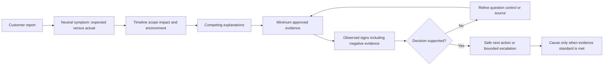
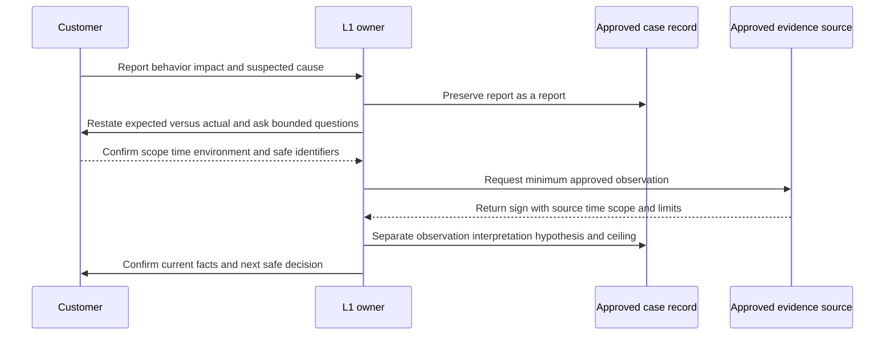
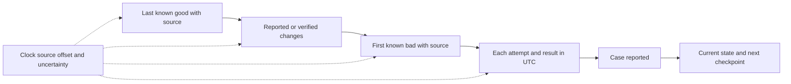
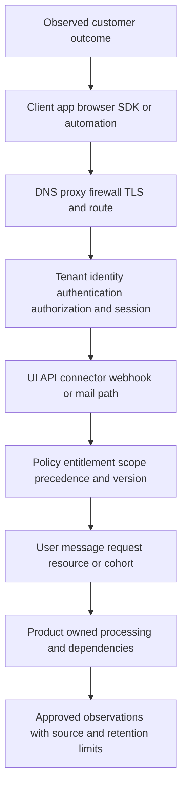
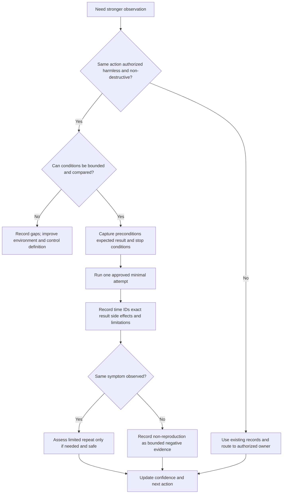
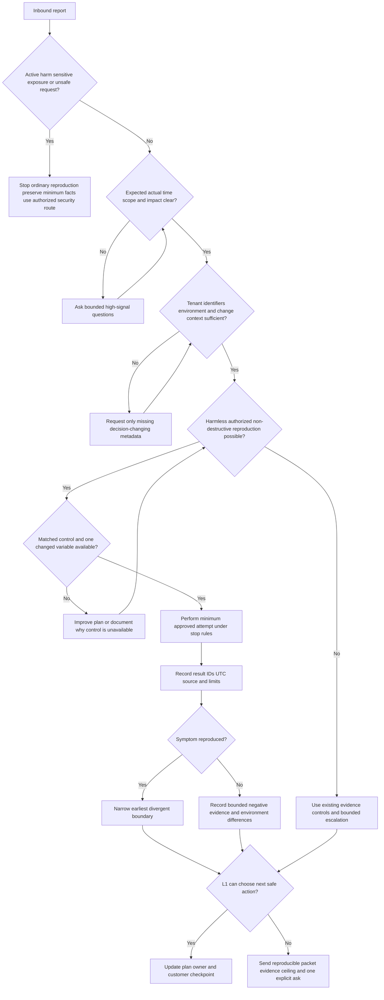
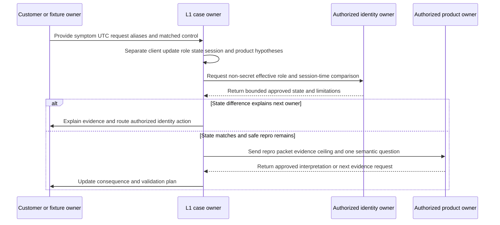
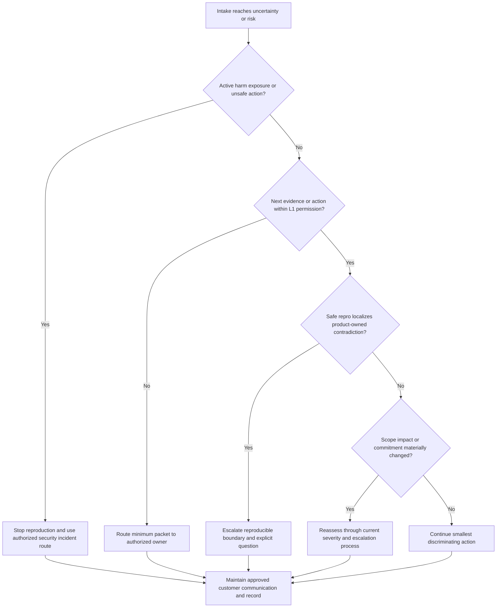
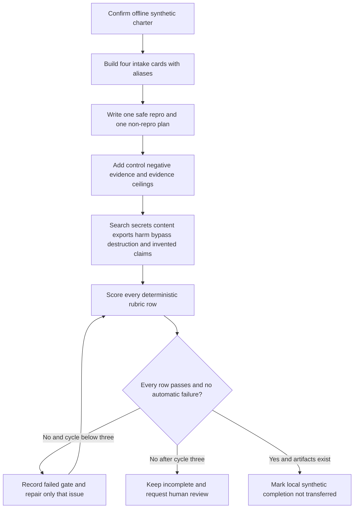

# Part 101 - Intake Scoping Reproduction and Environment

> **Purpose:** Build a product-neutral method for turning a vague support report into a bounded, testable case statement. The method captures the symptom, expected and actual result, timeline, scope, impact, useful identifiers, change context, reproducibility, environment, controls, and minimum safe evidence before deeper troubleshooting or escalation.
>
> **Artifact honesty label:** **Local synthetic intake questionnaire and reproduction-plan design only.** Every person, tenant, user, message, request, event, timestamp, identifier, environment, observation, and result in this Part is fictional. No lab step was performed while this Part was authored. No Abnormal AI, Microsoft, customer, mailbox, identity, API, network, security, ticketing, or production system was accessed or changed. You may describe the lab as completed only after you actually create the local fictional artifacts and records a passing validation.
>
> **Currency and source access date:** August 24, 2026.

## Section goal

The goal is to make the first support conversation produce **decision-grade context**, not a long but unusable data dump. By the end of this Part, you should be able to restate a report neutrally, separate a symptom from a sign and a cause, establish expected versus actual behavior, bound time and scope, describe customer impact without assigning severity prematurely, choose useful identifiers, inventory the environment, ask what changed, assess reproducibility safely, select a matched control, and request only the minimum evidence needed for the next decision.

The central analogy is a **doctor taking a history before ordering tests**. The doctor asks what the patient felt, what was measured, when it began, what changed, what makes it better or worse, and which other systems are affected. That history narrows useful tests and avoids random procedures. The analogy stops being accurate because enterprise software can span organizations, tenants, identities, networks, APIs, security controls, and distributed services; evidence may be restricted; and Support must follow contracts, role permissions, privacy requirements, incident processes, and change controls rather than exercising clinical authority.

The following terms must be distinct before the intake artifact is used.

| Term | Beginner-first definition | Everyday analogy | Why it matters | Where the analogy stops |
|---|---|---|---|---|
| Symptom | The user- or customer-visible behavior that differs from the desired outcome | A driver says, “The car will not start” | It gives the investigation a concrete starting condition | A symptom does not identify the failed component or prove a cause |
| Sign | An observed fact from an approved source that can support or weaken an explanation | A dashboard shows battery voltage below its documented range | It is evidence rather than a conclusion | Tools can be incomplete, delayed, misread, or outside the failing path |
| Cause | The condition or mechanism that produced the behavior, supported strongly enough by the applicable evidence standard | A tested failed battery explains the no-start condition | Cause supports correction and prevention | Timing, similarity, and one successful change do not automatically prove causation |
| Expected result | What current documentation, approved design, contract, or agreed customer intent says should happen under stated conditions | A ticket says the train should arrive at platform 2 at 09:00 | It creates a falsifiable reference point | Expectations can be mistaken, outdated, unsupported, or dependent on hidden conditions |
| Actual result | What an approved source or clearly labeled report says happened, including exact wording and observable output | The display says “cancelled” at 08:58 | It defines the discrepancy without guessing why | A screenshot or quoted error may omit source, time, scope, or surrounding context |
| Scope | The bounded set of affected and unaffected tenants, users, messages, requests, operations, devices, locations, versions, and time periods | Drawing a perimeter around the streets with a power outage | It reveals whether the problem is isolated, cohort-based, or broad | The first perimeter is provisional and can expand or shrink with evidence |
| Impact | The consequence to work, security, data, people, or customer outcomes | A broken elevator affects one trip differently from a hospital evacuation | It explains why the issue matters and helps authorized processes assess urgency | Impact is not automatically severity or priority; Part 102 handles those governed decisions |
| Environment | The relevant system context in which the outcome occurred: tenant, account, client, version, network path, identity, integration, policy, region, and related dependencies | A recipe depends on kitchen, oven, ingredients, and settings | It makes comparisons and reproduction meaningful | No intake can observe every hidden dependency, and product-specific fields vary |
| Changed variable | One condition known or suspected to differ between a working and failing observation | A lamp stops working after one bulb was replaced | It creates a testable hypothesis | “After” does not mean “because of,” and several variables may have changed together |
| Reproduction | Repeating the same bounded conditions and observing whether the same behavior occurs | Repeating a measurement with the same instrument and setup | It tests consistency and creates comparable evidence | Reproduction must be authorized and harmless; some incidents must never be replayed |
| Control | A deliberately comparable healthy or differently behaving case used to isolate variables | Comparing the same key in a second lock | It helps distinguish local from shared conditions | A control is never perfectly identical; its differences and limits must be recorded |
| Correlation ID | A non-secret identifier used to connect records for the same transaction or workflow across components | A parcel tracking number followed through sorting centers | It can join client, gateway, service, and support observations | An ID proves record association, not cause, completeness, ownership, or customer identity |
| Minimum evidence | The smallest approved set of observations that can change the next troubleshooting, routing, safety, or escalation decision | A mechanic checks fuel, battery, and starter evidence before dismantling the engine | It reduces privacy, security, storage, and analysis risk | “Minimum” depends on the decision; more may be requested later through an approved route |
| Negative evidence | A relevant expected observation that was not found within a stated source, query, time range, and retention boundary | No badge entry appears in the checked reader log during a precise interval | It can weaken a hypothesis or expose a collection gap | Absence in one source is not proof that an event never occurred |

These definitions form a disciplined chain:

The flow deliberately does not jump from report to cause. A customer can accurately report a real impact while naming the wrong cause. Support protects trust by preserving the report, verifying the observable difference, and using cautious language such as **supports**, **weakens**, **is consistent with**, **was not observed within**, and **does not establish**.

This Part prohibits asking for passwords, tokens, cookies, private keys, MFA codes, recovery codes, customer message content, full mailbox exports, full tenant exports, broad log dumps, unrestricted administrator access, or any other unnecessary sensitive material. It also prohibits harmful production tests, phishing, suspicious-link interaction, malware execution, credential testing, bypassing or disabling controls, broad allowlisting, deliberate load, quota exhaustion, destructive reproduction, deletion, purge, quarantine, release, revocation, reset, or unapproved account, policy, identity, routing, connector, threshold, or remediation changes.

## JD Mapping

| Supplied role signal | Capability developed here | Observable support behavior | Honest practice artifact |
|---|---|---|---|
| Enterprise L1 Technical Support Engineer | Converts an inbound report into a bounded first decision | Restates expected and actual behavior, records impact and scope, and chooses the smallest safe next question | Local synthetic intake questionnaire |
| Complex investigations | Creates a reliable starting state before deep analysis | Preserves a normalized timeline, affected and unaffected controls, environment, change context, and evidence limits | Synthetic intake and repro packet |
| Configuration questions | Separates intended, displayed, stored, effective, and observed state | Asks which object, scope, policy, version, inheritance, and authorized change matter | Fictional configuration case |
| API questions | Correlates request context without collecting secrets | Records method class, route alias, version, status or error class, UTC time, request/correlation alias, and matched control | Fictional API repro plan |
| Behavioral false-positive questions | Separates customer disagreement from verified ground truth | Captures expected business handling, bounded cohort, change context, controls, and authorized review owner | Product-neutral message case |
| Threat investigations | Recognizes when reproduction is unsafe and security routing is required | Preserves minimum identifiers and interaction categories, stops harmful action, and invokes the authorized process | Security-sensitive intake branch |
| Timely updates and ownership | Produces a useful first response without pretending to know the cause | States what is confirmed, what is missing, the next bounded request, owner, and checkpoint | Intake summary template |
| Engineering and Product collaboration | Builds a reproducible, privacy-aware escalation | Supplies expected/actual, environment, steps, frequency, controls, observations, limitations, and one explicit question | Repro plan and escalation packet |
| Recommendations and RCA insights | Protects causal reasoning from intake bias | Distinguishes changed variables, correlation, signs, hypotheses, and confirmed cause | Change-and-evidence ledger |
| Security mindset and privacy | Minimizes collection and prevents unsafe testing | Requests metadata before content and stops at permission, privacy, security, or integrity boundaries | Minimum-evidence matrix |
| enterprise support background | Transfers scoping, correlation, customer interviewing, Engineering handoff, and fix-validation discipline | Uses a real Microsoft story only within its true product, role, action, and result boundaries | Candidate transfer statement |
| Abnormal AI learning goal | Applies public context without inventing private operations | Defers fields, telemetry, permissions, support paths, and product semantics to current authorized documentation | Source-and-boundary table |

## Candidate honesty note

You can truthfully transfer methods from several years of enterprise support: clarifying customer outcomes, scoping users and services, normalizing timelines, asking what changed, identifying affected and healthy comparisons, correlating identifiers, collaborating with Engineering or Product, communicating under pressure, and validating a fix. You can use a genuine SharePoint Online, OneDrive, Sync Client, Copilot, escalation, or critical-situation example when it is relevant and permitted. You must state your own action accurately and must not recast that example as email-security, Abnormal AI, or another vendor’s production experience.

You have not established direct production use of Abnormal AI, its support console, proprietary telemetry, detection models, tenant schema, message fields, request fields, evidence-retention behavior, escalation route, permissions, or reproduction environment. Public product pages can explain high-level product context, but they cannot support a claim about internal support operations. In a real role, current authorized documentation, customer agreements, data-handling policy, assigned permissions, and product owners would control what is collected and how it is interpreted.

A strong interview bridge is: “In enterprise support, I learned to turn broad reports into a precise expected-versus-actual statement, bound the timeline and affected population, preserve identifiers, compare a healthy control, and ask for only the evidence that changed the next decision. I have not used Abnormal AI in production, so I would not assume its fields or telemetry. I would apply that investigation discipline through Abnormal’s current approved tools, privacy rules, and escalation paths.”

| Evidence tier | Safe candidate wording | Evidence available | Claim that would exceed the evidence |
|---|---|---|---|
| prior production transfer | “In enterprise support, I scoped affected users, gathered approved evidence, correlated timelines, and escalated bounded questions.” | Real CV-supported work and a truthful example you can defend | “I have performed the same intake in Abnormal’s support environment.” |
| Local synthetic lab | “After I complete it, I built and validated an offline fictional intake and repro packet.” | Learner-created local text plus a passing rubric | “I reproduced an Abnormal defect or worked a customer case.” |
| Learned architecture | “From official public sources, my understanding is that the platform operates in cloud email and related security contexts.” | Attributed public documentation with explicit limits | “I know which proprietary logs or fields prove an Abnormal decision.” |
| No direct experience | “I have not used that product or internal workflow directly; I would learn the authorized schema and handling process.” | Honest gap plus transferable method | Inventing a console name, queue, response target, tenant field, message identifier, or escalation permission |
| Proposed behavior | “I would request the minimum approved metadata needed to distinguish the next branches.” | A product-neutral method | “I would always collect a full mailbox export” or another universal collection rule |
| Causal conclusion | “The observation supports a scope-specific explanation but does not yet establish root cause.” | Explicit source, time, control, and evidence ceiling | “The recent change caused it” based only on timing |

## 1. From a complaint to a testable symptom

Customers naturally describe problems in business language, emotional language, or causal language: “Your system missed everything,” “the API is broken,” “the policy stopped working,” or “the model is wrong.” Those statements matter because they reveal experience and urgency. They are not yet testable symptom statements.

A useful symptom sentence has six parts:

> In **[bounded environment]**, **[actor or object alias]** expected **[Documented or agreed result]** when **[operation or condition]**, but observed **[exact actual result]** during **[normalized interval]**, affecting **[bounded outcome or impact]**.

For example:

> In synthetic tenant `tenant-A101`, user alias `user-A101` expected an authorized read request to return the fixture object, but the authored response was `denied` at `2026-08-24 14:03 UTC`; one learner exercise is blocked, and no real service or customer is involved.

This statement does not say “permissions are broken.” It leaves open wrong tenant, wrong identity context, wrong resource, missing authorization, endpoint semantics, an intermediary, stale state, or a product-owned fault. It also labels the evidence as synthetic.

| Input phrase | Preserve as | Rewrite for investigation | Do not conclude yet |
|---|---|---|---|
| “The API is down” | Customer report | “Three approved requests to route alias `route-A101` returned authored `503-class` results from 14:00-14:04 UTC; control status is not yet known.” | Service outage, ownership, duration, or cause |
| “Your AI marked a good email” | Customer report and business disagreement | “Message alias `message-A101` received a fictional review outcome; the authorized business owner reports it as legitimate.” | Confirmed model error, threshold problem, or safe sender status |
| “The change broke every user” | Reported scope and suspected change | “The outcome began after reported change `change-A101`; verified affected and unaffected population is not yet established.” | Global scope or causation |
| “Login fails” | User-visible symptom | “After the documented sign-in step, user alias `user-A101` sees error class `access-denied`; the failing boundary is not yet localized.” | Authentication failure, authorization failure, or product defect |
| “No messages are arriving” | Business symptom | “Expected synthetic message events are absent from the checked learner fixture after the stated window; sender, receiving, policy, and mailbox stages remain unverified.” | Loss, rejection, quarantine, deletion, or vendor failure |

### Plain-English deep-dive: Symptom, sign, and cause are different jobs

Imagine entering a room and saying, “It feels cold.” That is the symptom. A calibrated thermometer reading `15 C` is a sign. A failed furnace relay, established through an appropriate test, may be the cause. The feeling can be real even if the guessed cause is wrong. The thermometer can be accurate while saying nothing about the relay. The relay can be faulty while another factor also contributes.

Support investigations fail when those jobs collapse into one sentence. “Customer has a permissions issue” may combine the customer’s experience, a denial sign, and an unproved cause. Better notes preserve each layer:

- **Report:** the customer believes permissions changed.
- **Symptom:** one documented operation is denied where success is expected.
- **Sign:** the approved response record shows a denial class at a stated time.
- **Hypothesis:** the effective assignment may not permit that operation.
- **Test:** compare the approved effective-assignment summary with the operation requirement.
- **Cause status:** unknown until evidence meets the current standard.

The room analogy stops because software signs may be sampled, transformed, cached, filtered, delayed, or produced by an intermediary. One log can report its own component accurately while another component caused the end-to-end failure. Always record the observation source and coverage.

### Intake statement quality test

| Test | Passing question | Passing example | Failure pattern |
|---|---|---|---|
| Neutrality | Does it avoid an unproved cause? | “Request returns denial” | “Product authorization is broken” |
| Expected basis | Is the expected result tied to current documentation, approved design, or agreed intent? | “Current fixture contract says reader may retrieve object” | “It always worked, so it must be supported” |
| Observable actual | Does it quote or summarize an exact result? | “Authored status class `denied`” | “Does not work” |
| Context | Are actor, object, operation, environment, and time bounded? | One alias, one route class, one UTC instant | “All users recently” |
| Impact | Does it say what outcome is blocked or at risk? | “One approved workflow cannot complete” | “Critical” without consequence |
| Evidence tier | Is report, observation, or hypothesis labeled? | “Customer reports”; “fixture shows” | Customer belief presented as tool evidence |
| Safety | Can the next step proceed without secrets, content, harm, bypass, or destructive change? | Request non-secret metadata | Request credentials or full export |

## 2. Expected and actual result, timeline, scope, and impact

The four dimensions work together. Expected versus actual defines the difference. Timeline establishes order and duration. Scope shows where the difference is and is not observed. Impact explains the consequence. Leaving one blank makes the others easier to misinterpret.

### Expected versus actual result

Expected behavior should come from the strongest available authorized basis. The order is usually current product or API documentation, approved tenant design or configuration intent, a supported contract, an authorized business requirement, and then historical behavior with its uncertainty stated. Past success is useful context but does not prove present support or current configuration.

Actual behavior should preserve the exact observable result without unnecessary content. Record the source class, actor, action, object alias, UTC time, error or outcome class, and whether the value is a customer report or a directly approved observation. If a screenshot is permitted and needed, it still requires context; an image without environment, time, and steps is not self-explanatory.

| Dimension | High-signal intake question | Decision value | Unsafe or low-value alternative |
|---|---|---|---|
| Expected | “What result did you expect, under which documented or approved condition?” | Finds the reference behavior and hidden prerequisites | “What should the product do?” with no basis |
| Actual | “What exact outcome or error class appeared, and where was it observed?” | Defines a falsifiable difference and source boundary | “Send everything you saw” |
| Actor | “Which synthetic or approved affected alias performed the action?” | Distinguishes identity and authorization context | Asking for a real password or impersonating the user |
| Operation | “What exact safe action or observation preceded the result?” | Supports controlled reproduction | Repeating a harmful or state-changing action |
| Object | “Which bounded resource, message alias, or request alias was involved?” | Narrows object-specific behavior | Full mailbox, tenant, or customer-content export |
| Conditions | “Which environment, version, role class, route, or policy context mattered?” | Makes expectation and controls comparable | Assuming all environments are identical |
| Source | “Is this a report, UI observation, client record, audit record, or service-owned record?” | Establishes evidence strength and limitations | Treating copied text as authoritative without provenance |

### Timeline

A timeline is more than “when did it start?” It separates the **event time**, when the action or behavior occurred; the **observation time**, when a source recorded or displayed it; and the **report time**, when Support learned about it. Those times can differ. Normalize to Coordinated Universal Time, abbreviated **UTC**, while preserving the original offset when it matters. Record clock uncertainty instead of silently forcing exact order.

| Timeline field | Question | Strong synthetic entry | Boundary |
|---|---|---|---|
| Last known good | “When did the same or matched outcome last succeed, and what source supports that?” | `2026-08-24 13:40 UTC; authored control fixture` | Memory alone is approximate and should be labeled |
| First known bad | “What is the earliest confirmed failure, not merely the first complaint?” | `13:58 UTC; request-A101-01 denied in fixture` | Earlier unobserved failures may exist |
| Frequency | “How many attempts and outcomes occurred in the bounded interval?” | `3 of 3 denied from 13:58-14:04 UTC` | Repeated retries may not be independent |
| Change time | “When was the change requested, applied, effective, or merely noticed?” | `change-A101 recorded 13:50; effective state unknown` | Change record and effective state are different |
| Report time | “When did Support receive the report?” | `14:10 UTC; authored case receipt` | Report delay does not alter event order |
| Time zone | “Which offset and clock source apply?” | `UTC normalized from explicit +00:00 fixture` | Device clocks may drift; do not invent precision |
| Retention | “Does the approved source still cover the interval?” | `fixture covers 13:30-14:30 UTC` | No result outside retention is not negative evidence |

### Scope

Scope is often best represented as a matrix rather than the word “all.” Ask which dimensions vary and identify at least one unaffected or differently affected comparison when it is safe and meaningful.

| Scope dimension | Affected example | Unaffected or unknown example | Why it helps |
|---|---|---|---|
| Tenant or account | `tenant-A101` | `tenant-C101` not tested and not assumed comparable | Separates customer context from broader behavior |
| User or role | `user-A101`, reader role | `user-C101`, same role succeeds in fixture | Tests identity-specific versus shared conditions |
| Message or object | `message-A101` | `message-C101` with known differences documented | Tests item-specific versus cohort behavior |
| Request or operation | Create class fails | Read class succeeds | Separates operation-level permission or semantics |
| Client or version | `client-A101`, version alias `v2` | `client-C101`, version alias `v1` | Reveals version as a changed variable, not a cause |
| Network path | Proxy path A | Direct path control is not approved as a bypass | Identifies a path difference while preserving controls |
| Geography or region | Region alias `R-A` | Other regions unknown | Avoids unsupported global claims |
| Time | 13:58-14:04 UTC | 13:40 UTC control succeeded | Supports onset reasoning without proving causality |
| Policy or entitlement | Policy alias `P-A`; entitlement unverified | Control uses `P-C` | Prevents false product-defect conclusions |

### Impact

Impact answers “so what?” without jumping ahead to a severity label. Capture the workflow, number and type of affected users, duration, available workaround, security or data concern, financial or compliance consequence reported by the authorized customer contact, and whether the consequence is observed or anticipated. Never invent monetary loss, legal status, regulatory impact, or executive importance.

| Impact area | Useful neutral question | Decision-grade answer pattern | Avoid |
|---|---|---|---|
| Business workflow | “Which task cannot be completed or is delayed?” | “One synthetic approval workflow cannot complete the read step.” | “Business is down” |
| Population | “How many bounded aliases are confirmed affected and how many are potentially exposed?” | “Two confirmed affected; wider population unknown.” | Converting “many” into a number |
| Duration | “How long has the verified impact persisted?” | “Confirmed from 13:58 to 14:20 UTC.” | Using case age as outage duration |
| Workaround | “Is there an approved safe alternative, and what does it cost?” | “No approved alternative in the exercise.” | Suggesting control bypass or broad privilege |
| Security | “Is active compromise, exposure, harmful interaction, or weakened protection possible?” | “No interaction reported; security owner assessment not yet performed.” | L1 declaring containment or safety |
| Data | “Is data unavailable, changed, exposed, or merely not visible?” | “Visibility failure reported; data state unknown.” | Calling missing display data loss |
| Customer consequence | “What deadline, service, or decision is affected?” | “Learner exercise checkpoint delayed; no real customer consequence.” | Fabricated revenue or regulatory claim |

### Plain-English deep-dive: Scope and impact are not severity and priority

Think of scope as a map of where smoke is visible and impact as a description of what the smoke is doing. Severity and priority are governed response decisions made with current organizational criteria, contractual commitments, risk, and available context. A small scope can have high impact, such as one privileged account affecting a critical workflow. A broad scope can have lower immediate impact if a safe workaround exists. Executive attention can change communication needs without changing the technical facts.

The analogy stops because security events can require immediate routing before complete scope exists, and organizations may define severity from potential as well as confirmed impact. Part 102 covers that policy-governed classification. In Part 101, collect accurate input: confirmed and potential populations, business or security consequence, duration, workaround, trend, and uncertainty. Do not quote an Abnormal severity, priority, service-level agreement, or service-level objective that has not been supplied through current authorized material.

## 3. Identifiers and environment mapping

Identifiers help connect observations without exposing content. They should be requested only when they are non-secret, approved for support use, and relevant to the next decision. An identifier is a pointer, not an explanation.

### Tenant, user, message, request, and correlation identifiers

| Identifier class | What it can help distinguish | Minimum safe treatment | What it does not prove |
|---|---|---|---|
| Tenant or account ID | Which customer or organizational boundary the operation used | Prefer an approved alias or exact ID only in the authorized case system; never copy it into a local lab | Entitlement, ownership, configuration correctness, or product health |
| User or principal ID | Which identity context was evaluated | Use an approved immutable identifier or alias; avoid names and email addresses when unnecessary | Authentication method, effective permission, intent, or compromise |
| Message ID | Which message event records may refer to | Request the platform-approved identifier through the approved channel; do not request full content by default | Delivery, safety, verdict correctness, or complete message history |
| Request ID | Which individual API or application attempt produced a result | Pair with UTC time, operation, environment, response class, and source | Root cause, caller identity, or end-to-end trace completeness |
| Correlation or trace ID | Which records may belong to a transaction across components | Treat as non-secret only when current documentation says so; preserve exact characters and source | Causation, success, completeness, or authority to access every linked record |
| Case ID | Which support record owns the narrative | Keep one authoritative approved record and use a synthetic alias in practice | Technical scope, severity, or diagnosis |
| Change ID | Which approved change record may relate to the timeline | Record state, owner class, time, scope, and whether effectiveness is verified | That the change caused the symptom |
| Device or client ID | Which endpoint context produced an observation | Minimize and follow approved privacy handling | User identity, network path, or server behavior |

A useful identifier package is contextual:

> `request-A101-03`, observed `2026-08-24 14:03 UTC`, in synthetic environment `env-A101`, operation class `read`, route alias `route-A101`, response class `denied`, source `authored client fixture`, correlation alias `corr-A101-03`, no body or secret collected.

The same request ID without time, environment, operation, and result may be impossible to find or easy to mis-associate. Conversely, asking for every identifier “just in case” expands data exposure without improving the first decision.

### Environment as a layered map

An environment is not merely “production” or “test.” It is the combination of context that can alter behavior. Intake should record only relevant layers and mark unknowns explicitly.

| Environment layer | Intake questions | Useful comparison | Boundary |
|---|---|---|---|
| Customer boundary | Which tenant/account alias and subscription or entitlement class are relevant? | Same operation in the same authorized tenant with another matched alias | Do not infer entitlement from UI visibility |
| Identity | Which principal alias, role class, sign-in context, and session age apply? | Same role with another synthetic principal | Never request credentials, tokens, cookies, or MFA codes |
| Client | Which app, browser, software development kit, script, or integration version is involved? | Same request through an approved known-good client when safe | A client difference can correlate without causing failure |
| Network | Which approved proxy, virtual private network, firewall, DNS, TLS, and route context applies? | Same client on its approved normal path, or existing healthy evidence | Never bypass inspection or security policy as a test |
| Interface | Which user interface page, API version, connector, webhook, or mail-flow stage applies? | Same documented operation through a matched supported path | Interfaces can have different contracts and timing |
| Configuration | Which object, policy, scope, inheritance, precedence, version, and effective state apply? | A matched unaffected object with known differences | Displayed or saved state may not equal effective state |
| Time and region | Which region alias, UTC interval, propagation window, and clock source apply? | Before/after evidence with documented window | Do not invent region architecture or propagation timing |
| Dependencies | Which identity, network, mail, customer, or third-party component is in the path? | Existing component-specific observations | Presence in the path does not establish responsibility |

### Plain-English deep-dive: A correlation ID is a luggage tag, not a diagnosis

At an airport, a luggage tag helps staff connect scans from check-in, sorting, loading, and arrival. The tag is valuable because several systems can refer to the same bag. It does not explain why the bag was delayed, prove every scan exists, or authorize every employee to open it.

A correlation ID works similarly. Paired with a UTC time and operation, it can help an authorized specialist locate related records. It does not mean every service propagated the ID, every log retained it, or every matching record belongs to the same causal chain. It may also be sensitive under a particular organization’s policy even if it is not a credential.

The analogy stops because distributed systems can create parent and child trace identifiers, retries can produce new request IDs, proxies can replace headers, and privacy rules can restrict linking. Use the current product documentation and approved support channel. Never fabricate an ID, alter it for aesthetics, or claim “no server event happened” merely because one search did not find it.

### Environment snapshot template

| Field | Value to record | Unknown handling | Prohibited collection |
|---|---|---|---|
| Case alias | Approved case ID or synthetic alias | `UNKNOWN - verify in system of record` | Personal shadow record |
| Tenant/account | Approved ID or alias and environment class | `UNKNOWN - customer boundary not confirmed` | Full tenant export |
| User/principal | Minimum immutable approved ID or alias and role class | `UNKNOWN - effective identity context unverified` | Password, token, cookie, MFA or recovery code |
| Message/object | Minimum approved message or object ID/alias | `UNKNOWN - content not requested` | Full customer message content or mailbox export |
| Request/correlation | Exact approved ID or alias plus source | `NOT AVAILABLE FROM CURRENT SOURCE` | Authorization header or credential-bearing URL |
| Client/version | Product and version class required for comparison | `UNKNOWN - ask only if decision-relevant` | Full device inventory |
| Interface | UI/API/connector/webhook/mail path and version class | `UNKNOWN - localize first` | Unapproved endpoint probing |
| Network path | Approved proxy/VPN/DNS/TLS path category | `UNKNOWN - no bypass requested` | Packet or HAR data without handling approval |
| Policy/configuration | Object alias, intended and effective version/state | `UNKNOWN - authorized owner required` | Broad policy export or unapproved edit |
| Time/region | UTC interval, original offset, clock source, region alias if relevant | `UNCERTAIN +/- [Documented amount]` | Invented precision or proprietary topology claim |

## 4. Change context, reproducibility, controls, and evidence

“What changed?” is powerful because a new difference can narrow hypotheses. It is dangerous because people overvalue the most visible recent event. Intake should build a **change ledger**, not a single-change story.

### Changed variables

Ask about customer-administered configuration, identity and role assignments, client releases, integration code, network or proxy policy, certificates, DNS, connectors, supported product versions, tenant migration, data shape, workload volume, and known service changes from authoritative sources. Separate requested, approved, applied, effective, observed, and rolled-back times.

| Change dimension | Intake question | Evidence needed | Causal caution |
|---|---|---|---|
| What | What exact bounded variable reportedly changed? | Approved change alias and sanitized description | A broad “deployment” label hides many variables |
| Who | Which authorized owner class controlled it? | Role, not unnecessary personal data | Ownership does not prove execution correctness |
| Where | Which tenant, object, cohort, client, route, or region was in scope? | Change scope versus symptom scope | Overlap is relevant but not sufficient |
| When | When was it requested, applied, effective, observed, and validated? | UTC times with source and clock limits | Temporal order is not causation |
| Why | What approved outcome was intended? | Change purpose and success criterion | Intent does not prove effective result |
| How | Was there an approved validation and rollback plan? | Existing plan and results | Support must not invent or execute a rollback |
| Other changes | What else changed in the same interval? | Competing change entries | Confirmation bias favors the first remembered event |

### Reproducibility

Reproduction is a spectrum, not a yes/no checkbox. It can be consistent, intermittent, condition-specific, historical only, unsafe to repeat, no longer observable, or not attempted. A failure to reproduce can still provide valuable negative evidence when the attempt was comparable and its limits are stated.

| Reproduction state | Meaning | Valid wording | Next move |
|---|---|---|---|
| Consistent | The same safe bounded conditions repeatedly produce the same result | “Three of three authored attempts show the same denial.” | Verify control and earliest divergent boundary |
| Intermittent | Similar attempts produce different outcomes | “Two of five attempts fail; timing pattern remains unknown.” | Preserve each attempt, compare conditions, avoid retry flooding |
| Conditional | One known context reproduces while another does not | “Fails under client alias A; matched client C succeeds.” | Test the changed variable without assuming cause |
| Historical only | Existing evidence shows the event, but it cannot be safely repeated | “The prior event is supported by the approved record; no replay attempted.” | Use preserved evidence and authorized specialist review |
| Unsafe to reproduce | Repetition could cause harm, exposure, loss, bypass, security weakening, or customer impact | “Reproduction prohibited; route based on existing minimum evidence.” | Escalate to the authorized security/change/product owner |
| Not reproduced | A comparable approved attempt did not show the symptom | “One bounded attempt succeeded; original event remains unrefuted outside that context.” | Record negative evidence and compare environment/time |
| Not attempted | Preconditions, permission, environment, or safe method are absent | “No reproduction attempted; reason and required owner are recorded.” | Build a plan or escalate instead of improvising |

### Controls

A good control changes as little as possible. For a user issue, use a user with the same role and tenant but a different alias, if approved. For an API issue, use the same method and route class with a harmless known-good object, or compare a read operation only when its contract is genuinely relevant. For a message issue, compare metadata categories from a legitimate known-good cohort without asking for content. Record all known differences.

| Control quality | Example | Value | Limitation |
|---|---|---|---|
| Strong matched control | Same synthetic tenant, role, client, route, time window, and object class; only principal alias differs | Localizes identity-specific conditions | Hidden session or backend state may differ |
| Useful partial control | Same request class and tenant but different client version | Reveals a version correlation | Client is not the only changed variable |
| Weak control | Different tenant, role, route, region, and time | May show only that the whole world is not failing | Cannot isolate a meaningful variable |
| Unsafe control | Bypass proxy, disable detection, grant admin, or replay a harmful message | None acceptable | Violates safety and can create misleading success |
| Missing control | Only one failing observation exists | Preserves the symptom but not localization | Escalation may still be justified when impact or risk requires it |

### Minimum evidence and negative evidence

Minimum evidence is decision-relative. For the first routing decision, a symptom statement, bounded impact, UTC interval, environment alias, one relevant identifier, reproduction status, and safety screen may be enough. A later Product or Engineering escalation may require a precise repro plan, control result, version, source observations, and evidence ceiling. Do not request the final investigation package at the first reply merely because it might someday be useful.

Negative evidence must include four boundaries:

1. **Expected observation:** what should have appeared if the hypothesis were true.
2. **Source and query:** where and how the approved check looked.
3. **Coverage:** exact time range, scope, retention, filters, and relevant permissions.
4. **Inference limit:** which hypothesis is weakened and what absence cannot prove.

Example: “No record for correlation alias `corr-A101-03` was found in the authored gateway fixture covering 13:55-14:10 UTC. The fixture states complete coverage for that alias and interval, so this weakens the branch that the request reached the gateway. It does not prove the client sent nothing, identify the failing component, or describe a real product.”

### Plain-English deep-dive: Negative evidence is a checked empty shelf, not proof the book never existed

Suppose a librarian checks one shelf and does not find a book. That absence matters only if the catalog says the book should be on that shelf, the shelf was checked completely, and nobody is looking at the wrong edition. Even then, the book may be checked out, misfiled, or absent from the library for another reason.

Likewise, “no log found” is weak unless the event should generate that log, the correct source was queried, the identifier and time were correct, retention covered the event, permissions allowed visibility, and filters did not exclude it. Strong negative evidence can localize an earlier boundary; weak negative evidence merely describes an unsuccessful search.

The analogy stops because distributed telemetry can be sampled, delayed, duplicated, redacted, transformed, or generated asynchronously. Product owners define authoritative sources and expected instrumentation. L1 should say exactly what was not observed and where, never “the event did not happen anywhere.”

## 5. Artifact: high-signal intake questionnaire

The questionnaire is a decision tool, not a script to read mechanically. Ask the smallest group of questions that chooses the next safe branch. Prefill what the customer already supplied, confirm rather than repeat, explain why a requested item matters, and state what must not be sent.

### First-response safety banner

> Please do not send passwords, tokens, cookies, API keys, client secrets, private keys, MFA or recovery codes, authorization headers, full customer messages, full mailbox or tenant exports, or unrestricted data dumps. Do not repeat an action if it could deliver harmful content, expose data, change or delete state, generate load, weaken or bypass a control, or affect production users. We will start with approved non-secret metadata and route any restricted evidence through the current authorized process.

### Core intake questionnaire

| # | High-signal question | Why it is asked | Good answer shape | Stop, defer, or minimize when |
|---:|---|---|---|---|
| 1 | What outcome were you trying to achieve? | Establishes customer intent before technical assumptions | One business or security outcome | The request itself is harmful or unauthorized |
| 2 | What result did you expect, and what current documentation or approved design supports it? | Makes expectation falsifiable | Expected result plus reference or stated uncertainty | Customer asks Support to override policy or entitlement |
| 3 | What exact result did you observe? | Defines the symptom | Error/outcome class, display location, no unnecessary content | The only proposed evidence contains secrets or restricted content |
| 4 | Which action immediately preceded the result? | Identifies the operation and preconditions | One safe action and relevant inputs as aliases | Repeating it could cause harm, mutation, delivery, loss, or load |
| 5 | When did it last work and first fail? | Bounds onset | UTC times, sources, and uncertainty | Clocks or retention make precision unsupported |
| 6 | How often has it occurred? | Distinguishes persistent and intermittent behavior | Attempts, successes, failures, interval | More retries would create impact or noise |
| 7 | Which tenant or account is involved? | Establishes customer boundary | Approved ID in case system or alias in practice | A broad export is offered instead |
| 8 | Which users, roles, messages, requests, objects, or cohorts are confirmed affected? | Bounds scope | Counts plus minimum approved identifiers | Personal data or content is unnecessary |
| 9 | Which comparable users, objects, requests, or times are unaffected? | Creates a control | Matched control and known differences | Testing a control would require bypass or harmful action |
| 10 | What customer workflow or security outcome is affected? | Captures impact | Consequence, duration, workaround, uncertainty | A legal, regulatory, financial, or severity conclusion is speculative |
| 11 | Is active compromise, exposure, user interaction with harmful content, payment action, or data loss possible? | Triggers safety routing | Yes/no/unknown categories plus minimum facts | Any “yes” or credible “unknown” requires current security process |
| 12 | Which environment is this: production, test, or another approved class? | Separates contexts | Authorized environment name or alias | The customer proposes testing in production merely for reproduction |
| 13 | Which client, interface, version, region, and supported path apply? | Makes reproduction comparable | Only decision-relevant layers | Full device inventory or topology is not needed |
| 14 | Which identity, role, entitlement, session, policy, or configuration scope may matter? | Locates control-plane context | Non-secret state summary from an authorized owner | Credentials, token contents, or privilege escalation are proposed |
| 15 | What changed before the first failure? | Creates hypotheses | Change ledger with source and times | One change is being treated as proven cause |
| 16 | Can the issue be reproduced with a harmless, authorized, non-destructive action? | Determines evidence path | State plus reason, conditions, and attempt count | Reproduction could harm, expose, mutate, bypass, deliver, delete, or load |
| 17 | What request, message, correlation, or event identifier is available? | Supports cross-source lookup | Minimum exact ID, source, UTC time, operation | Identifier policy is unknown or the value includes a secret |
| 18 | What approved evidence has already been checked? | Prevents repetition and exposes source limits | Source, scope, result, time, limitations | A statement says “all logs” without inventory |
| 19 | What safe workaround is in use? | Clarifies impact and changed conditions | Approved temporary path and limitation | It weakens security, broadens access, or changes evidence |
| 20 | What is the next decision this evidence must support? | Enforces minimum collection | Route, test, owner, or escalation question | The answer is merely “collect everything” |

### Adaptive branch questions

| Case family | Ask next | Minimum useful evidence | Do not ask for or do |
|---|---|---|---|
| Configuration | Which object, intended value, displayed/saved/effective value, scope, inheritance, precedence, version, and approved change time apply? | Sanitized state summary, object alias, UTC times, matched control | Full tenant export, unapproved edit, rollback, broad policy change |
| API | Which environment/version, method class, route alias, status/error class, request/correlation alias, UTC time, retry pattern, and control result apply? | One sanitized request metadata row and response class; no secret/body by default | Authorization header, token, sensitive body, replay, write/delete test, load test |
| Identity | Which tenant, application/resource, principal alias, role class, session age, and effective assignment summary apply? | Non-secret identity-context metadata from approved source | Password, token, cookie, MFA code, impersonation, privilege grant |
| Connectivity | At which approved boundary does behavior diverge: DNS, TCP, TLS, proxy, HTTP, or application? | Existing stage results, destination class, UTC time, control path | Proxy bypass, firewall disablement, scan, unrestricted packet capture |
| Message handling | Which approved message alias, UTC times, direction, outcome class, policy context, and matched cohort apply? | Metadata before content and authorized business ground truth | Full message, mailbox export, attachment execution, link visit, forwarding |
| Security-sensitive | Did anyone click, reply, execute, enter credentials, approve MFA, send money, expose data, or see continued activity? | Yes/no/unknown interaction categories, minimum identifier, time, scope | Credential values, payment details, public upload, self-directed containment or deletion |

### Intake summary card

| Field | Concise entry pattern |
|---|---|
| Customer outcome | `[workflow or security outcome]` |
| Expected | `[Documented or approved result and conditions]` |
| Actual symptom | `[exact observable difference without cause]` |
| Timeline | `[last good / first bad / attempts / report time in UTC with uncertainty]` |
| Scope | `[affected and unaffected aliases, counts, cohorts, operations, environments]` |
| Impact | `[confirmed consequence, potential consequence, workaround, uncertainty]` |
| Environment | `[tenant, identity, client, interface, version, network, policy, region as relevant]` |
| Identifiers | `[minimum tenant/user/message/request/correlation aliases and sources]` |
| Changes | `[candidate changes with requested/applied/effective times and owners]` |
| Reproducibility | `[state, safe conditions, attempts, results, stop condition]` |
| Control | `[matched comparison, result, differences, limitations]` |
| Minimum evidence | `[source, time, scope, fields, result, privacy treatment]` |
| Negative evidence | `[expected observation not found, coverage, weakened branch, limit]` |
| Current hypotheses | `[two or more explanations with predicted observations]` |
| Safety | `[secrets/content excluded; harmful/bypass/destructive actions prohibited]` |
| Next decision | `[one question or branch the next action will resolve]` |
| Owner/checkpoint | `[role, action, and current policy/agreement/event trigger]` |

## 6. Artifact: safe reproduction plan

A reproduction plan is written before an attempt. It makes safety, fidelity, evidence, and stop conditions reviewable. The goal is not to force every issue to happen again. The goal is to decide whether a controlled observation can discriminate between explanations without creating new harm or corrupting evidence.

### Reproduction-plan template

| Plan field | Required content | Synthetic example | Automatic failure |
|---|---|---|---|
| Repro question | One behavior to test | “Does harmless read operation return fixture object for `user-A101` in `env-A101`?” | “Try to break it again” |
| Expected basis | Current contract or approved design | “Local fixture contract states reader may retrieve object.” | Unsupported assumption |
| Preconditions | Tenant, role, object, client, version, path, state, and time conditions | Aliases only; no secret | Missing environment or broad production scope |
| Safety classification | Harmless/authorized, restricted, or prohibited | “Local authored observation only.” | Production harm, bypass, destructive action, phishing, load, secret exposure |
| Permission and owner | Who authorizes and who performs | `Learner-A101` authors local text | L1 grants itself customer authority |
| Changed variable | Exactly one intended difference from the control | Principal alias differs | Several uncontrolled changes |
| Control | Matched healthy or differently behaving case and known differences | `user-C101`, same fictional role and route | Bypass path presented as healthy control |
| Steps | Numbered actions using aliases and approved methods | Read authored fixture rows | Live write, delete, replay, delivery, privilege, or configuration action |
| Attempt limit | Maximum count and reason | Three authored rows already exist; no retries generated | Retry storm or deliberate quota pressure |
| Evidence to capture | Minimum fields, source, UTC time, result, and limitation | Request alias, result class, fixture source | Full export or unrestricted content |
| Predicted branches | Observation expected under each hypothesis | Role mismatch predicts affected user only | Test with no decision consequence |
| Stop conditions | Safety, integrity, privacy, impact, unexpected result, or authorization boundary | Stop if any real value or external interaction appears | No stop rule |
| Cleanup | Local handling and privacy review | Keep only fictional text in learner folder | Deleting or altering real evidence |
| Success criterion | What makes the repro useful, not what makes a product “fixed” | Same conditions and result recorded with control | A predetermined causal conclusion |
| Evidence ceiling | Strongest permissible conclusion | “Synthetic condition is reproducible; no vendor behavior established.” | “Abnormal defect confirmed” |

### Intake and reproduction decision tree

### Reproduction quality checklist

1. The expected result has a current authorized basis.
2. The actual result is observable and neutral.
3. The environment and preconditions are explicit.
4. The action is approved, harmless, bounded, and non-destructive.
5. No credential, customer content, full export, or unrestricted access is required.
6. No control is disabled, bypassed, weakened, or broadly changed.
7. No production user, message, data, workload, quota, or security posture is endangered.
8. One changed variable and one useful control are identified where possible.
9. Predicted observations connect the attempt to competing hypotheses.
10. Attempt count and retry behavior are bounded.
11. UTC times, exact identifiers, source, result, and side effects are captured.
12. Non-reproduction is recorded rather than hidden.
13. Stop and escalation conditions are explicit.
14. The evidence ceiling prevents a synthetic or client-only observation from becoming a vendor-cause claim.

## 7. Worked cases

All cases below are authored teaching fixtures. They were not executed, do not describe Abnormal AI behavior, and contain no customer data or product-internal field. Their purpose is to demonstrate reasoning from intake to a safe next decision.

### Worked case A: API denial with a matched control

**Initial report:** “The API has been broken since the update.”

**Neutral symptom:** In synthetic environment `env-A101`, principal alias `user-A101` expected the documented fixture read operation to return object alias `object-A101`, but three authored attempts returned response class `denied` from 14:01-14:05 UTC. One fictional workflow is blocked. Principal alias `user-C101` succeeds under a reportedly similar context.

| Intake field | Worked entry | Reasoning and limit |
|---|---|---|
| Expected | Fixture contract says role class `reader` may perform read on object class A | This is a local authored contract, not a real API or Abnormal behavior |
| Actual | Three fixture rows show `denied` for `request-A101-01` through `03` | Response class is a sign, not a cause |
| Timeline | Last good 13:40; reported change 13:50; first bad 14:01; report 14:10 UTC | Change timing supports comparison but not causation |
| Scope | One principal affected; one control succeeds; one object class checked | Wider tenant and other operations remain unknown |
| Impact | One fictional read-dependent workflow blocked; no real data or customer | Part 102 would govern severity in real work |
| Identifiers | Tenant, user, object, three request aliases, three correlation aliases | No body, authorization header, token, URL, or customer content |
| Environment | Same fictional tenant, route, client and version; session-issued times differ | Session age is a changed variable, not a confirmed cause |
| Change | Authored client update at 13:50; effective role record unchanged | Client update remains one of several hypotheses |
| Reproduction | Consistent in three pre-authored rows; no requests generated | The authored rows model results but do not test a system |
| Control | `user-C101` succeeds; same role label, route and object class | Effective assignment and session state still need comparison |
| Minimum evidence | Effective-role summary and session-issued time for both aliases | A token is unnecessary and prohibited |
| Negative evidence | No client-side transport error in fixture | Weakens a client transport branch only within fixture coverage |

Competing hypotheses:

1. The affected principal’s effective assignment differs from the visible role label. Prediction: approved effective-state summaries differ.
2. The older session does not reflect a later approved state. Prediction: session-issued time differs and an authorized refresh path changes the observation.
3. Client version alters the request context. Prediction: sanitized request metadata differs despite matched route and operation.
4. A product-owned rule not represented in the local contract applies. Prediction: L1-visible state matches while authorized product evidence explains the denial.

The first discriminating action is a read-only comparison of approved effective-role summaries and session-issued times. It does not require a password, token, role grant, live replay, write, delete, or bypass. If the summaries match and the denial remains reproducible under a safe authorized plan, the escalation asks one question: which documented product-owned rule or telemetry can explain the mismatch?

**Evidence ceiling:** The local fixture demonstrates how a control and state comparison narrow an API denial. It does not establish any real endpoint, outage, permission model, defect, or Abnormal AI behavior.

### Worked case B: configuration expectation versus effective state

**Initial report:** “The new policy did not work for anyone.”

**Neutral symptom:** Synthetic group alias `group-A101` displays intended value `strict-A` in an authored configuration row, while two authored outcomes continue to show prior handling class `standard-C` from 15:05-15:12 UTC. Two aliases are confirmed affected, one matched group is unaffected, and broader scope is unknown.

| Investigation element | Worked reasoning |
|---|---|
| Expected basis | An authored design says `group-A101` should receive `strict-A` after an approved effective-state transition; no real propagation time is assumed |
| Actual source | Outcome fixture shows `standard-C`; the displayed configuration is a separate source |
| Environment | Tenant alias, group alias, policy aliases, version aliases, UTC interval, and inheritance relation are recorded |
| Changed variables | A child policy was authored at 14:50; a parent precedence row was also changed at 14:45 |
| Control | `group-C101` uses another parent and shows expected handling; this is a partial control |
| Hypotheses | Wrong scope, saved-not-effective state, parent precedence, propagation, or unsupported expectation |
| Minimum evidence | Approved intended, saved, effective, and observed state summaries plus version/time aliases |
| Prohibited action | L1 does not edit policy, reverse a change, broaden scope, disable a control, or test against production |
| Next owner | Authorized configuration owner validates precedence and effective version through the current change process |

The case demonstrates why “the screen shows it” is not equivalent to effective behavior. A configuration can be intended, displayed, saved, accepted, distributed, evaluated, and observed at different stages. The intake packet should name which stage each source supports. If the effective version contradicts current documented precedence, send the exact mismatch to the authorized product owner. If the effective state matches a higher-priority parent rule, route any proposed change through the customer’s approved configuration owner.

**Evidence ceiling:** The fixture supports a general intended-versus-effective-state method. It does not reveal Abnormal policy hierarchy, field names, propagation behavior, or customer permissions.

### Worked case C: message outcome and security-sensitive stop

**Initial report:** “A dangerous email was missed. Send me the message and I will replay it.”

**Neutral symptom:** An authorized reporter says synthetic message alias `message-A101` produced an unexpected handling outcome at 16:20 UTC and may involve harmful intent. Interaction status is unknown. No message body, address, domain, link, attachment, credential, or real indicator is present.

| Intake decision | Safe action | Prohibited shortcut |
|---|---|---|
| Immediate safety | Ask only whether anyone clicked, replied, executed, entered credentials, approved MFA, transferred value, exposed data, or sees ongoing activity, using yes/no/unknown categories | Ask for credentials, payment details, or full content |
| Preserve identity | Record approved message alias, bounded user alias, direction class, UTC times, and current outcome class | Forward the message externally or copy it to a personal mailbox |
| Reproduction | Mark `UNSAFE_TO_REPRODUCE` until an authorized process says otherwise | Replay, resend, click, detonate, execute, or reproduce in production |
| Scope | Ask for confirmed affected aliases and whether similar approved metadata patterns exist | Request a full mailbox or tenant export |
| Impact | Record reported interaction and potential exposure separately from confirmed facts | Declare breach, safety, attribution, or containment |
| Routing | Invoke the current authorized security or incident process and keep the support handoff bounded | Perform containment, deletion, quarantine, release, account reset, or policy disablement without authority |
| Evidence | Use minimum approved metadata first; restricted content follows the designated channel only if essential | Upload to a public scanner, external AI service, or unapproved collaboration tool |

There is no ordinary repro plan for this case. The correct plan is an **evidence-preserving non-reproduction plan**: state why replay is unsafe, preserve the minimum identifiers and times, establish whether harmful interaction may have occurred, route to the authorized security owner, and record the evidence ceiling. L1 can maintain the case narrative and customer checkpoint without becoming incident commander or malware analyst.

**Evidence ceiling:** The report establishes a security-sensitive concern requiring authorized review. It does not establish maliciousness, a missed detection, campaign scope, compromise, attribution, data loss, or any Abnormal product outcome.

### Worked case D: failed reproduction as useful evidence

**Initial report:** “Every browser fails every time.”

The bounded intake identifies one affected browser profile, one client version, and one tenant alias. An authorized harmless read-only action succeeds once in a fresh synthetic profile but the original authored history contains two failures in the prior profile.

| Observation | What it supports | What it does not establish | Next action |
|---|---|---|---|
| Fresh profile succeeds once | Broad service unavailability becomes less likely in the fixture | The original problem is solved or caused by cache | Compare approved profile state and repeat only within the safe plan if needed |
| Prior profile failed twice | A profile-specific condition remains plausible | Browser defect or customer misconfiguration | Preserve version, extension category, session state, and exact error class |
| Other browsers untested | Scope remains narrower than reported | Universal browser failure | Correct the case wording and avoid broad claims |
| No service-side source exists | Product-side behavior remains unobserved | The service had no issue | Escalate only if current evidence and impact justify product-owned review |

Non-reproduction changes the investigation; it does not erase the customer’s report. The case record should say, “The symptom did not reproduce in one approved fresh-profile attempt under stated conditions. That result weakens a broad service-failure branch but does not refute the two historical failures in the prior profile.”

## 8. Failure modes, misleading signals, and escalation

High-signal intake fails when it becomes interrogation, indiscriminate collection, premature diagnosis, or risky experimentation. The owner should correct the intake before it hardens into the case narrative.

### Failure modes and corrections

| Failure mode or misleading signal | Why it fails | Better behavior | Stop or escalate when |
|---|---|---|---|
| “It is a permissions issue” copied as fact | It merges report, symptom, and cause | Record denial symptom and test identity, role, resource, and product branches | Effective state is correct but authoritative behavior conflicts |
| “All users” accepted without counts or cohorts | It inflates scope and may misroute response | Record confirmed affected, potentially affected, unaffected, and unknown groups | Verified scope or impact crosses current escalation criteria |
| “Started after change X” treated as proof | Temporal sequence alone cannot establish cause | Build a change ledger and compare scope, effective time, control, and alternatives | Safe verification requires another owner or rollback/change authority |
| Screenshot accepted without context | It may omit tenant, time, version, source, and preceding action | Capture exact result plus environment and provenance | Restricted information needs an approved evidence channel |
| Full logs requested before a question exists | It overcollects data and creates analysis noise | State the next decision and request only fields and interval that discriminate | The needed source is restricted or outside L1 access |
| Customer content requested by default | Content can contain personal, confidential, regulated, or harmful data | Start with metadata and escalate restricted evidence through the approved process | Content is essential and policy defines a protected route |
| Credentials requested for reproduction | It creates severe security and accountability risk | Have the authorized user or owner perform the safe action; use non-secret context | Any password, token, cookie, key, MFA or recovery code appears |
| Production used because test differs | It can create customer impact or corrupt evidence | Use existing production observations and an approved non-harmful validation plan | The only proposed test changes, delivers, deletes, loads, or weakens production |
| Proxy or security control bypassed as a control | Success after bypass may increase risk and prove little | Compare existing approved paths or involve the control owner | Any disablement, evasion, allowlisting, or inspection bypass is proposed |
| Repeated retries used to “prove” intermittence | Retries can create load, duplicates, rate limits, and changed state | Bound attempts and analyze existing records | Attempts could affect service, quotas, messages, workflows, or evidence |
| No log found means event never happened | Source, retention, filter, permission, or ID may be wrong | Document negative-evidence boundaries | Authoritative coverage is unclear or another owner controls telemetry |
| One healthy control proves customer fault | Controls differ and shared systems can fail selectively | Record differences and use the control only to narrow | The divergence is product-owned or remains unexplained |
| One successful attempt means resolved | Intermittence and changed conditions remain | Compare original conditions and follow the resolution process | Impact continues or safe validation cannot be reproduced |
| Correlation ID presented as root cause | It links records but does not explain behavior | Pair it with observations and causal reasoning | Required related records are outside L1 authority |
| Environment recorded as “prod” only | Critical identity, version, route, policy, and region context is missing | Build a relevant layered snapshot | Product-specific environment semantics are undocumented |
| Unknown fields silently omitted | Readers assume the field was checked and negative | Write `unknown`, why, and whether it blocks the next decision | A material safety, scope, or impact fact cannot be established |
| Questionnaire sent as a giant form | Customers repeat known information and trust falls | Prefill, prioritize, and explain each decision-changing request | Communication or accessibility needs another approach |
| Severity assigned during intake by intuition | Impact input is confused with governed classification | Record facts and apply current criteria in Part 102’s process | Security, safety, or business impact requires immediate formal routing |
| Abnormal internal field invented | It creates false confidence and a misleading interview claim | Use product-neutral aliases and ask for current authorized schema on the job | A decision depends on proprietary telemetry or semantics |

### Escalation triggers

Escalate through the current approved route when any of these conditions appears:

- Active compromise, harmful content interaction, credential exposure, payment action, data exposure, ongoing malicious activity, or a credible unknown security state.
- The next action would require content, restricted evidence, proprietary telemetry, elevated access, another tenant, or a role beyond L1 authorization.
- Reproduction would send, execute, deliver, mutate, delete, purge, revoke, quarantine, release, reset, scan, load, bypass, disable, weaken, or evade a control.
- The issue is reproducible under a safe matched plan and the earliest divergence is at a product-owned boundary.
- Current authoritative documentation and reliable observation conflict after environment, scope, and version are verified.
- A potentially broad population, material business outcome, or governed service commitment may be affected.
- The source needed to interpret negative evidence has uncertain retention, sampling, filter, clock, or coverage behavior.
- Customer-provided identifiers or evidence require privacy, legal, security, or data-handling review.
- A proposed workaround changes security posture, expands privilege, violates supported design, or has unclear rollback and ownership.
- The customer requests an unsupported causal, legal, regulatory, attribution, safety, or permanence conclusion.

### Minimum escalation packet

| Packet section | Required content | Why the receiver needs it |
|---|---|---|
| Customer outcome | Neutral expected versus actual statement | Prevents troubleshooting a guessed cause |
| Timeline | Last good, first bad, attempts, changes, report time in UTC | Establishes order, duration, and source limits |
| Scope and impact | Confirmed affected/unaffected/unknown population and consequence | Supports routing and governed impact assessment |
| Environment | Relevant tenant, identity, client, interface, version, route, policy, region, and dependency aliases | Makes observations interpretable and reproducible |
| Identifiers | Minimum approved case, tenant, user, message, request, correlation, event, or change aliases | Enables authorized lookup without broad collection |
| Repro plan and result | Preconditions, safe steps, attempt count, controls, exact outcomes, stop conditions | Shows repeatability and prevents unsafe repetition |
| Evidence ledger | Source, time, scope, fields, observation, negative evidence, and limitations | Separates facts from assumptions |
| Hypotheses | Active, weakened, and rejected branches with predictions | Shows reasoning and avoids tunnel vision |
| Changes | Candidate variables with timing, scope, owner class, and effective-state confidence | Preserves causality discipline |
| Safety and privacy | Excluded data/actions, redaction, handling route, and unresolved restrictions | Prevents exposure and duplicate risky work |
| Evidence ceiling | Strongest supported conclusion and explicit unknowns | Stops overclaiming |
| Exact ask | One decision, interpretation, or evidence request owned by the receiver | Makes escalation actionable |
| Ownership | Current case owner, requested task owner, acceptance state, and customer checkpoint | Preserves continuity |

## 9. Putting intake and reproduction into interview language

Interviewers are usually testing judgment, not whether the candidate memorized a form. A strong answer shows how you turn ambiguity into one safe next decision while respecting privacy, evidence quality, and product boundaries.

| Interview prompt | Answer structure | experience transfer | Required boundary |
|---|---|---|---|
| “What do you ask first?” | Outcome, expected/actual, time, scope, impact, safety, environment, identifiers, changes, reproduction | Mention a truthful enterprise-support intake pattern | Do not claim an Abnormal script or field set |
| “How do you reproduce?” | Permission, harmlessness, preconditions, one variable, control, bounded steps, evidence, stop conditions | Discuss fix validation or controlled testing from prior work if accurate | Do not imply production security testing authority |
| “What logs do you need?” | Name the decision first, then minimum source, time, fields, identifier, and coverage | Transfer correlation and evidence-minimization habits | Do not ask for full exports, content, or proprietary logs by assumption |
| “What if it will not reproduce?” | Preserve history, record bounded negative evidence, compare environment, use existing observations, escalate if needed | Explain intermittent-case discipline | Do not dismiss the report or claim resolution |
| “How do you handle a suspected security miss?” | Stop replay, ask interaction categories, preserve minimum identifiers, route authorized response, maintain communication | Transfer calm critical-case coordination only | Do not claim verdict, containment, or incident-command authority |

A concise two-minute answer can follow **EAST-CRIME**:

- **E**xpected and actual result.
- **A**ffected and unaffected scope.
- **S**tart time, last good, frequency, and normalized timeline.
- **T**angible impact and safety screen.
- **C**ontext: tenant, user, message, request, environment, version, identity, route, and policy as relevant.
- **R**ecent changed variables without assuming cause.
- **I**dentifiers and minimum approved evidence.
- **M**atched control and negative evidence.
- **E**xecutable safe reproduction or a documented reason not to reproduce.

The memory aid is not a required Abnormal workflow. It is a personal interview structure. In real work, current policy can change the order, especially for active security risk or contractual escalation.

## Lab

**IntakeReproLab 101 - Local Synthetic Intake and Reproduction Tabletop** is a safe, offline design. It has not been performed. The learner may create only plain-text or Markdown artifacts in a learner-owned local folder. The lab uses no product login, support ticket, customer account, email, mailbox, browser capture, network call, API request, script execution, packet capture, identity system, cloud resource, security console, or external transfer.

The objective is to create one high-signal intake questionnaire response and one safe reproduction plan for three fictional scenario cards: API denial, configuration mismatch, and security-sensitive message report. The learner must demonstrate a useful control, bounded negative evidence, one non-reproduction decision, a minimum escalation packet, and a deterministic privacy/safety review.

### Prerequisites

- A learner-owned local folder and a plain-text or Markdown editor.
- This Part available locally for reference.
- No Abnormal AI account, prior production account, customer environment, mailbox, API client, browser session, support platform, identity provider, ticketing system, cloud system, or external service.
- No password, token, cookie, authorization header, API key, client secret, private key, certificate private material, MFA code, recovery code, authenticated connection string, or credential-shaped placeholder.
- No real person, company, customer, tenant, user, domain, email address, IP address, hostname, URL, message, request, correlation ID, event, change, screenshot, log, HAR, packet, attachment, or content.
- Use only obvious aliases such as `CASE-101-LAB`, `tenant-A101`, `user-A101`, `message-A101`, `request-A101`, `corr-A101`, `change-A101`, `env-A101`, and reserved domain `example.invalid` if a domain-shaped placeholder is necessary.
- Put this exact line at the top of each artifact: `LOCAL SYNTHETIC TABLETOP - NOT EXECUTED AGAINST ANY SYSTEM - NOT ABNORMAL OR MICROSOFT PRODUCTION EXPERIENCE`.
- Keep the state `DESIGN_NOT_EXECUTED_NOT_TRANSFERRED` until local artifacts actually exist and every deterministic gate passes.

### Lab safety charter

| Area | Allowed | Prohibited | Stop and route condition |
|---|---|---|---|
| Data | Learner-authored fictional aliases and harmless metadata | Customer content, personal data, real logs, full mailbox/tenant exports, confidential or regulated information | Any real or sensitive value appears |
| Credentials | Literal marker `[SECRET_NOT_COLLECTED]` only | Password, token, cookie, key, secret, MFA/recovery code, authorization header, authenticated URL | Any credential or credential-shaped value appears |
| Systems | Local manual text editing | Login, network call, API request, email, capture, query, scan, upload, product or customer action | The exercise would touch any system |
| Reproduction | Authored fictional rows and tabletop decisions | Harmful production test, phishing, replay, delivery, execution, mutation, deletion, load, quota exhaustion | Any person, service, data, message, quota, or control could be affected |
| Controls | Describe and preserve approved boundaries | Bypass, disable, weaken, evade, broad allowlist, privilege elevation | Success would depend on reducing protection or access control |
| Changes | Describe authorized owner and validation needs | Real account, role, policy, connector, route, configuration, threshold, remediation, reset, revocation | A state change is proposed outside local fiction |
| Destructive acts | None | Delete, purge, wipe, clear, reset, revoke, quarantine, release, overwrite, detonate | Any action could alter evidence or state |
| Storage | One learner-owned local folder | Public repository, paste site, scanner, converter, personal cloud, external AI, email, chat, sync | Artifact would leave the approved local location |
| Claims | “Designed” and, only after a real pass, “completed locally with fictional text” | Real customer, Abnormal, prior production, product defect, certification, or operational claim | Evidence tier could be misunderstood |

### Lab scenario cards

| Card | Fictional report | Required learning decision |
|---|---|---|
| `INTAKE-101-A` | “API broken after update”; three authored denials and one partial control | Build neutral symptom, minimum identifier set, change ledger, and safe control comparison |
| `INTAKE-101-B` | Displayed configuration differs from authored outcome | Separate intended, saved, effective, and observed state without editing configuration |
| `INTAKE-101-C` | Message may be harmful and customer asks for replay | Mark unsafe to reproduce, preserve minimum metadata, and route authorized security review |
| `INTAKE-101-D` | One safe authored attempt does not reproduce two historical failures | Record negative evidence without dismissing the original report |

### Lab steps

1. Read the lab safety charter and retain state `DESIGN_NOT_EXECUTED_NOT_TRANSFERRED` while reviewing the design.
2. Create nothing in an employer, customer, product, support, cloud, shared, synchronized, or external location.
3. If performing later, create one learner-owned local folder through the normal file interface.
4. Add the exact honesty line to every artifact.
5. Create `CASE-101-LAB` using aliases only.
6. Copy no real example from memory, email, a ticket, a screenshot, a chat, a log, or a customer document.
7. Write a one-sentence neutral symptom for `INTAKE-101-A` with environment, actor, expected, actual, UTC interval, and impact.
8. Label the original causal wording as `CUSTOMER_REPORT_NOT_VERIFIED`.
9. Create separate rows for symptom, sign, hypothesis, and cause status.
10. Keep cause status `UNKNOWN` until the fictional evidence standard is met; the exercise need not prove cause.
11. Record expected-behavior basis as `LOCAL_AUTHORED_FIXTURE_CONTRACT`.
12. Create last-known-good, change, first-known-bad, attempt, report, and current-state timeline entries in UTC.
13. Label every time `AUTHORED_TIME_NOT_SYSTEM_OBSERVATION`.
14. Create affected, unaffected, potentially affected, and unknown scope entries.
15. Record confirmed impact separately from potential impact and do not assign a severity or priority.
16. Add tenant, user, request, correlation, object, environment, client, version, route, and change aliases only where decision-relevant.
17. Verify that no identifier is presented as a cause or credential.
18. Build a layered environment snapshot and mark missing facts `UNKNOWN` rather than leaving silent blanks.
19. Create a change ledger with at least two candidate changes so the newest visible change does not monopolize reasoning.
20. Separate requested, applied, effective, and observed change times.
21. Write at least three competing hypotheses for `INTAKE-101-A` and one predicted observation for each.
22. Choose the smallest read-only authored comparison that can distinguish the leading branches.
23. Define one matched control and list every known difference that weakens comparability.
24. Write the reproduction question, expected basis, preconditions, owner, steps, attempt limit, evidence fields, predicted branches, stop rules, success criterion, and evidence ceiling.
25. Confirm the plan does not make a network call, API request, write, delete, upload, send, deliver, execute, scan, load, bypass, or real change.
26. Author three existing result rows instead of executing a test.
27. Record exact fictional request and correlation aliases, UTC times, outcome classes, source, and limits.
28. Create one negative-evidence statement with expected observation, source/query description, coverage, weakened hypothesis, and inference limit.
29. Draft the adaptive API questions and remove every question that does not change the next decision.
30. Draft a first response that includes the safety banner in concise form.
31. Verify that the response does not request credentials, customer content, a full export, administrator access, or an unsafe test.
32. For `INTAKE-101-B`, write intended, displayed, saved, effective, and observed state as separate fields.
33. Record policy/object/version aliases, UTC times, scope, inheritance, precedence, and control differences without inventing a vendor schema.
34. Reject every proposed policy edit, rollback, broad scope change, or control disablement.
35. Name the authorized fictional configuration owner as the owner of any change decision.
36. For `INTAKE-101-C`, record only a message alias, user alias, UTC time, direction, outcome class, and yes/no/unknown interaction categories.
37. Do not add a body, subject, address, domain, URL, attachment, indicator, credential, payment detail, or personal information.
38. Mark reproduction `UNSAFE_TO_REPRODUCE` and explain why replay could create harm or alter evidence.
39. Write the authorized-security-route trigger without claiming incident command, containment, malicious verdict, breach, attribution, or recovery.
40. Reject click, reply, forwarding, resend, detonation, execution, credential test, deletion, purge, quarantine, release, reset, revocation, allowlisting, bypass, or disablement.
41. For `INTAKE-101-D`, record one safe authored success and two historical authored failures under explicitly different conditions.
42. Write why the success weakens one branch but does not refute the historical symptom.
43. Create one evidence ledger for all four cards with source, UTC time, scope, observation, interpretation, limitation, and evidence tier.
44. Create one minimum escalation packet for `INTAKE-101-A` with one explicit product-owned question.
45. State that no Abnormal endpoint, field, log, telemetry, model, permission, workflow, or defect is represented.
46. Search every artifact for real names, addresses, domains, emails, IPs, URLs, customer IDs, credentials, content, production-like identifiers, and unsupported product claims.
47. Search for prohibited request phrases such as “send your password,” “send full message,” “export the tenant,” “disable,” “bypass,” “allowlist everything,” “replay in production,” and “delete to test.”
48. If a prohibited phrase appears as a warning or rejection, verify that it is unambiguously marked prohibited rather than instructed.
49. Complete the deterministic validation rubric below with one evidence pointer per row.
50. Treat any real/sensitive data, secret, external interaction, customer-content request, full export, harmful production action, control bypass, destructive reproduction, invented fact, fabricated status, or unsupported Abnormal internal claim as an automatic failure.
51. Repair failed rows in no more than three recorded cycles.
52. If any row remains failed after cycle three, leave the lab incomplete and request human review.
53. Change the local lab state to `LOCAL_SYNTHETIC_TABLETOP_COMPLETED_NOT_TRANSFERRED` only if the files actually exist and every gate passes.
54. Leave this authored Part’s statement unchanged: the lab was not performed during authoring.
55. Practice a two-minute spoken walkthrough using EAST-CRIME without presenting it as employer policy.
56. Practice a 60-second explanation of why non-reproduction and negative evidence can still be useful.
57. Practice a 60-second safety answer explaining why credentials, customer content, full exports, harmful production tests, control bypass, and destructive reproduction are prohibited.
58. When learning use ends, follow the normal approved local file process for the exact learner-owned folder; do not use destructive commands or claim universal deletion.

### Expected evidence

If the lab is actually performed later, expected evidence is:

- One honesty card stating local, synthetic, offline, not executed against a system, not transferred, and not direct Abnormal or prior production experience.
- Four scenario cards using only obvious fictional aliases.
- Four neutral symptom statements that separate customer report, sign, hypothesis, and cause status.
- One completed high-signal questionnaire per card, with unknowns stated explicitly.
- One timeline per card containing last-good or unavailable, first-bad, attempts, change context, report time, UTC normalization, source, and uncertainty.
- One scope matrix per card with confirmed affected, unaffected, potentially affected, and unknown categories.
- One impact statement per card that avoids inventing severity, financial loss, compliance status, or legal conclusion.
- One layered environment snapshot for the API and configuration cards.
- A minimum approved identifier set containing aliases only and no secret or content.
- One change ledger with at least two candidate changed variables and separate applied/effective/observed times.
- One safe reproduction plan with a matched control, one changed variable, bounded attempt count, predicted branches, stop conditions, and evidence ceiling.
- One explicit `UNSAFE_TO_REPRODUCE` plan for the security-sensitive card.
- One bounded non-reproduction statement that preserves the historical report.
- One negative-evidence statement containing expected observation, source/query, coverage, weakened branch, and limit.
- One evidence ledger separating source observation, interpretation, hypothesis, and cause confidence.
- One minimum escalation packet with a single explicit ask and retained L1 communication ownership.
- One automatic-failure search record and deterministic rubric with evidence pointers.
- No more than three recorded repair cycles.
- No real data, secret, customer content, full export, external interaction, harmful production test, bypass, disabled control, destructive reproduction, unapproved change, invented fact, fabricated progress, or unsupported Abnormal internal claim.

### Cleanup and privacy

- Keep any later-performed exercise in one learner-owned local folder containing only manually authored fictional text.
- Do not add real cases, customer messages, headers, bodies, attachments, screenshots, exports, logs, audit events, HAR files, packet captures, browser data, email addresses, tenant identifiers, request IDs, correlation IDs, or product output.
- Do not ask for or store passwords, passphrases, tokens, cookies, API keys, client secrets, private keys, certificate private material, MFA codes, recovery codes, authorization headers, authenticated URLs, or credential-shaped placeholders.
- Do not ask for customer content, full messages, full mailboxes, full tenant exports, unrestricted logs, broad screenshots, or “everything related” to a case.
- Do not upload, publish, paste, email, sync, commit, or send artifacts to a public repository, scanner, converter, personal cloud, external AI service, unapproved chat, or another recipient.
- Do not log in to Abnormal AI, Microsoft, a customer environment, a ticketing system, an identity provider, or any external service for this lab.
- Do not create or send phishing, replay a suspicious event, visit a suspicious link, execute or detonate a file, test credentials, scan a third party, generate load, exhaust a quota, or affect a real user.
- Do not bypass, disable, weaken, evade, suppress, broadly allowlist, or reconfigure any security, identity, network, email, policy, detection, or remediation control.
- Do not change an account, role, consent, policy, connector, route, mailbox, configuration, threshold, verdict, or remediation state.
- Do not delete, purge, wipe, clear, reset, revoke, quarantine, release, overwrite, or otherwise alter real data, evidence, messages, accounts, or systems.
- Treat identifiers as potentially sensitive under current policy even when they are not credentials; keep them only in the approved case record and approved evidence channel.
- If real or sensitive information enters the learner folder, stop copying, processing, and sharing it; restrict further exposure and use the approved privacy or security process. This Part grants no deletion, incident-response, or notification authority.
- If unperformed, record `IntakeReproLab 101 remains a reviewed design and was not executed.`
- If later performed and passed, record `IntakeReproLab 101 was completed locally using learner-authored fictional text only; no product, customer, production system, external service, sensitive content, secret, customer-content request, full export, harmful action, control bypass, unapproved change, destructive reproduction, invented fact, or unsupported vendor claim was used.`

### Validation rubric

Score every row. Any automatic-failure condition makes the overall result Fail regardless of all other scores. Each repair cycle records the failed row, evidence pointer, exact change, and new result. Stop after three cycles if a complete pass is not achieved.

| Dimension | Fail | Developing | Pass |
|---|---|---|---|
| Vocabulary | Symptom, sign, and cause are merged; core terms are assumed | Terms exist but analogy limits or distinctions are weak | Symptom, sign, cause, expected, actual, scope, impact, environment, changed variable, reproduction, control, correlation ID, minimum evidence, and negative evidence are defined with limits |
| Symptom statement | Complaint or guessed cause is copied | Expected/actual exists but context is incomplete | Environment, actor/object, expected, actual, UTC interval, and impact are neutral and bounded |
| Expected basis | Expectation relies on memory or preference | Basis is named but currency or conditions are weak | Current authorized documentation, approved design, contract, or stated customer intent and conditions are explicit |
| Actual result | “Broken” or paraphrase only | Error exists without source or exact context | Observable result, source class, actor, action, object, time, and evidence tier are present |
| Timeline | “Recently” or case age substitutes for event time | Some times exist without sources or offsets | Last good, first bad, attempts, changes, report time, UTC normalization, clock limits, and retention are explicit |
| Scope | “All” or “one user” with no comparison | Affected count exists but unknowns/controls are weak | Affected, unaffected, potentially affected, unknown, cohort, operation, environment, and time boundaries are explicit |
| Impact | Severity label or invented consequence | Workflow effect exists without duration/workaround/uncertainty | Confirmed and potential consequence, population, duration, workaround, security/data concern, and uncertainty are separate |
| Identifiers | Secrets, content, excessive identifiers, or context-free IDs | Useful IDs exist but source/time is weak | Minimum tenant/user/message/request/correlation aliases are paired with source, UTC, operation, purpose, and handling boundary |
| Environment | “Production” is the entire snapshot | Several layers exist but changed context is unclear | Relevant tenant, identity, client, network, interface, version, policy, object, region, time, and dependencies are known or explicitly unknown |
| Changed variables | Recent event is called the cause | One change is recorded without competing changes or effective time | Change ledger separates owner, scope, requested/applied/effective/observed time, validation, alternatives, and causal uncertainty |
| Repro classification | Issue is replayed by default or status is vague | Repro result exists without fidelity or safety | Consistent/intermittent/conditional/historical/unsafe/not-reproduced/not-attempted state and reason are explicit |
| Repro plan | Trial-and-error actions or no stop rules | Steps exist without predictions or control | Question, basis, preconditions, permission, one variable, control, steps, limit, evidence, predictions, stop, cleanup, success, and ceiling are present |
| Control | No control, unsafe bypass, or incomparable case treated as proof | Partial control exists but differences are hidden | Matched comparison, result, known differences, and limitations are explicit |
| Negative evidence | “No logs, so it did not happen” | Absence is recorded without coverage | Expected observation, source/query, time/scope/retention/filter coverage, weakened branch, and inference limit are explicit |
| Minimum evidence | Full export, content, or broad dump is requested | Collection is narrowed but not tied to a decision | Every requested item has a next-decision purpose and restricted evidence is deferred to the approved route |
| Privacy and security | Credential, customer content, harmful test, bypass, or destructive action appears | Generic safety note exists | Explicit prohibitions, minimization, handling route, stop conditions, and authorized owner boundaries are enforced |
| Failure and escalation | Intake continues despite risk or authority gap | Escalation is named but packet/ask is weak | Security, privacy, product, impact, telemetry, and change-authority triggers plus minimum packet and exact ask are complete |
| Candidate honesty | Prior-role or lab work is presented as Abnormal experience | Gap is implied | prior production transfer, local synthetic practice, learned public context, and no direct Abnormal experience are separated |
| Product boundary | Internal Abnormal field, log, permission, model, workflow, target, or behavior is invented | Product references are vague | Public context is attributed and all internal semantics defer to current authorized documentation |
| Lab execution honesty | Designed steps are presented as performed | State is ambiguous | Not-performed state remains explicit and completion is conditional on actual local artifacts and a pass |
| Interview Q&A | Count differs from eight or answers omit boundaries | Eight answers exist but methods are generic | Exactly Q1-Q8 contain credible model answers with method, safety, evidence, transfer, and product boundaries |
| Deterministic review | No evidence pointers, automatic-failure scan, or repair cap | Informal review only | Every row is Pass, automatic failures are absent, counts are checked, evidence pointers exist, and repairs do not exceed three |
| Spoken readiness | Candidate recites fields without reasoning | Method is clear but tradeoffs are weak | Candidate can explain intake, safe repro, non-repro, control limits, negative evidence, escalation, and honesty aloud |

**Automatic failures:** any request for credentials, customer content, full mailbox or tenant exports, unrestricted administrator access, or broad unbounded dumps; any harmful action in production; any phishing, replay, execution, scan, deliberate load, quota exhaustion, bypass, disablement, weakening, destructive reproduction, deletion, purge, reset, revocation, quarantine, release, or unapproved change; any real customer or sensitive data in the lab; any invented case fact, result, owner acceptance, product behavior, internal Abnormal field, telemetry source, permission, target, workflow, or claim that the lab was performed.

**Deterministic Part pass rule:** at least 6,500 words; exactly one H1 equal to the required title; all required named sections present; at least eight closed Mermaid blocks using recognized diagram declarations; at least four Plain-English deep-dive headings; at least ten Markdown tables; symptom/sign/cause and all required intake terms defined; worked API, configuration, security-sensitive, and non-reproduction cases present; one intake/reproduction decision tree; failure modes and escalation covered; exactly Q1 through Q8 with one Model answer each and no extra interview questions; at least eight official primary URLs with an explicit boundary for each; all required prohibitions present; exactly one final next-Part link; and no tracker update until every check passes. Validate after the initial write, repair no more than three times, and mark Done only after Pass.

## Official Source Anchors - August 24, 2026

These official or primary sources anchor public product context, HTTP and tracing concepts, Microsoft examples for request correlation and support collection, incident-response and privacy reasoning, and security-aware evidence handling. They do not define Abnormal AI’s internal support fields, tenant schema, message schema, telemetry, retention, permissions, queues, severity, service targets, reproduction environment, detection logic, or escalation procedure. Current authorized documentation, customer agreements, and role permissions control real work.

| Official or primary source | Concept anchored | Framework or product boundary |
|---|---|---|
| [Abnormal Behavioral Security Platform](https://abnormal.ai/platform/overview) | Public high-level platform positioning across behavioral AI, cloud email, identity, and connected applications | Marketing and public architecture context only; no internal support field, log, tenant model, request path, or investigation procedure is inferred |
| [Abnormal Email Security](https://abnormal.ai/platform/email-security) | Public email-security outcome and product-category context | Does not establish message evidence fields, verdict semantics, access authority, reproduction steps, retention, or remediation permission |
| [Abnormal AI Security Mailbox](https://abnormal.ai/platform/ai-security-mailbox) | Public context for user-reported email analysis and response | Does not define support intake routing, identifiers, automation, confidence, ground-truth process, or internal case workflow |
| [Abnormal Trust Center](https://abnormal.ai/trust-center) | Official public entry point for security, privacy, compliance, and trust material | Public or authorized trust material does not grant access to customer data, restricted evidence, systems, or internal procedures |
| [RFC 9110 - HTTP Semantics](https://www.rfc-editor.org/rfc/rfc9110.html) | Primary standard for HTTP method and status semantics | Endpoint contracts, intermediaries, extensions, and product implementations still control actual meaning; an HTTP status alone does not prove cause |
| [W3C Trace Context Recommendation](https://www.w3.org/TR/trace-context/) | Primary standard for distributed trace-context propagation concepts | Does not prove a vendor implements the standard, retains a trace, exposes it to Support, or treats an identifier as non-sensitive |
| [Microsoft Graph error responses](https://learn.microsoft.com/en-us/graph/errors) | Official Microsoft example of status, machine-readable error, request ID, time, and inner-error context | Microsoft Graph fields and semantics do not transfer to Abnormal or another API; endpoint-specific current documentation controls |
| [Microsoft Graph best practices - Reliability](https://learn.microsoft.com/en-us/graph/best-practices-concept#reliability-and-support) | Official Microsoft example of recording request IDs and date/time for investigation and support | This is not an Abnormal intake requirement, permission grant, retention promise, or universal API schema |
| [Microsoft Privacy Statement](https://privacy.microsoft.com/en-us/privacystatement) | Official Microsoft public privacy and personal-data handling context | It is not Abnormal's or a customer's privacy notice, data-processing agreement, retention schedule, support-evidence policy, or permission to collect data |
| [NIST SP 800-61 Rev. 3](https://csrc.nist.gov/pubs/sp/800/61/r3/final) | Current primary incident-response recommendations integrated with cybersecurity risk management | Does not make L1 an incident commander or authorize evidence collection, containment, eradication, recovery, attribution, or notification |
| [NIST Privacy Framework](https://www.nist.gov/privacy-framework) | Primary privacy-risk management framework and resource family | A framework is not a customer data-handling notice, retention schedule, contract, legal opinion, or permission to collect an identifier |
| [NIST Cybersecurity Framework](https://www.nist.gov/cyberframework) | Primary risk-management framework and current CSF 2.0 resource family | A voluntary framework does not define a vendor's support intake, customer authority, evidence fields, severity, contractual target, or incident ownership |
| [OWASP Logging Cheat Sheet](https://cheatsheetseries.owasp.org/cheatsheets/Logging_Cheat_Sheet.html) | Primary OWASP guidance on logging purpose, event attributes, sensitive-data exclusion, and verification considerations | Community guidance is not a product log schema, legal requirement, retention policy, or authorization to collect customer logs |

Source discipline:

- Public Abnormal pages support only attributed high-level product context. They do not support claims about proprietary fields, logs, identifiers, model signals, case routing, support authority, or customer-specific behavior.
- RFC 9110 supports general HTTP semantics, but APIs can add documented constraints and intermediaries can generate responses. Interpret every result with the current endpoint contract and source boundary.
- W3C Trace Context explains standardized trace propagation, not whether a product implements it or whether L1 may view or share trace identifiers.
- Microsoft sources are conceptual and experiential bridges for you. Microsoft Graph identifiers, collection tools, support roles, and data handling do not transfer automatically to Abnormal AI.
- NIST and CISA sources support risk-aware preparation and escalation. They do not authorize you to perform incident response, collect restricted evidence, contain a threat, notify affected parties, or make legal conclusions.
- OWASP offers useful logging guidance, but the real organization defines approved sources, required fields, retention, access, redaction, storage, and disclosure.
- Product pages and documentation can change after August 24, 2026. Revalidate current authorized sources, contracts, product behavior, privacy rules, and operating procedures before real work.

## Likely Interview Questions

### Q1. How do you turn a vague support complaint into a useful problem statement?

**Model answer:** I preserve the customer’s wording as a report, then rewrite the working symptom as expected versus actual behavior under bounded conditions. I add the environment, actor or object, UTC interval, confirmed scope, impact, and evidence tier without adopting the customer’s proposed cause. For example, I would write that three approved requests returned a denial for one principal while a matched control succeeded, rather than “permissions are broken.” My prior support background gives me practice in that clarification, but I would use Abnormal’s current approved fields and procedures rather than assume they match Microsoft.

### Q2. What information do you collect at initial intake?

**Model answer:** I collect only what changes the first decision: customer outcome, expected and actual result, last good and first bad times, frequency, confirmed affected and unaffected scope, impact, relevant environment, minimum tenant/user/message/request or correlation identifiers, recent changed variables, reproduction state, available control, and source limitations. I also screen for active security or privacy risk. I do not ask for credentials, customer content, full mailbox or tenant exports, broad logs, or administrator access. If restricted evidence is truly needed, I use the current approved handling route.

### Q3. How do you distinguish a symptom, a sign, and a cause?

**Model answer:** A symptom is the user-visible difference, such as an expected operation being denied. A sign is an observed fact from a named approved source, such as a response record showing a denial at a precise UTC time. A cause is the supported mechanism that produced the behavior, which requires more than timing or similarity. I keep report, observation, interpretation, hypothesis, and cause confidence separate. That prevents a customer’s reasonable guess or one log line from becoming a premature root-cause claim.

### Q4. How do you decide whether to reproduce an issue?

**Model answer:** I first ask whether the same action is authorized, harmless, non-destructive, privacy-safe, and unlikely to alter evidence, users, data, quotas, messages, or controls. If yes, I define preconditions, one changed variable, a matched control, predicted observations, an attempt limit, evidence fields, stop conditions, and an evidence ceiling. If no, I explicitly mark it unsafe or not attempted, use existing minimum evidence, and route to the authorized owner. I would never replay harmful content, test credentials, bypass a control, create load, or use production merely to force a reproduction.

### Q5. What do you do when the issue does not reproduce?

**Model answer:** I do not dismiss the report or call the case resolved. I record the exact conditions of the successful or neutral attempt and treat it as bounded negative evidence. Then I compare those conditions with the historical failure: user, tenant, client, version, session, route, policy, object, time, and change context. A non-reproduction can weaken a broad outage hypothesis while leaving an intermittent or condition-specific branch open. I preserve the original evidence and escalate if impact, risk, or a product-owned contradiction still requires review.

### Q6. How do you use request or correlation IDs without overclaiming?

**Model answer:** I treat an ID as a join key, not a diagnosis. I pair it with UTC time, environment, operation, response class, source, and handling policy so an authorized owner can locate related records. I do not assume every component propagated or retained it, that a missing lookup proves no event occurred, or that the ID is safe to share outside the approved case. The current product documentation defines the field and access boundary; Microsoft Graph request-ID habits are transferable method, not proof of Abnormal’s schema.

### Q7. What makes an intake package ready for Engineering or Product?

**Model answer:** It contains a neutral expected-versus-actual statement, normalized timeline, confirmed and unknown scope, impact, relevant environment and versions, minimum approved identifiers, changed-variable ledger, safe repro steps or a reason not to reproduce, attempt and control results, source observations, bounded negative evidence, active and weakened hypotheses, privacy and safety treatment, and the strongest justified evidence ceiling. I finish with one explicit product-owned question and preserve L1 customer communication unless an accepted process transfers it.

### Q8. How would your prior support experience help you here without overstating it?

**Model answer:** enterprise support taught me to clarify outcomes, scope users and environments, correlate times and identifiers, compare healthy controls, work with Engineering or Product, communicate uncertainty, and validate results. Those are transferable investigation habits. They do not mean I know Abnormal’s internal fields, telemetry, permissions, model logic, support workflow, or service targets. I would say that gap directly, use public sources only for high-level context, and learn the current authorized Abnormal process before handling real evidence.

## Memory Hooks

- **Symptom is felt; sign is observed; cause is proved to the required standard.**
- **Expected versus actual turns frustration into a testable difference.**
- **A timeline needs last good, first bad, attempts, changes, UTC, and clock limits.**
- **Scope says where; impact says why it matters; Part 102 governs severity and priority.**
- **Unknown is a valid field value; a silent blank is an accidental claim.**
- **An ID joins records; it does not diagnose them.**
- **Environment is the whole recipe, not merely “production.”**
- **After a change is correlation; controlled evidence is needed for cause.**
- **Reproduce only when authorized, harmless, bounded, and non-destructive.**
- **A control narrows the field; it is never perfectly identical.**
- **No reproduction is still evidence when conditions and limits are recorded.**
- **No log found means no log found in a defined search, not no event anywhere.**
- **Minimum evidence is enough for the next decision, not everything available.**
- **Metadata first; restricted content only through the approved route when essential.**
- **Never ask for credentials, customer content, or full exports.**
- **Never test harm in production, bypass controls, or reproduce destructively.**
- **Escalate one bounded question with an evidence ceiling.**
- **Microsoft method transfers; Abnormal internals do not.**
- **Designed is not performed.**

## Completion Checklist

- [ ] I can define symptom, sign, cause, expected result, actual result, scope, impact, environment, changed variable, reproduction, control, correlation ID, minimum evidence, and negative evidence before using them.
- [ ] I can explain the medical-history analogy and why software support has additional privacy, authority, distributed-system, and change-control limits.
- [ ] I preserve the customer’s report while rewriting the working symptom neutrally.
- [ ] My symptom statement contains environment, actor or object, expected, actual, UTC interval, and bounded impact.
- [ ] I tie expected behavior to current authorized documentation, approved design, contract, or explicitly labeled customer intent.
- [ ] I record the actual result with source, exact context, time, and evidence tier.
- [ ] I separate event time, observation time, and report time.
- [ ] I normalize to UTC while preserving original offset and clock uncertainty when relevant.
- [ ] I capture last known good, first known bad, frequency, duration, change time, report time, and retention boundary.
- [ ] I record affected, unaffected, potentially affected, and unknown populations.
- [ ] I do not accept “all,” “always,” “never,” “recently,” or “intermittent” without bounded support.
- [ ] I distinguish impact from severity and priority and defer governed classification to current policy and Part 102.
- [ ] I do not invent financial, legal, compliance, regulatory, security, or executive impact.
- [ ] I record only decision-relevant tenant, user, message, request, correlation, case, change, device, and object identifiers.
- [ ] I pair each request or correlation identifier with UTC time, environment, operation, result, source, and purpose.
- [ ] I treat identifiers as potentially sensitive according to current policy and never as credentials or causes.
- [ ] I build a relevant layered environment snapshot rather than writing only “production.”
- [ ] I mark unknown environment facts explicitly and explain whether each blocks the next decision.
- [ ] I ask what changed without treating temporal order as causation.
- [ ] My change ledger separates requested, approved, applied, effective, observed, validated, and rolled-back states where relevant.
- [ ] I consider competing changes and unaffected controls before favoring one causal story.
- [ ] I classify reproduction as consistent, intermittent, conditional, historical, unsafe, not reproduced, or not attempted.
- [ ] I write the reproduction plan before any attempt.
- [ ] My plan contains question, expected basis, preconditions, permission, owner, one changed variable, control, steps, attempt limit, evidence, predictions, stop conditions, cleanup, success criterion, and evidence ceiling.
- [ ] I use only authorized, harmless, bounded, non-destructive reproduction.
- [ ] I never use production merely because a safer environment differs.
- [ ] I record non-reproduction honestly and compare its conditions with the historical failure.
- [ ] My matched control lists known differences and does not pretend to be identical.
- [ ] I never use a bypassed proxy, disabled control, broad allowlist, elevated role, or weakened policy as a healthy control.
- [ ] I define negative evidence with expected observation, source/query, coverage, weakened branch, and inference limit.
- [ ] I never translate “not found in this search” into “never happened.”
- [ ] Every evidence request identifies the next decision it can change.
- [ ] I request metadata before content and defer restricted evidence to the current approved channel.
- [ ] I prohibit asking for passwords, passphrases, tokens, cookies, authorization headers, API keys, client secrets, private keys, MFA codes, recovery codes, or authenticated URLs.
- [ ] I prohibit asking for customer content, full messages, full mailbox exports, full tenant exports, broad screenshots, unrestricted logs, or administrator access.
- [ ] I prohibit phishing, suspicious-link interaction, message replay, attachment execution, detonation, credential testing, third-party scanning, deliberate load, or quota exhaustion.
- [ ] I prohibit harmful actions in production and any test that could affect users, messages, data, service, evidence, or security posture.
- [ ] I prohibit bypassing, disabling, weakening, evading, suppressing, or broadly allowlisting a security, identity, network, mail, policy, detection, or remediation control.
- [ ] I prohibit destructive reproduction, including delete, purge, wipe, clear, reset, revoke, quarantine, release, and overwrite actions.
- [ ] I prohibit unapproved account, role, consent, policy, connector, route, mailbox, configuration, threshold, verdict, and remediation changes.
- [ ] I stop ordinary reproduction and invoke the authorized process for active compromise, exposure, harmful interaction, payment action, data loss, or credible security uncertainty.
- [ ] I can build the high-signal intake questionnaire without sending a giant repetitive form.
- [ ] I prefill known facts, ask only missing decision-changing questions, and explain why an item matters.
- [ ] I can complete the intake summary card and minimum escalation packet.
- [ ] My escalation contains expected/actual, timeline, scope, impact, environment, identifiers, repro, controls, evidence, hypotheses, changes, safety, ceiling, exact ask, and ownership.
- [ ] I can walk through the API, configuration, security-sensitive, and non-reproduction worked cases.
- [ ] I do not invent any Abnormal field, log, identifier schema, tenant model, telemetry source, permission, queue, model signal, retention rule, support target, or workflow.
- [ ] I can explain what each official source anchors and where its authority stops.
- [ ] I revalidate sources, contracts, privacy rules, supported behavior, permissions, and procedures after August 24, 2026.
- [ ] I state that enterprise support methods transfer while Microsoft product schemas, tools, policies, and critical-situation processes do not define Abnormal operations.
- [ ] I state honestly that I have not operated Abnormal AI in production unless future real experience changes that fact.
- [ ] I answer Q1 through Q8 aloud with method, evidence, safety, ownership, and product-boundary language.
- [ ] I can deliver a two-minute EAST-CRIME intake explanation without presenting the mnemonic as employer policy.
- [ ] I describe the lab as `DESIGN_NOT_EXECUTED_NOT_TRANSFERRED` unless I actually create all local artifacts and every rubric row passes.
- [ ] If I later perform the lab, I use only learner-authored fictional text and no more than three repair cycles.
- [ ] I leave the lab incomplete if any automatic-failure condition remains.
- [ ] I never claim that this authored lesson, its worked cases, or its lab were executed against a product, customer, ticketing system, or production environment.

[Next: Part 102 - Severity Priority Impact SLAs and SLOs](Part-102-severity-priority-impact-slas-and-slos.md)