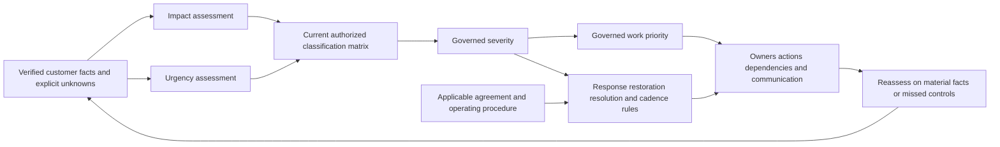
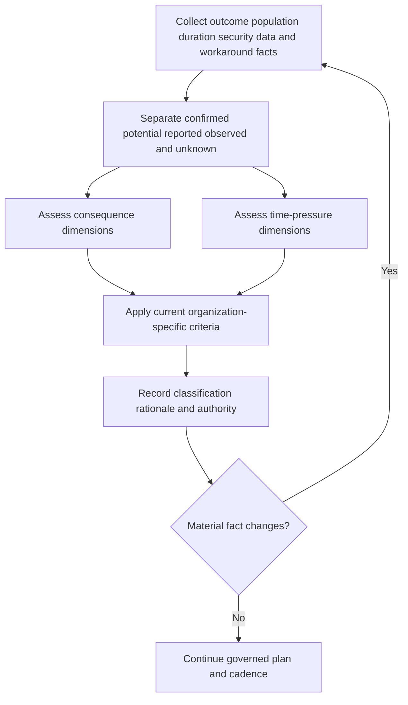
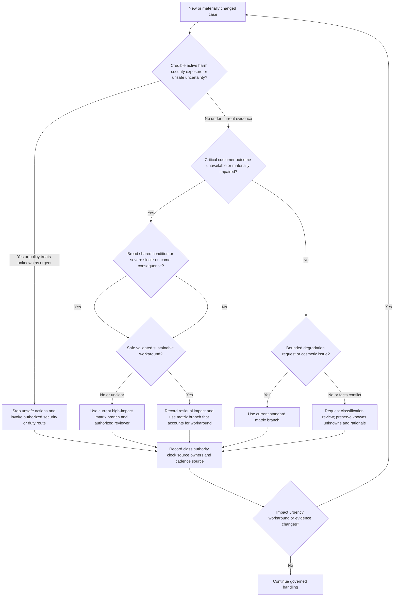
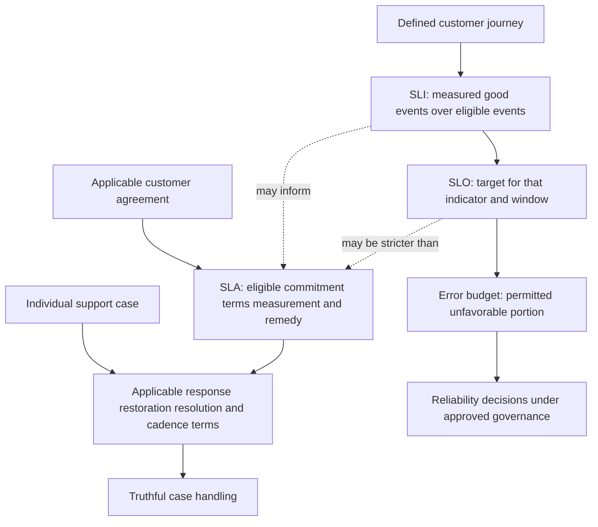
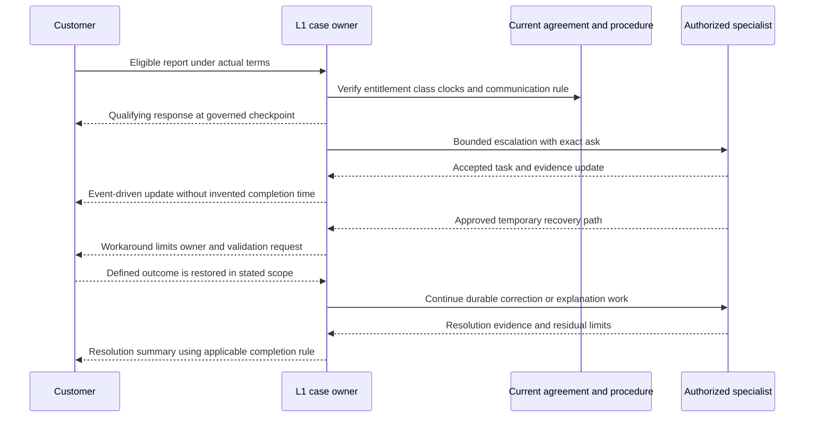
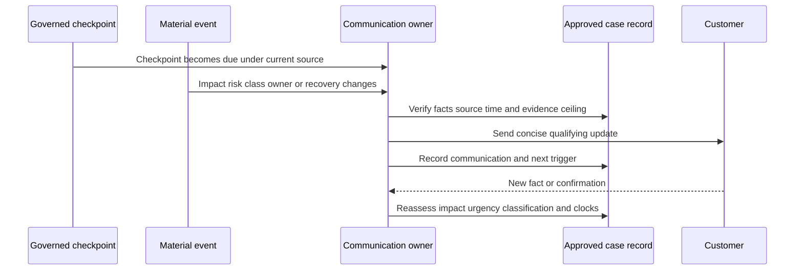
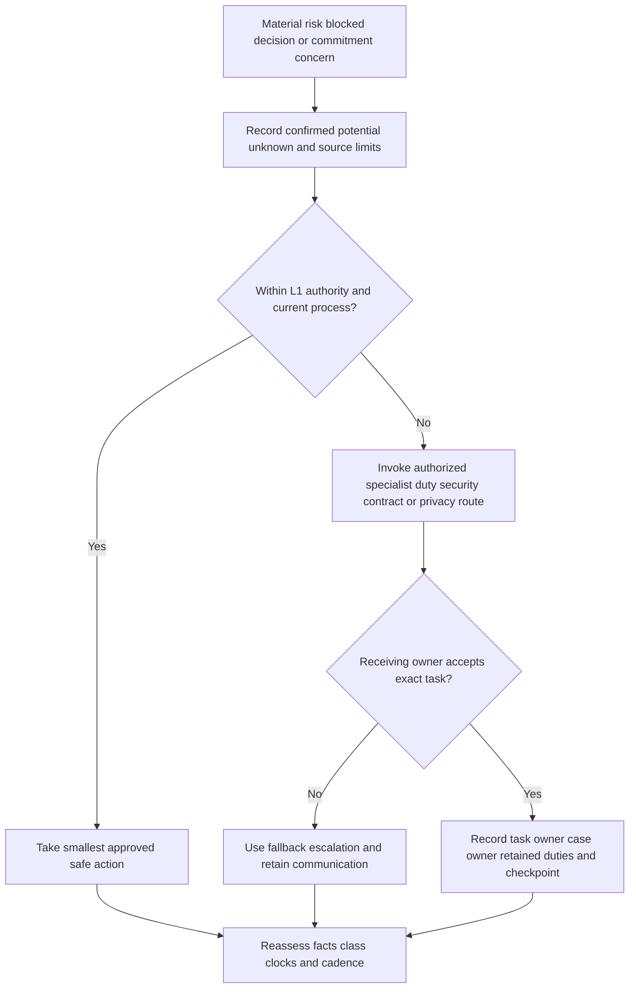
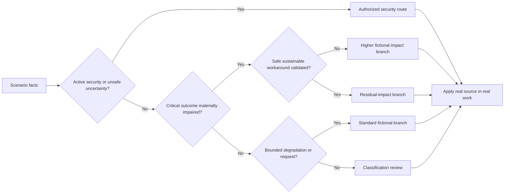
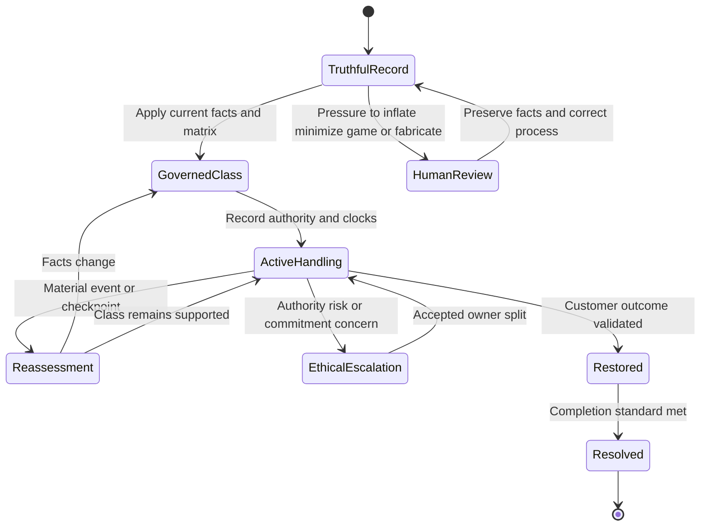
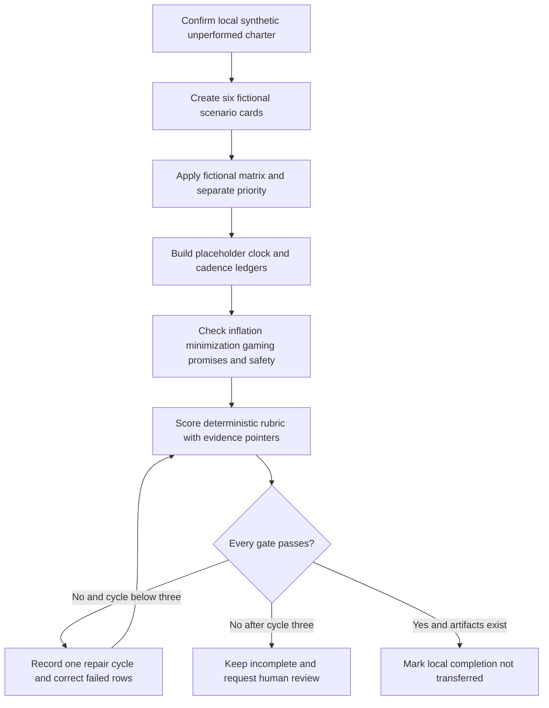

# Part 102 - Severity Priority Impact SLAs and SLOs

> **Purpose:** Build a product-neutral, evidence-based method for classifying a support matter, choosing its order of work, honoring documented service commitments, communicating at a governed rhythm, and escalating without exaggeration, minimization, queue manipulation, unsafe action, or invented promises.
>
> **Artifact honesty label:** **Local synthetic classification and communication design only.** Every organization, person, tenant, user, message, request, event, consequence, class, timestamp, threshold, clock, agreement, and result in this Part is fictional unless a public source is explicitly cited. The lab was not performed while this Part was authored. No Abnormal AI, Microsoft, customer, mailbox, identity, API, network, security, ticketing, contractual, or production system was accessed or changed. Arti may describe the lab as completed only after she actually creates the local fictional artifacts and records a deterministic Pass.
>
> **Currency and source access date:** August 24, 2026.

## Section goal

The title names several related concepts. This table defines every required term before the lesson relies on it. The definitions are deliberately product-neutral because each real organization controls its own labels, scales, clocks, exceptions, contracts, and authority.

| Term | Beginner-first definition | Everyday analogy | Why it matters | Where the analogy stops |
|---|---|---|---|---|
| **Impact** | The confirmed or credibly potential consequence to customers, people, business work, security, data, compliance obligations, or service outcomes | A road closure matters differently if it blocks one quiet driveway or the only route to a hospital | It describes what is affected and how seriously, before assigning a class | Digital consequences can be hidden, cascading, uncertain, or security-sensitive; population size alone is not enough |
| **Urgency** | How quickly an authorized decision or action is needed to prevent harm, reduce worsening consequences, preserve evidence, or meet a real time constraint | A leaking pipe needs faster action while water is still spreading than after the supply is safely isolated | It captures time pressure separately from consequence size | Customer anxiety, executive attention, or ticket age can increase communication needs without proving technical urgency |
| **Severity** | An organization-governed classification of the seriousness of a matter, usually based on impact, urgency, risk, scope, workaround, and uncertainty | Emergency departments use triage categories to coordinate the right response | It aligns handling, expertise, communication, and escalation | There is no universal scale; `Severity 1`, `P1`, colors, and words can mean different things in different organizations |
| **Priority** | The governed order in which work should be addressed relative to other work, considering severity plus commitments, dependencies, age, strategic obligations, safety, and available capacity | A dispatcher orders several valid jobs rather than pretending only one exists | It converts classification into responsible queue and resource decisions | Priority is not personal importance, customer fame, engineer preference, or a license to hide other work |
| **Service-level agreement (SLA)** | A documented service commitment between defined parties that states eligible services, measures, targets, responsibilities, exclusions, remedies, and other terms | A delivery contract says which parcels qualify, how time is measured, and what happens if the commitment is missed | It controls promises and entitlement when the applicable agreement says it does | A generic policy page, marketing statement, internal goal, or memory of another customer is not the customer’s applicable agreement; Support should not offer legal interpretation |
| **Service-level objective (SLO)** | A measurable reliability or service-performance goal for a defined service and measurement window | A transit operator aims for a stated percentage of trains to arrive within a defined window | It gives a team a target for operating and improving a service | An internal objective is not automatically a customer promise, and one aggregate objective may not represent an individual customer’s experience |
| **Service-level indicator (SLI)** | The measured signal used to evaluate a service outcome, including a precise numerator, denominator, population, source, and window | A station clock and arrival record provide the measurement used for the punctuality goal | A target is meaningless without a reproducible measurement | A metric can be sampled, delayed, biased, incomplete, or disconnected from the user journey |
| **Error budget** | The amount of unfavorable service performance permitted by an SLO over its defined window, often calculated as one minus the target proportion | A project reserves a limited amount of schedule variance while protecting its delivery goal | It supports reliability tradeoffs and prompts action when consumption is too fast | It is not permission to ignore customer harm, hide incidents, spend unreliability deliberately, or override contracts and security duties |
| **Response** | A meaningful, accountable communication or action that confirms ownership, reflects current facts, and identifies the next controlled step | A clinician saying what has been assessed and what examination comes next, not merely that a form arrived | It distinguishes decision value from an automated receipt | The applicable agreement or procedure defines what counts and when its clock starts, stops, or pauses |
| **Restore** | Return the affected customer outcome or service capability to an acceptable operating state, possibly through a temporary approved path | A detour reopens travel before the damaged bridge is rebuilt | It reduces present consequence quickly | Restoration does not prove root cause, permanence, full recovery, or that every affected population is healthy |
| **Workaround** | A documented temporary method that reduces or avoids the symptom without necessarily removing its underlying cause | A safe detour around road construction | It can reduce impact while durable work continues | A workaround must not bypass security, expand privilege, create hidden risk, or be called a permanent fix |
| **Resolve** | Address the reported matter to the agreed evidence standard, which may mean a durable correction, an accepted explanation, fulfillment of a valid request, or a verified supported outcome | Repairing the bridge, validating it, and documenting remaining limits | It anchors closure to the actual customer outcome | Resolution is not merely an internal status, code deployment, quiet period, or one unrelated successful test |
| **Cadence** | The planned rhythm and event triggers for communication, review, and follow-through | A departure board refreshes on schedule and also when the gate changes | It prevents avoidable silence and makes ownership observable | No universal interval is safe to invent; current policy, agreement, facts, audience, and risk control the rhythm |
| **Breach** | In service management, a verified failure to meet an applicable measured commitment under its actual terms; in security, the word may instead mean unauthorized compromise or disclosure and must be qualified | Missing a contractual delivery window is different from someone breaking into the warehouse | Precise wording prevents a missed support target from being confused with a data or security event | L1 should not declare either kind from intuition; the applicable clock owner, contract owner, security lead, privacy lead, or legal authority may need to decide |
| **Escalation** | A governed increase or change in authority, expertise, urgency, visibility, coordination, or decision ownership | A dispatcher brings in a specialist team and supervisor while keeping the caller informed | It gets the right decision-maker involved without losing continuity | Escalation does not automatically transfer the case, prove higher severity, authorize disclosure, or guarantee a completion time |

The central analogy is **emergency-department triage joined to a delivery contract**. Triage evaluates consequence and time pressure so the right expertise acts in the right order. The delivery contract defines what was promised and how performance is measured. The analogy is useful because classification and commitment are related but different. It stops being accurate because software services are distributed, effects can be intermittent, security risk can be uncertain, one customer can have several agreements, measurements can lag, and Support cannot diagnose, promise, or change systems outside assigned authority.

The goal is not to memorize a universal matrix. By the end of this Part, Arti should be able to collect accurate inputs, apply the current organization’s matrix, separate classification from queue ordering, distinguish customer commitments from internal reliability goals, track the right clocks, choose truthful communication triggers, reassess when facts change, and escalate ethically. She should never fabricate a promised estimated time of arrival, abbreviated **ETA**, a contractual entitlement, an owner’s acceptance, or an organization-specific target.

This Part prohibits impact inflation, impact minimization, queue gaming, fabricated status, unsupported commitments, invented contract terms, unapproved clock manipulation, security-control bypass, harmful changes, destructive tests, and use of customer secrets or unnecessary customer content. It also prohibits treating executive attention, customer tier, social pressure, or a loud communication style as proof of technical severity. Those factors can require coordination or communication, but classification must remain tied to authorized criteria and evidence.

## JD Mapping

| Supplied role signal | Capability developed here | Observable support behavior | Honest practice artifact |
|---|---|---|---|
| Enterprise L1 ticket ownership | Classifies and continually reassesses a case using approved rules | Records confirmed impact, potential impact, urgency, uncertainty, rationale, approver, and next review trigger | Local synthetic classification worksheet |
| Timely customer updates | Selects time-driven and event-driven communication without inventing intervals | Uses the applicable documented checkpoint and sends an earlier update when material facts change | Product-neutral update-cadence matrix |
| Configuration and API tickets | Separates inconvenience from material service impairment | Evaluates workflow criticality, affected cohort, workaround safety, duration, trend, and dependencies | Fictional configuration and API scenarios |
| Behavioral false-positive cases | Considers business interruption and security-control tradeoffs | Avoids broad allowlisting or reduced protection merely to lower visible impact | Security-sensitive classification card |
| Threat investigations | Routes credible active harm before complete certainty | Stops unsafe replay, preserves minimum evidence, and invokes the authorized security process | Fictional urgent-security route |
| Customer trust | Makes uncertainty, commitments, and limitations explicit | Never promises a completion time or contractual remedy without current authority | Update templates with controlled placeholders |
| Engineering and Product collaboration | Escalates the right question with classification rationale | Includes impact, urgency, timeline, workaround, evidence ceiling, exact ask, owner split, and communication checkpoint | Synthetic escalation packet |
| Recommendations | Distinguishes immediate restoration from durable correction | Labels temporary paths, residual risk, validation owner, and expiration condition | Restoration-versus-resolution worksheet |
| Postmortem and recurring-pattern work | Separates an individual ticket target from aggregate service reliability | Preserves target measurement, missed controls, and systemic follow-up without blame | Fictional clock and SLI ledger |
| Support metrics and quality | Recognizes metric gaming and countermeasures | Refuses premature downgrade, duplicate-ticket clock resets, silent pauses, or false resolution | Anti-gaming review table |
| Microsoft enterprise support background | Transfers calm critical-case coordination and customer communication | Uses a genuine Microsoft example only within its actual product, action, role, and result boundaries | Candidate transfer statement |
| Abnormal AI learning goal | Uses public context but defers operational details | Does not invent an Abnormal severity scale, response interval, contract, queue, entitlement, or internal route | Source-and-boundary ledger |

## Candidate honesty note

Arti can truthfully transfer methods from five years of Microsoft enterprise support: clarifying customer consequence, coordinating CRITSIT work, maintaining customer and partner updates, managing dependencies, collaborating with Engineering or Product, validating a corrective outcome, and analyzing CSAT, backlog, and case quality. If she uses a real example, she should state the Microsoft product, her exact responsibility, what she personally observed or did, what another team owned, and the real outcome she can defend.

That experience does not establish Abnormal AI production operation, security-incident command, contract interpretation, an Abnormal severity matrix, ticket priority scale, queue rule, SLA, SLO, SLI, error-budget policy, clock behavior, response interval, restoration target, resolution target, after-hours route, entitlement, remedy, escalation authority, or customer communication policy. Microsoft terminology and CRITSIT practice do not define another company’s process. Public Abnormal pages support only high-level product context, not private operational promises.

A strong interview bridge is:

> “In Microsoft enterprise support, I learned to separate verified business impact from urgency, use the current critical-case process, keep owners and customer checkpoints visible, and avoid promising a resolution date that the evidence or owning team could not support. I have not operated Abnormal’s support process in production, so I would not import Microsoft labels or invent an Abnormal target. I would apply the same evidence discipline through Abnormal’s current severity matrix, customer agreement, security route, and approved communication process.”

| Evidence tier | Safe candidate wording | Evidence available | Claim that would exceed the evidence |
|---|---|---|---|
| Microsoft production transfer | “I coordinated high-pressure Microsoft enterprise support work, communicated with customers and partners, and collaborated with Engineering or Product.” | CV-supported work plus a truthful story Arti can explain | “I know Abnormal’s critical-case process because it must work like Microsoft’s.” |
| Local synthetic lab | “After I actually complete it, I built and validated a fictional classification and cadence packet offline.” | Learner-authored local Markdown plus a passing rubric | “I met a real customer SLA” or “I managed an Abnormal Severity 1 case.” |
| Learned architecture | “Official SRE material helps me explain SLI, SLO, and error-budget concepts.” | Dated official sources with explicit limits | “Abnormal uses this SLI formula, objective, or error-budget policy.” |
| No direct experience | “I have not used Abnormal’s internal matrix or contracts; I would verify the current approved source.” | Honest gap and a concrete ramp method | Inventing a level, clock, interval, entitlement, remedy, or route |
| Proposed behavior | “I would document knowns and unknowns, apply the current matrix, and request an authorized review if the evidence is ambiguous.” | Product-neutral decision method | “I would always declare P1 when a customer asks” or another universal rule |
| Commitment language | “The next update will follow the applicable documented checkpoint, or sooner on a material change.” | A safe template awaiting a real source | “We guarantee restoration in two hours” without an applicable authorized commitment |

## 1. Impact and urgency are evidence inputs

Impact describes consequence. Urgency describes time pressure. They often move together, but not always. One unavailable optional report may have broad scope and low immediate urgency. One compromised privileged identity may involve a single person and require immediate security routing. The assessment must preserve both **confirmed** facts and **credible potential** consequences without converting uncertainty into certainty.

### Impact dimensions

| Dimension | Questions to ask | Strong neutral record | Dangerous shortcut |
|---|---|---|---|
| Customer outcome | Which task, security decision, or service outcome cannot occur as expected? | “Approved message-review workflow is unavailable to three confirmed analyst aliases.” | “Customer is down.” |
| Population | How many are confirmed affected, potentially affected, unaffected, and unknown? | “3 confirmed; 2 matched controls healthy; tenant-wide scope unknown.” | “Everyone” based on one report |
| Criticality | What business or safety function depends on the outcome? | “Payment approval is delayed; payment release remains under customer control.” | Inventing revenue, executive, legal, or regulatory consequence |
| Security | Is harmful activity ongoing, plausible, contained, or unknown? | “One credible report of possible unauthorized activity; security owner assessment pending.” | Declaring either “breach” or “safe” without authority |
| Data | Is information unavailable, changed, exposed, deleted, delayed, or merely not visible? | “Display is empty; authoritative data state is not yet known.” | Calling a display failure data loss |
| Duration | What interval is confirmed, and what is merely suspected? | “Observed from 14:05 to 14:27 UTC in three authored events.” | Using ticket age as outage duration |
| Trend | Is consequence stable, improving, worsening, intermittent, or unknown? | “Affected requests increased from one cohort to two; denominator remains unknown.” | “Rapidly spreading” without comparable counts |
| Workaround | Is an approved alternative available, safe, sustainable, and validated? | “Read-only alternate report is available; it does not support the required write action.” | Calling any bypass or manual risk transfer a workaround |
| Dependency | Does a deadline, evidence-retention window, attacker action, or external service change the consequence? | “Existing source retains the relevant interval until the approved review point.” | Fabricating a deadline to gain queue position |
| Customer statement | Which consequences are reported by an authorized customer contact, and which are observed by Support? | “Customer reports payroll delay; Support has verified only the access failure.” | Presenting reported loss as independently verified |

Potential impact matters most when waiting for certainty could permit material harm. It must still be bounded. “Potentially all users” is weak if the path, cohort, and conditions are unknown. Better wording is: “The same shared policy may apply to 4,000 accounts, but only three failures are confirmed; an authorized owner is determining whether the affected condition is common.” That sentence neither minimizes the risk nor promotes possibility into fact.

### Urgency dimensions

| Dimension | Higher time pressure when | Lower time pressure when | Required evidence caution |
|---|---|---|---|
| Active harm | Compromise, unauthorized action, exposure, or harmful interaction may be continuing | Harm has been safely contained by the authorized owner | L1 must not claim containment from silence or one blocked event |
| Worsening rate | Comparable observations show increasing population or consequence | State is stable under a verified safe condition | Use denominators and intervals; do not narrate isolated events as a trend |
| Time-bound workflow | A real customer deadline or operational window is near | The work can safely wait without added consequence | Record source and consequence; “executive wants it” is not enough |
| Evidence decay | Relevant approved evidence may expire or be overwritten soon | Evidence is preserved through the needed window | Never collect excessive content merely because retention is uncertain |
| Workaround durability | Temporary path is failing, unsafe, costly, or expiring | Approved alternative remains safe and sustainable | A workaround can reduce urgency without erasing severity or durable work |
| Decision dependency | Another team must act before a narrow window closes | Required owner and input are available later without consequence | Do not invent another team’s acceptance or completion time |
| Security response | The authorized playbook calls for immediate routing | The security lead has documented a lower handling state | Security escalation follows the approved route, not a support-made verdict |
| Customer communication | Facts or risk changed materially and silence would mislead | No material event occurred before the next governed checkpoint | “No change” can still be a useful truthful update at the real checkpoint |

### 🔍 Plain-English deep-dive: Large scope is not automatically the highest impact

Imagine two power problems. In the first, lights are out in 500 empty storage units during daylight, with a safe alternate site available. In the second, one operating room loses power during surgery. The first has larger scope; the second has more severe immediate consequence. Population is one input, not the entire judgment.

The same applies to support. A problem affecting one privileged identity, one payment process, one security control, or one evidence source can be highly consequential. Conversely, a broad cosmetic defect may be frustrating but not materially prevent work. The analogy stops because digital systems can cascade rapidly and one apparently cosmetic symptom may hide a deeper condition. That is why unknowns, trend, dependencies, and security context must be recorded.

An ethical assessment avoids two opposite errors:

- **Impact inflation:** turning possibility into confirmation, multiplying one report into every user, inventing monetary loss, using a famous customer or executive title as technical evidence, or describing ordinary inconvenience as active security harm.
- **Impact minimization:** ignoring a single critical identity, calling an unvalidated or unsafe path a workaround, treating lack of telemetry as lack of harm, downgrading because Engineering has the case, or declaring restoration before the customer outcome is checked.

## 2. Severity and priority are governed decisions

Severity and priority answer different questions. Severity asks, “How serious is this matter under the current criteria?” Priority asks, “In what order and with what resource attention should this work proceed?” Many organizations use the same-looking labels for both, and some use `P1` to mean the highest severity while others reserve `P` for queue priority. Never translate a label by intuition.

| Dimension | Severity | Priority |
|---|---|---|
| Primary question | How serious is the consequence and time pressure? | What should be worked next relative to other governed work? |
| Common inputs | Impact, urgency, risk, scope, workaround, duration, uncertainty | Severity, applicable commitments, dependencies, aging, safety, fairness, capacity, required expertise |
| Typical owner | Defined support, incident, security, or duty-management authority | Queue owner, support lead, incident lead, or authorized operational process |
| Change trigger | Material change in consequence, scope, urgency, security, workaround, or certainty | Severity change plus dependency, commitment, aging, capacity, or coordination change |
| Ethical risk | Inflation or minimization | Favoritism, starvation, duplicate manipulation, or chasing easy closures |
| Customer visibility | Depends on current policy and agreement | Internal ordering may not be a customer-facing promise |
| What it is not | Emotion, fame, escalation count, product difficulty | Personal preference, easiest work, loudest requester, or oldest item alone |

### Organization-specific matrices

A matrix is a decision aid created by an organization. It can combine impact rows and urgency columns, use named conditions, or require specialist approval. Real matrices may differ by product, customer contract, support plan, region, channel, business hours, security context, or incident type. Some allow L1 to assign an initial class; others require a duty manager, incident commander, or security lead to confirm it.

This Part uses fictional classes `F-A`, `F-B`, `F-C`, and `F-D` only for a local tabletop. They do not correspond to `Sev 1`, `P1`, Abnormal, Microsoft, ITIL, or any real organization. Their purpose is to practice reasoning without smuggling in a target.

| Fictional training class | Synthetic condition for this exercise only | Required fictional handling principle | Not implied |
|---|---|---|---|
| `F-A` | Credible active high consequence or severe security uncertainty requiring immediate authorized coordination | Stop unsafe work, invoke the fictional duty route, maintain the placeholder governed communication rhythm | No real response interval, entitlement, remedy, or Abnormal level |
| `F-B` | Material workflow impairment or credible expanding risk without the `F-A` condition | Coordinate named owners, test safe restoration options, and reassess on every material event | No universal “major incident” definition |
| `F-C` | Bounded impairment with a safe sustainable alternative or moderate consequence | Continue planned diagnosis, document the alternative and its limits, and follow the placeholder case checkpoint | No assumption that all customers receive the same handling |
| `F-D` | Low-consequence question, request, cosmetic issue, or information need with no credible active harm | Fulfill through the approved ordinary workflow and communicate expectations honestly | No permission to ignore, starve, or close without an answer |

### Severity decision tree

The following tree is a **method**, not a production policy. At every decision, “yes” means supported by the current organization’s required evidence standard; “unknown” can itself require a risk-aware authorized review.

### Classification record

| Field | Required content | Example using fiction | Failure pattern |
|---|---|---|---|
| Customer outcome | Exact expected versus actual behavior | “Synthetic approval operation returns `unavailable` instead of accepted.” | “Platform broken” |
| Confirmed impact | Observed consequence and bounded population | “2 of 5 authored aliases cannot complete the operation.” | “Potentially everyone” entered as confirmed |
| Potential impact | Plausible consequence and path, labeled uncertain | “Shared policy could affect the remaining aliases; not yet tested.” | Omitting risk because it is not proved |
| Urgency | Time-sensitive harm, deadline, evidence, or trend | “Fictional evidence window closes at authored checkpoint `E-3`.” | Fabricated customer deadline |
| Workaround | Safety, validation, sustainability, owner, and limits | “Read path works; write outcome remains blocked.” | Broad privilege or bypass called a workaround |
| Matrix source | Current approved version and scope | `[CURRENT_MATRIX_ID_FROM_SYSTEM_OF_RECORD]` | A remembered chart from another role |
| Initial class | Exact organization label | `F-B` in local exercise only | Translating labels between employers |
| Authority | Who assigned or approved it | `fictional-duty-role` | Invented acceptance |
| Rationale | Criteria matched and facts not matched | “Material workflow impaired; no active harm; no complete alternative.” | “Customer requested it” |
| Unknowns | Facts that could change classification | “Shared-policy scope and alternate-path durability unknown.” | Blank fields that imply checked-negative |
| Reassessment triggers | Material events that require review | “New affected cohort, active harm, safe restoration, or failed alternative.” | Set once and forgotten |
| History | Previous class, time, reason, and approver | Append-only fictional entries | Editing history to improve metrics |

### 🔍 Plain-English deep-dive: A VIP is a communication fact, not a physics law

An executive or strategic customer can require faster coordination, an account-team notification, or a different communication audience. That does not automatically change the technical consequence. A password reset for one executive is not necessarily more severe than an outage blocking a safety-critical workflow for ordinary users. At the same time, the executive’s workflow may genuinely be critical; the impact facts, not the title alone, should show why.

Think of an airline. A famous passenger may receive dedicated customer service, but air-traffic control still prioritizes aircraft based on safety and operational rules. The analogy stops because support agreements can legitimately provide different eligible services or communication commitments. Those differences must come from the applicable agreement and authorized process, never social pressure or assumption.

## 3. SLA, SLO, SLI, and error budget are not synonyms

These four concepts belong to two related but different conversations. An SLA describes a documented commitment and its terms between defined parties. An SLO is a service goal. An SLI is the measurement used to evaluate an objective. An error budget describes how much unfavorable performance an objective permits during its window. A support ticket may also have response or restoration commitments, but those do not automatically equal the underlying service’s availability objective.

### Writing an SLI precisely

A common event-based form is:

$$
SLI = \frac{\text{eligible good events}}{\text{eligible valid events}}
$$

That formula is incomplete until “eligible,” “good,” “valid,” the source, the window, and exclusions are defined. A latency indicator might count valid requests completed below a threshold. An availability indicator might count successful eligible operations. A freshness indicator might measure whether data arrives within an allowed delay. A ticket-response metric might measure qualifying cases receiving a qualifying response within an applicable clock, but the organization must define each term.

| SLI component | Question that must be answered | Synthetic example | Hidden risk |
|---|---|---|---|
| User journey | Which customer outcome matters? | “Authorized read operation returns the expected representation.” | Measuring server uptime while users cannot complete the task |
| Population | Which events are eligible? | “Valid authored read events in fixture `S-102`.” | Quietly excluding difficult cohorts |
| Good event | What exact result counts? | “Expected status and schema within fictional threshold `L`.” | Treating partial or stale output as success |
| Bad event | What does not meet the criterion? | “Eligible event outside status, schema, or threshold.” | Counting client-invalid requests as service failures without design intent |
| Source | Which telemetry is authoritative? | “Local authored ledger, not a real service.” | Sampled or missing telemetry presented as complete |
| Window | Over what interval is it evaluated? | “Ten fictional periods `W1` through `W10`.” | Resetting the window after poor performance |
| Exclusions | Which events are removed and why? | “None in the lab; real exclusions require documented rules.” | Retroactive exclusion to protect a target |
| Aggregation | How are regions, tenants, operations, and retries combined? | “Each eligible authored operation counted once.” | Retries inflate denominator or hide user-visible failure |

### Error-budget calculation

For a proportion-based synthetic objective:

$$
\text{Error budget proportion} = 1 - \text{SLO target proportion}
$$

If a fictional service had a `99.9%` objective over a fictional 30-day window, the simple time-equivalent budget would be:

$$
(1 - 0.999) \times 30 \times 24 \times 60 = 43.2\text{ minutes}
$$

This is arithmetic training only. It is not an Abnormal, Microsoft, customer, contract, availability, or support target. Real indicators may be event-based rather than time-based; windows can roll; partial failures can affect selected operations; planned events and exclusions require explicit terms; and multiple indicators can exist. A support engineer should not convert this example into a promised outage allowance.

### 🔍 Plain-English deep-dive: An objective is not a coupon owed to every ticket

Suppose a city aims for 99% of eligible trains to arrive within a defined tolerance. That objective helps the operator manage the system. A passenger on one late train still experienced a real failure. The aggregate objective does not tell the passenger that their trip was “within budget,” nor does it automatically define compensation. Compensation depends on the actual customer terms.

Similarly, an error budget helps a service team reason about reliability and change risk. It is not a pool of downtime that Support can spend, a reason to minimize a customer’s experience, or a guarantee that an individual request will succeed. An SLA may reference a different measurement and remedy; a ticket target may be different again. The analogy stops because cloud services can have many operations, regions, tenants, dependencies, and measurement layers.

### Commitment-verification checklist

| Verification point | Question | Safe handling when unknown |
|---|---|---|
| Parties | Which customer entity and provider entity does the term cover? | Ask the authorized contract or account owner; do not infer from email domain |
| Eligible service | Which product, plan, feature, region, and channel qualify? | State that applicability is unverified |
| Target | What exact measured commitment applies? | Use a placeholder, never a remembered number |
| Clock start | Which event begins measurement? | Keep candidate times separate until the authoritative rule is known |
| Clock stop | Which event satisfies the target? | Do not use an internal status unless the terms define it |
| Pause | Are customer-waiting, maintenance, unsupported use, or other periods excluded? | Do not pause or manipulate state without the documented rule |
| Calendar | Business hours, continuous hours, holidays, and time zone? | Preserve UTC events and seek authoritative interpretation |
| Measurement source | Which system or record decides performance? | Do not substitute a personal spreadsheet for the system of record |
| Remedy | Is any remedy defined, and who decides eligibility? | Route to authorized commercial or contract owner; do not promise credit |
| Version | Which agreement and policy version was effective? | Preserve date and revalidate current terms |
| Conflict | What happens when documents disagree? | Escalate to the authorized owner and avoid choosing the favorable text |

## 4. Response, restoration, workaround, and resolution targets

One case can have several independent clocks. A first meaningful response can be due before a service is restored. A restoration can occur through a temporary path while durable investigation continues. Resolution can require a validated correction, accepted explanation, request fulfillment, or formal outcome under the case process. Communication checkpoints can continue throughout.

No interval in this Part is a real target. The symbolic labels below must be replaced only from current authorized sources in real work.

| Target or checkpoint | What it measures | Candidate start | Candidate stop | Never assume |
|---|---|---|---|---|
| Acknowledgment checkpoint | Receipt and initial ownership visibility if separately defined | Applicable eligible receipt event | Qualifying acknowledgment under current rule | An automated email is a meaningful response |
| Response target | Time to a qualifying accountable response | Contract- or policy-defined eligible event | Defined response with required content | Any agent note stops the clock |
| Restoration target | Time to return the defined outcome to acceptable use | Defined impairment event or eligible report | Verified restored outcome under terms | A code change or workaround proposal equals restoration |
| Workaround checkpoint | Time to identify, approve, communicate, and validate a temporary path if the process tracks it | Applicable case or incident event | Approved validated alternative with limits | Unsafe bypass counts as success |
| Resolution target | Time to address the matter to the defined completion standard | Applicable case event | Qualifying verified resolution | Internal “resolved” status proves customer success |
| Update checkpoint | Latest governed time for the next status communication | Prior qualifying update or event under policy | Qualifying customer update | Silence is acceptable because no fix exists |
| Event-driven update | Communication triggered by a material change | New fact, class, risk, owner, workaround, restoration, or missed dependency | Qualifying communication and record | Wait until the normal checkpoint when facts materially changed |

### Clock ledger

| Clock ID | Type | Governing source | Start evidence | Stop evidence | Pause/exclusion | Current state | Authority | Uncertainty |
|---|---|---|---|---|---|---|---|---|
| `CLK-102-A` | Response | `[CURRENT_AUTHORIZED_SOURCE]` | `[ELIGIBLE_EVENT_AND_UTC]` | `[QUALIFYING_EVENT_AND_UTC]` | `[DOCUMENTED_RULE_OR_NONE_KNOWN]` | `UNVERIFIED` | `[AUTHORIZED_ROLE]` | Terms not supplied in local exercise |
| `CLK-102-B` | Restoration | `[CURRENT_AUTHORIZED_SOURCE]` | `[DEFINED_IMPAIRMENT_EVENT]` | `[CUSTOMER_OUTCOME_VALIDATION]` | `[DOCUMENTED_RULE_OR_NONE_KNOWN]` | `UNVERIFIED` | `[AUTHORIZED_ROLE]` | Restoration standard not supplied |
| `CLK-102-C` | Resolution | `[CURRENT_AUTHORIZED_SOURCE]` | `[DEFINED_CASE_EVENT]` | `[QUALIFYING_RESOLUTION_EVIDENCE]` | `[DOCUMENTED_RULE_OR_NONE_KNOWN]` | `UNVERIFIED` | `[AUTHORIZED_ROLE]` | Closure and resolution may differ |
| `CLK-102-D` | Update | `[CURRENT_CADENCE_SOURCE]` | `[LAST_QUALIFYING_UPDATE]` | `[NEXT_QUALIFYING_UPDATE]` | `[DOCUMENTED_RULE_OR_NONE_KNOWN]` | `PLANNED_PLACEHOLDER` | `[COMMUNICATION_OWNER]` | No interval invented |

### Honest ETA handling

An ETA is useful only when the owning process or person has enough control and evidence to make it reliable and the speaker is authorized to communicate it. Investigation often contains discovery work whose duration is not known. Support can still be decisive about the next action and next communication checkpoint.

| Customer asks | Unsafe answer | Truthful answer pattern |
|---|---|---|
| “When will it be fixed?” | “Within two hours” based on hope or a previous case | “A final correction time is not yet supported. The current owner is testing `[bounded milestone]`; I will update at the applicable documented checkpoint or sooner if restoration, risk, or ownership changes.” |
| “Is this covered by our contract?” | “Yes, this is definitely an SLA case.” | “I have not verified the applicable entitlement and terms. I will route that question to the authorized contract/account owner while continuing technical handling.” |
| “Will we receive service credit?” | “Yes, because the timer was missed.” | “Eligibility and remedy require the applicable agreement, authoritative measurement, and authorized review. I cannot promise a credit.” |
| “Is the service restored?” | “Engineering deployed a fix, so yes.” | “A change was reported. Restoration remains unconfirmed until the defined customer outcome is safely validated in the affected scope.” |
| “Is it permanently resolved?” | “No alerts for an hour means it is fixed.” | “The observed outcome is healthy for the stated interval. Permanence and root cause are not established beyond that evidence.” |

### 🔍 Plain-English deep-dive: A checkpoint is controllable; a repair date may not be

A package carrier can reliably promise, “I will scan and report the parcel’s next known location by the next tracking checkpoint,” even if a storm prevents an honest delivery estimate. The checkpoint is an action the carrier controls. The delivery date depends on uncertain conditions.

Support should use the same distinction. It can commit to checking an evidence source, following up with an accepted owner, updating the customer under the applicable rule, or escalating a missed dependency. It must not transform a plan into a repair guarantee. The analogy stops because support may itself be governed by contractual targets; those targets still need to come from the actual agreement rather than an invented interval.

## 5. Cadence, reassessment, and ethical escalation

Good cadence combines **time-driven** checkpoints from current policy or explicit agreement with **event-driven** updates when a material fact changes. It does not generate repetitive messages merely to stop a timer. Each update should add decision value: current impact, what changed or did not, work completed, evidence, next action, owner, dependency, safety, and next governed checkpoint.

### Material-event triggers

| Event | Why it changes communication | Required review | Prohibited leap |
|---|---|---|---|
| Confirmed population expands or contracts | Consequence and resource needs may change | Impact, severity, priority, owner, cadence | “Global outage” without denominator |
| Credible security concern appears | Ordinary troubleshooting may become unsafe | Authorized security route, evidence handling, incident ownership | L1 declares breach, compromise, or containment |
| Safe workaround is validated | Immediate consequence or urgency may reduce | Residual impact, sustainability, expiration, class under current rules | Downgrade automatically or call it resolved |
| Workaround fails or weakens a control | Harm can return or increase | Stop condition, security/change owner, class, escalation | Keep using it to protect metrics |
| Specialist accepts or rejects the task | Dependency and ownership split changed | Exact ask, retained duties, next follow-up | Invent accepted ownership or completion date |
| Hypothesis is disproved | Plan and expected milestone changed | Next discriminating action and evidence ceiling | Pretend routine progress occurred |
| Restoration is reported | Customer outcome may have changed | Safe validation in original scope | Declare restoration from internal report alone |
| Applicable target may be missed | Commitment risk and transparency increase | Authoritative clock, contract owner, escalation, customer wording | Reset clock, pause status, or conceal risk |
| Customer supplies a new deadline | Time pressure may be real | Verify source, consequence, feasibility, authority | Promise to meet it merely to de-escalate |
| No material change by checkpoint | Silence would break trust or terms | State unchanged facts, blocker, owner, and next controlled action | Fabricate activity or repeat “investigating” alone |

### Ethical escalation

Ethical escalation gets the right authority involved because the facts, risk, commitment, or blocked decision justify it. It does not manufacture urgency. An escalation packet should preserve the customer outcome, impact and urgency evidence, current class and rationale, applicable commitment source, clock state, attempted safe actions, workaround, active unknowns, exact specialist question, security/privacy limits, ownership split, and next communication trigger.

Escalate through the approved route when:

- credible active compromise, exposure, harmful interaction, payment action, security-control failure, or other security uncertainty requires specialized authority;
- the next evidence or action exceeds L1 permissions, handling authority, or technical depth;
- current authoritative behavior and reliable observation conflict;
- confirmed or potential impact crosses current organizational criteria;
- the class is ambiguous and delay could materially worsen consequence;
- the applicable response, restoration, resolution, or update control is at risk or may already have been missed;
- a workaround is unsafe, unsustainable, unsupported, expired, or transfers unacceptable risk;
- a customer asks for a legal, contractual, regulatory, attribution, breach, permanence, or remedy conclusion outside Support authority;
- a dependency is not accepted, misses its governed checkpoint, or lacks an owner;
- classification disagreement cannot be resolved from the current matrix and evidence.

## 6. Artifact: severity scenarios

The artifact below is a practice worksheet, not a real classification matrix. It uses only the fictional `F-A` through `F-D` labels already defined. In real work, replace the entire fictional rule set with the current authorized organization-specific matrix. Do not map these labels to any employer.

### Blank scenario card

| Field | Entry rule |
|---|---|
| Scenario alias | Obvious local fiction only |
| Expected versus actual | One neutral sentence; no guessed cause |
| Confirmed impact | Consequence, population, duration, and source |
| Potential impact | Credible path and uncertainty; never present as confirmed |
| Urgency | Active harm, trend, deadline, evidence, or dependency |
| Security/data state | `confirmed`, `reported`, `potential`, or `unknown`, plus authorized owner |
| Workaround | Safety, validation, sustainability, owner, limits, and expiration |
| Matrix source | `LOCAL_FICTIONAL_MATRIX_102` for this exercise only |
| Candidate class | `F-A`, `F-B`, `F-C`, or `F-D`, with matched criteria |
| Priority factors | Applicable fictional commitments, dependencies, fairness, and capacity |
| Required route | Fictional authorized owner class; no real person or queue |
| Clock source | Placeholder only; no invented interval |
| Communication triggers | Governed checkpoint placeholder plus material events |
| Unknowns | Facts capable of changing the class or action |
| Evidence ceiling | Strongest justified conclusion and what is not established |
| Prohibited actions | No secret/content use, bypass, harmful change, destructive test, or unsupported promise |

### Completed synthetic severity-scenario artifact

| Alias | Confirmed and potential consequence | Urgency and workaround | Fictional class and rationale | Priority and communication decision | Evidence ceiling |
|---|---|---|---|---|---|
| `SCN-102-A` | One authored privileged identity shows possible unauthorized action; broader scope unknown | Credible active security uncertainty; no Support-created containment claim; ordinary reproduction unsafe | `F-A` because the fictional matrix treats credible active high consequence or severe security uncertainty as immediate duty routing | Invoke fictional security owner, retain case communication, update at current placeholder rule and every material safety event | Possible unauthorized activity requires authorized assessment; no breach, attacker, cause, or containment established |
| `SCN-102-B` | Five authored analyst aliases cannot complete a material review workflow; two controls healthy; customer-wide scope unknown | Work continues only through a slow approved manual review; sustainability unknown | `F-B` because material workflow is impaired without the `F-A` condition | Run safe scope check and restoration work in parallel; use current placeholder high-impact communication source | Shared service failure and root cause remain unproved |
| `SCN-102-C` | Twenty authored users see a cosmetic label error; decisions and data remain correct in the fixture | No time-bound consequence; safe ordinary workflow remains available | `F-D` under the fictional criteria despite broad scope | Schedule fairly under ordinary queue rules; send governed acknowledgment and material-event updates | Cosmetic effect only in authored rows; real product behavior not represented |
| `SCN-102-D` | One authored payment approver cannot complete a time-bound approval; customer reports a deadline; payment remains under customer control | Critical single workflow; approved alternate approver is not yet validated | `F-B` because consequence matters more than small population; no active security fact | Verify deadline and alternate-path authority, route current owner, avoid promising business completion | Technical block is authored; financial loss and legal consequence are not established |
| `SCN-102-E` | Ten authored API clients receive intermittent failures; successful retries can create duplicate risk | Trend is uncertain; blind retry is unsafe; read-only status check is available | `F-B` until duplicate and expansion risk are bounded under fictional criteria | Stop uncontrolled retry, involve API owner, communicate changed risk immediately | Intermittence observed in fiction; vendor fault and customer-wide scope unproved |
| `SCN-102-F` | One informational question asks how a documented field should be interpreted | No service impairment or credible harm | `F-D`; complexity does not equal severity | Research current documentation and respond through ordinary governed flow | It may require Product interpretation, but urgency is not invented |

The artifact exposes several counterintuitive lessons. A one-user case can outrank a broad cosmetic issue. A successful retry can be unsafe if it duplicates state. A manual process can reduce immediate impact while increasing cost and residual risk. A hard technical question can remain low severity. A security-sensitive report can require immediate routing before complete scope is known, but L1 still must not declare a breach.

## 7. Artifact: update-cadence matrix

This matrix deliberately contains **no numerical interval**. Each placeholder must be resolved from the current applicable agreement or operating procedure. It combines time-driven and event-driven communication and makes the content of an update explicit.

| Case state | Time-driven source | Send sooner when | Minimum useful content | Reassess | Never say or do |
|---|---|---|---|---|---|
| Credible active security uncertainty | `[CURRENT_SECURITY_COMMUNICATION_PLAN]` | Harm, scope, containment status from authorized owner, evidence handling, or incident ownership changes | Confirmed facts, unknowns, safe customer action, authorized owner, next trigger | Security route, classification, evidence permissions, case owner | Declare breach, attacker, containment, eradication, or safety without authority |
| Highest current governed support class | `[APPLICABLE_HIGH_CLASS_CHECKPOINT]` | Impact, scope, workaround, owner, target risk, or restoration state changes | Outcome, current class rationale, completed work, evidence, next action, owner, dependency, checkpoint source | Impact, urgency, priority, clocks, specialist acceptance | Invent a universal interval or final repair time |
| Material impairment with limited alternative | `[APPLICABLE_MATERIAL_CASE_CHECKPOINT]` | Alternative fails, population grows, critical deadline is verified, or restoration is available | Residual impact, workaround limits, test result, owner, exact blocker, next decision | Workaround sustainability and class | Call the alternative a permanent fix or security bypass |
| Bounded issue with sustainable alternative | `[APPLICABLE_STANDARD_CASE_CHECKPOINT]` | Alternative degrades, new risk appears, or documented behavior conflicts | Current outcome, alternative status, investigation milestone, owner, next checkpoint | Whether priority or class should change | Downgrade solely to reduce update effort |
| Information or request workflow | `[APPLICABLE_REQUEST_CHECKPOINT]` | Requirement, entitlement, owner, or answer confidence changes | Restated question, source being checked, owner, limitation, next action | Correct work-item type and dependency | Treat complexity or requester status as severity |
| Waiting on customer | `[CURRENT_CUSTOMER_WAIT_RULE]` | Customer responds, impact changes, evidence expires, or waiting becomes unsafe | Exact item needed, why, safe format, prior request, parallel work, return path | Pause rule, class, deadline, closure policy | Manipulate status merely to stop a clock |
| Waiting on Engineering or Product | `[CURRENT_INTERNAL_DEPENDENCY_RULE]` | Task acceptance, new evidence, workaround, rejection, or missed checkpoint occurs | Exact accepted ask, current evidence ceiling, retained L1 work, customer consequence, next follow-up | Acceptance, fallback route, priority | Say “Engineering owns it” and disappear |
| Workaround validated | `[APPLICABLE_POST_RESTORE_RULE]` | Workaround fails, risk changes, permanent path arrives, or customer validates | Validation scope, temporary nature, risk, owner, expiration, durable work | Severity, urgency, restoration clock, resolution state | Mark permanently resolved automatically |
| Restoration reported but unvalidated | `[CURRENT_VALIDATION_CHECKPOINT]` | Customer test passes/fails or side effect appears | Change reported, exact validation needed, current unconfirmed state | Restoration evidence and residual scope | State “service restored” from deployment alone |
| Resolution candidate | `[CURRENT_RESOLUTION_COMMUNICATION_RULE]` | Validation, customer confirmation, residual risk, or linked work changes | Original outcome, evidence, scope, limits, remaining owner, return path | Resolution versus closure | Promise permanence beyond observation |
| Applicable target at risk or missed | `[CURRENT_BREACH_HANDLING_RULE]` | Authoritative clock changes, owner confirms status, or customer asks about remedy | Verified clock facts, uncertainty, escalation owner, technical plan, next communication | Contract/account review, class, priority, transparency | Reset clocks, hide risk, concede liability, or promise credit |

### Customer update skeleton

> **Current outcome:** `[confirmed customer consequence and scope]`  
> **What changed since the prior update:** `[material fact, or explicitly no material change]`  
> **Work completed and evidence:** `[approved action, observation, source, and limitation]`  
> **Current interpretation:** `[supports/weakens/remains unknown; no invented cause]`  
> **Restoration or workaround state:** `[none / proposed / approved / validated, plus limits]`  
> **Next action and owner:** `[specific action and authorized owner class]`  
> **Dependency or risk:** `[exact blocker and fallback]`  
> **Next communication:** `[applicable documented checkpoint or event trigger; never a made-up interval]`  
> **Commitment boundary:** `No final resolution ETA or contractual remedy is stated unless supplied and authorized.`

## 8. Worked scenarios and classification reasoning

Every scenario below is local fiction. The reasoning demonstrates inputs and caveats, not a vendor procedure. No described event occurred, and no label maps to Abnormal or Microsoft.

### Worked scenario A: one privileged identity and possible unauthorized action

**Input.** At authored time `T-A1`, one fictional administrator alias reports an action they do not recognize. The local fixture contains one corresponding event row. No real identity, message, tenant, content, IP address, session, or product is represented. Wider scope, intent, authentication state, and containment are unknown.

**Reasoning.** Confirmed population is one, but the possible consequence is high because the identity is privileged and the action may be unauthorized. Urgency is high because further activity and evidence decay are plausible. Ordinary reproduction, credential testing, account use, broad export, or simulated containment would be unsafe and outside this exercise. The fictional matrix selects `F-A` and invokes a fictional security owner. This does not prove compromise or a security/data breach.

**Communication.** State the confirmed event alias, customer report, unknowns, non-interaction requirement, authorized route, retained case owner, and current policy placeholder. Do not promise containment or completion. Update when the security owner accepts the task, when confirmed scope changes, when safe customer action is authorized, or at the applicable security communication checkpoint.

**Caveat.** In real work, the security playbook may supersede ordinary support classification. The incident owner, customer security owner, and product/security procedures control action and wording.

### Worked scenario B: broad cosmetic display issue

**Input.** Twenty fictional user aliases see an incorrect label in a local table. The underlying authored values, decisions, and exports remain correct. Ten matched rows show the same presentation issue. No deadline, security consequence, data modification, or blocked workflow is reported.

**Reasoning.** Scope is broad in the fixture, but consequence and urgency are low. The fictional matrix selects `F-D`. Priority should still be fair: age, recurrence, product-learning value, and applicable commitments can influence order, but the loudest user does not transform the effect. An engineer may find the code difficult; technical difficulty does not itself raise severity.

**Communication.** Acknowledge the visible issue, state that the exercise verifies presentation only, explain what remains correct, identify the next documentation or defect-routing step, and provide the placeholder governed checkpoint. Never say “no impact” when the confirmed impact is user confusion; say “no blocked operation, altered fixture value, or security consequence is currently observed.”

**Caveat.** If later evidence shows that the label drives a wrong security or business decision, classification must be reassessed immediately.

### Worked scenario C: material API impairment and unsafe retries

**Input.** Ten fictional clients perform an authored state-changing API operation. Six rows show a timeout-like result, and four show success. The fixture cannot prove whether a timed-out operation completed. Repeating blindly could create duplicate state. A read-only status operation exists in the fictional contract.

**Reasoning.** The customer outcome is materially impaired and uncontrolled retry can worsen consequence. The safe next action is not “retry until it works”; it is to stop blind retry, inspect the authored idempotency/status evidence, and involve the fictional API owner. `F-B` fits the local matrix. Potential scope is the cohort using this operation, not every API user.

**Restoration versus resolution.** A safe read-only reconciliation and approved idempotent path might restore the business workflow. That would not prove the cause or resolve the durability problem. A final resolution could require documented client handling, a service correction, or an accepted contract explanation, depending on evidence.

**Commitment handling.** The exercise supplies no SLA. The response, restoration, and resolution clock fields remain `[CURRENT_AUTHORIZED_SOURCE]`. No numeric target or ETA is stated.

### Worked scenario D: one time-bound approval workflow

**Input.** One fictional approver cannot complete an authored operation. The customer statement says a payroll approval window is approaching. No financial loss has occurred in the fixture. Another approver may be available, but authorization and separation-of-duty rules are unknown.

**Reasoning.** Small population does not make the impact small. The critical business outcome and real deadline could make the matter material. Urgency depends on verified timing, consequence, and a safe authorized alternative. The fictional class is `F-B`, subject to immediate reassessment if the deadline, security control, or alternate authority differs.

**Unsafe shortcut rejected.** Support must not assign extra privilege, bypass separation of duties, impersonate another user, or tell the customer to share credentials. A workaround exists only if the authorized business/identity owner approves and validates it.

**Communication.** State the blocked operation, verified deadline source, current authorization unknown, owner of the alternate-path decision, and next governed checkpoint. Do not guarantee payroll completion or invent monetary consequences.

### Worked scenario E: an approved workaround reduces immediate impact

**Input.** A fictional report-generation function is unavailable to five aliases. An approved read-only alternate report contains the required current data but takes longer and omits one convenience filter. The customer validates that the immediate decision can proceed.

**Reasoning.** The alternate path restores the essential outcome in the stated scope and can reduce urgency. Residual impact remains: added manual effort, omitted filter, and uncertain durability. Under the local matrix, the case can move from `F-B` to `F-C` only after the fictional authorized reviewer applies the criteria. The change is append-only and explains why; it is not a metric-motivated downgrade.

**Resolution boundary.** Immediate restoration is verified, but durable resolution remains open. The case cannot be called permanently fixed. A linked durable task must have accepted ownership under the current process before the primary record treats it as residual follow-up.

### Worked scenario F: possible missed service target

**Input.** A local clock ledger contains two candidate start events and one candidate response event. The applicable agreement, pause rule, eligibility, business calendar, and authoritative measurement are intentionally absent.

**Reasoning.** The evidence is insufficient to declare an SLA breach. The correct action is to preserve candidate events, route applicability and clock interpretation to the fictional authorized contract/operations owner, continue technical work, and communicate that review without conceding or denying entitlement. The case classification may remain unchanged while commitment risk is escalated.

**Ethical boundary.** Do not edit receipt time, change status to pause the clock, split or merge records to reset measurement, backdate a response, or call an automated receipt meaningful unless the real terms say it is. Do not promise credit, liability, or remedy.

## 9. Failure modes, gaming, and escalation safeguards

Metrics and targets are useful only when the underlying record remains truthful. Gaming occurs when someone changes classification, case structure, state, timestamps, measurement population, communication wording, or closure behavior to improve a number without improving the customer outcome. Some gaming is deliberate; some comes from incentives, ambiguous policy, or well-meaning pressure. The correction is transparent definitions, append-only history, independent review, customer-outcome measures, and guardrails.

### Failure modes and corrections

| Failure mode | Why it fails | Better behavior | Escalate when |
|---|---|---|---|
| Customer asks for highest level, so it is assigned | Request is an input, not the whole matrix | Record requested urgency, verify consequence, apply current criteria, explain route | Disagreement needs authorized review or consequence may worsen |
| Executive visibility becomes technical severity | Visibility and consequence are conflated | Adjust audience/coordination separately; classify on facts | Applicable agreement or duty process requires special coordination |
| Large user count automatically wins | One critical workflow can matter more | Evaluate outcome, security, data, workaround, duration, trend, and uncertainty | Matrix interpretation is ambiguous |
| One-user issue is minimized | Privilege, payment, safety, or security context may be critical | Assess consequence rather than count | Credible active harm or critical outcome exists |
| “No data loss” entered when data state is unknown | Absence of evidence becomes evidence of absence | Write “data state unknown; display symptom only verified” | Authoritative data owner or security/privacy review is needed |
| Unsafe bypass called a workaround | Visible availability improves by transferring risk | Require approval, supportability, validation, expiration, and security review | Protection, privilege, or integrity would weaken |
| Workaround causes automatic downgrade | Residual impact and matrix rules are skipped | Reassess through current criteria and record approver/rationale | Customer outcome or risk remains material |
| Engineering handoff causes downgrade | Ownership location is not consequence | Keep class tied to facts and preserve case communication | Dependency is unaccepted or misses control |
| Hard problem is escalated as highest severity | Complexity is confused with consequence | Escalate expertise without inflating severity | Product interpretation exceeds L1 authority |
| Easy old cases are closed first to improve counts | Queue fairness and customer value are distorted | Use governed priority with age and impact guardrails | Incentives cause systematic starvation |
| Duplicate case is opened to reset a clock | History and measurement become false | Link records under current rules and preserve original eligible event | Tool/process cannot represent continuity correctly |
| Case is split before a target is missed | A reporting artifact hides one customer outcome | Keep a primary outcome record and accepted linked work | Contract or operations owner must decide measurement |
| Status changes to “waiting” without a real dependency | Clock is manipulated and ownership becomes invisible | Record exact ask, owner, request time, acceptance, parallel work, and documented pause rule | Pause applicability is unclear or disputed |
| Response is backdated or boilerplate stops the clock | Measurement no longer reflects meaningful service | Record actual time and qualifying content | Target risk or miss requires transparent handling |
| Severity is lowered just before reporting | History is rewritten for metrics | Append class changes with facts, authority, and time | Pressure conflicts with policy or ethics |
| Successful internal test means restoration | Customer outcome and scope are unverified | Validate the original safe outcome and residual population | Safe validation needs another owner |
| Quiet period means resolution | Intermittence and telemetry gaps are ignored | State observation window and evidence ceiling | Material risk remains unresolved |
| SLO is quoted as customer SLA | Internal goal becomes unsupported promise | Verify applicable customer agreement separately | Contract interpretation is required |
| Error budget is used to dismiss a ticket | Aggregate tolerance overrides real consequence | Address the customer outcome and route reliability learning separately | Systemic budget consumption or repeated harm appears |
| Missed target is hidden to avoid escalation | Trust, compliance, and improvement suffer | Preserve authoritative facts and invoke current missed-target process | Any applicable commitment is at risk or disputed |
| Customer pressure produces invented ETA | Anxiety is temporarily soothed with false certainty | Give controlled milestone, owner, uncertainty, and governed update point | Commercial or executive communication needs authorized support |
| Secret or content is copied to “prove impact” | Privacy and security risk expand | Use minimum metadata and approved restricted-evidence route | Content is essential and policy requires protected handling |
| Harmful change is rushed because class is high | Urgency is mistaken for permission | Use emergency change and incident authority if applicable | Any action can alter data, evidence, security, or production state |

### Gaming controls

| Gaming risk | Preventive control | Detective control | Corrective response |
|---|---|---|---|
| Classification inflation | Versioned criteria, examples, required rationale, authorized reviewer | Compare facts to class and review outliers | Reclassify transparently, coach, and preserve history |
| Classification minimization | Security/single-critical-outcome criteria and customer-impact field | Review downgrades near targets or reporting dates | Restore correct class and investigate incentive |
| Clock reset | Immutable eligible receipt/event time | Compare linked record lineage and timestamps | Reconstruct authoritative timeline; route metric correction |
| False pause | Exact dependency, owner, acceptance, and pause reason | Audit waiting states with no external dependency | Resume clock if terms require; correct case record |
| Premature response | Qualifying-response content standard | Sample auto/boilerplate responses | Correct measurement and improve acknowledgment design |
| Premature restoration | Customer-outcome validation gate | Compare internal change time with validation evidence | Return to unconfirmed state and communicate honestly |
| Premature closure | Separate resolution and closure gates | Reopen/return rate and residual-work audit | Append correction; retain learning without blame |
| Denominator manipulation | Fixed SLI eligibility and exclusion governance | Trend exclusions and cohort shifts | Recalculate and review objective design |
| Hidden target miss | Automated alerts plus independent review | Compare clock ledger with communication history | Invoke current breach process and correct reporting |
| Queue favoritism | Published priority factors and aging guardrails | Segment wait and outcome by class/cohort | Rebalance and review unfair override patterns |

### Security and safety prohibitions

Severity never grants permission. This Part expressly prohibits:

- inflating or minimizing customer consequence, affected population, security state, data state, deadline, or certainty;
- manipulating labels, timestamps, statuses, pauses, links, duplicates, response content, validation, or closure to improve queue or target metrics;
- fabricating a contract, entitlement, target, owner acceptance, progress claim, restoration, resolution, customer confirmation, breach, remedy, or ETA;
- requesting, storing, pasting, transmitting, or using passwords, tokens, cookies, API keys, client secrets, private keys, certificate private material, MFA codes, recovery codes, authorization headers, authenticated URLs, or other secrets;
- requesting or using unnecessary customer message content, bodies, subjects, attachments, mailbox exports, tenant exports, broad logs, screenshots, HAR files, packet captures, personal data, confidential data, or regulated data;
- sending phishing, replaying suspicious content, clicking unsafe links, opening or executing untrusted files, testing credentials, scanning third parties, generating deliberate load, exhausting quotas, or interacting with a suspected attacker;
- bypassing, disabling, weakening, evading, suppressing, or broadly allowlisting any security, identity, network, email, policy, detection, monitoring, or remediation control;
- making an unapproved account, role, consent, policy, connector, route, mailbox, configuration, threshold, verdict, remediation, production, or emergency change;
- deleting, purging, wiping, clearing, resetting, revoking, quarantining, releasing, overwriting, or destructively reproducing any real data, evidence, message, account, or system;
- declaring a security/data breach, compromise, attribution, containment, eradication, recovery, legal effect, regulatory duty, contract breach, credit, liability, or permanent fix without the authorized evidence and owner.

## 10. Putting the method into interview language

Interviewers are testing judgment: can Arti remain decisive without inventing policy, protect trust under pressure, and distinguish consequence from commitment? A useful structure is **I-U-S-P-C-E**:

- **I - Impact:** confirmed, potential, reported, observed, population, duration, security/data consequence, and workaround.
- **U - Urgency:** active harm, worsening trend, real deadline, evidence decay, workaround durability, and decision window.
- **S - Severity:** apply the current organization-specific matrix and record rationale, authority, unknowns, and reassessment triggers.
- **P - Priority:** order work using governed factors rather than customer fame, volume, difficulty, or noise.
- **C - Commitments and cadence:** verify the applicable agreement, target type, clock, qualifying event, and communication source; never invent an ETA.
- **E - Ethical escalation:** route authority or risk with a bounded packet, preserve ownership, and prohibit inflation, minimization, gaming, bypass, harm, secrets, and unnecessary content.

| Interview prompt | Strong answer shape | Microsoft transfer | Required boundary |
|---|---|---|---|
| “How do you assign severity?” | Gather impact/urgency facts, apply current matrix, record unknowns and authority, reassess on events | Mention truthful CRITSIT or enterprise triage discipline | Do not quote an Abnormal or Microsoft scale as universal |
| “A customer insists it is P1. What do you do?” | Validate concern, verify consequence, apply criteria, seek authorized review, adjust communication separately | Transfer de-escalation and critical coordination | Do not retaliate, minimize, or inflate |
| “What is the SLA?” | Ask which agreement, service, plan, channel, target, clock, and measurement apply | Explain disciplined commitment handling | Do not invent a number or offer legal interpretation |
| “When will it be fixed?” | Give facts, controlled milestone, owner, uncertainty, and governed communication trigger | Use real experience managing uncertain dependencies | Do not promise another team’s completion time |
| “Does a workaround lower severity?” | Explain residual impact and current matrix review | Discuss verified restoration versus durable fix | Never lower automatically or use unsafe bypass |
| “What if you miss a target?” | Preserve authoritative clock, escalate under current process, communicate facts, continue technical ownership | Transfer transparency and post-case learning | Do not concede remedy or manipulate the record |
| “How do SLOs help Support?” | Explain user journey, SLI, objective, budget consumption, patterns, and reliability feedback | Connect case trends and support analytics | Do not present an internal SLO as customer SLA |
| “How do you avoid gaming?” | Immutable history, criteria, independent review, customer-outcome validation, and guardrail metrics | Connect case-quality and backlog-analysis experience | Do not accuse individuals without evidence |

## Lab

**SignalBridge Lab 102 - Local Synthetic Classification and Cadence Tabletop** is a safe, offline design. It was not performed. It creates no separate workspace file during authoring and performs no login, network request, API call, email, product action, ticket action, customer action, metric query, contract lookup, clock manipulation, security action, or production change.

The future learner artifact, if actually created, will be one learner-owned local Markdown packet containing a fictional impact/urgency worksheet, six scenario cards, a classification history, a clock ledger, the update-cadence matrix, three customer updates, one escalation packet, an anti-gaming review, and a validation record. It proves only structured reasoning in local fiction.

### Prerequisites

- A learner-owned local folder and plain-text or Markdown editor.
- This Part available as a read-only learning reference.
- No Abnormal AI, Microsoft production, customer, mailbox, tenant, identity provider, API, cloud, security, ticketing, contract, CRM, status, monitoring, or external system.
- No real person, customer, employer, tenant, domain, address, email, message, request, event, incident, case, agreement, target, timestamp, identifier, screenshot, log, capture, content, or product output.
- No password, token, cookie, key, secret, MFA code, recovery code, authorization header, credential-shaped placeholder, or authenticated URL.
- Use obvious aliases such as `ORG-102-FICTION`, `CASE-102-A`, `USER-102-A`, `EVENT-102-A`, `CLK-102-A`, and `example.invalid` only if a domain-shaped placeholder is needed.
- Put this exact line at the top of every later-created artifact: `LOCAL SYNTHETIC TABLETOP - UNPERFORMED DURING AUTHORING - NOT ABNORMAL OR MICROSOFT PRODUCTION EXPERIENCE`.
- Keep state `DESIGN_NOT_EXECUTED_NOT_TRANSFERRED` until the local artifacts actually exist and every deterministic gate passes.

### Lab safety charter

| Area | Allowed | Prohibited | Automatic stop condition |
|---|---|---|---|
| Data | Learner-authored aliases and fictional consequence statements | Real customer data, secrets, content, logs, contracts, identifiers, or confidential material | Any real or sensitive value appears |
| Systems | Offline manual text editing | Login, query, API request, email, upload, capture, product/ticket/contract access, or external interaction | Any system would be contacted |
| Classification | Fictional `F-A` through `F-D` under `LOCAL_FICTIONAL_MATRIX_102` | Mapping to Abnormal, Microsoft, customer entitlement, or real target | A fictional label could be misunderstood as real policy |
| Timing | Symbolic placeholders and authored UTC-like labels clearly marked fictional | Backdating, real clock tests, SLA measurement, status changes, pause manipulation | A real commitment or system timestamp is introduced |
| Security | Describe stop-and-route behavior | Replay, click, execute, credential test, scan, containment, deletion, disablement, or bypass | Any action could affect security or evidence |
| Changes | Written owner/approval requirements | Account, role, policy, threshold, route, connector, configuration, remediation, or production change | A real state change is proposed or performed |
| Communication | Fictional templates with no recipient | Contacting a customer, vendor, colleague, or external service | Artifact would be sent or uploaded |
| Claims | “Designed” and, only after real local completion, “completed offline with fiction” | Real SLA attainment, incident ownership, Abnormal experience, Microsoft case detail, or certification claim | Evidence tier is unclear |

### Lab steps

1. Retain state `DESIGN_NOT_EXECUTED_NOT_TRANSFERRED` while reading this design.
2. If performing later, create one learner-owned local Markdown packet through the normal file interface.
3. Add the exact honesty line and state to the top.
4. Copy no real case, customer statement, ticket, contract, target, email, chat, screenshot, log, metric, or memory-derived identifying detail.
5. Define impact, urgency, severity, priority, SLA, SLO, SLI, error budget, response, restore, workaround, resolve, cadence, breach, and escalation in the learner’s own words.
6. For each definition, add one analogy and one limit.
7. Copy the fictional `F-A` through `F-D` matrix and label it `LOCAL_FICTIONAL_MATRIX_102 - NO REAL-WORLD MAPPING`.
8. Create scenario cards `CASE-102-A` through `CASE-102-F` using only authored aliases.
9. Include one credible active-security-uncertainty card without malicious content, indicator, account action, or containment claim.
10. Include one broad cosmetic card, one material API card, one critical single-workflow card, one validated-workaround card, and one target-interpretation card.
11. On every card, separate confirmed, potential, reported, observed, and unknown consequence.
12. Record population, duration, critical workflow, security state, data state, trend, workaround, and dependencies.
13. Explain urgency through evidence rather than adjectives.
14. Apply only the fictional matrix and record matched criteria.
15. Add a fictional authorized reviewer role without a real name or acceptance claim.
16. Record at least two facts that would raise and two that would lower each candidate class under the fictional rule.
17. Preserve every class change as a new append-only row with authored time, reason, source, and fictional authority.
18. Create a priority decision separate from severity for each card.
19. Reject fame, executive title, volume of messages, engineer preference, technical difficulty, and loudness as standalone priority proof.
20. Build clock rows for response, restoration, resolution, and update.
21. Keep every governing source and target as a placeholder such as `[CURRENT_AUTHORIZED_SOURCE]`.
22. Do not insert any numeric response, restoration, resolution, or update target.
23. Create one synthetic SLI with explicit journey, population, good event, source, window, and exclusions.
24. Calculate one fictional error-budget example and label it arithmetic training only.
25. Explain why that objective is not a customer agreement or individual-ticket promise.
26. Create the update-cadence matrix with one time-source placeholder and at least two material-event triggers per case state.
27. Draft a first meaningful response for `CASE-102-B` without a cause or repair date.
28. Draft a progress update for `CASE-102-C` stating exact completed work and a controlled next milestone.
29. Draft a possible-target-miss update for `CASE-102-F` without declaring breach, liability, entitlement, or remedy.
30. Create one restoration statement that requires customer-outcome validation.
31. Create one resolution statement that names evidence and residual limits.
32. Create one workaround entry with approval, scope, risk, validation, owner, and expiration fields.
33. Reject every workaround that expands privilege, bypasses control, weakens protection, changes data, or lacks authorization.
34. Create one escalation packet with outcome, impact, urgency, class rationale, clock uncertainty, evidence, exact ask, owner split, and communication trigger.
35. State that escalation does not itself change severity or transfer case ownership.
36. Create an anti-gaming checklist covering inflation, minimization, clock reset, false pause, duplicate creation, split/merge manipulation, boilerplate response, premature restoration, downgrade, and closure.
37. Add a countermeasure and review owner class for every gaming risk.
38. Search the packet for unsupported Abnormal, Microsoft, customer, contract, target, entitlement, queue, policy, or tool claims.
39. Search for numeric target language and remove it unless it is the clearly labeled fictional SLO arithmetic example.
40. Search for promised phrases such as “guaranteed,” “will be fixed by,” “definitely covered,” “credit approved,” and “permanently resolved.”
41. Search for impact inflation words such as “all,” “global,” “breach,” “compromised,” and “data loss”; verify every occurrence is a definition, warning, reported statement, or authorized fictional condition rather than an unsupported conclusion.
42. Search for minimization phrases such as “only one user,” “no impact,” “just cosmetic,” “workaround means resolved,” and “Engineering owns it”; reject unsupported uses.
43. Search for queue manipulation instructions such as “open a new ticket,” “reset the clock,” “pause,” “backdate,” “downgrade,” “split,” and “close before”; ensure every occurrence is prohibited or governed.
44. Search for secret/content collection, security bypass, harmful changes, destructive actions, and production testing.
45. Treat any real/sensitive data, secret, unnecessary customer content, external interaction, control bypass, harmful/destructive action, invented fact, fabricated ETA, fabricated contract, target claim, or unsupported product policy as an automatic failure.
46. Score every validation row with an evidence pointer.
47. Repair a failed row only after recording the failure and exact planned correction.
48. Run no more than three repair cycles.
49. If any gate remains failed after cycle three, leave state incomplete and request human review.
50. Change state to `LOCAL_SYNTHETIC_TABLETOP_COMPLETED_NOT_TRANSFERRED` only if the artifacts really exist and every gate passes.
51. Leave this authored Part’s statement unchanged: the lab was not performed during authoring.
52. Practice a two-minute spoken explanation of impact, urgency, severity, and priority.
53. Practice a one-minute explanation of SLA versus SLO versus SLI versus error budget.
54. Practice a response to a demanded repair ETA using a controlled milestone and governed update placeholder.
55. Practice an ethical disagreement with both an inflated and a minimized classification.
56. When learning use ends, follow the approved local retention process; do not use destructive commands or claim universal deletion.

### Expected evidence

If the lab is actually performed later, expected evidence is:

- one honesty label and state showing local, synthetic, offline, unperformed during authoring, and not transferred;
- learner definitions for all sixteen required terms, each with an analogy and boundary;
- one clearly fictional matrix with no mapping to Abnormal, Microsoft, a customer, or a real framework;
- six scenario cards separating confirmed, potential, reported, observed, and unknown consequence;
- one impact/urgency assessment and one separate severity/priority decision per card;
- an append-only classification history with reason, source, authority, and reassessment trigger;
- one SLI specification and one clearly labeled fictional error-budget calculation;
- a four-row clock ledger using placeholders only and no invented interval;
- the complete severity-scenario artifact and update-cadence matrix;
- a meaningful first response, progress update, target-risk update, restoration statement, and resolution statement;
- one safe workaround record and one rejected unsafe workaround;
- one bounded ethical escalation packet with retained communication ownership;
- one anti-gaming checklist and countermeasure table;
- one automatic-failure search record and deterministic rubric with evidence pointers;
- no more than three recorded repair cycles;
- no real data, secret, unnecessary content, external interaction, target claim, fabricated ETA, invented policy, unsafe bypass, harmful change, destructive action, or unsupported Abnormal/Microsoft claim.

### Cleanup and privacy

- Keep any later-performed exercise in one learner-owned local folder containing manually authored fictional text only.
- Do not add real cases, contracts, agreements, account records, product output, customer messages, email headers or bodies, attachments, screenshots, exports, logs, audit events, HAR files, packet captures, identifiers, metrics, or timestamps.
- Do not include passwords, tokens, cookies, API keys, client secrets, private keys, certificate private material, MFA codes, recovery codes, authorization headers, authenticated URLs, or credential-shaped placeholders.
- Do not include unnecessary customer content, personal data, confidential data, regulated data, full mailbox or tenant exports, unrestricted logs, broad screenshots, or “everything related” collections.
- Do not upload, publish, paste, email, sync, commit, or send artifacts to a public repository, scanner, converter, personal cloud, external AI system, unapproved collaboration service, or any other recipient.
- Do not log in to Abnormal AI, Microsoft, a customer environment, a ticketing platform, a contract system, an identity provider, a security platform, or any external service for this lab.
- Do not create phishing, replay suspicious events, visit suspicious links, execute files, test credentials, scan systems, generate load, exhaust quotas, contact a suspected actor, or simulate harm against any system.
- Do not bypass, disable, weaken, evade, suppress, or broadly allowlist any security, identity, network, email, policy, detection, monitoring, or remediation control.
- Do not change any real account, role, consent, policy, connector, route, mailbox, configuration, threshold, verdict, remediation, production, case status, timestamp, clock, pause, severity, priority, or closure state.
- Do not delete, purge, wipe, clear, reset, revoke, quarantine, release, overwrite, or otherwise alter real data, evidence, messages, accounts, cases, or systems.
- If real or sensitive information enters the folder, stop copying, processing, and sharing it; restrict further exposure and use the approved privacy or security process. This Part grants no deletion, incident-response, contract, notification, or legal authority.
- If unperformed, record `SignalBridge Lab 102 remains a reviewed design and was not executed.`
- If later performed and passed, record `SignalBridge Lab 102 was completed locally using learner-authored fictional text only; no real product, customer, contract, production system, external service, sensitive content, secret, fabricated target or ETA, impact manipulation, queue gaming, security bypass, harmful change, destructive action, or unsupported vendor claim was used.`

### Validation rubric

Score every row. Any automatic-failure condition makes the overall result Fail. A repair cycle must name the failed row, evidence pointer, exact correction, and new result. Stop after three cycles if a complete Pass is not achieved.

| Dimension | Fail | Developing | Pass |
|---|---|---|---|
| Vocabulary | Required terms are assumed, merged, or used inconsistently | Definitions exist but boundaries are weak | Impact, urgency, severity, priority, SLA, SLO, SLI, error budget, response, restore, workaround, resolve, cadence, breach, and escalation are defined before reliance |
| Impact | Scope or emotion substitutes for consequence | Some consequence facts exist without uncertainty | Confirmed, potential, reported, observed, unknown, population, duration, security/data, trend, and workaround are distinct |
| Urgency | Loudness, age, or executive status creates time pressure | Deadline exists without source or consequence | Active harm, worsening, real deadline, evidence decay, workaround durability, and dependency window are evidenced |
| Severity | A universal or intuitive label is used | Matrix is named but rationale or authority is weak | Current organization-specific criteria, source version, rationale, unknowns, authority, and triggers are explicit |
| Priority | Severity alone or favoritism orders work | Several factors exist without fairness | Severity, commitments, dependencies, age, safety, capacity, and guardrails produce a governed order |
| SLA | Marketing, memory, SLO, or another customer’s term becomes a promise | Agreement is mentioned but applicability is incomplete | Parties, service, plan, target, clock, calendar, source, exclusions, and remedy authority are verified or marked unknown |
| SLO/SLI | Objective has no user journey or measurement | Metric and target exist but eligibility is vague | Journey, numerator, denominator, source, window, exclusions, and target boundary are precise |
| Error budget | Used as downtime permission or ticket dismissal | Arithmetic exists without decision limits | Calculation is correct, fictional, aggregate, governed, and explicitly not a customer promise |
| Target separation | Response, restoration, and resolution are merged | Terms differ but clocks/evidence are weak | Each target has source, start, stop, authority, validation, pause uncertainty, and distinct meaning |
| Workaround | Bypass or unsupported action reduces visible impact | Temporary path exists without risk/expiration | Approval, safety, scope, validation, sustainability, owner, expiration, and residual impact are explicit |
| Cadence | Arbitrary number, silence, or repetitive filler | Checkpoints exist without event triggers | Current time source plus impact/risk/owner/workaround/restoration/target events drive useful updates |
| ETA honesty | Hope, average, or another team’s guess becomes a promise | Uncertainty is stated but milestone is vague | Controlled milestone, owner, evidence, applicable checkpoint, and no unsupported completion promise are present |
| Reassessment | Classification is set once | Some changes trigger informal review | Material impact, urgency, security, scope, workaround, evidence, and commitment changes trigger append-only review |
| Escalation | Loud demand or data dump substitutes for a reason | Right team is named but ask/ownership is weak | Trigger, evidence, exact ask, authority, acceptance, retained duties, fallback, safety, and communication are complete |
| Inflation/minimization | Possibility becomes fact or critical context is ignored | Bias is mentioned but not controlled | Confirmed/potential split, matrix rationale, independent review, and history prevent both errors |
| Queue gaming | Clock, status, duplicate, class, response, validation, or closure is manipulated | Generic ethics warning only | Specific gaming risks, controls, audit signals, correction, and no-retaliation review are documented |
| Safety/privacy | Secret, content, bypass, harmful change, or destructive action appears | Generic warning only | Minimum data, explicit prohibitions, stop conditions, approved route, and owner boundaries are enforced |
| Candidate honesty | Microsoft or lab work is presented as Abnormal experience | Gap is implied | Microsoft transfer, synthetic practice, learned sources, and no direct Abnormal policy experience are separate |
| Product boundary | Abnormal level, target, contract, queue, clock, or route is invented | Product references are vague | Public context is attributed and every operational detail defers to current authorized sources |
| Lab execution honesty | Design is presented as performed | State is ambiguous | Unperformed state is explicit; completion requires real local artifacts and a Pass |
| Interview Q&A | Count differs from Q1-Q8 or an answer lacks `Model answer` | Eight answers exist but omit evidence or boundary | Exactly Q1 through Q8 each contain one credible Model answer with method, ethics, transfer, and limits |
| Deterministic review | Counts, sources, links, gates, or repair cap are missing | Informal review only | Every structural/content gate is counted, every source has a boundary, automatic failures are absent, and repairs do not exceed three |
| Spoken readiness | Candidate recites labels | Distinctions are clear but pressure handling is weak | Candidate can classify, explain commitments, reject an invented ETA, address gaming, and escalate ethically aloud |

**Automatic failures:** any invented Abnormal or customer severity, priority, SLA, SLO, SLI, error budget, response interval, restoration target, resolution target, update cadence, clock behavior, entitlement, remedy, queue, policy, or escalation route; any fabricated contract, ETA, owner acceptance, progress, restoration, resolution, confirmation, target status, or breach; any impact inflation or minimization presented as correct; any queue or clock gaming instruction; any request for secrets or unnecessary customer content; any real/sensitive lab data; any external interaction; any security bypass; any harmful, unapproved, destructive, or production action; or any claim that this lab was performed.

**Deterministic Part pass rule:** at least 6,500 words; exactly one H1 equal to the required title; all required named labels and sections present; at least eight closed Mermaid blocks using recognized declarations; at least four Plain-English deep-dive headings; at least ten Markdown tables; all sixteen required terms defined before reliance; impact, urgency, organization-specific matrices, severity versus priority, SLA/SLO/SLI/error budget, response/restoration/resolution targets, cadence, honest ETA handling, ethical escalation, failure modes, and gaming covered; severity-scenario and update-cadence artifacts present; worked scenarios and one severity decision tree present; exactly Q1 through Q8 with one Model answer each and no additional interview Q entries; at least eight official primary URLs with a boundary for each; all required prohibitions present; the lab remains local, synthetic, and unperformed; exactly one final next-Part link; and no master tracker update before a complete Pass. Validate after the initial write, repair no more than three times, and mark the master target `Done` only after Pass.

## Official Source Anchors - August 24, 2026

These official or primary sources anchor public product context, reliability vocabulary, service management, incident response, and examples of formal service commitments. They do not define Abnormal AI’s internal support matrix, levels, priority rules, contracts, SLAs, SLOs, SLIs, error budgets, clocks, response/restoration/resolution targets, cadence, queues, entitlements, remedies, role permissions, or escalation process. Current authorized documentation and the applicable customer agreement control real work.

| Official or primary source | Concept anchored | Explicit authority boundary |
|---|---|---|
| [Abnormal Behavioral Security Platform](https://abnormal.ai/platform/overview) | Public high-level platform and customer-outcome context | Marketing and public architecture context only; no support class, target, contract, telemetry, queue, or internal workflow is inferred |
| [Abnormal Trust Center](https://abnormal.ai/trust-center) | Official public entry point for available trust, security, privacy, and compliance material | It grants no customer-data access and does not establish case severity, security-incident authority, target, remedy, or escalation process |
| [Google SRE Book - Service Level Objectives](https://sre.google/sre-book/service-level-objectives/) | Primary Google SRE explanation of indicators, objectives, agreements, and user-centered measurement | Google’s examples are not Abnormal or customer policy, and they do not create a contract, target, or ticket entitlement |
| [Google SRE Workbook - Implementing SLOs](https://sre.google/workbook/implementing-slos/) | Primary implementation guidance for selecting SLIs and SLOs and iterating on them | Guidance does not prove any named vendor uses a particular indicator, window, error budget, or governance model |
| [Google SRE Book - Embracing Risk](https://sre.google/sre-book/embracing-risk/) | Primary explanation of reliability tradeoffs and error-budget thinking | Error-budget concepts do not permit customer harm, override security, or define a customer SLA or support priority |
| [ISO/IEC 20000-1:2018](https://www.iso.org/standard/70636.html) | Official ISO standard page for service-management-system requirements | The public page does not show organizational certification, implementation, matrix, process, target, or contract conformity |
| [PeopleCert ITIL](https://www.peoplecert.org/browse-certifications/it-governance-and-service-management/ITIL-1) | Official certification-family context for service-management practices | ITIL vocabulary is not a universal mandatory workflow and does not prove Abnormal or Microsoft uses a specific implementation |
| [NIST SP 800-61 Rev. 3](https://csrc.nist.gov/pubs/sp/800/61/r3/final) | Current primary incident-response recommendations integrated with cybersecurity risk management | It does not make L1 an incident commander or authorize collection, containment, eradication, notification, legal conclusions, or breach declarations |
| [NIST Cybersecurity Framework 2.0](https://www.nist.gov/cyberframework) | Primary risk-management framework and governance resource family | A voluntary framework does not define a support severity scale, customer contract, response target, or product escalation route |
| [CISA Federal Government Cybersecurity Incident and Vulnerability Response Playbooks](https://www.cisa.gov/news-events/news/cisa-releases-cybersecurity-incident-and-vulnerability-response-playbooks) | Official public incident and vulnerability response playbook context | Federal playbooks do not grant authority in a private customer environment and do not define Abnormal’s process or a support-ticket SLA |
| [Microsoft Service Level Agreements for Online Services](https://www.microsoft.com/licensing/docs/view/Service-Level-Agreements-SLA-for-Online-Services) | Official Microsoft entry point showing that service commitments are documented and service-specific | Microsoft terms apply only as their actual documents state; they do not transfer to Abnormal, another customer, or a generic support case |
| [Microsoft Azure Well-Architected Framework - Reliability metrics](https://learn.microsoft.com/en-us/azure/well-architected/reliability/metrics) | Official Microsoft guidance on reliability indicators, objectives, monitoring, and user-oriented metrics | Architecture guidance is not a customer agreement and does not establish Arti’s authority, a product SLO, or a ticket target |
| [RFC 9110 - HTTP Semantics](https://www.rfc-editor.org/rfc/rfc9110.html) | Primary standard for HTTP semantics that may inform availability and API observations | HTTP status alone does not define user success, root cause, severity, SLA eligibility, or service ownership; the endpoint contract still controls |

Source discipline:

- Public Abnormal pages support only attributed high-level product and trust context. They reveal no internal support commitments or private operating rules.
- Google SRE sources teach reliability concepts. They are not proof that Abnormal, Microsoft, or a customer uses Google’s exact definitions, windows, or error-budget practices.
- ISO and PeopleCert identify formal service-management source families, not an organization’s implementation, certification, or contractual promise.
- NIST and CISA support risk-aware preparation and incident coordination. They grant no L1 authority to declare a security/data breach, contain an account, notify a party, interpret law, or make a harmful change.
- Microsoft sources are a conceptual and experiential bridge for Arti. Microsoft contracts, terminology, tools, CRITSIT processes, and targets never transfer automatically to Abnormal.
- RFC 9110 helps interpret HTTP behavior, not business impact or service eligibility. A technically valid HTTP response can still fail the customer journey.
- Product pages, documentation, standards, and agreements can change after August 24, 2026. Revalidate the current authorized matrix, procedure, agreement, source version, permissions, and customer context before real work.

## Likely Interview Questions

### Q1. How do you distinguish impact, urgency, severity, and priority?

**Model answer:** Impact is the confirmed or credibly potential consequence to work, security, data, or customers. Urgency is how quickly action is needed because harm may continue, conditions may worsen, evidence may disappear, or a real deadline exists. Severity is the organization-governed seriousness classification produced from those facts and the current matrix. Priority is the governed order of work relative to other cases and can also consider commitments, dependencies, age, safety, and capacity. I would never infer Abnormal’s labels or treat customer fame, loudness, or technical difficulty as the matrix.

### Q2. A customer says the case must be P1. What would you do?

**Model answer:** I would acknowledge the concern and ask for the consequence behind the request: blocked outcome, confirmed and potential population, duration, security or data concern, trend, workaround, and real time constraint. I would apply the current organization-specific criteria, record unknowns and rationale, and request authorized classification review if the facts are ambiguous or disputed. I can increase communication or stakeholder coordination without inflating technical severity. I would also avoid minimizing a critical one-user or security-sensitive issue merely because scope is small.

### Q3. What is the difference between an SLA, an SLO, an SLI, and an error budget?

**Model answer:** An SLA is an applicable documented commitment between defined parties, with eligibility, measurement, responsibilities, exclusions, and possibly remedies. An SLO is a measurable service goal. An SLI is the precisely defined measurement used to evaluate that goal. An error budget is the unfavorable performance permitted by the objective over its window. An internal SLO is not automatically a customer promise, and an error budget is not permission to ignore a ticket. I would verify the actual customer agreement before quoting any target or entitlement.

### Q4. How do response, restoration, workaround, and resolution differ?

**Model answer:** A response is a qualifying accountable communication or action under the applicable rule. Restoration returns the defined customer outcome to acceptable use. A workaround is a temporary approved path that may support restoration without removing the cause. Resolution addresses the matter to the agreed evidence standard, which may require a durable correction, accepted explanation, request fulfillment, or verified supported outcome. A deployment is not restoration until the outcome is validated, and a workaround must not bypass security or be presented as permanent.

### Q5. What do you say when a customer demands a resolution ETA?

**Model answer:** I separate the final repair estimate from what I can control. I state the verified facts, current impact, completed work, next bounded milestone, owner, dependency, and the next communication point from the applicable policy or agreement. If the owning team has not supplied an authorized reliable completion estimate, I say that directly rather than turning hope or an average into a promise. I update sooner when impact, risk, workaround, ownership, or restoration changes.

### Q6. Does a workaround automatically lower severity or resolve the case?

**Model answer:** No. I verify that the workaround is approved, safe, supported, validated in the affected scope, sustainable, and clear about limitations and expiration. Then I reassess residual impact and urgency through the current matrix with the authorized reviewer. A workaround can restore the immediate outcome while durable resolution remains open. I would never lower severity merely to reduce update load or use expanded privilege, disabled protection, broad allowlisting, or another security bypass as a workaround.

### Q7. How would you handle a possible missed SLA target?

**Model answer:** I would preserve the authoritative event timeline and verify which agreement, service, plan, target, clock start and stop, pause rules, calendar, measurement source, and exclusions apply. I would escalate target risk through the current operations or contract path, communicate facts and uncertainty, and continue technical ownership. I would not reset a clock, backdate a response, manipulate status, declare breach from intuition, concede liability, or promise a credit. The authorized owner decides applicability and remedy.

### Q8. How does your Microsoft background transfer without overstating Abnormal experience?

**Model answer:** Microsoft enterprise support gave me real practice scoping business consequence, coordinating CRITSIT work, keeping customer and partner updates clear, managing Engineering or Product dependencies, and validating outcomes under pressure. Those habits transfer. Microsoft labels, clocks, contracts, queues, and critical-case procedures do not define Abnormal’s operations, and I have not used Abnormal’s internal matrix or support process in production. I would learn the current approved sources before classifying or promising anything and keep that boundary explicit in the interview.

## Memory Hooks

- **Impact is consequence; urgency is time pressure.**
- **Severity classifies seriousness; priority orders work.**
- **Small scope can carry large consequence.**
- **Executive attention can change audience, not physics.**
- **Use the current matrix; never translate labels by memory.**
- **SLA is an applicable commitment; SLO is a goal; SLI is the measure.**
- **Error budget is reliability math, not permission to ignore harm.**
- **Response informs; restoration returns use; resolution meets the completion standard.**
- **A workaround is temporary, approved, safe, bounded, and validated.**
- **A checkpoint can be controlled; a repair date may be uncertain.**
- **Time-driven plus event-driven equals useful cadence.**
- **A deployment is not restoration until the customer outcome is checked.**
- **A missed target needs authoritative review, not clock surgery.**
- **Inflation and minimization both break trust.**
- **Queue gaming improves a number by making the record less true.**
- **Escalation changes authority or attention; it does not guarantee an answer.**
- **Severity never grants permission to bypass security or make harm.**
- **No secrets, unnecessary content, unsupported promises, or destructive tests.**
- **Microsoft method transfers; Abnormal policy does not.**
- **Designed is not performed.**

## Completion Checklist

- [ ] I can define impact, urgency, severity, priority, SLA, SLO, SLI, error budget, response, restore, workaround, resolve, cadence, breach, and escalation before relying on them.
- [ ] I can explain the triage-and-delivery-contract analogy and where it stops.
- [ ] I separate confirmed, potential, reported, observed, and unknown consequences.
- [ ] I assess customer outcome, population, criticality, security, data, duration, trend, workaround, dependency, and source.
- [ ] I assess active harm, worsening rate, real deadlines, evidence decay, workaround durability, decision windows, and communication triggers.
- [ ] I do not treat population size as the whole impact decision.
- [ ] I do not treat customer fame, executive title, communication volume, loudness, technical difficulty, or ticket age as standalone severity proof.
- [ ] I recognize that one privileged identity, one security control, or one critical workflow can be highly consequential.
- [ ] I apply the current organization-specific matrix rather than inventing or translating labels.
- [ ] I record matrix version, applicable scope, facts, rationale, unknowns, authority, and reassessment triggers.
- [ ] I distinguish severity classification from priority ordering.
- [ ] I use governed priority factors and fairness/aging guardrails rather than preference or easy-closure pressure.
- [ ] I verify the applicable agreement before quoting any SLA target or entitlement.
- [ ] I verify parties, eligible service/plan/channel, target, clock start/stop, pause, calendar, source, exclusions, version, and remedy authority.
- [ ] I understand that an internal SLO does not automatically become a customer promise.
- [ ] I can specify an SLI with user journey, eligible population, good event, bad event, source, window, exclusions, and aggregation.
- [ ] I can calculate a fictional error budget while stating that it is aggregate training, not an outage allowance or customer target.
- [ ] I distinguish case-response metrics from service-availability or reliability metrics.
- [ ] I distinguish acknowledgment from a qualifying response under current terms.
- [ ] I distinguish restoration from resolution and both from closure.
- [ ] I require customer-outcome validation before claiming restoration.
- [ ] I label a workaround as temporary and record approval, safety, scope, validation, sustainability, owner, limits, expiration, and residual impact.
- [ ] I never use expanded privilege, disabled protection, broad allowlisting, unsupported routing, or another bypass as a workaround.
- [ ] I track response, restoration, resolution, and update clocks separately when current policy requires them.
- [ ] I never assume an internal status starts, stops, or pauses an applicable clock.
- [ ] I never invent a numeric response, restoration, resolution, or update target.
- [ ] I never fabricate a contractual promise, entitlement, remedy, liability position, service credit, owner acceptance, progress statement, restoration, resolution, breach, or ETA.
- [ ] I respond to an ETA demand with verified facts, a controlled milestone, owner, uncertainty, and the applicable communication trigger.
- [ ] I combine documented time-driven checkpoints with material event-driven updates.
- [ ] Every update states current outcome, change, evidence, interpretation, workaround/restoration, next action, owner, dependency, and next trigger.
- [ ] I send an earlier update when impact, security, scope, class, priority, owner, workaround, target risk, restoration, or resolution materially changes.
- [ ] I reassess classification rather than setting it once for the life of the case.
- [ ] I preserve append-only class history with reason, source, time, and authority.
- [ ] I do not automatically downgrade after a workaround or Engineering handoff.
- [ ] I recognize and prohibit impact inflation.
- [ ] I recognize and prohibit impact minimization.
- [ ] I recognize and prohibit clock resets, false pauses, duplicate creation, split/merge manipulation, backdating, boilerplate responses, premature restoration, strategic downgrades, and premature closure.
- [ ] I refuse metric pressure that requires an untrue case record and route the conflict through the approved review path.
- [ ] I escalate active security uncertainty through the authorized route without declaring compromise, breach, containment, eradication, or recovery.
- [ ] My escalation includes outcome, impact, urgency, class rationale, commitment source, clock uncertainty, evidence, actions, workaround, unknowns, exact ask, safety, owner split, acceptance, fallback, and communication trigger.
- [ ] I retain customer communication and continuity unless an accepted formal process transfers them.
- [ ] I never request or use passwords, tokens, cookies, keys, secrets, MFA/recovery codes, authorization headers, authenticated URLs, or credential-shaped values.
- [ ] I never request or use unnecessary customer message content, attachments, mailbox/tenant exports, broad logs, screenshots, HAR files, packet captures, personal data, confidential data, or regulated data.
- [ ] I never send phishing, replay suspicious content, click unsafe links, execute untrusted files, test credentials, scan third parties, generate deliberate load, exhaust quotas, or interact with a suspected attacker.
- [ ] I never bypass, disable, weaken, evade, suppress, or broadly allowlist a security, identity, network, email, policy, detection, monitoring, or remediation control.
- [ ] I never make an unapproved account, role, consent, policy, connector, route, mailbox, configuration, threshold, verdict, remediation, emergency, or production change.
- [ ] I never delete, purge, wipe, clear, reset, revoke, quarantine, release, overwrite, or destructively reproduce real data, evidence, messages, accounts, cases, or systems.
- [ ] I can walk through all six severity scenarios and explain why scope alone does not decide the fictional class.
- [ ] I can use the update-cadence matrix without inserting an invented interval.
- [ ] I can explain what every official source anchors and where its authority stops.
- [ ] I revalidate the current matrix, agreement, procedure, source version, permission, and customer context after August 24, 2026.
- [ ] I state that Microsoft enterprise support methods transfer while Microsoft labels, contracts, CRITSIT process, clocks, and tools do not define Abnormal operations.
- [ ] I state honestly that I have not operated Abnormal AI’s severity, priority, SLA, SLO, or escalation process in production unless future real experience changes that fact.
- [ ] I answer Q1 through Q8 aloud with evidence, ethics, ownership, and product-boundary language.
- [ ] I describe SignalBridge Lab 102 as `DESIGN_NOT_EXECUTED_NOT_TRANSFERRED` unless I actually create the local artifacts and every validation row passes.
- [ ] If I later perform the lab, I use only learner-authored fictional text and no more than three repair cycles.
- [ ] I leave the lab incomplete if any automatic-failure condition remains.
- [ ] I never claim this authored Part, its scenarios, calculations, targets, or lab were executed against a product, customer, contract, ticketing system, or production environment.

[Next: Part 103 - Incident Problem Request Known Error and Runbook](Part-103-incident-problem-request-known-error-and-runbook.md)