# Part 103 - Incident Problem Request Known Error and Runbook

> **Purpose:** Build a product-neutral, evidence-based method for separating urgent service restoration from underlying-cause management and standard request fulfillment, then converting approved learning into safe known-error records, knowledge articles, runbooks, and playbooks with explicit ownership.
>
> **Artifact honesty label:** **Local synthetic work-item classification and known-error/runbook design only.** Every organization, service, person, customer, tenant, event, symptom, cause, request, approval, change, timestamp, identifier, workaround, validation, record, and result in this Part is fictional unless a public source is explicitly cited. The lab was not performed while this Part was authored. No Abnormal AI, Microsoft, customer, mailbox, identity, API, network, security, ticketing, knowledge, change-management, or production system was accessed or changed. You may describe the lab as completed only after you actually create the local fictional artifact and every deterministic gate records `PASS`.
>
> **Currency and source access date:** August 24, 2026.

## Section goal

This Part teaches a deceptively important support skill: choosing the right kind of work before choosing the workflow. An interruption needs coordinated restoration. A recurring or high-risk causal question needs problem management. A normal user need may belong in request fulfillment. A known condition may need a controlled workaround and reusable operating procedure. Those records can be linked, but they are not interchangeable.

The terminology is not universal. ITIL, ISO-aligned service-management systems, Site Reliability Engineering, cybersecurity response frameworks, product teams, and individual employers may define or name these concepts differently. Some organizations use `case`, `issue`, `ticket`, `incident`, or `problem` loosely; some reserve them for formal records. Some call a procedural response document a runbook, others call it a playbook, and others reverse those labels. The current organization's glossary, service catalog, incident policy, problem policy, change policy, security plan, role model, and system of record always control real work.

### The twelve required vocabulary labels

The following twelve labels are defined before the lesson relies on them. Each definition is intentionally product-neutral.

| # | Required label | Beginner-first definition | Everyday analogy | Why it matters | Boundary to preserve |
|---:|---|---|---|---|---|
| 1 | **Incident** | An unplanned interruption, material degradation, or failure of an expected service outcome that requires coordinated attention to reduce current impact | A burst water pipe interrupts use of a building, so the first job is to stop the water and restore safe access | It focuses people on the live customer outcome and timely restoration | A support ticket is not automatically an incident; a cybersecurity incident may have a different formal definition and authority |
| 2 | **Problem** | A managed question about the evidenced cause, potential cause, or recurrence risk behind one or more incidents or significant conditions | After the water is stopped, specialists investigate why the pipe failed and whether other pipes share the weakness | It protects durable learning and prevention from being lost when the immediate symptom disappears | A problem record is not proof that a root cause is known, and opening one does not keep an incident active by itself |
| 3 | **Service request** | A user or customer request for a predefined service, information, access, fulfillment, or routine action rather than restoration of an unplanned interruption | Ordering a replacement access badge through the normal catalog is different from reporting that every badge reader has failed | It routes normal fulfillment through predictable approvals and expectations | A request can reveal an incident, and a request label never bypasses entitlement, identity, security, privacy, or change controls |
| 4 | **Standard change boundary** | The line between fulfilling an approved request and changing a service; a standard change is only a preauthorized, sufficiently understood, repeatable, low-risk change that meets the organization's current criteria | A restaurant can serve a catalog item normally, but rewiring its kitchen still needs separate authority even if a customer asks | It prevents a request, runbook, or workaround from becoming accidental permission to alter production | “Common,” “small,” “documented,” or “customer requested” does not make a change standard or authorized |
| 5 | **Known error** | An organization-approved record of a sufficiently analyzed failure condition, including recognizable symptoms, current cause status, impact, and a workaround or recovery path when one exists | A mechanic's bulletin says which warning pattern is understood, what is known, and how to operate safely until repair | It reduces repeated discovery and makes limitations visible | The exact framework definition varies; a known error does not guarantee a complete root cause, permanent fix, or safe workaround for every context |
| 6 | **Workaround** | A temporary, approved, bounded method that reduces or avoids impact without necessarily removing the underlying cause | A safe signed detour lets traffic move while the damaged bridge is investigated | It can restore an essential outcome before durable correction is available | It must not expand privilege, bypass protection, hide risk, or be presented as a permanent resolution |
| 7 | **Root cause** | The strongest evidenced causal condition, within a declared scope, whose removal or control is expected to prevent the defined recurrence | Finding that repeated pipe failures came from a verified manufacturing defect rather than merely observing low pressure | It supports durable corrective action and honest learning | Root cause is not the first plausible story, the last change, a person to blame, or a label that can be assigned without evidence |
| 8 | **Service restoration** | Returning the defined customer or user outcome to an acceptable operating state, often before complete causal understanding | Water service returns through a safe temporary feed while engineers continue investigating the broken main | It makes reduction of active impact the immediate incident objective | Restoration is not automatically resolution, closure, permanent correction, or proof of root cause |
| 9 | **Knowledge article** | A reusable, audience-appropriate explanation or instruction designed to help a reader understand, diagnose, or complete a task | A clear troubleshooting card helps a technician recognize a familiar appliance fault | It scales learning and makes support more consistent | A knowledge article is not automatically approved for production execution and may omit operational controls required by a runbook |
| 10 | **Runbook** | A controlled, step-by-step operational procedure with entry criteria, authority, prerequisites, exact actions, expected evidence, branches, stop conditions, validation, rollback or recovery, and ownership | A flight checklist is executable because it tells an authorized operator what to check, what to do, and when to stop | It turns a repeatable operating task into inspectable and testable action | Possessing a runbook does not grant access, approval, change authority, or permission to ignore judgment |
| 11 | **Playbook** | A scenario-oriented coordination guide describing roles, decisions, communications, branches, and related runbooks for a broader response | A fire-response plan assigns evacuation, communication, medical, and command roles while separate checklists guide equipment use | It coordinates many people and possible paths under pressure | Organizations may use `playbook` and `runbook` differently; verify the local glossary rather than arguing over labels |
| 12 | **Owner** | The explicitly accountable person or role for the current record, decision, action, communication, validation, review, or lifecycle outcome | A relay baton must be visibly held by someone even while several teammates run beside them | It prevents “the team” from becoming an untraceable promise | Ownership must name scope and acceptance; mention, assignment, or attendance does not prove accepted responsibility |

The central analogy is **an emergency repair desk joined to a service catalog and an operations manual**. The repair desk restores a broken outcome. A reliability team investigates why failures recur. The service catalog handles normal approved requests. The operations manual makes repeatable actions explicit. The analogy stops where digital systems introduce distributed dependencies, invisible security consequences, contractual differences, automation, rapid propagation, uncertain evidence, and separate authorities for Support, Engineering, Security, Privacy, Change Management, and customers.

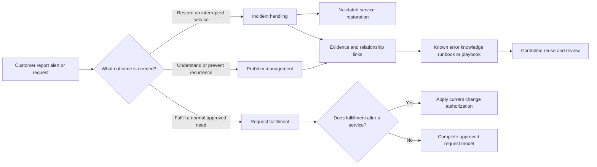

This Part expressly prohibits production execution of its sample runbook, any unsafe or destructive step, any security or approval bypass, collection or exposure of secrets or unnecessary customer content, closing an incident merely because a workaround exists, and marking a cause as root cause without sufficient evidence and authorized review.

## JD Mapping

| Role signal | Capability developed | Observable behavior | Honest proof artifact |
|---|---|---|---|
| Enterprise L1 ticket ownership | Selects the correct work-item type without losing customer continuity | Separates symptom, desired outcome, current impact, causal question, request model, and owner | Local synthetic work-item classifier |
| Configuration and API support | Distinguishes an interruption from a normal configuration request or planned change | Verifies expected behavior, current authorization, affected outcome, and change boundary | Fictional configuration scenarios |
| Threat and false-positive investigations | Recognizes when ordinary incident language is insufficient for cybersecurity handling | Stops unsafe reproduction and invokes the authorized security process without declaring breach or compromise | Stop-and-route classification card |
| Customer communication | Explains restoration, workaround, problem follow-up, and closure honestly | States what is restored, what remains unknown, who owns durable work, and when review occurs | Customer-safe status templates |
| Engineering and Product collaboration | Creates linked, bounded records instead of one overloaded ticket | Preserves evidence, exact causal question, acceptance, ownership, and return path | Incident-to-problem linkage entry |
| Knowledge creation | Converts repeated evidence into reusable, governed material | Separates reader guidance from executable operational procedure | Known-error and knowledge-entry template |
| Recommendations | Offers safe temporary recovery without presenting it as a fix | Records approval, risk, limits, validation, expiry, and residual impact | Workaround record |
| Process improvement | Reviews recurrence, runbook outcomes, and stale known errors | Assigns review owner, evidence threshold, metrics, and retirement criteria | Runbook review scorecard |
| enterprise support background | Transfers case ownership, critical-situation coordination, fix validation, KB creation, and escalation discipline | Uses a real Microsoft example only within the actual role and product boundaries | Candidate transfer statement |
| Abnormal AI learning goal | Learns product-neutral service operations while preserving vendor boundaries | Makes no claim about Abnormal's internal incident, problem, request, knowledge, change, or runbook workflow | Source-and-boundary ledger |

## Candidate honesty note

You can truthfully draw on several years of enterprise support: owning customer cases, working critical situations, clarifying service impact, coordinating with Engineering or Product, communicating with customers and partners, validating fixes, creating knowledge or training, mentoring others, and reviewing case quality, backlog, and customer satisfaction. Those experiences support the judgment taught here.

They do not establish that you have operated Abnormal AI's production support workflows, incident command, problem management, request catalog, known-error database, change model, security response, runbook system, ticket fields, role permissions, closure criteria, or escalation routes. prior-employer terminology, critical-situation practice, tools, approvals, and record types cannot be projected onto another employer. The safe interview bridge is:

> “My prior enterprise support experience taught me to restore the customer's usable outcome, keep the evidence and owners visible, validate a workaround rather than oversell it, and continue durable follow-up through the right owning team. I have not operated Abnormal's internal incident, problem, request, or known-error workflow. I would learn the current glossary, service catalog, change policy, security route, and systems of record before applying a label or executing a procedure.”

| Evidence tier | Safe wording | What supports it | Overclaim to avoid |
|---|---|---|---|
| prior production experience | “In enterprise support, I owned customer communication and coordinated evidence-based escalation.” | CV-supported scope plus a real defensible story | “Abnormal uses the same critical situation or problem process.” |
| Local synthetic practice | “After I actually complete it, I created and validated an offline classifier and runbook artifact using fiction.” | Learner-authored local evidence and a passing rubric | “I executed an Abnormal runbook” or “I managed a real known error.” |
| Learned architecture | “Official sources help me explain why mitigation, causal follow-up, and prepared procedures are separate.” | Dated official sources and stated boundaries | “The source proves Abnormal's workflow.” |
| No direct experience | “I have not used the internal tool or process; I would verify the current authorized source.” | Explicit gap plus a concrete ramp plan | Naming an internal queue, approval, status, or owner without evidence |
| Proposed behavior | “I would classify the desired outcome, preserve links, and ask the process owner when criteria conflict.” | Product-neutral reasoning | Claiming that a proposed process is current production policy |

## 1. One customer conversation can create several linked work items

A ticket is a container in many support systems, not a reliable statement of the kind of work inside it. One customer report can contain an active interruption, a question about recurrence, a request for information, and a proposed change. Good service management separates these concerns without making the customer repeat the story or wonder who owns the outcome.

Suppose a fictional analyst cannot generate a report. The immediate work is to restore access to the required information. After a safe snapshot restores that outcome, repeated evidence may justify a problem record about why generation fails. The analyst may also request a new scheduled-export feature, which is a request or product demand rather than the incident. If fulfilling the request changes a production schedule, separate change authority may apply. A known-error record can document the recognized failure and approved temporary path. A runbook can tell an authorized operator how to validate and use that path.

| Question | Likely work-item direction | Why | Important exception |
|---|---|---|---|
| “What is broken now, and how do we safely restore it?” | Incident | The primary outcome is reduction of active service impact | A cybersecurity response process may supersede ordinary service-incident handling |
| “Why did this happen, and how do we prevent recurrence?” | Problem | The primary outcome is causal understanding and durable risk reduction | A root cause may remain unknown after extensive work |
| “Can I receive a standard report or approved access?” | Service request | The desired outcome is normal fulfillment | A reported inability to use an already entitled function may be an incident |
| “Can you change this setting for me?” | Request plus possible change | The request expresses demand; the change policy controls alteration | The request itself is never authorization |
| “Has this failure pattern been analyzed before?” | Known-error or knowledge search | Existing learning may accelerate safe handling | Similar symptoms do not prove the same cause |
| “What exact approved steps can an operator perform?” | Runbook | The desired output is controlled execution | The operator still needs current permission and entry criteria |
| “Who coordinates this broader scenario?” | Playbook | Several roles, decisions, and procedures may be involved | The playbook name and role model are organization-specific |

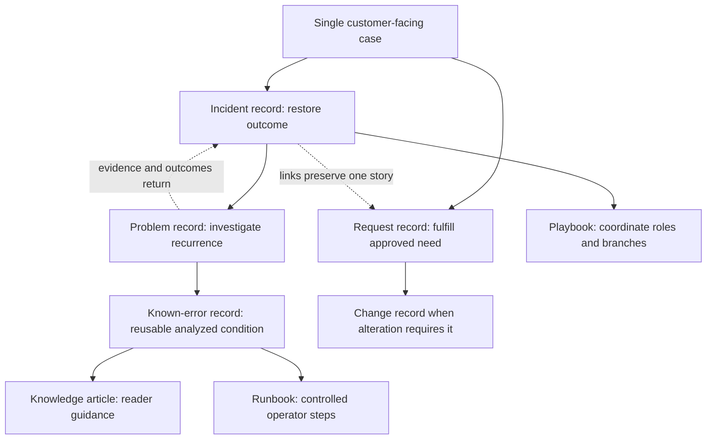

### 🔍 Plain-English deep-dive: Classification is about the desired outcome, not the first noun used

A caller may say, “I have a problem,” but in ordinary language that only means something is difficult. A monitoring tool may call every alert an incident. A developer may call a defect a bug, while a service desk calls the customer record a case. If Support simply copies the noun, work can enter the wrong queue.

Think of a hospital front desk. “My arm hurts” is not yet a department. The staff asks whether there is active danger, whether the person needs immediate stabilization, whether this is a scheduled service, and which specialist owns follow-up. The person's words matter, but classification depends on the required outcome and evidence. The analogy stops because support records can and often should be linked rather than forcing one permanent category.

Use four framing questions:

1. Is an expected service outcome currently interrupted or materially degraded?
2. Is the immediate objective restoration, causal learning, normal fulfillment, or controlled change?
3. Does another policy, especially cybersecurity, privacy, legal, or emergency change, control the route?
4. Which owner has accepted the current action, and what customer-facing responsibility remains with Support?

Misclassification should be corrected transparently. Do not close and recreate work merely to improve metrics or reset clocks. Preserve the original report, timestamps, relationships, and customer context according to the current tool and policy. A classification can change as facts improve; the history should show why.

## 2. Incident management prioritizes safe restoration

Incident handling addresses a live interruption or degradation. The first technical instinct is often “find the bug,” but the first operational question is “how can the affected outcome be restored safely?” A cause may become obvious early, but restoration should not wait for a perfect causal narrative when an approved, lower-risk recovery path exists.

The incident record should define the customer outcome, confirmed scope, potential scope, impact, urgency, service or dependency, start evidence, current state, workarounds, actions, owners, communication triggers, validation criteria, and unresolved risk. Part 102's severity and commitment discipline still applies: incident classification does not create authority or a guaranteed repair time.

### Restoration sequence

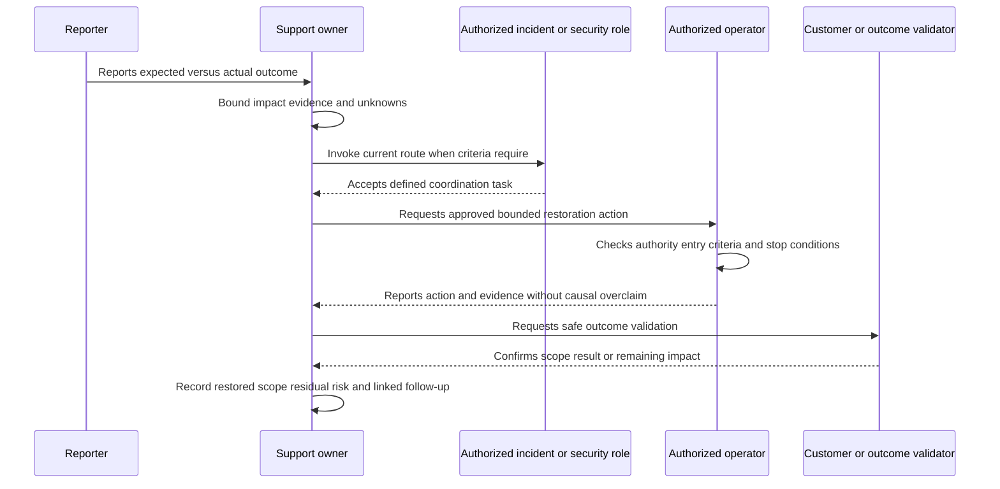

| Incident stage | Primary question | Minimum evidence | Owner focus | Do not confuse with |
|---|---|---|---|---|
| Detect or report | What expected outcome appears impaired? | Source, time, expected/actual, affected cohort | Intake or monitoring owner | Root-cause proof |
| Assess | What consequence is confirmed, potential, or unknown? | Scope, duration, security/data state, workaround | Case or incident owner | Customer emotion as severity |
| Coordinate | Which roles and routes are required now? | Criteria, accepted tasks, retained duties | Authorized incident lead under local policy | A crowd of participants as ownership |
| Mitigate | What approved reversible action can reduce impact? | Entry criteria, authority, risk, step evidence | Authorized operator | Permanent correction |
| Validate restoration | Is the defined outcome usable in the affected scope? | Original-path test or approved proxy, time, validator | Outcome owner | “Change completed” as user success |
| Stabilize | Is the recovery holding, and what residual risk remains? | Observation window, telemetry, workaround health | Incident owner | A quiet period as permanence |
| Transition | What causal, defect, change, or knowledge work remains? | Accepted linked records and owners | Incident plus receiving owners | Abandoning follow-up after customer relief |
| Close under policy | Are incident completion criteria actually met? | Restored outcome, communications, links, ownership, record quality | Authorized closing owner | Closing because a workaround merely exists |

A workaround may make service usable. It does not automatically satisfy closure. The current policy may permit the incident record to close after validated restoration if durable work is accepted elsewhere, or may require it to remain open. Either choice must be based on documented criteria, customer outcome, residual risk, and accepted ownership. This Part forbids closing an incident merely because someone proposed or found a workaround.

### 🔍 Plain-English deep-dive: Restoration is a state claim, not an action claim

Imagine a power company replacing a failed line switch. “The switch was replaced” describes an action. “The hospital has stable power on both required feeds” describes an outcome. The action may fail, affect only part of the area, or introduce a new issue. Restoration requires outcome evidence.

In support, “Engineering deployed,” “cache was cleared,” “policy was changed,” or “the job was restarted” does not prove restoration. A strong statement is narrower: “At fictional checkpoint `T-7`, all five authored report requests completed with the expected schema, and the synthetic validator recorded no failure in the defined cohort. Durability and cause remain unproved.” The analogy stops because some customer outcomes cannot be safely reproduced; an approved health signal or customer confirmation may be the correct proxy.

Restoration validation should state:

- the exact expected outcome;
- the scope tested and the scope not tested;
- the authorized validator;
- the time and observation source;
- the workaround or change still in effect;
- residual impact, risk, or manual effort;
- the monitoring or reactivation trigger;
- the strongest conclusion supported, including what remains unknown.

## 3. Problem management protects causal and recurrence work

Problem management asks why an incident happened, why it could happen, why it recurs, or what systemic condition deserves treatment. It is not merely “an incident that took a long time.” A problem can link many incidents. A significant incident can create one problem. A proactively discovered weakness can become a problem even before customer impact occurs, if the current process allows proactive problem management.

The problem record preserves a causal question after restoration pressure decreases. It can organize competing hypotheses, evidence, rejected explanations, contributing factors, root-cause confidence, corrective options, risks, and owners. Part 105 will cover formal root-cause analysis methods in depth; this Part concentrates on honest state transitions and links.

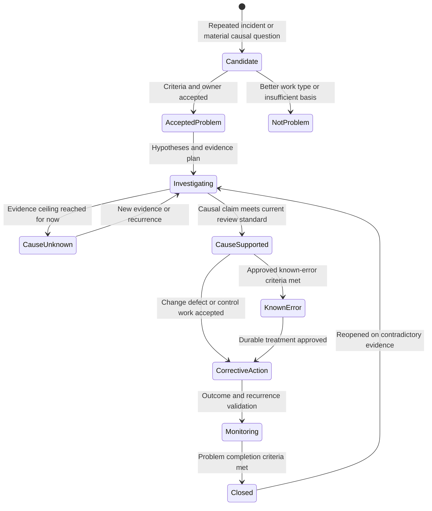

### Root-cause evidence ladder

| Evidence state | Meaning | Safe wording | Unsafe wording |
|---|---|---|---|
| Observation | A symptom or event is recorded | “Failures and queue depth rose in the same authored interval.” | “Queue depth caused the failures.” |
| Correlation | Two conditions vary together | “The pattern correlates with fixture version `V-B`.” | “The latest version is definitely the root cause.” |
| Plausible hypothesis | A causal mechanism could explain the facts | “A stale mapping could explain the mismatch; test `D-3` would discriminate it.” | “We found the root cause” before testing |
| Supported cause | Evidence strengthens one mechanism and weakens alternatives | “Controlled local comparison supports the stale-mapping mechanism in the fixture.” | “This explains every real customer report.” |
| Root-cause candidate | The supported mechanism is being evaluated against recurrence and scope | “Candidate cause pending owner review and corrective validation.” | “Root cause” as a status chosen to satisfy a field |
| Approved root cause | The current authorized process accepts the bounded causal conclusion | “Approved root cause for synthetic condition `COND-103-A` within the stated scope.” | Blaming a person or claiming universal causality |
| Corrective validation | Removal or control of the cause prevents the defined recurrence under test | “The authored recurrence test remained healthy across the defined local cases.” | “Permanently fixed” without scope and observation limits |

Root cause should be bounded. Distributed failures often have multiple necessary conditions: a defect, a trigger, insufficient isolation, weak monitoring, and a recovery gap. Removing one condition may prevent the tested recurrence without explaining every similar symptom. Human action can be part of a sequence, but “operator error” usually stops too early. Ask why the system made the error possible, difficult to detect, or hard to recover from.

### Incident and problem relationship

| Dimension | Incident | Problem |
|---|---|---|
| Immediate objective | Restore acceptable service outcome safely | Understand, reduce, or prevent causal and recurrence risk |
| Time pressure | Driven by current impact and urgency | Driven by recurrence risk, severity, exposure, and improvement priority |
| Can exist without the other? | Yes; a one-off interruption may be restored with no accepted problem | Yes; proactive risk can be managed before an incident |
| Closure evidence | Current policy's restored/complete outcome and linked ownership | Causal/corrective completion standard, accepted risk, or documented evidence ceiling |
| Typical outputs | Timeline, mitigation, restoration validation, communications | Hypothesis ledger, causal evidence, known error, corrective actions, postmortem input |
| Dangerous shortcut | Diagnose forever while customers remain impaired | Declare cause because the incident is quiet |

### 🔍 Plain-English deep-dive: “Unknown” is a legitimate causal result

A detective can investigate responsibly and still lack enough evidence to identify who caused an event. Inventing a suspect would be worse than recording the limit. Problem management is similar. Logs may have expired, observability may be incomplete, the failure may not recur, or several hypotheses may fit equally well.

An honest problem record can say: “No root cause established. Evidence supports conditions A and B as contributors, rejects C, and cannot distinguish D from E. Recurrence detection and evidence-retention actions are assigned.” That is useful. It prevents the next responder from restarting disproved paths and creates a better evidence plan. The analogy stops because technical systems allow controlled experiments, but those experiments still require authorization and must not create customer harm.

## 4. Service requests and the standard change boundary

A service request asks for something normally provided: information, advice, a catalog item, an approved access package, or another defined fulfillment. A **standard request** is a request with a documented, repeatable model: required inputs, eligibility, approvals, fulfillment owner, expected output, communications, and closure checks. The adjective `standard` describes the request model; it does not automatically make every underlying action a standard change.

A **standard change** is a change category under the organization's change policy. It is typically preauthorized because the exact procedure, scope, risk, prerequisites, validation, rollback, and ownership are sufficiently understood. Definitions and thresholds vary. A runbook can support a standard change, but the runbook does not make it standard. A customer's approval can be necessary, but customer desire does not replace provider authority or technical controls.

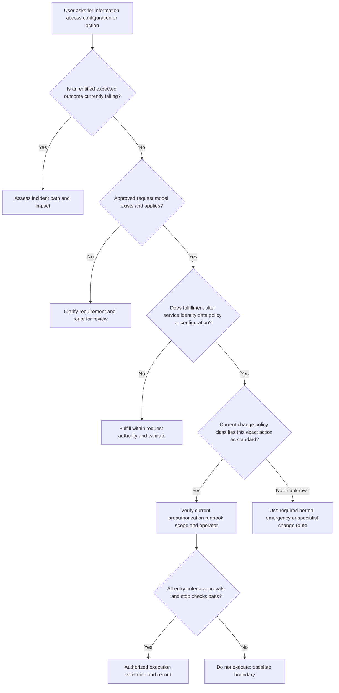

| Scenario | Primary classification | Change boundary | Why |
|---|---|---|---|
| User asks what a documented field means | Information service request | No change unless another action follows | The outcome is an approved answer |
| User cannot see a field they are already entitled to use | Possible incident | Diagnose expected versus actual before changing access | An interruption may be hiding inside request language |
| User asks for a cataloged role assignment | Standard request candidate | Identity/access change controls still apply | Fulfillment may alter privilege and require approval |
| User asks Support to “temporarily make me admin” | Request rejected or rerouted | Never standard merely because temporary | Privilege expansion creates security and separation-of-duty risk |
| Customer asks to lower a security threshold to stop alerts | Request plus risky change proposal | Security/change owners must assess; no bypass | Reducing visible symptoms can weaken protection |
| Approved owner requests a routine report export | Standard request candidate | Data-handling and entitlement rules still apply | Normal fulfillment does not waive privacy or minimum-data rules |
| Repeated request fails in the same way | Incident plus possible problem | Restore the request path; investigate recurrence separately | The catalog item can be valid while fulfillment is broken |

### Request fulfillment record

| Field | Required content | Safe placeholder | Failure to avoid |
|---|---|---|---|
| Requested outcome | What the requester needs, not merely the proposed method | `Receive approved fictional summary` | Treating a preferred implementation as the only need |
| Request model | Current catalog or procedure identifier | `[CURRENT_REQUEST_MODEL]` | Using memory from another employer |
| Requester and beneficiary | Authorized aliases and relationship | `REQ-USER-A / BENEFICIARY-A` in fiction | Real personal data in the lab |
| Eligibility | Evidence that the request is in scope | `[ELIGIBILITY_CHECK]` | Assuming a ticket implies entitlement |
| Approval | Required role and recorded decision | `[APPROVER_ROLE_AND_EVIDENCE]` | Self-approval or invented acceptance |
| Change implication | `none`, `standard`, `normal`, `emergency`, or `unknown` under current policy | `unknown - route before action` | Declaring a change standard because a runbook exists |
| Fulfillment steps | Current approved procedure | `[APPROVED_PROCEDURE_VERSION]` | Ad hoc production action |
| Validation | How requester outcome and controls are checked | `[EXPECTED_RESULT_AND_VALIDATOR]` | Closing on internal completion alone |
| Closure | Required evidence and communication | `[CURRENT_REQUEST_CLOSURE_RULE]` | Closing while the requested outcome remains unmet |

## 5. Known errors, workarounds, and knowledge articles

A known-error record captures an analyzed condition so responders can recognize it, apply approved handling, and avoid repeating unsafe discovery. It is structured operational knowledge, not a rumor. Its publication threshold should be explicit: who reviews it, what causal confidence is required, whether a workaround is mandatory, where it may be used, and how it is retired.

Some frameworks expect a known error to have an understood cause. Some organizations create a provisional known-error entry when the failure signature and safe workaround are repeatable but the complete causal chain remains under investigation. Both can be coherent if the record labels cause status precisely. The dangerous approach is using `known error` to imply more certainty than the evidence supports.

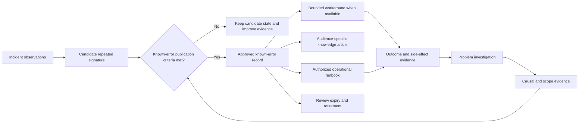

### Workaround quality test

| Dimension | Required question | Pass evidence | Automatic rejection example |
|---|---|---|---|
| Authority | Who approved use for this scope? | Current role, record, and applicable decision | “A forum suggested it” |
| Safety | Can it harm data, evidence, identity, availability, security, or privacy? | Reviewed risk and stop conditions | Disable detection, share credentials, or release suspicious content |
| Supportability | Is this path recognized for the current service/version? | Current source and version | Unsupported edit copied from an old case |
| Scope | Which condition and population does it cover? | Signature, exclusions, and boundaries | “Works for all timeouts” |
| Validation | How is the customer outcome checked? | Expected result, validator, and observation | “The command returned zero” only |
| Sustainability | How long and at what operational cost can it remain? | Expiry, capacity, manual burden, and review | Indefinite manual processing with no owner |
| Reversibility | How is the temporary state removed or recovered? | Rollback/recovery path and authority | Irreversible or destructive action |
| Residual risk | What remains impaired or exposed? | Explicit limitations and monitoring | Calling partial access full resolution |
| Ownership | Who monitors, renews, retires, and communicates it? | Accepted named role and checkpoints | “Engineering will watch it” without acceptance |

A knowledge article serves a reader. It may explain symptoms, questions to ask, safe diagnostic evidence, decision points, and escalation criteria. A known-error record serves lifecycle control for a recognized condition. A runbook serves authorized execution. One document can contain elements of all three only if governance allows it, but the audience and authority must remain clear.

| Artifact | Primary audience | Main purpose | Typical control level | Must include |
|---|---|---|---|---|
| Known-error record | Support, operations, problem owners | Recognize and govern an analyzed condition | Restricted or internal depending on content | Signature, cause status, workaround, risk, owner, links, review |
| Knowledge article | Customer, Support, or internal learner | Explain or guide repeatable understanding | Audience-specific publishing review | Scope, prerequisites, steps or explanation, limitations, feedback path |
| Runbook | Authorized operator | Execute a bounded operational action | Strong access, version, approval, and audit controls | Entry, authority, exact steps, evidence, branches, stop, validation, recovery |
| Playbook | Response team and coordinators | Coordinate a broader scenario | Role, communication, escalation, and decision governance | Trigger, roles, phases, decisions, linked runbooks, handoffs, completion |
| Problem record | Problem and engineering owners | Manage causal and recurrence work | Evidence and prioritization controls | Hypotheses, evidence, cause status, actions, risks, acceptance |

### 🔍 Plain-English deep-dive: A known error is a map, not a verdict stamp

A road authority may publish a bulletin: “When rain exceeds a threshold, this underpass can flood; use the signed northern route until drainage work is completed.” The bulletin helps drivers act consistently. It does not claim every puddle has the same cause, that the detour is cost-free, or that drainage has been permanently repaired.

Likewise, a known-error record should help a responder match a specific signature, understand the evidence ceiling, select an approved workaround, and know when not to use it. Similar symptoms can come from different causes. The record needs negative match criteria and escalation triggers, not only a catchy title. The analogy stops because a digital workaround may alter privileges, security controls, data, or evidence; such actions need much stronger boundaries than taking a public detour.

## 6. Executable runbooks, coordinating playbooks, and visible owners

An executable runbook is deterministic enough that an authorized operator can follow it and produce expected evidence without inventing missing steps under pressure. “Restart service and check” is not a complete runbook. Which service? Under what condition? Who may restart it? What dependencies must be healthy? What evidence is preserved first? What result is expected? When must the operator stop? What if only half the population recovers? How is a rollback or alternate recovery performed?

Executability does not mean blind automation. A manual runbook can be executable. It also does not mean every branch can be predetermined. The document should expose where human judgment or additional approval is required instead of disguising judgment as a simple step.

### Runbook quality anatomy

| Component | Question answered | Required quality signal | Weak example |
|---|---|---|---|
| Identity and version | Which controlled procedure is this? | Unique ID, version, status, owner, last review | “Recovery notes” |
| Purpose and outcome | What state should it create? | Measurable service/customer outcome | “Fix issue” |
| Scope and exclusions | Where may it be used, and where not? | Service, version, condition, cohort, prohibited contexts | “Use when reports fail” |
| Entry criteria | What must be true before starting? | Signature, severity/state, evidence, approvals | “Try this first” |
| Authority | Who may approve and execute? | Current role and change/security requirements | “Anyone with access” |
| Inputs and dependencies | What known-good information is needed? | Safe fields, source, freshness, dependencies | Credentials pasted into the document |
| Preserve-first actions | What evidence or state must be protected? | Minimum necessary snapshot and approved location | Destructive cleanup before capture |
| Ordered steps | What exact actions occur? | IDs, verbs, expected observation, owner | Ambiguous prose paragraph |
| Decision branches | What evidence chooses the next step? | Explicit yes/no/unknown handling | Operator guesses |
| Stop conditions | When must execution halt? | Security, mismatch, unexpected impact, missing authority | “Keep trying until it works” |
| Validation | How is technical and customer outcome checked? | Defined tests, cohort, validator, evidence ceiling | Process exit code alone |
| Recovery or rollback | How is unsuccessful temporary state handled? | Authorized path, limitations, escalation | “Undo changes” |
| Communication | Who is informed and when? | Event triggers, audience, approved wording source | No customer or incident update |
| Evidence record | What is recorded? | Steps attempted, times, outputs, deviations, owner | Memory after the event |
| Review and retirement | How does it remain trustworthy? | Expiry, outcome feedback, owner, stale criteria | No version or review date |

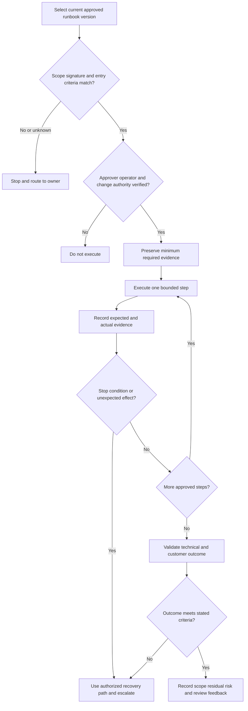

A playbook sits one level above individual procedures. For a fictional widespread report failure, the playbook may tell the incident owner when to invoke communications, when to ask the problem owner to open causal work, which runbook can validate a read-only workaround, and which criteria require security or change review. It should not duplicate every runbook step.

Ownership must be granular. One person may own customer communication, another the incident coordination, another the runbook execution, another the problem record, and another the corrective change. A responsibility matrix can help, but real acceptance must still be recorded.

| Ownership statement | Quality | Why |
|---|---|---|
| “Engineering owns it.” | Poor | No accepted person/role, task, deadline source, or retained Support duty |
| “Team Alpha was tagged.” | Poor | Notification is not acceptance |
| “Fictional operator role accepted validation step `RB-4`; Support retains customer updates; problem owner accepts causal review after restoration.” | Strong for the exercise | Task, role, split, sequence, and retained responsibility are visible |
| “Customer is responsible.” | Usually poor | It can hide provider duties and lacks a precise requested action |
| “Authorized customer admin owns validation of the stated user outcome; Support owns the next update and fallback.” | Strong when true | Each party's bounded action is explicit |

## 7. Artifact one: work-item classifier

The classifier below is a decision aid, not a production policy. It deliberately avoids real queue names, status values, approval paths, severity labels, or Abnormal workflow claims. In real work, replace every placeholder with the current authorized source and retain the evidence used to classify.

### Classifier decision tree

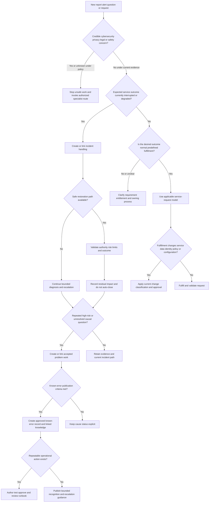

### The twelve required work-record labels

Every completed classifier card in this Part contains exactly these twelve labeled fields. Organizations may split or rename them, but the information should remain visible.

| # | Artifact label | Required content | Why it is required |
|---:|---|---|---|
| 1 | **Record ID** | Obvious fictional identifier in the lab; current system identifier in real work | Preserves traceability without relying on a title |
| 2 | **Desired outcome** | Restore service, investigate cause, fulfill request, execute approved operation, or coordinate response | Classification follows the outcome rather than the caller's noun |
| 3 | **Work-item class** | Incident, problem, service request, change review, known-error candidate, knowledge, runbook, playbook, or specialist route | Makes the chosen operating path explicit |
| 4 | **Current service state** | Expected versus actual outcome, affected scope, duration, and residual impact | Prevents work type from replacing facts |
| 5 | **Evidence and confidence** | Observations, sources, alternatives, unknowns, and strongest supported conclusion | Blocks unsupported causal and security claims |
| 6 | **Restoration or fulfillment status** | Proposed, approved, attempted, validated, failed, not available, or not applicable | Separates action from verified outcome |
| 7 | **Cause status** | Unknown, hypotheses, supported cause, root-cause candidate, approved root cause, or not applicable | Prevents “known error” from implying false certainty |
| 8 | **Workaround and risk** | Scope, approval, safety, validation, limits, expiry, residual risk, or explicitly none | Makes temporary recovery governable |
| 9 | **Change and authorization boundary** | Request model, change type, approver, operator, permissions, and unknowns | A request or runbook cannot self-authorize a change |
| 10 | **Owner and acceptance** | Current action owner, record owner, communication owner, accepted scope, and retained duties | Avoids ownerless handoffs |
| 11 | **Links and dependencies** | Parent/child records, known errors, knowledge, runbooks, changes, security routes, and exact blocked asks | Preserves one coherent story across records |
| 12 | **Validation and next trigger** | Completion evidence, customer/outcome validator, observation boundary, next review, escalation, expiry, or reopen trigger | Prevents premature closure and stale knowledge |

### Completed classifier examples

| Alias | Evidence summary | Desired outcome and class | Linked work | Owner and next trigger | Evidence ceiling |
|---|---|---|---|---|---|
| `WI-103-A` | Five authored report requests fail; one approved snapshot contains current fictional rows | Restore report access: `incident`; temporary read-only path proposed | Problem candidate after repeated signature; runbook candidate for snapshot validation | Fictional Support owner retains communication; authorized operator acceptance not yet recorded | Interruption supported in fixture; cause unknown; no real service represented |
| `WI-103-B` | User asks what a synthetic status field means; no impaired function | Provide information: `service request` | Candidate knowledge article after answer approval | Fictional knowledge owner; close only after answer and requester outcome validation | No incident evidence |
| `WI-103-C` | User asks to receive a predefined fictional weekly summary | Fulfill approved catalog need: `standard request candidate` | Change review only if scheduling alters a service | Request owner must verify model and authorization | “Routine” does not prove standard-change status |
| `WI-103-D` | Similar timeout wording appears in three authored cases, but IDs and timing differ | Restore each active outcome: incidents; investigate commonality: problem candidate | No known error until signature and evidence threshold pass | Problem owner acceptance required; reassess on discriminating evidence | Similar text alone does not prove one cause |
| `WI-103-E` | One fictional administrator reports an unrecognized action | Authorized security route, with case continuity | Security incident handling may supersede ordinary classifier | Support retains safe communication until formal transfer is accepted | No compromise, breach, actor, or containment is established |
| `WI-103-F` | Approved local workaround restored four of five synthetic cohorts | Incident remains partially restored; problem work continues | Known-error candidate if criteria are met | Incident owner tracks fifth cohort; problem owner investigates recurrence | A workaround exists but full restoration and root cause are not proved |
| `WI-103-G` | Fictional root-cause field says “latest change” with no comparison test | Problem investigation, not approved root cause | Hypothesis ledger and evidence plan | Problem reviewer rejects root-cause state pending evidence | Temporal order is not causality |
| `WI-103-H` | Customer-like request asks to disable a security control to reduce false alerts | Request denied or specialist-reviewed; no workaround classification | Security/change assessment under current route | Authorized security owner required; Support does not execute | Visible noise reduction would not justify weakened protection |

### Worked classification reasoning

**Example A: active interruption with an available temporary path.** The essential report outcome is unavailable, so the primary work is an incident. A current snapshot may restore read access if an authorized owner approves it, the source is fresh enough, the required fields exist, and no prohibited data is exposed. The incident does not become a service request because the customer asks for the snapshot. A problem candidate may be linked because the failure has repeated. The workaround does not establish root cause and does not justify closure by itself.

**Example B: normal information need.** The user can use the service but does not understand a field. That is a service request for information under a suitable request model. If investigation reveals that the field displays the wrong value, an incident may be linked. A knowledge article can improve future fulfillment after technical and publishing review.

**Example C: catalog request that changes state.** A weekly summary may be a standard request, but scheduling it may create a configuration, data-processing, or notification change. The request model must identify whether that exact action is preauthorized as a standard change. If the current criteria are absent or do not match, the operator stops and routes to change review. The existence of a procedure does not create permission.

**Example D: recurring symptoms.** Three cases saying “timeout” do not prove one problem. The classifier preserves endpoint, operation, timing, status, dependency, and correlation identifiers using only authorized minimum evidence. If the signatures align and a problem owner accepts the causal question, the records are linked. If evidence later separates them, the linkage is corrected without rewriting history.

**Example E: security-sensitive report.** Ordinary reproduction can be dangerous when a report suggests unauthorized activity. Support does not test credentials, click links, open files, release messages, disable controls, or gather broad content. It preserves the minimum approved metadata, invokes the current security route, records acceptance, and continues customer-safe communication. Whether the organization calls the record a security incident, event, case, or investigation is controlled by its policy.

## 8. Artifact two: known-error and runbook entry

The following combined artifact demonstrates linkage, not a recommendation to merge records in production. A real organization may keep the known-error record, knowledge article, runbook, incident, problem, and change record in different governed systems. The identifiers, statuses, roles, times, and procedures below are fictional.

### Known-error entry `KE-103-A`

| Field | Completed local synthetic entry |
|---|---|
| Record identity | `KE-103-A`, version `0.1-DRAFT`, state `LOCAL_SYNTHETIC_UNPERFORMED` |
| Title | `Synthetic report generator returns empty output when derived index is stale` |
| Audience and visibility | Learner-only local tabletop; not customer-facing, not an operational publication |
| Recognition signature | In fixture `ORG-103-FICTION`, source rows are present, generated output is empty, and authored index marker precedes source marker |
| Negative match criteria | Do not match if source rows are absent, authorization is unknown, schema differs, integrity warning exists, security concern exists, or the affected outcome is not report generation |
| Incident links | `WI-103-A` and `WI-103-F`, fictional only |
| Problem link | `PRB-103-A`, proposed and not accepted in any real system |
| Cause status | `SUPPORTED_SYNTHETIC_CAUSE_NOT_APPROVED_ROOT_CAUSE`; local comparison supports stale derived index within the fixture only |
| Root-cause boundary | No real root cause is claimed. Version ordering alone is insufficient; controlled local recurrence and owner review would be required before a bounded root-cause state |
| Customer impact | Five fictional aliases initially lack generated output; approved snapshot may cover four; one cohort remains unsupported |
| Workaround | Use the latest learner-authored read-only snapshot only after fictional authorization and validation under `RUN-103-A` |
| Workaround risks and limits | Snapshot can be stale, omit one filter, and cover only named cohorts; it must not expose real or unnecessary content |
| Prohibited use | No production use, upload, login, API call, customer data, secret, content collection, privilege change, bypass, deletion, rebuild, restart, or security action |
| Restoration evidence | Not available because the lab was not performed; a future local execution must validate the exact synthetic outcome and scope |
| Corrective-work status | Fictional problem owner would evaluate index freshness validation; no implementation or completion is claimed |
| Knowledge links | `KA-103-A` recognition guide proposed; not created as a separate file |
| Runbook link | `RUN-103-A` below, local tabletop only |
| Owners | Draft owner: learner; fictional operational, problem, knowledge, and change owners remain placeholders |
| Review and expiry | Review before any future local exercise and after any signature, scope, step, or risk change; never transfer to production |
| Evidence ceiling | The page demonstrates artifact design only. It proves no Abnormal behavior, customer condition, production cause, workaround success, or operator competence |

### Runbook entry `RUN-103-A`

| Control | Local synthetic value |
|---|---|
| Name | `Validate a fictional read-only snapshot as a temporary report workaround` |
| Version and state | `0.1-DRAFT / DESIGN_NOT_EXECUTED_NOT_TRANSFERRED` |
| Purpose | Determine whether a learner-authored snapshot can satisfy the defined fictional read-only outcome without changing a service |
| Scope | Local fictional text rows for `ORG-103-FICTION`; named cohorts `A` through `E` only |
| Exclusions | Any real system, production environment, customer, account, mailbox, message, API, security event, credential, content, upload, or state-changing operation |
| Entry criteria | Incident card exists; expected fields are defined; fictional approver role is recorded; source and snapshot aliases exist in the future lab packet; no stop condition is present |
| Authority | Learner may perform only offline manual comparison of learner-authored fiction. No authority for any product or production action is granted |
| Inputs | Synthetic source table, synthetic snapshot table, required-field list, cohort list, and blank evidence ledger |
| Expected output | A bounded `validated`, `failed`, or `stopped` result for each fictional cohort plus residual limitations |
| Recovery | Discard the proposed local result and return the fictional incident card to `workaround not validated`; no deletion or system rollback is required |
| Communication | Draft a fictional update only; do not send, upload, publish, or represent it as a customer communication |
| Owner | Learner owns future local execution and evidence; fictional role placeholders own no real action |
| Review trigger | Any mismatch, missing field, unexpected content, real data, secret, expanded scope, or ambiguity stops the runbook and requires review |

### Worked runbook procedure

This procedure is executable only as a future **manual, offline, learner-authored tabletop**. It was not executed during authoring. It contains no command, script, login, network request, product action, or production step.

| Step | Authorized local action | Expected evidence | Decision and stop rule | Owner record |
|---:|---|---|---|---|
| 0 | Read the honesty label and confirm state `DESIGN_NOT_EXECUTED_NOT_TRANSFERRED` | Exact state appears in the future local packet | Stop if anyone proposes production execution or a real system | Learner |
| 1 | Confirm all inputs are obvious fiction and contain no secrets, personal data, customer content, or real identifiers | Data-origin checklist records `synthetic` for every field | Stop immediately on real or sensitive material; restrict exposure and use approved reporting channels | Learner |
| 2 | Read `KE-103-A` signature and negative-match criteria | Match worksheet lists every criterion as `yes`, `no`, or `unknown` | Stop on any negative criterion or unknown that the runbook requires to be known | Learner |
| 3 | Confirm the fictional approval placeholder and execution scope are present | Approval field and cohort list are nonblank and explicitly fictional | Stop if approval is assumed, self-invented as real, or scope is broader than `A` through `E` | Learner |
| 4 | Copy the required-field names into a comparison checklist without copying values from any external source | Checklist includes only learner-authored field names | Stop if a field would require unnecessary message, identity, credential, or customer content | Learner |
| 5 | Compare the fictional source marker and snapshot marker as written in the packet | Ledger records markers and comparison result | Stop if either marker is absent or ordering is ambiguous; do not fabricate freshness | Learner |
| 6 | Compare required-field presence for each cohort | Five rows show expected fields as present, absent, or unknown | Stop the affected cohort on missing/unknown required fields; do not infer values | Learner |
| 7 | Check the snapshot's documented limitations against the desired outcome | Limitation table states freshness, missing filter, and cohort coverage | Stop if a limitation prevents the essential outcome or creates security/privacy risk | Learner |
| 8 | Assign a per-cohort proposed result: `validated`, `failed`, or `stopped` | Every cohort has one result plus evidence pointer | Never convert partial success into full restoration | Learner |
| 9 | Draft the fictional restoration statement using only validated cohorts | Statement names outcome, scope, time label, workaround, limits, and unknown cause | Stop if wording says permanent, fixed, root cause, all users, or production | Learner |
| 10 | Draft the fictional residual-work links | Incident, problem candidate, known error, and review-owner placeholders are visible | Do not close merely because any cohort has a workaround | Learner |
| 11 | Run the deterministic rubric and record pass/fail for each gate | Validation ledger contains counts and evidence pointers | Maximum three repair cycles; incomplete after the third failed cycle | Learner |
| 12 | If and only if every gate passes and the local artifact actually exists, update only the local artifact state | State becomes `LOCAL_SYNTHETIC_TABLETOP_COMPLETED_NOT_TRANSFERRED` | This authored Part remains labeled unperformed; never change it to claim execution | Learner |

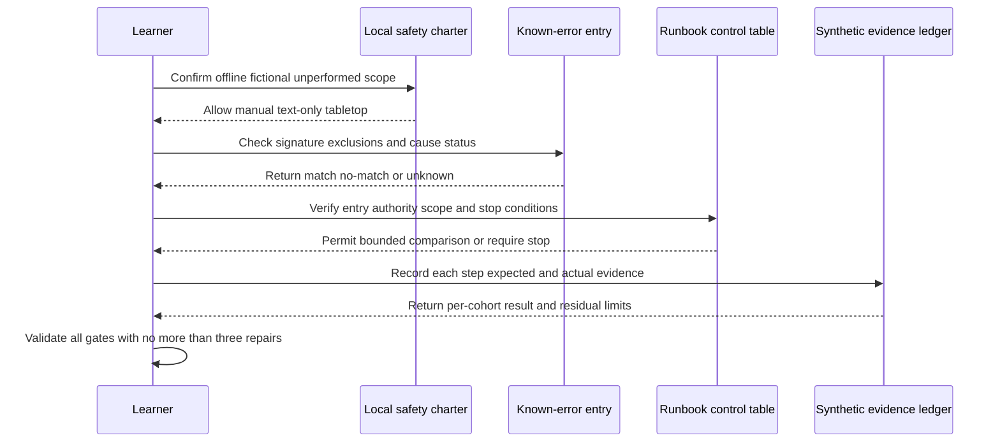

### Runbook result examples

| Result | Example evidence | Correct incident statement | Incorrect statement |
|---|---|---|---|
| Validated for four cohorts | Required fields and freshness marker meet fictional criteria for `A-D` | “The local snapshot supports the defined read-only outcome for cohorts `A-D`; cohort `E` and durability remain unresolved.” | “Service is fully fixed.” |
| Failed for one cohort | Fictional required field is absent for `E` | “The workaround does not restore the essential outcome for cohort `E`; continue incident handling.” | “Mostly working, so close.” |
| Stopped before comparison | Authorization placeholder or input is missing | “No workaround validation was performed because an entry criterion was not met.” | “Probably safe based on prior use.” |
| Unexpected real data appears | Any value is not clearly fictional | “Stop processing and sharing; use the approved privacy/security route. No further lab action is authorized.” | Copy, sanitize ad hoc, delete destructively, or continue |

The sample is intentionally modest. A real operational runbook may contain commands or automated actions, but only after engineering review, testing in an authorized environment, least-privilege access, change classification, secrets management, observability, failure handling, approval, and rollback design. None of that authority is provided by this Part.

## 9. Lifecycle links, state transitions, and closure integrity

Good records form a graph, not a pile. The incident records current impact and restoration. The problem records causal work. The request records normal fulfillment. The change record governs alteration. The known error records reusable analyzed condition. The knowledge article teaches an audience. The runbook controls execution. The playbook coordinates a scenario. Links should explain the relationship rather than merely listing identifiers.

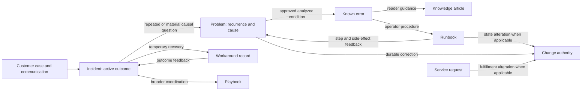

### Closure gates by work type

| Work type | Minimum completion question | Evidence examples | Closure blocker |
|---|---|---|---|
| Incident | Is the defined service outcome restored or otherwise completed under current policy, with residual work accepted? | Scope validation, customer/proxy confirmation, communication, linked accepted owner | Workaround merely exists, unvalidated cohort, active harm, ownerless residual work |
| Problem | Has the accepted causal/risk objective met its completion standard? | Approved cause or evidence ceiling, corrective outcomes, accepted risk, review | Root cause field is unsupported, corrective work unowned, recurrence unmeasured |
| Service request | Was the eligible requested outcome fulfilled and validated? | Approval, fulfillment evidence, requester/outcome confirmation | Entitlement unknown, change unauthorized, requested result absent |
| Change | Did the authorized change follow its model and pass validation/recovery criteria? | Approval, implementation record, validation, review | Missing authority, unresolved failure, required review incomplete |
| Known error | Is the record accurate, approved, usable, owned, and within review period? | Signature tests, cause status, workaround limits, owner review | Stale scope, unsafe workaround, contradictory evidence |
| Knowledge article | Is the content accurate, audience-safe, findable, and approved? | Technical and editorial review, feedback route | Secrets/content, operational authority ambiguity, unsupported claims |
| Runbook | Is the procedure tested, approved, current, and safe for its declared scope? | Test evidence, version, approvals, stop/rollback checks | Untested destructive path, missing owner, stale dependencies |
| Playbook | Are scenario roles, decisions, communications, and linked procedures current? | Exercise result, role acceptance, branch review | Unstaffed role, broken link, unclear activation criteria |

Closing an incident and closing a problem can happen at different times. The customer-facing incident may close after validated restoration and an accepted durable-work handoff if policy allows. The problem can remain open to investigate recurrence. Conversely, a problem might close with an explicit “root cause not established” evidence ceiling and improved detection actions if the authorized completion standard permits it. Neither event should erase the timeline or imply a stronger conclusion.

### Status wording patterns

| Situation | Honest wording | Wording to reject |
|---|---|---|
| Workaround proposed | “A temporary path is proposed; approval, safety, and outcome validation are pending.” | “Resolved with workaround.” |
| Workaround validated in part | “The path restores the stated outcome for cohorts `A-D`; `E` remains affected.” | “Service restored.” |
| Incident restored, cause unknown | “The defined outcome is restored in the validated scope; cause remains unknown and linked investigation is accepted.” | “Root cause fixed.” |
| Cause supported, not approved | “Evidence supports hypothesis `H-2` within the fixture; authorized causal review is pending.” | “Confirmed root cause.” |
| Request completed internally | “Fulfillment action completed; requester outcome validation remains pending.” | “Request fulfilled” solely because a task ran |
| Runbook step diverges | “Execution stopped at step `S-4` because actual evidence differed from the required branch.” | Quietly improvise a new production step |

## 10. Failure modes and escalation safeguards

The classification model fails when labels become shortcuts for responsibility. The goal is not perfect taxonomy; it is safe work, clear ownership, truthful evidence, and preserved customer outcomes. Escalate a boundary rather than guessing when classification, authority, security, change, cause, or closure criteria remain ambiguous.

### Failure modes

| Failure mode | Why it fails | Better behavior | Escalate when |
|---|---|---|---|
| Every ticket is called an incident | It dilutes urgent coordination and obscures normal fulfillment | Classify the desired outcome and apply current criteria | Active impact or criteria are disputed |
| Every recurring incident is merged automatically | Similar symptoms can have different causes | Compare signatures and preserve separate impact records | Common-cause evidence requires a problem owner |
| Incident diagnosis blocks restoration | Customers remain impaired while teams pursue certainty | Run safe restoration and causal tracks in parallel | Mitigation needs higher authority or risk decision |
| Workaround triggers closure | Temporary relief is confused with completion | Validate scope, residual risk, policy gate, and accepted durable ownership | Any cohort remains impaired or workaround is unstable |
| Problem record is opened with “root cause” prefilled | A workflow field turns hypothesis into fact | Use explicit cause states and evidence review | Stakeholders pressure for unsupported certainty |
| Last change is blamed | Timing is treated as causality | Compare control, mechanism, timeline, and alternatives | Rollback or experiment needs change authority |
| Standard request becomes ad hoc change | Requester desire is mistaken for authorization | Check catalog model and change classification | Access, data, policy, configuration, or production state would change |
| Runbook becomes permission | Documentation is mistaken for access and approval | Verify current operator, entry criteria, and change/security authority | Any authority or version is missing |
| Runbook says “repeat until success” | Repetition can increase load, duplicates, harm, or evidence loss | Bound attempts, define expected evidence and stop conditions | Unexpected effect or threshold occurs |
| Known error becomes universal diagnosis | Symptom matching replaces discrimination | Include negative criteria and confidence | Signature partially matches or evidence conflicts |
| Knowledge article contains secrets or customer content | Reuse amplifies exposure | Use sanitized minimum examples and approved review | Sensitive material is discovered |
| Owner is “the team” | No accepted action or communication responsibility exists | Name role/person, task, acceptance, retained duties, and trigger | Receiving owner does not accept |
| Incident closes when Engineering task opens | Handoff is mistaken for customer outcome | Retain case continuity until policy closure criteria pass | Ownership or communication split is unclear |
| Root cause is equated with a person | Blame hides system conditions and discourages learning | Examine controls, design, detection, recovery, and context | Conduct or HR concerns need the authorized process |
| Security control is disabled as a workaround | Visible symptoms fall while risk rises | Stop and route to security/change authority | Any bypass, privilege expansion, or protection reduction is proposed |
| Cleanup deletes evidence | Recovery destroys the ability to understand or audit | Preserve minimum approved evidence before any authorized cleanup | Retention, privacy, or legal duties are unclear |

### Escalation triggers and packet

Escalate through the current approved route when active impact meets incident criteria; a security, privacy, legal, regulatory, or safety concern appears; the next action exceeds L1 authority; a requested action changes identity, data, configuration, policy, security, or production state; a workaround can weaken controls or create side effects; repeated incidents suggest systemic risk; a root-cause claim is disputed; a known-error record conflicts with current observations; a runbook is stale, fails, or produces unexpected evidence; an owner does not accept the task; or closure criteria cannot be reconciled.

| Escalation packet field | Required content | Unsafe omission or overclaim |
|---|---|---|
| Customer outcome | Expected, actual, scope, duration, impact, and workaround | “System broken” |
| Classification | Candidate work types, governing source, rationale, and uncertainty | Treating the label as self-evident |
| Evidence | Minimum authorized observations, source, time, and confidence | Dumping broad logs or content |
| Restoration state | Proposed/approved/validated/failed path and residual impact | “Fixed” after an internal action |
| Cause state | Hypotheses, discriminating evidence, rejected alternatives, evidence ceiling | Unsupported root cause |
| Change/security boundary | Exact action considered and authority needed | Asking receiving team to bypass controls |
| Known-error/runbook match | Signature, negative criteria, version, divergence step | “Runbook did not work” without step evidence |
| Exact ask | Decision, expertise, approval, or action requested | “Please investigate” |
| Ownership | Current owner, requested receiving owner, acceptance state, retained duties | “Transferred” after tagging |
| Communication | Current customer-safe facts and next governed trigger | Invented ETA or causal certainty |

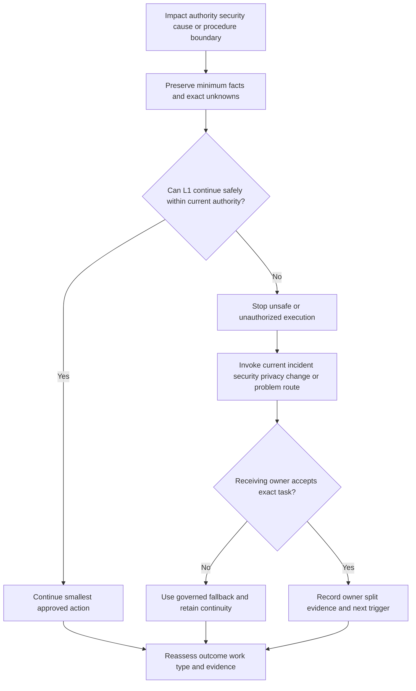

### Non-negotiable safety prohibitions

This Part and its sample artifacts prohibit:

- executing any step against production, Abnormal AI, Microsoft, a customer environment, a mailbox, an identity provider, an API, a network, a security system, a ticketing platform, or any external service;
- using a runbook, request, known error, workaround, incident class, urgency, or customer approval as permission to bypass current access, security, privacy, change, or segregation-of-duty controls;
- requesting, storing, copying, pasting, transmitting, or exposing passwords, tokens, cookies, API keys, client secrets, private keys, certificate private material, MFA codes, recovery codes, authorization headers, authenticated URLs, or other secrets;
- requesting or using unnecessary customer email subjects, bodies, attachments, mailbox exports, tenant exports, screenshots, logs, HAR files, packet captures, identity data, personal data, confidential data, regulated data, or security-sensitive content;
- clicking suspicious links, opening or executing untrusted files, replaying messages or requests, testing credentials, scanning systems, generating load, exhausting quotas, contacting a suspected actor, or simulating harmful activity;
- disabling, weakening, evading, suppressing, bypassing, or broadly allowlisting security, identity, email, network, detection, monitoring, remediation, or policy controls;
- making any unapproved account, role, consent, connector, route, mailbox, policy, threshold, verdict, configuration, remediation, standard, normal, emergency, or production change;
- deleting, purging, wiping, clearing, resetting, revoking, releasing, quarantining, overwriting, truncating, or destructively reproducing real data, evidence, messages, accounts, records, or systems;
- closing an incident merely because a workaround has been proposed, documented, attempted, or validated; closure must follow the current policy's outcome, residual-risk, communication, and ownership criteria;
- marking a root cause, known cause, permanent fix, containment, eradication, recovery, compromise, security breach, data breach, legal conclusion, or attribution without sufficient evidence and the authorized owner;
- inventing an Abnormal workflow, incident role, problem status, request catalog, known-error database, change model, runbook, approval, queue, target, entitlement, customer promise, owner acceptance, or completion result.

## 11. Practical operating method and interview language

A memorable operating method is **R-C-L-E-A-R**:

- **R - Recognize the outcome:** Is the need restoration, causal learning, normal fulfillment, controlled execution, or broader coordination?
- **C - Classify with the current source:** Apply the organization's glossary and policy; qualify security incidents separately.
- **L - Link without losing continuity:** Connect incident, problem, request, change, known error, knowledge, runbook, and playbook records while preserving the original customer story.
- **E - Evidence the state:** Separate observation, correlation, hypothesis, supported cause, approved root cause, action, and validated outcome.
- **A - Authorize every action:** Verify owner acceptance, access, change class, security/privacy boundary, scope, and stop conditions.
- **R - Reassess and review:** Recheck impact, workaround, runbook result, residual risk, stale knowledge, closure, and recurrence triggers.

| Interview prompt | Strong answer shape | Honest experience transfer | Boundary |
|---|---|---|---|
| “Incident or problem?” | State current impact, desired outcome, restoration track, causal track, and links | Critical-case coordination plus Engineering follow-up | Do not claim Abnormal record names or policy |
| “When do you use a workaround?” | Approval, safety, scope, validation, limits, expiry, owner, residual risk | Fix-validation and customer communication habits | No security bypass or automatic closure |
| “What is a known error?” | Approved analyzed condition with signature, cause status, workaround when available, ownership, and review | KB and repeat-issue learning | Do not imply complete cause if evidence is partial |
| “Can Support make a standard change?” | Only when the exact current model, operator authority, entry criteria, approval, and validation apply | Process discipline from enterprise support | A request or runbook is not permission |
| “How do you trust a runbook?” | Version, scope, entry, authority, evidence, branches, stop, validation, recovery, owner, review | Knowledge/training quality habits | Never execute this lesson's example in production |
| “What if root cause is unknown?” | State evidence ceiling, preserve rejected hypotheses, improve detection, and assign next trigger | Evidence-based escalation | Never fill the field with a guess |

The strongest answer is neither “everything is an incident” nor a recital of framework definitions. It shows that you can protect the immediate customer outcome, preserve durable learning, respect authorization, and state exactly what evidence supports.

## Lab

**SignalBridge Lab 103 - Local Synthetic Work-Item and Runbook Tabletop** is a safe, offline design. It was not performed. It creates no separate workspace file during authoring and performs no login, network request, API call, email, product action, ticket action, knowledge publication, change, security action, destructive action, or production execution.

If performed later, the learner creates one local Markdown packet containing twelve vocabulary definitions, eight fictional classifier cards, one incident/problem/request linkage map, one known-error entry, one executable text-only tabletop runbook, one runbook evidence ledger, one failure/escalation review, and one deterministic validation record. It proves only that the learner can structure fictional service-management reasoning.

### Prerequisites

- A learner-owned local folder and plain-text or Markdown editor.
- This Part as a read-only reference.
- No Abnormal AI, prior production, customer, email, identity, API, cloud, network, security, ticketing, CRM, knowledge, change, monitoring, or external system.
- No real person, customer, employer, tenant, domain, address, incident, problem, request, error, cause, event, content, log, contract, timestamp, identifier, procedure, screenshot, or product output.
- No password, token, cookie, key, secret, MFA code, recovery code, authorization header, credential-shaped placeholder, or authenticated URL.
- Obvious aliases such as `ORG-103-FICTION`, `WI-103-A`, `PRB-103-A`, `KE-103-A`, `RUN-103-A`, `USER-103-A`, and `example.invalid` only if a domain-shaped value is needed.
- This exact line at the top of every later-created lab artifact: `LOCAL SYNTHETIC TABLETOP - UNPERFORMED DURING AUTHORING - NOT ABNORMAL OR MICROSOFT PRODUCTION EXPERIENCE`.
- State `DESIGN_NOT_EXECUTED_NOT_TRANSFERRED` until the local artifact actually exists and every deterministic gate passes.

### Lab safety charter

| Area | Allowed | Prohibited | Automatic stop condition |
|---|---|---|---|
| Data | Learner-authored fictional labels and rows | Real customer, employee, product, security, personal, confidential, regulated, or identifying data | Any value is not clearly fictional |
| Systems | Offline manual text editing only | Login, query, API request, upload, email, product access, ticket update, knowledge publication, or external interaction | Any system would be contacted |
| Execution | Manual comparison of authored text rows | Production command, script, automation, restart, rebuild, remediation, release, or state change | A step could affect a real service or device |
| Security | Written stop-and-route decisions | Credential testing, link clicking, file execution, message replay, scanning, bypass, allowlisting, containment, or eradication | A security-sensitive action is proposed |
| Changes | Classification of a fictional boundary | Account, role, consent, policy, connector, route, threshold, configuration, data, or production change | Change authority would be needed |
| Content | Minimal invented metadata | Real or unnecessary message bodies, subjects, attachments, exports, screenshots, logs, HAR, or captures | Sensitive or customer content appears |
| Destructive action | None | Delete, purge, wipe, clear, reset, revoke, quarantine, release, overwrite, or destructive reproduction | Any irreversible action is proposed |
| Claims | “Designed” and, after real local completion, “completed offline with fiction” | Abnormal workflow, real incident/problem ownership, production runbook execution, or root-cause claim | Evidence tier is unclear |
| Closure | Evaluate fictional criteria | Close because a workaround exists | Residual outcome or ownership is not validated |
| Root cause | Evidence-state practice | Mark root cause without sufficient evidence and authorized review | Causal conclusion exceeds evidence |

### Lab steps

1. Retain state `DESIGN_NOT_EXECUTED_NOT_TRANSFERRED` while reading this design.
2. If performing later, create one learner-owned local Markdown packet through the normal file interface.
3. Add the exact honesty line, date, owner, and state at the top.
4. Do not copy a real case, incident, problem, request, change, known error, knowledge article, runbook, playbook, customer statement, internal policy, screenshot, log, or memory-derived identifying detail.
5. Define the twelve required vocabulary labels in the learner's own words.
6. Add one analogy, operational value, and explicit boundary to every definition.
7. State that framework and organization terminology varies and current authorized sources control real work.
8. Create fictional cards `WI-103-A` through `WI-103-H` using the twelve required work-record labels.
9. On each card, state the desired outcome before assigning a work-item class.
10. Include at least two incidents, one problem candidate, two service requests, one change-boundary case, one security-sensitive route, and one known-error candidate.
11. Separate expected versus actual outcome, confirmed scope, potential scope, residual impact, and unknowns.
12. Separate observation, correlation, hypothesis, supported cause, root-cause candidate, and approved root-cause states.
13. Do not mark any fictional cause approved unless the exercise defines an independent fictional reviewer and sufficient controlled evidence.
14. For one intentionally weak case, reject a “last change caused it” conclusion because timing alone is insufficient.
15. For one service request, show that a predefined request can still require a separate authorized change.
16. For one access request, reject temporary privilege expansion, shared credentials, and self-approval.
17. Link active restoration work to a separate problem candidate without closing either automatically.
18. Create `KE-103-A` with recognition signature, negative criteria, cause status, evidence ceiling, workaround, risks, owners, links, and review trigger.
19. State whether the known-error entry requires a complete root cause under the fictional publication rule.
20. Create a workaround record with approval placeholder, scope, safety, supportability, validation, sustainability, reversibility, residual risk, expiry, and owner.
21. Reject any workaround that bypasses or weakens a security, identity, email, network, monitoring, detection, or remediation control.
22. Reject any workaround requiring secrets, unnecessary customer content, destructive action, unsupported access, or production execution.
23. Create `RUN-103-A` as a manual text-only tabletop using the control table and steps in this Part.
24. Record runbook version, purpose, scope, exclusions, entry criteria, authority, inputs, dependencies, expected output, and owner.
25. Give every runbook step an ID, authorized action, expected evidence, branch or stop condition, and owner.
26. Include preserve-first, validation, failed-result, partial-result, recovery, communication, and review steps.
27. Ensure the runbook contains no command, executable code, login, network request, API call, product action, customer action, or external service.
28. Add one branch where a missing approval causes `stopped`, not an improvised workaround.
29. Add one branch where a missing required field causes only the affected fictional cohort to fail.
30. Add one branch where real or sensitive data causes the entire lab to stop.
31. Draft a restoration statement that names only validated cohorts and explicitly says cause and durability remain unknown.
32. Draft a residual-impact statement for the cohort that did not pass.
33. Reject the phrase “incident resolved” when the only fact is that a workaround was proposed or executed.
34. Apply the current fictional closure checklist and require accepted residual-work ownership.
35. Create one knowledge-article outline and explain why it does not grant operational authority.
36. Create one playbook outline linking incident coordination, communication, problem follow-up, and the runbook without duplicating runbook steps.
37. Create an escalation packet with outcome, work type, evidence, restoration state, cause state, authority boundary, exact ask, acceptance, retained duties, and communication trigger.
38. Search the packet for unsupported `Abnormal`, `Microsoft`, `customer`, `production`, `root cause`, `resolved`, `safe`, `approved`, `standard`, and `owner accepted` claims.
39. Search for secrets and unnecessary content, including token-, cookie-, key-, authorization-, attachment-, screenshot-, HAR-, packet-, and mailbox-shaped fields.
40. Search for unsafe verbs such as disable, bypass, purge, delete, release, reset, revoke, execute, replay, scan, and upload; every occurrence must be a prohibition or a clearly fictional conceptual discussion.
41. Search for closure language and reject every case where workaround existence alone is the reason.
42. Search for root-cause language and require an evidence state, scope, and authorized review for every positive conclusion.
43. Search for runbook steps that rely on judgment without a decision branch or escalation boundary.
44. Search for owners stated as only “team,” “Engineering,” “Support,” or “customer” without an accepted task and retained duties.
45. Count structural gates: word floor, H1, required vocabulary labels, Mermaid blocks, deep-dives, tables, classifier examples, decision tree, worked runbook, questions, sources, prohibitions, and final link.
46. Record an evidence pointer for every validation row.
47. If a row fails, record the failed gate and exact repair before editing.
48. Run no more than three repair cycles.
49. If any gate remains failed after cycle three, keep state incomplete and request human review.
50. Change the future local artifact state to `LOCAL_SYNTHETIC_TABLETOP_COMPLETED_NOT_TRANSFERRED` only if it actually exists and every validation row passes.
51. Leave this authored Part's statement unchanged: the lab was not performed during authoring.
52. Practice a ninety-second spoken classification of one incident, one problem, and one standard request.
53. Practice rejecting a requested “standard change” when authorization or criteria are missing.
54. Practice explaining why restoration, workaround, resolution, incident closure, problem closure, and root cause are separate.
55. Practice a runbook-stop statement that protects the customer while keeping the next owner and communication visible.
56. When learning use ends, follow approved local retention policy; do not use destructive commands or claim universal deletion.

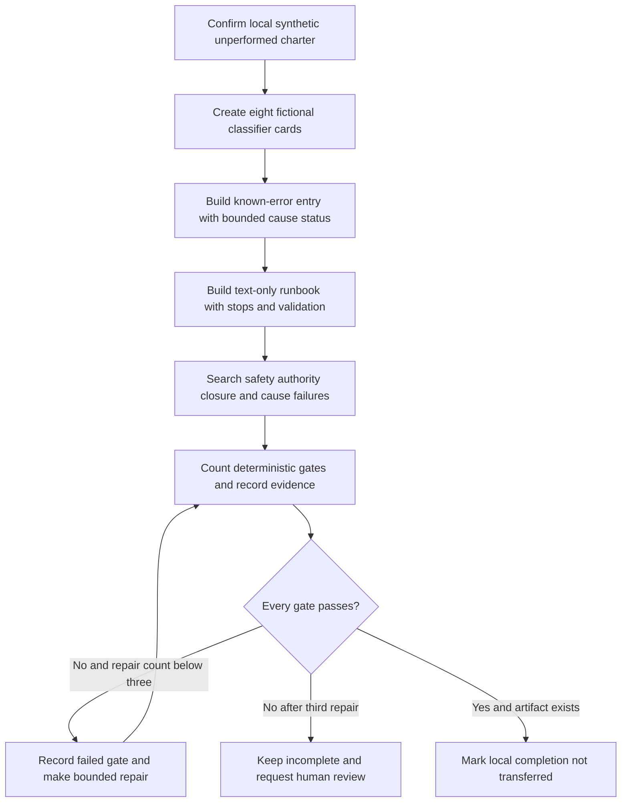

### Expected evidence

If the lab is actually performed later, expected evidence is:

- the exact honesty line and state showing local, synthetic, offline, unperformed during authoring, and not transferred;
- learner definitions for all twelve required vocabulary labels with analogy, purpose, and boundary;
- eight fictional work-item cards containing all twelve required work-record labels;
- a decision tree separating incident, problem, service request, change boundary, known error, runbook, playbook, and specialist routing;
- explicit incident restoration evidence and separately accepted problem follow-up;
- one standard request with a no-change path and one with a separate change-authorization boundary;
- one known-error entry with signature, negative criteria, cause state, workaround, risk, owner, links, review, and evidence ceiling;
- one complete text-only executable tabletop runbook with entry, authority, steps, branches, stops, validation, recovery, communication, and review;
- one per-step evidence ledger with expected versus actual results and no improvised production action;
- one rejected unsafe workaround and one rejected unsupported root-cause claim;
- one partial-restoration statement that does not close the incident automatically;
- one escalation packet with exact ask, acceptance state, retained ownership, and customer communication trigger;
- a deterministic validation ledger with counts and evidence pointers;
- no more than three recorded repair cycles;
- no real data, secret, unnecessary content, external interaction, production execution, bypass, unsafe/destructive action, fabricated approval, unsupported closure, unsupported root cause, or Abnormal workflow claim.

### Cleanup and privacy

- Keep any future exercise in one learner-owned local folder containing manually authored fictional text only.
- Do not upload, publish, paste, email, sync, commit, or send the artifact to a public repository, scanner, converter, personal cloud, external AI system, unapproved collaboration service, or other recipient.
- Do not log in to Abnormal AI, Microsoft, a customer environment, a mailbox, ticketing platform, knowledge system, change system, identity provider, security platform, or external service.
- Do not include real contracts, cases, incidents, problems, requests, changes, customer messages, email headers/bodies, attachments, screenshots, exports, logs, audit events, HAR files, captures, identities, metrics, timestamps, or procedures.
- Do not include passwords, tokens, cookies, API keys, client secrets, private keys, certificate private material, MFA codes, recovery codes, authorization headers, authenticated URLs, or credential-shaped values.
- Do not create or use phishing, suspicious content, executable files, credential tests, scans, load, quota exhaustion, security-control changes, containment actions, or destructive actions.
- If real or sensitive material appears, stop processing and sharing it, restrict further exposure, and use the approved privacy or security process. This Part grants no deletion, remediation, notification, legal, or incident authority.
- If unperformed, record `SignalBridge Lab 103 remains a reviewed design and was not executed.`
- If later performed and passed, record `SignalBridge Lab 103 was completed locally using learner-authored fictional text only; no real product, customer, production system, external service, secret, unnecessary content, unsafe or destructive action, bypass, unsupported closure, unsupported root cause, fabricated owner acceptance, or Abnormal workflow claim was used.`

### Validation rubric

Score every row. Any automatic-failure condition makes the overall result `FAIL`. A repair cycle must name the failed row, evidence pointer, exact correction, and new result. Stop after three repair cycles if a complete `PASS` is not achieved.

| Dimension | Fail | Developing | PASS |
|---|---|---|---|
| Vocabulary | Required terms are merged, assumed, or framework labels are presented as universal | Definitions exist without analogy or boundary | All twelve labels are defined before reliance with meaning, analogy, value, and organization-specific boundary |
| Classification | Caller wording or ticket type decides the route | Desired outcome is present but linked work is weak | Restoration, causal learning, request fulfillment, change, knowledge, execution, and coordination outcomes are separated and linked |
| Incident | Diagnosis or internal action substitutes for restoration | Restoration is stated without scope validation | Current impact, safe mitigation, outcome validation, residual risk, communication, and owner are explicit |
| Problem | A long incident is relabeled without causal objective | Hypotheses exist without evidence state | Causal question, hypotheses, discriminating evidence, recurrence, owner, and evidence ceiling are managed |
| Service request | Every customer ask is treated as fulfillment authority | Request model exists but entitlement or validation is weak | Predefined outcome, eligibility, approval, fulfillment, validation, and closure are explicit |
| Standard change boundary | “Routine” or runbook presence grants permission | Change is noticed but class/authority is unknown | Exact current change model, preauthorization, scope, operator, validation, recovery, and stop behavior are verified |
| Known error | Similar symptom becomes a universal diagnosis | Signature exists without negative criteria or cause status | Recognition, exclusions, evidence state, workaround, links, owner, review, and retirement are controlled |
| Workaround | Bypass, privilege, destructive action, or unsupported path reduces visible impact | Temporary path exists without limits or expiry | Approval, safety, supportability, scope, validation, sustainability, reversal, residual risk, owner, and expiry are explicit |
| Root cause | Guess, blame, correlation, or last change is marked root cause | Candidate cause lacks alternative testing or review | Evidence, mechanism, scope, alternatives, corrective validation, and authorized approval bound the claim |
| Knowledge article | Notes are published without audience or safety review | Reusable content exists but authority is ambiguous | Audience, scope, review, limits, safe evidence, and feedback path are explicit |
| Runbook | Vague or unsafe steps invite improvisation | Steps exist without full controls | Version, entry, authority, inputs, exact actions, evidence, branches, stops, validation, recovery, communication, and review are complete |
| Playbook | It duplicates commands or has no role model | Scenario phases exist without owner acceptance | Trigger, roles, decisions, communications, linked runbooks, handoffs, and completion are explicit |
| Ownership | “Team” or a tag is treated as acceptance | Role is named without task or retained duty | Record/action/communication owners, accepted scope, fallback, and next trigger are visible |
| Closure | Workaround or task creation closes the incident | Outcome is partially validated but residual work is vague | Current policy gate, validated scope, residual risk, customer communication, and accepted linked ownership control closure |
| Escalation | A data dump or urgent adjective substitutes for an ask | Receiving team is named but evidence/acceptance is weak | Trigger, bounded evidence, authority gap, exact ask, acceptance, retained duties, fallback, and communication are complete |
| Safety/privacy | Production, secret, content, bypass, or destructive step appears | Generic warning exists | Local synthetic scope, minimum data, explicit prohibitions, stop conditions, and authorized routes are enforced |
| Candidate honesty | Prior-role or lab work is presented as Abnormal production experience | Gap is implied | experience transfer, local practice, learned sources, and no direct Abnormal workflow experience are explicit |
| Source discipline | Secondary summaries or unsupported claims define policy | Official sources exist without limits | At least eight primary official sources each have an explicit authority boundary and current-source caution |
| Interview Q&A | Count differs from eight or an answer lacks the required label | Eight answers exist but omit evidence or limits | Exactly eight numbered questions each have one `Model answer` grounded in method, ethics, transfer, and boundaries |
| Deterministic review | Counts, links, gates, evidence, or repair cap are missing | Informal review only | Every contract gate is counted, automatic failures are absent, and repairs do not exceed three |

**Automatic failures:** any production execution; any login, network request, API call, product action, customer action, real ticket/knowledge/change update, or external interaction; any secret or unnecessary customer content; any security bypass, privilege expansion, unsafe step, harmful change, destructive action, unsupported access, or improvised runbook branch; any closure because a workaround merely exists; any root-cause, breach, compromise, containment, eradication, recovery, permanent-fix, owner-acceptance, approval, or outcome claim without sufficient evidence and authority; any invented Abnormal workflow, queue, role, status, runbook, approval, target, or escalation path; any claim that the lab was performed; or any master status update before a complete `PASS`.

**Deterministic Part pass rule:** at least 6,500 words; exactly one H1 equal to the required title; all twelve required vocabulary labels and all twelve work-record labels present; at least eight closed Mermaid blocks using recognized declarations; at least four Plain-English deep-dive headings; at least ten Markdown tables; incident, problem, service request, standard request, standard change boundary, known error, workaround, root cause, service restoration, knowledge article, runbook, playbook, owner, and terminology variation covered; work-item classifier and known-error/runbook artifacts present; worked classification examples, a decision tree, and a worked runbook present; failure modes and escalation safeguards present; exactly eight numbered interview questions with one `Model answer` each and no additional interview-question entries; at least eight primary official URLs with an explicit boundary for each; all required prohibitions present; lab state remains local, synthetic, and unperformed; exactly one final next-Part link; and no master tracker update before a complete `PASS`. Validate after the initial write, make no more than three repair cycles, and mark the master target `Done` only after `PASS`.

### Authored-Part deterministic validation record

| Gate | Required | Authored result | Evidence pointer | Result |
|---|---:|---:|---|---|
| Word floor | At least 6,500 | At least 7,690 whitespace-delimited tokens from disjoint lower-bound buckets: 65 lines with at least 50, 33 lines with 40-49, and 104 lines with 30-39 | Entire file | PASS |
| H1 | Exactly one exact title | 1 exact H1 | First line | PASS |
| Required vocabulary labels | 12 | 12 numbered definitions | Section goal vocabulary table | PASS |
| Required work-record labels | 12 | 12 numbered artifact fields | Artifact one label table | PASS |
| Mermaid | At least 8 closed recognized blocks | 12 recognized declarations and 12 closing fences | Sections goal, 1-10, and Lab | PASS |
| Plain-English deep-dives | At least 4 | 4 authored headings | Sections 1, 2, 3, and 5 | PASS |
| Markdown tables | At least 10 | 28 separator rows identify 28 authored tables | Throughout | PASS |
| Worked artifacts | Classifier plus known-error/runbook entry | Both authored with completed fictional examples | Sections 7 and 8 | PASS |
| Decision tree and worked runbook | Both required | Classifier tree plus twelve-step runbook | Sections 7 and 8 | PASS |
| Failure modes and escalation | Both required | Failure table, packet, triggers, and diagram | Section 10 | PASS |
| Interview questions | Exactly eight with Model answer | 8 numbered headings and 8 answer labels | Interview section | PASS |
| Primary official sources | At least 8 with boundaries | 12 official URL rows with explicit boundaries | Official Source Anchors | PASS |
| Safety prohibitions | All named prohibitions | Explicit list, lab charter, steps, and automatic failures | Sections 10 and Lab | PASS |
| Final navigation | Exact sole final next-Part link | 1 exact Part link on the final line | End of file | PASS |

**Authored-Part validation result: PASS.** Repair cycle 1 corrected the validation ledger's Mermaid total from 11 to the measured 12; it did not change lesson content or the lab state. No second or third repair cycle was required. SignalBridge Lab 103 remains `DESIGN_NOT_EXECUTED_NOT_TRANSFERRED` and was not performed.

## Official Source Anchors - August 24, 2026

These official or primary sources anchor public product context, service-management scope, incident response, operational readiness, recovery, and requirement-language discipline. They do not define Abnormal AI's internal support workflow, incident/problem/request taxonomy, ticket fields, known-error process, standard-change model, knowledge system, runbook library, role authority, closure criteria, customer agreement, or escalation route.

| Official or primary source | Concept anchored | Explicit authority boundary |
|---|---|---|
| [Abnormal Behavioral Security Platform](https://abnormal.ai/platform/overview) | Public high-level platform context across email, identity, AI, and integrations | Public product material does not reveal or authorize an internal incident, problem, request, change, known-error, runbook, or support workflow |
| [Abnormal Trust Center](https://abnormal.ai/trust-center) | Public trust, security, privacy, and compliance context | It grants no customer-data access, operational role, incident authority, evidence permission, change approval, or workflow knowledge |
| [ISO/IEC 20000-1:2018](https://www.iso.org/standard/70636.html) | Official scope of requirements for establishing, operating, and improving a service management system | The public abstract does not provide the full standard or prove any organization's certification, implementation, terminology, record model, or conformity |
| [PeopleCert ITIL](https://www.peoplecert.org/browse-certifications/it-governance-and-service-management/ITIL-1) | Official owner/certifier context for the ITIL service-management framework and learning paths | Framework vocabulary is not a universal mandatory workflow and does not prove Abnormal, Microsoft, or a customer uses a specific version or implementation |
| [NIST SP 800-61 Rev. 3](https://csrc.nist.gov/pubs/sp/800/61/r3/final) | Primary U.S. government recommendations for integrating cybersecurity incident response with risk management | It does not make L1 a security incident commander or authorize collection, containment, eradication, notification, breach declaration, or customer action |
| [CISA Federal Government Cybersecurity Incident and Vulnerability Response Playbooks](https://www.cisa.gov/news-events/news/cisa-releases-cybersecurity-incident-and-vulnerability-response-playbooks) | Official public context for prepared cybersecurity incident and vulnerability response playbooks | Federal playbooks do not govern a private vendor/customer workflow, grant access, or authorize production/security actions in this lab |
| [Google SRE Workbook - Incident Response](https://sre.google/workbook/incident-response/) | Primary Google SRE discussion of mitigation-first incident management, roles, communication, records, drills, and runbooks | Google's practices and case studies describe Google/PagerDuty contexts; they do not establish Abnormal policy, authority, terminology, or customer commitments |
| [Google SRE Book - Managing Incidents](https://sre.google/sre-book/managing-incidents/) | Primary Google SRE guidance on structured incident response and role clarity | The model must be adapted under local policy and does not grant you incident-command authority or define a support-ticket workflow |
| [Google SRE Workbook - Postmortem Culture](https://sre.google/workbook/postmortem-culture/) | Primary guidance on learning from incidents and avoiding blame | Postmortem guidance does not prove a single root cause, replace evidence, or define when a problem or incident may close |
| [AWS Well-Architected Framework - Prepare](https://docs.aws.amazon.com/wellarchitected/latest/operational-excellence-pillar/prepare.html) | Official AWS guidance on operational readiness, observability, runbooks, playbooks, and change risk | AWS guidance is not an executable procedure for another service and grants no production access, change approval, or vendor-specific role |
| [NIST SP 800-184 - Guide for Cybersecurity Event Recovery](https://csrc.nist.gov/pubs/sp/800/184/final) | Primary U.S. government guidance on planning and improving recovery | Recovery guidance does not define customer service restoration, legal notification, product remediation, or L1 authority for a specific organization |
| [RFC 2119 - Key Words for Use in RFCs to Indicate Requirement Levels](https://www.rfc-editor.org/rfc/rfc2119.html) | Primary IETF best-current-practice context for precise normative words such as MUST and SHOULD | Its keyword meanings apply when a document invokes them; it does not make this lesson a production standard or grant authority to execute a runbook |

Source discipline:

- Public Abnormal pages support only attributed product and trust context. No private case, incident, problem, request, knowledge, change, runbook, target, or ownership rule is inferred.
- ISO and PeopleCert establish service-management source families. Their public pages do not prove a particular implementation, certification scope, terminology version, or contractual promise.
- NIST and CISA address cybersecurity risk, incident response, and recovery. They do not convert an ordinary support case into a declared security incident or authorize L1 to collect content, contain accounts, notify parties, or make legal conclusions.
- Google SRE sources demonstrate mitigation, structured coordination, documentation, learning, and preparedness. Their examples are not Abnormal workflows and should not be copied as universal role or closure rules.
- AWS distinguishes operational preparation, runbooks, and playbooks in its own guidance. The useful principle is preparation and control, not assumption that every organization uses the same labels.
- RFC 2119 teaches careful requirement language. A runbook should state its own authority and governing policy rather than capitalizing words to manufacture permission.
- Product pages, standards, frameworks, and guidance can change after August 24, 2026. Revalidate current official and internal sources, applicable versions, permissions, customer context, and owner acceptance before real work.

## Likely Interview Questions

### Q1. How do you distinguish an incident, a problem, and a service request?

**Model answer:** I start with the desired outcome. An incident addresses an unplanned interruption or degradation and prioritizes safe restoration. A problem manages the causal or recurrence question behind one or more incidents or risks. A service request fulfills a normal predefined need such as information or an approved catalog item. One customer case can link all three, so I preserve continuity rather than forcing everything into one record. I would use the employer's current definitions because terminology varies, and I would not claim to know Abnormal's internal workflow.

### Q2. Does a workaround mean an incident can be closed?

**Model answer:** No, not by itself. I first verify that the workaround is approved, safe, supported, bounded, validated for the affected outcome, sustainable, reversible where applicable, and explicit about residual risk and expiry. Then I apply the current incident closure criteria. Some organizations may allow closure after validated restoration if durable work has an accepted owner; others may keep the incident open. I would never close merely because a workaround was proposed or exists, and I would never use a security bypass as a workaround.

### Q3. What is a known error, and does it always mean root cause is known?

**Model answer:** A known error is an organization-approved record for a sufficiently analyzed failure condition, with a recognizable signature, current cause status, impact, workaround or recovery path when available, links, owner, and review criteria. Framework and organizational definitions differ. Some require an understood cause; some permit a provisional record with a repeatable signature and safe workaround while deeper cause remains open. I would label the evidence state precisely and never imply a complete root cause or universal symptom match without proof.

### Q4. What is the boundary between a standard request and a standard change?

**Model answer:** A standard request follows a predefined fulfillment model for a normal user need. A standard change is a separate change-policy classification for an exact, preauthorized, repeatable, sufficiently understood, low-risk alteration. A request can require a change, but customer approval, routine frequency, or a runbook does not make that change standard. Before execution I would verify the current model, scope, operator authority, entry criteria, validation, recovery, and stop conditions. If any boundary is unknown, I stop and route it for authorized review.

### Q5. What makes a runbook executable and safe?

**Model answer:** It has a controlled identity and version, measurable purpose, scope and exclusions, entry criteria, authority, safe inputs, preserve-first requirements, ordered actions, expected evidence, decision branches, stop conditions, validation, recovery or rollback, communication, evidence recording, owner, and review lifecycle. The operator records actual evidence and stops when it diverges; they do not improvise in production. A runbook never grants access or change approval. I would test it only in an authorized environment, and this Part's runbook is an unperformed local fictional tabletop only.

### Q6. How would you handle a likely cause that is not yet proved?

**Model answer:** I call it a hypothesis or supported cause according to the evidence, not root cause. I state the mechanism, scope, observations, alternatives, and a discriminating test. I preserve what was rejected and what remains unknown. A root-cause claim requires the organization's evidence and review standard plus corrective validation in the declared scope. If evidence cannot distinguish the candidates, “root cause not established” is an honest result, and I assign better detection or evidence-retention work rather than filling the field with a guess.

### Q7. How do you keep incident and problem ownership clear after restoration?

**Model answer:** I record the restored outcome and scope, residual impact, workaround limits, incident completion criteria, linked problem or corrective work, exact accepted owner, retained Support communication, and the next review or reopen trigger. Tagging Engineering is not acceptance. The incident and problem can have different owners and close at different times. I preserve the original customer timeline and do not reset records for metrics. If ownership is not accepted, I use the current fallback escalation and keep customer continuity visible.

### Q8. How does your prior background help without overstating Abnormal experience?

**Model answer:** enterprise support gave me real experience owning cases, coordinating critical-situation work, communicating with customers and partners, collaborating with Engineering or Product, validating fixes, and creating knowledge or training. Those habits transfer directly to restoration, evidence quality, ownership, and follow-through. Microsoft record types, change processes, clocks, tools, and terminology do not define Abnormal's operations, and I have not run Abnormal's internal workflows in production. I would learn the current approved glossary, service catalog, security route, change policy, and systems of record before acting.

## Memory Hooks

- **Incident restores; problem learns; request fulfills.**
- **One customer story can link several work items.**
- **Restore the outcome before polishing the causal story.**
- **A workaround is a detour, not a repaired bridge.**
- **Workaround found does not mean incident closed.**
- **Observation is not cause; timing is not proof.**
- **Root cause needs mechanism, scope, alternatives, evidence, and review.**
- **Known error means governed recognition, not universal diagnosis.**
- **A knowledge article informs; a runbook executes; a playbook coordinates.**
- **A request asks; a change policy authorizes.**
- **A documented action is not automatically a standard change.**
- **A runbook is a checklist with authority, evidence, branches, stops, and recovery.**
- **The document never grants the permission.**
- **Tagged is not accepted; “the team” is not an owner.**
- **Action completed is not outcome validated.**
- **Security-sensitive means stop ordinary experimentation and route authority.**
- **No production, secrets, unnecessary content, bypass, harm, or destruction.**
- **Microsoft method transfers; Abnormal workflow does not.**
- **Designed is not performed.**

## Completion Checklist

- [ ] I can define all twelve required vocabulary labels before relying on them.
- [ ] I explain that service-management and runbook/playbook terminology varies by framework and organization.
- [ ] I classify by desired outcome rather than the first noun used by a customer or tool.
- [ ] I distinguish incident restoration, problem investigation, request fulfillment, change authorization, knowledge, execution, and coordination.
- [ ] I can preserve one customer story across linked records without making the customer repeat it.
- [ ] I define incident impact, scope, start evidence, service state, owner, communication, and restoration criteria.
- [ ] I prioritize safe restoration without waiting for a complete root-cause narrative.
- [ ] I validate the customer or service outcome rather than treating an internal action as restoration.
- [ ] I state restoration scope, validator, evidence, workaround state, residual impact, and observation boundary.
- [ ] I never close an incident merely because a workaround exists.
- [ ] I apply the current closure policy and require accepted ownership for residual work.
- [ ] I can explain how an incident and a problem can close at different times.
- [ ] I define a problem through its causal or recurrence objective rather than duration alone.
- [ ] I separate observation, correlation, hypothesis, supported cause, root-cause candidate, approved root cause, and corrective validation.
- [ ] I never mark root cause because it is the first plausible explanation, the latest change, a required field, or a convenient person.
- [ ] I can record “root cause not established” with useful evidence, rejected hypotheses, and next triggers.
- [ ] I understand that multiple causes, contributors, triggers, controls, and recovery gaps can coexist.
- [ ] I distinguish a service request from a current failure of an entitled service.
- [ ] I verify request model, eligibility, approval, fulfillment, validation, and closure.
- [ ] I distinguish a standard request from a standard change.
- [ ] I never treat routine frequency, customer desire, documentation, or a runbook as automatic change authorization.
- [ ] I stop when the change class, authority, operator, version, scope, or entry criteria are missing.
- [ ] I define a known error with signature, negative criteria, cause status, workaround, risk, links, owner, review, and retirement.
- [ ] I do not apply a known-error record solely because symptom wording looks similar.
- [ ] I understand that known-error root-cause requirements vary and must be stated explicitly.
- [ ] I evaluate a workaround for authority, safety, supportability, scope, validation, sustainability, reversibility, residual risk, expiry, and ownership.
- [ ] I never call privilege expansion, broad allowlisting, disabled protection, or another bypass a workaround.
- [ ] I distinguish a known-error record, knowledge article, runbook, playbook, problem record, and change record.
- [ ] I can explain that a knowledge article does not automatically authorize operational execution.
- [ ] I can explain that a runbook does not grant access, approval, or change authority.
- [ ] I require runbook identity, version, purpose, scope, exclusions, entry, authority, inputs, dependencies, preserve-first action, exact steps, expected evidence, branches, stops, validation, recovery, communication, record, owner, and review.
- [ ] I stop a runbook when actual evidence diverges instead of improvising an unsafe production step.
- [ ] I can distinguish a runbook's operational procedure from a playbook's broader coordination.
- [ ] I state owner scope, accepted task, retained duties, fallback, and next trigger.
- [ ] I do not treat tagging, attendance, assignment, or “the team” as accepted ownership.
- [ ] I can use the work-item decision tree and explain every branch.
- [ ] I can complete all twelve required work-record labels for a fictional card.
- [ ] I can walk through all eight classification examples and state each evidence ceiling.
- [ ] I can explain the completed synthetic known-error entry without claiming a real cause or workaround.
- [ ] I can walk through the worked runbook, including partial, failed, and stopped results.
- [ ] I can create an escalation packet with exact ask, authority gap, acceptance state, retained duties, and customer communication.
- [ ] I escalate security, privacy, legal, safety, change, causal, procedure, and closure boundaries through current authorized routes.
- [ ] I never execute this lesson's sample against production or any external system.
- [ ] I never request or expose passwords, tokens, cookies, keys, secrets, MFA/recovery codes, authorization headers, or authenticated URLs.
- [ ] I never request or use unnecessary customer content, attachments, mailbox/tenant exports, screenshots, broad logs, HAR files, captures, personal data, confidential data, or regulated data.
- [ ] I never click suspicious links, execute files, replay messages/requests, test credentials, scan systems, generate load, exhaust quotas, or contact a suspected actor.
- [ ] I never bypass, disable, weaken, evade, suppress, or broadly allowlist a security, identity, email, network, monitoring, detection, remediation, or policy control.
- [ ] I never make an unapproved account, role, consent, connector, route, mailbox, policy, threshold, verdict, configuration, data, remediation, emergency, or production change.
- [ ] I never delete, purge, wipe, clear, reset, revoke, quarantine, release, overwrite, or destructively reproduce real data, evidence, messages, accounts, records, or systems.
- [ ] I can explain what each official source anchors and where its authority stops.
- [ ] I revalidate current sources, versions, permissions, policies, customer context, and ownership after August 24, 2026.
- [ ] I state honestly which experience came from prior production support, which came from local practice, which is learned architecture, and which remains a gap.
- [ ] I make no claim about Abnormal's internal incident, problem, request, change, known-error, knowledge, runbook, playbook, status, queue, owner, or closure workflow.
- [ ] I can answer all eight interview questions aloud with evidence, safety, ownership, and scope boundaries.
- [ ] I describe SignalBridge Lab 103 as `DESIGN_NOT_EXECUTED_NOT_TRANSFERRED` unless I actually create the local artifact and every gate passes.
- [ ] I make no more than three repair cycles and leave the result incomplete if any automatic failure remains.
- [ ] I never claim this authored Part, its classifier, known-error entry, runbook, or lab was performed.

[Next: Part 104 - Escalation Handoffs Swarming and Critical Incidents](Part-104-escalation-handoffs-swarming-and-critical-incidents.md)