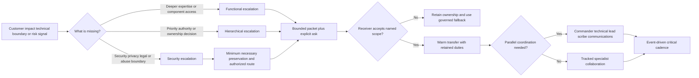
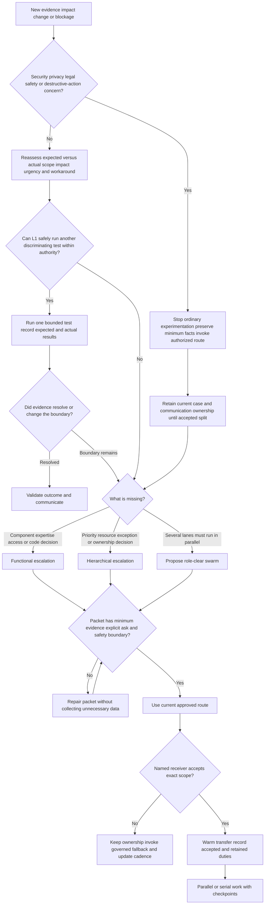
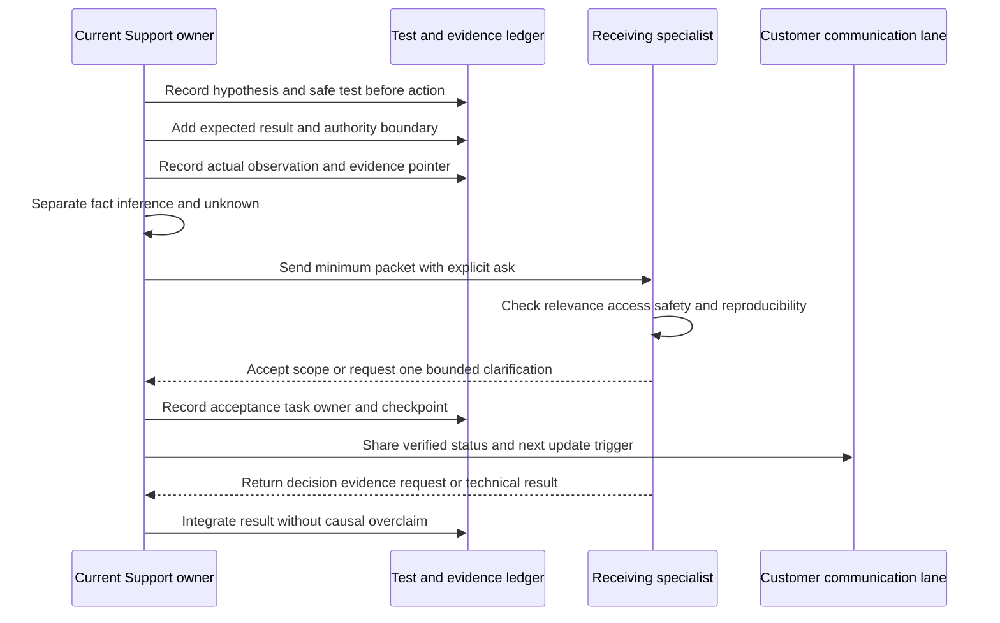
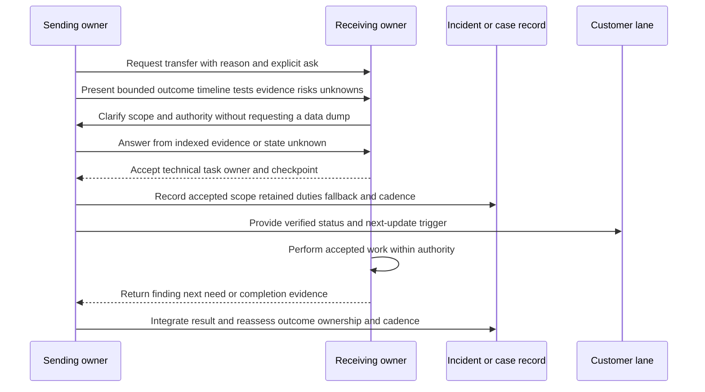
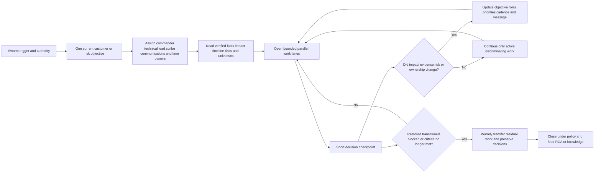
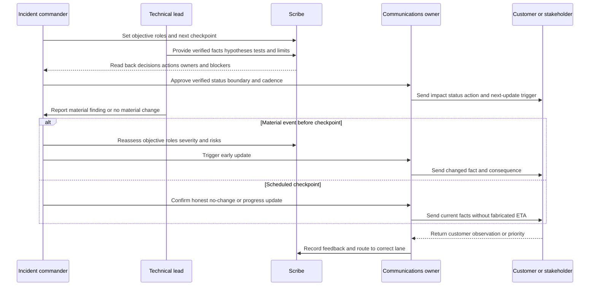
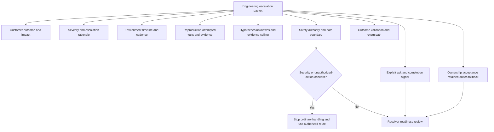
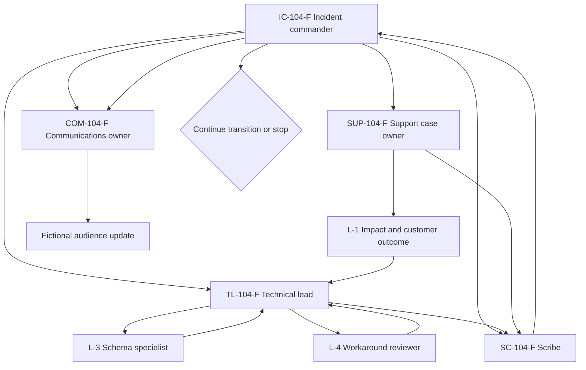
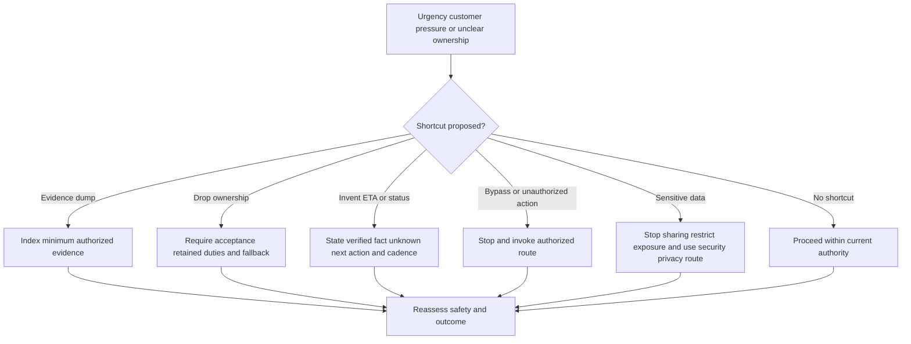
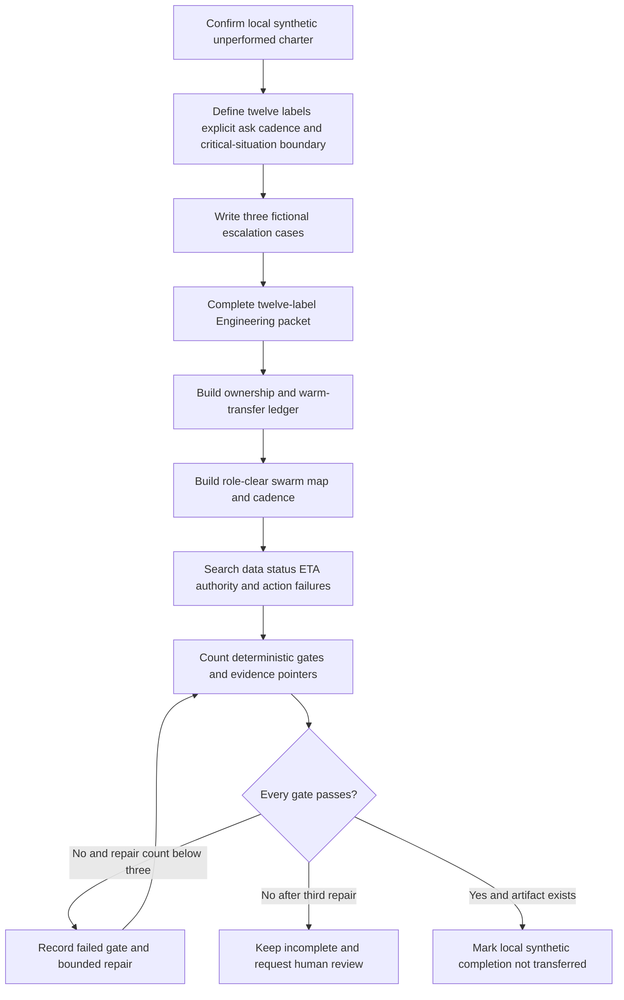

# Part 104 - Escalation Handoffs Swarming and Critical Incidents

> **Purpose:** Build a product-neutral, evidence-led method for deciding when and how to escalate, transferring work without abandoning ownership, forming a role-clear swarm, and maintaining an honest critical-incident cadence.
>
> **Artifact honesty label:** **Local synthetic escalation-packet and swarm-map design only.** Every organization, customer, person, system, event, symptom, impact, test, observation, owner, role, handoff, severity, cadence, decision, timestamp, identifier, and result in this Part is fictional unless a public source is explicitly cited or prior experience is explicitly described as prior experience. SignalBridge Lab 104 was not performed while this Part was authored. No Abnormal AI, Microsoft, customer, mailbox, identity, API, network, security, ticketing, incident-management, or production system was accessed or changed. You may describe the lab as completed only after you actually create the local fictional artifact and every deterministic gate records `PASS`.
>
> **Currency and source access date:** August 24, 2026.

## Section goal

Escalation is often described as “sending a ticket to someone more senior.” That description is incomplete and sometimes dangerous. A good escalation moves a specific decision, expertise need, authority gap, or action to the right accepted owner while preserving the customer story, current evidence, safety boundaries, and communication continuity. A poor escalation merely moves a record, attaches a data dump, or creates a crowd.

This Part teaches four connected operating skills:

1. deciding whether the need is functional, hierarchical, security-sensitive, or a combination;
2. proving what L1 already learned through bounded attempted tests and evidence of useful quality;
3. completing a warm handoff in which ownership is explicit before, during, and after transfer; and
4. forming a swarm with an incident commander, technical lead, scribe, communications owner, clear asks, and a critical cadence that changes when facts change.

Terminology varies. An employer may use `escalation`, `consult`, `engagement`, `bridge`, `major incident`, `critical incident`, `war room`, `swarm`, `handoff`, `transfer`, or other terms with formal criteria. Security, privacy, legal, and emergency-change processes may supersede ordinary support escalation. The current employer's authorized policies, service ownership map, support boundaries, customer agreements, incident plan, security response plan, and systems of record control real work. This Part defines a portable reasoning model, not Abnormal AI policy.

### The twelve required vocabulary labels

These twelve labels are defined before the lesson relies on them. Two rows deliberately distinguish paired concepts: `scribe and communications roles` and `severity versus escalation`. The additional terms **explicit ask** and **cadence** are defined immediately after the table because they are mandatory operating concepts even though they are not extra numbered labels.

| # | Required label | Beginner-first definition | Everyday analogy | Why it matters | Boundary to preserve |
|---:|---|---|---|---|---|
| 1 | **Functional escalation** | Moving a defined technical question, investigation, decision, or action to a person or team with deeper product, code, infrastructure, or domain capability | A family doctor sends a specific scan and question to a cardiologist while continuing to care for the patient | It brings the missing expertise or system access into the case | It is not a license to send an unscoped ticket, and the receiving function must accept the exact ask |
| 2 | **Hierarchical escalation** | Raising a decision, priority conflict, resource blockage, customer-risk issue, or ownership deadlock to a leader with the authority to resolve it | A blocked construction crew asks the project director to decide which safety-critical job gets the only available crane | It addresses authority and prioritization gaps that technical testing alone cannot solve | It must not be used to bully specialists, bypass intake controls, or manufacture severity |
| 3 | **Security escalation** | Invoking the current authorized security, privacy, legal, trust, or abuse route when evidence or a proposed action crosses that boundary | A receptionist who sees a suspicious package stops ordinary handling and calls the trained security team | It protects evidence, people, customers, and legal duties | L1 must not declare breach, compromise, attribution, containment, or notification unless explicitly authorized |
| 4 | **Handoff** | A controlled transfer of a defined responsibility, context, evidence, and next action from one owner to another | A relay runner transfers the baton only when the next runner has a secure grip | It prevents context loss and ownerless work | A queue move, tag, message, or meeting invite does not prove acceptance |
| 5 | **Ownership** | Explicit accountability for a named record, customer relationship, decision, action, communication, or validation outcome | A restaurant may have many cooks, but one person owns the order reaching the correct table | It makes follow-through and fallback visible | Ownership is scoped; Engineering ownership of code analysis does not automatically include Support's customer communication |
| 6 | **Swarm** | A time-bounded, coordinated group assembled around a defined outcome when parallel expertise and decisions are more effective than serial transfers | Emergency-room specialists gather around one patient, each with a distinct role and a shared stabilization goal | It reduces queue bouncing and accelerates correlated work | More attendees do not equal progress; a swarm still needs authority, roles, evidence, and an exit condition |
| 7 | **Incident commander** | The role that coordinates the response system: objectives, priorities, roles, decision flow, safety boundaries, and operational rhythm | An orchestra conductor coordinates timing and entrances without playing every instrument | It creates one coordination point under pressure | The title and authority are organization-specific; the commander need not be the deepest technical expert |
| 8 | **Technical lead** | The role that owns the technical investigation strategy: hypotheses, tests, specialist tasks, evidence interpretation, and technical recommendations | A lead mechanic directs diagnosis while the service manager coordinates customers and resources | It protects technical coherence and avoids duplicate or conflicting experiments | The technical lead does not gain approval to make production or security changes merely by holding the role |
| 9 | **Scribe and communications roles** | The scribe preserves a timestamped decision and action record; the communications owner turns verified facts into audience-appropriate updates | One person records a court hearing while another authorized spokesperson briefs the public | Separate roles reduce memory gaps and contradictory messaging | Either role may be combined locally, but notes must not expose sensitive data and communications must not invent certainty |
| 10 | **Severity versus escalation** | Severity expresses the assessed level of impact and urgency under current criteria; escalation is an action taken to obtain capability, authority, coordination, or attention | A small locked-room problem may need a specialist keyholder even though the whole building is not in danger | It prevents every escalation from becoming “critical” and every critical case from being treated as only a queue transfer | Severity criteria, priority, support entitlement, and escalation paths are organization-specific and can change independently |
| 11 | **critical situation** | A prior-context term for a critical-situation engagement experienced by the candidate in enterprise support, involving heightened coordination and customer focus | A hospital activates a special coordination mode for an unusually consequential case | It gives you an honest example of operating under pressure | It is not assumed to be Abnormal terminology, policy, severity, entitlement, role model, cadence, or process; portability is limited to habits |
| 12 | **Warm transfer** | A handoff in which the current owner directly conveys the bounded story, evidence, explicit ask, risks, and retained duties, and the receiving owner acknowledges what they accept | A nurse introduces the patient and care plan to the next nurse rather than leaving a folder at an empty desk | It closes the acknowledgement loop and protects continuity | Warm transfer does not mean oversharing data, remaining owner of everything forever, or skipping the official record |

An **explicit ask** is one sentence stating what the receiver is being asked to decide, explain, approve, inspect, or do, why that receiver is needed, and what evidence or completion signal should come back. “Please investigate” is not explicit. “Please determine whether parser component `COMP-104-F` can produce the observed schema mismatch, identify the next discriminating test, and return a recommendation by the next governed checkpoint” is explicit, although every name and checkpoint in that example is fictional.

A **cadence** is the event-driven or time-based rhythm for reassessment, internal coordination, and audience updates. It answers when the next checkpoint occurs, what triggers an earlier update, who prepares it, who approves it where required, and how the rhythm changes as impact or uncertainty changes. Cadence is not a guessed fix time. “Next update at 14:00 fictional time, or earlier upon scope change, validated mitigation, safety concern, or accepted Engineering decision” is a cadence. “Fixed in two hours” without evidence and authority is a fabricated ETA.

The central analogy is **a hospital referral that can become an emergency team response**. The original clinician gathers useful history and performs safe initial checks. A specialist accepts a defined question. If the patient's condition becomes critical, a coordinated team forms with clear leadership, clinical roles, recording, and family communication. The analogy stops where support work has different contracts, remote systems, distributed ownership, security boundaries, telemetry, data-retention requirements, and separate authority for customers, Support, Engineering, Product, Security, Privacy, Legal, and operations.

## JD Mapping

| Role signal | Capability developed | Observable behavior | Honest proof artifact |
|---|---|---|---|
| Enterprise L1 ownership | Escalates without dropping the customer thread | Keeps current owner, next action, receiver acceptance, retained duty, and fallback visible | Local synthetic Engineering escalation packet |
| Complex technical troubleshooting | Shows attempted tests and why the next layer is needed | Records hypothesis, test, expected result, actual result, conclusion, and safety limit | Attempted-test ledger |
| Engineering and Product collaboration | Converts a broad ticket into a bounded technical request | Gives a minimum reproducible pattern, evidence index, unknowns, and explicit ask | Completed fictional functional escalation |
| Threat or suspicious-behavior support | Recognizes when ordinary troubleshooting must stop | Preserves minimum facts and invokes the authorized security route without declaring compromise | Security stop-and-route example |
| Customer communication | Maintains truthful cadence during uncertainty | Separates verified facts, active work, unknowns, next action, and update trigger | Critical update template |
| Cross-functional work | Uses swarming when parallel work is justified | Names commander, technical lead, scribe, communications owner, specialist lanes, dependencies, and exit criteria | Swarm map |
| Severity and SLA judgment | Separates impact classification from escalation action | Uses current severity criteria while escalating expertise at any appropriate severity | Severity-versus-escalation decision table |
| Case quality | Prevents evidence dumps and context loss | Uses an indexed minimum-evidence manifest with source, time, relevance, redaction, and confidence | Evidence-quality ledger |
| enterprise support background | Transfers real critical-situation coordination habits honestly | Describes prior experience as prior experience and extracts portable habits | Candidate transfer statement |
| Abnormal AI learning goal | Learns a product-neutral escalation method without inventing internal process | Names gaps and verifies current policies, roles, tooling, and customer commitments before use | Source-and-boundary ledger |

## Candidate honesty note

You can truthfully draw on several years of enterprise support, including customer-facing case ownership, critical situations described in your prior context as critical situations, coordination with Engineering or Product, technical investigation, fix validation, customer and partner updates, knowledge creation, mentoring, and quality improvement. Those experiences provide real evidence that you can stay organized under pressure, communicate uncertainty, ask for specialist help, and follow an issue through validation.

They do not prove knowledge of Abnormal AI's internal severity model, escalation criteria, queues, roles, incident command, swarm practice, support entitlement, security route, customer cadence, critical-situation terminology, Engineering intake, tooling, acceptance state, or closure policy. There is no claim in this Part that Abnormal uses the term `critical situation` at all. A safe interview bridge is:

> “In enterprise support, I worked critical situations where I kept the customer impact and communication visible, coordinated specialists, supplied tested evidence, and validated outcomes. I use critical-situation only for that prior-employer context. I have not operated Abnormal's internal critical-incident or escalation process. At Abnormal I would first learn the current severity criteria, security route, role authority, Engineering intake, handoff acceptance, communication cadence, and systems of record, then apply the portable habits without importing Microsoft's labels or promises.”

| Evidence tier | Safe wording | Evidence | Overclaim to avoid |
|---|---|---|---|
| prior production experience | “In my prior support role, I coordinated a critical situation and maintained the customer and specialist workstreams.” | A real, defensible Microsoft example within confidentiality limits | “Abnormal has the same critical-situation process.” |
| Local synthetic practice | “After I actually complete it, I built and validated a fictional escalation packet and swarm map offline.” | Learner-authored file plus passing rubric | “I ran an Abnormal incident swarm.” |
| Learned public guidance | “Official incident-response guidance supports role clarity, evidence preservation, and prepared communication.” | Dated official sources and explicit boundaries | “This public framework defines the employer's workflow.” |
| Proposed future behavior | “I would verify the current owner and route, then make the smallest authorized escalation.” | Portable reasoning and ramp plan | Naming an internal queue, clock, entitlement, or approver without evidence |
| No direct Abnormal experience | “I have not used Abnormal's internal escalation tools or process.” | Honest gap statement | Converting Microsoft titles, actions, or results into Abnormal experience |

## 1. Escalation is a controlled request, not abandonment

An escalation is successful only when it improves the path to a customer or risk outcome. Sending a ticket elsewhere may change an assignment field without adding expertise, authority, evidence, or coordination. A high-quality escalation starts with the missing capability and ends with an acknowledged responsibility split.

Ask five questions before selecting a route:

1. What exact customer, service, or risk outcome is impaired or uncertain?
2. What has L1 established through safe tests, and what remains unknown?
3. What capability or authority is missing: technical depth, prioritization, security handling, change approval, customer decision, or something else?
4. What precise response from the receiver would advance the case?
5. Who owns the case record, customer communication, technical lane, decision, and next checkpoint while that response is pending?

### Severity is an assessment; escalation is an action

A low-severity issue can require functional escalation because only a code owner can interpret a reproducible edge condition. A high-severity issue can require several escalation types at once: a technical owner for mitigation, a leader for priorities, and a security authority for protected handling. Conversely, a severe issue that is already with the correct on-call owners may not need another transfer; it may need stronger coordination and cadence.

| Situation | Severity reasoning | Escalation reasoning | Good action | Bad shortcut |
|---|---|---|---|---|
| One fictional administrator sees a repeatable UI error with a safe workaround | Scope may be limited under fictional criteria | Functional expertise is needed because L1 tests isolate a component boundary | Send a bounded Engineering ask and retain customer updates | Inflate severity to make Engineering look sooner |
| Many fictional users cannot perform an essential workflow | Broad active impact may justify critical handling under current criteria | Functional and hierarchical routes may both be required | Invoke current incident route, assign roles, and preserve exact scope | Treat “many users” as proof of cause or entitlement |
| A suspicious token-shaped value appears in evidence | Severity may still be unknown | Security/privacy handling is immediately required | Stop ordinary sharing, restrict exposure, and invoke the authorized route | Paste the value into more channels to get faster help |
| Specialist already accepted the technical question | Severity can change as scope changes | Another functional transfer may add no value | Track the accepted ask and adjust cadence on events | Create duplicate escalations for visibility |
| Customer executive requests a guaranteed fix time | Executive attention can affect urgency but not technical certainty | Hierarchical help may be needed for communication and resource alignment | Escalate the decision and provide a governed next-update time | Fabricate an ETA or promise an unapproved deadline |
| Proposed workaround disables a protection | Visible impact can be high or low | Security/change authority is missing | Reject execution and invoke the appropriate authority | Call the bypass temporary and proceed |

### Escalation decision tree

### Escalation criteria

Escalate when at least one concrete boundary is reached, not because the case feels difficult. Typical product-neutral criteria include:

- the next discriminating test requires code knowledge, backend telemetry, component access, or specialist authority unavailable to L1;
- a safe, bounded L1 test produces a reproducible result that contradicts the documented contract or expected behavior;
- active impact meets the current incident or critical-response criteria;
- the potential impact is materially uncertain and requires an authorized owner to bound it;
- a security, privacy, legal, trust, abuse, fraud, or regulatory concern appears;
- a proposed action changes production, security, identity, policy, data, or customer state beyond current authority;
- attempted tests are exhausted, unsafe, nondiscriminating, or blocked by missing access;
- teams disagree about ownership, severity, risk acceptance, customer promise, or closure and the disagreement blocks progress;
- a workaround is absent, unstable, risky, labor-intensive, expiring, or itself creating customer impact;
- a previously accepted task misses its governed checkpoint and the fallback path must be invoked;
- repeated issues suggest shared component or product risk that cannot be handled case by case; or
- the customer relationship or business consequence requires leadership alignment without altering evidence or technical truth.

Escalation should not be triggered solely by case age, customer volume, the word “urgent,” executive title, personal anxiety, a desire to clear backlog, or a wish to transfer difficult communication. Those signals may affect assessment and coordination, but they do not replace criteria.

### 🔍 Plain-English deep-dive: “I need help” must become a bounded request

Imagine sending a broken appliance to a repair shop with a note that says only “does not work.” The technician must rediscover the model, symptom, power state, changes, tests, and expected behavior. The delay came from missing context, not from the technician's skill. An escalation that says “customer issue, please investigate urgently” creates the same waste.

A bounded request says what outcome failed, where and when it failed, which populations are confirmed or untested, what safe checks ran, what each check showed, which hypotheses became weaker or stronger, what evidence is available, what authority blocked the next step, and what exact answer is requested. This is not an invitation to write a novel. It is a compact map that lets the receiver start at the current frontier.

The frontline owner does not need to solve the specialist's task before escalating. They need to demonstrate disciplined learning and make the boundary visible. “I cannot query backend parser telemetry” is legitimate when paired with an explicit ask. “I tried everything” is not useful because it cannot be audited or challenged.

The analogy stops at data handling. A repair shop may accept the whole appliance; enterprise support should provide minimum necessary, authorized, redacted evidence through approved channels. More evidence is not automatically better evidence.

## 2. Attempted tests and evidence quality make escalation actionable

An escalation packet must show how the investigation moved. A flat list of commands or screenshots is weaker than a test ledger that connects each action to a hypothesis and conclusion. The receiver needs to know not only what happened, but why the test mattered and what it ruled in or out.

### Attempted-test record

| Field | Required content | Strong fictional example | Weak example |
|---|---|---|---|
| Test ID | Stable local reference | `T-104-03` | “latest test” |
| Question | One falsifiable question | “Does the failure follow fixture schema `S-B` when identity and network inputs remain constant?” | “Check schema” |
| Authorization and safety | Why the test is allowed and bounded | “Offline learner-authored text comparison; no system access” | Omitted |
| Inputs and controlled variables | Minimum synthetic inputs and what remains constant | `FIX-A`, `FIX-B`; same fictional role and request shape | Whole customer export |
| Expected result by hypothesis | What each competing explanation predicts | `H1`: only `S-B` fails; `H2`: both fail | No expected result |
| Actual observation | Direct result with source and time label | “At `FT-104-07`, `FIX-A` passed and `FIX-B` failed at field 6” | “It broke” |
| Interpretation | What strengthened, weakened, or remained open | “Strengthens schema-specific hypothesis; does not identify code cause” | “Root cause found” |
| Evidence pointer | Indexed, redacted, minimum artifact | `E-104-04`, authored comparison row | “See attachments” |
| Next decision | Continue, escalate, stop, or validate | “Functional escalation for parser-owner interpretation” | Blank |
| Limit | What the test cannot prove | “No production behavior, security state, prevalence, or durability proved” | Omitted |

Tests should be **discriminating**: different hypotheses predict different results. Repeating the same action without new information creates noise and may create harm. A restart that temporarily clears a symptom may be a mitigation observation, but it is a weak causal test unless the hypotheses predict different post-restart behavior and the action is authorized. A screenshot proves what was visible in a bounded moment; it rarely proves backend cause.

### Evidence quality ladder

| Quality dimension | Useful evidence | Weak or harmful evidence | Receiver question answered |
|---|---|---|---|
| Relevance | Directly supports the explicit ask or a competing hypothesis | Broad dump “just in case” | Why should I inspect this? |
| Provenance | Source, collection method, owner, and time are known | File of unknown origin | Where did it come from? |
| Integrity | Original reference or approved hash/manifest where required; transformations disclosed | Copied fragments with edits hidden | Can I trust that it represents the observation? |
| Scope | Confirmed, potential, excluded, and untested cohorts separated | “Everyone” based on one reporter | How broadly does it apply? |
| Time | Time zone, precision, clock uncertainty, and ordering stated | “Around noon” across several zones | Can I correlate events? |
| Minimization | Only authorized fields necessary for the question | Message bodies, tokens, full logs, or exports without need | Is it safe and lawful to receive? |
| Interpretation | Observation separated from hypothesis and conclusion | Filename says `ROOT_CAUSE` before proof | What does it actually establish? |
| Reproducibility | Steps and conditions are clear enough to repeat safely | “Sometimes happens” | Can I recreate or challenge it? |
| Negative evidence | Tests that did not reproduce or alternatives weakened are visible | Only confirming examples retained | What has already been ruled against? |
| Accessibility | Approved recipient can access the indexed item through the right channel | Broken personal link or inaccessible attachment | Can I start work now? |
| Freshness | Evidence is current enough for the stated question | Stale output presented as current service state | Does it describe the present condition? |
| Boundary | Explicitly states what is unknown or unproved | Certainty implied by volume | Where must my analysis begin? |

An evidence manifest is better than an attachment pile. Each item should have an ID, short description, source class, fictional or real status, timestamp basis, sensitivity class, redaction state, relevance, and authorized location. This Part's examples are all local fictional text; real cases must use current approved storage and transfer controls.

### Evidence packet readiness check

| Gate | Ready when | Not ready when | Repair |
|---|---|---|---|
| Outcome | Expected and actual behavior are observable and bounded | Title says only “broken” | Write one expected-versus-actual sentence |
| Impact | Confirmed scope, potential scope, business consequence, and workaround are separate | Emotion substitutes for scope | Identify source and confidence for each impact claim |
| Timeline | Key events use a common time basis and uncertainty is stated | Events are pasted in collection order | Normalize a minimum event timeline |
| Tests | Each safe attempt has question, expected, actual, conclusion, and limit | Actions appear as an unstructured list | Convert actions to test records |
| Evidence | Every item is indexed, relevant, minimized, and accessible | Broad logs are dumped | Remove unnecessary items and create a manifest |
| Ask | Receiver can answer with a decision, analysis, approval, or action | “Please investigate” | Write the exact completion signal |
| Boundary | Security, privacy, change, access, and data limits are explicit | Receiver is expected to infer authority | State stop conditions and required route |
| Ownership | Current owner, requested owner, acceptance, retained duties, and fallback are visible | Assignment is treated as transfer | Complete the acknowledgement loop |
| Cadence | Next governed checkpoint and event triggers are named | An unsupported ETA is promised | Commit to the next update, not an invented fix time |

### 🔍 Plain-English deep-dive: A data dump exports labor and risk

Imagine asking a specialist to find one accounting error by delivering every receipt, bank statement, email, and password in the company. The pile contains more information, but it makes the important fact harder to find and creates new privacy and security exposure. The same problem appears when a support escalation includes full tenant exports, broad logs, screenshots, packet captures, message content, or HAR files with no manifest and no stated question.

An effective packet is curated, not cosmetically polished. Curation means each item earns its place by answering a question. A sanitized five-row timeline with request identifiers can be stronger than a thousand lines of unbounded output. When the receiver genuinely needs another field, the collection should be authorized, minimum, and purpose-linked.

Evidence quality also includes intellectual honesty. If a test did not reproduce, record that. If one customer is confirmed and ninety-nine are only potentially affected, do not write “one hundred affected.” If a correlation is strong but mechanism is unknown, preserve that distinction. A clean narrative that hides contradictory evidence is worse than an incomplete narrative that shows its limits.

## 3. Handoffs preserve ownership rather than making it disappear

Support work has several ownership dimensions. One person may own the customer-facing case, another the technical analysis, another an emergency change decision, another security response, and another executive communication. Trying to force one universal owner can be as confusing as leaving everything to “the team.” The packet and swarm map should state ownership by object and action.

### Ownership model

| Ownership object | Example responsibility | Acceptance evidence | Retained duty during handoff | Completion evidence |
|---|---|---|---|---|
| Customer-facing case | Keep the customer informed and maintain coherent case history | Named Support owner in current system | Continue updates unless explicitly reassigned and accepted | Current closure criteria and customer outcome addressed |
| Technical question | Determine whether component behavior can explain the pattern | Specialist acknowledges explicit ask | Support supplies bounded clarifications and protects data boundary | Written finding, next test, or accepted limitation |
| Incident coordination | Set objectives, assign roles, and maintain response rhythm | Authorized incident role accepts under policy | Case owner participates and supplies customer context | Incident transition or completion under current policy |
| Production action | Execute a specific approved operation | Authorized operator and approval are recorded | Requester does not improvise or expand scope | Action evidence plus outcome validation |
| Security decision | Assess, contain, notify, or make another security-governed decision | Authorized security owner accepts | Support preserves minimum facts and avoids independent declarations | Security process's governed result, often restricted |
| Communication | Prepare or issue audience-specific update | Named communications owner and approver where needed | Technical owners provide verified facts promptly | Timestamped approved update sent through current channel |
| Follow-up defect | Investigate or correct durable product behavior | Work owner accepts scope and criteria | Support links the case and returns relevant customer evidence | Accepted disposition and validation plan |

A **warm transfer** has six moves:

1. announce the intended handoff and why the receiving role is needed;
2. summarize outcome, impact, timeline, attempts, evidence, risks, and unknowns;
3. state the explicit ask and requested completion signal;
4. ask the receiver to confirm accepted scope, owner, and checkpoint;
5. state what the sender retains, especially customer communication and case continuity; and
6. record the transfer, fallback, and any disagreement in the governed system.

### Handoff acceptance states

| State | Meaning | Safe wording | Required next action |
|---|---|---|---|
| Requested | A defined ask was sent through the current route | “Functional escalation requested; acceptance pending.” | Current owner retains all existing duties and tracks fallback |
| Clarifying | Receiver needs a bounded missing fact before acceptance | “Receiver requested field `F-3`; minimum authorized response pending.” | Supply only what is needed or state why unavailable |
| Accepted | Named receiver acknowledges exact task and checkpoint | “Technical question `A-104` accepted by fictional role `TL-F`.” | Record retained duties and cadence |
| Partially accepted | Receiver accepts one lane but not another | “Parser analysis accepted; production-change decision remains unowned.” | Route the unaccepted lane separately |
| Declined with rationale | Receiver states why the task belongs elsewhere or lacks criteria | “Declined because component evidence does not match entry criteria.” | Validate rationale and use governed fallback without blame |
| No response | No acceptance exists at the governed checkpoint | “Acceptance not established.” | Invoke fallback or hierarchical escalation under policy |
| Returned | Accepted task comes back with result, blocker, or new owner need | “Finding returned; next test requires authorized operations owner.” | Integrate evidence and make a new explicit ask if needed |
| Completed | Accepted scope has its required output | “Code-path assessment completed; customer restoration remains pending.” | Do not confuse task completion with case or incident completion |

### 🔍 Plain-English deep-dive: The baton, the scoreboard, and the audience are different

In a relay race, one runner holds the baton, officials maintain the scoreboard, and an announcer tells the audience what happened. Giving the baton to the next runner does not make that runner responsible for the scoreboard or announcements. Support handoffs work similarly.

Engineering may accept the code-analysis baton. Support may still own the customer-facing record and updates. An incident commander may own response objectives and priorities. A security team may own a restricted decision that Support cannot see in full. A communications owner may publish updates using facts from technical leads. These scopes must be written down.

The dangerous sentence is “Engineering owns it now.” What exactly does `it` mean: the ticket, customer expectation, code hypothesis, mitigation, ETA, severity, security assessment, or closure? Replace the sentence with a responsibility split. For example: “Fictional Engineering role `ENG-104-A` accepted parser-path analysis and a next-test recommendation. Support owner `SUP-104-A` retains the customer case, evidence minimization, and updates. No repair ETA or production action was accepted.”

The analogy also explains why an unacknowledged queue move is not a transfer. A relay runner cannot leave the baton on the track and claim the next runner has it. Until acceptance is recorded, the current owner follows the fallback path and maintains continuity.

## 4. Swarming replaces serial bouncing with coordinated parallel work

A swarm is useful when several interdependent questions must move in parallel, delay between serial transfers is costly, or active impact requires a shared operating picture. It is not the default for every difficult ticket. Swarming consumes attention, so the trigger, objective, participants, authority, cadence, and exit condition should be explicit.

### When to swarm

| Signal | Why a swarm may help | Minimum requirement | When not to swarm |
|---|---|---|---|
| Active broad impact crosses several components | Parallel diagnosis and mitigation can shorten restoration | Authorized incident route and one coordination owner | Impact is narrow and one specialist can answer asynchronously |
| Ownership is disputed across dependencies | Shared map can expose the actual boundary and next evidence | Explicit decision owner and component representatives | Leadership can resolve a simple routing mistake directly |
| Security-sensitive and service-restoration lanes interact | Separate authorities need controlled coordination | Security-approved handling and information boundaries | Ordinary bridge would spread restricted evidence |
| Workaround is risky or unstable | Technical, operations, change, and customer lanes must align | Named risk decision and stop conditions | No authorized operator or approver is available |
| Evidence changes quickly | A common timeline prevents contradictory work | Scribe and source-of-truth record | Participants cannot access a governed record |
| Executive/customer consequence is high | Communication and technical truth need synchronization | Communications owner and verified-fact gate | Swarm exists only to display activity |

### Role clarity

The exact roles and titles vary. A small event may combine roles if policy allows and workload remains safe. The principles are coordination, technical direction, record integrity, communication, and clear action owners.

| Role | Owns | Does not automatically own | First questions | Handoff output |
|---|---|---|---|---|
| Incident commander | Objectives, priorities, role assignment, decision flow, cadence, safety, and transition | Every technical hypothesis or every customer sentence | “What outcome matters now? Which roles and decisions are missing?” | Current objective, owner map, decisions, next checkpoint |
| Technical lead | Hypothesis strategy, test sequencing, evidence interpretation, technical recommendation | Change approval, security declaration, customer promise | “Which test best separates the leading explanations?” | Technical status, confidence, next test, risk |
| Scribe | Timeline, decisions, actions, owners, checkpoints, evidence references | Secret storage, technical approval, public messaging | “What changed, who decided, and what evidence supports it?” | Timestamped decision/action log |
| Communications owner | Audience map, update draft, approvals, delivery, feedback loop | Inventing facts, guaranteeing ETA, deciding technical cause | “What is verified, what changed, and when will we update again?” | Audience-safe update and acknowledgement |
| Support case owner | Customer context, case continuity, entitlement/policy checks, clarifications | Backend diagnosis or incident command by default | “What does the customer need to know or validate?” | Case journal, customer questions, outcome confirmation |
| Component specialist | Bounded analysis for an owned component or domain | Whole-incident prioritization | “Does evidence reach my component and what would discriminate it?” | Finding, next evidence need, limitation |
| Authorized operator/change owner | Approved production action and action evidence | Root-cause declaration or broad scope expansion | “Are entry, authority, rollback, and validation complete?” | Action result and operational evidence |
| Security/privacy/legal owner | Restricted assessment and governed response decision | Ordinary Support disclosure beyond need-to-know | “What minimum facts are necessary and what handling applies?” | Governed direction, sometimes with intentionally limited detail |
| Customer decision owner | Customer-side access, change, validation, or business choice | Provider internal technical action | “What customer-owned decision or observation is needed?” | Accepted customer action or outcome observation |

### Swarm operating cycle

### Swarm hygiene

- Start with the current outcome and stop conditions, not a round-robin biography.
- Keep one governed source of truth; chat can coordinate but should not become the only record.
- Use lane IDs and explicit asks so participants know why they are present.
- Record facts, hypotheses, decisions, and actions as different types of statements.
- Let the technical lead sequence tests to avoid duplicate, conflicting, or unsafe actions.
- Let the incident commander protect priorities and prevent one loud voice from taking over.
- Give communications one verified input stream rather than asking them to interpret raw technical chatter.
- Remove participants whose lane is complete; a smaller active swarm is usually clearer.
- Reassess whether the response still meets critical criteria; do not preserve a high-intensity bridge for theater.
- End with accepted residual ownership, not merely “bridge closed.”

### 🔍 Plain-English deep-dive: A crowd is not a swarm

Picture twelve people entering a kitchen during a dinner rush. If nobody owns the order, one person changes the oven, another adds salt, two reorder ingredients, and three tell the customer different completion times. More people made the situation worse. A real kitchen brigade works because roles, tickets, timing, authority, and final checks are clear.

The same applies to an incident bridge. Attendance is not contribution. A participant needs a lane, an ask, an information boundary, and an exit condition. The incident commander coordinates the kitchen; the technical lead directs diagnosis; the scribe maintains the order history; the communications owner speaks from verified facts. Specialists work bounded stations.

Swarming also reduces serial context loss. Instead of Support sending the ticket to identity, identity returning it, Support sending it to networking, and networking sending it to a parser team, the relevant specialists can inspect one timeline and agree on the next discriminating test. This does not eliminate ownership boundaries. It makes them visible at the same time.

## 5. Critical incidents, critical-situation transfer, and cadence

A critical incident is not simply a difficult ticket. It is an event that meets the current organization's criteria for elevated coordination because confirmed or credible potential consequences, urgency, uncertainty, or recovery needs require it. Criteria may include breadth, loss of an essential function, security consequences, regulatory concerns, strategic customer impact, lack of workaround, rapid spread, or another defined threshold. The current policy decides; this Part does not.

### "Critical situation" is a prior-employer term here

Your CV-supported prior background includes critical-situation coordination. In interview answers, you can describe what you actually did: clarify impact, keep customers and partners informed, coordinate technical resources, maintain actions and owners, validate returned fixes, and follow through. You should not imply that every Microsoft team used one universal process, reveal confidential details, or claim authority you did not hold.

The transferable capabilities are:

- remaining calm while impact and facts change;
- separating customer impact from technical hypothesis;
- bringing the right specialists into a bounded problem;
- maintaining a single timeline and action ledger;
- committing to a next update rather than inventing a repair time;
- escalating priority or ownership conflicts through leadership;
- validating the customer outcome after a technical action; and
- capturing durable learning after stabilization.

The nonportable elements include the name `critical situation`, severity definitions, support-plan entitlements, response targets, bridge tooling, escalation contacts, role authority, staffing model, approval path, customer promise, status fields, and closure rules. Abnormal may use different language and structures. The only correct approach is to learn its current authorized process after joining.

### Critical cadence model

Cadence should be both **time-triggered** and **event-triggered**. A time-triggered checkpoint prevents silence. An event-triggered update prevents the team from withholding an important change merely because the clock has not reached the next interval.

| Trigger or phase | Internal coordination focus | Customer-safe update content | Never claim |
|---|---|---|---|
| Initial activation | Confirm authority, objective, roles, scope, safety, source of truth | Acknowledged impact, current scope, active coordination, next update time | Cause, universal scope, or fix ETA before evidence |
| Scope changes | Reassess severity, resources, affected cohorts, and security boundary | What expanded or narrowed, evidence basis, current impact, next action | That untested populations are healthy or affected |
| Material technical finding | Challenge alternatives, choose next test, assess customer relevance | Verified finding, what it means, what it does not prove | Root cause from correlation or one log line |
| Mitigation proposed | Check authority, risk, reversibility, validation, and fallback | Proposed path, approval state, expected outcome, risks where appropriate | That proposal equals implementation or restoration |
| Mitigation attempted | Record action evidence separately from outcome | Action completed and validation underway | “Fixed” because an action ran |
| Partial restoration | Reclassify affected cohorts and residual risk | Exact restored scope, remaining impact, workaround limits | “Resolved” for all users |
| No material change by checkpoint | Reconfirm owner, active work, blocker, and next decision | Honest no-change update, work in progress, next trigger | Invented progress or a placeholder ETA |
| Security boundary appears | Restrict handling and invoke authorized route | Only approved customer-safe statement | Breach, compromise, actor, containment, or notification conclusion |
| Stabilization | Observe durability, validate original outcome, plan transition | Current outcome, observation window, remaining work, next update | Permanent fix without sufficient duration and evidence |
| Transition | Accept residual defects, RCA, problem, or customer actions | What moves, who owns what, retained Support duty, follow-up trigger | “Engineering owns everything” |

### Critical update formula

A concise critical update can use **I-F-A-N-T**:

- **Impact:** confirmed customer or service outcome, scope, and duration basis;
- **Facts:** material verified observations since the previous update;
- **Actions:** completed actions and their results, plus active authorized work;
- **Next:** the next decision, test, validation, or owner action; and
- **Time/trigger:** next governed update time or an earlier event trigger.

Unknowns belong in the update when they matter. “Cause remains under investigation” is stronger than an invented theory. “No material change since the prior update” is acceptable when paired with the active lane, blocker, and next checkpoint. Repeating “teams are working hard” adds no evidence.

### 🔍 Plain-English deep-dive: Cadence is a metronome, not a fortune teller

A metronome tells musicians when the next beat occurs. It does not predict when the concert will end. A critical update cadence works the same way. It gives customers and responders a dependable rhythm while technical completion remains uncertain.

This distinction matters because pressure often produces false precision. A leader asks, “When will it be fixed?” The evidence may support a test completion time or a next decision point but not a repair time. A truthful answer is: “The parser owner is comparing the two bounded fixtures now. The next update is at fictional time `FT-104-16`, or earlier if the comparison identifies a safe mitigation, changes scope, or reaches a security boundary. We do not yet have evidence for a restoration ETA.”

That answer does not avoid accountability. It commits to work, ownership, and communication that can actually be controlled. An ETA should be shared only when the authorized owner has evidence for it, the dependencies and assumptions are stated, and the current communication policy permits it. Even then, label estimate confidence and update it when assumptions change.

## 6. Artifact one - Engineering escalation packet

The Engineering escalation packet is a concise, indexed working contract between the current case owner and the receiving technical owner. It is not a substitute for the employer's official fields, a requirement that every organization use one document, or permission to transfer customer data. In a real environment, map these information needs to the authorized system and current secure-transfer controls.

### The twelve required escalation-packet labels

Every complete packet in this Part uses exactly these twelve labeled fields. Organizations may split, rename, or automate them; the information and boundaries should remain visible.

| # | Artifact label | Required content | Why it is required |
|---:|---|---|---|
| 1 | **Packet ID and honesty state** | Fictional identifier in the lab; evidence tier, author, version, and current state | Prevents a draft or simulation from being mistaken for production fact |
| 2 | **Customer outcome and impact** | Expected versus actual result, confirmed scope, potential scope, consequence, start evidence, and workaround | Keeps the escalation anchored to the user or service outcome |
| 3 | **Severity and escalation rationale** | Current assessed severity source, uncertainty, escalation type, criteria reached, and capability gap | Separates impact classification from the action of escalating |
| 4 | **Environment and change context** | Relevant versions, topology, identity/configuration facts, recent changes, and unknowns using minimum data | Makes the operating conditions and boundaries reproducible |
| 5 | **Timeline and cadence** | Normalized key events, last update, next checkpoint, and event triggers | Aligns correlation and prevents silence or fabricated ETA |
| 6 | **Reproduction and attempted tests** | Safe steps, hypotheses, expected results, actual observations, interpretations, and limits | Prevents duplicate effort and shows the current investigation frontier |
| 7 | **Evidence index and quality** | Minimum authorized item IDs, source, time, relevance, redaction, access, and confidence | Replaces evidence dumping with inspectable proof |
| 8 | **Hypotheses and unknowns** | Ranked explanations, evidence for/against, unresolved alternatives, and evidence ceiling | Prevents a plausible idea from becoming an unsupported root cause |
| 9 | **Safety authority and data boundary** | Security/privacy/change/access concerns, prohibited actions, stop conditions, and required routes | Stops the escalation from becoming implicit permission |
| 10 | **Explicit ask and completion signal** | Exact decision, analysis, approval, or action requested and what a useful return contains | Lets the receiver accept and complete a bounded task |
| 11 | **Ownership and handoff acceptance** | Current owner, requested receiver, acceptance state, retained duties, dependencies, and fallback | Keeps the baton visible throughout the handoff |
| 12 | **Outcome validation and return path** | How the customer outcome will be validated, where findings return, transition criteria, and follow-up link | Prevents an internal task completion from masquerading as resolution |

### Worked escalation A - functional Engineering escalation

The following packet is complete fiction. It demonstrates structure, not Abnormal behavior, product architecture, a real incident, or an executed lab.

| Required packet label | Completed fictional content |
|---|---|
| Packet ID and honesty state | `ESC-104-A`; `DESIGN_EXAMPLE_NOT_EXECUTED_NOT_TRANSFERRED`; learner-authored fiction; version 1 |
| Customer outcome and impact | In fictional organization `ORG-104-FICTION`, report fixture `FIX-104-B` is expected to return six named synthetic fields. It returns five fields and flags schema mismatch. One fictional analyst workflow is confirmed; two cohorts are untested; no real customer or service impact exists. A manual synthetic comparison is available only in the story and is not a production workaround. |
| Severity and escalation rationale | Fictional normal-priority case; no critical criteria asserted. Functional escalation is justified because safe L1 comparisons isolate a schema-dependent boundary, but parser implementation and backend telemetry are unavailable. No hierarchical escalation requested. |
| Environment and change context | Local text fixtures `FIX-104-A` and `FIX-104-B`; same invented role, request shape, and field list; only authored schema marker differs. No product, tenant, network, identity, API, or production environment was accessed. |
| Timeline and cadence | `FT-104-01` expected contract written; `FT-104-03` baseline passed; `FT-104-05` alternate fixture failed; `FT-104-07` repeat produced same fictional result. Next design review checkpoint `FT-104-10`, or earlier if the reviewer finds a safety or ambiguity issue. No repair ETA. |
| Reproduction and attempted tests | `T1` compare baseline: expected pass, authored pass. `T2` alternate schema: expected hypotheses diverge, authored fail at field 6. `T3` repeat with same inputs: authored same result. No commands or systems were used. Result strengthens schema-boundary hypothesis but cannot identify code cause. |
| Evidence index and quality | `E1` six-field expected-contract table; `E2` baseline comparison; `E3` alternate comparison; `E4` test ledger. All are fictional text, minimum, local, and non-sensitive. No attachments, logs, screenshots, captures, or secrets. |
| Hypotheses and unknowns | `H1` parser rejects alternate authored marker: strengthened. `H2` role/identity difference: weakened because fictional role is held constant. `H3` transient service issue: unsupported because no service exists. Unknown: actual product contract, prevalence, component behavior, code cause, security state, and production relevance. |
| Safety authority and data boundary | Design only. Do not log in, query, upload, execute, change, replay, scan, disable, delete, remediate, or transfer. Do not add real customer, Microsoft, Abnormal, message, identity, log, or secret data. |
| Explicit ask and completion signal | Fictional reviewer ask: determine whether the authored evidence is sufficient to justify a component-owner question, name the next discriminating text-only test, and identify any unsupported conclusion. Completion is a written review with one of: accept, request bounded clarification, or reject with rationale. |
| Ownership and handoff acceptance | Learner owns the local draft. No Engineering receiver exists and no transfer occurred. In a real case, Support would retain the customer record and updates until accepted scope is recorded. |
| Outcome validation and return path | Any future local reviewer result returns to the learner's local packet. No customer outcome can be validated because there is no customer or service. The example remains `NOT_EXECUTED_NOT_TRANSFERRED`. |

### Worked escalation B - hierarchical escalation for an ownership deadlock

Fictional teams `COMP-A` and `COMP-B` each say the symptom appears after their boundary. The current owner has a normalized timeline showing a request accepted by `COMP-A`, transformed at the handoff, and rejected before a `COMP-B` completion event. Neither team accepts the next cross-boundary test. The customer-facing outcome remains impaired in the story.

The correct hierarchical ask is not “make Engineering fix this.” It is: “Please assign one decision owner for cross-boundary test `T-104-X`, resolve which authorized team can collect the two minimum correlation fields, and confirm the checkpoint. Support retains the fictional customer update and will not request broad logs.” The escalation is about authority and ownership, not proof that either component caused the issue.

| Element | Worked decision |
|---|---|
| Functional question | Which boundary changes the fictional request shape? |
| Deadlock | Neither component role accepts collection of the two minimum correlation fields |
| Why hierarchy is needed | A leader must resolve ownership and resource authority; more L1 testing cannot assign that authority |
| Evidence | Three fictional event rows with common correlation ID and disclosed clock uncertainty |
| Explicit ask | Assign decision owner, authorized collector, and checkpoint for one bounded cross-boundary test |
| Retained Support duty | Keep the fictional customer informed and preserve the existing case timeline |
| Prohibited behavior | Blame a team, inflate severity, bypass intake, promise resolution time, or dump broad logs |
| Completion signal | Named accepted decision owner plus test authority and return path, not a guaranteed technical fix |

### Worked escalation C - security stop and route

During a fictional evidence review, a value shaped like an authorization token appears. The learner cannot determine whether it is real, synthetic, active, personal, or sensitive. The correct action is not to test it, decode it, paste it into the packet, or continue ordinary sharing. Stop processing and sharing the value, restrict further exposure, preserve only minimum metadata allowed by policy, and invoke the current authorized security/privacy route. This Part grants no authority to delete, revoke, contain, notify, or declare a breach.

| Question | Safe response | Unsafe response |
|---|---|---|
| What is known? | A token-shaped value appeared in a fictional scenario; authenticity and sensitivity are unknown | “Credentials were compromised” |
| What is preserved? | Minimum permitted reference, source context, and discovery time through the authorized route | Copy the value into chat, email, or screenshots |
| What stops? | Ordinary troubleshooting, reproduction, and broad distribution | Continue because fast diagnosis feels urgent |
| Who decides next? | Current authorized security/privacy owner under local policy | L1 independently tests or revokes the value |
| What does Support retain? | Case continuity and only approved customer-safe communication | Security investigation authority |
| What is the explicit ask? | “Advise handling, required preservation, permitted disclosure, and next owner.” | “Please confirm breach and contain everything.” |

## 7. Artifact two - swarm map

A swarm map is a living coordination view that answers: what outcome are we pursuing, what lanes are active, who owns each lane, what inputs and outputs connect them, what decisions are pending, and when does the swarm stop or transition? It is not an organization chart and should not contain unnecessary customer or security data.

### Completed fictional swarm map `SWARM-104-A`

| Map field | Fictional content |
|---|---|
| Honesty state | `DESIGN_EXAMPLE_NOT_EXECUTED_NOT_TRANSFERRED`; no real event, system, or participant |
| Trigger | Fictional report-generation outcome unavailable across two authored cohorts; no real critical criteria or severity asserted |
| Current objective | Determine whether a safe story-only workaround exists for `COHORT-A` while isolating the schema boundary for `COHORT-B` |
| Incident commander | `IC-104-F`, owns objective, roles, checkpoints, decision flow, and stop criteria in the fiction |
| Technical lead | `TL-104-F`, owns hypotheses, test ordering, technical findings, and recommendation boundaries |
| Scribe | `SC-104-F`, records fictional timeline, facts, decisions, actions, owners, and evidence IDs |
| Communications owner | `COM-104-F`, drafts audience-safe updates from verified fictional facts and never invents ETA |
| Support case owner | `SUP-104-F`, retains customer-story continuity, clarification, and outcome-validation plan |
| Specialist lane A | `SPEC-A-F`: compare authored schema contracts; output is supported/unsupported mismatch statement |
| Specialist lane B | `SPEC-B-F`: assess story-only workaround risks; output is proposed/rejected with limits, never executed |
| Security boundary | Any real, sensitive, credential-shaped, or suspicious material stops the tabletop and invokes the authorized route outside this lab |
| Cadence | Internal design checkpoint at `FT-104-20`; audience update at `FT-104-22`; earlier trigger on scope, risk, workaround, owner, or evidence change |
| Exit criteria | Objective validated in authored text, residual lanes warmly transferred, or safety/authority blocker stops the exercise |
| Residual ownership | Support retains story continuity; technical findings return to the packet; no actual Engineering, Security, or customer owner exists |

### Lane and dependency map

| Lane ID | Owner | Explicit ask | Inputs | Output | Dependency | Stop condition |
|---|---|---|---|---|---|---|
| `L-1 Impact` | `SUP-104-F` | Bound affected authored cohorts and outcome | Fictional reports and timestamps | Confirmed/potential/untested scope | None | Real customer or identifying data appears |
| `L-2 Technical` | `TL-104-F` | Rank hypotheses and choose one discriminating text test | `E1-E4` | Test plan and confidence update | `L-1` scope | Test would require a real system |
| `L-3 Schema` | `SPEC-A-F` | Compare two fictional contracts | Local authored field lists | Difference table and limitation | `L-2` question | External/product documentation would be represented as internal truth |
| `L-4 Workaround` | `SPEC-B-F` | Evaluate a fictional manual path for safety and completeness | Authored required-field list | Proposal or rejection with residual risk | `L-1`, `L-3` | Bypass, privilege, destructive, or production action appears |
| `L-5 Communication` | `COM-104-F` | Draft I-F-A-N-T update | Verified scribe record | Audience-safe fictional update | All lanes provide facts | ETA or cause would be fabricated |
| `L-6 Coordination` | `IC-104-F` | Resolve priority, owners, and transition | Lane states and blockers | Decision log and next checkpoint | All active lanes | Authority is unknown or safety route is required |

### Swarm checkpoint agenda

Keep critical checkpoints short enough to protect work time. The commander can use this order:

1. current objective and current confirmed impact;
2. safety, security, privacy, and authority changes;
3. material facts since the last checkpoint;
4. technical-lead confidence update and next discriminating test;
5. lane blockers and decisions, not a full activity recital;
6. mitigation or restoration state and outcome-validation plan;
7. owner changes, warm transfers, and fallback routes;
8. customer or stakeholder update content; and
9. next time trigger, event triggers, and exit criteria.

## 8. Failure modes and non-negotiable safeguards

Escalation pressure amplifies weak habits. The safest response is to make the next boundary more explicit, not to add urgency adjectives or evidence volume.

### Failure modes

| Failure mode | Why it fails | Better behavior | Escalation or stop trigger |
|---|---|---|---|
| Dumping evidence | Receiver must rediscover relevance while exposure grows | Use an indexed minimum-evidence manifest tied to asks | Data sensitivity or authorization is unclear |
| Abandoning ownership | Customer, record, and follow-up fall between teams | Retain duties until acceptance and record the split | Receiver has not accepted exact scope |
| “Please investigate” | No completion signal or capability gap is visible | Ask for a named decision, analysis, action, or approval | Ask cannot be made specific without owner clarification |
| Fabricated ETA | Creates false customer expectation and coordination pressure | Commit to next checkpoint and state estimate basis | Authorized owner cannot support the estimate |
| Fabricated status | Activity is reported as finding or action as outcome | Separate facts, actions, results, unknowns, and confidence | Source conflicts or cannot be verified |
| Severity inflation | Distorts priority and damages trust | Apply current impact criteria and escalate capability separately | Criteria conflict requires hierarchical decision |
| Queue ping-pong | Every transfer loses context and time | Warm transfer or swarm around one source of truth | Repeated decline reveals ownership deadlock |
| Bypassing intake or leadership | Creates hidden, unauditable work and unfair priority | Use current fallback and hierarchical route | Customer consequence needs formal priority decision |
| Broad audience for sensitive evidence | Need-to-know and handling controls are lost | Restrict content and invoke security/privacy owner | Any secret, personal, regulated, or suspicious data appears |
| Unauthorized remediation | Helpful intent changes customer or production state without authority | Stop and request the exact authorized operator/action | Proposed action affects production, identity, policy, data, or security |
| Destructive action for cleanup | Evidence or customer state can be permanently harmed | Preserve first and use authorized retention/remediation process | Delete, purge, reset, revoke, release, or overwrite is proposed |
| Swarm without commander | Priorities and decisions conflict | Assign authorized coordination owner | No role can accept command under current policy |
| Commander acts as sole diagnostician | Coordination collapses and technical alternatives go unchallenged | Separate command and technical-lead responsibilities where scale needs it | Workload or complexity exceeds one person's safe capacity |
| Scribe records everything indiscriminately | Notes expose data and hide decisions in chatter | Record minimum facts, decisions, actions, owners, and evidence references | Restricted content enters the discussion |
| Communications invent technical meaning | Customers receive confident but unsupported claims | Use verified-fact gate and technical review | Cause, restoration, or security wording is disputed |
| Duplicate escalations | Specialists duplicate effort and return inconsistent answers | One owner links or consolidates asks | Existing accepted owner and checkpoint already cover need |
| Bridge theater | Long meetings replace tests and decisions | Time-box checkpoints and release inactive participants | No active shared decision requires synchronous work |
| Microsoft process copied to another employer | Labels and authority may be wrong | Transfer habits only and learn current process | Any Abnormal-specific claim lacks authorized evidence |

### Non-negotiable safety prohibitions

This Part, its worked examples, and SignalBridge Lab 104 prohibit:

- dumping unbounded logs, exports, screenshots, captures, message content, customer content, tenant data, identity data, personal data, confidential data, regulated data, security data, or “everything available” into an escalation;
- abandoning customer, case, communication, technical, decision, validation, or follow-up ownership through a queue move, tag, email, chat message, meeting invite, or unsupported statement that another team “has it”;
- fabricating or guessing an ETA, restoration time, resolution time, next action, owner acceptance, status, progress, severity, scope, result, safety statement, approval, root cause, compromise, breach, containment, eradication, recovery, or permanent fix;
- bypassing official intake, support entitlement, severity criteria, leadership, change control, access control, security, privacy, legal, evidence handling, segregation of duties, customer authority, or another required process;
- requesting, exposing, storing, copying, pasting, transmitting, or testing passwords, tokens, cookies, API keys, client secrets, private keys, certificate private material, MFA codes, recovery codes, authorization headers, authenticated URLs, or other secrets;
- using unnecessary customer email subjects, bodies, attachments, mailbox or tenant exports, screenshots, full logs, HAR files, packet captures, personal data, confidential data, regulated data, or security-sensitive content;
- clicking suspicious links, opening or executing untrusted files, replaying messages or requests, testing credentials, scanning systems, generating load, exhausting quotas, contacting a suspected actor, or simulating harmful behavior;
- disabling, weakening, evading, suppressing, bypassing, broadly allowlisting, or changing security, identity, email, network, detection, monitoring, remediation, access, or policy controls;
- making an unapproved account, role, consent, connector, route, mailbox, verdict, threshold, configuration, data, infrastructure, application, emergency, remediation, or production change;
- deleting, purging, wiping, clearing, resetting, revoking, releasing, quarantining, overwriting, truncating, destroying, or destructively reproducing real data, evidence, messages, accounts, records, or systems;
- performing unauthorized remediation, containment, eradication, rollback, restart, failover, deployment, configuration update, data repair, evidence collection, customer action, or production operation;
- treating an Engineering escalation, critical label, critical-situation label, incident bridge, swarm, customer request, runbook, workaround, or executive request as permission to take any prohibited action; and
- claiming that Abnormal uses a enterprise critical-situation process, any role, clock, queue, status, entitlement, severity, handoff, swarm, or incident model described in this Part.

## 9. Practical operating method and communication patterns

A memorable escalation method is **B-R-I-D-G-E**:

- **B - Bound the outcome:** State expected versus actual, confirmed scope, consequence, workaround, and unknowns.
- **R - Record the frontier:** Show hypotheses, attempted tests, evidence, confidence, and why L1 should not repeat or extend the work.
- **I - Identify the missing capability:** Name whether the gap is functional expertise, hierarchy, security authority, change authority, coordination, or customer action.
- **D - Define the ask:** Request one decision, analysis, approval, or action with a completion signal and safety boundary.
- **G - Get acceptance:** Record the receiving owner, accepted scope, retained duties, dependencies, fallback, and next checkpoint.
- **E - Evaluate the outcome:** Integrate the result, validate the customer outcome, communicate truthfully, and transition residual work.

### Communication patterns

| Situation | Strong wording | Wording to avoid |
|---|---|---|
| Escalation requested | “A functional escalation is requested for component-path analysis; acceptance is pending. Support retains the case and next customer update.” | “Moved to Engineering.” |
| Receiver accepted | “Role `ENG-F` accepted ask `A-3`: assess parser-path plausibility and return a next-test recommendation by the governed checkpoint.” | “Engineering owns it.” |
| No material change | “No material technical finding since the prior update. The accepted owner is comparing the two bounded traces; next update remains `FT-104-30` or earlier on scope, risk, or mitigation change.” | “Still working, ETA soon.” |
| ETA unknown | “We have a next decision point, not a supported restoration estimate. We will update after test `T-5` or at the scheduled checkpoint.” | “Should be fixed within two hours.” |
| Partial restoration | “The fictional outcome validates for cohort A; cohort B remains impaired, and durability is unproved.” | “Service restored.” |
| Security boundary | “A security-sensitive handling concern appeared. Ordinary troubleshooting and sharing stopped, and the authorized route was invoked. Further detail is restricted.” | “We confirmed a breach.” |
| Handoff declined | “The requested role declined with rationale that the evidence does not reach its component. Support retains ownership and is invoking the documented fallback.” | “That team refuses to help.” |
| Swarm transition | “Synchronous coordination ends because the immediate objective is stable. Residual technical and customer lanes have named accepted owners and checkpoints.” | “Bridge ended, case solved.” |

### Packet quality review

Before sending, read the packet as the receiver:

- Can I state the customer outcome in one sentence?
- Can I see which scope is confirmed, potential, excluded, or untested?
- Can I tell why this escalation type is appropriate without relying on adjectives?
- Can I reproduce the safe test or understand why reproduction is not allowed?
- Can I find every evidence item and know why it matters?
- Can I distinguish observation, inference, hypothesis, and unknown?
- Can I accept the ask without implicitly accepting customer communication or unauthorized action?
- Can I see the security, privacy, data, change, and access boundary?
- Can I see the next checkpoint without mistaking it for a fix ETA?
- Can I return my result to a named owner who will validate the customer outcome?

## Lab

**SignalBridge Lab 104 - Local Synthetic Escalation Packet and Swarm Tabletop** is a safe, offline design. It was not performed. It creates no separate workspace file during authoring and performs no login, network request, API call, email, product action, ticket action, escalation, handoff, page, bridge, incident activation, security action, remediation, destructive action, or production execution.

If performed later, the learner creates one local Markdown packet containing the twelve vocabulary definitions, the twelve escalation-packet labels, three fictional escalation decisions, one complete Engineering escalation packet, one swarm map, one ownership ledger, one critical cadence, one failure review, and one deterministic validation record. It proves only that the learner can structure fictional escalation reasoning.

### Prerequisites

- A learner-owned local folder and plain-text or Markdown editor.
- This Part as a read-only reference.
- No Abnormal AI, prior production, customer, email, identity, API, cloud, network, security, ticketing, incident, CRM, knowledge, change, monitoring, paging, collaboration, or external system.
- No real person, customer, employer, tenant, domain, address, case, event, incident, critical situation, severity, escalation, handoff, owner, message, log, contract, timestamp, identifier, procedure, screenshot, or product output.
- No password, token, cookie, key, secret, MFA code, recovery code, authorization header, credential-shaped placeholder, or authenticated URL.
- Obvious aliases such as `ORG-104-FICTION`, `ESC-104-A`, `SWARM-104-A`, `ROLE-104-A`, and `example.invalid` only if a domain-shaped value is needed.
- This exact line at the top of every later-created lab artifact: `LOCAL SYNTHETIC TABLETOP - UNPERFORMED DURING AUTHORING - NOT ABNORMAL OR MICROSOFT PRODUCTION EXPERIENCE`.
- State `DESIGN_NOT_EXECUTED_NOT_TRANSFERRED` until the local artifact actually exists and every deterministic gate passes.

### Lab safety charter

| Area | Allowed | Prohibited | Automatic stop condition |
|---|---|---|---|
| Data | Learner-authored fictional labels and rows | Real customer, employee, product, security, personal, confidential, regulated, or identifying data | Any value is not clearly fictional |
| Systems | Offline manual text editing only | Login, query, API request, upload, email, ticket update, page, bridge, product access, or external interaction | Any system or person would be contacted |
| Escalation | Written classification and packet design | Real assignment, routing, paging, entitlement claim, incident activation, or owner acceptance | A real workflow would be invoked |
| Testing | Manual comparison of authored text rows | Command, script, automation, replay, scan, load, credential test, suspicious-link action, or production reproduction | A step could affect a real service, device, account, or person |
| Security | Written stop-and-route branch | Token handling, link/file execution, bypass, containment, eradication, notification, or breach declaration | Security-sensitive material or action appears |
| Changes | Identification of a fictional authority boundary | Account, role, consent, policy, connector, route, threshold, verdict, configuration, data, or production change | Change authority would be needed |
| Evidence | Indexed invented text evidence | Dumps, screenshots, HAR, captures, exports, secrets, or unnecessary content | An item is not minimum and fictional |
| Destructive action | None | Delete, purge, wipe, clear, reset, revoke, release, quarantine, overwrite, truncate, or destructive reproduction | Any irreversible action is proposed |
| Claims | “Designed” and, after actual passing completion, “completed offline with fiction” | Abnormal workflow, real critical situation, real swarm leadership, real Engineering transfer, or production outcome | Evidence tier is unclear |
| Status and ETA | Authored fictional checkpoint and explicit unknown | Fabricated status, progress, acceptance, restoration, resolution, or ETA | A claim exceeds recorded evidence |

### Lab steps

1. Retain state `DESIGN_NOT_EXECUTED_NOT_TRANSFERRED` while reading this design.
2. If performing later, create one learner-owned local Markdown packet through the normal file interface.
3. Add the exact honesty line, date, owner alias, version, and state at the top.
4. Do not copy a real case, customer statement, critical situation, incident, escalation, handoff, packet, swarm map, role list, internal policy, screenshot, log, chat, email, or memory-derived identifying detail.
5. Define the twelve required vocabulary labels in the learner's own words with meaning, analogy, purpose, and boundary.
6. Define explicit ask as a bounded request with a completion signal.
7. Define cadence as a time-and-event update rhythm, not a fix ETA.
8. State that the word `critical situation` is used only for your honest prior-context experience and is not claimed as Abnormal terminology or process.
9. Create three fictional cases: one functional escalation, one hierarchical escalation, and one security stop-and-route escalation.
10. For each case, state expected versus actual outcome, confirmed/potential/untested scope, consequence, workaround state, and unknowns.
11. Apply current fictional severity criteria separately from escalation selection.
12. Reject at least one attempt to inflate severity merely to accelerate specialist attention.
13. Create at least four attempted-test records with question, authority, inputs, expected result, actual observation, interpretation, evidence pointer, next decision, and limit.
14. Ensure each test discriminates between at least two hypotheses or explicitly state why it is only a health check.
15. Reject repeated nondiscriminating tests, unsafe reproduction, and unsupported “tried everything” wording.
16. Build an evidence manifest containing only learner-authored fictional rows.
17. Give every evidence item an ID, source, fictional time basis, relevance, sensitivity, redaction state, confidence, and access location.
18. Remove any item that does not advance the explicit ask.
19. Include one negative result and one contradictory observation rather than polishing them away.
20. Complete all twelve required escalation-packet labels for `ESC-104-LAB-A`.
21. Write one-sentence functional, hierarchical, and security escalation rationales.
22. Write an explicit Engineering ask with a decision or analysis completion signal.
23. Write a security ask limited to handling, preservation, permitted disclosure, and next authority.
24. Do not ask anyone to test credentials, access a system, disable a control, contain an account, delete data, or make a change.
25. Create a handoff ledger with requested, accepted, partially accepted, declined, no-response, returned, and completed examples.
26. For every accepted example, state exact scope, accepted owner alias, retained Support duty, dependency, fallback, and checkpoint.
27. Reject every sentence that equates tagging, queue movement, assignment, attendance, or message delivery with acceptance.
28. Create `SWARM-104-LAB-A` with trigger, objective, role map, lanes, asks, dependencies, cadence, safety boundary, exit criteria, and residual ownership.
29. Assign fictional incident commander, technical lead, scribe, communications owner, Support owner, and two specialist lanes.
30. Give every lane an input, output, dependency, and stop condition.
31. Keep one source-of-truth decision log and ensure chat-like narrative is not the only record.
32. Draft an initial I-F-A-N-T update with impact, facts, actions, next step, and time/event trigger.
33. Draft a no-material-change update that remains useful and contains no invented progress.
34. Draft a partial-restoration update that names the restored and still-affected fictional cohorts separately.
35. Draft an ETA-unknown response that commits to the next decision point.
36. Draft a warm-transfer statement that records accepted scope and retained customer communication.
37. Add one event-triggered cadence change for scope expansion.
38. Add one event-triggered cadence change for a security boundary.
39. Add one transition from synchronous swarm to asynchronously owned residual work.
40. Include a completion signal for the technical lane that does not imply case closure or customer restoration.
41. Create a failure-mode review covering evidence dump, abandonment, vague ask, status invention, ETA invention, severity inflation, bypass, sensitive data, unauthorized remediation, destructive action, swarm theater, and support-to-Abnormal overclaim.
42. Search the packet for unsupported `Abnormal`, `Microsoft`, `critical situation`, `customer`, `production`, `critical`, `owner accepted`, `safe`, `approved`, `fixed`, `resolved`, `root cause`, `breach`, and `ETA` claims.
43. Search for secret-shaped and unnecessary-content fields including token, cookie, key, authorization, body, attachment, screenshot, HAR, capture, export, and mailbox.
44. Search for unsafe verbs including bypass, disable, delete, purge, wipe, reset, revoke, release, execute, replay, scan, upload, contain, remediate, and deploy; every occurrence must be a prohibition or clearly fictional conceptual discussion.
45. Search for queue moves, tags, mentions, assignments, or invites treated as ownership acceptance and reject them.
46. Search for activities presented as findings and actions presented as outcomes.
47. Count structural gates: word floor, exact H1, both twelve-label sets, Mermaid blocks, deep-dives, tables, worked escalations, decision tree, failure modes, questions, sources, prohibitions, and final link.
48. Record an evidence pointer for every validation row.
49. If a row fails, record the failed gate and exact repair before editing.
50. Run no more than three repair cycles.
51. If any gate remains failed after cycle three, keep the artifact incomplete and request human review.
52. Change the future local artifact state to `LOCAL_SYNTHETIC_TABLETOP_COMPLETED_NOT_TRANSFERRED` only if it actually exists and every validation row passes.
53. Leave this authored Part's statement unchanged: SignalBridge Lab 104 was not performed during authoring.
54. Practice a ninety-second functional escalation using B-R-I-D-G-E.
55. Practice explaining why severity and escalation are different.
56. Practice a warm transfer where Engineering accepts technical analysis while Support retains customer communication.
57. Practice a critical update with no supported repair ETA.
58. Practice the honest enterprise critical-situation bridge and explicitly state the Abnormal process gap.
59. Practice stopping when security-sensitive material appears without claiming breach or taking remediation action.
60. When learning use ends, follow approved local retention policy; do not use destructive commands or claim universal deletion.

### Expected evidence

If the lab is actually performed later, expected evidence is:

- the exact honesty line and a state showing local, synthetic, offline, unperformed during authoring, and not transferred;
- learner definitions of all twelve required vocabulary labels plus explicit ask and cadence;
- three fictional escalation decisions covering functional, hierarchical, and security routes;
- one Engineering escalation packet with all twelve required artifact labels;
- at least four attempted-test records with expected and actual results, interpretation, and limits;
- one indexed minimum-evidence manifest with relevance and sensitivity review;
- one rejected evidence dump and one rejected severity-inflation attempt;
- one handoff ledger showing acceptance, partial acceptance, decline, fallback, retained duties, and return path;
- one swarm map with incident commander, technical lead, scribe, communications owner, Support owner, specialist lanes, dependencies, and exits;
- initial, no-change, partial-restoration, ETA-unknown, security-boundary, and transition messages;
- one explicit prior-context critical-situation transfer statement with an Abnormal portability caveat;
- one failure-mode and prohibition review;
- one deterministic validation ledger with no more than three repair cycles; and
- no real data, external interaction, production execution, evidence dump, ownership abandonment, fabricated ETA/status, bypass, sensitive data, unauthorized remediation, destructive action, or Abnormal policy/process claim.

### Cleanup and privacy

- Keep any future exercise in one learner-owned local folder containing manually authored fictional text only.
- Do not upload, publish, paste, email, sync, commit, or send the artifact to a public repository, scanner, converter, personal cloud, external AI system, unapproved collaboration service, or other recipient.
- Do not log in to Abnormal AI, Microsoft, a customer environment, a mailbox, ticketing platform, incident platform, knowledge system, change system, identity provider, security platform, or external service.
- Do not include real contracts, cases, incidents, critical situations, escalations, handoffs, swarms, customer messages, email content, screenshots, exports, logs, audit events, HAR files, captures, identities, metrics, timestamps, owners, roles, or internal procedures.
- Do not include passwords, tokens, cookies, API keys, client secrets, private keys, certificate private material, MFA codes, recovery codes, authorization headers, authenticated URLs, or credential-shaped values.
- Do not create or use suspicious content, executable files, credential tests, scans, load, quota exhaustion, security-control changes, containment actions, remediation, or destructive actions.
- If real or sensitive material appears, stop processing and sharing it, restrict further exposure, and use the approved privacy or security process. This Part grants no deletion, revocation, remediation, notification, legal, incident, or customer authority.
- If unperformed, record `SignalBridge Lab 104 remains a reviewed design and was not executed.`
- If later performed and passed, record `SignalBridge Lab 104 was completed locally using learner-authored fictional text only; no real product, customer, incident, critical situation, escalation, handoff, swarm, production system, external service, secret, unnecessary content, evidence dump, ownership abandonment, fabricated ETA/status, bypass, unauthorized remediation, destructive action, or Abnormal process claim was used.`

### Validation rubric

Score every row. Any automatic-failure condition makes the overall result `FAIL`. A repair cycle must name the failed row, evidence pointer, exact correction, and new result. Stop after three repair cycles if a complete `PASS` is not achieved.

| Dimension | Fail | Developing | PASS |
|---|---|---|---|
| Vocabulary | Required terms are missing, merged incorrectly, or treated as universal policy | Definitions exist without analogy or boundary | All twelve numbered labels plus explicit ask and cadence are defined with meaning, value, analogy, and boundary |
| Criteria | Difficulty, age, or pressure alone triggers escalation | A capability gap exists but criteria are vague | Outcome, attempted tests, capability/authority gap, escalation type, and current-source criterion are explicit |
| Severity versus escalation | Every escalation becomes critical or severity is manipulated | Concepts are distinguished but examples are weak | Severity assessment and escalation action are separate across normal, critical, technical, and security examples |
| Attempted tests | “Tried everything” or repeated actions replace reasoning | Actions and results exist without predictions | Questions, hypotheses, authority, expected/actual results, interpretations, pointers, decisions, and limits are recorded |
| Evidence quality | Data dump, secrets, unnecessary content, or unknown provenance appears | Evidence is relevant but weakly indexed | Minimum authorized items have relevance, provenance, time, scope, redaction, access, confidence, and boundaries |
| Explicit ask | “Please investigate” is the request | Receiver or topic is named without completion signal | Decision, analysis, approval, or action, receiver need, and useful return are bounded |
| Handoff | Queue move or tag is treated as acceptance | Owner is named without retained duties or fallback | Requested/accepted scope, current owner, retained duties, dependencies, checkpoint, fallback, and return path are visible |
| Ownership | “Engineering owns it” replaces a responsibility split | Several owners exist but objects are unclear | Case, customer, technical, action, security, communication, validation, and follow-up ownership are scoped |
| Swarm | Crowd, bridge theater, duplicate action, or no command role | Roles exist but lanes or exits are vague | Trigger, objective, commander, technical lead, scribe, communications, lanes, dependencies, cadence, safety, and exit are complete |
| Critical cadence | Silence or unsupported ETA/status appears | Scheduled updates exist without event triggers | Impact, facts, actions, next step, time trigger, event triggers, approval, and audience boundaries are explicit |
| Critical-situation transfer | A prior-employer term or process is projected onto Abnormal | prior experience is named without portability boundary | Real prior-context habits, nonportable elements, Abnormal gap, and ramp plan are explicit |
| Worked artifacts | Packet or map is only a blank template | Artifacts are partly completed | Complete fictional Engineering packet, three worked escalations, ownership ledger, and swarm map are present |
| Failure handling | Pressure justifies bypass, data dump, abandonment, or unsafe action | Warnings are generic | Named failure modes have better behaviors, stop triggers, and explicit prohibitions |
| Safety/privacy | Production, sensitive, bypass, destructive, or unauthorized work appears | Local warning exists without detailed stops | Local synthetic scope, minimum data, approved routes, automatic stops, and named prohibited actions are enforced |
| Candidate honesty | Lab or prior work is presented as Abnormal production experience | Gap is implied | Production experience, local practice, learned guidance, and Abnormal process gap are clearly separated |
| Source discipline | Secondary claims define policy | Official sources exist without limits | At least eight official/primary sources each have an explicit authority boundary and currency caution |
| Interview Q&A | Count differs from eight or an answer lacks the required label | Eight answers exist but omit evidence or limits | Exactly eight numbered questions each have one `Model answer` grounded in method, ethics, transfer, and boundaries |
| Deterministic review | Counts, gates, evidence, repairs, or final link are missing | Informal review only | Every contract gate is counted, automatic failures are absent, and repairs do not exceed three |

**Automatic failures:** any production execution; any login, network request, API call, product action, ticket/escalation/incident update, paging, customer action, or external interaction; any evidence dump, secret, unnecessary customer content, unsafe disclosure, security bypass, privilege expansion, unsupported access, unapproved change, unauthorized remediation, harmful test, or destructive action; any abandonment of ownership without accepted scope and retained duties; any fabricated ETA, status, progress, acceptance, owner, severity, scope, result, safety, approval, root cause, compromise, breach, containment, eradication, recovery, or permanent fix; any invented Abnormal workflow, policy, queue, role, clock, target, entitlement, critical-situation process, escalation route, handoff state, swarm model, or customer promise; any claim that the lab was performed; or any master status update before a complete `PASS`.

**Deterministic Part pass rule:** at least 6,500 words; exactly one H1 equal to the required title; all twelve required vocabulary labels, explicit ask, cadence, and all twelve escalation-packet labels present; at least eight closed Mermaid blocks using recognized declarations; at least four Plain-English deep-dive headings; at least ten Markdown tables; functional, hierarchical, and security escalation, handoff, ownership, swarm, incident commander, technical lead, scribe/communications roles, severity versus escalation, prior-context critical situation with portability caveat, warm transfer, explicit ask, and cadence defined; escalation criteria, attempted tests, evidence quality, ownership during handoff, role clarity, critical cadence, Engineering escalation packet, swarm map, at least three worked escalations, decision tree, and failure modes present; exactly eight numbered interview questions with one `Model answer` each and no additional interview-question entries; at least eight official or primary URLs with an explicit boundary for each; all named prohibitions present; lab state remains local, synthetic, and unperformed; exactly one final next-Part link; and no master tracker update before a complete `PASS`. Validate after the initial write, make no more than three repair cycles, and mark the master target `Done` only after `PASS`.

### Authored-Part deterministic validation record

| Gate | Required | Authored result | Evidence pointer | Result |
|---|---:|---:|---|---|
| Word floor | At least 6,500 | At least 7,320 words by disjoint lower-bound buckets: 67 lines with at least 50 words, 22 additional lines with 40-49, and 103 additional lines with 30-39 | Entire file | PASS |
| H1 | Exactly one exact title | 1 exact H1 | First line | PASS |
| Required vocabulary labels | 12 plus two supplemental terms | 12 numbered definitions plus explicit ask and cadence | Section goal | PASS |
| Required packet labels | 12 | 12 numbered fields | Artifact one | PASS |
| Mermaid | At least 8 closed recognized blocks | 10 recognized declarations and 10 closing fences | Throughout | PASS |
| Plain-English deep-dives | At least 4 | 5 authored headings | Sections 1-5 | PASS |
| Markdown tables | At least 10 | 24 separator rows identify 24 authored tables | Throughout | PASS |
| Worked escalations | At least functional hierarchical and security | 3 completed fictional paths | Artifact one | PASS |
| Artifacts | Engineering packet and swarm map | Both completed with fictional examples | Sections 6-7 | PASS |
| Decision tree and failure modes | Both required | Escalation tree plus failure table and safeguards | Sections 1 and 8 | PASS |
| Interview questions | Exactly eight with Model answer | 8 numbered headings and 8 answer labels | Interview section | PASS |
| Official sources | At least 8 with boundaries | 12 official URL rows with explicit boundaries | Official Source Anchors | PASS |
| Safety prohibitions | All named prohibitions | Explicit list, lab charter, steps, and automatic failures | Section 8 and Lab | PASS |
| Final navigation | Exact sole final next-Part link | 1 exact link on the final line | End of file | PASS |

**Authored-Part validation result: PASS.** The initial focused validation passed, so no repair cycle was required. SignalBridge Lab 104 remains `DESIGN_NOT_EXECUTED_NOT_TRANSFERRED` and was not performed.

## Official Source Anchors - August 24, 2026

These official or primary sources anchor public product context, support severity concepts, incident-response preparation, role clarity, communication, cybersecurity handling, recovery, and precise requirement language. They do not define Abnormal AI's internal escalation criteria, queues, evidence fields, Engineering intake, incident command, swarm model, handoff acceptance, security route, customer cadence, service entitlement, critical-situation terminology, or closure process.

| Official or primary source | Concept anchored | Explicit authority boundary |
|---|---|---|
| [Abnormal Behavioral Security Platform](https://abnormal.ai/platform/overview) | Public high-level context for Abnormal's platform and security outcomes | Public product material does not reveal or authorize an internal escalation, handoff, incident, swarm, Engineering, or critical-response process |
| [Abnormal Trust Center](https://abnormal.ai/trust-center) | Public trust, security, privacy, and compliance context | It grants no customer-data access, evidence permission, security role, incident authority, remediation authority, or internal workflow knowledge |
| [Microsoft Unified Support](https://www.microsoft.com/en-us/unifiedsupport) | Official public context for enterprise support offerings | The public page does not prove one universal critical-situation implementation, disclose the candidate's cases, or define Abnormal's support model |
| [Azure Support Plans - Severity and Responsiveness](https://azure.microsoft.com/en-us/support/plans/response/) | Official public example of severity definitions and response targets tied to specific support plans | Azure definitions and entitlements do not apply to Abnormal, another Microsoft offering, or a fictional lab; current contracts and policies control |
| [NIST SP 800-61 Rev. 3](https://csrc.nist.gov/pubs/sp/800/61/r3/final) | Primary U.S. government guidance integrating cybersecurity incident response with risk management | It does not declare a specific event a security incident or authorize L1 collection, containment, eradication, notification, attribution, or customer action |
| [CISA Federal Government Cybersecurity Incident and Vulnerability Response Playbooks](https://www.cisa.gov/news-events/news/cisa-releases-cybersecurity-incident-and-vulnerability-response-playbooks) | Official public context for prepared roles, coordination, response steps, and vulnerability handling | Federal playbooks do not govern a private vendor/customer workflow, grant access, or authorize production/security actions in this lesson |
| [Google SRE Workbook - Incident Response](https://sre.google/workbook/incident-response/) | Primary Google SRE discussion of mitigation, role separation, communication, incident records, drills, and preparedness | Google and referenced PagerDuty practices are examples, not Abnormal policy, authority, terminology, cadence, or customer commitment |
| [Google SRE Book - Managing Incidents](https://sre.google/sre-book/managing-incidents/) | Primary guidance on structured incident roles and coordinated response | Its role model must be adapted under local policy and does not appoint you as incident commander or define a support handoff |
| [Google SRE Workbook - Postmortem Culture](https://sre.google/workbook/postmortem-culture/) | Primary guidance on learning, clear records, and blameless improvement | It does not prove cause, define incident closure, or replace the evidence and authority required for an escalation or RCA |
| [AWS Well-Architected Framework - Prepare](https://docs.aws.amazon.com/wellarchitected/latest/operational-excellence-pillar/prepare.html) | Official AWS guidance on operational readiness, observability, runbooks, playbooks, and response preparation | AWS guidance is not an executable process for another service and grants no access, change approval, incident role, or escalation entitlement |
| [NIST SP 800-184 - Guide for Cybersecurity Event Recovery](https://csrc.nist.gov/pubs/sp/800/184/final) | Primary U.S. government guidance on recovery planning, coordination, and improvement | Recovery guidance does not define customer service restoration, legal notification, product remediation, or L1 authority for a specific organization |
| [RFC 2119 - Key Words for Use in RFCs to Indicate Requirement Levels](https://www.rfc-editor.org/rfc/rfc2119.html) | Primary IETF context for precise requirement words such as MUST and SHOULD | Its terms apply when a document invokes them; capitalization cannot manufacture organizational authority, owner acceptance, or a customer promise |

Source discipline:

- Abnormal public pages support only attributed platform and trust context. They reveal no internal incident, escalation, Engineering, handoff, swarm, cadence, security, entitlement, or customer-process detail.
- Microsoft sources provide public enterprise support context. Your actual prior experience supports only the duties you can defend; neither source nor experience transfers prior-employer terminology, critical-situation mechanics, contracts, or authority to Abnormal.
- NIST and CISA address cybersecurity response and recovery. They do not authorize ordinary Support to declare an incident, collect unrestricted evidence, contain accounts, notify parties, make legal findings, or reveal restricted information.
- Google SRE sources offer valuable examples of role clarity, mitigation, records, communication, and learning. Their terminology and organization design are not universal.
- AWS operational guidance supports preparation and controlled response. It is not a runbook or escalation policy for another environment.
- RFC 2119 supports precise language only when properly invoked. Words such as `must`, `approved`, `accepted`, and `safe` still require a governing authority and evidence.
- Public pages, standards, support plans, and guidance can change after August 24, 2026. Revalidate current official and internal sources, applicable versions, customer agreement, permissions, roles, security handling, and acceptance before real work.

## Likely Interview Questions

### Q1. When should an L1 engineer escalate a case?

**Model answer:** I escalate when I can name the boundary: the next discriminating step requires deeper component expertise or access, an authority or priority decision is blocked, current incident criteria are met, a security or privacy concern appears, a proposed action exceeds my authorization, or accepted ownership has failed at its checkpoint. Before escalating, I bound expected versus actual outcome, impact, safe attempted tests, evidence, hypotheses, unknowns, and the exact capability missing. I do not escalate merely because a case is old or difficult, and I use the employer's current criteria rather than inventing an Abnormal route.

### Q2. What makes an Engineering escalation packet actionable?

**Model answer:** It lets the receiver start at the investigation frontier. I include the customer outcome and scope, severity and escalation rationale, environment and changes, normalized timeline, attempted tests with expected and actual results, indexed minimum evidence, hypotheses and unknowns, safety and authority boundaries, one explicit ask with a completion signal, ownership and acceptance state, and the outcome-validation return path. I exclude secrets, unnecessary content, broad dumps, unsupported root cause, and implied production permission. A packet is a working contract, not an attachment pile.

### Q3. How do you avoid abandoning ownership during a handoff?

**Model answer:** I treat ownership as scoped. I state who owns the customer case, technical question, action, decision, communication, and validation. I request a warm transfer, present the bounded story and ask, and obtain acknowledgement of accepted scope, owner, dependencies, and checkpoint. I record what Support retains and the fallback if acceptance does not occur. A queue move, tag, or meeting invite is not acceptance. Engineering can own code analysis while I retain customer continuity, and task completion does not automatically mean the customer outcome is restored.

### Q4. What is the difference between severity and escalation?

**Model answer:** Severity is the assessed level of impact and urgency under the current criteria. Escalation is an action to obtain missing expertise, authority, coordination, or attention. A lower-severity reproducible defect may need functional escalation, while a critical incident may already have the right owners and need coordination rather than another transfer. I never inflate severity to accelerate a queue. I reassess both independently as scope, risk, workaround, and evidence change, and I verify the employer's actual definitions and customer commitments.

### Q5. When would you form a swarm, and which roles matter?

**Model answer:** I would propose a swarm when several interdependent lanes must move in parallel, serial transfers are losing time, evidence changes quickly, or active impact requires a shared operating picture. The swarm needs an authorized trigger, one current objective, an incident commander for coordination, a technical lead for investigation strategy, a scribe for decisions and actions, a communications owner for audience-safe updates, bounded specialist lanes, safety boundaries, cadence, and exit criteria. Titles can vary or combine under local policy. A crowded bridge without asks, owners, and decisions is not a swarm.

### Q6. How do you communicate during a critical incident when there is no fix ETA?

**Model answer:** I commit to the next update and decision point, not a time I cannot support. I use impact, verified facts, completed and active actions, the next test or decision, and the next time or event trigger. I say explicitly when there is no material change or no evidence for a restoration estimate. I trigger an earlier update for scope, security, mitigation, restoration, ownership, or risk changes. I never turn activity into progress, an attempted mitigation into restoration, or a technical guess into status certainty.

### Q7. How does your prior critical-situation experience transfer to this role?

**Model answer:** In enterprise support, I gained real experience staying customer-focused under pressure, coordinating specialists, maintaining evidence and actions, communicating at a reliable cadence, escalating ownership or resource blocks, and validating returned fixes. I use the term critical-situation only for that prior-employer context. I do not assume Abnormal uses the term or the prior employer's severity, entitlement, role, bridge, cadence, or closure model. I would learn Abnormal's current authorized process and transfer the habits, not the labels or promises.

### Q8. What would you do if sensitive evidence appeared during an escalation?

**Model answer:** I would stop ordinary processing and sharing, avoid copying or testing the material, restrict further exposure, preserve only the minimum metadata permitted, and invoke the current authorized security or privacy route. I would state what is observed and unknown without declaring compromise or breach. I would not delete, revoke, contain, notify, or remediate unless an authorized owner and process explicitly assigned that action. Support would retain only the approved case and customer-communication duties while the specialist owner handled the restricted lane.

## Memory Hooks

- **Escalation moves a bounded ask, not an unwanted ticket.**
- **Severity measures impact; escalation obtains capability.**
- **Functional gets expertise; hierarchical gets authority; security gets protected handling.**
- **Show the frontier: question, test, expected, actual, conclusion, limit.**
- **Evidence should be indexed, minimum, relevant, and authorized.**
- **A dump exports labor and risk.**
- **Tagged is not accepted.**
- **The baton remains visible until the next owner acknowledges it.**
- **Engineering can own analysis while Support owns customer continuity.**
- **A swarm has an objective, roles, lanes, rhythm, and exit.**
- **The commander coordinates; the technical lead diagnoses.**
- **The scribe preserves decisions; communications publishes verified facts.**
- **A crowd is not a swarm.**
- **Cadence commits to the next beat, not the ending.**
- **No material change is an honest status.**
- **An action completed is not an outcome restored.**
- **Critical-situation language is prior-employer context here, not an Abnormal claim.**
- **Transfer habits, not foreign policy.**
- **No dumps, abandonment, invented ETA/status, bypass, sensitive data, unauthorized remediation, or destruction.**
- **Designed is not performed.**

## Completion Checklist

- [ ] I can define all twelve required vocabulary labels with an analogy, operational value, and boundary.
- [ ] I can define explicit ask and give a decision-, analysis-, approval-, and action-shaped example.
- [ ] I can define cadence as time-based plus event-based and distinguish it from an ETA.
- [ ] I distinguish functional, hierarchical, and security escalation and can explain when several apply together.
- [ ] I distinguish severity assessment from escalation action.
- [ ] I never inflate severity to accelerate specialist attention.
- [ ] I can name escalation criteria based on impact, capability, authority, safety, evidence, ownership, and workaround state.
- [ ] I do not escalate solely because a case is old, difficult, emotional, executive-visible, or inconvenient.
- [ ] I can use the complete escalation decision tree and explain every branch.
- [ ] I know when another safe discriminating L1 test is better than immediate transfer.
- [ ] I stop when the next test is unsafe, unauthorized, nondiscriminating, or security-sensitive.
- [ ] I record each attempted test with question, hypotheses, authority, inputs, expected result, actual observation, interpretation, pointer, decision, and limit.
- [ ] I never summarize attempted work as only “tried everything.”
- [ ] I separate an action, observation, correlation, hypothesis, technical finding, and validated outcome.
- [ ] I evaluate evidence for relevance, provenance, integrity, scope, time, minimization, reproducibility, accessibility, freshness, and boundary.
- [ ] I create an evidence manifest instead of dumping attachments.
- [ ] I include negative and contradictory evidence when it changes the analysis.
- [ ] I never include secrets, unnecessary customer content, or unrestricted logs “just in case.”
- [ ] I can complete all twelve required Engineering escalation-packet labels.
- [ ] I can walk through the functional Engineering packet and state its evidence ceiling.
- [ ] I can explain the hierarchical ownership-deadlock example without blaming either team.
- [ ] I can execute the conceptual security stop-and-route branch without declaring breach or taking remediation action.
- [ ] I understand that a handoff transfers defined scope, context, evidence, and next action.
- [ ] I complete a warm transfer with announcement, summary, ask, acknowledgement, retained duties, record, and fallback.
- [ ] I never treat assignment, tagging, queue movement, chat delivery, or meeting attendance as owner acceptance.
- [ ] I record requested, clarifying, accepted, partially accepted, declined, no-response, returned, and completed handoff states honestly.
- [ ] I scope ownership for the case, customer communication, technical question, production action, security decision, validation, and follow-up.
- [ ] I replace “Engineering owns it” with a precise responsibility split.
- [ ] I retain customer continuity until a different owner explicitly accepts it under current policy.
- [ ] I know when swarming is justified and when asynchronous specialist work is more efficient.
- [ ] I can define the incident commander, technical lead, scribe, and communications roles without assuming universal titles.
- [ ] I understand that the incident commander need not be the deepest technical expert.
- [ ] I understand that the technical lead does not automatically have change or security authority.
- [ ] I keep one governed source of truth and separate facts, hypotheses, decisions, actions, and messages.
- [ ] I can complete the swarm map with objective, roles, lanes, inputs, outputs, dependencies, stop conditions, cadence, and exit.
- [ ] I can run the short swarm-checkpoint agenda conceptually.
- [ ] I remove inactive participants and avoid bridge theater.
- [ ] I transition residual work through accepted handoffs rather than ending a meeting and assuming ownership.
- [ ] I can use I-F-A-N-T for a critical update.
- [ ] I can write an initial, no-change, partial-restoration, ETA-unknown, security-boundary, and transition update.
- [ ] I use event triggers for material scope, risk, security, mitigation, restoration, or ownership changes.
- [ ] I never fabricate ETA, status, progress, owner acceptance, approval, cause, safety, restoration, or resolution.
- [ ] I can explain exactly which enterprise critical-situation habits transfer and which process details do not.
- [ ] I never claim that Abnormal uses critical situation or any Microsoft role, severity, entitlement, cadence, tool, queue, or closure model.
- [ ] I state honestly that I have not operated Abnormal's internal escalation, swarm, or critical-incident process.
- [ ] I verify current internal sources, customer agreements, permissions, security handling, roles, and acceptance before real work.
- [ ] I never bypass official intake, entitlement, severity, leadership, change, access, security, privacy, legal, or evidence controls.
- [ ] I never request, expose, store, copy, transmit, or test passwords, tokens, cookies, keys, secrets, MFA/recovery codes, authorization headers, or authenticated URLs.
- [ ] I never request unnecessary message content, attachments, exports, screenshots, full logs, HAR files, packet captures, personal data, confidential data, or regulated data.
- [ ] I never click suspicious links, execute files, replay requests, test credentials, scan systems, generate load, exhaust quotas, or contact a suspected actor.
- [ ] I never disable, weaken, evade, suppress, bypass, broadly allowlist, or change security, identity, email, network, detection, monitoring, remediation, access, or policy controls.
- [ ] I never make an unapproved account, role, consent, connector, route, mailbox, verdict, threshold, configuration, data, infrastructure, emergency, remediation, or production change.
- [ ] I never delete, purge, wipe, clear, reset, revoke, release, quarantine, overwrite, truncate, destroy, or destructively reproduce real data, evidence, messages, accounts, records, or systems.
- [ ] I never perform unauthorized remediation, containment, eradication, rollback, restart, failover, deployment, or data repair.
- [ ] I can explain what each official source anchors and where its authority stops.
- [ ] I can answer Q1 through Q8 aloud with evidence, ethics, experience transfer, and Abnormal boundaries.
- [ ] I describe SignalBridge Lab 104 as `DESIGN_NOT_EXECUTED_NOT_TRANSFERRED` unless I actually create the local artifact and every gate passes.
- [ ] I make no more than three repair cycles and leave the result incomplete if any automatic failure remains.
- [ ] I never claim this authored Part, packet, map, handoff, swarm, escalation, or lab was performed.

[Next: Part 105 - RCA Five Whys Fishbone and Postmortems](Part-105-rca-five-whys-fishbone-and-postmortems.md)