# Part 105 - RCA Five Whys Fishbone and Postmortems

> **Purpose:** Build a careful, evidence-led method for learning from incidents without confusing a trigger, a nearby failure, a contributing condition, or a human action with a proven root or systemic cause.
>
> **Artifact honesty label:** **Local synthetic RCA comparison and postmortem design only.** Every organization, person, customer, service, incident, symptom, impact, event, timestamp, cause, condition, action, owner, due date, verification result, and identifier in the worked artifacts is fictional unless an official source is explicitly cited or Arti's Microsoft experience is explicitly described as Microsoft experience. SignalBridge Lab 105 was not performed while this Part was authored. No Abnormal AI, Microsoft, customer, mailbox, identity, security, ticketing, incident, production, or external system was accessed or changed. Proposed actions were not assigned, approved, executed, or verified.
>
> **Currency and source access date:** August 24, 2026.

## Section goal

Root cause analysis, usually shortened to **RCA**, is a disciplined investigation of why an unwanted outcome became possible and what evidence-supported changes would reduce recurrence or impact. It is not a hunt for the person nearest the failure, a ritual that must end at five answers, or a way to turn a plausible story into certainty. A useful RCA distinguishes what happened, what triggered it, what conditions shaped it, what mechanisms produced it, what remains unknown, and which actions can be owned and verified.

This Part teaches Arti to:

1. separate a **proximate cause**, **root or systemic cause**, **trigger**, **contributing factor**, and **condition**;
2. build a normalized **timeline** before writing a causal story;
3. use **Five Whys** as a prompt for branching questions rather than as proof;
4. use a **fishbone**, also called an **Ishikawa diagram**, to organize candidate causes without pretending its categories are evidence;
5. test causal claims with evidence, alternatives, mechanism, chronology, recurrence, and **counterfactual** reasoning;
6. write a blameless postmortem that still has accountable owners, due dates, and verification criteria;
7. propose **corrective** and **preventive actions** without fabricating approval, completion, or effectiveness; and
8. escalate uncertainty, sensitive evidence, cross-team risk, legal/security boundaries, or overdue actions through the current authorized process.

The portable lesson is simple: **an explanation earns confidence through evidence and challenge, not through repetition or seniority**. The current employer's incident policy, security response plan, legal requirements, customer agreements, systems of record, RCA method, review authority, action tracker, retention rules, and disclosure process control real work. Nothing here describes Abnormal AI's internal incident facts or process.

### Required vocabulary, defined before use

| Term | Beginner-first definition | Everyday analogy | Why it matters | Boundary to preserve |
|---|---|---|---|---|
| **RCA (root cause analysis)** | A structured investigation that explains an unwanted outcome using evidence, tests alternative explanations, and identifies changes likely to reduce recurrence or impact | A building inspector studies not only where water appeared, but how rain, flashing, drainage, maintenance, and detection combined | It turns an incident into defensible learning and action | RCA is not automatically one document, one technique, one cause, or certainty beyond the evidence |
| **Proximate cause** | The event or mechanism closest in time or physical/logical distance to the outcome | The final domino that struck the floor | It explains the immediate failure path and may guide restoration | The nearest cause is not necessarily the most useful prevention point |
| **Root or systemic cause** | An evidence-supported deeper weakness in design, process, control, feedback, ownership, or environment that allowed the failure and whose change would materially reduce recurrence or impact | The unstable table under the row of dominoes | It directs durable improvement beyond symptom repair | There may be several interacting systemic causes, and the word `root` must not imply a single hidden truth |
| **Trigger** | The event that starts or exposes a failure sequence under existing conditions | A match lights only because fuel and oxygen are already present | It answers “why now?” | Removing one trigger may suppress one occurrence while leaving the vulnerable system unchanged |
| **Contributing factor** | A circumstance that increased likelihood, severity, duration, or difficulty of detection/recovery but was not sufficient alone | Heavy rain worsens a roof leak that already has damaged flashing | It captures interaction rather than forcing one cause | Contribution requires a reasoned link; presence or timing alone is not enough |
| **Condition** | A relevant state that existed before or during the event, such as configuration, workload, staffing, observability, documentation, or dependency state | An icy road is a condition in which braking becomes harder | Conditions frame what actions made sense locally | A condition is not automatically causal; ask whether changing it would alter the outcome |
| **Counterfactual** | A disciplined “what would likely have happened if this factor were different?” comparison, bounded by evidence and assumptions | Asking whether the room would still flood if the drain had been clear while the same rain fell | It tests whether a proposed cause or action changes the outcome in the causal model | Counterfactuals are models, not time machines; uncertainty and alternative pathways must be stated |
| **Five Whys** | A questioning prompt that repeatedly asks why an outcome or condition occurred, following evidence-supported branches | A curious mechanic keeps asking what enabled the previous failure | It helps move beyond the first visible symptom | Five is not a required count, a chain is not proof, and several branches may be necessary |
| **Fishbone or Ishikawa diagram** | A visual organizer that groups possible causes around an observed effect, often using categories such as people, process, technology, environment, measurement, and management | A detective sorts leads onto labeled boards before verifying them | It broadens inquiry and makes missing areas visible | Categories and entries are hypotheses, not findings or evidence |
| **Timeline** | A time-ordered record of material observations, decisions, actions, state changes, and uncertainty using a common clock basis | A flight recorder reconstructs sequence before investigators explain it | Chronology can rule out impossible stories and reveal detection or response delays | Event order can support causality but does not prove it; clocks and missing events must be qualified |
| **Corrective action** | A change intended to remove or control an evidenced cause of a detected problem so recurrence becomes less likely | Repairing the broken valve that caused a verified leak | It links the RCA finding to a concrete prevention mechanism | A task is corrective only if its causal target and expected effect are explicit |
| **Preventive action** | A change intended to reduce a credible failure risk before the same failure occurs elsewhere or again | Inspecting similar valves and adding pressure monitoring before they leak | It generalizes learning to analogous risks | Preventive work must still be prioritized, authorized, and verified rather than added as an unlimited wish list |
| **Owner** | One accountable role or person who accepts responsibility for moving a specific action to its defined outcome | A named contractor is responsible for completing a repair, even when others provide materials | It prevents actions from belonging vaguely to “the team” | Ownership must be accepted and scoped; naming someone in a draft does not assign them |
| **Due date** | The accepted date or milestone by which an action or decision is expected, based on risk, effort, dependencies, and authority | A building repair has an agreed inspection deadline | It makes risk acceptance and delay visible | A due date is not evidence of completion and must not be invented or promised without owner acceptance |
| **Verification** | The planned evidence and review that show whether an action was implemented correctly and produced the intended risk reduction | After a repair, an inspector tests the valve under expected pressure and checks later for leaks | It separates “task closed” from “problem reduced” | Deployment, document publication, or checkbox completion alone may not verify effectiveness |
| **Blamelessness** | A learning stance that examines how reasonable people acted within the information, tools, incentives, workload, and authority they had, while still addressing harmful behavior and ownership | An aviation review asks how cockpit signals, procedures, training, and design shaped decisions instead of stopping at “pilot error” | It improves reporting quality and reveals system changes | Blameless does not mean consequence-free, fact-free, anonymous by default, or unwilling to escalate reckless or malicious conduct |

```mermaid
flowchart LR
    Outcome["Observed unwanted outcome"] --> Timeline["Normalize timeline and evidence"]
    Timeline --> Near["Identify proximate mechanism"]
    Near --> Trigger["Ask why now: trigger"]
    Trigger --> Conditions["Map conditions and contributors"]
    Conditions --> Branches["Five Whys branches and fishbone candidates"]
    Branches --> Tests["Test mechanism alternatives and counterfactuals"]
    Tests --> Causes["State supported systemic causes and uncertainty"]
    Causes --> Actions["Propose corrective and preventive actions"]
    Actions --> Own["Obtain accepted owner due date and authority"]
    Own --> Verify["Verify implementation and effectiveness"]
    Verify --> Learn["Share bounded learning and monitor recurrence"]
```

The diagram is a learning loop, not a universal employer workflow. In a real incident, mitigation, security response, legal preservation, customer communication, and RCA may run under separate authorities. Stabilize safely first; do not delay urgent authorized response merely to make the postmortem tidy.

## JD Mapping

| Role signal | Capability developed | Observable behavior | Honest proof artifact |
|---|---|---|---|
| Enterprise L1 ownership | Carries an issue from symptom through evidence, escalation, validation, and learning | Keeps outcome, timeline, unknowns, action owners, and follow-up visible | Local synthetic complete postmortem |
| Complex troubleshooting | Moves from correlation to tested causal hypotheses | States predictions, alternatives, evidence for/against, and confidence | Causal-claim matrix |
| Engineering and Product collaboration | Gives deeper teams a bounded, challengeable account rather than a verdict | Separates proximate mechanism, trigger, contributors, systemic causes, and open questions | RCA comparison artifact |
| Customer communication | Explains what is known without blame or unsupported attribution | Uses factual language and distinguishes restoration, cause analysis, and prevention | Audience-safe summary |
| Recurring issue prevention | Turns patterns into owned improvements | Selects actions tied to mechanisms, with due dates and verification | Corrective-action register |
| Critical-incident follow-through | Transitions from response to learning without losing ownership | Preserves timeline, decisions, residual risk, and handoffs | Postmortem timeline and action ledger |
| Security-aware support | Stops ordinary handling when evidence or proposed reenactment crosses a protected boundary | Uses minimum evidence and the authorized security/privacy/legal route | Stop-and-escalate branch |
| Microsoft enterprise support background | Transfers evidence discipline, stakeholder communication, escalation, and fix validation | Describes actual Microsoft work only at a defensible level | Honest transfer statement |
| Abnormal AI learning goal | Demonstrates a product-neutral method without inventing incident facts | Explicitly identifies internal policy, tooling, role, and process gaps to learn after joining | Source-and-boundary ledger |

## Candidate honesty note

Arti can truthfully connect this Part to her five years in Microsoft customer-facing enterprise support. The master guide and tailored background support experience with SharePoint Online, OneDrive, Sync Client, and Copilot support; case ownership; critical situations described in the Microsoft context as CRITSITs; Engineering or Product collaboration; customer and partner updates; fix validation; knowledge work; mentoring; and case-quality improvement. Those capabilities transfer naturally to timeline building, evidence discipline, stakeholder communication, action follow-through, and asking whether a returned fix actually corrected the customer outcome.

They do not prove that Arti authored a formal RCA at Microsoft unless she has a real example she can defend. They do not prove experience with Abnormal AI incidents, postmortem templates, internal data, causal taxonomies, action trackers, security workflows, customers, products, or decision rights. This Part supplies a local synthetic practice artifact, not employment history.

> “My Microsoft enterprise support experience taught me to preserve a clear timeline, separate customer impact from technical hypotheses, coordinate specialists, communicate uncertainty, and validate fixes against the original outcome. I would bring those habits to RCA work. I would not assume Microsoft terminology or process applies at Abnormal, and I have not handled an Abnormal incident. I would first learn the current postmortem criteria, security and legal boundaries, systems of record, review roles, action ownership model, and disclosure rules.”

| Evidence tier | Safe wording | What supports it | Overclaim to avoid |
|---|---|---|---|
| Microsoft production experience | “In Microsoft enterprise support, I maintained case evidence, coordinated specialists, communicated with customers, and validated returned fixes.” | A real, confidentiality-safe story Arti can defend | “I used Abnormal's RCA process” or an invented Microsoft postmortem role |
| Local synthetic practice | “I designed this RCA comparison and complete fictional postmortem; the lab itself remains unperformed.” | This authored Part and its validation record | “I investigated a live incident” |
| Learned public guidance | “Public reliability and incident-learning guidance supports blameless, evidence-led review and tracked improvement.” | Dated official or primary sources with boundaries | “This source defines Abnormal policy” |
| Proposed future behavior | “I would verify internal criteria, owner authority, review gates, and data handling before starting.” | A bounded ramp plan | Naming an internal tool, queue, approver, deadline, or disclosure rule without evidence |
| Unknown | “I do not know Abnormal's internal postmortem threshold or template.” | Honest gap statement | Filling the gap with assumptions based on another employer |

## 1. Build a causal vocabulary before building a causal story

A weak RCA often begins with a conclusion and searches backward for supporting details. A strong RCA begins with an agreed outcome statement and separates several layers that people casually call “the cause.” The distinction matters because each layer answers a different question and suggests a different kind of action.

Suppose a fictional scheduled report was delivered late. “The worker timed out” may describe a proximate mechanism. “A large synthetic input arrived” may be the trigger. “The queue had no isolation between small and large jobs” may be a contributing design condition. “Capacity testing omitted the documented maximum shape” may be a systemic cause if evidence shows that omission allowed the design weakness to ship and that adequate testing would likely have caught it. “An analyst submitted the report” is merely normal use unless the request violated a clear contract; treating that person as the cause would hide the system's responsibility to handle or reject valid input safely.

### Causal claim ladder

| Claim level | Question answered | Fictional statement | Evidence needed | Common mistake |
|---|---|---|---|---|
| Outcome | What user or service result differed from expectation? | “Fixture `R-105-B` completed after the fictional objective instead of before it.” | Expected contract, observed completion record, scope, clock basis | Starting with an internal error and never stating customer outcome |
| Observation | What directly appeared in evidence? | “Queue-depth row `E-4` increased from 3 to 21 before timeout rows appeared.” | Provenance, timestamp, field meaning, integrity | Translating an observation into a cause in the same sentence |
| Proximate cause | What immediate mechanism produced the outcome? | “The job exceeded its worker execution limit and was retried behind existing work.” | Mechanism evidence and event ordering | Calling the closest technical event the only root cause |
| Trigger | Why did this occurrence begin at this time? | “A valid maximum-size synthetic fixture entered the shared queue.” | Entry event, contract, chronology, comparison | Blaming the trigger while leaving the weakness intact |
| Condition | What relevant state existed? | “Large and small jobs shared one capacity pool.” | Configuration/design evidence | Listing every surrounding fact as causal |
| Contributing factor | What increased likelihood, severity, duration, or detection delay? | “Alerting observed failure count but not queue age.” | Link to delayed detection and counterfactual support | Treating a fishbone entry as a confirmed contributor |
| Root/systemic cause | Which deeper controllable weakness materially enabled recurrence? | “The release gate lacked a maximum-shape queue-contention test despite an established input limit.” | Process/design evidence, mechanism, alternatives, counterfactual, recurrence logic | Forcing one root or ending at “human error” |
| Open hypothesis | What plausible explanation still lacks enough evidence? | “A retry policy may have amplified delay, but the synthetic record cannot quantify its effect.” | Explicit missing evidence and next safe test | Quietly upgrading a plausible idea to fact |

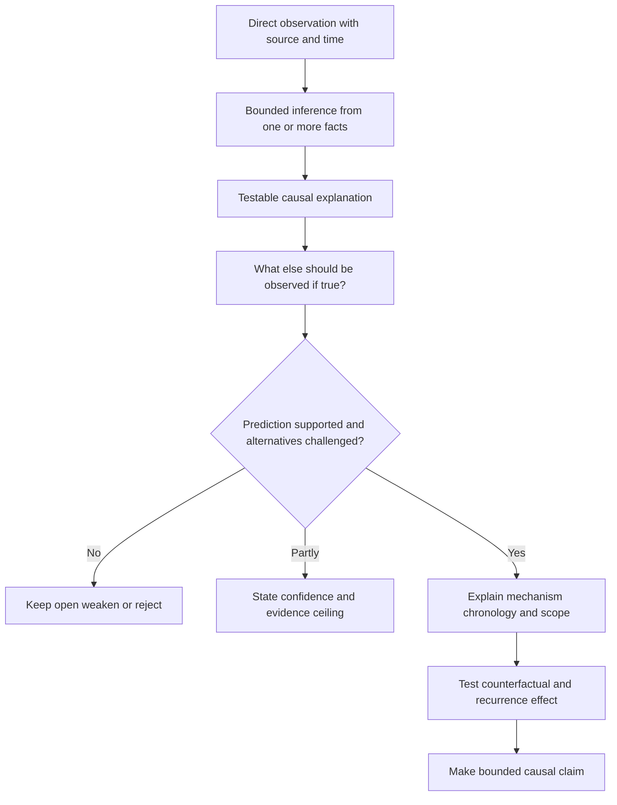

### 🔍 Plain-English deep-dive: Root does not mean one deepest object

The word `root` invites a tree metaphor: keep digging until one deepest object appears. Sociotechnical systems are rarely that simple. A service outcome can depend on software behavior, test coverage, deployment controls, observability, ownership, documentation, workload, dependency behavior, and recovery design at the same time. Several weaknesses can be jointly necessary, while any one improvement could reduce risk.

Think about a kitchen fire. The pan overheated, oil ignited, the alarm was slow, a fire blanket was hard to reach, and staff roles were unclear. The flame is proximate. The burner setting may be a trigger. Alarm coverage and response readiness affect severity. Maintenance and training controls may be systemic. Declaring “the root cause was the cook” discards design, equipment, environment, and management information that could prevent recurrence.

This does not mean every incident has infinite causes or that nobody is accountable. It means the RCA should state the level and scope of each claim. A sentence such as “Within the available synthetic evidence, two interacting systemic weaknesses best explain recurrence risk” is stronger than “the root cause was X” when the evidence supports interaction. If evidence supports only the proximate mechanism, say so and keep the deeper cause open.

The practical test is intervention value: if changing the alleged root leaves the same failure easy to reproduce through another ordinary path, the claim is incomplete. If changing a systemic control prevents the mechanism, detects it earlier, or sharply limits impact across many triggers, that control is a more useful prevention point. Usefulness still does not replace proof; document the mechanism and uncertainty.

## 2. Timeline first: reconstruct sequence without rewriting history

A timeline is the backbone of a postmortem because causal claims must respect time. A cause cannot occur after its alleged effect, an alert cannot explain detection if a human report came first, and a mitigation cannot receive credit for recovery that began earlier. Yet timestamps are imperfect: systems use different clocks, logs arrive late, snapshots omit transitions, and people remember events from different vantage points.

Normalize the smallest set of material events. State time zone or a synthetic time basis, precision, source, and uncertainty. Keep observation separate from interpretation. Preserve contradictory and negative evidence. If a record was unavailable, say unavailable; do not fill the gap with a smooth story.

### Timeline record format

| Field | Required content | Strong synthetic example | Weak wording |
|---|---|---|---|
| Event ID | Stable reference | `EV-105-07` | “then” |
| Time basis | UTC, local offset, or fictional sequence | `FT+08m`, synthetic relative time | “about 2” |
| Precision/uncertainty | Known resolution or possible skew | “minute precision; source B may lag up to one minute” | Omitted |
| Source | Evidence ID and provenance | `E-105-04`, authored queue row | “logs” |
| Observation | What the source directly shows | “Oldest-job age changes from 2m to 7m” | “Queue became root cause” |
| Interpretation | Optional, separately labeled | “Consistent with accumulating delay” | Mixed into fact |
| Decision/action | Who decided or did what, if any | “Fictional role proposed pausing new synthetic jobs; not executed” | “We fixed it” |
| Confidence | High, medium, low with reason | “High for row value; low for cross-source ordering” | False precision |

```mermaid
sequenceDiagram
    participant Input as Synthetic input source
    participant Queue as Fictional shared queue
    participant Worker as Fictional worker
    participant Monitor as Fictional monitoring
    participant Support as Fictional support role
    Input->>Queue: FT+00 valid large fixture enters
    Queue->>Worker: FT+01 work begins
    Worker-->>Queue: FT+06 execution limit reached and retry recorded
    Note over Queue,Monitor: Queue age rises but no queue-age alert exists in the story
    Queue->>Worker: FT+10 smaller fixtures wait behind retries
    Support->>Support: FT+14 synthetic user report reviewed
    Support->>Monitor: FT+16 compare report time with queue evidence
    Monitor-->>Support: FT+18 correlation observed; cause still open
    Support->>Support: FT+22 fictional mitigation proposal written, not executed
```

### Chronology checks

| Check | Question | What it can disconfirm | Limitation |
|---|---|---|---|
| Temporal order | Did candidate cause precede the outcome? | Causes recorded only after effect began | Precedence alone does not prove cause |
| Common clock | Can events be compared on one basis? | Narratives built from collection order | Clock correction may itself be uncertain |
| First divergence | Where did affected and unaffected paths first differ? | Explanations focused on later common symptoms | Missing telemetry may hide an earlier divergence |
| Recovery order | Did recovery start before or after the action? | Unsupported credit for a mitigation | Natural recovery and delayed metrics can still confuse order |
| Negative cases | Did the condition occur without failure? | Claims that a common condition is sufficient | Negative samples may differ in hidden ways |
| Recurrence | Does the same mechanism appear in repeated bounded cases? | One-off coincidence stories | Repetition can still share an unmeasured confounder |
| Change point | Did rate or behavior change around a release/configuration event? | Explanations unrelated to the observed transition | A simultaneous change can be confounded |

### 🔍 Plain-English deep-dive: A timeline is a ruler, not a screenplay

A ruler constrains what can fit. A screenplay makes events feel coherent. During a stressful incident, people naturally remember a story: “we deployed, alerts fired, we rolled back, and service recovered.” A normalized timeline may show that errors rose before deployment, the first alert arrived after the customer report, and recovery began before rollback finished. The cleaner story is emotionally satisfying but technically wrong.

The timeline should therefore include uncertainty and inconvenient facts. It should record `no observation available` rather than imply a healthy state. It should keep an action's start, completion, and validation as separate events. It should record what responders knew at the time, because judging decisions using facts learned later creates **hindsight bias**.

Chronology can invalidate a cause, but chronology alone rarely confirms one. If a deployment preceded an outage, the deployment is correlated with the outage. To argue causation, identify the changed mechanism, show how it produces the outcome, compare affected and unaffected paths, examine alternative simultaneous changes, and test a safe prediction. “After” means “later than”; it does not automatically mean “because of.”

## 3. Five Whys: a prompt for branching inquiry, not proof

Five Whys is useful because the first answer is often too close to the symptom. It becomes dangerous when a facilitator asks leading questions until the chain reaches a preferred team, process, or person. The number five is mnemonic, not a scientific threshold. Stop when the evidence ceiling is reached, branch when more than one enabling path exists, and return to evidence whenever an answer contains an assumption.

### Careful Five Whys rules

| Rule | Good practice | Failure prevented |
|---|---|---|
| Start from one bounded outcome | “Why did synthetic fixture group B finish after its stated objective?” | Vague chains about “the outage” |
| Keep each answer evidence-linked | Add source ID, confidence, and missing proof | Storytelling disguised as analysis |
| Branch at interaction points | Follow queue isolation, test coverage, alerting, and ownership separately | Artificial single-root conclusion |
| Ask why the action made sense | Examine information, tools, workload, authority, and incentives | Ending at human error |
| Test necessity and sufficiency | Ask whether factor alone produces failure and whether failure occurs without it | Overstated causal language |
| Seek disconfirming evidence | Look for unaffected examples with the same condition | Confirmation bias |
| Stop at the evidence ceiling | Mark an open question and escalate if needed | Fabricated depth |
| Connect actions to mechanisms | Each action states which causal link it changes | Generic “be more careful” tasks |

### Worked RCA example A - shared queue delay

**Fictional outcome:** Three small synthetic jobs completed after their authored objective during a period when one maximum-shape synthetic job retried. No real service, customer, product, or incident exists. The example was not executed.

| Inquiry step | Evidence-led answer | Evidence state | What remains open |
|---|---|---|---|
| Why were small jobs late? | They waited behind repeated work in the same fictional queue. | Supported by authored ordering rows `E-A1` through `E-A4`. | Whether another scheduler path also contributed |
| Why did repeated work remain ahead of small jobs? | The fictional retry rule returned the large job to the same priority class. | Supported by the stated synthetic rule and expected ordering. | Whether priority alone explains all delay |
| Why could one large job consume the shared class repeatedly? | The story's design has no per-size isolation or retry budget. | Defined condition in the synthetic design. | Which control would give the best risk/cost tradeoff |
| Why was that interaction not identified before the fictional release? | The authored release checks cover maximum size and retry independently, but not contention between them. | Supported by the synthetic test inventory. | Whether design review or monitoring should also have caught it |
| Why did the test inventory omit contention? | The fictional ownership model lists component tests but no owner for cross-component workload scenarios. | Plausible systemic explanation supported by the authored responsibility table. | Real organizations may assign this differently; no universal policy is implied |

That chain is not enough by itself. It suggests at least three branches:

1. **Scheduling branch:** shared priority and retry behavior explain the proximate delay mechanism.
2. **Prevention branch:** the release gate omitted a maximum-shape contention scenario.
3. **Detection branch:** monitoring observed failures but not queue age, increasing time to detection in the story.

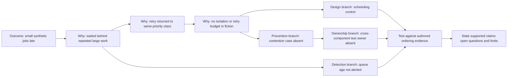

**Bounded conclusion:** Within the fictional model, shared scheduling and unrestricted same-class retry are supported proximate design contributors. Missing contention coverage is a plausible systemic prevention weakness because the expected failure would have been observable in that test. Missing queue-age alerting contributes to detection delay, not to creation of the queue contention. The synthetic evidence does not prove a single root cause, a real-world frequency, or the best production remedy.

**Counterfactual checks:** If the large job had entered a separate bounded class while all else stayed constant, the modeled small-job delay would likely not occur. If only the alert existed, the delay could still occur but would be detected earlier. If only a training reminder were sent, the valid maximum-shape input could recur and the mechanism would remain. These are reasoned synthetic predictions, not executed tests.

### Worked RCA example B - missed acknowledgement

**Fictional outcome:** A synthetic high-priority case received an internal acknowledgement later than its authored objective. The nearest event is that fictional responder `ROLE-B` did not see a notification. Stopping at “responder error” would be shallow.

| Five Whys branch | Careful answer | Causal role | Safer action direction |
|---|---|---|---|
| Why was acknowledgement late? | No accepted owner acted before the fictional objective. | Proximate organizational state | Verify ownership acceptance, not mere assignment |
| Why was there no accepted owner? | The notification was sent to a shared channel, and the workflow treated delivery as acceptance. | Systemic workflow weakness if supported | Add explicit acknowledgement and fallback |
| Why did the responder not see it? | The story says the channel had high volume and no targeted page. | Contributor; not proof of negligence | Route by current policy and monitor acknowledgement |
| Why did the system not escalate no-response? | No timeout/fallback owner was defined in the fictional workflow. | Systemic control gap | Define accepted fallback and escalation checkpoint |
| Why was that gap not detected? | Tabletop validation covered successful receipt but not absent acknowledgement. | Prevention/testing weakness | Add a safe no-ack scenario to process validation |

The analysis asks why the local action made sense. `ROLE-B` reasonably believed another role had accepted the case because the interface displayed `assigned`; the procedure did not distinguish assignment from acknowledgement. This does not erase individual responsibilities. It reveals that reminding one person to “pay attention” leaves the same ambiguous state for the next person.

**Evidence ceiling:** The example does not know whether workload, interface design, notification delivery, role training, or staffing was dominant. Each would require separate evidence. The conclusion should therefore name the confirmed workflow ambiguity and keep individual-performance attribution out of scope.

### Worked RCA example C - configuration correlation without causal proof

**Fictional outcome:** A synthetic permission check failed for two fixtures after an authored configuration marker changed. It is tempting to write “the configuration change caused the failure.”

| Evidence | Supports | Does not support |
|---|---|---|
| Change marker precedes both failures | Temporal association | Mechanism or exclusivity |
| One unchanged fixture passes | Difference worth investigating | Proof that configuration is the only differing variable |
| Reverting the marker is described as restoring one fixture in the story | Reversibility evidence for that fixture | Universal root cause or durable prevention |
| A second field changed at the same authored time | Alternative/confounder | Which field mattered |
| No controlled replay was performed | Honest limit | Any executed causal test |

**Correct conclusion:** Configuration is a leading hypothesis with chronology and one described reversal observation, but a simultaneous field change prevents unique attribution. The next safe step would be an authorized, non-production comparison or controlled test designed by the appropriate owner. If that test is unavailable or risky, the postmortem should retain uncertainty. Correlation is evidence to investigate, not permission to claim causation.

### 🔍 Plain-English deep-dive: Human error is a starting question

“Human error” labels an outcome of human-system interaction; it rarely explains why the action was reasonable at the time or why the system allowed one action to create broad impact. A careful review asks: What information was visible? Which signals were missing or misleading? What procedure applied? Was it usable under the workload? What authority did the person have? Were there conflicting goals? What guardrail, review, simulation, rollback, or detection path existed?

If someone selected the wrong configuration, the proximate action may be factually relevant. The RCA should still examine confusing names, unsafe defaults, weak preview, excessive permission, missing peer review, inaccessible documentation, alert fatigue, time pressure, and inadequate rollback. The best prevention may be a design change that makes the mistake difficult or low impact, not a reminder to be perfect.

Blamelessness has a boundary. Deliberate harm, fraud, harassment, reckless disregard, policy evasion, or repeated knowingly unsafe conduct may require management, security, legal, compliance, or human-resources review. The RCA team should not investigate those matters beyond its authority or publish unsupported attribution. Escalating through the proper route is compatible with blameless technical learning.

## 4. Fishbone analysis: broaden hypotheses without manufacturing findings

A fishbone diagram places the observed effect at the “head” and groups candidate causes along “bones.” Kaoru Ishikawa popularized this cause-and-effect tool in quality practice, which is why it is also called an Ishikawa diagram. The categories are prompts. They help a team notice neglected areas, but they do not carry causal weight.

Generic categories work better than forcing manufacturing labels onto a software/support context. A practical set is **people and coordination**, **process and policy**, **technology and design**, **data and inputs**, **environment and dependencies**, **measurement and detection**, and **management and incentives**. Rename or add categories when the system needs it.

### Fishbone category guide

| Category | Questions to ask | Candidate example | Evidence needed before promotion |
|---|---|---|---|
| People and coordination | What did each role know, own, and communicate? | Handoff lacked acknowledged owner | Record of workflow state, expectations, local context |
| Process and policy | Were steps clear, current, usable, and authorized? | Review did not cover cross-component load | Current procedure, review records, coverage map |
| Technology and design | Which mechanism, limit, interface, or failure mode mattered? | Retry returned work to same class | Design/configuration evidence and behavioral test |
| Data and inputs | Did shape, quality, volume, ordering, or validity matter? | Maximum valid fixture exposed contention | Contract, samples, affected/unaffected comparison |
| Environment and dependencies | Did capacity, timing, dependency, or regional state matter? | Dependency latency increased retry overlap | Dependency telemetry, chronology, isolation test |
| Measurement and detection | What was observable, alerted, sampled, or hidden? | Failure count alerted but queue age did not | Monitoring configuration and detection timeline |
| Management and incentives | Did goals, prioritization, staffing, or ownership shape tradeoffs? | Delivery speed rewarded while resilience review lacked owner | Decision records, role model, planning evidence |

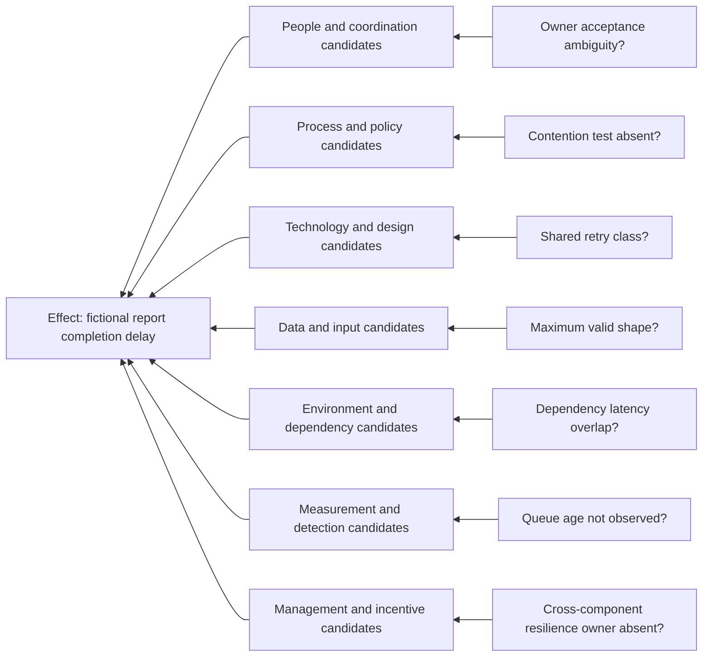

Every label ending in a question mark is a candidate, not a finding. A workshop may generate fifty entries and validate three. The unvalidated entries should remain marked as hypotheses, be rejected with reasons, or be removed from the final causal statement. Counting votes, placing a note close to the fish head, or hearing a senior person repeat it does not increase evidentiary support.

### From fishbone candidate to supported contributor

| Gate | Question | Pass example | Fail example |
|---|---|---|---|
| Relevance | Could this factor plausibly affect the stated outcome? | Queue policy can affect waiting time | Office lighting listed without mechanism |
| Chronology | Did it exist before or during the effect? | Retry policy active before delay | Documentation update after recovery |
| Mechanism | How would it produce or amplify the outcome? | Same-class retry occupies available worker slot | “Culture” with no defined pathway |
| Comparative evidence | Do affected/unaffected cases differ as predicted? | Delay appears only under authored contention shape | All cohorts share factor but only one fails, unexplained |
| Alternative challenge | Could another factor explain the same evidence? | Simultaneous dependency delay explicitly tested or retained | Alternatives omitted |
| Counterfactual | Would changing the factor likely alter outcome or impact? | Isolation predicts small jobs proceed | Training slogan does not alter scheduler behavior |
| Scope | Is the claim bounded to observed context? | “Contributed to detection delay in this synthetic model” | “Always causes outages” |
| Confidence | Is strength stated with reason? | Medium: mechanism clear, test unperformed | “Confirmed” because team agreed |

### Worked fishbone - fictional acknowledgement delay

| Candidate | Category | Initial status | Evidence review | Final treatment |
|---|---|---|---|---|
| Shared-channel volume | Environment | Plausible | Authored channel count is high, but no attention evidence exists | Open contributor, low confidence |
| Assignment equals acceptance | Process | Strong candidate | Synthetic workflow explicitly lacks acknowledgement state | Supported systemic workflow weakness |
| Responder carelessness | People | Unsupported attribution | No evidence about attention, intent, or conduct | Reject; prohibited blame label |
| No no-response alert | Measurement | Strong candidate | Synthetic rules have no timer or fallback | Supported detection/ownership contributor |
| Ambiguous role names | People/coordination | Plausible | Two roles have overlapping descriptions | Contributing condition, medium confidence |
| Staffing shortage | Management | Unsupported | No staffing evidence in the exercise | Remove from conclusion |
| Notification transport failure | Technology | Alternative | Delivery receipt exists in the authored record | Weakened, not impossible without deeper telemetry |
| Missing no-ack tabletop | Process | Strong candidate | Validation inventory covers only success path | Supported prevention-control weakness |

### 🔍 Plain-English deep-dive: A category is a drawer, not a fingerprint

A fishbone category is like a drawer labeled `tools`. Putting a screwdriver in that drawer tells you where you sorted it, not whether the screwdriver caused the appliance to fail. Likewise, writing `training`, `process`, or `dependency` on a fishbone does not show that it influenced the incident.

This distinction matters because workshops create social momentum. Once a colorful diagram fills the screen, candidates can look official. The facilitator should attach a state to every item: `candidate`, `supported`, `weakened`, `rejected`, or `unknown`. Supported items need evidence pointers and a causal role. Unknown items need a safe next test or an explicit decision that further investigation is not proportionate.

Fishbone is strongest early, when it broadens attention and counters tunnel vision. It is weakest when copied directly into the executive summary. The final postmortem should contain a smaller causal model that survived challenge. Preserve the broader candidate list only if it is useful and safe, with clear statuses so readers do not mistake brainstorming for attribution.

## 5. Test causal claims with mechanism, alternatives, and counterfactuals

A causal statement should survive more than “A happened before B.” Use a compact challenge called **M-A-P-C-S**:

- **M - Mechanism:** Explain how the factor changes system behavior.
- **A - Alternatives:** Identify explanations that predict similar evidence.
- **P - Predictions:** State observations expected if the hypothesis is true and false.
- **C - Counterfactual:** Ask what likely changes if the factor is removed or controlled.
- **S - Scope:** Bound population, time, environment, confidence, and unknowns.

### Causal-analysis decision tree

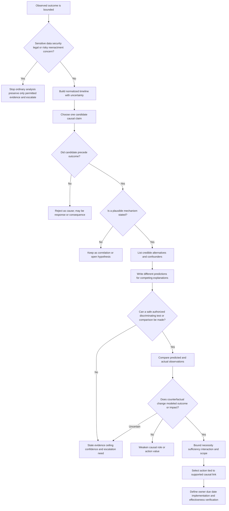

### Necessity, sufficiency, and interaction

| Concept | Plain meaning | Question | Caution |
|---|---|---|---|
| Necessary factor | Outcome does not occur through the modeled path without it | “Does this mechanism require same-class retry?” | Another path may produce the same outcome |
| Sufficient factor | Factor alone, under stated conditions, can produce outcome | “Does same-class retry always create harmful delay?” | Most production factors need interacting conditions |
| Amplifier | Factor increases severity or duration but does not initiate failure | “Did missing alerting extend impact?” | Do not label detection weakness as creation mechanism |
| Protective factor | Factor reduced impact or speeded recovery | “Did bounded retry prevent total exhaustion?” | Success may be luck rather than designed protection |
| Interaction | Two or more factors jointly create a result | “Do maximum input and shared retry matter only together?” | A single-root narrative can hide this |
| Confounder | A third factor changes both candidate and outcome, creating misleading correlation | “Did dependency latency coincide with configuration change?” | Reversal after change may still be confounded |

### Counterfactual worksheet

| Field | Question | Synthetic queue example |
|---|---|---|
| Actual world | What factors and outcome were observed? | Maximum-shape job, same-class retry, shared pool, late small jobs |
| Proposed change | Which one factor changes? | Separate bounded class for maximum-shape work |
| Held constant | What assumptions remain the same? | Input arrival, worker count, job duration, retry event |
| Predicted outcome | What should differ if claim is correct? | Small jobs start without waiting behind the retried large job |
| Alternative pathway | How could failure still occur? | All workers could be exhausted by another dependency stall |
| Evidence | What observation or safe test would discriminate? | Authorized simulation comparing queue-start times |
| Confidence/limit | How certain and why? | Medium in design model; no executed test or production evidence |

Counterfactual thinking also improves action selection. If “add documentation” does not change the modeled mechanism, it may be a useful communication action but not the primary corrective action. If “add an alert” reduces detection time but not occurrence, label it as a detection action. Honest labels allow a portfolio of prevention, detection, containment, recovery, and learning controls without pretending each one removes the root.

## 6. Artifact one - RCA method comparison and worked selection

The first required artifact compares methods against the same fictional evidence. No method wins universally. Select the lightest method that matches complexity, risk, evidence, and decision need, then combine methods when they answer different questions.

### RCA comparison artifact

| Method | Best question | Strength | Main risk | Evidence discipline | Good fit | Poor fit |
|---|---|---|---|---|---|---|
| Timeline analysis | What happened in what order? | Constrains impossible stories and exposes detection/response gaps | Treating sequence as causation | Source, clock, precision, observation, interpretation | Any material incident | Replacing mechanism analysis |
| Five Whys | What enabled the previous answer? | Fast path beyond proximate symptom | Linear, leading, person-ending chain | Evidence at each answer; branch and stop at ceiling | Bounded mechanism with a small group | Complex interaction presented as one chain |
| Fishbone/Ishikawa | Which causal areas have we overlooked? | Broad, collaborative hypothesis generation | Categories and votes mistaken for findings | Candidate status plus evidence-promotion gates | Early exploration across disciplines | Final causal proof by itself |
| Change analysis | What differed between working and failing states? | Focuses on concrete deltas | Salient recent change becomes scapegoat | Inventory simultaneous changes and controls | Clear before/after transition | Long-running latent weakness with no baseline |
| Barrier/control analysis | Which prevention, detection, containment, or recovery controls failed or were absent? | Connects causes directly to safeguards | Assuming every imaginable barrier should exist | Control purpose, owner, expected performance, evidence | High-impact or repeated incidents | Unlimited checklist generation |
| Fault tree | Which combinations of lower events can produce a top event? | Makes AND/OR interactions explicit | False precision or omitted branches | Define logic, assumptions, and data quality | Complex technical failure paths | Simple issue with sparse evidence |
| Comparative cohort analysis | Why were some cases affected and others not? | Challenges universal claims | Hidden differences and selection bias | Explicit cohort criteria and confounders | Repeatable partial-scope failures | One event with no comparison group |
| Counterfactual analysis | Would changing this factor alter the outcome? | Tests intervention value | Speculation presented as observation | State assumptions, alternative pathways, confidence | Action prioritization | Unsupported “what if” storytelling |
| Bow-tie style review | What prevents an event and what limits consequences? | Separates prevention from mitigation/recovery | Diagram becomes generic risk catalog | Tie barriers to threat, event, consequence, evidence | Safety/security risk planning under authority | Declaring a live security cause without specialist ownership |

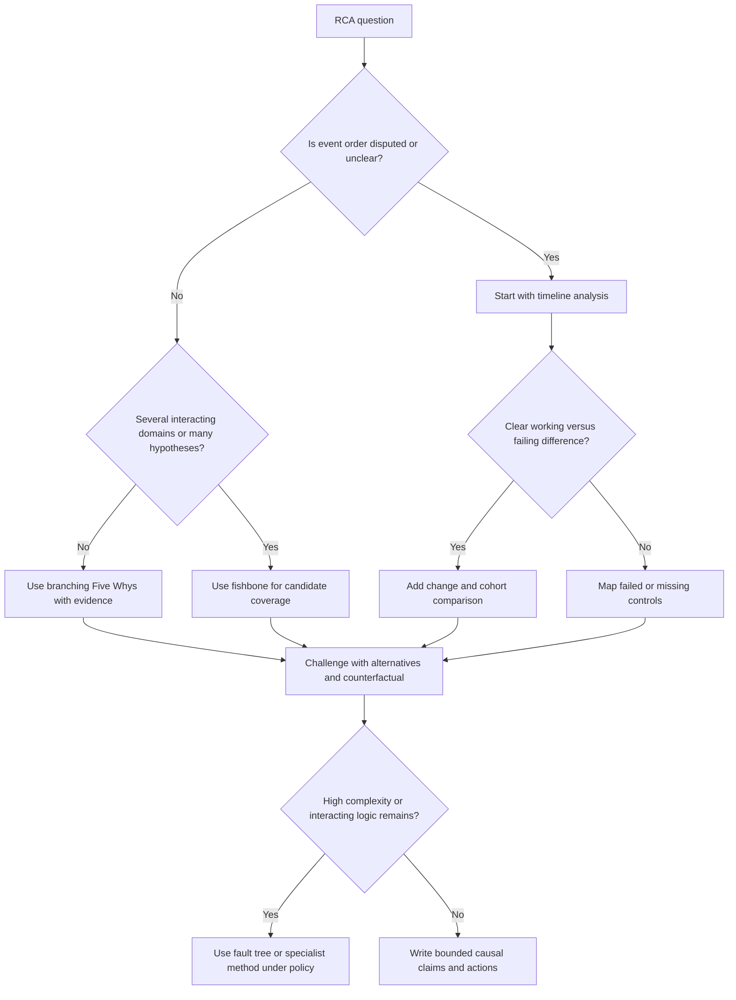

### Selection across the three worked examples

| Example | First method | Supporting method | Why | Final evidence posture |
|---|---|---|---|---|
| A: shared queue delay | Timeline | Branching Five Whys plus counterfactual | Sequence and scheduler interaction are central | Multiple supported contributors; no singular root claimed |
| B: missed acknowledgement | Fishbone | Barrier/control analysis | Human, workflow, interface, notification, and fallback candidates must be separated | Workflow ambiguity supported; personal blame rejected |
| C: configuration correlation | Change analysis | Comparative cohort and alternative testing | Simultaneous changes create confounding | Leading hypothesis only; unique attribution withheld |

### Worked comparison on one question

**Question:** Why did fictional detection occur fourteen synthetic minutes after queue age first rose?

| Method view | Output | What it adds | What it cannot prove alone |
|---|---|---|---|
| Timeline | Queue age rose at `FT+00`; failure-count threshold at `FT+11`; report reviewed at `FT+14` | Exact delay components | Why monitoring was designed that way |
| Five Whys | Detection depended on failure count because queue-age signal was not configured; ownership of cross-component SLO was absent in fiction | Deeper governance branch | Whether a queue-age alert would be cost-effective |
| Fishbone | Measurement, process, ownership, and interface candidates | Broadens beyond one alert | Which candidates actually contributed |
| Barrier analysis | Early-warning barrier absent; manual report barrier worked late | Separates absence and success | The original queue-delay mechanism |
| Counterfactual | A queue-age alert at `FT+03` predicts earlier investigation but not prevention | Clarifies action effect | Executed improvement without a safe test |

**Comparison conclusion:** use the timeline to state the delay, Five Whys to explore why the signal/control was absent, fishbone to avoid tunnel vision, barrier analysis to classify detection controls, and a counterfactual to label the action as earlier detection rather than incident prevention. The methods complement each other; none proves a cause merely by being completed.

## 7. Artifact two - complete fictional postmortem

This artifact is structurally complete: it includes metadata, impact, detection, timeline, causal analysis, uncertainty, response, learning, and owned action proposals. It is not a completed investigation of a real event. Every fact is learner-authored fiction. Every action remains `PROPOSED_NOT_ACCEPTED_NOT_EXECUTED_NOT_VERIFIED`.

### Postmortem header and honesty state

| Field | Completed fictional content |
|---|---|
| Document ID | `PM-105-SYNTHETIC-A` |
| Title | `Synthetic shared-queue report delay` |
| State | `COMPLETE_FORMAT_LOCAL_SYNTHETIC_UNPERFORMED` |
| Evidence tier | Local fictional example only |
| Scope | Authored text fixtures, relative fictional time, and conceptual reasoning |
| Excluded systems | Abnormal AI, Microsoft, customers, email, identities, security tools, ticketing, production, APIs, networks, and external services |
| Review status | Self-contained teaching example; no employer, Engineering, Product, Security, Legal, customer, or action-owner review occurred |
| Action status | All actions proposed; no assignment, acceptance, due-date commitment, implementation, or effectiveness verification occurred |
| Disclosure status | Not a customer communication, security notice, legal record, public incident report, or internal company postmortem |

### Executive summary

In fictional system `SignalBridge`, three small learner-authored report fixtures completed after their synthetic objective while one maximum-shape fixture retried in a shared work queue. The authored timeline places repeated large work ahead of small work and shows that detection depended on a later failure-count threshold rather than queue age. The proximate mechanism is shared queue waiting during same-class retry. The trigger is arrival of a valid maximum-shape fixture under the modeled conditions. Supported contributors are the absence of a retry budget or workload isolation in the fictional design and the absence of queue-age detection in the fictional monitoring model. A systemic prevention weakness is that the fictional release inventory tested maximum shape and retry separately but had no accepted owner or gate for their contention interaction.

The evidence does not support one universal root cause, a human-error conclusion, any real product behavior, or the effectiveness of a remedy. Proposed actions target scheduling isolation, interaction testing, detection, and ownership. Each proposal has a role alias, fictional due milestone, implementation evidence, effectiveness test, and reopen condition. Nothing was executed.

### Impact and scope

| Dimension | Fictional fact | Confidence | Explicit limit |
|---|---|---|---|
| Expected outcome | Each small fixture begins within two synthetic minutes and completes within five | High within authored contract | Not a real SLA, SLO, customer promise, or product behavior |
| Actual outcome | Three small fixtures complete between `FT+15` and `FT+18` | High within authored event table | No system generated these values |
| Confirmed scope | Fixtures `S1`, `S2`, and `S3` in one synthetic queue | High | No person or customer was affected |
| Potential scope | Other small fixtures sharing the same modeled class could be delayed | Medium, model-based | No prevalence evidence exists |
| Excluded scope | Separate fictional class `Q-FAST` shows no delay in authored comparison | Medium | Class behavior was written, not tested |
| Consequence | Synthetic reporting objective missed; no financial, security, privacy, safety, contractual, or production consequence | High | The absence of real impact is part of the lab boundary |
| Duration | First modeled queue-age divergence `FT+00`; final small fixture completes `FT+18` | High in relative time | Not wall-clock evidence |
| Workaround | None performed; a separate-class route is considered only as a hypothesis | High | No operational recommendation or permission |

### Detection and response summary

| Question | Fictional answer | Learning |
|---|---|---|
| How was the issue first visible? | Queue age rose in the authored rows, but the fictional monitor had no alert on it | Visibility without a decision rule is not detection |
| What triggered review? | A synthetic user-report event at `FT+14` | External reporting acted as the first acknowledged detection path |
| What helped? | Stable fixture IDs and one common relative clock made ordering clear | Correlation identifiers and time discipline reduce reconstruction work |
| What slowed review? | Retry events and queue-age rows were stored in separate fictional tables | Evidence fragmentation increased interpretation steps |
| What response occurred? | Only a written analysis and proposed action set | No mitigation, rollback, queue change, escalation, or customer action occurred |
| When was recovery observed? | All authored small fixtures have completion rows by `FT+18` | Completion does not prove durable recovery or corrective action |

### Detailed timeline

| Event ID | Fictional time | Source | Direct observation | Interpretation at that time | Confidence/uncertainty |
|---|---:|---|---|---|---|
| `EV-01` | `FT-02` | `E-CONTRACT` | Small-fixture objective and maximum-shape contract are written | Baseline expectation exists | High; authored contract only |
| `EV-02` | `FT+00` | `E-QUEUE-1` | Fixture `L1` enters shared class `Q-SHARED` | Trigger candidate begins | High for authored row |
| `EV-03` | `FT+01` | `E-WORK-1` | Worker starts `L1` | Large work occupies modeled worker | High |
| `EV-04` | `FT+02` | `E-QUEUE-2` | Small fixtures `S1-S3` enter `Q-SHARED` | They are eligible but wait | High |
| `EV-05` | `FT+06` | `E-RETRY-1` | `L1` reaches modeled execution limit and returns to same class | Same-class retry hypothesis strengthens | High within fictional rule |
| `EV-06` | `FT+07` | `E-QUEUE-3` | Oldest small-fixture age exceeds authored objective | Customer-style outcome becomes impaired in the story | High |
| `EV-07` | `FT+10` | `E-RETRY-2` | `L1` starts again before `S1-S3` | Ordering mechanism directly represented | High |
| `EV-08` | `FT+11` | `E-MON-1` | Fictional failure-count threshold changes state | Existing detection control sees retries late | Medium; threshold semantics authored |
| `EV-09` | `FT+14` | `E-REPORT-1` | Synthetic user-report event is reviewed | Acknowledged detection occurs | High |
| `EV-10` | `FT+15` | `E-COMP-1` | `S1` completes | Partial outcome recovery | High; no cause assigned |
| `EV-11` | `FT+16` | `E-COMP-2` | `S2` completes | More recovery | High |
| `EV-12` | `FT+18` | `E-COMP-3` | `S3` completes | Modeled affected set completed | High; durability unknown |
| `EV-13` | `FT+22` | `E-REVIEW-1` | RCA workshop is represented as a writing step | Retrospective begins in the artifact | High; not a real meeting |

### What happened

The fictional queue has one shared work class. The modeled worker processes `L1`, which reaches an authored execution limit and returns to the same class with unchanged priority. Three smaller fixtures entered after `L1` but before its retry. The authored ordering rule selects `L1` again, so the smaller fixtures wait beyond their objective. A failure-count signal changes later, and the first reviewed detection event is a synthetic user report. Once `L1` no longer occupies the modeled path, the smaller fixtures receive completion rows.

The narrative does not assert that natural completion “fixed” anything. No configuration or code changed, so the design conditions remain. The end of visible impact is recovery in the single authored sequence, not prevention. This distinction is why the action plan includes both occurrence controls and detection controls.

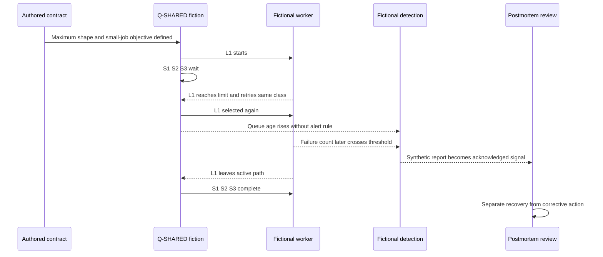

### Evidence inventory

| Evidence ID | Description | Provenance | Relevance | Sensitivity | Integrity/limit |
|---|---|---|---|---|---|
| `E-CONTRACT` | Learner-authored objective and input-shape table | Local fictional Markdown | Establishes expected outcome | None; fiction | Not an external specification |
| `E-QUEUE-1..3` | Authored queue ordering rows | Local fictional Markdown | Supports chronology and shared-class condition | None | Not generated telemetry |
| `E-WORK-1` | Authored worker start row | Local fiction | Supports proximate ordering | None | No runtime evidence |
| `E-RETRY-1..2` | Authored retry rule and events | Local fiction | Supports same-class retry mechanism | None | Mechanism exists only in model |
| `E-MON-1` | Authored monitor threshold row | Local fiction | Supports detection sequence | None | No real alert system |
| `E-REPORT-1` | Authored report-review row | Local fiction | Establishes acknowledged detection | None | No customer communication |
| `E-COMP-1..3` | Authored completion rows | Local fiction | Bounds synthetic recovery | None | Does not prove durable remediation |
| `E-TESTMAP` | Authored release-test inventory | Local fiction | Supports missing interaction coverage | None | No actual test suite |
| `E-OWNMAP` | Authored ownership table | Local fiction | Supports cross-component ownership gap | None | No actual assignment or acceptance |

### Causal claims and confidence

| ID | Causal statement | Role | Evidence for | Evidence against/alternative | Confidence | Boundary |
|---|---|---|---|---|---|---|
| `C-1` | Same-class retry placed `L1` ahead of waiting small fixtures in the authored ordering | Proximate mechanism | `E-QUEUE`, `E-RETRY`, `E-WORK` | Alternative worker-capacity path not modeled | High in fiction | Not a production claim |
| `C-2` | Arrival of valid maximum-shape `L1` initiated this occurrence under existing conditions | Trigger | `EV-02` precedes divergence; contract allows shape | Other valid large inputs could also trigger | High in fiction | Trigger is not blame or root |
| `C-3` | Lack of workload isolation or retry budget allowed one fixture to amplify waiting time | Design contributor | Ordering rule and modeled counterfactual | Relative value of two controls untested | Medium-high | Best remedy not established |
| `C-4` | Failure-count-only alerting delayed acknowledged detection compared with a queue-age signal | Detection contributor | `EV-07` before `EV-08/09` | Alert threshold effectiveness untested | Medium | Does not cause queue delay |
| `C-5` | Missing cross-component contention coverage allowed the interaction to remain in the fictional release design | Systemic prevention weakness | `E-TESTMAP` lacks combined case | Design review might detect it through another route | Medium | No real SDLC assertion |
| `C-6` | Lack of an accepted owner for cross-component resilience contributed to missing combined coverage | Systemic ownership hypothesis | `E-OWNMAP` has only component owners | Ownership alone may not guarantee test | Medium-low | Keep qualified until organizational evidence exists |
| `C-7` | A human submitting the valid fixture caused the incident | Blame hypothesis | Only temporal presence | Valid input is allowed; mechanism remains with any source | Rejected | Human error is not an endpoint |
| `C-8` | The failure-count alert caused recovery | Correlation hypothesis | Alert precedes completion | No response action occurred; natural sequence explains completion | Rejected | Correlation is not causation |

### Branching Five Whys summary

| Branch | Why chain endpoint supported by evidence | Why it stops there | Action target |
|---|---|---|---|
| Occurrence | Shared class plus same-class retry allowed waiting-time amplification | Deeper implementation and tradeoff data do not exist | Scheduling isolation/retry control evaluation |
| Prevention | Combined maximum-shape contention case absent from release inventory | Reason for governance design remains partly open | Add accepted cross-component test ownership |
| Detection | Queue age had no decision rule; failure count changed later | Alert quality and noise tradeoff untested | Define and evaluate queue-age indicator |
| Recovery | Work completed after `L1` left active path | No action caused the transition | Do not assign corrective credit; test recurrence separately |

### Fishbone disposition

| Category | Candidate | Disposition | Reason |
|---|---|---|---|
| Technology/design | Same-class retry | Supported contributor | Mechanism represented directly in ordering evidence |
| Process | Combined contention test absent | Supported prevention weakness | Test map has separate but no combined scenario |
| Measurement | Queue age not alerted | Supported detection contributor | Timeline shows early signal without decision rule |
| Data/input | Maximum valid shape | Supported trigger | Contract allows it and chronology aligns |
| Environment | Worker capacity | Condition, not isolated cause | Fixed in model; no comparative capacity test |
| People | Submitter behavior | Rejected blame candidate | Input is valid and ordinary |
| Management | Cross-component owner absent | Qualified systemic hypothesis | Ownership table supports gap; causal effect remains partly inferred |
| Dependency | External latency | Removed | No dependency exists in this fictional model |

### Counterfactual review

| Counterfactual change | Predicted effect | Causal interpretation | Verification needed |
|---|---|---|---|
| Place maximum-shape work in a bounded class | Small fixtures start without waiting behind `L1` | Tests occurrence-control value | Authorized deterministic scheduler simulation |
| Add finite retry budget with safe terminal handling | Limits repeated occupancy | Tests amplification control | Failure-path and data-integrity tests |
| Add queue-age detection only | Earlier acknowledgement, same occurrence possible | Detection action, not prevention | Alert precision, recall, noise, and response-time review |
| Add combined contention release test only | Defect more likely found before release | Prevention gate, not runtime guardrail | Test fails before fix and passes after authorized fix |
| Send operator reminder only | No change to valid input or scheduler mechanism | Weak primary action | No convincing effectiveness path |

### What went well, what did not, and where luck mattered

| Area | Fictional observation | Learning |
|---|---|---|
| Went well | Stable fixture IDs and a common synthetic clock made order reconstructable | Preserve correlation and clock metadata |
| Went well | Input contract defined maximum shape | Valid use could be distinguished from misuse |
| Did not go well | Monitoring lacked a decision rule for queue age | Observability should match customer outcome, not only terminal failure |
| Did not go well | Retry and scheduling interaction lacked a release scenario | Component tests did not cover emergent behavior |
| Did not go well | Cross-component resilience ownership was not accepted in the fictional map | Shared risks need scoped ownership |
| Luck | Only three small fixtures appear in the authored affected set | Small scope is not a designed control |
| Luck | The fictional sequence completes without manual intervention | Natural recovery must not be mistaken for resilience |

### Corrective and preventive action register

All owners and milestones below are **proposed fictional role aliases**. They have not accepted anything. `F+N` means an authored milestone relative to a fictional review, not a real date or commitment.

| Action ID | Type | Causal link targeted | Proposed action | Proposed owner | Fictional due milestone | Implementation evidence | Effectiveness verification | Status/reopen condition |
|---|---|---|---|---|---|---|---|---|
| `A-1` | Corrective/design | `C-1`, `C-3` | Evaluate bounded workload isolation and retry budget; select an authorized design with failure handling | `ROLE-SCHEDULER-OWNER` | `F+10` | Approved design record and controlled implementation evidence | Deterministic contention test meets small-fixture objective without data loss | `PROPOSED_NOT_ACCEPTED`; reopen if objective fails or another starvation path appears |
| `A-2` | Corrective/test | `C-5` | Add maximum-shape plus retry-contention case to the governed release gate | `ROLE-TEST-OWNER` | `F+7` | Test definition, pre-fix failure evidence, post-fix pass evidence | Test detects known weak design and remains stable for agreed runs | `PROPOSED_NOT_ACCEPTED`; reopen on skipped gate or flaky result |
| `A-3` | Corrective/detection | `C-4` | Define a queue-age indicator and response rule aligned to the outcome | `ROLE-OBSERVABILITY-OWNER` | `F+12` | Reviewed signal, threshold rationale, route, and runbook | Tabletop shows earlier detection with acceptable noise under approved criteria | `PROPOSED_NOT_ACCEPTED`; tune/reopen if noise or missed cases exceed bounds |
| `A-4` | Preventive/ownership | `C-5`, qualified `C-6` | Establish accepted ownership for cross-component workload scenarios and exceptions | `ROLE-SERVICE-OWNER` | `F+5` | Current responsibility map with acknowledgement and fallback | Two future design reviews show named owner, decision, and tracked exceptions | `PROPOSED_NOT_ACCEPTED`; escalate if no role accepts |
| `A-5` | Preventive/comparison | Analogous shared queues | Inventory similar queues using approved metadata only and risk-rank them | `ROLE-RELIABILITY-OWNER` | `F+20` | Authorized inventory and risk criteria | High-risk analogues receive accepted disposition; no broad data collection | `PROPOSED_NOT_ACCEPTED`; stop on sensitive scope or unclear authority |
| `A-6` | Recovery/readiness | Recovery uncertainty | Create a safe tabletop for starvation recovery and rollback decision boundaries | `ROLE-OPERATIONS-OWNER` | `F+15` | Approved tabletop plan and participant record | Tabletop meets decision, ownership, communication, and safety criteria | `PROPOSED_NOT_ACCEPTED`; not a production reenactment |

### Action dependency and verification flow

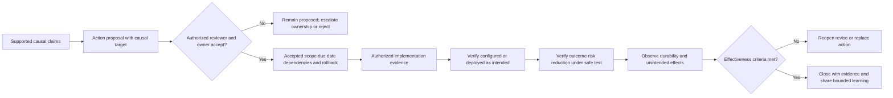

### Communication and disclosure notes

The internal learning summary should distinguish impact, recovery, cause confidence, and action state. A customer-safe statement, if one were required in a real organization, would be written only by the authorized owner under current disclosure, legal, privacy, security, and contractual guidance. This synthetic example is not a customer statement.

Safe fictional internal wording:

> “The authored evidence supports shared same-class retry as the proximate delay mechanism and identifies missing contention coverage and queue-age detection as prevention and detection weaknesses. Several corrective actions are proposed, not accepted or completed. The analysis does not establish one universal root cause, human fault, real product behavior, or action effectiveness.”

Wording to reject:

> “An operator caused the outage, Engineering fixed the root cause, and monitoring guarantees this cannot recur.”

The rejected sentence blames without evidence, invents a real team and action, asserts one root, claims completion, and promises impossibility of recurrence.

### Open questions and residual risk

| Open item | Why unresolved | Safe next step | Escalation condition |
|---|---|---|---|
| Best scheduling control | No implementation, cost, fairness, or failure data | Authorized design review and simulation | Cross-service impact or owner conflict |
| Alert quality | No signal distribution or noise data | Offline evaluation on approved synthetic/historical metadata | Sensitive data or customer disclosure needed |
| Similar queues | No authorized inventory exists | Service owner defines minimum metadata and scope | Broad access or security boundary appears |
| Ownership effectiveness | Proposed responsibility map is unaccepted | Obtain explicit role acceptance and fallback | No owner accepts by governed checkpoint |
| Durability | No action was performed | Do not claim risk reduction | Any closure request lacks verification evidence |

### Postmortem conclusion

The complete fictional postmortem demonstrates structure and disciplined language. It supports multiple interacting causal roles rather than one forced root. It turns evidence into proposed actions with owner aliases, due milestones, and two levels of verification. It preserves uncertainty and explicitly rejects human blame, causal claims from timing alone, and credit for actions that did not occur. The artifact remains local, synthetic, and unperformed.

## 8. Corrective and preventive actions must be owned and verified

An action list is not an outcome. Postmortems often fail after publication because tasks are vague, assigned to groups, disconnected from causal mechanisms, or closed when a document or code change exists. Strong actions describe the risk-reduction mechanism and define implementation and effectiveness evidence separately.

### Action quality hierarchy

| Action pattern | Typical strength | Example | Limitation |
|---|---|---|---|
| Eliminate unsafe state/path | Strong when feasible | Remove unbounded same-class retry path | May create availability or loss tradeoffs requiring design review |
| Guardrail or hard limit | Strong | Enforce bounded retry budget with safe terminal handling | Must handle legitimate edge cases |
| Isolation or containment | Strong | Separate workload classes so one cannot starve another | Adds complexity and capacity decisions |
| Automated detection and response | Medium to strong | Alert on customer-relevant queue age with governed response | Detects rather than necessarily prevents |
| Test or release gate | Medium to strong | Block release when contention objective fails | Test quality and bypass governance matter |
| Review/approval | Medium | Require specialist review for defined high-risk changes | Review can become rubber-stamping |
| Documentation/checklist | Supporting | Add rollback and validation criteria | Relies on discovery and compliance |
| Training/reminder | Supporting or weak alone | Teach difference between assignment and acceptance | Decays and does not change technical affordance |
| “Be more careful” | Weak | Tell responders to watch notifications | No mechanism, owner, or verification |

### Required action fields

| Field | Question answered | Minimum quality |
|---|---|---|
| Problem/causal link | Which supported cause or risk does this change? | Causal claim ID and intended effect |
| Action statement | What exactly will change? | Observable deliverable, not a slogan |
| Type | Corrective, preventive, detection, containment, recovery, or learning? | Honest effect label |
| Owner | Who accepts accountability? | Named role/person under current policy, not an unaccepted draft alias |
| Due date | By when, based on what priority? | Accepted date/milestone with dependencies |
| Authority | Who approves and who may execute? | Current change/security/legal/operations route |
| Dependencies | What must happen first? | Explicit teams, decisions, data, or approvals |
| Implementation evidence | How will we know it exists as designed? | Reviewable artifact, configuration, test, or change record |
| Effectiveness verification | How will we know risk changed? | Outcome-based test, metric, observation window, and baseline |
| Safety/rollback | What adverse effects and reversal path apply? | Approved stop and rollback criteria |
| Status | Proposed, accepted, in progress, implemented, verified, rejected, deferred, overdue | Evidence-based state, never inferred |
| Reopen rule | What result invalidates closure? | Threshold, recurrence, regression, or missing evidence |

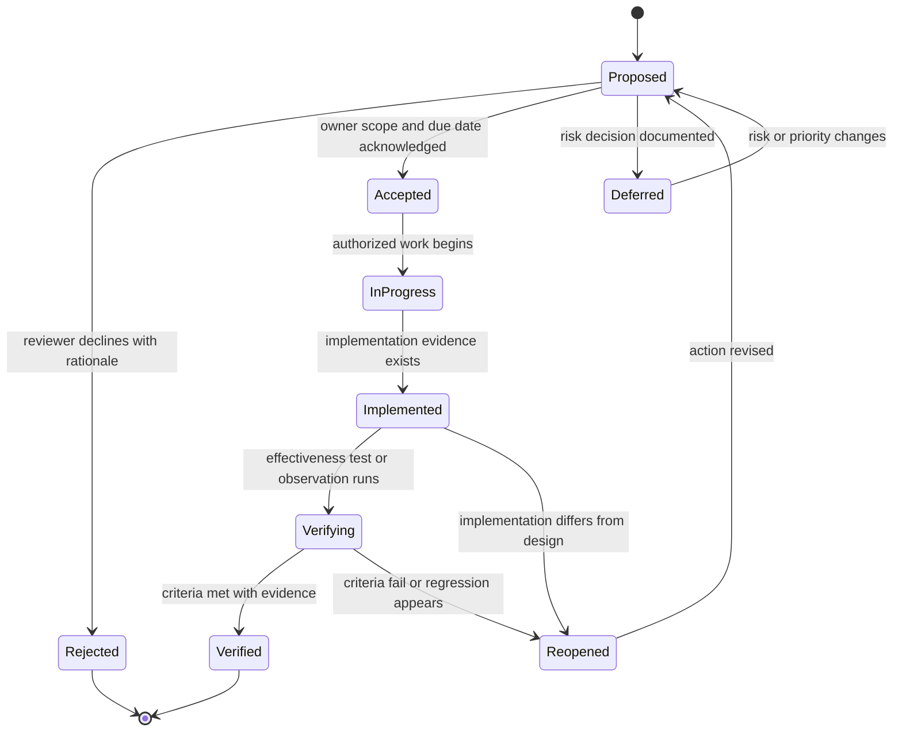

### 🔍 Plain-English deep-dive: Done is a claim with two receipts

Imagine replacing a smoke detector. The first receipt shows that the new detector was installed correctly. The second shows that it detects smoke under an approved test and can be heard where needed. A ticket marked complete after purchase has neither proven installation nor protection.

RCA actions need the same two receipts. **Implementation verification** shows the change exists as intended: the test is in the gate, the limit is configured, the runbook is published, or the owner accepted the workflow. **Effectiveness verification** shows the change alters the target outcome: the known failure is prevented, detection occurs earlier with acceptable noise, blast radius is bounded, or recovery meets the objective over an agreed observation window.

An action can be implemented and ineffective. It can be effective in a synthetic test and unsafe in a broader environment. It can reduce one risk while creating another. Verification criteria should therefore include regressions and reopen conditions. A due date creates visibility, but an overdue task should be escalated through the current risk/ownership process, not silently relabeled complete or assigned to an unsuspecting person.

## 9. Blameless postmortems combine learning with accountability

Blamelessness protects the quality of information. People disclose near misses, confusing signals, local workarounds, and decision pressure more readily when a review seeks system understanding rather than a culprit. Accountability protects follow-through. Owners must still accept actions, leaders must make risk decisions, and deliberate misconduct must go to the correct authority.

### Blame versus blameless accountability

| Blaming pattern | Why it fails | Blameless, accountable replacement |
|---|---|---|
| “The engineer caused it.” | Stops at a person and invites defensiveness | “The change removed guard X; preview Y did not show the effect; review Z did not cover this path.” |
| “They should have known.” | Uses hindsight and hides information available at the time | “At decision time, signal A was visible, signal B was absent, and procedure C was ambiguous.” |
| “Retrain the team.” | Generic action leaves affordances and controls unchanged | “Change the unsafe default, add preview/guardrail, then train on the new control.” |
| “No one is at fault.” | Can erase decisions and ownership | “We avoid unsupported personal attribution while documenting decisions, roles, and accepted actions.” |
| “The process failed.” | Process becomes a vague substitute culprit | “Step 4 lacked an acceptance state, so assignment could appear complete without an owner.” |
| “It was unforeseeable.” | May avoid examining weak signals or analogous events | “No prior identical event was found; analogous queue-starvation risk was/was not reviewed, with evidence.” |
| “Never again.” | Promises certainty no control can guarantee | “Actions aim to reduce recurrence, detection time, and impact; residual risk remains.” |

### Context reconstruction questions

| Area | Question for the review | Learning target |
|---|---|---|
| Information | What did the person or system know at that moment? | Missing, delayed, noisy, or misleading signals |
| Goal | Which objective was being optimized? | Conflicting speed, availability, security, or customer goals |
| Authority | What actions were permitted or prohibited? | Escalation and decision-right gaps |
| Tools | What did the interface make easy, hard, or invisible? | Unsafe defaults, ambiguous labels, weak previews |
| Procedure | Was guidance current, findable, specific, and usable? | Process design rather than memory blame |
| Workload | What concurrency, interruption, fatigue, or queue pressure existed? | Capacity and cognitive-load contributors |
| Feedback | How quickly did the actor see the consequence? | Detection and rollback quality |
| Safeguards | What independent barrier could stop or limit the outcome? | Defense in depth |

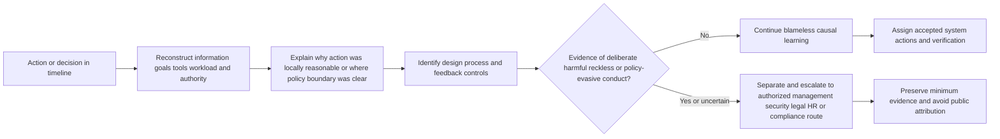

Blameless writing uses active, specific language without turning a person into the explanation. “The deployment removed validation rule `V` after review set `R` did not include compatibility case `C`” is more useful than passive “a mistake was made” and fairer than “the deployer broke production.” It identifies mechanism and control context while preserving the factual action.

## 10. Failure modes, prohibitions, and escalation

RCA can create harm when it exposes sensitive evidence, pressures a risky reenactment, destroys records, publishes unsupported attribution, or invents action completion. The retrospective setting does not grant new access or authority. Current security, privacy, legal, human-resources, compliance, change, customer, evidence, and disclosure processes supersede an RCA workshop.

### Failure modes and recovery

| Failure mode | Why it fails | Better behavior | Escalate or stop when |
|---|---|---|---|
| One-root requirement | Complex interactions are flattened to satisfy a template | State multiple causal roles and confidence | Reviewer demands unsupported certainty |
| Five Whys as proof | A fluent chain looks factual without evidence | Add source and alternative at each branch | Evidence ceiling is reached |
| Fishbone vote equals finding | Popularity replaces mechanism and data | Use candidate statuses and promotion gates | Attribution affects people, customers, or disclosure |
| Human error endpoint | System design and local context disappear | Reconstruct information, goals, tools, authority, and barriers | Conduct concern falls outside RCA authority |
| Correlation equals causation | Recent change or temporal proximity becomes scapegoat | Test mechanism, alternatives, cohorts, and counterfactual | Safe discrimination requires privileged or risky action |
| Trigger called root cause | Ordinary input or event receives blame | Ask which vulnerability allowed the trigger to create harm | Removing trigger would only hide weakness |
| Evidence cherry-picking | Contradictory/negative cases vanish | Preserve disconfirming evidence and uncertainty | Record integrity is disputed |
| Evidence deletion | Timeline, auditability, and legal/security duties may be damaged | Preserve under approved retention and evidence process | Anyone asks to delete, clear, purge, alter, or overwrite evidence |
| Sensitive-data sprawl | Workshop and document expand exposure | Minimize, redact through approved method, restrict access | Secrets, personal, customer, regulated, or security data appears |
| Risky reenactment | Reproduction can repeat customer harm or weaken controls | Use authorized simulation, synthetic data, or specialist review | Test touches production, real accounts, suspicious content, or security controls |
| Fabricated facts | Smooth narrative replaces unknown events | Mark gaps, source every claim, record confidence | Source cannot be verified or conflicts persist |
| Fabricated actions | Proposed work is reported as accepted, done, or effective | Track proposal, acceptance, implementation, and verification separately | Owner or approval is absent |
| Action without owner | “Engineering” or “team” becomes an orphan bucket | Obtain explicit accepted owner and fallback | No role accepts by the checkpoint |
| Due date without risk logic | Arbitrary date creates false commitment | Base date on current risk, dependencies, and authority | Priority conflict requires leadership decision |
| Documentation-only fix | Easy task closes while mechanism remains | Prefer stronger controls; label documentation as supporting | Residual risk exceeds accepted threshold |
| Postmortem as customer statement | Internal uncertainty or sensitive detail may be disclosed | Use authorized audience-specific communication | External disclosure is requested |
| Microsoft-to-Abnormal projection | Familiar process becomes invented employer fact | Transfer habits, then learn current process | Any Abnormal-specific claim lacks authorized evidence |

### Non-negotiable prohibitions

This Part, every worked example, the complete postmortem, and SignalBridge Lab 105 prohibit:

- blaming, shaming, humiliating, retaliating against, naming as culpable, or publicly attributing fault to a person, customer, partner, team, vendor, or organization without evidence, authority, due process, and a legitimate need;
- deleting, clearing, purging, wiping, truncating, overwriting, editing in place, backdating, fabricating, selectively hiding, or otherwise damaging evidence, logs, messages, tickets, decisions, audit records, timelines, or contradictory observations;
- unsupported attribution of root cause, compromise, breach, actor, intent, negligence, misconduct, ownership, severity, customer impact, legal duty, or product defect;
- fabricating facts, timestamps, customer statements, tests, evidence, approvals, decisions, owners, due dates, status, completed actions, verification, effectiveness, lessons, or recurrence results;
- inserting sensitive customer content, email bodies, attachments, identity data, personal data, confidential data, regulated data, secrets, tokens, cookies, keys, credentials, authenticated URLs, security findings, or unnecessary production detail into an RCA;
- risky reenactment, including replaying messages or requests, opening suspicious files or links, testing credentials, scanning, generating load, forcing failure, exhausting capacity, weakening controls, bypassing policy, changing production, or repeating harmful behavior;
- using the RCA as permission to contain, remediate, notify, deploy, roll back, restart, fail over, quarantine, release, revoke, reset, disable, allowlist, change configuration, alter data, or perform another production/security/customer action;
- forcing a singular root cause when evidence supports interaction or only a proximate mechanism;
- ending analysis at “human error,” “carelessness,” “training issue,” or another personal label;
- treating a Five Whys chain, fishbone category, workshop vote, senior opinion, recent change, or temporal correlation as causal proof;
- assigning an action to a person or team without acceptance, creating a due date without authority, or marking an action complete without implementation and effectiveness evidence; and
- claiming any fictional incident, action, postmortem, Abnormal process, Abnormal incident fact, Microsoft detail, or lab execution that is not supported by the stated evidence tier.

### Escalation decision flow

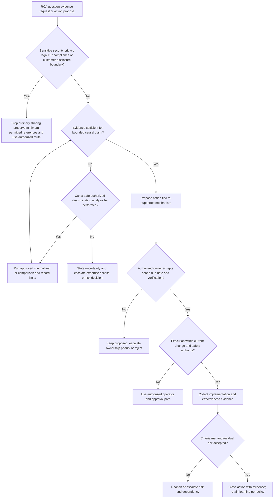

Escalate when specialist expertise is needed to interpret code, telemetry, threat evidence, statistics, safety impact, legal duties, employee conduct, or customer disclosure; when evidence access is restricted; when an owner or priority conflict blocks action; when residual risk exceeds the current acceptance threshold; when due dates slip on high-risk actions; when the postmortem identifies broader systemic exposure; or when a proposed test/action exceeds L1 authority. The escalation should state the exact question, evidence boundary, current confidence, decision needed, and retained ownership. It must not smuggle a verdict into the request.

## 11. Practical RCA operating method

Use **T-R-A-C-E-D** as a memory aid:

- **T - Tell the outcome and timeline:** State expected versus actual, scope, impact, time basis, and evidence gaps.
- **R - Rank causal roles:** Separate proximate mechanism, trigger, conditions, contributors, systemic weaknesses, and open hypotheses.
- **A - Ask and branch:** Use Five Whys and fishbone to generate questions, not proof.
- **C - Challenge causation:** Test mechanism, alternatives, predictions, cohorts, chronology, and counterfactuals.
- **E - Engineer actions:** Tie stronger corrective/preventive actions to supported causal links.
- **D - Define ownership and demonstrate effect:** Obtain accepted owner and due date, then verify implementation and effectiveness.

### RCA facilitation agenda

| Stage | Facilitator prompt | Required output | Guardrail |
|---|---|---|---|
| Charter | What is in scope, who has authority, and what data is permitted? | Purpose, participants, evidence boundary, disclosure boundary | Stop on sensitive or conduct issue outside authority |
| Outcome | What expectation was missed, for whom, and with what confidence? | Bounded impact statement | No cause in the impact sentence |
| Timeline | Which observations and decisions matter, on what clock? | Normalized evidence-linked sequence | Preserve uncertainty and contradiction |
| Candidate generation | Which mechanisms and conditions could explain it? | Branching Whys and fishbone candidate list | No votes as proof |
| Challenge | What alternatives and counterfactual predictions apply? | Causal matrix with confidence | Correlation stays correlation |
| Context | Why did decisions make sense locally? | Information/tool/workload/authority reconstruction | Human error is not endpoint |
| Learning | What worked, failed, and depended on luck? | Balanced learning section | Avoid hero and culprit narratives |
| Action | Which controls change occurrence, detection, impact, or recovery? | Prioritized proposals tied to claims | No unlimited wish list |
| Ownership | Who accepts, by when, with what dependencies? | Accepted owner/date or explicit pending state | Draft names are not assignment |
| Verification | Which evidence proves implementation and effectiveness? | Tests, metrics, window, reopen condition | Closure is evidence-based |
| Review | Who must approve technical, security, legal, HR, or external wording? | Current review route | Postmortem is not automatically publishable |

### Statement patterns

| Need | Strong wording | Avoid |
|---|---|---|
| Proximate cause | “The immediate mechanism was X, supported by evidence A and B.” | “X was the one root cause.” |
| Trigger | “Y initiated this occurrence under conditions C and D.” | “The customer caused it by doing Y.” |
| Contributor | “Z increased detection delay; it did not create the original failure.” | “Z caused everything.” |
| Uncertainty | “Configuration is a leading hypothesis; simultaneous field change remains a confounder.” | “Everyone agrees configuration was the cause.” |
| Human action | “The action occurred while signal B was absent and the interface represented assignment as acceptance.” | “The responder was careless.” |
| Proposed action | “Action A is proposed; owner acceptance and due date are pending.” | “Engineering will fix this next week.” |
| Implemented action | “Change record shows implementation; effectiveness verification remains open.” | “Root cause fixed.” |
| Verified action | “The agreed test met criteria for N observations; residual risk R remains.” | “This can never happen again.” |

## Lab

**SignalBridge Lab 105 - Local Synthetic RCA Comparison and Postmortem Tabletop** is a safe offline design. It was not performed during authoring. It creates no separate workspace file and performs no login, network request, API call, email, ticket action, incident action, product action, security action, customer contact, risky reenactment, production change, remediation, evidence deletion, or external interaction.

If performed later, the learner creates one local Markdown artifact containing a method comparison, three worked RCA mini-cases, one complete fictional postmortem, a causal-analysis decision tree, an action register, a failure/escalation review, and a deterministic validation record. It proves only that the learner can structure causal reasoning with invented text.

### Prerequisites

- A learner-owned local folder and a plain-text or Markdown editor.
- This Part as a read-only reference.
- No Abnormal AI, Microsoft production, customer, mailbox, tenant, identity, endpoint, API, network, ticketing, incident, CRM, collaboration, security, monitoring, change, knowledge, HR, legal, or external system.
- No real person, customer, employer, event, incident, postmortem, case, message, log, alert, identifier, action, timestamp, decision, source code, configuration, metric, or internal process.
- No password, token, cookie, key, secret, MFA code, recovery code, authorization header, credential-shaped placeholder, or authenticated URL.
- Obvious fictional aliases such as `ORG-105-FICTION`, `PM-105-LAB-A`, `ROLE-105-A`, relative time such as `FT+05`, and `example.invalid` only if a domain-shaped value is necessary.
- This exact line at the top of any later-created lab artifact: `LOCAL SYNTHETIC RCA TABLETOP - UNPERFORMED DURING AUTHORING - NOT ABNORMAL OR MICROSOFT PRODUCTION EXPERIENCE`.
- State `DESIGN_NOT_EXECUTED_NOT_TRANSFERRED` until the learner actually creates the artifact and every deterministic gate passes.

### Lab safety charter

| Area | Allowed | Prohibited | Automatic stop |
|---|---|---|---|
| Data | Learner-authored fictional rows only | Real customer, employee, product, personal, confidential, regulated, security, or production data | Any value is not clearly fictional |
| Systems | Offline manual text editing | Login, query, API, upload, email, ticket, incident tool, product, repository, or external service | Any system or person would be contacted |
| Evidence | Invented evidence IDs and observations | Logs, screenshots, exports, captures, messages, attachments, secrets, or copied case details | Content has real provenance or sensitivity |
| Causal claims | Bounded claims about the fictional model | Attribution to a real person, employer, customer, product, or incident | A claim could be mistaken for real fact |
| Testing | Manual comparison of authored rows | Replay, execution, credential use, suspicious content, scan, load, failure injection, or risky reenactment | A step could affect a device, account, person, service, or control |
| Actions | Proposed fictional controls | Assignment, approval, change, deployment, remediation, containment, notification, deletion, or production operation | Real authority would be required |
| People | Role aliases and context-focused language | Blame, shame, retaliation, culpability, intent, negligence, or misconduct finding | Personal attribution appears |
| Status | Proposed/unperformed/unknown labels | Fabricated completion, owner acceptance, due date, verification, effectiveness, or recurrence result | State exceeds evidence |
| Retention | Keep minimum local fictional text under approved learner policy | Evidence deletion instructions, destructive commands, or public upload | Real evidence appears or retention duty is unclear |

### Lab steps

1. Keep state `DESIGN_NOT_EXECUTED_NOT_TRANSFERRED` while reading this design.
2. If performing later, create one learner-owned local Markdown artifact using the normal file interface.
3. Add the exact honesty line, fictional artifact ID, author alias, date, version, and state.
4. Do not copy or paraphrase a confidential case, incident, postmortem, customer message, ticket, log, screenshot, metric, person, internal procedure, Microsoft detail, or Abnormal detail.
5. Define RCA, proximate cause, root/systemic cause, trigger, contributing factor, condition, counterfactual, Five Whys, fishbone/Ishikawa, timeline, corrective action, preventive action, owner, due date, verification, and blamelessness in the learner's own words.
6. For each term, add an analogy, why it matters, and a boundary.
7. Write three fictional outcomes with expected versus actual behavior, confirmed scope, possible scope, excluded scope, consequence, and evidence ceiling.
8. Ensure no outcome sentence contains an assumed cause.
9. Build a normalized timeline for each example using relative fictional time.
10. Record source, direct observation, interpretation, precision, and confidence separately.
11. Include one contradiction, one negative case, one missing event, and one clock uncertainty.
12. Reject any causal candidate that occurs only after the outcome begins.
13. Identify the proximate mechanism, trigger, relevant conditions, contributors, systemic weaknesses, and open hypotheses for each example.
14. Do not require one root cause.
15. Apply Five Whys to one occurrence branch, one detection branch, and one prevention branch.
16. Attach a fictional evidence pointer and confidence to every Why answer.
17. Branch whenever two explanations or controls interact.
18. Stop and mark unknown when the evidence ceiling is reached.
19. Reject any chain that ends at human error, carelessness, inattention, or insufficient training without examining context and controls.
20. Create a fishbone using categories suited to the fictional system.
21. Mark every fishbone entry `candidate` at creation.
22. Promote an entry only after chronology, mechanism, comparative evidence, alternatives, counterfactual, scope, and confidence are reviewed.
23. Mark at least one candidate supported, one weakened, one rejected, and one unknown.
24. Reject workshop votes, note position, repetition, title, and seniority as evidence.
25. Create a causal-claim matrix with evidence for, evidence against, alternatives, confidence, and boundary.
26. Write at least two predictions for each leading hypothesis.
27. Include one affected/unaffected comparison and name possible confounders.
28. Complete one counterfactual worksheet while changing only one modeled factor.
29. State an alternative pathway that could still produce the outcome.
30. Label correlation explicitly wherever mechanism or discrimination is missing.
31. Compare timeline, Five Whys, fishbone, change analysis, barrier analysis, cohort analysis, and counterfactual analysis.
32. Select methods based on the question, complexity, evidence, and risk rather than habit.
33. Complete one full fictional postmortem with header, honesty state, summary, impact, detection, response, timeline, evidence, causal claims, Whys, fishbone disposition, counterfactuals, learning, actions, communication, open questions, and residual risk.
34. Keep all names, events, systems, roles, owners, due dates, and outcomes obviously fictional.
35. State that a structurally complete postmortem is not a completed real investigation.
36. Create corrective, preventive, detection, containment/recovery, and learning action candidates.
37. Tie every action to a supported causal claim or explicit risk.
38. Prefer guardrails, isolation, limits, automation, and tests over reminders where proportionate.
39. For each action, write proposed owner alias, fictional due milestone, authority, dependencies, implementation evidence, effectiveness verification, safety/rollback, status, and reopen condition.
40. Keep every action `PROPOSED_NOT_ACCEPTED_NOT_EXECUTED_NOT_VERIFIED` unless a future learner genuinely performs an authorized local step and records evidence.
41. Do not assign a real person/team, contact anyone, create a ticket, or imply acceptance.
42. Separate implementation verification from effectiveness verification.
43. Include one action that is implemented in the fictional state but not yet effective only as a labeled hypothetical state-transition example, never as an event claim.
44. Include one rejected weak action such as “be more careful” and explain why it does not change the mechanism.
45. Reconstruct local context for one fictional human action: information, goals, tools, procedure, workload, authority, feedback, and safeguards.
46. Rewrite at least five blaming statements into factual system language.
47. Add the conduct-boundary branch: deliberate or reckless behavior concerns route to authorized specialists and remain outside technical attribution.
48. Create a failure-mode table covering one-root pressure, Five Whys proof, fishbone proof, human-error endpoint, correlation, cherry-picking, evidence deletion, sensitive data, risky reenactment, fabricated facts/actions, ownership, verification, and transfer overclaim.
49. Search for blame labels, personal names, real company/customer details, secrets, sensitive fields, unsupported attribution, and claims of execution.
50. Search for destructive verbs such as delete, purge, wipe, clear, overwrite, truncate, revoke, reset, release, or destroy; every occurrence must be a prohibition or conceptual warning.
51. Search for risky verbs such as replay, execute, scan, inject, load, bypass, disable, deploy, contain, remediate, or notify; every occurrence must be a prohibition or authorized conceptual boundary.
52. Search for `root cause`, `caused`, `confirmed`, `fixed`, `resolved`, `completed`, `approved`, `accepted`, `verified`, and `effective`; ensure each use matches evidence and state.
53. Search for `Abnormal` and `Microsoft`; retain only honesty boundaries, public-source boundaries, or defensible Microsoft transfer wording.
54. Confirm there are no Abnormal incident facts, invented internal processes, tools, queues, roles, thresholds, owners, timelines, or customer details.
55. Count the exact H1, recognized Mermaid declarations and fences, deep-dive headings, Markdown tables, worked examples, decision tree, failure/escalation sections, source rows, interview questions, answer labels, and final navigation link.
56. Confirm the word floor is at least 6,500 words.
57. Record every gate, count, evidence pointer, and result in a validation ledger.
58. If a gate fails, record the failed gate and exact correction before changing the artifact.
59. Use no more than three validation/repair cycles.
60. If any gate remains failed after cycle three, keep the artifact incomplete and request human review.
61. Change a future lab artifact to `LOCAL_SYNTHETIC_RCA_COMPLETED_NOT_TRANSFERRED` only after it actually exists and all gates pass.
62. Leave this authored Part's statement unchanged: SignalBridge Lab 105 was not performed during authoring.
63. Practice a ninety-second explanation of trigger versus systemic cause.
64. Practice explaining why Five Whys is a prompt and fishbone is an organizer, not proof.
65. Practice defending a multi-cause conclusion against pressure for one root.
66. Practice an honest Arti/Microsoft transfer answer with no Abnormal incident claim.
67. Practice proposing an action with owner, due date, implementation evidence, effectiveness verification, and reopen condition.
68. When learning use ends, follow current approved local retention policy; do not issue destructive commands or claim universal deletion.

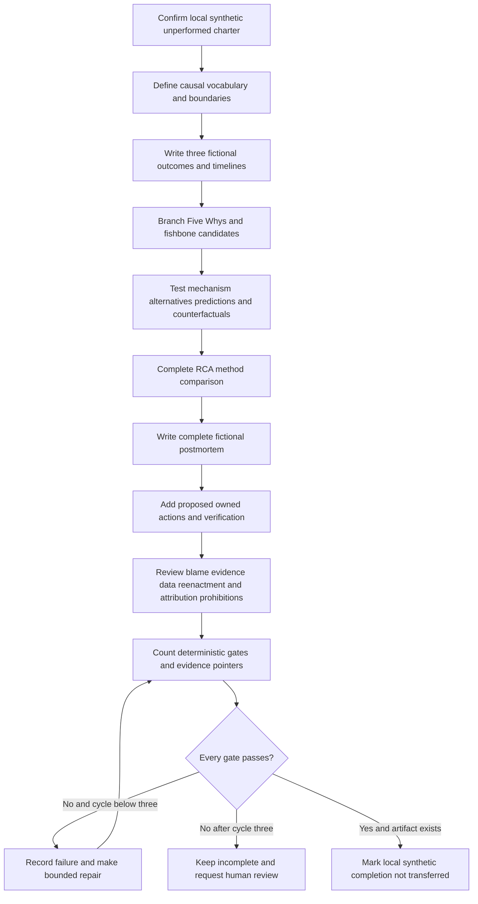

### Expected evidence

If the lab is actually performed later, expected evidence is:

- the exact honesty line and a state showing local, synthetic, offline, unperformed during authoring, and not transferred;
- learner definitions of all required causal and action terms with analogy and boundary;
- three fictional RCA examples with normalized timelines and evidence ceilings;
- branching Five Whys with evidence at each answer and no forced count or single root;
- one fishbone with candidate statuses and evidence-promotion decisions;
- one causal-analysis decision tree and one causal-claim matrix;
- mechanism, alternative, prediction, cohort, and counterfactual challenges;
- one completed RCA method-comparison artifact;
- one complete fictional postmortem with no real incident facts;
- a proposed action register with owner aliases, due milestones, authority, dependencies, two kinds of verification, and reopen rules;
- blameless context reconstruction and a separate conduct-escalation boundary;
- a failure-mode and prohibition review that explicitly covers blame, evidence deletion, unsupported attribution, fabricated facts/actions, sensitive data, and risky reenactment;
- at least eight official or primary sources with an authority boundary for each;
- one deterministic validation ledger with no more than three cycles; and
- no login, external interaction, real data, production work, risky test, action assignment, evidence deletion, personal attribution, Abnormal incident claim, or Microsoft-to-Abnormal process transfer.

### Cleanup and privacy

- Keep any future exercise in one learner-owned local folder containing manually authored fictional text only.
- Do not upload, publish, paste, email, sync, commit, or send it to a public repository, scanner, converter, personal cloud, external AI system, unapproved collaboration service, or other recipient.
- Do not include real cases, postmortems, customers, employees, messages, email content, logs, screenshots, exports, captures, identities, metrics, owners, actions, dates, or internal processes.
- Do not include passwords, tokens, cookies, keys, secrets, MFA codes, recovery codes, authorization headers, authenticated URLs, or credential-shaped values.
- Do not recreate suspicious content, replay traffic or messages, test credentials, scan, generate load, force a fault, exhaust capacity, change a security control, or interact with a production-like target.
- Do not delete or alter real evidence. If real or sensitive material appears, stop processing and sharing, restrict exposure, preserve only what current policy permits, and invoke the authorized privacy, security, legal, HR, compliance, or records route.
- If unperformed, record `SignalBridge Lab 105 remains a reviewed design and was not executed.`
- If later performed and passed, record `SignalBridge Lab 105 was completed locally with learner-authored fictional text only; no real incident, system, customer, person, sensitive data, risky reenactment, evidence deletion, unsupported attribution, fabricated fact/action, production operation, Abnormal incident fact, or Microsoft-to-Abnormal process claim was used.`

### Validation rubric

Score every row. Any automatic-failure condition makes the overall result `FAIL`. A repair cycle must identify the failed gate, evidence pointer, exact correction, and new result. Stop after three cycles if a complete `PASS` is not achieved.

| Dimension | Fail | Developing | PASS |
|---|---|---|---|
| Vocabulary | Required term missing or used before definition | Definitions lack analogy or boundary | Every required term has meaning, analogy, value, and boundary |
| Causal layers | Trigger, proximate, contributor, condition, and systemic cause collapse together | Some distinctions exist | Every layer is distinguished across examples |
| Timeline | Narrative has no source/time/uncertainty | Events ordered but interpretations mixed | Evidence-linked chronology preserves uncertainty and contradiction |
| Five Whys | Chain is proof, forced to five, linear, or ends at a person | Questions branch but evidence is uneven | Prompt branches, cites evidence, tests alternatives, and stops at ceiling |
| Fishbone | Categories or votes treated as findings | Candidates listed without promotion gates | Candidates have status, evidence, mechanism, alternatives, and scope |
| Causation | Correlation, recency, or reversal alone proves cause | Mechanism exists without alternatives | Mechanism, alternatives, predictions, counterfactual, and scope are challenged |
| Multiple examples | Only one abstract example | Several partial examples | At least three worked RCAs plus one complete postmortem |
| Decision tree | Missing or unsafe | Basic flow exists | Causal-analysis tree includes evidence, counterfactual, safety, escalation, action, and verification |
| RCA comparison | Blank template or method ranking without context | Methods described | Completed comparison applies methods to the same questions/examples |
| Postmortem | Missing major sections or implies real event | Most sections exist | Complete fictional document covers impact through residual risk |
| Actions | Generic tasks, no owner/date, or fabricated completion | Proposals have some fields | Causal link, accepted-state distinction, owner, due date, authority, two verifications, and reopen rule exist |
| Blamelessness | Person or team is endpoint | Blame avoided but context thin | Context is reconstructed and conduct concerns route separately |
| Failure/escalation | Warnings are generic | Some stops exist | Named failure modes, automatic stops, and authorized escalation paths are explicit |
| Safety/privacy | Real/sensitive data, risky reenactment, deletion, or production action appears | Local warning lacks detailed controls | Local synthetic scope and all named prohibitions are enforced |
| Candidate honesty | Lab/Microsoft work becomes Abnormal experience | Gap implied | Microsoft transfer, local artifact, learned guidance, and Abnormal gap stay separate |
| Sources | Fewer than eight or boundaries absent | Sources exist with generic caveat | At least eight official/primary sources each has an explicit authority boundary |
| Interview section | Count or answer label differs from contract | Eight entries but weak evidence/ethics | Exactly eight numbered questions each has one required answer label |
| Deterministic review | Counts or result absent | Informal review | Every gate is counted, no more than three cycles, and status changes only after PASS |

**Automatic failures:** any real incident, customer, person, Microsoft confidential detail, or Abnormal incident fact represented as part of the artifact; any production execution, login, network request, API call, product/ticket/incident action, customer contact, risky reenactment, security-control change, unauthorized remediation, external interaction, or destructive action; any sensitive or secret data; any blame, retaliation, unsupported personal or organizational attribution, evidence deletion/alteration, hidden contradictory evidence, fabricated fact, test, owner, due date, approval, action, status, verification, effectiveness, or result; any claim that Five Whys, fishbone, correlation, recent change, or workshop agreement proves cause; any forced single root, human-error endpoint, invented Abnormal process, or claim that the lab was performed; or any master tracker update before a complete `PASS`.

**Deterministic Part pass rule:** at least 6,500 words; exactly one H1 equal to the required title; all required terms explicitly defined; at least eight closed Mermaid blocks with recognized declarations; at least four Plain-English deep-dive headings; at least ten Markdown tables; multiple worked RCA examples; one causal-analysis decision tree; a completed RCA comparison artifact; a complete fictional postmortem; explicit root-versus-trigger/contributor reasoning; careful Five Whys and fishbone limitations; blamelessness with accountability; corrective/preventive actions with owner, due date, and verification; failure modes and escalation; all named prohibitions; exactly eight numbered interview questions with one required answer label each; at least eight official or primary URLs with an explicit boundary for each; local/synthetic/unperformed lab state; the exact sole next-Part navigation link on the final line; and no master status update before a complete `PASS`. Validate after the initial write, perform no more than three repair cycles, and mark the master target `Done` only after `PASS`.

### Authored-Part deterministic validation record

| Gate | Required | Authored result | Evidence pointer | Result |
|---|---:|---:|---|---|
| Word floor | At least 6,500 words | At least 7,190 words by disjoint lower-bound buckets: 70 lines with at least 50 words, 42 lines with 40-49, and 67 lines with 30-39; shorter lines and surplus words are excluded | Entire file | PASS |
| H1 | One exact title | One exact H1 on first line | File start | PASS |
| Definitions | All named terms | Sixteen explicit vocabulary rows | Required vocabulary | PASS |
| Mermaid | At least 8 closed recognized blocks | Thirteen recognized diagrams, each with a closing fence | Throughout | PASS |
| Deep-dives | At least 4 | Five titled Plain-English deep-dives | Sections 1-4 and 8 | PASS |
| Tables | At least 10 | More than thirty completed Markdown tables | Throughout | PASS |
| Worked RCA examples | Multiple | Queue, acknowledgement, configuration, and complete postmortem examples | Sections 3, 4, and 7 | PASS |
| Decision tree | Required | Complete evidence/safety/counterfactual/action path | Section 5 | PASS |
| RCA comparison | Required artifact | Completed method and applied-selection comparison | Section 6 | PASS |
| Complete postmortem | Required artifact | Full fictional document from metadata through residual risk | Section 7 | PASS |
| Failure and escalation | Required | Failure table, prohibitions, escalation flow, and routes | Section 10 | PASS |
| Interview questions | Exactly eight with required answer label | Eight numbered entries and eight answer labels | Interview section | PASS |
| Official/primary sources | At least 8 with boundaries | Twelve source rows with individual boundaries | Official Source Anchors | PASS |
| Safety | All named prohibitions and unperformed lab | Explicit in purpose, Section 10, Lab, and automatic failures | Multiple sections | PASS |
| Final navigation | Exact sole link on final line | One exact next-Part navigation line | File end | PASS |

**Authored-Part validation result: PASS.** Validation cycle 2 passed after repair cycle 1 corrected the diagram and deep-dive count labels in this ledger. SignalBridge Lab 105 remains `DESIGN_NOT_EXECUTED_NOT_TRANSFERRED` and was not performed. Proposed postmortem actions remain unaccepted, unexecuted, and unverified.

## Official Source Anchors - August 24, 2026

These official or primary sources anchor public RCA, incident-learning, safety-investigation, reliability, and response concepts. They do not establish facts about the fictional examples, Arti's undisclosed work, or Abnormal AI's incidents, thresholds, templates, systems, customers, owners, action process, disclosure rules, or internal policy.

| Official or primary source | Concept anchored | Explicit authority boundary |
|---|---|---|
| [Google SRE Workbook - Postmortem Culture](https://sre.google/workbook/postmortem-culture/) | Primary Google SRE guidance on blameless learning, postmortem practice, and organizational culture | Google practices are examples, not Abnormal policy; the page does not prove a cause, assign an owner, authorize disclosure, or describe Arti's experience |
| [Google SRE Book - Example Postmortem](https://sre.google/sre-book/example-postmortem/) | Primary example of impact, timeline, root-cause discussion, resolution, lessons, and action items | An example format is not a universal template and does not make fictional or unsupported statements true |
| [Google SRE Book - Postmortem Culture: Learning from Failure](https://sre.google/sre-book/postmortem-culture/) | Primary discussion of postmortem criteria, blamelessness, review, and action tracking | Google's terminology, thresholds, publication choices, and organization design do not transfer automatically to another employer |
| [NIST SP 800-61 Rev. 3 - Incident Response Recommendations](https://csrc.nist.gov/pubs/sp/800/61/r3/final) | Primary U.S. government guidance connecting cybersecurity incident response, recovery, and improvement to risk management | It does not declare a specific event a security incident or authorize L1 attribution, evidence collection, containment, eradication, notification, or disclosure |
| [NIST Cybersecurity Framework 2.0](https://www.nist.gov/cyberframework) | Official risk-management framework covering governance, identification, protection, detection, response, and recovery outcomes | A framework supplies outcomes, not an employer's RCA workflow, legal duty, control implementation, risk acceptance, or customer promise |
| [CISA Federal Government Cybersecurity Incident and Vulnerability Response Playbooks](https://www.cisa.gov/news-events/news/cisa-releases-cybersecurity-incident-and-vulnerability-response-playbooks) | Official public context for prepared response, coordination, and lessons learned | Federal playbooks do not govern a private company or customer and grant no authority for security actions, evidence handling, or attribution in this lesson |
| [OSHA Incident Investigation](https://www.osha.gov/incident-investigation) | Official U.S. workplace-safety guidance emphasizing underlying causes and prevention rather than blame | Workplace-safety investigations have distinct legal and operational contexts; OSHA material does not define a software incident process or replace legal/safety specialists |
| [UK HSE - Investigating Accidents and Incidents](https://www.hse.gov.uk/pubns/indg275.pdf) | Official UK safety guidance on collecting information, analyzing causes, risk controls, and action plans | It applies within its safety context and does not authorize access, determine liability, or define technology-support postmortem policy |
| [AHRQ PSNet - Root Cause Analysis](https://psnet.ahrq.gov/primer/root-cause-analysis) | Official U.S. healthcare patient-safety overview of RCA, contributing factors, and action limitations | Healthcare safety evidence and governance differ from SaaS support; it does not provide clinical, legal, or employer-specific authority here |
| [ASQ - Fishbone Diagram](https://asq.org/quality-resources/fishbone) | Primary professional-quality resource for cause-and-effect diagram purpose and construction | A diagram organizes possible causes; ASQ guidance does not validate entries, prove causation, or define an employer's categories |
| [IHI - RCA2: Improving Root Cause Analyses and Actions to Prevent Harm](https://www.ihi.org/resources/tools/rcca2-improving-root-cause-analyses-and-actions-prevent-harm) | Primary framework source emphasizing analysis plus stronger corrective actions in healthcare safety | RCA2 is not automatically an organization's adopted method and does not grant healthcare, legal, disciplinary, or production authority |
| [Microsoft Azure Well-Architected Framework - Reliability](https://learn.microsoft.com/en-us/azure/well-architected/reliability/) | Official Microsoft guidance on reliability design, failure analysis, recovery, and continuous improvement in Azure workloads | Public Azure architecture guidance is not evidence of Arti's specific cases, one universal Microsoft process, Abnormal architecture, or an approved action in any environment |

Source discipline:

- Public reliability and quality sources offer methods and examples. They cannot prove a factual cause in a specific event; only authorized evidence and review can do that.
- Cybersecurity sources do not grant ordinary Support authority to collect unrestricted evidence, declare an incident or breach, attribute an actor, contain systems, notify parties, or disclose restricted details.
- Safety and healthcare sources provide valuable causal and blameless-learning lessons, but their regulatory, legal, clinical, and organizational settings differ from enterprise SaaS support.
- Microsoft's public guidance and Arti's defensible Microsoft support background can support a transfer story about evidence, communication, coordination, and validation. They do not define Abnormal policy or prove that Arti performed a particular postmortem.
- ASQ fishbone guidance explains an organizer; it does not turn brainstormed categories into evidence.
- Source content, versions, and URLs can change after August 24, 2026. Revalidate current official and internal sources, permissions, retention, disclosure, security, legal, HR, action ownership, and review criteria before real work.

## Likely Interview Questions

### Q1. What is the difference between a root cause, proximate cause, trigger, condition, and contributing factor?

**Model answer:** I start with causal role rather than calling everything root cause. The proximate cause is the immediate mechanism nearest the outcome. The trigger explains why this occurrence began when it did. A condition is a relevant state that existed, while a contributing factor has evidence that it increased likelihood, severity, duration, or detection/recovery difficulty. A root or systemic cause is a deeper controllable weakness whose change would materially reduce recurrence or impact. There may be several interacting systemic causes. I state evidence, confidence, scope, and unknowns instead of forcing one root.

### Q2. How do you use Five Whys without oversimplifying an incident?

**Model answer:** I use Five Whys as a prompt, not proof and not a requirement to ask exactly five times. I begin with one bounded outcome, attach evidence and confidence to each answer, branch when mechanisms or controls interact, challenge alternatives, and stop at the evidence ceiling. I ask why an action made sense given the information, tools, workload, incentives, and authority at the time. If a chain ends at human error or training, I continue into system design and safeguards. The final claim comes from evidence and testing, not from the chain's fluency.

### Q3. What is a fishbone diagram useful for, and what can it not do?

**Model answer:** A fishbone or Ishikawa diagram is useful for broadening candidate causes across areas such as people and coordination, process, technology, data, dependencies, measurement, and management. It helps expose blind spots early in an RCA. Its categories and notes are hypotheses, not evidence. I mark each item candidate, supported, weakened, rejected, or unknown, then require chronology, mechanism, comparative evidence, alternatives, counterfactual reasoning, scope, and confidence before promoting it. Votes, note position, repetition, or seniority do not prove causation.

### Q4. How do you avoid confusing correlation with causation?

**Model answer:** I first check chronology, then explain a mechanism and list credible alternatives or confounders. I write different predictions for competing hypotheses and compare affected with unaffected cases where possible. I use a counterfactual: if I changed only the candidate factor, what outcome should differ, and what alternative path could remain? A rollback or reversal is useful evidence but may still coincide with another change or natural recovery. If a safe authorized discriminating test is unavailable, I keep the claim qualified rather than manufacture certainty.

### Q5. What makes a postmortem blameless but still accountable?

**Model answer:** Blamelessness means reconstructing how decisions made sense with the information, tools, procedures, workload, incentives, and authority available at the time. I write specific mechanisms and control gaps rather than stopping at a person or “human error.” Accountability remains explicit: decisions are recorded, action owners must accept scope, due dates reflect risk and dependencies, and implementation and effectiveness are verified. Deliberate harm, reckless conduct, or policy evasion is not adjudicated casually in the RCA; it is preserved minimally and routed to the authorized management, security, legal, HR, or compliance process.

### Q6. How do you write corrective actions that do more than close a ticket?

**Model answer:** I tie each action to a supported causal link and label whether it changes occurrence, detection, containment, recovery, or learning. I prefer proportionate guardrails, limits, isolation, automated checks, and release tests over reminders alone. The action needs an accepted owner, due date, authority, dependencies, implementation evidence, effectiveness criteria, observation window, regression checks, and a reopen condition. I keep proposed, accepted, implemented, and verified states separate. A code merge or document publication can prove implementation, but only outcome evidence can support effectiveness.

### Q7. How does your Microsoft support background transfer to RCA work here?

**Model answer:** My Microsoft enterprise support background gives me transferable habits: maintaining a coherent case timeline, separating customer impact from technical hypotheses, coordinating specialists, communicating uncertainty, following actions, and validating a returned fix against the original outcome. I would use a real Microsoft example only within confidentiality and only claim duties I actually performed. I have not handled an Abnormal incident and do not know its internal postmortem thresholds, tooling, roles, disclosure rules, or action process. I would learn those first and transfer the habits, not Microsoft labels or assumptions.

### Q8. What would make you stop or escalate an RCA?

**Model answer:** I stop ordinary analysis when sensitive data, secrets, security evidence, legal or HR concerns, customer disclosure, evidence-retention duties, or a risky reenactment appears. I preserve only permitted references, restrict sharing, and use the current authorized route. I also escalate when specialist expertise or restricted evidence is required, owner or priority conflict blocks an action, residual risk exceeds authority, or a high-risk action is overdue. I never delete evidence, assign blame, test credentials, weaken controls, fabricate facts or actions, or turn a hypothesis into attribution to make the document feel complete.

## Memory Hooks

- **RCA explains and improves; it does not prosecute.**
- **Proximate is nearest; systemic is the deeper controllable weakness.**
- **Trigger asks why now; condition asks what state existed; contributor asks what made it worse.**
- **Five Whys opens questions; evidence closes claims.**
- **A fishbone is a hypothesis shelf, not a proof machine.**
- **After is chronology, not causation.**
- **Human error starts context reconstruction; it does not end analysis.**
- **One root may be a formatting convenience, not reality.**
- **A counterfactual changes one factor and admits alternative pathways.**
- **Blameless protects learning; ownership protects follow-through.**
- **Done needs two receipts: implementation and effectiveness.**
- **A due date without acceptance is fiction.**
- **No real data, no risky reenactment, no invented Abnormal facts.**

## Completion Checklist

- [ ] I can define RCA, proximate cause, root/systemic cause, trigger, contributing factor, condition, and counterfactual with distinct examples.
- [ ] I can explain why one root cause may be false or incomplete in a sociotechnical system.
- [ ] I can build a source-linked timeline with clock uncertainty, contradictions, actions, and interpretations separated.
- [ ] I use Five Whys as a branching prompt, never as proof or a forced count.
- [ ] I use fishbone categories to organize candidates, never as evidence.
- [ ] I do not stop at human error, carelessness, or training.
- [ ] I test chronology, mechanism, alternatives, predictions, cohorts, confounders, and counterfactuals before claiming causation.
- [ ] I can distinguish occurrence, detection, containment, recovery, and learning actions.
- [ ] I can write a blameless postmortem that remains factual and accountable.
- [ ] Every action has a causal target, accepted owner state, due date state, authority, dependencies, implementation evidence, effectiveness verification, and reopen condition.
- [ ] I never convert proposed work into an accepted, completed, or verified claim.
- [ ] I can compare timeline, Five Whys, fishbone, change, barrier, cohort, fault-tree, and counterfactual methods.
- [ ] I can explain all four worked examples and their evidence ceilings.
- [ ] I prohibit blame, evidence deletion, unsupported attribution, fabricated facts/actions, sensitive data, and risky reenactment.
- [ ] I stop and escalate through authorized routes for security, privacy, legal, HR, compliance, disclosure, restricted evidence, risky testing, ownership conflict, and unaccepted risk.
- [ ] I describe SignalBridge Lab 105 as local, synthetic, and unperformed unless I later complete it and every gate passes.
- [ ] I describe Microsoft experience as Microsoft experience and do not claim any Abnormal incident fact or internal process.
- [ ] I can explain what each official source anchors and where its authority stops.
- [ ] I can answer all eight interview questions aloud without inventing experience or certainty.

[Next: Part 106 - Zendesk Salesforce Jira and Confluence Workflows](Part-106-zendesk-salesforce-jira-and-confluence-workflows.md)