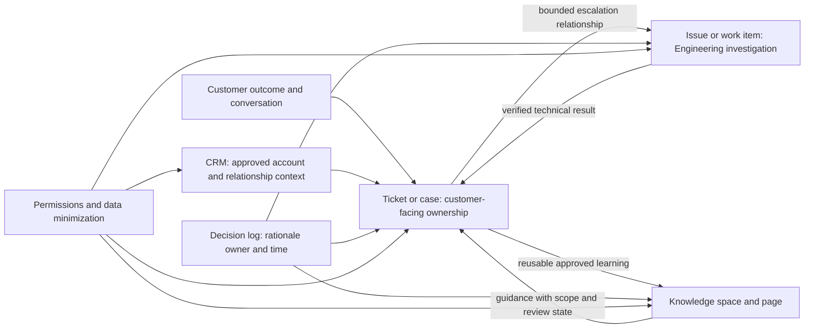
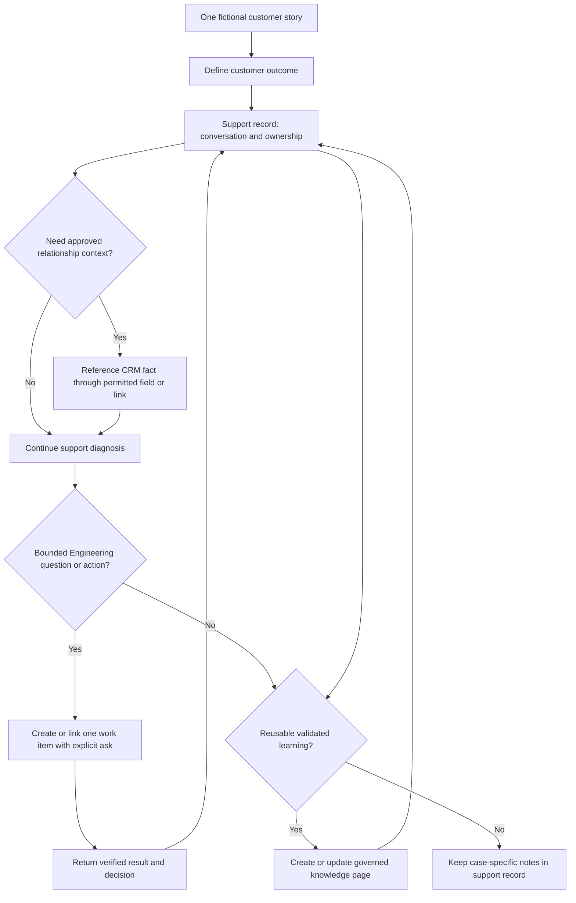
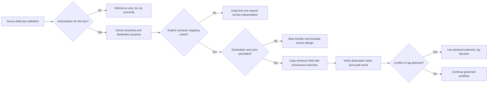
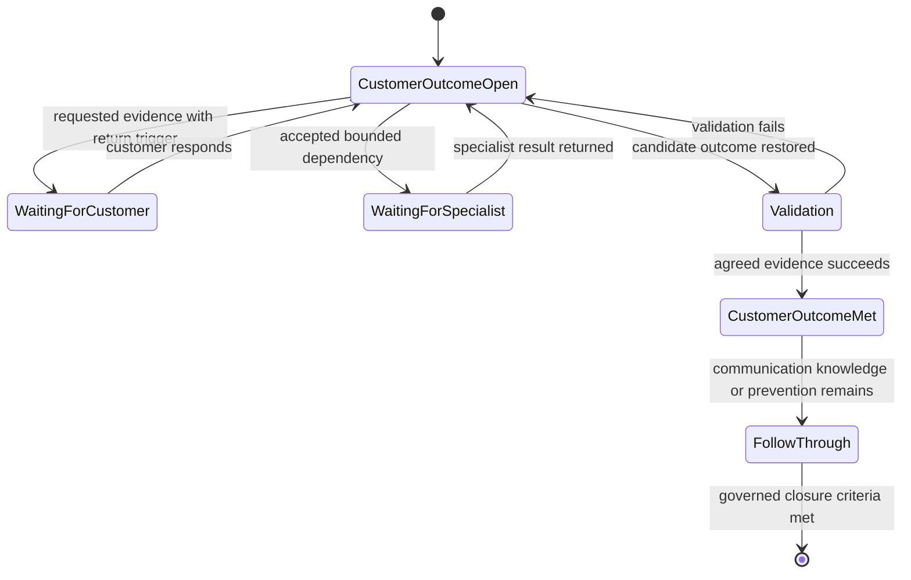
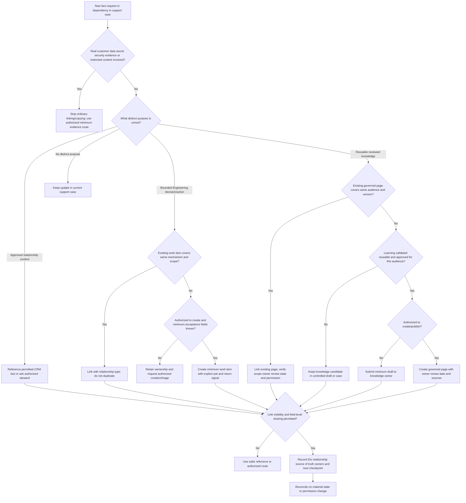
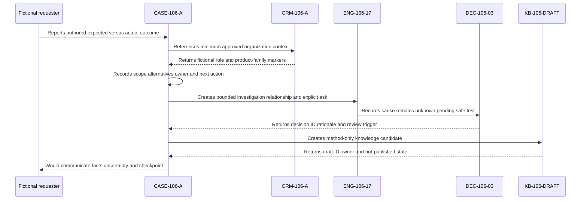
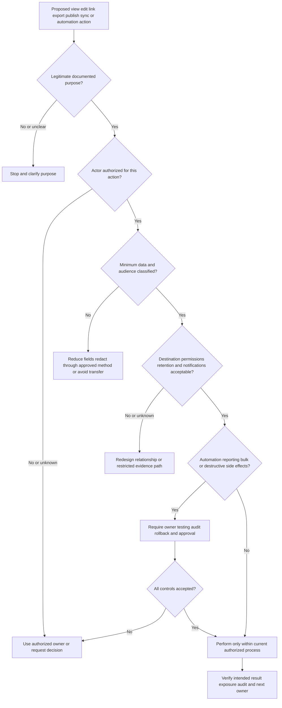
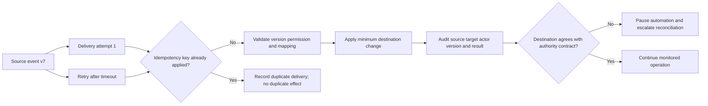
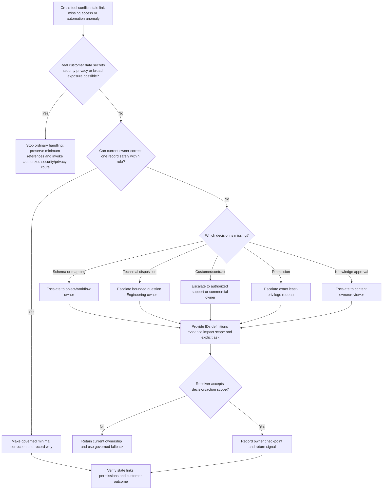
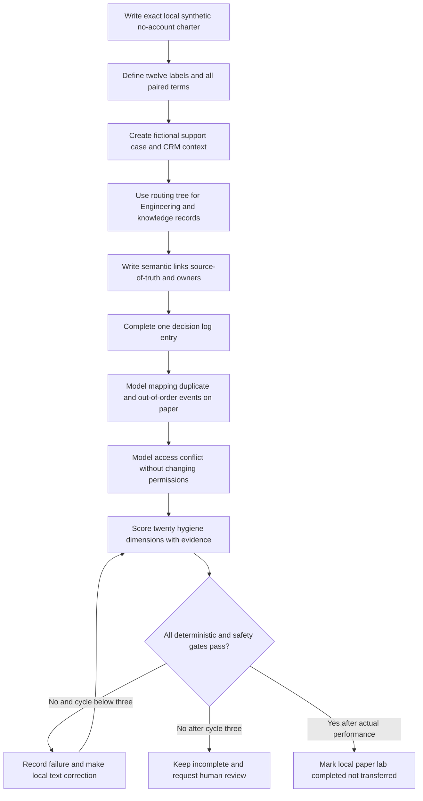

# Part 106 - Zendesk Salesforce Jira and Confluence Workflows

> **Purpose:** Build a product-neutral mental model for moving one customer support matter across conceptual ticketing, customer relationship management, Engineering work tracking, and documentation without losing ownership, evidence, permissions, decisions, or the customer outcome.
>
> **Artifact honesty label:** **Template only with a local synthetic paper-workflow example.** Every organization, customer, person, account, product, case, issue, page, field, queue, status, permission, link, decision, timestamp, identifier, automation event, and result in this Part is fictional unless an official vendor source is explicitly cited or Arti's Microsoft/Confluence background is explicitly described as such. SignalBridge Lab 106 was not performed while this Part was authored. No account is needed. No Abnormal AI, Microsoft, Zendesk, Salesforce, Jira, Confluence, customer, ticketing, CRM, Engineering, knowledge, identity, API, automation, security, production, or external system was accessed, configured, or changed.
>
> **Currency and source access date:** August 24, 2026.
>
> **Authored-Part state:** `PASS`. The master tracker was changed only after every deterministic gate passed.

## Section goal

A support engineer may hear one customer story but encounter several records. A ticketing record holds the support conversation and case ownership. A **customer relationship management** system, shortened to **CRM**, provides approved account and relationship context. An Engineering issue tracks a bounded product investigation or change. A knowledge page preserves reusable, reviewed learning. These records can point to one another, but they do not become interchangeable merely because an integration copies a field or displays a link.

This Part teaches Arti to:

1. explain the distinct job of conceptual Zendesk ticketing, Salesforce CRM context, Jira Engineering work tracking, and Confluence documentation;
2. identify the minimum fields needed for routing, ownership, evidence, decision-making, customer communication, and lifecycle control;
3. distinguish a queue from a saved view, a status from the underlying real-world state, an assignee from the broader accountable owner, and a watcher from a worker;
4. link records using stable identifiers and explicit relationship meanings rather than copying entire narratives everywhere;
5. declare which system is the source of truth for each fact category and record important decisions in a durable log;
6. reason about permissions before links, synchronization, automation, exports, or cross-team sharing;
7. maintain case hygiene without inventing universal fields, statuses, workflows, mappings, entitlements, or internal Abnormal AI configuration;
8. recognize integration drift, duplicate work, stale links, overexposure, automation loops, and premature closure;
9. create a conceptual cross-tool workflow and score it with a case-hygiene rubric; and
10. describe direct tool experience, transferable production experience, learned concepts, and unperformed practice as separate evidence tiers.

The portable rule is: **one customer outcome may require several records, but every fact, decision, and action needs one declared home, one accountable owner, and permission-safe links.** Real organizations choose different products, object names, fields, states, roles, plans, integrations, and retention rules. Their current authorized configuration and policy always control.

### The twelve required vocabulary labels

The following twelve numbered labels define every term required for this Part before the lesson relies on it. Rows 11 and 12 deliberately pair governance concepts that must be designed together. Pairing them does not make the individual terms synonyms.

| # | Required label | Beginner-first definition | Everyday analogy | Why it matters | Boundary to preserve |
|---:|---|---|---|---|---|
| 1 | **Ticket and case** | A **ticket** is a trackable record of a request, question, symptom, or conversation. A **case** is often a ticket-like customer-service record with ownership and lifecycle context. Organizations and products may use either word differently. | A repair-shop work order holds the reported problem, conversation, technician, and outcome. | It gives the customer-facing work a durable record and owner. | A ticket or case is not automatically an incident, defect, security event, Engineering task, CRM account, or proof that its contents are true. |
| 2 | **CRM** | A customer relationship management system stores approved information about organizations, contacts, commercial relationships, products or entitlements, and customer interactions. | A hotel guest profile helps staff understand the reservation and relationship without becoming the maintenance work order. | It provides account context needed for correct routing and communication. | CRM context must not become a technical verdict, contractual interpretation, or excuse to expose broad customer data. Salesforce can be a CRM platform, but each implementation is configured differently. |
| 3 | **Issue and work item** | An **issue** or **work item** is a bounded record of work such as a defect investigation, task, story, change, or improvement. Modern Jira documentation may use `work item` and `work type`, while many teams still say `issue`. | A construction job card tells a specialist exactly what needs investigation or completion. | It gives Engineering a scoped problem, acceptance signal, and owner separate from the customer conversation. | A support ticket does not automatically justify a bug, and an Engineering work item does not take over Support's customer communication unless ownership is explicitly accepted. |
| 4 | **Knowledge space and page** | A **knowledge space** is a governed collection of related documentation; a **page** is one content item within it. Confluence is one platform that uses spaces and pages, but other systems use sites, libraries, collections, or articles. | A library is the space; one reviewed handbook chapter is the page. | It makes reusable learning findable, reviewable, and maintainable. | A page is not automatically authoritative, current, audience-safe, or executable. Space/page permissions, review state, and owner matter. |
| 5 | **Queue and view** | A **queue** is an operational collection from which work is routed or selected. A **view** is a saved presentation or filter over records. A view may help a team work a queue, but the two are not universally identical. | The kitchen order rail is a queue; a screen showing only vegetarian orders is a view. | It prevents filtered visibility from being confused with assignment or ownership. | Being visible in a view does not prove a record is routed, accepted, entitled, urgent, or owned. Product behavior depends on configuration and plan. |
| 6 | **Field and schema** | A **field** is one named data element, such as `customer impact` or `environment`. A **schema** is the governed structure describing fields, types, allowed values, relationships, validation, and meaning. | A form box is a field; the complete form design and instructions are the schema. | Good fields support routing, search, reporting, automation, and clean handoffs. | More fields do not guarantee better data. Names and values are local contracts; never assume one product's field maps exactly to another's. |
| 7 | **Status and state** | A **status** is a label stored in a tool. **State** is the real condition of the customer outcome or work. A status should represent state under a defined workflow, but it can be stale, ambiguous, or differently named across tools. | A parcel tracker may say `in transit`, while the parcel is physically waiting at a depot. | Separating label from reality prevents false closure and bad synchronization. | `Open`, `Pending`, `Done`, `Solved`, `Closed`, and similar labels have no universal meaning or safe cross-tool mapping. |
| 8 | **Assignee and owner** | An **assignee** is the person or group currently named in a record's assignment field. An **owner** is accountable for a stated outcome, decision, communication, or next action. They may be the same, but not always. | A package can be assigned to a delivery van while a dispatcher still owns successful delivery. | It makes responsibility explicit through handoffs and cross-tool work. | Assignment, mention, queue membership, or automation does not prove acceptance. Ownership must name scope and fallback. |
| 9 | **Watcher and follower** | A **watcher** or **follower** subscribes to updates or is included in a notification relationship without necessarily owning or performing the work. Products use these terms differently. | A passenger follows a flight status but does not pilot the aircraft. | It lets stakeholders stay informed without multiplying assignees. | Watching is not approval, access entitlement, confidentiality clearance, ownership, or evidence that the update was read. |
| 10 | **Link and relationship** | A **link** is a navigable reference, often a URL or stable identifier. A **relationship** explains why two records are connected, such as `support case escalated as`, `duplicates`, `documented by`, or `decision applies to`. | A map pin is the link; the legend explains whether it marks a destination, hazard, or supply point. | Meaningful relationships preserve traceability and stop readers from guessing. | A bare pasted URL is not a relationship contract. A visible link can expose existence or metadata even when its target is restricted. |
| 11 | **Permission and source of truth** | A **permission** is an allowed action on a resource, such as view, comment, edit, assign, administer, or export. A **source of truth** is the declared authoritative home for a particular fact category. | A hospital chart has role-based access, and different departments own specific measurements rather than keeping competing copies. | These concepts determine who may see/change a fact and which copy wins when records disagree. | Permission is not implied by job title or possession of a link. One system need not be authoritative for every fact; declare authority per field or decision category. |
| 12 | **Decision log and sync/automation** | A **decision log** is a durable record of a decision, its time, owner, evidence, rationale, alternatives, scope, and review trigger. **Synchronization**, or **sync**, copies or reconciles selected data between systems. **Automation** performs configured actions when conditions or events occur. | Air-traffic control records why a runway changed while conveyor belts move selected baggage labels between stations. | The log preserves human reasoning; sync/automation reduces repetition when governed safely. | Automation does not create truth, authority, consent, or semantic equivalence. Never automate a field, permission, closure, or bulk update without authorization, ownership, mapping, loop prevention, and rollback. |

The central analogy is **a hospital joined to a library and an Engineering workshop**. The front desk keeps the patient-facing case, the relationship system holds approved identity and coverage context, the specialist workshop tracks a device defect, and the library preserves reviewed guidance. Cross-references help everyone coordinate, but each area has different authority and confidentiality. The analogy stops where SaaS platforms have configurable object models, plan-specific features, APIs, automation, asynchronous updates, retention rules, and customer-specific security boundaries.



This is a conceptual division of responsibility, not Abnormal AI architecture or configuration. A real organization may use fewer tools, more tools, different products, custom objects, embedded views, bidirectional integrations, or a single platform. Verify the current system model rather than forcing this diagram onto it.

## JD Mapping

| Role signal | Capability developed | Observable behavior | Honest proof artifact |
|---|---|---|---|
| Enterprise L1 ownership | Keeps the customer outcome continuous while specialists use other records | Maintains customer status, next action, owner, dependency, and return path in the support record | Local synthetic cross-tool workflow |
| Complex troubleshooting | Converts a broad narrative into typed fields, evidence, hypotheses, and a bounded Engineering ask | Separates observation from inference and links the minimum useful evidence | Fictional case-to-work-item packet |
| Engineering and Product collaboration | Creates a work item only when a technical decision or action warrants it | Supplies expected/actual behavior, reproduction boundary, impact, evidence index, and acceptance signal | Completed synthetic Engineering-link example |
| Customer relationship awareness | Uses approved CRM context without treating it as technical proof | Verifies account/contact identity, entitlement source, and communication stakeholders through the current process | CRM-context worksheet |
| Knowledge creation | Turns validated recurring learning into governed documentation | Names audience, owner, review date, scope, evidence, and related records | Fictional Confluence-style decision/knowledge page |
| Queue and case quality | Makes work findable and actionable without gaming fields | Uses required values honestly, records unknowns, and prevents stale assignment or false status | Case-hygiene rubric |
| Security-aware support | Checks permissions and sensitivity before linking, copying, exporting, or automating | Shares the minimum needed through authorized channels and stops on protected material | Permission-safe linking checklist |
| Process improvement | Finds duplicate entry, field drift, and synchronization failure | Defines source-of-truth ownership and reconciliation signals before recommending automation | Cross-tool contract matrix |
| Microsoft enterprise support background | Transfers case ownership, customer communication, escalation, fix validation, knowledge work, and quality review | Uses actual Microsoft examples with exact role/action/result boundaries | Production-transfer narrative |
| Confluence working knowledge | Uses only defensible direct examples of navigation, collaboration, or documentation | States the exact Confluence action personally performed and avoids implied administration | Direct-tool evidence statement |
| Zendesk, Salesforce, and Jira learning targets | Builds accurate public-doc concepts without claiming operation | Labels examples `LEARNED_CONCEPT` or `TEMPLATE_ONLY` | Dated source-and-boundary ledger |
| Abnormal AI learning goal | Prepares to learn the employer's current systems without inventing them | Asks for the approved object model, fields, queues, statuses, permissions, links, automation, and ownership rules | First-week discovery checklist |

## Candidate honesty note

Arti's background must be described in layers, not blended into a broad claim of “tooling experience.” The master guide supports five years of Microsoft customer-facing enterprise support involving SharePoint Online, OneDrive, Sync Client, and Copilot support; case ownership; critical situations in the Microsoft context; Engineering or Product collaboration; customer and partner communication; fix validation; knowledge work; mentoring; and case-quality improvement. Those are **direct production support capabilities**. The master also lists **Confluence working knowledge**, which may be described as direct tool familiarity only to the exact depth of a real example Arti can defend.

The same evidence does **not** establish direct production operation of Zendesk, Salesforce, or Jira. Those remain learned concepts in this Part. It also does not establish Confluence administration, space-permission design, automation ownership, or a specific workflow unless Arti has a separate truthful example. Nothing in this Part establishes knowledge of Abnormal AI's internal systems, configuration, queues, fields, statuses, permissions, integrations, automation, records, or customer data.

### Direct experience versus learned concepts

| Tool or capability | Evidence label for this Part | Safe statement | Claim to avoid |
|---|---|---|---|
| Microsoft enterprise support and named Microsoft products | **DIRECT_PRODUCTION_TRANSFER** | “In Microsoft enterprise support, I owned customer cases, coordinated specialists, communicated status, and validated outcomes.” | Naming an undisclosed Microsoft ticket platform, schema, automation, or confidential process without evidence |
| Confluence working knowledge | **DIRECT_TOOL_EXPERIENCE_AT_STATED_DEPTH** | “I have working knowledge of Confluence; I can describe the exact pages, collaboration, or documentation actions I personally used.” | “I administered Confluence permissions, schemas, integrations, or enterprise governance” without a defensible example |
| Zendesk | **LEARNED_CONCEPT_NO_DIRECT_OPERATION** | “I studied official Zendesk concepts for tickets, fields, views, followers, and business rules, with plan and configuration caveats.” | “I worked Zendesk queues” or “I configured Zendesk at Abnormal” |
| Salesforce | **LEARNED_CONCEPT_NO_DIRECT_OPERATION** | “I studied CRM, Case object, ownership, access, and relationship concepts through official Salesforce material.” | “I managed Salesforce cases, queues, Service Cloud, or Abnormal customer records” |
| Jira | **LEARNED_CONCEPT_NO_DIRECT_OPERATION** | “I studied Jira Cloud work items, work types, workflows, links, and permission schemes conceptually.” | “I operated an Engineering Jira project, configured workflows, or managed Abnormal defects” |
| Cross-tool artifact in this file | **TEMPLATE_ONLY_SYNTHETIC_UNPERFORMED** | “I authored a fictional cross-tool workflow and rubric; the separate paper lab remains unperformed.” | “I integrated four platforms” or “I completed a live multi-tool workflow” |
| Abnormal AI systems and configuration | **NO_DIRECT_EXPERIENCE_UNKNOWN_CONFIGURATION** | “I do not know Abnormal's internal toolchain or configuration and would learn the current authorized workflow.” | Any statement that Abnormal uses one of these products, fields, mappings, statuses, permissions, or automations in a particular way |

A safe interview bridge is:

> “My direct experience is enterprise customer support in Microsoft contexts, where I owned cases, coordinated Engineering or Product, communicated with customers, validated fixes, and contributed to knowledge and quality. I also have working knowledge of Confluence, which I describe only to the depth of examples I personally performed. Zendesk, Salesforce, and Jira are learned concepts for me today, not production-operation claims. I have not configured Abnormal's systems and would first learn its current sources of truth, field definitions, queues, permission model, linking rules, and automation ownership.”

### 🔍 Plain-English deep-dive: Tool familiarity is not workflow ownership

Recognizing a screen is not the same as understanding the organization's contract around that screen. A person may know how to edit a field but not know who owns its meaning, whether it drives an SLA, whether customers can see it, whether automation reads it, or whether a downstream report treats it as authoritative. The click is usually the easiest part.

Think of driving a rental car. Familiarity with a steering wheel helps, but it does not tell you the local road law, insurance boundary, route, cargo rules, or who may authorize a repair. In the same way, experience with one ticketing platform transfers useful habits such as structured notes and ownership, but it does not prove another company's field meanings or permissions.

For interviews, separate three sentences: “I have directly done X,” “I learned concept Y from official material,” and “I would verify local rule Z before acting.” This is stronger than pretending every platform is interchangeable. It shows operational caution and a realistic ramp plan.

## 1. Four tool categories, four primary jobs

The platforms in the title overlap. Zendesk can contain customer and organization data, Salesforce can manage service cases, Jira can support service workflows, and Confluence can display Jira work. Product suites evolve. The useful starting point is therefore not “which button belongs to which brand?” but “what job is this record performing here?”

### Conceptual responsibility matrix

| Tool category in this lesson | Primary question | Typical record | Appropriate content | Content to minimize or reference instead | Not assumed |
|---|---|---|---|---|---|
| Zendesk-style ticketing | What does the requester need, who owns the response, and what happens next? | Ticket/case | Customer-visible chronology, verified impact, environment, troubleshooting summary, commitments, next action | Large raw evidence, unrelated CRM history, speculative Engineering detail | That Abnormal uses Zendesk or any standard Zendesk workflow |
| Salesforce-style CRM context | Who is the approved organization/contact, and what relationship context is relevant? | Account, contact, case, entitlement-like or custom record | Approved identity, relationship, product, stakeholder, and service context | Raw logs, secrets, long technical narrative, unsupported contract interpretation | That every Salesforce deployment uses Service Cloud, standard objects, or the same fields |
| Jira-style Engineering tracking | What bounded technical work, decision, defect, or change must an owning team evaluate? | Work item/issue | Expected versus actual, reproduction boundary, evidence index, environment, impact, acceptance criteria, explicit ask | Full customer correspondence, unnecessary personal/commercial data, passwords/tokens | That a Jira `Bug`, workflow, priority, or status has a universal meaning |
| Confluence-style documentation | What reviewed knowledge or decision should remain reusable after the case? | Space/page/content item | Audience, scope, decision, rationale, procedure, limitations, owner, review date, related records | Live secrets, unredacted customer content, unsupported workaround, private discussion copied wholesale | That a published page is approved, current, or visible to everyone |



The arrows represent explicit relationships, not automatic copying. For example, a support case may state `Engineering work item ENG-106-17 owns parser investigation; Support retains customer communication`. It should not duplicate every Engineering comment. Likewise, a knowledge page may explain a reusable symptom and safe diagnostic sequence but link back to the reviewed decision rather than exposing one customer's conversation.

## 2. Fields and schemas turn prose into governed signals

Free text is essential for nuance, but a queue cannot reliably route on “somewhere in this paragraph the customer said production is blocked.” Fields make important facts explicit. A schema gives those fields stable meanings and allowed values. A good schema is small enough to use, precise enough to support decisions, and documented well enough that people and automation interpret it consistently.

### Portable minimum fact model

| Fact category | Example field concept | Why capture it | Quality rule | Possible source of truth |
|---|---|---|---|---|
| Identity | Organization/contact reference | Connect the matter to the approved relationship | Use stable internal reference; do not copy unnecessary personal data | CRM or authorized identity/customer master |
| Customer outcome | Expected and actual outcome | Keeps work anchored to user impact | Write behavior, not diagnosis | Support case |
| Scope | Affected/excluded population | Supports routing and severity review | Separate confirmed, possible, and excluded scope | Support case with links to evidence |
| Environment | Product area, version, client, region, integration type | Makes comparison and reproduction possible | Record `unknown` rather than guess | Support case or governed configuration source |
| Time | First observed, last observed, time zone | Supports chronology and correlation | Preserve source clock and uncertainty | Support case/evidence system |
| Classification | Request/incident/problem/security-route candidate | Selects workflow | Use current organization criteria | Governed support/incident system |
| Ownership | Current owner and next-action owner | Prevents orphaned work | Require acceptance and fallback | Owning record for each action |
| Engineering ask | Decision/action requested | Gives specialist work a finish line | One sentence plus acceptance signal | Engineering work item |
| Customer commitment | Next update trigger or governed time | Protects trust | Never invent an ETA or entitlement | Support case under current agreement |
| Knowledge state | Draft/reviewed/published/retired concept | Controls reuse | Include owner and review date | Knowledge system |
| Decision | Decision, rationale, approver/owner, evidence, timestamp | Prevents repeated debate | Record alternatives and review trigger | Declared decision-log home |
| Relationship | Stable IDs and semantic link type | Preserves traceability | Use direction and meaning | Each involved record or integration registry |

No row dictates a vendor field. A real Zendesk instance might use standard and custom ticket fields; Salesforce might use standard or custom objects; Jira might use work types, fields, and workflow properties; Confluence might use templates, labels, page properties, databases, or apps. Names, types, requiredness, visibility, defaults, and automation vary by plan and configuration.

### Field design checklist

| Design question | Healthy answer | Warning sign |
|---|---|---|
| What decision uses this field? | “Routes to the identity integration team after verified integration family selection.” | “We might report on it someday.” |
| Who supplies and validates it? | Named role and validation rule | Everyone and no one |
| Is `unknown` allowed? | Yes, when evidence is absent, with a next step | Guessed value required to continue |
| Can the customer see it? | Visibility is documented per context | Agents discover exposure after entering internal notes |
| Is it sensitive? | Classification and minimum-value guidance exist | Free text invites secrets or full message bodies |
| Does automation read it? | Trigger, owner, failure behavior, and audit path are documented | Hidden side effects after field edits |
| Does another system receive it? | Direction, transformation, authority, and lag are defined | “It syncs” with no field-level contract |
| How does it retire? | Deprecation, migration, reporting, and historical handling are planned | Values are renamed in place without impact review |

### 🔍 Plain-English deep-dive: A field name is not a shared meaning

Two forms can both contain a field called `Priority` and mean different things. One might represent customer-facing handling order, another Engineering planning order, and a third an automatically calculated risk score. Copying `High` among them can create a believable but false alignment.

Imagine two thermometers: one reads Celsius and one Fahrenheit. Copying the number `40` without the unit is worse than leaving the destination blank because it looks precise. Cross-tool fields also need units: definition, owner, allowed values, scope, calculation, and effective time. A reliable mapping says, for example, “Support impact summary is displayed as context in Engineering; Engineering priority remains independently assigned by its owner.” It does not say “High maps to High.”

When no safe mapping exists, use a relationship link and a short neutral summary. Manual review is not a failure of automation; it may be the correct control when semantics, permissions, or consequences differ.



## 3. Queues, views, statuses, owners, and followers control attention

A queue answers “which work is available or routed here?” A view answers “which records match this display?” Some products combine these experiences, and teams often call both a queue. Keep the distinction in your reasoning because visibility is not acceptance.

### Operational attention model

| Concept | What it controls | Minimum question | Misleading signal | Hygiene action |
|---|---|---|---|---|
| Queue membership | Candidate work for a team or process | Why is this record here, and who watches the queue? | Record appears in a queue but no response owner exists | Confirm queue ownership, intake rule, and fallback |
| View membership | What a filter displays | Which conditions, fields, and records does it include/exclude? | Agent assumes absence means no work | Check filter, access, archived scope, and stale values |
| Status | Tool lifecycle label | What real state and next action should this label mean here? | `Pending` hides whether waiting on customer or third party | Record dependency, owner, and return trigger explicitly |
| Assignee | Named record assignment | Has this person/group accepted, and what do they own? | Automated assignment treated as acknowledgement | Record acceptance or governed fallback |
| Owner | Accountability for a result | Which outcome, action, or communication is owned? | “Engineering owns it” with no scope | Split technical, customer, decision, and validation ownership |
| Watcher/follower | Notification audience | Why does this person need updates and have access? | Watcher count mistaken for collaboration | Remove unnecessary followers under current policy; never use as approval |
| Age | Time since a defined event | Which clock and state transition does age measure? | Old record assumed more severe without impact review | Reassess facts and commitments; do not game dates/statuses |
| Work in progress | Active owned work | What action is happening and when is the next check? | Status says active while no accepted action exists | Add exact next action, owner, and checkpoint |

### Status is local, state is real

There is no safe universal mapping such as `Zendesk Solved = Jira Done = Salesforce Closed = Confluence Published`. A support matter can be solved for the customer while a lower-priority Engineering prevention item remains open. A Jira work item can be done while Support still needs customer validation. A Confluence page can be published while its advice remains restricted, time-bound, or awaiting broader approval. A CRM case can be closed under one configured process without saying anything about another tool.



This diagram describes real-world support states using generic names. It is not a status list for any vendor or employer. A configured workflow may collapse, split, rename, or prohibit these transitions. The support engineer's responsibility is to understand what the local status means and keep the underlying owner/dependency visible.

### Ownership split example

| Outcome or action | Fictional owner | Record home | Acceptance evidence | Return signal |
|---|---|---|---|---|
| Customer communication | `ROLE-SUPPORT-106` | Support case `CASE-106-A` | Authored assignment acknowledgement | Next factual update recorded |
| Account-contact verification | `ROLE-CRM-STEWARD-106` | CRM reference `CRM-106-A` | Fictional paper check only | Approved reference confirmed or discrepancy returned |
| Parser defect analysis | `ROLE-ENGINEERING-106` | Work item `ENG-106-17` | Fictional accepted-work marker | Technical decision and evidence summary |
| Workaround approval | `ROLE-SERVICE-OWNER-106` | Decision log `DEC-106-03` | Fictional decision record | Scope, expiry, and validation criteria |
| Knowledge review | `ROLE-KNOWLEDGE-106` | Page `KB-106-DRAFT` | Fictional review request accepted | Publish, revise, or reject decision |
| Cross-record reconciliation | `ROLE-SUPPORT-106` | Relationship ledger | Explicit retained ownership | Links, states, and next actions agree |

Every identifier and role is fictional. The table demonstrates scoped ownership rather than claiming that these roles, records, or acceptance markers exist in Abnormal AI or any vendor configuration.

## 4. Links, source-of-truth contracts, decisions, and synchronization

Cross-tool work fails when people copy everything or link nothing. Copying everything creates stale duplicates, permission sprawl, search confusion, and conflicting histories. Linking nothing forces the next team to rediscover context. The middle path is a **relationship contract**: stable identifiers, a semantic relationship, minimum context, source-of-truth declaration, permission check, owner, and return signal.

### Relationship contract

| Element | Example in the fictional workflow | Why required |
|---|---|---|
| Source record | `CASE-106-A` | Establishes where the relationship begins |
| Target record | `ENG-106-17` | Makes the destination unambiguous |
| Relationship type | `escalated-as-engineering-investigation` | Explains meaning instead of leaving a bare URL |
| Customer-safe summary | “Export fails for one synthetic schema shape; no real customer data.” | Gives enough context without copying the full case |
| Authority split | Support owns customer communication; Engineering owns parser decision | Prevents “they own it” ambiguity |
| Fact authority | Case owns current customer impact; work item owns technical disposition | Resolves conflict deliberately |
| Permission statement | Links and summaries remain inside the fictional paper boundary | Forces access review in real work |
| Return signal | Engineering posts one decision summary and evidence references | Defines what completes the dependency |
| Review trigger | Impact, scope, permission, or work-item disposition changes | Keeps the relationship current |

### Source-of-truth matrix

| Fact category | Conceptual authoritative home | Allowed replicas | Conflict rule | Why this is not universal |
|---|---|---|---|---|
| Current customer impact and communication | Support case | Short impact summary in Engineering item | Support owner verifies current fact and records time | Some organizations may centralize incident communication elsewhere |
| Account/contact identity and approved relationship context | CRM/customer master | Stable reference and minimum display fields | CRM steward or authorized process resolves discrepancy | CRM objects and ownership differ by implementation |
| Technical defect decision and implementation state | Engineering work item/repository process | Customer-safe disposition summary in case | Engineering owner supplies verified result; Support does not infer from status alone | Some teams use other work trackers or code systems |
| Reusable procedure or explanation | Governed knowledge page | Links from case and work item | Knowledge owner controls published wording and review state | Knowledge may live in another platform or require separate publication |
| Customer commitment | Support case plus applicable agreement source | Reminder in linked work item if permitted | Authorized support/contract source wins; no invented ETA | Contracts and clocks vary by customer and plan |
| Cross-team decision | Declared decision log | Summaries with decision ID | Decision owner clarifies superseding entry | Organizations may keep decisions in case, work item, page, or incident system |

The phrase `source of truth` should always finish the sentence: source of truth **for which fact, during which period, under whose authority?** No single tool should casually become authoritative for customer impact, contract terms, source code state, permissions, and published guidance all at once.

### 🔍 Plain-English deep-dive: Links can leak without opening

A person may lack permission to open a target record yet still see its title, URL pattern, identifier, preview, mention, notification, integration error, or search result. A title such as `Executive mailbox compromise at Customer X` can expose sensitive information even when the page body is restricted.

Think of an opaque envelope with a confidential subject written on the outside. Sealing the letter protects the contents but not the label. Cross-tool links need safe titles, minimum metadata, audience checks, and no secret-bearing query strings or authenticated URLs. The right test is not only “can the recipient open it?” but “what can every viewer, watcher, log, notification, bot, export, and integration learn from its existence?”

If a destination team needs restricted evidence, follow the current approved evidence route. Do not paste customer data into a broadly visible issue to make collaboration convenient. Do not request broader permission merely to avoid a proper handoff. A sanitized summary and authorized evidence pointer are often enough.

### Decision log minimum schema

| Field | Required content | Fictional example | Failure prevented |
|---|---|---|---|
| Decision ID | Stable reference | `DEC-106-03` | Untraceable “we agreed” statements |
| Decision | Exact choice made | “Use manual review for relationship creation in this paper model.” | Vague outcome |
| Time and clock | Timestamp/time basis | `FT+35`, fictional relative time | Rewritten chronology |
| Decision owner | Authorized role that owns choice | `ROLE-SERVICE-OWNER-106` | Attendance mistaken for authority |
| Inputs | Evidence and records considered | `CASE-106-A`, `ENG-106-17`, permission checklist | Unsupported choice |
| Alternatives | Options considered | No link; full copy; minimum semantic link | Lost tradeoffs |
| Rationale | Why this option fits | Minimizes duplicate/sensitive content while preserving traceability | Repeated debate without context |
| Scope | Where decision applies | Fictional paper example only | Accidental universal policy |
| Consequence | Expected effect and risk | Manual delay; lower exposure and mapping risk | One-sided decision story |
| Review trigger | What reopens it | Approved integration design or permission model changes | Permanent stale decisions |
| Status | Proposed/accepted/superseded, with evidence | `FICTIONAL_ACCEPTED_IN_EXAMPLE` | Draft treated as authorization |

### Synchronization contract

```mermaid
sequenceDiagram
    participant Case as Support case source
    participant Gate as Permission and mapping gate
    participant Sync as Authorized sync service
    participant Work as Engineering work item
    participant Audit as Audit and reconciliation
    Case->>Gate: Candidate minimum fields plus provenance
    Gate->>Gate: Check purpose sensitivity mapping and authority
    alt Not permitted or mapping absent
        Gate-->>Case: Do not transfer; request human decision
    else Permitted and mapped
        Gate->>Sync: Approved event with idempotency key
        Sync->>Work: Create or update allowed fields
        Work-->>Sync: Stable target ID and result
        Sync->>Audit: Record actor time source target and outcome
        Audit-->>Case: Relationship and sync status
    end
    Note over Case,Work: Statuses and priorities remain locally governed unless an explicit mapping says otherwise
```

**Idempotency** means that repeating the same authorized request does not create duplicate effects. It is like a payment terminal recognizing that a transaction identifier was already processed. Idempotency does not solve semantic mistakes, excess permission, or bad source data; it only helps control repeat delivery.

## 5. Routing and linking decision tree

The safest default is to keep the customer conversation in its current support record and create another record only when a distinct owner, decision, lifecycle, or reusable audience requires it. More records are not automatically more mature. Each record adds maintenance, permission, notification, and reconciliation cost.



### Create, link, update, or escalate

| Situation | Default conceptual action | Required evidence | Do not do |
|---|---|---|---|
| Same customer symptom already has an active support case | Link/merge only under current duplicate policy; preserve requester continuity | Matching customer, outcome, environment, time, and ownership | Bulk-close “duplicates” from title similarity |
| Same technical mechanism already has an Engineering item | Link support case with a scoped relationship | Matching expected/actual behavior and affected mechanism | Add a generic `same issue` comment with customer data |
| Similar symptom but different environment or mechanism | Keep separate and cross-reference as possible relation | Differences, unknowns, and discriminating test | Force one defect to simplify reporting |
| One-off customer-specific detail | Keep in the support case | Relevance to current outcome | Publish as general knowledge |
| Reusable verified procedure | Create/update governed knowledge through review | Audience, prerequisites, authority, steps, validation, owner, date | Publish an unapproved workaround or secret |
| CRM fact conflicts with customer statement | Record discrepancy and use authorized verification | Source, time, identity boundary, and steward | Overwrite CRM or accuse customer from one record |
| Work-item access is broader than case access | Use sanitized minimum summary and restricted evidence route | Audience and data classification | Paste full case, attachments, token, mailbox content, or private contact data |
| Mapping or permission is unknown | Stop transfer and escalate the design question | Exact field, source, destination, purpose, and needed decision | Experiment with live sync, permissions, or API calls |

### Routing packet: minimum useful content

| Component | Support-to-Engineering content | Reason |
|---|---|---|
| Relationship | Source case ID and `escalated-as` meaning | Preserves traceability |
| Explicit ask | One decision or action requested | Prevents “please investigate” queues |
| Expected/actual | Product-neutral behavior statement | Anchors technical work |
| Scope | Confirmed affected/excluded patterns | Supports prioritization without exposure |
| Environment | Minimum relevant versions/configuration categories | Enables comparison |
| Reproduction | Safe steps or statement that reproduction is unavailable/unsafe | Prevents risky improvisation |
| Evidence index | Sanitized references, source, time, relevance | Avoids unstructured dumps |
| Attempts | Test, expected result, actual result, conclusion | Prevents repetition |
| Impact | Current verified customer outcome, timestamped | Provides context; not an Engineering priority command |
| Permissions | What may be viewed and where restricted evidence lives | Protects data |
| Owners | Support communication owner and Engineering ask owner | Prevents abandonment |
| Return signal | Required decision/evidence summary and checkpoint | Defines dependency completion |

## 6. Artifact one - completed fictional cross-tool workflow

This in-page artifact demonstrates the requested cross-tool workflow. It is a **completed written example**, not a performed lab and not evidence that any vendor account was used. The fictional company is `Northstar Paper Labs`, the fictional support service is `SignalBridge`, and every identifier uses synthetic values. There is no real customer, email address, product behavior, tenant, account, message, or security event.

### Scenario and initial intake

At fictional time `FT+00`, an authorized fictional requester reports that a scheduled export from `SignalBridge` completes but contains no rows for one learner-authored schema shape. A second synthetic schema shape works. The requested outcome is a complete export. The support role can inspect only the authored text below; no product, API, log, file, or account exists.

| Intake field | Fictional value | Evidence class | Interpretation limit |
|---|---|---|---|
| Support record | `CASE-106-A` | Authored identifier | Not a Zendesk or Salesforce record |
| Organization reference | `ORG-106-FICTION` | Authored identifier | Not a customer or CRM account |
| Expected outcome | Both synthetic schema shapes produce three rows | Authored contract | Not a product specification |
| Actual outcome | Shape `A` has three rows; shape `B` has zero | Authored observation | Not generated by a system |
| First observed | `FT+00` | Relative fictional time | Not wall-clock evidence |
| Scope | One fictional request, shape `B` only | Authored comparison | No prevalence claim |
| Security/privacy | No real or sensitive data; literal placeholders only | Lab charter | Does not authorize use of real data |
| Current owner | `ROLE-SUPPORT-106` | Fictional accepted state | No real assignment |
| Next action | Compare authored schemas and formulate one bounded technical ask | Fictional plan | No execution implied |

### Step A - use CRM context only for approved relationship facts

The paper workflow includes a fictional CRM reference `CRM-106-A` showing the organization identifier, approved contact role, and a generic product-family label. It does not contain contract terms, support entitlement, personal details, secrets, or a technical diagnosis. In real work, the current CRM configuration, permissions, account model, entitlement source, and policy decide what may be used.

| CRM-context question | Fictional answer | Support use | Boundary |
|---|---|---|---|
| Does the organization reference match the case? | Yes, both use `ORG-106-FICTION` | Continue conceptual linkage | Matching text is not identity proof in real work |
| Is the requester role approved for updates? | Fictional paper marker says `APPROVED_ROLE` | Include role in communication plan | No real authorization occurred |
| Which product family is relevant? | `EXPORT-FAMILY-FICTION` | Add neutral context to case | Not an Abnormal product or configuration |
| What contract or severity applies? | Unknown and intentionally absent | Ask the authorized source in real work | Never infer from CRM tier, company size, or urgency language |
| What technical cause exists? | CRM has no answer | None | Relationship data is not causal evidence |

### Step B - decide whether an Engineering work item is justified

The authored comparison says shape `A` includes fields `id` and `category`, while shape `B` includes `id`, `category`, and an empty optional array called `notes`. The conceptual parser expectation says an empty optional array should be accepted. This is enough to formulate a technical question in the fictional exercise, but not enough to declare a defect.

**Explicit ask:** Determine, within the fictional model, whether the optional empty `notes` array can explain the zero-row result; return the leading mechanism, one discriminating test design, and whether the expected contract should change.

| Engineering field | Fictional content | Why it is hygienic |
|---|---|---|
| Work item ID | `ENG-106-17` | Stable target identifier |
| Relationship | `CASE-106-A escalated-as ENG-106-17` | Direction and meaning are explicit |
| Work type | `INVESTIGATION_CANDIDATE` | Avoids claiming a confirmed bug |
| Expected/actual | Three rows expected; zero authored rows for shape `B` | Separates behavior from diagnosis |
| Difference | Empty optional `notes` array appears only in shape `B` | Bounded comparison |
| Alternative | Fixture construction or output rendering could also explain result | Preserves competing hypotheses |
| Evidence | Authored tables `EV-106-1` and `EV-106-2` | No raw customer data or attachment |
| Attempted tests | None performed | Prevents fabricated evidence |
| Impact | Fictional workflow cannot complete for shape `B` | Context without universal severity mapping |
| Priority | Unassigned by Support | Engineering planning authority remains local |
| Support owner | `ROLE-SUPPORT-106` | Customer communication remains visible |
| Engineering owner | `ROLE-ENGINEERING-106`, fictional accepted marker | Bounded technical decision ownership |
| Return signal | Decision summary, evidence references, and next safe test | Defines completion of the dependency |

### Step C - record the cross-team decision

The fictional Engineering role does not claim to have run code. It reviews the authored model and decides that a paper comparison should remain a hypothesis. `DEC-106-03` states: “Do not label a product defect. Design a future authorized synthetic parser test that changes only the empty optional array; until then, describe the cause as unknown.” The decision owner is fictional, the scope is this exercise, and the review trigger is actual authorized test evidence.

### Step D - decide whether knowledge is ready

The workflow does not publish “empty arrays break exports,” because no test supports it. It creates a fictional **knowledge candidate** titled `How to collect a minimum export-schema comparison`, with no vendor name and no production steps. The candidate explains how to record expected/actual shape, versions, a redacted schema summary, time basis, and safe comparison boundaries. Its state remains `DRAFT_NOT_PUBLISHED`.

| Knowledge field | Fictional value | Hygiene boundary |
|---|---|---|
| Page ID | `KB-106-DRAFT` | Not a Confluence page |
| Space concept | `SUPPORT-LEARNING-FICTION` | Not an existing space or permission model |
| Audience | Support learners using synthetic data | Not customers or operators |
| Claim | Method for collecting a schema comparison | No unsupported root cause or fix |
| Inputs | `CASE-106-A`, `ENG-106-17`, `DEC-106-03` summaries | Minimum references only |
| Owner | `ROLE-KNOWLEDGE-106` proposed fictional role | No real assignment |
| Review state | `DRAFT_NOT_REVIEWED_NOT_PUBLISHED` | Publication is not implied |
| Review trigger | Approved method owner and actual test evidence | Prevents stale certainty |
| Permission | Local paper artifact only | No public upload or external sharing |

### Step E - update the support record without copying every detail

The support record receives a concise internal update:

> `FT+35 fictional update: CASE-106-A remains owned by ROLE-SUPPORT-106. ENG-106-17 owns the bounded technical question of whether the empty optional array can explain the authored result. No test was performed and no defect is confirmed. DEC-106-03 requires an authorized synthetic discriminating test before causal language changes. KB-106-DRAFT records only the reusable evidence-collection method and is not published. Next customer-style update would state the known outcome, current uncertainty, and next checkpoint without exposing internal speculation.`

This update carries enough context to maintain continuity and directs readers to the authoritative record for deeper details. It does not synchronize priorities, statuses, comments, or permissions.

### End-to-end relationship map



### Artifact relationship ledger

| From | To | Relationship | Authoritative fact split | Permission posture | Reconciliation trigger |
|---|---|---|---|---|---|
| `CASE-106-A` | `CRM-106-A` | `has-approved-context-reference` | Case owns current outcome; CRM owns approved relationship context | Minimum fictional IDs only | Contact/account discrepancy |
| `CASE-106-A` | `ENG-106-17` | `escalated-as-investigation` | Case owns customer impact; work item owns technical disposition | Sanitized summary only | Scope, owner, or disposition change |
| `ENG-106-17` | `DEC-106-03` | `governed-by-decision` | Decision log owns rationale and review trigger | Same fictional paper boundary | New test evidence |
| `CASE-106-A` | `KB-106-DRAFT` | `produced-knowledge-candidate` | Case owns case facts; page owns reusable method draft | No customer details | Review/publish/retire state change |
| `KB-106-DRAFT` | `DEC-106-03` | `bounded-by-decision` | Decision limits causal wording | Local only | Decision superseded |

### Worked cross-tool example B - duplicate symptom, different mechanism

A second fictional support case, `CASE-106-B`, reports a zero-row export, but its authored comparison says the request contained no eligible rows before export. The title resembles `CASE-106-A`; the mechanism does not. The correct action is not to link it as the same defect merely to reduce duplicate count.

1. Keep `CASE-106-B` separate because its expected/actual contract differs.
2. Record `possibly-related-by-symptom` only if the current process supports a qualified relationship.
3. Do not attach it to `ENG-106-17` as confirmed scope.
4. Use a discriminating fact: eligible source-row count before export.
5. If that count remains zero, route the case-specific explanation without changing the Engineering work item's affected cohort.
6. If later evidence shows eligible rows existed, reassess the relationship with provenance and time.

| Comparison | `CASE-106-A` | `CASE-106-B` | Routing implication |
|---|---|---|---|
| Visible symptom | Zero-row export | Zero-row export | Similar title only |
| Eligible input rows | Three in authored contract | Zero in authored contract | Different first divergence |
| Schema-shape difference | Present | Irrelevant to current evidence | Do not assume shared mechanism |
| Engineering relationship | Bounded investigation exists | None justified yet | Keep separate |
| Knowledge value | Schema comparison method may help | Input eligibility check may become a separate method | Avoid one oversized article |

### Worked cross-tool example C - CRM and permission conflict

`CASE-106-C` contains a fictional contact reference that does not match `CRM-106-C`. The support record also contains a note saying “executive contact,” but the fictional CRM paper record says `ROLE_UNVERIFIED`. The correct response is not to change the CRM record, broaden access, copy the note into Jira, or treat title as authorization.

The support owner records a discrepancy, limits communication to the currently authorized channel in the fictional model, and asks the fictional CRM steward to verify the relationship. Technical work can continue with de-identified facts if policy permits, but no sensitive detail is linked to broader records. If identity or authorization cannot be established, the support owner escalates through the approved customer/identity process. This is an access and relationship decision, not a technical bug.

### Artifact completion statement

The in-page artifact is complete as a written synthetic example. It demonstrates distinct record purposes, stable semantic links, minimum fields, scoped owners, permission posture, source-of-truth splits, a decision log, a knowledge candidate, and reconciliation triggers. It does **not** demonstrate live platform navigation, API use, integration, field configuration, automation, production operation, Abnormal AI configuration, or lab execution.

## 7. Artifact two - case-hygiene rubric

Case hygiene means that another authorized person can understand the customer outcome, evidence, decisions, ownership, dependencies, and next action without reconstructing the case from scattered conversations. Hygiene is not cosmetic completeness. A long ticket with every field populated can still be unsafe and unactionable.

### Scored rubric

Use `0`, `1`, or `2` per row. `0` means absent/unsafe, `1` means partial/ambiguous, and `2` means explicit/evidence-aligned. Any automatic failure overrides the score. A score is a learning signal, not a universal performance target or Abnormal quality policy.

| Dimension | 0 - absent or unsafe | 1 - partial | 2 - strong | `CASE-106-A` paper score |
|---|---|---|---|---:|
| Customer outcome | Internal error only or invented impact | Expected/actual incomplete | Expected, actual, scope, and evidence time are explicit | 2 |
| Identity/context | Unverified identity or unnecessary CRM copy | Reference exists but authority unclear | Minimum approved reference and discrepancy path | 2 |
| Classification | Universal label assumed | Tentative class with weak rationale | Current criteria/source and uncertainty stated | 2 |
| Fields/schema | Guesses, overloaded free text, or secrets | Some structured facts | Minimum fields have meaning, source, and `unknown` handling | 2 |
| Queue/view | Visibility treated as ownership | Queue known; fallback missing | Route, queue owner, acceptance, and fallback are explicit | 1 |
| Status/state | Status label stands alone | Dependency appears in notes | Real state, next action, owner, and return trigger accompany status | 2 |
| Assignee/owner | Mention or assignment implies acceptance | One owner named without scope | Customer, technical, decision, and validation ownership are scoped | 2 |
| Watchers/followers | Broad audience or approval inferred | Audience purpose unclear | Minimum justified audience and no ownership inference | 2 |
| Evidence | Raw dump, no provenance, or sensitive content | Evidence referenced without relevance | Sanitized index has source, time, relevance, and limits | 2 |
| Engineering ask | “Please investigate” | General question | Bounded decision/action, alternatives, and return signal | 2 |
| Links/relationships | Bare URLs or duplicate narratives | IDs present; semantics weak | Direction, meaning, authority split, and review trigger | 2 |
| Permissions | Broad copy or unknown exposure | Restriction mentioned | Audience, sensitivity, link leakage, and approved route checked | 2 |
| Source of truth | Copies compete | One general tool named | Authority declared per fact category and conflict rule | 2 |
| Decision log | Decision buried in chat | Choice recorded without rationale | ID, owner, time, inputs, rationale, alternatives, scope, trigger | 2 |
| Sync/automation | Hidden or assumed | Direction known; failure handling weak | Mapping, authority, idempotency, audit, retry, rollback, reconciliation | 1 |
| Customer communication | Silence or fabricated ETA | Update exists without trigger | Known, unknown, action, owner, and governed next checkpoint | 2 |
| Knowledge | Case detail copied or unreviewed workaround published | Candidate exists | Audience, claim, owner, review state/date, permissions, sources | 2 |
| Closure | Status changed without outcome validation | Internal completion only | Customer outcome, linked work, residual ownership, and criteria reconciled | 1 |
| Honesty | Tool/lab/Abnormal experience overstated | Gap implied | Direct, learned, template, and unknown configuration labels explicit | 2 |
| Safety | Real data, secret, public upload, unauthorized action | Generic warning only | Named prohibitions, stop conditions, and minimum-data handling | 2 |

**Paper total:** `36/40`. The three partial areas are deliberate: no real queue acceptance exists, no synchronization was implemented, and closure cannot be demonstrated because the case is fictional and no outcome was executed. A perfect score would be dishonest.

### Automatic failures

The rubric result is automatically `FAIL` if any artifact contains real customer data or secrets; a public upload; an unauthorized API, automation, bulk update, permission change, or destructive operation; fabricated execution, ownership, status, result, approval, or validation; an invented universal field/status mapping; an unsupported Abnormal configuration claim; a claim of direct Zendesk, Salesforce, or Jira production experience; or a claim that SignalBridge Lab 106 was performed.

### 🔍 Plain-English deep-dive: Hygiene is compression with receipts

Good hygiene is not copying the entire history into every system. It is compressing the matter so the next authorized person can act, while preserving references to the evidence that supports the summary. A newspaper headline without sources is too compressed. A warehouse containing every scrap of paper is not usable. A good case resembles a labeled evidence folder with an index.

The “receipts” are stable IDs, timestamps, evidence references, accepted owners, decisions, and validation results. They let a reader distinguish “customer reported,” “Support observed,” “Engineering concluded,” and “knowledge owner approved.” This distinction prevents a confident sentence from laundering a hypothesis into fact as it moves across tools.

Hygiene also includes absence. `Unknown` is clean data when evidence is unavailable. A guessed region, priority, cause, or entitlement may route work faster for a few minutes but damages every later decision and report. Record the gap and next authorized check instead.

## 8. Permissions are part of workflow design

Permissions are not a final checkbox after links and automation are built. They determine whether a workflow is allowed at all. A user may be able to see a support case but not CRM commercial context, or see a Jira work item but not restricted evidence, or read a Confluence page but not edit or publish it. Administrators may have configuration power that Support engineers should not use.

### Permission questions by action

| Action | Minimum permission question | Data question | Safe default when unknown |
|---|---|---|---|
| View a record | Is this identity allowed to view this object and record? | Does even the title reveal sensitive context? | Do not request or share the link; ask the authorized owner |
| Comment | May the actor add internal or customer-visible content? | Which audience receives notifications? | Keep draft local and request the correct channel |
| Edit a field | May the actor change this field, and who owns its meaning? | Does automation or reporting consume it? | Do not edit; record discrepancy |
| Assign/route | May the actor assign to this person/group/queue? | Does assignment expose customer identity or create commitment? | Retain current owner and escalate routing need |
| Link records | May both audiences know the relationship exists? | What metadata/previews cross the boundary? | Use sanitized reference or no link |
| Export | Is export allowed for this purpose and destination? | Does export multiply sensitive fields or retention copies? | Do not export |
| Publish knowledge | Who approves audience, accuracy, and operational safety? | Does page contain customer, secret, or restricted internal content? | Keep controlled draft; do not publish |
| Configure automation | Who owns trigger, service identity, scope, rollback, and audit? | Which fields and records can it read/write? | Do not configure or test |
| Change permissions | Who administers access and approves the change? | Could access become broader or persistent? | Do not change permissions |
| Bulk update/delete | Who authorizes scope and recovery? | Could history, ownership, audit, or customer communication be altered? | Do not perform; escalate exact need |



### Permission-specific escalation packet

When access blocks progress, do not ask for “admin” or “full access.” State:

1. the exact record/object/action needed;
2. the legitimate support purpose;
3. the minimum fields or evidence needed;
4. current access and exact error/unknown;
5. why a sanitized summary is insufficient;
6. the duration or one-time nature of the need;
7. the decision owner requested;
8. the customer and security impact of delay; and
9. the fallback that preserves ownership meanwhile.

This makes least privilege practical. It also lets the authority reject the request and provide a safer alternative.

## 9. Case-hygiene operating rhythm

Use **C-L-E-A-N L-I-N-K** as a memory structure:

- **C - Customer outcome:** expected, actual, scope, time, and confidence.
- **L - Local schema:** use current field meanings; record unknown rather than guess.
- **E - Evidence:** preserve source, time, relevance, sensitivity, and limitations.
- **A - Accountable owners:** distinguish assignee, owner, follower, approver, and fallback.
- **N - Next action:** one concrete action, owner, and checkpoint.
- **L - Link with meaning:** stable IDs, direction, relationship, and minimum summary.
- **I - Identify source of truth:** one declared home per fact/decision category.
- **N - Note decisions:** rationale, alternatives, authority, scope, and review trigger.
- **K - Keep permissions and knowledge current:** reconcile access, statuses, links, and publication state.

### Hygiene checkpoints

| Checkpoint | Questions | Required output |
|---|---|---|
| Intake | What outcome, requester, scope, environment, time, and safety boundary exist? | Bounded case statement and unknowns |
| Before routing | Which queue/team criteria apply, and is an owner accepting? | Route rationale, current owner, fallback |
| Before Engineering link | Is there a distinct technical ask and no suitable existing work item? | Deduplicated relationship and explicit ask |
| Before sharing evidence | Does destination have need, permission, and safe retention? | Minimum evidence index or restricted route |
| At each dependency | Who owns action, customer update, decision, and validation? | Scoped ownership split and return trigger |
| After material decision | Where is rationale authoritative and who may see it? | Decision-log entry and summaries |
| Before knowledge creation | Is learning reusable, validated, audience-safe, and owned? | Publish/update/reject decision |
| Before closure | Is customer outcome validated and every linked dependency reconciled? | Closure rationale, residual owner, follow-up links |
| Periodic quality review | Which fields, links, permissions, owners, statuses, or pages are stale? | Corrective action through authorized process |

### Customer-safe versus internal updates

| Topic | Internal record may contain | Customer-facing update should contain | Never include without authority |
|---|---|---|---|
| Hypothesis | Ranked technical possibilities and disconfirming evidence | “We are evaluating the difference between two request shapes.” | Speculative defect, blame, or internal team commentary |
| Engineering work | Work item ID, exact ask, owner, internal evidence references | “A specialist is evaluating a bounded technical question.” | Broad-access links, internal priority, private comments |
| CRM context | Approved reference and communication roles | Only context needed for the conversation | Commercial notes, unrelated contacts, personal data |
| Decision | Full rationale, alternatives, and internal reviewer | Verified outcome and next step appropriate to audience | Unapproved workaround, security detail, legal interpretation |
| Knowledge | Draft sources, reviewer comments, limitations | Approved guidance appropriate to customer | Draft content or internal-only procedure |

## 10. Synchronization and automation failure modes

Automation can create a Jira work item from a support ticket, display Salesforce context in an agent workspace, update a case when Engineering changes state, or embed work items in Confluence. Those capabilities can be useful, but every automated edge is a small distributed system. It can retry, lag, fail partially, receive events out of order, lose permission, transform values, expose data, and create loops.

### Automation design record

| Control | Question | Example of safe design language | Unsafe assumption |
|---|---|---|---|
| Purpose | Which manual problem is being reduced? | “Create a draft relationship after authorized triage acceptance.” | “Automate everything.” |
| Trigger | Which exact event starts it? | Field transition plus accepted queue and actor | Any update |
| Scope | Which records qualify? | Named form/work type and permitted cohort | All tickets |
| Identity | Which service account acts? | Least-privileged managed identity with owner | Personal administrator token |
| Mapping | What does each field mean in both systems? | Field-level contract with no universal status mapping | Same label means same state |
| Direction | One-way or two-way? | Support impact summary flows one way; Engineering disposition returns separately | Bidirectional overwrite |
| Idempotency | How are retries deduplicated? | Stable source event/key and existing-link check | Hope webhook sends once |
| Ordering | What if events arrive late? | Version/time comparison and stale-event rejection | Arrival order equals event order |
| Failure | Who sees partial failure? | Audit state, alert owner, manual fallback | Silent retry forever |
| Loop control | Can updates trigger each other? | Origin marker and non-reentrant rules | Each system mirrors every update |
| Permission | What can integration read/write? | Minimum object/field permissions | Administrator access for convenience |
| Privacy | What leaves each system? | Approved minimum fields; no comments/attachments by default | Full record copy |
| Rollback | How is harmful behavior stopped/reconciled? | Disable through authorized owner and repair ledger | Bulk deletion |
| Change control | Who approves and tests changes? | Named owner, synthetic test, review, release evidence | Agent edits production rule |



### 🔍 Plain-English deep-dive: Synchronization copies mistakes at machine speed

Manual entry is slow and inconsistent. Automation is fast and consistent, including when the rule is wrong. If `Solved` is incorrectly mapped to `Done`, a single person might close one dependency manually; an automation can falsely complete thousands. If comments synchronize bidirectionally, one update can bounce between systems until rate limits, duplicates, or notification storms appear.

Think of two people facing each other with photocopiers. Each copies every page the other produces. Without an origin mark and stop rule, the same page multiplies forever. An automation loop is the digital version. Idempotency keys, direction rules, event versions, origin markers, monitoring, and a controlled pause path limit that risk.

The best first automation is often not an automatic state change. It may be a read-only relationship display, a draft suggestion, or an alert that asks an authorized owner to reconcile. Human review is valuable where semantics, permissions, or customer consequences are not safely deterministic.

## 11. Failure modes, recovery, and escalation

### Common failure modes

| Failure mode | Symptom | Likely risk | Safe response | Escalate when |
|---|---|---|---|---|
| Universal field mapping | `High`, `Open`, or `Owner` copied as if meanings match | Wrong priority, routing, reporting, or commitment | Stop sync; document definitions and authority per field | Mapping owner or affected decisions are unclear |
| Queue-view confusion | Record visible but unowned | Missed response and silent aging | Confirm route, acceptance, fallback, and view conditions | No queue owner accepts responsibility |
| Status-state drift | Tool says closed while outcome remains unmet | Premature closure and false metrics | Reopen/reclassify only through current authority; document real state | Closure or contractual decision requires owner review |
| Assignee-owner confusion | Mentioned specialist assumed to own customer | Abandoned communication | Record scoped ownership and explicit acceptance | Ownership deadlock persists |
| Watcher as approval | Follower saw notification, so decision treated as approved | Unauthorized change or publication | Obtain explicit decision from authorized owner | Risk/permission change is pending |
| Bare links | Readers cannot tell why records connect | Duplicate work, wrong assumptions, link leakage | Add semantic relationship and minimum summary | Destination sensitivity/access is uncertain |
| Narrative duplication | Full case copied into Jira/Confluence/CRM | Stale facts, privacy sprawl, conflicting sources | Keep authoritative detail in one home; summarize and link | Existing copies contain protected data |
| CRM overreach | Relationship tier treated as severity or entitlement | Preferential routing, false promise, contract error | Use current criteria and authorized agreement source | Contract interpretation or identity conflict appears |
| Defect inflation | One support case automatically becomes a bug | Engineering noise and unsupported product claim | Use investigation candidate and explicit ask | Product owner requires classification decision |
| Knowledge too early | Hypothesis published as procedure | Repeated unsafe or ineffective action | Retract/restrict through authorized process; mark draft and review | Customers or operators may act on it |
| Stale page | Old version remains highly visible | Incorrect troubleshooting | Display owner/review state and initiate governed review | Safety/security or broad-impact guidance is affected |
| Broken permission inheritance | Link target becomes broader/narrower unexpectedly | Exposure or blocked work | Stop sharing, preserve audit references, route to access owner | Any real sensitive data may be exposed |
| Automation loop | Repeated comments/status changes/notifications | Data corruption, rate limiting, customer noise | Use authorized pause path; preserve audit trail; reconcile | Scope is broad or customer communications changed |
| Partial sync | Work item created but relationship not returned | Orphaned duplicates | Search by stable source ID under authorization; reconcile | Bulk scope or permissions are involved |
| Out-of-order event | Older status overwrites newer state | Regression and false closure | Compare versions/timestamps and reject stale event | Event ordering contract is unknown |
| Service identity expiry | Sync silently stops | Stale context and missed dependencies | Alert owner; use manual fallback; rotate only through authorized process | Credential/security team action is required |
| Bulk correction temptation | Many records appear wrong | Widespread irreversible damage | Sample, scope, approve, back up/audit, and use governed tool owner | Any bulk update or destructive operation is proposed |
| Abnormal configuration assumption | Candidate says “Abnormal uses Zendesk/Jira this way” | Fabricated employer knowledge | Replace with explicit unknown and discovery question | Interviewer asks for internal detail the candidate does not know |

### Escalation flow



Escalation should state the exact conflict, affected records, authoritative definitions, customer impact, safety boundary, attempted safe checks, evidence ceiling, decision needed, and current owner. “The systems are out of sync” is not enough. A stronger ask is: “Please determine whether field `F-106` is intended to flow from the support record to the Engineering record, identify its authoritative definition, and advise whether the two fictional values require reconciliation; no live change is requested.”

### Non-negotiable prohibitions

This Part, its artifacts, and SignalBridge Lab 106 prohibit:

- using real customer data, personal data, confidential records, regulated data, production identifiers, real support cases, real CRM records, real Engineering work, real knowledge pages, screenshots, exports, logs, attachments, or message content;
- using or recording secrets, passwords, tokens, cookies, keys, authorization headers, session material, MFA codes, recovery codes, authenticated URLs, connection strings, or credential-shaped placeholders;
- uploading an artifact, screenshot, export, case, issue, page, log, or dataset to a public site, public repository, public paste, public AI service, public converter, or unauthorized external service;
- logging in to, querying, browsing, configuring, testing, or changing Abnormal AI, Microsoft, Zendesk, Salesforce, Jira, Confluence, a customer environment, a ticketing platform, CRM, knowledge system, API, identity system, security system, production system, or any external account for the lab;
- creating, enabling, invoking, testing, or modifying an unauthorized automation, API call, webhook, integration, application, script, macro, trigger, rule, workflow, connector, service account, token, or synchronization;
- performing bulk updates, bulk imports, bulk exports, bulk linking, bulk assignment, bulk status changes, bulk closure, or bulk deletion;
- changing permissions, groups, roles, profiles, permission schemes, sharing, restrictions, visibility, followers, watchers, ownership, or administrative settings;
- performing destructive operations including delete, purge, wipe, overwrite, truncate, merge, close, archive, revoke, disable, reset, restore, or rollback against any real record or system;
- copying full narratives or attachments among systems when a minimum sanitized summary and authorized reference would suffice;
- inventing universal field, schema, queue, view, status, state, priority, assignee, owner, follower, link, permission, source-of-truth, decision-log, or synchronization mappings;
- claiming a ticket status proves the customer outcome, a work-item status proves a fix, a published page proves approval, a watcher proves acceptance, or a CRM field proves entitlement;
- fabricating a customer, event, record, test, result, owner, acceptance, decision, approval, publication, sync, validation, closure, or score;
- claiming direct production experience with Zendesk, Salesforce, or Jira, overstating Confluence depth, or presenting Microsoft experience as experience with another employer's tools; and
- claiming any Abnormal AI configuration, tool selection, object model, queue, field, status, permission, link, automation, customer fact, or internal workflow.

If real or sensitive content appears, stop processing and sharing it, do not copy it into the exercise, preserve only the minimum reference allowed by current policy, and invoke the authorized privacy, security, legal, records, or management route. Do not delete or alter real evidence in the name of cleanup.

## 12. Practical cross-tool review checklist

### Before creating a record

| Question | Good evidence | Stop condition |
|---|---|---|
| What distinct purpose requires a new record? | New owner, decision, lifecycle, or reusable audience | “Because we always create one” |
| Does a suitable record already exist? | Search under authorized scope using stable identifiers and discriminating facts | Search would expose unauthorized data |
| Who may create/classify it? | Current role/process documentation | Authority unknown |
| Which minimum fields are required? | Current schema and intake policy | Template asks for secrets or irrelevant customer data |
| What relationship will connect it? | Directional semantic link | Bare URL or full narrative copy |
| Who owns it after creation? | Explicit acceptance and fallback | Automated assignment only |
| What completes the dependency? | Decision, evidence, implementation, or validation signal | Generic `Done` status |

### Before changing a record

| Question | Why it matters |
|---|---|
| Am I allowed to edit this field? | Access to the record does not imply ownership of every field. |
| Is this field authoritative here? | A replica may be read-only context. |
| Which automation/report reads it? | One edit can trigger routing, notification, SLA, sync, or metrics. |
| Is the current value wrong or merely different? | Different systems may intentionally model different concepts. |
| What evidence supports the new value? | Changes need provenance, not preference. |
| Who needs to know? | Avoid broad notifications and silent material changes. |
| Can the change be safely reversed? | Reversal may not undo notifications, exports, or downstream effects. |

### Before closure

| Record | Closure question | Evidence needed | Residual ownership |
|---|---|---|---|
| Support case | Is the agreed customer outcome met and communicated? | Customer/authorized validation, known limits, closure criteria | Recurring problem or prevention work may remain elsewhere |
| CRM case/context record | Is its configured lifecycle requirement met? | Current CRM process evidence | Relationship/account stewardship continues |
| Engineering work item | Is the explicit ask answered under its acceptance criteria? | Decision, implementation, test, or rejection/defer rationale | Support still owns customer follow-through unless transferred |
| Knowledge page | Is content approved, permission-safe, current, and owned? | Review/publish evidence and next review trigger | Knowledge owner maintains/retire content |
| Decision log | Is the decision accepted or superseded? | Authorized owner and timestamp | Review trigger remains active |

## Lab

**SignalBridge Lab 106 - Safe Local Synthetic Paper Workflow and Hygiene Review** is a design for later practice. It was not performed during authoring. No accounts are needed. If performed later, it uses one learner-owned local Markdown or paper document and invented text only. It performs no login, web request, API call, automation, synchronization, upload, import, export, bulk operation, permission change, destructive operation, customer contact, or product interaction.

### Lab objective

Create one fictional customer support matter, decide which conceptual records are justified, write minimum field sets and semantic relationships, declare source-of-truth ownership, record one decision, create a knowledge candidate, and score the result with the case-hygiene rubric. The lab tests reasoning and documentation only. It does not teach platform clicking or establish direct tool experience.

### Prerequisites

- One learner-owned local text/Markdown file or physical paper.
- This Part available as a read-only reference.
- No Zendesk, Salesforce, Jira, Confluence, Abnormal AI, Microsoft, customer, employer, trial, sandbox, developer, demo, cloud, ticketing, CRM, issue, knowledge, identity, API, automation, or production account.
- No browser login, network target, command, script, code, connector, webhook, token, API client, import, export, or external service.
- Only invented aliases such as `ORG-106-FICTION`, `CASE-106-LAB-A`, `ENG-106-LAB-A`, `KB-106-LAB-A`, `DEC-106-LAB-A`, and relative times such as `FT+10`.
- No real company/customer/person names, emails, domains, identifiers, contracts, products, incidents, cases, fields, statuses, screenshots, logs, attachments, metrics, or internal processes.
- The exact top label: `LOCAL SYNTHETIC PAPER WORKFLOW - NO ACCOUNTS - UNPERFORMED DURING AUTHORING - NOT ABNORMAL OR VENDOR EXPERIENCE`.
- Initial state `DESIGN_NOT_EXECUTED_NOT_TRANSFERRED`.

### Lab safety charter

| Area | Allowed | Prohibited | Automatic stop |
|---|---|---|---|
| Data | Invented text and reserved fictional identifiers | Real customer data, secrets, personal/confidential/regulated data, screenshots, exports, logs, cases | Any value has real provenance or sensitivity |
| Systems | Offline paper or learner-owned local Markdown | Accounts, logins, websites, apps, APIs, automation, integrations, sync, scripts | Any external system would be contacted |
| Sharing | Private local storage under approved learner policy | Public upload, public repository, paste site, external AI/service, email, unapproved cloud | Artifact would leave approved local scope |
| Records | Fictional ticket/CRM/work-item/page templates | Creating or editing a real record | Any real identifier or link appears |
| Permissions | Written conceptual checks | Permission, role, group, sharing, restriction, follower, or admin change | Real access would change |
| Operations | Manual reasoning over invented rows | Bulk update/import/export/link/close/delete or destructive action | More than the local fictional text would change |
| Automation | Paper event and mapping design | API, webhook, trigger, macro, connector, service account, credential, execution | Any automated action would run |
| Claims | `designed`, and after a real local pass `completed locally with fiction` | Direct vendor operation, production integration, Abnormal configuration, performed-during-authoring claim | Evidence label exceeds reality |

### Lab steps

1. Keep the state `DESIGN_NOT_EXECUTED_NOT_TRANSFERRED` while reviewing this design.
2. If performing later, create one local artifact and add the exact honesty label, fictional ID, date, version, and evidence label `LOCAL_SYNTHETIC_PAPER_LAB`.
3. Write the twelve required vocabulary labels in your own words, defining every paired term separately.
4. Add one sentence for each analogy boundary.
5. Create a fictional organization, requester role, product-family placeholder, and support matter using only obvious aliases.
6. State expected outcome, actual outcome, confirmed scope, possible scope, excluded scope, first observed relative time, and evidence ceiling.
7. Write one support ticket/case record with minimum fields and one current owner.
8. Add one fictional CRM context record containing only an organization reference, approved contact-role marker, and generic product-family marker.
9. Exclude contracts, real entitlements, personal details, commercial notes, secrets, and technical diagnosis.
10. Decide whether a separate Engineering work item is justified using the routing tree.
11. If justified, search only within the fictional rows for an existing equivalent work item.
12. Create one work item only if a distinct bounded technical decision/action remains.
13. Add expected/actual behavior, scope, environment categories, evidence index, alternatives, explicit ask, owner, and return signal.
14. Do not assign a priority by copying a support value.
15. Write one directional semantic relationship between support and Engineering records.
16. Declare the source of truth for customer impact, relationship context, technical disposition, reusable knowledge, customer commitment, and cross-team decision.
17. Create one decision log entry with ID, time, owner alias, inputs, alternatives, rationale, scope, consequences, status, and review trigger.
18. Decide whether the learning is case-specific, a draft candidate, or ready for governed review.
19. Create a knowledge candidate only; keep state `DRAFT_NOT_REVIEWED_NOT_PUBLISHED`.
20. Add audience, purpose, sources, limitations, owner alias, permission statement, and review trigger.
21. Create a relationship ledger containing source, target, relationship type, authority split, permission posture, and reconciliation trigger.
22. Design one one-way field mapping on paper.
23. For that mapping, document source definition, destination purpose, transformation, authority, sensitivity, failure behavior, lag, conflict rule, and audit fields.
24. Add an explicit statement that no status or priority mapping is assumed.
25. Model one duplicate delivery and show how an idempotency key prevents a duplicate record.
26. Model one out-of-order event and show why an older event must not overwrite newer authoritative state.
27. Model one permission conflict and route it without changing access.
28. Model one duplicate symptom with a different mechanism and keep records separate.
29. Write one internal update and one customer-safe update from the same fictional facts.
30. Ensure the customer-safe update excludes internal work-item details, speculation, CRM data, and unauthorized promises.
31. Score all twenty case-hygiene dimensions with evidence pointers.
32. Do not award a point for an action that exists only as a plan.
33. Record automatic failures separately from the numeric score.
34. Search the artifact for real names, domains, email addresses, IDs, customer data, secrets, URLs, screenshots, exports, attachments, logs, and copied production language.
35. Search for `Zendesk`, `Salesforce`, `Jira`, and `Confluence`; every occurrence must be a conceptual label, official-source citation, prohibition, or honest experience boundary.
36. Search for `Abnormal`; every occurrence must state an unknown configuration, prohibition, or no-direct-experience boundary.
37. Search for `configured`, `integrated`, `synced`, `automated`, `tested`, `executed`, `published`, `approved`, `assigned`, `closed`, and `validated`; ensure no sentence fabricates performance or authority.
38. Search for status names such as `Open`, `Pending`, `Solved`, `Closed`, and `Done`; ensure none is presented as a universal mapping.
39. Confirm the artifact includes no public upload, account use, unauthorized automation/API, bulk update, permission change, or destructive operation.
40. Confirm all links are fictional identifiers, not live record URLs.
41. Practice a ninety-second explanation of why a customer case, CRM record, Engineering work item, and knowledge page have different jobs.
42. Practice a sixty-second direct-versus-learned experience answer.
43. Practice explaining why status synchronization is dangerous without semantic mapping.
44. Practice the permission escalation packet without asking for broad access.
45. Validate the artifact against the rubric and deterministic gates.
46. Use no more than three validation/repair cycles.
47. If any automatic failure remains after cycle three, keep the state incomplete and request human review.
48. Change the future artifact state to `LOCAL_SYNTHETIC_PAPER_LAB_COMPLETED_NOT_TRANSFERRED` only after the learner actually performs the local exercise and every gate passes.
49. Leave this authored Part's statement unchanged: SignalBridge Lab 106 was not performed during authoring.
50. Retain or dispose of the fictional local file only under the learner's current approved policy; do not issue destructive commands and do not alter real evidence.



### Expected evidence if performed later

- the exact honesty label and a state that distinguishes design from actual local completion;
- all twelve numbered vocabulary labels with every requested term defined;
- one fictional support record, CRM-context record, Engineering work item, knowledge candidate, and decision-log entry;
- one routing/linking decision record and one relationship ledger;
- one source-of-truth matrix by fact category;
- one paper-only mapping contract with no universal status/priority mapping;
- duplicate-delivery, out-of-order-event, permission-conflict, and different-mechanism examples;
- internal and customer-safe updates based on the same facts;
- a scored twenty-dimension hygiene rubric with honest partial scores;
- a deterministic validation ledger with no more than three cycles; and
- zero real data, secrets, public upload, account use, API/automation, bulk update, permission change, destructive operation, live vendor action, direct-experience overclaim, or Abnormal configuration claim.

### Cleanup and privacy

- Keep the future artifact in one learner-owned local location with fictional text only.
- Do not upload, publish, sync, email, paste, commit publicly, or send it to another person or service.
- Do not add real customer details later to make it “more realistic.”
- Do not store passwords, tokens, cookies, keys, headers, authenticated links, or secret-shaped placeholders.
- Do not create screenshots or exports from any product.
- Do not delete or alter real records, evidence, logs, pages, work items, permissions, or audit history.
- If real material appears, stop, restrict further exposure, and use the authorized privacy/security/records route.
- If unperformed, record: `SignalBridge Lab 106 remains a reviewed design and was not executed.`
- If later performed and passed, record: `SignalBridge Lab 106 was completed locally using learner-authored fictional text only; no account, public upload, real data, secret, API, automation, bulk update, permission change, destructive operation, vendor system, customer system, production action, Abnormal configuration, or direct vendor-experience claim was used.`

### Lab validation rubric

| Dimension | Fail | Developing | PASS |
|---|---|---|---|
| Vocabulary | A requested term is missing or conflated | Terms exist without analogy/boundary | Twelve numbered labels define every requested term with value and boundary |
| Tool purpose | Products treated as interchangeable databases | Broad roles described | Customer, relationship, Engineering, knowledge, and decision jobs are separated |
| Fields/schema | Universal fields or guessed values | Minimum fields exist without ownership | Definitions, source, purpose, sensitivity, and unknown handling are explicit |
| Queue/view | Visibility equals ownership | Difference stated only | Routing, filter, acceptance, and fallback are demonstrated |
| Status/state | Universal mapping or status equals outcome | Caveat stated | Real state, local status meaning, owner, dependency, and return trigger remain separate |
| Ownership/following | Assignment/watch equals acceptance | Owner exists without scope | Customer, technical, decision, validation, watcher, and fallback roles are distinguished |
| Links/relationships | Bare links or copied narratives | IDs exist | Direction, semantics, minimum context, authority, permission, and trigger exist |
| Source of truth | One tool declared universal | Several homes listed | Authority and conflict rule are defined per fact category |
| Decision log | Choice buried or fabricated | Decision recorded | Owner, time, evidence, alternatives, rationale, scope, consequence, and trigger exist |
| Sync/automation | Live or unauthorized action, universal mapping | Paper flow lacks failures | Mapping, idempotency, ordering, audit, failure, loop, rollback, and reconciliation are modeled |
| Permissions | Broad access requested or changed | Generic caution | Exact action, purpose, minimum data, audience, and authorized escalation are shown |
| Worked examples | No end-to-end workflow | One partial example | Primary workflow plus duplicate-mechanism and permission-conflict examples exist |
| Hygiene artifact | Missing or perfect score fabricated | Rubric partly scored | Twenty rows scored with evidence and honest partials |
| Safety | Any real data/system/action/public upload | Local-only claim is vague | Every named prohibition and automatic stop is explicit |
| Candidate honesty | Tool/lab/Abnormal experience overstated | Gap implied | Direct Microsoft/Confluence depth, learned vendor concepts, template, and Abnormal unknowns are distinct |

**Lab automatic failure:** any account use; real customer data or secret; public upload; external interaction; unauthorized API, automation, sync, webhook, script, macro, trigger, or integration; bulk update/import/export/link/status/closure/deletion; permission/role/group/sharing/restriction change; destructive operation; real record creation or modification; universal field/status mapping; fabricated action/result/approval; direct Zendesk/Salesforce/Jira experience claim; overstated Confluence depth; invented Abnormal configuration; or claim that the lab was performed during authoring.

## Authored-Part deterministic validation contract

The authored Part is complete only when all rows pass. The master tracker must stay `Not started` until a complete `PASS`. Validation may use at most three cycles.

| Gate | Required | Current authored result | Result |
|---|---:|---|---|
| Word floor | At least 6,500 words | At least 11,080 alphanumeric word tokens by cumulative lower-bound buckets: 492 lines with at least 10, 259 with at least 20, 129 with at least 30, 97 with at least 40, 76 with at least 50, and 55 with at least 60; words above 60 and shorter lines are excluded | PASS |
| H1 | Exactly one exact required H1 | One exact H1 on line 1 | PASS |
| Twelve labels | Exactly twelve numbered vocabulary rows defining all requested terms | Twelve numbered rows; paired rows 11 and 12 separately define permission, source of truth, decision log, synchronization, and automation | PASS |
| Mermaid | At least 8 closed recognized blocks | Eleven recognized, closed Mermaid blocks | PASS |
| Deep-dives | At least 4 headings containing `Plain-English deep-dive` | Five matching headings | PASS |
| Tables | At least 10 completed Markdown tables | Twenty-nine table header/separator pairs | PASS |
| Worked examples | Cross-tool primary, duplicate-mechanism, and permission-conflict examples | All three completed as fictional written examples | PASS |
| Decision tree | Routing/linking tree with safety, authority, deduplication, permission, and reconciliation | Complete routing/linking tree in Section 5 | PASS |
| Artifacts | Completed in-page cross-tool workflow and scored case-hygiene rubric | Completed synthetic workflow plus twenty-dimension `36/40` honest paper score | PASS |
| Failure/escalation | Failure table, exact prohibitions, and escalation flow | Eighteen failure modes, named prohibitions, and role-routed escalation diagram | PASS |
| Interview Q&A | Exactly Q1-Q8, each with exactly one `Model answer` | Eight question headings and eight model-answer labels | PASS |
| Official vendor URLs | At least 8, each with version/plan/configuration boundary | Thirteen official Zendesk, Salesforce, and Atlassian URLs with per-row boundaries; more than eight resolved official pages were checked | PASS |
| Lab | No-account local synthetic paper design, explicitly unperformed | Explicit no-account design; no performance claim; named safety controls | PASS |
| Final navigation | Exact sole next-Part navigation link on final line | One exact navigation link on the final line | PASS |

**Authored-Part validation result: PASS in validation cycle 1.** Markdown diagnostics reported no errors. SignalBridge Lab 106 remains `DESIGN_NOT_EXECUTED_NOT_TRANSFERRED` and was not performed. No vendor account or Abnormal AI configuration was accessed, inferred, or changed.

## Official Source Anchors - August 24, 2026

These sources establish public product concepts only. They do not prove Arti's direct operation, any customer's configuration, or any Abnormal AI tool choice, field, queue, status, permission, relationship, automation, or internal process. Cloud products change continuously; names such as Jira `issue` versus `work item`, screens, limits, and plan availability may change. Verify the current edition, plan, role, permissions, apps, and configuration before relying on a feature.

| Official vendor documentation | Concept anchored | Version, plan, role, or configuration boundary |
|---|---|---|
| [Zendesk - Creating views to build customized lists of tickets](https://support.zendesk.com/hc/en-us/articles/4408888828570-Creating-views-to-build-customized-lists-of-tickets) | Views use conditions to present ticket lists; shared/personal availability and creation depend on role | The page currently identifies Zendesk Support/Suite plans and notes role, custom-role, field, archived-ticket, and plan-dependent conditions. It does not define another account's queues or prove that a visible ticket is accepted. |
| [Zendesk - Search reference for tickets](https://support.zendesk.com/hc/en-us/articles/4408882086298-Search-reference-for-tickets) | Searchable ticket properties, user roles, custom-field IDs, statuses, and search limits | The article applies to documented Zendesk Support search behavior and listed plans at the access date. Searchability, custom statuses, field types, channels, permissions, indexing, and limits depend on the account and current product behavior. |
| [Zendesk Developer - Ticket Fields API](https://developer.zendesk.com/api-reference/ticketing/tickets/ticket_fields/) | Ticket-field resources and field metadata available through the documented API | An API reference does not grant credentials, scopes, plan access, rate-limit capacity, admin rights, or permission to read/change fields. Endpoints and properties must be checked against the current account and API version. |
| [Zendesk Developer - Tickets API](https://developer.zendesk.com/api-reference/ticketing/tickets/tickets/) | Ticket resources, comments, relationships, and API representations | API objects are not a universal business workflow. Authentication, role restrictions, side effects, audit behavior, custom statuses, channels, rate limits, and account configuration control real use. No API call was made here. |
| [Salesforce Developer - Case Object Reference](https://developer.salesforce.com/docs/atlas.en-us.object_reference.meta/object_reference/sforce_api_objects_case.htm) | The standard Salesforce Case object and documented fields/relationships | The checked page identifies Summer '26/API version 67.0 as latest. Individual fields have version/feature conditions; field-level security, record types, page layouts, sharing, automation, custom fields, licenses, and Service configuration still vary. A standard object reference does not prove an organization uses Case in a particular way. |
| [Salesforce Developer - Group Object Reference](https://developer.salesforce.com/docs/atlas.en-us.object_reference.meta/object_reference/sforce_api_objects_group.htm) | A documented Salesforce object used for groups/queues in supported contexts | The checked page identifies Summer '26/API version 67.0 and includes field-specific version/configuration conditions. Group types, queue-supported objects, membership, sharing, permissions, and API access remain organization-dependent; the reference establishes no actual support queue. |
| [Salesforce Architects - Data Security](https://architect.salesforce.com/fundamentals/platform-security) | Layered platform security concepts including identity, permissions, sharing, and data access | Architecture guidance spans Salesforce platform capabilities; actual editions, licenses, profiles, permission sets, sharing rules, restriction rules, external access, and custom code/configuration must be reviewed locally. |
| [Atlassian Jira Cloud administration - What are work types?](https://support.atlassian.com/jira-cloud-administration/docs/what-are-issue-types/) | Current Jira Cloud terminology, default work types, parent/child relationships, and hierarchy concepts | This is Jira Cloud documentation. Defaults differ by app/space, can be customized, and additional hierarchy levels can depend on Premium/Enterprise features. It is not a universal issue taxonomy. |
| [Atlassian Jira Cloud administration - Configure workflows](https://support.atlassian.com/jira-cloud-administration/docs/configure-workflows/) | Workflow statuses and transitions are configurable rather than universal | Jira Cloud workflow administration depends on project/space type, role, permissions, plan, and current editor/configuration. The page cannot define a customer's workflow or authorize changes. |
| [Atlassian Jira Cloud administration - What are permission schemes in Jira?](https://support.atlassian.com/jira-cloud-administration/docs/what-are-permission-schemes-in-jira/) | Space/project permission schemes, roles, and shared-scheme effects | Jira Cloud Free sites have documented permission-scheme limitations; global permissions, space roles, work-item security, admin roles, and shared schemes interact. Changing a shared scheme can affect multiple spaces and is prohibited in this lab. |
| [Atlassian Confluence Cloud - Use Confluence for technical documentation](https://support.atlassian.com/confluence-cloud/docs/use-confluence-for-technical-documentation/) | Documentation spaces, templates, draft/review/publish techniques, links, watchers, and page history | This is Confluence Cloud guidance, not Data Center documentation or an employer's publication policy. Macros, apps, templates, permissions, and UI depend on configuration and plan. A technique is not approval. |
| [Atlassian Confluence Cloud - What are space permissions?](https://support.atlassian.com/confluence-cloud/docs/what-are-space-permissions/) | Space-level permissions, additive grants, space admins, and distinction from page restrictions | The page states that space permissions are not customizable on the Free plan and distinguishes global, space, and page controls. Actual groups, anonymous access, recovery authority, and restrictions depend on configuration. |
| [Atlassian Confluence Cloud - Create and edit content](https://support.atlassian.com/confluence-cloud/docs/create-and-edit-content/) | Pages, live docs, blogs, whiteboards, databases, Smart Links, slides, templates, and content structure | Content types and AI/app features can depend on Cloud plan, rollout, admin configuration, permissions, and connected apps. A created page is not automatically reviewed, published for an audience, or authoritative. |

Source discipline:

- Zendesk documentation describes Zendesk behavior under its documented plans and account configuration; it does not prove that Abnormal AI uses Zendesk or uses any standard/default behavior.
- Salesforce object and architecture documentation describes configurable platform capabilities; it does not establish Service Cloud licensing, enabled objects, record types, queues, fields, sharing, automation, or any customer's implementation.
- Jira and Confluence links above are Cloud documentation. Data Center and older versions can differ, and organization-managed/team-managed or current `space`/`project` terminology can affect instructions.
- A vendor page can explain capability but cannot grant Arti account access, permission, role authority, API use, automation ownership, publication approval, or production experience.
- All source content and URLs should be revalidated when used because documentation, terminology, plans, and product behavior can change after August 24, 2026.

## Likely Interview Questions

### Q1. How would you explain the roles of a support ticket, CRM record, Engineering work item, and knowledge page?

**Model answer:** I separate them by purpose. The support ticket or case owns the customer-facing outcome, conversation, current impact, commitments, and next action. CRM provides approved relationship context such as organization/contact references, but it is not technical proof. An Engineering work item owns a bounded technical decision or action with expected/actual behavior, evidence, acceptance criteria, and a return signal. A knowledge page owns reusable, reviewed guidance for a defined audience. I link them with stable IDs and semantic relationships, declare the source of truth per fact category, and never assume the same fields, statuses, or permissions across tools.

### Q2. What is the difference between a queue and a view, and between an assignee and an owner?

**Model answer:** A queue is an operational collection from which work is routed or selected; a view is a saved filter or presentation over records. A view can display queue work, but visibility does not prove routing or acceptance. An assignee is the value in an assignment field; an owner is accountable for a stated outcome, action, decision, communication, or validation. I confirm acceptance, scope, next action, checkpoint, and fallback rather than treating a queue entry, mention, or assignment as ownership. I would verify the local product configuration because those terms are not universal.

### Q3. How would you link a customer case to a Jira-style Engineering work item safely?

**Model answer:** First I confirm that a distinct bounded technical question exists and search under authorized scope for an existing matching item. I create or request a work item only through the current process. The relationship includes stable source and target IDs, a type such as `escalated-as-investigation`, a sanitized expected/actual summary, confirmed scope, evidence index, alternatives, explicit ask, owner split, permission posture, and return signal. The support case remains authoritative for customer impact and communication; Engineering owns technical disposition. I do not copy full customer narratives, secrets, attachments, or support priority into Engineering fields.

### Q4. Why is mapping statuses across Zendesk, Salesforce, Jira, and Confluence risky?

**Model answer:** A status is a local tool label, while state is the real customer or work condition. `Solved`, `Closed`, `Done`, or `Published` can represent different transitions, permissions, reopen behavior, and ownership. A customer outcome may be met while prevention work remains open, or Engineering may finish analysis while Support still needs validation. I require field-level definitions, authority, direction, transformation, failure handling, and reconciliation. If semantic equivalence is not proven, I use a link and human interpretation rather than copy the value. I do not assume any universal vendor or Abnormal mapping.

### Q5. What makes a cross-tool case hygienic?

**Model answer:** A hygienic case states expected versus actual outcome, scope, environment, time, evidence provenance, knowns and unknowns, current owner, next action, and checkpoint. Linked records have stable IDs, relationship meaning, permission checks, source-of-truth splits, and return signals. Decisions record owner, time, evidence, alternatives, rationale, scope, and review trigger. Knowledge has audience, review state, owner, and date. I minimize duplication and sensitive data, reconcile material changes, and close only against the customer outcome and local criteria, not because another tool changed status.

### Q6. What risks would you evaluate before synchronizing or automating records?

**Model answer:** I would document purpose, trigger, scope, service identity, field semantics, source authority, direction, sensitivity, permissions, idempotency, ordering, retries, loop prevention, rate/volume assumptions, audit, failure visibility, manual fallback, rollback, and reconciliation. I would test only in an authorized synthetic environment under the owning team's change process. I prefer one-way minimum fields or a draft/review step where semantics are uncertain. I would never use a personal token, copy full comments by default, change production permissions, run an unauthorized API, or perform an unreviewed bulk correction.

### Q7. What direct experience can you honestly claim with these tools?

**Model answer:** My direct production strength is Microsoft enterprise support: customer case ownership, specialist coordination, customer and partner communication, fix validation, knowledge work, and quality improvement. I also have Confluence working knowledge, which I describe only through exact actions I personally performed; I do not imply administration unless I have that evidence. Zendesk, Salesforce, and Jira are learned concepts for me today based on official documentation and this synthetic design, not direct production-operation claims. I have not configured Abnormal's systems and would learn its current toolchain, schemas, permissions, and ownership model first.

### Q8. When would you stop or escalate a cross-tool workflow?

**Model answer:** I stop ordinary handling when real customer data, secrets, security/privacy/legal concerns, restricted evidence, unexpected link exposure, or unclear identity appears. I also escalate when field meanings conflict, source-of-truth ownership is missing, a queue has no accepting owner, permission is insufficient, automation loops or partially fails, a bulk correction is proposed, or closure would contradict the customer outcome. I preserve minimum permitted references, keep current ownership visible, and ask the authorized owner a precise decision question. I do not change permissions, run APIs, automate, bulk-update, delete, or invent a mapping to unblock myself.

## Memory Hooks

- **One story, several records, one purpose per record.**
- **Ticket owns the customer thread; CRM supplies approved context.**
- **Engineering gets a bounded ask, not the whole customer diary.**
- **Knowledge is reusable only after scope, review, permission, and ownership.**
- **Queue is work routing; view is filtered visibility.**
- **Status is a label; state is reality.**
- **Assignment is a field; ownership is an accepted obligation.**
- **Followers receive signals; they do not silently approve.**
- **A URL points; a relationship explains.**
- **Source of truth must finish the sentence: truth for what?**
- **Decisions need rationale, owner, time, scope, and a reopen trigger.**
- **Automation scales rules, including wrong rules.**
- **No universal field or status mapping.**
- **Direct Microsoft/limited Confluence experience stays separate from learned Zendesk, Salesforce, and Jira concepts.**
- **No Abnormal configuration claim.**

## Completion Checklist

- [ ] I can define all twelve vocabulary labels and every individual paired term without treating synonyms as universal.
- [ ] I can explain the different primary jobs of a ticket/case, CRM record, issue/work item, and knowledge space/page.
- [ ] I can distinguish queue from view, status from real state, assignee from owner, and watcher/follower from worker or approver.
- [ ] I can design minimum fields with definition, source, purpose, sensitivity, validation, unknown handling, and downstream effects.
- [ ] I never invent a universal field, priority, severity, status, owner, permission, or lifecycle mapping.
- [ ] I can decide whether to keep, create, link, update, draft, or escalate a record using the routing tree.
- [ ] Every cross-tool link I propose has stable IDs, direction, relationship meaning, minimum context, authority split, permission posture, and reconciliation trigger.
- [ ] I declare source of truth by fact category rather than naming one universal tool.
- [ ] I can write a decision log with decision, time, owner, evidence, alternatives, rationale, scope, consequence, status, and review trigger.
- [ ] I can explain synchronization risks including semantic drift, duplicate delivery, event ordering, loops, partial failure, permissions, and stale replicas.
- [ ] I can use the twenty-dimension case-hygiene rubric and accept honest partial scores.
- [ ] I can walk through all three fictional worked examples and their evidence ceilings.
- [ ] I prohibit real customer data/secrets, public uploads, unauthorized automation/API, bulk updates, permissions changes, and destructive operations.
- [ ] I stop and escalate identity, security, privacy, legal, permission, ownership, schema, sync, or broad-impact conflicts through the authorized route.
- [ ] I describe SignalBridge Lab 106 as a no-account local synthetic paper design that was not performed during authoring.
- [ ] I state Microsoft production-transfer experience, Confluence working knowledge at a defensible depth, learned Zendesk/Salesforce/Jira concepts, and no Abnormal configuration knowledge separately.
- [ ] I can state the plan/version/configuration boundary for every official vendor source.
- [ ] I can answer exactly eight interview questions aloud without inventing tools, access, configuration, or results.

[Next: Part 107 - KCS KB Deflection Trends and Voice of Customer](Part-107-kcs-kb-deflection-trends-and-voice-of-customer.md)