# Part 107 - KCS KB Deflection Trends and Voice of Customer

> **Purpose:** Build a beginner-first, product-neutral method for capturing support knowledge in the flow of work, safely reusing and improving it, finding recurring demand, measuring self-service without gaming raw deflection, and turning evidence into responsible Voice of Customer and Product feedback.
>
> **Artifact honesty label:** **Production-transfer method plus completed local synthetic written examples; separate lab unperformed.** Your prior enterprise-support background includes KB/training creation, mentoring, case-quality work, customer communication, Engineering/Product collaboration, and CSAT/backlog analysis as stated in the master guide. This Part does not establish a Knowledge-Centered Service/Support certification, formal KCS program ownership, direct Abnormal AI experience, access to Abnormal data, or any real deflection result. Every SignalBridge case, article, search, tag, count, percentage, trend, customer statement, product request, identifier, owner, review, decision, and outcome below is learner-authored fiction. SignalBridge Lab 107 was not performed while this Part was authored.
>
> **Currency and source access date:** August 24, 2026.
>
> **Authored-Part state:** `PASS`. The master tracker was changed only after every deterministic gate passed.

## Section goal

A support team answers individual questions, but it also sees a stream of repeated friction. If each answer remains inside one case, the next customer and the next engineer pay the discovery cost again. If every case becomes an article, the knowledge base fills with duplicates, weak claims, unsafe details, and pages nobody can find. If leadership rewards only a high “deflection” number, people may hide demand, make contact harder, or count visits as resolutions. The mature goal is not fewer visible cases at any cost. It is **better customer outcomes with less avoidable effort, supported by trustworthy knowledge and evidence**.

This Part teaches you to:

1. explain Knowledge-Centered Service or Knowledge-Centered Support, abbreviated **KCS**, without claiming certification or reducing it to “write more articles”;
2. distinguish a knowledge base from an article and internal guidance from externally approved customer content;
3. apply the capture, structure, reuse, improve, review, publish, and retire cycle in the flow of support work;
4. design titles, symptoms, environment cues, taxonomy, tags, synonyms, and article links for findability;
5. separate article reuse, assisted support, self-service success, search success, contact reduction, and case avoidance;
6. explain why a knowledge-page view is not proof of resolution and why deflection is usually an estimate rather than a directly observed fact;
7. use consistent case tagging and evidence-quality checks to find recurring patterns without forcing unrelated cases together;
8. perform a synthetic Pareto analysis that prioritizes a useful “vital few” without declaring causation;
9. turn cases, searches, feedback, and customer language into a Voice of Customer, abbreviated **VOC**, evidence brief;
10. distinguish a knowledge gap, documentation defect, discoverability problem, support-process issue, product usability issue, and product defect;
11. protect customer data, secrets, permissions, publication controls, and proprietary content;
12. identify metric gaming, hidden demand, closure gaming, unsupported attribution, and escalation triggers;
13. produce a completed fictional KB article, trend brief, and deflection measurement plan; and
14. describe production-transfer strengths, new synthetic artifacts, learned KCS concepts, and Abnormal unknowns as separate evidence tiers.

The portable rule is: **capture what the case teaches, reuse only what is safe and applicable, improve from evidence, and measure the customer outcome rather than celebrating a missing ticket.**

### The sixteen required vocabulary labels

The following numbered labels define every required term before the lesson relies on it. Paired terms are explained separately because related terms are not interchangeable.

| # | Required label | Beginner-first definition | Everyday analogy | Why it matters | Boundary to preserve |
|---:|---|---|---|---|---|
| 1 | **Knowledge base and article** | A **knowledge base**, or **KB**, is a governed collection of reusable information for a defined audience. An **article** is one maintained unit in that collection, such as a troubleshooting procedure, how-to, explanation, known limitation, or FAQ. | A library is the knowledge base; one checked and cataloged book is an article. | The distinction separates collection-level governance and search from page-level content and ownership. | A folder of notes is not automatically a governed KB, and a published article is not automatically true, current, safe, or useful. |
| 2 | **Knowledge-Centered Service/Support (KCS)** | KCS is a service-management methodology developed by the Consortium for Service Innovation. It integrates creating, using, validating, and improving knowledge into the workflow of solving requests rather than treating documentation as a separate after-hours task. “Service” is the current expansion in KCS v6; many people and older materials say “Support.” | A restaurant improves its recipe card while cooking and tasting dishes, not months later from memory. | It turns each interaction into a chance to reuse or improve collective knowledge. | Reading this Part does not confer KCS certification, licensing rights, program authority, or proof that an employer uses KCS. Follow the Consortium's current materials and local governance. |
| 3 | **Capture, reuse, and improve** | **Capture** records the customer's context, words, symptoms, environment, and resolution learning. **Reuse** means consulting and linking applicable knowledge while working. **Improve** means correcting or enriching knowledge when use reveals a gap. | A mechanic records a new symptom, checks the repair manual, and updates a confusing step after using it. | Together they prevent knowledge from becoming detached from real demand. | Capture is not copying a whole customer case. Reuse is not blind compliance. Improve is not unreviewed rewriting outside authority. |
| 4 | **Internal and external article** | An **internal article** is intended for authorized staff and may include internal routing, diagnostic depth, or escalation criteria. An **external article** is approved for customers or the public and contains only audience-safe, supportable guidance. | A theater has a backstage runbook and a public program. They describe the same show for different needs. | Audience separation protects sensitive procedures while giving customers useful self-service. | “Internal” does not permit secrets or unrestricted customer data. “External” requires publication approval and must not expose proprietary internals, unsupported promises, or risky steps. |
| 5 | **Findability** | Findability is the likelihood that an authorized person can locate the right knowledge at the moment of need through search, navigation, links, or contextual suggestions. | A fire extinguisher is useful only if people can see and reach it quickly. | An accurate article that nobody finds does not reduce effort or improve decisions. | Search rank is not the same as correctness. Access rules, language, indexing, freshness, and user intent all affect findability. |
| 6 | **Taxonomy and tagging** | A **taxonomy** is a governed classification structure, such as product area, issue family, or content type. **Tagging** applies selected labels to cases or content so records can be filtered and compared. | A grocery store's aisle plan is a taxonomy; shelf labels placed on items are tags. | Consistent categories support routing, discovery, trend analysis, and ownership. | More tags do not ensure better insight. Overlapping definitions, defaults, missing values, and forced single-choice labels can distort reality. |
| 7 | **Deflection** | Deflection is an estimated reduction or redirection of assisted contacts because a person obtained a satisfactory answer or completed a task through another route, commonly self-service. | A clear train-station sign may prevent a traveler from asking the information desk. | It can reveal whether knowledge removes avoidable effort and frees support for higher-value work. | A page view, search, bot reply, abandoned form, or lower case count is not by itself a deflected case. Deflection is difficult to observe directly and must include quality guardrails. |
| 8 | **Assisted support** | Assisted support is help involving a support person or managed service interaction, such as a case, chat, call, or scheduled session. | A librarian personally helps a visitor find and interpret a source. | It provides a comparison path for effort, escalation, and outcome analysis. | Assisted support is not failure. Complex, sensitive, urgent, ambiguous, accessibility-related, or high-risk matters may appropriately require a person. |
| 9 | **Self-service success** | Self-service success means a person completes the intended task or obtains an adequate answer without needing inappropriate extra effort or avoidable assisted support. | A traveler uses a kiosk, receives the correct ticket, and boards the intended train. | It focuses measurement on task outcome, not content consumption. | Success must be defined per task and may require follow-up evidence. “No case created” does not prove success. |
| 10 | **Search success** | Search success means a search session helps the user reach relevant content or complete the intended task, assessed through signals such as useful-result clicks, explicit feedback, task completion, refined queries, repeated searches, or later contact. | A catalog search succeeds when it leads to the needed book, not merely when it returns 1,000 results. | It helps separate content gaps from wording, ranking, access, and navigation problems. | Click-through alone is ambiguous. A click can lead to a wrong page, and no click can mean either instant success or total failure. |
| 11 | **Case avoidance and its limits** | Case avoidance is the idea that a support case was not created because need was met elsewhere. It is usually a counterfactual: it asks what would have happened without the knowledge or intervention. | You cannot directly count umbrellas that prevented people from getting wet; you estimate by comparing conditions and behavior. | The term exposes why causal claims require baselines, comparison groups, intent signals, and uncertainty. | Hidden demand, abandoned attempts, channel switching, seasonality, product changes, outages, staffing, and eligibility changes can all lower case volume without improving outcomes. |
| 12 | **Trend** | A trend is a sustained directional or patterned change across defined observations over time, not merely one large value or two similar anecdotes. | One hot day is weather; repeated warming across comparable periods may indicate a trend. | Trends help teams distinguish recurring demand from isolated noise. | Counts require stable definitions, denominators, windows, and data quality. A trend shows association over time, not root cause. |
| 13 | **Pareto analysis** | Pareto analysis ranks categories from largest to smallest and examines their cumulative contribution so a team can investigate the few categories associated with much of the observed volume or impact. The familiar “80/20” phrase is a heuristic, not a law. | A homeowner lists every source of heat loss and first checks the largest few rather than sealing random cracks. | It focuses limited investigation and improvement capacity. | Categories must be mutually understandable and sufficiently accurate. Highest volume is not automatically highest risk, easiest fix, or root cause. |
| 14 | **Voice of Customer (VOC)** | Voice of Customer is a disciplined way to collect, organize, and interpret customer needs, expectations, language, friction, and outcomes from multiple evidence sources. | A city combines resident interviews, service requests, surveys, and observed usage instead of treating one complaint as the whole neighborhood's view. | VOC helps Support communicate what customers are trying to accomplish and where experience breaks down. | VOC is not a quotation contest, a vote for a promised feature, or permission to expose identities. Loud voices and ticketed users may not represent all users. |
| 15 | **Product feedback** | Product feedback is a structured input to Product or Engineering describing an observed problem, unmet need, usability barrier, or improvement opportunity with evidence, scope, impact, alternatives, and uncertainty. | A driver reports that a road junction is confusing, with times, directions, near misses, and desired outcome, rather than demanding one exact traffic-light design. | It translates support learning into a decision-ready problem statement. | Feedback is not a roadmap commitment, defect confirmation, priority command, design decree, or promise to a customer. Product owners evaluate it alongside strategy, risk, feasibility, and broader evidence. |
| 16 | **Feedback brief and evidence brief** | A **feedback brief** is a concise, audience-specific statement of a customer need or improvement opportunity. An **evidence brief** is the supporting package: method, sources, segments, examples, counts, time range, limitations, competing explanations, and requested decision. They can be combined into one governed artifact. | A medical referral summarizes the concern; the attached test history shows why the concern deserves evaluation. | The separation keeps the message readable while preserving traceability and uncertainty. | Neither brief should contain unnecessary customer data, secrets, copied proprietary content, fabricated metrics, unsupported causation, or a hidden commitment. |

The central analogy is a **community kitchen with a tested recipe library**. Each cook listens to diners, checks an existing recipe, notes the conditions, improves unclear instructions, and asks a reviewer before putting a recipe on the public menu. Search labels help the next cook find it. Order patterns reveal recurring demand. Diner comments inform future menu design. The analogy stops where support knowledge involves security, permissions, contractual commitments, software versions, telemetry, accessibility, legal duties, and configurable product behavior.

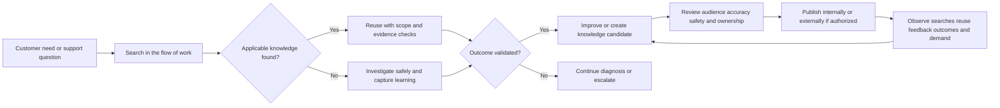

## JD Mapping

| Role signal from the guide | Capability developed here | Observable interview behavior | Honest proof |
|---|---|---|---|
| Create internal KB content | Writes a reusable troubleshooting article with scope, prerequisites, safe steps, validation, owner, and escalation criteria | Explains why internal depth still requires privacy and review controls | Completed fictional `KB-107-I` article candidate |
| Create external KB content | Adapts internal knowledge to customer language and removes internal-only material | Distinguishes audience utility from disclosure risk | Customer-safe adaptation section, not actually published |
| Drive case deflection | Defines a measurable self-service hypothesis with guardrails and attribution limits | Rejects page views as proof and protects assisted routes | Synthetic deflection measurement plan |
| Detect recurring support patterns | Uses governed tags, stable windows, quality checks, and segmentation | Separates a recurring symptom from a shared mechanism | Synthetic case-tag dataset and trend brief |
| Influence Product improvements | Converts recurring evidence into a decision-ready problem statement | States customer outcome, evidence, uncertainty, alternatives, and explicit ask | Synthetic VOC/Product evidence brief |
| Collaborate with Product and Engineering | Routes documentation, product, process, and defect questions to the right owner | Avoids promising priority, implementation, or cause | Decision tree and escalation packet |
| Enterprise L1 ownership | Reuses knowledge without surrendering case ownership or judgment | Verifies applicability, communicates uncertainty, validates the outcome | Worked KB reuse cases |
| Support analytics | Uses counts, rates, denominators, cohorts, guardrails, and caveats | Explains correlation versus causation and metric gaming | Pareto worksheet and measurement dictionary |
| Customer trust and security mindset | Minimizes data and does not publish unapproved or proprietary material | Stops on secrets, customer content, unsafe steps, or unclear authority | Publication and escalation controls |
| enterprise-support transfer | Connects real KB/training, mentoring, case quality, CSAT/backlog, customer communication, and escalation experience | Gives only defensible Microsoft examples with exact actions and outcomes | `DIRECT_PRODUCTION_TRANSFER` narrative |
| Abnormal AI learning target | Prepares to learn the employer's current knowledge, tagging, analytics, review, and Product-feedback workflow | Asks for local definitions and approved data access instead of inventing them | First-week discovery checklist |

## Candidate honesty note

You have a strong and relevant transfer: the master guide supports enterprise customer-facing work, KB/training creation, mentoring, case-quality improvement, customer and partner communication, Engineering/Product escalation, fix validation, and CSAT/backlog analysis. Those experiences can demonstrate knowledge-sharing habits, evidence discipline, coaching, operational awareness, and customer advocacy. They do not automatically prove that the work followed the Consortium's KCS methodology, that you held a KCS credential, or that a specific Microsoft metric represented causal case deflection.

Nothing in the supplied background establishes direct production use of Abnormal AI, Abnormal's knowledge systems, its article lifecycle, its case taxonomy, its search analytics, its deflection definition, its product-feedback process, or its customer data. No real Abnormal case count, article count, search query, customer quotation, trend, or KPI appears in this Part. The fictional `SignalBridge` examples are learning artifacts, not disguised employer data.

### Evidence tiers for this Part

| Capability or claim | Evidence label | Safe language | Claim to avoid |
|---|---|---|---|
| Microsoft KB/training, mentoring, and case quality | **DIRECT_PRODUCTION_TRANSFER** | “In enterprise support, I created or contributed to KB/training and used case-quality learning to help engineers and customers; I can describe the exact example and my role.” | “I ran Microsoft's KCS program” unless independently true and defensible |
| Microsoft CSAT/backlog analysis | **DIRECT_PRODUCTION_TRANSFER_AT_STATED_DEPTH** | “I analyzed CSAT, backlog, or quality patterns in the scope described by my real example.” | Inventing a deflection percentage, causal impact, dashboard ownership, or enterprise-wide result |
| KCS concepts | **LEARNED_METHOD_FROM_PRIMARY_SOURCES** | “I studied KCS v6 concepts from the Consortium's public materials and applied them to a synthetic exercise.” | “I am KCS certified,” “I am a KCS coach,” or “I implemented KCS” without evidence |
| KB, trend, and measurement artifacts below | **TEMPLATE_ONLY_SYNTHETIC_COMPLETED_IN_WRITING** | “I authored three local fictional artifacts to demonstrate the method; no live system or customer data was used.” | “I published the article,” “I analyzed production cases,” or “I increased deflection” |
| SignalBridge Lab 107 | **DESIGN_NOT_EXECUTED_NOT_TRANSFERRED** | “The lab is a local synthetic design and remained unperformed during authoring.” | Any performed-lab or measured-result claim |
| Abnormal AI data, systems, metrics, and process | **NO_DIRECT_EXPERIENCE_UNKNOWN_CONFIGURATION** | “I would first learn the approved sources, definitions, permissions, owners, and review workflow.” | Any Abnormal article, metric, workflow, customer, baseline, trend, or internal-tool claim |

A safe interview bridge is:

> “My direct foundation is enterprise support, including defensible examples of KB or training work, mentoring, case quality, customer communication, escalation, fix validation, and operational analysis. I would not relabel that as KCS certification or claim a deflection result I did not measure. For preparation, I studied the Consortium's public KCS concepts and created local synthetic KB, trend, VOC, and measurement artifacts. I have not used Abnormal's internal knowledge or analytics systems, so I would learn its current taxonomy, article authority model, privacy rules, metric definitions, and Product-feedback process before acting.”

### 🔍 Plain-English deep-dive: KCS is a work habit and system, not an article quota

The shallow version of knowledge management says, “Resolve cases, then write documents when you have time.” That separates the person who learned from the context in which the learning occurred. Details fade, the wording stops matching customer language, and documentation becomes an extra task that loses to urgent work. Another shallow version rewards authors for producing pages. That creates many articles, not necessarily usable knowledge.

KCS changes the work pattern. Search is part of solving. If an article applies, the engineer uses it and can improve it within authority. If no article applies, the engineer captures the customer's words and the emerging resolution in a structured way. Reuse supplies demand signals: frequently used material deserves attention; failed reuse reveals gaps. A broader evolve loop examines patterns, health, coaching, governance, and improvement opportunities.

Think of software tests maintained alongside code. A test suite gains value when engineers run and update it during change, not when a separate team writes disconnected tests months later. The analogy stops because knowledge articles serve people with varied intent and permissions; reuse still requires judgment, and public publication may require formal review. KCS also includes licensed materials and defined certification paths. This guide teaches public concepts only and makes no credential claim.

## 1. KCS mental model: solve and evolve together

The public KCS v6 materials describe two mutually reinforcing loops. The **Solve Loop** concerns the knowledge activities inside an interaction: capture context, structure content, reuse existing knowledge, and improve it. The **Evolve Loop** concerns system-level learning: content health, process integration, performance assessment, and leadership or communication practices. Exact practice names and licensed training details should be taken from the Consortium's current materials; this Part uses a plain-language operational model.

### Solve-loop questions

| Moment | Beginner question | Strong behavior | Unsafe or weak behavior |
|---|---|---|---|
| Before investigation | “Has this outcome been seen before?” | Search with customer words, product area, observable symptom, and environment | Skip search because writing a fresh answer feels faster |
| During scoping | “What context changes the answer?” | Capture expected/actual result, audience, version/configuration category, scope, and evidence ceiling | Copy the full case, personal data, or confidential content into a draft |
| During reuse | “Does this article actually apply?” | Check prerequisites, scope, freshness, permissions, risk, and validation | Paste a procedure because the title looks similar |
| During resolution | “What observation shows the task succeeded?” | Record the validation signal and known limits | Treat case closure or customer silence as technical proof |
| After learning | “What would help the next authorized person?” | Fix title, symptom language, missing step, link, tag, limitation, or escalation criterion | Add speculative cause or unsupported workaround |
| Before broader publication | “Who may approve this audience and claim?” | Use current review, security, legal, Product, and knowledge-owner workflow | Publish first and ask for forgiveness |

### Evolve-loop questions

| System concern | Evidence to inspect | Possible intervention | Guardrail |
|---|---|---|---|
| Content health | Review age, ownership, reuse, feedback, failure reports, duplicate candidates | Revise, merge, split, restrict, archive, or retire | Do not delete evidence or hide unresolved demand |
| Findability | Search terms, zero-result sessions, refinements, rank, click, article-to-contact paths | Add customer synonyms, improve titles, taxonomy, links, and ranking | Do not stuff keywords or expose restricted titles |
| Repeated demand | Case tags, normalized symptom/mechanism, affected cohorts, time windows | Create knowledge, improve product, train, automate safely, or change process | High volume does not prove one root cause |
| Reuse behavior | Article links, assisted-use notes, applicability feedback | Coach search/reuse and reduce friction | Do not impose reuse quotas that encourage irrelevant linking |
| Customer outcome | Task success, later contact, reopen, escalation, feedback, time/effort | Improve procedure or route to assisted support sooner | Do not sacrifice safety or access to increase self-service |
| Product learning | Evidence briefs, severity/impact, workarounds, recurrence, usability barriers | Request Product/Engineering decision | Do not promise roadmap, cause, priority, or delivery date |

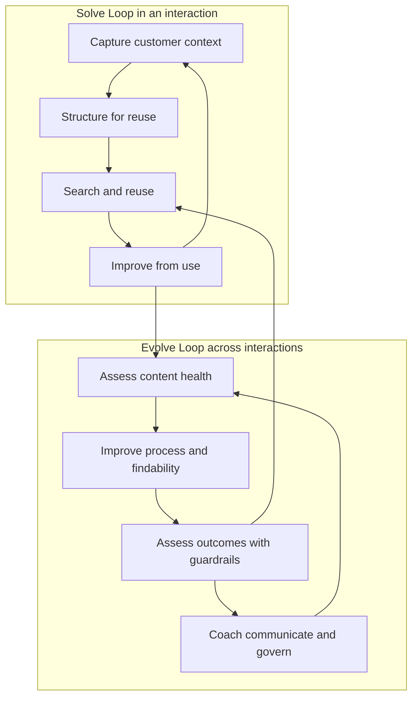

### Knowledge state model

An organization may use different names, but the concepts below prevent a note from becoming authoritative by accident.

| Conceptual state | Meaning | Who may use it | Required next action | Not implied |
|---|---|---|---|---|
| Capture | Case-linked learning in progress | Current authorized solver and collaborators | Separate observations, hypotheses, steps, and results | Accuracy, reuse readiness, or publication |
| Draft candidate | Structured content worth review | Defined internal reviewers | Check scope, evidence, safety, duplicates, ownership, and audience | Approval or discoverability |
| Internally validated | Reviewed for a stated internal audience and scope | Authorized internal users | Reuse with applicability check; monitor feedback and freshness | Customer-safe language or external approval |
| Externally approved | Approved for a stated external audience/channel | Authorized customers/public as configured | Monitor task outcome, search behavior, feedback, and changes | Universal applicability or permanent truth |
| Restricted/known-risk | Useful only under controlled expertise or permissions | Named roles | Keep access and escalation criteria explicit | General self-service suitability |
| Superseded/retired | No longer the preferred guidance | Historical access only if policy permits | Point to replacement and preserve required history | Permission to delete records or erase past decisions |

## 2. Internal and external articles have different jobs

The same customer outcome may justify an internal troubleshooting article, an external how-to, both, or neither. Internal guidance can help an engineer distinguish symptoms and gather minimum evidence. External guidance should help an authorized customer complete a safe task or decide when to contact Support. Neither audience should receive more data or capability than needed.

### Audience comparison

| Content element | Internal article | External article | Publication question |
|---|---|---|---|
| Title | Searchable symptom and internal product area | Customer language and visible outcome | Could the title itself expose a vulnerability or customer fact? |
| Purpose | Diagnose, route, remediate, or escalate | Complete a safe task or understand behavior | Is the claim approved and supportable? |
| Environment | Internal component/version/configuration cues as allowed | Customer-observable prerequisites and supported scope | Are names current and safe to disclose? |
| Evidence | Minimum internal logs/IDs and secure collection route | Safe observations the customer can provide | Does any step request secrets, message content, or unnecessary personal data? |
| Procedure | Deeper decision points within role authority | Low-risk, reversible, authorized actions | Could the step weaken security, alter production, or cause destructive impact? |
| Cause | Verified mechanism or clearly labeled hypothesis | Usually customer-relevant explanation approved for release | Is the cause confirmed, necessary, and approved? |
| Escalation | Exact internal owner, evidence packet, and trigger | How to contact Support and what safe context to include | Does it reveal internal contacts, queues, priorities, or controls? |
| Links | Internal records and restricted references | Approved public/customer documentation only | Can metadata, previews, or URLs leak protected detail? |
| Ownership | Internal content owner and reviewer | External publisher, Product/legal/security/brand owners as applicable | Who can approve, revise, restrict, and retire? |
| Feedback | Reuse comments, article defects, case outcomes | Helpful/not helpful plus safe feedback route | How will feedback avoid collecting secrets or sensitive customer content? |

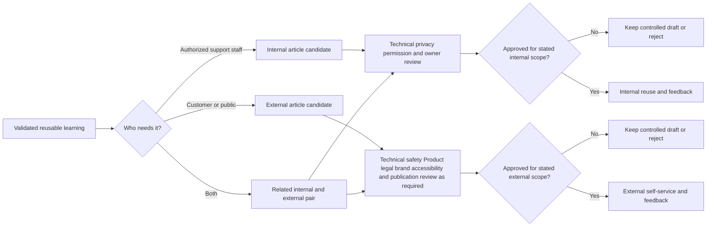

### Article anatomy

| Section | Question answered | Quality test |
|---|---|---|
| Audience and purpose | Who should use this, and for what outcome? | A reader can decide relevance before following steps |
| Symptoms/customer language | What observable problem brings the reader here? | Uses words likely to be searched without asserting cause |
| Scope and exclusions | Where does it apply and not apply? | Names unknowns and routes excluded/high-risk cases |
| Prerequisites and authority | What access, state, backup, or permission is required? | Does not encourage privilege escalation or secret sharing |
| Safe procedure | What ordered actions are allowed? | Steps are reversible where possible and include expected observations |
| Decision points | What does each result mean? | Observation changes the next action; no speculative leap |
| Validation | How does the reader know the intended outcome occurred? | Uses task outcome, not merely a successful click or closed case |
| Escalation | When should the reader stop and what minimum evidence is safe? | Names safety, scope, permission, uncertainty, and owner route |
| Sources and freshness | What supports the claim and when was it reviewed? | Current authoritative sources and a review trigger exist |
| Ownership and feedback | Who maintains it and how are defects reported? | Owner and feedback path are explicit without collecting prohibited data |

### 🔍 Plain-English deep-dive: Publication is a change to the support surface

Publishing an external article is not merely moving text from “draft” to “live.” It changes what customers may discover, what search engines or portals may index, what actions readers may attempt, what Support may cite, and what the organization appears to promise. Even an internal article can alter behavior at scale because agents may trust it during urgent work.

Think of changing a road sign. A spelling correction is small, but the sign directs many drivers. If the direction is wrong, copying it perfectly makes the impact larger. Review therefore asks more than “is the grammar good?” It checks technical truth, scope, permissions, safety, customer language, accessibility, ownership, and rollback or retirement.

The analogy stops because knowledge distribution can be segmented, personalized, cached, mirrored, translated, or surfaced by search and AI systems. A later edit may not instantly remove every copy. That is why this Part prohibits publishing without review, copying proprietary content, and placing customer data or secrets into articles. When authority or audience is unclear, keep the content controlled and escalate the publication decision.

## 3. Findability is an engineering and language problem

An article can be excellent and still fail because users describe the problem differently. Engineers may write “authentication assertion audience mismatch,” while a customer searches “single sign-on loops back to login.” Both phrases can be relevant. Findability connects customer language, structured classification, access, indexing, titles, synonyms, navigation, contextual links, and search ranking.

### Findability layers

| Layer | Question | Evidence | Improvement example | Caveat |
|---|---|---|---|---|
| Access | Can the intended audience view it? | Permission test by authorized role | Correct audience restriction through approved owner | Never broaden access merely to improve search counts |
| Indexing | Has the system made permitted content searchable? | Index status, delay, error, content type | Repair approved indexing or wait for documented lag | No result may reflect lag, not missing content |
| Vocabulary | Does the article contain customer and technical terms? | Search-query language, case wording, synonyms | Add “login loop” beside approved SSO term | Do not keyword-stuff or copy customer text |
| Title | Does the title describe observable outcome and scope? | Query-to-title relevance, click and task outcome | “Export completes with no rows” instead of “Parser issue” | Avoid putting sensitive mechanism details in public titles |
| Structure | Can a reader scan and decide applicability? | Time to first useful step, exits, feedback | Put symptoms, prerequisites, and stop conditions early | Shorter is not always safer or clearer |
| Taxonomy | Is content classified consistently? | Tag completeness, conflicts, browse paths | Govern one product-area and issue-family dictionary | Forced categories can hide multi-cause issues |
| Relationships | Do relevant cases, products, and articles point appropriately? | Link integrity and contextual suggestion logs | Link prerequisite, parent concept, and next step | Links can leak titles or become stale |
| Freshness | Is the content still valid for current behavior? | Review date, change events, failures, owner status | Trigger review after product or policy change | Recent date alone does not prove validation |
| Ranking | Does relevant content appear early for the right intent? | Position, click, reformulation, task success | Tune approved search metadata or content quality | Rank can amplify a wrong article |
| Feedback | Can failed findability be reported? | Zero-result and “not helpful” reason codes | Route specific content/search defects to owner | Free text can collect secrets; design it safely |

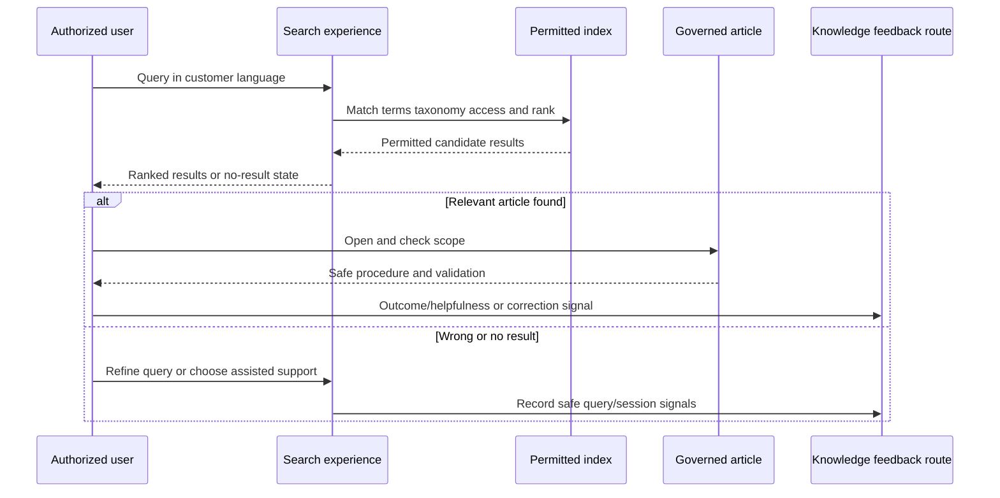

### Taxonomy and tag dictionary

A tag is useful only when its definition, allowed values, owner, and quality behavior are understood. The following is a fictional schema for later artifacts, not an Abnormal schema.

| Field | Fictional allowed values | Definition | Multi-value? | Unknown behavior |
|---|---|---|---:|---|
| `product_area` | `EXPORT`, `IDENTITY`, `NOTIFICATION`, `OTHER` | Customer-visible functional family | No | Use `OTHER` plus review note; do not guess |
| `symptom_family` | `EMPTY_RESULT`, `ACCESS_DENIED`, `DELAY`, `DUPLICATE`, `HOW_TO`, `OTHER` | Observable outcome before diagnosis | No | `OTHER` and preserve customer wording safely |
| `mechanism_status` | `UNKNOWN`, `CONFIGURATION_CONFIRMED`, `DOCUMENTATION_GAP_CONFIRMED`, `PRODUCT_DEFECT_CONFIRMED`, `EXPECTED_BEHAVIOR_CONFIRMED` | Level of validated explanation | No | Default `UNKNOWN`; confirmation needs governed evidence |
| `journey_stage` | `SETUP`, `NORMAL_USE`, `CHANGE`, `RECOVERY` | Stage at which friction appears | No | `UNKNOWN` allowed |
| `knowledge_relation` | `NONE_FOUND`, `REUSED_UNCHANGED`, `REUSED_IMPROVED`, `NEW_CANDIDATE`, `UNSAFE_OR_NOT_APPLICABLE` | Relationship between case and knowledge | No | Never auto-mark reuse from page view alone |
| `contact_driver` | `FINDABILITY`, `CONTENT_GAP`, `CONTENT_DEFECT`, `PRODUCT_USABILITY`, `PRODUCT_BEHAVIOR`, `PROCESS`, `UNKNOWN` | Best current reason assisted help was needed | No | Treat as hypothesis until evidence threshold is met |
| `outcome_state` | `VALIDATED`, `PARTIAL`, `NOT_VALIDATED`, `UNKNOWN` | Whether intended task outcome was demonstrated | No | Customer silence remains `UNKNOWN`, not success |
| `feedback_theme` | Controlled theme IDs | VOC grouping independent of identity | Yes, under defined rules | No free-form customer data in tags |

### Tag quality checks

| Check | Calculation or review | What failure means | Response |
|---|---|---|---|
| Completeness | Eligible records with non-unknown required tag / eligible records | Missing data may bias trends | Improve workflow or sample manually; do not impute silently |
| Agreement | Independent reviewers selecting same category on a sample | Definitions overlap or training is weak | Clarify dictionary and examples |
| Drift | Category share changes after schema/editor/process change | Measurement may reflect collection change | Annotate break and avoid naive before/after claim |
| Default inflation | Share left at default or first option | Convenience may dominate evidence | Remove unsafe defaults or require reason |
| Multi-cause loss | Cases with documented multiple mechanisms forced into one label | Categories hide complexity | Separate symptom from validated mechanism and permit relationships |
| Closure coupling | Tag required to close case | Agents may choose fastest value | Audit quality independently; do not reward closure speed alone |
| Sensitive leakage | Names, domains, message content, or secrets appear in tags | Data-handling failure | Stop, contain exposure, and use authorized privacy/security route |

### 🔍 Plain-English deep-dive: Search analytics describe behavior, not intent with certainty

A user searches `export empty`, opens an article, and creates no case. Several stories fit those events. The article may have solved the problem. The user may have abandoned the product. The user may have asked a colleague, switched channels, lacked permission to contact Support, or returned later under a different identity. The same clickstream supports different explanations.

Search analytics are footprints, not a video of the person's goal. Strong measurement combines signals: the query, result rank, click, article scope, explicit helpfulness reason, task-completion event where ethically and technically appropriate, later contact within a declared window, and qualitative research. Even then, privacy, consent, identity stitching, shared devices, blockers, and cross-channel behavior limit certainty.

Therefore use calibrated language: “sessions with this evidence pattern,” “associated with lower eligible contact rate,” or “consistent with successful self-service.” Do not say “the article deflected 412 cases” unless the organization has a defensible, governed causal method that supports that wording. Quality beats a large, fragile number.

## 4. Publish, reuse, improve, or feedback decision tree

The decision begins with safety and applicability, not with a quota. A new article is only one possible response. The right action might be to reuse an existing article, improve findability, split a confusing page, retire unsafe guidance, change a support process, provide Product feedback, or escalate a suspected defect.

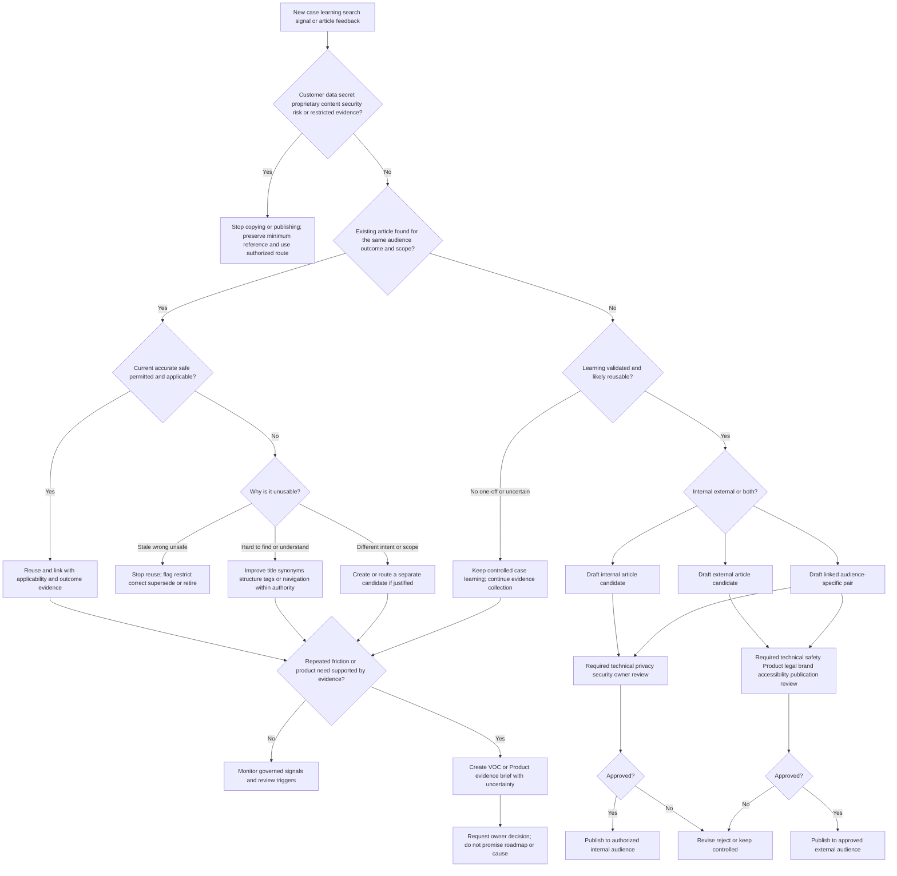

### Decision record

| Decision | Minimum evidence | Owner question | Common trap |
|---|---|---|---|
| Reuse unchanged | Same audience, outcome, scope, current behavior, safe steps, successful validation | “May I rely on this version for this case?” | Linking because the title matches |
| Improve existing | Specific ambiguity, missing synonym, wrong step, stale scope, or failed validation | “Who can correct or review this field/article?” | Editing outside authority or masking a larger product issue |
| Create candidate | Validated learning is reusable and no adequate article exists | “Which template, audience, owner, and review route apply?” | Creating a near-duplicate to meet an author quota |
| Publish externally | Approved claim, low-risk steps, clear scope, ownership, and all required reviews | “Who has publication authority for this audience?” | Assuming internal validation equals customer approval |
| Retire/restrict | Unsafe, wrong, unsupported, duplicate, or superseded content with replacement/history plan | “What record-retention and redirect rules apply?” | Deleting evidence or breaking links silently |
| Send feedback | Recurring need, affected outcomes, supporting evidence, alternatives, and uncertainty | “Which Product/Engineering decision is requested?” | Converting ticket count directly into roadmap priority |
| Escalate immediately | Security, privacy, legal, customer-safety, permission, broad-impact, or suspected defect threshold | “Which authorized route owns containment and decision?” | Publishing a workaround while the issue is unverified |

## 5. Measuring deflection without losing the customer

Deflection has no universal formula. Before calculating anything, write the operational definition: eligible population, self-service exposure, success signal, contact channel, observation window, identity/session rules, exclusions, comparison method, quality guardrails, and uncertainty. A defensible program may choose different metrics for different tasks.

### Measurement funnel

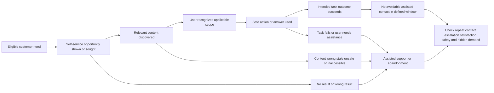

Every arrow can lose observations. Not every need generates a search. Not every user accepts analytics. Sessions may cross devices. An article can be read by an agent during assisted support. A user can succeed and still open a case for confirmation. Another user can fail and never contact anyone. Measurement must state these blind spots.

### Metric dictionary

| Metric | Example operational definition | Numerator | Denominator | Primary caveat |
|---|---|---|---|---|
| Search result click-through | Eligible search sessions with at least one result click | Sessions with a result click | Eligible search sessions with results | Click is not task success |
| Zero-result rate | Eligible searches returning no permitted result | Zero-result searches | Eligible searches | A zero result may reflect access, spelling, indexing, or content gap |
| Search refinement rate | Sessions with a second materially changed query | Refined-query sessions | Eligible search sessions | Refinement can show exploration, not always failure |
| Article helpfulness | Submitted positive helpfulness responses | Positive responses | All submitted helpfulness responses | Voluntary response bias; nonresponders are unknown |
| Self-service task success | Eligible exposed sessions with defined task-completion evidence | Successful task sessions | Eligible exposed sessions with observable outcome | Instrumentation and consent may be incomplete |
| Contact-after-content rate | Eligible content sessions followed by matching assisted contact within window | Matching later contacts | Eligible content sessions | Matching identity/intent can be wrong; contact may be appropriate |
| Assisted reuse rate | Eligible assisted cases where a verified applicable article was used | Cases with verified reuse | Eligible assisted cases | Quotas can create irrelevant links |
| Knowledge-assisted resolution quality | Reused cases meeting outcome, no-early-reopen, and quality criteria | Qualified reused cases | Eligible reused cases | Requires stable quality audit and comparable case mix |
| Estimated contact reduction | Difference in eligible contact rates between a valid comparison and intervention condition | Defined rate difference applied to eligible demand | Eligible demand under stated model | Causal validity depends on design and assumptions |
| Cost or effort shift | Change in customer and support effort across channels | Defined effort units/time | Comparable successful outcomes | Moving work to customers can look cheaper while worsening experience |

For an eligible cohort, a descriptive contact-after-content rate could be written as:

$$
\text{Contact-after-content rate} = \frac{\text{eligible content sessions followed by a matching assisted contact in window}}{\text{eligible content sessions with adequate observation}}
$$

An observational association between exposure and contact can be written as a difference in rates:

$$
\Delta = P(\text{contact} \mid \text{eligible, exposed}) - P(\text{contact} \mid \text{eligible, comparison})
$$

The value $\Delta$ is not automatically the causal effect of the article. People who search may have easier problems, stronger skills, different permissions, or different urgency. A launch may coincide with a product fix, seasonal change, outage end, routing change, or contact-form redesign.

### Self-service success hierarchy

| Evidence strength | Example | What it supports | What it cannot prove alone |
|---|---|---|---|
| Weak behavioral proxy | Article view or dwell time | Content was loaded and perhaps read | Relevance, comprehension, action, success, or avoided contact |
| Search interaction | Relevant click, no rapid return, no repeated query | Discovery may have improved | Task completion or satisfaction |
| Explicit perception | Helpful response with reason | Respondent perceived value | Representativeness or durable outcome |
| Task event | Safe, consented completion signal tied to article flow | Intended action completed in observed system | Long-term success or article causation |
| Outcome confirmation | User confirms goal met, no prohibited data | Strong case/session-level success evidence | Counterfactual case avoidance |
| Comparison design | Comparable cohorts or staged experiment with predeclared outcomes | Stronger estimate of intervention association/effect | Perfect control of all confounding or future conditions |
| Guardrailed longitudinal evidence | Sustained task success with stable contact quality, reopen, escalation, safety, and satisfaction | Intervention remains useful under observed conditions | Universal causality or applicability to unobserved segments |

### Correlation and case-avoidance caveats

| Observed change | Plausible knowledge explanation | Competing explanations to check |
|---|---|---|
| Article views rise and cases fall | More users found and used the article | Product issue resolved, seasonality, support access changed, search campaign changed, tracking broke |
| Searches rise and cases rise | Demand grew and knowledge helped some users | Incident/outage, confusing release, failed article, improved visibility of contact route |
| “Helpful” rises | Content quality improved | Prompt placement changed, response mix changed, negative users stopped responding |
| Reuse links rise | Agents adopted knowledge in workflow | Linking quota, auto-suggestion, mandatory field, duplicate links |
| Average handling time falls | Reuse accelerated diagnosis | Simpler case mix, premature closure, transferred work, reduced notes/quality |
| Contact rate falls | Successful self-service increased | Contact form hidden, entitlement/access issue, abandonment, channel shift, bot loop |
| Reopen rate falls | Resolutions became durable | Reopen window changed, new cases created instead, customers disengaged |

### 🔍 Plain-English deep-dive: The missing-case problem

Deflection tries to count an event that did not happen. Suppose 1,000 people read an article and 900 do not contact Support. It is tempting to say the article deflected 900 cases. But perhaps only 100 ever intended to contact Support. Some readers may be employees, repeat visitors, bots, learners, or users checking a concept. Some may have failed and abandoned the task. The numerator “no later case” combines success with many unknown states.

This is a counterfactual problem: what would each person have done if the article had not been available? We cannot observe both realities for the same person at the same time. We estimate using careful comparisons, staged releases, randomization when ethical and feasible, interrupted time series, matched cohorts, surveys of contact intent, or other designs. Every method has assumptions.

Think of asking how many accidents a guardrail prevented. Counting cars that passed safely is not enough. Road design, weather, traffic mix, speed, and driver behavior matter. The goal is still valuable, but the number needs a model and uncertainty. For support, protect quality with task success, satisfaction or effort, repeat contact, escalation, reopen, safety incidents, accessibility, and an easy assisted route. A modest defensible estimate is more useful than a huge invented deflection claim.

## 6. Case tagging, recurring patterns, trends, and Pareto analysis

Trend analysis starts with comparable records. A case category should reflect a clear concept and evidence threshold. Symptom tags answer what the customer observed. Mechanism tags answer what was validated. Contact-driver tags answer why assisted help was needed. Mixing these levels creates false patterns. For example, twenty `login failed` cases may involve permissions, identity-provider configuration, browser state, outage, documentation, or a defect.

### Pattern-analysis workflow

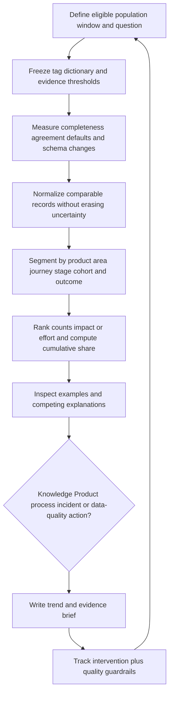

### Pareto method

1. Define the question, eligible population, period, unit, exclusions, and tag version.
2. Audit missing, defaulted, conflicting, and low-confidence classifications.
3. Choose one ranking measure: case count, affected users, customer effort, support effort, risk, or another governed unit.
4. Group categories at a useful level. Do not create a huge `Other` bucket that hides the next actionable pattern.
5. Sort descending and calculate each category's share and cumulative share.
6. Inspect representative cases from high-ranked and high-risk categories.
7. Test whether categories combine different mechanisms or reflect a tagging/process change.
8. Choose an intervention based on cause and controllability, not volume alone.
9. Define success and guardrails before the intervention.
10. Recheck the same definitions after enough comparable observation.

For category $i$ with count $c_i$ and total eligible count $N$:

$$
\text{Share}_i = \frac{c_i}{N}, \qquad
\text{Cumulative share}_k = \frac{\sum_{i=1}^{k} c_i}{N}
$$

The arithmetic is simple. The difficult work is ensuring that $c_i$ values represent comparable, correctly classified observations.

### Worked trend case: fictional 100-case snapshot

The following dataset is intentionally synthetic and hand-authored. It does not come from Abnormal AI, Microsoft, a customer, a ticketing platform, or a performed lab. The unit is one fictional eligible SignalBridge support case during four equally sized fictional weeks. Counts were chosen to make arithmetic inspectable.

| Rank | Contact-driver category | W1 | W2 | W3 | W4 | Total | Share | Cumulative share | Initial interpretation |
|---:|---|---:|---:|---:|---:|---:|---:|---:|---|
| 1 | Export setup findability | 8 | 9 | 10 | 11 | 38 | 38% | 38% | Repeated customer-language/search mismatch candidate |
| 2 | Identity permission explanation | 6 | 7 | 7 | 8 | 28 | 28% | 66% | Possible external guidance and product-language opportunity |
| 3 | Notification configuration steps | 4 | 4 | 5 | 5 | 18 | 18% | 84% | Existing article applicability/findability review |
| 4 | Export product behavior unknown | 2 | 2 | 3 | 3 | 10 | 10% | 94% | Requires mechanism investigation; not a documentation conclusion |
| 5 | Other individually reviewed | 2 | 1 | 1 | 2 | 6 | 6% | 100% | Keep visible; inspect high-risk exceptions |
|  | **Synthetic total** | **22** | **23** | **26** | **29** | **100** | **100%** | **100%** | Descriptive only |

The first three categories account for 84 of 100 synthetic cases. That is a Pareto prioritization signal, not a proof that three articles will eliminate 84 cases. The weekly total also rises from 22 to 29, but four points are too little to establish a durable trend without context. A product launch, tagging adoption, staffing change, or synthetic author choice could produce the same shape.

### Worked reasoning

| Step | Evidence | Reasoning | Decision boundary |
|---|---|---|---|
| 1. Check eligibility | All 100 rows are declared in-scope fiction under one tag version | Denominator is internally consistent by construction | No claim about real-world completeness |
| 2. Check category level | Categories describe current contact driver, not root cause | Suitable for routing improvement hypotheses | `Export product behavior unknown` must not be merged into documentation gaps |
| 3. Rank | 38, 28, 18, 10, 6 | First three represent 84% of synthetic volume | Volume does not rank security risk or strategic value |
| 4. Inspect examples | Fictional case notes use queries like `empty export first setup` | Customer words may not appear in current fictional title | No search log or user research was actually collected |
| 5. Form hypotheses | Findability, missing prerequisites, unclear permission explanation | Several interventions are plausible | Article creation is not automatically best |
| 6. Choose first test | Improve title/synonyms for one controlled fictional cohort; preserve contact route | Small, reversible, measurable design | Not executed; no effect exists |
| 7. Add guardrails | Task success, later contact, reopen, escalation, helpfulness reason, accessibility | Prevents raw case-count optimization | Synthetic design only |
| 8. Route Product feedback | Permission-language friction may reflect product UI or documentation | Create evidence brief asking owner to classify opportunity | No roadmap or defect claim |

### High volume versus high importance

| Candidate | Volume | Potential harm/risk | Evidence confidence | Likely owner | Priority reasoning |
|---|---:|---:|---:|---|---|
| Export setup findability | High | Low to medium | Medium in fictional sample | Knowledge/Search owner | Good low-risk discovery experiment candidate |
| Identity permission explanation | Medium-high | Medium to high if users overgrant access | Medium | Product, Security, Knowledge | Review safety before optimizing self-service |
| Notification steps | Medium | Low | Medium | Knowledge/Product | Improve existing article if applicability failures confirm |
| Export behavior unknown | Lower | Unknown; could be broad | Low | Support/Engineering | Investigate mechanism before publication |
| Rare security-sensitive symptom in `Other` | One | Potentially high | Unknown | Security/incident route | Escalate despite low volume; Pareto must not suppress it |

Pareto analysis is a queue for investigation, not a moral ranking of customers. One severe case can outrank thirty low-risk how-to contacts. Always pair volume with impact, risk, effort, confidence, strategic relevance, and controllability.

## 7. Voice of Customer and Product feedback

VOC combines what customers say, what they try to do, what happens, and where the journey creates effort. Support cases are valuable because they contain context and consequence, but they are a selected sample: people who reached Support, had access, chose that channel, and persisted. Product usage, search behavior, surveys, interviews, onboarding observations, accessibility research, account context, incident records, and lost-opportunity analysis can reveal different populations. Use only approved, minimized, aggregated evidence.

### Evidence-source matrix

| Source | Strength | Bias or limit | Safe use |
|---|---|---|---|
| Support cases | Rich symptom, context, troubleshooting, and impact narratives | Only ticketed demand; tags and notes vary | Aggregate governed fields and inspect authorized samples |
| Search queries | Customer vocabulary and unmet discovery intent | Intent ambiguous; can contain sensitive text | Minimize, redact, restrict retention, and analyze approved aggregates |
| Article feedback | Specific content reactions | Voluntary response bias and low response rate | Use reason codes plus carefully governed text |
| CSAT/CES surveys | Perceived satisfaction or effort | Timing, nonresponse, attribution, and scale interpretation | Segment cautiously and preserve survey methodology |
| Interviews/usability research | Deep goals, mental models, and observed barriers | Small samples and moderator/recruitment effects | Pair with behavioral and operational evidence |
| Product telemetry | Observable actions and failures | Instrumentation gaps; action is not intent; privacy constraints | Use only approved events and definitions |
| CSM/onboarding notes | Adoption goals and organizational context | May emphasize selected accounts and relationship interpretation | Validate themes across sources; minimize identity |
| Incident/problem records | Broad impact, mechanism, and remediation | Exceptional events can dominate perception | Separate incident demand from normal journey friction |
| Churn/loss feedback | High-consequence unmet needs | Retrospective and commercially selected | Treat as one input, not a universal preference |

### From voice to decision

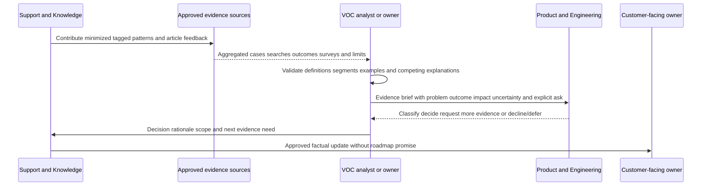

### Product evidence brief schema

| Field | Required content | Quality question |
|---|---|---|
| Brief ID and date | Stable reference, version, author/owner role, period | Can readers identify the exact analysis? |
| Customer outcome | Job the customer is trying to complete | Is it written without prescribing a solution? |
| Friction statement | Observable barrier and journey stage | Does it separate symptom from assumed cause? |
| Evidence population | Eligible records, sources, segments, and exclusions | Who is represented and missing? |
| Quantitative evidence | Counts/rates with denominators, windows, definitions, and quality | Are numbers real, authorized, and reproducible? |
| Qualitative evidence | Redacted themes or approved quotations with source method | Are identities and proprietary details protected? |
| Impact | Customer effort, risk, delay, support effort, adoption, or trust | Is severity distinguished from frequency? |
| Current alternatives | Workaround, assisted path, current article, or none | Are safety, effort, and limitations clear? |
| Competing explanations | Documentation, findability, configuration, process, usability, defect, data issue | Has the brief resisted premature causation? |
| Requested decision | Classify, investigate, research, revise UI, improve docs, or request data | Is the ask answerable by the recipient? |
| Commitments | What has and has not been promised | Is the customer protected from roadmap fiction? |
| Privacy and access | Classification, aggregation, redaction, authorized evidence pointer | Does the brief contain only minimum necessary information? |
| Review trigger | New release, threshold, incident, evidence, or decision date | Will the brief remain current and owned? |

### 🔍 Plain-English deep-dive: VOC is translation, not amplification

Support often hears urgent and emotionally powerful statements. Respecting that voice does not mean forwarding every sentence to Product or ranking requests by intensity. The support engineer translates the underlying job, observable friction, consequence, frequency, affected segments, workarounds, and uncertainty. Translation also preserves the customer's words where useful without exposing identity or proprietary detail.

Imagine an emergency dispatcher. The caller says, “Everything is broken.” The dispatcher does not dismiss the frustration, but asks what is happening, who is affected, what changed, and what immediate risk exists. The final response still honors the caller while making the information actionable. VOC performs a similar conversion from experience to evidence.

The analogy stops because Product decisions include strategy, architecture, security, compliance, accessibility, cost, and opportunity tradeoffs beyond Support's view. A strong brief does not command a feature. It asks for a decision and preserves follow-through. “Customers requested button X” is weaker than “These users cannot verify outcome Y after action Z; here is the evidence, current workaround burden, and uncertainty.”

## 8. Artifact one - completed fictional KB article

This artifact is complete as a **written synthetic internal article candidate**. It was not entered into, reviewed in, or published through any KB. It is not an Abnormal article, product procedure, Microsoft procedure, or customer guidance. `SignalBridge` is fictional, the behavior is authored, and every identifier and result exists only below.

### `KB-107-I` - Internal candidate: scheduled export completes with zero rows during first setup

| Metadata field | Fictional value |
|---|---|
| Evidence label | `TEMPLATE_ONLY_SYNTHETIC_COMPLETED_IN_WRITING` |
| State | `DRAFT_NOT_REVIEWED_NOT_PUBLISHED` |
| Audience | Authorized fictional SignalBridge Support learners only |
| Owner alias | `ROLE-KNOWLEDGE-107` |
| Technical reviewer | `UNASSIGNED_FICTIONAL_ROLE` |
| External publication | `NOT_REQUESTED_NOT_APPROVED` |
| Created/reviewed | Authored August 24, 2026; no real review occurred |
| Scope | Fictional first-setup scheduled export that reports completion and zero rows |
| Exclusions | Security incident, suspected product defect, data loss, broad outage, unauthorized access, real customer system, or unknown destructive risk |
| Sources | This fictional scenario and Part 107 method only |
| Review trigger | Any change to fictional contract, a failed synthetic validation, or an owner decision |

**Purpose:** Help an authorized support learner distinguish an empty eligible source set, a time-window mismatch, a permissions/visibility limitation, a display/reporting issue, and an unknown mechanism without changing production data or declaring a defect.

**Customer-language symptoms:**

- “The scheduled export says complete but the file has no rows.”
- “My first export is empty.”
- “The job ran successfully, but I cannot see records.”
- “Export completed with zero results.”

**Do not use this candidate when:**

- real customer data, secrets, tokens, credentials, private message content, regulated data, or restricted security evidence would be copied;
- the report suggests unauthorized access, data loss, active threat, broad service impact, or a legal/privacy issue;
- the requested action would change permissions, retention, production configuration, source data, or destructive settings;
- the fictional scope and prerequisites do not match; or
- a current approved article or incident route supersedes this candidate.

**Minimum safe facts:** expected row presence, observed row count, relative run time, selected fictional time window, whether authored eligible records exist inside that window, authorized visibility category, comparison with a known-safe synthetic input, and any displayed correlation identifier. Do not request or paste real record contents, secrets, full exports, personal data, or customer identifiers.

### Internal decision procedure

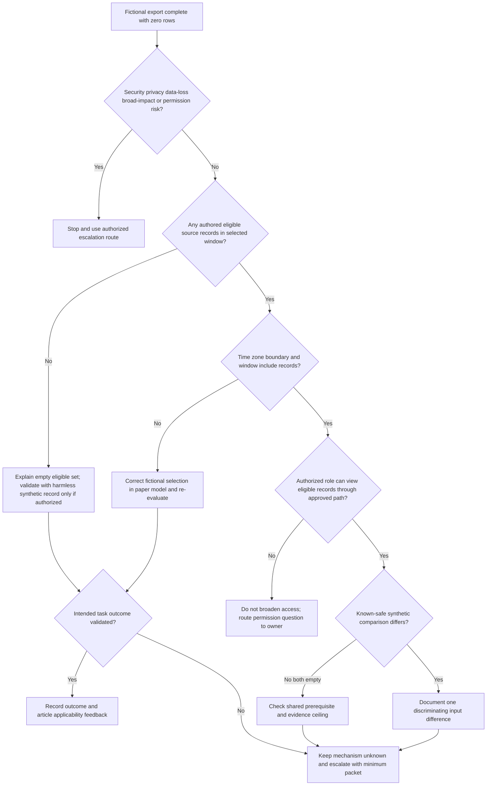

### Steps and expected observations

| Step | Paper-only action | Expected observation | Interpretation | Next action |
|---:|---|---|---|---|
| 1 | Confirm exact fictional expected and actual outcome | Expected nonzero rows; actual zero rows | Establishes symptom without cause | Continue only if safe scope applies |
| 2 | Check authored eligible-record count for selected period | Count is zero or greater than zero in the fictional worksheet | Zero explains no eligible output in this model; greater than zero leaves hypotheses open | Validate explanation or continue |
| 3 | Normalize relative time and fictional time-zone boundary | Records fall inside or outside selected interval | Excluded interval can explain result without a product defect | Correct only the paper selection |
| 4 | Compare authorized visibility marker | `VISIBLE_BY_DESIGN` or `VISIBILITY_UNKNOWN` | Unknown permission is an ownership question | Do not change access; escalate |
| 5 | Compare one known-safe synthetic input | Same result or different result | Difference narrows but does not prove mechanism | Record discriminating fact |
| 6 | Validate intended outcome in authored rows | Defined result is present or absent | Outcome evidence determines next step | Reuse/improve or escalate |

**Validation:** The article candidate helps only if the learner can identify which branch applies, preserve `UNKNOWN` when evidence is absent, and state the next safe action. “Job status complete” validates only the fictional job state; it does not prove data completeness, customer success, or cause.

**Escalation packet:** article ID/version; fictional case ID; expected/actual outcome; confirmed scope/exclusions; relative timestamps; time-zone assumption; eligible-record count; visibility category; synthetic comparison; steps and observations; known/unknown boundary; customer-safe next update; and one explicit decision request. No real data, secret, full export, or unsupported root cause.

### External adaptation candidate

An external version might explain how an authorized customer verifies the selected date/time range and confirms whether eligible records exist, then directs them to Support with a sanitized run timestamp and non-secret correlation ID. It would remove internal owner names, escalation routing, hypotheses about implementation, and restricted diagnostics. It would require technical, security/privacy, Product, publication, accessibility, and other locally required reviews. **No external text was approved or published here.**

| Internal detail | External treatment | Reason |
|---|---|---|
| Mechanism hypotheses | Omit or use approved customer-relevant explanation | Avoid speculation and proprietary disclosure |
| Internal queue/owner | Replace with approved contact route | Do not expose internal operations |
| Visibility decision | Tell user not to broaden permissions and to contact authorized admin/Support | Preserve least privilege |
| Synthetic comparison | Include only if harmless, supported, and approved | Avoid unsafe production experiments |
| Evidence request | Minimum run time, selected window, safe correlation ID | Prevent customer data and secret collection |
| Review state | Publish only after all required approvals | Draft is not customer guidance |

### Worked KB reuse case A - applicable article

`CASE-107-A` is fictional. The authored symptom matches the article's first-setup scope. The paper worksheet contains zero eligible records in the selected interval and three records outside it. The learner uses the decision procedure, identifies the time-window exclusion, changes only the fictional worksheet selection, and observes three expected rows.

| Reasoning element | Synthetic evidence | Conclusion |
|---|---|---|
| Applicability | Same symptom, journey stage, audience, and safe scope | Article candidate is applicable within the exercise |
| Observation | Zero records inside window; three outside | Time-window exclusion explains this authored result |
| Action | Paper-only interval correction | No live configuration or data changed |
| Validation | Authored output changes from zero to three rows | Fictional task outcome succeeds |
| Knowledge feedback | Add phrase “first export empty” to search synonyms | Findability improvement candidate |
| Claim boundary | One constructed example | No real resolution, deflection, or product behavior claim |

### Worked KB reuse case B - similar title, unsafe mismatch

`CASE-107-B` is fictional. The phrase “export has no rows” matches the title, but the narrative also says multiple users lost access immediately after an unexplained permission change. That is outside scope. The learner does not follow the routine procedure, does not change access, and routes the matter through the authorized security/permission escalation model.

| Signal | Why it matters | Decision |
|---|---|---|
| Multiple users | Scope may be broad | Do not treat as one setup question |
| Permission change | Access and security ownership involved | Do not broaden or restore access without authority |
| Unexplained timing | Change correlation requires evidence | Preserve time and minimum references |
| Matching title | Lexical similarity only | Article is not applicable |
| Outcome | Correct routing, not self-service completion | Assisted support is appropriate and must remain easy |

### KB artifact completion statement

`KB-107-I` is complete as a synthetic written candidate with metadata, audience, scope, exclusions, customer language, decision points, validation, escalation, ownership, feedback, and external-adaptation boundaries. It was not technically reviewed, approved, entered into a KB, reused in a live case, or published. No metric may count either fictional case as a real reuse or deflection.

## 9. Artifact two - completed fictional trend and VOC brief

### `TREND-107-A` - First-setup discoverability and permission-language friction

| Brief field | Synthetic content |
|---|---|
| Evidence label | `TEMPLATE_ONLY_SYNTHETIC_COMPLETED_IN_WRITING` |
| Analysis period | Four fictional equal weeks, `FW1-FW4` |
| Population | 100 learner-authored eligible SignalBridge cases |
| Data source | The hand-authored table in Section 6 only |
| Tag version | `TAG-DICTIONARY-107-v1-FICTION` |
| Customer data | None; no names, domains, content, or real statements |
| Leading categories | Export setup findability 38%; identity permission explanation 28%; notification steps 18% |
| Evidence quality | Complete by construction, not externally valid, no independent reviewer agreement |
| Owner alias | `ROLE-VOC-107` |
| State | `FICTIONAL_BRIEF_NOT_SUBMITTED_NOT_APPROVED` |

**Problem statement:** In the synthetic sample, many assisted contacts are classified as first-setup discovery or explanation friction. The desired customer outcome is to locate safe, applicable guidance and complete setup without overgranting access or entering an avoidable support loop.

**Descriptive result:** The three largest categories account for 84% of the 100 authored cases. Weekly total rises from 22 to 29. This is enough to prioritize investigation inside the exercise, but not enough to infer a stable real trend, a shared cause, or the number of cases an article would avoid.

**Synthetic qualitative themes:**

1. Search wording uses observable outcomes such as “empty first export” rather than internal category language.
2. Permission questions mix “what access is required?” with “why is this access required?”
3. Existing fictional notification guidance is described as difficult to scan.
4. A smaller unknown-behavior category cannot be resolved through content without technical evidence.

**Competing explanations:** weak titles or synonyms; missing content; incorrect content; confusing product language; onboarding gaps; product usability; permission design; recent fictional tagging adoption; or an authored sample designed to emphasize these patterns. No single explanation is established.

**Requested decisions:**

- Knowledge/Search owner: approve or revise a local synthetic test of title and synonym changes for `KB-107-I`.
- Product/Security owner: determine whether permission explanation warrants approved external language, UI research, or no change.
- Support Operations owner: review whether the tag dictionary separates symptom, contact driver, and mechanism clearly enough.
- Engineering owner: advise what evidence threshold would classify the `product behavior unknown` category; no defect is declared.

**No commitment:** The brief does not promise a feature, UI change, article publication, priority, delivery date, causal finding, or reduced case volume.

### Trend-to-action routing

| Pattern | Leading hypothesis | Cheapest safe discriminating check | Possible owner | Guardrail |
|---|---|---|---|---|
| Searches use “first export empty” but title omits it | Vocabulary mismatch | Add term to a local synthetic search corpus and compare retrieval | Knowledge/Search | Verify article relevance and task success, not rank alone |
| Permission contacts ask “why” | Explanation gap or product trust issue | Review redacted themes with Product/Security owner | Product/Security/Knowledge | Never encourage broader permissions for self-service |
| Notification article gets clicks then contacts | Content applicability or procedure failure | Review authorized session/case sample with outcome definitions | Knowledge/Support Ops | Preserve assisted route and customer effort |
| Unknown export behavior recurs | Shared mechanism possible | Engineering-defined evidence matrix | Engineering/Support | No public workaround or defect claim before validation |
| Total cases rise | Demand may be increasing | Normalize by eligible customer/activity denominator and annotate changes | Analytics/Support Ops | Do not call raw counts a rate or root cause |

## 10. Artifact three - deflection measurement plan

### `MEASURE-107-A` - Evaluate self-service quality for first-setup empty-export guidance

This is a completed **plan**, not a completed measurement. No users were exposed, no analytics were collected, no article was published, no experiment ran, and no outcome exists.

| Plan field | Synthetic design |
|---|---|
| Hypothesis | For eligible fictional first-setup sessions, approved guidance using customer-language titles and explicit time-window checks will improve verified task success without increasing security risk, repeat contact, or customer effort. |
| Intervention | Approved article variant and search synonyms, only if future reviewers authorize them |
| Eligible unit | One consented/authorized fictional first-setup help session meeting declared scope |
| Primary outcome | Defined safe export task completes with expected synthetic row presence |
| Secondary outcomes | Relevant search discovery, time to task success, explicit helpfulness reason, contact-after-content |
| Guardrails | Repeat contact, reopen, escalation, unsafe permission attempts, abandonment, accessibility feedback, content-defect reports, customer effort |
| Comparison | Staged or randomized design only if ethical, feasible, authorized, and methodologically reviewed; otherwise a labeled observational comparison |
| Observation window | Predeclared task and later-contact windows appropriate to the journey |
| Segments | New versus experienced user, authorized role, language, accessibility path, journey stage, and supported environment where lawful and sufficiently sized |
| Exclusions | Security incidents, product defects, broad outages, data loss, unsupported environments, unobservable outcome, restricted populations, missing consent/authority |
| Privacy | Minimum approved event data, no secrets/content, purpose limitation, access controls, retention, and aggregation thresholds |
| Decision owner | Fictional cross-functional review; no real owner assigned |
| State | `PLAN_COMPLETE_EXECUTION_NOT_AUTHORIZED_NOT_PERFORMED` |

### Event and evidence design

| Event or record | Minimum fields | Purpose | Interpretation boundary |
|---|---|---|---|
| `help_search` | Anonymous/approved session key, time, normalized safe query class, result count, experiment state | Measure discovery attempts | Query text may contain sensitive data; raw collection requires strict design or may be prohibited |
| `article_view` | Article/version, permitted audience, source, time | Establish exposure | View is not reading or success |
| `scope_confirmed` | Article/version, eligible scope category | Distinguish relevant exposure | User selection can be mistaken |
| `task_outcome` | Approved task ID, success/failure/unknown, time | Primary outcome | Instrumentation must truly represent customer goal |
| `feedback_reason` | Controlled helpful/not-helpful reason | Explain content experience | Voluntary and nonrepresentative |
| `assisted_contact` | Approved linked intent category and time window | Estimate contact-after-content | Identity/intent matching can be wrong; contact may be appropriate |
| Quality audit | Sample ID, article applicability, outcome, notes quality, safety | Detect gaming and misclassification | Sample method and reviewer consistency matter |
| Change ledger | Product, article, search, routing, form, staffing, outage changes | Identify confounders | Ledger can still miss external changes |

### Analysis sequence

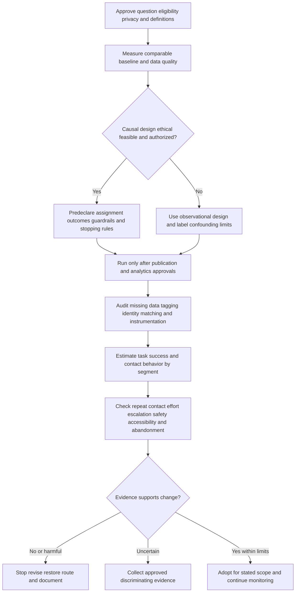

### Synthetic arithmetic example, not a result

Suppose a future paper exercise invents two comparable groups of 200 eligible sessions. In group A, 120 show task-success evidence and 40 later create a matching assisted contact. In group B, 140 show task-success evidence and 30 later create a matching contact. The descriptive values would be:

| Measure | Group A | Group B | Descriptive difference |
|---|---:|---:|---:|
| Task-success rate | $120/200 = 60\%$ | $140/200 = 70\%$ | +10 percentage points for B |
| Contact-after-content rate | $40/200 = 20\%$ | $30/200 = 15\%$ | -5 percentage points for B |
| Sessions without matching later contact | 160 | 170 | Not equal to deflected cases |

Even in a synthetic example, B is not automatically better. Check assignment, missing outcomes, case mix, confidence intervals, statistical power, practical significance, unsafe actions, abandonment, effort, reopen, escalation, accessibility, and whether Product behavior changed. The 170 sessions without contact are not 170 proven avoided cases. They include successful users and unknown outcomes.

### Success, stop, and adoption rules

| Decision | Predeclared evidence | Guardrail behavior | Action |
|---|---|---|---|
| Adopt for stated scope | Meaningful task-success improvement with defensible uncertainty | No material harm across safety, effort, repeat contact, escalation, accessibility | Approve through owner and monitor |
| Revise | Discovery improves but task success does not | Content-defect or effort signal worsens | Fix applicability/procedure before more exposure |
| Stop/rollback | Unsafe behavior, access overreach, misleading guidance, broad failure | Any critical guardrail threshold reached | Remove/restrict through authorized publication owner and escalate |
| Continue learning | Effect uncertain or sample/data quality inadequate | Guardrails stable | Collect only approved discriminating evidence |
| Route Product issue | Article is found and followed but task fails due to reproducible product barrier | Support effort or impact persists | Submit evidence brief; do not blame content alone |
| Preserve assisted path | High-risk or complex users appropriately contact Support | Contact rate may remain high | Treat successful routing as quality, not failed deflection |

## 11. Failure modes, metric gaming, and escalation

### Common failure modes

| Failure mode | Misleading signal | Customer/operational harm | Recovery | Escalate when |
|---|---|---|---|---|
| Article-count quota | Many new pages | Duplicate, shallow, unowned knowledge | Reward reuse quality and consolidation | Incentive drives widespread content debt |
| Reuse-link quota | High linked-article rate | Irrelevant links and false applicability | Audit outcome and relevance | Links affect performance decisions or customer guidance |
| Page views called deflection | Large “deflected” number | False ROI and hidden failed users | Rename metric and build outcome funnel | External or executive claims rely on unsupported number |
| Contact form hidden | Lower case volume | Abandonment and reduced trust | Restore accessible assisted route | Access, contractual, accessibility, or safety concern exists |
| Premature closure | Lower handling time/reopen under narrow window | Unresolved work reappears or disappears | Validate outcome and use broader quality signals | Closure gaming or customer harm is suspected |
| Tag required for closure | Complete dashboard | Agents choose convenient values | Allow `UNKNOWN`, audit agreement, decouple incentives | Metrics or Product decisions depend on corrupted tags |
| Giant `Other` bucket | Clean top categories | Emerging or rare risk disappears | Sample and refine taxonomy | Security-sensitive cases hide inside `Other` |
| Symptom equals cause | Consistent-looking trend | Wrong intervention | Separate symptom, driver, mechanism, confidence | Defect or broad-risk claim is being made |
| Search rank optimization only | Higher clicks | Wrong article gets amplified | Measure applicability and task success | Unsafe article ranks prominently |
| Helpful-vote worship | Positive ratio | Nonresponse and selection bias ignored | Include response rate, reasons, outcomes, qualitative review | Public claims overstate representativeness |
| Stale article reuse | High reuse count | Repeated wrong steps | Restrict, correct, supersede, or retire | Security, data, destructive, or broad impact possible |
| Internal article copied externally | Fast publication | Proprietary disclosure or unsafe action | Remove through owner, contain exposure, review | Any secret, customer data, vulnerability, or regulated content appears |
| Customer case pasted into KB | Rich detail | Privacy breach and cross-customer leakage | Stop, restrict, and use authorized response | Real customer data or secrets appear |
| Product feedback by loudest quote | Compelling presentation | Biased priority and privacy risk | Use method, population, impact, and multiple sources | Identity or commitment risk exists |
| Fabricated metric | Attractive target/result | Decisions based on fiction | Correct record and disclose limitation | Any report, evaluation, customer claim, or incentive uses it |
| Demand hiding | Backlog or contact count improves | Need moves to unmeasured channels | Measure journey and channel switching | Customers lose support access |
| Causal overclaim | Cases fell after article launch | Wrong investment or credit/blame | Document confounders and comparison limits | Claim reaches customers, executives, or external audiences |
| Publication without review | Faster time to content | Incorrect, unsafe, inaccessible, or unauthorized guidance | Restrict and invoke publication owner | Content is externally visible or high risk |
| Proprietary copying | Polished article quickly | IP, license, confidentiality, and accuracy problems | Write original summary from allowed sources | Ownership/license is unclear |
| No owner/review trigger | Page remains live | Silent decay | Assign owner or retire/restrict | Critical workflow depends on it |

### Metric-gaming tests

| Question | Healthy answer | Gaming warning |
|---|---|---|
| Can a user still reach assisted help easily? | Yes, through an accessible, transparent route | Form hidden behind repeated loops |
| Does “success” require task evidence? | Yes, with `unknown` allowed | No contact or page view automatically counts |
| Can an engineer mark no applicable article? | Yes, with a knowledge-gap path | Mandatory article link on every closure |
| Are reopens/new linked cases audited? | Yes, across a declared window | Reopen clock or identity reset hides repeat demand |
| Are quality and safety guardrails co-equal? | Yes, and can stop rollout | Volume target overrides negative outcomes |
| Are denominator and exclusions fixed before review? | Yes, versioned and disclosed | Eligibility changes to improve the rate |
| Are channel shifts visible? | As far as authorized data permits | Only one channel is measured |
| Are high-risk low-volume issues protected? | Yes, routed independently of Pareto rank | “Too rare” suppresses escalation |
| Are unknowns preserved? | Yes, uncertainty is reported | Missing outcome becomes success |
| Are incentives reviewed? | Metrics guide learning, not individual punishment | Compensation depends on raw deflection or closure count |

### Escalation flow

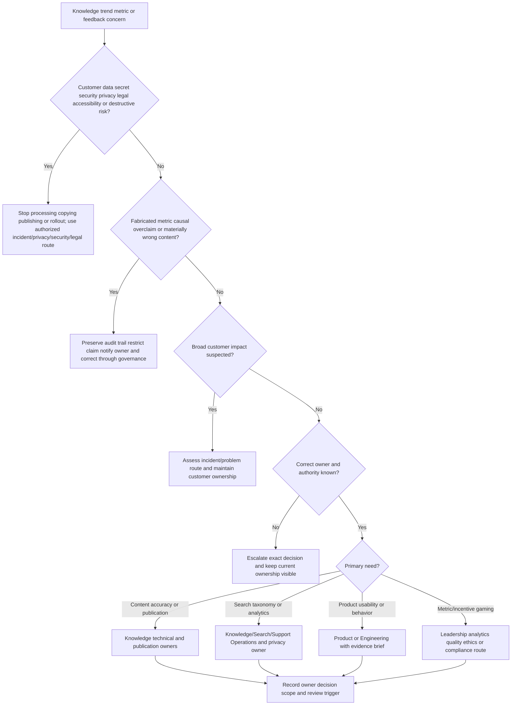

### Escalation packet

| Element | Content |
|---|---|
| Exact concern | Wrong article, unsafe step, customer-data exposure, trend anomaly, metric definition conflict, gaming signal, or Product friction |
| Scope | Confirmed, possible, and excluded audience/cases/time range |
| Evidence | Minimum authorized references, versions, timestamps, definitions, and samples |
| Immediate containment | Restricted publication, paused rollout, preserved assisted route, or no action if unauthorized |
| Current customer impact | Observable outcome and urgency without invented severity |
| Known/unknown | Facts, hypotheses, missing data, and competing explanations |
| Owners | Current Support owner, knowledge owner, Product/Engineering owner, privacy/security/legal/analytics owner as applicable |
| Decision requested | One answerable authorization or classification question |
| Commitments | Current approved customer message and next checkpoint; no roadmap or ETA fiction |
| Audit | Who changed what, when, why, and how rollback/retirement is tracked |

### Non-negotiable prohibitions

This Part, all three artifacts, and SignalBridge Lab 107 prohibit:

- using, copying, aggregating, or exposing real customer data, personal data, confidential content, regulated data, security evidence, production identifiers, case narratives, search queries, article feedback, telemetry, screenshots, exports, logs, attachments, or proprietary internal records;
- collecting, storing, publishing, or requesting secrets, passwords, tokens, cookies, API keys, authorization headers, session material, recovery codes, private keys, connection strings, or authenticated URLs;
- publishing internal or external content without the current authorized technical, security/privacy, Product, legal, brand, accessibility, knowledge-owner, or other required review;
- copying proprietary, licensed, copyrighted, customer-authored, employer-authored, vendor-authored, or certification content into an article without explicit rights and attribution requirements;
- claiming KCS certification, coach status, program ownership, licensing rights, or employer adoption that the supplied evidence does not establish;
- inventing or presenting any Abnormal AI customer, case, article, query, tag, taxonomy, trend, defect, feedback item, workflow, baseline, target, metric, dashboard, owner, review, publication, experiment, or result;
- fabricating any count, percentage, denominator, case avoidance, self-service success, search success, deflection, cost saving, CSAT effect, trend, Pareto result, publication, reuse, approval, Product decision, or customer quotation;
- treating page views, clicks, bot replies, no-result exits, abandoned forms, customer silence, lower case volume, closure, or lack of contact as proven self-service success or deflection;
- hiding contact channels, making assisted support inaccessible, adding unnecessary steps, suppressing cases, recategorizing demand, shortening observation windows, changing denominators, or excluding failures to improve a metric;
- closing cases prematurely, discouraging reopen, splitting/recreating cases to reset clocks, forcing irrelevant article links, or selecting convenient tags to satisfy targets;
- publishing an unverified workaround, encouraging permission expansion, weakening security, changing production configuration, or performing a destructive action to make an article appear successful;
- using a high Pareto rank as proof of root cause, priority, severity, Product obligation, or safe automation;
- using a low count to suppress a security, privacy, legal, accessibility, data-loss, broad-impact, or high-harm issue;
- promising a Product roadmap item, priority, implementation, root cause, fix, release, approval, SLA, or delivery date from a VOC brief; and
- uploading artifacts to a public repository, paste site, public AI service, public converter, or unauthorized external system.

If prohibited or sensitive material appears, stop further copying and publication, restrict exposure through the authorized owner, preserve only minimum allowed references, and invoke the current privacy, security, legal, records, incident, management, or knowledge-governance process. Do not destroy or alter real evidence under the label of cleanup.

## 12. Operating checklists

### Before reusing an article

| Check | Pass question | Stop condition |
|---|---|---|
| Audience | Is the current user authorized for this content? | Access or disclosure is unclear |
| Intent | Does the article address the same intended outcome? | Only keywords match |
| Scope | Do environment, journey stage, configuration category, and exclusions match? | High-risk or excluded condition appears |
| Freshness | Is version/review state current for observed behavior? | Owner missing or change invalidates content |
| Safety | Are steps permitted, reversible, and non-destructive in context? | Permission, data, security, or destructive risk |
| Evidence | Does each decision branch use observable results? | Procedure jumps from symptom to cause |
| Validation | Is the customer task outcome defined? | Success equals completion of a step only |
| Ownership | Who handles failure, correction, and escalation? | No accepted return path |
| Feedback | Can the engineer report applicability or defects safely? | Only free text that invites sensitive data |

### Before publishing or materially changing content

| Check | Evidence required |
|---|---|
| Distinct need | Search/reuse evidence that existing content cannot meet safely |
| Original and permitted wording | No copied proprietary content; sources and rights checked |
| Technical validity | Approved authoritative evidence and tested scope |
| Audience safety | Internal/external disclosure and action risks reviewed |
| Data minimization | No customer data, secrets, case narrative, or unnecessary identifiers |
| Customer language | Safe search terms and observable symptoms included |
| Accessibility | Structure, language, alternatives, and current standards/process reviewed |
| Ownership | Author, reviewer, publisher, maintainer, and escalation roles explicit |
| Lifecycle | Version, effective date, review trigger, replacement, and retirement path |
| Measurement | Outcome and guardrails declared without unsupported deflection claim |

### Before sending a trend or Product feedback brief

| Check | Evidence required |
|---|---|
| Stable question | Unit, period, population, denominator, exclusions, and tag version |
| Data quality | Completeness, agreement, schema changes, defaults, and missingness |
| Segmentation | Relevant product, journey, customer type, risk, or environment without unsafe small-cell exposure |
| Qualitative grounding | Authorized examples/themes with redaction and method |
| Causal restraint | Competing explanations and limits |
| Impact | Frequency separated from severity, effort, trust, risk, and strategic value |
| Current alternatives | Workarounds and their costs/risks |
| Ask | One answerable owner decision |
| Commitments | Explicit statement that no roadmap, cause, priority, or date was promised |
| Follow-through | Decision log, owner, next evidence, customer update, and review trigger |

### First-week discovery questions for a new support organization

1. What knowledge methodology, if any, is officially used, and which terms are local?
2. Who may create, improve, validate, publish, restrict, merge, archive, and retire internal and external articles?
3. Which data classes are prohibited in cases, drafts, search logs, feedback, and analytics?
4. What constitutes a reusable article, an approved workaround, a known error, and a Product-feedback candidate?
5. What taxonomy and tag dictionary are current, and how are unknown/multi-cause cases handled?
6. Which search analytics are collected, under what consent, purpose, access, retention, and privacy controls?
7. How are self-service success, assisted support, deflection, case avoidance, and quality defined locally?
8. Which denominators, windows, exclusions, segments, and guardrails are required?
9. How are article reuse, failed applicability, feedback, and corrections captured without quota gaming?
10. What route handles unsafe content, exposed customer data, security-sensitive knowledge, and urgent retirement?
11. How do Support, CSM, Product, Engineering, Security, Privacy, Legal, Analytics, and Knowledge owners share decisions?
12. Which metrics inform coaching, and which are prohibited for individual performance incentives?

## Lab

**SignalBridge Lab 107 - Local Synthetic Knowledge, Trend, and Measurement Workbook** is a design for later practice. It was not performed during authoring. No account, browser login, web request, analytics system, KB platform, ticket platform, product, customer environment, API, script, automation, upload, publication, or external service is needed or authorized.

### Lab objective

Using one learner-owned local Markdown file or paper workbook, create a fictional internal/external article pair, a 40-row synthetic case-tag dataset, a Pareto/trend brief, a VOC/Product evidence brief, and a deflection measurement plan. Validate structure, arithmetic, privacy, claim boundaries, and the publish/reuse/feedback decision path. This demonstrates reasoning and artifact design only.

### Prerequisites

- One local learner-owned text/Markdown file or physical paper under current approved storage policy.
- This Part as a read-only reference.
- No Abnormal AI, Microsoft, customer, employer, KCS training/certification portal, KB, support, CRM, Product, analytics, search, identity, or production account.
- No real case, article, metric, query, quotation, customer, person, domain, email, identifier, screenshot, export, log, telemetry, proprietary content, or internal process.
- Only obvious fictional aliases such as `CASE-107-LAB-001`, `KB-107-LAB-I`, `TAG-107-FICTION`, and relative periods `FW1-FW4`.
- Exact top label: `LOCAL SYNTHETIC KNOWLEDGE LAB - NO ACCOUNTS - NO PUBLICATION - UNPERFORMED DURING AUTHORING - NOT ABNORMAL OR MICROSOFT DATA`.
- Initial state: `DESIGN_NOT_EXECUTED_NOT_TRANSFERRED`.

### Lab safety charter

| Area | Allowed | Prohibited | Automatic stop |
|---|---|---|---|
| Data | Learner-authored fiction and small integer counts | Real customer/person data, secrets, cases, searches, metrics, logs, quotes, exports | Any value has real or uncertain provenance |
| Content | Original fictional wording and links to allowed official public sources | Copied proprietary, licensed, employer, customer, certification, or private content | Rights or confidentiality unclear |
| Systems | Offline local file or paper | Accounts, logins, KB/ticket/analytics platforms, APIs, scripts, web forms, uploads | Any external system would be contacted |
| Publication | State labels and paper review simulation | Internal/external publication, sharing, email, public repo, paste, AI upload | Artifact would leave approved local scope |
| Actions | Manual classification, arithmetic, diagrams, and writing | Permission/configuration change, customer contact, product action, automation, bulk operation, destructive action | Real environment or record would change |
| Claims | Designed; after actual completion, locally completed with fiction | KCS certification, live reuse, Abnormal/Microsoft metric, deflection result, publication, Product decision | Claim exceeds evidence |

### Lab steps

1. Keep state `DESIGN_NOT_EXECUTED_NOT_TRANSFERRED` while reviewing this design.
2. If performed later, create one local workbook with the exact top label, date, version, owner alias, and evidence label `LOCAL_SYNTHETIC_PAPER_LAB`.
3. Restate the sixteen required vocabulary labels in original words and include analogy boundaries.
4. Invent one harmless support journey and observable outcome with no real brand or customer details.
5. Create 40 fictional cases across four equal fictional weeks using simple IDs and integer category counts.
6. Define the unit, eligibility, exclusions, tag version, symptom, contact-driver, mechanism-status, knowledge-relation, and outcome fields.
7. Allow `UNKNOWN`; do not force a cause or successful outcome.
8. Add three deliberate classification ambiguities and resolve them using the dictionary rather than intuition.
9. Calculate category totals, shares, and cumulative shares manually.
10. Verify the total and arithmetic twice; record any correction rather than erasing the audit note.
11. Rank categories, then identify one high-volume candidate and one low-volume/high-risk candidate.
12. Write competing explanations for both.
13. Draft one internal article candidate with audience, symptoms, scope, exclusions, prerequisites, safe steps, observations, validation, escalation, owner, sources, and review trigger.
14. Draft a separate external adaptation that omits internal routing and unsafe/proprietary detail.
15. Keep both states `DRAFT_NOT_REVIEWED_NOT_PUBLISHED`.
16. Walk three fictional cases through the publish/reuse/feedback decision tree: one applicable reuse, one findability failure, and one security-sensitive mismatch.
17. Record outcome as `VALIDATED`, `NOT_VALIDATED`, or `UNKNOWN` from authored evidence only.
18. Create a trend brief with population, period, counts, shares, data-quality notes, limitations, and no causal claim.
19. Create a VOC brief with customer job, friction, represented/missing populations, approved-style themes, alternatives, competing explanations, and one decision ask.
20. Add an explicit no-roadmap/no-defect/no-priority/no-date commitment statement.
21. Create a deflection measurement plan with eligibility, exposure, task success, contact window, comparison, segments, privacy, and guardrails.
22. Write one synthetic arithmetic example and label it `NOT_OBSERVED_NOT_A_RESULT`.
23. Explain why sessions without contact are not proven avoided cases.
24. Add a customer-effort, repeat-contact, reopen, escalation, accessibility, safety, and abandonment guardrail set.
25. Simulate one metric-gaming proposal such as hiding the contact route; reject it and document the customer harm.
26. Simulate one irrelevant-link quota; show how an applicability audit detects it.
27. Simulate one tag-definition change; mark the trend break instead of joining periods naively.
28. Simulate one article defect; route restriction and correction without deleting history.
29. Search the workbook for names, emails, domains, customer text, secrets, URLs other than approved public sources, screenshots, exports, logs, and proprietary wording.
30. Search for `Abnormal` and `Microsoft`; every occurrence must be a prohibition, honesty boundary, or explicit absence of data/experience.
31. Search for `certified`, `published`, `approved`, `measured`, `deflected`, `increased`, `reduced`, `caused`, and `validated`; ensure every claim matches authored evidence.
32. Confirm no public upload, sharing, customer contact, account use, API, automation, permission change, bulk operation, publication, or destructive action occurred.
33. Practice a 90-second KCS explanation without claiming certification.
34. Practice a 90-second explanation of why page views do not equal deflection.
35. Practice a two-minute walkthrough of the trend and Product evidence brief.
36. Validate the workbook against the rubric below using at most three cycles.
37. If any automatic failure remains after cycle three, keep it incomplete and request human review.
38. Only after actual local completion and a pass may the learner change the future workbook state to `LOCAL_SYNTHETIC_PAPER_LAB_COMPLETED_NOT_TRANSFERRED`.
39. Leave this authored Part unchanged: SignalBridge Lab 107 was not performed during authoring.
40. Retain or dispose of the fictional workbook only under current approved policy; do not alter real evidence.

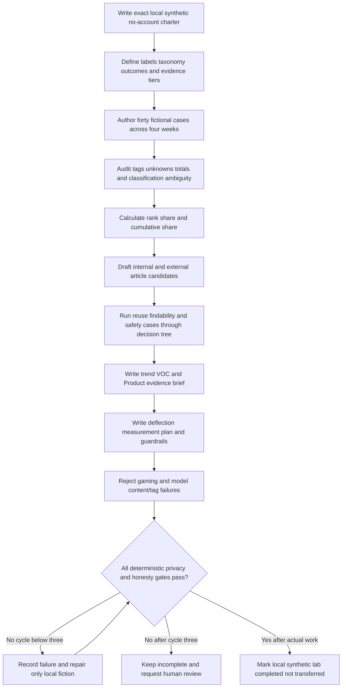

### Expected evidence if performed later

- exact honesty label, version, state, and evidence tier;
- sixteen required vocabulary labels in original words;
- 40 fictional cases with a versioned tag dictionary and preserved unknowns;
- checked totals, shares, cumulative shares, and trend caveats;
- one internal and one external article candidate, both unreviewed and unpublished;
- three worked decision cases covering reuse, findability, and safety mismatch;
- one trend brief and one VOC/Product evidence brief;
- one deflection measurement plan with task outcome, comparison limits, privacy, and guardrails;
- one rejected metric-gaming proposal, one irrelevant-link audit, one tag-break annotation, and one article-defect response;
- a validation ledger with no more than three cycles; and
- zero real data, secrets, proprietary copying, external publication, account use, API, automation, permission change, destructive action, fabricated metric, KCS credential claim, Abnormal data claim, or live result.

### Cleanup and privacy

- Keep the future artifact local and private under the learner's approved policy.
- Do not upload, publish, email, paste, sync, commit publicly, or send it to a person, AI service, or external tool.
- Do not make it “realistic” by adding real customer text, internal fields, screenshots, metrics, or proprietary articles.
- Do not include credentials, tokens, cookies, keys, authenticated links, or secret-shaped placeholders.
- If real material appears, stop, minimize further exposure, and use the authorized privacy/security/records route.
- Do not delete or modify real cases, knowledge, logs, analytics, permissions, audit records, or evidence.
- If unperformed, record: `SignalBridge Lab 107 remains a reviewed design and was not executed.`
- If later performed and passed, record: `SignalBridge Lab 107 was completed locally using learner-authored fiction only; no account, publication, public upload, real data, secret, proprietary content, API, automation, permission change, product action, destructive operation, Abnormal/Microsoft data, KCS credential, or live metric/result was used.`

### Lab validation rubric

| Dimension | Fail | Developing | PASS |
|---|---|---|---|
| Vocabulary | Required term missing or conflated | Terms listed without boundaries | Sixteen labels define every requested concept with analogy and limit |
| KCS method | Article quota or credential overclaim | General capture idea | Solve/evolve, capture/reuse/improve, workflow integration, and credential boundary |
| Article quality | Case dump or unsafe steps | Basic draft | Audience, scope, safe procedure, validation, owner, feedback, review, retirement |
| Internal/external | Same content copied to both | Audience named | Separate purpose, disclosure, procedure, review, and escalation design |
| Findability | Views treated as success | Titles/tags exist | Access, indexing, vocabulary, structure, taxonomy, ranking, feedback, and freshness |
| Tag quality | Cause guessed or sensitive tags | Categories exist | Dictionary, unknowns, symptom/mechanism split, completeness/agreement/drift audit |
| Trend/Pareto | Arithmetic wrong or cause declared | Sorted counts | Checked denominator, share, cumulative share, segments, caveats, risk override |
| VOC/Product | Quotes dumped or roadmap promised | Theme summary | Population, methods, impact, alternatives, uncertainty, ask, privacy, commitments |
| Measurement | Views/no contact equal deflection | Basic funnel | Task success, comparison, denominators, windows, privacy, guardrails, causal limits |
| Metric integrity | Hidden demand or closure gaming | Gaming named | Incentives, unknowns, channel shift, audit, stop rules, and assisted access protected |
| Safety | Real data/system/publication/proprietary copy | Local claim vague | Every prohibition and automatic stop explicit |
| Honesty | KCS/Abnormal/live result overstated | Gap implied | experience transfer, learned KCS, synthetic artifacts, unperformed lab, Abnormal unknowns separate |

**Lab automatic failure:** any real or uncertain-provenance customer data, secret, proprietary content, production record, live search query, metric, or quotation; public/external upload or publication; account use; API, automation, script, bulk action, permission/configuration change, customer contact, product action, or destructive operation; unsupported KCS certification/program claim; copied licensed material; fabricated metric/result/approval; hidden demand, contact obstruction, closure/tag gaming; unsupported causation; roadmap promise; invented Abnormal process/data; or claim that the lab was performed during authoring.

## Authored-Part deterministic validation contract

The authored Part is complete only when every gate passes. The master status must remain `Not started` until a complete `PASS`. Validation may use at most three cycles.

| Gate | Required | Current authored result | Result |
|---|---:|---|---|
| Word floor | At least 6,500 words | At least 10,480 alphanumeric word tokens by cumulative lower-bound buckets: 485 lines with at least 10, 286 with at least 20, 115 with at least 30, 88 with at least 40, and 74 with at least 50; words above 50 and shorter lines are excluded | PASS |
| H1 | Exactly one exact required H1 | One exact H1 on line 1 | PASS |
| Required labels | Numbered labels define every requested term | Exactly sixteen numbered rows define all requested concepts and paired terms | PASS |
| Mermaid | At least 8 closed recognized blocks | Twelve recognized openings and twelve closing fences | PASS |
| Deep-dives | At least 4 headings containing `Plain-English deep-dive` | Five matching headings | PASS |
| Tables | At least 10 completed Markdown tables | Forty-one table header/separator pairs | PASS |
| Worked cases | KB reuse and trend cases with inputs, reasoning, result, and caveats | Two KB reuse cases plus one 100-case trend/Pareto example with limits | PASS |
| Decision tree | Publish/reuse/feedback routing with safety, authority, review, and Product path | Complete routing tree in Section 4 | PASS |
| Artifacts | KB article, trend/VOC brief, and deflection measurement plan | Three completed in-page synthetic written artifacts | PASS |
| Failure/gaming/escalation | Failure table, metric-gaming tests, prohibitions, and escalation route | Twenty failure modes, ten gaming tests, explicit prohibitions, and owner-routed escalation flow | PASS |
| Interview Q&A | Exactly Q1-Q8, each with exactly one model-answer label | Eight question headings and eight model-answer labels | PASS |
| Official/primary sources | At least 8 official or primary sources with per-source boundaries | Ten resolving official/primary pages with per-row boundaries; two moved URLs were repaired and rechecked | PASS |
| Lab | Local synthetic no-account design, explicitly unperformed | Explicit no-account, no-publication design; no performance claim | PASS |
| Final navigation | Exact sole next-Part link on final line | One exact navigation link on the final line | PASS |

**Authored-Part validation result: PASS in validation cycle 1 after repairing two moved source URLs.** Markdown diagnostics reported no errors before and after repair. SignalBridge Lab 107 remains `DESIGN_NOT_EXECUTED_NOT_TRANSFERRED` and was not performed. No KCS certification, publication, live platform use, customer evidence, Abnormal data, or measured result is claimed.

## Official Source Anchors - August 24, 2026

These sources anchor public methodology, quality, analytics, and product-documentation concepts only. They do not prove your certification, program authority, direct tool operation, any customer behavior, or any Abnormal AI system, process, article, taxonomy, data, metric, or result. Product pages and guidance can change; revalidate current versions, licenses, plans, permissions, privacy terms, and organizational policy before use.

| Official or primary source | Concept anchored | Boundary for this Part |
|---|---|---|
| [Consortium for Service Innovation - KCS v6 Practices Guide](https://library.serviceinnovation.org/KCS/KCS_v6/KCS_v6_Practices_Guide) | Public KCS v6 practices, Solve Loop/Evolve Loop, knowledge in the workflow, content health, performance, and leadership concepts | The Consortium owns and governs KCS materials and certification. This public guide does not certify you, authorize program claims, reproduce licensed training, or establish an employer's implementation. Current licensing and attribution rules control reuse. |
| [Consortium for Service Innovation - KCS Principles and Core Concepts](https://library.serviceinnovation.org/KCS/Principles_and_Core_Concepts) | KCS principles and core conceptual model | Principles require local adoption design and leadership context. They do not supply an Abnormal workflow, metric target, article state, or permission model. |
| [Consortium for Service Innovation - KCS v6 Adoption Guide](https://library.serviceinnovation.org/KCS/KCS_v6/KCS_v6_Adoption_Guide) | Adoption-wave and organizational change guidance | Adoption guidance is not proof that you or any employer implemented KCS. A real program requires authority, training, licensing where applicable, roles, measurement, coaching, and local change governance. |
| [American Society for Quality - Pareto Chart](https://asq.org/quality-resources/pareto) | Pareto chart purpose and quality-tool framing | ASQ guidance explains the tool; it does not make 80/20 a law or establish causation, risk, priority, or data quality. The synthetic table here is not an ASQ dataset. |
| [Google Search Console Help - Performance report](https://support.google.com/webmasters/answer/7576553) | Official definitions and interpretation context for clicks, impressions, click-through rate, position, queries, pages, and report dimensions in Search Console | Search Console concerns Google Search properties and has filtering, privacy, aggregation, freshness, and product-specific limits. It does not define internal KB search success or self-service outcome. No Search Console data was used. |
| [Google Analytics - Events](https://developers.google.com/analytics/devguides/collection/ga4/events) | Official GA4 event collection model and implementation concepts | Event instrumentation is product-specific and subject to consent, privacy, retention, identity, implementation, and policy controls. An event is not proof of intent, success, or deflection. No GA4 property was accessed. |
| [Microsoft Learn - Create and manage knowledge articles](https://learn.microsoft.com/en-us/dynamics365/customer-service/use/customer-service-hub-user-guide-knowledge-article) | Official Dynamics 365 Customer Service knowledge-article lifecycle and authoring concepts | This is product documentation for supported Dynamics 365 experiences and changes over time. It does not prove you used this feature, define KCS universally, or establish Abnormal's knowledge workflow. No Dynamics environment was accessed. |
| [Atlassian - Knowledge-Centered Service explained](https://www.atlassian.com/itsm/knowledge-management/kcs) | Official vendor explanation of KCS-oriented knowledge management in an ITSM context | This is Atlassian's explanatory/product context, not the Consortium's certification authority and not proof of Jira/Confluence use, plan capability, configuration, or employer adoption. |
| [Consortium for Service Innovation - Measurement Matters v6](https://library.serviceinnovation.org/KCS/KCS_v6/Measurement_Matters_v6) | KCS measurement guidance, balanced measures, value creation, and interpretation within an adoption context | This companion guidance does not provide an Abnormal target, prove causal deflection, authorize individual quotas, or replace local privacy, quality, and statistical review. Its current license and definitions must be respected. |
| [Performance.gov - Customer Experience](https://www.performance.gov/cx/) | Official United States federal customer-experience program context emphasizing service experience and measurement | Federal CX policy and resources apply in their stated government context. They do not define a private company's VOC program, metric, legal duty, customer population, or Product priority. No federal/customer dataset was used. |

Source discipline:

- The Consortium for Service Innovation is the primary authority for KCS terminology and certification boundaries. This Part summarizes public concepts in original wording and does not reproduce a credential curriculum.
- ASQ explains Pareto as a quality tool; the ranking still depends on trustworthy categories, denominators, and a separate risk/impact view.
- Google documentation defines behavior within Google products. It provides useful analytics cautions but does not define an enterprise support KB or grant permission to track users.
- Microsoft, Atlassian, and Zendesk documentation describes configurable vendor capabilities. It does not establish your direct operation, Abnormal's tool choice, or any employer's workflow.
- Performance.gov is an official public-sector source family. Its context is not a universal private-sector VOC standard.
- Every metric, worked count, title, query phrase, article, and outcome in this Part is synthetic. Sources support concepts, not the fictional results.
- Revalidate all URLs, content versions, licensing, product plans, privacy requirements, and local policies after August 24, 2026.

## Likely Interview Questions

### Q1. What is KCS, and what experience can you honestly claim?

**Model answer:** KCS is a methodology from the Consortium for Service Innovation that integrates capturing, structuring, reusing, and improving knowledge into the workflow of solving requests, supported by an evolve loop for content health, process, performance, coaching, and governance. My direct foundation is enterprise support, including defensible KB or training, mentoring, case-quality, communication, escalation, and operational-analysis examples. I studied public KCS v6 concepts and built synthetic artifacts, but I do not claim KCS certification, formal program ownership, or Abnormal implementation experience.

### Q2. How do you decide whether to reuse, improve, create, or publish an article?

**Model answer:** I first check safety, audience, permissions, intent, scope, freshness, evidence, and current ownership. If an existing article is applicable, I reuse it and validate the customer outcome. If use exposes a specific gap, I improve it within authority or route a correction. I create a candidate only when validated reusable learning lacks adequate content. External publication needs the current technical, security/privacy, Product, legal, accessibility, brand, and knowledge reviews that apply. I never copy a customer case, publish an unverified workaround, or treat a draft as approved.

### Q3. What makes an article findable?

**Model answer:** Findability combines correct access and indexing with customer-language titles, observable symptoms, approved synonyms, clear structure, governed taxonomy and tags, contextual links, freshness, and ranking. I examine zero-result searches, refinements, result clicks, failed applicability, article feedback, and later outcomes. A high rank or click is not enough because it can amplify a wrong article. I protect permission boundaries and measure whether the user found applicable content and completed the intended task.

### Q4. Why is a page view not a deflected case?

**Model answer:** Deflection concerns a counterfactual: whether an assisted contact would have occurred without the self-service intervention. A page view proves only that content loaded. The user may have succeeded, failed, abandoned, switched channels, lacked contact access, or never intended to open a case. I define eligibility, exposure, task success, contact matching/window, comparison method, and uncertainty, then use guardrails such as repeat contact, reopen, escalation, effort, accessibility, safety, and abandonment. I prefer a defensible estimate over a large unsupported number.

### Q5. How would you use case tagging and Pareto analysis responsibly?

**Model answer:** I define the eligible population, time window, unit, tag dictionary, unknown behavior, and schema version first. I separate observable symptom, current contact driver, and validated mechanism. Then I audit completeness, reviewer agreement, defaults, and drift; rank a chosen measure; calculate shares and cumulative shares; inspect representative cases; and test competing explanations. Pareto identifies categories worth investigating, not root causes or automatic priority. I also preserve a risk override so a rare security or privacy issue is not hidden by high-volume how-to demand.

### Q6. What belongs in a Voice of Customer or Product evidence brief?

**Model answer:** I state the customer job and observable friction, represented and missing populations, evidence sources, period, counts or rates with denominators, approved qualitative themes, impact, current alternatives, competing explanations, privacy controls, and one answerable decision request. I distinguish frequency from severity and Support evidence from the full customer population. The brief explicitly says what was not promised: no root cause, defect, priority, roadmap item, or delivery date. Product and Engineering own their decisions; Support owns accurate follow-through.

### Q7. How would you respond if leadership asked you to maximize deflection?

**Model answer:** I would clarify the desired customer outcome and the local metric definition before accepting the target. I would propose task success and customer effort as primary outcomes, with contact behavior as one signal and guardrails for repeat contact, reopen, escalation, safety, accessibility, abandonment, and channel switching. I would reject hiding contact routes, forced article links, premature closure, denominator changes, or counting views as resolutions. Assisted support is appropriate for complex and high-risk needs, so quality and access must outweigh a raw deflection percentage.

### Q8. When would you stop and escalate knowledge or trend work?

**Model answer:** I stop ordinary handling when customer data, secrets, proprietary content, security/privacy/legal/accessibility risk, unsafe instructions, destructive actions, unexpected exposure, or unclear publication authority appears. I also escalate materially wrong content, fabricated metrics, causal overclaims, hidden demand, closure/tag gaming, broad impact, or a suspected product defect. I preserve the minimum authorized evidence, restrict or pause through the correct owner, keep customer ownership visible, and ask one precise decision question. I do not publish, change permissions, delete evidence, promise Product action, or invent an Abnormal metric to unblock the work.

## Memory Hooks

- **KCS: knowledge in the work, not homework after the work.**
- **Capture the context; reuse with judgment; improve from evidence.**
- **A KB is the library; an article is one governed book.**
- **Internal depth is not external permission.**
- **Findability = access + language + structure + classification + freshness.**
- **A search click is a clue, not a customer outcome.**
- **No contact is an unknown until the task and counterfactual are addressed.**
- **Quality before raw deflection.**
- **Tag the symptom before claiming the mechanism.**
- **Pareto prioritizes investigation; it does not prove cause or risk.**
- **VOC translates customer friction into evidence and an answerable ask.**
- **Product feedback is input, not a roadmap promise.**
- **Keep assisted support easy for complex, sensitive, and high-risk needs.**
- **Never trade customer trust for a prettier metric.**
- **experience transfer is real; KCS certification and Abnormal metrics are not claimed.**

## Completion Checklist

- [ ] I can define all sixteen labels and every paired term without collapsing related concepts.
- [ ] I can explain KCS as a solve/evolve system without claiming certification or program ownership.
- [ ] I can describe a real Microsoft KB/training or quality example with exact personal actions and evidence boundaries.
- [ ] I can separate prior production transfer, learned KCS concepts, synthetic artifacts, an unperformed lab, and unknown Abnormal configuration.
- [ ] I can distinguish internal from external articles and name the publication reviews that must be verified locally.
- [ ] I can write an article with audience, symptoms, scope, exclusions, prerequisites, safe steps, observations, validation, escalation, owner, sources, feedback, and review trigger.
- [ ] I can explain findability across access, indexing, customer language, title, structure, taxonomy, links, freshness, ranking, and feedback.
- [ ] I preserve `UNKNOWN` and separate symptom, contact driver, and validated mechanism in case tags.
- [ ] I can use the publish/reuse/feedback decision tree without creating articles or Product requests by quota.
- [ ] I can define assisted support, self-service success, search success, deflection, and case avoidance with their limits.
- [ ] I can explain the counterfactual problem and why views, clicks, silence, and lower case counts do not prove deflection.
- [ ] I can specify eligibility, denominator, exposure, task outcome, window, comparison, segments, privacy, and quality guardrails.
- [ ] I can calculate a Pareto share and cumulative share while refusing causal or automatic-priority claims.
- [ ] I can combine trend counts with impact, risk, effort, evidence confidence, and a rare/high-risk override.
- [ ] I can write a VOC/Product evidence brief with represented/missing populations, alternatives, uncertainty, and one decision ask.
- [ ] I never promise a defect, roadmap item, priority, approval, fix, or delivery date from support feedback.
- [ ] I can identify article/reuse quotas, hidden demand, contact obstruction, closure gaming, tag gaming, denominator changes, and causal overclaim.
- [ ] I prohibit customer data/secrets, publication without review, proprietary copying, fabricated metrics, unsafe action, public upload, and invented Abnormal data.
- [ ] I describe all three in-page artifacts as completed synthetic writing, not live publication, analysis, reuse, experiment, or result.
- [ ] I describe SignalBridge Lab 107 as local, synthetic, no-account, and unperformed during authoring.
- [ ] I can state the boundary of every official/primary source and revalidate current materials.
- [ ] I can answer exactly eight interview questions aloud with honest, outcome-focused language.

[Next: Part 108 - Customer Updates Empathy and Expectation Management](Part-108-customer-updates-empathy-and-expectation-management.md)