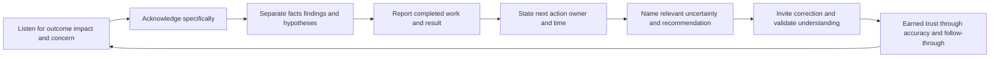
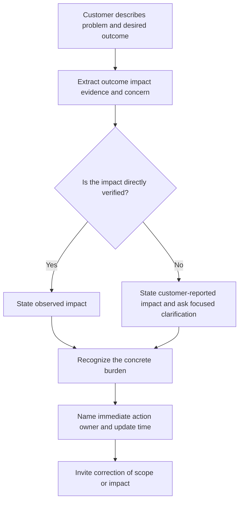
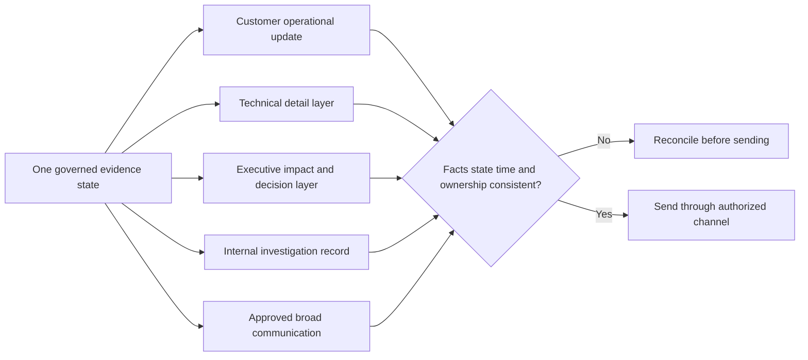
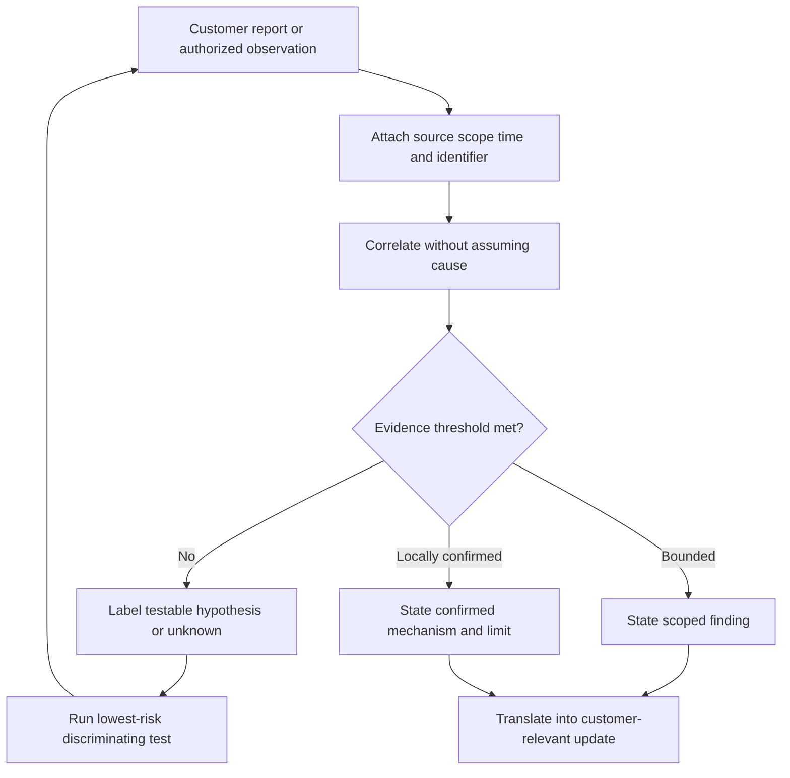
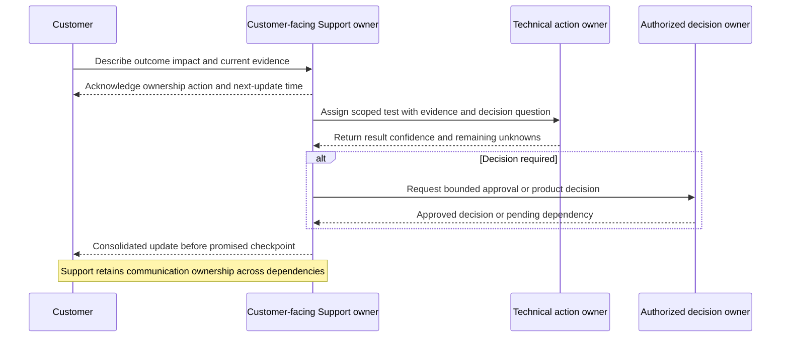
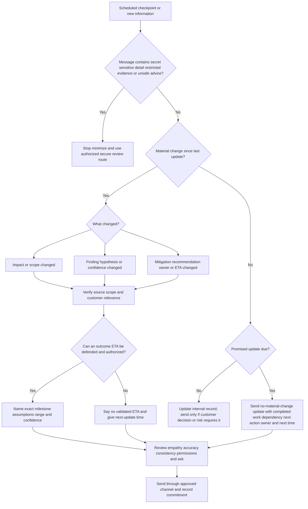
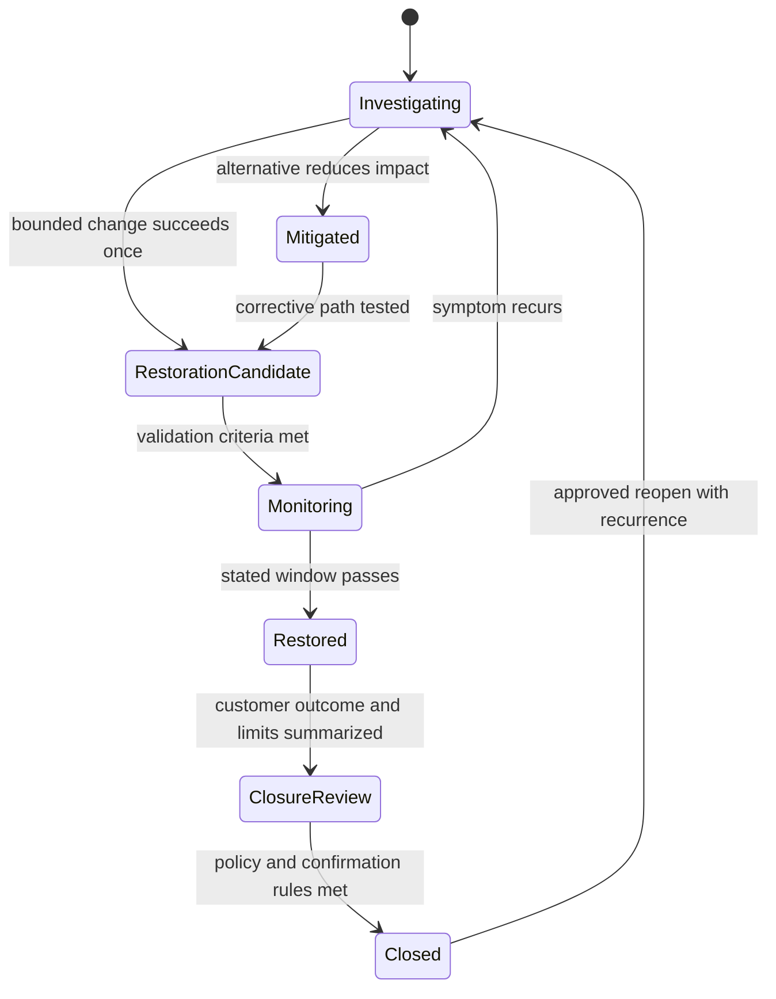
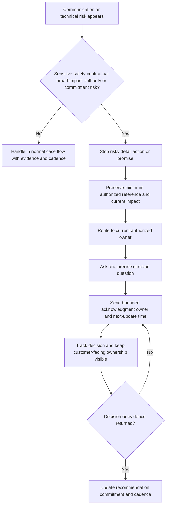
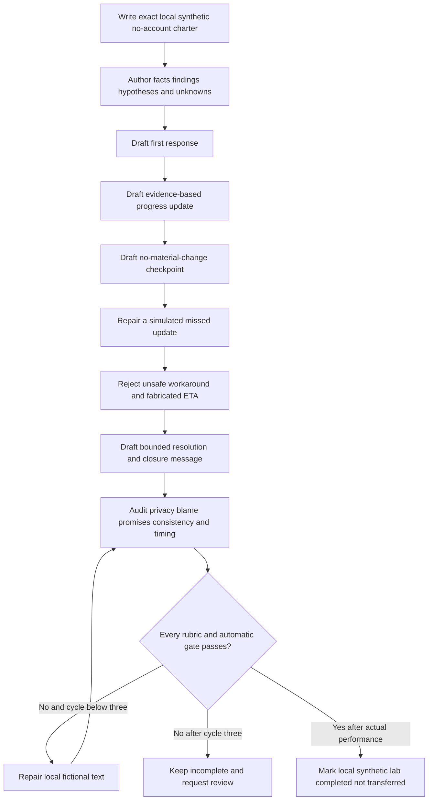

# Part 108 - Customer Updates Empathy and Expectation Management

> **Purpose:** Build a beginner-first, vendor-neutral method for writing customer updates that acknowledge the customer, state impact accurately, show completed work, distinguish findings from hypotheses, name the next action and owner, give an honest time commitment, expose important uncertainty, and make a proportionate recommendation without filler.
>
> **Artifact honesty label:** **Direct Microsoft enterprise-support transfer plus completed local synthetic written messages; separate lab unperformed.** Arti's background, as recorded in the master guide, includes customer and partner communication, complex investigations, CRITSIT work, Engineering/Product escalation, fix validation, and enterprise case ownership at Microsoft. Those are relevant production-transfer strengths. The messages, customers, systems, incidents, identifiers, times, observations, owners, recommendations, and outcomes in this Part are learner-authored fiction. This Part does not reproduce or claim knowledge of Abnormal AI's templates, macros, SLAs, severity rules, update policies, escalation paths, customer commitments, internal systems, or approved wording. SignalBridge Lab 108 was not performed while this Part was authored.
>
> **Currency and source access date:** August 24, 2026.
>
> **Authored-Part state:** `PASS`. The master tracker was changed only after every deterministic gate passed.

## Section goal

A technically correct investigation can still lose customer trust if the customer cannot tell whether anyone understood the problem, what is happening now, who owns the next step, or when they will hear again. The opposite failure is equally dangerous: a polished message can sound confident while hiding impact, blurring evidence, inventing an estimated time of arrival, or recommending a risky change. Strong support communication joins **human recognition, evidence discipline, ownership, and time discipline** in one compact update.

This Part teaches Arti to:

1. distinguish empathy from sympathy and an apology, then use empathy without scripted filler;
2. acknowledge the specific situation without pretending agreement with an unverified cause;
3. state business and technical impact without minimizing it, inflating it, or exposing sensitive details;
4. separate a raw fact, an interpreted finding, and a testable hypothesis;
5. describe completed work as evidence-producing actions rather than a list of activity;
6. state one next action, one visible owner, and one meaningful time commitment;
7. distinguish an estimated time of arrival, abbreviated **ETA**, from a next-update time;
8. set a useful communication cadence based on impact, change, dependency, and customer need;
9. communicate uncertainty explicitly without sounding passive or evasive;
10. make recommendations with purpose, authority, risk, reversibility, validation, and alternatives;
11. write a first response, progress update, and resolution message that form one coherent story;
12. close only after distinguishing technical resolution, customer validation, monitoring, and administrative closure;
13. reject fabricated certainty, fabricated ETA, blame, filler apology loops, unsafe bypass advice, hidden impact, and unreviewed generated messages; and
14. present Microsoft production experience, local synthetic practice, and unknown Abnormal processes as separate evidence tiers.

The portable rule is: **recognize the person and impact, report only what the evidence supports, own the next move, and promise the next communication before promising the outcome.**

### The twelve required vocabulary labels

The numbered labels below define every required term before the lesson relies on it. Several labels contain related terms, but each term is defined separately because the words are not interchangeable.

| # | Required label | Beginner-first definition | Everyday analogy | Why it matters | Boundary to preserve |
|---:|---|---|---|---|---|
| 1 | **Empathy, sympathy, and apology** | **Empathy** means recognizing another person's situation, perspective, or likely burden and responding in a way that accounts for it. **Sympathy** means feeling concern or sorrow for the person. An **apology** accepts or expresses regret for harm, inconvenience, or a failure; its wording and authority can matter legally and organizationally. | Empathy is moving a meeting because you understand a colleague is handling an outage. Sympathy is feeling sorry that their day is difficult. An apology is saying the team is sorry for a missed commitment. | Support needs empathy because the next action should reflect real customer effort and risk, not merely polite emotion. | Empathy does not require guessing feelings, admitting an unverified fault, promising compensation, or repeating “sorry” in every paragraph. Use apologies according to facts, authority, and current policy. |
| 2 | **Acknowledgment** | An acknowledgment is a concise statement showing that Support received the request, understood the requested outcome and current concern, and has taken ownership of the next communication step. | A dispatcher repeats the destination and confirms that a driver has been assigned. | It reduces the customer's need to ask whether the case was seen or understood. | “We received your ticket” alone is receipt, not full acknowledgment. Do not claim full understanding when scope is still being clarified. |
| 3 | **Impact** | Impact is the observable effect on people, business activity, security exposure, data, service, deadlines, or an intended task. It includes scope, consequence, duration, and available alternatives when known. | A broken elevator affects one floor differently from an entire hospital, even if the mechanical symptom is similar. | Impact guides priority, update depth, escalation, and recommendation. | Impact is not the same as emotion, severity, cause, or customer size. Do not hide, minimize, exaggerate, or infer impact from urgency alone. |
| 4 | **Fact, finding, and hypothesis** | A **fact** is a directly observed or reliably recorded item with source and context. A **finding** is a supportable interpretation of one or more facts. A **hypothesis** is a testable possible explanation that has not yet been confirmed. | “The floor is wet” is a fact. “Water is entering near the window” is a finding from observations. “A damaged seal caused it” is a hypothesis until tested. | The distinction prevents investigation language from becoming a false root-cause announcement. | A log line is not context-free truth, a pattern is not automatically cause, and a plausible hypothesis must remain labeled until evidence discriminates it. |
| 5 | **Action** | An action is a specific piece of work that changes state, gathers evidence, reduces impact, validates an outcome, or obtains a decision. | “Inspect valve B for ten minutes” is an action; “continue investigating” is only a broad activity. | Customers can understand progress when work is concrete and connected to a purpose. | Do not list unsafe, internal-only, sensitive, speculative, or irrelevant activity merely to look busy. |
| 6 | **Owner** | An owner is the named role or person accountable for driving an action or communication to its next state, even when another team performs some work. | A parcel may move through several depots, but one carrier remains responsible for tracking and delivery communication. | Visible ownership prevents handoffs from becoming silence or responsibility gaps. | Ownership does not mean one engineer controls every dependency or can promise another team's decision. Do not expose private internal contact details. |
| 7 | **Time** | Time in an update is an explicit date, time, time zone, duration, observation window, or ordered sequence tied to an action or communication. | “I will call by 15:00 UTC” is usable; “soon” makes everyone read a different clock. | Precise time commitments reduce ambiguity across regions and shifts. | Avoid unsupported precision. State the time zone, use absolute dates for distant commitments, and distinguish a checkpoint from completion. |
| 8 | **Cadence** | Cadence is the planned rhythm of updates, including what triggers an earlier message and when the rhythm will be reassessed. | A train timetable sets expected arrivals, while an alert handles an unexpected delay between them. | A known cadence reduces status chasing and protects investigation focus. | Cadence is not one universal interval. It should reflect impact, rate of change, dependency, customer need, contractual obligations, and local policy. |
| 9 | **ETA and next-update time** | An **ETA** predicts when an outcome such as restoration, fix availability, analysis completion, or delivery will occur. A **next-update time** promises when Support will communicate again, even if there is no new finding. | A mechanic may not know when an uncommon part will arrive, but can promise to call at 16:00 after checking suppliers. | Support usually controls the next communication more than the final technical outcome. | Never transform a target, hope, engineering estimate, or review checkpoint into a customer commitment. Say explicitly when no defensible ETA exists. |
| 10 | **Uncertainty** | Uncertainty is the relevant part of the situation that is not yet known, confirmed, controlled, or predictable, together with the plan for reducing it. | A weather forecast names both the expected path and the range where the storm could move. | Naming uncertainty protects decision quality and makes later change understandable. | “We do not know” without a plan sounds abandoned. False confidence is worse. State what is known, unknown, why it matters, and what will test it. |
| 11 | **Recommendation** | A recommendation is reasoned advice about what the customer or support team should do, including purpose, expected benefit, risk, authority, reversibility, prerequisites, validation, and alternatives. | A doctor explains why a test is useful, its limitations, what it may change, and what happens if the patient waits. | It turns evidence into an informed decision without disguising advice as a guarantee. | Never recommend bypassing controls, weakening security, exposing secrets, or making production changes without approval, backup, rollback, scope, and validation appropriate to the risk. |
| 12 | **Resolution and closure** | **Resolution** means the intended technical or business outcome was restored, answered, mitigated, or otherwise dispositioned with evidence and known limits. **Closure** is the administrative act of ending active case handling after ownership, customer confirmation rules, follow-up, and reopen routes are satisfied. | Repairing a door lock is resolution; signing the work order after checking the key and explaining warranty contact is closure. | Separating them prevents a closed record from being presented as proof that the customer succeeded. | Customer silence is not technical validation. A workaround may mitigate without resolving cause. Follow current policy for confirmation, monitoring, closure, and reopening. |

The central analogy is an **airport operations board during disruption**. Travelers need recognition of the impact, verified status, the next operational step, an accountable desk, and a time for the next announcement. They do not benefit from repeated apologies with no information or an invented departure time. The analogy stops where enterprise support includes security, privacy, contracts, customer-specific environments, regulated records, technical evidence, and shared responsibilities that require authorized channels and current policy.

## JD Mapping

| Role signal from the master guide | Capability developed here | Observable interview behavior | Honest proof |
|---|---|---|---|
| Send timely updates | Commits to a next-update time and sends earlier when material facts change | Gives an exact time and time zone without fabricating an outcome ETA | Completed synthetic three-message set |
| Customer trust | Combines specific empathy with evidence and ownership | Recognizes impact once, avoids filler, and follows through visibly | Worked message critiques and rewrite cases |
| Clear technical communication | Separates facts, findings, hypotheses, tests, and limits | Uses calibrated confidence and names evidence | Certainty ladder and progress artifact |
| Clear nontechnical communication | Leads with customer outcome, impact, decision, and next step | Removes diagnostic noise while preserving truth | Executive-safe layer in worked messages |
| Enterprise L1 ownership | Remains the communication owner across dependencies | Names who does the next action and who returns to the customer | Owner/cadence model and sequence diagram |
| Provide recommendations | Gives bounded advice with risk and validation | States purpose, authority, rollback, alternative, and stop condition | Recommendation worksheet |
| Collaborate with Engineering/Product | Translates internal dependency without blaming or promising | Says what decision is pending and what Support still owns | Escalation communication pattern |
| Resolution and closure | Confirms outcome and limitations before administrative closure | Distinguishes restoration, root cause, monitoring, and case state | Resolution message artifact |
| Microsoft enterprise-support transfer | Uses real experience in high-pressure customer communication and escalation | Tells one accurate Microsoft story with exact personal action and result | `DIRECT_PRODUCTION_TRANSFER` narrative |
| Abnormal AI learning target | Learns current channels, templates, cadence, approvals, and promises before use | Asks discovery questions instead of presenting this guide as policy | First-week discovery checklist |

## Candidate honesty note

Arti's Microsoft enterprise-support experience is directly relevant to listening under pressure, clarifying impact, coordinating technical work, updating customers and partners, escalating to Engineering or Product, validating fixes, and preserving ownership. In an interview, Arti should use a real Microsoft example only if she can accurately state the situation, her own actions, the communication choices, and the result. She should not disclose customer identities, internal-only data, proprietary procedures, confidential timelines, or details she is not authorized to share.

That transfer does **not** establish that Microsoft and Abnormal AI use the same case fields, message templates, severity model, cadence, approval chain, status page, escalation protocol, wording, SLA, or closure policy. This Part is a product-neutral learning framework. It contains no real Abnormal message, policy, macro, customer, case, incident, owner, SLA, ETA, or commitment. A future Abnormal employee would need current authorized training and supervision before applying local procedures.

### Evidence tiers for this Part

| Capability or claim | Evidence label | Safe interview language | Claim to avoid |
|---|---|---|---|
| Microsoft customer updates, escalation, and fix validation | **DIRECT_PRODUCTION_TRANSFER** | “In Microsoft enterprise support, I communicated with customers and partners during complex investigations and escalations; I can describe a real sanitized example and my exact role.” | “Microsoft used this exact framework” unless supported and shareable |
| General communication and incident principles | **LEARNED_METHOD_FROM_PRIMARY_SOURCES** | “I combined public primary guidance with my support experience into a vendor-neutral method.” | Presenting NIST, CDC, Microsoft style, Google SRE, or government writing guidance as one universal support policy |
| Three message artifacts in this Part | **TEMPLATE_ONLY_SYNTHETIC_COMPLETED_IN_WRITING** | “I authored and reviewed a fictional first response, progress update, and resolution set to demonstrate structure.” | “I sent these messages to a customer” or “these are approved Abnormal templates” |
| SignalBridge Lab 108 | **DESIGN_NOT_EXECUTED_NOT_TRANSFERRED** | “The local synthetic communication lab is designed but was not performed during authoring.” | Any claim of lab execution, scored performance, or observed customer outcome |
| Abnormal AI communication operations | **NO_DIRECT_EXPERIENCE_UNKNOWN_CONFIGURATION** | “I would learn the current approved templates, commitments, channels, ownership model, and escalation rules.” | Any invented Abnormal template, policy, SLA, cadence, workflow, customer promise, or internal owner |

A safe interview bridge is:

> “My direct foundation is five years of Microsoft enterprise support, where customer communication, complex investigation, escalation, and fix validation were part of my role. I would use a real sanitized example to show how I recognized impact, kept ownership visible, and updated based on evidence. For preparation, I created a vendor-neutral synthetic message set. I have not used Abnormal's internal support process, so I would first learn its approved templates, severity and cadence rules, commitment authority, channels, and escalation paths rather than assume they match Microsoft.”

## 1. Empathy without filler

Empathy in support is operational. It changes what the responder notices and does. If a customer's security team is manually reviewing every alert because a normal workflow is unavailable, an empathetic response does not simply add “I understand your frustration.” It recognizes the concrete burden, avoids asking for duplicate evidence, prioritizes a safe next step, and sets a useful communication checkpoint.

### Empathy, sympathy, and apology compared

| Communication move | What it does | Useful example | Weak or risky example | Why the difference matters |
|---|---|---|---|---|
| Empathy | Recognizes the customer's specific perspective or burden | “I understand this is blocking today's analyst review and creating manual work for your team.” | “I know exactly how you feel.” | Specific recognition can guide priority; mind-reading can alienate the customer. |
| Sympathy | Expresses concern for difficulty | “That sounds like a difficult morning for the team.” | “That is terrible.” | Concern can be human, but it does not replace ownership or evidence. |
| Apology | Expresses regret or accepts an established miss within authority | “I am sorry we missed the 14:00 UTC update we committed to.” | “We are sorry our defective service caused your loss” before facts and authority are established. | A precise apology can repair trust; an unsupported admission can be inaccurate or exceed authority. |
| Acknowledgment | Shows the request and outcome were heard | “You need scheduled review restored before the next shift, and the current failure affects both analysts.” | “Ticket received.” | Acknowledgment reduces uncertainty about understanding. |
| Ownership | States what Support will drive next | “I own the next update and will return by 15:30 UTC.” | “Engineering has it now.” | Dependencies should not erase the customer's accountable contact. |

Good empathy is usually one or two precise sentences. It does not perform emotion, exaggerate distress, or make the customer comfort the support engineer. It also does not require agreeing that the customer's suspected cause is correct. A responder can say, “I understand why the timing makes the recent configuration change look related; we have not yet confirmed that relationship.” This validates the reasoning and concern while protecting the evidence boundary.

### 🔍 Plain-English deep-dive: Empathy is information plus response, not decoration

Imagine calling a building manager because water is entering a server room. A decorative response says, “We sincerely apologize for any inconvenience and understand your frustration.” An operationally empathetic response says, “I understand water near the server racks creates an immediate equipment and continuity risk. Please follow your site's electrical and safety procedure; I have alerted the facilities incident owner and will update you by 10:20 local time.” The second response notices what matters and changes action.

In support, a filler apology loop happens when every update repeats regret but adds no fact, decision, action, owner, or time. Repetition can sound automated and may make a customer wonder whether the case is progressing. Use an apology when there is a real reason: a missed commitment, avoidable error, known service failure, or customer burden that the organization is authorized to recognize. Then pair it with correction: “I am sorry I missed the promised update. I have reset the cadence and will send the current evidence summary by 16:15 UTC.”

Empathy also has privacy boundaries. Do not repeat sensitive personal circumstances, speculate about emotions, or include unnecessary incident details to prove you listened. A compact impact statement is often enough. If the customer corrects the impact, accept the correction and update the record. The goal is not to sound caring; it is to communicate and act in a way that respects the person's situation.

### Acknowledgment pattern

Use four moves, usually in this order:

1. **Receipt:** confirm that the issue is being handled.
2. **Outcome:** restate what the customer needs to accomplish.
3. **Impact:** repeat the verified or customer-reported consequence with attribution.
4. **Ownership and time:** state the immediate next action and next communication time.

| Element | Strong sentence | What it avoids |
|---|---|---|
| Receipt | “I have taken ownership of this case.” | Anonymous passive voice |
| Outcome | “Your goal is to restore the scheduled review before the next analyst shift.” | Repeating only an error code |
| Impact | “You report that two analysts are using a manual review path in the meantime.” | Inflating to “all users are down” |
| Next action | “I am comparing the last successful run with today's failed run.” | “We are looking into it” |
| Time | “I will update you by 15:30 UTC, even if the comparison is still in progress.” | Unsupported resolution ETA |

## 2. The anatomy of a useful update

Every update should answer the customer's most important current questions. Not every message needs eleven headings, but the writer should test each component before sending. Omit a component deliberately, not accidentally.

### The update contract

| Component | Customer question | Strong content | Common failure |
|---|---|---|---|
| Acknowledgment | “Did you understand what we need?” | Outcome and concern in customer language | Generic receipt text |
| Impact | “Do you understand why this matters?” | Affected scope, consequence, duration, alternatives | Hidden, minimized, or inflated impact |
| Completed work | “What changed since the last update?” | Action, evidence inspected, and result | Long activity list with no result |
| Findings | “What does the evidence support?” | Facts and bounded interpretation | Hypothesis presented as root cause |
| Next action | “What happens now?” | One or more concrete, ordered steps | “We continue to investigate” |
| Owner | “Who is accountable?” | Customer-facing owner plus dependency owner by role when useful | “Another team has it” |
| Time | “When will I hear again?” | Exact checkpoint and time zone | “ASAP,” “soon,” or silence |
| Uncertainty | “What remains unknown?” | Relevant unknown plus how it will be reduced | False certainty or vague doubt |
| Recommendation | “What should we do meanwhile?” | Bounded, safe, authorized option with tradeoffs | Risky workaround or command without context |
| Ask | “What do you need from us?” | Minimum necessary question or evidence request | Re-asking for everything |
| Closure condition | “How will we know this is done?” | Observable outcome and follow-up rule | Case state presented as proof |

The most readable order is usually **impact first, evidence second, action third, time fourth**. For a low-impact how-to question, the message can be shorter. For a critical incident, the update may begin with service state and scope, then restoration work, then risks and next time. Current organizational policy and contractual requirements always override a generic sequence.

### Completed work should create information

“We checked logs, consulted Engineering, and investigated further” sounds active but tells the customer little. Stronger wording links action to result:

- “We compared the last successful synthetic run with the failed run. The request reached the service in both cases, which makes a local DNS failure less likely in this exercise.”
- “We reproduced the visible symptom with the fictional test record, but the current evidence does not show whether the cause is configuration or product behavior.”
- “The Engineering reviewer confirmed receipt of the sanitized reproduction package; review is queued, and no fix estimate is available.”

The result can be negative. “The comparison did not reproduce the failure” is progress because it changes the evidence state. Explain what that result means and what it does not mean.

### Message layering by audience

| Layer | Include | Usually omit | Example reader |
|---|---|---|---|
| Customer operational lead | Impact, service state, safe workaround, owner, next time, decision needed | Raw diagnostics and internal queue detail | Administrator or SOC lead |
| Customer technical contact | Above plus relevant evidence, tests, assumptions, and validation | Secrets, unrelated logs, internal speculation | Engineer or analyst |
| Executive stakeholder | Business effect, scope, risk, mitigation, ownership, decision, next milestone | Command transcript and low-level hypothesis list | Director or executive |
| Internal investigator | Detailed evidence references, hypotheses, test results, dependencies | Unnecessary personal information or customer-facing prose | Support/Engineering |
| Public or broad audience | Approved status, affected capability, mitigation, next update | Customer-specific facts, exploit detail, private internals | Status-page audience |

One evidence state can support different messages, but all versions must remain consistent. Audience adaptation means changing detail and framing, not changing truth. Do not tell an executive “resolved” while telling the technical contact “monitoring,” or tell a customer “root cause confirmed” while internal notes say “leading hypothesis.”

## 3. Facts, findings, hypotheses, and honest uncertainty

Customer updates are not laboratory reports, but they need scientific discipline. The simplest method is an evidence ladder:

| Evidence level | Meaning | Safe language | Unsafe upgrade |
|---|---|---|---|
| Customer report | Information supplied by the customer but not independently verified | “You report that the task failed for two analysts beginning at 13:10 UTC.” | “The service failed for all analysts.” |
| Direct observation | What an authorized person or system recorded in stated context | “The synthetic test returned status `503` at 13:22 UTC.” | “The platform is down globally.” |
| Correlated fact set | Multiple observations aligned by identifiers, scope, and time | “The request and service event share the same fictional correlation ID and second.” | “The service event caused the customer impact.” |
| Finding | Interpretation sufficiently supported for a bounded statement | “Traffic reached the service boundary, so the current evidence does not support DNS failure as the blocking point.” | “The network is healthy everywhere.” |
| Hypothesis | Plausible explanation awaiting a discriminating test | “A permission mismatch is one hypothesis; the next comparison checks the effective role.” | “Permissions caused the failure.” |
| Confirmed mechanism | Explanation that met the current organization's evidence and review threshold | “The reviewed evidence confirms the fictional parser rejected the authored field format.” | “This is the permanent root cause of every similar case.” |
| Unknown | Material question the evidence cannot yet answer | “We do not yet know whether other workflows are affected.” | Omitting scope uncertainty while using universal language |

### 🔍 Plain-English deep-dive: Confidence belongs to claims, not tone

A message can sound calm without pretending certainty. Consider a doctor waiting for a lab result. “This is definitely harmless” may comfort briefly but is unsafe if unsupported. “We cannot say anything” abandons the patient. A disciplined statement is, “The examination did not show the emergency indicators we checked. The cause remains unconfirmed; the test expected tomorrow will help distinguish the two leading possibilities. Seek urgent help if these specific warning signs appear.”

Support communication follows the same shape. Name what was checked, what the result supports, what remains unknown, what will reduce uncertainty, and what should trigger faster action. Confidence can differ by claim: the observed timestamp may be high confidence, affected scope medium confidence, and cause low confidence. Do not average them into one vague phrase such as “we are fairly confident the issue is fixed.”

Calibrated language is not weakness. Phrases such as “the current evidence shows,” “we reproduced,” “we have not reproduced,” “consistent with,” “does not yet establish,” “leading hypothesis,” and “confirmed for this stated scope” make changes understandable. If new evidence overturns a hypothesis, say so directly: “The comparison did not support our earlier permission hypothesis. We have closed that branch and are testing request serialization next.” This is evidence-led progress, not embarrassment.

### Uncertainty statement pattern

Use this four-part form:

1. **Known:** the strongest relevant fact or finding.
2. **Unknown:** the decision-relevant question not yet answered.
3. **Reduction plan:** the test, review, or dependency that will reduce it.
4. **Protection:** the safe recommendation or escalation trigger while uncertainty remains.

Example:

> “We confirmed that the fictional export completes but contains no rows for the authored time window. We have not confirmed whether the behavior comes from the window selection or the visibility rule. I am comparing those conditions separately and will report by 14:45 UTC. Until then, please avoid broadening access; use the existing authorized manual view if that remains acceptable.”

### Claim-quality checklist

| Check | Pass question | Repair if it fails |
|---|---|---|
| Source | Can I name where this fact came from without exposing restricted detail? | Attribute it or remove it |
| Scope | Does the sentence say which users, workflow, period, and environment it covers? | Narrow the statement |
| Time | Is the observation time and time zone clear where relevant? | Add absolute time and zone |
| Confidence | Is interpretation labeled as finding, hypothesis, or unknown? | Replace causal wording |
| Contradiction | Does this agree with the current case record and other audience messages? | Reconcile before sending |
| Customer relevance | Does this help the customer understand impact, action, or decision? | Move internal detail out |
| Sensitivity | Could the detail expose identity, content, secrets, controls, vulnerabilities, or internals? | Minimize, redact, or use authorized secure route |
| Actionability | Does uncertainty have a reduction plan or safety instruction? | Add test, owner, checkpoint, or stop condition |

## 4. Action, owner, time, cadence, and ETA discipline

The customer needs to know what happens next more than they need a complete diary of what happened internally. A strong next-step sentence has five parts:

> **Owner + action + purpose + checkpoint + trigger for earlier contact.**

Example: “I am comparing the effective permission state from the successful and failed fictional records to test the leading hypothesis. I will update you by 16:00 UTC, or earlier if the comparison changes the recommended containment.”

### Action quality

| Weak wording | Stronger wording | Why stronger |
|---|---|---|
| “Investigating” | “Comparing the last successful and first failed event by fictional correlation ID” | Names the evidence operation |
| “Checking internally” | “The Engineering reviewer is assessing whether the reproduced response matches intended behavior” | Names the decision being sought |
| “Monitoring” | “Monitoring five scheduled synthetic runs for success state and expected row count through 18:00 UTC” | Defines signal and window |
| “Waiting on customer” | “To distinguish scope, please confirm whether the authored test also fails for the second fictional role; no secret or screenshot is needed” | States minimum ask and purpose |
| “Will follow up” | “I remain the communication owner and will update by 12:30 UTC” | Makes owner and time visible |

### Owner model

Support can remain the **customer-facing owner** while another role owns a technical action. A clean update might say: “Engineering owns review of the reproducible defect candidate. I remain your Support owner and will consolidate the next update by 17:00 UTC.” This does not promise Engineering's conclusion. It prevents the handoff phrase “we are waiting on another team” from becoming an ownership vacuum.

| Owner type | Accountable for | Customer-safe wording | Boundary |
|---|---|---|---|
| Customer-facing owner | Communication, coordination, follow-through, record quality | “I remain your point of contact and will update by...” | May not control final technical outcome |
| Action owner | Completing a named test, review, mitigation, or decision | “The incident operations role is validating...” | Use role names if personal names are unnecessary or restricted |
| Decision owner | Approving risk, change, publication, priority, or closure | “The authorized change owner will decide after...” | Do not imply approval before decision |
| Customer owner | Providing an authorized decision or minimum evidence | “Please confirm whether the affected workflow can use the documented alternative.” | Do not blame the customer for dependencies |
| Backup/handoff owner | Taking accountability across shift or absence | “At 18:00 UTC, the next support owner will assume updates; I will confirm the handoff.” | A handoff is incomplete until acknowledged and recorded |

### 🔍 Plain-English deep-dive: ETA and next-update time are different promises

Suppose a repair shop is diagnosing an unfamiliar electrical fault. It cannot responsibly promise that the car will be repaired by Friday until it knows the failed component, part availability, and repair scope. It can promise to complete the diagnostic scan and call at 15:00 tomorrow. The first is an outcome prediction; the second is a communication commitment under the shop's control.

An ETA may depend on reproduction, root-cause confidence, fix design, review, test coverage, deployment windows, customer change approval, third parties, or observation time. Each dependency widens uncertainty. If Engineering says, “We hope to have an assessment tomorrow,” Support must not convert that into “The fix will be delivered tomorrow.” Preserve the noun: assessment, decision, workaround review, build, deployment, restoration, or resolution are different milestones.

When no defensible ETA exists, say so and remain useful:

> “We do not have a validated restoration ETA. The next dependency is the controlled reproduction review, scheduled for completion by 16:00 UTC. I will update you by 16:15 UTC with the result, an adjusted plan, or the specific reason the estimate remains open.”

This wording communicates uncertainty, owner, dependency, and time without fabricated certainty. Never offer an invented number merely because the customer asks repeatedly. Escalate the need for an estimate, clarify what decision the customer is trying to make, and provide planning ranges only when an authorized owner and evidence support them.

### Cadence selection matrix

The following is a learning heuristic, not an Abnormal policy or SLA.

| Situation | Cadence consideration | Useful commitment | Earlier-update trigger |
|---|---|---|---|
| Rapidly changing, high impact | Short intervals; separate communication role if needed | “Every 30 minutes through the active restoration phase” | Scope change, mitigation, safety issue, confirmed cause, or ETA change |
| Stable high impact with long technical test | Interval should reflect decision need and test duration | “At the two-hour checkpoint, even if the test is incomplete” | Test result or new risk |
| Moderate impact, active daily work | Predictable business-day checkpoints | “By 16:00 UTC each working day” | Customer action needed or material finding |
| Waiting on controlled customer test | Confirm ask, safe evidence, and fallback time | “After your test result, or by 15:00 UTC tomorrow if we have not heard” | Customer response or worsening impact |
| Waiting on third-party/Engineering decision | Keep Support ownership; do not mirror every internal ping | “Next consolidated update by 17:00 UTC” | Decision, delay, changed risk, or new workaround |
| Monitoring after mitigation | Match known recurrence interval and risk | “After three scheduled runs or by 09:00 UTC tomorrow” | Recurrence or unexpected signal |
| Low-impact how-to | One clear answer plus follow-up window may be enough | “I will check back by Friday, August 28, 2026 at 12:00 UTC” | Customer identifies broader impact |

Cadence should be renegotiated when conditions change. If the next meaningful technical test takes four hours, sending empty messages every fifteen minutes may create noise. If executives need half-hour awareness during a broad incident, a communication owner can send concise state updates while investigators work. The right interval balances customer decisions, contractual duties, impact, change rate, evidence availability, time zones, accessibility, and investigator load.

## 5. Update decision tree

The decision tree answers two questions: **Should I send now?** and **What should this message contain?** A scheduled checkpoint is enough reason to send, even if no new technical finding exists. A material change is enough reason to send early.

### Send-now triggers

| Trigger | Why send | Minimum content |
|---|---|---|
| Promised checkpoint arrives | Reliability is part of trust | No-change statement, work completed, dependency, next action, owner, next time |
| Impact broadens or narrows | Customer decisions may change | New scope source, consequence, recommendation, escalation state |
| Mitigation becomes available or fails | Immediate action may reduce or increase harm | Authority, risk, steps or approved reference, validation, rollback/stop condition |
| A leading hypothesis changes | Prevent stale assumptions | Evidence that changed it, new hypothesis or unknown, next test |
| Root cause/mechanism is confirmed under policy | Explanation and prevention may change | Scope, reviewer/threshold, limitation, corrective action, no universal overclaim |
| ETA changes or becomes invalid | Planning depends on it | Old milestone, new evidence/dependency, revised estimate if authorized, next checkpoint |
| Customer action is needed | Work cannot proceed or risk needs decision | Minimum ask, reason, deadline, alternative, safe evidence channel |
| Security/privacy/safety concern appears | Ordinary communication may cause harm | Stop ordinary detail, preserve minimum reference, route urgently to authorized owner |
| Ownership changes | Silence risk increases | New owner role, handoff state, unchanged commitments, next time |
| Resolution candidate is available | Customer validation is needed | What changed, validation request, monitoring/limits, closure plan |

### No-material-change update pattern

A “no update” update still needs information:

> “There is no material change to the confirmed scope since 14:00 UTC. Since the last message, the technical owner completed the first comparison; it did not reproduce the failure, so no cause is confirmed. The next action is a controlled comparison of the fictional role state, owned by Support. I will update by 17:00 UTC, or earlier if impact changes or the comparison identifies a safe recommendation. We still do not have a validated resolution ETA.”

This is better than “Engineering is still investigating.” It gives state, completed work, result, next action, owner, time, and uncertainty without pretending progress.

## 6. Recommendations that do not create a second incident

A recommendation is not a command and not a way to move risk from Support to the customer. Before recommending any action, determine whether the customer is authorized, whether the action changes production, whether it weakens security, whether it is reversible, what evidence supports it, and how success or failure will be observed.

### Recommendation frame

| Field | Question to answer | Example in the fictional exercise |
|---|---|---|
| Purpose | What outcome or uncertainty does this address? | Isolate whether the authored schedule window controls the empty result |
| Evidence | Why is this option reasonable now? | The synthetic comparison differs only in the selected window |
| Authority | Who may approve and execute it? | Authorized fictional administrator under local change process |
| Scope | Which system, users, and period are included? | One nonproduction synthetic record only |
| Risk | What could go wrong? | Incorrect selection could produce misleading output |
| Reversibility | How is prior state restored? | Record the old fictional value and restore it after the test |
| Validation | What observation means success or failure? | Expected three authored rows appear with the same test identity |
| Stop condition | When should action cease and escalate? | Any unexpected scope, permission prompt, or real-data request |
| Alternative | What can the customer do if they decline or cannot act? | Continue authorized manual review while Support investigates |
| Commitment boundary | What is not promised? | The test does not prove universal cause or permanent resolution |

Never advise a customer to disable a security control, bypass authentication, broaden access, share credentials, expose content, run an unknown script, delete evidence, modify production without approval, or make a destructive change to “see if it works.” A support engineer may discuss an approved workaround only within current authority, documentation, risk controls, and customer change process. If those conditions are unknown, pause and escalate.

### Recommendation wording

Strong:

> “If your authorized change owner approves, my recommendation is to test the documented setting in the approved nonproduction scope because it distinguishes the two remaining hypotheses. Record the current value first, use the approved change procedure, and validate the stated output. Stop if the prompt requests broader permissions or any real message content. The alternative is to keep the current manual process while we seek an Engineering decision.”

Weak:

> “Try disabling the control and see what happens.”

The strong version explains purpose and limits. It still must not be sent if the documented procedure, authority, or safety has not been verified.

## 7. Artifact set - completed fictional customer messages

The three artifacts below form one continuous fictional case. They are complete as **written synthetic examples**, not as sent, approved, or production-tested messages. `SignalBridge`, `CASE-108-A`, every person-role, time, event, impact, log result, action, and outcome is fictional. No account, customer, Abnormal system, Microsoft system, ticketing platform, product, API, message template, policy, or live environment was used.

### Fictional case brief

| Field | Authored value | Evidence state |
|---|---|---|
| Customer goal | Complete the scheduled `Review Summary` before the next analyst shift | Fictional customer report |
| Symptom | Scheduled run completes but summary contains zero rows | Fictional observation |
| Reported scope | Two fictional analysts using one authored workflow | Customer-reported within exercise |
| Reported impact | Manual review adds approximately 25 fictional minutes per cycle | Customer estimate, not independently measured |
| Current safety state | No data-loss, security-compromise, or broad-service claim established | Unknown beyond stated exercise facts |
| Support owner | `Mira`, fictional Support role | Authored role |
| First checkpoint | August 26, 2026 at 14:30 UTC | Authored commitment |
| Leading question | Time-window selection versus visibility rule | Hypothesis pair, not cause |
| Approved alternative | Existing fictional manual review path | Authored and harmless within exercise |
| Resolution evidence | Three scheduled synthetic runs show expected row count for stated scope | Authored result only |

### Artifact A - first response

**Subject:** `CASE-108-A | Scheduled Review Summary returns no rows | next update 14:30 UTC`

> Hello Jordan,
>
> I have taken ownership of this case. Your goal is to restore the scheduled Review Summary before the next analyst shift. You report that the current run completes with no rows for two analysts, requiring a manual review path that adds about 25 minutes per cycle. I understand that this adds work during a time-sensitive review.
>
> I am first comparing the last successful authored run with today's failed run, focusing on the selected time window and effective visibility category. At this point, we have not confirmed a cause or broader scope. Please do not broaden permissions or send message content, credentials, tokens, or full exports for this check.
>
> I remain the Support owner and will update you by **14:30 UTC on August 26, 2026**, even if the comparison is still in progress. If the impact expands, the manual path becomes unavailable, or you observe a security or data concern, please use the approved urgent contact route and reference `CASE-108-A`.
>
> To confirm scope with the minimum necessary information, does the same authored workflow return zero rows for the second fictional role, or only the first? A yes/no response is enough.
>
> Regards,  
> Mira  
> Fictional Support role

### Why the first response works

| Required element | Exact function in the message | Boundary preserved |
|---|---|---|
| Acknowledgment | Restates desired outcome and takes ownership | Does not say the cause is understood |
| Impact | Attributes two analysts and manual effort to customer report | Does not inflate to organization-wide outage |
| Empathy | Recognizes time-sensitive manual work once | No repeated apology or guessed emotion |
| Next action | Compares two specific conditions | No vague “investigation” claim |
| Owner | Mira remains Support owner | Does not expose an internal person or queue |
| Time | Exact date, time, and UTC | It is a next-update time, not resolution ETA |
| Uncertainty | Cause and broader scope not confirmed | No fabricated certainty |
| Safety | Prohibits permission broadening and sensitive evidence | No bypass/change advice |
| Ask | One minimum yes/no scope question | No broad evidence dump request |

### Artifact B - progress update

**Subject:** `CASE-108-A | Progress update | scope unchanged | next update 16:30 UTC`

> Hello Jordan,
>
> The confirmed scope remains limited to the one authored workflow and the two fictional analysts you reported. The manual review path remains available; we have no exercise evidence of data loss or security compromise.
>
> Since my first response, I compared the last successful and current synthetic records. Both requests reached the fictional service boundary, and both completed. The current record used a different time-window selection. That is a **finding** about the compared records, not yet proof that the window caused the empty result. The visibility category matched in the comparison, so the current evidence makes that hypothesis less likely.
>
> My next action is to reproduce the two window selections with the same synthetic role and expected three-row dataset. I own that test. We do not have a validated resolution ETA because the result may either identify a safe configuration correction or require an Engineering behavior review.
>
> I will send the next update by **16:30 UTC on August 26, 2026**, or earlier if the test changes the impact, identifies a safe recommendation, or requires your decision. Until then, please continue the existing authorized manual review rather than changing permissions or bypassing controls.
>
> Regards,  
> Mira  
> Fictional Support role

### Why the progress update works

| Required element | Exact function in the message | Boundary preserved |
|---|---|---|
| Impact | Restates scope and alternative | Does not hide ongoing manual effort |
| Completed work | Names comparison and results | Activity connects to evidence |
| Finding | Requests reached service; window differed | Bounded to synthetic records |
| Hypothesis | Window causation remains unconfirmed; visibility becomes less likely | No root-cause claim |
| Next action | Controlled same-role comparison | Lowest-risk discriminating test |
| Owner | Support owns test and customer update | No handoff abandonment |
| ETA | Explicitly says no validated resolution ETA | No invented delivery date |
| Next update | Commits to 16:30 UTC | Promise remains within communicator control |
| Recommendation | Continue existing authorized alternative | Does not weaken security or make a production change |

### Artifact C - resolution message

**Subject:** `CASE-108-A | Intended outcome validated for stated scope | closure confirmation requested`

> Hello Jordan,
>
> The scheduled Review Summary now returns the expected three synthetic rows for the stated authored workflow. You confirmed that the next analyst shift can use the summary without the manual review path. Thank you for completing the bounded validation.
>
> **What we found:** the failed synthetic record used a window that excluded all three authored events. Using the intended documented window included those events. This finding explains this fictional case within the tested scope. It does not establish that every empty summary has the same explanation, and no product defect or security event was identified in the exercise.
>
> **What was done:** the authorized fictional administrator selected the intended window through the documented exercise step, then ran three scheduled synthetic validations. Each completed with the expected three-row result. No permissions were broadened, no control was bypassed, and no sensitive content was used.
>
> **Recommendation:** retain the intended window for this workflow, record the approved configuration under your normal change process, and verify the result after the next planned schedule change. If the summary is empty again while eligible authored events exist, stop further changes and reopen through the approved route with the relative run time and case reference only.
>
> **Current state and limits:** the intended outcome is validated for one fictional workflow, two fictional analyst roles, and three synthetic runs through **18:00 UTC on August 26, 2026**. Long-term behavior and other workflows were not tested.
>
> If this matches your understanding, the case can move to administrative closure under the applicable policy. I remain available through the documented reopen path; closure will not change the technical record or turn the bounded finding into a universal cause.
>
> Regards,  
> Mira  
> Fictional Support role

### Why the resolution message works

| Required element | Exact function in the message | Boundary preserved |
|---|---|---|
| Resolution | States observable expected output and customer-confirmed task outcome | Does not equate case status with success |
| Finding | Explains excluded authored events | Limited to tested synthetic scope |
| Completed work | Records approved step and three validations | Does not imply production execution |
| Recommendation | Retain documented setting and verify after change | Includes stop/reopen condition |
| Safety | States no permission broadening, bypass, or sensitive content | Reinforces controls |
| Limits | Names workflow, roles, runs, and observation end | No universal or permanent claim |
| Closure | Requests confirmation under applicable policy | Does not close on silence automatically |

### Message-set continuity audit

| Thread element | First response | Progress update | Resolution | Consistency result |
|---|---|---|---|---|
| Customer goal | Restore scheduled summary | Goal unchanged | Expected summary validated | Consistent |
| Scope | One workflow, two reported analysts | Scope unchanged | Same workflow and two roles | Consistent |
| Impact | Manual review adds effort | Alternative remains available | Manual path no longer needed for next shift | Evolution explained |
| Cause confidence | Unknown | Window difference is finding, cause unconfirmed | Window exclusion explains tested case | Confidence increases with test |
| Owner | Mira owns update | Mira owns test/update | Mira requests closure confirmation | Continuous ownership |
| Time | 14:30 UTC | 16:30 UTC | Observation through 18:00 UTC | Exact and zoned |
| Safety | No secrets or permission broadening | No bypass; use manual path | No bypass or sensitive content used | Consistent |
| Product claim | None | Engineering review only if needed | No defect identified in exercise | No unsupported product claim |

## 8. Worked rewrites and difficult update moments

### Worked rewrite A - empty acknowledgment

**Weak message:**

> “Thank you for contacting Support. We apologize for the inconvenience. Rest assured that our team is diligently investigating and will get back to you soon.”

**Problems:** it does not state the desired outcome, impact, completed or planned work, owner, precise time, uncertainty, or minimum ask. “Rest assured” requests trust without evidence. “Diligently” is self-evaluation. “Soon” is not a shared time. The apology is filler because no specific miss or recognized burden is named.

**Rewritten message:**

> “I have taken ownership of the report that the fictional scheduled review completes with no rows for two analysts. I understand the resulting manual review is affecting the next shift. I am comparing the last successful and first failed synthetic records and will update by 14:30 UTC, even if no cause is confirmed. Please do not send credentials, message content, or full exports; a yes/no confirmation of whether both authored roles are affected is enough.”

### Worked rewrite B - fabricated certainty

**Weak message:**

> “This is definitely a permission issue, and Engineering should have a fix tomorrow.”

**Problems:** no evidence threshold is shown; the cause is asserted; “fix” may actually mean review, workaround, code change, or deployment; “tomorrow” lacks date and time zone; Engineering's authority and estimate are invented; and the sentence may prompt unnecessary permission changes.

**Rewritten message:**

> “A permission mismatch is one hypothesis, but the current comparison has not confirmed it. The next test compares the effective fictional role without changing access. Engineering has been asked to review the reproduced behavior if that test is negative. We do not have an authorized fix or restoration ETA. I will update by 16:30 UTC on August 26, 2026 with the test result or the remaining dependency.”

### Worked rewrite C - blame disguised as a finding

**Weak message:**

> “The customer configured the window incorrectly, so the issue was user error.”

**Problems:** the wording blames a person, ignores discoverability or design context, may not distinguish expected behavior from poor guidance, and turns one configuration observation into a complete cause. It also invites defensiveness instead of prevention.

**Rewritten message:**

> “The tested workflow used a window that excluded the three eligible synthetic events. Selecting the intended documented window produced the expected result in three runs. We are recording whether the setup guidance made that choice clear; the finding is limited to this workflow and does not assign fault.”

### Worked rewrite D - handoff abandonment

**Weak message:**

> “We escalated this to Engineering and are waiting for them. There is nothing else Support can do.”

**Problems:** it makes the customer manage the dependency, hides the decision being requested, provides no completed work, no owner, no checkpoint, and no safe interim recommendation.

**Rewritten message:**

> “Engineering owns the review of whether the reproducible fictional response matches intended behavior. I remain your Support contact and own the consolidated update. The reproduction package includes expected versus actual output, bounded scope, and the two completed comparisons. No safe product change is recommended while that review is open; continue the authorized manual path. I will update by 17:00 UTC, or earlier if the review changes the recommendation.”

### Worked rewrite E - hiding impact to sound calm

**Weak message:**

> “Everything is mostly working, and only a small number of users appear affected.”

**Problems:** “mostly” and “small” have no denominator; the customer may have stated a time-critical consequence; “appear” has no source; and minimizing language can delay escalation.

**Rewritten message:**

> “The customer reports that two of two analysts assigned to the fictional workflow cannot use the scheduled summary and are performing manual review. We have not established whether other workflows are affected. The manual path is available but adds about 25 customer-estimated minutes per cycle. I am validating scope now and will send any expansion immediately.”

### Worked rewrite F - unsafe workaround pressure

**Weak message:**

> “As a temporary fix, disable the security check and grant the integration admin access.”

**Problems:** it weakens a control, expands privilege, lacks approved authority and evidence, may introduce security and audit risk, has no rollback or validation, and creates a new incident to mask the first.

**Rewritten message:**

> “I do not recommend disabling the control or broadening access. The current evidence does not justify that risk. Continue the existing authorized manual route while the role comparison is reviewed. If a change becomes necessary, it must use the approved procedure, least privilege, named change owner, bounded scope, rollback, and outcome validation.”

## 9. Resolution, monitoring, and closure

Resolution is not one state. A case can be mitigated while cause remains unknown, technically corrected but awaiting customer validation, restored but under observation, or fully resolved for a defined scope. State the exact condition.

### Resolution-state model

| State | Meaning | Customer wording | Not implied |
|---|---|---|---|
| Investigating | Evidence gathering or testing continues | “Cause and restoration are not yet confirmed.” | No work is happening |
| Mitigated | Impact is reduced through a temporary or alternative path | “The manual route restores the task with added effort.” | Permanent correction or root cause |
| Restoration candidate | A change appears to restore expected behavior | “The first validation succeeded; monitoring continues.” | Durable resolution |
| Restored for scope | Intended service/task works for stated population and window | “Expected output is confirmed for the tested workflow.” | Cause known or all customers healthy |
| Cause confirmed | Mechanism met the organization's evidence/review threshold | “The reviewed evidence confirms X for this incident.” | Fix deployed or recurrence prevented |
| Corrective action complete | Approved change addressing the mechanism is implemented | “The correction is deployed to stated scope.” | Customer outcome validated |
| Monitoring | Defined signals are observed over a stated period | “We are watching three scheduled runs through 18:00 UTC.” | Passive waiting or guaranteed permanence |
| Administratively closed | Case handling ended under policy with record and reopen path | “The case is closed; the documented reopen route remains available.” | Silence proves success or history disappears |

### 🔍 Plain-English deep-dive: A closed case is a record state, not a scientific result

Imagine a delivery tracker marked “complete” because the driver ended the route. That status does not prove the package reached the correct recipient. Evidence might include a signature, location, photograph, or recipient confirmation, each with limits. Likewise, a support case can be closed because of policy, duplicate handling, inactivity, transfer, answer delivery, workaround acceptance, or validated resolution. The administrative state alone does not identify which happened.

Before closure, summarize the original outcome, current impact, what changed, validation evidence, remaining limitations, recommendations, monitoring, ownership, and reopen route. If the customer does not respond, follow current policy and state the evidence honestly: “No customer validation was received” is different from “Customer confirmed resolution.” Do not use closure to hide unresolved impact, improve a metric, or avoid an escalation.

Resolution messages should also avoid victory language when the customer endured substantial burden. “Great news, everything is fixed!” may be inappropriate if scope is still limited or the customer spent a day on manual recovery. Prefer calm precision: “The intended workflow is restored for the tested scope, and the customer confirmed the next shift can proceed. Monitoring continues through 18:00 UTC.”

## 10. Failure modes, escalation, and non-negotiable prohibitions

### Common communication failure modes

| Failure mode | What it sounds like | Customer or operational harm | Repair | Escalate when |
|---|---|---|---|---|
| Generic acknowledgment | “Ticket received” | Customer does not know whether outcome or impact was understood | Restate goal, impact, action, owner, time | Critical impact is not being recognized |
| Filler apology loop | “Sorry for the inconvenience” in every update | Sounds automated and displaces facts | Use one specific acknowledgment or apology, then action | A material service or commitment failure requires authorized response |
| Mind-reading empathy | “I know exactly how you feel” | Can sound dismissive or false | Recognize observable burden and invite correction | Distress, safety, or accessibility need requires specialist handling |
| Hidden impact | “A few users may be affected” | Delays priority and customer decisions | State source, numerator/denominator, consequence, unknown scope | Impact may be broad, security-sensitive, regulated, or rapidly expanding |
| Inflated impact | “Global outage” from one report | Creates unnecessary escalation and damages credibility | Attribute report and preserve unknowns | Conflicting broad-scope evidence needs incident review |
| Activity dump | “Checked logs and met internally” | No visible learning or decision | Pair each action with result and implication | Work is duplicative or lacks a decision owner |
| Hypothesis as fact | “The firewall caused it” | Wrong changes, blame, and false RCA | Label hypothesis and discriminating test | Claim has security, contractual, legal, or broad operational consequence |
| Fabricated certainty | “Definitely fixed” after one signal | Premature rollback of mitigation and later surprise | State validation scope and monitoring | Confidence claim exceeds available evidence |
| Fabricated ETA | “Resolved by tomorrow” without basis | Customer plans around fiction | Give next-update time and dependency instead | Customer needs an estimate for critical planning and no owner can authorize one |
| Ambiguous time | “Later today” | Time-zone confusion and missed expectation | Give date, exact time, and zone | Follow-the-sun ownership is unclear |
| Missed update | Silence after promised checkpoint | Customer must chase; trust falls | Send before deadline, admit miss specifically, reset cadence | Repeated misses or lack of coverage |
| Over-updating | Repeated messages with no decision value | Noise hides meaningful changes and distracts investigators | Consolidate at agreed cadence | Contract/policy or high-impact stakeholder need requires dedicated communicator |
| Handoff blame | “Engineering is holding us up” | Cross-team conflict and no ownership | State dependency neutrally; Support owns follow-through | Dependency threatens commitment or needs management decision |
| Customer blame | “User error” | Defensiveness, hidden product/documentation friction | Describe observed condition and prevention without fault | Abuse or unsafe action requires current conduct/security process |
| Unsafe recommendation | “Disable the control” | Creates security, compliance, or availability risk | Stop; use approved low-risk alternative or escalate | Any bypass, privilege expansion, destructive action, or unknown script is proposed |
| Secret request | “Send your token or full export” | Credential/data exposure | Request minimum safe metadata through approved secure channel | Sensitive data may already be exposed |
| Unsupported promise | “Product will prioritize this” | Creates false customer commitment | Say feedback/review was requested and who decides | Commercial, legal, roadmap, compensation, or delivery commitment is requested |
| Closure on silence | “No reply means resolved” | Hides ongoing impact and distorts metrics | Follow policy; record `outcome unknown` if unvalidated | High impact remains or closure would breach obligation |
| Generated message sent unreviewed | Fluent text contains wrong scope, promises, or secrets | Scales error and disclosure | Human reviews every fact, recipient, commitment, and sensitivity | Tool exposed data or generated risky advice |
| Too much internal detail | Queue names, private discussions, speculative fault | Confusion, disclosure, and blame | Translate to customer-relevant dependency and decision | Vulnerability, legal privilege, privacy, or confidential detail appears |

### Escalation triggers and packet

Escalate communication, not only technology, when wording or commitment exceeds the support engineer's authority or when ordinary updates could increase harm.

| Trigger | Immediate action | Decision owner to identify | Customer-facing posture |
|---|---|---|---|
| Suspected credential, personal-data, regulated-data, or confidential-content exposure | Stop copying; preserve minimum reference; use authorized security/privacy route | Security, privacy, legal, incident owner as current policy defines | Confirm safe receipt and next checkpoint without repeating sensitive content |
| Potential vulnerability or abuse path | Restrict detail and avoid reproduction advice outside controlled route | Security response owner | State that specialist review is active; do not disclose exploit detail |
| Broad or rapidly expanding impact | Reassess incident/severity path and communication role | Incident commander or service owner | State verified scope, unknowns, mitigation, cadence |
| Need for compensation, contractual interpretation, legal admission, or roadmap promise | Do not improvise | Authorized commercial, legal, account, or Product owner | Acknowledge request and state who must decide, without predicting approval |
| Customer requests risky bypass or production change | Decline unsupported action and offer safe alternative if approved | Change/security/product owner | Explain risk and next decision path without blaming customer |
| Conflicting audience messages | Pause new claims and reconcile evidence state | Communication/incident owner | Correct the record quickly and explicitly |
| Repeated missed cadence or owner gap | Assign backup, acknowledge miss, reset checkpoint | Support/incident leadership | Preserve one accountable contact |
| No defensible ETA during critical planning | Escalate the estimate request and learn the customer decision need | Technical/incident/decision owner | Give next update and milestone; do not invent ETA |
| Customer says impact is being minimized | Re-open impact discovery and record their correction | Case/incident owner | Reflect corrected wording and action it |

### Non-negotiable prohibitions

This Part, all artifacts, and SignalBridge Lab 108 prohibit:

- including, requesting, copying, or exposing passwords, tokens, cookies, API keys, private keys, authorization headers, session material, recovery codes, connection strings, secret URLs, message contents, personal data, regulated data, confidential customer content, or unnecessary identifiers;
- placing sensitive evidence into ordinary email, chat, generated prompts, public repositories, paste sites, screenshots, unapproved converters, or any channel not authorized for that data class;
- making unsupported promises about restoration, resolution, fixes, releases, deployments, Engineering decisions, Product priority, roadmap, compensation, severity, SLA, legal outcome, or customer success;
- fabricating certainty, root cause, scope, completion, approval, validation, customer confirmation, an ETA, a next-update action, or an owner;
- hiding, minimizing, inflating, or selectively omitting customer impact to control severity, metrics, escalation, or perception;
- blaming the customer, an individual engineer, another team, a partner, a vendor, a configuration owner, or a “user error” label instead of describing evidence and system conditions;
- advising a customer to bypass security, disable controls, weaken authentication, expand permissions, share credentials, suppress alerts, delete evidence, run unknown code, or make an unapproved or destructive change;
- sending auto-generated or AI-generated customer messages without an accountable human reviewing recipient, data handling, every fact, scope, confidence label, recommendation, commitment, owner, date, time zone, tone, and policy fit;
- copying an Abnormal, Microsoft, customer, employer, or vendor template, macro, internal policy, case text, or proprietary wording into this local exercise;
- implying that these fictional artifacts are approved, sent, measured, production-tested, or compatible with Abnormal's current process;
- closing on silence when current policy or material unresolved impact requires more action, or recording customer validation that did not occur; and
- using apology, empathy, urgency, or executive pressure as a reason to abandon evidence, authorization, privacy, security, or change control.

## 11. Operating checklists

### Before the first response

| Check | Pass question | Stop or repair condition |
|---|---|---|
| Recipient/channel | Is this the authorized recipient and channel for the content? | Identity, entitlement, or data classification unclear |
| Outcome | Can I state what the customer is trying to accomplish? | Only an error string is known |
| Impact | Is impact attributed and scoped? | Impact is guessed, hidden, or contains unnecessary sensitive detail |
| Empathy | Does one sentence recognize the actual burden? | Scripted feeling claim or apology loop |
| Action | Is the first evidence-producing action concrete and safe? | Vague activity or risky change |
| Owner | Is the customer-facing owner visible? | Handoff without accountability |
| Time | Is there an exact next-update time and zone? | “Soon” or an invented ETA |
| Ask | Is the evidence request minimal and purpose-linked? | Secret, full export, or unnecessary personal data requested |
| Escalation | Are widening-impact and safety triggers clear? | Customer lacks urgent route for material change |

### Before every progress update

| Check | Pass question | Stop or repair condition |
|---|---|---|
| Delta | What materially changed since the last message? | Repeating the same prose hides no change |
| Completed work | Does each action include result and implication? | Activity list without learning |
| Evidence labels | Are fact, finding, hypothesis, and unknown separated? | Cause language exceeds evidence |
| Impact | Is current scope and workaround burden visible? | Improvement or deterioration omitted |
| Recommendation | Is interim advice authorized, proportionate, and safe? | Bypass, privilege, destructive, or unreviewed change |
| Owner | Who owns technical work and who owns customer follow-through? | “Waiting on another team” |
| Time | Did the message arrive by the promised checkpoint? | Miss not acknowledged and reset |
| ETA | Is any outcome estimate authorized and assumption-bound? | Hope or target converted to promise |
| Consistency | Do customer, executive, public, and internal states agree? | Conflicting scope, cause, or status |

### Before a resolution or closure message

| Check | Pass question | Stop or repair condition |
|---|---|---|
| Outcome | What observable customer task now works? | Only a tool status or internal belief changed |
| Validation | Who validated, how, for what scope and time? | Silence or one unrelated signal called success |
| Explanation | Is mechanism confirmed or merely a bounded finding? | Universal root-cause statement |
| Action record | What was changed, by whom under what authority? | Unknown or unsafe change history |
| Limits | What population, duration, and conditions remain untested? | “Fully resolved” without scope |
| Recommendation | What prevention, monitoring, or reopen action is proportionate? | Unsupported promise or risky instruction |
| Closure | Does current policy permit closure, and is the reopen route clear? | Administrative pressure overrides unresolved impact |
| Knowledge | Can reusable learning be captured without customer data or unreviewed claims? | Case text copied into external content |

### First-week discovery questions for a new support organization

1. Which channels and templates are approved for first responses, progress updates, critical incidents, resolution, and closure?
2. Which statements count as contractual commitments, and who may authorize an ETA, workaround, apology, compensation, defect statement, or roadmap language?
3. How are severity, impact, priority, SLA, cadence, and next-update commitments defined and recorded?
4. Who remains customer-facing owner during Engineering, Product, CSM, Security, Privacy, Legal, or partner involvement?
5. Which evidence classes may be sent in each channel, and what secure collection routes exist?
6. Which details must never appear in customer messages, status pages, case comments, generated prompts, or external articles?
7. How are facts, hypotheses, known issues, product defects, workarounds, and root-cause statements reviewed?
8. What change, bypass, rollback, validation, and customer-authorization rules govern recommendations?
9. How are missed updates, ownership handoffs, global time zones, accessibility, and language needs handled?
10. What conditions require incident communication, executive communication, legal/privacy/security review, or a public status update?
11. What confirms resolution, what permits closure, and how are silence, monitoring, reopen, and recurrence represented?
12. If AI assists with drafting, what data, approved tools, human review, logging, evaluation, and prohibition rules apply?

## Lab

**SignalBridge Lab 108 - Local Synthetic Customer Communication Drill** is a design for later practice. It was not performed during authoring. No account, browser login, customer contact, ticketing system, email service, AI service, API, script, automation, product, employer system, Abnormal system, Microsoft system, upload, publication, or external recipient is needed or authorized.

### Lab objective

Using one learner-owned local Markdown file or physical paper, create a fictional evidence state and write a first response, two progress updates including one no-material-change update, one missed-commitment repair, one escalation update, and one resolution/closure message. Validate empathy, impact, evidence labels, action, ownership, time, uncertainty, recommendation safety, privacy, and continuity. Practice reading the messages aloud. The lab demonstrates local writing and reasoning only.

### Prerequisites and exact state

- One local learner-owned text file or paper under the learner's approved storage policy.
- This Part as a read-only reference.
- No real customer, person, domain, tenant, message, incident, ticket, identifier, log, screenshot, export, metric, quote, template, macro, SLA, policy, credential, secret, or proprietary content.
- No Abnormal AI, Microsoft, employer, customer, CRM, ticketing, email, chat, status-page, Engineering, Product, or production account.
- Only obvious fictional aliases such as `CASE-108-LAB-001`, `CustomerRole-A`, and relative events `T0`, `T+30`.
- Exact top label: `LOCAL SYNTHETIC COMMUNICATION LAB - NO ACCOUNTS - NO CUSTOMER CONTACT - UNPERFORMED DURING AUTHORING - NOT ABNORMAL OR MICROSOFT DATA`.
- Initial and current authored state: `DESIGN_NOT_EXECUTED_NOT_TRANSFERRED`.

### Lab safety charter

| Area | Allowed | Prohibited | Automatic stop |
|---|---|---|---|
| Data | Learner-authored fiction with obvious aliases | Real or uncertain-provenance data, logs, cases, names, domains, messages, metrics, or quotes | Any content might identify or belong to a real person, customer, or employer |
| Systems | Offline local file or paper | Accounts, portals, email, chat, ticketing, APIs, scripts, bots, browser forms, uploads | Any external system or recipient would be contacted |
| Advice | Harmless paper recommendations with explicit fictional scope | Bypass, control disablement, privilege expansion, destructive action, unknown command, production change | Recommendation could be copied into a real environment |
| Commitments | Synthetic next-update times and explicitly unsupported ETA exercises | Real SLA, compensation, roadmap, fix, release, or delivery promise | Wording could be mistaken for authorized policy |
| Generation | Manual original writing | Sending generated text unreviewed or entering sensitive content into an AI tool | External generation or real data would be used |
| Claims | Designed; later locally performed if actually completed and passed | Customer sent/approved, production tested, Abnormal/Microsoft template, measured trust outcome | Claim exceeds evidence |

### Lab steps

1. Keep state `DESIGN_NOT_EXECUTED_NOT_TRANSFERRED` while reviewing this design.
2. If performed later, create one local artifact with the exact top label, date, version, and fictional owner.
3. Restate the twelve required vocabulary labels in original wording.
4. Invent a harmless product-neutral task, symptom, desired outcome, and customer-reported impact.
5. Write a compact evidence ledger with three facts, two findings, two hypotheses, and three unknowns.
6. Give each claim a source, scope, fictional time, and confidence label.
7. Draft a first response with acknowledgment, impact, empathy, action, owner, time, uncertainty, safety boundary, and one minimum ask.
8. Check that acknowledgment does not claim an unverified cause or emotion.
9. Create a fictional comparison result that lowers confidence in one hypothesis but does not confirm another.
10. Draft a progress update naming completed work, result, interpretation, next test, owner, and next-update time.
11. State explicitly that no validated resolution ETA exists.
12. Create a scheduled checkpoint with no material technical change.
13. Draft a useful no-material-change update containing completed work, current dependency, unchanged impact, next action, owner, and new checkpoint.
14. Simulate a missed update by fifteen fictional minutes.
15. Write one precise apology for the missed commitment, give the current state, explain corrective coverage without excuses, and reset the cadence.
16. Introduce a fictional request to disable a security control; reject it and provide a safe escalation path.
17. Introduce a fictional request for a fix date; explain ETA versus next-update time and escalate the estimate request.
18. Create a bounded successful validation for one fictional workflow and three synthetic runs.
19. Draft a resolution message that states outcome, evidence, action, limits, recommendation, monitoring, and closure confirmation.
20. Draft a separate one-paragraph executive layer from the same evidence state.
21. Compare both messages and confirm that scope, impact, cause confidence, owner, and time do not conflict.
22. Search for blame words such as `user error`, `customer caused`, `Engineering delay`, and replace them with evidence and ownership language.
23. Search for certainty words such as `definitely`, `fully`, `all`, `never`, `fixed`, and `root cause`; retain only statements supported by the synthetic record.
24. Search for vague time words such as `soon`, `ASAP`, `later`, `tomorrow`, and `shortly`; replace them with exact fictional times or a reasoned absence of ETA.
25. Search for `sorry`, `apologize`, and `inconvenience`; ensure apologies are specific and not filler loops.
26. Search for secret-shaped text, personal data, domains, real identifiers, full logs, screenshots, attachments, and proprietary wording.
27. Search for `Abnormal` and `Microsoft`; every occurrence must be an honesty boundary, prohibition, or explicit absence of data/process claims.
28. Confirm no message was sent and no external system, account, AI tool, API, script, automation, upload, or publication was used.
29. Read each message aloud and remove phrases that do not add recognition, evidence, action, ownership, time, uncertainty, recommendation, or safety.
30. Ask a reviewer, if available under approved local practice, to identify which sentence states impact and which sentence makes the time commitment; do not send the artifact externally.
31. Score the artifact against the rubric below using no more than three validation cycles.
32. If any automatic failure remains after cycle three, keep the lab incomplete and request appropriate human review.
33. Only after actual local performance and a pass may the separate future artifact state become `LOCAL_SYNTHETIC_COMMUNICATION_LAB_COMPLETED_NOT_TRANSFERRED`.
34. Leave this authored Part unchanged: SignalBridge Lab 108 was not performed during authoring.

### Expected evidence if performed later

- exact honesty label, date, version, state, and fictional owner;
- twelve vocabulary labels in the learner's own words;
- a synthetic evidence ledger separating facts, findings, hypotheses, and unknowns;
- one first response, two progress updates, one missed-update repair, one escalation update, and one resolution message;
- visible acknowledgment, impact, completed work, next action, owner, exact time, uncertainty, and safe recommendation;
- one explicit no-valid-ETA statement paired with a next-update commitment;
- one rejected bypass/control-weakening proposal;
- a continuity audit across customer, technical, and executive layers;
- a privacy, sensitivity, blame, promise, time, and generation review;
- a validation ledger with no more than three cycles; and
- zero real data, secret, customer contact, account use, external send, upload, AI generation, API, automation, production change, Abnormal/Microsoft template claim, or measured result.

### Cleanup and privacy

- Keep any future artifact local and private under approved storage policy.
- Do not email, message, upload, publish, sync publicly, paste, or submit it to an external AI or review service.
- Do not make fiction “realistic” by adding real names, domains, customer wording, internal fields, screenshots, logs, SLAs, ticket IDs, or case history.
- Do not use secret-like placeholders that could be mistaken for credentials.
- If real or uncertain-provenance material appears, stop, minimize further exposure, and use the authorized privacy/security/records route.
- If unperformed, record: `SignalBridge Lab 108 remains a reviewed design and was not executed.`
- If later performed and passed, record only: `SignalBridge Lab 108 was completed locally using learner-authored fiction; no account, customer contact, external send, public upload, real data, secret, proprietary content, AI service, API, automation, production change, Abnormal/Microsoft template, or live result was used.`

### Lab validation rubric

| Dimension | Fail | Developing | PASS |
|---|---|---|---|
| Empathy | Scripted feeling claim or apology loop | Polite but generic | Specific burden recognized once and reflected in action |
| Impact | Hidden, inflated, or unscoped | Basic effect stated | Source, scope, consequence, duration/alternative, and unknowns clear |
| Evidence | Hypothesis becomes fact | Some labels used | Facts, findings, hypotheses, and unknowns consistently separated |
| Work | Activity list | Actions named | Action, result, implication, and next decision connected |
| Ownership | Dependency becomes abandonment | Owner implied | Customer-facing, action, decision, and handoff ownership explicit |
| Time | “Soon” or invented ETA | Checkpoint exists | Exact date/time/zone, cadence, triggers, and ETA boundary |
| Recommendation | Bypass or unsupported change | Advice lacks tradeoffs | Purpose, evidence, authority, scope, risk, rollback, validation, alternative |
| Continuity | Messages contradict | Thread mostly aligned | Goal, impact, evidence, state, owner, and time evolve coherently |
| Resolution | Closure equals success | Fix stated | Customer outcome, validation, scope, limits, monitoring, and reopen route |
| Safety | Real data, secret, send, or risky advice | General warning | Every privacy, promise, blame, change, and generation prohibition enforced |
| Honesty | Abnormal policy/template or performed-lab claim | Gap implied | Microsoft transfer, synthetic artifacts, unperformed lab, and Abnormal unknowns separate |

**Lab automatic failure:** any real or uncertain-provenance customer/person/employer data; secret or sensitive detail; customer contact; external send, upload, account, portal, AI service, API, script, automation, product action, permission/configuration change, bypass, destructive advice, or publication; unsupported promise, certainty, ETA, validation, apology/admission, legal/contractual statement, Product/Engineering commitment, or root cause; hidden impact, blame, closure gaming, fabricated customer confirmation; copied proprietary template/policy; invented Abnormal process; or claim that the lab was performed during authoring.

## Authored-Part deterministic validation contract

The authored Part is complete only when every gate passes. The master status must remain `Not started` until a complete `PASS`. Validation may use at most three cycles.

| Gate | Required | Current authored result | Result |
|---|---:|---|---|
| Word floor | At least 6,500 words | At least 6,630 alphanumeric word tokens by cumulative lower-bound buckets: 328 lines with at least 10, 135 with at least 20, 83 with at least 30, 66 with at least 40, and 51 with at least 50; words above 50 and shorter lines are excluded | PASS |
| H1 | Exactly one exact required H1 | One exact H1 on line 1 | PASS |
| Required labels | Exactly twelve numbered labels defining every requested term | Exactly twelve numbered rows define all requested concepts and paired terms | PASS |
| Mermaid | At least 8 closed recognized blocks | Nine recognized openings and nine closing fences | PASS |
| Deep-dives | At least 4 headings containing `Plain-English deep-dive` | Four matching headings | PASS |
| Tables | At least 10 completed Markdown tables | Twenty-nine table header/separator pairs | PASS |
| Worked messages | First response, progress update, and resolution set with analysis | Three-message continuous synthetic case plus continuity audit | PASS |
| Decision tree | Update routing with schedule, material change, safety, ETA, review, and send path | Complete routing tree in Section 5 | PASS |
| Failure/escalation | Failure table, triggers, routing, and explicit prohibitions | Twenty failure modes, nine triggers, an owner-routed flow, and explicit prohibitions | PASS |
| Interview Q&A | Exactly eight numbered interview questions, each with one model answer | Eight question headings and eight model-answer labels | PASS |
| Official/primary sources | At least 8 official or primary sources with per-source boundaries | Nine resolving official/primary pages with per-row boundaries | PASS |
| Lab | Local synthetic communication lab, explicitly unperformed | Explicit no-account, no-contact design; no performance claim | PASS |
| Final navigation | Exact sole next-Part link on final line | One exact navigation link on the final line | PASS |

**Authored-Part validation result: PASS in validation cycle 2 after removing three source rows that did not pass resolution checks.** Markdown diagnostics reported no errors before and after the source repair. SignalBridge Lab 108 remains `DESIGN_NOT_EXECUTED_NOT_TRANSFERRED` and was not performed. No customer contact, message send, live platform use, Abnormal template/policy, customer evidence, or measured result is claimed.

## Official Source Anchors - August 24, 2026

These sources anchor public communication, incident-response, recovery, style, and clarity concepts only. No source establishes an Abnormal AI support template, policy, SLA, cadence, severity, customer commitment, internal workflow, or Arti's direct operation of a named tool. Source guidance applies in its own context; current employer policy, contracts, law, security/privacy requirements, incident command, accessibility needs, and authorized communication channels control real work.

| Official or primary source | Concept anchored | Boundary for this Part |
|---|---|---|
| [CDC - Crisis and Emergency Risk Communication Manual](https://www.cdc.gov/cerc/php/cerc-manual/index.html) | Public-health crisis communication principles, including audience needs, empathy, action, credible information, and uncertainty | CERC is designed for emergency and public-health risk communication. It is not a private SaaS support template, legal script, apology rule, cadence, or Abnormal policy. This Part adapts high-level principles in original wording. |
| [CDC - CERC Introduction](https://www.cdc.gov/cerc/php/about/index.html) | Official context for CERC as an evidence-informed crisis and emergency communication framework | The overview does not define enterprise ticket handling, technical evidence thresholds, contractual commitments, or product support ownership. |
| [NIST SP 800-61 Rev. 3 - Incident Response Recommendations and Considerations](https://csrc.nist.gov/pubs/sp/800/61/r3/final) | Organization-wide cybersecurity incident response integrated with CSF 2.0 risk management | NIST recommendations do not supply a vendor's customer-message wording, severity, SLA, notification duty, or legal conclusion. Not every support case is a cybersecurity incident. |
| [NIST Cybersecurity Framework 2.0](https://www.nist.gov/cyberframework) | Govern, Identify, Protect, Detect, Respond, and Recover outcomes, including coordinated response and communication context | CSF is outcome-oriented and voluntary guidance. It does not prescribe one communication template, exact cadence, customer promise, tool, or implementation. |
| [NIST SP 800-184 - Guide for Cybersecurity Event Recovery](https://csrc.nist.gov/pubs/sp/800/184/final) | Recovery planning, resilience, realistic scenarios, prioritization, testing, and improvement | Published in 2016 and scoped to cybersecurity event recovery. It does not define current private-company closure language, customer validation, or Abnormal recovery process. |
| [Microsoft Writing Style Guide - Welcome](https://learn.microsoft.com/en-us/style-guide/welcome/) | Microsoft's public writing principles: warm and relaxed, crisp and clear, and ready to help | A public style guide is not proof of Microsoft's internal support process, Arti's exact prior templates, or Abnormal's voice. It does not authorize promises or disclosure. |
| [Microsoft Writing Style Guide - Top 10 tips for Microsoft style and voice](https://learn.microsoft.com/en-us/style-guide/top-10-tips-style-voice) | Reader-focused, concise, clear, conversational technology writing | Style guidance improves readability but cannot validate technical facts, impact, authority, security, or an ETA. Local terminology and review still apply. |
| [Microsoft Writing Style Guide - Global communications](https://learn.microsoft.com/en-us/style-guide/global-communications/) | Writing for global audiences with clear language and localization awareness | Global-writing advice does not replace accessibility, localization, legal, cultural, time-zone, or customer-specific review. It is not an incident policy. |
| [Google SRE Book - Managing Incidents](https://sre.google/sre-book/managing-incidents/) | Primary description of Google's incident roles, communication function, periodic stakeholder updates, live state, and explicit handoffs | Google's SRE practice is not an Abnormal process or universal standard. The chapter does not authorize customer-specific disclosures, promises, risky changes, or use of Google's exact structure elsewhere. |

Source discipline:

- CDC CERC supports a principle that communication should recognize human impact, explain what is known, and give people useful action. It does not license scripted emotion or unsupported admissions.
- NIST sources support governed response, recovery, coordination, and improvement. They do not turn every ticket into an incident or determine a customer's notification rights.
- Microsoft sources support clear audience-focused writing. Clear prose cannot repair false facts, an unsafe recommendation, or an unauthorized commitment.
- Google SRE provides a role and coordination model in its own operating context. It is an example, not proof of Abnormal's organization or policy.
- No source supports fabricated certainty, fabricated ETA, customer blame, hidden impact, unsafe bypass advice, or sending generated messages without review.
- Revalidate URLs, document versions, current policy, contractual duties, law, privacy/security rules, accessibility, localization, and authorized channels after August 24, 2026.

## Likely Interview Questions

### Q1. What makes a strong first response to an enterprise customer?

**Model answer:** A strong first response confirms ownership, restates the customer's intended outcome, reflects the reported impact without inflating it, recognizes the concrete burden, names the first evidence-producing action, asks only for minimum necessary information, and gives an exact next-update time with a time zone. I do not pretend to know the cause or promise a resolution ETA before evidence supports it. I also give a safe escalation trigger if impact expands or a security concern appears.

### Q2. How do you show empathy without sounding scripted?

**Model answer:** I connect empathy to the customer's specific situation and my next action. For example, “I understand the manual review is affecting the next analyst shift; I am prioritizing the scope comparison and will update by 15:30 UTC.” I avoid saying I know exactly how they feel, and I do not repeat generic apologies in every message. If we missed a commitment, I apologize precisely for that miss, correct it, and reset the cadence.

### Q3. How do you separate a fact, finding, and hypothesis in a customer update?

**Model answer:** A fact is a sourced observation, such as a synthetic request returning a status at a stated time. A finding is a bounded interpretation, such as evidence showing the request reached the service boundary. A hypothesis is a possible explanation still requiring a discriminating test, such as a permission mismatch. I label each level, state scope and limits, and explain which next test could increase or reduce confidence. I never present a leading hypothesis as root cause.

### Q4. What do you say when a customer demands an ETA but no reliable ETA exists?

**Model answer:** I acknowledge the planning need, state clearly that no validated outcome ETA exists, explain the dependency preventing one, escalate the estimate request to the authorized owner, and give a next-update time I can control. I preserve the milestone exactly: an assessment date is not a fix date, and a deployment target is not guaranteed restoration. If a range is authorized, I state its assumptions and what could change it.

### Q5. How do you write a useful progress update when there is no new root cause?

**Model answer:** I report the current impact, completed work, the result of that work, what the result does and does not support, the next action and owner, relevant uncertainty, any safe interim recommendation, and the next checkpoint. A negative test is still progress if it closes a branch. I avoid “Engineering is still investigating” because it hides ownership and learning. I send at the promised time even when there is no material change.

### Q6. How do you recommend a workaround safely?

**Model answer:** I verify that the workaround is approved for the stated scope and that the customer has authority to use it. I explain purpose, evidence, expected benefit, risk, prerequisites, reversibility, validation, stop conditions, and alternatives. I do not advise disabling security controls, broadening privilege, sharing secrets, deleting evidence, running unknown code, or making an unapproved production change. When authority or safety is uncertain, I pause and escalate rather than improvise.

### Q7. How do you communicate an Engineering or Product dependency without blaming the other team?

**Model answer:** I state the decision or technical review that the other role owns, what evidence Support supplied, and what remains pending. I remain the customer-facing owner and commit to a consolidated update time. I do not say the other team is “holding us up,” expose internal discussions, or promise its result. If the dependency threatens an agreed commitment, I escalate through the current process and tell the customer what changed without assigning fault.

### Q8. When is a case resolved, and when should it be closed?

**Model answer:** Resolution means the intended outcome is restored, answered, mitigated, or dispositioned with evidence for a stated scope. Closure is the administrative end of active handling under policy. Before closure, I summarize impact, action, validation, mechanism confidence, limitations, monitoring, recommendations, and the reopen route. Customer silence is not technical proof. A workaround can mitigate impact without confirming cause, and a closed status must not be used to hide unresolved impact or improve a metric.

## Memory Hooks

- **Empathy changes the response; filler only changes the sentence.**
- **Acknowledge the outcome and impact, not an unverified cause.**
- **Fact = observed; finding = interpreted; hypothesis = still to be tested.**
- **Activity is not progress until it produces evidence or a decision.**
- **One action, one owner, one time.**
- **Promise the next update before promising the outcome.**
- **An ETA predicts an outcome; a checkpoint promises communication.**
- **Unknown + test + owner + time is honest control, not weakness.**
- **Recommendations need purpose, authority, risk, rollback, and validation.**
- **No blame: describe conditions, evidence, and prevention.**
- **Mitigated is not fixed; restored is not root-caused; closed is not validated.**
- **Microsoft experience transfers; Abnormal policy remains unknown until learned.**
- **Never send secrets, unsafe advice, unsupported promises, or unreviewed generated text.**

## Completion Checklist

- [ ] I can define all twelve labels and each paired term without collapsing their boundaries.
- [ ] I can distinguish empathy, sympathy, apology, and acknowledgment with a concrete example.
- [ ] I can recognize customer burden without guessing emotions or repeating filler apologies.
- [ ] I state impact with source, scope, consequence, duration, alternatives, and unknowns where relevant.
- [ ] I separate customer reports, observations, facts, findings, hypotheses, confirmed mechanisms, and unknowns.
- [ ] I connect completed work to its result and implication.
- [ ] I write a next step with action, owner, purpose, exact time, and earlier-update trigger.
- [ ] I can explain why a next-update time is usually more controllable than a resolution ETA.
- [ ] I never convert a target, hope, assessment, build, or deployment date into an unsupported customer promise.
- [ ] I can send a useful no-material-change update at the promised checkpoint.
- [ ] I preserve customer-facing ownership while Engineering, Product, or another role owns a dependency.
- [ ] I can make a recommendation with authority, risk, reversibility, validation, stop conditions, and alternatives.
- [ ] I do not recommend bypassing security, weakening controls, broadening access, sharing secrets, deleting evidence, or making unapproved changes.
- [ ] I can distinguish mitigation, restoration candidate, restored scope, confirmed cause, corrective action, monitoring, resolution, and closure.
- [ ] I do not treat customer silence or a closed case as technical validation.
- [ ] I can repair a missed update with a specific apology, current state, corrective ownership, and reset cadence.
- [ ] I prohibit sensitive details, unsupported promises, hidden impact, customer blame, unsafe advice, and unreviewed generated messages.
- [ ] I can tell a real sanitized Microsoft communication story without exposing confidential information or claiming Microsoft used this framework.
- [ ] I describe the three message artifacts as completed synthetic writing, not approved or sent customer communications.
- [ ] I describe SignalBridge Lab 108 as local, synthetic, no-account, no-contact, and unperformed during authoring.
- [ ] I do not claim any Abnormal template, policy, SLA, cadence, workflow, owner, or approved wording.

[Next: Part 109 - Difficult Conversations De-Escalation and Executive Translation](Part-109-difficult-conversations-de-escalation-and-executive-translation.md)