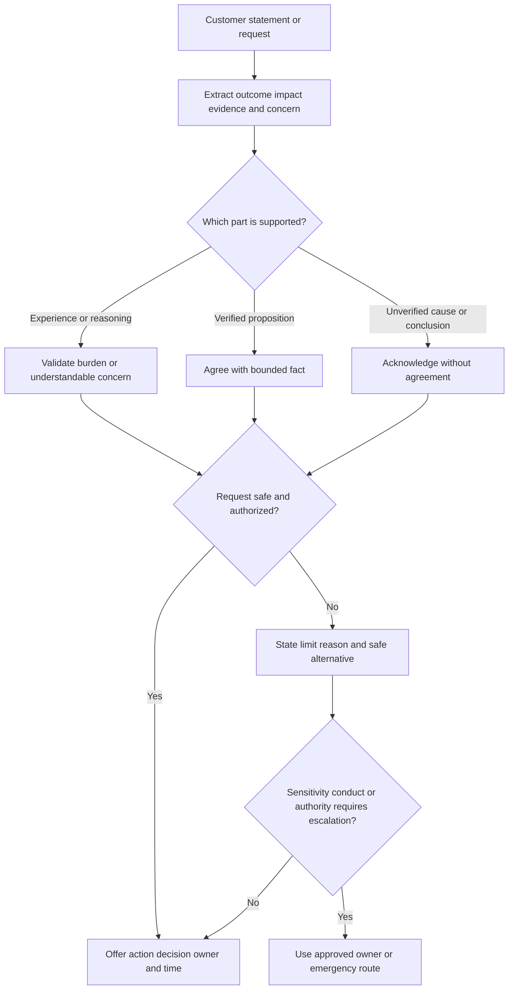
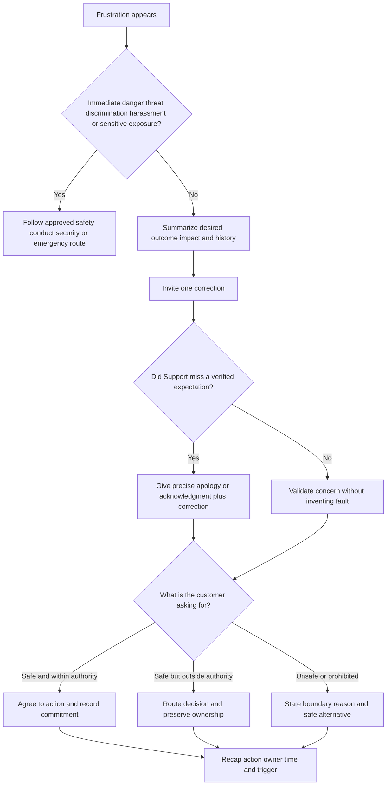
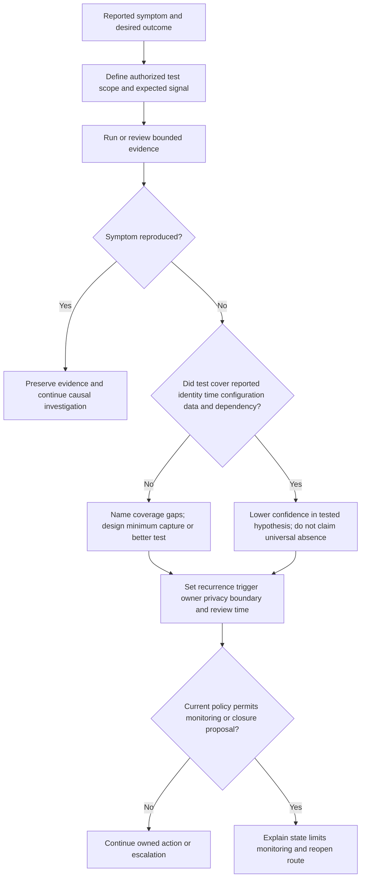
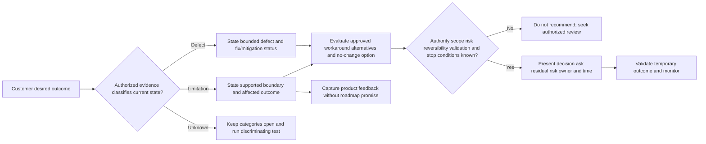
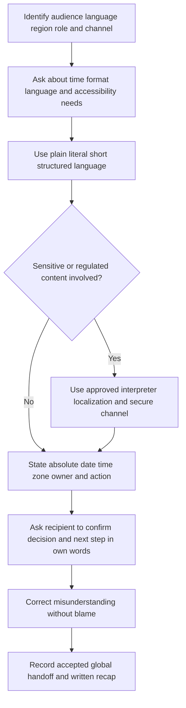
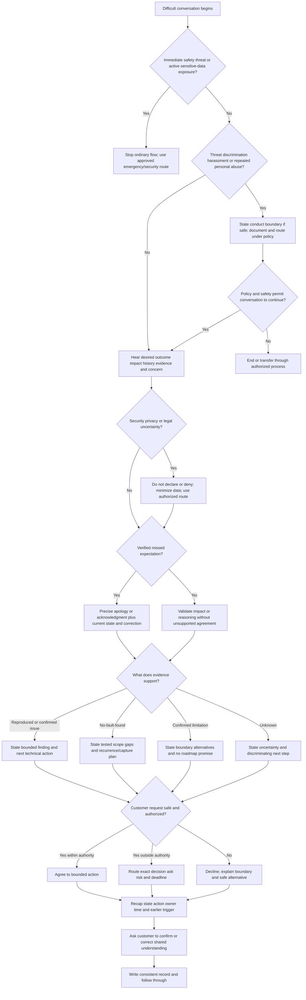
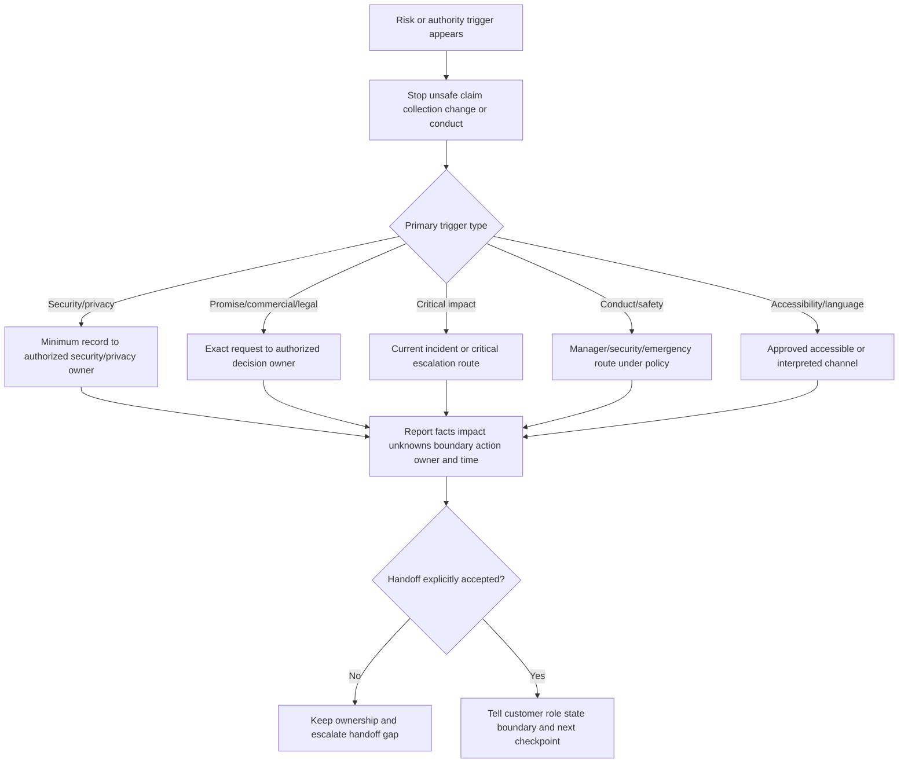
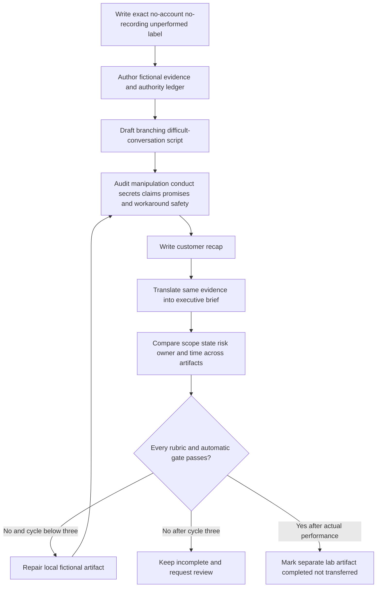

# Part 109 - Difficult Conversations De-Escalation and Executive Translation

> **Purpose:** Build a beginner-first, vendor-neutral method for handling frustrated customers, missed expectations, no-fault-found outcomes, product limitations, security uncertainty, bad news, global communication, and executive translation without manipulation, blame, false certainty, or unsafe commitments.
>
> **Artifact honesty label:** **Direct enterprise-support transfer plus completed local synthetic written examples; separate role-play lab unperformed.** Your background, as recorded in the master guide, includes customer and partner communication, complex investigations, critical-situation work, Engineering/Product escalation, fix validation, and enterprise case ownership in a previous role. Those production skills transfer. Every customer, organization, system, incident, identifier, observation, quote, decision, risk, time, and outcome in this Part is learner-authored fiction. The worked dialogues and executive incident brief are completed writing examples only. The live role-play lab was not performed during authoring. This Part contains no Abnormal AI script, template, policy, SLA, severity rule, communication cadence, security conclusion, escalation path, internal system, customer fact, or approved wording.
>
> **Currency and source access date:** August 24, 2026.
>
> **Authored-Part state:** `PASS`. The master tracker was changed only after every deterministic gate passed.

## Section goal

Difficult conversations are not a separate species of support work. They are ordinary support conversations under extra pressure: trust may be low, consequences may be high, evidence may be incomplete, expectations may have been missed, and several audiences may need different levels of detail. The support engineer still has the same duty to listen, investigate, communicate, protect information, stay within authority, and move the issue toward a safe decision. Pressure makes those duties more important, not optional.

This Part teaches you to:

1. define de-escalation as reducing conversational heat while preserving truth, dignity, safety, and forward motion;
2. validate a person's experience or reasoning without pretending an unverified claim is true;
3. distinguish acknowledgment from agreement and use each honestly;
4. set a respectful boundary around scope, conduct, data, authority, and safe action;
5. explain a no-fault-found result as a bounded test outcome rather than proof that nothing happened;
6. communicate a confirmed product limitation without blaming the user or inventing a roadmap promise;
7. present a workaround as a risk-managed option rather than a hidden permanent fix;
8. deliver bad news directly, humanely, and with an owned next step;
9. communicate security uncertainty without declaring or dismissing a breach, compromise, exposure, or root cause;
10. work across languages, cultures, time zones, accessibility needs, and communication styles without stereotyping;
11. translate technical evidence into an executive summary centered on impact, state, risk, decision, ask, owner, and time;
12. recognize when behavior, sensitivity, authority, legal exposure, or safety requires escalation; and
13. describe prior production experience, local synthetic practice, and unknown Abnormal processes as separate evidence tiers.

The portable rule is: **lower the heat without lowering the truth; name the impact, boundary, next decision, owner, and time.**

### The twelve required communication-contract labels

The numbered labels below are the exact contract for this Part. Related words share a row only where their boundary must be learned together. Every term is defined before later sections rely on it.

| # | Required label | Beginner-first definition | Everyday analogy | Why it matters | Boundary to preserve |
|---:|---|---|---|---|---|
| 1 | **De-escalation** | De-escalation is the deliberate reduction of conversational heat, confusion, or perceived threat so people can exchange accurate information and make a safe next decision. It uses calm pacing, specific acknowledgment, clear structure, choices, boundaries, and follow-through. | A traffic officer slows cars around a collision so responders can see, communicate, and act; slowing traffic does not erase the collision. | High emotion can narrow attention and make both parties repeat positions. Lower heat creates room for evidence and choices. | De-escalation is not capitulation, emotional manipulation, forced calm, a promise to make the complaint disappear, or pressure on the customer to sound pleasant before receiving help. |
| 2 | **Validation** | Validation means recognizing that a person's experience, impact, concern, or reasoning is understandable from the information available to them. It can confirm that a concern deserves attention without confirming the suspected cause. | A doctor can say chest pain is important and frightening before tests establish its cause. | Customers need to know their burden and evidence were heard. Validation can restore enough trust to continue investigation. | Validation is not verification. Never validate an unsupported breach, defect, motive, legal conclusion, root cause, or universal product failure as fact. |
| 3 | **Agreement vs. acknowledgment** | **Agreement** means accepting a proposition as true or accepting a proposed action. **Acknowledgment** means demonstrating that a statement, request, impact, or concern was received and understood. | A meeting chair can repeat an objection accurately without voting for it. | The distinction lets Support respect the customer while protecting evidence and authority. | Do not use acknowledgment as fake agreement, and do not say “I agree” merely to calm someone when the evidence or authority does not support it. |
| 4 | **Boundary** | A boundary is a clear limit on what can be discussed, requested, promised, changed, recorded, or tolerated, paired with what Support can do next. Boundaries may protect privacy, security, safety, scope, respectful conduct, or decision authority. | A laboratory safety line marks where protective equipment is required and identifies the safe route forward. | A difficult conversation becomes safer when limits are predictable and alternatives remain visible. | A boundary is not punishment, retaliation, abandonment, discrimination, a threat, or an excuse to avoid reasonable accessibility or language support. Follow current policy for conduct and emergency situations. |
| 5 | **No-fault-found** | No-fault-found, abbreviated **NFF**, means the available authorized tests did not reproduce or isolate the reported fault under the tested conditions. It describes the result and limits of an investigation, not the customer's credibility. | A mechanic may not reproduce an intermittent noise during one road test; that does not prove the driver imagined it. | NFF preserves honest uncertainty and guides better capture, monitoring, or escalation. | Never translate NFF into “nothing happened,” “the product is fine,” “user error,” or “case closed” unless separate evidence and current policy support a narrower conclusion. |
| 6 | **Product limitation** | A product limitation is a confirmed boundary of supported behavior, capacity, compatibility, configuration, or design. The product may be operating as currently designed while still not meeting the customer's desired outcome. | An elevator rated for ten people is not broken because it cannot safely carry twenty; the limit still affects the building plan. | Clear limitation language prevents endless troubleshooting and creates a path to alternatives, product feedback, or planning. | Do not invent a limitation from one failed test, describe a defect as a feature, imply customer fault, or promise that Product will change a limit or deliver it by a date. |
| 7 | **Workaround** | A workaround is a bounded alternative method that reduces impact or enables an outcome without removing the underlying defect or limitation. A responsible workaround has approval, scope, prerequisites, risks, reversibility, validation, stop conditions, and an owner. | A marked detour lets traffic move around a closed bridge; it is useful but may be slower and does not repair the bridge. | Workarounds can restore business continuity while a permanent answer remains unavailable. | Never recommend bypassing security controls, expanding privilege, exposing content, running unknown code, deleting evidence, making an unapproved production change, or calling a workaround a fix. |
| 8 | **Bad news** | Bad news is information that materially worsens or constrains the customer's current plan, such as a missed commitment, unsupported use case, unavailable fix, extended uncertainty, or increased risk. | A flight agent clearly says the connection cannot be made, then explains available routes and decision deadlines. | Delay, euphemism, or false optimism can cost the customer decision time and deepen distrust. | Bad news must still be verified, appropriately authorized, privacy-safe, and bounded. Do not speculate, blame, hide uncertainty, make a fake apology, or promise compensation, roadmap, legal outcomes, or delivery outside authority. |
| 9 | **Security uncertainty** | Security uncertainty exists when a report could involve unauthorized access, exposure, malicious activity, control failure, or sensitive data, but the available evidence has not established whether a security incident occurred, its scope, or its cause. | Smelling smoke justifies checking and following fire procedure; it does not prove which room is burning or why. | Early reports need prompt, careful routing because both dismissal and overstatement can cause harm. | Do not declare or deny a breach, compromise, exfiltration, attacker, exposure, safety, legal notification duty, or root cause without authorized evidence and authority. Minimize sensitive data and use the approved security route. |
| 10 | **Global communication** | Global communication is communication designed for people who may differ in primary language, culture, time zone, accessibility need, regulatory context, role, or familiarity with idiom. It uses plain language, explicit dates and zones, respectful names and pronouns, short structures, and confirmation of shared understanding. | International air-traffic communication favors standard, explicit phrases because clever local slang can be misunderstood. | Enterprise support often crosses regions and shifts; clarity and inclusion are operational controls. | Do not stereotype a culture, imitate an accent, treat fluency as intelligence, force disclosure of disability, ignore local law, or use “cultural difference” to excuse discrimination or harassment. |
| 11 | **Executive translation** | Executive translation converts a detailed technical state into decision-relevant language while preserving evidence, uncertainty, and scope. It usually states the business effect, affected scope, current service state, mitigation, risk, owner, decision, ask, and next checkpoint. | A navigation display turns thousands of sensor readings into position, route, hazards, and the next choice without changing the underlying geography. | Executives often need to allocate authority, people, money, risk acceptance, or communication, not replay every diagnostic command. | Translation is not simplification into certainty, deletion of material risk, technical theater, or a different story from the engineering record. |
| 12 | **Decision, ask, and risk** | A **decision** is the choice that an authorized person or group must make. An **ask** is the precise action, information, approval, or resource requested from that person by a stated time. A **risk** is a possible adverse outcome expressed with affected objective, likelihood or uncertainty, impact, time horizon, and mitigation when supportable. | “Choose route A or B” is the decision; “approve route B by noon” is the ask; “waiting may miss the shipping window” is the risk. | These three labels turn an executive update from a status dump into usable leadership information. | Do not disguise a predetermined outcome as a decision, make a vague ask, inflate likelihood, omit uncertainty, transfer technical ownership to the executive, or ask someone to approve an unsafe or unauthorized action. |

The central analogy is an **airport operations desk during a disruption**. A frustrated traveler needs the agent to recognize the consequence, state what is and is not known, explain real options, set conduct and safety boundaries, and give the next decision time. The agent should not imitate the traveler's emotion, invent a mechanical diagnosis, blame another employee, or promise a departure that operations has not authorized. The analogy stops where enterprise support may involve confidential evidence, security and privacy procedures, legal duties, customer-specific contracts, accessibility, and technical authority that require current organizational policy.

```mermaid
flowchart LR
    Heat["High heat or difficult news"] --> Listen["Listen for outcome impact evidence and concern"]
    Listen --> Validate["Validate experience or reasoning without validating cause"]
    Validate --> State["State verified facts unknowns and boundary"]
    State --> Options["Offer safe options or next test"]
    Options --> Decision["Name decision ask risk owner and time"]
    Decision --> Check["Check shared understanding"]
    Check --> Follow["Follow through and correct the record"]
    Follow --> Trust["Trust earned through accuracy and action"]
```



## JD Mapping

| Role signal from the master guide | Capability developed here | Observable interview behavior | Honest proof |
|---|---|---|---|
| Maintain customer trust | Handles emotion without manipulation and keeps action visible | Validates impact, labels uncertainty, sets a boundary, and returns at the promised time | Worked fictional role-plays plus a real sanitized example from your own work if available |
| Communicate bad news | States a verified constraint early and pairs it with ownership and options | Avoids false optimism, blame, and unsupported apologies or promises | Missed-expectation and limitation dialogues |
| Troubleshoot ambiguous issues | Treats no-fault-found as a bounded test result | Describes conditions tested, evidence limits, capture plan, and escalation trigger | NFF decision tree and worked dialogue |
| Handle security-sensitive concerns | Routes uncertainty without declaring or dismissing an incident | Uses minimum necessary information and authorized Security/Privacy channels | Security-uncertainty sequence and script |
| Provide recommendations | Frames a workaround with risk controls and alternatives | States approval, scope, reversibility, validation, stop condition, and residual risk | Workaround decision table |
| Communicate with global customers | Uses plain language, explicit time zones, accessible structure, and confirmation | Avoids idiom, stereotypes, and assumptions about fluency or role | Global communication checklist |
| Communicate to executives | Preserves one evidence state while changing level of detail | Leads with impact, state, risk, decision, ask, owner, and checkpoint | Completed synthetic executive incident brief |
| Coordinate Engineering, Product, CSM, and incident roles | Maintains customer ownership while naming decision authority | Escalates a packet, not frustration; never promises another role's outcome | Escalation matrix and role-play branches |
| enterprise-support transfer | Uses direct experience with pressure, escalation, and customer communication | Gives a sanitized example with exact personal action and result | `DIRECT_PRODUCTION_TRANSFER` narrative |
| Abnormal AI learning target | Learns approved language, channels, authority, and conduct rules before use | Asks discovery questions instead of presenting this guide as policy | First-week discovery checklist |

## Candidate honesty note

Your several years in enterprise support are directly relevant to difficult conversations. You can truthfully discuss listening under pressure, clarifying impact, coordinating investigation, escalating to Engineering or Product, validating fixes, communicating to customers and partners, and maintaining ownership. In an interview, you should use a real Microsoft story only when you can accurately separate the customer's report, your own actions, another team's work, the evidence available at the time, the communication choice, and the outcome. You must remove customer identity, confidential content, proprietary process, internal-only metrics, nonpublic security details, and any detail you are not authorized to share.

That experience does not prove that Microsoft and Abnormal AI use the same scripts, case fields, security routes, executive templates, limitation language, conduct policy, incident roles, approval chain, SLAs, or escalation thresholds. This Part is a vendor-neutral learning framework. It contains no Abnormal script and does not claim you have operated Abnormal's internal processes. A future employee must learn current approved policy, tools, authority, and supervision before applying local procedures.

### Evidence tiers for this Part

| Capability or claim | Evidence label | Safe interview language | Claim to avoid |
|---|---|---|---|
| Microsoft difficult-conversation and escalation experience | **DIRECT_PRODUCTION_TRANSFER** | “In enterprise support, I handled high-pressure customer communication and cross-team escalation. I can give a sanitized example of my own actions.” | “Microsoft used this exact script” unless that claim is authorized and supportable |
| Public communication, incident, accessibility, and writing principles | **LEARNED_METHOD_FROM_PRIMARY_SOURCES** | “I combined public primary guidance with my support experience into a vendor-neutral practice method.” | Presenting several sources as one universal support or security policy |
| Worked role-play dialogues in this Part | **TEMPLATE_ONLY_SYNTHETIC_COMPLETED_IN_WRITING** | “I authored fictional dialogue branches to demonstrate de-escalation choices.” | “I used these lines with an Abnormal customer” or “these are approved scripts” |
| Executive incident brief in this Part | **SYNTHETIC_EXECUTIVE_BRIEF_COMPLETED_IN_WRITING** | “I wrote a fictional brief from a bounded evidence ledger and audited it for consistency.” | “This is an Abnormal executive template” or “executives approved it” |
| SignalBridge Lab 109 | **DESIGN_NOT_EXECUTED_NOT_TRANSFERRED** | “The local role-play lab is designed for later practice and was not performed during authoring.” | Any claim of live performance, reviewer scoring, measured de-escalation, recording, or customer outcome |
| Abnormal communication and incident operations | **NO_DIRECT_EXPERIENCE_UNKNOWN_CONFIGURATION** | “I would learn the approved language, authority, security route, executive format, and conduct escalation process.” | Any invented Abnormal policy, SLA, script, security conclusion, owner, route, or promise |

A safe interview bridge is:

> “My direct foundation is several years of enterprise support, including complex investigations, customer communication, and escalation. I would use a sanitized real example to show how I listened, clarified impact, kept ownership visible, and delivered a difficult update. For preparation, I authored vendor-neutral fictional dialogues and an executive brief. I have not used Abnormal's internal scripts or processes, so I would learn its approved language, security routing, commitment authority, conduct boundaries, and executive format before representing them.”

## 1. What de-escalation changes and what it must preserve

A conversation is escalated when the participants' ability to exchange information and make decisions is being reduced by anger, fear, repetition, status pressure, interruption, ambiguity, or perceived loss of control. The customer's emotion may be entirely understandable. A missed deadline can disrupt a launch; an uncertain security report can alarm leadership; repeated requests for the same evidence can make Support appear careless. The engineer's first task is not to correct the customer's tone. It is to recover enough structure for useful work while preserving safety and dignity.

De-escalation changes **pace and structure**. It does not change the evidence. Speak a little more slowly, use shorter sentences, name one concern at a time, summarize without exaggeration, and offer a bounded next step. Do not perform calmness as superiority. A flat or patronizing voice can increase heat. The useful stance is steady, direct, and curious.

### Conversation temperature model

| Signal | Likely need | Useful move | Move to avoid |
|---|---|---|---|
| Repeated account of the history | Proof that the history was heard | Summarize timeline, impact, and unresolved point; invite one correction | Interrupting with “we already know” |
| Raised volume or fast speech | Space, urgency, or control | Lower pace, state that the impact is understood, offer the next two actions | Matching volume, whispering theatrically, or ordering calm |
| “Your product caused this” | Accountability and a causal answer | Acknowledge why the observed sequence suggests that possibility; state current evidence boundary | Agreeing to an unverified root cause or dismissing the sequence |
| “Get me a manager now” | Authority, visibility, or dissatisfaction | Clarify desired outcome, start the approved escalation, and keep technical ownership visible | Arguing that a manager will say the same thing |
| Threat to leave, post publicly, or involve executives | A consequence and desire for leverage | Treat it as impact/context, preserve facts, route appropriately, and avoid bargaining | Retaliation, special false promises, or trying to suppress lawful feedback |
| Insult or discriminatory statement | Conduct boundary and possibly safety escalation | State the behavior boundary once, offer a path to continue, document and route under policy | Returning the insult, debating identity, or requiring a targeted employee to absorb abuse |
| Silence or short answers | Could be translation, overload, disconnection, or choice | Check channel, pace, language, accessibility, and preferred follow-up | Assuming agreement, low intelligence, or lack of concern |

### 🔍 Plain-English deep-dive: De-escalation is not winning or surrendering

Imagine two people holding opposite ends of a rope. If Support pulls harder to “win,” the customer often pulls harder too. Manipulative de-escalation secretly tries to make the other person drop the rope: copied body language, strategic flattery, fake agreement, or a scripted apology designed to end the complaint. Ethical de-escalation puts the rope down and moves to a shared map: “Here is the outcome you need, here is the impact I heard, here is what the evidence supports, and here are the next safe choices.”

Putting down the rope does not mean granting every request. A customer may demand an immediate fix date, raw internal records, an unsafe bypass, or a breach declaration. Support can recognize the planning pressure and still say no: “I understand you need a date for tomorrow's staffing decision. We do not have an authorized fix ETA. I have escalated the estimate request to the decision owner, and I will return by 17:00 UTC with either the authorized milestone or the remaining dependency.” The person's need is validated; the unsupported request is not granted.

The support engineer also deserves a safe workplace. De-escalation does not require enduring threats, discriminatory abuse, sexual harassment, stalking, or repeated personal attacks. State a concise boundary, avoid moral argument, and use the current manager, security, emergency, or conduct route. If there is imminent danger, follow emergency procedures rather than continuing a communication exercise.

### The six-move conversation contract

1. **Stabilize yourself:** pause, breathe normally, open the evidence record, and avoid replying to the sharpest sentence first.
2. **Hear the outcome and impact:** identify what the customer needs to happen and what the current state costs or risks.
3. **Validate without overclaiming:** recognize the burden or understandable reasoning, not an unverified cause.
4. **State the evidence boundary:** separate reports, observations, findings, hypotheses, unknowns, and authority.
5. **Offer controlled forward motion:** name safe options, a test, escalation, decision, ask, owner, and time.
6. **Check and follow through:** invite correction, recap in writing, record commitments, and return when promised.

```mermaid
sequenceDiagram
    participant Customer
    participant Support
    participant Record as Evidence record
    participant Owner as Authorized decision owner
    Customer->>Support: Expresses frustration, impact, and demanded outcome
    Support->>Customer: Summarizes outcome and impact; invites one correction
    Support->>Record: Separates report, fact, finding, hypothesis, and unknown
    Support->>Customer: Validates burden without confirming cause
    Support->>Customer: States boundary and safe options
    Support->>Owner: Escalates precise decision/ask with evidence
    Support->>Customer: Names owner role, next checkpoint, and earlier trigger
    Support->>Record: Records commitment and exact language
```

## 2. Validation, acknowledgment, agreement, and boundaries

The word **validation** is easy to misuse. Support does not validate a proposition merely because the customer feels strongly about it. Support validates the part that is supportable: the observed sequence, practical impact, planning need, concern, or reason the hypothesis seems plausible. Then Support names what remains unverified.

Use this sentence pattern:

> “Given **[observed or reported context]**, I understand why **[concern or hypothesis]** is important/plausible. The current evidence confirms **[bounded fact or finding]** but does not yet establish **[cause, scope, or conclusion]**. The next step is **[safe action]**, owned by **[role]**, and I will update by **[time and zone]**.”

### Validation ladder

| Level | What can be said | Example | Evidence boundary |
|---|---|---|---|
| Receipt | The message arrived | “I received the report and attachments listed in the secure record.” | Does not claim understanding or correctness |
| Acknowledgment | Outcome, impact, or concern is understood | “You need the review available before the next shift, and the manual path is adding two hours of work.” | Attribute customer-reported impact when not independently verified |
| Reasoning validation | The concern follows understandably from known timing or observations | “Because the symptom began after the change, I understand why the change is your leading hypothesis.” | Timing alone does not establish cause |
| Fact agreement | A proposition is accepted because evidence supports it | “I agree that the three authorized synthetic attempts returned the same displayed result.” | Scope agreement to those attempts only |
| Action agreement | A proposed next step is accepted within authority | “We agree to compare the two documented settings in nonproduction.” | Requires safety, approval, and ownership |
| Conclusion | A cause, incident, defect, or limitation is established | “The approved review confirmed the documented capacity limit applies.” | Requires appropriate evidence and authority |

### 🔍 Plain-English deep-dive: Validation is not agreement

Suppose a customer says, “Your service was breached because an unfamiliar sign-in appeared.” Four different responses are possible:

- “Yes, you were breached.” This is agreement with a security conclusion and is unsafe without authorized evidence.
- “No, that is normal.” This dismisses a potentially important report without investigation.
- “I understand why an unfamiliar sign-in raises a security concern. We have not established whether it represents unauthorized access. Please do not paste credentials, message content, or full logs here. I am routing the minimum reference through the approved security process and will update you by 14:00 UTC.” This validates the concern while preserving uncertainty and safety.
- “I totally hear you, and we will make this right.” This sounds supportive but is vague, may imply fault, and provides no safe action.

The third response works because each clause has a job. The first recognizes the person's reasoning. The second states the evidence boundary. The third protects information. The fourth creates ownership and time. There is no need to imitate the customer's phrasing, repeat an emotional label, or claim to know exactly how the person feels.

### Boundary formula

A useful boundary contains four parts:

| Part | Question answered | Example |
|---|---|---|
| Recognition | Why is the request understandable or important? | “I understand you want immediate proof for the leadership review.” |
| Limit | What cannot happen or continue? | “I cannot accept credentials or message content in this channel.” |
| Reason | What principle controls the limit, without a lecture? | “That protects sensitive information and keeps evidence in the approved route.” |
| Path | What can happen next? | “Please provide only the case reference; I will open the authorized collection step and update by 15:00 UTC.” |

For conduct: “I want to continue working on the service impact. I cannot continue while personal or discriminatory comments are directed at participants. We can continue with the technical facts now, or I can pause and involve the designated manager under our current conduct process.” The exact response and whether a session must end depend on current policy and safety. Never invent an Abnormal conduct script.



## 3. Frustration and worked de-escalation role-play

Frustration often contains useful information. Repetition may reveal the decision Support has not answered. Anger after a third evidence request may reveal poor case continuity. A demand for an executive may reveal that the customer needs authority or an accountable plan. Listen for the operational signal without treating poor conduct as acceptable.

### Before answering a frustrated customer

| Check | Useful question | Why it matters |
|---|---|---|
| Outcome | What must the customer be able to do? | Prevents a debate about wording from replacing the task |
| Impact | Who or what is affected, for how long, with what alternative? | Grounds priority and empathy |
| History | Which commitments, handoffs, or repeated asks shaped the frustration? | Identifies repair work Support owns |
| Evidence | What is reported, observed, found, hypothesized, or unknown? | Prevents heat from changing fact status |
| Authority | Which request can I grant, reject, or route? | Avoids false promises |
| Safety | Is there sensitive content, a security concern, unsafe advice, threat, discrimination, or harassment? | Triggers protective routing |
| Forward move | What one action or decision creates the most information or relief? | Converts talk into progress |
| Time | When can I reliably communicate again? | Restores predictability |

### Worked role-play A - repeated evidence and demand for a manager

**Fictional setup:** `Northstar Archive`, `CASE-109-A`, its people, timestamps, product behavior, and impact are fictional. The customer says a scheduled review has failed twice and that three previous responders requested the same screenshot. The written dialogue below was authored as a learning example. It was not spoken, sent, recorded, scored, or used with a customer.

**Customer:** “I am done repeating myself. Your team has asked for the same screenshot three times, and the review is still empty. Get me a manager who can actually fix this.”

**Weak response:** “I completely understand your frustration, but please calm down. Engineering is doing everything possible and should have this fixed soon.”

Why the weak response fails:

- “completely understand” claims more understanding than the responder has demonstrated;
- “calm down” makes the customer's emotion the obstacle;
- “everything possible” is unverifiable;
- “Engineering” becomes a shield rather than a defined dependency;
- “fixed soon” is an unsupported root-cause and ETA claim; and
- it does not address duplicate evidence or the manager request.

**Stronger response:** “You should not have had to answer the same evidence request three times. I have the existing screenshot reference and will not ask you to resend it. Your stated outcome is to restore the scheduled review before the 18:00 UTC analyst shift, and the current manual review is delaying that shift. I will start the approved manager escalation now. I remain the technical point of contact while that happens. My next step is to reconcile the prior comparison results and identify the one unresolved test; I will give you the escalation status and evidence plan by 15:30 UTC. If I have misstated the shift impact, please correct that one point.”

**Customer:** “The impact is right, but I want a guarantee that it will work by 18:00.”

**Support:** “I understand why 18:00 matters to the staffing decision. I cannot give a restoration guarantee because the current evidence has not established the mechanism or an authorized fix. What I can commit to is the manager escalation and a decision-ready update by 15:30 UTC. That update will state whether a safe restoration option is available, whether the manual path remains necessary, and what dependency prevents an outcome estimate if one is still unavailable.”

**Customer:** “Fine, but do not send me another generic update.”

**Support:** “Agreed. The 15:30 update will contain the reconciled evidence, the remaining test or decision, the current owner, and the plan for the 18:00 shift. If those items are not ready, I will state the exact blocker rather than repeat that investigation is ongoing.”

### Role-play A annotation

| Line purpose | Exact move | What it does not claim |
|---|---|---|
| Repair | Acknowledges duplicate evidence request | Does not blame named prior responders or expose internal history |
| Outcome and impact | States restored review and shift deadline | Does not inflate to all users or global outage |
| Escalation | Starts manager route while Support remains technical owner | Does not promise the manager will grant a demand |
| Evidence plan | Reconciles prior results and isolates one unresolved test | Does not claim a root cause |
| Time | Commits to 15:30 UTC update | Does not turn 18:00 into restoration ETA |
| Validation | Recognizes why the shift time matters | Does not agree to a guarantee |
| Specificity | Defines required update contents | Prevents a no-information checkpoint |

The phrase “You should not have had to answer the same evidence request three times” is appropriate only when the record confirms unnecessary repetition and the speaker has authority to acknowledge that process miss. If the record is unclear, use: “I see three references to the same screenshot request. I will reconcile them now and will not ask you to resend anything unless I can explain a specific missing field.”

### Manipulative mirroring and other shortcuts to reject

**Mirroring** can simply mean reflecting content: “Your main concern is the missed analyst shift.” That is useful summarization. **Manipulative mirroring** imitates the customer's words, posture, tempo, or emotion as a hidden technique to create compliance. It can feel uncanny, patronizing, or coercive. Do not copy anger, deliberately repeat the last few words to force disclosure, claim shared feelings you do not have, use a person's name excessively, or manufacture intimacy. Be transparent about your purpose: “I am summarizing to make sure I have the impact right.”



## 4. Missed expectations and delivering bad news

Bad news becomes worse when Support makes the customer extract it from several paragraphs. Lead with the material change after one concise recognition sentence. Explain what the news means, what is verified, what remains uncertain, what action follows, and what decision the customer needs to make. Avoid a long technical preface designed to soften the conclusion.

### Bad-news structure

| Element | Question answered | Example pattern |
|---|---|---|
| Recognition | What plan or impact does this affect? | “I know today's launch decision depends on this result.” |
| News | What material constraint or miss is verified? | “The authorized review did not approve the proposed workaround for production use.” |
| Reason and boundary | Why, and how certain is that statement? | “The review identified an unresolved access-expansion risk; it did not determine whether the original symptom is a defect.” |
| Current state | What continues to work or remain unavailable? | “The manual review remains available; scheduled review is still unvalidated.” |
| Options | What safe choices exist now? | “Continue the manual path, postpone the launch, or request a formal risk decision through the designated owner.” |
| Decision/ask/risk | What must be decided, by whom, and by when? | “The release owner must choose whether to delay by 16:00 UTC; proceeding without the review leaves the stated coverage gap.” |
| Ownership and time | Who returns with what next? | “I own the consolidated update at 15:00 UTC.” |

### Precise apology versus fake apology

A real apology has a known object: “I am sorry I missed the 14:00 UTC update I committed to.” It does not dilute responsibility with “if you felt,” make the customer comfort Support, or attach a defense beginning with “but.” It should be followed by current state and correction.

A **fake apology** sounds like an apology while denying the person's experience or the organization's action: “I am sorry you misunderstood,” “I am sorry if you were offended,” or “We regret any inconvenience” when a specific missed commitment is known. These phrases often increase distrust. If facts or authority do not support an apology for cause or harm, acknowledge the supported point instead: “I recognize this limitation changes your launch plan. The evidence does not establish that a service defect caused the earlier results.”

### Worked role-play B - missed expectation and unavailable fix date

**Fictional setup:** Support committed to a 14:00 UTC assessment. It is now 14:20. The assessment confirms that the proposed correction needs additional safety review; no fix date is authorized.

**Customer:** “You promised an answer at 14:00. It is twenty minutes late, and my VP expects a fix date right now.”

**Support:** “I am sorry I missed the 14:00 UTC update I committed to. I should have sent the dependency state at the checkpoint rather than waiting for the review to finish. The completed review did not approve the proposed correction because one access-scope question remains unresolved. We therefore do not have an authorized fix date or a production workaround. The existing manual review remains the only approved continuity option in this fictional scenario.”

**Customer:** “That is not acceptable. Tell your Engineering team to commit to tomorrow.”

**Support:** “I understand you need a date for staffing and executive planning. I cannot convert a requested date into an Engineering commitment. I have asked the authorized owner for the next assessable milestone and the evidence required to evaluate it. I will return by 15:30 UTC with either that authorized milestone or a precise statement of the remaining decision. The immediate decision for your release owner is whether to continue the manual path or postpone the fictional launch; the risk of proceeding without either is that the scheduled review outcome remains unvalidated.”

This response distinguishes an **assessment checkpoint**, a **fix date**, a **workaround approval**, and **restoration**. They are different milestones. The responder repairs the communication miss without accepting an unverified technical cause or promising another team's delivery.

### 🔍 Plain-English deep-dive: Direct bad news protects decision time

Think of a medical test that will not be ready before a planned procedure. A clinician who spends five minutes describing laboratory workflow before mentioning the delay steals time from the patient's decision. A direct statement is kinder: the result will not be available by the decision point; here is why that statement is reliable; here are the safe options; here is who can decide; here is when the next information will arrive.

In support, “We remain committed to partnering with you and continue to make this our highest priority” can become a verbal curtain. It may sound warm but conceal that no approved workaround exists. Lead with the constraint. Humaneness comes from recognizing its effect, preserving dignity, giving real choices, and remaining accountable, not from delaying the truth.

```mermaid
sequenceDiagram
    participant Support
    participant Customer
    participant DecisionOwner as Authorized owner
    Support->>Customer: Recognizes affected plan
    Support->>Customer: States verified bad news directly
    Support->>Customer: Gives evidence boundary and current state
    Support->>Customer: Presents safe options and residual risk
    Customer->>Support: Requests promise or preferred date
    Support->>Customer: Validates planning need; declines unsupported promise
    Support->>DecisionOwner: Sends exact decision, ask, evidence, and deadline
    Support->>Customer: Commits next checkpoint and earlier-change trigger
```

## 5. No-fault-found without customer blame

No-fault-found is an investigation state. It means “we did not observe or isolate the reported behavior within this test boundary.” It does not answer every possible environment, timing, load, identity, data, configuration, dependency, or intermittent condition. Good NFF communication makes the boundary inspectable.

### NFF evidence statement

An NFF statement should include:

1. the outcome the customer reported;
2. the authorized conditions tested;
3. the number and timing of attempts when relevant;
4. what was observed;
5. important conditions not represented;
6. what the result lowers confidence in and what it does not exclude;
7. the next capture, monitoring, reproduction, or escalation trigger; and
8. the ownership and closure rule.

| Weak wording | Why it fails | Better bounded wording |
|---|---|---|
| “We found no issue.” | Hides test scope and sounds dismissive | “Three authorized attempts under the documented test conditions produced the expected result; the original intermittent symptom was not reproduced.” |
| “Everything is working.” | Universal claim from limited evidence | “The tested workflow completed for one fictional role and dataset during the stated window.” |
| “This is user error.” | Blame without causal evidence | “The current comparison shows a configuration difference; we have not established why it changed or whether it explains the original event.” |
| “Cannot reproduce; closing.” | Equates case state with truth | “The symptom remains unobserved in the test scope. We propose a bounded capture plan and will follow current closure policy if the trigger does not recur.” |
| “No logs, no problem.” | Absence of evidence may reflect collection limits | “The available retained evidence does not cover the reported interval, so it cannot confirm or exclude the event.” |

### Worked role-play C - intermittent symptom not reproduced

**Customer:** “So after making me spend two hours testing, you are saying I imagined it?”

**Support:** “No. I am saying the symptom was not reproduced in the three authorized tests we ran today. Your original report remains part of the evidence. Today's tests covered one fictional role, one workflow, and a different time window from the reported event, so they do not prove the event did not occur.”

**Customer:** “Then what was the point?”

**Support:** “The tests lowered confidence in a persistent failure for that role and workflow, and they confirmed the current path can complete under the tested conditions. They did not evaluate the original time window or an intermittent dependency. The next useful step is a minimal capture plan that records only the event time, generated test reference, result state, and approved diagnostic correlation if the symptom recurs. No message content, credentials, token, full export, or personal data is needed. I own reviewing that capture within the agreed window.”

**Customer:** “I do not want this closed.”

**Support:** “I have recorded that concern. A technical NFF state is not the same as customer validation or administrative closure. I will follow the current case policy, explain any monitoring or closure proposal before changing status, and preserve the documented reopen or recurrence route. I cannot promise indefinite active handling outside policy, but I can make the evidence boundary and next trigger explicit.”

### 🔍 Plain-English deep-dive: NFF is a camera angle, not a verdict

A security camera aimed at one doorway for ten minutes may show no visitor. That observation is useful: nobody crossed that doorway during that interval. It does not prove nobody entered the building through another door, at another time, or outside the camera's view. NFF works the same way. Every test has a camera angle: identity, data, time, configuration, region, load, dependency, and observation method.

The engineer should not apologize for honest test limits, but should make them visible. A narrow negative result can still be progress because it reduces one hypothesis or verifies current functionality. The dangerous move is converting “not observed here” into “never occurred anywhere.”



## 6. Product limitations and responsible workarounds

A product limitation conversation is difficult because the product can be functioning as designed while the customer's outcome remains blocked. “Working as designed” is not a complete customer answer. It describes implementation alignment, not business fitness. Support should confirm the limitation through approved evidence, explain it in outcome language, identify safe alternatives, capture product feedback through the current route, and avoid promising a roadmap change.

### Defect, limitation, configuration, and unknown compared

| State | Meaning | Evidence needed | Customer-safe statement | Do not say |
|---|---|---|---|---|
| Confirmed defect | Product behavior deviates from an approved specification or expected behavior, as established by authorized process | Reproduction, expected/actual evidence, scope, and authorized classification | “The authorized review classified this behavior as a defect for the stated scope.” | “It is definitely a bug” from one observation |
| Confirmed limitation | Desired behavior is outside a documented or approved boundary | Current documentation or authorized Product/Engineering confirmation | “The requested scale is outside the currently supported boundary.” | “The product will never support this” |
| Configuration condition | Current setting contributes to the observed result | Effective-state comparison and validated causal test | “The tested configuration excluded the intended records in this scope.” | “Customer configured it wrong” |
| Environmental dependency | External or customer-controlled condition affects behavior | Correlated evidence and controlled test | “The result depends on the stated identity response during the tested interval.” | “Your environment caused it” without evidence |
| Unknown | Evidence does not yet discriminate among explanations | Explicit unknowns and next test | “We have not established whether this is a defect, limit, configuration, or dependency.” | Labeling the most convenient category |

### Limitation conversation pattern

1. Restate the desired outcome and why it matters.
2. State the confirmed current boundary in plain language.
3. Explain the evidence and scope supporting that boundary.
4. Say what the boundary does not mean; avoid fault language.
5. Present approved alternatives, including “no safe workaround” when true.
6. Explain each workaround's cost, residual risk, and reversibility.
7. Route product feedback without promising acceptance, priority, design, or date.
8. Name the customer's decision, precise ask, owner, and next checkpoint.

### Workaround safety card

| Field | Required question | Example for a fictional manual path |
|---|---|---|
| Purpose | Which impact does this reduce? | Preserve review coverage until scheduled behavior is available |
| Authority | Who approved use for this scope? | Fictional customer change owner and authorized support guidance |
| Scope | Which users, records, region, and period? | One learner-authored dataset and role during one exercise window |
| Prerequisites | What must be true first? | Existing approved access and documented manual procedure |
| Steps | What bounded action occurs? | Use the approved manual review queue; no configuration change |
| Risk | What can go wrong or remain uncovered? | More analyst time and possible delay; no claim of equivalent automation |
| Reversibility | How is the prior state restored? | Stop manual path when authorized validation confirms normal path |
| Validation | What proves the intended temporary outcome? | Expected synthetic item count and reviewer acknowledgment |
| Stop condition | When must use stop and escalation begin? | Unexpected access prompt, missing audit record, or expanded scope |
| Residual uncertainty | What remains unresolved? | Underlying mechanism and long-term supportability |
| Alternative | What if the workaround is rejected? | Delay the fictional launch or seek an authorized risk decision |
| Ownership/time | Who reviews and when? | Support consolidates state at 16:00 UTC |

### Worked role-play D - confirmed limitation and roadmap pressure

**Customer:** “We bought this expecting the workflow to support our full volume. Are you telling me the product cannot do it?”

**Support:** “Your intended outcome is to process the full fictional daily volume without splitting the review, and I recognize that the split adds staffing and timing cost. The authorized information available for this exercise confirms that the requested single-run volume is outside the current supported boundary. That is a product limitation for this scenario, not evidence that your team used the product incorrectly.”

**Customer:** “Then promise it for next quarter, or give us a hidden setting.”

**Support:** “I cannot promise a roadmap item, priority, design, or delivery date, and I will not suggest an undocumented setting or control bypass. The two safe fictional options currently available are to divide the run within the documented boundary or continue the manual review while the appropriate owner evaluates the product feedback. Splitting the run adds operational work and has not been validated for every dependency, so it should go through your normal change approval and a bounded test. I can document the outcome, impact, scale, and acceptance criteria for Product review without predicting its decision.”

**Customer:** “That does not solve my business problem.”

**Support:** “You are right that neither option delivers the original one-run outcome. They are mitigation choices, not a full solution. The decision is whether the added operational cost is acceptable for the fictional launch or whether the launch should wait. My ask is for the designated owner to choose the preferred path by 17:00 UTC. I will provide the comparison and preserve the product-feedback request separately.”



## 7. Security uncertainty: urgency without overstatement

A report can be security-sensitive before it is a confirmed security incident. Examples include an unfamiliar sign-in, unexpected content visibility, a suspicious message, a possible credential exposure, or concern that a control did not apply. Support should recognize the concern, minimize further disclosure, preserve the original evidence through approved means, and route it to the authorized security or privacy process. Support should not independently announce a breach or dismiss the concern as harmless.

### Security-language ladder

| Evidence state | Appropriate language | Inappropriate leap |
|---|---|---|
| Customer report only | “The customer reports an unfamiliar sign-in and possible unauthorized access.” | “An attacker accessed the account.” |
| Artifact observed | “The authorized record shows a sign-in from the stated source at the stated time.” | “The sign-in was malicious.” |
| Suspicious pattern | “The pattern warrants security review under the approved process.” | “The account was compromised.” |
| Authorized incident classification | “The designated incident owner classified the event according to current policy.” | Support inventing a severity or legal conclusion |
| Scope under investigation | “Affected scope and exposure remain under review.” | “No data was accessed” because none has yet been found |
| Confirmed bounded finding | “The authorized review confirmed the stated event for the stated scope.” | Universal safety or complete root cause without evidence |

### Worked role-play E - suspected exposure

**Customer:** “A user could see something they should not have seen. This is a breach. Confirm it in writing now.”

**Support:** “I understand why unexpected visibility creates an urgent security and privacy concern. I can confirm your report and that it requires the approved security review. I cannot yet confirm a breach, exposure scope, affected content, actor, or cause. Please do not paste message content, names, credentials, tokens, screenshots, or full exports into this conversation.”

**Customer:** “If you will not confirm it, you are hiding it.”

**Support:** “I am not dismissing the report. I am preserving the difference between what is reported and what the authorized review has established. I have recorded the minimum reference and reported time, and I am using the designated escalation route for this fictional scenario. I will update you by 13:30 UTC with the intake status, assigned owner role, and next safe evidence step. Any legal notification, incident classification, or scope statement must come from the authorized process.”

**Customer:** “Send me all of your internal logs.”

**Support:** “I cannot provide unrestricted internal logs or sensitive records. The authorized owner will determine what evidence can be shared, with whom, and through which secure channel. I can ensure your precise questions about time, scope, visibility, and containment are included in the escalation.”

### 🔍 Plain-English deep-dive: Security uncertainty is a protected state

Imagine hearing a fire alarm in a large building. It would be reckless to say, “There is definitely no fire” because you have not seen flames. It would also be reckless to announce, “The third floor is destroyed” based only on the alarm. The correct response treats the signal seriously, follows the alarm procedure, keeps people from entering danger, and lets authorized responders establish location, scope, and cause.

Security language works the same way. “Reported,” “observed,” “suspected,” “under authorized review,” and “confirmed” are not public-relations hedges. They are evidence states. Preserving them helps Security, Privacy, Legal, incident command, and the customer make correct decisions. It also avoids contaminating the record with unsupported statements that later audiences may quote as findings.

Support should collect only what the approved process requires. Do not ask the customer to paste secret or sensitive material “for speed.” Do not move a sensitive conversation to a personal account, unapproved channel, public issue, or external AI service. Do not recommend deleting evidence, resetting everything without coordination, disabling a control, broadening access, or running an unknown script. If immediate containment is needed, use only authorized instructions from the responsible process.

```mermaid
sequenceDiagram
    participant Customer
    participant Support
    participant SecureRoute as Approved security/privacy route
    participant IncidentOwner as Authorized incident owner
    Customer->>Support: Reports possible unauthorized access or exposure
    Support->>Customer: Validates concern; does not confirm or deny incident
    Support->>Customer: Stops secrets/content in current channel
    Support->>SecureRoute: Sends minimum reference, time, report, and impact
    SecureRoute->>IncidentOwner: Applies authorized intake and classification
    Support->>Customer: Confirms routing status, owner role, and next checkpoint
    IncidentOwner-->>Support: Provides authorized statement or evidence request
    Support->>Customer: Relays bounded approved information through approved channel
```

## 8. Global communication and inclusive boundaries

Global communication is not “using simpler words for non-native speakers.” Plain language helps everyone, including experts reading during an incident. The engineer should make structure, time, ownership, and uncertainty explicit while respecting the customer's preferred name, pronouns, language support, accessibility needs, and local context.

### Global clarity checklist

| Risk | Better practice | Example |
|---|---|---|
| Relative time | Use absolute date, time, and zone; include local equivalent only when verified | “August 27, 2026 at 14:00 UTC” |
| Ambiguous date | Spell the month | “September 3, 2026,” not `09/03/26` |
| Idiom or sports metaphor | Use literal action language | “We need an authorized decision,” not “the ball is in your court” |
| Long nested sentence | One idea per sentence; headings and bullets | Separate impact, state, action, and ask |
| Acronym overload | Expand first use and define operational meaning | “No-fault-found (NFF): not reproduced in the tested conditions” |
| Assumed fluency | Check understanding of content, not language ability | “Which part of the action plan should I clarify?” |
| Accent or grammar bias | Evaluate evidence and meaning | Do not equate pronunciation with competence |
| Time-zone burden | Rotate meeting burden and provide written handoff | Record next owner and checkpoint across shifts |
| Accessibility assumption | Ask for preferred accessible format through approved process | Captioning, transcript, pacing, or written recap as available and approved |
| Translation loss | Use approved interpreter/localization support and short segments | Pause after one idea; confirm terms and decisions |
| Cultural stereotype | Ask the individual rather than infer preference | “Would you prefer a written summary before the call?” |
| Humor or sarcasm | Avoid during risk or conflict | State the observation directly |

### Global handoff pattern

At a regional handoff, state: current customer outcome, verified impact, evidence state, unresolved decision, security/privacy boundary, next action, owner role, exact UTC time, customer-local equivalent if verified, and earlier-update trigger. Confirm that the receiving owner accepted the handoff. “APAC will take it” is not ownership.

When interpretation is used, speak to the customer rather than about the customer, pause for complete interpretation, avoid idiom, and ask one question at a time. Do not assume an interpreter can receive confidential technical or security details; use approved services and verify authorization. Machine translation may be useful only under current policy, approved tools, data rules, human review, and the sensitivity of the content. Never paste customer content or secrets into an unapproved translation or AI service.

### Discrimination, harassment, and accessibility

No customer impact justifies discrimination or harassment. No employee should be required to accept slurs, sexual comments, identity-based attacks, threats, stalking, or targeted abuse as “part of support.” Preserve immediate safety, state the boundary if safe, document the behavior factually, and route through current manager, HR, security, legal, or emergency policy as applicable. Do not debate whether the target should feel harmed. Do not retaliate, expose identity information, or deny service based on a protected characteristic.

At the same time, a customer asking for slower speech, captions, written steps, an interpreter, or another accessible format is not being difficult. Treat accessibility as an operational need and follow the approved accommodation process. A conduct boundary must not be used to punish language differences, disability-related communication, direct cultural style, or legitimate criticism.



## 9. Executive translation: one evidence state, different decision layer

An executive summary should be shorter than the technical record but not looser. The executive and engineer must receive the same underlying truth. The technical record may include request identifiers, test matrices, timestamps, and competing hypotheses. The executive brief selects the information needed to understand business effect, current control, exposure, choices, and required authority.

### Executive incident brief contract

| Field | Executive question | Strong content | Common failure |
|---|---|---|---|
| Headline | What happened in outcome language? | One bounded sentence with current state | Product name plus vague “issue ongoing” |
| Impact | What objective is affected? | Scope, consequence, duration, and alternative | Technical symptom with no business effect |
| Current state | Is service unavailable, degraded, mitigated, restored, or unknown? | State plus evidence and limits | “Resolved” because a test passed once |
| Security/privacy state | Is there a concern, confirmed incident, or no current evidence? | Authorized classification or explicit uncertainty | Unsupported breach or “no risk” claim |
| What changed | What material evidence or decision is new? | Decision-relevant delta since last brief | Chronological activity dump |
| Mitigation | What reduces impact now? | Approved option, coverage, cost, residual gap | Unsafe workaround presented as fix |
| Risk | What may happen next? | Objective, uncertainty, impact, horizon, mitigation | Dramatic adjective with no basis |
| Decision | What choice requires authority? | Two or more real options or an explicit accept/defer choice | Predetermined recommendation disguised as choice |
| Ask | What must this audience do, by when? | Named approval/resource/action and deadline | “Please advise” |
| Ownership | Who owns customer communication, technical action, and decision? | Roles and handoff state | “Engineering owns it” |
| Next checkpoint | When will the evidence or decision state update? | Absolute time and earlier trigger | Unsupported restoration ETA |
| Limits | What should not be inferred? | Cause, scope, duration, or outcome not yet established | Omitted uncertainty to sound decisive |

### Technical-to-executive translation examples

| Technical evidence | Weak executive translation | Strong executive translation |
|---|---|---|
| Three synthetic attempts return expected result; reported interval lacks retained evidence | “System healthy; no issue found” | “Current tests succeed in a narrow scope, but they do not cover the reported interval; the original intermittent symptom remains unconfirmed.” |
| Proposed workaround requires broader access than approved | “Workaround blocked by Security” | “The proposed workaround was not approved because it expands access. The manual path remains available; no production-safe automated workaround is currently authorized.” |
| Engineering accepted a reproduction for review | “Engineering confirmed the bug” | “Engineering accepted the bounded reproduction for review; classification and cause remain pending.” |
| Current supported volume is below desired volume | “Customer is over the limit” | “The desired one-run volume exceeds the current supported boundary, creating added manual work. Product feedback is recorded; no roadmap commitment exists.” |
| No evidence currently confirms unauthorized access | “There was no breach” | “A security concern is under authorized review; current evidence has not established unauthorized access or exposure scope.” |

### 🔍 Plain-English deep-dive: Executive translation is compression, not distortion

A map of a subway system omits building outlines, trees, and sewer pipes because riders need stations and routes. It cannot move a station to make the map prettier. Executive translation works the same way. It omits command-level detail that does not change a leadership decision, but it cannot move the facts: impact, scope, uncertainty, security state, mitigation, and risk must remain consistent with the technical record.

An executive may ask, “Are we safe?” The truthful answer may be, “The authorized review has not established unauthorized access; scope review remains open, and the current containment is X.” That is more useful than either “yes” or “we cannot say anything.” It names the evidence state and the control. Similarly, “When will it be fixed?” may need to become, “No authorized fix ETA exists; the next decision is whether to continue the manual control through tomorrow's review, and the next engineering assessment is due at 18:00 UTC.”

### Executive translation workflow

```mermaid
flowchart LR
    Ledger["Single evidence ledger"] --> Verify["Verify facts scope times owners and authority"]
    Verify --> Impact["Translate symptom into business impact"]
    Impact --> State["Name current state and security uncertainty"]
    State --> Risk["Express risk with uncertainty horizon and mitigation"]
    Risk --> Decision["Identify real decision and options"]
    Decision --> Ask["Write precise ask owner and deadline"]
    Ask --> Checkpoint["State next checkpoint not invented outcome ETA"]
    Checkpoint --> Audit["Compare brief with technical and customer records"]
    Audit --> Send["Authorized human review and approved channel"]
```



## 10. Artifact - completed synthetic executive incident brief

The brief below is a completed written artifact based on one fictional evidence ledger. It was not sent, approved, presented, or tested with an executive. `Northstar Archive`, `CASE-109-EXEC`, every role, quantity, time, impact, finding, option, and decision are fictional. No account, customer, Abnormal system, Microsoft system, ticketing platform, product, message, security event, or production environment was used.

### Fictional evidence ledger

| Evidence class | Authored record | Limit |
|---|---|---|
| Customer-reported outcome | Scheduled review should process a full fictional daily volume before the 18:00 UTC shift | No real customer or production target |
| Customer-reported impact | Eight fictional analysts would use a manual review for about two additional hours | Not independently measured |
| Fact | Three authored test runs completed within the smaller documented exercise boundary | Synthetic written result only |
| Finding | Desired one-run volume exceeds the fictional current supported boundary | Applies only to this scenario |
| Finding | Manual review preserves the intended fictional coverage with added labor | No real operational validation |
| Unknown | Whether Product would change the boundary | No Product review occurred |
| Unknown | Whether a split-run option is safe across all fictional dependencies | Requires authorized bounded validation if ever practiced |
| Security state | No security event is alleged in this artifact | Does not establish product security generally |
| Current options | Continue manual review, validate split-run option, or delay fictional launch | Options are authored learning content |
| Prohibited claim | No defect, breach, root cause, fix ETA, roadmap date, or guaranteed outcome is established | Must remain absent from the brief |

### Executive incident brief - written example

> **Headline:** The fictional scheduled review cannot process the desired full daily volume in one run under the currently supported exercise boundary; the workflow is available at lower volume, and a manual continuity path exists.
>
> **Business impact:** The customer reports that eight fictional analysts would need approximately two additional hours of manual review before the 18:00 UTC shift if no alternative is approved. The impact is operational delay and added labor, not a confirmed security incident or broad service outage.
>
> **Current state:** Three authored tests completed within the smaller boundary. The desired full-volume run remains unsupported in this fictional scenario. This is a confirmed scenario limitation, not a confirmed defect, and the evidence does not establish why the desired capacity was expected.
>
> **Mitigation:** The existing fictional manual review preserves intended coverage but adds the reported labor. A split-run option may reduce that burden, but it has not been approved or validated across all dependencies and must not be represented as a production-safe workaround.
>
> **Risk:** If the fictional launch proceeds with only the manual path, the team may incur the added review time and timing pressure. If it proceeds with an unvalidated split-run change, review completeness or access behavior could differ from the expected state. Likelihood and magnitude beyond the authored scenario are unknown.
>
> **Decision:** Choose whether to (A) proceed with the approved manual continuity path, (B) authorize a bounded nonproduction validation of the split-run option under the normal change process, or (C) delay the fictional launch. Product feedback can proceed in parallel but has no committed outcome or date.
>
> **Ask:** The designated fictional release owner should choose A, B, or C by **16:30 UTC on August 26, 2026** so the analyst plan can be set. No one is being asked to accept a security bypass, expand privilege, disclose content, or approve an undocumented production change.
>
> **Ownership and next checkpoint:** Support owns the consolidated customer update and evidence consistency. The fictional change owner would own any approved test, and the fictional release owner owns the launch decision. The next written checkpoint is **16:00 UTC on August 26, 2026**, or earlier if an option is withdrawn or a new security, privacy, or broad-impact concern appears.
>
> **Limits:** No root cause, product defect, future capacity, roadmap commitment, fix ETA, customer acceptance, or production result is claimed. The figures and outcomes are learner-authored fiction.

### Executive brief quality audit

| Check | Result | Why it passes |
|---|---|---|
| Outcome before mechanism | PASS | Headline states blocked one-run outcome and current availability |
| Impact bounded and attributed | PASS | Eight analysts and two hours are explicitly customer-reported fiction |
| Current state accurate | PASS | Lower-volume success does not become universal health |
| Security language | PASS | States no event alleged, not a universal safety claim |
| Mitigation honest | PASS | Manual path is not called a fix; split option remains unapproved |
| Risk calibrated | PASS | Names outcomes, horizon, controls, and unknown likelihood |
| Decision real | PASS | Three distinct options with consequences |
| Ask precise | PASS | Names decision owner, action, and absolute deadline |
| Ownership visible | PASS | Communication, change, and release ownership remain separate |
| Time disciplined | PASS | Checkpoint is not a restoration ETA |
| Cross-record consistency | PASS | No statement exceeds the fictional ledger |
| Prohibitions enforced | PASS | No secret, content, bypass, breach, root cause, promise, or Abnormal script |

### Sixty-second spoken version

> “The fictional workflow is available within the current supported boundary but cannot process the desired full daily volume in one run. The customer reports that the approved manual path adds about two hours for eight analysts before the 18:00 UTC shift. Three small-scope authored tests succeeded; that supports a capacity limitation in this scenario, not a defect or security incident. The safe current option is manual review. A split-run option is unapproved and unvalidated. The release owner needs to choose manual continuity, a bounded nonproduction validation, or launch delay by 16:30 UTC. Support will provide the consolidated update at 16:00 UTC. There is no fix ETA or roadmap commitment.”

The spoken version keeps every decision-relevant boundary. It removes table detail but not uncertainty. If the executive asks for technical depth, the engineer can open the evidence ledger rather than improvising a new story.

## 11. Conversation decision tree

The following tree integrates frustration, missed expectations, NFF, limitations, security uncertainty, bad news, and conduct. It is a learning heuristic, not an Abnormal process.



### Conversation checkpoint card

Before leaving the conversation, both sides should be able to answer:

| Checkpoint | Minimum answer |
|---|---|
| Outcome | What is the customer trying to accomplish? |
| Impact | What is affected, according to whom, and what alternative exists? |
| Evidence | What is reported, observed, found, hypothesized, confirmed, or unknown? |
| Boundary | What cannot be promised, shared, changed, recorded, or tolerated? |
| Current state | Is the issue reproduced, NFF, limited, mitigated, restored, or still unknown? |
| Next action | What concrete work or routing happens now? |
| Decision | Which choice must an authorized owner make? |
| Ask | What exactly is needed, from whom, by when? |
| Risk | What adverse outcome remains, with what uncertainty and mitigation? |
| Owner | Who owns communication, action, and decision? |
| Time | When is the next update, with which time zone and earlier trigger? |
| Safety | Are secrets, sensitive content, unsafe changes, or conduct concerns excluded and routed? |

## 12. Failure modes, escalation, and non-negotiable prohibitions

### Common failure modes

| Failure mode | Harm | Repair | Escalate when |
|---|---|---|---|
| Manipulative mirroring | Feels coercive or mocking; shifts focus to compliance | Summarize content transparently and use the person's actual stated outcome | Trust has broken or complaint alleges misconduct |
| Forced calm | Treats emotion as the problem | Slow structure, not the person; name impact and next action | Safety or conduct policy is triggered |
| Agreement to unsupported cause | Corrupts the record and may cause unsafe action | Correct promptly: distinguish concern, fact, and hypothesis | Claim involves security, legal, broad impact, or public communication |
| Dismissive NFF | Blames customer and hides test limits | State conditions, gaps, and recurrence plan | High impact persists or evidence cannot be safely collected |
| “Working as designed” as final answer | Ignores blocked outcome | Explain limitation, alternatives, feedback route, and decision | Commercial, roadmap, or product decision is requested |
| Unsafe workaround | Creates a second incident | Stop; use approved alternative or no-change option | Any bypass, privilege expansion, unknown code, destructive action, or unapproved production change appears |
| Fake apology | Deepens distrust and may imply blame | Apologize for a verified miss or acknowledge the supported impact | Legal/admission/compensation language is requested |
| Blaming Engineering, Product, partner, or customer | Fragments ownership and invites conflict | State evidence, dependency, decision owner, and what Support still owns | Cross-team commitments conflict |
| Fabricated ETA or promise | Distorts customer planning | Withdraw it, identify authority and dependency, set next checkpoint | External commitment may already have been relied upon |
| Security overstatement | Creates panic, legal exposure, or false record | Re-label report/observation/authorized finding; route immediately | Breach, compromise, exposure, attacker, notification, or root-cause language appears |
| Security dismissal | Delays protection and damages evidence | Preserve minimum report and use approved route | Any credible security/privacy concern exists |
| Executive oversimplification | Hides material uncertainty or risk | Reconcile brief to evidence ledger and correct all audiences | Decision was made from inaccurate summary |
| Vague executive ask | Consumes attention without enabling action | Name decision, exact action, owner, deadline, and consequence | Authority conflict blocks the decision |
| Cultural stereotype | Discriminates and misreads communication | Ask individual preferences; use plain language and approved support | Bias, discrimination, or complaint is reported |
| Unapproved recording | Violates consent, policy, law, or confidentiality | Do not record; use approved notes and obtain required authorization | Any participant recorded or proposes recording outside process |
| Secret or content request | Exposes credentials or customer data | Stop copying; request minimum safe metadata through secure route | Exposure may already have occurred |
| Harassment absorbed as “customer service” | Harms staff and normalizes unsafe conduct | State boundary, preserve safety, document facts, and route | Threat, stalking, sexual, discriminatory, or repeated targeted abuse occurs |
| Promise to suppress complaint or public feedback | Coercive and unethical | Focus on issue handling; route public/legal questions appropriately | Retaliation or improper inducement is suggested |
| Different stories by audience | Decisions rest on inconsistent facts | Establish one evidence ledger and issue correction | Customer, executive, or incident records materially conflict |
| Closure used to end discomfort | Hides unresolved impact | Follow evidence and policy; state NFF/limitation/unknown honestly | High impact remains or customer disputes the record |

### Escalation matrix

| Trigger | Immediate move | Authorized destination to learn | Customer-facing statement |
|---|---|---|---|
| Suspected credential, personal-data, regulated-data, confidential-content, or unauthorized-access event | Stop unnecessary collection; preserve minimum reference; do not classify independently | Current Security, Privacy, incident, or Legal route | “The concern is being handled through the approved review; scope and classification remain unconfirmed.” |
| Requested breach, compromise, exposure, notification, or legal conclusion | Decline unsupported conclusion and route | Authorized incident/Legal/Privacy owner | “I can confirm the report and routing, not that conclusion.” |
| Unsafe workaround or control bypass | Do not recommend or test | Security, Engineering, Product, change owner, or manager as policy defines | “That option is not approved for use; I am seeking a safe alternative.” |
| Roadmap, fix date, compensation, contractual, or commercial demand | Preserve request and impact; do not promise | Product, Engineering, Account/CSM, Legal, or commercial owner | “The authorized owner must decide that request; I will return with status, not predict approval.” |
| Broad outage, rapidly expanding impact, or critical deadline | Reassess impact and activate current critical route | Incident manager or critical escalation owner | “Impact has expanded; I have activated the applicable escalation and remain communication owner until handoff is accepted.” |
| Conflicting customer, executive, and technical statements | Pause new claims and reconcile | Communication or incident owner | “We identified an inconsistency and are correcting the record now.” |
| Threat, imminent danger, stalking, discrimination, or harassment | Prioritize personal safety; follow conduct/emergency procedure | Manager, HR, Security, Legal, emergency services as current policy requires | Use only approved safety language; do not debate or retaliate |
| Accessibility or language need cannot be met in current channel | Offer approved alternative and preserve urgency | Accessibility, interpreter, localization, or manager route | “We will move to an approved format that supports the requested access need.” |
| Unapproved recording or publication of sensitive session material | Do not continue sensitive disclosure; state boundary | Manager, Legal, Security, Privacy, or communications route | “We cannot continue sensitive discussion under an unapproved recording; here is the approved alternative.” |



### Non-negotiable prohibitions

This Part, every written artifact, and SignalBridge Lab 109 prohibit:

- requesting, pasting, copying, storing, repeating, or exposing passwords, tokens, cookies, API keys, private keys, authorization headers, session material, recovery codes, connection strings, secret URLs, message contents, personal data, regulated data, confidential customer content, or unnecessary identifiers;
- using real or uncertain-provenance customer, employer, Microsoft, Abnormal, partner, incident, case, product, security, or personal content in the synthetic exercise;
- claiming a breach, compromise, exfiltration, exposure, attacker, notification duty, safety state, defect, root cause, universal product health, customer fault, or legal conclusion without authorized evidence and authority;
- inventing an ETA, SLA, fix date, roadmap item, compensation, approval, Product or Engineering commitment, customer acceptance, executive decision, or guaranteed outcome;
- recommending a security-control bypass, weakened authentication, broader access, extra privilege, hidden setting, unknown command or script, destructive action, evidence deletion, unapproved production change, or any workaround without current authorization and safeguards;
- recording audio, video, screen content, transcript, or participants without all approvals, notices, consent, legal basis, storage controls, and policy requirements that apply; the local lab requires no recording at all;
- manipulating customers through imitation, strategic emotional mirroring, fake agreement, fabricated intimacy, pressure, deception, retaliation, or attempts to suppress criticism;
- using fake apologies, blaming customers or other teams, minimizing impact, hiding a limitation, disguising a workaround as resolution, or using NFF to attack credibility;
- discriminating or harassing based on identity or protected characteristic, tolerating threats or targeted abuse as a job requirement, stereotyping language or culture, or denying reasonable approved accessibility support;
- pasting sensitive content into an unapproved AI, translation, transcription, summarization, or generation service, or sending generated wording without authorized human review;
- copying an Abnormal, Microsoft, employer, customer, or vendor script, internal template, proprietary case text, conduct language, security process, or executive format into this local exercise; and
- claiming that the dialogues were spoken, the brief was sent or approved, the lab was performed, de-escalation was measured, or any live outcome occurred.

## 13. Operating checklists

### Before a difficult conversation

- [ ] Identify the customer's desired outcome, reported impact, critical time, and available alternative.
- [ ] Read the case history so the customer does not have to rebuild it unnecessarily.
- [ ] Separate report, fact, finding, hypothesis, confirmed conclusion, and unknown.
- [ ] Know what you can decide, what requires authorization, and what cannot be promised.
- [ ] Check for security, privacy, legal, safety, conduct, accessibility, language, and recording constraints.
- [ ] Prepare one evidence-producing action, one owner, one checkpoint, and an earlier-update trigger.
- [ ] Use the approved channel and minimum necessary information.
- [ ] If you feel defensive, pause and return to outcome and evidence before speaking.

### During the conversation

- [ ] Let the customer finish the first account unless safety or sensitive disclosure requires interruption.
- [ ] Summarize outcome, impact, history, and concern; say why you are summarizing.
- [ ] Invite correction without demanding that the customer repeat the entire story.
- [ ] Validate burden or reasoning without agreeing to an unsupported cause.
- [ ] State bad news early and in literal language.
- [ ] Name the evidence boundary and relevant uncertainty.
- [ ] Set a boundary with a reason and safe path when needed.
- [ ] Do not mirror emotion, order calm, blame, use sarcasm, or offer a fake apology.
- [ ] Present safe options and distinguish mitigation, workaround, fix, and limitation.
- [ ] State decision, ask, risk, owner, and exact time.
- [ ] Stop secrets, sensitive content, unsafe work, and unapproved recording.
- [ ] Apply the conduct or emergency route when safety requires it.

### After the conversation

- [ ] Write a factual recap through the approved channel.
- [ ] Record commitments, exact times, owners, decisions, and open questions.
- [ ] Attribute customer-reported impact and do not turn emotion into a diagnosis.
- [ ] Reconcile customer, technical, incident, and executive records to one evidence state.
- [ ] Correct any unsupported statement promptly and visibly.
- [ ] Confirm that an escalation handoff was accepted, not merely sent.
- [ ] Return at the promised checkpoint even if the result is NFF or unchanged.
- [ ] Preserve privacy, retention, access, and deletion rules.
- [ ] Do not claim the conversation de-escalated merely because the customer became quiet.

### First-week discovery questions for a new support organization

1. Which customer communication and executive brief formats are approved, and which fields are mandatory?
2. Who may apologize for a service miss, accept fault, state a defect or limitation, authorize a workaround, or commit to an ETA?
3. How are no-fault-found cases documented, monitored, closed, and reopened?
4. Which Product, Engineering, CSM, Account, Security, Privacy, Legal, and incident routes apply to each decision type?
5. What language is approved for suspected security events, and which details must remain in restricted channels?
6. What conduct, threat, discrimination, harassment, and employee-safety procedures govern customer interactions?
7. What recording, transcription, consent, retention, interpreter, accessibility, and localization rules apply by channel and region?
8. How are global handoffs accepted and how are UTC and customer-local times recorded?
9. What alternatives are approved when a customer asks for secrets, raw internal data, unsafe changes, or unreviewed scripts?
10. How are roadmap requests, commercial impact, compensation, contractual language, and public communication routed?
11. Who reviews executive risk language, and how are likelihood, impact, and uncertainty represented?
12. If AI assists drafting or translation, which tools, data classes, evaluations, human reviews, logging, and prohibitions apply?

## Lab

**SignalBridge Lab 109 - Local Synthetic De-Escalation Role-Play and Executive Translation Drill** is a design for later practice. It was not performed during authoring. No live role-play partner, customer, account, browser login, support platform, ticketing system, email, chat, meeting service, recording, transcription, AI service, translation service, API, script, automation, product, employer system, Abnormal system, Microsoft system, upload, publication, or external recipient was used or authorized.

### Lab objective

Using learner-authored fiction in one local Markdown file or on paper, prepare a difficult-conversation evidence ledger, a branching role-play script, a post-conversation recap, and an executive incident brief. If the learner later chooses to perform the exercise under approved local conditions, one participant plays Support and another may play a fictional customer; no recording is needed. The practice should test validation without agreement, boundaries, bad news, NFF, limitation, workaround safety, security uncertainty, global clarity, executive translation, escalation, and follow-through. The exercise demonstrates practice only, never customer or Abnormal process experience.

### Prerequisites and exact state

- One learner-owned local text file or paper under approved storage policy.
- This Part as a read-only reference.
- No real person, customer, employer, account, tenant, domain, email, message, case, incident, quote, identifier, screenshot, log, export, metric, security event, vulnerability, product behavior, script, template, SLA, roadmap, credential, secret, or proprietary content.
- No Abnormal AI, Microsoft, employer, customer, CRM, ticketing, conferencing, email, chat, Security, Product, Engineering, CSM, executive, or production account.
- Only obvious fictional aliases such as `CASE-109-LAB-001`, `CustomerRole-A`, `SupportRole-B`, and relative event labels `T0`, `T+30`.
- Exact top label: `LOCAL SYNTHETIC DE-ESCALATION ROLE-PLAY - NO ACCOUNTS - NO CUSTOMER CONTACT - NO RECORDING - UNPERFORMED DURING AUTHORING - NOT ABNORMAL OR MICROSOFT DATA`.
- Initial and current authored state: `DESIGN_NOT_EXECUTED_NOT_TRANSFERRED`.

### Lab safety charter

| Area | Allowed | Prohibited | Automatic stop |
|---|---|---|---|
| Data | Obvious learner-authored fiction | Real or uncertain-provenance names, cases, logs, messages, metrics, quotes, incidents, or product details | Any material may identify or belong to a person, customer, or employer |
| Systems | Offline local file or paper | Accounts, portals, calls, email, chat, meeting tools, APIs, scripts, bots, uploads, or external AI | Any external system or recipient would be used |
| Conduct | Firm fictional frustration within agreed practice bounds | Slurs, sexual content, identity attacks, threats, stalking, humiliation, or personal targeting | A participant feels unsafe or asks to stop |
| Security | Abstract “possible unexpected visibility” prompt | Secrets, content, vulnerability detail, exploit steps, live security event, or breach simulation using real data | Any sensitive or actionable real-world detail appears |
| Advice | Paper-only safe options | Bypass, disablement, privilege expansion, destructive step, unknown command, or production change | Wording could be copied as unsafe operational advice |
| Commitments | Clearly fictional checkpoint and unsupported-ETA exercise | Real SLA, fix, roadmap, compensation, legal, Product, or Engineering promise | Wording could be mistaken for authorization |
| Recording | None | Audio, video, screen, transcript capture, hidden notes service, or unapproved transcription | Any participant or tool starts recording |
| Claims | Designed; later locally performed only if actually completed and passed | Customer use, approved script, measured trust, Abnormal process, or performance claim | Claim exceeds evidence |

### Lab scenario cards

| Card | Fictional customer opening | Required support skill | Hidden trap to reject |
|---|---|---|---|
| Frustration | “I have explained this three times. Get me someone competent.” | History repair, outcome summary, manager route, ownership | Defending the team or manipulating with mirrored phrasing |
| Missed expectation | “You promised an answer twenty minutes ago.” | Precise apology, current state, correction, reset time | Excuse, fake apology, or invented outcome ETA |
| NFF | “You are saying I imagined it.” | Test-scope explanation, report preservation, capture plan | “Everything works” or closure pressure |
| Limitation | “Then promise support next quarter.” | Boundary, alternatives, product feedback, decision | Roadmap commitment or hidden setting |
| Security uncertainty | “Confirm this was a breach.” | Concern validation, minimum data, authorized route | Breach confirmation or dismissal |
| Conduct boundary | “I will keep insulting your colleague until I get a fix.” | Safety and conduct boundary, approved escalation | Retaliation or requiring continued abuse |
| Global communication | “I do not understand the time or the phrase you used.” | Plain-language repair, absolute time, understanding check | Blaming fluency or repeating louder |
| Executive pressure | “Give me the one-minute version and tell me whether to launch.” | Impact/state/risk/decision/ask translation | Certainty, omitted limits, or vague ask |

### Lab steps

1. Keep state `DESIGN_NOT_EXECUTED_NOT_TRANSFERRED` while reviewing this design.
2. If performed later, create one local artifact with the exact top label, date, version, and fictional roles.
3. Restate the twelve required communication-contract labels in original words, preserving every boundary.
4. Choose one scenario card and invent a harmless, product-neutral outcome, impact, timeline, and evidence state.
5. Write an evidence ledger with customer reports, facts, findings, hypotheses, unknowns, authority limits, and prohibited claims.
6. Add one verified support expectation miss and one exact fictional checkpoint.
7. Add one no-fault-found branch with explicit test conditions and coverage gaps.
8. Add one confirmed fictional limitation branch with no roadmap commitment.
9. Add one proposed workaround that must be rejected because it expands privilege or bypasses a control; do not include operational steps.
10. Add one abstract security concern that requires routing but contains no real content, identifier, exploit, vulnerability, or incident detail.
11. Draft the customer's opening, follow-up pressure, and correction. Keep frustration realistic but exclude abuse aimed at identity or person.
12. Draft Support's six-move response: outcome/impact, validation, evidence boundary, safe option, decision/ask/risk, and time.
13. Add a manager-escalation request and preserve Support's customer-facing ownership.
14. Add a demand for a breach declaration, root cause, guarantee, fix date, or roadmap promise; decline it specifically.
15. Add a request to send a secret, content, full export, or internal log; stop it and use an abstract approved-route statement.
16. Add a proposed recording; state that this exercise uses no recording and that real sessions require current authorization, notice, consent, law, and policy.
17. Add a conduct-boundary branch that stops personal or discriminatory abuse without stereotyping or retaliation.
18. Write a post-conversation recap with facts, unknowns, decision, ask, risk, owner, exact UTC checkpoint, and earlier trigger.
19. Translate the same ledger into a one-page executive brief using the contract in Section 9.
20. Write a sixty-second spoken version without adding certainty or deleting material risk.
21. Compare customer, technical, and executive versions for scope, impact, security state, cause confidence, options, owner, and time.
22. Search for manipulation phrases such as “calm down,” “trust me,” “I know exactly how you feel,” or repeated strategic mirroring; remove them.
23. Search for blame phrases such as “user error,” “your fault,” “Engineering delay,” or “Product refuses”; replace them with evidence and ownership.
24. Search for overclaim terms such as `breach`, `compromised`, `safe`, `root cause`, `fixed`, `defect`, `all`, `never`, `guaranteed`, and `resolved`; retain only bounded supported uses or prohibitions.
25. Search for promise terms such as `ETA`, `tomorrow`, `roadmap`, `will ship`, `compensation`, and `approved`; ensure every claim has fictional authority or is explicitly unavailable.
26. Search for secret-shaped text, message content, personal data, domains, customer identifiers, logs, screenshots, attachments, and proprietary wording; remove all such material.
27. Search for `Abnormal` and `Microsoft`; every occurrence must be an honesty boundary, explicit absence, or prohibition.
28. Confirm that no audio, video, screen, transcript, meeting, call, email, chat, upload, AI tool, translation service, script, API, automation, product, or account was used.
29. If later performing with another person, review the safety charter together, establish a stop word, set a short timebox, and confirm no recording before starting.
30. If either participant stops, end immediately without penalty and do not pressure for a reason.
31. After any later performance, separate script quality from delivery observations and never infer customer trust from quietness or agreement.
32. Score the local artifact against the rubric using no more than three validation cycles.
33. If any automatic failure remains after cycle three, keep the lab incomplete and seek appropriate human review.
34. Only after actual local performance and a pass may a separate future artifact state become `LOCAL_SYNTHETIC_ROLE_PLAY_COMPLETED_NOT_TRANSFERRED`.
35. Leave this authored Part unchanged: SignalBridge Lab 109 was not performed during authoring.



### Expected evidence if performed later

- exact honesty label, date, version, fictional roles, state, and no-recording statement;
- learner definitions for all twelve communication-contract labels;
- a synthetic evidence and authority ledger;
- one branching role-play covering frustration, missed expectation, NFF, limitation, unsafe workaround pressure, and security uncertainty;
- one respectful conduct boundary and one global-clarity repair;
- a customer recap with state, action, decision, ask, risk, owner, and time;
- an executive incident brief and sixty-second version from the same evidence;
- a cross-audience consistency audit;
- a validation ledger with no more than three cycles; and
- zero real data, secrets, content, customer contact, account use, external send, meeting, recording, transcript, upload, AI generation, translation service, API, automation, production change, Abnormal/Microsoft script claim, or measured outcome.

### Cleanup and privacy

- Keep any future artifact local and private under approved storage policy.
- Do not email, message, upload, publish, publicly sync, record, transcribe, or paste it into an external AI or translation service.
- Do not make fiction realistic with real names, domains, quotes, product fields, customer language, incident facts, screenshots, logs, SLAs, roadmaps, vulnerabilities, or case history.
- Do not use secret-like placeholders that could be mistaken for working credentials.
- Delete temporary local practice copies according to approved storage policy; do not invent a retention period.
- If real or uncertain-provenance information appears, stop, minimize exposure, and use the authorized privacy/security/records route.
- If unperformed, record: `SignalBridge Lab 109 remains a reviewed design and was not executed.`
- If later performed and passed, record only: `SignalBridge Lab 109 was completed locally using learner-authored fiction; no customer contact, account, external send, meeting platform, recording, transcript, upload, real data, secret, content, proprietary script, AI service, translation service, API, automation, production change, Abnormal/Microsoft process, or live outcome was used.`

### Lab validation rubric

| Dimension | Fail | Developing | PASS |
|---|---|---|---|
| Validation | Agrees to unsupported claim or dismisses concern | Generic acknowledgment | Recognizes impact/reasoning and preserves exact evidence boundary |
| De-escalation | Manipulates, mirrors, forces calm, or argues | Polite but unstructured | Lowers heat through listening, structure, choices, and follow-through |
| Boundaries | Threat, punishment, or no alternative | Limit stated | Recognition, limit, reason, safe path, and policy escalation clear |
| Bad news | Hidden, softened into ambiguity, or blamed | Constraint stated late | Material news early, evidence/limits, options, decision, and time |
| NFF | “Nothing happened” or customer blame | Not reproduced stated | Conditions, gaps, meaning, capture trigger, ownership, and closure boundary |
| Limitation | Defect/limit confused or roadmap promised | Current boundary stated | Outcome, confirmed boundary, alternatives, feedback, and no promise |
| Workaround | Bypass or unsupported production advice | Alternative lacks controls | Authority, scope, risk, reversibility, validation, stop, and residual gap |
| Security | Breach declared/dismissed or sensitive data used | Concern routed vaguely | Evidence state, minimum data, approved route, owner, and checkpoint |
| Global communication | Stereotype, idiom, ambiguous time, inaccessible flow | Mostly clear | Plain language, absolute time, accessibility, interpretation, confirmation |
| Executive translation | Technical dump or distorted certainty | Brief but incomplete | Impact, state, risk, decision, ask, owner, time, and limits align to ledger |
| Conduct/safety | Abuse normalized or retaliation | Boundary vague | Safety-first boundary, factual record, approved route, no discrimination |
| Honesty | Abnormal script or performed-lab claim | Transfer boundary incomplete | experience transfer, synthetic writing, unperformed lab, and Abnormal unknowns separate |

**Lab automatic failure:** any real or uncertain-provenance person/customer/employer data; secret or customer content; live customer contact; external send, upload, account, portal, meeting, recording, transcript, AI service, translation service, API, script, automation, product action, permission/configuration change, bypass, destructive advice, or publication; unsupported breach, compromise, exposure, safety, defect, root cause, ETA, roadmap, compensation, legal, Product/Engineering, customer-validation, or guarantee claim; manipulative mirroring, fake apology, blame, discrimination, harassment, retaliation, hidden material risk, or invented Abnormal process; copied proprietary script/template; or claim that the role-play was performed during authoring.

## Authored-Part deterministic validation contract

The authored Part is complete only when every gate passes. The master status must remain `Not started` until a complete `PASS`. Validation may use at most three cycles.

| Gate | Required | Current authored result | Result |
|---|---:|---|---|
| Word floor | At least 6,500 words | At least 11,790 alphanumeric word tokens by cumulative lower-bound buckets: 574 lines with at least 10, 273 with at least 20, 146 with at least 30, 104 with at least 40, and 82 with at least 50; words above 50 and shorter lines are excluded | PASS |
| H1 | Exactly one exact required H1 | One exact H1 on line 1 | PASS |
| Contract labels | Exactly twelve numbered communication-contract labels defining every requested term | Exactly twelve numbered rows define de-escalation; validation; agreement vs. acknowledgment; boundary; NFF; limitation; workaround; bad news; security uncertainty; global communication; executive translation; and decision/ask/risk | PASS |
| Mermaid | At least 8 closed recognized blocks | Thirteen recognized Mermaid openings and thirteen closing fences | PASS |
| Deep-dives | At least 4 headings containing `Plain-English deep-dive` | Five matching headings | PASS |
| Tables | At least 10 completed Markdown tables | More than twenty completed table header/separator pairs | PASS |
| Worked role-plays | Frustration, missed expectations, NFF, limitation, and security uncertainty with analysis | Five continuous fictional worked dialogues plus annotations and safety boundaries | PASS |
| Executive artifact | Decision-ready executive incident brief from a bounded evidence ledger | Completed synthetic brief, spoken version, and twelve-point audit | PASS |
| Conversation decision tree | Frustration, safety, conduct, security, miss, NFF, limitation, unknown, request, boundary, escalation, and recap paths | Complete routing tree in Section 11 | PASS |
| Failure/escalation | Failure table, escalation matrix/flow, and explicit prohibitions | Twenty failure modes, nine escalation triggers, owner-routed flow, and non-negotiable prohibitions | PASS |
| Interview Q&A | Exactly eight numbered interview questions, each with one model answer | Eight question headings and eight model-answer labels | PASS |
| Official/primary sources | At least 8 official or primary sources with per-source boundaries | Ten official or primary sources with a boundary in every row | PASS |
| Lab | Local synthetic de-escalation role-play, explicitly unperformed and unrecorded | No-account, no-contact, no-recording design; no performance claim | PASS |
| Final navigation | Exact sole next-Part link on final line | One exact navigation link on the final line | PASS |

**Authored-Part validation result: PASS in validation cycle 2.** Markdown diagnostics reported no errors. Structural checks confirmed one exact H1, twelve exact contract labels, thirteen matched Mermaid pairs, five deep-dives, more than ten tables, exactly eight interview questions with eight model answers, ten official or primary source rows with per-source boundaries, and one final navigation link. Nine source pages resolved directly during validation; the W3C primary specification rejected the automated fetch with HTTP 403 and remains identified with that access boundary. SignalBridge Lab 109 remains `DESIGN_NOT_EXECUTED_NOT_TRANSFERRED` and was not performed. The worked dialogues and executive brief are completed synthetic writing only. No customer contact, role-play performance, recording, live platform use, Abnormal script/policy, security event, customer evidence, or measured result is claimed.

## Official Source Anchors - August 24, 2026

These sources anchor public communication, incident response, accessibility, inclusion, risk, and writing concepts only. They do not establish an Abnormal AI script, customer policy, conduct rule, security classification, SLA, executive template, escalation route, limitation, workaround approval, or your direct operation of an Abnormal process. Current employer policy, contracts, law, security/privacy requirements, incident command, accessibility needs, labor and conduct rules, regional requirements, and authorized channels control real work.

| Official or primary source | Concept anchored | Boundary for this Part |
|---|---|---|
| [CDC - Crisis and Emergency Risk Communication Manual](https://www.cdc.gov/cerc/php/cerc-manual/index.html) | Evidence-informed public-health crisis communication principles involving empathy, credible information, uncertainty, and action | CERC is designed for emergency and public-health contexts. It is not a private SaaS support script, apology rule, conduct policy, legal standard, or Abnormal process. |
| [CDC - CERC Introduction](https://www.cdc.gov/cerc/php/about/index.html) | Official overview of crisis and emergency risk communication as an evidence-informed framework | The overview does not define enterprise-ticket authority, NFF wording, product limitation handling, security classification, or customer commitments. |
| [NIST SP 800-61 Rev. 3 - Incident Response Recommendations and Considerations](https://csrc.nist.gov/pubs/sp/800/61/r3/final) | Organization-wide cybersecurity incident response integrated with Cybersecurity Framework 2.0 risk management | NIST does not classify a specific customer report, create notification duties, authorize disclosure, or provide an Abnormal customer-message template. Not every support concern is a cybersecurity incident. |
| [NIST Cybersecurity Framework 2.0](https://www.nist.gov/cyberframework) | Govern, Identify, Protect, Detect, Respond, and Recover outcomes, including risk communication and coordinated response | CSF 2.0 is outcome-oriented guidance, not a universal implementation, support workflow, severity scale, customer promise, or legal conclusion. |
| [NIST SP 800-184 - Guide for Cybersecurity Event Recovery](https://csrc.nist.gov/pubs/sp/800/184/final) | Recovery planning, realistic scenarios, prioritization, testing, resilience, and improvement | Published in 2016 and scoped to cybersecurity event recovery. It does not define current private-company closure, workaround, executive, or customer-notification language. |
| [Microsoft Writing Style Guide - Welcome](https://learn.microsoft.com/en-us/style-guide/welcome/) | Microsoft's public principles for warm, clear, concise, and helpful writing | A public style guide is not proof of Microsoft's internal support scripts, your prior wording, Abnormal's voice, or authorization for a claim or promise. |
| [Microsoft Writing Style Guide - Global communications](https://learn.microsoft.com/en-us/style-guide/global-communications/) | Public guidance for understandable global communication and localization-aware writing | Writing guidance does not replace approved translation, accessibility, legal, regional, security, time-zone, or customer-specific review. |
| [Microsoft Writing Style Guide - Bias-free communication](https://learn.microsoft.com/en-us/style-guide/bias-free-communication) | Public guidance for inclusive, respectful language and avoiding unnecessary bias | Style guidance is not an employment, anti-discrimination, harassment, accommodation, or conduct policy and does not determine legal obligations. Current policy and law control. |
| [W3C - Web Content Accessibility Guidelines (WCAG) 2.2](https://www.w3.org/TR/WCAG22/) | W3C Recommendation for accessible web content principles and success criteria | WCAG applies to web-content accessibility and does not by itself define live support accommodations, meeting consent, communication conduct, or a private employer's implementation. |
| [Google SRE Book - Managing Incidents](https://sre.google/sre-book/managing-incidents/) | Primary description of Google's incident roles, communication function, periodic updates, state tracking, and handoffs | Google's operating model is not universal and is not evidence of Abnormal's incident roles, customer channels, wording, or commitment authority. |

Source discipline:

- CDC material supports recognizing audience needs, communicating credible information, and pairing uncertainty with action. It does not authorize scripted emotion, fake agreement, or unsupported admissions.
- NIST material supports governed cybersecurity response, risk management, recovery, and coordination. It does not permit Support to declare or deny a breach, determine law, or share restricted evidence.
- Microsoft public style guidance supports clear, global, and inclusive prose. Clear wording cannot validate a fact, authorize an ETA, replace an accessible process, or decide a conduct case.
- W3C WCAG supports accessible digital-content design within its scope. It is not a complete live-support accommodation policy.
- Google SRE offers an example of incident roles and communication in Google's context. It does not establish Abnormal's organization or prove that a specific support case is an incident.
- No source supports manipulative mirroring, customer blame, fake apology, hidden bad news, unsafe workarounds, discrimination, harassment, unapproved recording, sensitive-data exposure, or unsupported security/root-cause/roadmap claims.
- Revalidate source URLs, document versions, current policy, authority, contracts, law, privacy/security requirements, accessibility, localization, conduct rules, and authorized channels after August 24, 2026.

## Likely Interview Questions

### Q1. What does de-escalation mean in technical support?

**Model answer:** De-escalation means lowering conversational heat and confusion enough to exchange accurate information and make a safe next decision. I listen for the desired outcome, impact, history, evidence, and concern; validate the person's burden or reasoning without validating an unverified cause; state facts, unknowns, and boundaries; then offer safe options with an owner and time. It is not forced calm, capitulation, manipulation, or a promise that I cannot authorize. Safety and respectful-conduct policy still apply.

### Q2. How do you validate a frustrated customer without agreeing to an unsupported claim?

**Model answer:** I validate the supportable layer. For example, “Because the symptom began after the change, I understand why that change is your leading hypothesis. The current evidence confirms the timing but not causation. I am comparing the pre-change and post-change state and will update by 15:00 UTC.” Acknowledgment proves I heard the concern; agreement accepts a proposition as true. I use agreement only for bounded facts or actions supported by evidence and authority.

### Q3. How do you handle a no-fault-found result?

**Model answer:** I say the symptom was not reproduced under the stated test conditions, not that nothing happened or that the customer was wrong. I list the tested identity, workflow, time, configuration, and expected signal; explain coverage gaps; state what the negative result lowers confidence in and what it does not exclude; then define a minimum safe recurrence capture, owner, review window, and escalation or reopen trigger. NFF is an evidence state, not automatic resolution or closure.

### Q4. How do you communicate a product limitation and a workaround?

**Model answer:** I begin with the customer's desired outcome, then state the confirmed current supported boundary and its evidence. I make clear that the limitation is not customer fault. I present only approved alternatives and label a workaround as mitigation, not a fix. For each option I cover authority, scope, prerequisites, risk, reversibility, validation, stop conditions, residual uncertainty, and the no-change alternative. I can route product feedback, but I do not promise roadmap acceptance, priority, design, or date.

### Q5. What do you say when a customer demands confirmation of a security breach?

**Model answer:** I recognize why the observation creates an urgent concern, confirm the report and authorized routing, and preserve the evidence state. I do not declare or deny a breach, compromise, exposure, actor, scope, root cause, or notification duty without authorized findings. I stop secrets and customer content from being pasted into the wrong channel, send the minimum reference through the approved Security/Privacy process, and provide the assigned owner role and next checkpoint.

### Q6. How do you deliver bad news after Support missed an expectation?

**Model answer:** I apologize precisely for the verified miss, without a conditional phrase or excuse: “I am sorry I missed the 14:00 UTC update.” Then I state the material news directly, its evidence and limits, current service state, safe options, decision, ask, risk, and next checkpoint. I do not soften an unavailable fix into false optimism, blame another team, or convert a requested target into a promise. The customer needs truthful decision time more than reassuring filler.

### Q7. How do you write an executive incident brief from a technical investigation?

**Model answer:** I use the same evidence ledger as the technical and customer records, then select decision-relevant content: headline, business impact, current state, security/privacy state, material change, mitigation, residual risk, decision, precise ask, ownership, next checkpoint, and limits. I remove command-level detail but preserve scope and uncertainty. Every decision must be real, every ask must name an action and deadline, and every risk must name the affected objective, uncertainty, horizon, and mitigation.

### Q8. How do you handle abusive conduct or an unapproved request to record a support session?

**Model answer:** I prioritize safety and follow current policy. If safe, I state a concise boundary, identify the acceptable path to continue, document behavior factually, and route threats, discrimination, harassment, stalking, or repeated targeted abuse to the designated manager, HR, Security, Legal, or emergency process. I do not retaliate or require an employee to absorb abuse. For recording, I do not proceed unless all required authorization, notice, consent, legal, privacy, retention, and channel controls are satisfied; otherwise I offer approved notes or another authorized format.

## Memory Hooks

- **Lower the heat; never lower the truth.**
- **Validate the burden or reasoning, not an unverified cause.**
- **Acknowledgment says “I heard it”; agreement says “I accept it as true.”**
- **A boundary needs recognition, limit, reason, and path.**
- **NFF means “not seen here,” not “never happened.”**
- **Working as designed can still fail the customer's desired outcome.**
- **A workaround is a controlled detour, not a repaired bridge.**
- **Bad news early protects decision time.**
- **Reported, observed, suspected, reviewed, and confirmed are different security states.**
- **One evidence ledger; different audience depth.**
- **Executive brief: impact, state, risk, decision, ask, owner, time.**
- **Absolute date, explicit zone, literal words, confirmed understanding.**
- **No secrets, unsafe changes, unapproved recording, manipulation, discrimination, or harassment.**
- **Microsoft skills transfer; Abnormal scripts and process remain unknown until learned.**

## Completion Checklist

- [ ] I can define all twelve communication-contract labels and preserve every paired-term boundary.
- [ ] I can de-escalate through pacing, structure, choices, and follow-through without manipulating or forcing calm.
- [ ] I distinguish validation, verification, acknowledgment, agreement, and conclusion.
- [ ] I can set a boundary with recognition, limit, reason, and safe path.
- [ ] I do not use fake apologies or apologize for an unverified cause.
- [ ] I can repair a missed checkpoint with a precise apology, current state, correction, and new time.
- [ ] I describe NFF as a bounded test result with coverage gaps and recurrence plan.
- [ ] I distinguish defect, limitation, configuration, dependency, and unknown.
- [ ] I never promise a roadmap item, Product decision, Engineering delivery, fix ETA, compensation, or legal outcome.
- [ ] I frame workarounds with authority, scope, risk, reversibility, validation, stop conditions, alternatives, and residual uncertainty.
- [ ] I do not declare or dismiss a breach, compromise, exposure, actor, notification duty, safety state, or root cause.
- [ ] I stop secrets and customer content from entering unsafe channels.
- [ ] I communicate globally with plain language, absolute time, accessibility awareness, and no stereotypes.
- [ ] I recognize discrimination, harassment, threats, stalking, and targeted abuse as conduct/safety triggers, not ordinary customer frustration.
- [ ] I do not record or permit recording without current authorization, notice, consent, law, privacy, retention, and policy controls.
- [ ] I translate one evidence state into an executive brief without deleting material uncertainty.
- [ ] I state a real decision, precise ask, calibrated risk, owner, and checkpoint.
- [ ] I can route Security, Privacy, Legal, Product, Engineering, CSM, commercial, conduct, accessibility, and critical-impact decisions without inventing owners.
- [ ] I can tell a real sanitized Microsoft story without disclosing confidential details or claiming Microsoft used this framework.
- [ ] I describe the worked dialogues and executive brief as completed synthetic writing, not sent or approved communications.
- [ ] I describe SignalBridge Lab 109 as local, synthetic, no-account, no-contact, no-recording, and unperformed during authoring.
- [ ] I do not claim any Abnormal script, policy, SLA, security process, executive format, conduct rule, workflow, owner, or approved wording.

[Next: Part 110 - Remote Troubleshooting and Zoom Session Practice](Part-110-remote-troubleshooting-and-zoom-session-practice.md)