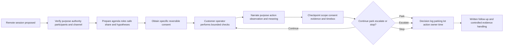
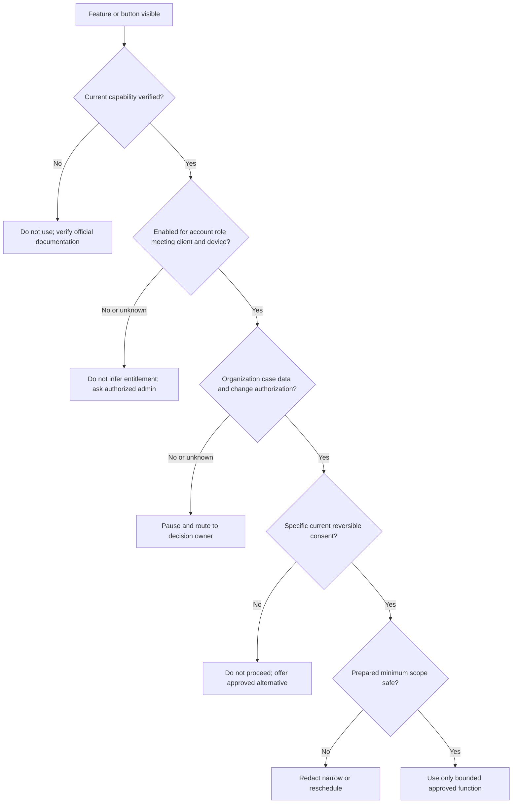
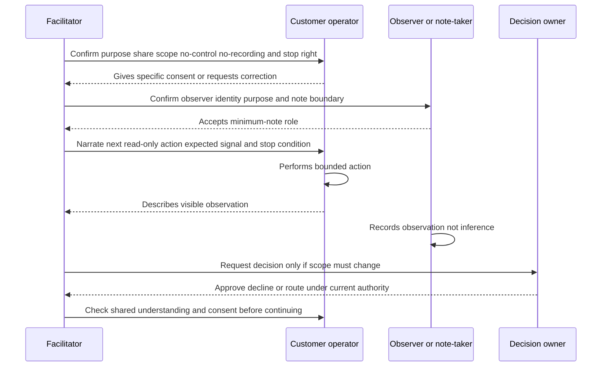
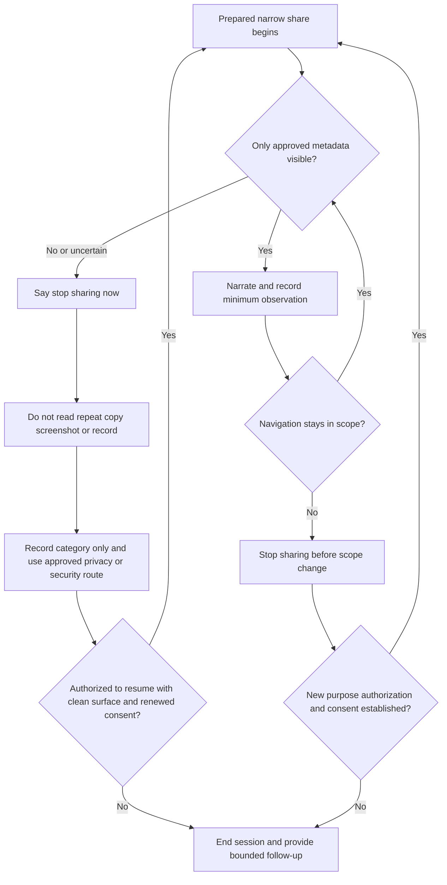
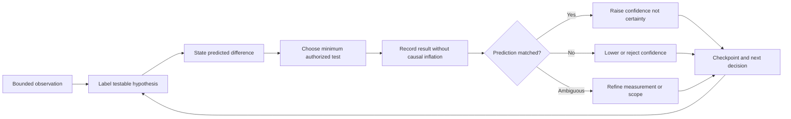
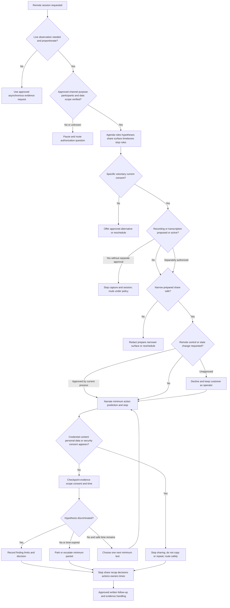
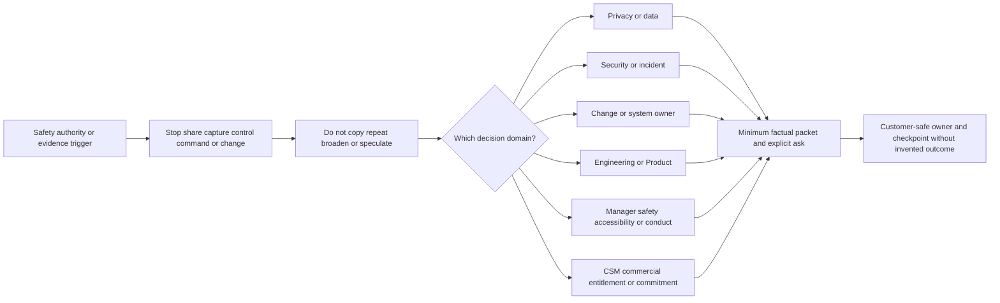
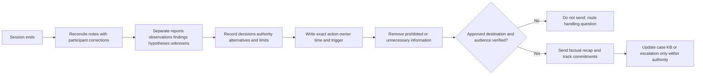
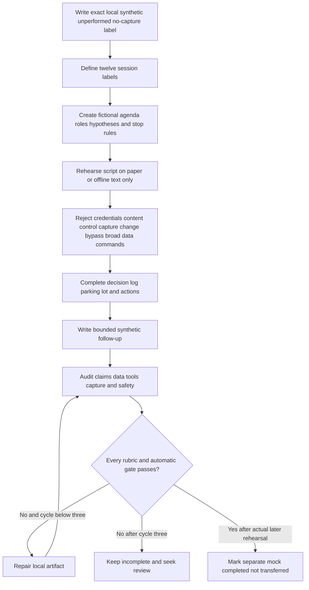

# Part 110 - Remote Troubleshooting and Zoom Session Practice

> **Purpose:** Build a beginner-first, vendor-neutral method for planning, facilitating, documenting, and following up on a remote troubleshooting session while protecting authorization, privacy, security, customer control, and evidence quality.
>
> **Artifact honesty label:** **Direct enterprise-support transfer plus completed local synthetic written artifacts; remote-session lab unperformed.** Your background, as recorded in the master guide, includes enterprise case ownership, customer and partner communication, complex investigations, critical-situation work, Engineering/Product escalation, and fix validation. Those habits transfer. The facilitation script, notes template, decision tree, and worked sessions in this Part are learner-authored fiction. They were not used with a customer, sent externally, run in Zoom, recorded, transcribed, or approved by Microsoft, Abnormal AI, Zoom, or any employer. This Part makes no claim about Abnormal or Zoom entitlement, configuration, policy, support procedure, recording rule, remote-control permission, data-handling route, or customer environment.
>
> **Currency and source access date:** August 24, 2026.
>
> **Authored-Part state:** `PASS`. The master tracker was changed only after every deterministic gate passed.

## Section goal

A remote troubleshooting session is a live, structured investigation in which people in different locations use voice, video, screen sharing, or another approved collaboration channel to understand a technical symptom. It can shorten a case because everyone sees the same sequence and can ask questions at the exact point where an observation appears. It can also create risk. A shared desktop may expose a password manager, customer content, notifications, private chat, internal URLs, tenant identifiers, security alerts, or unrelated applications. A request for remote control may let another person send commands or change state. A recording or transcript creates a new durable data object with storage, access, retention, disclosure, legal, and privacy consequences.

The central rule is therefore:

> **A meeting tool transports a conversation; it does not authorize access, collection, recording, control, disclosure, or change.**

This Part teaches you to:

1. obtain and continuously recheck informed, voluntary, specific consent;
2. create an outcome-based agenda with roles, scope, safety rules, and stopping conditions;
3. separate the facilitator, operator, observer, and decision owner so activity remains understandable;
4. prefer narrow application-window sharing over an entire desktop and stop if prohibited material appears;
5. collect only the minimum authorized evidence and keep credentials and customer content off screen;
6. narrate purpose before action and observation before interpretation;
7. use explicit hypotheses, checkpoints, and timeboxes rather than exploratory clicking;
8. maintain a decision log, parking lot, and action/owner/time record;
9. distinguish screen viewing from remote control and prohibit unapproved control or customer-state changes;
10. treat recording and transcription as separate, high-consequence processing that must never be surprising;
11. close with a shared summary, evidence limits, decisions, actions, owners, times, and follow-up route;
12. use Zoom only as a current-documentation learning target unless actual access, entitlement, configuration, policy, and authorization are independently established; and
13. describe prior experience honestly without implying that Microsoft, Zoom, or Abnormal uses this exact script.

The everyday analogy is a **guided inspection of a locked office**. The office owner decides whether the visit occurs, which room is opened, what may be photographed, and whether anyone may touch equipment. The guide keeps the group on the inspection plan, the operator opens only approved doors, and the note-taker records observations and decisions. An invitation to enter the building does not authorize opening every drawer. The analogy stops where remote support involves technical access controls, organizational policies, contracts, law, security response, retention, accessibility, and platform-specific configuration that must be verified for the real session.

### The twelve required remote-session contract labels

The numbered rows below are the exact term contract for this Part. Some closely related words share a row because learning their boundary together prevents unsafe assumptions.

| # | Required label | Beginner-first definition | Everyday analogy | Why it matters | Boundary to preserve |
|---:|---|---|---|---|---|
| 1 | **Consent** | Consent is a voluntary, informed, specific, current, and reversible agreement to a clearly described session activity. The person must know what is proposed, why, what will be visible or collected, who will participate, and that they may pause or withdraw. Consent should be rechecked when scope changes. | Agreeing to a home repair visit does not automatically permit photographs, entry to every room, or replacement of equipment. | A remote session crosses visual, conversational, and sometimes control boundaries. Explicit agreement protects participant agency and clarifies scope. | Consent to join is not consent to share a screen, disclose content, collect files, use remote control, record, transcribe, make changes, or reuse evidence. Platform notices are not a substitute for current organizational authorization and applicable law. |
| 2 | **Facilitator** | The facilitator manages the session process: purpose, introductions, consent checks, agenda, roles, turn-taking, timeboxes, checkpoints, parking lot, decisions, safety stops, and closing recap. The facilitator may also be the support engineer, but the process role should remain explicit. | A meeting chair keeps the group on the agreed route without doing every task. | Live troubleshooting becomes noisy when everyone asks questions or suggests commands at once. One process owner preserves clarity and customer control. | The facilitator does not gain technical, legal, security, privacy, commercial, or change authority merely by leading the meeting. |
| 3 | **Operator** | The operator is the person who uses the keyboard, mouse, command line, admin interface, or device. In a customer session, the safest default is often that the customer-authorized person remains operator while Support observes and narrates. | During a driving lesson, the learner at the wheel remains the driver even while an instructor gives directions. | Naming the operator prevents accidental actions and makes the audit trail understandable. | An operator must have current authorization for every action. Screen sharing does not appoint Support as operator, and remote control must not be used without separate approval. |
| 4 | **Observer** | An observer watches for a defined reason, such as taking notes, learning, representing another team, checking privacy, or providing specialist input. The observer's identity, role, need to attend, and participation limits should be known before sensitive material could appear. | A trainee may attend a medical simulation after participants know why the trainee is present; hidden spectators would change the agreement. | Extra attendees increase disclosure and communication complexity. Explicit observer purpose supports least privilege. | An invitation link, internal employment, seniority, or silent attendance is not automatic need-to-know. Unexpected or unapproved observers trigger a pause. |
| 5 | **Agenda** | An agenda is the ordered plan for the session: desired outcome, scope, roles, safety rules, evidence already known, hypotheses or questions, planned checks, timeboxes, checkpoints, and close. | A flight plan identifies destination, route, fuel stops, and alternate airport before takeoff. | An agenda converts a meeting from “look around until something happens” into a bounded investigation. | An agenda is not authority to execute every listed step. Each action still needs the correct scope, role, approval, and safety check. |
| 6 | **Hypothesis** | A hypothesis is a testable possible explanation for an observation. A good hypothesis predicts what evidence should differ if it is true and what result would lower confidence in it. | A mechanic suspects a weak battery, then predicts a low voltage reading rather than replacing parts at random. | Hypotheses reduce random clicking and help choose the lowest-risk, most discriminating next observation. | A hypothesis is not a finding, root cause, defect, security incident, or customer fault. Label it and update it when evidence changes. |
| 7 | **Checkpoint** | A checkpoint is a planned pause at which participants compare the session state with the agenda: what was observed, what remains unknown, whether consent and scope still hold, which hypothesis changed, and what should happen next. | Hikers stop at a trail marker to confirm location before choosing the next path. | Checkpoints stop momentum from silently widening collection or changing state. They also let the customer correct the record. | A checkpoint is not a ceremonial “everyone okay?” after an action already exceeded scope. It must occur before material direction changes and permit a real stop. |
| 8 | **Timebox** | A timebox is a fixed maximum period allocated to a question or activity before the group pauses and decides whether to continue, change method, park the item, or escalate. | A doctor may spend ten focused minutes on one diagnostic branch before ordering a different test. | Live sessions can consume time while producing little evidence. Timeboxes protect participant attention and force decision points. | A timebox is not permission to rush a risky command, skip consent, or hide uncertainty. Safety and authorization override the clock. |
| 9 | **Screen share** | Screen share is the transmission of visible screen content from one participant's device to others. It may expose an application window, browser tab, entire desktop, system audio, camera image, notifications, or overlays depending on the product and client. | Holding up one document to a window is narrower than opening the entire filing cabinet. | The share scope determines the accidental-disclosure surface. A prepared single window usually reveals less than a desktop. | Screen sharing is visibility, not authorization. Keep credentials, customer content, private messages, unrelated tabs, security details, personal data, and unapproved evidence off screen. Stop sharing if prohibited material appears. |
| 10 | **Remote control** | Remote control is a capability that allows another participant to send keyboard, pointer, or other input to a shared system. It is materially different from viewing because input may change files, configuration, sessions, or external systems. | Watching a driver is different from being handed the steering wheel. | Remote control changes accountability and can increase blast radius. Separate approval and technical controls are required. | Never request, grant, or accept unapproved remote control. Never use it to enter credentials, bypass controls, make customer-state changes, run destructive commands, or exceed the approved action. |
| 11 | **Recording/transcription** | A recording captures audio, video, or shared content for later use. A transcription converts speech into stored text, often with timestamps and speaker labels. Either may create a durable, searchable, shareable record even when no one downloads a file manually. | Taking minutes from memory is different from placing a camera and microphone in the room. | A durable record changes privacy, access, retention, discovery, localization, accuracy, and security considerations. | Never surprise participants with recording or transcription. Product capability, an on-screen notice, or a host button does not establish organizational authorization, valid consent, legal basis, retention, access, or safe content. This Part's lab uses neither. |
| 12 | **Decision log, parking lot, and action/owner/time** | A **decision log** records choices and their evidence, authority, alternatives, and consequences. A **parking lot** holds relevant but out-of-scope questions for later routing. An **action/owner/time** entry states the exact next action, the role accountable for it, and an absolute due time with time zone. | A construction meeting records approved changes, sets unrelated requests aside, and assigns each next task to a named trade by a date. | These three records prevent a productive conversation from becoming an ambiguous handoff. | Notes must not invent approval, expose prohibited content, or imply that mentioning an item creates commitment. “Team to investigate soon” is not action/owner/time. |



## JD Mapping

| Role signal from the master guide | Capability developed here | Observable interview behavior | Honest proof |
|---|---|---|---|
| Own complex enterprise investigations | Converts a live call into bounded hypotheses and discriminating checks | States expected signal before asking for an action and revises the hypothesis after observation | Two completed synthetic written sessions |
| Maintain customer trust | Preserves customer control, informed consent, and visible ownership | Rechecks permission when scope or participant set changes | Facilitation script and consent language |
| Communicate clearly to technical and nontechnical audiences | Narrates purpose, action, observation, interpretation, and next decision | Uses short literal statements and invites correction at checkpoints | Script, note template, and spoken-practice plan |
| Handle sensitive security and SaaS evidence | Minimizes what appears or is collected | Keeps credentials and customer content off screen and stops unexpected exposure | Safe-sharing matrix and stop protocol |
| Troubleshoot integrations and configurations | Uses agenda, roles, timeboxes, evidence, and decision logs | Avoids random clicking and unapproved changes | Session decision tree and worked cases |
| Collaborate with Engineering, Product, CSM, and customers | Defines observer purpose, decision authority, and follow-up ownership | Parks out-of-scope items without losing them and sends decision-ready notes | Decision-log and action/owner/time templates |
| Use Zoom as a named ecosystem learning target | Reads current official documentation and identifies feature/configuration questions | Separates feature existence from entitlement, enablement, policy, consent, and support authorization | Official-source learning matrix; no live Zoom claim |
| enterprise-support transfer | Applies real case ownership, live troubleshooting, communication, and escalation habits | Gives a sanitized example from your own work grounded in your own actions | `DIRECT_PRODUCTION_TRANSFER` only when supported by a real memory |
| Abnormal AI learning target | Discovers approved remote-session process before use | Asks about authorized channels, data, recording, remote control, notes, security stops, and escalation | First-week discovery checklist, not a policy claim |

## Candidate honesty note

You can truthfully say that several years in enterprise support developed transferable habits: preparing for customer calls, clarifying impact, asking focused questions, comparing expected and actual behavior, coordinating specialists, communicating under pressure, escalating evidence, validating fixes, and maintaining follow-through. If you us a real Microsoft example, you should describe only your own authorized actions and a sanitized technical pattern. You must remove customer identity, tenant details, private communications, proprietary scripts, internal-only process, credentials, content, security-sensitive details, and any result you cannot support.

Those experiences do **not** prove that Microsoft used this exact facilitation script or that Abnormal and Microsoft have the same meeting platform, case process, roles, recording rules, remote-control rules, evidence routes, entitlement, change authority, legal obligations, or escalation paths. Microsoft Teams public documentation is used here only as a familiar product comparison and source of feature-boundary examples. Zoom remains learned architecture for you. Abnormal's actual channel, license, settings, policy, consent language, evidence system, privacy review, and support authority are unknown until learned through approved onboarding.

### Evidence tiers for this Part

| Capability or claim | Evidence label | Safe interview language | Claim to avoid |
|---|---|---|---|
| Microsoft live customer troubleshooting and case ownership | **DIRECT_PRODUCTION_TRANSFER** | “In enterprise support I facilitated live investigations and maintained customer-facing ownership; I can share a sanitized example of my actions.” | “Microsoft used this Part's script” or disclosure of internal/customer detail |
| Public Zoom and Teams feature concepts | **LEARNED_METHOD_FROM_CURRENT_OFFICIAL_SOURCES** | “I studied current official documentation to understand feature and configuration questions, then kept authorization separate.” | “The feature is available for this customer” without current product, plan, client, role, and settings evidence |
| Facilitation script and notes template | **TEMPLATE_ONLY_SYNTHETIC_COMPLETED_IN_WRITING** | “I authored a vendor-neutral script and notes template for practice.” | “This is approved by Abnormal, Zoom, or Microsoft” |
| Worked sessions A and B | **SYNTHETIC_WORKED_SESSIONS_COMPLETED_IN_WRITING** | “I walked two fictional sessions on paper and audited the decisions.” | “I ran these sessions” or “the customer confirmed the result” |
| SignalBridge Lab 110 | **DESIGN_NOT_EXECUTED_NOT_TRANSFERRED** | “The local mock is designed, synthetic, unrecorded, and not yet performed.” | Any claim of a participant, meeting, platform, recording, measured skill, or result |
| Zoom use or administration | **NO_DIRECT_ZOOM_EXPERIENCE_LEARNED_ARCHITECTURE** | “I have not operated Zoom in production; I would verify current account, client, role, admin, and policy state.” | Zoom entitlement, enabled feature, customer setting, recording rule, or administrator experience |
| Abnormal remote-support operations | **NO_DIRECT_EXPERIENCE_UNKNOWN_CONFIGURATION** | “I would learn the approved channel, consent, evidence, control, recording, notes, and escalation process.” | Any invented Abnormal policy, script, owner, route, entitlement, or permission |

A safe interview bridge is:

> “My direct foundation is enterprise support: I have led customer-facing investigations, maintained an evidence trail, coordinated escalation, and validated fixes. For this transition I wrote two vendor-neutral remote-session walkthroughs plus a facilitation and notes template. I have not used Zoom or Abnormal's remote-support process in production. Before a real session I would verify the approved channel, participant roles, data and recording rules, remote-control boundaries, change authority, and escalation route. A meeting feature being visible would not be my authorization to use it.”

## 1. Meeting capability, authorization, and consent are different layers

A remote-support error often begins with one sentence: “The button is available, so we can use it.” A visible button proves, at most, that a client currently presents an interface. It does not prove that the user is entitled to the feature, that an administrator enabled it intentionally, that every participant's organization allows it, that the current meeting role may use it, that the feature behaves the same on each client or operating system, or that Support is authorized to use it for this case.

Use five separate questions:

1. **Capability:** Does the current product and client technically support the function?
2. **Configuration:** Is it enabled for this account, user, meeting, role, and device?
3. **Authorization:** Do current organizational policy, contract, case scope, and role permit the activity?
4. **Consent:** Do affected participants understand and voluntarily agree to the specific activity now?
5. **Execution safety:** Can the activity occur without exposing prohibited data, changing unapproved state, or exceeding the plan?

| Layer | Evidence question | Example of evidence | What the evidence does not prove |
|---|---|---|---|
| Product capability | Is the feature documented for this product/client context? | Current official applies-to statement and release documentation | License, enabled state, organizational approval, or consent |
| Account/configuration | Is the setting enabled for the relevant account, user, role, meeting, and client? | Authorized admin view or user-visible setting state | Business purpose, legal basis, or support authority |
| Role/entitlement | Does this role and subscription permit use? | Current plan, role, and admin policy evidence from an authorized owner | That using it is appropriate for this case |
| Organizational authorization | Do policy, contract, case scope, data classification, and change rules allow it? | Approved procedure or decision from the designated owner | Participant consent or safe execution |
| Participant consent | Did participants agree to this specific purpose and scope? | Explicit verbal or approved written confirmation recorded in notes | Authority to expose another person's data or exceed organizational policy |
| Safe execution | Is the prepared window/data/action narrow and reversible? | Clean share surface, synthetic identifiers, no secrets, approved operator | Future steps or a wider collection |



### 🔍 Plain-English deep-dive: A meeting link is a road, not a key

Imagine a public road leading to a secure laboratory. The road lets an authorized visitor reach the building. It does not unlock the laboratory, approve photographs, grant access to samples, or authorize equipment changes. A Zoom or Teams meeting link is similar: it creates a communications path. Host status, presenter status, screen-sharing capability, or a remote-control prompt may add technical functions, but none of those functions grants organizational authority by itself.

This distinction matters most under pressure. A customer might say, “I trust you; just take control.” Their trust is valuable, but the customer may not be the authorized change owner, the support engineer may not be permitted to operate the system, and the next click may change production state. The correct answer is not a cold refusal. It is a safe path: “Thank you. I will keep you as operator while I explain the observation we need. Before any change, we will confirm the approved owner, impact, rollback, and validation. If remote control is required, I must first verify the designated process; I will not request it in this session.”

Consent also changes over time. A participant may consent to share one sanitized browser window, then navigate toward a sign-in page. The original consent did not authorize exposing credentials. The facilitator should stop the share before sign-in and ask the operator to complete authentication privately. Likewise, adding an observer, switching to an entire desktop, opening a customer message, collecting a diagnostic bundle, or starting transcription is a material scope change. Pause and reauthorize; do not treat silence as agreement.

## 2. Prepare the session before opening the meeting

Remote sessions are expensive. They require several people's synchronized attention and may expose more information than an asynchronous evidence request. Use a session only when live observation is likely to discriminate among hypotheses, reproduce timing or sequence, verify state that is difficult to describe, coordinate approved specialists, or teach an authorized procedure. A session should not compensate for an unread case history, vague evidence request, or lack of preparation.

### Session-entry test

| Question | Strong answer | Weak answer that requires more preparation |
|---|---|---|
| Desired outcome | “Observe whether a synthetic item appears for one test role after the documented refresh sequence.” | “Take a look at the environment.” |
| Why live? | “The visible state changes within seconds and prior screenshots omit the transition.” | “Calls are faster.” |
| Known evidence | Timeline, expected/actual state, configuration context, prior safe checks, and unresolved branch are summarized | Participants must repeat the entire case |
| Lowest-risk hypothesis | One or two testable explanations with predicted observations | A list of components with no prediction |
| Participants | Each person has a named role, purpose, and authority boundary | Open invitation or surprise specialist |
| Share surface | Prepared single window with synthetic or approved metadata only | Full desktop with notifications and unrelated apps |
| Planned actions | Read-only observations first; any change is separately authorized, bounded, reversible, and validated | “We may try some settings.” |
| Collection | Exact minimum fields and approved destination are known | “Send logs if needed.” |
| Stop conditions | Credentials/content appears, scope changes, unknown command, unapproved control/change, security concern, or consent withdrawn | No explicit stop rule |
| Exit state | Decision, next evidence, owner, exact time, and written recap | “We will see where we get.” |

### Pre-session charter

The facilitator should send or state a short charter using approved channels. It is an invitation to agree, correct, or decline, not a declaration of authority.

| Charter field | Example vendor-neutral wording | Safety note |
|---|---|---|
| Purpose | “Observe the fictional `SYN-110` workflow and determine which of two hypotheses the visible state supports.” | Do not promise resolution |
| Scope | “One synthetic role, one prepared application window, read-only checks only.” | State exclusions as well as inclusions |
| Duration | “Thirty minutes, with checkpoints at minutes ten and twenty.” | A timebox does not override safety |
| Roles | “CustomerRole-A operates; SupportRole-B facilitates; ObserverRole-C records decisions only.” | Confirm observer need-to-know |
| Sharing | “Share only the prepared application window. Close unrelated apps and disable previews/notifications where approved.” | Never ask for credentials or content on screen |
| Control | “No remote control will be requested, granted, or used.” | A product prompt does not alter the rule |
| Recording | “No recording or transcription. Participants should not start either.” | Stop if a tool or participant begins capture |
| Changes | “No customer-state, permission, policy, configuration, or data change.” | A separate change plan would require separate authority |
| Evidence | “Notes contain only fictional metadata, timestamps, observations, decisions, and actions.” | No screenshots, exports, raw content, or broad logs |
| Stop conditions | “Anyone may pause; stop for prohibited data, unexpected participant, new security concern, unapproved tool, or scope change.” | Withdrawal has no penalty |
| Follow-up | “SupportRole-B sends the fictional recap by 16:00 UTC.” | Use an attainable communication checkpoint, not an outcome promise |

### Roles and the single-operator principle

One person should operate at a time. Multiple voices can advise, but the facilitator converts suggestions into one clear proposed observation. The operator repeats the action in their own words when risk or ambiguity exists. The facilitator then states what signal is expected and the stop condition before the operator acts.

| Role | Owns | Says | Must not assume |
|---|---|---|---|
| Facilitator | Process, consent checks, agenda, safety, time, checkpoints, recap | “Before we continue, I will restate purpose, expected signal, and stop condition.” | Technical or policy authority |
| Operator | Keyboard/pointer and approved local action | “I will open the prepared status view only; I will stop before sign-in or any save control.” | Support's suggestion equals permission |
| Observer/note-taker | Defined observation or note purpose | “Observed `STATE-PENDING` at 14:12 UTC; cause not established.” | Silent attendance is harmless or unlimited |
| Technical specialist | Narrow expertise and interpretation | “This signal is consistent with hypothesis A, but the retained evidence does not establish cause.” | Invitation authorizes unrelated exploration |
| Decision owner | Approves a bounded choice within real authority | “I approve the documented read-only extension until 14:25 UTC.” | A decision can bypass policy or safety |
| Customer coordinator | Confirms impact, participants, and follow-up route | “The desired outcome and attendee list are correct.” | Business coordination equals system change authority |



## 3. Safe screen sharing and minimum evidence collection

The facilitator should assume that the edge of a shared window is porous. Notifications can appear. A browser password manager can offer an account. Another tab may show a mailbox. A system dialog can display a username or path. Copy/paste history, autofill, recent-file menus, bookmarks, background windows, terminal history, environment variables, and screen-share previews can reveal information that participants did not intend to disclose.

Preparation reduces risk:

1. Use an approved test or synthetic context when possible.
2. Close email, chat, password managers, dashboards, customer content, consoles, and unrelated documents.
3. Disable notification previews or use an approved presentation mode where organizational guidance permits it.
4. Open only the intended application and navigate to the safe starting page before sharing.
5. Prefer one application window or one approved tab over an entire desktop.
6. Zoom the interface only enough to make approved metadata readable; do not ask for broad context “just in case.”
7. Prepare harmless aliases and exact timestamps in advance.
8. Sign in before sharing and reauthenticate only with sharing stopped.
9. Keep a clear stop-sharing control available.
10. Tell all participants what to do if prohibited material appears: stop sharing, stop discussion, do not repeat or copy, and route through the approved privacy/security process.

### Share-surface comparison

| Surface | Relative disclosure surface | Useful when | Main risk | Safe default |
|---|---:|---|---|---|
| Prepared static synthetic image | Lowest | Teaching navigation or expected state without live system access | Image may still contain copied identifiers if poorly prepared | Inspect and use obvious fiction |
| Single application window | Lower | Observing a bounded workflow | Pop-ups, dialogs, or application-internal content can appear | Preferred live option when authorized |
| Single browser tab | Lower to medium | Reviewing one sanitized web view | Authentication redirects, autofill, extensions, and new tabs | Stop before sign-in or navigation outside scope |
| Entire browser window | Medium | Rarely necessary for multi-tab sequence | Other tabs, bookmarks, profiles, downloads, and history | Avoid unless specifically justified and prepared |
| Entire desktop | High | Only when no narrower approved method can show the symptom | Notifications, unrelated apps, files, chats, credentials, personal data | Avoid; require explicit justification and recheck |
| Camera on physical device/document | High and hard to bound | Specialized hardware with approved setup | People, badges, papers, room layout, screens, serials | Use only under a separate approved plan |
| Recording or transcript | Persistent and cumulative | Only when independently authorized and necessary | Durable content, access, retention, search, redistribution, accuracy | Not used in this Part or lab |

### Safe collection matrix

“Collection” means taking information away from the live view into a case, note, file, screenshot, export, log package, or another durable location. Seeing a value during a session does not automatically authorize collecting it.

| Evidence type | Safer minimum | Avoid on screen or in notes | Why |
|---|---|---|---|
| Time | Absolute timestamp and zone | Ambiguous “a few minutes ago” | Enables correlation without content |
| Actor | Fictional role or approved non-identifying role label | Personal name, email, account, credential, session token | Role can explain behavior without identity exposure |
| Object | Harmless synthetic object ID | Message body, file content, customer record, tenant secret | Metadata may be sufficient to locate an approved server-side event |
| State | Exact status name and expected/actual comparison | Broad screenshot showing adjacent records | A bounded state is more diagnostic and less revealing |
| Request/event | Approved correlation ID and response class | Authorization headers, cookies, payload, raw token | IDs support cross-system lookup; secrets grant access |
| Configuration | Specific effective setting name/value if authorized | Full tenant export or unrelated policies | Minimization controls blast radius |
| Error | Exact safe error code and sanitized text | Stack, path, user, URL, or payload without review | Error text often embeds sensitive context |
| Visual evidence | Written observation or redacted crop only if approved | Entire desktop screenshot or recording | Persistent visuals are hard to revoke and easy to redistribute |
| Logs | Exact approved source, interval, fields, and destination | “All logs,” full history, unrelated users, broad content | Narrow queries reduce overcollection |
| Credentials | None | Password, one-time code, token, secret, key, cookie, recovery code | Support should never request or capture them |

### Stop protocol for accidental exposure

If credentials, customer content, personal data, private messages, a security-sensitive artifact, or another prohibited item appears:

1. Say **“Please stop sharing now.”** Do not ask the operator to navigate away while the content remains visible.
2. Stop narration and prevent participants from reading, repeating, photographing, copying, or pasting the material.
3. Confirm whether any platform recording, transcription, screenshot, or note captured it; do not begin another capture to document the exposure.
4. Record only the minimum fact that an unintended category appeared, not the sensitive value itself.
5. Use the current approved privacy/security/incident route to determine containment, notification, deletion, retention, or further handling.
6. Resume only if the authorized owner says it is appropriate, the share surface is clean, participants and scope are revalidated, and consent is renewed.



### 🔍 Plain-English deep-dive: “Show me everything” is usually a weak evidence request

Broad visibility feels efficient because the engineer hopes an answer will appear somewhere. In reality, it transfers search cost and privacy risk to the customer. It also produces weak notes: several windows change, people talk over one another, and no one can later explain which observation discriminated among hypotheses.

Think of a medical test. A clinician does not collect every possible biological sample simply because more data might help. The clinician starts with a question, chooses a proportionate test, interprets the result, and orders more only when the result justifies it. Remote troubleshooting should use the same discipline: “Hypothesis A predicts status `WAITING` for the synthetic role at 14:10 UTC. Please share only the prepared status window. We need the role label, status, and timestamp. We do not need names, content, message bodies, credentials, or other records.”

Data minimization improves troubleshooting as well as privacy. A precise field is easier to correlate with a server event than a long recording. A bounded timestamp is easier to search than “during the call.” A written expected/actual pair is easier for Engineering to reproduce than a video of exploratory clicking. More data is not automatically more evidence; useful evidence has provenance, scope, time, meaning, and authorization.

## 4. Narration, hypotheses, checkpoints, and timeboxes

Good narration makes a remote session inspectable. The facilitator says why a step is proposed before it happens. The operator says what they are about to do. After the action, the operator or facilitator states the observation without adding a cause. Only then does the group interpret what changed.

Use the five-line narration pattern:

1. **Purpose:** “We are checking whether the visible status differs by role.”
2. **Action:** “Please open the prepared read-only status view for `Role-SYN-A`; do not select Edit.”
3. **Expected signal:** “If the role-mapping hypothesis is true, we expect `RESTRICTED`; if it is false, we expect the same `READY` state as the control.”
4. **Observation:** “At 14:12 UTC, the view displays `READY` for `Role-SYN-A`.”
5. **Interpretation:** “That observation lowers confidence in the role-mapping hypothesis for this synthetic path; it does not establish root cause.”

### Hypothesis ledger

| Field | Question | Strong example |
|---|---|---|
| Observation | What happened without causal language? | “The synthetic item remained `PENDING` after the documented refresh at 14:05 UTC.” |
| Hypothesis | What possible explanation is being tested? | “The client may be showing cached state.” |
| Prediction | What should differ if true? | “A fresh approved read-only view should show the server-reported `READY` state while the original view remains `PENDING`.” |
| Minimum test | What lowest-risk action discriminates? | “Open the prepared status view in a new private synthetic session; no settings change.” |
| Stop condition | What ends the test? | “Any sign-in prompt, content view, unexpected participant, or request to change state.” |
| Result | What was actually observed? | “Both prepared views showed `PENDING` at 14:09 UTC.” |
| Update | How did confidence change? | “Client-cache hypothesis weakened; server-state or delayed-processing hypotheses remain.” |
| Next decision | Continue, park, escalate, or stop? | “Use the correlation ID for authorized server-side lookup; do not broaden screen sharing.” |



### Checkpoint card

At each planned checkpoint, the facilitator can use this exact structure:

| Checkpoint item | Prompt | Example record |
|---|---|---|
| Goal | “Is the original desired outcome still correct?” | “Yes: distinguish client display from server state; no restoration promise.” |
| Consent/scope | “Are the participant set, share window, no-control, no-recording, and no-change boundaries unchanged?” | “Confirmed by roles at 14:10 UTC.” |
| Observations | “What did we directly observe?” | “Both synthetic views displayed `PENDING`.” |
| Interpretation | “Which hypotheses rose, fell, or remain?” | “Cache fell; delayed processing and server-state mismatch remain.” |
| Safety | “Did prohibited data, unexpected access, or a security concern appear?” | “No; metadata only.” |
| Timebox | “What did this branch cost and what is the remaining time?” | “Eight minutes used; twelve remain.” |
| Decision | “Continue, park, escalate, or stop?” | “Stop visual checks; escalate correlation ID for server lookup.” |
| Action/owner/time | “Who does exactly what by when?” | “SupportRole-B sends sanitized escalation by 14:30 UTC.” |

### Timeboxing rules

- Allocate a setup timebox for consent, roles, safe sharing, and the agenda. Do not treat setup as overhead to skip.
- Give each hypothesis branch a maximum duration and a predeclared exit condition.
- Reserve closing time. A session that consumes every minute on testing usually ends without agreement.
- When a timebox expires, do not say “one last quick thing” and continue indefinitely. Pause, state the evidence gained, and request a real decision.
- Extend only with explicit participant agreement and organizational authority; check accessibility, shift, interpreter, and customer-impact constraints.
- Timebox waiting. If a page or job does not complete within the safe observation window, record that fact and stop rather than repeatedly triggering it.
- Never compress a safety, privacy, consent, or change review to save time.

### 🔍 Plain-English deep-dive: Narration is an audit trail spoken before the click

In poor remote troubleshooting, the mouse moves faster than the reasoning. Someone clicks a control, another person asks what changed, and the note-taker writes “tested settings.” That record cannot establish intent, expected result, actual result, or whether a change occurred.

Narration slows the work just enough to make it reliable. “We are checking read-only status. Please select View, not Edit. If the configuration hypothesis is true, we expect value A. Stop if a save control or sign-in prompt appears.” Now the operator knows the boundary, the observer knows what to record, and the facilitator can detect divergence. This is not performance commentary. It is a lightweight control that links purpose, action, evidence, and decision.

Narration also makes accessibility and language needs easier to support. Use short sentences, spell unfamiliar identifiers when necessary, state absolute times and time zones, avoid idiom, and pause for interpretation. Ask participants to correct the technical meaning, not prove that they were listening. The approved platform may offer captions, but captions are not necessarily accurate, available, saved, or permitted. Never convert an accessibility need into an assumption that transcription or recording is authorized; use current approved accommodations and privacy processes.

## 5. Artifact - remote-session facilitation script

The following is a **completed synthetic template**, not an approved company script. Replace placeholders only with authorized, minimum information. Do not paste real credentials, customer content, private identifiers, or proprietary language into a practice copy.

### Phase A - invitation and preparation

> **Subject/purpose:** Proposed bounded remote troubleshooting session for `[safe case reference]`  
> **Desired outcome:** Observe `[one safe expected/actual distinction]`; resolution is not promised.  
> **Why live:** `[specific transition, timing, or sequence that cannot be captured adequately in current authorized evidence]`.  
> **Proposed time:** `[Month day, year, HH:MM-HH:MM UTC and verified local equivalent if useful]`.  
> **Participants and roles:** `[Facilitator role]`, `[customer-authorized operator role]`, `[observer role and exact need]`, `[decision owner if needed]`. Please correct the list; no additional attendee should join without a pause and renewed scope check.  
> **Scope:** `[one synthetic/test role, one prepared application window, listed read-only observations]`.  
> **Not in scope:** credentials, customer content, personal data, unrelated applications, broad logs, configuration or permission changes, destructive commands, bypasses, remote control, recording, and transcription.  
> **Preparation:** Close unrelated applications and notifications under your approved process. Authenticate privately before sharing. Prepare only the minimum safe metadata.  
> **Collection:** `[exact fields]` will be written to `[approved case/note destination]`; no screenshots, exports, or recordings unless a separately authorized plan is agreed before the session.  
> **Stop right:** Any participant may pause or end the session. We stop for unexpected data, participant, security concern, tool, request, or scope.  
> **Follow-up:** `[owner role]` will send a factual recap by `[absolute time and zone]`.

### Phase B - opening the live session

**Facilitator:**

> “Before any sharing, I will confirm the purpose, roles, boundaries, and stop right. Our outcome is to observe whether `[safe synthetic state]` differs under `[bounded condition]`. We have `[duration]`, with checkpoints at `[times]`. `[CustomerRole-A]` remains the only operator. I will facilitate. `[ObserverRole-C]` is here only to record approved observations, decisions, and actions. Is anyone present whose name or role I have not stated?”

Pause and resolve any unexpected attendee. Then continue:

> “Please do not display or send credentials, one-time codes, tokens, cookies, private messages, customer content, personal data, security-sensitive material, or unrelated applications. Share only the prepared window. Stop sharing before any sign-in. We will not request or use remote control, make customer-state changes, bypass controls, run destructive commands, collect broad data, record, or transcribe. If prohibited material appears, I will say ‘stop sharing now’; please stop immediately, and no one should copy or repeat it. Anyone may pause or withdraw. Do you agree to this session purpose and these specific boundaries?”

Record the role and time of explicit agreement according to the approved process, not a sensitive verbatim transcript. If consent is absent, unclear, coerced, or outside the person's authority, do not proceed.

### Phase C - agenda and known evidence

**Facilitator:**

> “The agenda has four parts. First, two minutes to confirm the expected and actual state. Second, an eight-minute read-only check of hypothesis A. Third, a checkpoint to decide whether hypothesis B is still needed. Fourth, at least five minutes for decisions, parking-lot items, actions, owners, times, and the written recap. The known evidence is `[bounded facts]`. The customer reports `[attributed report]`. Our current hypotheses are `[A]` and `[B]`; neither is a finding. Please correct any factual error before we share.”

### Phase D - before every action

**Facilitator:**

> “Purpose: `[question]`. Proposed action: `[one read-only action]`. Expected signal: if `[hypothesis]` is true, `[prediction]`; otherwise `[comparison]`. Stop condition: `[prohibited view, control, prompt, or unexpected state]`. `[Operator]`, please repeat the action and stop condition in your own words.”

**Operator:**

> “I will `[bounded action]`. I will not select `[change control]`, open content, or continue past a sign-in or unexpected view. I will stop sharing if that occurs.”

After action:

**Facilitator:**

> “The direct observation at `[time zone]` is `[state]`. Is that accurate? This `[raises/lowers/does not change]` confidence in `[hypothesis]` because `[bounded reasoning]`. It does not establish `[root cause, defect, incident, or broader scope]`.”

### Phase E - checkpoint and branch decision

**Facilitator:**

> “Checkpoint. The desired outcome is unchanged. We directly observed `[observations]`. Hypothesis A `[rose/fell/remains]`; hypothesis B `[state]`. No prohibited material or state change was observed `[only if verified]`. We have `[minutes]` remaining. The choices are: continue with `[one bounded check]`, park `[question]`, escalate `[minimum evidence]`, or stop and follow up. My recommendation is `[choice]` because `[evidence and risk]`. Does the current scope and consent still hold?”

### Phase F - handle pressure safely

| Customer or participant request | Facilitator response pattern |
|---|---|
| “I will show the password so you can log in.” | “Please do not show or say any credential. Stop sharing before authentication and complete it privately. I cannot receive or use the credential.” |
| “Take control and fix it.” | “I cannot request or accept unapproved control or make an unapproved customer-state change. You remain operator. I can narrate a read-only check; a change requires the approved owner, plan, risk, rollback, and validation.” |
| “Open all logs so we do not need another call.” | “We will not collect broadly. We first need the exact source, interval, fields, purpose, and approved destination. I will park the broader request and route it if the current observation justifies it.” |
| “Start recording so Engineering can watch.” | “We will not record or transcribe this session. A recording requires separate current authorization, participant notice and consent, applicable legal/privacy review, access, retention, and approved content scope. I will provide bounded written notes and the approved escalation packet.” |
| “Disable the control temporarily.” | “I cannot help bypass or disable a control in this session. I will record the desired outcome and route a safe, authorized alternative or decision.” |
| “Run this cleanup command; it is harmless.” | “I will not ask anyone to run an unknown, destructive, or state-changing command. We need provenance, purpose, scope, authority, expected output, side effects, rollback, and an approved environment before any command.” |
| “An executive joined; continue.” | “I am pausing. We need to confirm the new participant's identity, purpose, need-to-know, and whether the current share scope and consent remain valid.” |

### Phase G - close

**Facilitator:**

> “We are stopping screen sharing now. The desired outcome was `[outcome]`. We observed `[facts]`; we did not establish `[limits]`. We decided `[decision and authority]`. The parking lot contains `[items and route]`. Actions are: `[action]`, owned by `[role]`, due `[absolute time and zone]`; and `[action]`, owned by `[role]`, due `[time]`. I will send the factual recap by `[time]`. Do you disagree with any observation, decision, owner, or time?”

After corrections:

> “Thank you. The session is complete. Do not send additional content, credentials, recordings, transcripts, screenshots, or broad logs outside the approved evidence request. If the stated security or privacy trigger occurs before the checkpoint, use the designated current route rather than waiting for this case update.”

## 6. Artifact - remote-session notes template

This template is intentionally factual. It separates a participant's report, a direct observation, an interpretation, a decision, and an action. Those categories must not blur.

```text
REMOTE TROUBLESHOOTING SESSION NOTES - TEMPLATE ONLY

Honesty label:
  [REAL AUTHORIZED SESSION / LOCAL SYNTHETIC PRACTICE / DESIGN NOT PERFORMED]
  Never select a state that exceeds the evidence.

Session identity:
  Safe case reference:
  Date:
  Start time and zone:
  End time and zone:
  Approved meeting channel:
  Facilitator role:
  Operator role:
  Observer role and need:
  Decision owner role, if present:

Authorization and consent:
  Organizational/session authorization source:
  Approved purpose:
  Approved share surface:
  Approved evidence fields and destination:
  Remote control: NOT USED / separately authorized state
  Recording: NOT USED / separately authorized state
  Transcription: NOT USED / separately authorized state
  Consent confirmed by role and time:
  Scope changes and renewed authorization/consent:
  Stop conditions reviewed:

Outcome and scope:
  Desired customer outcome:
  In scope:
  Out of scope:
  Timeboxes:
  Planned checkpoints:

Known evidence before session:
  Customer-reported:
  Directly observed previously:
  Established finding:
  Hypotheses:
  Unknowns:

Observation ledger:
  [TIME ZONE]
  Purpose:
  Operator action:
  Expected signal:
  Direct observation:
  Interpretation and confidence change:
  What this does not prove:
  Safety/scope state:

Decision log:
  Decision ID:
  Time and zone:
  Decision:
  Authorized decision owner role:
  Evidence considered:
  Alternatives considered:
  Risk/constraint:
  Scope and expiry/review trigger:

Parking lot:
  Item:
  Why out of scope now:
  Route or decision owner:
  Follow-up trigger:
  Explicitly not committed:

Actions:
  Action:
  Owner role:
  Due date/time/zone:
  Required input:
  Completion evidence:
  Earlier escalation trigger:

Safety events:
  None observed / category-only record:
  Sharing stopped at:
  No sensitive value reproduced in notes:
  Approved route used:

Close:
  Facts:
  Reports:
  Findings:
  Hypotheses/unknowns:
  Decision:
  Actions/owners/times:
  Follow-up sent by:
  Participant corrections:
  Recording/transcription/capture statement:
```

### Notes quality rules

| Rule | Good note | Bad note |
|---|---|---|
| Attribute reports | “CustomerRole-A reports the symptom began after the fictional refresh.” | “The refresh caused it.” |
| Record observation | “At 14:12 UTC, `STATE-PENDING` appeared in the prepared synthetic view.” | “System broken.” |
| Calibrate inference | “This lowers confidence in a client-cache explanation.” | “Cache ruled out forever.” |
| Preserve absence limits | “No prohibited material was observed by the facilitator during the prepared share.” | “No sensitive data exists.” |
| Name authority | “DecisionOwner-D approved extending the read-only check by five minutes within the fictional exercise.” | “Approved.” |
| Use exact time | “SupportRole-B sends recap by August 26, 2026, 16:00 UTC.” | “Update shortly.” |
| Minimize data | “Correlation ID `SYN-CORR-110-A`; fictional.” | Full headers, payload, content, or screenshot |
| Separate parking lot | “Notification delay parked for onboarding owner; no commitment.” | “Team will fix notification delay.” |
| Avoid platform claims | “No Zoom meeting was used in this written exercise.” | “Zoom recording was disabled by policy.” |

## 7. Worked session A - read-only display-state investigation

**Honesty label:** `SYNTHETIC_WORKED_SESSION_COMPLETED_IN_WRITING_NOT_PERFORMED`. `Blue Cedar Lab`, `CASE-110-A`, every role, timestamp, state, identifier, product behavior, decision, and outcome below are fictional. No account, meeting platform, customer, screen share, remote control, recording, transcription, command, or product was used.

### Scenario and preparation

The fictional customer reports that a harmless synthetic item remains `PENDING` in one prepared view after a documented refresh, while a separate status summary says `READY`. The desired outcome is not to “fix the system on the call.” It is to determine whether the mismatch is more consistent with client display state or with an upstream state discrepancy, using read-only observations only.

| Preparation item | Written session state |
|---|---|
| Duration | 30 minutes; checkpoints at minute 10 and minute 20; five minutes reserved for close |
| Facilitator | `SupportRole-B` |
| Operator | `CustomerRole-A` |
| Observer | `NoteRole-C`, decisions and timestamps only |
| Share | One fictional prepared application window; no desktop |
| Data | Synthetic role `ROLE-SYN-7`, item `ITEM-SYN-42`, correlation `SYN-CORR-110-A` |
| Prohibited | Credentials, content, customer state, broad logs, remote control, recording/transcription, commands |
| Hypothesis A | Original client view is stale |
| Hypothesis B | Summary and detail surfaces reflect different upstream states |
| Stop | Sign-in, save/edit control, unexpected data, content, participant, or scope |

### Walkthrough

**Opening:** SupportRole-B confirms all three roles, no hidden attendees, no recording/transcription, no remote control, no change, the prepared single-window share, and the stop right. CustomerRole-A gives fictional specific consent. NoteRole-C confirms that notes contain only synthetic identifiers, timestamps, observations, decisions, and actions.

**First branch:** The facilitator states: “Purpose is to compare the original view with a fresh read-only view. If client state is stale, the fresh view should display `READY` while the original remains `PENDING`. Please open only the prepared fresh-status link. Stop before any sign-in or edit control.” CustomerRole-A repeats the action and performs it in the written scenario.

**Observation:** Both views display `PENDING` at 14:09 UTC. The summary still displays `READY`. SupportRole-B records the exact surfaces and time, not “cache issue fixed” or “backend broken.” Hypothesis A loses confidence because a new view did not differ from the original. Hypothesis B remains plausible because the summary and detail surfaces still disagree.

**Minute-ten checkpoint:** The facilitator restates that consent, roles, and safety boundaries are unchanged. Eight minutes were used. No prohibited material or state change appears in the fictional ledger. The group chooses not to clear cache, reinstall a client, edit a setting, refresh repeatedly, or open broad logs. Those actions would add state change or collection without discriminating the remaining hypothesis.

**Second branch:** The facilitator proposes reading only the displayed last-updated time and the synthetic correlation ID from each prepared surface. Expected signal: different update times or correlation contexts would support a surface synchronization question; matching metadata with divergent states would require a different escalation question. The operator reads the fictional values; the observer records them.

**Observation:** The summary shows 14:08 UTC with `SYN-CORR-110-A`; detail shows 14:03 UTC with the same synthetic correlation. This supports an age difference between surfaces but does not prove why the detail surface is older. The session does not declare a defect, root cause, outage, or data-loss event.

**Decision:** Stop visual investigation. Further screen sharing is unlikely to discriminate safely. Escalate the minimum synthetic metadata for an authorized server-side timeline review. Park the unrelated request to redesign notifications; it belongs to a separate product-feedback route and has no commitment.

**Actions:** SupportRole-B will write the synthetic escalation by 14:30 UTC. NoteRole-C will attach no screenshot or transcript. CustomerRole-A will make no repeated refresh or configuration change. The next fictional customer checkpoint is 15:00 UTC whether or not a cause is known.

```mermaid
sequenceDiagram
    participant F as SupportRole-B facilitator
    participant O as CustomerRole-A operator
    participant N as NoteRole-C observer
    F->>O: Confirm synthetic single-window read-only scope and consent
    F->>O: State stale-view hypothesis prediction and stop condition
    O->>O: Open prepared fresh read-only view
    O-->>F: Both detail views show PENDING; summary shows READY
    N->>N: Record surfaces and 14:09 UTC observation
    F->>O: Checkpoint; reject cache clearing and broad exploration
    F->>O: Request only last-updated time and synthetic correlation ID
    O-->>F: Summary 14:08; detail 14:03; same synthetic ID
    N->>N: Record evidence and uncertainty
    F->>O: Stop sharing; summarize decision and actions
```

### Session A decision log

| Decision | Evidence | Alternative rejected | Reason | Owner/time |
|---|---|---|---|---|
| Lower confidence in client-stale hypothesis | Fresh and original fictional views both show `PENDING` | Declare cache problem | Prediction did not occur | Facilitator at 14:10 UTC |
| Read two minimum metadata fields | Summary/detail mismatch remains | Open full logs or screenshots | Timestamp and correlation are sufficient next discriminators | Operator at 14:13 UTC |
| Stop visual investigation | Age difference established; cause remains unknown | Clear cache, reinstall, edit setting, repeat refresh | State-changing/noisy actions do not answer remaining question | Group checkpoint at 14:15 UTC |
| Escalate minimum packet | Same correlation, different update times | Continue sharing entire desktop | Server-side timeline is now the appropriate evidence owner | SupportRole-B by 14:30 UTC |
| Park notification redesign | Relevant to experience, not current diagnosis | Promise Product review | Separate authority and evidence route | Route unknown; no commitment |

### What made the session strong

- It had a decision goal rather than a guaranteed repair outcome.
- CustomerRole-A remained operator; no remote control was requested.
- Every test stated a prediction and stop condition.
- The first negative result changed the plan.
- The group resisted “while we are here” actions.
- Notes separated direct display state from causal inference.
- The final escalation used minimum metadata rather than a recording or broad export.
- The follow-up time was a communication commitment, not a cause or fix promise.

## 8. Worked session B - accidental exposure and unsafe-change pressure

**Honesty label:** `SYNTHETIC_WORKED_SESSION_COMPLETED_IN_WRITING_NOT_PERFORMED`. `Northline Practice`, `CASE-110-B`, its roles, product-neutral interface, data categories, timestamps, and outcomes are fictional. No credential or content was created, displayed, transmitted, captured, or stored. No real meeting or recording occurred.

### Scenario and preparation

The fictional purpose is to observe whether a synthetic role can see a read-only status label. The agreed share is one prepared browser tab. Midway through the written scenario, a fictional password-manager prompt category appears. No actual credential text is described. After sharing stops, a participant asks Support to take remote control, disable a control temporarily, and record the resumed session for another team.

| Risk point | Required response | Why |
|---|---|---|
| Password-manager prompt category appears | Say “stop sharing now”; do not ask operator to close the prompt while visible | Stops continued disclosure |
| Observer begins describing what appeared | Interrupt respectfully; do not repeat or enter it in notes | Prevents secondary propagation |
| Customer offers credential | Decline; authentication must be private | Consent cannot make credential collection safe |
| Request for remote control | Decline unless separately authorized; in this scenario it remains prohibited | Viewing did not confer operator authority |
| Request to disable a control | Decline and route desired outcome | Bypass and customer-state change are out of scope |
| Request to record/transcribe | Decline for this session; explain separate authorization dimensions | A capture would create durable exposure risk |
| Pressure to resume quickly | Recheck clean surface, route, participants, purpose, authorization, and consent | Urgency does not repair scope |

### Walkthrough

**Opening:** The facilitator states the synthetic purpose, roles, single-tab share, no credentials/content, no remote control, no recording/transcription, no changes, and stop right. The customer operator provides fictional consent.

**Exposure category:** During the first read-only navigation, a password-manager prompt category appears in the fictional scenario. The facilitator immediately says, “Please stop sharing now.” The facilitator does **not** say, “Close that prompt,” because navigating while sharing would keep the exposure visible. The observer starts, “I saw the account...” The facilitator interrupts: “Please do not repeat or record any value. Our note will state only that an unintended credential-interface category appeared and sharing stopped.”

**Safety decision:** The session pauses. The note records the category, time, and stop, not any value. Because this is fiction, no actual security route is invoked. In a real session, current privacy/security policy would determine whether a potential exposure requires containment, credential rotation, deletion, incident handling, legal review, or another action. Support must not invent the conclusion.

**Pressure branch:** CustomerRole-D says, “I will share again. Take control, sign in for me, turn off the restriction, and record it so Engineering can see.” SupportRole-E responds: “I cannot receive or enter a credential, accept unapproved control, disable or bypass a control, make a customer-state change, or start a recording or transcript. Those are separate activities requiring current authority, safe scope, and other controls. We will not perform them in this session. I can record the desired outcome and route the minimum metadata through the approved process.”

**Decision:** End rather than resume. The safe share surface is no longer assured within the remaining timebox, and the requested next actions are outside scope. Ending is not abandonment: the facilitator summarizes the direct observation, category-only safety event, prohibited requests declined, evidence not captured, open question, owner, checkpoint, and escalation trigger.

```mermaid
sequenceDiagram
    participant F as SupportRole-E facilitator
    participant O as CustomerRole-D operator
    participant B as ObserverRole-F
    O->>F: Shares prepared synthetic tab
    Note over O,F: Fictional credential-interface category appears
    F->>O: Stop sharing now
    F->>B: Do not repeat copy or record any value
    O-->>F: Offers credential and remote control
    F-->>O: Declines credential control bypass and state change
    O-->>F: Requests recording for another team
    F-->>O: Declines surprise capture; explains separate authorization
    F->>O: Ends session and states approved follow-up path
    F->>B: Record category time stop decision owner and checkpoint only
```

### Session B close-out note

| Category | Written record |
|---|---|
| Fact | At fictional 15:06 UTC, sharing stopped immediately after an unintended credential-interface category appeared. |
| Not recorded | No credential, account, secret, content, screenshot, recording, transcript, or value was copied into the artifact. |
| Request declined | Credential handling, remote control, bypass/control disablement, customer-state change, and recording/transcription. |
| Finding | None about exposure scope, compromise, policy violation, or root cause. |
| Decision | End the synthetic session; do not resume within the current scope. |
| Route | In real work, use current approved Privacy/Security and case processes; exact route remains unknown here. |
| Action | SupportRole-E writes a category-only recap by fictional 15:20 UTC. |
| Earlier trigger | Any reason to believe a durable capture occurred requires immediate approved routing rather than waiting. |

### 🔍 Plain-English deep-dive: Stopping can be the most productive troubleshooting action

People sometimes measure a session by the number of screens viewed or actions attempted. That rewards motion, not evidence. In Session B, continuing would create more risk and worse evidence. The share surface was not controlled, the proposed actions crossed permission and change boundaries, and a recording would preserve material that should never have been shown.

Stopping produced a valuable result: the team learned that the current method was unsafe, prevented further propagation, recorded a category-only event, rejected several unauthorized shortcuts, and assigned a safer follow-up. In incident management, aviation, medicine, and laboratory work, a stop rule is not failure. It is a designed control for conditions in which the planned method is no longer valid.

The facilitator should avoid shame. Do not scold the operator for an accidental prompt or imply they caused the technical issue. State the behavior needed now: stop sharing, do not repeat, route appropriately. A blame-free stop makes people more likely to report accidental exposure quickly.

## 9. Zoom as a learning tool, not an authorization source

Zoom is named in the role ecosystem, so you should understand the kinds of questions a support engineer asks about remote meeting behavior. You should not claim a Zoom account, administrator role, paid plan, production meeting, policy configuration, support entitlement, or feature operation unless you later obtains and can evidence that experience.

Public product documentation can teach a **feature-question framework**:

| Function to study | Questions to ask before real use | Boundary |
|---|---|---|
| Join/host roles | Who organized, hosts, co-hosts, presents, or attends? Are external/anonymous roles treated differently? | Role labels do not establish business authority or need-to-know |
| Screen sharing | Which client, operating system, meeting type, share surface, host setting, and account setting apply? | Capability may vary; prepared narrow sharing is still required |
| Remote control | Who may request, grant, revoke, and take back control? Which clients/settings support it? | Never use unless organization, customer, case, and action authorization are separately established |
| Recording | Is local or cloud recording technically available? Who can start it, where is it stored, and who can access it? | Availability and platform notification do not establish lawful or policy-compliant use |
| Transcription/captions | Is the function live-only or saved? What language, client, accuracy, storage, plan, and admin conditions apply? | Captions, transcripts, and recordings have different persistence and authorization questions |
| Waiting room/participant controls | How are participants admitted, identified, removed, muted, or restricted? | A meeting control is not identity proof or customer-data authorization |
| Chat/file transfer | Are messages or files retained, exported, or visible after the meeting? | Do not use an unapproved channel for evidence, credentials, or customer content |
| Accessibility | Which approved captions, interpretation, keyboard, or screen-reader options are available? | Verify current accessibility needs and approved accommodations; do not force recording |
| Version/client differences | Desktop, web, mobile, room, virtual desktop, browser, OS, and release version may differ | Revalidate current applies-to notes rather than memorizing a universal behavior |
| Account/admin policy | Which account-, group-, user-, role-, or meeting-level setting controls behavior? | Support must not infer the customer's setting or edit it without authorization |

Zoom can also be used as a **learning subject without using Zoom**. Read current official documentation, draw the capability/configuration/authorization/consent/safety layers, compare those layers with Microsoft Teams public documentation, and rehearse a local paper script. That approach builds product vocabulary while preserving the honest evidence label `LEARNED_ARCHITECTURE`.

### experience transfer without tool equivalence

Microsoft public Teams documentation provides useful examples of why product behavior is conditional. Current pages describe screen and window sharing, giving/requesting control, platform limitations, meeting policies, recording permissions and storage, transcription settings, and licensing-dependent features. Those facts demonstrate the need to ask about role, client, meeting type, setting, and policy.

They do not prove that Zoom uses the same controls, that Abnormal uses Teams or Zoom for support, or that you administered these features. A strong interview answer says: “The transferable method is to distinguish capability, configuration, authorization, consent, and safe execution. I would verify Zoom's current documentation and the employer's approved process rather than copy a Teams assumption.”

## 10. Session decision tree

The tree below routes the session from proposal to follow-up. It includes the fastest safe exit when any boundary is uncertain.



### Branch explanations

- **Use asynchronous support** when a precise error code, timestamp, safe correlation ID, or existing authorized log query can answer the question without exposing a screen.
- **Pause for authorization** when the proposed channel, attendee, customer environment, data category, tool, region, or purpose is unclear.
- **Reschedule** when the operator cannot prepare a clean share surface. A later safe session is better than an immediate broad one.
- **Keep the customer as operator** unless a separate current process explicitly authorizes remote control. Even then, every action needs scope and safety.
- **Stop capture** when recording or transcription begins unexpectedly. Do not continue while debating whether it is allowed.
- **Stop sharing** at the first prohibited exposure. Do not ask the operator to manipulate the sensitive screen.
- **Escalate a packet, not a video by default.** Include question, impact, timeline, environment, expected/actual, steps, minimum identifiers, observations, hypotheses, attempts, decisions, and explicit ask through the approved route.

## 11. Failure modes, escalation, and non-negotiable prohibitions

### Common failure modes

| Failure mode | Why it fails | Safer correction |
|---|---|---|
| Starting with “share your whole screen” | Maximizes disclosure before the question is defined | State hypothesis and prepare one window |
| Treating join consent as blanket consent | Hides material differences among viewing, collection, control, capture, and change | Obtain specific consent and recheck on scope changes |
| Surprise observer | Expands need-to-know and may alter customer agreement | Pause, introduce, justify, and renew consent or remove observer |
| Everyone gives directions | Operator may combine incompatible steps | One facilitator and one operator at a time |
| Silent clicking | No link among purpose, action, evidence, and result | Narrate before action and record observation after |
| Random troubleshooting | Generates state and confusion without discrimination | Use hypothesis, prediction, minimum test, and stop condition |
| “Just one quick change” | Evades change authority, rollback, and validation | Separate observation session from approved change plan |
| Remote control by convenience | Transfers input and accountability without authorization | Keep customer-authorized operator at controls |
| Credentials entered while sharing | Exposes secrets to participants and possible capture | Stop share; authenticate privately |
| Customer content opened to explain context | Overexposes data when metadata may suffice | Use synthetic example or approved minimum fields |
| Broad diagnostic bundle | Collects unrelated people, content, secrets, and time ranges | Define source, fields, interval, purpose, destination, and retention |
| Recording “for notes” | Creates a persistent high-risk artifact without need | Use bounded factual notes unless separately authorized |
| Transcript assumed accurate | Speech recognition may misattribute terms or speakers | Verify decisions with participants; never treat transcript as ground truth |
| Timebox expires but testing continues | Removes closing time and weakens consent | Pause and choose continue, park, escalate, or stop |
| Parking lot becomes promise | Out-of-scope interest is mistaken for commitment | Name route, owner if known, trigger, and explicit non-commitment |
| Notes blend fact and theory | Later readers mistake a hypothesis for root cause | Label report, observation, finding, hypothesis, unknown, decision |
| Session ends without follow-up | Participants leave with different owners and expectations | Recap action/owner/time aloud and in writing |
| Tool behavior treated as policy | A button or notice is mistaken for permission | Verify current organizational policy and authority separately |
| Platform assumption copied across products | Zoom and Teams differ by product, client, setting, and version | Revalidate current official docs and actual configuration |
| “No sensitive data seen” becomes “no risk” | Observation coverage is limited | State exactly what was and was not observed |

### Escalation triggers and destination questions

The table names **decision domains**, not Abnormal owners. Actual routing must come from current approved policy.

| Trigger | Immediate session action | Decision domain to route | Minimum packet |
|---|---|---|---|
| Credential, token, cookie, secret, or one-time code appears | Stop sharing; do not repeat/copy | Security/Privacy/incident process as currently defined | Category, time, participants, capture possibility, stop action; no secret value |
| Customer content or personal data appears unexpectedly | Stop sharing and collection | Privacy/data owner | Category, scope known/unknown, capture state, approved case reference |
| Suspected unauthorized access or security incident arises | Preserve uncertainty; end ordinary troubleshooting if required | Security incident owner | Report, direct observations, time, minimum identifiers, no unsupported breach claim |
| Unexpected recording/transcription or bot joins | Stop capture/session and do not continue sharing | Privacy/Legal/meeting-policy owner | Tool/participant category, time, notification, known storage state without content |
| Unapproved remote control is requested or granted | Decline/revoke and stop action | Support manager/change/security owner | Request, participant roles, system scope, whether input occurred |
| State-changing or destructive command proposed | Do not run | Change/system owner and technical specialist | Purpose, command provenance, impact, rollback, test environment, explicit ask |
| Bypass or control disablement proposed | Decline and preserve desired outcome | Security/control/risk owner | Business need, current control, safe alternatives, decision needed |
| Participant identity or need-to-know is unclear | Stop sharing | Meeting/customer coordinator or privacy owner | Participant role, purpose, source of invitation, current scope |
| Session reveals likely product defect but evidence is bounded | Stop random testing; preserve minimum reproduction | Engineering/Product through approved route | Expected/actual, environment, steps, timestamps, IDs, attempts, limits, explicit ask |
| Commercial, SLA, roadmap, or entitlement demand | Do not promise | Authorized commercial/CSM/Product/support owner | Customer need, deadline, current verified state, decision requested |
| Consent withdrawn or participant feels unsafe | Stop immediately without pressure | Manager/safety/accessibility route as applicable | Minimal factual note; no forced reason |



### Non-negotiable prohibitions

For this Part's practice and any real session unless a stricter rule applies:

- **Do not request, display, speak, paste, type, collect, store, photograph, or transmit credentials**, including passwords, one-time codes, API keys, tokens, cookies, recovery codes, private keys, or secrets.
- **Do not place customer content on screen**, including message bodies, files, chat, private records, personal data, security-sensitive content, or unrelated tenant information. Use synthetic examples or the minimum approved metadata.
- **Do not surprise anyone with recording or transcription.** Do not assume an indicator, host privilege, attendee notice, or feature availability satisfies authorization, consent, law, privacy, retention, access, or policy.
- **Do not request, grant, accept, or use unapproved remote control.** Revoke or stop if it becomes active unexpectedly.
- **Do not make customer-state changes** to configuration, permission, policy, data, account, integration, message, workflow, or security control during an observation-only session.
- **Do not bypass, disable, weaken, evade, or work around a security, privacy, identity, audit, or change control.**
- **Do not collect broadly.** No full desktop capture, “all logs,” entire tenant export, complete history, unrelated users, or undefined diagnostic bundle.
- **Do not run destructive, unknown, unreviewed, or state-changing commands.** Never delete, reset, purge, revoke, rotate, disable, reinstall, clear, or overwrite merely to create movement.
- Do not add observers, bots, assistants, interpreters, note services, AI tools, or specialists without approved need, identity, data handling, and renewed participant understanding.
- Do not declare a root cause, defect, breach, compromise, exposure, safety state, policy violation, entitlement, or resolution from a limited live observation.
- Do not promise Engineering action, Product roadmap, feature availability, commercial outcome, SLA exception, legal conclusion, or fix date.
- Do not publish, upload, email, or paste meeting artifacts into unapproved tools, including public AI or translation services.

## 12. Follow-up that turns a session into case progress

The session is not complete when screen sharing stops. It is complete when the record accurately tells an authorized reader what was attempted, what was observed, what changed in confidence, what was decided, what remains unknown, and who will act by what time.

### Five-part customer follow-up

1. **Purpose and scope:** Why the session occurred, which safe surface and roles were used, and key exclusions.
2. **Observations and limits:** Direct observations, attributed reports, and what was not established.
3. **Decisions:** Continue, stop, park, escalate, or approve, with authority and reason.
4. **Actions/owners/times:** Exact action, accountable role, absolute due time and zone, completion signal, and earlier trigger.
5. **Safety/evidence statement:** What was collected, where it is authorized to reside, and whether sharing/control/capture/change occurred.

### Synthetic follow-up example

> **Purpose and scope:** On August 26, 2026, from 14:00-14:18 UTC, fictional roles used a written single-window, read-only walkthrough to compare `PENDING` detail state with `READY` summary state for synthetic item `ITEM-SYN-42`. No account or meeting platform was used. No remote control, recording, transcription, credential, content, command, customer-state change, screenshot, export, or broad log collection occurred.
>
> **Observed:** In the written scenario, original and fresh detail views displayed `PENDING` at 14:09 UTC. The summary displayed `READY`. Summary last-updated time was 14:08 UTC; detail was 14:03 UTC; both used fictional correlation `SYN-CORR-110-A`.
>
> **Interpretation and limits:** The fresh-view result lowered confidence in a client-stale hypothesis. The age difference supports a server-side timeline question. The exercise did not establish cause, defect, incident, scope, or production behavior.
>
> **Decision:** Stop visual investigation and prepare a minimum synthetic escalation. Notification redesign is parked for a separate route; no Product commitment exists.
>
> **Actions:** SupportRole-B drafts the synthetic escalation by 14:30 UTC and provides the fictional customer checkpoint by 15:00 UTC. The escalation asks the authorized evidence owner to compare the state events for the one synthetic correlation and interval.



### First-week discovery questions for a new support organization

| Area | Question to ask | Why it cannot be inferred here |
|---|---|---|
| Channel | Which remote meeting products and account types are approved for customer support? | A public Zoom/Teams capability is not employer approval |
| Entitlement | Who schedules/hosts sessions, and which support/customer plans permit them? | License and contract terms vary |
| Consent | What approved pre-session and in-session consent language is required? | Consent and legal requirements depend on jurisdiction and policy |
| Participants | How are customer identity, employee identity, observers, interpreters, and external specialists verified? | Meeting display names are not sufficient proof |
| Sharing | Which screen surfaces and data categories are permitted or prohibited? | Product sharing controls do not define data classification |
| Remote control | Is it prohibited, restricted, or allowed under a specific process? Who approves and audits it? | This Part intentionally makes no Abnormal claim |
| Recording/transcription | Are they prohibited or conditionally permitted? Who authorizes, where stored, who accesses, and when deleted? | Platform capability and notice are incomplete |
| Evidence | Which IDs, screenshots, logs, exports, and notes may be collected, and through which route? | Case and security systems are unknown |
| Changes | May Support ever operate or change customer state? What approval, rollback, and validation are required? | Tool role is not change authority |
| Security/privacy | What immediate stop and escalation route applies to accidental exposure or suspected incident? | Owners and thresholds are organization-specific |
| Accessibility | Which approved captioning, interpretation, and accommodation services are available? | Product feature does not cover all needs or legal duties |
| Follow-up | Which case fields, decision-log format, SLA/cadence, and customer recap are required? | This template is not an approved workflow |

## Lab

### SignalBridge Lab 110 - local mock remote-session rehearsal

**Lab state:** `DESIGN_NOT_EXECUTED_NOT_TRANSFERRED`.

**Exact safety label:** `LOCAL SYNTHETIC REMOTE-SESSION MOCK - NO ACCOUNTS - NO CUSTOMER CONTACT - NO MEETING PLATFORM - NO SCREEN BROADCAST - NO REMOTE CONTROL - NO RECORDING OR TRANSCRIPTION - NO CUSTOMER-STATE CHANGE - UNPERFORMED DURING AUTHORING - NOT ABNORMAL MICROSOFT OR ZOOM DATA`.

### Lab objective

Practice the facilitation script and notes template using only a local, obvious fictional scenario. The design tests consent, agenda, roles, narrow “screen share” narration, safe collection, hypotheses, checkpoints, timeboxes, decision logging, parking-lot discipline, action/owner/time, stopping, and follow-up. It also tests whether the learner refuses credentials/content, surprise recording/transcription, unapproved remote control, customer-state changes, bypasses, broad collection, and destructive commands.

The lab was **not performed during authoring**. No Zoom, Teams, phone, meeting, recording, transcript, screen broadcast, real participant, external AI, account, product, or customer data was used. “Screen share” in this lab means pointing to one locally authored paper page or offline synthetic text window; it is not electronically broadcast.

### Prerequisites and exact state

| Item | Requirement |
|---|---|
| Environment | Offline local paper or text editor only; no sync or external service |
| Participants | Solo rehearsal by default; another person only later under explicit local agreement and no capture |
| Data | Obvious fiction such as `CASE-110-LAB-001`, `ROLE-SYN-A`, `STATE-PENDING`, `T0` |
| Product | Product-neutral words only; no copied UI, screenshot, customer content, or proprietary field |
| “Share” surface | One paper page or one offline synthetic window shown locally, never broadcast |
| Control | No remote-control software or second device |
| Recording/transcription | None; no audio, video, screenshot, screen capture, transcript, note bot, or generated meeting summary |
| Commands/changes | None; paper decisions only |
| Initial/current state | `DESIGN_NOT_EXECUTED_NOT_TRANSFERRED` |

### Lab safety charter

| Area | Allowed | Prohibited | Automatic stop |
|---|---|---|---|
| Data | Obvious learner-authored fiction | Real or realistic customer/person/employer data, credentials, content, logs, screenshots, identifiers | Provenance is uncertain |
| Tools | Paper or offline local text | Zoom, Teams, accounts, portals, calls, chat, email, screen broadcast, remote control, cloud notes, AI tools | Any external connection or recipient |
| Capture | Handwritten/local synthetic notes only | Audio, video, screenshot, recording, transcription, live captions saved as text, note bot | Any capture function starts |
| Actions | Spoken or written read-only fictional steps | Commands, scripts, configuration, permission, policy, data, file, or system change | An action could affect real state |
| Security | Category-only fictional stop prompt | Secrets, exploit details, vulnerability testing, bypass, control disablement | A real security detail appears |
| Claims | Designed and unperformed | Customer outcome, platform use, measured facilitation, approval, Abnormal/Zoom policy | Claim exceeds evidence |

### Lab steps

1. Keep the lab state `DESIGN_NOT_EXECUTED_NOT_TRANSFERRED` while reviewing this design.
2. If performed later, create one local artifact with the exact safety label, date, version, and obvious fictional roles.
3. Restate all twelve required labels in original words and preserve every boundary.
4. Create a harmless scenario with one displayed state mismatch and no real product resemblance.
5. Write the desired outcome, why a live-style rehearsal is useful, and why resolution is not promised.
6. Assign facilitator, operator, observer, and decision-owner roles; one person may read multiple roles in a solo rehearsal.
7. Write the thirty-minute agenda with setup, two hypothesis branches, two checkpoints, and five-minute close.
8. Define one paper page or offline synthetic text window as the only “share” surface.
9. State that no credential, content, personal data, customer data, or security-sensitive value may appear.
10. State that no remote control, recording, transcription, screenshot, screen broadcast, command, or state change exists.
11. Draft specific opening consent language and a participant's clear fictional agreement.
12. Draft hypothesis A with prediction, minimum read-only action, expected signal, and stop condition.
13. Write one fictional observation that lowers confidence in hypothesis A.
14. Run the written checkpoint: scope, consent, observation, interpretation, safety, time, decision, action/owner/time.
15. Draft hypothesis B and one bounded metadata-only observation.
16. Insert a category-only prompt saying `UNEXPECTED CREDENTIAL INTERFACE CATEGORY - NO VALUE EXISTS`.
17. Rehearse “Please stop sharing now,” followed by no copying, repeating, or recording.
18. Add pressure to accept remote control, disable a control, make a customer-state change, start transcription, collect all logs, and run an unknown cleanup command.
19. Decline each specifically and route the desired outcome without giving operational bypass or command details.
20. Add an unexpected observer and rehearse the participant/scope pause.
21. Add an expired timebox and choose stop or escalation rather than “one more quick test.”
22. Complete the decision log with evidence, authority, alternatives, risk, and review trigger.
23. Put one relevant but out-of-scope item in the parking lot and state explicitly that no commitment exists.
24. Write at least three action/owner/time entries using absolute time and zone.
25. Complete the notes template, separating reports, observations, findings, hypotheses, unknowns, decisions, and actions.
26. Draft a customer-safe follow-up with no unsupported cause, defect, incident, entitlement, or fix promise.
27. Search the artifact for credential-shaped strings, personal data, content, customer identifiers, real domains, copied product labels, and commands; remove them.
28. Search for `record`, `transcript`, `remote control`, `bypass`, `disable`, `delete`, `reset`, `all logs`, and `full screen`; every occurrence must be a prohibition, boundary, or rejected fictional request.
29. Search for `Abnormal`, `Microsoft`, and `Zoom`; every occurrence must be an honesty boundary or explicit absence, never an operational claim.
30. Verify that no meeting, call, broadcast, recording, transcription, platform, account, external send, upload, script, command, or product action occurred.
31. Score the local artifact against the rubric using no more than three validation cycles.
32. If any automatic failure remains after cycle three, keep the lab incomplete and seek appropriate human review.
33. Only after a real local rehearsal and pass may a separate future artifact state become `LOCAL_SYNTHETIC_MOCK_COMPLETED_NOT_TRANSFERRED`.
34. Leave this authored Part's historical statement unchanged: SignalBridge Lab 110 was not performed during authoring.



### Expected evidence if performed later

- exact safety label, date, version, roles, and honest state;
- learner-authored definitions of all twelve labels;
- a charter, agenda, two hypotheses, predictions, stop rules, and timeboxes;
- opening consent and scope-renewal language;
- one paper/offline synthetic “share” surface with no broadcast;
- one credential-interface category stop with no value;
- explicit refusal of remote control, recording/transcription, change, bypass, broad collection, and destructive commands;
- two checkpoint records;
- decision log, parking lot, and at least three action/owner/time entries;
- completed notes template and customer-safe follow-up;
- validation ledger with no more than three cycles; and
- zero real data, credentials, content, accounts, customer contact, platform use, meeting, broadcast, recording, transcript, screenshot, remote control, command, state change, external send, upload, AI service, Abnormal process, Zoom entitlement, Microsoft script, or measured result.

### Cleanup and privacy

- Keep any future artifact local under approved storage rules.
- Do not make fiction realistic by borrowing a real customer name, domain, identifier, screenshot, error, log, product field, quote, meeting title, attendee, or incident.
- Do not use secret-shaped placeholders that could be mistaken for working credentials.
- Do not upload, email, chat, publish, sync, record, transcribe, or paste the artifact into an external AI, meeting, note, or translation service.
- Delete temporary copies according to approved policy; do not invent a retention period.
- If real or uncertain-provenance information appears, stop and use the authorized privacy/security/records route.
- If unperformed, state: `SignalBridge Lab 110 remains a reviewed design and was not executed.`
- If later performed and passed, state only: `SignalBridge Lab 110 was rehearsed locally with obvious learner-authored fiction; no customer contact, account, meeting platform, screen broadcast, remote control, recording, transcription, screenshot, external service, real data, credential, content, command, system change, Abnormal process, Microsoft script, or Zoom entitlement was used.`

### Lab validation rubric

| Dimension | Fail | Developing | PASS |
|---|---|---|---|
| Consent | Assumed from attendance | Generic permission | Specific, informed, reversible, activity-scoped, and rechecked |
| Roles | Everyone directs or hidden observer | Roles named | Facilitator/operator/observer/decision authority and boundaries clear |
| Sharing | Full screen or prohibited material | Single window with weak preparation | Synthetic narrow surface, private authentication, immediate stop protocol |
| Evidence | Credentials/content or broad collection | Some metadata | Minimum purpose-linked metadata, destination, scope, and limits |
| Reasoning | Random steps or cause claim | Hypothesis without prediction | Hypothesis, prediction, minimum test, result, confidence update, next decision |
| Narration | Silent action | Action described | Purpose, action, expected signal, stop, observation, interpretation |
| Session control | No agenda/timebox/close | Agenda but drift | Checkpoints, timeboxes, parking lot, decision log, action/owner/time |
| Control/change | Remote input or state change | Verbal caution | Explicit no-control/no-change boundary and pressure refusal |
| Capture | Recording/transcript exists | Notice only | No recording/transcription; surprise capture is an automatic stop |
| Follow-up | Vague “investigating” | Summary without owner/time | Facts, limits, decisions, actions, owners, absolute times, triggers |
| Honesty | Claims platform/customer performance | Calls it practice | experience transfer, synthetic writing, unperformed lab, Zoom/Abnormal unknowns separate |

**Lab automatic failure:** any real or uncertain-provenance data, credential, secret, customer content, personal data, customer contact, account, portal, meeting tool, screen broadcast, remote control, recording, transcription, screenshot, note bot, AI service, upload, external send, command, script, automation, configuration/permission/policy/data change, bypass, control disablement, broad collection, destructive step, copied proprietary script, unsupported root-cause/security/defect/entitlement/policy claim, invented Abnormal process, Zoom entitlement, Microsoft script, or claim that the lab was performed during authoring.

## Authored-Part deterministic validation contract

The authored Part is complete only when every gate passes. The master status must remain `Not started` until a complete `PASS`. Validation may use at most three cycles.

| Gate | Required | Current authored result | Result |
|---|---:|---|---|
| Word floor | At least 6,500 words | At least 8,140 alphanumeric word tokens by conservative cumulative lower-bound buckets: 423 lines with at least 10 words, 260 with at least 20, and 131 with at least 30; words beyond 30 and lines below 10 are excluded | PASS |
| H1 | Exactly one exact required H1 | One H1, with the exact required text on line 1 | PASS |
| Contract labels | Exactly twelve numbered labels defining every requested term | Twelve exact numbered rows define consent; facilitator; operator; observer; agenda; hypothesis; checkpoint; timebox; screen share; remote control; recording/transcription; and decision log/parking lot/action-owner-time | PASS |
| Mermaid | At least 8 closed recognized blocks | Eleven recognized Mermaid openings and eleven corresponding closing fences; the separate text template is also balanced | PASS |
| Deep-dives | At least 4 headings containing `Plain-English deep-dive` | Four matching headings | PASS |
| Tables | At least 10 completed Markdown tables | Twenty-six completed table header/separator pairs | PASS |
| Worked sessions | Multiple complete synthetic written sessions | Two continuous fictional written sessions cover hypothesis-led diagnosis plus accidental exposure and unsafe-action pressure | PASS |
| Artifact | Remote-session facilitation script and notes template | Completed reusable synthetic script and structured notes template in Sections 5 and 6 | PASS |
| Session decision tree | Proposal, consent, sharing, control/capture, exposure, test, decision, escalation, close | Complete routing tree and branch explanations in Section 10 | PASS |
| Failure/escalation | Failure table, escalation matrix/flow, and explicit prohibitions | Twenty failure modes, eleven trigger routes, escalation flow, and all seven requested explicit prohibition categories | PASS |
| Interview Q&A | Exactly eight numbered interview questions, each with one model answer | Eight question headings and eight model-answer labels | PASS |
| Official/primary sources | At least 8, including Zoom and Microsoft, with product/version/policy boundaries | Twelve official or primary rows: five Zoom, five Microsoft, and two NIST; every row states a boundary | PASS |
| Lab | Local synthetic mock, explicitly unperformed and with no actual recording | No-account, no-platform, no-broadcast, no-control, no-recording/transcription design; no performance claim | PASS |
| Final navigation | Exact sole next-Part link on final line | One exact navigation link on the final line and no other next-Part link | PASS |

**Authored-Part validation result: PASS in validation cycle 1.** Markdown diagnostics reported no errors. Structural checks confirmed one exact H1, twelve exact contract labels, eleven balanced Mermaid blocks, four deep-dives, twenty-six tables, two worked sessions, both required artifacts, exactly eight interview questions with eight model answers, twelve official or primary source rows with per-source product/version/policy boundaries, and one final navigation link. The word-floor proof is deliberately conservative and excludes words above the thirtieth token on long lines plus all words on lines shorter than ten tokens. Zoom support pages redirected through session state during source validation, so the source table records that access limitation and makes no availability or entitlement claim. SignalBridge Lab 110 remains `DESIGN_NOT_EXECUTED_NOT_TRANSFERRED`; it was not performed and no actual recording, transcription, meeting, broadcast, platform, account, customer data, or customer-state change occurred.

## Official Source Anchors - August 24, 2026

These sources anchor public product capabilities and general privacy/incident concepts. They do not establish Abnormal AI's tool, Zoom or Teams entitlement, a customer's configuration, a support contract, organizational authorization, participant consent, legal basis, retention, remote-control permission, recording policy, or change authority. Product behavior varies by plan, account, administrator settings, meeting type, role, client, operating system, region, and version. Revalidate the current page and actual environment before operational use.

| Official or primary source | Concept anchored | Product/version/policy boundary for this Part |
|---|---|---|
| [Zoom Support article KB0060748](https://support.zoom.com/hc/en/article?id=zm_kb&sysparm_article=KB0060748) | Official Zoom support family used to study current screen-sharing behavior and prerequisites | Automated access redirected through Zoom session state on August 24, 2026. Verify the current page title, applies-to clients, account/host settings, and version interactively before relying on it. It does not authorize customer sharing. |
| [Zoom Support article KB0063655](https://support.zoom.com/hc/en/article?id=zm_kb&sysparm_article=KB0063655) | Official Zoom support family used to study remote-control-related behavior and controls | Automated access redirected on the source date. Current feature name, prerequisites, supported clients, admin controls, and role behavior must be rechecked. A request/grant control UI is not organizational or change authorization. |
| [Zoom Support article KB0063919](https://support.zoom.com/hc/en/article?id=zm_kb&sysparm_article=KB0063919) | Official Zoom support family used to study meeting capture or participant-control questions | Automated access redirected on the source date. Revalidate current scope, storage, notification, role, account, and client behavior. No page can establish this learner's entitlement or legal/policy permission. |
| [Zoom Trust Center](https://www.zoom.com/en/trust/) | Zoom's public trust, security, privacy, compliance, and transparency resource family | A trust resource is not a customer-specific configuration, data-processing decision, consent record, legal opinion, or support-session authorization. Current contracts and organization policy control. |
| [Zoom Privacy Statement](https://www.zoom.com/en/trust/privacy/privacy-statement/) | Zoom's public description of privacy practices and choices | Privacy statements evolve and do not replace employer/customer instructions, regional law, contract, data classification, approved retention, or participant-specific consent. |
| [Microsoft Support - Present content in Microsoft Teams meetings](https://support.microsoft.com/en-us/office/share-content-in-microsoft-teams-meetings-fcc2bf59-aecd-4481-8f99-ce55dd836ce8) | Public Teams guidance for sharing windows/screens and giving, requesting, taking back, or releasing control, including platform limitations and a warning to give control only to trusted people | Applies-to behavior varies by Teams client, web browser, OS, meeting role, managed-device settings, and release. It is a Teams comparison, not Zoom behavior, Microsoft internal support policy, or permission to control a customer system. |
| [Microsoft Learn - Manage Teams recording policies for meetings and events](https://learn.microsoft.com/en-us/microsoftteams/meeting-recording) | Public administrator guidance for recording policies, permissions, external participants, storage, privacy URL, explicit consent policy, and meeting/event distinctions | Page dated July 6, 2026 and updated in the fetched corpus August 18, 2026. Licensing, organizer/initiator policy, meeting type, storage, Purview, OneDrive/SharePoint, tenant settings, and compliance recording can differ. It does not authorize recording in a support case. |
| [Microsoft Learn - Manage transcription and captions for Teams meetings](https://learn.microsoft.com/en-us/microsoftteams/meeting-transcription-captions) | Public administrator guidance distinguishing saved transcription from live captions and documenting policy/licensing dependencies | Page dated July 6, 2026 and updated in the fetched corpus August 18, 2026. Some functions require Teams Premium; organizer/user policy and platform support matter. Teams captions/transcripts are not Zoom equivalents or consent by themselves. |
| [Microsoft Learn - Manage meeting policies for audio and video](https://learn.microsoft.com/en-us/microsoftteams/meeting-policies-audio-and-video) | Examples of per-user/per-organizer policy, client, environment, and feature-precedence boundaries | Page dated February 27, 2026. It is administrator documentation for Teams meetings/events and not proof of a customer's assigned policy, Zoom configuration, or support authority. |
| [Microsoft Privacy Statement](https://privacy.microsoft.com/en-us/privacystatement) | Microsoft's public description of personal-data processing across covered products and services | Product-specific notices, contracts, tenant controls, regional law, employer policy, and current service configuration may add or change obligations. It is not your prior internal procedure or Abnormal policy. |
| [NIST Privacy Framework](https://www.nist.gov/privacy-framework) | Voluntary enterprise privacy-risk management concepts that support minimization and governed processing | NIST describes a voluntary framework, not meeting consent language, a legal conclusion, a SaaS support policy, or product configuration. The site also surfaced Privacy Framework 1.1 as an initial public draft on the source date. |
| [NIST SP 800-61 Rev. 3 - Incident Response Recommendations and Considerations](https://csrc.nist.gov/pubs/sp/800/61/r3/final) | Current final NIST guidance, published April 2025, for integrating incident response with cybersecurity risk management | NIST does not classify a specific accidental screen exposure, determine notification duties, authorize evidence collection, or define Abnormal's security route. Use current organizational incident process. |

Source discipline:

- Zoom support pages were session-redirected during automated validation. They are included as official dated anchors, not as evidence that a named feature is currently available to you or any customer.
- Microsoft pages demonstrate that feature behavior depends on client, role, meeting type, policy, licensing, storage, and administrator choices. They do not establish Zoom behavior or Microsoft/Abnormal internal support procedures.
- NIST supports governed privacy-risk and incident-response thinking. It does not create operational authority or legal advice.
- No source supports credentials or customer content on screen, surprise recording/transcription, unapproved remote control, customer-state changes, bypass, broad collection, or destructive commands.
- Revalidate links, titles, release/version notes, applies-to statements, plan/entitlement, account/role settings, policy, contract, law, consent, data classification, accessibility, storage, retention, and authorized channels after August 24, 2026.

## Likely Interview Questions

### Q1. How do you prepare for a remote troubleshooting session?

**Model answer:** I first decide whether live observation is necessary and proportionate. Then I define the desired decision, summarize known evidence, write one or two testable hypotheses with predicted signals, choose the narrowest safe share surface, name facilitator/operator/observer roles, and timebox the checks and close. I verify the approved channel, participant need, evidence destination, stop conditions, and follow-up time. I state exclusions explicitly: no credentials or customer content, broad collection, remote control, recording/transcription, bypass, destructive commands, or customer-state change unless a separate current process authorizes an activity.

### Q2. What does meaningful consent look like in a remote support session?

**Model answer:** Consent is voluntary, informed, specific, current, and reversible. I explain the purpose, participants, share surface, evidence to be noted or collected, whether control or capture is proposed, and the right to pause. Joining a meeting is not consent to screen share, collect data, take control, record, transcribe, or change a system. I recheck consent and organizational authorization when an observer joins, scope widens, a new tool appears, collection changes, or the session moves from observation toward action.

### Q3. How do you keep screen sharing safe and useful?

**Model answer:** I prefer one prepared application window or synthetic view, authenticate privately before sharing, close unrelated apps and notifications under approved guidance, and ask only for purpose-linked metadata such as a safe timestamp, state, and correlation ID. I narrate the expected signal before navigation. Credentials, customer content, personal data, security-sensitive details, and unrelated records stay off screen. If prohibited material appears, I say “stop sharing now,” stop discussion, prevent copying or repetition, record only the category, and use the approved privacy/security route.

### Q4. When would you use remote control during troubleshooting?

**Model answer:** My default is not to use it; the customer-authorized operator keeps the keyboard while I narrate read-only observations. Remote control is materially different from viewing because it can send commands and change state. I would use it only if current organizational policy, customer authorization, case scope, participant role, product/client controls, and the specific action all permit it. I would never use control to enter credentials, bypass safeguards, run destructive commands, or make an unapproved customer-state change. A visible button or customer invitation is not sufficient authority.

### Q5. How do hypotheses, checkpoints, and timeboxes improve a live session?

**Model answer:** A hypothesis gives the session a testable question and predicts what evidence should differ. I choose the lowest-risk test, state the stop condition, record the direct observation, and update confidence rather than jumping to root cause. A checkpoint pauses to verify consent, scope, evidence, safety, and remaining time. A timebox prevents one weak branch from consuming the session and protects closing time. At expiry we deliberately continue, park, escalate, or stop; we do not add “one last quick thing” indefinitely.

### Q6. What do you record in remote-session notes?

**Model answer:** I record safe session identity, roles, authorization/consent state, outcome and scope, reports, direct observations, established findings, hypotheses, unknowns, tests and predicted signals, decision authority, alternatives, parking-lot items, and action/owner/time with absolute zone. I also state whether sharing, remote control, recording, transcription, collection, or changes occurred. I never put credentials or unnecessary customer content in notes, and I do not convert a participant report or limited screen observation into a defect, incident, root cause, entitlement, or resolution.

### Q7. How would you respond if someone starts recording or sensitive material appears unexpectedly?

**Model answer:** I stop the relevant activity immediately. For sensitive material I say “stop sharing now,” avoid repeating or copying it, record only the category and time, determine whether any capture occurred, and route through current Privacy/Security policy. For surprise recording or transcription I stop capture and do not continue sharing while authorization is unresolved. A product notice is not enough; recording and transcription require current organizational authority, participant notice/consent, applicable law, storage, access, retention, and content scope. This Part's lab uses no actual capture.

### Q8. What is your experience with Zoom and how does prior experience transfer?

**Model answer:** I do not claim direct Zoom production use, administration, entitlement, or Abnormal remote-support experience. My Zoom knowledge is learned from current official documentation and synthetic written practice. My direct transfer is several years of enterprise support: customer communication, live investigation, evidence discipline, escalation, and fix validation. I use the transferable method, not tool equivalence: verify capability, configuration, authorization, consent, and safe execution for the actual product and policy before using any screen-sharing, control, recording, or transcription feature.

## Memory Hooks

- **A meeting tool is a road, not a key.**
- **Join, share, collect, control, capture, and change are six different permissions.**
- **One facilitator, one operator, one narrated action.**
- **Show one prepared window, not the whole world.**
- **Credentials and customer content stay off screen.**
- **Purpose, action, expected signal, observation, interpretation.**
- **A hypothesis predicts; a finding is earned.**
- **Checkpoint before direction changes; timebox before drift.**
- **Stop sharing first; never navigate away while a secret is visible.**
- **Remote control is a steering wheel, not a better camera.**
- **No surprise recording or transcription.**
- **Decisions have authority; actions have owners and times.**
- **Parking is not promising.**
- **Minimum evidence beats broad collection.**
- **Microsoft habits transfer; Zoom and Abnormal process do not.**

## Completion Checklist

- [ ] I can define all twelve remote-session contract labels and every grouped subterm.
- [ ] I can explain why a meeting tool, feature button, role, entitlement, authorization, consent, and safe execution are different.
- [ ] I can decide whether a live session is necessary or asynchronous evidence is safer.
- [ ] I can write an outcome-based agenda with roles, share scope, timeboxes, checkpoints, stop conditions, and close.
- [ ] I keep the customer-authorized person as operator by default and use one operator at a time.
- [ ] I verify observer identity, purpose, need-to-know, and renewed participant understanding.
- [ ] I can prepare a narrow application-window share and private authentication boundary.
- [ ] I prohibit credentials and customer content on screen and know the immediate stop protocol.
- [ ] I collect only purpose-linked, authorized metadata through an approved destination.
- [ ] I narrate purpose, action, expected signal, stop condition, observation, and interpretation.
- [ ] I use hypotheses, predicted differences, confidence updates, and discriminating tests rather than random clicking.
- [ ] I use checkpoints and timeboxes without rushing safety or continuing through expiry by habit.
- [ ] I maintain a decision log, parking lot, and exact action/owner/time entries.
- [ ] I do not request, grant, accept, or use unapproved remote control.
- [ ] I do not make customer-state changes, bypass controls, collect broadly, or run destructive/unknown commands.
- [ ] I never surprise participants with recording/transcription and do not confuse a platform notice with authorization.
- [ ] I can facilitate the completed synthetic script and complete the notes template.
- [ ] I can explain both worked written sessions and why each stopped when it did.
- [ ] I can use the session decision tree and escalation matrix.
- [ ] I provide a written recap with facts, limits, decisions, actions, owners, times, and triggers.
- [ ] I can state current product/version/policy boundaries for every Zoom/Microsoft source claim.
- [ ] I describe SignalBridge Lab 110 as local, synthetic, unperformed, and without actual recording, transcription, meeting, broadcast, or platform use.
- [ ] I can give a sanitized experience transfer example without claiming this script was used there.
- [ ] I state honestly that I have no direct Zoom or Abnormal remote-support entitlement, administration, policy, or process evidence.

[Next: Part 111 - Onboarding with CSMs Success Handoffs and Training](Part-111-onboarding-with-csms-success-handoffs-and-training.md)