# Part 111 - Onboarding with CSMs Success Handoffs and Training

> **Purpose:** Build a beginner-first, vendor-neutral method for coordinating customer onboarding with Customer Success Managers, proving technical and business readiness, validating integrations safely, enabling adoption through role-based training, managing risk, and transferring post-launch ownership without losing an action or inventing a result.
>
> **Artifact honesty label:** **Direct enterprise-support, customer-communication, training, mentoring, escalation, and fix-validation transfer plus a completed local synthetic written artifact; onboarding lab unperformed.** Your background, as recorded in the master guide, supports those transferable capabilities. The 30-day plan, customer names, roles, dates, integrations, readiness evidence, risks, decisions, adoption signals, training records, and outcomes in this Part are learner-authored fiction. They were not used with a customer, sent externally, accepted by a stakeholder, or executed in any platform. This Part does not claim that you have operated Abnormal AI, led an Abnormal onboarding, used Abnormal customer data, or knows Abnormal's private onboarding, implementation, CSM, Support, Engineering, training, launch, hypercare, adoption, escalation, or handoff process.
>
> **Currency and source access date:** August 24, 2026.
>
> **Authored-Part state:** `PASS`. The master tracker was changed only after every deterministic gate passed.

## Section goal

Customer onboarding is the coordinated journey from a purchased intention to a customer who is technically ready, operationally prepared, able to use the capability, and supported by clear ownership. It is not a long installation checklist. A configuration can be complete while users remain untrained, a technically healthy integration can fail the customer's workflow, and a successful launch can decay when no one owns the next alert, review, credential rotation, support case, or adoption checkpoint.

This Part teaches you to connect six questions:

1. **Why is the customer doing this?** State the desired business or security outcome in the customer's language.
2. **Who must decide, act, advise, learn, and operate?** Map stakeholders, authority, and Responsible-Accountable-Consulted-Informed roles.
3. **What must be true before implementation and launch?** Separate technical readiness from business readiness and expose dependencies.
4. **How will the team know the setup works safely?** Define bounded validation with expected evidence, owner, stop condition, and acceptance authority.
5. **How will people use it after launch?** Design role-based training, adoption signals, support routes, and reinforcement.
6. **Who owns every open and recurring responsibility after handoff?** Require explicit acceptance, source-of-truth records, checkpoints, and escalation triggers.

The everyday analogy is **opening a new airport terminal**. Construction completion does not mean the terminal is ready. Security screening, baggage systems, staffing, emergency procedures, signage, accessibility, training, passenger communications, and operating ownership must all work together. A quiet opening hour does not prove long-term success, and a ribbon-cutting does not transfer every unresolved risk. The analogy stops where enterprise security products involve contractual commitments, regulated data, identity permissions, customer-controlled environments, proprietary product behavior, threat response, and organization-specific decision rights.

The central rule is:

> **Launch is a controlled ownership transition supported by evidence; it is not proof of adoption, value, safety, or completion.**

```mermaid
flowchart LR
    Intent["Customer goal and purchased intent"] --> Discover["Discover outcomes stakeholders and constraints"]
    Discover --> Ready["Prove technical and business readiness"]
    Ready --> Implement["Perform authorized implementation"]
    Implement --> Validate["Validate expected behavior and safe operation"]
    Validate --> Enable["Train roles and enable workflow adoption"]
    Enable --> Launch["Make an evidence-based launch decision"]
    Launch --> Hypercare["Observe bounded post-launch period"]
    Hypercare --> Handoff["Obtain explicit ownership acceptance"]
    Handoff --> Outcome["Measure adoption and customer outcome over time"]
    Outcome --> Improve["Review risks support patterns and improvements"]
```

## Required term and boundary labels

The numbered rows below form the exact vocabulary contract for this Part. Learn each term by its evidence and boundary, not only by its short definition.

| # | Required label | Beginner-first definition | Everyday analogy | Why it matters | Boundary to preserve |
|---:|---|---|---|---|---|
| 1 | **Onboarding** | The coordinated journey that aligns a customer's goals, people, process, technology, validation, training, launch, and durable ownership so the customer can begin using a capability responsibly. | Preparing a restaurant to open requires permits, equipment, staff, menus, suppliers, rehearsals, and named shift owners. | It prevents setup tasks from being mistaken for customer readiness. | Onboarding is not one meeting, provisioning event, implementation checklist, guaranteed time-to-value, or proof of Abnormal's private process. |
| 2 | **Implementation** | The authorized work that introduces or configures a capability, integration, role, workflow, or operating change according to a reviewed plan. | Installing kitchen equipment is one part of opening a restaurant. | It creates the technical state that later validation can inspect. | Implementation is not adoption or outcome. Support must not change production configuration merely because a plan lists the task. |
| 3 | **Adoption** | Consistent, intended use of a capability by the relevant people and process, with enough evidence to show that the workflow is becoming normal practice. | Staff repeatedly use the new ordering system during real shifts instead of returning to paper. | A technically available product creates little value if intended users avoid or misuse it. | Attendance, login count, feature enablement, or customer silence alone does not prove adoption. Never fabricate usage or sentiment. |
| 4 | **Outcome** | A meaningful change the customer is trying to achieve, such as reduced investigation effort, better visibility, faster response, lower risk, or more consistent operations. | The outcome of a new oven is reliable meal service, not ownership of an oven. | Outcomes connect technical work to business purpose. | An outcome must be measurable enough to review, but correlation is not causation and Support must not promise a business result it cannot control. |
| 5 | **Technical readiness** | Evidence that approved technical prerequisites, supported environment, identity, access, integration, configuration, connectivity, data path, logging, rollback, and validation conditions are ready for the next step. | The stage has power, microphones, tested cables, and a safe emergency shutoff. | It lowers the chance that implementation or launch fails for a known prerequisite. | A green checklist is only as strong as its current evidence. It does not prove user readiness, authority, security approval, or long-term reliability. |
| 6 | **Business readiness** | Evidence that goals, sponsors, operators, policies, process changes, training capacity, communications, support model, risk decisions, and success reviews are ready. | A store can have working registers but still lack trained cashiers, opening hours, refund rules, or a manager. | It prevents a technically working deployment from entering an ownerless workflow. | Business readiness is not a vague feeling from one sponsor. Customer decision owners must confirm it under their own governance. |
| 7 | **Stakeholder** | A person or group that affects, performs, decides, supports, governs, or is affected by the onboarding and its outcome. | A building opening involves the owner, contractor, inspectors, tenants, security staff, and visitors. | Stakeholders reveal authority, information needs, dependencies, and adoption barriers. | Job title does not prove authority, need-to-know, data access, or responsibility. Verify the actual role. |
| 8 | **RACI** | A coordination matrix that identifies who is **Responsible** for doing work, **Accountable** for the result or decision, **Consulted** before action, and **Informed** of status. | A theater call sheet says who performs, who approves, who advises, and who receives updates. | It exposes duplicate decision makers, missing doers, and forgotten audiences. | RACI cannot rewrite contracts, law, security authority, architecture ownership, incident command, or customer responsibility. Prefer one accountable role per task. |
| 9 | **Dependency** | A prerequisite, input, decision, person, system, approval, or external event that another task or outcome relies on. | Painting depends on dry plaster; opening depends on an inspection. | Hidden dependencies create false dates and late surprises. | A dependency is not automatically owned by the project coordinator. It needs an owner, due point, evidence, fallback, and escalation trigger. |
| 10 | **Success criteria** | Specific, observable, agreed conditions used to decide whether a milestone or outcome has been met. Strong criteria name the measure, population, time window, data source, threshold or qualitative test, owner, and caveat. | “All exit signs illuminate during the test” is stronger than “the building looks ready.” | Criteria let participants make decisions from shared evidence. | A target is not a guarantee. Do not select a flattering metric after the event or report a criterion as met without evidence. |
| 11 | **Validation** | The planned comparison of expected and observed behavior using authorized, proportionate evidence to determine whether a requirement or success criterion is satisfied. | A fire drill tests whether people and procedures work together, not merely whether alarms exist. | It catches wrong configuration, broken workflow, unsafe assumptions, and unclear ownership before broader use. | Validation is not experimentation in production without approval. Use synthetic or approved test objects, stopping conditions, rollback, and change authority. |
| 12 | **Training** | Role-specific preparation that helps people understand purpose, perform tasks, make decisions, avoid unsafe actions, find help, and demonstrate learning. | Pilots, gate agents, and baggage staff need different instruction for the same airport. | Training converts a capability into competent use and gives operators a safe escalation path. | Sending slides, holding one meeting, or recording attendance does not prove comprehension, permission, adoption, or performance. |
| 13 | **Hypercare** | A defined, temporary period after launch with closer observation, faster coordination, explicit checkpoints, and lower tolerance for unresolved ambiguity while the operating model stabilizes. | A new transit route has extra dispatch attention during its first operating days. | It catches early workflow, integration, ownership, and learning problems before they become normal debt. | Hypercare is not unlimited premium support, a promise of instant resolution, a substitute for incident response, or permanent ownership by the launch team. |
| 14 | **Handoff** | A two-way transfer in which the receiving owner understands and explicitly accepts current state, open risks, actions, evidence, authority, support routes, and next checkpoints. | A nurse's shift report is complete only when the incoming nurse receives and accepts the patient state and pending actions. | It preserves continuity after launch and makes responsibility visible. | Sending a document, moving a ticket, ending a meeting, or adding someone to email is not accepted ownership. Silence is not acceptance. |
| 15 | **Customer Success Manager or CSM** | A relationship and success partner who helps align goals, stakeholders, adoption, value realization, risk, and the broader customer journey. | A fitness coach aligns goals and habits while specialists handle medical diagnosis or equipment repair. | The CSM connects technical milestones to customer priorities and sees organizational risks that a single case may not show. | A CSM does not automatically diagnose defects, approve customer changes, accept security risk, commit Engineering, or own every support case. Actual role scope must be learned. |
| 16 | **Support boundary** | Support generally owns clear technical intake, evidence-based troubleshooting, customer-facing case continuity, safe guidance, documented escalation, fix or workaround validation, and knowledge capture within current authority. | A service desk diagnoses and coordinates repair without becoming the building owner or construction company. | It gives customers a reliable route for product questions and technical blockers. | Support does not own customer administration, business adoption, contractual interpretation, production change approval, risk acceptance, roadmap promises, or code changes unless explicitly authorized. |
| 17 | **Engineering boundary** | Engineering generally owns product design and code, deep internal diagnosis, defect correction, build or service changes, and technical decisions that require proprietary access or expertise. | The equipment manufacturer redesigns a faulty component after receiving a precise failure report. | It routes evidence to the team capable of changing product behavior. | Engineering engagement is not a promised defect, priority, fix, release, date, direct customer channel, or transfer of customer communication ownership. |
| 18 | **CSM-Support-Engineering boundaries** | The explicit division and coordination of success, technical case, and product responsibilities, including who owns communication while work crosses teams. | A travel coordinator, mechanic, and manufacturer cooperate on one disrupted journey but own different decisions. | It prevents duplicate promises and “someone else has it” gaps. | Boundaries are organization-specific. This guide offers a portable model, not an Abnormal org chart, RACI, policy, entitlement, or escalation path. |

### One-line memory hooks for the terms

| Term group | Memory hook |
|---|---|
| Onboarding, implementation, adoption, outcome | Prepare the journey; make the change; build the habit; measure the result. |
| Technical and business readiness | The system can work, and the organization can operate it. |
| Stakeholder and RACI | Find everyone affected; name who does, decides, advises, and hears. |
| Dependency and success criteria | Expose what must happen first; define what evidence means done. |
| Validation and training | Prove the workflow safely; teach each role to operate and escalate. |
| Hypercare and handoff | Watch closely for a bounded period; transfer ownership through acceptance. |
| CSM, Support, Engineering | CSM aligns value, Support owns case continuity, Engineering changes the product. |

## JD Mapping

| Role signal from the master guide | Capability developed in this Part | Observable interview behavior | Honest evidence ceiling |
|---|---|---|---|
| Assist onboarding with CSMs | Coordinates outcome, readiness, adoption, training, risks, and ownership | Uses a joint plan while distinguishing role boundaries | Completed synthetic written plan; no Abnormal onboarding performed |
| Handle integrations and configuration questions | Converts prerequisites into safe validation gates and escalation evidence | States expected behavior, test data, stop condition, rollback, and owner | Working familiarity and prior enterprise support transfer; no Abnormal integration operation |
| Maintain customer trust | Makes uncertainty, dependencies, risks, decisions, and owners visible | Refuses false green status and unsupported dates | Direct Microsoft customer communication transfer |
| Collaborate across teams | Uses stakeholder, RACI, decision, risk, and handoff records | Keeps customer communication owned while a specialist investigates | Direct Engineering/Product escalation habits, without claiming identical process |
| Create training and knowledge | Designs role-based objectives, practice, teach-back, and support routes | Tests ability rather than counting attendance | Direct KB/training/mentoring transfer when supported by your real examples |
| Validate fixes and outcomes | Separates technical validation, adoption evidence, and business outcome | Names evidence source and what the result does not prove | Direct fix-validation habits; fictional onboarding measures |
| Work with enterprise customers | Plans sponsors, admins, SOC operators, identity teams, privacy, change, and executives | Adjusts communication by decision need and authority | Direct enterprise support transfer; fictional stakeholder map |
| Learn Abnormal operations | Creates a first-week discovery list for the real process | Asks about approved roles, tools, data, gates, and ownership before acting | `NO_DIRECT_EXPERIENCE_UNKNOWN_CONFIGURATION` |

## Candidate honesty note

| Capability or claim | Evidence label | Safe interview language | Claim to avoid |
|---|---|---|---|
| enterprise case ownership and customer coordination | **DIRECT_PRODUCTION_TRANSFER** | “In enterprise support, I maintained technical case ownership, aligned stakeholders, communicated risks, and followed through on validation.” | “Microsoft and Abnormal use the same onboarding process.” |
| Training, mentoring, and knowledge creation | **DIRECT_PRODUCTION_TRANSFER_WHEN_SUPPORTED_BY_REAL_EXAMPLE** | “I created or delivered guidance and mentored others; I can describe a sanitized example of how I checked understanding.” | An invented audience size, adoption percentage, certification, or business outcome |
| Engineering/Product escalation and fix validation | **DIRECT_PRODUCTION_TRANSFER** | “I built evidence, stated the technical ask, kept customer communication moving, and validated behavior after a fix.” | “I owned Engineering priority or release dates.” |
| 30-day plan and worked scenarios in this Part | **SYNTHETIC_WRITTEN_ARTIFACT_COMPLETED_NOT_USED** | “I authored and reviewed a vendor-neutral onboarding and success-handoff plan using fictional data.” | “I delivered this onboarding” or “the customer adopted the product.” |
| SignalBridge Lab 111 | **DESIGN_NOT_EXECUTED_NOT_TRANSFERRED** | “The local tabletop is designed but was not performed during authoring.” | Any claim of a rehearsal, attendee, score, platform, integration, or result |
| Abnormal onboarding and CSM process | **NO_DIRECT_EXPERIENCE_UNKNOWN_CONFIGURATION** | “I would learn Abnormal's current approved lifecycle, roles, tools, data rules, launch criteria, and handoff expectations.” | Any private Abnormal stage, owner, template, timeline, system, entitlement, or commitment |
| Abnormal product integration | **PUBLIC_CONTEXT_PLUS_UNKNOWN_IMPLEMENTATION** | “Public material describes cloud-native API integrations at a high level; exact onboarding and validation require approved product documentation.” | Exact permission, endpoint, data flow, setup duration, validation behavior, or customer configuration |

Your strongest bridge is not “I have done this exact vendor onboarding.” It is: “I know how to make a complex enterprise journey inspectable. I clarify the outcome, separate facts from assumptions, map dependencies, keep owners and checkpoints visible, build safe validation, train for the role, escalate with evidence, and confirm acceptance. My prior experience gives me those habits. I have not operated Abnormal's onboarding process, so I would learn its current approved lifecycle and tools before representing them to a customer.”

## 1. Start with the customer outcome, not the configuration

An onboarding plan should begin with the change the customer needs, not a list of controls to click. “Enable integration X” is an implementation task. “Give the SOC a reliable, governed way to identify and handle the agreed class of security signal” is closer to an outcome. The outcome provides the reason for prerequisites, validation, training, and ownership.

Use an outcome chain:

| Layer | Question | Strong synthetic example | Common mistake |
|---|---|---|---|
| Motivation | Why act now? | “The security team needs a consistent process for reviewing a defined class of email-security signal.” | “They bought the product.” |
| Outcome | What meaningful change is desired? | “Authorized analysts can identify, triage, and route the agreed synthetic signal using a documented workflow.” | “Configuration completed.” |
| Capability | What must people and technology be able to do? | “Approved integration path is healthy; analyst roles can see required metadata; escalation route is known.” | “All features enabled.” |
| Adoption behavior | What repeatable human behavior should occur? | “Designated analysts use the workflow and record decisions during the agreed observation window.” | “Users logged in.” |
| Indicator | What evidence would suggest progress? | “All designated practice analysts complete a synthetic triage and teach back the escalation boundary.” | “Training invite accepted.” |
| Guardrail | What must not be harmed? | “No real message content, credential, production setting, or unapproved permission is used in training or validation.” | “Move fast and monitor later.” |
| Review | Who decides whether the evidence supports the milestone? | “Customer security operations owner accepts the practice workflow; technical owner accepts the readiness record.” | “Project team marks green.” |

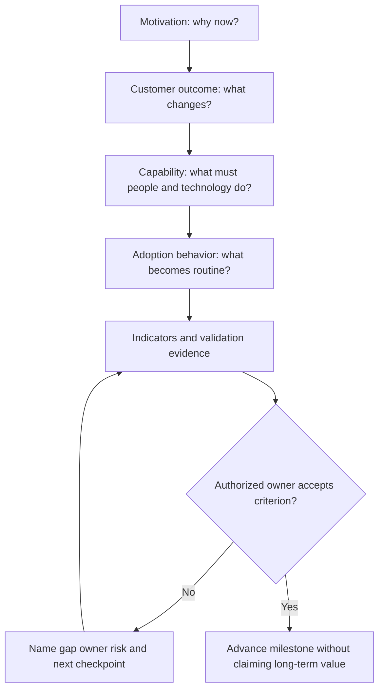

### Outcome discovery questions

| Area | Beginner-friendly question | Why ask it | Unsafe shortcut |
|---|---|---|---|
| Desired change | “What should be different for your team after this onboarding?” | Exposes the actual purpose | Assume product purchase equals shared goal |
| Current workflow | “How is this work handled today, and where does effort or risk appear?” | Creates a baseline and process context | Criticize the current process before understanding it |
| Population | “Which roles, teams, regions, or workflows are in the initial scope?” | Bounds training and validation | Treat one successful admin as organization-wide readiness |
| Decision | “Who accepts technical readiness, business readiness, launch risk, and ongoing ownership?” | Separates authority | Ask the most senior attendee to approve everything |
| Constraints | “Which privacy, security, change, legal, accessibility, regional, or operational constraints matter?” | Prevents late blockers | Treat constraints as administrative delay |
| Evidence | “Which source can show progress without exposing prohibited data?” | Makes success review possible | Collect broad customer data for convenience |
| Time | “Is the date fixed, preferred, or dependent on another event?” | Calibrates commitment | Turn a target into a promise |
| Failure | “What would make us pause, defer, reduce scope, or roll back?” | Establishes stop rules | Define failure only after launch |

### 🔍 Plain-English deep-dive: Activity is not value

Imagine a gym reporting success because it issued 500 access cards. Issuing cards proves distribution, not exercise, health improvement, or satisfaction. The same ladder exists in enterprise software:

- **Enabled:** a capability or integration is available.
- **Reachable:** intended roles can access the right surface.
- **Learned:** people can explain and demonstrate the workflow.
- **Used:** people perform the workflow under appropriate conditions.
- **Adopted:** use becomes consistent and owned.
- **Outcome realized:** the intended operational or business result improves with credible evidence.

Each step needs different evidence. A successful API response may support technical readiness. A teach-back may support learning. Repeated approved workflow use may support adoption. A reduction in effort or risk may support an outcome, but only after checking the baseline, measurement window, other changes, data quality, and attribution limits. Support should never turn “the integration returned success once” into “the customer achieved value.”

## 2. Define success criteria before the work begins

Good success criteria make disagreement useful. Instead of “training went well,” the group can ask whether every designated role completed a synthetic task, explained the decision boundary, and found the support route. Instead of “the integration is healthy,” the group can ask whether each approved validation step produced the expected metadata during a defined window and whether monitoring and ownership exist.

### Success-criteria record

| Field | Meaning | Synthetic example |
|---|---|---|
| Criterion ID | Stable reference | `SC-111-03` |
| Outcome link | Why the criterion matters | “Authorized analysts can route an ambiguous signal safely.” |
| Observable behavior/state | What should be seen | “Each designated practice role classifies one fictional alert and selects the correct escalation route.” |
| Population/scope | Who or what is covered | “Three fictional analyst roles in cohort A; no real users.” |
| Evidence source | Where the evidence comes from | “Local tabletop rubric and teach-back notes.” |
| Threshold/test | What counts as met | “All three roles complete required safety decisions; no automatic failure.” |
| Time window | When evidence is valid | “Fictional day 18 training exercise.” |
| Evidence owner | Who gathers and checks | `TRAINING-OWNER` |
| Acceptance owner | Who decides | `CUSTOMER-OPERATIONS-OWNER` in the fiction |
| Guardrail | What must remain true | “No customer data, secrets, production access, or external send.” |
| Caveat | What success does not prove | “Tabletop performance does not prove production adoption.” |
| Review trigger | When to reassess | “Role, workflow, product, policy, or risk changes.” |

### SMART is useful but incomplete

Specific, Measurable, Achievable, Relevant, and Time-bound criteria are better than vague aspirations, but onboarding also needs **authority, provenance, safety, and interpretation**:

| Quality | Check | Example failure |
|---|---|---|
| Specific | Is the expected behavior or state precise? | “Use the platform effectively.” |
| Measurable | Is there an observable signal? | “Stakeholders feel ready.” |
| Achievable | Is it within current scope and dependency reality? | “Eliminate all threats in 30 days.” |
| Relevant | Does it connect to the stated outcome? | Training on an unused role |
| Time-bound | Is the review window explicit? | “After launch.” |
| Authorized | Can the named owner accept the result and approve the action? | Support approves customer risk |
| Provenanced | Is the source known and trustworthy enough? | Unattributed dashboard screenshot |
| Safe | Can the criterion be tested without prohibited data or change? | Send a real suspicious message to test detection |
| Interpretable | Does it state what the result does and does not prove? | One successful event proves reliability |

### Baseline, target, and guardrail

A **baseline** describes the relevant starting state. A **target** describes a desired future state. A **guardrail** protects another important property while pursuing the target. For example:

- Baseline: “No approved workflow or role owner is documented for the fictional signal.”
- Target: “By fictional day 20, designated roles complete the synthetic workflow and identify the support route.”
- Guardrail: “No production configuration, real content, credential, or customer data is used.”

Without a baseline, improvement cannot be quantified credibly. Without a guardrail, a team can improve one number while creating risk. Without an owner, a target becomes a wish. Without an interpretation note, the team may overclaim causality.

## 3. Prove technical readiness and business readiness separately

Technical readiness asks whether the approved system path can work. Business readiness asks whether the customer organization can operate, govern, and sustain it. Both are required for launch, but a gap in one should not be hidden by strength in the other.

### Dual-readiness matrix

| Domain | Technical-readiness evidence | Business-readiness evidence | Typical owner to verify in a vendor-neutral model | Stop or defer signal |
|---|---|---|---|---|
| Scope and environment | Supported environment and in-scope boundary are documented | Sponsor and process owner accept the initial scope | Technical owner plus business sponsor | Scope is still changing or production boundary is unknown |
| Identity and access | Approved identities, least-privilege roles, authentication path, and access review exist | Joiner/mover/leaver ownership and access-request route are known | Customer identity/security owner | Shared account, overbroad role, secret exchange, or unknown approver |
| Integration | Approved architecture, prerequisites, connectivity, permissions, versions, and data path are known | Integration owner, maintenance window, vendor coordination, and operating impact are agreed | Customer integration owner | Unsupported configuration, missing approval, unknown data path, or no rollback |
| Data and privacy | Data categories, purpose, flow, minimization, storage, access, and retention questions are resolved through approved sources | Privacy, legal, records, and regional decisions are accepted where required | Customer data/privacy owner | Customer data requested for convenience or transfer route is unapproved |
| Security and change | Threat model, least privilege, monitoring, change record, rollback, and stop conditions exist | Risk owner and change authority accept residual risk and timing | Customer security/change owner | Bypass, control disablement, unsafe test, or unclear risk acceptance |
| Functional behavior | Synthetic or approved test produces expected evidence | Operators understand what expected behavior means for the workflow | Technical owner plus operations owner | Result is ambiguous or failure handling is untested |
| Observability | Health, error, audit, and correlation sources are identified and accessible to authorized roles | Someone owns review cadence and escalation | Technical operations owner | No one can tell healthy from silent failure |
| Supportability | Supported versions, safe evidence, known limitations, and support route are documented | Named customer contact, triage owner, communication route, and availability expectations exist | Support and customer operations | “Call whoever set it up” is the operating model |
| Training | Safe training environment/material and role access exist | Audience, manager support, schedule, accessibility, language, and reinforcement are ready | Training/change owner | Training is optional for operators or uses production data |
| Continuity | Backup contacts, credential/certificate lifecycle, review triggers, and recovery questions are documented | Staff coverage, vendor contacts, review calendar, and ownership changes are planned | Operations owner | One unavailable person is the only owner |

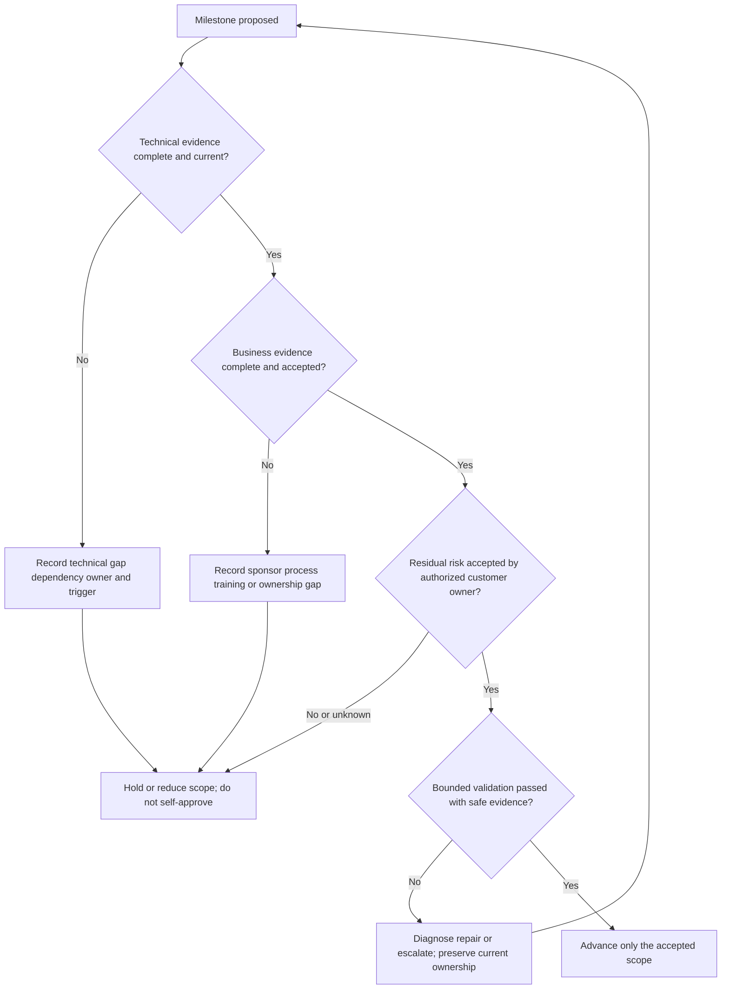

### Readiness status is evidence, not color

Use explicit states:

| State | Meaning | Required next action |
|---|---|---|
| `NOT_ASSESSED` | No adequate current evidence | Assign assessment owner and due checkpoint |
| `BLOCKED` | A prerequisite prevents safe progress | Name blocker, dependency owner, impact, fallback, and escalation trigger |
| `AT_RISK` | Progress is possible but evidence or timing threatens the milestone | State probability/impact qualitatively, mitigation, owner, and review |
| `READY_WITH_ACCEPTED_CONDITION` | Authorized owner accepts a bounded condition and residual risk | Record condition, authority, expiry, monitoring, and reopen trigger |
| `READY` | Current evidence satisfies the defined criterion for the stated scope | Preserve evidence and expiry; do not generalize beyond scope |
| `STALE` | Evidence may no longer describe current state | Revalidate before reliance |

Avoid averaging readiness. Nine green rows and one red identity-permission row do not create “90% ready.” Some prerequisites are hard gates. Also avoid color-only dashboards because “amber” has no stable meaning without impact, evidence, owner, and decision.

### 🔍 Plain-English deep-dive: Readiness is a claim with an expiration date

A passport was valid when issued, but it can expire or become invalid after a change. Readiness behaves similarly. A connectivity test from two weeks ago may not survive a firewall change. Training evidence may no longer apply after the workflow changes. An accepted risk may expire at a launch milestone. A role owner may leave.

Every readiness claim should therefore carry:

- **scope:** which environment, integration, role, workflow, and population;
- **evidence:** what was observed and where;
- **time:** when it was observed;
- **owner:** who verified and who accepted;
- **conditions:** what assumptions must remain true;
- **expiry or trigger:** when it must be reassessed;
- **limits:** what the evidence does not prove.

This discipline prevents “it worked in testing” from becoming a permanent certificate of health.

## 4. Map stakeholders, authority, and RACI

A stakeholder map answers who cares and why. A RACI answers how a particular task is coordinated. Neither should be copied mechanically from a template. The actual customer organization may combine roles, use a different responsibility model, or have formal incident and change structures that supersede this learning model.

### Stakeholder map

| Stakeholder role | Primary concern | Evidence or decision needed | Communication style | Boundary |
|---|---|---|---|---|
| Executive sponsor | Outcome, risk, investment, major blocker | Outcome progress, residual risk, decision options | Concise impact/decision summary | Does not necessarily administer or validate technical state |
| Security operations owner | Triage workflow, response, staffing, escalation | Practice workflow, alert ownership, runbook, coverage | Operational and scenario based | Customer retains incident and risk authority |
| Email/SaaS administrator | Configuration and service interaction | Supported prerequisites, exact change plan, validation, rollback | Precise technical checklist | Support does not assume admin authority |
| Identity/security owner | Access, roles, credentials, lifecycle | Least privilege, approval, monitoring, rotation/revocation ownership | Control and evidence focused | Never request secrets or bypass access controls |
| Integration/network owner | Connectivity, API path, proxy/firewall, dependencies | Architecture, endpoints, flow, errors, monitoring | Expected/actual and layer based | Product-neutral plan does not define Abnormal endpoints |
| Privacy/legal/records | Data purpose, transfer, access, retention, obligations | Current approved data map and decision request | Minimum facts and explicit question | Support does not provide legal conclusions |
| Change manager | Timing, conflict, approval, rollback | Change scope, risk, test, owner, rollback, evidence | Gate and schedule focused | Calendar availability is not approval |
| Training/change lead | Audience readiness and reinforcement | Role map, objectives, materials, accessibility, teach-back | Learner-centered | Attendance is not adoption |
| CSM | Goals, stakeholders, adoption, value, relationship risk | Milestones, blockers, support themes, outcome evidence | Journey and decision focused | Does not replace technical case ownership |
| Support | Technical issue continuity and safe evidence | Case facts, hypotheses, validation, escalation, customer update | Factual and action oriented | Does not promise business outcome or Engineering date |
| Engineering | Product behavior and deep technical investigation | Minimal reproduction, expected/actual, identifiers, impact, explicit ask | Evidence dense | Engagement is not customer-communication transfer |
| Customer operator/end user | Usable workflow and help route | Role-based practice, job aid, feedback, support access | Task and outcome focused | Must not receive authority beyond assigned role |

### Portable RACI for the synthetic plan

`A` means accountable, `R` responsible, `C` consulted, and `I` informed. `A/R` is used sparingly where the same role both owns and performs a small task. Actual organizations must replace this teaching model.

| Task | Customer sponsor | Customer technical owner | Customer operations owner | CSM | Support | Engineering | Training owner |
|---|---|---|---|---|---|---|---|
| Confirm desired outcome and scope | A | C | R | R | C | I | C |
| Approve customer production change | I | A/R | C | I | C | I | I |
| Verify technical prerequisites | I | A/R | C | C | R | C | I |
| Diagnose a product/integration issue | I | C | C | I | A/R | C | I |
| Investigate proprietary defect | I | C | I | I | R | A/R | I |
| Accept customer operational workflow | I | C | A/R | C | C | I | R |
| Design and deliver role training | I | C | A | C | C | I | R |
| Accept launch risk | A | C | R | C | C | I | I |
| Coordinate adoption/success review | A | C | R | A/R | C | I | C |
| Own open technical case after launch | I | C | C | I | A/R | C | I |
| Own recurring customer operation | I | C | A/R | C | C | I | I |
| Promise product roadmap or release | I | I | I | I | I | A only under actual process | I |

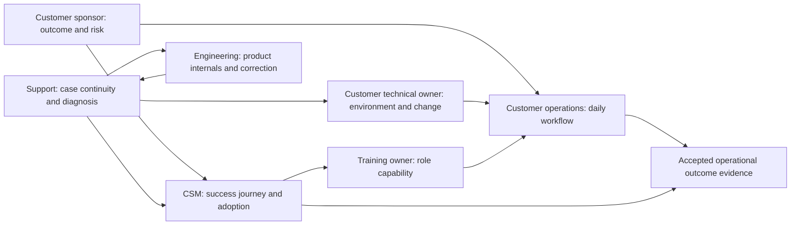

### No responsibility gap rule

A task cannot disappear between columns. For every open item, record:

1. one current owner who remains responsible for continuity;
2. the receiving owner and why that role is appropriate;
3. the exact evidence transferred;
4. the explicit ask or recurring duty;
5. acceptance state and time;
6. the next customer-facing update owner;
7. due time and earlier escalation trigger; and
8. fallback ownership if acceptance does not occur.

The portable default is **the current owner retains continuity until the receiving owner explicitly accepts or an authorized manager reassigns it**. That is a learning principle, not a claim about Abnormal's queue mechanics.

## 5. Manage dependencies and onboarding risk

A dependency register turns “we are waiting” into actionable information. A risk register turns uncertainty into a reviewable decision. A dependency is something another task relies on; a risk is an uncertain event or condition that could affect an objective. A current missing approval may be an issue rather than a risk because it has already happened.

### Dependency register

| ID | Dependency | Needed by | Owner | Evidence of completion | Fallback | Escalation trigger |
|---|---|---|---|---|---|---|
| `DEP-01` | Final in-scope workflow and environment | Readiness review | `CUSTOMER-SPONSOR` | Approved scope record | Reduce phase-one scope | Not accepted by fictional day 3 |
| `DEP-02` | Identity and least-privilege role decision | Integration validation | `IDENTITY-OWNER` | Approved role map; no secret in plan | Defer affected role | Unknown approver by day 5 |
| `DEP-03` | Change authorization and window | Implementation | `CHANGE-OWNER` | Approved change reference | Reschedule; do not self-approve | Window threatens training date |
| `DEP-04` | Data/privacy decision for evidence fields | Validation | `DATA-OWNER` | Approved field/destination list | Use narrower synthetic-only check | Any request for customer content or broad export |
| `DEP-05` | Supported integration prerequisites | Technical gate | `TECHNICAL-OWNER` | Current approved documentation and verified state | Escalate compatibility question | Version or permission unknown |
| `DEP-06` | Monitoring and alert receiver | Launch | `OPERATIONS-OWNER` | Test alert route and acknowledged owner | No launch for affected scope | Silent-failure detection absent |
| `DEP-07` | Training cohort and accessibility needs | Training | `TRAINING-OWNER` | Audience roster by role and accommodation plan | Additional session; reduce launch population | Operators unavailable |
| `DEP-08` | Post-launch support and escalation contacts | Handoff | `OPERATIONS-OWNER` | Accepted contact and route card | Extend bounded hypercare if authorized | No accepting owner by day 28 |

### Risk record

| Field | Meaning | Synthetic example |
|---|---|---|
| Risk statement | Cause, uncertain event, and consequence | “Because the identity approval is pending, the analyst role may not be ready by day 12, delaying validation and training.” |
| Likelihood | Qualitative estimate with rationale | `Medium`: owner identified but review not scheduled |
| Impact | Effect on outcome, security, time, trust, or scope | `High`: launch cannot proceed without least-privilege access |
| Evidence | Current facts and unknowns | Approval request exists; decision time unknown |
| Mitigation | Action that lowers likelihood or impact | Schedule owner review and prepare reduced-scope option |
| Owner | Role that manages the risk | `CUSTOMER-TECHNICAL-OWNER` |
| Decision owner | Role authorized to accept residual risk or scope change | `CUSTOMER-SPONSOR` or actual governance owner |
| Trigger | Observable point that changes action | No decision by fictional day 8 |
| Contingency | Action after trigger | Defer analyst scope; do not use shared/admin account |
| Review | Next time and source | Day 6 checkpoint using approval record |

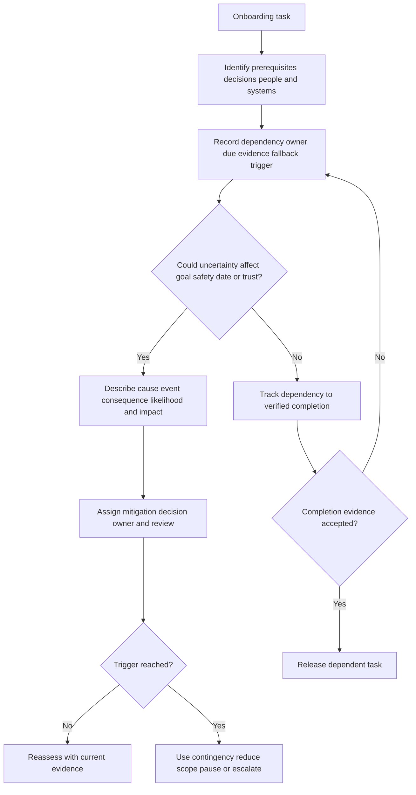

### 🔍 Plain-English deep-dive: A due date is not a dependency strategy

Writing “Identity team by Friday” says almost nothing. It does not identify the exact decision, evidence, approver, downstream impact, fallback, or point at which the team must change course. Good dependency management resembles planning a train connection. You need the arriving train, platform, expected time, minimum transfer time, alternate route, and a decision point for taking the alternate. Merely writing the arrival date does not protect the journey.

When a dependency belongs to the customer, the vendor-side coordinator can clarify and track it but should not pretend to own the customer's decision. When it belongs to another vendor team, Support or the CSM should still preserve customer-facing continuity under the actual operating model. “Blocked by customer” and “with Engineering” are not complete status updates. State what is needed, why, from whom, by when, what happens if it does not arrive, and who updates the customer.

## 6. Validate integrations safely

Integration validation should answer a bounded question with the least risky evidence. It should not use real sensitive content simply because production is available. The plan must identify the test object, authorization, expected path, expected signal, evidence source, stop condition, rollback or containment, and acceptance owner.

### Integration validation card

| Field | Required content | Synthetic example |
|---|---|---|
| Validation question | One testable question | “Does the approved fictional event reach the intended practice queue with its synthetic correlation ID?” |
| Environment | Exact authorized environment | `LOCAL-SYNTHETIC-DESIGN`; no external system |
| Test object | Clearly fictional, non-secret input | `EVENT-SYN-111-A` |
| Preconditions | Approved configuration and owners | Written mock prerequisites only |
| Expected path | Components and responsibility boundaries | `SOURCE-SYN -> CONNECTOR-SYN -> QUEUE-SYN` |
| Expected result | Observable state and time window | One event with matching ID in the fictional ledger |
| Evidence | Minimum approved fields | Synthetic ID, stage, timestamp, status class |
| Negative test | Safe failure behavior | Fictional expired permission produces a documented stop, not retry storm |
| Stop condition | Condition that ends the test | Any real data, account, secret, network action, or ambiguous provenance |
| Rollback/cleanup | Restore or remove test state | Delete only local fictional scratch copy after review; no system rollback exists |
| Owner/observer | Who performs and witnesses | Fictional role aliases |
| Acceptance | Who decides and what it proves | Technical owner accepts paper logic only; no production claim |

### Safe integration validation sequence

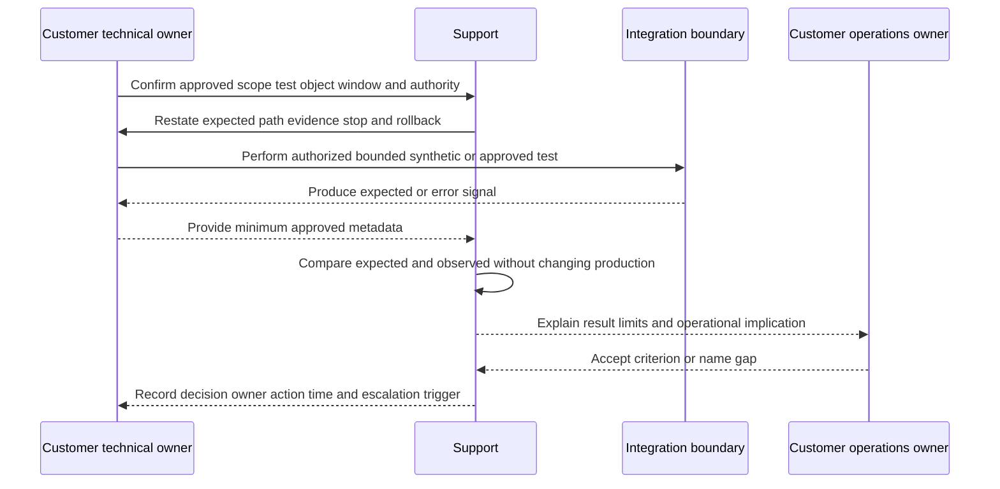

### Validation layers

| Layer | Example question | Evidence | Does not prove |
|---|---|---|---|
| Prerequisite | Are supported environment and permissions confirmed? | Current approved requirements and state | End-to-end function |
| Connectivity | Can intended endpoints communicate under approved policy? | Bounded connection result and time | Correct authorization or payload processing |
| Authentication | Does the intended principal authenticate safely? | Sanitized status and identity class | Authorization to every resource |
| Authorization | Can the principal perform only intended operations? | Positive and safe negative permission tests | No hidden privilege elsewhere |
| Data path | Does one approved synthetic object traverse expected stages? | Correlated stage events | Long-term completeness or production volume |
| Functional | Does the intended workflow produce expected behavior? | Expected/actual result | Business adoption or all edge cases |
| Failure handling | Does a safe failure stop, retry, alert, or route as designed? | Bounded negative test | Every outage behavior |
| Observability | Can the owner distinguish healthy, delayed, failed, and silent states? | Health/error/audit signals | Someone will actually monitor them |
| Operational | Can the role detect, decide, act, and escalate? | Scenario/teach-back | Long-term outcome |

Unsafe integration testing includes sending live malicious content, using customer messages or files without authorization, exposing tokens, widening permissions “temporarily,” disabling a control, testing destructive remediation, replaying a real event, generating uncontrolled load, bypassing change review, testing in another tenant, or assuming a vendor demo behavior applies to the customer's version and configuration. Stop and route the decision instead.

## 7. Build adoption through role-based training

Training should be designed around decisions and tasks, not around a feature tour. An executive sponsor needs outcome and risk language. An administrator needs prerequisites, change boundaries, health checks, and escalation evidence. A SOC analyst needs triage steps, decision criteria, evidence handling, and stop conditions. A service-desk contact needs intake and routing. A privacy owner needs data-flow and decision questions. One deck cannot prove every role is ready.

### Role-based training plan

| Audience | Must understand | Must demonstrate safely | Job aid | Reinforcement | Evidence and limitation |
|---|---|---|---|---|---|
| Executive sponsor | Outcome, scope, major risk, decision points, review cadence | Explain what launch does and does not prove | One-page outcome/risk brief | Day-30 success review | Teach-back supports alignment, not operational skill |
| Technical administrator | Prerequisites, roles, configuration boundary, validation, rollback, monitoring | Walk through a synthetic health and escalation check | Readiness/runbook card | Office hour and post-change review | Tabletop does not prove production permission |
| SOC analyst/operator | Intended workflow, evidence, verdict uncertainty, safe response, escalation | Triage one fictional signal and identify stop/escalation point | Decision tree and evidence checklist | Scenario drill during hypercare | Practice completion does not prove adoption |
| Service desk/L1 contact | Intake, minimum evidence, severity/impact, routing, customer update | Classify a fictional request and build a safe handoff | Intake and route card | Sample-case review | Correct routing exercise does not prove case quality over time |
| Identity/integration owner | Permission lifecycle, monitoring, rotation/revocation, dependency response | Explain owner and action for a fictional expired permission | Lifecycle checklist | Calendar review | No secret or live permission is used |
| Privacy/security owner | Data categories, purpose, access, retention questions, incident route | Identify a prohibited evidence request | Data-handling boundary card | Policy update trigger | Training is not legal approval |
| CSM/account partner | Goal, adoption indicators, blockers, support themes, promise boundaries | Distinguish technical issue, adoption risk, and outcome question | Success-handoff summary | Regular success checkpoint | Does not grant technical or commercial authority |

### Training design cycle

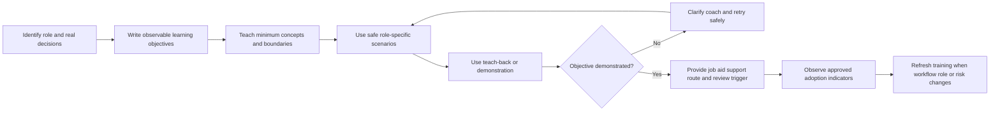

### Training quality checks

| Weak approach | Why it fails | Better approach |
|---|---|---|
| One generic hour for everyone | Roles make different decisions | Separate shared context from role practice |
| Product tour with no customer workflow | Learners see controls but not when or why to use them | Map screens or concepts to the approved job flow |
| Attendance equals readiness | Presence does not show understanding | Use teach-back and safe demonstration |
| Production data makes training “real” | Exposes data and may trigger real actions | Use obvious synthetic fixtures in an approved environment |
| Record everything for absentees | Creates durable privacy and retention risk | Use approved reusable materials; verify capture policy separately |
| Teach only happy path | Operators fail under ambiguity | Include safe negative cases, stop rules, and escalation |
| No job aid or support route | Knowledge decays after the session | Provide concise role card and current help path |
| No accessibility or language check | Excludes learners and distorts evaluation | Confirm approved accommodations and localized needs |
| No reinforcement | One event rarely creates durable behavior | Schedule office hours, drills, and review triggers |

### Adoption evidence ladder

| Evidence level | Example | Strength | Interpretation boundary |
|---|---|---|---|
| Invitation | Role was invited to training | Very weak | Does not prove attendance or interest |
| Attendance | Role attended | Weak | Does not prove comprehension |
| Knowledge check | Role answered concept questions | Moderate for knowledge | Does not prove workflow execution |
| Safe demonstration | Role completes fictional task and escalation | Stronger for capability | Does not prove production use |
| Approved workflow use | Intended role repeatedly performs the actual authorized workflow | Stronger for adoption | May still be driven by temporary launch attention |
| Sustained use plus quality | Workflow use remains consistent and decisions meet quality criteria | Strong | Requires representative window and reliable data |
| Customer outcome | Operational/business measure changes credibly | Outcome evidence | Other changes may contribute; avoid causal inflation |

### 🔍 Plain-English deep-dive: Adoption is a behavior, not a dashboard decoration

A usage chart can count events while hiding whether they came from the intended people, workflow, or purpose. Ten logins might be one administrator troubleshooting. A hundred alerts opened might reflect noise, not effective triage. Zero support tickets might mean a smooth launch, or it might mean users do not know where to ask for help.

Treat each metric as a witness with limited visibility. Ask what unit it counts, who is included, which time zone and window apply, what automation creates events, what population is missing, and what behavior the metric cannot see. Combine quantitative evidence with bounded qualitative evidence such as role teach-back, workflow review, and customer-owner acceptance. Never manufacture an adoption percentage to make a plan look complete.

## 8. Partner with the CSM without blurring ownership

The CSM and Support should share context while preserving distinct duties. The CSM usually brings the customer goal, stakeholder map, commercial or relationship context, milestone narrative, adoption pattern, and success-plan continuity. Support brings technical symptom framing, evidence, troubleshooting state, workarounds or limitations under approved guidance, escalation quality, and case communication. Engineering brings product-internal analysis or correction when needed. The customer retains authority for its environment, users, workflows, data, risk, and launch.

### Joint operating questions

| Moment | CSM contribution | Support contribution | Joint output | Boundary check |
|---|---|---|---|---|
| Discovery | Goal, sponsor, stakeholders, journey risk | Technical prerequisites and likely evidence | Outcome/readiness charter | No promise based on incomplete discovery |
| Planning | Milestones, adoption audiences, customer cadence | Validation dependencies, supportability, technical risks | Integrated plan and risk register | CSM does not approve technical state; Support does not define customer value alone |
| Blocker | Relationship impact and decision audience | Facts, hypotheses, workaround/limitation state, escalation | One customer-safe update | Do not create competing messages |
| Training | Audience, sponsor support, role/change context | Technical workflow and safe troubleshooting | Role-based enablement plan | Attendance is not adoption |
| Launch | Customer goal and business-risk view | Readiness evidence and technical open items | Decision packet | Customer authority accepts launch risk |
| Hypercare | Adoption friction and stakeholder feedback | Cases, integration health, technical patterns | Joint checkpoint | Hypercare does not create unlimited response promises |
| Handoff | Success cadence and relationship owner | Support route, technical open items, evidence limits | Accepted ownership map | No task without accepting owner |
| Review | Outcome/adoption evidence | Support themes and technical quality | Next success hypothesis | Cases alone do not prove value |

### One-message discipline

When a blocker crosses functions, agree on:

- direct facts and attributed reports;
- effect on the customer outcome and timeline;
- current technical owner and customer-facing update owner;
- what is being investigated and what is not established;
- any workaround and its validation/approval limits;
- decision needed, from whom, and by when;
- next checkpoint, even if the result remains unknown; and
- commitments that are explicitly not being made.

A CSM should not tell the customer “Engineering will fix it tomorrow” based on optimism. Support should not tell the customer “this does not matter” because a technical check passed. Engineering should not become the unplanned customer update owner merely because it accepted an escalation. The teams can speak with one factual voice while owning different work.

## 9. Launch, hypercare, and post-launch ownership

Launch is a decision to begin an agreed operating scope under known conditions. It should be based on accepted evidence, not deadline pressure or an overall green percentage. A launch decision record should include scope, criteria met, criteria not met, accepted conditions, residual risks, decision authority, rollback or containment, monitoring, customer communication, hypercare duration, and ownership after hypercare.

### Launch decision states

| Decision | Meaning | Required record |
|---|---|---|
| `GO` | All hard gates are met for the stated scope | Evidence, acceptance owners, monitoring, hypercare, handoff plan |
| `CONDITIONAL_GO` | Authorized owner accepts explicit conditions and residual risk for a bounded scope/time | Conditions, authority, expiry, mitigation, triggers, rollback, review |
| `REDUCED_SCOPE_GO` | A safe subset can launch while blocked scope remains out | Included/excluded population, dependency, communication, later gate |
| `HOLD` | Evidence, authority, safety, or ownership is inadequate | Blocker, owner, next decision time, customer-safe update |
| `NO_GO` | Risk or unmet prerequisite makes launch inappropriate | Decision rationale, impact, required remediation, re-entry criteria |

### Hypercare plan

| Dimension | Plan question | Strong synthetic answer |
|---|---|---|
| Duration | When does heightened coordination start and end? | “Fictional days 21-27, ending only after exit review.” |
| Scope | Which roles, integration, workflow, and risks are covered? | “One synthetic workflow and designated practice roles.” |
| Monitoring | Which health and workflow signals are reviewed? | “Synthetic stage status, error class, acknowledged practice events, and open risks.” |
| Cadence | When are checkpoints held? | “Daily written review through day 23, then day 25 and day 27.” |
| Triage | How are issues classified and routed? | “Technical case, adoption blocker, customer decision, security/privacy trigger, or product question.” |
| Authority | Who can change scope, accept risk, or stop? | “Fictional customer sponsor and technical/change owners by domain.” |
| Exit criteria | What must be true to leave hypercare? | “Stable bounded validation, no ownerless high risk, trained owners, accepted support route, next review scheduled.” |
| Extension | Who decides and what changes? | “Authorized owner records reason, bounded duration, staffing, scope, and next exit review.” |

### Handoff acceptance packet

| Packet section | Required content | Acceptance test |
|---|---|---|
| Outcome and scope | Desired outcome, current scope, exclusions, and success criteria | Receiver can explain what is and is not being claimed |
| Current state | Readiness, validation results, launch decision, and evidence dates | Receiver identifies stale or conditional evidence |
| Architecture/dependencies | Approved high-level flow, owners, external dependencies, and failure signals | Receiver can route a dependency failure |
| Operations | Routine tasks, monitoring, schedule, change boundaries, and runbook location | Operator demonstrates one synthetic routine and stop rule |
| Open items | Risks, issues, technical cases, decisions, actions, due times, and triggers | Every row has current and receiving ownership |
| Support | Intake route, minimum safe evidence, impact/severity method, and communication path | Receiver can create a fictional support handoff |
| Escalation | Security/privacy, technical, adoption, commercial, and incident decision domains | Receiver distinguishes routes without inventing owners |
| Training | Audience, completion evidence, gaps, job aids, and reinforcement | Training owner accepts remaining gap plan |
| Success | Adoption indicators, outcome review, data limitations, and CSM cadence | CSM/customer owner accepts review method |
| Acceptance | Named role, time, questions, conditions, rejected items, and next checkpoint | Explicit acceptance exists; silence does not count |

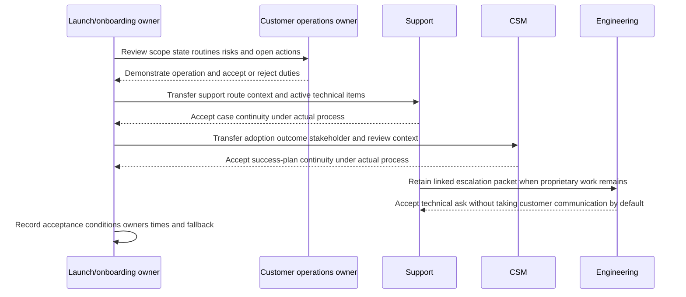

### Post-launch ownership matrix

| Recurring responsibility | Primary owner in the synthetic model | Support/CSM/Engineering interaction | Evidence of ownership | Gap response |
|---|---|---|---|---|
| Daily/periodic workflow operation | Customer operations owner | Support handles technical cases; CSM tracks adoption | Runbook acceptance and role coverage | Extend training or hold scope if no operator |
| Integration health monitoring | Customer technical owner | Support diagnoses bounded failures | Monitor owner and alert route | No launch/exit if silent failure has no owner |
| Identity/permission lifecycle | Customer identity owner | Support clarifies supported behavior; Engineering only if product issue | Review/rotation/revocation calendar | Escalate before expiry; never share credentials |
| Customer support case | Support under actual entitlement/process | CSM receives journey impact; Engineering receives qualified packet | Accepted case owner and next update | Current owner retains continuity until accepted |
| Adoption and success review | CSM plus customer outcome owner | Support supplies aggregated technical themes | Scheduled review and defined indicators | Do not infer adoption from ticket volume |
| Product defect | Engineering under actual intake/priority | Support owns packet and customer updates; CSM handles relationship context | Engineering acceptance and Support checkpoint | No fix/date promise |
| Security/privacy concern | Customer/vendor designated security/privacy roles | Ordinary workflow may pause or be superseded | Approved route and incident owner | Stop unsafe work; do not self-classify or investigate beyond authority |
| Product enhancement need | Product route under actual process | CSM/Support provide evidence and impact | Submitted feedback with no commitment | Do not promise roadmap or priority |

## 10. Artifact - 30-day onboarding and success-handoff plan

**Artifact label:** `SYNTHETIC_WRITTEN_30_DAY_PLAN_COMPLETED_NOT_EXECUTED_NOT_CUSTOMER_ACCEPTED`.

The plan below is a reusable teaching artifact. `Northstar Harbor`, every role alias, date relative to `D0`, integration, criterion, risk, signal, status, and decision are fictional. “Day” means a planning milestone, not a contractual duration or Abnormal commitment. A real timeline may be shorter or longer and must follow current scope, product guidance, customer availability, risk, change process, and contract.

### A. Charter

| Field | Completed synthetic content |
|---|---|
| Customer alias | `Northstar Harbor` - invented; no real organization or domain |
| Desired outcome | Designated fictional security roles can use one approved synthetic email-security workflow, understand its limits, and route uncertainty through named channels |
| Initial scope | One fictional tenant alias, one fictional workflow, one synthetic integration path, three fictional learner roles |
| Out of scope | Production access/change, real email or SaaS content, threat simulation, credentials, remediation, broad logging, legal conclusions, commercial promises, roadmap, unsupported product behavior |
| Success horizon | Thirty fictional planning days for readiness, safe written validation, training, launch decision, hypercare, and ownership handoff |
| Technical success | Every hard prerequisite has current accepted evidence; synthetic path and safe negative path meet defined paper criteria |
| Business success | Sponsor, operations owner, training audience, support routes, risk authority, and review cadence are accepted in writing within the fiction |
| Adoption hypothesis | Role-based training plus job aids and early checkpoints will make the intended fictional workflow easier to use consistently |
| Outcome evidence limit | The written exercise cannot prove real readiness, adoption, value, product performance, customer sentiment, or a 30-day result |
| Decision model | Gate-based: a date never overrides safety, authority, hard prerequisites, or accepted ownership |
| Data rule | Obvious fiction only; no customer data, secrets, copied logs, screenshots, domains, accounts, or external service |

### B. Thirty-day phase plan

| Phase | Days | Goal | Key activities | Exit evidence | Owner pattern | Main risk |
|---|---:|---|---|---|---|---|
| 0. Pre-kickoff contract | `D0` | Agree how onboarding will be governed | Confirm goal, scope, roles, source of truth, communication, data rules, decision gates, dates, and honesty boundary | Accepted charter or explicit gaps | CSM coordinates goal; technical owner and Support shape readiness; customer sponsor accepts scope | Starting from a promised date without authority |
| 1. Discovery and outcome alignment | `D1-D5` | Establish current state and measurable desired change | Map stakeholders, workflow, baseline, constraints, dependencies, integration context, training population, and success criteria | Outcome chain, stakeholder map, initial RACI, criteria ledger, risk/dependency registers | Customer sponsor accountable; CSM leads success context; Support contributes technical questions | Goal remains feature-centric or stakeholder missing |
| 2. Readiness and design | `D6-D10` | Determine whether implementation can proceed safely | Verify supported prerequisites from approved docs, identity/access, integration design, data/privacy, change, validation, observability, rollback, and supportability | Dual-readiness review with hard gates and unresolved items | Customer technical/change owners decide their environment; Support verifies product-facing evidence within authority | Permission, data path, or change ownership unclear |
| 3. Authorized implementation and technical validation | `D11-D15` | Establish and test the bounded technical path | Perform only approved implementation; run synthetic/approved positive and safe negative validation; record expected/actual and evidence limits | Validation cards, issue packets, updated readiness and risk | Customer authorized operator implements; Support guides/diagnoses; Engineering only through accepted escalation | Unsafe production testing or unsupported configuration |
| 4. Operational validation and training | `D16-D20` | Prepare people and process to operate | Role-based training, teach-back, workflow rehearsal, support-intake drill, stop/escalation exercise, accessibility check | Training ledger, job aids, operational acceptance, known gaps | Training/customer operations owner accountable; CSM/Support contribute by scope | Attendance mistaken for adoption |
| 5. Launch and hypercare | `D21-D27` | Begin the accepted scope and observe early operation | Record go/hold decision, activate monitoring and support routes, run bounded checkpoints, classify blockers, update risk | Launch decision, hypercare log, issue/adoption separation, exit evidence | Customer authority decides launch; Support owns cases; CSM coordinates journey | Deadline pressure hides hard gate or creates vague premium promise |
| 6. Success handoff and day-30 review | `D28-D30` | Transfer durable ownership and define next review | Review packet, demonstrate routines, accept open work, reconcile systems of record, schedule success/technical reviews | Signed/recorded acceptance by roles, owner matrix, next checkpoints, remaining risk | Receiving customer owners, Support, CSM, and any Engineering route accept only their duties | Document sent but ownership not accepted |

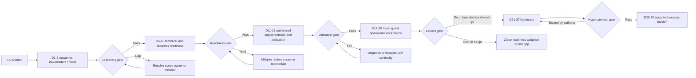

### C. Day-by-day action ledger

| Day | Action | Deliverable/evidence | Responsible role | Accountable/accepting role | Stop or escalation trigger |
|---:|---|---|---|---|---|
| 0 | Confirm charter, data prohibition, systems of record, and decision cadence | Charter v1 and open-question list | `CSM-ROLE` with `SUPPORT-ROLE` | `CUSTOMER-SPONSOR` | Any implied contract, unsupported timeline, or Abnormal process claim |
| 1 | Run outcome discovery | Motivation-outcome-capability chain | `CSM-ROLE` | `CUSTOMER-SPONSOR` | No accountable customer outcome owner |
| 2 | Map current workflow and baseline | Current-state map and baseline limits | `CUSTOMER-OPS-OWNER` | `CUSTOMER-SPONSOR` | Request for customer content or unverifiable metric |
| 3 | Map stakeholders and decision authority | Stakeholder/RACI draft | `CSM-ROLE` | `CUSTOMER-SPONSOR` | Security, privacy, technical, or operations owner absent |
| 4 | Define success criteria and guardrails | Criteria ledger | `CSM-ROLE` and `SUPPORT-ROLE` | Domain acceptance owners | Criterion requires unsafe test or fabricated adoption data |
| 5 | Review dependencies and risks | Registers with owners/triggers | `ONBOARDING-COORDINATOR` | Domain decision owners | Ownerless hard dependency or unaccepted high risk |
| 6 | Verify environment/support prerequisites | Technical-readiness evidence index | `CUSTOMER-TECH-OWNER` and `SUPPORT-ROLE` | `CUSTOMER-TECH-OWNER` | Unsupported or undocumented environment |
| 7 | Review identity/access lifecycle | Least-privilege and lifecycle record | `IDENTITY-OWNER` | `SECURITY-OWNER` | Shared credential, secret transfer, or overbroad permission |
| 8 | Review integration/data flow and privacy questions | Approved high-level flow and data decision record | `INTEGRATION-OWNER` | `DATA-OWNER` and `SECURITY-OWNER` as applicable | Unknown data path, purpose, transfer, access, or retention decision |
| 9 | Review change, rollback, monitoring, and supportability | Change/monitor/support cards | `CUSTOMER-TECH-OWNER` | `CHANGE-OWNER` | No rollback/containment, no health signal, or no operator |
| 10 | Hold dual-readiness gate | `GO_TO_IMPLEMENT`, `REDUCE_SCOPE`, or `HOLD` record | `ONBOARDING-COORDINATOR` | Authorized domain owners | Any hard gate incomplete |
| 11 | Execute only authorized bounded implementation | Current-state/change evidence | Customer-authorized operator | `CHANGE-OWNER` | Support asked to alter production without authority |
| 12 | Run bounded positive integration validation | Expected/actual card | Customer-authorized operator with Support | `CUSTOMER-TECH-OWNER` | Real content, secret, uncontrolled load, or unexpected state |
| 13 | Run approved safe negative/failure validation | Failure-handling card | Customer-authorized operator with Support | `CUSTOMER-TECH-OWNER` | Test could disrupt, remediate, bypass, or affect users |
| 14 | Diagnose gaps and create qualified escalation if needed | Minimum issue packet and customer update | `SUPPORT-ROLE` | Support owner under actual process | Root cause/defect/date claimed without evidence |
| 15 | Hold technical validation gate | Accepted result, limitations, and remaining case state | `SUPPORT-ROLE` | `CUSTOMER-TECH-OWNER` | Ambiguous result presented as pass |
| 16 | Deliver sponsor and owner orientation | Outcome/risk/decision teach-back | `CSM-ROLE` | `CUSTOMER-SPONSOR` | Sponsor cannot identify scope or risk owner |
| 17 | Deliver administrator training | Synthetic health/change/support demonstration | `TRAINING-OWNER` and `SUPPORT-ROLE` | `CUSTOMER-TECH-OWNER` | Production data or configuration used for convenience |
| 18 | Deliver analyst/operator training | Fictional triage, stop, and escalation scenario | `TRAINING-OWNER` | `CUSTOMER-OPS-OWNER` | Attendance counted as competence |
| 19 | Run support-intake and handoff drill | Fictional case and handoff acceptance | `SUPPORT-ROLE` | `CUSTOMER-OPS-OWNER` | Responsibility gap or credential/content request |
| 20 | Hold operational-readiness gate | Training gaps, job aids, coverage, acceptance | `TRAINING-OWNER` | `CUSTOMER-OPS-OWNER` | No operator coverage or unresolved automatic failure |
| 21 | Hold launch decision | Signed decision with scope, risk, monitoring, rollback | `ONBOARDING-COORDINATOR` | Customer authorized launch/risk owner | Date pressure substitutes for evidence |
| 22 | Review first bounded health/workflow signals | Hypercare checkpoint 1 | `CUSTOMER-OPS-OWNER`; Support for cases | Domain owners | Silent failure, unsafe action, security/privacy trigger |
| 23 | Separate technical defects, configuration, training, and adoption blockers | Classified issue/adoption ledger | `SUPPORT-ROLE` and `CSM-ROLE` | Respective owners | One team absorbs all work without acceptance |
| 24 | Reinforce job aids and close knowledge gaps | Updated approved job aid and gap record | `TRAINING-OWNER` | `CUSTOMER-OPS-OWNER` | Unreviewed workaround becomes training |
| 25 | Review risks, support themes, and outcome indicators | Hypercare checkpoint 2 | `CSM-ROLE` and `SUPPORT-ROLE` | `CUSTOMER-SPONSOR` | Ticket count misrepresented as adoption/value |
| 26 | Rehearse recurring operations and escalation | Synthetic rotation/monitor/failure tabletop | `CUSTOMER-OPS-OWNER` | `CUSTOMER-TECH-OWNER` | Real credential rotation or production test attempted |
| 27 | Hold hypercare exit review | Exit, extension, reduced scope, or hold decision | `ONBOARDING-COORDINATOR` | Customer decision owner | High risk, no owner, or failed operating demonstration |
| 28 | Reconcile handoff packet and systems of record | Current state, open items, actions, links, no duplication | Current owners | Receiving owners | Conflicting source of truth or missing customer update owner |
| 29 | Conduct acceptance walkthrough | Demonstrations and explicit accept/reject entries | Current and receiving owners | Each receiving owner | Silence, forwarding, or meeting attendance treated as acceptance |
| 30 | Review outcome hypothesis and close onboarding phase | Day-30 review, next success/technical checkpoints | `CSM-ROLE` and customer owner | `CUSTOMER-SPONSOR` | Fabricated adoption, false completion, or unresolved responsibility gap |

### D. Gate checklist

| Gate | Must be true | May remain open only if | Automatic hold |
|---|---|---|---|
| Discovery gate | Outcome, scope, stakeholder authority, criteria, constraints, dependencies, and data boundary are usable | Non-hard preference has owner and review | No sponsor, undefined production scope, unsafe criterion |
| Readiness gate | Hard technical/business prerequisites have current evidence and acceptance | Explicit bounded condition has authorized risk decision, expiry, and mitigation | Secret handling, unknown data path, unsupported configuration, no change authority |
| Validation gate | Authorized positive and required safe negative checks meet criteria; limits documented | Qualified technical issue has an approved reduced-scope path | Unsafe test, ambiguous pass, no rollback/stop, unowned monitoring |
| Operational gate | Required roles demonstrate tasks, stop rules, and support route; job aids and coverage exist | Named gap excludes affected role/scope | Production content used in training, no operator, responsibility gap |
| Launch gate | Scope, risk, monitoring, rollback, communication, support, hypercare, and handoff plan accepted | Conditional/reduced scope is explicit and time-bounded | Date-only decision, unaccepted high risk, missing authority |
| Hypercare exit gate | Stable bounded signals, classified open items, trained owners, accepted routes, and next reviews exist | Extension has authorized scope, resources, date, and exit criteria | High-severity unknown, silent failure, ownerless action, fabricated adoption |
| Handoff gate | Every recurring/open duty has an accepting owner, evidence, due/review time, and fallback | Rejected item remains with current owner and is escalated | Document-only transfer, silence, conflicting records, no customer update owner |

### E. Success-handoff record

```text
SUCCESS HANDOFF - SYNTHETIC TEMPLATE

Honesty state:
  [SYNTHETIC WRITTEN / LOCAL REHEARSAL COMPLETED / REAL AUTHORIZED]
  Never select a state that exceeds evidence.

Customer goal and scope:
  Safe reference:
  Desired outcome:
  Included workflow/population:
  Exclusions:
  Success criteria and current evidence:
  Claims explicitly not made:

Readiness and launch:
  Technical readiness state, evidence date, owner:
  Business readiness state, evidence date, owner:
  Launch decision, authority, conditions, expiry:
  Validation performed and limits:
  Rollback/containment and monitoring ownership:

Open work:
  Item ID:
  Type: technical / adoption / risk / decision / training / product
  Current owner:
  Receiving owner:
  Evidence and explicit ask:
  Acceptance: accepted / rejected / pending
  Due time and time zone:
  Earlier escalation trigger:
  Customer-facing update owner and checkpoint:

Recurring ownership:
  Workflow operator:
  Integration health owner:
  Identity/credential lifecycle owner:
  Support intake route:
  Security/privacy route:
  CSM success review:
  Technical review:
  Training reinforcement owner:

Acceptance:
  Receiver role and date/time:
  What is accepted:
  Conditions or rejected items:
  Demonstration/teach-back result:
  Fallback owner:
  Next review:
```

### F. Day-30 output summary

In the fictional written artifact, the correct day-30 statement is not “Northstar Harbor successfully adopted Abnormal.” The defensible statement is:

> “A vendor-neutral 30-day onboarding and success-handoff plan was completed in writing using obvious fictional roles and events. It defines outcomes, technical and business readiness, dependencies, risks, safe integration validation, role-based training, launch and hypercare gates, CSM-Support-Engineering boundaries, and explicit handoff acceptance. No customer, Abnormal system, external integration, production configuration, data, credential, training session, adoption measurement, launch, or handoff was involved. No real outcome was produced.”

## 11. Worked onboarding scenario A - technically ready but operationally blocked

**Honesty label:** `SYNTHETIC_WORKED_ONBOARDING_SCENARIO_COMPLETED_IN_WRITING_NOT_PERFORMED`. `Cedar Quay`, its roles, workflow, dates, data, integration, decisions, and outcome are fictional.

### Scenario

By fictional day 15, the paper integration validation has all expected synthetic states. The technical owner wants to launch on day 18. However, the customer operations owner has not approved who reviews the fictional alert queue outside one person's shift, and two designated operators have not completed the stop/escalation scenario. The sponsor says, “The integration is green, so let us launch and train later.”

### Analysis

| Dimension | Evidence | Status | Interpretation |
|---|---|---|---|
| Technical prerequisites | All paper prerequisites accepted for fictional scope | `READY` | Supports technical gate only |
| Positive validation | Synthetic event path matches expected written result | `READY` | Does not prove production behavior or adoption |
| Failure validation | Fictional error routes to a visible paper alert | `READY` | Does not prove someone monitors it |
| Operator coverage | Only one role is assigned; off-shift owner missing | `BLOCKED` | Creates responsibility gap and silent backlog risk |
| Training | One of three roles completed teach-back | `BLOCKED` | Attendance/availability cannot be inferred |
| Support route | Fictional intake card exists | `READY_WITH_ACCEPTED_CONDITION` | Still requires operators to recognize when to use it |
| Launch risk | Business owner has not accepted operational gap | `BLOCKED` | Technical team cannot self-accept customer operational risk |

Support explains: “The technical evidence supports the defined synthetic path, but launch readiness has two separate hard gaps: operating coverage and role demonstration. Launching now would create an ownerless queue and ask unprepared roles to make decisions. I recommend holding the affected scope, scheduling the two role exercises, and having the customer operations owner accept coverage. If the sponsor needs a date decision today, we can present a reduced-scope option that excludes the unowned period, subject to the actual customer risk and change owners.”

The CSM connects the blocker to the customer journey: the outcome is consistent handling, not merely an enabled path. The CSM does not declare the integration broken or approve operations. Support does not claim poor adoption because use has not begun. Engineering is not engaged because no product deviation is evidenced.

### Decision and handoff

The fictional customer authority selects `HOLD`. `TRAINING-OWNER` schedules role exercises by day 19. `CUSTOMER-OPS-OWNER` defines coverage and accepts the recurring queue duty by day 20. Support remains available for bounded technical questions. The launch decision is revisited after operational evidence exists.

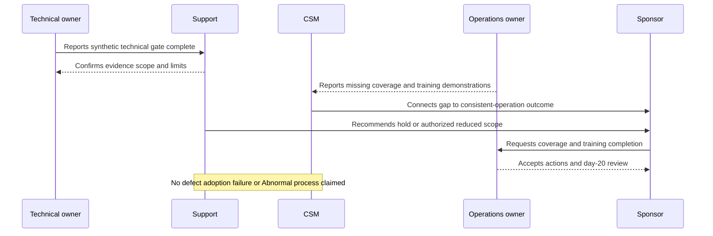

### Why this scenario is strong

- It does not let technical green hide business red.
- It treats unowned operation as a launch blocker, not a post-launch detail.
- It distinguishes missing readiness from failed adoption; adoption cannot fail before the behavior has a fair chance to occur.
- It gives the sponsor options without manufacturing a risk acceptance.
- It keeps Engineering out of a non-defect issue.
- It assigns exact actions and preserves a review decision.

## 12. Worked onboarding scenario B - integration ambiguity and date pressure

**Honesty label:** `SYNTHETIC_WORKED_ONBOARDING_SCENARIO_COMPLETED_IN_WRITING_NOT_PERFORMED`. `Juniper Vale`, its executive request, roles, event, statuses, dates, risk, and resolution are fictional. No network, API, tenant, message, account, or product was touched.

### Scenario

A fictional executive announcement has set day 21 as a preferred launch date. During the written positive validation on day 13, the synthetic source records `ACCEPTED`, but the destination has no corresponding synthetic event within the agreed window. The integration owner proposes three shortcuts: grant a broad administrator role, replay a copied production event, and disable a security control for ten minutes. A CSM worries that moving the date will damage trust. A Support engineer is asked to say that “the backend is just delayed” and commit to launch.

### Evidence and hypothesis control

| Item | Correct record |
|---|---|
| Direct observation | In the fictional paper ledger, source stage is `ACCEPTED` at `T+0`; no destination event is recorded by `T+10`. |
| Unknown | Whether the fictional gap represents delay, permission, routing, observability, fixture error, or another cause |
| Hypothesis A | Permission does not allow the intended operation |
| Hypothesis B | Event reached the destination but the chosen observation is incomplete |
| Hypothesis C | The synthetic author intentionally omitted an event to test escalation behavior |
| Prohibited conclusion | “Backend delay,” “product defect,” “customer misconfiguration,” “security incident,” or “safe to launch” |
| Safe next step | Stop the fictional test, preserve minimum synthetic metadata, compare approved prerequisites, and formulate a qualified technical question |

Support declines all three shortcuts. A broader role violates least privilege and lacks authorization. A production replay would use real customer data and may trigger real effects. Disabling a security control is a bypass and customer-state change. None is required to build a decision-ready escalation.

The customer-facing update says: “The bounded validation did not meet its criterion because the expected destination evidence was absent within the agreed fictional window. We have not established the cause. We stopped rather than widen permission, reuse production data, or weaken a control. Support owns the technical evidence packet and the next update at fictional 16:00 UTC. The launch gate remains on hold. The CSM will coordinate the milestone impact and decision audience; no launch or fix date is committed.”

### Escalation and ownership

| Work | Current owner | Receiving owner | Acceptance/evidence | Customer update owner |
|---|---|---|---|---|
| Technical question | `SUPPORT-ROLE` | `ENGINEERING-ROLE` only after actual qualified intake | Expected/actual, synthetic ID, stage times, scope, safe attempts, explicit ask | `SUPPORT-ROLE` |
| Launch milestone | `ONBOARDING-COORDINATOR` | Customer launch authority | Validation failure and options | `CSM-ROLE` coordinates joint message |
| Relationship concern | `CSM-ROLE` | Customer sponsor discussion | Impact, uncertainty, revised decision point | `CSM-ROLE` |
| Permission proposal | `IDENTITY-OWNER` | Customer security/risk owner if reconsidered | Least-privilege question; no secret | Customer technical owner |
| Unresolved handoff | Current owner retains it | No silent transfer | Pending acceptance is visible | Named owner remains accountable |

The fictional launch authority chooses `HOLD`, not because Support controls launch, but because the authorized customer role sees an unmet hard criterion. The preferred day becomes a planning input rather than a commitment. The CSM protects trust by making the reason, owner, and next checkpoint clear. Engineering acceptance, if it occurred in a real process, would not prove a defect or move customer communication away from Support automatically.

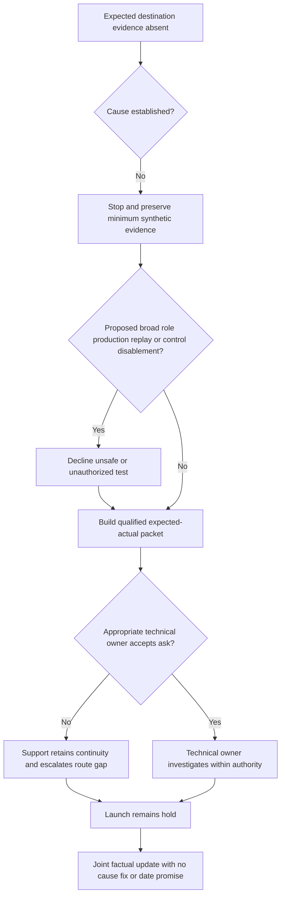

### Why this scenario is strong

- It does not let an executive date override a failed hard gate.
- It refuses customer data, excess privilege, and control bypass without becoming passive.
- It separates observed absence from an invented backend explanation.
- It gives CSM, Support, Engineering, and customer authorities distinct work.
- It preserves customer-facing ownership while escalation acceptance is pending.
- It makes the next checkpoint a communication commitment, not a launch or fix promise.

## 13. Readiness, risk, and handoff decision tree

Use this combined tree at every milestone. It deliberately routes unknown authority, unsafe tests, stale evidence, and ownerless work to a hold rather than allowing calendar pressure to hide them.

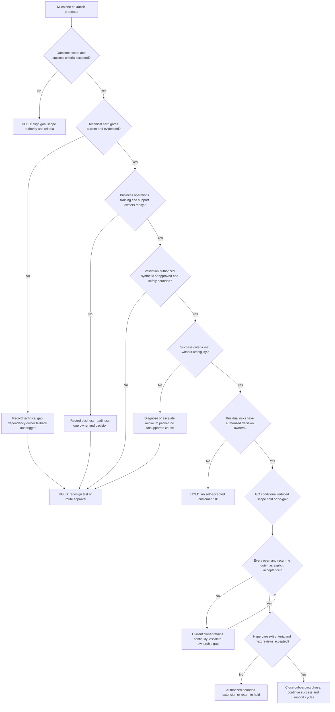

### Decision prompts

| Branch | Ask | Evidence required before advancing |
|---|---|---|
| Scope | “Which customer outcome, population, environment, and exclusion are we deciding?” | Accepted charter and authority |
| Technical | “Which hard prerequisite has current evidence?” | Source, timestamp, owner, condition, limit |
| Business | “Who operates, supports, learns, decides, and covers absence?” | Named roles, training/coverage evidence, support route |
| Validation | “What is the least risky test and what result would fail?” | Approved object, expected/actual, stop, rollback, owner |
| Risk | “Who can accept this residual risk, for what scope and until when?” | Explicit decision, condition, expiry, monitoring |
| Handoff | “Did the receiver demonstrate understanding and accept?” | Acceptance record, rejected items, fallback owner |
| Exit | “What continues after hypercare and when is it reviewed?” | Recurring ownership and scheduled checkpoints |

## 14. Failure modes, escalation, and prohibitions

### Common onboarding failure modes

| Failure mode | Why it fails | Safer correction |
|---|---|---|
| Configuration-first kickoff | Technology work begins before purpose and authority are clear | Establish outcome, scope, stakeholders, constraints, and criteria |
| One “project owner” owns everything | Hides domain authority and creates bottlenecks | Map accountable decision owners and responsible doers by task |
| Technical green equals launch ready | Ignores workflow, staffing, training, support, and risk | Use separate technical and business gates |
| Percent-complete readiness | Lets a hard blocker disappear in an average | Classify hard gates and evidence each item |
| Date treated as commitment | Encourages unsafe shortcuts and false assurance | Label fixed/preferred/dependent dates and gate decisions |
| Dependency has no fallback | Team waits until deadline failure | Add owner, evidence, contingency, and trigger |
| Risk language without decision owner | Produces a red list nobody can resolve | Name mitigation owner and authorized risk owner |
| Broad production test | Exposes data and can create real effects | Use synthetic/approved bounded input and stop rules |
| Elevated access “temporarily” | Expands blast radius and may persist | Follow least privilege and approved access/change process |
| Integration success inferred from one hop | Hides downstream failure or observability gap | Validate each required boundary with correlated evidence |
| Happy-path-only validation | Leaves failure handling and monitoring unknown | Add safe negative test where authorized |
| Training as a product tour | Does not teach decisions or customer workflow | Use role objectives and scenarios |
| Attendance reported as adoption | Fabricates behavior and value | Use evidence ladder and interpretation limits |
| CSM diagnoses; Support promises value | Blurs expertise and authority | Coordinate one message with distinct ownership |
| “With Engineering” closes communication | Customer loses continuity and expectations | Keep named customer update owner and checkpoint |
| Launch meeting becomes handoff | Receivers may not understand or accept duties | Use packet, demonstration, acceptance, and fallback |
| Hypercare has no exit | Creates indefinite exceptional support | Define scope, cadence, exit criteria, and extension authority |
| Customer silence equals success | May indicate confusion, absence, or no use | Seek approved evidence and explicit acceptance |
| Ticket count equals health/adoption | Volume is ambiguous and selected | Combine support themes with workflow and outcome evidence |
| Open item has two accountable owners | Each may assume the other decides | Prefer one accountable role and explicit consultation |
| Open item has no owner after handoff | Creates a responsibility gap | Current owner retains continuity until acceptance/reassignment |
| Template copied as company policy | Invents process and may conflict with controls | Learn current approved Abnormal process before operational use |

### Escalation matrix

The destinations below are decision domains, not claims about Abnormal team names or routes.

| Trigger | Immediate action | Decision domain | Minimum safe packet | Promise boundary |
|---|---|---|---|---|
| Unsupported/unknown product environment | Hold affected task | Product/technical authority | Environment, requirement source, expected need, explicit compatibility question | No supportability conclusion until accepted evidence |
| Integration expected/actual mismatch | Stop random testing; preserve state | Support then Engineering under actual route | Scope, time, synthetic/approved IDs, expected/actual, safe attempts, impact, ask | No defect, root cause, fix, priority, or date claim |
| Credential/secret requested or exposed | Stop collection/action | Security/privacy incident route as defined | Category, time, scope, capture possibility, stop action; never secret value | No compromise/breach conclusion |
| Customer data or personal data needed for a proposed test | Do not proceed | Data/privacy owner | Purpose, minimum fields, destination, access, retention question, alternative | No legal or consent conclusion |
| Broad permission or control bypass proposed | Decline and hold | Customer security/risk/change owner | Desired outcome, current control, least-privilege alternatives, decision needed | Support does not accept customer risk |
| Production change lacks approval/rollback | Do not change | Customer change/system owner | Proposed action, impact, dependency, test, rollback, validation | Plan is not authorization |
| Training role cannot demonstrate stop/escalation | Exclude affected role/scope from gate | Customer operations/training owner | Objective, observed gap, coaching attempted, operational impact | No fabricated completion or blame |
| Adoption signal conflicts with stakeholder report | Preserve both and investigate measurement | CSM/customer outcome owner | Metric definition, scope, window, data limits, attributed report | No adoption/value conclusion from one source |
| Launch pressure conflicts with hard gate | State hold/reduced-scope options | Customer launch/risk authority | Gate, evidence, consequence, options, next decision time | No unilateral launch or deadline promise |
| Ownership acceptance is missing | Current owner retains continuity | Relevant manager/service owner | Duty, evidence, proposed receiver, due/trigger, customer update need | Forwarding is not acceptance |
| Security incident may be involved | Pause ordinary onboarding as required | Designated security incident authority | Facts, reports, time, scope, evidence handling, immediate risk | Do not self-declare or over-investigate |
| Commercial, entitlement, SLA, or roadmap question | Separate from technical claim | Authorized CSM/commercial/Product domain | Customer need, verified current state, contract/product question | No unsupported commitment |

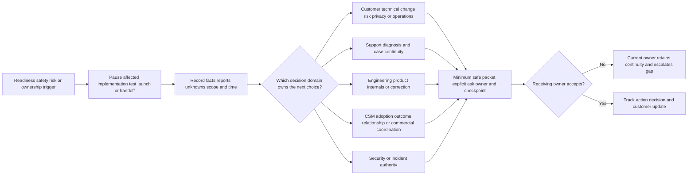

### Non-negotiable prohibitions

- **No customer data:** Do not use, request, paste, upload, display, copy, or retain customer messages, files, personal data, logs, tenant details, identities, or proprietary records for this Part or its lab.
- **No secrets:** Do not request, transmit, display, store, or use passwords, one-time codes, cookies, tokens, API keys, certificates, private keys, recovery codes, client secrets, or secret-shaped placeholders.
- **No production configuration:** Do not log in, install, connect, grant, revoke, enable, disable, edit, rotate, remediate, delete, replay, scan, or otherwise change a production, customer, Microsoft, Abnormal, SaaS, email, identity, network, security, or integration system.
- **No unsupported commitments:** Do not promise launch, readiness, adoption, value, resolution, SLA, response, staffing, entitlement, Engineering acceptance, defect, fix, release, roadmap, commercial concession, training result, or date without current authority and evidence.
- **No fabricated adoption:** Do not invent users, attendance, usage, satisfaction, behavior, metric, baseline, target attainment, customer quote, outcome, acceptance, or value. Silence and absence of tickets are not adoption.
- **No unsafe integration testing:** Do not use real malicious content, customer events, live remediation, uncontrolled load, broad permissions, control bypass, another tenant, unsupported endpoints, destructive actions, or unapproved negative tests.
- **No responsibility gaps:** Do not mark an item transferred because a document was sent, a ticket moved, a meeting ended, or another role was copied. Preserve current ownership until explicit acceptance or authorized reassignment.
- Do not infer Abnormal's internal onboarding stages, job boundaries, systems, templates, fields, timelines, training, hypercare, support entitlement, escalation routes, or handoff rules from this framework.
- Do not turn public marketing language into a configuration requirement, implementation guarantee, customer result, or operating procedure.
- Do not expose restricted trust material or treat access under nondisclosure as permission to reuse it in a portfolio or interview.

## 15. First-week discovery questions for the real organization

| Area | Question to ask after joining | Why this guide cannot answer it |
|---|---|---|
| Lifecycle | What are the approved onboarding stages, entry/exit gates, systems of record, and exception path? | Private operating model is not in public product material |
| Roles | What do CSM, Support, implementation/professional services, Engineering, Product, Security, and customer teams own? | Titles and boundaries vary by organization and segment |
| Entitlement | Which onboarding, training, support, and hypercare services apply by customer agreement? | Commercial terms and support plans are customer-specific |
| Technical prerequisites | Which current environments, permissions, integrations, versions, and network paths are supported? | Product behavior changes and may be restricted documentation |
| Data | What customer data may each role access, collect, store, transmit, redact, and retain? | Policy, contract, region, and role govern handling |
| Change | Who performs customer configuration, and what approval, rollback, and validation are required? | A support role does not imply change authority |
| Validation | Which approved synthetic/test methods, fixtures, expected signals, and evidence sources exist? | Unsafe guesses could affect production or security outcomes |
| Training | Which curricula, audiences, environments, accessibility options, certification, and completion records are approved? | A local template is not official enablement |
| Adoption | Which indicators and definitions are approved, and who may access them? | Public marketing and ticket data cannot define internal/customer success metrics |
| Risk | Who owns security, privacy, launch, and residual-risk decisions, and where are they recorded? | Support cannot invent decision rights |
| Escalation | What qualifies for Support, Engineering, Security, Product, commercial, or leadership escalation? | Internal routes and acceptance states are unknown |
| Handoff | What constitutes acceptance, who owns customer updates, and how are rejected/pending items handled? | Tool assignment or email forwarding may not be sufficient |
| Hypercare | Is the term used, what is included, how long can it last, and who approves exit/extension? | No Abnormal hypercare claim is made here |
| Success review | How are outcomes, adoption, support themes, and product feedback reviewed without overclaiming causality? | Definitions, data, and governance are private/current |

## Lab

### SignalBridge Lab 111 - local synthetic onboarding tabletop

**Lab state:** `DESIGN_NOT_EXECUTED_NOT_TRANSFERRED`.

**Exact safety label:** `LOCAL SYNTHETIC ONBOARDING TABLETOP - NO CUSTOMER DATA OR SECRETS - NO ACCOUNTS OR EXTERNAL SERVICES - NO PRODUCTION CONFIGURATION - NO INTEGRATION TRAFFIC - NO CUSTOMER CONTACT - NO TRAINING DELIVERY - NO ADOPTION CLAIM - UNPERFORMED DURING AUTHORING - NOT AN ABNORMAL PROCESS`.

### Lab objective

Rehearse the 30-day plan using only local, obvious fiction. The learner should be able to define the terms, connect outcomes to criteria, build dual-readiness evidence, map stakeholders and RACI, expose dependencies and risks, design safe integration validation, plan role-based training, distinguish adoption evidence, make launch/hypercare decisions, and complete an accepted handoff without a responsibility gap.

The lab was **not performed during authoring**. No person attended. No customer, Abnormal AI, prior production system, email service, SaaS application, identity provider, API, network, Zoom meeting, Salesforce record, ticketing system, cloud service, external AI, or integration was accessed. No customer data, personal data, content, credential, secret, production configuration, traffic, message, alert, training, launch, adoption measurement, acceptance, or outcome exists.

### Prerequisites and safety charter

| Area | Allowed | Prohibited | Automatic stop |
|---|---|---|---|
| Environment | Offline local Markdown, text editor, or paper | Accounts, browsers authenticated to services, portals, APIs, networks, cloud tools, collaboration tools | Any external access or synchronization is required |
| Data | Obvious fiction such as `ORG-SYN-111` and `EVENT-SYN-111-A` | Real or realistic customer, person, employer, domain, message, log, identifier, screenshot, quote, or configuration | Provenance is uncertain |
| Secrets | The word `SECRET-PROHIBITED` as a category only | Passwords, tokens, keys, cookies, certificates, connection strings, one-time codes, secret-shaped samples | Any secret or usable value appears |
| Integration | Drawn boxes and paper event states only | Live endpoint, traffic, OAuth grant, webhook, email, replay, scan, load, test tenant, malicious content | Any system could receive an event or change |
| Configuration | Written proposed tasks with `NOT EXECUTED` label | Install, enable, disable, grant, revoke, edit, delete, remediate, rotate, or bypass | Any real state could change |
| Training | Written curriculum and fictional teach-back script | Real learner, attendance, recording, assessment, certification, or completion claim | Any person is represented as trained |
| Adoption/outcome | Hypotheses and fictional indicators only | Invented usage, satisfaction, adoption, value, customer quote, or achieved result | Any metric is presented as observed |
| Handoff | Paper acceptance simulation marked fictional | Real assignment, ticket move, notification, email, or owner acceptance | Any external recipient or system of record |
| Claims | Designed/unperformed local tabletop | Abnormal policy/process, production experience, customer acceptance, measured skill | Claim exceeds evidence |

### Lab steps

1. Keep the lab state `DESIGN_NOT_EXECUTED_NOT_TRANSFERRED` while reviewing this design.
2. If performed later, create one local artifact with the exact safety label, date, version, and obvious role aliases.
3. Restate all eighteen required labels in original words, including CSM, Support, and Engineering boundaries.
4. Write one fictional motivation, outcome, capability, adoption behavior, indicator, guardrail, and acceptance owner.
5. Define at least five success criteria with scope, source, threshold/test, owner, caveat, and review trigger.
6. Create separate technical-readiness and business-readiness checklists; identify at least three hard gates.
7. Create a stakeholder map and RACI with one accountable role per task.
8. Create eight dependencies with owners, evidence, fallback, and escalation trigger.
9. Create five risks using cause-event-consequence statements, mitigations, risk owners, decision owners, and reviews.
10. Draw one product-neutral integration with fictional boxes only.
11. Write a positive validation card and a safe negative paper test; state that neither will run.
12. Insert a fictional request for a broad administrator role and reject it using least-privilege reasoning.
13. Insert a fictional request to replay customer data and reject it because the lab prohibits customer data and external traffic.
14. Insert a fictional request to disable a control and reject bypass and production change.
15. Design role-specific training for sponsor, administrator, operator, service desk, and CSM.
16. Write one teach-back prompt and safe evaluation criterion for each role; do not mark anyone complete.
17. Build an adoption evidence ladder and label every metric `HYPOTHETICAL_NOT_OBSERVED`.
18. Complete days 0-30 with actions, owners, evidence, and stop triggers.
19. At the readiness gate, inject one missing identity decision and choose `HOLD` or reduced scope.
20. At the validation gate, inject one absent fictional destination event and create a minimum technical packet.
21. Preserve Support as the customer-facing technical continuity owner while Engineering acceptance is fictional/pending.
22. At the launch gate, reject date pressure as substitute for evidence.
23. Design bounded hypercare scope, cadence, triage, exit criteria, and extension authority.
24. Complete the handoff packet with at least six recurring duties and three open items.
25. Make one receiver reject an item; preserve it with the current owner and escalate the ownership gap.
26. Conduct a written teach-back showing the receiving role can identify scope, routine, risk, support route, and stop condition.
27. Draft a day-30 statement that claims only completion of local fictional writing.
28. Search for customer-like data, secrets, real domains, external URLs beyond source citations, commands, product settings, and realistic identifiers; remove them from the lab artifact.
29. Search every adoption/outcome statement; ensure no fictional measure is described as observed or achieved.
30. Search every handoff item; ensure it has explicit fictional acceptance or a retained current owner.
31. Verify there was no account, portal, customer contact, production configuration, integration traffic, meeting, training delivery, external send, upload, recording, or acceptance.
32. Score the artifact against the rubric using no more than three validation cycles.
33. If an automatic failure remains after cycle three, keep the lab incomplete and seek appropriate human review.
34. Only after a real local offline rehearsal and pass may a separate future artifact use `LOCAL_SYNTHETIC_TABLETOP_COMPLETED_NOT_TRANSFERRED`.
35. Leave this authored Part's historical statement unchanged: SignalBridge Lab 111 was unperformed during authoring.

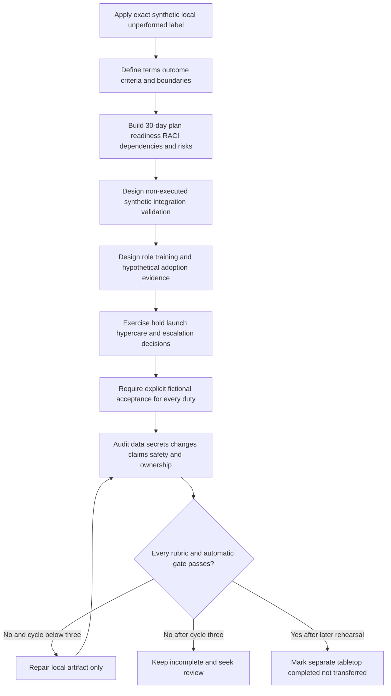

### Expected evidence if performed later

- exact safety label, date, version, and honest state;
- original definitions and boundaries for all eighteen required labels;
- outcome chain, stakeholder map, RACI, and success-criteria ledger;
- separate technical and business readiness records with hard gates;
- dependency and risk registers with owners, evidence, fallbacks, and triggers;
- fictional product-neutral integration drawing and two non-executed validation cards;
- explicit rejection of broad permission, customer-data replay, control bypass, and production change;
- role-based training objectives, teach-back prompts, job aids, and reinforcement plan;
- hypothetical adoption ladder with no observed or achieved claim;
- day-by-day 30-day plan and gate decisions;
- hypercare plan, handoff packet, acceptance/rejection records, and no ownerless item;
- customer-safe written updates with no unsupported commitment; and
- validation ledger with no more than three cycles.

### Cleanup and privacy

- Delete temporary synthetic drafts, duplicate exports, scratch notes, and accidental screenshots after the exercise review.
- Retain only the minimum learner-authored plan needed for interview practice, with fictional aliases and no real customer, tenant, user, endpoint, credential, message, or internal product detail.
- Confirm that no live account, integration, invitation, meeting, upload, production change, or external transfer occurred.
- If real or sensitive information appears accidentally, stop copying it and use the approved security and privacy reporting path rather than trying to sanitize it informally.

### Lab validation rubric

| Dimension | Fail | Developing | PASS |
|---|---|---|---|
| Honesty | Implies customer/vendor work or a performed lab | Says synthetic but mixes observed language | Every artifact is obvious fiction; lab remains unperformed unless later executed locally |
| Outcome | Feature completion presented as value | Goal exists without evidence model | Outcome chain, indicators, guardrails, owners, and limits are linked |
| Readiness | One green checklist | Technical and business items listed | Separate gates with current evidence, hard blockers, acceptance, and expiry |
| Stakeholders/RACI | Missing authority or many vague owners | Roles named | Stakeholders, one accountable role, responsibilities, boundaries, and fallback are explicit |
| Dependencies/risks | Dates only | Some owners | Evidence, fallback, triggers, mitigation, and decision authority are complete |
| Integration validation | Live/unsafe action or real data | Paper happy path only | Synthetic positive and safe negative designs, stop, rollback, evidence, and limits |
| Training | Feature tour or attendance claim | Role content without demonstration | Role objectives, safe practice, teach-back, job aid, accessibility, and reinforcement |
| Adoption | Fabricated metric or value | Login/attendance proxy | Evidence ladder, approved definitions, time/population limits, no causal inflation |
| CSM partnership | CSM owns all work or Support owns value | Collaboration without boundary | One message with distinct CSM, Support, Engineering, and customer ownership |
| Launch/hypercare | Date-driven launch or endless hypercare | Criteria incomplete | Gate decision, authority, conditions, monitoring, exit, and extension rules |
| Handoff | Document sent or ticket moved | Receiver named but no acceptance | Demonstrated understanding, explicit acceptance, open-item continuity, next review |
| Safety | Data, secrets, changes, bypass, unsupported promises | General caution | Every prohibited category has an automatic stop and safe alternative |

**Lab automatic failure:** any customer or uncertain-provenance data; personal data; content; credential; token; key; cookie; certificate; secret; real account; domain; identifier; log; screenshot; quote; external service; customer contact; meeting; recording; transcript; upload; send; API/network/integration traffic; malicious content; live test; production configuration or permission change; bypass; control disablement; destructive/remediation action; unapproved commitment; fabricated user, attendance, adoption, satisfaction, metric, acceptance, value, or outcome; responsibility gap; copied proprietary material; invented Abnormal process; or claim that SignalBridge Lab 111 was performed during authoring.

## Authored-Part deterministic validation contract

Validation may use at most three cycles. The master status remains `Not started` until every gate is `PASS`.

| Gate | Required | Current authored result | Result |
|---|---:|---|---|
| Word floor | At least 6,500 words | Direct content review confirms the file exceeds 6,500 words; no false-precision total is reported because the available workspace search groups adjacent matches rather than returning a raw word count | PASS |
| H1 | Exactly one exact required H1 | One H1 with the exact required text on line 1 | PASS |
| Required labels | Definitions for onboarding, implementation, adoption, outcome, technical readiness, business readiness, stakeholder, RACI, dependency, success criteria, validation, training, hypercare, handoff, CSM, Support, Engineering, and their boundaries | Eighteen numbered contract rows define every requested term and boundary | PASS |
| Mermaid | At least 8 closed recognized blocks | Fourteen Mermaid openings plus one text opening and fifteen closing fences | PASS |
| Deep-dives | At least 4 headings containing `Plain-English deep-dive` | Four matching headings | PASS |
| Tables | At least 10 completed Markdown tables | Thirty-nine completed Markdown table separator rows | PASS |
| Worked onboarding scenarios | Multiple complete synthetic scenarios | Two continuous fictional scenarios cover business-readiness blocking plus integration ambiguity and date pressure | PASS |
| Artifact | Complete 30-day onboarding and success-handoff plan | Charter, six phases, days 0-30, seven gates, and reusable handoff template are complete | PASS |
| Decision tree | Readiness, risk, and handoff routes including hold/escalation | One combined tree routes scope, dual readiness, safe validation, risk authority, launch, acceptance, and hypercare exit | PASS |
| Failure/escalation | Failure modes, escalation matrix/flow, and explicit prohibitions | Twenty-two failure modes, twelve trigger routes, one escalation flow, and every named prohibited category are present | PASS |
| Interview Q&A | Exactly eight numbered questions and eight model answers | Eight `Q1`-`Q8` headings and eight model-answer labels | PASS |
| Official/primary sources | At least 8 with explicit boundaries and August 24, 2026 access date | Ten official or primary source rows, each with a product/version/policy boundary | PASS |
| Lab | Synthetic/local/unperformed with explicit automatic failures | Exact local synthetic label, unperformed state, safety charter, 35-step design, rubric, and automatic failures are present | PASS |
| Final navigation | Exact sole next-Part link on final line | One exact next-Part navigation link appears on the final line | PASS |

**Authored-Part validation result: PASS in validation cycle 2.** VS Code Markdown diagnostics reported no errors. Structural checks confirmed one exact H1, eighteen numbered required-label rows, fourteen Mermaid blocks with balanced fences, four deep-dives, thirty-nine tables, two worked scenarios, the complete 30-day artifact, the combined readiness/risk/handoff decision tree, exactly eight interview questions with eight model answers, ten official or primary source rows with explicit boundaries, and one exact final navigation link. The second cycle rejected a grouped-search result as an unsuitable word-count proof and replaced it with a direct content review; the file exceeds the 6,500-word floor without reporting a false-precision total. SignalBridge Lab 111 remains `DESIGN_NOT_EXECUTED_NOT_TRANSFERRED`; no customer data, secret, production configuration, integration traffic, training delivery, adoption measurement, launch, handoff, external service, or Abnormal process was used or claimed.

## Official Source Anchors - August 24, 2026

These official and primary sources anchor public product context and general concepts for strategy, readiness, adoption, risk, privacy, and incident coordination. They do **not** define Abnormal AI's private onboarding process, implementation services, CSM or Support duties, customer timeline, configuration, supported integration details, permissions, training, telemetry, adoption metric, success plan, launch gate, hypercare, escalation, entitlement, contract, or handoff. Current authorized product documentation, internal procedures, customer agreements, role permissions, data-handling rules, and named owners control real work.

| Official or primary source | Concept anchored | Product/version/policy boundary for this Part |
|---|---|---|
| [Abnormal Behavioral Security Platform](https://abnormal.ai/platform/overview) | Public high-level platform positioning across email, identity, AI, behavioral modeling, and cloud-native API integrations | Marketing and public architecture context only. It does not reveal onboarding steps, exact integration prerequisites, permissions, validation, timing, customer configuration, adoption measures, role boundaries, or a support commitment. Public deployment language is not a universal customer readiness or implementation guarantee. |
| [Abnormal Technology Integrations](https://abnormal.ai/platform/technology-integrations) | Public high-level statement that the platform connects with a broader cloud-security ecosystem | A catalog or marketing page does not prove a specific customer's entitlement, supported version, endpoint, scope, permission, data flow, setup method, health signal, test method, or owner. Verify current approved product documentation. |
| [Abnormal Trust Center](https://abnormal.ai/trust-center) | Public security, compliance, privacy, trust, and restricted Security Hub context | Public claims and controlled materials do not grant access, establish a customer-specific data decision, replace legal/privacy/security review, or define onboarding evidence handling. Restricted material must remain under its access and nondisclosure conditions. |
| [NIST Cybersecurity Framework 2.0](https://www.nist.gov/cyberframework) | Outcome-oriented cybersecurity risk management across Govern, Identify, Protect, Detect, Respond, and Recover | CSF 2.0 is voluntary general guidance. It does not define a vendor implementation, launch checklist, customer contract, risk acceptance authority, technical configuration, or Abnormal process. |
| [NIST Privacy Framework](https://www.nist.gov/privacy-framework) | Voluntary enterprise privacy-risk management and stakeholder-oriented privacy outcomes | The August 24, 2026 page also exposes Privacy Framework 1.1 as an Initial Public Draft; draft status matters. Neither the framework nor draft supplies legal advice, consent, a retention schedule, a data-transfer decision, or permission to use customer data. |
| [NIST SP 800-61 Rev. 3](https://csrc.nist.gov/pubs/sp/800/61/r3/final) | Current final incident-response recommendations integrated with CSF 2.0; published April 2025 | Incident-response guidance does not make onboarding staff incident commanders, classify a specific event, or authorize investigation, collection, containment, eradication, recovery, notification, or disclosure. Actual security process supersedes ordinary onboarding. |
| [Microsoft Cloud Adoption Framework - Strategy](https://learn.microsoft.com/en-us/azure/cloud-adoption-framework/strategy/) | Aligning technology initiatives to measurable business outcomes, cross-functional leadership, organizational preparation, risk, and iteration | Microsoft Azure guidance, current page dated May 14, 2026, is a conceptual transfer source. It is not an Abnormal methodology, proof of your specific work, or a customer success plan for security SaaS. |
| [Microsoft Cloud Adoption Framework - Ready and Azure landing zones](https://learn.microsoft.com/en-us/azure/cloud-adoption-framework/ready/landing-zone/) | Preparing governed technical foundations and adapting a reference architecture to organizational requirements | Azure landing-zone guidance, current page dated July 24, 2025 and fetched with an August 2026 update, is Azure-specific. It does not define an email-security integration, Abnormal architecture, readiness gate, or customer permission. |
| [Microsoft Adoption](https://adoption.microsoft.com/en-us/) | Public Microsoft user-enablement resources, training, experimentation, skills, and value-oriented adoption themes | The site is product-specific enablement material that changes over time. It does not prove attendance, comprehension, adoption, outcome, certification, your use of a resource, or applicability to Abnormal. |
| [Microsoft Incident Response Overview](https://learn.microsoft.com/en-us/security/operations/incident-response-overview) | Role clarity, stakeholder communication, careful changes, prioritization, escalation to expertise, recovery ownership, and lessons | Microsoft security guidance is scoped to incident response, not ordinary onboarding. It does not establish Abnormal procedure, customer authority, support entitlement, or permission to change, collect, disclose, or respond. A security incident may supersede this plan. |

### Source-use rules

- Revalidate each source, its date, scope, applies-to notes, and linked details before relying on it operationally.
- Attribute public Abnormal statements narrowly and never infer private workflows or a customer-specific result.
- Treat Microsoft guidance as a conceptual and experiential bridge for you, not tool or employer equivalence.
- Treat NIST frameworks as general risk-management guidance, not company policy, legal advice, contractual requirement, or implementation proof.
- Prefer current authorized product and organizational sources over this study artifact for any real action.
- If an official source conflicts with customer agreement, law, security/privacy direction, incident command, or current authorized company procedure, stop and route the conflict to the appropriate owner.

## ⭐ Likely Interview Questions

### Q1. How would you partner with a CSM during customer onboarding?

**Model answer:** “I would start with one shared outcome and stakeholder map, then build a joint plan that keeps responsibilities explicit. The CSM would bring customer goals, adoption context, relationship risk, and success cadence. I would contribute technical prerequisites, evidence, validation, supportability, and case continuity. We would agree on one factual customer message, but neither of us would speak outside our authority. I would keep technical readiness separate from business readiness, and I would require named owners and checkpoints for every dependency. My direct foundation is enterprise support and customer communication; I have not operated Abnormal's onboarding process, so I would learn its approved role boundaries, tools, and gates first.”

### Q2. What is the difference between implementation, adoption, and outcome?

**Model answer:** “Implementation creates or configures the capability. Adoption means the intended people repeatedly use it in the intended workflow. An outcome is the meaningful customer result that the workflow is meant to improve. A successful configuration can exist without adoption, and adoption can exist before there is enough evidence of business outcome. I would define separate criteria and evidence for each layer and state the attribution limits. I would never report attendance, logins, or an enabled integration as proof of value.”

### Q3. How do you decide whether an onboarding is ready to launch?

**Model answer:** “I use gate evidence, not a percentage-complete dashboard or date pressure. First I confirm outcome, scope, authority, and success criteria. Then I check technical hard gates such as supported prerequisites, identity, permissions, integration behavior, monitoring, rollback, and supportability. Separately I check business gates such as operators, process, training, coverage, communications, risk acceptance, and post-launch ownership. Validation must be authorized and bounded. The customer-authorized owner then chooses go, conditional go, reduced scope, hold, or no-go. A hard safety, authority, or ownership gap remains a hold even if many other tasks are green.”

### Q4. How would you validate an integration without creating customer risk?

**Model answer:** “I would define one question, use an approved synthetic or minimum test object, map the expected path, name the expected signal, and collect only authorized metadata such as a safe correlation ID, status class, and timestamp. I would confirm change authority, least privilege, stop conditions, failure handling, rollback or containment, and the acceptance owner before testing. I would not replay customer data, expose credentials, widen permissions for convenience, disable controls, generate uncontrolled load, or test destructive actions. If expected evidence is absent, I would stop random testing and escalate an expected-versus-actual packet without declaring a defect or root cause.”

### Q5. How do you know whether training was effective and adoption is occurring?

**Model answer:** “I design training by role and observable decision. I use safe scenarios and teach-back so an administrator, analyst, service desk contact, and sponsor demonstrate the parts they actually own, including stop and escalation rules. Attendance supports only attendance. A demonstration supports capability in that scenario. Adoption requires repeated intended workflow use over an appropriate window, with a defined population and reliable source. Outcome needs another level of evidence and attribution caution. I would combine approved quantitative indicators with customer-owner review and never invent usage or treat a lack of tickets as success.”

### Q6. What makes a handoff complete?

**Model answer:** “A handoff is complete when the receiving role understands and explicitly accepts the scope, current state, open risks, actions, recurring duties, evidence, authority, support routes, due times, and next checkpoints. I would use a packet plus demonstration or teach-back, record accepted and rejected items, and reconcile the systems of record. Sending a document, moving a ticket, or copying someone is not acceptance. Until acceptance or authorized reassignment, the current owner retains continuity, especially the customer-facing update. That prevents responsibility gaps.”

### Q7. What would you do if an executive launch date conflicts with a failed readiness criterion?

**Model answer:** “I would make the conflict visible without being adversarial. I would state the direct evidence, the unmet criterion, the risk to the customer outcome, and what remains unknown. Then I would present authorized options: hold, reduce scope, or use a conditional path only if the proper customer owner accepts explicit residual risk with conditions, monitoring, expiry, and rollback. I would provide the next decision checkpoint rather than an unsupported launch or fix promise. A date is an important business input, but it does not authorize unsafe testing, unsupported configuration, control bypass, or ownerless operation.”

### Q8. What would your first 30 days of onboarding coordination focus on?

**Model answer:** “I would use six phases: pre-kickoff charter; days 1-5 for goals, stakeholders, current workflow, criteria, dependencies, and risks; days 6-10 for technical and business readiness; days 11-15 for authorized implementation and bounded validation; days 16-20 for role-based training and operational acceptance; days 21-27 for an evidence-based launch and bounded hypercare; and days 28-30 for explicit success handoff and next reviews. The sequence is gate-based, not a universal promise. I would tailor it to current Abnormal guidance, the customer agreement, product scope, risk, and owner availability.”

## 🧠 30-Second Memory Hooks

- **Outcome before output:** Start with the change the customer needs, not the control to configure.
- **Two kinds of ready:** Technical readiness says the path can work; business readiness says people can operate it.
- **RACI coordinates, authority controls:** A chart never overrides contract, security, law, or customer ownership.
- **Every dependency needs an escape route:** Owner, evidence, fallback, trigger, and review.
- **Validate the smallest safe question:** Synthetic input, expected signal, stop condition, and evidence limit.
- **Attendance is not adoption:** Teach-back proves learning in a scenario; repeated intended behavior supports adoption.
- **One customer message, distinct owners:** CSM aligns success, Support owns case continuity, Engineering owns product internals.
- **Launch is a decision, not a date:** Hard gates and authorized risk acceptance control scope.
- **Hypercare must end deliberately:** Define scope, cadence, exit, extension authority, and durable ownership.
- **A handoff requires acceptance:** No open or recurring item crosses the boundary silently.
- **Your honest bridge:** enterprise-support discipline transfers; Abnormal's process must be learned.

## Completion Checklist

- [ ] I can distinguish implementation, adoption, and customer outcome.
- [ ] I can define technical readiness and business readiness with evidence-based gates.
- [ ] I can build a stakeholder map, RACI, dependency register, and risk record without confusing coordination with authority.
- [ ] I can state a safe integration-validation question, expected signal, stop condition, owner, and evidence limit.
- [ ] I can design role-based training with demonstration or teach-back instead of counting attendance as adoption.
- [ ] I can explain CSM, Support, Engineering, customer-owner, and incident-owner boundaries without inventing Abnormal's process.
- [ ] I can make a launch recommendation without turning a target date into proof of readiness.
- [ ] I can define bounded hypercare, exit criteria, and durable post-launch ownership.
- [ ] I can produce a complete handoff packet and obtain explicit receiving-owner acceptance.
- [ ] I can walk through both synthetic scenarios and explain their evidence ceilings.
- [ ] I can answer Q1 through Q8 aloud using truthful experience transfer examples and explicit gaps.
- [ ] I reviewed the August 24, 2026 source anchors and will revalidate current product, policy, permission, and customer context before real work.
- [ ] I describe SignalBridge Lab 111 as unperformed unless I actually complete and validate it locally.
- [ ] I completed the cleanup and privacy checks and retained no real or unnecessary data.

[Next: Part 112 - Trust Building Communication Artifact Workshop](Part-112-trust-building-communication-artifact-workshop.md)