# Part 112 - Trust Building Communication Artifact Workshop

> **Purpose:** Build a beginner-first, vendor-neutral method for turning one controlled evidence record into accurate customer updates, executive briefs, CSM handoffs, Engineering escalations, Product evidence briefs, and internal or external knowledge articles without changing the facts, inflating certainty, leaking sensitive information, or publishing beyond authority.
>
> **Artifact honesty label:** **Direct enterprise-support, customer-communication, executive-translation, Engineering/Product escalation, fix-validation, KB, training, and mentoring transfer plus a completed local synthetic written portfolio; communication lab unperformed.** Your prior background, as recorded in the master guide, supports those transferable habits. Every company, person, case, event, identifier, timestamp, quote, artifact, decision, approval state, and outcome in the worked portfolio is learner-authored fiction. Nothing was sent, presented, approved, published, or used with a customer. This Part does not claim that you have operated Abnormal AI, used Abnormal customer data, or knows Abnormal's private templates, terminology, systems, review chain, disclosure rules, case fields, escalation path, CSM process, Product intake, Engineering workflow, incident communications, or knowledge-publishing process.
>
> **Currency and official-source access date:** August 24, 2026.
>
> **Authored-Part state:** `PASS`. The master tracker was changed only after every deterministic gate passed.

## Section goal

Support communication is not the act of making one technical note shorter. It is the controlled creation of several **representations** of the same current state for people who have different decisions, responsibilities, permissions, vocabulary, and time constraints. The customer needs ownership, observed progress, safe next actions, and a checkpoint. An executive needs impact, risk, options, and a decision. A Customer Success Manager, or **CSM**, needs customer-goal context, relationship risk, ownership, and a coordinated message. Engineering needs reproducible technical evidence and a precise ask. Product needs a responsibly aggregated problem or opportunity, not one anecdote disguised as market truth. A knowledge-base reader needs reusable guidance whose publication scope is approved.

The everyday analogy is a **hospital patient chart and shift briefing**. The chart contains the controlled clinical record. A patient receives a plain-language explanation, a specialist receives detailed measurements, an administrator receives operational impact, and the next shift receives pending actions and ownership. The underlying temperature does not change because the audience changes. Yet copying every chart detail into every conversation would be confusing, unsafe, and potentially unlawful. The analogy stops where technical support has different contracts, privacy rules, security classifications, professional duties, and decision authorities.

The central rule is:

> **Preserve the evidence spine; change only the audience-appropriate detail, language, sequence, and action.**

This rule has two halves. “Preserve” prevents contradiction and certainty inflation. “Change” prevents a technical dump from being mislabeled as transparency. Good abstraction removes unnecessary detail while retaining meaning, limits, and the recipient's ability to make the intended decision.

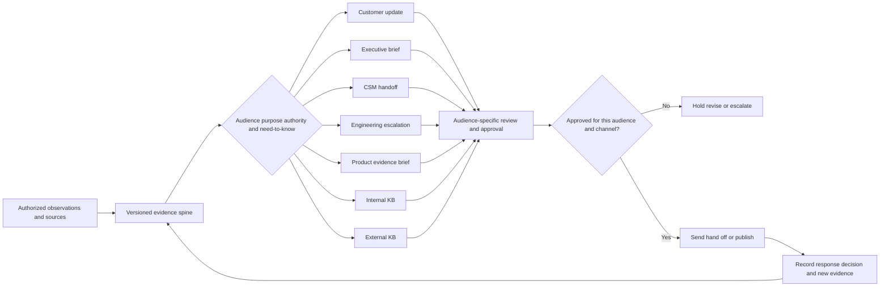

## Required communication labels

The following table is the exact twelve-row vocabulary contract for this Part. Four rows deliberately contain paired terms because those concepts must be separated in practice even though they belong to one control family. Learn each term by its use and boundary, not by memorizing a slogan.

| # | Required label | Beginner-first definition | Everyday analogy | Why it matters | Boundary to preserve |
|---:|---|---|---|---|---|
| 1 | **Trust** | A recipient's evidence-supported willingness to rely on a communicator's accuracy, ownership, judgment, and follow-through within a known scope. Trust grows when claims match evidence, uncertainty is visible, commitments are kept, corrections are prompt, and sensitive information is handled properly. | A reliable train board shows what is known, marks delays, updates at stated times, and corrects errors instead of pretending every train is on time. | Trust lets customers and internal teams make decisions without rechecking every statement. | Trust is not agreement, likability, confidence theater, secrecy, persuasion at any cost, or a promise that every outcome will be favorable. Empathy cannot replace evidence or authority. |
| 2 | **Audience** | The verified person or group expected to receive an artifact, including their role, technical depth, decision rights, relationship to the case, accessibility needs, language context, and permission to receive the content. | A pharmacist, patient, insurer, and researcher can discuss one medicine but need different information. | Audience determines vocabulary, depth, action, channel, and disclosure limit. | A title, mailing list, copied address, or meeting invitation does not prove authority or need-to-know. Mixed audiences inherit the most restrictive applicable sharing boundary unless an authorized owner decides otherwise. |
| 3 | **Purpose** | The specific result the communication should enable, such as acknowledge, inform, request evidence, obtain a decision, transfer ownership, coordinate action, record a finding, teach a safe procedure, or publish reusable guidance. | A map for choosing a route differs from a receipt proving where a parcel was delivered. | A clear purpose prevents status notes that contain words but enable no decision or action. | Purpose does not authorize disclosure, commitment, production change, legal interpretation, blame, or publication. One artifact should not quietly serve incompatible purposes. |
| 4 | **Need-to-know** | The minimum information a verified recipient needs to perform an authorized responsibility or make the stated decision, considering sensitivity, contractual limits, privacy, security, and timing. | A hotel housekeeper needs the room number and task, not the guest's payment history. | It reduces leakage while keeping work possible. | Need-to-know is not “interesting to know,” seniority, convenience, or permission to copy a restricted detail into a lower-trust channel. Redaction must not create a misleading statement. |
| 5 | **Evidence spine** | The versioned, source-linked record of observations, customer-reported statements, tests, timestamps, scope, confidence, unknowns, decisions, owners, and commitments from which audience artifacts are derived. | A film negative can produce different crops, but the people and objects in the original frame do not change. | It gives every artifact a common factual backbone and makes contradictions detectable. | The spine is not automatically distributable. It can contain restricted material, disputed reports, and internal hypotheses. It must distinguish source facts from interpretation and preserve corrections. |
| 6 | **Translation and abstraction** | **Translation** changes vocabulary or representation so a recipient can understand the same meaning. **Abstraction** deliberately changes the level of detail so the recipient sees the relevant pattern, impact, boundary, or decision without unnecessary internals. | Translation changes “precipitation” to “rain”; abstraction changes thousands of weather readings to “outdoor event risk is high.” | Together they make technical evidence usable across customer, executive, CSM, Engineering, Product, and KB audiences. | Neither permits changing the fact, hiding material risk, turning a hypothesis into a cause, removing a caveat, or adding certainty. A shorter sentence can still be false. |
| 7 | **Customer update and executive brief** | A **customer update** is a case-continuity message that states acknowledged impact, current evidence, completed work, knowns, unknowns, next action, owner, requested customer action, and next checkpoint. An **executive brief** is a compact decision artifact that states outcome impact, risk, trajectory, confidence, options, recommendation, owner, and decision needed. | A traveler needs the next connection and update time; the airline operations leader needs network impact and a diversion decision. | These artifacts maintain customer agency while helping leaders decide without reading the investigation journal. | A customer update must not expose restricted internals. An executive brief must not erase uncertainty or imply that a concise summary is a complete technical record. Neither may invent status, ETA, root cause, or approval. |
| 8 | **CSM handoff** | A two-way transfer to a Customer Success Manager that connects verified technical state to customer goals, adoption or relationship context, commitments, risks, owners, message alignment, and the next coordinated customer touchpoint. | A mechanic tells a trip coordinator what is known about the vehicle and what that means for the journey, while each retains a different role. | It prevents technical case movement from becoming a customer-journey or expectation gap. | A CSM handoff is not a transfer of technical case ownership, a request to soften facts, permission to promise dates, or evidence that the CSM can receive every restricted detail. |
| 9 | **Engineering escalation** | A structured request for technical help beyond the current support boundary containing a bounded problem statement, environment, expected and actual behavior, reproducible steps when safe, evidence references, completed tests, competing hypotheses, impact, urgency, and a precise Engineering ask. | A repair shop sends the manufacturer measurements, conditions, and a component question rather than “the car is broken.” | It reduces rediscovery and lets specialists discriminate among causes. | Escalation is not proof of a defect, acceptance, priority, owner, root cause, fix, release, or ETA. Customer communication remains explicitly owned while Engineering investigates. |
| 10 | **Product evidence brief** | A decision-oriented summary that connects a customer problem or recurring support friction to credible evidence, affected workflow, frequency and segmentation limits, current workaround, risk, opportunity, and a bounded Product question. | A librarian reports a repeated search failure pattern with examples and affected readers, not simply “people dislike the catalog.” | It helps Product distinguish a defect, documentation gap, usability issue, policy choice, unsupported request, or opportunity for discovery. | One case is one case. Do not manufacture demand, label a request “strategic” without criteria, expose customer identity without authorization, or imply roadmap acceptance, priority, commitment, or delivery. |
| 11 | **Internal KB and external KB** | An **internal knowledge-base article** preserves reusable diagnostic or operational knowledge for authorized staff and may include approved internal cues, escalation boundaries, and deeper troubleshooting. An **external knowledge-base article** gives approved customers or public readers safe, supported, understandable self-service guidance without restricted internals or case-specific data. | A restaurant's kitchen procedure includes equipment diagnostics; the customer menu explains ingredients and choices without exposing restricted operations. | The distinction supports reuse without copying internal details into an external surface. | “Internal” does not mean unrestricted. External publication requires explicit review. Neither article may freeze an unconfirmed cause, unsupported workaround, customer detail, secret, or private company process into reusable guidance. |
| 12 | **Approval and versioning** | **Approval** is an authorized person's recorded decision that a specific artifact version may be sent, handed off, or published for a defined audience and channel. **Versioning** identifies and preserves meaningful artifact states, source snapshot, changes, reviewer decisions, publication state, and supersession. | A building plan is useful only when people know which revision the inspector approved. | These controls prevent stale drafts, silent edits, conflicting messages, and unapproved disclosure. | Review comments, silence, prior approval, seniority, or AI output are not approval for a new version or audience. Version numbers do not prove correctness; new evidence can require correction or withdrawal. |

### One-line memory hooks for the labels

| Label group | Memory hook |
|---|---|
| Trust | Be reliably accurate, bounded, and present. |
| Audience, purpose, need-to-know | Who receives it, what must it enable, and what is the minimum safe detail? |
| Evidence spine | One current factual backbone, many controlled views. |
| Translation and abstraction | Change the language and altitude, never the reality. |
| Customer and executive | Customer gets continuity; executive gets a decision. |
| CSM, Engineering, Product | Align the journey; discriminate the failure; frame the evidence. |
| Internal and external KB | Reuse safely at the approved disclosure depth. |
| Approval and versioning | Approve this version for this audience, then preserve its history. |

## JD Mapping

| Role signal from the master guide | Capability developed here | Your honest transfer | Evidence ceiling |
|---|---|---|---|
| Maintain enterprise customer trust | Uses evidence, uncertainty, ownership, corrections, and checkpoints | Direct enterprise-support communication | Use a real sanitized example from your own work in an interview; do not claim an Abnormal case |
| Communicate with technical and nontechnical audiences | Produces distinct views from one source record | Direct customer, partner, stakeholder, and executive translation | Similar communication discipline, not identical audiences, policies, or product context |
| Collaborate with CSMs | Connects case facts to customer goals and relationship risk | Transferable cross-functional coordination plus Part 111's synthetic plan | No Abnormal CSM workflow, systems, cadence, or role boundary claimed |
| Escalate to Engineering and Product | Creates discriminating technical packets and evidence briefs | Direct enterprise escalation and fix-validation habits | Do not claim Engineering acceptance, Product priority, root cause, roadmap, or release control |
| Create and maintain knowledge | Separates internal diagnostic depth from external safe guidance | Direct KB, training, mentoring, and case-quality transfer where supported by real examples | No Abnormal authoring template, publication permission, taxonomy, or proprietary content claimed |
| Protect security and customer data | Applies need-to-know, provenance, redaction, approval, and channel controls | Strong enterprise support habit reinforced by public standards | You must learn current Abnormal policy, data classes, tools, and authorized reviewers |
| Use AI responsibly | Treats AI as an untrusted drafting assistant with human evidence review | Transfer from Copilot and LLM fundamentals | No customer data in unapproved AI; no unreviewed AI artifact sent or published |
| Present portfolio evidence | Demonstrates one-evidence-many-audiences writing | Completed synthetic written portfolio in this Part | Portfolio is not a customer engagement, live case, sent message, or approved template |

## Candidate honesty note

| Capability or artifact | Evidence label | Safe interview language | Claim to avoid |
|---|---|---|---|
| prior customer updates and stakeholder communication | `DIRECT_PRODUCTION_TRANSFER` | “In enterprise support, I gave evidence-based updates, adapted depth by audience, and preserved ownership.” | “I used Abnormal's communication format.” |
| Microsoft Engineering/Product escalation and fix validation | `DIRECT_PRODUCTION_TRANSFER` | “I organized expected-versus-actual evidence, asked a bounded technical question, and kept customer communication moving.” | “I controlled Engineering priority, root cause, or release dates.” |
| Microsoft KB, training, and mentoring | `DIRECT_PRODUCTION_TRANSFER_WHEN_SUPPORTED_BY_REAL_EXAMPLE` | “I created reusable guidance and can explain how I validated accuracy and audience fit in a sanitized example.” | Invented publication counts, deflection, readership, approval, or business outcome |
| Portfolio in this Part | `SYNTHETIC_MULTI_AUDIENCE_PORTFOLIO_COMPLETED_NOT_SENT_OR_APPROVED` | “I built a vendor-neutral portfolio showing how one evidence spine becomes seven audience artifacts.” | “These messages were sent,” “stakeholders approved them,” or “this case was resolved” |
| SignalBridge Lab 112 | `DESIGN_NOT_EXECUTED_NOT_TRANSFERRED` | “The local tabletop is designed but was not performed during authoring.” | Any participant, score, review, send, publication, or result |
| Abnormal communication process | `NO_DIRECT_EXPERIENCE_UNKNOWN_CONFIGURATION` | “I would first learn the current approved templates, systems, disclosure classes, reviewers, and incident rules.” | Any invented Abnormal template, status, field, approval chain, SLA, or workflow |

Your strongest answer is not “I already know how Abnormal communicates.” It is: “I know how to make a complex support state usable without distorting it. My prior experience taught me to preserve evidence, adjust depth for the decision, protect restricted details, keep ownership visible, escalate with a precise ask, and correct the record quickly. I have not used Abnormal's internal templates or systems, so I would learn the current approved process before sending or publishing anything.”

## 1. Trust is operational, not decorative

Trust-building language is often misunderstood as sounding warm, polished, or certain. Those qualities can help, but trust depends more on whether the recipient can safely rely on what happens next. A precise message that says “we do not yet know” can build more trust than an upbeat message that invents progress. A correction can strengthen trust when it is prompt, specific, accountable, and followed by a control improvement.

Use the **TRUST** test:

| Letter | Check | Strong behavior | Failure signal |
|---|---|---|---|
| T | **Truthful** | Separate observation, report, inference, decision, and unknown | “Resolved” without customer confirmation or evidence |
| R | **Relevant** | Include what this audience needs for its purpose | Paste logs into an executive brief or hide customer action in a long narrative |
| U | **Uncertainty visible** | State confidence, evidence limits, and what would change the assessment | “Definitely,” “just,” or “only” when alternatives remain open |
| S | **Safe** | Verify recipients, channel, sensitivity, redaction, and approval | Forward internal comments, credentials, personal data, or restricted architecture |
| T | **Timely and tracked** | Give a checkpoint, owner, and correction path | Silence until resolution or an ETA disguised as an update time |

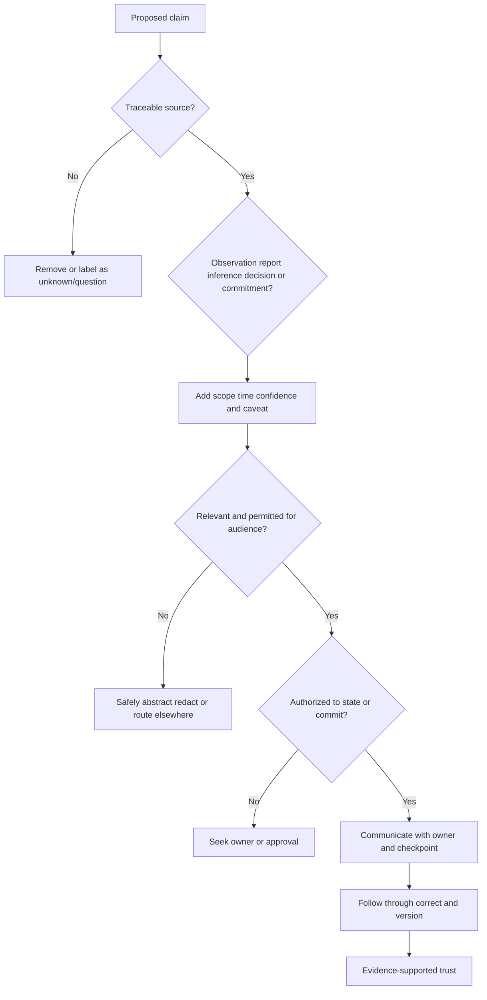

### Trust deposits and withdrawals

| Behavior | Likely trust effect | Why |
|---|---|---|
| Acknowledge impact without pretending to feel the customer's exact emotion | Deposit | Recognizes consequence without performing empathy |
| Name what was checked and what it proves | Deposit | Makes progress inspectable |
| State a checkpoint that is within the communicator's control | Deposit | Creates predictable continuity |
| Correct a prior statement and explain the changed evidence | Deposit after a withdrawal | Restores the record instead of defending the mistake |
| Repeat “we are actively investigating” with no evidence or next action | Withdrawal | Activity language hides the absence of usable progress |
| Promise an ETA owned by another team | Withdrawal | Converts hope into a commitment without authority |
| Overload the recipient with raw logs | Withdrawal | Transfers interpretation burden and may leak data |
| Say “to be transparent” before a selective or misleading statement | Withdrawal | Uses a trust cue instead of demonstrating transparency |
| Pressure a customer to accept risk by invoking executive attention or relationship status | Severe withdrawal | Manipulates authority and undermines informed choice |

### 🔍 Plain-English deep-dive: Uncertainty can be a trust feature

Suppose a mechanic hears a rattle but has not located its source. “The engine is failing” is decisive but unsupported. “Nothing is wrong” is soothing but unsupported. A trustworthy statement is: “I reproduced the rattle during left turns, did not observe the warning indicator, and have not isolated the source. I will inspect the front suspension next and update you after that inspection.” The customer knows the observation, negative evidence, remaining uncertainty, next test, and checkpoint.

Technical support works the same way. Uncertainty has structure:

- **Known:** directly supported by an authorized source.
- **Customer-reported:** important evidence attributed to the customer, not silently converted into an internal observation.
- **Inferred:** a reasoned interpretation with confidence and alternatives.
- **Unknown:** a question whose answer could change the decision.
- **Decision:** an authorized choice based on current evidence and risk.
- **Commitment:** an action and checkpoint owned by the person making it.

Writing “unknown” is not enough. State why it is unknown, why it matters, who can resolve it, what evidence is needed, and when the next decision or update will occur. This makes uncertainty actionable rather than evasive.

## 2. Start with audience, purpose, and need-to-know

Before writing, complete one sentence:

> **For [verified audience], this artifact should enable [purpose/decision] using [minimum permitted evidence] by [time/checkpoint].**

If the sentence contains two audiences with different permissions or two purposes with different approval needs, split the artifact. A customer update should not double as an Engineering debugging thread. An Engineering packet should not be forwarded externally because its first paragraph sounds customer-friendly. An external KB article should not be created by deleting a customer name from an internal escalation; restricted topology, failure signatures, internal component names, or unapproved workarounds can remain.

### Audience-purpose map

| Audience | Primary need | Typical decision or action | Appropriate detail | Usually exclude or route separately | Typical approval question |
|---|---|---|---|---|---|
| Customer technical contact | Case continuity and safe participation | Provide evidence, avoid conflicting changes, choose an approved option | Observed behavior, scope, completed work, safe request, unknowns, next action | Restricted internals, other customers, personnel commentary, unsupported cause | Is this accurate, contract-safe, privacy-safe, and approved for the customer channel? |
| Customer executive | Outcome, risk, and decision | Choose scope, risk posture, resource, or escalation path | Impact, confidence, options, recommendation, owner, checkpoint | Raw logs, speculative component detail, blame, long chronology | Does the decision owner have enough honest context without material omission? |
| CSM | Customer journey and aligned message | Coordinate stakeholder touchpoint, adoption or relationship response | Goal, reported impact, commitments, ownership, sentiment attribution, message boundary | Restricted technical evidence without need-to-know, internal speculation | Is the CSM an authorized recipient, and who owns the next customer message? |
| Engineering | Technical discrimination | Investigate internals, answer a question, advise test or fix | Repro, expected/actual, environment, timestamps, IDs, logs, tests, hypotheses | Relationship commentary, executive pressure as technical proof, unnecessary personal data | Is data minimized and is the ask within Engineering's boundary? |
| Product | Product or experience decision | Discover pattern, improve workflow/docs, classify request | User problem, workflow, pattern evidence, segment, workaround, risk, question | One customer's confidential details, unsupported frequency, roadmap assumptions | Is evidence aggregated and authorized, and is the brief asking rather than promising? |
| Internal KB reader | Reusable diagnosis or operation | Find, apply, validate, or escalate safely | Approved symptoms, scope, diagnostic branches, internal boundaries | Secrets, uncontrolled customer examples, volatile speculation | Has the owning technical and knowledge authority reviewed this version? |
| External KB reader | Safe self-service | Understand, check prerequisites, gather evidence, escalate | Supported behavior, safe steps, expected results, limitations | Internal architecture, hidden controls, case data, unsafe or unsupported actions | Is every claim externally supportable and publication-approved? |

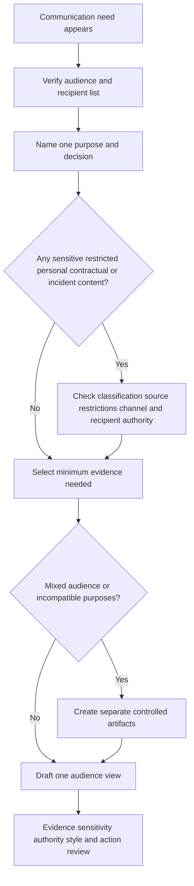

### Need-to-know filter

For every detail, ask five questions:

1. What recipient action or decision requires this detail?
2. Is the recipient authorized to receive it in this channel?
3. Can a less sensitive representation preserve the necessary meaning?
4. Would removing it make the artifact materially misleading?
5. Does the original source impose a sharing restriction that survives translation or redaction?

The answer is not always “remove.” Sometimes a detail is material. If an executive option carries residual security risk, omitting that risk to keep the brief simple is distortion. The safe approach is to express the risk at the right abstraction, such as “this option widens access beyond the approved least-privilege model,” while routing restricted implementation details to the authorized technical artifact.

## 3. Build the evidence spine before the prose

An evidence spine prevents each writer from inventing a slightly different case. It is closer to a controlled ledger than a narrative. The spine should use stable identifiers so claims in artifacts can be traced and corrected.

### Evidence-spine schema

| Field | Meaning | Example state |
|---|---|---|
| Spine ID and version | Stable record and current revision | `SPINE-SYN-112 v1.0` |
| Snapshot time | When this view was assembled | `2032-04-18T15:00:00Z` in the fiction |
| Scope | Systems, users, regions, objects, and time window covered | Three local synthetic validation events; no production scope |
| Evidence item ID | Stable reference for one item | `F-112-04` |
| Claim type | Observation, customer report, inference, unknown, decision, commitment | `OBSERVATION` |
| Statement | Atomic claim without mixed certainty | “No matching destination records were present by 14:23Z.” |
| Source and provenance | Authorized source, collector, method, and custody | Local fictional ledger row; learner-authored |
| Time and zone | Event time and clock context | UTC synthetic timestamps |
| Confidence | High, medium, low with reason | High within the fictional local ledger only |
| Sensitivity/share boundary | Who may receive this item and under what restrictions | Synthetic training artifact; not a real classification |
| Caveat | What the item does not prove | Absence in one query does not prove permanent loss |
| Owner | Who verifies, acts, or decides | Fictional role alias |
| Supersession link | Correction or newer evidence | None at v1.0 |

### Evidence grammar

| Claim type | Safe grammar | Example | Unsafe mutation |
|---|---|---|---|
| Observation | “Source X recorded Y at time Z within scope S.” | “The local source ledger recorded `ACCEPTED` for three synthetic events.” | “The integration worked.” |
| Customer report | “The customer reports X; internal verification is Y.” | “The fictional customer reports the events are not visible; the written destination ledger also has no matches.” | “The customer lost data.” |
| Negative evidence | “Source X did not contain Y under query Q by time Z.” | “No matching IDs appeared in the destination ledger by 14:23Z.” | “The events never arrived anywhere.” |
| Inference | “Evidence A and B are consistent with H; alternatives remain.” | “The route change is consistent with a routing mismatch; processing delay and query-scope error remain open.” | “The route change caused the incident.” |
| Unknown | “X is not established; evidence Y is needed because decision D depends on it.” | “Queue-B consumption is not established; the owner must inspect the consumer record before rollback.” | “Backend issue.” |
| Decision | “Authorized role R chose option O at time T based on evidence E.” | “No decision is recorded; rollout remains paused in the scenario.” | “We decided” when no authorized owner did |
| Commitment | “Owner R will perform action A and provide an update at checkpoint T.” | “Support will reconcile the route snapshot before the 15:30Z update checkpoint.” | “Engineering will fix this by 15:30Z.” |

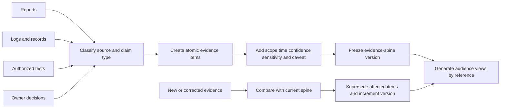

### Facts, interpretations, and actions must not merge

Consider this sentence: “A routing error caused the three events to be lost, so Engineering is deploying a fix tonight.” It contains at least four claims: a routing error exists, it caused the symptom, events were lost, and Engineering has an approved deployment tonight. Each requires its own source, confidence, authority, and boundary. If only a route change and absent destination records are observed, all four claims are inflated.

Rewrite atomically:

- **Observed:** the route value changed at 14:00Z in the synthetic snapshot.
- **Observed:** three source records show `ACCEPTED` after the change.
- **Observed:** the destination query contains no matching records by 14:23Z.
- **Inference:** a route mismatch is the leading hypothesis; delay and query-scope error remain open.
- **Unknown:** final event disposition is not established.
- **Decision:** no rollback or release decision is recorded.
- **Commitment:** Support will reconcile route and consumer evidence before the next update checkpoint.

### 🔍 Plain-English deep-dive: “Accepted” is not “completed”

Think of a coat-check desk. When the attendant accepts your coat and gives you a ticket, the handoff at the desk succeeded. That does not prove the coat reached the correct rack, remained there, or can be returned immediately. A technical status such as HTTP `202 Accepted` has similarly bounded semantics: RFC 9110 describes it as accepted for processing but not completed, and it might or might not eventually be acted upon.

The wider lesson applies even when the observed status is not HTTP. Every signal has a **semantic boundary**. Authentication success does not prove authorization to every resource. A healthy endpoint does not prove a specific transaction completed. A queue acknowledgment does not prove downstream consumption. A customer-visible result does not prove the internal cause. Good communication states what the signal supports and what it does not.

## 4. Translate and abstract without distortion

Translation should preserve six invariants:

| Invariant | Must stay the same across artifacts | What may change |
|---|---|---|
| Event identity | Which event, case, or observation is discussed | Whether a restricted identifier is shown, aliased, or omitted |
| Time meaning | Sequence, time zone, and relevant window | Precision when exact seconds are not needed, provided ordering and material timing remain true |
| Scope | Affected and unaffected populations supported by evidence | Level of grouping, such as three synthetic events versus “the bounded validation set” |
| Status semantics | What occurred and what has not occurred | Vocabulary suitable for the audience |
| Certainty | Observation, report, inference, unknown, decision, or commitment | Explanation length, not confidence level |
| Ownership | Who owns action, decision, communication, and checkpoint | Role name versus approved alias |

Use the **LADDER** method:

1. **Locate** the audience's decision.
2. **Anchor** every material claim to the evidence spine.
3. **Drop** detail that is unnecessary or unauthorized.
4. **Describe** remaining evidence in the audience's vocabulary.
5. **Expose** uncertainty, caveat, and residual risk.
6. **Route** action, owner, approval, and checkpoint.

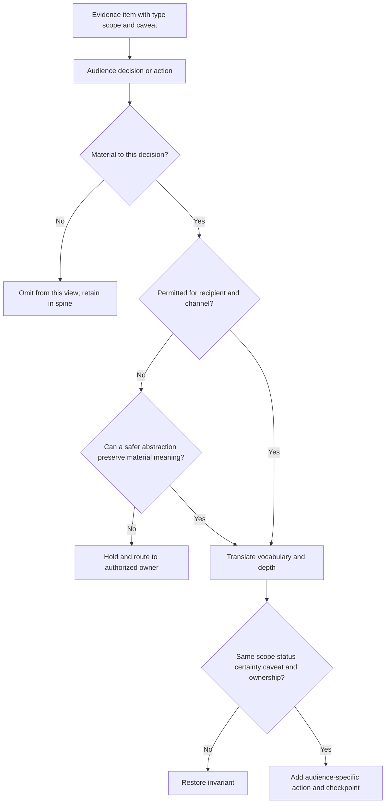

### Translation examples

| Evidence-spine statement | Customer-safe translation | Executive abstraction | Engineering detail | Distortion to reject |
|---|---|---|---|---|
| “No matching destination rows for IDs A-C by 14:23Z under query Q.” | “The three validation events are recorded at the source but are not yet visible in the checked destination view.” | “The bounded validation path has not met its end-to-end success criterion.” | Preserve IDs, query, window, clock, and collection details in authorized packet | “Events were lost.” |
| “Route changed from Queue-A to Queue-B at 14:00Z.” | “A configuration change overlaps the observed start time and is being evaluated.” | “A recent change is a leading investigative factor, not an established cause.” | Include exact before/after values, change reference, and snapshot provenance | “The customer misconfigured routing.” |
| “Health check returned 200 at 14:09Z.” | “Basic endpoint reachability was observed, but that does not prove event delivery.” | “A narrow health signal is positive; end-to-end validation remains failed.” | Include request, response, endpoint class, and limitations | “Service is healthy.” |
| “Rollback proposed; no approval recorded.” | “A configuration option is under review; no change has been made.” | “Decision needed: keep validation paused while the authorized owner evaluates rollback.” | State proposed test, risk, rollback authority, and missing approval | “Rollback is scheduled.” |

### Certainty ladder

| Level | Wording | Evidence expectation | Do not promote to |
|---|---|---|---|
| Direct observation | “The authorized source recorded...” | Inspectable source with scope and time | Universal truth outside observed scope |
| Corroborated observation | “Two independent sources agree...” | Sources with understood independence | Cause |
| Leading hypothesis | “Most consistent with... because...” | Supporting and contradicting evidence plus alternatives | Root cause |
| Confirmed cause | “Authorized investigation established...” | Accepted causal evidence under the organization's standard | Global cause for all similar symptoms |
| Approved action | “Owner approved...” | Recorded authority, scope, version, and time | Completed action |
| Completed and validated | “Action completed; evidence X met criterion Y.” | Execution and post-change validation | Permanent resolution or no regression |
| Customer-confirmed outcome | “Customer confirmed...” | Attributed confirmation and scope | Organization-wide satisfaction or adoption |

No writer, reviewer, executive, CSM, Engineer, Product partner, or AI drafting tool may move a statement upward on this ladder without new evidence and authority.

## 5. Design each artifact around its decision

### Customer update structure

| Element | Question answered | Example sentence pattern |
|---|---|---|
| Acknowledgment | What impact did we hear? | “You reported that...” |
| Current status | What state can we support? | “The case remains under investigation; the bounded validation is paused.” |
| Completed work | What changed since the prior update? | “We compared source and destination records for...” |
| Findings | What does evidence show? | “The source recorded X; Y is not present in the checked view.” |
| Unknowns | What is not established? | “Final disposition and cause are not yet established.” |
| Next action and owner | What will happen next? | “Support will compare...” |
| Customer action | What is safely needed from them? | “Please preserve...” or “No customer action is requested.” |
| Checkpoint | When will communication resume? | “The next update will be provided by...” |

A **checkpoint** is a promise to communicate or decide at a time within the owner's control. It is not an estimate of restoration, resolution, fix, release, or root-cause completion. “Next update by 15:30Z” can be honest even when the investigation remains open. “Fixed by 15:30Z” requires separate evidence and authority.

### Executive brief structure

| Element | Executive question | Boundary |
|---|---|---|
| Decision headline | What must be decided? | Do not hide the ask beneath chronology |
| Outcome/impact | Why does this matter now? | Attribute customer-reported impact and state scope |
| Current state | What is known and unknown? | Preserve confidence and negative evidence limits |
| Risk | What could happen under each option? | Distinguish observed harm from residual or potential risk |
| Options | What choices are actually authorized? | Do not include an impossible option for appearance of choice |
| Recommendation | What does the evidence support? | State owner and rationale; do not pressure through fear |
| Next checkpoint | When is new evidence expected? | Not a hidden resolution ETA |

### CSM handoff structure

| Technical case layer | Customer-success layer | Coordination output |
|---|---|---|
| Verified symptom and scope | Customer goal affected | One factual outcome statement |
| Current evidence and unknowns | Stakeholder concern attributed to source | One aligned confidence statement |
| Technical next action | Relationship/adoption action | Distinct owners and due checkpoints |
| Customer request | Communication preference and upcoming milestone | Coordinated contact plan |
| Support boundary | CSM boundary | Explicit customer-message owner |

### Engineering escalation structure

| Section | Minimum content | Quality test |
|---|---|---|
| Problem statement | One expected-versus-actual sentence | Can an Engineer identify the failing boundary? |
| Environment/scope | Relevant version, topology class, population, time window | Are volatile and unknown fields labeled? |
| Reproduction | Smallest safe repeatable sequence or reason it cannot be reproduced | Does it avoid production risk and customer data? |
| Evidence | Source-linked timestamps, IDs, logs, traces, screenshots, or diffs | Is every attachment necessary, redacted, and interpretable? |
| Tests completed | Test, result, interpretation, limitation | Does each test discriminate a hypothesis? |
| Hypotheses | Leading and credible alternatives | Is cause still labeled unknown? |
| Impact/urgency | Current consequence and time-sensitive decision | Is urgency evidence-based rather than executive name-dropping? |
| Ask | One or more answerable technical questions | Can Engineering respond without reconstructing the request? |
| Ownership | Customer update, technical action, and next checkpoint owners | Is there no responsibility gap? |

### Product evidence brief structure

| Section | Strong content | Misuse to reject |
|---|---|---|
| User problem | Job the user cannot complete or completes with unsafe effort | “Customer wants feature X” without workflow context |
| Evidence | Cases, segments, observations, quotes with authorization, and limits | Unsupported “many customers” claim |
| Current experience | Supported path and friction | Treating user error as the conclusion |
| Consequence | Time, risk, confusion, or operational cost with provenance | Invented revenue, churn, or security impact |
| Alternatives/workaround | Current option, owner, and limitation | Publishing an unsafe workaround |
| Product question | Discovery, classification, documentation, telemetry, or design question | Roadmap demand disguised as evidence |

### Internal versus external KB structure

| Dimension | Internal KB | External KB |
|---|---|---|
| Audience | Authorized support, operations, or specialists | Approved customer segment or public audience |
| Purpose | Diagnose, resolve, validate, escalate, or operate consistently | Understand, self-check, safely mitigate, collect evidence, or seek support |
| Detail | May include approved internal branches and escalation cues | Supported external behavior and safe steps only |
| Examples | Synthetic or properly sanitized, authorized internal examples | Generic examples with no customer or restricted detail |
| Review | Technical owner, knowledge owner, security/privacy or other required roles | All internal reviews plus external publication, legal/brand/localization as applicable |
| Lifecycle | Draft, validated, reused, improved, retired | Draft, approved, published, monitored, revised, withdrawn |

## 6. Worked one-evidence-many-audiences portfolio

**Portfolio label:** `SYNTHETIC_MULTI_AUDIENCE_PORTFOLIO_COMPLETED_NOT_SENT_NOT_APPROVED_NOT_PUBLISHED`.

**Scenario boundary:** `Northstar Harbor`, `SignalBridge`, all roles, queues, timestamps, records, case IDs, changes, events, customer statements, risks, decisions, and artifacts below are fictional. The “systems” are marks in a written local exercise, not software. No Abnormal product, tenant, integration, message, API, network, customer, or employee was accessed. The names and forms are not Abnormal templates.

### A. Controlled evidence spine `SPINE-SYN-112 v1.0`

The fictional customer goal is to validate a local paper workflow in which a source accepts three synthetic security-event cards and a destination ledger records them within ten minutes. The success criterion is intentionally narrow: all three event aliases must appear in the destination ledger within the fictional ten-minute window. The scenario does not model threat detection, production delivery, data integrity, an Abnormal feature, or a real service commitment.

| ID | Type | Evidence-spine statement | Source/provenance | Confidence and caveat | Portfolio sharing treatment |
|---|---|---|---|---|---|
| `F-112-01` | Customer report | At 14:18Z, the fictional customer technical role reports that three validation events are not visible in the destination view and that an analyst validation task is paused. | Learner-authored scenario statement | High that the fiction contains the report; it is not independently measured production impact. | Attribute as customer-reported; executive and CSM views may summarize it. |
| `F-112-02` | Observation | Synthetic event aliases `EVT-112-A`, `EVT-112-B`, and `EVT-112-C` were entered at 14:08:02Z, 14:08:04Z, and 14:08:06Z. | Local written source ledger | High within the fiction; no electronic event exists. | Exact aliases may appear in authorized technical packet; summarize elsewhere. |
| `F-112-03` | Observation | The source ledger marks all three events `ACCEPTED` and assigns correlation aliases `COR-112-A` through `COR-112-C`. | Local written source ledger | High within the fiction; `ACCEPTED` proves only source-stage acknowledgment. | Preserve semantic caveat in every view. |
| `F-112-04` | Observation | The destination ledger query for the three aliases from 14:08Z through 14:23Z contains no matching row. | Local written destination ledger and fictional query definition | High for that ledger/query/window; does not prove permanent loss, deletion, or absence from an unqueried location. | Customer-safe summary allowed; exact query belongs in Engineering packet. |
| `F-112-05` | Observation | A separate endpoint-health card is marked `200` at 14:09Z. | Local written health card | High within the fiction; proves only the modeled health check, not event delivery or downstream processing. | Include only with explicit limitation. |
| `F-112-06` | Observation | A synthetic configuration snapshot changes the destination route from `QUEUE-SYN-A` to `QUEUE-SYN-B` at 14:00Z under fictional change reference `CHG-SYN-112`. | Local written before/after snapshot | High that the fiction records a change; no real approval or execution occurred. | Exact values internal technical only; customer/executive views use “recent configuration change.” |
| `F-112-07` | Observation | The written scenario contains no consumer record for `QUEUE-SYN-B`. | Local scenario inventory | High within the defined inventory; absence from the paper inventory does not prove a real component is absent or identify cause. | Engineering detail; executive view may state route readiness is unverified. |
| `F-112-08` | Inference | The route change is consistent with a routing mismatch and is the leading hypothesis. Processing delay and query-scope error remain credible alternatives. | Reasoning from `F-112-03` through `F-112-07` | Medium; no discriminating consumer inspection or reversal test was performed. | Always label as hypothesis; never call root cause. |
| `F-112-09` | Unknown | Final disposition of the three events, whether `QUEUE-SYN-B` has an authorized consumer, and causal mechanism are not established. | Gap analysis | High that these are unresolved in the fiction. | Material to every status view at appropriate detail. |
| `F-112-10` | Proposed action | A rollback to the prior route and a consumer-record inspection are proposed, but neither is approved or performed. | Learner-authored action record | High; proposal is not approval, schedule, or execution. | Customer says “option under review”; Engineering receives technical proposal; executive sees decision. |
| `F-112-11` | Decision | The validation rollout remains paused in the scenario; no production, rollback, defect, fix, release, or publication decision is recorded. | Learner-authored decision ledger | High within the fiction. | Preserve in all relevant views. |
| `F-112-12` | Commitment | Fictional Support owns evidence reconciliation and the next customer update checkpoint at 15:30Z. No resolution ETA exists. | Learner-authored ownership ledger | High within the fiction; no actual message will be sent. | Every continuity view may include the checkpoint and distinguish it from ETA. |

### B. Competing-hypothesis control

| Hypothesis | Supporting evidence | Contradicting or missing evidence | Cheapest safe discriminator | Current state |
|---|---|---|---|---|
| Route mismatch | Change overlaps onset; source accepts; destination lacks records; no consumer is listed for new route | No consumer inspection; no approved reversal; paper inventory may be incomplete | Authorized owner verifies consumer record and route intent | Leading, unconfirmed |
| Processing delay | Source acknowledgment exists; destination window is bounded | No later destination observation; health check says little | Extend authorized observation window without replaying sensitive data | Open |
| Query-scope error | Negative evidence depends on one query | Query definition has not been peer-reviewed in scenario | Second reviewer checks aliases, time range, time zone, and filters | Open |
| Source-status misinterpretation | `ACCEPTED` is bounded and may not mean delivered | Modeled source semantics are intentionally incomplete | Obtain authoritative status semantics for the actual system before operational use | Open |

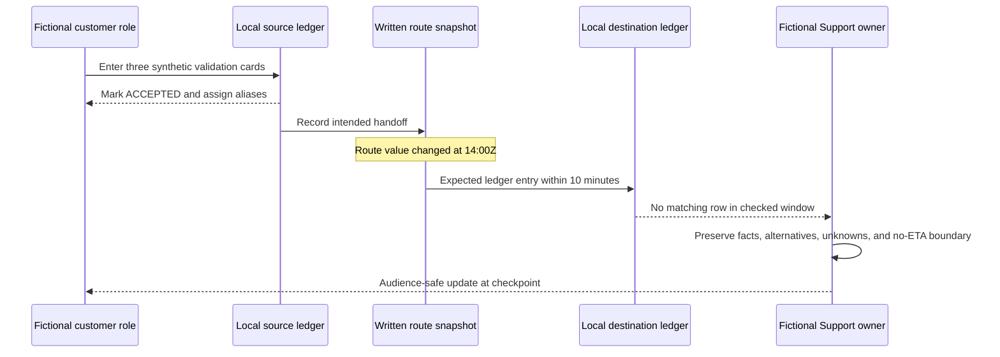

### C. Artifact 1 - customer progress update

**Artifact ID:** `CU-SYN-112 v1.0`  
**Audience:** fictional authorized customer technical contact  
**Purpose:** maintain case continuity, preserve the environment, and explain the next evidence step  
**Status:** `DRAFT - NOT SENT - NOT APPROVED`  
**Evidence snapshot:** `SPINE-SYN-112 v1.0`  
**Sensitivity statement:** synthetic only; a real message would follow current customer-data and disclosure policy

**Subject: Update on the paused validation event flow**

Hello Customer Technical Owner,

You reported that the three validation events are not visible in the destination view, which has paused the analyst validation task.

Our current evidence shows that the source recorded all three synthetic events as accepted. We did not find their matching aliases in the destination view during the checked 14:08Z-14:23Z window. A basic endpoint health check succeeded, but that result does not prove end-to-end event delivery. A recent configuration change overlaps the start of the observed behavior and is being evaluated as one hypothesis.

We have not established the final disposition of the events or a root cause. No rollback or other configuration change has been approved or performed.

Support is reconciling the route record, destination query, and expected consumer path. No customer action is requested at this time other than preserving the current written scenario state so the evidence does not change during review. We will provide the next update by 15:30Z, even if the investigation remains open. That is an update checkpoint, not a resolution estimate.

Regards,  
Fictional Support Owner

**Why this view is trustworthy:** it acknowledges the reported impact, states direct and negative evidence with limits, labels the route relationship as a hypothesis, says what is unknown, avoids internal queue names, records no change, names the next action and owner, and gives a checkpoint without inventing an ETA.

### D. Artifact 2 - executive decision brief

**Artifact ID:** `EB-SYN-112 v1.0`  
**Audience:** fictional authorized customer/vendor decision owners  
**Purpose:** decide whether the bounded validation rollout should remain paused while route readiness is verified  
**Status:** `DRAFT - NOT PRESENTED - NOT APPROVED`  
**Evidence snapshot:** `SPINE-SYN-112 v1.0`

| Executive field | Brief |
|---|---|
| Decision needed | Keep the bounded validation rollout paused until the intended destination path and consumer ownership are verified. |
| Reported impact | The fictional customer reports that one analyst validation task is paused because three synthetic events are not visible. No production, threat, message, or customer-data impact is established. |
| Current evidence | The source acknowledged all three events; the checked destination view has no matches by the end of the defined window. A narrow health signal is positive but does not prove delivery. |
| Leading interpretation | A recent route change is consistent with a mismatch. Cause remains unconfirmed; processing delay and query-scope error remain open. |
| Risk of proceeding | The team could declare readiness without evidence that the intended end-to-end path works, creating false assurance and additional ambiguous test results. |
| Option A | Remain paused while authorized owners verify route intent, consumer ownership, and query scope. Lowest evidence risk; delays the fictional validation milestone. |
| Option B | Approve a bounded reversal test only after change authority, rollback conditions, and evidence collection are defined. Faster discrimination, but it introduces change risk and is not yet approved. |
| Recommendation | Choose Option A now. Reconsider Option B only through the authorized change owner. |
| Ownership/checkpoint | Support reconciles evidence and updates by 15:30Z. The configuration owner decides any change. There is no resolution or fix ETA. |

**What changed from the customer update:** exact case continuity and customer-facing phrasing became a decision, options, and risk. The scope, evidence, uncertainty, no-change state, owner, and checkpoint did not change.

### E. Artifact 3 - CSM handoff

**Artifact ID:** `CSM-SYN-112 v1.0`  
**Audience:** fictional CSM with verified need-to-know  
**Purpose:** align the customer journey, commitments, and next customer touchpoint without transferring technical ownership  
**Status:** `DRAFT - NOT HANDED OFF - NOT APPROVED`  
**Evidence snapshot:** `SPINE-SYN-112 v1.0`

| Handoff field | Controlled content |
|---|---|
| Customer goal | Complete a bounded synthetic validation so the fictional analyst workflow can be reviewed. This is not production adoption or value proof. |
| Customer-reported concern | The technical contact reports the analyst task is paused. No executive sentiment, dissatisfaction, churn risk, or business impact is inferred. |
| Verified technical state | Source acknowledgment exists for three events; matching destination records are absent in the checked window. A health check does not prove delivery. |
| Unknowns | Final disposition, route-consumer readiness, query correctness, and cause. |
| Leading hypothesis | Recent route change is consistent with a mismatch; alternatives remain open. |
| Technical owner/action | Support reconciles route, consumer, and query evidence. Configuration owner decides any change. |
| CSM action | Confirm the correct stakeholder for the next milestone and whether the paused task affects a scheduled fictional review. Attribute any new customer statement. |
| Message alignment | Use the approved customer update facts. Do not say “backend delay,” “misconfiguration,” “defect,” “rollback scheduled,” or “fix in progress.” |
| Next customer touchpoint | Support owns the 15:30Z technical update. CSM and Support coordinate any separate success conversation after recipient and purpose are confirmed. |
| Boundary | No technical case transfer, no ETA, no Product/Engineering commitment, and no disclosure of internal queue aliases unless separately authorized. |

**Handoff acceptance prompt:** “Please confirm that you accept the CSM actions and message boundary above; technical case continuity and the 15:30Z update remain with Support.” Silence is not acceptance.

### F. Artifact 4 - Engineering escalation

**Artifact ID:** `ENG-SYN-112 v1.0`  
**Audience:** fictional authorized Engineering recipient  
**Purpose:** discriminate the expected routing path and identify the next safe evidence source  
**Status:** `DRAFT - NOT SUBMITTED - NOT ACCEPTED`  
**Evidence snapshot:** `SPINE-SYN-112 v1.0`  
**Escalation statement:** submission would not prove defect, ownership, priority, or ETA

#### Problem statement

In the local written model, three synthetic events are acknowledged at the source after the destination route changes from `QUEUE-SYN-A` to `QUEUE-SYN-B`, but no matching destination ledger rows appear within the ten-minute success window. Expected behavior is one destination row per alias within ten minutes. Actual behavior is zero matching rows by 14:23Z.

#### Environment and scope

| Field | Value |
|---|---|
| Environment | Local paper model `SignalBridge`; no application or service |
| Data | Three fictional aliases; no customer or personal data |
| Time window | 14:00Z-14:23Z on fictional date 2032-04-18 |
| Change | `CHG-SYN-112`, route A to route B at 14:00Z; written only |
| Reproducibility | Not reproduced; no replay or change performed |
| Impact | One fictional validation task paused; no production impact established |

#### Minimal written reproduction

1. Begin with route snapshot `QUEUE-SYN-A`.
2. In the fictional change record, set the route to `QUEUE-SYN-B` at 14:00Z.
3. Enter event aliases A-C into the source ledger at 14:08Z.
4. Observe source status `ACCEPTED` and correlation aliases.
5. Query the destination ledger for event and correlation aliases through 14:23Z.
6. Observe zero matching destination rows.

This is a documentation sequence, not an executed test. A real reproduction would require authorization, supported fixtures, data rules, stop conditions, and current product documentation.

#### Evidence and completed reasoning

| Evidence/test | Result | Interpretation | Limit |
|---|---|---|---|
| Source ledger alias check | A-C marked `ACCEPTED` | Source-stage acknowledgment is modeled | Does not prove enqueue, routing, consumption, or destination write |
| Destination query | Zero matches through 14:23Z | Success criterion not met in checked view | Query may be wrong; other locations and later times not checked |
| Endpoint health card | `200` at 14:09Z | Narrow endpoint path modeled as reachable | Unrelated transaction can succeed while event path fails |
| Configuration diff | Route A to B at 14:00Z | Change overlaps symptom onset | Temporal overlap is not causation |
| Consumer inventory | No Queue-B consumer listed | Route readiness is unverified | Inventory may be incomplete |

#### Hypotheses

1. **Leading, unconfirmed:** route B has no intended consumer or points outside the checked destination path.
2. **Alternative:** processing exceeded the observation window.
3. **Alternative:** destination query scope, alias, or time filter is wrong.
4. **Alternative:** source `ACCEPTED` semantics are being overinterpreted.

#### Engineering ask

1. In the modeled architecture, which authoritative record would distinguish route acceptance, queue placement, consumer pickup, and destination persistence?
2. What current approved status semantics should Support use before describing a source acknowledgment to a customer?
3. Is consumer ownership expected to be validated before a route change, and what non-sensitive health evidence should represent that gate?
4. If an authorized reversal test is considered, what stop condition and evidence would discriminate routing mismatch without assuming cause?

#### Ownership

Support retains the fictional customer update and evidence spine. The configuration owner retains change approval. Engineering has not accepted this packet and owns no action, defect, fix, or date. Next customer update checkpoint remains 15:30Z.

### G. Artifact 5 - Product evidence brief

**Artifact ID:** `PB-SYN-112 v1.0`  
**Audience:** fictional authorized Product recipient  
**Purpose:** ask whether the modeled experience needs clearer state semantics or readiness guidance  
**Status:** `DRAFT - NOT SUBMITTED - NOT ACCEPTED`  
**Evidence snapshot:** `SPINE-SYN-112 v1.0`

| Product field | Evidence brief |
|---|---|
| User problem | A support user can see a source-stage acknowledgment but cannot determine, from the written scenario, whether the event was routed, consumed, or persisted. This makes the next safe diagnostic action unclear. |
| Workflow affected | Bounded integration validation before readiness is declared. |
| Evidence | One fictional scenario with three synthetic event aliases, one route change, one narrow health signal, and absent destination records in a defined window. |
| Pattern strength | Single learner-authored example. No real case count, frequency, segment, trend, demand, revenue, adoption, or risk measurement exists. |
| Current workaround | Maintain an evidence spine, explain status boundaries, verify consumer readiness, and escalate an expected-versus-actual packet. This is a communication workaround, not product behavior. |
| Consequence | In the fiction, the validation task pauses. Ambiguous state language could encourage certainty inflation or unsafe retries if not controlled. |
| Product questions | Should state semantics, end-to-end readiness evidence, or approved diagnostic guidance be easier to distinguish? Is this best classified as documentation, telemetry, UX, support enablement, or no product change? |
| Explicit non-claims | No defect, feature gap, customer demand, roadmap fit, priority, commitment, or Abnormal behavior is asserted. |

### H. Artifact 6 - internal KB draft

**Artifact ID:** `IKB-SYN-112 v1.0`  
**Title:** Source acknowledgment present but downstream validation evidence absent  
**Audience:** fictional authorized support staff  
**Status:** `DRAFT - NOT VALIDATED - NOT PUBLISHED`  
**Evidence snapshot:** derived from `SPINE-SYN-112 v1.0`, generalized beyond the fictional case  
**Reuse warning:** a case hypothesis must not become a KB cause without accepted evidence

#### Symptom

A source record acknowledges a bounded validation object, but the expected downstream record is absent from the authorized view within the defined success window.

#### Scope and semantic boundary

An acknowledgment may prove receipt at one stage only. It does not automatically prove successful routing, queue placement, processing, persistence, visibility, or customer outcome. Obtain current authoritative semantics for the actual product and integration.

#### Safe diagnostic flow

1. Confirm authorization, supported test fixture, data classification, recipient, and change boundary.
2. Record expected behavior, success window, time zone, object alias, and source of truth before testing.
3. Verify source acknowledgment and capture only minimum approved metadata.
4. Verify the destination query's alias, time range, time zone, filters, role visibility, and retention boundary.
5. Check for a recent authorized configuration or dependency change without assuming causation.
6. Map stages: accepted, routed, queued, consumed, processed, persisted, and displayed. Use only stages the authoritative documentation actually supports.
7. Identify the first stage without evidence.
8. Form competing hypotheses and choose the lowest-risk discriminating check.
9. Do not replay customer content, widen permissions, disable controls, or change production configuration without explicit authority.
10. Escalate with expected/actual behavior, scope, evidence references, tests, alternatives, and a precise ask.

#### Escalate when

- authoritative status semantics are unavailable or conflict;
- a supported path lacks the expected stage evidence;
- evidence requires restricted internal access;
- a production change, replay, security control change, or sensitive collection is proposed;
- potential security, privacy, legal, contractual, or cross-customer impact appears;
- the customer-facing statement requires an unconfirmed root cause, fix, or ETA.

#### Do not conclude

- `ACCEPTED` means completed;
- a `200` health response proves a transaction path;
- absent query results prove deletion or permanent loss;
- a recent change is the cause;
- escalation means a defect;
- silence means recovery.

#### Article ownership

Technical owner, knowledge owner, review date, applies-to versions, internal sharing class, validation evidence, and supersession path are all required before use. This synthetic draft has none of those approvals and must not be treated as standard work.

### I. Artifact 7 - external KB draft

**Artifact ID:** `EKB-SYN-112 v1.0`  
**Title:** When a validation event is acknowledged but is not yet visible downstream  
**Audience:** hypothetical approved customer reader  
**Status:** `DRAFT - NOT EXTERNALLY REVIEWED - NOT PUBLISHED`  
**Boundary:** generic safe guidance only; no internal component names, customer identifiers, hidden architecture, or unconfirmed causes

#### What this symptom means

An acknowledgment can confirm that one stage received a validation event. It might not confirm that every later stage completed. If the event is not visible where expected, compare the exact event identifier, time window, time zone, and view before drawing a conclusion.

#### Safe checks

1. Confirm that you are using an approved synthetic or test event and the supported validation procedure for your environment.
2. Record the event's safe correlation identifier and UTC timestamp.
3. Check that the expected destination, time range, filters, and authorized role are correct.
4. Review whether an approved configuration or integration change overlaps the observed start time.
5. Preserve the current state and evidence before making additional changes.

#### What to provide Support

- expected and actual behavior;
- safe correlation identifier and UTC time;
- affected scope and start time;
- whether the behavior is repeatable using an approved test;
- recent approved changes;
- sanitized status or error text through the approved channel.

Do not send passwords, tokens, keys, cookies, full message content, personal data, or unrestricted logs. Do not disable a security control, widen permissions, replay sensitive content, or repeatedly retry a state-changing action to test delivery.

#### What happens next

Support can use the evidence to identify the first unverified stage and determine whether configuration guidance, more evidence, or specialist escalation is appropriate. An acknowledgment alone does not establish final delivery, root cause, or a resolution time.

This draft is not an approved article for any product. Current official product documentation and Support guidance control real troubleshooting.

### J. Cross-artifact consistency proof

| Spine invariant | Customer | Executive | CSM | Engineering | Product | Internal KB | External KB |
|---|---|---|---|---|---|---|---|
| Three bounded synthetic events | “three validation events” | “three synthetic events” | “three events” | exact aliases A-C | one scenario, three aliases | generalized symptom | singular/generic validation event |
| Source acknowledged only | Stated with delivery caveat | Stated as source acknowledgment | Same caveat | exact status and aliases | framed as state ambiguity | general semantic boundary | plain-language boundary |
| Destination evidence absent in checked window | Stated | Success criterion not met | Stated | exact query and window | evidence summary | diagnostic pattern | reader check |
| Health signal is narrow | Stated | Positive but insufficient | Available if material | Exact modeled `200` | Not needed for Product decision | “health does not prove transaction” | Omitted as unnecessary |
| Route change overlaps onset | “recent change...one hypothesis” | leading factor, not cause | message boundary | exact before/after | supports experience ambiguity only | generic recent-change check | generic approved-change check |
| Cause unknown | Explicit | Explicit | Explicit | four hypotheses | no defect asserted | prohibit causal jump | no cause claimed |
| No change approved/performed | Explicit | decision framing | Explicit boundary | Explicit | Not applicable | authorization warning | preserve before change |
| Rollout paused | Customer task context | recommended decision state | Customer-goal context | impact statement | workflow consequence | Not case-specific | Not case-specific |
| Support owns checkpoint, no ETA | Explicit 15:30Z | Explicit | Explicit | Explicit | Omitted as not Product-relevant | General rule | General expectation only |

Different words and detail are visible, but no artifact changes the event count, source status, destination observation, route timing, uncertainty, decision state, or ownership. Omission is acceptable only where a fact is not material to the artifact purpose. Every view can be regenerated from the same spine version.

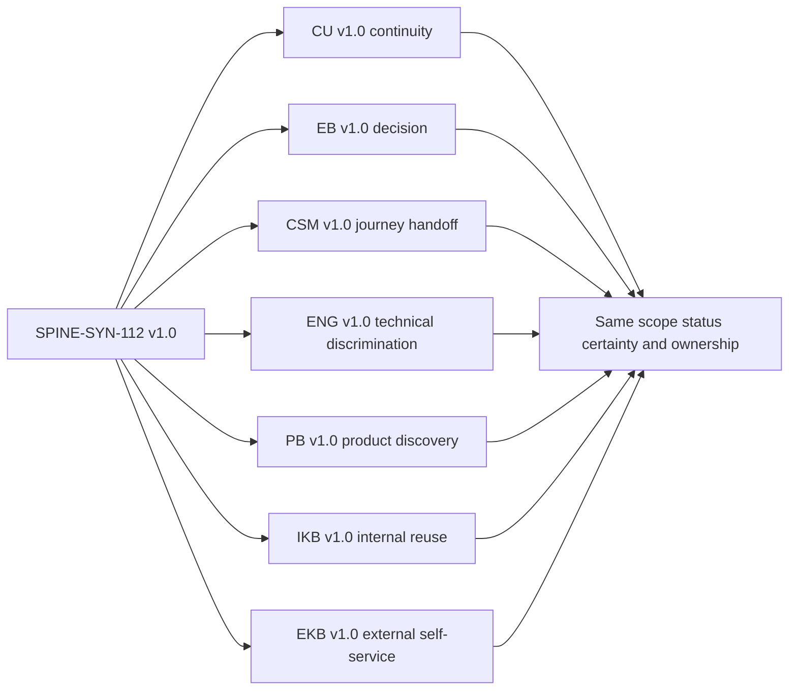

### 🔍 Plain-English deep-dive: Same evidence does not mean copy and paste

A building engineer may record “differential pressure fell from X to Y at sensor Z.” The tenant needs “ventilation in this zone is below the agreed operating range; avoid using the room until the next check.” The building manager needs “decision: close the zone or accept temporary capacity loss.” The equipment manufacturer needs sensor model, calibration, times, readings, environmental conditions, and recent changes.

Copying the sensor record to everyone is not radical transparency. It can obscure the decision, reveal restricted details, and shift interpretation to people without the context to do it safely. But rewriting it as “air issue resolved soon” is worse because it changes certainty and invents a timeline. The correct skill is **loss-aware transformation**: remove detail only after identifying what meaning, risk, caveat, and action must survive.

## 7. Approval, versioning, and correction

Every artifact needs an explicit state. Recommended portable states are examples, not Abnormal workflow:

| State | Meaning | Permitted action |
|---|---|---|
| `DRAFT` | Writer is assembling an artifact | Keep in authorized drafting location; do not send or publish |
| `IN REVIEW` | Named reviewers are checking a specific version | Collect comments; material edits create a new review version |
| `APPROVED FOR [AUDIENCE/CHANNEL]` | Authorized approver permits that exact version for that use | Send or publish only within named scope and validity window |
| `SENT/HANDED OFF` | Artifact was delivered to named recipients | Record time, version, channel, and any acceptance requirement |
| `PUBLISHED` | Approved knowledge version is available to its audience | Monitor feedback, usage, product/policy change, and review date |
| `SUPERSEDED` | A newer version replaces it | Preserve history and point readers to the current version |
| `WITHDRAWN` | Artifact must no longer be used | Remove from active use and record reason, owner, and corrective communication |

### Version record

| Field | Required question |
|---|---|
| Artifact ID/version | Which exact representation is this? |
| Evidence-spine version | Which factual snapshot produced it? |
| Audience/purpose/channel | Who can use it, for what, and where? |
| Sensitivity/source restrictions | What sharing rules survive into this view? |
| Author/reviewer/approver | Who wrote, checked, and authorized it? |
| Material changes | Which facts, conclusions, actions, or disclosures changed? |
| Approval state/time/expiry | Is this version currently authorized? |
| Sent/published location | Where is the controlled copy? |
| Supersedes/superseded by | Which versions are no longer current? |
| Correction record | Who received the correction, and was the system of record updated? |

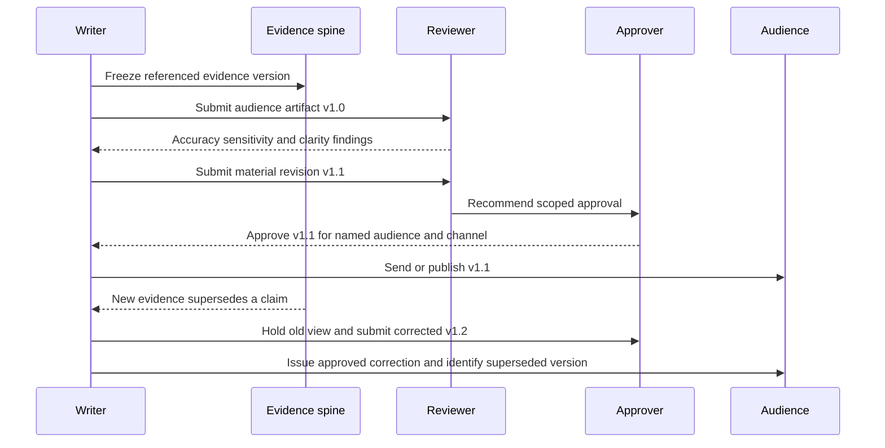

### Correction protocol

When a sent statement becomes wrong or materially incomplete:

1. Stop reuse and identify every affected audience and artifact version.
2. Preserve the old statement and the evidence that supported it at the time.
3. Record the new or corrected evidence and why it changes the statement.
4. Assess safety, contractual, incident, legal, regulatory, customer, and decision impact.
5. Draft a direct correction: what was said, what is correct now, why it changed, what action changes, and what remains unknown.
6. Obtain the required approval for the corrected audience/channel.
7. Send the correction through the appropriate route without burying it in a routine update.
8. Supersede the old version in each system of record and knowledge surface.
9. Review the control failure: source confusion, stale snapshot, reviewer gap, unauthorized edit, certainty inflation, or version collision.

“We apologize for any confusion” is insufficient when the communicator created the confusion. Prefer accountable language: “Our 14:30Z update stated that the event completed. That was incorrect: the source status showed acceptance only. We have corrected the case record. Final disposition remains under investigation, and the next update checkpoint is 16:00Z.”

### 🔍 Plain-English deep-dive: Approval is a boarding pass, not a passport

A passport establishes an identity across many journeys. A boarding pass authorizes one traveler to take one particular flight under stated conditions. Communication approval is more like the boarding pass. Approval of customer update `v1.1` for one named case channel does not authorize sending its Engineering attachment, publishing it as a KB, forwarding it to a broader executive list, entering it into an AI tool, or reusing a materially edited `v1.2`. The audience, purpose, channel, version, sensitivity, validity window, and approver's authority are part of the approval.

This is why “it was already reviewed” is not enough. Ask what was reviewed, by whom, for which recipient and use, and whether the current artifact still matches that approved state. Small style edits may follow a local policy without full reapproval; changes to facts, certainty, risk, commitments, recipients, disclosure depth, or recommended action are material and should return to the required review path. When the rule is unclear, hold the artifact and ask the current publication or communication owner rather than treating silence as permission.

## 8. Audience and approval decision tree

The decision tree below is deliberately conservative. Real company policy, contracts, law, incident command, security/privacy direction, and current approved tooling supersede it.

```mermaid
flowchart TD
    Start["Need to communicate"] --> Incident{"Potential security privacy legal regulatory safety or contractual event?"}
    Incident -->|Yes| Command["Invoke current authorized process and communication owner"]
    Incident -->|No| Recipient["Verify recipients role and channel"]
    Command --> Recipient
    Recipient --> Purpose{"One explicit purpose and decision?"}
    Purpose -->|No| Clarify["Clarify or split artifacts"]
    Purpose -->|Yes| Spine["Select current evidence-spine version"]
    Clarify --> Spine
    Spine --> Restricted{"Any restricted source personal data secret internal detail or sharing label?"}
    Restricted -->|Yes| Need["Apply source restriction recipient authority and minimum need-to-know"]
    Restricted -->|No| Translate["Translate at audience-appropriate abstraction"]
    Need --> Copy{"Would detail cross an unauthorized audience boundary?"}
    Copy -->|Yes| Abstract["Create safe abstraction or withhold and escalate"]
    Copy -->|No| Translate
    Abstract --> Material{"Can material meaning and risk survive?"}
    Material -->|No| Hold["Do not send; obtain authorized route or recipient"]
    Material -->|Yes| Translate
    Translate --> Claims{"Evidence supports scope certainty status and action?"}
    Claims -->|No| Revise["Remove label unknown or obtain evidence"]
    Claims -->|Yes| Commit{"Any ETA root cause defect roadmap legal or other controlled commitment?"}
    Commit -->|Yes| Owner["Obtain statement from authorized owner"]
    Commit -->|No| Approval["Run required accuracy sensitivity audience and publication reviews"]
    Owner --> Approval
    Approval --> Approved{"Exact version approved for audience and channel?"}
    Approved -->|No| Hold
    Approved -->|Yes| Send["Send hand off or publish; record version and time"]
    Send --> Follow["Track acceptance feedback correction and supersession"]
```

### Approval matrix

| Artifact | Accuracy owner | Additional likely review | Release authority | Automatic hold examples |
|---|---|---|---|---|
| Customer case update | Support case owner or designated technical owner | Security/privacy, incident, legal, account, communications as triggered | Current authorized customer-communication role | Unknown recipient, unapproved disclosure, invented status/ETA/cause |
| Executive brief | Brief owner plus evidence owners | Risk, incident command, legal, finance, customer owner as relevant | Named decision/communication authority | Material uncertainty removed, options outside authority |
| CSM handoff | Support and CSM for their respective statements | Account/security/privacy owner as needed | Actual handoff participants; customer send separately approved | Technical ownership gap, sentiment invented, restricted evidence copied |
| Engineering escalation | Support technical owner | Data/privacy/security and escalation owner | Current escalation process | Secrets, excess data, unsafe repro, no ask, cause asserted |
| Product evidence brief | Support/Product evidence owner | Customer confidentiality, analytics, privacy, account owner | Current Product intake owner | One case presented as trend, roadmap language, customer identity unapproved |
| Internal KB | Technical and knowledge owners | Security/privacy/legal/localization/accessibility as applicable | Internal publication role | Unconfirmed cause, secret, copied customer data, stale applicability |
| External KB | Technical, knowledge, and external publication owners | Security, privacy, legal, brand, accessibility, localization, supportability | External publishing authority | Internal details, unsupported workaround, customer case, no version scope |

This table names review categories, not universal job titles. First-week discovery must identify actual Abnormal roles and tools without assuming Microsoft equivalence.

## 9. Failure modes, escalation, and prohibitions

### Common communication failure modes

| Failure mode | Why it damages trust or safety | Prevention or repair |
|---|---|---|
| Certainty inflation | Converts evidence into a stronger claim than it supports | Use atomic claim types, confidence, alternatives, and source review |
| Invented status | Creates fictional progress such as “Engineering engaged” or “fix testing” | Require an accepted owner/status source; otherwise say submitted, pending, or not established |
| ETA invention | Binds another team or uncertain event to a date | Give an owned update checkpoint; route resolution estimates to authorized owner |
| Root-cause invention | Can misdirect remediation, blame people, and become permanent in KB | Use leading hypothesis until accepted causal standard is met |
| Sensitive leakage | Exposes customer, personal, secret, security, cross-tenant, contractual, or proprietary information | Verify recipients/channel, minimize, redact with context, and honor source restrictions |
| Copying restricted details between audiences | Assumes that translation or a smaller recipient list removes original restrictions | Carry source labels and approvals into every derived view |
| Internal-to-external KB conversion by deletion | Leaves hidden architecture, unsafe steps, or unsupported claims | Author external guidance from approved external facts and purpose, then review independently |
| Unapproved publication | Makes a draft discoverable and reusable beyond intended scope | Explicit publication state, release authority, controlled location, and rollback/withdrawal plan |
| Manipulative language | Pressures recipients through fear, guilt, status, false empathy, or selective facts | Present evidence, options, consequences, and authority neutrally; preserve informed choice |
| Technical dumping | Transfers synthesis burden and may reveal restricted data | Lead with decision/action; link approved detail for authorized readers |
| Executive oversimplification | Removes uncertainty or material risk to produce a clean headline | Preserve decision-relevant caveats and confidence |
| CSM role blur | Creates duplicate promises or transfers case ownership silently | Distinguish success, technical, communication, and decision owners |
| Engineering escalation as abandonment | Customer receives silence after internal transfer | Support retains customer continuity and checkpoints until accepted reassignment |
| Product anecdote inflation | One request becomes “customer demand” or “strategic pattern” | State sample, segment, denominator, provenance, and unknowns |
| KB fossilization | A temporary hypothesis or workaround becomes timeless truth | Applies-to, owner, review trigger, validation, feedback, and retirement |
| Stale version reuse | Recipient acts on a superseded fact or recommendation | Current-version marker, supersession links, and correction route |
| Over-redaction | Removes material scope or risk and creates a misleading artifact | Replace with accurate safe abstraction or withhold the artifact |
| AI draft without review | AI may invent facts, preserve hidden sensitive text, or flatten caveats | Use only approved inputs/tools; human evidence, safety, audience, and authority review is mandatory |

### Manipulative language patterns to reject

| Pattern | Example to reject | Trustworthy alternative |
|---|---|---|
| False reassurance | “There is nothing to worry about.” | “No production impact is established in the evidence reviewed so far; scope verification continues.” |
| Minimization | “It is just a display issue.” | “The symptom is currently visible in the destination view; underlying disposition is not established.” |
| Pressure through status | “Leadership expects approval today.” | “The preferred date is today; the readiness criterion remains unmet, and the authorized owner must choose hold, reduced scope, or accepted residual risk.” |
| Blame | “The customer changed the wrong queue.” | “A customer-controlled configuration change overlaps the onset; causation remains under investigation.” |
| Vague empathy | “We deeply understand exactly how you feel.” | “You reported that the analyst validation is paused. We are preserving that impact in the plan and will update by 15:30Z.” |
| Transparency theater | “To be completely transparent, the backend is delayed.” | “The source acknowledged the events; destination evidence is absent in the checked window. The cause is unknown.” |
| Forced consent | “Please confirm you are comfortable proceeding.” | “Option B carries the stated residual risk. The named risk owner may accept, reject, or request more evidence.” |

### Escalation triggers and minimum packet

| Trigger | Immediate action | Escalate to current authorized owner | Minimum packet | Communication boundary |
|---|---|---|---|---|
| Possible sensitive-data exposure | Stop copying/sending; preserve evidence safely | Security/privacy/incident owner | What, where, when, recipients, source restriction, containment already authorized | Do not notify broadly or characterize breach without incident authority |
| Secret or credential included | Stop distribution and follow current secret-response process | Security/credential owner | Secret class, exposure path, recipients, time, repository/channel | Do not paste the secret again or claim rotation completed |
| Conflicting customer and internal facts | Preserve both with provenance | Case/technical owner | Exact statements, sources, time, scope, contradiction | Do not choose the friendlier version without evidence |
| Executive requests unsupported certainty | State evidence boundary and decision options | Communication/incident/risk owner | Requested claim, evidence state, risk, safe wording | Seniority does not authorize falsehood |
| Engineering/Product status unclear | Ask for accepted owner and current record | Escalation owner | Submission ID, ask, sent time, current response | Say “submitted” rather than “engaged” until accepted |
| External KB candidate contains internal detail | Hold publication | Knowledge/security/privacy/publication owner | Draft, source map, disclosure concerns, safe alternative | Internal approval does not imply external approval |
| New evidence invalidates sent update | Freeze reuse and assess impact | Case/communication owner | old/new evidence, affected versions/audiences, correction draft | Correct explicitly; do not silently edit only the case note |
| Potential legal/regulatory/contractual notification | Invoke current formal process | Legal/privacy/incident/contract owner | facts and provenance only | Support does not interpret duty or start a notification clock |
| AI-generated draft used | Stop send/publication until review | Content owner and AI/data governance owner if needed | approved tool/input status, draft, citations, reviewer record | AI authorship never substitutes for human accountability |

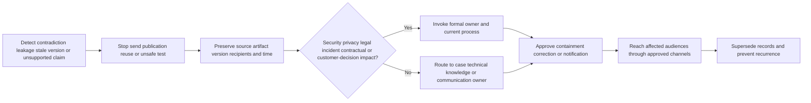

### Non-negotiable prohibitions

Do not:

- disclose customer data, personal data, secrets, credentials, tokens, cookies, keys, certificates, restricted logs, internal architecture, vulnerability detail, legal advice, personnel commentary, another customer's information, or proprietary content outside approved need-to-know;
- copy a restricted fact, attachment, screenshot, log, quote, or source label from one audience artifact into another merely because the second artifact is shorter or has fewer recipients;
- invent or imply case status, Engineering/Product acceptance, investigation progress, approval, customer sentiment, impact, defect, root cause, workaround validation, fix, deployment, release, roadmap item, ETA, resolution, publication, readership, adoption, satisfaction, or outcome;
- use “likely,” “confirmed,” “resolved,” “safe,” “no impact,” or equivalent certainty above the evidence level;
- publish or externally share a draft, internal KB, case excerpt, transcript, AI output, screenshot, or portfolio artifact without approval for the exact version, audience, purpose, and channel;
- use fear, guilt, hierarchy, urgency theater, selective disclosure, false empathy, blame, euphemism, or an artificial choice to manipulate a customer or internal decision owner;
- give an AI assistant customer or restricted information unless the current tool, purpose, retention, access, and data-handling path are explicitly approved;
- send, hand off, or publish an AI-generated or AI-edited draft without human verification against sources, sensitivity rules, audience need, authority, current product documentation, and required approval;
- treat this Part, its labels, fictional artifacts, or public source summaries as an Abnormal template or current company procedure.

## 10. AI-assisted drafting boundary

AI can help reorganize already-approved synthetic or sanitized inputs, propose plain-language alternatives, check for missing sections, or compare audience views. It cannot own truth, sensitivity, authority, empathy, commitment, or publication.

### Human review checklist for any AI-influenced artifact

| Review | Human question | Automatic failure |
|---|---|---|
| Input authorization | Was every input approved for this tool and purpose? | Customer/restricted data entered without approval |
| Claim traceability | Can each material claim be traced to the evidence spine? | Invented fact, status, quote, source, or citation |
| Certainty | Did the draft promote any report or hypothesis? | Root cause, resolution, or “no impact” without evidence |
| Sensitive carryover | Did summarization preserve hidden identifiers or restricted detail? | Secret, personal data, internal detail, or cross-customer content |
| Audience/purpose | Does the view enable the intended action at the right depth? | Generic summary that obscures decision or customer action |
| Commitments | Is every action/date owned and authorized? | Invented ETA, Engineering work, publication, or roadmap |
| Tone | Is language respectful without manipulation or false reassurance? | Fear, guilt, blame, false empathy, pressure, or deception |
| Approval/version | Was the exact human-reviewed version approved? | AI revision after approval or untracked edit before send |

AI output should be labeled as a draft in the controlled workflow. If AI changes a material claim after review, the artifact returns to review. “Human in the loop” is meaningful only when the human has source access, time, competence, authority, and accountability to reject the draft.

## 11. First-week discovery questions for the real organization

| Area | Question to ask at Abnormal | Why it cannot be invented from this guide |
|---|---|---|
| Templates | Which customer, executive, CSM, Engineering, Product, and KB templates are current and required? | This Part intentionally supplies no Abnormal template |
| Systems of record | Where do case facts, commitments, Engineering status, Product evidence, and KB versions live? | Tool fields and ownership are private and changeable |
| Disclosure classes | Which data classes, source labels, customer restrictions, and channels apply? | Public guidance cannot decide company/customer-specific handling |
| Customer communication | Who may send which updates, and what review is required by severity or event type? | Authority and entitlement are organization-specific |
| Incident communications | Which trigger transfers communication to incident, security, privacy, legal, or communications leadership? | Formal duties must not be improvised |
| CSM boundary | What may Support share with a CSM, and who owns each customer touchpoint? | Need-to-know and role scope vary |
| Engineering | What means submitted, accepted, assigned, investigating, mitigation identified, fix ready, or released? | Status words need authoritative semantics |
| Product | What evidence, consent, aggregation, and segmentation are required for Product intake? | One company's discovery process is not universal |
| KB | What separates internal, restricted, customer, and public knowledge, and who approves each? | Publishing controls and audiences are private |
| AI | Which AI tools, data classes, prompts, retrieval sources, logging, retention, and human reviews are approved? | General AI skill does not authorize company data use |
| Correction | How are sent messages, stale case notes, KBs, and executive briefs corrected and superseded? | Systems and notification requirements differ |
| Localization/accessibility | Which accessibility, translation, regional, legal, and brand reviews apply? | Audience fit includes more than technical depth |

## Lab

### SignalBridge Lab 112 - local synthetic communication tabletop

**Lab state:** `DESIGN_NOT_EXECUTED_NOT_TRANSFERRED`.

**Exact safety label:** `LOCAL SYNTHETIC COMMUNICATION ARTIFACT TABLETOP - NO CUSTOMER DATA OR SECRETS - NO REAL PEOPLE OR CASES - NO ACCOUNTS OR EXTERNAL SERVICES - NO EMAIL CHAT UPLOAD SEND HANDOFF OR PUBLICATION - NO PRODUCTION OR ABNORMAL SYSTEM - NO INCIDENT OR LEGAL DETERMINATION - NO AI WITH RESTRICTED INPUT - UNPERFORMED DURING AUTHORING - NOT AN ABNORMAL TEMPLATE OR PROCESS`.

### Lab objective

Practice creating a versioned evidence spine and seven audience-specific artifacts whose facts remain consistent while detail and action differ. Detect certainty inflation, leakage, stale versions, approval gaps, manipulative language, and unreviewed AI changes before any artifact leaves a local synthetic workspace.

### Prerequisites and safety charter

| Allowed | Prohibited | Reason |
|---|---|---|
| Fictional role aliases and obviously synthetic identifiers | Real names, emails, domains, tenant IDs, message IDs, request IDs, cases, quotes, or customer facts | Prevent accidental identification or false experience claims |
| Local Markdown or paper | Email, chat, ticket, CRM, Jira, Confluence, cloud drive, external AI, API, or upload | Keep the exercise local and unsent |
| Written hypothetical evidence | Live logs, screenshots, credentials, tokens, customer content, production configuration | Avoid sensitive collection and operational change |
| “Proposed/not performed” tests | Network traffic, integration replay, malicious content, permission change, remediation, rollback, or control disablement | No live behavior is required to learn communication |
| Manual peer rubric if performed later with synthetic text | Claim that a person reviewed, approved, received, or accepted the artifact when they did not | Preserve portfolio honesty |

### Lab steps

1. Create a local folder only if the learner later performs the lab; place the exact safety label at the top of every artifact.
2. Define the twelve required communication labels in the learner's own words and preserve all paired-term distinctions.
3. Invent a clearly fictional, non-product-specific workflow and one bounded expected result.
4. Create at least ten atomic evidence items labeled observation, report, inference, unknown, decision, or commitment.
5. Give every item a source, timestamp/time zone, scope, confidence, sensitivity treatment, caveat, and owner.
6. Write at least three competing hypotheses and one safe discriminator for each.
7. Freeze evidence spine `v1.0`; do not silently edit it while drafting views.
8. Define the verified audience, purpose, decision/action, need-to-know, channel, and likely approval for customer, executive, CSM, Engineering, Product, internal KB, and external KB views.
9. Draft the customer update with impact attribution, findings, unknowns, next action, owner, customer action, and update checkpoint.
10. Search the customer update for restricted internals, passive ownership, false reassurance, root cause, fix, and ETA language.
11. Draft the executive brief with one decision, impact, confidence, options, risk, recommendation, authority, and checkpoint.
12. Confirm the executive brief did not remove a material caveat or turn a possible risk into observed impact.
13. Draft the CSM handoff with customer goal, attributed concern, technical state, relationship context, distinct actions, message boundary, and acceptance prompt.
14. Confirm technical case ownership and customer-update ownership remain explicit.
15. Draft the Engineering escalation with expected/actual, scope, environment, minimal safe reproduction, evidence, tests, hypotheses, ask, and ownership.
16. Mark the escalation `NOT SUBMITTED_NOT_ACCEPTED` and remove any invented Engineering status.
17. Draft the Product evidence brief with user problem, workflow, evidence, sample limits, workaround, consequence, and bounded question.
18. Remove every unsupported plural such as “customers,” “common,” “frequent,” or “strategic.”
19. Draft an internal KB that explains reusable diagnosis and escalation without converting the leading hypothesis into a known cause.
20. Draft an external KB independently from approved external facts; do not derive it by deleting obvious internal fields from the internal KB.
21. Build a cross-artifact consistency matrix for event identity, time, scope, status, certainty, decisions, owners, and commitments.
22. Fail any view that changes the underlying fact to sound simpler or more reassuring.
23. Apply a fictional source restriction to one evidence item and verify it does not cross into unauthorized views.
24. Add new fictional evidence that falsifies the leading hypothesis; create spine `v1.1` with supersession rather than overwriting `v1.0`.
25. Identify every affected artifact and draft a correction for one previously “sent” artifact, while keeping the send itself hypothetical.
26. Create an approval record naming exact version, audience, purpose, channel, approver role, time, and expiry; label it `HYPOTHETICAL_NOT_APPROVED`.
27. Run the audience and approval decision tree on all seven artifacts.
28. Search for invented status, ETA, root cause, fix, release, roadmap, approval, publication, sentiment, adoption, satisfaction, value, and outcome.
29. Search for manipulative language, blame, urgency theater, false empathy, pressure, and transparency slogans unsupported by behavior.
30. If an approved local AI tool is used later, provide synthetic inputs only, label output as draft, and retain before/after versions.
31. Perform human source, sensitivity, certainty, audience, action, and approval review of every AI-influenced sentence.
32. Confirm no artifact was emailed, uploaded, handed off, published, or represented as an Abnormal template.
33. Score the rubric and retain `UNPERFORMED` until the learner actually completes every local step.

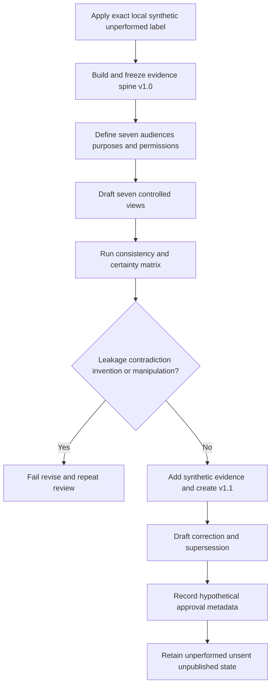

### Expected evidence if performed later

- exact safety label and completion date;
- learner-authored definitions for all twelve required label rows;
- versioned evidence spine with atomic claim types and restrictions;
- audience-purpose-need-to-know cards for seven artifact types;
- customer, executive, CSM, Engineering, Product, internal KB, and external KB drafts;
- cross-artifact consistency matrix;
- hypothetical approval/version record;
- one superseded spine item and correction draft;
- completed rubric with failures and revisions preserved;
- explicit statement that no artifact was sent, approved, published, used with a customer, or derived from an Abnormal template.

### Cleanup and privacy

- Delete scratch drafts, duplicate portfolio versions, temporary prompts, screenshots, and copied source fragments after the synthetic review.
- Retain only the minimum learner-authored portfolio needed for practice, using fictional aliases and no customer, tenant, user, message, credential, private endpoint, or proprietary product detail.
- Confirm that no artifact was sent, published, approved, transferred, or entered into a live customer, Engineering, Product, CSM, or knowledge system.
- If real or restricted information appears accidentally, stop copying or transforming it and follow the approved security and privacy reporting path.

### Lab validation rubric

| Dimension | Pass condition | Automatic failure |
|---|---|---|
| Safety | Synthetic local inputs only; no external send or service | Any real/uncertain data, account, system, contact, upload, or production action |
| Evidence | Every material claim maps to an atomic source item | Orphan fact, mixed claim type, invented source, or hidden contradiction |
| Consistency | Scope, time, status, certainty, decisions, and ownership agree across views | A view promotes, contradicts, or silently changes an invariant |
| Audience fit | Detail and action match purpose and authority | Technical dump, material omission, or unauthorized detail |
| Customer update | Continuity, action, owner, unknown, and checkpoint are explicit | Invented reassurance, status, cause, fix, or ETA |
| Executive brief | One real decision with evidence, options, and risk | False choice, hidden uncertainty, or unsupported impact |
| CSM handoff | Goal, context, boundaries, owners, and acceptance are explicit | Silent technical transfer or promise laundering |
| Engineering | Repro/evidence/hypotheses/ask are discriminating | Sensitive excess, unsafe test, defect claim, or no technical ask |
| Product | User problem and evidence limits are explicit | One case called a trend or roadmap commitment implied |
| KB | Internal/external views are independently scoped and reviewed | Restricted detail copied externally or hypothesis fossilized |
| Approval/version | Exact versions, states, and supersession are visible | Draft sent/published or prior approval reused after material change |
| AI | Synthetic approved inputs and full human review | Restricted input or AI draft sent without review |
| Honesty | Portfolio and lab states remain accurate | Claim of Abnormal process, customer use, approval, send, publication, or performance |

**Lab automatic failure:** any customer, personal, secret, credential, token, key, cookie, certificate, real account, domain, identifier, log, screenshot, quote, attachment, product configuration, proprietary detail, external service, message, upload, contact, meeting, handoff, publication, live test, network/API/integration traffic, production change, remediation, rollback, control disablement, malicious content, unapproved AI input, unreviewed AI draft, copied restricted detail, invented status/ETA/root cause/fix/release/roadmap/approval/sent state, manipulative language, or claim that SignalBridge Lab 112 was performed during authoring.

## Authored-Part deterministic validation contract

Validation may use at most three cycles. The master status must remain `Not started` until every gate is `PASS`.

| Gate | Required | Current authored result | Result |
|---|---:|---|---|
| Word floor | At least 6,500 words | Direct content review confirms the file exceeds 6,500 words; no false-precision total is reported because the available workspace search reports matching lines rather than a raw word count | PASS |
| H1 | Exactly one exact required H1 | One H1 with the exact required text on line 1 | PASS |
| Required labels | Exactly twelve numbered rows covering every requested definition and boundary | Twelve numbered contract rows define trust, audience, purpose, need-to-know, evidence spine, translation, abstraction, customer update, executive brief, CSM handoff, Engineering escalation, Product evidence brief, internal/external KB, and approval/versioning | PASS |
| Mermaid | At least 8 closed recognized blocks | Eleven Mermaid openings and eleven closing fences | PASS |
| Deep-dives | At least 4 headings containing `Plain-English deep-dive` | Four matching headings | PASS |
| Tables | At least 10 completed Markdown tables | Thirty-nine completed Markdown table separator rows | PASS |
| Portfolio | One evidence spine becomes customer, executive, CSM, Engineering, Product, internal KB, and external KB artifacts | One twelve-item evidence spine produces seven complete audience artifacts plus an invariant consistency matrix | PASS |
| Decision tree | Audience, sensitivity, authority, claim, approval, and release decisions | One combined tree covers incident routing, recipients, purpose, restrictions, abstraction, evidence, commitments, approval, release, and follow-through | PASS |
| Failure/escalation | Failure modes, escalation routes, manipulative-language controls, and every named prohibition | Eighteen failure modes, seven manipulation rewrites, nine escalation routes, one escalation flow, and explicit prohibitions cover every requested category | PASS |
| Interview Q&A | Exactly eight numbered questions with model answers | Eight question headings and eight model-answer labels | PASS |
| Official/primary sources | At least 8 with boundaries and August 24, 2026 access date | Twelve official or primary source rows, each with an explicit product, version, policy, or authority boundary | PASS |
| Lab | Local, synthetic, unperformed, unsent, unpublished, and not an Abnormal process | Exact safety label, safety charter, 33-step design, evidence expectations, rubric, and automatic failures preserve every boundary | PASS |
| Final navigation | Exact sole next-Part link on final line | One exact next-Part navigation link appears on the final line | PASS |

**Authored-Part validation result: PASS in validation cycle 2.** VS Code Markdown diagnostics reported no errors. Structural checks confirmed one exact H1, twelve numbered vocabulary rows covering every requested term, eleven Mermaid blocks with balanced fences, four deep-dives, thirty-nine tables, one complete seven-artifact portfolio grounded in a twelve-item evidence spine, the audience/approval decision tree, failure and escalation controls, exactly eight interview questions with eight model answers, twelve official or primary source rows with explicit boundaries, the exact local synthetic unperformed lab boundary, and one exact final navigation link. Direct content review confirms the file exceeds the 6,500-word floor without reporting a false-precision count. No customer data, live system, Abnormal template, external send, handoff, approval, publication, performed lab, invented operational outcome, or unreviewed AI artifact is used or claimed.

## Official Source Anchors - August 24, 2026

These official and primary sources anchor general audience-centered writing, incident coordination, evidence handling, controlled sharing, knowledge reuse, data-loss prevention, and communication semantics. They do **not** define Abnormal AI's templates, internal terms, product behavior, customer agreement, disclosure classes, CSM/Support/Engineering/Product responsibilities, escalation status, legal duties, incident notification, approval chain, AI policy, or publication workflow. Current authorized company sources and named owners control real work.

| Official or primary source | Concept anchored | Product/version/policy boundary for this Part |
|---|---|---|
| [Digital.gov Plain Language Guide](https://digital.gov/guides/plain-language) | U.S. government guidance for writing clearly around audience needs, organization, wording, testing, and usable content | General public-sector communication guidance. It does not authorize disclosure, define security-support artifacts, establish an Abnormal style, or replace accessibility, localization, legal, contractual, or company review. The older PlainLanguage.gov audience URL redirected to this current Digital.gov guide during research. |
| [Microsoft Writing Style Guide](https://learn.microsoft.com/en-us/style-guide/welcome/) | Clear, concise, warm, bias-aware, globally usable technical writing | Microsoft public writing guidance and a natural bridge from your background. It is not Abnormal voice, brand, terminology, approval, legal guidance, or proof that you used every practice in production. |
| [NIST Cybersecurity Framework 2.0](https://www.nist.gov/cyberframework) | Outcome-oriented cybersecurity risk management across Govern, Identify, Protect, Detect, Respond, and Recover | Voluntary general guidance, not a communication template, incident declaration, product requirement, customer contract, risk acceptance, or authority assignment. Draft or later quick-start resources must be distinguished from final CSF 2.0. |
| [NIST SP 800-61 Rev. 3](https://csrc.nist.gov/pubs/sp/800/61/r3/final) | Current final incident-response recommendations integrated with CSF 2.0; preparation and communication matter across cybersecurity risk management | Published April 2025 and supersedes Rev. 2. It does not make Support an incident commander, confirm an incident, authorize containment/disclosure, or define Abnormal/customer notification duties. |
| [NIST SP 800-86](https://csrc.nist.gov/pubs/sp/800/86/final) | Stable forensic principles for collecting, examining, analyzing, and reporting technical evidence in incident response and troubleshooting | Published in 2006 and used only for durable evidence/provenance concepts. It is not current tool procedure, legal advice, a chain-of-custody decision for a jurisdiction, or permission to collect customer data. |
| [FIRST Traffic Light Protocol 2.0](https://www.first.org/tlp/) | Source-defined sharing boundaries, need-to-know, recipient responsibilities, and explicit permission before wider sharing | TLP 2.0 is current from August 2022 and is not a formal classification, licensing, encryption, or legal scheme. This Part does not apply fictional TLP labels to real information; actual source and organizational rules control. |
| [KCS v6 Practices Guide](https://library.serviceinnovation.org/KCS/KCS_v6/KCS_v6_Practices_Guide) | Knowledge-Centered Service practices for capturing, structuring, reusing, improving, and governing knowledge in the workflow | KCS v6 was released in 2016 and the online guide changes over time. KCS is a Consortium for Service Innovation methodology, not an Abnormal process, publishing permission, template, certification claim, or proof of deflection. License and trademark terms apply. |
| [Microsoft Service Assurance - Security Incident Management Overview](https://learn.microsoft.com/en-us/compliance/assurance/assurance-incident-management) | A public example of incident definition, coordinated response, customer notification content, incomplete-investigation updates, and postmortems | Describes Microsoft online-service practices and contractual framing. Its 72-hour language is specific to the cited Microsoft context and DPA; it must never be copied into an Abnormal/customer commitment or used as legal interpretation. |
| [Microsoft Purview Data Loss Prevention Overview](https://learn.microsoft.com/en-us/purview/dlp-learn-about-dlp) | Sensitive-data oversharing risk, stakeholder planning, policy intent, simulation, monitoring, protective actions, and training | Microsoft Purview product guidance dated June 26, 2026. It does not prove a control is deployed, authorize an AI tool, classify Abnormal/customer data, or replace current company policy and licensing. Product behavior varies by workload and configuration. |
| [RFC 9110 - HTTP Semantics](https://www.rfc-editor.org/rfc/rfc9110) | Authoritative semantics for HTTP messages, status codes, representations, content negotiation, timestamps, privacy, and the noncommittal meaning of `202 Accepted` | Internet Standards Track HTTP specification, not a human communication or support policy. A protocol status must be interpreted with request method, product behavior, intermediaries, and current evidence; HTTP success does not prove a business workflow completed. |
| [NIST Privacy Framework](https://www.nist.gov/privacy-framework) | Voluntary privacy-risk management, data processing awareness, governance, communication, and protection | A general framework, not legal advice, a data-classification decision, consent, retention schedule, transfer approval, or permission to include personal/customer data in support or AI tools. Draft revisions must be labeled as drafts. |
| [Abnormal Trust Center](https://abnormal.ai/trust-center) | Public high-level trust, security, compliance, and privacy context plus indication that some materials are restricted | Public and controlled trust material does not reveal communication templates, grant access, authorize onward sharing, or decide a customer-specific disclosure. Restricted details must remain under their original access and nondisclosure conditions. |

### Source-use rules

- Revalidate every source, date, version, scope, redirect, and applies-to statement before operational use.
- Use NIST, FIRST, IETF, Digital.gov, KCS, and Microsoft sources for bounded general principles only.
- Treat Microsoft guidance as a conceptual and experiential bridge for you, not employer, tool, process, contract, or policy equivalence.
- Attribute public Abnormal statements narrowly; do not infer a private template, workflow, status, permission, or customer result.
- Prefer current authorized product documentation, internal policy, customer agreements, source restrictions, incident command, legal/privacy/security guidance, and named role owners over this study artifact.
- If sources conflict or a page redirects unexpectedly, do not cite the stale destination as support; use a current authoritative source or escalate the ambiguity.

## ⭐ Likely Interview Questions

### Q1. What does trust-building communication mean in technical support?

**Model answer:** “Trust is the customer's evidence-supported ability to rely on my accuracy, ownership, judgment, and follow-through within a clear scope. I build it by separating observations from reports and hypotheses, showing what changed since the last update, stating unknowns without hiding behind them, protecting sensitive information, naming the next action and owner, and keeping an update checkpoint. I correct mistakes directly. I do not use confidence, empathy, or executive pressure to replace evidence, and I do not promise a root cause, fix, or ETA I do not own.”

### Q2. How can several audience artifacts stay consistent without being identical?

**Model answer:** “I create a versioned evidence spine first. It holds atomic facts, reports, inferences, unknowns, decisions, commitments, scope, time, confidence, sensitivity, and provenance. Each artifact references that version, then filters by audience purpose, authority, and need-to-know. Vocabulary, order, detail, and requested action can change. Event identity, scope, status semantics, certainty, caveats, and ownership cannot. I use a cross-artifact consistency matrix to catch a customer update saying ‘investigating’ while an executive brief accidentally says ‘root cause identified.’”

### Q3. What is the difference between a customer update and an executive brief?

**Model answer:** “A customer update maintains case continuity: acknowledged impact, completed work, findings, unknowns, next action, owner, customer action, and next update checkpoint. An executive brief enables a decision: outcome impact, confidence, risk, options, recommendation, authority, and checkpoint. Both use the same evidence and uncertainty. The executive version is not allowed to remove a material caveat for simplicity, and the customer version must not disclose restricted internals. A checkpoint is not a resolution ETA.”

### Q4. What would you include in an Engineering escalation?

**Model answer:** “I would include one bounded expected-versus-actual problem statement, relevant environment and scope, the smallest safe reproduction or why reproduction is not appropriate, source-linked timestamps and identifiers, completed tests with interpretations and limitations, leading and alternative hypotheses, current impact and urgency, and precise technical questions. I would minimize and redact data through the approved channel. I would explicitly retain customer communication ownership. Submission is not acceptance, and escalation is not proof of a defect, root cause, fix, priority, or ETA.”

### Q5. How would you write a Product evidence brief from support cases?

**Model answer:** “I would start with the user's job and friction, then show the evidence with sample, segment, time window, and provenance. I would describe the current experience, consequence, available workaround and its limits, and ask a bounded discovery or classification question. I would distinguish a single case from a recurring pattern and avoid invented demand, revenue, churn, or security impact. I would protect customer identity and never imply that Product accepted a roadmap item, priority, commitment, or delivery date.”

### Q6. How do internal and external KB articles differ?

**Model answer:** “An internal article can contain approved diagnostic branches, internal escalation cues, and deeper operational context for authorized staff. An external article contains only supported, publication-approved behavior and safe customer actions. Externalization is not deleting a customer name from an internal article; I author to the external purpose and disclosure boundary, then obtain independent review. Both need scope, owner, validation, review triggers, feedback, versioning, and retirement. Neither should preserve an unconfirmed hypothesis or unsafe workaround as timeless truth.”

### Q7. What would you do if new evidence contradicts an update already sent?

**Model answer:** “I would stop reuse, preserve the old version and its source snapshot, record the corrected evidence, identify affected audiences and decisions, and assess whether security, privacy, incident, legal, or contractual owners must engage. I would draft a direct correction that says what was stated, what is correct now, why it changed, what action changes, and what remains unknown. After approval for the exact audience and channel, I would send it, supersede every system-of-record copy, and review why the control failed. I would not silently edit only the internal note.”

### Q8. How does your prior experience transfer, and where is the boundary?

**Model answer:** “My prior enterprise-support experience transfers in the habits: owning case continuity, adapting technical depth, communicating under pressure, escalating to Engineering and Product with evidence, validating fixes, and creating KB or training content. I can support those claims with real sanitized examples. I have not operated Abnormal's platform or its private communication, CSM, escalation, Product, KB, approval, or AI processes. I would learn the current templates, systems, data rules, status semantics, reviewers, and role boundaries before representing them. This portfolio is a completed synthetic writing exercise, not customer work.”

## 🧠 30-Second Memory Hooks

- **Trust is reliable behavior:** accurate, bounded, safe, owned, and followed through.
- **Three questions before writing:** audience, purpose, need-to-know.
- **One spine, many views:** facts stay fixed; detail and action change.
- **Translate language, abstract detail:** never translate uncertainty into certainty.
- **Customer gets continuity:** impact, progress, unknowns, action, owner, checkpoint.
- **Executive gets a decision:** impact, risk, options, recommendation, authority.
- **CSM connects the journey:** align goals and message without laundering promises.
- **Engineering gets discrimination:** expected/actual, repro, evidence, hypotheses, ask.
- **Product gets evidence, not volume theater:** one case is one case.
- **KB reuse needs governance:** internal is not unrestricted; external is independently approved.
- **Approval is scoped:** this version, this audience, this purpose, this channel.
- **A checkpoint is not an ETA:** promise the next communication you control.
- **AI drafts, humans own:** no restricted input and no send without review.
- **Your honest bridge:** Microsoft communication discipline transfers; Abnormal's process must be learned.

## Completion Checklist

- [ ] I can define trust, audience, purpose, need-to-know, evidence spine, translation, and abstraction.
- [ ] I can separate observation, report, inference, unknown, decision, commitment, and recommendation.
- [ ] I can create customer, executive, CSM, Engineering, Product, internal KB, and external KB artifacts from one versioned evidence spine.
- [ ] I preserve scope, time, status semantics, certainty, caveats, and ownership across every audience.
- [ ] I can explain why audience adaptation changes detail and action but never invents certainty.
- [ ] I can apply sensitivity, authority, approval, versioning, correction, and publication gates.
- [ ] I can use the cross-artifact consistency matrix to find contradictory status, ownership, ETA, or root-cause claims.
- [ ] I can identify manipulative language and rewrite it as direct, factual, empathetic communication.
- [ ] I can describe the safe boundary for AI-assisted drafting and perform human source, privacy, and commitment review.
- [ ] I can answer Q1 through Q8 aloud using truthful experience transfer and explicit no-direct-Abnormal boundaries.
- [ ] I reviewed the August 24, 2026 source anchors and will revalidate current templates, policies, permissions, audience rules, and product facts.
- [ ] I describe SignalBridge Lab 112 as local, synthetic, unperformed, unsent, and unpublished unless I actually complete and validate it.
- [ ] I completed cleanup and privacy checks and retained no real, restricted, or unnecessary information.

[Next: Part 113 - Engineering and Product Collaboration](Part-113-engineering-and-product-collaboration.md)