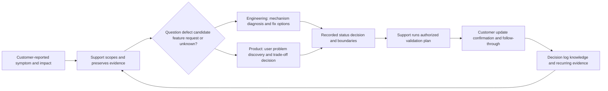
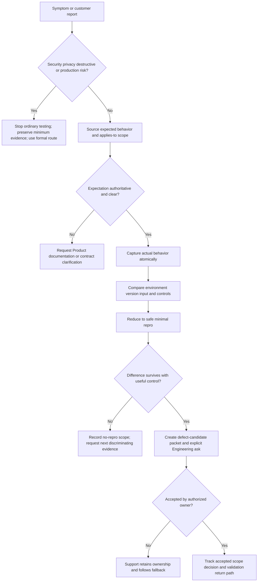
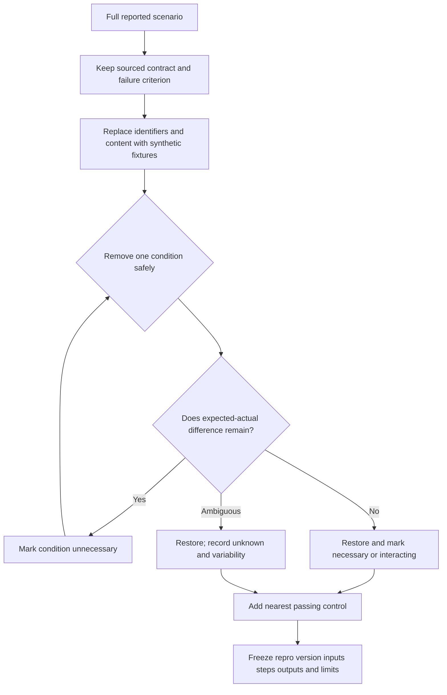
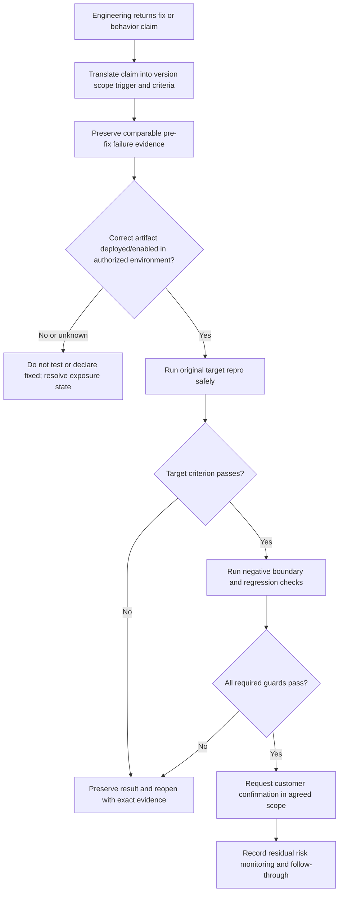
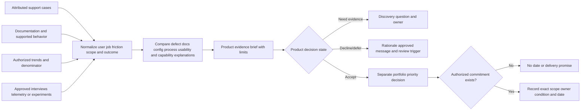
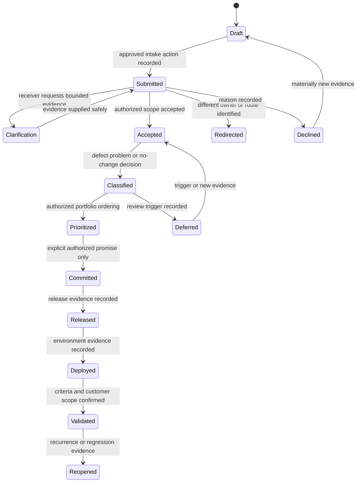
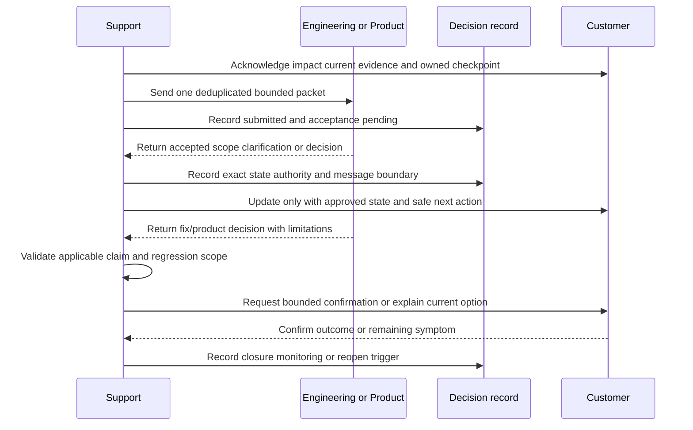
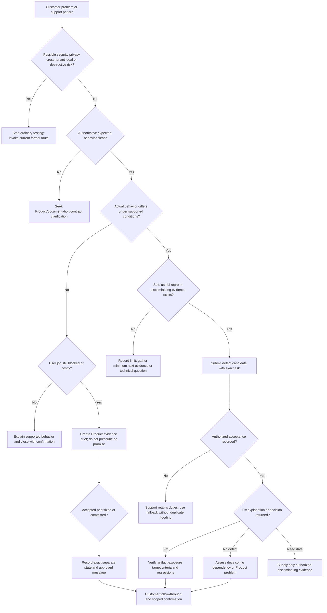
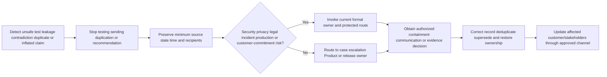
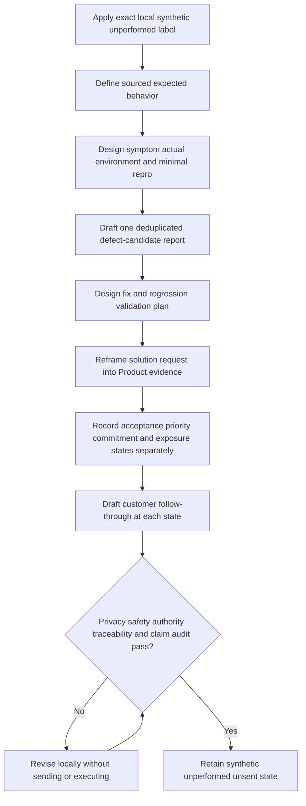

# Part 113 - Engineering and Product Collaboration

> **Purpose:** Build a beginner-first, vendor-neutral method for collaborating with Engineering and Product from evidence intake through defect escalation, minimal reproduction, feature discovery, decision recording, fix validation, regression checking, release/deployment interpretation, and customer follow-through without overstating certainty or authority.
>
> **Artifact honesty label:** **Direct enterprise-support transfer for technical investigation, Engineering/Product escalation, stakeholder communication, fix validation, and customer follow-through plus learner-authored synthetic bug-report, validation-plan, decision-log, and Product-evidence artifacts; local collaboration lab unperformed.** You may support the prior experience with real sanitized examples. Every company, product, customer, person, event, identifier, version, result, decision, priority, artifact, and outcome in the worked cases is fiction created for study. This Part does not claim that you have operated Abnormal AI, used Abnormal customer data, or knows Abnormal's private defect taxonomy, ticket fields, severity criteria, Engineering intake, Product discovery, roadmap, release train, deployment architecture, validation environment, customer-notification policy, or internal workflow.
>
> **Currency and official-source access date:** August 24, 2026.
>
> **Authored-Part state:** `PASS`. The master tracker was changed only after every deterministic gate passed.

## Section goal

Engineering and Product collaboration begins when Support can turn a customer-visible problem into a decision-ready evidence package. It does not begin when Support adds an internal team to a message, and it does not end when somebody says “fixed.” The work succeeds only when the right owner can understand the problem, discriminate among explanations, make an authorized decision, and return enough evidence for Support to validate the outcome and follow through with the customer.

The everyday analogy is a **building inspector working with a structural engineer and an architect**. A tenant may report a sticking door. That report is a symptom. The inspector records which door, weather, load, measurements, and repeatable conditions. The structural engineer evaluates whether a mechanism is defective and how it might be corrected. The architect considers whether the design should support a new use. A repair drawing being released does not mean the repair has been installed in every building. The inspector still checks the actual door and tells the tenant what changed. The analogy stops where software has versioned code, distributed deployments, configurable environments, privacy rules, security risks, and organization-specific release authority.

The central operating rule is:

> **Escalate evidence, request a decision, validate the returned claim, and keep customer ownership visible.**



Strong collaboration preserves several separations that pressure often collapses:

- a **symptom** is not automatically a **defect**;
- observed **actual behavior** is meaningful only beside sourced **expected behavior**;
- a long reproduction is not necessarily a **minimal reproduction**;
- a workaround that reduces impact is not a fix;
- a fix that passes one test is not proof of no regression;
- code that is released is not necessarily deployed to the affected environment;
- deployment is not customer validation;
- a feature request being recorded is not Product acceptance;
- acceptance is not priority;
- priority is not a delivery commitment; and
- Engineering or Product involvement does not transfer customer follow-through unless an authorized handoff explicitly says so.

## Required collaboration labels

This sixteen-row table is the exact vocabulary contract for this Part. In an interview, define each term with its evidence boundary rather than using the terms as interchangeable ticket labels.

| # | Required label | Beginner-first definition | Everyday analogy | Why it matters | Boundary to preserve |
|---:|---|---|---|---|---|
| 1 | **Defect/bug** | A **defect**, often called a **bug**, is a verified failure of an implementation to meet an applicable, authoritative expectation under defined conditions. “Defect candidate” is safer until the expectation, conditions, observation, and ownership decision are established. | A certified scale reads 900 grams for a verified 1-kilogram weight under its specified operating conditions. | It identifies a possible implementation gap that Engineering can investigate and test. | A symptom, customer frustration, undocumented preference, unsupported configuration, malicious interference, or Support hypothesis is not automatically a defect. Support should not claim confirmation unless the authorized process confirms it. |
| 2 | **Symptom** | The observable or reported sign that something is not working as desired, such as an error, missing record, duplicate result, delay, or confusing display. | A warning light is visible, but it does not identify the failed component. | Symptoms are the honest starting point and can be recorded before cause is known. | A symptom does not prove scope, cause, severity, defect, compromise, or solution. Attribute customer reports and distinguish them from internally reproduced observations. |
| 3 | **Expected behavior** | The outcome that should occur under stated preconditions according to an authoritative contract such as approved documentation, specification, acceptance criterion, supported design, or owner clarification. | A posted train timetable is the reference for whether a train is late. | Expected behavior makes “wrong” testable and prevents preference from becoming a bug. | Memory, another version, an unofficial message, competitor behavior, or customer assumption is not automatically authoritative. Record source, version, applies-to scope, and ambiguity. |
| 4 | **Actual behavior** | What an authorized observation or attributed report shows occurred, including exact output, status, time, scope, and collection method. | The station clock and arrival record show when the train actually arrived. | Precise actual behavior lets others compare evidence instead of interpreting “broken.” | Do not paraphrase away error text, convert absence into loss, generalize beyond the sample, or imply that a customer report was independently reproduced. |
| 5 | **Minimal repro** | A minimal reproduction is the smallest safe, authorized, deterministic-enough set of inputs, state, environment, and steps that still demonstrates the relevant expected-versus-actual difference and includes useful controls. | A cook reduces a failed recipe to flour, water, temperature, and one suspect ingredient while preserving the failure. | It reduces noise, cost, privacy exposure, and Engineering rediscovery. | “Minimal” does not mean deleting a necessary precondition, using production data, bypassing safeguards, causing damage, or claiming determinism from one run. A no-repro result narrows evidence; it does not disprove the report. |
| 6 | **Environment/version** | The relevant execution context: product and build, deployment or release channel, tenant/configuration class, client/OS/browser, API or schema version, region, dependencies, flags, permissions, data shape, and time window. | A plant grows differently depending on seed variety, soil, climate, and season. | Software behavior can differ across versions and configuration boundaries. | Do not write “latest,” “production,” or “same setup” without an authoritative identifier and time. Collect only permitted, decision-relevant detail. |
| 7 | **Regression** | A regression is behavior that previously met the applicable expectation but fails after a change, established through comparable evidence across a known-good and failing state. A **regression check** tests that corrected and neighboring behavior remains acceptable. | A repaired elevator reaches floor ten but no longer stops at floor six. | It connects change history to test scope and protects adjacent workflows. | Temporal overlap is not causation. A customer saying “it used to work” is important attributed evidence, but comparable versions, configuration, inputs, and criteria are needed before confirming regression. |
| 8 | **Workaround** | A bounded, reversible, approved alternative that reduces impact without removing the underlying issue. | Using another entrance while the main door is repaired. | A workaround can restore a customer outcome while investigation or prioritization continues. | It is not a fix, root cause, permanent support promise, or permission for risk. Record prerequisites, limitations, side effects, owner, expiry/review trigger, and rollback path. |
| 9 | **Fix validation** | The planned comparison showing whether an authorized change corrects the targeted failure under relevant conditions, with pre-fix evidence, post-fix evidence, controls, regression checks, and explicit pass/fail criteria. | A mechanic reproduces the brake noise, installs an approved part, repeats the same test, and checks nearby safety functions. | It prevents “code changed” or “ticket closed” from being mistaken for corrected customer behavior. | Support does not declare a fix from a commit, build, release note, deployment flag, one happy path, or Engineering statement alone. Validation scope and remaining uncertainty stay visible. |
| 10 | **Release versus deploy** | **Release** means an authorized artifact or capability is made available through a defined channel. **Deploy** means a particular artifact or configuration is applied to a particular environment. | A new textbook edition can be published without every classroom having received or adopted it. | It explains why a fix can exist while an affected environment still shows old behavior. | Terms vary by organization. Release does not prove deployment, deployment does not prove activation or customer exposure, and any of them can be partial, staged, rolled back, or gated. |
| 11 | **Feature request** | A structured statement of a user problem or desired capability that is not currently established as required behavior. It includes context, affected job, evidence, alternatives, and an explicit Product question. | Riders ask for a new station near a hospital; the need is access, not merely “add this dot to the map.” | It helps Product discover needs and compare solution options without Support prescribing design. | A feature request is not a defect, vote count, entitlement, design specification, accepted roadmap item, priority, commitment, or ETA. Sometimes discovery reveals documentation or configuration as the better response. |
| 12 | **Product evidence** | Traceable qualitative and quantitative information that helps Product understand a user problem, population, workflow, consequence, alternatives, and uncertainty. | A city planner uses travel patterns, interviews, accessibility needs, and cost constraints rather than one loud complaint. | Evidence lets Product reason beyond anecdote and identify recurring or high-risk friction. | Product evidence is not customer data copied without permission, unsupported market size, fabricated revenue/churn, cherry-picked quotes, causal proof, or automatic priority. State sample and denominator limits. |
| 13 | **Acceptance** | An authorized owner records that a defined item or responsibility has entered a named state, such as an Engineering investigation accepted for triage or a Product problem accepted for discovery. | A courier's scan shows a package was accepted at a depot, not delivered to the recipient. | It distinguishes receipt or ownership from an unacknowledged submission. | A tag, queue move, mention, meeting, or silence is not acceptance. Acceptance does not imply defect confirmation, priority, implementation, release, or customer commitment. |
| 14 | **Priority** | An authorized ordering decision made within a real portfolio of competing work, based on factors such as impact, risk, reach, confidence, effort, strategy, obligations, and dependencies. | An emergency department ranks several patients using current clinical criteria, not arrival volume alone. | It makes trade-offs explicit and routes conflicts to decision owners. | Severity, one executive request, ticket count, customer size, emotional intensity, acceptance, or Support preference does not by itself set Product or Engineering priority. Criteria and authority are organization-specific. |
| 15 | **Commitment** | A recorded promise by an authorized owner to perform a defined action or provide a decision by a stated condition or date. | A contractor signs that an inspection will occur Friday; a planning discussion did not make that promise. | It gives customers and teams something dependable to plan around. | A forecast, target, aspiration, roadmap possibility, sprint candidate, priority, accepted item, or Support checkpoint is not automatically a delivery commitment. Never invent another team's promise. |
| 16 | **Decision log** | A durable record of a decision or non-decision, including time, context, evidence considered, options, chosen outcome, authority, rationale, assumptions, consequences, follow-up, and supersession. | An aircraft log records why a route changed and who authorized it so the next crew need not reconstruct a chat. | It prevents status drift, repeated debates, hidden ownership, and contradictory customer messages. | A decision log is not a chat transcript, blame ledger, substitute for source evidence, or permission to store secrets. “No decision yet” can be a valid logged state. |

### One-line memory hooks for the labels

| Label group | Memory hook |
|---|---|
| Defect and symptom | The symptom rings the bell; evidence decides whether a bug exists. |
| Expected and actual | Source what should happen; capture what did happen. |
| Minimal repro and environment | Remove noise, not necessary conditions. |
| Regression and workaround | Compare like with like; bypass is not repair. |
| Fix validation | Fail before, pass after, guard the neighbors. |
| Release and deploy | Available somewhere is not active here. |
| Feature request and Product evidence | Bring the user problem and evidence, not a promised design. |
| Acceptance, priority, commitment | Received, ordered, and promised are three different states. |
| Decision log | Record what was decided, by whom, why, and what follows. |

## JD Mapping

| Role signal from the master guide | Capability developed here | Your honest transfer | Evidence ceiling |
|---|---|---|---|
| Collaborate with Engineering | Builds a bounded defect candidate, minimal repro, evidence index, explicit questions, and validation return path | Direct enterprise-support escalation and technical-investigation habits | No Abnormal Engineering route, field, ownership, acceptance, defect, or root-cause claim |
| Collaborate with Product | Converts user problems and recurring friction into evidence briefs without prescribing or promising | Direct Microsoft Product collaboration plus transferable customer-context communication | No Abnormal Product intake, discovery, prioritization, roadmap, or commitment claim |
| Provide RCA insights and recommendations | Separates symptom, mechanism hypothesis, confirmed cause, workaround, corrective action, and validation | Microsoft complex-investigation and fix-validation transfer | Insight is not authority to declare root cause, incident, security impact, or product defect |
| Clear technical communication | States expected/actual, environment, versions, evidence semantics, tests, and one precise ask | Direct customer/partner and Engineering communication transfer | A well-written report does not prove its conclusion or acceptance |
| Maintain customer trust | Keeps ownership, checkpoints, decision boundaries, validation, and closure confirmation visible | Direct Microsoft customer follow-through | No fabricated ETA, priority, fix, release, deployment, or customer result |
| Security and privacy mindset | Minimizes data, uses synthetic repros, controls attachments, and stops unsafe testing | Enterprise support discipline plus public-source principles | Current Abnormal and customer rules must control actual handling |
| Improve product and support | Captures decisions, regressions, validation gaps, workarounds, and recurring evidence for learning | Microsoft KB/training, quality, escalation, and backlog-analysis transfer where supported | No invented deflection, trend, business value, or shipped improvement |
| Present practical artifacts | Produces a bug report, validation plan, Product evidence brief, and decision log | Completed learner-authored written portfolio in this Part | Portfolio is synthetic, unsubmitted, unaccepted, unperformed, and not company process |

## Candidate honesty note

You can truthfully say that enterprise support taught you to isolate customer symptoms, compare expected and actual behavior, preserve evidence, engage Engineering or Product, communicate across technical and nontechnical audiences, validate fixes, and follow through. You should support those claims with a real sanitized example from your own work whose exact scope you can defend.

You cannot truthfully say that the transfer proves familiarity with Abnormal's product behavior or private collaboration workflow. Even familiar words may have different meanings. “Bug,” “accepted,” “scheduled,” “released,” “deployed,” and “resolved” can map to different systems, gates, and owners. The safe bridge is:

> “In enterprise support, I developed the habits of separating symptom from cause, sourcing expected behavior, reducing problems to discriminating evidence, escalating with a clear ask, validating returned fixes, and maintaining customer communication. I have not used Abnormal's internal Engineering or Product workflow. I would first learn its systems of record, status semantics, data rules, acceptance and priority owners, release/deployment model, and customer-communication boundaries, then apply those portable habits.”

| Capability or artifact | Evidence label | Safe interview language | Claim to avoid |
|---|---|---|---|
| Microsoft technical escalation | `DIRECT_PRODUCTION_TRANSFER` | “I can describe a sanitized Microsoft case where I organized evidence and asked Engineering a bounded question.” | “I know Abnormal's escalation system.” |
| Microsoft Product collaboration | `DIRECT_PRODUCTION_TRANSFER` when supported by a real example | “I translated customer impact into Product-relevant context while keeping decision authority with Product.” | “I set roadmap priority.” |
| Microsoft fix validation | `DIRECT_PRODUCTION_TRANSFER` | “I compared the reported failure with post-change behavior and checked relevant adjacent paths.” | “I approved or deployed Engineering's fix.” |
| Worked artifacts in this Part | `SYNTHETIC_WRITTEN_PORTFOLIO_COMPLETED_NOT_SUBMITTED` | “I created a vendor-neutral bug report, validation plan, Product brief, and decision log from fictional evidence.” | “Engineering accepted this bug” or “Product prioritized this feature.” |
| SignalBridge Lab 113 | `DESIGN_NOT_EXECUTED_NOT_TRANSFERRED` | “The local synthetic lab is designed but was not performed during authoring.” | Any run, pass rate, reviewer, ticket, customer, send, acceptance, or outcome |
| Abnormal collaboration process | `NO_DIRECT_EXPERIENCE_UNKNOWN_CONFIGURATION` | “I would learn the current process and terminology before using operational labels.” | Invented Abnormal fields, teams, priorities, statuses, releases, architecture, or policy |

## 1. The collaboration contract

Support, Engineering, and Product overlap, but they do not make the same decisions. A mature collaboration model names the decision needed and sends the minimum sufficient evidence to the owner who can make it.

| Role | Primary question | Typical evidence contribution | Decision commonly retained | Continuing duty |
|---|---|---|---|---|
| Support | What is the customer experiencing, what is known, and what is the safest next step? | Customer report, environment, reproduction, logs, controls, scope, impact, workaround result | Case action and customer communication within policy | Preserve evidence, maintain updates, validate outcomes, and close the loop |
| Engineering | What mechanism explains the behavior, is implementation change needed, and how can it be tested safely? | Component telemetry, code-level reasoning, build behavior, test design, change/fix evidence | Technical classification, implementation, and Engineering validation within its authority | Return status semantics, assumptions, testable claims, version/build scope, and limitations |
| Product | What user problem exists, who experiences it, how important is it relative to alternatives, and what outcome should be pursued? | Product intent, strategy, discovery, usage context, portfolio constraints, acceptance criteria | Problem acceptance, prioritization, design direction, and commitment through authorized governance | Record decision, rationale, evidence gaps, next review trigger, and approved message |
| Customer/account roles | What outcome, risk, timing, and choice matter to the customer? | Attributed impact, business workflow, constraints, confirmation, approved decisions | Customer-owned changes and risk decisions within the agreement | Provide requested evidence safely and confirm whether the outcome is restored |

The **collaboration contract** for each handoff should include:

1. the exact object being handed over: question, defect candidate, feature evidence, validation request, or priority conflict;
2. the current evidence snapshot and source boundaries;
3. the decision being requested and the role authorized to make it;
4. the current owner and what that owner retains;
5. the acceptance state, next checkpoint, and fallback;
6. prohibited assumptions, especially defect, root cause, priority, fix, release, ETA, and customer promise; and
7. the return evidence Support needs for customer follow-through.

```mermaid
sequenceDiagram
    participant C as Customer
    participant S as Support
    participant E as Engineering
    participant P as Product
    participant L as Decision log
    C->>S: Report symptom impact and environment
    S->>S: Preserve scope expected actual and safe repro
    S->>E: Submit defect candidate with explicit technical ask
    S->>L: Record submitted; acceptance pending
    E-->>S: Accept clarify redirect or decline with reason
    S->>L: Record authoritative status and retained duties
    E-->>S: Return mechanism/fix claim and validation scope
    S->>S: Validate target behavior and regression guards
    S->>P: Submit product evidence if user problem remains
    P-->>S: Return discovery/decision state without implied promise
    S->>C: Give approved evidence-based update and checkpoint
    C-->>S: Confirm outcome or remaining symptom
    S->>L: Record confirmation follow-up and supersession
```

### 🔍 Plain-English deep-dive: A defect is not a symptom or a root cause

Imagine that a lamp does not turn on. “Dark room” is the symptom. “The lamp should illuminate when a supported bulb is installed, power is present, and the switch is on” is expected behavior. “It remains dark under those conditions” is actual behavior. A broken switch might be a hypothesis. A verified manufacturing fault in the switch could become a confirmed cause. Replacing the switch might be a fix. Moving a working lamp into the room is a workaround. These are related statements, but none can substitute for another.

Software conversations often skip from symptom to defect because the customer impact is real and urgent. Urgency should speed evidence handling, not inflate the claim. The same symptom can come from unsupported configuration, stale documentation, permissions, dependency behavior, corrupted state, an implementation defect, a security control, user misunderstanding, or several interacting conditions. Calling everything a bug sends Engineering a conclusion instead of a problem.

A disciplined opening statement is:

> “Under documented condition X in environment Y, the expected result is E from source S. The observed or attributed actual result is A. The smallest safe case retaining the difference is R. The mechanism and defect status are not yet established. We need owner O to decide question Q.”

This wording respects the impact while leaving room for the evidence to change the classification.

## 2. From intake to a qualified defect escalation

Start by classifying the **decision**, not merely the symptom. The classification is provisional and can change as evidence improves.

| Current evidence state | Best working label | Appropriate route | Claim not yet supported |
|---|---|---|---|
| Expected behavior is unclear or sources conflict | Product/documentation clarification | Ask the authoritative owner to clarify supported intent and applies-to scope | Defect or feature gap |
| Expected behavior is clear; actual differs; no controlled reproduction yet | Defect candidate | Continue safe Support isolation and prepare Engineering packet | Confirmed defect or regression |
| Comparable safe reproduction shows the difference in a defined version | Strong defect candidate | Engineering triage with repro, controls, evidence, and precise ask | Accepted defect, root cause, priority, or fix |
| Current behavior matches documented contract but blocks a user job | Feature or usability evidence candidate | Product evidence brief; consider documentation/configuration alternatives | Entitlement or roadmap commitment |
| Behavior changed across comparable known-good and failing versions | Regression candidate | Engineering escalation with version/change boundary and control matrix | Change caused regression until mechanism is established |
| Security/privacy risk or possible cross-boundary exposure appears | Safety escalation | Stop ordinary reproduction and invoke current security/privacy/incident route | Public incident, breach, compromise, or legal duty |
| Safe L1 testing cannot distinguish competing causes | Technical question | Escalate the discriminating question and evidence limits | Bug merely because L1 lacks access |

### Source expected behavior before comparing it

Expected behavior should include five parts:

| Part | Question | Example from the synthetic case | Common failure |
|---|---|---|---|
| Authority | Which source can define “should”? | Fictional approved pagination contract `SPEC-SYN-PAGE-7` | A forum post or remembered behavior treated as contract |
| Version | Which source revision applies? | Contract revision 7 applies to synthetic builds `4.x` | Current documentation applied retroactively to an old build |
| Preconditions | What must be true? | Stable ascending sort, four valid rows, page size two | Hidden permission, flag, or data-shape condition omitted |
| Outcome | What observable criterion must hold? | Each eligible record appears exactly once across cursors | “Works normally” |
| Exceptions | What is explicitly allowed? | Order among equal timestamps may vary, duplication/omission may not | Optional behavior called a defect |

When sources disagree, preserve the disagreement. Do not choose the source that makes escalation easiest. Ask the appropriate owner whether documentation is stale, implementation is wrong, or the behavior is intentionally unspecified.

### Capture actual behavior atomically

An actual-behavior record should answer: who observed it, where, when, using what input and method, what exact output occurred, how many attempts were made, and what the evidence does not prove.

| Weak note | Stronger evidence statement | Why stronger |
|---|---|---|
| “Pagination broken” | “In the authored synthetic scenario for build `4.2.0`, page 1 is stipulated as `[A,B]` and page 2 as `[B,D]`; expected unique coverage is `{A,B,C,D}`.” | Preserves version, exact output, and criterion |
| “Customer reproduced” | “The fictional customer report states three occurrences; no independent execution occurred during authoring.” | Separates attributed report from observation |
| “Started after update” | “The report places first occurrence after the stated update; comparable pre/post configuration evidence is pending.” | Preserves chronology without claiming cause |
| “No records returned” | “Query Q returned zero rows in window W under filter F.” | Bounds absence to a method and window |
| “Always happens” | “The report says 3/3 attempts; the authored lab remains unperformed.” | Shows denominator and evidence source |



## 3. Minimal repro design

A minimal repro is a controlled experiment, not a shortened customer narrative. It keeps variables that are necessary for the difference and removes variables that are irrelevant, unsafe, identifying, expensive, or inaccessible.

### The MINIMUM method

| Letter | Practice | Evidence produced |
|---|---|---|
| M | **Model the contract** | One sourced expected result and measurable failure criterion |
| I | **Inventory conditions** | Environment/version/configuration matrix, including known differences |
| N | **Neutral synthetic input** | Small fictional or generated fixture with no customer data or secrets |
| I | **Isolate one variable** | Failing case and nearest useful control |
| M | **Measure exact output** | Timestamped result, error/status, count, and collection method |
| U | **Understand repeatability** | Attempt count, pass/fail distribution, timing, and nondeterminism caveat |
| M | **Minimize again safely** | Removal log showing which condition is necessary, unnecessary, or unknown |



### 🔍 Plain-English deep-dive: Minimal means discriminating, not merely short

Suppose a recipe fails only at high altitude. Removing the altitude from the report makes the recipe shorter but destroys the explanation boundary. Likewise, replacing a customer's complex object with a two-field synthetic fixture is valuable only if the behavior remains. If the failure disappears, that removed field, size, encoding, timing, permission, or sequence might be necessary. The disappearance is evidence, not proof that the original report was false.

A good repro includes a nearby **control**. If build `4.2.0` fails with four equal timestamps, also test a permitted comparison such as four unique timestamps or the same fixture in a known-good version when authorized. The control asks a discriminating question: is the behavior tied to equal sort keys, to all pagination, to one version, or to something else? Many repetitions of the same failing case add less information than one carefully selected control.

Minimal reproduction can be inappropriate. Do not reproduce suspected data exposure, destructive deletion, malicious content execution, privilege bypass, production load, broad scanning, cross-tenant access, credential use, or any condition outside authorization. In those cases, preserve the minimum existing evidence and invoke the current security, privacy, incident, or Engineering route.

### Environment/version record

| Dimension | Record | Why it can discriminate | Privacy/safety boundary |
|---|---|---|---|
| Product/build | Exact authoritative build or service stamp and observed time | Behavior may differ before/after change | Do not infer hidden versions or expose restricted topology |
| Release/deployment channel | Stable, preview, staged cohort, region, ring, or unknown | Availability and deployment may differ | Use actual organization terms only after learning them |
| Client | OS, browser/client version, locale, timezone, rendering mode | Client parsing and time behavior vary | Avoid device/user identifiers |
| Interface | UI/API/connector/schema version and endpoint class | Different contracts and caches may apply | Never copy tokens, cookies, private endpoints, or credentials |
| Identity/permissions | Synthetic role class and required scope | Authorization can shape results | No real identities or permission changes in the lab |
| Configuration | Only relevant flags, filters, ordering, feature state | Configuration can explain expected differences | No production changes; preserve before-state evidence |
| Data shape | Count, size, encoding, nulls, ties, synthetic content | Edge conditions often discriminate | Use generated data only |
| Time | UTC timestamps, timezone, clock source, observation window | Ordering, delay, expiry, and rollout depend on time | Do not claim precision beyond source accuracy |
| Dependency | Named generic class, version/state if authorized | Upstream/downstream behavior can mimic a defect | Avoid unnecessary internals and third-party secrets |

## 4. Worked defect case and bug-report artifact

The following case is **learner-authored fiction**. No software was run. The words “observed,” “passed,” and “failed” below describe stipulated rows inside the fictional tabletop record, not an executed lab or real product.

### Worked defect case - CaseHarbor cursor pagination

**Scenario:** Fictional application `CaseHarbor` lists synthetic case cards through a cursor-based page interface. Approved fictional contract `SPEC-SYN-PAGE-7` says that, for a stable dataset and supported ascending sort, each eligible record must appear exactly once while the client follows returned cursors. Ordering among records with equal `created_at` values may vary, but duplication and omission are not allowed.

**Symptom:** A fictional support analyst reports a duplicate card and a missing card while reviewing page two after an authored update.

**Defect state:** `DEFECT_CANDIDATE_NOT_CONFIRMED`.

**Environment:** local conceptual model; synthetic builds `4.1.3`, `4.2.0`, and proposed validation build `4.2.1-rc1`; interface contract revision 7; page size 2; ascending `created_at`; four generated records; no account, service, network, or production system.

**Synthetic fixture:** `A` and `B` have timestamp `10:00:00Z`; `C` and `D` have timestamp `10:01:00Z`. Stable IDs are distinct. The exact values exist only in this written example.

| Case | Version/state | Input difference | Stipulated page results | Contract verdict | Evidentiary limit |
|---|---|---|---|---|---|
| `CTRL-1` | `4.2.0` | Four unique timestamps | `[A,B]`, then `[C,D]` | Pass in fiction | Does not show all pagination is healthy |
| `FAIL-1` | `4.2.0` | Two pairs of equal timestamps | `[A,B]`, then `[B,D]` | Fail in fiction: `B` duplicate, `C` omitted | Does not identify cause |
| `BASE-1` | `4.1.3` | Same equal-timestamp fixture | `[A,B]`, then `[C,D]` | Pass in fiction | Supports regression candidacy only if environments are comparable |
| `CAND-1` | `4.2.1-rc1` | Same equal-timestamp fixture | `[A,B]`, then `[C,D]` | Proposed validation expectation, not executed | Cannot call fix validated |

Potential explanations remain open: cursor construction, secondary ordering, fixture transcription, state mutation between pages, contract ambiguity, cache behavior, or another condition. The packet does not select a root cause.

### Artifact 1 - bug report

| Field | Worked artifact content |
|---|---|
| Title | `[DEFECT CANDIDATE][SYNTHETIC] Equal primary sort values can duplicate and omit records across cursor pages in authored CaseHarbor 4.2.0 scenario` |
| State | `DRAFT_NOT_SUBMITTED_NOT_ACCEPTED_NOT_CONFIRMED` |
| Customer impact | Fictional analysts could review a duplicate and fail to see one eligible card in a paged list. No real customer, security outcome, message, detection, or production impact is asserted. |
| Symptom | Page two contains a repeated alias and lacks one expected alias in the authored record. |
| Expected behavior | Under `SPEC-SYN-PAGE-7`, each stable eligible record appears exactly once while following cursors. Equal primary sort values may change relative order but may not create duplicates or omissions. |
| Actual behavior | For `FAIL-1`, authored output is page 1 `[A,B]`, page 2 `[B,D]`; expected unique set `{A,B,C,D}` differs from actual unique set `{A,B,D}`. |
| Environment/version | Conceptual local model, contract revision 7, synthetic build `4.2.0`, page size 2, ascending time sort, four fictional rows, no external system. |
| Preconditions | Stable dataset for the two conceptual requests; valid unique IDs; supported sort; no insert/delete between pages. These are stipulated, not measured. |
| Minimal repro | Create four synthetic records in two equal-time pairs; request ascending list with page size 2; retain returned cursor; request next page; compare union and duplicate counts against the fixture. This is a design, not an executed procedure. |
| Useful controls | Unique timestamps on `4.2.0`; equal timestamps on fictional baseline `4.1.3`; descending sort; page sizes 1, 2, and 4; order by unique ID. Only the first two have authored scenario rows. |
| Repeatability | Fiction stipulates `3/3` for `FAIL-1`; no runs occurred. Operational reporting must never reuse this as measured evidence. |
| Regression status | `REGRESSION_CANDIDATE`: comparable fictional baseline passes and failing version differs. Change mechanism and real comparability are unverified. |
| Workaround candidate | Where supported and approved, sort by a unique stable key or use an unpaged export. Safety, scale, semantics, and availability must be validated; no customer recommendation is made here. |
| Evidence index | `EXP-1` contract excerpt; `ENV-1` environment record; `FIX-1` synthetic fixture; `OUT-CTRL-1`, `OUT-FAIL-1`, `OUT-BASE-1` authored outputs; `LIMIT-1` unperformed-state statement. |
| Competing hypotheses | Cursor lacks stable secondary key; state changes across pages; client reuses cursor incorrectly; contract allows an unstated behavior; fixture/output transcription is wrong. |
| Engineering ask | “Please determine whether contract revision 7 requires a stable secondary ordering key for equal primary values in build `4.2.0`; classify the defect candidate; identify the exact affected version/configuration boundary; and return a testable fix or explanation with validation criteria.” |
| Customer ownership | Fictional Support retains communication, safe workaround evaluation, validation planning, and next checkpoint until an authorized transfer is accepted. |
| Explicit non-claims | No Abnormal behavior, real defect, root cause, security impact, acceptance, priority, owner, fix, release, deployment, ETA, or customer outcome is claimed. |

### Bug-report quality checklist

| Dimension | Strong report | Automatic hold |
|---|---|---|
| Title | Condition plus observable difference plus scope | “Urgent bug” or asserted root cause |
| Contract | Authoritative source, version, preconditions, criterion | Preference or undocumented assumption |
| Actual | Exact output, source, method, time, attempts | “Doesn't work” or transformed error text |
| Repro | Safe synthetic inputs, necessary state, steps, control | Customer dump, credential, destructive or production action |
| Environment | Exact relevant versions and differences | “Latest” or unexplained “same” |
| Evidence | Indexed, minimized, interpretable, bounded | Broad attachment flood or secrets |
| Hypotheses | Alternatives and discriminators | One cause stated as fact |
| Ask | Question, owner type, and completion signal | “Please investigate” without decision need |
| Ownership | Acceptance state, retained duties, fallback | Queue move treated as transfer |
| Claim safety | Explicit non-claims and customer-message boundary | Defect/fix/ETA/priority invented |

## 5. Fix validation and regression checks

Fix validation starts by converting a returned Engineering statement into testable claims. “Fixed in build X” is not yet a validation plan. Ask what behavior changed, which versions/configurations are in scope, what known limitations remain, what preconditions apply, how release and deployment can be observed, and which regressions matter.

### Validation layers

| Layer | Question | Evidence | Pass does not prove |
|---|---|---|---|
| Artifact identity | Is this the intended build/configuration? | Authoritative version, hash, release/deployment record, flag state | The fix is active on the customer path |
| Target repro | Does the original minimal case change from fail to pass? | Same fixture, steps, criterion, and comparable environment | Broader workloads or customer outcome are healthy |
| Negative control | Does a condition outside the trigger still behave as expected? | Unique timestamp control or feature-disabled path | Every unrelated feature is safe |
| Boundary matrix | Are relevant versions, page sizes, sort directions, roles, and locales covered? | Predefined high-value matrix with results | Untested combinations are safe |
| Regression guards | Do neighboring supported behaviors remain acceptable? | Existing suites plus targeted adjacent checks | No regression anywhere |
| Operational exposure | Is the validated change released, deployed, enabled, and routed to the affected environment? | Authoritative operational evidence | The customer has retried successfully |
| Customer confirmation | Is the customer's original job restored in agreed scope? | Attributed customer confirmation or approved observation | Permanent resolution beyond the confirmed scope |
| Monitoring/follow-up | Has a governed observation window remained within criteria? | Metrics/logs with baseline and limits | Future recurrence is impossible |



### Artifact 2 - validation plan

**Plan ID:** `VP-SYN-113-1`  
**State:** `DESIGNED_NOT_EXECUTED`  
**Target claim:** A hypothetical owner proposes that `4.2.1-rc1` prevents duplication/omission when primary sort values tie by applying a stable secondary order. This is a fictional proposed claim, not a real fix or root cause.

| Test ID | Purpose | Version/state | Fixture or condition | Expected criterion | Required evidence | Status |
|---|---|---|---|---|---|---|
| `V-00` | Confirm safety and authorization | Any | Local generated fixture only | No customer data, secret, account, network, external service, or production action | Signed local checklist if later performed | `UNPERFORMED` |
| `V-01` | Preserve pre-fix failure | `4.2.0` conceptual | Equal-time pairs, page size 2 | Reproduce stipulated difference only in a safe approved test environment | Exact pages, cursor aliases, version, attempts | `UNPERFORMED` |
| `V-02` | Validate target correction | `4.2.1-rc1` conceptual | Same fixture and steps as `V-01` | Union equals `{A,B,C,D}` and duplicate count is zero | Exact pages, version, attempts, comparison | `UNPERFORMED` |
| `V-03` | Negative control | Candidate build | Unique timestamps | All four exactly once | Output and set/count comparison | `UNPERFORMED` |
| `V-04` | Page-size boundary | Candidate build | Sizes 1, 2, and 4 | All eligible IDs exactly once for each supported size | Per-size outputs | `UNPERFORMED` |
| `V-05` | Sort-direction guard | Candidate build | Supported ascending and descending modes | Contract-respecting coverage with no duplicate/omission | Per-mode outputs | `UNPERFORMED` |
| `V-06` | Stable-state assumption | Candidate build | No mutation versus controlled insertion if specification defines it | Results match the applicable contract for each condition | State/change timestamps and outputs | `UNPERFORMED` |
| `V-07` | Authorization guard | Candidate build | Supported synthetic role classes | Authorized records only; no cross-scope disclosure | Redacted result counts | `UNPERFORMED` |
| `V-08` | Client/contract compatibility | Candidate build | Supported interface/schema revisions | No contract break in required clients | Versioned contract tests | `UNPERFORMED` |
| `V-09` | Customer-path confirmation | Deployed affected environment only after authorization | Customer's approved non-sensitive validation | Original job succeeds in agreed scope | Customer-attributed confirmation and time | `NOT_AUTHORIZED_NOT_RUN` |

### Pass, fail, hold, and reopen criteria

| State | Criterion | Required action |
|---|---|---|
| `PASS_TARGET_ONLY` | Original minimal repro passes, but required guards or exposure proof are incomplete | Do not call resolved; finish planned checks or state bounded confidence |
| `PASS_VALIDATION_SCOPE` | Correct artifact/exposure is proven and all required target/control/regression checks pass | Report exact validated scope and remaining untested boundaries |
| `FAIL_TARGET` | Original difference persists under comparable conditions | Preserve evidence and reopen/continue Engineering collaboration |
| `FAIL_REGRESSION` | Target passes but a required adjacent behavior fails | Stop recommendation or rollout within authority; escalate new evidence |
| `HOLD_IDENTITY` | Version, deployment, flag, configuration, or routing state is unknown | Resolve identity before interpreting behavior |
| `HOLD_SAFETY` | Test would require production change, destructive action, restricted data, or unapproved access | Stop and route through current authority |
| `REOPEN_RECURRENCE` | Same agreed symptom returns within defined scope/window | Link prior validation, compare environment/version, and reopen without assuming same cause |

### 🔍 Plain-English deep-dive: Release, deployment, activation, and validation are different receipts

Think of a medicine. Regulatory approval, factory production, pharmacy stocking, patient dispensing, patient taking the dose, and improvement are different events with different evidence. A press release cannot prove the patient took the medicine. A pharmacy receipt cannot prove the symptom improved.

Software has similar receipts:

1. **Implemented:** a change exists in a development artifact.
2. **Integrated:** it entered an authorized shared branch or build.
3. **Released:** an artifact or capability became available through a defined channel.
4. **Deployed:** that artifact was applied to a particular environment.
5. **Enabled/exposed:** configuration, feature flag, routing, cache, client, or cohort allows the path to use it.
6. **Technically validated:** agreed tests meet criteria in an identified environment.
7. **Customer-confirmed:** the customer's original job succeeds in the agreed scope.
8. **Monitored:** the result remains acceptable for a defined observation window.

Organizations may use different words or combine stages. The rule is not to impose this vocabulary on Abnormal. The rule is to ask what each current status proves and which receipt is still missing.

## 6. Feature requests and Product evidence

A feature request should begin with the user's job, not the requested interface element. “Add a button” is a proposed solution. “An analyst needs to export a review record without exposing raw sensitive content so an authorized auditor can understand the decision” is a problem statement. Product can then compare a button, an API field, a report, documentation, a permission change, an integration, or no product change.

### Defect versus feature request

| Question | Defect candidate | Feature request/evidence candidate |
|---|---|---|
| Authoritative expectation | Existing contract appears unmet | Existing contract does not clearly require the desired outcome |
| Core evidence | Expected/actual difference under defined conditions | User job, friction, population, consequences, alternatives, and opportunity |
| Main owner question | “Does implementation violate the contract, and what mechanism/fix applies?” | “Is this a problem worth discovery, and which outcome should we pursue?” |
| Typical artifact | Bug report and validation plan | Product evidence brief and discovery questions |
| Validation | Correct failure and guard regressions | Test whether a chosen solution improves the user outcome without unacceptable cost/risk |
| Prohibited leap | Symptom equals confirmed bug | Request equals accepted roadmap commitment |

### Product evidence ladder

| Evidence type | Useful contribution | Limitation to state |
|---|---|---|
| Single attributed request | Reveals one concrete user job and language | One case is not frequency, market demand, or priority |
| Several case examples | Shows variation and possible recurrence | Duplicates, channel bias, tagging quality, and missing denominator can distort |
| Search/contact trend | Shows support demand over time | Documentation change, incident, seasonality, or tracking change may explain movement |
| Workflow observation/interview | Explains context, alternatives, and consequences | Small samples and interviewer bias limit generalization |
| Usage telemetry | Shows measured behavior in defined population | Usage does not reveal intent or unmet need by itself |
| Experiment/prototype | Tests a hypothesis about outcome | Test population, novelty, duration, and guardrails limit inference |
| Risk/obligation evidence | May elevate rare but consequential problems | Requires authorized security, privacy, legal, or contractual interpretation |



### Worked feature case - redacted decision export

This case is also learner-authored fiction. Five fictional support records are written as synthetic evidence cards; they are not real customers, cases, quotes, metrics, or Product research.

**User job:** An authorized security analyst needs to share a review decision with an internal auditor while excluding raw message-like content and hidden technical fields.

**Current fictional experience:** The conceptual interface offers an on-screen summary and a full technical export. The full export is intentionally unsuitable for broad sharing; manually recreating a summary takes time and can produce inconsistent redaction.

**Requested phrase from one fictional card:** “Add a safe export button.”

**Reframed Product question:** “Should Product investigate a permission-aware, audit-oriented decision summary that communicates approved rationale and provenance without raw sensitive content, and what user, compliance, and abuse requirements must define it?”

| Synthetic evidence card | Segment label | Friction | Consequence claimed in fiction | Alternative used | Limit |
|---|---|---|---|---|---|
| `FE-1` | Regulated-team archetype | Manual summary from screen | Extra review time | Local approved template | One fictional card |
| `FE-2` | Distributed-team archetype | Different reviewers choose different fields | Inconsistent internal handoff | Peer review | No measured error rate |
| `FE-3` | Small-team archetype | Full export contains more detail than recipient needs | Sharing is withheld | Verbal explanation | No proof of lost audit outcome |
| `FE-4` | Accessibility archetype | Screen-only layout is difficult to reuse in existing review flow | Rework | Structured notes | Accessibility needs require real research |
| `FE-5` | API-oriented archetype | Wants machine-readable approved summary | Manual transformation | Internal script concept | No implementation or demand estimate |

### Artifact 3 - Product evidence brief

| Field | Worked artifact content |
|---|---|
| Brief title | `[SYNTHETIC PRODUCT EVIDENCE] Permission-aware redacted decision summary for internal review` |
| State | `DRAFT_NOT_SUBMITTED_NOT_ACCEPTED_NOT_PRIORITIZED_NOT_COMMITTED` |
| User/problem | Authorized analysts need a consistent way to transfer an approved decision summary to a permitted internal reviewer without exposing unnecessary raw content. |
| Job/outcome | Communicate what decision occurred, why, when, under which policy/version, and with what provenance at the minimum approved disclosure depth. |
| Current experience | Fictional on-screen summary plus full technical export; manual abstraction is the conceptual workaround. No real product behavior is asserted. |
| Evidence | Five learner-authored evidence cards across fictional archetypes; no real people, companies, usage, tickets, quotes, telemetry, revenue, churn, or denominator. |
| Frequency/reach | Unknown. Five fictional cards demonstrate brief structure only and must not be reported as demand. |
| Consequence | Potential rework, inconsistent summaries, delayed internal review, and oversharing pressure are hypotheses for discovery, not measured outcomes. |
| Existing alternatives | Approved manual template, role-specific screen review, or current full export only where recipient and policy permit. Feasibility and supportability are unknown. |
| Risks/constraints | Data minimization, recipient authorization, field provenance, policy/version clarity, export logging, accessibility, localization, tamper evidence, misuse, and revocation/retention expectations. |
| Options, not requirements | Better guidance/template; configurable report; permission-aware export; API representation; integration; no product change. Product owns discovery and design. |
| Bounded Product ask | “Will Product accept this user problem for discovery, identify the evidence needed to estimate reach and risk, clarify whether current supported behavior already addresses it, and record the decision/message boundary?” |
| Acceptance criteria candidate | An authorized recipient can understand the approved decision and provenance while fields outside the defined minimum are absent; exact criteria require Product/security/privacy ownership. |
| Priority | Not assigned. Support supplies evidence and consequence; authorized Product governance compares competing work. |
| Commitment | None. No roadmap item, design, release, deployment, or date is promised. |
| Customer follow-through | Support records the approved current capability and workaround, communicates no-commitment status, and updates only when an authoritative decision changes. |
| Explicit non-claims | No Abnormal capability gap, customer demand, compliance duty, security defect, Product acceptance, priority, commitment, business value, or delivery result. |

### 🔍 Plain-English deep-dive: Acceptance, priority, and commitment are separate doors

Picture a hospital referral. The specialist's office can **accept** the referral into its system. A clinician can assign a **priority** relative to other patients. The hospital can make a **commitment** for a specific appointment. Receipt, ordering, and promise are different doors; walking through one does not mean the others opened.

The same is true in Product and Engineering work:

- `SUBMITTED` means the item was sent through the approved route.
- `ACKNOWLEDGED` means receipt is confirmed.
- `ACCEPTED_FOR_TRIAGE` means an authorized owner accepted a defined review responsibility.
- `DEFECT_CONFIRMED` or `PROBLEM_ACCEPTED` is a separate classification decision.
- `PRIORITIZED` means the item has an authorized ordering under current criteria.
- `PLANNED` may mean inclusion in a planning horizon, but its local semantics must be learned.
- `COMMITTED` requires an explicit authorized promise with scope and condition/date.
- `RELEASED`, `DEPLOYED`, and `VALIDATED` require separate evidence.

Support should never translate “Product liked the idea” into “on the roadmap,” “Engineering is looking” into “confirmed bug,” or “high priority” into “shipping next sprint.” When a customer asks for timing, give the approved current status and an update checkpoint that Support owns. Do not use a checkpoint to imply a delivery date.

## 7. Decision logs and state control

A decision log prevents collaboration from becoming a sequence of disappearing chat messages. Record decisions at the level actually made. A clarification request is not an acceptance. A declined defect can still reveal a documentation problem. A deferred feature can have a review trigger. A fix validation failure can supersede a prior “candidate ready” state.

### Minimum decision-log schema

| Field | Purpose | Example boundary |
|---|---|---|
| Decision ID/version | Stable reference and supersession | `DL-SYN-113-04 v2` |
| Time/timezone | Establish sequence | Synthetic UTC timestamp, not a real event |
| Object | Defect candidate, feature problem, test plan, workaround, priority conflict | Do not mix several decisions into one row |
| Prior state | Show what changed | `SUBMITTED_ACCEPTANCE_PENDING` |
| Decision/state | Exact authorized outcome | `MORE_EVIDENCE_REQUESTED` |
| Authority | Role that can make this decision | Fictional role alias; no real assignment |
| Evidence considered | Link sources and versions | Index, not pasted secret-bearing content |
| Options | Record meaningful alternatives | Include hold/defer/no-change where applicable |
| Rationale | Explain why within permitted detail | No speculation about motives |
| Assumptions/unknowns | Preserve uncertainty | Frequency and deployment scope unknown |
| Consequences | Actions, message, risk, and ownership changes | Do not create an unauthorized promise |
| Follow-up/checkpoint | Next evidence, owner, and time/condition | Support-owned update checkpoint can be separate |
| Supersession | Identify newer decision | Preserve history; do not silently overwrite |

### Worked decision log

All entries below are fictional authored states, not events that occurred.

| ID | Object | Decision state | Rationale/evidence | Consequence and owner | Customer-message boundary |
|---|---|---|---|---|---|
| `DL-1` | CaseHarbor defect candidate | `SUBMISSION_DRAFTED_NOT_SENT` | Expected/actual and controls are written; lab unperformed | Learner retains artifact; no receiver exists | Do not say Engineering engaged |
| `DL-2` | CaseHarbor classification | `HYPOTHETICAL_MORE_EVIDENCE_NEEDED` | Comparable environment and state-mutation evidence remain unverified | Fictional Support would gather only authorized discriminator | Defect and regression remain candidates |
| `DL-3` | Candidate validation build | `VALIDATION_PLAN_DESIGNED_NOT_RUN` | Matrix and criteria exist; no artifact was executed | No fix status; no customer recommendation | Do not say fixed, released, or deployed |
| `DL-4` | Redacted decision-summary problem | `PRODUCT_BRIEF_DRAFTED_NOT_SUBMITTED` | Five synthetic cards illustrate structure only | Learner owns draft; Product has no state | No roadmap, priority, or date |
| `DL-5` | Manual-summary workaround | `CONCEPT_ONLY_NOT_APPROVED` | Possible alternative has privacy and consistency constraints | Real owner would evaluate safety/supportability | Do not recommend to a customer |



This is a conceptual state model, not Abnormal terminology. A real organization may skip, combine, rename, or prohibit states. The purpose is to resist accidental promotion. Every transition needs an authoritative source.

## 8. Customer follow-through

Customer follow-through keeps the external thread coherent while internal work branches. Support should know what it can say, what remains internal, what action the customer can safely take, and when the next update will arrive.

### Follow-through stages

| Stage | Customer-safe content | Internal requirement | Avoid |
|---|---|---|---|
| Escalation submitted | Current evidence, continued ownership, next checkpoint | Submission ID and `acceptance pending` state | “Engineering is investigating” without acceptance |
| Escalation accepted | Accepted scope and what happens next, if approved for disclosure | Exact accepted question, owner, retained Support duties | “Bug confirmed” unless separately decided |
| More evidence requested | Minimal customer action, why it discriminates, safety | Data minimization and channel approval | Dump request, repeated collection, or duplicate tickets |
| Workaround available | Prerequisites, steps, limits, risk, reversibility, expiry | Owner approval and validation evidence | Calling workaround a fix or pressuring acceptance |
| Fix candidate returned | Validation is planned/in progress; no premature outcome | Version/exposure identity and agreed plan | “Fixed” from a code or ticket state |
| Released | Exact availability boundary and deployment uncertainty | Authoritative release evidence | “You have the fix” |
| Deployed/enabled | Exact environment/cohort evidence | Deployment, flag, routing, cache/client state | “Resolved” before target and regression validation |
| Validated | What passed, where, when, and what remains untested | Target, controls, regression evidence | “No regressions” or permanent guarantee |
| Customer confirmed | Customer's attributed result and scope | Record confirmation and monitor/reopen trigger | Universal closure beyond confirmed workflow |
| Declined/deferred feature | Current supported options, approved rationale/message, review trigger if any | Decision log and no-commitment controls | Blame, false hope, invented roadmap, or silent abandonment |



### 🔍 Plain-English deep-dive: Internal movement is not customer progress by itself

A parcel can move between sorting centers without getting closer to the correct address. Likewise, a ticket can collect comments, watchers, meetings, labels, and queue moves without resolving a customer decision. Customers need meaningful progress: a newly established fact, a completed discriminating test, an accepted decision scope, an approved workaround, a validation result, or a clear next action.

This does not mean exposing internal conversations. Translate them into bounded outcomes. Instead of “Engineering had a meeting and moved the ticket,” say, if authorized: “The investigation owner accepted the pagination question. The next step is to compare cursor behavior when sort values tie. The cause and fix are not yet established; Support will update you by the stated checkpoint.”

Follow-through also means saying when nothing material changed: “There is no new technical finding since the prior update. The accepted investigation remains open. We have not received a fix or delivery estimate. I will check the decision record and update you by 16:00 UTC.” An owned checkpoint is more trustworthy than a fictional resolution ETA.

## 9. Collaboration decision tree

Use this tree before choosing Engineering, Product, documentation, security, or continued Support investigation. It is deliberately vendor-neutral.



### Routing examples

| Situation | Route | Why | Do not say |
|---|---|---|---|
| Documentation and implementation disagree | Clarification plus defect candidate as appropriate | Contract authority must resolve intent | “Obviously a bug” |
| Customer wants unsupported output format | Product evidence or supported alternative | No existing requirement is established | “Feature approved” |
| Repeatable supported case differs from contract | Engineering | Mechanism/classification decision is needed | “Engineering owns customer communication now” |
| Potential data exposure appears during repro | Security/privacy/incident route | Ordinary testing could increase harm | “Confirmed breach” |
| Same symptom follows a release but environments differ | Continue comparison and Engineering question | Chronology alone does not establish regression | “Release caused it” |
| Fix candidate passes target but permission control fails | Stop recommendation and escalate regression | Target success cannot excuse adjacent harm | “Mostly fixed” |
| Product declines request | Record rationale and approved current options | Decision can be legitimate without customer blame | “Product does not care” |
| No acceptance after governed checkpoint | Use fallback/hierarchical route | A submission cannot become ownerless | Duplicate tickets or mass mentions |

## 10. Failure modes and escalation

### Common failure modes

| Failure mode | Why it fails | Prevention or repair | Escalate when |
|---|---|---|---|
| Symptom labeled confirmed defect | Narrows thinking and misstates authority | Use `defect candidate`; source expected/actual and ask for classification | Owner disagreement blocks customer-safe action |
| Root cause guessed from timing | Correlation becomes causation | Keep alternatives, mechanism evidence, and counterfactual checks | Security/operational risk depends on cause decision |
| Expected behavior unsourced | Preference becomes contract | Record source, version, preconditions, exceptions, and owner ambiguity | Sources conflict materially |
| Repro contains customer data or secrets | Creates privacy/security risk and slows sharing | Replace with synthetic minimum; use approved channel and minimization | Any real/uncertain sensitive data appears |
| Destructive or production repro | Can worsen impact or erase evidence | Stop; use safe environment or existing evidence | Test requires delete, purge, reset, bypass, load, or control change |
| Evidence dump | Forces Engineering to rediscover relevance and may leak data | Index minimum evidence and explain what each item proves | Minimum cannot be determined due to restricted access |
| Duplicate flooding | Splits context, hides ownership, unfairly pressures priority | Maintain one system-of-record item and governed fallback | Accepted urgency/priority route requires formal escalation |
| Queue move treated as acceptance | Leaves work and customer updates ownerless | Record receiver response, accepted scope, retained duties, fallback | No response at governed checkpoint |
| Severity used to command priority | Ignores portfolio authority and criteria | State impact/urgency evidence; ask owner to decide priority | Criteria or obligations conflict |
| Feature request written as solution order | Hides the underlying job and alternatives | Frame user, problem, evidence, consequence, constraints, and question | Security/privacy/legal requirement needs owner interpretation |
| One anecdote called a trend | Inflates reach and Product pressure | State sample, denominator, segment, time, method, and unknowns | High-consequence rare risk needs formal route despite low volume |
| Product acceptance translated into roadmap | Creates false customer expectation | Separate acceptance, priority, planning, commitment, release, and deploy | Customer decision depends on an unavailable commitment |
| Workaround called a fix | Hides residual issue and operational cost | Record limits, risk, approval, expiry, and underlying open state | Workaround becomes unsafe, unsupported, or ineffective |
| Commit/build/release called deployed | Tests wrong environment and misleads customer | Obtain authoritative artifact and exposure evidence | Status sources conflict |
| One happy-path check called validated | Misses trigger boundaries and regressions | Use pre/post comparison, controls, matrix, and customer scope | Regression, safety, or identity uncertainty appears |
| “No regression” claimed | Universal negative exceeds finite tests | State tests run and boundaries not covered | Required guard fails |
| Customer silence after internal escalation | Breaks trust and hides retained ownership | Maintain checkpoints and approved no-change updates | Owner or communication conflict blocks follow-through |
| Decision buried in chat | Status drifts and commitments become folklore | Write durable decision log with authority and supersession | Records conflict or regulated retention applies |
| Fabricated ETA/fix/priority | Converts hope into unauthorized promise | Quote only authoritative state; provide owned update checkpoint | Executive/customer pressure requests unsupported certainty |
| Unsupported security/defect claim | Can cause harmful actions and reporting errors | Label evidence and invoke qualified authority | Any possible security/privacy/incident boundary is crossed |



### Escalation triggers and minimum packet

| Trigger | Immediate action | Route to current authorized owner | Minimum packet | Prohibited interpretation |
|---|---|---|---|---|
| Possible sensitive-data or cross-tenant exposure | Stop repro/distribution; preserve minimum evidence | Security/privacy/incident owner | What, where, when, scope, source, access, authorized containment already taken | Do not call breach/compromise or notify broadly |
| Secret/credential in artifact | Stop copying and use secret-response process | Security/credential owner | Secret class, exposure path, recipients, time; never paste secret again | Do not claim rotation or safety |
| Destructive test requested | Do not run | Test/environment/risk owner | Goal, proposed action, potential harm, safer alternatives | Urgency is not authorization |
| Expected-behavior sources conflict | Preserve both versions | Product/documentation/contract owner | Sources, dates, applies-to scope, observed behavior, customer decision blocked | Do not select a convenient contract |
| Regression or fix status conflicts | Hold customer conclusion | Engineering/release/deployment owner | Build, environment, timestamps, status sources, exact contradictory claims | Do not guess which system is current |
| Required regression guard fails | Stop recommendation within authority | Engineering/change/release owner | Target pass, guard fail, versions, fixture, outputs, risk | Do not call the issue resolved |
| Acceptance/ownership absent | Retain duties and invoke fallback | Escalation or leadership owner | Submission, ask, time, response, impact, next checkpoint | Do not duplicate-flood or claim transfer |
| Priority/commitment pressure | State current evidence and authority gap | Product/Engineering portfolio owner | Impact, urgency, dependency, requested decision, customer consequence | Do not invent ETA or use executive name as proof |
| Customer communication already overstated | Freeze reuse and correct source record | Case/communication plus formal owner as triggered | Old claim, correct evidence, affected audiences, correction draft | Do not silently edit only the internal note |

### Non-negotiable prohibitions

Do not:

- include customer data, personal data, message content, tenant/account identifiers, secrets, credentials, tokens, cookies, keys, certificates, private endpoints, restricted logs, proprietary code, or another customer's information in a repro, ticket, Product brief, decision log, lab, portfolio, AI tool, or unapproved channel;
- assert or imply a defect, regression, root cause, security incident, compromise, breach, product gap, workaround safety, fix, release, deployment, validation, resolution, or customer outcome beyond authoritative evidence;
- create duplicate tickets, parallel threads, repeated mentions, executive-copy pressure, or attachment flooding to manufacture attention or priority;
- fabricate acceptance, assignment, ownership, priority, severity, roadmap state, sprint state, commitment, ETA, delivery date, fix version, release note, deployment, enablement, validation result, customer confirmation, or business impact;
- perform a production change, configuration edit, permission change, feature-flag change, deployment, rollback, restart, failover, replay, scan, load test, exploit attempt, malicious-content test, cross-tenant test, data repair, remediation, containment, or customer action without current authorization;
- run destructive tests or delete, purge, wipe, truncate, overwrite, reset, revoke, rotate, quarantine, release, move, mutate, or corrupt data or evidence for reproduction or cleanup;
- recommend a workaround without validated prerequisites, bounded risk, approval, reversibility, limitations, monitoring, and expiry/review trigger;
- treat code merge, commit, build, release, deployment, activation, technical validation, and customer confirmation as equivalent states;
- present a feature request as customer entitlement, accepted Product work, priority, committed roadmap item, approved design, or promised date;
- use a customer name, revenue, executive attention, emotion, ticket volume, or security language as a substitute for evidence and authorized prioritization;
- close customer follow-through merely because an internal item was accepted or closed; and
- describe this Part, its fictional labels, states, artifacts, or lab as Abnormal AI's actual process.

## 11. First-week discovery questions for the real organization

| Area | Question to ask at Abnormal | Why this guide cannot answer it |
|---|---|---|
| Systems of record | Where do customer facts, Engineering items, Product evidence, validation, decisions, and commitments live? | Private tools and ownership can change |
| Defect taxonomy | What distinguishes question, known issue, defect candidate, confirmed defect, regression, incident, and documentation gap? | Local semantics determine valid claims |
| Expected behavior | Which sources and owners define product intent by version/configuration? | Public pages may not cover private or customer-specific behavior |
| Engineering intake | What minimum fields, evidence formats, severity rules, deduplication checks, and data channels are required? | This Part intentionally invents none |
| Acceptance | Which statuses prove receipt, triage ownership, investigation, classification, and completion? | A tag or assignment may mean something different |
| Product intake | How are user problems, VOC evidence, privacy consent, segmentation, and discovery decisions recorded? | Product governance is organization-specific |
| Priority/commitment | Who sets priority, who can make delivery commitments, and what wording is customer-approved? | Support cannot infer authority from status names |
| Release/deployment | How do release, deployment, flags, regions, cohorts, clients, and customer exposure work? | Architecture and operations are private and dynamic |
| Validation | Which environments, test data, regression suites, approvals, and customer confirmation are required? | Safety and supportability depend on current controls |
| Workarounds | Who approves a workaround, how is risk documented, and when does it expire? | A technically possible action may be unsupported or unsafe |
| Security/privacy | Which symptoms leave ordinary support routing, and what evidence may be collected or shared? | Formal policy and customer agreement control |
| Customer follow-through | Who owns each update, what are severity cadences, and how are corrections/closures approved? | Communication authority and commitments vary |
| Decision log | Which decisions require durable records, reviewers, retention, and supersession? | Chat, ticket, incident, and Product systems may have distinct roles |
| AI assistance | Which tools, data classes, prompts, retention, and human reviews are approved? | General skill never authorizes company/customer data use |

## Lab

### SignalBridge Lab 113 - local synthetic Engineering and Product collaboration tabletop

**Lab state:** `DESIGN_NOT_EXECUTED_NOT_TRANSFERRED`.

**Exact safety label:** `LOCAL SYNTHETIC COLLABORATION TABLETOP - NO CUSTOMER DATA OR SECRETS - NO REAL PEOPLE CASES PRODUCTS OR ACCOUNTS - NO EXTERNAL SERVICE TICKET MESSAGE UPLOAD OR CONTACT - NO PRODUCTION CHANGE OR DESTRUCTIVE TEST - NO DEFECT ROOT-CAUSE SECURITY PRIORITY ETA FIX RELEASE DEPLOYMENT OR CUSTOMER-OUTCOME CLAIM - NO ABNORMAL SYSTEM TEMPLATE OR WORKFLOW - UNPERFORMED DURING AUTHORING`.

### Lab objective

Practice transforming one fictional symptom into a qualified defect-candidate packet, minimal repro specification, fix-validation plan, regression matrix, feature-request reframe, Product evidence brief, collaboration decision log, and customer follow-through sequence while preserving data, safety, authority, and claim boundaries.

### Prerequisites

| Allowed | Prohibited | Reason |
|---|---|---|
| One local Markdown file or paper workbook | Jira, Confluence, CRM, email, chat, cloud drive, external AI, API, account, or upload | Keep the tabletop local and unsent |
| Fictional aliases, versions, outputs, and role names | Real names, domains, tenants, cases, tickets, customers, message content, screenshots, logs, quotes, or product configuration | Prevent data exposure and false experience claims |
| Written synthetic fixtures and conceptual steps | Network traffic, service calls, code execution, production access, account creation, live integrations, or customer contact | The learning goal is artifact reasoning, not operation |
| Safe proposed tests labeled unperformed | Delete, purge, reset, rollback, deploy, replay, exploit, load, mutate, bypass, quarantine, release, or any destructive/production test | No operational risk is needed |
| One deduplicated fictional item | Duplicate tickets, parallel escalations, mass mentions, or priority pressure | Practice governed routing and ownership |
| Hypothetical states with explicit non-claims | Invented acceptance, priority, commitment, ETA, defect, cause, fix, release, deployment, validation, or customer result | Preserve evidence and authority boundaries |

### Lab procedure

1. Place the exact safety label at the top of the local workbook if the lab is performed later.
2. Rephrase all sixteen required collaboration labels in the learner's own words while preserving their boundaries.
3. Invent a clearly generic application, four synthetic records, one supported contract, and one harmless observable difference.
4. Create a source ledger for expected behavior with authority, revision, applies-to scope, preconditions, outcome, and exceptions.
5. Write the symptom first as an attributed report and then as an independent observation template; do not claim the second occurred.
6. Create an environment/version matrix covering only discriminating dimensions.
7. Define one failing fixture and at least two nearby controls.
8. Remove one condition at a time on paper and mark it necessary, unnecessary, interacting, or unknown.
9. Freeze a minimal-repro specification with synthetic input, exact steps, expected/actual schema, attempts, evidence outputs, and safety limits.
10. Mark every result `UNPERFORMED`; a designed check is not an executed check.
11. Write at least four competing hypotheses and one safe discriminator for each.
12. Create one defect-candidate bug report using the artifact schema in this Part.
13. Add an explicit Engineering question and completion signal; reject “please investigate” as the only ask.
14. Add ownership, acceptance-pending, fallback, customer-update, and explicit non-claim fields.
15. Search for real or uncertain customer data, identifiers, secrets, proprietary details, and remove them rather than merely masking obvious names.
16. Search for unsupported `defect`, `regression`, `root cause`, `security incident`, `breach`, and `compromise` language.
17. Invent a hypothetical fix claim and translate it into artifact, version, exposure, target, control, regression, and customer-confirmation questions.
18. Create a validation plan with pre-fix comparison, target repro, negative control, boundary checks, regression guards, and reopen criteria.
19. Keep release, deployment, enablement, validation, and customer confirmation as separate evidence states.
20. Fail the plan if any test requires a real service, production change, destructive action, account, upload, credential, or customer interaction.
21. Reframe one requested solution into a user job, friction, consequence, alternatives, constraints, and Product question.
22. Create at least five fictional evidence cards and state that they provide no real frequency or denominator.
23. Draft the Product evidence brief with explicit `not submitted`, `not accepted`, `not prioritized`, and `not committed` states.
24. Separate proposed acceptance criteria from Product-approved criteria.
25. Create a decision log for submission, acceptance, classification, priority, commitment, release, deployment, validation, and closure states.
26. Ensure no transition occurs merely because time passed, a tag was added, or a fictional meeting happened.
27. Create customer updates for escalation submitted, accepted scope, more evidence requested, fix candidate, deployed state, validation, and feature defer/decline.
28. For every customer update, include current evidence, unknown, owner, safe action, and next Support-owned checkpoint.
29. Reject any update that translates an internal state into stronger customer language.
30. Run the collaboration decision tree on the defect and feature cases.
31. Inject a fictional failed regression guard; show that target success does not permit a “resolved” message.
32. Inject a fictional conflicting release/deployment status; place validation on hold until identity is resolved.
33. Inject a fictional no-response state; use one governed fallback without creating duplicate items or mass mentions.
34. Inject fictional new evidence that invalidates one decision; supersede rather than overwrite the decision-log entry.
35. Build a final traceability matrix from customer symptom to expected/actual, repro, packet, decision, validation, and customer message.
36. Complete the rubric, preserve failed drafts locally only if useful for learning, and retain `UNPERFORMED` until actual completion.



### Expected evidence

- the exact safety label and an honest completion state;
- learner-authored definitions of all sixteen required labels;
- expected-behavior source ledger with version and applies-to boundary;
- symptom, actual-behavior, environment/version, and synthetic-fixture records;
- minimal-repro specification with controls and removal log;
- one deduplicated bug report labeled defect candidate and not submitted;
- competing-hypothesis and discriminator table;
- fix-validation plan with target, negative, boundary, regression, exposure, and customer-confirmation checks;
- feature-request reframe and five or more synthetic Product evidence cards;
- Product evidence brief with explicit acceptance, priority, and commitment states;
- decision log with supersession and no silent state promotion;
- customer follow-through sequence for submitted through confirmation/defer states;
- failure injection for regression, deployment ambiguity, and missing acceptance;
- traceability matrix and completed rubric; and
- explicit statement that no customer data, secret, external service, ticket, upload, contact, test execution, production change, destructive action, Abnormal workflow, acceptance, priority, commitment, ETA, fix, release, deployment, validation, or customer result was used or claimed.

### Cleanup and privacy

- Delete temporary prompts, copied fragments, screenshots, exports, duplicate drafts, and unnecessary synthetic fixtures after review.
- Retain only the minimum learner-authored local portfolio, with fictional aliases and no real customer, user, employee, company, account, tenant, case, ticket, message, domain, endpoint, credential, secret, log, code, configuration, or proprietary detail.
- Do not upload the workbook, send it to a person, create a real issue, enter it into an employer system, or use an external AI tool unless a future authorized process explicitly permits the exact data and purpose.
- Confirm that no production or external system was queried, changed, tested, deployed, rolled back, restarted, scanned, replayed, or contacted.
- If real or uncertain sensitive information appears, stop transforming and sharing it, preserve only what current policy requires, and use the approved security/privacy route.
- Cleanup itself must not destroy evidence subject to a real retention, legal, security, incident, or customer requirement; an authorized owner decides that in real work.

### Validation rubric

| Dimension | Pass condition | Automatic failure |
|---|---|---|
| Honesty | Lab remains local, synthetic, unperformed, unsent, and not an Abnormal process | Any claim of a run, real customer, reviewer, acceptance, priority, outcome, or company workflow |
| Safety | No account, service, network, production change, destructive action, exploit, or customer contact | Any live/external action or harmful test |
| Privacy | Synthetic minimum only; no secrets or identifying/restricted data | Real/uncertain data, credential, token, screenshot, log, code, or customer content |
| Contract | Expected behavior has authority, version, scope, preconditions, criterion, and exception | Preference or unsupported assumption becomes “should” |
| Actual | Observation/report, exact output, method, scope, time, and limit are separate | Vague symptom or report represented as reproduction |
| Minimal repro | Necessary conditions, safe fixture, controls, steps, and evidence outputs are complete | Production/customer data, missing trigger, or destructive step |
| Bug report | Defect candidate, evidence index, hypotheses, ask, ownership, and non-claims are explicit | Confirmed defect/cause or no decision-ready ask |
| Validation | Pre/post target, identity/exposure, controls, regression guards, criteria, and reopen rules exist | Commit/release/deploy treated as validation or target-only pass called resolved |
| Product evidence | User job, sample limits, alternatives, risks, question, and no-commitment state are explicit | Anecdote called trend or requested solution called roadmap |
| State control | Submission, acceptance, priority, commitment, release, deploy, validate, and confirm remain separate | Tag, silence, meeting, or time promotes state |
| Customer follow-through | Support owner, evidence, unknown, action, and checkpoint continue | Internal handoff creates silence or invented ETA |
| Deduplication | One system-of-record object with governed fallback | Duplicate flooding, mass mentions, or executive pressure |
| Prohibitions | Every named safety and claim prohibition is preserved | Unsupported defect/root cause/security/fix/priority/ETA claim or production/destructive action |

**Lab automatic failure:** any customer or personal data; secret, credential, token, key, cookie, certificate, private endpoint, restricted log, proprietary code, real account, product, case, ticket, message, quote, screenshot, identifier, company system, upload, external service, contact, network/API call, code execution, production change, destructive test, delete, purge, reset, rollback, deployment, replay, exploit, scan, load, permission/flag/configuration change, duplicate flooding, mass mention, fabricated defect, root cause, security incident, compromise, breach, acceptance, priority, commitment, ETA, fix, release, deployment, validation, resolution, customer outcome, reviewer, or claim that SignalBridge Lab 113 was performed during authoring.

## Authored-Part deterministic validation contract

Validation may use at most three cycles. The master status must remain `Not started` until every gate is `PASS`.

| Gate | Required | Current authored result | Result |
|---|---:|---|---|
| Word floor | At least 6,500 words | Direct content review confirms the file exceeds 6,500 words; no false-precision total is reported because the available workspace search reports matching lines rather than a raw word count | PASS |
| H1 | Exactly one exact required H1 | One exact H1 appears on line 1 | PASS |
| Required headings/labels | Exact requested headings plus preserved local metadata labels | Structural scan found all four local metadata labels, seven exact requested H2 headings, and four exact requested lab subheadings | PASS |
| Required definitions | Defect/bug, symptom, expected/actual, minimal repro, environment/version, regression, workaround, fix validation, release/deploy, feature request, Product evidence, acceptance/priority/commitment, and decision log | Sixteen numbered rows define every requested term and its evidence or authority boundary | PASS |
| Mermaid | At least 8 closed recognized blocks | Eleven Mermaid openings have balanced closing fences | PASS |
| Deep-dives | At least 4 headings containing `Plain-English deep-dive` | Five matching headings | PASS |
| Tables | At least 10 completed Markdown tables | Thirty-one completed Markdown table separator rows | PASS |
| Worked cases/artifacts | Defect and feature cases plus bug report, validation plan, Product evidence brief, and decision log | CaseHarbor defect and redacted-export feature cases produce all four required artifacts | PASS |
| Decision/failure control | Collaboration decision tree, failure modes, escalation routes, and all named prohibitions | One collaboration tree, twenty failure modes, nine escalation routes, one escalation flow, and explicit prohibitions cover every requested category | PASS |
| Interview Q&A | Exactly Q1-Q8 with exactly eight model answers | Eight question headings and eight model-answer labels | PASS |
| Official/primary sources | At least 8 sources with explicit boundaries and August 24, 2026 date | Fourteen official or primary source rows each include an explicit product, version, policy, authority, or applicability boundary | PASS |
| Lab | Local, synthetic, unperformed, privacy-safe, non-destructive, and not an Abnormal workflow | Exact safety label, prerequisites, 36-step design, evidence expectations, cleanup rules, rubric, and automatic failures preserve every boundary | PASS |
| Final navigation | Exact sole next-Part link on final line | The exact Part 114 navigation link is the final line and the only next-Part navigation link | PASS |

**Authored-Part validation result: PASS in validation cycle 1.** VS Code Markdown diagnostics reported no errors. Structural checks confirmed one exact H1, all required labels and headings, sixteen required vocabulary rows, eleven balanced Mermaid blocks, five deep-dives, thirty-one Markdown tables, both worked cases, all required artifacts, the collaboration decision tree, failure/escalation controls, exactly eight interview questions with eight model answers, fourteen bounded official or primary source rows, the local synthetic unperformed lab, and the exact sole final next-Part link. Direct content review confirms the file exceeds the 6,500-word floor without reporting a false-precision count. No customer data, secret, external service, live ticket, production change, destructive test, Abnormal workflow, unsupported defect/root-cause claim, duplicate flooding, fabricated priority/ETA/fix, or performed-lab result is used or claimed.

## Official Source Anchors - August 24, 2026

These official and primary sources anchor general requirements language, HTTP semantics, problem details, secure software development, testing, incident response, versioning, issue tracking, staged delivery, and responsible product evidence. They do **not** define Abnormal AI's product behavior, defect criteria, internal systems, issue fields, severity, Engineering acceptance, Product discovery, priority, roadmap, commitment, release/deployment model, customer agreement, data handling, or support workflow. Current authorized company sources and owners control real work.

| Official or primary source | Concept anchored | Product/version/policy boundary for this Part |
|---|---|---|
| [RFC 2119 - Key Words for Use in RFCs to Indicate Requirement Levels](https://www.rfc-editor.org/rfc/rfc2119.html) | Precise meanings for requirement words such as MUST, SHOULD, and MAY when a specification invokes them | RFC 2119 does not make ordinary capitalized prose authoritative, define product expected behavior, or give Support authority to create a requirement. The applicable product contract and owner still matter. |
| [RFC 8174 - Ambiguity of Uppercase vs Lowercase in RFC 2119 Key Words](https://www.rfc-editor.org/rfc/rfc8174.html) | Clarifies that BCP 14 meanings apply only when a document explicitly invokes them | It refines IETF document interpretation, not private product requirements or customer entitlement. Do not use capitalization to manufacture a defect. |
| [RFC 9110 - HTTP Semantics](https://www.rfc-editor.org/rfc/rfc9110) | Authoritative HTTP method, representation, status-code, cache, and message semantics | HTTP success/failure must be interpreted with method, intermediaries, product contract, and workflow evidence. A `202`, `200`, or other status does not prove downstream business completion, defect, release, or customer outcome. |
| [RFC 9457 - Problem Details for HTTP APIs](https://www.rfc-editor.org/rfc/rfc9457) | Standard structure for machine-readable HTTP API problem details | An API may not implement RFC 9457, and a problem document does not reveal root cause or authorize disclosure. Product-specific fields, versions, privacy, and logging rules control. |
| [NIST SP 800-218 - Secure Software Development Framework](https://csrc.nist.gov/pubs/sp/800/218/final) | Outcome-based secure development practices, provenance, protection, vulnerability response, and continuous improvement | SSDF is general guidance, not proof that a company follows a specific SDLC, ticket state, test gate, release process, or role split. It does not authorize Support to change or deploy software. |
| [NIST SP 800-61 Rev. 3 - Incident Response Recommendations](https://csrc.nist.gov/pubs/sp/800/61/r3/final) | Current incident-response preparation and integration with cybersecurity risk management | Published April 2025 and supersedes Rev. 2. It does not turn an ordinary defect into an incident, assign Abnormal roles, authorize containment/testing, or determine customer/legal notification. |
| [NIST SP 800-115 - Technical Guide to Information Security Testing and Assessment](https://csrc.nist.gov/pubs/sp/800/115/final) | Planning, authorization, execution, analysis, and reporting boundaries for security testing | Published in 2008 and used only for durable testing-governance concepts. It is not a current product test plan, permission to scan/exploit, or substitute for legal, customer, and company authorization. |
| [Semantic Versioning 2.0.0](https://semver.org/) | A public specification for `MAJOR.MINOR.PATCH` version meaning when a project declares and follows SemVer | Not every service, build, deployment, API, model, or configuration uses SemVer. A version number alone does not prove compatibility, release, deployment, exposure, or fix status. |
| [GitHub Docs - About Issues](https://docs.github.com/en/issues/tracking-your-work-with-issues/about-issues) | Official GitHub context for tracking ideas, feedback, tasks, and bugs with fields, relationships, and discussion | GitHub Issues behavior and terminology do not define Jira, Abnormal, acceptance, priority, ownership, defect confirmation, or customer commitment. Creating an issue is not an authorized escalation unless local process says so. |
| [Kubernetes Documentation - Deployments](https://kubernetes.io/docs/concepts/workloads/controllers/deployment/) | Official example of declarative rollout, revisions, status, pause/resume, and rollback concepts | Kubernetes Deployment semantics apply only to Kubernetes workloads and configuration. They are not evidence that Abnormal uses Kubernetes for a path, nor proof of release, customer exposure, validation, or rollback authority. |
| [Google SRE Workbook - Canarying Releases](https://sre.google/workbook/canarying-releases/) | Primary Google SRE discussion of partial rollout, control/canary comparison, metrics, and staged risk reduction | Google practices are examples, not Abnormal architecture, rollout policy, statistical guarantee, release gate, or permission to expose customers to a test. Canary success does not prove no regression. |
| [CISA Secure by Design](https://www.cisa.gov/securebydesign) | Official guidance that software manufacturers should make customer security a core product requirement and reduce avoidable burden | It is broad policy guidance, not a defect verdict, vulnerability classification, legal duty, product requirement, prioritization formula, or authority to test/change a system. |
| [OWASP Web Security Testing Guide](https://owasp.org/www-project-web-security-testing-guide/) | Community primary-project methodology for scoped web security testing and evidence-oriented test cases | It is not authorization to test any target, and security testing is outside this local written lab. Version, scope, rules of engagement, laws, and owner approval remain mandatory. |
| [Abnormal Trust Center](https://abnormal.ai/trust-center) | Public high-level context for Abnormal security, privacy, compliance, and controlled trust materials | Public or access-controlled trust content does not expose Engineering/Product workflows, grant customer-data use, authorize onward sharing, or prove a product behavior, defect, release, deployment, or customer-specific control. |

### Source-use rules

- Revalidate URL, publication/revision, status, scope, and applies-to language before operational use.
- Prefer the current authoritative product specification, support policy, customer agreement, security/privacy rule, and named decision owner over this guide.
- Use prior experience as evidence of your transferable habits, not as proof that Abnormal uses Microsoft's workflow, terminology, tools, release model, or authority structure.
- Use public standards to improve precision and questions, not to declare private expected behavior, defect status, priority, security impact, or commitment.
- Treat public Abnormal material narrowly. Never infer private architecture, telemetry, issue fields, status, customer scope, or internal decision from marketing or trust content.
- If two sources conflict, preserve both with dates and scope, hold the unsupported conclusion, and request clarification from the current authorized owner.

## ⭐ Likely Interview Questions

### Q1. How do you decide whether a customer symptom is a product defect?

**Model answer:** “I start with the symptom and its source, then identify authoritative expected behavior, version, preconditions, and exceptions. I capture actual behavior precisely and compare environments and controls. If a safe synthetic or minimized case preserves the difference under supported conditions, I call it a strong defect candidate and ask Engineering to classify it. I do not call it confirmed merely because impact is high or the customer is frustrated. A symptom can also come from configuration, permissions, dependencies, documentation, unsupported use, or a security boundary.”

### Q2. What makes a minimal repro useful to Engineering?

**Model answer:** “It preserves the smallest safe set of conditions that still demonstrates a sourced expected-versus-actual difference. I include synthetic input, exact environment and versions, preconditions, steps, exact output, attempt count, and a nearby passing control. I record what I removed and whether the behavior remained. Minimal does not mean short at the cost of the trigger, and I never use customer data, secrets, destructive steps, production changes, or unsafe security testing to make a repro.”

### Q3. What belongs in a high-quality bug report?

**Model answer:** “I include a condition-based title, customer impact with attribution, defect-candidate state, authoritative expected behavior, exact actual behavior, environment/version, safe minimal repro, useful controls, repeatability, evidence index, competing hypotheses, workaround limits, and one explicit Engineering ask with a completion signal. I also show ownership, acceptance state, fallback, and the validation return path. Submission is not acceptance, and the report does not prove defect, root cause, priority, fix, or ETA.”

### Q4. How do you validate an Engineering fix and check regressions?

**Model answer:** “I translate the fix claim into a version, affected condition, expected result, limitations, and exposure model. I preserve comparable pre-fix evidence, verify the intended artifact is deployed and enabled in the test environment, rerun the original repro, run negative and boundary controls, and check high-risk neighboring behavior. I state exactly what passed and what was not tested. Then I seek scoped customer confirmation where appropriate. A commit, build, release, deployment, or one happy path is not the same as a validated customer outcome.”

### Q5. How do you distinguish a feature request from a bug?

**Model answer:** “A bug candidate begins with an existing authoritative expectation that appears unmet. A feature request begins with a user job or desired outcome that the current contract does not clearly require. For Product, I reframe requested solutions into the user, workflow, friction, consequence, evidence, alternatives, constraints, and a bounded discovery question. Discovery can still reveal a documentation, configuration, usability, or defect issue. I never present the request as entitlement or an accepted roadmap item.”

### Q6. How do acceptance, priority, and commitment differ?

**Model answer:** “Acceptance means an authorized owner took a defined review or ownership scope. Priority is the authorized ordering of that item against competing work under current criteria. Commitment is an explicit promise by an authorized owner for a defined action or decision by a condition or date. A queue move, tag, meeting, or silence is not acceptance. Acceptance does not imply priority, and priority does not imply a roadmap or delivery commitment. I record each state separately and give customers only the approved current status.”

### Q7. How do you maintain customer trust while Engineering or Product owns an internal decision?

**Model answer:** “I retain the customer thread unless an explicit handoff says otherwise. I explain the current evidence, accepted internal scope if approved for disclosure, remaining unknowns, safe customer action, and the next checkpoint I own. I translate material internal decisions without exposing restricted detail or inflating status. When a fix is returned, I validate it before saying resolved. When a feature is deferred or declined, I explain current supported options and the approved decision boundary without blame or false hope.”

### Q8. How does your prior background transfer to Abnormal, and what would you need to learn?

**Model answer:** “My prior enterprise-support experience gives me direct habits in complex investigation, customer and partner communication, Engineering/Product escalation, fix validation, knowledge work, and follow-through. I can demonstrate those with sanitized real examples. I have not operated Abnormal's platform or its private defect, Product, release, deployment, validation, or customer-communication workflows. I would learn the current systems of record, expected-behavior sources, data rules, status semantics, acceptance and priority authority, release exposure model, and escalation boundaries before representing them.”

## Memory Hooks

- **Symptom first:** it is what appeared, not why it happened.
- **Bug needs a contract:** source what should happen before declaring a difference.
- **Expected versus actual:** one authoritative criterion beside one precise observation.
- **Minimal repro:** remove noise and sensitive data, never the necessary trigger.
- **Environment is evidence:** version, state, role, data shape, and time can change the result.
- **Regression compares like with like:** “after” is not automatically “because of.”
- **Workaround is a bridge:** bounded, reversible, approved, and not a repair claim.
- **Validate the fix:** fail before, pass after, guard the neighbors, confirm the customer path.
- **Release is not deploy:** available, applied, enabled, validated, and confirmed need separate receipts.
- **Product gets the problem:** user, job, evidence, consequence, alternatives, and uncertainty.
- **Three different doors:** acceptance receives, priority orders, commitment promises.
- **One decision log:** state, authority, rationale, consequences, follow-up, supersession.
- **One governed escalation:** deduplicate; do not flood for attention.
- **Customer ownership continues:** internal movement never justifies silence.
- **Your honest bridge:** Microsoft collaboration habits transfer; Abnormal workflow must be learned.

## Completion Checklist

- [ ] I can define defect/bug, symptom, expected behavior, actual behavior, minimal repro, environment/version, regression, workaround, fix validation, release versus deploy, feature request, Product evidence, acceptance, priority, commitment, and decision log.
- [ ] I can explain why a symptom is not a defect and why a defect is not a root-cause claim.
- [ ] I can source an expected behavior with authority, version, preconditions, outcome, and exceptions.
- [ ] I can capture actual behavior without turning an attributed report into an independent observation.
- [ ] I can design a safe synthetic minimal repro with controls and environment/version boundaries.
- [ ] I can produce a decision-ready bug report with evidence, hypotheses, explicit ask, ownership, and non-claims.
- [ ] I can build a fix-validation plan with pre/post evidence, artifact/exposure identity, controls, regression guards, customer confirmation, and reopen criteria.
- [ ] I can explain release, deployment, enablement, validation, and customer confirmation as distinct evidence states.
- [ ] I can reframe a requested solution into a Product problem and create an evidence brief without inventing frequency or demand.
- [ ] I can keep acceptance, priority, planning, commitment, release, and delivery separate.
- [ ] I can maintain a durable decision log and supersede changed decisions without rewriting history.
- [ ] I can follow the collaboration decision tree and invoke safety routes when ordinary repro is inappropriate.
- [ ] I can identify failure modes including duplicate flooding, unsafe evidence, destructive tests, state inflation, and customer abandonment.
- [ ] I can maintain customer updates with evidence, unknowns, ownership, safe action, and an owned checkpoint.
- [ ] I can answer all eight interview questions aloud with a real sanitized example from your own work and an explicit no-direct-Abnormal boundary.
- [ ] I reviewed the August 24, 2026 source anchors and will revalidate current product, policy, data, authority, and workflow sources before real use.
- [ ] I describe SignalBridge Lab 113 as local, synthetic, unperformed, unsent, non-destructive, and not an Abnormal workflow unless I later complete it honestly.
- [ ] I completed cleanup/privacy review and retained no real, restricted, or unnecessary information.

[Next: Part 114 - Support Metrics Dashboards SQL and Analytics](Part-114-support-metrics-dashboards-sql-and-analytics.md)