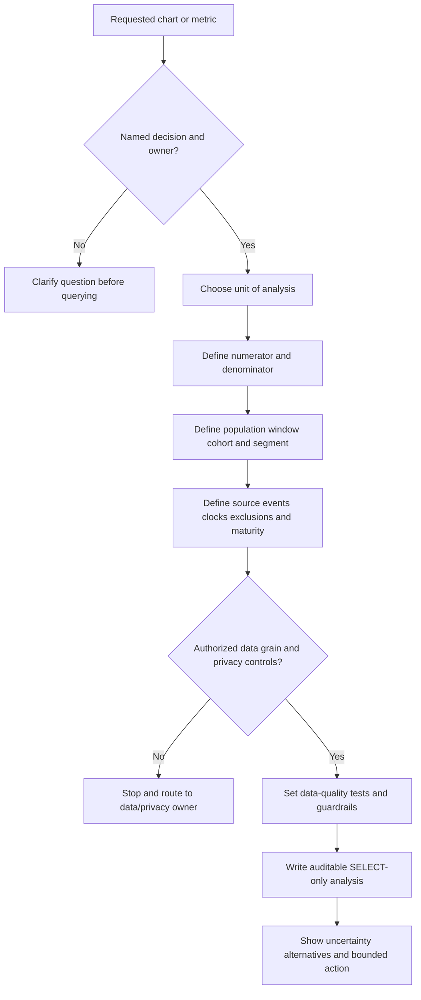
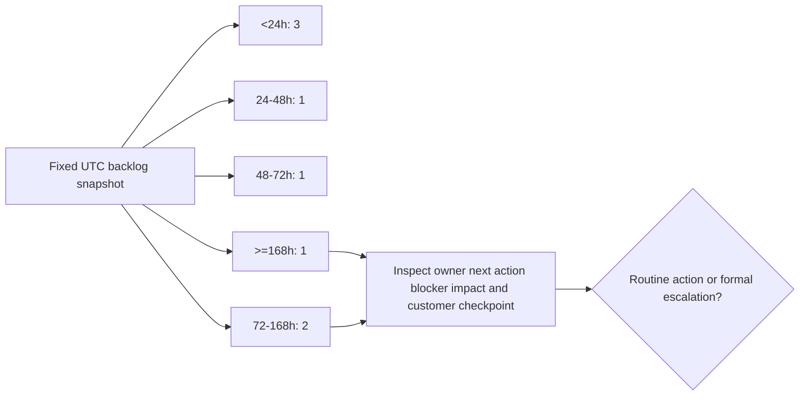
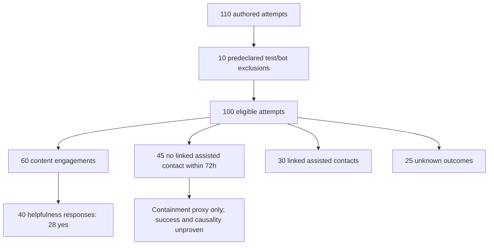
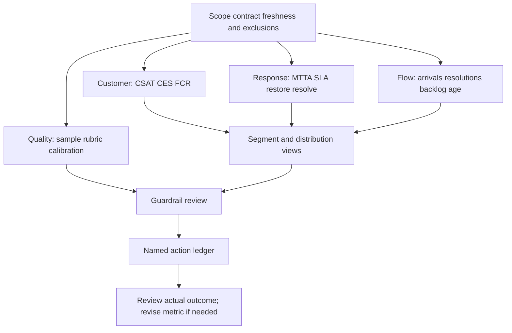
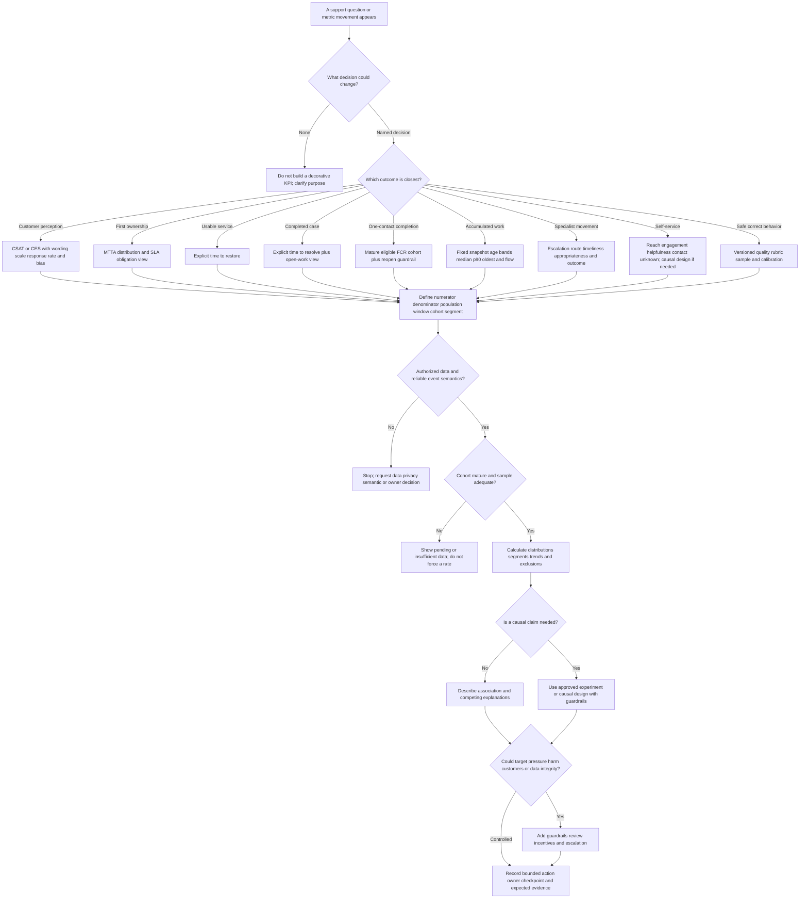
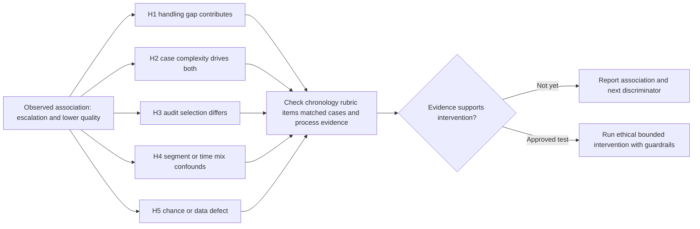
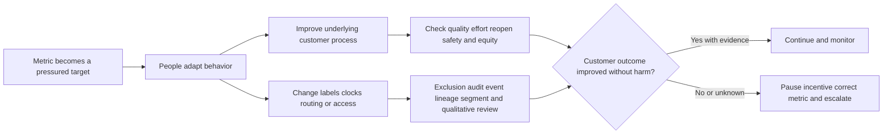
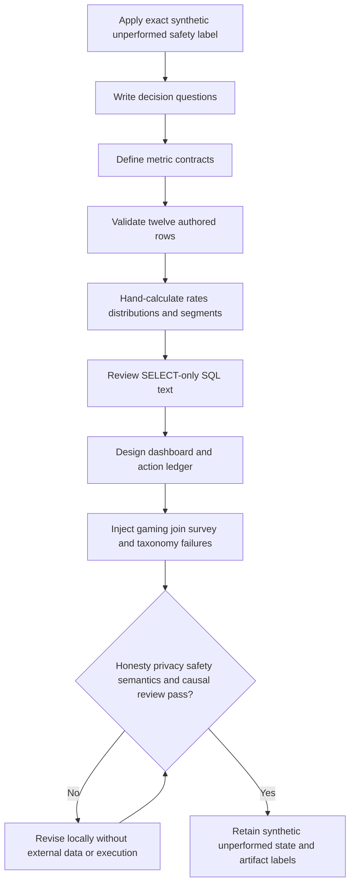

# Part 114 - Support Metrics Dashboards SQL and Analytics

> **Purpose:** Build a beginner-first, vendor-neutral method for defining, calculating, segmenting, visualizing, interpreting, and governing support metrics so that CSAT, CES, FCR, MTTA, restore and resolution time, SLA attainment, reopen, escalation, deflection, backlog age, and quality lead to safer decisions rather than misleading targets.
>
> **Artifact honesty label:** **Direct Microsoft enterprise-support transfer for CSAT, backlog, and case-quality analysis plus learner-authored synthetic metric-dictionary, SELECT-only SQL-analysis, dashboard-wireframe, and decision-tree artifacts; local analytics lab unperformed.** Arti may describe real Microsoft experience only through sanitized examples she can defend. Every case, survey, timestamp, segment, target, service level, query result, dashboard value, team, queue, and outcome in this Part is learner-authored fiction for study. This Part does not claim that Arti has operated Abnormal AI, queried Abnormal or customer data, used Abnormal tools, seen Abnormal metric definitions or targets, owned an Abnormal dashboard, or knows Abnormal's private schemas, SLAs, quality rubric, staffing model, customer segments, reporting policy, or escalation workflow.
>
> **Currency and official-source access date:** August 24, 2026.
>
> **Authored-Part state:** `PASS`. The master tracker was changed only after every deterministic gate passed.

## Section goal

A support metric is a deliberately defined measurement used to answer a bounded operational question. It is not merely a number with a familiar label. Before a number can guide action, the analyst must specify what was counted, what could have been counted, who or what was eligible, when measurement starts and stops, how records are grouped, which segments are compared, and what evidence the source system actually provides.

The everyday analogy is a **medical thermometer used beside a clinical assessment**. Temperature is useful because its unit, collection method, time, and expected range are understood. A high temperature can indicate a problem, but it does not diagnose the cause. Optimizing only the thermometer reading could even harm the patient if the underlying illness is ignored. Support metrics work similarly: a lower time-to-close can be encouraging, but it can also result from premature closure; a higher deflection proxy can mean helpful self-service, or it can mean customers gave up. The analogy stops where support operations involve queues, contracts, survey bias, changing ticket taxonomies, privacy obligations, and multiple customer outcomes rather than one physiological measure.

The central operating rule is:

> **Define the population before the formula, show the distribution beside the summary, segment before concluding, and pair every target with customer and quality guardrails.**

```mermaid
flowchart LR
    Question["Operational question"] --> Contract["Metric contract: numerator denominator population window"]
    Contract --> Sources["Authorized source fields and semantic checks"]
    Sources --> Quality["Data-quality and maturity checks"]
    Quality --> Calculate["SELECT-only calculation"]
    Calculate --> Segment["Cohort and segment comparison"]
    Segment --> Context["Targets trends distributions and guardrails"]
    Context --> Decision["Bounded decision or next investigation"]
    Decision --> Review["Outcome review and metric-governance check"]
    Review --> Contract
```



Strong support analytics preserves distinctions that a dashboard can visually collapse:

- a **count** is not a rate unless it has a denominator;
- a denominator is not trustworthy until the **eligible population** is defined;
- a reporting **window** is not always the same as a case **cohort**;
- a mean is not a typical experience when a long tail dominates;
- a percentile is not a percentage of target attainment;
- first response is not restoration, and restoration is not final resolution;
- an SLA clock is a contractual or policy construct, not simply elapsed wall time;
- satisfaction responses are not a census of all customers;
- no assisted case after self-service is not automatically causal deflection;
- escalation is not inherently failure, because timely escalation can protect customers;
- a correlation is a pattern, not proof that one variable caused another; and
- an attractive target can become harmful when people optimize the number instead of the customer outcome.

## Required analytics labels

This twenty-five-row table is the exact vocabulary contract for this Part. Definitions are portable starting points, not Abnormal-specific policy. A real organization must approve event semantics, exclusions, clock rules, ownership, privacy treatment, and targets before operational use.

| # | Required label | Beginner-first definition | Everyday analogy | Why it matters | Boundary to preserve |
|---:|---|---|---|---|---|
| 1 | **Numerator** | The count or summed value placed on top of a rate or fraction. It represents the events that met the stated condition. For SLA attainment, it might be eligible obligations met on time. | The number of apples in a basket that passed inspection. | A rate cannot be interpreted unless the successful or selected events are explicit. | The numerator must be a subset of the denominator under the same rules. Changing its event logic changes the metric even if the label stays the same. |
| 2 | **Denominator** | The complete count of eligible opportunities against which the numerator is compared. | All apples that were actually eligible for inspection, not every object in the warehouse. | Missing, excluded, duplicated, immature, or ineligible records can radically change a percentage. | Never hide exclusions or choose a convenient denominator after seeing the result. Zero denominators should produce `NULL` or “not available,” not zero success. |
| 3 | **Population** | The full set of entities or events the analysis intends to describe, such as all eligible inbound support cases whose first-response obligation became due in a month. | Every registered voter eligible in a defined election. | It states whom the result can and cannot represent. | A queried sample, surveyed subset, audited subset, or one queue is not automatically the whole support population. |
| 4 | **Window** | The calendar or elapsed-time interval in which events are included or observed, with start, end, timezone, and boundary rules. | A shop reports sales from opening at 09:00 through closing at 17:00 in one named timezone. | Trends become comparable only when windows are aligned. | “This week” is ambiguous without timezone and half-open boundaries such as start-inclusive and end-exclusive. Event windows and observation horizons may differ. |
| 5 | **Cohort** | A group anchored by a shared starting event or characteristic and then followed for a defined maturity period. Example: cases resolved in January and observed for seven more days for reopens. | Students who entered school in the same year and are followed over time. | Cohorts prevent newer records with less follow-up time from being compared unfairly with mature records. | A cohort is not just a dashboard filter. Its anchor event and observation horizon must remain stable. |
| 6 | **Segment** | A meaningful subdivision of a population, such as channel, issue category, language, severity, product area, region, support plan, or lifecycle stage. | Looking at travel time by route instead of averaging every route together. | Segmentation can reveal workload mix, access barriers, or localized failure hidden by an overall average. | Use only authorized, decision-relevant attributes. Small segments can identify people, create unstable rates, or invite unfair ranking. A segment difference does not prove cause. |
| 7 | **CSAT** | **Customer Satisfaction**, usually a survey response about satisfaction with a defined support interaction or case on a stated scale. Report its distribution, response rate, question wording, scale direction, and timing. | A diner rates one visit after the meal. | It gives direct but selective feedback about perceived experience. | Respondents self-select; a mean from responses does not represent every customer. CSAT is not product quality, loyalty, causal agent performance, or permission to pressure for high scores. |
| 8 | **CES** | **Customer Effort Score**, a survey-based measure of how easy or difficult a customer says a defined task or interaction was. The wording, scale, and whether high means easy or hard must be explicit. | A traveler rates how difficult it was to change a ticket. | Effort can expose repetition, confusing handoffs, and unnecessary steps even when the final answer is correct. | There is no safe universal scale assumption. CES is perception from respondents, not a stopwatch, and should not be compared across changed questions or scale directions. |
| 9 | **FCR** | **First Contact Resolution**, the share of eligible contacts whose customer need is resolved during the defined first substantive support interaction and remains resolved for a stated validation horizon. | A repair desk fixes an item during the first appointment and it does not return for the same fault during the warranty check window. | It can indicate low effort and effective frontline enablement. | Define “contact,” “resolved,” eligibility, linked duplicate cases, follow-up, and reopen horizon. Excluding hard cases, avoiding necessary escalation, or calling acknowledgment resolution games the metric. |
| 10 | **MTTA** | **Mean Time to Acknowledge**, the arithmetic average elapsed time from the approved start event to a qualifying acknowledgment event. A median or percentile should usually accompany it. | Average time before a staffed reception desk confirms that a visitor has been seen and what happens next. | It measures the beginning of ownership and can reveal queue coverage gaps. | An automated receipt is not a meaningful acknowledgment unless the metric contract explicitly says so. Pauses, business hours, reopened cases, transfers, and clock source must be defined. The acronym can mean other things elsewhere. |
| 11 | **Restore time** | Elapsed time from the approved incident or case start until the customer outcome is usable again, possibly through a workaround, while the underlying cause or permanent correction may remain open. | Reopening one safe lane over a damaged bridge while permanent repairs continue. | Restoration captures time to reduce impact, which can matter more urgently than administrative closure. | Restored does not mean fixed, root-caused, permanently resolved, risk-free, or closed. The restored capability and residual limitation must be explicit. |
| 12 | **Resolve time** | Elapsed time from the approved start until the defined resolution criterion is met, evidence and communication are complete, and the case reaches the qualifying resolved state. | Completing the bridge repair, inspection, and handback rather than merely opening a temporary lane. | It reflects the end-to-end work needed to reach the organization's definition of resolution. | Closure is not necessarily resolution. Customer waiting, vendor waiting, duplicates, linked incidents, monitoring windows, and reopen treatment require policy. |
| 13 | **MTTR ambiguity** | **MTTR** can mean mean time to respond, repair, restore, recover, remediate, or resolve. The acronym alone is therefore unsafe. Use the full metric name, start event, stop event, clock, and aggregation. | “Arrival time” could mean reaching the airport, gate, runway, or hotel. | It prevents teams from comparing different clocks under one label. | Never put bare `MTTR` on a dashboard. A lower restore time and a longer resolve time can both be true because they measure different outcomes. |
| 14 | **SLA attainment** | The rate of eligible service-level obligations that met their defined target: obligations met divided by obligations due or otherwise eligible in the reporting window. **SLA** means Service Level Agreement when contractual, but organizations may also track internal service targets separately. | Deliveries arriving within the promise made for their service class. | It shows whether defined commitments were met and supports risk review. | Preserve target class, calendar, pauses, exclusions, due-event cohort, and evidence source. Do not mix contractual SLA with internal SLO or aspiration, and do not restart clocks through reassignment. |
| 15 | **Reopen rate** | The share of eligible resolved cases that return to an active state for the same or linked need within a defined observation horizon. | A repaired appliance returns for the same fault within seven days. | It can reveal premature closure, incomplete guidance, recurrence, or customer confirmation gaps. | Define same-issue linkage, automation, customer reply behavior, duplicate cases, horizon, and cohort maturity. A reopen is not automatically agent error. |
| 16 | **Escalation rate** | The share of eligible cases that enter a defined higher-skill, incident, Engineering, Product, management, or specialized path. Each route should be measured separately when meanings differ. | A primary-care clinician refers a patient to a specialist when specialist judgment is needed. | It can show issue complexity, enablement gaps, product friction, or healthy risk recognition. | Lower is not always better. Necessary escalation protects customers. Segment by complexity and inspect appropriateness, timeliness, evidence quality, and outcome before judging. |
| 17 | **Deflection rate** | A carefully named measure of eligible self-service attempts that do not become assisted contacts within a defined horizon and, ideally, have evidence that the user's need was met. | A traveler uses a clear station map and reaches the platform without asking staff. | It can evaluate self-service reach and reduce avoidable effort when outcome evidence exists. | “No ticket” can mean success, abandonment, channel switching, privacy-unlinkable behavior, or delayed contact. Observational containment is not incremental causal deflection. Never block contact to improve it. |
| 18 | **Backlog age** | Elapsed time from a case's approved age-start event to a fixed snapshot time while the case remains in an included open state. Report age buckets, median, high percentile, and oldest actionable items. | The age of each book still waiting to be repaired at the end-of-day inventory. | It makes accumulated customer waiting and operational risk visible. | Backlog size and age answer different questions. Paused or externally waiting cases may still represent customer elapsed time. Never reset age by transfer, clone, closure/reopen, or queue movement. |
| 19 | **Quality** | Conformance to a versioned, behavior-based review rubric across an explicitly selected audit sample. It may include diagnosis, evidence, safety, accuracy, ownership, communication, documentation, and closure. | A flight checklist audit checks several safety-critical behaviors, not whether the flight was merely fast. | Quality is a guardrail against speed-only optimization and identifies coaching or process needs. | State sampling method, rubric version, reviewer calibration, pass rule, and uncertainty. A small audit score is not a complete person ranking, and reviewer judgment can vary. |
| 20 | **Mean** | The arithmetic average: add all observed values and divide by the number of observations. | Pooling twelve travel times and redistributing the total equally. | It includes every value and is useful for workload or total-time reasoning. | Long delays can pull it upward; it may describe no actual case. Always show sample size and usually median and percentiles. |
| 21 | **Median** | The middle value after sorting observations; half are at or below it and half are at or above it. For an even count, it is commonly the average of the two middle values. | The person standing in the middle of a height-ordered line. | It describes a typical center more robustly when extreme values exist. | Median can hide a painful long tail and does not mean every customer waited near that value. |
| 22 | **Percentile** | A threshold at or below which a stated percentage of observations falls under a named calculation method. A 90th percentile time is a long-tail indicator, not “90 percent success.” | The height below which 90 percent of people in a measured group fall. | High percentiles reveal experiences hidden by averages. | Software can use continuous, nearest-rank, inclusive, or exclusive definitions. Record the method, sample size, and tie handling; tiny groups yield unstable percentiles. |
| 23 | **Leading and lagging indicators** | A **leading indicator** changes earlier in a process and may offer an opportunity to intervene; a **lagging indicator** records an outcome after it occurs. | Fuel level can warn before a car stops; completed-trip failure records the later outcome. | Balanced use connects controllable process signals to customer outcomes. | “Leading” does not mean causal. A metric can be leading for one decision and lagging for another. Validate whether it predicts anything useful. |
| 24 | **Guardrail** | A measure watched to prevent improvement in a target metric from causing unacceptable harm elsewhere. | A speed limit beside a delivery-time target. | Quality, reopen, customer effort, safety, privacy, and escalation appropriateness can constrain speed optimization. | A guardrail needs an owner, threshold or review rule, segment, and response. A decorative metric nobody checks does not protect customers. |
| 25 | **Goodhart's law concept; correlation and causation** | The **Goodhart's law concept** warns that when a measure becomes a pressured target, behavior can shift to improve the number while weakening its relationship to the real goal. **Correlation** means variables move together in observed data; **causation** means changing one produces a change in the other through a supported mechanism and design. | Paying drivers only for deliveries per hour may encourage rushed or incomplete deliveries. Rain and umbrella use correlate, but umbrellas do not cause rain. | These concepts prevent leaderboard pressure, metric gaming, and causal overclaim from observational dashboards. | A trend, segment gap, or regression coefficient alone does not establish cause. Use competing explanations, process evidence, time ordering, experiments where ethical, and customer/quality guardrails. |

### One-line memory hooks for the labels

| Label group | Memory hook |
|---|---|
| Numerator and denominator | What succeeded, out of what was eligible? |
| Population, window, cohort, segment | Who, when, anchored how, split by what? |
| CSAT and CES | Satisfaction asks “how pleased”; effort asks “how hard.” |
| FCR | First real interaction, real outcome, no quick return. |
| MTTA | When did meaningful ownership begin? |
| Restore versus resolve | Usable again is not permanently finished. |
| MTTR | Spell out both clock endpoints; the acronym is not a definition. |
| SLA attainment | Met eligible promises divided by promises due. |
| Reopen and escalation | A return needs context; a handoff can be healthy. |
| Deflection | No ticket is not proof of success. |
| Backlog age | Freeze a snapshot; do not reset the customer's wait. |
| Quality | Audit behaviors with a calibrated rubric, not people by one score. |
| Mean, median, percentile | Workload center, typical center, and long-tail boundary. |
| Leading, lagging, guardrail | Predict, confirm, and prevent harm. |
| Goodhart and causality | Pressure changes behavior; movement together is not cause. |

## JD Mapping

| Role signal from the master guide | Capability developed here | Arti's honest transfer | Evidence ceiling |
|---|---|---|---|
| Use support metrics to improve customer outcomes | Defines decision questions, metric contracts, distributions, segments, guardrails, and action owners | Direct CSAT, backlog, and case-quality analysis experience at Microsoft where supported by a real example | No Abnormal definitions, targets, dashboard, trend, staffing result, or customer outcome |
| Detect recurring support patterns | Uses stable taxonomy, cohorts, segment comparisons, age bands, and Pareto-ready counts | Transferable enterprise-support pattern recognition and backlog review | Synthetic analysis does not prove any real recurring pattern |
| Drive case deflection and knowledge improvement | Separates helpfulness, containment, contact rate, and causal incremental deflection | KB/training experience is a useful bridge | No fabricated deflection, article impact, adoption, or cost saving |
| Improve case quality and hygiene | Defines calibrated, behavior-based audit sampling and quality guardrails | Direct case-quality and mentoring transfer where backed by Arti's actual examples | No claim of designing or owning Abnormal's quality program |
| Work with Engineering, Product, CSMs, and leaders | Turns metrics into bounded questions, evidence packets, and decision reviews | Strong transfer from cross-functional Microsoft support work | Dashboards do not authorize cause, roadmap, performance, or customer commitments |
| Use SQL, PostgreSQL, Power BI, and Python knowledge | Demonstrates readable SELECT-only analytical patterns and a tool-neutral dashboard specification | Working knowledge stated in the CV and strengthened by written practice | Queries were not executed; no production database or Abnormal schema was accessed |
| Protect customer trust and security | Applies minimization, aggregation, small-cell suppression, purpose limitation, and anti-leaderboard rules | Enterprise support evidence-handling habits transfer | Public principles do not define company policy or legal obligations |
| Present practical artifacts | Produces a metric dictionary, synthetic SQL analysis, dashboard wireframe, gaming review, and lab plan | Completed learner-authored written portfolio | Artifacts are fictional, local, unsubmitted, unapproved, unperformed, and not company process |

## Candidate honesty note

Arti can honestly say that her Microsoft enterprise-support background included working with **CSAT, backlog, and case-quality analysis**. That is a strong foundation because she already understands that operational numbers have customer stories behind them and that aging work, feedback, and quality require review. She should attach any production claim to a sanitized real example she personally remembers: what question she was answering, which data she was authorized to use, what she actually calculated or reviewed, what decision followed, and what result she can support.

She must not stretch that transfer into ownership of every metric in this Part. The FCR, CES, MTTA, restore time, resolve time, SLA, reopen, escalation, and deflection definitions here are learner-authored vendor-neutral contracts. They do not establish how Microsoft measured them, and they reveal nothing about Abnormal. The safe bridge is:

> “My Microsoft support experience gives me direct familiarity with CSAT, backlog, and case-quality analysis and with using operational evidence to improve customer support. I have not used Abnormal's data or analytics tools, and I do not know its private metric contracts or targets. For preparation, I built a synthetic metric dictionary, hand-worked a small dataset, wrote SELECT-only PostgreSQL-style examples, and designed a dashboard. In the role, I would first learn the authoritative schema, population rules, clock semantics, privacy controls, and decision owners before calculating or interpreting a company metric.”

| Capability or artifact | Exact evidence label | Safe interview language | Claim to avoid |
|---|---|---|---|
| Microsoft CSAT, backlog, and case-quality work | `DIRECT_PRODUCTION_TRANSFER` | “I can describe a sanitized Microsoft example of how I used CSAT, backlog, or quality evidence within my actual role.” | “I owned all support analytics” unless that exact scope is true |
| Metric dictionary, worked arithmetic, SQL text, and wireframe | `SYNTHETIC_WRITTEN_PORTFOLIO_COMPLETED_NOT_OPERATIONAL` | “I authored a vendor-neutral measurement contract and synthetic analysis for practice.” | “This dashboard measured a real team or customer.” |
| SignalBridge Lab 114 | `DESIGN_NOT_EXECUTED_NOT_TRANSFERRED` | “The local synthetic lab is designed but was not performed during authoring.” | Any query run, file generation, dashboard render, result validation, or reviewer claim |
| Abnormal data, tools, metric semantics, targets, and workflow | `NO_DIRECT_EXPERIENCE_UNKNOWN_CONFIGURATION` | “I would learn the current authorized definitions, systems, permissions, and owners before operational use.” | Any invented Abnormal table, field, report, SLA, CSAT, backlog, target, team result, or process |

## 1. Measurement design before calculation

The fastest way to create a misleading dashboard is to begin with available columns instead of a decision question. Start with the decision: “Do we need additional overnight acknowledgment coverage?” is stronger than “show MTTA.” The first question identifies a possible action, a relevant queue and timezone, and a need to compare distributions by hour. The second invites an attractive tile with no decision boundary.

### The measurement contract

Every metric should have a written contract before SQL or visualization begins.

| Contract field | Question to answer | Example for a synthetic first-response SLA | Failure if omitted |
|---|---|---|---|
| Decision purpose | What decision could this metric change? | Review whether coverage or routing needs investigation | Dashboard decoration and target chasing |
| Unit of analysis | Is one row a case, contact, obligation, survey, audit, or self-service attempt? | One first-response obligation | Duplicate joins and mismatched rates |
| Numerator | Which eligible rows count as success? | Obligations with qualifying acknowledgment by due time | Hidden success rule |
| Denominator | Which rows had a fair opportunity to count? | Eligible obligations due in the window | Convenient denominator or survivorship bias |
| Population | Which queue, service class, channel, and state are covered? | Synthetic standard-priority inbound cases | Unsupported generalization |
| Window | Which event falls between which UTC boundaries? | Due timestamp from `2026-01-05T00:00Z` inclusive to `2026-01-12T00:00Z` exclusive | Partial-day and timezone drift |
| Cohort and maturity | What anchors membership, and how long must outcomes mature? | Due-event cohort; no extra maturity for first response | Newer records treated as failures or successes prematurely |
| Start/stop events | Which source events begin and end the clock? | Created timestamp to qualifying human acknowledgment | Auto-receipt or reassignment silently resets time |
| Clock policy | Wall clock, business calendar, pause rules, holidays, and timezone? | Synthetic elapsed wall-clock minutes; no pauses | Contract mismatch |
| Exclusions | Which rules remove rows, and why? | Explicit test and duplicate records only | Hard cases disappear from the denominator |
| Dimensions | Which segments are authorized and useful? | Issue category and channel | Small-cell privacy or unfair ranking |
| Aggregation | Count, rate, mean, median, percentile, or distribution? | Attainment rate plus median and p90 acknowledgment | Mean-only blindness |
| Data lineage | Which source and transformation produced every field? | Local written fixture, not a service database | Numbers cannot be reproduced or corrected |
| Quality checks | Which null, duplicate, ordering, range, and join tests must pass? | One unique case, nonnegative duration, acknowledgment after creation | Silent source defects become operational stories |
| Guardrails | Which customer or quality measure must not worsen? | Reopen, CES, quality, and necessary-escalation appropriateness | Speed improves by harming customers |
| Owner and review | Who approves, interprets, and revises the contract? | Fictional operations owner; none exists in this authored exercise | Metric drift and orphaned alerts |
| Privacy and access | What is the minimum permitted grain and retention? | Aggregated synthetic rows only | PII exposure and leaderboard misuse |



### Event time versus cohort time

A metric can produce different answers depending on which event selects the row. Consider an SLA obligation created at 23:58 on January 31 and due at 00:28 on February 1. A created-case cohort assigns it to January. A due-obligation window assigns it to February. Neither is inherently wrong, but they answer different questions.

| Selection rule | Question answered | Suitable example | Important caveat |
|---|---|---|---|
| Cases created in window | What demand entered during this period? | Inbound volume and later cohort outcomes | Recent cases may not have matured for resolution or reopen |
| Obligations due in window | What commitments were due during this period? | SLA attainment | Includes cases created earlier and requires exact due semantics |
| Cases resolved in window | What work reached the resolved state during this period? | Throughput | Mixes old and new work and can reward clearing easy cases |
| Cases open at snapshot | What remains and how old is it now? | Backlog aging | Snapshot changes every moment and is not a flow metric |
| Surveys received in window | What feedback arrived during this period? | Response distribution | Feedback may refer to cases from earlier periods |
| Resolution cohort plus horizon | What happened after a comparable outcome event? | Seven-day reopen rate | Must delay reporting until every case has equal follow-up |

### 🔍 Plain-English deep-dive: The denominator is a policy decision encoded as arithmetic

Suppose 100 cases entered a queue. Ten were marked duplicates, ten were transferred, and ten missed the target. An analyst could report $10/100=10\%$ missed, or exclude transfers and report $10/90=11.1\%$, or remove duplicates and transfers and report $10/80=12.5\%$. The arithmetic is easy; the policy is not.

Each exclusion asserts that the removed row did not have a fair or meaningful opportunity to count. That assertion needs a reason. A true duplicate may belong outside a case-level workload denominator while remaining visible in a contact-demand metric. A transferred case should not disappear merely because it became difficult. A canceled survey should not be called satisfied. An SLA pause should come from an authoritative clock event, not a manually chosen convenience flag.

Denominator audits therefore ask:

1. What was eligible before exclusions?
2. Which rule removed each row?
3. Was the rule defined before the result was seen?
4. Could staff influence the exclusion label?
5. Does the excluded workload remain visible somewhere else?
6. Would another reasonable denominator reverse the decision?

A mature dashboard can show both the metric and an **exclusion reconciliation**: raw records, invalid test data, confirmed duplicates, ineligible categories, immature cohort, and final denominator. That reconciliation is often more valuable than a decimal point.

## 2. Artifact - metric dictionary

**Artifact state:** `SYNTHETIC_WRITTEN_PORTFOLIO_COMPLETED_NOT_OPERATIONAL`.

The following metric dictionary is a worked specification. It demonstrates the fields an analyst should define; it is not an Abnormal dictionary and must not be copied into a real reporting system without current owner approval.

| Metric and decision use | Numerator | Denominator and population | Window/cohort/segment | Clock or scale | Guardrails and interpretation boundaries |
|---|---|---|---|---|---|
| **CSAT mean and favorable share**: identify themes needing qualitative review | Sum of valid response scores for mean; valid scores at or above predeclared favorable threshold for share | Valid responses to one unchanged question/scale; response rate separately uses delivered offers | Response-received window; segment only where sample and privacy permit | Example only: 1-5, high means more satisfied; preserve wording and send delay | Show count, response rate, full distribution, comments only through approved handling, reopen, CES, and quality. Do not rank people or claim nonrespondents agree. |
| **CES mean and difficult share**: find effort-heavy workflows | Sum of valid effort scores; difficult-category responses under declared scale direction | Valid responses to the same task/question; offers and responses shown separately | Response-received or task cohort with fixed follow-up; segment by journey step | Scale and direction must be metadata, for example 1 difficult to 7 easy | Pair with repeated contacts, handoffs, time, abandonment indicators, accessibility, and qualitative review. Do not compare reversed scales. |
| **FCR rate**: assess whether frontline support completes eligible needs without extra customer effort | Eligible cases meeting first-substantive-contact resolution criterion and no same-need reopen within seven days | All mature eligible inbound cases in created cohort; retain complex and escalated cases unless predeclared policy says otherwise | Created cohort, delayed seven days; segment by issue type/channel, not individual leaderboard | First contact defined as first two-way substantive interaction; resolution requires customer outcome, not acknowledgment | Reopen, CES, CSAT, quality, escalation appropriateness, and recurrence. Channel semantics differ; async email may not map cleanly. |
| **Mean/median/p90 time to acknowledge**: review queue coverage | Sum/ordered distribution of elapsed minutes to qualifying acknowledgment | Eligible inbound cases with valid start and acknowledgment events; unresolved/unacknowledged cases require censored treatment, not deletion | Created cohort or obligation-due window; segment by coverage hours, priority, channel, and queue | Start at accepted intake event; stop at meaningful human or policy-approved acknowledgment; use stated wall/business clock | Pair with backlog, quality, customer effort, safety, and staffing context. Never treat automated receipt as human acknowledgment silently. |
| **Median/p90 time to restore**: monitor impact reduction | Ordered elapsed minutes from defined impact start to verified usable-state restoration | Eligible cases/incidents with a real restoration event; report not-restored count separately | Start-event cohort with maturity; segment by impact class and issue category | Wall/business clock and pause rules explicit; workaround restoration marked separately | Restoration scope, residual risk, recurrence, quality, and final resolution time. A workaround must not be called a fix. |
| **Median/p90 time to resolve**: monitor complete outcome cycle | Ordered elapsed minutes from defined start to qualifying resolved event | Eligible resolved cases plus separate still-open survival/backlog view; do not drop open work invisibly | Created cohort with sufficient horizon or resolution event window, clearly named | Full name only; no bare MTTR. Closure automation and customer-wait rules explicit | Reopen, quality, CES, backlog flow, complexity, and aging. Faster closure can be harmful. |
| **First-response SLA attainment**: monitor due commitments | Eligible obligations met by due timestamp | Eligible obligations due in window after authoritative policy exclusions | Due-event window; segment by service class/priority and calendar | Compare qualifying event to stored due event or approved calendar calculation | Show breach counts, near-breach distribution, exclusions, pauses, and customer impact. No reassignment reset. Separate SLA from internal SLO. |
| **Seven-day reopen rate**: detect incomplete or unstable outcomes | Eligible resolved cases reopened for same/linked need within seven days | Eligible resolved cases with full seven-day maturity | Resolution cohort ending at least seven days before report cutoff; segment by issue category and resolution type | Reopen linkage and automation rules versioned | Pair with FCR, quality, resolution time, recurrence, and closure policy. Reopen can reflect new evidence, not poor work. |
| **Escalation rate and appropriateness**: understand complexity and enablement | Eligible cases entering each defined escalation route; separately, audited escalations meeting appropriateness rubric | Eligible cases in created cohort; route-specific denominator where necessary | Created cohort; segment by issue type, severity, tenure only through approved aggregate use, and route | First qualifying escalation event; deduplicate repeated route events | Pair with impact, complexity, time-to-escalate, evidence completeness, outcome, quality, and missed-escalation review. Lower is not always better. |
| **Observed self-service containment proxy**: study whether assisted demand follows an attempt | Eligible attempts with no linkable assisted contact in the chosen horizon and a known outcome category | Eligible human self-service attempts after test/bot exclusions; unmatched outcomes remain visible | Attempt cohort plus, for example, 72-hour horizon; segment by intent and content version | Identity/linkage uses privacy-approved methods; horizon and channel coverage explicit | Label as observational proxy, not causal deflection. Show helpfulness, unknown outcomes, contact creation, abandonment, and access friction. Never block support. |
| **Incremental deflection estimate**: evaluate causal effect of an intervention | Difference in assisted-contact probability between comparable intervention and control populations | Eligible randomized or defensibly quasi-experimental attempts under approved design | Experiment cohort and observation horizon fixed before analysis | Assignment, exposure, contamination, and attrition tracked | Requires ethical design, statistical uncertainty, customer/quality guardrails, and owner review. An ordinary dashboard cannot manufacture this result. |
| **Backlog age profile**: protect customers from accumulated waiting | Counts in age buckets; ordered ages for median/p90; count beyond review threshold | All actionable and separately all included open cases at one snapshot | Fixed UTC snapshot; segment by queue, priority, issue type, owner state, and waiting reason | Age from original eligible intake to snapshot; do not reset on transfer | Show arrivals, closures, oldest cases, customer-wait state, blockers, SLA risk, quality, and capacity. Do not close or clone to improve age. |
| **Case-quality score/pass rate**: inspect adherence to safe support behaviors | Sum of applicable item scores or audited cases meeting pass rule | Audited cases selected by documented random/risk-stratified method; applicability rules explicit | Audit-completed window with case cohort metadata; segment only with adequate sample | Versioned rubric, weights, critical-fail rules, reviewer calibration, and appeal process | Report sample size, selection bias, inter-rater agreement, critical defects, coaching themes, and customer outcomes. No public individual leaderboard. |

### Metric lineage card

Each dashboard metric should link to a lineage card like this:

| Field | Synthetic example |
|---|---|
| Metric ID/version | `METRIC-SYN-114-SLA v1.0` |
| Display name | Synthetic first-response SLA attainment |
| Business question | Did eligible first-response obligations due in the week meet their target? |
| Unit of analysis | One first-response obligation |
| Source | Local written `synthetic_cases` fixture only |
| Source authority | Learner-authored; no operational authority |
| Formula | Met eligible obligations divided by eligible obligations due |
| Inclusion/exclusion | Twelve synthetic cases; no duplicates/tests; all obligations due in fixture window |
| Window | Authored one-week example; dates are fictional |
| Timezone/calendar | UTC elapsed time; no business-calendar pauses |
| Grain | Aggregate and fictional issue category |
| Quality tests | Unique case IDs; `mtta_minutes >= 0`; binary flags in `{0,1}`; no result from zero denominator |
| Guardrails | Reopen, CES, quality, escalation appropriateness, and aging |
| Owner/reviewer | None; portfolio artifact only |
| Last review/source date | August 24, 2026 |
| Prohibited use | Production decision, customer statement, individual ranking, Abnormal claim, or causal claim |

```mermaid
flowchart LR
    Raw["Authorized event records"] --> Semantic["Source-event semantic contract"]
    Semantic --> Clean["Deduplicate validate ranges retain exclusions"]
    Clean --> Cohort["Population window cohort and maturity"]
    Cohort --> Metric["Versioned formula"]
    Metric --> Aggregate["Privacy-safe segment aggregate"]
    Aggregate --> Dashboard["Tile trend distribution and notes"]
    Dashboard --> Decision["Named review action"]
    Decision --> Ledger["Decision and outcome ledger"]
```



## 3. Time metrics distributions and ambiguity

Time metrics sound objective because timestamps look precise. They still depend on event semantics. A `created_at` value may mean form submission, ingestion, deduplication, assignment, or case creation. An `acknowledged_at` value may be an automated email, an agent opening the record, or a meaningful response. Precision to a millisecond cannot repair an incorrect event definition.

### Restore versus resolve sequence

```mermaid
sequenceDiagram
    participant C as Customer need
    participant Q as Support queue
    participant S as Support owner
    participant X as Specialist or dependency
    C->>Q: Eligible intake event starts clock
    Q->>S: Route case
    S-->>C: Qualifying acknowledgment ends acknowledge clock
    S->>X: Escalate evidence when appropriate
    X-->>S: Workaround or recovery path
    S-->>C: Usable outcome restored with stated limitations
    Note over C,S: Restore clock can stop here; issue may remain open
    X-->>S: Permanent correction or authoritative explanation
    S->>S: Validate evidence and complete documentation
    S-->>C: Resolution criterion and follow-through completed
    Note over C,S: Resolve clock stops only under defined policy
```

| Metric | Start | Stop | Open or censored records | Question answered |
|---|---|---|---|---|
| Time to acknowledge | Eligible intake or obligation start | Qualifying acknowledgment | Unacknowledged rows must remain visible as pending/breached or be handled by survival analysis | How long until meaningful ownership was visible? |
| Time to restore | Defined impact start | Verified usable state, possibly through workaround | Not-restored rows remain visible | How long until the affected outcome became usable again? |
| Time to resolve | Defined case/incident start | Qualifying resolution event | Open rows must not silently disappear from cohort conclusions | How long until the complete resolution criterion was met? |
| Backlog age | Original age-start event | Fixed snapshot, not a close event | By definition includes open records | How long has current open work existed? |

### Mean, median, and percentile worked example

The twelve synthetic acknowledgment times used later are:

`5, 8, 10, 12, 15, 18, 20, 25, 30, 35, 40, 60` minutes.

- **Mean:** $278 / 12 = 23.17$ minutes.
- **Median:** the average of the sixth and seventh sorted values, $(18 + 20) / 2 = 19$ minutes.
- **90th percentile using nearest-rank for teaching:** rank $= \lceil 0.90 \times 12 \rceil = 11$, so p90 is `40` minutes.
- **Attainment at a synthetic 30-minute threshold:** 9 of 12 are at or below 30 minutes, so $9/12=75\%$.

These statements are not interchangeable. The mean estimates average elapsed workload in this tiny fixture. The median identifies the center. The p90 describes a long-tail boundary under one declared method. Attainment compares each record with a target. An analyst should not say “p90 is 90 percent attainment.”

### 🔍 Plain-English deep-dive: Why the average can improve while customers wait longer

Imagine a queue with nine cases resolved in 10 minutes and one resolved in 1,000 minutes. The mean is 109 minutes, the median is 10 minutes, and the worst customer waited 1,000 minutes. If the team resolves another hundred two-minute questions but leaves the oldest case untouched, the mean can fall dramatically while the long-wait customer becomes worse off.

This is a **mix effect**. The aggregate changed because the proportion of easy cases changed, not necessarily because the process improved for comparable work. Similar effects occur when:

- one channel gains many simple contacts;
- high-complexity cases move to another queue;
- open cases are excluded from resolution calculations;
- a taxonomy change relabels categories;
- a backlog cleanup closes easy duplicates first;
- a survey campaign changes who responds; or
- a policy changes the start, stop, pause, or exclusion event.

The repair is not to discard the mean. Use several views: volume, median, p90 or p95 where sample size supports it, age buckets, unresolved count, and stable segments. Add a cohort view so recent easy work cannot hide old unresolved work. Finally, read examples from the long tail through authorized, minimized case review; the number locates a question but does not explain the mechanism.

## 4. Worked synthetic analytics

**Scenario boundary:** `SupportLab`, all case aliases, categories, channels, times, flags, surveys, scores, targets, and results below are fictional. They were written directly into this study file. No database, spreadsheet, dashboard, customer system, Abnormal system, account, API, ticketing tool, survey tool, or external service was accessed. No SQL was executed.

### Synthetic case fixture

The compact fixture stores durations rather than real timestamps so that the arithmetic remains inspectable. `NULL` means the event or response does not exist in the authored row; it must never be silently converted to zero.

| Case | Segment | Channel | MTTA min | Restore min | Resolve min | SLA met | Reopens | Escalated | FCR eligible | FCR success | Survey offered/responded | CSAT | CES | Quality |
|---|---|---|---:|---:|---:|---:|---:|---:|---:|---:|---|---:|---:|---:|
| `C01` | Configuration | Web | 10 | 60 | 120 | 1 | 0 | 0 | 1 | 1 | 1 / 1 | 5 | 6 | 94 |
| `C02` | API | Email | 40 | 180 | 240 | 0 | 1 | 1 | 1 | 0 | 1 / 1 | 2 | 3 | 72 |
| `C03` | Configuration | Web | 5 | 20 | 30 | 1 | 0 | 0 | 1 | 1 | 1 / 1 | 5 | 7 | 98 |
| `C04` | Integration | Portal | 20 | 90 | 300 | 1 | 0 | 0 | 1 | 0 | 1 / 0 | `NULL` | `NULL` | 88 |
| `C05` | API | Web | 15 | 75 | 180 | 1 | 0 | 0 | 1 | 1 | 1 / 1 | 4 | 5 | 90 |
| `C06` | Integration | Email | 35 | 120 | 480 | 0 | 1 | 1 | 1 | 0 | 1 / 1 | 3 | 4 | 84 |
| `C07` | Configuration | Portal | 8 | 30 | 45 | 1 | 0 | 0 | 1 | 1 | 1 / 0 | `NULL` | `NULL` | 96 |
| `C08` | API | Email | 60 | `NULL` | 600 | 0 | 0 | 1 | 1 | 0 | 1 / 1 | 4 | 5 | 70 |
| `C09` | Integration | Web | 12 | 45 | 60 | 1 | 0 | 0 | 1 | 1 | 1 / 0 | `NULL` | `NULL` | 92 |
| `C10` | Configuration | Portal | 25 | `NULL` | 90 | 1 | 0 | 0 | 1 | 1 | 1 / 0 | `NULL` | `NULL` | 86 |
| `C11` | API | Web | 18 | `NULL` | `NULL` | 1 | 0 | 0 | 0 | 0 | 0 / 0 | `NULL` | `NULL` | 80 |
| `C12` | Integration | Email | 30 | `NULL` | `NULL` | 1 | 0 | 0 | 0 | 0 | 0 / 0 | `NULL` | `NULL` | 95 |

### Hand-worked metric results

| Metric | Calculation from synthetic fixture | Authored result | Correct interpretation | What it cannot establish |
|---|---|---:|---|---|
| Mean MTTA | Sum `278` / 12 acknowledged cases | `23.17 min` | Average fictional acknowledgment duration | Real performance, customer perception, or cause |
| Median MTTA | Middle of 12 sorted values: `(18+20)/2` | `19 min` | Half the values are at or below 19 under the fixture | Every case was near 19 minutes |
| Nearest-rank p90 MTTA | Rank `ceil(.90*12)=11`; value 11 is 40 | `40 min` | Long-tail threshold in this tiny sample under named method | Stable production percentile |
| Synthetic SLA attainment | 9 met / 12 eligible due | `75%` | Three authored obligations exceed 30 minutes | Contractual SLA, impact, or staffing cause |
| FCR | 6 successes / 10 mature eligible cases | `60%` | Six authored cases meet the stated binary flag | Low FCR is bad or escalation should be avoided |
| Reopen rate | 2 reopened / 10 resolved and mature cases | `20%` | Two resolved fixture rows have a reopen | Cause, agent quality, or future recurrence |
| Escalation rate | 3 escalated / 12 eligible cases | `25%` | Three fixture cases entered the defined route | Whether escalations were appropriate or avoidable |
| CSAT response rate | 6 valid responses / 10 offers | `60%` | Four offered surveys have no response | Satisfaction of nonrespondents |
| Mean CSAT | `(5+2+5+4+3+4)/6` | `3.83/5` | Mean among six fictional respondents | Population satisfaction or causal agent effect |
| Favorable CSAT | Four scores of 4-5 / 6 responses | `66.7%` | Four respondents meet the declared threshold | Universal definition of “good” |
| Mean CES | `(6+3+7+5+4+5)/6` | `5.0/7` | Mean on authored high-is-easy scale | Actual effort or comparability to another question |
| Mean quality | Total `1045` / 12 audited rows | `87.08/100` | Center of fictional rubric scores | Calibrated real quality or individual performance |
| Escalated quality mean | `(72+84+70)/3` | `75.33` | Escalated rows have lower scores in this fixture | Escalation caused low quality |
| Non-escalated quality mean | `819/9` | `91.00` | Non-escalated rows have higher scores in this fixture | Avoiding escalation improves quality |
| Mean restore time | `620/8` rows with restore events | `77.5 min` | Average for the eight authored restorations | Four `NULL` rows were instantly restored |
| Median restore time | Sorted 8 values; `(60+75)/2` | `67.5 min` | Typical authored restoration among rows with the event | Full population restoration outcome |
| Median resolve time | Sorted 10 values; `(120+180)/2` | `150 min` | Typical authored resolution among resolved cases | Two open cases or old-tail risk |
| Nearest-rank p90 resolve | Rank `ceil(.90*10)=9`; value 9 is 480 | `480 min` | Ninth ordered authored duration | A contractual target or stable tail estimate |

### Segmentation without causal overclaim

| Segment | Cases | SLA met | SLA attainment | FCR eligible/success | FCR | Mean MTTA | Responded CSAT mean | Quality mean | Responsible reading |
|---|---:|---:|---:|---|---:|---:|---:|---:|---|
| Configuration | 4 | 4 | 100% | 4 / 4 | 100% | 12.00 | 5.00 from 2 responses | 93.50 | Strong values in four authored rows; tiny sample and easier mix may explain them |
| API | 4 | 2 | 50% | 3 / 1 | 33.3% | 33.25 | 3.33 from 3 responses | 78.00 | Opens a question about complexity, evidence, routing, and sample mix; no cause established |
| Integration | 4 | 3 | 75% | 3 / 1 | 33.3% | 24.25 | 3.00 from 1 response | 89.75 | One survey response cannot represent the segment; resolution and escalation context are needed |

The segment table is useful because it prevents Configuration volume from hiding API delay. It is dangerous if turned into “the API team performs badly.” The fixture does not contain staff, complexity controls, customer behavior, incident overlap, entitlement, language, staffing, time-of-day, or dependency evidence. The next action would be a bounded review of event semantics and a sample of API paths, not a performance verdict.

### Synthetic backlog snapshot

At fictional snapshot `2026-01-12 00:00 UTC`, eight open case aliases have ages:

`2, 8, 20, 26, 49, 73, 120, 240` hours.

| Age bucket | Rule | Count | Share | Operational question |
|---|---|---:|---:|---|
| Fresh | `< 24 hours` | 3 | 37.5% | Are these correctly routed and acknowledged? |
| Developing | `24 to <48 hours` | 1 | 12.5% | Is a next action and customer checkpoint present? |
| Aging | `48 to <72 hours` | 1 | 12.5% | Is a blocker or escalation decision needed? |
| Old | `72 to <168 hours` | 2 | 25.0% | Is ownership, dependency, or risk review overdue? |
| Very old | `>=168 hours` | 1 | 12.5% | Does leadership need to remove a blocker or correct state? |

The median age is $(26+49)/2=37.5$ hours. Under nearest-rank on eight values, p90 is rank eight and therefore `240` hours. The oldest case controls p90 because the sample is tiny; that is a reason to inspect the case, not to hide the percentile.



### Synthetic self-service funnel

The authored funnel starts with 110 attempts. Ten are explicitly labeled synthetic tests or bots and are excluded under the predeclared rule. Of 100 eligible attempts, 60 engage with content, 45 have no linked assisted case within 72 hours, 30 have a linked assisted case, and 25 remain unknown because privacy-safe linkage cannot establish an outcome. Forty users answer a helpfulness prompt; 28 answer yes.

| Funnel measure | Numerator / denominator | Result | Safe label | Unsafe claim |
|---|---|---:|---|---|
| Content engagement | 60 / 100 eligible attempts | 60% | Observed engagement | “60% solved their problem” |
| No-linked-contact proxy | 45 / 100 eligible attempts | 45% | Observed containment proxy | “45 tickets were deflected” |
| Linked assisted-contact rate | 30 / 100 eligible attempts | 30% | Observed linked contact in 72 hours | “The article failed for 30%” |
| Unknown outcome | 25 / 100 eligible attempts | 25% | Linkage/outcome unknown | Treat unknown as success |
| Helpfulness among respondents | 28 / 40 responses | 70% | Respondent helpfulness | “70% of all users succeeded” |



### 🔍 Plain-English deep-dive: Deflection is a causal question disguised as a counting question

Suppose a user reads an article and does not open a case. Several stories fit the same data:

1. the article solved the problem;
2. the user solved it elsewhere;
3. the user abandoned the task;
4. the user contacted support through an unlinkable channel;
5. the user planned to open a case later than the observation horizon;
6. the contact already existed under another identity; or
7. the measurement failed to join the records.

Calling every no-contact event “deflected” chooses story one without evidence. A safer dashboard separates **reach** (content was shown), **engagement** (content was used), **helpfulness response**, **observed containment** (no linked contact), **unknown outcome**, and **incremental deflection**. Incremental deflection asks the causal counterfactual: how many assisted contacts would have occurred without the intervention?

That last question usually needs a controlled design, such as an ethical randomized rollout or a carefully reviewed quasi-experiment, along with uncertainty and guardrails. Even then, reducing contacts is not the sole objective. Customers must retain easy access to support; resolution, effort, safety, accessibility, satisfaction, and later recurrence must not worsen. Content that hides a contact button can increase apparent containment while harming customers. That is metric gaming, not service improvement.

## 5. Artifact - safe SELECT-only SQL analysis

**Artifact state:** `SYNTHETIC_SQL_TEXT_AUTHORED_NOT_EXECUTED`.

All SQL below is PostgreSQL-style teaching text over inline fictional values. It was not executed. It does not name or infer any Abnormal schema. Every statement is a read-only query beginning with `WITH` and ending in `SELECT`; there is no table creation, data mutation, deletion, permission change, procedure call, external function, or customer data. SQL dialects and percentile methods differ, so a qualified owner must review syntax and semantics before any authorized use.

### SQL safety contract

| Rule | Required practice | Reason |
|---|---|---|
| Data | Inline synthetic aliases and values only | Prevent customer, employee, tenant, message, ticket, and PII exposure |
| Statement type | `WITH`, `VALUES`, and `SELECT` only | Keep the written examples non-mutating |
| Environment | No database connection or tool is used in this Part | Avoid implying access or execution |
| Grain | Aggregate before sharing; suppress or combine small real groups under policy | Reduce re-identification and leaderboard risk |
| Joins | Validate one-to-one/one-to-many expectations and count before/after | Prevent denominator inflation |
| Nulls | Preserve unknown/not-applicable; do not coerce to zero silently | Zero is an observed value, not absence |
| Time | Use explicit UTC boundaries and named business-calendar logic | Prevent timezone and partial-window errors |
| Review | Metric owner, data steward, privacy/security, and SQL peer review as applicable | Syntax validity does not establish semantic or legal validity |
| Prohibited | Customer data, PII, secrets, unrestricted text, mutating/destructive SQL, and unapproved export | Protect people, evidence, and systems |

### Query 1 - overall rates and averages

This query recreates the case fixture inline and calculates bounded summaries. `NULLIF` prevents division by zero. The `FILTER` clauses make each denominator visible.

```sql
WITH synthetic_cases (
    case_id, segment, channel, mtta_minutes, restore_minutes,
    resolve_minutes, sla_met, reopen_count, escalated,
    fcr_eligible, fcr_success, survey_offered, survey_responded,
    csat_score, ces_score, quality_score
) AS (
    VALUES
        ('C01', 'Configuration', 'Web',    10,  60, 120, 1, 0, 0, 1, 1, 1, 1, 5, 6, 94),
        ('C02', 'API',           'Email',  40, 180, 240, 0, 1, 1, 1, 0, 1, 1, 2, 3, 72),
        ('C03', 'Configuration', 'Web',     5,  20,  30, 1, 0, 0, 1, 1, 1, 1, 5, 7, 98),
        ('C04', 'Integration',   'Portal', 20,  90, 300, 1, 0, 0, 1, 0, 1, 0, NULL, NULL, 88),
        ('C05', 'API',           'Web',    15,  75, 180, 1, 0, 0, 1, 1, 1, 1, 4, 5, 90),
        ('C06', 'Integration',   'Email',  35, 120, 480, 0, 1, 1, 1, 0, 1, 1, 3, 4, 84),
        ('C07', 'Configuration', 'Portal',  8,  30,  45, 1, 0, 0, 1, 1, 1, 0, NULL, NULL, 96),
        ('C08', 'API',           'Email',  60, NULL, 600, 0, 0, 1, 1, 0, 1, 1, 4, 5, 70),
        ('C09', 'Integration',   'Web',    12,  45,  60, 1, 0, 0, 1, 1, 1, 0, NULL, NULL, 92),
        ('C10', 'Configuration', 'Portal', 25, NULL,  90, 1, 0, 0, 1, 1, 1, 0, NULL, NULL, 86),
        ('C11', 'API',           'Web',    18, NULL, NULL, 1, 0, 0, 0, 0, 0, 0, NULL, NULL, 80),
        ('C12', 'Integration',   'Email',  30, NULL, NULL, 1, 0, 0, 0, 0, 0, 0, NULL, NULL, 95)
)
SELECT
    COUNT(*) AS eligible_cases,
    ROUND(AVG(mtta_minutes), 2) AS mean_mtta_minutes,
    ROUND(
        100.0 * SUM(sla_met) / NULLIF(COUNT(*), 0),
        1
    ) AS sla_attainment_pct,
    ROUND(
        100.0 * SUM(fcr_success) FILTER (WHERE fcr_eligible = 1)
        / NULLIF(COUNT(*) FILTER (WHERE fcr_eligible = 1), 0),
        1
    ) AS fcr_pct,
    ROUND(
        100.0 * COUNT(*) FILTER (WHERE reopen_count > 0)
        / NULLIF(COUNT(*) FILTER (WHERE resolve_minutes IS NOT NULL), 0),
        1
    ) AS reopen_pct,
    ROUND(100.0 * SUM(escalated) / NULLIF(COUNT(*), 0), 1) AS escalation_pct,
    ROUND(AVG(csat_score) FILTER (WHERE survey_responded = 1), 2) AS mean_csat,
    ROUND(AVG(ces_score) FILTER (WHERE survey_responded = 1), 2) AS mean_ces,
    ROUND(AVG(quality_score), 2) AS mean_quality
FROM synthetic_cases;
```

Expected hand-worked values are 12 eligible cases, mean MTTA `23.17`, SLA attainment `75.0%`, FCR `60.0%`, reopen `20.0%`, escalation `25.0%`, mean CSAT `3.83`, mean CES `5.00`, and mean quality `87.08`. These are expected from manual arithmetic, not reported query output.

### Query 2 - mean median and percentiles

PostgreSQL's `percentile_cont` performs continuous interpolation and can differ from the nearest-rank teaching result above. That difference is not an error; it is why percentile method belongs in metadata.

```sql
WITH synthetic_times (mtta_minutes, restore_minutes, resolve_minutes) AS (
    VALUES
        (10,  60, 120), (40, 180, 240), (5, 20, 30),
        (20,  90, 300), (15,  75, 180), (35, 120, 480),
        (8,   30,  45), (60, NULL, 600), (12, 45, 60),
        (25, NULL,  90), (18, NULL, NULL), (30, NULL, NULL)
)
SELECT
    ROUND(AVG(mtta_minutes), 2) AS mean_mtta,
    percentile_cont(0.50) WITHIN GROUP (ORDER BY mtta_minutes) AS median_mtta,
    percentile_cont(0.90) WITHIN GROUP (ORDER BY mtta_minutes) AS continuous_p90_mtta,
    ROUND(AVG(restore_minutes), 2) AS mean_restore,
    percentile_cont(0.50) WITHIN GROUP (ORDER BY restore_minutes) AS median_restore,
    ROUND(AVG(resolve_minutes), 2) AS mean_resolve,
    percentile_cont(0.50) WITHIN GROUP (ORDER BY resolve_minutes) AS median_resolve,
    percentile_cont(0.90) WITHIN GROUP (ORDER BY resolve_minutes) AS continuous_p90_resolve
FROM synthetic_times;
```

### Query 3 - segment comparison with sample sizes

Every rate carries its denominator. `NULLIF` prevents an empty FCR segment from becoming a false zero. A real dashboard should suppress or combine small groups under approved privacy and statistical rules.

```sql
WITH synthetic_cases (
    case_id, segment, mtta_minutes, sla_met, fcr_eligible,
    fcr_success, survey_responded, csat_score, quality_score
) AS (
    VALUES
        ('C01', 'Configuration', 10, 1, 1, 1, 1, 5, 94),
        ('C02', 'API',           40, 0, 1, 0, 1, 2, 72),
        ('C03', 'Configuration',  5, 1, 1, 1, 1, 5, 98),
        ('C04', 'Integration',   20, 1, 1, 0, 0, NULL, 88),
        ('C05', 'API',           15, 1, 1, 1, 1, 4, 90),
        ('C06', 'Integration',   35, 0, 1, 0, 1, 3, 84),
        ('C07', 'Configuration',  8, 1, 1, 1, 0, NULL, 96),
        ('C08', 'API',           60, 0, 1, 0, 1, 4, 70),
        ('C09', 'Integration',   12, 1, 1, 1, 0, NULL, 92),
        ('C10', 'Configuration', 25, 1, 1, 1, 0, NULL, 86),
        ('C11', 'API',           18, 1, 0, 0, 0, NULL, 80),
        ('C12', 'Integration',   30, 1, 0, 0, 0, NULL, 95)
)
SELECT
    segment,
    COUNT(*) AS cases,
    ROUND(AVG(mtta_minutes), 2) AS mean_mtta,
    ROUND(100.0 * SUM(sla_met) / NULLIF(COUNT(*), 0), 1) AS sla_pct,
    COUNT(*) FILTER (WHERE fcr_eligible = 1) AS fcr_denominator,
    SUM(fcr_success) FILTER (WHERE fcr_eligible = 1) AS fcr_numerator,
    ROUND(
        100.0 * SUM(fcr_success) FILTER (WHERE fcr_eligible = 1)
        / NULLIF(COUNT(*) FILTER (WHERE fcr_eligible = 1), 0),
        1
    ) AS fcr_pct,
    COUNT(*) FILTER (WHERE survey_responded = 1) AS csat_responses,
    ROUND(AVG(csat_score) FILTER (WHERE survey_responded = 1), 2) AS mean_csat,
    ROUND(AVG(quality_score), 2) AS mean_quality
FROM synthetic_cases
GROUP BY segment
ORDER BY segment;
```

### Query 4 - backlog aging at a fixed snapshot

The snapshot is a literal value, not the database clock, so a rerun does not silently change the analytical question. Ages are inline authored numbers rather than production timestamps.

```sql
WITH synthetic_backlog (case_id, age_hours) AS (
    VALUES
        ('B01', 2), ('B02', 8), ('B03', 20), ('B04', 26),
        ('B05', 49), ('B06', 73), ('B07', 120), ('B08', 240)
),
bucketed AS (
    SELECT
        case_id,
        age_hours,
        CASE
            WHEN age_hours < 24 THEN '01 <24h'
            WHEN age_hours < 48 THEN '02 24-48h'
            WHEN age_hours < 72 THEN '03 48-72h'
            WHEN age_hours < 168 THEN '04 72-168h'
            ELSE '05 >=168h'
        END AS age_bucket
    FROM synthetic_backlog
)
SELECT
    age_bucket,
    COUNT(*) AS open_cases,
    MIN(age_hours) AS youngest_hours,
    MAX(age_hours) AS oldest_hours
FROM bucketed
GROUP BY age_bucket
ORDER BY age_bucket;
```

### Query 5 - survey response and score distribution

Averages alone can hide polarization. This query keeps offers, responses, score counts, and favorable share distinct.

```sql
WITH synthetic_surveys (case_id, offered, responded, csat_score, ces_score) AS (
    VALUES
        ('C01', 1, 1, 5, 6), ('C02', 1, 1, 2, 3),
        ('C03', 1, 1, 5, 7), ('C04', 1, 0, NULL, NULL),
        ('C05', 1, 1, 4, 5), ('C06', 1, 1, 3, 4),
        ('C07', 1, 0, NULL, NULL), ('C08', 1, 1, 4, 5),
        ('C09', 1, 0, NULL, NULL), ('C10', 1, 0, NULL, NULL),
        ('C11', 0, 0, NULL, NULL), ('C12', 0, 0, NULL, NULL)
),
summary AS (
    SELECT
        SUM(offered) AS offers,
        SUM(responded) AS responses,
        AVG(csat_score) FILTER (WHERE responded = 1) AS mean_csat,
        AVG(ces_score) FILTER (WHERE responded = 1) AS mean_ces,
        COUNT(*) FILTER (WHERE responded = 1 AND csat_score >= 4) AS favorable
    FROM synthetic_surveys
)
SELECT
    offers,
    responses,
    ROUND(100.0 * responses / NULLIF(offers, 0), 1) AS response_rate_pct,
    ROUND(mean_csat, 2) AS mean_csat,
    ROUND(mean_ces, 2) AS mean_ces,
    ROUND(100.0 * favorable / NULLIF(responses, 0), 1) AS favorable_csat_pct
FROM summary;
```

### Query 6 - deflection proxy with unknown outcomes retained

The result column is intentionally named `observed_no_contact_pct`, not `deflection_pct`, because the fixture does not establish causality.

```sql
WITH synthetic_self_service (outcome, attempts) AS (
    VALUES
        ('no_linked_contact_72h', 45),
        ('linked_assisted_contact_72h', 30),
        ('unknown_outcome', 25)
)
SELECT
    SUM(attempts) AS eligible_attempts,
    SUM(attempts) FILTER (WHERE outcome = 'no_linked_contact_72h') AS no_contact_attempts,
    SUM(attempts) FILTER (WHERE outcome = 'linked_assisted_contact_72h') AS contact_attempts,
    SUM(attempts) FILTER (WHERE outcome = 'unknown_outcome') AS unknown_attempts,
    ROUND(
        100.0 * SUM(attempts) FILTER (WHERE outcome = 'no_linked_contact_72h')
        / NULLIF(SUM(attempts), 0),
        1
    ) AS observed_no_contact_pct
FROM synthetic_self_service;
```

### Query 7 - duplicate-join diagnostic before trusting a rate

This miniature query demonstrates a common control: compare distinct cases with joined rows. A survey or event table can contain several records per case, multiplying the denominator if joined carelessly.

```sql
WITH synthetic_join_check (case_id, joined_rows) AS (
    VALUES
        ('C01', 1), ('C02', 2), ('C03', 1), ('C04', 3)
)
SELECT
    COUNT(*) AS case_groups,
    SUM(joined_rows) AS rows_after_join,
    SUM(joined_rows) - COUNT(*) AS excess_join_rows,
    COUNT(*) FILTER (WHERE joined_rows > 1) AS cases_with_multiplication
FROM synthetic_join_check;
```

### SQL review checklist

| Check | Question | Hold condition |
|---|---|---|
| Grain | Does one row represent the intended unit before aggregation? | A case is duplicated by contacts, audits, tags, or surveys |
| Denominator | Can every included and excluded row be reconciled? | Filter added after results or hard cases disappear |
| Null | Does `NULL` mean unknown, not applicable, pending, or missing? | It is converted to zero or excluded without policy |
| Time | Are boundaries, timezone, clock, pause, and maturity explicit? | Relative dates or mixed local times |
| Event ordering | Are stop events after start events and from authoritative sources? | Negative duration or overwritten timestamp |
| Percentile | Is method/dialect documented and sample adequate? | Different tools return unexplained values |
| Survey | Are offer, delivery, response, score, and scale direction separate? | Only respondents appear in denominator metadata |
| Segmentation | Are group definitions stable, authorized, and large enough? | Small-cell identity or unfair ranking risk |
| Causality | Is the query descriptive unless design supports more? | SQL result is described as an intervention effect |
| Safety | Is it read-only, minimized, reviewed, and within approved access? | Customer data, PII, restricted text, mutation, or export is proposed |

## 6. Artifact - dashboard wireframe and review cadence

**Artifact state:** `SYNTHETIC_WIREFRAME_COMPLETED_NOT_RENDERED_NOT_OPERATIONAL`.

A dashboard should be arranged around decisions, not a wall of green and red tiles. The first row states scope and data health. The next combines customer outcomes, responsiveness, flow, and quality. Distribution and segment views answer “where?” and “for whom?” A governed action panel records what someone will investigate, by when, and with which guardrails.

### Wireframe

```text
+----------------------------------------------------------------------------------+
| SUPPORT OUTCOME REVIEW | UTC window | cohort maturity | contract version | owner |
| Data freshness | excluded rows | unknown outcomes | small-cell/privacy status    |
+----------------------+----------------------+----------------------+--------------+
| CUSTOMER             | RESPONSIVENESS       | FLOW                 | QUALITY      |
| CSAT + n + response  | MTTA median / p90    | backlog by age       | audit pass   |
| CES + scale direction| SLA numerator/denom. | arrivals vs resolved | critical miss|
| FCR + 7d maturity    | restore vs resolve   | reopen rate          | calibration  |
+----------------------+----------------------+----------------------+--------------+
| TRENDS: weekly counts + rates + denominator + definition-change annotations       |
+----------------------------------------------------------------------------------+
| DISTRIBUTIONS: MTTA/restore/resolve histograms; backlog age bands; CSAT histogram |
+----------------------------------------------------------------------------------+
| SEGMENTS: issue category / channel / priority, with n and suppression rules       |
+----------------------------------------------------------------------------------+
| SELF-SERVICE FUNNEL: eligible -> engaged -> no-contact -> contact -> unknown       |
| Explicit label: observational containment proxy, not causal deflection            |
+----------------------------------------------------------------------------------+
| GUARDRAILS: quality | reopen | CES | missed escalation | safety/privacy incidents |
+----------------------------------------------------------------------------------+
| ACTION LEDGER: observation | hypothesis | owner | next check | status | outcome    |
+----------------------------------------------------------------------------------+
```

### Dashboard component contract

| Component | Must show | Decision supported | Misuse prevented |
|---|---|---|---|
| Scope banner | Population, window, cohort, timezone, metric version, refresh time | Is this view applicable to the question? | Comparing incompatible windows or definitions |
| Data-health strip | Freshness, nulls, exclusions, duplicates, unknowns, source incident | Can the result be trusted enough for action? | Treating pipeline failure as team performance |
| Customer-outcome panel | CSAT/CES distribution and counts, FCR maturity, qualitative theme link under access controls | Which journeys deserve investigation? | Survey mean as universal truth |
| Responsiveness panel | Median/p90 MTTA, SLA numerator/denominator, restore and resolve separately | Is customer waiting concentrated by path? | Bare MTTR and mean-only reporting |
| Flow panel | Arrivals, resolutions, net flow, backlog count/age, oldest actionable cases | Is work accumulating, and where are blockers? | Closing easy cases to improve averages |
| Quality panel | Sample, rubric version, pass/score, critical misses, calibration | Did fast work remain accurate, safe, and complete? | Speed-only target and individual shaming |
| Segment explorer | Stable aggregate dimensions, sample size, confidence/suppression signal | Which bounded population needs review? | Tiny-group league tables and causal blame |
| Self-service funnel | Reach, engagement, helpfulness, contact, unknown, observational label | Which content intent should be researched? | No-ticket equals solved |
| Guardrail panel | Reopen, CES, quality, safety, missed escalation, access barriers | Did a target move by harming another outcome? | Goodhart-style optimization |
| Action ledger | Observation, hypothesis, evidence needed, owner, checkpoint, result | What happens because the dashboard changed? | Passive monitoring and retrospective storytelling |



### Review cadence

| Cadence | Primary purpose | Appropriate view | Avoid |
|---|---|---|---|
| Intraday operational | Protect active customers and commitments | Breached/near-breach obligations, oldest actionable cases, unowned work, safety escalations | Drawing performance conclusions from tiny partial windows |
| Weekly service review | Detect stable flow and segment questions | Volume, aging, median/p90, SLA, reopen, escalation appropriateness, quality guardrails | Ranking individuals or treating every fluctuation as signal |
| Monthly outcome review | Evaluate customer journeys and process hypotheses | Mature cohorts, CSAT/CES distributions, FCR, quality themes, backlog flow, content funnel | Causal claims from before/after charts alone |
| Quarterly metric governance | Reapprove definitions and usefulness | Dictionary versions, exclusions, taxonomy changes, access, gaming evidence, retired metrics | Preserving a metric because it has always existed |
| Event-driven review | Respond to source, policy, incident, or definition change | Data-health and change annotations before performance view | Comparing across a broken or changed measurement boundary |

### Accessibility and decision design

- Do not communicate status through color alone; use labels, shapes, values, and text.
- Keep units on every duration and scale direction beside every survey measure.
- Show numerator and denominator near rates, not only in a tooltip.
- Display sample size and suppression/insufficient-data states.
- Annotate metric-definition, taxonomy, routing, survey, and calendar changes on trends.
- Use consistent axes for comparable panels and never truncate an axis to dramatize a small change without disclosure.
- Let users reach the metric dictionary and approved aggregate lineage without exposing restricted row-level data.
- Separate target, forecast, threshold, contract, and historical baseline visually and textually.
- Include `Unknown`, `Not applicable`, `Insufficient data`, `Data delayed`, and `Definition changed` states rather than forcing green, amber, or red.

## 7. Metric decision tree

The decision tree starts with a customer or operational question and stops unsafe analysis early. It is deliberately conservative because current company policy, customer agreements, data governance, and named owners supersede this written framework.



### Decision examples

| Observation | First question | Best next evidence | Do not conclude |
|---|---|---|---|
| Mean MTTA fell but p90 rose | Did easy-case mix increase while a tail accumulated? | Volume mix, median/p90, oldest unacknowledged, coverage segment | “Responsiveness improved” |
| CSAT rose while response rate fell | Did respondent composition change? | Offer/delivery/response funnel, score distribution, survey wording/timing | “Customers are happier” |
| FCR rose and reopen rose | Is closure being declared too early? | Resolution semantics, seven-day mature cohort, quality review, CES | “First contact skill improved” |
| Escalation rate rose | Did complexity, policy, detection, or routing change? | Route types, issue mix, appropriateness, time-to-escalate, outcomes | “Frontline capability declined” |
| Deflection proxy rose and helpfulness fell | Are users abandoning or losing access to support? | Unknown outcomes, contact accessibility, task success, later contacts | “Knowledge saved more cases” |
| Backlog count fell but p90 age rose | Were newer/easier cases closed while old blockers remained? | Age buckets, oldest cases, arrivals/resolutions, blocker reasons | “Backlog health improved” |
| Quality is lower on escalated cases | Are harder cases both more likely to escalate and harder to document? | Complexity controls, rubric items, reviewer calibration, route timing | “Escalation causes low quality” |

## 8. Correlation causation and responsible segmentation

Correlation is valuable. It helps locate a pattern worth investigating. The mistake is skipping from “these move together” to “this caused that.” In the synthetic fixture, escalated cases have mean quality `75.33`, while non-escalated cases have mean quality `91.00`. At least five explanations remain:

1. lower-quality handling causes escalation;
2. complex cases cause both escalation and lower rubric scores;
3. escalated cases receive more rigorous audits;
4. one issue segment has both high escalation and low quality;
5. the tiny authored sample creates a chance pattern.

No dashboard aggregation distinguishes these explanations by itself.



### Confounders and comparison checks

A **confounder** is a third factor related to both the apparent cause and outcome. Case complexity can be related to escalation and resolution time. If analysts compare escalated with non-escalated work without complexity, they may blame the route for the workload it correctly receives.

| Check | Question | Example |
|---|---|---|
| Time ordering | Did the proposed cause occur before the outcome? | Quality audit happens after escalation, so audit timing does not prove pre-escalation handling caused it |
| Comparable population | Are groups similar on important preexisting factors? | Compare within issue class and priority rather than all cases |
| Measurement consistency | Were the same rubric, event, and sampling rules used? | A new audit rubric can create an apparent quality drop |
| Alternative explanations | What else changed at the same time? | Routing, incident volume, staffing, taxonomy, survey timing, or channel mix |
| Dose or mechanism | Is there a plausible pathway and supporting process evidence? | Repeated handoffs could increase effort if interaction records show repetition |
| Counterfactual design | What would likely happen without the intervention? | Ethical randomized article rollout or reviewed matched comparison |
| Guardrails | Did another important outcome worsen? | Faster closure paired with higher reopen and CES difficulty |
| Replication | Does the pattern persist in another mature window or segment? | Same direction across comparable cohorts, with uncertainty shown |

### 🔍 Plain-English deep-dive: Segmentation can reveal truth or manufacture a story

Imagine two hospitals. Hospital A treats mostly routine cases and Hospital B receives the most critical referrals. Comparing raw recovery rates can make Hospital B look worse even if it provides better care within every comparable risk group. Support queues have the same problem: security-sensitive, API, identity, or integration cases may require more evidence, more specialist input, and longer observation than simple configuration questions.

Segmentation helps when it is selected before inspecting results and tied to a decision. It becomes dangerous when analysts slice repeatedly until they find a dramatic difference, expose a small identifiable group, or choose an attribute that people can manipulate. This is sometimes called “data dredging” or multiple-comparison risk: with enough cuts, chance will produce an exciting chart.

Responsible segmentation asks:

- Is this attribute known before the outcome, or was it assigned afterward?
- Is it stable across time and teams?
- Does it map to a plausible operational decision?
- Is the sample large enough to avoid identifying a person or overreading noise?
- Are denominator, uncertainty, and missing data shown?
- Could the segment reflect workload mix, access, customer behavior, or audit selection?
- Will the view support coaching and process improvement rather than punishment?

For Arti, the practical interview move is to say: “I would use the aggregate to locate the question, then compare like with like and review minimized examples. I would not infer agent capability or product cause from one segment rate.”

## 9. Failure modes metric gaming and escalation

### Common failure modes and gaming patterns

| Failure or gaming pattern | Apparent improvement | Customer/decision harm | Prevention or repair | Escalate when |
|---|---|---|---|---|
| Premature case closure | Resolve time and backlog fall | Customer need remains; reopen or repeat contact rises | Qualifying resolution criteria, mature reopen cohort, CES and quality guardrails | Closure policy is being bypassed or customers lose access |
| Clock reset by transfer/reopen/clone | MTTA, SLA, or age improves | Original customer wait disappears | Immutable original start and linked lifecycle; audit reset events | Source system permits ungoverned resets |
| Automated receipt counted as acknowledgment | MTTA and SLA improve | No meaningful ownership or next action exists | Separate receipt from qualifying acknowledgment event | Contract/reporting language is misleading |
| Hard cases excluded | FCR, SLA, quality, or resolution improves | Vulnerable or complex customers vanish from view | Predeclared eligibility, exclusion reconciliation, complexity segments | Exclusion pressure or protected-impact pattern appears |
| Necessary escalation delayed | Escalation rate falls | Risk and customer wait increase | Appropriateness and time-to-escalate guardrails; missed-escalation audit | Security, privacy, safety, incident, or contractual boundary may be crossed |
| Unnecessary escalation used to shed work | Local queue speed improves | More handoffs and customer effort | Route definitions, acceptance evidence, quality of packet, CES | Ownership becomes unclear or critical evidence is missing |
| Survey coaching or pressure | CSAT rises | Feedback becomes unsafe and biased | Neutral invitation, no retaliation, response funnel, comment governance | Manipulation, harassment, or incentive abuse appears |
| Survey suppression | CSAT rises because likely low scores are not offered | Dissatisfied population disappears | Offer eligibility audit and delivered/response counts | Offer rule differs by person, segment, or predicted score |
| Unknown survey response treated as satisfied | Favorable rate rises | Missing data becomes invented success | Keep unknown separate; no imputation without defensible method | Executive/customer statement would rely on fabricated value |
| Contact path hidden | Deflection proxy rises | Customers abandon or cannot get help | Access and effort guardrails, unknown outcomes, later-contact review | Accessibility, safety, or contractual access risk appears |
| Article views called deflection | “Savings” rise | Reach is mistaken for resolution | Separate impression, engagement, helpfulness, containment, causal estimate | Business case depends on unsupported causal value |
| Easy-case cherry-picking | FCR and resolve time improve | Old or difficult work ages | Fair routing, age profile, case-mix review, oldest-case action | Systematic neglect or customer harm appears |
| Backlog purged through duplicates without linkage | Count falls | Demand and history disappear | Governed deduplication with parent/contact-demand visibility | Auditability or retention is threatened |
| Mean-only reporting | Average improves | Long-tail customers remain hidden | Median, percentile, age bands, max/oldest, sample size | Severe tail breaches or critical customers are obscured |
| Tiny-segment leaderboard | One person appears best/worst | Noise, privacy exposure, fear, and gaming | Aggregate process views, minimum cell rules, coaching context | PII, discrimination, retaliation, or HR decision risk appears |
| Quality rubric changed silently | Score rises | Trend is not comparable | Version annotation and overlap calibration | Reports or incentives compare incompatible versions |
| Audit sample chosen by convenience | Quality rises or falls unpredictably | Sample does not represent the intended population | Random/risk-stratified design and selection reconciliation | Performance action would rely on biased sample |
| Duplicate join multiplies rows | Rates and counts shift | Denominator no longer represents cases | Grain check, join cardinality tests, distinct-key reconciliation | Published number cannot be reconstructed |
| Taxonomy changed without annotation | Segment trend appears | Classification change looks like demand change | Version taxonomy, bridge mapping, annotate break | Executive or product decision depends on invalid comparison |
| Dashboard threshold treated as SLA | “Compliance” appears clear | Internal target becomes contractual claim | Label SLA, SLO, target, baseline, and alert separately | Customer communication or contractual interpretation is involved |
| Correlation called cause | Intervention receives credit/blame | Resources move based on unsupported story | Alternatives, design, chronology, mechanism, uncertainty | High-impact action depends on causal conclusion |
| One metric optimized alone | Target becomes green | Quality, effort, safety, access, or trust degrades | Balanced metric set and enforced guardrails | Guardrail crosses threshold or incentive drives unsafe behavior |
| Fabricated or rounded-up result | Dashboard looks complete | Decisions rely on nonexistent evidence | Traceable lineage, reproducible query, review, correction log | Any customer, compliance, staffing, or public claim is affected |

### Goodhart review before setting a target

| Question | Safe evidence sought | Example risk |
|---|---|---|
| Can staff directly manipulate the event? | Immutable source and audit of overrides | Clicking “acknowledged” without a useful response |
| Can difficult work be excluded or rerouted? | Exclusion reconciliation and case-mix trend | Moving old cases into an unreported queue |
| Can the target conflict with customer outcome? | CSAT/CES, reopen, quality, safety, and access guardrails | Closing before customer validation |
| Does the target reward a rate without its denominator? | Numerator, denominator, volume, and unknown states together | Fewer survey offers produce higher favorable rate |
| Will ranking create fear or concealment? | Team/process improvement design and confidential coaching | Agents avoid escalation or complex work |
| Can a metric remain useful without compensation pressure? | Trial period and behavior review | Metric meaning decays after it becomes a quota |
| Is there a clear stop or escalation rule? | Owner, guardrail threshold, review cadence, correction process | Harm continues because headline target is green |



### Escalation triggers and minimum packet

| Trigger | Immediate action | Route to current authorized owner | Minimum packet | Prohibited interpretation |
|---|---|---|---|---|
| PII, customer content, secret, tenant identifier, or restricted text appears | Stop query/export/sharing; preserve only as policy requires | Data, privacy, security, or incident owner | What data, source, access, recipients, time, action already taken | Do not copy it into the escalation or declare a breach |
| Mutating or destructive SQL is proposed | Do not run it | Database/data owner and change-control authority | Decision need, proposed action class, environment, risk, read-only alternative | Analyst urgency is not authorization |
| Metric cannot be reproduced | Freeze publication and downstream decisions | Data owner and metric owner | Version, query, source snapshot, discrepancy, affected views | Do not choose the friendlier number |
| Numerator/denominator or clock definitions conflict | Label result unavailable or disputed | Metric, policy, SLA, or contract owner | Competing definitions, dates, examples, decision blocked | Do not invent a compromise definition |
| Small segment may identify a person or customer | Suppress or aggregate; stop distribution | Privacy/data-governance owner | Intended audience, grain, cell size, attributes, decision purpose | A dashboard permission alone proves appropriate use |
| Guardrail worsens while target improves | Pause recommendation or incentive | Operations, quality, customer, and risk owner as appropriate | Target movement, guardrail movement, cohorts, segments, examples, alternatives | Green headline proves improvement |
| Evidence suggests metric gaming | Preserve neutral evidence and avoid public accusation | Metric owner, quality/leadership, HR/legal only under policy | Event lineage, rule, pattern, alternative explanations, impact | Correlation proves misconduct |
| Necessary escalation may be suppressed | Protect active customer and route per policy | Case, incident, security, or leadership owner | Impact, timeline, current evidence, missed route, immediate need | Low escalation rate is desirable |
| Causal claim drives a high-impact decision | Downgrade to association until design supports cause | Analytics/experiment and decision owner | Hypothesis, design, confounders, uncertainty, guardrails | Trend line proves effect |
| Published or customer-facing metric is wrong | Stop reuse; preserve versions; prepare correction | Communication, metric, data, and formal owner as triggered | Wrong claim, correct evidence, audiences, decisions, correction draft | Silent dashboard overwrite is sufficient |
| Leaderboard is used for punishment or unsafe incentives | Hold the view within authority | Leadership, HR, privacy, quality, or ethics owner | Purpose, grain, sample, bias, foreseeable gaming and harm | Rank equals individual capability or intent |

### Non-negotiable prohibitions

Do not:

- use customer data, personal data, message content, tenant/account identifiers, employee-level records, secrets, credentials, tokens, cookies, keys, certificates, private endpoints, restricted logs, proprietary schemas, or another customer's information in this Part, its SQL, lab, dashboard, portfolio, AI tool, or an unapproved channel;
- run or recommend destructive or mutating SQL, including any write, update, deletion, truncation, merge, schema change, permission change, procedure with side effects, or unreviewed export, merely to calculate or improve a metric;
- fabricate metric values, query output, survey responses, sample sizes, targets, SLA terms, data freshness, statistical significance, cost savings, staffing impact, deflection, customer outcome, or review/approval state;
- place PII, unrestricted text, exact customer identifiers, or identifiable small cells on a dashboard or leaderboard;
- use a metric leaderboard to shame, punish, rank, compensate, or route opportunities without authorized, fair, context-rich governance and independent review;
- optimize one metric by harming customers, including premature closure, delayed escalation, hidden contact paths, survey pressure, case cherry-picking, clock resets, or exclusion manipulation;
- call no contact “successful deflection” without outcome evidence or claim incremental causal deflection without an appropriate approved design;
- call association, sequence, a dashboard trend, a segment gap, or a regression coefficient proof of causation;
- treat a mean as the whole distribution, a percentile as attainment, a closed case as resolved, an automated receipt as meaningful acknowledgment, restoration as permanent resolution, or bare MTTR as defined;
- compare changed survey questions, scales, taxonomies, clocks, populations, windows, cohorts, segments, or rubric versions without explicit reconciliation and annotation;
- hide unknowns, zero denominators, immature cohorts, open cases, exclusions, failed joins, stale data, small samples, or conflicting source semantics;
- lower necessary escalation to satisfy a target or raise escalation to shed ownership;
- infer Abnormal AI's data model, tools, targets, performance, customer results, metric definitions, SLA, quality process, staffing, or operational workflow from this vendor-neutral exercise; or
- describe the authored SQL as executed, the dashboard as rendered, the lab as performed, or any synthetic value as a production result.

## 10. First-week discovery questions for the real organization

| Area | Question to ask | Why this guide cannot answer it |
|---|---|---|
| Metric governance | Where is the authoritative dictionary, who approves definitions, and how are versions retired? | Private ownership and process can change |
| Source systems | Which systems and events are authoritative for intake, acknowledgment, restore, resolve, reopen, escalation, survey, audit, and knowledge use? | Public material cannot define private event semantics |
| Data access | Which roles may query which grain, through which approved tools, and under what retention/export rules? | Tool access and customer agreements are organization-specific |
| SLA/SLO | Which obligations are contractual, which are internal, and how do calendars, pauses, priorities, and due events work? | A generic example cannot create a promise |
| CSAT/CES | What exact question, scale, direction, offer rule, send timing, response handling, and comment policy apply? | Vendor survey conventions vary |
| FCR | What is first contact in each channel, what counts as resolved, and what maturity horizon detects recurrence? | Async and synchronous workflows differ |
| MTTA | Does acknowledgment require a human, ownership statement, next action, or another event? | An event name alone is not semantic proof |
| Restore/resolve | Which customer outcomes stop each clock, and is bare MTTR prohibited internally? | Local incident and case lifecycle controls |
| Reopen | How are same-issue replies, automation, linked cases, duplicates, and maturity handled? | Case-system behavior can distort the event |
| Escalation | Which routes exist, what makes an escalation appropriate, and how are missed or delayed escalations reviewed? | Lower rate cannot be assumed desirable |
| Deflection | Can attempts be linked lawfully, how are unknowns handled, and is any causal experiment approved? | Observational data cannot prove incremental effect |
| Backlog | Which states are included, which age timestamp is immutable, and how are waiting reasons shown? | Queue transfer and pause rules are private |
| Quality | What rubric, sampling, critical-fail, calibration, appeal, and coaching process applies? | A synthetic score has no authority |
| Segmentation | Which dimensions are decision-relevant and what minimum cell/suppression rules protect people and customers? | Privacy, statistics, and employment policy control |
| Targets/incentives | Which metrics are targets, which are diagnostics, what guardrails apply, and how is gaming monitored? | Incentive design requires organizational authority |
| Corrections | How are query defects, definition changes, and published metric corrections versioned and communicated? | Silent overwrite can create operational harm |

## Lab

### SignalBridge Lab 114 - local synthetic support analytics tabletop

**Lab state:** `DESIGN_NOT_EXECUTED_NOT_TRANSFERRED`.

**Exact safety label:** `LOCAL SYNTHETIC SUPPORT ANALYTICS TABLETOP - SELECT-ONLY SQL TEXT - NO SQL EXECUTION DURING AUTHORING - NO CUSTOMER DATA PII SECRETS OR REAL PEOPLE CASES ACCOUNTS SURVEYS OR IDENTIFIERS - NO DATABASE ACCOUNT API EXTERNAL SERVICE OR ABNORMAL TOOL - NO DESTRUCTIVE OR MUTATING SQL - NO LEADERBOARD OR EMPLOYMENT USE - NO FABRICATED PRODUCTION METRIC TARGET SLA DEFLECTION SAVINGS CAUSAL RESULT OR CUSTOMER OUTCOME - NO ABNORMAL SCHEMA DASHBOARD DEFINITION OR WORKFLOW - UNPERFORMED DURING AUTHORING`.

### Lab objective

Practice turning operational questions into a versioned metric dictionary, validating a tiny local synthetic fixture, writing read-only analytical queries, checking distributions and segments, designing a decision-ready dashboard, identifying gaming risks, and recording bounded actions without customer data, PII, operational systems, causal overclaim, or false execution claims.

### Prerequisites

| Allowed | Prohibited | Reason |
|---|---|---|
| This Markdown file, paper, or a new local scratch file containing only generated aliases | Any customer/company export, ticket dump, survey comment, user/employee record, screenshot, log, schema, or identifier | Keep every row synthetic and non-identifying |
| Manual arithmetic and written query review | Connection to a database, BI service, CRM, ticketing platform, API, cloud drive, external AI service, or Abnormal tool | The lab is designed, not executed, and needs no real system |
| Optional future use of an authorized local SQL engine with copied synthetic values only | Production, staging, corporate, customer, shared, or internet-hosted data source | Prevent accidental access and false production experience |
| `WITH`, `VALUES`, and `SELECT` if a future authorized run occurs | Mutating/destructive statements, procedures with side effects, file/network access, extensions, or permission changes | Preserve read-only scope |
| Aggregate fictional segments | Individual leaderboard, ranking, compensation, punishment, or employment decision | The goal is process learning, not people scoring |
| Descriptive and clearly labeled hypothetical results | Fabricated output, causal effect, SLA, savings, adoption, deflection, staffing, or customer claim | Maintain evidence honesty |

### Lab procedure

1. Place the exact safety label at the top of the local workbook if the lab is performed later.
2. Write one decision question for responsiveness, one for customer effort, one for backlog risk, and one for quality.
3. Define numerator, denominator, population, window, cohort, segment, source event, exclusions, and guardrails for each question.
4. Rephrase all twenty-five required labels in the learner's own words while preserving their boundaries.
5. Copy only the twelve synthetic rows from this Part into the local workbook; do not import any external data.
6. Validate that case IDs are unique and binary flags contain only zero or one.
7. Verify that duration values are nonnegative and that `NULL` remains unknown/not observed rather than zero.
8. Reconcile raw rows, survey offers, survey responses, FCR eligibility, resolved cases, restored cases, and audit rows.
9. Hand-calculate mean, median, nearest-rank p90, and 30-minute attainment for MTTA.
10. Explain in one sentence why those four numbers answer different questions.
11. Calculate mean and median for restore and resolve separately; refuse to use bare MTTR.
12. Calculate FCR only on ten mature eligible rows and reopen only on ten mature resolved rows.
13. Calculate CSAT response rate before interpreting the six response scores.
14. Display the CSAT score distribution and record that nonrespondents remain unknown.
15. Confirm the CES direction is high-equals-easy before averaging.
16. Calculate escalation rate, then write three reasons a higher rate could be healthy or unhealthy.
17. Calculate quality by escalation state and write at least four competing explanations for the difference.
18. Use the authored backlog ages to build five age bands, median, p90, and oldest-case review list.
19. Preserve the original age start; reject any transfer or clone that would reset age.
20. Recreate the self-service funnel with no-contact, contact, and unknown outcomes.
21. Label 45 percent an observed no-linked-contact proxy, not causal deflection.
22. Write the counterfactual question that a real incremental-deflection experiment would need to answer.
23. Review every SQL block for `WITH`, `VALUES`, and `SELECT` only; keep the lab `UNPERFORMED` unless a future local authorized run actually occurs.
24. Before any future local run, use an isolated file and local synthetic-only database with no network or external connection.
25. Compare future output, if any, with manual arithmetic and preserve discrepancies rather than selecting the preferred result.
26. Test join cardinality using the synthetic join-check example before designing a case-to-survey join.
27. Build the dashboard wireframe with scope, data health, outcomes, flow, quality, segments, guardrails, and action ledger.
28. Put numerator, denominator, sample size, unit, scale direction, and definition version beside every metric.
29. Add states for unknown, insufficient data, delayed data, and definition change.
30. Create a target-and-guardrail table for MTTA, FCR, deflection proxy, and backlog age.
31. Inject a fictional case-closure gaming pattern and show which guardrails reveal it.
32. Inject a fictional survey-offer suppression pattern and reconcile offers versus eligible cases.
33. Inject a duplicate join and show how row counts change before and after the join.
34. Inject a taxonomy version change and annotate the trend break rather than joining the lines silently.
35. Run the metric decision tree for a rising escalation rate and a falling CSAT response rate.
36. Draft an escalation packet for a guardrail worsening while the headline target improves.
37. Perform a privacy and small-cell review; remove any unnecessary attribute even though the data is fictional.
38. Perform a causal-language review for words such as “caused,” “drove,” “saved,” and “deflected.”
39. Record every artifact as synthetic, local, unsubmitted, unapproved, and not an Abnormal process.
40. Complete the rubric and retain `UNPERFORMED` until the lab is genuinely completed under the stated boundaries.



### Expected evidence

- the exact safety label and honest completion state;
- learner-authored definitions of all twenty-five required labels;
- four decision questions with complete metric contracts;
- one metric dictionary with numerator, denominator, population, window, cohort, segment, events, exclusions, and guardrails;
- synthetic fixture reconciliation for cases, obligations, FCR eligibility, resolutions, restorations, surveys, escalations, and audits;
- hand-worked mean, median, percentile, attainment, rate, and sample calculations;
- explicit restore-versus-resolve and bare-MTTR rejection;
- survey response funnel and scale-direction check;
- backlog snapshot with age buckets, median, p90, oldest-case review, and no clock reset;
- self-service funnel separating engagement, helpfulness, no contact, contact, unknown, and causal effect;
- SELECT-only SQL text review and join-cardinality control;
- dashboard wireframe with data health, distributions, segments, guardrails, and action ledger;
- correlation-versus-causation hypothesis set;
- metric-gaming, survey-suppression, duplicate-join, and taxonomy-change failure injections;
- escalation packet for target/guardrail conflict;
- privacy, small-cell, causal-language, and claim-safety review; and
- an explicit statement that no customer data, PII, secret, database, account, API, external service, Abnormal tool, query execution, destructive/mutating SQL, dashboard render, real target, SLA, deflection, saving, causal result, leaderboard, or customer outcome was used or claimed.

### Cleanup and privacy

- Delete temporary prompts, copied fragments, duplicate drafts, screenshots, exports, and unnecessary synthetic files after review.
- Retain only the minimum learner-authored local artifact with fictional aliases and no real customer, employee, user, company, account, tenant, case, ticket, survey comment, message, domain, endpoint, credential, secret, log, schema, configuration, or proprietary detail.
- Do not upload the workbook, paste it into a public AI service, connect it to a company system, publish a dashboard, or share row-level data unless a future authorized process permits the exact data, tool, audience, purpose, and retention.
- If a future local SQL run occurs, disconnect all external data sources, use generated values only, preserve query/version metadata, and state the actual execution date separately from this authored Part.
- Never use cleanup to destroy records subject to a real retention, legal, security, incident, employment, or customer requirement; an authorized owner controls real evidence.

### Lab validation rubric

| Dimension | Pass condition | Automatic failure |
|---|---|---|
| Honesty | Every artifact is synthetic; SQL and lab remain unexecuted during authoring; no Abnormal claim | Any claimed real query, dashboard, customer result, tool use, review, or company definition |
| Privacy | Generated aliases and aggregates only; no PII/restricted data or identifiable small groups | Real or uncertain customer/person data, secret, unrestricted text, or row-level sharing |
| SQL safety | Written examples contain only read-only `WITH`/`VALUES`/`SELECT` analysis | Any mutation, destructive action, procedure side effect, permission change, or external access |
| Metric contract | Numerator, denominator, population, window, cohort, segment, events, exclusions, and guardrails are explicit | Familiar label used without semantics |
| Arithmetic | Manual results reconcile to the twelve authored rows and unknowns remain unknown | Fabricated output, hidden rows, or `NULL` converted to success |
| Time | MTTA, restore, resolve, SLA, age, clock, and percentile method remain distinct | Bare MTTR, closure equals resolution, or clock reset |
| Survey | Offer, response, distribution, scale, timing, and selection limits are shown | Nonrespondents treated as satisfied or survey pressure |
| Deflection | Reach, engagement, helpfulness, contact, no-contact, unknown, and causal effect are separate | No contact or article view called causal deflection |
| Segmentation | Decision relevance, sample size, privacy, mix, and noncausal language are explicit | Tiny-group leaderboard or individual blame |
| Dashboard | Scope, data health, distributions, guardrails, and actions accompany headline values | Color-only target wall without definitions or denominators |
| Gaming | Incentive risks, detection checks, guardrail response, and escalation are documented | Optimizing target by harming access, quality, safety, or customers |
| Causality | Associations have alternatives; causal claims require approved design | Trend or regression described as proof of cause |
| Candidate boundary | Microsoft CSAT/backlog/quality transfer is precise; every other capability is labeled learning | Production ownership inflated or Abnormal operations invented |

**Lab automatic failure:** any customer data, PII, employee-level data, real case, account, tenant, survey comment, message content, secret, credential, token, key, cookie, certificate, private endpoint, restricted log, proprietary schema, database connection, API call, external service, Abnormal tool, upload, dashboard publication, destructive or mutating SQL, permission/schema change, real query, fabricated output, invented SLA/target, customer result, cost saving, deflection or causal result, individual leaderboard, punitive ranking, unsafe incentive, contact blocking, premature closure, necessary-escalation suppression, clock reset, hidden denominator, causal overclaim, or statement that SignalBridge Lab 114 was performed during authoring.

## Authored-Part deterministic validation contract

Validation may use at most three cycles. The master status must remain `Not started` until every gate is `PASS`.

| Gate | Required | Current authored result | Result |
|---|---:|---|---|
| Word floor | At least 6,500 words | Direct content review confirms the file exceeds 6,500 words; no false-precision total is reported because the available workspace search reports matching lines rather than a raw word count | PASS |
| H1 | Exactly one exact required H1 | One exact H1 appears on line 1 | PASS |
| Required metadata labels/date | Exact `Purpose`, `Artifact honesty label`, `Currency and official-source access date`, and `Authored-Part state`; date August 24, 2026 | All four exact labels appear once at the top, with the exact required date | PASS |
| Required definitions | Numerator, denominator, population, window, cohort, segment, CSAT, CES, FCR, MTTA, restore/resolve/MTTR ambiguity, SLA attainment, reopen, escalation, deflection, backlog age, quality, mean/median/percentile, leading/lagging, guardrail, Goodhart, correlation/causation | Twenty-five numbered vocabulary rows define every requested term and its population, semantic, evidence, or authority boundary | PASS |
| Mermaid | At least 8 closed recognized blocks | Eleven Mermaid openings appear inside nineteen balanced fenced blocks | PASS |
| Deep-dives | At least 4 headings containing `Plain-English deep-dive` | Four matching headings cover denominators, distributions, deflection, and segmentation | PASS |
| Tables | At least 10 completed Markdown tables | Twenty-eight completed Markdown table separator rows | PASS |
| Required artifacts | Metric dictionary, SQL analysis, dashboard wireframe, worked synthetic analytics, and metric decision tree | All five named artifacts appear, including hand-worked cases, segmentation, backlog, surveys, and self-service analysis | PASS |
| SQL safety | SELECT-only synthetic examples, no execution claim, no customer data, and no destructive/mutating SQL | Seven PostgreSQL-style blocks use inline synthetic values and read-only `WITH`/`SELECT`; the Part repeatedly states that no query was executed | PASS |
| Failure/gaming/escalation | Failure modes, Goodhart risks, guardrails, escalation routes, and every named prohibition | Twenty-three failure/gaming rows, a target-gaming flow, eleven escalation routes, and explicit prohibitions cover every requested category | PASS |
| Interview Q&A | Exactly Q1-Q8 with exactly eight model answers | Eight question headings and eight model-answer labels | PASS |
| Official/primary sources | At least 8 sources with explicit boundaries and August 24, 2026 date | Fifteen official or primary source rows each include an explicit product, version, policy, authority, data, or applicability boundary; more than eight official pages were independently retrieved during validation | PASS |
| Lab | Local, synthetic, unperformed, privacy-safe, SELECT-only, non-destructive, and not an Abnormal workflow | Exact safety label, prerequisites, 40-step design, evidence list, cleanup rules, rubric, and automatic failures preserve every boundary | PASS |
| Final navigation | Exact sole next-Part link on final line | The exact Part 115 navigation link is the final line and the only `Next:` marker | PASS |

**Authored-Part validation result: PASS in validation cycle 1.** VS Code Markdown diagnostics reported no errors before and after the source repair. Structural checks confirmed one exact H1; all four metadata labels and the August 24, 2026 date; twenty-five required definition rows; nineteen balanced fenced blocks containing eleven Mermaid diagrams, seven SELECT-only SQL examples, and one text wireframe; four deep dives; twenty-eight Markdown tables; all required artifacts; the metric decision tree; failure, gaming, guardrail, escalation, and prohibition controls; exactly eight interview questions with eight model answers; fifteen bounded official or primary source rows; the local synthetic unperformed lab; and the exact sole final next-Part link. Official-page review confirmed more than eight anchors and replaced one dead optional URL before status changed. Direct content review confirms the file exceeds the 6,500-word floor without reporting a false-precision count. No customer data, PII, secret, database, external service, Abnormal tool, executed query, destructive or mutating SQL, fabricated metric, individual leaderboard, causal overclaim, or performed-lab result is used or claimed.

## Official Source Anchors - August 24, 2026

These official and primary sources anchor general measurement design, statistical summaries, service management, customer-feedback, knowledge, SQL, visualization, security, privacy, and causal-restraint concepts. They do **not** define Abnormal AI's data, tools, metric formulas, event semantics, customer population, SLA, SLO, targets, survey scale, FCR, MTTA, restore/resolve clocks, quality rubric, backlog states, escalation routes, deflection, dashboard, staffing, incentives, or workflow. Current authorized company definitions, customer agreements, data owners, and decision owners control real work.

| Official or primary source | Concept anchored | Product/version/policy boundary for this Part |
|---|---|---|
| [NIST SP 800-55 Volume 1 - Measurement Guide for Information Security](https://csrc.nist.gov/pubs/sp/800/55/v1/final) | Structured selection, documentation, implementation, and evaluation of measures tied to objectives and decisions | Security measurement guidance is not a support metric dictionary, employment scorecard, product KPI, or authority to access data. Current final revision and organization-specific applicability must be revalidated. |
| [NIST Cybersecurity Framework 2.0](https://www.nist.gov/cyberframework) | Outcome-oriented governance, measurement context, communication, and continuous improvement | Voluntary general guidance does not define support SLAs, CSAT, operational targets, Abnormal controls, or incident/customer obligations. |
| [NIST SP 800-61 Rev. 3 - Incident Response Recommendations and Considerations for Cybersecurity Risk Management](https://csrc.nist.gov/pubs/sp/800/61/r3/final) | Current incident-response lifecycle integration and the need for defined roles, evidence, improvement, and risk decisions | Published in April 2025 and supersedes Rev. 2. It does not make every support escalation an incident, define support timers, or authorize containment, customer notification, or data access. |
| [NIST/SEMATECH e-Handbook of Statistical Methods - Measures of Location](https://www.itl.nist.gov/div898/handbook/eda/section3/eda351.htm) | Primary NIST explanation of mean, median, and other location measures and their sensitivity to distribution shape | Statistical definitions do not select the right support population, repair biased sampling, define percentile software behavior, or establish causality. The handbook is a durable technical reference, not an operational policy. |
| [ISO 10004:2018 - Quality management - Customer satisfaction - Guidelines for monitoring and measuring](https://www.iso.org/standard/71582.html) | Official standard record for customer-satisfaction monitoring and measurement guidance | The standard record does not reveal a company's implementation, survey scale, legal basis, target, or customer agreement. Full normative text and current amendment/status require authorized access and revalidation. |
| [Consortium for Service Innovation - KCS v6 Practices Guide](https://library.serviceinnovation.org/KCS/KCS_v6/KCS_v6_Practices_Guide) | Primary KCS guidance on knowledge creation, reuse, health, value, and organizational adoption | KCS measures and practices are not proof of causal ticket deflection, an Abnormal process, or permission to copy case data into knowledge. Licensing, current version, workflow, and data rules apply. |
| [PostgreSQL Documentation - SELECT](https://www.postgresql.org/docs/current/sql-select.html) | Official PostgreSQL query syntax, processing order, grouping, filtering, ordering, and read-query structure | Syntax is version-specific and does not make a query semantically correct, non-sensitive, performant, or authorized. This Part does not connect to PostgreSQL or execute SQL. |
| [PostgreSQL Documentation - Aggregate Functions](https://www.postgresql.org/docs/current/functions-aggregate.html) | Official aggregate behavior including counts, averages, ordered-set aggregates, and null considerations | Aggregate behavior varies by function and version. It does not define support denominators, survey bias, small-cell safety, or business meaning. |
| [PostgreSQL Documentation - Window Functions](https://www.postgresql.org/docs/current/tutorial-window.html) | Official explanation of calculations across related rows without collapsing every row | Window syntax does not authorize row-level access or prevent privacy leakage. No window query is required or executed in this authored exercise. |
| [Microsoft Learn - Understand star schema and the importance for Power BI](https://learn.microsoft.com/en-us/power-bi/guidance/star-schema) | Official Microsoft guidance on fact/dimension design, grain, filtering, and analytic model usability | Power BI modeling guidance does not define support metrics, prove that Abnormal uses Power BI, or authorize dashboards, customer data, PII, or employee ranking. Product behavior and guidance can change. |
| [NIST Privacy Framework](https://www.nist.gov/privacy-framework) | Official voluntary framework for identifying and managing privacy risk while protecting individuals during data processing | The page currently highlights Privacy Framework 1.1 as an Initial Public Draft, not a final replacement for every PF 1.0 use. It does not authorize support-data access, PII processing, employee monitoring, dashboard publication, or a specific legal conclusion. |
| [Atlassian Support - What are SLAs?](https://support.atlassian.com/jira-service-management-cloud/docs/what-are-slas/) | Official product documentation illustrating goals, calendars, start/pause/stop conditions, and service-project tracking | Jira Service Management Cloud semantics are product-specific and do not define another organization's contracts, clocks, targets, pauses, or tool use. This Part does not use Jira. |
| [Zendesk Help - About CSAT ratings in Zendesk Support](https://support.zendesk.com/hc/en-us/articles/4408822099866-About-CSAT-ratings-in-Zendesk-Support) | Official product documentation illustrating a particular CSAT workflow, eligibility, ratings, and reporting context | Zendesk behavior, scales, timing, and plan availability are product/version-specific. They do not create a universal CSAT definition or show that Abnormal uses Zendesk. This Part does not use Zendesk. |
| [Google SRE Book - Monitoring Distributed Systems](https://sre.google/sre-book/monitoring-distributed-systems/) | Primary Google SRE discussion of metrics, symptoms versus causes, dashboards, tails, and actionable monitoring | Google SRE practices are examples, not support-operations policy, proof of causality, an Abnormal architecture, or a customer SLA. Production monitoring differs from case analytics. |
| [U.S. Office of Management and Budget - Statistical Policy Directive No. 1](https://www.whitehouse.gov/wp-content/uploads/2012/01/Directive-1.pdf) | Official principles for relevance, accuracy, objectivity, and trust in federal statistical activities | Federal statistical policy does not directly govern a private support dashboard or decide employment, privacy, contract, or metric policy. It anchors only general integrity principles here. |

### Source-use rules

- Revalidate every URL, version, publication status, product applicability, and applies-to statement before operational use.
- Prefer the current authorized metric dictionary, source-system documentation, customer agreement, SLA policy, privacy/security rule, quality rubric, and named decision owner over this study artifact.
- Treat PostgreSQL, Power BI, Jira Service Management, and Zendesk documentation as bounded examples for their own products, never evidence that Abnormal uses those tools or semantics.
- Use NIST, ISO, KCS, Google SRE, and federal statistical sources for general principles only; they do not create a private company's target, authority, causal conclusion, or employment policy.
- Preserve discrepancies between source documentation and observed fields. Do not choose whichever definition produces the preferred result.
- Keep exact customer, employee, user, tenant, case, survey, and unrestricted-text data out of learning artifacts and unapproved tools.
- Label descriptive results as associations. A causal statement requires a design and authority appropriate to the decision and risk.

## ⭐ Likely Interview Questions

### Q1. How would you define a support metric before building a dashboard?

**Model answer:** “I would start with the decision the metric should support, then write a metric contract: unit of analysis, numerator, denominator, eligible population, window and timezone, cohort anchor and maturity, segment, source events, clock rules, exclusions, aggregation, data-quality checks, privacy boundary, owner, and guardrails. I would test whether the source fields actually have those semantics before writing SQL. I would show count and denominator beside the result and version the definition. A familiar label such as FCR or MTTR is not enough because organizations define contacts, resolution, pauses, and clocks differently.”

### Q2. How do CSAT and CES differ, and what limitations would you show?

**Model answer:** “CSAT asks how satisfied a respondent was with a defined interaction; CES asks how easy or difficult a defined task felt. For both I would show exact question, scale, direction, timing, offers, responses, response rate, sample size, distribution, and segment limits. Respondents self-select, so their mean does not represent every customer. CES is perceived effort, not just elapsed time. I would not rank individuals, pressure customers for high scores, compare changed scales, or claim that a dashboard movement was caused by one agent or intervention.”

### Q3. What is the difference between MTTA, time to restore, and time to resolve?

**Model answer:** “MTTA is the explicitly defined time from eligible intake to a qualifying acknowledgment. Time to restore stops when the customer's needed capability is usable again, possibly through a bounded workaround. Time to resolve stops only when the full resolution criterion, validation, documentation, and communication required by policy are complete. I avoid bare MTTR because it can mean respond, repair, restore, recover, remediate, or resolve. For every timer I name start, stop, wall or business clock, pauses, open-case treatment, and use median and tail percentiles beside the mean.”

### Q4. How would you measure FCR, reopen rate, and escalation without encouraging gaming?

**Model answer:** “For FCR I would define the first substantive interaction, eligible need, real customer outcome, and a maturity horizon such as a seven-day same-need reopen check. Reopen uses a resolved cohort with equal follow-up and explicit linkage rules. Escalation needs route-specific definitions plus timeliness and appropriateness; lower is not automatically better. I would keep hard cases in view, prevent clock resets and premature closure, and pair targets with CES, CSAT, quality, reopen, missed-escalation, and safety guardrails. I would review process and case mix rather than publish a simplistic individual leaderboard.”

### Q5. How would you explain deflection responsibly?

**Model answer:** “I would separate reach, content engagement, helpfulness, observed no-linked-contact containment, linked assisted contact, unknown outcomes, and incremental causal deflection. No contact after content can mean resolution, abandonment, channel switching, delayed contact, or failed linkage, so an observational dashboard cannot prove tickets were prevented. A causal estimate needs an ethical approved experiment or defensible causal design, uncertainty, and customer-access, effort, quality, safety, and recurrence guardrails. I would never hide the contact path or count unknown outcomes as success.”

### Q6. Why show mean median percentiles and backlog age bands together?

**Model answer:** “They answer different questions. The mean reflects all durations and helps with total workload reasoning, the median describes the middle experience, and a high percentile exposes the long tail under a stated method. Backlog age bands and oldest cases keep unresolved work visible because resolution statistics often include only completed cases. I would also show volume, arrivals versus resolutions, sample size, open or censored records, and stable segments. That prevents a flood of easy cases from making the average look better while older customers wait longer.”

### Q7. What would you do if a headline metric improved while a guardrail worsened?

**Model answer:** “I would pause the improvement claim and any unsafe incentive, verify data freshness, definitions, cohorts, joins, and source events, then segment the target and guardrail using comparable populations. I would inspect authorized minimized examples and consider mix changes, gaming, policy changes, or source defects. I would record association rather than cause, identify the owner and next discriminator, and escalate if customer access, quality, privacy, safety, necessary escalation, or contractual reporting is at risk. A green target does not outweigh customer harm.”

### Q8. How does your background prepare you for support analytics at Abnormal, and what is still a gap?

**Model answer:** “My Microsoft enterprise-support experience gives me direct grounding in CSAT, backlog, and case-quality analysis, plus customer ownership and cross-functional investigation. I can support that with sanitized examples from my actual scope. I also have working SQL/PostgreSQL and Power BI knowledge. I have not used Abnormal's data or tools and do not know its metric contracts, schemas, SLA clocks, quality rubric, targets, or privacy workflow. For preparation I authored a synthetic dictionary, hand-worked calculations, SELECT-only query examples, and a dashboard wireframe; the lab was not executed. I would learn the authoritative definitions and permissions before operational analysis.”

## Memory Hooks

- **Start with the decision:** a dashboard without an action question is decoration.
- **Rate contract:** numerator over eligible denominator, for a named population and window.
- **Cohort before outcome:** everyone needs equal time to mature.
- **Segment with humility:** find the question, not the culprit.
- **CSAT is respondents:** show offers, responses, distribution, wording, and timing.
- **CES needs direction:** high may mean easy or hard; never assume.
- **FCR needs a horizon:** first interaction plus durable customer outcome.
- **MTTA needs meaning:** an automatic receipt may not be ownership.
- **Restore is usable; resolve is finished:** never hide the difference in MTTR.
- **SLA is a promise contract:** due events, calendars, pauses, and eligibility matter.
- **Reopen needs maturity:** no seven-day conclusion from a two-day-old resolution.
- **Escalation can be healthy:** measure appropriateness and timing, not only rate.
- **No ticket is not proof:** containment proxy is not causal deflection.
- **Backlog is a snapshot:** count, age bands, tail, oldest, and flow belong together.
- **Mean, median, tail:** workload center, typical center, painful edge.
- **Quality guards speed:** safe and correct beats merely fast.
- **Goodhart warning:** pressure can improve the number while damaging the goal.
- **Correlation opens a case:** it does not close the causal investigation.
- **SQL safety:** synthetic, SELECT-only, unexecuted, and independently reviewed.
- **Arti's honest bridge:** Microsoft CSAT/backlog/quality transfer; no Abnormal data or tools.

## Completion Checklist

- [ ] I can define numerator, denominator, population, window, cohort, and segment before discussing any rate.
- [ ] I can define CSAT and CES with question, scale, direction, response rate, sample, bias, and safe interpretation.
- [ ] I can define FCR with first-contact semantics, eligible population, real outcome, and maturity horizon.
- [ ] I can define MTTA and explain why an automated receipt may not be a qualifying acknowledgment.
- [ ] I can separate restore from resolve and refuse to use bare MTTR without start/stop semantics.
- [ ] I can calculate SLA attainment from eligible obligations due and distinguish SLA, SLO, target, threshold, and baseline.
- [ ] I can define reopen, escalation, deflection, backlog age, and quality without assuming that lower or higher is always better.
- [ ] I can calculate and explain mean, median, nearest-rank percentile, continuous percentile, and attainment as different summaries.
- [ ] I can distinguish leading and lagging indicators and pair a target with owned guardrails.
- [ ] I can explain the Goodhart's law concept and identify at least five support-metric gaming patterns.
- [ ] I can distinguish correlation from causation and name competing explanations, confounders, and appropriate evidence.
- [ ] I can present the metric dictionary with numerator, denominator, population, window, cohort, segment, events, exclusions, and guardrails.
- [ ] I can reproduce the hand-worked synthetic results without claiming a query was run.
- [ ] I can review SELECT-only SQL for grain, joins, nulls, clocks, denominators, privacy, and dialect differences.
- [ ] I can present the dashboard wireframe with scope, data health, distributions, segments, guardrails, and an action ledger.
- [ ] I can follow the metric decision tree and stop when data, authority, maturity, privacy, or causal evidence is insufficient.
- [ ] I can identify failure modes involving closure, clock resets, exclusions, survey suppression, contact blocking, cherry-picking, joins, taxonomy, and leaderboard misuse.
- [ ] I can build a minimum escalation packet when a metric is disputed, unsafe, irreproducible, identifying, or paired with a worsening guardrail.
- [ ] I can answer Q1 through Q8 aloud using a truthful Microsoft CSAT/backlog/quality example and the no-direct-Abnormal boundary.
- [ ] I reviewed the August 24, 2026 source anchors and will revalidate current definitions, versions, permissions, tools, policies, and contracts before real use.
- [ ] I describe SignalBridge Lab 114 as local, synthetic, SELECT-only, unperformed, non-destructive, noncausal, and not an Abnormal workflow unless I later complete it honestly.
- [ ] I retain no customer data, PII, secret, real identifier, production query, fabricated metric, individual leaderboard, or unsupported causal claim.

[Next: Part 115 - Process Improvement Experiments and Operational Quality](Part-115-process-improvement-experiments-and-operational-quality.md)