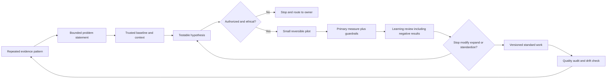
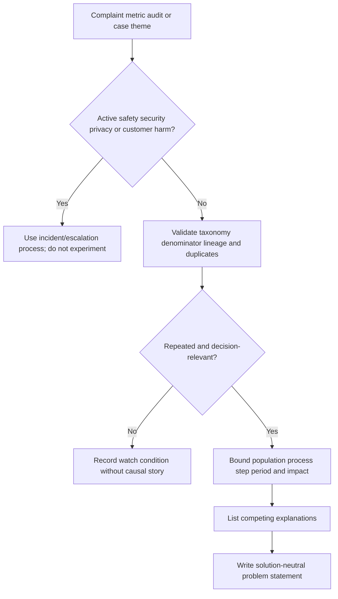
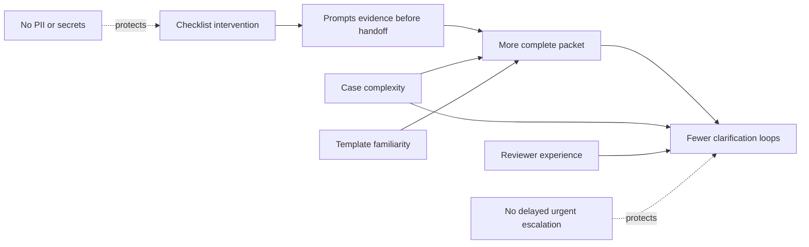
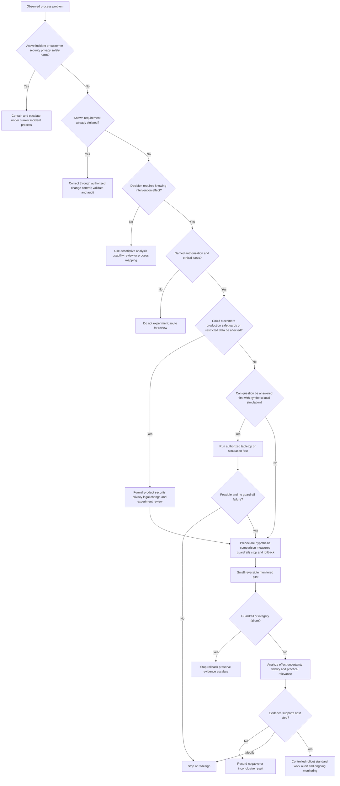
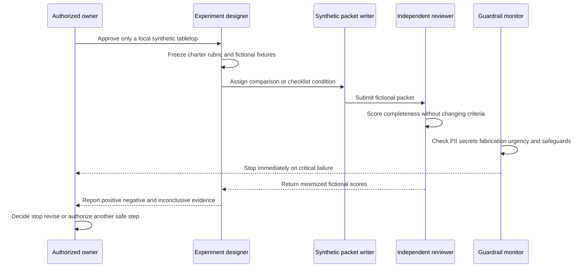
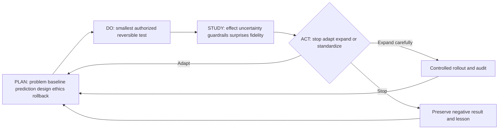
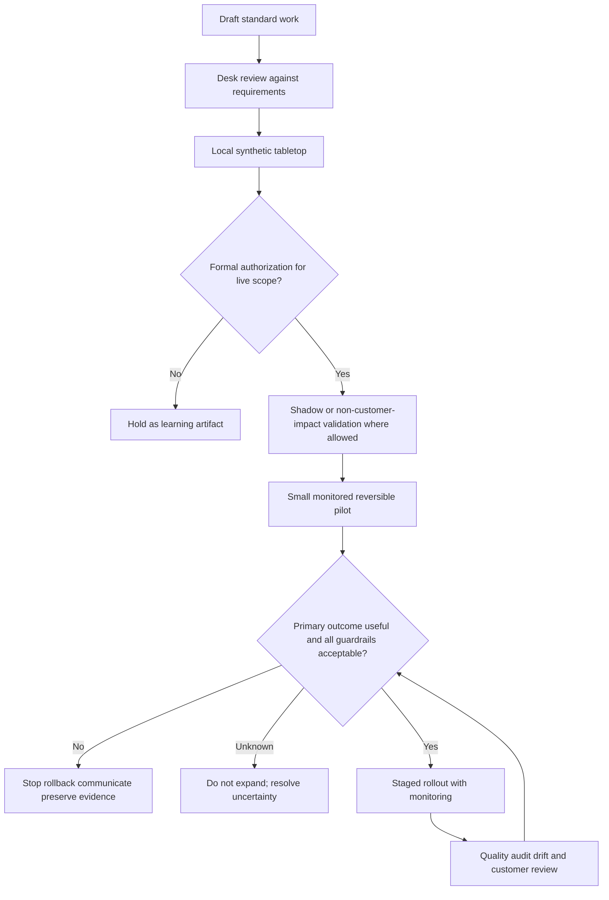
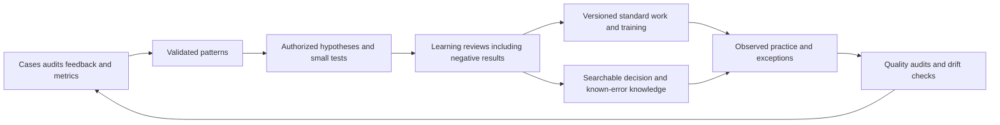
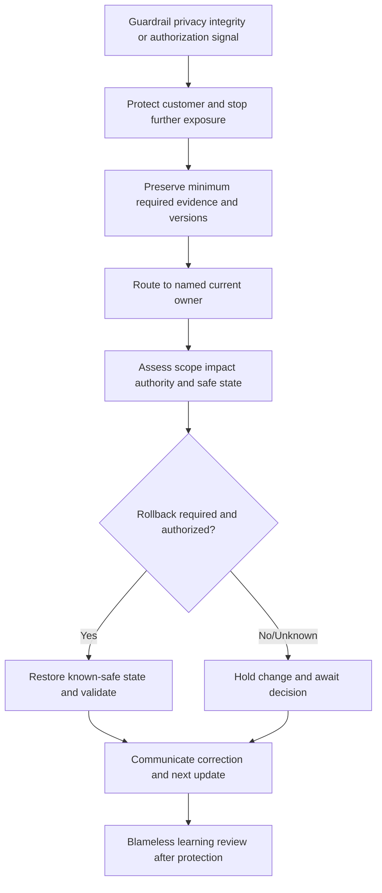
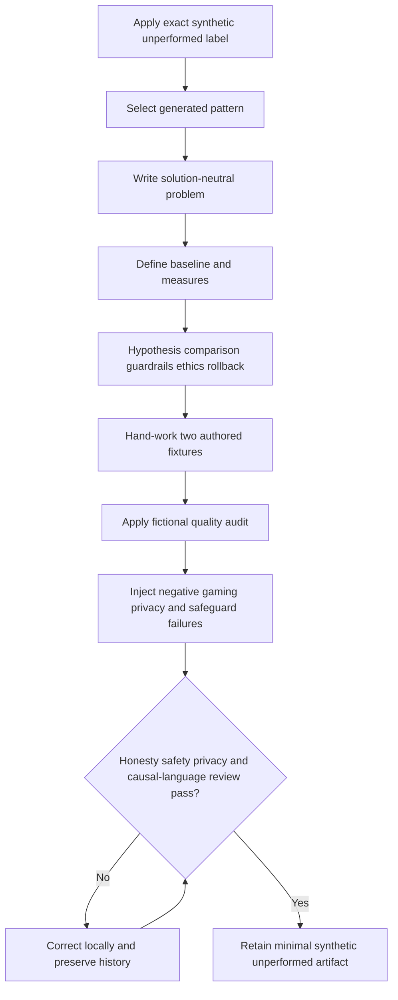

# Part 115 - Process Improvement Experiments and Operational Quality

> **Purpose:** Build a beginner-first, vendor-neutral method for turning recurring support patterns into bounded problem statements, trustworthy baselines, testable hypotheses, authorized interventions, ethical experiments, customer-first guardrails, quality audits, rollback-ready standard work, and continuous-learning reviews without overstating causality or hiding harm.
>
> **Artifact honesty label:** **Direct enterprise-support transfer for pattern recognition, CSAT, backlog, case-quality analysis, mentoring, knowledge/training work, escalation, and cross-functional improvement only where you can support the claim with a sanitized real example; learner-authored synthetic process-improvement experiment and quality-audit artifacts; local tabletop unperformed. No Abnormal AI process, experiment, audit, metric, customer, system, approval, safeguard, workflow, or result is known, used, changed, or claimed.** Every organization, queue, case alias, measurement, threshold, assignment, intervention, result, quality score, review, and decision below is fictional study material. Nothing in this Part authorizes experimenting on customers, changing production, handling customer data, or removing a safeguard.
>
> **Currency and official-source access date:** August 24, 2026.
>
> **Authored-Part state:** `PASS`. The master tracker was changed only after every deterministic gate passed.

## Section goal

Process improvement means changing how work is done so that a defined customer or operational outcome becomes more reliable. It is not the same as asking people to work harder, announcing a target, or copying a popular practice. A defensible improvement begins with a repeated **pattern**, converts that pattern into a bounded **problem statement**, measures a stable **baseline**, states a testable **hypothesis**, introduces a controlled **intervention**, protects customers with **guardrails**, and reviews both positive and negative evidence before deciding whether to stop, modify, expand, or standardize the change.

The everyday analogy is a restaurant trying to reduce incorrect takeaway orders. “Customers complain about mistakes” is a pattern, not yet a precise problem. The restaurant might define the problem as: “During the last four Friday dinner shifts, 12 of 120 audited takeaway bags lacked one item before handoff.” It can then test a bag-verification checklist on a small authorized shift while watching wait time, food temperature, staff workload, and customer complaints. If errors fall but food becomes cold, the intervention has not produced a safe overall improvement. The analogy stops where enterprise support may involve security incidents, contractual obligations, privacy, regulated data, customer access, employment policy, and changes that require formal owners.

The governing rule is:

> **Customer impact and ethics come first. Do not experiment on customers or production without explicit authorization, a justified design, informed owners, enforceable guardrails, a rollback path, and a plan for negative results.**

This Part deliberately separates four questions:

1. **Is there a pattern worth investigating?** Descriptive evidence can answer this.
2. **Is the process creating an important problem?** A bounded problem statement and baseline can answer this more carefully.
3. **Did an intervention cause an effect?** Only a suitable design, execution, analysis, and uncertainty assessment can support that conclusion.
4. **Should the organization adopt the intervention?** Customer impact, ethics, practical relevance, cost, operability, equity, safeguards, and ownership must join the statistical evidence.

## Required process-improvement labels

The following vocabulary is the contract for this Part. These are portable definitions, not Abnormal-specific policy.

| # | Required label | Beginner-first definition | Everyday analogy | Why it matters | Boundary to preserve |
|---:|---|---|---|---|---|
| 1 | **Pattern** | A repeated or structured observation across cases, time, categories, or process steps that is unlikely to be explained by one isolated anecdote alone. A pattern is a signal to investigate, not a cause. | Several buses arriving late on the same route and time block. | It helps teams look beyond one dramatic case while preserving the need for validation. | Repetition can come from changed tagging, reporting behavior, workload mix, or data defects. A pattern does not prove why it occurred. |
| 2 | **Problem statement** | A precise description of the gap between current and desired performance, including who or what is affected, where in the process, what evidence shows the gap, over which period, and why it matters. It excludes an assumed cause or favored solution. | “Eight of fifty inspected parcels from line B were missing labels this week,” not “workers need more training.” | It gives the team one bounded problem to solve and prevents a solution from being smuggled into the diagnosis. | Do not name a person as the problem, invent a target, or claim a cause before evidence supports it. |
| 3 | **Baseline** | A documented picture of current performance before the intervention, measured under stated definitions, population, period, source, and context. | Measuring the room temperature before changing the thermostat. | Without it, the team cannot distinguish change from what was already happening. | A baseline can be unstable, seasonal, biased, or measured differently from the follow-up. It is not automatically a control group. |
| 4 | **Hypothesis** | A testable prediction linking a specific intervention to a specific expected change, for a defined population and period, through an explained mechanism. It must be possible for evidence to contradict it. | “If we place the label printer beside packing, missing labels will decrease because staff no longer leave the station.” | It turns opinion into a question that evidence can challenge. | “This will improve quality” is too vague. A hypothesis is not a result, promise, or permission to act. |
| 5 | **Intervention** | The deliberate change introduced to influence a process or outcome, such as a checklist, routing rule, template, training, reminder, or review step. | Moving the printer is the intervention; fewer missing labels is the hoped-for effect. | The change must be described precisely enough to reproduce, monitor, and reverse. | An intervention that changes customer access, security behavior, production logic, or personal-data use needs appropriate authorization and risk review. |
| 6 | **Control or comparison** | A group, period, workflow, or condition used to estimate what might have happened without the intervention. A randomized control is strongest for many causal questions, but other comparisons can still be useful when their limits are explicit. | Comparing two similar garden plots when only one receives a new fertilizer. | It helps separate intervention effects from background change. | A historical baseline is not equivalent to a concurrent randomized control. Comparison groups can differ in case mix, time, staffing, or exposure. |
| 7 | **Confounder** | A third factor associated with both the intervention exposure and the outcome, making the intervention appear more or less effective than it truly is. | Umbrella use and traffic accidents both rise when it rains; rain confounds their association. | Naming confounders prevents premature causal stories. | Segmentation or regression may reduce some confounding but does not guarantee that all confounding is removed. |
| 8 | **Measure** | A defined observation used to assess process, outcome, balance, or implementation, including its population, numerator or unit, source, timing, and interpretation. | Counting mislabeled parcels under one inspection rule. | A hypothesis cannot be evaluated without a stable measurement contract. | A measure is not the goal itself. Definitions, missingness, sampling, and gaming risk must remain visible. |
| 9 | **Guardrail** | A measure and response rule that protects against unacceptable harm while a target measure is pursued. Guardrails can cover customer effort, safety, privacy, quality, reopen, delay, escalation appropriateness, equity, or system stability. | A temperature limit protects food while a restaurant tries to serve faster. | It prevents local optimization from damaging the larger outcome. | A guardrail without an owner, threshold, monitoring cadence, and stop action is only decoration. |
| 10 | **Pilot** | A deliberately small, time-bounded, monitored, and reversible introduction used to test feasibility, safety, implementation, and early evidence before wider adoption. | Trying a new boarding procedure at one gate for one authorized period. | A pilot limits blast radius and exposes operational problems. | “Pilot” does not reduce the need for authorization, ethics, privacy, change control, or rollback. A pilot may be too small to establish effectiveness. |
| 11 | **Experiment** | A planned comparison in which an intervention is assigned or introduced under a predeclared design to learn about its effect while measuring uncertainty and guarding against harm. | Testing two approved packaging layouts under comparable conditions. | Well-designed experiments can support causal inference more strongly than ordinary before/after observation. | Experimentation on customers, employees, security controls, or production is never implied permission. Assignment, consent or notice where required, authority, risk, data handling, and stopping rules control. |
| 12 | **Effect** | The observed or estimated difference in an outcome associated with the intervention, stated in an understandable unit such as minutes, percentage points, error count, or rate ratio. | The inspected error rate is 10 percentage points lower under one condition. | Effects communicate direction and magnitude. | An observed difference is not automatically caused by the intervention. Report the design, uncertainty, denominator, and alternatives. |
| 13 | **Statistical significance** | A property of an analysis indicating that, under a stated statistical model and assumptions, the observed result would be sufficiently unusual if a defined null hypothesis were true. It is often summarized with a p-value or interval. | A smoke alarm says the reading is unusual under its model; it does not tell you the size or importance of the fire. | It can help quantify random variation under the design. | It is not proof of cause, truth, importance, safety, or repeatability. Threshold shopping, repeated peeking, multiple testing, small samples, and violated assumptions can mislead. |
| 14 | **Practical relevance** | Whether the size, direction, tradeoffs, cost, feasibility, and customer impact of an effect are meaningful enough to change a real decision. | Saving two seconds may be measurable but irrelevant; preventing a dangerous omission may matter even when rare. | Operations must care about customer outcomes, not only mathematical thresholds. | A large effect can still be unethical or unsafe. A small average can hide important harm to a subgroup. |
| 15 | **Standard work** | The current approved, documented best-known way to perform a repeatable task, including purpose, steps, roles, inputs, decision points, safeguards, evidence, exceptions, escalation, version, and owner. | A preflight checklist that makes essential steps visible and repeatable. | It reduces avoidable variation and gives future improvement a stable reference point. | Standard work is not permanent, mindless, or permission to override judgment. Security, customer, accessibility, and exception paths remain active. |
| 16 | **Audit** | A systematic, evidence-based review of whether defined criteria were met for a declared sample and scope. | Inspecting a sample of completed forms against a published checklist. | It checks conformance, identifies process weaknesses, and tests whether standard work is actually usable. | An audit sample is not the whole population. Audit is not surveillance, blame, or a substitute for coaching, appeal, privacy, and reviewer calibration. |
| 17 | **Quality** | The degree to which work meets approved requirements and reliably produces accurate, safe, complete, timely, and customer-appropriate outcomes. | A repair is high quality when it is correct, safe, documented, and durable, not merely fast. | It keeps improvement anchored to the full customer outcome. | A single score cannot represent every dimension. Speed, satisfaction, conformance, and technical correctness are related but not interchangeable. |
| 18 | **PDSA and PDCA** | **PDSA** means Plan-Do-Study-Act: plan a change and predictions, try it at safe scale, study results against predictions, then act on learning. **PDCA** means Plan-Do-Check-Act and is often used for iterative management-system improvement. | Adjusting a recipe, tasting the result against a prediction, and updating the next batch. | Both prevent “launch and forget” by making learning cyclical. | Names and traditions differ; neither acronym authorizes risk or proves causal effect. “Study” should seek explanation, not merely check whether a target turned green. |
| 19 | **Rollback** | A preplanned method and decision rule for safely returning to the prior approved state or another known-safe state if the intervention fails, causes harm, or cannot be supported. | Keeping the previous software version and restore procedure ready during an update. | Reversibility reduces exposure and makes stop decisions executable. | A rollback can itself create risk or lose data. It needs an owner, prerequisites, validation, communication, and evidence-preservation plan. |
| 20 | **Learning review** | A structured, blameless review comparing predictions, observations, guardrails, implementation fidelity, surprises, negative results, and unresolved questions to decide what should change next. | Reviewing why a fire drill differed from the plan so the next drill is safer. | It turns both success and failure into reusable organizational knowledge. | It must not hide unfavorable evidence, rewrite the hypothesis after seeing results, or treat human error as the final explanation. |

### One-line memory hooks

| Term group | Memory hook |
|---|---|
| Pattern | Repeated signal, not proven cause. |
| Problem statement | Who, where, what gap, when, evidence, impact; no solution yet. |
| Baseline | Measure the starting ground with the same ruler. |
| Hypothesis | If change X, then outcome Y, because mechanism Z. |
| Intervention | Name the exact change, not the hoped-for result. |
| Control/comparison | What would likely happen without the change? |
| Confounder | A third factor can imitate an effect. |
| Measure/guardrail | Track the goal and protect the customer. |
| Pilot/experiment | Small tests feasibility; designed comparison tests effect. |
| Significance/relevance | Unlikely under a model is not the same as important. |
| Standard work/audit | Document the best-known method; inspect the process fairly. |
| PDSA/PDCA | Plan, try, learn, adjust. |
| Rollback | Know how and when to return to safety. |
| Learning review | Keep the surprise and the negative result. |

## JD Mapping

| Role signal from the master guide | Capability developed here | Your honest transfer | Evidence ceiling |
|---|---|---|---|
| Detect recurring support patterns | Converts case themes and metric movement into bounded problem statements | Enterprise support, backlog, CSAT, case-quality, and escalation pattern recognition where backed by a real Microsoft example | No claim about Abnormal queues, products, incidents, customers, or pattern frequency |
| Improve support processes | Designs a hypothesis, authorized intervention, pilot, guardrails, rollback, and learning review | Transfer from enterprise support improvement, KB/training, mentoring, and cross-functional work only within actual remembered scope | Written examples do not prove that you ran a controlled experiment in production |
| Maintain operational quality | Builds behavior-based standard work and a calibrated quality-audit plan | Direct case-quality and mentoring experience where supported by sanitized facts | No ownership of Abnormal's rubric, audit program, performance policy, or quality result |
| Collaborate with Product and Engineering | Packages evidence, alternatives, decision criteria, and negative results | Strong transfer from escalation, Engineering/Product partnership, and fix validation | A support pilot does not authorize product changes or establish product root cause |
| Protect customer trust | Makes customer impact, ethics, privacy, safety, access, and escalation appropriateness non-negotiable guardrails | Enterprise customer ownership and evidence handling transfer | No customer experiment, production change, or security-control decision is performed here |
| Use metrics responsibly | Distinguishes baseline, effect, significance, practical relevance, and causality | Part 114's direct CSAT/backlog/quality transfer and synthetic analytics provide a foundation | No invented Abnormal baseline, metric target, sample, statistical result, or causal outcome |
| Create repeatable operational knowledge | Converts validated learning into versioned standard work, audit criteria, and review cadence | KB, training, mentoring, and process-documentation transfer | No claim that the artifacts are approved, implemented, reviewed, or company standard |

## Candidate honesty note

Your strongest honest bridge is not “I know Abnormal's process.” It is: “I have worked in enterprise support where I used patterns, customer feedback, backlog evidence, case-quality review, knowledge, mentoring, escalation, and cross-functional investigation to improve support work.” You should use that sentence only if you can immediately provide a sanitized real example describing your role, the evidence you were authorized to use, the decision owner, the specific contribution you made, and the result you can support.

This Part adds written practice, not a production credential. You have not used Abnormal's operational data, run an Abnormal experiment, audited an Abnormal case, changed an Abnormal workflow, or observed an Abnormal result. The two worked experiments below use learner-authored fictional numbers and remain unperformed. Even if the arithmetic is internally consistent, it is not empirical evidence.

> “My prior enterprise-support experience gives me direct grounding in pattern recognition, CSAT, backlog and case-quality analysis, customer ownership, knowledge, mentoring, and cross-functional improvement. I have not operated Abnormal's process or data and do not know its experiment governance, quality rubric, safeguards, or change controls. To prepare, I authored a synthetic process-improvement charter, two worked fictional comparisons, a quality audit, an experiment decision tree, and a local tabletop design. None was run on customers or production. In the role, I would first learn the approved problem owners, metric contracts, risk review, privacy rules, authorization path, guardrails, rollback process, and quality standards.”

| Capability or artifact | Exact evidence label | Safe interview language | Claim to avoid |
|---|---|---|---|
| Microsoft patterns, CSAT, backlog, case quality, mentoring, KB/training, escalation, and collaboration | `DIRECT_PRODUCTION_TRANSFER` | “I can explain a sanitized real Microsoft example within my actual role and distinguish my contribution from the team's result.” | “I owned the full improvement program” unless that exact scope is true |
| Process-improvement experiment and quality audit in this file | `SYNTHETIC_WRITTEN_PORTFOLIO_COMPLETED_NOT_OPERATIONAL` | “I authored a vendor-neutral experiment charter and audit artifact using fictional data.” | “I ran the experiment, improved quality, or achieved the written effect.” |
| SignalBridge Lab 115 | `DESIGN_NOT_EXECUTED_NOT_TRANSFERRED` | “The local synthetic tabletop is designed but was not performed during authoring.” | Any trial, assignment, data collection, audit, review, implementation, or result claim |
| Abnormal processes, systems, customers, data, quality, controls, experiments, and results | `NO_DIRECT_EXPERIENCE_UNKNOWN_CONFIGURATION` | “I would learn and follow the current authorized process before proposing or testing a change.” | Any invented Abnormal control, target, failure rate, workflow, approval, audit score, or causal result |

## 1. From recurring patterns to useful problem statements

A pattern becomes actionable only after the team checks whether it is real, important, and within a process it can responsibly influence. One complaint can reveal severe harm and deserve immediate incident handling, but it cannot establish frequency. Conversely, a frequent low-severity issue can create large cumulative effort. Pattern detection therefore combines counts, rates, time, segments, qualitative evidence, data quality, and customer impact.

### Pattern qualification checklist

| Question | Evidence to seek | Why it matters | Unsafe shortcut |
|---|---|---|---|
| Is the observation repeated? | Multiple eligible cases, time points, audit items, or customer journeys | Separates recurrence from one anecdote | Counting duplicate records as independent cases |
| Is the taxonomy stable? | Versioned tags, definitions, classifier changes, and mapping | A new label can manufacture a trend | Assuming tag growth means issue growth |
| Is the denominator stable? | Eligible volume, channel mix, severity mix, and coverage | Counts often rise when demand rises | Comparing raw counts without opportunity volume |
| Is the source trustworthy? | Completeness, duplicates, timestamps, missingness, and lineage | Data defects can look like process defects | Building a change around an unreconciled dashboard |
| Is the impact meaningful? | Customer effort, delay, risk, repeat work, safety, contractual or security consequence | Frequency alone does not set priority | Choosing only what is easiest to measure |
| Are alternatives plausible? | Product change, seasonality, staffing, training, customer mix, policy, incident, or reporting change | Preserves competing hypotheses | Naming training as the cause immediately |
| Is urgent containment needed? | Active customer, security, privacy, safety, or widespread service impact | Improvement work must not delay incident response | Running an experiment during an uncontrolled incident |
| Is there an authorized owner? | Process owner, decision owner, data owner, and risk owner | Learning without authority cannot change a live system | Treating analyst access as change permission |

### Problem-statement template

Use this structure:

> **For [eligible population], at [process step/location], [defined gap] occurred [count/rate/distribution] during [period under stable measurement], compared with [approved expectation or prior reference], creating [customer/operational impact]. The cause is not yet established.**

| Weak statement | Why it is weak | Stronger bounded statement |
|---|---|---|
| “Agents are escalating too much.” | Blames people, assumes lower is better, omits population and impact | “In the fictional SupportLab sample, 9 of 20 synthetic API-authentication cases required a second handoff because the first packet lacked at least one required evidence field. The target and cause are not established.” |
| “We need a checklist.” | Starts with a solution before defining the problem | “Across four synthetic handoff exercises, required timeline and attempted-test fields were omitted in 8 of 20 baseline packets, increasing reviewer clarification steps.” |
| “Quality is down.” | Omits rubric, sample, period, dimension, and uncertainty | “Under fictional rubric version 1.0, 5 of 12 synthetic packets missed the problem-statement criterion; the convenience sample cannot represent a real team.” |
| “Training will reduce resolution time.” | States an untested cause and outcome | “Synthetic reviewers needed a median of 14 minutes to understand baseline packets; unclear ownership and missing evidence are candidate contributors.” |
| “Customers hate the process.” | Unsupported and emotionally broad | “No customer evidence exists in this exercise. A real organization would need authorized feedback and journey evidence before describing customer perception.” |

### 🔍 Plain-English deep-dive: A problem statement must not contain the answer

If a doctor writes “the patient has a vitamin deficiency caused by diet and needs supplements” before tests, several separate decisions have been collapsed: observed symptoms, diagnosis, cause, and treatment. Support improvement can make the same mistake. “Agents need training” may actually describe a confusing tool, missing permissions, unstable documentation, unclear ownership, or cases that legitimately require specialist escalation.

A solution-neutral statement preserves room for discovery. It says what is happening and why it matters, but leaves the cause open. That matters ethically because premature problem framing often directs pressure toward the least powerful participant: the frontline engineer or the customer. It also matters technically because an intervention can only be evaluated against a clearly measured gap.

Before accepting a statement, remove words such as “because,” “lazy,” “careless,” “resistant,” “obvious,” and the name of a favored tool. Ask whether the statement could still be true if the proposed solution failed. If not, it is probably a pitch rather than a problem definition.

## 2. Baselines, measures, and causal restraint

A baseline describes the starting process under a measurement contract. It should include central tendency, variation, volume, segments, missingness, and relevant context rather than one average. A four-week baseline may be reasonable for a stable high-volume workflow and useless for a seasonal low-volume issue. The duration must match the natural cycle of the work.

### Baseline contract

| Field | Beginner question | Synthetic example | Boundary |
|---|---|---|---|
| Decision | What might change after seeing the baseline? | Decide whether a handoff-packet intervention deserves an authorized tabletop pilot | No production decision is made here |
| Unit | What does one row represent? | One fictional support handoff packet | Not a person or customer |
| Population | Which rows are eligible? | Twenty synthetic API-authentication handoffs written from the same case template set | Cannot represent a real queue |
| Period | When and under what context? | Fictional baseline round B0 | Not a calendar claim or historical result |
| Primary measure | What outcome is closest to the problem? | Packets containing all five required evidence fields | Completeness is not full technical correctness |
| Process measure | Was the intervention actually used? | Checklist items visibly completed | Checkbox completion can be superficial |
| Guardrails | What must not worsen? | Drafting time, incorrect statements, unsafe data inclusion, missed urgent escalation | Any critical safeguard failure stops the exercise |
| Source | Where does evidence come from? | Learner-authored rows in this Markdown file | No ticket, CRM, telemetry, or customer source |
| Missingness | What is unknown? | No real customer outcome, downstream time, or production adoption | Unknown must not be filled with success |
| Segments | Which comparisons are defensible? | Two fictional packet templates | Tiny synthetic segments have no external meaning |
| Context | What else changed? | Nothing executed; values are authored for arithmetic practice | No causal claim is possible |

### Four measure types

| Measure type | Question | Example | Common mistake |
|---|---|---|---|
| Outcome measure | Did the customer or operational result improve? | Fewer clarification loops before an authorized handoff can proceed | Using internal checklist completion as proof of customer benefit |
| Process measure | Was the intended method used? | Required fields completed before submission | Assuming use means effectiveness |
| Balancing measure | Did another important outcome worsen? | Drafting time, customer effort, or necessary escalation delay | Optimizing completeness while slowing urgent response |
| Safety/ethical guardrail | Did an unacceptable event occur? | PII copied, safeguard bypassed, customer denied access, unsafe production change | Averaging a critical failure into an overall score |

The diagram is a **causal model**, meaning a drawing of the proposed mechanism and alternative influences. It is a thinking aid, not proof. The intervention might fail because users do not understand the fields, because the checklist duplicates another tool, or because clarification comes from genuine case complexity rather than missing information.

### Baseline stability checks

| Check | What to look for | Decision if it fails |
|---|---|---|
| Stable definition | Same eligibility, outcome, rubric, and event logic | Reconcile versions; do not connect the trend silently |
| Stable collection | Same source, sampling, reviewer behavior, and missing-data treatment | Label the break and rebuild a comparable period |
| Enough natural cycles | Weekdays, shifts, release periods, issue types, and low/high demand represented | Extend observation or narrow the claim |
| Visible variation | Distribution or run chart, not only mean | Investigate outliers and common versus special causes |
| No active incident distortion | Major outage, migration, policy change, or staffing event annotated | Handle incident first; do not generalize the baseline |
| Comparable follow-up | Outcomes have equal maturity windows | Delay conclusion until records mature |
| Privacy and minimum grain | Only authorized fields and safe aggregation | Stop and route to data/privacy owner |

### 🔍 Plain-English deep-dive: Statistical significance and practical relevance answer different questions

Imagine an approved experiment with one million routine events finds that a reminder saves an average of 0.2 seconds. The analysis might call the difference statistically significant because the sample is enormous and random noise is estimated to be small. That does not mean the improvement is operationally worth maintaining. The reminder could distract users, consume screen space, create accessibility problems, or make rare urgent cases slower.

Now reverse the situation. A tiny pilot observes that a new safety check prevented one severe omission. The result may not pass a conventional significance threshold because the event is rare and the sample is small. Yet the possible harm may justify further protected study or immediate control review. Practical relevance asks: How large is the effect in understandable units? Who benefits? Who may be harmed? Is the effect durable? What does implementation cost? Does it change an important customer outcome? Are there safer alternatives?

A **p-value** is commonly interpreted as the probability, under a specified null model and assumptions, of observing data at least as incompatible with that model as the data observed. It is not the probability that the hypothesis is true, the probability that the result happened by chance, or the size of the effect. A **confidence interval** gives a model-based range of effect values compatible with the data under a stated procedure; it is useful because it shows magnitude and uncertainty together. Neither rescues a biased design.

For this authored Part, no p-value or confidence interval is calculated. The fictional samples are too small and were written to teach arithmetic, not generated through an executed random process. Any statement of statistical significance would therefore be fabricated.

## 3. Hypotheses, interventions, comparisons, and authorization

A useful hypothesis names the change, population, outcome, direction, time, mechanism, and guardrails. It also states what evidence would make the team stop or reconsider.

### Hypothesis template

> **If [authorized population] uses [precisely versioned intervention] during [period], then [primary measure] will change from [baseline/reference] by [minimum practically relevant amount] compared with [control/comparison], because [mechanism], while [guardrails] remain within [predeclared rules]. We will stop or revise if [stopping criteria].**

| Component | Synthetic handoff example | Review question |
|---|---|---|
| Population | Fictional handoff packets built from generated scenarios | Is the population narrow and non-customer? |
| Intervention | Checklist version 0.1 with five required evidence fields | Can another reviewer reproduce the change? |
| Primary outcome | Complete packets out of eligible packets | Is completeness defined before results? |
| Minimum relevant effect | At least 15 percentage points in the hypothetical design | Who authorized this threshold in real work? Nobody here. |
| Comparison | Concurrent fictional no-checklist packets assigned from the same template pool | Could templates or authors differ? |
| Mechanism | Prompting before submission catches omitted evidence | Can process-use evidence test the mechanism? |
| Guardrails | No unsafe content, no false claims, no delayed critical escalation; drafting median not more than 5 minutes higher | Are stop rules executable? |
| Stop rule | Any PII/secret, safeguard removal, fabricated evidence, or unsafe instruction; pause if drafting delay exceeds boundary | Does the owner have authority to stop? |

### Choosing a comparison design

| Design | Beginner description | Strength | Major limitation | Appropriate use boundary |
|---|---|---|---|---|
| Randomized concurrent comparison | Eligible units are assigned by a predeclared random method to intervention or control at the same time | Often balances known and unknown factors better on average | Needs authorization, sufficient sample, contamination control, and ethical acceptability | Never randomize harmful access, security protection, or required support obligations |
| Cluster randomized comparison | Groups such as shifts or teams are assigned rather than individuals | Reduces workflow contamination | Groups can differ; effective sample size is closer to number of groups | Requires specialist design when few clusters exist |
| Stepped-wedge rollout | Authorized groups receive the change in a randomized or planned sequence until all receive it | Useful when eventual rollout is intended | Time trends and rollout learning can confound results | Not a reason to deploy an unproven risky change |
| Interrupted time series | Many observations before and after a known intervention point are compared | Can show level or trend changes | Other events at the same time can explain change | Needs stable definitions, enough time points, and annotated co-changes |
| Difference-in-differences | Change over time in an intervention group is compared with change in a comparison group | Removes some shared time effects | Relies on a credible parallel-trends assumption | Requires careful diagnostics and expertise |
| Matched observational comparison | Similar exposed and unexposed units are compared using measured characteristics | Useful when assignment cannot be controlled | Unmeasured confounding remains | Supports bounded association unless assumptions are unusually strong |
| Before/after pilot | Same process is measured before and after a change | Simple and good for feasibility learning | Regression to mean, seasonality, novelty, and other changes remain | Do not claim causality from this alone |
| Simulation/tabletop | Generated cases are processed under alternative methods | Safe for usability, clarity, and failure injection | Cannot establish real customer or production effect | This is the only design actually represented in this authored artifact, and it remains unperformed |

### Authorization and ethical review

Before any real experiment, ask who can authorize the intervention, data, assignment, communication, customer impact, employee impact, security effect, and publication. “My manager liked the idea” may be insufficient. Depending on the context, owners may include support operations, Product, Engineering, Security, Privacy, Legal, Compliance, Data Governance, Accessibility, Customer Success, Human Resources, change management, and a formal research or ethics review body.

| Ethical question | Required answer before proceeding | Stop condition |
|---|---|---|
| Customer impact | What experience changes, and can any customer receive worse support, less access, delay, confusion, or risk? | Harm is plausible and not acceptably controlled |
| Authorization | Which named role approved the design, population, intervention, data, and stop rules? | Authority is absent, ambiguous, or outside scope |
| Equipoise | Is there genuine uncertainty about which allowed option is better? | A group would knowingly receive inferior or unsafe treatment |
| Consent/notice | Is consent, notice, opt-out, contract review, or another basis required? | Required customer or participant protection is missing |
| Privacy | Is the minimum data lawful, authorized, purpose-limited, retained appropriately, and access-controlled? | PII, secrets, restricted content, or cross-customer data enters an unapproved path |
| Security | Could the change remove, weaken, delay, bypass, or obscure a safeguard? | Any unapproved safeguard change or unsafe production action |
| Equity/accessibility | Could a segment face worse access, language support, disability impact, or delay? | Unassessed or unacceptable disparate harm |
| Independence | Who can stop the experiment when the delivery owner is invested in success? | No credible stop authority or conflict review |
| Transparency | Will negative, null, and adverse results be retained and reported? | Sponsor expects only favorable reporting |
| Rollback | Can the prior safe state be restored and verified? | Reversal is impossible or untested for the risk level |

## 4. Experiment decision tree

The decision tree is deliberately conservative. A process owner should first decide whether the question needs an experiment at all. Many issues should be fixed directly because they violate a known safety requirement; others need observation, usability testing, or an incident response rather than causal experimentation.

### Decision-tree examples

| Situation | Correct branch | Why | What not to do |
|---|---|---|---|
| A required privacy review is missing from a workflow | Known requirement violated | Restore conformance through authorized change control | Randomize some customers to receive no privacy review |
| A dashboard suggests handoffs are increasing | Observe and validate first | Taxonomy, demand, and routing changes may explain it | Launch training and claim it fixed the cause |
| A template's wording is confusing in a local mock | Synthetic simulation | Usability can be tested without customer exposure | Send alternate text to customers without approval |
| A security safeguard may cause false positives | Formal review | Customer and security consequences require accountable owners | Disable the safeguard for an informal test |
| A checklist may improve fictional packet completeness | Tabletop first | Generated cases can test clarity and timing | Treat authored values as an experiment result |
| Guardrail worsens during an authorized pilot | Stop/rollback/escalate | Customer protection outranks the headline metric | Continue until statistical significance appears |

## 5. Artifact - process-improvement experiment

**Artifact state:** `SYNTHETIC_WRITTEN_PORTFOLIO_COMPLETED_NOT_OPERATIONAL`.

### Experiment 115-A - handoff completeness tabletop

**Scenario boundary:** `SupportLab`, `Queue-A`, `Queue-B`, every packet, issue, omission, time, score, result, assignment, reviewer, and decision below is fictional. The comparison was not executed. The numbers were authored to demonstrate a calculation and therefore cannot establish statistical significance, practical success, or causal effect.

#### Improvement charter

| Charter field | Learner-authored specification |
|---|---|
| Pattern | Synthetic handoff packets repeatedly omit timeline, attempted-test, expected/actual, impact, or next-question fields |
| Problem statement | In the fictional baseline fixture, 8 of 20 handoff packets are incomplete under rubric 1.0, creating one or more fictional clarification loops; no real process or cause is represented |
| Aim | Learn whether checklist version 0.1 is clear enough to justify a future authorized local tabletop, not to set a company target |
| Hypothesis | If generated packet writers use checklist 0.1, the authored completeness rate will be at least 15 percentage points higher than a fictional concurrent comparison because prompts make omissions visible |
| Intervention | A five-field pre-handoff checklist plus explicit “unknown/not collected” option and urgent-escalation bypass instruction |
| Comparison | Twenty fictional no-checklist packets versus twenty fictional checklist packets from the same conceptual template pool |
| Primary measure | Complete packets / eligible packets under fictional rubric 1.0 |
| Process measure | Checklist visibly addressed / intervention packets |
| Balancing measure | Median fictional drafting minutes |
| Critical guardrails | Zero PII/secrets; zero fabricated evidence; zero delayed urgent escalation; zero safeguard removal |
| Stop rule | Any critical guardrail event; or hypothetical median drafting delay more than 5 minutes above comparison pending owner review |
| Rollback | Remove checklist 0.1 from the fictional exercise, return to prior template, retain versioned evidence, and review the failure |
| Authority | None; written portfolio only; no real use is authorized |
| Analysis | Hand arithmetic only; no executed random assignment, inferential statistics, customer outcome, or production measurement |

#### Authored fixture and worked arithmetic

The following is a summary fixture rather than a claim of observed output.

| Condition | Eligible fictional packets | Complete packets | Incomplete packets | Median drafting minutes | Clarification loops | Critical guardrail events |
|---|---:|---:|---:|---:|---:|---:|
| Comparison: no checklist | 20 | 12 | 8 | 11 | 10 | 0 |
| Intervention: checklist 0.1 | 20 | 17 | 3 | 14 | 5 | 0 |

Hand-worked descriptive calculations:

| Quantity | Calculation | Fictional value | Responsible interpretation |
|---|---|---:|---|
| Comparison completeness | $12/20$ | $60\%$ | Authored starting rate in the fixture only |
| Intervention completeness | $17/20$ | $85\%$ | Authored intervention-condition rate only |
| Absolute difference | $85\%-60\%$ | $+25$ percentage points | Descriptive difference, not demonstrated causal effect |
| Relative difference | $(85\%-60\%)/60\%$ | $+41.7\%$ | Sensitive to the comparison denominator; less intuitive than percentage points |
| Incompleteness reduction | $(40\%-15\%)/40\%$ | $62.5\%$ relative reduction | An attractive fictional number that must not be called a real improvement |
| Drafting-time difference | $14-11$ minutes | $+3$ minutes | Within the fictional 5-minute review boundary, but customer relevance is unknown |
| Clarification-loop difference | $5-10$ | $-5$ loops | Authored association; packet complexity and reviewer behavior are uncontrolled |
| Critical guardrails | $0-0$ | No authored difference | Zero in forty fictional rows does not establish real safety |

#### Interpretation and decision

The fixture is compatible with the hypothesis, but that phrase does not mean the hypothesis was tested. The values were chosen by the author; there was no actual assignment, exposure, behavior, sampling process, reviewer, or uncertainty. Even in a real small experiment, the team would need to inspect allocation, missing rows, implementation fidelity, rubric consistency, contamination, confidence intervals, and guardrails.

**Portfolio decision:** `REVISE_BEFORE_ANY_FUTURE_AUTHORIZED_TABLETOP`. Checklist 0.1 should add examples for “unknown” versus “not applicable,” an explicit note that urgent escalation must never wait for completion, and a field-level privacy reminder. This decision improves the written design; it is not an operational recommendation.

### Experiment 115-B - standard-work retrieval simulation

The second worked example shows why a faster process can still fail quality.

| Charter field | Learner-authored specification |
|---|---|
| Problem | Fictional engineers spend variable time locating the current handoff standard in a mock document set |
| Hypothesis | A versioned index will reduce authored median retrieval time by at least 2 minutes without increasing selection of obsolete guidance |
| Intervention | One local index naming owner, effective date, current version, superseded version, and exception route |
| Comparison | Fictional unindexed folder condition |
| Primary measure | Minutes to identify the current standard |
| Quality guardrail | Correct current version selected |
| Safety guardrail | No external link, customer data, secret, executable action, or production instruction |
| Stop/rollback | Remove the index if it points to an obsolete document; restore prior local fixture and correct lineage |

| Condition | Fictional tasks | Retrieval minutes, authored values | Median | Correct version | Obsolete version selected |
|---|---:|---|---:|---:|---:|
| Unindexed | 8 | 3, 4, 5, 5, 6, 7, 8, 10 | $5.5$ | 6/8 | 2/8 |
| Indexed | 8 | 1, 2, 2, 2, 3, 3, 4, 4 | $2.5$ | 7/8 | 1/8 |

The authored median difference is $2.5-5.5=-3$ minutes. The written hypothesis threshold is met in the fixture, but one indexed task still selects obsolete guidance. That guardrail defect matters more than the attractive speed result. The correct written decision is **do not standardize yet**. Repair the index's version-resolution rule, inject duplicate titles and stale links, then repeat only an authorized local simulation. This example illustrates practical relevance: a three-minute improvement cannot justify directing someone to outdated or unsafe work.

### 🔍 Plain-English deep-dive: A before-and-after chart is not a time machine

Suppose quality rises after a checklist launches. The checklist may have helped, but the calendar did not freeze. Case mix may have become easier, a product defect may have been fixed, experienced staff may have joined, a high-volume incident may have ended, auditors may have changed, or people may have improved merely because attention increased. **Regression to the mean** can also matter: unusually poor periods often move closer to normal even without intervention.

A comparison tries to estimate the missing world in which the same eligible work happened without the change. That missing world is called the **counterfactual**. It can never be observed for the same unit at the same moment, so design matters. Random assignment can make groups more comparable on average, but it does not fix poor measurement, noncompliance, spillover, attrition, or unethical exposure. A historical comparison is easier but leaves more alternative explanations.

The safe language ladder is:

| Evidence | Safer statement | Statement to avoid |
|---|---|---|
| Pattern only | “Incomplete packets recur in this defined sample.” | “The process causes delays.” |
| Before/after observation | “Completeness was higher after introduction, alongside other possible changes.” | “The checklist drove the increase.” |
| Authorized randomized design with sound execution and uncertainty | “Assignment to the checklist condition increased completeness by the estimated amount in this population under these conditions.” | “The checklist always works.” |
| Authored synthetic numbers in this Part | “The fixture demonstrates how to calculate a descriptive difference.” | “The experiment improved quality by 25 points.” |

## 6. Artifact - operational quality audit

**Artifact state:** `SYNTHETIC_WRITTEN_PORTFOLIO_COMPLETED_NOT_OPERATIONAL`.

An operational quality audit asks whether a process and its work products conform to approved criteria. It should improve the system, not create a public ranking. The unit may be a case, handoff, update, escalation packet, knowledge article, or process instance. The rubric must describe observable behavior and allow “not applicable” where justified.

### Audit design card

| Field | Synthetic specification | Boundary |
|---|---|---|
| Audit purpose | Identify whether fictional handoff standard 0.1 is clear and complete enough for another tabletop revision | Not employee evaluation or company assurance |
| Population | Twelve generated handoff packets H01-H12 | No real case or person |
| Sample | All twelve authored packets for the exercise | A census of the fixture, not a real population |
| Rubric | Version 1.0 with ten behavior-based criteria | Not an Abnormal rubric |
| Reviewer | Fictional independent-review role | No review was performed |
| Scoring | Met, not met, or not applicable with evidence note | No weighted person score |
| Critical fail | PII/secret, fabricated evidence, unsafe instruction, safeguard bypass, or missed urgent escalation | Any one stops the exercise |
| Calibration | Future reviewers would score the same two examples, compare differences, and clarify criteria before main review | No calibration occurred |
| Appeal/correction | Preserve original score, evidence, rationale, correction, and rubric version | No employment or disciplinary use |
| Reporting | Aggregate criterion results plus process themes; aliases only | Do not publish individual leaderboard |

### Quality rubric

| # | Criterion | Met when | Not met when | Critical? |
|---:|---|---|---|---|
| 1 | Problem statement | Symptom, scope, time, expected/actual, and uncertainty are clear | A solution or accusation replaces the observed problem | No |
| 2 | Customer impact | Known impact and unknowns are separated without exaggeration | Impact is absent, minimized, or invented | No |
| 3 | Timeline | Relevant events use consistent timestamps and sources | Sequence is missing or unsupported | No |
| 4 | Attempted tests | Test, reason, result, and interpretation are recorded | Actions are listed without outcomes or repeated unsafely | No |
| 5 | Evidence minimization | Only necessary sanitized evidence is included | Unnecessary unrestricted content is copied | Yes if PII/secret/restricted data appears |
| 6 | Hypotheses | Competing explanations and next discriminator are stated | One favored cause is presented as fact | No |
| 7 | Ownership and question | Current owner and exact requested decision are explicit | Packet is thrown “over the wall” | No |
| 8 | Urgency and escalation | Critical route is not delayed for packet perfection | Checklist blocks or suppresses required escalation | Yes |
| 9 | Claim safety | Production, cause, approval, and result claims match evidence | Fictional, learned, or uncertain evidence is presented as real | Yes |
| 10 | Safeguard preservation | No security, privacy, validation, access, or review safeguard is removed | Packet instructs bypass or unsafe change | Yes |

### Authored audit summary

The table below contains fictional criterion counts. It is not the output of an audit that occurred.

| Criterion | Applicable packets | Met | Not met | Authored conformance | Interpretation boundary |
|---|---:|---:|---:|---:|---|
| Problem statement | 12 | 7 | 5 | $58.3\%$ | Suggests the wording criterion needs examples in the fixture; no team conclusion |
| Customer impact | 12 | 9 | 3 | $75.0\%$ | Missing impact may mean unknown, not low impact |
| Timeline | 12 | 8 | 4 | $66.7\%$ | Authored timestamps do not model real source reliability |
| Attempted tests | 12 | 7 | 5 | $58.3\%$ | The rubric may need a test/result example |
| Evidence minimization | 12 | 12 | 0 | $100\%$ | Generated aliases make this easy; does not establish real privacy safety |
| Hypotheses | 12 | 6 | 6 | $50.0\%$ | Candidate training need and rubric ambiguity are both plausible |
| Ownership and question | 12 | 10 | 2 | $83.3\%$ | No real handoff acceptance was measured |
| Urgency and escalation | 12 | 12 | 0 | $100\%$ | No real urgent case exists; zero fixture failures is not assurance |
| Claim safety | 12 | 11 | 1 | $91.7\%$ | One fictional packet overstated cause; written artifact should be corrected |
| Safeguard preservation | 12 | 12 | 0 | $100\%$ | No production control was available to change |

### Findings and corrective learning

| Finding | Evidence in fixture | Competing explanations | Proposed safe next step | Owner/status |
|---|---|---|---|---|
| Problem statements often embed cause | 5 of 12 authored packets fail criterion 1 | Template wording, author habit, or unclear rubric example | Add side-by-side symptom/cause examples to local rubric 1.1 | Learner; written revision only |
| Attempted tests lack interpretations | 5 of 12 fail criterion 4 | Rubric asks for actions but not “so what”; fixture intentionally injects omissions | Add `test -> result -> interpretation -> next` structure | Learner; unperformed |
| Competing hypotheses are weak | 6 of 12 fail criterion 6 | Generated scenarios may not contain enough evidence; criterion may be too broad | Add “at least two plausible explanations or explain why only one remains” | Learner; unperformed |
| Claim safety defect appears | 1 of 12 fails criterion 9 | Ambiguous phrase “proved the cause” | Replace with bounded association language and add causal-language review | Learner; correct artifact before reuse |
| Critical criteria show no fixture failures | 0 of 48 critical opportunities fail | Synthetic data and easy examples; not evidence of control effectiveness | Inject safe fictional critical-failure cases in a future local tabletop | Not authorized or executed |

### Audit sampling and reviewer calibration

In real operations, auditing every case may be impossible and unnecessary. A **random sample** gives each eligible unit a known chance of selection and can support population estimates under its design. A **risk-stratified sample** deliberately includes categories such as high severity, new workflow, sensitive data, or reopened cases. The two serve different purposes. A quality report can present a random estimate and a separate risk sample; it should not blend them into one unlabeled rate.

| Sampling method | Useful for | Bias or limitation | Reporting requirement |
|---|---|---|---|
| Simple random | General conformance estimate | Rare critical categories may be missed | Population, frame, random method, sample size, uncertainty |
| Stratified random | Comparable representation across important groups | Requires correct strata and weighted aggregation | Stratum population, selection, weights, and group uncertainty |
| Risk-based | Finding dangerous failure modes | Intentionally not representative | Never publish as overall failure rate |
| Convenience | Fast formative review | Easy or available work dominates | Label as exploratory; no population claim |
| Triggered review | Investigating reopens, complaints, or incidents | Selection depends on adverse outcome | Useful for learning, not ordinary quality rate |

### 🔍 Plain-English deep-dive: An audit score can measure the rubric as much as the work

Two reviewers can read the same update and disagree about whether it shows empathy or whether a test result is sufficiently explained. That disagreement is not automatically reviewer failure. The criterion may be vague, the evidence may be incomplete, or the score choices may combine several behaviors.

**Calibration** means reviewers score shared examples, compare reasoning, clarify the rubric, and repeat until differences are understood. Agreement can be reported with a simple percent or a statistic that accounts for chance, but no agreement number makes a poor rubric valid. Reviewers also need a correction and appeal path because audits can influence coaching and trust.

Quality should usually be decomposed into behavior-based dimensions. A technically correct diagnosis can still expose private data; a warm message can still be technically false; a fast closure can still leave the customer unresolved. Critical safeguards should not be averaged away. For example, a packet that scores 95 out of 100 but includes a secret is not “excellent with one small deduction.” It is a stop-and-escalate event.

## 7. PDSA/PDCA, rollback, standard work, and continuous learning

PDSA and PDCA both frame improvement as a loop. This Part uses **PDSA** when emphasizing predictions and learning from a small test, and **PDCA** when emphasizing conformance and management-system control. The organization may use different terminology; the underlying discipline matters more than the label.

| Stage | PDSA learning questions | PDCA control questions | Required evidence |
|---|---|---|---|
| Plan | What do we predict, why, for whom, and what would surprise us? | What requirement, objective, process, owner, and risk apply? | Problem, baseline, hypothesis, design, guardrails, authorization, rollback |
| Do | What happened when the smallest safe test was attempted? | Was the approved process implemented as planned? | Assignment/exposure, fidelity, deviations, incidents, timestamps, versions |
| Study/Check | How do results compare with predictions and alternatives? | Does evidence conform to requirements and targets? | Effect magnitude, uncertainty, guardrails, audit, qualitative evidence, negative results |
| Act | Stop, adapt, test again, or expand? | Correct, standardize, control, and monitor? | Decision, owner, rationale, changes, standard work, future review |

### Standard-work package

| Element | What it contains | Why it matters | Drift signal |
|---|---|---|---|
| Purpose and scope | Task, population, objective, and exclusions | Prevents use outside the validated context | Work appears in an untested queue or product |
| Preconditions | Required access, data, training, approvals, and safe state | Stops unsupported execution | Steps begin without authority or evidence |
| Roles | Doer, reviewer, approver, escalation owner, and rollback owner | Makes accountability explicit | Everyone assumes someone else owns the stop decision |
| Steps and decisions | Observable sequence with branches and expected evidence | Enables repeatability and audit | Workarounds become undocumented defaults |
| Safeguards | Security, privacy, accuracy, accessibility, and customer protections | Prevents speed from weakening trust | Safeguard treated as optional to meet target |
| Exceptions | Conditions that require judgment, skip, or alternate route | Standard work must handle reality | Staff hide exceptions to appear compliant |
| Escalation | Trigger, route, packet, urgency, and continued ownership | Prevents delayed risk handling | High-impact work waits for checklist perfection |
| Rollback | Trigger, steps, verification, owner, and communication | Makes reversal executable | No one can restore the prior state |
| Measures | Outcome, process, balance, safety, data quality, and review cadence | Detects benefit and harm | Only headline metric is monitored |
| Version control | Owner, effective date, change reason, superseded versions, and approvals | Prevents obsolete guidance | Multiple “final” copies circulate |
| Training and verification | Audience, practice, observed competence, and support | Publication alone is not adoption | People acknowledge reading but cannot apply it |
| Learning channel | How users report ambiguity, defects, exceptions, and ideas | Keeps the standard improvable | Workarounds spread outside review |

### Rollout and rollback ladder

### Rollback card

| Field | Required content | Synthetic checklist example |
|---|---|---|
| Trigger | Objective event or owner decision that requires stop | Any PII/secret, delayed urgent escalation, obsolete guidance, or safeguard bypass |
| Authority | Who may invoke rollback immediately | In real work, named accountable owner; none exists here |
| Known-safe state | Exact prior version and dependencies | Fictional handoff template 0.0 |
| Procedure | Ordered reversal steps with permissions | Remove local checklist reference and restore version pointer |
| Data treatment | Preserve evidence while preventing further exposure | Retain generated aggregate only; delete unnecessary local drafts |
| Validation | How to prove service/process returned safely | Confirm current pointer, exception path, and no live integration |
| Communication | Audience, impact, status, next update, and owner | Written local decision note only |
| Post-rollback review | What failed, who learns, and what blocks reintroduction | Learning review before another tabletop version |

### Learning review template

| Prompt | Strong response characteristic |
|---|---|
| What did we predict? | Quotes the frozen hypothesis and minimum relevant effect |
| What actually happened? | Reports all planned outcomes, guardrails, missingness, deviations, and adverse events |
| Was the intervention delivered as designed? | Measures fidelity and contamination rather than assuming exposure |
| What surprised us? | Includes null, negative, subgroup, usability, and operational findings |
| Which alternatives remain? | Names confounders, co-changes, selection, measurement, and chance |
| What did customers experience? | Uses authorized evidence and explicitly states unknowns |
| Did anyone face disproportionate harm? | Reviews access, accessibility, language, region, severity, and other approved dimensions |
| What decision follows? | Stop, modify, repeat, stage, or standardize with owner and rationale |
| What becomes standard knowledge? | Versions the artifact and marks scope, evidence strength, and expiration/review date |
| What must never be hidden? | Negative result, guardrail breach, excluded row, conflict, correction, or failed assumption |

### 🔍 Plain-English deep-dive: A failed experiment is useful only when the organization keeps the truth

A null or negative result can save future teams from repeating an ineffective change. That value disappears if the result is hidden, reworded as success, or blamed on users without evidence. **Publication bias** occurs when positive results are more likely to be shared than negative ones. Inside an operations team, the equivalent is a slide deck that reports the improved headline but omits the worsened guardrail.

Predeclaring the primary measure, minimum relevant effect, exclusions, analysis, and stop rules makes later rewriting harder. Versioned decision logs should retain the original hypothesis, deviations, raw authorized evidence references, correction history, and rationale. This is not bureaucracy for its own sake; it is how the next reviewer can tell whether the organization learned or merely marketed a change.

A blameless review does not mean consequence-free or vague. It asks how system conditions, tools, incentives, workload, documentation, training, approvals, and defenses shaped behavior. Deliberate concealment, unsafe action, or policy violation still follows the appropriate process. The review simply avoids ending at “someone made a mistake,” because that sentence does not improve the system.

## 8. Failure modes, metric gaming, and escalation

### Common failure modes

| Failure mode | Why it happens | Harm | Prevention or detection | Required response |
|---|---|---|---|---|
| Experimenting on customers without authorization | Improvement is mistaken for harmless routine work | Unequal service, trust loss, contractual, legal, privacy, security, or safety exposure | Named authority, ethical review, change control, customer-impact assessment | Stop; protect customers; preserve minimal evidence; escalate |
| Unsafe production change disguised as pilot | Small scope is assumed to mean low risk | Outage, incorrect security behavior, data loss, or inconsistent service | Environment and change-class validation; formal rollback | Do not deploy; route to authorized change owner |
| Safeguard removal to improve speed | Guardrail is seen as friction | Security, privacy, accuracy, access, or review failure | Critical controls listed as non-negotiable | Stop and escalate immediately |
| PII or secrets copied into analysis | Real examples feel more persuasive | Data exposure and unauthorized secondary use | Synthetic-first design, minimization, approved environment, content scanning | Stop processing/sharing and route under current policy |
| Negative result hidden | Sponsor or team wants a success story | Ineffective or harmful practice spreads | Frozen protocol, result registry, independent review, complete reporting | Correct record and escalate integrity concern as appropriate |
| Metric gaming | Incentive rewards the measure rather than outcome | Customers are closed early, rerouted, denied contact, or underreported | Guardrails, denominator audits, qualitative review, no simplistic leaderboard | Pause target/incentive and investigate neutrally |
| Hypothesis written after results | Story is fitted to observed noise | False confidence and non-replicable claims | Timestamped protocol and analysis plan | Label exploratory and require new confirmation |
| Multiple outcomes searched for one win | Many chances create a likely false positive | Cherry-picked conclusion | Predeclare primary outcome; correct for multiplicity with expertise | Report all tests and downgrade conclusion |
| Repeated peeking and early stopping for success | Team checks until a favorable threshold appears | Inflated false-positive risk | Predeclared monitoring/stopping method | Seek statistical review; do not claim significance |
| Underpowered pilot | Sample is too small for the promised inference | Null called failure or noisy win called proof | Power/sensitivity planning and minimum effect | Restrict pilot to feasibility or extend only with approval |
| Regression to mean | Work starts after an unusually bad period | Natural recovery credited to intervention | Concurrent comparison and longer baseline | Use cautious association language |
| Seasonality or incident ending | Time changes with the intervention | Before/after difference is misattributed | Annotate releases, incidents, demand, staffing, and calendar | Reanalyze or redesign |
| Selection bias | Easier or more willing units enter intervention | Effect does not generalize | Eligibility reconciliation and assignment integrity | Report selection and narrow population claim |
| Attrition or missing outcomes | Difficult cases disappear from follow-up | Denominator becomes favorable | Follow every eligible assignment and report missingness by group | Stop claim if missingness threatens validity |
| Contamination or spillover | Control group adopts parts of intervention | Difference shrinks or mechanism becomes unclear | Cluster design, exposure measurement, and process review | Report contamination; adjust conclusion/design |
| Novelty/Hawthorne effect | Attention temporarily changes behavior | Early gains fade | Longer follow-up and implementation monitoring | Do not standardize from short excitement alone |
| Rubric drift | Reviewers reinterpret quality criteria | Apparent trend is measurement change | Versioning, calibration, overlap sample | Reconcile versions before comparison |
| Audit used to punish individuals | Quality program becomes surveillance | Fear, concealment, unfair employment action, reduced escalation | Process-level reporting, fair policy, appeal, privacy, calibrated sample | Route to quality/HR/privacy/ethics owners as applicable |
| Statistically significant but trivial | Large sample detects tiny difference | Cost and complexity exceed value | Minimum practical effect and customer decision analysis | Do not adopt on p-value alone |
| Large average hides harmed subgroup | Overall result looks positive | Vulnerable or important group is worse off | Predeclared ethical segments and guardrails | Stop or modify; investigate harm |
| No rollback | Team assumes improvement cannot fail | Harm persists while ownership is debated | Tested rollback card and stop authority | Do not pilot until reversible or formally accepted |
| Standard work ossifies | Documentation becomes unquestionable | Obsolete steps and workarounds accumulate | Review date, feedback channel, exception audit | Revise or retire through control process |
| Causal language exceeds design | Desire for a simple story | Wrong investment, blame, and false customer claim | Evidence-language ladder and independent review | Correct communication and decision record |

### Experiment integrity and customer-impact escalation

| Trigger | Immediate action | Route to current authorized owner | Minimum packet | Never claim |
|---|---|---|---|---|
| Customer was exposed without approved design | Stop further exposure and protect active customer | Incident, support, experiment, legal/privacy, and leadership owners as policy requires | What changed, who/what may be affected, time, current state, actions taken | No harm occurred because no complaint exists |
| PII, secret, message content, credential, tenant or restricted data appears | Stop copying, sharing, or analyzing; preserve only as required | Security/privacy/data incident owner | Data class, source, destination, access, time, containment | A breach determination without authority |
| Production or safeguard change is proposed outside change control | Do not execute | Product/Engineering/Security/change owner | Proposed change, reason, environment, blast radius, safer alternative | Pilot language makes it authorized |
| Guardrail crosses stop threshold | Pause assignment/exposure and invoke rollback | Process owner, customer owner, risk owner | Target and guardrail data, affected scope, timeline, deviations | Headline benefit outweighs the stop rule |
| Required escalation may be delayed by intervention | Bypass the experiment and escalate the case | Case/incident/security owner | Impact, urgency, evidence, current blocker | Checklist completion is more important than protection |
| Negative or adverse result is omitted | Freeze decision and restore complete record | Experiment owner, quality/ethics/leadership as appropriate | Protocol, omitted result, audiences, decisions affected, correction | Omission was harmless because the primary metric improved |
| Assignment or data integrity fails | Stop causal analysis; preserve allocation and lineage | Analytics/experiment/data owner | Eligibility, assignment, exposure, missingness, contamination | Groups remain comparable without checking |
| Statistical claim exceeds expertise or plan | Downgrade to descriptive evidence | Qualified analytics/statistics reviewer | Protocol, analysis, sample, assumptions, multiplicity, uncertainty | A p-value proves the intervention works |
| Audit identifies critical fail | Stop affected process step where authorized and protect customer | Quality, case, security/privacy, or process owner | Criterion, minimized evidence, scope, immediate action | High average score cancels critical failure |
| Standard work conflicts with current policy | Stop using disputed instruction where safe and seek authority | Policy/process/document owner | Versions, conflict, affected scope, safer state | Newer-looking file is authoritative |
| Metric gaming or retaliation is suspected | Preserve neutral evidence and avoid public accusation | Quality/leadership/HR/legal/ethics under policy | Rule, lineage, pattern, alternatives, foreseeable harm | Correlation proves intent or misconduct |
| Published causal or customer-result statement is wrong | Stop reuse and issue governed correction | Communication, decision, analytics, and customer owners | Wrong statement, corrected evidence, audiences, impact, correction | Silent overwrite is enough |

### Non-negotiable prohibitions

Do not:

- experiment on customers, customer traffic, customer access, customer communications, customer cases, customer content, employees, or production systems without explicit current authorization and every required ethical, legal, privacy, security, contractual, accessibility, and change-control review;
- hide, delete, suppress, relabel, cherry-pick, or delay negative, null, adverse, contradictory, or guardrail results to make an intervention appear successful;
- game a metric through premature closure, delayed escalation, queue movement, denominator manipulation, survey suppression, contact blocking, case cherry-picking, clock reset, exclusion changes, rubric drift, or any action that weakens the customer outcome;
- place PII, personal data, message content, customer identifiers, tenant/account data, employee-level records, secrets, credentials, tokens, cookies, keys, certificates, private endpoints, restricted logs, proprietary schemas, or unrestricted text into this artifact, a learning lab, an unapproved analytics tool, or an AI prompt;
- make an unsafe production change, bypass required change control, run a destructive test, alter customer state, weaken detection, change routing, disable validation, or treat “small pilot” as permission;
- remove, weaken, delay, bypass, obscure, average away, or make optional any security, privacy, safety, accuracy, accessibility, escalation, human-review, approval, or customer-protection safeguard;
- call a pattern a cause, a baseline a control, a before/after difference an effect, a p-value proof, a statistically significant result important, or a synthetic authored value an observed result;
- write the hypothesis after seeing outcomes, switch the primary measure without disclosure, search many segments for a favorable story, or stop early merely because a threshold appears favorable;
- expose any group to knowingly inferior, unsafe, inaccessible, contractually inconsistent, or unsupported service for the sake of comparison;
- use an audit to shame, rank, retaliate, compensate, or make an employment decision without the authorized fair process, representative evidence, context, appeal, privacy, and independent review required by policy;
- standardize an intervention without checking implementation fidelity, customer impact, negative results, practical relevance, guardrails, rollback, ownership, training, exceptions, and ongoing audit;
- infer Abnormal AI's process, experiment governance, customer outcomes, quality system, targets, controls, data, tools, or results from this vendor-neutral exercise; or
- describe either worked experiment, the quality audit, the local lab, any review, any approval, or any fictional value in this Part as performed, observed, implemented, statistically tested, significant, causal, production-derived, customer-facing, or Abnormal-specific.

## 9. First-week discovery questions for the real organization

| Area | Question to ask | Why this guide cannot answer it |
|---|---|---|
| Improvement ownership | Who may sponsor, approve, stop, review, and standardize a support-process change? | Private governance and role authority vary |
| Customer experimentation | Are customer-facing experiments allowed, and what ethical, legal, privacy, contract, notice, and review requirements apply? | Public principles cannot create company permission |
| Production change | Which systems and process changes require formal change control, security review, or release validation? | Tooling and control boundaries are private |
| Metrics | Which outcome, process, balance, quality, and safety measures have approved contracts and owners? | Part 114's definitions are vendor-neutral |
| Baselines | What periods, cohorts, source events, seasonality, and change annotations are required? | Real data cycles and event semantics are unknown |
| Experiment design | Is there a central experimentation or analytics team, protocol template, registry, or statistical review? | Organization-specific expertise and policy control |
| Guardrails | Which customer, security, privacy, quality, access, equity, and escalation thresholds force a stop? | A fictional threshold has no authority |
| Rollback | Who can invoke rollback, what is the known-safe state, and how is restoration validated? | Production dependencies and permissions are unknown |
| Quality rubric | What behaviors, critical failures, samples, calibration, appeals, and coaching process apply? | This Part's rubric is synthetic |
| Standard work | Where is current approved process documentation, how is version authority shown, and how are exceptions handled? | A study artifact cannot replace internal policy |
| Data handling | What minimum data, environment, retention, access, aggregation, and export rules apply to improvement work? | Customer agreements and data classification control |
| Negative results | How are null, negative, adverse, and stopped experiments recorded and made discoverable? | Internal transparency mechanisms are unknown |
| Employment boundary | How are process quality, coaching, auditing, and performance management separated and governed? | Employment policy requires authorized context |
| Customer voice | How are CSM, support, complaint, survey, and customer-advisory inputs used without overgeneralization? | No customer evidence exists here |
| Abnormal product safeguards | Which controls must support never change or test, and which owners decide exceptions? | Product and security control design is not publicly inferred |

## Lab

### SignalBridge Lab 115 - local synthetic process-improvement and quality tabletop

**Lab state:** `DESIGN_NOT_EXECUTED_NOT_TRANSFERRED`.

**Exact safety label:** `LOCAL SYNTHETIC PROCESS-IMPROVEMENT AND QUALITY TABLETOP - NO CUSTOMER OR EMPLOYEE EXPERIMENT - NO CUSTOMER DATA PII SECRETS REAL PEOPLE CASES ACCOUNTS TENANTS CONTENT OR IDENTIFIERS - NO PRODUCTION STAGING COMPANY SYSTEM ACCOUNT API DATABASE EXTERNAL SERVICE OR ABNORMAL TOOL - NO DEPLOYMENT CONFIGURATION ROUTING ACCESS MESSAGE OR CUSTOMER-STATE CHANGE - NO SAFEGUARD REMOVAL OR UNSAFE TEST - NO METRIC GAMING OR HIDDEN NEGATIVE RESULT - NO STATISTICAL-SIGNIFICANCE CAUSAL CUSTOMER-OUTCOME QUALITY-IMPROVEMENT SAVINGS ADOPTION OR APPROVAL CLAIM - LOCAL GENERATED FIXTURES ONLY - UNPERFORMED DURING AUTHORING - NOT AN ABNORMAL PROCESS EXPERIMENT AUDIT STANDARD OR RESULT`.

### Lab objective

Practice converting a synthetic pattern into a solution-neutral problem statement, baseline, hypothesis, comparison design, measures, guardrails, authorization gate, rollback plan, two worked descriptive comparisons, quality audit, PDSA learning review, and versioned standard-work draft without using real data, involving customers or employees, changing production, removing safeguards, running inferential statistics, or claiming a real outcome.

### Prerequisites and boundaries

| Allowed | Prohibited | Reason |
|---|---|---|
| This Markdown file, paper, and generated aliases only | Customer, employee, company, or production cases and data | Keep every observation fictional and non-identifying |
| Manual review of the authored fixture | Ticketing, CRM, analytics, database, API, cloud, AI, survey, or Abnormal connection | No operational source is needed or authorized |
| Local text edits in a learner-controlled scratch artifact if performed later | Sending, publishing, deploying, integrating, configuring, or changing any system | The exercise is a tabletop, not implementation |
| Descriptive arithmetic using the written counts | Fabricated query output, p-values, confidence intervals, statistical significance, or causal estimates | Authored values are not random empirical observations |
| Process-level fictional audit criteria | Individual ranking, surveillance, compensation, punishment, or employment decision | The goal is process learning and rubric clarity |
| Stop and rollback simulation | Removal or weakening of any real safeguard | Reversal is practiced only on local text |

### Lab procedure

1. Place the exact safety label at the top of the future local worksheet.
2. Mark the state `DESIGN_NOT_EXECUTED_NOT_TRANSFERRED` until the exercise is genuinely performed under these boundaries.
3. Rewrite all twenty required labels in the learner's own words while preserving their evidence and authority limits.
4. Choose one fictional pattern from handoff completeness or standard-work retrieval; do not import an external example.
5. Write the raw observation before naming a cause or solution.
6. Validate fictional numerator, denominator, taxonomy, duplicate handling, period, and source.
7. Decide whether the pattern represents urgent harm, a known requirement violation, an observational question, or a causal question.
8. Write a solution-neutral problem statement with population, process step, gap, evidence, period, and impact.
9. List at least five competing explanations, including measurement change, case mix, time, reviewer behavior, and process design.
10. Build the baseline contract with unit, population, primary measure, process measure, guardrails, source, missingness, and context.
11. Draw a causal model showing the proposed mechanism and at least three confounders.
12. Write an `if-then-because` hypothesis that could be contradicted.
13. State a minimum practically relevant effect in understandable units, labeled fictional and unauthorized.
14. Define the intervention precisely enough to version, reproduce, and remove.
15. Compare randomized, cluster, stepped-wedge, time-series, matched, before/after, and simulation designs.
16. Select local simulation and explain why it cannot establish customer or production effect.
17. Complete the authorization and ethical review table; record that no live authority exists.
18. Define primary, process, balancing, safety, and data-quality measures.
19. Give every guardrail an owner role, stop condition, evidence source, cadence, and response in the hypothetical design.
20. Write the rollback card before examining the authored result fixture.
21. Hand-calculate comparison and intervention completeness for Experiment 115-A.
22. Calculate the absolute percentage-point difference and relative incompleteness reduction.
23. Explain why those authored differences are not observed effects and cannot be statistically significant.
24. Compare drafting-time and clarification-loop values without calling them customer outcomes.
25. Identify at least six threats to causal inference in a real version of the design.
26. Review the fixture for missing rows, changed definitions, contamination, attrition, and implementation fidelity.
27. Make a stop, modify, repeat, or expand decision using the written criteria.
28. Hand-calculate medians for Experiment 115-B.
29. Treat the obsolete-version selection as a guardrail defect even though speed improves.
30. Explain why practical relevance and safety can override a favorable headline.
31. Review the ten-item quality rubric for observable behavior, applicability, and critical fails.
32. Recalculate each authored criterion conformance rate from the twelve fictional packets.
33. Separate random, risk-based, convenience, and triggered audit purposes.
34. Draft a reviewer-calibration exercise using two generated packets and preserve disagreements.
35. Correct the one claim-safety defect without rewriting the original audit history.
36. Draft standard work with purpose, preconditions, roles, steps, decisions, safeguards, exceptions, escalation, rollback, measures, version, training, and learning channel.
37. Run the experiment decision tree for an active incident, known safeguard violation, confusing template, and low-risk synthetic usability question.
38. Inject a fictional negative result and confirm it remains in the learning review.
39. Inject a fictional metric-gaming attempt and show which denominator, guardrail, or audit catches it.
40. Inject a fictional PII/secret marker, stop immediately, remove it from retained work, and record only that a synthetic marker triggered the stop.
41. Inject a fictional safeguard-removal proposal and route it to the stop branch; do not model implementation steps.
42. Conduct the PDSA review by comparing prediction, authored observations, guardrails, deviations, surprises, and alternatives.
43. Write a correction note if any causal, significance, customer-result, approval, or Abnormal claim appears.
44. Complete the quality rubric and preserve the lab as `UNPERFORMED` unless it is later completed exactly within the local synthetic scope.
45. Retain only the minimum local generated artifact; do not upload, send, publish, or represent it as company work.

### Expected evidence

- the exact safety label and `DESIGN_NOT_EXECUTED_NOT_TRANSFERRED` state;
- beginner-first definitions of pattern, problem statement, baseline, hypothesis, intervention, control/comparison, confounder, measure, guardrail, pilot, experiment, effect, significance, practical relevance, standard work, audit, quality, PDSA/PDCA, rollback, and learning review;
- one solution-neutral problem statement and at least five competing explanations;
- one baseline contract with outcome, process, balancing, safety, and data-quality measures;
- one causal model and one falsifiable hypothesis;
- an experiment-design comparison and explicit authorization/ethics stop gate;
- the complete Experiment 115-A charter and hand arithmetic;
- the complete Experiment 115-B speed-versus-quality tradeoff;
- explicit statements that fictional differences are not observed, significant, causal, practical, customer, production, or Abnormal results;
- the ten-criterion quality rubric, audit summary, findings, and correction history;
- sampling-purpose and reviewer-calibration notes;
- experiment decision-tree walkthroughs;
- one PDSA learning review that retains a negative result;
- standard work and rollback cards;
- injected metric-gaming, privacy, safeguard, and integrity failures with stop/escalation behavior; and
- a final statement that no customer, employee, real data, account, system, external service, production change, safeguard change, actual experiment, actual audit, inferential analysis, approval, or Abnormal process/result was involved.

### Cleanup and privacy

- Delete temporary prompts, copied fragments, screenshots, exports, and duplicate synthetic drafts after review.
- Retain only generated aliases, aggregate authored counts, versions, decisions, and learning notes needed for the portfolio.
- Do not retain a fictional PII or secret marker beyond the immediate stop-injection step; record only that the control triggered.
- Do not upload the artifact to a public AI service, connect it to a company tool, publish it, email it, or merge it into operational documentation.
- Never delete or alter real records under retention, incident, legal, customer, audit, or security requirements; this lab must not contain those records in the first place.
- If a future authorized tabletop is actually performed, record its date, participants by non-identifying role where permitted, exact local scope, deviations, and results separately. Do not backdate that execution into this authored Part.

### Lab validation rubric

| Dimension | Pass condition | Automatic failure |
|---|---|---|
| Honesty | Written fixtures and unperformed state are explicit; no real or Abnormal result | Any performed, observed, production, customer, approval, significance, causality, or company-process claim |
| Ethics | Customer impact first; authorization and equipoise reviewed | Experimenting on customers/employees without required authority or protection |
| Privacy | Generated aliases only; no PII, secrets, content, identifiers, or restricted data | Any real, uncertain, copied, or externally shared sensitive data |
| Change safety | No system or customer-state change; safeguards preserved | Production/staging change, destructive test, safeguard bypass, or unsupported action |
| Problem framing | Bounded, evidence-based, solution-neutral statement | Person blame, assumed cause, invented target, or solution embedded as fact |
| Baseline | Stable contract, distribution/context, missingness, and source boundary | One convenient number presented as authoritative starting truth |
| Hypothesis/design | Falsifiable prediction, comparison, confounders, and design limits | Post hoc hypothesis or causal claim from before/after data |
| Measures | Outcome, process, balancing, safety, and integrity measures defined | Headline metric alone or hidden denominator |
| Guardrails | Owned stop rule and rollback response | Guardrail breach averaged away or ignored |
| Worked experiments | Arithmetic reconciles; every value labeled authored fiction | Fabricated execution, p-value, confidence interval, or statistical significance |
| Audit | Versioned behavior rubric, critical fails, sampling purpose, calibration, and appeal | Individual ranking, punishment, privacy violation, or critical fail hidden by average |
| Learning | Negative, null, adverse, contradictory, and surprising evidence retained | Cherry-picking or rewriting history |
| Standard work | Scope, roles, steps, safeguards, exceptions, escalation, rollback, version, and review | Obsolete or unsafe guidance treated as permanent truth |
| Candidate boundary | experience transfer is precise and no Abnormal experience/result is invented | Tool/process equivalence or production ownership inflation |

**Lab automatic failure:** any customer or employee experiment; customer, employee, company, case, tenant, account, message, content, PII, identifier, secret, credential, token, key, cookie, certificate, private endpoint, restricted log, proprietary schema, or unrestricted text; production/staging/company system, account, API, database, external service, AI upload, or Abnormal tool; deployment, routing, access, configuration, customer-state, destructive, or safeguard change; unauthorized assignment or exposure; hidden negative/adverse/null result; metric gaming; person ranking or retaliation; fabricated execution, approval, p-value, confidence interval, significance, effect, causality, quality improvement, customer outcome, savings, or adoption; or any statement that SignalBridge Lab 115 was performed during authoring.

## Authored-Part deterministic validation contract

Validation may use at most three cycles. The master status must remain `Not started` until every gate is `PASS`.

| Gate | Required | Current authored result | Result |
|---|---:|---|---|
| Word floor | At least 6,500 words | Direct content review confirms the file exceeds 6,500 words; no false-precision total is reported because available workspace search reports matching lines rather than a raw word count | PASS |
| H1 | Exactly one exact required H1 | One exact H1 appears at the start | PASS |
| Required metadata labels/date | Exact `Purpose`, `Artifact honesty label`, `Currency and official-source access date`, and `Authored-Part state`; date August 24, 2026 | All four exact labels appear once at the top with the required date and honest transfer boundary | PASS |
| Required definitions | Pattern, problem statement, baseline, hypothesis, intervention, control/comparison, confounder, measure, guardrail, pilot, experiment, effect, significance versus practical relevance, standard work, audit, quality, PDSA/PDCA, rollback, and learning review | Twenty numbered vocabulary rows define every requested term at beginner level with analogies and boundaries | PASS |
| Mermaid | At least 8 closed recognized blocks | Ten Mermaid diagrams cover improvement, pattern qualification, causal model, decision tree, experiment sequence, PDSA, rollout, learning, escalation, and lab flow | PASS |
| Deep-dives | At least 4 headings containing `Plain-English deep-dive` | Five headings cover problem framing, statistical/practical interpretation, counterfactuals, audits, and negative results | PASS |
| Tables | At least 10 completed Markdown tables | More than twenty completed tables cover definitions, design, artifacts, audit, failure, lab, sources, and validation | PASS |
| Worked experiments | At least two explicit worked synthetic experiments with decisions | Experiments 115-A and 115-B include charters, authored fixtures, hand calculations, guardrails, and stop/modify decisions without execution or causality claims | PASS |
| Experiment decision tree | Authorization-first design and branch examples | Decision tree stops for incidents, known violations, missing authority, customer/production risk, and guardrail failure before considering rollout | PASS |
| Required artifacts | Process-improvement experiment and operational quality audit | Both named artifacts are complete, synthetic, local-study-only, unapproved, unperformed, and non-operational | PASS |
| Failure/escalation/prohibitions | Failure modes, metric gaming, escalation, customer-first ethics, and every named prohibition | Twenty-three failure modes, twelve escalation triggers, and explicit prohibitions cover unauthorized customer experiments, hidden negatives, gaming, PII/secrets, unsafe changes, and safeguard removal | PASS |
| Interview Q&A | Exactly Q1-Q8 with exactly eight model answers | Eight question headings and eight model-answer labels appear | PASS |
| Official/primary sources | At least 8 sources with explicit boundaries and August 24, 2026 date | Eleven official or primary source rows each include an explicit authority, applicability, method, product, or policy boundary | PASS |
| Lab | Synthetic, local, unperformed, privacy-safe, non-production, no safeguard removal, and not an Abnormal process/result | Exact safety label, 45-step design, evidence list, cleanup rules, rubric, and automatic failures preserve every boundary | PASS |
| Final navigation | Exact sole next-Part link on final line | The exact Part 116 navigation link appears once and is the final line | PASS |

**Authored-Part validation result: PASS in validation cycle 3.** Cycle 1 focused VS Code Markdown diagnostics and structural checks passed, but official-source review found that ISO 19011:2018 had been withdrawn and that the IHI page had moved; the unreliable duplicate PDSA source was also removed. Cycle 2 replaced those references with the verified current ISO 19011:2026 and IHI Model for Improvement pages. Cycle 3 removed a self-referential navigation-marker phrase from the validation table so the exact final navigation link is the sole occurrence of its marker. Final checks confirmed one exact H1; all four metadata labels and the August 26, 2026 date; twenty required definition rows; ten balanced Mermaid blocks; five deep dives; more than ten Markdown tables; two worked synthetic experiments; the experiment decision tree; process-improvement and quality-audit artifacts; failure, escalation, rollback, standard-work, PDSA/PDCA, metric-gaming, privacy, customer, safeguard, and negative-result controls; exactly eight interview questions with eight model answers; eleven bounded official or primary source rows; the local synthetic unperformed lab; and the exact sole final next-Part link. Source review confirmed more than eight official or primary anchors and their scope boundaries before the master status changed. Direct content review confirms the file exceeds the 6,500-word floor without reporting a false-precision count. No customer/employee experiment, PII, secret, production change, safeguard change, external service, Abnormal tool, performed audit, inferential statistic, fabricated effect, hidden negative result, metric gaming, causal claim, or Abnormal process/result is used or claimed.

## Official Source Anchors - August 24, 2026

These official and primary sources anchor general process improvement, measurement, experimental design, statistical interpretation, quality management, auditing, ethics, security/privacy risk, and learning-review principles. They do **not** define Abnormal AI's workflow, customer obligations, quality rubric, experiment governance, data, safeguards, production controls, metrics, thresholds, approvals, audit results, or process outcomes. Current authorized company policies, customer agreements, named owners, and applicable law control real work.

| Official or primary source | Concept anchored | Authority/applicability boundary for this Part |
|---|---|---|
| [NIST SP 800-55 Volume 1 - Measurement Guide for Information Security](https://csrc.nist.gov/pubs/sp/800/55/v1/final) | Selecting, documenting, implementing, and evaluating measures tied to objectives and decisions | Security measurement guidance is not a support experiment protocol, customer authorization, quality scorecard, or permission to access data. Current revision and organization-specific use must be revalidated. |
| [NIST Cybersecurity Framework 2.0](https://www.nist.gov/cyberframework) | Govern, identify, protect, detect, respond, recover, and improve as risk-management outcomes | Voluntary general guidance does not define an Abnormal safeguard, production change, customer promise, experiment, or legal duty. Profiles and implementation are organization-specific. |
| [NIST SP 800-61 Rev. 3 - Incident Response Recommendations and Considerations](https://csrc.nist.gov/pubs/sp/800/61/r3/final) | Integrating incident response with cybersecurity risk management and improvement | Incident guidance does not authorize support experiments or make every process defect an incident. Current response plans and named incident owners govern live events. |
| [NIST/SEMATECH e-Handbook - Process Improvement](https://www.itl.nist.gov/div898/handbook/pri/pri.htm) | Process modeling, experimental design, objectives, variation, and improvement methods | Statistical-engineering guidance assumes suitable data and expertise; it does not make an experiment ethical, authorized, causal, or applicable to customer support by itself. |
| [NIST/SEMATECH e-Handbook - Objectives of Experimental Design](https://www.itl.nist.gov/div898/handbook/pri/section3/pri31.htm) | Comparing alternatives, identifying important inputs, reducing uncertainty, and designing informative tests | Industrial experimental-design concepts require adaptation. They do not authorize exposing customers, removing safeguards, or using restricted data. |
| [American Statistical Association - Statement on Statistical Significance and P-Values](https://www.amstat.org/asa/files/pdfs/p-valuestatement.pdf) | Primary professional statement that p-values do not measure effect size, importance, truth, or probability a hypothesis is correct | The 2016 statement is general statistical guidance, not an analysis plan. Qualified review, current methods, design assumptions, multiplicity, and decision context remain necessary. |
| [U.S. Department of Health and Human Services - The Belmont Report](https://www.hhs.gov/ohrp/regulations-and-policy/belmont-report/index.html) | Respect for persons, beneficence, and justice in human-subject research ethics | The Belmont Report does not determine whether a particular support activity is human-subject research, which regulations apply, or what consent/IRB process is required. Authorized legal/ethics review decides. |
| [ISO 9001:2015 - Quality management systems requirements](https://www.iso.org/standard/62085.html) | Official standard record for quality-management requirements and continual improvement | The public record is not the full normative standard and does not prove certification, conformance, or a company's implementation. Current amendments, licensing, scope, and audit authority apply. |
| [ISO 19011:2026 - Guidelines for auditing management systems](https://www.iso.org/standard/19011) | Current official standard record for audit principles, programs, conduct, and reviewer competence; Edition 4 was published in May 2026 and replaced the withdrawn 2018 edition | General management-system audit guidance does not define a support quality rubric, employment action, certification audit, sample, or privacy authority. Full current text requires authorized access. |
| [Institute for Healthcare Improvement - Model for Improvement](https://www.ihi.org/library/model-for-improvement) | Primary IHI explanation of aims, measures, changes, and PDSA cycles for iterative learning | Healthcare-improvement material is an analogy and method source, not permission to apply clinical governance or to experiment on support customers. Context and risk controls differ. |
| [Google SRE Book - Postmortem Culture: Learning from Failure](https://sre.google/sre-book/postmortem-culture/) | Primary Google SRE discussion of blameless postmortems, learning, action items, and knowledge sharing | Google's practices are examples, not Abnormal policy, an experiment standard, or proof that a process caused an incident. Live incident, HR, legal, and customer communication processes remain authoritative. |

### Source-use rules

- Revalidate every URL, publication status, version, amendment, applies-to statement, and access requirement before operational use.
- Prefer current authorized company policy, customer contracts, data classification, security/privacy controls, experiment governance, quality standard, change process, and named owner over this study artifact.
- Treat NIST statistical and process-improvement material as method guidance, not as ethical authorization or support-domain causal proof.
- Treat the ASA statement as a warning against p-value misuse, not as a complete statistical-analysis recipe.
- Treat Belmont principles as ethical anchors while allowing authorized counsel or review bodies to decide whether a specific activity is research and which requirements apply.
- Treat ISO public records as scope anchors; they do not provide the full licensed requirements or establish conformance, certification, auditor authority, or an operational rubric.
- Treat IHI, Deming Institute, and Google SRE practices as contextual examples whose risk, governance, and terminology must be adapted.
- Never infer an Abnormal process, control, experiment, audit, customer result, quality outcome, or production practice from these public sources.
- Preserve negative, null, adverse, and contradictory evidence; cite the frozen design and version whenever describing an experimental result.
- Use causal language only when the authorization, design, execution, analysis, assumptions, uncertainty, and scope justify it.

## ⭐ Likely Interview Questions

### Q1. How do you turn a recurring support pattern into a process-improvement problem statement?

**Model answer:** “I first verify that the pattern is not a duplicate, taxonomy change, denominator shift, data defect, isolated anecdote, or active incident. Then I bound the eligible population, process step, observed gap, period, evidence, and customer or operational impact. I keep cause and solution out of the statement. For example, I would say that a defined share of audited handoff packets lacked required evidence fields, not that agents need training. I list competing explanations and identify the process owner before designing a change.”

### Q2. What is the difference between a baseline, comparison group, pilot, and experiment?

**Model answer:** “A baseline documents current performance under stable definitions before change. A comparison estimates what might happen without the intervention; it may be concurrent or historical. A pilot is a small, monitored, reversible introduction mainly useful for feasibility, safety, and implementation learning. An experiment uses a predeclared assignment or comparison design to estimate an intervention's effect and uncertainty. A before/after pilot is not automatically a causal experiment. Every live version still needs authorization, customer-impact review, guardrails, and rollback.”

### Q3. How would you write a strong process-improvement hypothesis?

**Model answer:** “I use an if-then-because structure: if a defined authorized population receives a precise versioned intervention, then a primary outcome should change by a minimum practically relevant amount versus a named comparison during a stated period, because of an explained mechanism, while guardrails remain acceptable. I also predeclare stop rules and evidence that would contradict the prediction. ‘Quality will improve’ is too vague; the hypothesis must be falsifiable and must not be confused with approval or a promised result.”

### Q4. What is the difference between statistical significance and practical relevance?

**Model answer:** “Statistical significance describes how incompatible the data are with a defined null model under assumptions; it does not measure effect size, importance, safety, or the probability that a hypothesis is true. Practical relevance asks whether the effect is large enough, durable enough, feasible, ethical, and valuable to customers to change a decision. I would report effect units and uncertainty, review minimum relevant effect and guardrails, and avoid adopting a trivial or harmful change merely because a p-value crosses a threshold.”

### Q5. How do customer impact and ethics change experiment design in support?

**Model answer:** “They are the first gate, not a final review. I would not experiment on customers, employees, production, access paths, security behavior, or restricted data without explicit authority and every required ethical, legal, privacy, contractual, accessibility, and change review. I would ask whether anyone could receive inferior or unsafe support, whether notice or consent is required, who can stop the test, and whether rollback is proven. Known safeguards or obligations should be restored, not randomized away.”

### Q6. What makes a quality audit useful rather than punitive?

**Model answer:** “The audit has a declared process purpose, eligible population, documented sampling method, versioned behavior-based rubric, critical-fail rules, evidence notes, reviewer calibration, privacy boundary, correction and appeal path, and process-level reporting. Random and risk-based samples are labeled separately. I do not use one convenience sample or composite score to rank people. Critical issues such as PII, fabricated evidence, delayed escalation, or safeguard bypass are not averaged away; they trigger protection and escalation.”

### Q7. What would you do if an intervention improves the headline metric but worsens a guardrail?

**Model answer:** “I would follow the predeclared stop rule: pause exposure, protect active customers, preserve the minimum required evidence, invoke rollback where authorized, and route to the named owner. I would verify assignment, definitions, missingness, segments, and implementation fidelity, then report the favorable and unfavorable results together. I would not continue just to reach statistical significance or hide the adverse evidence. The learning review would decide whether to stop, redesign, or test a safer alternative.”

### Q8. How does your background transfer to process improvement at Abnormal, and what remains a gap?

**Model answer:** “My prior enterprise-support background gives me direct experience with recurring case patterns, CSAT, backlog and case-quality analysis, customer ownership, knowledge and training, mentoring, escalation, and cross-functional improvement where I can support each claim with a sanitized example. I have not operated Abnormal's process, data, quality program, experiment governance, safeguards, or production tools. I authored this synthetic experiment charter and audit for practice; the lab was not performed and produced no real result. I would first learn Abnormal's authorized owners, metric contracts, customer protections, change controls, rollback process, and quality rubric.”

## Memory Hooks

- **Pattern opens the question:** repetition is not cause.
- **Problem before solution:** describe the gap without prescribing the fix.
- **Baseline uses the same ruler:** definitions and context must survive the change.
- **Hypothesis can lose:** if no evidence could contradict it, it is a slogan.
- **Intervention is the change:** effect is the measured difference.
- **Comparison asks the missing-world question:** what would happen without the change?
- **Confounders imitate effects:** case mix, time, staffing, tools, and measurement can move together.
- **Pilot limits scope:** it does not erase authorization or risk.
- **Experiment needs ethics:** customer protection comes before causal elegance.
- **Guardrails have brakes:** owner, threshold, cadence, stop, and rollback.
- **Significance is not importance:** report magnitude and uncertainty.
- **Quality is multidimensional:** correct, safe, complete, clear, durable, and customer-appropriate.
- **Critical failures do not average out:** one secret is not a minor point deduction.
- **Standard work is best-known, not forever-known:** version and improve it.
- **PDSA predicts and learns:** plan, do, study, act.
- **Rollback is designed first:** return to a known-safe state and verify.
- **Negative results are assets:** keep them discoverable.
- **No metric gaming:** never improve the number by harming access or truth.
- **Your bridge is enterprise support:** no Abnormal process or result is claimed.

## Completion Checklist

- [ ] I can define all twenty required labels in beginner-first language with an analogy and boundary.
- [ ] I can distinguish a repeated pattern from a root cause or intervention effect.
- [ ] I can write a problem statement with population, process step, gap, period, evidence, impact, and no embedded solution.
- [ ] I can build a baseline contract with stable definitions, variation, missingness, segments, and context.
- [ ] I can write an if-then-because hypothesis that can be contradicted.
- [ ] I can distinguish intervention, control/comparison, confounder, measure, guardrail, pilot, experiment, and effect.
- [ ] I can explain why a historical baseline is not automatically a control group.
- [ ] I can explain statistical significance, p-value limits, effect magnitude, uncertainty, and practical relevance without overclaiming.
- [ ] I can use the experiment decision tree and stop for active incidents, known violations, missing authority, customer risk, production risk, or guardrail failure.
- [ ] I can present Experiment 115-A's charter and arithmetic as authored fiction, not a performed or causal result.
- [ ] I can explain why Experiment 115-B must stop for an obsolete-guidance defect despite faster retrieval.
- [ ] I can design outcome, process, balancing, safety, and data-integrity measures.
- [ ] I can define ethical authorization, equipoise, customer impact, privacy, accessibility, security, stop authority, and transparency checks.
- [ ] I can build a behavior-based quality rubric with critical fails, applicability, evidence, calibration, correction, and appeal.
- [ ] I can separate random, stratified, risk-based, convenience, and triggered audit samples.
- [ ] I can explain why quality audit should improve the process rather than rank or punish individuals.
- [ ] I can run PDSA/PDCA with frozen predictions, negative results, deviations, surprises, and a decision.
- [ ] I can create standard work with safeguards, exceptions, escalation, rollback, versioning, training, and learning channels.
- [ ] I can build a rollback card with trigger, authority, known-safe state, steps, evidence, validation, communication, and review.
- [ ] I can identify experiment failure modes involving unauthorized exposure, confounding, regression, selection, attrition, contamination, novelty, p-hacking, underpowering, rubric drift, and metric gaming.
- [ ] I can escalate PII/secrets, unsafe changes, safeguard removal, delayed escalation, guardrail failure, hidden negative results, and false causal claims.
- [ ] I can state every non-negotiable prohibition without exception.
- [ ] I reviewed the August 24, 2026 source anchors and will revalidate current versions, policy, permissions, customer obligations, and applicability before real use.
- [ ] I describe SignalBridge Lab 115 as local, synthetic, unperformed, non-production, noncausal, privacy-safe, safeguard-preserving, and not an Abnormal process or result.
- [ ] I can answer Q1 through Q8 aloud while preserving your exact Microsoft-transfer and no-Abnormal-experience boundary.

[Next: Part 116 - Safe AI-Assisted Support Prompting and Automation](Part-116-safe-ai-assisted-support-prompting-and-automation.md)