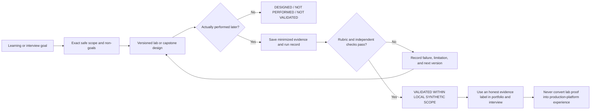
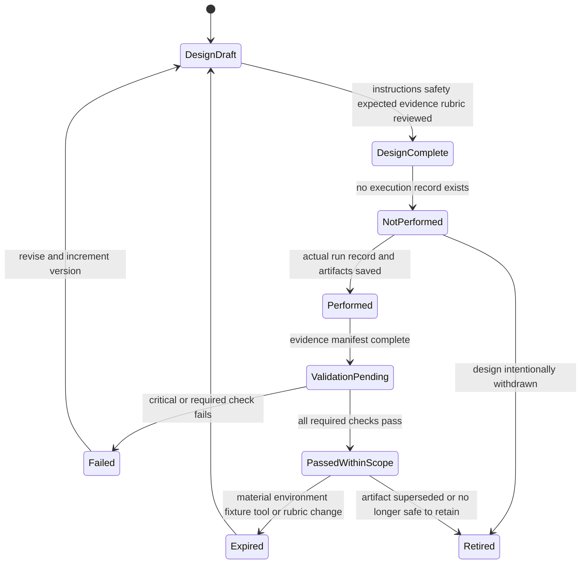
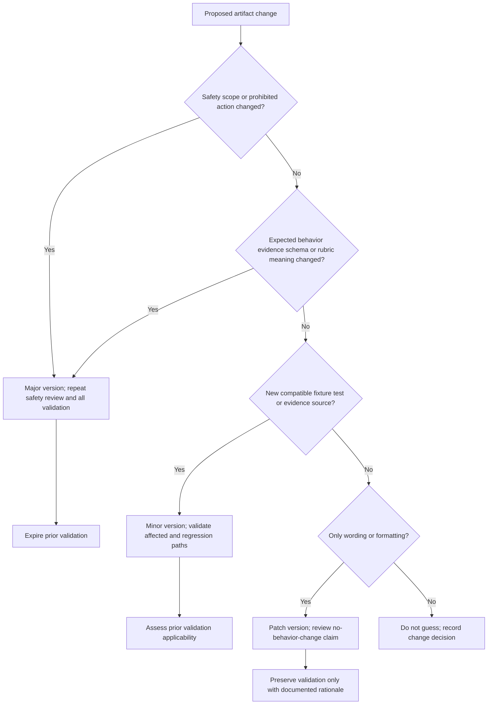
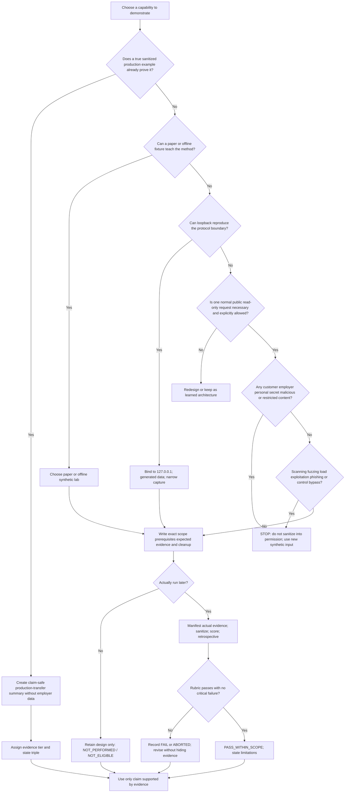
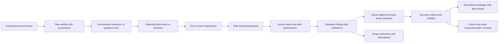
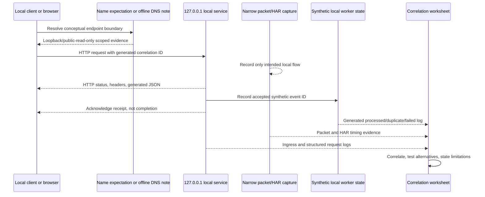
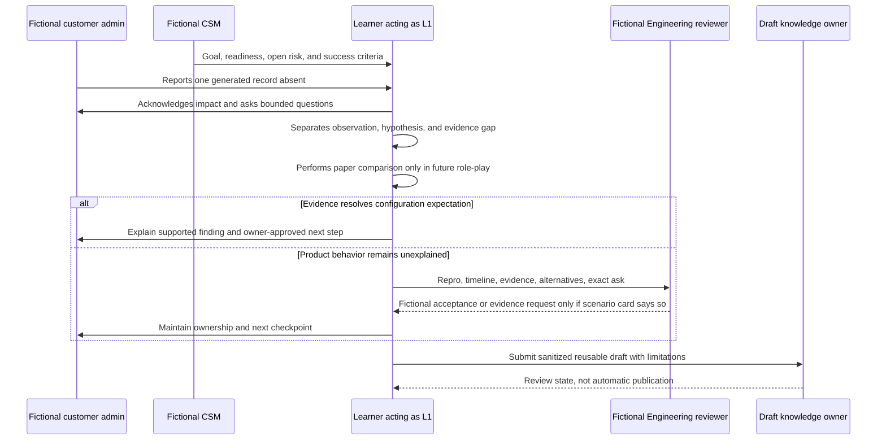
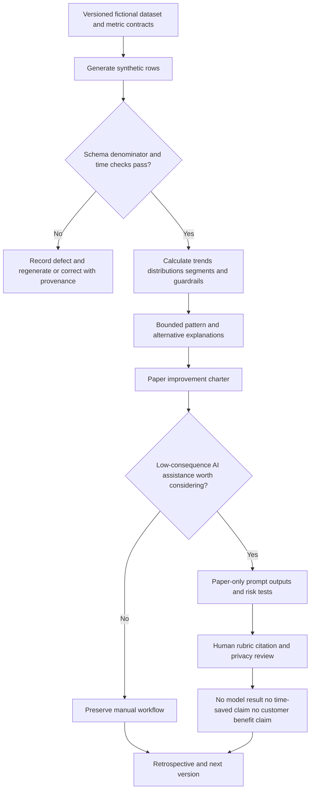
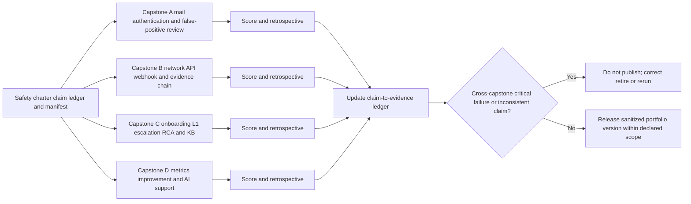
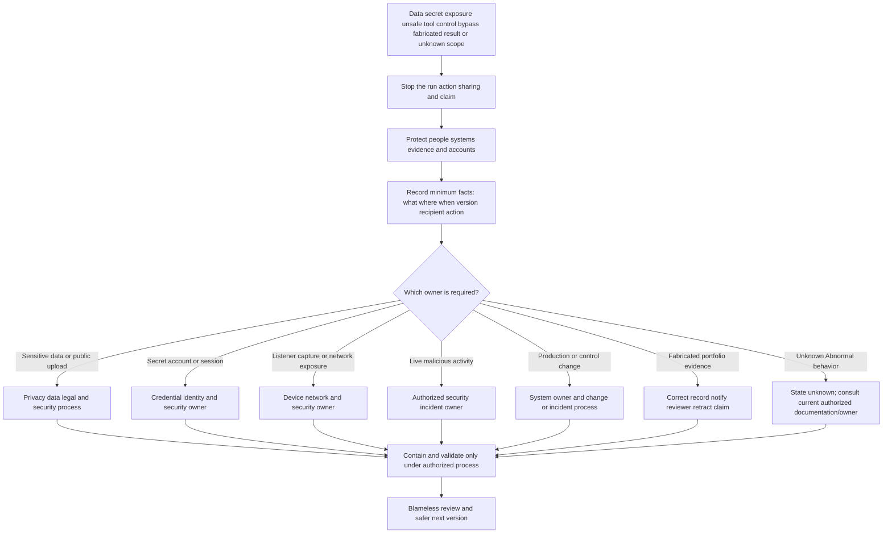

# Part 117 - Safe Lab Portfolio and End-to-End Capstones

> **Purpose:** Build a beginner-first, vendor-neutral portfolio system and multiple end-to-end capstone blueprints that integrate safe email, DNS, TLS, HTTP, packet, HAR, API, webhook, log, false-positive, threat-timeline, L1 case, onboarding, RCA, knowledge, metrics, and AI-support practice while preserving reproducibility, privacy, evidence provenance, and exact claim boundaries.
>
> **Artifact honesty label:** **Completed learner-authored portfolio architecture, manifest templates, capstone designs, scoring rubrics, decision trees, and retrospective templates; every technical lab and capstone remains designed, not performed, and not empirically validated. Direct Microsoft enterprise-support transfer may be claimed only through a true sanitized example Arti can defend. No Abnormal AI product, customer, tenant, message, detection, integration, case, workflow, data, control, result, metric, or internal process was accessed, operated, tested, changed, or inferred.** All names, messages, domains, addresses, timestamps, identifiers, events, counts, findings, recommendations, scores, and outcomes below are fictional teaching fixtures unless an official public source is explicitly cited.
>
> **Currency and official-source access date:** August 24, 2026.
>
> **Authored-Part state:** `PASS`. The master tracker was changed only after every deterministic gate passed.

## Section goal

A **portfolio** is an organized collection of artifacts that makes a learner's method inspectable. A support portfolio should not be a folder of impressive screenshots. It should let a reviewer answer: What question was investigated? What was allowed? Which environment and versions were used? What input was supplied? What evidence was produced? What did the evidence support? What remained unknown? What recommendation followed? Could another person repeat the work? Was cleanup completed? What may the learner honestly claim?

Think of the portfolio as a transparent laboratory notebook plus a museum catalog. The notebook records the recipe, conditions, observations, mistakes, and changes. The catalog explains what each saved item is, where it came from, why it belongs, and what it cannot prove. The analogy stops because digital support evidence can contain credentials, customer data, private message content, identifiers, and security-sensitive details. A real portfolio therefore needs stronger authorization, minimization, access, retention, and deletion controls than an ordinary school notebook.

The governing rule is:

> **Design is not performance; performance is not validation; validation is not production experience. Every artifact must name all three states, preserve provenance and limitations, and prohibit any claim beyond the evidence actually created.**



This Part integrates earlier learning rather than replacing it. Parts 020-033 supply message structure, routing, Domain Name System (DNS), and email-authentication foundations. Parts 034-047 supply threat classification, false-positive reasoning, evidence preservation, timelines, and response boundaries. Parts 071-090 supply network, Transport Layer Security (TLS), Hypertext Transfer Protocol (HTTP), browser archive (HAR), packet, REST API, and webhook methods. Parts 092-105 supply logging, correlation, hypothesis testing, L1 ownership, escalation, and root-cause analysis (RCA). Parts 107-116 supply knowledge, communication, onboarding, metrics, process improvement, and bounded AI assistance. Part 117 turns those methods into one claim-safe portfolio architecture.

## The twelve required portfolio labels

The following exactly twelve numbered labels define every required term before the lesson relies on it. Row 12 pairs two review concepts, but **rubric** and **retrospective** remain distinct definitions.

| # | Required label | Beginner-first definition | Everyday analogy | Why it matters | Boundary to preserve |
|---:|---|---|---|---|---|
| 1 | **Portfolio** | A curated, organized collection of work selected to demonstrate specific capabilities, decisions, learning, and limits to an intended audience. | A chef's tasting menu shows selected techniques rather than every meal ever cooked. | It connects separate labs into a coherent evidence story. | A portfolio demonstrates only the work actually included and honestly labeled; it is not a resume substitute, certification, production history, or employer endorsement. |
| 2 | **Artifact** | A saved, inspectable output from a design or performed exercise, such as a manifest, raw fixture, capture, timeline, case journal, finding memo, rubric, or cleanup record. | A receipt is an artifact of a transaction because another person can inspect it. | It replaces vague “I practiced” claims with concrete evidence. | A template is an artifact of design; it is not evidence that the procedure was executed or succeeded. Screenshots alone rarely preserve enough context. |
| 3 | **Evidence label** | A short, explicit statement naming what kind of proof an artifact provides and what it does not establish. | A museum card says “replica” rather than letting visitors assume the object is original. | It prevents learned architecture, synthetic practice, and production transfer from being blended. | The label must match the weakest relevant state. Renaming a lab “capstone” does not increase its evidentiary strength. |
| 4 | **Reproducibility** | The ability of another person to repeat the documented procedure under stated conditions and compare expected and actual results. | A recipe includes quantities, temperature, equipment, and timing so another cook can try it. | Reproducibility reveals missing steps, environment assumptions, and accidental success. | A repeated result can still be wrong, environment-specific, or too small to generalize. Reproducibility is not production representativeness. |
| 5 | **Provenance** | The origin and change history of an artifact: who or what created it, when, from which input, under which version, and through which transformations. | A parcel's tracking history shows where it entered the route and each handoff. | It lets a reviewer distinguish raw input, transformed copy, annotation, inference, and final report. | A hash can support integrity for a known file but does not prove the file is truthful, complete, authorized, or collected correctly. |
| 6 | **Sanitization** | The controlled removal, replacement, restriction, or transformation of information that is unnecessary or unsafe to retain or share, followed by a review of residual risk and diagnostic usefulness. | A map for visitors removes private rooms but keeps the public route. | It reduces exposure while preserving the minimum evidence needed for the learning question. | Sanitization is not automatic anonymity or authorization. Combined details, hidden fields, cookies, tokens, timestamps, and message content can still identify or expose. |
| 7 | **Finding** | A bounded statement supported by cited evidence about what was observed, measured, or established within the declared scope. | “The thermometer read 18 degrees at 09:00” is a finding; “the heater is broken” is a diagnosis requiring more evidence. | It separates evidence-backed conclusions from guesses and plans. | A finding must not silently become a root cause, threat verdict, product defect, customer impact, or general rule. |
| 8 | **Recommendation** | A proposed next action connected to a finding, objective, owner, risk, prerequisites, validation, and rollback or stop condition. | A mechanic recommends a controlled test before replacing an expensive part. | It turns learning into a responsible next step without pretending the step was approved or performed. | Recommendation is not authorization, implementation, remediation, commitment, or verified outcome. Production and security changes stay with authorized owners. |
| 9 | **Limitation** | A stated condition that restricts what an artifact, method, result, or conclusion can support. | A kitchen scale marked “accurate only above 10 grams” tells the user when not to trust it. | Limitations prevent a clean demo from being generalized beyond its environment, data, tool, version, or sample. | A limitation is not decorative legal text. If it changes the decision, it must be visible beside the finding and claim. |
| 10 | **Versioning** | Assigning identifiable versions to artifacts and recording what changed, why, by whom, and which earlier evidence remains applicable. | An architect labels each blueprint revision so builders do not mix old and new plans. | It makes reproduction, comparison, review, correction, and rollback possible. | A filename such as `final-final2` is not controlled versioning. A new tool, prompt, fixture, schema, or rubric can invalidate earlier validation. |
| 11 | **Capstone** | A larger, integrated exercise that combines several skills around one coherent scenario and produces a reviewable evidence package. | A student pilot's final simulator flight combines navigation, communication, weather, and emergency judgment. | It tests whether isolated concepts can be joined into an end-to-end support method. | A capstone remains a simulation. Complexity, polish, or a passing score does not establish production ownership, scale, customer trust, or vendor-product experience. |
| 12 | **Rubric and retrospective** | A **rubric** is a predeclared scoring guide that defines pass, partial, fail, and critical-failure behavior. A **retrospective** is a structured review after an attempt that compares intent, action, evidence, surprises, failures, and next changes. | A driving test score sheet is the rubric; the conversation after the drive is the retrospective. | The rubric makes quality inspectable; the retrospective turns both success and failure into learning. | A self-score is not independent validation. A retrospective must not rewrite expected results after seeing the outcome, suppress failures, assign blame, or invent performance. |

### Thirty-second vocabulary hooks

| Concept | Memory hook |
|---|---|
| Portfolio | Curate a proof story, not a screenshot pile. |
| Artifact | Save something another person can inspect. |
| Evidence label | Name the proof tier and its ceiling. |
| Reproducibility | Same recipe, declared kitchen, comparable observation. |
| Provenance | Know the source and every transformation. |
| Sanitization | Minimize first; redact and inspect second. |
| Finding | Evidence says; hypothesis wonders. |
| Recommendation | Proposed next step, owner, risk, and validation. |
| Limitation | State where the map ends. |
| Versioning | Identify what changed and which proof still applies. |
| Capstone | Integrate skills without inflating experience. |
| Rubric and retrospective | Score before; learn after. |

## JD mapping

| Role signal from the master guide | Capability developed in this Part | Arti's honest transfer | Portfolio proof ceiling |
|---|---|---|---|
| L1 technical ownership | Connects intake, scoping, reproduction, evidence, updates, escalation, validation, and closure | Direct Microsoft enterprise-support method when backed by a true sanitized example | A synthetic case does not prove Abnormal queue ownership or current internal policy knowledge |
| Email and security fundamentals | Reads message structure, authentication evidence, context, and false-positive hypotheses | Learned architecture plus safe synthetic/public practice after actual completion | No real threat investigation, mailbox access, verdict operation, or detection tuning claim |
| Networking and SaaS troubleshooting | Correlates DNS, TLS, HTTP, packet, HAR, API, webhook, and log evidence | Working familiarity and Microsoft support boundary isolation | No production network administration, third-party scanning, API ownership, or Abnormal integration claim |
| Customer trust and onboarding | Creates plans, status updates, handoffs, training, and success checks | Direct communication and coordination transfer where a real example exists | Fictional onboarding does not establish CSM ownership, implementation delivery, or customer outcome |
| RCA, knowledge, and continuous learning | Produces causal analysis, a reusable knowledge article, and a retrospective | Microsoft KB/training, escalation, validation, mentoring, and process learning within real scope | A written RCA cannot prove cause in a live product; a draft KB is not approved knowledge |
| Metrics and operational quality | Defines measures, denominators, segments, guardrails, and scoring | Direct CSAT, backlog, and case-quality transfer where substantiated; synthetic analytics otherwise | Fictional counts are not Abnormal metrics, baselines, targets, or improvements |
| AI-assisted support | Designs privacy-first, citation-aware, human-reviewed assistance | Copilot support only to exact CV-backed depth plus learned LLM concepts | No model run, AI evaluation, production prompt, automation, safety, or performance claim |
| Intellectual honesty | Separates direct experience, learned architecture, design, performed practice, and validation | Strong interview signal when labels remain precise under follow-up | A polished portfolio must never hide a gap or create a false production narrative |

## Candidate honesty note

Arti's production story remains her Microsoft enterprise-support work. She can discuss customer ownership, complex troubleshooting, critical situations, Engineering/Product collaboration, communication, knowledge, case quality, CSAT, backlog, mentoring, and Copilot support only to the extent that each statement is true, permitted, and supported by a sanitized example she personally understands. The capstones in this Part are future local practice. They do not create Abnormal experience, direct email-security operations, SOC authority, production API ownership, security-remediation authority, or measured AI competence.

> “My direct evidence is Microsoft enterprise support within the scope I can substantiate. I designed this portfolio to integrate email, networking, API, logging, case ownership, RCA, knowledge, metrics, and safe AI-support concepts using only local, public-read-only, and synthetic fixtures. At authoring time the capstones were not performed, so I describe them as designs, not completed labs. After I perform one, I will retain sanitized artifacts, actual results, failures, rubric evidence, cleanup, and limitations. Even a validated local capstone demonstrates method, not Abnormal production experience.”

### Evidence tiers

| Evidence tier | Exact label | Safe interview language | Claim that remains prohibited |
|---|---|---|---|
| Direct Microsoft experience | `DIRECT_PRODUCTION_TRANSFER_WITH_SANITIZED_EXAMPLE_REQUIRED` | “In Microsoft enterprise support, I personally performed [specific allowed work] and can explain my role, evidence, owner boundary, and validated result.” | Importing Microsoft tools, policy, platform behavior, or team results into an Abnormal claim |
| Learned concepts from Parts 001-116 and official sources | `LEARNED_ARCHITECTURE_AND_STRUCTURED_STUDY` | “I can explain the architecture, evidence boundaries, risks, and a safe test plan.” | “I operated this platform or workflow in production.” |
| Written Part 117 portfolio architecture | `SYNTHETIC_WRITTEN_PORTFOLIO_BLUEPRINT_COMPLETED` | “I authored a versioned portfolio structure, capstone plans, manifests, rubrics, and retrospectives.” | “I performed the capstones or observed the designed results.” |
| Capstone blueprints A-D | `DESIGNED_NOT_PERFORMED_NOT_VALIDATED` | “The capstones are reproducible designs queued for future local execution.” | Any request, packet, HAR, score, finding, validation, cleanup, or outcome represented as observed |
| Future completed local capstone | `LOCAL_SYNTHETIC_PERFORMED_NOT_YET_VALIDATED` | “I performed the documented synthetic exercise; rubric review is pending.” | Calling the work validated, production-like, customer-derived, or vendor-approved |
| Future reviewed local capstone | `LOCAL_SYNTHETIC_VALIDATED_WITHIN_DECLARED_SCOPE` | “A reviewer or repeat check passed the stated local rubric; here are the limits.” | Generalizing to production scale, real threats, customer environments, or proprietary platform behavior |
| Abnormal products, systems, customers, and internal operations | `NO_DIRECT_EXPERIENCE_UNKNOWN_CONFIGURATION` | “I would learn the current authorized product, evidence, safety, and support process.” | Any invented feature, field, workflow, model, metric, control, customer pattern, or result |

### Three independent state fields

Every artifact record must carry all three fields. A single `Done` field is too ambiguous.

| State dimension | Allowed values | What the value answers | Rule |
|---|---|---|---|
| `design_state` | `NOT_STARTED`, `DRAFT`, `COMPLETE`, `RETIRED` | Are instructions, inputs, expected evidence, safety, and rubric defined? | `COMPLETE` says only that the design is reviewable |
| `performance_state` | `NOT_PERFORMED`, `PARTIAL`, `PERFORMED`, `ABORTED` | Did a person actually follow the procedure and save a run record? | Never infer `PERFORMED` from the existence of expected-output text |
| `validation_state` | `NOT_ELIGIBLE`, `PENDING`, `PASS_WITHIN_SCOPE`, `FAIL`, `EXPIRED` | Was actual evidence checked against the declared rubric and versions? | A design with `NOT_PERFORMED` must remain `NOT_ELIGIBLE` |



### 🔍 Plain-English deep-dive: Why “completed” is three different claims
>
> A person can complete a blueprint without building the house. A builder can complete the house without an inspector approving it. An inspector can approve that house against a local code without proving the builder has experience with skyscrapers. Portfolio language has the same layers.
>
> `design_state=COMPLETE` means the instructions are coherent enough to review. `performance_state=PERFORMED` requires an actual run record, actual observations, and saved evidence. `validation_state=PASS_WITHIN_SCOPE` requires a defined check against that performed evidence. None of those values means production experience. The phrase “I completed the capstone” should therefore be avoided unless the speaker immediately states which states are complete.
>
> This Part is itself a completed written design and may pass a structural content check. Its capstones remain `NOT_PERFORMED` and `NOT_ELIGIBLE`. That distinction is not modesty theater; it is the core evidence habit an L1 support engineer needs when separating a proposed test, an executed test, and a validated outcome.

## 1. Portfolio architecture, manifest, and versioning

The portfolio should be understandable without hidden explanation. A reviewer should begin with a root index, then open one capstone's README, safety charter, run record, manifest, evidence, analysis, score, retrospective, and cleanup record. Raw evidence should remain separate from annotations and presentation copies. A public interview copy should contain only deliberately created synthetic material and safe public facts; it must never be produced by casually redacting employer or customer content.

### Proposed directory design

The tree below is an intended future structure, not a set of files created by this Part.

```text
safe-support-portfolio/
  README.md
  CLAIMS-AND-EVIDENCE.md
  CHANGELOG.md
  portfolio-manifest.csv
  capstone-a-mail-auth/
    README.md
    safety-charter.md
    fixtures/
    raw-evidence/
    derived-evidence/
    analysis/
    rubric/
    retrospective.md
    cleanup-record.md
  capstone-b-network-api/
  capstone-c-l1-customer-journey/
  capstone-d-metrics-ai-support/
  shared-templates/
  retired/
```

### Root index contract

| Root item | Required content | Reviewer question answered | State at Part 117 authoring |
|---|---|---|---|
| `README.md` | Audience, goals, scope, navigation, current versions, safety, and claim ceiling | What is this portfolio for? | Design complete; not created; not eligible |
| `CLAIMS-AND-EVIDENCE.md` | Claim, evidence tier, artifact IDs, state triple, limitations, allowed wording | What may the learner honestly say? | Design complete; not created; not eligible |
| `CHANGELOG.md` | Version, date, author, reason, changed artifacts, validation impact | What changed and does old validation still apply? | Design complete; not created; not eligible |
| `portfolio-manifest.csv` | Every artifact's identity, provenance, sensitivity, hash where useful, state, retention, and disposition | What exists and where did it come from? | Design complete; not created; not eligible |
| Capstone README | Scenario, prerequisites, exact steps, expected evidence, rubric, cleanup, and boundaries | Can another person reproduce the exercise safely? | Four blueprints authored here; not performed; not eligible |
| Raw evidence | Unmodified generated fixture or direct local/public observation | What did the source actually contain? | No files created or observations made |
| Derived evidence | Sanitized, filtered, decoded, annotated, normalized, or summarized copy | What transformation produced this view? | No files created or transformations performed |
| Analysis | Hypotheses, tests, observations, findings, recommendations, and limitations | How does evidence support the conclusion? | Templates and examples only |
| Rubric | Predeclared criteria, scorer, score, critical failures, and review date | Why is a pass or fail defensible? | Rubrics designed; no execution scored |
| Retrospective | Intended versus actual, surprises, failures, learning, and next version | What changed because of the attempt? | Template designed; no attempt reviewed |
| Cleanup record | Stopped services, deleted temporary files, checked captures, retention decision | Was the lab left in a safe state? | Procedure designed; no cleanup performed |

### Artifact manifest fields

| Field | Example placeholder | Why required | Boundary |
|---|---|---|---|
| `artifact_id` | `CAP-B-RAW-HTTP-001` | Stable identity independent of filename | IDs do not create authenticity by themselves |
| `title` | `Loopback HTTP request capture` | Human-readable description | Must not imply capture occurred when it did not |
| `capstone_id` | `CAP-B` | Groups related evidence | One artifact can be referenced by several analyses without being duplicated |
| `version` | `0.1.0-DESIGN` | Identifies the artifact contract | Use `1.0.0` only under a declared version policy, not as a quality badge |
| `created_utc` | `PENDING_EXECUTION` | Separates real creation time from scenario time | Never invent or backdate a run time |
| `creator` | `LEARNER_ALIAS` | Records responsibility | A role alias may protect public identity, but private ownership still needs governance |
| `source_type` | `SYNTHETIC_FIXTURE`, `LOCAL_OBSERVATION`, `PUBLIC_READ_ONLY` | States evidence origin | Public does not mean unrestricted or safe to republish |
| `source_reference` | `fixture/message-01.eml` | Locates the origin | Avoid public links containing tokens or private identifiers |
| `transformation` | `NONE` or `UTC_NORMALIZATION_V1` | Distinguishes raw and derived evidence | Every decode, filter, crop, retype, or summary is a transformation |
| `tool_and_version` | `PENDING` | Supports reproducibility | Record actual version after execution; never prefill a guessed value |
| `sensitivity` | `SYNTHETIC_PUBLIC_SAFE_AFTER_REVIEW` | Controls handling | “Synthetic” still needs inspection for accidentally copied real material |
| `sha256` | `PENDING` | Can support integrity comparison | A digest does not prove truth, completeness, or authorization |
| `design_state` | `COMPLETE` | Shows design readiness | Not performance |
| `performance_state` | `NOT_PERFORMED` | Shows whether actual evidence exists | Expected output is not actual output |
| `validation_state` | `NOT_ELIGIBLE` | Shows review status | Cannot pass before performance |
| `finding_ids` | `NONE` | Links evidence to bounded findings | Do not force every artifact to support a finding |
| `retention_review` | `AFTER_FUTURE_RUN` | Makes cleanup deliberate | Retention must follow current policy in real work |
| `disposition` | `DESIGN_ONLY` | States retained, restricted, deleted, retired, or superseded | Deletion must not violate legal, audit, incident, or employer duties |

### Versioning policy

Use semantic-looking versions only with a written meaning:

- Increment the **major** number when the safety model, scenario objective, evidence contract, or scoring interpretation changes incompatibly.
- Increment the **minor** number when a new safe fixture, evidence source, test branch, or rubric criterion is added without invalidating existing use.
- Increment the **patch** number for wording, typo, formatting, or clarification changes that do not change expected behavior.
- Add a state suffix such as `-DESIGN`, `-RUN1`, `-VALIDATED`, or `-RETIRED`, but never let the suffix replace the three state fields.
- Record actual tool, runtime, operating-system, browser, and source-document versions in the run record.
- Mark validation `EXPIRED` when a material fixture, parser, browser, protocol behavior, AI prompt, model, metric definition, or rubric changes.



## 2. Safe environment choices and exact scope

Free does not mean safe. Public does not mean authorized for scanning, load testing, exploit attempts, mass requests, data uploads, or republishing. Localhost does not mean isolated if a service binds to every interface, a browser extension exports data, a container mounts private folders, or capture software records unrelated traffic. The environment decision must follow the learning objective and choose the least exposed method.

### Environment choice matrix

| Environment | Good fit | Allowed example | Main risks | Required boundary |
|---|---|---|---|---|
| Paper-only synthetic | Threat timelines, L1 cases, RCA, KB, metrics arithmetic, AI review | Learner-generated tables and event cards | Accidental use of remembered work details; fabricated “results” | Use invented aliases and mark every observation as fixture text |
| Offline local files | Email headers, logs, JSON, sanitization, SQL-like analysis | Hand-authored `.eml`, `.json`, `.csv`, `.log` fixtures | Hidden metadata, copied content, unsafe attachment handling | Plain text only; no macros, executables, real exports, or real messages |
| Loopback service | HTTP, REST, webhooks, retries, HAR, packet capture | Service bound to `127.0.0.1` with generated payloads | Binding to `0.0.0.0`, firewall prompt, exposed listener, retained captures | Verify listener address; no external callback, tunnel, or production credential |
| Public read-only standards | DNS, certificate, HTTP behavior, protocol research | Normal lookup or browser request to `example.com` and official docs | Rate limits, changing output, third-party terms, proxy logging | One ordinary human-paced request; no enumeration, fuzzing, scanning, or sensitive query |
| Reserved identifiers | Domain, IP, message, user, and tenant fixtures | `example.com`, `.invalid`, documentation address ranges | Some tools still try network resolution; examples copied into unsafe contexts | Prefer offline fixtures; confirm identifier is reserved for the intended documentation use |
| Local capture tools | Packet and HAR learning on learner-owned loopback traffic | Capture only port `8765` during one local request | Capturing unrelated adapters, cookies, authorization, extensions, DNS, or background traffic | Close unrelated apps; select loopback; use narrow filter; inspect before retaining |
| Public demo API | Optional read-only comparison after terms review | Provider-documented echo endpoint with no secrets | Availability, logging, changing terms, public retention, accidental identifiers | Local simulation is default; never send tokens, customer data, or security artifacts |
| Cloud free tier | Not required for these capstones | None in the baseline design | Billing, public exposure, account data, secret leakage, abandoned resources | Excluded unless separately authorized and redesigned; do not claim it here |

### Portfolio and capstone decision tree



### Exact common safe scope

**Allowed in these designs:**

- learner-authored plain-text fixtures containing invented people, organizations, identifiers, message content, events, and counts;
- IANA-reserved example domains and documentation address ranges used in text, with no assumption that every tool will keep them offline;
- one normal, human-paced, read-only DNS or HTTPS lookup to an official public documentation endpoint or `example.com` only when the learner later chooses to perform that branch and reviews current terms;
- a local process bound only to loopback, generated payloads, a fixed non-secret lab marker, and learner-owned capture files;
- packet or HAR capture limited to the learner's own local synthetic request, after unrelated applications, tabs, extensions, proxies, VPNs, and sync tools are closed or accounted for;
- paper-only AI output fixtures, manual citation review, and human scoring without contacting an AI model; and
- local arithmetic over a learner-created CSV with explicitly fictional rows.

**Prohibited without exception in this Part:**

- real customer, employer, employee, applicant, user, tenant, mailbox, case, incident, message, attachment, contact, account, device, or private-system data;
- live malicious activity, malware, exploit code, weaponized documents, credential harvesting, phishing or simulated phishing delivery, QR lures, impersonation, or social engineering;
- scanning, enumeration, fuzzing, load testing, vulnerability testing, certificate probing at scale, mail delivery tests, or webhook delivery to third-party infrastructure;
- bypassing, weakening, disabling, evading, or recommending removal of authentication, authorization, TLS validation, anti-malware, email-security, logging, privacy, approval, rate, or change controls;
- any production, employer, customer, shared, staging, SaaS, identity, mailbox, ticketing, CRM, security, DNS, API, webhook, AI, or network configuration change;
- passwords, API keys, bearer tokens, cookies, session identifiers, private keys, client secrets, certificates containing private keys, recovery codes, private URLs, or realistic secret-shaped values;
- uploading packet captures, HAR files, logs, messages, screenshots, prompts, evidence, or artifacts to public websites, repositories, paste services, scanners, sandboxes, AI services, or public issue trackers;
- fabricated command output, packet rows, HAR entries, DNS answers, certificate details, HTTP responses, webhook attempts, log events, scores, reviewer feedback, timestamps, findings, cleanup, or validation;
- any claim that a designed lab was performed, a performed lab was validated, a validated synthetic lab was production experience, or this portfolio was approved by Microsoft, Abnormal AI, a customer, or an employer.

### Before-run safety card

| Gate | Pass evidence required before a future run | Stop condition |
|---|---|---|
| Objective | One bounded learning question | “Explore everything” or any live threat/customer objective |
| Data | Fixture inventory marked generated from scratch | Any remembered, copied, exported, or uncertain real data |
| Environment | Device owner permission; exact OS/tool versions; loopback/public-read-only choice | Shared, managed, customer, employer, production, or unknown environment |
| Network | Listener confirmed on `127.0.0.1`; capture adapter/filter named | Bind on all interfaces, tunnel, port-forward, external callback, or broad capture |
| Tools | Official source, current version, known output path | Untrusted binary, unknown extension, unsupported interception, or admin need without justification |
| Secrets | No credential is required; lab marker explicitly non-secret | Any real or realistic secret, cookie, token, private key, or authorization header |
| Expected evidence | Artifact IDs and expected shapes declared before running | Expected output copied later and presented as actual |
| Cleanup | Stop, deletion, retention, and verification steps assigned | No way to stop listener, find artifacts, or inspect exposure |
| Claim | State triple begins `COMPLETE / NOT_PERFORMED / NOT_ELIGIBLE` | Portfolio language already implies completion or success |

### 🔍 Plain-English deep-dive: Public, local, and synthetic solve different risks
>
> “Public” answers who can access a resource; it does not answer what actions are permitted. A public website can prohibit automation, scanning, scraping, or abusive volume. A normal browser request may be ordinary use while a scripted port sweep is not. “Local” answers where a process appears to run; it does not prove isolation. A listener on all interfaces, a container bridge, a browser sync feature, or a capture on the wrong adapter can cross the machine boundary. “Synthetic” answers how data was created; it does not prove that no real detail was copied into it or that the artifact is harmless to publish.
>
> The safest design chooses all three properties deliberately. Use synthetic data so no real subject is exposed. Use loopback so protocol practice does not depend on another party. Use public standards only to verify stable protocol meaning, not to test an organization's defenses. Then inspect the saved artifacts, because HAR files, packet captures, terminal history, and screenshots can collect more than the learner intended.

## 3. Integrated portfolio map

The portfolio should contain small capability artifacts plus larger capstones. The small artifacts make one skill easy to inspect; the capstones demonstrate integration. The state values below are the authored truth on August 24, 2026.

### Capability artifact register

| Artifact ID | Prior Parts integrated | Designed artifact and safe method | Expected evidence after a future run | Design state | Performance state | Validation state |
|---|---|---|---|---|---|---|
| `P117-EMAIL-01` | 020-023 | Offline synthetic raw-message annotation | Header map, hop order, timestamp caveats, source/derived separation | `COMPLETE` | `NOT_PERFORMED` | `NOT_ELIGIBLE` |
| `P117-AUTH-01` | 024-029 | Synthetic SPF, DKIM, DMARC, ARC workbook plus optional public read-only DNS | Domain/alignment table, exact DNS observations, limitations | `COMPLETE` | `NOT_PERFORMED` | `NOT_ELIGIBLE` |
| `P117-THREAT-01` | 034-047 | Paper-only benign-versus-suspicious message comparison | Evidence matrix, hypotheses, false-positive/false-negative analysis, timeline | `COMPLETE` | `NOT_PERFORMED` | `NOT_ELIGIBLE` |
| `P117-DNS-01` | 073-075 | Human-paced lookup of reserved/example and official endpoints | Query, resolver context, answer, TTL, time, no-overreach statement | `COMPLETE` | `NOT_PERFORMED` | `NOT_ELIGIBLE` |
| `P117-TLS-01` | 075, 082 | One ordinary HTTPS handshake inspection or offline transcript | SNI/host, protocol, certificate scope, validation boundary | `COMPLETE` | `NOT_PERFORMED` | `NOT_ELIGIBLE` |
| `P117-HTTP-01` | 076-079 | Loopback request/response comparison | Method, URL, headers, status, body digest, expected/actual | `COMPLETE` | `NOT_PERFORMED` | `NOT_ELIGIBLE` |
| `P117-PCAP-01` | 080-082, 098 | Narrow loopback packet capture of one synthetic request | Capture filter, display filter, TCP flow, privacy inspection, manifest | `COMPLETE` | `NOT_PERFORMED` | `NOT_ELIGIBLE` |
| `P117-HAR-01` | 082, 095, 098 | Browser HAR from local synthetic page only | Sanitized request timing and headers, redaction review, no cookies/tokens | `COMPLETE` | `NOT_PERFORMED` | `NOT_ELIGIBLE` |
| `P117-API-01` | 083-090 | Loopback REST resource and error fixtures | Request/response pairs, JSON schema checks, correlation IDs, error analysis | `COMPLETE` | `NOT_PERFORMED` | `NOT_ELIGIBLE` |
| `P117-WEBHOOK-01` | 088, 091 | Loopback webhook with fixed non-secret signature fixture and duplicate ID | Delivery attempts, signature decision, duplicate handling, acknowledgment timeline | `COMPLETE` | `NOT_PERFORMED` | `NOT_ELIGIBLE` |
| `P117-LOG-01` | 092-097 | Generated multi-source CSV/JSON logs | UTC-normalized timeline, correlation map, query workbook, unknowns | `COMPLETE` | `NOT_PERFORMED` | `NOT_ELIGIBLE` |
| `P117-L1-01` | 099-104, 108-113 | Fictional case journal from intake through accepted handoff | Scope, updates, evidence requests, escalation packet, ownership continuity | `COMPLETE` | `NOT_PERFORMED` | `NOT_ELIGIBLE` |
| `P117-ONBOARD-01` | 111-112 | Fictional onboarding readiness and success handoff | Goal, dependency, owner, validation, training, risk, transition plan | `COMPLETE` | `NOT_PERFORMED` | `NOT_ELIGIBLE` |
| `P117-RCA-KB-01` | 103, 105, 107 | Paper RCA plus internal/external KB pair | Causal-confidence ledger, actions, article scope, owner, review date | `COMPLETE` | `NOT_PERFORMED` | `NOT_ELIGIBLE` |
| `P117-METRIC-01` | 114-115 | Local fictional support dataset and metric dictionary | Denominators, segments, quality checks, dashboard, experiment design | `COMPLETE` | `NOT_PERFORMED` | `NOT_ELIGIBLE` |
| `P117-AI-01` | 058, 116 | Paper-only AI support prompt/output/citation evaluation | Untrusted-output review, source map, rubric, human decision, rollback design | `COMPLETE` | `NOT_PERFORMED` | `NOT_ELIGIBLE` |

### Cross-artifact evidence spine

One fictional scenario may produce many artifacts, but each assertion should trace through a consistent evidence spine:



### Reproducibility record

| Record section | Required entry | Placeholder while unperformed | Example of invalid entry |
|---|---|---|---|
| Objective | Exact question and non-goals | Defined in blueprint | “Test the system” |
| Environment | OS build, runtime, browser, tool versions, network context | `PENDING_FUTURE_RUN` | Version guessed from documentation |
| Inputs | Fixture IDs and digests | Fixture design IDs only | “Same data as last time” |
| Procedure | Ordered commands/actions and stop points | Written design steps | Steps reconstructed after seeing output |
| Expected evidence | Shape and meaning, not fabricated values | Declared before run | Screenshot pasted as both expected and actual |
| Actual evidence | Artifact IDs, UTC time, exact result, errors | `NOT_AVAILABLE_NOT_PERFORMED` | Copied sample output represented as observed |
| Deviations | What differed from procedure and why | `NOT_APPLICABLE_NOT_PERFORMED` | Silent improvisation |
| Interpretation | Observation, alternatives, finding, confidence | `PENDING_ACTUAL_EVIDENCE` | Root cause copied from scenario narrative |
| Validation | Rubric version, scorer, checks, failures | `NOT_ELIGIBLE` | Self-declared pass before performance |
| Cleanup | Services stopped, files reviewed/deleted, exposure check | `NOT_PERFORMED` | Checklist prechecked in design |

### Sanitization workflow

Sanitization must preserve a raw/derived distinction. In a real authorized case, the source may need restricted preservation rather than modification. For this portfolio, the safer default is to create synthetic evidence from scratch and never ingest the real source.

| Artifact type | Common sensitive fields | Synthetic portfolio treatment | Validation question |
|---|---|---|---|
| Raw email | Addresses, names, subject/body, Message-ID, Received hosts/IPs, attachment names/content, authentication identifiers | Hand-author a harmless `.invalid` fixture; no real message copied | Can every value be traced to the fixture design rather than work memory? |
| DNS output | Resolver, internal suffix, query name, client environment, time | Query only reserved/example or official public names; record minimum output | Does the query reveal an employer/customer domain or internal resolver? |
| TLS output | Hostname, IP, proxy, certificate chain, session metadata | Use official example endpoint or offline transcript; no private host | Is the certificate observation scoped to one client context and time? |
| HAR | URLs, query strings, cookies, authorization, form data, response bodies, account IDs, browser metadata | Capture local synthetic request only; inspect every entry before retention | Are cookies, authorization, extensions, unrelated origins, and bodies absent? |
| Packet capture | All traffic on selected adapter, payloads, names, addresses, timing | Capture loopback port only for one generated request | Does the capture contain any non-loopback or unrelated flow? |
| API/webhook | Tokens, URLs, payloads, identities, object IDs, signature keys | Fixed fake marker; generated JSON; local receiver; no real token shape | Could a reader mistake a marker for an active secret or endpoint? |
| Logs | User/tenant/case IDs, hostnames, stack data, paths, timestamps, message content | Generate records from a schema and disclose generation | Does every row remain fictional and internally consistent? |
| Case/RCA/KB | Customer story, people, product defects, private process, promises | Use a named fictional lab and generic role aliases | Does wording imply a real customer, Abnormal process, or actual incident? |
| Metrics | Small groups, personal performance, confidential targets, customer segments | Use generated rows and label every number authored | Could the table be mistaken for a real baseline or result? |
| AI prompts/outputs | All of the above plus retained prompt history and model output | Paper-only fixture; no model called | Is any generated output presented as model behavior or measured quality? |

### 🔍 Plain-English deep-dive: Sanitized evidence can stop being evidence
>
> Imagine a photograph of a damaged parcel. Cropping out the shipping label may protect identity, but cropping out the crushed corner removes the condition being investigated. Replacing every timestamp with `TIME` may hide a person but destroy sequence analysis. Rewriting a header by hand may remove addresses but also introduce spacing, folding, or ordering changes that affect parsing.
>
> A good evidence package therefore distinguishes the restricted source, the derived sanitized copy, the exact transformation, and the decision each version can support. For this public learning portfolio, the better answer is usually not to transform real evidence at all. Create an inert fixture that contains exactly the protocol structure needed for the lesson. Then the artifact proves the learner's method without creating an employer-data handling problem.

## 4. Capstone A - Mail authentication, threat timeline, and false-positive review

**Capstone ID:** `CAP-A-MAIL-AUTH-FP`

**State triple at authoring:** `design_state=COMPLETE`; `performance_state=NOT_PERFORMED`; `validation_state=NOT_ELIGIBLE`.

### Objective and prior-Part integration

Build a synthetic message-evidence packet that demonstrates how raw headers, message identifiers, routing timestamps, DNS-published authentication records, SPF, DKIM, DMARC alignment, ARC context, threat clues, and business context contribute to a bounded false-positive review. Integrate Parts 020-029 for message/authentication, Parts 034-046 for threat and evidence reasoning, Part 045 for false positives and false negatives, and Parts 092-098 for timelines, provenance, and sanitization.

The objective is **not** to prove a message is malicious or benign, test an email-security product, send mail, administer DNS, tune a detector, operate a mailbox, or reproduce an Abnormal verdict.

### Prerequisites, environment, and exact safe scope

| Category | Required design | Exact allowed scope | Explicit exclusion |
|---|---|---|---|
| Knowledge | Parts 020-029, 034-047, 092-098 reviewed | Explain envelope/content, hop order, auth results, alignment, evidence tiers | No proprietary scoring or product assumptions |
| Files | Two hand-authored plain-text `.eml` fixtures and one DNS snapshot text fixture | `.invalid` domains, generated addresses, harmless plain text, no attachment | No copied message, live mailbox, real domain, realistic lure, macro, QR, link, or executable |
| DNS branch | Offline snapshot by default; optional one normal public lookup to `example.com` later | Read-only, human-paced, no recursion testing or enumeration | No customer/employer domain and no record change |
| Threat content | One obvious benign business pattern and one ambiguous synthetic pattern | No credential request, payment instruction, impersonation target, or clickable URL | No phishing delivery, simulation campaign, or malicious payload |
| Tools | Text editor and optional standards-aware parser used locally | Record parser/version and compare parser output with raw source | No upload to header analyzer, sandbox, reputation site, public AI, or scanner |

### Blueprint procedure

1. Create `message-a.eml` and `message-b.eml` from scratch using `.invalid` sender and recipient domains.
2. Include a small, harmless plain-text body stating that the message is a synthetic training fixture.
3. Add a controlled set of `Received`, `Date`, `Message-ID`, `From`, `To`, `Reply-To`, `Return-Path`, `Authentication-Results`, and ARC-related fields for interpretation practice.
4. Record a fixture specification that explains which fields are intentionally consistent, ambiguous, or contradictory. Keep that specification separate from the analyst worksheet.
5. Add an offline DNS-record snapshot containing clearly labeled fictional SPF, DKIM-key, and DMARC records. Do not publish them.
6. Annotate header field names, unfolded values, apparent hop order, timestamp zones, envelope-related fields, and visible-author fields.
7. Evaluate the synthetic SPF identity, DKIM signing domain, RFC5322 `From` domain, and DMARC alignment separately.
8. Mark `Authentication-Results` as a statement made by the named receiver in the fixture, not as universal truth.
9. Build a UTC-normalized timeline while preserving each original timestamp and uncertainty.
10. Create two competing interpretations: expected benign workflow versus suspicious or misconfigured behavior.
11. Add business-context cards that can change false-positive interpretation without changing raw authentication.
12. Classify each statement as observation, reported context, inference, hypothesis, finding, or recommendation.
13. Write a bounded finding only if fixture evidence supports it; otherwise retain `INCONCLUSIVE`.
14. Draft a reversible recommendation to the appropriate fictional owner, such as verify expected sender workflow or inspect authorized configuration. Do not recommend broad allowlisting or control disablement.
15. Score the packet against rubric A, write a retrospective only after a future attempt, and complete cleanup.

```mermaid
sequenceDiagram
    participant Fixture as Synthetic message fixture
    participant Analyst as Learner analyst
    participant DNS as Offline/public-safe DNS evidence
    participant Context as Fictional business owner
    participant Reviewer as Rubric reviewer
    Fixture->>Analyst: Raw headers and harmless body
    Analyst->>Analyst: Preserve source; annotate fields and times
    Analyst->>DNS: Compare SPF/DKIM/DMARC identities and records
    DNS-->>Analyst: Scoped record evidence, not sender intent
    Analyst->>Context: Ask whether workflow and sender relationship are expected
    Context-->>Analyst: Synthetic context card with provenance
    Analyst->>Analyst: Build hypotheses, false-positive risk, and limitations
    Analyst-->>Reviewer: Manifest, timeline, finding, recommendation, state triple
    Reviewer-->>Analyst: Pass, fail, or revision within synthetic scope
```

### Expected evidence, not actual results

| Artifact ID | Expected future evidence | Finding it could support | What it can never prove by itself |
|---|---|---|---|
| `CAP-A-RAW-001` | Raw generated message A plus digest | Exact fixture fields existed in the saved source | Real delivery, account ownership, sender intent, or product verdict |
| `CAP-A-RAW-002` | Raw generated message B plus digest | Same, for comparison | A real false positive or false negative |
| `CAP-A-DNS-001` | Offline fictional records or dated public example lookup | Record syntax and observed answer in one context | Global propagation, ownership, authorization, or DMARC outcome at another receiver |
| `CAP-A-ANN-001` | Header/authentication annotation workbook | Identity and alignment reasoning from fixture values | Cryptographic verification unless actually performed with valid fixture keys and recorded tools |
| `CAP-A-TIME-001` | Original/UTC timestamp table | Scenario event ordering within uncertainty | Exact causality or a provider's internal processing order |
| `CAP-A-FP-001` | Evidence/context comparison | Why a disposition remains uncertain or context-sensitive | Permission to allowlist, release, remediate, or tune production |
| `CAP-A-FIND-001` | Finding/recommendation/limitation memo | A bounded synthetic conclusion | Abnormal performance, customer impact, maliciousness, or benign ground truth |

### Rubric A - 25 points

| Criterion | Points | Full-credit behavior | Critical failure |
|---|---:|---|---|
| Safety and provenance | 4 | Every value generated; raw/derived separation and manifest complete | Any real message, domain, person, content, live mailbox, or public upload |
| Header interpretation | 4 | Correct field purpose, unfolding, hop/timestamp caveats, and source limits | Treating a forgeable field as authoritative identity |
| Authentication reasoning | 5 | SPF, DKIM, DMARC, alignment, ARC, and receiver context separated | Calling `pass` proof of benign intent or `fail` proof of attack |
| Timeline and correlation | 3 | Original plus UTC time, IDs, uncertainty, and no invented event | Fabricated packet, event, timestamp, or causal sequence |
| False-positive analysis | 4 | Technical evidence and authorized business context compared; alternatives visible | Broad allowlist, control bypass, or unsupported final threat verdict |
| Finding/recommendation/limits | 3 | Bounded evidence-backed finding and reversible owner-specific next step | Claim of real incident, product defect, remediation, or validated customer result |
| Reproducibility and cleanup | 2 | Versions, steps, expected/actual distinction, retention, and cleanup recorded | Prechecked cleanup or pass without performance |

**Scoring rule:** 22-25 may pass only after performance and review; 18-21 requires revision; below 18 fails. Any critical failure is an automatic fail regardless of total. At authoring, score is `NOT_SCORED_NOT_PERFORMED`.

### Cleanup and privacy

- Do not send either fixture or configure a mail client to deliver it.
- Keep fixtures as plain text; do not add live links, realistic credentials, attachment binaries, QR codes, macros, or executable content.
- If an optional public DNS lookup is later performed, retain only the minimum query/result needed and record resolver context and time.
- Inspect editor backups, recent-file lists, screenshots, parser exports, and terminal history before retaining artifacts.
- Delete temporary copies and parser output after the manifest identifies the deliberately retained version.
- If any real detail is discovered, stop. Do not “finish redacting” for public use; quarantine or delete under the applicable authorized policy and rebuild from new fiction.

## 5. Capstone B - DNS, TLS, HTTP, packet, HAR, REST, webhook, and logs

**Capstone ID:** `CAP-B-NETWORK-API-EVIDENCE`

**State triple at authoring:** `design_state=COMPLETE`; `performance_state=NOT_PERFORMED`; `validation_state=NOT_ELIGIBLE`.

### Objective and prior-Part integration

Build one local evidence chain from name/endpoint expectation through TCP, optional TLS transcript, HTTP request/response, REST representation, webhook acceptance, duplicate handling, structured logs, packet evidence, and HAR timing. Integrate Parts 071-082 for layered network evidence, Parts 083-091 for APIs/webhooks/resilience, and Parts 092-098 for logs, correlation, hypothesis testing, and safe packaging.

The baseline remains loopback HTTP because it is sufficient to practice request, response, capture, correlation, and webhook mechanics without certificates or external infrastructure. TLS learning may use an offline transcript or one ordinary browser inspection of an official endpoint; creating a local certificate is an optional future extension requiring a separately versioned design. Do not disable certificate validation to make an error disappear.

### Prerequisites, environment, and exact safe scope

| Category | Requirement | Allowed | Prohibited |
|---|---|---|---|
| Device | Learner-owned or explicitly authorized local device | Windows PowerShell/terminal, Python standard library, browser DevTools, optional Wireshark/Npcap | Employer/customer/shared host or unknown administrative policy |
| Binding | Loopback only on a high unprivileged port such as `8765` | `127.0.0.1:8765` | `0.0.0.0`, LAN address, public tunnel, port forwarding, cloud callback |
| Data | Generated JSON records and fixed lab marker | `LAB_ONLY_NOT_A_SECRET` visibly labeled non-secret | Real token, cookie, email, user, tenant, case, webhook URL, signature key, or copied payload |
| Capture | One local request window | Narrow loopback adapter and `tcp.port == 8765` | Broad adapter capture, unrelated applications, decrypted real sessions, public upload |
| HAR | One local browser tab and synthetic endpoint | Export, inspect, then retain minimized local HAR | Authenticated sites, extensions producing traffic, account sessions, real forms or content |
| Public branch | Optional normal lookup/request to official docs or `example.com` | One human-paced read-only request | Scan, fuzz, enumerate, benchmark, load, probe, or bypass |

### Reproducible future-run outline

1. Record the actual operating system, Python, browser, cURL, and Wireshark versions; do not prefill them from this design.
2. Create a dedicated empty working folder containing only generated fixture files.
3. Verify that no secret, work export, browser profile artifact, or private path is present.
4. Start a minimal local test service bound explicitly to `127.0.0.1` on port `8765`. The future implementation may use Python's standard library but must record the exact script digest and limitations.
5. Have the service expose a harmless `GET /health`, `GET /items?page=1`, and `POST /webhook` behavior using generated JSON.
6. Generate one correlation ID and one event ID in the fixture. Use a fixed string labeled `LAB_ONLY_NOT_A_SECRET` only to demonstrate how a signature input would be represented; never call it a secure key.
7. Confirm the listener address using an approved local socket-inspection tool before sending a request. Stop if it listens beyond loopback.
8. Close unrelated browser tabs and applications that could create capture traffic.
9. Start a narrow loopback capture filtered to port `8765`.
10. Send one health request and record request UTC time, method, URL, headers, status, body digest, and correlation ID.
11. Send one paginated item request and compare expected schema with actual local response.
12. Send one webhook fixture, one exact duplicate event ID, and one altered body with an unchanged signature fixture.
13. Record ingress acknowledgment separately from downstream processing state.
14. Open the local endpoint in a clean browser context and export a HAR containing only the intended local entries.
15. Stop capture immediately and inspect every packet flow and HAR entry before retention.
16. Correlate request, packet, HAR, receiver log, and worker log by UTC time, port, method, path, correlation ID, and event ID.
17. Inject one synthetic failure at a time: service stopped, malformed JSON, duplicate event, invalid signature fixture, delayed worker, or HTTP `500` fixture.
18. For each failure, state the symptom, hypothesis, cheapest safe test, observation, finding ceiling, and next action.
19. Stop the service, verify the listener is gone, close the browser context, and remove temporary captures not selected for retention.
20. Score only the actual future evidence. Do not paste the expected descriptions into an `actual` field.



### Layer-to-evidence matrix

| Layer or stage | Question | Expected future evidence | Misleading shortcut |
|---|---|---|---|
| Name | Which hostname or literal address was intended and resolved? | Query/context or explicit loopback address | “DNS worked” based only on browser success |
| Route/TCP | Did the client establish transport to the expected local endpoint? | Packet SYN/SYN-ACK/ACK or local connection record | Treating open port as healthy application |
| TLS | Did the client negotiate protection and validate peer identity in this context? | Offline transcript or dated official-endpoint browser details | Disabling validation or calling TLS success application authorization |
| HTTP | What exact method, target, headers, status, and body occurred? | Request/response pair and body digest | Treating `200` as proof of downstream business completion |
| REST representation | Did JSON shape and semantics match the declared contract? | Schema checklist and expected/actual fields | Calling syntactically valid JSON a valid business object |
| Webhook ingress | Was the event received and checked? | Event ID, receipt time, signature-fixture decision | Treating receipt as processing success |
| Deduplication | Was a repeated event recognized under the declared key/window? | Duplicate log and unchanged business count | Claiming exactly-once delivery from one duplicate test |
| Worker | Did asynchronous processing reach the expected state? | Separate processed/failed event with correlation | Inferring completion from HTTP acknowledgment |
| Packet | What transport bytes/timing were visible? | Narrow `.pcapng` and display-filter note | Inferring encrypted content, application truth, or server internals |
| HAR | What did the browser record for its HTTP activity and timing? | Sanitized local HAR | Treating HAR timing phases as server root cause |
| Logs | Which component recorded which event under which clock and schema? | Structured local lines with source and version | Treating log absence as proof event did not happen |

### Rubric B - 25 points

| Criterion | Points | Full-credit behavior | Critical failure |
|---|---:|---|---|
| Environment safety | 4 | Loopback verified, generated data, narrow tools, no secret or external callback | Listener exposed beyond loopback, third-party scan, real credential/data, or production change |
| Protocol layering | 4 | DNS/TCP/TLS/HTTP/REST/webhook/worker claims remain separate | Control bypass, disabled TLS validation, or success at one layer treated as all-layer success |
| Packet and HAR handling | 4 | Narrow capture, manifest, privacy inspection, raw/derived separation | Unrelated/private traffic retained or uploaded publicly |
| API/webhook semantics | 5 | Status, schema, acknowledgment/completion, signature fixture, replay/duplicate, and errors explained | Fake lab marker presented as secure production signature or exactly-once guarantee |
| Log correlation | 3 | UTC, source clocks, IDs, sequence, missing evidence, and alternatives preserved | Fabricated correlation, result, or server-side event |
| Findings and escalation | 3 | Reproducible symptom, evidence, bounded finding, explicit ask, limitations | Unsupported root cause, exploit claim, or vendor-specific conclusion |
| Reproducibility and cleanup | 2 | Actual versions, script digest, stop verification, retained/deleted inventory | Service left exposed or cleanup preclaimed |

**Scoring rule:** 22-25 may pass only after performance and review; 18-21 requires revision; below 18 fails. Any critical failure is automatic failure. Current score: `NOT_SCORED_NOT_PERFORMED`.

### Cleanup and privacy

- Stop the local process and verify port `8765` is no longer listening.
- Close the dedicated browser context and delete its temporary profile if one was deliberately created.
- Inspect HAR entries for cookies, authorization, query values, response bodies, extension calls, unrelated origins, and client metadata. Delete the HAR if reliable inspection is not possible.
- Inspect packet conversations and endpoint addresses. Delete any capture containing unrelated or non-loopback traffic.
- Remove temporary logs and payloads not selected in the manifest; retain only the minimum generated evidence needed for review.
- Never upload a packet or HAR to a public analyzer. A local synthetic artifact does not become safer by being sent to an uncontrolled service.
- Record cleanup as actual only after verification. If a service remains bound or an artifact cannot be classified, mark the run `ABORTED` and escalate to the device owner.

### 🔍 Plain-English deep-dive: One request creates several truths
>
> A webhook sender can truthfully say, “I transmitted event E7 and received HTTP 202.” The receiver can truthfully say, “I accepted E7 into an ingress queue.” A worker can later truthfully say, “E7 failed schema enrichment.” These statements are not contradictions because they describe different boundaries.
>
> Packet evidence can show a connection and bytes. HAR can show what the browser recorded. The receiver log can show ingress. A queue record can show persistence. A worker log can show processing. The final resource state can show business outcome. Correlation joins these truths by identifiers, time, target, and expected state, but the analyst must not skip a boundary. This is why a good capstone saves several small artifacts instead of one triumphant screenshot.

## 6. Capstone C - L1 onboarding issue through escalation, RCA, and KB

**Capstone ID:** `CAP-C-L1-CUSTOMER-JOURNEY`

**State triple at authoring:** `design_state=COMPLETE`; `performance_state=NOT_PERFORMED`; `validation_state=NOT_ELIGIBLE`.

### Objective and scenario

Use a paper-only fictional SaaS onboarding scenario to demonstrate L1 ownership from intake through a controlled handoff and reusable learning. The fictional customer `Northstar Paper Co.` expects three generated test records to appear after onboarding. Two appear and one does not. The fixture later reveals that the absent row carries a different generated region value than the success criterion. This is not an Abnormal implementation, connector, case, defect, customer, or onboarding process.

Integrate Parts 099-104 for troubleshooting and escalation, Part 105 for RCA, Part 107 for knowledge, Parts 108-112 for communication/onboarding, and Part 113 for Engineering/Product collaboration.

### Prerequisites and exact safe scope

| Item | Design requirement | Allowed | Prohibited |
|---|---|---|---|
| Scenario | Generated organizations, people, roles, records, times, requirements, and product-neutral UI names | Paper/Markdown cards only | Recalled customer story, current employer workflow, Abnormal field, screenshot, or internal process |
| Onboarding | Goal, readiness, dependency, owner, training, success, and support transition | Fictional 30-day outline compressed into scenario checkpoints | Claim of real CSM, implementation, launch, adoption, or production configuration |
| L1 case | Intake, scope, environment, expected/actual, evidence, hypotheses, updates, ownership | Product-neutral case journal | Real ticket-system schema, SLA promise, customer data, or confidential escalation path |
| Escalation | Reproducible question and sanitized fixture evidence | Fictional Engineering handoff with acceptance field | Invented Engineering finding, defect ID, fix, ETA, or acceptance |
| RCA | Trigger, mechanism hypothesis, contributors, controls, corrective actions, uncertainty | Paper causal analysis | Declaring root cause without a discriminating test |
| KB | Internal diagnostic draft and external conceptual article | Learner-authored, unapproved, versioned drafts | Publishing company procedure, customer specifics, unsafe operational steps, or unsupported resolution |

### Blueprint procedure

1. Write the customer's fictional desired outcome in business language and define a measurable synthetic success check.
2. Create a readiness matrix for identity, data source, network, permissions, owner, test records, training, support route, and rollback. Mark every status as fixture data.
3. Record the handoff from fictional CSM to L1: goal, current phase, known risks, open dependency, customer contacts as role aliases, and next checkpoint.
4. Open case `CASE-C-001` with impact, scope, first observed time, environment, expected result, actual result, recent change, and evidence availability.
5. Separate “one record is absent” from “the connector dropped a record.” The first is an observation; the second is a hypothesis.
6. Create three candidate hypotheses: source never produced the row, integration failed to ingest it, or configured filter excluded it.
7. Choose the cheapest safe discriminating paper test: compare the three generated source rows, the fictional filter rule, and the expected result contract.
8. Update the customer using acknowledgment, verified facts, unknowns, completed work, next action, owner, and next checkpoint. Do not promise a fix or cause.
9. If the paper evidence remains ambiguous, prepare an Engineering escalation with exact question, not a conclusion.
10. Record whether the fictional handoff is proposed, submitted, accepted, needs more evidence, or returned. Do not mark acceptance automatically.
11. Write an executive summary that translates impact and decision without exposing technical noise or inventing certainty.
12. Create an RCA worksheet with event chronology, causal hypotheses, counterevidence, failed/absent controls, and confidence.
13. Write a finding such as “the fixture's documented filter excludes the east-region row” only if the fixture contract establishes that condition. Do not call it a product defect.
14. Propose a recommendation owned by the fictional configuration owner: review intended scope through the approved change process, then validate all three generated rows. Do not perform or preapprove the change.
15. Draft an internal KB article explaining the diagnostic method and an external article explaining how to compare expected scope with configured filters. Label both `DRAFT_UNAPPROVED_SYNTHETIC`.
16. Close the fictional case only if the scenario explicitly supplies validated outcome and governing closure criteria. Otherwise leave the case open or transferred with ownership.
17. Run the retrospective and rubric after a future role-play; record speaking gaps and reviewer feedback rather than inventing them now.



### Expected portfolio artifacts

| Artifact | Expected content | Design state | Performance state | Validation state |
|---|---|---|---|---|
| Onboarding and success handoff | Goal, readiness, dependencies, risks, owners, training, validation, transition | `COMPLETE` | `NOT_PERFORMED` | `NOT_ELIGIBLE` |
| Case journal | Intake, scope, chronology, evidence requests, decisions, updates, ownership | `COMPLETE` | `NOT_PERFORMED` | `NOT_ELIGIBLE` |
| Hypothesis ledger | Candidate mechanisms, predicted evidence, tests, observations, disposition | `COMPLETE` | `NOT_PERFORMED` | `NOT_ELIGIBLE` |
| Customer messages | First response, progress update, escalation update, resolution/next-state draft | `COMPLETE` | `NOT_PERFORMED` | `NOT_ELIGIBLE` |
| Escalation packet | Problem, expected/actual, impact, environment, repro, timeline, evidence, exact ask | `COMPLETE` | `NOT_PERFORMED` | `NOT_ELIGIBLE` |
| RCA | Trigger, mechanism confidence, contributors, controls, actions, owners, limitations | `COMPLETE` | `NOT_PERFORMED` | `NOT_ELIGIBLE` |
| KB pair | Internal diagnostic draft and external conceptual draft with version/owner/review | `COMPLETE` | `NOT_PERFORMED` | `NOT_ELIGIBLE` |
| Retrospective | Intended flow, actual role-play, speaking gaps, decision quality, next version | `COMPLETE` | `NOT_PERFORMED` | `NOT_ELIGIBLE` |

### Rubric C - 25 points

| Criterion | Points | Full-credit behavior | Critical failure |
|---|---:|---|---|
| Intake and onboarding context | 4 | Business goal, scope, readiness, dependencies, success, risk, and transition visible | Real customer/employer material or invented Abnormal workflow |
| Troubleshooting rigor | 5 | Expected/actual, hypotheses, discriminating test, observation, alternatives, and limits separated | Product defect or root cause asserted from scenario wording alone |
| Ownership and communication | 4 | Clear owner, checkpoint, uncertainty, empathy, and no false promise | Fabricated ETA, resolution, action, or customer validation |
| Escalation quality | 4 | Reproducible packet, exact ask, acceptance state, and L1 continuity | Escalation marked accepted/fixed without fixture evidence |
| RCA and recommendations | 3 | Causal restraint, contributing conditions, owner-specific corrective plan and validation | Blame, unsupported cause, control bypass, or action presented as completed |
| KB governance | 3 | Audience, scope, evidence, safe steps, owner, version, review, expiry | Draft presented as approved production runbook or external guidance |
| Retrospective and honesty | 2 | Failures retained; states and claim ceiling correct | Role-play or result fabricated; design called performed |

**Scoring rule:** 22-25 may pass after performed role-play and review; 18-21 requires revision; below 18 fails. Critical failure overrides total. Current score: `NOT_SCORED_NOT_PERFORMED`.

### Cleanup and privacy

- Keep every organization, person, event, field, time, and result visibly fictional.
- Do not paste a real case template, screenshot, ticket export, meeting transcript, escalation note, postmortem, or knowledge article.
- Review prose for accidental employer-specific process names, unpublished tools, customer geography, incident details, or identifying combinations.
- Do not publish a fictional vulnerability or defect in a way readers could attribute to a real vendor.
- Retain only the final generated scenario packet and revision history needed for learning; remove abandoned drafts after checking they contain no real material.

## 7. Capstone D - Support metrics, process improvement, and bounded AI assistance

**Capstone ID:** `CAP-D-METRICS-AI-QUALITY`

**State triple at authoring:** `design_state=COMPLETE`; `performance_state=NOT_PERFORMED`; `validation_state=NOT_ELIGIBLE`.

### Objective and prior-Part integration

Create a fictional support dataset, metric dictionary, quality dashboard wireframe, improvement hypothesis, AI-assisted drafting proposal, paper evaluation set, and human-review scorecard. Integrate Parts 107 and 114-116. The capstone tests whether the learner can use numbers without gaming them and discuss AI assistance without submitting data to a model or inventing performance.

### Prerequisites and exact safe scope

| Category | Allowed design | Prohibited |
|---|---|---|
| Dataset | 60 learner-generated rows with fictional case ID, channel, category, opened/first-response/resolved times, reopen, escalation, quality, CSAT eligibility, and synthetic response | Real support export, personal performance, customer segment, confidential target, or copied distribution |
| Analysis | Spreadsheet, local SQL engine, or hand arithmetic after future execution | Upload to public notebook, AI service, public dashboard, or unapproved SaaS |
| Metrics | MTTA, resolution duration, first-contact resolution proxy, reopen, escalation, backlog age, quality, and response-eligible CSAT with explicit contracts | Calling a proxy a universal standard, hiding exclusions, or optimizing one metric at customer expense |
| Improvement | Paper charter with baseline, hypothesis, intervention, guardrails, rollback, and learning review | Experiment on customers, employees, production queue, severity, or security handling |
| AI support | Paper-only prompts and outputs created by the learner | Calling Copilot, LLM, API, chatbot, agent, retrieval service, or external evaluator for this baseline |
| Evaluation | Hand-scored fixtures including hallucination, citation mismatch, privacy marker, injection text, false classification, and safe abstention | Measured model precision, safety, calibration, time saved, or customer benefit claim |

### Blueprint procedure

1. Define one row, eligible population, time zone, field meanings, null semantics, exclusions, and version before generating data.
2. Generate 60 rows with a documented random or manual method. Label all numbers authored and nonrepresentative.
3. Validate timestamp ordering, duplicate IDs, missingness, category values, negative durations, denominator eligibility, and impossible combinations.
4. Calculate each metric from its versioned contract and show numerator, denominator, unit, period, and segmentation.
5. Create a dashboard wireframe with trend, distribution, volume, denominator, data-quality warning, and customer guardrails.
6. Write three interpretations for one metric movement: process change, case-mix change, and data-definition change.
7. Select one fictional pattern and write a solution-neutral problem statement.
8. Design a small reversible process-improvement tabletop with target measure, quality/customer guardrails, stop rule, rollback, and negative-result handling.
9. Identify a low-consequence AI assistance proposal, such as drafting a source-linked internal case summary. Keep all security, severity, access, customer-send, and production actions with humans.
10. Write the prompt contract using generated fields only and produce two paper outputs manually: one deliberately unsafe and one bounded.
11. Score both outputs against privacy, fidelity, citation, uncertainty, action, transparency, and human-review criteria.
12. Calculate confusion-matrix arithmetic only for learner-authored classification fixtures and label it illustrative, not model output.
13. Create an automation decision record explaining why the baseline remains manual or paper-only.
14. Write a retrospective after future performance that records data errors, metric ambiguity, scoring disagreement, and whether the proposed assistance still has value.



### Metric contract examples

| Metric | Fictional definition for this capstone | Required denominator/context | Guardrail or limitation |
|---|---|---|---|
| Mean time to acknowledge | Mean minutes from synthetic open time to first meaningful response for eligible rows | Eligible channel and complete ordered timestamps | Mean hides tail; do not call it SLA attainment |
| Resolution duration | Distribution from open to scenario-resolved time | Only rows explicitly marked resolved under fixture rules | A scenario state is not customer-validated resolution |
| Reopen rate | Reopened eligible resolved rows / eligible resolved rows | Versioned reopen window and duplicate rule | Reopen can reveal premature closure or legitimate new scope |
| Escalation rate | Cases with accepted specialist handoff / eligible cases | Acceptance must be distinct from submission | Lower is not automatically better; under-escalation can harm customers |
| Quality pass rate | Reviewed rows passing rubric version Q1 / all rows sampled under Q1 | Sampling method and reviewer calibration | A convenience sample cannot represent a team |
| CSAT response average | Mean authored score among eligible fictional respondents | Invited/eligible/responded counts and scale | Response bias; never label synthetic values customer sentiment |
| Backlog age | Distribution of age for open synthetic rows at snapshot | Snapshot time, open definition, paused states | Old does not always mean neglected; impact and dependency matter |
| Draft correction burden | Material edits and review minutes for paper output | Manual authored outputs only | Cannot show AI time savings because no model was run |

### Rubric D - 25 points

| Criterion | Points | Full-credit behavior | Critical failure |
|---|---:|---|---|
| Data provenance and quality | 4 | Generation method, schema, validation, corrections, and state complete | Real support/customer/employee data or fabricated actual run |
| Metric contracts | 5 | Numerator, denominator, unit, time, segments, exclusions, limitations | Fictional metric presented as company baseline, SLA, target, or result |
| Interpretation and improvement | 4 | Alternatives, guardrails, authorization, stop, rollback, and negative results | Causal claim from descriptive movement or experiment on real people/systems |
| AI task boundary | 4 | Approved-data gate, low consequence, paper-only, no tools/actions, human authority | Sensitive input, model call claimed, autonomous decision, customer send, command, or control bypass |
| Evaluation rigor | 4 | Representative fixture types, critical failures, citations, abstention, correction burden | Authored output described as measured model safety, precision, calibration, or benefit |
| Dashboard/communication | 2 | Decision-focused display with denominators, data quality, and customer guardrails | Metric gaming or hidden unfavorable slice |
| Reproducibility and retrospective | 2 | Versions, exact steps, failures, cleanup, and next change | Self-score represented as independent approval |

**Scoring rule:** 22-25 may pass after actual local analysis and review; 18-21 requires revision; below 18 fails. Any critical failure is automatic failure. Current score: `NOT_SCORED_NOT_PERFORMED`.

### Cleanup and privacy

- Confirm the dataset was generated from scratch and contains no name, domain, case text, timestamp sequence, category combination, or count copied from work.
- Keep the baseline paper-only for AI. Do not paste fixtures into a model merely because they are synthetic; a later model evaluation needs its own approved system, terms, versions, data, retention, and review design.
- Remove local database, spreadsheet autosave, chart export, and temporary CSV copies not listed for retention.
- Preserve negative results and failed checks in the private learning record; do not remove them to make the portfolio look successful.
- Present only aggregate fictional examples publicly, with the synthetic and nonrepresentative label adjacent to every chart.

## 8. End-to-end assembly and scoring

The four capstones can stand alone. The end-to-end portfolio assembly connects them through shared evidence habits rather than pretending they describe one real platform. A reviewer should see consistent IDs, timestamps, state triples, source/derived separation, finding language, recommendation ownership, and claim ceilings across all four.

### Portfolio build order



### Cross-capstone portfolio rubric - 100 points

Each capstone contributes 25 points, but the aggregate is not a simple average. A critical failure in any capstone blocks portfolio validation and public release. A capstone that was not performed contributes no points and remains visibly unscored.

| Domain | Maximum | Pass evidence | Current authored status |
|---|---:|---|---|
| Capstone A: mail/authentication/false positive | 25 | Actual synthetic artifacts, rubric A, no critical failure | `NOT_SCORED_NOT_PERFORMED` |
| Capstone B: network/API/webhook/evidence | 25 | Actual loopback run, sanitized capture/HAR, rubric B | `NOT_SCORED_NOT_PERFORMED` |
| Capstone C: L1/onboarding/RCA/KB | 25 | Actual paper role-play, packet review, rubric C | `NOT_SCORED_NOT_PERFORMED` |
| Capstone D: metrics/process/AI support | 25 | Actual local fictional analysis and paper evaluation, rubric D | `NOT_SCORED_NOT_PERFORMED` |

### Portfolio-level gates

| Gate | Pass condition | Automatic failure |
|---|---|---|
| Safety | Every artifact uses allowed synthetic/local/public-read-only scope | Real data, live malicious activity, phishing, third-party scanning, bypass, production change, secret, or public sensitive upload |
| State honesty | Every artifact has design, performance, and validation values matching evidence | Expected result presented as actual; design presented as performed; synthetic pass presented as production |
| Reproducibility | Another reviewer can follow versions, inputs, steps, expected evidence, and cleanup | Missing environment, hidden fixture, unrecoverable step, or post-hoc expected result |
| Provenance | Raw/derived/annotation/finding links are inspectable | Copied or transformed evidence with unknown origin |
| Sanitization | Only deliberately generated public-safe content remains in release | Customer, employer, person, secret, private host, message, account, or hidden metadata |
| Technical reasoning | Claims stop at the observed protocol, case, and metric boundary | Authentication equals benignness; HTTP equals completion; correlation equals cause; average equals customer success |
| Finding quality | Each finding cites evidence and scope, confidence, alternatives, and limitations | Threat, defect, root cause, or result invented |
| Recommendation quality | Owner, prerequisites, risk, authorization, validation, and rollback visible | Control bypass, unauthorized remediation, broad allowlist, or production instruction |
| Communication | Audience-specific, concise, candid, no invented ETA or promise | False customer communication, acceptance, fix, or outcome |
| Knowledge governance | Draft/review/published state, owner, version, expiry, and source visible | Synthetic KB represented as approved company runbook |
| Metrics | Definitions, denominators, data quality, segments, and gaming risks visible | Fictional counts represented as real performance or model benefit |
| AI safety | Paper-only baseline, untrusted output, verified citations, human ownership | Model run or performance fabricated, sensitive prompt, hidden AI, autonomous decision, or generated command execution |
| Review | Rubric version, scorer relationship, disagreements, and retrospective retained | Self-score represented as employer/customer/vendor certification |

### Release levels

| Release level | Minimum evidence | Allowed description | Prohibited description |
|---|---|---|---|
| `BLUEPRINT_V0` | This Part's designs and templates | “I authored an integrated safe-lab portfolio blueprint.” | “I completed the labs.” |
| `PRIVATE_RUN_V1` | At least one actual local synthetic run with manifest and cleanup | “I performed capstone B locally; validation is pending.” | “The capstone passed” before review |
| `VALIDATED_LOCAL_V1` | Performed evidence, passing rubric, no critical failure, limitations | “The capstone passed its declared local synthetic rubric.” | “I proved production readiness or platform expertise.” |
| `PUBLIC_SANITIZED_V1` | Separate release review, no sensitive content, claim ledger, safe provenance | “Here is a sanitized synthetic artifact demonstrating my method.” | Employer-approved, customer-derived, Abnormal-tested, or real-threat claim |
| `RETIRED` | Supersession or risk reason and disposition | “This version is retired and no longer supports current claims.” | Quietly deleting a failed version while retaining its claim |

### Capstone selection guide

| Interview gap or learning need | Best first capstone | Why | Follow-up |
|---|---|---|---|
| Email-authentication explanation is weak | A | Forces raw-field, identity, alignment, context, and false-positive distinctions | Add timed header explanation after validation |
| Networking/API troubleshooting feels fragmented | B | Creates one observable chain across layers and asynchronous boundaries | Add one controlled failure per run |
| Case ownership story lacks structure | C | Practices customer goal, evidence, updates, escalation, RCA, and knowledge | Run as a spoken role-play with a reviewer |
| Metrics or AI claims risk overreach | D | Requires denominators, alternatives, guardrails, no-model honesty, and human review | Add a second scorer for rubric disagreement |
| Interview is near and no lab has been performed | Do not fake a rush pass | Present the blueprint as design, rely on true Microsoft stories, and perform the smallest safe capstone properly when time allows | A clean honest gap is stronger than fabricated evidence |

## 9. Failure modes, stop conditions, and escalation

### Failure-mode register

| Failure mode | Misleading signal | Risk | Immediate response | Escalation boundary |
|---|---|---|---|---|
| Real data enters a fixture | “I changed the names” | Re-identification, confidentiality, contract, privacy | Stop; restrict or delete under current policy; rebuild from new fiction | Employer/privacy/security/data owner if any work material was involved |
| Secret appears in code, HAR, log, history, or screenshot | Value looks expired or partially masked | Unauthorized access and secondary exposure | Stop sharing; follow approved revoke/rotate and incident process | Credential/security owner; do not test whether it still works |
| Listener binds beyond loopback | Local URL still works | LAN or public exposure | Stop service, verify sockets/firewall, preserve minimum evidence | Device/network/security owner if exposure may have occurred |
| Capture includes unrelated traffic | Filtered display looks clean | Hidden packets may still exist in file | Delete or restrict entire capture; rerun narrowly | Privacy/security owner if sensitive traffic was retained/shared |
| HAR contains cookies or authorization | Browser displayed only synthetic page | Session or account exposure | Stop; do not upload; delete/restrict and rotate as policy requires | Identity/security owner for any real credential |
| Public service receives artifact | Service says “free analyzer” | Public retention, indexing, disclosure, changed terms | Stop further upload; record what was sent | Privacy/security/legal/data owner under current process |
| Third-party endpoint is scanned or fuzzed | Tool calls it a test | Unauthorized activity, rate impact, legal/policy risk | Stop immediately; do not continue for “confirmation” | Device/network/security owner as applicable |
| Live malicious content is introduced | “It is only a sample” | Infection, delivery, harm, legal and safety risk | Isolate under authorized process; do not open, forward, or upload | Security/incident owner; this portfolio does not handle samples |
| Control is bypassed to make lab pass | TLS/auth/filter blocks the path | Unsafe lesson and normalized bad practice | Preserve failure, restore known safe state, redesign | Security/change owner for any real control change |
| Expected output is copied as actual | Artifact looks plausible | Fabricated experience and invalid learning | Mark run not performed; remove false evidence; correct claims | Interview/portfolio reviewer if it was shared |
| Performed is called validated | Checklist mostly passed | Inflated assurance and hidden defects | Set validation pending; assign real rubric review | Qualified reviewer; no public release |
| Self-score is presented as independent | Score is high | False credibility | Label self-review and seek a second review | No employer/vendor endorsement may be implied |
| Authentication result becomes threat verdict | SPF/DKIM/DMARC pass or fail is clear | False positive or false negative | Add content, relationship, account, routing, and policy context | Security decision owner in real work |
| HTTP acknowledgment becomes final outcome | `200` or `202` returned | Hidden asynchronous failure | Check downstream state and correlation evidence | Service/Engineering owner if real behavior remains unexplained |
| Correlation becomes root cause | IDs and times line up | Premature closure and wrong recommendation | Preserve alternatives; run discriminating test | Engineering/problem owner for internal mechanism |
| Synthetic metric becomes real benchmark | Chart looks polished | False business claim and metric gaming | Put synthetic label beside chart; remove comparative claim | Metric/process owner in real organization |
| AI paper fixture becomes model result | Output resembles a chatbot | Fabricated evaluation, safety, or productivity | State learner-authored; do not calculate model performance | AI/workflow owner for any future real evaluation |
| Negative result is omitted | Portfolio looks cleaner | Biased evidence and lost learning | Restore failure and explain revision | Reviewer if released version was misleading |
| Cleanup is assumed | Window was closed | Service, temp file, browser profile, or capture remains | Verify listener, process, files, history, and retained inventory | Device owner if state cannot be confirmed |
| Version changes without revalidation | Filename increments | Stale evidence supports a changed method | Expire affected validation and rerun checks | Artifact owner and reviewer |
| Abnormal behavior is inferred | Public concept resembles a product feature | Interview dishonesty and misinformation | Replace with product-neutral concept and explicit unknown | Current official product/role owner in real employment |

### Escalation flow



### Escalation packet minimum

| Field | What to record | What not to do |
|---|---|---|
| Trigger | Exact observed safety or integrity signal | Diagnose from fear or assumption |
| Time | Actual UTC observation time and source clock | Backdate or substitute scenario time |
| Environment | Device, process, tool, version, binding, repository, or recipient involved | Copy unnecessary private inventory |
| Data class | Known or uncertain categories and why | Declare harmless without owner review |
| Action state | Proposed, attempted, completed, failed, stopped, rolled back, validated | Merge recommendation with completion |
| Exposure scope | Files, requests, recipients, accounts, interfaces, and copies known | Claim full containment without evidence |
| Immediate protection | Service stopped, sharing blocked, secret process invoked, artifact restricted | Continue testing to learn more |
| Evidence | Minimum authorized logs/IDs/paths under secure handling | Upload evidence to a public tool or this portfolio |
| Owner and ask | Current authorized privacy/security/device/data/change/reviewer role and exact decision needed | Ask an AI model or public forum to adjudicate |
| Claim correction | Where a false status or result was shared and correction state | Quietly edit history and preserve the benefit of the false claim |

### 🔍 Plain-English deep-dive: A failed capstone can be stronger evidence than a fake pass
>
> Suppose a future loopback run unexpectedly captures unrelated traffic. A weak portfolio hides the file and recreates a clean screenshot. A strong portfolio marks the run `ABORTED`, deletes or restricts the unsafe capture, records why the adapter/filter choice failed, revises the charter, and performs a later clean run. The first run does not earn technical pass points, but the retrospective demonstrates safety judgment and evidence integrity.
>
> Interviewers can ask what went wrong. “Nothing” is rarely credible in a substantial lab. A truthful account of a failed assumption, a stop decision, and a better second version is useful evidence of support maturity. The boundary remains important: the learner may describe the local synthetic failure only after it actually occurs. This authored blueprint cannot preclaim even a good failure story.

## 10. Portfolio review, retrospective, and spoken proof

### Retrospective template

| Prompt | Required answer after a future attempt | Current authored answer |
|---|---|---|
| What was intended? | Objective, scope, expected evidence, safety, and score target | Defined in blueprints |
| What actually happened? | Observed sequence with artifact IDs and deviations | `NOT_AVAILABLE_NOT_PERFORMED` |
| What surprised us? | Unexpected output, missing prerequisite, tool behavior, ambiguity, or safety signal | `NOT_AVAILABLE_NOT_PERFORMED` |
| Which assumptions failed? | Assumption, disconfirming evidence, and impact | `NOT_AVAILABLE_NOT_PERFORMED` |
| What worked? | Evidence-backed method success, not generic praise | `NOT_AVAILABLE_NOT_PERFORMED` |
| What did not work? | Failure retained with scope and consequence | `NOT_AVAILABLE_NOT_PERFORMED` |
| Did any guardrail trigger? | Trigger, stop, owner, and validation | `NOT_AVAILABLE_NOT_PERFORMED` |
| What is the finding? | Bounded conclusion with confidence and alternatives | `PENDING_ACTUAL_EVIDENCE` |
| What is recommended? | Next version/action, owner, prerequisites, validation, rollback | `PENDING_ACTUAL_EVIDENCE` |
| What remains limited? | Environment, data, version, sample, tools, review, and production gap | All capstones remain synthetic and unperformed |
| What changes next? | Version increment and exact design/rubric change | `PENDING_FUTURE_ATTEMPT` |
| What may be claimed? | Updated evidence label and safe interview sentence | Blueprint authorship only |

### Reviewer checklist

| Review dimension | Reviewer asks | Pass evidence |
|---|---|---|
| Identity | Is this the exact artifact/version named in the claim? | Manifest and version match |
| State | Are design, performance, and validation states independently correct? | Run and review records support values |
| Safety | Was the declared allowed scope followed with no critical failure? | Charter, actual environment evidence, cleanup |
| Provenance | Can each result trace to a source and transformation? | Raw/derived links and digests where useful |
| Reproduction | Could another person repeat the method without hidden knowledge? | Prerequisites, exact inputs, steps, versions, expected evidence |
| Technical accuracy | Are protocol, security, support, and metric boundaries correct? | Findings stop at evidence and source anchors |
| Causal restraint | Are correlation, mechanism, and root cause separated? | Alternatives and discriminating tests visible |
| Recommendation | Is it bounded, owner-specific, reversible, and validated later? | No bypass or unauthorized operational step |
| Privacy | Is public copy made only from deliberately synthetic material? | Content and metadata inspection complete |
| Claim | Does interview wording stay below the evidence ceiling? | Claim-to-evidence ledger has no unsupported bridge |

### Spoken demonstration format

Use a two-minute structure after a capstone is actually performed:

1. **Boundary:** “This was a local synthetic capstone, not production or Abnormal experience.”
2. **Question:** State one learning or troubleshooting question.
3. **Environment:** Name local/public-safe choice, generated data, tools, and versions.
4. **Evidence:** Name the two or three decisive artifacts and their provenance.
5. **Reasoning:** Separate observation, hypotheses, test, result, finding, and limitation.
6. **Recommendation:** State owner, risk, validation, and rollback without claiming implementation.
7. **Learning:** Name one actual failure or revision from the retrospective.
8. **Transfer:** Connect the method to a true Microsoft support strength and identify the Abnormal-specific process that remains to be learned.

### Example blueprint-only answer before performance

> “I have designed, but not yet performed, an integrated local capstone for DNS, HTTP, REST, webhook, packet, HAR, and log correlation. The design binds a generated service to loopback, captures only one synthetic request, separates ingress acknowledgment from worker completion, manifests raw and derived evidence, and includes cleanup and a 25-point rubric. I cannot claim a result or score yet. My direct production evidence is Microsoft enterprise troubleshooting and customer ownership; the capstone is intended to make the protocol method inspectable without implying Abnormal experience.”

### Example future answer only after a real local pass

The structure below is a template, not a statement of current fact:

> “I performed version **[actual version]** of a local synthetic network/API capstone on **[actual date]** using **[actual tools/versions]**. The listener was verified on loopback, and the retained packet and HAR contained only the generated request after privacy review. **[Actual evidence]** showed receipt at the HTTP boundary, while **[actual worker evidence]** showed **[actual downstream state]**. The rubric result was **[actual reviewed result]**, with **[actual limitation]**. This demonstrates my evidence-correlation method, not production scale, customer data, or Abnormal platform experience.”

## Lab

### SignalBridge Lab 117 - build one portfolio release candidate

**Lab state:** `DESIGNED_NOT_PERFORMED_NOT_VALIDATED`.

**Exact safety label:** `LOCAL SYNTHETIC SAFE-SUPPORT PORTFOLIO DESIGN - NO REAL CUSTOMER EMPLOYER EMPLOYEE PERSON TENANT MAILBOX CASE MESSAGE ATTACHMENT INCIDENT ACCOUNT DEVICE PRIVATE SYSTEM OR PROPRIETARY DATA - NO SECRET CREDENTIAL TOKEN COOKIE KEY PRIVATE CERTIFICATE OR PRIVATE ENDPOINT - NO LIVE MALICIOUS ACTIVITY MALWARE PHISHING IMPERSONATION SOCIAL ENGINEERING THIRD-PARTY SCANNING ENUMERATION FUZZING LOAD OR EXPLOITATION - NO CONTROL BYPASS TLS DISABLEMENT PRODUCTION STAGING SHARED SYSTEM OR SECURITY CONFIGURATION CHANGE - NO PUBLIC SENSITIVE UPLOAD OR UNAPPROVED AI SERVICE - NO FABRICATED REQUEST RESPONSE PACKET HAR LOG RESULT FINDING SCORE REVIEW CLEANUP OR OUTCOME - EVERY ARTIFACT NAMES DESIGN PERFORMANCE AND VALIDATION STATE - BLUEPRINT AUTHORED CAPSTONES UNPERFORMED - NO MICROSOFT PRODUCT-BEHAVIOR OR ABNORMAL PRODUCT PROCESS CUSTOMER METRIC CONTROL EXPERIENCE OR RESULT CLAIM`.

### Lab objective

After this Part is complete, choose exactly one capstone for a future run. Build a private release candidate with a root index, claims ledger, changelog, manifest, capstone README, synthetic fixtures, actual evidence if safely performed, analysis, rubric, retrospective, cleanup record, and a separate sanitized public-view decision. At Part 117 authoring, do not perform any step and do not create additional files.

### Lab prerequisites

| Requirement | Evidence needed before future start | Current state |
|---|---|---|
| Capstone selected | A, B, C, or D plus learning objective | `NOT_SELECTED` |
| Device/environment authority | Learner-owned or explicit permission | `NOT_ASSESSED` |
| Safety charter | Exact scope, prohibited actions, stop owners | Design available; not signed for a run |
| Fixtures | Generated-from-scratch inventory | `NOT_CREATED` |
| Tools | Official source, actual version, output paths, permissions | `NOT_SELECTED` |
| Expected evidence | Artifact IDs and shapes | Blueprint only |
| Rubric/reviewer | Rubric version and reviewer relationship | Rubrics authored; reviewer unassigned |
| Cleanup | Stop, delete, inspect, retain, verify | Designed; not performed |
| Claims ledger | Pre-run wording set to designed only | Available in this Part |

### Lab procedure

1. Copy the exact safety label into the future private capstone README.
2. Select only one capstone; avoid combining first attempts into an uncontrolled mega-lab.
3. Write the learning question, non-goals, environment, allowed data, prohibited actions, stop conditions, and owner routes.
4. Initialize every artifact with `design_state`, `performance_state`, and `validation_state`.
5. Create all fixtures from scratch. Do not transform work or customer material into “synthetic” data.
6. Review fixtures for identifiers, realistic secrets, harmful content, employer vocabulary, and accidental copied details.
7. Record exact tool sources and actual installed versions.
8. Declare expected evidence before any execution.
9. Ask a reviewer to inspect the safety charter and expected-evidence contract if one is available.
10. If no safe authorized environment exists, stop at design and retain `NOT_PERFORMED`.
11. If proceeding later, record actual UTC start and environment; do not use scenario time as execution time.
12. Perform only the selected blueprint steps and stop at any deviation that changes scope.
13. Save raw evidence first and record provenance before creating derived views.
14. Never manufacture a missing row, response, packet, HAR entry, log, or score.
15. Sanitize only a derived copy and record every transformation.
16. Inspect packet/HAR/log artifacts for unrelated or sensitive material before retention or review.
17. Separate observation, report, inference, hypothesis, test, result, finding, recommendation, and limitation.
18. Mark partial or aborted execution accurately.
19. Complete the capstone rubric against actual evidence. Label self-review as self-review.
20. Obtain a second review when possible; record disagreement and adjudication rather than averaging silently.
21. Complete the retrospective, including failures, guardrail triggers, and next version.
22. Stop services and captures, verify listeners/processes are gone, close temporary contexts, and inventory files.
23. Delete temporary generated artifacts not selected for retention; never delete records governed by another duty because those records must not enter this lab.
24. Re-open every retained file and inspect content plus metadata for release safety.
25. Update performance state only from the run record and validation state only from the review record.
26. Update the claims ledger with the weakest accurate evidence label.
27. Keep private and public portfolio decisions separate. No public release is required to prove learning.
28. If any critical failure occurred, block release, preserve the minimum safe learning record, correct any shared claim, and route to the appropriate owner.
29. Increment the version according to the change policy; expire prior validation when required.
30. Practice the two-minute spoken explanation without adding facts not present in the artifact.

### Expected evidence

- one capstone README with exact safety scope, prerequisites, environment, expected evidence, cleanup, and claim ceiling;
- a root portfolio index, claims-and-evidence ledger, changelog, and artifact manifest;
- a generated fixture inventory proving source-from-scratch intent;
- actual run metadata only if a future performance occurs;
- raw and derived evidence linked by provenance and transformation;
- a hypothesis/test/result ledger with `NOT_AVAILABLE` rather than invented output where evidence is absent;
- at least one bounded finding, recommendation, and limitation only if actual evidence supports them;
- capstone rubric with scorer identity/relationship and critical-failure review;
- retrospective preserving surprises, failures, disagreement, and next version;
- cleanup record with actual verification; and
- a final state triple and safe spoken claim for every artifact.

At authoring, none of this expected run evidence exists. The only completed artifact is this written blueprint.

### Cleanup and privacy

- Stop every process and capture, then independently verify the listener, process, and temporary browser context are gone.
- Inspect retained files individually; a clean folder name is not evidence that contents are safe.
- Remove shell history entries only when allowed and appropriate; never alter employer, audit, incident, or legal records. Use a dedicated local environment to avoid creating such conflicts.
- Delete unneeded generated scratch copies after confirming they contain no real or restricted material and no retention duty applies.
- Keep the private portfolio private by default. Public release is a separate risk decision, not a required graduation step.
- Do not upload the portfolio to public AI, scanners, paste sites, analyzers, or repositories for feedback.
- If a future reviewer needs access, share through an approved path with least privilege and an explicit retention expectation.
- If any real or uncertain data appears, stop handling it as a portfolio artifact and follow the current authorized privacy/security process.

### Lab validation rubric

| Dimension | Pass condition after a future run | Automatic failure |
|---|---|---|
| State honesty | Design, performance, and validation values independently supported | Any designed/performed/validated state inflation |
| Safety | Exact scope followed; no prohibited data, action, target, tool, or claim | Any named prohibition breached |
| Reproducibility | Prerequisites, versions, fixtures, steps, expected/actual, deviations, and cleanup complete | Hidden step or fabricated actual evidence |
| Provenance | Every retained artifact has source, transformation, time, creator, and state | Unknown origin or transformed copy presented as raw |
| Technical quality | Capstone-specific rubric reaches threshold with no critical failure | Boundary conflation, unsafe recommendation, or invented cause |
| Sanitization | Release copy contains only deliberately generated safe content after inspection | Customer/employer/person/secret/private/sensitive content or public upload |
| Finding/recommendation | Evidence-backed, scoped, owned, reversible, and limited | Threat/product/customer/result claim beyond evidence |
| Retrospective | Negative results, surprises, guardrails, and next version retained | Failure suppressed or history rewritten |
| Spoken proof | Explanation matches manifest and claim ledger | Interview answer adds unrecorded performance or validation |

## Authored-Part deterministic validation contract

Validation may use at most three cycles. The master status must remain `Not started` until every gate is `PASS`.

| Gate | Required | Current authored result | Result |
|---|---:|---|---|
| Word floor | At least 6,500 words | Direct content review confirms the file comfortably exceeds the required floor; no false-precision total is reported because the available workspace checks do not expose a raw word-count command | PASS |
| H1 | Exactly one exact required H1 | Focused structural search found one exact H1 at the start | PASS |
| Required metadata labels/date | Exact `Purpose`, `Artifact honesty label`, `Currency and official-source access date`, and `Authored-Part state`; date August 24, 2026 | Four labels appear once at the top with the exact date and honest state boundary | PASS |
| Required vocabulary | Exactly twelve numbered labels defining portfolio, artifact, evidence label, reproducibility, provenance, sanitization, finding, recommendation, limitation, versioning, capstone, rubric, and retrospective | Structural search found exactly twelve rows; rubric and retrospective are separately defined in row 12 | PASS |
| Mermaid | At least eight closed recognized blocks | Eleven balanced diagrams cover lifecycle, state, versioning, environment choice, evidence spine, four capstone flows, assembly, and escalation | PASS |
| Deep-dives | At least four headings containing `Plain-English deep-dive` | Five deep dives cover state, environment, sanitization, boundary evidence, and honest failure | PASS |
| Tables | At least ten completed Markdown tables | Focused separator search found far more than ten completed tables covering terms, states, manifests, safety, artifacts, capstones, scoring, failures, review, sources, and validation | PASS |
| Scope coverage | Email/authentication, DNS/TLS/HTTP, packet/HAR, REST/webhooks, logs, false positives, threat timelines, L1 cases, onboarding, RCA, KB, metrics, and AI support | Capability register and capstones A-D cover every named area | PASS |
| Required artifacts | Versioned portfolio with reproducible instructions, sanitized evidence design, findings, recommendations, limitations, and honest labels | Architecture, state model, manifests, blueprints, rubrics, retrospective, and release levels present | PASS |
| Capstones and scoring | Multiple end-to-end blueprints, per-capstone scoring, portfolio gates, and selection tree | Four 25-point capstones plus 100-point assembly and decision tree | PASS |
| Safety | No real data, live malicious activity, phishing, scanning, bypass, production change, secrets, public sensitive upload, or fabricated results | Exact scope, prohibitions, failure modes, escalation, and lab automatic failures present | PASS |
| Artifact states | Every designed artifact distinguishes design, performance, and validation | State triple appears in contracts, register, capstones, release levels, and lab | PASS |
| Lab | Prerequisites, environment, exact safe scope, expected evidence, cleanup/privacy, and no performed-lab claim | Common charter plus capstone and final lab controls present | PASS |
| Interview Q&A | Exactly eight numbered question headings and eight model-answer labels | Focused search found exactly Q1-Q8 and eight model-answer labels | PASS |
| Official/primary sources | At least eight sources with date and explicit applicability boundaries | Fifteen official or primary anchors are bounded; live source review confirmed the 2026 DMARC RFC, NIST revision status, tool documentation, and destination availability | PASS |
| Final navigation | Required next-Part link appears once as the sole final line | Focused search found one exact link on the final line | PASS |

**Authored-Part validation result: PASS in validation cycle 2.** Cycle 1 VS Code Markdown diagnostics reported no errors. Cycle 2 focused structural searches confirmed one exact H1; the four metadata labels and August 26, 2026 date; exactly twelve numbered vocabulary rows covering every named term; eleven balanced Mermaid blocks; five deep dives; far more than ten completed tables; all required technical, operational, portfolio, capstone, scoring, safety, state, lab, failure, escalation, and cleanup coverage; exactly eight interview questions with eight model answers; and one exact next-Part link as the final line. Live official-source review confirmed RFC 9989 as the May 2026 Standards Track DMARC document that obsoletes RFCs 7489 and 9091; RFC 9421's application-profile and replay boundaries; RFC 9110's HTTP 202 boundary; the IANA special-use registry; Chrome's sanitized HAR behavior; Python `http.server` loopback binding and non-production warning; current Wireshark documentation; NIST SP 800-61 Rev. 3; and the ongoing revision boundary for NIST AI RMF 1.0. Capstone performance states remain `NOT_PERFORMED` and validation states remain `NOT_ELIGIBLE`; no technical run, customer evidence, product result, score, cleanup, model evaluation, Microsoft product behavior, or Abnormal process is claimed.

## Official Source Anchors - August 24, 2026

These sources anchor public protocol meaning, reserved identifiers, local tool behavior, incident/evidence discipline, and AI risk concepts. They do not authorize testing a target, processing customer data, sending email, collecting traffic, changing production, using an AI service, publishing evidence, or claiming Abnormal product behavior. Revalidate the current document, version, tool, terms, and applicability before any future run.

| Official or primary source | Concept anchored | Version and applicability boundary |
|---|---|---|
| [RFC 5322 - Internet Message Format](https://www.rfc-editor.org/rfc/rfc5322.html) | Message header/body syntax and field semantics | RFC 5322 is a message-format anchor, not evidence that a displayed field is truthful, that a message was delivered, or that any provider preserves every field unchanged. Later updates and provider behavior must be checked. |
| [RFC 7208 - Sender Policy Framework](https://www.rfc-editor.org/rfc/rfc7208.html) | SPF authorization evaluation and result concepts | SPF evaluates an SMTP identity and client context; it does not authenticate visible author intent or prove benignness. Current updates and receiver policy apply. |
| [RFC 6376 - DomainKeys Identified Mail Signatures](https://www.rfc-editor.org/rfc/rfc6376.html) | DKIM signing and verification model | A valid signature binds selected content to a signing domain under the verified key; it does not prove human identity, account safety, intent, or message harmlessness. Updates and canonicalization details matter. |
| [RFC 9989 - Domain-based Message Authentication, Reporting, and Conformance](https://www.rfc-editor.org/rfc/rfc9989.html) | Current DMARC policy discovery, identifier alignment, and result model | DMARC is versioned standards guidance and receiver policy still controls local disposition. A DMARC result is not a threat verdict, deliverability promise, or authorization to change a real domain. Revalidate current updates. |
| [IANA Special-Use Domain Names registry](https://www.iana.org/assignments/special-use-domain-names/special-use-domain-names.xhtml) | Official registry for names with designated special handling | Registry designation must be read per entry and cited RFC. It does not guarantee that every application keeps a name offline or authorize use of a third party's domain. `.invalid` and example names remain preferred for fixtures. |
| [RFC 8446 - The Transport Layer Security Protocol Version 1.3](https://www.rfc-editor.org/rfc/rfc8446.html) | TLS 1.3 handshake and protected transport semantics | The standard does not prove which version a specific client negotiated, whether a proxy intervened, or whether the application was authorized or successful. Never disable validation to make a lab pass. |
| [RFC 9110 - HTTP Semantics](https://www.rfc-editor.org/rfc/rfc9110.html) | HTTP methods, status semantics, fields, representations, caching, and intermediaries | A status describes the HTTP request outcome at a boundary; it does not prove asynchronous processing, customer outcome, or root cause. Implementations and extensions require current documentation. |
| [RFC 8259 - The JavaScript Object Notation Data Interchange Format](https://www.rfc-editor.org/rfc/rfc8259.html) | JSON grammar and interoperability guidance | Valid JSON syntax does not establish schema, business validity, authorization, safety, or semantic compatibility. The local API contract controls fields and meaning. |
| [RFC 9421 - HTTP Message Signatures](https://www.rfc-editor.org/rfc/rfc9421.html) | Standards model for signing selected HTTP message components | This does not define a universal webhook signature scheme. Provider profiles choose algorithms, components, key management, replay controls, and failure handling. A fixed lab marker is not secure signing. |
| [Wireshark User's Guide](https://www.wireshark.org/docs/wsug_html_chunked/) | Official capture, display-filter, and packet-analysis tool guidance | Capture behavior depends on OS, adapter, permissions, Npcap/libpcap, encryption, and version. The guide does not authorize capturing traffic or uploading captures. Use only learner-owned loopback traffic here. |
| [Chrome DevTools Network features reference](https://developer.chrome.com/docs/devtools/network/reference/) | Official browser-network inspection and HAR export behavior | Browser and DevTools versions change; HAR can contain sensitive requests, cookies, headers, query strings, and bodies. Documentation does not make a HAR safe to share. Inspect locally and minimize. |
| [Python `http.server` documentation](https://docs.python.org/3/library/http.server.html) | Standard-library local HTTP server behavior and command options | Python documentation warns that `http.server` is not recommended for production. Use only a loopback-bound disposable learning service; it is not a hardened API/webhook platform. |
| [NIST SP 800-61 Rev. 3 - Incident Response Recommendations and Considerations for Cybersecurity Risk Management](https://csrc.nist.gov/pubs/sp/800/61/r3/final) | Current NIST incident-response guidance integrated with Cybersecurity Framework 2.0 risk management | Voluntary guidance does not define an employer's incident process, legal duties, customer commitments, or evidence authority. Current organizational policy and named owners govern. |
| [NIST AI Risk Management Framework 1.0](https://www.nist.gov/itl/ai-risk-management-framework) | Govern, Map, Measure, and Manage concepts for trustworthy AI risk | AI RMF 1.0 is voluntary, cross-sector guidance and was under revision on the stated source date. It does not approve a model, prompt, dataset, automation, or support use case. |
| [Git documentation - `git-tag`](https://git-scm.com/docs/git-tag) | Official Git reference for named references and annotated tags | Git tags support version identification; they do not prove artifact truth, review, safety, authorship, or release approval. Repository access and secret scanning still require governance. |

### Source-use rules

- Open the original source and verify title, status, updates, errata, applies-to scope, and current tool/version behavior before relying on it.
- Use standards to interpret protocol contracts, not to infer a private vendor implementation, threat verdict, customer configuration, or production result.
- Use IANA-reserved identifiers deliberately and remember that application behavior can still trigger resolution or logging.
- Use official tool documentation to understand features and risks; it does not authorize capture, interception, scanning, upload, or deployment.
- Treat NIST guidance as a risk-management anchor, not legal advice, certification, incident authority, or proof that an organization's workflow matches this design.
- Treat Git as a version/provenance mechanism, not a trust oracle. Review content and metadata before any repository release.
- If an official source conflicts with a remembered rule or earlier Part, stop and update the applicable claim and version rather than choosing silently.
- No source listed here establishes anything about Abnormal's private products, support systems, detection logic, data, customers, models, metrics, controls, or internal process.

## ⭐ Likely Interview Questions

### Q1. What makes a technical support portfolio credible rather than just polished?

**Model answer:** “A credible portfolio lets another person inspect the question, authorized scope, environment, versions, inputs, steps, expected and actual evidence, provenance, transformations, findings, recommendations, limitations, cleanup, and review. I use separate design, performance, and validation states so a template cannot masquerade as an executed lab. I also attach an evidence label to each claim. A clean screenshot is presentation; reproducible evidence and honest boundaries are proof.”

### Q2. How do you distinguish a designed, performed, and validated lab?

**Model answer:** “Designed means the objective, safe scope, prerequisites, procedure, expected evidence, rubric, and cleanup are reviewable. Performed means I actually followed the procedure and saved a dated run record with actual observations and deviations. Validated means that performed evidence passed a declared rubric under recorded versions and scope. A validated synthetic lab still demonstrates only local method, not production or Abnormal experience. In this Part, the blueprints are designed but not performed or validated.”

### Q3. How would you safely build an email-authentication and false-positive capstone?

**Model answer:** “I would hand-author harmless `.invalid` message and DNS fixtures rather than use a real message or mailbox. I would preserve raw versus annotated copies, interpret headers, hop times, SPF, DKIM, DMARC alignment, ARC, and receiver context separately, then add fictional business-context cards. I would compare benign and suspicious hypotheses without calling authentication a threat verdict. The finding would stay within the fixture, and any recommendation would go to an authorized owner without broad allowlisting, control bypass, sending mail, or product-tuning claims.”

### Q4. How would you correlate DNS, TLS, HTTP, packet, HAR, webhook, and log evidence?

**Model answer:** “I would use generated data and a loopback-bound service, then record actual tool versions and one narrow request. DNS or endpoint expectation, TCP connection, TLS validation if included, HTTP status, REST schema, webhook receipt, duplicate handling, worker completion, packet timing, HAR timing, and structured logs are separate boundaries. I correlate them with UTC time, endpoint, method, path, correlation ID, and event ID. A `202` can prove receipt at one boundary while a later worker log proves failure, so I never turn acknowledgment into end-to-end success.”

### Q5. How do findings, recommendations, and limitations differ?

**Model answer:** “A finding states what the evidence supports within scope. A recommendation proposes the next action, owner, prerequisites, risk, validation, and rollback. A limitation says where the evidence or method stops. For example, a local finding might be that a duplicate event ID was recognized by one fixture version. I could recommend testing the declared deduplication window in the next local version. The limitation is that one loopback run cannot establish exactly-once delivery, production scale, or a vendor's behavior.”

### Q6. What would make you stop or fail a capstone regardless of its score?

**Model answer:** “Any real or uncertain customer or employer data, secret, live malicious activity, phishing, third-party scanning, control bypass, production change, public sensitive upload, unrelated packet or HAR traffic, fabricated result, or inflated designed/performed/validated state is an automatic stop. I protect the affected data or system, preserve only authorized minimum facts, route to the current owner, correct any shared claim, and record an honest failed or aborted retrospective. Critical failures do not average out.”

### Q7. How would you include metrics and AI support without inventing performance?

**Model answer:** “I would generate the support rows from scratch, version every metric's numerator, denominator, time, eligibility, and limitations, and show data-quality checks and alternative explanations. For AI support, the baseline is paper-only: I author unsafe and bounded output fixtures and score privacy, fidelity, citations, uncertainty, action safety, and human review. Because no model ran, I do not claim precision, calibration, time saved, customer benefit, or safety. A future real evaluation would need an approved system, dataset, versions, reviewers, and governance.”

### Q8. How does this portfolio strengthen your candidacy while preserving your experience boundaries?

**Model answer:** “My direct production evidence remains Microsoft enterprise support: customer ownership, evidence-led troubleshooting, critical coordination, Engineering/Product collaboration, communication, knowledge, quality, metrics, and Copilot support only within examples I can substantiate. The portfolio makes adjacent email-security, network, API, log, support-process, and AI-safety methods inspectable through synthetic designs and, later, actual local runs. I do not convert that into Abnormal platform experience. I would use the portfolio to show how I learn safely and where I would need current product, policy, and process onboarding.”

## Memory Hooks

- **Three states:** designed is a plan; performed has a run record; validated has a passing scoped review.
- **Four evidence tiers:** direct production, learned architecture, local synthetic practice, no direct experience.
- **Portfolio equals proof map:** claim to artifact to provenance to limitation.
- **Raw stays raw:** annotate and sanitize a derived copy with transformation history.
- **Expected is not actual:** placeholders remain `NOT_AVAILABLE` until a run occurs.
- **Authentication is not intent:** SPF, DKIM, DMARC, and ARC inform context, not the final threat verdict.
- **One request, many boundaries:** transport, HTTP receipt, queue, worker, and business outcome can disagree without contradiction.
- **HAR and packets overcollect:** capture narrowly, inspect locally, and delete if uncertain.
- **Correlation is not cause:** IDs and time organize evidence; discriminating tests support mechanism.
- **Recommendation is not action:** name owner, authority, risk, validation, and rollback.
- **A score cannot erase a critical failure:** safety and integrity gates override totals.
- **Synthetic numbers are teaching numbers:** never call them customer, company, or model performance.
- **Paper AI means no model result:** learner-authored output can test a rubric, not model safety or value.
- **Public is not permission:** one ordinary read-only request differs from scanning, fuzzing, or uploading.
- **Failure belongs in the portfolio:** stop safely, retain the lesson, correct the version, and keep the claim honest.
- **Abnormal remains unknown:** demonstrate transferable method and ask for current authorized product/process guidance.

## Completion Checklist

- [ ] I can define all twelve required portfolio labels, including rubric and retrospective as distinct concepts.
- [ ] I can explain why design, performance, validation, and production experience are different claims.
- [ ] I can assign `design_state`, `performance_state`, and `validation_state` to every artifact.
- [ ] I can present my Microsoft production transfer only through true, sanitized, personally defensible examples.
- [ ] I can state that every Part 117 capstone remained unperformed at authoring.
- [ ] I can choose among paper, offline, loopback, and public read-only environments using the decision tree.
- [ ] I will not use real customer/employer data, live malicious activity, phishing, third-party scanning, control bypass, production changes, secrets, public sensitive uploads, or fabricated results.
- [ ] I can build a root index, claims ledger, changelog, manifest, README, rubric, retrospective, and cleanup record.
- [ ] I can preserve raw and derived evidence with provenance and documented transformations.
- [ ] I can explain why sanitization does not automatically create anonymity, authorization, or reliable evidence.
- [ ] I can describe Capstone A's email-header, authentication, timeline, context, and false-positive boundaries.
- [ ] I can describe Capstone B's DNS/TLS/HTTP, packet/HAR, REST/webhook, and log correlation boundaries.
- [ ] I can describe Capstone C's onboarding, L1 ownership, escalation, RCA, KB, and customer-communication artifacts.
- [ ] I can describe Capstone D's metric contracts, improvement guardrails, paper-only AI evaluation, and no-performance boundary.
- [ ] I can score each capstone only after actual performance and retain automatic-failure gates.
- [ ] I can distinguish HTTP acknowledgment from asynchronous completion and customer outcome.
- [ ] I can distinguish an email-authentication result from sender intent and threat disposition.
- [ ] I can distinguish correlation from causal mechanism and RCA confidence.
- [ ] I can write a finding, recommendation, and limitation without blending them.
- [ ] I can stop and escalate data, secret, capture, listener, malicious-content, bypass, public-upload, and evidence-integrity failures.
- [ ] I can verify cleanup rather than prechecking it in a design.
- [ ] I can explain a future actual capstone using boundary, question, environment, evidence, reasoning, recommendation, learning, and transfer.
- [ ] I reviewed the August 24, 2026 official-source boundaries and will revalidate them before a future run.
- [ ] I can answer Q1-Q8 aloud without adding a performed lab, score, reviewer, result, customer, product, or Abnormal claim.

[Next: Part 118 - Advanced Topics Competitive Context Standards and Current Trends](Part-118-advanced-topics-competitive-context-standards-and-current-trends.md)