# Part 118 - Advanced Topics Competitive Context Standards and Current Trends

> **Purpose:** Build a dated, beginner-first method for researching evolving business email compromise, identity-centric attacks, secure email architecture, agentic security, API ecosystems, privacy and AI governance, standards changes, and competitive categories without turning marketing, forecasts, or incomplete public documentation into product facts.
>
> **Artifact honesty label:** **Completed learner-authored trends brief, standards map, comparison framework, decision trees, worked paper examples, source ledger, and local synthetic research-worksheet design. The research worksheet remains designed, not performed, and not empirically validated. Arti has no direct Abnormal AI product, customer, tenant, detection, agent, API, competitive-evaluation, or market-analysis experience. No vendor trial, restricted documentation, customer data, scraping, security testing, benchmark, procurement decision, or product result is claimed.**
>
> **Study currency date:** August 24, 2026.
>
> **Authored-Part state:** `PASS`. The master tracker was changed to `Done` only after every deterministic gate passed.

## Section goal

This Part teaches how to discuss a fast-moving security market without pretending that a dated source, a vendor claim, or a plausible prediction is timeless truth. It will produce three connected artifacts: a dated trends brief, a standards map, and an evidence-based comparison framework. It also specifies a local synthetic research worksheet, but that worksheet is not performed in this authored Part.

## The twelve required research and comparison labels

The following are exactly twelve numbered contract labels. Combined labels define closely related terms separately while preserving the twelve-label contract.

| # | Contract label | Beginner-first definition | Everyday analogy | Why it matters | Boundary |
|---:|---|---|---|---|---|
| 1 | **Trend** | A direction of change supported by multiple observations across a stated period, population, and method. | Several tide measurements can show the water is rising; one wave cannot. | It prevents one incident or launch from being called a market direction. | A trend is conditional and dated, not a universal law or guaranteed future. |
| 2 | **Signal** | One observable fact or indicator that may support, weaken, or redirect a hypothesis about change. | Smoke can signal fire, steam, dust, or a test machine; context decides. | It is the atomic input to trend reasoning. | A signal is not a trend, cause, verdict, or forecast by itself. |
| 3 | **Forecast** | A stated expectation about a future condition, with assumptions, time horizon, confidence, and disconfirming evidence. | A weather forecast is useful because it says when, where, and how certain, not because it promises sunshine. | It makes future-looking language testable and revisable. | A forecast is not an observed result, commitment, market fact, or guarantee. |
| 4 | **Evidence** | Information whose origin, date, scope, method, and relevance can be inspected and used to support or challenge a claim. | A labeled ingredient list is inspectable evidence about contents; package artwork is persuasion. | It lets the reader trace a conclusion to a source. | Evidence can be incomplete, biased, stale, or inapplicable; citation alone does not make it strong. |
| 5 | **Category** | A grouping created for a declared comparison purpose, such as secure email gateway, API-integrated email security, identity security, or security operations automation. | A library shelf groups books for navigation, not to prove every book is interchangeable. | It organizes a crowded market without forcing false equivalence. | Categories overlap, change, and reflect the classifier's purpose; a category is not a winner ranking. |
| 6 | **Capability** | A demonstrable ability to produce a defined outcome under stated conditions, inputs, permissions, and limits. | “Can carry 10 kilograms for 2 kilometers” is clearer than “strong.” | It turns broad product language into testable questions. | A product-page phrase, integration logo, or category membership does not prove capability, coverage, quality, or parity. |
| 7 | **Control plane and data plane** | The **control plane** defines identity, policy, configuration, permissions, orchestration, and desired state. The **data plane** carries or processes operational objects such as messages, events, API payloads, and enforcement actions. | Air-traffic control sets routes and permissions; aircraft carry passengers along those routes. | The split reveals where configuration, observation, processing, and action failures can differ. | Real products may blend or rename planes; this is a reasoning model, not a claim about a vendor's private architecture. |
| 8 | **Identity-centric attack** | An attack whose main path abuses a person, account, session, token, relationship, role, or delegated authority rather than relying only on malicious code. | A thief using a copied badge may enter through the normal door without breaking the lock. | It connects BEC, account takeover, OAuth abuse, session theft, and trusted-workflow manipulation. | It does not mean identity is the only layer or that every anomalous identity event is malicious. |
| 9 | **API ecosystem** | A network of producers, consumers, identities, permissions, schemas, versions, events, tools, and owners connected through application programming interfaces. | A port is more than docks: ships, manifests, customs, schedules, and operators must agree. | Security outcomes depend on contracts and ownership across systems, not one endpoint. | An integration listing does not prove exact objects, scopes, latency, reliability, support, or bidirectional action. |
| 10 | **Agentic AI and agentic security** | **Agentic AI** describes systems that pursue bounded goals by selecting steps or tools with some runtime variability. **Agentic security** applies that pattern to security work while adding explicit authority, policy, evidence, approval, audit, stop, and recovery controls. | A GPS suggests changing steps toward a destination; a security operator also needs access rules, logs, checkpoints, and an emergency brake. | It focuses discussion on decisions and authority rather than anthropomorphic labels. | “Agent” is not a standardized assurance level, proof of autonomy, safety, accuracy, or a claim about Abnormal's private implementation. |
| 11 | **Prompt injection and tool abuse** | **Prompt injection** is untrusted content attempting to redirect an AI system's instructions or decisions. **Tool abuse** is an unsafe, unauthorized, excessive, or mis-targeted use of a connected action, whether caused by injection, model error, user error, or compromised identity. | A forged note in an incoming parcel tries to instruct the mailroom; tool abuse occurs if staff then use a master key without checking authority. | It separates hostile input from the consequential action path that must be independently controlled. | Prompt filtering alone is not authorization, and discussing defenses does not authorize live adversarial testing. |
| 12 | **Governance, standard versus draft, and competitive comparison** | **Governance** assigns decision rights, accountability, policy, measurement, review, and correction. A **standard** is a specification with an identified issuer and formal status; a **draft** is work in progress that may change or expire. A **competitive comparison** is a dated, purpose-specific evaluation of alternatives against declared dimensions and evidence grades. | Governance is the league rulebook and officials; a standard is an adopted playing rule; a draft is a proposed revision; comparison is a scorecard whose criteria are published before the match. | The combined label prevents policy, document status, and product evaluation from being blurred. | Governance is not paperwork alone; drafts are not final requirements; comparisons must not invent parity, private facts, market share, or winner rankings. |

### Thirty-second vocabulary hooks

| Concept | Recall cue |
|---|---|
| Trend | Repeated direction across a named period and population. |
| Signal | One clue, never the whole story. |
| Forecast | Future claim plus assumptions, horizon, confidence, and falsifier. |
| Evidence | Source, date, method, scope, and relevance must be inspectable. |
| Category | A navigation aid, not a statement of equivalence. |
| Capability | Outcome under conditions, not an adjective on a page. |
| Control/data plane | Policy decides; operational objects flow and change. |
| Identity-centric | Abuse trust, account, token, role, or relationship. |
| API ecosystem | Endpoints plus identities, contracts, events, versions, and owners. |
| Agentic security | Bounded goal, constrained tools, independent policy, observable outcome. |
| Injection/tool abuse | Untrusted instruction attempt versus consequential action misuse. |
| Governance/standard/comparison | Decision rights, document status, and dated dimensions stay separate. |

## Research posture and claim hierarchy

This is a **dated research brief**, not an analyst market report, procurement recommendation, benchmark, or prediction service. Its job is to help Arti answer questions such as “What is changing in email security?” and “How would you compare approaches?” with a defensible method. The answer should identify what was observed, which source supports it, what remains unknown, and what would need revalidation.

Think of current-topic research as building a bridge while watching the river level change. Standards documents can provide durable foundations, but product pages, documentation, threat reports, regulations, and draft specifications change on different schedules. The safe method records the date and type of every beam. The analogy stops because sources are not merely stronger or weaker: each can be authoritative for a different question. A vendor is authoritative about what it publicly says, but that statement can still be marketing rather than implementation proof. A standards body is authoritative about a specification's status, but the standard cannot prove adoption or a product's conformance.

### Source and claim hierarchy

| Evidence class | Example | Good use | Cannot establish by itself |
|---|---|---|---|
| Normative law or final standard | Published regulation, International Standard, Internet Standard, Standards Track RFC, Best Current Practice | Formal requirements, protocol semantics, document status | Product implementation, adoption, legal advice, outcome, compliance, or certification |
| Final public-sector framework or guidance | NIST final publication, CISA guidance | Risk vocabulary, practices, architecture questions, public recommendations | Mandatory control for every organization or proof a vendor implements it |
| Versioned living knowledge base | MITRE ATT&CK version permalink, MITRE ATLAS current matrix | Threat behavior vocabulary, techniques, mitigations, detection questions | Prevalence, causality, completeness, or a product's detection coverage |
| Official technical product documentation | Microsoft Learn or Cloudflare developer documentation with update date | Publicly documented configuration, architecture options, roles, features, limits | Real tenant behavior, licensed entitlement in a particular contract, quality, parity, or performance |
| Official trust/compliance page | Vendor trust center and named certificate summary | Public trust posture and where controlled evidence may be requested | Scope details hidden behind nondisclosure agreement, current certificate validity without verification, or universal regulatory compliance |
| Official product or company marketing | Vendor product overview, launch page, customer story | Exact public positioning and questions to validate | Independent proof, benchmark, architecture detail, roadmap commitment, or a guaranteed customer outcome |
| Vendor-authored threat intelligence | Dated research post or report with methodology | Observed examples and vendor's stated dataset/method | Whole-market frequency, causal trend, unbiased comparison, or future prevalence |
| Community security project | OWASP GenAI guidance | Threat-model prompts and mitigations for evaluation | Formal standard status, certification, complete coverage, or product assurance |
| Secondary analysis | Analyst, press, review, community post | Terminology discovery and hypotheses for primary-source follow-up | Primary proof when an official or normative source exists |

### Claim-state grammar

Every current-topic sentence should be expressible in one of these forms:

| State | Safe sentence pattern | Required record |
|---|---|---|
| Verified public fact | “The source states X as of August 24, 2026.” | URL, title, issuer, source type, published/updated version where available, exact scope |
| Standards fact | “RFC 9989 is Standards Track, published May 2026, and obsoletes RFCs 7489 and 9091.” | RFC status and relationship from RFC Editor |
| Source-reported observation | “Within the source's declared dataset and method, it reports X.” | Method, sample/population, period, limitations, sponsor |
| Cross-source trend hypothesis | “Several independent source families point toward X; confidence is moderate because Y remains unknown.” | At least two appropriately independent sources and contrary evidence search |
| Forecast | “If assumptions A and B hold, X may become more important over horizon H; evidence Z would weaken this forecast.” | Assumptions, horizon, confidence, falsifier, review date |
| Vendor-neutral model | “A useful architecture model separates these planes and controls.” | Explicit teaching-model label and product-validation questions |
| Unknown/private | “The public source does not establish X; validate with authorized documentation or owner.” | Exact unanswered question and appropriate owner |

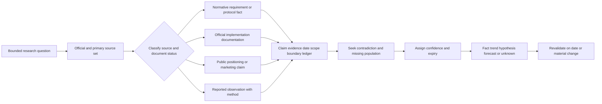

### 🔍 Plain-English deep-dive: Marketing can be evidence without being proof
>
> A product page is primary evidence of the vendor's **public statement**. If the page says a product is deployed through an application programming interface (API), it is fair to write, “The vendor publicly describes API deployment on its product page.” It is not fair to silently strengthen that into “Every customer uses only APIs,” “deployment always takes the advertised time,” or “the design is more effective than inline alternatives.” Those stronger sentences require implementation documentation, environment-specific evidence, and comparative testing.
>
> This is similar to a restaurant menu. The menu is authoritative about what the restaurant offers to sell today. It does not independently prove the recipe, portion consistency, wait time, nutritional result, or superiority over another restaurant. The right research move is not to dismiss the menu; it is to cite it as a menu, then identify what additional evidence the decision needs.

## JD Mapping

## Candidate honesty note

| Role or curriculum signal | What this Part develops | Honest transfer from Arti's background | Boundary that remains |
|---|---|---|---|
| Cloud Email Security | Ability to explain changing BEC paths, mail-authentication standards, architecture categories, evidence, and response layers | Microsoft 365 and enterprise support concepts plus structured study | No direct Abnormal, email-security operations, threat hunting, tenant tuning, or product administration claim |
| AI Security Agents | Agentic workflow, prompt injection, tool abuse, policy gates, observability, and failure containment | Copilot/agent and support experience only where the CV supports it; broader content is learned architecture | No Abnormal agent operation, private model/tool knowledge, autonomous security action, or measured evaluation claim |
| SaaS Security and APIs | Identity, OAuth, scopes, tokens, event contracts, API control/data planes, and integration questions | Working knowledge of REST, Postman, cURL, JSON, identity, and troubleshooting | No production ownership of the named vendor integrations, scopes, APIs, or data flows |
| Complex investigations | Source classification, competing hypotheses, causal restraint, trend verification, and escalation | Strong Microsoft support investigation and Engineering/Product escalation method | A research comparison is not a customer investigation or product RCA |
| Customer trust | Explaining uncertainty, source dates, limitations, and decision criteria without disparagement | Direct customer communication transfer when backed by true examples | No unsupported vendor recommendation, guarantee, legal interpretation, or procurement authority |
| Continuous learning | Repeatable currency review, standards status tracking, and source-expiry discipline | Direct learning, KB/training, and mentoring habits | Reading a source does not prove operational competence or current vendor certification |

Arti's safe interview boundary is:

> “My direct production evidence is Microsoft enterprise support within the scope I can substantiate. For this advanced-topic brief, I reviewed public standards, government guidance, living threat frameworks, official vendor documentation, and public product positioning. I can explain the architecture and comparison questions, but I have not operated Abnormal, run a competitive evaluation, accessed restricted vendor documents, or tested these products. I would revalidate every changing claim against current authorized documentation and the customer's actual requirements.”

## Dated trends brief - August 24, 2026

The table below is a research snapshot. “Direction” means a reasoned trend hypothesis, not a market-size statistic. No percentage, revenue, adoption number, incident count, or winner statement is invented. A current vendor post can illustrate a signal; it cannot establish the whole market.

| Topic | Dated signal set | Supported direction | Confidence and why | What would disconfirm or narrow it | Support relevance |
|---|---|---|---|---|---|
| Business email compromise (BEC) | RFC 9989 explicitly says DMARC does not cover lookalike domains, display-name abuse, content, or non-domain entities; MITRE ATT&CK v19 maps phishing across email, identity providers, office suites, and software as a service (SaaS); current Abnormal public pages emphasize vendor fraud, account takeover, thread context, and payloadless BEC | BEC investigation increasingly needs identity, relationship, business-process, and post-authentication evidence in addition to sender-domain authentication | High for architectural need; low for any prevalence number because no comparable market dataset is asserted here | Independent, method-transparent longitudinal data showing attacks are becoming more domain-spoof-only or less identity/process dependent | L1 should avoid “DMARC passed, so safe” and collect identity and business context |
| Identity-centric attack paths | MITRE ATT&CK Valid Accounts v3.0 includes cloud, identity provider, Office Suite, and SaaS platforms; NIST SP 800-63-4 is final; RFC 9700 updates OAuth security practice; Abnormal's public overview positions identity alongside email | Security boundaries are shifting from a single login event toward sessions, tokens, grants, roles, recovery workflows, and behavior across systems | High as a control-design direction; no claim that one product covers every path | Evidence that identity controls consistently prevent post-authentication abuse without telemetry across sessions, grants, or behavior | Tickets may span email, identity, OAuth, API, and SaaS owners |
| Secure email architecture | Official Cloudflare docs describe both inline and API setup; Microsoft Learn documents native layered controls; Abnormal publicly positions cloud-native API architecture and a modern email control plane; RFC 9989 modernizes DMARC | Enterprises may combine native, inline, API-integrated, and post-delivery controls rather than treat one topology as universally sufficient | High that multiple architectures coexist; unknown which mix fits any customer | Customer requirements, mail path, latency, control authority, recovery needs, and documented product behavior could favor one pattern | L1 needs topology and responsibility maps before troubleshooting |
| Post-delivery and feedback operations | Microsoft Learn documents user-reported messages, submissions, investigation, and response; Abnormal publicly positions automated triage, reporter guidance, and campaign remediation | Email security value increasingly includes investigation, feedback, and response after initial delivery, not only pre-delivery blocking | Moderate to high; feature quality, latency, and entitlement are not compared | Operational evidence showing prevention-only controls satisfy the declared business outcome | Ask whether the failure is detection, disposition, remediation, feedback, or reporting |
| API ecosystems | RFC 9110 defines HTTP boundaries, RFC 9421 defines message-signature building blocks, and RFC 9700 defines OAuth best current practice; vendors publish integration surfaces | Integration security depends on identity, permissions, schemas, versions, event delivery, replay handling, and observability across owners | High at the protocol level; product-specific implementation remains unknown | An integration could be private, non-HTTP, or have controls not visible in public docs | Support must correlate request, grant, event, processing, and final state rather than stop at HTTP success |
| Agentic security | MITRE ATLAS exposes Agentic AI platforms and agent-specific techniques; OWASP publishes agentic threats and mitigations; NIST AI RMF and adversarial machine-learning taxonomy provide governance/threat anchors; vendors increasingly use agent language | Security evaluation is moving from model-output quality alone toward end-to-end authority, tools, memory, policy, approvals, audit, and recovery | High that the risk model is broader; low for any claim that a product is autonomous or safe without documentation and tests | Product documentation may show the system is fixed automation or read-only assistance rather than agentic execution | L1 should ask what the system could read, decide, call, change, and verify |
| Privacy and AI governance | NIST AI RMF 1.0 is under revision; NIST Privacy Framework 1.1 is still an Initial Public Draft; ISO/IEC 42001:2023 is published; EU AI regulation exists as law; Abnormal's Trust Center publicly lists governance certifications and restricted evidence routes | AI governance is becoming an operational lifecycle involving inventory, purpose, data, risk, controls, evaluation, incidents, suppliers, and change | High as governance direction; jurisdiction and contract determine actual duty | Final revisions, local law, regulator guidance, or organization-specific risk could materially change requirements | Support evidence requests and AI-assisted workflows need minimization, provenance, access, retention, and human authority |
| Standards currency | RFC 9989 became Standards Track in May 2026 and obsoleted prior DMARC RFCs; ATT&CK and ATLAS are versioned living resources; NIST AI RMF and Privacy Framework have active revisions/drafts | “Current” knowledge increasingly requires status and supersession checks, not merely familiar document numbers | Very high because document status is directly inspectable | A later RFC, revision, erratum, or final framework will change the anchor | Case guidance and KBs need source/version/expiry fields |
| Competitive category convergence | Public portfolios span email, identity, AI, SaaS, operations, awareness, posture, and integrations; native suites, secure email gateways, API services, identity platforms, and automation tools overlap | Category boundaries are becoming less useful than capability, authority, workflow, evidence, and ownership dimensions | Moderate; category labels remain useful for navigation and buying teams | Clearer standards or stable customer buying patterns could separate categories again | Compare customer problem and control point, not category label or logo count |

### Trend claim template

Use this pattern when answering aloud:

> “As of August 24, 2026, I see **[direction]**. The strongest signals are **[final standard/framework or versioned threat source]** and **[official documentation or method-bounded research]**. I would not infer **[unsupported prevalence, parity, implementation, or outcome]**. For a customer, I would validate **[environment-specific questions]** and revisit the claim on **[date or trigger]**.”

## 1. Evolving BEC: from forged domain to trusted workflow abuse

**Business email compromise (BEC)** is fraud or social engineering conducted through business communications, commonly attempting to cause unauthorized payment, data disclosure, credential use, account change, or other trusted action. It may contain no malware, attachment, or obviously malicious link. That is why “payloadless” is useful: the harmful payload can be the requested business action itself.

The enduring core of BEC is not a particular technology. It is an attacker persuading a person or process to treat attacker-controlled communication as authorized. The technical route can vary:

- exact-domain spoofing, where the visible author domain is used without authorization;
- display-name or lookalike-domain impersonation;
- compromise of a real employee, executive, vendor, or partner account;
- hijacking or imitation of an existing conversation;
- abuse of forwarding rules, sessions, OAuth grants, or delegated mail access;
- movement from email to phone, chat, meeting, file-sharing, or payment workflow; and
- manipulation of the verification process itself, such as providing an attacker-controlled callback number.

RFC 9989 is unusually helpful because it states DMARC's boundary directly. DMARC validates authorized use of the author domain through aligned SPF or DKIM; it does not assess content, display-name attacks, lookalike domains, human intent, local parts, account compromise, or business legitimacy. A DMARC pass can therefore coexist with a compromised sender or malicious message. A DMARC fail can also occur in legitimate indirect mail flows. Authentication is evidence about domain authorization, not a final threat verdict.

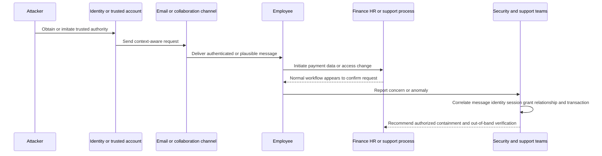

### BEC evidence layers

| Layer | Question | Example evidence | Important limitation |
|---|---|---|---|
| Message object | What exactly was received? | Raw headers, MIME structure, message ID, URLs, attachment metadata, timestamps | A saved message may not show every provider-side decision or later state |
| Domain authentication | Was author-domain use validated? | SPF, DKIM, DMARC, alignment, Authentication-Results, ARC | Pass is not intent; fail is not necessarily attack; ARC is Experimental and trust-dependent |
| Identity | Which account, session, token, device, grant, and sign-in path acted? | Identity-provider logs, session events, OAuth grants, MFA/recovery events | Logs can be delayed, incomplete, sampled, or outside retention |
| Relationship | Is this sender-recipient-vendor pattern expected? | Communication history, approved vendor contacts, role relationships, baseline changes | Historical familiarity can be exploited after compromise |
| Business process | Was the requested action normal and independently authorized? | Purchase order, payee-change workflow, separation of duties, callback directory | Sensitive business evidence must be minimized and handled by authorized owners |
| Cross-channel | Did the conversation move to phone, chat, file, or meeting? | Call records, approved chat audit, meeting invites, file-share audit | Do not collect private content without authority and necessity |
| Response | What was delivered, changed, removed, revoked, or recovered? | Quarantine/remediation records, session revocation, rule removal, financial hold | Action attempted is not action completed; verify target state |

### What is actually evolving?

1. **Trust source:** The attacker can use a legitimate account or session, reducing the value of static “bad sender” indicators.
2. **Context quality:** Public data, prior conversation, compromised mailbox content, and generative tools can improve language and timing. This does not prove every polished message is AI-generated.
3. **Channel continuity:** The same social-engineering story may move among email, chat, phone, video, and SaaS notifications.
4. **Business-process targeting:** The objective is often a payee, payroll, gift card, tax document, password reset, help-desk reset, data export, or OAuth consent action.
5. **Defensive evidence:** Detection and investigation increasingly benefit from cross-domain correlation: message, identity, relationship, process, endpoint, and transaction.

### 🔍 Plain-English deep-dive: Why a “clean” message can still be dangerous
>
> Imagine receiving a genuine signed letter from a real supplier's office. The paper, signature process, and return address can all be valid while the supplier employee's account has been taken over or the request itself is fraudulent. Email authentication is comparable: it can establish that a domain authorized a sending path or signature, but it does not inspect the sender's mental state, account health, or invoice legitimacy.
>
> The practical response is layered, not cynical. Verify technical identity, inspect anomalies, compare relationship history, and use an independently sourced business contact for consequential changes. The analogy stops because digital evidence also includes sessions, tokens, logs, routing, and post-delivery actions that have no paper-letter equivalent.

### BEC control map

| Control layer | Prevent or reduce | Detect or explain | Respond or recover | Unsafe shortcut |
|---|---|---|---|---|
| Domain and mail | Publish and maintain SPF/DKIM/DMARC; safe routing and connector design | Authentication results, alignment, routing anomalies | Correct authorized sender configuration and preserve evidence | Treat DMARC as a universal anti-phishing verdict |
| Identity | Phishing-resistant authentication where appropriate, least privilege, session/grant controls | Sign-in, session, token, grant, recovery, rule, and role anomalies | Revoke sessions/grants, reset through approved identity process, validate state | Reset password only while leaving tokens/grants active |
| Relationship | Verified vendor records and contact ownership | New relationship, unusual recipient, tone/timing or thread change | Independently confirm relationship and intended action | Call the number supplied in the suspicious message |
| Business process | Separation of duties, approved payee-change and sensitive-data procedures | Deviations from expected amount, account, owner, sequence, or deadline | Pause transaction, contact authorized financial/legal/HR owner | Let urgency or executive title bypass process |
| Human reporting | Accessible report path and safe feedback | User report plus original evidence | Timely acknowledgment, containment, guidance, learning | Blame the reporter or request forwarding of harmful content |
| Security operations | Joined telemetry and defined ownership | Correlated timeline and competing hypotheses | Proportionate containment, escalation, recovery, lessons | Assume one control or product owns every decision |

## 2. Identity-centric attacks and the human perimeter

An identity-centric view asks not merely “Did authentication succeed?” but “Which human or non-human identity exercised what authority, from which context, through which session or grant, and was that behavior expected?” A **non-human identity** is a service account, application identity, workload identity, automation principal, API client, or agent identity rather than a person signing in interactively.

MITRE ATT&CK's current Valid Accounts technique includes local, domain, cloud, identity-provider, office-suite, SaaS, container, and infrastructure contexts. That is a taxonomy signal, not a prevalence statistic. It supports a practical architectural observation: legitimate credentials and sessions can cross many systems without deploying obvious malware.

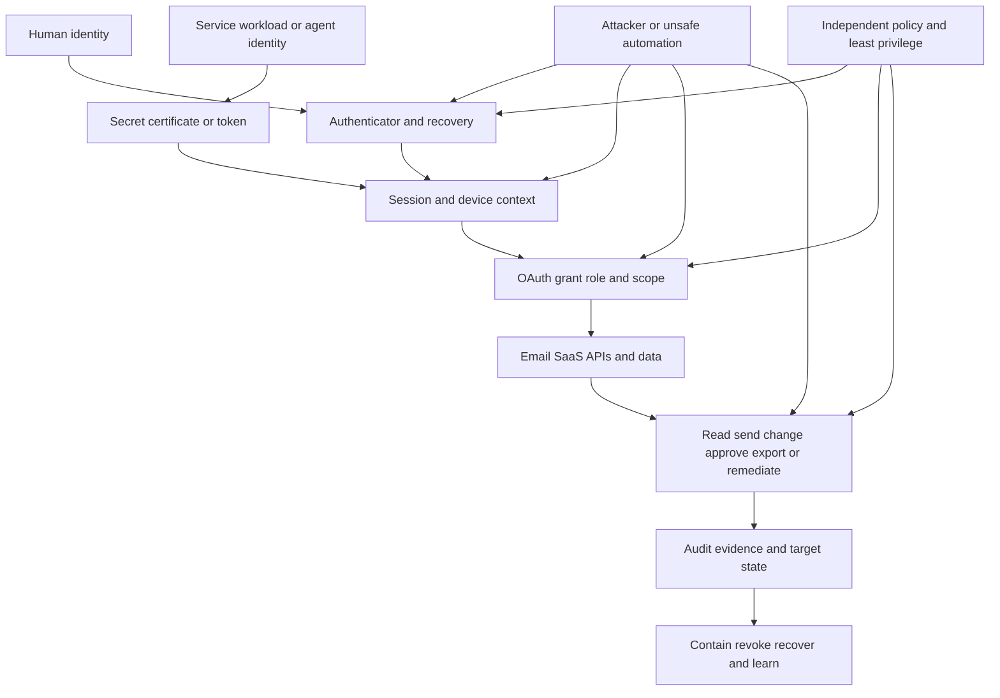

### Identity attack-surface worksheet

| Surface | Abuse question | Evidence to request from authorized owner | Preventive or detective question | Escalate when |
|---|---|---|---|---|
| Password/authenticator | Was a credential phished, guessed, reset, or newly enrolled? | Sign-in and authentication-method events | Is stronger, phishing-resistant authentication supported and correctly scoped? | Authentication change or sign-in is unexplained, privileged, or widespread |
| Session | Was an established browser/app session stolen or replayed? | Session issuance/revocation, device, location, token metadata | Are session lifetime, device binding, continuous evaluation, and revoke paths defined? | Password reset did not end suspicious access or session evidence is missing |
| OAuth grant | Did a user/admin authorize an unsafe app or excessive scope? | Consent, service principal, grant, scope, publisher, app activity | Are consent policy, verified publishers, least privilege, review, and expiry applied? | Grant can read/send/change sensitive data or owner cannot confirm intent |
| Role/privilege | Did expected identity exercise unexpected authority? | Role assignment, elevation, group, policy, change audit | Are just-in-time, separation, approval, and privileged monitoring present? | Privilege was changed, used across tenants, or lacks an accountable owner |
| Help desk/recovery | Was recovery socially engineered? | Ticket, callback, identity proofing, change and approval record | Does the process resist caller-supplied contact details and urgency? | Recovery bypass, privileged target, or cross-customer pattern is suspected |
| Mailbox/app rule | Was persistence or concealment created? | Inbox/transport rule, forwarding, app password, delegation, audit | Are external forwarding, hidden rules, and delegation monitored? | Rule remains active, evidence suggests exfiltration, or multiple mailboxes are affected |
| Non-human identity | Is a secret, certificate, service account, or agent overprivileged? | Credential age, owner, workload, scope, use pattern, rotation, audit | Is identity unique, scoped, short-lived where possible, and revocable? | Owner is absent, credential is public/unknown, or action scope is broad |
| Cross-channel identity | Did trusted identity move the request to chat/phone/meeting? | Approved audit sources and independently verified contact | Does process authorization survive a channel change? | Sensitive action depends only on a message or caller assertion |

NIST SP 800-63-4, finalized in July 2025, is a current digital-identity anchor for proofing, authentication, and federation. It is U.S. federal guidance, not a universal product checklist. RFC 9700 is the current OAuth 2.0 Best Current Practice: it emphasizes exact redirect matching, Proof Key for Code Exchange (PKCE), restrictions on bearer-token use, sender-constrained and audience-restricted tokens where appropriate, refresh-token protection, and removal of insecure patterns such as the resource-owner password credentials grant. Again, protocol guidance does not prove a SaaS integration follows it.

### Identity support reasoning sequence

1. Name the **principal**: human, application, workload, agent, shared role, or unknown.
2. Name the **credential or session**: authenticator, cookie, access token, refresh token, certificate, API key, or delegation.
3. Name the **authority**: role, scope, resource, tenant, action, time, and approval.
4. Name the **observed action** and authoritative target state.
5. Correlate the **source context**: device, network, application, client, time, relationship, and normal baseline.
6. Separate valid authentication from expected behavior and approved business purpose.
7. Contain through the authorized owner, then validate revocation and downstream effects.

## 3. Secure email architecture: layered planes, not one magic box

Secure email architecture is the arrangement of mail flow, identities, policies, telemetry, analysis, user reporting, investigation, and response controls. Common architecture categories include:

- a **secure email gateway (SEG)**, an inline or mail-routing control that evaluates messages as they traverse a gateway;
- **native cloud email security**, controls delivered within the mailbox/collaboration platform;
- **API-integrated email security**, a service that uses authorized APIs and related telemetry to inspect, investigate, or act on cloud-mail objects;
- **post-delivery detection and response**, controls that can identify or remediate messages after initial acceptance or delivery;
- **user-reported phishing operations**, workflows that receive reports, classify messages, communicate with reporters, find related messages, and coordinate response; and
- **hybrid or layered architecture**, a combination whose interactions and ownership must be made explicit.

The category names do not establish product behavior. For example, official Cloudflare documentation publicly describes both inline and API setup for its email-security service. Microsoft Learn documents native layered controls, policy precedence, user reporting, investigation, and response within Microsoft 365. Abnormal's current public product pages position cloud-native API architecture and a “modern email control plane.” Those statements support three different source-bounded facts. They do not prove performance parity, replacement suitability, a universal topology, or the exact Abnormal implementation behind the page.

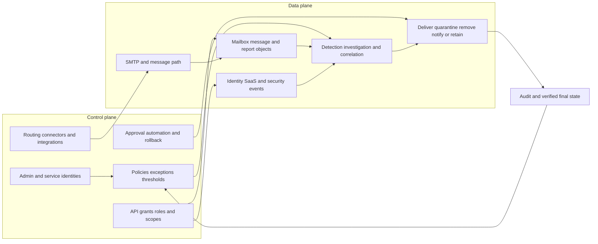

### Architecture comparison questions

| Dimension | Questions to ask | Evidence that answers | Why labels are insufficient |
|---|---|---|---|
| Placement | Before acceptance, after delivery, both, or a separate analysis path? | Current architecture/deployment docs and environment topology | “Cloud” or “API” does not state every processing point |
| Message path | Are Mail Exchange (MX) records, connectors, transport rules, journaling, or routing changed? | Product docs plus actual authorized configuration | A marketing deployment phrase may omit coexistence and exceptions |
| Object timing | When is a message visible, classified, and actionable? | Documented event timing plus measured customer evidence | API availability does not guarantee latency or completeness |
| Identity context | Which directory, sign-in, grant, role, vendor, and relationship signals are used? | Data dictionary, permissions, architecture, privacy docs | “Behavioral” does not reveal exact signals or model use |
| Control authority | Which system can block, deliver, quarantine, delete, release, notify, or restore? | Action contract, roles, approval, audit, rollback documentation | Integration logo does not prove bidirectional authority |
| Failure behavior | What happens on outage, throttling, stale token, schema change, mail reroute, or partial action? | Failure-mode docs, service health, retry/idempotency design, test evidence | Happy-path demo does not show fail-open/fail-closed behavior |
| Coexistence | How do native, gateway, API, rules, and user reports interact? | Precedence and topology map with test messages | Two products can duplicate, conflict, or leave gaps |
| Explainability | Which observable reason, policy, source object, and action history are available? | Product docs and actual case artifacts | “Glass box” is positioning until fields and workflow are verified |
| Recovery | Can an authorized owner restore, revoke, reverse, or compensate safely? | Recovery runbook, target-state validation, audit | “Automated remediation” does not define reversibility |
| Privacy | Which content/metadata is processed, where, for how long, and for which purpose? | Privacy guide, data-processing agreement, subprocessor list, configuration | Public trust summary does not expose every contracted detail |
| Operations | Who owns false positives, false negatives, threat cases, configuration, service incidents, and updates? | Support model, responsibility matrix, entitlement and escalation docs | Technical capability does not assign operational accountability |

### Standards change that affects secure-email discussions

RFC 9989, published May 2026 as a Proposed Standard on the Standards Track, obsoletes the older Informational RFC 7489 and Experimental RFC 9091. Important study-time changes include a Domain Name System (DNS) tree-walk approach, updated Public Suffix Domain handling, movement of aggregate and failure reporting to RFCs 9990 and 9991, removal/historic treatment of some old tags such as `pct`, and introduction of a test-mode concept. The operational lesson is not to rewrite a production DMARC record from a study guide. It is to stop relying on memory from RFC 7489, consult current authoritative guidance and provider behavior, assess interoperability, and use the authorized domain/mail owner.

RFC 8617 for Authenticated Received Chain (ARC) remains Experimental. ARC can carry authenticated assertions about prior handling and authentication, but it is not a trust framework and does not make message content safe. This is a clean example of why “RFC” does not automatically mean “Internet Standard.”

### 🔍 Plain-English deep-dive: Control plane failure can masquerade as detection failure
>
> Suppose a suspicious message remains in a mailbox. The detection engine may have classified it correctly, while a stale API grant prevented remediation. Or the action may have succeeded but the console's event view lagged. Conversely, a healthy API connection can faithfully execute a bad exception created in the control plane.
>
> Think of a railway. The control plane contains schedules, signals, permissions, and route settings. The data plane is the movement of trains and cargo. A train arriving at the wrong platform can result from a signaling configuration, a dispatcher decision, a mechanical problem, or a stale status board. “The railway failed” is too broad. Support should identify the intended state, plane, owner, evidence, and actual final state.

## 4. Agentic AI and agentic security

Not every AI feature is an agent. A classifier can label a message. A generator can draft text. Fixed automation can execute a predefined branch. An agentic system may choose among steps or tools to pursue a bounded goal at runtime. Because public labels vary, the safest question is: **What can this system read, decide, call, change, communicate, remember, and verify?**

Agentic security has two distinct current contexts:

1. **Attackers using AI or automation:** AI can assist research, content generation, translation, coding, or operational scale. A source must establish actual use before attributing an incident to AI.
2. **Defenders using agents:** A system can triage, investigate, summarize, recommend, or act. Greater action authority creates stronger requirements for identity, scope, policy, approval, evidence, idempotency, audit, stop, and recovery.

MITRE ATLAS is a living knowledge base and currently exposes an Agentic AI platform plus techniques involving agent context, tool invocation, configuration, and tool poisoning. OWASP's Agentic Security Initiative provides threat-model guidance. NIST AI 100-2 E2025 provides a final adversarial machine-learning taxonomy and notes an errata/update boundary. These are valuable threat-model sources; none certifies a particular product or supplies a universal agent architecture.

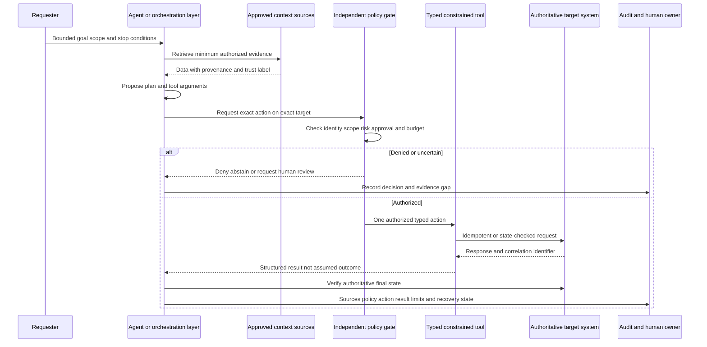

### Agentic security control contract

| Control | Beginner-first question | Required evidence | Failure if absent |
|---|---|---|---|
| Goal and scope | What outcome is allowed, on which objects, for how long? | Goal ID, tenant, object set, non-goals, stop condition | Goal drift, broad search, or unintended target |
| Agent identity | Which principal is acting? | Unique identity, owner, credential method, lifecycle | Shared/unowned identity and weak attribution |
| Context provenance | Which source produced each fact and how trusted is it? | Source IDs, timestamps, transformations, trust labels | Untrusted content silently becomes instruction or fact |
| Instruction separation | What is policy versus user input versus retrieved data? | Typed channels or structured boundaries | Indirect prompt injection can redirect behavior |
| Tool contract | Which action and argument schema is allowed? | Allowlists, types, validation, target resolution | Arbitrary command, confused deputy, or argument injection |
| Independent authorization | Does a non-model control enforce identity, resource, action, and scope? | Policy decision and version | Fluent model output becomes de facto permission |
| Human decision | Which consequence requires which authorized approver? | Decision-specific evidence, deny path, expiry | Rubber-stamp approval or approval fatigue |
| Budget and rate | How many steps, targets, tokens, requests, time, and cost are allowed? | Hard limits and stop events | Loops, denial of service, excessive spend, broad blast radius |
| Idempotency/state check | Can retry duplicate an action? | Idempotency key or target-state query | Timeout produces duplicate deletion, message, or revocation |
| Output handling | Can model/tool output become code, query, message, or policy? | Parser, validation, encoding, review | Improper output handling or command/query injection |
| Observability | Can support reconstruct request, policy, tool, result, and state? | Run/request/action IDs and sanitized events | Root cause and accountability disappear |
| Stop/revoke/recover | Can authority be withdrawn and partial change repaired? | Kill, credential revoke, compensation, rollback, owner | Unsafe action continues after uncertainty or compromise |
| Privacy/memory | What is retained, corrected, isolated, expired, and deleted? | Purpose, fields, tenant boundary, retention, disposition | Cross-tenant leakage, stale memory, secret persistence |
| Evaluation | Which normal, adversarial, failure, and abstention cases are tested? | Versioned test set, scorer, critical failures | Happy-path demo becomes unsupported assurance |

### Prompt injection versus tool abuse

Prompt injection begins with untrusted content trying to influence an AI system's instruction following. The content can be direct user input or indirect content retrieved from an email, document, webpage, ticket, log, tool result, or knowledge base. Tool abuse is broader: an unsafe action can arise from injection, hallucination, ambiguous target resolution, excessive permissions, compromised credentials, malformed output, user error, or faulty automation.

A complete defense therefore includes:

- treating external and retrieved content as data, never as authority;
- minimizing context and preserving provenance;
- constraining tools and arguments with typed schemas;
- resolving target identities from authoritative systems;
- enforcing authorization outside the model;
- requiring meaningful approval for consequential actions;
- using step, target, rate, time, and cost budgets;
- validating output before any parser, interpreter, query, or communication path;
- checking target state before retrying and after execution;
- monitoring unusual action sequences and denial/abstention quality; and
- maintaining stop, revoke, compensation, incident, and correction paths.

Prompt wording such as “ignore malicious instructions” is helpful guidance, not a security boundary. Hidden chain-of-thought is not required for support observability; structured sources, decisions, policy checks, tool calls, results, and target state are more appropriate.

### 🔍 Plain-English deep-dive: The model should not hold the master key
>
> Imagine a junior analyst who can suggest an action but must present a badge, ticket, target, evidence, and approval to an independent access-control system. Even if the analyst reads a forged instruction in an email, the access system can deny an unauthorized action. If the analyst personally holds a master key and decides when it applies, a persuasive forged instruction can become a physical change.
>
> Agentic security uses the same principle. A model may propose; a separate control should authorize. The analogy stops because software also needs typed arguments, tenant boundaries, idempotency, replay protection, rate limits, structured audit, and automatic revocation. A human approval button is not enough if the person cannot see the exact target, consequence, evidence, uncertainty, and rollback.

## 5. API ecosystems as security systems

An API is a defined interface through which software requests data or actions from other software. An API ecosystem includes far more than endpoint syntax: tenants, identities, grants, scopes, schemas, event sources, webhooks, queues, retries, versions, owners, support contracts, and final-state evidence.

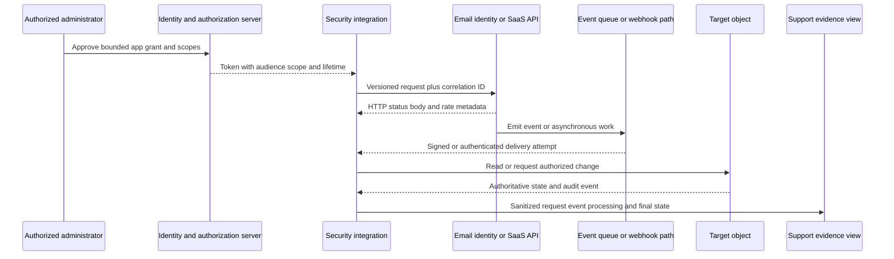

### API ecosystem evidence map

| Boundary | Key contract | Typical symptom | Discriminating evidence | Common overclaim |
|---|---|---|---|---|
| Tenant and endpoint | Correct environment, base URL, region, version | Wrong tenant, `404`, unexpected object set | Sanitized target URI, tenant ID category, version docs | “The API is down” |
| Identity and token | Issuer, subject/client, audience, expiry, signature, client authentication | `401`, invalid token, expired credential | Token metadata without secret, issuer config, server challenge | “Permissions are missing” before authentication is established |
| Authorization | Scope, role, resource, action, admin consent | `403`, partial data, action forbidden | Grant and role record, resource policy, exact denied action | “Token works, so it has access to everything” |
| Request contract | Method, headers, content type, schema, required fields | `400`, `405`, `415`, `422` | Redacted request, schema/version, structured error | “JSON is valid, so request is valid” |
| Rate and resilience | Quota, Retry-After, backoff, jitter, budget | `429`, timeout, burst failure | Response headers, retry timeline, client policy | “Retry immediately until it works” |
| Asynchronous processing | Receipt versus queue versus worker versus target state | `200`/`202` but no outcome | Job/event ID, queue/worker events, target-state query | “Accepted means completed” |
| Webhook trust | Sender authentication, signature profile, timestamp, nonce, replay window | Invalid signature, duplicate, missing event | Raw canonical input, covered fields, key ID, delivery ID | “RFC 9421 defines our vendor's webhook scheme” |
| Ordering/deduplication | Event ID, ordering key, delivery semantics, idempotency window | Duplicate or out-of-order state | Delivery attempts and object version | “Webhook delivery is exactly once” |
| Version/schema | Compatibility, deprecation, optional/null/new fields | Parser break or silent omission | Changelog, content type, schema, client version | “No URL change means no contract change” |
| Observability | Request, trace, event, action, object IDs and clocks | Gaps between systems | UTC-normalized multi-source timeline | “No log means no event occurred” |
| Privacy/retention | Minimum fields, purpose, location, access, retention | Excess collection or missing evidence | Data map and retention/access policy | “Metadata is not personal or sensitive” |
| Support ownership | Vendor, platform, customer, network, identity, app owner | Circular handoff | Responsibility matrix and exact unanswered question | “Integration vendor owns every dependency” |

RFC 9110 provides HTTP semantics, including the important boundary that `202 Accepted` means processing has not completed and may never occur. RFC 9421 provides a Standards Track mechanism for signing selected HTTP message components, but each application still must define covered components, keys, algorithms, time/replay rules, errors, and security analysis. RFC 9700 supplies OAuth Best Current Practice. Together they offer questions, not a universal vendor integration design.

### API control plane versus data plane

| Plane | Examples | Failure examples | Support question |
|---|---|---|---|
| Control plane | App registration, consent, scopes, roles, connector config, policy, webhook subscription, schema/version selection | Revoked grant, wrong tenant, excessive scope, expired subscription, stale endpoint, conflicting policy | “What desired state and authority should exist, and which owner can verify it?” |
| Data plane | Token exchange, API request, event delivery, message object, analysis result, remediation action | Timeout, malformed payload, dropped/duplicate event, rate limit, partial processing, stale object | “Which object moved or changed, at what boundary, with which ID and final state?” |

## 6. Privacy and AI governance

AI governance is not a single approval meeting. It is a lifecycle that answers who may use AI, for which purpose, on which data, with which model and tools, under which controls, how quality and harm are measured, who can stop it, and how incidents, complaints, changes, suppliers, retention, and retirement are handled.

NIST AI RMF 1.0 organizes voluntary risk work around Govern, Map, Measure, and Manage. The NIST page explicitly says AI RMF 1.0 is under revision as of the study date. NIST AI 600-1 is the final Generative AI Profile released in July 2024. ISO/IEC 42001:2023 is a published International Standard for an AI management system. The EU AI Act is law, but applying it depends on role, system, use, timing, jurisdiction, and legal interpretation. NIST Privacy Framework 1.1 remains an Initial Public Draft, while Privacy Framework 1.0 remains the established final baseline. None of these sources should be blended into “the AI standard.”

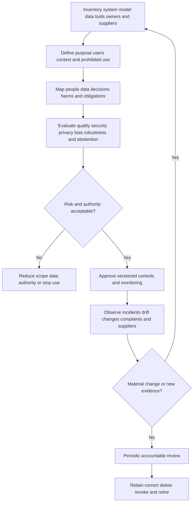

### Governance map

| Governance area | Questions | Evidence artifact | Support boundary |
|---|---|---|---|
| Inventory | Which model, application, agent, tool, version, owner, supplier, and environment exist? | Versioned system and dependency register | Discovery page does not automatically establish sanctioned use |
| Purpose | Which user/problem is served and which uses are prohibited? | Purpose statement, scope, misuse cases | New convenient use requires reassessment |
| Data | What content/metadata is collected, inferred, generated, transferred, retained, corrected, and deleted? | Data-flow and lifecycle map | “Encrypted” does not answer purpose, minimization, access, or retention |
| Authority | What may the system recommend versus decide versus execute? | Decision-rights and approval matrix | Human-in-loop must identify the actual decision and authority |
| Risk | Who can be harmed and through which failure path? | Risk register and threat model | Generic risk list does not substitute for context |
| Evaluation | Which normal, edge, adversarial, privacy, subgroup, failure, and abstention cases are assessed? | Versioned evaluation plan and results | One score cannot establish safety or fitness |
| Transparency | What do users, reviewers, and operators need to know? | Notices, source/uncertainty display, operator runbook | Transparency does not excuse unsafe design |
| Monitoring | Which quality, security, privacy, drift, incident, and override signals trigger action? | Metric definitions and alert/owner map | More telemetry can increase privacy risk |
| Incident/correction | How are outputs corrected, authority revoked, affected parties protected, and lessons applied? | Incident and correction workflow | Quietly editing output loses accountability |
| Supplier/change | How are provider, model, prompt, tool, scope, region, and terms changes assessed? | Supplier record, change gate, expiry | Same product name can hide a material version change |
| Retention/retirement | What is retained for audit, what is deleted, and how are credentials/models/integrations retired? | Retention schedule and retirement checklist | Deleting evidence can conflict with legal or incident duties; use authorized policy |

### 🔍 Plain-English deep-dive: Governance is a control loop, not a certificate collection
>
> A driver's license, vehicle inspection, traffic law, route plan, dashboard warning, and accident investigation all govern different parts of driving. Framing governance as one certificate would miss the driver's authority, the trip purpose, live conditions, maintenance, behavior, and response to failure.
>
> AI governance is similar. A management-system certification can be meaningful evidence within its declared scope, but it does not prove every output is correct, every use is lawful, or every customer configuration is safe. Frameworks help organize questions; laws create obligations in defined contexts; standards specify requirements; product controls implement selected parts; operations observe what actually happens.

## 7. Standards and framework status map

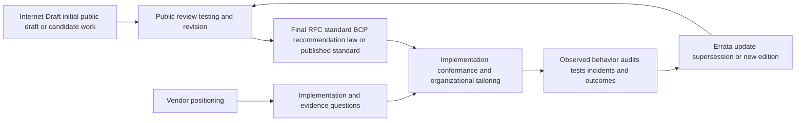

### Current standards map

| Domain | Current anchor at study time | Status/date | What it anchors | Important boundary/change |
|---|---|---|---|---|
| DMARC | RFC 9989 | Standards Track, Proposed Standard, May 2026 | Domain-based mail authentication, alignment, policy discovery | Obsoletes RFCs 7489 and 9091; not content, display-name, lookalike, account, or intent validation |
| DMARC aggregate reporting | RFC 9990 | Standards Track, May 2026 | Aggregate-report format and handling | Separate from core DMARC; reports can expose operational data and are not guaranteed from every receiver |
| DMARC failure reporting | RFC 9991 | Standards Track, May 2026 | Failure-report framework | Privacy-sensitive; receiving behavior varies |
| ARC | RFC 8617 | Experimental, July 2019 | Authenticated chain of handling assertions | Not Standards Track and not a trust or content-safety verdict |
| HTTP | RFC 9110 / STD 97 | Internet Standard, June 2022 | HTTP semantics, methods, statuses, intermediaries | Protocol success stops at the represented HTTP boundary; `202` is noncommittal |
| HTTP message signatures | RFC 9421 | Standards Track, Proposed Standard, February 2024 | Signing selected HTTP components | Application profile, keys, replay, coverage, and policy remain required |
| OAuth security | RFC 9700 / BCP 240 | Best Current Practice, January 2025 | Updated OAuth 2.0 security practice | Does not prove a product or integration conforms; OAuth 2.1 status must be checked separately |
| Digital identity | NIST SP 800-63-4 family | Final, July 2025 | Identity proofing, authentication, federation | U.S. federal guidance; implementation and organizational applicability vary |
| Zero trust | NIST SP 800-207 | Final, August 2020 | Resource-centric zero-trust architecture | Architecture guidance, not a product category or certification |
| Cybersecurity risk | NIST CSF 2.0 | Final, February 2024 | Govern, Identify, Protect, Detect, Respond, Recover outcomes | Voluntary and outcome-focused; profiles and implementation are contextual |
| AI risk | NIST AI RMF 1.0 | Final framework, January 2023; revision underway in 2026 | Govern, Map, Measure, Manage AI risks | 1.0 remains the named published version while revision work continues |
| Generative AI risk | NIST AI 600-1 | Final profile, July 2024 | Generative-AI-specific risk actions | Profile supports tailoring; it is not product certification |
| Adversarial ML | NIST AI 100-2 E2025 | Final, March 2025; potential updates noted June 2025 | Attack/mitigation taxonomy including generative AI | Taxonomy, not prevalence or complete agent assurance |
| AI management | ISO/IEC 42001:2023 | Published International Standard, edition 1, December 2023 | AI management-system requirements | Certification scope and current evidence must be verified; certification is not output accuracy |
| Privacy risk | NIST Privacy Framework 1.0 and PF 1.1 IPD | 1.0 final; 1.1 Initial Public Draft at study time | Privacy-risk management | Do not cite 1.1 draft as a final standard |
| Enterprise threat behavior | MITRE ATT&CK v19 | Living knowledge base; current technique versions include May 2026 changes | Techniques, mitigations, detections, versioned references | Not a standard, prevalence dataset, or completeness guarantee |
| AI threat behavior | MITRE ATLAS | Living knowledge base, current site in 2026 | AI/GenAI/agentic tactics and techniques | Maturity levels and examples require context; not product certification |
| GenAI application risks | OWASP Top 10 and Agentic Security resources | Community project; 2025 and 2026 releases/pages | Prompt injection, excessive agency, tool and data risks | Useful guidance, not law, ISO standard, RFC, or vendor assurance |

### How to read document status

| Status phrase | Plain meaning | Safe use | Unsafe use |
|---|---|---|---|
| Internet Standard | Mature IETF standard assigned an STD number | Cite protocol semantics and conformance text | Assume every deployed system is conformant |
| Proposed Standard / Standards Track | IETF consensus specification on Standards Track | Cite the formal protocol and current status | Call it an Internet Standard or proof of adoption |
| Best Current Practice | IETF consensus operational/security practice | Use as current practice baseline and question set | Treat as a protocol version or legal mandate |
| Experimental RFC | Published for experiment/evaluation | Explain defined mechanism and explicit status | Call it final Standards Track requirement |
| Final NIST publication/framework | Published government guidance | Use definitions and risk practices within applicability | Claim certification, law, or universal mandate |
| Initial Public Draft | Formal draft seeking feedback | Track emerging direction and potential changes | Implement as final requirement without owner decision |
| ISO International Standard | Published consensus standard, often full text licensed | Cite title, edition, scope summary, and management requirements | Reproduce restricted text, infer certification, or guarantee outcomes |
| Regulation/law | Binding legal text in its jurisdiction and schedule | Flag legal/compliance questions to qualified owners | Give legal advice or assume one rule applies globally |
| Living knowledge base | Versioned, continually updated catalog | Use version/date and technique-level mapping | Treat current page as immutable or exhaustive |
| Vendor docs | Official technical instructions/reference | Compare documented behavior and requirements | Assume every plan, tenant, region, or version behaves identically |
| Vendor marketing | Official positioning and stated claims | Quote/attribute exact public statement and create validation questions | Treat it as independent proof or architecture detail |

## 8. Competitive categories without winner rankings

The market can be mapped by **control point and customer job**, not a ladder of “legacy” versus “modern.” Terms evolve and vendors can span several categories.

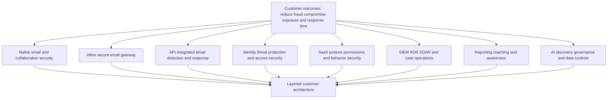

### Category map

| Category | Primary control point | Typical customer questions | Overlap to inspect | Comparison trap |
|---|---|---|---|---|
| Native email/collaboration security | Mailbox and collaboration platform | Which protections, policies, plans, investigations, and response actions exist natively? | Identity, endpoint, XDR, data protection, user reporting | Treating “included” as configured, sufficient, or free of operational cost |
| Inline SEG | Message-routing path before final mailbox acceptance | Which mail flows, protocols, content, reputation, authentication, and policy are enforced? | Data loss, encryption, sandboxing, archive, continuity | Assuming inline always means older or API always means later/better |
| API-integrated email security | Cloud-provider APIs and event/data access | Which objects/signals are read, how quickly, and which authorized actions exist? | Post-delivery response, identity, relationship, SaaS, user reports | Integration listing equals complete, real-time, bidirectional coverage |
| Identity threat protection | Identity provider, session, role, grant, device, behavior | Can it identify and contain compromised or misused identities before/after login? | Email ATO, SaaS, endpoint, zero trust | MFA success equals legitimate behavior |
| SaaS security/posture | Tenant apps, grants, configurations, identities, data | Which risky apps, permissions, drift, and behavior are visible or controllable? | Identity, AI governance, data security, cloud posture | One “SaaS Security” label means same objects and actions across vendors |
| SIEM/XDR/SOAR | Cross-source event, incident, analytics, orchestration | How are alerts normalized, correlated, investigated, and acted on? | Email, identity, endpoint, cloud, case systems | Connector count equals useful data quality or resilient playbooks |
| User-report operations/awareness | Human report and feedback loop | How are reports received, classified, remediated, communicated, and measured? | Email detection, case automation, training | Automated reply equals correct verdict and safe campaign remediation |
| AI governance/security | AI tool, agent, chat, model, prompt, data, grant, spend, policy | What AI use exists, which data/permissions are involved, and what action is allowed? | SaaS, identity, browser, data loss prevention, procurement | Discovery equals complete inventory or risk score equals objective truth |
| Security posture/configuration | Desired secure state and drift | Which settings are required, observed, changed, and validated? | Native suite, SaaS, identity, email authentication | Checklist pass equals reduced real-world risk |

Category boundaries should be presented as a Venn diagram, not a race. A native suite can have API integrations; a gateway can expose APIs; an API-integrated product can influence disposition; an identity platform can detect email-related account takeover; a SIEM can orchestrate email response. The customer's architecture, authority, latency, data, operations, and failure requirements decide the relevant comparison.

## 9. Evidence-based comparison framework

### Step 1: freeze the decision context

| Context field | Example for a fictional customer | Why required |
|---|---|---|
| Decision | Select a pattern for improving BEC investigation and response | Prevents “compare everything” |
| Environment | Microsoft 365 cloud mailboxes, approved identity provider, existing SOC | Topology and ownership shape fit |
| In-scope outcomes | Reduce missed identity/process abuse, speed evidence collection, preserve safe mail | Outcomes are not feature names |
| Non-goals | No vendor ranking, no live trial, no replacement decision in the study | Preserves evidence ceiling |
| Constraints | Data residency, least privilege, no MX change during peak season, limited analysts | Makes tradeoffs visible |
| Required evidence | Current public docs now; authorized security/privacy/support evidence later | Separates learning from procurement |
| Review date | August 24, 2026 snapshot; revalidate before any real decision | Product and standard claims expire |

### Step 2: grade evidence, not vendors

| Grade | Evidence condition | Comparison language |
|---|---|---|
| `NORMATIVE` | Final law/standard/BCP directly addresses the statement | “The document requires/recommends X within its stated scope.” |
| `DOC_CONFIRMED` | Current official technical docs explicitly state behavior, prerequisites, or limit | “Official docs describe X for this documented plan/setup as of date.” |
| `TRUST_ATTESTED_PUBLIC` | Public trust page identifies a certificate or program, but detailed scope may be restricted | “The trust page lists X; verify current certificate, scope, and report.” |
| `VENDOR_STATED` | Official marketing, launch, blog, customer story, or public claim | “The vendor states X; implementation and outcome remain to validate.” |
| `METHOD_BOUNDED` | Dated research describes dataset, period, and method | “The report observed X in its declared sample; no whole-market inference.” |
| `COMMUNITY_GUIDANCE` | Recognized community project supplies threat/mitigation guidance | “Useful evaluation prompt, not a standard or product proof.” |
| `INFERRED` | Reasoned from several facts but not explicitly documented | “Hypothesis/question to validate.” |
| `UNKNOWN` | Public evidence does not answer | “Unknown; ask the authorized vendor/customer owner.” |
| `CONFLICTED_OR_STALE` | Sources differ, old source is superseded, or version cannot be confirmed | “Do not compare until conflict or currency is resolved.” |

### Step 3: compare dimensions and questions

| Dimension | Minimum questions | Acceptable public evidence now | Evidence required before a real decision |
|---|---|---|---|
| Customer problem | Which loss, workload, gap, or obligation is in scope? | Public use-case docs | Customer-owned baseline and success criteria |
| Architecture | Where does control/analysis sit and what changes? | Current architecture/deployment docs | Authorized environment design and validated topology |
| Coverage | Which channels, object types, identities, stages, and attack classes? | Feature docs with exact scope | Test plan, sampled results, known exclusions, entitlement |
| Data/permissions | What fields/content, scopes, roles, regions, subprocessors, and retention? | Privacy/trust/docs | Contract, data-processing terms, actual grant and configuration |
| Detection/decision | What signals and policies are public, and how are uncertainty/feedback handled? | Public explanations | Actual evidence fields, evaluation method, operational cases |
| Response | Which actions, approvals, reversibility, and final-state checks exist? | Action docs | Authorized workflow tests and rollback evidence |
| Integration | Auth, schema, versions, rate limits, events, retries, idempotency, observability? | API/integration docs | Exact current contract and local evidence |
| Operations/support | Roles, escalation, availability, update model, evidence access, recovery? | Public support/service docs | Contractual entitlement and operating model |
| Security/privacy/governance | Certifications, policies, AI/data governance, incident and supplier process? | Public trust and official framework mapping | Current scoped reports, legal/privacy/security review |
| Cost/change | Licensing unit, dependencies, migration, coexistence, staffing, exit? | Public plan pages where available | Commercial quote, effort model, transition/exit test |
| Outcomes | What metric, denominator, period, comparator, and sponsor? | Method-bounded public study | Customer-specific pilot under agreed method and guardrails |

### Step 4: use question-state cells, not scores

Allowed values are `CONFIRMED_PUBLIC`, `VENDOR_STATED`, `INFERRED`, `UNKNOWN`, `NOT_APPLICABLE`, and later `VALIDATED_AUTHORIZED`. Numeric totals are intentionally omitted. A total can hide a critical unknown, treat unlike evidence as equal, and create a winner ranking unsupported by the decision context.

## 10. Worked comparison examples

### Worked example A - comparing architecture documentation, not product quality

**Question:** What can current public sources establish about deployment architecture for Abnormal, Microsoft Defender for Office 365, and Cloudflare Email Security?

| Source surface | Public statement supported | Evidence grade | What remains unknown | Comparison conclusion |
|---|---|---|---|---|
| Abnormal Email Security and platform overview pages | Abnormal publicly positions a cloud-native API architecture, Microsoft/Google integrations, and no MX-change/rapid-deployment language | `VENDOR_STATED` because these are product marketing pages | Exact production data path, permissions, timing, coexistence, failure behavior, customer configuration, entitlement, and measured outcome | It is fair to ask API-control/data-plane questions; it is not fair to declare universal deployment time or superiority |
| Microsoft Learn Defender for Office 365 overview and deployment guide | Official docs describe native Microsoft 365 protection layers, plan-dependent capabilities, roles, email-authentication setup, policy precedence, user reporting, and investigation/response setup | `DOC_CONFIRMED` for the documented Microsoft scope and update date | Actual tenant licenses/configuration, effectiveness, third-party coexistence, and customer outcome | This source is strong for current documented control/configuration questions, not comparative performance |
| Cloudflare Email Security developer overview | Official docs explicitly describe inline and API setup, with inline evaluating before inbox and API evaluating after arrival; page shows an August 14, 2026 update | `DOC_CONFIRMED` for those public architecture options | Detailed entitlement, environment behavior, efficacy, latency, and customer fit | This disproves a false binary that every vendor is only inline or only API; it does not rank either path |

**Reasoning:** The three sources have different jobs. Abnormal's page is the official source for its public positioning. Microsoft and Cloudflare expose public technical documentation with more implementation detail for the selected question. Evidence grade applies to the statement, not vendor trustworthiness. A procurement team would still need authorized architecture, security/privacy, entitlement, test, support, commercial, and exit evidence.

**Result:** No winner. The defensible output is a customer-specific question set:

1. Which messages/objects are observed at which time and by which authorized interface?
2. Which control changes the mail path or MX record?
3. Which service owns pre-delivery, post-delivery, investigation, and remediation state?
4. What happens during API throttling, authorization loss, service degradation, connector change, and partial remediation?
5. How do native and third-party controls coexist, deduplicate alerts, preserve safe mail, and recover false positives?

### Worked example B - fictional architecture selection without vendor claims

**Fixture:** `Northstar Textiles` is fictional. It uses cloud mail, has strict mail-flow change windows, sees occasional vendor-invoice impersonation, has a small SOC, and requires independently approved payee changes. This example is a paper exercise, not customer evidence.

| Requirement | Native suite pattern | Inline gateway pattern | API-integrated pattern | Combined question |
|---|---|---|---|---|
| No peak-season MX change | Potentially compatible if already native | May conflict if new routing is required | Potentially compatible if documented API setup requires no route change | Which exact deployment changes are required in the real environment? |
| Pre-delivery blocking | Depends on documented native control | Architecture can evaluate inline | Some API patterns may act after arrival; product docs may also describe pre-delivery paths | At what point is each threat class detectable/actionable? |
| Post-delivery related-message response | Depends on native investigation/response | May require mailbox/API integration beyond gateway | Often a relevant API use case, but exact action unknown | Can the system find, remove, restore, and audit related messages? |
| Vendor relationship context | Product-specific and unknown | Product-specific and unknown | Product-specific and unknown | Which public/documented signals exist, and what customer data is needed? |
| Small SOC | Automation may help; quality/authority unknown | Operations may be familiar; workload unknown | Automation may help; API failure handling unknown | Which tasks are removed, created, or shifted, with what review burden? |
| Payee-change safety | Security tool cannot replace business approval | Same | Same | How does security evidence reach the process without authorizing payment? |

**Reasoning:** Architecture creates affordances, not automatic fit. Northstar's non-negotiable payee control is outside the final authority of an email-security tool. A detection can pause/escalate a workflow, but finance owns payment verification. The exercise keeps each pattern's unknowns visible rather than awarding points based on category stereotypes.

**Result:** The decision remains `INCOMPLETE_PUBLIC_EVIDENCE`. Next evidence would be authorized architecture workshops, permission/data review, failure-mode demonstrations, coexistence design, and a synthetic or approved pilot with agreed success and false-positive guardrails.

### Worked example C - evaluating an “AI agent” claim

**Claim:** A public page says an AI security feature autonomously triages reported messages and remediates related threats.

| Step | Question | Publicly supported now | Still requires validation |
|---|---|---|---|
| Classify source | Is this product documentation, marketing, study, or standard? | The current Abnormal AI Security Mailbox page is an official product marketing surface | Whether separate authorized documentation defines the workflow |
| Parse verbs | What are the claimed decisions/actions? | Public page uses triage, classification, response, related-message finding, and remediation language | Exact objects, confidence, exceptions, approvals, timing, and action authority |
| Map agent contract | What can it read, decide, call, change, communicate, remember, and verify? | Some public workflow categories are named | Identities, tools, prompts, models, scopes, tenant isolation, logs, idempotency, recovery |
| Threat model | Could untrusted message content influence action? | Prompt injection and tool risk are valid vendor-neutral questions from ATLAS/OWASP/NIST | Actual architecture and mitigations in the product |
| Outcome | Does automation reduce work safely? | Vendor page and attributed studies/customer statements can be recorded as source claims | Independent/current method, customer baseline, correction burden, false outcomes, contractual scope |

**Safe spoken conclusion:** “Abnormal publicly positions AI Security Mailbox as automating triage, response, and related-message remediation. I would not infer the private agent architecture or claim measured results. I would validate exact data sources, decision boundaries, confidence handling, policy/approval, tool permissions, idempotency, audit, recovery, and current entitlement. I would also test normal, ambiguous, false-positive, prompt-injection, partial-failure, and abstention cases in an authorized environment.”

### Worked example D - standard versus draft

**Question:** Should a knowledge article call NIST Privacy Framework 1.1 “the current final privacy standard”?

1. Open the official NIST page and record the exact title/status.
2. The page identifies Privacy Framework 1.1 as an Initial Public Draft.
3. NIST describes the Privacy Framework as a voluntary tool, not a legal or certification standard.
4. Therefore, the proposed sentence is wrong in three ways: version status, “standard” classification, and mandatory implication.
5. Correct language: “NIST's voluntary Privacy Framework provides privacy-risk-management guidance. As of August 24, 2026, version 1.1 is an Initial Public Draft; verify later status before using draft changes.”

## 11. Trend-verification decision tree

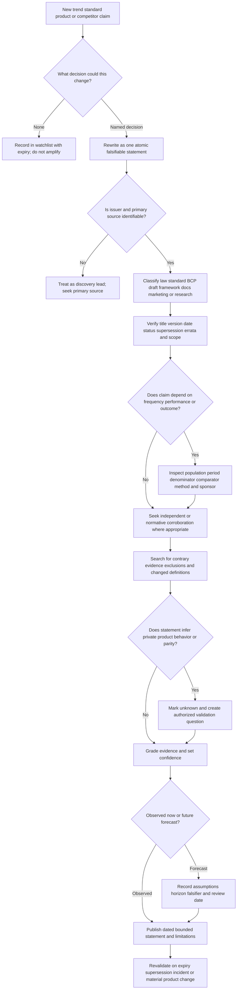

### Cheap verification checklist

| Check | Pass question | Stop/repair response |
|---|---|---|
| Atomicity | Is the sentence one claim rather than five bundled claims? | Split it before sourcing |
| Primary source | Is the official issuer/source available? | Use secondary only as discovery and say so |
| Status | Is it final, draft, experimental, BCP, law, framework, docs, marketing, or research? | Correct the label before discussing content |
| Currency | Are update date, version, supersession, errata, and roadmap disclaimer checked? | Mark stale/conflicted and do not rely on it |
| Scope | Which population, plan, edition, tenant, region, architecture, or jurisdiction applies? | Narrow the sentence to the supported scope |
| Method | Are denominator, period, comparator, collection method, exclusions, and sponsor visible? | Do not create a trend or outcome claim |
| Independence | Are “multiple sources” actually copying the same vendor announcement? | Collapse them into one source family |
| Contrarian test | What evidence would make the conclusion wrong? | Add the falsifier or reduce confidence |
| Marketing boundary | Is vendor-stated language explicitly attributed? | Replace “does” with “vendor states” until documented/validated |
| Comparison boundary | Are dimensions/questions compared without ranking or assumed parity? | Remove score, adjective, or unsupported yes/no |
| Privacy/safety | Does verification require restricted docs, scraping, customer data, testing, or bypass? | Stop and redesign around public/synthetic evidence |
| Expiry | Is a revalidation date or trigger assigned? | Treat the brief as incomplete |

## 12. Failure modes, stop conditions, and escalation

### Failure-mode register

| Failure mode | Misleading signal | Risk | Immediate correction | Escalation owner |
|---|---|---|---|---|
| One incident becomes a trend | Story is vivid and recent | Availability bias and wrong priorities | Relabel as one signal; seek longitudinal/multi-source evidence | Research or threat-intelligence owner |
| Vendor survey becomes market fact | Large headline percentage | Unknown sample, sponsor, denominator, or method | Record exact sample/method or remove statistic | Research owner; vendor for methodology |
| Marketing becomes implementation proof | Official vendor URL | Unsupported architecture, quality, or parity | Attribute as vendor-stated and create validation question | Authorized vendor/product owner |
| Old standard remains “current” | Familiar RFC number | Incorrect guidance and interoperability risk | Check status, obsoletes/updates, errata, and companion docs | Standards/protocol owner |
| Draft becomes final requirement | Formal-looking PDF | Premature or changing implementation | Mark draft with version/date and monitor | Governance/standards owner |
| Category becomes equivalence | Same analyst bucket | False parity and omitted control points | Compare object, authority, timing, data, operation, and failure | Architecture/procurement owner |
| Feature absence is inferred from public silence | Docs do not mention it | False negative and vendor disparagement | Mark `UNKNOWN`, not “does not support” | Vendor owner under authorized process |
| Feature presence is inferred from logo | Integration page names vendor | Unsupported scope, direction, and resilience | Ask objects, scopes, actions, versions, and support boundary | Integration owner |
| Product claim becomes customer outcome | Customer quote or ROI headline | Guarantee and selection bias | Record study/customer context and no-generalization boundary | Procurement/business owner |
| Competitive language becomes disparagement | “Legacy,” “weak,” or “obsolete” appears in marketing | Bias, trust damage, and poor engineering | Replace adjectives with architecture and evidence questions | Hiring/interview reviewer |
| Market data is invented | Number makes brief look complete | Fabrication | Remove number and state data not established | Reviewer; correct anyone who received it |
| Restricted documentation is accessed or scraped | Login or page is technically reachable | Contract, privacy, copyright, account, and security risk | Stop; do not automate or retain; use authorized access only | Vendor/account/legal/security owner |
| Customer data enters comparison | “Anonymized example” seems useful | Confidentiality and re-identification | Stop; restrict/delete under policy; rebuild synthetic | Privacy/security/data owner |
| Live security control is tested | “Just validating architecture” | Unauthorized scanning, bypass, or service impact | Stop immediately; preserve minimum authorized facts | Security/system owner |
| AI drafts unsupported claims | Output is fluent and cited-looking | Fabricated URL, stale fact, or false synthesis | Verify every claim/source manually; correct record | Human author/reviewer |
| CISA or other official page redirects unexpectedly | Domain is official | Retrieval may be stale, migrated, or intercepted | Do not infer content; use known official citation only with revalidation note | Network/web or source owner if decision-critical |
| Source conflicts are silently averaged | Both seem reputable | Meaning/version mismatch | Preserve conflict, compare scope/date/method, mark unresolved | Subject-matter owner |

### Nonnegotiable prohibitions

This Part and its future worksheet prohibit:

- **scraping restricted documentation**, bypassing logins, access controls, rate limits, robots/terms, or contractual boundaries;
- using leaked, confidential, partner-only, trial-only, customer-only, employee-only, or nondisclosure-agreement material without explicit authorization;
- **inventing market data**, adoption, share, ranking, efficacy, incident volume, benchmark, customer count, or forecast;
- using **customer data**, employer data, private tickets, real messages, tenant exports, screenshots, telemetry, prompts, credentials, or unpublished architecture;
- vendor disparagement, loaded “legacy” labels, speculation about competence, or absence claims based on public silence;
- security bypass, control disablement, unauthorized scanning, phishing, adversarial testing, prompt injection against live services, or production configuration changes;
- **treating marketing as proof**, customer stories as universal outcomes, category membership as parity, or certification as product safety; and
- presenting a designed worksheet as performed, a performed check as independently validated, or a public comparison as a procurement decision.

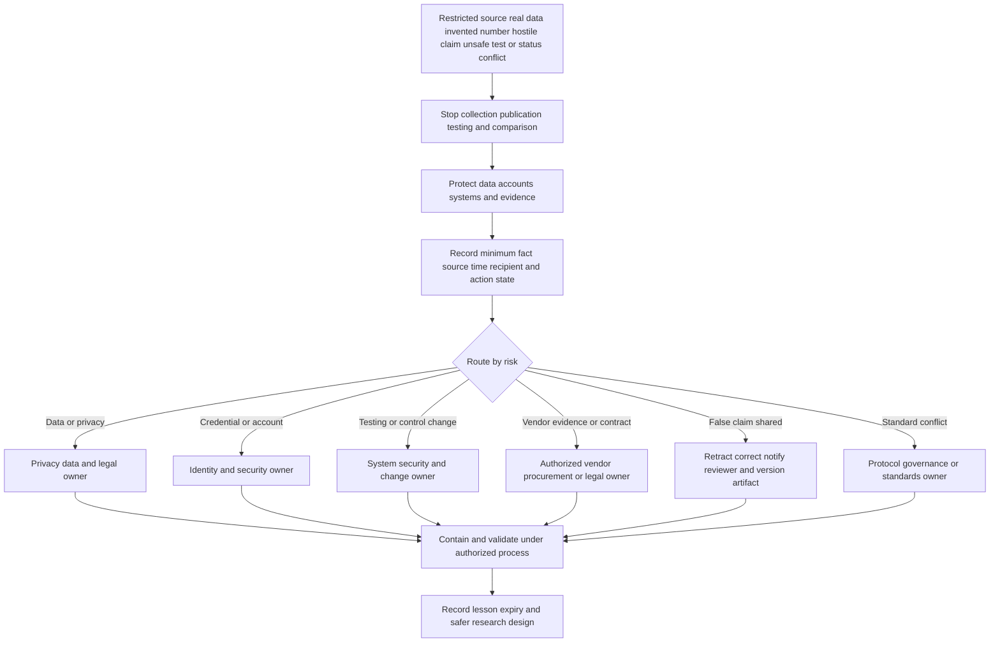

### Escalation packet

| Field | Required content | Boundary |
|---|---|---|
| Trigger | Exact observed source, data, safety, integrity, or claim issue | Do not add a root cause not supported by evidence |
| Source/version | URL/document, issuer, status, date, version, access route | Do not attach restricted material to this guide |
| Claim affected | Exact sentence, audience, evidence grade, and decision impact | Separate internal draft from externally shared claim |
| Exposure/action state | Viewed, downloaded, retained, shared, tested, changed, stopped, corrected | Proposed is not completed; stopped is not contained |
| Data/system scope | Known and unknown people, accounts, files, systems, recipients, time | Minimize; do not copy sensitive content unnecessarily |
| Immediate protection | Access stopped, file restricted, test ended, claim withdrawn, secret process invoked | Follow current owner policy; do not self-investigate beyond authority |
| Owner and question | Named role and exact decision needed | “Please investigate” is weaker than a bounded ask |
| Follow-up | Validation, notification, deletion/retention, source replacement, version correction | Do not promise outcome or timeline without owner agreement |

## Lab

### SignalWatch Lab 118 - local synthetic research worksheet

**Lab state:** `DESIGNED_NOT_PERFORMED_NOT_VALIDATED`.

**Exact honesty label:** `LOCAL SYNTHETIC PUBLIC-SOURCE RESEARCH WORKSHEET DESIGN - NOT PERFORMED - NO SCRAPING AUTOMATION RESTRICTED DOCUMENTATION TRIAL ACCOUNT CUSTOMER EMPLOYER TENANT MESSAGE LOG PROMPT SECRET OR PRIVATE DATA - NO MARKET STATISTIC RANKING PARITY BENCHMARK PRODUCT RESULT OR FORECAST INVENTED - NO VENDOR DISPARAGEMENT SECURITY TESTING PROMPT INJECTION CONTROL BYPASS OR CONFIGURATION CHANGE - MARKETING REMAINS VENDOR-STATED - ABNORMAL AND COMPARED VENDOR OPERATION REMAIN NO DIRECT EXPERIENCE`.

### Objective

Create a dated local worksheet that evaluates five synthetic claims across email, identity, API, agentic security, and governance. The future learner will classify sources, verify status, preserve exact wording, identify contradictions, grade evidence, write bounded conclusions, and set expiry. The exercise produces research artifacts only. It does not access a vendor product or establish comparative performance.

### Prerequisites and safe environment

| Requirement | Future evidence needed | Current state |
|---|---|---|
| Device | Learner-owned or explicitly authorized local device | `NOT_ASSESSED` |
| Data | Five claims invented for the worksheet; no remembered customer/employer detail | `NOT_CREATED` |
| Sources | Ordinary human-paced browser access to public official URLs only | URLs listed; future availability not guaranteed |
| Tools | Local text editor and browser; no crawler, scraper, extension, AI service, or automated download | `NOT_SELECTED` |
| Scope | One page per claim unless an official page directly links a necessary status/errata page | Designed only |
| Network | Normal browsing; no scanning, enumeration, load, fuzzing, login, or bypass | Not performed |
| Output | Private local Markdown/CSV worksheet with no copied restricted text | Template defined below |
| Review | Self-review labeled as self-review; second reviewer optional and named | Reviewer unassigned |

### Synthetic claim cards

| Card | Synthetic statement to evaluate | Expected disposition before research |
|---|---|---|
| `T118-C1` | “DMARC guarantees authenticated messages are safe.” | Likely false/overbroad; verify current RFC boundary |
| `T118-C2` | “Any product using an API has the same architecture and response speed.” | False equivalence; compare documented control/data-plane questions |
| `T118-C3` | “An AI agent is safe if its system prompt says to ignore malicious instructions.” | Incomplete control claim; map independent authorization and tool controls |
| `T118-C4` | “NIST Privacy Framework 1.1 is a final mandatory standard.” | Likely wrong status/classification; verify official page |
| `T118-C5` | “Vendor A is better because it appears in more integration logos.” | Unsupported ranking; convert logo count into contract questions |

### Worksheet schema

| Field | Purpose | Placeholder while unperformed |
|---|---|---|
| `claim_id` | Stable synthetic identity | `T118-C1` through `T118-C5` |
| `atomic_claim` | One falsifiable sentence | `PENDING_FUTURE_RUN` |
| `decision_context` | Why the statement matters | `PENDING_FUTURE_RUN` |
| `source_url` | Official public location | `PENDING_FUTURE_RUN` |
| `issuer_title` | Exact issuer and document/page title | `PENDING_FUTURE_RUN` |
| `source_type` | Standard, BCP, draft, framework, docs, marketing, research, community | `PENDING_FUTURE_RUN` |
| `published_updated_status` | Date, version, status, obsoletes/updates, errata | `PENDING_FUTURE_RUN` |
| `exact_supported_text` | Minimal quotation or faithful paraphrase | `PENDING_FUTURE_RUN` |
| `scope_method` | Population, plan, period, edition, method, jurisdiction | `PENDING_FUTURE_RUN` |
| `contrary_or_missing` | Conflict, exclusion, silence, alternative explanation | `PENDING_FUTURE_RUN` |
| `evidence_grade` | Grade from this Part | `PENDING_FUTURE_RUN` |
| `bounded_conclusion` | Fact, trend hypothesis, forecast, or unknown | `PENDING_FUTURE_RUN` |
| `marketing_doc_boundary` | What public positioning does and does not prove | `PENDING_FUTURE_RUN` |
| `validation_question` | Exact question for authorized owner | `PENDING_FUTURE_RUN` |
| `review_expiry` | Date or change trigger | `PENDING_FUTURE_RUN` |
| `performance_state` | Whether research was actually done | `NOT_PERFORMED` |
| `validation_state` | Whether result was reviewed | `NOT_ELIGIBLE` |

### Procedure for a future run

1. Copy the exact honesty label into the private worksheet.
2. Confirm the device and browsing environment are authorized and contain no work/customer data.
3. Use only the five synthetic claim cards. Do not substitute a live procurement, customer, incident, or interview-confidential question.
4. Rewrite each card as one atomic claim.
5. Open the official primary URL manually. Do not use a crawler, scraper, bulk downloader, headless browser, hidden API, or copied credential.
6. Stop if the source requests login, nondisclosure agreement, customer/partner access, payment, account creation, bot verification caused by automation, or permissions not already authorized.
7. Record exact issuer, title, URL, page/document type, publication/update date, version, status, and supersession/errata link where present.
8. Preserve only a minimal quotation or faithful paraphrase needed for the claim; do not reproduce licensed standards text.
9. Label vendor product pages, blogs, customer stories, documentation, and trust pages separately.
10. For a statistic, record denominator, sample, period, collection method, comparator, exclusions, and sponsor. If any essential field is absent, do not generalize it.
11. Search only official linked status/errata/current-document pages for contradiction or supersession. Do not scrape broader sites.
12. Record what the source does not answer. Public silence becomes `UNKNOWN`, never “unsupported by product.”
13. Apply the evidence grade to the exact statement, not to the vendor or issuer as a whole.
14. Use the trend-verification decision tree and write a bounded conclusion.
15. For future language, record assumptions, horizon, confidence, and falsifier.
16. For product language, add one implementation question and one outcome-evidence question.
17. Compare claim cards by evidence process only. Do not total scores, rank vendors, assert parity, or recommend purchase.
18. Have a second reviewer inspect one card if available; record the review as learner, peer, or subject-matter review.
19. Inspect the worksheet for real names, employer/customer terms, private URLs, secrets, unsupported claims, loaded adjectives, and copied restricted content.
20. Mark actual performance and validation states only after the future work and review occur.

```mermaid
flowchart LR
	Cards["Five synthetic claim cards"] --> Atomic["Atomic claims"]
	Atomic --> Public["Manual public official source review"]
	Public --> Status["Type date version status and scope"]
	Status --> Boundary["Supported text and explicit limits"]
	Boundary --> Contrary["Contrary evidence and unknowns"]
	Contrary --> Grade["Evidence grade"]
	Grade --> Conclusion["Bounded conclusion and validation question"]
	Conclusion --> Expiry["Expiry and change triggers"]
	Expiry --> Review["Self or named peer review"]
	Review --> State["Performance and validation states"]
```

### Expected evidence - not actual evidence

- a five-row claim ledger with source type, status, date, version, and exact boundary;
- a standard-versus-draft status card for RFC 9989 and NIST Privacy Framework 1.1 IPD;
- a marketing-versus-documentation comparison card;
- one architecture question matrix with no vendor score;
- one trend hypothesis with assumptions, confidence, contrary evidence, and expiry;
- a prohibited-claim scan showing no ranking, parity, invented statistic, or disparagement;
- a review record identifying self-review versus peer review; and
- a final state record that remains `NOT_PERFORMED / NOT_ELIGIBLE` until a future run.

No row, quotation, browser result, score, reviewer comment, or conclusion has been produced by a lab run during authoring.

### Cleanup and privacy

- Close public pages and retain only the minimum source ledger needed for learning.
- Do not retain cookies, browser profiles, downloaded site archives, restricted PDFs, or full copied webpages.
- Delete accidental downloads and browser exports after confirming no legal, incident, or authorized retention duty applies; such duties should never arise because restricted/customer material is prohibited.
- Never upload the worksheet to an AI service, public repository, comparison site, or vendor portal for analysis.
- If a source redirects unexpectedly, record the redirect as a retrieval limitation; do not claim the intended page's content was verified.
- If any real customer/employer detail appears, stop, restrict the artifact, follow the current privacy/security process, and rebuild from new synthetic text.

### Lab validation rubric

| Dimension | Pass condition after a future run | Automatic failure |
|---|---|---|
| Source authorization | Public, ordinary, human-paced access only | Restricted access, scraping, automation, bypass, leaked material |
| Data safety | Synthetic claims and no customer/employer/private data | Any real message, tenant, ticket, person, telemetry, secret, or private URL |
| Status accuracy | Every source labeled with exact type, version/date, status, supersession/errata | Draft called final, marketing called docs, old RFC called current |
| Evidence discipline | Exact statement, scope, method, boundary, and unknowns recorded | Marketing treated as proof or statistic generalized without method |
| Comparison fairness | Dimensions/questions only; no total, rank, winner, unsupported absence/parity | Vendor disparagement, invented capability, winner claim |
| Trend rigor | Multiple appropriate signals, contrary evidence, confidence, expiry | One story called trend or invented forecast/data |
| Safety | No testing, injection, scanning, control change, or public upload | Any live adversarial or product/security action |
| State honesty | Performance/review states match records | Design presented as performed or self-review as independent validation |

## Bounded forecast register

Forecasts are included because interviewers may ask “Where is the market going?” They are explicitly not observed facts. Each forecast has a horizon, assumptions, confidence, and disconfirming evidence.

| Forecast as of August 24, 2026 | Horizon | Assumptions | Confidence | Evidence that would weaken it | Safe interview use |
|---|---|---|---|---|---|
| Identity, session, token, grant, and business-process evidence will become more central to BEC investigations | 12-36 months | Attackers continue exploiting legitimate accounts and trusted workflows; organizations retain cross-system telemetry | Moderate to high | Transparent longitudinal data shows a sustained shift back toward simple unauthenticated spoofing as the dominant investigation need | “I expect broader identity/process correlation to matter; I would not attach a prevalence number without a comparable dataset.” |
| Native, inline, and API-integrated email controls will increasingly be evaluated as composable layers | 12-36 months | Cloud mail remains dominant; customers value both pre- and post-delivery controls; APIs remain available | Moderate | Provider restrictions, latency, cost, or operational complexity make layered coexistence consistently less viable | “Architecture fit will depend on timing, authority, failure behavior, and operations rather than an API-versus-gateway slogan.” |
| Agent evaluations will emphasize action authority and recovery in addition to model accuracy | 6-24 months | More systems connect models to tools; ATLAS/OWASP/NIST-style threat models influence buyers and builders | High | Agentic features remain overwhelmingly read-only and fixed, or independent policy/action evidence proves unnecessary | “I would evaluate what an agent can change, who authorizes it, and how state is verified and recovered.” |
| Security-support cases will cross product boundaries more often | 12-36 months | Email, identity, SaaS, AI, browser, and API signals continue converging | Moderate | Products and organizations establish clean single-owner boundaries with complete evidence at one surface | “L1 ownership should preserve one narrative while routing separate workstreams and exact questions.” |
| Source-status literacy will become a stronger operational skill | 6-24 months | Standards, drafts, living threat frameworks, product releases, and AI governance continue changing quickly | High | Update cadence slows materially and vendors expose stable versioned contracts for all relevant claims | “I record status, version, scope, and expiry so an old RFC or draft does not become stale guidance.” |

## Artifact summary

| Required artifact | Where it exists | Authored state | Claim ceiling |
|---|---|---|---|
| Dated trends brief | “Dated trends brief - August 24, 2026” and bounded forecast register | Completed written research synthesis | Dated hypotheses and source-bounded facts; no market statistics, ranking, or future guarantee |
| Standards map | “Standards and framework status map” | Completed written map | Public document status and applicability questions; no implementation/conformance claim |
| Evidence-based comparison framework | Source hierarchy, evidence grades, dimensions, and worked examples A-D | Completed written framework | Comparison method and public-source conclusions; no product test, parity, winner, or procurement recommendation |
| Trend-verification decision tree | “Trend-verification decision tree” | Completed written decision tree | Research workflow, not evidence that every claim has a full independent market study |
| Local synthetic worksheet | SignalWatch Lab 118 | `DESIGNED_NOT_PERFORMED_NOT_VALIDATED` | Reproducible design only; no run evidence, score, reviewer result, or validated conclusion |

## Authored-Part deterministic validation contract

Validation may use at most three full-content cycles. The master status remains `Not started` until every gate is confirmed. Pre-draft editor checks do not convert the unperformed lab into evidence.

| Gate | Required | Current authored result | Result |
|---|---:|---|---|
| Word floor | At least 6,500 words | Direct full-content review shows the lesson comfortably exceeds the floor; no false-precision count is reported because the available workspace tools do not expose a raw word-count command | PASS |
| H1 | Exact required H1 once | Exact H1 appears at the first line and no alternate H1 is used | PASS |
| Twelve contract labels | Exactly twelve numbered labels defining every prompt-named term | One table contains rows 1-12; paired labels separately define control/data planes, agentic AI/security, injection/tool abuse, and governance/standard/draft/comparison | PASS |
| Dated source heading | Exact `Official Source Anchors - August 24, 2026` | Exact heading appears below | PASS |
| Mermaid | At least eight valid fenced diagrams | Twelve diagrams cover research, BEC, identity, email planes, agent flow, API ecosystem, governance, standards, categories, verification, escalation, and lab | PASS |
| Deep dives | At least four `Plain-English deep-dive` headings | Five deep dives cover marketing, clean BEC, plane failures, agent authority, and governance | PASS |
| Tables | At least ten completed Markdown tables | More than thirty tables cover terms, evidence, trends, architectures, controls, standards, categories, examples, failures, lab, sources, and validation | PASS |
| Technical scope | BEC, identity-centric attacks, secure email architecture, agentic security, API ecosystems, privacy/AI governance, standards changes, categories, and current trends | Every named area has a dedicated section plus cross-maps | PASS |
| Definitions | Trend, signal, forecast, evidence, category, capability, planes, identity-centric, API ecosystem, agentic, injection/tool abuse, governance, standard/draft, comparison | Defined before substantive use in the exact twelve-label contract | PASS |
| Artifacts | Dated trends brief, standards map, evidence-based comparison framework | Artifact summary identifies all three and their claim ceilings | PASS |
| Comparisons | Worked examples without ranking or unsupported parity | Four examples compare source strength, architecture questions, agent claims, and document status; no winner score | PASS |
| Trend tree | Symptom/claim to source/status/method/contrary evidence/conclusion/expiry | Dedicated Mermaid tree and quick checklist present | PASS |
| Failure and escalation | Misleading signals, unsafe shortcuts, stop conditions, owner routing | Failure register, prohibitions, escalation flow, and packet present | PASS |
| Safe lab | Local synthetic research worksheet with prerequisites, steps, expected evidence, cleanup, and unperformed state | SignalWatch Lab 118 is explicitly designed, unperformed, and not validated | PASS |
| Prohibitions | No restricted scraping, invented market data, customer data, disparagement, bypass, or marketing-as-proof | Each prohibition is explicit and appears in lab critical failures | PASS |
| Candidate honesty | Microsoft transfer and no-direct-Abnormal/vendor-evaluation boundaries | Candidate statement, JD map, examples, source rules, and Q&A preserve boundaries | PASS |
| Official sources | At least twelve current official/primary URLs including Abnormal, CISA, NIST, MITRE, IETF/RFC/standards, and compared-vendor docs | More than thirty dated and typed anchors appear below with version/status and applicability boundaries | PASS |
| Q&A | Exactly Q1-Q8 with exactly eight model-answer labels | Final interview section contains eight numbered headings and eight model answers | PASS |
| Final navigation | Required next link appears once as sole final line | Required link is the final line | PASS |

**Authored-Part validation result: PASS in full-content validation cycle 2 of a maximum 3.** Cycle 1 checked the expanded technical body and reported no editor errors. Cycle 2 confirmed one exact H1; the exact August 24, 2026 source heading; exactly twelve numbered contract labels; twelve balanced Mermaid openings; five deep-dive headings; thirty-four completed Markdown tables; complete scope, artifact, worked-example, verification-tree, failure/escalation, lab, safety, candidate-honesty, and source-boundary coverage; thirty-five official or primary URLs; exactly Q1-Q8 with eight model answers; and the required next-Part link as the sole final line. SignalWatch Lab 118 remains `DESIGNED_NOT_PERFORMED_NOT_VALIDATED`; no vendor test, customer data, restricted source, market measurement, product result, worksheet run, reviewer result, or Abnormal experience is claimed.

## Official Source Anchors - August 24, 2026

**Source-ledger date:** August 24, 2026. **Link revalidation note:** Current titles, status, versions, and page content were checked from public official endpoints where the retrieval environment permitted. Some CISA pages redirected unexpectedly during the August 26, 2026 automated verification pass; those URLs remain official source anchors but their current destination/content must be opened manually before a decision-critical use. No failed fetch is treated as content evidence.

The source-class column is part of the evidence. A marketing page is not downgraded into “bad evidence”; it is correctly bounded as evidence of public positioning. A technical document is stronger for documented configuration or architecture, but still does not prove a customer's setup or comparative performance.

| Official or primary source | Date/version/status at study time | Source class | Used for | Marketing-versus-documentation and applicability boundary |
|---|---|---|---|---|
| [Abnormal Behavioral Security Platform](https://abnormal.ai/platform/overview) | Current public page observed in 2026; mutable | Official vendor marketing | Public portfolio positioning across email, identity, AI, insider threat, behavioral AI, APIs, and integrations | Establishes what Abnormal publicly states, not exact private architecture, signal fields, model behavior, performance, entitlement, customer configuration, or parity |
| [Abnormal Email Security](https://abnormal.ai/platform/email-security) | Current public page observed in 2026; mutable and includes future-functionality disclaimer | Official vendor marketing | Current public BEC, vendor fraud, account takeover, behavioral, API, control-plane, investigation, and response positioning | Product claims and page illustrations are not technical implementation proof or guarantees; roadmap disclaimer requires purchasing/decision focus on currently available verified functionality |
| [Abnormal AI Security Mailbox](https://abnormal.ai/platform/ai-security-mailbox) | Current public page observed in 2026; mutable | Official vendor marketing | Public triage, classification, user response, related-message, remediation, and integration positioning | Does not disclose exact models, prompts, tools, scopes, approvals, confidence, idempotency, audit, recovery, or customer outcomes; attributed study numbers are not universal guarantees |
| [Abnormal AI Governance](https://abnormal.ai/platform/ai-governance) | Current public page observed in 2026; mutable and includes roadmap disclaimer | Official vendor marketing | Public AI tool/agent/chat discovery, risk, policy, signals, outreach, recommendation, and governance positioning | Page examples and scores are illustrative/product claims; no exact discovery completeness, scoring validity, enforcement authority, privacy implementation, or roadmap commitment is inferred |
| [Abnormal Trust Center](https://abnormal.ai/trust-center) | Current public trust page observed in 2026; mutable | Official vendor trust/compliance summary | Publicly listed ISO 27001:2022, ISO 27701:2019, ISO/IEC 42001:2023, SOC 2, privacy, DPA, and restricted Security Hub context | Verify current certificate/report, legal entity, service, period, exclusions, and scope through authorized evidence; public badges do not prove every product output or customer configuration complies |
| [Abnormal Blog](https://abnormal.ai/blog) | Current index showed dated posts through August 24, 2026 at study cutoff | Official vendor blog and threat/product research index | Discovery of current vendor-authored threat, identity, AI, product, and company signals | Each post must be classified separately as product, threat intelligence, company, or research and inspected for method; blog recency does not make claims independent market facts |
| [Abnormal post: Proven in the Inbox, Extending to Identity, AI, and Hiring](https://abnormal.ai/blog/attune-behavioral-ai-identity-hiring) | August 24, 2026 | Official vendor product blog | Study-date public positioning at the exact cutoff | Product blog is not implementation documentation, independent benchmark, roadmap commitment, or proof of outcomes outside its stated evidence |
| [CISA Secure by Design](https://www.cisa.gov/securebydesign) | Official CISA program page; current content must be manually revalidated because automated retrieval redirected during validation | Government guidance/program | Secure-by-design responsibility and default-safety research questions | Voluntary/public guidance does not prove vendor adherence, define a product architecture, or replace current legal/contract requirements |
| [CISA Recognize and Report Phishing](https://www.cisa.gov/secure-our-world/recognize-and-report-phishing) | Official CISA public-awareness page; manually revalidate current destination | Government public guidance | Human reporting, social-engineering recognition, and safe response context | Awareness guidance is not threat prevalence data, product comparison, or authorization to inspect suspicious content unsafely |
| [CISA Zero Trust Maturity Model](https://www.cisa.gov/resources-tools/resources/zero-trust-maturity-model) | Version 2.0 source family; manually revalidate current destination | Government architecture guidance | Identity, devices, networks, applications/workloads, data, visibility/analytics, and automation/orchestration questions | Maturity model is not a product score, mandate for all organizations, or proof that a named vendor supplies an entire zero-trust architecture |
| [NIST AI Risk Management Framework](https://www.nist.gov/itl/ai-risk-management-framework) | AI RMF 1.0, January 26, 2023; official page says revision underway in 2026 | Final voluntary framework plus active revision notice | Govern, Map, Measure, Manage and source-status discipline | Cite 1.0 as current published version while noting revision; framework does not certify or approve a system |
| [NIST AI 600-1 Generative AI Profile](https://nvlpubs.nist.gov/nistpubs/ai/NIST.AI.600-1.pdf) | Final, July 26, 2024 | Final NIST profile | Generative-AI risk and action questions | Profile requires contextual tailoring and is not law, product certification, or a complete agent-security standard |
| [NIST AI 100-2 E2025](https://csrc.nist.gov/pubs/ai/100/2/e2025/final) | Final, March 24, 2025; potential updates noted June 3, 2025 | Final NIST taxonomy with errata/update boundary | Adversarial machine-learning attacks and mitigations | Taxonomy is not prevalence, implementation assurance, or proof a vendor detects every technique |
| [NIST SP 800-63-4 Digital Identity Guidelines](https://csrc.nist.gov/pubs/sp/800/63/4/final) | Final, July 31, 2025; supersedes SP 800-63-3 | Final NIST guidance | Identity proofing, authentication, and federation | U.S. federal guidance has contextual applicability; it does not establish a product's conformance or a customer's exact identity policy |
| [NIST SP 800-207 Zero Trust Architecture](https://csrc.nist.gov/pubs/sp/800/207/final) | Final, August 2020 | Final NIST architecture guidance | Resource-centric, policy-driven zero-trust model | Not a certification, product category, or proof that any platform implements the full model |
| [NIST Cybersecurity Framework 2.0](https://www.nist.gov/cyberframework) | CSF 2.0 final, February 2024; current page includes 2026 updates and drafts | Final voluntary framework plus mutable resource page | Governance and cybersecurity outcome mapping | Distinguish CSF 2.0 final from later Initial Public Draft quick-start guides; not a mandatory product checklist |
| [NIST Privacy Framework](https://www.nist.gov/privacy-framework) | Privacy Framework 1.0 final; 1.1 shown as Initial Public Draft at study time | Final voluntary framework plus active draft | Privacy-risk lifecycle and standard-versus-draft example | PF 1.1 IPD is not final; neither version is law or vendor certification |
| [MITRE ATT&CK Phishing T1566](https://attack.mitre.org/techniques/T1566/) | Technique v2.7, modified May 12, 2026; ATT&CK v19 permalink available | Versioned living threat knowledge base | Phishing across email, identity-provider, office-suite, SaaS, and other paths | Technique catalog is not prevalence data, complete coverage, or proof a product detects the technique |
| [MITRE ATT&CK Valid Accounts T1078](https://attack.mitre.org/techniques/T1078/) | Technique v3.0, modified May 12, 2026; ATT&CK v19 permalink available | Versioned living threat knowledge base | Identity-centric account abuse across cloud, IdP, Office Suite, SaaS, and other platforms | Procedure examples and mitigations inform hypotheses; they do not establish current frequency or one vendor's coverage |
| [MITRE ATLAS](https://atlas.mitre.org/) | Living knowledge base observed in 2026 with Predictive AI, Generative AI, Agentic AI, and Enterprise platform filters | Versioned/living primary framework source | Agentic context/tool/configuration threats, prompt injection, mitigations, and maturity prompts | ATLAS is not a formal standard, certification, prevalence dataset, or exhaustive product test plan |
| [RFC 9989 - DMARC](https://www.rfc-editor.org/rfc/rfc9989.html) | Standards Track Proposed Standard, May 2026; obsoletes RFCs 7489 and 9091 | Normative IETF RFC | Current DMARC semantics, DNS tree walk, policy, limits, privacy, security, and change history | DMARC authenticates domain use under defined conditions; it is not content, sender-intent, account-health, display-name, lookalike-domain, or threat verdict |
| [RFC 9990 - DMARC Aggregate Reporting](https://www.rfc-editor.org/rfc/rfc9990.html) | Standards Track, May 2026 | Normative IETF RFC | Current aggregate-reporting companion | Report presence, quality, and delivery vary; reports require privacy and data-management controls |
| [RFC 9991 - DMARC Failure Reporting](https://www.rfc-editor.org/rfc/rfc9991.html) | Standards Track, May 2026 | Normative IETF RFC | Current failure-reporting companion | Detailed reports can be privacy-sensitive and are not universally sent |
| [RFC 8617 - Authenticated Received Chain](https://www.rfc-editor.org/rfc/rfc8617.html) | Experimental, July 2019 | Experimental IETF RFC | ARC chain/assertion mechanism and explicit trust/content boundaries | Not Standards Track, not a trust framework, and not proof a message or sealer is safe |
| [RFC 9110 - HTTP Semantics](https://www.rfc-editor.org/rfc/rfc9110.html) | Internet Standard STD 97, June 2022 | Normative IETF Internet Standard | HTTP methods, status, intermediary, URI, and privacy semantics; `202 Accepted` boundary | HTTP result describes a protocol boundary; it does not expose private implementation, asynchronous completion, or customer outcome |
| [RFC 9421 - HTTP Message Signatures](https://www.rfc-editor.org/rfc/rfc9421.html) | Standards Track Proposed Standard, February 2024 | Normative IETF RFC | Signing selected HTTP components and application-profile requirements | Not a universal webhook scheme; application still defines components, keys, algorithms, replay, policy, and errors |
| [RFC 9700 - OAuth 2.0 Security Best Current Practice](https://www.rfc-editor.org/rfc/rfc9700.html) | BCP 240, January 2025; updates RFCs 6749, 6750, and 6819 | Normative IETF Best Current Practice | Current OAuth security, PKCE, redirect matching, token restrictions, refresh protection | Does not prove implementation conformance or define a vendor's exact grant/scopes; check OAuth 2.1 separately as work evolves |
| [ISO/IEC 42001:2023 official catalogue](https://www.iso.org/standard/81230.html) | Published International Standard, edition 1, December 2023 | Official standards catalogue | AI management-system scope and status | Catalogue summary is public; full standard is licensed. Do not reproduce restricted text or infer current certification scope/product safety |
| [EU Regulation 2024/1689 Artificial Intelligence Act](https://eur-lex.europa.eu/eli/reg/2024/1689/oj/eng) | Official Journal legal text, 2024, with phased applicability | Primary legal source | Governance/legal context and the need for jurisdiction/role/timeline review | Not legal advice; exact duty depends on system, role, use, location, exceptions, amendments, guidance, and applicable date |
| [OWASP Top 10 for LLM and GenAI Applications](https://genai.owasp.org/llm-top-10/) | 2025 list remains visible; official project also linked a 2026 release at study time | Community security project | Prompt injection, sensitive data, supply chain, poisoning, output handling, excessive agency, misinformation, and consumption | Not law, ISO, RFC, certification, or complete agent threat model; verify exact edition before use |
| [OWASP Agentic AI Threats and Mitigations](https://genai.owasp.org/resource/agentic-ai-threats-and-mitigations/) | Published February 17, 2025; mutable project resources continue in 2026 | Community threat-model guidance | Agentic threat and mitigation prompts | Useful guidance, not formal standard or proof of any product's safeguards |
| [Microsoft Defender for Office 365 overview](https://learn.microsoft.com/en-us/defender-office-365/mdo-about) | Microsoft Learn page dated May 21, 2026 and updated June 17, 2026 in retrieved metadata | Official vendor technical documentation | Native protection ladder, plan-dependent prevention/detection/investigation/response and automation | Strong for documented Microsoft scope; verify tenant license/configuration and do not infer comparative effectiveness or customer outcome |
| [Microsoft Defender for Office 365 deployment guide](https://learn.microsoft.com/en-us/defender-office-365/mdo-deployment-guide) | Microsoft Learn page dated February 6, 2026 and updated June 1, 2026 in retrieved metadata | Official vendor technical documentation | Roles, least privilege, SPF/DKIM/DMARC/ARC, policy precedence, user reporting, investigation and response setup | Documentation does not prove a tenant completed the steps or that defaults meet every customer's risk; current tenant evidence remains required |
| [Cloudflare Email Security documentation](https://developers.cloudflare.com/email-security/) | Official docs last updated August 14, 2026 on retrieved page | Official vendor technical documentation | Public inline-versus-API architecture distinction, SSO, BEC and service context | Docs establish documented options, not efficacy, latency, entitlement, customer fit, or parity with Abnormal/Microsoft |
| [Google Workspace Admin Help](https://support.google.com/a/) | Mutable official product documentation | Official vendor technical documentation | Google Workspace mail/admin source family for architecture revalidation | Open exact task pages and record update/applicability; admin help does not establish another vendor's integration contract or Arti's experience |

### Source-use rules

- Record the **exact page/document title, issuer, URL, source class, status, version/date, scope, and access/review date**.
- Check RFC Editor `obsoletes`, `updates`, category, errata, companion documents, and registries before relying on a remembered RFC.
- Use a version permalink for MITRE ATT&CK when reproducing a time-specific mapping; live pages can change.
- Treat NIST final publications, Initial Public Drafts, framework resource pages, and revision notices as different artifacts.
- Treat ISO's catalogue as authoritative for publication metadata; do not reproduce licensed standards text beyond permitted summary/quotation.
- Route legal interpretation of the EU AI Act or any law to qualified legal/privacy owners.
- Attribute every Abnormal page statement to Abnormal and its page type. Do not infer private models, signals, API schemas, customer behavior, support process, roadmap delivery, or comparative superiority.
- Use Microsoft Learn and Cloudflare developer docs for their documented public behavior only. Do not convert documentation into a tenant result or a cross-vendor performance claim.
- A customer story, attributed study, logo, certification badge, integration list, product screenshot, model name, or category does not prove parity or guaranteed outcome.
- If a public page redirects, disappears, conflicts with a newer source, or lacks a date, mark the claim stale/unknown and revalidate manually through the official owner.

## ⭐ Likely Interview Questions

### Q1. What important change do you see in business email compromise?

**Model answer:** “The durable change is that BEC cannot be treated only as unauthenticated spoofing or malicious payload delivery. A message can pass SPF, DKIM, and DMARC because it comes from a compromised real account, and the requested business action can be the payload. As of August 24, 2026, current standards and ATT&CK mappings support an architecture that correlates message, identity, session, token/grant, relationship, business-process, cross-channel, and response evidence. I would not claim a prevalence percentage without a comparable method-transparent dataset.”

### Q2. How do you distinguish a trend, a signal, and a forecast?

**Model answer:** “A signal is one dated observation. A trend is a direction supported by multiple observations across a declared period, population, and method. A forecast is a future expectation with assumptions, horizon, confidence, and evidence that would disconfirm it. I do not call one launch or incident a trend, and I never present a forecast as an observed result. I also set an expiry because source status and definitions change.”

### Q3. How would you compare email-security vendors without making unsupported claims?

**Model answer:** “I first freeze the customer's problem, environment, constraints, outcomes, and evidence requirements. Then I compare dimensions such as placement, timing, data, permissions, identity context, action authority, failure behavior, coexistence, recovery, privacy, operations, support, and exit. Each cell is labeled normative, documentation-confirmed, vendor-stated, inferred, unknown, or later validated. I do not total a winner score, infer absence from public silence, treat integration logos as coverage, or assume category parity.”

### Q4. What changed in the DMARC standard, and what did not change about its security boundary?

**Model answer:** “RFC 9989 became the Standards Track DMARC anchor in May 2026 and obsoleted RFCs 7489 and 9091. It updates areas such as policy discovery through a DNS tree walk, Public Suffix Domain handling, tags, and separate reporting companions RFC 9990 and RFC 9991. The core boundary remains critical: DMARC validates authorized use of an author domain through aligned SPF or DKIM. It does not prove benign content, human identity, account health, display-name or lookalike safety, or business legitimacy.”

### Q5. What makes an AI security agent safe enough to evaluate?

**Model answer:** “I would not infer safety from the word agent or a system prompt. I map what it can read, decide, call, change, communicate, remember, and verify. Controls include a bounded goal, unique identity, minimum context with provenance, separation of data from instructions, typed tools, independent authorization, meaningful approval, budgets, target resolution, state checks before retry, idempotency, validated outputs, structured audit, tenant isolation, and stop/revoke/recovery paths. I then test normal, ambiguous, injection, tool-error, partial-failure, privacy, and abstention cases in an authorized environment.”

### Q6. Why is an API integration an ecosystem rather than just an endpoint?

**Model answer:** “The outcome depends on tenants, app identity, OAuth grant, scopes, roles, schemas, versions, requests, rate limits, webhooks, queues, retries, idempotency, target state, logs, and several owners. HTTP `200` or `202` can establish receipt at one boundary without proving downstream processing or customer outcome. I correlate request, event, job, action, and object IDs across UTC-normalized evidence, and I separate control-plane configuration from data-plane execution.”

### Q7. How do standards, drafts, frameworks, documentation, and marketing differ?

**Model answer:** “I record issuer and formal status before using content. An Internet Standard, Proposed Standard, BCP, Experimental RFC, final NIST publication, Initial Public Draft, ISO International Standard, law, living knowledge base, vendor documentation, and marketing page have different authority and change models. A standard defines a contract within scope but not product adoption. Documentation describes public behavior but not a customer's result. Marketing is valid evidence of vendor positioning, not independent implementation or performance proof.”

### Q8. What direct experience do you claim from this Part?

**Model answer:** “I claim authorship of a dated trends brief, standards map, comparison framework, worked paper examples, source ledger, and an unperformed synthetic worksheet design. I do not claim that I ran the worksheet, tested any vendor, accessed restricted documentation, used customer data, measured a market, or operated Abnormal. My production evidence remains the Microsoft enterprise-support work I can substantiate. The transferable strength is evidence-led troubleshooting, customer communication, escalation, knowledge, and careful source/claim boundaries.”

## 🧠 30-Second Memory Hooks

- **One event is a signal; repeated dated direction may be a trend.**
- **Forecasts need assumptions, horizon, confidence, and a falsifier.**
- **Official marketing proves the vendor said it, not that every environment achieved it.**
- **Category is a shelf; capability is an outcome under stated conditions.**
- **DMARC authenticates domain use, not content, intent, account health, or business legitimacy.**
- **BEC can carry no malware because the requested action is the payload.**
- **Identity means account, authenticator, session, token, grant, role, recovery, and behavior.**
- **Policy lives in the control plane; objects and actions move in the data plane.**
- **API success at one boundary is not end-to-end success.**
- **An integration logo is a question, not a data-flow contract.**
- **Agent label means ask: read, decide, call, change, communicate, remember, verify.**
- **Models propose; independent policy authorizes.**
- **Prompt filtering is guidance; tool authorization limits consequence.**
- **RFC is a publication family, not one maturity level. Check status and supersession.**
- **ATT&CK and ATLAS are living maps, not prevalence or product coverage scores.**
- **Compare dimensions and unknowns; do not rank adjectives.**
- **Public silence means unknown, not absent.**
- **No restricted scraping, invented data, customer evidence, bypass, or disparagement.**
- **Arti's Microsoft method transfers; Abnormal operation remains unclaimed.**

## Completion Checklist

- [ ] I can define all twelve contract labels and every paired term without using a product example as the definition.
- [ ] I can distinguish a signal, trend, source-reported observation, inference, and forecast.
- [ ] I can state the August 24, 2026 currency date and explain why changing claims expire.
- [ ] I can explain BEC across spoofed, lookalike, compromised-account, thread, session/token, and business-process paths.
- [ ] I can explain why SPF/DKIM/DMARC/ARC evidence contributes to but does not decide a threat verdict.
- [ ] I can trace an identity-centric attack across principal, authenticator, session, token, grant, role, action, audit, and response.
- [ ] I can separate native, inline gateway, API-integrated, post-delivery, user-report, and layered email architectures without ranking them.
- [ ] I can distinguish control-plane configuration/authority from data-plane objects/actions and identify failures in each.
- [ ] I can explain agentic AI and agentic security by bounded goal, tools, variability, authority, and evidence.
- [ ] I can distinguish prompt injection from tool abuse and explain independent policy, typed tools, budgets, state checks, and recovery.
- [ ] I can trace an API ecosystem through tenant, identity, token, permission, request, event, worker, target state, and support evidence.
- [ ] I can explain why RFC 9110 `202 Accepted` does not prove completion and why RFC 9421 is not a universal webhook profile.
- [ ] I can map governance across inventory, purpose, data, authority, risk, evaluation, monitoring, incidents, suppliers, change, and retirement.
- [ ] I can distinguish RFC 9989, RFCs 9990/9991, and Experimental RFC 8617 from older or different-status documents.
- [ ] I can distinguish NIST AI RMF 1.0 final-but-under-revision, NIST Privacy Framework 1.1 IPD, ISO/IEC 42001:2023, and legal sources.
- [ ] I can use the category map as navigation without claiming equivalence or a winner.
- [ ] I can freeze a comparison context, grade each statement's evidence, and leave critical unknowns visible.
- [ ] I can reproduce worked examples A-D without strengthening public claims.
- [ ] I can walk the trend-verification decision tree from atomic claim to expiry.
- [ ] I will not scrape restricted docs, invent market data, use customer/employer evidence, disparage vendors, test/bypass controls, or treat marketing as proof.
- [ ] I can stop and escalate privacy, credential, testing, contract, false-claim, and standards-conflict failures with an exact owner/question.
- [ ] I can state that SignalWatch Lab 118 remains designed, not performed, and not validated.
- [ ] I reviewed the official source ledger's date, version, status, and marketing-versus-documentation boundaries.
- [ ] I can answer Q1-Q8 aloud without adding an Abnormal feature, customer, model, metric, test, rank, or production-experience claim.

[Next: Part 119 - Final 200 Plus Question Bank and Troubleshooting Drills](Part-119-final-200-plus-question-bank-and-troubleshooting-drills.md)

