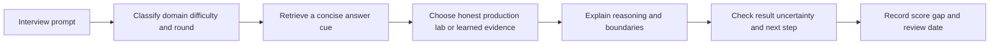
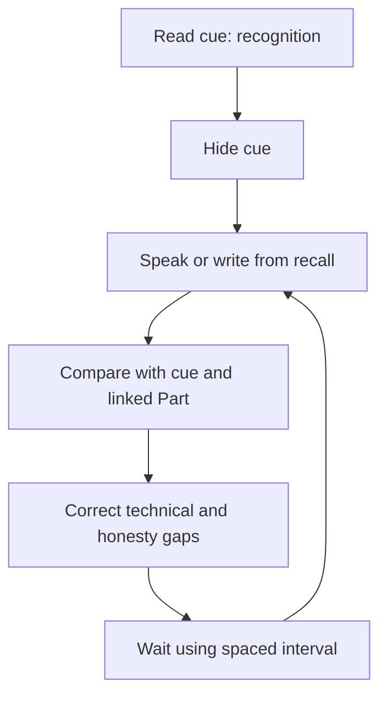
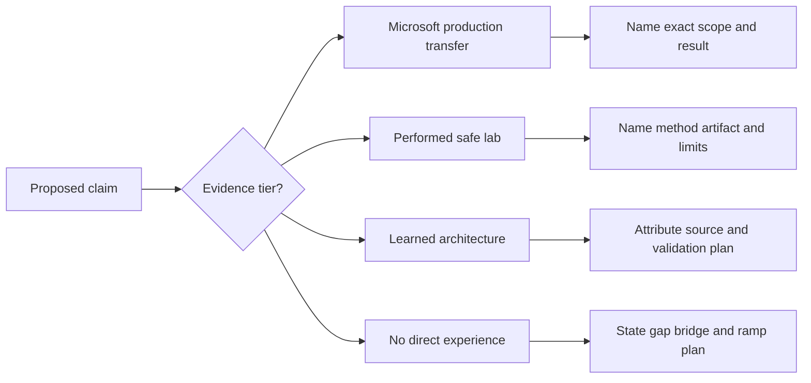
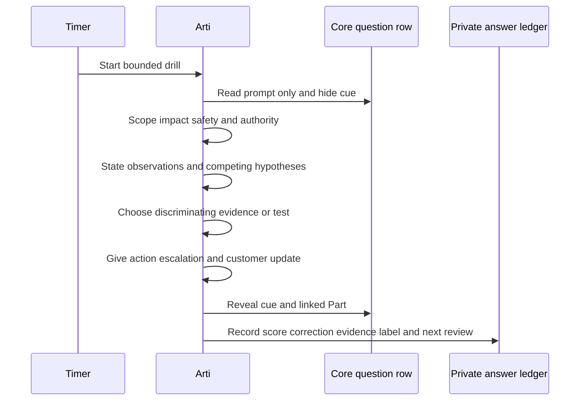
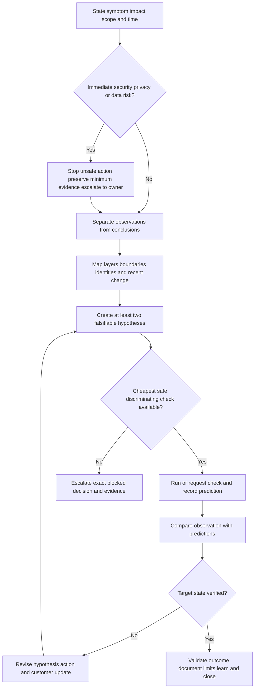
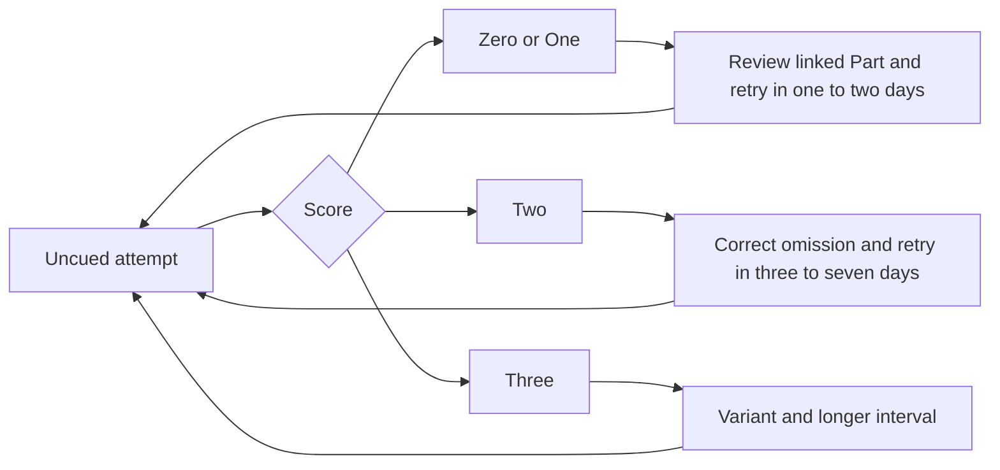
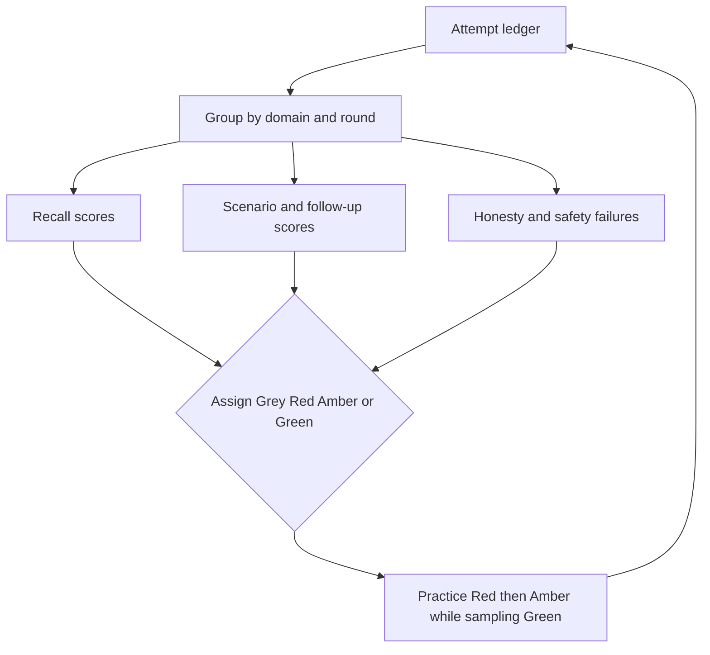
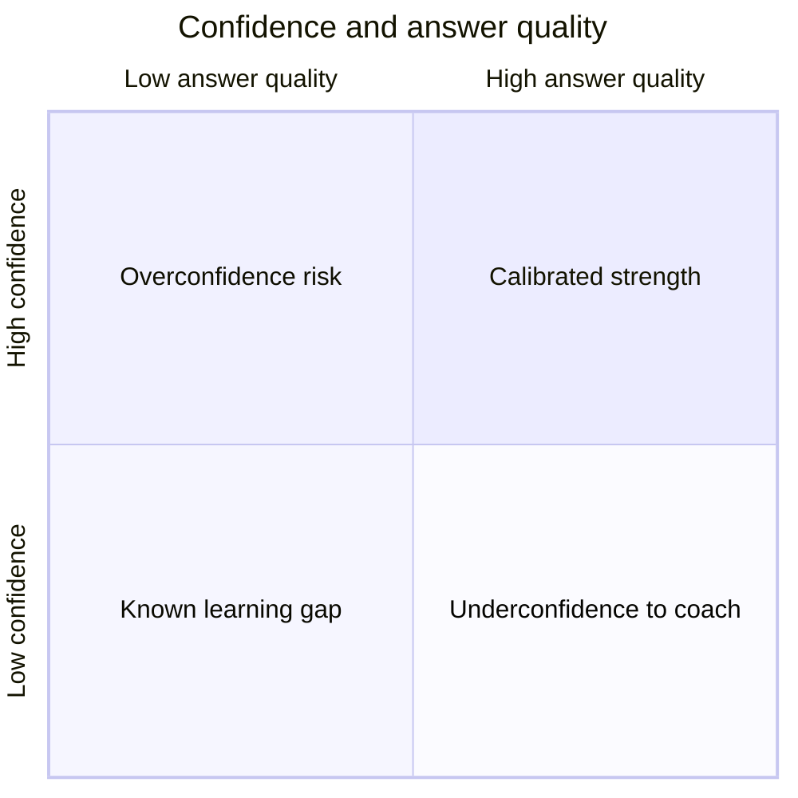
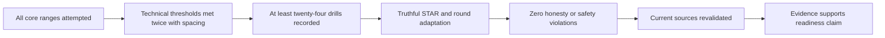
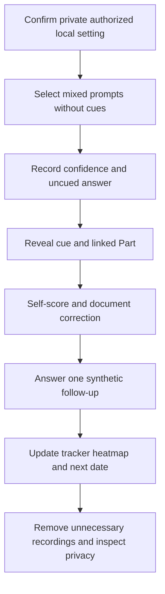

# Part 119 - Final 200 Plus Question Bank and Troubleshooting Drills

> **Purpose:** Convert Parts 001-118 into a finite, traceable practice system: exactly 240 core interview questions, a separately indexed troubleshooting-drill set, and an honest self-study plan.
>
> **Artifact honesty label:** **Authored question bank, answer cues, drill index, and unperformed self-study/lab design. No question is claimed rehearsed, recalled, mastered, asked by Abnormal, or validated in a real interview. No direct Abnormal product, customer, tenant, detection, API, support, or security-operations experience is claimed.**
>
> **Study currency date:** August 24, 2026.
>
> **Authored-Part state:** `PASS`. The master tracker was changed to `Done` only after every deterministic gate passed.

## Section goal

This Part gives Arti one controlled place to retrieve, explain, apply, and honestly qualify the curriculum. The bank is not a script to memorize. It is a map from a likely prompt to a concise answer structure and the completed Part containing the deeper explanation. The intended outcome is that Arti can identify what a question is testing, answer from evidence, reason aloud when uncertain, and name the next safe validation step.

## Prerequisites

- Parts 001-118 are completed reading references, not proof that their content was practiced or mastered.
- Arti has access to this local Markdown guide, a private timer, and a private note or audio tool approved for non-sensitive personal practice.
- Practice uses only invented scenarios and sanitized personal career evidence. It uses no customer, employer, tenant, ticket, message, log, token, cookie, secret, confidential interview question, or restricted product material.
- The learner must preserve the evidence labels from Part 001: **Microsoft production transfer**, **performed safe lab**, **learned architecture**, and **no direct experience**.

## Twelve terms to know before using the bank

| Term | Plain meaning | Why it matters | Analogy | Where the analogy stops |
|---|---|---|---|---|
| **Bank** | A deliberately bounded collection of prompts and answer cues linked to deeper lessons. | It creates coverage and traceability without pretending to predict an interview. | A map index points to detailed streets. | An interview is adaptive; a bank cannot guarantee which route appears. |
| **Difficulty** | The expected reasoning depth: Basic recalls and explains, Intermediate connects concepts, and Advanced applies judgment under ambiguity. | It separates vocabulary recall from scenario performance. | Stairs rise from naming a tool to using it safely in a complex repair. | Real questions can become easier or harder through follow-ups. |
| **Round** | The interview audience and purpose, such as Recruiter, Hiring Manager, Technical Panel, Behavioral/STAR, Troubleshooting Drill, or Closing. | The same fact needs different depth and emphasis for different listeners. | A camera lens changes framing while the subject stays truthful. | Round labels do not reveal a company's exact interview process. |
| **Answer cue** | A concise set of claims, reasoning steps, evidence, and boundaries from which Arti creates a natural answer. | It supports understanding rather than word-for-word recitation. | Recipe notes guide cooking without dictating every movement. | Good answers still depend on the exact prompt and follow-up. |
| **Troubleshooting drill** | A timed invented incident that requires scope, hypotheses, tests, observations, actions, and communication. | It tests applied reasoning rather than recognition alone. | A fire drill rehearses roles without creating a real fire. | A local drill cannot reproduce a customer tenant, product, or production pressure. |
| **STAR** | **Situation, Task, Action, Result**, a structure for a truthful behavioral example. | It keeps ownership and evidence visible. | Four labeled drawers keep one story organized. | Real work is iterative, and the result must not be invented to fit four boxes. |
| **Self-quiz** | A private check in which the learner attempts an answer before consulting the cue. | It exposes gaps that rereading can hide. | Closing the book before explaining tests whether the idea is retrievable. | One successful attempt does not prove durable mastery. |
| **Recall** | Producing an answer without seeing choices or the answer cue. | Interviews require retrieval, not merely familiarity. | Recalling a phone number differs from recognizing it in a list. | Recall alone does not prove correct application. |
| **Recognition** | Identifying a familiar concept when options or cues are visible. | It is useful early but can create false confidence. | A face may look familiar even when its name cannot be produced. | Recognition can still support diagnosis when paired with verification. |
| **Calibration** | Comparing confidence with actual evidence and scoring so confidence neither outruns nor understates ability. | It encourages clear unknowns and proportionate claims. | A scale is useful only when its reading matches known weights. | Human judgment is contextual and cannot be reduced to one number. |
| **Spaced repetition** | Revisiting material after increasing intervals, with earlier review for weak items. | Effortful retrieval over time strengthens memory better than one long reread. | Watering at useful intervals supports growth better than one flood. | Learning is not automatic; answers still need correction and application. |
| **Gap heatmap** | A domain-by-skill view showing where scores, confidence, or evidence are weakest. | It directs practice toward patterns rather than favorite topics. | A weather map highlights regions needing attention. | Colors summarize observations; they do not diagnose why the gap exists. |

### 🔍 Plain-English deep-dive: A bank is a map, not evidence of readiness

Reading an answer cue can feel fluent because the correct words are already visible. That is recognition. An interview requires recall, adaptation, and judgment while another person changes the question. The honest sequence is: hide the cue, answer aloud, inspect the cue and linked Part, correct the answer, then try again later. Until those attempts are recorded, this document proves only that a study artifact exists.

## JD Mapping

| Role signal | Bank coverage | Honest Microsoft transfer | Boundary to state |
|---|---|---|---|
| Enterprise L1 case ownership | Intake, severity, investigation, updates, escalation, resolution, closure, and knowledge questions | Five years of Microsoft enterprise support, CRITSIT investigation, escalation, validation, and customer communication where supported by the CV | Do not call Microsoft cases Abnormal or email-security operations |
| Cloud Email Security | Mail flow, authentication, BEC, phishing, false-positive and response questions | Microsoft 365 context and evidence-led troubleshooting are transferable | Abnormal product operation and direct threat verdict ownership remain unclaimed |
| AI Security Agents | Behavioral detection foundations, agent safeguards, evaluation, privacy, and human review | Copilot, agent, and support experience only where personally substantiated | Generative-AI familiarity is not knowledge of Abnormal's private models or agents |
| SaaS Security and integrations | Identity, SAML, OAuth, SCIM, tokens, APIs, webhooks, logs, and named ecosystem learning | Entra, REST, Postman, cURL, JSON, and troubleshooting concepts transfer at stated depth | Okta, Google Workspace, Slack, Splunk, CrowdStrike, Cortex SOAR, and other named tools remain learned/lab unless real evidence exists |
| Customer trust and onboarding | Audience-aware updates, de-escalation, remote sessions, CSM handoffs, and training | Direct customer, partner, KB, training, mentoring, and cross-team communication examples may be used if true | Never reuse customer details, secrets, or confidential case content |
| Operational improvement | Metrics, analytics, process experiments, quality, knowledge, and safe AI assistance | CSAT, backlog, case-quality, Power BI, SQL, and process work only within CV-supported scope | Do not invent metric magnitude, certification, ownership, or business outcome |

## Candidate honesty note

Arti's strongest truthful bridge is not “I have already done this exact Abnormal job.” It is: “I have owned complex Microsoft enterprise support investigations, communicated under pressure, collaborated with Engineering and Product, validated fixes, and improved knowledge and quality. For email security, identity, SaaS integrations, APIs, and Abnormal's public portfolio, I have built structured learned architecture and safe-lab plans. I will identify which evidence is production transfer, which lab was actually performed, and what remains untested.”

The following are prohibited in every practice answer:

- memorized fabrication, invented incidents, fictional metrics, certifications, titles, ownership, customers, or results;
- presenting reading, an authored design, or an unperformed lab as hands-on practice;
- exposing customer, employer, tenant, ticket, personal, message, log, token, cookie, secret, or restricted documentation data;
- unsafe live tests, phishing, scanning, control bypass, adversarial product testing, production configuration changes, or access beyond authorization;
- vendor disparagement, unsupported product absence, private-architecture inference, winner rankings, or marketing treated as independent proof;
- hidden AI-generated answers, live interview assistance that violates interview rules, or answers Arti cannot explain and verify; and
- overclaiming Microsoft scope as email-security operations or treating learned Abnormal concepts as direct product experience.

## Core-bank contract and distribution

Only the tables under **Core question bank** contain numeric-first rows. Those rows are the core bank. The eight later `Q1` through `Q8` strategy entries are explicitly outside the core bank.

| Core range | Declared count | Difficulty | Share | Primary purpose |
|---|---:|---|---:|---|
| `1-48` | Forty-eight | Basic | 20% | Define, distinguish, and explain foundations |
| `49-96` | Forty-eight | Intermediate | 20% | Connect layers and choose evidence or next steps |
| `97-240` | One hundred forty-four | Advanced | 60% | Diagnose ambiguity, communicate judgment, and protect safety |
| `1-240` | Two hundred forty | All | 100% | Complete role and interview coverage |

Allowed round tags are **Recruiter**, **Hiring Manager**, **Technical Panel**, **Behavioral/STAR**, **Troubleshooting Drill**, and **Closing**. A semicolon joins two tags only when a scenario genuinely serves both rounds.

## Core question bank

### Basic questions 1-48 - declared count: 48

#### Role, product, and security foundations - questions 1-8 - declared count: 8

| # | Question | Concise model answer or answer cue | Most relevant completed Part | Difficulty | Interview round |
|---:|---|---|---|---|---|
| 1 | Tell me about your background and why it fits this role. | Lead with five years of Microsoft enterprise support, complex case ownership, customer trust, Engineering/Product escalation, fix validation, knowledge, and operational improvement. Label email security and Abnormal as a deliberate learning transition, not prior production ownership. | [Part 001](Part-001-role-compass-and-honest-candidate-story.md) | Basic | Recruiter |
| 2 | What does an enterprise L1 Technical Support Engineer own? | Own the customer's case narrative from intake through scope, safe evidence, triage, updates, resolution or high-quality escalation, closure, and knowledge capture. L1 is an accountable diagnostic owner, not merely a ticket router. | [Part 002](Part-002-enterprise-support-ownership-and-customer-trust.md) | Basic | Hiring Manager |
| 3 | What are confidentiality, integrity, and availability? | Confidentiality limits unauthorized disclosure, integrity protects correctness and authorized change, and availability keeps services usable when needed. A support action should consider all three because restoring access can still expose or corrupt data. | [Part 003](Part-003-security-fundamentals-cia-risk-and-controls.md) | Basic | Technical Panel |
| 4 | What is least privilege? | Give a person, service, or integration only the permissions needed for its current task, for only as long as needed, with review and revocation. It reduces the blast radius of mistakes or compromise. | [Part 004](Part-004-zero-trust-least-privilege-and-shared-responsibility.md) | Basic | Technical Panel |
| 5 | Why does privacy matter in a support case? | Troubleshooting evidence can contain identity, message content, tokens, or customer configuration. Collect the minimum authorized data, protect it, redact it, control access and retention, and escalate privacy uncertainty instead of copying broadly. | [Part 005](Part-005-privacy-data-handling-and-evidence-ethics.md) | Basic | Hiring Manager |
| 6 | How do SIEM and SOAR differ? | A security information and event management system centralizes and analyzes security telemetry; security orchestration, automation, and response coordinates workflows and actions. Either may inform a case, but neither guarantees a correct verdict or completed response. | [Part 006](Part-006-soc-siem-soar-xdr-and-edr-basics.md) | Basic | Technical Panel |
| 7 | What is MITRE ATT&CK? | It is a versioned knowledge base describing adversary tactics and techniques. Use it to structure hypotheses and coverage questions, not as prevalence data or proof that a product detects every mapped technique. | [Part 007](Part-007-mitre-attack-and-threat-modeling.md) | Basic | Technical Panel |
| 8 | What are the main phases of incident response? | Prepare; detect and analyze; contain; eradicate; recover; and learn, adapted to the organization's process. Preserve evidence and verify outcomes because an attempted action is not the same as completed containment. | [Part 008](Part-008-incident-response-lifecycle.md) | Basic | Technical Panel |

#### Abnormal portfolio and customer context - questions 9-16 - declared count: 8

| # | Question | Concise model answer or answer cue | Most relevant completed Part | Difficulty | Interview round |
|---:|---|---|---|---|---|
| 9 | How would you describe Abnormal's mission without overclaiming? | Attribute the answer to current public sources: Abnormal publicly positions behavioral AI to protect people and organizations from human-targeted attacks across email and adjacent identity or SaaS surfaces. Do not infer private models, coverage, or guaranteed outcomes. | [Part 011](Part-011-abnormal-ai-mission-market-and-customer-outcomes.md) | Basic | Recruiter |
| 10 | What three portfolio areas organize this curriculum? | Cloud Email Security, AI Security Agents, and SaaS Security. Explain them as public portfolio and learning categories, then validate current names, entitlements, and behavior against authorized documentation. | [Part 012](Part-012-portfolio-map-cloud-email-security-ai-security-agents-and-saas-security.md) | Basic | Recruiter |
| 11 | What is a support boundary? | It is the line separating components, owners, permissions, evidence, and commitments. Mapping boundaries prevents one vendor, administrator, or HTTP response from being assumed responsible for an end-to-end outcome. | [Part 013](Part-013-platform-architecture-deployment-models-and-data-flows.md) | Basic | Hiring Manager |
| 12 | What does cloud email security try to protect? | It helps reduce and investigate harmful or unwanted communication and related actions across message, sender, recipient, identity, relationship, content, delivery, and response layers. No single signal proves safety or malice. | [Part 014](Part-014-cloud-email-security-architecture-and-detection-flow.md) | Basic | Technical Panel |
| 13 | What is an AI security agent? | Use a bounded definition: software that pursues a security goal by selecting or executing permitted steps with some runtime variability. Safety depends on identity, data, tools, policy, approval, logging, limits, and recovery, not the label “agent.” | [Part 015](Part-015-ai-security-agents-workflows-and-safeguards.md) | Basic | Technical Panel |
| 14 | What is SaaS security? | It protects identities, configurations, permissions, data, integrations, and activity in software delivered as a service. The customer, provider, and connected applications have shared but different responsibilities. | [Part 016](Part-016-saas-security-architecture-and-risk-surfaces.md) | Basic | Technical Panel |
| 15 | Who are common support customer personas? | Security analysts, email or identity administrators, IT support, SOC leaders, application owners, CSMs, executives, and end users may have different evidence and decision needs. Confirm the requester's role and authority before changing or disclosing anything. | [Part 017](Part-017-customer-personas-use-cases-and-shared-responsibility.md) | Basic | Hiring Manager |
| 16 | What makes onboarding different from break-fix support? | Onboarding aligns goals, stakeholders, prerequisites, integrations, permissions, validation, training, adoption, and handoff before steady-state support. A technically connected system is not necessarily operationally ready. | [Part 018](Part-018-product-support-scenarios-onboarding-and-boundaries.md) | Basic | Hiring Manager |

#### Email, authentication, and threat foundations - questions 17-24 - declared count: 8

| # | Question | Concise model answer or answer cue | Most relevant completed Part | Difficulty | Interview round |
|---:|---|---|---|---|---|
| 17 | What actors participate in email delivery? | A sender and recipient use mail clients and mailbox providers while submission, transfer, delivery, DNS, gateways, filters, and administrators move and govern the message. Identify which actor observed or changed each state. | [Part 019](Part-019-email-ecosystem-anatomy-and-actors.md) | Basic | Technical Panel |
| 18 | How do an SMTP envelope and message headers differ? | The envelope carries routing identities used during Simple Mail Transfer Protocol delivery; headers are message fields shown or stored with content. They can differ legitimately, so inspect both rather than assuming the visible From field drove delivery. | [Part 020](Part-020-rfc-style-message-structure-envelope-and-headers.md) | Basic | Technical Panel |
| 19 | What is SMTP? | Simple Mail Transfer Protocol is the command-and-response protocol commonly used to submit and relay email. Status codes describe a server boundary and require context; acceptance by one server does not prove final inbox delivery. | [Part 021](Part-021-smtp-and-esmtp-conversation.md) | Basic | Technical Panel |
| 20 | What is MIME? | Multipurpose Internet Mail Extensions represent bodies, attachments, media types, boundaries, and transfer encodings. Parse it carefully because displayed content can differ from raw structure and malformed content can mislead tools. | [Part 022](Part-022-mime-bodies-attachments-and-encodings.md) | Basic | Technical Panel |
| 21 | Why are message IDs and timestamps useful? | Stable identifiers and normalized timestamps help correlate sender, recipient, provider, gateway, and security evidence into one timeline. They are clues, not guaranteed globally trustworthy or unique facts. | [Part 023](Part-023-headers-message-ids-threading-and-timestamps.md) | Basic | Technical Panel |
| 22 | What does SPF check? | Sender Policy Framework lets a domain publish which hosts may send for the SMTP envelope domain. Its result can break through forwarding and does not authenticate visible content, the human sender, or message intent. | [Part 025](Part-025-spf-sender-authorization.md) | Basic | Technical Panel |
| 23 | What does DKIM check? | DomainKeys Identified Mail verifies that selected message fields match a cryptographic signature associated with a signing domain. A valid signature supports domain responsibility and integrity for signed fields, not a benign-content verdict. | [Part 026](Part-026-dkim-message-signing.md) | Basic | Technical Panel |
| 24 | What does DMARC add? | Domain-based Message Authentication, Reporting, and Conformance requires alignment between the visible author domain and a passing SPF or DKIM identity, then publishes policy and reporting behavior. A pass authenticates domain use under rules, not account health or intent. | [Part 027](Part-027-dmarc-alignment-policy-and-reporting.md) | Basic | Technical Panel |

#### Threat, behavioral AI, and identity foundations - questions 25-32 - declared count: 8

| # | Question | Concise model answer or answer cue | Most relevant completed Part | Difficulty | Interview round |
|---:|---|---|---|---|---|
| 25 | What is business email compromise? | Business email compromise uses trusted business communication to induce an unauthorized payment, disclosure, access, or workflow change. It may use spoofing or a real compromised account and may contain no malware because the requested action is the payload. | [Part 036](Part-036-bec-vendor-and-payment-fraud.md) | Basic | Technical Panel |
| 26 | How do phishing and spear phishing differ? | Phishing broadly uses deceptive messages to trigger unsafe action; spear phishing targets a specific person or group using tailored context. Treat targeting as one risk clue, not proof of compromise. | [Part 035](Part-035-phishing-spear-phishing-and-executive-impersonation.md) | Basic | Technical Panel |
| 27 | What is account takeover? | An attacker gains or abuses control of a legitimate account, session, token, or recovery path. Investigate authentication, sessions, grants, mailbox rules, actions, and containment rather than assuming a password reset resolves every path. | [Part 039](Part-039-account-takeover-and-compromised-internal-accounts.md) | Basic | Technical Panel |
| 28 | What is a false positive versus a false negative? | A false positive marks benign activity as harmful; a false negative misses harmful activity. Tuning must weigh user friction, missed risk, prevalence, evidence quality, thresholds, and downstream review capacity. | [Part 045](Part-045-false-positives-false-negatives-and-tuning.md) | Basic | Technical Panel |
| 29 | What is a behavioral baseline? | It is a measured representation of expected activity for an entity or relationship over a stated context and period. It supports anomaly detection but can be sparse, stale, poisoned, seasonal, or legitimately changed. | [Part 049](Part-049-identity-and-entity-behavioral-baselines.md) | Basic | Technical Panel |
| 30 | What is an anomaly signal? | A feature or observation differs from an expected pattern, such as a new sender relationship, unusual recipient set, or changed sign-in context. An anomaly raises a hypothesis; it is not automatically malicious. | [Part 051](Part-051-feature-engineering-and-anomaly-signals.md) | Basic | Technical Panel |
| 31 | How do precision and recall differ? | Precision asks what fraction of positive alerts were truly positive; recall asks what fraction of actual positives were found. Raising one can reduce the other, so select thresholds from risk, review capacity, and error cost. | [Part 052](Part-052-precision-recall-and-the-confusion-matrix.md) | Basic | Technical Panel |
| 32 | What is SAML single sign-on? | Security Assertion Markup Language lets an identity provider send signed authentication assertions to a service provider so users can sign in across systems. Validate issuer, audience, recipient, signature, time, attributes, and authorization separately. | [Part 061](Part-061-sso-and-saml.md) | Basic | Technical Panel |

#### Network, API, logs, and support foundations - questions 33-40 - declared count: 8

| # | Question | Concise model answer or answer cue | Most relevant completed Part | Difficulty | Interview round |
|---:|---|---|---|---|---|
| 33 | Why use OSI or TCP/IP layers in troubleshooting? | Layers organize where a failure may occur, from local configuration and addressing through transport, TLS, HTTP, and application behavior. They are diagnostic models, not proof that real systems fail in one clean layer. | [Part 071](Part-071-osi-and-tcp-ip-troubleshooting-bridge.md) | Basic | Technical Panel |
| 34 | What does DNS do? | The Domain Name System maps names to typed records through resolvers and authoritative servers. Check the exact queried name, record type, resolver, response, time-to-live, caching, and split-horizon context. | [Part 073](Part-073-dns-and-dhcp-troubleshooting.md) | Basic | Technical Panel |
| 35 | What is a TCP three-way handshake? | The client sends SYN, the server replies SYN-ACK, and the client acknowledges. Success establishes transport state, not TLS trust, HTTP success, authentication, or application completion. | [Part 074](Part-074-tcp-udp-sockets-ports-and-connection-state.md) | Basic | Technical Panel |
| 36 | What does TLS provide? | Transport Layer Security negotiates protocol parameters and keys, authenticates endpoints according to certificate validation, and protects data in transit. It does not prove the application is authorized, safe, or correct. | [Part 075](Part-075-tls-ssl-certificates-sni-and-mutual-tls.md) | Basic | Technical Panel |
| 37 | What does an HTTP status code tell you? | It describes the result at an HTTP boundary: for example, success, redirection, client error, or server error. Inspect method, URL, headers, body, intermediaries, and asynchronous state before claiming end-to-end success. | [Part 076](Part-076-http-and-https-methods-status-headers-and-state.md) | Basic | Technical Panel |
| 38 | What is a REST API? | A representational state transfer API commonly exposes resources through HTTP methods and structured representations such as JSON. The actual contract is defined by documentation, authentication, schemas, versions, and error behavior, not the REST label alone. | [Part 083](Part-083-rest-apis-json-and-crud.md) | Basic | Technical Panel |
| 39 | What is a webhook? | A webhook is an event notification sent from one system to another endpoint. The receiver must authenticate or verify it as defined, handle duplicates and ordering, acknowledge promptly, and separate receipt from downstream processing. | [Part 088](Part-088-webhooks-events-signatures-and-replay-safety.md) | Basic | Technical Panel |
| 40 | Why normalize timestamps? | Systems may log different time zones, offsets, clock quality, and precision. Preserve original values, convert copies to UTC, account for skew, and correlate identifiers so the timeline does not create a false order. | [Part 093](Part-093-timestamps-time-zones-ids-and-correlation.md) | Basic | Technical Panel |

#### Operations, communication, tools, and improvement - questions 41-48 - declared count: 8

| # | Question | Concise model answer or answer cue | Most relevant completed Part | Difficulty | Interview round |
|---:|---|---|---|---|---|
| 41 | What belongs in a good ticket intake? | Capture requester and authority, impact, scope, start time, expected and actual behavior, environment, recent changes, reproducibility, evidence already collected, and safety constraints. Separate observations from conclusions. | [Part 101](Part-101-intake-scoping-reproduction-and-environment.md) | Basic | Hiring Manager |
| 42 | How do severity and priority differ? | Severity reflects impact and urgency under defined criteria; priority is the order work is handled after considering severity, obligations, risk, dependencies, and capacity. Use the organization's matrix rather than emotion or title alone. | [Part 102](Part-102-severity-priority-impact-slas-and-slos.md) | Basic | Hiring Manager |
| 43 | What makes an escalation useful? | Send a bounded problem statement, impact, environment, timeline, reproduction, expected and actual behavior, evidence, hypotheses tested, results, workaround, risk, and exact decision needed. Escalate ownership without abandoning customer communication. | [Part 104](Part-104-escalation-handoffs-swarming-and-critical-incidents.md) | Basic | Hiring Manager |
| 44 | What is root cause analysis? | Root cause analysis explains the causal and contributing conditions that produced an outcome and identifies proportionate corrective actions. It is not blame, and the deepest “why” is not automatically the most actionable cause. | [Part 105](Part-105-rca-five-whys-fishbone-and-postmortems.md) | Basic | Hiring Manager |
| 45 | What should a customer progress update contain? | Acknowledge impact, state completed work and evidence-based findings, distinguish knowns from unknowns, give the next action, owner, and time for the next update, and avoid promises not controlled by support. | [Part 108](Part-108-customer-updates-empathy-and-expectation-management.md) | Basic | Hiring Manager |
| 46 | What is CSAT? | Customer satisfaction is feedback about a customer's experience, usually captured through a survey. Interpret response rate, selection bias, timing, segments, and qualitative context; do not use one score as a complete measure of support quality. | [Part 114](Part-114-support-metrics-dashboards-sql-and-analytics.md) | Basic | Hiring Manager |
| 47 | How can AI assist support safely? | Use it for bounded drafts, summaries, classification, retrieval, or checks with approved data, provenance, access control, evaluation, and human verification. Never paste secrets or customer data into an unapproved tool or hide AI assistance where disclosure is required. | [Part 116](Part-116-safe-ai-assisted-support-prompting-and-automation.md) | Basic | Hiring Manager |
| 48 | What does a safe support lab prove? | A performed lab can prove that Arti followed a reproducible method on authorized synthetic or public inputs and produced inspectable artifacts. It cannot prove production-scale skill, Abnormal experience, or behavior in a real customer tenant. | [Part 117](Part-117-safe-lab-portfolio-and-end-to-end-capstones.md) | Basic | Hiring Manager |

### Intermediate questions 49-96 - declared count: 48

#### Email flow and authentication reasoning - questions 49-56 - declared count: 8

| # | Question | Concise model answer or answer cue | Most relevant completed Part | Difficulty | Interview round |
|---:|---|---|---|---|---|
| 49 | A customer says an email was sent but never arrived. What evidence do you request first? | Bound sender, recipient, UTC time window, message ID, envelope identities, sending and receiving systems, expected destination, NDR or trace result, and recent routing changes. Trace each accepted, relayed, filtered, quarantined, delivered, or failed boundary before naming a cause. | [Part 033](Part-033-delivery-quarantine-remediation-ndrs-and-bounces.md) | Intermediate | Technical Panel |
| 50 | Why can SPF fail after legitimate forwarding? | SPF evaluates the connecting host against the envelope domain; a forwarder may send from an IP the original domain never authorized. Check DKIM survival, DMARC alignment, ARC evidence, and the forwarding design rather than adding arbitrary IPs. | [Part 028](Part-028-arc-forwarding-and-authentication-preservation.md) | Intermediate | Technical Panel |
| 51 | How would you investigate a DKIM failure? | Preserve the raw message, identify signing domain and selector, retrieve the exact public key, inspect signature fields and canonicalization, compare timestamps, and ask whether a gateway modified signed content. Separate missing key, wrong key, expired rotation, body change, and parser hypotheses. | [Part 026](Part-026-dkim-message-signing.md) | Intermediate | Technical Panel |
| 52 | Why might DMARC pass while a message is malicious? | DMARC establishes aligned domain authorization through SPF or DKIM, not sender intent, account health, display-name safety, content, or business legitimacy. A compromised legitimate account can send aligned malicious mail, so correlate identity, behavior, relationship, and requested action. | [Part 027](Part-027-dmarc-alignment-policy-and-reporting.md) | Intermediate | Technical Panel |
| 53 | How do gateways and connectors complicate mail troubleshooting? | They can reroute, rewrite, stamp, filter, journal, or relay messages and may create loops or bypass expected controls. Draw every hop, owner, connector condition, authentication effect, and message state using provider traces and raw headers. | [Part 030](Part-030-mail-routing-gateways-connectors-and-journaling.md) | Intermediate | Technical Panel |
| 54 | How would you explain an NDR to a nontechnical customer? | A non-delivery report is a receipt explaining where a delivery attempt failed or was rejected. Translate the status, responsible boundary, retryability, evidence, and next owner without claiming the text alone proves root cause. | [Part 033](Part-033-delivery-quarantine-remediation-ndrs-and-bounces.md) | Intermediate | Hiring Manager |
| 55 | What is the support value of comparing Microsoft 365 and Google Workspace mail flow? | The comparison exposes common actors and different names, evidence surfaces, routing controls, and administrative ownership. Use Microsoft production knowledge only where true; treat Google behavior as learned or lab architecture until directly practiced. | [Part 032](Part-032-google-workspace-mail-flow-learning-lab.md) | Intermediate | Hiring Manager |
| 56 | How do reputation and blocklists contribute to a verdict? | They are time-bounded signals about an IP, domain, URL, or sender observed by a particular source. Check source, listing reason, time, scope, delisting path, and contrary evidence; never make reputation the sole intent verdict. | [Part 029](Part-029-bimi-reputation-and-blocklists.md) | Intermediate | Technical Panel |

#### Threat investigation and behavioral reasoning - questions 57-64 - declared count: 8

| # | Question | Concise model answer or answer cue | Most relevant completed Part | Difficulty | Interview round |
|---:|---|---|---|---|---|
| 57 | How would you distinguish spam, grey mail, and phishing? | Spam is unsolicited bulk messaging, grey mail is often legitimate but unwanted or over-subscribed communication, and phishing deceptively seeks harmful action. Inspect consent, sender legitimacy, content, targeting, infrastructure, user action, and threat evidence before choosing treatment. | [Part 043](Part-043-grey-mail-spam-and-bulk-email.md) | Intermediate | Technical Panel |
| 58 | What evidence strengthens a BEC hypothesis? | Correlate raw message and authentication, sender account/session health, relationship history, unusual recipients or timing, thread continuity, vendor or payment change, callback source, user action, and independent business verification. No single polished phrase or DMARC result decides it. | [Part 036](Part-036-bec-vendor-and-payment-fraud.md) | Intermediate | Technical Panel |
| 59 | How would you inspect a suspicious link safely? | Do not click it in a normal browser. Preserve and defang the URL, inspect visible versus actual target, parse scheme and hostname, use approved reputation or sandbox processes if authorized, and escalate rather than testing live infrastructure. | [Part 037](Part-037-credential-phishing-malicious-links-and-qr-phishing.md) | Intermediate | Technical Panel |
| 60 | What is an appropriate first response to suspected account takeover? | Confirm scope and authority, preserve volatile evidence, identify active sessions, grants, rules, roles, and actions, then use the approved identity incident process for containment. Verify revocation and recovery state instead of assuming a password reset ended access. | [Part 039](Part-039-account-takeover-and-compromised-internal-accounts.md) | Intermediate | Troubleshooting Drill |
| 61 | How do you investigate a possible false positive? | Preserve the exact object and verdict, define expected behavior, compare similar messages or entities, inspect features and policy, search for threat evidence and user impact, and propose the smallest reversible tuning only after risk review. | [Part 045](Part-045-false-positives-false-negatives-and-tuning.md) | Intermediate | Technical Panel |
| 62 | Why can a model's high confidence still be wrong? | Confidence may be a model score rather than a calibrated probability, and input drift or missing context can break its relationship to outcomes. Compare confidence buckets with observed frequencies, sample sizes, populations, and error costs. | [Part 053](Part-053-thresholds-confidence-and-calibration.md) | Intermediate | Technical Panel |
| 63 | What is model drift and how could support notice it? | Drift is change in data, relationships, or performance over time. Support may see recurring false positives, missed patterns, segment-specific changes, or new workflows; preserve examples and denominators, then route evidence for monitoring or retraining decisions. | [Part 055](Part-055-model-drift-monitoring-and-feedback-loops.md) | Intermediate | Technical Panel |
| 64 | What makes an AI explanation useful but limited? | It should identify relevant evidence, uncertainty, and decision factors in language an operator can inspect. It can aid review but may be incomplete or post hoc, so verify against source data and never treat a fluent rationale as ground truth. | [Part 054](Part-054-explainability-and-human-review.md) | Intermediate | Technical Panel |

#### Identity, SaaS, and integration reasoning - questions 65-72 - declared count: 8

| # | Question | Concise model answer or answer cue | Most relevant completed Part | Difficulty | Interview round |
|---:|---|---|---|---|---|
| 65 | How do authentication and authorization differ? | Authentication establishes which identity is present; authorization decides what that identity may do to a resource. A successful sign-in does not prove the user or app has the correct role, scope, tenant, or object access. | [Part 059](Part-059-saas-tenancy-configuration-rbac-and-provisioning.md) | Intermediate | Technical Panel |
| 66 | How would you troubleshoot a SAML login loop? | Capture sanitized browser timing and SAML error context, then check identity provider and service provider configuration, entity IDs, assertion consumer URL, certificate, signing, audience, recipient, clock, attributes, session cookies, and authorization. Avoid collecting raw reusable assertions unless authorized. | [Part 061](Part-061-sso-and-saml.md) | Intermediate | Troubleshooting Drill |
| 67 | How do OAuth and OpenID Connect differ? | OAuth delegates authorization to protected resources; OpenID Connect adds an identity layer for authentication using an ID token and defined endpoints. Validate the actual flow, client, redirect URI, scopes, audience, nonce or state, and token use. | [Part 062](Part-062-oauth-and-openid-connect.md) | Intermediate | Technical Panel |
| 68 | What can go wrong in SCIM provisioning? | System for Cross-domain Identity Management can fail through authentication, schema or attribute mapping, filters, immutable IDs, pagination, rate limits, ownership, or lifecycle semantics. Trace create, update, disable, group, and target-state evidence separately. | [Part 063](Part-063-scim-identity-lifecycle.md) | Intermediate | Technical Panel |
| 69 | Why are token scopes important in support? | Scopes bound what an access token requests or permits. Compare documented minimum scopes with granted scopes, role and consent, audience, expiry, and the failing operation without asking the customer to expose the token value. | [Part 064](Part-064-tokens-scopes-secrets-and-sessions.md) | Intermediate | Technical Panel |
| 70 | An integration is connected but events are missing. Where do you look? | Separate control-plane connection from data-plane flow. Check tenant and app identity, consent, scopes, filters, subscription, event production, delivery, acknowledgment, queue or worker, target processing, rate limits, timestamps, and correlated IDs. | [Part 065](Part-065-audit-logs-webhooks-and-integration-permissions.md) | Intermediate | Troubleshooting Drill |
| 71 | How do you discuss an Okta integration with no direct Okta production experience? | State the gap, then explain learned architecture: identity provider, application, SAML or OIDC, SCIM, groups, logs, permissions, and validation boundaries. Bridge to Entra and enterprise troubleshooting while avoiding tool equivalence or operational claims. | [Part 069](Part-069-okta-integration-learning-lab.md) | Intermediate | Hiring Manager |
| 72 | What should be validated when a security platform integrates with a SIEM or SOAR? | Validate source and destination identity, least privilege, event schema and version, filtering, timestamps, delivery, deduplication, action authority, retries, target state, audit, and ownership. A connector logo does not prove coverage or response completion. | [Part 070](Part-070-splunk-crowdstrike-and-cortex-soar-integration-lab.md) | Intermediate | Technical Panel |

#### Network, TLS, HTTP, and API reasoning - questions 73-80 - declared count: 8

| # | Question | Concise model answer or answer cue | Most relevant completed Part | Difficulty | Interview round |
|---:|---|---|---|---|---|
| 73 | A hostname works for one user but not another. What do you compare? | Compare exact hostname, resolver, network, VPN or proxy, address family, cached answer, hosts file, search suffix, DNS response and TTL, route, and timing. The difference may be local, split-horizon, policy, or path specific. | [Part 073](Part-073-dns-and-dhcp-troubleshooting.md) | Intermediate | Troubleshooting Drill |
| 74 | How do you distinguish connection refused from connection timeout? | Refused usually means the destination path returned a reset or no listener response at that port; timeout means no usable response arrived before the limit. Confirm packets, address, route, firewall, proxy, listener, and timing before assigning blame. | [Part 074](Part-074-tcp-udp-sockets-ports-and-connection-state.md) | Intermediate | Technical Panel |
| 75 | What would you check for a TLS certificate error? | Record hostname, SNI, certificate chain, names, issuer, validity, trust store, usage, revocation context, protocol, cipher, client time, and interception proxy. Do not bypass validation; identify whether identity, trust, expiry, chain, or policy failed. | [Part 075](Part-075-tls-ssl-certificates-sni-and-mutual-tls.md) | Intermediate | Troubleshooting Drill |
| 76 | Why might an HTTP 200 response still represent a failure? | The body can contain an application error, stale data, partial result, or wrong tenant, and downstream asynchronous work may fail later. Verify schema, semantic state, identifiers, pagination, and final target state. | [Part 076](Part-076-http-and-https-methods-status-headers-and-state.md) | Intermediate | Technical Panel |
| 77 | How can a proxy affect a SaaS request? | It can resolve names, terminate or inspect TLS, require authentication, rewrite headers, enforce policy, cache, block methods, or choose a different route. Compare direct and proxied paths only when authorized and preserve the security reason for the proxy. | [Part 077](Part-077-proxies-firewalls-vpns-and-load-balancers.md) | Intermediate | Technical Panel |
| 78 | How do you investigate intermittent latency? | Define the measured boundary, compare client, DNS, connect, TLS, server, and downstream timings, correlate packet loss or retransmission, payload size, path, region, proxy, load, and time. Use repeated timestamped samples, not one slow screenshot. | [Part 078](Part-078-latency-loss-retransmission-and-mtu.md) | Intermediate | Troubleshooting Drill |
| 79 | How should an API client handle rate limits? | Respect documented status and retry hints, slow requests with bounded exponential backoff and jitter, cap attempts, preserve idempotency, monitor quota dimensions, and avoid retry storms. Escalate if normal authorized load cannot fit the contract. | [Part 087](Part-087-rate-limits-retries-backoff-and-idempotency.md) | Intermediate | Technical Panel |
| 80 | What evidence makes an API case actionable? | Provide sanitized method, endpoint pattern, time, region, tenant or environment identifier, request and correlation IDs, status, error code and body, headers excluding secrets, minimal payload shape, expected result, reproduction, and final object state. | [Part 090](Part-090-api-troubleshooting-and-evidence-correlation.md) | Intermediate | Technical Panel |

#### Logs, evidence, L1 ownership, and RCA - questions 81-88 - declared count: 8

| # | Question | Concise model answer or answer cue | Most relevant completed Part | Difficulty | Interview round |
|---:|---|---|---|---|---|
| 81 | How do logs differ from conclusions? | A log records an event emitted by a component under its clock, schema, level, and retention; it may be incomplete or wrong. Correlate it with IDs, timelines, configuration, packets, browser evidence, and observed target state before concluding cause. | [Part 092](Part-092-logging-fundamentals-structured-events-and-stack-traces.md) | Intermediate | Technical Panel |
| 82 | Why preserve original evidence before transforming it? | Parsing, redaction, timezone conversion, exporting, or screenshotting can remove fields and change representation. Keep an access-controlled original or approved hash and work on sanitized copies with documented transformations. | [Part 098](Part-098-safe-evidence-collection-redaction-and-packaging.md) | Intermediate | Technical Panel |
| 83 | How do you form useful troubleshooting hypotheses? | Start from bounded observations, propose multiple falsifiable explanations at different layers, rank by impact and evidence rather than convenience, and choose the cheapest safe discriminating test. Record results, including evidence that weakens your preferred idea. | [Part 097](Part-097-hypothesis-testing-and-evidence-correlation.md) | Intermediate | Technical Panel |
| 84 | What is the difference between reproduction and confirmation? | Reproduction recreates the observed behavior under controlled conditions; confirmation may verify evidence without recreating it. Security and production cases may prohibit reproduction, so use safe historical correlation and authorized owner validation. | [Part 101](Part-101-intake-scoping-reproduction-and-environment.md) | Intermediate | Hiring Manager |
| 85 | How do you own a case when another team has the next action? | Keep the customer-facing narrative, document the dependency and exact ask, set a follow-up time, continue safe parallel work, translate updates, and verify the final state. Dependency transfer is not customer abandonment. | [Part 100](Part-100-l1-ticket-lifecycle-and-case-ownership.md) | Intermediate | Hiring Manager |
| 86 | When should L1 escalate? | Escalate for authority, access, code ownership, security or privacy risk, broad impact, no safe discriminating test, exhausted runbook, defect evidence, or SLA policy. Include evidence and a precise decision request rather than urgency alone. | [Part 104](Part-104-escalation-handoffs-swarming-and-critical-incidents.md) | Intermediate | Hiring Manager |
| 87 | Why can Five Whys produce a weak RCA? | It can force one linear chain, stop at a convenient human action, or confuse missing control with origin. Combine timelines, change and barrier analysis, fishbone categories, contributing factors, evidence confidence, and accountable corrective actions. | [Part 105](Part-105-rca-five-whys-fishbone-and-postmortems.md) | Intermediate | Hiring Manager |
| 88 | What belongs in a knowledge article after resolution? | Include symptom and scope, environment, prerequisites, safe diagnosis, decision points, resolution or workaround, validation, risks, escalation, owner, sources, and review date. Remove customer-specific data and distinguish known error from general guidance. | [Part 107](Part-107-kcs-kb-deflection-trends-and-voice-of-customer.md) | Intermediate | Hiring Manager |

#### Communication, process, tools, and behavioral transfer - questions 89-96 - declared count: 8

| # | Question | Concise model answer or answer cue | Most relevant completed Part | Difficulty | Interview round |
|---:|---|---|---|---|---|
| 89 | How would you handle a frustrated customer while the cause is unknown? | Acknowledge impact without admitting an unsupported cause, summarize what is known and completed, state the next discriminating action and owner, set a reliable update time, and keep safety and escalation visible. | [Part 109](Part-109-difficult-conversations-de-escalation-and-executive-translation.md) | Intermediate | Behavioral/STAR |
| 90 | How do you run a safe remote troubleshooting session? | Obtain consent, define purpose and roles, minimize shared content, ask the customer to control credentials and changes, narrate observations, keep a decision log, timebox, stop on risk, and send sanitized actions and owners afterward. | [Part 110](Part-110-remote-troubleshooting-and-zoom-session-practice.md) | Intermediate | Hiring Manager |
| 91 | What makes a good CSM-to-support onboarding handoff? | Align customer outcomes, stakeholders, architecture, prerequisites, integrations, milestones, success evidence, open risks, training, escalation, and steady-state ownership. Record unknowns and prevent promises from outrunning validated capability. | [Part 111](Part-111-onboarding-with-csms-success-handoffs-and-training.md) | Intermediate | Hiring Manager |
| 92 | How do you translate one incident for an engineer and an executive? | Preserve one evidence base but change resolution: engineers need reproduction, IDs, logs, hypotheses, and exact asks; executives need impact, risk, status, decisions, owners, and next update. Do not change certainty between audiences. | [Part 112](Part-112-trust-building-communication-artifact-workshop.md) | Intermediate | Hiring Manager |
| 93 | Tell me about a time you handled a critical support issue. | Use a real Microsoft example only: name the situation and impact, your assigned task, specific investigation and communication actions, collaboration and validation, and the measured or observable result. Remove customer identifiers and do not retrofit it as a security incident. | [Part 002](Part-002-enterprise-support-ownership-and-customer-trust.md) | Intermediate | Behavioral/STAR |
| 94 | Tell me about a time you escalated effectively. | Choose a true case where your bounded evidence, hypotheses, reproduction or timeline, and exact Engineering/Product ask changed the investigation. Explain continued customer ownership and fix validation; do not invent a dramatic defect or metric. | [Part 113](Part-113-engineering-and-product-collaboration.md) | Intermediate | Behavioral/STAR |
| 95 | Tell me about a process you improved. | Use a CV-supported CSAT, backlog, case-quality, knowledge, training, or workflow example. State the baseline evidence, your hypothesis and action, guardrails, how the result was measured, and limitations or follow-up. | [Part 115](Part-115-process-improvement-experiments-and-operational-quality.md) | Intermediate | Behavioral/STAR |
| 96 | How would you use unfamiliar tools such as Zendesk, Salesforce, Jira, or Confluence? | State that named-tool production depth may be a gap, then map universal objects: customer/account context, ticket states, ownership, SLA, defect/work item, comments, attachments, links, and knowledge. Learn the team's configuration and privacy rules before acting. | [Part 106](Part-106-zendesk-salesforce-jira-and-confluence-workflows.md) | Intermediate | Hiring Manager |

### Advanced questions 97-240 - declared count: 144

#### Product, architecture, and support-boundary scenarios - questions 97-104 - declared count: 8

| # | Question | Concise model answer or answer cue | Most relevant completed Part | Difficulty | Interview round |
|---:|---|---|---|---|---|
| 97 | A customer says, “The product missed an attack.” How do you open the investigation? | Acknowledge impact, preserve the exact message or event safely, define expected and actual detection and action, bound recipients and time, capture verdict and policy evidence, and separate ingestion, detection, display, remediation, and configuration hypotheses. Do not defend or condemn a product before correlating evidence. | [Part 099](Part-099-end-to-end-support-troubleshooting-trees.md) | Advanced | Hiring Manager |
| 98 | How would you distinguish a provider defect from customer configuration or dependency failure? | Build an end-to-end boundary map, compare known-good and failing scope, identify recent change and reproducibility, inspect control-plane configuration and data-plane events, and run the cheapest safe test that gives different predictions. Escalate with uncertainty and evidence, not a premature owner assignment. | [Part 013](Part-013-platform-architecture-deployment-models-and-data-flows.md) | Advanced | Technical Panel |
| 99 | A customer asks whether API-integrated email security is always better than an inline gateway. How do you answer? | Reject the universal ranking. Compare placement, observation time, action authority, latency, mail-path dependency, post-delivery reach, failure behavior, privacy, coexistence, recovery, and customer requirements; then validate current documented behavior for the actual products. | [Part 118](Part-118-advanced-topics-competitive-context-standards-and-current-trends.md) | Advanced | Hiring Manager |
| 100 | What would you say if asked for hands-on Abnormal experience? | “I have not operated Abnormal in production. My direct evidence is Microsoft enterprise support; I have learned the public architecture and built safe synthetic practice plans for email, identity, APIs, logs, and L1 workflows. I would ramp through authorized documentation, shadowing, sandbox practice, and reviewed cases.” | [Part 001](Part-001-role-compass-and-honest-candidate-story.md) | Advanced | Recruiter |
| 101 | An integration page says “Connected,” but no customer outcome appears. What does that status prove? | It may prove only that a control-plane handshake or stored configuration succeeded. Verify permissions, subscriptions, filters, event generation, delivery, processing, action, and target state with correlated IDs; define the exact semantics of “Connected” from current documentation. | [Part 013](Part-013-platform-architecture-deployment-models-and-data-flows.md) | Advanced | Technical Panel |
| 102 | An automated security action reports success but the target object is unchanged. How do you reason? | Separate request acceptance from execution and final state. Correlate action ID, authorization, idempotency key, worker and target logs, object identity/version, retries, partial failure, and compensating action; stop repeated changes until current state and ownership are known. | [Part 015](Part-015-ai-security-agents-workflows-and-safeguards.md) | Advanced | Technical Panel |
| 103 | A customer and vendor disagree about who owns a failed control. How do you de-escalate? | Restate the shared outcome, map each component, permission, decision, evidence source, and contractual owner, and split immediate recovery from causal review. Assign exact next actions and times without using shared responsibility to dismiss the customer. | [Part 017](Part-017-customer-personas-use-cases-and-shared-responsibility.md) | Advanced | Hiring Manager |
| 104 | How would you discuss competitors without disparagement or unsupported parity? | Freeze the customer's use case and compare declared dimensions with evidence labels: normative, documentation-confirmed, vendor-stated, inferred, unknown, or validated. Public silence is unknown, integration logos are questions, and no winner claim is made without authorized comparable evidence. | [Part 118](Part-118-advanced-topics-competitive-context-standards-and-current-trends.md) | Advanced | Hiring Manager |

#### Email flow and authentication drills - questions 105-112 - declared count: 8

| # | Question | Concise model answer or answer cue | Most relevant completed Part | Difficulty | Interview round |
|---:|---|---|---|---|---|
| 105 | The same message reached one recipient but not another. Walk through your hypotheses. | Compare recipient existence, aliases, groups, tenant, policy, licensing, routing, connector conditions, quarantine, mailbox rules, capacity, and trace state while holding sender, message ID, and time constant. Per-recipient SMTP and provider events are more discriminating than the sender's Sent folder. | [Part 033](Part-033-delivery-quarantine-remediation-ndrs-and-bounces.md) | Advanced | Technical Panel; Troubleshooting Drill |
| 106 | DMARC failures began shortly after a DNS change, but only some receivers fail. What do you test? | Preserve old and new records, query authoritative and multiple relevant recursive resolvers, inspect TTL and negative cache, syntax, policy discovery, organizational-domain alignment, DNSSEC or truncation context, and receiver timestamps. Partial propagation is a hypothesis, not permission to publish another unreviewed change. | [Part 027](Part-027-dmarc-alignment-policy-and-reporting.md) | Advanced | Technical Panel; Troubleshooting Drill |
| 107 | A sender's SPF returns `permerror`. How do you isolate the cause? | Retrieve the exact TXT policy, count DNS-causing mechanisms across includes and redirects, identify loops, multiple records, syntax errors, void lookups, and oversized answers, and evaluate at the message time. Propose an owner-reviewed simplification rather than flattening blindly. | [Part 025](Part-025-spf-sender-authorization.md) | Advanced | Technical Panel; Troubleshooting Drill |
| 108 | DKIM passes at one receiver and fails at another. What evidence can explain the difference? | Compare the exact raw bytes, signature and selector, DNS answer and cache time, receiver parser, canonicalization, transit hops, header/body modification, line endings, and time. Determine whether the receivers saw identical objects before changing keys or signing policy. | [Part 026](Part-026-dkim-message-signing.md) | Advanced | Technical Panel; Troubleshooting Drill |
| 109 | ARC validates, yet the message is suspicious. Why is that possible? | Authenticated Received Chain can preserve intermediary authentication assertions, but validation does not make the sealer trusted or the content benign. Examine chain custody, sealer trust policy, original authentication, current sender identity, relationship, and threat evidence. | [Part 028](Part-028-arc-forwarding-and-authentication-preservation.md) | Advanced | Technical Panel; Troubleshooting Drill |
| 110 | Messages loop between a gateway and cloud mailbox provider. What is your safe response? | Stop broad changes, bound affected routes, preserve headers and traces, identify repeated hop markers, connectors, domains, transport rules, and precedence, then disable or narrow only through authorized change control. Validate normal routing and monitor recurrence after correction. | [Part 030](Part-030-mail-routing-gateways-connectors-and-journaling.md) | Advanced | Technical Panel; Troubleshooting Drill |
| 111 | A security tool says a message was remediated, but the user still sees it. What do you investigate? | Verify object and recipient identity, mailbox/folder and copies, action status versus completion, permissions, provider trace, retries, client cache, shared mailbox or archive, and final server state. Do not ask the user to delete evidence until preservation and incident ownership are clear. | [Part 047](Part-047-threat-response-quarantine-remediation-and-recovery.md) | Advanced | Technical Panel; Troubleshooting Drill |
| 112 | Mail delivery is delayed without an NDR. How do you build the timeline? | Collect message ID, UTC send/receive observations, ordered Received headers, queue and trace events, temporary SMTP statuses, DNS/connect/TLS timings, gateway processing, throttling, greylisting, and final delivery. Quantify each boundary and preserve uncertainty from unsynchronized clocks. | [Part 021](Part-021-smtp-and-esmtp-conversation.md) | Advanced | Technical Panel; Troubleshooting Drill |

#### BEC, threat, and response drills - questions 113-120 - declared count: 8

| # | Question | Concise model answer or answer cue | Most relevant completed Part | Difficulty | Interview round |
|---:|---|---|---|---|---|
| 113 | A long-standing vendor sends a bank-change request from an authenticated account. What do you do? | Treat authentication as domain-use evidence, not business authorization. Pause consequential action, preserve the thread, inspect account/session and relationship anomalies, compare approved vendor records, and verify through an independently sourced contact and the customer's finance process. | [Part 036](Part-036-bec-vendor-and-payment-fraud.md) | Advanced | Technical Panel; Troubleshooting Drill |
| 114 | An executive-impersonation message uses a lookalike domain and no malicious link. How do you assess it? | Compare Unicode and registrable domain, display and reply identities, DNS age/reputation where authorized, authentication, relationship baseline, recipients, urgency, requested action, and business verification. The absence of payload does not reduce the risk of a fraudulent action request. | [Part 040](Part-040-domain-spoofing-lookalikes-and-impersonation.md) | Advanced | Technical Panel; Troubleshooting Drill |
| 115 | A compromised internal mailbox sent plausible replies in existing threads. What evidence and containment matter? | Preserve messages and audit data; inspect sign-ins, sessions, token grants, recovery changes, forwarding and inbox rules, delegation, sent/deleted items, recipients, and downstream actions. Use approved revocation and recovery, then verify persistence removal and business impact. | [Part 039](Part-039-account-takeover-and-compromised-internal-accounts.md) | Advanced | Technical Panel; Troubleshooting Drill |
| 116 | A QR-code email may lead to credential theft. How do you investigate without increasing exposure? | Preserve the original, do not scan with a personal phone, extract or transcribe the encoded target only through an approved isolated method, defang it, inspect domain and redirect evidence, identify recipients and clicks from authorized logs, and route containment through the incident process. | [Part 037](Part-037-credential-phishing-malicious-links-and-qr-phishing.md) | Advanced | Technical Panel; Troubleshooting Drill |
| 117 | A customer uploads a suspicious attachment to a support ticket. What should L1 do? | Do not open or execute it. Restrict access, follow malware and evidence-handling policy, record provenance and hash only through approved tooling, use the authorized analysis channel, protect customer data, and escalate if the support platform was not approved for hazardous content. | [Part 038](Part-038-malicious-attachments-malware-and-ransomware.md) | Advanced | Technical Panel; Troubleshooting Drill |
| 118 | A user emailed a sensitive file externally after an unusual login. How do you reason without overreaching? | Separate confirmed send, content sensitivity, authorization, identity compromise, recipient access, and policy violation. Preserve minimum message and audit evidence, involve security/privacy/legal owners, contain through approved processes, and avoid reading or redistributing content beyond necessity. | [Part 044](Part-044-data-exfiltration-and-sensitive-content.md) | Advanced | Technical Panel; Troubleshooting Drill |
| 119 | Several customers receive fraud from one trusted supplier. What broader hypothesis do you consider? | Consider supplier account compromise, shared SaaS or identity abuse, vendor-directory manipulation, lookalike infrastructure, or a common process weakness. Correlate only authorized indicators, protect cross-customer confidentiality, notify the appropriate security owner, and avoid claiming one campaign before evidence links it. | [Part 042](Part-042-supply-chain-vendor-and-saas-risk.md) | Advanced | Technical Panel; Troubleshooting Drill |
| 120 | Reports suggest a cluster of false negatives. How do you test whether it is one failure mode? | Define the actual-positive review set and denominator, preserve model/policy/version and timestamps, segment by threat, tenant, sender path, language, feature availability, and action stage, and compare matched controls. Escalate patterns with uncertainty; do not tune globally from a few anecdotes. | [Part 045](Part-045-false-positives-false-negatives-and-tuning.md) | Advanced | Technical Panel; Troubleshooting Drill |

#### Behavioral detection and model-quality scenarios - questions 121-128 - declared count: 8

| # | Question | Concise model answer or answer cue | Most relevant completed Part | Difficulty | Interview round |
|---:|---|---|---|---|---|
| 121 | How would behavioral detection handle a new employee with little history? | Expect cold-start uncertainty and combine organization, role, peer, relationship, identity, content, and global signals where documented, with conservative thresholds or review. Never invent Abnormal's feature design; ask how sparse history, transfer, and feedback are handled. | [Part 049](Part-049-identity-and-entity-behavioral-baselines.md) | Advanced | Technical Panel |
| 122 | A legitimate reorganization changes communication patterns and alerts rise. What should happen? | Treat the business change as a drift hypothesis. Segment affected entities and time, compare features and outcomes before and after, preserve attack sensitivity, use reversible scoped tuning and human review, and monitor false negatives rather than suppressing all novelty. | [Part 055](Part-055-model-drift-monitoring-and-feedback-loops.md) | Advanced | Technical Panel |
| 123 | Leadership wants fewer alerts without missing more threats. How do you frame the tradeoff? | Clarify base rates, severity-weighted error costs, review capacity, precision, recall, threshold curves, and segments. Consider workflow, prioritization, enrichment, and human review in addition to threshold change; no setting guarantees both fewer false positives and unchanged recall. | [Part 052](Part-052-precision-recall-and-the-confusion-matrix.md) | Advanced | Technical Panel |
| 124 | A score of 0.9 is described as “90% malicious.” What must you verify? | Determine whether it is a probability, rank, confidence, or arbitrary score; inspect calibration by population and time, sample size, label quality, and version. A well-calibrated 0.9 bucket should be positive near that rate under the evaluated conditions, not universally. | [Part 053](Part-053-thresholds-confidence-and-calibration.md) | Advanced | Technical Panel |
| 125 | The explanation highlights a new relationship, but the customer says it is established. What next? | Verify entity resolution, aliases, historical coverage, retention, ingestion gaps, role changes, and the exact relationship feature. Treat the explanation as a testable clue, correct bad context through approved feedback, and search for other threat evidence before changing the verdict. | [Part 050](Part-050-relationship-and-communication-baselines.md) | Advanced | Technical Panel |
| 126 | How could an attacker try to evade behavioral detection? | They may imitate normal timing, language, recipients, device or relationship patterns, slowly establish history, compromise a real account, or manipulate feedback. Defense needs multiple independent signals, robust identity and process controls, monitoring, human review, and bounded response. | [Part 056](Part-056-adversarial-behavior-evasion-and-robustness.md) | Advanced | Technical Panel |
| 127 | Why can feedback loops create security risk? | Incorrect, biased, duplicated, attacker-influenced, or context-free labels can shift thresholds or models and hide attacks. Authenticate feedback, preserve provenance and version, limit authority, sample outcomes, monitor segments, support rollback, and separate immediate case disposition from model learning. | [Part 055](Part-055-model-drift-monitoring-and-feedback-loops.md) | Advanced | Technical Panel |
| 128 | Aggregate model metrics look healthy while one customer segment suffers. How do you investigate? | Disaggregate by tenant characteristics, language, threat type, route, identity maturity, time, model/policy version, and data availability while protecting privacy. Compare precision, recall, calibration, volume, and impact with confidence intervals or sample caveats. | [Part 052](Part-052-precision-recall-and-the-confusion-matrix.md) | Advanced | Technical Panel |

#### AI-agent safety, privacy, and current-topic scenarios - questions 129-136 - declared count: 8

| # | Question | Concise model answer or answer cue | Most relevant completed Part | Difficulty | Interview round |
|---:|---|---|---|---|---|
| 129 | A support ticket contains instructions telling an AI assistant to reveal secrets. What controls matter? | Treat ticket content as untrusted data, not authority. Exclude secrets, separate instructions from retrieved content, restrict tools and identity, apply independent authorization and output checks, log the attempt safely, and have a human handle the case without executing embedded directions. | [Part 058](Part-058-ai-agent-safeguards-prompt-injection-and-hallucination.md) | Advanced | Technical Panel; Troubleshooting Drill |
| 130 | An AI draft recommends deleting a customer's configuration to fix an issue. What do you do? | Do not execute it. Verify source citations and current state, require an approved reversible plan, assess blast radius and backup or rollback, obtain authorized human change approval, test safely, and validate outcome. A fluent recommendation has no change authority. | [Part 116](Part-116-safe-ai-assisted-support-prompting-and-automation.md) | Advanced | Technical Panel; Troubleshooting Drill |
| 131 | An assistant invents an API parameter that looks plausible. How do you detect and contain that failure? | Check current official schema and version, reject unsupported fields before execution, use typed clients or validation, record the hallucination without sensitive prompts, correct the draft, and evaluate whether retrieval, prompt, or approval controls need improvement. | [Part 058](Part-058-ai-agent-safeguards-prompt-injection-and-hallucination.md) | Advanced | Technical Panel; Troubleshooting Drill |
| 132 | A teammate wants to paste a customer HAR file into a public AI tool. How do you respond? | Stop the upload because HAR files can contain URLs, cookies, tokens, identifiers, and content. Use approved local or enterprise tooling, minimize and redact data, confirm policy and retention, and escalate any accidental disclosure through the current privacy/security process. | [Part 057](Part-057-ai-privacy-bias-and-responsible-use.md) | Advanced | Technical Panel; Troubleshooting Drill |
| 133 | AI-generated ticket priorities appear systematically lower for one language group. What is the safe investigation? | Freeze or limit harmful automation, preserve versioned inputs and outputs with privacy controls, compare labels, error rates, confidence, routing, and impact by relevant segment, involve responsible AI and support owners, and correct process without inferring protected traits casually. | [Part 057](Part-057-ai-privacy-bias-and-responsible-use.md) | Advanced | Technical Panel; Troubleshooting Drill |
| 134 | An AI agent completed two of three remediation steps before failing. What must support establish? | Identify authorized goal, exact actions and target objects, current state, audit IDs, error boundary, retries, idempotency, and rollback or compensation. Stop blind reruns, protect evidence, obtain owner decisions for partial state, and verify each recovered outcome. | [Part 015](Part-015-ai-security-agents-workflows-and-safeguards.md) | Advanced | Technical Panel; Troubleshooting Drill |
| 135 | How would you answer “What security trend matters most now?” | Give a dated, source-bounded direction such as identity, session, token, and business-process evidence becoming central to BEC. Name official signals and limits, avoid invented prevalence, and state what evidence or later standard would change the view. | [Part 118](Part-118-advanced-topics-competitive-context-standards-and-current-trends.md) | Advanced | Hiring Manager; Troubleshooting Drill |
| 136 | How would you evaluate an AI support workflow before deployment? | Define intended users and decisions, prohibited data/actions, test set and baselines, correctness and citation measures, privacy/security cases, injection and tool failures, abstention, human review, audit, rollback, and monitoring. A local synthetic evaluation cannot establish production safety. | [Part 116](Part-116-safe-ai-assisted-support-prompting-and-automation.md) | Advanced | Technical Panel; Troubleshooting Drill |

#### Identity, access, and lifecycle drills - questions 137-144 - declared count: 8

| # | Question | Concise model answer or answer cue | Most relevant completed Part | Difficulty | Interview round |
|---:|---|---|---|---|---|
| 137 | SAML works for most users but fails for one group. How do you isolate the difference? | Compare assignments, group claims, attribute mapping, NameID, role mapping, assertion size, conditional access, user state, licenses, clock, and app authorization while keeping identity provider and service configuration constant. Sanitize assertions and preserve the failing correlation ID. | [Part 061](Part-061-sso-and-saml.md) | Advanced | Technical Panel; Troubleshooting Drill |
| 138 | An API rejects a valid-looking OAuth token with invalid audience. What does that mean? | The token may be authentic but minted for a different resource. Inspect issuer, audience, tenant, client, scopes or roles, endpoint, token acquisition flow, and current resource documentation; never decode and then expose the bearer token as evidence. | [Part 062](Part-062-oauth-and-openid-connect.md) | Advanced | Technical Panel; Troubleshooting Drill |
| 139 | A user consented to an application that can read and send mail. What should be investigated? | Preserve consent and app identity, publisher, scopes, grant type, tenant policy, sign-in and API activity, affected messages, and user intent. Use approved revocation and session processes, assess downstream actions, and do not assume consent proves legitimacy. | [Part 041](Part-041-oauth-consent-attacks-and-token-abuse.md) | Advanced | Technical Panel; Troubleshooting Drill |
| 140 | A terminated user remains active in a downstream SaaS app. Walk the SCIM path. | Correlate source lifecycle event, assignment and group rules, SCIM filter, authentication, request and response, immutable ID, retry/rate limit, connector logs, and target user state. Disable through the authorized emergency owner if risk requires; do not wait for diagnosis to protect access. | [Part 063](Part-063-scim-identity-lifecycle.md) | Advanced | Technical Panel; Troubleshooting Drill |
| 141 | A client secret appears in a pasted log. What are your immediate actions? | Stop further sharing, restrict the artifact, notify the authorized security/identity owner, rotate or revoke through approved process, assess use from audit logs, preserve minimum incident evidence, sanitize downstream copies, and document exposure window. Do not test the secret. | [Part 064](Part-064-tokens-scopes-secrets-and-sessions.md) | Advanced | Technical Panel; Troubleshooting Drill |
| 142 | An administrator can sign in but cannot view the expected tenant data. How do you troubleshoot RBAC? | Confirm tenant and resource identity, role assignment, scope, group or inherited role, propagation, license, object ownership, deny or conditional policy, and audit evidence. Avoid granting broad admin access as a diagnostic shortcut. | [Part 059](Part-059-saas-tenancy-configuration-rbac-and-provisioning.md) | Advanced | Technical Panel; Troubleshooting Drill |
| 143 | A customer suspects another tenant's data appeared in their dashboard. What should L1 do? | Treat it as a potential isolation and privacy incident: stop unnecessary access, preserve minimal evidence and exact object IDs, restrict distribution, escalate immediately to security/privacy and engineering owners, maintain cadence, and avoid querying for more foreign data. | [Part 016](Part-016-saas-security-architecture-and-risk-surfaces.md) | Advanced | Technical Panel; Troubleshooting Drill |
| 144 | Events stopped after an administrator changed integration permissions. How do you verify causality? | Build before/after timing, identify changed role, consent, scope, subscription, or service identity, correlate audit and delivery failures, compare an unaffected path, and restore only documented least privilege through authorized change. Verify event production and final processing after repair. | [Part 065](Part-065-audit-logs-webhooks-and-integration-permissions.md) | Advanced | Technical Panel; Troubleshooting Drill |

#### Named SaaS and security-integration drills - questions 145-152 - declared count: 8

| # | Question | Concise model answer or answer cue | Most relevant completed Part | Difficulty | Interview round |
|---:|---|---|---|---|---|
| 145 | Microsoft 365 integration health is green, but message events arrive hours late. How do you investigate? | State any tenant-specific behavior as unknown, then correlate Microsoft event time, collection time, subscription, permissions, throttling, pagination or delta token, queue and worker times, and final ingestion. Compare a known-good interval and distinguish source delay from collection or display delay. | [Part 066](Part-066-microsoft-365-integration-architecture-and-troubleshooting.md) | Advanced | Technical Panel; Troubleshooting Drill |
| 146 | A Google Workspace learning scenario shows missing audit events for only one organizational unit. What would you check? | Preserve the learned/lab label and verify edition, admin role, API enablement, delegated authority, scopes, organizational-unit filter, event source, retention, pagination, time zone, and user state against current official documentation. Do not present the scenario as production Google experience. | [Part 067](Part-067-google-workspace-integration-learning-lab.md) | Advanced | Technical Panel; Troubleshooting Drill |
| 147 | A Slack notification integration sends duplicates after transient failures. How should the receiver behave? | Verify event ID, attempt metadata, acknowledgment timing, retry policy, queue processing, and side-effect key. Acknowledge according to contract, deduplicate durably, make actions idempotent, and retain audit evidence without assuming retries are malicious. | [Part 068](Part-068-slack-and-zoom-integration-learning-lab.md) | Advanced | Technical Panel; Troubleshooting Drill |
| 148 | A Zoom webhook appears absent after an endpoint change. What is your learned-architecture plan? | Confirm current documented subscription, endpoint validation, secret/signature profile, event selection, account scope, DNS/TLS reachability, acknowledgment, retries, and dashboard delivery evidence. State that Zoom operation is learned/lab scope and never expose a secret in the ticket. | [Part 068](Part-068-slack-and-zoom-integration-learning-lab.md) | Advanced | Technical Panel; Troubleshooting Drill |
| 149 | SSO failed after an Okta signing-certificate rotation. What sequence isolates the fault? | Verify active identity-provider certificate and metadata, service-provider trust, overlap and rollover timing, signed element, issuer, audience, clock, cached metadata, and a sanitized failure. Coordinate rollback or corrected trust through authorized owners and label Okta depth honestly. | [Part 069](Part-069-okta-integration-learning-lab.md) | Advanced | Technical Panel; Troubleshooting Drill |
| 150 | Events reach Splunk but fields are not searchable as expected. What layers do you inspect? | Check raw event arrival, source and sourcetype, parser/extraction, schema/version, timestamps, indexes, permissions, field naming, truncation, and query time range. Preserve raw data and distinguish transport success from parsing and search semantics. | [Part 070](Part-070-splunk-crowdstrike-and-cortex-soar-integration-lab.md) | Advanced | Technical Panel; Troubleshooting Drill |
| 151 | A SOAR playbook executed the same remediation twice. What controls should have limited harm? | Correlate event and playbook IDs, trigger duplication, retries, lock or deduplication state, idempotency key, target precondition, action result, and audit. Pause automation, verify target state, use compensating recovery if approved, and correct the trigger/action contract. | [Part 091](Part-091-resilient-security-integration-design.md) | Advanced | Technical Panel; Troubleshooting Drill |
| 152 | Several integrations fail together after a platform change. How do you avoid treating them as separate coincidences? | Build a common dependency map for identity, certificate, DNS, proxy, API gateway, schema/version, queue, region, and release; align first-failure times and compare unaffected paths. Open one parent narrative with bounded workstreams and avoid claiming a common cause until a test discriminates it. | [Part 091](Part-091-resilient-security-integration-design.md) | Advanced | Technical Panel; Troubleshooting Drill |

#### Network, TLS, and HTTP drills - questions 153-160 - declared count: 8

| # | Question | Concise model answer or answer cue | Most relevant completed Part | Difficulty | Interview round |
|---:|---|---|---|---|---|
| 153 | A service works over IPv4 but fails over IPv6. How do you localize it? | Compare DNS A and AAAA answers, address selection, local interface and gateway, route, firewall, proxy, path MTU, listener, and packet evidence for each family. Do not disable IPv6 globally as a shortcut; identify the broken path and owner. | [Part 072](Part-072-ipv4-ipv6-subnetting-routing-and-nat.md) | Advanced | Technical Panel; Troubleshooting Drill |
| 154 | Some clients resolve an old endpoint after a DNS cutover. What evidence matters? | Record authoritative records and serial, prior and current TTL, recursive answers by resolver, negative and client caches, split-horizon views, hosts overrides, and query timestamps. Wait or flush only where policy permits, and do not repeatedly change DNS during propagation analysis. | [Part 073](Part-073-dns-and-dhcp-troubleshooting.md) | Advanced | Technical Panel; Troubleshooting Drill |
| 155 | A packet capture shows retransmissions during API calls. Does that prove the network is the root cause? | No. Retransmissions show missing acknowledgments or duplicate delivery at the capture point and can arise from congestion, loss, reordering, receiver delay, asymmetric capture, or endpoint behavior. Correlate sequence numbers, round-trip time, windows, path, server timing, and impact. | [Part 078](Part-078-latency-loss-retransmission-and-mtu.md) | Advanced | Technical Panel; Troubleshooting Drill |
| 156 | TLS succeeds outside the corporate network but fails behind a proxy. What do you compare? | Compare DNS and route, proxy discovery/authentication, CONNECT result, SNI, presented chain and issuer, corporate trust store, interception policy, protocol/cipher, certificate pinning, and timestamps. Do not bypass the proxy or trust warnings without security-owner approval. | [Part 077](Part-077-proxies-firewalls-vpns-and-load-balancers.md) | Advanced | Technical Panel; Troubleshooting Drill |
| 157 | Mutual TLS fails after a client-certificate renewal. What is your checklist? | Verify certificate identity, chain, private-key match and access, client-auth usage, validity, server trust, accepted issuer, SNI, protocol, rotation overlap, revocation context, and system time. Never request the private key or weaken server verification. | [Part 075](Part-075-tls-ssl-certificates-sni-and-mutual-tls.md) | Advanced | Technical Panel; Troubleshooting Drill |
| 158 | An API changed from HTTP 401 to 403 after token renewal. How do you interpret that? | `401` generally indicates missing or unacceptable authentication at that boundary; `403` indicates the request was understood but not permitted. Verify endpoint semantics, identity, issuer/audience, scopes or roles, tenant, policy, resource ownership, and error body before concluding. | [Part 076](Part-076-http-and-https-methods-status-headers-and-state.md) | Advanced | Technical Panel; Troubleshooting Drill |
| 159 | Intermittent HTTP 502 responses appear only through one load balancer. What hypotheses do you test? | Compare backend pool health, DNS, route, connect/TLS, timeouts, keep-alive, payload, health probes, affinity, backend status, proxy logs, release, and per-instance timing. A 502 identifies a gateway boundary, not automatically an unhealthy application. | [Part 077](Part-077-proxies-firewalls-vpns-and-load-balancers.md) | Advanced | Technical Panel; Troubleshooting Drill |
| 160 | Small API requests succeed while larger ones stall. What network issue might you test safely? | Consider path maximum transmission unit or fragmentation black-hole behavior alongside proxy/body limits and server processing. Compare payload thresholds, packet sizes, ICMP evidence, retransmissions, route and TLS records; use authorized harmless synthetic requests and avoid stressing the service. | [Part 078](Part-078-latency-loss-retransmission-and-mtu.md) | Advanced | Technical Panel; Troubleshooting Drill |

#### API, webhook, and contract drills - questions 161-168 - declared count: 8

| # | Question | Concise model answer or answer cue | Most relevant completed Part | Difficulty | Interview round |
|---:|---|---|---|---|---|
| 161 | API calls started returning 401 immediately after key rotation. What do you verify? | Check which credential ID is active, secret storage and whitespace/encoding, environment and endpoint, header scheme, propagation, overlap, system time, server audit, and client reload. Revoke exposed old material, never paste key values, and validate with a minimum authorized request. | [Part 084](Part-084-api-authentication-keys-oauth-and-tokens.md) | Advanced | Technical Panel; Troubleshooting Drill |
| 162 | An export contains fewer records than the dashboard. How do you test pagination and filtering? | Freeze tenant, time range, timezone, filters, sort, schema and version; inspect page size, cursor or continuation token, termination condition, duplicates, deleted records, consistency model, and permissions. Count stable IDs and preserve responses without sensitive fields. | [Part 086](Part-086-pagination-filtering-sorting-and-schemas.md) | Advanced | Technical Panel; Troubleshooting Drill |
| 163 | A previously valid JSON payload now fails validation. How do you investigate contract change? | Compare API version, content type, schema, required and nullable fields, enum values, casing, date format, unknown-field policy, SDK version, release notes, and exact error path. Minimize the payload and avoid silently dropping security-relevant fields. | [Part 089](Part-089-api-errors-versioning-sdks-and-contracts.md) | Advanced | Technical Panel; Troubleshooting Drill |
| 164 | A client retries every 429 immediately and causes a larger outage. What should change? | Stop the retry storm, honor documented `Retry-After` or quota reset, apply bounded exponential backoff with jitter, cap concurrency and attempts, queue work, preserve idempotency, and monitor quota dimensions. Coordinate capacity needs instead of evading limits. | [Part 087](Part-087-rate-limits-retries-backoff-and-idempotency.md) | Advanced | Technical Panel; Troubleshooting Drill |
| 165 | Webhook signature verification fails only when a proxy rewrites the request. What do you compare? | Verify the provider's exact signed components and raw-body requirement, proxy transformations, content encoding, header normalization, timestamp tolerance, secret version, and replay rules. Validate before parsing when required; do not disable signature checks to restore flow. | [Part 088](Part-088-webhooks-events-signatures-and-replay-safety.md) | Advanced | Technical Panel; Troubleshooting Drill |
| 166 | Duplicate webhook deliveries create duplicate tickets. What is the correct receiver design? | Authenticate the event, store a durable provider event or semantic idempotency key, acknowledge within contract, make side effects transactional or conditional, handle concurrency, and retain an audit result. Duplicate delivery is expected in at-least-once systems. | [Part 088](Part-088-webhooks-events-signatures-and-replay-safety.md) | Advanced | Technical Panel; Troubleshooting Drill |
| 167 | An API returns 202 Accepted, but the job never completes. Where do you look? | `202` proves acceptance for later processing, not completion. Follow job/location and correlation IDs through queue, worker, dependency, retry and dead-letter evidence; check authorization and final object state, then escalate the first missing boundary. | [Part 090](Part-090-api-troubleshooting-and-evidence-correlation.md) | Advanced | Technical Panel; Troubleshooting Drill |
| 168 | An SDK fails while an equivalent cURL request works. How do you narrow the difference? | Compare endpoint, method, API version, authentication audience, headers, serialization, proxy/TLS settings, timeout, retries, SDK version and generated request. Capture sanitized wire-level differences, reduce to a minimal example, and avoid assuming the SDK or service is wrong. | [Part 085](Part-085-postman-curl-and-powershell-api-practice.md) | Advanced | Technical Panel; Troubleshooting Drill |

#### Logs, timelines, and evidence drills - questions 169-176 - declared count: 8

| # | Question | Concise model answer or answer cue | Most relevant completed Part | Difficulty | Interview round |
|---:|---|---|---|---|---|
| 169 | Two systems disagree on event order by four minutes. How do you build a defensible timeline? | Preserve originals with offsets and precision, identify clock sources and skew, normalize copies to UTC, use shared request or message IDs, and express uncertain intervals rather than forcing exact order. Seek a third timestamped boundary or monotonic sequence where available. | [Part 093](Part-093-timestamps-time-zones-ids-and-correlation.md) | Advanced | Technical Panel; Troubleshooting Drill |
| 170 | A stack trace ends in a common library. Why is that not enough to assign cause? | The visible frame may be where an error surfaced, not where invalid state originated. Collect exception type and message, full trace, request context, version, inputs, logs before the failure, reproducibility, and symbols where authorized; test competing caller and dependency hypotheses. | [Part 092](Part-092-logging-fundamentals-structured-events-and-stack-traces.md) | Advanced | Technical Panel; Troubleshooting Drill |
| 171 | A browser HAR shows a timeout, while a packet capture shows TCP traffic continued. How do you reconcile them? | Align clocks and connection IDs, inspect browser request phases, service workers/cache/proxy, TCP retransmissions and closure, TLS boundaries, and server timing. The browser may time out its application wait while transport still retransmits or receives late data. | [Part 082](Part-082-devtools-har-fiddler-linux-openssl-and-path-tools.md) | Advanced | Technical Panel; Troubleshooting Drill |
| 172 | A Windows service makes no outbound connection after startup. Which local evidence is useful? | Check process and service state, configuration, identity and permissions, DNS cache, proxy, firewall, socket/listener state, Event Logs, Procmon file/registry activity, and a bounded packet trace. Correlate process ID and time; do not disable endpoint controls broadly. | [Part 094](Part-094-windows-linux-process-and-network-logs.md) | Advanced | Technical Panel; Troubleshooting Drill |
| 173 | A log query returns zero errors during a known failure. What could be wrong with the query? | Check index/source, tenant, time zone and range, ingestion delay, field extraction, case/type, null behavior, filter order, sampling, retention, permissions, and whether the component logs errors under another event name. Validate with a known event before claiming absence. | [Part 096](Part-096-querying-filtering-timelines-sql-and-splunk-concepts.md) | Advanced | Technical Panel; Troubleshooting Drill |
| 174 | Correlation IDs change across a gateway, queue, and worker. How do you preserve causality? | Build an ID translation table from request ID to gateway trace, event/job ID, worker attempt, action ID, and target object. Join on timestamps and immutable business identifiers where authorized, record one-to-many retries, and mark gaps rather than guessing. | [Part 097](Part-097-hypothesis-testing-and-evidence-correlation.md) | Advanced | Technical Panel; Troubleshooting Drill |
| 175 | A useful log bundle contains tokens and customer message text. How do you package it? | Restrict the original, rotate exposed secrets through owners, minimize to necessary events, redact with placeholders while preserving structure, include hashes/manifests and collection method, encrypt and share through the approved channel, set retention, and document transformations. | [Part 098](Part-098-safe-evidence-collection-redaction-and-packaging.md) | Advanced | Technical Panel; Troubleshooting Drill |
| 176 | Product logs say “delivered,” but the customer says “not received.” Which claim wins? | Neither label wins without semantics. Define the logged boundary, confirm recipient/object, mailbox-provider trace and folder state, rules/quarantine, client sync/cache, permissions, and time. Explain how both observations can be true at different layers and test the next boundary. | [Part 095](Part-095-browser-cloud-audit-and-security-logs.md) | Advanced | Technical Panel; Troubleshooting Drill |

#### L1 case-ownership and operational drills - questions 177-184 - declared count: 8

| # | Question | Concise model answer or answer cue | Most relevant completed Part | Difficulty | Interview round |
|---:|---|---|---|---|---|
| 177 | Similar symptoms appear in several tenants. How do you assess severity without overdeclaring an outage? | Verify independent cases, common component/version/region and first-failure time, quantify affected functions and users, identify security or data risk, compare service-health evidence, and apply the documented matrix. Open a parent incident when criteria are met while preserving tenant confidentiality. | [Part 102](Part-102-severity-priority-impact-slas-and-slos.md) | Advanced | Hiring Manager; Troubleshooting Drill |
| 178 | You cannot reproduce a customer's intermittent failure. How do you keep moving? | Tighten scope and timestamps, collect low-risk diagnostics during recurrence, compare failing and known-good contexts, inspect recent changes and dependencies, form falsifiable hypotheses, define a capture plan and update cadence, and avoid equating non-reproduction with no issue. | [Part 101](Part-101-intake-scoping-reproduction-and-environment.md) | Advanced | Hiring Manager; Troubleshooting Drill |
| 179 | A customer asks you to disable a security control to prove it causes the issue. How do you respond? | Explain risk, refuse unapproved broad disablement, identify the exact hypothesis, propose a safer scoped or synthetic discriminating test, require authorized change and rollback if an exception is justified, and involve the security owner. | [Part 099](Part-099-end-to-end-support-troubleshooting-trees.md) | Advanced | Hiring Manager; Troubleshooting Drill |
| 180 | Is a recurring failed integration an incident, problem, request, or known error? | The current interruption is an incident; investigation of recurring cause is a problem; a requested standard change may be a service request; a diagnosed issue with documented workaround is a known error. Link the records so restoration and prevention both have owners. | [Part 103](Part-103-incident-problem-request-known-error-and-runbook.md) | Advanced | Hiring Manager; Troubleshooting Drill |
| 181 | An SLA target is at risk, but the next action belongs to Engineering. What do you own? | Escalate with the required evidence and urgency, keep the customer informed at a reliable cadence, document dependency and decision need, seek safe workarounds, update internal stakeholders, and avoid promising Engineering's completion time. | [Part 102](Part-102-severity-priority-impact-slas-and-slos.md) | Advanced | Hiring Manager; Troubleshooting Drill |
| 182 | A workaround restores service but weakens a control. Can the case close? | Treat it as risk acceptance, not full resolution. Document scope, owner approval, compensating controls, expiry, monitoring, rollback, residual impact, and permanent-fix record; verify customer understanding and keep the problem/defect linked. | [Part 103](Part-103-incident-problem-request-known-error-and-runbook.md) | Advanced | Hiring Manager; Troubleshooting Drill |
| 183 | The customer rejects closure after evidence shows expected behavior. What do you do? | Reconfirm the desired outcome and business impact, explain evidence and documented behavior plainly, identify configuration or feature alternatives, open a feature request if appropriate, state support boundaries, and agree next ownership rather than closing by repetition. | [Part 100](Part-100-l1-ticket-lifecycle-and-case-ownership.md) | Advanced | Hiring Manager; Troubleshooting Drill |
| 184 | When is swarming better than a serial escalation chain? | Swarm when impact, ambiguity, or cross-boundary dependencies require parallel expertise and one coordinated narrative. Define incident lead, workstreams, decision log, customer communicator, evidence rules, update cadence, and exit criteria so collaboration does not become duplicated work. | [Part 104](Part-104-escalation-handoffs-swarming-and-critical-incidents.md) | Advanced | Hiring Manager; Troubleshooting Drill |

#### Escalation, defect, RCA, and learning drills - questions 185-192 - declared count: 8

| # | Question | Concise model answer or answer cue | Most relevant completed Part | Difficulty | Interview round |
|---:|---|---|---|---|---|
| 185 | Engineering says “need more data” on a suspected defect. How do you improve the escalation? | Ask which decision is blocked, then add a minimal repro or exact timeline, expected/actual contract, environment/version, request IDs, sanitized logs, frequency and scope, known-good comparison, hypotheses tested, result, workaround, and customer impact. Keep raw evidence accessible through approved channels. | [Part 113](Part-113-engineering-and-product-collaboration.md) | Advanced | Hiring Manager; Troubleshooting Drill |
| 186 | A fix is available. What validates it beyond “the error disappeared”? | Reproduce the prior failure where safe, verify intended state and end-to-end customer outcome, test negative and adjacent paths, inspect logs and side effects, confirm version/configuration, monitor recurrence, record rollback, and obtain customer confirmation without claiming universal regression coverage. | [Part 113](Part-113-engineering-and-product-collaboration.md) | Advanced | Technical Panel; Troubleshooting Drill |
| 187 | A postmortem cannot identify one root cause. Is it still useful? | Yes. Document the timeline, confirmed causal and contributing factors, evidence confidence, detection and response gaps, what remains unknown, and actions tied to owners and verification. Do not force certainty or blame to satisfy a single-root template. | [Part 105](Part-105-rca-five-whys-fishbone-and-postmortems.md) | Advanced | Hiring Manager; Troubleshooting Drill |
| 188 | A known workaround is repeatedly used but the underlying defect remains. What should support do? | Link incidents to the known error and defect, track impact and workaround risk, keep instructions current, identify recurrence evidence and priority triggers, communicate expiry or limits, and escalate the permanent-fix business case without presenting workaround as resolution. | [Part 103](Part-103-incident-problem-request-known-error-and-runbook.md) | Advanced | Hiring Manager; Troubleshooting Drill |
| 189 | Failures began after a release, but only for one customer. Does timing prove regression? | No. Preserve before/after evidence, compare version and feature flags, configuration, data shape, permissions, region and known-good customers, and test a release-specific prediction. Timing raises the hypothesis; a discriminating comparison supports causality. | [Part 097](Part-097-hypothesis-testing-and-evidence-correlation.md) | Advanced | Technical Panel; Troubleshooting Drill |
| 190 | How do you write a feature request from a support case? | Separate defect from desired behavior, state customer problem and frequency, personas, current workaround and risk, intended outcome and acceptance evidence, constraints, alternatives, and anonymized examples. Avoid prescribing private implementation or promising roadmap delivery. | [Part 113](Part-113-engineering-and-product-collaboration.md) | Advanced | Hiring Manager; Troubleshooting Drill |
| 191 | Multiple cases suggest documentation is causing configuration errors. What action do you take? | Verify the pattern and denominator, identify the exact ambiguous step and audience, reproduce safely, propose a clear correction with validation and rollback, route review to product/security owners, update linked cases, and measure future recurrence without claiming causality too early. | [Part 107](Part-107-kcs-kb-deflection-trends-and-voice-of-customer.md) | Advanced | Hiring Manager; Troubleshooting Drill |
| 192 | During a critical incident, evidence changes the leading hypothesis. How do you communicate it? | State the new observation, what prior hypothesis it weakens, the revised hypothesis and confidence, immediate impact on actions, owners, and next checkpoint. Correct the record without hiding the change; disciplined revision builds more trust than false consistency. | [Part 104](Part-104-escalation-handoffs-swarming-and-critical-incidents.md) | Advanced | Hiring Manager; Troubleshooting Drill |

#### Communication and onboarding scenarios - questions 193-200 - declared count: 8

| # | Question | Concise model answer or answer cue | Most relevant completed Part | Difficulty | Interview round |
|---:|---|---|---|---|---|
| 193 | An executive demands an exact restoration time while Engineering is still diagnosing. What do you say? | State current impact and protection, confirmed work, decision owner, next milestone and update time, but do not invent an ETA. Explain what must be learned before forecasting and provide a range only if the incident owner has evidence and assumptions for it. | [Part 109](Part-109-difficult-conversations-de-escalation-and-executive-translation.md) | Advanced | Hiring Manager; Troubleshooting Drill |
| 194 | A customer wants the root cause in the first update. How do you balance speed and accuracy? | Acknowledge the need, distinguish observed symptom from working hypotheses, state immediate containment or recovery, name evidence being collected and the next checkpoint, and promise a structured causal review only after sufficient evidence. Early certainty can drive unsafe action. | [Part 108](Part-108-customer-updates-empathy-and-expectation-management.md) | Advanced | Hiring Manager; Troubleshooting Drill |
| 195 | A customer says support caused the outage. How do you respond before causality is known? | Acknowledge impact and concern, preserve the change and event timeline, stop risky actions, compare expected and actual behavior, involve the correct incident/change owners, and commit to evidence-based updates. Do not become defensive or admit an unsupported cause. | [Part 109](Part-109-difficult-conversations-de-escalation-and-executive-translation.md) | Advanced | Hiring Manager; Troubleshooting Drill |
| 196 | During screen sharing, a customer exposes a password or token. What do you do? | Stop display or recording, ask the customer to rotate/revoke through their approved process, restrict or delete recordings under policy, document minimal exposure facts, notify security/privacy owners if required, and never copy or test the secret. | [Part 110](Part-110-remote-troubleshooting-and-zoom-session-practice.md) | Advanced | Hiring Manager; Troubleshooting Drill |
| 197 | Onboarding is blocked because security approval for scopes is late. How do support and the CSM respond? | Reconfirm outcome and milestone, document minimum requested scopes and why, route the exact risk decision to identity/security owners, identify safe work that can continue, revise dependencies and dates transparently, and avoid asking for broad privilege or declaring launch-ready. | [Part 111](Part-111-onboarding-with-csms-success-handoffs-and-training.md) | Advanced | Hiring Manager; Troubleshooting Drill |
| 198 | How would you train administrators and analysts with different needs in one onboarding session? | Establish shared outcome, teach one end-to-end flow, then separate admin configuration/permissions from analyst triage/evidence and manager metrics. Use role-based exercises, safe synthetic data, checkpoints, ownership, and follow-up artifacts; do not expose controls to unauthorized attendees. | [Part 111](Part-111-onboarding-with-csms-success-handoffs-and-training.md) | Advanced | Hiring Manager |
| 199 | A CSM has promised behavior that current documentation does not confirm. How do you preserve trust? | Align privately on the exact statement and source, classify confirmed, vendor-stated, unknown, and future behavior, correct the customer promptly without blame, offer current validated options, route the capability question to Product, and avoid a roadmap commitment. | [Part 112](Part-112-trust-building-communication-artifact-workshop.md) | Advanced | Hiring Manager; Troubleshooting Drill |
| 200 | How do you keep customer, executive, Engineering, and Product communications consistent? | Maintain one evidence and decision ledger with timestamps, confidence, owners, and changes. Adapt detail and decisions for each audience, but never alter facts, certainty, impact, or commitments; cross-link artifacts and correct all audiences when evidence changes. | [Part 112](Part-112-trust-building-communication-artifact-workshop.md) | Advanced | Hiring Manager |

#### Tools and safe-lab scenarios - questions 201-208 - declared count: 8

| # | Question | Concise model answer or answer cue | Most relevant completed Part | Difficulty | Interview round |
|---:|---|---|---|---|---|
| 201 | Where should you capture packets when a client, proxy, and service disagree? | Start at the nearest authorized point to the failing observation, then add another boundary only if needed. Record interface, direction, clock, filters, NAT/proxy effects, encryption limits, and capture loss; one point cannot reveal every transformed path. | [Part 080](Part-080-wireshark-tcpdump-and-network-monitor.md) | Advanced | Technical Panel; Troubleshooting Drill |
| 202 | A Wireshark display filter shows no packets during a reproduced failure. What do you verify? | Distinguish capture from display filters, confirm interface and traffic direction, hostname-to-IP resolution, VPN or virtual adapter, protocol and port assumptions, offload, time range, and whether another process or proxy owns the connection. Remove filters safely before claiming no traffic. | [Part 080](Part-080-wireshark-tcpdump-and-network-monitor.md) | Advanced | Technical Panel; Troubleshooting Drill |
| 203 | Procmon records millions of events. How do you make the evidence useful? | Timebox around reproduction, filter by process tree and relevant file/registry/network operations and result codes, preserve backing data, add known-good comparison, correlate timestamps, and export only necessary sanitized events. A large trace is not automatically strong evidence. | [Part 081](Part-081-netsh-procmon-test-netconnection-and-powershell.md) | Advanced | Technical Panel; Troubleshooting Drill |
| 204 | A HAR file is needed for a browser issue. What privacy checks come before sharing? | Use an authorized profile and minimal reproduction, inspect URLs, query strings, request/response bodies, cookies, authorization, tokens, personal data, tenant IDs, and downloaded content; rotate exposed credentials, redact carefully, preserve timing/structure, encrypt, and set retention. | [Part 082](Part-082-devtools-har-fiddler-linux-openssl-and-path-tools.md) | Advanced | Technical Panel; Troubleshooting Drill |
| 205 | Postman succeeds but PowerShell fails with the same API. What do you compare? | Export a sanitized semantic comparison of method, URL encoding, DNS/proxy/TLS path, authentication, headers, content type, JSON serialization, redirects, timeout, and environment variables. Recreate a minimum request and avoid copying live secrets between tools. | [Part 085](Part-085-postman-curl-and-powershell-api-practice.md) | Advanced | Technical Panel; Troubleshooting Drill |
| 206 | OpenSSL validates a server certificate while the browser rejects it. How can both be true? | They may use different trust stores, hostname/SNI, chain building, revocation, policy, proxy path, cached state, certificate transparency, or platform rules. Capture exact command and browser error, align host and path, and do not weaken browser validation. | [Part 082](Part-082-devtools-har-fiddler-linux-openssl-and-path-tools.md) | Advanced | Technical Panel; Troubleshooting Drill |
| 207 | Design a portfolio lab for a webhook failure without claiming it was performed. | Specify local loopback sender/receiver, synthetic signed events, duplicate/replay/rate-limit cases, prerequisites, commands, expected evidence, redaction, cleanup, validation rubric, and stop conditions. Label every artifact `DESIGNED_NOT_PERFORMED_NOT_VALIDATED` until a dated run exists. | [Part 117](Part-117-safe-lab-portfolio-and-end-to-end-capstones.md) | Advanced | Technical Panel; Troubleshooting Drill |
| 208 | A safe lab produces a different result from the lesson's expected evidence. What should Arti report? | Preserve actual output and environment, verify instructions and versions, form competing hypotheses, repeat only safely, update the finding and limitation, and seek review. Never edit evidence to match the lesson or present an unexpected self-review as product defect. | [Part 117](Part-117-safe-lab-portfolio-and-end-to-end-capstones.md) | Advanced | Technical Panel; Troubleshooting Drill |

#### Metrics, process, analytics, and AI-support scenarios - questions 209-216 - declared count: 8

| # | Question | Concise model answer or answer cue | Most relevant completed Part | Difficulty | Interview round |
|---:|---|---|---|---|---|
| 209 | Mean time to resolution falls while reopen rate rises. Is performance better? | Not necessarily. Define both measures and cohorts, inspect severity, case mix, closure behavior, transfers, customer confirmation, recurrence, and quality. Faster premature closure can lower MTTR while increasing customer effort and hidden work. | [Part 114](Part-114-support-metrics-dashboards-sql-and-analytics.md) | Advanced | Hiring Manager |
| 210 | CSAT improves after survey response rate drops sharply. How do you interpret it? | Report the score with response rate, invitation logic, timing, segment and confidence caveats. Test nonresponse and case-mix changes, read qualitative feedback, and avoid claiming experience improved until comparable evidence supports it. | [Part 114](Part-114-support-metrics-dashboards-sql-and-analytics.md) | Advanced | Hiring Manager |
| 211 | Two dashboards show different escalation rates. How do you reconcile them? | Compare numerator, denominator, case grain, date field, timezone, state history, reopened/merged cases, exclusions, team ownership, refresh time, and SQL joins. Publish one governed metric definition and retain source-to-dashboard lineage. | [Part 114](Part-114-support-metrics-dashboards-sql-and-analytics.md) | Advanced | Technical Panel |
| 212 | A SQL join doubles ticket counts. How do you detect and fix the analytical error? | State the intended grain, profile unique keys, identify one-to-many joins, compare row counts before/after, aggregate child data or select a defined event, and validate against hand-checked cases. Never hide duplicates with `DISTINCT` without understanding them. | [Part 114](Part-114-support-metrics-dashboards-sql-and-analytics.md) | Advanced | Technical Panel |
| 213 | How would you test a new intake checklist without harming response time? | Define problem, baseline, hypothesis, target cohort, checklist and training, primary quality measure, response-time and customer guardrails, review period, stop criteria, and qualitative feedback. Pilot narrowly and distinguish correlation from causal improvement. | [Part 115](Part-115-process-improvement-experiments-and-operational-quality.md) | Advanced | Hiring Manager |
| 214 | AI summaries reduce handle time but omit security-relevant details. Should the workflow expand? | No. Treat omission as a quality and safety failure, pause or narrow use, measure completeness and severity-weighted errors against human baseline, improve retrieval/template/review controls, and require human verification. Efficiency cannot compensate for unsafe information loss. | [Part 116](Part-116-safe-ai-assisted-support-prompting-and-automation.md) | Advanced | Hiring Manager |
| 215 | Knowledge deflection rises, but customers create more complex cases later. What do you investigate? | Verify deflection definition and attribution, search abandonment, delayed contacts, article match and quality, severity mix, repeat contacts, customer effort, and unresolved risk. Optimize successful self-service outcomes, not the disappearance of initial tickets. | [Part 107](Part-107-kcs-kb-deflection-trends-and-voice-of-customer.md) | Advanced | Hiring Manager |
| 216 | A runbook cites an old standard that has been superseded. What is the correction process? | Stop decision-critical reliance, verify current official status and errata, assess affected steps and prior cases, involve technical/security owners, update citations and behavior with review, notify users where needed, and add version, access date, expiry and change triggers. | [Part 118](Part-118-advanced-topics-competitive-context-standards-and-current-trends.md) | Advanced | Hiring Manager |

#### Behavioral and STAR evidence prompts - questions 217-224 - declared count: 8

| # | Question | Concise model answer or answer cue | Most relevant completed Part | Difficulty | Interview round |
|---:|---|---|---|---|---|
| 217 | Tell me about a mistake or failed approach. | Choose a real, non-confidential Microsoft example. State the initial assumption or action, evidence that disproved it, impact, how you corrected course and communicated, and the durable change; do not invent a flawless rescue or blame another team. | [Part 097](Part-097-hypothesis-testing-and-evidence-correlation.md) | Advanced | Behavioral/STAR |
| 218 | Tell me about a time you worked through ambiguity. | Use a true complex case: explain incomplete signals, how you bounded scope, formed competing hypotheses, chose discriminating evidence, maintained updates, escalated exact questions, and reached or responsibly limited the conclusion. | [Part 002](Part-002-enterprise-support-ownership-and-customer-trust.md) | Advanced | Behavioral/STAR |
| 219 | Tell me about a difficult customer conversation. | Use a real situation with sanitized detail. Show acknowledgment, listening, expectation reset, evidence-based language, cadence, choices, boundaries, and the observable outcome; avoid portraying the customer as unreasonable or claiming emotion scores you did not measure. | [Part 109](Part-109-difficult-conversations-de-escalation-and-executive-translation.md) | Advanced | Behavioral/STAR |
| 220 | Tell me about a time you mentored or enabled others. | Choose a genuine mentoring, KB, or training example; name the learner need, your artifact or coaching action, feedback and adaptation, and observable result such as independent task completion. Use metrics only if recorded and attributable. | [Part 002](Part-002-enterprise-support-ownership-and-customer-trust.md) | Advanced | Behavioral/STAR |
| 221 | Tell me about a disagreement with Engineering or Product. | Describe a real evidence disagreement, not a personality conflict. Explain shared outcome, your data and uncertainty, how you invited disconfirmation, the decision made, customer follow-through, and what you learned even if your hypothesis was wrong. | [Part 113](Part-113-engineering-and-product-collaboration.md) | Advanced | Behavioral/STAR |
| 222 | Tell me how you learned a technical area outside your prior role. | Use a truthful upskilling example such as networking, APIs, identity, or AI. Explain goal, official sources, safe practice, feedback, artifact, and where competence still stops; reading alone is not a performed lab or production experience. | [Part 117](Part-117-safe-lab-portfolio-and-end-to-end-capstones.md) | Advanced | Behavioral/STAR |
| 223 | Tell me about competing priorities during a critical period. | Use a real case set and explain impact/severity assessment, obligations, dependencies, delegation, customer cadence, escalation, and reassessment. Show what you deliberately deferred and why, rather than claiming everything was handled simultaneously. | [Part 102](Part-102-severity-priority-impact-slas-and-slos.md) | Advanced | Behavioral/STAR |
| 224 | Tell me about a time you upheld a safety, privacy, or ethical boundary. | Use only a true example; state the risky request or data boundary, applicable policy or principle, how you offered a safe alternative and escalated, and the result. If no strong production story exists, say so and discuss the practiced decision framework instead. | [Part 005](Part-005-privacy-data-handling-and-evidence-ethics.md) | Advanced | Behavioral/STAR |

#### Recruiter and hiring-manager prompts - questions 225-232 - declared count: 8

| # | Question | Concise model answer or answer cue | Most relevant completed Part | Difficulty | Interview round |
|---:|---|---|---|---|---|
| 225 | Why are you moving from Microsoft support toward security SaaS support? | Frame it as progression: enterprise case ownership, cloud troubleshooting, customer trust, and cross-team work are proven strengths; email, identity, behavioral security, APIs, and AI safety are the focused growth direction. Do not criticize Microsoft or claim the move is already complete. | [Part 001](Part-001-role-compass-and-honest-candidate-story.md) | Advanced | Recruiter |
| 226 | Why Abnormal? | Cite dated public positioning: the intersection of human-targeted email attacks, behavioral AI, identity/SaaS context, APIs, and enterprise customer outcomes matches Arti's support strengths and learning path. Avoid claims about private culture, models, customers, or superiority. | [Part 011](Part-011-abnormal-ai-mission-market-and-customer-outcomes.md) | Advanced | Recruiter |
| 227 | Why this L1 Technical Support Engineer role? | It combines accountable investigation, technical breadth, customer communication, escalation quality, onboarding, knowledge, and operational improvement. Arti can contribute proven Microsoft support habits while openly ramping on Abnormal-specific products and security operations. | [Part 001](Part-001-role-compass-and-honest-candidate-story.md) | Advanced | Hiring Manager |
| 228 | What is your strongest differentiator? | Evidence-led ownership under enterprise pressure: converting ambiguous reports into timelines, hypotheses, safe tests, Engineering/Product asks, customer updates, validation, and reusable knowledge. Support it with one true Microsoft example, not adjectives alone. | [Part 002](Part-002-enterprise-support-ownership-and-customer-trust.md) | Advanced | Hiring Manager |
| 229 | What is your biggest relevant gap? | Direct Abnormal and email-security operations experience. State it plainly, then show the bridge through Microsoft enterprise support, structured study, safe labs only where performed, and a ramp plan using authorized docs, shadowing, sandbox cases, review, and feedback. | [Part 001](Part-001-role-compass-and-honest-candidate-story.md) | Advanced | Hiring Manager |
| 230 | What would you focus on in your first 90 days? | Learn product and support contracts, security/privacy process, customer environments, tools and evidence; shadow and practice; own bounded cases with review; then improve a small knowledge or quality gap using baseline and manager approval. Metrics and timing must be agreed, not invented. | [Part 115](Part-115-process-improvement-experiments-and-operational-quality.md) | Advanced | Hiring Manager |
| 231 | How do you work effectively in a remote, cross-functional environment? | Use explicit ownership, written decisions, time-zone-aware handoffs, reliable cadence, audience-specific artifacts, focused synchronous sessions, and early escalation of blocked dependencies. Ground the answer in true Microsoft collaboration examples. | [Part 112](Part-112-trust-building-communication-artifact-workshop.md) | Advanced | Hiring Manager |
| 232 | What conditions help you do your best work? | Ask for clear outcomes and priorities, access to safe evidence and documentation, candid feedback, accountable ownership, and collaborative escalation; add that Arti is comfortable creating structure amid ambiguity. Avoid presenting preferences as demands or inventing knowledge of the team. | [Part 002](Part-002-enterprise-support-ownership-and-customer-trust.md) | Advanced | Recruiter |

#### Closing and readiness prompts - questions 233-240 - declared count: 8

| # | Question | Concise model answer or answer cue | Most relevant completed Part | Difficulty | Interview round |
|---:|---|---|---|---|---|
| 233 | Why should we hire you? | Combine proven Microsoft enterprise support ownership, customer trust, complex investigation, escalation, validation, knowledge and improvement with a disciplined security-SaaS learning path. Name the direct-Abnormal gap and show a concrete ramp method rather than claiming immediate product mastery. | [Part 001](Part-001-role-compass-and-honest-candidate-story.md) | Advanced | Closing |
| 234 | What would you ask about success in the first six months? | Ask which customer outcomes, case types, quality behaviors, product knowledge, security practices, escalation standards, and independently owned scope define success, plus how coaching and calibration occur. The answer should shape a future ramp plan, not be assumed. | [Part 018](Part-018-product-support-scenarios-onboarding-and-boundaries.md) | Advanced | Closing |
| 235 | What would you ask about the team's hardest support problems? | Ask which boundaries create the most ambiguity across email, identity, APIs, integrations, detection, remediation, and customer process; what evidence is usually missing; and how Support, Engineering, Product, Security, and CSMs swarm. Do not ask for confidential incidents. | [Part 104](Part-104-escalation-handoffs-swarming-and-critical-incidents.md) | Advanced | Closing |
| 236 | How do you close an answer when you do not know the vendor-specific behavior? | State what is unknown, explain the vendor-neutral model and closest honest transfer, name the current official or authorized source and safe evidence you would seek, identify the owner, and stop before guessing. Unknown plus a validation plan is stronger than fabricated fluency. | [Part 001](Part-001-role-compass-and-honest-candidate-story.md) | Advanced | Closing |
| 237 | At the end of a troubleshooting panel, how do you summarize your reasoning? | Restate impact and scope, confirmed observations, leading and alternative hypotheses, tests and results, current risk/state, next safe action, owner, evidence request, escalation trigger, and customer update. Distinguish resolved, mitigated, and still unknown. | [Part 099](Part-099-end-to-end-support-troubleshooting-trees.md) | Advanced | Closing |
| 238 | What evidence would make you call yourself interview-ready? | Recorded uncued answers across domains and rounds, corrected technical and honesty gaps, timed drills with structured reasoning, true STAR stories, source revalidation, and stable threshold performance over spaced attempts. This authored bank alone is not readiness evidence. | [Part 117](Part-117-safe-lab-portfolio-and-end-to-end-capstones.md) | Advanced | Closing |
| 239 | Would you use an AI assistant during an interview? | Only if the interviewer explicitly permits it and the use is disclosed within their rules. Never use hidden live assistance, customer data, or generated claims; Arti must be able to explain and verify every answer independently. | [Part 116](Part-116-safe-ai-assisted-support-prompting-and-automation.md) | Advanced | Closing |
| 240 | Give your final closing statement. | “My evidence is enterprise support ownership, customer trust, rigorous troubleshooting, escalation, validation, and learning at Microsoft. I am intentionally moving into human-centered security SaaS; I do not claim direct Abnormal operation, but I can show how I learn, reason safely, communicate clearly, and become accountable quickly.” | [Part 001](Part-001-role-compass-and-honest-candidate-story.md) | Advanced | Closing |

## Troubleshooting Drills

The drill index points to selected Advanced core questions; it does not repeat their full text. Use the mapped question row as the scenario card, hide its cue, and produce a spoken or written response using the same diagnostic spine. The thirty-two drill IDs below are not additional core questions.

### Drill index - declared count: 32

| Drill ID | Domain | Mapped Advanced core question | Required timed output | Safety or honesty emphasis |
|---|---|---|---|---|
| `DR-EMAIL-01` | Email/authentication | `106` | Isolate a partial DMARC failure with DNS and time evidence | No unreviewed DNS change |
| `DR-EMAIL-02` | Email/authentication | `107` | Diagnose SPF permanent error and select owner-reviewed correction | No blind flattening or arbitrary authorization |
| `DR-EMAIL-03` | Email/authentication | `108` | Reconcile receiver-specific DKIM outcomes | Preserve raw bytes before changing keys |
| `DR-EMAIL-04` | Email/authentication | `110` | Stop and diagnose a mail-routing loop | Authorized scoped change and rollback only |
| `DR-IDENTITY-01` | Identity | `137` | Isolate group-specific SAML failure | Sanitize assertions and avoid broad role grants |
| `DR-IDENTITY-02` | Identity | `139` | Investigate risky OAuth consent | Do not equate consent with legitimacy |
| `DR-IDENTITY-03` | Identity | `140` | Trace failed SCIM deprovisioning | Protect access while preserving evidence |
| `DR-IDENTITY-04` | Identity | `141` | Contain an exposed client secret | Never test or repeat the secret |
| `DR-API-01` | API/webhook | `161` | Isolate API authentication failure after key rotation | No key values in notes or tests |
| `DR-API-02` | API/webhook | `164` | Contain and redesign a rate-limit retry storm | Respect quota and bound retries |
| `DR-API-03` | API/webhook | `165` | Diagnose webhook signature failure across a proxy | Never disable verification to restore flow |
| `DR-API-04` | API/webhook | `167` | Trace accepted asynchronous work that never completes | `202` is not final-state proof |
| `DR-NET-01` | Network/TLS/HTTP | `153` | Compare IPv4 and IPv6 paths | No global protocol disablement |
| `DR-NET-02` | Network/TLS/HTTP | `156` | Localize proxy-specific TLS failure | Preserve security interception policy |
| `DR-NET-03` | Network/TLS/HTTP | `157` | Diagnose mutual-TLS renewal failure | Never request a private key |
| `DR-NET-04` | Network/TLS/HTTP | `160` | Test an MTU hypothesis for size-dependent stalls | Harmless bounded synthetic traffic only |
| `DR-LOG-01` | Logs/evidence | `169` | Reconstruct events across clock skew | Preserve originals and express uncertain order |
| `DR-LOG-02` | Logs/evidence | `171` | Reconcile HAR and packet observations | Explain different boundary semantics |
| `DR-LOG-03` | Logs/evidence | `174` | Build a cross-system ID translation chain | Mark evidence gaps rather than guessing |
| `DR-LOG-04` | Logs/evidence | `175` | Package sensitive logs for escalation | Rotate secrets, minimize, redact, encrypt, retain safely |
| `DR-THREAT-01` | False positive/threat | `113` | Investigate authenticated vendor payment fraud | Independent business verification |
| `DR-THREAT-02` | False positive/threat | `115` | Scope compromised-account thread abuse | Password reset alone is not containment |
| `DR-THREAT-03` | False positive/threat | `119` | Form a bounded supply-chain hypothesis | Preserve cross-customer confidentiality |
| `DR-THREAT-04` | False positive/threat | `120` | Test a cluster of false negatives | Denominator and segmentation before tuning |
| `DR-CASE-01` | Case/customer/escalation/RCA | `177` | Assess multi-tenant severity | Do not declare an outage from anecdotes |
| `DR-CASE-02` | Case/customer/escalation/RCA | `184` | Design a support swarm | One narrative, explicit workstreams and cadence |
| `DR-CASE-03` | Case/customer/escalation/RCA | `187` | Produce an RCA with residual unknowns | No forced single cause or blame |
| `DR-CASE-04` | Case/customer/escalation/RCA | `193` | Respond to an executive ETA demand | Milestone and cadence, not invented ETA |
| `DR-AI-01` | AI support safety | `129` | Contain prompt injection in ticket content | Untrusted content has no instruction authority |
| `DR-AI-02` | AI support safety | `130` | Reject unsafe AI-generated configuration deletion | Human authorization and rollback required |
| `DR-AI-03` | AI support safety | `132` | Prevent unsafe HAR upload to public AI | Approved tool, minimization, privacy escalation |
| `DR-AI-04` | AI support safety | `134` | Recover from partial AI-agent remediation | Verify state before retry or compensation |

### 🔍 Plain-English deep-dive: Troubleshooting aloud is visible reasoning

The interviewer is not only waiting for a correct product name. They are watching how Arti protects the customer while information is incomplete. A strong drill answer sounds like: “First I would confirm impact and authority. I observe A and B, but C is only the customer's conclusion. My leading hypotheses are X and Y. This safe test predicts different results. While that runs, I would preserve evidence, contain known risk, and update the customer at this time.” The analogy is a pilot reading a checklist aloud so the crew can inspect the decision process. It stops because support is collaborative diagnosis, not a fixed cockpit procedure; the checklist must adapt to evidence and product policy.

### Troubleshooting decision tree

### Common drill failure modes

| Failure mode | Why it fails | Better correction | Escalation trigger |
|---|---|---|---|
| Jumping to one root cause | It converts a plausible story into certainty before evidence | State observations and at least two predictions | No safe test can distinguish high-risk paths |
| Tool dumping | Naming Wireshark, HAR, or logs does not explain the decision | Name exact field, boundary, expected observation, and next action | Required evidence needs restricted access or owner authority |
| Disabling a control | It can enlarge impact and erase useful state | Use scoped synthetic comparison or approved reversible change | The only proposed test weakens a production control |
| Treating status as outcome | Connected, delivered, accepted, or success may describe one boundary | Trace IDs and verify final target state | First unobservable internal boundary blocks diagnosis |
| Secret collection | Tokens and credentials create a second incident | Request metadata, rotate exposure, and use approved channels | Any secret appears in a ticket, recording, or artifact |
| Customer silence | Technical work without cadence feels like abandonment | Give knowns, next action, owner, and next update time | Critical impact or missed commitment requires leadership cadence |
| Vendor blame | It weakens trust and can be factually wrong | Map evidence, owner, and uncertainty without adjectives | Contract, security, or cross-vendor ownership is disputed |
| False lab claim | A designed exercise is presented as performed evidence | Keep state labels and actual dated artifacts | No run record exists or evidence contradicts the claim |

## Self-study system

### Scoring rubric - Zero (0) through Three (3)

Score only an uncued first attempt. Looking at the bank converts the attempt into review and cannot receive a recall score.

| Score label | Retrieval and technical quality | Reasoning and evidence | Honesty and safety | Required next action |
|---|---|---|---|---|
| **Zero (0)** | Blank, materially wrong, or only repeats the question | No useful path or evidence | Fabricates, exposes data, or suggests unsafe action | Stop, review the linked Part, rewrite from basics, retry next day |
| **One (1)** | Recognizes the topic but misses essential concepts | Lists tools or generic steps without a discriminating check | Boundaries need prompting | Review the cue and Part, make a short concept card, retry within two days |
| **Two (2)** | Correct core answer with one meaningful omission | Gives scope, hypotheses, evidence, and a reasonable next step | States experience and safety limits correctly | Correct omission, then retry in three to seven days |
| **Three (3)** | Concise, accurate, adaptive answer that handles follow-up | Connects observations, tests, outcomes, communication, and escalation | Proactively preserves honest evidence and safety boundaries | Move to a longer interval and test a variant scenario |

### Self-quiz tracker template

| Question range | Domain or round | Attempt date | Recall mode | Items attempted | Zero count | One count | Two count | Three count | Confidence before | Accuracy after | Primary gap | Linked Part reviewed | Next review | Evidence location |
|---|---|---|---|---|---|---|---|---|---|---|---|---|---|---|
| Basic `1-48` | Foundations | `NOT_ATTEMPTED` | Oral or written | `NONE` | `NONE` | `NONE` | `NONE` | `NONE` | `NOT_RECORDED` | `NOT_RECORDED` | `UNKNOWN` | `NONE` | `UNSCHEDULED` | `NONE` |
| Intermediate `49-96` | Connected reasoning | `NOT_ATTEMPTED` | Oral or written | `NONE` | `NONE` | `NONE` | `NONE` | `NONE` | `NOT_RECORDED` | `NOT_RECORDED` | `UNKNOWN` | `NONE` | `UNSCHEDULED` | `NONE` |
| Advanced `97-144` | Product, email, threat, AI, identity | `NOT_ATTEMPTED` | Oral or written | `NONE` | `NONE` | `NONE` | `NONE` | `NONE` | `NOT_RECORDED` | `NOT_RECORDED` | `UNKNOWN` | `NONE` | `UNSCHEDULED` | `NONE` |
| Advanced `145-192` | Integrations, network, API, logs, L1, RCA | `NOT_ATTEMPTED` | Oral or written | `NONE` | `NONE` | `NONE` | `NONE` | `NONE` | `NOT_RECORDED` | `NOT_RECORDED` | `UNKNOWN` | `NONE` | `UNSCHEDULED` | `NONE` |
| Advanced `193-240` | Communication, tools, metrics, STAR, closing | `NOT_ATTEMPTED` | Oral or written | `NONE` | `NONE` | `NONE` | `NONE` | `NONE` | `NOT_RECORDED` | `NOT_RECORDED` | `UNKNOWN` | `NONE` | `UNSCHEDULED` | `NONE` |
| Drill index | Thirty-two selected scenarios | `NOT_ATTEMPTED` | Timed oral | `NONE` | `NONE` | `NONE` | `NONE` | `NONE` | `NOT_RECORDED` | `NOT_RECORDED` | `UNKNOWN` | `NONE` | `UNSCHEDULED` | `NONE` |
| Strategy Q&A | Meta Q1-Q8 | `NOT_ATTEMPTED` | Timed oral | `NONE` | `NONE` | `NONE` | `NONE` | `NONE` | `NOT_RECORDED` | `NOT_RECORDED` | `UNKNOWN` | `NONE` | `UNSCHEDULED` | `NONE` |

### Spaced repetition plan

| Review point | What to attempt before looking | Routing rule | Evidence to record |
|---|---|---|---|
| **Day zero** | Small mixed baseline from every domain and round | Every Zero/One returns next day; Two/Three enter spacing | Audio/note ID, score, confidence, technical and honesty correction |
| **Day one** | All prior Zero/One items plus one variant | Keep any repeated Zero in a basics-first linked-Part review | New uncued answer and exact missing concept |
| **Day three** | Corrected One/Two items and two drills | Bring back errors sooner than fluent favorites | Score movement and whether correction transferred |
| **Day seven** | Mixed Basic, Intermediate, Advanced, STAR, and Closing set | Require cross-domain switching and follow-up | Timing, score, filler, unsafe or unsupported language |
| **Day fourteen** | Weak heatmap domains plus random strong-domain controls | Do not remove a domain after one successful answer | Per-domain distribution and calibration error |
| **Day thirty** | Full mock sequence with recruiter, manager, panel, STAR, closing | Reset weak items to earlier interval | Recording, reviewer notes if any, readiness-gate result |
| **Maintenance** | Random mixed set and current-source revalidation | Review on material source/product change or score decay | Last successful recall, source date, next review |

### 🔍 Plain-English deep-dive: Spacing should follow errors, not the calendar alone

Spaced repetition is not “read everything every seven days.” Weak retrieval should return sooner; a strong answer should return later and in a changed scenario. Think of maintenance schedules: a component showing abnormal vibration gets checked before a healthy one. The analogy stops because human memory is affected by sleep, context, stress, and understanding, so intervals are adjustable rather than mechanical guarantees.

### Gap heatmap by domain

Use **Red** when most attempts are Zero/One or include a safety/honesty failure, **Amber** when most are Two with recurring omissions, **Green** when repeated uncued attempts are mostly Three across variants, and **Grey** when there is no evidence yet. Every row begins Grey because no practice occurred while authoring.

| Domain | Initial state | Recall signal | Application signal | Safety/honesty signal | Highest-value linked Parts | Next practice decision |
|---|---|---|---|---|---|---|
| Role/product/candidate story | Grey | Not recorded | Not recorded | Direct-Abnormal boundary untested aloud | Parts 001, 011-018 | Baseline recruiter and manager answers |
| Email flow/authentication | Grey | Not recorded | Not recorded | Live-DNS change boundary untested | Parts 019-033 | Header/auth explanation plus `DR-EMAIL` set |
| Threat/BEC/response | Grey | Not recorded | Not recorded | Payload handling and business verification untested | Parts 034-047 | BEC and false-negative drills |
| Behavioral AI/model quality | Grey | Not recorded | Not recorded | Private-model inference boundary untested | Parts 048-058 | Metrics tradeoff and drift scenarios |
| Identity/SaaS/integrations | Grey | Not recorded | Not recorded | Token/tenant isolation handling untested | Parts 059-070 | SAML, OAuth, SCIM, and permission drills |
| Network/TLS/HTTP/tools | Grey | Not recorded | Not recorded | Control-bypass boundary untested | Parts 071-082 | Layered path and safe evidence drills |
| APIs/webhooks/resilience | Grey | Not recorded | Not recorded | Secret and retry safety untested | Parts 083-091 | Authentication, pagination, webhook, `202` drills |
| Logs/evidence/correlation | Grey | Not recorded | Not recorded | Redaction and retention untested | Parts 092-098 | Timeline and escalation bundle drills |
| L1 operations/RCA | Grey | Not recorded | Not recorded | Severity and causal restraint untested | Parts 099-107 | Case lifecycle, escalation, postmortem drills |
| Communication/onboarding | Grey | Not recorded | Not recorded | Promise and privacy boundary untested | Parts 108-113 | Executive, remote-session, CSM scenarios |
| Metrics/process/AI support | Grey | Not recorded | Not recorded | Metric gaming and hidden AI untested | Parts 114-118 | Dashboard, experiment, AI safety, trends |
| Behavioral/closing | Grey | Not recorded | Not recorded | Real-story provenance untested | Parts 001-002, 108-118 | Build true STAR inventory, then timed closing |

### Timed drill plan

| Drill phase | Suggested time box | Required output | Automatic stop or failure |
|---|---:|---|---|
| Prompt and clarification | One minute | Restate symptom; ask two or three high-value scope questions | Assumes hidden facts or requests secrets |
| Safety and impact | One minute | Identify affected users/data, immediate risk, authority, and stop conditions | Suggests phishing, scanning, bypass, or unsafe live change |
| Hypotheses | Two minutes | Give at least two plausible layers with different predictions | Names one root cause as fact without evidence |
| Evidence and test | Three minutes | Choose the cheapest safe discriminating check and expected observations | Tool list has no decision purpose |
| Action and escalation | Two minutes | Give containment/recovery, owner, exact escalation ask, and validation | Confuses attempted action with target state |
| Customer update | One minute | State knowns, uncertainty, next action, owner, and update time | Invents ETA, metric, product behavior, or commitment |
| Review | Untimed after stop | Reveal cue, inspect linked Part, score, correct, and schedule | Self-awards practice that was not recorded |

### Answer recording plan

| Record field | Required content | Privacy rule | Calibration use |
|---|---|---|---|
| Attempt ID | Date plus local random label, never customer or employer identifier | Keep private and local | Distinguishes attempts without inventing volume |
| Prompt reference | Core number, drill ID, or strategy Q heading | Do not copy confidential interview prompts | Supports domain and round analysis |
| Mode and time | Oral/written, uncued/cued, start and stop | No hidden live interview recording | Separates recall from review |
| Confidence before | Low, medium, or high with one sentence | Do not use confidence as score | Compare belief with rubric result |
| Evidence label | Microsoft production transfer, performed lab, learned architecture, or no direct experience | Remove names, tenants, tickets, secrets, and customer facts | Detects overclaiming |
| First answer | Private recording or note, unchanged | Local approved storage only | Preserves actual fluency and omissions |
| Score and reason | Zero/One/Two/Three plus exact rubric evidence | Self-score labeled self-score | Shows performance, not wishful confidence |
| Correction | Technical, communication, safety, and honesty correction | Cite linked Part or official source | Creates next retrieval target |
| Follow-up variant | Changed condition or interviewer challenge | Synthetic only | Tests transfer rather than memorization |
| Next review | Date/trigger based on score and heatmap | Retain only as long as useful | Implements spacing |

### 🔍 Plain-English deep-dive: Calibration means confidence earns evidence

Confidence is useful when it predicts answer quality. After each attempt, compare the confidence stated before answering with the rubric result. High confidence plus Zero/One is a dangerous gap because Arti may overstate a weak answer; low confidence plus repeated Three may indicate needless hedging. A thermometer is the analogy: it is useful when its reading tracks temperature. The analogy stops because confidence also communicates uncertainty and stakes, so the goal is not permanent certainty but proportionate language.

## Readiness threshold

This is a **future evidence gate**, not a claim that Arti is ready today. Reading the bank or checking boxes from memory does not satisfy it.

| Gate | Minimum future evidence | Current authored state |
|---|---|---|
| Coverage | Every core question attempted uncued at least once; every domain sampled again after correction | `NOT_ATTEMPTED` |
| Basic and Intermediate | At least 90% score Two/Three on two spaced mixed attempts, with no Zero remaining | `NOT_ATTEMPTED` |
| Advanced | At least 80% score Two/Three on two spaced mixed attempts; every high-risk safety item at least Two | `NOT_ATTEMPTED` |
| Troubleshooting | At least twenty-four indexed drills recorded; at least 80% score Two/Three on the latest attempt | `NOT_ATTEMPTED` |
| Behavioral | Eight distinct true, sanitized STAR stories or explicitly honest gaps; no invented result or metric | `NOT_ATTEMPTED` |
| Round adaptation | Recruiter, Hiring Manager, Technical Panel, Behavioral/STAR, Troubleshooting Drill, and Closing mocks recorded | `NOT_ATTEMPTED` |
| Honesty and safety | Zero fabrication, secret/customer-data disclosure, unsafe testing, hidden AI, disparagement, or evidence-tier violation | `NOT_ASSESSED` |
| Calibration | Confidence reviewed against scores; repeated overconfidence items corrected and retested | `NOT_ATTEMPTED` |
| Currency | Mutable product claims and decision-critical sources revalidated near interview date | `NOT_REVALIDATED` |
| Independent check | At least one mock reviewed by a trusted person or transparently labeled self-review with limitations | `NOT_ATTEMPTED` |

## Lab

### FinalBank Lab 119 - safe local oral and written practice

**Lab state:** `DESIGNED_NOT_PERFORMED_NOT_VALIDATED`.

**Exact honesty label:** `LOCAL ORAL AND WRITTEN INTERVIEW PRACTICE DESIGN - NOT PERFORMED - NO QUESTION CLAIMED REHEARSED MASTERED OR ASKED BY ABNORMAL - NO CUSTOMER EMPLOYER TENANT TICKET MESSAGE LOG TOKEN COOKIE SECRET RESTRICTED DOCUMENTATION OR CONFIDENTIAL INTERVIEW CONTENT - NO LIVE PRODUCT SECURITY TEST PHISHING SCANNING BYPASS OR CONFIGURATION CHANGE - NO HIDDEN AI ASSISTANCE - MICROSOFT TRANSFER LEARNED ARCHITECTURE PERFORMED-LAB AND NO-DIRECT-EXPERIENCE LABELS REQUIRED`.

### Lab objective

Run a future private practice session that samples all difficulty bands and rounds, records uncued answers, applies the scoring rubric, produces a gap heatmap, and schedules corrections. The lab practices speaking and writing only. It does not call an API, inspect a message, access Abnormal, contact a vendor, or test any live system.

### Lab prerequisites

| Prerequisite | Future requirement | Current state |
|---|---|---|
| Device | Learner-owned or explicitly authorized local device | `NOT_ASSESSED` |
| Location | Private setting where no employer/customer material is visible or audible | `NOT_ASSESSED` |
| Inputs | This bank and learner-created synthetic prompts only | Bank authored; prompts not selected |
| Recording | Approved local text/audio tool, optional camera, no cloud upload by default | `NOT_SELECTED` |
| Timer | Local timer with no account or telemetry requirement | `NOT_SELECTED` |
| Data | Sanitized personal career facts and invented technical scenarios | `NOT_PREPARED` |
| Reviewer | Optional trusted reviewer; self-review must be labeled | `UNASSIGNED` |
| AI | Off by default; use only later for disclosed practice if approved and data-safe | `NOT_USED` |

### Lab procedure for a future run

- Copy the exact honesty label into a private attempt ledger.
- Confirm no work account, tenant, VPN, ticket, chat, mailbox, customer file, or restricted documentation is open.
- Select a mixed set without reading answer cues: Basic, Intermediate, Advanced, one drill, one behavioral prompt, and one closing prompt.
- Record confidence before each answer, then answer aloud or in writing from recall.
- For a drill, use the timed structure and state clarifying questions, safety, impact, observations, hypotheses, test predictions, action, escalation, validation, and customer update.
- Stop immediately if an answer starts using a real customer detail, secret, confidential incident, unsafe test, invented metric, or unsupported Abnormal behavior.
- Reveal the answer cue only after the attempt. Review the direct linked Part and any decision-critical official source.
- Assign a self-score with one sentence of rubric evidence; label reviewer feedback separately if a reviewer participates.
- Record one corrected answer and one changed follow-up scenario.
- Update the tracker and gap heatmap, then schedule the next attempt using the spacing rules.
- Retain only minimal private learning artifacts and complete cleanup.

### Expected evidence - not actual evidence

- a private attempt ledger containing prompt references, mode, time, confidence, evidence label, rubric score, correction, and next review;
- an audio or written sample for at least one recruiter, Hiring Manager, Technical Panel, Behavioral/STAR, Troubleshooting Drill, and Closing answer;
- one completed timed drill sheet with competing hypotheses and a discriminating test;
- a populated domain gap heatmap based on recorded attempts rather than feelings;
- a source-currency note for any mutable Abnormal or standards claim used;
- a privacy scan showing no customer, employer, tenant, ticket, secret, or restricted content; and
- a final performance state that changes from `NOT_PERFORMED` only after a real dated run.

No recording, attempt, score, heatmap result, reviewer note, readiness result, or source revalidation was created by executing this lab during authoring.

### Cleanup and privacy

- Stop recording before opening any unrelated application, message, or account.
- Review text, audio titles, screen frames, transcripts, and metadata for names, email addresses, customer facts, employer systems, secrets, and private URLs.
- Delete accidental captures and rotate any exposed credential through the authorized owner process; do not merely redact a recording while leaving the original broadly accessible.
- Keep only the minimum private artifact needed to observe progress, in approved local storage with appropriate access control and retention.
- Do not upload recordings, HAR files, logs, resumes with excess personal data, or answer ledgers to public AI tools, repositories, transcription sites, or file-sharing links.
- Never record a real interview without explicit permission, and never retain or publish confidential interview questions.
- Practice examples may use sanitized Microsoft transfer only; they must not reconstruct customer incidents or imply Abnormal production experience.

### Validation rubric

| Dimension | Pass condition after a future run | Automatic failure |
|---|---|---|
| Authorization | Private learner-controlled or explicitly authorized setting and tools | Work/customer system or unapproved cloud service used |
| Recall integrity | Cue hidden until answer ends; cued review labeled separately | Reading the cue while claiming uncued recall |
| Coverage | Mixed difficulty and round sample recorded | Only favorite/basic questions attempted |
| Technical reasoning | Answer includes scope, evidence, hypotheses, safe next action, and validation at appropriate depth | Generic tool list or unsupported root cause |
| Evidence honesty | Every experience claim carries the correct evidence tier | Designed/read material called hands-on or production |
| Data safety | Synthetic scenarios and sanitized personal evidence only | Customer/employer/tenant/ticket/secret/restricted content |
| Operational safety | Oral/written practice only; no live target or control change | Phishing, scanning, bypass, product testing, or unsafe configuration action |
| AI integrity | AI off or explicitly permitted, disclosed, data-safe, and reviewed | Hidden interview help or unexplained generated answer |
| Scoring | Rubric reason and correction recorded; self-review labeled | Inflated score without preserved attempt |
| Readiness | Threshold applied only to recorded spaced evidence | Reading or one fluent answer presented as readiness |

## Authored-Part deterministic validation contract

The master row was eligible for `Done` only after one full-file pass confirmed every gate. No practice result can be inferred from structural validation.

| Gate | Required deterministic check | Measured full-file result |
|---|---|---|
| H1 | Exact required H1 appears once | One exact H1 |
| Core namespace | Numeric-first Markdown rows are only core rows | 240 rows detected |
| Core identity | Integers `1` through `240`, each exactly once | Rows `1-240` occur once each in contiguous authored bands; no out-of-range or additional numeric-first rows |
| Basic distribution | Questions `1-48` and only those rows are Basic | 48 rows |
| Intermediate distribution | Questions `49-96` and only those rows are Intermediate | 48 rows |
| Advanced distribution | Questions `97-240` and only those rows are Advanced | 144 rows |
| Core fields | Number, question, substantive cue, direct completed-Part link, difficulty, allowed round tag | Six populated fields in every core row |
| Backlinks | Every core link resolves to an existing `Part-001` through `Part-118` file | All core targets match the completed 118-file inventory; the separate final Part 120 pointer is a required planned navigation link |
| Round tags | Recruiter, Hiring Manager, Technical Panel, Behavioral/STAR, Troubleshooting Drill, or Closing; semicolon only for useful combinations | Allowed vocabulary used |
| Category coverage | Product, email/BEC, behavioral AI, identity/SaaS, network/web, APIs, logs, L1/RCA, communication, tools/metrics/process/AI, labs/trends | Dedicated core ranges present |
| Drill index | At least twenty-four nonnumeric IDs mapped to valid Advanced core questions across eight requested families | 32 IDs across eight families |
| Definitions | All twelve required terms defined before use with analogy and limit | Twelve-term table present |
| Self-study | Nonnumeric tracker, spelled scoring rubric, spacing, heatmap, timing, recording, readiness threshold | All artifacts present and unperformed |
| Mermaid | At least eight useful fenced diagrams | 10 diagrams |
| Deep dives | At least four standard Plain-English deep-dive headings | 4 headings |
| Tables | At least ten decision-support or quick-reference tables | More than ten tables |
| Lab | Local oral/written practice with prerequisites, expected evidence, cleanup/privacy, and rubric | `DESIGNED_NOT_PERFORMED_NOT_VALIDATED` |
| Candidate honesty | Exact Microsoft transfer versus learned/lab/no-direct-Abnormal boundaries and prohibitions | Explicit throughout |
| Official sources | At least twelve official/primary anchors with August 24, 2026 scope boundaries | 22 anchors below |
| Strategy Q&A | Exactly `Q1` through `Q8`, each with `Model answer`, no `Q9+` | Exactly eight headings and eight model-answer labels; no `Q9+` |
| Navigation | Exact Part 120 link appears once as sole final line | One exact required link at the physical final line |

**Authored-Part validation result: PASS in full-content validation cycle 1 of a maximum 3.** The pass confirmed one exact H1; exactly 240 strict six-field core rows; rows 1-240 once each; 48 Basic, 48 Intermediate, and 144 Advanced rows with no difficulty leakage; substantive answer cues; only allowed round tags; direct completed-Part backlinks matching the Part 001-118 inventory; 32 nonnumeric drill IDs mapped to valid Advanced rows across eight required families; twelve beginner definitions; 10 Mermaid diagrams; four Plain-English deep dives; 46 Markdown tables; the complete self-study, readiness, safety, and unperformed-lab contract; 22 official/primary source anchors; exactly Q1-Q8 with eight model answers and no Q9+; no editor diagnostics; and the exact Part 120 link as the sole final line. A preliminary schema-regex run incorrectly excluded valid Part 109 links; correcting the validator produced all 240 matches, so no content repair cycle was required.

## Official Source Anchors - August 24, 2026

**Source-ledger date:** August 24, 2026. These anchors support vocabulary, public positioning, protocol boundaries, and safe practices. Mutable pages and living knowledge bases must be revalidated near the interview. A source can establish what its issuer published within scope; it cannot prove Arti's experience, a customer's configuration, private product behavior, comparative superiority, or an outcome.

| Official or primary source | Status at study date | Bank use | Scope boundary |
|---|---|---|---|
| [Abnormal Behavioral Security Platform](https://abnormal.ai/platform/overview) | Mutable official public vendor page reviewed for the August 24, 2026 curriculum | Public portfolio, behavioral, email, identity, SaaS, AI, API, and integration positioning | Vendor-stated positioning is not private architecture, coverage, entitlement, benchmark, customer result, or Arti experience |
| [Abnormal Email Security](https://abnormal.ai/platform/email-security) | Mutable official public vendor page reviewed for the study date | Public email-security, BEC, account-takeover, behavioral, API, and response positioning | Does not establish exact signals, models, action semantics, support process, or guaranteed detection/remediation |
| [Abnormal AI Security Mailbox](https://abnormal.ai/platform/ai-security-mailbox) | Mutable official public vendor page reviewed for the study date | Public AI-assisted triage, response, related-message, and remediation positioning | Does not disclose exact prompts, tools, confidence, approvals, scopes, idempotency, or recovery behavior |
| [Abnormal Trust Center](https://abnormal.ai/trust-center) | Mutable official trust/compliance summary | Public trust posture and route to controlled assurance evidence | Badges and summaries do not prove every service, feature, customer configuration, or jurisdictional obligation |
| [CISA Recognize and Report Phishing](https://www.cisa.gov/secure-our-world/recognize-and-report-phishing) | Official U.S. government public guidance; destination should be revalidated before use | Human reporting and safe phishing-response context | Awareness guidance is not product documentation, prevalence data, or authority to inspect suspicious content unsafely |
| [NIST Cybersecurity Framework 2.0](https://www.nist.gov/cyberframework) | Final voluntary framework, February 2024, with mutable resources | Govern, Identify, Protect, Detect, Respond, and Recover outcome vocabulary | Not law, certification, or proof that a product or organization implements every outcome |
| [NIST AI Risk Management Framework](https://www.nist.gov/itl/ai-risk-management-framework) | AI RMF 1.0 final; revision work noted during 2026 | Govern, Map, Measure, Manage and AI-risk lifecycle | Voluntary framework, not system certification, legal advice, or proof of an agent's safety |
| [NIST SP 800-63-4 Digital Identity Guidelines](https://csrc.nist.gov/pubs/sp/800/63/4/final) | Final July 31, 2025; supersedes SP 800-63-3 | Identity proofing, authentication, federation, and lifecycle questions | U.S. federal guidance with contextual applicability; not product-conformance evidence |
| [MITRE ATT&CK Phishing T1566](https://attack.mitre.org/techniques/T1566/) | Versioned living knowledge-base technique | Threat vocabulary and cross-platform phishing hypotheses | Not prevalence, attribution, complete coverage, or proof a vendor detects the technique |
| [MITRE ATT&CK Valid Accounts T1078](https://attack.mitre.org/techniques/T1078/) | Versioned living knowledge-base technique | Account, cloud, identity-provider, office-suite, and SaaS abuse hypotheses | Not evidence that one account was compromised or that a product covers every procedure |
| [MITRE ATLAS](https://atlas.mitre.org/) | Living AI threat knowledge base observed in 2026 | Prompt injection, agent, tool, and adversarial-AI threat-model prompts | Not a formal standard, prevalence dataset, certification, or exhaustive product test plan |
| [RFC 9989 - DMARC](https://www.rfc-editor.org/rfc/rfc9989.html) | Standards Track Proposed Standard, May 2026; obsoletes RFCs 7489 and 9091 | Current DMARC semantics, policy discovery, reporting relationships, and explicit limits | Authenticates aligned domain use under defined conditions; not content, intent, account-health, lookalike, or business-legitimacy verdict |
| [RFC 6376 - DKIM Signatures](https://www.rfc-editor.org/rfc/rfc6376.html) | Standards Track, September 2011, with updates/errata to check | DKIM signature, canonicalization, key, and verification fundamentals | Valid signature is not proof of a benign message, human identity, or uncompromised signer |
| [RFC 7208 - SPF](https://www.rfc-editor.org/rfc/rfc7208.html) | Standards Track, April 2014, with errata to check | SPF identity, mechanisms, DNS evaluation, and result boundaries | Evaluates authorized hosts for an SMTP identity; not visible-author authentication or threat verdict |
| [RFC 8617 - Authenticated Received Chain](https://www.rfc-editor.org/rfc/rfc8617.html) | Experimental, July 2019 | ARC sets, chain validation, and forwarding context | Experimental status; validation is not sealer trust, content safety, or universal receiver acceptance |
| [RFC 9110 - HTTP Semantics](https://www.rfc-editor.org/rfc/rfc9110.html) | Internet Standard STD 97, June 2022 | Methods, status semantics, intermediaries, and `202 Accepted` boundary | HTTP status describes one protocol boundary and cannot prove asynchronous completion or customer outcome |
| [RFC 9700 - OAuth 2.0 Security Best Current Practice](https://www.rfc-editor.org/rfc/rfc9700.html) | BCP 240, January 2025 | OAuth security, redirect, PKCE, bearer-token, and refresh-token reasoning | Does not establish a SaaS vendor's exact grants, scopes, implementation, or conformance |
| [RFC 7644 - SCIM Protocol](https://www.rfc-editor.org/rfc/rfc7644.html) | Standards Track, September 2015 | Provisioning resources, filters, patching, bulk, and protocol errors | A standard contract does not prove connector mapping, lifecycle policy, target state, or vendor conformance |
| [OASIS SAML V2.0 Technical Overview](https://docs.oasis-open.org/security/saml/Post2.0/sstc-saml-tech-overview-2.0.html) | Official OASIS technical overview for SAML 2.0 | Identity provider, service provider, assertion, protocol, binding, and profile concepts | Overview is not a customer's metadata, certificate, role mapping, authorization, or current product behavior |
| [Microsoft Defender for Office 365 overview](https://learn.microsoft.com/en-us/defender-office-365/mdo-about) | Mutable official Microsoft technical documentation reviewed in 2026 | Native Microsoft email-protection, investigation, response, and plan context | Verify license and tenant configuration; Microsoft documentation does not establish Abnormal behavior or comparative effectiveness |
| [Google Workspace Admin Help](https://support.google.com/a/) | Mutable official Google product-documentation family | Google Workspace administration and mail/integration source route | Exact task page, edition, update date, and tenant evidence are required; source family is not Arti production experience |
| [OWASP Agentic AI Threats and Mitigations](https://genai.owasp.org/resource/agentic-ai-threats-and-mitigations/) | Mutable official OWASP project guidance | Agentic threat-model and mitigation prompts | Community guidance, not law, RFC, ISO standard, certification, or proof of product safeguards |

### Source-use rules

- Record issuer, exact title, URL, document status/version, access date, supported statement, scope, and what remains unknown.
- Check RFC status, updates, obsoletes relationships, errata, and companion documents before using a remembered number.
- Use MITRE version permalinks for time-specific mappings and never convert technique examples into prevalence.
- Attribute Abnormal claims to the specific public page and page type; never infer private models, data, APIs, tenant behavior, roadmap, or support process.
- Treat vendor documentation as stronger for documented behavior than marketing, while still requiring customer-specific configuration and outcome evidence.
- Revalidate mutable Abnormal, Microsoft, Google, NIST resource, MITRE, CISA, and OWASP pages before a decision-critical or interview-current claim.
- Do not reproduce licensed standards text, restricted documentation, or confidential interview content.

## ⭐ Likely Interview Strategy Questions

**Bank-use Q&A, not core-bank rows.** These eight meta entries explain how to use the bank; they are not part of the numbered 240-row distribution.

### Q1. How should Arti structure a concise technical answer?

**Model answer:** “I lead with the direct answer, then define the key concept, explain why it matters, give one evidence-backed example, state the important limit, and close with the validation or next action. For a scenario, I add impact, hypotheses, a discriminating check, target-state verification, and customer communication. I stop when the question is answered and invite the follow-up.”

### Q2. What should Arti do when the answer is unknown?

**Model answer:** “I say exactly what I do not know and avoid guessing. I explain the vendor-neutral model or closest truthful Microsoft transfer, then name the current authorized documentation, safe evidence, or product owner I would use to validate the vendor-specific behavior. An unknown with a bounded plan is credible; invented fluency is not.”

### Q3. How should Arti use honest evidence labels in answers?

**Model answer:** “I classify claims as Microsoft production transfer, performed safe lab, learned architecture, or no direct experience. I name the tier when it affects credibility: ‘I owned this in Microsoft support,’ ‘I demonstrated this in a dated local lab,’ ‘My understanding from official documentation is,’ or ‘I have not used this directly; here is the bridge and ramp plan.’ I never upgrade reading or an unperformed design into hands-on evidence.”

### Q4. How should Arti troubleshoot aloud?

**Model answer:** “I restate impact, scope, time, authority, and immediate safety; separate observations from conclusions; map layers and recent change; give competing falsifiable hypotheses; choose the cheapest safe check that predicts different observations; and state containment, escalation, target-state validation, and the next customer update. I revise the hypothesis when evidence changes.”

### Q5. How should the answer change by interview round?

**Model answer:** “The facts and honesty do not change. A recruiter gets motivation, role fit, concise gaps, and logistics; a hiring manager gets ownership, judgment, customer trust, collaboration, and improvement; a technical panel gets mechanisms, evidence, alternatives, and validation; a behavioral round gets a true STAR story; a drill gets live reasoning; closing gets synthesis and thoughtful questions.”

### Q6. How should Arti use STAR without sounding fabricated?

**Model answer:** “I select one real sanitized example, keep Situation and Task brief, spend most time on my specific Action and reasoning, and state only an observed Result I can defend. I include uncertainty, collaboration, a correction or lesson, and metric provenance. If I lack a relevant story, I state the gap and give a framework rather than inventing one.”

### Q7. What clarifying questions should Arti ask before solving a scenario?

**Model answer:** “I ask only questions that change the path: who and what is affected, when it began, expected versus actual behavior, recent change, reproducibility, environment and tenant boundary, security/data impact, actions already taken, evidence and IDs available, and my authority. I then summarize assumptions and begin instead of using clarification to avoid reasoning.”

### Q8. How should Arti close an answer or the interview?

**Model answer:** “For a technical answer, I summarize the most supported conclusion, remaining uncertainty, next safe action, owner, validation, and communication. For the interview, I connect proven Microsoft support strengths to the role, state the direct-Abnormal gap and ramp plan, ask questions about success and hard support boundaries, and thank the panel without claiming readiness that practice has not established.”

## Memory Hooks

- **Bank is a map; practice records are evidence.**
- **Basic defines, Intermediate connects, Advanced decides under ambiguity.**
- **Round changes framing, never facts or honesty.**
- **Cue supports an answer; it is not a script to recite.**
- **Hide the cue before recall; visible fluency is recognition.**
- **Scope, safety, observations, hypotheses, test, action, validation, update.**
- **Status at one boundary is not end-to-end outcome.**
- **DMARC authenticates aligned domain use, not intent or account health.**
- **Behavioral anomaly is a clue, not a verdict.**
- **Authentication says who; authorization says what they may do.**
- **`202 Accepted` starts a trace; it does not finish one.**
- **Preserve original evidence; transform sanitized copies.**
- **Microsoft production transfer is real; Abnormal operation remains unclaimed.**
- **Designed is not performed; self-review is not independent validation.**
- **No secrets, customer data, unsafe tests, disparagement, hidden AI, or invented metrics.**
- **Zero/One returns soon; Two gets corrected; Three gets a harder variant.**
- **Grey means no evidence, not failure.**
- **Readiness needs repeated uncued performance across time and rounds.**

## Completion Checklist

- [ ] I can define bank, difficulty, round, answer cue, troubleshooting drill, STAR, self-quiz, recall, recognition, calibration, spaced repetition, and gap heatmap from memory.
- [ ] I can explain where every analogy stops being accurate.
- [ ] I can account for exactly 48 Basic, 48 Intermediate, and 144 Advanced core rows.
- [ ] I know the 240 rows are prompts and cues, not claims about Abnormal's interview questions.
- [ ] I can navigate each core backlink to an existing completed Part 001-118.
- [ ] I can use all thirty-two drill IDs without repeating or renumbering the core questions.
- [ ] I can troubleshoot aloud using impact, scope, safety, observations, hypotheses, discriminating evidence, action, validation, escalation, and update.
- [ ] I can state the difference between Microsoft production transfer, performed lab, learned architecture, and no direct experience.
- [ ] I will not invent a STAR story, metric, certification, title, product behavior, customer, or result.
- [ ] I will not expose customer/employer data, secrets, tokens, messages, logs, tenants, tickets, or restricted documentation.
- [ ] I will not run phishing, scanning, bypass, adversarial product testing, unsafe live changes, or unapproved uploads for practice.
- [ ] I will not disparage vendors, infer absent capabilities from public silence, or turn marketing into independent proof.
- [ ] I will not use hidden AI assistance or present generated words I cannot explain and verify.
- [ ] I can apply Zero (0), One (1), Two (2), and Three (3) to an uncued answer with a written reason.
- [ ] I understand that every self-study tracker and heatmap row is currently unattempted or Grey.
- [ ] I can follow the spaced repetition, timed drill, answer recording, and readiness-gate plans.
- [ ] I can state that FinalBank Lab 119 is designed, not performed, and not validated.
- [ ] I reviewed the August 24, 2026 official-source boundaries and will revalidate mutable claims near the interview.
- [ ] I can answer strategy Q1-Q8 aloud without adding fabricated experience or unsafe advice.
- [ ] I will claim readiness only after recorded, spaced, uncued practice satisfies the stated threshold.

[Next: Part 120 - Behavioral STAR Closing and Interview Readiness](Part-120-behavioral-star-closing-and-interview-readiness.md)