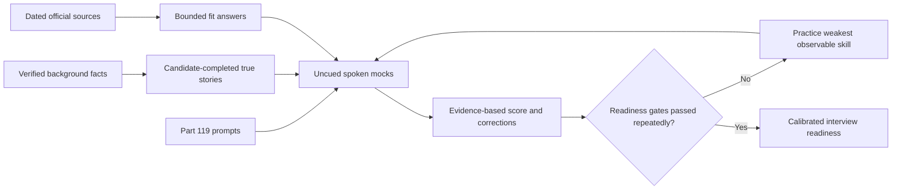
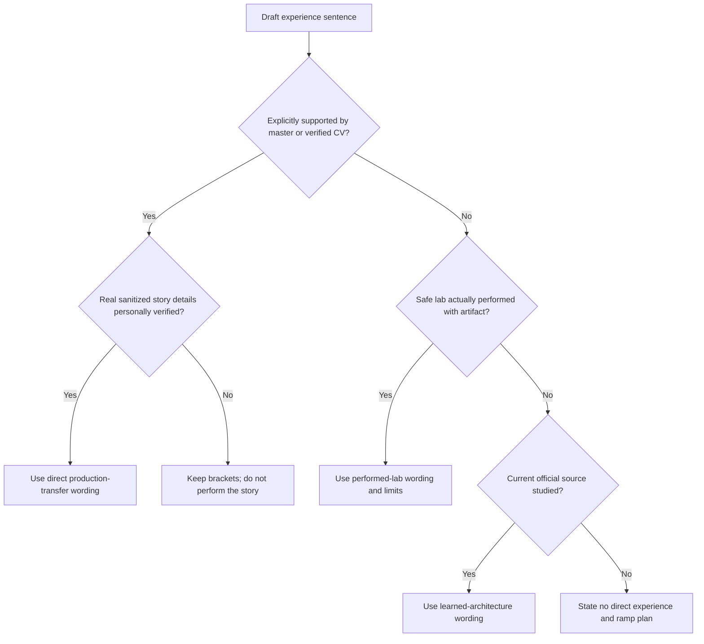
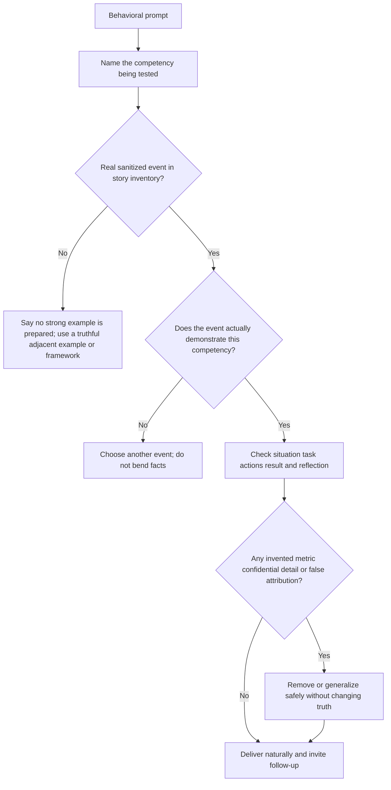
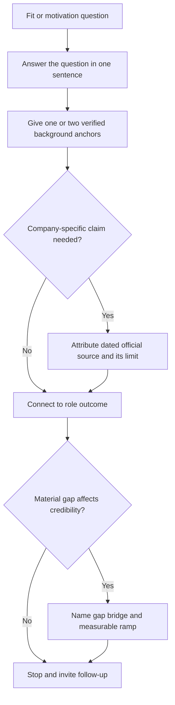
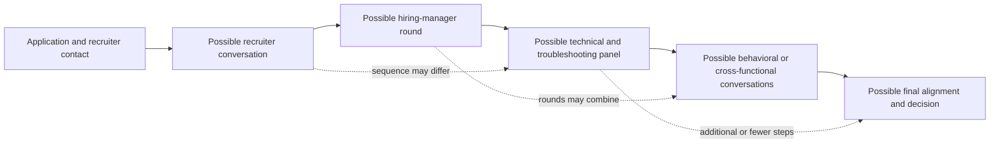
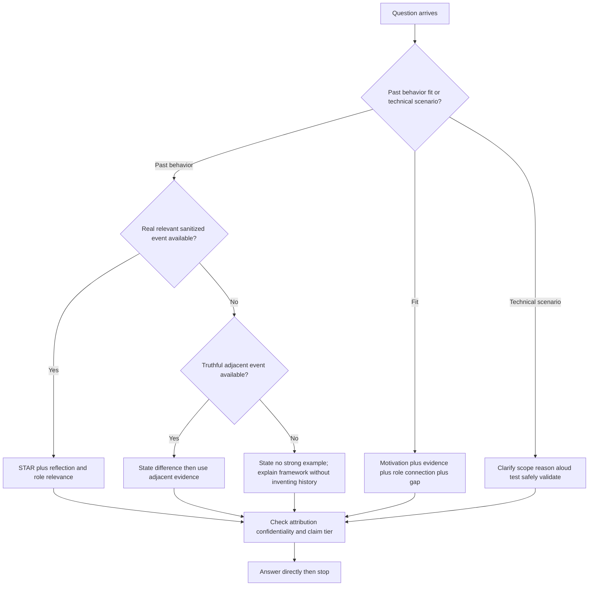
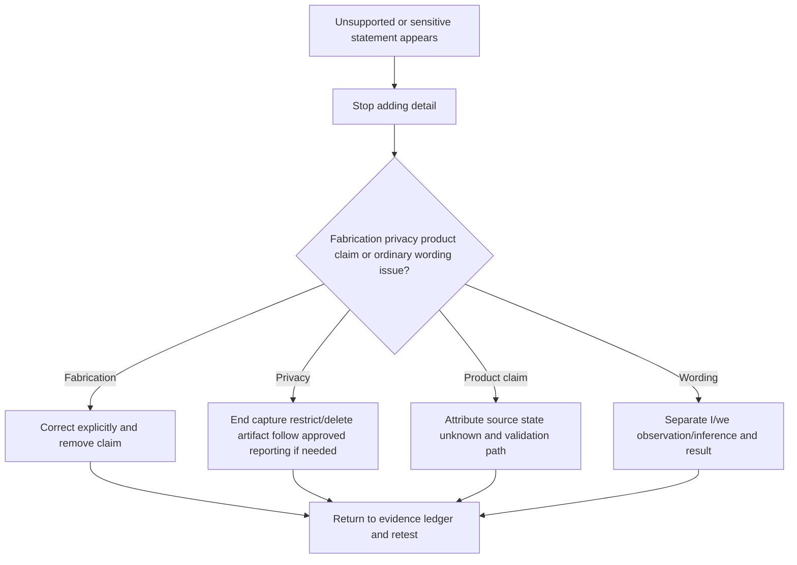
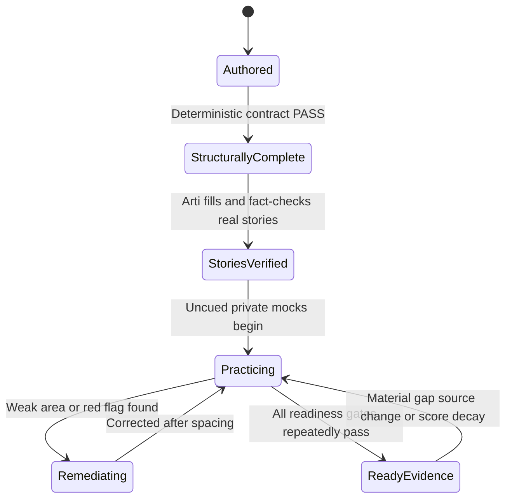
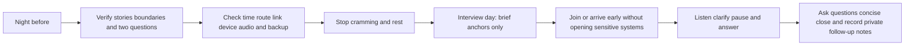

# Part 120 - Behavioral STAR Closing and Interview Readiness

> **Purpose:** Turn Arti's verified Microsoft enterprise-support background and Parts 001-119 into truthful spoken evidence for behavioral, fit, closing, and mixed interview rounds.
>
> **Artifact honesty label:** **Candidate-adaptation templates, sourced company notes, a private mock design, and readiness gates. No bracketed story is a completed autobiographical claim. No mock, recording, local lab, synthetic practice, independent review, interview, or Abnormal product exercise was performed while authoring this Part.**
>
> **Study and official-source date:** August 24, 2026.
>
> **Authored-Part state:** `PASS`. The master tracker becomes eligible for `Done` only after this recorded state receives its post-edit check.

## Section goal

This final Part helps Arti convert established evidence into answers she can say naturally, defend under follow-up, and correct when memory or evidence is incomplete. It supplies a ten-item story bank, a background-to-capability map, fit-answer frameworks, audience-specific interview strategy, more than twenty interviewer questions, closing scripts, a private spoken-practice scorecard, a night-before sheet, and an evidence-based readiness gate.

The purpose is not to manufacture confidence. It is to make confidence proportional to proof. Reading can establish vocabulary and mental models. Only completing the bracketed fields from real memories, checking evidence, speaking without a script, handling follow-ups, and repeating realistic mocks can establish interview readiness.

### Required terms before practice

| Term | Beginner-first definition | Why it matters | Everyday analogy | Where the analogy stops |
|---|---|---|---|---|
| **Competency** | An observable combination of knowledge, skill, judgment, and behavior that helps someone perform a job well. | Interviewers use examples to predict whether Arti can own cases, communicate, collaborate, and learn. | A driver's competence combines rules, control, awareness, and decisions. | A support competency is contextual and cannot be reduced to one fixed test. |
| **Behavioral question** | A prompt asking for a real past example, often beginning with “Tell me about a time...” | It asks for evidence of prior behavior, not a hypothetical ideal. | A reference check asks what happened, not what might happen. | One story does not prove behavior in every future setting. |
| **STAR** | A speaking structure made from **Situation, Task, Action, and Result**. | It keeps a real example understandable and makes personal contribution visible. | Four labeled folders keep one case from becoming a pile of papers. | Real work can be iterative, and no folder permits invented facts. |
| **Situation** | The minimum context needed to understand the real problem, environment, and stakes. | It tells the listener why the example mattered. | A map pin establishes where a journey starts. | Context is not permission to reveal a customer, tenant, incident, or confidential detail. |
| **Task** | Arti's actual responsibility, decision, or objective in that situation. | It separates her ownership from the wider team's work. | A relay runner names which leg she ran. | Team outcomes can still depend on many people and systems. |
| **Action** | The specific steps Arti personally chose or performed, including reasoning, communication, and collaboration. | Action is usually the strongest predictor of repeatable behavior. | A recipe records what the cook did and why. | A sequence is not causal proof, and “we” must not hide personal contribution. |
| **Result** | The verified change, outcome, decision, or learning that followed. | It closes the evidence loop and prevents a task list from masquerading as impact. | A repaired door is tested by opening it, not by counting tools. | A result must not be invented, and a team result may not be solely attributable to Arti. |
| **Reflection** | What Arti learned, would repeat, or would change after the event. | It shows self-awareness, calibration, and growth beyond a polished success story. | A team reviews a journey before choosing the next route. | Reflection cannot retroactively make a poor or unsafe action acceptable. |
| **Evidence** | A fact, artifact, observation, or record that supports a claim. | It distinguishes a credible story from a rehearsed assertion. | A receipt supports what was purchased. | Evidence can be incomplete, confidential, context-bound, or open to another interpretation. |
| **Transferable skill** | A method that remains useful across different products or environments, such as scoping impact or building an escalation packet. | It explains how Microsoft support experience can help in a new security SaaS role. | Driving habits transfer between cars even when controls differ. | Transfer does not equal product operation, domain authority, or immediate mastery. |
| **Fit answer** | A concise explanation connecting motivation, evidence, values, gaps, and the target role. | It answers why this move, company, role, and candidate make sense together. | A bridge connects two shores using visible supports. | A persuasive bridge must not hide a missing support or promise mutual fit before discovery. |
| **Recruiter** | A hiring professional who commonly checks motivation, baseline alignment, communication, process, and logistics. | The answer should be concise and role-oriented without unnecessary technical depth. | A route planner checks destination and constraints. | This does not claim Abnormal's recruiter owns a fixed set of decisions. |
| **Hiring manager or HM** | The person who may lead the role or evaluate day-to-day performance, ownership, judgment, and team needs. | This audience usually needs evidence of how Arti works, learns, and handles customers. | A team captain evaluates how a player contributes to the whole game. | The actual reporting structure and interview scope are unknown until confirmed. |
| **Technical panel or panel** | One or more interviewers who may test fundamentals, troubleshooting, communication, and collaboration. | Arti must reason aloud, state assumptions, and validate rather than recite labels. | An inspection team watches both method and result. | A panel is not guaranteed, and its composition or questions cannot be inferred here. |
| **Closing** | The final concise synthesis of interest, relevant evidence, honest gap, and next step. | It helps the interviewer remember the candidate's value without a new sales pitch. | A case summary states finding, limit, and next action. | A close cannot rescue unsupported answers or force a hiring decision. |
| **Mock interview or mock** | A planned practice conversation that imitates timing, uncertainty, follow-ups, and audience changes. | It exposes gaps that silent reading and polished notes hide. | A fire drill tests coordinated behavior without creating a fire. | Practice cannot reproduce the exact company, interviewer, product access, or stakes. |
| **Calibration** | Comparing confidence with actual evidence and scored performance. | It prevents fluent reading from becoming an unsupported readiness claim. | A scale is calibrated against known weights. | Human performance varies with stress, context, sleep, and question design. |
| **Readiness** | A current evidence-based judgment that Arti can perform the expected interview behaviors consistently enough, with known limits. | It distinguishes “the guide exists” from “I can answer and reason under pressure.” | A travel bag is ready only after required items are checked, not when a packing list is written. | No checklist guarantees an offer or predicts every interview question. |



## JD Mapping

The mappings below come from the supplied job-description signals recorded in the master guide. They do not claim knowledge of Abnormal's current internal interview loop, case systems, performance measures, escalation rules, compensation bands, or private culture.

| Supplied role signal | Capability practiced here | Verified Arti foundation | Evidence still required from Arti |
|---|---|---|---|
| Four or more years of customer-facing enterprise support | A concise career story and competency examples | Five years of Microsoft customer-facing enterprise support and escalation | Real sanitized case details and verified outcomes |
| Complex investigations and threat/configuration/API cases | Ambiguity, hypothesis, escalation, and learning stories | Complex Microsoft investigations, Engineering/Product escalation, fix validation; working technical foundations | No direct Abnormal, threat-verdict, or email-security operations claim |
| Customer trust and timely updates | De-escalation, expectation, and CRITSIT answers | Customer/partner communication and CRITSIT experience | One real example with actual words, cadence, and outcome |
| Engineering and Product collaboration | Cross-functional story and escalation follow-up | Microsoft Engineering/Product escalation and fix validation | Exact personal action and result from a real case |
| KB, training, mentoring, and case deflection | Knowledge and enablement stories | KB/training creation, mentoring, and case-quality work | Real audience, action, adoption signal, and limitation |
| Trends, metrics, and process improvement | Evidence-led improvement answer | CSAT, backlog, and case-quality analysis | Actual baseline, decision, result, and metric provenance if any |
| CSM and onboarding partnership | Questions and first-90-day collaboration model | Customer/partner communication and training transfer | No claim of operating Abnormal's CSM process |
| REST, integrations, networking, identity, and AI | Technical-panel strategy and gap answers | Working knowledge/upskilling recorded in the master | Performed artifacts only where a dated run actually exists |
| Customer focus, ownership, learning, and cross-functional culture | STAR selection, fit answers, reflection, and closing | Multiple verified support-transfer areas | Stories must remain factual under probing follow-ups |

## Candidate honesty note

Arti's established production foundation is specific: five years in Microsoft customer-facing enterprise support and escalation across SharePoint Online, OneDrive, Sync Client, and Copilot; CRITSITs and complex investigations; customer and partner communication; Engineering and Product escalation; fix validation; KB and training creation; mentoring; case-quality work; and CSAT/backlog/case-quality analysis. The master also records working knowledge or upskilling in networking, diagnostic tools, APIs, data, identity, automation, and AI. It does not establish that every listed tool was used at production scale.

The guide does not contain story-level facts such as a customer identity, incident date, defect mechanism, title, exact personal remit, duration, number of users, severity, financial impact, percentage improvement, publication count, award, or measured outcome. Those details must remain bracketed until Arti supplies a true, nonconfidential account she can defend.

### Safe wording tiers

| Evidence tier | What it means here | Safe opening | Required proof | Prohibited upgrade |
|---|---|---|---|---|
| **Direct production transfer** | A method or responsibility explicitly supported by the master/CV within Microsoft enterprise support | “In my Microsoft enterprise-support work, I...” | A real sanitized situation, personal action, and observed result | Calling it Abnormal, SOC, email-security, or another vendor's production experience |
| **Performed lab or design** | A safe local/public/synthetic exercise only if it was actually run; a design remains a design | “I have not done this in production. In a dated local lab, I demonstrated...” | Run record, inputs, output, artifact, cleanup, and limitations | Calling authored instructions or reading hands-on work |
| **Learned architecture** | Understanding developed from current official documentation and study | “My current understanding from official documentation is...” | Dated source, supported statement, boundary, and validation plan | Claiming console use, private behavior, support workflow, or operational judgment |
| **No direct Abnormal experience** | No production operation of Abnormal or direct email-security case ownership is established | “I have not used Abnormal directly. The closest transferable experience is..., and I would ramp by...” | Clear gap, closest method, authorized learning sequence, feedback checkpoint | Hiding the gap behind “exposure,” “familiar,” or confident product language |

### Fact-check and evidence ledger

| Candidate statement | Status from the guide | Safe use | Missing candidate evidence | Claim ceiling |
|---|---|---|---|---|
| Five years of Microsoft customer-facing enterprise support and escalation | Verified background fact | Career introduction and enterprise-ownership evidence | A real example for each selected competency | Do not add titles, dates, levels, awards, or scope not verified here |
| SharePoint Online, OneDrive, Sync Client, and Copilot support | Verified named workload scope | Microsoft cloud and client/service-boundary transfer | Exact case details if used in STAR | Not Exchange Online security operations or Abnormal administration |
| CRITSIT and complex investigation experience | Verified category | Pressure, cadence, prioritization, and escalation transfer | Actual impact, role, actions, communication, result | Not security-incident command unless independently true and authorized to say |
| Customer and partner communication | Verified category | Trust, de-escalation, expectation, and translation evidence | A specific conversation and observable outcome | No invented customer emotion or satisfaction score |
| Engineering/Product escalation and fix validation | Verified category | Cross-functional and escalation evidence | Repro/evidence/ask/validation from a real sanitized case | No invented defect, root cause, roadmap decision, or release |
| KB/training creation and mentoring | Verified category | Enablement and knowledge-sharing evidence | Audience, need, artifact, feedback, outcome | No invented article count, learner count, deflection, or adoption metric |
| CSAT, backlog, and case-quality analysis | Verified category | Process and operational-improvement evidence | Data observed, decision influenced, result, limitations | No unsupported ownership or numeric improvement |
| Networking, diagnostics, REST/JSON, data, identity, automation, and AI | Working knowledge/upskilling with mixed depth | Learning-agility and technical-foundation answers | Exact performed exercise or real usage for any hands-on claim | Not blanket production depth or security-tool operations |
| Direct Abnormal AI and email-security operations | Not established | State direct gap and planned ramp | Future authorized product training, shadowing, sandbox, and reviewed cases | Never claim current product operation or customer threat verdict ownership |
| Local/synthetic/private Part 120 practice | Unperformed at authoring | Describe this plan as a plan | Dated private run, sanitized scorecard, and cleanup record | No rehearsal, mock score, readiness, or independent review is currently claimed |



### Nonnegotiable prohibitions

- Do not fabricate a situation, task, action, result, reflection, metric, customer, employer, title, duration, award, defect, threat, or business outcome.
- Do not use a real customer identity, tenant, ticket, case number, email, message, domain, secret, internal hostname, confidential incident detail, or restricted document.
- Do not memorize wording that creates a deceptive impression. Learn the structure and facts, then speak naturally.
- Do not disparage Microsoft, Abnormal, a competitor, a customer, a colleague, or another team. Explain evidence and ownership boundaries without blame.
- Do not present an authored lab design as performed practice or reading as hands-on skill.
- Do not use hidden AI assistance in an interview. If AI is permitted for preparation or an assessment, follow the stated rules, disclose use where required, protect data, and verify every output.
- Do not record or upload a real interview, confidential prompt, CV with unnecessary personal data, or private practice containing sensitive material without explicit authorization and a reviewed privacy path.

### 🔍 Plain-English deep-dive: A scaffold is not a story

A scaffold is a structure that holds empty places for verified facts. It is like a blank incident template: useful because it prevents omissions, but it is not evidence that an incident happened. In this Part, brackets such as **[real customer impact]** are stop signs. Arti must either replace them with a true, sanitized fact or choose a different story. Removing the brackets while keeping invented prose would be deception.

The limitation of the building analogy is important. A physical scaffold can stand before the building exists. An interview story cannot be “close enough” to reality because the interviewer may probe exact actions, alternatives, and outcomes. A truthful modest result is stronger than a dramatic result that changes under follow-up.

## Building a truthful STAR answer

Use STAR to make evidence easy to follow, not to turn every answer into a performance. A useful two-minute allocation is roughly 20 seconds for Situation, 15 seconds for Task, 70 seconds for Action, 25 seconds for Result, and 10 seconds for Reflection. Shorten or extend only when the interviewer asks.

| Element | Question to answer | Strong content | Weak or unsafe content |
|---|---|---|---|
| Situation | What real, sanitized condition made action necessary? | Workload category, customer-visible impact, ambiguity, constraints | Customer identity, confidential detail, long chronology, invented urgency |
| Task | What was Arti accountable for? | Specific case ownership, investigation, update, artifact, or decision | “We needed to fix everything” or an unverified title/authority |
| Action | What did Arti personally do and why? | Questions, hypotheses, evidence, communication, handoff, adaptation | Tool list, vague “worked hard,” or taking credit for team action |
| Result | What verifiably changed? | Restored outcome, decision, validated fix, reduced uncertainty, reusable knowledge, lesson | Unsupported metric, universal impact, or “Engineering fixed it” as Arti's result |
| Reflection | What would Arti repeat or improve? | Specific learning, changed habit, boundary, next practice | A generic “communication is important” ending |

```mermaid
sequenceDiagram
    participant I as Interviewer
    participant A as Arti
    participant E as Evidence boundary
    I->>A: Ask for a past example
    A->>E: Select one real sanitized event
    E-->>A: Confirm fact ceiling and prohibited details
    A->>I: Situation and personal Task
    A->>I: Actions with reasoning and collaboration
    A->>I: Verified Result and attribution
    I->>A: Probe alternatives metrics or ownership
    A->>E: Preserve facts; say unknown where needed
    A->>I: Reflection and role relevance
```

### Worked answer assembly example

This is a template demonstration, not a biographical event.

**Prompt:** “Tell me about a difficult enterprise support case.”

**Unsafe answer:**

> I solved a global outage for a major customer, coordinated all engineering teams, and improved satisfaction by 40%.

Why it fails: the guide supports none of the scale, customer, authority, metric, or outcome. It also hides the actual diagnosis and personal contribution.

**Truthful ready-to-adapt form:**

> In a Microsoft enterprise-support case involving **[real sanitized workload]**, the customer was experiencing **[verified impact stated without identity or confidential detail]**. My responsibility was **[actual personal case responsibility]**. I first clarified **[expected versus actual behavior, scope, timeline, or recent change]**. I then **[real investigation actions and why they separated hypotheses]**, kept **[actual stakeholders]** aligned through **[real update approach]**, and escalated **[only if true]** with **[real reproducible evidence and explicit question]**. The verified result was **[actual observable outcome; no invented number]**. I learned **[real reflection]**. The transferable part for this role is structured ownership and evidence; I would still need to learn Abnormal's product-specific evidence and escalation process.

The form succeeds only after every bracket contains a real fact Arti can explain consistently.

## Background-to-competency translation

This artifact routes likely role capabilities to verified evidence categories. It does not replace completing the story bank.

| Competency | Plain meaning | Strongest verified background category | Transfer to the target role | Honest boundary | Best story IDs |
|---|---|---|---|---|---|
| Enterprise ownership | Maintain forward movement, communication, and validation across a case | Five years of Microsoft enterprise support and escalation | Own inbound cases from scope to resolution or useful escalation | Product workflow and exact L1 authority are unknown | S1, S3 |
| Complex troubleshooting | Turn ambiguity into testable explanations and evidence | Complex investigations; named Microsoft cloud workloads | Configuration, integration, API, and security-support reasoning | No direct Abnormal or email-threat case ownership | S1, S2 |
| Critical coordination | Keep impact, facts, owners, and cadence visible under pressure | CRITSIT experience | High-impact customer and cross-team coordination | CRITSIT is not automatically security incident command | S3 |
| Customer trust | Be candid, useful, dependable, and careful with evidence | Customer and partner communication | De-escalation, expectation management, and updates | Story details and customer reaction require confirmation | S4 |
| Operational improvement | Use support signals to improve a workflow or quality | CSAT, backlog, and case-quality analysis | Trend identification, quality, and process experiments | Do not invent ownership, denominator, or metric magnitude | S5 |
| Knowledge creation | Turn verified learning into reusable guidance | KB and training creation | Internal/external knowledge, case deflection, onboarding | No unverified publication or deflection result | S6 |
| Mentoring and training | Help others develop repeatable skill | Mentoring and training experience | Peer enablement, onboarding, and consistent case quality | Audience and outcome must come from a real example | S7 |
| Engineering/Product partnership | Make customer evidence decision-ready and close the loop | Engineering/Product escalation and fix validation | Defect evidence, explicit asks, product feedback, validation | No Abnormal workflow, roadmap, or release claim | S8 |
| Learning agility | Build competence in a new area through evidence and feedback | Networking, APIs, identity, analytics, automation, and AI upskilling | Ramp across email security and security SaaS | Reading/design alone is not performed lab or production use | S9 |
| Accountability and conflict | Correct course, handle disagreement, and own limitations | Complex investigation and cross-team work categories support a search for a real example | Intellectual honesty and productive disagreement | No specific mistake or conflict is established in the guide | S10 |
| Technical communication | Preserve mechanisms, evidence, uncertainty, and asks | Customer/partner plus Engineering/Product communication | Panel reasoning and high-quality escalation | Must not reveal restricted Microsoft details | S1, S8 |
| Nontechnical communication | Translate impact, decisions, and next steps | Customer/partner and CRITSIT communication | Executive/customer updates and closing | Do not invent audience title or sentiment | S3, S4 |

## STAR story bank artifact

All ten entries are **ready-to-adapt scaffolds**, not ready-to-recite claims. The guide confirms the broad evidence category for S1-S9, but only Arti can confirm the event-level details. S10 is especially strict: the guide establishes no particular mistake, failure, or conflict, so the answer must remain blank until a genuine example is selected.

### Story-bank index

| ID | Target theme | Verified category available | Required real detail | Reuse carefully for | Current state |
|---|---|---|---|---|---|
| S1 | Difficult enterprise case | Complex Microsoft investigation | Workload, impact, responsibility, actions, result | Ownership, troubleshooting, customer focus | `NEEDS_ARTI_FACTS` |
| S2 | Ambiguity and RCA discipline | Complex investigation and fix validation | Competing explanations, evidence, conclusion strength | Judgment, root-cause restraint, adaptability | `NEEDS_ARTI_FACTS` |
| S3 | Escalation or CRITSIT | CRITSIT, escalation, communication | Trigger, role, cadence, handoffs, validation | Pressure, prioritization, cross-team ownership | `NEEDS_ARTI_FACTS` |
| S4 | Customer trust and de-escalation | Customer/partner communication | Concern, words/actions, expectation reset, outcome | Empathy, bad news, executive communication | `NEEDS_ARTI_FACTS` |
| S5 | Process improvement and metrics | CSAT/backlog/case-quality analysis | Baseline signal, intervention, measurement, limitation | Analytics, improvement, quality | `NEEDS_ARTI_FACTS` |
| S6 | KB or reusable guidance | KB/training creation | Repeated need, artifact, review, use signal | Documentation, deflection, communication | `NEEDS_ARTI_FACTS` |
| S7 | Training or mentoring | Training and mentoring | Learner need, coaching action, feedback, result | Collaboration, leadership, onboarding | `NEEDS_ARTI_FACTS` |
| S8 | Engineering/Product partnership | Escalation and fix validation | Evidence packet, explicit ask, disagreement/decision, validation | Cross-functional work, influence, technical writing | `NEEDS_ARTI_FACTS` |
| S9 | Learning a new technical domain | Recorded upskilling areas | Specific domain, method, performed proof, feedback, current limit | Learning agility, biggest gap, ramp | `NEEDS_ARTI_FACTS` |
| S10 | Mistake, failed approach, or conflict | No event-level fact established | Entire real event, impact, correction, accountability, learning | Failure, feedback, disagreement, self-awareness | `NO_STORY_SELECTED` |



### S1 - Difficult enterprise case ownership

**Evidence ceiling:** The master supports complex Microsoft enterprise investigations and named workloads. It does not identify a particular case, cause, impact, or result.

| STAR field | Candidate-filled scaffold |
|---|---|
| Situation | “A Microsoft enterprise customer using **[SharePoint Online, OneDrive, Sync Client, or Copilot only if that was the real workload]** experienced **[sanitized, verified symptom and business impact]**. The difficulty came from **[real ambiguity, intermittence, scope, dependency, or evidence gap]**.” |
| Task | “I was responsible for **[actual role in intake, diagnosis, coordination, communication, escalation, or validation]** while staying within **[real support/authorization boundary]**.” |
| Action | “I clarified **[expected/actual, scope, timeline, change]**, formed **[real competing hypotheses]**, and selected **[real evidence/test]** because it would distinguish **[prediction A]** from **[prediction B]**. I kept **[real audience]** informed through **[real cadence/artifact]** and involved **[verified team]** when **[real escalation trigger]**.” |
| Result | “The verified outcome was **[actual restored function, clarified owner, validated fix, workaround, reduced uncertainty, or other defensible result]**. My contribution was **[personal contribution]**; the wider team contributed **[team contribution if relevant]**.” |
| Reflection | “I learned **[specific lesson]** and would now **[specific improvement]**.” |

**Likely probes:** What did you personally do? What evidence changed your view? What did not work? How did you know the outcome was restored? What detail are you omitting for confidentiality?

**Do not add:** “global,” “outage,” a customer tier, a user count, a duration, or a percentage unless personally verified and safe to disclose.

### S2 - Ambiguity, hypothesis testing, and RCA restraint

**Evidence ceiling:** Complex investigation and fix-validation categories are verified; no particular root cause is supplied.

| STAR field | Candidate-filled scaffold |
|---|---|
| Situation | “In **[real Microsoft case]**, the initial report suggested **[customer or team conclusion]**, but the confirmed observations were only **[facts available at that point]**.” |
| Task | “I needed to move the investigation forward without presenting correlation as cause and while **[real customer or operational constraint]**.” |
| Action | “I separated observations from assumptions, wrote **[two or more real hypotheses]**, and used **[real comparison, log, trace, configuration check, reproduction, or timeline]** to test different predictions. When **[real evidence]** weakened my initial view, I **[real correction and communication]**. I escalated **[if true]** with the remaining uncertainty and exact decision needed.” |
| Result | “The evidence ultimately supported **[actual conclusion at its real confidence level]**, or the team restored **[actual outcome]** without claiming a deeper cause than the evidence allowed.” |
| Reflection | “The lasting lesson was **[for example, preserve competing hypotheses, source expected behavior, or validate final state]**, which I applied by **[real later habit if true]**.” |

**Worked wording for a bounded result:** “We validated the corrective path against the reported symptom. I would not claim that I personally proved the code-level root cause because that conclusion belonged to **[actual owner]**.” Use only if true.

**Likely probes:** Were you wrong at first? Which observation was discriminating? Did the workaround prove cause? Who had authority to confirm root cause?

### S3 - Escalation or CRITSIT under pressure

**Evidence ceiling:** CRITSITs, Engineering/Product escalation, customer/partner communication, and fix validation are verified categories. A CRITSIT is not automatically a cybersecurity incident.

| STAR field | Candidate-filled scaffold |
|---|---|
| Situation | “During a Microsoft CRITSIT involving **[sanitized workload and verified impact]**, **[actual number/type of stakeholder groups without identities]** needed a common view while the cause remained **[known/unknown]**.” |
| Task | “My responsibility was **[actual investigation or coordination workstream]**, including **[real update, evidence, handoff, or validation duty]**.” |
| Action | “I kept a live structure for impact, confirmed facts, unknowns, actions, owners, and checkpoints. I **[real diagnostic action]**, sent **[real technical/nontechnical update]**, and escalated to **[verified Engineering/Product boundary]** with **[real evidence and explicit ask]**. When **[dependency or evidence changed]**, I **[real reprioritization or correction]**.” |
| Result | “The verified outcome was **[real restoration, workaround, decision, fix validation, or orderly transfer]**. The result attributable to my work was **[actual contribution]**, not the entire team outcome.” |
| Reflection | “I would repeat **[real effective discipline]** and improve **[real lesson, such as earlier escalation or clearer role assignment]**.” |

**Transfer sentence:** “I would bring the coordination method to a high-impact security SaaS case, but I would first learn Abnormal's severity, incident, security, and communication rules.”

**Likely probes:** How did you prioritize? What did you communicate without an ETA? What did you defer? Did escalation transfer ownership? How was the result validated?

### S4 - Customer trust and de-escalation

**Evidence ceiling:** Customer and partner communication is verified. No specific difficult conversation or sentiment result is supplied.

| STAR field | Candidate-filled scaffold |
|---|---|
| Situation | “A customer or partner in **[real sanitized Microsoft context]** was concerned because **[verified impact, missed expectation, uncertainty, or repeated effort]**.” |
| Task | “I needed to reduce avoidable uncertainty and move the technical case forward without promising **[uncontrolled result or date]**.” |
| Action | “I first **[real listening/summary action]** and acknowledged **[real impact]**. I separated **[known]** from **[unknown]**, explained **[next evidence-based action]**, set **[real checkpoint]**, and **[met or candidly renegotiated it]**. I offered **[real safe option/workaround/escalation]** while preserving **[privacy, authorization, or product boundary if relevant]**.” |
| Result | “The observable outcome was **[customer accepted plan, communication stabilized, necessary evidence arrived, workflow restored, or another real result]**. I did not measure **[emotion/CSAT]** unless a real record supports it.” |
| Reflection | “The experience changed my practice by **[specific habit]**.” |

**Worked opening:** “I would not describe the customer as difficult. The situation was difficult because impact was real and certainty was low.”

**Likely probes:** What exact words did you use? What if the customer rejected the plan? Did you apologize? What commitment did you control? How did you avoid blame?

### S5 - Process improvement and metrics

**Evidence ceiling:** The master verifies CSAT, backlog, and case-quality analysis, but no metric values, ownership level, intervention, or measured improvement.

| STAR field | Candidate-filled scaffold |
|---|---|
| Situation | “While reviewing **[actual CSAT, backlog, or case-quality signal]**, I noticed **[real pattern with its true denominator/limits]**.” |
| Task | “I was responsible for **[actual analysis, recommendation, experiment, reporting, or implementation scope]** and needed to avoid optimizing one metric at the expense of quality.” |
| Action | “I defined **[real metric or quality criterion]**, segmented **[real dimensions]**, checked **[bias/data-quality caveat]**, and formed **[real improvement hypothesis]**. I proposed or carried out **[real intervention]** with **[real guardrail]**, then reviewed **[real follow-up evidence]**.” |
| Result | “The verified result was **[actual qualitative or quantitative result]**. If no causal measurement exists, I will say: ‘The change coincided with **[observation]**, but the available evidence did not prove causation.’” |
| Reflection | “I learned **[specific metric or change-management lesson]**.” |

**Safe result alternatives when true:** clearer visibility, an agreed quality standard, a prioritized backlog action, a tested workflow, or a decision not to scale an intervention. Impact need not be a percentage.

**Likely probes:** What was the denominator? Did you own the metric? How did you avoid gaming? What did you stop doing? What evidence would change the conclusion?

### S6 - KB or reusable guidance

**Evidence ceiling:** KB and training creation are verified. Article topic, publication, audience, use, and deflection are not supplied.

| STAR field | Candidate-filled scaffold |
|---|---|
| Situation | “A recurring Microsoft support need involving **[real sanitized topic]** caused **[verified confusion, repeated investigation, inconsistent action, or onboarding need]**.” |
| Task | “I needed to create or improve **[actual KB, troubleshooting note, training artifact, or guidance]** for **[real audience]**.” |
| Action | “I gathered **[real verified source/case pattern]**, separated universal guidance from case-specific detail, wrote **[real decision steps, prerequisites, warnings, or escalation criteria]**, and had **[real reviewer/process if any]** validate it. I adjusted it after **[real feedback or observed confusion]**.” |
| Result | “The verified outcome was **[actual reuse, clearer handling, learner completion, reduced repeated question, or accepted artifact]**. I will not claim a deflection rate or publication reach without a record.” |
| Reflection | “I learned that reusable knowledge needs **[findability, review, evidence, ownership, maintenance, or another true lesson]**.” |

**Transfer sentence:** “At Abnormal I would first learn the current knowledge review, privacy, publication, and measurement process before applying the same habit.”

### S7 - Training or mentoring

**Evidence ceiling:** Training and mentoring are verified categories; no audience, program, duration, or learner result is supplied.

| STAR field | Candidate-filled scaffold |
|---|---|
| Situation | “A colleague or group needed help with **[real skill, workflow, case-quality behavior, or technical concept]**.” |
| Task | “My role was **[actual mentoring/training responsibility]**, with the goal that they could **[real observable capability]** rather than depend on me.” |
| Action | “I assessed **[real starting need]**, explained **[real mental model]**, used **[real example/exercise/artifact]**, observed them perform **[real task]**, and changed my approach after **[real feedback or misunderstanding]**.” |
| Result | “The observable result was **[independent task completion, improved consistency, feedback, reuse, or another verified outcome]**. I will not invent a learner count or productivity result.” |
| Reflection | “I learned **[specific coaching lesson]**, especially **[how it applies to different experience levels or audiences]**.” |

**Likely probes:** How did you know learning occurred? How did you handle someone who disagreed? What did you learn from the learner? Did you create a dependency on yourself?

### S8 - Cross-functional Engineering or Product collaboration

**Evidence ceiling:** Microsoft Engineering/Product escalation and fix validation are verified. No specific defect, product decision, conflict, or result is supplied.

| STAR field | Candidate-filled scaffold |
|---|---|
| Situation | “A Microsoft enterprise case involving **[real sanitized workload]** reached a boundary where Support could not determine **[real internal behavior, defect question, or intended behavior]** from available evidence.” |
| Task | “I needed to make the issue decision-ready for **[Engineering or Product, whichever was real]** while keeping customer ownership and avoiding a premature defect or roadmap claim.” |
| Action | “I documented **[real expected/actual behavior, scope, environment, timeline, repro, IDs, known-good comparison]**, stated **[real hypotheses and tests]**, and asked **[specific real decision]**. I responded to **[real request/disagreement]** by **[adding evidence, revising the claim, or clarifying impact]**. After **[real returned finding/change]**, I **[real validation and customer follow-through]**.” |
| Result | “The verified result was **[accepted investigation, clarified behavior, validated fix, useful workaround, product evidence, or another real result]**. I did not control **[priority, release, roadmap, or code decision]**.” |
| Reflection | “I learned **[specific lesson about evidence, shared outcomes, or status semantics]**.” |

**Worked conflict wording:** “The disagreement was about what the evidence supported, not about the people. I presented the known-good comparison, invited a test that could disprove my hypothesis, and aligned on the next decision owner.” Use only if it reflects a real event.

### S9 - Learning a new technical domain

**Evidence ceiling:** The master records upskilling or working foundations across networking, diagnostic tools, REST/JSON, data, identity, automation, and AI. It does not prove a particular lab was run for Part 120 or that every tool was used in production.

| STAR field | Candidate-filled scaffold |
|---|---|
| Situation | “I identified **[real technical domain]** as a gap because **[real work or development need]**.” |
| Task | “I set a goal to reach **[specific realistic capability]**, not simply finish reading.” |
| Action | “I used **[real official source/course/mentor]**, built or analyzed **[actually performed exercise or work artifact]**, tested myself through **[real explanation, quiz, case, or feedback]**, and corrected **[real misunderstanding]**. I kept the boundary at **[current limit]**.” |
| Result | “The verified evidence is **[actual artifact, task completed, working explanation, work contribution, or assessment]**. The area still needing development is **[honest next gap]**.” |
| Reflection | “I now learn new domains through source, model, practice, evidence, feedback, and correction rather than reading alone.” |

**Do not say:** “I mastered networking/email security/AI.” Name the exact capability and where it stops.

### S10 - Mistake, failed approach, or conflict

**Evidence ceiling:** No event-level mistake, failed approach, or conflict is established in the guide. This scaffold cannot become an answer until Arti selects a genuine event. A small, well-understood example is preferable to an invented dramatic failure.

| STAR field | Candidate-filled scaffold |
|---|---|
| Situation | “In **[real nonconfidential event]**, I initially **[actual assumption, action, communication, or approach]**.” |
| Task | “I was responsible for **[actual duty]**, and the risk or impact of my initial approach was **[verified consequence, not exaggerated]**.” |
| Action | “I recognized the problem when **[real evidence/feedback]**. I acknowledged **[actual accountability]**, corrected **[real action]**, informed **[appropriate people]**, and protected **[customer, quality, privacy, or timeline]**. I then changed **[specific process/check/habit]**.” |
| Result | “The verified outcome was **[actual recovery, decision, limitation, or lesson]**. I will not invent a flawless rescue; any remaining impact was **[truthful remainder]**.” |
| Reflection | “What I would do earlier now is **[specific behavior]**, and the evidence that the lesson lasted is **[real later practice, if any]**.” |

**Selection rules:** Do not choose a story involving unshareable confidential harm, unresolved legal/security issues, blame, a disguised strength, or a failure with no accountability. Do not claim a conflict if the real event was merely routine collaboration.

### Story fact-check worksheet

Complete one row per chosen event before speaking it.

| Check | Candidate entry | Pass rule |
|---|---|---|
| Story ID and competency | `[FILL]` | One primary competency, at most two secondary ones |
| Real event memory source | `[FILL: personal record/memory; no restricted data copied]` | Arti recognizes the event and can answer probes consistently |
| Evidence tier | `[FILL]` | Direct production transfer, performed lab, learned architecture, or no direct experience |
| Situation facts | `[FILL]` | Minimal, sanitized, no identity or confidential detail |
| Personal task | `[FILL]` | “I” responsibility is distinct from team remit |
| Personal actions | `[FILL]` | Three to five actions with reasoning, not a tool list |
| Team actions | `[FILL]` | Attributed to the actual team or owner |
| Result | `[FILL]` | Observable and defensible; no invented metric |
| Metric provenance | `[NONE or FILL source/definition/denominator]` | Any number can be explained and safely disclosed |
| Reflection | `[FILL]` | Specific changed behavior or limitation |
| Confidentiality scan | `[PASS/FAIL]` | No customer, tenant, ticket, secret, internal URL, restricted mechanism, or private incident detail |
| Follow-up consistency | `[PASS/FAIL after practice]` | Three random probes do not change facts or evidence tier |

## Fit-answer bank and worked examples

A fit answer should normally use four moves: direct motivation, verified evidence, role connection, and honest boundary. It should sound like Arti, not like a company brochure. The scripts below are starting structures. Current company statements are attributed to official public sources reviewed for August 24, 2026 and must be revalidated close to the interview.

### Why this move?

> I am not moving away from customer support; I am moving toward a security SaaS domain where the customer and technical consequences are especially meaningful. My verified foundation is five years in Microsoft enterprise support and escalation, including complex investigations, CRITSIT communication, Engineering and Product collaboration, fix validation, knowledge creation, mentoring, and support-quality analysis. I want to apply those disciplines at the intersection of cloud services, AI, identity, APIs, and human-targeted security. Direct email-security and Abnormal product operations are genuine gaps, so I am presenting this as a deliberate transition with a structured ramp plan, not as work I have already done.

### Why Abnormal AI?

> As of my August 24, 2026 review, Abnormal's official public material states a mission to “stop crime with AI” and describes a behavioral security platform spanning public email, identity, AI, and related security surfaces. The careers page publishes the VOICE themes of velocity, ownership, intellectual honesty, customer obsession, and excellence. The combination is attractive because my strongest support habits are ownership, evidence, candid uncertainty, customer communication, and continuous improvement, while AI-driven security is the direction in which I want to build depth. I treat those pages as company-authored positioning, not independent proof of outcomes or knowledge of private product behavior. I would use the interview to understand how those ideas show up in this team's actual work.

### Why Technical Support Engineer?

> Technical support is where I have built the strongest evidence and where I still want to grow. I enjoy taking an incomplete customer report, clarifying impact and expected behavior, forming testable explanations, coordinating the right teams, communicating while uncertainty remains, validating the outcome, and turning learning into reusable guidance. This role adds a new product and security domain, but the core responsibility of making difficult enterprise problems actionable for customers and internal teams fits my established strengths.

### Why you?

> I offer a mature enterprise-support foundation and a candid learning posture. My evidence includes five years of Microsoft customer-facing support and escalation, complex case and CRITSIT work, clear customer and partner communication, Engineering and Product escalation, fix validation, KB and training creation, mentoring, and operational analysis. I will not pretend that this makes me an Abnormal or email-security operator on day one. It does mean I already know how to own ambiguity, build evidence, protect trust, and learn through feedback. I would make the product/domain ramp visible and measurable rather than hiding it.

### What is your biggest relevant gap?

> My biggest relevant gap is direct Abnormal product and email-security operations experience. My Microsoft cloud support background is useful, but it is not equivalent. I am closing the conceptual gap through the completed curriculum and current official sources; the remaining readiness work is spoken practice, candidate-completed true stories, and authorized product learning such as documentation, shadowing, sandbox exercises, and reviewed cases after joining. I would rather be precise about that gap and show a reliable ramp method than use broad familiarity language.

### First 30, 60, and 90 days

This is a candidate proposal for manager discussion, not Abnormal's published plan.

| Period | Proposed focus | Observable evidence | Questions and boundaries |
|---|---|---|---|
| Days 1-30 | Learn public-to-internal product vocabulary, support contracts, case types, customer personas, privacy/security rules, tools, evidence semantics, and escalation paths; shadow cases | Accurate notes, approved training, safe evidence handling, teach-backs, and manager-reviewed case maps | Which cases may I touch? Which data is sensitive? What defines quality? What assumptions from public study are wrong? |
| Days 31-60 | Own bounded cases with review; practice intake, updates, known diagnostics, escalation, and validation | Reviewed case notes, reliable cadence, appropriate escalation, corrected coaching themes | Which case types are ready for independent ownership? Where am I slow/noisy? Which mistakes carry the greatest risk? |
| Days 61-90 | Broaden approved ownership and contribute one modest knowledge or quality improvement | Consistent case quality, verified outcomes, a reviewed knowledge/process contribution, an agreed next-depth plan | What evidence demonstrates readiness for broader scope? Which recurring friction is worth addressing? |

Do not promise ticket volume, CSAT, resolution time, independent case ownership, certification, or shipped improvement without knowing the team's real standards and data.

### Compensation and logistics

**Recruiter-ready answer without invented numbers:**

> I am interested in understanding the role's scope, level, location expectations, total compensation structure, and the range budgeted for this position. I do not want to invent a number without that context. I am happy to discuss my expectations transparently once we align on level, base, variable or equity components, benefits, and logistics. I will also be direct about **[real notice period, work authorization, location, travel, or schedule constraint only after Arti verifies it]**.

If the recruiter requires an expectation first, Arti should research current lawful market information and decide a real range privately. This guide intentionally supplies no amount, current salary, competing offer, work authorization, notice period, location preference, or flexibility claim.

### Concise closing scripts

| Use | Ready-to-adapt script | Time target |
|---|---|---:|
| Short final close | “Thank you. My strongest evidence is enterprise support ownership: complex Microsoft investigations, customer trust, cross-team escalation, fix validation, knowledge, and improvement. I am intentionally moving into security SaaS and I am candid that direct Abnormal operation is a gap. The conversation has strengthened my interest in **[real point learned today]**, and I would welcome the opportunity to bring the proven support foundation while earning product depth through the team's standards.” | 20-30 seconds |
| Hiring-manager close | “What I hope you take away is that I know how to create structure when enterprise cases are ambiguous: define impact, test evidence, communicate under pressure, collaborate with Engineering and Product, validate outcomes, and capture learning. I would not arrive claiming product mastery. I would arrive ready to learn the actual support system, accept coaching, own bounded work safely, and become accountable for broader cases as the evidence supports it.” | 35-50 seconds |
| Technical-panel close | “My current conclusion from the scenario is **[supported conclusion]**; the remaining uncertainty is **[unknown]**. My next safe action would be **[test/action]**, with **[owner]**, and I would validate **[target state]** while updating the customer by **[checkpoint]**. More broadly, my Microsoft support method transfers, but I would verify Abnormal-specific behavior from authorized documentation and telemetry rather than guess.” | 35-60 seconds |

### 🔍 Plain-English deep-dive: Fit is a hypothesis, not a slogan

Candidate and employer are both testing a hypothesis: “Could this person and this role work well together under real conditions?” A strong fit answer supplies relevant evidence and useful questions. It does not repeat adjectives from a careers page as though they prove private culture.

Think of fit like checking whether a tool belongs in a particular workshop. The tool's quality matters, but so do the work, safety rules, teammates, materials, and maintenance. The analogy stops because people grow, negotiate expectations, and affect culture; they are not fixed tools. Arti should therefore show what she has done, what she wants to learn, and what she needs to discover.



## Recruiter, hiring-manager, and technical-panel strategy

The map below is a realistic preparation model based on common enterprise support hiring. It is not a claim about Abnormal's actual sequence, interview count, interviewer titles, assessment platform, timing, or decision rules. Ask the recruiter for the current process.



| Possible stage | Likely decision question | Arti's focus | Useful proof | Avoid |
|---|---|---|---|---|
| Recruiter | Is the motivation, baseline experience, communication, and logistics aligned enough to proceed? | 30/90-second story, why move/company/role, direct gap, factual logistics | Five years of Microsoft enterprise support and a bounded transition story | Deep technical monologue, invented compensation/logistics, overclaiming product research |
| Hiring manager | Will this person own enterprise customers, learn, collaborate, and improve safely? | S1-S10 evidence, judgment, feedback, first-90-day proposal, expectations | CRITSIT, customer trust, escalation, validation, KB/training, metrics categories with true details | Saying “I am a fast learner” without method; one story reused for everything |
| Technical panel/peers | Can this person explain fundamentals and reason through uncertainty with the team? | Clarify, define, map layers, offer hypotheses, choose evidence, communicate, validate | Part 119 drills and Microsoft support method, accurately tiered | Guessing private behavior, tool dumping, silent thinking, unsafe test, treating status as outcome |
| Behavioral/cross-functional | How does this person act when pressure, conflict, failure, or stakeholder needs collide? | Personal actions, trade-offs, correction, reflection, attribution | Candidate-completed S3-S10 stories | Blame, perfect-hero story, confidential detail, missing result or reflection |
| Final/closing | Is the evidence consistent, are expectations aligned, and does mutual interest remain? | Synthesize value, state gap, ask decision-quality questions, concise close | Stable facts across all rounds | New unsupported claim, desperate pressure, premature negotiation, generic questions already answered |

### Round-specific preparation cards

**Recruiter card**

- Answer in 30-90 seconds unless invited deeper.
- Make the transition coherent: proven enterprise support, deliberate security/AI/SaaS direction, honest direct-product gap.
- Ask about current sequence, role level, location/logistics, compensation structure, and what each round evaluates.
- Never improvise a salary, notice period, authorization status, or availability. Use only Arti's current verified facts.

**Hiring-manager card**

- Lead with one real example rather than five skill labels.
- Show ownership across diagnosis, communication, dependency, validation, and learning.
- Name a decision or trade-off: what did Arti prioritize, defer, escalate, correct, or measure?
- Ask how quality, customer outcomes, case scope, coaching, and progression are assessed.

**Technical-panel/peer card**

- Define unfamiliar terms before relying on them.
- State assumptions and ask only clarifying questions that change the path.
- Use the spine: impact, safety, observations, hypotheses, discriminating evidence, action, escalation, validation, customer update.
- Separate vendor-neutral reasoning from unknown Abnormal-specific behavior.
- End with current conclusion, uncertainty, next action, owner, and target-state check.

### 🔍 Plain-English deep-dive: Practice anchors, not deceptive scripts

Preparation becomes deceptive when polished wording hides unsupported facts, a tool writes an answer Arti cannot explain, or memorization is used to create experience that did not occur. Preparation remains useful and honest when Arti verifies the event, reduces it to a few anchors, practices several natural phrasings, and preserves the same facts under follow-up.

Think of a musician learning a piece. Rehearsal creates reliable structure, but a performance still requires listening and adapting to tempo and the other musicians. The analogy stops because an interview answer is evidence about a real career, not an artistic interpretation: Arti may vary the phrasing, but she may not vary the history. A good test is to answer the same prompt three ways from the five anchors **Situation, Task, Action, Result, Reflection**. If the facts change, return to the ledger; if only the wording changes, the answer is becoming natural.

### Behavioral and fit decision tree



## Smart questions for interviewers

Do not ask all questions. Select two or three that fit the audience and have not already been answered. A smart question helps both sides make a decision; it is not a disguised speech or an attempt to obtain confidential incident details.

### Recruiter questions

| # | Question | What it reveals |
|---:|---|---|
| 1 | “Could you walk me through the current interview stages, what each stage evaluates, and whether any exercise has specific preparation or AI-use rules?” | Process, assessment expectations, integrity requirements |
| 2 | “How is this role leveled, and what experience or behavior distinguishes success at that level?” | Scope and leveling without assuming title semantics |
| 3 | “What location, schedule, on-call, travel, work-authorization, or time-zone expectations should we clarify early?” | Real logistics and constraints |
| 4 | “What compensation components and approved range apply to this role and location?” | Base/variable/equity/benefit structure without inventing expectations |
| 5 | “What prompted the opening, and what would you most like the hiring team to learn about a candidate?” | Hiring need and decision focus without demanding confidential detail |

### Hiring-manager questions

| # | Question | What it reveals |
|---:|---|---|
| 6 | “What customer outcomes and case-quality behaviors would make you say a new engineer is doing well after three and six months?” | Success evidence and time horizon |
| 7 | “Which case types are usually learned first, and what evidence earns broader independent ownership?” | Ramp sequence, risk, and coaching |
| 8 | “Where do new support engineers most often struggle: product model, email/security domain, investigation quality, communication, or internal navigation?” | Real ramp risks and support available |
| 9 | “How do you distinguish a strong L1 resolution from a strong escalation?” | Ownership and quality expectations |
| 10 | “How are case reviews, coaching, and calibration handled when judgment differs?” | Feedback culture and decision process |

### Technical-panel and peer questions

| # | Question | What it reveals |
|---:|---|---|
| 11 | “Which boundaries create the most diagnostic ambiguity across customer configuration, identity, email flow, APIs, integrations, and platform behavior?” | Technical complexity and ownership seams |
| 12 | “What evidence is most often missing when a case reaches an experienced engineer?” | Intake and escalation quality priorities |
| 13 | “How do peers share a difficult investigation without duplicating work or losing one customer narrative?” | Swarming, handoffs, and collaboration |
| 14 | “Which fundamentals make the largest difference for someone ramping from enterprise cloud support into this domain?” | Learning priorities grounded in team experience |
| 15 | “How do engineers validate a customer-visible outcome after an internal finding, workaround, or fix?” | Final-state discipline and customer ownership |

### CSM, Product, and Engineering questions

| # | Question | Best audience | What it reveals |
|---:|---|---|---|
| 16 | “How do Support and CSMs divide technical case ownership from onboarding, adoption, and relationship communication?” | CSM or HM | Collaboration and handoff boundaries |
| 17 | “What makes support evidence useful enough for Engineering to act without restarting the investigation?” | Engineering or Support peer | Repro, telemetry, and explicit-ask standards |
| 18 | “How does Support communicate status when Engineering is investigating but no cause or delivery date is confirmed?” | Engineering, HM, or CSM | Promise and cadence norms |
| 19 | “How are recurring case patterns converted into knowledge, quality work, Product evidence, or roadmap discovery?” | Product, HM, or CSM | Feedback loop and decision ownership |
| 20 | “When Product confirms expected behavior that still blocks a customer goal, what is the preferred Support and CSM response?” | Product or CSM | Limitation handling and customer trust |
| 21 | “How are security, privacy, or potential tenant-isolation concerns routed differently from an ordinary support case?” | HM, Engineering, or Security-aware peer | Safety escalation boundaries; no request for incident detail |

### Closing and decision questions

| # | Question | What it reveals |
|---:|---|---|
| 22 | “Based on our conversation, is there a capability or concern you would like me to address with a more concrete example?” | Gives a fair chance to clarify evidence |
| 23 | “What is the hardest problem the person in this role should be ready to help the team improve over the next year?” | Strategic need without soliciting confidential cases |
| 24 | “What distinguishes people who become trusted by customers and peers on this team?” | Observable culture and trust behavior |
| 25 | “What have I not asked that is important for evaluating whether this role and team are a good mutual fit?” | Surfaces unexamined expectations |
| 26 | “What are the remaining decision steps and expected communication path after this conversation?” | Process and follow-up without pressure |

## Failure modes, red flags, and escalation

Interview execution can fail even when the underlying experience is strong. The response should be correction, not concealment.

| Failure mode | What the interviewer may hear | Immediate repair | Practice escalation trigger |
|---|---|---|---|
| Story contains a number Arti cannot define | Exaggeration or weak attribution | Remove it or explain source, definition, denominator, and ownership | Any metric changes under follow-up |
| “We” hides personal action | Passenger rather than owner | State “My responsibility was...” and separate team contribution | Reviewer still cannot name Arti's decision |
| Same story answers every competency | Thin evidence range | Build distinct story inventory and use secondary reuse sparingly | Fewer than eight real stories selected |
| Perfect success with no trade-off | Rehearsed hero narrative | Add uncertainty, failed hypothesis, limitation, or reflection only if true | Story cannot survive “What would you change?” |
| Microsoft cloud becomes email security | Domain overclaim | State named workloads and direct gap explicitly | Any answer implies Exchange/security operations |
| Public Abnormal page becomes product expertise | Marketing memorization | Attribute source, state boundary, ask how team works in practice | Product-specific behavior is asserted without authorized evidence |
| “I would collect logs” | No hypothesis or privacy discipline | Name exact minimum field, decision, redaction, and expected observation | Proposed evidence includes secrets or unnecessary customer content |
| Vendor or customer blame | Low collaboration and causal rigor | Restate shared outcome, evidence, owners, and unknowns | Answer uses disparaging or absolute language |
| Hidden AI-generated script | Integrity and authenticity risk | Stop; follow interview rules and disclose use where required | Any real-time assistance is not explicitly permitted |
| Rambling past the question | Poor prioritization | Give direct answer, one evidence point, relevance, then stop | Repeated answer exceeds target by more than 20% |
| Going blank | Retrieval gap | Ask for a moment, name the competency, choose a real event or state no strong example | Candidate starts inventing to fill silence |
| Confidential detail appears | Judgment and privacy failure | Stop, generalize safely, and do not repeat the detail | Delete unsafe recording and reassess story suitability |



### Going-blank recovery script

> Let me take a moment to choose a real example. The capability I hear in the question is **[competency]**. I have **[a relevant Microsoft example / an adjacent example with this limitation / no strong past example prepared]**. I will keep the customer details sanitized and focus on my actions.

This buys a few seconds without inventing. If no real story appears, say so and explain the decision framework. A missing example may reduce interview strength; fabrication creates a larger integrity problem.

## Mock and readiness system

Part 119 supplies 240 core prompts and thirty-two drills. Part 120 selects a smaller mixed set and adds behavioral follow-up, timing, privacy, correction, and readiness decisions. The authored state is still **not practiced**.

### Question selection from Part 119

| Mock purpose | Part 119 selections | Why selected | Required variation |
|---|---|---|---|
| Recruiter story and motivation | 1, 100, 225-227, 229 | Background, direct-product gap, move, company, role | Ask for 30-second and 90-second versions |
| Hiring-manager ownership | 2, 43-45, 85-86, 181, 228, 230-232 | L1 ownership, escalation, customer update, risk, fit | Add “What did you personally do?” |
| Behavioral evidence | 93-95 and 217-224 | Critical case, escalation, improvement, failure, ambiguity, trust, mentoring, conflict, learning | Randomly require a different story for two prompts |
| Technical-panel fundamentals | 17-48, sampled across email, AI, identity, network, API, logs | Beginner definitions and boundaries | Explain to a customer, then to an engineer |
| Troubleshooting | Choose at least one drill from each `DR-EMAIL`, `DR-IDENTITY`, `DR-API`, `DR-NET`, `DR-LOG`, `DR-THREAT`, `DR-CASE`, and `DR-AI` family | Applied reasoning and safety | Change one condition after initial conclusion |
| Closing/readiness | 233-240 | Hire case, questions, unknowns, summary, readiness, AI integrity, closing | Close after both a strong and a weak mock |

### Structured mock plan

```mermaid
flowchart LR
    Select["Select unseen mixed prompts"] --> Record["State confidence and answer uncued"]
    Record --> Probe["Reviewer or prompt card adds follow-up"]
    Probe --> Close["Give concise result limit and next step"]
    Close --> Score["Score preserved first attempt"]
    Score --> Diagnose["Name one technical one communication and one honesty gap"]
    Diagnose --> Repair["Review linked Part and rewrite anchors"]
    Repair --> Delay["Wait based on score"]
    Delay --> Variant["Retry changed prompt without script"]
    Variant --> Score
```



| Mock | Duration | Composition | Output | Pass focus |
|---|---:|---|---|---|
| M0 baseline | 20 minutes | Recruiter intro, one fit, one STAR, one fundamental, one close | Preserved private first attempt and score | Discover gaps; no pass claim |
| M1 recruiter | 25 minutes | Career story, move/company/role, gap, logistics, questions | Timing and claim-safety log | Concise motivation and direct answers |
| M2 hiring manager | 40 minutes | Three distinct STARs, ownership scenario, first 90 days, questions, close | Story consistency and follow-up notes | Personal actions, result evidence, reflection |
| M3 technical panel | 60 minutes | Four fundamentals, two drills, one unfamiliar-product question, summary | Reasoning transcript/notes and panel score | Definitions, hypotheses, safe tests, validation |
| M4 cross-functional | 40 minutes | Customer trust, conflict, Engineering/Product, knowledge, improvement | Audience and attribution score | No blame, roadmap promise, or metric invention |
| M5 full loop | 90 minutes with short break | Recruiter, HM, technical, behavioral, closing blocks | Full scorecard and weak-area heatmap | Stable facts and energy across switches |
| M6 retest | 30-60 minutes after spacing | Weakest items plus random strong controls | Comparative scores and current source check | Improvement transfers to changed prompts |

### Spoken answer timing

| Answer type | Target | Suggested shape | Warning threshold |
|---|---:|---|---|
| Name/definition | 20-40 seconds | Definition, why it matters, limit | More than 60 seconds without application |
| Recruiter motivation | 45-75 seconds | Direct answer, two evidence anchors, role connection, gap | More than 90 seconds or technical detour |
| Background introduction | 60-100 seconds | Present foundation, evidence, direction, boundary | Chronological CV recital or more than two minutes |
| STAR | 90-150 seconds | Brief S/T, detailed A, verified R, reflection | Situation consumes more than one third |
| Technical fundamental | 60-120 seconds | Define, flow, evidence, failure/limit | Acronym list with no mental model |
| Troubleshooting scenario | 6-10 minutes | Clarify, safety, hypotheses, test, action, validation, update | Root cause asserted before evidence |
| Closing | 20-50 seconds | Value, honest gap, learned point, interest | New claim or repeated life story |

### Spoken mock scorecard artifact

Score each dimension from 0 to 4 using the anchors below. Preserve the first uncued attempt; do not rerecord over it and score only the polished take.

| Dimension | 0 | 2 | 4 |
|---|---|---|---|
| Directness | Does not answer or answers another question | Answer emerges after excess context | Direct answer in first two sentences |
| Structure | Incoherent or incomplete | Understandable but imbalanced | Clear fit, STAR, or troubleshooting structure that adapts naturally |
| Evidence | Fabricated, generic, or unsupported | Relevant category but weak event proof | Concrete, correctly tiered, sanitized evidence and defensible result |
| Personal ownership | Contribution is invisible | Some “I,” but team boundaries blur | Personal decisions/actions and team contributions are distinct |
| Technical reasoning | Incorrect or tool dumping | Plausible path with missing prediction/validation | Correct model, alternatives, discriminating evidence, final-state check |
| Customer judgment | Dismissive, unsafe, or promise-heavy | Polite but generic | Impact, trust, cadence, privacy, authority, and escalation are operational |
| Honesty and boundaries | Material overclaim or concealed AI | Gap stated after prompting | Tier, unknowns, source limits, and AI rules are proactive and stable |
| Result and reflection | No outcome or invented rescue | Outcome present but attribution/learning weak | Verified result, limitation, attribution, and specific reflection |
| Follow-up resilience | Facts change or answer collapses | Handles routine probe with support | Adapts concisely while facts and boundaries remain stable |
| Timing and presence | Far over/under, reads script, cannot recover | Understandable with filler or rushing | Within target, natural anchors, useful pause, concise close |

**Maximum:** 40 points per answer. A future answer-level practice pass is at least 30, with no score below 3 in Evidence or Honesty and boundaries and no automatic red flag. A mock-level pass also requires every selected safety-critical answer to avoid unsafe action.

| Attempt ID | Date | Mock/round | Prompt | Story/drill | Uncued? | Time | Confidence before | Score /40 | Red flag? | Main correction | Next review | Reviewer type |
|---|---|---|---|---|---|---:|---|---:|---|---|---|---|
| `NOT_RUN` | `NOT_RUN` | `NOT_RUN` | `NOT_SELECTED` | `NOT_SELECTED` | `NO_EVIDENCE` | `NONE` | `NOT_RECORDED` | `NONE` | `NOT_ASSESSED` | `UNKNOWN` | `UNSCHEDULED` | `NONE` |

### Automatic red-flag checks

Any one of these fails the attempt regardless of total score:

- fabricated or materially altered STAR fact, result, metric, title, duration, customer, employer, or technical claim;
- direct Abnormal, email-security, named-vendor, or performed-lab experience implied without evidence;
- customer/confidential data, secret, restricted documentation, or private interview content disclosed;
- unsafe live test, phishing, scanning, control bypass, credential sharing, or unauthorized configuration change proposed;
- hidden AI assistance or rule violation;
- vendor/customer/team disparagement or blame presented as causal analysis;
- real interview recorded or uploaded without explicit permission; or
- self-score/readiness claim made without preserving the required attempts.

### Weak-area remediation

| Weak pattern | Likely cause | Focused repair | Retest |
|---|---|---|---|
| Blank on behavioral prompt | Story inventory incomplete | Complete one fact-check worksheet; reduce to five anchor words | Same competency with a differently worded prompt next day |
| STAR sounds memorized | Full sentences rehearsed | Practice from S/T/A/R/Rf keywords and vary opening | Three variants without reading |
| Result is vague | Outcome not verified or story is activity-only | Identify observable changed state and attribution; remove unsupported metric | “How do you know?” follow-up |
| Follow-up changes facts | Story not fully real or memory uncertain | Return to source memory; narrow claim or replace story | Three adversarial probes after spacing |
| Technical answer lists tools | No hypothesis/prediction | Pick one symptom, two hypotheses, one check, two predicted observations | Part 119 changed-condition drill |
| Fit answer sounds like marketing | Company wording not connected to evidence | Attribute one official fact, one role link, one discovery question | 45-second answer without notes |
| Gap answer becomes apologetic | Stops after “no” | Add closest transfer, learning method, checkpoint, and limit | Recruiter and technical versions |
| Overconfidence on public product details | Source type/limit forgotten | Review source ledger and state what remains private | Ask “How do you know?” and “What is unknown?” |
| Timing repeatedly fails | No prioritization or too many examples | Lead with direct answer; use one example; stop at target | Record three takes, score first and third separately |
| Low energy late in mock | Unrealistic pacing or no breaks | Reproduce planned sequence, water, pause, and transition notes | Full-loop block with scheduled break |

### 🔍 Plain-English deep-dive: Completion and readiness are different states

**Completion** means the curriculum artifact exists and its structural contract passes. **Readiness** means Arti has produced current performance evidence. A written piano score can be complete while the musician has not performed it. The score is valuable, but silent reading cannot prove timing, recovery, or expression.

The analogy stops because interview readiness also includes truthful memory, technical reasoning, privacy, energy, and interaction with another person. A strong mock is evidence, not a guarantee. The candid state at authoring is: Part 120 can become structurally complete after validation, while Arti remains **not assessed for interview readiness** until the practice gates are performed.

| State | What it proves | What it does not prove | Current state at authoring |
|---|---|---|---|
| Part written | The final learning artifact exists | Accuracy, contract pass, or candidate practice | Yes after file creation |
| Part structurally validated | Required headings, counts, sources, diagrams, Q1-Q8, and navigation passed | Arti read, adapted, practiced, or mastered it | Pending until deterministic checks finish |
| Story bank adapted | Arti supplied and fact-checked real details | Spoken fluency or follow-up resilience | `NOT_DONE` |
| Mock performed | A dated attempt exists | Stable performance across time | `NOT_DONE` |
| Readiness threshold met | Repeated evidence meets defined gates | Offer, exact interview prediction, or job performance guarantee | `NOT_ASSESSED` |



## Lab

### Final Behavioral and Interview Readiness Lab 120

**Lab state:** `DESIGNED_NOT_PERFORMED_NOT_VALIDATED`.

**Exact honesty label:** `PRIVATE LOCAL ORAL INTERVIEW PRACTICE DESIGN - NOT PERFORMED - NO STAR FACTS FILLED - NO MOCK RECORDED - NO SCORE OR READINESS CLAIM - NO ABNORMAL PRODUCT ACCESS - NO CUSTOMER EMPLOYER TENANT TICKET MESSAGE LOG SECRET RESTRICTED DOCUMENT OR CONFIDENTIAL INTERVIEW CONTENT - NO LIVE SECURITY TEST - NO HIDDEN AI - SYNTHETIC PROMPTS AND SANITIZED VERIFIED PERSONAL FACTS ONLY`.

This lab is an oral and note-taking practice plan. It does not access Abnormal, a customer tenant, Microsoft systems, email infrastructure, a live API, a security tool, or any production environment. It does not validate the technical labs designed elsewhere. Local, synthetic, and private practice is explicitly unperformed at authoring.

### Prerequisites

| Prerequisite | Requirement | Current state |
|---|---|---|
| Private setting | Learner-controlled room where no work/customer information is visible or audible | `NOT_ASSESSED` |
| Device | Personally controlled or explicitly authorized device with updated access controls | `NOT_ASSESSED` |
| Story facts | At least eight distinct real events completed through the fact-check worksheet | `NOT_PREPARED` |
| Prompt set | Mixed Part 119 questions selected without reading cues immediately before practice | `NOT_SELECTED` |
| Timer | Local timer | `NOT_SELECTED` |
| Recording | Optional approved local recorder; cloud sync/transcription off unless explicitly reviewed and accepted | `NOT_SELECTED` |
| Reviewer | Trusted person who agrees to confidentiality, or clearly labeled self-review | `UNASSIGNED` |
| AI | Off by default; any permitted use is disclosed, data-safe, and outside a real interview unless rules explicitly allow it | `NOT_USED` |
| Source check | Mutable Abnormal facts revalidated close to the practice/interview | `NOT_REVALIDATED` |

### Procedure

1. Copy the exact honesty label into a private attempt ledger.
2. Close work accounts, ticketing systems, email, chat, VPNs, customer files, restricted documentation, and screens containing personal or confidential information.
3. Complete at least eight story fact-check worksheets. S10 may remain unavailable only if Arti candidly prepares a “no strong example” response; it cannot be invented to satisfy a count.
4. Select a mock block from the plan. Hide Part 119 cues and all model wording.
5. Record prompt ID, confidence, evidence tier, and start time. Answer from brief anchors, not a memorized paragraph.
6. Add one follow-up that challenges ownership, result, metric, alternative hypothesis, gap, privacy, or failure.
7. Stop immediately if the response enters an automatic red-flag condition.
8. Preserve the first attempt. Score it with one sentence of evidence per dimension.
9. Review the linked Part and current official source where needed. Record one correction and one changed prompt.
10. Schedule a spaced retest. A corrected answer spoken immediately after reading is review, not uncued recall.
11. After the session, complete the privacy review and retain only the minimum useful artifact.

### Expected evidence

The following are future expected artifacts, not actual evidence created while authoring:

- at least eight completed story fact-check worksheets with distinct real, sanitized events or an explicitly documented honest gap;
- a private story-to-competency matrix showing primary and secondary uses;
- recruiter, hiring-manager, technical-panel, behavioral/cross-functional, and closing mock attempts;
- at least twenty-four Part 119 troubleshooting drills over the broader preparation period, including safety-critical families;
- preserved first-attempt timings, score reasons, corrections, variants, and spaced retests;
- at least one mock reviewed by a trusted person, or a transparent self-review label and limitation;
- mutable official-source revalidation notes near the interview date;
- a privacy/cleanup record; and
- a readiness decision that states passed gates, failed gates, residual risks, and the next practice action.

No local recording, scorecard, story fact-check, reviewer result, drill result, source revalidation, or readiness result was produced by writing this Part.

### Cleanup and privacy

1. Stop recording before opening any unrelated account, message, document, or application.
2. Inspect audio, video frames, screen captures, transcripts, filenames, metadata, and notes for customer names, employer details, email addresses, tenant/ticket IDs, internal URLs, secrets, confidential technical details, and private interview content.
3. Delete accidental sensitive captures from local storage and synchronized/recycle locations according to the applicable tool and policy. If a secret or protected data was exposed, follow the authorized owner/security process rather than relying on deletion alone.
4. Keep practice local and private by default. Do not upload recordings or transcripts to public AI, public repositories, social media, generic transcription services, or unreviewed file-sharing sites.
5. Never record a real interview without explicit permission from all required parties. Do not retain, publish, or feed confidential interview prompts into a shared bank.
6. Use only sanitized career facts. Generalization may hide identity, but it must not change the truth of actions or outcomes.
7. Set a retention date. Keep only artifacts that still support learning and protect them with appropriate device access controls.
8. Hidden AI assistance is prohibited. For allowed preparation use, disclose it where required, minimize data, verify output, and ensure Arti can explain every word independently.

### Validation rubric

| Dimension | Future pass condition | Automatic failure |
|---|---|---|
| Story truth | Every event is real, sanitized, internally consistent, and correctly attributed | Invented or materially altered event, result, metric, title, duration, or customer |
| Evidence tiers | Production transfer, performed lab, learned architecture, and no-direct-experience labels remain stable | Reading/design presented as hands-on or Microsoft scope presented as Abnormal/email security |
| Coverage | At least eight distinct truthful stories cover the requested capability families | One story cosmetically rewritten to satisfy the count |
| Spoken performance | Required round mocks are uncued, timed, preserved, scored, and retested | Only scripts read or polished takes retained |
| Technical reasoning | Scenario answers contain scope, safety, alternatives, discriminating evidence, action, validation, escalation, and update | Unsafe action, secret request, or unsupported root cause |
| Follow-up resilience | Three probes per story preserve facts, ownership, result, and boundaries | Facts or evidence tier change under pressure |
| Fit accuracy | Company claims are dated, attributed, caveated, and connected to real motivation | Private culture/product behavior inferred from marketing |
| Privacy | No customer, employer-confidential, secret, tenant, ticket, restricted, or private interview content | Sensitive content captured, uploaded, retained, or shared improperly |
| AI integrity | AI is off or expressly permitted, disclosed where required, data-safe, and human-verified | Hidden live assistance or generated claims Arti cannot explain |
| Readiness | Every readiness gate below passes on repeated evidence; residual gaps are stated | Reading, completion, one mock, or confidence alone called readiness |

## Readiness gate and candid statement

**Candid current statement:** Completing and structurally validating this guide would prove that a comprehensive preparation artifact exists. It would not prove that Arti can retrieve answers, tell eight true stories, reason aloud, handle follow-ups, maintain privacy, or sustain performance across a realistic loop. Reading alone is insufficient. Local/synthetic/private practice is unperformed, and readiness is therefore `NOT_ASSESSED` at authoring.

| Gate | Minimum future evidence | Current state |
|---|---|---|
| Story evidence | Eight distinct true sanitized stories, including difficult case, ambiguity, CRITSIT/escalation, trust, improvement, knowledge/mentoring, cross-functional work, and learning; mistake/conflict handled truthfully | `NOT_PREPARED` |
| Story resilience | Each selected story handles at least three random probes without fact drift | `NOT_ATTEMPTED` |
| Recruiter | Two spaced uncued mocks meet timing and score threshold | `NOT_ATTEMPTED` |
| Hiring manager | Two spaced mocks use at least six distinct stories and meet threshold | `NOT_ATTEMPTED` |
| Technical panel | Two spaced mixed mocks meet threshold and every safety-critical item is at least 3/4 | `NOT_ATTEMPTED` |
| Troubleshooting | At least twenty-four Part 119 drills recorded; latest mixed set at least 80% pass | `NOT_ATTEMPTED` |
| Closing | Why-move/company/role/you, gap, 30/60/90, logistics, questions, and close delivered naturally | `NOT_ATTEMPTED` |
| Red flags | Zero fabrication, disclosure, unsafe action, hidden AI, vendor disparagement, or evidence-tier violation in latest two full mocks | `NOT_ASSESSED` |
| Calibration | Confidence compared with score; high-confidence weak answers corrected and retested | `NOT_ATTEMPTED` |
| Currency | Mutable company/product facts revalidated near interview | `NOT_REVALIDATED` |
| Independent perspective | One trusted-person mock, or self-review explicitly labeled with limitation | `NOT_ATTEMPTED` |
| Recovery and stamina | One full-loop mock completed with planned break and stable final-round honesty/timing | `NOT_ATTEMPTED` |

Do not average away a red flag. A high total score cannot compensate for fabrication, unsafe advice, confidential disclosure, or hidden AI. Readiness should be reported as **ready for the practiced scope**, with residual gaps, not as universal mastery.

## One-page night-before cheat sheet

Use this as a final review page, not a cramming script.

| Area | Night-before anchors |
|---|---|
| Core story | Five years Microsoft enterprise support/escalation; SharePoint Online, OneDrive, Sync Client, Copilot; complex investigations/CRITSIT; customer/partner communication; Engineering/Product escalation; fix validation; KB/training/mentoring; support analytics |
| Honest boundary | No direct Abnormal or email-security operations claim; label production transfer, performed lab, learned architecture, or no direct experience |
| Motivation | Move toward AI-driven security SaaS while continuing customer support; company interest from dated official public mission/platform/values; role fits investigation, trust, collaboration, and learning |
| Top stories | Write only IDs and five anchors: `S__ [S/T/A/R/Rf]`, `S__`, `S__`, `S__`; verify facts before sleep |
| STAR timing | Brief Situation/Task; most time on personal Action; verified Result; specific Reflection |
| Technical spine | Impact, scope, safety, observations, hypotheses, discriminating evidence, action, escalation, validation, customer update |
| Unknown answer | “I do not know the vendor-specific behavior. My current model is..., and I would verify it through...” |
| Biggest gap | Direct Abnormal/email-security operations; bridge through mature enterprise support; authorized docs, shadowing, sandbox, reviewed cases |
| Company caveat | Official pages are company-authored and mutable; no private product, culture, customer result, or interview-loop inference |
| Questions | Pick two per likely audience; avoid questions already answered |
| Closing | Proven support ownership + candid gap + specific point learned today + continued interest |
| Privacy/integrity | No customer details, secrets, hidden AI, unauthorized recording, confidential prompts, or invented metric |
| Body/tech | Sleep, water, meal, route/link, charger, audio/video, quiet room, notes off-screen, backup contact method |



## Interview-day checklist

### Before the interview

- [ ] Confirm date, local time, time zone, location/link, interviewer names only from authorized scheduling information, and recruiter contact.
- [ ] Test camera, microphone, speaker/headset, power, network, and an approved backup connection without exposing work systems.
- [ ] Close email, chat, tickets, VPN, customer files, notifications, AI assistants, transcription, recording, screen capture, and unrelated browser tabs.
- [ ] Keep water, role description, a one-page personal anchor sheet, and blank paper available if permitted.
- [ ] Review two official Abnormal facts and their caveats, not the entire guide.
- [ ] Review story IDs and facts, not memorized paragraphs.
- [ ] Choose two questions for the likely audience plus one backup.
- [ ] Confirm real logistics facts; do not improvise availability, authorization, compensation, or location.

### During the interview

- [ ] Listen to the complete question and identify the decision being tested.
- [ ] Ask a clarifying question only if the answer changes the path.
- [ ] Pause to choose a real story; do not fill silence with invented detail.
- [ ] Define technical terms, state assumptions, and reason aloud.
- [ ] Use “I” for personal action and “we” for team result.
- [ ] State evidence tier and product/domain boundary when material.
- [ ] Protect customer/confidential information and refuse unsafe hypothetical actions politely.
- [ ] Watch time, summarize, and stop.
- [ ] Ask audience-appropriate questions and adapt based on what was already answered.
- [ ] Close with proven value, candid gap, and one genuine point learned in the conversation.

### After the interview

- [ ] Send a concise, truthful thank-you through the appropriate channel; reference one real discussion point without confidential detail.
- [ ] Record private notes about themes and personal performance, not confidential questions or interviewer information beyond what is necessary.
- [ ] Score the attempt only if recording/note evidence is permitted and available; otherwise label it retrospective self-assessment.
- [ ] Correct any factual mistake promptly through the recruiter if material; do not hope it disappears.
- [ ] Delete unnecessary notes and preserve privacy.
- [ ] Continue preparation without assuming either rejection or offer.

## Official Source Anchors - August 24, 2026

**Source-ledger date:** August 24, 2026. The company facts used in the fit answers are deliberately narrow: official public mission, public platform/product positioning, integration/trust/resource routes, and published careers values. These are mutable, company-authored sources. They do not prove private product implementation, support policy, culture in practice, interview design, comparative superiority, customer-specific outcomes, or Arti's experience. Revalidate them near the interview.

| Official or primary source | Study-date use | Product or policy boundary |
|---|---|---|
| [Abnormal AI homepage](https://abnormal.ai/) | Official mission and high-level company/platform positioning | Marketing is attributable company speech, not independent outcome evidence or private architecture |
| [An AI-Native Company Dedicated to Cybersecurity](https://abnormal.ai/about) | Official founding/company story and AI-native positioning | Public narrative does not prove current team structure, culture experience, or role scope |
| [Abnormal Behavioral Security Platform](https://abnormal.ai/platform/overview) | Public platform taxonomy and behavioral positioning | Does not establish exact models, signals, data, permissions, entitlements, workflows, or support ownership |
| [The Future of Cybersecurity Is Abnormal](https://abnormal.ai/why-abnormal) | Public differentiation and AI-era positioning | Vendor differentiation is not a neutral ranking or guaranteed result |
| [Abnormal Email Security](https://abnormal.ai/platform/email-security) | Public email-security, BEC, account-takeover, behavioral, investigation, and response positioning | Does not prove exact detection/remediation behavior, coverage, performance, action semantics, or customer configuration |
| [Inbound Email Security](https://abnormal.ai/platform/inbound-email-security) | Public inbound-threat and deployment-positioning statements | Marketing wording is not a deployment runbook, entitlement promise, or support procedure |
| [Abnormal AI Security Mailbox](https://abnormal.ai/platform/ai-security-mailbox) | Public AI-assisted triage, response, related-message, and remediation positioning | Does not disclose exact prompts, tools, confidence, approvals, scopes, audit, idempotency, or recovery behavior |
| [Abnormal AI Governance](https://abnormal.ai/platform/ai-governance) | Public AI tool/agent/chat discovery, risk, policy, and governance positioning | Roadmap/future-functionality caveats apply; no exact discovery completeness, score validity, enforcement, or commitment is inferred |
| [Security Posture Management](https://abnormal.ai/platform/security-posture-management) | Public Microsoft 365 configuration, benchmark, drift, prioritization, and guidance framing | Does not establish exact checks, frequency, fields, permissions, remediation ownership, or all SaaS Security scope |
| [Technology Integrations](https://abnormal.ai/platform/technology-integrations) | Public integration categories and named ecosystem references | A listing does not prove data direction, field coverage, configuration, permission, support duty, entitlement, or current health |
| [Customer Stories](https://abnormal.ai/customers/stories) | Official selected customer narratives | Selected vendor-published stories are not representative proof, universal outcomes, or evidence of Arti's experience |
| [Abnormal Resource Center](https://abnormal.ai/resources) | Official route to product, research, guide, and webinar material | Each item needs its own date, type, method, claims, and limitation review |
| [Abnormal Trust Center](https://abnormal.ai/trust-center) | Public security, privacy, compliance, and controlled-assurance route | Badges/summaries do not prove every service, feature, customer configuration, period, scope, or legal obligation |
| [Careers at Abnormal](https://abnormal.ai/careers) | Published AI-native culture language and VOICE values | Values are public aspirations/expectations, not proof of private culture or interview criteria |
| [Abnormal Blog](https://abnormal.ai/blog) | Official discovery route for dated product, threat, research, and company posts | Every post requires classification and method review; recency does not make it independent fact |
| [Proven in the Inbox, Extending to Identity, AI, and Hiring](https://abnormal.ai/blog/attune-behavioral-ai-identity-hiring) | Official August 24, 2026 product/company positioning at the exact study cutoff | Product blog is not implementation documentation, benchmark independence, roadmap commitment, or proof outside stated evidence |
| [NIST Cybersecurity Framework 2.0](https://www.nist.gov/cyberframework) | Primary public framework for security outcomes and organizational risk language | Voluntary framework; not law, certification, product conformance, or Abnormal policy |
| [NIST AI Risk Management Framework](https://www.nist.gov/itl/ai-risk-management-framework) | Primary public AI-risk vocabulary for govern, map, measure, and manage | Voluntary framework; not proof an AI system or agent is safe or compliant |
| [CISA Recognize and Report Phishing](https://www.cisa.gov/secure-our-world/recognize-and-report-phishing) | Official public phishing-awareness and reporting context | Not Abnormal documentation, prevalence data, or authority for unsafe content handling |
| [RFC 9989 - DMARC](https://www.rfc-editor.org/rfc/rfc9989.html) | Primary current DMARC standard at the study date | Aligned domain authentication is not a content, intent, account-health, lookalike, or business-legitimacy verdict |

### Source-use rules for fit and closing answers

- Attribute mutable company facts: “Abnormal's public page states...” rather than presenting marketing as independent truth.
- Use no customer count, revenue, funding, valuation, ranking, efficacy, threat prevalence, or performance metric unless the exact current source, method, date, and relevance are checked. None is needed for the fit answer here.
- Do not infer the actual interview loop, support queue, product architecture, model internals, API behavior, service level, escalation policy, customer access, security process, compensation, or remote-work practice.
- Do not claim the published VOICE values prove every employee's experience. Ask how the team puts ownership, intellectual honesty, customer focus, velocity, and excellence into observable practice.
- Distinguish current product availability from future-looking language and revalidate pages containing roadmap disclaimers.
- Treat silence on a public page as unknown, not as proof that a capability, control, or policy is absent.

## Interview Execution Meta-Q&A

### Q1. How should Arti choose a STAR story quickly without inventing?

**Model answer:** I first name the competency being tested, then scan my verified story IDs for a real event that actually demonstrates it. I take a brief pause, state the context and my responsibility, and spend most of the answer on my actions and reasoning. If no strong event exists, I use a truthful adjacent example and state the difference, or I say I do not have a strong past example and explain my framework. I never bend one event into a different fact pattern.

### Q2. What should Arti do when an interviewer asks for a metric that is not remembered?

**Model answer:** I should not estimate a precise number to make the story sound stronger. I can say, “I do not want to invent the figure. The observable result I can verify is...” and describe the actual changed state. If a number is important, I explain what record would define it and why it is not available in the interview. A modest qualitative result is better than a false metric.

### Q3. How should Arti explain the direct Abnormal and email-security gap?

**Model answer:** I state it directly: I have not operated Abnormal or owned direct email-security cases in production. My closest production evidence is five years of Microsoft enterprise support involving complex investigation, CRITSIT communication, escalation, fix validation, knowledge, mentoring, and operational analysis. I have built learned architecture from official sources, while any lab must be labeled performed only after a dated run. My product ramp would use authorized documentation, shadowing, sandbox practice, reviewed cases, and explicit manager checkpoints.

### Q4. How should Arti recover after realizing an answer contained an overstatement?

**Model answer:** I correct it immediately and plainly: “I need to narrow that statement. The guide and my experience support X, not Y.” I then give the accurate evidence tier and continue only within it. After the interview or mock, I update the claim ledger and retest the prompt. Protecting a polished answer is less important than demonstrating intellectual honesty.

### Q5. How should Arti adapt the same evidence to recruiter, HM, and panel audiences?

**Model answer:** The facts never change. For a recruiter, I emphasize motivation, baseline fit, concise gaps, and verified logistics. For a hiring manager, I show ownership, judgment, customer trust, collaboration, learning, and results through real examples. For a technical panel, I define mechanisms, state assumptions, reason through alternatives, choose discriminating evidence, protect safety, and validate final state. I change depth and framing, not certainty or history.

### Q6. What makes a closing statement credible?

**Model answer:** It is short and consistent with the evidence already discussed. I connect proven Microsoft enterprise-support strengths to the role, state the direct product/domain gap without apology or concealment, mention one genuine point learned in the conversation, and express interest in the next step. I do not introduce a new achievement, pressure the interviewer, or claim readiness beyond my practice evidence.

### Q7. What is the privacy-safe way to use recordings for mock practice?

**Model answer:** Recording is optional and local by default. Before recording, I close work systems and remove customer, employer, tenant, ticket, secret, and personal material. I use sanitized career facts and synthetic prompts, avoid cloud upload or transcription unless explicitly reviewed, set retention, inspect metadata, and delete accidental captures. I never record a real interview or confidential prompt without explicit permission.

### Q8. Is Arti interview-ready after this Part passes structural validation?

**Model answer:** No readiness claim follows from the file alone. A structural pass proves the artifact meets its writing contract. Readiness requires at least eight truthful fact-checked stories, repeated uncued and timed mocks across recruiter, hiring-manager, technical, behavioral, and closing rounds, Part 119 drills, stable follow-up performance, zero integrity or safety red flags, current source checks, and candid calibration. At authoring, local/synthetic/private practice is unperformed and readiness is not assessed.

## Memory Hooks

- **A scaffold has brackets; a story has verified facts.**
- **Situation is short, Task is personal, Action is detailed, Result is proved, Reflection changes behavior.**
- **Use “I” for contribution and “we” for the team outcome.**
- **No remembered metric is better than an invented metric.**
- **Microsoft production transfer is real; Abnormal operation remains unclaimed.**
- **Public company pages explain positioning, not private product behavior or culture proof.**
- **Recruiter checks alignment; HM checks ownership; panel checks reasoning.**
- **Facts stay fixed while audience depth changes.**
- **Unknown plus a validation plan beats fabricated fluency.**
- **Ask questions that improve a decision, not questions that perform enthusiasm.**
- **A close synthesizes; it does not introduce new evidence.**
- **Reading creates recognition; mocks create performance evidence.**
- **Completion belongs to the artifact; readiness belongs to repeated behavior.**
- **No customer data, secrets, hidden AI, disparagement, or unauthorized recording.**
- **A red flag cannot be averaged away.**

## Completion Checklist

- [ ] I can define competency, behavioral question, STAR, Situation, Task, Action, Result, reflection, evidence, transferable skill, fit answer, recruiter, HM, panel, closing, mock, calibration, and readiness without notes.
- [ ] I understand every analogy and can state where it stops being accurate.
- [ ] I can explain the four wording tiers: direct production transfer, performed lab/design, learned architecture, and no direct Abnormal experience.
- [ ] I have reviewed the fact-check ledger and removed unsupported titles, durations, customers, metrics, awards, incidents, and outcomes.
- [ ] I have selected at least eight distinct real, sanitized events and completed their story fact-check worksheets.
- [ ] I have not invented S10 or disguised a routine event as a mistake/conflict.
- [ ] I can deliver each selected STAR in 90-150 seconds from anchors rather than reading a script.
- [ ] I can answer three follow-ups per story without changing facts, attribution, result, or evidence tier.
- [ ] I can deliver why this move, why Abnormal, why this role, why me, and biggest gap naturally and truthfully.
- [ ] I can discuss the 30/60/90 proposal as a hypothesis subject to the manager's actual plan.
- [ ] I can handle compensation and logistics without inventing a number or personal constraint.
- [ ] I have selected at least two smart questions for each likely audience and will not ask questions already answered.
- [ ] I can use the recruiter, HM, panel, behavioral, and closing strategies without claiming they are Abnormal's actual loop.
- [ ] I can recover from a blank, overstatement, unknown, or metric probe without fabrication.
- [ ] I have selected mixed Part 119 prompts and completed the required private, uncued mocks.
- [ ] I have applied the spoken scorecard to preserved first attempts and retested weaknesses after spacing.
- [ ] I have completed the required Part 119 drills and passed safety-critical items.
- [ ] I have had one trusted-person mock or labeled the limits of self-review.
- [ ] I have revalidated mutable Abnormal public facts close to the interview.
- [ ] I can explain why official company pages do not prove private product behavior, team culture, customer outcomes, or interview design.
- [ ] I have followed all recording, retention, privacy, data-minimization, and AI-integrity rules.
- [ ] I have completed the night-before and interview-day checks without opening sensitive work systems.
- [ ] I understand that Lab 120 is `DESIGNED_NOT_PERFORMED_NOT_VALIDATED` at authoring.
- [ ] I distinguish structural completion from interview readiness and will not claim readiness until every gate has evidence.

## Authored-Part deterministic validation contract

The following authored-file gates must pass before this Part changes to `PASS` and the master row changes to `Done`. Structural validation cannot convert any unperformed practice state into performance evidence.

| Gate | Required result | Current result |
|---|---|---|
| H1 | Exact required H1 once | `PASS - 1 exact H1` |
| Length | At least 6,500 words | `PASS - deterministic whitespace-token lower bound 11,558` |
| Required headings | Section goal, JD Mapping, Candidate honesty note, Official Source Anchors - August 24, 2026, Lab, Prerequisites, Expected evidence, Cleanup and privacy, Validation rubric, Memory Hooks, Completion Checklist | `PASS - 11 of 11 exact headings` |
| Definitions | All required terms defined before operational use with analogy and limitation | `PASS - 18 terms in the opening primer` |
| STAR bank | At least eight ready-to-adapt truthful scaffolds across every requested family | `PASS - 10 scaffolds, S1 through S10` |
| Honesty artifacts | Fact/evidence ledger, wording tiers, placeholders, prohibitions, no invented facts | `PASS - ledger, four tiers, bracket rule, fact-check worksheet, and prohibitions present` |
| Fit/closing | All requested answers, compensation/logistics, 30/60/90, and closing scripts | `PASS - all named fit and closing artifacts present` |
| Audience strategy | Recruiter, HM, technical panel/peers, cross-functional, and non-claimed loop map | `PASS - preparation model explicitly not claimed as Abnormal's loop` |
| Smart questions | At least twenty across required audience groups | `PASS - 26 questions across five audience groups` |
| Mock/readiness | Plan, timing, scorecard, red flags, Part 119 selection, remediation, privacy, candid readiness | `PASS - authored design complete; every performance state remains unperformed` |
| Lab | Local/synthetic/private and explicitly unperformed with required subsections | `PASS - DESIGNED_NOT_PERFORMED_NOT_VALIDATED` |
| Mermaid | At least eight valid standard fenced blocks | `PASS - 11 openings and 11 closing fences` |
| Deep dives | At least four standard Plain-English deep-dive headings | `PASS - 4` |
| Tables | At least ten Markdown tables | `PASS - 40` |
| Official/primary sources | At least twelve with dated product/policy boundaries | `PASS - 20 anchors; key Abnormal pages also received a live content check` |
| Meta questions | Exactly Q1 through Q8 with Model answer; no Q9 or higher | `PASS - 8 headings and 8 Model answer labels; no Q9+` |
| Navigation | Exact master return link is the only master return navigation and physical final line | `PASS - 1 exact link at physical final line` |

**Authored-Part validation result: PASS in full-content validation cycle 3 of a maximum 3.** Cycle 1 found three rather than four standard deep-dive headings; the fourth was added and the count was rerun. Cycle 2's official-page audit narrowed the company mission wording to the exact attributable phrase “stop crime with AI.” Cycle 3 passed every gate together. Structural validation does not imply that Arti filled a story, performed a mock or lab, received reviewer feedback, or met the readiness threshold.

[Return to Master Study Guide](../Abnormal%20AI%20Technical%20Support%20Engineer%20-%20Complete%20Study%20Guide.md)