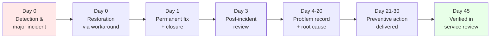
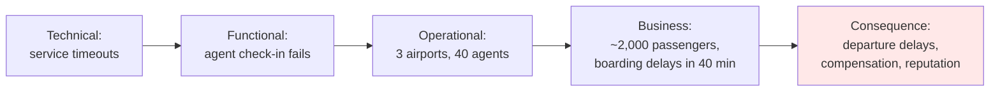
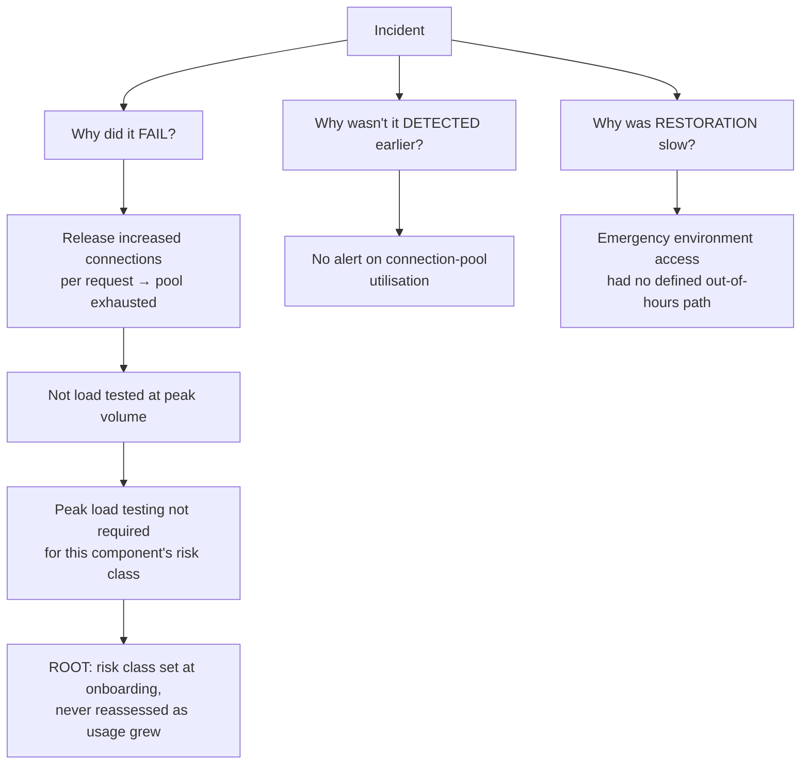
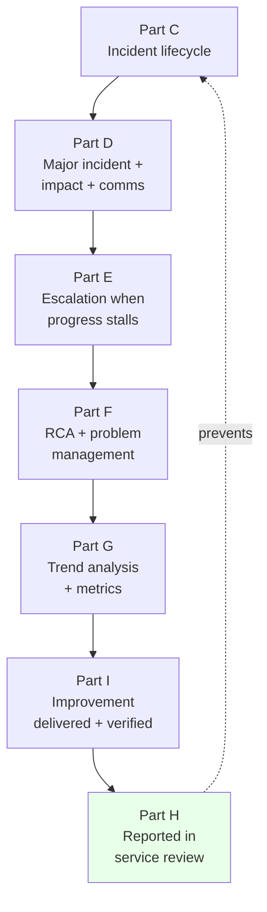

# Appendix B — End-to-End Worked Scenario

[← Master index](../Amadeus%20Service%20Account%20Executive%20-%20Study%20Guide.md) · [Appendix A — Glossary](Appendix-A-glossary.md) · [Appendix C — Quick Reference](Appendix-C-quick-reference.md)

> **Why this appendix exists:** Parts A–M teach techniques one at a time. This appendix runs **a single realistic story from start to finish**, so you can see how every technique connects. Nothing here is new material — every move is cross-referenced back to the Part that explains it.
>
> **This is fictional and generic.** Use it as a mental model, not as a personal example.

---

## The scenario in one line

A degradation in agent check-in at a strategic airline customer, traced from the first alert through major-incident response, escalation, root cause, preventive action, and finally to a verified improvement reported in a service review — **45 days end to end**.

---

## Phase 1 — Detection and declaration (06:12–06:25)

### 06:12 — The signal

A monitoring alert fires: agent check-in transactions are returning timeout errors at an elevated rate. Two minutes later, the customer's operations centre calls the service desk about three airports.

> **Part C:** detection can come from monitoring, the customer, or a partner. Here it was monitoring first — which is the good case. *"Customer detects it before you do"* is a bad look and becomes a PIR question later.

### 06:15 — Logging with real evidence

The SAE's first intervention is not technical. It's making sure the record is usable, using the **intake questions** from Part C:

| Question | Answer captured |
|----------|-----------------|
| **What** is the symptom? | Agent check-in returns timeout errors |
| **When** did it start? | First observed 06:12 local |
| **Where / who** is affected? | Three airports, ~40 agents |
| **Evidence?** | Error code, screenshot, example PNRs |
| **Total or partial?** | Partial — **web check-in unaffected** |
| **What changed?** | A release was deployed at 05:40 |
| **Workaround?** | Not yet identified |
| **Business impact?** | Morning peak; boarding delays likely within ~40 min |

> **Part C:** a weak record — *"check-in broken, customer angry"* — forces every later responder to re-interview the customer, wasting the most expensive minutes of the outage.

### 06:18 — Priority and declaration

**Impact:** high — a core business process is blocked at multiple sites.
**Urgency:** high — morning peak, deadline approaching.
→ **P1.** And it meets major-incident triggers on three counts: multiple sites, core process stopped, peak window.

> **Part D:** *declare when unsure.* Over-declaring costs an hour of some people's time; under-declaring costs the customer's operation. Note the same fault at 03:00 would still be high impact but **lower urgency** — that's the impact × urgency principle from Part C in action.

### 06:25 — Mobilise with named roles

| Role | Who | Owns |
|------|-----|------|
| Major Incident Manager | Ops lead | Running the bridge, driving pace |
| Technical Lead | Platform engineer | Diagnosis and fix |
| SMEs | Check-in + integration | Component depth |
| **SAE** | **You** | **Customer comms + business impact** |
| Scribe | Support analyst | Timeline, decisions, actions |

> **Part D:** the SAE does **not** take the technical lead role. *"Go deep on diagnosis and the customer goes dark."*

---

## Phase 2 — Communication and impact (06:30–07:00)

### 06:30 — The holding statement

Issued **before** any cause is known:

> "We are aware of an issue affecting agent check-in at three airports, first observed at 06:12 IST. Our teams are investigating with the highest priority. **Web check-in is unaffected** and can be used as an alternative. We do not yet have a confirmed cause or restoration time. **Next update at 07:00 IST**, or sooner if status changes."

> **Part D:** acknowledge → scope → alternative → honest unknown → **next update time**. Note it commits to the *update* time, not the fix time (Part C) — you control one and not the other.

### 06:35 — Building the impact ladder

While engineering diagnoses, the SAE translates:

> **Part D:** this is the SAE's core contribution. Engineering describes *what is broken*; the SAE describes *what it costs* — and that drives everyone else's prioritisation.

### 06:45 — Catching an impractical workaround

Engineering proposes the manual fallback procedure. The SAE checks it against operational reality and pushes back:

> "That takes roughly four minutes per passenger. There are 300 people queuing with 50 minutes to departure. That's not a workaround at this scale — what else do we have?"

> **Part D:** a workaround that is *technically valid but operationally impossible* is not a workaround. Only the SAE is positioned to catch this, because it requires knowing how the customer actually operates. **This is the single clearest example of the role's unique value.**

---

## Phase 3 — Coordination and escalation (07:00–08:30)

### 07:00 — Checkpoint discipline

The bridge follows the rhythm: **facts → hypotheses → owners → timebox → checkpoint.**

- **Known:** timeouts began 06:12; only the agent channel; only three sites; release deployed 05:40.
- **Ruled out:** certificate expiry, network path, capacity at the load balancer.
- **Two hypotheses:** (a) the 05:40 release, (b) a regional configuration difference.
- **Owners + 20-minute timebox** on each.

> **Part F:** *"what changed?"* is the cheapest, highest-yield hypothesis — hence the release is candidate (a).
> **Part F:** the pattern here is Kepner-Tregoe **is/is-not** — agent channel IS affected, web IS NOT; three sites ARE, others ARE NOT. The contrast narrows the search dramatically.

### 07:20 — Progress stalls

Rollback validation is blocked: the team can't get environment access. Nothing is moving.

The SAE applies the **escalation ladder** from Part E:

1. **Direct ask** with impact data — done at 07:10.
2. **Written follow-up** with owner and deadline — done at 07:15.
3. **Warn before escalating:** *"I have a customer commitment at 08:00 and we're blocked on access. I'll need to raise this to your manager at 07:45 unless we have a plan."*
4. **Escalate** — at 07:45, transparently, having warned.

The escalation message follows the Part E template:

> **Issue:** Agent check-in degraded at three airports since 06:12 IST.
> **Impact:** ~2,000 passengers; boarding delays expected within 40 minutes; strategic customer, executive visibility.
> **Status:** Cause unconfirmed; rollback validation stalled awaiting environment access.
> **Already tried:** Requested access 07:10 and 07:15; chased on the bridge.
> **What I need:** Emergency access approval, or an alternative validation route, by 08:15.
> **If unresolved:** We miss the customer's peak window.

> **Part E:** this is a **hierarchical** escalation — what's missing is a *decision/authority*, not a skill. Had the team lacked knowledge, it would have been **functional** instead.

### 07:50 — An executive joins the bridge

The customer's operations director dials in and asks for a full recap.

The SAE gives a 60-second summary — impact, current action, next checkpoint — then moves them to a dedicated briefing channel with a committed hourly update.

> **Part D:** executives escalate onto bridges when they don't trust they'll be informed otherwise. A reliable briefing cadence removes the need.

---

## Phase 4 — Restoration and verification (08:30–09:40)

### 08:30 — Restoration via rollback

Rollback of the 05:40 release restores normal response times. **Service is restored — but the fault is not yet understood.**

> **Part C:** *restore first, explain later.* Root cause is a problem-management activity; pursuing it mid-incident keeps customers down longer.

### 08:45 — Verification with users, not dashboards

Monitoring is green. That is **not** sufficient. The SAE asks the customer's team to re-test the original example PNRs and confirm agents can process check-in normally.

> **Part C:** monitoring shows components healthy; only users know the business process works. Skipping this produces reopens — which is why **reopen rate** is a metric worth watching (Part G).

### 09:00 — Closure communication

> **Status:** Resolved.
> **Issue:** Agent check-in timeouts at three airports.
> **Duration:** 06:12–08:30 IST (2h 18m).
> **Restoration:** Rollback of the 05:40 release; confirmed with your team on the original examples.
> **Cause:** Under investigation — a problem record is open and I'll share findings at the post-incident review on Thursday.
> **Next:** PIR invitation to follow today.

### 09:40 — Close the loop personally

A phone call to the operations director. Not because anything new needs saying, but because a human call after a bad morning outperforms any written notice.

> **Part E:** trust is rebuilt through small, visible, reliably-kept actions — not big promises.

---

## Phase 5 — The post-incident review (Day 3)

The PIR is **blameless**: it asks why the *system* allowed this, not who to punish.

> **Part D:** in a blaming culture people withhold information, and hidden information means the cause is never found.

### Time metrics produced

| Metric | Result | Verdict |
|--------|--------|---------|
| Time to detect | 0 min (monitoring caught it) | Good |
| Time to declare | 6 min | Good |
| Time to first customer update | 18 min | Acceptable |
| Time to engage the right team | 35 min | **Weak** |
| Time to workaround | Never — none was practical | **Weak** |
| Time to restore | 2h 18m | Dominated by the access block |

### Three parallel "why" chains

> **Part F:** don't run a single 5 Whys chain. Run three.

Note where the failure chain lands: a **process gap**, not a technical one. That is the signature of a good RCA.

### Swiss cheese: four holes lined up

> **Part F:** fixing only one hole reduces probability; it doesn't eliminate the pattern.

| Layer | The hole |
|-------|----------|
| Testing | No peak-volume load test for this component class |
| Change review | Classified low-risk; risk class never reassessed |
| Monitoring | No connection-pool alert |
| Response | No out-of-hours emergency access path |

### Actions — owned, dated, specific

> **Part F / Part I:** *"improve monitoring"* is not an action. One name, one date, specific wording.

| # | Action | Owner | Due | Layer |
|---|--------|-------|-----|-------|
| 1 | Reassess risk class; add mandatory peak-volume load test for this component class | Named change lead | Day 20 | Prevention |
| 2 | Add connection-pool utilisation alert at 80% with linked runbook | Named platform engineer | Day 12 | Detection |
| 3 | Define and publish out-of-hours emergency access path | Named ops manager | Day 15 | Response |
| 4 | Document a *practical* check-in workaround usable at peak volume | Named SAE + customer ops | Day 25 | Response |

> **Part D:** *"A PIR without owned, dated, tracked actions is a therapy session."*

---

## Phase 6 — From incident to problem (Days 4–20)

The SAE now switches from **restore** mode to **prevent** mode.

> **Part F:** incidents shout, problems whisper. Prevention work only survives if it has evidence and visibility.

### Trend analysis reveals this wasn't isolated

Pulling six months of data and categorising it (Part G's five patterns: repetition, concentration, timing, trajectory, correlation):

| Cause category | Incidents (6 months) | % | Cumulative |
|----------------|---------------------|---|------------|
| Configuration/release-related | 31 | 38% | 38% |
| Third-party integration timeouts | 22 | 27% | 65% |
| Capacity at peak | 12 | 15% | **80%** |
| Data quality | 9 | 11% | 91% |
| Other | 7 | 9% | 100% |

> **Part F:** Pareto — three categories account for 80% of incidents. This table converts *"we should improve things"* into a fundable decision.

The SAE checks for a mechanism before claiming causation:

> **Part G:** *correlation ≠ causation.* Incident volume also rose during peak season. Before presenting release changes as **the** cause, the SAE confirms the mechanism (connection exhaustion), temporality (spikes follow deployments consistently), and a control (the pattern is absent in the component classes that already require load testing).

### A known error is registered

A documented cause plus a workaround, with a fix date — **controlled risk**, not an open wound.

> **Part F:** a known error with no fix date and no owner is just a permanent tax everyone has agreed to stop noticing.

---

## Phase 7 — Improvement delivered and verified (Days 21–45)

### The CSI register entry

> **Part I:** improvement dies at four gates — not recorded, not prioritised, not owned, not verified.

| Field | Entry |
|-------|-------|
| Source | PIR + trend analysis |
| Benefit | Removes ~38% of incident volume |
| Effort | Medium |
| Owner | Named change lead |
| Target | Day 20 |
| **Verification** | Re-run category analysis at Day 45 |

### PDCA applied

| Stage | What happened |
|-------|---------------|
| **Plan** | Baseline captured: 9–12 config-related incidents/month over six months |
| **Do** | Mandatory pre-deployment validation + peak load test introduced Day 20 |
| **Check** | Day 45: category re-measured |
| **Act** | Standardised across all components in the same risk class |

> **Part I:** almost everyone skips **Check**. The baseline taken during *Plan* is what makes Check possible — those two stages live or die together.

### Day 45 — the verification result

> Configuration-related incidents ran at **9–12 per month** for six months. Pre-deployment validation was introduced on Day 20. In the following four weeks the category produced **2 incidents** — roughly an **80% reduction**, and approximately **30 hours per month** of restored operational time for the customer's team.

> **Part I:** this is the most valuable artefact you will ever produce, because it converts a promise into evidence. *Deployed ≠ solved* — the proof is that incidents actually stopped.

---

## Phase 8 — The service review (Day 45)

> **Part H:** previous actions go **near the front** — it proves reliability, creates internal pressure, and prevents the end-of-meeting ambush.

### Agenda as run

| Section | Content |
|---------|---------|
| 1. Opening | Nothing burning |
| **2. Previous actions** | All four PIR actions closed; action 4 delivered 3 days late, **flagged by the SAE, not the customer** |
| 3. Performance | SLA 97.2% vs 98% target — *with the cause and the fix, not just the number* |
| 4. Major incidents | The check-in incident: what happened, and what has changed since |
| 5. Problems | Known error closed; verification data presented |
| 6. Forward look | Peak calendar, freeze period, planned changes |
| 7. Improvements | The 80% reduction, evidenced |
| 8. **Customer input** | Protected time — they raise update frequency for P2s |
| 9. New actions | P2 cadence moves 4-hourly → 2-hourly; owner and date assigned |

### The "you said, we did" slide

> **Part H:** include a **declined** item, or the list reads as marketing and nobody believes it.

| Customer raised | Status | Outcome |
|-----------------|--------|---------|
| Updates too infrequent for P2 | New | Cadence moving to 2-hourly |
| Recurring config incidents | **Done** | 80% reduction, verified |
| Faster emergency access | **Done** | Out-of-hours path published |
| Dedicated test environment refresh | **Declined** | Constraint explained; alternative agreed |

### Reporting the miss honestly

The SAE raises the SLA miss and the late action **before** the customer does.

> **Part H:** Credibility = Accuracy × Candour × Consistency. It's a **product** — any zero zeroes the total.

---

## What this scenario demonstrates

**The loop closes.** The service review isn't the end of the story — it's what feeds prevention back into the start, so the next incident either doesn't happen or is shorter. An SAE who only runs Phases 1–4 is a good incident coordinator. An SAE who runs all eight phases is doing the actual job.

---

## Use this scenario as interview practice

Try narrating each phase aloud, unprompted. Then answer these:

1. At 06:18, why was this declared a major incident and not just a P1? *(Part D triggers)*
2. Why did the SAE reject the manual fallback at 06:45? *(practicality, Part D)*
3. Was the 07:45 escalation functional or hierarchical, and how do you know? *(Part E diagnostic question)*
4. Why wasn't the incident closed at 08:30 when monitoring went green? *(Part C verification)*
5. Why did the 5 Whys land on a *process* gap rather than a technical one? *(Part F)*
6. What would have been wrong with blaming the release and stopping there? *(Swiss cheese, Part F)*
7. Why was the Day 45 measurement essential rather than optional? *(Part I, deployed ≠ solved)*
8. Why did the SAE raise the SLA miss before the customer did? *(Part H credibility equation)*

---

[← Appendix A — Glossary](Appendix-A-glossary.md) · [Master index](../Amadeus%20Service%20Account%20Executive%20-%20Study%20Guide.md) · [Appendix C — Quick Reference →](Appendix-C-quick-reference.md)
