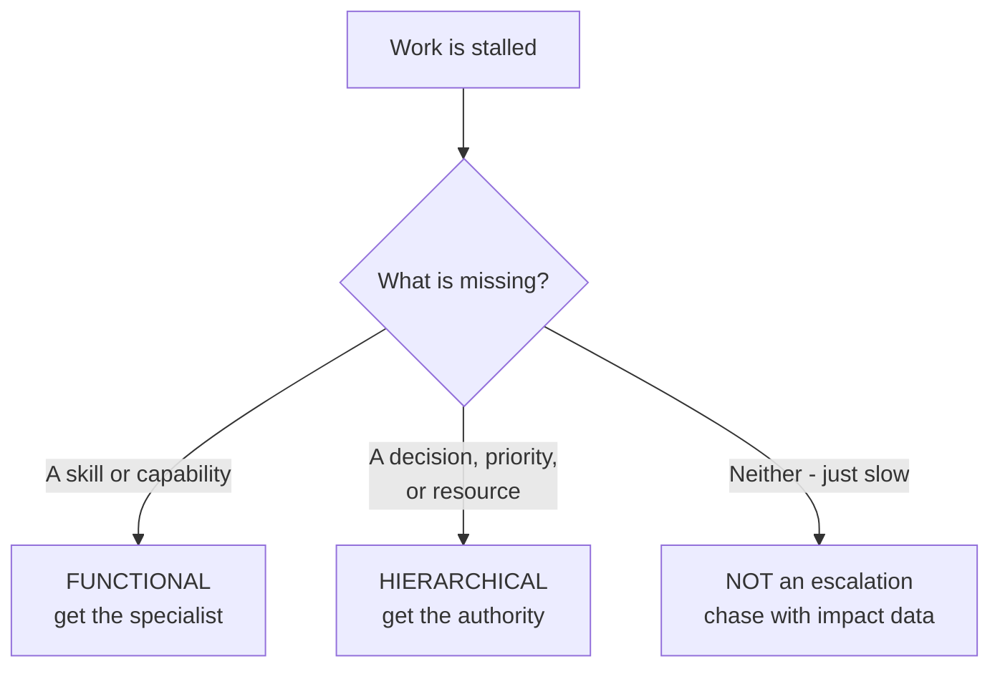
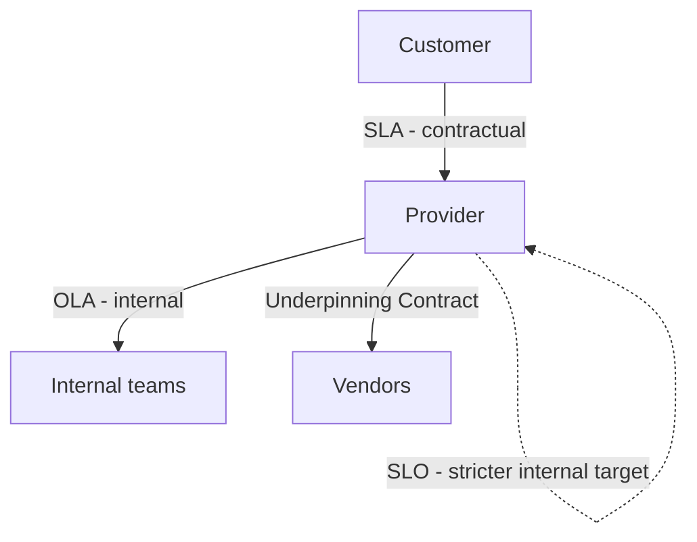

# Appendix C — Quick Reference: Formulas, Matrices & Templates

[← Master index](../Amadeus%20Service%20Account%20Executive%20-%20Study%20Guide.md) · [Appendix A — Glossary](Appendix-A-glossary.md) · [Appendix B — Worked Scenario](Appendix-B-worked-scenario.md)

> Everything you'd otherwise have to hunt for across 13 Parts, gathered in one place: every formula, matrix, template and checklist. **Print this one.**

---

## 1. Formulas

### Availability

$$\text{Availability} = \frac{\text{Agreed service time} - \text{Downtime}}{\text{Agreed service time}} \times 100$$

### Net Promoter Score

$$\text{NPS} = \%\text{Promoters}\,(9\text{–}10) - \%\text{Detractors}\,(0\text{–}6)$$

Passives (7–8) contribute nothing. Range: −100 to +100.

### Mean Time To Restore

$$\text{MTTR} = \frac{\sum \text{restoration times}}{\text{number of incidents}}$$

> Always state **which "R"** — Restore, Resolve, Repair or Respond. They give different numbers.

### Mean Time Between Failures

$$\text{MTBF} = \frac{\text{Total operational time}}{\text{Number of failures}}$$

### Error budget

$$\text{Error budget} = 100\% - \text{SLO}$$

An SLO of 99.9% gives a budget of 0.1% ≈ 43 minutes per month.

### Credibility

$$\text{Credibility} = \text{Accuracy} \times \text{Candour} \times \text{Consistency}$$

A **product** — any factor at zero zeroes the total.

---

## 2. The availability "nines"

| Availability | Per month | Per year | Typical use |
|--------------|-----------|----------|-------------|
| 99% | ~7.2 hours | ~3.65 days | Unacceptable for core airline systems |
| 99.5% | ~3.6 hours | ~1.83 days | Weak |
| **99.9%** | **~43.8 min** | **~8.76 hours** | Common enterprise standard |
| 99.95% | ~21.9 min | ~4.38 hours | Strong |
| 99.99% | ~4.4 min | ~52.6 min | Mission-critical |
| 99.999% | ~26 sec | ~5.26 min | Exceptional, expensive |

**Always ask three qualifiers:** measured over *what window*, measured *where*, with *what excluded*.

---

## 3. Priority matrix

|  | **Urgency: High** | **Urgency: Medium** | **Urgency: Low** |
|---|---|---|---|
| **Impact: High** | **P1 — Critical** | **P2 — High** | **P3 — Medium** |
| **Impact: Medium** | **P2 — High** | **P3 — Medium** | **P4 — Low** |
| **Impact: Low** | **P3 — Medium** | **P4 — Low** | **P5 — Planning** |

| Priority | Meaning | Posture |
|----------|---------|---------|
| **P1** | Core business stopped, no workaround, widespread | Immediate, 24/7, bridge, exec comms |
| **P2** | Major function degraded, or painful workaround | Urgent, senior attention |
| **P3** | Limited impact, workaround available | Business hours |
| **P4** | Minor inconvenience | Scheduled |
| **P5** | No operational impact | Backlog |

> **Impact** = how much damage. **Urgency** = how fast it grows. **Severity** = technical seriousness (≠ priority).

---

## 4. Communication cadence

| Priority | Update frequency | Audience |
|----------|-----------------|----------|
| **P1** | Every 30–60 min | Operational + executive |
| **P2** | Every 2–4 hours | Operational |
| **P3** | Daily | Operational |
| **P4/P5** | On state change | Requester |

**Rule:** agree it upfront, then never miss it — *including when there's no news*. Commit to the **next update time**, never the fix time.

---

## 5. Templates

### 5.1 Incident intake (the 5W+1H)

| Question | Capture |
|----------|---------|
| **What** is the symptom? | |
| **When** did it start? | |
| **Where / who** is affected? | |
| **Evidence?** (errors, screenshots, examples) | |
| **Total or partial?** | |
| **What changed** recently? | |
| **Workaround?** | |
| **Business impact?** | |

### 5.2 Holding statement (before you have answers)

> "We are aware of an issue affecting **[function]** at **[scope]**, first observed at **[time + zone]**. Our teams are actively investigating with the highest priority. **[What still works]** is unaffected and can be used as an alternative. We do not yet have a confirmed cause or restoration time. Our next update will be at **[time + zone]**, and sooner if the status changes."

**Structure:** acknowledge → scope → alternative → honest unknown → next update time.

### 5.3 Standard incident update

> **Status:** Investigating / Identified / Monitoring / Resolved
> **Issue:** [plain language, no jargon]
> **Impact:** [who and what, in business terms]
> **Current action:** [what's happening now, not history]
> **Workaround:** [with instructions, or "none identified"]
> **We need from you:** [or "nothing at this time"]
> **Next update:** [time + zone]

**Three rules:** no jargon · no blame · no speculation.

### 5.4 Escalation message

> **Issue:** [what's wrong]
> **Impact:** [quantified business consequence + customer sensitivity]
> **Status:** [current state]
> **Already tried:** [attempts with timestamps]
> **What I need:** [specific ask] by [deadline]
> **If not resolved:** [consequence + next escalation level]

**Etiquette:** warn before escalating · escalate the issue, not the person · always state the ask · close the loop.

### 5.5 Shift / region handover

| Field | Content |
|-------|---------|
| Current state | |
| Timeline so far (timestamped) | |
| **Ruled out** | |
| Active hypothesis | |
| Owners (named, with contacts) | |
| Customer commitments (next update due) | |
| Sensitivities (exec escalation, peak window) | |

**Always written *plus* a verbal overlap.** Never one alone.

### 5.6 Closure communication

> **Status:** Resolved
> **Issue:** [what it was]
> **Duration:** [start–end + zone]
> **Restoration:** [what fixed it], confirmed with your team
> **Cause:** [known, or "under investigation — problem record open"]
> **Next:** [PIR date / problem record / follow-up]

### 5.7 Post-incident review structure

| Section | Contents |
|---------|----------|
| Summary | Business language, five lines |
| Impact | Who, how badly, how long — quantified |
| Timeline | Detection → escalation → decisions → restoration |
| Root cause | Technical **and** process |
| What went well | Reinforce good behaviour |
| What didn't | Detection gaps, delays, comms failures |
| Actions | Specific, owned, dated, tracked |
| Recurrence prevention | What structurally changes |

### 5.8 Monthly service review agenda

1. Opening — anything burning
2. **Previous actions** — status of every one *(near the front, deliberately)*
3. Service performance — SLA, trends, distribution
4. Major incidents — and what changed since
5. Problems & preventive actions
6. Forward look — changes, risks, peak calendar
7. Improvement initiatives
8. **Customer input** *(protect this time)*
9. New actions — owner + date each

---

## 6. Checklists

### 6.1 Bridge checkpoint loop

**Facts → Hypotheses → Owners → Timebox → Checkpoint**

- [ ] What do we *know* (vs suspect)?
- [ ] What have we ruled out?
- [ ] Top 2 hypotheses named
- [ ] One named owner per hypothesis
- [ ] Timebox set ("20 min, report back either way")
- [ ] Next checkpoint time stated
- [ ] Is anyone working the **workaround** in parallel?
- [ ] Is the customer update still on schedule?

### 6.2 PIR questions

- [ ] How long between failure and detection? Did the customer tell us first?
- [ ] Was the right team engaged quickly? What delayed it?
- [ ] What took longest in diagnosis, and why?
- [ ] Was the customer informed adequately and promptly?
- [ ] Could we have restored sooner by other means?
- [ ] What stops this specific failure recurring?
- [ ] What monitoring would have caught it earlier?

### 6.3 Go-live / transition readiness

- [ ] Named support owner for day one, **including out of hours**
- [ ] Runbooks followed end-to-end by a **non-author**
- [ ] Monitoring live **before** go-live
- [ ] Top 5 failure modes with pre-agreed workarounds
- [ ] Tested rollback plan
- [ ] SLAs and escalation paths agreed and communicated
- [ ] **Not** going live into a peak window
- [ ] Customer frontline briefed on what's changing
- [ ] ELS exit criteria expressed as **data**, not a date

### 6.4 Peak-season readiness

- [ ] Customer peak calendar obtained
- [ ] Capacity headroom vs projected peak (not average)
- [ ] Utilisation trend reviewed for creep
- [ ] Load testing reflects realistic peak volumes
- [ ] Change freeze agreed
- [ ] Known errors reviewed; workarounds rehearsed
- [ ] Escalation paths and staffing confirmed
- [ ] Heightened communication plan agreed

---

## 7. Decision aids

### 7.1 Which escalation type?

### 7.2 Which RCA technique?

| Situation | Technique |
|-----------|-----------|
| Something was deployed recently | **Change correlation** — always first |
| Simple, linear cause | **5 Whys** (run 3 chains) |
| Causes could come from many directions | **Ishikawa / fishbone** |
| Unclear what's actually affected | **Kepner-Tregoe** (is / is not) |
| Complex combinatorial failure | **Fault tree** |
| Deciding where to invest | **Pareto** |
| Sequence-dependent failure | **Timeline analysis** |

### 7.3 The three "why" chains

Never run one chain. Run three:

| Chain | Produces |
|-------|----------|
| Why did it **fail**? | Prevention actions |
| Why wasn't it **detected** sooner? | Monitoring actions |
| Why was **restoration** slow? | Response actions |

### 7.4 Balanced metric pairs (anti-gaming)

| Metric | Pair it with |
|--------|--------------|
| MTTR | Reopen rate |
| SLA attainment | CSAT + breach narrative |
| First-time-fix | Reopen rate + CSAT |
| Tickets closed | Customer satisfaction |
| Availability | End-user experience monitoring |
| Backlog size | Ageing profile |

### 7.5 Leading vs lagging indicators

| Lagging (what happened) | Leading (what's coming) |
|------------------------|-------------------------|
| Outage count | Change failure rate |
| SLA breaches | Backlog ageing |
| CSAT score | Escalation frequency |
| Capacity incident | Utilisation vs headroom |
| Repeat incidents | Open problems without fix dates |

---

## 8. Agreement hierarchy

| | Between | Binding |
|---|---------|---------|
| **SLA** | Provider ↔ customer | Contractual, often with credits |
| **SLO** | Internal | Target, stricter than SLA = your buffer |
| **OLA** | Internal teams | Internal commitment |
| **UC** | Provider ↔ supplier | Legal contract |

> **The arithmetic check:** an SLA promising 4-hour resolution over a vendor contract allowing 8-hour response is **undeliverable regardless of effort**.

---

## 9. The three clocks

| Clock | Measures | Controlled by |
|-------|----------|---------------|
| **Response** | Acknowledge and start | Fully the provider |
| **Restoration** | Customer can operate again (workaround counts) | Partly |
| **Resolution** | Underlying fault gone | Least |

Most SLA disputes come from these being conflated. Know which one the contract uses — and when it pauses.

---

## 10. Governance cadence

| Forum | Frequency | Audience | Output |
|-------|-----------|----------|--------|
| Operational call | Daily | Ops + SAE | Immediate actions |
| Weekly service call | Weekly | Service managers | Unblocked actions |
| Monthly service review | Monthly | Service + delivery leads | Improvement actions |
| QBR | Quarterly | Senior stakeholders | Strategic decisions |
| Strategic review | Annually | Executives | Direction |

**Match altitude to audience:** pilot, controller and CEO care about the same flight at different resolutions.

---

## 11. Airline domain cheat sheet

| Term | Meaning |
|------|---------|
| **GDS** | Marketplace connecting airline seats to sellers |
| **PSS** | Airline engine room: **inventory → ticketing → DCS** |
| **DCS** | Departure control: check-in, bags, seats, boarding, weight & balance |
| **PNR** | The booking file for a trip |
| **NDC** | Dynamic, personalised airline offers |
| **ONE Order** | Single order replacing ticket/EMD/booking fragmentation |
| **IROPS** | Disruption — load spikes when tolerance is lowest |
| **IATA / ICAO** | Airline trade body / UN aviation body (and their codes) |

**Why airline tech is unforgiving:** real-time · always-on · interconnected · physically consequential · publicly visible · peak-driven.

---

## 12. One-line principles

- Restore first, explain later.
- Own the outcome, not the repair.
- Slow is broken.
- Declare when unsure — under-declaring costs more.
- Go deep on diagnosis and the customer goes dark.
- A workaround must be **practical**, not merely valid.
- Commit to the next update time, not the fix time.
- Silence reads as neglect.
- Escalation adds only capability or authority.
- Warn before escalating. No surprises.
- Being right while they feel unheard is the most expensive way to lose a relationship.
- Deliver bad news yourself, early.
- Trust is rebuilt by small kept promises, not bigger ones.
- "What changed?" is the cheapest high-yield question.
- Deployed ≠ solved. Did the incidents actually stop?
- Averages hide disasters. Show distribution.
- A metric that becomes a target stops being a measurement.
- Raise the bad news before the customer does.
- Relationships are built in peacetime and spent in wartime.
- Incidents shout; problems whisper.

---

[← Appendix B — Worked Scenario](Appendix-B-worked-scenario.md) · [Master index](../Amadeus%20Service%20Account%20Executive%20-%20Study%20Guide.md) · [Appendix A — Glossary](Appendix-A-glossary.md)
