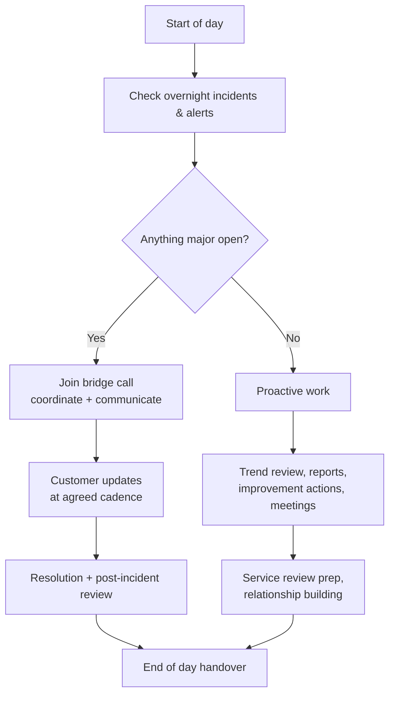
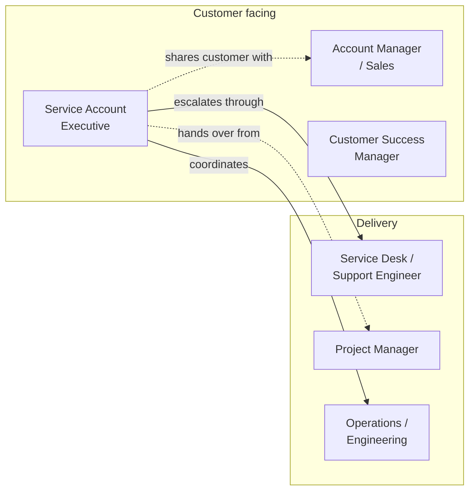
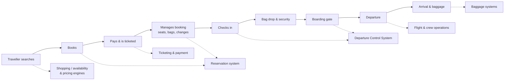
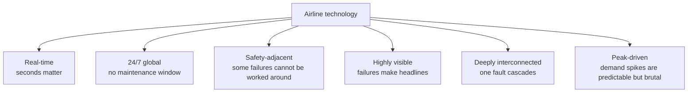

# Part A — Role & Industry Foundations

[← Master index](../Amadeus%20Service%20Account%20Executive%20-%20Study%20Guide.md) · **Part A of M** · [Part B — Service Management Fundamentals →](Part-B-service-management-fundamentals.md)

> Section goal: understand exactly what a Service Account Executive does all day, and learn the airline/travel technology vocabulary well enough that industry terms in an interview feel familiar rather than intimidating.

Covers index items **1–4** and maps to JD responsibilities: *"develop a strong understanding of customer systems, solutions and business objectives"*, *"build trusted relationships"*, *"knowledge of airline, travel or technology domains"*.

---

## 1. What a Service Account Executive actually does

A **Service Account Executive (SAE)** is the person a customer calls when *the service* — not the sale, not the project — needs attention. They own the operational relationship.

Here is the single most important idea in this entire guide:

> **The SAE owns the outcome, not the repair.**

They rarely fix anything with their own hands. They make sure the right people are fixing the right thing, in the right order, while the customer knows exactly what is happening.

### 🔍 Plain-English deep-dive: "service" vs "product"

- **Product** — *a thing you buy once.* **Analogy:** a car. **Why it matters:** products are delivered and done.
- **Service** — *an ongoing promise of an outcome.* **Analogy:** a taxi service — you don't want the car, you want to arrive. **Why it matters:** a service must keep working every single day, so someone has to be accountable for it continuously. That someone is the SAE.
- **Service management** — *the discipline of running services reliably and improving them.* **Analogy:** running the taxi fleet: schedules, maintenance, complaints, driver training.

### The daily rhythm

Roughly, the job splits into two modes:

| Mode | Trigger | What the SAE does | Feels like |
|------|---------|-------------------|------------|
| **Reactive** | Something broke | Coordinate response, communicate, escalate, drive to resolution | Firefighting, high adrenaline |
| **Proactive** | Nothing broke | Analyse trends, run reviews, chase improvements, deepen relationships | Consulting, planning, influencing |

A common interview trap is describing only the reactive half. **Strong candidates emphasise the proactive half**, because that is what prevents the reactive half.

### 🔍 Plain-English deep-dive: what "orchestrate" really means

The JD says the SAE will *"orchestrate actions across teams"*. In practice that means:

- **Convening** — getting the right people into the same call fast, sometimes across time zones.
- **Sequencing** — deciding what happens first when three teams all think their task matters most.
- **Translating** — turning engineering detail into business meaning for the customer, and turning customer pain into technical priority for engineers.
- **Chasing** — politely, relentlessly, until the action is actually done.
- **Deciding** — or, when you lack authority, forcing a decision by escalating.

**Analogy:** a film director. They don't act, film, or light the set — but nothing coherent happens without them.

---

## 2. How the role differs from neighbouring roles

Interviewers love this question because it tests whether you understand boundaries.

| Role | Owns | Measured by | Confusion to avoid |
|------|------|-------------|--------------------|
| **Service Account Executive** | Operational health of the service for named customers | Incident outcomes, SLA performance, customer satisfaction, improvement delivered | Not a seller; not a hands-on fixer |
| **Account Manager / Sales** | Commercial relationship, revenue, renewals | Revenue, contract growth | The SAE protects the relationship the AM monetises |
| **Customer Success Manager** | Adoption and value realisation | Usage, retention, renewal risk | Overlaps with SAE; CSM leans value, SAE leans reliability |
| **Service Desk / Support Engineer** | Individual tickets, technical diagnosis | Ticket volume, resolution time, quality | SAE works *above* the ticket, across many of them |
| **Project Manager** | A time-boxed change with a defined end | Scope, schedule, budget | Projects end; services never do |
| **Operations / SRE** | Systems running and being fixed | Uptime, performance | SAE coordinates them but doesn't manage them |

> **Interview-ready line:** "Support fixes the ticket. I own the customer's experience of the service across every ticket, plus everything the tickets never capture."

---

## 3. The airline & travel technology landscape

You do not need to be a travel-industry expert. You need enough fluency to understand what breaks, why it hurts, and who cares.

### The passenger journey and the systems behind it

### 🔍 Plain-English deep-dive: the core acronyms

- **GDS — Global Distribution System.** *A giant electronic marketplace connecting airlines' seats with travel agents and booking websites.* **Analogy:** a stock exchange, but for flights, hotels and cars. **Why it matters:** if the GDS is degraded, agencies worldwide cannot sell — revenue stops.
- **PSS — Passenger Service System.** *The airline's core operational platform.* It usually has three pillars:
  1. **Reservation / inventory** — what seats exist and who holds them.
  2. **Ticketing** — the financial document proving the passenger paid.
  3. **DCS — Departure Control System** — check-in, bag tags, seat assignment, boarding, weight & balance.
  **Analogy:** a theatre. Inventory = the seating plan; ticketing = the receipt; DCS = the usher scanning you in.
  **Why it matters:** PSS incidents stop passengers physically boarding. That is the highest-visibility failure in the industry.
- **PNR — Passenger Name Record.** *The booking file: who's travelling, on what flights, with what preferences and contact details.* **Analogy:** a restaurant reservation card with everything about your party on it. **Why it matters:** almost every passenger-facing problem is described by referencing a PNR.
- **NDC — New Distribution Capability.** *A modern messaging standard letting airlines sell richer, personalised offers directly rather than being reduced to a fare code.* **Analogy:** moving from a printed catalogue to a live personalised website. **Why it matters:** it is the biggest structural change in airline distribution right now, so it's a great "current trends" talking point.
- **IROPS — Irregular Operations.** *Anything that disrupts the plan: weather, strikes, technical faults, ATC restrictions.* **Analogy:** a motorway closure — everything downstream must be re-planned. **Why it matters:** during IROPS, system load spikes exactly when the airline can least tolerate slowness.
- **IATA / ICAO codes** — *short standard codes for airlines and airports.* IATA is the 2–3 character commercial code you see on tickets; ICAO is the 4-letter code used in flight operations. **Why it matters:** they appear constantly in incident reports and logs.
- **Weight & balance** — *the calculation ensuring the aircraft is loaded safely.* **Why it matters:** it is safety-critical, so failures here have a hard stop, not a workaround.

### Who the customer actually is

An "airline customer" is not one person. Learn to name the audiences:

| Audience | Cares most about | Typical question in a crisis |
|----------|------------------|------------------------------|
| Airport / ground staff | Can I board this flight now? | "What's my workaround?" |
| Airline IT / operations centre | System state and recovery ETA | "What's the technical status?" |
| Commercial / revenue teams | Lost bookings and money | "How many sales did we lose?" |
| Executives | Business impact and reputation | "When is it fixed and will it recur?" |
| Regulators / auditors (indirect) | Compliance and reporting duties | "Show me the evidence trail." |

> 💡 **Practical example:** a slow check-in response time of three extra seconds sounds trivial. Multiply it across thousands of passengers during a morning peak and it becomes missed connections, delayed departures, and airport queues that appear on the news. **Learning to convert technical symptoms into business consequences is the single most valuable SAE skill.**

---

## 4. Why airline systems are unusually unforgiving

Understanding *why* this domain is hard shows maturity in interviews.

| Characteristic | What it means practically | Consequence for the SAE |
|----------------|---------------------------|--------------------------|
| **Real-time** | A booking must confirm in seconds | "Slow" is treated as "broken" |
| **Always on** | It is always peak somewhere | Changes are risky; freeze periods exist |
| **Interconnected** | Airline ↔ airport ↔ partners ↔ regulators | Small faults cascade; blame is contested |
| **Physical consequences** | Passengers are standing in an airport | Workarounds must be practical for humans under pressure |
| **Seasonal peaks** | Holidays, events, schedule changes | Readiness planning matters months ahead |
| **Reputational exposure** | Social media reacts in minutes | Communication speed rivals fix speed |

### 🔍 Plain-English deep-dive: "minimal business impact"

The JD asks for *"timely resolution and minimal business impact"*. Those are two different goals, and they occasionally conflict.

- **Timely resolution** = make the fault go away.
- **Minimal business impact** = keep the business functioning *while* the fault exists.

A mature SAE pursues both in parallel: engineering hunts the fix while the SAE ensures a workaround is deployed, communicated, and usable.

**Analogy:** if a bridge closes, engineers repair the bridge — but someone must simultaneously sign-post the detour. The detour is often worth more in the first hour than the repair.

---

## ⭐ Likely Interview Questions for This Section

**Q1. "What does a Service Account Executive do, in your own words?"**
> *Model answer:* "I'm the customer's operational single point of contact for anything service-related. When there's a major incident I coordinate the response across internal teams and keep the customer clearly informed until it's resolved. When there's no incident, I'm analysing trends, running service reviews, driving improvement actions, and building the relationship so that when something does go wrong, there's already trust in place. I don't fix the technology myself — I own the outcome and orchestrate the people who do."

**Q2. "How is this role different from technical support?"**
> *Model answer:* "Support owns a ticket; I own the customer's overall service experience. Support asks 'is this issue resolved?' — I ask 'why did this happen, is it a pattern, what did it cost the customer, what are we changing so it doesn't recur, and does the customer feel informed and confident?' Support works vertically within one issue; I work horizontally across all of them."

**Q3. "You have no airline background. Why should we hire you?"**
> *Model answer:* "Domain knowledge is learnable and I'd build it deliberately — the passenger journey, the core systems, the peak calendar, and above all what each failure costs the business. What isn't quickly learnable is the discipline of staying calm and organised in a major incident, coordinating teams who don't report to you, and communicating clearly to an anxious customer. I'd pair my service-management strength with a structured 30/60/90 plan to close the domain gap fast."

**Q4. "Why are airline systems harder to run than typical enterprise systems?"**
> *Model answer:* "Three reasons. They're real-time, so degradation is functionally an outage. They're 24/7 and global, so there's no safe maintenance window and changes carry higher risk. And they have physical consequences — passengers are queuing at a gate, so a workaround has to be usable by a stressed human, not just technically valid. On top of that, failures are extremely visible publicly, which means communication speed matters almost as much as fix speed."

**Q5. "What's a PNR, and why would it come up in an incident?"**
> *Model answer:* "A Passenger Name Record is the booking file — the itinerary, passenger details, and preferences for a trip. It comes up constantly because customer-reported issues are usually described through examples: 'these PNRs won't ticket' or 'this PNR won't check in'. Those examples are the fastest route to reproducing an issue and to measuring scope — a handful of PNRs is a defect, thousands is a major incident."

**Q6. "How would you learn our customer's business in your first 90 days?"**
> *Model answer:* "First 30 days: learn the service landscape — which systems the customer uses, their architecture at a high level, their contractual commitments, and their incident history. Days 30–60: learn the business rhythm — peak periods, critical daily processes, which failures hurt most and why, and who the key stakeholders are on both sides. Days 60–90: start adding value — spot a recurring pattern from trend data, bring a concrete improvement proposal to a service review, and make sure I've built relationships before I need them in a crisis."

**Q7. "What does 'minimal business impact' mean to you?"**
> *Model answer:* "It means protecting the customer's ability to operate while the fault still exists. Resolution and impact-reduction are parallel tracks, not sequential. So while engineering pursues root cause, I'm asking: is there a workaround, is it communicated to the people who need it, are we prioritising the most business-critical flows first, and are we shielding the customer's peak window? Often the workaround delivers more value in the first hour than the fix does."

**Q8. "Who is 'the customer' during an airline incident?"**
> *Model answer:* "Several audiences with different needs. Ground and airport staff want an immediate workaround. The airline's IT operations centre wants technical status and an ETA. Commercial teams want to know revenue and booking impact. Executives want business impact, resolution time and recurrence risk. Part of my job is delivering the same truth to each audience in the language they need, without contradicting myself across them."

---

## 🧠 30-Second Memory Hooks

- **SAE** = *owns the outcome, not the repair* — the film director, not the actor.
- **Two modes** = reactive (coordinate + communicate) and proactive (trends + reviews + improvement). Never describe only the first.
- **GDS** = the marketplace connecting seats to sellers.
- **PSS** = the airline's engine room: **inventory → ticketing → DCS**.
- **DCS** = check-in and boarding — the system that physically moves passengers.
- **PNR** = the booking file; the currency of incident examples.
- **IROPS** = disruption; load spikes exactly when tolerance is lowest.
- **NDC** = richer, personalised airline offers; the industry's big structural shift.
- **Airline tech is hard** = real-time + always-on + interconnected + physically consequential + publicly visible.
- **Two parallel tracks** = fix the fault *and* protect the business while it's broken.

---

*Next suggested section:* **[Part B — Service Management Fundamentals](Part-B-service-management-fundamentals.md)** — now that you know the role and the industry, learn the formal framework and vocabulary that every process in this job is built on.

---

[← Master index](../Amadeus%20Service%20Account%20Executive%20-%20Study%20Guide.md) · [Part B →](Part-B-service-management-fundamentals.md) · [Glossary](Appendix-A-glossary.md)
