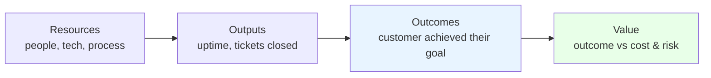
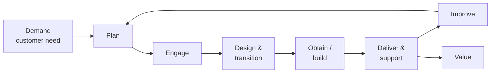
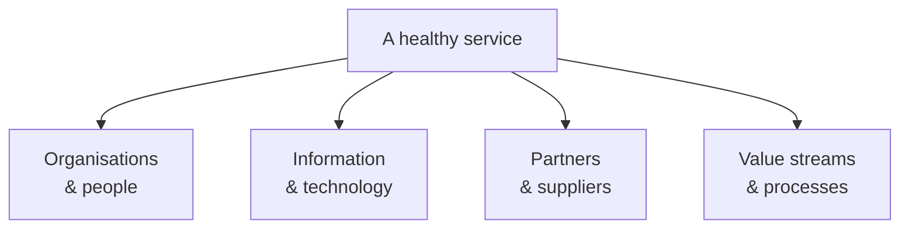
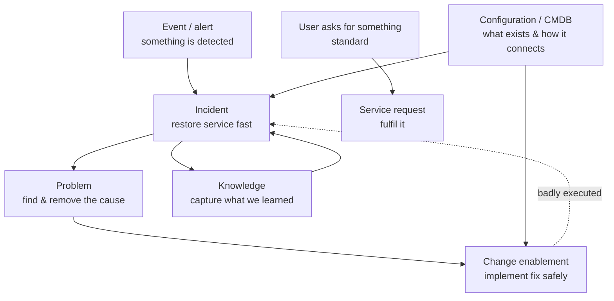
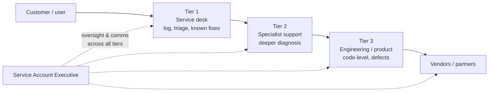
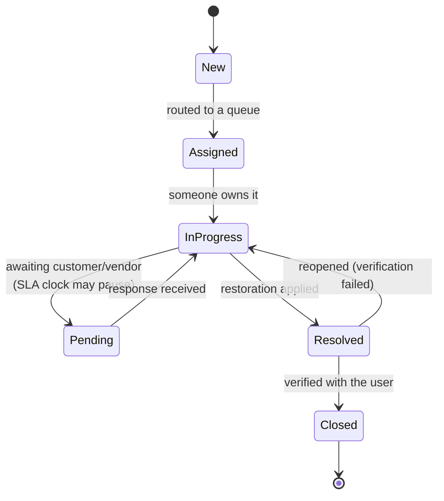

# Part B — Service Management Fundamentals

[← Master index](../Amadeus%20Service%20Account%20Executive%20-%20Study%20Guide.md) · [← Part A](Part-A-role-and-industry-foundations.md) · **Part B of M** · [Part C →](Part-C-incident-management.md)

> Section goal: learn the formal framework, vocabulary and roles that every later Part depends on — so that words like *ITIL*, *practice*, *RACI* and *service value* become tools you can use, not jargon you dodge.

Covers index items **5–7** and maps to JD requirements: *"understanding of service management processes and operational support environments"*, *"coordinate across multiple teams"*.

---

## 5. What "a service" really is

Start with the definition, because interviewers do.

> **A service is a means of enabling value for a customer, by delivering an outcome they want, without them having to own the cost and risk of producing it themselves.**

Unpack that:

- **Outcome they want** — the customer wants *seats sold and passengers boarded*, not "a server".
- **Without owning the cost and risk** — they pay a provider so they don't have to run data centres, hire specialists, or absorb failures alone.

### 🔍 Plain-English deep-dive: output vs outcome

- **Output** — *what the provider produces.* Example: "the booking system was available 99.9% of the month." **Analogy:** a restaurant says "we cooked 400 meals."
- **Outcome** — *what the customer achieved.* Example: "the airline sold its seats and boarded its flights on time." **Analogy:** the diners actually enjoyed dinner.
- **Why it matters:** a provider can hit every output target and still have an unhappy customer. Reporting outputs while ignoring outcomes is the classic failure of weak service management — and the classic weak interview answer.

### Utility and warranty

Two words worth knowing because they sound sophisticated and are genuinely useful:

| Term | Plain meaning | Question it answers | Failure looks like |
|------|---------------|---------------------|--------------------|
| **Utility** | Does it do the job? ("fit for purpose") | *What does it do?* | The feature doesn't exist or doesn't work |
| **Warranty** | Does it do the job reliably? ("fit for use") | *How well does it do it?* | It works, but it's slow, unavailable, or insecure |

> **Interview-ready line:** "Most of my job lives in warranty — availability, performance, continuity and security. Utility failures are usually product gaps; warranty failures are service gaps, and those are mine."

---

## 6. ITIL in plain English

**ITIL** is the world's most widely adopted set of best practices for IT service management. Treat it as a **shared vocabulary and a checklist of things not to forget** — not a rulebook to recite.

### 🔍 Plain-English deep-dive: what ITIL 4 actually says

ITIL's current version (**ITIL 4**) is built around a few ideas:

- **Service Value System (SVS)** — *everything an organisation does to turn demand into value.* **Analogy:** the whole kitchen operation of a restaurant, not one recipe.
- **Service Value Chain** — *the six activities work flows through.* Think of it as the conveyor belt inside the kitchen.
- **Practices** — *34 capability areas* (incident management, problem management, change enablement, etc.). ITIL 4 says "practices", older ITIL v3 said "processes". Both terms are still used in the wild.
- **Guiding principles** — *seven pieces of universal advice* that apply to almost any decision.
- **Four dimensions** — *the four things to consider so you don't design something lopsided.*

**The service value chain in one line each:**

| Activity | Plain meaning |
|----------|---------------|
| **Plan** | Decide direction and priorities |
| **Improve** | Continuously make everything better |
| **Engage** | Understand and communicate with stakeholders ← *heavily the SAE's world* |
| **Design & transition** | Build it so it can actually be run and supported |
| **Obtain / build** | Get or make the components |
| **Deliver & support** | Run it day to day ← *also heavily the SAE's world* |

### The seven guiding principles (memorise these — they answer many interview questions)

| Principle | Plain meaning | Use it when asked… |
|-----------|---------------|--------------------|
| **Focus on value** | Always ask "who benefits and how?" | "How do you prioritise?" |
| **Start where you are** | Don't rip up what exists; measure it first | "You join a messy account — day one?" |
| **Progress iteratively with feedback** | Small improvements, checked often | "How do you drive improvement?" |
| **Collaborate and promote visibility** | Work across silos; make work visible | "How do you handle uncooperative teams?" |
| **Think and work holistically** | Nothing works in isolation | "Why did a small change cause a big outage?" |
| **Keep it simple and practical** | Remove steps that add no value | "Your process is too slow — fix it" |
| **Optimise and automate** | Improve first, then automate | "How would you reduce repetitive work?" |

### The four dimensions

**Why it matters:** when a service fails repeatedly, the cause is often *not* technology. Checking all four dimensions — skills and staffing, tooling and data, third parties, and the process itself — is a mature diagnostic habit.

---

## 7. The ITSM practice map

**ITSM** = *IT Service Management*: the whole discipline of delivering IT as a service. These are the practices an SAE touches constantly.

| Practice | Purpose in one line | Success looks like | Classic confusion |
|----------|---------------------|--------------------|--------------------|
| **Incident management** | Restore normal service as fast as possible | Short restoration time, clear comms | Confused with problem management |
| **Problem management** | Find and remove underlying causes | Fewer repeat incidents | Chasing root cause during a live outage |
| **Change enablement** | Make changes safely and successfully | Low change-failure rate | Seen as bureaucracy rather than risk control |
| **Service request** | Fulfil routine, pre-approved asks | Fast, predictable fulfilment | Logged as incidents, polluting incident data |
| **Event management** | Detect and act on signals from systems | Issues caught before users notice | Alert noise nobody reads |
| **Knowledge management** | Capture and reuse what's known | Faster fixes, less dependence on individuals | Articles written but never maintained |
| **Service configuration / CMDB** | Know what exists and how it connects | Accurate impact assessment | Data rots and becomes untrusted |
| **Service level management** | Agree, measure and report targets | No surprises at review time | Reporting metrics nobody cares about |
| **Continual improvement** | Systematically get better | A live, prioritised improvement backlog | Improvement talked about, never tracked |
| **Supplier management** | Ensure third parties meet commitments | Suppliers held to underpinning contracts | Blaming a supplier without contractual leverage |

### 🔍 Plain-English deep-dive: incident vs problem vs change vs request

This distinction is asked in almost every service interview. Learn it with one analogy.

**Analogy — a leaking roof:**

| Concept | Roof analogy | IT meaning |
|---------|--------------|------------|
| **Event** | The damp sensor beeps | A monitoring alert fires |
| **Incident** | Water is dripping onto the floor *now* — put a bucket down | Service is degraded; restore it |
| **Workaround** | The bucket | A temporary way to keep operating |
| **Problem** | *Why* is the roof leaking? Cracked tile | The underlying cause of incidents |
| **Known error** | "We know it's the cracked tile; bucket works" | Documented cause + workaround |
| **Change** | Replacing the tile | A controlled modification to fix it |
| **Service request** | "Please also install a skylight" | A routine, pre-approved ask |

> **Interview-ready line:** "An incident is about *restoration* — the clock is running. A problem is about *prevention* — the clock is calmer but the stakes are cumulative. Mixing them up is how organisations end up fixing the same outage forever."

---

## 8. Roles and responsibility models

### RACI — the tool for "who does what"

**RACI** is a way to remove ambiguity about responsibility.

| Letter | Meaning | Plain English | Rule |
|--------|---------|---------------|------|
| **R** | Responsible | Does the work | Can be several people |
| **A** | Accountable | Owns the outcome, answers for it | **Exactly one person** |
| **C** | Consulted | Gives input before decisions | Two-way conversation |
| **I** | Informed | Told what happened | One-way update |

**Example RACI for a major incident:**

| Activity | SAE | Ops / Engineering | Major Incident Manager | Customer |
|----------|-----|-------------------|------------------------|----------|
| Technical diagnosis | I | **R** | A | I |
| Coordinating the bridge | C | C | **R/A** | — |
| Customer communication | **R/A** | C | C | I |
| Business impact assessment | **R** | C | C | **C** |
| Post-incident review actions | **R** | R | A | I |

> **Why it matters:** the most common cause of chaotic incidents is **two accountable people, or none**. Naming a single "A" is often the fastest thing you can do to unstick a stalled response.

### Common roles you'll work with

| Role | What they do | What they need from an SAE |
|------|--------------|---------------------------|
| **Service desk** | First point of contact, logs and triages | Clear priority guidance, customer context |
| **Operations / NOC** | Monitors and runs systems 24/7 | Business impact so they can prioritise |
| **Major Incident Manager (MIM)** | Runs the bridge during major incidents | Business impact + customer comms handled |
| **Problem manager** | Drives root cause and prevention | Evidence, patterns, customer pressure |
| **Change manager** | Assesses and schedules changes | Customer constraints, freeze periods |
| **Service delivery / regional delivery** | Owns delivery for a region or portfolio | Improvement input, escalation support |
| **Account / commercial** | Owns the contract | Early warning of relationship risk |

### 🔍 Plain-English deep-dive: influence without authority

An SAE almost never manages the people they depend on. This is the defining interpersonal challenge of the role.

Five levers that actually work:

1. **Business impact, quantified.** "This blocks 4,000 check-ins during morning peak" beats "the customer is unhappy."
2. **Named accountability.** Ask "who is the single owner of this action, and by when?" in front of the group.
3. **Written follow-up.** A short summary with owners and deadlines creates gentle, visible pressure.
4. **Reciprocity.** Help teams when *they* need customer context or air cover; they'll answer faster next time.
5. **Escalation as a tool, not a weapon.** Warn first, escalate transparently, never as a surprise attack.

**Analogy:** you're not the boss of the orchestra, you're the conductor. Your authority comes from everyone agreeing you have the best view of the whole score.

---

## 9. Support tiers and the shape of an operational environment

| Tier | Typical scope | Escalation trigger |
|------|---------------|--------------------|
| **Tier 1** | Logging, triage, password/known issues | Not resolvable with known knowledge |
| **Tier 2** | Configuration, deeper troubleshooting | Suspected defect or architectural issue |
| **Tier 3** | Code, product defects, design | Requires vendor or product change |
| **Vendor** | Third-party components | Contractual/underpinning support |

**Follow-the-sun** — *handing work between regional teams so coverage is 24/7 without night shifts.* **Analogy:** a relay race where the baton is the incident. **Why it matters:** the handover is where quality is lost, which is why written handover notes are an SAE obsession.

### How 24/7 coverage is actually staffed

You'll be asked how out-of-hours works. Three common models:

| Model | How it works | Trade-off |
|-------|--------------|-----------|
| **Follow-the-sun** | Regional teams hand over as their day ends | No night shifts, but handover quality is critical |
| **Shift rota** | Teams work rotating shifts including nights | Continuous local ownership; harder on people |
| **On-call** | Normal hours staffed; a rostered person is reachable out-of-hours | Cheap, but slower to mobilise and needs clear callout criteria |

Terms to know: **primary/secondary on-call** (the backup if primary doesn't answer), **callout criteria** (what justifies waking someone), **escalation matrix** (who's called at each level and after how long), and **compensatory rest** (recovery time after a night callout — the thing that keeps coverage sustainable rather than heroic).

### 🔍 Plain-English deep-dive: ITSM tooling

Every operational environment runs on a **ticketing / ITSM platform**. You don't need to be an administrator, but you must be fluent as a user, and you will be asked which tools you've used.

- **ITSM platform** — *the system of record for incidents, requests, problems and changes.* Common examples include ServiceNow, Jira Service Management, BMC Helix/Remedy, Freshservice, Zendesk and Ivanti. **Analogy:** a hospital's patient record system — every interaction is logged against a case so anyone picking it up has the history.
- **Why it matters:** the tool is where all your analytical raw material lives. Poor data in the tool means no trend analysis, no Pareto, no evidence for improvement — which is exactly why ticket hygiene (Part C) matters so much.

**What these platforms typically give you:**

| Capability | What it does | Why the SAE cares |
|------------|--------------|-------------------|
| **Ticket records** | Incidents, requests, problems, changes | The system of record |
| **Workflow & assignment groups** | Routes work to the right queue | Bad routing = lost time |
| **SLA timers** | Track response/restoration clocks, including pauses | The source of SLA reporting and disputes |
| **Linking** | Connects incidents ↔ problems ↔ changes | Proves an incident was change-induced |
| **CMDB** | Configuration items and dependencies | Impact assessment |
| **Knowledge base / KEDB** | Articles and known errors | Faster resolution |
| **Dashboards & reporting** | Trends, backlog, performance | Your service review pack |
| **Notifications** | Alerts, approvals, escalation triggers | Automated escalation timers |

**Adjacent tool categories** you'll hear named alongside it:

| Category | Purpose | Examples you may hear |
|----------|---------|----------------------|
| **Monitoring / observability** | Detect and diagnose | Application and infrastructure monitoring platforms |
| **Alerting & on-call** | Route alerts to humans, manage rotas | On-call scheduling tools |
| **Collaboration** | Bridges, war rooms, chat channels | Conferencing and chat platforms |
| **Status page** | Public or customer-facing incident status | Hosted status pages |
| **BI / analytics** | Deeper trend and performance analysis | Spreadsheet and BI tools |

> **Interview-ready line:** "Tools differ but the model doesn't — record, categorise, prioritise, route, track against SLA, link to problems and changes, and report. I've worked in [tool], and I'd expect to be productive in another within days because what matters is the discipline of the data, not the button layout."

### The ticket lifecycle inside the tool

**Two states worth understanding deeply:**

- **Pending / awaiting customer** — this is where SLA clocks usually pause. Legitimate, but heavily disputed. Log *why* it's pending and *what* you asked for; never park a ticket here to protect a metric (Part G).
- **Resolved vs Closed** — resolved means the fix is applied; closed means the user confirmed. The gap between them is where **reopen rate** is created (Part C).

---

## ⭐ Likely Interview Questions for This Section

**Q1. "What's the difference between an incident and a problem?"**
> *Model answer:* "An incident is an unplanned interruption or degradation happening now — the goal is to restore service as fast as possible, even with a workaround. A problem is the underlying cause of one or more incidents — the goal is to eliminate recurrence. They run on different clocks: incidents are measured in minutes, problems in days or weeks. During a live outage I want restoration first; root cause is pursued in parallel or afterwards, never at the expense of getting the customer working again."

**Q2. "Do you need ITIL certification to do this job?"**
> *Model answer:* "Certification helps because it gives you shared vocabulary, but what matters is applying the practices. In practice I use ITIL as a checklist of what not to forget — is this an incident or a request, has a problem record been raised, was this caused by a change, is there a knowledge article, are we tracking improvement? I treat the framework as a tool to adapt, not a script to follow rigidly."

**Q3. "What are the ITIL guiding principles and which do you use most?"**
> *Model answer:* "Focus on value; start where you are; progress iteratively with feedback; collaborate and promote visibility; think and work holistically; keep it simple and practical; optimise and automate. The ones I lean on most are *focus on value* — it settles almost every prioritisation argument by asking who's affected and how badly — and *collaborate and promote visibility*, because most service failures are coordination failures, not technical ones."

**Q4. "Explain utility versus warranty."**
> *Model answer:* "Utility is fit for purpose — does it do what it's meant to do. Warranty is fit for use — does it do it reliably, quickly, securely and continuously. Most service management effort lives in warranty. If a customer says 'the feature doesn't exist', that's usually a product conversation. If they say 'it exists but it's slow, unavailable or unpredictable', that's a service conversation, and that's mine."

**Q5. "How do you get things done when nobody reports to you?"**
> *Model answer:* "By making impact visible and accountability explicit. First I quantify business impact so teams can prioritise objectively rather than by whoever shouts loudest. Second I insist on a single named owner and a date for every action, stated in front of the group and confirmed in writing. Third I invest in relationships before I need them, so when I do need urgency I'm calling in credit rather than making a cold demand. Escalation is a last resort, and I always warn people before escalating — surprise escalation destroys trust."

**Q6. "What is a CMDB and why should you care?"**
> *Model answer:* "A configuration management database records what components exist and how they depend on each other. I care because it's what makes accurate impact assessment possible — when a component fails, the CMDB tells you which services and which customers are affected, and when a change is proposed, it tells you what's at risk. When it's out of date, incidents take longer to scope and changes cause surprise outages."

**Q7. "What is RACI and how would you use it in an incident?"**
> *Model answer:* "Responsible does the work, Accountable owns the outcome and there must be exactly one, Consulted gives input, Informed gets updates. In an incident I'd use it to remove ambiguity fast: one accountable owner for technical resolution, one for the bridge, and me accountable for customer communication and business impact. Most chaotic incidents I've seen come down to either two people believing they're accountable, or nobody being."

**Q8. "A recurring issue keeps coming back despite fixes. How do you diagnose that?"**
> *Model answer:* "I'd stop assuming it's technical and check all four dimensions. Organisations and people — is the team under-resourced or missing a skill, is handover failing? Information and technology — is monitoring blind to the real trigger? Partners and suppliers — is a third party the actual source? Value streams and processes — is our process itself creating the failure, for example a change process that skips proper testing? Repeat incidents that survive technical fixes are usually process or capability failures wearing a technical mask."

**Q9. "Which ITSM tools have you used?"**
> *Model answer:* "Name the platforms you've genuinely used — for example ServiceNow, Jira Service Management, Remedy or Freshservice — and then show that you understand the model rather than just the buttons: 'The tool is the system of record. What matters is the discipline behind it — accurate categorisation, correct timestamps, linking incidents to problems and changes, SLA timers applied honestly including pauses, and knowledge captured at closure. That data is what makes trend analysis and service reporting possible. Tools differ, but that model doesn't, so I'd expect to be productive in a new platform within days.'"

**Q10. "How is 24/7 coverage usually structured, and what makes it work?"**
> *Model answer:* "Three common models: follow-the-sun with regional handover, shift rotas including nights, and on-call where normal hours are staffed and a rostered person is reachable out-of-hours. Most organisations blend them. What makes any of them work is the unglamorous part — clear callout criteria so people know what justifies waking someone, a published escalation matrix with primary and secondary contacts, disciplined written handovers so incidents don't restart at every shift change, and compensatory rest so coverage is sustainable rather than heroic. The handover is where quality is lost, so that's where I'd focus."

**Q11. "What's the difference between a resolved and a closed ticket?"**
> *Model answer:* "Resolved means the fix or workaround has been applied; closed means the affected user has confirmed it actually works. The gap between the two is where reopen rate is created — if you close on assumption rather than verification, tickets come back, and a reopened ticket damages confidence more than staying open an extra hour would have. I treat verification with the original reporter, on their original examples, as mandatory rather than optional."

---

## 🧠 30-Second Memory Hooks

- **Service** = an outcome the customer wants, without the cost and risk of doing it themselves.
- **Output vs outcome** = "we cooked 400 meals" vs "the diners enjoyed dinner". Report outcomes.
- **Utility** = fit for purpose (*what*). **Warranty** = fit for use (*how well*). Service lives in warranty.
- **ITIL** = shared vocabulary + checklist, not a rulebook.
- **Value chain** = Plan, Improve, Engage, Design & transition, Obtain/build, Deliver & support.
- **Guiding principle to quote** = *focus on value* (settles prioritisation) and *collaborate & promote visibility* (settles silos).
- **Four dimensions** = people, technology, partners, processes — check all four for repeat failures.
- **Leaking roof** = incident is the bucket, problem is the cracked tile, change is the new tile.
- **RACI** = exactly **one A**. Ambiguity is the enemy of speed.
- **Follow-the-sun** = a relay race; the handover note is the baton.
- **On-call terms** = primary/secondary, callout criteria, escalation matrix, compensatory rest.
- **ITSM tool** = the system of record. Tools differ; the model doesn't.
- **Pending** pauses the SLA clock — legitimate, never a loophole.
- **Resolved ≠ Closed.** The gap between them creates reopen rate.

---

*Next suggested section:* **[Part C — Incident Management End-to-End](Part-C-incident-management.md)** — with the vocabulary in place, go deep on the process that dominates this role day to day.

---

[← Master index](../Amadeus%20Service%20Account%20Executive%20-%20Study%20Guide.md) · [← Part A](Part-A-role-and-industry-foundations.md) · [Part C →](Part-C-incident-management.md) · [Glossary](Appendix-A-glossary.md)
