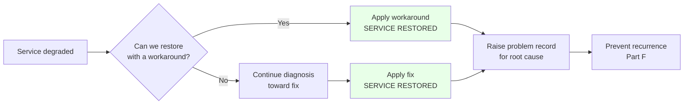
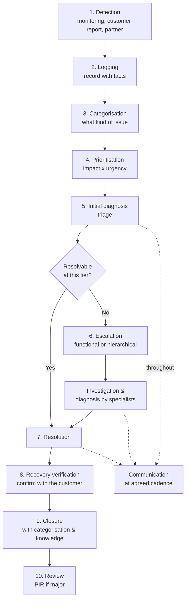
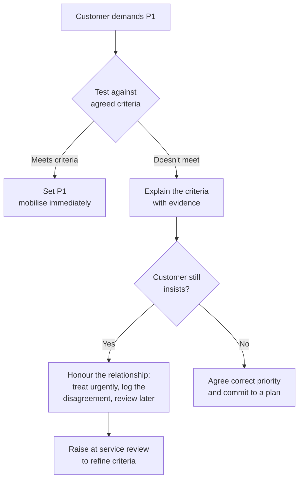
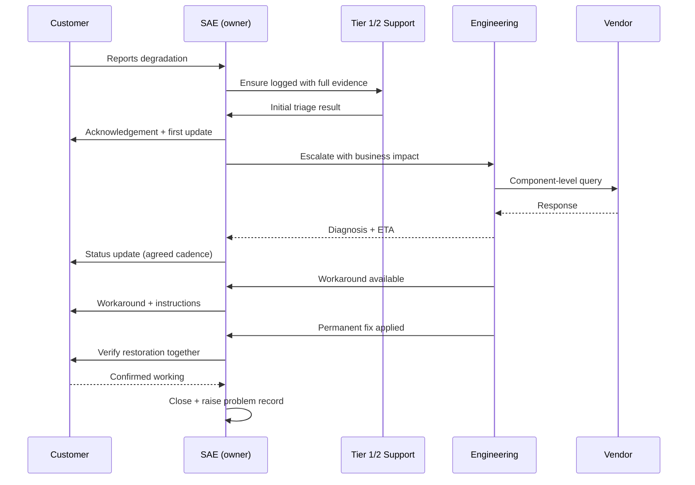
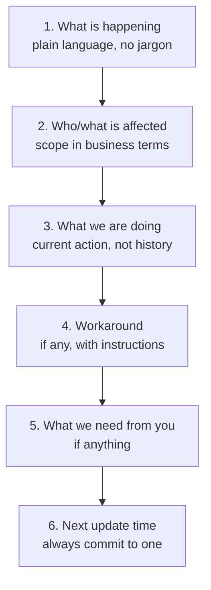

# Part C — Incident Management End-to-End

[← Master index](../Amadeus%20Service%20Account%20Executive%20-%20Study%20Guide.md) · [← Part B](Part-B-service-management-fundamentals.md) · **Part C of M** · [Part D →](Part-D-major-incident-management.md)

> Section goal: master the process that dominates this role day to day — from the moment something breaks to the moment the ticket closes — including how priority is decided, how ownership works, and why customer updates are a deliverable in their own right.

Covers index items **8–10** and maps to JD responsibilities: *"provide end-to-end oversight of incidents"*, *"drive issue resolution"*, *"ensure clear communication and transparency throughout the incident lifecycle"*.

---

## 10. What an incident is

> **An incident is an unplanned interruption to a service, or a reduction in its quality.**

Two words carry all the weight:

- **Unplanned** — planned maintenance is not an incident (unless it goes wrong).
- **Reduction in quality** — it does not have to be fully down. **Slow is broken.** A booking system taking 30 seconds instead of 2 is an incident even though every request eventually succeeds.

### 🔍 Plain-English deep-dive: the goal of incident management

The goal is **restoration of service**, *not* explanation, *not* root cause, *not* permanent fix.

- **Restoration** — *get the customer working again by any safe means.* **Analogy:** a paramedic stabilises the patient; they don't perform elective surgery at the roadside. **Why it matters:** teams that chase root cause during a live outage keep customers down for hours longer than necessary.
- **Workaround** — *a temporary way to keep operating while the fault exists.* **Analogy:** the bucket under the leak, or the signposted detour around a closed bridge.
- **Resolution** — *the fault itself is gone.*

> **Interview-ready line:** "Restore first, explain later. Root cause is a problem-management activity, and pursuing it mid-incident actively harms the customer."

---

## 11. The incident lifecycle

### The ten stages explained

| # | Stage | What actually happens | Where it goes wrong |
|---|-------|----------------------|---------------------|
| 1 | **Detection** | Monitoring alerts, a customer calls, or a partner reports | Customer detects it before you do — a bad look |
| 2 | **Logging** | Record symptoms, scope, time started, examples | Vague descriptions like "system down" with no evidence |
| 3 | **Categorisation** | Tag it (system, component, type) | Sloppy tags destroy later trend analysis |
| 4 | **Prioritisation** | Impact × urgency → priority | Everything is a "P1"; priority inflation |
| 5 | **Initial diagnosis** | Quick triage: is it what it looks like? | Jumping to a cause and anchoring on it |
| 6 | **Escalation** | Route to the right specialists | Escalating late, or "escalating" by just adding people |
| 7 | **Resolution** | Workaround or fix applied | Declared fixed without verification |
| 8 | **Verification** | Confirm with the affected users | Closing on assumption; incident reopens |
| 9 | **Closure** | Final categorisation, knowledge captured | Categorisation left as "other" |
| 10 | **Review** | Post-incident review for majors | PIR actions logged and never delivered |

### 🔍 Plain-English deep-dive: why logging quality decides everything

A weak incident record — *"Check-in not working, customer angry"* — forces every later responder to re-interview the customer, which wastes the most expensive minutes of an outage.

A strong incident record answers, in the first five minutes:

| Question | Example |
|----------|---------|
| **What** is the symptom? | Check-in requests return a timeout error |
| **Since when?** | First observed 06:12 local |
| **Who/how many** affected? | Three airports, approx. 40 agents, ~2,000 passengers in peak |
| **What's the evidence?** | Error code, screenshot, example PNRs, log excerpt |
| **Is it total or partial?** | Partial — web check-in works, agent desktop fails |
| **What changed?** | Release deployed 05:40 |
| **Is there a workaround?** | Not yet identified |
| **Business impact?** | Boarding delays likely within 40 minutes |

> **Memory device — the "5 W + 1 H" of incident intake:** *What, When, Where, Who, What changed, How bad.*

---

## 12. Priority, severity, impact and urgency

These four words are used interchangeably by beginners and precisely by professionals.

### 🔍 Plain-English deep-dive: the four terms

- **Impact** — *how big is the damage?* How many users, how critical the business process, how much money. **Analogy:** how many lanes of the motorway are blocked.
- **Urgency** — *how fast does the damage grow?* Can it wait, or is a deadline approaching? **Analogy:** how close it is to rush hour.
- **Priority** — *the order we work in.* Derived from impact × urgency. **Analogy:** which incident the tow truck attends first.
- **Severity** — *the technical seriousness of the fault.* Often used interchangeably with priority in casual conversation, but strictly they differ.

**Key insight interviewers love:** *severity and priority can differ.*
A cosmetic typo on a landing page is low severity. If it appears in a legally required disclosure the day before an audit, it is high priority. Conversely, a total failure of a decommissioned test system is high severity, low priority.

### The priority matrix

|  | **Urgency: High** | **Urgency: Medium** | **Urgency: Low** |
|---|---|---|---|
| **Impact: High** | **P1 — Critical** | **P2 — High** | **P3 — Medium** |
| **Impact: Medium** | **P2 — High** | **P3 — Medium** | **P4 — Low** |
| **Impact: Low** | **P3 — Medium** | **P4 — Low** | **P5 — Planning** |

### Typical priority definitions

| Priority | Meaning | Illustrative airline example | Typical response posture |
|----------|---------|------------------------------|--------------------------|
| **P1 / Critical** | Core business stopped, no workaround, widespread | Check-in down across multiple airports during peak | Immediate, 24/7, bridge call, executive comms |
| **P2 / High** | Major function degraded or a workaround exists but is painful | Bookings succeeding but 10× slower; agents queueing | Urgent, senior attention, frequent updates |
| **P3 / Medium** | Limited impact, workaround available | One report failing for a subset of users | Business hours, standard track |
| **P4 / Low** | Minor inconvenience | Cosmetic display defect | Scheduled |
| **P5 / Planning** | No operational impact | Enhancement-style annoyance | Backlog |

### Priority inflation — and how to handle it

Every customer wants P1. If everything is P1, nothing is.

> **Interview-ready line:** "I never win a priority argument by quoting a matrix at an upset customer mid-incident. I ask what business process is blocked and how many people it affects — that usually resolves the disagreement objectively. If we still disagree, I act urgently now and fix the criteria at the next service review, not in the middle of a crisis."

---

## 13. Ownership: the SAE's non-negotiable

**Ownership** means one person is accountable from detection to closure, regardless of how many teams touch the ticket.

Notice the pattern: **every arrow to the customer starts at the SAE.** That single-threaded communication is what makes the customer feel held.

### 🔍 Plain-English deep-dive: the "hot potato" failure

The most common operational anti-pattern is the ticket that bounces between teams, each closing their part, while the customer's problem persists.

| Anti-pattern | What the customer experiences | The fix |
|--------------|-------------------------------|---------|
| **Hot potato** | Ticket reassigned repeatedly, no progress | Named owner who stays with it end to end |
| **Silent running** | No updates for hours | Fixed cadence, updates even when there's no news |
| **Premature closure** | "Resolved" but still broken | Verify with the affected users before closing |
| **Watermelon status** | Green on the report, red in reality | Report outcomes, not just SLA compliance |
| **Blame ping-pong** | Teams argue whose component failed | Impact-first framing; assign an accountable owner |

> **"Watermelon"** — *green on the outside, red on the inside.* **Analogy:** a dashboard showing all targets met while the customer is furious. **Why it matters:** it is the fastest way to lose credibility, because it proves your reporting is measuring the wrong thing.

---

## 14. Ticket hygiene — boring, and decisive

Poor ticket data quietly destroys the analytical half of the SAE job. You cannot spot a trend across records that say "issue" and "not working".

| Hygiene attribute | Why it matters |
|-------------------|----------------|
| **Accurate categorisation** | Enables trend analysis and problem identification |
| **Correct timestamps** | Makes MTTR and SLA measurement honest |
| **Complete impact data** | Enables prioritisation and business reporting |
| **Documented workarounds** | Speeds up the next occurrence; feeds knowledge base |
| **Linked records** | Connects incidents to problems and changes |
| **Clear resolution notes** | Prevents repeat diagnosis from scratch |
| **Correct closure codes** | Distinguishes real fixes from "user error" and "no fault found" |

### Backlog health

**Backlog** = *all incidents currently open.* Watch four things:

| Signal | What it suggests |
|--------|------------------|
| **Ageing** (tickets open > X days) | Stalled work, unclear ownership |
| **Volume trend** | Underlying instability or seasonal load |
| **Reopen rate** | Premature closure or poor verification |
| **Distribution by category** | Where the pain concentrates → improvement targets |

---

## 15. Communication as a deliverable

The JD names this explicitly twice. Treat updates as a product you ship, not an afterthought.

### The cadence principle

> **Agree the update frequency at the start, then never miss it — even when there is nothing new to say.**

"No news" updates are counter-intuitively the most trust-building message you can send, because silence is interpreted as neglect.

| Priority | Typical update cadence | Audience |
|----------|-----------------------|----------|
| **P1** | Every 30–60 minutes | Operational + executive |
| **P2** | Every 2–4 hours | Operational |
| **P3** | Daily | Operational |
| **P4/P5** | On change of state | Requester |

### The anatomy of a good update

**Template — reusable in any incident:**

> **Status:** Investigating / Identified / Monitoring / Resolved
> **Issue:** Agent check-in is returning timeout errors.
> **Impact:** Approximately 40 agents across three airports; passengers can still use web check-in.
> **Current action:** Engineering has isolated the fault to a single service node and is failing traffic over.
> **Workaround:** Agents should use the web check-in fallback (steps attached).
> **Next update:** 09:30, or sooner if status changes.

### 🔍 Plain-English deep-dive: three rules for incident writing

1. **No jargon, no blame, no speculation.** Never write "we think it might be the database" — speculation quoted back to you later is a credibility disaster.
2. **Lead with impact, not activity.** Customers care what they can and cannot do, not that "team X is investigating".
3. **Never promise a time you don't control.** Say "next update at 09:30" (you control that) rather than "fixed by 09:30" (you don't).

| Weak update | Strong update |
|-------------|---------------|
| "Still investigating." | "Fault isolated to one node; failover in progress; next update 09:30." |
| "The DB cluster is showing latency on node 3." | "Check-in is slow for agents at three airports; web check-in is unaffected." |
| "It should be fixed shortly." | "We expect to confirm restoration within 30 minutes and will verify with your team before closing." |
| "This was caused by the vendor." | "We've engaged the third-party component owner; we own the resolution end to end." |

---

## ⭐ Likely Interview Questions for This Section

**Q1. "Walk me through your incident management process from start to finish."**
> *Model answer:* "Detection — from monitoring, the customer, or a partner. Logging with real evidence: symptoms, scope, start time, examples, and what changed recently. Categorisation and prioritisation using impact and urgency. Initial triage to confirm what we're actually dealing with. Escalation to the right specialists with business impact attached, not just a technical description. Then resolution — and I split that deliberately into restoration, which may be a workaround, and permanent fix. Verification with the affected users before closure, never closure on assumption. Closure with accurate categorisation and knowledge captured. Then review — a post-incident review for anything major, and a problem record so we address the underlying cause. Throughout all of it, customer communication on an agreed cadence."

**Q2. "How do you decide an incident's priority?"**
> *Model answer:* "Impact times urgency. Impact is how much damage — how many users, how business-critical the process, what it costs. Urgency is how fast that damage grows — is a deadline or a peak window approaching. A partial failure in a low-traffic hour may be a P3; the identical fault at the start of morning check-in is a P1 because urgency changed. I also separate severity from priority: severity is technical seriousness, priority is the order we work in, and they don't always match."

**Q3. "The customer insists it's a P1. You don't think it is. What do you do?"**
> *Model answer:* "I don't argue the matrix mid-incident. I ask two objective questions: which business process is blocked, and how many people or transactions are affected. Usually that converges quickly. If they still disagree, I protect the relationship — I treat it urgently and mobilise, log the disagreement transparently, and bring the priority criteria to the next service review to refine them. Winning a definitions argument while a customer is stressed is a loss even if you're right."

**Q4. "Restoration or root cause — which comes first, and why?"**
> *Model answer:* "Restoration, every time. The purpose of incident management is to get the customer operating again; the purpose of problem management is to stop it happening again. If a workaround restores service in ten minutes, I take it and raise a problem record for the cause. Teams that hunt root cause during a live outage keep customers down far longer than necessary. The one exception is when applying a workaround would destroy the evidence needed to find the cause — then I make sure we capture diagnostics first, quickly, and I make that trade-off explicit to the customer."

**Q5. "How often should you update a customer during a P1?"**
> *Model answer:* "Agree it upfront — typically every 30 to 60 minutes for a P1 — and then never miss it, including when there's no news. A 'no change, still working, next update at 10:00' message is more trust-building than silence, because silence reads as neglect. I also always commit to the next update time rather than a fix time, because I control when I communicate and I don't control when engineering succeeds."

**Q6. "What makes a good incident update?"**
> *Model answer:* "Six elements: what's happening in plain language, who and what is affected in business terms, what we're doing right now, the workaround with instructions if one exists, anything we need from the customer, and the next update time. Three rules govern the writing: no jargon, no blame, no speculation. I lead with impact rather than internal activity — the customer wants to know what they can and can't do, not which team is currently looking."

**Q7. "How do you prevent a ticket bouncing between teams with no progress?"**
> *Model answer:* "Single-threaded ownership. One named person stays accountable from detection to closure no matter how many teams touch it — and for my customers, that's me. I also make handovers explicit rather than implicit: when work moves between teams or regions, there's a written handover with current state, what's been ruled out, and next action with an owner. The bounce usually happens because everyone assumes someone else has it, so I make accountability visible in front of the group."

**Q8. "Why does ticket hygiene matter to a customer-facing role?"**
> *Model answer:* "Because the proactive half of my job runs entirely on that data. If categorisation is sloppy and resolution notes are empty, I can't spot that the same root cause has produced fourteen incidents this quarter, and I can't bring a credible improvement case to a service review. Poor hygiene also makes SLA reporting dishonest, and nothing damages trust faster than a customer proving your report wrong."

**Q9. "How do you know an incident is really resolved?"**
> *Model answer:* "The affected users confirm it, not the monitoring and not the engineer. I verify with the people who reported the impact, ideally on the same examples they gave me originally. I also watch for a monitoring period before closing anything major, because premature closure that reopens is worse for confidence than staying open an extra hour. Reopen rate is a metric I track for exactly this reason."

**Q10. "What's a 'watermelon' report?"**
> *Model answer:* "Green on the outside, red on the inside — every SLA target met on paper while the customer is genuinely unhappy. It happens when you measure contractual compliance instead of customer outcome. For example, every ticket met its response target, but the same failure recurred five times and each was measured separately. I guard against it by pairing SLA metrics with experience metrics and by asking the customer directly whether the report matches how the month actually felt."

---

## 🧠 30-Second Memory Hooks

- **Incident** = unplanned interruption *or degradation*. **Slow is broken.**
- **Goal** = restore, not explain. Paramedic, not surgeon.
- **Restoration ≠ resolution.** Workaround counts as restoration.
- **Lifecycle** = detect → log → categorise → prioritise → triage → escalate → resolve → verify → close → review.
- **Priority** = impact × urgency. **Severity ≠ priority.**
- **Same fault, different hour, different priority** — urgency changes with the peak window.
- **Intake questions** = what, when, where, who, what changed, how bad.
- **Ownership** = one name from detection to closure; every customer message comes from that name.
- **Cadence** = agree it, never miss it, "no news" still counts.
- **Commit to the next update time, never the fix time.**
- **Update = impact, action, workaround, next update.** No jargon, no blame, no speculation.
- **Watermelon** = green report, red customer.

---

*Next suggested section:* **[Part D — Major Incident & Crisis Management](Part-D-major-incident-management.md)** — take everything here and scale it to the highest-pressure scenario, which is the single most important competency in this job description.

---

[← Master index](../Amadeus%20Service%20Account%20Executive%20-%20Study%20Guide.md) · [← Part B](Part-B-service-management-fundamentals.md) · [Part D →](Part-D-major-incident-management.md) · [Glossary](Appendix-A-glossary.md)
