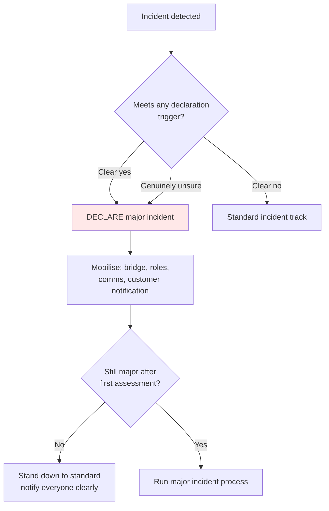
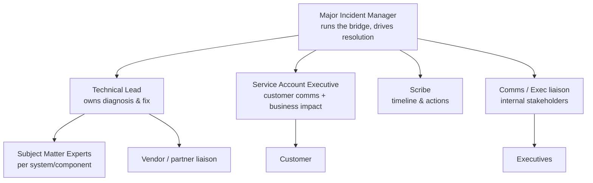
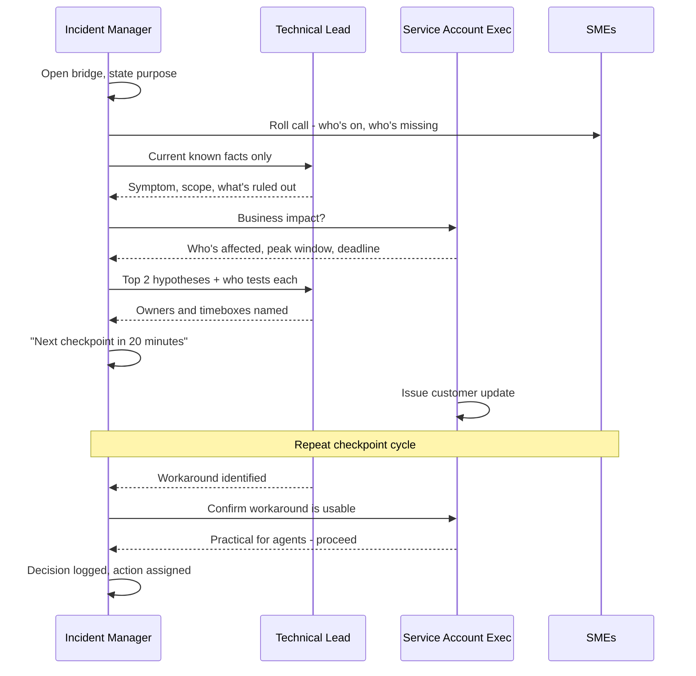
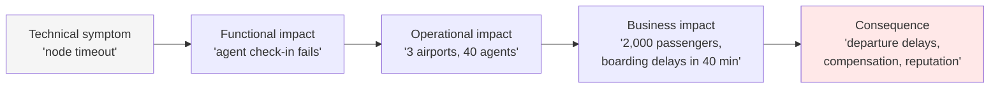
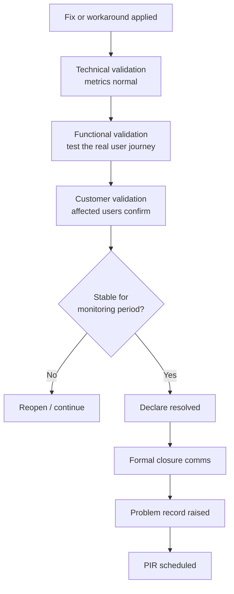

# Part D — Major Incident & Crisis Management

[← Master index](../Amadeus%20Service%20Account%20Executive%20-%20Study%20Guide.md) · [← Part C](Part-C-incident-management.md) · **Part D of M** · [Part E →](Part-E-escalation-and-communication.md)

> Section goal: be able to run — and talk confidently about running — the highest-pressure scenario in the role: a major incident affecting a strategic customer, with executives watching and the clock running.

Covers index items **11–12, 15** and maps to the JD's headline responsibility: *"Manage and coordinate major incidents for Strategic Airlines customers in collaboration with Operations teams to ensure timely resolution and minimal business impact."*

**This is the most heavily interviewed Part in the guide.** Expect at least three questions from it.

---

## 16. What makes an incident "major"

A **major incident** is not just a bigger incident. It triggers a **different process**: a dedicated coordinator, a live bridge call, executive visibility, and formal communications.

### 🔍 Plain-English deep-dive: why a separate process exists

- **Normal incident** — *handled through the standard queue by whoever picks it up.* **Analogy:** a GP appointment.
- **Major incident** — *a coordinated, all-hands response with someone conducting.* **Analogy:** a hospital trauma team — pre-defined roles, a team leader, everyone knows their station before the patient arrives.
- **Why it matters:** improvising coordination during your worst hour never works. The value of a major incident process is that **the roles were decided when everyone was calm.**

### Declaration triggers

Organisations define these in advance so declaration isn't a debate.

| Trigger type | Example |
|--------------|---------|
| **Scope** | Multiple sites, regions, or a whole customer affected |
| **Business criticality** | A core process stopped — check-in, boarding, ticketing |
| **No workaround** | Users cannot operate at all |
| **Timing** | Occurs in a peak window or during a critical event |
| **Duration** | A P2 that has exceeded a threshold without progress |
| **Reputational / regulatory** | Media attention, data exposure, safety adjacency |
| **Customer request** | A strategic customer formally invokes major incident handling |

> **Interview-ready line:** "Declaring a major incident is a cheap action with an expensive alternative. Over-declaring costs an hour of some people's time; under-declaring costs the customer's business and your credibility. When genuinely uncertain, I declare and stand it down early if wrong."

---

## 17. Roles on a major incident

The single biggest determinant of a well-run major incident is **role clarity**.

| Role | Owns | Does **not** do |
|------|------|-----------------|
| **Major Incident Manager (MIM)** | Running the response, driving pace, decisions | Diagnose the technical fault personally |
| **Technical Lead** | Diagnosis, hypothesis testing, the fix | Manage communications |
| **SMEs** | Deep component knowledge | Coordinate other teams |
| **Service Account Executive** | Customer communication, business impact, customer decisions | Direct engineering work |
| **Scribe** | Timeline, decisions, actions with owners | Contribute to diagnosis |
| **Exec liaison** | Internal senior stakeholder updates | Interrupt the bridge for status |
| **Vendor liaison** | Third-party engagement and pressure | Speak for the customer |

### 🔍 Plain-English deep-dive: why the SAE must *not* be the technical lead

It is tempting for a capable SAE to dive into diagnosis. Resist it.

**Analogy:** an air-traffic controller who leaves the tower to help fix an engine. The engine gains one pair of hands; every other aircraft loses its coordinator.

If you are diagnosing, nobody is:
- assessing business impact,
- protecting the customer's peak window,
- deciding whether the workaround is practical for humans,
- writing the update due in eight minutes.

> **Interview-ready line:** "In a major incident my value is the widest view in the room, not the deepest. The moment I go deep, the customer goes dark."

---

## 18. The bridge call

A **bridge** (or war room) is a continuously open call where everyone needed is present.

### How a well-run bridge sounds

### The checkpoint discipline

The core rhythm is: **facts → hypotheses → owners → timebox → checkpoint.**

| Element | Purpose | Sounds like |
|---------|---------|-------------|
| **Facts only** | Prevent speculation cascading | "What do we *know*, not what do we *think*" |
| **Hypotheses** | Structure the search | "Two candidates: the release, or the certificate" |
| **Owners** | One name per action | "Priya owns rollback validation" |
| **Timebox** | Prevent silent rabbit holes | "20 minutes, then we report back either way" |
| **Checkpoint** | Regain control, re-decide | "Checkpoint at 09:20" |

### Bridge anti-patterns

| Anti-pattern | Why it kills progress | Counter-move |
|--------------|----------------------|--------------|
| **The audience problem** | 40 people listening, 3 working | Split: a working bridge + a separate stakeholder briefing |
| **Speculation cascade** | "Might be DNS" becomes fact in 10 minutes | Enforce "known vs suspected" language |
| **Rabbit hole** | One SME investigates silently for an hour | Timeboxes and mandatory checkpoints |
| **Blame ping-pong** | Teams defend territory instead of fixing | "We assign cause after restoration; right now, impact only" |
| **Executive interrupt** | A VP joins and asks for a status recap | Exec liaison + a separate briefing channel |
| **Silent bridge** | Nobody speaks; nobody knows who's working | Roll call and explicit action assignment |
| **Fix-first-ask-later** | Untested change makes it worse | Every change stated, agreed, logged before applying |

> 💡 **Practical example:** an incident stalls for 45 minutes because three teams each believe another team owns the next step. The unblocking sentence is almost never technical. It is: *"Let me summarise what I'm hearing — we need X validated. Who owns that, and by when?"*

---

## 19. Business impact assessment — the SAE's core contribution

Technical teams describe **what is broken**. The SAE describes **what it costs**. That translation drives prioritisation everywhere else.

**Build the impact statement with five questions:**

| Question | Turns into |
|----------|-----------|
| What can't they do? | The blocked business process |
| How many people/transactions? | Scale |
| Is there a workaround, and is it *practical*? | True severity |
| What's the deadline or peak window? | Urgency |
| What happens if it isn't fixed by then? | Consequence |

### 🔍 Plain-English deep-dive: "practical" workarounds

A workaround that is technically valid but operationally impossible is not a workaround.

- **Technically valid:** "agents can process check-in through the manual fallback procedure."
- **Operationally impossible:** "…which takes four minutes per passenger, and there are 300 passengers in the queue with 50 minutes to departure."

**Why it matters:** the SAE is the only person in the room positioned to catch this, because it requires knowing the customer's real-world operation. Catching it is how you earn credibility with an airline.

---

## 20. Communication during a major incident

Scale up everything from Part C, and add audience segmentation.

| Audience | Wants | Cadence | Tone |
|----------|-------|---------|------|
| **Operational staff** | Workaround, what still works | Every 30 min | Practical, instructional |
| **Customer IT/ops** | Technical status, ETA, actions | Every 30–60 min | Precise, factual |
| **Customer executives** | Impact, ETA, recurrence risk | Hourly / at milestones | Brief, confident, business language |
| **Internal executives** | Exposure, resourcing needs | At milestones | Candid, risk-focused |

### Rules that save careers

1. **One voice to the customer.** Multiple internal people freelancing updates creates contradictions, and contradictions read as incompetence.
2. **Say what you know, flag what you don't.** "We have not yet confirmed the cause" is strong. Guessing is fatal.
3. **Never blame a third party publicly.** You own the service end to end. Internal supply chain is not the customer's problem.
4. **Time-stamp everything.** Ambiguous times across regions create false expectations — state the time zone.
5. **Commit only to what you control.** Next update time, yes. Fix time, only when engineering has confirmed and you add a confidence qualifier.
6. **Close the loop personally.** After restoration, a human call outperforms any written notice.

### The holding statement

When you must communicate before you have answers — which is always, at the start:

> "We are aware of an issue affecting agent check-in at multiple airports, first observed at 06:12 IST. Our teams are actively investigating with the highest priority. Web check-in is currently unaffected and can be used as an alternative. We do not yet have a confirmed cause or restoration time. Our next update will be at 07:00 IST, and sooner if the status changes."

**Why it works:** acknowledges, scopes, gives an alternative, admits the unknown honestly, and commits to a controllable promise.

---

## 21. Stand-down, verification and handover

### Before declaring resolution

**Never skip customer validation.** Monitoring shows the component is healthy; only the user knows the business process works.

### Handover between shifts

In a 24/7 global operation, majors cross time zones. A weak handover restarts the incident from zero.

**Handover must contain:**

| Field | Example |
|-------|---------|
| Current state | Workaround active; root cause unconfirmed |
| Timeline so far | Key events with timestamps |
| Ruled out | Network, certificate expiry, capacity |
| Active hypothesis | Recent release; rollback under validation |
| Owners | Named, with contact details |
| Customer commitments | Next update due 14:00 IST; exec call at 15:00 |
| Sensitivities | Customer escalated to executive level; peak window at 17:00 |

---

## 22. The Post-Incident Review (PIR)

A **PIR** (also called a post-mortem or after-action review) is the structured look-back after a major incident.

### 🔍 Plain-English deep-dive: "blameless"

- **Blameless** — *the review assumes people acted reasonably given what they knew at the time, and asks why the system allowed the failure.* **Analogy:** aviation safety investigation — the industry got dramatically safer by investigating systems rather than punishing pilots. **Why it matters:** in a blaming culture, people hide information, and hidden information means the cause is never found. Blameless does not mean "no accountability" — actions still have owners and deadlines.

### PIR structure

| Section | Contents |
|---------|----------|
| **Summary** | What happened, in business language, in five lines |
| **Impact** | Who was affected, how badly, for how long, quantified |
| **Timeline** | Detection → escalation → key decisions → restoration, timestamped |
| **Root cause** | The technical *and* process cause |
| **What went well** | Genuinely — reinforce good behaviour |
| **What didn't** | Detection gaps, delays, comms failures |
| **Actions** | Specific, owned, dated, tracked to completion |
| **Recurrence prevention** | What structurally changes |

### The questions a good PIR always asks

1. **Detection** — how long between failure and detection? Did the customer tell us first?
2. **Escalation** — was the right team engaged quickly? What delayed it?
3. **Diagnosis** — what took the longest, and why?
4. **Communication** — was the customer informed adequately and promptly?
5. **Workaround** — could we have restored service sooner by other means?
6. **Recurrence** — what stops this specific failure repeating?
7. **Detection improvement** — what monitoring would have caught it earlier?

> **Interview-ready line:** "A PIR without owned, dated, tracked actions is a therapy session. The measure of PIR quality is not the document — it's whether the same incident happens again."

### Time-to-value metrics from a PIR

| Metric | Question it answers |
|--------|--------------------|
| **Time to detect** | How blind were we? |
| **Time to declare** | Did we hesitate? |
| **Time to engage the right team** | Is routing effective? |
| **Time to workaround** | How fast did we protect the business? |
| **Time to resolve** | Overall recovery capability |
| **Time to first customer update** | Communication responsiveness |

---

## 23. Working weekends and out-of-hours

The JD asks for openness to weekend work. Understand *why*, so you can speak to it maturely.

- Airlines run **peak weekends and holidays** — the busiest passenger days are often precisely when office workers are off.
- **Change windows** are frequently placed in low-traffic periods, which means weekends and nights.
- **Major incidents don't schedule themselves.**

Mature framing: it isn't about being always-on. It's about **coverage design** — rotas, on-call schedules, clear handover, follow-the-sun structures, and protecting recovery time so people stay effective.

---

## ⭐ Likely Interview Questions for This Section

**Q1. "Walk me through how you'd manage a major incident affecting a strategic airline customer."**
> *Model answer:* "First, confirm and declare — I'd rather stand a major incident down than declare it late. Mobilise the bridge with named roles: incident manager driving, technical lead owning diagnosis, SMEs, a scribe, and me owning customer communication and business impact. Establish facts before hypotheses. In parallel with diagnosis I'm building the business impact picture — which process is blocked, how many people, what deadline or peak window is approaching — because that drives everyone's prioritisation. I issue a holding statement fast: what we know, what's unaffected, what alternative exists, and the next update time. Then a checkpoint rhythm: facts, hypotheses, named owners, timeboxes, and a customer update every 30 to 60 minutes without fail. I push hard for a workaround in parallel with the fix and I validate it's actually practical for the customer's staff. On restoration, I verify with the affected users before declaring resolved, close the loop with a personal call, raise a problem record, and drive the post-incident review with owned, dated actions."

**Q2. "How do you decide whether to declare a major incident?"**
> *Model answer:* "Against pre-agreed triggers — scope across multiple sites, a core business process stopped, no viable workaround, timing within a peak window, duration beyond a threshold, or regulatory and reputational exposure. The key principle is asymmetry of cost: over-declaring costs an hour of some people's time, under-declaring costs the customer's operation and my credibility. So when I'm genuinely uncertain, I declare and stand down early if the assessment changes — and I make the stand-down explicit so nobody's left guessing."

**Q3. "You're the SAE on a bridge. Engineering is deep in diagnosis and hasn't updated in 40 minutes. What do you do?"**
> *Model answer:* "I'd intervene on process, not technology. I'd call a checkpoint and ask three questions: what do we know for certain, what are we currently testing, and who owns it with what timebox. That converts silent investigation into visible, bounded work. I'd also separate the tracks — if diagnosis needs quiet focus, I'd move deep work to a sub-group and keep the main bridge for coordination. And critically, I'd ask whether anyone is working the workaround in parallel, because restoring the customer shouldn't wait on root cause. Meanwhile my customer update still goes out on time, saying honestly that we're investigating and haven't confirmed a cause."

**Q4. "How do you handle a senior executive who joins the bridge and starts asking questions?"**
> *Model answer:* "Their need is legitimate but the bridge is the wrong channel — every recap costs the responders momentum. I'd acknowledge them immediately, give a crisp 60-second summary of impact, current action and next checkpoint, and then move them to a dedicated briefing channel with a committed update rhythm. Executives escalate onto bridges because they don't trust they'll be informed otherwise. If the briefing cadence is reliable, they stop needing to."

**Q5. "What's the difference between a workaround and a fix, and which do you push for?"**
> *Model answer:* "A workaround restores the customer's ability to operate while the fault still exists; a fix eliminates the fault. I push for both simultaneously on separate tracks, because restoring the business is more urgent than being elegant. But I always test the workaround against operational reality — a manual fallback that takes four minutes per passenger isn't a workaround when there are 300 people queuing before departure. Checking that is specifically my job, because it needs knowledge of how the customer actually operates."

**Q6. "What is a blameless post-incident review and why does it matter?"**
> *Model answer:* "It's a review that assumes people acted reasonably with the information they had, and asks why the system permitted the failure rather than who to punish. It matters because in a blaming culture people withhold information, and if information is hidden the true cause is never found — so the incident recurs. Blameless doesn't mean unaccountable: every action still has a named owner and a date, and I track them to completion. A PIR without tracked actions is just a document."

**Q7. "The customer says they found out about the outage from their own staff before we told them. How do you respond?"**
> *Model answer:* "I'd accept it directly without deflecting — that's a genuine failure of the service, separate from the technical fault. Then I'd treat it as its own investigation: was the gap in detection, in the decision to notify, or in the notification mechanism reaching the right people? Each has a different fix. I'd bring a concrete change to the next review — for example an agreed notification threshold and a defined maximum time from detection to first customer contact — and then report against it so the customer can see it working. Owning a communication failure honestly usually rebuilds more trust than the failure cost."

**Q8. "How do you hand over an ongoing major incident to another region?"**
> *Model answer:* "With a written handover and a live verbal overlap — never one or the other. The document covers current state, timeline with timestamps, what's been ruled out, the active hypothesis, named owners with contacts, outstanding customer commitments including the next update time, and any sensitivities like an executive escalation or an approaching peak window. The verbal overlap exists because context and nuance don't survive a document. And I make sure the customer knows who now owns it, by name — handovers should be invisible in quality but visible in accountability."

**Q9. "How do you keep calm when everything is on fire and everyone is shouting?"**
> *Model answer:* "By having a structure to fall back on, because structure replaces adrenaline. My default loop is: establish facts, state impact, name owners, set a timebox, set the next checkpoint. That gives me something to do in every moment of chaos. I also consciously separate what's urgent from what's loud — the loudest voice on a bridge is rarely the biggest impact. And I protect the communication commitment above all, because if updates keep landing on time, the customer stays calm even while the incident is unresolved."

**Q10. "Are you comfortable with weekend and out-of-hours work?"**
> *Model answer:* "Yes, and I understand why it's inherent to this domain — airline peaks fall on weekends and holidays, change windows sit in low-traffic hours, and major incidents don't respect a calendar. What I'd want to build is sustainable coverage rather than heroics: clear rotas, proper handover discipline so incidents don't restart at every shift change, and defined escalation paths so out-of-hours decisions can be made quickly. Reliable structure serves the customer better than individuals burning out."

**Q11. "Two teams are blaming each other on the bridge. What do you do?"**
> *Model answer:* "I stop the causation debate outright. I'd say something like: we're assigning cause in the post-incident review, not now — right now the only question is what restores the customer. Then I'd redirect to parallel action: each team validates or eliminates their own component within a set timebox and reports back at the checkpoint. That converts a defensive argument into two pieces of evidence. Blame debates during a live incident are pure cost, and the SAE is well placed to stop them because I'm not defending any technical territory."

---

## 🧠 30-Second Memory Hooks

- **Major incident** = different *process*, not just a bigger incident. Trauma team, not GP.
- **Declare when unsure.** Asymmetric cost: over-declaring is cheap, under-declaring is not.
- **Role clarity beats heroics.** MIM drives, tech lead diagnoses, SAE communicates, scribe records.
- **SAE never becomes the technical lead.** "Go deep and the customer goes dark."
- **Bridge rhythm** = facts → hypotheses → owners → timebox → checkpoint.
- **Two parallel tracks** = workaround (protect business) + fix (remove fault).
- **A workaround must be *practical*,** not merely valid. Four minutes × 300 passengers.
- **Impact ladder** = symptom → function → operation → business → consequence.
- **One voice to the customer.** Contradictions read as incompetence.
- **Holding statement** = acknowledge, scope, alternative, honest unknown, next update time.
- **Verify with users before closing.** Monitoring green ≠ business working.
- **Handover** = written + verbal overlap. Never one alone.
- **Blameless PIR** = ask why the system allowed it. **No tracked actions = therapy session.**
- **Execs escalate onto bridges when they don't trust the update rhythm.**

---

*Next suggested section:* **[Part E — Escalation Management & Customer Communication](Part-E-escalation-and-communication.md)** — the interpersonal counterpart to this Part: what to do when progress stalls or the customer is angry.

---

[← Master index](../Amadeus%20Service%20Account%20Executive%20-%20Study%20Guide.md) · [← Part C](Part-C-incident-management.md) · [Part E →](Part-E-escalation-and-communication.md) · [Worked scenario](Appendix-B-worked-scenario.md)
