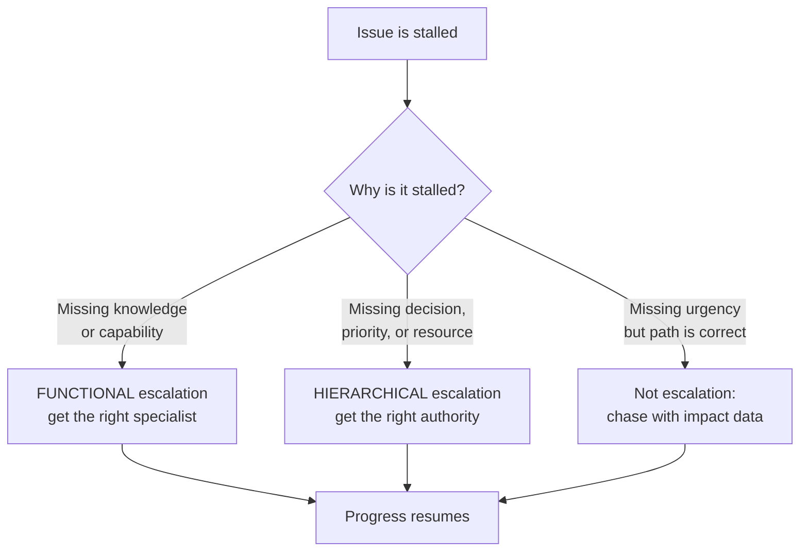
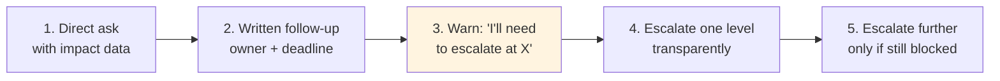
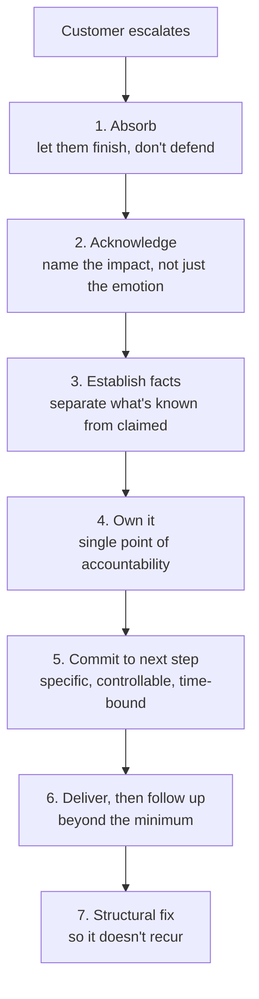
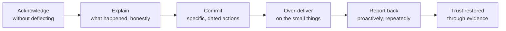
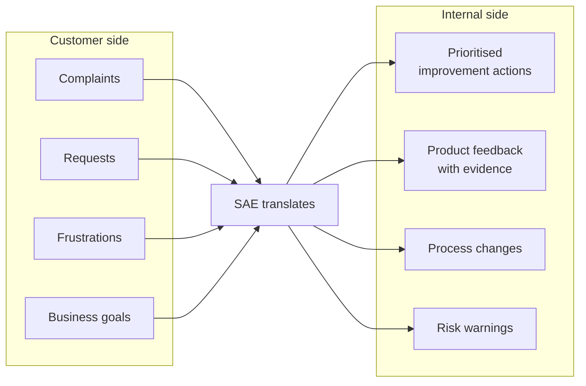
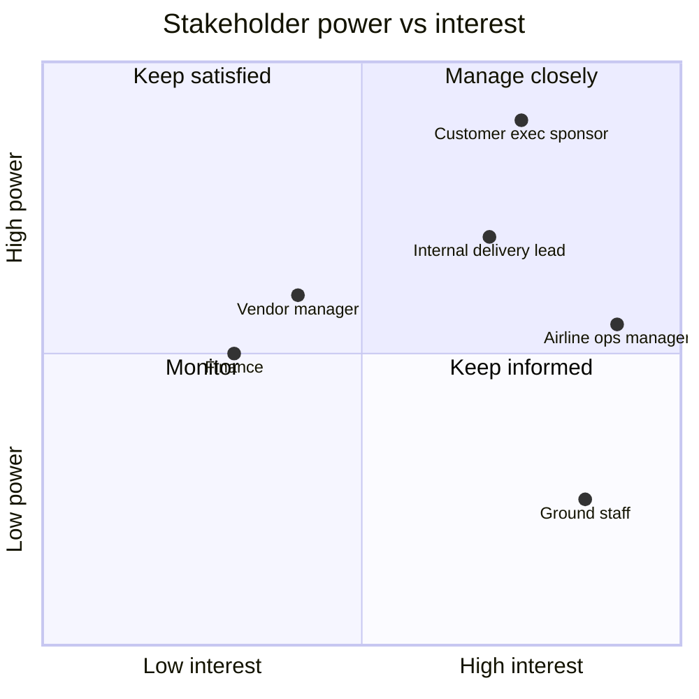

# Part E — Escalation Management & Customer Communication

[← Master index](../Amadeus%20Service%20Account%20Executive%20-%20Study%20Guide.md) · [← Part D](Part-D-major-incident-management.md) · **Part E of M** · [Part F →](Part-F-problem-management-and-rca.md)

> Section goal: learn how to unblock stalled work through escalation without damaging relationships, and how to handle an angry, disappointed or distrustful customer with composure.

Covers index items **13–14** and maps to JD responsibilities: *"handle customer escalations and coordinate stakeholders to ensure effective and timely outcomes"*, *"act as the voice of the customer"*, *"build trusted relationships"*.

---

## 24. What escalation actually is

Beginners think escalation means "complaining upwards". It doesn't.

> **Escalation is the deliberate act of bringing additional capability or additional authority to an issue, because the current path will not deliver the required outcome in the required time.**

Two words matter: **deliberate** (not emotional) and **additional** (capability or authority — those are the only two things escalation can add).

### 🔍 Plain-English deep-dive: the two types

- **Functional escalation (horizontal)** — *bringing in more or different skill.* You escalate from Tier 1 to Tier 2 to engineering because the current team lacks the knowledge. **Analogy:** your GP refers you to a cardiologist. Nobody is in trouble; you simply need a different specialist.
- **Hierarchical escalation (vertical)** — *bringing in more authority.* You escalate to a manager or director because a decision, a priority conflict, or resourcing needs someone with the power to unblock it. **Analogy:** asking the hospital administrator to authorise an operating theatre out of hours.

**The diagnostic question:** *"What is missing — a skill or a decision?"* Skill → functional. Decision → hierarchical. If neither is missing, you don't have an escalation, you have an impatience.

---

## 25. When to escalate

Escalating too early wastes senior capacity and trains people to ignore you. Escalating too late is a failure of the role.

| Escalate when… | Don't escalate when… |
|----------------|---------------------|
| The agreed timeline will be missed | You're merely uncomfortable with the pace |
| The team lacks the required skill | You haven't yet supplied the business impact |
| Priorities conflict and need a decision | You haven't tried a direct conversation |
| A resource or approval is blocked | You want to apply pressure for its own sake |
| Business impact has materially grown | The impact hasn't actually changed |
| The customer has formally escalated | The customer merely expressed frustration |
| A commitment to the customer is at risk | You could simply reset expectations honestly |

### The escalation ladder

**Step 3 is the one most people skip and it is the most important.** Warning before escalating converts a betrayal into a professional courtesy, and often makes the escalation unnecessary.

### 🔍 Plain-English deep-dive: escalation etiquette

Five rules that keep relationships intact:

1. **Never surprise anyone.** The person being escalated over should know before, not after. "I don't have what I need and I have a customer commitment at 14:00, so I'll need to raise this to your manager at 12:00 unless we have a plan."
2. **Escalate the issue, not the person.** Frame it as "this workstream is blocked", never "Sam isn't responding."
3. **Bring facts, not feelings.** Timeline, impact, what you've already tried, and precisely what you need.
4. **State the ask.** Escalations without a specific request just transfer anxiety upward. "I need a decision on whether we roll back" is actionable; "this is really bad" is not.
5. **Close the loop.** Tell everyone what happened. People who see escalation produce results — and see themselves treated fairly — cooperate faster next time.

**The escalation message template:**

> **Issue:** Agent check-in degraded at three airports since 06:12 IST.
> **Impact:** ~2,000 passengers; boarding delays expected within 40 minutes; strategic customer, executive visibility.
> **Status:** Cause unconfirmed. Rollback validation stalled awaiting environment access.
> **Already tried:** Requested access at 07:10 and 07:35; chased on the bridge.
> **What I need:** Approval to grant emergency access, or an alternative validation route, by 08:15.
> **If not resolved:** We will miss the customer's peak window and I'll need to escalate to [next level].

---

## 26. Customer escalations — when *they* escalate to *you*

Different scenario, different skill. Here you're receiving the pressure.

### The absorb-acknowledge move

The instinctive response to criticism is explanation. **Explanation early sounds like defence, and defence escalates anger.**

| Instinct (harmful) | Better |
|--------------------|--------|
| "Well, actually the SLA was met." | "You've had three failures in a month during your peak. That's not the experience you should be having." |
| "That was the vendor's component." | "We own this service end to end. Let me tell you what I'm doing about it." |
| "You didn't report it through the right channel." | "Let's get this moving now — I'll fix the channel issue afterwards so it's faster next time." |
| "It's only affecting a small number of users." | "It's affecting your ticketing desk during check-in. Help me understand the operational consequence." |

> **Interview-ready line:** "Being technically right while the customer feels unheard is the most expensive way to lose a relationship."

### 🔍 Plain-English deep-dive: separating emotion from information

An escalating customer sends two signals at once:

- **Emotional signal** — frustration, loss of confidence, pressure from *their* stakeholders.
- **Informational signal** — specific facts about what failed and what it cost.

Handle them in that order but don't confuse them. Acknowledge the emotion so the person can stop pushing it, then extract the information. If you go straight to fact-gathering, the customer repeats the emotion louder because they don't believe you registered it.

**A useful reframe:** an escalating customer is usually under pressure from someone above them. Part of your job is giving them something they can take back up their own chain. Ask directly: *"What do you need to be able to tell your leadership?"* It is disarming, and it produces a concrete deliverable.

### Handling the four hard conversations

| Situation | Approach | Sample phrasing |
|-----------|----------|-----------------|
| **Saying "I don't know"** | Say it, then say what you'll do | "I don't have that answer yet. I'll have it by 15:00, and I'll come back either way." |
| **Saying "no"** | Explain the constraint, offer an alternative | "I can't commit to a fix by Friday. What I can commit to is a workaround by Thursday and a fix date confirmed Friday." |
| **Delivering bad news** | Early, direct, with a plan | "The fix didn't hold. Here's what we're doing differently, and here's the revised checkpoint." |
| **Repeat failure** | Acknowledge the pattern explicitly | "This is the third occurrence. Individual fixes clearly aren't working, so I'm treating this as a problem record with a structural fix." |

**The cardinal rule of bad news: deliver it yourself, early, before they discover it.** Bad news delivered late is heard as concealment, and concealment costs far more than the news itself.

---

## 27. Rebuilding trust after a failure

Trust is lost fast and regained slowly. There is a reliable sequence.

**Why "over-deliver on the small things" works:** after a big failure, the customer no longer believes big promises. Small, visible, reliably-kept commitments are what rebuild belief — the update sent exactly when promised, the report arriving early, the action closed before its date. Reliability is proven by frequency, not by magnitude.

| Trust destroyer | Trust builder |
|-----------------|---------------|
| Missing a promised update | Sending it early, even with no news |
| Optimistic ETAs that slip | Conservative ETAs that are beaten |
| Blaming internal teams or vendors | Owning the outcome regardless of cause |
| Reporting green while they feel red | Naming problems before they do |
| Disappearing after resolution | Following up days later, unprompted |
| Different answers from different people | One consistent voice |

---

## 28. Being the voice of the customer

The JD calls this out explicitly: *"ensuring customer feedback is understood and addressed across internal teams."*

This is the mirror image of customer communication — advocacy pointed inward.

### Doing it credibly

Advocacy fails when it sounds like relaying complaints. It succeeds when it arrives as evidence.

| Weak advocacy | Strong advocacy |
|---------------|-----------------|
| "The customer is unhappy about performance." | "Check-in response time degraded 40% during morning peak across six of the last eight weeks; here's the pattern and the operational consequence." |
| "They keep asking for this feature." | "This gap generated 22 tickets and two escalations this quarter; here's the estimated support cost versus the fix effort." |
| "They're threatening to escalate." | "Their operations director has raised this twice. Here's the commitment I believe we should make and why it's achievable." |

**Three rules for internal advocacy:**

1. **Quantify.** Feelings don't get prioritised; evidence does.
2. **Stay balanced.** An SAE who only ever relays complaints becomes background noise. Pass on praise too — it makes the criticism land harder when it comes.
3. **Don't over-promise inward or outward.** Advocating for the customer does not mean committing internal teams to things they haven't agreed.

### 🔍 Plain-English deep-dive: the dual-loyalty trap

An SAE sits between two organisations and can feel pulled to "take a side".

The resolution: **you are loyal to the outcome, not to either party.**

- Over-siding with the customer → you commit things internally that can't be delivered, and you lose internal credibility, which is the very thing that makes you useful to the customer.
- Over-siding internally → you become a defensive spokesperson, the customer stops telling you things, and you lose early warning of risk.

**Analogy:** a good translator doesn't take a side in the negotiation. They make sure both sides genuinely understand each other — which is what actually gets a deal done.

---

## 29. Stakeholder management

**Stakeholder** = *anyone affected by, or able to affect, the service.*

### Mapping stakeholders

| Quadrant | Strategy | Practical action |
|----------|----------|------------------|
| **High power, high interest** | Manage closely | Regular direct contact, involve in decisions |
| **High power, low interest** | Keep satisfied | Brief, business-level updates; no noise |
| **Low power, high interest** | Keep informed | Detailed operational comms; they're your early warning |
| **Low power, low interest** | Monitor | Periodic awareness only |

### Building relationships before you need them

The most important stakeholder work happens when nothing is wrong.

| Habit | Payoff |
|-------|--------|
| Learn each stakeholder's own pressures and targets | You can frame requests in their currency |
| Have non-incident conversations | Trust exists before the crisis needs it |
| Understand the customer's calendar (peaks, launches, audits) | You can anticipate rather than react |
| Know who *actually* decides, not just who holds the title | Escalations reach the right person first time |
| Keep a warm relationship with internal teams | Your requests get picked up faster |

> **Interview-ready line:** "Relationships are built in peacetime and spent in wartime. If the first substantive conversation I have with someone is during a P1, I've already failed at half the job."

---

## ⭐ Likely Interview Questions for This Section

**Q1. "What's the difference between functional and hierarchical escalation?"**
> *Model answer:* "Functional escalation adds capability — moving from Tier 1 to a specialist or to engineering because the current team doesn't have the knowledge. Hierarchical escalation adds authority — going to a manager or director because a decision, a priority conflict, or a resource needs someone empowered to unblock it. My diagnostic question is: what's actually missing, a skill or a decision? If it's neither and the work is simply going slowly, that's not an escalation — that's a chase, and I do it with better impact data instead."

**Q2. "How do you escalate without damaging the relationship with the team you're escalating over?"**
> *Model answer:* "By never surprising anyone. I always warn first — 'I don't have what I need and I have a customer commitment at 14:00, so I'll need to raise this at noon unless we have a plan.' That's a courtesy, and it frequently makes the escalation unnecessary. I also escalate the issue, not the person: the workstream is blocked, rather than someone is unresponsive. And I bring facts plus a specific ask, because an escalation without a request just moves anxiety upward. Finally I close the loop so people see the outcome and see they were treated fairly."

**Q3. "A customer is furious on a call. Walk me through your response."**
> *Model answer:* "Let them finish without interrupting or defending — explanation offered early always sounds like an excuse. Then acknowledge the actual impact rather than just the emotion: 'You've had three failures in a month during your peak window, that's not the experience you should be having.' Then establish facts, separating what we've verified from what's been reported. Then take clear ownership as their single point of contact. Then commit to a specific next step that's within my control and time-bound. Afterwards I deliver on it and follow up beyond the minimum. And I'd ask one question that helps enormously: 'What do you need to be able to tell your leadership?' — because an escalating customer is usually under pressure from someone above them."

**Q4. "How do you tell a customer something they don't want to hear?"**
> *Model answer:* "Early, directly, and with a plan attached. Bad news delivered late is heard as concealment, and that costs more than the news itself. So I deliver it myself before they discover it, I don't soften it into ambiguity, and I always pair it with what we're doing differently and the next checkpoint. If I'm declining something, I explain the constraint and offer an alternative — 'I can't commit to a fix by Friday; I can commit to a workaround by Thursday and a confirmed fix date on Friday.' Customers accept 'no' far better than they accept vagueness."

**Q5. "You promised an update at 10:00 and you have nothing new. What do you send?"**
> *Model answer:* "The update, at 10:00. It says what's still true, what we've ruled out since the last one, what's actively being worked and by whom, and the next update time. Ruling things out is genuine progress and customers accept it as such. Missing the update because there's 'nothing to say' is the single fastest way to lose confidence, because silence gets interpreted as nobody working."

**Q6. "How do you act as the voice of the customer internally without just relaying complaints?"**
> *Model answer:* "By converting feedback into evidence. Instead of 'the customer is unhappy with performance', I bring the pattern: response time degraded 40% during morning peak in six of the last eight weeks, here's the operational consequence, here's what I propose. Quantified advocacy gets prioritised; emotional advocacy gets filtered out as noise. I also deliberately pass on positive feedback, not just problems — an SAE who only ever brings complaints becomes background noise, and the criticism stops landing."

**Q7. "You're caught between what the customer demands and what your organisation can deliver. How do you handle it?"**
> *Model answer:* "I stay loyal to the outcome rather than to either side. Over-committing to the customer destroys my internal credibility, which is exactly the asset that makes me valuable to them. Over-defending internally means the customer stops telling me things and I lose early warning. So I'm honest in both directions: I tell the customer what's realistic and why, and I tell my organisation what the genuine business consequence of falling short is. Where there's a real gap, I make it a visible decision with named owners rather than letting it sit as an unspoken tension."

**Q8. "How do you rebuild trust after a serious failure?"**
> *Model answer:* "Acknowledge without deflecting, explain honestly what happened, commit to specific dated actions, then over-deliver on small things and report back proactively. The counter-intuitive part is that big promises don't rebuild trust after a big failure — the customer has just learned that our promises can fail. What rebuilds it is a run of small, visible, reliably-kept commitments: the update that arrives exactly when promised, the report that comes early, the action closed before its date. Reliability is proven by frequency, not by magnitude."

**Q9. "How do you manage stakeholders with conflicting priorities?"**
> *Model answer:* "First I map them by power and interest so I know who needs deep involvement versus a brief business-level update. Then I make the conflict explicit rather than trying to quietly satisfy everyone — I'd get the competing parties into one conversation with the impact data on the table, because conflicts resolved in private tend to reappear. Where I can't resolve it, I escalate it as a clear decision with options and consequences rather than as a problem. And critically, I invest in these relationships before I need them, so the first hard conversation isn't the first conversation."

**Q10. "What do you do when a customer contacts individual engineers directly, bypassing you?"**
> *Model answer:* "First I'd ask why, without defensiveness, because bypassing is a symptom. Usually it means my channel felt slower or less informed than the direct route, and that's my problem to fix. In the short term I'd let it happen rather than fight it mid-incident — blocking a customer's access during a crisis is a terrible look. But I'd make sure I'm copied so there's one consistent version of the truth, and I'd fix the underlying cause: faster acknowledgement, better cadence, or more technical depth in my updates. The goal is to make my channel the fastest one, not to forbid the alternatives."

---

## 🧠 30-Second Memory Hooks

- **Escalation adds only two things: capability or authority.** Skill → functional. Decision → hierarchical.
- **No surprises.** Warn before escalating — courtesy, and it often removes the need.
- **Escalate the issue, not the person.** Facts + a specific ask.
- **Absorb → acknowledge → facts → own → commit → deliver → structural fix.**
- **Explanation offered early sounds like defence.** Acknowledge impact first.
- **"Being right while they feel unheard" is the most expensive way to lose a relationship.**
- **Ask: "What do you need to tell your leadership?"** — disarms and produces a deliverable.
- **Bad news: deliver it yourself, early.** Late bad news is heard as concealment.
- **Trust is rebuilt by small kept promises, not big new ones.**
- **Advocacy must be quantified**, and must include praise, or it becomes noise.
- **Dual loyalty resolves to: loyal to the outcome.** Be the translator, not a side.
- **Relationships are built in peacetime and spent in wartime.**
- **A customer bypassing you is a symptom** — make your channel the fastest, don't forbid others.

---

*Next suggested section:* **[Part F — Problem Management & Root Cause Analysis](Part-F-problem-management-and-rca.md)** — how to stop incidents recurring, which is the only permanent solution to escalations.

---

[← Master index](../Amadeus%20Service%20Account%20Executive%20-%20Study%20Guide.md) · [← Part D](Part-D-major-incident-management.md) · [Part F →](Part-F-problem-management-and-rca.md) · [Templates](Appendix-C-quick-reference.md)
