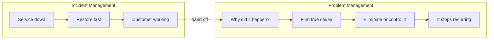
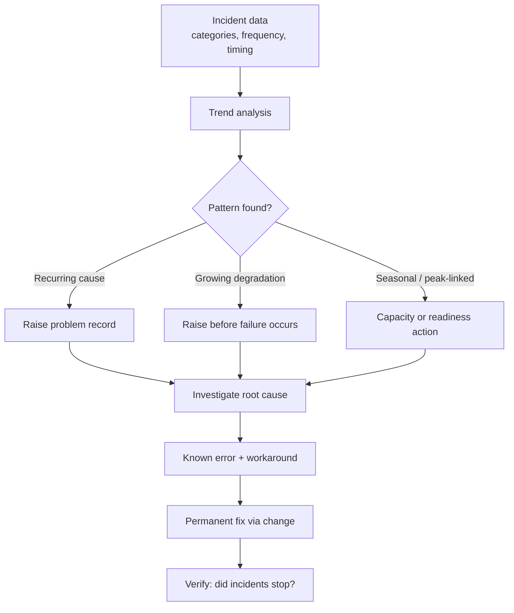
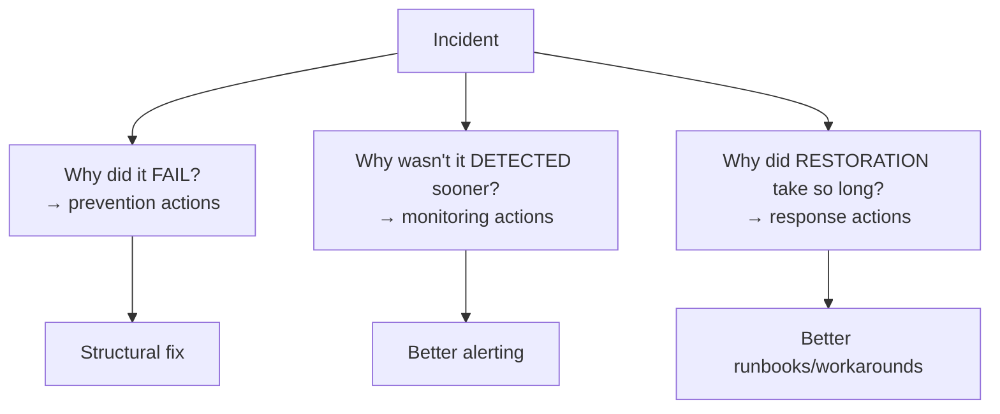
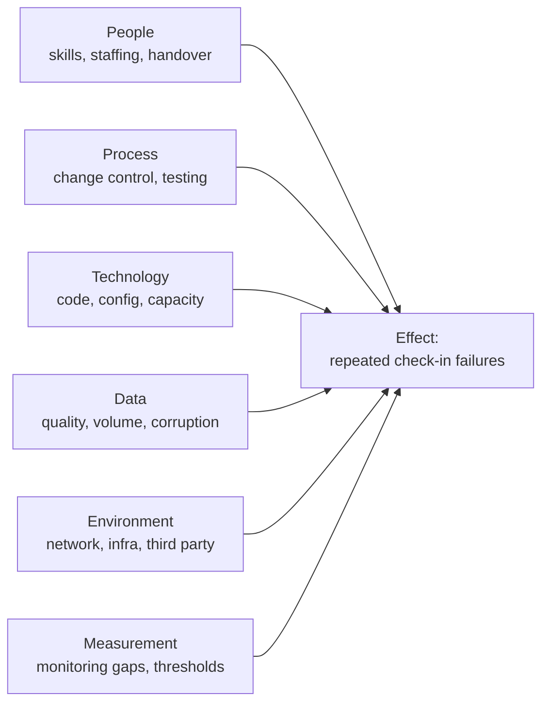
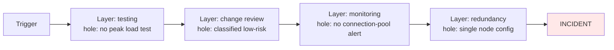
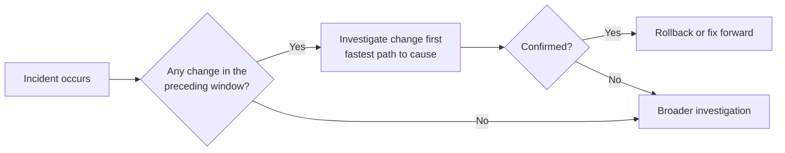
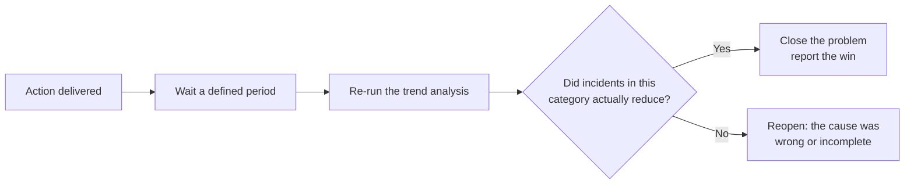

# Part F — Problem Management & Root Cause Analysis

[← Master index](../Amadeus%20Service%20Account%20Executive%20-%20Study%20Guide.md) · [← Part E](Part-E-escalation-and-communication.md) · **Part F of M** · [Part G →](Part-G-slas-kpis-and-analytics.md)

> Section goal: learn how to stop incidents from recurring — the analytical half of the role — including the formal RCA techniques you can name in an interview and actually use.

Covers index items **16–18** and maps to JD responsibilities: *"collaborate with internal teams on preventive and improvement actions"*, *"identify trends"*, *"strong analytical and problem-solving skills"*.

---

## 30. Problem management vs incident management

Recall the leaking roof from Part B: the incident is the water on the floor, the problem is the cracked tile.

> **A problem is the cause, or potential cause, of one or more incidents. Problem management exists to reduce the number and impact of incidents.**

| Dimension | Incident management | Problem management |
|-----------|--------------------|--------------------|
| **Goal** | Restore service | Prevent recurrence |
| **Clock** | Minutes and hours | Days and weeks |
| **Success** | Short outage | Fewer outages |
| **Question** | "How do we get working again?" | "Why did this happen at all?" |
| **Pressure** | Extreme, immediate | Sustained, easily deprioritised |
| **Typical failure** | Slow restoration | Never gets done because firefighting wins |

### 🔍 Plain-English deep-dive: why problem management is always the thing that gets dropped

Incidents shout. Problems whisper. Under pressure, organisations always fund the shouting.

The consequence is a **firefighting trap**: the same causes generate the same incidents, consuming the capacity that would have been used to eliminate them.

**Analogy:** constantly mopping the floor because you never have time to fix the roof — and you never have time because you're always mopping.

Breaking the trap is a classic SAE contribution, and it requires **evidence** (trend data) plus **customer pressure** (a service review commitment) — because those are the two forces that make prevention work compete successfully against firefighting.

---

## 31. Reactive and proactive problem management

| Type | Trigger | Example |
|------|---------|---------|
| **Reactive** | A major incident happened; find out why | PIR raises a problem record after an outage |
| **Proactive** | Analysis of data before users are harmed | Trend shows repeated timeouts trending toward failure; investigate now |

**Proactive problem management is where an SAE demonstrates seniority.** Anyone can investigate after a disaster. Spotting a pattern in trend data and preventing the disaster is what distinguishes a strong candidate.

### Known error and workaround

- **Known error** — *a problem with a documented cause and, usually, a documented workaround, where the permanent fix hasn't yet been made.* **Analogy:** "we know the tile is cracked; the bucket works; the roofer comes in three weeks."
- **Known Error Database (KEDB)** — *the searchable record of these.* **Why it matters:** it converts a two-hour diagnosis into a two-minute lookup the next time it happens. It is the single highest-leverage artefact in support operations.

> **Interview-ready line:** "A known error isn't a failure — it's controlled risk. What's unacceptable is a known error with no fix date and no one tracking it."

---

## 32. Root cause analysis techniques

Name-dropping these correctly is a reliable interview win. Know what each is *for*.

| Technique | Best for | One-line description |
|-----------|----------|---------------------|
| **5 Whys** | Simple, linear causes | Ask "why?" repeatedly until you reach something structural |
| **Ishikawa / fishbone** | Multi-factor causes | Categorise possible causes into branches |
| **Fault tree analysis** | Complex, combinatorial failures | Work top-down through logical AND/OR conditions |
| **Pareto analysis** | Prioritising where to look | 80% of impact comes from 20% of causes |
| **Kepner-Tregoe** | Ambiguous "what changed?" cases | Compare what *is* affected vs what *is not* |
| **Timeline analysis** | Sequence-dependent failures | Reconstruct events precisely to find the trigger |
| **Change correlation** | Any incident following a deployment | Did anything change just before it broke? |

### 5 Whys — and its trap

**The technique:** ask why until you reach a cause you can act on structurally.

> Check-in failed. **Why?** The service ran out of connections.
> **Why?** A change increased connection usage per request.
> **Why?** The change wasn't load tested at peak volume.
> **Why?** Peak load testing isn't part of the standard change process for this component.
> **Why?** The component was classified low-risk during onboarding and never re-assessed.

Note where it landed: **a process gap, not a technical one.** That is what a good 5 Whys produces.

### 🔍 Plain-English deep-dive: the trap of 5 Whys

The technique implies a single causal chain. Real outages usually have **several contributing causes**, and stopping at exactly five is arbitrary.

**Two guard-rails:**
1. **Stop at the actionable structural cause**, not at a fixed count. If "why" leads to "because humans make mistakes", you've gone too far — that isn't actionable.
2. **Run more than one chain.** Ask why the failure happened, *and* why it wasn't detected sooner, *and* why it took so long to restore. Three chains produce three different, all-valuable, actions.

### Ishikawa (fishbone) diagram

Used when causes could come from many directions. Classic categories for a service context:

**Why it matters:** it forces you to consider non-technical causes. Many "technical" recurring failures are actually staffing, handover, or process failures.

### Kepner-Tregoe — the "is / is not" method

Powerful and underused. You define the problem by contrast:

| Dimension | **IS** affected | **IS NOT** affected | What the contrast suggests |
|-----------|-----------------|---------------------|---------------------------|
| **What** | Agent desktop check-in | Web check-in | Fault is in the agent channel, not core check-in |
| **Where** | Three airports | Other stations | Regional infrastructure or config |
| **When** | Since 06:12, peak only | Off-peak fine | Load-related, not a pure functional defect |
| **Extent** | ~40 agents | Not all agents at those sites | A subset — client version? specific server? |

The contrast dramatically narrows the search. **This is an excellent technique to name in an interview** because few candidates do, and it demonstrates structured thinking.

### Pareto analysis

**80/20 rule:** a small number of causes generate most of the pain.

| Cause category | Incidents this quarter | % of total | Cumulative |
|----------------|------------------------|-----------|------------|
| Configuration errors after change | 31 | 38% | 38% |
| Third-party integration timeouts | 22 | 27% | 65% |
| Capacity at peak | 12 | 15% | 80% |
| Data quality | 9 | 11% | 91% |
| Everything else | 7 | 9% | 100% |

**Interpretation:** fixing three categories eliminates 80% of incidents. That table is exactly what turns an improvement request into a funded decision.

---

## 33. Root cause vs contributing causes

Modern practice is sceptical of *the* root cause — singular.

### 🔍 Plain-English deep-dive: the Swiss cheese model

Imagine several slices of Swiss cheese stacked together. Each slice is a defensive layer — testing, code review, monitoring, change approval, redundancy. Each has holes (weaknesses). An incident happens only when the holes **line up** and something passes through every layer.

**Why it matters:** if you fix only one hole you've reduced probability, not eliminated it. A strong PIR produces actions at multiple layers: prevention, detection, and response.

| Cause type | Meaning | Example |
|------------|---------|---------|
| **Trigger** | The immediate event | A release was deployed |
| **Root cause** | The deepest actionable cause | Peak load testing not required for this component class |
| **Contributing causes** | Made it worse or longer | No alert on connection pool; runbook out of date |
| **Systemic cause** | Cultural or organisational | Change risk classification never reviewed after growth |

---

## 34. Change management and its link to incidents

A large share of incidents are caused by changes. Understanding change control makes you far more credible.

### The three change types

| Type | Meaning | Approval | Example |
|------|---------|----------|---------|
| **Standard** | Pre-approved, low risk, repeatable | Pre-authorised | Routine certificate renewal via a tested procedure |
| **Normal** | Assessed case by case | CAB or change authority | A new release |
| **Emergency** | Needed now to fix or prevent major impact | Expedited authority | Rollback during an outage |

- **CAB — Change Advisory Board** — *the group that reviews and authorises normal changes.* **Analogy:** a planning committee that checks whether your extension will collapse the neighbour's wall.
- **Freeze period / change moratorium** — *a window where non-essential changes are banned.* Airlines commonly freeze around peak travel and major events. **Why it matters:** you must know the customer's freeze calendar, and you must be able to explain to a customer why an improvement is delayed by it.

### Key change metrics

| Metric | Meaning | Why the SAE cares |
|--------|---------|-------------------|
| **Change failure rate** | % of changes causing incidents or rollback | A leading indicator of future incidents |
| **Emergency change ratio** | % of changes made as emergencies | High ratio = weak planning or chronic instability |
| **Change-related incident %** | Share of incidents traced to change | Directs improvement effort |

> **Interview-ready line:** "'What changed?' is the highest-yield first question in any incident. It isn't always the answer, but it's the cheapest hypothesis to test."

---

## 35. Driving preventive action to completion

Finding the cause is the easy part. Getting the fix delivered is the hard part, and it is where the SAE earns their salary.

| Failure mode | Countermeasure |
|--------------|----------------|
| Action has no owner | One named person, never a team name |
| Action has no date | Committed date, tracked publicly |
| Action is vague | "Improve monitoring" → "Add connection-pool alert at 80% with runbook, by 30th" |
| Action gets deprioritised | Visibility in the customer service review creates external pressure |
| Nobody checks it worked | Verify with data: did the incident category actually decline? |

### The verification step everyone skips

**Why it matters:** closing a problem because the fix was *deployed* rather than because the incidents *stopped* is the most common self-deception in service management. It also loses you the chance to report a quantified win — and quantified wins are what fund the next improvement.

---

## ⭐ Likely Interview Questions for This Section

**Q1. "Explain problem management and how it differs from incident management."**
> *Model answer:* "Incident management restores service; problem management removes the cause so the incident stops happening. They run on different clocks — incidents in minutes, problems over days or weeks — and they need different mindsets. The practical challenge is that incidents shout and problems whisper, so problem work is always the first thing deprioritised. That creates a firefighting trap where the same causes keep consuming the capacity that would have eliminated them. Breaking it needs evidence and external visibility, which is exactly what I can bring through trend data and service reviews."

**Q2. "What RCA techniques do you know?"**
> *Model answer:* "5 Whys for simple linear causes, Ishikawa or fishbone when causes could come from multiple categories like people, process, technology, data and environment, fault tree analysis for complex combinatorial failures, Pareto to work out where to focus, and Kepner-Tregoe's 'is/is not' comparison when it's unclear what's actually affected. I also always run change correlation first, because 'what changed?' is the cheapest high-yield hypothesis. I pick based on the shape of the problem rather than defaulting to one technique."

**Q3. "Walk me through a 5 Whys."**
> *Model answer:* "Check-in failed — why? The service exhausted its connection pool. Why? A recent change increased connections per request. Why? It wasn't load tested at peak volume. Why? Peak load testing isn't required for components in that risk class. Why? The component was classified low-risk at onboarding and never reassessed as usage grew. Notice it ends at a process gap, not a technical one — that's the sign of a good 5 Whys. Two cautions I apply: stop at the actionable structural cause rather than counting to five, and run parallel chains — why it failed, why we didn't detect it sooner, and why restoration took so long. Those three produce three different and equally valuable actions."

**Q4. "Is there always a single root cause?"**
> *Model answer:* "Rarely. I think in terms of the Swiss cheese model — multiple defensive layers each with weaknesses, and an incident happens when the holes line up. So I separate the trigger, the deepest actionable cause, contributing causes that made it worse or longer, and systemic causes in how the organisation works. Practically that means a good review produces actions at three levels: prevention, detection and response. Fixing only the trigger reduces probability but leaves the same failure pattern available."

**Q5. "How do you make sure preventive actions actually get done?"**
> *Model answer:* "Four things. One named owner, never a team. A committed date. Specific wording — 'add a connection-pool alert at 80% with a runbook by the 30th', not 'improve monitoring'. And visibility in the customer service review, because an action a customer is tracking competes successfully against firefighting in a way an internal action doesn't. Then the step most people skip: verification. I re-run the trend analysis after a defined period and check whether incidents in that category actually declined. Closing a problem because the fix was deployed rather than because the incidents stopped is the most common self-deception in this field."

**Q6. "How do you identify a problem proactively, before there's an outage?"**
> *Model answer:* "Through trend analysis on incident data — clustering by category, component, time of day and customer process. I'm looking for three patterns: repeat causes appearing across separate incidents, gradual degradation like response times creeping up week over week, and peak-linked or seasonal correlation. I also watch leading indicators such as change failure rate and near-misses, because a near-miss is a free outage. Proactive problem management is genuinely where the role adds most value — anyone can investigate after a disaster."

**Q7. "What's a known error?"**
> *Model answer:* "A problem where the cause is understood and usually a workaround is documented, but the permanent fix hasn't been implemented yet. It's recorded in a known error database so the next occurrence is a two-minute lookup instead of a two-hour diagnosis. I regard known errors as controlled risk rather than failure — what's unacceptable is a known error with no fix date and nobody tracking it, because that's just a permanent tax on the customer that everyone has agreed to stop noticing."

**Q8. "How does change management relate to incidents?"**
> *Model answer:* "A large proportion of incidents are change-induced, so 'what changed in the preceding window?' is my highest-yield opening question. Beyond diagnosis, I watch change failure rate and the ratio of emergency changes as leading indicators — a rising emergency-change ratio predicts instability before it shows up as outages. I also need to know the customer's freeze calendar, because airlines freeze around peak periods, and I have to be able to explain to a customer why an improvement they want is scheduled after their freeze window."

**Q9. "A customer complains about the same issue for the third month. What do you do?"**
> *Model answer:* "Stop treating it as three incidents and treat it as one problem. I'd acknowledge the pattern explicitly to the customer rather than making them point it out again — that alone changes the conversation. Then I'd pull the data across all occurrences and look for what's common: same component, same time window, same trigger, same change type. I'd raise a formal problem record with a named owner and a date, use is/is not analysis to narrow it if the cause is ambiguous, and put the action in the service review so progress is visible to them. And I'd be honest that repeated individual fixes clearly aren't working, which is why the approach is changing."

**Q10. "What is Pareto analysis and how would you use it?"**
> *Model answer:* "The observation that roughly 80% of impact comes from 20% of causes. I'd categorise a quarter's incidents, rank the categories by volume or by business impact, and show the cumulative curve. Typically three or four categories account for most of the pain. That table is enormously persuasive in a service review because it converts 'we should improve things' into 'fixing these three categories removes 80% of your incidents', which is a fundable decision rather than an aspiration."

---

## 🧠 30-Second Memory Hooks

- **Incident = restore. Problem = prevent.** Different clocks, different mindsets.
- **Incidents shout, problems whisper** — that's why prevention never gets funded without evidence.
- **Firefighting trap** = always mopping, never fixing the roof.
- **Proactive problem management is the seniority signal.**
- **Known error** = documented cause + workaround, fix pending. Controlled risk, *with a date*.
- **KEDB turns a 2-hour diagnosis into a 2-minute lookup.**
- **"What changed?"** = cheapest, highest-yield first question.
- **5 Whys** → stop at the *actionable structural* cause; run three chains: failed / not detected / slow to restore.
- **Ishikawa** = people, process, technology, data, environment, measurement.
- **Kepner-Tregoe** = IS vs IS NOT. Underused; name it.
- **Pareto** = 20% of causes, 80% of pain — the table that funds improvement.
- **Swiss cheese** = holes lining up; fix prevention *and* detection *and* response.
- **Action rules** = one name, one date, specific wording, customer visibility.
- **Verify by data:** deployed ≠ solved. Did incidents actually stop?

---

*Next suggested section:* **[Part G — SLAs, KPIs & Service Performance Analytics](Part-G-slas-kpis-and-analytics.md)** — the measurement layer that makes every argument in this Part provable.

---

[← Master index](../Amadeus%20Service%20Account%20Executive%20-%20Study%20Guide.md) · [← Part E](Part-E-escalation-and-communication.md) · [Part G →](Part-G-slas-kpis-and-analytics.md) · [RCA selector](Appendix-C-quick-reference.md)
