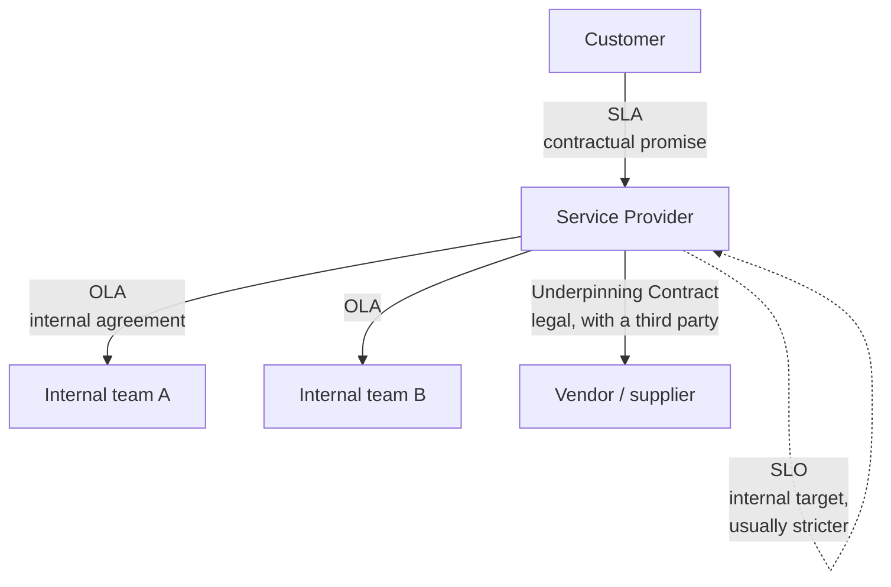
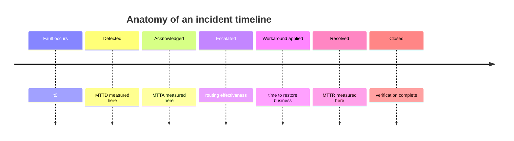
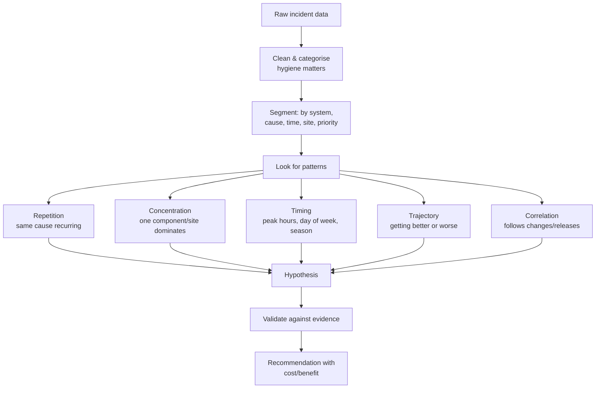
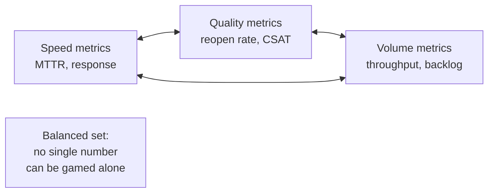

# Part G — SLAs, KPIs & Service Performance Analytics

[← Master index](../Amadeus%20Service%20Account%20Executive%20-%20Study%20Guide.md) · [← Part F](Part-F-problem-management-and-rca.md) · **Part G of M** · [Part H →](Part-H-reporting-reviews-governance.md)

> Section goal: understand the numbers this role lives by — what they mean, how they're gamed, and how to turn raw incident data into an argument that changes decisions.

Covers index items **19–23** and maps to JD responsibilities: *"monitor service performance, identify trends"*, *"strong analytical and problem-solving skills"*.

---

## 36. The agreement family: SLA, SLO, OLA, UC

These four are constantly confused. Learn them as a hierarchy.

| Term | Between whom | Binding? | Plain meaning |
|------|--------------|----------|---------------|
| **SLA — Service Level Agreement** | Provider ↔ customer | Contractual, often with penalties | The promise you can be held to |
| **SLO — Service Level Objective** | Internal | Internal target | What you aim for, usually stricter than the SLA |
| **OLA — Operational Level Agreement** | Internal team ↔ internal team | Internal commitment | How internal teams support the SLA |
| **UC — Underpinning Contract** | Provider ↔ supplier | Legal contract | The third party's commitment to you |

### 🔍 Plain-English deep-dive: why SLO is stricter than SLA

If your SLA promises resolution within 4 hours and your internal target is also 4 hours, you will breach constantly — because you'd have no margin for the bad day.

- **SLA** — *the promise.* **Analogy:** telling a friend you'll arrive by 8pm.
- **SLO** — *the internal target.* **Analogy:** planning to arrive at 7:30 so traffic doesn't make you late.
- **Why it matters:** the gap between SLO and SLA is your **buffer**. A provider with no buffer is one bad day from a breach, every single week.

### The chain principle

An SLA is only as strong as the OLAs and underpinning contracts beneath it.

> If you promise the customer 4-hour resolution but your vendor's contract allows 8-hour response, **the SLA is undeliverable by arithmetic**, regardless of effort.

Spotting that mismatch is a genuinely senior observation and an excellent thing to say in an interview.

### What an SLA typically specifies

| Element | Example |
|---------|---------|
| **Scope** | Which services, which locations, which hours |
| **Availability target** | 99.9% monthly, measured how |
| **Response time** | Acknowledge a P1 within 15 minutes |
| **Resolution / restoration time** | Restore a P1 within 4 hours |
| **Service hours** | 24/7, or business hours, with time zone |
| **Exclusions** | Planned maintenance, customer-caused, force majeure |
| **Measurement method** | The tool, the clock rules, the reporting period |
| **Service credits** | Financial remedy for breach |
| **Escalation path** | Named contacts by level and time threshold |

### 🔍 Plain-English deep-dive: response vs resolution vs restoration

- **Response time** — *how fast we acknowledge and start work.* Fully within the provider's control.
- **Restoration time** — *how fast the customer can operate again*, possibly via workaround.
- **Resolution time** — *how fast the underlying fault is truly fixed.*

**Why it matters:** these are frequently conflated in disputes. A customer saying "you breached your 4-hour SLA" may be measuring resolution while the contract measures restoration. Knowing precisely which clock the contract uses — and when it pauses — is a core competence.

**Clock-stopping rules** — most SLAs pause the clock while awaiting customer input. This is legitimate but heavily disputed, so it must be logged transparently and never used as a loophole. Systematically stopping the clock to protect a metric is the fastest route to destroying trust.

---

## 37. Availability and the "nines"

**Availability** = the percentage of agreed service time the service was usable.

$$\text{Availability} = \frac{\text{Agreed service time} - \text{Downtime}}{\text{Agreed service time}} \times 100$$

| Availability | Downtime per month | Downtime per year | Feels like |
|--------------|--------------------|--------------------|-----------|
| 99% ("two nines") | ~7.2 hours | ~3.65 days | Unacceptable for core airline systems |
| 99.5% | ~3.6 hours | ~1.83 days | Weak |
| 99.9% ("three nines") | ~43.8 minutes | ~8.76 hours | Common enterprise standard |
| 99.95% | ~21.9 minutes | ~4.38 hours | Strong |
| 99.99% ("four nines") | ~4.4 minutes | ~52.6 minutes | Mission-critical |
| 99.999% ("five nines") | ~26 seconds | ~5.26 minutes | Exceptional, expensive |

### The traps in availability numbers

| Trap | Explanation |
|------|-------------|
| **Measurement window** | 99.9% monthly allows 43 minutes; 99.9% annually allows 8.76 hours in a single hit |
| **What counts as "down"** | Total failure only, or severe degradation too? Slow is broken for a booking system |
| **Where it's measured** | Server-side looks better than end-user experience — the user's view is the honest one |
| **Exclusions** | Generous exclusions can make a terrible service look compliant |
| **Aggregation** | An average across 30 airports hides one airport being down all month |

> **Interview-ready line:** "An availability number is meaningless without three qualifiers: measured over what window, measured where, and with what excluded. Those three decide whether the figure describes the customer's reality or protects the provider."

### Averages hide pain

| Airport | Availability | Reality |
|---------|--------------|---------|
| A | 100% | Fine |
| B | 100% | Fine |
| C | 100% | Fine |
| D | 99.9% | Fine |
| E | 96.0% | **Nearly 30 hours down — a disaster** |
| **Average** | **99.18%** | Looks like a mild miss |

**Lesson:** always report distribution alongside the average — worst-performing site, percentile, or count of sites below target. This is a **watermelon report** (Part C) waiting to happen.

---

## 38. The metric family

### Time-based metrics

| Metric | Full name | Measures | What a bad number tells you |
|--------|-----------|----------|-----------------------------|
| **MTTD** | Mean time to detect | Fault → detection | Monitoring blind spots |
| **MTTA** | Mean time to acknowledge | Detection → someone owns it | Alerting/routing/staffing problems |
| **MTTR** | Mean time to restore/resolve/repair | Detection → service restored | Diagnostic capability, runbooks, escalation speed |
| **MTBF** | Mean time between failures | Stability over time | Underlying reliability |
| **MTTF** | Mean time to failure | For non-repairable components | Component life |

> ⚠️ **MTTR is ambiguous on purpose — clarify it.** It can mean repair, restore, respond or resolve. In an interview, saying *"I'd clarify which R we're measuring, because restore and resolve give very different numbers"* signals real experience.

### Volume and quality metrics

| Metric | Meaning | Watch for |
|--------|---------|-----------|
| **Incident volume** | Count per period | Rising = instability; falling could also mean under-reporting |
| **Backlog age** | How long open tickets have been open | Ageing tail = stalled ownership |
| **Reopen rate** | % closed then reopened | Premature closure, weak verification |
| **First-time-fix rate** | % resolved without escalation | Tier 1 capability and knowledge quality |
| **Escalation rate** | % escalated beyond first tier | Knowledge gaps or complexity |
| **Change failure rate** | % of changes causing incidents | Leading indicator of future outages |
| **SLA attainment** | % of tickets meeting target | Can be green while customers are unhappy |
| **Repeat incident rate** | % that are recurrences | Problem management effectiveness |

### 🔍 Plain-English deep-dive: leading vs lagging indicators

- **Lagging indicator** — *tells you what already happened.* Example: last month's outage count. **Analogy:** the bathroom scale.
- **Leading indicator** — *predicts what's coming.* Example: change failure rate, capacity headroom, backlog ageing, near-miss count. **Analogy:** your daily calorie intake.
- **Why it matters:** reporting only lagging indicators makes you a historian. Reporting leading indicators makes you a partner, because the customer can still act on them. **This is one of the strongest differentiators you can demonstrate in a service review.**

| Lagging | Leading equivalent |
|---------|--------------------|
| Outage count | Change failure rate, near-misses |
| SLA breaches | Backlog ageing, ticket velocity |
| CSAT score | Escalation frequency, sentiment in comms |
| Capacity incident | Utilisation trend vs headroom |
| Repeat incidents | Open problem records without fix dates |

---

## 39. Experience metrics: CSAT, DSAT, NPS, CES

| Metric | Question it asks | Scale | Strength | Weakness |
|--------|------------------|-------|----------|----------|
| **CSAT** | "How satisfied were you with this interaction?" | Usually 1–5 | Immediate, specific | Response bias; measures the moment, not the relationship |
| **DSAT** | Dissatisfaction — the low scores | Same data, inverted | Surfaces failures | Small samples can mislead |
| **NPS** | "How likely are you to recommend us?" | −100 to +100 | Relationship-level | Slow-moving, blunt, culturally variable |
| **CES** | "How easy was it to get this resolved?" | 1–7 | Strong predictor of loyalty | Less commonly used |

### 🔍 Plain-English deep-dive: how NPS works

Respondents score 0–10 and are grouped: **Promoters** (9–10), **Passives** (7–8), **Detractors** (0–6).

$$\text{NPS} = \%\text{Promoters} - \%\text{Detractors}$$

Passives count for nothing. This is why NPS moves slowly and why a "7" — which most people consider positive — contributes zero.

### Reading satisfaction data honestly

| Trap | Reality |
|------|---------|
| **Response bias** | Extremes respond most; the quietly-content are invisible |
| **Survey fatigue** | Response rate falls, sample becomes unrepresentative |
| **Wrong respondent** | The person surveyed may not be the person harmed |
| **Timing** | Surveying immediately after a fix flatters; a week later is truthful |
| **Score ≠ loyalty** | A satisfied customer can still leave for price |
| **The verbatim is the value** | The number tells you *that*; the comment tells you *why* |

> **Interview-ready line:** "The score tells me something changed. The free-text comments tell me what to do about it. I read every verbatim on low scores personally — that's where the improvement backlog actually comes from."

---

## 40. Trend analysis

Turning raw data into an argument is the analytical core of the role.

### The five patterns to hunt

| Pattern | Question | Action if found |
|---------|----------|-----------------|
| **Repetition** | Same cause more than twice? | Problem record |
| **Concentration** | Is 60% of pain in one component or site? | Targeted investment (Pareto) |
| **Timing** | Clustered at peak, month-end, weekend? | Capacity or readiness work |
| **Trajectory** | Better or worse over 6 months? | Trend line in the review deck |
| **Correlation** | Following releases or third-party events? | Change process improvement |

### 🔍 Plain-English deep-dive: correlation is not causation

Two things moving together does not prove one causes the other.

**Analogy:** ice-cream sales and drowning incidents both rise in summer. Ice cream doesn't cause drowning — hot weather causes both.

In a service context: incidents rise in the same month as a release **and** the same month as peak season. Attributing them to the release alone may send an entire improvement programme in the wrong direction.

**How to strengthen a claim:**
1. **Mechanism** — can you explain *how* A causes B?
2. **Temporality** — did A reliably precede B, every time?
3. **Dose-response** — more A, more B?
4. **Control** — did the pattern hold where A was absent?
5. **Reversal** — when A was removed, did B stop?

> **Interview-ready line:** "Correlation gives me a hypothesis, not a conclusion. Before I put a cause in front of a customer I want a mechanism and a control — otherwise I'm asking them to fund the wrong fix."

### Sample size and statistical honesty

| Situation | Risk | Better practice |
|-----------|------|-----------------|
| CSAT fell 4.7 → 4.4 on 8 responses | Noise, not signal | Report the sample size; use a rolling window |
| One bad month after five good | Over-reaction | Show the trend line, not the point |
| "Incidents doubled" from 2 to 4 | Percentages exaggerate small numbers | Show absolute values alongside |
| Comparing unequal periods | Invalid | Normalise (per week, per 1,000 transactions) |

---

## 41. Building a metric set that isn't gameable

Every metric can be gamed. The defence is **balanced pairs** — metrics that constrain each other.

| Metric alone | How it's gamed | Pair it with |
|--------------|----------------|--------------|
| MTTR | Close tickets early | Reopen rate |
| Ticket volume closed | Split one issue into many | Customer satisfaction |
| SLA attainment | Aggressive clock-stopping | CSAT + breach narrative |
| First-time-fix | Refuse to escalate; customer suffers | Reopen rate + CSAT |
| Availability | Narrow definition of "down" | End-user experience monitoring |
| Backlog size | Mass-close old tickets | Reopen rate + ageing profile |

> **Interview-ready line:** "Any single metric becomes a target and then stops being a measurement. I always pair speed with quality — MTTR next to reopen rate, SLA attainment next to satisfaction — so improving one at the expense of the other is immediately visible."

---

## ⭐ Likely Interview Questions for This Section

**Q1. "Explain SLA, SLO and OLA."**
> *Model answer:* "An SLA is the contractual promise to the customer, often with service credits attached. An SLO is the internal target we actually manage to, and it should be stricter than the SLA so there's a buffer — a provider whose SLO equals its SLA is one bad day from a breach every week. An OLA is the internal agreement between teams that makes the SLA deliverable, and an underpinning contract is the equivalent with a third party. The important structural point is that an SLA is only as strong as the OLAs and underpinning contracts beneath it — if you promise four-hour resolution while your vendor contract allows eight-hour response, the SLA is undeliverable by arithmetic, no matter how hard people work."

**Q2. "What does 99.9% availability actually mean?"**
> *Model answer:* "Roughly 43 minutes of downtime per month, or nearly nine hours a year — and which of those you mean matters enormously, because 99.9% measured annually permits a single nine-hour outage. I'd never accept an availability figure without three qualifiers: over what window, measured where, and with what excluded. Server-side measurement always looks better than the end-user experience, and generous exclusions can make a poor service look compliant. I'd also insist on seeing distribution, not just the average — a 99.18% average across thirty sites can hide one site being down for thirty hours."

**Q3. "What's the difference between response, restoration and resolution?"**
> *Model answer:* "Response is how fast we acknowledge and start — fully in our control. Restoration is how fast the customer can operate again, which may be via a workaround with the fault still present. Resolution is when the underlying fault is genuinely fixed. Most SLA disputes come from these being conflated: a customer says we breached a four-hour target while measuring resolution, and the contract measures restoration. Knowing exactly which clock the contract uses, and when it pauses, is fundamental — and clock-stopping rules must be applied transparently, never as a loophole to protect a metric."

**Q4. "Which metrics would you put on a service dashboard for an airline customer?"**
> *Model answer:* "I'd balance four groups. Availability and performance of the business-critical journeys — check-in, booking, ticketing — measured from the user's perspective, not just server-side. Incident metrics: volume by priority, MTTR, SLA attainment, and repeat incident rate. Leading indicators: change failure rate, backlog ageing, open problems without fix dates, and capacity headroom against the peak calendar. And experience: CSAT with the verbatim themes. Critically, I'd pair speed metrics with quality metrics — MTTR next to reopen rate — so it's obvious if one is being improved at the other's expense."

**Q5. "MTTR improved but the customer says service feels worse. How is that possible?"**
> *Model answer:* "Several ways, and I'd investigate rather than defend. Tickets may be closing prematurely, which would show up as a rising reopen rate. One outage may have been split into many small tickets, dropping the average while the real disruption was long. The improvement may be concentrated in low-impact tickets while the painful high-impact ones got worse — an average hides that, so I'd look at the distribution and the P1 subset specifically. Or the pain may be recurrence rather than duration: fifteen short outages feel worse than one longer one. The customer's perception is data, not noise — if the metrics disagree with it, the metrics are measuring the wrong thing."

**Q6. "What's the difference between a leading and a lagging indicator?"**
> *Model answer:* "Lagging tells you what already happened — last month's outages, SLA breaches, CSAT. Leading predicts what's coming — change failure rate, capacity headroom, backlog ageing, near-misses, open problems with no fix date. Reporting only lagging indicators makes you a historian; the customer can't act on it. Adding leading indicators makes you a partner, because it lets both sides intervene before the failure. In a service review that shift is one of the strongest credibility signals available."

**Q7. "How do you know a trend is real and not noise?"**
> *Model answer:* "By checking sample size, window and mechanism. A CSAT drop from 4.7 to 4.4 on eight responses is noise; I'd use a rolling window and always publish the sample size. I show trend lines rather than single points, and absolute numbers alongside percentages, because 'incidents doubled' can mean two to four. Then I test whether there's a plausible mechanism and whether the pattern holds under control — did it also occur where the suspected cause was absent. Correlation gives me a hypothesis; I want a mechanism and a control before I ask a customer to fund a fix."

**Q8. "How would you handle a metric that's being gamed?"**
> *Model answer:* "I'd assume good faith first — gaming is usually a rational response to a badly designed target rather than dishonesty. The structural fix is balanced pairs: MTTR paired with reopen rate, SLA attainment paired with satisfaction, first-time-fix paired with reopen rate, backlog size paired with ageing profile. Once improving one degrades a visible partner metric, the incentive to game disappears. I'd also change what gets celebrated — if reviews reward outcome narratives rather than a single number going green, behaviour follows."

**Q9. "CSAT is 4.6 out of 5 but the customer escalated to your executive. Explain that."**
> *Model answer:* "Survey data and relationship health are different things. CSAT typically samples individual interactions, often answered by frontline users who had a good experience with a specific engineer, while the escalation is coming from a manager measuring cumulative business impact. Response bias also matters — the people most harmed frequently don't answer surveys at all. So I'd read the verbatims rather than the score, look at repeat incidents and escalation frequency as the truer relationship signals, and treat the executive escalation as the more reliable data point. A high CSAT next to an executive escalation is a classic watermelon."

**Q10. "How do you present a bad month to a customer?"**
> *Model answer:* "Honestly, first, and before they raise it. I'd lead with the impact in their business terms rather than with the metric, own it without deflecting to third parties, and show what changed. Then I'd spend most of the time on the forward view: what we've established as the cause, the specific actions with named owners and dates, and how they'll be able to verify improvement in the next report. I'd also give the trend context so one bad month isn't mistaken for a collapse — or, if it genuinely is part of a decline, I'd say that explicitly, because a customer discovering a trend you concealed is far worse than the trend itself."

---

## 🧠 30-Second Memory Hooks

- **SLA** = promise to customer. **SLO** = stricter internal target (the buffer). **OLA** = internal team commitment. **UC** = vendor contract.
- **An SLA is only as strong as the OLAs and UCs beneath it** — check the arithmetic.
- **Response** (we start) → **Restoration** (they work) → **Resolution** (fault gone).
- **99.9% = ~43 min/month, ~8.8 hrs/year.** The window changes everything.
- **Three qualifiers for any availability number:** what window, measured where, what's excluded.
- **Averages hide disasters** — always show distribution and the worst site.
- **MTTD → MTTA → MTTR → MTBF.** Clarify *which* "R" you mean.
- **Leading vs lagging** = calorie intake vs bathroom scale. Leading makes you a partner.
- **NPS** = %Promoters − %Detractors; 7–8 counts for nothing.
- **The verbatim is the value**, not the score.
- **Five patterns:** repetition, concentration, timing, trajectory, correlation.
- **Correlation ≠ causation** — ice cream and drowning. Demand a mechanism.
- **Balanced pairs beat gaming:** MTTR ↔ reopen rate; SLA ↔ CSAT.
- **A metric that becomes a target stops being a measurement.**

---

*Next suggested section:* **[Part H — Service Reporting, Reviews & Governance](Part-H-reporting-reviews-governance.md)** — how to turn these numbers into meetings that produce decisions.

---

[← Master index](../Amadeus%20Service%20Account%20Executive%20-%20Study%20Guide.md) · [← Part F](Part-F-problem-management-and-rca.md) · [Part H →](Part-H-reporting-reviews-governance.md) · [Formulas](Appendix-C-quick-reference.md)
