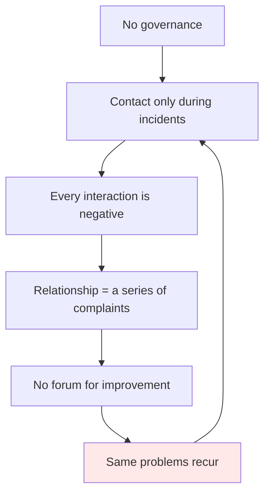
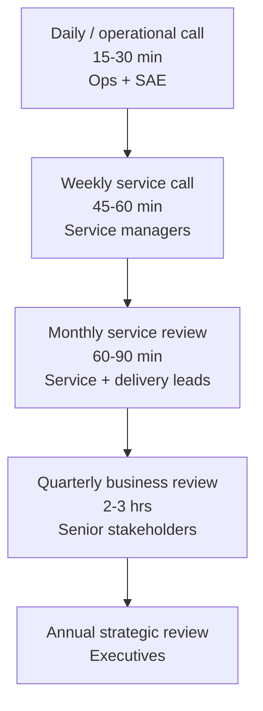
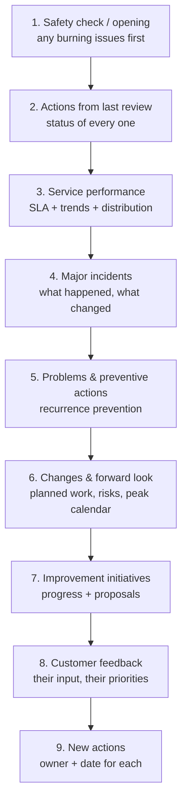
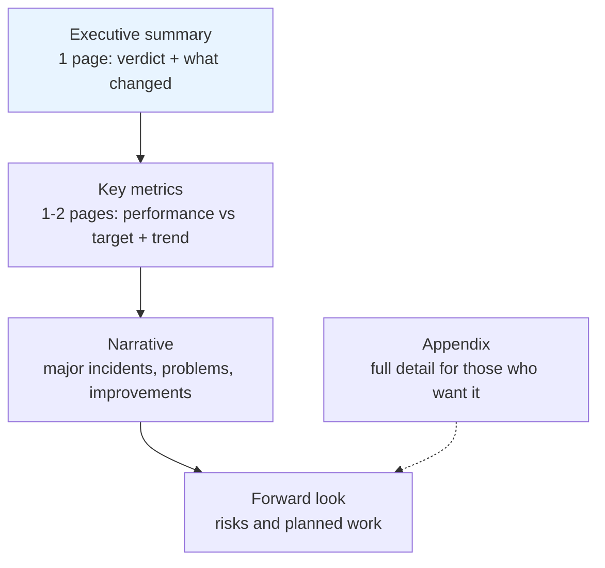
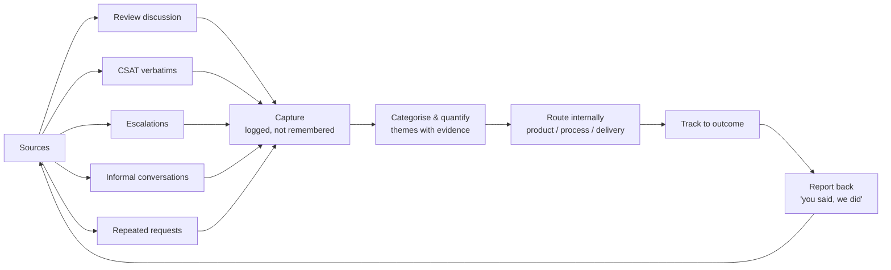

# Part H — Service Reporting, Reviews & Governance

[← Master index](../Amadeus%20Service%20Account%20Executive%20-%20Study%20Guide.md) · [← Part G](Part-G-slas-kpis-and-analytics.md) · **Part H of M** · [Part I →](Part-I-improvement-and-transition.md)

> Section goal: learn to run the meetings and produce the reports that make up the visible, scheduled half of this role — and to make them produce decisions rather than consume an hour.

Covers index items **24–26** and maps to JD responsibilities: *"participate in customer service review meetings and present operational updates, incident insights and service improvements"*, *"act as the voice of the customer"*.

---

## 42. Why governance exists

**Governance** = *the agreed structure of meetings, reports and decision rights that keeps a service relationship healthy.*

Without it, the relationship becomes purely reactive: you only speak during incidents, so every conversation is negative, and improvement never gets discussed because nobody has a forum to discuss it.

> **Interview-ready line:** "If the only time a customer hears from me is when something is broken, I've reduced the relationship to a complaints channel. Governance is what makes proactive conversation possible."

---

## 43. The governance cadence

Different meetings serve different altitudes. Mixing them is a common failure — operational detail in an executive meeting bores the executives; strategy in an operational call frustrates the engineers.

| Forum | Frequency | Audience | Content | Output |
|-------|-----------|----------|---------|--------|
| **Operational call** | Daily / as needed | Ops teams, SAE | Open incidents, today's risks, planned changes | Immediate actions |
| **Weekly service call** | Weekly | Service managers | Week's incidents, escalations, action progress | Unblocked actions |
| **Monthly service review** | Monthly | Service + delivery leads | Performance vs SLA, trends, problems, improvements | Agreed improvement actions |
| **Quarterly business review (QBR)** | Quarterly | Senior stakeholders | Business outcomes, strategic themes, roadmap, risks | Strategic decisions, investment |
| **Annual / strategic** | Annually | Executives | Partnership direction, contract, major initiatives | Direction and commitment |

### 🔍 Plain-English deep-dive: matching altitude to audience

- **Operational altitude** — *what happened and what we do next.* Detail-rich. Audience is hands-on.
- **Tactical altitude** — *what patterns are emerging and what we're changing.* Trend-rich.
- **Strategic altitude** — *is this partnership delivering the business outcome?* Outcome-rich, minimal detail.

**Analogy:** a pilot, an air traffic controller, and an airline CEO all care about the same flight, but at completely different resolutions. Giving the CEO radar vectors is as useless as giving the pilot a five-year fleet strategy.

| Symptom | Diagnosis |
|---------|-----------|
| Executives disengaged, checking phones | Too much operational detail |
| Engineers frustrated, "why am I here?" | Too much strategy, no actionable content |
| Meeting overruns, nothing decided | No agenda discipline or no decision rights present |
| Same issues every month | Actions aren't tracked to completion |

---

## 44. The monthly service review — the SAE's signature meeting

This is the meeting most likely to be probed in an interview, because it is where the role is most visible.

### A proven agenda

| Section | Time | Purpose | Common mistake |
|---------|------|---------|----------------|
| Opening | 5 min | Surface anything urgent so it doesn't derail later | Skipping it; the issue erupts at minute 50 |
| **Previous actions** | 10 min | Prove reliability | Leaving it to the end and running out of time |
| Performance | 15 min | Facts vs targets | Drowning them in charts |
| Major incidents | 15 min | Accountability and learning | Re-litigating rather than showing change |
| Problems | 10 min | Prevention | Listing without owners or dates |
| Forward look | 10 min | Anticipation, not surprise | Omitting it entirely |
| Improvements | 10 min | Value beyond keeping the lights on | Vague aspirations |
| Customer input | 10 min | Voice of the customer | No time left — the worst failure |
| New actions | 5 min | Close the loop | Actions without owners |

### 🔍 Plain-English deep-dive: why "previous actions" goes near the front

Putting last month's actions early does three things:

1. **It proves reliability.** A row of completed actions is the single most trust-building slide you own.
2. **It creates internal pressure.** Colleagues know their action will be reviewed in front of the customer.
3. **It prevents the ambush.** If actions have slipped, you address it on your terms rather than being challenged at the end.

**The uncomfortable rule:** if you have to report a slipped action, do it yourself, plainly, with a revised date and the reason. Never hope it goes unnoticed. Customers keep their own action lists.

---

## 45. Building a report a customer actually reads

Most service reports are 40 pages that nobody opens. Aim for the opposite.

### The inverted pyramid

**Principle:** the first page must be complete on its own. Assume the most senior reader reads only that.

### Making numbers mean something

| Weak | Strong |
|------|--------|
| "SLA attainment: 97.2%" | "97.2% against a 98% target — three P2s missed restoration, all caused by the same integration timeout, now under a problem record with a fix due on the 24th." |
| "12 incidents this month" | "12 incidents, down from 19 — the reduction is entirely in the configuration category following last month's change-process fix." |
| "MTTR: 3.2 hours" | "MTTR 3.2 hours, but the P1 subset averaged 5.1 hours; the delay is in engaging the third-party component owner, which is action 4." |
| "CSAT: 4.5" | "CSAT 4.5 from 40 responses. Every low score referenced update frequency during incidents, so we're moving P2 updates from four-hourly to two-hourly." |

**The pattern:** number → context → cause → action. A number alone is trivia. A number with a cause and an action is management.

### 🔍 Plain-English deep-dive: storytelling with data

A report should have a narrative arc, not just a chart pile.

| Story element | In a service report |
|---------------|--------------------|
| **Situation** | Where we were last period |
| **Complication** | What went wrong, or what's changing |
| **Question** | What does that mean for the customer's business? |
| **Answer** | What we're doing, with owners and dates |
| **Evidence** | The data supporting all of the above |

**Rules for charts:**
- One message per chart. If it needs a paragraph to explain, it's the wrong chart.
- Always include the target line — performance without a reference point is meaningless.
- Show enough history for a trend (6–12 periods), not just this month.
- Never truncate an axis to exaggerate a change.
- Show distribution when averages could conceal a bad outlier.

---

## 46. Presenting under pressure

You will present bad news to unhappy senior people. Structure protects you.

| Situation | Approach |
|-----------|----------|
| **Hostile opening** | Let it out fully; acknowledge the impact before any explanation; then move to structure |
| **Challenged on a number** | "Let me show you how it's measured" — never bluff. If unsure, commit to come back with it |
| **A question you can't answer** | "I don't know, I'll confirm by [date]" — and then actually do it |
| **Being dragged into detail** | "Happy to go deep — shall we take that offline so we protect the agenda?" |
| **A demand you can't meet** | Explain the constraint, offer an alternative, never a flat refusal |
| **Blame between parties** | Redirect to outcome: "Let's agree what changes, and assign cause in the review" |

### 🔍 Plain-English deep-dive: the credibility equation

Credibility in these meetings is built from three ingredients:

$$\text{Credibility} = \text{Accuracy} \times \text{Candour} \times \text{Consistency}$$

It is a product, not a sum — **if any factor is zero, the total is zero.**

- **Accuracy** — your numbers survive scrutiny. One provably wrong figure poisons everything else in the deck.
- **Candour** — you name problems before the customer does. This is the fastest credibility builder in existence.
- **Consistency** — the story matches last month's story, and matches what your colleagues say.

> **Interview-ready line:** "The single best move in a service review is to raise the bad news yourself, before they do. It costs you nothing you weren't going to pay anyway, and it buys you the benefit of the doubt for everything else on the agenda."

---

## 47. Capturing and using the voice of the customer

The review is your richest source of customer insight — but only if you leave room for it.

### "You said, we did"

A recurring slide showing customer-raised items and what happened to them is disproportionately powerful, because it proves feedback isn't disappearing into a void.

| Customer raised | Status | Outcome |
|-----------------|--------|---------|
| Incident updates too infrequent for P2 | Done | Cadence moved to 2-hourly; confirmed working |
| Reports arrive too late to prepare | Done | Now issued 3 working days before review |
| Recurring integration timeouts | In progress | Problem record open; fix due 24th |
| Request for a test environment refresh | Declined | Explained constraint; alternative agreed |

**Include the declined item.** A "you said, we did" list containing only successes reads as marketing. Including a transparent decline makes the whole list believable.

### 🔍 Plain-English deep-dive: hearing what isn't said

Customers rarely announce that trust is eroding. Watch for these signals:

| Signal | Likely meaning |
|--------|----------------|
| Senior attendees stop coming to reviews | Disengagement; the relationship is being downgraded |
| More people from their side join | Escalating concern; they're building a case |
| Questions get more forensic | Verifying your numbers because they've lost confidence |
| They start copying executives on routine emails | Building an evidence trail |
| Requests route around you to engineers | Your channel is perceived as slow |
| Sudden interest in contract terms | Commercial review or exit consideration |

**Why it matters:** these are leading indicators of relationship failure and they appear well before a formal escalation. Naming them in an interview shows unusual maturity.

---

## 48. Governance across the internal side

Governance isn't only customer-facing. The SAE also needs internal rhythm:

| Internal forum | Purpose |
|----------------|---------|
| Handover / shift brief | Continuity across time zones |
| Internal account review | Align delivery, operations, commercial on account health |
| Problem review board | Prioritise and unblock problem records |
| Change review | Assess upcoming risk to the customer |
| Escalation review | Look at what's escalated and why |

> **Practical point:** always hold an internal pre-meeting before a customer review. Surprises should never happen in front of the customer, and internal disagreement should never be visible to them. Agree the message, agree who answers what, agree the actions you're prepared to commit to.

---

## ⭐ Likely Interview Questions for This Section

**Q1. "How would you structure a monthly service review?"**
> *Model answer:* "Open with a quick check for anything burning so it doesn't derail us at minute fifty. Then status of every action from last month — deliberately near the front, because it proves reliability and because it means I address slippage on my terms rather than being ambushed. Then service performance against SLA with trends and distribution, not just averages. Then major incidents: what happened and, more importantly, what's changed since. Then problems and preventive actions with named owners and dates. Then the forward look — planned changes, upcoming risks, their peak calendar. Then improvement initiatives. Then dedicated time for their feedback, which I protect fiercely because it's the first thing that gets squeezed. And close by restating every new action with an owner and a date."

**Q2. "What makes a service report good?"**
> *Model answer:* "It's read. Practically that means an inverted pyramid: a one-page executive summary that stands completely on its own, then key metrics against targets with trend lines, then the narrative, then a forward look, with full detail pushed to an appendix. And every number follows the pattern number, context, cause, action — '97.2% against a 98% target, three P2s missed, all the same integration timeout, problem record open, fix due on the 24th'. A number on its own is trivia. A number with a cause and an owned action is management."

**Q3. "How do you present a month where you badly missed the SLA?"**
> *Model answer:* "I raise it myself, first, before they do — that single move buys more credibility than any recovery plan. I'd lead with the business impact in their terms rather than the percentage, own it without deflecting to a vendor or another team, and be precise about the cause. Then I'd spend most of the time forward-facing: what specifically changes, who owns it, by when, and how they'll be able to verify it in next month's report. I'd also give trend context honestly — if it's an anomaly I'd show that, and if it's genuinely the start of a decline I'd say so, because a customer who discovers a trend you concealed will never fully trust the reporting again."

**Q4. "How do you pitch a meeting differently for executives versus operational teams?"**
> *Model answer:* "By altitude. Operational audiences want detail and next actions — what happened, what's open, what we do today. Executives want outcomes and risk — is the service supporting our business, what's the exposure, what decision do you need from me. The classic failure is mixing them: operational detail bores executives into disengagement, and strategy frustrates engineers who came for actionable content. A pilot, a controller and a CEO all care about the same flight at completely different resolutions."

**Q5. "How do you handle a customer who challenges your numbers in the meeting?"**
> *Model answer:* "I welcome it and show the method — how it's measured, over what window, with what included and excluded. I never bluff; if I'm not certain I say so and commit to come back with it by a date, and then I do. Usually the challenge reveals a genuine definitional difference, like measuring resolution when the contract measures restoration, and clarifying that is valuable in itself. What I never do is defend a number I'm not sure of, because credibility is a product — one provably wrong figure discredits the entire report."

**Q6. "The customer says nothing ever changes as a result of these reviews. What do you do?"**
> *Model answer:* "I'd take it as valid feedback about my own delivery, not just about the organisation. Concretely I'd introduce a 'you said, we did' section tracking every item they've raised with its current status and outcome — including things we declined, with the reason, because a list of only successes reads as marketing and nobody believes it. I'd also tighten action discipline: one named owner, a date, and specific wording rather than 'improve monitoring'. And I'd verify improvements with data — showing that a fixed category actually stopped producing incidents is far more convincing than showing the fix was deployed."

**Q7. "How do you know a customer relationship is deteriorating before they escalate?"**
> *Model answer:* "By watching the behavioural signals, which appear well before any formal escalation. Senior attendees quietly stop coming to reviews. Or the opposite — more people join from their side, which usually means they're building a case. Questions become forensic because they've stopped trusting the numbers. Routine emails start copying executives, which is evidence-gathering. Requests start routing around me directly to engineers, which tells me my channel feels slow. And sudden interest in contract terms is a serious signal. Any of those, I'd address directly and privately rather than waiting for the formal escalation."

**Q8. "Why hold an internal pre-meeting before a customer review?"**
> *Model answer:* "So there are no surprises in front of the customer and no visible internal disagreement. I'd use it to agree the message, confirm the status of every action honestly, decide who answers what, and — most importantly — agree in advance what we're prepared to commit to. The worst outcome in a review is a colleague committing to something we can't deliver, or two of us giving different explanations for the same incident. Consistency is one of the three components of credibility, alongside accuracy and candour."

**Q9. "The customer only wants to talk about one incident and you have a full agenda. How do you handle it?"**
> *Model answer:* "I'd let them have it, because an unmet need doesn't disappear — it just resurfaces as an escalation later. I'd deal with the incident properly, then explicitly protect the two agenda items that must not slip: the action status and the forward look, since those are the ones that prevent the next crisis. Anything else I'd offer to cover in writing afterwards or in a dedicated session. Fighting to preserve an agenda while a customer is unheard is a false economy — the agenda exists to serve the relationship, not the reverse."

**Q10. "What's the single most valuable thing in a service review?"**
> *Model answer:* "The action list from last time, reviewed openly and honestly. Everything else in the meeting is description; that's the only part that proves the relationship produces change. A row of completed actions with evidence is the most trust-building thing I can put in front of a customer, and a slipped action that I flag myself with a revised date and a real reason costs far less than one they discover. If I could keep only one section, that's the one."

---

## 🧠 30-Second Memory Hooks

- **Governance stops the relationship becoming a complaints channel.**
- **Cadence ladder** = daily ops → weekly service → monthly review → quarterly business → annual strategic.
- **Match altitude to audience** — pilot, controller, CEO: same flight, different resolution.
- **Previous actions go near the front** — proves reliability, creates pressure, prevents ambush.
- **Report bad news yourself, first.** Cheapest credibility available.
- **Inverted pyramid:** page one must stand alone.
- **Number → context → cause → action.** A number alone is trivia.
- **Charts:** one message, show the target line, show the trend, never truncate the axis.
- **Credibility = Accuracy × Candour × Consistency** — a product; any zero zeroes it.
- **"You said, we did" — include a declined item** or nobody believes the list.
- **Deterioration signals:** seniors stop attending, more attendees appear, forensic questions, execs copied, requests route around you.
- **Always pre-meet internally.** No surprises, no visible internal disagreement.
- **The action list is the only part that proves the meeting works.**

---

*Next suggested section:* **[Part I — Continual Improvement & Service Transition](Part-I-improvement-and-transition.md)** — how to turn the actions agreed in reviews into a systematic improvement programme.

---

[← Master index](../Amadeus%20Service%20Account%20Executive%20-%20Study%20Guide.md) · [← Part G](Part-G-slas-kpis-and-analytics.md) · [Part I →](Part-I-improvement-and-transition.md) · [Review agenda](Appendix-C-quick-reference.md)
