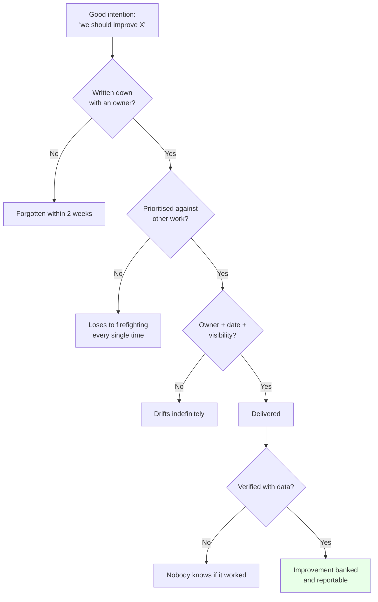
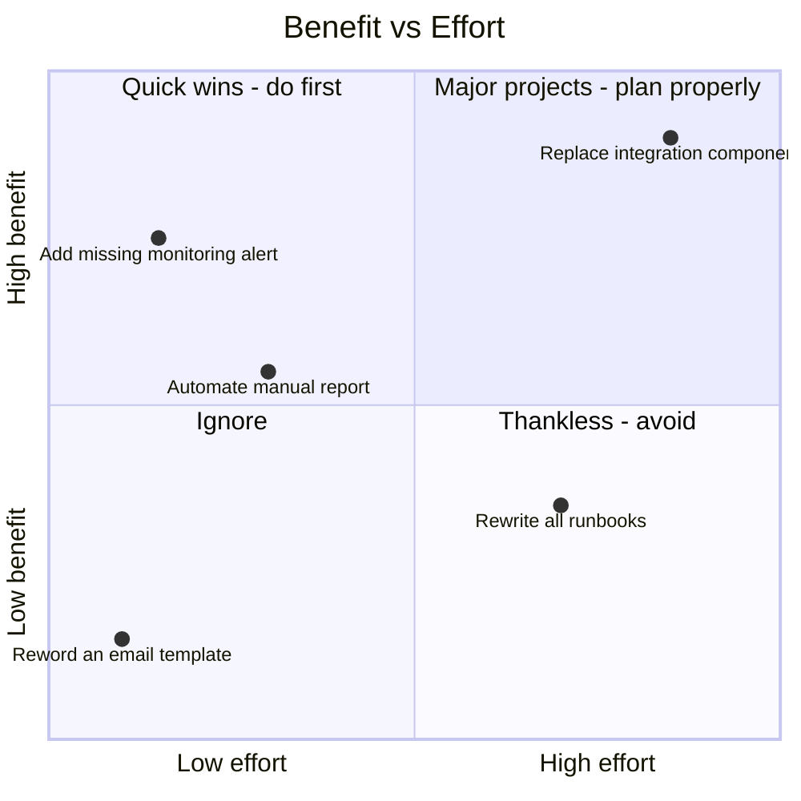
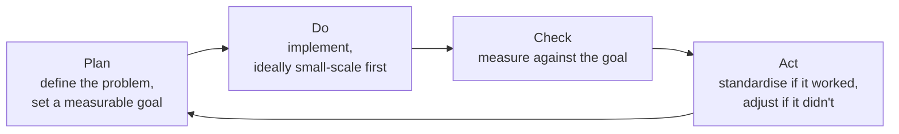
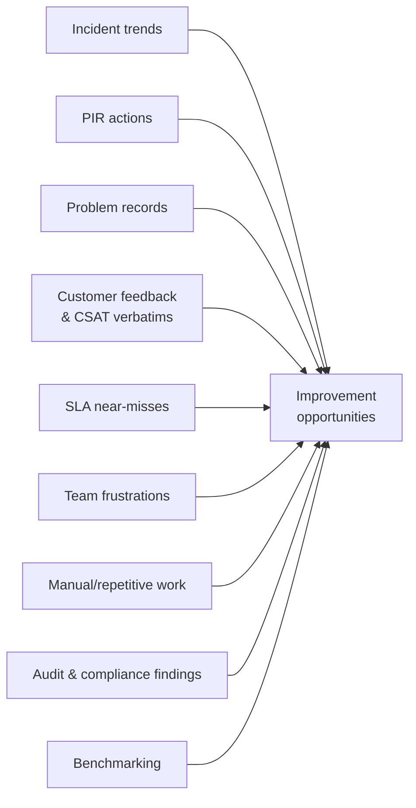
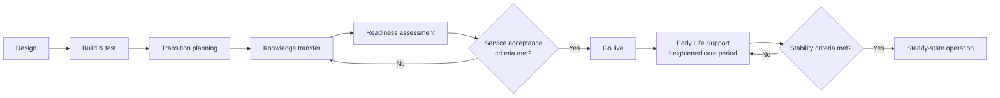

# Part I — Continual Improvement & Service Transition

[← Master index](../Amadeus%20Service%20Account%20Executive%20-%20Study%20Guide.md) · [← Part H](Part-H-reporting-reviews-governance.md) · **Part I of M** · [Part J →](Part-J-technical-literacy.md)

> Section goal: learn how to run improvement as a systematic programme rather than a series of good intentions, and how to bring a new or changing service into stable operation without the customer feeling the seams.

Covers index items **27–28** and maps to JD responsibilities: *"drive service improvement initiatives in partnership with Regional Delivery and Operations teams"*, *"support service transitions by providing customer-specific operational knowledge"*, *"customer-centric mindset with a focus on continuous improvement"*.

---

## 49. What continual improvement actually is

> **Continual improvement is the ongoing, deliberate practice of making services, processes and capabilities measurably better — as a managed activity, not a spare-time aspiration.**

The word is **continual**, not *continuous*. A small distinction with a real meaning:

- **Continuous** — *unbroken, always happening.* Like a running tap.
- **Continual** — *repeated, in deliberate cycles.* Like regular, scheduled maintenance.

Improvement in service management is continual: identify, prioritise, act, verify, repeat.

### Why it dies without structure

Improvement fails at four gates: **not recorded**, **not prioritised**, **not owned**, **not verified**. The CSI register plus service review visibility fixes all four.

---

## 50. The CSI register

**CSI — Continual Service Improvement.** The **CSI register** is simply a maintained, prioritised list of improvement opportunities.

| Field | Why it's there |
|-------|----------------|
| ID & description | Unambiguous reference |
| Source | Incident, PIR, customer request, trend analysis, audit |
| Category | Process / technology / people / supplier |
| Benefit | What improves, quantified where possible |
| Effort | Rough sizing |
| Priority | Benefit vs effort vs risk |
| Owner | **One named person** |
| Target date | Committed |
| Status | Proposed / approved / in progress / delivered / verified |
| Verification | The data proving it worked |

### 🔍 Plain-English deep-dive: why the register beats a to-do list

- **A to-do list** — *things someone intends to do.* It has no comparison mechanism, so the loudest item wins.
- **A register** — *a prioritised portfolio.* It forces explicit comparison: this improvement versus that one, on benefit and effort.
- **Why it matters:** improvement work never competes on equal terms with incidents, because incidents are urgent. A register with visible prioritisation and customer-facing status is the only reliable way to give improvement work standing.

### Prioritising improvements

**Practical tactic:** deliver a visible quick win early. Improvement programmes gain credibility through evidence, and a small delivered improvement buys the political capital for a large one.

---

## 51. Improvement models

Know these by name; they answer "how do you approach improvement?" crisply.

### PDCA (Deming cycle)

| Stage | The question | Common failure |
|-------|--------------|----------------|
| **Plan** | What exactly are we improving, and how will we know? | No baseline measurement |
| **Do** | Implement, small scale first | Big-bang rollout |
| **Check** | Did the metric actually move? | Skipped entirely |
| **Act** | Standardise or adjust | Success never embedded, so it decays |

> **Interview-ready line:** "Most improvement programmes skip 'Check'. Without a baseline taken before the change, you can't prove the improvement happened — and unproven improvements don't get funded again."

### The ITIL seven-step improvement approach

| Step | Plain question |
|------|----------------|
| 1. What is the vision? | What are we ultimately trying to achieve? |
| 2. Where are we now? | Baseline — honestly |
| 3. Where do we want to be? | Measurable target |
| 4. How do we get there? | The plan |
| 5. Take action | Execute |
| 6. Did we get there? | Measure |
| 7. How do we keep the momentum? | Embed it |

### Lean and Six Sigma — the useful essentials

| Concept | Origin | Plain meaning | Service example |
|---------|--------|---------------|-----------------|
| **Lean** | Manufacturing | Remove waste; maximise value-adding steps | Deleting three approval steps that add no value |
| **Waste (muda)** | Lean | Anything the customer wouldn't pay for | Waiting, rework, handoffs, over-processing |
| **Kaizen** | Lean | Small, continuous, everyone-participates improvement | Weekly micro-improvements from the support team |
| **Value stream mapping** | Lean | Map every step; find where time is lost | Mapping ticket flow to find a 6-hour queue wait |
| **Six Sigma** | Manufacturing | Reduce variation and defects using data | Reducing variability in incident response times |
| **DMAIC** | Six Sigma | Define, Measure, Analyse, Improve, Control | A structured improvement project |

### 🔍 Plain-English deep-dive: variation matters as much as the average

Six Sigma's core insight is that **consistency is a feature**.

Two support teams both average a 4-hour resolution:
- Team A: every ticket takes 3.5–4.5 hours.
- Team B: half take 30 minutes, half take 8 hours.

Same average. **Team A is a far better service**, because the customer can plan around it. Team B is unpredictable, and unpredictability makes it impossible for the customer to make operational decisions.

**Why it matters:** when reporting, showing the spread (percentiles, worst case) rather than only the average is a genuinely sophisticated move.

| Report style | What it hides |
|--------------|---------------|
| "Average resolution 4 hours" | The 8-hour tail |
| "Average 4 hrs; 90th percentile 7.5 hrs" | Nothing — this is honest |

---

## 52. Finding improvement opportunities

| Source | What to look for | Typical improvement |
|--------|------------------|---------------------|
| **Incident trends** | Concentration in one category | Targeted structural fix |
| **PIR actions** | Repeating themes across PIRs | Systemic process change |
| **CSAT verbatims** | The same complaint phrased differently | Communication or process change |
| **Near-misses** | SLA met but only just | Buffer improvement before it breaks |
| **Team frustration** | "We do this manually every day" | Automation |
| **Handover failures** | Incidents restarting at shift change | Handover template and discipline |
| **Knowledge gaps** | Same question re-diagnosed repeatedly | Knowledge article, KEDB entry |

> **Practical example of framing:** "The support team manually compiles a daily status report, taking 45 minutes. That's roughly 15 hours a month of specialist time spent on formatting rather than on customers." Quantified waste is far more fundable than "it's annoying".

---

## 53. Service transition

**Service transition** = *moving a service into live operation — new, changed, migrated, or moved between providers — such that it can actually be supported.*

The JD asks the SAE to support transitions "by providing customer-specific operational knowledge", so understand the role precisely: **you're the person who knows how the customer really operates**, and that knowledge determines whether the transition survives contact with reality.

### Key concepts

| Concept | Plain meaning | Why it matters |
|---------|---------------|----------------|
| **Service acceptance criteria** | The checklist a service must pass before going live | Prevents inheriting an unsupportable service |
| **Knowledge transfer** | Moving know-how, not just documents | Documents without context are useless at 3am |
| **Early Life Support (ELS)** | A defined period of heightened support right after go-live | Failure rates are highest immediately after change |
| **Runbook** | Step-by-step operational procedures | What a responder follows under pressure |
| **Handover / exit criteria** | Conditions for ELS to end | Prevents ELS ending arbitrarily while unstable |
| **Warranty period** | Time during which the builder still fixes defects | Clarifies who pays for what |

### 🔍 Plain-English deep-dive: why transitions fail

- **Documentation without context.** A runbook that says "restart the service" doesn't say what breaks if you restart during check-in peak. **Analogy:** a recipe that lists ingredients but not the oven temperature.
- **No named support ownership at go-live.** Everyone assumes someone else has it.
- **Testing that never mirrored real operations.** Passed at 100 transactions per minute; production peaks at 2,000.
- **Customer's real workflow never captured.** The service works as designed and is useless as deployed.
- **ELS ended by calendar instead of criteria.** "It's been two weeks, ELS is over" — while incidents are still climbing.

**This is precisely where the SAE adds unique value**, because you're the only person in the transition who knows the customer's actual operating rhythm — their peaks, their manual workarounds, their real dependencies, and which failures they cannot tolerate.

### The SAE's transition checklist

| Question | Why it matters |
|----------|----------------|
| Who supports this at 3am on day one, by name? | Ownership gaps surface at the worst time |
| Do runbooks exist and have they been *tested* by someone who didn't write them? | Untested runbooks fail under pressure |
| Is monitoring in place *before* go-live? | Otherwise the customer becomes your monitoring |
| What are the top five likely failure modes and their workarounds? | Pre-agreed workarounds massively cut restoration time |
| Have we avoided a peak window for go-live? | Never transition into a peak |
| Is there a rollback plan, and has it been tested? | An untested rollback is a hope, not a plan |
| Are SLAs and escalation paths agreed and communicated? | Ambiguity at go-live becomes a dispute |
| Does the customer's frontline know what's changing? | Surprised users generate false incidents |
| What are the ELS exit criteria, expressed as data? | Prevents arbitrary ELS termination |

> **Interview-ready line:** "The two questions I always ask before a go-live are: who's on the phone at 3am on day one, by name — and has anyone other than the author actually followed the runbook end to end?"

---

## 54. Knowledge management

Knowledge is what makes improvement durable rather than personal.

| Artefact | Purpose |
|----------|---------|
| **Knowledge article** | How to resolve a known scenario |
| **Runbook** | Step-by-step operational procedure |
| **Known error record** | Documented cause + workaround (Part F) |
| **Architecture overview** | How the pieces connect — vital for impact assessment |
| **Customer profile** | Their business, peaks, contacts, sensitivities, escalation paths |
| **Incident timeline library** | Past majors — pattern recognition for the future |

### Why knowledge decays

| Cause | Countermeasure |
|-------|----------------|
| Written once, never reviewed | Review date on every article; owner assigned |
| Written by experts for experts | Test with someone unfamiliar |
| Not findable | Consistent tagging and titles matching real search terms |
| No incentive to write | Make knowledge capture part of incident closure |
| Superseded by change | Link articles to the components they describe |

> **The 3am test:** a knowledge article is only good if a tired responder who has never seen the system can follow it successfully under pressure. If it assumes context, it fails when it matters most.

---

## 55. Building an improvement narrative for the customer

Improvement work only counts if the customer perceives it.

| Stage | What you show |
|-------|---------------|
| **Proposed** | The problem, quantified; the proposed action; expected benefit |
| **In progress** | Honest status, blockers named |
| **Delivered** | What changed, when |
| **Verified** | The data showing it worked |
| **Banked** | Referenced in later reviews as evidence of a working partnership |

**The verification slide is the most valuable one you will ever produce:**

> "Configuration-related incidents ran at 9–12 per month for six months. We introduced a pre-deployment validation step on the 8th. In the eight weeks since, the category has produced two incidents. That's roughly 80% reduction and about 30 hours of restored operational time per month for your team."

That paragraph does more for a relationship than any apology, because it converts a promise into evidence.

---

## ⭐ Likely Interview Questions for This Section

**Q1. "How do you drive continual improvement?"**
> *Model answer:* "Systematically, through a register rather than good intentions. I capture opportunities from incident trends, PIR actions, problem records, CSAT verbatims, SLA near-misses and team frustrations. I prioritise them on benefit versus effort, assign a single named owner and a date, and make the status visible in the customer service review — because improvement work never wins against firefighting unless it has external visibility. Then the step most people skip: verification with data. I take a baseline before the change and prove the metric moved afterwards. And I deliberately deliver a small quick win early, because improvement programmes earn their political capital through evidence."

**Q2. "What is PDCA?"**
> *Model answer:* "Plan, Do, Check, Act — the Deming improvement cycle. Plan defines the problem and a measurable goal with a baseline. Do implements it, ideally small scale first. Check measures against the goal. Act either standardises the change if it worked or adjusts if it didn't. In practice almost everyone skips Check, which means they can't prove improvement happened — and unproven improvements don't get funded a second time. The baseline in the Plan stage is what makes Check possible, so those two stages live or die together."

**Q3. "Why does variation matter as much as the average?"**
> *Model answer:* "Because consistency is itself a feature of a service. Two teams can both average four-hour resolution: one always takes between three and a half and four and a half hours, the other takes thirty minutes half the time and eight hours the other half. Identical average, but the first is a much better service because the customer can plan around it. That's why I report percentiles and worst case alongside averages — an average alone hides the tail, and the tail is what the customer actually remembers."

**Q4. "Where do you find improvement opportunities?"**
> *Model answer:* "Incident trends showing concentration in one category; repeating themes across post-incident reviews, which usually indicate a systemic rather than technical issue; open problem records; CSAT verbatims where the same complaint appears in different words; SLA near-misses, which are free warnings before a breach; and team frustrations, especially manual repetitive work. That last one is often the easiest sell because it quantifies cleanly — 'this manual report costs fifteen specialist hours a month' is fundable in a way that 'it's annoying' never is."

**Q5. "What is Early Life Support and why does it exist?"**
> *Model answer:* "A defined period of heightened support immediately after a go-live or major change, with extra staffing, closer monitoring and faster escalation. It exists because failure rates are highest right after change — that's when unknown unknowns surface. The critical detail is that ELS should end on criteria, not on the calendar. Ending it because two weeks have passed while incident volume is still climbing just transfers an unstable service into steady-state support, and the customer feels the difference immediately."

**Q6. "What would you check before a service goes live?"**
> *Model answer:* "Named support ownership for day one including out of hours — an actual name, not a team. Runbooks that someone other than the author has followed end to end, because untested runbooks fail under pressure. Monitoring in place before go-live, so the customer doesn't become our monitoring. The top five likely failure modes with pre-agreed workarounds, which massively shortens restoration. A tested rollback plan. SLAs and escalation paths agreed and communicated. Confirmation we're not going live into a peak window. The customer's frontline briefed on what's changing, so we don't get a wave of false incidents. And ELS exit criteria expressed as data."

**Q7. "What can you contribute to a transition as an SAE rather than as a project manager?"**
> *Model answer:* "Customer operational reality. A project manager owns scope, schedule and delivery; I own knowing how the customer actually works — their peak windows, their manual workarounds, which failure modes they genuinely cannot tolerate, who their real decision-makers are, and what their frontline staff can realistically do under pressure. That's what determines whether a technically successful transition is also an operationally successful one. Most transitions that fail don't fail on the build; they fail because the design never met the customer's real workflow."

**Q8. "What's Lean and how does it apply to a service role?"**
> *Model answer:* "Lean is about removing waste — anything the customer wouldn't be willing to pay for. In service operations that's mostly waiting, rework, unnecessary handoffs and over-processing. The practical tool is value stream mapping: map every step of, say, a ticket's journey and measure where the time actually goes. Usually you find most of the elapsed time is queueing between steps rather than work being done. That reframes improvement from 'work faster' to 'remove the queue', which is both more effective and much better received by the team."

**Q9. "How do you make sure knowledge doesn't rot?"**
> *Model answer:* "Every article gets an owner and a review date, and I link articles to the components they describe so a change to that component triggers a review. I test articles with someone unfamiliar — I call it the 3am test: can a tired responder who has never seen this system follow it successfully under pressure? If it assumes context, it fails exactly when it's needed. I also make knowledge capture part of incident closure rather than an optional extra, because knowledge written 'later' is never written."

**Q10. "How do you show a customer that improvement is real and not just talk?"**
> *Model answer:* "With before-and-after data on a single specific thing. For example: this incident category ran at nine to twelve per month for six months, we introduced a pre-deployment validation step on the eighth, and in the eight weeks since it has produced two incidents — roughly an 80% reduction and about thirty hours of restored operational time per month. That paragraph does more for a relationship than any apology, because it converts a promise into evidence. And once you've banked one of those, the next improvement proposal is far easier to get funded on both sides."

---

## 🧠 30-Second Memory Hooks

- **Continual, not continuous** — deliberate cycles, not a running tap.
- **Improvement dies at four gates:** not recorded, not prioritised, not owned, not verified.
- **CSI register beats a to-do list** because it forces comparison.
- **Deliver a quick win early** — improvement earns credibility through evidence.
- **PDCA** = Plan, Do, Check, Act. **Everyone skips Check.** No baseline = no proof.
- **Lean** = remove waste (waiting, rework, handoffs). **Kaizen** = small and constant.
- **Six Sigma insight: consistency is a feature.** Same average, very different service.
- **Report the 90th percentile, not just the average.** The tail is what customers remember.
- **Near-misses are free warnings.**
- **Transition fails on:** context-free docs, no named owner, unrealistic testing, unknown real workflow, calendar-based ELS.
- **ELS ends on criteria, not on the calendar.**
- **Two go-live questions:** who's on the phone at 3am by name, and has a non-author followed the runbook?
- **The 3am test** for every knowledge article.
- **The verification slide is the most valuable artefact you own.**

---

*Next suggested section:* **[Part J — Technical Literacy for Service Roles](Part-J-technical-literacy.md)** — enough technical depth to be credible with engineers and to understand what you're coordinating.

---

[← Master index](../Amadeus%20Service%20Account%20Executive%20-%20Study%20Guide.md) · [← Part H](Part-H-reporting-reviews-governance.md) · [Part J →](Part-J-technical-literacy.md) · [Go-live checklist](Appendix-C-quick-reference.md)
