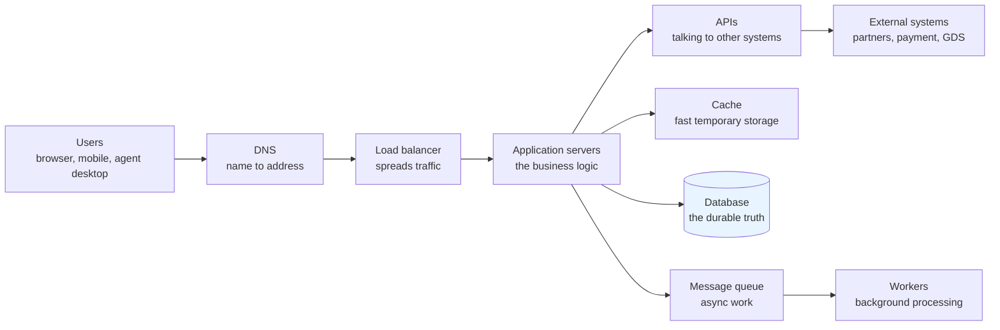
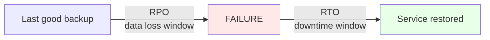
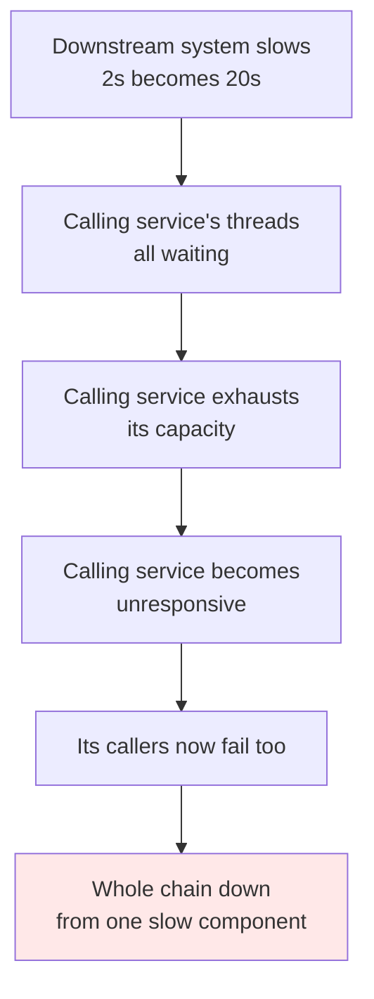
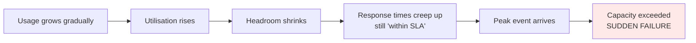

# Part J — Technical Literacy for Service Roles

[← Master index](../Amadeus%20Service%20Account%20Executive%20-%20Study%20Guide.md) · [← Part I](Part-I-improvement-and-transition.md) · **Part J of M** · [Part K →](Part-K-misc-and-deeper-topics.md)

> Section goal: acquire enough technical understanding to be credible with engineers, ask sharp questions during an incident, and translate technical events into business language — without pretending to be an engineer.

Covers index items **29–35** and maps to JD requirements: *"develop a strong understanding of customer systems and solutions"*, *"knowledge of technology domains is an advantage"*, *"strong analytical and problem-solving skills"*.

> **The goal here is literacy, not expertise.** You need to understand what engineers are telling you, judge whether an explanation is coherent, and ask the question that moves things forward. You do not need to diagnose the fault yourself — Part D explains why you actively shouldn't.

---

## 56. How a modern service is put together

Almost every enterprise service follows the same broad shape.

### 🔍 Plain-English deep-dive: each component and how it fails

- **DNS — Domain Name System.** *Translates a name into an address.* **Analogy:** a phone book. **Fails as:** "the site doesn't exist" errors, or traffic going to the wrong place. Notoriously the cause of a huge share of outages, hence the joke "it's always DNS".
- **Load balancer.** *Distributes incoming requests across multiple servers.* **Analogy:** the person at airport security directing you to the shortest queue. **Fails as:** all traffic sent to one unhealthy server, or the whole service unreachable if it fails alone.
- **Application server.** *Runs the business logic.* **Analogy:** the kitchen. **Fails as:** errors, crashes, memory exhaustion, slowness.
- **Database.** *Stores the durable truth.* **Analogy:** the filing cabinet of record. **Fails as:** slow queries, locking, running out of space, replication lag.
- **Cache.** *Fast temporary copies of frequently-used data.* **Analogy:** keeping frequently used files on your desk rather than the cabinet. **Fails as:** stale data being served, or a "cache stampede" when it empties and everything hits the database at once.
- **Message queue.** *Holds work to be done later, decoupling systems.* **Analogy:** an inbox tray. **Fails as:** backlog growing (work delayed but not lost), or messages lost/duplicated.
- **API — Application Programming Interface.** *A defined way for two systems to talk.* **Analogy:** a restaurant menu — a fixed set of things you can request in a fixed format. **Fails as:** timeouts, version mismatches, rate limiting, contract changes breaking a caller.

### Synchronous vs asynchronous — a distinction that explains many incidents

| | Synchronous | Asynchronous |
|---|-------------|--------------|
| **Meaning** | Caller waits for the answer | Caller hands off and continues |
| **Analogy** | Phone call | Sending a letter |
| **Failure looks like** | User sees a spinner, then a timeout | Nothing visibly breaks; work silently delays |
| **Danger** | One slow dependency freezes the user experience | Backlogs build invisibly until they're huge |
| **Airline example** | Live seat availability check | Overnight reconciliation, email confirmations |

> **Why it matters:** an async backlog is the classic "silent" incident. Nothing errors, dashboards look fine, and then someone notices confirmations are four hours behind. Asking *"is anything queued or backlogged?"* is a genuinely useful SAE question.

---

## 57. Cloud, hosting and resilience

| Term | Plain meaning | Analogy |
|------|---------------|---------|
| **On-premise** | Runs in the customer's own data centre | Owning a car |
| **Cloud** | Runs on a provider's shared infrastructure, rented | Using a taxi service |
| **Hybrid** | A mix | Owning a car and using taxis |
| **Region** | A geographic location of infrastructure | A city |
| **Availability zone** | An isolated data centre within a region | Separate buildings in that city |
| **Redundancy** | Spare capacity ready to take over | A second engine on an aircraft |
| **Failover** | Switching to the standby | Actually using that second engine |
| **Active-active** | Both sides serve traffic simultaneously | Two open checkout lanes |
| **Active-passive** | One serves, one waits | One lane open, one staffed but closed |

### 🔍 Plain-English deep-dive: RTO and RPO

The two numbers that define disaster recovery — and they're frequently confused.

- **RTO — Recovery Time Objective.** *How quickly the service must be back.* **Analogy:** how long you can survive without your phone.
- **RPO — Recovery Point Objective.** *How much data you can afford to lose.* **Analogy:** how far back your last phone backup was.

| | RTO | RPO |
|---|-----|-----|
| **Question** | How long can we be down? | How much data can we lose? |
| **RTO = 4 hours** | Back within 4 hours of failure | — |
| **RPO = 15 minutes** | — | At most 15 minutes of data lost |
| **Cost driver** | Standby infrastructure | Backup/replication frequency |

**Why it matters:** an airline's RPO for booking data is effectively near-zero — losing confirmed bookings is catastrophic and unrecoverable commercially. Knowing that RTO and RPO are different, and that both cost money, is a strong credibility signal.

---

## 58. Networking basics that explain outages

You don't need to configure networks. You need to understand the vocabulary that appears in incident calls.

| Term | Plain meaning | Failure symptom |
|------|---------------|-----------------|
| **Latency** | Delay for data to travel | Everything feels slow |
| **Bandwidth** | How much data can flow at once | Slowness under heavy load only |
| **Packet loss** | Data that doesn't arrive | Intermittent failures, retries |
| **Timeout** | Giving up waiting for a response | Errors under load; cascading failures |
| **Firewall** | Controls what traffic is allowed | "Connection refused"; new integrations fail |
| **Proxy** | An intermediary that forwards requests | Odd, environment-specific failures |
| **TLS/SSL certificate** | Proves identity, encrypts traffic | Total failure on expiry — sudden and absolute |
| **Port** | A numbered channel on a host | Blocked port = service unreachable |
| **VPN** | An encrypted tunnel between networks | Site-specific connectivity failures |
| **CDN** | Distributed edge caching | Stale content or regional failures |

### 🔍 Plain-English deep-dive: why certificate expiry is such a classic

A **TLS certificate** is like a passport for a server — it proves identity and enables encryption. Passports expire.

When one expires:
- The failure is **instantaneous and total** — not gradual.
- It fails **at the same second for everyone**.
- It's often **invisible to internal monitoring** if monitoring bypasses TLS.
- It's completely **predictable and preventable** — the expiry date was known in advance.

**Why it matters:** it's a perfect example of an incident whose root cause is *not technical but process* — nobody owned certificate lifecycle tracking. A great illustration to use when discussing preventable incidents.

### Timeouts and cascading failure

**Terms worth knowing:**
- **Cascading failure** — one component's slowness taking down everything upstream.
- **Circuit breaker** — *a protection that stops calling a failing dependency, failing fast instead of waiting.* **Analogy:** an electrical fuse. **Why it matters:** it converts a total outage into degraded-but-alive service.
- **Graceful degradation** — *turning off non-essential features to keep core function alive.* **Analogy:** an aircraft shedding non-essential electrical load.
- **Retry storm** — *failed requests being retried en masse, adding load to an already struggling system.* **Analogy:** everyone pressing the lift button repeatedly.

> **Interview-ready line:** "The most useful question I can ask when a service is slow rather than down is: 'what is it waiting on?' Slowness almost always propagates from a downstream dependency, and the visible symptom is rarely the source."

---

## 59. Reading the evidence

| Evidence type | What it is | What it's good for |
|---------------|-----------|--------------------|
| **Logs** | Timestamped records of events | Detail on what happened and when |
| **Metrics** | Numeric measurements over time | Trends, thresholds, correlation |
| **Traces** | The path of one request through many systems | Finding *where* time is spent |
| **Alerts** | Automated notifications on conditions | Detection |
| **Dashboards** | Visualised metrics | Fast situational awareness |
| **Synthetic checks** | Robots simulating a user journey | Detecting failure before users do |
| **RUM** | Real user monitoring — actual user experience | The honest truth about how it feels |

### 🔍 Plain-English deep-dive: the three pillars of observability

- **Monitoring** — *checking known things against known thresholds.* Answers: "is CPU above 90%?" **Analogy:** a car dashboard.
- **Observability** — *being able to ask new questions about unexpected behaviour.* Answers: "why are only Spanish-language check-ins failing?" **Analogy:** a full diagnostic port and workshop.
- **Why it matters:** you can only monitor failures you predicted. Novel failures need observability. When a customer asks "why didn't you detect it?", the honest answer is often "we monitored for the failures we anticipated, and this wasn't one — so the improvement action is X."

### Useful questions an SAE can ask on a bridge

These are literacy questions — they don't require expertise but they move things forward:

| Question | Why it's powerful |
|----------|-------------------|
| "What changed in the last 24 hours?" | Highest-yield hypothesis |
| "Is this affecting all users or a subset — and what defines the subset?" | Is/is not analysis (Part F) |
| "Is it failing, or is it slow?" | Completely different causes |
| "What is the system waiting on?" | Finds the real downstream source |
| "Is anything queued or backlogged?" | Catches silent async failures |
| "Does the customer see it, or only our monitoring?" | Establishes real impact |
| "When did it *start*, precisely?" | Correlates with changes and events |
| "Has this happened before?" | Known error lookup |
| "What would we need to see to rule this hypothesis out?" | Converts opinion into a testable step |
| "If we can't fix it in an hour, what's our workaround?" | Forces the parallel restoration track |

---

## 60. Security, privacy and compliance in travel

Travel data is unusually sensitive: identity documents, payment details, travel patterns, and sometimes special-category data.

| Concept | Plain meaning | Why an SAE cares |
|---------|---------------|------------------|
| **PII** | Personally identifiable information | A leak is a regulatory event, not just an incident |
| **PCI DSS** | Security standard for card payment data | Constrains how payment incidents are handled and logged |
| **GDPR-style regulation** | Data protection law with breach-notification duties | Tight statutory notification deadlines |
| **Data residency** | Rules on where data may physically be stored | Constrains failover and cloud region choices |
| **Access control** | Who can see or do what | Emergency access during incidents must still be controlled and audited |
| **Audit trail** | Evidence of who did what, when | Required for disputes and regulatory review |

### 🔍 Plain-English deep-dive: when an incident becomes a breach

An **incident** becomes a **security incident** when confidentiality, integrity or availability of data is compromised — and a **breach** when protected data is actually exposed.

**This changes the process fundamentally:**
- Legal and privacy teams join immediately.
- Regulatory notification clocks may start, sometimes as short as 72 hours.
- Evidence preservation may outrank fast restoration.
- Communication becomes legally constrained — **you must not speculate publicly**.

> **Interview-ready line:** "The moment I suspect data exposure, my first action isn't technical — it's engaging security and legal, and switching to strictly factual communication. Speculating about a possible breach in a customer email can create legal exposure that outlives the incident itself."

---

## 61. Capacity, performance and peak readiness

Airlines have brutally predictable peaks — which makes unpreparedness inexcusable.

| Concept | Plain meaning |
|---------|---------------|
| **Capacity** | How much load the system can handle |
| **Headroom** | Spare capacity above current peak usage |
| **Utilisation** | How much of the capacity is being used |
| **Throughput** | Transactions successfully processed per unit time |
| **Load testing** | Simulating expected load before it arrives |
| **Stress testing** | Deliberately finding the breaking point |
| **Scaling** | Adding capacity — vertical (bigger) or horizontal (more) |
| **Auto-scaling** | Automatically adding capacity as load rises |

### Why capacity incidents are predictable

**The lesson:** capacity failures look sudden but are preceded by months of visible warning in utilisation trends. Watching headroom against the customer's peak calendar is textbook **proactive problem management** (Part F) — and one of the clearest examples you can give of preventing rather than reacting.

| Peak type | Example | Preparation |
|-----------|---------|-------------|
| **Daily** | Morning check-in wave | Routine capacity headroom |
| **Weekly** | Weekend leisure travel | Capacity plus staffing |
| **Seasonal** | Holiday periods | Readiness review, freeze period |
| **Event-driven** | Schedule release, major sale, sporting event | Load testing, war-room readiness |
| **Disruption-driven** | Weather event, IROPS | Surge capacity, rebooking load |

> **Note the cruel irony of disruption peaks:** during IROPS, load spikes *precisely* when the airline can least tolerate degradation, because everyone is rebooking at once. Systems must be sized for the bad day, not the average one.

---

## ⭐ Likely Interview Questions for This Section

**Q1. "How technical do you need to be for this role?"**
> *Model answer:* "Technical enough to understand what engineers are telling me, judge whether an explanation is coherent, ask questions that move things forward, and translate technical events into business consequences. Not technical enough to diagnose the fault myself — and in a major incident I actively shouldn't, because the moment I go deep on diagnosis, nobody is assessing business impact or communicating with the customer. My value is the widest view in the room, not the deepest."

**Q2. "A service is slow but not down. What do you ask?"**
> *Model answer:* "First, is it failing or just slow, because those have very different causes. Then: what is it waiting on — slowness almost always propagates from a downstream dependency, so the visible symptom is rarely the source. Is it all users or a subset, and what defines that subset. When exactly did it start, and what changed in the preceding window. Is anything queued or backlogged, because async backlogs are the classic silent failure. And critically: do users actually see it, or is this only visible in our monitoring? That determines whether it's a customer-impacting incident or an internal warning."

**Q3. "What's the difference between RTO and RPO?"**
> *Model answer:* "RTO is recovery time objective — how quickly the service must be back. RPO is recovery point objective — how much data we can afford to lose, measured backwards from the failure to the last recoverable state. They're independent and both cost money: RTO is driven by standby infrastructure, RPO by replication and backup frequency. For an airline, RPO on booking data is effectively near-zero because losing confirmed bookings is commercially unrecoverable, whereas a reporting system might tolerate hours."

**Q4. "Why do certificate expiries cause so many outages?"**
> *Model answer:* "Because the failure is instantaneous, total, and simultaneous for everyone — there's no gradual degradation to warn you. And it's often invisible to internal monitoring if the checks bypass TLS. What makes it the perfect teaching example is that it's entirely predictable: the expiry date was known months in advance. So the root cause is never technical, it's process — nobody owned certificate lifecycle tracking with alerting well ahead of expiry. It's the cleanest illustration of an incident where the fix is ownership, not engineering."

**Q5. "What is a cascading failure?"**
> *Model answer:* "When one component's slowness propagates upward and takes down everything that depends on it. A downstream system slows from two seconds to twenty, so the calling service's threads all sit waiting, it exhausts its own capacity, becomes unresponsive, and then its callers fail too — a total outage from one slow component. The defences are circuit breakers, which fail fast instead of waiting, and graceful degradation, which turns off non-essential features to keep core function alive. It's also why retry storms are dangerous: mass retries add load to a system that's already struggling."

**Q6. "What's the difference between monitoring and observability?"**
> *Model answer:* "Monitoring checks known things against known thresholds — is CPU above 90%. Observability is the ability to ask new questions about unexpected behaviour — why are only Spanish-language check-ins failing. The practical implication is that you can only monitor failures you predicted, so novel failures need observability. When a customer asks 'why didn't you detect this?', the honest answer is usually that we monitored for anticipated failures and this wasn't one — and then the improvement action is adding that detection, which is a legitimate and well-received answer."

**Q7. "When does an incident become a security matter, and what changes?"**
> *Model answer:* "When confidentiality, integrity or availability of data is compromised — and it becomes a breach when protected data is actually exposed. Everything changes: security, privacy and legal teams engage immediately, regulatory notification clocks may start with deadlines as tight as seventy-two hours, evidence preservation can outrank fast restoration, and communication becomes legally constrained. My first action on suspecting data exposure isn't technical at all — it's engaging security and legal and switching to strictly factual language. Speculating about a possible breach in a customer email creates exposure that outlives the incident."

**Q8. "How would you prepare for a customer's peak season?"**
> *Model answer:* "Start from their calendar, not ours. Identify the peak windows and what's different about them — volume, transaction mix, geography. Review capacity headroom against projected peak rather than current average, and check the utilisation trend, because capacity failures look sudden but are preceded by months of visible warning. Confirm load testing reflects realistic peak volumes. Agree a change freeze. Review known errors and make sure workarounds are documented and rehearsed. Confirm escalation paths and staffing cover for the period. And agree in advance what heightened communication looks like — that's essentially Early Life Support thinking applied to a peak."

**Q9. "Explain synchronous versus asynchronous and why it matters operationally."**
> *Model answer:* "Synchronous means the caller waits for an answer, like a phone call; asynchronous means it hands the work off and continues, like posting a letter. Operationally the failure modes are completely different. A synchronous failure is loud — the user sees a spinner then a timeout. An asynchronous failure is silent — nothing errors, dashboards look fine, and then someone notices confirmations are four hours behind. That's why 'is anything queued or backlogged?' is one of the most valuable questions I can ask, because silent backlogs cause the incidents customers discover before we do."

**Q10. "An engineer gives you an explanation you don't fully understand. What do you do?"**
> *Model answer:* "I ask them to explain it in terms of what the customer experiences, which is a fair question and usually clarifies it for everyone on the call. Then I test my understanding by playing it back in my own words and asking them to correct me. I never relay an explanation to a customer that I can't defend under questioning, because if I can't explain it, I can't answer their follow-up — and a confident wrong answer is far more damaging than saying I'll confirm and come back. Asking for plain language isn't a weakness; it very often exposes that the explanation was a hypothesis rather than a confirmed cause."

---

## 🧠 30-Second Memory Hooks

- **Literacy, not expertise.** Understand, question, translate — don't diagnose.
- **The stack:** DNS → load balancer → app → cache/queue/API → database.
- **"It's always DNS"** — the phone book of the internet.
- **Sync = phone call** (loud failure). **Async = letter** (silent backlog).
- **"Is anything queued?"** catches the silent incident.
- **RTO = how long down.** **RPO = how much data lost.** Independent, both cost money.
- **Certificate expiry** = instant, total, predictable — a *process* root cause.
- **Cascading failure** = one slow dependency freezes everything upstream.
- **Circuit breaker = fuse.** **Graceful degradation = shed non-essential load.**
- **Retry storm** = everyone jabbing the lift button.
- **Monitoring** = known thresholds. **Observability** = new questions.
- **Best bridge questions:** what changed? failing or slow? what's it waiting on? all users or a subset? do users actually see it?
- **Suspected breach → legal/security first, facts only, no speculation.**
- **Capacity failures look sudden but warn for months** in utilisation trends.
- **IROPS irony:** load spikes exactly when tolerance is lowest. Size for the bad day.

---

*Next suggested section:* **[Part K — Miscellaneous & Deeper Topics](Part-K-misc-and-deeper-topics.md)** — the competitive landscape, industry trends and adjacent concepts that give you an extra edge.

---

[← Master index](../Amadeus%20Service%20Account%20Executive%20-%20Study%20Guide.md) · [← Part I](Part-I-improvement-and-transition.md) · [Part K →](Part-K-misc-and-deeper-topics.md) · [Glossary](Appendix-A-glossary.md)
