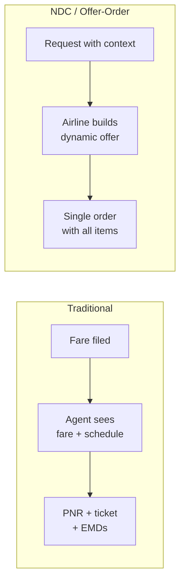
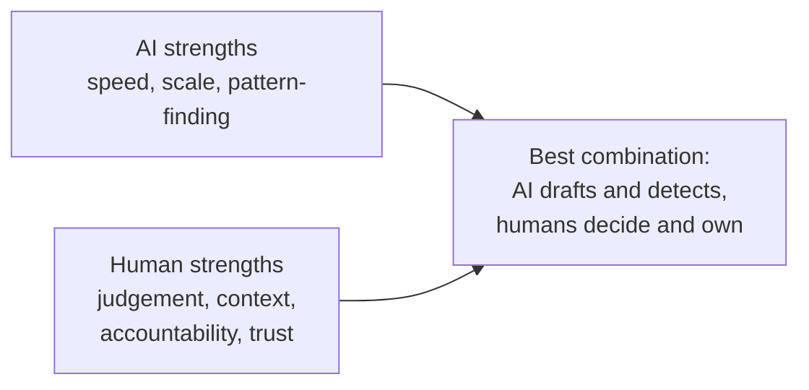
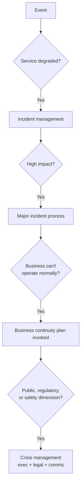

# Part K — Miscellaneous & Deeper Topics

[← Master index](../Amadeus%20Service%20Account%20Executive%20-%20Study%20Guide.md) · [← Part J](Part-J-technical-literacy.md) · **Part K of M** · [Part L →](Part-L-interview-question-bank.md)

> Section goal: acquire the "extra edge" material — competitive landscape, industry standards, modern trends and adjacent disciplines — that separates a candidate who prepared from one who merely revised.

Covers index item **36**. This Part is deliberately broader and lighter than the earlier ones: **breadth for conversation, not depth for examination.**

---

## 62. The travel technology competitive landscape

Understanding the market shows genuine interest in the industry rather than just the job.

### The GDS / travel technology providers

| Category | Who's in it | What they do |
|----------|-------------|--------------|
| **Global distribution systems** | Amadeus, Sabre, Travelport | Connect airline inventory to travel sellers worldwide |
| **Passenger service system providers** | Amadeus, Sabre, and airline in-house systems | Reservations, ticketing, departure control |
| **Airline in-house / bespoke** | Several large carriers run proprietary platforms | Full control, high cost |
| **New entrants / modern platforms** | Cloud-native retailing and offer-order platforms | Targeting NDC-era, offer/order architecture |
| **Airport & ground technology** | Baggage, common-use, self-service kiosks | The physical airport layer |

### 🔍 Plain-English deep-dive: why this market is unusual

- **Extremely high switching costs.** Replacing a PSS is one of the riskiest projects an airline can undertake — historically some migrations have caused multi-day operational disruption. **Why it matters:** customers are long-term and deeply invested, which makes the *service relationship* disproportionately valuable. That is precisely why a Service Account Executive role exists.
- **Mission-critical, low tolerance.** Airlines cannot simply pause operations. **Why it matters:** service quality is a genuine competitive differentiator, not a hygiene factor.
- **Heavily standardised.** IATA standards mean interoperability is mandatory. **Why it matters:** many incidents involve partner systems, so multi-party coordination is routine.
- **Consolidated supplier base.** A small number of large providers. **Why it matters:** reputation travels fast across a small industry.

> **Interview-ready line:** "In a market with very high switching costs and very low failure tolerance, the service relationship is a large part of the product. That's why this role isn't administrative — it's the part of the product the customer experiences every day."

---

## 63. Industry standards and bodies

| Body / standard | What it is | Relevance |
|-----------------|-----------|-----------|
| **IATA** | International Air Transport Association — the airline trade body | Sets messaging and operational standards |
| **NDC** | IATA's New Distribution Capability — XML-based airline retailing standard | The big distribution shift |
| **ONE Order** | IATA initiative to replace separate ticket/EMD/booking records with a single order | Simplifies the post-booking world |
| **Offer & Order** | The broader architectural shift NDC and ONE Order enable | Airlines behave more like modern retailers |
| **ICAO** | UN aviation body | Safety and operational standards |
| **EDIFACT** | The older messaging standard NDC is gradually displacing | Legacy integrations still run on it |
| **PCI DSS** | Payment card data security standard | Constrains payment incident handling |
| **ISO/IEC 20000** | International standard for IT service management | Formal ITSM certification |
| **ISO/IEC 27001** | Information security management standard | Security governance |
| **ISO 22301** | Business continuity management | Continuity planning |

### 🔍 Plain-English deep-dive: NDC and offer/order in one minute

**The old world:** an airline published fares into a distribution system. A travel agent saw a fare code and a schedule. The airline was effectively reduced to price and timing — everything else about their product was invisible.

**The new world (NDC):** the airline responds to a request with a **dynamic offer** — a bundle it constructs in real time that can include bags, seats, priority boarding, lounge access, and personalised pricing.

**ONE Order:** replaces the fragmented ticket/EMD/booking-record structure with a single **order**, like an e-commerce order containing multiple items.

**Why it matters operationally:** offer/order architecture means more real-time calls to airline systems, richer and more variable responses, and more integration surface — which means new failure modes and higher performance sensitivity. That is a genuinely insightful observation to offer in an interview.

---

## 64. SRE and how it relates to ITIL

**SRE — Site Reliability Engineering** — originated at Google as an engineering-led approach to reliability. It is often positioned as ITIL's rival; in reality they answer different questions.

| | ITIL | SRE |
|---|------|-----|
| **Origin** | IT service management practice | Software engineering |
| **Focus** | Process, roles, governance, customer relationship | Reliability engineering, automation |
| **Key artefact** | SLA, process definitions | SLO, error budget |
| **Approach to toil** | Improve the process | Automate it away |
| **Strength** | Cross-organisational coordination, customer alignment | Engineering rigour, measurable reliability |
| **Weakness** | Can become bureaucratic | Weaker on commercial/customer governance |

### 🔍 Plain-English deep-dive: error budgets

A concept genuinely worth knowing because it elegantly resolves a real tension.

- **SLO** — say, 99.9% availability.
- **Error budget** — *the allowed unreliability: 100% − 99.9% = 0.1%*, which is roughly 43 minutes per month.
- **The rule:** while budget remains, teams may ship changes freely. When the budget is exhausted, feature work stops and reliability work takes priority.

**Analogy:** a monthly spending allowance. Spend freely while there's money left; when it's gone, you stop until next month.

**Why it matters:** it converts "should we prioritise reliability or features?" from an argument into arithmetic. Mentioning error budgets signals awareness of modern practice beyond classical ITIL.

> **Interview-ready line:** "ITIL and SRE aren't competitors — ITIL is strong on governance, customer alignment and cross-organisational coordination, SRE is strong on engineering rigour and automating toil. Mature organisations borrow error budgets and automation from SRE while keeping ITIL's service governance."

---

## 65. AI and automation in service operations

A likely conversation topic. Have a balanced view — enthusiasm plus realism.

| Application | What it does | Realistic limitation |
|-------------|--------------|---------------------|
| **Automated triage** | Categorises and routes tickets | Needs clean historical data; miscategorisation propagates |
| **Anomaly detection** | Flags unusual patterns before thresholds breach | False positives cause alert fatigue |
| **Predictive alerting** | Forecasts capacity or failure risk | Only as good as the trend data |
| **Knowledge assistance** | Surfaces relevant articles/past incidents | Poor knowledge base in, poor answers out |
| **Draft communications** | Generates first-draft updates | Must be human-reviewed; tone and accuracy are reputational |
| **Summarisation** | Condenses long incident threads for handover | Can drop nuance that mattered |
| **Chatbots / self-service** | Deflects routine requests | Badly done, it becomes an obstacle customers resent |
| **Automated remediation** | Executes known fixes automatically | Needs strict guardrails; automation can amplify a mistake |

### The mature position

> **Interview-ready line:** "AI is genuinely useful for detection, summarisation and drafting — the volume work. What it can't do is own an outcome or hold a relationship. In a major incident, no customer wants an automated apology; they want a named person who is accountable. I'd use AI to buy back time from routine work and spend that time on judgement and the customer."

**A note on risk:** automated communications in a live incident are dangerous. An AI-drafted update that speculates about a cause, or misstates scope, can create commercial and legal exposure. Human review before anything customer-facing is a non-negotiable position — and saying so demonstrates judgement.

---

## 66. Current industry trends worth mentioning

| Trend | What it is | Why it matters to service |
|-------|-----------|---------------------------|
| **Cloud migration of core systems** | Airlines moving PSS/core platforms to cloud | New resilience models, new failure modes, changed support boundaries |
| **NDC and offer/order adoption** | Modern retailing architecture | More integration surface, higher real-time load |
| **Biometric and touchless travel** | Face-based check-in, bag drop, boarding | New failure modes with immediate physical queue consequences |
| **Mobile-first passenger experience** | App as primary channel | Failures are instantly public via social media |
| **Sustainability reporting** | Emissions tracking and reporting obligations | New data and compliance duties |
| **Cyber threat escalation** | Aviation is a high-value target | Security incidents with operational impact |
| **Data-driven disruption management** | Predictive IROPS handling | System availability during disruption becomes even more critical |
| **Consolidation and partnerships** | Alliances, joint ventures, interlining | More multi-party incidents and shared accountability |

### 🔍 Plain-English deep-dive: why biometrics changes the service conversation

Traditional check-in failure → agents fall back to a manual process → queues form but people still fly.

Biometric boarding failure → there may be **no equivalent manual fallback** at the same throughput, and passengers are already at the gate with minutes to departure.

**Why it matters:** as automation replaces manual capability, **the value of the workaround declines and the value of availability rises.** That is a genuinely sophisticated observation about where the industry's service expectations are heading.

---

## 67. Business continuity and crisis management

Distinct from incident management, and worth understanding.

| Discipline | Scope | Trigger |
|------------|-------|---------|
| **Incident management** | A service is degraded | Technical fault |
| **Major incident management** | High-impact service failure | Significant technical fault |
| **Business continuity** | The organisation can't operate normally | Any cause — technical, physical, human |
| **Disaster recovery** | Technology recovery specifically | Loss of a site, platform, or data |
| **Crisis management** | Organisational and reputational survival | Major event with public/regulatory dimension |

**Key terms:**
- **BIA — Business Impact Analysis** — *identifying which processes are critical and how long they can be down.* This is what sets RTO and RPO (Part J).
- **Continuity plan** — *how the business keeps operating without normal systems*, e.g. manual check-in procedures.
- **Tabletop exercise** — *a rehearsal of a scenario without touching production.* Enormously valuable and consistently under-done.

> **Interview-ready line:** "The best predictor of how an organisation performs in a real crisis is whether it has rehearsed one. Tabletop exercises are cheap, and they surface the gaps — unclear ownership, out-of-date contact lists, untested workarounds — while the cost of finding them is zero."

---

## 68. Contracts and commercial awareness

You don't need to be commercial, but understanding the contract makes you far more effective.

| Term | Plain meaning | Why it matters |
|------|---------------|----------------|
| **Master service agreement** | The overarching contract | Sets the framework for everything |
| **Statement of work** | What specifically is being delivered | Defines scope boundaries |
| **Service credits** | Financial remedy for missed SLA | Usually capped; rarely the customer's real motivation |
| **Earn-back** | Recovering credits through sustained good performance | Turns penalty into an improvement incentive |
| **Liability cap** | Ceiling on financial exposure | Why credits rarely reflect true business loss |
| **Change control (commercial)** | How scope changes are agreed and priced | "Can you just also…" needs a process |
| **Renewal / termination** | Contract end conditions | Deterioration signals often precede renewal windows |

### 🔍 Plain-English deep-dive: why service credits are a weak lever

Service credits are typically small relative to the customer's actual loss. An outage that costs an airline millions in disruption might trigger credits worth a fraction of that.

**Consequently:** customers who invoke credits are usually **not** trying to recover money — they're signalling that they've run out of other ways to make the provider take the problem seriously.

**Why it matters:** treating a credit claim as a purely commercial event misses the message entirely. The correct interpretation is a **relationship warning**, and the correct response is a credible improvement plan, not a negotiation.

---

## 69. Cultural and global working

The role is global by nature. Awareness here differentiates.

| Dimension | Practical implication |
|-----------|----------------------|
| **Time zones** | Meeting times, handover quality, "urgent" means different things at different hours |
| **Directness norms** | In some cultures "this is difficult" means no; in others, silence signals disagreement |
| **Hierarchy expectations** | Who may speak in a meeting, who must be copied, who actually decides |
| **Language** | Written English clarity matters more than eloquence; avoid idiom |
| **Holidays and calendars** | Regional holidays affect staffing and change freezes |
| **Escalation norms** | Escalation is routine in some cultures and a serious act in others |

**Practical rules:**
- Always state the **time zone** with any time.
- Prefer **written confirmation** after verbal agreements across languages.
- Avoid idioms, sports metaphors and humour in incident communications.
- Check for understanding by asking someone to **restate the action**, rather than asking "does that make sense?"

---

## 70. Adjacent concepts worth recognising

| Concept | One-line meaning |
|---------|------------------|
| **Shift-left** | Move resolution closer to the user — self-service and Tier 1 handle more |
| **Swarming** | Instead of tiered escalation, relevant experts collaborate immediately |
| **Blameless culture** | Investigate systems, not individuals (Part D) |
| **Toil** | Manual, repetitive work that scales with load — automate it |
| **Chaos engineering** | Deliberately injecting failure to prove resilience |
| **Runbook automation** | Turning documented procedures into executable ones |
| **Service catalogue** | The published menu of what the provider offers |
| **XLA — Experience Level Agreement** | Targets based on user experience rather than system metrics |
| **Follow-the-sun** | Regional handover for 24/7 coverage without night shifts |
| **War room / bridge** | The coordinated response forum (Part D) |

### 🔍 Plain-English deep-dive: XLAs — the coming shift

Traditional SLAs measure the **system**: uptime, response time, ticket resolution. XLAs measure the **experience**: could the user actually complete their task, how long did it really take end to end, how did it feel.

**Why it matters:** an SLA can be fully met while the experience is poor — the classic watermelon (Part C). XLAs are an attempt to close exactly that gap. Mentioning XLAs signals awareness of where service measurement is heading, and connects neatly to the outcome-versus-output distinction from Part B.

---

## ⭐ Likely Interview Questions for This Section

**Q1. "What do you know about the travel technology market?"**
> *Model answer:* "It's a consolidated market with a small number of large providers covering global distribution and passenger service systems, alongside airlines that run proprietary platforms. Two things make it distinctive: switching costs are extraordinarily high — replacing a PSS is one of the riskiest projects an airline can undertake — and failure tolerance is extremely low because operations can't pause. Together those mean the service relationship is a large part of the product, not an add-on. That's exactly why a dedicated service account role exists rather than the work being absorbed into support."

**Q2. "What is NDC and why does it matter?"**
> *Model answer:* "New Distribution Capability is IATA's XML-based standard that lets airlines present dynamic, personalised offers rather than being reduced to a fare code in a legacy distribution feed. Combined with ONE Order, which replaces the fragmented ticket, EMD and booking record structure with a single order, it moves airlines toward behaving like modern retailers. Operationally it matters because it means more real-time calls, richer and more variable responses, and a much larger integration surface — which translates directly into new failure modes and higher performance sensitivity."

**Q3. "How do ITIL and SRE relate?"**
> *Model answer:* "They answer different questions rather than competing. ITIL is strong on process, governance, roles and customer alignment; SRE is strong on engineering rigour, automation and measurable reliability. The SRE concept I find most useful is the error budget — if your SLO is 99.9%, your budget is the remaining 0.1%, and while budget remains teams ship freely, but when it's exhausted, feature work stops and reliability work takes priority. That converts 'reliability versus features' from a recurring argument into arithmetic. Mature organisations borrow error budgets and automation from SRE while keeping ITIL's governance."

**Q4. "What's your view on AI in service management?"**
> *Model answer:* "Genuinely useful for the volume work — anomaly detection, triage suggestions, summarising long incident threads for handover, and drafting routine communications. What it can't do is own an outcome or hold a relationship, and in a major incident no customer wants an automated apology; they want a named person who is accountable. I'd also be firm that anything customer-facing during a live incident needs human review, because an AI-drafted update that speculates about a cause or misstates scope creates commercial and legal exposure. So: AI buys back time from routine work, and I spend that time on judgement and the customer."

**Q5. "What's the difference between business continuity and disaster recovery?"**
> *Model answer:* "Disaster recovery is technology-focused — restoring systems and data after a significant loss, governed by RTO and RPO. Business continuity is broader: how the organisation keeps operating at all, including manual processes, alternative sites and staffing. For an airline the continuity plan might be manual check-in procedures that let flights depart while systems are unavailable. Both are driven by a business impact analysis identifying which processes are critical and how long they can be down. And the single best predictor of real-world performance is whether they've been rehearsed — tabletop exercises are cheap and consistently under-done."

**Q6. "Why are service credits a weak lever?"**
> *Model answer:* "Because they're typically capped and small relative to the customer's actual loss — an outage costing an airline millions might trigger credits worth a fraction of that. So a customer invoking credits usually isn't trying to recover money; they're signalling that they've run out of other ways to make the provider take the problem seriously. Reading a credit claim as a purely commercial event misses the message entirely. I'd treat it as a relationship warning and respond with a credible, evidenced improvement plan rather than a negotiation."

**Q7. "What is an XLA?"**
> *Model answer:* "An experience level agreement — targets based on what the user actually experienced rather than what the system reported. Traditional SLAs measure uptime and ticket resolution; an XLA asks whether the user could complete their task, how long it genuinely took end to end, and how it felt. It exists because an SLA can be fully met while the experience is poor — the watermelon problem, green on the report and red in reality. It's essentially the outcome-versus-output distinction turned into a contractual measure, and I think it's where service measurement is heading."

**Q8. "How does automation change the value of a workaround?"**
> *Model answer:* "It reduces it, and that's an underappreciated shift. Traditional check-in failure means agents fall back to a manual process — queues form but people still fly. Biometric boarding failure may have no manual fallback at the same throughput, with passengers already at the gate minutes from departure. So as automation replaces manual capability, the value of the workaround falls and the value of raw availability rises. That changes the service conversation: for highly automated journeys, resilience investment matters more than response speed, because there's less room to absorb failure operationally."

**Q9. "What's swarming, and how does it differ from tiered escalation?"**
> *Model answer:* "In a tiered model an issue climbs through Tier 1 to Tier 2 to Tier 3, with a handover and re-diagnosis at each step. In swarming, the relevant experts collaborate on the issue immediately rather than passing it up a ladder. The advantage is speed and less lost context — every handover loses information. The trade-off is that it can consume specialist time on issues a tier model would have filtered. In practice I'd swarm high-impact and novel issues, and keep tiering for well-understood ones where the knowledge base genuinely resolves them."

**Q10. "What global working challenges do you anticipate?"**
> *Model answer:* "Time zones affecting handover quality and meeting fairness; different directness norms, where in some cultures 'this is difficult' means no and silence signals disagreement; differing hierarchy expectations about who speaks and who actually decides; and different escalation norms, where escalation is routine in some places and a serious act elsewhere. My practical habits are: always state the time zone, confirm verbal agreements in writing, avoid idiom and humour in incident communications, and check understanding by asking someone to restate the action rather than asking whether it makes sense."

---

## 🧠 30-Second Memory Hooks

- **High switching costs + low failure tolerance = the service relationship *is* part of the product.**
- **GDS players:** Amadeus, Sabre, Travelport. **PSS** = reservations + ticketing + DCS.
- **NDC** = dynamic personalised offers. **ONE Order** = one order replaces ticket/EMD/PNR fragmentation.
- **Offer/order = more real-time calls = more integration surface = new failure modes.**
- **ITIL = governance. SRE = engineering.** Not rivals.
- **Error budget** = 100% − SLO. Spend it on features; when it's gone, reliability wins. Arithmetic, not argument.
- **AI does volume; humans own outcomes.** Never auto-send customer incident comms.
- **BC ≠ DR:** DR restores technology; BC keeps the business operating.
- **Tabletop exercises are the cheapest resilience investment there is.**
- **Service credits are a relationship warning, not a payment dispute.**
- **XLA** = measure experience, not uptime. The cure for watermelons.
- **Automation reduces the value of workarounds and raises the value of availability.**
- **Swarm the novel, tier the known.**
- **Always state the time zone.**

---

*Next suggested section:* **[Part L — Interview Question Bank](Part-L-interview-question-bank.md)** — 100+ questions across all Parts to test whether the knowledge is retrievable under pressure.

---

[← Master index](../Amadeus%20Service%20Account%20Executive%20-%20Study%20Guide.md) · [← Part J](Part-J-technical-literacy.md) · [Part L →](Part-L-interview-question-bank.md) · [Glossary](Appendix-A-glossary.md)
