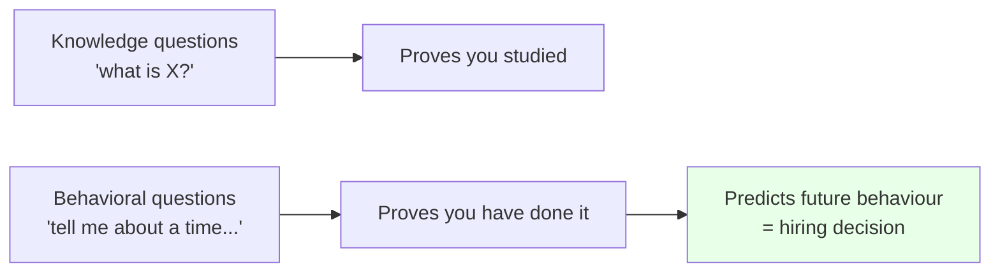
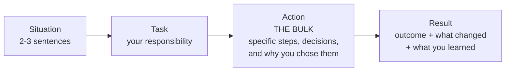

# Part M — Behavioral & Closing

[← Master index](../Amadeus%20Service%20Account%20Executive%20-%20Study%20Guide.md) · [← Part L](Part-L-interview-question-bank.md) · **Part M of M** · [Appendix A — Glossary →](Appendix-A-glossary.md)

> Section goal: convert everything learned so far into interview performance — structured stories, confident "why" answers, sharp questions for the interviewer, and a single page to read the night before.

Covers index item **38**.

**Important:** the stories in this Part are **templates and worked skeletons**, deliberately generic. Fill them with your own real experience. A fabricated story collapses under follow-up questions, and interviewers always follow up.

---

## 71. Why behavioral questions decide interviews

Technical knowledge gets you shortlisted. Behavioral answers get you hired.

The reason: every candidate at final stage can define an SLA. Far fewer can describe, concretely, a time they held a room together while a customer's business was down.

**The underlying belief:** past behaviour predicts future behaviour. So an unstructured, vague answer isn't just poorly told — it reads as evidence the experience is thin.

---

## 72. The STAR method

**STAR** is the standard structure for behavioral answers.

| Letter | Meaning | Time budget | Common error |
|--------|---------|-------------|--------------|
| **S — Situation** | Brief context | 15% | Spending half the answer here |
| **T — Task** | Your specific responsibility | 15% | Describing the team's task, not yours |
| **A — Action** | What **you** did, step by step | 55% | Saying "we" instead of "I" |
| **R — Result** | Outcome, quantified where possible | 15% | Omitting it entirely |

### 🔍 Plain-English deep-dive: the "I" versus "we" problem

The single most common failure in behavioral interviews.

- **"We got the service restored in two hours."** → The interviewer learns nothing about you. You might have been in the room.
- **"I coordinated the bridge, established the business impact, and pushed for a parallel workaround track while engineering pursued the cause. Service was restored in two hours."** → Now they know exactly what you contribute.

**Use "we" for context, "I" for action.** It isn't arrogance — it's the only way to answer the question actually being asked.

### STAR+L — add the learning

Strong candidates add an **L**: what you learned and what you changed afterwards. This converts a story about one event into evidence of a person who improves.

> "…and afterwards I changed how I run handovers — every cross-region handover now includes what's been ruled out, not just current state, because I saw an hour lost re-testing eliminated hypotheses."

---

## 73. Building your story bank

You need **6–8 flexible stories**, not fifteen rigid ones. Most behavioral questions are variations on a handful of themes.

### Coverage matrix

Aim for stories that cover these competencies. One good story often covers three.

| Competency | Which JD requirement it proves |
|------------|-------------------------------|
| **Crisis coordination** | Major incident management |
| **Customer ownership under pressure** | Primary contact, escalations |
| **Influence without authority** | Orchestrating across teams |
| **Analytical insight** | Trend identification, preventive action |
| **Improvement delivery** | Service improvement initiatives |
| **Difficult communication** | Transparency, bad news, saying no |
| **Learning something complex fast** | Understanding customer systems |
| **Handling failure / mistakes** | Accountability, continuous improvement |

### Story selection criteria

A story is worth banking if it has:

1. **A real stake** — something meaningful was at risk.
2. **Your fingerprints** — actions clearly attributable to you.
3. **A decision** — you chose between options; explain why.
4. **An outcome** — ideally measurable.
5. **A learning** — something you do differently now.

> **Tip:** stories where the outcome was imperfect but your handling was excellent are often *stronger* than clean successes. They're more believable, and they demonstrate judgement rather than luck.

---

## 74. Story skeletons to adapt

Fill these with your own experience. The structure is what makes them land.

### Skeleton 1 — Crisis coordination

> **S:** "A business-critical service was degraded during a high-volume period, affecting [who] and blocking [which process]."
> **T:** "I was accountable for coordinating the response and for all customer communication."
> **A:** "I established what we actually knew versus what was assumed. I built the business impact picture — which process was blocked, how many users, what deadline was approaching — and used it to drive prioritisation. I issued a holding update within [X] minutes covering what we knew, what was unaffected, and the next update time. I set a checkpoint rhythm with named owners and timeboxes for each hypothesis, and I insisted on a parallel workaround track rather than waiting for the fix. When [specific blocker], I escalated after warning the team first, with a specific ask and a deadline."
> **R:** "Service was restored in [time] via [workaround/fix], and I verified with the affected users before closing. The customer specifically noted [communication/ownership]."
> **L:** "I learned [specific change you now make]."

### Skeleton 2 — Difficult customer / escalation

> **S:** "A customer escalated after [repeated issue / a significant failure], and confidence in the service had genuinely dropped."
> **T:** "I owned the relationship and had to both address the immediate anger and fix the underlying cause."
> **A:** "I let them state it fully without defending. I acknowledged the actual impact rather than just the frustration — [specific acknowledgement]. I asked what they needed to be able to tell their own leadership, which gave me a concrete deliverable. Then I separated the two problems: the immediate issue, and the pattern behind it. I committed to [specific, controllable, time-bound action] and deliberately kept the commitments small and frequent rather than promising something large."
> **R:** "[Outcome — issue resolved, pattern addressed, relationship recovered, measurable indicator]."
> **L:** "It taught me that trust is rebuilt by frequency of kept promises, not by the size of the promise."

### Skeleton 3 — Analytical insight / proactive prevention

> **S:** "Individual incidents were being closed successfully, but I noticed [pattern] recurring across separate tickets."
> **T:** "Nobody was treating them as connected, so I took it on."
> **A:** "I pulled the data across [period], categorised by [dimension], and found [concentration/timing/correlation]. I checked whether there was a plausible mechanism rather than assuming correlation was causation, and tested it against [control]. I quantified the cost — [X incidents, Y hours of impact] — and brought it as a proposal with an owner and an estimated effort rather than as a complaint."
> **R:** "[Action taken]. In the following [period], incidents in that category fell from [X] to [Y]."
> **L:** "I now treat the third occurrence of anything as a signal, not a coincidence."

### Skeleton 4 — Influence without authority

> **S:** "Resolution depended on a team that didn't report to me and had competing priorities."
> **T:** "I needed [specific outcome] by [deadline] without any authority to direct them."
> **A:** "I reframed the request in terms of business impact rather than my own urgency — [specific impact]. I asked for a single named owner and a date in front of the group, then confirmed it in writing so it was visible. When it slipped, I warned before escalating rather than escalating cold, and I gave the specific ask rather than just raising alarm. I also [reciprocity — how you helped them]."
> **R:** "[Outcome and timing]."
> **L:** "I learned to invest in these relationships before I need them — a first substantive conversation shouldn't happen during a crisis."

### Skeleton 5 — Mistake / failure

> **S:** "[Brief, honest context.]"
> **T:** "I was responsible for [X]."
> **A:** "I [what went wrong — stated plainly, no deflection]. As soon as I realised, I [immediate corrective action], and I raised it myself rather than waiting for it to be discovered. I told [affected party] directly, explained what happened and what I was doing about it."
> **R:** "[Impact contained / outcome]."
> **L:** "I changed [specific process or habit] so it can't recur — [detail]."

> **Note:** never choose a "fake weakness" story (e.g. "I cared too much"). Interviewers recognise it instantly and it costs you credibility for the rest of the interview.

---

## 75. Competency translation table

If your background isn't a literal match for the job title, translate rather than apologise. Almost every service-adjacent role builds the same underlying competencies.

| If your background involved… | It demonstrates… | Frame it as… |
|------------------------------|------------------|--------------|
| Handling urgent technical issues | Incident management | "Ownership of business-critical issues through to resolution" |
| Being the customer's point of contact | Customer relationship management | "Single point of accountability for the customer experience" |
| Coordinating multiple teams on one issue | Stakeholder orchestration | "Driving cross-functional resolution without direct authority" |
| Writing status updates | Incident communication | "Structured communication through the incident lifecycle" |
| Analysing recurring issues | Problem management | "Trend analysis converting reactive work into prevention" |
| Reporting on performance | Service reporting | "Data-driven service performance reporting to stakeholders" |
| Running or presenting at review meetings | Governance | "Service review facilitation and operational reporting" |
| Onboarding or training others | Knowledge and transition | "Knowledge transfer and operational readiness" |
| Improving a process | Continual improvement | "Improvement delivered and verified with data" |
| Working across regions | Global operations | "Follow-the-sun coordination and handover discipline" |
| Escalating or receiving escalations | Escalation management | "Escalation handling with structured stakeholder management" |

### 🔍 Plain-English deep-dive: how to handle a genuine gap

Do not pretend. Interviewers respect three moves:

1. **Name it plainly.** "I haven't worked in airline systems specifically."
2. **Separate learnable from durable.** "Domain knowledge is learnable in weeks to months. What isn't quickly learnable is staying organised in a major incident and coordinating teams who don't report to you — that I've done repeatedly."
3. **Show a plan.** "In my first 30 days I'd focus on the service landscape and incident history; by 60 the business rhythm and peak calendar; by 90 I'd expect to bring a concrete improvement proposal from trend data."

**Why it works:** it converts a defensive moment into a demonstration of exactly the structured thinking the role requires.

---

## 76. The "why" questions

These are scored more heavily than candidates expect, because they predict retention.

### "Why do you want this role?"

**Structure:** what the role actually is → what genuinely draws you → why you're suited.

> "The role is the customer's operational owner — coordinating major incidents, being the single point of contact, and driving improvement so the same failures stop recurring. What draws me is that combination of high-pressure coordination and longer-term analytical work. I like the accountability of being the person the customer relies on when something is genuinely at stake, and I like that the proactive half of the job is what prevents the reactive half. It suits how I work: structured under pressure, and comfortable driving outcomes through people who don't report to me."

**Avoid:** "it's a great opportunity for growth" — that's about you, not about them.

### "Why this company / this industry?"

Show domain understanding.

> "Travel technology is unusual: switching costs are extremely high and failure tolerance is extremely low, because operations can't pause. That combination means the service relationship is genuinely part of the product rather than an add-on — which is exactly why a dedicated service account role exists here rather than being absorbed into support. I also find the domain compelling because the impact is tangible: a degraded service isn't an abstraction, it's passengers standing at a gate."

### "Why are you leaving your current role?"

**Rules:** forward-looking, positive, brief. **Never criticise a current employer** — interviewers assume you'd speak about them the same way.

> "I've built strong foundations in [area] and I'm looking to take on broader ownership — more direct customer accountability and more scope to drive improvement rather than resolve issues one at a time. This role offers exactly that scope."

### "Why should we hire you?"

Three points, each with proof.

> "Three reasons. First, I stay structured under pressure — in a major incident I default to facts, impact, owners, timeboxes and checkpoints, which is what keeps a response moving. Second, I treat communication as a deliverable, not an afterthought — agreed cadence, never missed, including when there's no news. Third, I close the loop analytically: I use trend data to convert repeated incidents into prevention, and I verify improvement with data rather than declaring victory when a fix is deployed."

---

## 77. Questions to ask the interviewer

**Always have questions.** Having none signals low interest. Prepare 6–8; you'll likely ask 3–4.

### About the role

- "What does a typical week look like — what's the split between reactive incident work and proactive improvement?"
- "How many customers would I own, and how are they segmented?"
- "What does the escalation path look like when I need to unblock something?"
- "How is success measured in the first six months?"

### About the customer and service

- "What are the biggest service challenges with the strategic accounts right now?"
- "What does the governance cadence look like — which meetings do I own?"
- "How mature is the problem management practice? Is prevention resourced, or does firefighting usually win?"

### About the team and ways of working

- "How do the service account, delivery and operations teams work together day to day?"
- "How is out-of-hours coverage structured — rota, on-call, or follow-the-sun?"
- "What's the handover discipline like across regions?"

### Insightful questions that land well

- "What separates someone who does this job adequately from someone who does it excellently?"
- "What's the most common reason someone struggles in this role?"
- "If I looked back in a year at a successful first twelve months, what would have changed for the customer?"

### Never ask (in a first interview)

| Avoid | Why |
|-------|-----|
| Salary and benefits detail | Wrong stage; signals priority |
| "What does the company do?" | Proves you didn't prepare |
| "How much overtime is there?" | Reads as reluctance |
| "When can I be promoted?" | Suggests you're not focused on this role |
| Anything answered on their website | Wasted opportunity |

---

## 78. Interview mechanics

| Aspect | Guidance |
|--------|----------|
| **Preparation** | Re-read the JD the morning of. Have the master index and this Part open. |
| **Setup (virtual)** | Test audio/video early. Neutral background. Camera at eye level. Good light in front of you. |
| **Notes** | A single page of prompts is fine and looks prepared. Don't read from a script. |
| **Pace** | Slow down. Nerves accelerate speech. Pauses read as thoughtfulness. |
| **Thinking time** | "That's a good question, let me think for a moment" is entirely acceptable. |
| **Clarifying** | Ask if a question is ambiguous — it demonstrates the exact behaviour the role needs. |
| **Length** | Aim for 90 seconds to 2 minutes per behavioral answer. Then stop. |
| **Not knowing** | "I haven't encountered that. My approach would be…" — never bluff. |
| **Closing** | Thank them, restate interest briefly, ask about next steps. |

### 🔍 Plain-English deep-dive: handling the answer that's going badly

Sometimes you'll realise mid-answer that you're rambling or answered the wrong question.

**The recovery move:** stop and reset explicitly.

> "Let me tighten that up — the core of it was: [one-sentence summary]."

Interviewers respond well to this. Self-correction under pressure is precisely the skill a major incident demands, so demonstrating it live is a genuine positive, not a recovery from a negative.

---

## 79. The night-before cheat sheet

**One page. Read it once. Then stop revising and sleep.**

---

### The role in one line
Own the customer's operational outcome; coordinate the fix; communicate relentlessly; prevent recurrence.

### Non-negotiable definitions
- **Incident** = unplanned interruption **or degradation** → restore fast.
- **Problem** = the cause → prevent recurrence.
- **Priority** = impact × urgency. **Severity ≠ priority.**
- **SLA** = customer promise · **SLO** = stricter internal target · **OLA** = internal · **UC** = vendor.
- **Restoration ≠ resolution.** A workaround counts.
- **RTO** = how long down · **RPO** = how much data lost.

### The major incident spine
Declare → roles → facts → business impact → holding statement → checkpoints (facts, hypotheses, owners, timeboxes) → **parallel workaround + fix** → verify with users → close the loop → blameless PIR with owned, dated actions.

### Lines to have ready
- "Restore first, explain later."
- "I own the outcome, not the repair."
- "Go deep on diagnosis and the customer goes dark."
- "Declaring is cheap; under-declaring isn't."
- "Commit to the next update time, not the fix time."
- "Silence reads as neglect."
- "A workaround must be *practical*, not just valid."
- "Trust is rebuilt by small kept promises, not bigger ones."
- "Deployed isn't solved — did the incidents actually stop?"
- "Raise the bad news yourself, first."
- "Relationships are built in peacetime and spent in wartime."

### Analytical toolkit
5 Whys (three chains: failed / not detected / slow to restore) · Ishikawa · **Kepner-Tregoe is/is-not** · Pareto · Swiss cheese · correlation ≠ causation · leading vs lagging · balanced metric pairs.

### Industry hooks
**GDS** = marketplace · **PSS** = inventory + ticketing + **DCS** · **PNR** = booking file · **IROPS** = disruption (load spikes when tolerance is lowest) · **NDC/ONE Order** = dynamic offers, single order, more integration surface.

### Behavioral reminders
"**I**", not "we" · Action is 55% of the answer · Always give the **Result** · Add the **Learning** · 90 seconds to 2 minutes · Stop talking when done.

### Questions I will ask
1. Reactive/proactive split in a typical week?
2. Biggest current service challenge on the strategic accounts?
3. What separates adequate from excellent in this role?

### Mindset
They already believe you might be able to do this — that's why you're here. Your job is to be clear, structured and honest. **Slow down.** Pauses are fine.

---

## ⭐ Likely Interview Questions for This Section

**Q1. "Tell me about yourself."**
> *Model approach:* 90 seconds, three beats. Where you are now and what you own; the two or three capabilities most relevant to this role, each with a one-line proof; why this role is the logical next step. Do not narrate your CV chronologically — select for relevance. Finish by handing the conversation back: "…which is why this role stood out."

**Q2. "What's your biggest weakness?"**
> *Model answer:* Pick a real one with a built mitigation. For example: "I used to take on too much of the coordination myself in a crisis rather than delegating, because it felt faster. I learned it doesn't scale and it makes me the single point of failure. Now I explicitly assign named owners at the start of a major incident, including for things I'd instinctively pick up, and I hold myself to staying on coordination and communication. It's still my instinct to jump in — but the structure stops me." Never use a disguised strength; interviewers recognise it immediately.

**Q3. "How do you handle pressure?"**
> *Model answer:* Describe structure rather than feelings. "By having a default loop I fall back on: establish the facts, state the business impact, name owners, set timeboxes, set the next checkpoint. That gives me something concrete to do in every chaotic moment, so I'm never deciding what to do next from scratch. I also protect the communication commitment above everything else, because if updates keep landing on time, the customer stays calm even while the problem is unresolved — and a calm customer makes everyone else's job easier."

**Q4. "What would your first 90 days look like?"**
> *Model answer:* "First 30: learn the service landscape — which systems the customers use, the architecture at a high level, contractual commitments, incident history, and who's who internally. Days 30 to 60: learn the business rhythm — peak calendars, the daily processes that matter most, which failures hurt most and why, and building relationships with both customer and internal stakeholders before I need them. Days 60 to 90: start adding value — take full ownership of the governance cadence, and bring a concrete improvement proposal derived from trend data to a service review. I'd want my first visible contribution to be evidence-based rather than cosmetic."

**Q5. "Do you have any questions for us?"**
> *Model answer:* Always yes — and ask something that reveals how the role really works. "What's the split between reactive incident work and proactive improvement in a typical week? What are the biggest service challenges on the strategic accounts right now? And what separates someone who does this job adequately from someone who does it excellently?" That last one frequently produces the most useful answer of the entire interview, and it signals you're thinking about performing well rather than just being hired.

**Q6. "You don't have direct experience in this exact domain. Convince me."**
> *Model answer:* Name it plainly, then separate learnable from durable, then show a plan. "That's fair — I haven't worked in airline systems specifically. Domain knowledge is learnable, and I'd build it deliberately: the passenger journey, the core systems, the peak calendar, and above all what each failure costs the business. What isn't quickly learnable is staying structured in a major incident, coordinating teams who don't report to you, and holding a customer's confidence while their business is disrupted — and that's the core of this role. I'd rather be honest about the gap and show you how I'd close it than overstate familiarity you'd uncover in the first week."

**Q7. "Is there anything else you'd like us to know?"**
> *Model answer:* Use it deliberately — it's an invitation, not a formality. Either fill a gap you noticed ("I don't think I fully answered the earlier question about X — the key point was…") or close with a concise summary of fit: "Only that the two parts of this role I'd genuinely enjoy are the ones that are hardest to fake — being the person who's accountable when something is at stake, and doing the analytical work that stops it happening again. I'd be glad to take that on here."

---

## 🧠 30-Second Memory Hooks

- **Knowledge shortlists you; behavior hires you.**
- **STAR** — Action is 55%. **Always give the Result. Add the Learning.**
- **"I" for action, "we" for context.** The #1 behavioral failure.
- **6–8 flexible stories**, not 15 rigid ones. One good story covers three competencies.
- **Imperfect outcome + excellent handling** often beats a clean win.
- **Gaps:** name it → learnable vs durable → show the 30/60/90 plan.
- **"Why leave?"** — forward-looking, never criticise a current employer.
- **Always have questions.** Best one: "What separates adequate from excellent here?"
- **Never bluff.** "I haven't encountered that; my approach would be…"
- **Rambling? Reset explicitly:** "Let me tighten that up — the core was…"
- **90 seconds to 2 minutes, then stop talking.**
- **Slow down. Pauses read as thoughtfulness.**

---

## Honest readiness check

Working through this guide builds real knowledge, and knowledge is genuinely half the battle. But be candid with yourself about the other half:

| Have you actually… | If no… |
|--------------------|--------|
| Said your answers **out loud**, not just read them? | Recognition isn't recall. Do a full spoken pass of Part L. |
| Written **your own** STAR stories in full sentences? | Skeletons aren't stories. Write 6–8 before the interview. |
| Timed a behavioral answer? | Most people run to four minutes. Practise landing at two. |
| Prepared your questions for the interviewer? | Pick three from section 77. |
| Done a **mock interview** with someone? | This is the single highest-value remaining action. |

**If you can do those five, you're prepared.** If you've only read, you're informed — which is not the same thing.

---

*You've reached the end of the main guide.* Continue to the appendices: **[Appendix A — Glossary](Appendix-A-glossary.md)** for every term in one place, **[Appendix B — Worked Scenario](Appendix-B-worked-scenario.md)** to see every technique connected in a single story, and **[Appendix C — Quick Reference](Appendix-C-quick-reference.md)** for all formulas, matrices and templates.

---

[← Master index](../Amadeus%20Service%20Account%20Executive%20-%20Study%20Guide.md) · [← Part L](Part-L-interview-question-bank.md) · [Appendix A →](Appendix-A-glossary.md)
