# Part 1 — The Role, the Org & Your Gap Map

> **Section goal:** Understand *exactly* what this job is, where it sits inside Microsoft, what they will test you on, and how your current Microsoft CE&S experience maps onto it — so every later Part has a clear purpose. By the end of this section you will be able to draw the org chart from memory, decode every JD bullet, know your honest gap map, and articulate your unique positioning narrative confidently.

Covers index items **1** and maps to the entire Job Description (JD).

---

## 1. How to use this Part

This Part is your **map before the journey**.

If Part 2 onward teaches you the tools, this Part teaches you **why those tools matter in this specific Microsoft job**.

Read it like this:
- First, learn the org map.
- Second, understand the support business model and economics.
- Third, decode the JD bullet by bullet.
- Fourth, be brutally honest about your green / yellow / red gaps.
- Fifth, memorize your positioning story so every answer sounds coherent.

### 🔍 Plain-English deep-dive: why this Part matters so much
- **Role clarity** — *knowing what the job is really for.* **Analogy:** before building a house, you need the blueprint. **Why it matters:** otherwise you study random tools without knowing how they fit.
- **Org context** — *knowing where the team sits and who they serve.* **Analogy:** knowing which department in a hospital you work in before learning the machines. **Why it matters:** interviewers trust candidates who understand the business setting.
- **Gap map** — *an honest picture of what you already have and what you still need.* **Analogy:** a GPS route showing both where you are and where you must go. **Why it matters:** strong candidates are self-aware, not fake-perfect.

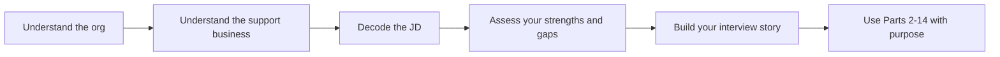

> 💡 **Tie-in to your background:** You are already inside Microsoft CE&S. That means this Part is not about inventing a fake story. It is about **reframing your real experience** so it aligns with the BI Data Analyst role.

---

## 2. The biggest picture: where this role lives inside Microsoft

Before any SQL, Power BI, Fabric, or DAX, you need a clean mental model of the organization.

A beginner mistake is to think: “This is just a data job.”

It is not.

It is a **business intelligence role inside a customer-facing services organization**, and that context changes everything about what the data means.

### 2.1 Microsoft at the highest level

At the simplest level, Microsoft creates products, sells them, supports customers, and tries to make those customers successful enough to renew, expand, and advocate.

That means you can think of Microsoft as having broad layers such as:
- product building,
- go-to-market and sales,
- delivery and post-sales experience,
- support and success operations,
- corporate functions.

This role lives in the **post-sales / customer-experience world**.

### 🔍 Plain-English deep-dive: what “post-sales” means
- **Post-sales** — *everything that happens after the customer has bought.* **Analogy:** buying a gym membership is the sale; onboarding, coaching, issue resolution, and renewal are post-sale. **Why it matters:** CE&S exists because buying software is not the end of the customer relationship.
- **Customer lifecycle** — *the stages a customer moves through: adopt, use, expand, renew.* **Analogy:** planting a tree, watering it, pruning it, and keeping it healthy. **Why it matters:** analytics in CE&S helps Microsoft understand where customers struggle or succeed in that lifecycle.

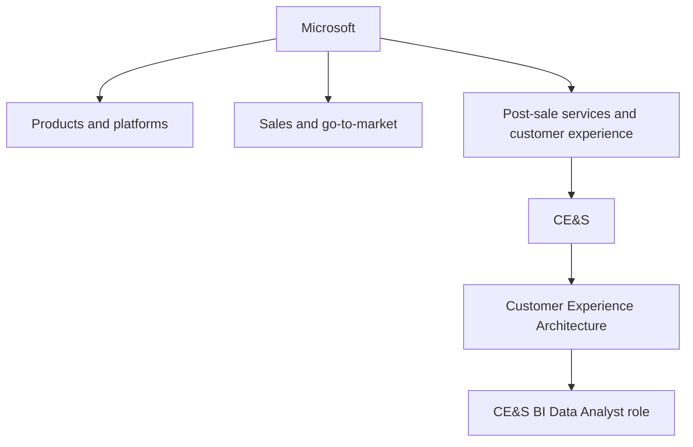

### 2.2 CE&S in plain English

**CE&S** stands for **Customer Experience & Success**.

This is the part of Microsoft that helps customers *after* purchase: adopting, operating, improving, and getting support for Microsoft solutions.

### 🔍 Plain-English deep-dive: the CE&S acronym
- **Customer** — *the buyer or user of Microsoft's products and services.* **Analogy:** the passenger on the flight. **Why it matters:** every metric eventually points back to customer experience.
- **Experience** — *how the customer feels and what the customer goes through across journeys and touchpoints.* **Analogy:** not just whether the food arrived, but whether ordering it felt easy. **Why it matters:** support is not only about solving the issue; it is about the whole interaction.
- **Success** — *whether the customer gets value from the product and continues using it.* **Analogy:** buying a treadmill is one thing; using it consistently and getting healthier is success. **Why it matters:** a customer can technically own a product and still fail to achieve value.

### 2.3 CXA in plain English

**CXA** stands for **Customer Experience Architecture**.

That sounds abstract, so simplify it:

CXA is about designing the **operating blueprint** for how customer experience and support journeys should work across CE&S.

### 🔍 Plain-English deep-dive: what “architecture” means here
- **Architecture** — *the deliberate design of how parts fit together.* **Analogy:** a city planner deciding where roads, water lines, and transport routes go. **Why it matters:** CXA is not just doing work; it is designing the system in which work happens.
- **Customer motion** — *a repeatable journey or workflow used to serve customers.* **Analogy:** the choreography in a dance routine. **Why it matters:** BI then measures whether the choreography produces better results.

### 2.4 CE&S BI in plain English

The **CE&S BI team** turns operational activity into decisions.

That means:
- collecting and shaping data,
- defining consistent metrics,
- building trusted models,
- powering dashboards and self-serve analytics,
- measuring what improves customer experience,
- supporting data-driven decisions across assisted and self-service support.

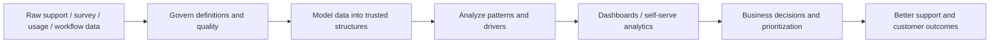

> 💡 **Tie-in to your background:** You already live near the right-hand side of this diagram — decisions, escalations, MBRs, stakeholder communication. This role lets you move leftward too: into the governed data, models, and analytics layer that powers those decisions.

---

## 3. The Microsoft org map in depth

Now let us go one level deeper than the simple chart.

### 3.1 The org map from Microsoft to your target role

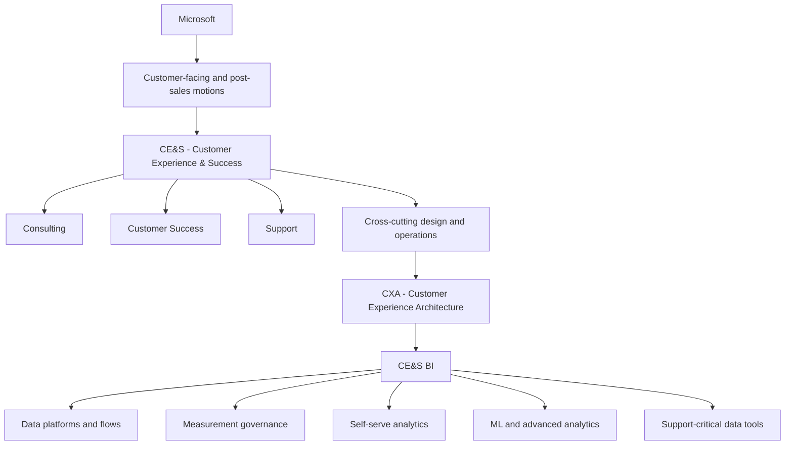

### 3.2 Where consulting, customer success, and support sit

These three often get blurred together by outsiders, but they are different.

| Function | Plain-English meaning | Analogy | Typical KPIs | Why it matters for this role |
|---|---|---|---|---|
| Consulting | Delivers planned solution work, architecture, implementation, transformation programs. | Hiring an expert contractor or architect to help build the house. | Project delivery quality, adoption, milestones, business outcomes. | Shows why not all CE&S data is “ticket data”; some is project and adoption data. |
| Customer Success | Helps customers adopt, realize value, and expand usage over time. | A fitness coach helping you actually use the gym membership well. | Usage, health scores, retention, renewal, expansion, risk signals. | Explains why CE&S BI may connect support data with usage and renewal signals. |
| Support | Helps resolve incidents, questions, break/fix issues, and service friction. | The emergency desk or service center when something goes wrong. | Resolution time, CSAT, escalation rate, backlog, self-serve deflection. | This is your home turf — and the most obvious bridge into the BI role. |

### 🔍 Plain-English deep-dive: why these distinctions matter in interviews
- **Consulting data** is often project-based. **Analogy:** a construction project plan. **Why it matters:** success may be measured by delivery milestones or business transformation outcomes.
- **Customer success data** is often lifecycle-based. **Analogy:** a retention coach checking whether habits are sticking. **Why it matters:** it links product usage and account health to renewals and risk.
- **Support data** is often event-based. **Analogy:** emergency-room visits. **Why it matters:** the role you want focuses heavily on support surfaces and customer experience signals.

A smart interview answer shows that you know the CE&S BI team may need to connect all three worlds, but the role especially cares about **support experience and self-serve analytics**.

### 3.3 Where your current experience fits

You are currently strongest in the **Support** lane.

That gives you unusually strong intuition for:
- incident flows,
- escalation patterns,
- customer pain points,
- what senior leaders actually ask for in MBRs,
- where metrics become misleading if definitions are sloppy,
- why governance matters.

That is a major advantage because many analysts know the tools but do **not** understand the lived support business.

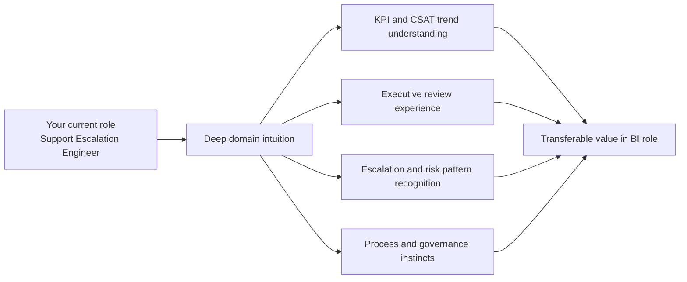

> 💡 **Tie-in to your background:** A good way to phrase this is: “I already understand the operational reality behind the metrics. I know what an escalation looks like on the ground, not just in a dashboard.”

---

## 4. Assisted vs self-service support surfaces in detail

This is one of the most important concepts in the whole role.

The CE&S BI team supports decisions across **assisted** and **self-service** surfaces.

If you can explain these cleanly, you sound like someone who understands the business model.

### 4.1 Assisted support

**Assisted support** means a human helps the customer.

Examples:
- opening a support ticket,
- chatting with an engineer,
- phone support,
- escalation management,
- expert-assisted troubleshooting,
- case management workflows.

### 🔍 Plain-English deep-dive: assisted support
- **Assisted** — *human-in-the-loop support.* **Analogy:** going to a doctor instead of reading a health article online. **Why it matters:** it is usually more expensive, more personalized, and richer in case-level data.
- **Case / incident** — *a tracked support problem raised by a customer.* **Analogy:** a repair ticket at a car service center. **Why it matters:** a lot of support analytics starts with case data.
- **Escalation** — *when an issue is raised to higher expertise or urgency.* **Analogy:** a store employee calling the manager because the situation is beyond standard handling. **Why it matters:** escalation rate often signals complexity, quality issues, or training gaps.

### 4.2 Self-service support

**Self-service support** means the customer solves the problem without directly involving a human engineer.

Examples:
- documentation and help articles,
- guided troubleshooters,
- community answers,
- chatbots,
- Copilot-based assistance,
- in-product help,
- automated diagnostics.

### 🔍 Plain-English deep-dive: self-service
- **Self-service** — *the customer helps themselves using designed tools and content.* **Analogy:** airport self check-in instead of the staffed desk. **Why it matters:** it can scale far more cheaply than assisted support.
- **Deflection** — *when a would-have-been assisted case is prevented because self-service solved it first.* **Analogy:** a FAQ page preventing hundreds of repetitive phone calls. **Why it matters:** deflection is a major economics lever.
- **Containment** — *the interaction stayed in the automated or self-service channel without needing handoff.* **Analogy:** the customer completed the transaction in the ATM without needing the bank teller. **Why it matters:** it measures how effective the self-service flow is.

### 4.3 Why both surfaces matter together

The goal is not simply “push everything to self-service.”

The real goal is:
- resolve the right issues in the right channel,
- at the right cost,
- with a good customer experience,
- while preserving trust.

That means:
- simple, repetitive issues should ideally be solved self-serve,
- complex or high-risk issues may need assisted support,
- analytics must monitor both efficiency and experience.

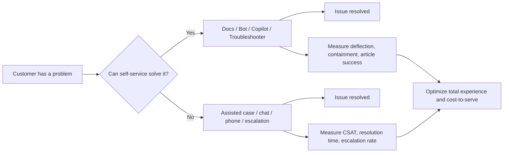

### 4.4 Typical assisted vs self-service metrics

| Area | Assisted support | Self-service support | Why the BI team cares |
|---|---|---|---|
| Core objective | Resolve complex issues with human help | Resolve simpler issues without human help | The mix changes both customer experience and operating cost |
| Typical data | Cases, queues, agents, escalations, surveys | Page views, search terms, bot turns, containment events | Different surfaces create different kinds of telemetry |
| Efficiency metrics | Resolution time, queue depth, backlog, transfer rate | Containment, article success, completion rate, deflection | The team needs channel-specific performance views |
| Experience metrics | CSAT, recontact rate, complaint signals | Feedback score, failed search rate, abandonment | Good self-service still needs good experience |
| Economics | Higher cost per interaction | Lower cost per interaction if effective | Channel shift affects spend materially |
| Risk | Can be slow/expensive if volume spikes | Can frustrate users if content or automation is weak | Over-optimization in either direction hurts customers |

### 4.5 Real examples tied to your background

Because you worked in SharePoint Online and OneDrive for Business support, you can explain this with concrete examples.

For example:
- a password reset or common sync setup issue may be solvable through docs or a guided tool,
- a complex tenant-level SPO permissions or service-behavior issue may require assisted investigation,
- a recurring class of case can be analyzed and partially shifted into better self-service content,
- BI can show whether that shift actually lowered case volume **without** harming satisfaction.

> 💡 **Tie-in to your background:** You can say, “In my current role I have seen firsthand which issues should never have needed engineer time if better self-service guidance existed, and which issues genuinely require expert-assisted handling. That helps me think about analytics not just as reporting, but as channel-design evidence.”

---

## 5. The support business model and economics

A lot of candidates can explain dashboards.

Fewer can explain **why support analytics exists economically**.

This section gives you that business layer.

### 5.1 What “cost-to-serve” means

**Cost-to-serve** is the total cost required to support customers through a channel, journey, or process.

### 🔍 Plain-English deep-dive: cost-to-serve
- **Cost-to-serve** — *how much it costs the business to provide support or service.* **Analogy:** what it costs a restaurant to serve one meal, including staff, ingredients, kitchen time, and overhead. **Why it matters:** support strategy is not only about solving problems; it is about solving them sustainably.
- **Unit economics** — *the economics of one unit, like one case, one interaction, or one customer segment.* **Analogy:** profit or cost per ride in a taxi business. **Why it matters:** analytics often looks at cost or value per case, per channel, or per segment.
- **Operating leverage** — *improving output faster than cost increases.* **Analogy:** one teacher reaching many students through a recorded course instead of one-on-one tutoring. **Why it matters:** self-service creates leverage if it works well.

### 5.2 Why self-service and deflection matter economically

When a self-service experience genuinely solves a simple issue:
- the customer may get a faster answer,
- assisted support volume can decrease,
- engineers can focus on harder issues,
- support cost per resolved issue can fall,
- the whole system can scale better.

But there is a trap.

If self-service is poor:
- customers may waste time,
- frustration may increase,
- they may eventually still create a case,
- total effort may actually increase,
- satisfaction can drop.

So the right question is not “How much can we deflect?”

The right question is “How much **good** deflection can we create while protecting experience and quality?”

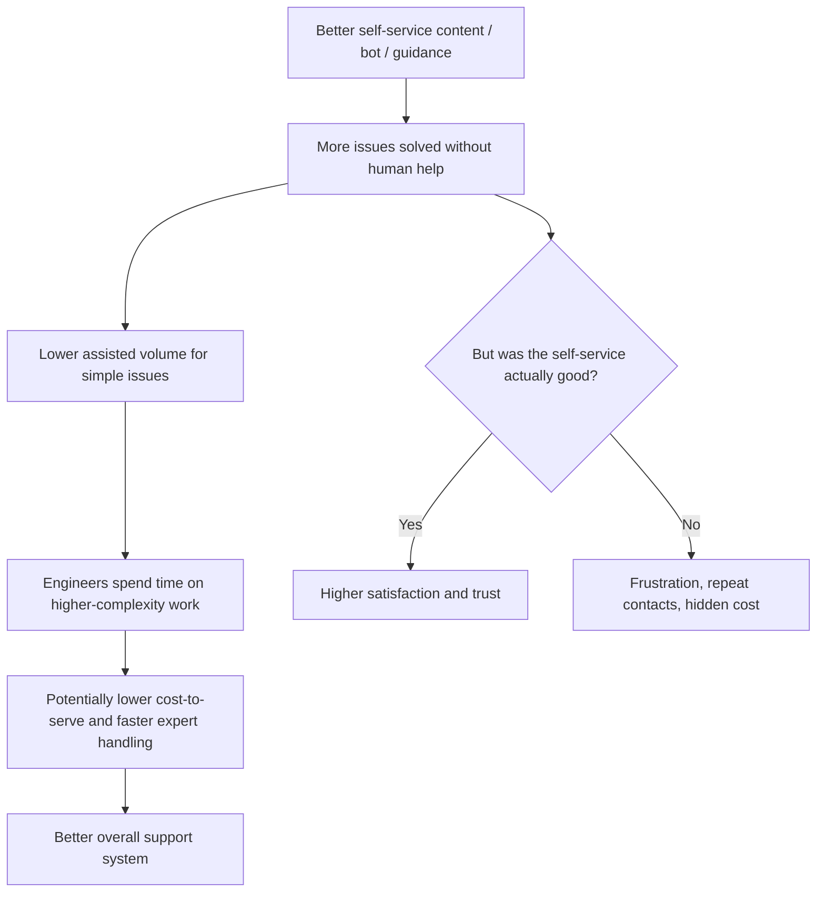

### 5.3 The classic support economics trade-off

| If you optimize for... | You may gain... | But you may risk... | Smart BI perspective |
|---|---|---|---|
| Lowest cost | Lower spend per interaction | Poor experience if users are pushed away from human help too aggressively | Track cost together with quality and recontact |
| Highest satisfaction only | Very high-touch service | Unsustainable cost and slower scaling | Segment by issue type and value, not one-size-fits-all |
| Fastest resolution only | Lower handle time on paper | Surface-level fixes or metric gaming | Look at repeat contact and outcome quality too |
| Maximum deflection | Lower assisted volume | False deflection if customers later return in a worse state | Pair deflection with downstream experience metrics |

### 5.4 Why BI matters to support economics

Business intelligence matters because leaders cannot improve what they cannot see clearly.

The BI team helps leaders answer questions like:
- Which issue types are good candidates for self-service?
- Which journeys cause avoidable assisted volume?
- Which segments are most expensive to support?
- Are costs dropping because experience improved, or because we pushed pain elsewhere?
- Where should we invest: content, product fixes, training, automation, or staffing?

> 💡 **Tie-in to your background:** Your experience with KPI and CSAT trend analysis is already very close to this. The step up is adding the *business-intelligence structure* behind the analysis: clearer definitions, better segmentation, governed models, and measurable impact.

### 5.5 Why this role probably cares about measurement governance so much

If one team calculates “deflection” one way and another team calculates it differently, leadership can make the wrong investment decision.

If “CSAT” includes different survey windows or filters in different reports, comparisons become fake.

If “Enterprise” and “SMB” are classified differently across reports, trend analysis becomes unreliable.

That is why this role is not just building dashboards.

It is about protecting the business from **bad decisions caused by inconsistent measurement**.

---

## 6. Support plans, contracts, and customer segments

You do not need confidential commercial detail.

But you do need a clean public-safe understanding of the support context.

### 6.1 Unified / Premier support context in plain English

Historically, Microsoft support has included premium support arrangements such as **Premier** and later **Unified** support.

At a simple level, think of these as structured support relationships with enterprise customers, often with broader service expectations, planning, and engagement depth than a basic support interaction.

### 🔍 Plain-English deep-dive: why this context matters
- **Support plan / support contract** — *the service relationship that determines what support the customer receives and how it is delivered.* **Analogy:** airline ticket classes with different service entitlements. **Why it matters:** service model and customer expectation often vary by support relationship.
- **Enterprise customer** — *a larger organization with more complexity, scale, and stakeholder layers.* **Analogy:** managing a city transit system instead of one family car. **Why it matters:** the analytics often needs more segmentation and higher service rigor.
- **SMB** — *small and medium business customers.* **Analogy:** a neighborhood business instead of a multinational corporation. **Why it matters:** needs, cost sensitivity, support volume patterns, and touch models can differ materially.

### 6.2 SMB vs Enterprise segments

| Dimension | SMB | Enterprise | Interview takeaway |
|---|---|---|---|
| Typical scale | Smaller orgs, fewer stakeholders, less internal IT complexity | Large orgs, many stakeholders, more complexity and governance | Segmented analytics matters because one support model rarely fits both |
| Support pattern | Often more standardized, volume-sensitive | More complex, higher-risk, more escalations and cross-team involvement | Complexity changes both cost-to-serve and expected experience |
| Decision style | May prefer simpler guidance and faster paths | May need richer reporting, governance, and tailored motions | Audience-tailored analytics is critical |
| Economics | Efficiency matters heavily at scale | Value protection and risk management matter strongly too | A metric can look good in aggregate but hide segment-specific issues |
| Example tie-in | Your SMB CSAT >4.85 shows high-quality service in a cost-sensitive environment | Your DP CSAT >4.75 and escalation experience shows strength in more complex contexts | Use both as evidence that you understand segment differences |

### 6.3 Partner / delivery-partner (DP) model in plain English

Microsoft often works through partners or delivery partners in parts of its support and customer experience ecosystem.

At a safe high level, the **DP model** means that some customer-facing work is carried out by partner organizations operating within Microsoft's service framework, standards, and expectations.

### 🔍 Plain-English deep-dive: DP model
- **Partner** — *an external organization working with Microsoft to deliver value.* **Analogy:** an airline using an authorized regional operator on some routes. **Why it matters:** data and governance must still stay consistent across who delivers the service.
- **Delivery Partner (DP)** — *a partner participating in service delivery under agreed models and measurements.* **Analogy:** a franchise branch following the same brand standards. **Why it matters:** BI helps compare performance, quality, and consistency across delivery models.
- **Operational governance** — *the rules, controls, and review mechanisms that keep delivery aligned.* **Analogy:** restaurant chain standards that every branch must follow. **Why it matters:** this is one of your strongest transferable themes.

### 6.4 Why segments and delivery model matter to analytics

A dashboard is only useful if it can answer questions like:
- Is CSAT different in SMB vs Enterprise?
- Is cost-to-serve different in partner-delivered vs Microsoft-delivered work?
- Which issue categories drive the most assisted cost in each segment?
- Does self-service work equally well for all customer types?
- Where do escalations cluster by segment, product, and support route?

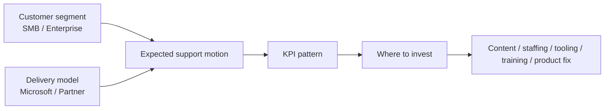

> 💡 **Tie-in to your background:** Your DP CSAT and SMB CSAT results are not just “numbers on a CV.” They are evidence that you can talk about performance across different delivery and customer contexts.

---

## 7. What a CE&S BI Data Analyst actually does day to day

The JD sounds broad because the role sits between business problems and data solutions.

A simple way to think about it is this:

A CE&S BI Data Analyst is a **translator + builder + quality guardian + storyteller**.

### 7.1 The four hats of the role

| Hat | Plain-English meaning | Typical activities | Why it matters |
|---|---|---|---|
| Translator | Turns vague business asks into clear technical requirements | Discovery calls, user stories, acceptance criteria, metric definitions | Most analytics problems are ambiguity problems first |
| Builder | Creates the data, model, and reporting solution | SQL, Python/PySpark, Fabric, semantic modeling, Power BI | This is the hands-on delivery side of the role |
| Quality guardian | Protects trust in the numbers | Validation, timeliness checks, business-rule logic, taxonomy governance | Wrong numbers destroy credibility fast |
| Storyteller | Explains what the numbers mean and what to do next | Executive readouts, dashboard walkthroughs, impact measurement | Insight only matters when it changes decisions |

### 7.2 From raw data to business action

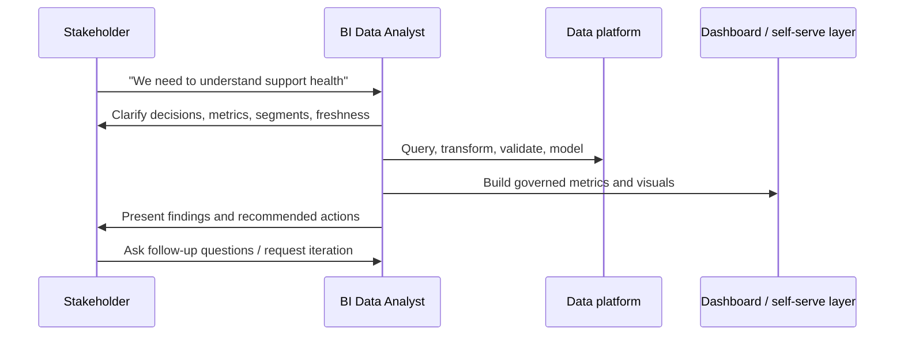

### 7.3 A day in the life (example)

A realistic day might include:
- reviewing overnight refresh failures or data-quality alerts,
- answering stakeholder questions about a KPI trend,
- refining an intake request into stories and acceptance criteria,
- writing or reviewing SQL / Python logic,
- updating a Power BI semantic model or dashboard,
- validating numbers against a source-of-truth sample,
- presenting findings in a team sync or leadership review,
- documenting business rules for future self-serve users.

### 7.4 A week in the life (example)

| Time frame | Typical focus | What success looks like |
|---|---|---|
| Monday | Review business priorities, sprint board, refresh status, stakeholder asks | Clear priority order and no hidden data-quality surprises |
| Tuesday | Deep work on SQL / Fabric / modeling / analysis | A working data pipeline, model, or analysis increment |
| Wednesday | Stakeholder review and requirement refinement | Ambiguity reduced; decisions documented; scope controlled |
| Thursday | Visualization, validation, metric testing, narrative drafting | A trustworthy insight-ready output |
| Friday | Readout, retrospective, backlog hygiene, handoff/documentation | Stakeholders aligned; next work sequenced; knowledge retained |

### 7.5 Why your current role is closer than it first appears

Your current work already includes:
- analyzing CSAT and KPI trends,
- preparing MBRs for leadership,
- communicating under pressure,
- operating with governance and compliance awareness,
- coordinating across teams,
- mentoring and process improvement.

Those are not side skills.

They are the **business half** of the BI role.

The main delta is that the new role expects you to own more of the **technical analytics stack** directly.

> 💡 **Tie-in to your background:** In interviews, avoid framing yourself as “coming from pure support.” A better framing is: “I already perform the stakeholder, metric, and governance side of analytics in CE&S; I am now formalizing and deepening the technical build side.”

---

## 8. Responsibility-by-responsibility decode of the full job description

This is the heart of Part 1.

The goal is to turn each JD bullet from intimidating corporate language into something you can understand, map to proof, and connect to later Parts.

### 8.1 How to read the table

Each row below does five things:
1. translates the JD into plain English,
2. explains what the interviewer is really testing,
3. ties the bullet to your current evidence,
4. shows which later Part strengthens that bullet,
5. gives you a short answer angle.

| JD bullet / theme | Plain-English decode | What they are really testing | Arti evidence today | Later Parts | Your answer angle |
|---|---|---|---|---|---|
| Partner with and understand business needs, translating them into technical requirements | Listen carefully, find the real decision, define metrics and scope, and write requirements engineers can build from. | Ambiguity handling, stakeholder discovery, requirements quality. | Strong evidence: MBRs, leadership reporting, cross-functional collaboration, operational reviews. | Part 8, Part 13 | “I already translate leadership questions into actionable reporting asks; I want to make that translation even more structured and technical.” |
| Determine the best analytical technique and develop analytic models for complex issues | Choose the right type of analysis instead of using one tool for everything. | Analytical judgment, problem framing, method selection. | Partial evidence: trend analysis, escalation pattern review, root-cause discussions. | Part 2, Part 5, Part 11 | “I am comfortable starting from the business problem first, then choosing whether the right answer is trend, segmentation, driver analysis, or prediction.” |
| Analyze data using SQL, Python, Fabric, Synapse, Databricks, Power BI, and related tools | Work hands-on in the stack, not just consume dashboards built by others. | Tool fluency and ability to build end to end. | Partial evidence: Power BI, SQL, Python/R, certifications, MBA in progress. | Part 3, Part 4, Part 6, Part 7, Part 14 | “My domain depth is already strong; the study plan focuses on deepening the Microsoft analytics stack so I can build the solution myself.” |
| Design, execute, and streamline intake processes including user stories, acceptance criteria, bug and data matrices, estimation, and sequencing | Run the front door into the team so requests arrive clear, testable, and prioritized. | Process design, agile delivery, structured thinking. | Strong/partial evidence: governance, process improvement, escalation workflows, stakeholder coordination. | Part 8 | “My operations background is a strength here because I naturally think in controlled intake, prioritization, and review loops.” |
| Insist on high standards of quality, including data accuracy and timeliness | Make sure the numbers are right and refreshed when the business expects them. | Trustworthiness, validation discipline, operational rigor. | Strong evidence: governance/compliance/risk orientation, leadership reporting where accuracy matters. | Part 9 | “In support, an inaccurate metric can drive the wrong escalation decision; I bring that same rigor to analytics outputs.” |
| Ensure outputs adhere to consistent frameworks and standards, including business-rule logic and taxonomy | Create one shared language so different reports do not tell different stories. | Metric governance, semantic consistency, enterprise thinking. | Strong evidence: governance/process discipline; partial technical depth to be strengthened. | Part 5, Part 9 | “I am used to enforcing consistent process language; the data equivalent is codifying metrics and taxonomy centrally.” |
| Define and measure the success or impact of analytics and reporting features using quantitative measures | Do not stop at shipping a dashboard; prove it changed something. | Product mindset for analytics, impact measurement, experimentation thinking. | Strong evidence: KPI review and process-improvement outcomes communicated to leadership. | Part 9, Part 14 | “A report only matters if it changes decisions or outcomes; I already think in terms of measurable improvement.” |
| Practice agile methods | Work iteratively in backlog, sprints, refinement, review, and continuous improvement. | Delivery rhythm, scope management, iteration discipline. | Partial evidence: process improvement and cross-functional operating cadence; formal agile vocabulary to strengthen. | Part 8 | “I have operated in iterative, cross-functional environments and I am formalizing the agile language and artifacts.” |
| Communicate clearly and tailor the message to varied stakeholder audiences | Explain the same analysis differently to executives, managers, and technical peers. | Audience awareness, storytelling, executive presence. | Very strong evidence: MBRs, executive stakeholder communications, recognitions. | Part 7, Part 13 | “I already present trends to leadership and adjust the level of detail based on the audience.” |
| Develop greatness in peers through mentoring and teaching best practices | Raise the capability of the team, not just your own output. | Mentorship, enablement, collaboration, knowledge sharing. | Strong evidence: mentoring, collaboration, knowledge sharing in support operations. | Part 13 | “I enjoy translating complexity into clear guidance, which is useful both in support and analytics.” |
| Enable data-driven decisions and self-serve analytics across support surfaces | Build governed analytics that others can use without waiting on the BI team every time. | Scalability mindset, semantic modeling, user empathy. | Partial evidence: you know what frontline stakeholders ask for and where self-service gaps hurt. | Part 6, Part 7, Part 9, Part 10 | “Because I have been a consumer of analytics in support, I know what makes a self-serve view genuinely useful instead of confusing.” |
| Contribute to data platforms, flows, measurement governance, and ML-enabled decisions | The role is not only reporting; it helps shape the data foundation and higher-order analytics. | Breadth, platform awareness, future-ready mindset. | Partial evidence: certifications and adjacent AI / automation exposure; technical depth to deepen. | Part 4, Part 6, Part 9, Part 11, Part 14 | “I bring the CE&S business context now and I am deliberately building toward broader platform and ML fluency.” |

### 8.2 The hidden meta-signal in the JD

The JD is really testing whether you can operate across five layers at once:
- **business context,**
- **analytical thinking,**
- **technical execution,**
- **governance and quality,**
- **communication and influence.**

That is why the role can feel broad.

It is not five separate jobs.

It is one job done well.

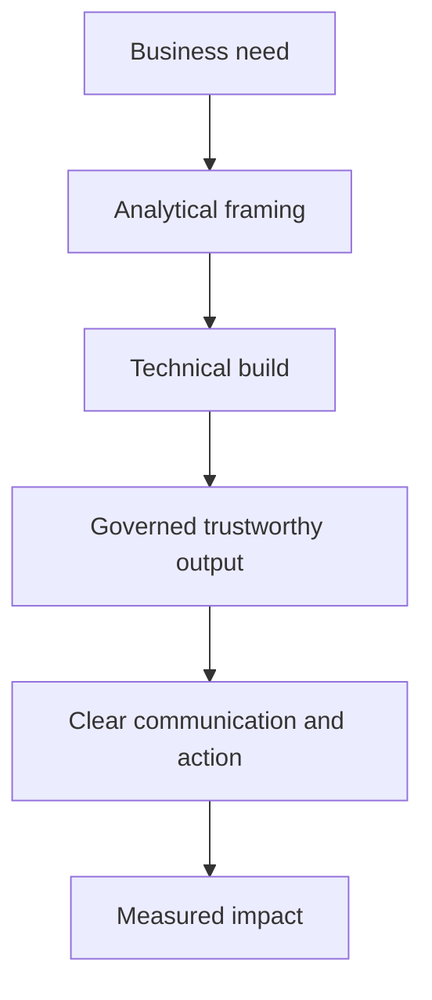

### 8.3 How to talk about your gaps without sounding weak

A strong answer does **not** say:
- “I know everything already.”

A strong answer says:
- “My biggest strength is domain depth and stakeholder credibility inside CE&S.”
- “My biggest active growth area is technical depth in the modern Microsoft data stack.”
- “I am closing that gap in a structured way through study, projects, and my MBA.”

That answer sounds mature because it is both honest and directional.

---

## 9. BI Data Analyst competency framework

Now let us convert the role into a competency model.

A competency framework is simply a clean way to group what “good” looks like.

### 🔍 Plain-English deep-dive: competency framework
- **Competency** — *a repeatable capability, not a one-time achievement.* **Analogy:** balance in cycling; not one good ride, but the ability to ride again and again. **Why it matters:** interviewers hire for capability patterns.
- **Framework** — *a structured way to organize those capabilities.* **Analogy:** shelves in a cupboard so things are easy to find. **Why it matters:** it stops your preparation from becoming random.

### 9.1 The five competency families for this role

| Competency family | Plain-English meaning | Examples in this role |
|---|---|---|
| Technical | Can access, transform, model, and present data using the Microsoft analytics stack. | SQL, Python/PySpark, Fabric/Synapse/Databricks concepts, Power BI, semantic modeling, DAX. |
| Analytical | Can frame problems correctly and choose the right method. | Segmentation, trend analysis, root-cause analysis, KPI design, measurement logic, basic statistics. |
| Domain | Understands support, customer experience, channel design, and support economics. | Assisted vs self-service, CSAT/NSAT, escalations, deflection, cost-to-serve, segment differences. |
| Communication | Can tailor insight to different audiences and influence decisions. | Executive summaries, storytelling, concise visuals, MBR-ready narratives, cross-functional alignment. |
| Process & governance | Can operationalize reliable analytics delivery. | Intake, user stories, acceptance criteria, quality checks, taxonomy, data governance, agile rhythm. |

### 9.2 What beginner, intermediate, and advanced look like

| Competency | Beginner | Intermediate | Advanced |
|---|---|---|---|
| Technical | Can run basic queries and build simple reports. | Can join datasets, shape data, build semantic models, write useful DAX, and explain the stack. | Can design robust models, reason about platform choices, and build end-to-end governed analytics. |
| Analytical | Can describe trends. | Can break problems into dimensions, drivers, and hypotheses. | Can select appropriate methods, avoid misleading conclusions, and connect analysis to decisions. |
| Domain | Knows the major support terms. | Can explain channel trade-offs, core KPIs, and customer-segment differences. | Can connect operational reality, economics, and experience design into strategic recommendations. |
| Communication | Can explain findings if asked. | Can tailor the same message for peers vs managers. | Can influence senior stakeholders with concise evidence and trade-off framing. |
| Process & governance | Knows quality matters. | Can define acceptance criteria and basic validation checks. | Can build repeatable standards for trusted self-serve analytics at scale. |

### 9.3 Where you likely stand today

| Competency | Current color | Reason |
|---|---|---|
| Technical | Yellow | You have exposure and foundations in Power BI, SQL, Python/R, plus certifications, but not yet deep stack proof in Fabric-style delivery. |
| Analytical | Green | You already analyze trends, KPIs, leadership reviews, and operational patterns regularly. |
| Domain | Green | This is your standout edge: real CE&S support context and customer-experience understanding. |
| Communication | Green | Executive communication, MBRs, cross-functional work, and mentoring are already strong evidence. |
| Process & governance | Green/Yellow | Your governance instincts are strong; the main step is translating them into explicit data-governance and agile artifacts. |

> 💡 **Tie-in to your background:** Notice how this framework already shows a strong interview narrative: you are **not** a raw beginner. You are a domain-and-communication-strong analyst profile that needs targeted stack deepening.

---

## 10. Self-assessment rubric you can actually use

A rubric is more useful when it includes behaviors you can observe.

Score yourself 1 to 4 in each row:
- **1 = I have heard the term but cannot explain or do it confidently.**
- **2 = I can explain the basics and do simple examples with help.**
- **3 = I can do realistic interview-level examples independently.**
- **4 = I can teach it, troubleshoot it, and connect it to business trade-offs.**

| Rubric item | Suggested self-score today | Comment |
|---|---|---|
| Explain the CE&S → CXA → BI org map clearly | 3 | You already live in CE&S; just tighten the wording. |
| Explain assisted vs self-service support and their KPIs | 4 | This is directly grounded in your current role. |
| Explain support economics and cost-to-serve | 2 | You likely understand it intuitively; formal language needs practice. |
| Translate a vague ask into a user story and acceptance criteria | 3 | Strong transferable operations skill; formal agile wording to strengthen. |
| Write interview-grade SQL with joins, CTEs, windows | 2 | Likely basic to intermediate today; Part 3 is key. |
| Explain star schema, dimensions, facts, SCD, and semantic models | 1-2 | Needs deliberate study and repetition. |
| Explain Fabric, OneLake, Synapse, Databricks at interview level | 1-2 | Conceptual foundations exist, but fluency needs work. |
| Build Power BI measures with strong business meaning | 2 | You have adjacent skills; Part 7 deepens the semantic-model side. |
| Explain governance, taxonomy, and one-source-of-truth design | 3 | Strong instincts from operations; convert to BI terminology. |
| Tell a coherent “why this role / why now” story | 4 | This can become one of your strongest answers with practice. |

### 10.1 How to use the rubric intelligently

Do **not** panic if several technical rows are 1–2.

That is normal for a career transition into a more technical analytics role.

Your preparation goal is not “be perfect everywhere.”

Your goal is:
- turn red technical areas into credible interview answers,
- turn yellow areas into solid examples,
- turn green areas into memorable differentiators.

---

## 11. Detailed green / yellow / red gap map

Now we combine honesty with strategy.

### 11.1 Green zone: strengths to lead with

- 🟢 **CE&S support domain knowledge from real Microsoft experience.**
- 🟢 **KPI / CSAT / escalation trend analysis and operational insight.**
- 🟢 **Executive stakeholder communication and MBR storytelling.**
- 🟢 **Operational governance, compliance, and risk awareness.**
- 🟢 **Cross-functional collaboration in high-pressure environments.**
- 🟢 **Mentoring and enablement mindset.**

### Why these are green

These are backed by real experience, not just study.

That means you should use them early and often in interviews.

### 11.2 Yellow zone: partially proven, needs sharpening

- 🟡 **Power BI: report-building and analysis mindset are present; semantic modeling and deep DAX need strengthening.**
- 🟡 **SQL: foundations exist; advanced joins, window functions, and performance reasoning need sharpening.**
- 🟡 **Python / R: analytical exposure exists; production-style data workflows and PySpark need strengthening.**
- 🟡 **Agile requirements work: process instincts are strong; formal user-story / estimation language needs tightening.**
- 🟡 **Impact measurement: you already think in improvement terms; formal analytics-product framing needs repetition.**

### 11.3 Red zone: weakest areas that need deliberate study

- 🔴 **Microsoft Fabric ecosystem fluency: OneLake, Lakehouse, Warehouse, Pipelines, semantic model interactions.**
- 🔴 **Broader Azure data stack language: Synapse, Databricks, Data Factory patterns and trade-offs.**
- 🔴 **Formal dimensional modeling: facts, dimensions, grain, SCD, conformed dimensions, KPI standardization.**
- 🔴 **Advanced analytics vocabulary around ML-enabled support optimization if asked beyond basics.**

### 11.4 Why red is not fatal

These are learnable technical systems and frameworks.

They are important, but they are not the only thing the team is hiring for.

In fact, many candidates may have stronger platform vocabulary but weaker CE&S context, weaker stakeholder empathy, or weaker governance instincts.

Your job is not to hide the red zone.

Your job is to show that you have:
- a plan,
- momentum,
- accurate vocabulary,
- enough hands-on proof to be credible.

### 11.5 Prioritized study strategy

| Priority | Focus area | Why this order |
|---|---|---|
| Priority 1 | SQL + data modeling | These are foundational for almost every technical conversation in the role. |
| Priority 2 | Fabric / Azure stack concepts | This is the Microsoft-specific context that makes you sound role-aligned. |
| Priority 3 | Power BI semantic modeling + DAX | Very likely interview territory and directly tied to self-serve analytics. |
| Priority 4 | Agile requirements and governance language | This turns your existing process strength into explicit JD alignment. |
| Priority 5 | ML / deeper topics | Useful differentiator once the foundations are solid. |

### 11.6 The study strategy in one sentence

**Use your green strengths to win credibility, while using the rest of the guide to turn red technical areas into structured, interview-ready competence.**

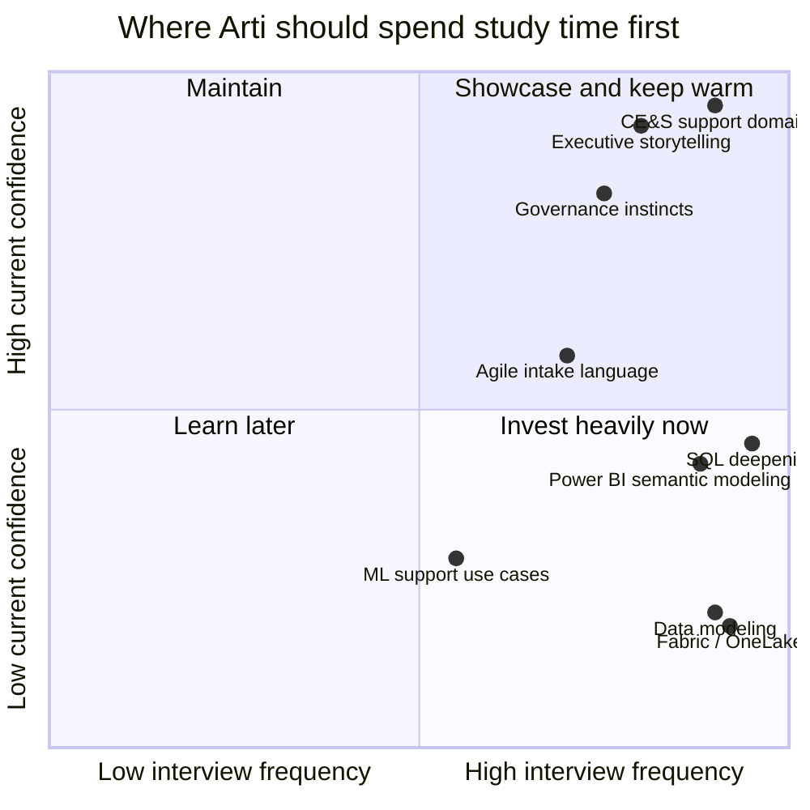

### 11.7 Your interview posture for each color

| Color | How to talk about it | Goal |
|---|---|---|
| Green | Lead with confidence and real stories. | Sound practiced but not arrogant. |
| Yellow | Explain clearly, then mention how you are deepening it. | Show momentum and working knowledge. |
| Red | Be honest, define the concept correctly, connect it to adjacent knowledge, and explain your learning path. | Show coachability and structured growth. |

---

## 12. Microsoft culture and values in depth

This role is inside Microsoft, so technical skill alone is not enough.

You need to show that you can operate in Microsoft's cultural language.

### 12.1 Growth mindset: “learn-it-all” instead of “know-it-all”

Microsoft often emphasizes a **growth mindset** — commonly described as being a **learn-it-all**, not a **know-it-all**.

### 🔍 Plain-English deep-dive: growth mindset
- **Growth mindset** — *the belief that ability can be developed through learning, feedback, and effort.* **Analogy:** treating your brain like a muscle, not a fixed-size container. **Why it matters:** fast-changing technology environments reward people who learn continuously.
- **Learn-it-all** — *someone curious, humble, and adaptable.* **Analogy:** a traveler who keeps asking for directions and learning the map instead of pretending to know every road. **Why it matters:** this is exactly the right posture for your transition into deeper BI work.

How to demonstrate it:
- talk honestly about your current technical gaps,
- show what you are doing about them,
- mention certifications, MBA learning, hands-on projects, and deliberate practice,
- describe feedback you used to improve a process or analysis.

> 💡 **Tie-in to your background:** You have a perfect growth-mindset story already: you built strong operational credibility in CE&S, then intentionally started formalizing analytics and AI capability through certifications and an MBA rather than waiting passively for permission.

### 12.2 Customer obsession

**Customer obsession** means starting from the customer's real problem and working backward.

In CE&S, that means not treating support as a dashboard game.

It means asking:
- Did the customer actually get help?
- Was the journey easy?
- Did we solve the issue in the right channel?
- Did our process create unnecessary friction?

How to demonstrate it:
- talk about protecting customer experience, not just reducing support cost,
- mention how you used trends or escalations to identify root customer pain,
- explain why bad self-service can look efficient but still harm customers.

### 12.3 One Microsoft

**One Microsoft** means operating across boundaries instead of protecting silos.

### 🔍 Plain-English deep-dive: One Microsoft
- **Silo** — *a group that works in isolation and optimizes only for itself.* **Analogy:** each player on a football team chasing personal stats instead of team goals. **Why it matters:** customer journeys cross teams, so analytics must too.
- **One Microsoft** — *collaboration across teams for the customer and company outcome.* **Analogy:** an orchestra following one score instead of each musician playing a different song. **Why it matters:** BI work often integrates product, support, operations, and leadership priorities.

How to demonstrate it:
- mention cross-functional collaboration,
- show how you worked across teams during escalations,
- describe aligning definitions or decisions across different audiences.

### 12.4 Diversity and inclusion

**Diversity and inclusion** means building environments where different perspectives are present and genuinely heard.

For analytics, this matters because:
- different teams interpret the same metric differently,
- customer experiences vary across contexts,
- diverse viewpoints reduce blind spots in analysis and design.

How to demonstrate it:
- talk about listening before jumping to conclusions,
- mention mentoring and knowledge-sharing,
- speak respectfully about different stakeholder needs and viewpoints.

### 12.5 Model, Coach, Care

A Microsoft leadership shorthand you may hear is **Model, Coach, Care**.

At a simple level:
- **Model** = set the example,
- **Coach** = help others grow,
- **Care** = show real human concern for people and outcomes.

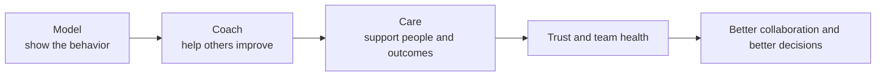

### 12.6 How to demonstrate each one in this interview

| Culture theme | A credible way you can demonstrate it |
|---|---|
| Growth mindset | “I bring strong CE&S domain depth and I am deliberately deepening the technical stack through hands-on practice, certifications, and my MBA.” |
| Customer obsession | “I think about analytics in terms of customer outcomes, not just dashboard production or cost reduction.” |
| One Microsoft | “My best work has come from aligning support, stakeholders, and cross-functional teams around a shared view of the problem.” |
| Diversity & inclusion | “I value different perspectives because they improve both analysis quality and team decisions.” |
| Model, Coach, Care | “I set a high bar for rigor, share what I learn, and support peers under pressure.” |

---

## 13. Glossary of Microsoft / CE&S / BI terms

This glossary is here so you never go blank when a term appears.

Use it like a mini dictionary.

### 13.1 Core org and business terms

- **CE&S** — *Customer Experience & Success.*
  - **Plain meaning:** The post-sale services and customer-outcomes organization.
  - **Analogy:** Like the service, coaching, and loyalty side after a purchase.
  - **Why it matters here:** You may hear this term directly in the role, the guide, or the interview.
- **CXA** — *Customer Experience Architecture.*
  - **Plain meaning:** The design layer that shapes customer and support motions.
  - **Analogy:** Like architects designing how a building should function.
  - **Why it matters here:** You may hear this term directly in the role, the guide, or the interview.
- **BI** — *Business Intelligence.*
  - **Plain meaning:** Turning raw data into useful dashboards, metrics, and decisions.
  - **Analogy:** Like a car dashboard simplifying thousands of sensor signals.
  - **Why it matters here:** You may hear this term directly in the role, the guide, or the interview.
- **MBR** — *Monthly Business Review.*
  - **Plain meaning:** A structured leadership review of performance and trends.
  - **Analogy:** Like a monthly health check for a business motion.
  - **Why it matters here:** You may hear this term directly in the role, the guide, or the interview.
- **CSAT** — *Customer Satisfaction.*
  - **Plain meaning:** A measure of how satisfied customers were with the interaction.
  - **Analogy:** Like a restaurant satisfaction survey after the meal.
  - **Why it matters here:** You may hear this term directly in the role, the guide, or the interview.
- **NSAT** — *Often used as a satisfaction / sentiment measure in service contexts; exact implementation can vary by program.*
  - **Plain meaning:** A broader satisfaction-style signal.
  - **Analogy:** Like checking overall sentiment, not just one transaction.
  - **Why it matters here:** You may hear this term directly in the role, the guide, or the interview.
- **DSAT** — *Dissatisfaction.*
  - **Plain meaning:** A negative satisfaction signal or low-rating measure.
  - **Analogy:** Like counting complaints, not compliments.
  - **Why it matters here:** You may hear this term directly in the role, the guide, or the interview.
- **Fiscal year (Jul-Jun)** — *Microsoft fiscal year often runs July through June.*
  - **Plain meaning:** The company reporting calendar.
  - **Analogy:** Like a school year that does not match the normal calendar year.
  - **Why it matters here:** You may hear this term directly in the role, the guide, or the interview.
- **DP** — *Delivery Partner / partner-delivered motion context.*
  - **Plain meaning:** A partner helping deliver service within Microsoft standards.
  - **Analogy:** Like an authorized operator delivering under the same brand playbook.
  - **Why it matters here:** You may hear this term directly in the role, the guide, or the interview.
- **SMB** — *Small and Medium Business.*
  - **Plain meaning:** A smaller customer segment with different support and economics patterns.
  - **Analogy:** Like a neighborhood business versus a multinational.
  - **Why it matters here:** You may hear this term directly in the role, the guide, or the interview.
- **Enterprise** — *Large, complex organizational customers.*
  - **Plain meaning:** Customers with bigger scale, more complexity, and more governance.
  - **Analogy:** Like managing a whole airport rather than one storefront.
  - **Why it matters here:** You may hear this term directly in the role, the guide, or the interview.
- **Incident management** — *The process of handling and resolving customer-reported issues.*
  - **Plain meaning:** The workflow for support cases and problems.
  - **Analogy:** Like triaging and treating patients in a clinic.
  - **Why it matters here:** You may hear this term directly in the role, the guide, or the interview.
- **Escalation** — *Moving an issue to higher expertise, urgency, or attention.*
  - **Plain meaning:** A sign that standard handling was not enough.
  - **Analogy:** Like calling the head mechanic for a difficult repair.
  - **Why it matters here:** You may hear this term directly in the role, the guide, or the interview.
- **KPI** — *Key Performance Indicator.*
  - **Plain meaning:** A metric used to track whether a goal is being achieved.
  - **Analogy:** Like the scoreboard in a match.
  - **Why it matters here:** You may hear this term directly in the role, the guide, or the interview.
- **Deflection** — *Cases avoided because self-service solved the issue first.*
  - **Plain meaning:** A shift away from assisted interactions.
  - **Analogy:** Like an FAQ page preventing phone calls.
  - **Why it matters here:** You may hear this term directly in the role, the guide, or the interview.
- **Containment** — *An interaction stayed in the self-service or automated channel without handoff.*
  - **Plain meaning:** A measure of channel completion.
  - **Analogy:** Like finishing at the ATM instead of needing the teller.
  - **Why it matters here:** You may hear this term directly in the role, the guide, or the interview.
- **Cost-to-serve** — *The cost of delivering support or service.*
  - **Plain meaning:** A business-efficiency metric.
  - **Analogy:** Like the cost to prepare and serve one meal.
  - **Why it matters here:** You may hear this term directly in the role, the guide, or the interview.
- **Taxonomy** — *A shared classification system for data categories.*
  - **Plain meaning:** A common language for categorization.
  - **Analogy:** Like organizing books by a consistent library system.
  - **Why it matters here:** You may hear this term directly in the role, the guide, or the interview.
- **Business-rule logic** — *The agreed rules used to calculate and classify metrics.*
  - **Plain meaning:** The recipe behind the KPI.
  - **Analogy:** Like always measuring ingredients with the same cup size.
  - **Why it matters here:** You may hear this term directly in the role, the guide, or the interview.
- **OneLake** — *Microsoft Fabric’s unified data lake storage layer.*
  - **Plain meaning:** A shared storage foundation for analytics workloads.
  - **Analogy:** Like one large pantry used by many chefs.
  - **Why it matters here:** You may hear this term directly in the role, the guide, or the interview.
- **Fabric** — *Microsoft’s integrated analytics platform.*
  - **Plain meaning:** A unified environment for data engineering, warehousing, BI, and more.
  - **Analogy:** Like a single campus where many related departments work together.
  - **Why it matters here:** You may hear this term directly in the role, the guide, or the interview.
- **Lakehouse** — *A data architecture blending lake flexibility with warehouse-style analytics value.*
  - **Plain meaning:** A modern analytics storage/design pattern.
  - **Analogy:** Like a warehouse that also behaves like a workshop.
  - **Why it matters here:** You may hear this term directly in the role, the guide, or the interview.
- **Semantic model** — *A business-friendly modeled layer used by reporting tools.*
  - **Plain meaning:** The governed lens through which reports read data.
  - **Analogy:** Like a curated menu instead of raw ingredients.
  - **Why it matters here:** You may hear this term directly in the role, the guide, or the interview.
- **KQL** — *Kusto Query Language.*
  - **Plain meaning:** A query language often used for log and telemetry analysis in Microsoft ecosystems.
  - **Analogy:** Like a specialized search-and-analysis language for event data.
  - **Why it matters here:** You may hear this term directly in the role, the guide, or the interview.
- **DAX** — *Data Analysis Expressions.*
  - **Plain meaning:** The calculation language used in Power BI models.
  - **Analogy:** Like the formula language that brings the dashboard to life.
  - **Why it matters here:** You may hear this term directly in the role, the guide, or the interview.

### 13.2 How to memorize the glossary efficiently

Do not memorize every line as if it were a dictionary exam.

Instead:
- group terms by theme,
- explain them out loud in your own words,
- pair each term with one concrete example from your work.

Example:
- **CSAT** → you have direct experience with strong DP and SMB CSAT scores,
- **MBR** → you already present monthly performance views,
- **Taxonomy** → you already understand why category consistency matters in support reviews,
- **Deflection** → you have seen issue types that should have been solved earlier through better self-service.

---

## 14. A day and a week in the life of a CE&S BI Data Analyst

Candidates often ask, “What would I actually do in this role?”

This section helps you imagine the operating rhythm.

### 14.1 A representative day

| Part of day | Possible activity | What capability it uses |
|---|---|---|
| Start of day | Check refresh status, alerts, urgent stakeholder messages, overnight trend movement | Operational discipline, prioritization |
| Morning deep work | Query data, investigate anomalies, model logic, validate measures | Technical + analytical skill |
| Midday syncs | Requirement clarification, backlog refinement, stakeholder walkthroughs | Communication + process skill |
| Afternoon build | Dashboard iteration, semantic model updates, documentation, impact analysis | Technical build + governance |
| End of day | Summarize open questions, publish updates, set next steps | Clarity, collaboration, reliability |

### 14.2 A representative week by theme

| Weekly theme | What happens | Why it matters |
|---|---|---|
| Business intake | Clarify incoming asks, define decisions and success measures. | Prevents building the wrong thing. |
| Data work | Extract, transform, model, and validate the relevant data. | Creates trusted analytical foundations. |
| Insight and reporting | Build or improve dashboards and analytical outputs. | Makes data usable for decision makers. |
| Governance and quality | Align definitions, review taxonomy, check freshness and accuracy. | Protects trust and consistency. |
| Communication and influence | Present findings, recommend actions, and collect feedback. | Turns analysis into action. |

### 14.3 What the team likely values most in the first impression

In the first few weeks, the team is unlikely to expect you to redesign the entire platform.

They are more likely to value:
- fast learning,
- good questions,
- reliability,
- respect for data definitions,
- clean communication,
- thoughtful use of your CE&S domain knowledge.

> 💡 **Tie-in to your background:** This favors you. You already know how to operate in a Microsoft environment, work cross-functionally, and communicate with leadership. That reduces ramp risk.

---

## 15. 30-60-90 day plan for the role

A 30-60-90 plan answers the question: “If we hired you, what would good early progress look like?”

### 15.1 The logic of a strong 30-60-90 plan

- **First 30 days:** learn and map.
- **Next 30 days:** contribute with guardrails.
- **Next 30 days:** own a scoped problem and show impact.

```mermaid
gantt
    title 30-60-90 Day Plan
    dateFormat  X
    axisFormat %s
    section Days 1-30
    Learn org, data, KPIs, stakeholders   :a1, 0, 30
    section Days 31-60
    Deliver scoped analyses and dashboard improvements :a2, 30, 30
    section Days 61-90
    Own a defined workstream and measure impact :a3, 60, 30
```

### 15.2 Detailed 30-60-90 plan

| Window | Primary objective | Likely actions | What success looks like |
|---|---|---|---|
| Days 1-30 | Understand the org, support surfaces, KPI definitions, data sources, stakeholders, and existing dashboards. | Meet key stakeholders, learn metric definitions, review documentation, shadow existing workflows, identify quick-win confusion points. | You can explain the current analytics landscape without guessing. |
| Days 31-60 | Contribute to a scoped set of analyses or dashboard improvements with close validation. | Take on a small intake item, refine requirements, build or improve a report/model, validate against source data, present findings. | You are adding value while proving you respect standards and governance. |
| Days 61-90 | Own a defined slice of work and show measurable business usefulness. | Lead a small end-to-end analytics request, improve a KPI view, document business rules, and propose a next optimization opportunity. | You are trusted with scoped ownership, not just execution. |

### 15.3 What *your* 30-60-90 plan should emphasize

Because you already know the CE&S support world, your version should emphasize:
- faster domain ramp than an external hire,
- disciplined learning of the data stack and current measurement definitions,
- quick contribution in stakeholder translation and KPI review,
- careful respect for existing governance before proposing changes.

A strong answer sounds like this:

> “In the first 30 days I would focus on understanding the current support surfaces, key stakeholders, KPI definitions, and data flows so I do not make naive assumptions. In days 31 to 60 I would aim to contribute to a scoped reporting or analysis improvement with strong validation. By days 61 to 90 I would want to own a defined analytics workstream end to end, using my CE&S domain background to identify practical improvement opportunities while staying aligned with the team's governance standards.”

---

## 16. Positioning and narrative strategy

This section is about how to talk about yourself.

Not as a random list.

As a coherent story.

### 16.1 The strongest version of your narrative

Here is the core story your whole guide supports:

> “I have spent about five years inside Microsoft CE&S in support escalation engineering, where I became strong in KPI and CSAT trend analysis, executive reviews, governance, process improvement, and cross-functional communication. That gave me a direct understanding of how support metrics connect to real customer pain and business decisions. I am now formalizing the technical analytics side more deeply — SQL, Python, the Microsoft data stack, and Power BI modeling — through certifications, hands-on practice, and an MBA in Business Analytics. So I am not pivoting away from CE&S; I am moving deeper into a data role where my domain knowledge becomes a multiplier.”

### 16.2 The three narrative pillars to repeat

| Narrative pillar | Meaning |
|---|---|
| Pillar 1: Deep CE&S context | You already understand the business the data describes. |
| Pillar 2: Proven communication and governance | You can work with leaders, definitions, and operational reality, not just code. |
| Pillar 3: Deliberate technical ramp | You are intentionally deepening the stack rather than hoping to learn it accidentally. |

### 16.3 How to steer toward your strengths without sounding evasive

A good tactic is:
1. answer the question directly,
2. give the clean concept,
3. connect it to your experience,
4. show how you are deepening the adjacent skill.

Example:
- If asked about self-serve analytics, explain deflection and containment clearly.
- Then connect it to your support experience.
- Then mention how you want to build governed Power BI and Fabric solutions that improve those outcomes.

That way, you stay honest while still sounding strong.

### 16.4 How to handle gaps honestly

Use this formula:

**Acknowledge → connect → show action → show transferability**

Example:

> “I have stronger production depth in the support domain and in KPI storytelling than in Fabric-specific engineering today. What gives me confidence is that the core ideas — metric definition, dimensional thinking, governed reporting, stakeholder translation — are learnable and transferable, and I am actively building that stack depth through structured study and hands-on practice.”

### 16.5 Your unique edge in one sentence

**Domain depth is hardest to teach; tools are easier to teach. You bring the harder part already.**

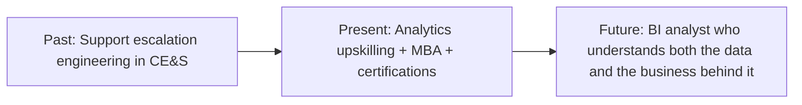

> 💡 **Tie-in to your background:** Your numbers help here too. DP CSAT >4.75, SMB CSAT >4.85, and 100+ recognitions are proof points that you create trust and outcomes, not just activity.

---

## 17. A roadmap linking this role to the rest of the guide (Parts 2-14)

The rest of the guide is easier when you see how each Part answers a specific question raised in this role.

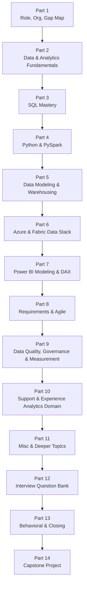

### 17.1 Why the order matters

| Part | Why it exists |
|---|---|
| Part 2 | Gives you the common language of analytics so later technical topics make sense. |
| Part 3 | Builds the query muscle most analytics interviews expect. |
| Part 4 | Adds Python and PySpark for scalable data work. |
| Part 5 | Teaches the modeling concepts that make self-serve analytics trustworthy. |
| Part 6 | Places everything on the Microsoft data-platform map. |
| Part 7 | Turns data models into business-facing Power BI outputs. |
| Part 8 | Shows how work gets defined and delivered, not just built. |
| Part 9 | Protects trust through quality, governance, and impact measurement. |
| Part 10 | Returns to your strongest domain: support and customer-experience analytics. |
| Part 11 | Adds extra edge topics that can distinguish you from average candidates. |
| Part 12 | Turns the knowledge into rapid-fire interview readiness. |
| Part 13 | Converts your experience into clear behavioral and closing answers. |
| Part 14 | Proves everything in one end-to-end portfolio-style narrative. |

### 17.2 The practical takeaway from the roadmap

You do **not** need to master everything at once.

You just need to follow the sequence with discipline.

Each later Part reduces a specific red or yellow area from your gap map.

That means your preparation is not random.

It is targeted.

---

## 18. Quick-reference comparison tables

These are here for fast revision before interviews.

### 18.1 Role positioning cheat sheet

| Question | Weak answer style | Strong answer style |
|---|---|---|
| Why this role? | “I want to switch to data because it is interesting.” | “I already analyze support outcomes inside CE&S and want to move deeper into building the governed analytics that drive those decisions.” |
| What is your edge? | “I work hard and learn fast.” | “I bring CE&S support domain depth, strong stakeholder credibility, and a structured technical upskilling path.” |
| What is your main gap? | “I do not really have any gaps.” | “My main growth area is deeper platform fluency in the Microsoft data stack, and I am actively building that through structured study and projects.” |

| Concept | What to remember in one line |
|---|---|
| CE&S | Post-sale customer experience, support, and success. |
| CXA | Designs the customer/support motions; BI measures and improves them. |
| Assisted support | Human help channel. |
| Self-service support | Customer solves it without human intervention. |
| Deflection | Good self-service prevented an assisted case. |
| Cost-to-serve | What it costs to support a customer or interaction. |
| Taxonomy | Shared category language. |
| OneLake | Shared storage foundation in Fabric. |

---

## ⭐ Likely Interview Questions for This Section

**Q1. "Tell me what you understand about where this role sits inside Microsoft."**
> *Model answer:* "This role sits inside Microsoft's Customer Experience & Success organization, which handles post-sale customer outcomes. More specifically, it is within Customer Experience Architecture, where the focus is on designing and improving customer-support motions at scale. The CE&S BI team enables data-driven decisions and self-serve analytics across assisted and self-service support surfaces. I already work inside CE&S in support, so I understand the business reality the analytics is trying to improve."

**Q2. "What is the difference between CE&S, CXA, and the CE&S BI team?"**
> *Model answer:* "CE&S is the broader post-sales organization covering customer experience and success. CXA is a sub-organization focused on architecting and standardizing customer and support motions. The CE&S BI team is the analytics capability inside that environment — turning data into governed metrics, self-serve analytics, and insight so those motions can be measured and improved."

**Q3. "What is the difference between assisted and self-service support, and why does the distinction matter?"**
> *Model answer:* "Assisted support involves a human engineer or agent helping the customer through a case, chat, or escalation. Self-service support lets the customer solve the issue through docs, guided tools, bots, or Copilot-like experiences. The distinction matters because the data, economics, and KPIs differ by surface: assisted support focuses more on resolution time, CSAT, and escalations, while self-service focuses more on containment, article success, and deflection. A strong support strategy optimizes both together rather than maximizing one blindly."

**Q4. "Why does self-service matter so much to the business?"**
> *Model answer:* "Effective self-service can solve simpler issues faster for customers while lowering the cost-to-serve and preserving assisted capacity for more complex cases. But the key word is effective — poor self-service can create hidden cost and customer frustration. So the BI role is important because it helps measure whether self-service is creating real deflection and better outcomes rather than just moving pain around."

**Q5. "What does cost-to-serve mean in a support analytics context?"**
> *Model answer:* "Cost-to-serve is the total cost of delivering support through a process, channel, or customer segment. In support analytics, it helps leaders understand where service is efficient, where it is expensive, and where better self-service, content, tooling, or product fixes could reduce avoidable effort without harming the customer experience."

**Q6. "How do SMB and Enterprise differ from an analytics point of view?"**
> *Model answer:* "The main difference is that Enterprise typically involves more scale, complexity, governance, and stakeholder layers, while SMB is often more standardized and efficiency-sensitive. From an analytics point of view that means segmentation matters — the same aggregate KPI can hide very different issues by customer segment, delivery model, or support motion."

**Q7. "How does your current experience make you a fit for this BI role?"**
> *Model answer:* "My current CE&S support role gives me real domain depth in support operations, escalations, customer pain points, KPI and CSAT analysis, and executive review rhythms. I already understand what the metrics mean in operational reality. The transition I am making is to own more of the technical analytics stack directly — SQL, data modeling, Fabric-style platform concepts, and Power BI semantic modeling — so I can contribute end to end."

**Q8. "You do not have the deepest Fabric or Databricks production background yet. How would you address that concern?"**
> *Model answer:* "I would address it honestly. My strongest production depth today is in CE&S support operations, stakeholder communication, and KPI-driven improvement, not in every component of the modern Microsoft data stack. But I already have the adjacent foundations through Power BI, SQL, Python, and Azure certifications, and I am intentionally deepening the platform side. What gives me confidence is that the underlying concepts — governed metrics, dimensional thinking, customer-experience analysis, and business translation — are transferable, and I am actively building the tool-specific fluency on top of them."

**Q9. "What does this job description really seem to be looking for?"**
> *Model answer:* "It is looking for someone who can bridge business needs and data delivery. That means understanding the support domain, translating ambiguous asks into clear requirements, building or shaping the analytics solution using the Microsoft stack, enforcing quality and consistent definitions, and communicating insight clearly to different stakeholders. It is a broad role because it spans both business and technical execution."

**Q10. "What is measurement governance, and why does it matter here?"**
> *Model answer:* "Measurement governance is the discipline of making sure metrics are defined consistently, calculated correctly, refreshed on time, and used through trusted frameworks and taxonomy. It matters here because leadership decisions about support channels, investment, staffing, and customer experience can be wrong if metrics like CSAT, deflection, or escalation rate are defined inconsistently across reports."

**Q11. "How would you explain your career move from support escalation engineering into BI analytics?"**
> *Model answer:* "I see it as moving deeper into the part of my work that already created the most leverage. In support I was not only resolving issues; I was analyzing trends, preparing leadership reviews, identifying process improvement opportunities, and thinking carefully about governance and customer outcomes. BI lets me do that at broader scale by building the trusted analytics and self-serve views behind those decisions."

**Q12. "What is your biggest strength for this role?"**
> *Model answer:* "My biggest strength is that I already understand the CE&S support business from the inside — not abstractly, but through real cases, escalations, KPIs, and leadership reviews. That means I can connect analytics to operational reality and customer impact. I also bring strong communication and governance instincts, which are critical in a role that needs trusted self-serve analytics rather than just one-off reports."

**Q13. "What is your biggest gap for this role?"**
> *Model answer:* "My biggest active growth area is deeper hands-on fluency with the broader Microsoft analytics stack — especially Fabric-style platform concepts, dimensional modeling depth, and some of the more advanced data-engineering patterns. I am transparent about that, and I am addressing it systematically through study, projects, and structured practice."

**Q14. "How would you demonstrate growth mindset in this interview?"**
> *Model answer:* "By being very honest about where I am already strong and where I am deliberately growing. I would rather sound coachable and accurate than pretend to know everything. My path — building domain depth first, then intentionally adding analytics and AI capability through certifications, hands-on work, and an MBA — is itself a growth-mindset story."

**Q15. "How would you describe your unique value versus an external candidate with more pure analytics experience?"**
> *Model answer:* "An external candidate may come with stronger tool depth on day one, but I bring something harder to teach: real CE&S support context, lived understanding of customer pain, credibility in stakeholder communication, and operational governance instincts inside Microsoft. As I deepen the technical stack, that domain knowledge becomes a multiplier rather than just background."

**Q16. "What would your first 90 days look like?"**
> *Model answer:* "In the first 30 days I would focus on understanding the current support surfaces, stakeholders, KPI definitions, and data flows so I ramp without making assumptions. In days 31 to 60 I would aim to contribute to a scoped analytical improvement with strong validation and clear communication. In days 61 to 90 I would want to own a defined workstream end to end, using my CE&S background to spot practical improvement opportunities while staying aligned with the team's governance standards."

---

## 🧠 30-Second Memory Hooks
- **Microsoft → CE&S → CXA → CE&S BI** = company → post-sale org → motion design → analytics engine.
- **CXA designs the motion; BI measures and improves the motion.**
- **Assisted support** = human help. **Self-service** = customer solves it without a human.
- **Deflection** is only good if it is **real** and does not hide frustration.
- **Cost-to-serve** = what it costs to support the customer or interaction.
- **Your edge** = deep CE&S support context + strong communication + governance instincts.
- **Your main gap** = deeper Microsoft analytics stack fluency, especially Fabric and modeling.
- **Your strategy** = lead with green strengths, strengthen yellow areas, make red areas coachable and credible.
- **Growth mindset** = be a learn-it-all, not a know-it-all.
- **Customer obsession** = optimize for customer outcomes, not vanity metrics.
- **One Microsoft** = connect across silos because customer journeys cross silos.
- **Model, Coach, Care** = show the standard, help others improve, and care about people and outcomes.
- **Narrative formula** = domain depth + stakeholder credibility + deliberate technical ramp.
- **30-60-90** = learn the landscape → contribute safely → own a scoped workstream.

---

*Next suggested section:* **Part 2 — Data & Analytics Fundamentals** (the vocabulary and mental models every later technical Part assumes).
