# Part 2 — Data & Analytics Fundamentals
> Section goal: Build the vocabulary, mental models, and analytical judgment every later technical Part assumes — from what data is, to how analysts frame business questions, design trustworthy metrics, clean messy data, interpret statistics, and turn evidence into action.
Covers index item **2**. Maps to JD: "determines the technique needed and develops analytic models," "interprets results with actionable recommendations," and "translates business questions into scalable reporting and insight."
---
## 1. What is data, really?
**Data** is recorded evidence about something that happened, exists, or is measured.
If a support case is opened, a survey is submitted, an escalation is tagged, or a customer clicks a help article, that event can become data.
On its own, data is usually not helpful.
It becomes useful only after it gains **context**, **structure**, and **interpretation**.
### 🔍 Plain-English deep-dive: why data feels boring until context appears
- **Data** — *raw recorded facts.*  
**Analogy:** loose Lego pieces on a table. **Why it matters:** a number like `4.85` means nothing until you know it is SMB CSAT.
- **Context** — *the meaning around the fact: what, when, who, where, how.*  
**Analogy:** the picture on the Lego box showing what the pieces are supposed to become. **Why it matters:** without context, the same number could be a temperature, a rating, or a time.
- **Analysis** — *the act of examining data to find patterns, differences, causes, or opportunities.*  
**Analogy:** sorting the Lego pieces by color and shape before building. **Why it matters:** raw data rarely speaks for itself.
- **Insight** — *a useful conclusion you can act on.*  
**Analogy:** realizing the missing wheel piece explains why the car cannot roll. **Why it matters:** leadership does not pay for raw data; it pays for better decisions.
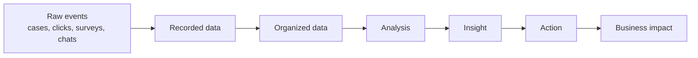
> 💡 **Tie-in to your background:** In CE&S, you already convert raw operational noise into executive-ready recommendations. When you summarize escalation trends, recurring pain points, and CSAT movement in MBRs, you are doing analytics even if the tooling becomes more advanced in the BI role.
### Data is not the same as truth
This is a subtle but important point.
Data is a **representation** of reality, not reality itself.
If case severity was entered incorrectly, the data is wrong.
If a survey response comes only from highly satisfied or highly dissatisfied customers, the data is incomplete.
If an issue category is labeled differently across teams, the data is inconsistent.
That means a good analyst never says, "the dashboard says it, so it must be true."
A good analyst asks:
- What exactly does this field mean?
- How was it collected?
- Who or what might be missing?
- At what level was it aggregated?
- Could a process change have altered the numbers?
That mindset is one of the biggest differences between a report builder and a real analyst.
---
## 2. The DIKW ladder: data → information → knowledge → wisdom
Interviewers love this because it tests whether you understand that analytics is not just making charts.
The **DIKW ladder** is a simple mental model:
- **D**ata
- **I**nformation
- **K**nowledge
- **W**isdom
### 🔍 Plain-English deep-dive: climbing the ladder
- **Data** — a raw fact.  
Example: `4.75`
- **Information** — a fact with context.  
Example: "Average DP CSAT this quarter = 4.75"
- **Knowledge** — a pattern or lesson from multiple pieces of information.  
Example: "DP CSAT stays high overall, but dips after long escalation chains."
- **Wisdom** — judgment about what to do.  
Example: "Reduce handoffs in high-friction paths and publish clearer ownership rules."
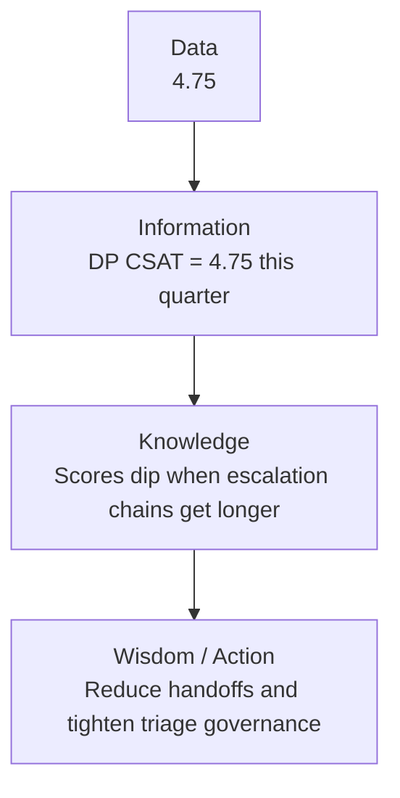
### A support example all the way up the ladder
| Level | Example | Why it is at this level |
|---|---|---|
| Data | Case ID 18492, Product = OneDrive, Time to resolution = 53 hours | A single recorded fact |
| Information | Average resolution time for OneDrive escalations last month = 29 hours | Organized summary |
| Knowledge | Resolution time spikes when issue category = Sync and escalations move across multiple queues | Pattern across multiple summaries |
| Wisdom | Create a fast-track sync issue routing path and monitor time-to-first-action | Decision and intervention |
### DIKW is not a strict staircase
In real work, analysts move up and down the ladder.
You may start with a hypothesis.
Then go back to raw data.
Then summarize again.
Then refine the recommendation.
So think of DIKW less like a rigid ladder and more like a loop of increasing clarity.
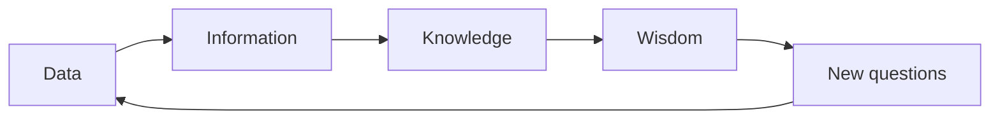
> 💡 **Tie-in to your background:** Your escalation trend analysis already lives at the Knowledge and Wisdom levels. That is powerful in interviews because you can honestly say, "I have been doing the top half of the ladder in operations; this role lets me deepen the tooling and statistical rigor underneath it."
---
## 3. The data value chain: how raw events become business value
The **data value chain** describes the path from event generation to business impact.
It answers a practical question:
**How does a support event become a decision that changes customer experience?**
### A common version of the value chain
1. **Generate** data
2. **Capture** data
3. **Store** data
4. **Prepare** data
5. **Analyze** data
6. **Communicate** findings
7. **Act** on findings
8. **Measure** impact

### 🔍 Plain-English deep-dive: where analytics teams add value
- **Capture** — if fields are missing or inconsistent, everything later gets harder.  
**Analogy:** if ingredients are mislabeled before cooking, the recipe fails.
- **Prepare** — analysts often spend a huge amount of time here.  
**Analogy:** washing, sorting, and chopping ingredients before the meal.
- **Analyze** — this is the visible part, but not the only important part.  
**Analogy:** actual cooking.
- **Communicate** — a correct result that nobody understands has low business value.  
**Analogy:** serving a great meal without plates or instructions.
- **Act** — insight must change a process, product, decision, or resource allocation.  
**Analogy:** eating the meal; otherwise all the prep was pointless.
### The value chain in a Microsoft CE&S BI setting
| Value chain stage | Support/customer experience example |
|---|---|
| Generate | Customer submits support case, Copilot-assisted session starts, self-serve page gets traffic |
| Capture | Telemetry event, case metadata, survey score, chatbot transcript recorded |
| Store | Data lands in operational stores, lakehouse, warehouse, or analytics model |
| Prepare | Standardize timestamps, unify issue taxonomy, join support cases to CSAT and product metadata |
| Analyze | Identify top drivers of escalations, low deflection, or low satisfaction |
| Communicate | Power BI dashboards, executive decks, monthly business reviews, incident review packs |
| Act | Improve content, change queue routing, redesign self-serve flow, target product fix |
| Measure impact | Track deflection, resolution time, repeat contact rate, CSAT, containment, backlog |
### Why this matters in interviews
If you describe analytics only as "building dashboards," you sound tool-focused.
If you describe analytics as a value chain ending in business impact, you sound outcome-focused.
That is much closer to how senior analysts think.
---
## 4. Data types: the full landscape
Not all data is the same.
The type of data determines:
- what you can calculate,
- which chart makes sense,
- which cleaning method is valid,
- and which modeling approach is appropriate.
### 4.1 Structured, semi-structured, and unstructured data
| Type | Plain-English meaning | Example | Typical storage | Common challenge |
|---|---|---|---|---|
| **Structured** | Data that fits a fixed schema with rows and columns | Case table with product, severity, date, resolution time | SQL database, warehouse | Easy to query, but can be rigid |
| **Semi-structured** | Data with some organization but not a strict fixed table format | JSON from a bot session, XML logs | Data lake, document store | Flexible, but may need parsing |
| **Unstructured** | Data without a predefined schema | Call transcripts, screenshots, email text, document attachments | Blob storage, lake | Harder to search, summarize, and model |
### 🔍 Plain-English deep-dive: schema
- **Schema** — *the agreed structure of data: what fields exist and what they mean.*  
**Analogy:** a form with labeled boxes. **Why it matters:** structured data has a predictable form; unstructured data does not.
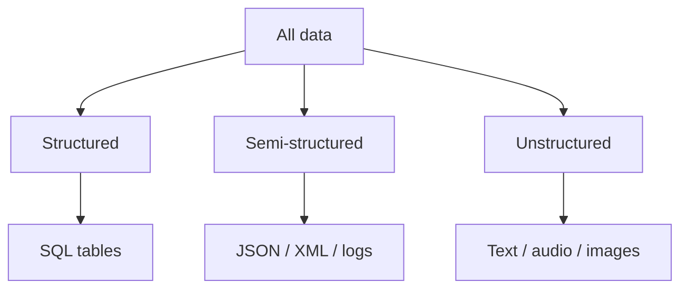
> 💡 **Tie-in to your background:** Your work probably touches all three. Case metadata is structured. Escalation notes or Copilot Studio conversation logs may be semi-structured. Customer comments and support transcripts are unstructured.
### 4.2 Categorical vs numerical data
This is one of the most important splits.
| Broad type | Meaning | Examples |
|---|---|---|
| **Categorical** | Labels or groups | Product, region, issue type, escalation status |
| **Numerical** | Quantities or measured values | Case count, resolution minutes, CSAT, backlog size |
### 4.3 Discrete vs continuous data
Numerical data splits further:
| Type | Meaning | Example | Key clue |
|---|---|---|---|
| **Discrete** | Countable values, usually whole numbers | Number of cases, number of escalations, number of bot sessions | You count it |
| **Continuous** | Measured values across a range | Resolution time, wait time, storage usage, response time | You measure it |
### 4.4 Binary data
**Binary** data has two values only.
Examples:
- escalated / not escalated,
- survey responded / not responded,
- resolved within SLA / outside SLA.
Binary data is very common in business analytics because many questions are naturally yes/no.
### 4.5 Text data
**Text data** includes:
- customer feedback comments,
- escalation summaries,
- issue descriptions,
- chatbot transcripts,
- KB article titles.
Text looks unstructured, but it can be turned into useful features:
- sentiment,
- topic,
- keywords,
- intent category,
- product mentions,
- complaint type.
### 4.6 Time-series data
**Time-series data** is data indexed over time.
Examples:
- daily case volume,
- weekly CSAT,
- monthly backlog,
- hourly self-serve deflection,
- trend of repeat contacts after product release.
Time-series has special behavior:
- trend,
- seasonality,
- spikes,
- lag,
- rolling averages.
### 4.7 Geospatial data
**Geospatial data** is tied to location.
Examples:
- customer region,
- support delivery center location,
- time zone,
- country,
- service region,
- map coordinates.
Not every BI analyst will use latitude and longitude, but location-based slicing is extremely common.
### 4.8 Identifier data
**Identifiers** are fields that uniquely identify an entity.
Examples:
- Case ID
- Customer ID
- Agent ID
- Session ID
- Ticket number
Important caution:
Identifiers often look numeric, but they are usually **not true numerical measures**.
You do not average Case ID.
You use it to join data or count distinct entities.
### 4.9 Boolean, flags, and status codes
Many operational systems encode states with flags.
Examples:
- is_reopened
- is_premium_customer
- has_attachment
- case_status_code
These are often categorical or binary, even if stored as numbers like `0` and `1`.
### 4.10 Hierarchical data
Some data has parent-child structure.
Examples:
- Product → Workload → Feature
- Organization → Team → Agent
- Category → Subcategory → Reason code
Hierarchical data matters for drill-down analysis and dimensions in BI models.
### Quick comparison table
| Data type | Common example in CE&S analytics | Typical analysis |
|---|---|---|
| Structured | Cases table | SQL aggregation |
| Semi-structured | JSON bot event log | Parsing + flattening |
| Unstructured | Survey comments | Text mining |
| Categorical | Product, region | Grouping and comparison |
| Numerical discrete | Case count | Count, rate |
| Numerical continuous | Resolution hours | Average, median, distribution |
| Identifier | Case ID | Distinct count, joins |
| Time-series | Weekly CSAT | Trend analysis |
| Geospatial | Market, country | Map or regional comparison |
| Text | Escalation notes | NLP, topic analysis |
---
## 5. Measurement scales: nominal, ordinal, interval, ratio
This topic sounds academic, but it is extremely practical.
The **measurement scale** tells you what mathematical operations make sense.
If you misuse the scale, you can produce nonsense analysis.
### The four scales at a glance
| Scale | Order matters? | Equal intervals? | True zero? | Example |
|---|---|---|---|---|
| **Nominal** | No | No | No | Product = SharePoint, OneDrive |
| **Ordinal** | Yes | No | No | Severity = Low, Medium, High |
| **Interval** | Yes | Yes | No | Temperature in Celsius, calendar year |
| **Ratio** | Yes | Yes | Yes | Resolution hours, case count, revenue |
### 5.1 Nominal scale
**Nominal** means names or labels only.
There is no built-in order.
Examples:
- Product = SharePoint / OneDrive / Teams
- Region = APAC / EMEA / Americas
- Issue type = Sync / Permissions / Sharing
You can:
- count frequencies,
- compute proportions,
- find the mode,
- compare groups.
You should not:
- compute a mean,
- say one category is "higher" than another,
- subtract categories.
### 5.2 Ordinal scale
**Ordinal** means categories with order, but the gaps are not guaranteed equal.
Examples:
- Severity = Low / Medium / High
- Survey sentiment = Poor / Fair / Good / Excellent
- Priority = P3 / P2 / P1
You can:
- rank values,
- find median category,
- use percentiles in some ordinal contexts,
- compare directionally.
You should be cautious about:
- averaging coded values like 1, 2, 3 as if the jump from Low to Medium equals Medium to High.
### 5.3 Interval scale
**Interval** data has ordered values with meaningful equal differences, but no true zero.
Examples:
- Temperature in Celsius
- Calendar years
You can:
- add and subtract,
- compute mean and standard deviation.
You should not interpret ratios literally.
For example:
20°C is not "twice as hot" as 10°C.
### 5.4 Ratio scale
**Ratio** data has order, equal intervals, and a true zero.
Examples:
- Resolution time
- Case count
- Revenue
- Number of escalations
- Storage usage
Because zero means "none," ratios make sense.
Ten hours really is twice five hours.
### 🔍 Plain-English deep-dive: why scale affects valid statistics
- **Nominal** is about *sameness and difference.*  
**Analogy:** jersey colors in a sports team.
- **Ordinal** is about *rank order.*  
**Analogy:** podium places in a race.
- **Interval** is about *difference.*  
**Analogy:** the distance between rungs on a ladder, but no meaningful "none."
- **Ratio** is about *difference and proportion.*  
**Analogy:** measuring water in a jug; zero water means truly none.
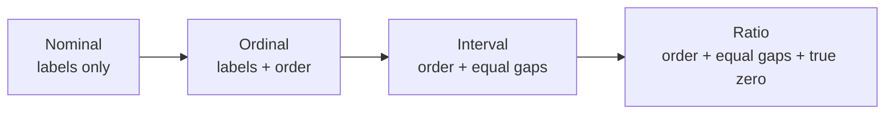
### Valid statistics by scale
| Scale | Typical valid summaries | Typical valid visuals | Common analyst mistake |
|---|---|---|---|
| Nominal | Counts, proportions, mode | Bar chart, stacked bar | Averaging category codes |
| Ordinal | Counts, median rank, percentiles with care | Ordered bar, diverging bar | Treating category gaps as equal |
| Interval | Mean, median, variance, standard deviation, correlation | Histogram, line chart | Interpreting ratios literally |
| Ratio | All common arithmetic summaries, rates, ratios | Histogram, box plot, scatter, line | Forgetting skew or outliers |
### A CE&S-flavored example
Suppose you code Severity as Low = 1, Medium = 2, High = 3.
If average severity this week is `2.4`, that number is not naturally meaningful to a business stakeholder.
A better summary might be:
- 25% Low
- 40% Medium
- 35% High
or
- Median severity = Medium
That is an example of respecting the measurement scale.
> 💡 **Tie-in to your background:** Escalation severity, queue priority, and case stage are often ordinal. Resolution time, volume, and CSAT are usually ratio-like. Knowing the difference makes you sound analytically disciplined rather than just tool-proficient.
---
## 6. Analytics lifecycle and formal frameworks
Analytics is not just "open data, build dashboard."
Strong analysts follow a repeatable process.
That process protects against:
- solving the wrong problem,
- trusting broken data,
- overfitting a shiny but useless model,
- and delivering work nobody adopts.
### 6.1 A simple analytics lifecycle
1. Define the business question
2. Identify and access data
3. Clean and prepare data
4. Explore the data
5. Analyze or model
6. Communicate results
7. Operationalize and monitor
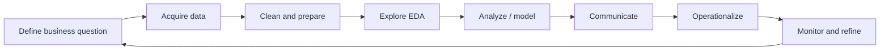
### 6.2 CRISP-DM: the classic analytics framework
**CRISP-DM** stands for **Cross-Industry Standard Process for Data Mining**.
It is one of the most common formal analytics frameworks.
Its six phases are:
1. **Business Understanding**
2. **Data Understanding**
3. **Data Preparation**
4. **Modeling**
5. **Evaluation**
6. **Deployment**
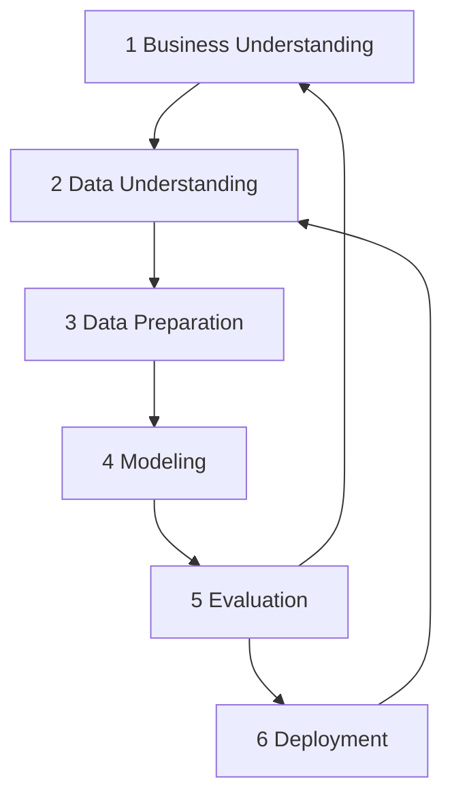
### CRISP-DM in plain English
| Phase | Plain-English meaning | Support analytics example |
|---|---|---|
| Business Understanding | What problem are we trying to solve, and how will we measure success? | "Why is self-serve containment lower for assisted+digital journeys in certain products?" |
| Data Understanding | What data exists, what does it mean, and what looks suspicious? | Review cases, chat sessions, article views, survey events |
| Data Preparation | Clean, join, standardize, reshape | Align customer IDs, normalize dates, fill or flag missing fields |
| Modeling | Apply statistical, BI, or ML techniques | Segmentation, regression, forecasting, funnel drop-off analysis |
| Evaluation | Did we answer the business problem well enough to trust and use? | Does the analysis hold across segments? Are the results stable? |
| Deployment | Put the result into action | Publish dashboard, alert, scorecard, or model-driven workflow |
### 6.3 TDSP: Microsoft's team-oriented lifecycle
**TDSP** stands for **Team Data Science Process**.
It is a Microsoft-oriented lifecycle that emphasizes:
- collaboration,
- version control,
- environment setup,
- experimentation,
- deployment,
- and operational discipline.
You do **not** need to memorize TDSP deeply for most analyst interviews.
But it is helpful to know:
- CRISP-DM is a broad conceptual framework.
- TDSP is a more operational Microsoft-flavored framework for team delivery.
### 6.4 EDA vs ETL vs ELT
These are commonly confused.
| Term | Stands for | Core purpose | Simple analogy |
|---|---|---|---|
| **EDA** | Exploratory Data Analysis | Understand the data before formal analysis | Tasting ingredients before cooking |
| **ETL** | Extract, Transform, Load | Move and shape data before it lands in target storage | Wash/chop before putting food in containers |
| **ELT** | Extract, Load, Transform | Load raw data first, transform inside modern warehouse/lakehouse | Put groceries in the kitchen first, then prep where you cook |
### 🔍 Plain-English deep-dive: EDA
EDA usually includes:
- checking row counts,
- understanding grain,
- reviewing data types,
- profiling missing values,
- looking at distributions,
- spotting outliers,
- checking duplicates,
- sanity-checking business totals,
- generating early hypotheses.
EDA is not optional.
It is what keeps you from building a polished dashboard on bad data.
### 🔍 Plain-English deep-dive: ETL and ELT
- **Extract** — get data from source systems.
- **Transform** — clean, join, reformat, enrich, and model it.
- **Load** — store it in a place analysts can use.
Older systems often transformed before loading.
Modern cloud platforms often load raw data first, then transform inside scalable compute engines.
That is the shift from ETL to ELT.
### A lifecycle example tied to the role
Business question:
"Which assisted + self-serve journey patterns lead to the highest resolution success and best customer satisfaction?"
Lifecycle:
1. Define metrics: containment, repeat contact rate, CSAT, time to resolution.
2. Pull case, bot, article, and survey data.
3. Clean timestamps and customer journey identifiers.
4. Explore missingness and segment coverage.
5. Analyze journey patterns and drop-offs.
6. Communicate which surfaces underperform and why.
7. Recommend content, routing, or product changes.
8. Monitor whether the intervention improves outcomes.
> 💡 **Tie-in to your background:** Your current role already covers Business Understanding, Communication, and Action. The BI role deepens Data Understanding, Preparation, and scalable analytical methods. That is an excellent narrative for "why this move?"
---
## 7. The four types of analytics — deeper and more practical
The standard four types are:
1. **Descriptive**
2. **Diagnostic**
3. **Predictive**
4. **Prescriptive**
But interviewers often want more than definitions.
They want to know:
- what each one is for,
- which techniques fit each type,
- what maturity is required,
- and how to explain them using business examples.
### 7.1 Descriptive analytics
**Descriptive analytics** answers:
**What happened?**
Common techniques:
- aggregations,
- trend lines,
- dashboards,
- scorecards,
- KPIs,
- period-over-period comparisons.
Examples:
- Weekly case volume by product
- Monthly CSAT by market
- Backlog by severity
- Article views by support topic
### 7.2 Diagnostic analytics
**Diagnostic analytics** answers:
**Why did it happen?**
Common techniques:
- drill-down,
- segmentation,
- decomposition,
- cohort comparison,
- root cause analysis,
- correlation analysis,
- driver analysis.
Examples:
- CSAT dropped most in premium customers with multi-handoff cases
- Self-serve deflection fell in one region after content freshness declined
- Repeat contacts increased mainly for one issue category after a release
### 7.3 Predictive analytics
**Predictive analytics** answers:
**What is likely to happen next?**
Common techniques:
- regression,
- classification,
- time-series forecasting,
- propensity modeling,
- churn/risk scoring,
- anomaly detection.
Examples:
- Forecast next month's case volume
- Predict which cases are at risk of escalation
- Estimate which users are likely to abandon self-serve and open assisted cases
### 7.4 Prescriptive analytics
**Prescriptive analytics** answers:
**What should we do?**
Common techniques:
- optimization,
- simulation,
- recommendations,
- scenario analysis,
- decision rules,
- policy engines.
Examples:
- Recommend the best staffing mix by day and queue
- Route high-risk issues to specialists earlier
- Recommend which knowledge articles to surface first in self-serve flow

### Comparison table
| Type | Core question | Typical outputs | Typical difficulty | Example in CE&S BI |
|---|---|---|---|---|
| Descriptive | What happened? | Dashboards, KPI packs | Lower | CSAT trend by month |
| Diagnostic | Why did it happen? | Driver analysis, root cause views | Moderate | Why did containment fall after a release? |
| Predictive | What will happen? | Forecasts, risk scores | Higher | Which cases are likely to escalate? |
| Prescriptive | What should we do? | Recommendations, optimization | Highest | Which intervention mix best improves self-serve success? |
### Techniques mapped to each level
| Technique | Mostly used for |
|---|---|
| GROUP BY summary in SQL | Descriptive |
| Variance decomposition | Diagnostic |
| Correlation and segmentation | Diagnostic |
| Linear regression | Predictive |
| Time-series forecasting | Predictive |
| What-if scenario model | Prescriptive |
| Optimization model | Prescriptive |
### A support journey example across all four
Suppose assisted-to-self-serve deflection is falling.
- **Descriptive:** Deflection fell from 42% to 35% over six weeks.
- **Diagnostic:** The decline is concentrated in OneDrive sync issues in EMEA, where article exit rate rose and repeat contacts increased.
- **Predictive:** If no action is taken, the model forecasts assisted volume will rise another 12% next month.
- **Prescriptive:** Refresh the top five sync articles, change search ranking, and add targeted bot prompts for that journey.
### The maturity story interviewers like
You do not need to pretend you have built a full prescriptive optimization engine if you have not.
A strong honest answer is:
"My current work is strongest in descriptive and diagnostic analytics through KPI, CSAT, and escalation trend analysis. I already translate results into operational recommendations, and I am building deeper predictive and prescriptive capability through formal BI, SQL, Python, and statistical methods."
That sounds credible and growth-oriented.
> 💡 **Tie-in to your background:** Your executive communication strength is especially valuable at the Diagnostic and Prescriptive levels because these require telling a convincing story about what is happening and what decision should change.
---
## 8. Metrics and dimensions: the grammar of BI
If data is the raw material of analytics, then **metrics, dimensions, and grain** are the grammar.
Analysts use them to structure almost every business question.
### 8.1 Measures, metrics, facts, and dimensions
| Term | Plain-English meaning | Example |
|---|---|---|
| **Measure** | A numeric value that can usually be aggregated | Resolution hours, case count, backlog, survey score |
| **Metric** | A business-defined measure, often with specific formula and meaning | CSAT %, Escalation Rate, Repeat Contact Rate |
| **Fact** | In data modeling, a record of an event or measurable activity | One support case row, one survey response row |
| **Dimension** | Descriptive attributes used to slice facts | Product, date, region, queue, severity |
### 8.2 Grain: define it first
**Grain** means the level of detail represented by one row.
Examples:
- one row per support case,
- one row per customer per day,
- one row per article view,
- one row per agent per week.
If you do not define grain first, you risk:
- double counting,
- incorrect joins,
- distorted rates,
- mismatched denominators.
### 🔍 Plain-English deep-dive: grain
**Analogy:** grain is the zoom level on a map.
- Street-level view = highly detailed grain
- City-level view = summarized grain
If one table is at case-level and another is at weekly-product-level, joining them carelessly can explode row counts.
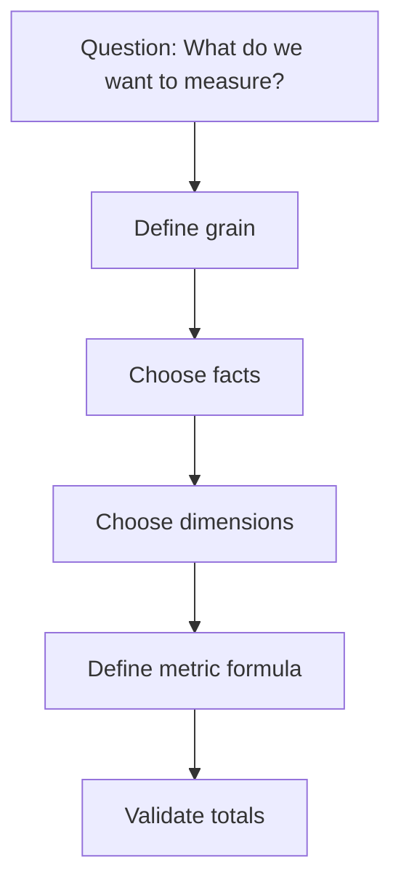
### 8.3 Additive, semi-additive, and non-additive measures
Not every measure can be summed across every dimension.
| Type | Meaning | Example | Can be summed across time? |
|---|---|---|---|
| **Additive** | Safe to sum across all relevant dimensions | Case count, revenue, number of sessions | Usually yes |
| **Semi-additive** | Safe to sum across some dimensions, not others | End-of-day backlog, account balance | Usually no across time |
| **Non-additive** | Not safe to sum meaningfully | Ratios, percentages, averages | No |
### Examples
- **Case count** is additive.
- **Backlog at day end** is semi-additive: summing daily backlog across time is misleading.
- **CSAT %** is non-additive: you cannot add 80% and 90% to get 170%.
Instead, you recompute from underlying numerators and denominators.
### 8.4 Ratio and rate pitfalls
Many business metrics are ratios or rates.
Examples:
- CSAT = satisfied responses / total responses
- Escalation rate = escalated cases / total cases
- Deflection rate = self-served sessions / eligible sessions
Common pitfall:
Averaging percentages across groups without weighting by denominator.
Example:
- Team A: 90% CSAT from 10 responses
- Team B: 80% CSAT from 1,000 responses
Simple average of the percentages = 85%
But that ignores volume.
The weighted overall value is much closer to Team B.
### 8.5 Measures vs dimensions by example
| Business question | Metric | Dimension | Grain |
|---|---|---|---|
| Which products drive the highest escalations? | Escalation count, escalation rate | Product | Product by month |
| Which region has the longest resolution time? | Median resolution hours | Region | Region by week |
| How is customer satisfaction changing? | CSAT % | Date, product, queue | Product by month |
| Which self-serve journeys fail most? | Funnel completion rate | Journey step, issue type | Journey step by cohort |
> 💡 **Tie-in to your background:** When you explain MBR findings like "CSAT by queue by month" or "escalation trend by product," you already think in metrics and dimensions. The BI role formalizes that thinking into scalable semantic models and reusable measures.
---
## 9. Metric design: from "a number" to "a useful signal"
One of the biggest analyst skills is not calculating metrics.
It is **designing the right metrics**.
Poor metrics create confusion, misaligned behavior, and false wins.
Strong metrics align teams around meaningful outcomes.
### 9.1 What makes a good metric?
A good metric is:
- clearly defined,
- tied to a business goal,
- hard to game,
- easy to interpret,
- based on trustworthy data,
- comparable over time,
- paired with the right context.
### 9.2 North Star metric
A **North Star metric** is the single outcome metric that best captures the value delivered to users and the business.
It is not always one number forever, but it should reflect the core mission.
For a support/customer-experience environment, possible North Star candidates might include:
- successful issue resolution rate,
- customer satisfaction adjusted for response volume,
- customer effort reduction,
- successful self-serve containment for eligible issues.
### 9.3 Input metrics vs output metrics
| Type | Meaning | Example |
|---|---|---|
| **Input metric** | Measures activities or drivers you can influence directly | Knowledge article freshness, time to first response, routing accuracy |
| **Output metric** | Measures the business result you ultimately care about | CSAT, containment, resolution success, repeat contact rate |
Strong operating systems link input metrics to output metrics.
Example:
- Improve article freshness and search ranking (**input metrics**)
- to improve self-serve containment and reduce repeat contact (**output metrics**)
### 9.4 Leading vs lagging metrics
| Type | Meaning | Example |
|---|---|---|
| **Leading** | Signals future outcome earlier | Queue backlog growth, article abandonment, rising transfer rate |
| **Lagging** | Confirms outcome after it happened | End-of-month CSAT, quarterly churn, final case resolution rate |
Leading indicators help you intervene earlier.
Lagging indicators help you judge final business performance.
### 9.5 Guardrail metrics
A **guardrail metric** ensures that while improving one metric, you do not damage something else important.
Example:
If you optimize aggressively for faster case closure, guardrails might include:
- reopen rate,
- repeat contact rate,
- customer effort,
- CSAT.
That prevents teams from "winning" on speed while hurting quality.
### 9.6 Vanity metrics
A **vanity metric** looks impressive but does not reflect real value.
Examples:
- total page views without knowing whether the content solved anything,
- bot conversation starts without containment,
- dashboard visits without downstream action.
Vanity metrics are tempting because they rise easily.
Good analysts redirect attention toward meaningful metrics.
### 9.7 Goodhart's Law
**Goodhart's Law** says:
**"When a measure becomes a target, it ceases to be a good measure."**
Plain meaning:
If people are rewarded directly on one number, they may game the number rather than improve the underlying reality.
Examples:
- If agents are judged only on closure speed, they may close too early.
- If self-serve teams are judged only on article views, they may optimize clicks rather than resolution.
- If teams are judged only on CSAT, they may over-focus on survey completion mechanics instead of actual customer outcomes.
### 🔍 Plain-English deep-dive: why metric systems need balance
One metric is rarely enough.
A healthy metric system often includes:
- one North Star,
- a few input metrics,
- a few output metrics,
- guardrails,
- segmentation views.
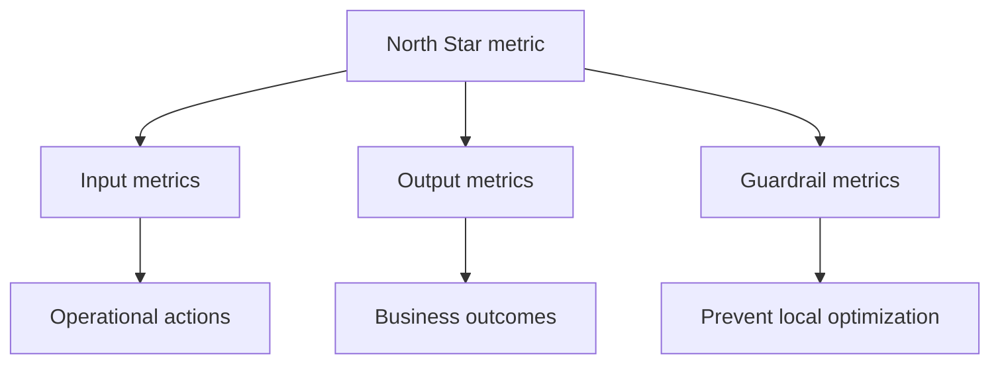
### 9.8 Metric definition template
When defining a metric, write down:
1. **Name**
2. **Business purpose**
3. **Formula**
4. **Numerator**
5. **Denominator**
6. **Grain**
7. **Segments**
8. **Refresh cadence**
9. **Known caveats**
10. **Owner**
### Example: Escalation Rate
| Element | Definition |
|---|---|
| Name | Escalation Rate |
| Purpose | Track how often cases require escalation, signaling complexity or routing issues |
| Formula | Escalated cases / total eligible cases |
| Numerator | Count of cases with escalation flag = true |
| Denominator | Count of all eligible cases in same period |
| Grain | Case-level source, reported by week/month |
| Segments | Product, region, queue, issue category |
| Cadence | Daily refresh, weekly executive summary |
| Caveats | Definition of "eligible" must be stable; process changes can alter rate |
| Owner | Support analytics / operations |
> 💡 **Tie-in to your background:** You already think about metric quality when presenting MBRs. Mentioning Goodhart's Law, weighted ratios, and guardrail metrics shows interview-level maturity beyond just "I know Power BI."
---
## 10. Population, sample, and sampling methods
Most analysts do not observe the entire universe of interest.
They work with samples.
That means they must understand how samples can mislead.
### 10.1 Population vs sample
| Term | Meaning | Example |
|---|---|---|
| **Population** | The full set you care about | All CE&S support cases for OneDrive this quarter |
| **Sample** | A subset used for analysis | 5,000 sampled cases reviewed manually |
### 🔍 Plain-English deep-dive
- **Population** — the whole cake.
- **Sample** — one slice of the cake.
If your slice is representative, you learn about the whole cake.
If it is a weird slice with all the frosting, your conclusion will be biased.
### 10.2 Why sampling matters
Sometimes you sample because:
- manual review is expensive,
- labeling data is time-consuming,
- survey data exists only for some users,
- experimentation collects data only for exposed groups,
- very large datasets are expensive to compute repeatedly.
### 10.3 Common sampling methods
| Method | Meaning | Strength | Risk |
|---|---|---|---|
| **Simple random sampling** | Every item has equal chance of selection | Easy and fair | May still miss rare groups |
| **Systematic sampling** | Select every nth item | Simple operationally | Bias if there is periodic structure |
| **Stratified sampling** | Sample within important subgroups | Good for balanced representation | Requires good subgroup definitions |
| **Cluster sampling** | Sample whole groups/clusters | Cost-efficient | Cluster differences can distort estimates |
| **Convenience sampling** | Use what is easiest to get | Fast | Often biased |
### 10.4 Sampling bias
**Sampling bias** happens when the sample is systematically unrepresentative.
Examples:
- Only analyzing customers who responded to surveys
- Reviewing only escalated cases, then generalizing to all cases
- Looking only at English-language interactions
- Using only premium support data when discussing whole support experience
### 10.5 Response bias and survivorship bias
Two especially important business biases:
| Bias | Meaning | Example |
|---|---|---|
| **Response bias** | People who respond differ from people who do not | Extremely happy or unhappy users are more likely to submit CSAT |
| **Survivorship bias** | You only see the cases that remained visible in the data | Looking only at resolved successful journeys and ignoring abandoned ones |
### 10.6 Selection bias
**Selection bias** means the way observations entered the dataset was not neutral.
Example:
If only severe issues get manually coded in detail, then your labeled dataset over-represents severe cases.
### 10.7 Sample size intuition
In general:
- larger samples reduce random noise,
- but large biased samples are still biased,
- and small well-designed samples can be more reliable than huge bad samples.
This is a powerful interview point:
**Volume does not automatically mean quality.**
> 💡 **Tie-in to your background:** In customer support, CSAT almost always involves response bias. Saying that clearly — and explaining how you'd segment, weight, or caveat results — will make your interview answers much stronger.
---
## 11. Descriptive statistics: summarizing data without lying
Descriptive statistics summarize what the data looks like.
They do not prove causes.
They do not forecast the future.
They simply describe the observed data well.
### 11.1 Measures of central tendency
| Statistic | Meaning | Best used when |
|---|---|---|
| **Mean** | Arithmetic average | Data is fairly symmetric and outliers are limited |
| **Median** | Middle value | Data is skewed or has outliers |
| **Mode** | Most common value | Categorical data or most frequent category/value |
### Mean
Formula in plain English:
Add all values and divide by how many there are.
Useful when values are balanced and not heavily distorted by extreme cases.
### Median
The middle value after sorting.
If there are two middle values, average those two.
Useful because extreme values do not pull it around much.
### Mode
The most frequent value or category.
Useful for:
- most common issue type,
- most common product,
- most common severity.
### 11.2 Measures of spread
| Statistic | Meaning | Why it matters |
|---|---|---|
| **Range** | Max minus min | Fast but sensitive to extremes |
| **Variance** | Average squared distance from mean | Mathematical measure of spread |
| **Standard deviation** | Typical distance from mean | Easier to interpret than variance |
| **IQR** | Interquartile range: Q3 − Q1 | Robust spread for skewed data |
### 11.3 Quartiles and percentiles
- **Quartiles** split the data into four parts.
- **Percentiles** split it into 100 parts.
Important ones:
- **Q1** = 25th percentile
- **Q2** = 50th percentile = median
- **Q3** = 75th percentile
- **P90** = 90th percentile
- **P95** = 95th percentile
Support analytics uses percentiles heavily because averages can hide poor tail experiences.
Example:
- Median resolution time tells you what a typical case experiences.
- P90 resolution time tells you what the slowest-but-still-typical cases experience.
### 11.4 Skewness and kurtosis
These sound scary.
Keep them simple.
| Term | Plain-English meaning |
|---|---|
| **Skewness** | Whether a distribution leans left or right |
| **Kurtosis** | How heavy the tails or peak shape are compared with a normal distribution |
You do not need to overuse these words in interviews.
But it helps to know:
- support timing data is often **right-skewed**,
- meaning a long tail of slow cases pulls the distribution right.
### 🔍 Plain-English deep-dive: why skewness matters
If most cases resolve in 2–8 hours, but a few take 70+ hours, the mean can look much worse than the typical case.
That is why median and percentiles are often better than mean for service timing metrics.
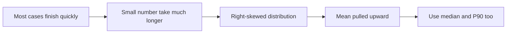
### 11.5 Example: summary statistics for resolution hours
| Metric | Value | Interpretation |
|---|---|---|
| Mean | 18 hours | Average is pulled up by slow tail |
| Median | 7 hours | Typical case resolves much faster than mean suggests |
| P90 | 46 hours | 10% of cases take longer than 46 hours |
| IQR | 11 hours | Middle half of cases spread across 11 hours |
This tells a richer story than one average alone.
> 💡 **Tie-in to your background:** When discussing support experience, saying "I prefer median and P90 for skewed service timing data" is an excellent analyst signal. It shows statistical judgment and operational relevance.
---
## 12. Common distributions and why they matter in support analytics
A **distribution** is the shape of how values are spread.
Understanding the shape matters because it affects:
- which summary statistic to use,
- which assumptions are reasonable,
- which chart fits,
- and which anomalies look suspicious.
### 12.1 Normal distribution
The **normal distribution** is the classic bell curve.
It is symmetric.
Many natural measurement errors and averages of many small effects approximate it.
Key features:
- mean ≈ median ≈ mode,
- symmetric around center,
- few extreme values.
### 12.2 Uniform distribution
A **uniform distribution** means values are spread fairly evenly across a range.
Example:
- simulated random numbers from 0 to 1.
Not as common in business operations, but useful conceptually.
### 12.3 Binomial distribution
A **binomial distribution** models the number of successes in a fixed number of yes/no trials.
Examples:
- number of satisfied responses out of 100 surveys,
- number of resolved-within-SLA cases out of 500 cases.
### 12.4 Poisson distribution
A **Poisson distribution** models counts of events over a fixed interval.
Examples:
- number of support cases arriving per hour,
- number of escalations per day,
- number of outages in a month.
It is common when modeling event counts.
### 12.5 Exponential distribution
The **exponential distribution** often models time between events.
Example:
- time between incoming support cases,
- time between incident alerts.
### 12.6 Long-tail / heavy-tailed distributions
Many support and service processes show **long tails**.
That means:
- most cases are resolved relatively quickly,
- but a small number take much longer.
This is extremely common in operations.
Examples:
- escalation chain cases,
- complex identity or sync issues,
- cross-team dependencies,
- cases waiting on engineering fixes.
### Comparison table
| Distribution | What it often represents | Support example |
|---|---|---|
| Normal | Symmetric measurements | Some aggregated quality scores |
| Uniform | Even spread | Synthetic/randomized test values |
| Binomial | Yes/no outcomes across trials | Number of satisfied survey responses |
| Poisson | Event counts in fixed window | Cases arriving per hour |
| Exponential | Time between events | Time between new escalations |
| Long-tail | Many small values, few huge values | Resolution time with complex escalations |
### 12.7 Empirical rule
For roughly normal data:
- about **68%** of values fall within 1 standard deviation of the mean,
- about **95%** within 2,
- about **99.7%** within 3.
This is the **empirical rule**.
It is useful when data is approximately bell-shaped.
Be careful:
It is much less useful when data is heavily skewed, which many support timing metrics are.
### 12.8 Z-scores
A **z-score** tells you how many standard deviations a value is from the mean.
Plain English:
It standardizes different scales.
Example:
- a z-score of +2 means "two standard deviations above average."
This is helpful for:
- spotting unusually high values,
- comparing different metrics on a common scale,
- simple anomaly detection.
### 🔍 Plain-English deep-dive: support timing and long-tail behavior
If you measure resolution time, you often see:
- a large cluster of ordinary cases,
- a smaller group of difficult cases,
- and a tail of very slow cases.
That tail matters because:
- customers feel it strongly,
- leadership asks about it,
- averages hide it,
- and process fixes often target exactly that tail.
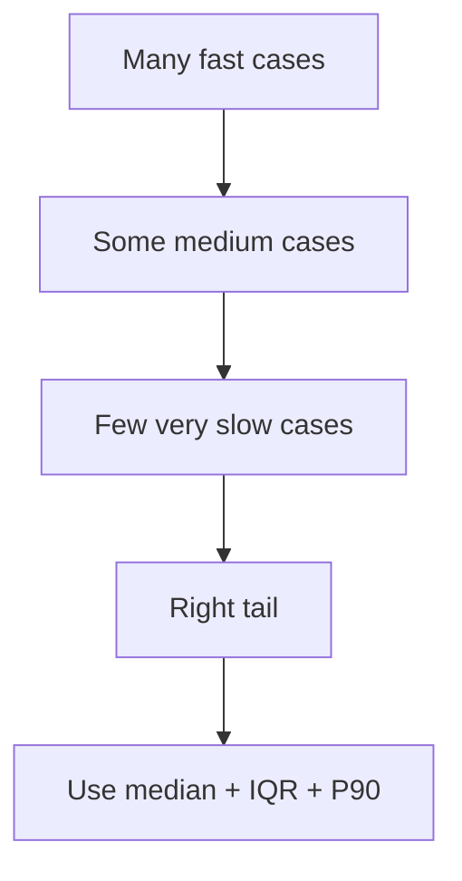
---
## 13. Correlation: relationships, not proof
**Correlation** tells you whether two variables move together.
It does **not** automatically tell you why.
### 13.1 Pearson correlation
**Pearson correlation** measures linear relationship between numerical variables.
It works best when:
- the relationship is roughly linear,
- variables are numeric,
- extreme outliers are not dominating.
Examples:
- resolution hours vs CSAT score,
- number of transfers vs customer effort score.
### 13.2 Spearman correlation
**Spearman correlation** looks at rank order rather than exact values.
It is useful when:
- data is ordinal,
- relationship is monotonic but not strictly linear,
- outliers make Pearson less stable.
Examples:
- severity rank vs escalation likelihood,
- queue priority vs average delay rank.
### Comparison table
| Type | Best for | Sensitive to outliers? | Works with ranks? |
|---|---|---|---|
| Pearson | Linear numeric relationship | More sensitive | No |
| Spearman | Monotonic/ranked relationship | Less sensitive | Yes |
### 13.3 Correlation coefficient interpretation
The coefficient ranges from **-1 to +1**.
| Value | Rough interpretation |
|---|---|
| Near +1 | Strong positive relationship |
| Near 0 | Little or no linear relationship |
| Near -1 | Strong negative relationship |
### 13.4 Correlation is not causation
This is one of the most important interview phrases in analytics.
If two things move together, possible explanations include:
1. X causes Y
2. Y causes X
3. A third variable causes both
4. The relationship is coincidental
5. Measurement or sampling bias created the pattern
### Example
Suppose longer resolution time correlates with lower CSAT.
That does **not** prove that longer time alone causes the low score.
Possible hidden factors:
- issue complexity,
- severity,
- number of handoffs,
- product release quality,
- customer segment differences.
### 13.5 Simpson's paradox
**Simpson's paradox** happens when a trend appears in separate groups but reverses or changes when the groups are combined.
This is one of the most interview-worthy advanced concepts.
### Simple intuition
You compare Team A and Team B.
Overall, Team A appears better.
But when you split by case complexity, Team B is better in both simple and complex cases.
How can that happen?
Because Team A handled more easy cases.
The mix of cases changes the overall result.
### Support example
Suppose Queue X has better overall CSAT than Queue Y.
But after segmenting by severity:
- Queue Y is better for low severity
- Queue Y is also better for high severity
Why the contradiction?
Queue X may have received a much easier mix of cases.
### 🔍 Plain-English deep-dive: the lesson from Simpson's paradox
Always segment when important mix differences may exist.
Common segmentation variables:
- product,
- severity,
- region,
- customer segment,
- issue type,
- support plan type,
- assisted vs self-serve path.
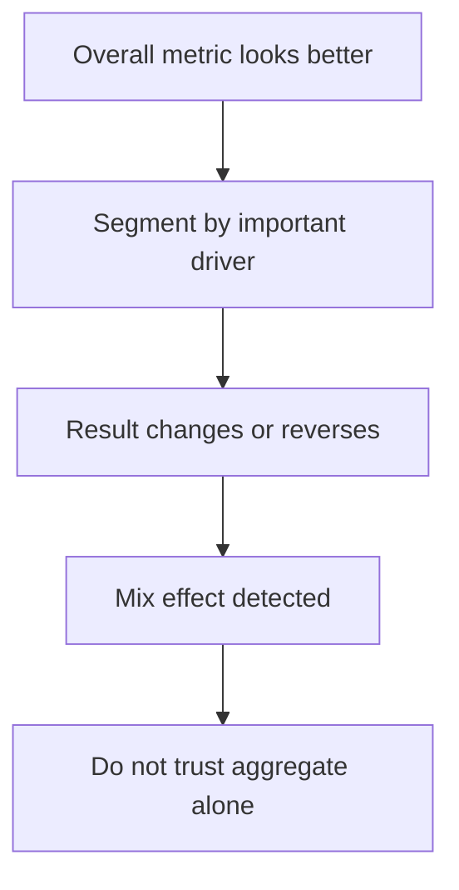
> 💡 **Tie-in to your background:** This fits perfectly with support operations. A queue with worse-looking averages may simply receive harder cases. Calling out case-mix adjustment or segmentation is a very strong analyst move.
---
## 14. Inferential statistics: making cautious claims beyond the sample
**Inferential statistics** helps you use sample data to make claims about a larger population.
This is where ideas like:
- hypothesis testing,
- p-values,
- confidence intervals,
- and A/B testing
come in.
You do not need to become a pure statistician.
But you must understand the logic.
### 14.1 Hypothesis testing basics
A **hypothesis test** asks:
"Is the observed difference likely to be real, or could it have happened by random chance?"
### Null and alternative hypotheses
| Term | Meaning |
|---|---|
| **Null hypothesis (H0)** | Assume no effect or no difference |
| **Alternative hypothesis (H1)** | Assume there is an effect or difference |
Example:
- H0: The new self-serve article does not change containment rate.
- H1: The new self-serve article changes containment rate.
### 14.2 P-value
A **p-value** is the probability of seeing data at least this extreme **if the null hypothesis were true**.
Plain English:
If the world truly had no effect, how surprising would our result be?
Small p-value:
- the observed result would be unusual if there were truly no effect.
Important caution:
A p-value is **not**:
- the probability that the null is true,
- the size of the effect,
- proof of business importance.
### 14.3 Significance level
The **significance level** is a threshold such as 0.05.
If p-value < 0.05, we often call the result **statistically significant**.
That means:
the data is sufficiently inconsistent with the null under the chosen threshold.
It does **not** automatically mean the result matters in practice.
### 14.4 Confidence intervals
A **confidence interval** gives a plausible range for the true value.
Example:
"We estimate the containment lift is 2% to 5%."
This is often more informative than just saying "significant" or "not significant."
Why?
Because it tells you both direction and approximate size.
### 14.5 Type I and Type II errors
| Error type | What happened | Plain-English meaning |
|---|---|---|
| **Type I error** | Reject H0 when H0 is actually true | False positive |
| **Type II error** | Fail to reject H0 when H0 is actually false | False negative |
### 14.6 Statistical significance vs practical significance
With huge datasets, tiny differences may be statistically significant.
But they may be operationally meaningless.
Example:
- CSAT increases by 0.01 points with p < 0.001
That may be statistically real but practically unimportant.
Strong analysts ask:
- Is the effect big enough to matter?
- Is the intervention cost worth it?
- Does it hold across segments?
### 14.7 A/B testing basics
An **A/B test** compares two versions:
- A = control
- B = treatment
Purpose:
to estimate causal impact more credibly than simple before/after comparison.
Examples in support/customer experience:
- old article layout vs new article layout,
- current chatbot prompt vs revised prompt,
- default help page ordering vs new ranking.
### Core A/B test concepts
| Term | Meaning |
|---|---|
| **Randomization** | Users are randomly assigned to A or B |
| **Control** | Baseline version |
| **Treatment** | New version |
| **Primary metric** | Main success metric |
| **Guardrail metric** | Metric that prevents harmful side effects |
| **Sample size** | Number of observations needed |
| **Experiment duration** | How long to run before interpreting |
### A/B testing pitfalls
- Stopping too early
- Peeking repeatedly without discipline
- Ignoring seasonality or day-of-week patterns
- Measuring too many outcomes without clarity
- Forgetting segment imbalances
- Testing during unusual incident periods
### 🔍 Plain-English deep-dive: why A/B beats before-vs-after
Before-vs-after comparisons can be distorted by:
- seasonality,
- release changes,
- staffing changes,
- incident spikes,
- holiday effects.
Randomized A/B testing reduces these confounders by comparing groups at the same time.
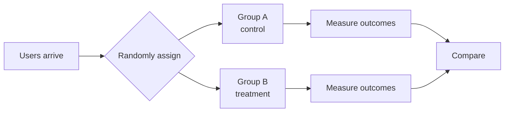
> 💡 **Tie-in to your background:** Your process improvement experience is a great bridge here. You can say, "I already think in terms of interventions and outcomes; I want to apply more rigorous measurement such as controlled testing and confidence intervals."
---
## 15. Data quality: the foundation of trustworthy analysis
Beautiful dashboards built on low-quality data are dangerous.
Data quality problems can produce:
- wrong decisions,
- false confidence,
- and arguments that waste time.
### Common dimensions of data quality
| Dimension | Plain-English meaning | Example problem |
|---|---|---|
| **Accuracy** | Values reflect reality correctly | Wrong product tagged on a case |
| **Completeness** | Required fields are present | Missing closure reason |
| **Consistency** | Same concept recorded the same way | "OneDrive" vs "ODB" vs "ODfB" |
| **Timeliness** | Data is up to date when needed | Dashboard refresh lags two days |
| **Validity** | Values follow allowed rules | Negative resolution time |
| **Uniqueness** | No duplicate records that should be one | Same case logged twice |
### 15.1 Missing data
Missing data is not just a technical nuisance.
It can also be a business signal.
Types of missingness in plain language:
- **Missing completely at random** — missing for no systematic reason.
- **Missing at random** — missing related to observed variables.
- **Missing not at random** — missing related to the missing value itself or an unobserved reason.
You do not need to overstate these labels in interviews, but knowing them helps.
### What to do with missing data
Options include:
- leave as missing and report it,
- remove rows/columns if appropriate,
- impute values,
- create a "missing" category,
- investigate upstream process issues,
- separate "unknown" from actual zero.
### 15.2 Duplicates
Duplicate records can inflate counts and distort rates.
Common causes:
- repeated ingestion,
- multi-system sync issues,
- case merges or splits,
- non-unique join keys.
### 15.3 Outliers
An **outlier** is an unusually extreme value.
It might be:
- a data error,
- a valid rare case,
- or the most important operational issue in the dataset.
Never delete outliers automatically without thought.
### Detecting outliers
Common methods:
- **IQR rule**
- **z-score rule**
- visual review with box plots or scatter plots
### IQR rule
Values below:
Q1 − 1.5 × IQR
or above:
Q3 + 1.5 × IQR
are flagged as potential outliers.
### Z-score rule
Values with very large absolute z-scores, often above 3, may be unusually far from the mean.
This works better for roughly normal data than highly skewed data.
### 15.4 Inconsistent categories
This happens all the time.
Examples:
- "SPO"
- "SharePoint"
- "SharePoint Online"
These may all refer to the same product.
If not standardized, grouping becomes unreliable.
### 15.5 Date and timestamp problems
Common issues:
- mixed time zones,
- incorrect daylight savings handling,
- date stored as text,
- inconsistent formats,
- missing event ordering logic.
### 15.6 Business rule validation
A good analyst checks whether data obeys common-sense rules.
Examples:
- closure date should not precede open date,
- CSAT should fall within valid rating range,
- escalation count should not be negative,
- resolved flag should align with status.
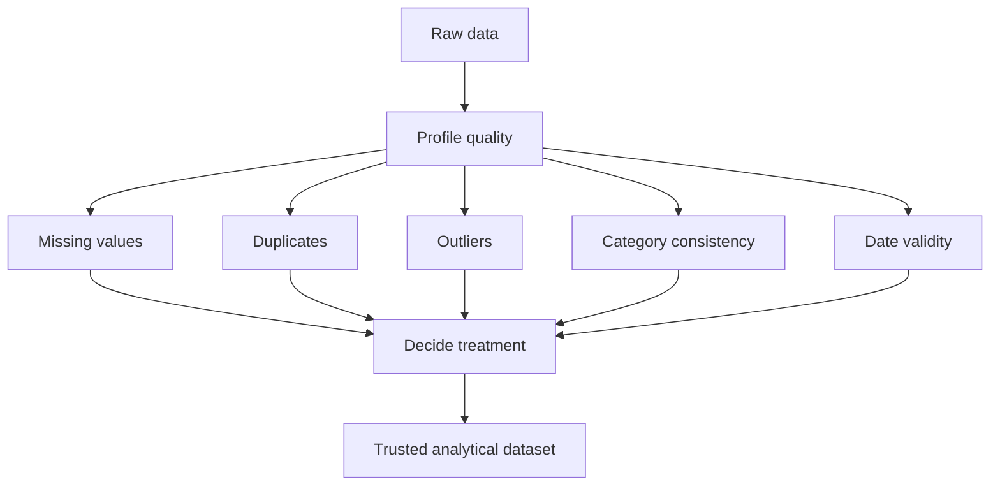
> 💡 **Tie-in to your background:** Governance and process improvement experience directly supports data quality work. Analysts who understand operational process often catch data issues faster because they know what the workflow is supposed to look like.
---
## 16. Data cleaning and preprocessing fundamentals
Data cleaning means turning raw data into analysis-ready data.
This does not mean making data "perfect."
It means making it:
- understandable,
- consistent,
- reliable enough for the intended decision.
### 16.1 Typical cleaning workflow
1. Understand the business meaning of each field
2. Check grain and keys
3. Inspect data types
4. Find missing values
5. Remove or resolve duplicates
6. Standardize labels and formats
7. Validate date logic and ranges
8. Flag or handle outliers
9. Create analysis-ready features
10. Re-check totals against source
### 16.2 Normalization vs standardization
These are often confused.
| Term | Meaning | When used |
|---|---|---|
| **Normalization** | Rescale values to a fixed range, often 0 to 1 | Useful for some ML methods |
| **Standardization** | Transform values to mean 0 and standard deviation 1 | Useful for comparing scales and some models |
### 🔍 Plain-English deep-dive
- **Normalization** — *put values onto a bounded ruler.*  
**Analogy:** resizing photos to fit the same frame.
- **Standardization** — *express values in terms of how far they are from average.*  
**Analogy:** converting different exam scores into "how unusual is this result?" units.
For many BI reporting tasks, you will not normalize or standardize manually.
But for Python/ML workflows, it matters.
### 16.3 Encoding categorical variables
Models often need numbers, not text labels.
Common encoding methods:
| Method | Meaning | Example |
|---|---|---|
| **Label encoding** | Assign number codes | Low=1, Med=2, High=3 |
| **One-hot encoding** | Create separate binary columns | Product_SPO, Product_ODB |
| **Target encoding** | Replace category with target-related summary | Category mapped to average escalation risk |
Important caution:
Encoding does not magically make a category truly numeric in business meaning.
### 16.4 Feature scaling intro
**Feature scaling** means adjusting variable scales so one does not dominate another simply because of units.
Example:
- resolution time measured in minutes,
- case count in thousands,
- CSAT on a 1–5 scale.
Some algorithms are sensitive to scale.
Many BI summaries are not, but ML workflows often are.
### 16.5 Derived features
Analysts often create new columns such as:
- days since last contact,
- number of handoffs,
- first-response SLA met flag,
- weekend vs weekday,
- month and quarter,
- issue complexity band.
These derived features make downstream analysis easier and more meaningful.
### 16.6 Documenting transformations
One underrated skill:
write down what you changed.
Examples:
- "Mapped 'SPO' and 'SharePoint Online' into a single product label"
- "Removed duplicate case rows caused by repeated daily ingestion"
- "Flagged negative resolution time as invalid and excluded from SLA analysis"
That improves trust and reproducibility.
---
## 17. Cohort analysis: comparing groups over time
A **cohort** is a group of entities that share a common starting point or characteristic.
Examples:
- customers whose first case occurred in January,
- users who first used self-serve in a given week,
- cases opened after a major release,
- agents onboarded in the same month.
### Why cohort analysis matters
Cohorts help answer questions such as:
- Do newer users behave differently than older ones?
- Does a product release change support outcomes over time?
- Are repeated contacts higher for customers entering through one journey?
- Does article quality improvement help later cohorts more than earlier ones?
### Example cohort types
| Cohort type | Definition | Support example |
|---|---|---|
| **Acquisition cohort** | Group by first appearance date | Customers first using self-serve in March |
| **Behavioral cohort** | Group by shared behavior | Users who viewed article before opening assisted case |
| **Segment cohort** | Group by trait | Enterprise customers in EMEA |
### 🔍 Plain-English deep-dive: cohort vs simple trend
A normal time trend asks:
"What happened overall this month?"
A cohort analysis asks:
"How does the group that started in this month behave afterward compared with groups that started in other months?"
That is powerful because it separates changes in mix from changes in experience over time.
### A support cohort example
Cohort definition:
Customers whose first self-serve session happened in each month.
Then measure:
- percentage who resolve without assisted support in week 0,
- percentage who reopen or seek assisted contact in week 1,
- repeat issue rate by week 2.
### Common cohort visual
A retention-style heatmap or matrix.
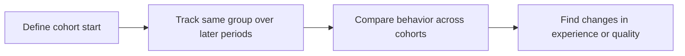
### Practical use cases in this role
- Compare cohorts before and after content redesign
- Compare post-release cohorts to measure new issue patterns
- Track whether newly launched Copilot Studio flows improve containment for later cohorts
> 💡 **Tie-in to your background:** Because you already analyze trend shifts around escalations and process changes, cohort thinking is a natural next step: not just "what changed," but "which group changed and how their later behavior evolved."
---
## 18. Funnel analysis: where journeys break
A **funnel** is a sequence of steps users pass through toward a goal.
Funnel analysis measures where people drop off.
### Example support/self-serve funnel
1. User opens help page
2. User searches or views article
3. User engages with bot or guided flow
4. User reaches recommended solution
5. User resolves issue without assisted support
### Common funnel metrics
- Step completion rate
- Drop-off rate
- Conversion rate
- Time between steps
- Assisted escalation after self-serve attempt

### Example funnel table
| Step | Users | Step conversion | Drop-off |
|---|---|---|---|
| Help entry | 10,000 | 100% | 0% |
| Search/article view | 8,500 | 85% | 15% |
| Bot/guided flow | 5,400 | 63.5% | 36.5% |
| Suggested resolution | 3,900 | 72.2% | 27.8% |
| Issue resolved | 2,800 | 71.8% | 28.2% |
### Funnel analysis questions
- Which step loses the most users?
- Does drop-off differ by issue type?
- Is the drop-off higher on mobile vs desktop?
- Does article freshness improve downstream conversion?
- Which segment shifts from self-serve to assisted support?
### Funnel pitfalls
- steps may not be strictly linear,
- some users skip steps,
- event logging may be incomplete,
- same user may repeat a step,
- assisted and self-serve journeys may merge.
### Funnel vs cohort
| Analysis type | Best question |
|---|---|
| Funnel | Where in the journey are people dropping off? |
| Cohort | How does behavior of a starting group change over time? |
### A support example
If self-serve deflection drops, funnel analysis may reveal:
- search results are fine,
- article click-through is fine,
- but suggested resolution acceptance collapses for one issue category.
That tells you exactly where to investigate.
> 💡 **Tie-in to your background:** Funnel thinking matches your process-improvement mindset. It is essentially operational troubleshooting for customer journeys: find the stage where the system leaks.
---
## 19. Visualization fundamentals: choosing the right chart for the job
Data visualization is not decoration.
It is a decision-support tool.
A good chart answers a specific question quickly and honestly.
### 19.1 Start with intent, not chart type
Ask:
- Am I comparing categories?
- Showing change over time?
- Showing distribution?
- Showing relationship?
- Showing composition?
- Showing process drop-off?
### Chart choice by analytical intent
| Intent | Best common charts | Example |
|---|---|---|
| Compare categories | Bar chart, grouped bar | CSAT by product |
| Trend over time | Line chart | Weekly case volume |
| Distribution | Histogram, box plot | Resolution time spread |
| Relationship | Scatter plot | Resolution time vs CSAT |
| Composition | Stacked bar, treemap with care | Case mix by issue type |
| Funnel/process | Funnel chart, step bars | Self-serve journey drop-off |
| Rank order | Sorted bar chart | Top escalation drivers |
### 19.2 Common visualization pitfalls
- Too many colors
- 3D charts
- Truncated axes that exaggerate change
- Pie charts with too many slices
- Unsorted bars
- Too much clutter
- Too many decimal places
- Missing denominator/context
- Using dual axes carelessly
### 19.3 Data-ink ratio
The **data-ink ratio** is a concept from visualization design.
Plain English:
Use more of the visual space to show actual data, and less for unnecessary decoration.
Examples of low-value ink:
- heavy gridlines,
- loud background colors,
- chartjunk,
- excessive labels,
- pointless icons.
### 19.4 Accessibility
A strong visual is also accessible.
Key rules:
- Do not rely on color alone
- Use high contrast
- Label directly where possible
- Use readable font sizes
- Consider screen-reader-friendly summaries
- Avoid red/green-only distinctions
### 19.5 Storytelling with visuals
A chart alone is not a story.
A story needs:
1. the key question,
2. the important pattern,
3. the implication,
4. the recommendation.
### 🔍 Plain-English deep-dive: chart selection cheatsheet
- **Bar chart** — compare categories.
- **Line chart** — show time trend.
- **Histogram** — show distribution shape.
- **Box plot** — show spread and outliers.
- **Scatter plot** — show relationship between two numeric variables.
- **Heatmap** — show patterns across two dimensions.
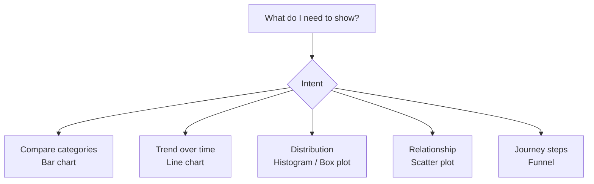
### Visualization examples for this role
| Business need | Recommended visual | Why |
|---|---|---|
| Weekly assisted case volume trend | Line chart | Clear time progression |
| CSAT by product | Sorted bar chart | Easy category comparison |
| Resolution time distribution | Histogram + box plot | Shows skew and outliers |
| Resolution time vs CSAT | Scatter plot | Shows relationship and clusters |
| Journey drop-off | Funnel or step bar | Shows stage loss clearly |
| Cohort performance | Heatmap matrix | Good for retention-style patterns |
> 💡 **Tie-in to your background:** Your executive communication strength matters here. Senior stakeholders rarely want every detail; they want the right visual and the right headline. That is already one of your advantages.
---
## 20. Time-series basics: change over time without fooling yourself
Time-series analysis examines how a metric changes across time.
This is central in support and customer experience analytics.
Examples:
- daily case volume,
- weekly backlog,
- monthly CSAT,
- hourly article traffic,
- post-release escalation trends.
### 20.1 Core components
| Component | Meaning | Example |
|---|---|---|
| **Trend** | Long-term upward or downward direction | Gradual rise in self-serve usage |
| **Seasonality** | Repeating pattern at regular interval | Monday volume spike, month-end reporting surge |
| **Noise** | Random variation | Small day-to-day fluctuation |
| **Cycle** | Longer irregular swings | Changes tied to release waves or strategic shifts |
### 20.2 Moving averages
A **moving average** smooths short-term noise by averaging over a rolling window.
Examples:
- 7-day moving average of case volume,
- 4-week moving average of CSAT.
Why useful:
- reveals trend more clearly,
- reduces overreaction to daily spikes.
### 20.3 YoY and MoM
| Term | Meaning |
|---|---|
| **MoM** | Month-over-month comparison |
| **YoY** | Year-over-year comparison |
Why both matter:
- **MoM** captures recent short-term change.
- **YoY** controls better for annual seasonality.
### 20.4 Lag and leading relationships
Sometimes one metric moves before another.
Example:
- article abandonment rises this week,
- repeat assisted contact rises next week.
That suggests article abandonment may be a leading indicator.
### 20.5 Seasonality in support data
Support environments often show:
- day-of-week effects,
- time-zone effects,
- release-related spikes,
- quarter-end behavior,
- holiday volume variation.
Ignoring seasonality can lead to false alarms.
### 20.6 Stationarity (intro only)
You may hear the word **stationary** in forecasting contexts.
Plain English:
a stationary series has relatively stable statistical behavior over time.
For most analyst interviews, you do not need to go deep.
Just know:
some forecasting methods assume a series is fairly stable after accounting for trend/seasonality.
### 20.7 Time-series caution checklist
- Was there a release or incident?
- Are we comparing the same number of weekdays?
- Did data collection change?
- Is a holiday affecting volume?
- Is the metric cumulative or point-in-time?
- Do we need rolling averages?
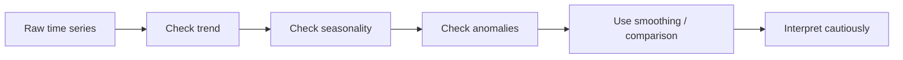
### Example: support analytics time-series story
"Weekly CSAT appears flat overall, but the 4-week moving average shows a mild downward trend after the release. At the same time, escalations and repeat contacts rose, especially on Mondays, suggesting a release-linked quality issue amplified by weekly volume patterns."
That is a mature time-series interpretation because it includes:
- level,
- trend,
- possible cause,
- segmentation,
- and caution.
> 💡 **Tie-in to your background:** Because you already present trends in MBRs, time-series language should feel natural. Add terms like trend, seasonality, rolling average, and YoY/MoM, and your operational storytelling becomes much more analytically precise.
---
## 21. Bringing it together: a worked support analytics case
Let us connect the ideas from this Part into one coherent example.
### Business question
"Why did assisted case volume rise while self-serve success fell for OneDrive sync support journeys over the last two months?"
### Step 1: Clarify metrics
- Assisted case volume
- Self-serve containment rate
- Repeat contact rate
- CSAT
- Resolution time
### Step 2: Define grain
- Journey event grain for self-serve steps
- Case grain for assisted outcomes
- Customer-week grain for repeat contact behavior
### Step 3: Check data types
- product = categorical nominal
- severity = ordinal
- resolution time = ratio continuous
- case count = ratio discrete
- article text = unstructured text
- event timestamp = time-series
### Step 4: Run EDA
- missing event IDs?
- inconsistent product labels?
- duplicates from repeated event ingestion?
- right-skewed resolution times?
- survey response bias by segment?
### Step 5: Descriptive analytics
- plot weekly trend of assisted volume,
- plot self-serve funnel conversion by week,
- compare issue categories.
### Step 6: Diagnostic analytics
- segment by issue type,
- compare article freshness,
- examine correlation between handoff count and CSAT,
- inspect cohorts before and after content change.
### Step 7: Predictive analytics
- forecast next month's assisted case volume,
- model risk of escalation using issue category and early journey signals.
### Step 8: Prescriptive analytics
- refresh top failing sync articles,
- route high-risk cases earlier,
- add bot prompts for known resolution branches,
- monitor guardrails like reopen rate and CSAT.
```mermaid
flowchart TD
A[Question<br/>Why volume up, containment down?] --> B[Define metrics and grain];
    B --> C[Check data quality];
    C --> D[Descriptive trend and funnel];
    D --> E[Diagnostic segmentation and drivers];
    E --> F[Predictive forecast / risk];
    F --> G[Prescriptive actions];
    G --> H[Measure impact with guardrails]
```
### Why this example is interview gold
It shows that you can:
- frame a problem,
- choose metrics,
- respect grain,
- use EDA,
- apply multiple analytics types,
- and think in terms of action plus measurement.
That is exactly the shape of strong analyst thinking.
---
## 22. 🧪 Hands-on Lab Demo 1 — Build a tiny support dataset in Google Colab
**Goal:** Create a small realistic support dataset and inspect its structure.
**Free tool:** [Google Colab](https://colab.research.google.com)
### Step-by-step
1. Open Google Colab.
2. Click **New notebook**.
3. In the first cell, paste the code below and run it.
```python
import pandas as pd
 data = { "case_id": [1001,1002,1003,1004,1005,1006,1007,1008,1009,1010,1011,1012], "product": ["SPO","ODB","SPO","ODB","Teams","ODB","SPO","Teams","ODB","SPO","ODB","Teams"], "severity": ["High","Low","Medium","High","Low","Medium","High","Medium","Low","High","Medium","High"], "region": ["EMEA","EMEA","Americas","APAC","EMEA","Americas","APAC","EMEA","Americas","EMEA","APAC","Americas"], "resolution_hours": [40,3,6,55,2,8,31,5,4,70,11,18], "handoffs": [3,0,1,4,0,1,2,1,0,5,2,2], "csat": [2,5,4,2,5,4,3,4,5,1,3,3], "escalated": [1,0,0,1,0,0,1,0,0,1,1,0], "survey_responded": [1,1,0,1,1,0,1,1,0,1,1,1], "opened_date": pd.to_datetime([ "2025-01-03","2025-01-04","2025-01-05","2025-01-06", "2025-01-07","2025-01-08","2025-01-09","2025-01-10", "2025-01-11","2025-01-12","2025-01-13","2025-01-14" ]) }  df = pd.DataFrame(data) df
```
4. Look at the first few rows and answer:
- What is the grain? - Which columns are categorical? - Which are numerical? - Which are identifiers?
5. Run:
```python
df.dtypes
df.shape df.nunique()
```
6. Write down, in plain English:
- one identifier, - one ordinal field, - one ratio variable, - one possible metric, - one possible dimension.
### What you learned
- how to inspect structure,
- how to think about grain,
- how to classify data types before analyzing.
---
## 23. 🧪 Hands-on Lab Demo 2 — EDA, distributions, and outliers
**Goal:** Use descriptive statistics and visuals to understand skew, spread, and outliers.
### Step-by-step
1. Continue in the same Colab notebook.
2. Run:
```python
df.describe(include="all")
```
3. Compare mean vs median for resolution time:
```python
print("Mean resolution hours:", df["resolution_hours"].mean())
print("Median resolution hours:", df["resolution_hours"].median()) print("P90 resolution hours:", df["resolution_hours"].quantile(0.90))
```
4. Plot a histogram:
```python
import matplotlib.pyplot as plt
 df["resolution_hours"].hist(bins=8) plt.title("Resolution Hours Distribution") plt.xlabel("Hours") plt.ylabel("Frequency") plt.show()
```
5. Plot a box plot:
```python
df.boxplot(column="resolution_hours")
plt.title("Resolution Hours Box Plot") plt.show()
```
6. Calculate IQR-based outlier bounds:
```python
q1 = df["resolution_hours"].quantile(0.25)
q3 = df["resolution_hours"].quantile(0.75) iqr = q3 - q1 lower = q1 - 1.5 * iqr upper = q3 + 1.5 * iqr print(q1, q3, iqr, lower, upper)  df[df["resolution_hours"] > upper]
```
7. Ask:
- Are these outliers errors or real difficult cases? - Would mean alone describe this well? - Which summary would you present to leadership?
### Expected takeaway
Support timing data is often skewed.
Median and percentiles are often more honest than mean alone.
---
## 24. 🧪 Hands-on Lab Demo 3 — Metrics, dimensions, and rates
**Goal:** Compute business metrics carefully and avoid denominator mistakes.
### Step-by-step
1. Create a CSAT flag:
```python
df["csat_positive"] = (df["csat"] >= 4).astype(int)
```
2. Compute overall positive CSAT rate:
```python
overall_csat = df["csat_positive"].mean()
overall_csat
```
3. Compute positive CSAT by product:
```python
df.groupby("product")["csat_positive"].mean().sort_values(ascending=False)
```
4. Compute escalation rate by product:
```python
df.groupby("product")["escalated"].mean().sort_values(ascending=False)
```
5. Compute median resolution hours by product:
```python
df.groupby("product")["resolution_hours"].median().sort_values()
```
6. Explain in words:
- Why is CSAT rate non-additive? - Why is case count additive? - Why should we avoid averaging already-aggregated percentages without weights?
### Mini challenge
Create a table with:
- case_count,
- escalation_rate,
- positive_csat_rate,
- median_resolution_hours
by product.
Hint:
```python
summary = df.groupby("product").agg(
case_count=("case_id", "count"), escalation_rate=("escalated", "mean"), positive_csat_rate=("csat_positive", "mean"), median_resolution_hours=("resolution_hours", "median") ) summary
```
---
## 25. 🧪 Hands-on Lab Demo 4 — Correlation, segmentation, and Simpson's paradox intuition
**Goal:** See why overall trends can hide segment effects.
### Step-by-step
1. Compute overall correlation:
```python
df[["resolution_hours", "csat"]].corr(method="pearson")
```
2. Also compute rank-based correlation:
```python
df[["resolution_hours", "csat"]].corr(method="spearman")
```
3. Now segment by product:
```python
for p in df["product"].unique():
sub = df[df["product"] == p] print("\nProduct:", p) print(sub[["resolution_hours", "csat"]].corr(method="pearson"))
```
4. Ask:
- Is the relationship equally strong for every product? - Could product mix explain the overall pattern? - What other segments would matter? Severity? Region? Escalation?
5. Build a simple scatter plot:
```python
colors = {"SPO":"blue","ODB":"green","Teams":"orange"}
 for p in df["product"].unique(): sub = df[df["product"] == p] plt.scatter(sub["resolution_hours"], sub["csat"], label=p, color=colors[p])  plt.xlabel("Resolution Hours") plt.ylabel("CSAT") plt.title("Resolution Hours vs CSAT by Product") plt.legend() plt.show()
```
### Expected takeaway
Relationships can differ by segment.
Always inspect the mix before making broad claims.
---
## 26. 🧪 Hands-on Lab Demo 5 — Funnel and cohort starter exercise
**Goal:** Simulate a tiny self-serve funnel and calculate drop-off.
### Step-by-step
1. In a new cell, create a funnel table:
```python
funnel = pd.DataFrame({
"step": ["help_entry", "article_view", "bot_engaged", "suggested_resolution", "resolved_without_case"], "users": [1000, 820, 540, 410, 290] })  funnel["step_conversion"] = funnel["users"] / funnel["users"].shift(1) funnel.loc[0, "step_conversion"] = 1.0 funnel["drop_off"] = 1 - funnel["step_conversion"] funnel
```
2. Plot the funnel as a bar chart:
```python
funnel.plot(x="step", y="users", kind="bar", legend=False, title="Self-Serve Funnel")
plt.ylabel("Users") plt.xticks(rotation=45) plt.show()
```
3. Identify the biggest drop-off step.
4. Now create a tiny cohort example:
```python
cohort = pd.DataFrame({
"cohort_month": ["Jan", "Feb", "Mar"], "week_0_resolved": [0.42, 0.45, 0.51], "week_1_repeat_contact": [0.18, 0.15, 0.12], "week_2_repeat_contact": [0.14, 0.12, 0.09] }) cohort
```
5. Interpret:
- Are later cohorts improving? - What intervention might explain that? - What additional segmentation would you want?
### Expected takeaway
Funnels show **where** users drop.
Cohorts show **how groups behave over time** after a shared starting point.
---
## 27. 📚 Reference Links
- Microsoft Learn — [Describe core data concepts](https://learn.microsoft.com/training/modules/explore-core-data-concepts/)
- Microsoft Learn — [Get started with Azure Data Fundamentals](https://learn.microsoft.com/training/paths/azure-data-fundamentals-explore-core-data-concepts/)
- Microsoft Learn — [Introduction to machine learning concepts](https://learn.microsoft.com/training/modules/fundamentals-machine-learning/)
- Microsoft Learn — [Design Power BI reports](https://learn.microsoft.com/training/paths/design-effective-reports-power-bi/)
- Microsoft Learn — [Get started building with Power BI](https://learn.microsoft.com/training/paths/get-started-power-bi/)
- pandas documentation — [10 minutes to pandas](https://pandas.pydata.org/docs/user_guide/10min.html)
- pandas documentation — [User guide](https://pandas.pydata.org/docs/user_guide/index.html)
- Python statistics — [SciPy stats overview](https://docs.scipy.org/doc/scipy/reference/stats.html)
- Khan Academy — [Statistics and probability](https://www.khanacademy.org/math/statistics-probability)
- Seeing Theory — [A visual introduction to probability and statistics](https://seeing-theory.brown.edu)
- NIST — [Engineering Statistics Handbook](https://www.itl.nist.gov/div898/handbook/)
- Storytelling principles — [Storytelling with Data blog](https://www.storytellingwithdata.com/blog)
- A/B testing overview — [Optimizely experimentation glossary](https://www.optimizely.com/optimization-glossary/ab-testing/)
- Microsoft Fabric Learn collection — [Microsoft Fabric documentation](https://learn.microsoft.com/fabric/)
---
## ⭐ Likely Interview Questions for This Section
**Q1. "What is the DIKW ladder, and why does it matter for a data analyst?"** > *Model answer:* "The DIKW ladder is Data, Information, Knowledge, and Wisdom. Data is a raw fact, information is data with context, knowledge is a pattern or lesson, and wisdom is the action or decision based on that lesson. It matters because analysts are not paid to report raw numbers alone; they are expected to turn evidence into business decisions."
**Q2. "What's the difference between structured, semi-structured, and unstructured data?"** > *Model answer:* "Structured data fits a fixed schema like rows and columns in a SQL table. Semi-structured data has some organization but not a rigid tabular form, like JSON logs. Unstructured data has no predefined schema, like survey comments, transcripts, or screenshots. In support analytics we often combine all three: case metadata, bot event logs, and text feedback."
**Q3. "Explain nominal, ordinal, interval, and ratio scales with examples."** > *Model answer:* "Nominal is label-only data like product names. Ordinal has order but not equal gaps, like severity levels. Interval has equal differences but no true zero, like temperature in Celsius. Ratio has equal differences and a true zero, like resolution time or case count. The reason this matters is that the scale determines which math and statistics are valid."
**Q4. "How do you decide whether to use mean or median?"** > *Model answer:* "I use the mean when data is reasonably symmetric and not heavily affected by outliers. I prefer the median when the data is skewed or long-tailed, which is common in support timing data. In service operations I often pair median with P90 because that shows both the typical experience and the slower tail."
**Q5. "What is CRISP-DM?"** > *Model answer:* "CRISP-DM is a standard analytics lifecycle with six phases: Business Understanding, Data Understanding, Data Preparation, Modeling, Evaluation, and Deployment. I like it because it keeps the work connected to the business question instead of jumping straight into tools or modeling."
**Q6. "What's the difference between EDA and ETL/ELT?"** > *Model answer:* "EDA, or Exploratory Data Analysis, is about understanding the data: types, distributions, missing values, outliers, and early patterns. ETL and ELT are about moving and transforming data from source systems into usable storage. EDA is analytical exploration; ETL/ELT is data pipeline preparation."
**Q7. "Walk me through the four types of analytics using a support example."** > *Model answer:* "Descriptive tells what happened, like CSAT dropped last month. Diagnostic explains why, such as one issue type causing more escalations and repeat contacts. Predictive estimates what will happen next, for example forecasting next month's case volume. Prescriptive recommends what to do, such as refreshing failing knowledge content or changing queue routing rules."
**Q8. "What is grain, and why is it so important?"** > *Model answer:* "Grain is the level of detail represented by one row. For example, one row per case versus one row per product per week. It is critical because if you join or aggregate data without respecting grain, you can double count, distort ratios, and produce incorrect insights."
**Q9. "What is the difference between additive, semi-additive, and non-additive measures?"** > *Model answer:* "Additive measures can be safely summed across dimensions, like case count. Semi-additive measures can be summed across some dimensions but not all, like end-of-day backlog, which should not be summed across time. Non-additive measures like percentages or averages should generally be recomputed from their underlying components rather than summed."
**Q10. "What makes a metric good?"** > *Model answer:* "A good metric is clearly defined, tied to a business goal, hard to game, based on reliable data, and easy to interpret. I also like to pair key metrics with guardrails so improving one number does not damage another important outcome."
**Q11. "Can you explain Goodhart's Law in a business context?"** > *Model answer:* "Goodhart's Law says that when a measure becomes a target, it stops being a good measure. In support, if closure speed is rewarded without guardrails, teams may close cases too quickly and increase reopen rates or lower CSAT. That is why a balanced metric system matters."
**Q12. "What kinds of sampling bias worry you most in support analytics?"** > *Model answer:* "Response bias is a big one because CSAT responders are often not representative of all customers. Selection bias also matters, for example if only severe cases get detailed manual coding. I try to state the sampling limitations explicitly and segment or weight where appropriate."
**Q13. "How would you explain correlation vs causation to a stakeholder?"** > *Model answer:* "Correlation means two variables move together; it does not prove one causes the other. For example, longer resolution times may correlate with lower CSAT, but the deeper cause could be issue complexity or more handoffs. I would treat correlation as a lead for investigation, not proof by itself."
**Q14. "What is Simpson's paradox, and why does it matter?"** > *Model answer:* "Simpson's paradox happens when an overall trend changes or reverses after you segment the data. In support analytics, a queue might look better overall simply because it handled easier cases. This matters because aggregate metrics can mislead if the case mix differs across groups."
**Q15. "How would you handle missing data and outliers?"** > *Model answer:* "First I would determine whether missingness or outliers are data quality issues, valid rare events, or process signals. For missing data I might flag, impute, or treat it as a separate category depending on the use case. For outliers I would inspect them with methods like IQR or z-scores, but I would not remove them automatically without understanding the business context."
**Q16. "How do cohort analysis and funnel analysis differ?"** > *Model answer:* "Funnel analysis shows where users drop off in a sequence of steps, while cohort analysis compares how groups with a shared starting point behave over time. Funnels answer where the journey leaks; cohorts answer how behavior evolves for different starting groups."
**Q17. "What are the most important rules for choosing a chart?"** > *Model answer:* "I start with the communication intent. For category comparison I prefer bar charts, for time trends line charts, for distributions histograms or box plots, and for relationships scatter plots. I avoid chartjunk, do not rely on color alone, and make sure the visual supports a clear business takeaway."
**Q18. "How do you analyze a metric over time responsibly?"** > *Model answer:* "I check for trend, seasonality, anomalies, and changes in collection or business process. I compare MoM and YoY where useful and often use rolling averages to smooth short-term noise. I also look for release events, holidays, or day-of-week effects before interpreting movement as a true change."
---
## 🧠 30-Second Memory Hooks
- **Data** = recorded facts; **analytics** = turning facts into decisions.
- **DIKW** = raw fact → context → pattern → action.
- **Value chain** = generate → capture → store → prepare → analyze → communicate → act → measure.
- **Structured / semi-structured / unstructured** = table / tagged blob / free-form content.
- **Nominal / ordinal / interval / ratio** = labels / ranked labels / equal gaps / equal gaps + true zero.
- **Grain first** = define one row before joining or aggregating anything.
- **Additive vs non-additive** = count can often sum; percentages usually must be recomputed.
- **North Star metric** = one big outcome; **guardrails** stop fake wins.
- **Goodhart's Law** = targeting one metric can corrupt the behavior behind it.
- **Population vs sample** = whole cake vs one slice.
- **Mean vs median** = average vs middle; median usually wins on skewed support timing data.
- **IQR and P90** = great friends for long-tail service metrics.
- **Correlation ≠ causation** = relationship is a clue, not proof.
- **Simpson's paradox** = overall story can reverse after segmentation.
- **EDA before dashboards** = taste ingredients before serving the meal.
- **Cohort** = same starting group over time; **funnel** = drop-off across steps.
- **Chart choice follows intent** = compare, trend, distribution, relationship, process.
- **Time-series basics** = trend + seasonality + noise + context.
---
*Next suggested section:* **Part 3 — SQL Mastery** (now that the analytical vocabulary is solid, the next step is learning how to actually pull, join, aggregate, and shape data with the language most analyst interviews test hardest).
