# Part 3 — SQL Mastery
> Section goal: Take you from absolute beginner to interview-ready intermediate/advanced SQL for the Microsoft CE&S BI team — especially window functions, CTEs, and performance tuning — using support-domain examples that feel natural given your SPO/ODB background.
Covers index item **3**. Maps to JD responsibilities **SQL analysis, window functions, CTEs, performance tuning, scalable reporting, and insight generation**.
---
## 0. How to use this Part
This section is intentionally deep. Read it in layers:
1. **First pass:** understand the plain-English definitions and diagrams.
2. **Second pass:** type and run the SQL blocks.
3. **Third pass:** explain each query out loud as if an interviewer asked, "Why did you write it this way?"
4. **Fourth pass:** adapt the examples to your own support-world questions: CSAT, escalation trends, backlog, reopen rate, segment comparisons, and MBR metrics.
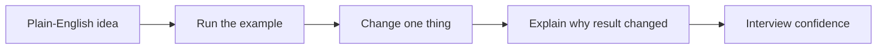
> 💡 **Tie-in to your background:** You already think in terms of case volume, customer pain, trend shifts, segment differences, and operational bottlenecks. SQL is the language that turns those instincts into reproducible analysis.
---
## 1. The running support schema used throughout
Before learning query syntax, anchor yourself in a simple support analytics data model. Think of each table as one spreadsheet with a clear purpose. The power of SQL appears when those spreadsheets are linked.
### Our support-domain tables
| Table | Grain (what one row means) | Example use |
|---|---|---|
| `products` | one row per product | SPO vs ODB vs Teams comparisons |
| `regions` | one row per region | EMEA / AMER / APAC reporting |
| `segments` | one row per customer segment | Enterprise vs SMB vs EDU |
| `agents` | one row per support agent | productivity / CSAT analysis |
| `cases` | one row per support case | core case analytics |
| `surveys` | one row per survey response | CSAT / NPS style analysis |
| `case_status_history` | one row per case status change | handoff, backlog, and session analysis |
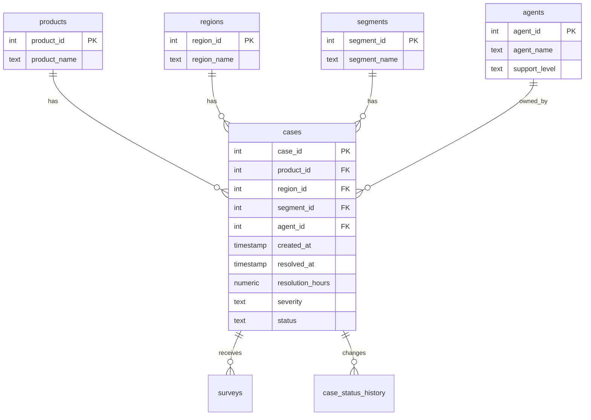
### A starter DDL script you can run in PostgreSQL
```sql
CREATE TABLE products ( product_id      INT PRIMARY KEY, product_name    TEXT NOT NULL UNIQUE );
CREATE TABLE regions ( region_id       INT PRIMARY KEY, region_name     TEXT NOT NULL UNIQUE );
CREATE TABLE segments ( segment_id      INT PRIMARY KEY, segment_name    TEXT NOT NULL UNIQUE, sla_target_hours INT NOT NULL CHECK (sla_target_hours > 0) );
CREATE TABLE agents ( agent_id        INT PRIMARY KEY, agent_name      TEXT NOT NULL, support_level   TEXT NOT NULL CHECK (support_level IN ('Tier1','Tier2','Escalation')), hire_date       DATE NOT NULL, active_flag     BOOLEAN NOT NULL DEFAULT TRUE );
CREATE TABLE cases ( case_id              INT PRIMARY KEY, product_id           INT NOT NULL REFERENCES products(product_id), region_id            INT NOT NULL REFERENCES regions(region_id), segment_id           INT NOT NULL REFERENCES segments(segment_id), agent_id             INT REFERENCES agents(agent_id), parent_case_id       INT REFERENCES cases(case_id), case_created_at      TIMESTAMP NOT NULL, first_response_at    TIMESTAMP, resolved_at          TIMESTAMP, severity             TEXT NOT NULL CHECK (severity IN ('Low','Medium','High','Critical')), status               TEXT NOT NULL CHECK (status IN ('Open','Pending','Resolved','Closed')), resolution_hours     NUMERIC(10,2), reopen_count         INT NOT NULL DEFAULT 0, support_channel      TEXT NOT NULL DEFAULT 'Assisted', metadata_json        JSONB );
CREATE TABLE surveys ( survey_id            INT PRIMARY KEY, case_id              INT NOT NULL REFERENCES cases(case_id), submitted_at         TIMESTAMP NOT NULL, csat_score           INT CHECK (csat_score BETWEEN 1 AND 5), nps_category         TEXT CHECK (nps_category IN ('Promoter','Passive','Detractor')), free_text_comment    TEXT );
CREATE TABLE case_status_history ( history_id           INT PRIMARY KEY, case_id              INT NOT NULL REFERENCES cases(case_id), status_from          TEXT, status_to            TEXT NOT NULL, changed_at           TIMESTAMP NOT NULL, changed_by_agent_id  INT REFERENCES agents(agent_id) );
```
### Sample seed data
```sql
INSERT INTO products VALUES (1,'SPO'), (2,'ODB'), (3,'Teams'), (4,'Exchange');
INSERT INTO regions VALUES (10,'EMEA'), (20,'AMER'), (30,'APAC');
INSERT INTO segments VALUES (100,'Enterprise',8), (200,'SMB',12), (300,'Education',16);
INSERT INTO agents VALUES (1000,'Asha','Escalation','2021-04-01',TRUE), (1001,'Ben','Tier1','2023-09-15',TRUE), (1002,'Cara','Tier2','2022-01-10',TRUE), (1003,'Deepak','Escalation','2020-06-20',TRUE);
INSERT INTO cases VALUES (501,1,10,100,1000,NULL,'2026-01-02 08:10','2026-01-02 09:00','2026-01-02 13:20','High','Resolved',5.17,0,'Assisted','{"entryPoint":"Portal","kbUsed":true}'), (502,2,30,200,1001,NULL,'2026-01-03 10:00','2026-01-03 12:15','2026-01-05 02:00','Medium','Resolved',40.00,1,'Assisted','{"entryPoint":"Phone","kbUsed":false}'), (503,1,10,100,1000,501,'2026-01-09 07:30','2026-01-09 07:45','2026-01-09 10:10','Critical','Resolved',2.67,0,'Assisted','{"entryPoint":"Portal","kbUsed":true}'), (504,3,20,300,1002,NULL,'2026-01-10 15:00','2026-01-10 16:00',NULL,'High','Open',NULL,0,'SelfServe','{"entryPoint":"Bot","kbUsed":true}'), (505,1,30,200,1001,NULL,'2026-01-11 09:00','2026-01-11 10:10','2026-01-11 11:00','Low','Closed',2.00,0,'Assisted','{"entryPoint":"Portal","kbUsed":true}'), (506,2,10,100,1002,NULL,'2026-01-12 08:00','2026-01-12 09:05','2026-01-12 12:00','Medium','Resolved',4.00,0,'Assisted','{"entryPoint":"Portal","kbUsed":false}'), (507,3,20,100,1000,NULL,'2026-01-18 08:20','2026-01-18 09:00','2026-01-19 14:20','High','Resolved',30.00,2,'Assisted','{"entryPoint":"Phone","kbUsed":false}'), (508,1,10,100,1001,NULL,'2026-01-19 09:00','2026-01-19 09:40','2026-01-19 11:00','Low','Closed',2.00,0,'Assisted','{"entryPoint":"Portal","kbUsed":true}');
INSERT INTO surveys VALUES (9001,501,'2026-01-03 09:00',5,'Promoter','Fast resolution and clear owner'), (9002,502,'2026-01-05 12:00',3,'Passive','Issue fixed but took too long'), (9003,503,'2026-01-10 08:00',4,'Passive','Escalation was fast'), (9004,505,'2026-01-12 10:00',5,'Promoter','Helpful guidance'), (9005,507,'2026-01-20 16:00',2,'Detractor','Too many handoffs');
```
### 🔍 Plain-English deep-dive: grain, keys, and relationships
- **Grain** — *what one row represents.* **Analogy:** one receipt line in a store. **Why it matters:** if you forget grain, you accidentally duplicate counts.
- **Primary key** — *the column that uniquely identifies a row.* **Analogy:** a passport number. **Why it matters:** it is the anchor for joins and deduping.
- **Foreign key** — *a column that points to a row in another table.* **Analogy:** a child's library card referencing the library branch. **Why it matters:** it connects facts to dimensions.
- **Fact table** — *event-like table with measurable activity.* **Analogy:** the cash register tape. **Why it matters:** `cases` is your main fact table.
- **Dimension table** — *descriptive lookup table.* **Analogy:** labeled shelves around the register. **Why it matters:** `products`, `regions`, and `segments` give meaning to facts.
> 💡 **Tie-in to your background:** When you prepare MBRs, you already think in grains without calling them that. A case-level view answers one question; a monthly product-region summary answers another. SQL becomes easier once you consciously name the grain.
---
## 2. What SQL is, why it is declarative, and what an RDBMS does
**SQL** stands for **Structured Query Language**. It is the standard language used to define, read, update, secure, and manage relational data.
A **relational database management system (RDBMS)** is software that stores tables and understands SQL. Examples include PostgreSQL, SQL Server, MySQL, Oracle, and many cloud systems built on similar ideas.
### Declarative vs procedural
SQL is usually **declarative**. That means you say **what result you want**, not **how the computer must step through every row**. The database engine then chooses an execution plan.
| Style | What you tell the computer | Simple analogy |
|---|---|---|
| Declarative | desired outcome | "I need all January SPO cases" |
| Procedural | exact sequence of steps | "Open drawer A, inspect file 1, then file 2..." |
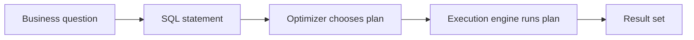
### SQL sublanguages you should know by name
| Sublanguage | Stands for | Purpose | Example |
|---|---|---|---|
| **DDL** | Data Definition Language | define structures | `CREATE TABLE cases (...)` |
| **DML** | Data Manipulation Language | change stored data | `INSERT`, `UPDATE`, `DELETE`, `MERGE` |
| **DQL** | Data Query Language | read data | `SELECT ... FROM ...` |
| **DCL** | Data Control Language | security and permissions | `GRANT`, `REVOKE` |
| **TCL** | Transaction Control Language | manage transactions | `BEGIN`, `COMMIT`, `ROLLBACK` |
### 🔍 Plain-English deep-dive: why relational matters
- **Relational** — *data stored in related tables, connected by keys.* **Analogy:** several well-organized notebooks linked by reference numbers. **Why it matters:** instead of one giant messy sheet, you separate repeated information.
- **Optimizer** — *the part of the database that decides how to run your query.* **Analogy:** a GPS choosing a route. **Why it matters:** you write the query; the engine chooses scan vs seek, join types, and order of operations.
- **Result set** — *the table-like output of a query.* **Analogy:** the answer sheet that comes back from the kitchen after placing an order. **Why it matters:** SQL almost always returns a table, even if it has one row.
```sql
-- DQL example
SELECT case_id, severity, status FROM cases WHERE severity IN ('High','Critical');
-- DML example
UPDATE cases SET status = 'Closed' WHERE case_id = 501;
-- DDL example
CREATE VIEW vw_case_summary AS SELECT product_id, COUNT(*) AS case_count FROM cases GROUP BY product_id;
```
> 💡 **Tie-in to your background:** SQL fits CE&S work because support data is naturally relational: cases belong to products, customers belong to segments, agents belong to teams, and surveys belong to cases.
---
## 3. Data types, CREATE TABLE, and constraints
If tables are the storage boxes of a database, then **data types** are the labels telling the database what each box is allowed to hold.
### Common data types
| Type family | Examples | Used for | Support example |
|---|---|---|---|
| Numeric | `INT`, `BIGINT`, `DECIMAL`, `NUMERIC` | counts, IDs, measured values | `reopen_count`, `resolution_hours` |
| Character | `CHAR`, `VARCHAR`, `TEXT` | names, labels, comments | `severity`, `agent_name` |
| Date/time | `DATE`, `TIME`, `TIMESTAMP` | event timing | `case_created_at`, `resolved_at` |
| Boolean | `BOOLEAN`, `BIT` | yes/no flags | `active_flag`, `kbUsed` |
| Semi-structured | `JSON`, `JSONB`, `XML` | nested properties | case metadata |
| Binary / special | `UUID`, `BYTEA`, `VARBINARY` | unique keys, files | imported event IDs |
### Why choosing the right type matters
- It affects **storage size**.
- It affects **validation**.
- It affects **sorting and comparison behavior**.
- It affects **performance**.
- It affects whether a value even makes business sense.
### CREATE TABLE with core constraints
```sql
CREATE TABLE case_flags ( flag_id              INT GENERATED ALWAYS AS IDENTITY PRIMARY KEY, case_id              INT NOT NULL REFERENCES cases(case_id), flag_type            TEXT NOT NULL, flag_value           TEXT NOT NULL, created_at           TIMESTAMP NOT NULL DEFAULT CURRENT_TIMESTAMP, created_by           TEXT NOT NULL, CONSTRAINT uq_case_flag UNIQUE (case_id, flag_type), CONSTRAINT ck_flag_type CHECK (flag_type IN ('Escalated','VIP','Bug','RepeatContact')) );
```
### Constraint glossary
| Constraint | What it does | Example business meaning |
|---|---|---|
| `PRIMARY KEY` | uniquely identifies row | each case appears once |
| `FOREIGN KEY` | enforces valid relationship | each survey must belong to a real case |
| `UNIQUE` | forbids duplicates in a column or combination | only one product named "SPO" |
| `CHECK` | enforces rule | severity must be Low/Medium/High/Critical |
| `NOT NULL` | value required | case creation time cannot be blank |
| `DEFAULT` | supplies value if omitted | new rows start with `active_flag = true` |
### Identity and serial columns
| Dialect | Common syntax | Meaning |
|---|---|---|
| PostgreSQL | `GENERATED ALWAYS AS IDENTITY` | auto-generated integer value |
| Older PostgreSQL | `SERIAL` | shorthand auto-number type |
| SQL Server | `INT IDENTITY(1,1)` | auto-number starting at 1 |
| Spark SQL | usually generated elsewhere | often handled in ETL or Delta logic |
### 🔍 Plain-English deep-dive: constraints are business rules in database form
- **Constraint** — *a rule the database enforces automatically.* **Analogy:** a turnstile that only allows valid tickets. **Why it matters:** if the data can be wrong at insert time, analysis will be wrong later.
- **Referential integrity** — *relationships stay valid across tables.* **Analogy:** every child file must point to a real parent folder. **Why it matters:** no survey should point to a case that does not exist.
- **Nullable column** — *a column allowed to be unknown.* **Analogy:** optional form field. **Why it matters:** `resolved_at` is null for open cases, which is legitimate.
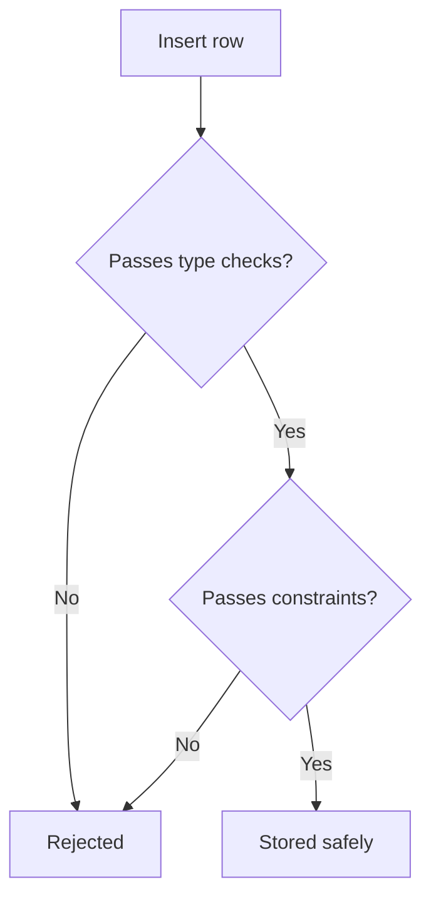
> 💡 **Tie-in to your background:** Support analytics often suffers from inconsistent status values or missing ownership fields. Constraints are a first defense against those issues.
---
## 4. SELECT fundamentals and the logical execution order
`SELECT` is the verb you use most often. But the biggest beginner trap is assuming SQL runs in the order you type it. It does not.
### Written order vs logical order
| Written order | Logical order | What happens |
|---|---|---|
| `SELECT` | 5 | choose output columns |
| `FROM` | 1 | identify source tables |
| `JOIN` | 1 | combine sources |
| `WHERE` | 2 | filter individual rows |
| `GROUP BY` | 3 | form groups |
| `HAVING` | 4 | filter groups |
| `ORDER BY` | 6 | sort final result |
| `LIMIT` / `TOP` / `FETCH` | 7 | cut final rows |
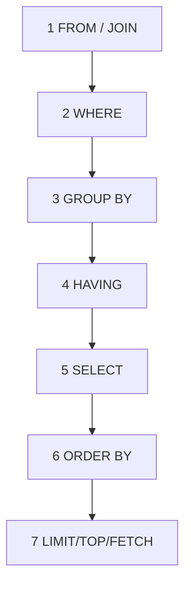
### Why this order matters
1. You **cannot** use a `SELECT` alias in `WHERE` in many databases because `WHERE` logically happens earlier.
2. `HAVING` exists because aggregate values are not available until after grouping.
3. Joining at the wrong grain before aggregation can multiply rows.
4. Understanding logical order helps you debug almost every wrong-result query.
```sql
-- Valid: alias can usually be used in ORDER BY because ORDER BY runs late
SELECT case_id, resolution_hours, CASE WHEN resolution_hours > 24 THEN 'Breach' ELSE 'Within SLA' END AS sla_status FROM cases ORDER BY sla_status;
```
```sql
-- Common mistake: many engines do not allow alias in WHERE
SELECT case_id, CASE WHEN resolution_hours > 24 THEN 'Breach' ELSE 'Within SLA' END AS sla_status FROM cases WHERE sla_status = 'Breach';
-- Safer rewrite
SELECT * FROM ( SELECT case_id, CASE WHEN resolution_hours > 24 THEN 'Breach' ELSE 'Within SLA' END AS sla_status FROM cases ) t WHERE sla_status = 'Breach';
```
### 🔍 Plain-English deep-dive: row filters vs group filters
- **WHERE** — *filters rows before grouping.* **Analogy:** deciding who may enter a meeting room.
- **GROUP BY** — *collects rows into buckets.* **Analogy:** putting papers into labeled folders.
- **HAVING** — *filters the buckets after they exist.* **Analogy:** keeping only folders whose total pages exceed 10.
```sql
SELECT p.product_name, COUNT(*) AS case_count, AVG(c.resolution_hours) AS avg_resolution_hours FROM cases c JOIN products p ON c.product_id = p.product_id WHERE c.case_created_at >= '2026-01-01' GROUP BY p.product_name HAVING AVG(c.resolution_hours) > 4 ORDER BY avg_resolution_hours DESC;
```
> 💡 **Tie-in to your background:** When you say, "Show me products whose monthly average resolution time exceeded target," you are describing `WHERE` + `GROUP BY` + `HAVING` logic whether you realize it or not.
---
## 5. Filtering rows: operators, AND/OR/NOT, IN, BETWEEN, LIKE, ILIKE, and NULL handling
Filtering is where analysis begins. If you pull the wrong rows, every chart and conclusion downstream becomes wrong.
### Core filter operators
| Pattern | Meaning | Example |
|---|---|---|
| `=` | equals | `severity = 'High'` |
| `<>` or `!=` | not equal | `status <> 'Closed'` |
| `>` `<` `>=` `<=` | comparisons | `resolution_hours > 24` |
| `AND` | all conditions must be true | high severity **and** open |
| `OR` | any condition may be true | high severity **or** critical |
| `NOT` | reverse a condition | `NOT IN (...)` |
| `IN (...)` | value appears in list | `region_name IN ('EMEA','AMER')` |
| `BETWEEN a AND b` | inclusive range | `csat_score BETWEEN 4 AND 5` |
| `LIKE` | pattern match | `agent_name LIKE 'A%'` |
| `ILIKE` | case-insensitive pattern match (PostgreSQL) | `product_name ILIKE 'sp%'` |
### Wildcards for LIKE / ILIKE
| Wildcard | Meaning | Example |
|---|---|---|
| `%` | zero or more characters | `'SP%'` matches `SPO` |
| `_` | exactly one character | `'T__ms'` matches `Teams` |
```sql
SELECT case_id, severity, status, resolution_hours FROM cases WHERE severity IN ('High','Critical') AND status NOT IN ('Closed','Resolved') AND case_created_at BETWEEN '2026-01-01' AND '2026-01-31 23:59:59';
```
```sql
SELECT product_name FROM products WHERE product_name ILIKE 'o%';
```
### NULL handling — this is deeper than most beginners expect
`NULL` means **unknown**, **missing**, or **not applicable**. It does **not** mean zero. It does **not** mean empty string. It does **not** behave like an ordinary value in comparisons.
### Three-valued logic
SQL has **three** truth states:
1. `TRUE`
2. `FALSE`
3. `UNKNOWN`
That third state exists because comparisons with `NULL` are unknown.
| Expression | Result |
|---|---|
| `5 = 5` | `TRUE` |
| `5 = 6` | `FALSE` |
| `5 = NULL` | `UNKNOWN` |
| `NULL = NULL` | `UNKNOWN` |
| `NULL IS NULL` | `TRUE` |
### Why this matters in WHERE
A `WHERE` clause keeps only rows where the condition is `TRUE`. Rows evaluating to `FALSE` **or** `UNKNOWN` are filtered out.
```sql
-- Wrong mental model: this returns nothing useful
SELECT case_id FROM cases WHERE resolved_at = NULL;
-- Correct
SELECT case_id FROM cases WHERE resolved_at IS NULL;
```
### Useful NULL functions
| Function | Purpose | Example |
|---|---|---|
| `COALESCE(a,b,c)` | first non-null value | fallback label |
| `NULLIF(a,b)` | returns null if values match | avoid divide-by-zero |
| `ISNULL(a,b)` | SQL Server replacement function | T-SQL style fallback |
| `IFNULL(a,b)` | SQLite/MySQL-style fallback | SQLite labs |
```sql
SELECT case_id, COALESCE(CAST(resolution_hours AS TEXT), 'Still open') AS resolution_label, NULLIF(reopen_count, 0) AS reopen_count_if_nonzero FROM cases;
```
### Boolean logic gotcha: parentheses matter
```sql
-- Ambiguous logic if you do not think carefully
SELECT case_id FROM cases WHERE severity = 'Critical' OR severity = 'High' AND status = 'Open';
-- Better: make intent explicit
SELECT case_id FROM cases WHERE (severity IN ('High','Critical')) AND status = 'Open';
```
### 🔍 Plain-English deep-dive: NULL is a blank, not a number
- **NULL** — *unknown or absent value.* **Analogy:** a blank answer on a form. **Why it matters:** blank is not the same as zero.
- **COALESCE** — *take the first filled-in answer.* **Analogy:** call mobile number, else office number, else home number. **Why it matters:** it helps make reports readable.
- **Three-valued logic** — *true / false / unknown.* **Analogy:** a detective case file labeled yes, no, or insufficient evidence. **Why it matters:** it explains many "why did this row disappear?" moments.
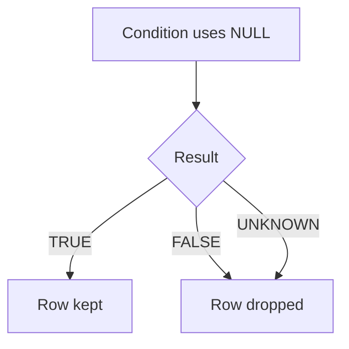
> 💡 **Tie-in to your background:** Open cases naturally have `resolved_at = NULL`. If you forget that, your backlog numbers break immediately.
---
## 6. Sorting, DISTINCT, LIMIT/TOP/OFFSET/FETCH, and aliases
After filtering, you often need to clean up how the answer is displayed. That is where sorting, deduping, aliases, and row limiting come in.
### Sorting with ORDER BY
```sql
SELECT case_id, case_created_at, resolution_hours FROM cases ORDER BY case_created_at DESC, resolution_hours ASC;
```
- `ASC` means ascending (small to large, A to Z, old to new).
- `DESC` means descending (large to small, Z to A, new to old).
- If omitted, ascending is usually default.
### DISTINCT
`DISTINCT` removes duplicate result rows. Use it when you truly need unique combinations. Do **not** use it as a bandage for a bad join without understanding why duplicates appeared.
```sql
SELECT DISTINCT support_channel FROM cases ORDER BY support_channel;
```
### Limiting rows
| Dialect | Syntax | Example |
|---|---|---|
| PostgreSQL / MySQL / SQLite | `LIMIT 10` | last 10 cases |
| SQL Server | `TOP (10)` | top 10 cases |
| Standard / SQL Server / PostgreSQL | `OFFSET 20 FETCH NEXT 10 ROWS ONLY` | page 3 |
| PostgreSQL | `LIMIT 10 OFFSET 20` | page 3 |
```sql
SELECT case_id, case_created_at FROM cases ORDER BY case_created_at DESC LIMIT 5;
```
```sql
-- SQL Server style
SELECT TOP (5) case_id, case_created_at FROM cases ORDER BY case_created_at DESC;
```
### Aliases
Aliases are temporary names for columns or tables in a query. They make output and query text easier to read.
```sql
SELECT c.case_id, p.product_name AS product, r.region_name  AS region, c.resolution_hours AS hrs FROM cases AS c JOIN products AS p ON c.product_id = p.product_id JOIN regions  AS r ON c.region_id = r.region_id;
```
### DISTINCT vs GROUP BY
| Use case | Better fit |
|---|---|
| You only need unique combinations | `DISTINCT` |
| You need aggregation too | `GROUP BY` |
| You are hiding duplicates caused by bad joins | fix the join first |
### 🔍 Plain-English deep-dive: DISTINCT is not a magic cleanup button
- **DISTINCT** — *remove duplicate rows in the output.* **Analogy:** collapsing duplicate names in a guest list. **Why it matters:** useful, but if duplicates came from a many-to-many join, `DISTINCT` may hide a real modeling problem.
- **Alias** — *a temporary nickname for a column or table.* **Analogy:** calling "Alexander" by "Alex" during one meeting. **Why it matters:** shorter, clearer SQL.
> 💡 **Tie-in to your background:** In support reporting, pagination, top-N lists, and readable labels matter because leadership rarely wants raw tables dumped on a slide.
---
## 7. Aggregation deep: COUNT, SUM, AVG, MIN, MAX, COUNT(DISTINCT), conditional aggregation, GROUP BY, HAVING
Aggregation is how row-level operational data becomes KPI-level business insight.
### Core aggregate functions
| Function | Meaning | NULL behavior |
|---|---|---|
| `COUNT(*)` | number of rows | counts rows even if columns are null |
| `COUNT(col)` | number of non-null values | skips nulls |
| `COUNT(DISTINCT col)` | distinct non-null values | skips nulls |
| `SUM(col)` | total | skips nulls |
| `AVG(col)` | average | skips nulls |
| `MIN(col)` / `MAX(col)` | smallest / largest value | skips nulls |
```sql
SELECT p.product_name, COUNT(*) AS total_cases, COUNT(c.resolved_at) AS resolved_case_rows, COUNT(DISTINCT c.agent_id) AS unique_agents, AVG(c.resolution_hours) AS avg_resolution_hours, MAX(c.resolution_hours) AS max_resolution_hours FROM cases c JOIN products p ON c.product_id = p.product_id GROUP BY p.product_name ORDER BY total_cases DESC;
```
### GROUP BY rule
Every selected column must be either:
1. aggregated, or
2. listed in `GROUP BY`.
### HAVING for group-level filters
```sql
SELECT p.product_name, COUNT(*) AS total_cases, AVG(s.csat_score) AS avg_csat FROM cases c JOIN products p ON c.product_id = p.product_id LEFT JOIN surveys s ON c.case_id = s.case_id GROUP BY p.product_name HAVING COUNT(*) >= 2 AND AVG(s.csat_score) < 4.5;
```
### Conditional aggregation with SUM(CASE ...)
This is one of the most interview-useful patterns in all of SQL.
```sql
SELECT p.product_name, COUNT(*) AS total_cases, SUM(CASE WHEN c.severity IN ('High','Critical') THEN 1 ELSE 0 END) AS high_or_critical_cases, SUM(CASE WHEN c.resolution_hours > seg.sla_target_hours THEN 1 ELSE 0 END) AS breached_cases, AVG(CASE WHEN s.csat_score IS NOT NULL THEN s.csat_score END) AS avg_csat FROM cases c JOIN products p ON c.product_id = p.product_id JOIN segments seg ON c.segment_id = seg.segment_id LEFT JOIN surveys s ON c.case_id = s.case_id GROUP BY p.product_name;
```
### Why conditional aggregation is so powerful
It lets you create many KPI columns in one grouped query. That is how dashboards often compute:
- total cases,
- open cases,
- breached cases,
- detractor surveys,
- self-serve entries,
- reopened cases,
- and more.
### COUNT with CASE patterns
```sql
-- Pattern 1: SUM CASE
SUM(CASE WHEN status = 'Open' THEN 1 ELSE 0 END) AS open_cases
-- Pattern 2: COUNT CASE
COUNT(CASE WHEN status = 'Open' THEN 1 END) AS open_cases
```
Both can work. Many analysts prefer `SUM(CASE...)` because the 1/0 logic is very explicit.
### 🔍 Plain-English deep-dive: GROUP BY turns detail into summary
- **Aggregate** — *one number summarizing many rows.* **Analogy:** average test score of a whole class.
- **GROUP BY** — *split rows into buckets first, then summarize each bucket.* **Analogy:** sorting mail into country piles before counting letters in each pile.
- **Conditional aggregation** — *count or sum only rows that meet a condition.* **Analogy:** in one box of receipts, count only weekend purchases.
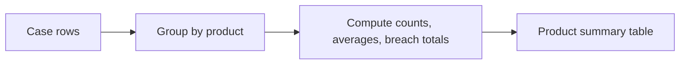
> 💡 **Tie-in to your background:** MBR metrics are usually conditional aggregations disguised as business language.
---
## 8. Advanced grouping: GROUPING SETS, ROLLUP, CUBE, and GROUPING()
Basic `GROUP BY` gives one summary grain. Advanced grouping lets one query return multiple summary grains at once. That is great for executive reporting where you need detail rows plus subtotal rows plus grand total rows.
### Why not run many separate queries?
You can. But grouping extensions are more elegant and often easier to maintain.
### GROUPING SETS
Choose the exact grouping combinations you want.
```sql
SELECT p.product_name, r.region_name, seg.segment_name, COUNT(*) AS case_count FROM cases c JOIN products p ON c.product_id = p.product_id JOIN regions r  ON c.region_id = r.region_id JOIN segments seg ON c.segment_id = seg.segment_id GROUP BY GROUPING SETS ( (p.product_name, r.region_name, seg.segment_name), (p.product_name, r.region_name), (p.product_name), () ) ORDER BY p.product_name, r.region_name, seg.segment_name;
```
### ROLLUP
`ROLLUP(a,b,c)` creates a hierarchy of subtotals from left to right.
```sql
SELECT p.product_name, r.region_name, DATE_TRUNC('month', c.case_created_at) AS month_start, COUNT(*) AS case_count FROM cases c JOIN products p ON c.product_id = p.product_id JOIN regions r  ON c.region_id = r.region_id GROUP BY ROLLUP (p.product_name, r.region_name, DATE_TRUNC('month', c.case_created_at));
```
That produces:
- product + region + month
- product + region subtotal
- product subtotal
- grand total
### CUBE
`CUBE(a,b,c)` produces all combinations of those dimensions. Powerful, but potentially large.
```sql
SELECT p.product_name, r.region_name, seg.segment_name, COUNT(*) AS case_count FROM cases c JOIN products p ON c.product_id = p.product_id JOIN regions r ON c.region_id = r.region_id JOIN segments seg ON c.segment_id = seg.segment_id GROUP BY CUBE (p.product_name, r.region_name, seg.segment_name);
```
### GROUPING()
`GROUPING(col)` helps you tell whether a null in the result is a real null from data or a subtotal placeholder produced by grouping sets.
```sql
SELECT p.product_name, r.region_name, COUNT(*) AS case_count, GROUPING(p.product_name) AS g_product, GROUPING(r.region_name) AS g_region FROM cases c JOIN products p ON c.product_id = p.product_id JOIN regions r  ON c.region_id = r.region_id GROUP BY ROLLUP (p.product_name, r.region_name);
```
### Quick comparison
| Feature | Best for | Think of it as |
|---|---|---|
| `GROUPING SETS` | exact summary grains | custom menu |
| `ROLLUP` | hierarchical subtotals | staircase |
| `CUBE` | all dimension combinations | power set |
| `GROUPING()` | label subtotal rows | subtotal detector |
### 🔍 Plain-English deep-dive: subtotal rows are still rows
Subtotal logic can look scary only because SQL returns everything in one result set. But conceptually it is simple:
- some rows are detailed groups,
- some rows are subtotal groups,
- one row may be the grand total.
**Analogy:** a monthly finance sheet where product lines are followed by region subtotals and then a final total.
> 💡 **Tie-in to your background:** When you build MBR tables with product totals, regional breakouts, and overall totals, this is the SQL-native way to do it.
---
## 9. JOINs comprehensively: INNER, LEFT, RIGHT, FULL, CROSS, SELF, multi-key joins, non-equi joins, semi-joins, anti-joins, and fan-out pitfalls
Joins are where relational databases show their value. But joins are also where analysts accidentally create wrong counts. So this section deserves slow study.
### INNER JOIN
Returns only matching rows from both sides.
```sql
SELECT c.case_id, p.product_name, a.agent_name FROM cases c INNER JOIN products p ON c.product_id = p.product_id INNER JOIN agents a   ON c.agent_id = a.agent_id;
```
### LEFT JOIN
Keeps all rows from the left table, even if the right side has no match.
```sql
SELECT c.case_id, COALESCE(a.agent_name, 'Unknown / inactive agent') AS agent_name FROM cases c LEFT JOIN agents a ON c.agent_id = a.agent_id;
```
### RIGHT JOIN and FULL JOIN
| Join | Keeps |
|---|---|
| `RIGHT JOIN` | all rows from right table |
| `FULL OUTER JOIN` | all rows from both tables |
```sql
SELECT a.agent_id, a.agent_name, c.case_id FROM agents a RIGHT JOIN cases c ON a.agent_id = c.agent_id;
SELECT a.agent_id, a.agent_name, c.case_id FROM agents a FULL OUTER JOIN cases c ON a.agent_id = c.agent_id;
```
### CROSS JOIN
Produces every combination of rows. Use carefully.
```sql
SELECT p.product_name, r.region_name FROM products p CROSS JOIN regions r;
```
That is useful for building a complete reporting grid, such as every product-region combination, even before activity exists.
### SELF JOIN
Join a table to itself. Helpful for hierarchies or parent-child relationships.
```sql
SELECT child.case_id AS child_case, parent.case_id AS parent_case, child.resolution_hours AS child_hours, parent.resolution_hours AS parent_hours FROM cases child LEFT JOIN cases parent ON child.parent_case_id = parent.case_id;
```
### Multi-key joins
Sometimes one column is not enough. Suppose survey imports did not have case IDs but did have `(product_id, region_id, submitted_at::date)` or another composite business key. You may need to join on multiple columns.
```sql
SELECT * FROM some_case_snapshot c JOIN some_daily_region_target t ON c.product_id = t.product_id AND c.region_id  = t.region_id AND DATE(c.case_created_at) = t.metric_date;
```
### Non-equi joins
A join condition does not have to be equality. It can be ranges, inequalities, or date banding.
```sql
SELECT c.case_id, seg.segment_name, b.bucket_label FROM cases c JOIN segments seg ON c.segment_id = seg.segment_id JOIN ( SELECT 0 AS min_h, 8 AS max_h, 'Within 8h' AS bucket_label UNION ALL SELECT 8, 24, '8-24h' UNION ALL SELECT 24, 999999, '24h+' ) b ON c.resolution_hours >= b.min_h AND c.resolution_hours <  b.max_h;
```
### Semi-join with EXISTS
A semi-join asks: "Does at least one matching row exist?" It returns rows from the left side only.
```sql
SELECT c.case_id, c.status FROM cases c WHERE EXISTS ( SELECT 1 FROM surveys s WHERE s.case_id = c.case_id AND s.csat_score <= 2 );
```
### Anti-join with NOT EXISTS
An anti-join asks: "Does no matching row exist?" This is the safest way to find missing related rows.
```sql
SELECT c.case_id FROM cases c WHERE NOT EXISTS ( SELECT 1 FROM surveys s WHERE s.case_id = c.case_id );
```
### Why `NOT EXISTS` is often better than `NOT IN`
If `NOT IN` sees a null in the subquery, results can behave unexpectedly. `NOT EXISTS` is usually clearer and safer.
### Join fan-out / duplication pitfall
If one case has many survey rows or many history rows, joining raw detail tables can multiply case rows. That can inflate counts and sums.
```mermaid
flowchart LR
    A[1 case row] --> B[Join to 3 history rows]
    B --> C[Now appears 3 times]
    C --> D[COUNT(*) can be wrong if you forget grain]
```
```sql
-- Dangerous if you think result is still one row per case
SELECT c.case_id, h.status_to FROM cases c JOIN case_status_history h ON c.case_id = h.case_id;
```
### Safe pattern: aggregate first, then join
```sql
WITH history_counts AS ( SELECT case_id, COUNT(*) AS status_change_count FROM case_status_history GROUP BY case_id ) SELECT c.case_id, hc.status_change_count FROM cases c LEFT JOIN history_counts hc ON c.case_id = hc.case_id;
```
### Join comparison table
| Join type | Best use | Common risk |
|---|---|---|
| INNER | only matched records matter | unintentionally dropping rows |
| LEFT | keep primary set, enrich if possible | nulls on right side |
| FULL | data reconciliation | messy outputs |
| CROSS | create combinations | explosion in row count |
| SELF | hierarchies or comparisons | confusing aliases |
| EXISTS | existence test | forgetting correlation |
| NOT EXISTS | missing-match test | usually safest |
### 🔍 Plain-English deep-dive: fan-out means one row silently becomes many
- **Fan-out** — *row multiplication caused by joining to a table with many matches.* **Analogy:** one parent holding three child balloons; suddenly the parent appears three times in a photo collage. **Why it matters:** your counts and sums inflate.
- **Semi-join** — *keep left rows that have at least one match.* **Analogy:** keep customers who placed at least one order.
- **Anti-join** — *keep left rows with no match.* **Analogy:** keep customers who never completed a survey.
> 💡 **Tie-in to your background:** If you join raw case rows to raw status history and then count cases, you can accidentally overstate case volume. This is one of the easiest ways to lose trust in a meeting.
---
## 10. Set operations: UNION, UNION ALL, INTERSECT, and EXCEPT
Set operations combine the outputs of multiple queries. They work when the queries return the same number of columns with compatible data types.
### UNION vs UNION ALL
| Operation | What it does |
|---|---|
| `UNION` | stacks results and removes duplicates |
| `UNION ALL` | stacks results and keeps duplicates |
```sql
SELECT case_id, 'cases' AS source_name FROM cases WHERE severity = 'Critical' UNION ALL SELECT case_id, 'surveys' AS source_name FROM surveys WHERE csat_score <= 2;
```
Use `UNION ALL` by default unless you truly need duplicate removal. `UNION` has extra work because it must deduplicate.
### INTERSECT
Returns rows present in both query results.
```sql
SELECT case_id FROM cases WHERE reopen_count > 0 INTERSECT SELECT case_id FROM surveys WHERE csat_score <= 3;
```
### EXCEPT
Returns rows from the first query that are absent from the second.
```sql
SELECT case_id FROM cases WHERE status = 'Resolved' EXCEPT SELECT case_id FROM surveys;
```
### Practical use cases
- Union monthly snapshots together.
- Compare two cohorts.
- Find overlap between breached cases and detractor surveys.
- Find rows present in staging but missing in final table.
### 🔍 Plain-English deep-dive: think vertically, not horizontally
Set operations **stack** result sets vertically. Joins **combine** them horizontally.
**Analogy:**
- set operation = place two decks of cards one on top of the other,
- join = align two cards side by side.
> 💡 **Tie-in to your background:** `INTERSECT` is great for answering questions like, "Which cases both breached SLA and got low CSAT?"
---
## 11. Subqueries: scalar, multi-row, correlated, EXISTS/NOT EXISTS, IN/ANY/ALL, and derived tables
A **subquery** is a query inside another query. Subqueries are not magic; they are just intermediate answers used by a larger statement.
### Scalar subquery
Returns one value.
```sql
SELECT case_id, resolution_hours FROM cases WHERE resolution_hours > ( SELECT AVG(resolution_hours) FROM cases WHERE resolution_hours IS NOT NULL );
```
### Multi-row subquery with IN
```sql
SELECT case_id, product_id FROM cases WHERE product_id IN ( SELECT product_id FROM products WHERE product_name IN ('SPO','ODB') );
```
### Correlated subquery
A correlated subquery depends on the current row of the outer query. It runs conceptually per outer row.
```sql
SELECT c.case_id, c.product_id, c.resolution_hours FROM cases c WHERE c.resolution_hours > ( SELECT AVG(c2.resolution_hours) FROM cases c2 WHERE c2.product_id = c.product_id );
```
That means: show cases slower than the average for their own product.
### EXISTS and NOT EXISTS
Already seen in joins section, but worth repeating because interviewers love them.
```sql
SELECT a.agent_id, a.agent_name FROM agents a WHERE EXISTS ( SELECT 1 FROM cases c WHERE c.agent_id = a.agent_id AND c.reopen_count > 0 );
```
### ANY and ALL
| Operator | Meaning |
|---|---|
| `> ANY (...)` | greater than at least one returned value |
| `> ALL (...)` | greater than every returned value |
```sql
SELECT case_id, resolution_hours FROM cases WHERE resolution_hours > ALL ( SELECT sla_target_hours FROM segments );
```
### Derived table / inline view
A subquery in the `FROM` clause is often called a **derived table** or **inline view**.
```sql
SELECT product_name, avg_csat FROM ( SELECT p.product_name, AVG(s.csat_score) AS avg_csat FROM cases c JOIN products p ON c.product_id = p.product_id LEFT JOIN surveys s ON c.case_id = s.case_id GROUP BY p.product_name ) q WHERE avg_csat < 4.5;
```
### Subquery vs CTE
| When | Often better |
|---|---|
| one quick nested calculation | subquery |
| multi-step readable logic | CTE |
| recursive logic | CTE |
| reuse same intermediate set multiple times | CTE or temp object |
### 🔍 Plain-English deep-dive: correlated means "for this current row"
- **Correlated subquery** — *a subquery that refers back to the outer row.* **Analogy:** for each student, compare them to the average of their own class. **Why it matters:** elegant, but may be slower than a join/window rewrite on large data.
- **Derived table** — *a temporary table created inline in a query.* **Analogy:** a scratch pad clipped inside a larger notebook.
> 💡 **Tie-in to your background:** "Show cases whose resolution time was above the average for their product and region" is a classic correlated-subquery interview question in disguise.
---
## 12. CTEs deep: stepwise logic, reuse, recursive hierarchies, escalation chains, and series generation
A **CTE** (Common Table Expression) lets you name an intermediate result using `WITH`. That sounds small, but it is one of the biggest readability upgrades in SQL.
### Basic CTE pattern
```sql
WITH case_enriched AS ( SELECT c.case_id, p.product_name, r.region_name, seg.segment_name, c.resolution_hours, c.reopen_count FROM cases c JOIN products p ON c.product_id = p.product_id JOIN regions r  ON c.region_id = r.region_id JOIN segments seg ON c.segment_id = seg.segment_id ), product_summary AS ( SELECT product_name, COUNT(*) AS total_cases, AVG(resolution_hours) AS avg_resolution_hours, SUM(CASE WHEN reopen_count > 0 THEN 1 ELSE 0 END) AS reopened_cases FROM case_enriched GROUP BY product_name ) SELECT * FROM product_summary ORDER BY avg_resolution_hours DESC;
```
### Why CTEs are loved in interviews
Because you can narrate them.
- first I clean/enrich,
- then I aggregate,
- then I filter,
- then I present.
That sounds clear and senior.
### CTEs are not automatically faster
They mainly improve clarity. Performance depends on the database and the plan chosen. Sometimes a CTE is inlined; sometimes it is materialized. Always check the execution plan if performance matters.
### Recursive CTE for escalation parent-child chains
Suppose some cases are child escalations of parent cases. A recursive CTE can walk that chain.
```sql
WITH RECURSIVE escalation_chain AS ( SELECT case_id, parent_case_id, case_id AS root_case_id, 0 AS depth FROM cases WHERE parent_case_id IS NULL UNION ALL SELECT c.case_id, c.parent_case_id, ec.root_case_id, ec.depth + 1 AS depth FROM cases c JOIN escalation_chain ec ON c.parent_case_id = ec.case_id ) SELECT * FROM escalation_chain ORDER BY root_case_id, depth, case_id;
```
### Recursive CTE for org or queue hierarchy
The exact same pattern works for:
- manager → employee trees,
- category → subcategory trees,
- queue routing paths,
- article topic hierarchies.
### Recursive CTE for number series generation
```sql
WITH RECURSIVE nums AS ( SELECT 1 AS n UNION ALL SELECT n + 1 FROM nums WHERE n < 12 ) SELECT * FROM nums;
```
### Recursive CTE for date series generation
This is extremely useful for date spines and reporting gaps.
```sql
WITH RECURSIVE date_spine AS ( SELECT DATE '2026-01-01' AS d UNION ALL SELECT d + INTERVAL '1 day' FROM date_spine WHERE d < DATE '2026-01-31' ) SELECT d::date AS calendar_date FROM date_spine;
```
### CTE to stage data quality flags before final output
```sql
WITH survey_join AS ( SELECT c.case_id, c.resolution_hours, s.csat_score, CASE WHEN s.case_id IS NULL THEN 1 ELSE 0 END AS missing_survey_flag, CASE WHEN c.resolution_hours < 0 THEN 1 ELSE 0 END AS invalid_resolution_flag FROM cases c LEFT JOIN surveys s ON c.case_id = s.case_id ) SELECT * FROM survey_join WHERE missing_survey_flag = 1 OR invalid_resolution_flag = 1;
```
### CTE patterns worth memorizing
| Pattern | Why it is useful |
|---|---|
| `base` CTE | clean or enrich raw data |
| `agg` CTE | summarize once and reuse |
| `ranked` CTE | compute row numbers, ranks |
| `calendar` CTE | generate reporting dates |
| `recursive` CTE | walk hierarchies |
| `final` CTE | presentation-ready output |
### 🔍 Plain-English deep-dive: a CTE is a named step, not a permanent table
- **CTE** — *temporary named result inside one query.* **Analogy:** a sticky note labeled "Step 1 totals" used while solving a puzzle.
- **Recursive** — *a query that feeds its own previous result back into itself.* **Analogy:** climbing stairs one step at a time using the previous step as the starting point.
- **Date spine** — *a full list of dates used to ensure no days are missing from reports.* **Analogy:** calendar pages on a wall, one for every day whether or not anything happened.
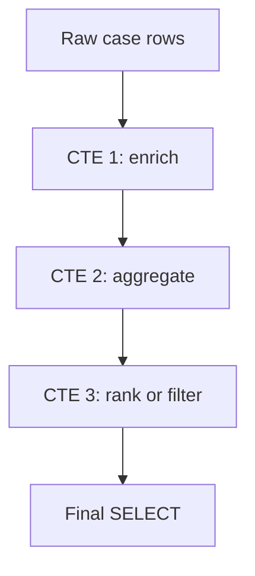
> 💡 **Tie-in to your background:** CTEs match how you already think when preparing a story for leadership: first collect facts, then group themes, then highlight outliers.
---
## 13. Window functions comprehensively: ranking, aggregates, value functions, partitions, ordering, and frames
This is the centerpiece of the JD. If you become fluent here, you will sound strong in SQL interviews.
### What a window function is
A **window function** performs a calculation across a set of related rows while **keeping each row visible**. That is the big difference from `GROUP BY`, which collapses rows.
### GROUP BY vs window function
| Question | GROUP BY | Window function |
|---|---|---|
| Do rows collapse into fewer rows? | Yes | No |
| Can I keep detail rows and add summary info? | No | Yes |
| Great for pure summaries? | Yes | Yes, but often overkill |
| Great for running totals, ranking, LAG/LEAD? | No | Yes |
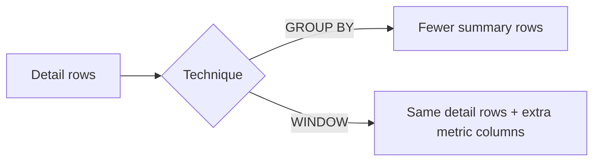
### Anatomy of a window function
```sql
FUNCTION_NAME(...) OVER ( PARTITION BY ... ORDER BY ... frame_clause )
```
- **PARTITION BY** = restart the calculation per group.
- **ORDER BY** inside `OVER` = sequence for ranking or running logic.
- **Frame clause** = define exactly which nearby rows are included.
### 13.1 Ranking functions
#### ROW_NUMBER
```sql
SELECT p.product_name, c.agent_id, AVG(s.csat_score) AS avg_csat, ROW_NUMBER() OVER ( PARTITION BY p.product_name ORDER BY AVG(s.csat_score) DESC NULLS LAST ) AS rn FROM cases c JOIN products p ON c.product_id = p.product_id LEFT JOIN surveys s ON c.case_id = s.case_id GROUP BY p.product_name, c.agent_id;
```
#### RANK and DENSE_RANK
```sql
SELECT p.product_name, c.agent_id, AVG(s.csat_score) AS avg_csat, RANK() OVER ( PARTITION BY p.product_name ORDER BY AVG(s.csat_score) DESC NULLS LAST ) AS rnk, DENSE_RANK() OVER ( PARTITION BY p.product_name ORDER BY AVG(s.csat_score) DESC NULLS LAST ) AS dense_rnk FROM cases c JOIN products p ON c.product_id = p.product_id LEFT JOIN surveys s ON c.case_id = s.case_id GROUP BY p.product_name, c.agent_id;
```
| Function | Ties get same rank? | Gaps after ties? | Common use |
|---|---|---|---|
| `ROW_NUMBER()` | No | No | deduping, top 1 exact row |
| `RANK()` | Yes | Yes | competition style ranking |
| `DENSE_RANK()` | Yes | No | dense leaderboard |
#### NTILE, PERCENT_RANK, CUME_DIST
```sql
SELECT case_id, resolution_hours, NTILE(4) OVER (ORDER BY resolution_hours) AS quartile, PERCENT_RANK() OVER (ORDER BY resolution_hours) AS pct_rank, CUME_DIST() OVER (ORDER BY resolution_hours) AS cumulative_dist FROM cases WHERE resolution_hours IS NOT NULL;
```
- **NTILE(4)** splits rows into 4 buckets.
- **PERCENT_RANK** shows relative position from 0 to 1.
- **CUME_DIST** shows cumulative distribution.
### 13.2 Aggregate window functions
Aggregate functions can also work as windows.
```sql
SELECT c.case_id, p.product_name, c.resolution_hours, AVG(c.resolution_hours) OVER (PARTITION BY p.product_name) AS product_avg_hours, SUM(c.resolution_hours) OVER (PARTITION BY p.product_name) AS product_total_hours FROM cases c JOIN products p ON c.product_id = p.product_id WHERE c.resolution_hours IS NOT NULL;
```
### 13.3 Running totals and moving averages
```sql
SELECT DATE(case_created_at) AS created_date, product_id, COUNT(*) AS daily_cases, SUM(COUNT(*)) OVER ( PARTITION BY product_id ORDER BY DATE(case_created_at) ROWS BETWEEN UNBOUNDED PRECEDING AND CURRENT ROW ) AS running_case_total FROM cases GROUP BY DATE(case_created_at), product_id ORDER BY product_id, created_date;
```
```sql
WITH daily_csat AS ( SELECT DATE(s.submitted_at) AS survey_date, c.product_id, AVG(s.csat_score) AS avg_csat FROM surveys s JOIN cases c ON s.case_id = c.case_id GROUP BY DATE(s.submitted_at), c.product_id ) SELECT survey_date, product_id, avg_csat, AVG(avg_csat) OVER ( PARTITION BY product_id ORDER BY survey_date ROWS BETWEEN 2 PRECEDING AND CURRENT ROW ) AS csat_3day_moving_avg FROM daily_csat ORDER BY product_id, survey_date;
```
### 13.4 Value functions: LAG, LEAD, FIRST_VALUE, LAST_VALUE, NTH_VALUE
#### LAG and LEAD
```sql
WITH weekly_cases AS ( SELECT DATE_TRUNC('week', case_created_at)::date AS week_start, product_id, COUNT(*) AS weekly_case_count FROM cases GROUP BY DATE_TRUNC('week', case_created_at)::date, product_id ) SELECT week_start, product_id, weekly_case_count, LAG(weekly_case_count) OVER ( PARTITION BY product_id ORDER BY week_start ) AS prior_week_case_count, weekly_case_count - LAG(weekly_case_count) OVER ( PARTITION BY product_id ORDER BY week_start ) AS week_over_week_change, LEAD(weekly_case_count) OVER ( PARTITION BY product_id ORDER BY week_start ) AS next_week_case_count FROM weekly_cases ORDER BY product_id, week_start;
```
#### FIRST_VALUE and LAST_VALUE
```sql
SELECT case_id, product_id, case_created_at, resolution_hours, FIRST_VALUE(resolution_hours) OVER ( PARTITION BY product_id ORDER BY case_created_at ROWS BETWEEN UNBOUNDED PRECEDING AND UNBOUNDED FOLLOWING ) AS first_resolution_hours_in_product, LAST_VALUE(resolution_hours) OVER ( PARTITION BY product_id ORDER BY case_created_at ROWS BETWEEN UNBOUNDED PRECEDING AND UNBOUNDED FOLLOWING ) AS last_resolution_hours_in_product FROM cases WHERE resolution_hours IS NOT NULL;
```
#### NTH_VALUE
```sql
SELECT case_id, product_id, resolution_hours, NTH_VALUE(resolution_hours, 2) OVER ( PARTITION BY product_id ORDER BY resolution_hours ROWS BETWEEN UNBOUNDED PRECEDING AND UNBOUNDED FOLLOWING ) AS second_smallest_resolution_hours FROM cases WHERE resolution_hours IS NOT NULL;
```
### 13.5 Frame clauses in depth: ROWS vs RANGE vs GROUPS
Frames are advanced but very important. They answer: **which rows around the current row belong to the calculation?**
#### ROWS
Counts physical rows.
```sql
AVG(avg_csat) OVER ( ORDER BY survey_date ROWS BETWEEN 2 PRECEDING AND CURRENT ROW )
```
This means current row plus the two previous rows.
#### RANGE
Uses value range based on `ORDER BY` expression. If multiple rows tie on the same ordered value, they can move together.
```sql
SUM(daily_cases) OVER ( ORDER BY case_day RANGE BETWEEN INTERVAL '6 days' PRECEDING AND CURRENT ROW )
```
#### GROUPS
Counts peer groups in the ordered set. Less commonly used, but conceptually it means groups of tied `ORDER BY` values.
```sql
SUM(metric_value) OVER ( ORDER BY metric_day GROUPS BETWEEN 1 PRECEDING AND CURRENT ROW )
```
### Frame boundary terms
| Term | Meaning |
|---|---|
| `UNBOUNDED PRECEDING` | start at first row in partition |
| `n PRECEDING` | go back n rows/groups/value range |
| `CURRENT ROW` | include current row |
| `n FOLLOWING` | look ahead n rows/groups/value range |
| `UNBOUNDED FOLLOWING` | continue to end of partition |
### The LAST_VALUE gotcha
Many analysts expect `LAST_VALUE` to give the last row in the partition. But default frames often end at the current row. So without an explicit frame reaching `UNBOUNDED FOLLOWING`, `LAST_VALUE` can surprise you.
### Frame comparison table
| Frame type | Best mental model | Most common use |
|---|---|---|
| `ROWS` | physical row count | moving averages |
| `RANGE` | value range around current row | date/value band windows |
| `GROUPS` | tied peer groups | specialized analytics |
### Window patterns worth memorizing for interviews
| Problem | Window solution |
|---|---|
| top agent per product | `ROW_NUMBER()` |
| rank with ties | `RANK()` |
| running total | `SUM() OVER (ORDER BY...)` |
| moving average | `AVG() OVER (... ROWS BETWEEN ...)` |
| compare to previous period | `LAG()` |
| compare to next period | `LEAD()` |
| percentile bucket | `NTILE()` |
| first/last in sequence | `FIRST_VALUE()` / `LAST_VALUE()` |
### 🔍 Plain-English deep-dive: windows look across neighbors without losing the row
- **Partition** — *sub-group where calculation restarts.* **Analogy:** separate race lanes.
- **Window frame** — *exact slice of nearby rows used by the function.* **Analogy:** looking at the current page plus the two pages before it.
- **LAG** — *peek backward.* **Analogy:** compare this month's CSAT with last month.
- **LEAD** — *peek forward.* **Analogy:** preview next week's scheduled volume.
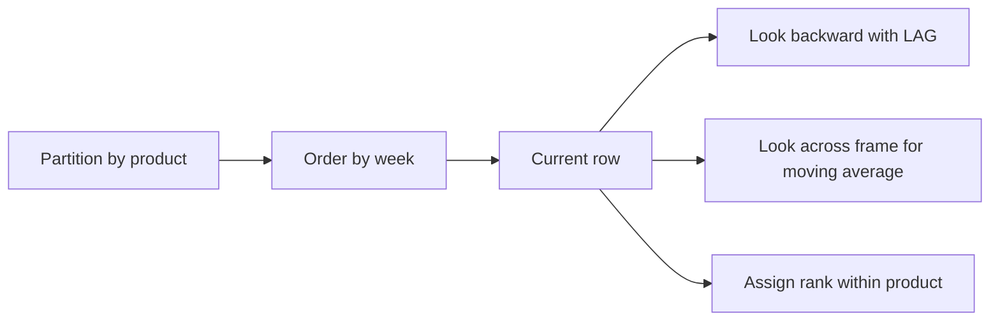
> 💡 **Tie-in to your background:** Every question like "Is this trend getting better or worse?" or "Who are the top agents in each queue?" points directly to window functions.
---
## 14. CASE expressions, conditional logic, pivoting with conditional aggregation, and PIVOT/UNPIVOT
`CASE` is SQL's if/else expression. It is one of the most used tools in analyst SQL.
### Basic CASE
```sql
SELECT case_id, resolution_hours, CASE WHEN resolution_hours IS NULL THEN 'Open' WHEN resolution_hours <= 8 THEN 'Within segment target' WHEN resolution_hours <= 24 THEN 'Late' ELSE 'Severely late' END AS resolution_bucket FROM cases;
```
### Simple CASE vs searched CASE
| Style | Example | Use |
|---|---|---|
| simple CASE | `CASE status WHEN 'Open' THEN ...` | equality comparisons |
| searched CASE | `CASE WHEN resolution_hours > 24 THEN ...` | flexible conditions |
### CASE in aggregation
```sql
SELECT p.product_name, SUM(CASE WHEN c.status = 'Open' THEN 1 ELSE 0 END) AS open_cases, SUM(CASE WHEN c.support_channel = 'SelfServe' THEN 1 ELSE 0 END) AS selfserve_cases, SUM(CASE WHEN s.csat_score <= 2 THEN 1 ELSE 0 END) AS detractor_surveys FROM cases c JOIN products p ON c.product_id = p.product_id LEFT JOIN surveys s ON c.case_id = s.case_id GROUP BY p.product_name;
```
### Pivot with conditional aggregation
Often the most portable pivot approach is conditional aggregation.
```sql
SELECT r.region_name, SUM(CASE WHEN p.product_name = 'SPO' THEN 1 ELSE 0 END) AS spo_cases, SUM(CASE WHEN p.product_name = 'ODB' THEN 1 ELSE 0 END) AS odb_cases, SUM(CASE WHEN p.product_name = 'Teams' THEN 1 ELSE 0 END) AS teams_cases FROM cases c JOIN products p ON c.product_id = p.product_id JOIN regions r ON c.region_id = r.region_id GROUP BY r.region_name;
```
### SQL Server PIVOT example
```sql
SELECT region_name, [SPO], [ODB], [Teams] FROM ( SELECT r.region_name, p.product_name FROM cases c JOIN products p ON c.product_id = p.product_id JOIN regions r ON c.region_id = r.region_id ) src PIVOT ( COUNT(product_name) FOR product_name IN ([SPO], [ODB], [Teams]) ) p;
```
### UNPIVOT idea
`UNPIVOT` turns columns back into rows. That is useful when source data arrives as wide monthly files.
### CASE best practices
- Make conditions mutually understandable.
- Put most specific rules before broader ones.
- Use `ELSE` when possible to avoid accidental nulls.
- Keep business logic labels clear and reusable.
### 🔍 Plain-English deep-dive: pivoting means rotating your viewpoint
- **Pivot** — *turn row categories into columns.* **Analogy:** turning a long guest list into one seat-count per table across the page.
- **Unpivot** — *turn repeated columns into rows.* **Analogy:** unrolling a folded brochure back into a list.
- **CASE** — *inline decision logic.* **Analogy:** triage routing rules written directly into the query.
> 💡 **Tie-in to your background:** Many operational review tables are basically pivoted summaries with traffic-light style CASE labels.
---
## 15. String functions and date/time functions deep: truncation, extraction, intervals, formatting, time zones, and Jul–Jun fiscal logic
Analysts spend a lot of time cleaning text and aligning dates. This section matters more than many people expect.
### Common string functions
| Function | Purpose | Example |
|---|---|---|
| `UPPER`, `LOWER` | case normalization | compare issue labels safely |
| `TRIM`, `LTRIM`, `RTRIM` | remove spaces | clean imported text |
| `LENGTH` / `LEN` | count characters | validate codes |
| `SUBSTRING` / `SUBSTR` | extract part | parse category prefixes |
| `REPLACE` | replace text | standardize labels |
| `CONCAT` / `||` | combine text | build display labels |
| `SPLIT_PART` / parsing variants | break text apart | parse region-product key |
```sql
SELECT agent_id, UPPER(TRIM(agent_name)) AS normalized_agent_name, CONCAT('Agent-', agent_id) AS display_key, LENGTH(agent_name) AS name_length FROM agents;
```
### Common date/time functions
| Function | Purpose |
|---|---|
| `CURRENT_DATE`, `CURRENT_TIMESTAMP` | current date/time |
| `DATE_TRUNC` | round down to month/week/day |
| `EXTRACT` | pull out year/month/day/hour |
| `AGE`, interval math | duration calculations |
| `DATEADD` / `DATEDIFF` | add or subtract date parts (T-SQL style) |
| formatting functions | make user-facing text |
### PostgreSQL examples
```sql
SELECT case_id, case_created_at, DATE_TRUNC('month', case_created_at) AS month_start, EXTRACT(DOW FROM case_created_at) AS day_of_week_num, EXTRACT(HOUR FROM case_created_at) AS created_hour, resolved_at - case_created_at AS raw_duration_interval FROM cases;
```
### SQL Server-style examples
```sql
SELECT case_id, DATEADD(day, 7, CAST(case_created_at AS date)) AS plus_7_days, DATEDIFF(hour, case_created_at, resolved_at) AS hours_to_resolve FROM cases;
```
### Range filtering beats wrapping columns in functions
```sql
-- Less index-friendly
SELECT * FROM cases WHERE DATE(case_created_at) = DATE '2026-01-12';
-- Better for performance
SELECT * FROM cases WHERE case_created_at >= '2026-01-12' AND case_created_at <  '2026-01-13';
```
### Time zones
Global support work means timestamps may be stored in UTC but reported in local time.
```sql
-- PostgreSQL example
SELECT case_id, case_created_at AT TIME ZONE 'UTC' AT TIME ZONE 'Asia/Kolkata' AS created_in_ist FROM cases;
```
### Fiscal-year logic (Jul–Jun)
Suppose fiscal year starts on July 1. Then:
- Jul 2025 belongs to FY2026,
- Jun 2026 also belongs to FY2026.
```sql
SELECT case_id, case_created_at, CASE WHEN EXTRACT(MONTH FROM case_created_at) >= 7 THEN EXTRACT(YEAR FROM case_created_at) + 1 ELSE EXTRACT(YEAR FROM case_created_at) END AS fiscal_year, CASE WHEN EXTRACT(MONTH FROM case_created_at) >= 7 THEN EXTRACT(MONTH FROM case_created_at) - 6 ELSE EXTRACT(MONTH FROM case_created_at) + 6 END AS fiscal_month_num FROM cases;
```
### Date bucketing patterns that show up often
- day
- week
- month
- quarter
- fiscal month / fiscal quarter
- rolling 7 / 30 / 90 day windows
### 🔍 Plain-English deep-dive: dates are about business meaning, not just clocks
- **Timestamp** — *date plus time.* **Analogy:** not just the calendar page, but the exact minute written on it.
- **Date truncation** — *round a timestamp down to a bucket boundary.* **Analogy:** throwing away minutes and seconds to group all events into the same month bucket.
- **Interval** — *a span of time.* **Analogy:** the distance between two calendar pins.
- **Time zone conversion** — *same instant, different local clock reading.* **Analogy:** one flight departure shown in Delhi time vs Seattle time.
> 💡 **Tie-in to your background:** Global support trend analysis is impossible to trust if you mix local-time reporting with UTC-stored timestamps without thinking carefully.
---
## 16. JSON handling: JSON_VALUE, OPENJSON, and PostgreSQL JSON operators
Modern systems often store some fields as JSON. That means part of the record behaves like nested key-value data inside one column.
### Why JSON appears in analytics systems
Because source applications often emit flexible event payloads. For example, a case might include metadata such as:
- entry point,
- knowledge-base article used,
- browser,
- tenant size,
- feature flag state.
### PostgreSQL JSON / JSONB operators
| Operator | Meaning |
|---|---|
| `->` | get JSON object/array field as JSON |
| `->>` | get field as text |
| `#>>` | get nested path as text |
```sql
SELECT case_id, metadata_json ->> 'entryPoint' AS entry_point, (metadata_json ->> 'kbUsed')::boolean AS kb_used FROM cases;
```
### Filtering JSON values
```sql
SELECT case_id FROM cases WHERE metadata_json ->> 'entryPoint' = 'Portal';
```
### Exploding JSON arrays (PostgreSQL)
```sql
-- Example shape: {"tags":["VIP","Sync","Escalated"]}
SELECT c.case_id, tag.value AS tag_name FROM cases c, LATERAL jsonb_array_elements_text(c.metadata_json -> 'tags') AS tag(value);
```
### SQL Server JSON_VALUE / OPENJSON
```sql
SELECT case_id, JSON_VALUE(metadata_json, '$.entryPoint') AS entry_point, JSON_VALUE(metadata_json, '$.kbUsed') AS kb_used FROM cases;
```
```sql
SELECT c.case_id, j.[value] AS tag_name FROM cases c CROSS APPLY OPENJSON(c.metadata_json, '$.tags') j;
```
### JSON tips
- Extract only fields you need.
- Cast text results to proper types when needed.
- Repeated heavy JSON extraction may justify flattening into columns.
- Indexing JSON paths differs by database.
### 🔍 Plain-English deep-dive: JSON is a mini-document inside a row
- **JSON** — *structured text storing key-value pairs and nested lists.* **Analogy:** a sealed note tucked inside a folder.
- **JSONB** — *binary-optimized PostgreSQL JSON storage.* **Analogy:** the same note pre-filed for faster lookup.
- **Extraction** — *pulling one key out of the document.* **Analogy:** opening the note just to read one labeled field.
> 💡 **Tie-in to your background:** Product telemetry and support workflow systems often add flexible metadata faster than formal schema changes. Knowing JSON extraction helps bridge that gap.
---
## 17. MERGE and UPSERT: loading new data safely
Analysts do not only read data. Sometimes they help load or sync summary tables. That is where upsert patterns matter.
### What UPSERT means
An **upsert** means:
- insert the row if it does not exist,
- otherwise update the existing row.
### PostgreSQL `INSERT ... ON CONFLICT`
```sql
CREATE TABLE product_daily_case_summary ( summary_date date NOT NULL, product_id   int  NOT NULL, case_count   int  NOT NULL, avg_csat     numeric(5,2), PRIMARY KEY (summary_date, product_id) );
INSERT INTO product_daily_case_summary (summary_date, product_id, case_count, avg_csat) SELECT DATE(c.case_created_at) AS summary_date, c.product_id, COUNT(*) AS case_count, AVG(s.csat_score) AS avg_csat FROM cases c LEFT JOIN surveys s ON c.case_id = s.case_id GROUP BY DATE(c.case_created_at), c.product_id ON CONFLICT (summary_date, product_id) DO UPDATE SET case_count = EXCLUDED.case_count, avg_csat   = EXCLUDED.avg_csat;
```
### SQL Server MERGE
```sql
MERGE product_daily_case_summary AS tgt USING ( SELECT CAST(c.case_created_at AS date) AS summary_date, c.product_id, COUNT(*) AS case_count, AVG(CAST(s.csat_score AS decimal(5,2))) AS avg_csat FROM cases c LEFT JOIN surveys s ON c.case_id = s.case_id GROUP BY CAST(c.case_created_at AS date), c.product_id ) AS src ON tgt.summary_date = src.summary_date AND tgt.product_id = src.product_id WHEN MATCHED THEN UPDATE SET tgt.case_count = src.case_count, tgt.avg_csat   = src.avg_csat WHEN NOT MATCHED THEN INSERT (summary_date, product_id, case_count, avg_csat) VALUES (src.summary_date, src.product_id, src.case_count, src.avg_csat);
```
### MERGE caveat
In SQL Server, `MERGE` is powerful but has historically had edge-case bugs in some versions and workloads. Many teams still prefer separate `UPDATE` + `INSERT` patterns when maximum predictability matters. Know both.
### 🔍 Plain-English deep-dive: an upsert keeps one table in sync with another
- **UPSERT** — *update if exists, insert if not.* **Analogy:** if a file folder exists, replace the summary sheet; otherwise create a new folder.
- **Conflict target** — *the key that decides whether row already exists.* **Analogy:** the label on the folder.
> 💡 **Tie-in to your background:** If you ever build recurring metric tables for weekly reviews, you are close to this pattern even if an ETL tool usually runs it for you.
---
## 18. Views, materialized views, indexed views, temp tables, table variables, and CTEs
These all help you organize query logic, but they serve different purposes.
### Views
A **view** stores a query definition, not the query result itself. When you query the view, the underlying query runs.
```sql
CREATE VIEW vw_case_enriched AS SELECT c.case_id, p.product_name, r.region_name, seg.segment_name, c.case_created_at, c.resolution_hours, c.status FROM cases c JOIN products p ON c.product_id = p.product_id JOIN regions r  ON c.region_id = r.region_id JOIN segments seg ON c.segment_id = seg.segment_id;
```
### Materialized views
A **materialized view** stores the result physically. That can make repeated reads faster, but it must be refreshed.
```sql
CREATE MATERIALIZED VIEW mv_product_monthly_case_summary AS SELECT DATE_TRUNC('month', case_created_at)::date AS month_start, product_id, COUNT(*) AS case_count, AVG(resolution_hours) AS avg_resolution_hours FROM cases GROUP BY DATE_TRUNC('month', case_created_at)::date, product_id;
```
### Indexed views (SQL Server)
A SQL Server **indexed view** is a view with a clustered index applied so the result is physically stored and maintained. Useful in specific scenarios, but comes with restrictions and write overhead.
### Temp tables
Temporary tables exist for a session or transaction and store rows physically. Good when intermediate results are large or reused multiple times.
```sql
CREATE TEMP TABLE temp_high_risk_cases AS SELECT c.case_id, c.product_id, c.region_id, s.csat_score, c.reopen_count FROM cases c LEFT JOIN surveys s ON c.case_id = s.case_id WHERE c.reopen_count > 0 OR s.csat_score <= 2;
```
### Table variables (mostly SQL Server)
Table variables are lightweight table-like structures declared inside batches or procedures. They are not identical to temp tables and have different optimization behavior.
```sql
DECLARE @TopProducts TABLE ( product_id int, case_count int );
```
### CTE vs temp table vs view comparison
| Object | Scope | Stores data physically? | Best for |
|---|---|---|---|
| CTE | one query | usually no separate persistent object | readability |
| Temp table | session / procedure | yes | reuse, indexing, large intermediates |
| View | persistent definition | no | reusable abstraction |
| Materialized view | persistent object | yes | repeated heavy reads |
| Table variable | batch/procedure | limited, SQL Server-specific | small procedural use |
### 🔍 Plain-English deep-dive: choose based on lifespan and reuse
- **View** — *saved query definition.* **Analogy:** a named recipe.
- **Materialized view** — *saved cooked dish.* **Analogy:** meal prepared in advance for fast serving.
- **Temp table** — *scratch worksheet for this session only.* **Analogy:** a whiteboard used during one meeting.
> 💡 **Tie-in to your background:** If a metric definition is used across multiple reports, a view helps standardize it so every team is not rewriting logic slightly differently.
---
## 19. Stored procedures and user-defined functions: intro, parameters, and when they help
These are more engineering-facing than pure analyst SQL, but interviewers may still ask whether you know what they are.
### Stored procedure
A **stored procedure** is a named routine stored in the database. It can accept parameters, run multiple statements, and sometimes return result sets.
### User-defined function (UDF)
A **UDF** is a reusable function defined by users. It often returns either:
- one value (scalar UDF), or
- a table (table-valued function).
### Procedure example (PostgreSQL style)
```sql
CREATE OR REPLACE PROCEDURE refresh_product_summary(p_start_date date, p_end_date date) LANGUAGE SQL AS $$ DELETE FROM product_daily_case_summary WHERE summary_date BETWEEN p_start_date AND p_end_date;
INSERT INTO product_daily_case_summary (summary_date, product_id, case_count, avg_csat) SELECT DATE(c.case_created_at) AS summary_date, c.product_id, COUNT(*) AS case_count, AVG(s.csat_score) AS avg_csat FROM cases c LEFT JOIN surveys s ON c.case_id = s.case_id WHERE DATE(c.case_created_at) BETWEEN p_start_date AND p_end_date GROUP BY DATE(c.case_created_at), c.product_id;
$$;
```
### UDF example
```sql
CREATE OR REPLACE FUNCTION sla_bucket(p_resolution_hours numeric) RETURNS text LANGUAGE SQL AS $$ SELECT CASE WHEN p_resolution_hours IS NULL THEN 'Open' WHEN p_resolution_hours <= 8 THEN 'Within target' WHEN p_resolution_hours <= 24 THEN 'Late' ELSE 'Breach' END;
$$;
```
```sql
SELECT case_id, sla_bucket(resolution_hours) AS bucket FROM cases;
```
### When to use them
| Object | Good for | Watch out for |
|---|---|---|
| Procedure | orchestrating load steps | can hide logic from analysts |
| UDF | reusable business logic | scalar UDFs may hurt performance in some engines |
### 🔍 Plain-English deep-dive: procedures are like stored workflows
- **Parameter** — *input value passed into a procedure or function.* **Analogy:** settings on a washing machine cycle.
- **Stored routine** — *saved executable logic in the database.* **Analogy:** a macro stored inside Excel, but for the database.
> 💡 **Tie-in to your background:** Even if analysts do not write many procedures, understanding them helps when partnering with data engineers who operationalize recurring metric jobs.
---
## 20. Transactions, ACID, savepoints, isolation levels, locking, and deadlocks
A database is not only a calculator. It is also a consistency system for many users acting at once. That is what transactions and concurrency control are about.
### Transaction basics
A **transaction** is a group of statements treated as one unit of work. Either all succeed, or the database can roll them back.
```sql
BEGIN;
UPDATE cases SET status = 'Resolved', resolved_at = CURRENT_TIMESTAMP, resolution_hours = EXTRACT(EPOCH FROM (CURRENT_TIMESTAMP - case_created_at)) / 3600.0 WHERE case_id = 504;
INSERT INTO case_status_history (history_id, case_id, status_from, status_to, changed_at, changed_by_agent_id) VALUES (9100, 504, 'Open', 'Resolved', CURRENT_TIMESTAMP, 1002);
COMMIT;
```
### BEGIN / COMMIT / ROLLBACK / SAVEPOINT
```sql
BEGIN;
SAVEPOINT before_updates;
UPDATE cases SET status = 'Closed' WHERE case_id = 505;
-- If something goes wrong:
ROLLBACK TO SAVEPOINT before_updates;
COMMIT;
```
### ACID
| Letter | Stands for | Plain meaning |
|---|---|---|
| A | Atomicity | all-or-nothing |
| C | Consistency | rules remain valid |
| I | Isolation | concurrent work does not corrupt correctness |
| D | Durability | committed changes survive failures |
### Isolation levels
| Isolation level | What it prevents | What may still happen |
|---|---|---|
| Read Uncommitted | almost nothing | dirty reads |
| Read Committed | dirty reads | non-repeatable reads, phantoms |
| Repeatable Read | dirty + non-repeatable reads | phantoms may still happen depending on DB |
| Serializable | most anomalies | strongest, more locking/overhead |
| Snapshot / MVCC-style | consistent snapshot without blocking readers | write conflicts still possible |
### Key anomaly terms
| Term | Meaning |
|---|---|
| dirty read | read uncommitted data |
| non-repeatable read | same row appears different in same transaction |
| phantom read | repeated query sees new rows appear |
### Locking
Databases often use locks to coordinate concurrent access.
- shared locks for reading,
- exclusive locks for writing,
- different databases implement details differently.
### Deadlocks
A deadlock happens when two sessions wait on each other in a cycle.
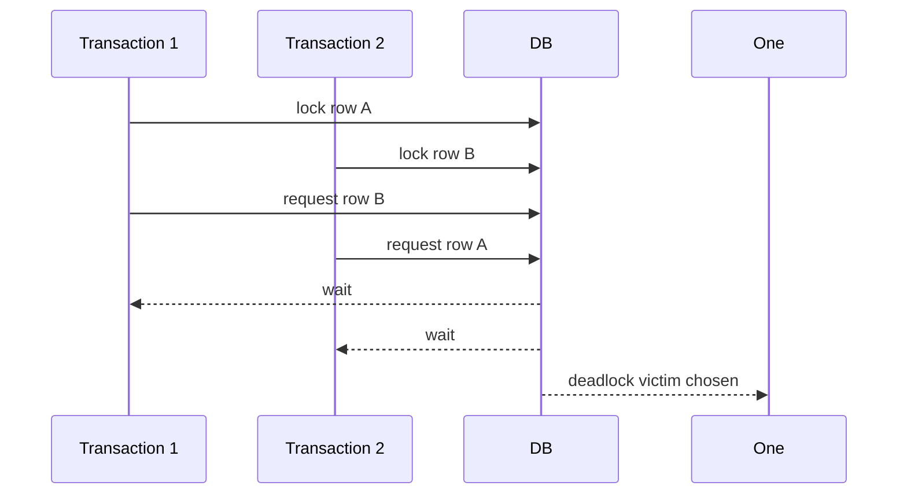
### Practical concurrency advice
- keep transactions short,
- touch rows in consistent order,
- index lookup columns to reduce lock duration,
- avoid long user think-time inside transactions,
- know your database's isolation defaults.
### 🔍 Plain-English deep-dive: isolation is about safe multitasking
- **Transaction** — *bundle of changes treated as one unit.* **Analogy:** transferring money between accounts — both steps must succeed together.
- **Isolation** — *one transaction should not see another halfway-done mess.* **Analogy:** editing a shared slide deck without seeing half-typed sentences from someone else.
- **Deadlock** — *two workers each hold something the other needs.* **Analogy:** two cars stuck nose-to-nose on a one-lane bridge.
> 💡 **Tie-in to your background:** In analytics roles you may not tune locking every day, but understanding ACID makes you sound mature and helps when discussing production data pipelines.
---
## 21. Indexing deep: B-tree intuition, clustered vs nonclustered, composite, covering, filtered, unique, and columnstore
Indexes are one of the highest-leverage performance topics in SQL.
### What an index is
An **index** is a data structure that helps the database find rows faster. The common mental model is a book index. You do not scan every page to find "escalation"; you jump to the right pages.
### B-tree intuition
Most ordinary indexes are based on **B-trees**. You do not need the math. You only need the intuition:
- values are organized in a searchable tree,
- the database can jump quickly to the relevant area,
- then read matching rows.
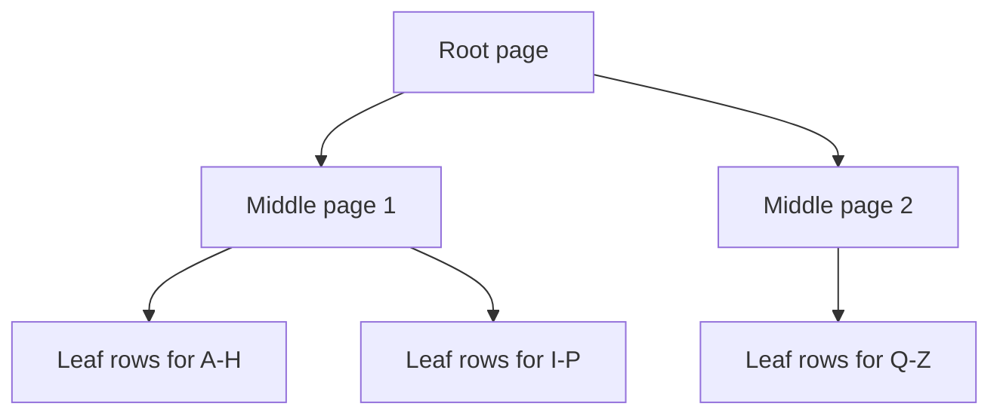
### Clustered vs nonclustered
| Type | Simple idea |
|---|---|
| clustered index | defines physical row order (SQL Server terminology) |
| nonclustered index | separate lookup structure pointing to rows |
PostgreSQL does not use the same clustered/nonclustered terminology the way SQL Server does, but the intuition is still useful across systems.
### Composite index
An index on multiple columns. Column order matters.
```sql
CREATE INDEX idx_cases_product_region_created ON cases (product_id, region_id, case_created_at);
```
A composite index is most helpful when filters start from the leftmost indexed columns.
### Covering index
A covering index includes enough columns for the query so the engine may not need to visit the base table for extra columns. In SQL Server this can involve `INCLUDE` columns.
```sql
-- SQL Server style
CREATE INDEX idx_cases_product_created ON dbo.cases (product_id, case_created_at) INCLUDE (status, resolution_hours, segment_id);
```
### Filtered / partial index
Index only rows matching a condition. Great when a small subset is queried often.
```sql
-- PostgreSQL partial index
CREATE INDEX idx_cases_open_only ON cases (product_id, case_created_at) WHERE status = 'Open';
```
### Unique index
Enforces uniqueness while also helping lookups.
```sql
CREATE UNIQUE INDEX idx_products_name_unique ON products (product_name);
```
### Columnstore index
Designed for analytical scanning of many rows and fewer columns. Especially relevant in SQL Server, Synapse, Fabric, and warehouse-style systems. Excellent for large analytic workloads, not usually for tiny OLTP lookups.
### When indexes help vs hurt
| Benefit | Cost |
|---|---|
| faster reads | slower writes |
| faster joins | more storage |
| faster filters | more maintenance |
| better sort support | extra update overhead |
### Good candidate columns for indexing
- frequent filter columns,
- join keys,
- columns used in `ORDER BY`,
- selective predicates,
- foreign keys in large tables.
### Poor candidates sometimes
- tiny tables,
- very low-selectivity columns (for some workloads),
- columns frequently updated with little query benefit,
- duplicate indexes created by habit rather than measurement.
### 🔍 Plain-English deep-dive: indexing is buying speed with extra structure
- **Index seek** — *jump directly to relevant rows.* **Analogy:** looking up page numbers in a book index.
- **Table scan** — *read everything.* **Analogy:** reading every page to find one sentence.
- **Selectivity** — *how narrowly a condition filters rows.* **Analogy:** searching for one employee ID vs searching for everyone in a company.
- **Covering index** — *index contains all data needed by query.* **Analogy:** the back-of-book index also includes the quote you wanted, so you never open the page.
> 💡 **Tie-in to your background:** Performance tuning is really about reducing wasted work. That mindset is identical to reducing unnecessary escalations or handoffs in support operations.
---
## 22. Performance tuning and execution plans deep: EXPLAIN, scans vs seeks, join algorithms, statistics, cardinality estimation, sargability, parameter sniffing, predicate pushdown, partition pruning, and a tuning checklist
This is the other explicit JD requirement. You do not need to be a database administrator. But you do need a structured way to reason about slow SQL.
### Start with the execution plan
Use `EXPLAIN` or `EXPLAIN ANALYZE`.
- `EXPLAIN` shows the planned steps.
- `EXPLAIN ANALYZE` shows actual execution with timing in databases that support it.
```sql
EXPLAIN ANALYZE SELECT p.product_name, COUNT(*) AS case_count FROM cases c JOIN products p ON c.product_id = p.product_id WHERE c.case_created_at >= '2026-01-01' AND c.case_created_at <  '2026-02-01' GROUP BY p.product_name;
```
### Scan vs seek
| Access path | Meaning | Usually good when |
|---|---|---|
| table/heap scan | read all rows | table is small or many rows needed |
| index seek / index scan | use index structure | filter is selective or sort/join benefits |
### Join algorithms
| Algorithm | Intuition | Usually good when |
|---|---|---|
| nested loop | for each row on one side, probe the other | one side is small and indexed |
| hash join | build hash table then probe it | large unsorted joins |
| merge join | walk two sorted streams together | both inputs sorted on join key |
### Statistics and cardinality estimation
The optimizer guesses row counts. Those guesses drive plan choices. If statistics are stale or skewed, bad plans can happen.
- **Statistics** summarize data distribution.
- **Cardinality estimation** is the optimizer's row-count prediction.
### Sargability
A predicate is **sargable** if it can use an index efficiently.
```sql
-- Not sargable in many engines
SELECT * FROM cases WHERE EXTRACT(YEAR FROM case_created_at) = 2026;
-- More sargable
SELECT * FROM cases WHERE case_created_at >= '2026-01-01' AND case_created_at <  '2027-01-01';
```
### Avoid SELECT *
Reading unnecessary columns increases I/O and can block covering-index opportunities.
### Predicate pushdown
Apply filters as early as possible so fewer rows flow into joins and aggregations. Some engines automatically do this, but writing clear filters still helps.
### Parameter sniffing
In some systems, especially SQL Server, a cached execution plan built for one parameter value may perform badly for another parameter value. That phenomenon is called **parameter sniffing**.
Example intuition:
- plan compiled for tiny product slice,
- later reused for huge product slice,
- now wrong access path chosen.
### Partitioning and partition pruning
Large tables may be partitioned by date or other keys. If your filter matches the partitioning logic, the engine can skip irrelevant partitions. That is **partition pruning**.
### Bad vs better examples
```sql
-- Bad: function on column, all columns, broad scan risk
SELECT * FROM cases WHERE DATE(case_created_at) = DATE '2026-01-12';
```
```sql
-- Better: range filter, fewer columns
SELECT case_id, product_id, region_id, resolution_hours FROM cases WHERE case_created_at >= '2026-01-12' AND case_created_at <  '2026-01-13';
```
### Pre-aggregate before big joins
```sql
WITH case_counts AS ( SELECT product_id, COUNT(*) AS case_count FROM cases WHERE case_created_at >= '2026-01-01' AND case_created_at <  '2026-02-01' GROUP BY product_id ) SELECT p.product_name, cc.case_count FROM case_counts cc JOIN products p ON cc.product_id = p.product_id;
```
### Tuning checklist you can say in an interview
1. Clarify the business requirement and target grain.
2. Check row counts and data volumes.
3. Read the execution plan.
4. Look for scans on large tables.
5. Ensure join and filter columns are indexed appropriately.
6. Make predicates sargable.
7. Remove `SELECT *`.
8. Reduce row counts early.
9. Pre-aggregate before joining large detail tables when possible.
10. Check data type mismatches on join keys.
11. Watch for unnecessary `DISTINCT` or `ORDER BY`.
12. Consider statistics freshness.
13. Consider partition pruning for large date-based tables.
14. Re-test and compare actual plan/timing.
### 🔍 Plain-English deep-dive: performance tuning is removing unnecessary work
- **Execution plan** — *the route the database chose.* **Analogy:** GPS directions.
- **Cardinality estimate** — *how many rows the optimizer thinks will flow through a step.* **Analogy:** guessing how many people will show up at a stadium gate.
- **Sargable predicate** — *a condition the index can search efficiently.* **Analogy:** telling the librarian the exact shelf code instead of asking for "books whose title contains e".
- **Parameter sniffing** — *cached plan tuned for one case but reused for a very different case.* **Analogy:** planning traffic control for a quiet street, then reusing it for a football final.
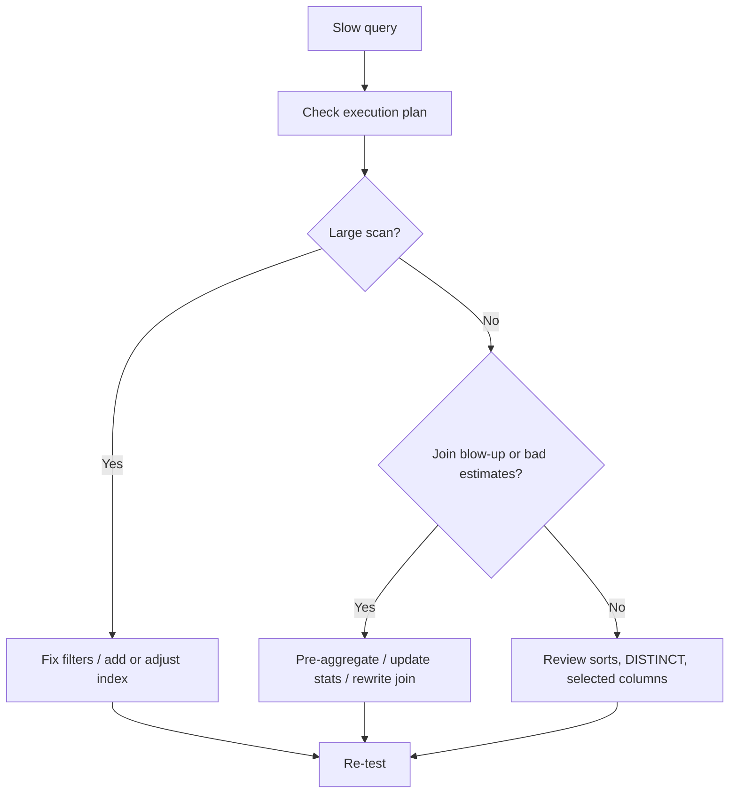
> 💡 **Tie-in to your background:** Tuning SQL is like tuning a support process: find where work explodes, remove unnecessary steps, and prove the before/after impact.
---
## 23. Classic SQL patterns with solutions: duplicates, top-N-per-group, running totals, moving averages, gaps-and-islands, sessionization, date spines, pivot reports, SCD as-of lookups, and cohort retention
These patterns are interview gold because they test whether you can apply building blocks to real business problems.
### 23.1 Finding duplicates
```sql
SELECT case_id, COUNT(*) AS duplicate_count FROM some_staging_cases GROUP BY case_id HAVING COUNT(*) > 1;
```
### 23.2 Removing duplicates with ROW_NUMBER
```sql
WITH ranked AS ( SELECT *, ROW_NUMBER() OVER ( PARTITION BY case_id ORDER BY imported_at DESC ) AS rn FROM some_staging_cases ) SELECT * FROM ranked WHERE rn = 1;
```
### 23.3 Top-N-per-group
```sql
WITH agent_product_csat AS ( SELECT p.product_name, c.agent_id, AVG(s.csat_score) AS avg_csat FROM cases c JOIN products p ON c.product_id = p.product_id LEFT JOIN surveys s ON c.case_id = s.case_id GROUP BY p.product_name, c.agent_id ), ranked AS ( SELECT *, ROW_NUMBER() OVER ( PARTITION BY product_name ORDER BY avg_csat DESC NULLS LAST ) AS rn FROM agent_product_csat ) SELECT * FROM ranked WHERE rn <= 3;
```
### 23.4 Running totals
```sql
WITH daily_cases AS ( SELECT DATE(case_created_at) AS day, COUNT(*) AS case_count FROM cases GROUP BY DATE(case_created_at) ) SELECT day, case_count, SUM(case_count) OVER (ORDER BY day) AS running_case_total FROM daily_cases;
```
### 23.5 Moving averages
```sql
WITH daily_csat AS ( SELECT DATE(submitted_at) AS day, AVG(csat_score) AS avg_csat FROM surveys GROUP BY DATE(submitted_at) ) SELECT day, avg_csat, AVG(avg_csat) OVER ( ORDER BY day ROWS BETWEEN 6 PRECEDING AND CURRENT ROW ) AS avg_csat_7day_ma FROM daily_csat;
```
### 23.6 Gaps and islands
This family of problems finds consecutive runs of dates or categories. Example: streaks of days with at least one high-severity case.
```sql
WITH high_days AS ( SELECT DISTINCT DATE(case_created_at) AS day FROM cases WHERE severity IN ('High','Critical') ), numbered AS ( SELECT day, ROW_NUMBER() OVER (ORDER BY day) AS rn FROM high_days ), grouped AS ( SELECT day, day - (rn * INTERVAL '1 day') AS grp FROM numbered ) SELECT MIN(day) AS streak_start, MAX(day) AS streak_end, COUNT(*) AS streak_length_days FROM grouped GROUP BY grp ORDER BY streak_start;
```
### 23.7 Sessionization
Sessionization groups nearby events into sessions when time gaps exceed a threshold. Support example: handoff bursts or customer contact sessions.
```sql
WITH ordered AS ( SELECT case_id, changed_at, LAG(changed_at) OVER (PARTITION BY case_id ORDER BY changed_at) AS prev_changed_at FROM case_status_history ), flagged AS ( SELECT *, CASE WHEN prev_changed_at IS NULL THEN 1 WHEN changed_at - prev_changed_at > INTERVAL '30 minutes' THEN 1 ELSE 0 END AS new_session_flag FROM ordered ), sessionized AS ( SELECT *, SUM(new_session_flag) OVER ( PARTITION BY case_id ORDER BY changed_at ROWS BETWEEN UNBOUNDED PRECEDING AND CURRENT ROW ) AS session_num FROM flagged ) SELECT * FROM sessionized ORDER BY case_id, changed_at;
```
### 23.8 Date spine generation
```sql
WITH RECURSIVE date_spine AS ( SELECT DATE '2026-01-01' AS d UNION ALL SELECT d + INTERVAL '1 day' FROM date_spine WHERE d < DATE '2026-01-31' ) SELECT d::date AS calendar_date FROM date_spine;
```
### 23.9 Filling missing dates with left join to date spine
```sql
WITH RECURSIVE date_spine AS ( SELECT DATE '2026-01-01' AS d UNION ALL SELECT d + INTERVAL '1 day' FROM date_spine WHERE d < DATE '2026-01-31' ), daily_cases AS ( SELECT DATE(case_created_at) AS day, COUNT(*) AS case_count FROM cases GROUP BY DATE(case_created_at) ) SELECT ds.d::date AS day, COALESCE(dc.case_count, 0) AS case_count FROM date_spine ds LEFT JOIN daily_cases dc ON ds.d::date = dc.day ORDER BY ds.d;
```
### 23.10 Pivot reports
```sql
SELECT DATE_TRUNC('month', case_created_at)::date AS month_start, SUM(CASE WHEN product_id = 1 THEN 1 ELSE 0 END) AS spo_cases, SUM(CASE WHEN product_id = 2 THEN 1 ELSE 0 END) AS odb_cases, SUM(CASE WHEN product_id = 3 THEN 1 ELSE 0 END) AS teams_cases FROM cases GROUP BY DATE_TRUNC('month', case_created_at)::date ORDER BY month_start;
```
### 23.11 SCD-style as-of lookup
Slowly changing dimension style logic asks: "What attribute was true at the time of the event?"
Suppose segment ownership changes over time.
```sql
SELECT c.case_id, c.case_created_at, d.segment_tier FROM cases c JOIN dim_customer_segment_history d ON c.customer_id = d.customer_id AND c.case_created_at >= d.effective_from AND c.case_created_at <  COALESCE(d.effective_to, '9999-12-31');
```
### 23.12 Cohort / retention query
Example: of customers who opened their first self-serve case in a month, how many also opened a case in later months?
```sql
WITH first_month AS ( SELECT customer_id, DATE_TRUNC('month', MIN(case_created_at))::date AS cohort_month FROM cases WHERE support_channel = 'SelfServe' GROUP BY customer_id ), activity AS ( SELECT customer_id, DATE_TRUNC('month', case_created_at)::date AS activity_month FROM cases GROUP BY customer_id, DATE_TRUNC('month', case_created_at)::date ) SELECT f.cohort_month, a.activity_month, COUNT(DISTINCT a.customer_id) AS active_customers FROM first_month f JOIN activity a ON f.customer_id = a.customer_id GROUP BY f.cohort_month, a.activity_month ORDER BY f.cohort_month, a.activity_month;
```
### Pattern summary table
| Pattern | Main tool |
|---|---|
| dedupe | `ROW_NUMBER()` |
| top-N per group | rank + filter |
| running totals | window aggregate |
| moving averages | framed window |
| gaps and islands | row_number + date arithmetic |
| sessionization | `LAG()` + cumulative sum |
| date spine | recursive CTE / generator |
| pivot report | conditional aggregation / PIVOT |
| as-of lookup | non-equi join on effective dates |
| cohort retention | cohort CTE + activity join |
### 🔍 Plain-English deep-dive: patterns are reusable recipes
Patterns matter because interviews rarely ask for a random feature. They ask for a business problem that maps to a known shape. If you can recognize the shape, you can solve it faster.
> 💡 **Tie-in to your background:** Top-N agents, trend streaks, handoff sessions, and cohort-style return behavior all map naturally to support operations questions.
---
## 24. Data-quality SQL: null checks, ranges, duplicates, orphan rows, reconciliation, and reasonableness tests
A strong analyst does not only produce numbers. A strong analyst checks whether the data deserves trust.
### Null checks
```sql
SELECT SUM(CASE WHEN case_created_at IS NULL THEN 1 ELSE 0 END) AS missing_created_at, SUM(CASE WHEN product_id IS NULL THEN 1 ELSE 0 END) AS missing_product_id, SUM(CASE WHEN severity IS NULL THEN 1 ELSE 0 END) AS missing_severity FROM cases;
```
### Range checks
```sql
SELECT case_id, resolution_hours FROM cases WHERE resolution_hours < 0 OR resolution_hours > 24 * 30;
```
### Valid-value checks
```sql
SELECT DISTINCT severity FROM cases WHERE severity NOT IN ('Low','Medium','High','Critical');
```
### Duplicate checks
```sql
SELECT case_id, COUNT(*) AS cnt FROM some_staging_cases GROUP BY case_id HAVING COUNT(*) > 1;
```
### Orphan row checks
```sql
SELECT s.survey_id, s.case_id FROM surveys s LEFT JOIN cases c ON s.case_id = c.case_id WHERE c.case_id IS NULL;
```
### Reconciliation checks
Example: staging vs final counts by date.
```sql
SELECT stage.summary_date, stage.case_count AS staging_count, final.case_count AS final_count, stage.case_count - final.case_count AS diff FROM staging_daily_counts stage FULL OUTER JOIN final_daily_counts final ON stage.summary_date = final.summary_date WHERE COALESCE(stage.case_count, 0) <> COALESCE(final.case_count, 0);
```
### Reasonableness tests
Ask:
- Are totals consistent with source systems?
- Are trend shifts explainable by releases, outages, or process changes?
- Did a metric suddenly go to zero because the business stopped or because ingestion broke?
### Data-quality scorecard pattern
```sql
SELECT 'missing_product_id' AS check_name, COUNT(*) AS bad_rows FROM cases WHERE product_id IS NULL UNION ALL SELECT 'negative_resolution_hours', COUNT(*) FROM cases WHERE resolution_hours < 0 UNION ALL SELECT 'orphan_surveys', COUNT(*) FROM surveys s LEFT JOIN cases c ON s.case_id = c.case_id WHERE c.case_id IS NULL;
```
### 🔍 Plain-English deep-dive: trustworthiness is part of analytics, not a separate hobby
- **Reconciliation** — *compare two supposedly equivalent totals or datasets.* **Analogy:** counting cash register total and comparing it with bank deposit total.
- **Orphan row** — *child row whose parent row is missing.* **Analogy:** a receipt referencing an order number that no longer exists.
- **Reasonableness test** — *common-sense validation even if schema rules pass.* **Analogy:** a thermometer that says 900°C is technically a number but obviously wrong for a room.
> 💡 **Tie-in to your background:** Support leaders trust analysts who catch data issues before the dashboard reaches the meeting, not after someone spots a weird number live.
---
## 25. Dialect differences: T-SQL vs PostgreSQL vs Spark SQL
Most SQL ideas transfer across systems. What changes is syntax and some behavior.
### Key syntax comparison table
| Topic | SQL Server / T-SQL | PostgreSQL | Spark SQL |
|---|---|---|---|
| limit rows | `TOP (10)` / `OFFSET ... FETCH` | `LIMIT 10` | `LIMIT 10` |
| identity | `IDENTITY(1,1)` | `GENERATED ... AS IDENTITY` / `SERIAL` | usually generated elsewhere |
| string concat | `+` or `CONCAT()` | `||` or `CONCAT()` | `CONCAT()` |
| case-insensitive like | collations / `LOWER()` trick | `ILIKE` | often `LOWER()` workaround |
| date add | `DATEADD()` | interval arithmetic | `date_add()` |
| date diff | `DATEDIFF()` | subtraction / `AGE()` / extract | `datediff()` |
| current timestamp | `GETDATE()` / `SYSDATETIME()` | `CURRENT_TIMESTAMP` | `current_timestamp()` |
| null replacement | `ISNULL()` | `COALESCE()` | `COALESCE()` |
| upsert | `MERGE` or patterns | `ON CONFLICT` | `MERGE INTO` on Delta/Iceberg style tables |
| JSON extract | `JSON_VALUE`, `OPENJSON` | `->`, `->>`, `jsonb_*` | `get_json_object`, `from_json` |
| temporary object | `#temp` table, table variable | `TEMP TABLE` | temp view / managed temp tables |
### Behavioral differences to remember
- `ILIKE` is PostgreSQL-specific convenience.
- SQL Server uses square brackets and many T-SQL-only functions.
- Spark SQL is built for distributed analytics, not classic OLTP.
- Null ordering in `ORDER BY` can differ.
- Materialized-view behavior differs by engine.
- Recursive CTE support and performance can vary.
### Practical interview answer
A good way to answer dialect questions is:
> "Core SQL concepts transfer across systems — joins, grouping, CTEs, windows, indexing intuition, and plan reading. The main differences are function names, date syntax, JSON syntax, row limiting, and physical-engine behavior. I am comfortable adapting across dialects by checking vendor docs for syntax details."
### 🔍 Plain-English deep-dive: dialect means accent, not a different language family
- **Dialect** — *database-specific flavor of SQL.* **Analogy:** English spoken in India, the UK, and the US uses different wording but the core language is still recognizable.
- **Portability** — *how easily SQL moves from one system to another.* **Analogy:** a plug adapter when traveling.
> 💡 **Tie-in to your background:** Your listed experience with both SQL and PostgreSQL is already a strength here. In interviews, present dialect differences as an adaptation problem, not a barrier.
---
## 26. 🧪 Hands-on Lab Demo 1 — Beginner foundations in SQLite Online
**Best for:** first-time practice with `SELECT`, `WHERE`, `GROUP BY`, `JOIN`, and `CASE`.
**Free tool:** [SQLite Online](https://sqliteonline.com/)
### Step 1 — Create small tables
```sql
CREATE TABLE products ( product_id INTEGER PRIMARY KEY, product_name TEXT );
CREATE TABLE cases ( case_id INTEGER PRIMARY KEY, product_id INTEGER, region TEXT, severity TEXT, created_at TEXT, resolution_hours REAL, status TEXT, reopen_count INTEGER );
INSERT INTO products VALUES (1,'SPO'),(2,'ODB'),(3,'Teams');
INSERT INTO cases VALUES (1,1,'EMEA','High','2026-01-02',5.2,'Resolved',0), (2,2,'APAC','Medium','2026-01-03',40.0,'Resolved',1), (3,1,'EMEA','Critical','2026-01-09',2.7,'Resolved',0), (4,3,'AMER','High','2026-01-10',NULL,'Open',0), (5,1,'APAC','Low','2026-01-11',2.0,'Closed',0);
```
### Step 2 — Try these tasks
1. Show all open cases.
2. Count cases by product.
3. Create a CASE bucket for SLA status.
4. Join product names onto cases.
5. Count reopened cases by region.
### Example answer
```sql
SELECT p.product_name, COUNT(*) AS total_cases, SUM(CASE WHEN c.reopen_count > 0 THEN 1 ELSE 0 END) AS reopened_cases FROM cases c JOIN products p ON c.product_id = p.product_id GROUP BY p.product_name;
```
### Success check
If you can explain why `SUM(CASE...)` works and why open case `resolution_hours` is null, you are learning the right way.
---
## 27. 🧪 Hands-on Lab Demo 2 — Intermediate PostgreSQL joins, CTEs, and windows
**Best for:** `db-fiddle` PostgreSQL.
**Free tool:** [DB Fiddle](https://www.db-fiddle.com/)
### Step 1 — Use the DDL and seed data from Section 1
Paste the schema and sample inserts from the top of this guide.
### Step 2 — Build a product summary CTE
```sql
WITH product_summary AS ( SELECT p.product_name, COUNT(*) AS total_cases, AVG(c.resolution_hours) AS avg_resolution_hours, AVG(s.csat_score) AS avg_csat FROM cases c JOIN products p ON c.product_id = p.product_id LEFT JOIN surveys s ON c.case_id = s.case_id GROUP BY p.product_name ) SELECT *, CASE WHEN avg_csat < 4 THEN 'At risk' ELSE 'Healthy' END AS health_flag FROM product_summary;
```
### Step 3 — Rank agents within each product by average CSAT
```sql
WITH agent_product_csat AS ( SELECT p.product_name, c.agent_id, AVG(s.csat_score) AS avg_csat FROM cases c JOIN products p ON c.product_id = p.product_id LEFT JOIN surveys s ON c.case_id = s.case_id GROUP BY p.product_name, c.agent_id ) SELECT *, DENSE_RANK() OVER (PARTITION BY product_name ORDER BY avg_csat DESC NULLS LAST) AS dense_rnk FROM agent_product_csat;
```
### Step 4 — Explain the result aloud
Say:
- what grain the CTE output has,
- why a window function was needed,
- why `DENSE_RANK` differs from `ROW_NUMBER`.
---
## 28. 🧪 Hands-on Lab Demo 3 — Performance tuning demo with EXPLAIN
**Best for:** db-fiddle PostgreSQL.
### Step 1 — Run an unindexed filter query
```sql
EXPLAIN ANALYZE SELECT case_id, product_id, case_created_at FROM cases WHERE case_created_at >= '2026-01-01' AND case_created_at <  '2026-02-01' AND product_id = 1;
```
### Step 2 — Add an index
```sql
CREATE INDEX idx_cases_product_created_at ON cases (product_id, case_created_at);
```
### Step 3 — Re-run EXPLAIN ANALYZE
Compare:
- did the plan change,
- did runtime change,
- did row estimates look accurate,
- did scan type change.
### Step 4 — Make it non-sargable and see the cost
```sql
EXPLAIN ANALYZE SELECT case_id, product_id, case_created_at FROM cases WHERE EXTRACT(MONTH FROM case_created_at) = 1 AND product_id = 1;
```
### Success check
You should be able to explain the word **sargable** in one sentence.
---
## 29. 🧪 Hands-on Lab Demo 4 — Date spine + missing days + moving average
**Best for:** learning reporting-friendly time series.
```sql
WITH RECURSIVE date_spine AS ( SELECT DATE '2026-01-01' AS d UNION ALL SELECT d + INTERVAL '1 day' FROM date_spine WHERE d < DATE '2026-01-15' ), daily_cases AS ( SELECT DATE(case_created_at) AS day, COUNT(*) AS case_count FROM cases GROUP BY DATE(case_created_at) ), filled AS ( SELECT ds.d::date AS day, COALESCE(dc.case_count, 0) AS case_count FROM date_spine ds LEFT JOIN daily_cases dc ON ds.d::date = dc.day ) SELECT day, case_count, AVG(case_count) OVER ( ORDER BY day ROWS BETWEEN 2 PRECEDING AND CURRENT ROW ) AS case_count_3day_ma FROM filled ORDER BY day;
```
### What this teaches
- recursive CTE,
- left join to fill missing dates,
- `COALESCE` to replace null with zero,
- moving average frame.
---
## 📚 Reference Links
- [PostgreSQL Tutorial — Window Functions](https://www.postgresql.org/docs/current/tutorial-window.html)
- [PostgreSQL Documentation — WITH Queries / CTEs](https://www.postgresql.org/docs/current/queries-with.html)
- [Microsoft Learn — Write advanced Transact-SQL queries](https://learn.microsoft.com/training/paths/write-advanced-transact-sql-queries/)
- [Microsoft Learn — Query relational data in Azure SQL](https://learn.microsoft.com/training/modules/query-relational-data/)
- [Use The Index, Luke](https://use-the-index-luke.com/)
- [Mode SQL Tutorial](https://mode.com/sql-tutorial/)
- [SQLBolt](https://sqlbolt.com/)
- [DB Fiddle](https://www.db-fiddle.com/)
- [SQLite Online](https://sqliteonline.com/)
- [PostgreSQL Documentation — JSON Functions and Operators](https://www.postgresql.org/docs/current/functions-json.html)
- [SQL Server Documentation — Query plans](https://learn.microsoft.com/sql/relational-databases/performance/display-an-actual-execution-plan)
- [Apache Spark SQL Guide](https://spark.apache.org/sql/)
---
## ⭐ Likely Interview Questions for This Section
**Q1. "What is SQL and why do we call it declarative?"**
> *Model answer:* SQL is the standard language for working with relational data. It is called declarative because I specify the result I want — for example, all high-severity SPO cases in January — and the database optimizer decides how to retrieve those rows.
**Q2. "What is the difference between DDL, DML, DQL, DCL, and TCL?"**
> *Model answer:* DDL defines structures like tables and views, DML changes stored data with insert/update/delete or merge logic, DQL reads data with SELECT, DCL manages permissions, and TCL controls transactions with begin/commit/rollback.
**Q3. "Explain the logical order of execution of a SELECT query."**
> *Model answer:* Logically SQL processes FROM/JOIN first, then WHERE, then GROUP BY, then HAVING, then SELECT, then ORDER BY, and finally row limiting like LIMIT or TOP. That explains why aliases may work in ORDER BY but not WHERE, and why HAVING is needed for aggregate filters.
**Q4. "How do NULLs behave in SQL?"**
> *Model answer:* NULL means unknown or missing, not zero. Comparisons with NULL evaluate to unknown, so I use IS NULL or IS NOT NULL instead of equals. Aggregates usually ignore null values, which is why COUNT(column) and COUNT(*) can differ.
**Q5. "What is the difference between WHERE and HAVING?"**
> *Model answer:* WHERE filters rows before grouping, while HAVING filters grouped results after aggregation. If I want only products with average CSAT below 4, that condition belongs in HAVING.
**Q6. "When would you use EXISTS instead of IN?"**
> *Model answer:* EXISTS is great for existence checks and often safer than IN when nulls are involved, especially for anti-joins with NOT EXISTS. I use EXISTS when I only care whether at least one related row exists, not which values it returns.
**Q7. "Explain INNER JOIN vs LEFT JOIN with a support example."**
> *Model answer:* INNER JOIN returns only matches, such as cases that still have a valid agent record. LEFT JOIN keeps all cases even if agent metadata is missing, which is useful when checking for orphaned ownership or inactive-agent situations.
**Q8. "What is a fan-out problem in joins?"**
> *Model answer:* Fan-out happens when one source row matches many rows on the other side and silently multiplies. For example, joining one case row to multiple status-history rows inflates counts unless I aggregate history first or count distinct cases intentionally.
**Q9. "What is a CTE and why use one?"**
> *Model answer:* A CTE is a named temporary result defined with WITH inside a single query. I use it to break complex logic into readable steps, such as enrich → aggregate → rank → final filter, and recursive CTEs also handle hierarchies or date spines.
**Q10. "What is the difference between GROUP BY and a window function?"**
> *Model answer:* GROUP BY collapses rows into one row per group, while window functions calculate across related rows without collapsing them. I use window functions when I need detail rows plus rank, running totals, or prior-period comparisons.
**Q11. "Walk me through ROW_NUMBER, RANK, and DENSE_RANK."**
> *Model answer:* ROW_NUMBER always gives unique sequence numbers, RANK gives ties the same rank but leaves gaps, and DENSE_RANK gives ties the same rank without gaps. I use ROW_NUMBER for deduping and DENSE_RANK or RANK for leaderboards depending on business meaning.
**Q12. "What does LAG do and when would you use it?"**
> *Model answer:* LAG pulls a value from a previous row in the ordered window. I use it for week-over-week or month-over-month change analysis, like comparing this week's case volume with the previous week for each product.
**Q13. "What does the frame clause do in window functions?"**
> *Model answer:* The frame clause defines which nearby rows belong to the calculation, such as current row plus two previous rows. It is essential for moving averages and for functions like LAST_VALUE where defaults can otherwise be misleading.
**Q14. "What makes a predicate sargable?"**
> *Model answer:* A predicate is sargable when the database can use an index efficiently to search on it. A direct range on `case_created_at` is usually sargable, whereas wrapping that column in a function like YEAR or DATE can prevent efficient index usage.
**Q15. "How do you approach SQL performance tuning?"**
> *Model answer:* I start by confirming the required grain and reviewing the execution plan. Then I look for large scans, non-sargable filters, unnecessary selected columns, poor join order, missing or misused indexes, and row explosion before retesting and comparing actual timing.
**Q16. "What is parameter sniffing?"**
> *Model answer:* Parameter sniffing is when a cached plan generated for one parameter value is reused for very different parameter values, which can produce poor performance. It is especially associated with SQL Server and reminds me to think about plan reuse, skew, and execution-plan stability.
**Q17. "When do indexes help and when can they hurt?"**
> *Model answer:* Indexes help frequent filters, joins, and sort paths, especially on selective columns. They hurt by adding storage and slowing inserts, updates, and deletes, so I add them where measured query benefit outweighs write overhead.
**Q18. "What is the difference between a view and a materialized view?"**
> *Model answer:* A regular view stores only the query definition and runs it at read time, while a materialized view stores the result physically and needs refresh logic. So views are great for shared business logic, and materialized views are useful for repeated heavy reads.
**Q19. "Coding challenge: find the latest row per case_id from a staging table that may contain duplicates."**
> *Model answer:* I would use `ROW_NUMBER()` partitioned by `case_id` and ordered by the newest timestamp descending, then keep `rn = 1`.
>
> *Solution:*
> ```sql
> WITH ranked AS (
>     SELECT *,
>            ROW_NUMBER() OVER (
>                PARTITION BY case_id
>                ORDER BY imported_at DESC
>            ) AS rn
>     FROM staging_cases
> )
> SELECT *
> FROM ranked
> WHERE rn = 1;
> ```
**Q20. "Coding challenge: return the top 2 agents by average CSAT within each product."**
> *Model answer:* First aggregate to one row per product-agent combination, then use a ranking window partitioned by product and filter to the top two rows.
>
> *Solution:*
> ```sql
> WITH agent_product_csat AS (
>     SELECT p.product_name,
>            c.agent_id,
>            AVG(s.csat_score) AS avg_csat
>     FROM cases c
>     JOIN products p ON c.product_id = p.product_id
>     LEFT JOIN surveys s ON c.case_id = s.case_id
>     GROUP BY p.product_name, c.agent_id
> ),
> ranked AS (
>     SELECT *,
>            ROW_NUMBER() OVER (
>                PARTITION BY product_name
>                ORDER BY avg_csat DESC NULLS LAST
>            ) AS rn
>     FROM agent_product_csat
> )
> SELECT *
> FROM ranked
> WHERE rn <= 2;
> ```
**Q21. "Coding challenge: compute a 7-day moving average of daily case counts."**
> *Model answer:* I would first aggregate to one row per day, then use a windowed AVG with `ROWS BETWEEN 6 PRECEDING AND CURRENT ROW`.
>
> *Solution:*
> ```sql
> WITH daily_cases AS (
>     SELECT DATE(case_created_at) AS day,
>            COUNT(*) AS case_count
>     FROM cases
>     GROUP BY DATE(case_created_at)
> )
> SELECT day,
>        case_count,
>        AVG(case_count) OVER (
>            ORDER BY day
>            ROWS BETWEEN 6 PRECEDING AND CURRENT ROW
>        ) AS case_count_7day_ma
> FROM daily_cases;
> ```
**Q22. "Coding challenge: find products whose average CSAT is below the overall average CSAT."**
> *Model answer:* I would aggregate by product and compare each product average to a scalar subquery returning the overall average.
>
> *Solution:*
> ```sql
> SELECT p.product_name,
>        AVG(s.csat_score) AS product_avg_csat
> FROM cases c
> JOIN products p ON c.product_id = p.product_id
> JOIN surveys s ON c.case_id = s.case_id
> GROUP BY p.product_name
> HAVING AVG(s.csat_score) < (
>     SELECT AVG(csat_score)
>     FROM surveys
> );
> ```
**Q23. "Coding challenge: identify cases that have no survey response."**
> *Model answer:* I prefer an anti-join with NOT EXISTS because it is clear and null-safe.
>
> *Solution:*
> ```sql
> SELECT c.case_id
> FROM cases c
> WHERE NOT EXISTS (
>     SELECT 1
>     FROM surveys s
>     WHERE s.case_id = c.case_id
> );
> ```
**Q24. "Coding challenge: generate a complete list of dates in January and show zero for missing case days."**
> *Model answer:* I would generate a date spine with a recursive CTE, aggregate daily cases, then left join and coalesce missing counts to zero.
>
> *Solution:*
> ```sql
> WITH RECURSIVE date_spine AS (
>     SELECT DATE '2026-01-01' AS d
>     UNION ALL
>     SELECT d + INTERVAL '1 day'
>     FROM date_spine
>     WHERE d < DATE '2026-01-31'
> ),
> daily_cases AS (
>     SELECT DATE(case_created_at) AS day,
>            COUNT(*) AS case_count
>     FROM cases
>     GROUP BY DATE(case_created_at)
> )
> SELECT ds.d::date AS day,
>        COALESCE(dc.case_count, 0) AS case_count
> FROM date_spine ds
> LEFT JOIN daily_cases dc ON ds.d::date = dc.day
> ORDER BY ds.d;
> ```
**Q25. "Coding challenge: for each product, compare each week's case count with the previous week and flag increases."**
> *Model answer:* I would aggregate to weekly counts, use LAG by product, and compare current count to prior week.
>
> *Solution:*
> ```sql
> WITH weekly_cases AS (
>     SELECT DATE_TRUNC('week', case_created_at)::date AS week_start,
>            product_id,
>            COUNT(*) AS weekly_case_count
>     FROM cases
>     GROUP BY DATE_TRUNC('week', case_created_at)::date, product_id
> )
> SELECT week_start,
>        product_id,
>        weekly_case_count,
>        LAG(weekly_case_count) OVER (
>            PARTITION BY product_id
>            ORDER BY week_start
>        ) AS prior_week_case_count,
>        CASE
>            WHEN weekly_case_count > LAG(weekly_case_count) OVER (
>                 PARTITION BY product_id
>                 ORDER BY week_start
>            ) THEN 'Increase'
>            ELSE 'Flat or down'
>        END AS wow_flag
> FROM weekly_cases;
> ```
---
## 🧠 30-Second Memory Hooks
- **SQL is declarative** = ask for the result, let the engine choose the route.
- **RDBMS** = organized table system with keys and rules.
- **DDL builds, DML changes, DQL reads, DCL secures, TCL controls transactions.**
- **Grain first, query second.** If you forget grain, counts go wrong.
- **Logical order:** FROM → WHERE → GROUP BY → HAVING → SELECT → ORDER BY → LIMIT.
- **WHERE filters rows; HAVING filters groups.**
- **NULL is unknown, not zero.** Use `IS NULL`, not `= NULL`.
- **COALESCE = first non-null fallback.**
- **GROUP BY blends rows; window functions keep rows.**
- **ROW_NUMBER unique; RANK gaps; DENSE_RANK no gaps.**
- **LAG looks back; LEAD looks forward.**
- **Frames define the moving window.**
- **Conditional aggregation = KPI factory.**
- **EXISTS / NOT EXISTS** = semi-join / anti-join superpower.
- **CTE = named step in one query.**
- **Recursive CTE = hierarchy or date spine.**
- **Sargable = index-friendly filter.**
- **Index = speed for reads, cost for writes.**
- **Execution plan = database route map.**
- **Predicate pushdown = filter early, move less data.**
- **Fan-out = one row becomes many after a join.**
- **Date spine + left join + coalesce** = fill missing time periods.
- **Data quality is part of analytics, not extra credit.**
- **Dialect differences are mostly accent, not a different language.**
---
*Next suggested section:* **Part 4 — Python & PySpark for Data** (because once SQL handles structured, set-based analysis, Python and PySpark extend you into automation, advanced transformations, and larger-scale data processing).
