# Part 4 — Python & PySpark for Data

> Section goal: Learn when to reach beyond SQL — using Python (with pandas) for flexible analysis and **PySpark** for big-data transformations on Databricks/Fabric. The JD names "Python/PySpark for data transformations."

Covers index item **4**. Maps to JD: "Perform analysis... using Python, Azure Databricks," "Python/PySpark for data transformations."

---

## How to read this Part (your learning roadmap)

This is the longest Part in the guide, because Python + pandas + PySpark is the engine room of modern data work. Don't try to swallow it in one sitting. It is deliberately layered:

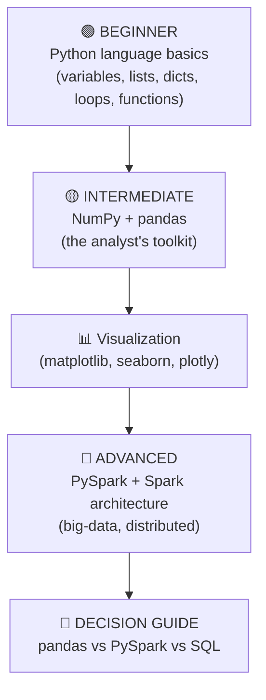

| Level | Sections | What you can do after it |
|---|---|---|
| 🟢 Beginner | 1–2 (Python core) | Read & write basic Python scripts; understand any snippet in an interview |
| 🟡 Intermediate | 3–4 (NumPy, pandas) | Clean, join, group, reshape real support data; replace most Excel work |
| 📊 Viz | 5 | Turn a DataFrame into a chart and choose the right chart |
| 🔴 Advanced | 6–8 (Spark, Delta, tuning) | Explain Spark architecture, write distributed transformations, tune jobs |
| 🧭 Decide | 9 | Pick the right tool and justify it in an interview |

> 💡 **Tie-in to your background:** Arti — you already do "Data Analytics using Python and R," ship Power BI reports, and write SQL daily as a CE&S Support Escalation Engineer. That means the *concepts* (filtering, grouping, joining) are not new — you have done them in SQL and Power Query. This Part just teaches you to say the same thing in Python and PySpark, the two words the JD calls out explicitly. Every example below uses **support data you know cold**: cases, CSAT scores, escalations, SLA breaches, agents, products (SPO/ODB).

---

## 0. Why Python when you already have SQL?

SQL is perfect for *querying* structured tables. Python is a full **programming language** — you reach for it when you need logic SQL can't easily do: looping, complex text processing, calling APIs, machine learning, reusable scripts, and automation.

**Analogy:** SQL is a superb calculator for tables. Python is the whole workshop — calculator included, plus power tools (ML), a label printer (charts), and a conveyor belt (automation).

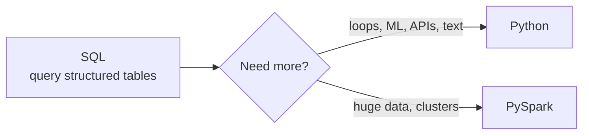

### 🔍 Plain-English deep-dive: what is "Python" anyway?

- **Python** — *a general-purpose programming language* designed to be readable, like structured English. **Analogy:** if SQL is a single specialised power tool (a table saw), Python is the whole toolbox you can build anything with. **Memory hook:** "Python reads like a recipe."
- **Interpreter** — *the program that runs your Python line by line.* You don't compile it into a separate app first; you type and it runs. **Analogy:** a live translator at a meeting, translating sentence by sentence, versus a translated book printed in advance.
- **Notebook** — *an interactive document* (Jupyter, Colab, Databricks, Fabric) where you write code in "cells", run them one at a time, and see results and charts inline. **Analogy:** a lab notebook where each experiment (cell) is recorded next to its result. This is where 90% of analyst Python lives.
- **Script** — *a plain `.py` file* you run start-to-finish, usually for automation (refresh a dataset every morning).

| You want to… | Best tool | Why |
|---|---|---|
| Aggregate a structured table fast | SQL | Declarative, the database does the work |
| Loop, branch, parse messy text, call an API | Python | A real programming language |
| Build a chart / dashboard from code | Python (matplotlib/seaborn) or Power BI | Flexible visuals |
| Train / score a machine-learning model | Python | scikit-learn, the ML ecosystem |
| Transform data too big for one machine | PySpark | Distributed across a cluster |

> 💡 **Tie-in to your background:** Your CV already lists "Data Analytics using Python and R." This Part formalises it and adds PySpark — the one new word the JD wants. Your DP-900 and AI-900 certs already gave you the vocabulary (data lakes, distributed processing); now you'll wire it to hands-on code.

---

# 🟢 BEGINNER — Python language fundamentals

## 1. Python essentials for analysts

You don't need to be a software engineer. You need fluency in a handful of building blocks. We'll cover every one from zero, using support data.

### 1.1 Variables & types

A **variable** is *a named box holding a value*. **Analogy:** a labelled jar on a shelf — the label is the name, the contents are the value.

```python
csat_target = 4.8        # a number with decimals -> float
open_cases  = 132        # a whole number       -> int
product     = "SPO"      # text                 -> str
is_breached = True       # yes/no               -> bool
nothing_yet = None       # "no value"           -> NoneType
```

### 🔍 Plain-English deep-dive: the basic data types

A **data type** is *the kind of value a box holds* — the rules for what you can do with it. You can't multiply two words, but you can multiply two numbers.

| Type | Plain meaning | Example | Analogy |
|---|---|---|---|
| `int` | whole number | `132` | counting cases |
| `float` | number with decimals | `4.75` | a CSAT average |
| `str` | text ("string" of characters) | `"escalation"` | a label on a folder |
| `bool` | True / False | `True` | a light switch |
| `None` | the absence of a value | `None` | an empty jar |

- **Dynamic typing** — *you never declare the type; Python figures it out from the value.* **Analogy:** you don't tell the jar what's inside; it just holds whatever you pour in. **Memory hook:** "Python guesses the type so you don't have to."
- **`type()` and `isinstance()`** — ask Python what something is: `type(csat_target)` → `<class 'float'>`; `isinstance(open_cases, int)` → `True`.
- **Casting** — *converting one type to another:* `int("5")` → `5`, `str(132)` → `"132"`, `float("4.8")` → `4.8`. Casting bad text (`int("abc")`) raises an error — important for cleaning messy support exports.

```python
# Casting is everywhere in data cleaning
raw = "24"                  # a number that arrived as text (common in CSV)
hours = int(raw)            # -> 24 as an int, now you can compare it
print(hours > 8)            # True
```

### 1.2 Strings & f-strings

A **string** is *text*. You'll parse case titles, product names, error messages, log lines.

```python
title = "  SPO sharing link broken  "
print(title.strip())            # "SPO sharing link broken"  (remove edge spaces)
print(title.lower())            # lowercase
print(title.upper())            # UPPERCASE
print(title.strip().split())    # ['SPO','sharing','link','broken']  -> list of words
print("link" in title)          # True  (substring test, like SQL LIKE '%link%')
print(title.replace("broken","fixed"))
print("SPO-12345".split("-"))   # ['SPO','12345']
```

An **f-string** (formatted string) is *a string with `{ }` placeholders that Python fills in*. **Analogy:** a mail-merge template — "Dear {name}" becomes "Dear Arti". The `f` before the quote turns the magic on.

```python
product, score, cases = "SPO", 4.73, 1240
print(f"{product}: avg CSAT {score:.1f} across {cases:,} cases")
# SPO: avg CSAT 4.7 across 1,240 cases
```

| Format mini-language | Meaning | Example output |
|---|---|---|
| `{score:.1f}` | 1 decimal place | `4.7` |
| `{score:.2%}` | as a percentage | `473.00%` |
| `{cases:,}` | thousands separator | `1,240` |
| `{product:>10}` | right-align in 10 cols | `       SPO` |

> 💡 **Tie-in to your background:** This is the same idea as a Power BI/DAX measure label or an Excel `TEXT()` format string — you already format numbers for stakeholders; f-strings are the Python version.

### 1.3 Lists, tuples, sets, dicts — the four core collections

A **collection** is *a container holding many values*. Python's four workhorses each have a personality:

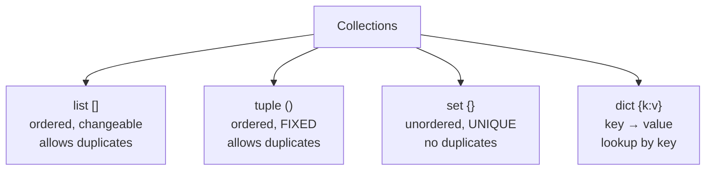

| Collection | Syntax | Ordered? | Changeable? | Duplicates? | Analogy | Use it for |
|---|---|---|---|---|---|---|
| **list** | `["SPO","ODB"]` | ✅ | ✅ | ✅ | a numbered shopping list | a sequence you'll edit |
| **tuple** | `("SPO", 4.7)` | ✅ | ❌ | ✅ | a sealed pair on a label | fixed records / coordinates |
| **set** | `{"SPO","ODB"}` | ❌ | ✅ | ❌ | a bag of unique stickers | de-duplicating, membership tests |
| **dict** | `{"SPO": 4.7}` | ✅* | ✅ | keys unique | a contacts app (name→number) | lookups by a key |

*(\*dicts keep insertion order since Python 3.7.)*

```python
# LIST — ordered, editable
products = ["SPO", "ODB", "Teams"]
products.append("Exchange")     # add to end
products.insert(0, "OneNote")   # add at position 0
products.remove("Teams")        # delete by value
print(len(products))            # how many
print(products[0], products[-1])# first, last

# TUPLE — fixed; great for returning multiple values
case = ("SPO-12345", "SPO", 4)  # (id, product, csat) — won't change
cid, prod, csat = case          # "unpacking" into three variables

# SET — unique membership, fast "is it in here?"
escalated_ids = {"SPO-1", "ODB-2", "SPO-1"}  # duplicate collapses
print(escalated_ids)            # {'SPO-1', 'ODB-2'}  -> 2 items
print("SPO-1" in escalated_ids) # True (very fast even on millions)
a = {"SPO","ODB"}; b = {"ODB","Teams"}
print(a & b)                    # intersection -> {'ODB'}
print(a | b)                    # union        -> {'SPO','ODB','Teams'}
print(a - b)                    # difference   -> {'SPO'}

# DICT — the most important collection for analysts
csat = {"SPO": 4.7, "ODB": 4.2, "Teams": 4.9}
print(csat["SPO"])              # 4.7
csat["Exchange"] = 4.5          # add/update
print(csat.get("Skype", 0))     # 0  (safe lookup, no crash if missing)
for product, score in csat.items():
    print(product, score)       # iterate key+value pairs
print(list(csat.keys()))        # ['SPO','ODB','Teams','Exchange']
print(list(csat.values()))      # [4.7, 4.2, 4.9, 4.5]
```

### 🔍 Plain-English deep-dive: when to use a set

If you ever ask "is X in this big collection?" thousands of times, use a **set** or **dict**, not a list. A list checks every item one by one (slow); a set jumps straight to the answer using a **hash** (a fingerprint of the value). **Analogy:** finding a name in an unsorted pile of business cards (list) vs. a Rolodex tabbed A–Z (set). **Memory hook:** "Need uniqueness or fast lookup? Reach for a set/dict."

### 1.4 Indexing & slicing

**Indexing** = *grab one item by its position*. **Slicing** = *grab a sub-range*. Python counts from **0**, and negative numbers count from the end.

```python
ids = ["c0","c1","c2","c3","c4","c5"]
#       0    1    2    3    4    5
#      -6   -5   -4   -3   -2   -1
print(ids[0])      # 'c0'  first
print(ids[-1])     # 'c5'  last
print(ids[1:4])    # ['c1','c2','c3']  -> start:stop  (stop is EXCLUDED)
print(ids[:3])     # ['c0','c1','c2']  -> from start
print(ids[3:])     # ['c3','c4','c5']  -> to end
print(ids[::2])    # ['c0','c2','c4']  -> every 2nd (step)
print(ids[::-1])   # reversed
print("SPO-12345"[4:])  # '12345'  -> slicing works on strings too
```

> **Mind the "stop is excluded" rule:** `ids[1:4]` gives positions 1,2,3 — *not* 4. **Memory hook:** "Python slices are half-open: include start, exclude stop."

### 1.5 Conditionals & loops

A **conditional** makes a decision; a **loop** repeats work.

```python
# Conditional — if / elif / else
def health(score):
    if score >= 4.8:
        return "Great"
    elif score >= 4.5:
        return "OK"
    else:
        return "At risk"

# FOR loop — do something for each item ("stamp each envelope")
products = ["SPO", "ODB", "Teams"]
csat = {"SPO": 4.7, "ODB": 4.2, "Teams": 4.9}
for p in products:
    print(p, csat[p], health(csat[p]))
# SPO 4.7 OK | ODB 4.2 At risk | Teams 4.9 Great

# enumerate — get position AND value
for i, p in enumerate(products, start=1):
    print(i, p)            # 1 SPO | 2 ODB | 3 Teams

# zip — walk two lists together
hours   = [4, 40, 2]
for p, h in zip(products, hours):
    print(p, "breached" if h > 24 else "ok")

# WHILE loop — repeat until a condition changes
retries, max_retries = 0, 3
while retries < max_retries:
    retries += 1            # += means "add and store back"

# range — generate numbers
for n in range(3):         # 0,1,2
    pass
```

### 🔍 Plain-English deep-dive: truthiness

Python lets you put almost anything in an `if`. Empty things are **falsy**; non-empty things are **truthy**. **Analogy:** an empty box reads "no", a box with anything in it reads "yes".

| Falsy (treated as False) | Truthy (treated as True) |
|---|---|
| `False`, `None` | `True` |
| `0`, `0.0` | any non-zero number |
| `""` (empty string) | any non-empty string |
| `[]`, `{}`, `set()`, `()` (empty collections) | any non-empty collection |

```python
cases = []
if not cases:                      # cleaner than len(cases) == 0
    print("No cases to process")

name = ""
display = name or "Unknown"        # 'or' returns first truthy -> "Unknown"
```

### 1.6 Functions

A **function** is *a reusable block of logic with a name*. **Analogy:** a recipe — define it once, run it anytime with different ingredients (arguments).

```python
def breach_flag(hours, sla=24):       # 'sla=24' is a DEFAULT argument
    """Return True if a case breached its SLA."""  # docstring = built-in help
    return hours > sla

print(breach_flag(40))                # True   (uses default sla=24)
print(breach_flag(10, sla=8))         # True   (KEYWORD argument, explicit)
print(breach_flag(hours=6, sla=8))    # False
```

- **Parameter vs argument** — the *parameter* is the name in the definition (`hours`); the *argument* is the actual value you pass (`40`).
- **Default argument** — a fallback used when the caller doesn't supply one (`sla=24`).
- **Keyword argument** — naming the argument at call time (`sla=8`) for clarity.
- **Return value** — what the function hands back. No `return` → it returns `None`.

#### `*args` and `**kwargs` — flexible argument lists

Sometimes you don't know how many arguments will come. `*args` collects extra **positional** arguments into a tuple; `**kwargs` collects extra **keyword** arguments into a dict. **Analogy:** `*args` is "and any number of unlabeled boxes"; `**kwargs` is "and any number of labelled boxes".

```python
def summarise(label, *scores, **tags):
    print(label, "avg =", sum(scores)/len(scores))
    print("tags:", tags)

summarise("SPO", 4.7, 4.2, 4.9, region="EMEA", tier="Premier")
# SPO avg = 4.6
# tags: {'region': 'EMEA', 'tier': 'Premier'}
```

#### Scope — local vs global

A variable created **inside** a function is *local* — it vanishes when the function ends. **Analogy:** scratch paper you throw away after the calculation. Variables outside are *global*. Prefer passing values in and returning values out rather than relying on globals.

### 1.7 Lambda, map, filter, reduce

A **lambda** is *a tiny one-line unnamed function*. **Analogy:** a sticky note with a quick formula vs. a full printed recipe (a `def`). Use it for short throwaway logic.

```python
breach = lambda h: h > 24          # same as a def with one return
print(breach(40))                  # True
```

- **`map(func, items)`** — *apply a function to every item.* **Analogy:** run each item past the same machine.
- **`filter(func, items)`** — *keep only items where the function is True.* **Analogy:** a sieve.
- **`reduce(func, items)`** — *boil a list down to one value* (from `functools`). **Analogy:** folding a stack into a single number.

```python
from functools import reduce
hours = [4, 40, 2, 48, 1, 30]

breaches = list(filter(lambda h: h > 24, hours))   # [40, 48, 30]
flags    = list(map(lambda h: h > 24, hours))      # [F,T,F,T,F,T]
total    = reduce(lambda a, b: a + b, hours)       # 125 (sum)
```

> In practice, analysts prefer **comprehensions** (next) and **pandas vectorisation** over map/filter/reduce — but interviewers love to ask about them, so know what they do.

### 1.8 Comprehensions — the Pythonic one-liner

A **comprehension** is *a compact way to build a list/dict/set from a loop*. **Analogy:** a factory line condensed into a single sentence. **Memory hook:** "comprehension = loop folded onto one line."

```python
hours = [4, 40, 2, 48, 1, 30]

# LIST comprehension:  [ expression  for item in iterable  if condition ]
breaches = [h for h in hours if h > 24]          # [40, 48, 30]
labels   = ["breach" if h > 24 else "ok" for h in hours]

# DICT comprehension
csat = {"SPO": 4.7, "ODB": 4.2, "Teams": 4.9}
at_risk = {p: s for p, s in csat.items() if s < 4.5}   # {'ODB': 4.2}

# SET comprehension (auto-deduplicates)
products = ["SPO","ODB","SPO","Teams"]
unique = {p for p in products}                   # {'SPO','ODB','Teams'}
```

| Style | Long form | Comprehension |
|---|---|---|
| Build list of breaches | `out=[]`<br/>`for h in hours:`<br/>`  if h>24: out.append(h)` | `[h for h in hours if h>24]` |

### 1.9 Iterators & generators

- **Iterable** — *anything you can loop over* (list, string, dict, file). **Analogy:** a deck of cards you can deal one at a time.
- **Iterator** — *the object that remembers your place* while dealing those cards.
- **Generator** — *a function that produces values lazily, one at a time, instead of building the whole list in memory.* **Analogy:** a Pez dispenser — it gives you the next sweet only when you ask, rather than dumping the whole pack. Use it for huge or streaming data.

A generator uses `yield` instead of `return`:

```python
def read_big_log(path):
    with open(path) as f:
        for line in f:               # files are iterators — line by line
            if "ERROR" in line:
                yield line.strip()    # hand back one line, pause, resume next call

# Nothing is read yet — lazy. It streams as you loop:
for err in read_big_log("support.log"):
    print(err)

# Generator EXPRESSION — like a comprehension with () not []
squares = (h*h for h in range(1_000_000))   # builds nothing yet; tiny memory
```

### 🔍 Plain-English deep-dive: why generators matter

A list comprehension `[x for x in huge]` builds **everything in memory at once** — fine for thousands, fatal for billions. A generator `(x for x in huge)` produces items **on demand**, using almost no memory. This "compute only when needed" idea is *exactly* the same principle as Spark's **lazy evaluation** later in this Part. **Memory hook:** "`[]` builds it all now; `()` drips it out as needed."

### 1.10 Exception handling (try / except / finally)

An **exception** is *an error that interrupts your program* (file missing, text that won't convert to a number, divide by zero). Handling it means *catching the problem and deciding what to do* instead of crashing. **Analogy:** a circuit breaker that trips safely instead of letting the house burn.

```python
def parse_csat(raw):
    try:
        value = float(raw)              # risky: raw might be "n/a"
        if not 1 <= value <= 5:
            raise ValueError("out of range")
        return value
    except ValueError:                  # runs only if a ValueError happened
        return None                     # treat bad CSAT as missing
    except Exception as e:              # catch-all (use sparingly)
        print("Unexpected:", e)
        raise                           # re-raise so it isn't hidden
    finally:
        pass                            # ALWAYS runs (cleanup, close files)

print(parse_csat("4.8"))   # 4.8
print(parse_csat("n/a"))   # None
print(parse_csat("9"))     # None (out of range)
```

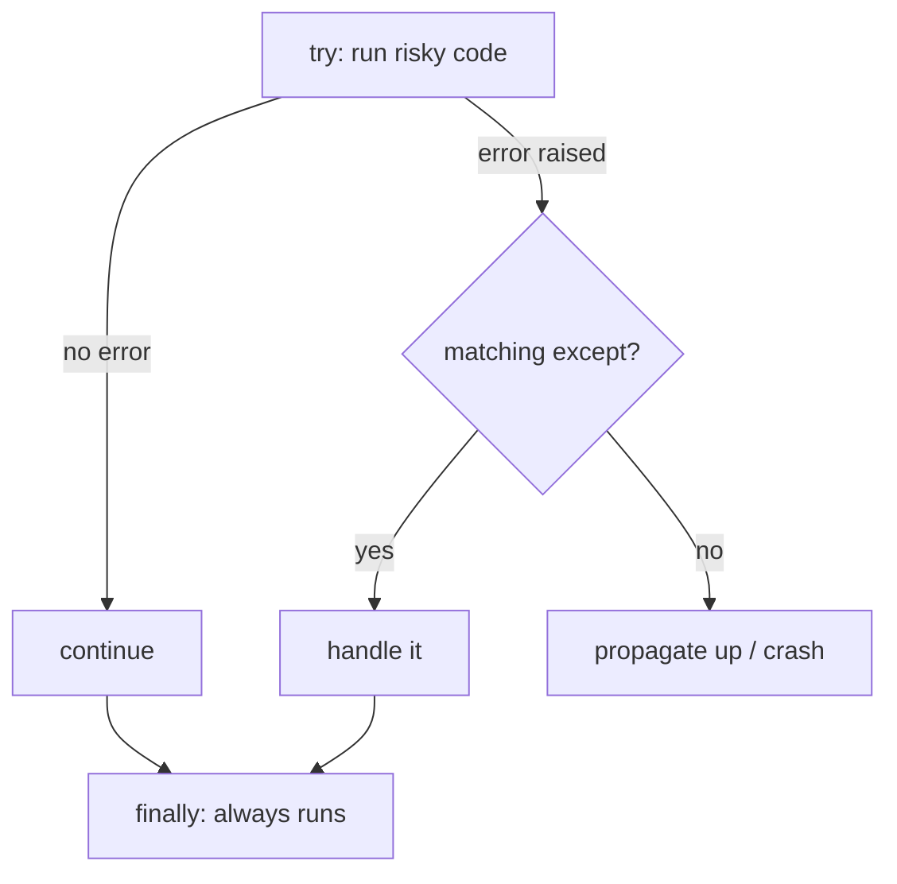

| Keyword | Plain meaning |
|---|---|
| `try` | "attempt this risky code" |
| `except` | "if it fails this way, do this instead" |
| `else` | "if no error, do this" |
| `finally` | "do this no matter what" (close files, release resources) |
| `raise` | "deliberately throw an error" |

### 1.11 File I/O

**I/O** = *Input/Output* — reading from and writing to files. The `with` keyword (a "context manager") auto-closes the file even if an error happens. **Analogy:** a self-closing door — you can't forget to shut it.

```python
# WRITE
with open("breaches.txt", "w") as f:        # 'w' = write (overwrites)
    f.write("SPO-12345\n")
    f.writelines(["ODB-2\n", "SPO-9\n"])

# READ
with open("breaches.txt") as f:             # default mode 'r' = read
    content = f.read()                      # whole file as one string
with open("breaches.txt") as f:
    for line in f:                          # line by line (memory-friendly)
        print(line.strip())

# CSV via the standard library
import csv
with open("cases.csv") as f:
    for row in csv.DictReader(f):           # each row -> dict keyed by header
        print(row["product"], row["csat"])

# JSON
import json
data = {"product": "SPO", "csat": 4.7}
text = json.dumps(data)                     # dict -> JSON string
back = json.loads(text)                     # JSON string -> dict
```

(In real analysis you'll mostly let **pandas** read files — `pd.read_csv` — but knowing raw file I/O helps when data is huge or oddly formatted.)

### 1.12 Modules, packages, pip & virtual environments

- **Module** — *a single `.py` file of reusable code.* **Analogy:** one tool.
- **Package** — *a folder of modules* (e.g. pandas). **Analogy:** a toolbox.
- **`import`** — *bring a module's tools into your program.* `import pandas as pd` (the `as pd` gives it a short nickname).
- **Standard library** — *batteries included*: modules that ship with Python (`datetime`, `math`, `json`, `os`, `collections`). No install needed.
- **PyPI** — *the Python Package Index*, the giant online store of third-party packages.
- **pip** — *the installer* that downloads packages from PyPI. **Analogy:** an app store's "Install" button.
- **Virtual environment (venv)** — *an isolated sandbox of packages for one project*, so Project A's pandas v1 doesn't clash with Project B's pandas v2. **Analogy:** separate toolboxes per job site so tools don't get mixed up.

```bash
# In a terminal (not inside Python):
python -m venv .venv               # create an isolated environment
.\.venv\Scripts\activate           # activate it (Windows PowerShell)
pip install pandas pyspark         # install packages into THIS env only
pip freeze > requirements.txt      # snapshot exact versions (reproducible)
pip install -r requirements.txt    # recreate the same env elsewhere
```

```python
# Different ways to import
import datetime                       # whole module
from datetime import datetime, timedelta   # specific names
import numpy as np                    # with an alias
```

> 💡 **Tie-in to your background:** A venv is the data-science cousin of having separate Power BI workspaces / environments for Dev vs Prod — isolation so one change doesn't break everything. Your AZ-900 knowledge of "environments" maps cleanly here.

### 1.13 A first taste of classes / OOP

**OOP (Object-Oriented Programming)** is *bundling data + the functions that act on it into a "class"*. A **class** is a blueprint; an **object** (or **instance**) is a thing built from it. **Analogy:** a class is the cookie-cutter; objects are the cookies. You'll mostly *use* classes others wrote (a pandas DataFrame is an object), but here's how one looks:

```python
class SupportCase:
    def __init__(self, case_id, product, hours, csat):  # constructor: runs on creation
        self.case_id = case_id        # 'self' = this particular object
        self.product = product
        self.hours   = hours
        self.csat    = csat

    def breached(self, sla=24):       # a METHOD = a function attached to the object
        return self.hours > sla

    def __repr__(self):               # how it prints
        return f"<Case {self.case_id} {self.product}>"

c = SupportCase("SPO-12345", "SPO", 40, 3)
print(c.product)        # SPO        -> 'attribute' (data)
print(c.breached())     # True       -> 'method' (behaviour)
print(c)                # <Case SPO-12345 SPO>
```

| OOP term | Plain meaning | Analogy |
|---|---|---|
| class | blueprint | cookie-cutter |
| object / instance | a built thing | a cookie |
| attribute | data on the object | the cookie's flavour |
| method | function on the object | what the cookie can do |
| `self` | "this object" | "me" |
| `__init__` | setup run at creation | unboxing & assembling |

### 1.14 Handy standard-library bits: datetime & collections

```python
from datetime import datetime, timedelta, date

opened = datetime(2024, 3, 1, 9, 0)
closed = datetime(2024, 3, 3, 14, 30)
elapsed = closed - opened                  # a timedelta
print(elapsed)                             # 2 days, 5:30:00
print(elapsed.total_seconds() / 3600)      # 53.5 hours
print(datetime.now().strftime("%Y-%m-%d")) # format -> '2024-03-...'
deadline = opened + timedelta(hours=24)    # SLA deadline

from collections import Counter, defaultdict, namedtuple

products = ["SPO","ODB","SPO","Teams","SPO"]
print(Counter(products))                   # {'SPO':3,'ODB':1,'Teams':1}
print(Counter(products).most_common(1))    # [('SPO', 3)]  -> top product

by_product = defaultdict(list)             # dict that auto-creates empty lists
by_product["SPO"].append("SPO-1")          # no KeyError on first use

Case = namedtuple("Case", "id product csat")  # lightweight record type
c = Case("SPO-1", "SPO", 5)
print(c.product)                           # 'SPO' (named, readable tuple)
```

### 🔍 Plain-English deep-dive: `Counter` is a one-line GROUP BY COUNT

`Counter(products)` instantly tallies how many times each value appears — exactly what `SELECT product, COUNT(*) GROUP BY product` does in SQL, in one line. **Memory hook:** "Counter = instant frequency table."

---

# 🟡 INTERMEDIATE — NumPy & pandas

## 2. NumPy — the fast numeric engine under pandas

**NumPy** (Numerical Python) is *the library that gives Python fast arrays of numbers*. pandas is built on top of it, so understanding NumPy explains *why pandas is fast*.

### 🔍 Plain-English deep-dive: the ndarray

- **`ndarray`** — *an "N-dimensional array": a grid of numbers all of the same type, stored in one tight block of memory.* **Analogy:** a list is a row of separate jars scattered on shelves; an ndarray is an egg carton — fixed slots, same size, packed side by side. That packing is what makes it fast.
- **Vectorization** — *doing math on the whole array at once instead of looping item by item.* **Analogy:** instead of telling 1,000 workers one at a time "add 1", you broadcast the instruction to all at once. **Memory hook:** "Loop bad, vectorize good."
- **Broadcasting** — *NumPy automatically stretches a smaller array to match a bigger one* so you can combine different shapes. **Analogy:** one rule applied to every row without writing it out per row.

```python
import numpy as np

hours = np.array([4, 40, 2, 48, 1, 30])     # an ndarray
print(hours * 2)            # [ 8 80 4 96 2 60]   <- vectorized, no loop
print(hours > 24)           # [F  T  F  T  F  T]  <- vectorized comparison
print(hours.mean(), hours.max(), hours.std())

# Broadcasting: subtract a single number from every element
print(hours - hours.mean())  # deviation from average, per case

# 2-D array (matrix): rows = cases, cols = [hours, csat]
m = np.array([[ 4, 5],
              [40, 3],
              [ 2, 4]])
print(m.shape)              # (3, 2)  -> 3 rows, 2 cols
print(m[:, 1])              # all CSAT values -> [5 3 4]
print(m.sum(axis=0))        # column sums  -> [46 12]
print(m.sum(axis=1))        # row sums     -> [9 43 6]
```

### Why is NumPy fast? (interview gold)

| Plain Python list | NumPy ndarray |
|---|---|
| Items can be any type | All one type (e.g. all float64) |
| Scattered in memory (pointers) | One contiguous block |
| Math loops in slow Python | Math runs in compiled C, vectorized |
| ~no SIMD | Uses CPU SIMD (one instruction, many values) |

A loop over a million Python numbers can be **10–100× slower** than the equivalent NumPy vectorized operation. The same lesson — *let the engine batch the work* — reappears in pandas (vectorized columns) and Spark (distributed batches).

```python
# DON'T (slow Python loop)            # DO (fast vectorized)
out = []                              out = hours * 1.1
for h in hours:                       # one expression, runs in C
    out.append(h * 1.1)
```

> 💡 **Tie-in to your background:** This is the same instinct as preferring a single SQL set-based query over a cursor that loops row-by-row, or a Power Query transform over manual cell edits. "Think in whole columns, not single rows" is the through-line of this entire Part.

---

## 3. pandas — the analyst's spreadsheet in code

**pandas** is the library that gives Python a "DataFrame" — a table with rows and columns, like Excel or a SQL table, but programmable. It is the single most important tool in this Part for day-to-day analysis.

### 🔍 Plain-English deep-dive: the three core objects

- **DataFrame** — *a 2-D table (rows × columns).* **Analogy:** an Excel sheet you control with code. Each column can be a different type.
- **Series** — *a single column* (a 1-D labelled array). **Analogy:** one column of that sheet. A DataFrame is really a dict of Series sharing one index.
- **Index** — *the row labels.* **Analogy:** the 1,2,3 (or dates, or IDs) down the left of Excel. It's how pandas aligns data.

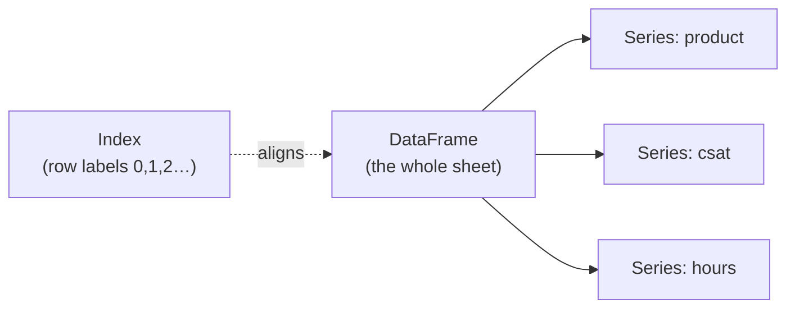

Here's the Rosetta Stone — the *same operations* in SQL and pandas, so you can transfer your Part 3 SQL knowledge:

| Task | SQL | pandas |
|---|---|---|
| Pick columns | `SELECT product, csat` | `df[["product","csat"]]` |
| Filter rows | `WHERE product='SPO'` | `df[df.product=="SPO"]` |
| Sort | `ORDER BY csat DESC` | `df.sort_values("csat", ascending=False)` |
| Aggregate | `GROUP BY product` | `df.groupby("product").agg(...)` |
| Join | `JOIN agents ON ...` | `df.merge(agents, on="agent_id")` |
| New column | `CASE WHEN ...` | `df["sla"] = np.where(...)` |
| Distinct | `SELECT DISTINCT product` | `df["product"].unique()` |
| Count by group | `COUNT(*) GROUP BY` | `df.groupby("product").size()` |
| Top N | `ORDER BY ... LIMIT 5` | `df.nlargest(5, "csat")` |
| Window LAG | `LAG(csat) OVER(...)` | `df["csat"].shift(1)` |

### 3.1 Reading data — from anywhere

```python
import pandas as pd

df = pd.read_csv("cases.csv")                       # CSV (most common)
df = pd.read_csv("cases.csv", parse_dates=["opened"], dtype={"agent_id":"Int64"})
df = pd.read_excel("cases.xlsx", sheet_name="Q1")   # Excel
df = pd.read_json("cases.json")                     # JSON
df = pd.read_parquet("cases.parquet")               # Parquet (columnar, fast, compressed)
df = pd.read_sql("SELECT * FROM cases", conn)       # straight from a database
```

### 🔍 Plain-English deep-dive: what is Parquet?

**Parquet** is *a columnar file format* — it stores each column together rather than each row. **Analogy:** a CSV is a stack of full receipts (row by row); Parquet is a filing cabinet with one drawer per field, so if you only need the "csat" drawer you skip the rest. It's compressed and typed, so it's much smaller and faster than CSV. It's the default for data lakes, Spark, Fabric, and Delta Lake. **Memory hook:** "Parquet = columns in drawers; read only what you need."

### 3.2 Inspecting data — always look first

```python
df.head(3)        # first 3 rows (df.tail(3) for last)
df.shape          # (rows, columns) e.g. (10000, 6)
df.info()         # column names, non-null counts, dtypes, memory
df.describe()     # count/mean/std/min/quartiles/max for numeric cols
df.describe(include="object")   # for text columns: count/unique/top/freq
df.dtypes         # the type of each column
df.columns        # column names
df["product"].value_counts()    # frequency table (GROUP BY COUNT)
df["product"].nunique()         # number of distinct products
df.isna().sum()                 # missing values per column
df.memory_usage(deep=True)      # bytes per column
```

### 3.3 Indexing & selection — loc, iloc, at, iat, masks

This trips up everyone. Learn the four selectors:

| Selector | Selects by | Example | Analogy |
|---|---|---|---|
| `.loc[]` | **label** (row label, column name) | `df.loc[5, "csat"]` | "go to row labelled 5, column 'csat'" |
| `.iloc[]` | **integer position** | `df.iloc[0, 2]` | "row 0, 3rd column" |
| `.at[]` | single value by label (fast) | `df.at[5, "csat"]` | a sniper shot by name |
| `.iat[]` | single value by position (fast) | `df.iat[0, 2]` | a sniper shot by number |

```python
# Column selection
df["csat"]                 # one column -> a Series
df[["product","csat"]]     # several columns -> a DataFrame

# Row + column selection with .loc (LABELS, end-INCLUSIVE)
df.loc[0:4, ["product","csat"]]      # rows labelled 0..4, two columns
df.loc[df["product"]=="SPO", "csat"] # csat of SPO rows only

# Row + column with .iloc (POSITIONS, end-EXCLUSIVE)
df.iloc[0:5, 0:3]                    # first 5 rows, first 3 cols

# Boolean mask = a True/False Series acting as a filter (the WHERE clause)
mask = (df["product"]=="SPO") & (df["resolution_hours"] > 24)
df[mask]                             # SPO breaches only
df[(df["csat"] < 3) | (df["resolution_hours"] > 48)]   # OR
df[~df["product"].isin(["SPO","ODB"])]                 # NOT in list
df[df["product"].str.startswith("S")]                  # text condition
df.query("product == 'SPO' and resolution_hours > 24") # SQL-ish syntax
```

### 🔍 Plain-English deep-dive: `&` `|` `~` and the parentheses rule

In pandas filters you use `&` (and), `|` (or), `~` (not) — **not** the words `and/or/not` — because you're combining whole columns of True/False, not single values. And you **must** wrap each condition in parentheses: `(df.a>1) & (df.b<2)`. **Analogy:** each condition is a separate stencil; `&` overlays them so only rows that pass *both* show through. Forgetting the parentheses is the #1 pandas beginner bug.

### 3.4 Adding, dropping, renaming columns

```python
import numpy as np
df["breach"] = df["resolution_hours"] > 24            # new boolean column
df["sla_label"] = np.where(df["breach"], "Breach", "Met")  # vectorized CASE WHEN
df["region"] = df["region"].fillna("Unknown")
df = df.drop(columns=["internal_notes"])              # remove a column
df = df.rename(columns={"csat":"csat_score", "dt":"opened_at"})
df = df.assign(month=df["opened_at"].dt.to_period("M"))  # chainable add
```

### 3.5 apply / map / applymap — and when to avoid them

- **`Series.map(func)`** — transform each value in *one column*.
- **`DataFrame.apply(func)`** — apply a function down columns (or across rows with `axis=1`).
- **`DataFrame.applymap(func)`** — apply to *every cell* (rarely needed; renamed `map` in pandas 2.1+).

```python
# map with a dict = a lookup/relabel
tier = {"SPO":"Core", "ODB":"Core", "Teams":"Collab"}
df["tier"] = df["product"].map(tier)

# apply across rows (axis=1) — flexible but SLOW (it loops in Python)
df["score"] = df.apply(lambda r: r["csat"] * (0 if r["breach"] else 1), axis=1)
```

### 🔍 Plain-English deep-dive: avoid `apply(axis=1)` when you can vectorize

`df.apply(..., axis=1)` runs your function once **per row** in slow Python — the very loop NumPy taught us to avoid. Whenever possible, express it as **column math** or `np.where`/`np.select`, which run in fast C. **Rule of thumb:** if you typed `axis=1`, pause and ask "can this be a vectorized expression?" Usually yes.

```python
# SLOW (row loop)                              # FAST (vectorized)
df.apply(lambda r: r.csat*2, axis=1)            df["csat"] * 2

# Multi-condition CASE WHEN -> np.select (vectorized)
conditions = [df["csat"]>=4.8, df["csat"]>=4.5]
choices    = ["Great", "OK"]
df["health"] = np.select(conditions, choices, default="At risk")
```

| Method | Speed | Use when |
|---|---|---|
| Vectorized (`df.col * 2`, `np.where`, `np.select`) | ⚡ fastest | almost always |
| `.map()` on a Series with a dict | fast | relabeling/lookups |
| `.apply(axis=0)` per column | medium | column-level custom logic |
| `.apply(axis=1)` per row | 🐌 slow | last resort, complex row logic |

### 3.6 groupby — split, apply, combine

**groupby** is the pandas `GROUP BY`. It follows a **split → apply → combine** pattern: split rows into groups, apply a calculation to each, combine into a result. **Analogy:** sort a deck of cards into suits (split), count each suit (apply), write the tally (combine).

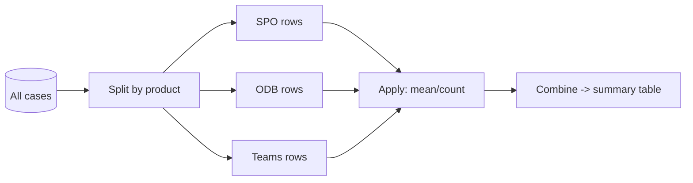

```python
# Named aggregation (clean, explicit output names) — preferred
summary = (df.groupby("product")
             .agg(avg_csat=("csat","mean"),
                  cases=("case_id","count"),
                  breach_rate=("breach","mean"),
                  worst_csat=("csat","min"))
             .reset_index()
             .sort_values("avg_csat"))

# Group by several keys
df.groupby(["product","region"])["csat"].mean()

# transform — return a value PER ROW aligned to the group (no collapsing)
df["product_avg_csat"] = df.groupby("product")["csat"].transform("mean")
df["csat_vs_product"]  = df["csat"] - df["product_avg_csat"]  # row vs its group avg

# filter — keep only groups passing a test
big = df.groupby("product").filter(lambda g: len(g) >= 100)

# apply — arbitrary per-group function (flexible, slower)
def top_agent(g):
    return g.nlargest(1, "csat")[["agent_id","csat"]]
df.groupby("product").apply(top_agent)
```

### 🔍 Plain-English deep-dive: agg vs transform vs filter vs apply

| Verb | What it returns | Analogy |
|---|---|---|
| `agg` | **one row per group** (a summary) | the final scoreboard |
| `transform` | **same shape as input** (value broadcast back to each row) | writing the team average next to every player |
| `filter` | **subset of original rows** (whole groups kept/dropped) | cutting whole teams from the league |
| `apply` | **anything** (most flexible, slowest) | a custom play for each team |

### 3.7 Joins — merge & concat

**merge** is the pandas `JOIN`. **concat** stacks DataFrames (like `UNION`).

```python
agents = pd.DataFrame({"agent_id":[10,11,12],
                       "agent":["Asha","Ben","Cara"],
                       "region":["EMEA","AMER","APAC"]})

j = df.merge(agents, on="agent_id", how="left")   # keep all cases, add agent info
```

| `how=` | Keeps | SQL equivalent | Analogy |
|---|---|---|---|
| `"inner"` | only matching rows in both | INNER JOIN | the overlap of two circles |
| `"left"` | all left + matches | LEFT JOIN | keep every case, attach agent if known |
| `"right"` | all right + matches | RIGHT JOIN | keep every agent |
| `"outer"` | everything, fill gaps with NaN | FULL OUTER | both circles entirely |
| `"cross"` | every combination | CROSS JOIN | every case × every agent |

```python
# Different key names
df.merge(agents, left_on="aid", right_on="agent_id", how="left")
# Indicator to see where each row matched
df.merge(agents, on="agent_id", how="left", indicator=True)  # adds _merge col

# concat — stack rows (UNION ALL) or columns
pd.concat([q1_df, q2_df], ignore_index=True)        # stack rows
pd.concat([df_left, df_right], axis=1)              # glue columns side by side
```

> ⚠️ **Watch for row explosion:** if join keys aren't unique on one side, a many-to-many merge multiplies rows. Use `validate="one_to_many"` to make pandas check your assumption and error if it's wrong.

### 3.8 Reshaping — pivot, pivot_table, melt, stack/unstack

Reshaping turns data between **long** (one row per observation) and **wide** (one row per entity, many columns) formats.

```python
# pivot_table — Excel-style pivot (handles duplicates via aggfunc)
wide = df.pivot_table(index="product", columns="region",
                      values="csat", aggfunc="mean", fill_value=0)
#        AMER  APAC  EMEA
# ODB    4.1   4.3   4.2
# SPO    4.6   4.5   4.8

# melt — wide BACK to long (unpivot)
long = wide.reset_index().melt(id_vars="product",
                               var_name="region", value_name="avg_csat")

# stack / unstack — move between index levels and columns
df.groupby(["product","region"])["csat"].mean().unstack("region")
```

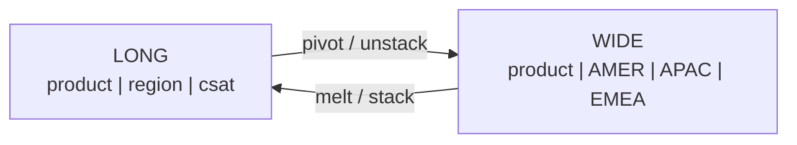

| Function | Direction | Notes |
|---|---|---|
| `pivot` | long → wide | needs unique index/column pairs |
| `pivot_table` | long → wide | aggregates duplicates (safe default) |
| `melt` | wide → long | "unpivot" |
| `stack` | columns → rows | creates a MultiIndex |
| `unstack` | rows → columns | inverse of stack |

### 3.9 Missing data

**Missing** values show as `NaN` (Not a Number) or `NaT` (Not a Time). **Analogy:** blank cells in a spreadsheet — but you must decide *what blank means* before you analyse.

```python
df.isna().sum()                       # how many missing per column
df.dropna(subset=["csat"])            # drop rows missing CSAT
df.dropna(axis=1, thresh=100)         # drop cols with <100 non-null
df["csat"] = df["csat"].fillna(df["csat"].median())   # fill with median
df["region"] = df["region"].fillna("Unknown")
df["csat"] = df["csat"].interpolate() # estimate between known values (time series)
df = df.fillna({"csat":0, "region":"Unknown"})        # different fill per column
```

| Strategy | When |
|---|---|
| `dropna` | a few rows missing a critical field |
| `fillna(constant)` | a sensible default exists ("Unknown") |
| `fillna(mean/median)` | numeric, missing-at-random |
| `interpolate` | ordered/time-series gaps |
| `ffill`/`bfill` | carry last/next known value forward/back |

### 3.10 Duplicates

```python
df.duplicated().sum()                          # how many exact dup rows
df = df.drop_duplicates()                      # drop exact duplicates
df = df.drop_duplicates(subset=["case_id"], keep="last")  # dedupe by key
```

### 3.11 Datetime & resampling

```python
df["opened_at"] = pd.to_datetime(df["opened_at"])   # parse text -> datetime
df["hour"]  = df["opened_at"].dt.hour               # .dt accessor
df["month"] = df["opened_at"].dt.to_period("M")
df["dow"]   = df["opened_at"].dt.day_name()

# Resample = groupby on time buckets (needs a datetime index)
ts = df.set_index("opened_at")
ts["case_id"].resample("D").count()    # daily case volume
ts["csat"].resample("W").mean()        # weekly avg CSAT
ts["csat"].resample("M").agg(["mean","count"])
```

### 3.12 Rolling & expanding windows

A **rolling window** computes a stat over the last *N* rows — perfect for smoothing noisy daily metrics. **Analogy:** a moving spotlight averaging what it covers as it slides.

```python
daily = ts["case_id"].resample("D").count()
daily.rolling(7).mean()        # 7-day moving average (smooths the trend)
daily.rolling(7).sum()         # rolling weekly total
daily.expanding().mean()       # cumulative average from the start
daily.shift(1)                 # previous day's value (LAG)
daily.pct_change()             # day-over-day % change
```

### 3.13 Categorical dtype & string methods

```python
# category dtype = store repeated text as compact codes (saves memory, speeds groupby)
df["product"] = df["product"].astype("category")     # like a lookup table internally

# .str vectorized string methods (whole column at once)
df["product"].str.upper()
df["title"].str.contains("link", case=False)
df["case_id"].str.split("-").str[1]        # extract the numeric part
df["title"].str.len()
df["region"].str.strip()
```

### 🔍 Plain-English deep-dive: the `category` dtype

If a column has 50 million rows but only 5 distinct products, storing the *text* 50M times is wasteful. **category** stores each product name once in a lookup, then keeps tiny integer codes per row. **Analogy:** instead of writing "SharePoint Online" on every form, you write the code "1" and keep one legend. It slashes memory and speeds up groupby/joins. **Memory hook:** "Few distinct values, many rows → make it categorical."

### 3.14 Method chaining — readable pipelines

**Method chaining** strings operations together so the data flows top to bottom, like a pipeline. **Analogy:** an assembly line where each station does one job. Wrap in `( )` so you can put each step on its own line.

```python
result = (
    pd.read_csv("cases.csv")
      .dropna(subset=["csat"])
      .assign(breach=lambda d: d["resolution_hours"] > 24)
      .query("product in ['SPO','ODB','Teams']")
      .groupby("product")
      .agg(avg_csat=("csat","mean"), cases=("case_id","count"),
           breach_rate=("breach","mean"))
      .reset_index()
      .sort_values("avg_csat")
)
```

> 💡 **Tie-in to your background:** Method chaining reads exactly like a **Power Query** "Applied Steps" list or a series of **dataflow** transforms — each step refines the table. You already think this way; pandas just writes it as code.

### 3.15 Performance & memory tips

| Tip | Why |
|---|---|
| Vectorize; avoid `apply(axis=1)` and Python loops | runs in C, 10–100× faster |
| Use `category` for low-cardinality text | huge memory savings |
| Downcast numerics (`int64`→`int32`, `float64`→`float32`) | half the memory |
| Read only needed columns (`usecols=`) | less I/O & RAM |
| Use Parquet over CSV | typed, compressed, columnar |
| Filter early, before joins/groupby | less data to move |
| `pd.read_csv(..., chunksize=...)` for big files | stream in pieces |
| Avoid growing a DataFrame in a loop (`pd.concat` each iteration) | rebuild once at the end |

```python
print(df.memory_usage(deep=True).sum() / 1e6, "MB")   # check memory
df["agent_id"] = pd.to_numeric(df["agent_id"], downcast="integer")
```

### 🔍 Plain-English deep-dive: the pandas mantra

The single most valuable habit: **think in columns, not rows.** Every time you're about to write a `for` loop over a DataFrame, stop — there's almost always a vectorized one-liner (`df.col * 2`, `np.where`, `groupby`, `merge`) that's faster and clearer. **Memory hook:** "If you're looping a DataFrame, you're probably doing it wrong."

> 💡 **Tie-in to your background:** If you can write the GROUP BY query from Part 3, you can write the pandas version — they're the same idea. Learn pandas as "SQL with superpowers (loops, text, ML)."

---

# 📊 VISUALIZATION — turning DataFrames into pictures

## 4. matplotlib, seaborn & plotly

A chart is *a DataFrame made visual*. Three libraries matter:

- **matplotlib** — *the foundational plotting library.* Low-level, total control, a bit verbose. **Analogy:** raw bricks — you can build anything but you place each one.
- **seaborn** — *a friendlier layer on top of matplotlib* for statistical charts with nice defaults. **Analogy:** a pre-fab wall section — fewer bricks to lay.
- **plotly** — *interactive charts* (hover, zoom, pan) that render in the browser. **Analogy:** a touchscreen version of your chart, great for notebooks and web.

```python
import matplotlib.pyplot as plt
import seaborn as sns

# --- matplotlib: explicit, full control ---
fig, ax = plt.subplots(figsize=(7,4))
summary.plot(x="product", y="avg_csat", kind="bar", ax=ax,
             title="Avg CSAT by Product", legend=False)
ax.set_ylabel("CSAT (1-5)")
ax.axhline(4.5, color="red", linestyle="--", label="Target")
plt.tight_layout()
plt.savefig("csat.png", dpi=150)

# --- seaborn: statistical, pretty defaults ---
sns.barplot(data=df, x="product", y="csat", errorbar="sd")  # bars + error bars
sns.boxplot(data=df, x="product", y="resolution_hours")     # distribution per product
sns.heatmap(df.pivot_table(index="product", columns="region",
            values="csat", aggfunc="mean"), annot=True, cmap="RdYlGn")
sns.lineplot(data=daily.reset_index(), x="opened_at", y="case_id")  # trend

# --- plotly: interactive (great in notebooks) ---
import plotly.express as px
fig = px.bar(summary, x="product", y="avg_csat", title="Avg CSAT by Product")
fig.show()
```

### 🔍 Plain-English deep-dive: the matplotlib "Figure vs Axes" model

A **Figure** is the whole canvas/picture; an **Axes** is one plot (set of x/y axes) on it. **Analogy:** the Figure is a sheet of paper; each Axes is one chart drawn on it (a sheet can hold several). You usually do `fig, ax = plt.subplots()` then draw onto `ax`. **Memory hook:** "Figure = page, Axes = a chart on the page."

### Choosing the right chart

| Question you're answering | Chart | Why |
|---|---|---|
| Compare a metric across categories | **bar** | length is easy to compare |
| Trend over time | **line** | shows direction & seasonality |
| Distribution of one variable | **histogram / box / violin** | reveals spread & outliers |
| Relationship between two numbers | **scatter** | shows correlation |
| Part-to-whole | **stacked bar / treemap** | composition (avoid pie for many slices) |
| Two-dimensional intensity | **heatmap** | colour = magnitude |
| Same metric across many groups | **small multiples / facets** | compare like-for-like |

> 💡 **Tie-in to your background:** You already pick charts daily in **Power BI** — bar for CSAT by product, line for case-volume trend, matrix/heatmap for product×region. The *chart-choice judgement* transfers 1:1; only the syntax changes. Python plots are handy when you need a chart inside an automated notebook or an ML report rather than a polished dashboard.

---

# 🔴 ADVANCED — PySpark & big-data processing

## 5. The big-data leap — why Spark exists

pandas loads all data into **one computer's memory**. When data is *huge* (billions of support telemetry events), it won't fit. **Apache Spark** spreads the data and the work across a **cluster** of many machines. **PySpark** is the Python way to drive Spark.

### 🔍 Plain-English deep-dive: the foundational words

- **Cluster** — *many computers working as one.* **Analogy:** one cashier vs. 50 checkout lanes for a stadium crowd. **Why it matters:** this is how Databricks/Fabric process enterprise-scale data.
- **Distributed computing** — *split the data into chunks, process them in parallel, combine results.* **Analogy:** counting a warehouse by giving each worker an aisle, then summing the aisle counts.
- **Node / machine** — *one computer in the cluster.*
- **Partition** — *a chunk of the distributed data* that one task processes. More partitions = more parallelism (up to a point). **Analogy:** dividing a deck of cards among players so each counts their pile.
- **Lazy evaluation** — *Spark plans transformations but doesn't run them until you ask for a result (an "action").* **Analogy:** writing a shopping list (transformations) and only actually shopping when you reach checkout (action). **Why it matters:** lets Spark optimise the whole plan before executing — exactly the generator idea from Section 1.9.

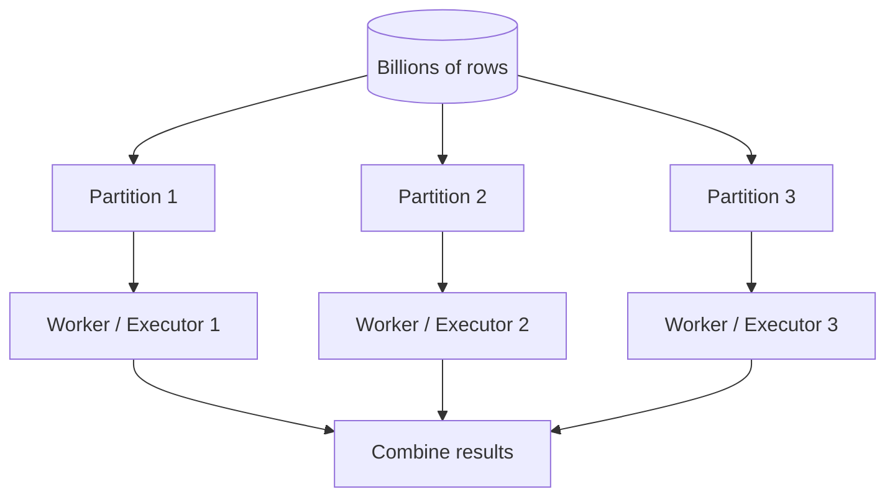

---

## 6. Spark architecture — what's under the hood

This is the section interviewers probe hardest. Learn the cast of characters.

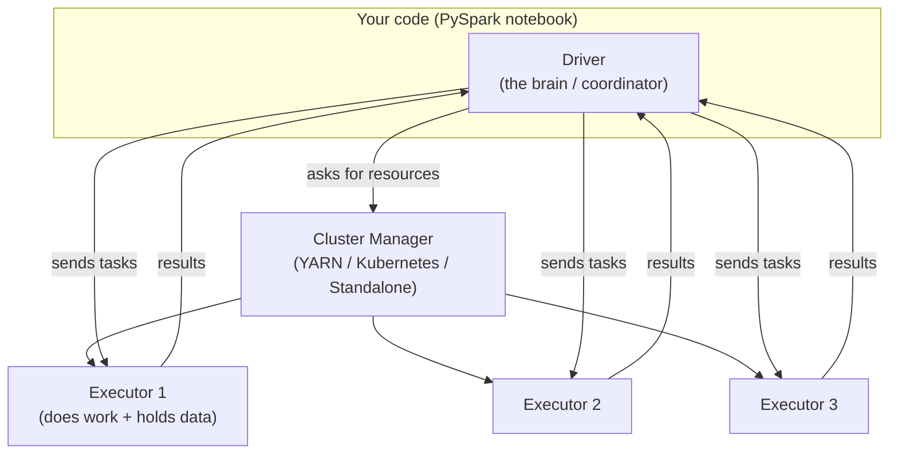

### 🔍 Plain-English deep-dive: the players

| Component | Plain meaning | Analogy |
|---|---|---|
| **Driver** | the master process running your code; builds the plan and schedules work | a film **director** who plans shots and coordinates the crew |
| **Executor** | a worker process on a node that runs tasks and stores data partitions | a **crew member** doing the actual filming |
| **Cluster manager** | allocates machines/resources to your app (YARN, Kubernetes, Standalone) | the **studio** that assigns crew & equipment |
| **Task** | the smallest unit of work — one operation on one partition | one crew member filming one scene |
| **Stage** | a group of tasks that can run without a shuffle | all scenes shot at one location before moving |
| **Job** | all the work triggered by one action | the whole shoot for one action call |
| **DAG** | Directed Acyclic Graph — the dependency map of stages | the storyboard / shot order |

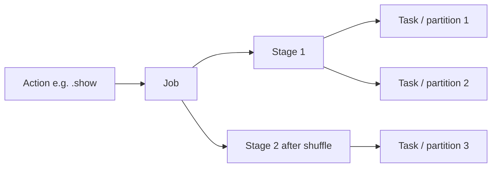

### The optimizers: Catalyst & Tungsten

- **Catalyst optimizer** — *Spark's query brain.* It takes your DataFrame/SQL logic and rewrites it into the most efficient physical plan (reordering filters, pushing them to the source, picking join strategies). **Analogy:** a GPS that re-routes you around traffic before you set off. **Memory hook:** "Catalyst = the query GPS."
- **Tungsten** — *Spark's execution engine* that manages memory off-heap and generates compact bytecode for speed. **Analogy:** a tuned engine that burns fuel efficiently. **Memory hook:** "Tungsten = the fast engine."
- **DAG scheduler** — *splits the job into stages and tasks* and decides what runs where. **Analogy:** the production manager turning the storyboard into a daily shoot schedule.

### 🔍 Plain-English deep-dive: how one action becomes work

When you call an action (e.g. `.show()`), the Driver asks Catalyst to optimise the plan, the DAG scheduler breaks it into **stages** (split wherever a shuffle is needed), each stage becomes a set of **tasks** (one per partition), and the cluster manager's executors run those tasks in parallel. Results stream back to the Driver. **Memory hook:** "Action → Job → Stages → Tasks → Executors."

---

## 7. RDD vs DataFrame vs Dataset, and SparkSession

### The three APIs

| API | What it is | Optimized? | Use today? |
|---|---|---|---|
| **RDD** (Resilient Distributed Dataset) | the original low-level "distributed list of objects" | ❌ no Catalyst | rarely — only for fine-grained control |
| **DataFrame** | a distributed table with named, typed columns | ✅ Catalyst + Tungsten | ✅ the default in PySpark |
| **Dataset** | typed DataFrame (compile-time type safety) | ✅ | Scala/Java only — Python has no Dataset |

### 🔍 Plain-English deep-dive: why DataFrame, not RDD

- **RDD** — *a Resilient Distributed Dataset: an immutable, partitioned collection of objects spread across the cluster.* "Resilient" = it can rebuild lost partitions from its lineage if a node dies. **Analogy:** a convoy of trucks each carrying part of the cargo, with a manifest so any lost truck's load can be re-fetched. RDDs are powerful but you hand-code the *how*, and Catalyst can't optimise them.
- **DataFrame** — *an RDD with a schema (column names + types) and a query optimizer.* You describe *what* you want; Catalyst figures out the efficient *how*. For Python users, **always prefer DataFrames** — they're faster and far easier. **Memory hook:** "RDD = manual gearbox, DataFrame = automatic with GPS."

### SparkSession — your entry point

The **SparkSession** (the variable `spark`) is *the single object you use to talk to the cluster* — read data, run SQL, create DataFrames. **Analogy:** the steering wheel + dashboard of the whole Spark engine. In Databricks and Fabric notebooks, `spark` is created for you automatically.

```python
from pyspark.sql import SparkSession

spark = (SparkSession.builder
         .appName("support-analytics")
         .getOrCreate())     # in Databricks/Fabric, `spark` already exists

# Create a DataFrame from data
data = [("SPO-1","SPO",10,4,5), ("SPO-2","ODB",11,40,3)]
cols = ["case_id","product","agent_id","resolution_hours","csat"]
df = spark.createDataFrame(data, cols)
df.printSchema()    # shows column names + types
```

---

## 8. The PySpark DataFrame API in depth

The good news: **PySpark's DataFrame API looks almost like pandas + SQL.** If you know those, you're 80% there.

### 8.1 Transformations vs actions (lazy vs eager)

- **Transformation** — *builds a new DataFrame, lazily* (nothing runs yet): `select`, `filter`/`where`, `withColumn`, `groupBy`, `join`, `orderBy`, `distinct`.
- **Action** — *triggers execution and returns/writes a result*: `show`, `count`, `collect`, `take`, `write`, `toPandas`, `first`.

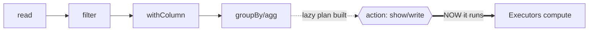

### Narrow vs wide transformations

- **Narrow transformation** — *each output partition depends on one input partition* — no data moves between machines (`filter`, `select`, `withColumn`). **Analogy:** each worker tidies their own desk. Fast.
- **Wide transformation** — *output partitions depend on many input partitions* — data must be **shuffled** across the cluster (`groupBy`, `join`, `distinct`, `orderBy`). **Analogy:** everyone swaps papers to regroup by topic. Expensive.

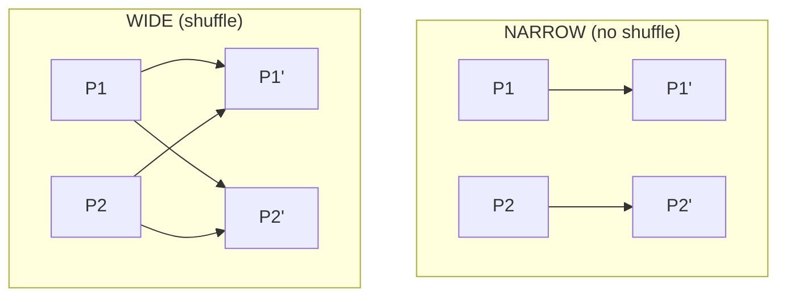

### 8.2 Core operations

```python
from pyspark.sql import functions as F

df = spark.read.table("support.cases")          # ingest from Lakehouse

clean = (df
    .filter(F.col("csat").isNotNull())                       # WHERE (alias: where)
    .withColumn("breach", (F.col("resolution_hours") > 24).cast("int"))  # new col
    .withColumnRenamed("dt", "opened_at")                    # rename
    .drop("internal_notes")                                  # drop column
    .select("case_id","product","csat","breach","opened_at") # pick columns
)

summary = (clean.groupBy("product")             # like GROUP BY
    .agg(F.avg("csat").alias("avg_csat"),
         F.count("*").alias("cases"),
         F.avg("breach").alias("breach_rate"),
         F.min("csat").alias("worst_csat"))
    .orderBy(F.desc("avg_csat")))

summary.show()                                  # ACTION → triggers execution
summary.printSchema()
print(summary.count())                          # ACTION
```

| Common functions (from `pyspark.sql.functions as F`) | Does |
|---|---|
| `F.col("x")`, `F.lit(5)` | reference a column / a constant |
| `F.when(cond, a).otherwise(b)` | CASE WHEN |
| `F.avg`, `F.sum`, `F.count`, `F.min`, `F.max` | aggregations |
| `F.to_date`, `F.date_trunc`, `F.datediff` | dates |
| `F.upper`, `F.lower`, `F.regexp_replace`, `F.split` | strings |
| `F.coalesce(a, b)` | first non-null |
| `F.round`, `F.cast` | formatting/typing |

```python
# CASE WHEN in PySpark
clean = clean.withColumn("health",
    F.when(F.col("csat") >= 4.8, "Great")
     .when(F.col("csat") >= 4.5, "OK")
     .otherwise("At risk"))
```

### 8.3 Joins (including broadcast join)

```python
agents = spark.read.table("support.agents")     # small dimension table

# Standard join (may shuffle both sides)
j = clean.join(agents, on="agent_id", how="left")

# BROADCAST join — copy the small table to every executor, no shuffle of big side
from pyspark.sql.functions import broadcast
j = clean.join(broadcast(agents), on="agent_id", how="left")
```

### 🔍 Plain-English deep-dive: the broadcast join

Normally a join **shuffles** both tables so matching keys meet — costly on big data. If one table is **small** (a dimension like agents/products), Spark can **broadcast** it: send a full copy to every executor so each can join locally with no shuffle. **Analogy:** instead of gathering everyone in one room to match names, you hand every worker a copy of the small phone book. **Memory hook:** "Small table? Broadcast it and skip the shuffle." Spark auto-broadcasts tables under `spark.sql.autoBroadcastJoinThreshold` (default 10MB); raise it or hint `broadcast()` for bigger dimensions.

| Join `how=` | Keeps |
|---|---|
| `inner` | only matching rows |
| `left` / `right` | all of one side + matches |
| `outer` (full) | everything, nulls where no match |
| `left_semi` | left rows that HAVE a match (no right cols) — like EXISTS |
| `left_anti` | left rows with NO match — like NOT EXISTS |

### 8.4 Window functions

A **window function** computes across a set of rows *related to the current row* without collapsing them — exactly like SQL window functions from Part 3 (rank, running totals, LAG/LEAD). **Analogy:** ranking each agent *within* their product team while keeping every row.

```python
from pyspark.sql.window import Window

w = Window.partitionBy("product").orderBy(F.desc("csat"))

ranked = (clean
    .withColumn("rank", F.row_number().over(w))                  # 1,2,3 per product
    .withColumn("product_avg", F.avg("csat").over(
        Window.partitionBy("product")))                          # group avg per row
    .withColumn("prev_csat", F.lag("csat", 1).over(w)))          # LAG

top3_per_product = ranked.filter(F.col("rank") <= 3)
```

| Window function | Purpose |
|---|---|
| `row_number()` | unique 1..N within partition |
| `rank()` / `dense_rank()` | ranking with/without gaps on ties |
| `lag()` / `lead()` | previous / next row value |
| `sum().over(w)` | running total |
| `avg().over(w)` | group average broadcast per row |

### 8.5 UDFs vs pandas (vectorized) UDFs

A **UDF (User-Defined Function)** is *your own Python function applied to columns* when built-ins don't suffice.

- **Plain Python UDF** — flexible but **slow**: Spark must serialise each row to Python and back, row by row. **Analogy:** stopping the assembly line to hand each item to an outside contractor.
- **pandas UDF (vectorized UDF)** — *processes a whole batch (a pandas Series) at once using Apache Arrow*, far faster. **Analogy:** handing the contractor a whole crate at a time instead of one item.

```python
from pyspark.sql.functions import udf, pandas_udf
from pyspark.sql.types import StringType
import pandas as pd

# Plain UDF (avoid on big data if a built-in exists)
@udf(StringType())
def tier(product):
    return "Core" if product in ("SPO","ODB") else "Other"

# pandas / vectorized UDF (preferred when you must use Python)
@pandas_udf(StringType())
def tier_vec(products: pd.Series) -> pd.Series:
    return products.map(lambda p: "Core" if p in ("SPO","ODB") else "Other")

clean = clean.withColumn("tier", tier_vec(F.col("product")))
```

> **Rule:** prefer built-in `F.*` functions → then pandas UDF → plain Python UDF only as a last resort. Built-ins run inside Catalyst/Tungsten and are fastest.

### 8.6 Null handling

```python
clean.filter(F.col("csat").isNotNull())
clean.na.drop(subset=["csat"])                       # drop rows with null csat
clean.na.fill({"csat": 0, "region": "Unknown"})      # fill nulls
clean.withColumn("csat2", F.coalesce(F.col("csat"), F.lit(0)))  # first non-null
```

### 🔍 Plain-English deep-dive: nulls are contagious

In Spark (and SQL), almost any operation on `null` yields `null`, and `null = null` is **not** True (it's unknown). **Analogy:** a missing ingredient ruins the whole recipe row. Always decide null policy early with `na.drop`/`na.fill`/`coalesce` so they don't silently poison aggregations.

### 8.7 Partitioning — repartition vs coalesce

- **`repartition(n)`** — *reshuffle data into `n` partitions* (can increase or decrease; full shuffle). Use to **increase** parallelism or evenly redistribute skewed data.
- **`coalesce(n)`** — *merge into fewer partitions without a full shuffle.* Use to **reduce** partition count cheaply (e.g. before writing fewer output files).

```python
df.rdd.getNumPartitions()                # how many partitions now
big = df.repartition(200, "product")     # shuffle to 200, keyed by product
small = df.coalesce(8)                    # merge down to 8 (no full shuffle)
```

| | `repartition` | `coalesce` |
|---|---|---|
| Direction | up or down | down only |
| Shuffle? | full shuffle (expensive) | avoids full shuffle (cheap) |
| Result | even partitions | possibly uneven |
| Use for | boosting parallelism, fixing skew | shrinking output file count |

### 🔍 Plain-English deep-dive: partition sizing

Too **few** partitions → some executors idle, no parallelism. Too **many** → overhead of scheduling tiny tasks dominates. Aim for partitions of roughly **128MB–256MB** and at least 2–3× the total core count so every core stays busy. **Analogy:** chopping vegetables — chunks too big overload one cook; chopping into dust wastes time. **Memory hook:** "Right-size partitions: ~128MB each, a few per core."

### 8.8 Shuffle — the #1 performance topic

A **shuffle** is *Spark moving data across the network so related rows (same key) land on the same executor* — triggered by `groupBy`, `join`, `distinct`, `orderBy`, `repartition`. It's expensive: disk writes, network transfer, serialization.

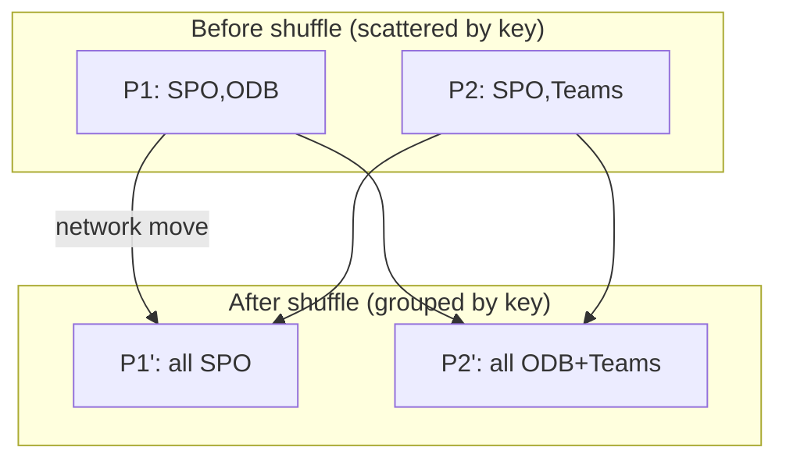

**How to minimise shuffles (interview gold):**
1. **Filter early** — shrink data before joins/aggregations (predicate pushdown).
2. **Select only needed columns** — column pruning, less to move.
3. **Broadcast small tables** in joins — avoids shuffling the big side.
4. **Avoid unnecessary `distinct`/`orderBy`** on huge data.
5. **Pre-partition** by the join/group key when reused.
6. **Handle skew** (one giant key) — see tuning below.

> 💡 **Tie-in to your background:** Minimising shuffles is the distributed cousin of SQL query tuning from Part 3 — filter early, project few columns, index/partition wisely. The instinct you've built writing performant KQL/SQL for support telemetry transfers directly.

### 8.9 Caching / persist & storage levels

If you reuse a DataFrame many times (e.g. a cleaned base feeding several reports), **cache** it so Spark doesn't recompute the whole lineage each time.

```python
clean.cache()            # keep in memory on first action (MEMORY_AND_DISK default)
clean.count()            # materialise the cache
# ... many reuses are now fast ...
clean.unpersist()        # release when done

from pyspark import StorageLevel
clean.persist(StorageLevel.MEMORY_AND_DISK)   # spill to disk if memory full
```

| Storage level | Meaning |
|---|---|
| `MEMORY_ONLY` | fastest, but recompute if it doesn't fit |
| `MEMORY_AND_DISK` | spill overflow to disk (safe default) |
| `DISK_ONLY` | for very large reused data |
| `*_SER` | serialized (smaller, more CPU) |

**Analogy:** caching is like keeping a prepped mise-en-place on the counter instead of re-chopping for every dish. **Memory hook:** "Reused DataFrame → cache it; release with unpersist."

### 8.10 Spark SQL & temp views

You can skip the API and write plain SQL on a DataFrame:

```python
clean.createOrReplaceTempView("cases")        # name it like a SQL table
spark.sql("""
   SELECT product, AVG(csat) AS avg_csat, COUNT(*) AS cases
   FROM cases
   WHERE csat IS NOT NULL
   GROUP BY product
   ORDER BY avg_csat DESC
""").show()
```

DataFrame API and Spark SQL compile to the **same Catalyst plan** — pick whichever reads clearer for the task. **Memory hook:** "DataFrame API and SQL are two doors to the same room."

---

## 9. Parquet, Delta Lake & the Lakehouse

### 9.1 Reading & writing Parquet

```python
df = spark.read.parquet("abfss://data@lake.dfs.core.windows.net/cases/")
(summary.write
   .mode("overwrite")                 # overwrite | append | ignore | error
   .partitionBy("product")            # physically split files by product
   .parquet("/lakehouse/Files/product_health/"))
```

### 9.2 Delta Lake — Parquet with a transaction log

**Delta Lake** is *Parquet files plus a transaction log* that adds database-like powers to a data lake: ACID transactions, updates/deletes, time travel, and schema enforcement. It's the default table format in Databricks and Fabric Lakehouses. **Analogy:** Parquet is a pile of spreadsheets; Delta adds a meticulous ledger recording every change, so you get reliable edits and an undo history. **Memory hook:** "Delta = Parquet + a transaction log = a lake that behaves like a database."

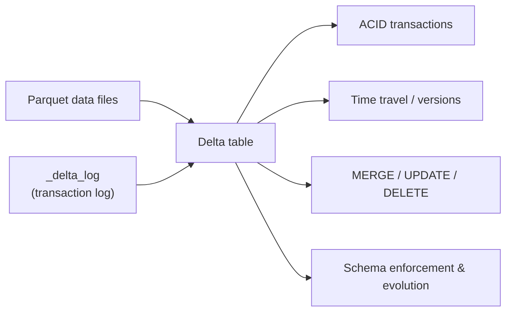

### 9.3 Delta operations

```python
# Write a Delta table
summary.write.format("delta").mode("overwrite").saveAsTable("support.product_health")

# MERGE (upsert) — the killer feature for incremental loads / SCDs
spark.sql("""
  MERGE INTO support.product_health AS t
  USING staging_updates AS s
  ON t.product = s.product
  WHEN MATCHED THEN UPDATE SET t.avg_csat = s.avg_csat, t.cases = s.cases
  WHEN NOT MATCHED THEN INSERT (product, avg_csat, cases)
                       VALUES (s.product, s.avg_csat, s.cases)
""")

# TIME TRAVEL — query an earlier version (audit / rollback)
spark.read.format("delta").option("versionAsOf", 3).table("support.product_health")
spark.sql("SELECT * FROM support.product_health VERSION AS OF 3")
spark.sql("DESCRIBE HISTORY support.product_health")   # see every change

# OPTIMIZE + Z-ORDER — compact small files & co-locate by a column for fast filters
spark.sql("OPTIMIZE support.product_health ZORDER BY (product)")

# VACUUM — delete old, unreferenced files (reclaim storage; default keeps 7 days)
spark.sql("VACUUM support.product_health RETAIN 168 HOURS")
```

### 🔍 Plain-English deep-dive: Delta's headline features

| Feature | Plain meaning | Analogy |
|---|---|---|
| **ACID transactions** | writes fully succeed or fully roll back; readers never see half-written data | a bank transfer that can't lose money mid-way |
| **MERGE (upsert)** | insert new rows + update existing in one atomic step | reconciling a master list with today's changes |
| **Time travel** | read any past version by number or timestamp | a "track changes" + undo for your table |
| **OPTIMIZE** | merge many tiny files into fewer big ones | tidying a messy drawer into neat folders |
| **Z-ORDER** | co-locate related values so filters skip irrelevant files (data skipping) | sorting a library so one shelf has all you need |
| **VACUUM** | permanently delete old unreferenced files | emptying the recycle bin |
| **Schema enforcement** | reject writes that don't match the table's columns/types | a bouncer checking IDs at the door |
| **Schema evolution** | deliberately allow new columns to be added | updating the guest list on purpose |

```python
# Schema evolution: allow new columns on append
(new_df.write.format("delta")
   .mode("append")
   .option("mergeSchema", "true")
   .saveAsTable("support.product_health"))
```

> 💡 **Tie-in to your background:** MERGE + time travel is how you'd maintain a **slowly changing dimension** of agents or products (Part 5) and audit support metrics over time — a natural fit for CE&S reporting where you must explain "what did this number look like last month?"

---

## 10. Performance tuning & best practices

| Technique | What it does | Why it helps |
|---|---|---|
| **AQE (Adaptive Query Execution)** | Spark re-optimizes the plan at runtime using real data stats | fixes bad estimates: coalesces partitions, switches join types, splits skew |
| **Predicate pushdown** | push `WHERE` filters down to the file/source | read far less data |
| **Column pruning** | read only selected columns (Parquet/Delta) | less I/O & memory |
| **Broadcast join** | copy small table to all executors | eliminates shuffle on the big side |
| **Partition pruning** | skip whole partitions/files that can't match | massive speedups on partitioned/Z-ordered tables |
| **Skew handling** | split or salt a giant key; AQE skew join | stops one task from lagging the whole stage |
| **Avoid `collect()`** | don't pull big data to the driver | prevents driver OOM crashes |
| **Cache reused DataFrames** | keep hot data in memory | avoid recomputation |

```python
# AQE is on by default in modern Spark; you can confirm/tune:
spark.conf.set("spark.sql.adaptive.enabled", "true")
spark.conf.set("spark.sql.adaptive.skewJoin.enabled", "true")
spark.conf.set("spark.sql.autoBroadcastJoinThreshold", 50 * 1024 * 1024)  # 50MB
```

### 🔍 Plain-English deep-dive: data skew

**Skew** is *when one key has far more rows than others*, so the task handling it runs long while the rest finish and wait. **Analogy:** five checkout lanes, but everyone queues at one because it has the only working card reader. Fixes: enable AQE skew join, **salt** the hot key (append a random suffix to spread it), or filter/handle the outlier separately. **Memory hook:** "One fat partition = the slow lane; salt it or let AQE split it."

### 🔍 Plain-English deep-dive: why `.collect()` is dangerous

`.collect()` pulls the **entire distributed dataset** back into the single Driver's memory — fine for a tiny result, fatal for big data (Driver runs out of memory and crashes). Prefer `.show(20)` to peek, `.write` to a table to save, and `.toPandas()` only on already-aggregated small results. **Memory hook:** "Collect only what you could fit in a spreadsheet."

---

## 11. Running on Databricks & Microsoft Fabric

| Platform | What it is | The `spark` object |
|---|---|---|
| **Databricks** | the managed Spark platform (notebooks, clusters, Delta, jobs) | auto-created in every notebook |
| **Microsoft Fabric** | Microsoft's unified analytics SaaS; **Lakehouse + Spark notebooks**, Delta by default, ties into Power BI | auto-created in Fabric notebooks |

```python
# Fabric / Databricks notebook — `spark` already exists, just use it
df = spark.read.table("Lakehouse.support_cases")    # read a Lakehouse Delta table
result = df.groupBy("product").agg(F.avg("csat").alias("avg_csat"))
result.write.mode("overwrite").saveAsTable("Lakehouse.product_health")
# In Fabric, this Delta table is instantly available to Power BI via Direct Lake.
```

### pandas API on Spark — best of both worlds

If you love pandas syntax but need Spark scale, use the **pandas API on Spark** (`import pyspark.pandas as ps`): it gives you pandas-like code that runs distributed under the hood. **Analogy:** a pandas steering wheel bolted onto a Spark engine.

```python
import pyspark.pandas as ps
psdf = ps.read_parquet("/lakehouse/Files/cases/")  # looks like pandas...
out = psdf.groupby("product")["csat"].mean()        # ...runs on Spark
sdf = psdf.to_spark()                               # drop to native Spark DataFrame
```

> ⚠️ It eases migration but isn't 100% pandas-compatible and can hide expensive shuffles — use native Spark DataFrames for production-critical pipelines.

| | pandas | PySpark | pandas-on-Spark |
|---|---|---|---|
| Runs on | one machine | cluster | cluster |
| Syntax | pandas | Spark API | pandas-like |
| Data size | ~GBs | TBs–PBs | TBs–PBs |
| Best for | local/ML | production ETL | migrating pandas code to scale |

---

# 🧭 DECISION GUIDE — pandas vs PySpark vs SQL

## 12. Which tool, when?

```mermaid
flowchart TD
    Q1{Is the data already<br/>in a database/warehouse<br/>and you just need to query/aggregate?}
    Q1 -->|Yes| SQL[Use SQL<br/>let the engine do it]
    Q1 -->|No / need more logic| Q2{Does it fit in one<br/>machine's memory<br/>(rule of thumb < ~5-10 GB)?}
    Q2 -->|Yes| PD[Use pandas<br/>fast, flexible, rich ecosystem]
    Q2 -->|No, it's huge| SP[Use PySpark<br/>distributed across a cluster]
    PD --> ML{Need ML / charts /<br/>complex Python logic?}
    ML -->|Yes| PD
    SP --> DL{Lakehouse / Delta /<br/>enterprise ETL?}
    DL -->|Yes| SP
```

| Dimension | SQL | pandas | PySpark |
|---|---|---|---|
| Runs on | the database | one machine, in memory | a cluster, distributed |
| Sweet-spot size | whatever the DB holds | up to a few GB | TBs–PBs |
| Evaluation | set-based, optimized | eager (runs immediately) | lazy (until an action) |
| Strengths | aggregation, joins on structured data | flexible analysis, ML prototyping, charts | enterprise ETL, huge transformations |
| Weaknesses | limited procedural logic | breaks past memory | overhead/overkill for small data |
| API feel | declarative `SELECT…` | `df[...]`, `.groupby()` | `.select()`, `.groupBy()`, lazy |

**The one-liner to say in interview:** "I push heavy aggregation into **SQL** where the data already lives; I use **pandas** for local/medium analysis, ML prototyping, and charts; I reach for **PySpark** when data outgrows one machine — enterprise support telemetry in a Fabric Lakehouse or Databricks. The APIs rhyme, so the concepts transfer." That single sentence shows you understand the *why*, which is what they test.

> 💡 **Tie-in to your background:** In your CE&S world: a quick CSAT-by-product cut on a 50k-row export → **pandas** in Colab. The same logic on the team's full multi-year case lake → **PySpark** in Fabric/Databricks. Pulling pre-aggregated numbers for a Power BI dashboard → **SQL/Spark SQL**. Knowing which to pick — and why — is exactly the judgement the role rewards.

> 💡 **Tie-in to your background:** Python also automates the boring stuff — schedule a notebook to refresh a CSV, email a weekly CSAT summary, or call an API. You already drove "automation initiatives using Power Platform"; Python/Spark notebooks are the analyst-grade version of that same instinct (covered further in Part 6).

---

## 🧪 Hands-on Lab Demo A: pandas EDA in Google Colab (free, 15 min)

1. Open [Google Colab](https://colab.research.google.com) → New notebook (no install needed; pandas is pre-loaded).
2. Create the dataset:
   ```python
   import pandas as pd, numpy as np
   df = pd.DataFrame({
     "case_id": [f"C-{i}" for i in range(1,9)],
     "product": ["SPO","ODB","SPO","Teams","SPO","ODB","Teams","SPO"],
     "agent_id":[10,11,10,12,11,12,10,11],
     "resolution_hours":[4,40,2,48,1,3,30,2],
     "csat":[5,3,4,2,5,4,3,5],
     "opened":pd.to_datetime(["2024-03-01","2024-03-01","2024-03-02","2024-03-02",
                              "2024-03-03","2024-03-03","2024-03-04","2024-03-04"]),
   })
   ```
3. Inspect: run `df.info()`, `df.describe()`, `df["product"].value_counts()`.
4. Clean & transform: `df["breach"] = df.resolution_hours > 24` and add a vectorized health label with `np.select`.
5. Aggregate: build the `groupby("product")` summary (named aggregation) with avg CSAT, case count, breach rate.
6. Join: create a tiny `agents` DataFrame (`agent_id`, `agent`, `region`) and `df.merge(agents, on="agent_id", how="left")`.
7. Reshape: `df.pivot_table(index="product", columns="region", values="csat", aggfunc="mean")`.
8. Visualise: bar chart of avg CSAT by product (`summary.plot(kind="bar")`) and a seaborn boxplot of resolution_hours by product.
9. **Stretch:** set `opened` as the index and compute a daily case count with `.resample("D").count()`, then a `.shift(1)` day-over-day change (pandas' LAG).

**Success check:** you produced a product-health summary table and at least one chart, with no `for` loops.

## 🧪 Hands-on Lab Demo B: PySpark on Databricks Community Edition (free, 20 min)

**Option 1 — Databricks Community Edition (recommended, free forever):**
1. Sign up at [community.cloud.databricks.com](https://community.cloud.databricks.com/).
2. Create a **Cluster** (Community gives you a small free one), then a **Notebook** (language: Python). The `spark` object already exists.
3. Create a DataFrame:
   ```python
   data = [("C-1","SPO",10,4,5),("C-2","ODB",11,40,3),("C-3","SPO",10,2,4),
           ("C-4","Teams",12,48,2),("C-5","SPO",11,1,5),("C-6","ODB",12,3,4)]
   cols = ["case_id","product","agent_id","resolution_hours","csat"]
   df = spark.createDataFrame(data, cols)
   df.show(); df.printSchema()
   ```
4. Transform & aggregate:
   ```python
   from pyspark.sql import functions as F
   summary = (df.withColumn("breach", (F.col("resolution_hours")>24).cast("int"))
       .groupBy("product")
       .agg(F.avg("csat").alias("avg_csat"),
            F.count("*").alias("cases"),
            F.avg("breach").alias("breach_rate"))
       .orderBy(F.desc("avg_csat")))
   summary.show()
   ```
5. Window function — rank agents within each product:
   ```python
   from pyspark.sql.window import Window
   w = Window.partitionBy("product").orderBy(F.desc("csat"))
   df.withColumn("rank", F.row_number().over(w)).show()
   ```
6. SQL route: `df.createOrReplaceTempView("cases")` then
   `spark.sql("SELECT product, AVG(csat) AS avg_csat FROM cases GROUP BY product").show()`.
7. Save as a Delta table and time-travel:
   ```python
   summary.write.format("delta").mode("overwrite").saveAsTable("product_health")
   spark.sql("DESCRIBE HISTORY product_health").show()
   ```
8. Observe **lazy evaluation**: notice nothing computes until `.show()`; open the Spark UI (Jobs tab) to see the **stages** and any **shuffle** the groupBy created.

**Option 2 — Local pip install:** `pip install pyspark` then run the same code in a Jupyter/VS Code notebook (single machine "local mode" — perfect for learning the API offline).

**Option 3 — Microsoft Fabric trial:** create a Lakehouse, add a Spark notebook, and run the same PySpark — then build a Power BI report straight on the Delta table via Direct Lake.

**Success check:** you produced the same product-health summary in pandas *and* PySpark, ran a window function, saved a Delta table, and can explain why you'd choose each tool.

---

## 📚 Reference Links
- pandas — [Getting started tutorials](https://pandas.pydata.org/docs/getting_started/index.html) · [10 minutes to pandas](https://pandas.pydata.org/docs/user_guide/10min.html) · [Comparison with SQL](https://pandas.pydata.org/docs/getting_started/comparison/comparison_with_sql.html)
- NumPy — [Absolute beginner's guide](https://numpy.org/doc/stable/user/absolute_beginners.html)
- Python — [Official tutorial](https://docs.python.org/3/tutorial/)
- PySpark — [Quickstart: DataFrame](https://spark.apache.org/docs/latest/api/python/getting_started/quickstart_df.html) · [PySpark API docs](https://spark.apache.org/docs/latest/api/python/)
- Spark — [SQL performance tuning](https://spark.apache.org/docs/latest/sql-performance-tuning.html)
- Delta Lake — [Docs & quickstart](https://docs.delta.io/latest/index.html)
- Microsoft Learn — [Introduction to PySpark](https://learn.microsoft.com/training/modules/introduction-to-pyspark/) · [Transform data with Apache Spark in Microsoft Fabric](https://learn.microsoft.com/training/paths/use-apache-spark-work-files-lakehouse/)
- Databricks — [Community Edition (free)](https://www.databricks.com/learn/free-edition)
- seaborn — [Tutorial gallery](https://seaborn.pydata.org/tutorial.html) · Kaggle — [free Python & pandas micro-courses](https://www.kaggle.com/learn)

---

## ⭐ Likely Interview Questions for This Section

**Q1. "When would you use Python instead of SQL?"**
> *Model answer:* "SQL is ideal for querying and aggregating structured tables where the data already lives. I reach for Python when I need things SQL handles poorly — complex text processing, calling APIs, reusable automation, statistical modeling, or machine learning. Often I combine them: SQL to pull and pre-aggregate, then pandas or PySpark for the modeling and logic on top. For my CSAT analysis I'd aggregate in SQL, then use pandas for trend smoothing and charts."

**Q2. "Explain the difference between a list, tuple, set, and dict."**
> *Model answer:* "All four are collections. A list is ordered and changeable with duplicates — a numbered to-do list. A tuple is ordered but fixed — a sealed record like (id, product). A set is unordered and holds only unique items — great for de-duplicating or fast membership tests. A dict is key→value pairs for lookups, like a contacts app mapping product to CSAT. I pick a set or dict whenever I need uniqueness or fast 'is it in here?' checks, because they use hashing."

**Q3. "What's a list comprehension, and what's a generator?"**
> *Model answer:* "A list comprehension is a compact one-line loop that builds a list, like `[h for h in hours if h>24]`. A generator uses `()` or `yield` and produces values lazily, one at a time, using almost no memory — ideal for streaming a huge log. The generator's 'compute only when needed' idea is the same principle as Spark's lazy evaluation."

**Q4. "How do you handle errors in Python?"**
> *Model answer:* "With try/except/finally. I wrap risky code — parsing a CSAT value that might be 'n/a' — in `try`, catch the specific exception like `ValueError` in `except` and return a sensible default such as None, and use `finally` for cleanup that must always run. I catch specific exceptions rather than a blanket except, so real bugs aren't hidden."

**Q5. "Why is NumPy faster than a Python loop?"**
> *Model answer:* "NumPy stores numbers of one type in a single contiguous memory block and does math in compiled, vectorized C using CPU SIMD — one instruction over many values. A Python loop processes items one at a time with interpreter overhead. So vectorized NumPy can be 10–100× faster. pandas inherits this, which is why I think in whole columns, not row loops."

**Q6. "What's the difference between .loc and .iloc in pandas?"**
> *Model answer:* "`.loc` selects by label — row labels and column names, and its slices are end-inclusive. `.iloc` selects by integer position, end-exclusive like normal Python slicing. So `df.loc[df.product=='SPO', 'csat']` filters SPO rows' CSAT by label, while `df.iloc[0:5, 0:3]` grabs the first five rows and three columns by position."

**Q7. "When should you avoid `df.apply(axis=1)`?"**
> *Model answer:* "Almost always, if a vectorized alternative exists. `apply(axis=1)` runs your function once per row in slow Python. For conditional columns I use `np.where` or `np.select`; for lookups I use `.map` with a dict; for math I use column arithmetic. These run in C and are far faster. I only fall back to row-wise apply for genuinely complex logic that can't be vectorized."

**Q8. "Explain groupby's agg vs transform."**
> *Model answer:* "`agg` collapses each group to one summary row — average CSAT per product. `transform` returns a value for every original row, broadcasting the group result back — so I can add a 'product average' column next to each case and compute each case's deviation from its product's average without changing the row count."

**Q9. "Walk me through Spark's architecture."**
> *Model answer:* "My code runs in the Driver, which builds an optimized plan via the Catalyst optimizer and breaks the work into stages and tasks through the DAG scheduler. It asks the cluster manager for resources, which assigns Executors on worker nodes. Executors run tasks — one per partition — in parallel and hold data; results stream back to the Driver. Tungsten handles efficient memory and code generation. One action becomes a Job → Stages → Tasks."

**Q10. "RDD vs DataFrame — which and why?"**
> *Model answer:* "An RDD is the low-level distributed collection of objects; it's resilient because it can rebuild lost partitions from lineage, but Catalyst can't optimize it and you hand-code the how. A DataFrame adds a schema and the Catalyst optimizer, so you declare what you want and Spark finds the efficient plan. In PySpark I always prefer DataFrames — faster and simpler. RDD is the manual gearbox; DataFrame is automatic with a GPS."

**Q11. "Explain lazy evaluation and transformations vs actions."**
> *Model answer:* "Transformations like select, filter, withColumn, groupBy, and join are lazy — they build a plan but don't run. Execution only happens on an action like show, count, write, or collect. Laziness lets Catalyst optimize the entire pipeline — reordering filters, pruning columns — before any work runs, avoiding wasted computation. It's like writing a shopping list and only shopping at checkout."

**Q12. "Narrow vs wide transformations?"**
> *Model answer:* "Narrow transformations — filter, select, withColumn — let each output partition come from one input partition, so no data moves between machines; they're cheap. Wide transformations — groupBy, join, distinct, orderBy — need rows with the same key together, forcing a shuffle across the network. Minimizing wide transformations and the shuffles they cause is the heart of Spark tuning."

**Q13. "What's a shuffle and how do you minimize it?"**
> *Model answer:* "A shuffle is Spark moving data across the network so related rows land on the same executor — triggered by groupBy, join, distinct, orderBy. It's expensive: disk, network, serialization. I minimize it by filtering early (predicate pushdown), selecting only needed columns (column pruning), broadcasting small dimension tables in joins, avoiding needless distinct/orderBy, and pre-partitioning by the key when reused. It's the distributed cousin of SQL query tuning."

**Q14. "What is a broadcast join?"**
> *Model answer:* "When one table in a join is small — a dimension like agents or products — Spark sends a full copy to every executor so each joins locally with no shuffle of the big table. It's like handing every worker a copy of the small phone book instead of gathering everyone in one room. Spark auto-broadcasts under a size threshold, or I hint it with `broadcast(df)`."

**Q15. "repartition vs coalesce?"**
> *Model answer:* "`repartition(n)` does a full shuffle to create n evenly-sized partitions — I use it to increase parallelism or fix skew. `coalesce(n)` merges into fewer partitions without a full shuffle — cheaper, used to reduce output file count before writing. So coalesce is for shrinking, repartition is for rebalancing or growing."

**Q16. "Plain UDF vs pandas UDF?"**
> *Model answer:* "A plain Python UDF processes one row at a time, serializing each to Python and back — slow. A pandas (vectorized) UDF processes a whole batch as a pandas Series via Apache Arrow, so it's much faster. My priority order is: built-in `F.*` functions first, then a pandas UDF, and a plain Python UDF only as a last resort, because built-ins run inside Catalyst and Tungsten."

**Q17. "What is Delta Lake and why use it over plain Parquet?"**
> *Model answer:* "Delta Lake is Parquet plus a transaction log, which brings database powers to a data lake: ACID transactions so readers never see half-written data, MERGE for upserts, time travel to query past versions, OPTIMIZE and Z-ORDER for fast filtering, VACUUM to reclaim storage, and schema enforcement/evolution. Parquet is a pile of files; Delta adds a ledger so it behaves like a reliable database. It's the default in Databricks and Fabric Lakehouses."

**Q18. "How would you tune a slow Spark job?"**
> *Model answer:* "First I'd read the Spark UI to find the slow stage and any shuffle or skew. Then: filter and select columns early to cut data; broadcast small tables in joins; ensure AQE is on so Spark re-optimizes at runtime and handles skew; right-size partitions to roughly 128–256MB; cache DataFrames reused many times; and avoid `.collect()` on big data. For a hot skewed key I'd salt it or rely on AQE's skew-join split."

**Q19. "Why is `.collect()` dangerous, and what do you use instead?"**
> *Model answer:* "`.collect()` pulls the entire distributed dataset into the single Driver's memory, which can crash it on big data. I use `.show(20)` to peek, write to a Delta table to persist, and `.toPandas()` only on small, already-aggregated results — basically only collect what would fit in a spreadsheet."

### 💻 Coding challenges (with solutions)

**C1. From a list of `(product, csat)` tuples, return a dict of average CSAT per product — no pandas.**
```python
from collections import defaultdict
def avg_csat(rows):
    sums, counts = defaultdict(float), defaultdict(int)
    for product, csat in rows:
        sums[product]  += csat
        counts[product] += 1
    return {p: round(sums[p]/counts[p], 2) for p in sums}

data = [("SPO",5),("ODB",3),("SPO",4),("Teams",2),("SPO",5)]
print(avg_csat(data))   # {'SPO': 4.67, 'ODB': 3.0, 'Teams': 2.0}
```
> *Talk track:* "One pass accumulating sum and count per key, then a dict comprehension to divide — O(n), no extra libraries. It's a manual GROUP BY AVG."

**C2. Given a pandas `df` of cases, return the top agent (highest avg CSAT) per product.**
```python
top = (df.groupby(["product","agent_id"])["csat"].mean()
         .reset_index()
         .sort_values("csat", ascending=False)
         .groupby("product").head(1)
         .sort_values("product"))
print(top)
```
> *Talk track:* "Aggregate to product+agent averages, sort descending, then take the first row per product. In SQL this is a ROW_NUMBER window filtered to rank 1."

**C3. Compute each case's CSAT minus its product's average CSAT (vectorized).**
```python
df["product_avg"] = df.groupby("product")["csat"].transform("mean")
df["delta"] = df["csat"] - df["product_avg"]
```
> *Talk track:* "`transform` broadcasts the group mean back to each row, so I avoid a join and a loop."

**C4. PySpark: 7-day rolling case count per product, ordered by date.**
```python
from pyspark.sql import functions as F
from pyspark.sql.window import Window
daily = (df.groupBy("product", F.to_date("opened").alias("d"))
           .agg(F.count("*").alias("cases")))
w = (Window.partitionBy("product").orderBy("d").rowsBetween(-6, 0))
rolling = daily.withColumn("rolling_7d", F.sum("cases").over(w))
rolling.orderBy("product","d").show()
```
> *Talk track:* "Aggregate to daily counts, then a windowed running sum over the last 7 rows per product — the Spark version of a rolling window."

**C5. Reverse the words in a sentence and title-case them (string skills).**
```python
def fix(title):
    return " ".join(reversed(title.strip().split())).title()
print(fix("  broken sharing link spo  "))   # 'Spo Link Sharing Broken'
```
> *Talk track:* "`split` on whitespace, `reversed`, `join`, `title` — pure standard-library string handling, the kind used to clean messy case titles."

**C6. PySpark: incrementally upsert daily product health into a Delta table.**
```python
staging.createOrReplaceTempView("staging")
spark.sql("""
  MERGE INTO product_health t USING staging s ON t.product = s.product
  WHEN MATCHED THEN UPDATE SET t.avg_csat = s.avg_csat, t.cases = s.cases
  WHEN NOT MATCHED THEN INSERT (product, avg_csat, cases)
                       VALUES (s.product, s.avg_csat, s.cases)
""")
```
> *Talk track:* "Delta MERGE upserts in one atomic step — the foundation of incremental loads and slowly changing dimensions."

---

## 🧠 30-Second Memory Hooks
- **SQL = query tables; Python = whole workshop** (loops, text, ML, automation).
- **List ordered, tuple fixed, set unique, dict lookup.**
- **Need uniqueness or fast lookup? → set/dict (hashing).**
- **`[]` builds it all now; `()` (generator) drips it out** — same idea as Spark laziness.
- **try / except / finally** = circuit breaker, not a crash.
- **NumPy = packed egg carton; loop bad, vectorize good** (10–100× faster).
- **pandas = Excel in code**; DataFrame = the sheet, Series = a column, Index = row labels.
- **pandas ≈ SQL + superpowers** — same verbs (groupby, merge, filter).
- **`.loc` = labels (inclusive); `.iloc` = positions (exclusive).**
- **Filters use `&  |  ~` with parentheses** around each condition.
- **agg collapses; transform broadcasts back; filter drops groups.**
- **Think in columns, not rows** — if you're looping a DataFrame, you're probably wrong.
- **Spark = pandas across a cluster** — Driver plans, Executors do the work.
- **Catalyst = query GPS; Tungsten = fast engine.**
- **RDD = manual gearbox; DataFrame = automatic with GPS.**
- **Lazy until an action** (show/count/write) fires → Job → Stages → Tasks.
- **Narrow = no shuffle; Wide (join/groupBy) = shuffle.**
- **Shuffle = expensive data movement** → filter early, prune columns, broadcast small tables.
- **Small table? Broadcast it and skip the shuffle.**
- **repartition = rebalance/grow (shuffle); coalesce = shrink (cheap).**
- **Built-in > pandas UDF > plain UDF.**
- **Delta = Parquet + transaction log** = lake that behaves like a database (MERGE, time travel, OPTIMIZE/Z-ORDER, VACUUM).
- **Don't `.collect()` big data.** Prototype in pandas, scale in Spark.

---

*Next suggested section:* **Part 5 — Data Modeling & Warehousing** (how to *structure* data well — star schemas, SCDs, conformed dimensions — so SQL and Power BI become easy and fast).
