# Part 5 — Data Modeling & Warehousing

> Section goal: Learn how to design analytics data so it is fast, trustworthy, and easy to use — from basic modeling ideas through star schemas, facts, dimensions, SCDs, bridge tables, hierarchies, KPI standardization, and Power BI / Fabric semantic models. By the end, you should be able to explain modeling from beginner level to interview-ready advanced level using support-domain examples.

Covers index item **5**. Maps to JD: **"Data modeling mastery (dimensional/star schema, SCD, conformed dimensions, KPI standardization)," "consistent frameworks and standards, including business rule logic & taxonomy," and semantic-model ownership for Microsoft CE&S BI.**

---
## 0. Running example for this whole section
To make every concept concrete, we will keep coming back to one support analytics example.

**Business scenario:** Microsoft CE&S support leadership wants to understand case volume, resolution time, SLA attainment, reopens, escalations, and CSAT across products like SharePoint Online (SPO) and OneDrive for Business (ODB).

The core star schema will use:
- **Fact_Cases** — one row per support case event at an agreed grain.
- **Dim_Date** — calendar and fiscal reporting attributes.
- **Dim_Product** — product, workload, service family.
- **Dim_Agent** — engineer, team, support tier, manager.
- **Dim_Customer_Segment** — enterprise, SMB, education, strategic account.
- **Dim_Channel** — portal, phone, ticket transfer, proactive outreach.
- **Dim_Issue** — issue family, issue category, issue symptom.

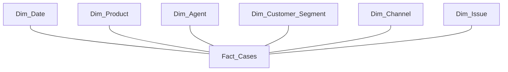

### 🔍 Plain-English deep-dive: why keep one running example?
- **Model** — *a planned way of structuring data.* **Analogy:** a floor plan before building a house. **Why it matters:** you stop memorizing isolated terms and start seeing how the parts fit together.
- **Support star schema** — *a support-focused analytics design where the fact table stores case metrics and dimensions store descriptive context.* **Analogy:** one ledger of case events plus several labeled lookup books. **Why it matters:** it matches your background, so interview answers will feel natural, not memorized.
> 💡 **Tie-in to your background:** You already understand operational governance, case processes, taxonomies, escalations, and the pain of inconsistent issue labels. Data modeling is that same discipline expressed as tables, keys, and rules.

---
## 1. Why data modeling matters at all
Data modeling is the practice of deciding:
- what tables should exist,
- what each row means,
- what each column means,
- how tables connect,
- where history should be preserved,
- and where business rules should live.

If those choices are poor, then even excellent SQL analysts will get different answers to the same question.

If those choices are strong, then even junior analysts can answer questions quickly and consistently.

### The business problem modeling solves
Without a clear model:
- one dashboard counts transfers as new cases,
- another dashboard excludes them,
- one report groups SPO and SharePoint Online separately,
- another combines them,
- and a third uses the latest agent team instead of the team at the time of the case.

Now leadership has three different "truths."

That is not a SQL problem.

That is a modeling problem.

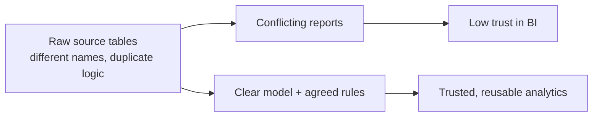

### 🔍 Plain-English deep-dive: the three promises of a good model
- **Clarity** — *everyone knows what a row means.* **Analogy:** every form field on a passport application is labeled clearly. **Why it matters:** no ambiguity means fewer wrong joins and fewer wrong totals.
- **Consistency** — *the same concept is represented the same way across reports.* **Analogy:** all airport signs using the same symbols. **Why it matters:** KPIs stop changing meaning from team to team.
- **Performance** — *queries can scan, group, and filter efficiently.* **Analogy:** books organized by topic in a library instead of in random piles. **Why it matters:** dashboards become faster and more scalable.

### Signs of a weak analytics model
| Symptom | What it usually means |
|---|---|
| Every dashboard has its own KPI logic | No central semantic layer or KPI standardization |
| Analysts write 12-join SQL just to count cases | OLTP structure exposed directly to BI |
| Product names differ by system | No conformed dimensions or taxonomy governance |
| Historical reporting breaks after reorgs | Wrong SCD strategy |
| Users do manual Excel cleanup before reporting | Modeling and business-rule logic are missing upstream |

### Modeling as risk reduction
A strong data model reduces risk in four ways:
1. **Interpretation risk** — fewer people misunderstand the data.
2. **Process risk** — fewer one-off definitions are created.
3. **Scale risk** — more users can self-serve safely.
4. **Audit risk** — metric logic can be traced back to documented rules.
> 💡 **Tie-in to your background:** Support organizations live and die on operational definitions: what counts as a transfer, an escalation, a reopen, a breach. Data modeling turns those definitions into durable structure.

---
## 2. Conceptual vs logical vs physical models
People often say "the data model" as if there is only one.

In practice, there are three common levels.

### 2.1 Conceptual model
A **conceptual model** is the highest-level picture.

It names the major business entities and their relationships.

It does **not** worry about exact columns, data types, indexes, or SQL syntax.

**Example conceptual entities for support analytics:**

- Case
- Agent
- Product
- Customer
- Channel
- Issue
- Date

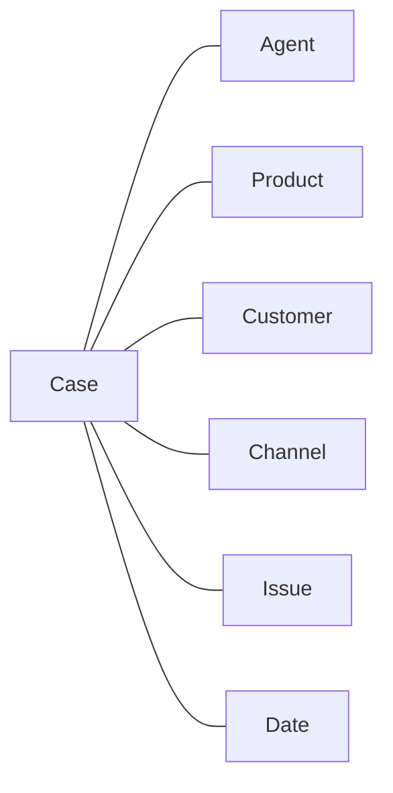

### 2.2 Logical model
A **logical model** is more detailed.

It defines:
- entities or tables,
- key relationships,
- attributes,
- and business rules,

but it still stays mostly technology-neutral.

For example, you may specify that:
- a case belongs to one product,
- an agent can handle many cases,
- a product has a product family,
- and customer segment should be a reusable dimension.

### 2.3 Physical model
A **physical model** is the implementation detail.

It decides:
- exact table names,
- exact columns,
- data types,
- partitioning,
- indexing,
- columnstore choices,
- storage engine,
- and loading strategy.

### Comparison table
| Level | Main question | Example output | Who uses it most |
|---|---|---|---|
| Conceptual | What business things exist? | entity relationship sketch | business + architect |
| Logical | How should those things relate? | subject-area model with keys and attributes | analyst + data modeler |
| Physical | How will we implement this in a platform? | SQL DDL, indexes, partitions | data engineer + DBA |

### 🔍 Plain-English deep-dive: why interviewers care about these levels
- **Conceptual model** — *business view first.* **Analogy:** deciding a store needs checkout, aisles, inventory room, and entrance before choosing shelf material. **Why it matters:** you prove you can think from business need, not just from tables.
- **Logical model** — *rules and relationships view.* **Analogy:** the wiring diagram for the house. **Why it matters:** it is where modeling quality is usually won or lost.
- **Physical model** — *implementation view.* **Analogy:** choosing concrete thickness and pipe diameter after the blueprint is approved. **Why it matters:** performance and maintainability depend on it.

### Worked example across all three levels
**Conceptual:**

- We analyze support cases.
- Cases are associated with products, agents, customers, channels, and issues.
- Leadership wants time-based KPIs.

**Logical:**

- We need one case fact table.
- We need date, product, agent, customer segment, channel, and issue dimensions.
- Agent attributes require history.
- Product should be conformed across support, usage, and survey facts.

**Physical:**

- Create Fact_Cases with bigint keys and numeric measures.
- Use integer surrogate keys for dimensions.
- Store Dim_Date with fiscal year starting in July.
- Use SCD Type 2 on Dim_Agent.
- Consider columnar storage for the fact table.
> 💡 **Tie-in to your background:** In support operations, you naturally move between these three levels already. Conceptual = process map. Logical = policy and taxonomy definition. Physical = actual queue setup, tool configuration, and reporting fields.

---
## 3. Normalization — the OLTP way of organizing data
**Normalization** is a design approach that reduces duplication and update problems by splitting data into related tables.

Normalization is usually associated with operational systems.

Analytics teams care because most source systems arrive in normalized form.

You often extract from normalized OLTP systems and reshape into dimensional models for analytics.

### 3.1 The intuition behind normalization
Imagine one giant support table:
| case_id | created_date | product_code | product_name | agent_id | agent_name | agent_team | customer_id | customer_segment | channel | issue_category | resolution_hours |
|---|---|---|---|---|---|---|---|---|---|---|---|
| 1001 | 2026-01-05 | SPO | SharePoint Online | 11 | Ben | Tier1 | C900 | Enterprise | Phone | Permissions | 6 |
| 1002 | 2026-01-06 | SPO | SharePoint Online | 11 | Ben | Tier1 | C901 | SMB | Web | Sync | 10 |

At first this seems convenient.

But now ask:
- What if Ben changes teams?
- What if SharePoint Online is renamed in one row and not another?
- What if customer segment changes?
- What if a case has multiple tags?

Duplication creates maintenance pain.

Normalization tries to store each descriptive fact in one proper place.

### 3.2 Functional dependency — the key idea underneath normal forms
A **functional dependency** means one attribute determines another.

Written simply:
- if `product_code -> product_name`, then knowing the product code tells you the product name.
- if `agent_id -> agent_name, agent_team`, then knowing the agent id tells you those agent attributes.

### 🔍 Plain-English deep-dive: functional dependency in plain English
- **Functional dependency** — *if two rows share the same value on the left side, they must share the same value on the right side.* **Analogy:** employee badge number determines the employee name in HR. **Why it matters:** it helps you detect which columns really belong together.
- **Determinant** — *the column or set of columns on the left side of the dependency.* **Analogy:** the locker number that points to one locker owner. **Why it matters:** normal forms are mostly about whether the determinant is the correct key.

### 3.3 First Normal Form (1NF)
**1NF** says each column should hold a single, atomic value.

No repeating groups.

No comma-separated lists in a single cell.

#### Bad 1NF example

| case_id | tags |
|---|---|
| 1001 | auth,permissions,priority-customer |

Why is this bad?

- filtering is messy,
- joins are messy,
- counting tags is messy,
- and data quality becomes weak.

#### Better 1NF approach

Split tags into a separate table.

| case_id | tag |
|---|---|
| 1001 | auth |
| 1001 | permissions |
| 1001 | priority-customer |

Or later, in dimensional modeling, use a proper bridge table.


### 3.4 Second Normal Form (2NF)
**2NF** says:
- the table must already be in 1NF,
- and every non-key attribute must depend on the **whole** primary key, not just part of it.

This matters most when the primary key is composite.

#### Worked example

Suppose we build a table keyed by `(case_id, product_code)`.

| case_id | product_code | product_name | resolution_hours |
|---|---|---|---|
| 1001 | SPO | SharePoint Online | 6 |

If the key is `(case_id, product_code)`, does `product_name` depend on the whole key?

No.

`product_code` alone determines `product_name`.

So `product_name` has a **partial dependency**.

That violates 2NF.

The fix is to move product details into a product table.

### 3.5 Third Normal Form (3NF)
**3NF** says:
- the table must be in 2NF,
- and non-key attributes should not depend on other non-key attributes.

That is called a **transitive dependency**.

#### Worked example

Suppose we keep this in one table:
| agent_id | agent_name | manager_id | manager_name |
|---|---|---|---|
| 11 | Ben | 300 | Asha |

If `agent_id -> manager_id` and `manager_id -> manager_name`, then `manager_name` depends on `agent_id` **through** `manager_id`.

That is a transitive dependency.

A normalized design would store manager details separately.

### 3.6 Boyce-Codd Normal Form (BCNF)
**BCNF** is stricter than 3NF.

It says that every determinant should be a candidate key.

Many interviewers do not expect perfect BCNF proofs.

They do expect you to know:
- it is a stronger form of normalization,
- it handles some edge cases 3NF allows,
- and it matters when unusual business rules create overlapping determinants.

#### Simple BCNF-flavored example

Imagine a training table:
| agent_id | shift | desk |
|---|---|---|

Suppose business rules say:
- `(agent_id, shift) -> desk`
- `desk -> shift`

Then `desk` determines `shift`, but `desk` may not be a candidate key for the table.

That means the table can violate BCNF even if it looks acceptable under 3NF reasoning.

### Comparison of normal forms
| Normal form | Main rule | Support example problem it fixes |
|---|---|---|
| 1NF | one value per cell | comma-separated tags in one column |
| 2NF | no partial dependency on composite key | product_name depending only on product_code |
| 3NF | no transitive dependency | manager_name depending on manager_id rather than agent_id |
| BCNF | every determinant is a candidate key | edge cases with multiple valid determinants |

### 3.7 Full worked example from messy table to normalized structure
#### Step A — messy source-style table

| case_id | created_date | agent_id | agent_name | agent_team | product_code | product_name | customer_id | customer_segment | customer_region | issue_code | issue_category | tags |
|---|---|---|---|---|---|---|---|---|---|---|---|---|
| 1001 | 2026-01-05 | 11 | Ben | Tier1 | SPO | SharePoint Online | C900 | Enterprise | EMEA | I44 | Permissions | auth,priority |

#### Step B — 1NF fix

Create a separate case-tag table.

#### Step C — 2NF fix

Move product details to Product.

#### Step D — 3NF fix

Move customer region logic to Customer or Customer Segment tables.

#### Step E — possible BCNF improvements

Review any unusual business rule where a non-key attribute determines another attribute.

### 🔍 Plain-English deep-dive: why normalized OLTP designs are still good
- **Update anomaly** — *you must edit the same fact in many places.* **Analogy:** changing your phone number in twenty notebooks. **Why it matters:** inconsistent source data creates dirty analytics later.
- **Insert anomaly** — *you cannot store one fact without another unrelated fact.* **Analogy:** being forced to create a case before you can create a new product. **Why it matters:** operational systems need clean transactional behavior.
- **Delete anomaly** — *deleting one row accidentally removes needed reference information.* **Analogy:** deleting the last sale and accidentally forgetting the product exists. **Why it matters:** normalization protects important business data.
> 💡 **Tie-in to your background:** Support systems are optimized to create, update, route, and close cases safely. That is why their databases often look normalized and "hard for BI" — because they were designed for operations, not dashboards.

---
## 4. Denormalization — when duplication is actually the right choice
**Denormalization** means intentionally combining data or repeating descriptive values to make reading easier or faster.

This sounds wrong after learning normalization.

But in analytics, denormalization is often exactly right.

### Why denormalization helps analytics
Analytical questions usually ask:
- count cases by product,
- average resolution hours by agent team and month,
- total breaches by customer segment and channel,
- compare reopened cases before and after taxonomy change.

These questions need scanning and grouping across many rows.

A denormalized or dimensional design reduces join complexity and aligns with BI tools.

### Normalization vs denormalization mindset
| Question | Operational answer | Analytics answer |
|---|---|---|
| Is duplication bad? | usually yes | sometimes useful |
| Main goal | safe writes | simple fast reads |
| Design shape | many related tables | star schema / wide tables |
| Main concern | transaction integrity | reporting usability |

### When denormalization is the right choice
Denormalize when:
- read simplicity matters more than write elegance,
- the data is refreshed in batches,
- the business wants self-service analytics,
- the same joins would be repeated in every query,
- or the BI tool strongly favors star schema.

### When denormalization is the wrong choice
Avoid blind denormalization when:
- update frequency is extremely high,
- multiple apps will write directly to the same table,
- duplicate data will drift without governance,
- or sensitive logic is not centrally managed.

### 🔍 Plain-English deep-dive: good duplication vs dangerous duplication
- **Good duplication** — *intentional repetition controlled by design.* **Analogy:** printing the same subway map at many stations. **Why it matters:** it improves usability with no confusion because the source of truth is managed.
- **Dangerous duplication** — *random repeated data with no governance.* **Analogy:** ten unofficial office seating charts. **Why it matters:** people stop trusting which copy is correct.


> 💡 **Tie-in to your background:** In support governance, not every field belongs on every operational form. But for reporting, you often create a curated view with the important classifications together. That curated view is a form of denormalization.

---
## 5. OLTP vs OLAP — deep comparison
This is a classic interview topic.

You should be able to explain it without sounding mechanical.

### 5.1 OLTP
**OLTP** stands for **Online Transaction Processing**.

It supports the daily execution of the business.

Examples:
- creating a support case,
- updating severity,
- assigning an agent,
- posting a customer message,
- closing a case.

OLTP systems care about:
- fast single-row inserts,
- safe updates,
- locking and concurrency,
- and transaction correctness.

### 5.2 OLAP
**OLAP** stands for **Online Analytical Processing**.

It supports analysis across many rows.

Examples:
- count cases by week,
- compare average resolution by product and segment,
- detect SLA trends over 12 months,
- analyze reopen behavior after process changes.

OLAP systems care about:
- scanning many rows,
- grouping and aggregating,
- simplified read models,
- historical consistency,
- and semantic clarity.

### Detailed comparison table
| Dimension | OLTP | OLAP |
|---|---|---|
| Primary purpose | run operations | analyze operations |
| Typical user | app or support agent | analyst, BI developer, manager |
| Query pattern | point lookup, insert, update | scan, group, aggregate |
| Data shape | normalized | star schema, cubes, wide models |
| Latency need | instant transactional response | near-real-time to batch is acceptable |
| History strategy | current state often dominates | historical analysis is essential |
| Storage preference | row-oriented often fits | columnar often fits |
| Example | case management system | Fabric warehouse or semantic model |

### 5.3 Why you should not point Power BI directly at OLTP tables
You *can* technically connect BI tools directly to operational schemas.

But usually you should not.

Reasons:
- the business logic is scattered,
- the joins are complex,
- history is inconsistent,
- source systems are not designed for analytic scan patterns,
- and semantic meaning is unclear.

### 5.4 Row storage vs columnar storage intuition
This often appears in modern warehousing interviews.

#### Row-oriented storage

A row store keeps all columns for one row together.

That is ideal when you want to read or update one record at a time.

**Analogy:** one file folder per employee, containing everything about that one employee.

#### Columnar storage

A column store keeps all values of one column together.

That is ideal when you want to scan a few columns across millions of rows.

**Analogy:** one giant stack of just salary pages, one giant stack of just department pages, one giant stack of just hire-date pages.

### 🔍 Plain-English deep-dive: why columnar helps analytics
- **Column pruning** — *the engine reads only the columns your query needs.* **Analogy:** opening only the blue folders in a cabinet because that is all you need. **Why it matters:** huge I/O savings when a table has many columns.
- **Compression** — *similar values in the same column compress well.* **Analogy:** packing identical T-shirts in one tight stack instead of mixing them with random items. **Why it matters:** lower storage and faster scans.
- **Vectorized execution** — *engines process batches of values efficiently.* **Analogy:** counting coins by tray instead of coin by coin. **Why it matters:** analytic queries run much faster.

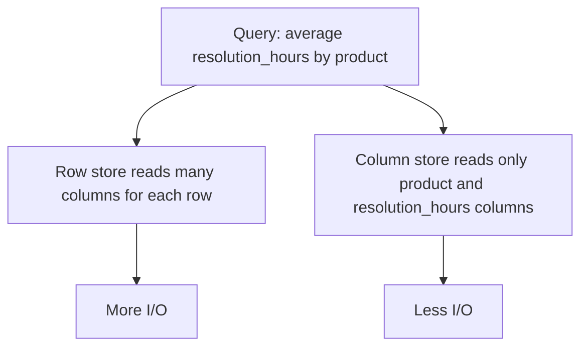

### Row vs column example
If a query asks:
```sql
SELECT product_sk, AVG(resolution_hours)
FROM Fact_Cases
GROUP BY product_sk;
```

A columnar engine mostly needs:
- product_sk,
- resolution_hours.

It does **not** need to read customer notes, case title, or many unused columns.

That is why modern warehouses like columnar formats for fact tables.
> 💡 **Tie-in to your background:** You know the difference between a live case-management tool and a weekly governance review deck. OLTP is the live tool. OLAP is the curated environment that makes the review deck trustworthy and fast.

---
## 6. Kimball dimensional modeling — the BI classic
When the JD says "dimensional/star schema," the canonical mental model is **Kimball**.

Ralph Kimball's approach is practical, business-facing, and extremely interview-friendly.

### 6.1 What dimensional modeling tries to do
Dimensional modeling structures data around business processes and analytic questions.

The basic pattern is:
- facts for measurable events,
- dimensions for descriptive context,
- and consistent conformed dimensions across subject areas.

### 6.2 Kimball's four-step design process
This is very commonly asked.

You should know it cleanly.

1. **Pick the business process.**
2. **Declare the grain.**
3. **Choose the dimensions.**
4. **Choose the facts.**


### Step 1 — Pick the business process
A **business process** is an activity the business wants to measure.

Examples:
- support case intake,
- support resolution,
- customer survey responses,
- usage telemetry,
- knowledge article usage.

For our running example, choose **support case handling**.

### Step 2 — Declare the grain
The **grain** defines exactly what one row in the fact table represents.

This is the single most important modeling discipline.

If the grain is vague, everything later becomes confused.

#### Good grain statements

- one row per support case created,
- one row per case per day snapshot,
- one row per case lifecycle with milestone dates,
- one row per survey response.

#### Bad grain statements

- one row per support activity,
- one row per case-ish thing,
- one row per case summary,
- one row depending on data availability.

### 🔍 Plain-English deep-dive: grain discipline
- **Grain** — *the exact real-world meaning of one fact row.* **Analogy:** deciding whether one receipt line means one item sold, one full receipt, or one day of store totals. **Why it matters:** it determines what you can sum, compare, and join safely.
- **Mixed grain** — *rows in the same table representing different levels of detail.* **Analogy:** putting daily weather and yearly weather into one notebook without labels. **Why it matters:** sums become nonsense.

### Step 3 — Choose the dimensions
For support cases, likely dimensions include:
- Date
- Product
- Agent
- Customer Segment
- Channel
- Issue
- Severity
- Geography

You do not add a dimension because it exists in the source.

You add it because the business wants to filter, group, compare, or standardize by it.

### Step 4 — Choose the facts
For support case analytics, candidate measures include:
- case_count,
- resolution_hours,
- time_to_first_response_minutes,
- csat_score,
- breach_flag,
- reopen_count,
- escalation_flag.

### 6.3 The bus matrix
The **bus matrix** is one of Kimball's most important planning tools.

It maps:
- rows = business processes / fact tables,
- columns = dimensions,
- marks = which dimensions each fact uses.

This reveals conformed dimensions.

#### Sample support-domain bus matrix

| Business process / fact | Date | Product | Agent | Customer Segment | Channel | Issue | Survey | Geography |
|---|---|---|---|---|---|---|---|---|
| Fact_Cases | X | X | X | X | X | X |  | X |
| Fact_Case_Daily_Snapshot | X | X | X | X | X | X |  | X |
| Fact_CSAT | X | X | X | X | X | X | X | X |
| Fact_Product_Usage | X | X |  | X |  |  |  | X |

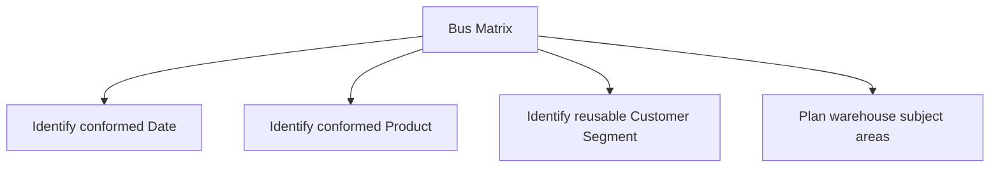

### Why the bus matrix matters
It helps you answer:
- which dimensions must be standardized first,
- which fact tables can arrive later without breaking consistency,
- and where enterprise KPI alignment depends on conformed dimensions.

### 6.4 Kimball in one sentence
**Kimball is bottom-up dimensional modeling where individual business-process stars are built in a coordinated way through conformed dimensions.**

> 💡 **Tie-in to your background:** This is very close to operational governance. You do not solve all support analytics in one giant abstract architecture first. You standardize key definitions — Product, Date, Segment, Issue — and then build reusable reporting subject areas around real business processes.

---
## 7. Fact tables — the measurement center of the star
A **fact table** stores measurable business events at a declared grain.

It usually contains:
- foreign keys to dimensions,
- numeric measures,
- sometimes dates,
- and sometimes identifiers called degenerate dimensions.

### 7.1 Anatomy of Fact_Cases
Example columns:
| Column | Meaning |
|---|---|
| case_id_dd | degenerate case number from source |
| created_date_sk | key to Dim_Date for created date |
| resolved_date_sk | key to Dim_Date for resolved date |
| product_sk | key to Dim_Product |
| agent_sk | key to Dim_Agent |
| customer_segment_sk | key to Dim_Customer_Segment |
| channel_sk | key to Dim_Channel |
| issue_sk | key to Dim_Issue |
| resolution_hours | numeric measure |
| first_response_minutes | numeric measure |
| csat_score | numeric measure |
| breach_flag | 0/1 indicator |
| reopen_count | count measure |

### 7.2 Types of fact tables
There are four classic types interviewers expect you to know.

#### A. Transaction fact table

A **transaction fact table** records an event each time it happens.

**Example:** one row per case created.

This is the most detailed and most common starting point.

#### B. Periodic snapshot fact table

A **periodic snapshot fact table** records the state of something at regular intervals.

**Example:** one row per open case per day.

Useful for backlog trend analysis.

#### C. Accumulating snapshot fact table

An **accumulating snapshot fact table** tracks a process that moves through milestones.

**Example:** one row per case lifecycle with created date, assigned date, escalated date, resolved date, and closed date.

This row is updated as the case progresses.

#### D. Factless fact table

A **factless fact table** captures that an event happened even if there is no numeric measure.

**Example:** one row showing an agent attended a product training session, or one row showing a case had a given tag.

### Comparison table for fact types
| Fact type | Grain example | Best for | Typical update pattern |
|---|---|---|---|
| Transaction | one row per case creation | event analysis | append |
| Periodic snapshot | one row per case per day | trend / backlog | append each period |
| Accumulating snapshot | one row per case lifecycle | process milestone analysis | update same row |
| Factless | one row per case-tag assignment | coverage / occurrence analysis | append |

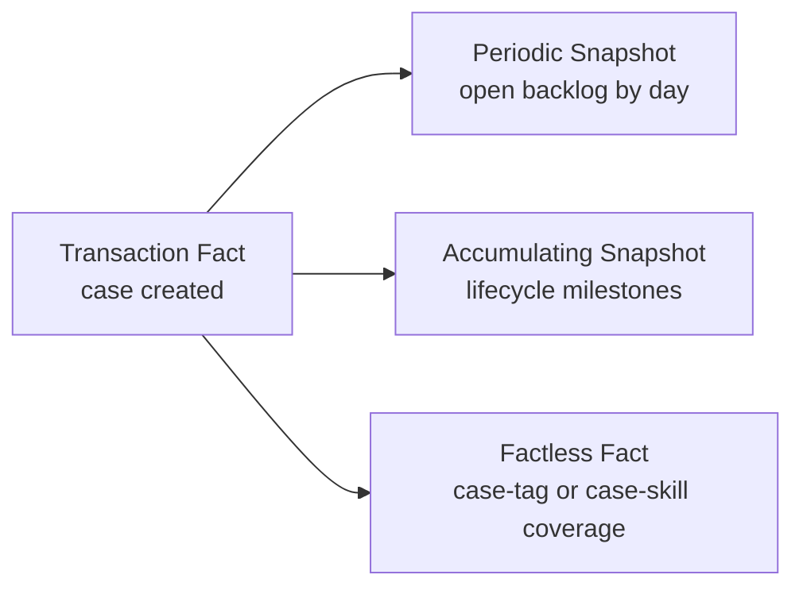

### 7.3 Grain discipline in fact tables
Before adding measures, write the grain in a sentence.

Examples:
- **Fact_Cases:** one row per support case at creation time.
- **Fact_Case_Daily_Snapshot:** one row per support case per calendar day while open.
- **Fact_Case_Lifecycle:** one row per support case lifecycle, updated as milestones occur.

Never mix these grains in one table.

### 7.4 Additivity of measures
Not all measures sum the same way.

This is a very common interview question.

#### Additive measures

An **additive** measure can be summed across all dimensions.

Examples:
- case_count,
- reopen_count,
- total_resolution_minutes,
- total_breach_count.

#### Semi-additive measures

A **semi-additive** measure can be summed across some dimensions but not all.

The classic example is balance or inventory across time.

In support analytics, **open_case_count** in a daily snapshot can be summed across products for the same day, but not across days unless you intend cumulative totals.

#### Non-additive measures

A **non-additive** measure should not simply be summed.

Examples:
- average_resolution_hours,
- CSAT percentage,
- SLA attainment rate.

For these, store the components when possible.

For example:
- store `survey_count` and `survey_score_sum`,
- then calculate CSAT average as `survey_score_sum / survey_count`.

### Additivity table
| Measure | Type | Why |
|---|---|---|
| case_count | additive | counts can be summed across all dims |
| resolution_hours_total | additive | totals can be summed |
| open_case_count on daily snapshot | semi-additive | okay across product, not across time blindly |
| average_resolution_hours | non-additive | averaging averages can mislead |
| csat_percent | non-additive | needs weighted calculation |

### 🔍 Plain-English deep-dive: store ratios carefully
- **Ratio** — *one number divided by another.* **Analogy:** exam score percentage. **Why it matters:** if you average percentages from groups of different sizes, you often get the wrong enterprise answer.
- **Weighted average** — *an average that gives larger groups more influence.* **Analogy:** class average should reflect how many students are in each class. **Why it matters:** KPI standardization often depends on storing numerator and denominator separately.

### 7.5 Degenerate dimensions
A **degenerate dimension** is an identifier stored in the fact table with no separate dimension table.

Examples:
- case number,
- ticket reference,
- order number.

Why no dimension table?

Because the identifier has no useful descriptive attributes worth breaking out.

**Example:** `case_id_dd` in Fact_Cases.

### 7.6 Handling many-to-many from the fact side
If one case can have multiple tags or require multiple skills, one plain foreign key is not enough.

You will need a bridge table or separate factless table.

We will cover that deeply later.

### 7.7 Nulls in fact tables
Good practice:
- use **unknown / not applicable** rows in dimensions,
- avoid leaving foreign keys null when possible,
- be explicit whether a missing measure means zero, unknown, or not applicable.
> 💡 **Tie-in to your background:** Case analytics often break when people mix event-level and backlog-level facts. Your process mindset is an advantage here: first define exactly what event or state is being measured, then design the table.

---
## 8. Dimension tables — the descriptive side of the star
A **dimension table** stores the attributes you use to filter, group, label, or drill into facts.

If fact tables answer **how much** or **how many**, dimensions answer **by what**, **for whom**, **where**, **when**, and **under which classification**.

### 8.1 Typical dimension characteristics
Dimension tables usually:
- are wider than fact tables,
- contain mostly text or classification columns,
- change more slowly,
- and hold one row per descriptive entity version.

### 8.2 Surrogate key vs natural key vs business key
These terms are related but not identical.

#### Surrogate key

A **surrogate key** is a warehouse-generated identifier.

Examples:
- product_sk = 101
- agent_sk = 501

It has no business meaning.

#### Natural key

A **natural key** comes from the real world or source system.

Examples:
- agent_id from HR,
- product_code from the service catalog,
- customer_tenant_id.

#### Business key

A **business key** is the business-recognized identifier used to refer to the entity.

Sometimes business key and natural key are effectively the same in warehouse conversations.

### Comparison table
| Key type | Example | Stable? | Main use |
|---|---|---|---|
| Surrogate | agent_sk = 501 | warehouse-controlled | joins and SCD handling |
| Natural | A-11052 from source | may change | source matching |
| Business | SPO product code | business-recognized | governance and communication |

### 🔍 Plain-English deep-dive: why surrogate keys matter so much
- **Surrogate key** — *a warehouse-only ID that stays stable even when source attributes change.* **Analogy:** a museum assigns its own catalog number to an artifact even if the donor's label changes. **Why it matters:** SCD Type 2 would be very awkward without it.
- **Business key** — *the identifier people recognize from operations.* **Analogy:** flight number seen by passengers. **Why it matters:** you still need it for matching and explanation, even if joins use surrogate keys.

### 8.3 Conformed dimensions
A **conformed dimension** is reused consistently across multiple fact tables.

For example:
- the same Dim_Product joins to Fact_Cases, Fact_CSAT, and Fact_Product_Usage,
- the same Dim_Date joins to all time-based facts.

This creates enterprise comparability.

### 8.4 Role-playing dimensions
A **role-playing dimension** is one physical dimension used in multiple logical roles.

The classic example is Date.

Fact_Cases may need:
- created_date_sk,
- first_response_date_sk,
- resolved_date_sk,
- closed_date_sk.

All of them point to **Dim_Date**, but each plays a different role.

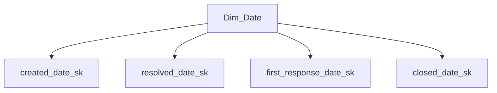

### 8.5 Junk dimensions
A **junk dimension** combines low-cardinality flags and indicators into one small dimension.

Examples:
- breach_flag,
- escalation_flag,
- after_hours_flag,
- reopened_flag,
- premium_support_flag.

Instead of storing many tiny text attributes directly in the fact, a junk dimension can simplify the model.

### 8.6 Outrigger dimensions
An **outrigger dimension** is a dimension linked to another dimension.

Example:
- Dim_Agent has a manager_sk that points to a manager-related dimension,
- or Dim_Customer points to Dim_Region.

In pure star modeling, outriggers are used carefully because they make the shape a little more snowflake-like.

### 8.7 Snowflaking dimensions
**Snowflaking** means normalizing dimensions into sub-dimensions.

Example:
- Dim_Product points to Dim_Product_Family,
- which points to Dim_Service_Area.

This can reduce duplication but increases join complexity.

For Power BI and beginner-friendly analytics, prefer flat star-style dimensions unless there is a strong reason not to.

### 8.8 Date dimension and time-of-day dimension
A proper **Dim_Date** is a warehouse essential.

Typical columns include:
- date_sk,
- full_date,
- day_name,
- week_of_year,
- month_name,
- month_number,
- quarter,
- calendar_year,
- fiscal_month,
- fiscal_quarter,
- fiscal_year,
- is_weekend,
- is_month_end,
- is_holiday.

A separate **Dim_Time** or **Dim_Time_Of_Day** can model:
- hour,
- minute bucket,
- shift bucket,
- business-hours flag,
- time-band like morning / afternoon / evening.

### Microsoft fiscal calendar example
Microsoft fiscal year runs **July to June**.

So:
- July 2025 belongs to FY2026,
- June 2026 also belongs to FY2026.

That should be encoded once in Dim_Date.

### Sample date dimension slice
| full_date | calendar_month | fiscal_month | fiscal_quarter | fiscal_year |
|---|---|---|---|---|
| 2025-06-30 | 6 | 12 | Q4 | FY2025 |
| 2025-07-01 | 7 | 1 | Q1 | FY2026 |
| 2026-03-10 | 3 | 9 | Q3 | FY2026 |

> 💡 **Tie-in to your background:** In governance reviews, people often compare month, fiscal quarter, and business hours. Those are not random report calculations. They belong in shared dimensions so every report behaves the same way.

---
## 9. Slowly Changing Dimensions (SCD) — all major types
Dimensions change over time.

People move teams.

Products move into new service families.

Customers move between segments.

Issue taxonomies get refined.

**SCD** stands for **Slowly Changing Dimension**, which simply means: how will we store attribute changes over time?

### 9.1 Type 0 — retain original value
**Type 0** means never change the value after initial load.

Use when the original value should always remain fixed.

Example:
- original case source channel,
- original signup country,
- original launch product family for a historical analysis dimension.

### 9.2 Type 1 — overwrite, no history
**Type 1** updates the value in place.

Old value is lost.

Use when:
- fixing data entry errors,
- correcting misspellings,
- standardizing labels,
- or history is not analytically important.

**Example:** change `Prodcut` to `Product` in a typo-heavy source attribute.

### 9.3 Type 2 — add a new row for each version
**Type 2** preserves full history.

When a tracked attribute changes, you:
- expire the old row,
- insert a new row,
- and give the new row a new surrogate key.

Common columns:
- natural_key,
- valid_from,
- valid_to,
- is_current,
- version_number.

### 9.4 Type 3 — store limited prior value in extra columns
**Type 3** preserves limited history in extra columns.

Example columns:
- current_team,
- previous_team.

Useful when users only care about current vs previous state.

### 9.5 Type 4 — history table
**Type 4** keeps a separate current dimension and a separate history table.

So:
- current table is simple for most queries,
- history table stores all prior versions.

This is less discussed than Type 2 but still important to know.

### 9.6 Type 6 — hybrid (1 + 2 + 3)
**Type 6** combines elements of Type 1, Type 2, and Type 3.

For example, you may:
- keep full row history like Type 2,
- store current and previous values like Type 3,
- and overwrite some non-historical fields like Type 1.

This is sometimes called a **hybrid dimension**.

### SCD type comparison table
| Type | What happens on change | History preserved? | Typical use |
|---|---|---|---|
| 0 | do nothing | original only | never-changing original attribute |
| 1 | overwrite row | no | correction or unimportant history |
| 2 | insert new row | yes, full | team, segment, org, hierarchy changes |
| 3 | add previous-value column | limited | current vs prior comparison |
| 4 | separate history table | yes | simple current table + separate archive |
| 6 | hybrid | yes + convenience | mixed reporting needs |

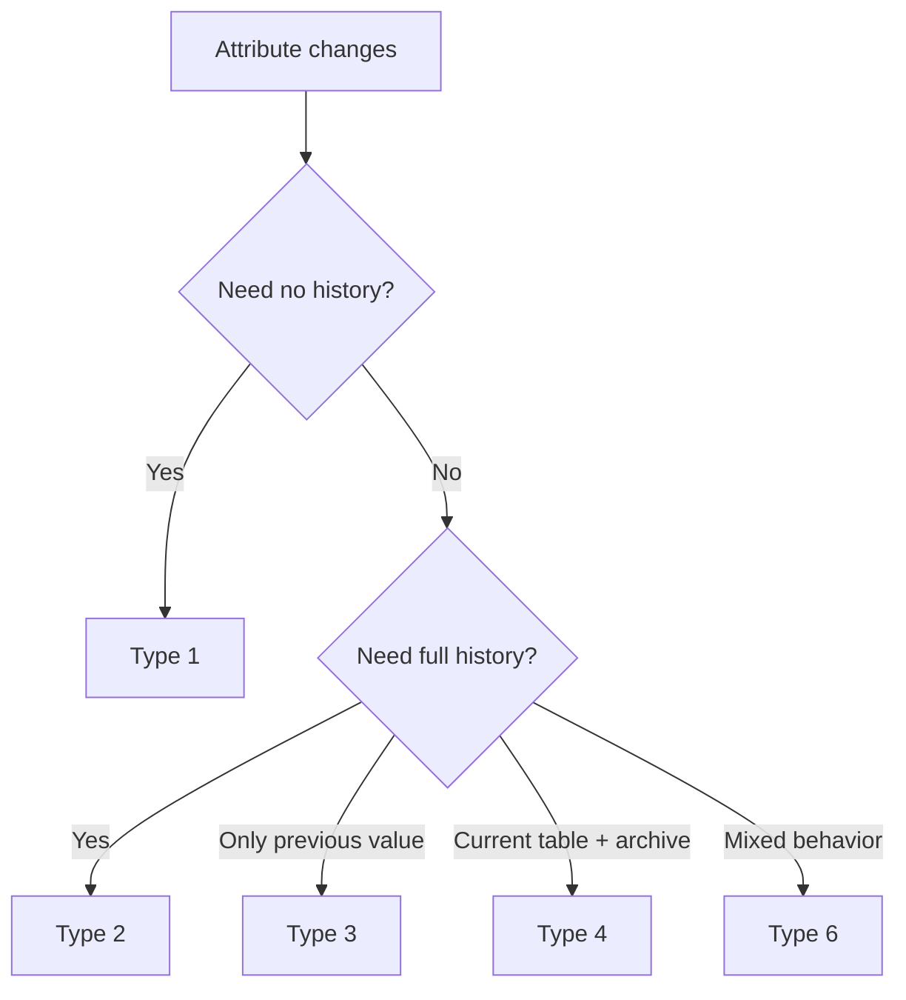

### 9.7 Support-domain examples by type
| Attribute | Likely SCD type | Why |
|---|---|---|
| Agent name typo | Type 1 | typo correction, no historical need |
| Agent team | Type 2 | need to report cases under historical team |
| Customer segment | Type 2 | leadership wants historical accuracy |
| Product marketing label | Type 1 or 3 | depends whether historical label matters |
| Previous manager | Type 3 | maybe only current vs previous comparison needed |
| Current product taxonomy + full audit trail | Type 6 or 4 | both easy reporting and detailed history |

### 🔍 Plain-English deep-dive: what changes are "slowly" changing?
- **Slowly changing** does not literally mean slow in clock time.
- It means the change affects descriptive attributes rather than high-frequency transactional events.
- An agent team change once a quarter is a classic SCD case.
- Even daily changes can still be modeled as an SCD if they are attribute history rather than transaction history.

### 9.8 Choosing the SCD type
Ask three questions:
1. Do users need historical truth "as of the event date"?
2. Is only the current corrected value needed?
3. How much complexity can downstream users handle?

If historical truth matters, Type 2 is usually the default answer.
> 💡 **Tie-in to your background:** Reorgs, queue changes, manager changes, support tier changes, and taxonomy updates are normal in support. SCD strategy is how BI stays honest after those operational changes happen.

---
## 10. How SCD Type 2 works in practice
This deserves its own section because interviewers often ask for implementation detail.

### 10.1 Core Type 2 columns
A typical Type 2 dimension includes:
- surrogate key,
- business key,
- tracked attributes,
- valid_from,
- valid_to,
- is_current,
- maybe version_number,
- maybe hash of tracked attributes.

### Example Dim_Agent SCD2
| agent_sk | agent_id | agent_name | agent_team | manager_name | valid_from | valid_to | is_current |
|---|---|---|---|---|---|---|---|
| 501 | 11 | Ben | Tier1 | Asha | 2025-07-01 | 2026-02-28 | 0 |
| 777 | 11 | Ben | Tier2 | Kavya | 2026-03-01 | 9999-12-31 | 1 |

### 10.2 Join logic from fact to Type 2 dimension
A fact row should join to the **correct version** of the dimension based on event date.

That is why ETL usually resolves the surrogate key during loading.

The fact stores `agent_sk`, not just `agent_id`.

### 10.3 Type 2 load logic in words
For each incoming business key:
1. Find current dimension row.
2. Compare tracked attributes.
3. If no change, reuse current surrogate key.
4. If change exists:
   - expire current row,
   - set its `valid_to` to yesterday or the change timestamp,
   - set `is_current = 0`,
   - insert a new row with a new surrogate key,
   - set `valid_from` to the change date,
   - set `valid_to` to future high date,
   - set `is_current = 1`.

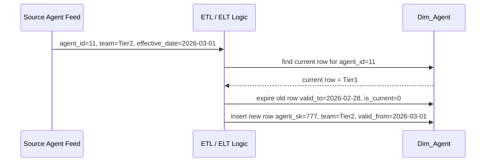

### 10.4 SQL example — create the table
```sql
CREATE TABLE Dim_Agent (
    agent_sk            INTEGER PRIMARY KEY,
    agent_id            TEXT NOT NULL,
    agent_name          TEXT NOT NULL,
    agent_team          TEXT NOT NULL,
    manager_name        TEXT,
    valid_from          DATE NOT NULL,
    valid_to            DATE NOT NULL,
    is_current          INTEGER NOT NULL,
    version_number      INTEGER NOT NULL
);
```

### 10.5 SQL example — seed current data
```sql
INSERT INTO Dim_Agent (
    agent_sk,
    agent_id,
    agent_name,
    agent_team,
    manager_name,
    valid_from,
    valid_to,
    is_current,
    version_number
)
VALUES
    (501, '11', 'Ben', 'Tier1', 'Asha', '2025-07-01', '9999-12-31', 1, 1);
```

### 10.6 SQL example — detect a change
```sql
SELECT agent_sk, agent_team, manager_name
FROM Dim_Agent
WHERE agent_id = '11'
  AND is_current = 1;
```

Suppose the incoming source row says:
- agent_team = Tier2
- manager_name = Kavya
- effective date = 2026-03-01

### 10.7 SQL example — expire the old row
```sql
UPDATE Dim_Agent
SET valid_to = DATE('2026-03-01', '-1 day'),
    is_current = 0
WHERE agent_id = '11'
  AND is_current = 1;
```

### 10.8 SQL example — insert the new version
```sql
INSERT INTO Dim_Agent (
    agent_sk,
    agent_id,
    agent_name,
    agent_team,
    manager_name,
    valid_from,
    valid_to,
    is_current,
    version_number
)
VALUES
    (777, '11', 'Ben', 'Tier2', 'Kavya', '2026-03-01', '9999-12-31', 1, 2);
```

### 10.9 SQL example — lookup correct surrogate key for a fact load
```sql
SELECT agent_sk
FROM Dim_Agent
WHERE agent_id = '11'
  AND DATE('2026-04-05') BETWEEN valid_from AND valid_to;
```

This returns `777`.

A case from `2026-01-15` would return `501`.

### 10.10 SQL example — building Fact_Cases with SCD2-resolved agent key
```sql
CREATE TABLE Fact_Cases AS
SELECT
    rc.case_id                              AS case_id_dd,
    dd.date_sk                              AS created_date_sk,
    dp.product_sk                           AS product_sk,
    da.agent_sk                             AS agent_sk,
    dcs.customer_segment_sk                 AS customer_segment_sk,
    dc.channel_sk                           AS channel_sk,
    di.issue_sk                             AS issue_sk,
    1                                       AS case_count,
    rc.resolution_hours                     AS resolution_hours,
    rc.first_response_minutes               AS first_response_minutes,
    rc.csat_score                           AS csat_score,
    rc.breach_flag                          AS breach_flag,
    rc.reopen_count                         AS reopen_count
FROM raw_cases rc
JOIN Dim_Date dd
  ON rc.created_date = dd.full_date
JOIN Dim_Product dp
  ON rc.product_code = dp.product_code
JOIN Dim_Agent da
  ON rc.agent_id = da.agent_id
 AND rc.created_date BETWEEN da.valid_from AND da.valid_to
JOIN Dim_Customer_Segment dcs
  ON rc.customer_segment_code = dcs.customer_segment_code
JOIN Dim_Channel dc
  ON rc.channel_code = dc.channel_code
JOIN Dim_Issue di
  ON rc.issue_code = di.issue_code;
```

### 10.11 Common mistakes with Type 2
| Mistake | Why it is wrong | Better approach |
|---|---|---|
| joining fact to latest dimension row only | history gets rewritten | resolve surrogate key by event date |
| no valid_from / valid_to columns | hard to audit or backfill | store effective ranges |
| reusing same surrogate key after change | versions become indistinguishable | create a new surrogate key |
| Type 2 on every attribute | too much dimension growth | only track analytically meaningful changes |
| not defining effective-date source | ambiguous history | agree whether source event date or load date controls versioning |

### 10.12 Load-date vs effective-date thinking
Sometimes the source tells you when the business change actually became effective.

Sometimes you only know when you received the change.

Those are not always the same.

That difference matters for historical accuracy.
> 💡 **Tie-in to your background:** In support, the official team transfer date and the date a reporting feed notices it may differ. Good BI modeling asks which date should drive truth.

---
## 11. Late-arriving dimensions, mini-dimensions, and rapidly changing attributes
Real data is messy.

The perfect dimension row is not always available when the fact arrives.

### 11.1 Late-arriving dimensions
A **late-arriving dimension** means the fact event arrives before the related dimension context is fully available.

Example:
- a case is created referencing a new customer segment code,
- but the master customer dimension feed arrives tomorrow.

### Common approaches
1. Insert the fact using an **unknown** dimension row.
2. Insert an **inferred member** in the dimension.
3. Backfill the fact later once the full dimension record arrives.

### 🔍 Plain-English deep-dive: inferred member
- **Inferred member** — *a placeholder dimension row created from minimal information so the fact can load.* **Analogy:** creating a temporary visitor badge when the full employee record is not ready yet. **Why it matters:** the warehouse keeps flowing without losing referential integrity.

### 11.2 Mini-dimensions
A **mini-dimension** handles rapidly changing, low-level attributes by moving them out of a large primary dimension.

Example:

Suppose customer behavior attributes change frequently:
- premium_support_flag,
- active_incident_count_band,
- usage_intensity_band,
- strategic_account_risk_band.

If you put all of these into a Type 2 customer dimension, it may explode in size.

Instead, create a small mini-dimension for these volatile profile attributes.

### 11.3 Why mini-dimensions exist
They help when:
- the main dimension is already large,
- some attributes change very frequently,
- and the business still wants historical behavior segmentation.

### Example structure
- **Dim_Customer** = stable attributes like tenant, industry, base geography.
- **Dim_Customer_Profile_Mini** = changing bands like health tier, adoption band, risk band.
- Fact_Cases stores both keys.

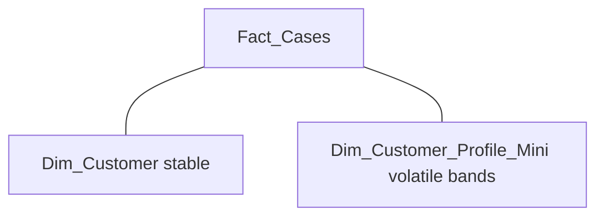

---
## 12. Slowly changing facts, early-arriving facts, and restatements
Interviewers usually talk more about changing dimensions.

But facts can have tricky change behavior too.

### 12.1 Slowly changing facts
A **slowly changing fact** means the numeric or status values associated with an event may be corrected or restated after the initial load.

Examples:
- resolution_hours recalculated after a clock issue,
- breach flag corrected after SLA policy fix,
- case transferred classification updated,
- CSAT linked later when survey response arrives.

### 12.2 Early-arriving facts
An **early-arriving fact** means the fact lands before all related dimensions are ready.

This overlaps with late-arriving dimensions.

Example:
- a case event lands immediately,
- but a new agent or issue category record is not yet present in the conformed dimensions.

Approaches are similar:
- unknown member,
- inferred dimension row,
- later backfill.

### 12.3 Handling fact updates and restatements
There is no single universal answer.

Common strategies include:

#### A. Overwrite the fact row

Use when the business wants the latest corrected value only.

#### B. Keep audit columns

Add:
- load_timestamp,
- source_extract_id,
- last_updated_timestamp,
- correction_reason.

#### C. Insert adjustment rows

Instead of rewriting history, add delta rows or adjustment facts.

Common in finance and some audited domains.

#### D. Rebuild affected partitions

In modern warehouses, periodic reprocessing of changed periods can be simplest.

### Comparison table
| Situation | Common response |
|---|---|
| case closes later, lifecycle fact updates | accumulating snapshot update |
| SLA policy correction | restate facts or rebuild period |
| survey response arrives days later | late-arriving fact update or separate survey fact |
| case transferred after creation | decide whether transfer is same lifecycle or new event |

### 12.4 Accumulating snapshot and updates
An accumulating snapshot is expected to update.

For example:
| case_id | created_date | assigned_date | first_response_date | escalated_date | resolved_date | closed_date |
|---|---|---|---|---|---|---|
| 1001 | 2026-01-05 | 2026-01-05 | 2026-01-05 | null | 2026-01-06 | 2026-01-07 |

As milestones occur, the row gets updated.

That is normal.

### 12.5 Important design question: event truth vs corrected truth
Ask stakeholders:
- Do you want reports to reflect what was known at the time?
- Or do you want all metrics recalculated using the latest corrected understanding?

Different KPIs may answer differently.

### 🔍 Plain-English deep-dive: restatement
- **Restatement** — *replacing or adjusting previously reported values because better information or corrected rules became available.* **Analogy:** revising last month's expense report after finding missing receipts. **Why it matters:** leadership needs to know whether a KPI trend changed because the business changed or because the logic changed.
> 💡 **Tie-in to your background:** Support metrics often get revisited after policy clarifications or routing-rule updates. Being able to talk about restatement and auditability makes you sound like someone who has lived real operational reporting, not just textbook SQL.

---
## 13. Bridge tables and many-to-many relationships
A **many-to-many** relationship means one row on each side can relate to many rows on the other side.

Examples in support analytics:
- one case can have multiple tags,
- one case can require multiple skills,
- one customer can belong to multiple programs,
- one issue can map to multiple knowledge areas.

A plain foreign key in the fact table cannot model this cleanly.

### 13.1 The bridge table idea
A **bridge table** sits between the fact and a dimension or group of dimension members.

Example:
- Fact_Cases stores one case row.
- Case 1001 has tags: permissions, auth, priority-customer.
- A bridge table links the case to multiple tag dimension rows.

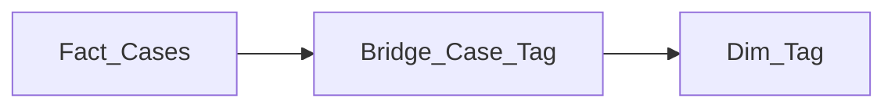

### 13.2 Why not just store comma-separated values?
Because then:
- filtering is ugly,
- counting is unreliable,
- indexing is poor,
- and semantic modeling tools struggle.

### 13.3 Simple case-tag bridge example
**Dim_Tag**

| tag_sk | tag_name |
|---|---|
| 1 | permissions |
| 2 | auth |
| 3 | priority-customer |

**Bridge_Case_Tag**

| case_id_dd | tag_sk | weight_factor |
|---|---|---|
| 1001 | 1 | 0.3333 |
| 1001 | 2 | 0.3333 |
| 1001 | 3 | 0.3333 |

### 13.4 Weighting factors
A **weighting factor** helps avoid double-counting when aggregating across the many-to-many bridge.

If one case has three tags and you want allocated counting by tag, each tag may get weight `1/3`.

Then:
```sql
SELECT t.tag_name,
       SUM(b.weight_factor) AS allocated_case_count
FROM Bridge_Case_Tag b
JOIN Dim_Tag t
  ON b.tag_sk = t.tag_sk
GROUP BY t.tag_name;
```

This produces an allocated total that sums back to the overall case count.

### 13.5 When weighting is needed vs not needed
| Question | Need weighting? | Why |
|---|---|---|
| Which tags appeared on any cases? | no | simple occurrence count is fine |
| How many case-tag links exist? | no | count links directly |
| Allocate one case across multiple tags without double-counting totals | yes | case belongs to several tags |
| Distinct case count by tag | maybe | depends whether distinct count is acceptable |

### 13.6 Bridge table for skills example
Suppose a case requires:
- product expertise,
- auth expertise,
- migration expertise.

A bridge allows analysis like:
- which skills correlate with long resolution,
- which skills are under-covered by current staffing,
- what training topics align with high-volume cases.

### 13.7 Factless fact vs bridge — how to think about it
Sometimes the line between a bridge and a factless fact can feel blurry.

Simple rule:
- if it mainly resolves many-to-many between a fact and a dimension grouping, think **bridge**,
- if it mainly records occurrence of an event without numeric measures, think **factless fact**.

### SQL example — create a tag bridge
```sql
CREATE TABLE Dim_Tag (
    tag_sk      INTEGER PRIMARY KEY,
    tag_name    TEXT NOT NULL
);

CREATE TABLE Bridge_Case_Tag (
    case_id_dd      INTEGER NOT NULL,
    tag_sk          INTEGER NOT NULL,
    weight_factor   DECIMAL(10,4) NOT NULL,
    PRIMARY KEY (case_id_dd, tag_sk)
);
```

### SQL example — populate bridge rows
```sql
INSERT INTO Dim_Tag VALUES
    (1, 'permissions'),
    (2, 'auth'),
    (3, 'priority-customer');

INSERT INTO Bridge_Case_Tag VALUES
    (1001, 1, 0.3333),
    (1001, 2, 0.3333),
    (1001, 3, 0.3333);
```

### SQL example — join through the bridge
```sql
SELECT t.tag_name,
       COUNT(DISTINCT f.case_id_dd) AS distinct_cases,
       SUM(b.weight_factor)         AS allocated_cases,
       AVG(f.resolution_hours)      AS avg_resolution_hours
FROM Fact_Cases f
JOIN Bridge_Case_Tag b
  ON f.case_id_dd = b.case_id_dd
JOIN Dim_Tag t
  ON b.tag_sk = t.tag_sk
GROUP BY t.tag_name;
```

> 💡 **Tie-in to your background:** Support cases often involve multiple symptoms, multiple skills, or multiple routing labels. Saying "I would model that with a bridge table and weighting if I need allocated counts" is a strong, practical answer.

---
## 14. Hierarchies — fixed, ragged, and parent-child
A **hierarchy** is an ordered set of levels used for drill-down or roll-up.

Examples:
- product family → product → feature,
- geography → region → country → subsidiary,
- manager → team lead → engineer,
- issue family → issue category → issue symptom.

### 14.1 Fixed hierarchies
A **fixed hierarchy** has a consistent number of levels.

Example:
- fiscal year → fiscal quarter → fiscal month.

These are easiest to model.

### 14.2 Ragged hierarchies
A **ragged hierarchy** has uneven depth.

Example:
- some product lines have family → workload → feature,
- others have family → feature only.

### 14.3 Parent-child hierarchies
A **parent-child hierarchy** stores recursive relationships where each row points to its parent.

Classic examples:
- org charts,
- manager chains,
- category trees.

### Hierarchy examples table
| Hierarchy type | Example | Modeling challenge |
|---|---|---|
| Fixed | fiscal year → quarter → month | straightforward flattening |
| Ragged | service area → workload → optional feature | missing intermediate levels |
| Parent-child | manager org chart | recursive relationship |

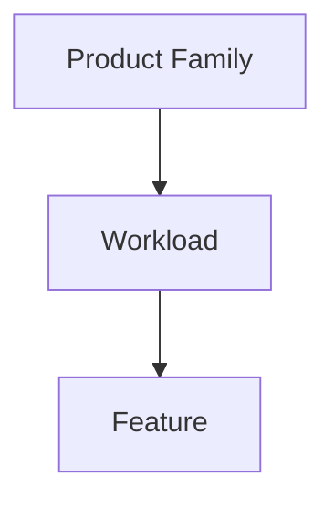

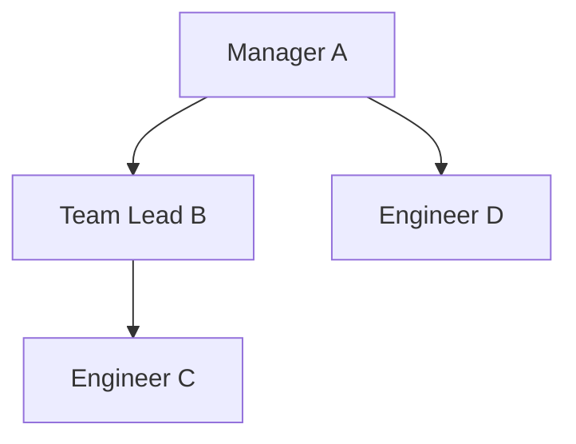

### 14.4 How to model hierarchies in dimensions
#### Option A — flatten into columns

Example Dim_Product columns:
- service_area,
- product_family,
- workload,
- feature_name.

This is easy for BI tools.

#### Option B — separate snowflaked hierarchy tables

This reduces duplication but increases joins.

#### Option C — parent-child table with flattening in semantic layer or ETL

Useful for org structures.

### 14.5 Flattening parent-child hierarchies
BI tools often prefer explicit columns such as:
- level_1_manager,
- level_2_manager,
- level_3_manager,
- engineer_name.

This is called **flattening**.

It makes drill paths and filtering easier.

### 14.6 Support-domain hierarchy examples
- **Issue taxonomy:** issue family → issue category → issue symptom.
- **Product hierarchy:** service area → product family → workload → feature.
- **Agent hierarchy:** VP → director → manager → engineer.
- **Customer hierarchy:** global account → regional account → tenant.

---
## 15. Star vs snowflake vs galaxy / constellation
These are three classic warehouse shapes.

### 15.1 Star schema
One fact table in the center.

Several denormalized dimension tables around it.

Best for:
- ease of use,
- fast BI adoption,
- Power BI semantic modeling,
- clear business communication.

### 15.2 Snowflake schema
A star-like structure where one or more dimensions are normalized into sub-dimensions.

Best for:
- reducing duplication in dimensions,
- handling some complex shared hierarchies,
- but usually at the cost of simplicity.

### 15.3 Galaxy / fact constellation
A **galaxy** or **fact constellation** has multiple fact tables sharing conformed dimensions.

Example:
- Fact_Cases,
- Fact_CSAT,
- Fact_Product_Usage,
- all sharing Dim_Date, Dim_Product, and Dim_Customer_Segment.

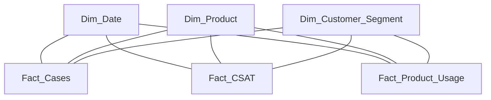

### Comparison table
| Shape | Description | Pros | Cons |
|---|---|---|---|
| Star | one fact with flat dimensions | simple, fast, BI-friendly | some repeated attributes |
| Snowflake | dimensions normalized | less duplication | more joins, more complexity |
| Galaxy | multiple facts share dimensions | enterprise reuse, cross-process analysis | requires strong conformance and governance |

### Which should you prefer?
For Power BI / Fabric semantic models, default to **star**.

For enterprise architecture across multiple subject areas, think in terms of a **galaxy** built from many coordinated stars.

Use **snowflake** selectively and intentionally.

### 🔍 Plain-English deep-dive: why galaxy matters for enterprise BI
- **Constellation** — *many stars connected by shared dimensions.* **Analogy:** multiple city train lines all using the same central stations. **Why it matters:** this is how separate subject areas still tell one enterprise story.
> 💡 **Tie-in to your background:** CE&S BI is unlikely to have just one support fact table forever. Real value comes when support cases, product usage, surveys, and maybe staffing data can all be compared through shared Product, Date, and Segment dimensions.

---
## 16. Kimball vs Inmon vs Data Vault 2.0 vs modern wide-table thinking
You do not need to sound dogmatic here.

You need to sound balanced.

### 16.1 Kimball
**Kimball** emphasizes dimensional models built around business processes and conformed dimensions.

Often described as **bottom-up**.

Strengths:
- business-friendly,
- fast time to value,
- excellent for BI and self-service,
- highly compatible with semantic models.

### 16.2 Inmon
**Bill Inmon** is associated with a more **top-down** view.

Traditionally:
- build an integrated enterprise data warehouse in normalized form first,
- then create downstream data marts for analytics.

Strengths:
- strong enterprise integration mindset,
- good for centralized control,
- useful where enterprise-wide consistency is designed first.

### 16.3 Data Vault 2.0 intro
**Data Vault 2.0** is a modern modeling approach designed for flexibility, auditability, and scalable ingestion.

Core pieces:
- **Hubs** — core business keys,
- **Links** — relationships between keys,
- **Satellites** — descriptive attributes and history.

### 🔍 Plain-English deep-dive: Data Vault in plain English
- **Hub** — *the stable business identity.* **Analogy:** the passport number itself. **Why it matters:** keys are separated from changing descriptions.
- **Link** — *the association between business identities.* **Analogy:** a marriage certificate linking two people. **Why it matters:** many relationships become explicit and auditable.
- **Satellite** — *the descriptive details and change history.* **Analogy:** folders of evidence attached to the identity. **Why it matters:** history can be loaded flexibly and traced clearly.

### 16.4 One Big Table / wide-table trend
Modern lakehouse teams sometimes use a **wide table** or **One Big Table (OBT)** pattern for specific workloads.

That means many commonly used attributes are flattened into one denormalized table.

Why teams do this:
- faster analyst onboarding,
- fewer joins,
- support for notebook / ML workflows,
- compatibility with engines that scan big columnar tables efficiently.

### 16.5 Semantic layer trend
A modern stack often separates:
- physical storage model,
- curated analytic tables,
- and a **semantic or metrics layer** on top.

The semantic layer standardizes:
- metric definitions,
- relationships,
- calculations,
- row-level security,
- business labels.

### Comparison table
| Approach | Main shape | Best known for | Trade-off |
|---|---|---|---|
| Kimball | star schemas | analytics usability | less normalized enterprise core |
| Inmon | enterprise EDW first | integrated top-down design | slower to business-facing value |
| Data Vault 2.0 | hubs, links, satellites | auditability and scalable ingestion | not directly business-friendly for reporting |
| OBT / wide table | one flat analytical table | simplicity for some workloads | can become large and duplicated |
| Semantic layer | metrics + relationships above tables | KPI consistency and self-service | still needs a good underlying model |

### 16.6 How these approaches often coexist today
A realistic modern pipeline might look like this:
- raw data lands in lakehouse,
- maybe integrated and historized in vault-like structures,
- curated stars or wide tables are built for analytics,
- semantic model standardizes business consumption.

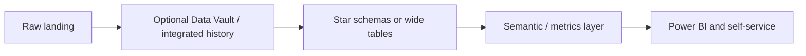

---
## 17. Conformed dimensions, enterprise bus, KPI standardization, taxonomy, and business rules
This section is the direct heart of the JD wording.

### 17.1 Conformed dimensions again, but at enterprise level
At beginner level, a conformed dimension is a shared dimension.

At enterprise level, it is how different subject areas stay comparable.

If Support, Usage, and Survey models all use the same Product dimension, you can ask:
- Do high-usage tenants create fewer support cases?
- Do low-CSAT products also show high reopen rates?
- Which segments have high volume but low product adoption?

Without conformed dimensions, cross-fact analysis turns into a reconciliation project.

### 17.2 The enterprise bus
The **enterprise bus architecture** is Kimball's idea that the warehouse grows as coordinated stars tied together by conformed dimensions.

The bus matrix is the planning sheet.

The conformed dimensions are the rails.

The individual stars are the cars.

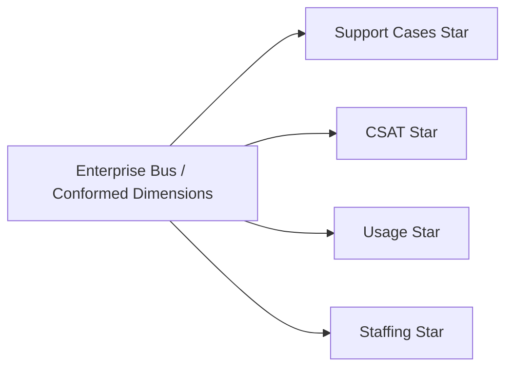

### 17.3 KPI standardization
**KPI standardization** means one agreed business definition per metric.

A proper KPI definition usually includes:
- business purpose,
- formula,
- numerator,
- denominator,
- exclusions,
- time grain,
- dimensional applicability,
- owner,
- refresh cadence,
- and change-management notes.

### Example KPI definition sheet
| Item | Example for CSAT |
|---|---|
| KPI name | CSAT Average |
| Business purpose | measure post-resolution customer satisfaction |
| Numerator | sum of valid survey scores |
| Denominator | count of valid survey responses |
| Exclusions | test cases, invalid surveys, internal-only cases |
| Grain | survey response |
| Owner | CE&S BI + support operations owner |
| Notes | do not average averages across teams |

### 17.4 Business-rule logic
**Business-rule logic** is the rulebook encoded in data products.

Examples:
- what counts as an escalation,
- how transfers are handled,
- when a case counts as reopened,
- which surveys are valid,
- what counts as an SLA breach,
- how strategic accounts are tagged.

### 17.5 Taxonomy
**Taxonomy** means the controlled vocabulary and classification scheme.

Examples:
- product family hierarchy,
- issue family / category / symptom,
- support tier labels,
- customer segment definitions,
- channel definitions.

### 🔍 Plain-English deep-dive: taxonomy vs business rule
- **Taxonomy** — *how things are named and classified.* **Analogy:** the labeled shelves in a warehouse. **Why it matters:** people can group and compare data consistently.
- **Business rule** — *how we decide what counts or how to calculate it.* **Analogy:** the written policy for which items are allowed on which shelf. **Why it matters:** KPIs depend on rules, not just labels.

### 17.6 Semantic / metrics layer
A **semantic layer** sits between raw tables and end-user reports.

It defines:
- relationships,
- measures,
- friendly names,
- security,
- hierarchies,
- time intelligence,
- and standardized business logic.

A **metrics layer** is a closely related idea with special emphasis on standardized KPI definitions.

### 17.7 Why standardization is technical, not just governance theater
If each analyst writes their own DAX or SQL for "breach rate," then governance is just a PDF nobody follows.

Real standardization means:
- conformed dimensions in the model,
- one reusable measure definition,
- one taxonomy source,
- one documented rule set,
- controlled change management.

### 17.8 Example: standardizing breach rate
Possible business definition:
- breach rate = breached cases / eligible cases,
- exclude internal-only cases,
- exclude cases with customer-caused delays,
- use resolved-date month for attribution,
- show by product, segment, and channel.

Then implement once in semantic model.

### Sample SQL-style logic
```sql
SELECT
    p.product_name,
    SUM(CASE WHEN f.eligible_for_sla = 1 THEN 1 ELSE 0 END) AS eligible_cases,
    SUM(CASE WHEN f.breach_flag = 1 AND f.eligible_for_sla = 1 THEN 1 ELSE 0 END) AS breached_cases,
    1.0 * SUM(CASE WHEN f.breach_flag = 1 AND f.eligible_for_sla = 1 THEN 1 ELSE 0 END)
        / NULLIF(SUM(CASE WHEN f.eligible_for_sla = 1 THEN 1 ELSE 0 END), 0) AS breach_rate
FROM Fact_Cases f
JOIN Dim_Product p
  ON f.product_sk = p.product_sk
GROUP BY p.product_name;
```

### 17.9 Change control for KPIs
Strong BI teams track:
- when a KPI definition changes,
- why it changed,
- who approved it,
- and what historical periods were restated.

This is often overlooked by purely technical candidates.
> 💡 **Tie-in to your background:** This is where you can be especially strong. Your experience with consistent taxonomies, governance, and process discipline directly maps to conformed dimensions, enterprise bus thinking, and KPI rule ownership.

---
## 18. Modeling specifically for Power BI and Microsoft Fabric semantic models
The Microsoft ecosystem strongly rewards good star-schema modeling.

### 18.1 Why star schema is required in practice for Power BI
Power BI can connect to many shapes.

But performance, DAX simplicity, relationship clarity, and user experience are usually best with a star schema.

Reasons:
- dimension tables filter fact tables cleanly,
- measures are easier to write,
- ambiguity is reduced,
- auto-generated relationships are more predictable,
- and visuals behave more intuitively.

### 18.2 Fact and dimension roles in Power BI
In a semantic model:
- dimensions are usually on the "one" side,
- facts are usually on the "many" side,
- filters flow from dimensions to facts.

### 18.3 Why snowflakes can hurt Power BI usability
Snowflaked dimensions create:
- extra relationships,
- more complex filter propagation,
- less intuitive field lists,
- and more room for ambiguous paths.

Flatten dimensions unless you truly need otherwise.

### 18.4 Role-playing dates in Power BI
Since one fact may have multiple date keys, you may:
- create one active relationship and several inactive ones,
- or create role-playing date tables in the semantic layer.

The modeling choice depends on reporting patterns and DAX strategy.

### 18.5 Measures vs calculated columns
Good modeling usually prefers:
- raw attributes in dimensions,
- measures for aggregations and KPIs,
- avoiding unnecessary calculated columns in the fact when the logic belongs semantically.

### 18.6 Fabric-specific intuition
In Microsoft Fabric, you may see:
- lakehouse storage,
- warehouse endpoints,
- semantic models,
- pipelines and notebooks,
- OneLake data organization.

The physical platform can vary.

But the business-friendly consumption model still benefits from star schema.

### 18.7 Row-level security and dimensions
Security rules often attach more naturally to dimensions.

Example:
- a regional manager should only see customers in their geography,
- or a team lead should only see their agent subtree.

Clean dimension structures help implement this safely.

### 18.8 Power BI modeling do's and don'ts
| Do | Avoid |
|---|---|
| use star schema | expose raw OLTP joins directly |
| keep dimensions descriptive and reusable | hide business logic in dozens of report-specific columns |
| create conformed dimensions | duplicate product logic per report |
| use measures for KPI definitions | let every analyst recode KPI formulas |
| model date intelligently | rely only on raw datetime fields without a date dimension |

### 18.9 Example support semantic model layout
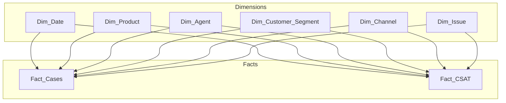

### 18.10 Good interview phrasing
A strong answer sounds like:
> "For Power BI and Fabric semantic models, I would strongly prefer a star schema with clear fact and dimension separation, conformed dimensions, and centralized KPI measures. That reduces ambiguous relationships, improves performance, and makes self-service analysis much safer."

> 💡 **Tie-in to your background:** Because you already know what support leaders actually ask for, you can model the semantic layer around real questions — breaches, escalations, resolution patterns, CSAT, and workload mix — instead of treating Power BI as just a charting tool.

---
## 19. End-to-end support star schema walkthrough
Let's bring many concepts together in one coherent design.

### 19.1 Pick the process
Business process:
- support case handling and resolution.

### 19.2 Declare the grain
Primary transaction fact:
- **Fact_Cases** = one row per support case at creation grain.

Supporting facts:
- **Fact_Case_Daily_Snapshot** = one row per open case per day.
- **Fact_Case_Lifecycle** = one row per case lifecycle with milestone dates.
- **Fact_CSAT** = one row per valid post-case survey response.

### 19.3 Choose dimensions
Conformed dimensions:
- Dim_Date
- Dim_Product
- Dim_Agent
- Dim_Customer_Segment
- Dim_Channel
- Dim_Issue
- Dim_Geography

Possible supporting dimensions:
- Dim_Severity
- Dim_Tag
- Dim_Case_Status
- Dim_Shift

### 19.4 Define fact measures
**Fact_Cases**

- case_count = 1
- resolution_hours
- first_response_minutes
- reopen_count
- breach_flag
- escalation_flag

**Fact_CSAT**

- survey_count = 1
- csat_score
- promoter_flag
- detractor_flag

**Fact_Case_Daily_Snapshot**

- open_case_count = 1
- age_in_days
- backlog_flag = 1

### 19.5 Support star schema DDL sketch
```sql
CREATE TABLE Dim_Product (
    product_sk        INTEGER PRIMARY KEY,
    product_code      TEXT NOT NULL,
    product_name      TEXT NOT NULL,
    workload_name     TEXT NOT NULL,
    service_family    TEXT NOT NULL
);

CREATE TABLE Dim_Channel (
    channel_sk        INTEGER PRIMARY KEY,
    channel_code      TEXT NOT NULL,
    channel_name      TEXT NOT NULL,
    assisted_flag     INTEGER NOT NULL
);

CREATE TABLE Dim_Issue (
    issue_sk          INTEGER PRIMARY KEY,
    issue_code        TEXT NOT NULL,
    issue_family      TEXT NOT NULL,
    issue_category    TEXT NOT NULL,
    issue_symptom     TEXT NOT NULL
);

CREATE TABLE Fact_Cases (
    case_id_dd                INTEGER NOT NULL,
    created_date_sk           INTEGER NOT NULL,
    resolved_date_sk          INTEGER,
    product_sk                INTEGER NOT NULL,
    agent_sk                  INTEGER NOT NULL,
    customer_segment_sk       INTEGER NOT NULL,
    channel_sk                INTEGER NOT NULL,
    issue_sk                  INTEGER NOT NULL,
    case_count                INTEGER NOT NULL,
    resolution_hours          DECIMAL(10,2),
    first_response_minutes    DECIMAL(10,2),
    breach_flag               INTEGER NOT NULL,
    escalation_flag           INTEGER NOT NULL,
    reopen_count              INTEGER NOT NULL
);
```

### 19.10 One-page mental model
```mermaid
flowchart LR
    Source[Support systems] --> Clean[Conform product, issue, channel, segment]
    Clean --> SCD[Apply SCD to changing dimensions]
    SCD --> Facts[Build case facts at clear grains]
    Facts --> Semantic[Semantic model with KPI logic]
    Semantic --> Reports[Leadership dashboards and self-service]
```

> 💡 **Tie-in to your background:** This design is not abstract. It mirrors the real world you know: support cases, routing channels, issue taxonomies, reorgs, and metric standardization.

---
## 20. 🧪 Hands-on Lab Demo 1 — build a support star schema with an SCD Type 2 dimension
**Goal:** build a tiny warehouse in free tools and prove that historical team changes are preserved correctly.

**Recommended free tools:**

- SQLite in [sqliteonline.com](https://sqliteonline.com/)
- PostgreSQL in [db-fiddle.com](https://www.db-fiddle.com/)

### 20.1 Create raw source data
```sql
DROP TABLE IF EXISTS raw_cases;

CREATE TABLE raw_cases (
    case_id                  INTEGER,
    created_date             DATE,
    resolved_date            DATE,
    product_code             TEXT,
    agent_id                 TEXT,
    agent_name               TEXT,
    customer_segment_code    TEXT,
    channel_code             TEXT,
    issue_code               TEXT,
    resolution_hours         DECIMAL(10,2),
    first_response_minutes   DECIMAL(10,2),
    breach_flag              INTEGER,
    reopen_count             INTEGER,
    csat_score               INTEGER
);

INSERT INTO raw_cases VALUES
    (1001, '2026-01-10', '2026-01-11', 'SPO', '11', 'Ben', 'ENT', 'PHONE', 'PERM', 4.0, 30.0, 0, 0, 5),
    (1002, '2026-02-15', '2026-02-17', 'ODB', '11', 'Ben', 'SMB', 'WEB',   'SYNC', 40.0, 60.0, 1, 1, 3),
    (1003, '2026-04-05', '2026-04-05', 'SPO', '11', 'Ben', 'ENT', 'PHONE', 'AUTH', 2.0, 10.0, 0, 0, 4);
```

### 20.2 Create dimensions
```sql
DROP TABLE IF EXISTS Dim_Date;
DROP TABLE IF EXISTS Dim_Product;
DROP TABLE IF EXISTS Dim_Agent;
DROP TABLE IF EXISTS Dim_Customer_Segment;
DROP TABLE IF EXISTS Dim_Channel;
DROP TABLE IF EXISTS Dim_Issue;

CREATE TABLE Dim_Date (
    date_sk            INTEGER PRIMARY KEY,
    full_date          DATE NOT NULL,
    calendar_year      INTEGER NOT NULL,
    calendar_month     INTEGER NOT NULL,
    fiscal_year        TEXT NOT NULL,
    fiscal_quarter     TEXT NOT NULL
);

INSERT INTO Dim_Date VALUES
    (20260110, '2026-01-10', 2026, 1, 'FY2026', 'Q3'),
    (20260215, '2026-02-15', 2026, 2, 'FY2026', 'Q3'),
    (20260405, '2026-04-05', 2026, 4, 'FY2026', 'Q4');

CREATE TABLE Dim_Product (
    product_sk         INTEGER PRIMARY KEY,
    product_code       TEXT NOT NULL,
    product_name       TEXT NOT NULL,
    service_family     TEXT NOT NULL
);

INSERT INTO Dim_Product VALUES
    (1, 'SPO', 'SharePoint Online', 'Microsoft 365'),
    (2, 'ODB', 'OneDrive for Business', 'Microsoft 365');

CREATE TABLE Dim_Customer_Segment (
    customer_segment_sk      INTEGER PRIMARY KEY,
    customer_segment_code    TEXT NOT NULL,
    customer_segment_name    TEXT NOT NULL
);

INSERT INTO Dim_Customer_Segment VALUES
    (10, 'ENT', 'Enterprise'),
    (20, 'SMB', 'Small and Medium Business');

CREATE TABLE Dim_Channel (
    channel_sk       INTEGER PRIMARY KEY,
    channel_code     TEXT NOT NULL,
    channel_name     TEXT NOT NULL
);

INSERT INTO Dim_Channel VALUES
    (100, 'PHONE', 'Phone'),
    (200, 'WEB',   'Web');

CREATE TABLE Dim_Issue (
    issue_sk         INTEGER PRIMARY KEY,
    issue_code       TEXT NOT NULL,
    issue_family     TEXT NOT NULL,
    issue_category   TEXT NOT NULL,
    issue_symptom    TEXT NOT NULL
);

INSERT INTO Dim_Issue VALUES
    (1000, 'PERM', 'Access', 'Permissions', 'Permission denied'),
    (2000, 'SYNC', 'Sync',   'Client Sync', 'Files not syncing'),
    (3000, 'AUTH', 'Access', 'Authentication', 'Sign-in failure');
```

### 20.3 Create SCD Type 2 agent dimension
```sql
CREATE TABLE Dim_Agent (
    agent_sk          INTEGER PRIMARY KEY,
    agent_id          TEXT NOT NULL,
    agent_name        TEXT NOT NULL,
    agent_team        TEXT NOT NULL,
    valid_from        DATE NOT NULL,
    valid_to          DATE NOT NULL,
    is_current        INTEGER NOT NULL
);

INSERT INTO Dim_Agent VALUES
    (501, '11', 'Ben', 'Tier1', '2025-07-01', '2026-02-28', 0),
    (777, '11', 'Ben', 'Tier2', '2026-03-01', '9999-12-31', 1);
```

### 20.4 Build Fact_Cases using time-correct SCD join
```sql
DROP TABLE IF EXISTS Fact_Cases;

CREATE TABLE Fact_Cases AS
SELECT
    rc.case_id                    AS case_id_dd,
    dd.date_sk                    AS created_date_sk,
    dp.product_sk                 AS product_sk,
    da.agent_sk                   AS agent_sk,
    dcs.customer_segment_sk       AS customer_segment_sk,
    dc.channel_sk                 AS channel_sk,
    di.issue_sk                   AS issue_sk,
    1                             AS case_count,
    rc.resolution_hours           AS resolution_hours,
    rc.first_response_minutes     AS first_response_minutes,
    rc.breach_flag                AS breach_flag,
    rc.reopen_count               AS reopen_count,
    rc.csat_score                 AS csat_score
FROM raw_cases rc
JOIN Dim_Date dd
  ON rc.created_date = dd.full_date
JOIN Dim_Product dp
  ON rc.product_code = dp.product_code
JOIN Dim_Agent da
  ON rc.agent_id = da.agent_id
 AND rc.created_date BETWEEN da.valid_from AND da.valid_to
JOIN Dim_Customer_Segment dcs
  ON rc.customer_segment_code = dcs.customer_segment_code
JOIN Dim_Channel dc
  ON rc.channel_code = dc.channel_code
JOIN Dim_Issue di
  ON rc.issue_code = di.issue_code;
```

### 20.5 Validate the history preservation
```sql
SELECT f.case_id_dd,
       f.created_date_sk,
       a.agent_id,
       a.agent_name,
       a.agent_team,
       a.valid_from,
       a.valid_to
FROM Fact_Cases f
JOIN Dim_Agent a
  ON f.agent_sk = a.agent_sk
ORDER BY f.case_id_dd;
```

**Expected idea:**

- case 1001 and 1002 should connect to Tier1,
- case 1003 should connect to Tier2.

### 20.6 Run a simple business query
```sql
SELECT a.agent_team,
       COUNT(*) AS cases,
       AVG(f.resolution_hours) AS avg_resolution_hours
FROM Fact_Cases f
JOIN Dim_Agent a
  ON f.agent_sk = a.agent_sk
GROUP BY a.agent_team;
```

---
## 21. 🧪 Hands-on Lab Demo 2 — add a bridge table for many-to-many tags / skills
**Goal:** model a case with multiple tags and show why weighting matters.

### 21.1 Create tag dimension and bridge
```sql
DROP TABLE IF EXISTS Dim_Tag;
DROP TABLE IF EXISTS Bridge_Case_Tag;

CREATE TABLE Dim_Tag (
    tag_sk          INTEGER PRIMARY KEY,
    tag_name        TEXT NOT NULL
);

INSERT INTO Dim_Tag VALUES
    (1, 'permissions'),
    (2, 'auth'),
    (3, 'priority-customer'),
    (4, 'sync');

CREATE TABLE Bridge_Case_Tag (
    case_id_dd      INTEGER NOT NULL,
    tag_sk          INTEGER NOT NULL,
    weight_factor   DECIMAL(10,4) NOT NULL,
    PRIMARY KEY (case_id_dd, tag_sk)
);

INSERT INTO Bridge_Case_Tag VALUES
    (1001, 1, 0.5000),
    (1001, 3, 0.5000),
    (1002, 4, 1.0000),
    (1003, 2, 0.5000),
    (1003, 1, 0.5000);
```

### 21.2 Distinct case count by tag
```sql
SELECT t.tag_name,
       COUNT(DISTINCT b.case_id_dd) AS distinct_cases
FROM Bridge_Case_Tag b
JOIN Dim_Tag t
  ON b.tag_sk = t.tag_sk
GROUP BY t.tag_name
ORDER BY distinct_cases DESC, t.tag_name;
```

### 21.3 Allocated case count by tag
```sql
SELECT t.tag_name,
       SUM(b.weight_factor) AS allocated_case_count
FROM Bridge_Case_Tag b
JOIN Dim_Tag t
  ON b.tag_sk = t.tag_sk
GROUP BY t.tag_name
ORDER BY allocated_case_count DESC, t.tag_name;
```

### 21.4 Join bridge back to facts for metric analysis
```sql
SELECT t.tag_name,
       SUM(f.case_count)             AS duplicated_case_rows,
       SUM(b.weight_factor)          AS allocated_case_count,
       AVG(f.resolution_hours)       AS avg_resolution_hours,
       AVG(f.csat_score)             AS avg_csat
FROM Fact_Cases f
JOIN Bridge_Case_Tag b
  ON f.case_id_dd = b.case_id_dd
JOIN Dim_Tag t
  ON b.tag_sk = t.tag_sk
GROUP BY t.tag_name;
```

---
## ⭐ Likely Interview Questions for This Section
**Q1. "Why does data modeling matter so much in BI?"**
> *Model answer:* "Because the model determines whether analytics is clear, consistent, and fast. If the row meaning, relationships, and KPI logic are ambiguous, different analysts will produce different answers from the same source. A strong model turns business rules and taxonomy into reusable structure so dashboards become trusted rather than debated."

**Q2. "Explain conceptual, logical, and physical models."**
> *Model answer:* "A conceptual model is the high-level business view of the main entities and relationships, like Case, Product, Agent, and Customer. A logical model defines the detailed relationships and attributes without focusing too much on platform specifics. A physical model is the actual implementation — table names, data types, indexes, partitions, and load logic in a chosen platform."

**Q3. "What is normalization, and what are 1NF, 2NF, 3NF, and BCNF?"**
> *Model answer:* "Normalization is organizing data to reduce duplication and update anomalies. 1NF means atomic values and no repeating groups. 2NF removes partial dependency on part of a composite key. 3NF removes transitive dependency between non-key attributes. BCNF is a stricter form where every determinant must be a candidate key. I mainly associate these with OLTP design, while BI often reshapes normalized data into dimensional models."

**Q4. "What is a functional dependency in simple terms?"**
> *Model answer:* "It means one attribute or set of attributes determines another. For example, if product_code always determines product_name, then product_name functionally depends on product_code. Functional dependencies help us understand which attributes belong together and why a table may violate a normal form."

**Q5. "When is denormalization the right choice?"**
> *Model answer:* "Denormalization is right when the main goal is fast, simple analytical reading rather than transactional updating. In BI, we often intentionally flatten or duplicate descriptive context so queries and semantic models are easier to use. The key is that the duplication is governed and consistent, not random."

**Q6. "Compare OLTP and OLAP."**
> *Model answer:* "OLTP runs the business and is optimized for frequent inserts, updates, and point lookups, usually with normalized schemas. OLAP analyzes the business and is optimized for scanning, grouping, and aggregating large volumes, usually with dimensional or other analytical models. I think of OLTP as the live case-management system and OLAP as the curated reporting environment."

**Q7. "Why do analytical platforms often prefer columnar storage?"**
> *Model answer:* "Columnar storage is efficient for analytics because queries often scan only a few columns across many rows. It allows column pruning, compresses repeated values well, and supports fast vectorized processing. That is especially useful for large fact tables where a query may need only product, date, and one or two measures."

**Q8. "What are Kimball's four design steps?"**
> *Model answer:* "Pick the business process, declare the grain, choose the dimensions, and choose the facts. The most important discipline is declaring the grain before selecting measures. In a support example, I would pick case handling, declare one row per case or per case-day, then choose Product, Agent, Date, Segment, Channel, Issue, and the relevant metrics."

**Q9. "What is a bus matrix, and why is it useful?"**
> *Model answer:* "A bus matrix lists business processes or fact tables on one axis and dimensions on the other, then marks which dimensions each fact uses. It helps identify conformed dimensions and plan how multiple subject areas will fit together into an enterprise warehouse. It's very useful for making sure Product, Date, and Segment mean the same thing across support, usage, and survey facts."

**Q10. "What are the main fact table types?"**
> *Model answer:* "The classic types are transaction facts, periodic snapshot facts, accumulating snapshot facts, and factless fact tables. Transaction facts record individual events, periodic snapshots record state at regular intervals, accumulating snapshots track milestones of a process over time, and factless facts record the occurrence of an event without a numeric measure."

**Q11. "What does grain mean, and why is it so important?"**
> *Model answer:* "Grain is the exact meaning of one row in the fact table. It matters because it determines what can be summed, how dimensions join, and what business questions the table can answer safely. Mixed grain is one of the fastest ways to create confusing or incorrect analytics."

**Q12. "Explain additive, semi-additive, and non-additive measures."**
> *Model answer:* "Additive measures can be summed across all dimensions, like case_count. Semi-additive measures can be summed across some dimensions but not all, often especially not across time, like daily open-case balance. Non-additive measures should not be summed directly, like averages or percentages, so I prefer to store their components such as numerator and denominator."

**Q13. "What is a degenerate dimension?"**
> *Model answer:* "A degenerate dimension is a business identifier stored directly in the fact table without a separate dimension table, usually because it has no additional descriptive attributes worth modeling separately. A support case number is a common example."

**Q14. "What is the difference between surrogate, natural, and business keys?"**
> *Model answer:* "A surrogate key is a warehouse-generated identifier used for joins and history management. A natural key comes from the source system or real world, such as an agent ID. A business key is the business-recognized identifier used operationally; in practice it is often similar to the natural key in warehouse discussions."

**Q15. "Explain conformed dimensions with an example."**
> *Model answer:* "A conformed dimension is a dimension shared consistently across multiple fact tables with the same keys and meaning. For example, the same Dim_Product should join to support case facts, CSAT facts, and usage facts. That lets leadership compare product support volume, satisfaction, and usage without reconciliation problems."

**Q16. "What is a role-playing dimension?"**
> *Model answer:* "It is a single physical dimension used in multiple logical roles. The most common example is Dim_Date serving as created date, resolved date, and closed date in the same fact table. The underlying dimension is the same, but the business meaning of the foreign key differs by role."

**Q17. "What are junk dimensions, outriggers, and snowflaking?"**
> *Model answer:* "A junk dimension groups low-cardinality flags into a small reusable dimension. An outrigger is a dimension linked to another dimension. Snowflaking means normalizing dimensions into related sub-dimensions. I would use these intentionally, but for Power BI-friendly analytics I generally prefer clear flat star dimensions unless complexity truly requires otherwise."

**Q18. "Walk me through all major SCD types."**
> *Model answer:* "Type 0 retains the original value. Type 1 overwrites with no history. Type 2 inserts a new row and preserves full history using surrogate keys and effective dates. Type 3 keeps limited prior value in extra columns. Type 4 separates current and history tables. Type 6 is a hybrid combining elements of Types 1, 2, and 3. In support analytics, I would usually choose Type 2 for things like agent team or customer segment where historical truth matters."

**Q19. "How do you implement SCD Type 2 in SQL?"**
> *Model answer:* "I use a surrogate key, business key, tracked attributes, valid_from, valid_to, and is_current columns. On change, I expire the current row by updating valid_to and is_current, then insert a new row with a new surrogate key and the new attribute values. During fact loading, I resolve the surrogate key based on the event date so the fact attaches to the correct historical version."

**Q20. "What are late-arriving dimensions and early-arriving facts?"**
> *Model answer:* "A late-arriving dimension means the descriptive lookup data arrives after the fact event. An early-arriving fact is the same problem seen from the fact side. Common responses are using an unknown member, creating an inferred dimension row, and backfilling later once the full dimension details arrive."

**Q21. "What is a bridge table, and when would you use weighting factors?"**
> *Model answer:* "A bridge table handles many-to-many relationships, such as one case having multiple tags or multiple required skills. Weighting factors are useful when you need allocated counts that still reconcile to the overall total, so one case linked to three tags might contribute one-third to each tag's allocated case count."

**Q22. "How do you model hierarchies?"**
> *Model answer:* "For fixed hierarchies, I often flatten the levels directly into the dimension because that is BI-friendly. For ragged or recursive parent-child hierarchies, I may maintain parent-child logic upstream and flatten the levels needed for reporting. The right approach depends on usability, recursion depth, and tool behavior."

---

## 🧠 30-Second Memory Hooks

- **Conceptual / logical / physical** = business picture / design rules / implementation.
- **Normalization** = reduce duplication for operational correctness.
- **Denormalization** = duplicate intentionally for analytical speed and simplicity.
- **OLTP** runs the business; **OLAP** analyzes the business.
- **Kimball 4 steps** = pick process, declare grain, choose dimensions, choose facts.
- **Bus matrix** = map facts to dimensions and reveal conformed dimensions.
- **Fact table** = measures + foreign keys at a declared grain.
- **Dimension table** = descriptive context for slicing and grouping.
- **Transaction / periodic snapshot / accumulating snapshot / factless** = four classic fact types.
- **Additive / semi-additive / non-additive** = know what you can safely sum.
- **Surrogate key** = warehouse-generated coat-check number.
- **Conformed dimension** = shared Product / Date / Segment across facts.
- **SCD Type 1** = overwrite.
- **SCD Type 2** = new row + new surrogate key + valid_from / valid_to.
- **Late-arriving dimension** = fact arrives before full context.
- **Bridge table** = clean way to model many-to-many.
- **Weight factor** = allocated share used to avoid double counting.
- **Star** = one fact + flat dimensions.
- **Galaxy** = multiple facts sharing conformed dimensions.
- **Kimball / Inmon / Data Vault / OBT** = business-facing marts / enterprise EDW / hubs-links-satellites / flat analytical table.
- **Semantic layer** = where KPI logic becomes reusable and enforceable.
- **Power BI likes star schema** because filter flow, measures, and self-service stay sane.
- **Best interview habit:** say the grain before you say the metric.
---
## 📚 Reference Links
- Kimball Group — [Dimensional Modeling Techniques](https://www.kimballgroup.com/data-warehouse-business-intelligence-resources/kimball-techniques/dimensional-modeling-techniques/)
- Kimball Group — [Conformed Dimensions](https://www.kimballgroup.com/data-warehouse-business-intelligence-resources/kimball-techniques/conformed-dimension/)
- Kimball Group — [Fact Tables](https://www.kimballgroup.com/data-warehouse-business-intelligence-resources/kimball-techniques/fact-table-structure/)
- Kimball Group — [Dimension Tables](https://www.kimballgroup.com/data-warehouse-business-intelligence-resources/kimball-techniques/dimension-table-structure/)
- Kimball Group — [Slowly Changing Dimensions](https://www.kimballgroup.com/2008/08/slowly-changing-dimensions/)
- Microsoft Learn — [Understand star schema and the importance for Power BI](https://learn.microsoft.com/power-bi/guidance/star-schema)
- Microsoft Learn — [Design a dimensional model in Microsoft Fabric](https://learn.microsoft.com/fabric/data-warehouse/dimensional-modeling-dimension-tables)
- Microsoft Learn — [Implement a Type 2 slowly changing dimension in Fabric Data Factory](https://learn.microsoft.com/fabric/data-factory/slowly-changing-dimension-type-2)
- Microsoft Learn — [Power BI model relationships](https://learn.microsoft.com/power-bi/transform-model/desktop-relationships-understand)

---
*Next suggested section:* **Part 6 — The Azure & Microsoft Fabric Data Stack** (where these modeling choices physically live: lakehouse, warehouse, pipelines, semantic models, and Microsoft-native implementation patterns).


